# 10. Markdown完整语法指南

## 目录

### [1. Markdown基础概念](#1-markdown基础概念)
- [1.1 Markdown简介与特点](#11-markdown简介与特点)
- [1.2 Markdown发展历史](#12-markdown发展历史)
- [1.3 Markdown应用场景](#13-markdown应用场景)
- [1.4 Markdown编辑器推荐](#14-markdown编辑器推荐)

### [2. 基础语法](#2-基础语法)
- [2.1 标题语法](#21-标题语法)
- [2.2 段落与换行](#22-段落与换行)
- [2.3 文本格式化](#23-文本格式化)
- [2.4 引用语法](#24-引用语法)

### [3. 列表与链接](#3-列表与链接)
- [3.1 无序列表](#31-无序列表)
- [3.2 有序列表](#32-有序列表)
- [3.3 任务列表](#33-任务列表)
- [3.4 链接语法](#34-链接语法)

### [4. 图片与多媒体](#4-图片与多媒体)
- [4.1 图片插入](#41-图片插入)
- [4.2 图片优化](#42-图片优化)
- [4.3 多媒体嵌入](#43-多媒体嵌入)
- [4.4 图片最佳实践](#44-图片最佳实践)

### [5. 代码与语法高亮](#5-代码与语法高亮)
- [5.1 行内代码](#51-行内代码)
- [5.2 代码块](#52-代码块)
- [5.3 语法高亮](#53-语法高亮)
- [5.4 代码最佳实践](#54-代码最佳实践)

### [6. 表格与数据展示](#6-表格与数据展示)
- [6.1 基础表格语法](#61-基础表格语法)
- [6.2 表格对齐](#62-表格对齐)
- [6.3 复杂表格](#63-复杂表格)
- [6.4 表格最佳实践](#64-表格最佳实践)

### [7. 扩展语法](#7-扩展语法)
- [7.1 数学公式](#71-数学公式)
- [7.2 图表与流程图](#72-图表与流程图)
- [7.3 脚注与定义](#73-脚注与定义)
- [7.4 高级功能](#74-高级功能)
  - [16进制颜色值对照表](#16进制颜色值对照表)

### [8. Markdown最佳实践](#8-markdown最佳实践)
- [8.1 文档结构规范](#81-文档结构规范)
- [8.2 写作技巧](#82-写作技巧)
- [8.3 协作规范](#83-协作规范)
- [8.4 版本控制](#84-版本控制)


## 1.Markdown基础概念

### 1.1 Markdown简介与特点

**Markdown**是一种轻量级标记语言，由John Gruber在2004年创建，旨在让人们使用易读易写的纯文本格式编写文档。

**核心特点**：
- **简洁性**：语法简单，学习成本低
- **可读性**：纯文本格式，即使不渲染也易于阅读
- **兼容性**：支持HTML，可以无缝集成
- **便携性**：纯文本文件，跨平台兼容
- **专注性**：专注内容创作，而非格式排版

**Markdown设计哲学**：

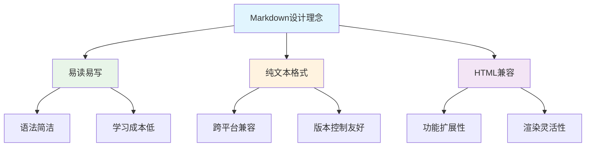

### 1.2 Markdown发展历史

**发展时间线**：

| 年份 | 事件 | 重要性 |
|------|------|--------|
| **2004** | John Gruber创建Markdown | 奠定基础语法 |
| **2012** | GitHub Flavored Markdown (GFM) | 扩展功能，广泛应用 |
| **2014** | CommonMark规范发布 | 标准化努力 |
| **2016** | 各平台广泛支持 | 成为主流标记语言 |
| **2020+** | 扩展语法丰富 | 支持图表、数学公式等 |

### 1.3 Markdown应用场景

**主要应用领域**：

1. **技术文档**：API文档、用户手册、技术规范
2. **博客写作**：个人博客、技术博客、知识分享
3. **项目管理**：README文件、项目说明、变更日志
4. **学术写作**：论文草稿、研究笔记、学习资料
5. **协作平台**：GitHub、GitLab、Notion、语雀等

**优势对比**：

| 场景 | Markdown优势 | 传统方式劣势 |
|------|-------------|-------------|
| **代码文档** | 语法高亮、版本控制友好 | Word格式复杂、难以版本管理 |
| **技术博客** | 专注内容、快速发布 | 富文本编辑器功能冗余 |
| **团队协作** | 纯文本、易于合并 | 二进制格式、冲突难解决 |
| **跨平台** | 任何文本编辑器可用 | 特定软件依赖 |

### 1.4 Markdown编辑器推荐

**桌面编辑器**：

1. **Typora**
   - 所见即所得编辑
   - 支持数学公式、图表
   - 多种主题可选

2. **Mark Text**
   - 开源免费
   - 实时预览
   - 简洁界面

3. **Obsidian**
   - 知识图谱
   - 插件生态丰富
   - 双向链接

**在线编辑器**：

1. **Dillinger**：在线实时预览
2. **StackEdit**：Google Drive集成
3. **HackMD**：协作编辑功能

**IDE插件**：

1. **VS Code**：Markdown Preview Enhanced
2. **Sublime Text**：MarkdownEditing
3. **Vim**：vim-markdown

## 2. 基础语法

### 2.1 标题语法

**ATX风格标题（推荐）**：

```markdown
# 一级标题
## 二级标题
### 三级标题
#### 四级标题
##### 五级标题
###### 六级标题
```

**渲染效果**：
```
\# 一级标题
\## 二级标题
\### 三级标题
```
**Setext风格标题**：

```markdown
一级标题
========

二级标题
--------
```

**标题最佳实践**：

1. **层级清晰**：按逻辑层次使用标题级别
2. **避免跳级**：不要从h1直接跳到h3
3. **简洁明了**：标题应该简洁且描述性强
4. **一致性**：在同一文档中保持标题风格一致

```markdown
# 项目文档

## 快速开始

### 安装步骤

#### 环境要求

### 配置说明

## API参考

### 用户管理

#### 创建用户

#### 更新用户
```

### 2.2 段落与换行

**段落分隔**：
```markdown
这是第一个段落。

这是第二个段落，需要用空行分隔。
```

**换行方式**：

1. **硬换行**：行末添加两个空格
```markdown
第一行内容  
第二行内容（行末有两个空格）
```

2. **软换行**：直接回车（在某些渲染器中不生效）
```markdown
第一行内容
第二行内容
```

3. **HTML换行**：使用`<br>`标签
```markdown
第一行内容<br>
第二行内容
```

### 2.3 文本格式化

**基础格式化**：

```markdown
**粗体文本** 或 __粗体文本__
*斜体文本* 或 _斜体文本_
***粗斜体*** 或 ___粗斜体___
~~删除线文本~~
```

**渲染效果**：
- **粗体文本**
- *斜体文本*
- ***粗斜体***
- ~~删除线文本~~

**高级格式化**：

```markdown
这是`行内代码`

这是<u>下划线文本</u>（HTML标签）

这是<mark>高亮文本</mark>

H<sub>2</sub>O（下标）

E=mc<sup>2</sup>（上标）
```

**转义字符**：

```markdown
\*不是斜体\*
\#不是标题
\[不是链接\]
\\反斜杠本身
```

### 2.4 引用语法

**基础引用**：

```markdown
> 这是一个引用块。
> 可以包含多行内容。
```

**渲染效果**：
> 这是一个引用块。
> 可以包含多行内容。

**嵌套引用**：

```markdown
> 第一级引用
>> 第二级引用
>>> 第三级引用
```

**引用中的其他元素**：

```markdown
> ## 引用中的标题
> 
> 1. 引用中的列表项
> 2. 另一个列表项
> 
> **引用中的粗体文本**
> 
> ```javascript
> // 引用中的代码块
> console.log('Hello World');
> ```
```

## 3. 列表与链接

### 3.1 无序列表

**基础语法**：

```markdown
- 列表项1
- 列表项2
- 列表项3

* 使用星号
* 也可以创建列表

+ 使用加号
+ 同样有效
```

**嵌套列表**：

```markdown
- 主要项目
  - 子项目1
  - 子项目2
    - 子子项目1
    - 子子项目2
- 另一个主要项目
```

**列表中的其他元素**：

```markdown
- 第一项

  这是第一项的详细说明。需要缩进4个空格或1个制表符。

- 第二项

  ```javascript
  // 列表中的代码块
  console.log('Hello');
  ```

- 第三项

  > 列表中的引用块
```

### 3.2 有序列表

**基础语法**：

```markdown
1. 第一项
2. 第二项
3. 第三项
```

**数字不需要按顺序**：

```markdown
1. 第一项
8. 第二项（实际显示为2）
3. 第三项（实际显示为3）
```

**嵌套有序列表**：

```markdown
1. 第一大项
   1. 子项1
   2. 子项2
2. 第二大项
   1. 子项1
      1. 子子项1
      2. 子子项2
```

**混合嵌套**：

```markdown
1. 有序列表项
   - 无序子项
   - 另一个无序子项
2. 另一个有序项
   1. 有序子项
   2. 另一个有序子项
```

### 3.3 任务列表

**GitHub风格任务列表**：

```markdown
- [x] 已完成任务
- [ ] 未完成任务
- [x] 另一个已完成任务
- [ ] 待办事项
```

**渲染效果**：
- [x] 已完成任务
- [ ] 未完成任务
- [x] 另一个已完成任务
- [ ] 待办事项

**嵌套任务列表**：

```markdown
- [x] 项目规划
  - [x] 需求分析
  - [x] 技术选型
  - [ ] 架构设计
- [ ] 开发阶段
  - [ ] 前端开发
  - [ ] 后端开发
  - [ ] 测试
```

### 3.4 链接语法

**行内链接**：

```markdown
[链接文本](https://example.com)
[带标题的链接](https://example.com "链接标题")
```

**引用式链接**：

```markdown
[链接文本][链接标识]
[另一个链接][1]

[链接标识]: https://example.com
[1]: https://another-example.com "可选标题"
```

**自动链接**：

```markdown
<https://example.com>
<email@example.com>
```

**内部链接**：

```markdown
[跳转到标题](#标题名称)
[跳转到文件](./other-file.md)
[跳转到文件的特定部分](./other-file.md#section)
```

**链接最佳实践**：

1. **描述性文本**：使用有意义的链接文本
```markdown
<!-- ✅ 好的做法 -->
查看[用户指南](./user-guide.md)了解详细信息。

<!-- ❌ 避免的做法 -->
点击[这里](./user-guide.md)查看用户指南。
```

2. **相对路径**：项目内部使用相对路径
```markdown
[API文档](../docs/api.md)
[示例代码](./examples/basic.js)
```

## 4. 图片与多媒体

### 4.1 图片插入

**基础语法**：

```markdown


```

**示例**：

```markdown


```

**引用式图片**：

```markdown
![替代文本][图片标识]

[图片标识]: https://example.com/image.png "图片标题"
```

**HTML方式（更多控制）**：

```markdown


```

### 4.2 图片优化

**响应式图片**：

```markdown
<picture>
  <source media="(min-width: 800px)" srcset="large.jpg">
  <source media="(min-width: 400px)" srcset="medium.jpg">
  
</picture>
```

**图片对齐**：

```markdown
<!-- 居中对齐 -->
<div align="center">
  
</div>

<!-- 右对齐 -->
<div align="right">
  
</div>
```

**图片与文字混排**：

```markdown


这段文字会环绕在图片右侧。可以继续写很多内容，文字会自动环绕图片排列。

<br clear="left">

这段文字在图片下方，不会环绕。
```

### 4.3 多媒体嵌入

**视频嵌入**：

```markdown
<!-- YouTube视频 -->
[](https://www.youtube.com/watch?v=VIDEO_ID)

<!-- HTML5视频 -->
<video width="320" height="240" controls>
  <source src="movie.mp4" type="video/mp4">
  <source src="movie.ogg" type="video/ogg">
  您的浏览器不支持视频标签。
</video>
```

**音频嵌入**：

```markdown
<audio controls>
  <source src="audio.mp3" type="audio/mpeg">
  <source src="audio.ogg" type="audio/ogg">
  您的浏览器不支持音频标签。
</audio>
```

**iframe嵌入**：

```markdown
<iframe src="https://example.com" width="100%" height="400"></iframe>
```

### 4.4 图片最佳实践

**文件组织**：

```
project/
├── README.md
├── docs/
│   ├── guide.md
│   └── images/
│       ├── screenshot1.png
│       └── diagram.svg
└── assets/
    └── logo.png
```

**命名规范**：

```markdown
<!-- ✅ 好的命名 -->


<!-- ❌ 避免的命名 -->


```

**替代文本编写**：

```markdown
<!-- ✅ 描述性替代文本 -->


<!-- ❌ 无意义替代文本 -->


```

## 5. 代码与语法高亮

### 5.1 行内代码

**基础语法**：

```markdown
使用`console.log()`输出信息到控制台。

在JavaScript中，`const`关键字用于声明常量。

文件路径：`/usr/local/bin/node`
```

**渲染效果**：
使用`console.log()`输出信息到控制台。

**转义反引号**：

```markdown
要显示反引号，使用双反引号：``这里有一个`反引号``

或者使用更多反引号：```这里有两个``反引号```
```

### 5.2 代码块

**围栏式代码块**：

````markdown
```
这是一个基础代码块
没有语法高亮
```
````

**缩进式代码块**：

```markdown
    这是缩进式代码块
    需要缩进4个空格或1个制表符
    每行都需要缩进
```

### 5.3 语法高亮

**常用编程语言**：

````markdown
```javascript
function greet(name) {
    return `Hello, ${name}!`;
}

console.log(greet('World'));
```

```python
def fibonacci(n):
    if n <= 1:
        return n
    return fibonacci(n-1) + fibonacci(n-2)

print(fibonacci(10))
```

```java
public class HelloWorld {
    public static void main(String[] args) {
        System.out.println("Hello, World!");
    }
}
```

```css
.container {
    display: flex;
    justify-content: center;
    align-items: center;
    height: 100vh;
}
```

```html
<!DOCTYPE html>
<html lang="zh-CN">
<head>
    <meta charset="UTF-8">
    <title>示例页面</title>
</head>
<body>
    <h1>Hello, World!</h1>
</body>
</html>
```

```sql
SELECT users.name, orders.total
FROM users
INNER JOIN orders ON users.id = orders.user_id
WHERE orders.status = 'completed'
ORDER BY orders.total DESC;
```

```bash
#!/bin/bash
echo "开始部署..."
npm install
npm run build
echo "部署完成！"
```
````

**配置文件语法**：

````markdown
```json
{
    "name": "my-project",
    "version": "1.0.0",
    "dependencies": {
        "express": "^4.18.0"
    }
}
```

```yaml
version: '3.8'
services:
  web:
    image: nginx:alpine
    ports:
      - "80:80"
```

```xml
<?xml version="1.0" encoding="UTF-8"?>
<configuration>
    <property>
        <name>example.property</name>
        <value>example.value</value>
    </property>
</configuration>
```
````

### 5.4 代码最佳实践

**代码块标题**：

````markdown
**文件：`src/utils/helper.js`**
```javascript
export function formatDate(date) {
    return date.toISOString().split('T')[0];
}
```
````

**行号显示**（某些渲染器支持）：

````markdown
```javascript {.line-numbers}
function calculateTotal(items) {
    let total = 0;
    for (const item of items) {
        total += item.price * item.quantity;
    }
    return total;
}
```
````

**高亮特定行**（某些渲染器支持）：

````markdown
```javascript {highlight: [2, 4]}
function processData(data) {
    const filtered = data.filter(item => item.active); // 高亮行
    const mapped = filtered.map(item => ({
        id: item.id, // 高亮行
        name: item.name
    }));
    return mapped;
}
```
````

**代码差异显示**：

````markdown
```diff
function greet(name) {
-   return "Hello " + name;
+   return `Hello, ${name}!`;
}
```
````

## 6. 表格与数据展示

### 6.1 基础表格语法

**标准表格**：

```markdown
| 列1 | 列2 | 列3 |
|-----|-----|-----|
| 数据1 | 数据2 | 数据3 |
| 数据4 | 数据5 | 数据6 |
```

**渲染效果**：

| 列1 | 列2 | 列3 |
|-----|-----|-----|
| 数据1 | 数据2 | 数据3 |
| 数据4 | 数据5 | 数据6 |

**简化写法**：

```markdown
列1 | 列2 | 列3
----|----|----|
数据1 | 数据2 | 数据3
数据4 | 数据5 | 数据6
```

### 6.2 表格对齐

**对齐方式**：

```markdown
| 左对齐 | 居中对齐 | 右对齐 |
|:-------|:--------:|-------:|
| 左 | 中 | 右 |
| 内容较长的左对齐文本 | 居中内容 | 右对齐数字 123 |
```

**渲染效果**：

| 左对齐 | 居中对齐 | 右对齐 |
|:-------|:--------:|-------:|
| 左 | 中 | 右 |
| 内容较长的左对齐文本 | 居中内容 | 右对齐数字 123 |

### 6.3 复杂表格

**表格中的格式化**：

```markdown
| 功能 | 语法 | 示例 |
|------|------|------|
| **粗体** | `**文本**` | **重要内容** |
| *斜体* | `*文本*` | *强调内容* |
| `代码` | `` `代码` `` | `console.log()` |
| [链接](https://example.com) | `[文本](URL)` | [官方文档](https://example.com) |
```

**多行内容**：

```markdown
| 项目 | 描述 |
|------|------|
| 项目A | 这是一个很长的描述<br>可以使用HTML换行标签<br>来实现多行显示 |
| 项目B | 另一种方式是使用<br>HTML的br标签 |
```

**嵌套列表**：

```markdown
| 分类 | 子项 |
|------|------|
| 前端技术 | • HTML<br>• CSS<br>• JavaScript |
| 后端技术 | • Node.js<br>• Python<br>• Java |
```

### 6.4 表格最佳实践

**技术对比表**：

```markdown
| 特性 | Markdown | Word | HTML |
|------|----------|------|------|
| **学习成本** | 低 | 中 | 高 |
| **文件大小** | 小 | 大 | 中 |
| **版本控制** | 优秀 | 差 | 优秀 |
| **跨平台性** | 优秀 | 一般 | 优秀 |
| **协作编辑** | 优秀 | 一般 | 一般 |
| **格式丰富度** | 中 | 高 | 高 |
```

**性能对比表**：

```markdown
| 编辑器 | 启动速度 | 内存占用 | 功能丰富度 | 推荐指数 |
|--------|:--------:|:--------:|:----------:|:--------:|
| **Typora** | ⭐⭐⭐⭐ | ⭐⭐⭐ | ⭐⭐⭐⭐⭐ | ⭐⭐⭐⭐⭐ |
| **VS Code** | ⭐⭐⭐ | ⭐⭐ | ⭐⭐⭐⭐⭐ | ⭐⭐⭐⭐ |
| **Obsidian** | ⭐⭐⭐ | ⭐⭐⭐ | ⭐⭐⭐⭐⭐ | ⭐⭐⭐⭐ |
```

## 7. 扩展语法

### 7.1 数学公式

**行内公式**：

这是行内公式：$E = mc^2$
勾股定理：$a^2 + b^2 = c^2$

**块级公式**：

$$
\frac{d}{dx}\left( \int_{0}^{x} f(u) \, du\right) = f(x)
$$

$$
\begin{align}
\nabla \times \vec{\mathbf{B}} -\, \frac1c\, \frac{\partial\vec{\mathbf{E}}}{\partial t} &= \frac{4\pi}{c}\vec{\mathbf{j}} \\
\nabla \cdot \vec{\mathbf{E}} &= 4 \pi \rho \\
\nabla \times \vec{\mathbf{E}}\, +\, \frac1c\, \frac{\partial\vec{\mathbf{B}}}{\partial t} &= \vec{\mathbf{0}} \\
\nabla \cdot \vec{\mathbf{B}} &= 0
\end{align}
$$


**常用数学符号**：

| 符号类型 | LaTeX语法 | 渲染效果 |
|----------|-----------|----------|
| **分数** | `\frac{a}{b}` | $\frac{a}{b}$ |
| **根号** | `\sqrt{x}` | $\sqrt{x}$ |
| **求和** | `\sum_{i=1}^{n}` | $\sum_{i=1}^{n}$ |
| **积分** | `\int_{a}^{b}` | $\int_{a}^{b}$ |
| **极限** | `\lim_{x \to \infty}` | $\lim_{x \to \infty}$ |

### 7.2 图表与流程图

**Mermaid流程图**：


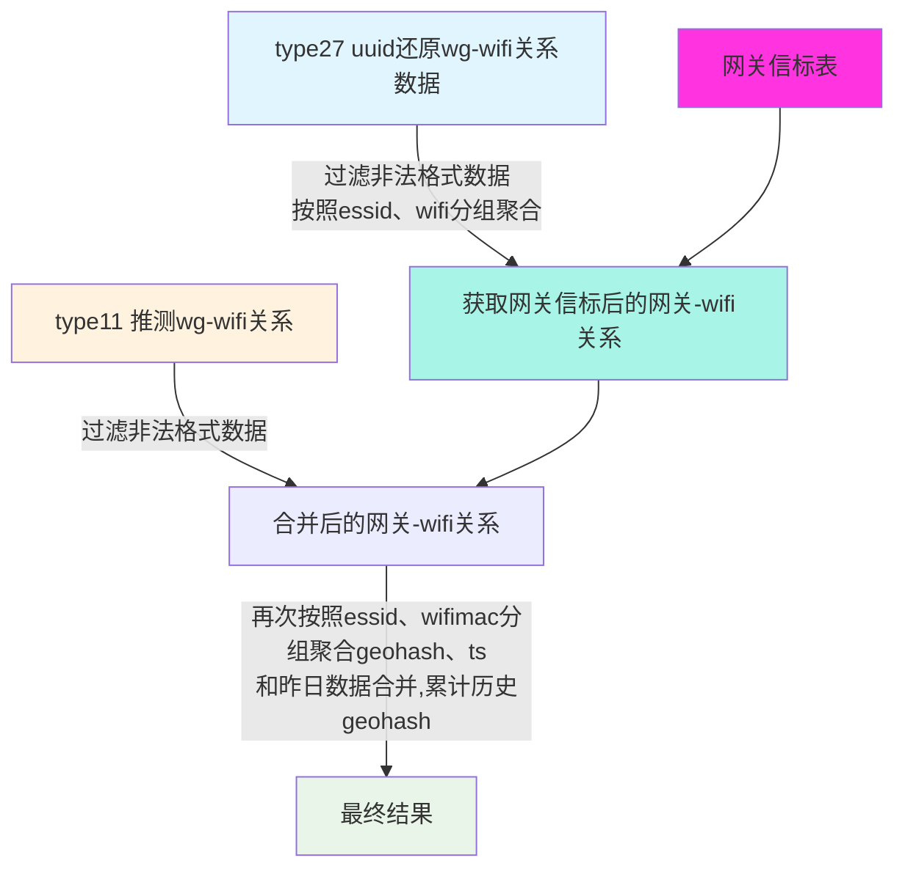

**时序图**：
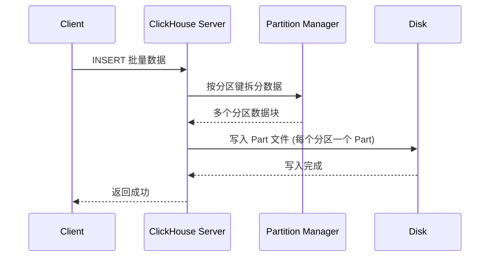

**饼图（使用Mermaid）**：

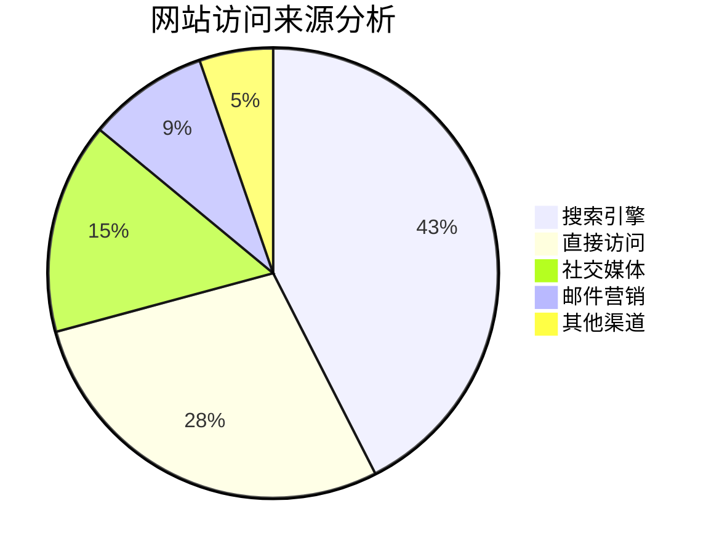

**甘特图**：


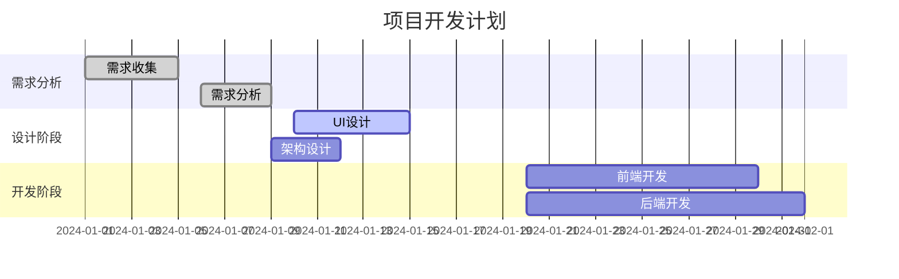


**实体关系图（ER图）**：

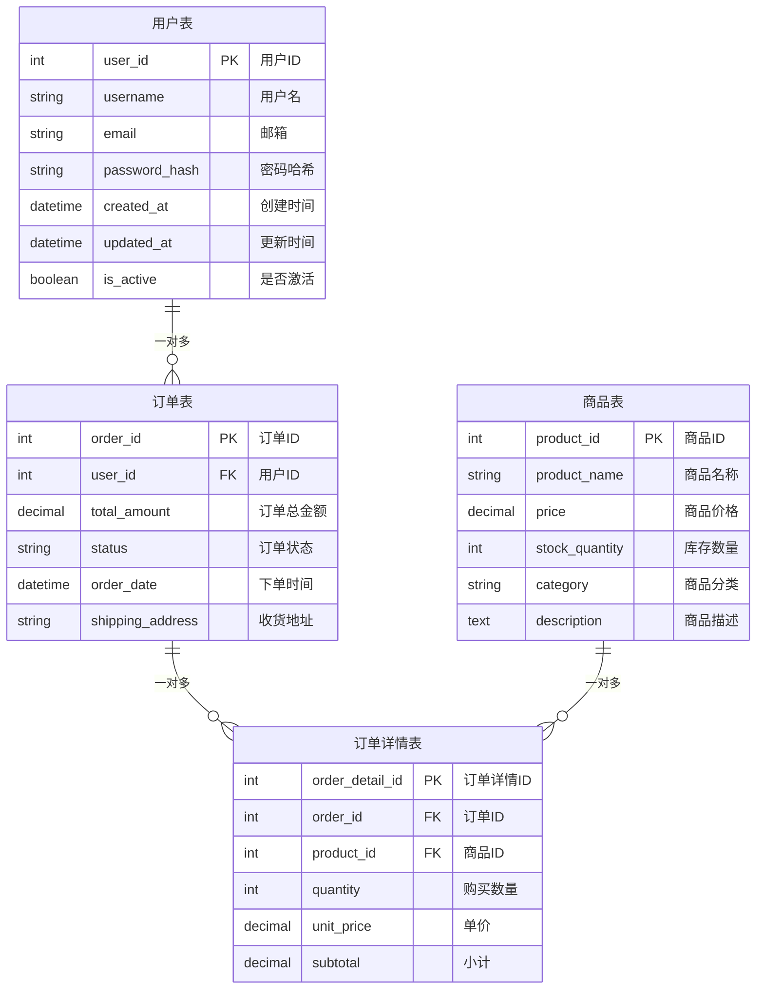

**复杂流程图（系统架构）**：

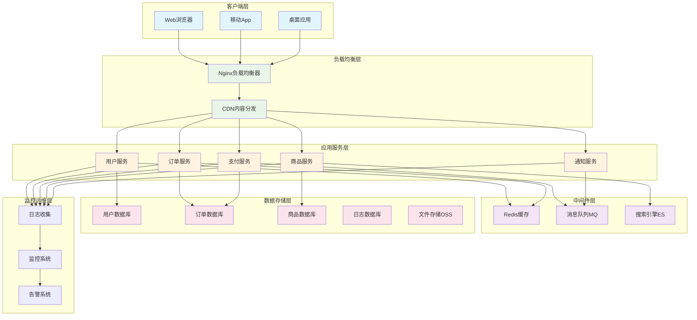

**Git工作流程图**：

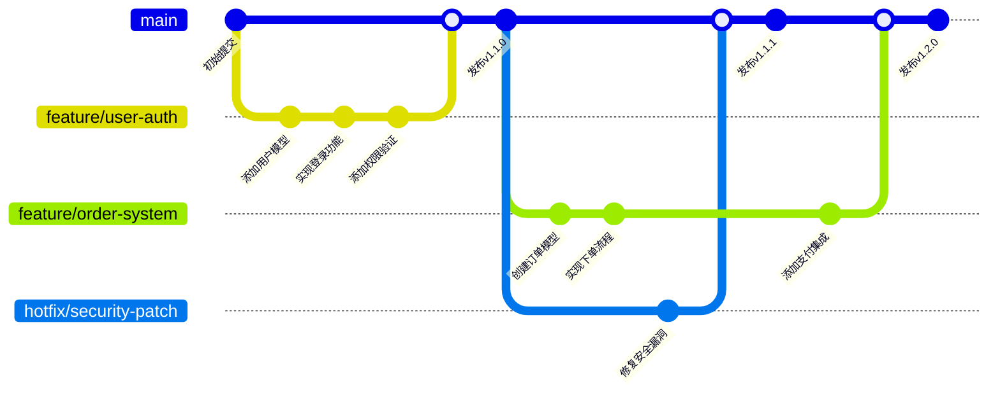

**思维导图**：

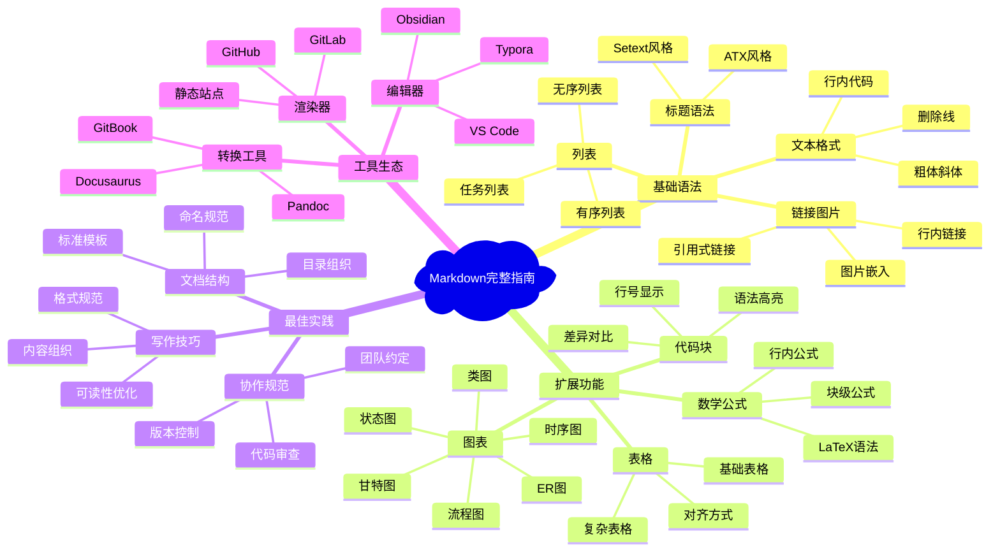


### 7.3 脚注与定义

**脚注语法**：

```markdown
这是一个包含脚注的句子[^1]。

这是另一个脚注[^note]。

[^1]: 这是第一个脚注的内容。
[^note]: 这是命名脚注的内容，可以包含**格式化文本**。
```

**定义列表**：

```markdown
术语1
:   这是术语1的定义。

术语2
:   这是术语2的定义。
    可以包含多行内容。

    甚至可以包含多个段落。

HTML
:   超文本标记语言
:   用于创建网页的标准标记语言
```

### 7.4 高级功能

**折叠内容**：

```markdown
<details>
<summary>点击展开详细内容</summary>

这里是折叠的内容，可以包含：

- 列表项
- **格式化文本**
- `代码`

```javascript
console.log('代码块也可以');
```

</details>
```

**键盘按键**：

```markdown
按 <kbd>Ctrl</kbd> + <kbd>C</kbd> 复制文本。

使用 <kbd>Ctrl</kbd> + <kbd>Shift</kbd> + <kbd>P</kbd> 打开命令面板。
```

**进度条**：

```markdown
<progress value="70" max="100">70%</progress>

<div style="background-color: #f0f0f0; border-radius: 10px; padding: 3px;">
  <div style="background-color: #4CAF50; width: 70%; height: 20px; border-radius: 7px;"></div>
</div>
```

**颜色标记**：

```markdown
<span style="color: red;">红色文本</span>
<span style="color: #0066cc;">蓝色文本</span>
<span style="background-color: yellow;">黄色背景</span>
```

**16进制颜色值对照表**：

### 7.5 颜色

**基础颜色**

| 颜色名称 | 16进制代码 | RGB值 | 颜色预览 |
|----------|------------|--------|----------|
| **黑色** | `#000000` | RGB(0,0,0) | <span style="background-color: #000000; color: white; padding: 2px 8px; border-radius: 3px;">■ 黑色</span> |
| **白色** | `#FFFFFF` | RGB(255,255,255) | <span style="background-color: #FFFFFF; color: black; padding: 2px 8px; border: 1px solid #ccc; border-radius: 3px;">■ 白色</span> |
| **红色** | `#FF0000` | RGB(255,0,0) | <span style="background-color: #FF0000; color: white; padding: 2px 8px; border-radius: 3px;">■ 红色</span> |
| **绿色** | `#008000` | RGB(0,128,0) | <span style="background-color: #008000; color: white; padding: 2px 8px; border-radius: 3px;">■ 绿色</span> |
| **蓝色** | `#0000FF` | RGB(0,0,255) | <span style="background-color: #0000FF; color: white; padding: 2px 8px; border-radius: 3px;">■ 蓝色</span> |
| **黄色** | `#FFFF00` | RGB(255,255,0) | <span style="background-color: #FFFF00; color: black; padding: 2px 8px; border-radius: 3px;">■ 黄色</span> |
| **青色** | `#00FFFF` | RGB(0,255,255) | <span style="background-color: #00FFFF; color: black; padding: 2px 8px; border-radius: 3px;">■ 青色</span> |
| **洋红** | `#FF00FF` | RGB(255,0,255) | <span style="background-color: #FF00FF; color: white; padding: 2px 8px; border-radius: 3px;">■ 洋红</span> |

**常用灰色系**

| 颜色名称 | 16进制代码 | RGB值 | 颜色预览 |
|----------|------------|--------|----------|
| **浅灰** | `#F5F5F5` | RGB(245,245,245) | <span style="background-color: #F5F5F5; color: black; padding: 2px 8px; border: 1px solid #ccc; border-radius: 3px;">■ 浅灰</span> |
| **银色** | `#C0C0C0` | RGB(192,192,192) | <span style="background-color: #C0C0C0; color: black; padding: 2px 8px; border-radius: 3px;">■ 银色</span> |
| **灰色** | `#808080` | RGB(128,128,128) | <span style="background-color: #808080; color: white; padding: 2px 8px; border-radius: 3px;">■ 灰色</span> |
| **深灰** | `#404040` | RGB(64,64,64) | <span style="background-color: #404040; color: white; padding: 2px 8px; border-radius: 3px;">■ 深灰</span> |
| **炭灰** | `#36454F` | RGB(54,69,79) | <span style="background-color: #36454F; color: white; padding: 2px 8px; border-radius: 3px;">■ 炭灰</span> |

**网页安全色**

| 颜色名称 | 16进制代码 | RGB值 | 颜色预览 |
|----------|------------|--------|----------|
| **深红** | `#8B0000` | RGB(139,0,0) | <span style="background-color: #8B0000; color: white; padding: 2px 8px; border-radius: 3px;">■ 深红</span> |
| **深绿** | `#006400` | RGB(0,100,0) | <span style="background-color: #006400; color: white; padding: 2px 8px; border-radius: 3px;">■ 深绿</span> |
| **深蓝** | `#00008B` | RGB(0,0,139) | <span style="background-color: #00008B; color: white; padding: 2px 8px; border-radius: 3px;">■ 深蓝</span> |
| **橙色** | `#FFA500` | RGB(255,165,0) | <span style="background-color: #FFA500; color: black; padding: 2px 8px; border-radius: 3px;">■ 橙色</span> |
| **紫色** | `#800080` | RGB(128,0,128) | <span style="background-color: #800080; color: white; padding: 2px 8px; border-radius: 3px;">■ 紫色</span> |
| **棕色** | `#A52A2A` | RGB(165,42,42) | <span style="background-color: #A52A2A; color: white; padding: 2px 8px; border-radius: 3px;">■ 棕色</span> |

**现代UI配色**

| 颜色名称 | 16进制代码 | RGB值 | 颜色预览 | 用途说明 |
|----------|------------|--------|----------|----------|
| **主蓝色** | `#007BFF` | RGB(0,123,255) | <span style="background-color: #007BFF; color: white; padding: 2px 8px; border-radius: 3px;">■ 主蓝色</span> | Bootstrap主色 |
| **成功绿** | `#28A745` | RGB(40,167,69) | <span style="background-color: #28A745; color: white; padding: 2px 8px; border-radius: 3px;">■ 成功绿</span> | 成功状态 |
| **警告橙** | `#FFC107` | RGB(255,193,7) | <span style="background-color: #FFC107; color: black; padding: 2px 8px; border-radius: 3px;">■ 警告橙</span> | 警告提示 |
| **危险红** | `#DC3545` | RGB(220,53,69) | <span style="background-color: #DC3545; color: white; padding: 2px 8px; border-radius: 3px;">■ 危险红</span> | 错误状态 |
| **信息蓝** | `#17A2B8` | RGB(23,162,184) | <span style="background-color: #17A2B8; color: white; padding: 2px 8px; border-radius: 3px;">■ 信息蓝</span> | 信息提示 |
| **深色** | `#343A40` | RGB(52,58,64) | <span style="background-color: #343A40; color: white; padding: 2px 8px; border-radius: 3px;">■ 深色</span> | 深色主题 |

**Material Design色彩**

| 颜色名称 | 16进制代码 | RGB值 | 颜色预览 | 色彩深度 |
|----------|------------|--------|----------|----------|
| **红色500** | `#F44336` | RGB(244,67,54) | <span style="background-color: #F44336; color: white; padding: 2px 8px; border-radius: 3px;">■ 红色500</span> | 标准 |
| **粉色500** | `#E91E63` | RGB(233,30,99) | <span style="background-color: #E91E63; color: white; padding: 2px 8px; border-radius: 3px;">■ 粉色500</span> | 标准 |
| **紫色500** | `#9C27B0` | RGB(156,39,176) | <span style="background-color: #9C27B0; color: white; padding: 2px 8px; border-radius: 3px;">■ 紫色500</span> | 标准 |
| **深紫500** | `#673AB7` | RGB(103,58,183) | <span style="background-color: #673AB7; color: white; padding: 2px 8px; border-radius: 3px;">■ 深紫500</span> | 标准 |
| **靛蓝500** | `#3F51B5` | RGB(63,81,181) | <span style="background-color: #3F51B5; color: white; padding: 2px 8px; border-radius: 3px;">■ 靛蓝500</span> | 标准 |
| **蓝色500** | `#2196F3` | RGB(33,150,243) | <span style="background-color: #2196F3; color: white; padding: 2px 8px; border-radius: 3px;">■ 蓝色500</span> | 标准 |
| **浅蓝500** | `#03A9F4` | RGB(3,169,244) | <span style="background-color: #03A9F4; color: white; padding: 2px 8px; border-radius: 3px;">■ 浅蓝500</span> | 标准 |
| **青色500** | `#00BCD4` | RGB(0,188,212) | <span style="background-color: #00BCD4; color: white; padding: 2px 8px; border-radius: 3px;">■ 青色500</span> | 标准 |
| **蓝绿500** | `#009688` | RGB(0,150,136) | <span style="background-color: #009688; color: white; padding: 2px 8px; border-radius: 3px;">■ 蓝绿500</span> | 标准 |
| **绿色500** | `#4CAF50` | RGB(76,175,80) | <span style="background-color: #4CAF50; color: white; padding: 2px 8px; border-radius: 3px;">■ 绿色500</span> | 标准 |

**颜色使用技巧**

**1. 颜色语法格式**：
```markdown
<!-- 文字颜色 -->
<span style="color: #FF6B6B;">彩色文字</span>

<!-- 背景颜色 -->
<span style="background-color: #4ECDC4; padding: 2px 6px; border-radius: 3px;">彩色背景</span>

<!-- 组合使用 -->
<span style="color: #FFFFFF; background-color: #FF6B6B; padding: 4px 8px; border-radius: 4px; font-weight: bold;">醒目标签</span>
```

**渲染效果**：
- <span style="color: #FF6B6B;">彩色文字</span>
- <span style="background-color: #4ECDC4; color: white; padding: 2px 6px; border-radius: 3px;">彩色背景</span>
- <span style="color: #FFFFFF; background-color: #FF6B6B; padding: 4px 8px; border-radius: 4px; font-weight: bold;">醒目标签</span>

**2. 状态标签示例**：
```markdown
<span style="background-color: #28A745; color: white; padding: 2px 8px; border-radius: 12px; font-size: 12px;">✓ 完成</span>
<span style="background-color: #FFC107; color: black; padding: 2px 8px; border-radius: 12px; font-size: 12px;">⚠ 进行中</span>
<span style="background-color: #DC3545; color: white; padding: 2px 8px; border-radius: 12px; font-size: 12px;">✗ 失败</span>
<span style="background-color: #6C757D; color: white; padding: 2px 8px; border-radius: 12px; font-size: 12px;">⏸ 暂停</span>
```

**效果展示**：
- <span style="background-color: #28A745; color: white; padding: 2px 8px; border-radius: 12px; font-size: 12px;">✓ 完成</span>
- <span style="background-color: #FFC107; color: black; padding: 2px 8px; border-radius: 12px; font-size: 12px;">⚠ 进行中</span>
- <span style="background-color: #DC3545; color: white; padding: 2px 8px; border-radius: 12px; font-size: 12px;">✗ 失败</span>
- <span style="background-color: #6C757D; color: white; padding: 2px 8px; border-radius: 12px; font-size: 12px;">⏸ 暂停</span>

**3. 颜色选择建议**：

| 使用场景 | 推荐颜色 | 16进制代码 | 说明 |
|----------|----------|------------|------|
| **成功状态** | 绿色系 | `#28A745`, `#4CAF50` | 表示完成、正确 |
| **警告提示** | 橙色系 | `#FFC107`, `#FF9800` | 表示注意、提醒 |
| **错误状态** | 红色系 | `#DC3545`, `#F44336` | 表示失败、危险 |
| **信息提示** | 蓝色系 | `#17A2B8`, `#2196F3` | 表示通知、说明 |
| **中性状态** | 灰色系 | `#6C757D`, `#9E9E9E` | 表示禁用、次要 |
| **强调内容** | 品牌色 | 根据品牌定制 | 突出重要信息 |

**注意事项**：
- 确保文字与背景有足够对比度
- 避免使用过于刺眼的颜色
- 考虑色盲用户的阅读体验
- 保持颜色使用的一致性
- 在打印时考虑黑白效果

**常用色系搭配表格**

**1. 单色系搭配（同色调深浅变化）**

**蓝色系渐变**：

| 深度等级 | 颜色名称 | 16进制代码 | RGB值 | 颜色预览 | 使用场景 |
|----------|----------|------------|--------|----------|----------|
| **100** | 极浅蓝 | `#E3F2FD` | RGB(227,242,253) | <span style="background-color: #E3F2FD; color: black; padding: 2px 8px; border: 1px solid #ccc; border-radius: 3px;">■ 极浅蓝</span> | 背景、卡片 |
| **200** | 浅蓝 | `#BBDEFB` | RGB(187,222,251) | <span style="background-color: #BBDEFB; color: black; padding: 2px 8px; border-radius: 3px;">■ 浅蓝</span> | 次要背景 |
| **300** | 浅中蓝 | `#90CAF9` | RGB(144,202,249) | <span style="background-color: #90CAF9; color: black; padding: 2px 8px; border-radius: 3px;">■ 浅中蓝</span> | 悬停状态 |
| **400** | 中蓝 | `#64B5F6` | RGB(100,181,246) | <span style="background-color: #64B5F6; color: white; padding: 2px 8px; border-radius: 3px;">■ 中蓝</span> | 辅助按钮 |
| **500** | 标准蓝 | `#2196F3` | RGB(33,150,243) | <span style="background-color: #2196F3; color: white; padding: 2px 8px; border-radius: 3px;">■ 标准蓝</span> | 主要按钮 |
| **600** | 深蓝 | `#1E88E5` | RGB(30,136,229) | <span style="background-color: #1E88E5; color: white; padding: 2px 8px; border-radius: 3px;">■ 深蓝</span> | 活跃状态 |
| **700** | 较深蓝 | `#1976D2` | RGB(25,118,210) | <span style="background-color: #1976D2; color: white; padding: 2px 8px; border-radius: 3px;">■ 较深蓝</span> | 按压状态 |
| **800** | 很深蓝 | `#1565C0` | RGB(21,101,192) | <span style="background-color: #1565C0; color: white; padding: 2px 8px; border-radius: 3px;">■ 很深蓝</span> | 导航栏 |
| **900** | 极深蓝 | `#0D47A1` | RGB(13,71,161) | <span style="background-color: #0D47A1; color: white; padding: 2px 8px; border-radius: 3px;">■ 极深蓝</span> | 页脚、标题 |

**绿色系渐变**：

| 深度等级 | 颜色名称 | 16进制代码 | RGB值 | 颜色预览 | 使用场景 |
|----------|----------|------------|--------|----------|----------|
| **100** | 极浅绿 | `#E8F5E8` | RGB(232,245,232) | <span style="background-color: #E8F5E8; color: black; padding: 2px 8px; border: 1px solid #ccc; border-radius: 3px;">■ 极浅绿</span> | 成功背景 |
| **200** | 浅绿 | `#C8E6C9` | RGB(200,230,201) | <span style="background-color: #C8E6C9; color: black; padding: 2px 8px; border-radius: 3px;">■ 浅绿</span> | 提示背景 |
| **300** | 浅中绿 | `#A5D6A7` | RGB(165,214,167) | <span style="background-color: #A5D6A7; color: black; padding: 2px 8px; border-radius: 3px;">■ 浅中绿</span> | 高亮显示 |
| **400** | 中绿 | `#81C784` | RGB(129,199,132) | <span style="background-color: #81C784; color: white; padding: 2px 8px; border-radius: 3px;">■ 中绿</span> | 辅助绿色 |
| **500** | 标准绿 | `#4CAF50` | RGB(76,175,80) | <span style="background-color: #4CAF50; color: white; padding: 2px 8px; border-radius: 3px;">■ 标准绿</span> | 成功按钮 |
| **600** | 深绿 | `#43A047` | RGB(67,160,71) | <span style="background-color: #43A047; color: white; padding: 2px 8px; border-radius: 3px;">■ 深绿</span> | 确认状态 |
| **700** | 较深绿 | `#388E3C` | RGB(56,142,60) | <span style="background-color: #388E3C; color: white; padding: 2px 8px; border-radius: 3px;">■ 较深绿</span> | 选中状态 |
| **800** | 很深绿 | `#2E7D32` | RGB(46,125,50) | <span style="background-color: #2E7D32; color: white; padding: 2px 8px; border-radius: 3px;">■ 很深绿</span> | 深色主题 |
| **900** | 极深绿 | `#1B5E20` | RGB(27,94,32) | <span style="background-color: #1B5E20; color: white; padding: 2px 8px; border-radius: 3px;">■ 极深绿</span> | 强调元素 |

**1. 互补色搭配（对比色组合）**

**经典互补色组合**：

| 搭配名称 | 主色 | 辅色 | 主色代码 | 辅色代码 | 色彩预览 | 适用场景 |
|----------|------|------|----------|----------|----------|----------|
| **蓝橙搭配** | 蓝色 | 橙色 | `#2196F3` | `#FF9800` | <span style="background-color: #2196F3; color: white; padding: 2px 6px; border-radius: 3px;">■</span> <span style="background-color: #FF9800; color: white; padding: 2px 6px; border-radius: 3px;">■</span> | 科技、运动 |
| **红绿搭配** | 红色 | 绿色 | `#F44336` | `#4CAF50` | <span style="background-color: #F44336; color: white; padding: 2px 6px; border-radius: 3px;">■</span> <span style="background-color: #4CAF50; color: white; padding: 2px 6px; border-radius: 3px;">■</span> | 圣诞、警示 |
| **紫黄搭配** | 紫色 | 黄色 | `#9C27B0` | `#FFEB3B` | <span style="background-color: #9C27B0; color: white; padding: 2px 6px; border-radius: 3px;">■</span> <span style="background-color: #FFEB3B; color: black; padding: 2px 6px; border-radius: 3px;">■</span> | 创意、艺术 |
| **青红搭配** | 青色 | 珊瑚红 | `#00BCD4` | `#FF5722` | <span style="background-color: #00BCD4; color: white; padding: 2px 6px; border-radius: 3px;">■</span> <span style="background-color: #FF5722; color: white; padding: 2px 6px; border-radius: 3px;">■</span> | 时尚、现代 |

**1. 邻近色搭配（相似色组合）**

**暖色系邻近色**：

| 搭配名称 | 颜色1 | 颜色2 | 颜色3 | 代码1 | 代码2 | 代码3 | 色彩预览 |
|----------|-------|-------|-------|-------|-------|-------|---------|
| **日落暖色** | 红色 | 橙色 | 黄色 | `#E91E63` | `#FF9800` | `#FFC107` | <span style="background-color: #E91E63; color: white; padding: 2px 4px;">■</span><span style="background-color: #FF9800; color: white; padding: 2px 4px;">■</span><span style="background-color: #FFC107; color: black; padding: 2px 4px;">■</span> |
| **秋叶色调** | 深红 | 橙红 | 金黄 | `#D32F2F` | `#FF5722` | `#FF8F00` | <span style="background-color: #D32F2F; color: white; padding: 2px 4px;">■</span><span style="background-color: #FF5722; color: white; padding: 2px 4px;">■</span><span style="background-color: #FF8F00; color: white; padding: 2px 4px;">■</span> |
| **玫瑰金调** | 玫瑰红 | 粉橙 | 香槟金 | `#C2185B` | `#FF8A65` | `#FFB74D` | <span style="background-color: #C2185B; color: white; padding: 2px 4px;">■</span><span style="background-color: #FF8A65; color: white; padding: 2px 4px;">■</span><span style="background-color: #FFB74D; color: black; padding: 2px 4px;">■</span> |

**冷色系邻近色**：

| 搭配名称 | 颜色1 | 颜色2 | 颜色3 | 代码1 | 代码2 | 代码3 | 色彩预览 |
|----------|-------|-------|-------|-------|-------|-------|---------|
| **海洋蓝调** | 深蓝 | 海蓝 | 青绿 | `#1976D2` | `#03A9F4` | `#00BCD4` | <span style="background-color: #1976D2; color: white; padding: 2px 4px;">■</span><span style="background-color: #03A9F4; color: white; padding: 2px 4px;">■</span><span style="background-color: #00BCD4; color: white; padding: 2px 4px;">■</span> |
| **森林绿调** | 蓝绿 | 标准绿 | 黄绿 | `#009688` | `#4CAF50` | `#8BC34A` | <span style="background-color: #009688; color: white; padding: 2px 4px;">■</span><span style="background-color: #4CAF50; color: white; padding: 2px 4px;">■</span><span style="background-color: #8BC34A; color: white; padding: 2px 4px;">■</span> |
| **薄荷清新** | 淡青 | 薄荷绿 | 浅绿 | `#4DD0E1` | `#4DB6AC` | `#81C784` | <span style="background-color: #4DD0E1; color: white; padding: 2px 4px;">■</span><span style="background-color: #4DB6AC; color: white; padding: 2px 4px;">■</span><span style="background-color: #81C784; color: white; padding: 2px 4px;">■</span> |

**1. 三角色搭配（120度间隔）**

**三原色搭配**：

| 搭配名称 | 主色 | 次色1 | 次色2 | 主色代码 | 次色1代码 | 次色2代码 | 色彩预览 | 特点 |
|----------|------|-------|-------|----------|-----------|-----------|----------|------|
| **经典三原色** | 红色 | 蓝色 | 黄色 | `#F44336` | `#2196F3` | `#FFEB3B` | <span style="background-color: #F44336; color: white; padding: 2px 4px;">■</span><span style="background-color: #2196F3; color: white; padding: 2px 4px;">■</span><span style="background-color: #FFEB3B; color: black; padding: 2px 4px;">■</span> | 活泼、儿童 |
| **现代三色** | 珊瑚 | 蓝绿 | 橙黄 | `#FF7043` | `#26A69A` | `#FFA726` | <span style="background-color: #FF7043; color: white; padding: 2px 4px;">■</span><span style="background-color: #26A69A; color: white; padding: 2px 4px;">■</span><span style="background-color: #FFA726; color: white; padding: 2px 4px;">■</span> | 时尚、现代 |
| **柔和三色** | 粉红 | 薄荷 | 柠檬黄 | `#EC407A` | `#66BB6A` | `#FFEE58` | <span style="background-color: #EC407A; color: white; padding: 2px 4px;">■</span><span style="background-color: #66BB6A; color: white; padding: 2px 4px;">■</span><span style="background-color: #FFEE58; color: black; padding: 2px 4px;">■</span> | 温和、友好 |

**1. 分裂互补色搭配**

**分裂互补搭配**：

| 基色 | 分裂色1 | 分裂色2 | 基色代码 | 分裂色1代码 | 分裂色2代码 | 色彩预览 | 视觉效果 |
|------|---------|---------|----------|-------------|-------------|----------|----------|
| **蓝基调** | 橙红 | 橙黄 | `#2196F3` | `#FF5722` | `#FF9800` | <span style="background-color: #2196F3; color: white; padding: 2px 4px;">■</span><span style="background-color: #FF5722; color: white; padding: 2px 4px;">■</span><span style="background-color: #FF9800; color: white; padding: 2px 4px;">■</span> | 动感、活力 |
| **红基调** | 蓝绿 | 青色 | `#F44336` | `#009688` | `#00BCD4` | <span style="background-color: #F44336; color: white; padding: 2px 4px;">■</span><span style="background-color: #009688; color: white; padding: 2px 4px;">■</span><span style="background-color: #00BCD4; color: white; padding: 2px 4px;">■</span> | 平衡、稳定 |
| **绿基调** | 红紫 | 蓝紫 | `#4CAF50` | `#E91E63` | `#673AB7` | <span style="background-color: #4CAF50; color: white; padding: 2px 4px;">■</span><span style="background-color: #E91E63; color: white; padding: 2px 4px;">■</span><span style="background-color: #673AB7; color: white; padding: 2px 4px;">■</span> | 自然、优雅 |

**1. 无彩色搭配（灰度系统）**

**专业灰度搭配**：

| 级别 | 颜色名称 | 16进制代码 | RGB值 | 颜色预览 | 使用建议 |
|------|----------|------------|--------|----------|----------|
| **L1** | 纯白 | `#FFFFFF` | RGB(255,255,255) | <span style="background-color: #FFFFFF; color: black; padding: 2px 8px; border: 1px solid #ccc; border-radius: 3px;">■ 纯白</span> | 页面背景 |
| **L2** | 极浅灰 | `#FAFAFA` | RGB(250,250,250) | <span style="background-color: #FAFAFA; color: black; padding: 2px 8px; border: 1px solid #ccc; border-radius: 3px;">■ 极浅灰</span> | 卡片背景 |
| **L3** | 浅灰 | `#F5F5F5` | RGB(245,245,245) | <span style="background-color: #F5F5F5; color: black; padding: 2px 8px; border-radius: 3px;">■ 浅灰</span> | 分割线区域 |
| **L4** | 浅中灰 | `#EEEEEE` | RGB(238,238,238) | <span style="background-color: #EEEEEE; color: black; padding: 2px 8px; border-radius: 3px;">■ 浅中灰</span> | 禁用背景 |
| **L5** | 中性灰 | `#E0E0E0` | RGB(224,224,224) | <span style="background-color: #E0E0E0; color: black; padding: 2px 8px; border-radius: 3px;">■ 中性灰</span> | 边框线条 |
| **L6** | 中灰 | `#BDBDBD` | RGB(189,189,189) | <span style="background-color: #BDBDBD; color: black; padding: 2px 8px; border-radius: 3px;">■ 中灰</span> | 次要文字 |
| **L7** | 深中灰 | `#9E9E9E` | RGB(158,158,158) | <span style="background-color: #9E9E9E; color: white; padding: 2px 8px; border-radius: 3px;">■ 深中灰</span> | 辅助信息 |
| **L8** | 深灰 | `#757575` | RGB(117,117,117) | <span style="background-color: #757575; color: white; padding: 2px 8px; border-radius: 3px;">■ 深灰</span> | 图标颜色 |
| **L9** | 很深灰 | `#616161` | RGB(97,97,97) | <span style="background-color: #616161; color: white; padding: 2px 8px; border-radius: 3px;">■ 很深灰</span> | 正文文字 |
| **L10** | 极深灰 | `#424242` | RGB(66,66,66) | <span style="background-color: #424242; color: white; padding: 2px 8px; border-radius: 3px;">■ 极深灰</span> | 标题文字 |
| **L11** | 接近黑 | `#212121` | RGB(33,33,33) | <span style="background-color: #212121; color: white; padding: 2px 8px; border-radius: 3px;">■ 接近黑</span> | 深色主题 |
| **L12** | 纯黑 | `#000000` | RGB(0,0,0) | <span style="background-color: #000000; color: white; padding: 2px 8px; border-radius: 3px;">■ 纯黑</span> | 强调文字 |

**1. 品牌色系搭配**

**知名品牌配色方案**：

| 品牌风格 | 主色 | 辅色 | 强调色 | 主色代码 | 辅色代码 | 强调色代码 | 色彩预览 |
|----------|------|------|--------|----------|----------|-----------|----------|
| **科技蓝** | 深蓝 | 浅蓝 | 橙色 | `#1976D2` | `#E3F2FD` | `#FF9800` | <span style="background-color: #1976D2; color: white; padding: 2px 4px;">■</span><span style="background-color: #E3F2FD; color: black; padding: 2px 4px; border: 1px solid #ccc;">■</span><span style="background-color: #FF9800; color: white; padding: 2px 4px;">■</span> |
| **自然绿** | 森林绿 | 浅绿 | 土黄 | `#388E3C` | `#E8F5E8` | `#FFA000` | <span style="background-color: #388E3C; color: white; padding: 2px 4px;">■</span><span style="background-color: #E8F5E8; color: black; padding: 2px 4px; border: 1px solid #ccc;">■</span><span style="background-color: #FFA000; color: white; padding: 2px 4px;">■</span> |
| **优雅紫** | 深紫 | 淡紫 | 金色 | `#7B1FA2` | `#F3E5F5` | `#FFB300` | <span style="background-color: #7B1FA2; color: white; padding: 2px 4px;">■</span><span style="background-color: #F3E5F5; color: black; padding: 2px 4px; border: 1px solid #ccc;">■</span><span style="background-color: #FFB300; color: black; padding: 2px 4px;">■</span> |
| **现代红** | 鲜红 | 浅粉 | 深灰 | `#D32F2F` | `#FFEBEE` | `#424242` | <span style="background-color: #D32F2F; color: white; padding: 2px 4px;">■</span><span style="background-color: #FFEBEE; color: black; padding: 2px 4px; border: 1px solid #ccc;">■</span><span style="background-color: #424242; color: white; padding: 2px 4px;">■</span> |

**搭配使用建议**

**1. 60-30-10 配色法则**：
```markdown
<!-- 主色占60% -->
<div style="background-color: #2196F3; color: white; padding: 20px; margin: 5px;">
  主色区域 (60%) - 背景、大面积使用
</div>

<!-- 辅色占30% -->
<div style="background-color: #E3F2FD; color: #1976D2; padding: 15px; margin: 5px;">
  辅色区域 (30%) - 次要元素、区域划分
</div>

<!-- 强调色占10% -->
<span style="background-color: #FF9800; color: white; padding: 8px 16px; border-radius: 4px; margin: 5px; display: inline-block;">
  强调色 (10%) - 按钮、重点信息
</span>
```

**2. 可访问性对比度检查**：

| 文字颜色 | 背景颜色 | 对比度 | WCAG等级 | 适用场景 |
|----------|----------|--------|----------|----------|
| `#FFFFFF` | `#2196F3` | 4.6:1 | AA | 正常文字 |
| `#000000` | `#FFC107` | 11.2:1 | AAA | 所有文字 |
| `#FFFFFF` | `#4CAF50` | 4.1:1 | AA | 正常文字 |
| `#212121` | `#E3F2FD` | 15.8:1 | AAA | 所有文字 |

**3. 响应式配色建议**：
```markdown
<!-- 浅色模式 -->
主题：浅色背景 (#FFFFFF) + 深色文字 (#212121)
强调：蓝色系 (#2196F3) + 绿色系 (#4CAF50)

<!-- 深色模式 -->
主题：深色背景 (#121212) + 浅色文字 (#FFFFFF)
强调：浅蓝系 (#64B5F6) + 浅绿系 (#81C784)
```

## 8. Markdown最佳实践

### 8.1 文档结构规范

**标准文档结构**：

```markdown
# 项目标题

## 目录
- [快速开始](#快速开始)
- [安装指南](#安装指南)
- [使用说明](#使用说明)
- [API参考](#api参考)
- [常见问题](#常见问题)
- [贡献指南](#贡献指南)

## 项目简介
简洁明了的项目描述...

## 快速开始
### 环境要求
### 安装步骤
### 基础使用

## 详细文档
...

## 许可证
```

**文件命名规范**：

```
docs/
├── README.md              # 项目主文档
├── CHANGELOG.md           # 变更日志
├── CONTRIBUTING.md        # 贡献指南
├── LICENSE.md             # 许可证
├── api/
│   ├── user-api.md       # 用户API文档
│   └── order-api.md      # 订单API文档
├── guides/
│   ├── quick-start.md    # 快速开始
│   ├── installation.md  # 安装指南
│   └── deployment.md    # 部署指南
└── examples/
    ├── basic-usage.md    # 基础用法示例
    └── advanced-usage.md # 高级用法示例
```

### 8.2 写作技巧

**信息层次结构**：

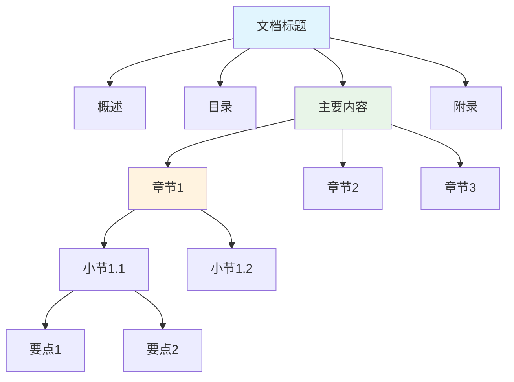

**内容组织原则**：

1. **金字塔原理**：先总后分，先重要后次要
2. **SCQA结构**：情境(Situation) → 冲突(Complication) → 问题(Question) → 答案(Answer)
3. **5W1H方法**：Who、What、When、Where、Why、How

**写作检查清单**：

- [ ] **标题层次**：是否清晰合理，没有跳级
- [ ] **内容完整**：是否涵盖了所有必要信息
- [ ] **格式一致**：标点符号、空格、缩进是否统一
- [ ] **链接有效**：所有链接是否可以正常访问
- [ ] **图片优化**：图片是否清晰，大小是否合适
- [ ] **代码测试**：示例代码是否可以正常运行
- [ ] **语言简洁**：是否去除了冗余表达
- [ ] **逻辑清晰**：内容是否按逻辑顺序组织

### 8.3 协作规范

**团队协作流程**：

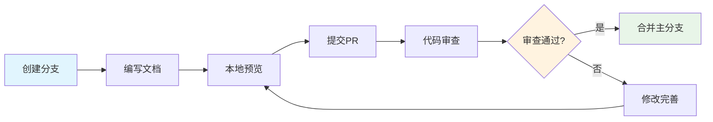

**文档审查要点**：

| 审查维度 | 检查要点 | 重要程度 |
|----------|----------|----------|
| **内容准确性** | 技术信息是否正确、示例是否可用 | ⭐⭐⭐⭐⭐ |
| **结构清晰性** | 层次是否合理、逻辑是否清楚 | ⭐⭐⭐⭐ |
| **格式规范性** | 语法是否正确、样式是否统一 | ⭐⭐⭐ |
| **完整性** | 是否遗漏重要信息 | ⭐⭐⭐⭐ |
| **可读性** | 语言是否简洁明了 | ⭐⭐⭐ |

**版本管理策略**：

```markdown
## 文档版本控制

### 版本号规则
- 主版本号：重大内容变更
- 次版本号：新增章节或重要功能
- 修订号：错误修正、格式调整

### 变更记录格式
## [1.2.1] - 2024-01-15
### 新增
- 添加了API认证章节
- 新增错误码说明表格

### 修改
- 优化了快速开始流程
- 更新了安装步骤截图

### 修复
- 修正了代码示例中的语法错误
- 修复了链接跳转问题
```

### 8.4 版本控制

**Git工作流程**：

```markdown
# 文档开发工作流

## 1. 创建功能分支
git checkout -b docs/add-api-guide

## 2. 编写文档
# 编辑相关文档文件

## 3. 提交变更
git add .
git commit -m "docs: 添加API使用指南

- 新增用户认证流程说明
- 添加常用API示例代码
- 完善错误处理说明"

## 4. 推送并创建PR
git push origin docs/add-api-guide
# 在GitHub/GitLab创建Pull Request

## 5. 代码审查和合并
# 团队成员审查后合并到主分支
```

**提交信息规范**：

```markdown
# 提交类型
docs: 文档相关变更
feat: 新功能文档
fix: 修复文档错误
style: 格式调整（不影响内容）
refactor: 文档重构
test: 测试相关文档

# 提交格式
<type>(<scope>): <subject>

<body>

<footer>

# 示例
docs(api): 添加用户管理API文档

- 新增用户CRUD操作说明
- 添加权限验证流程图
- 完善错误码对照表

Closes #123
```
