# 10. Markdown完整语法指南

## 目录

### [1. Markdown基础概念](#1-markdown基础概念)
- [1.1 Markdown简介与特点](#11-markdown简介与特点)
- [1.2 Markdown发展历史](#12-markdown发展历史)
- [1.3 Markdown应用场景](#13-markdown应用场景)
- [1.4 Markdown编辑器推荐](#14-markdown编辑器推荐)

### [2. 基础语法](#2-基础语法)
- [2.1 标题语法](#21-标题语法)
- [2.2 段落与换行](#22-段落与换行)
- [2.3 文本格式化](#23-文本格式化)
- [2.4 引用语法](#24-引用语法)

### [3. 列表与链接](#3-列表与链接)
- [3.1 无序列表](#31-无序列表)
- [3.2 有序列表](#32-有序列表)
- [3.3 任务列表](#33-任务列表)
- [3.4 链接语法](#34-链接语法)

### [4. 图片与多媒体](#4-图片与多媒体)
- [4.1 图片插入](#41-图片插入)
- [4.2 图片优化](#42-图片优化)
- [4.3 多媒体嵌入](#43-多媒体嵌入)
- [4.4 图片最佳实践](#44-图片最佳实践)

### [5. 代码与语法高亮](#5-代码与语法高亮)
- [5.1 行内代码](#51-行内代码)
- [5.2 代码块](#52-代码块)
- [5.3 语法高亮](#53-语法高亮)
- [5.4 代码最佳实践](#54-代码最佳实践)

### [6. 表格与数据展示](#6-表格与数据展示)
- [6.1 基础表格语法](#61-基础表格语法)
- [6.2 表格对齐](#62-表格对齐)
- [6.3 复杂表格](#63-复杂表格)
- [6.4 表格最佳实践](#64-表格最佳实践)

### [7. 扩展语法](#7-扩展语法)
- [7.1 数学公式](#71-数学公式)
- [7.2 图表与流程图](#72-图表与流程图)
- [7.3 脚注与定义](#73-脚注与定义)
- [7.4 高级功能](#74-高级功能)

### [8. Markdown最佳实践](#8-markdown最佳实践)
- [8.1 文档结构规范](#81-文档结构规范)
- [8.2 写作技巧](#82-写作技巧)
- [8.3 协作规范](#83-协作规范)
- [8.4 版本控制](#84-版本控制)

### [9. Markdown面试题集](#9-markdown面试题集)
- [9.1 基础语法题](#91-基础语法题)
- [9.2 扩展功能题](#92-扩展功能题)
- [9.3 实战应用题](#93-实战应用题)
- [9.4 工具使用题](#94-工具使用题)

### [10. 总结与进阶方向](#10-总结与进阶方向)


## 1.Markdown基础概念

### 1.1 Markdown简介与特点

**Markdown**是一种轻量级标记语言，由John Gruber在2004年创建，旨在让人们使用易读易写的纯文本格式编写文档。

**核心特点**：
- **简洁性**：语法简单，学习成本低
- **可读性**：纯文本格式，即使不渲染也易于阅读
- **兼容性**：支持HTML，可以无缝集成
- **便携性**：纯文本文件，跨平台兼容
- **专注性**：专注内容创作，而非格式排版

**Markdown设计哲学**：

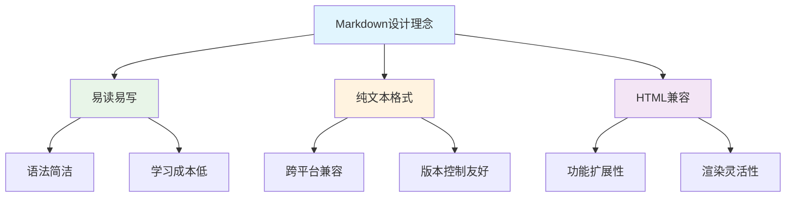

### 1.2 Markdown发展历史

**发展时间线**：

| 年份 | 事件 | 重要性 |
|------|------|--------|
| **2004** | John Gruber创建Markdown | 奠定基础语法 |
| **2012** | GitHub Flavored Markdown (GFM) | 扩展功能，广泛应用 |
| **2014** | CommonMark规范发布 | 标准化努力 |
| **2016** | 各平台广泛支持 | 成为主流标记语言 |
| **2020+** | 扩展语法丰富 | 支持图表、数学公式等 |

### 1.3 Markdown应用场景

**主要应用领域**：

1. **技术文档**：API文档、用户手册、技术规范
2. **博客写作**：个人博客、技术博客、知识分享
3. **项目管理**：README文件、项目说明、变更日志
4. **学术写作**：论文草稿、研究笔记、学习资料
5. **协作平台**：GitHub、GitLab、Notion、语雀等

**优势对比**：

| 场景 | Markdown优势 | 传统方式劣势 |
|------|-------------|-------------|
| **代码文档** | 语法高亮、版本控制友好 | Word格式复杂、难以版本管理 |
| **技术博客** | 专注内容、快速发布 | 富文本编辑器功能冗余 |
| **团队协作** | 纯文本、易于合并 | 二进制格式、冲突难解决 |
| **跨平台** | 任何文本编辑器可用 | 特定软件依赖 |

### 1.4 Markdown编辑器推荐

**桌面编辑器**：

1. **Typora**
   - 所见即所得编辑
   - 支持数学公式、图表
   - 多种主题可选

2. **Mark Text**
   - 开源免费
   - 实时预览
   - 简洁界面

3. **Obsidian**
   - 知识图谱
   - 插件生态丰富
   - 双向链接

**在线编辑器**：

1. **Dillinger**：在线实时预览
2. **StackEdit**：Google Drive集成
3. **HackMD**：协作编辑功能

**IDE插件**：

1. **VS Code**：Markdown Preview Enhanced
2. **Sublime Text**：MarkdownEditing
3. **Vim**：vim-markdown

## 2. 基础语法

### 2.1 标题语法

**ATX风格标题（推荐）**：

```markdown
# 一级标题
## 二级标题
### 三级标题
#### 四级标题
##### 五级标题
###### 六级标题
```

**渲染效果**：
```
\# 一级标题
\## 二级标题
\### 三级标题
```
**Setext风格标题**：

```markdown
一级标题
========

二级标题
--------
```

**标题最佳实践**：

1. **层级清晰**：按逻辑层次使用标题级别
2. **避免跳级**：不要从h1直接跳到h3
3. **简洁明了**：标题应该简洁且描述性强
4. **一致性**：在同一文档中保持标题风格一致

```markdown
# 项目文档

## 快速开始

### 安装步骤

#### 环境要求

### 配置说明

## API参考

### 用户管理

#### 创建用户

#### 更新用户
```

### 2.2 段落与换行

**段落分隔**：
```markdown
这是第一个段落。

这是第二个段落，需要用空行分隔。
```

**换行方式**：

1. **硬换行**：行末添加两个空格
```markdown
第一行内容  
第二行内容（行末有两个空格）
```

2. **软换行**：直接回车（在某些渲染器中不生效）
```markdown
第一行内容
第二行内容
```

3. **HTML换行**：使用`<br>`标签
```markdown
第一行内容<br>
第二行内容
```

### 2.3 文本格式化

**基础格式化**：

```markdown
**粗体文本** 或 __粗体文本__
*斜体文本* 或 _斜体文本_
***粗斜体*** 或 ___粗斜体___
~~删除线文本~~
```

**渲染效果**：
- **粗体文本**
- *斜体文本*
- ***粗斜体***
- ~~删除线文本~~

**高级格式化**：

```markdown
这是`行内代码`

这是<u>下划线文本</u>（HTML标签）

这是<mark>高亮文本</mark>

H<sub>2</sub>O（下标）

E=mc<sup>2</sup>（上标）
```

**转义字符**：

```markdown
\*不是斜体\*
\#不是标题
\[不是链接\]
\\反斜杠本身
```

### 2.4 引用语法

**基础引用**：

```markdown
> 这是一个引用块。
> 可以包含多行内容。
```

**渲染效果**：
> 这是一个引用块。
> 可以包含多行内容。

**嵌套引用**：

```markdown
> 第一级引用
>> 第二级引用
>>> 第三级引用
```

**引用中的其他元素**：

```markdown
> ## 引用中的标题
> 
> 1. 引用中的列表项
> 2. 另一个列表项
> 
> **引用中的粗体文本**
> 
> ```javascript
> // 引用中的代码块
> console.log('Hello World');
> ```
```

## 3. 列表与链接

### 3.1 无序列表

**基础语法**：

```markdown
- 列表项1
- 列表项2
- 列表项3

* 使用星号
* 也可以创建列表

+ 使用加号
+ 同样有效
```

**嵌套列表**：

```markdown
- 主要项目
  - 子项目1
  - 子项目2
    - 子子项目1
    - 子子项目2
- 另一个主要项目
```

**列表中的其他元素**：

```markdown
- 第一项

  这是第一项的详细说明。需要缩进4个空格或1个制表符。

- 第二项

  ```javascript
  // 列表中的代码块
  console.log('Hello');
  ```

- 第三项

  > 列表中的引用块
```

### 3.2 有序列表

**基础语法**：

```markdown
1. 第一项
2. 第二项
3. 第三项
```

**数字不需要按顺序**：

```markdown
1. 第一项
8. 第二项（实际显示为2）
3. 第三项（实际显示为3）
```

**嵌套有序列表**：

```markdown
1. 第一大项
   1. 子项1
   2. 子项2
2. 第二大项
   1. 子项1
      1. 子子项1
      2. 子子项2
```

**混合嵌套**：

```markdown
1. 有序列表项
   - 无序子项
   - 另一个无序子项
2. 另一个有序项
   1. 有序子项
   2. 另一个有序子项
```

### 3.3 任务列表

**GitHub风格任务列表**：

```markdown
- [x] 已完成任务
- [ ] 未完成任务
- [x] 另一个已完成任务
- [ ] 待办事项
```

**渲染效果**：
- [x] 已完成任务
- [ ] 未完成任务
- [x] 另一个已完成任务
- [ ] 待办事项

**嵌套任务列表**：

```markdown
- [x] 项目规划
  - [x] 需求分析
  - [x] 技术选型
  - [ ] 架构设计
- [ ] 开发阶段
  - [ ] 前端开发
  - [ ] 后端开发
  - [ ] 测试
```

### 3.4 链接语法

**行内链接**：

```markdown
[链接文本](https://example.com)
[带标题的链接](https://example.com "链接标题")
```

**引用式链接**：

```markdown
[链接文本][链接标识]
[另一个链接][1]

[链接标识]: https://example.com
[1]: https://another-example.com "可选标题"
```

**自动链接**：

```markdown
<https://example.com>
<email@example.com>
```

**内部链接**：

```markdown
[跳转到标题](#标题名称)
[跳转到文件](./other-file.md)
[跳转到文件的特定部分](./other-file.md#section)
```

**链接最佳实践**：

1. **描述性文本**：使用有意义的链接文本
```markdown
<!-- ✅ 好的做法 -->
查看[用户指南](./user-guide.md)了解详细信息。

<!-- ❌ 避免的做法 -->
点击[这里](./user-guide.md)查看用户指南。
```

2. **相对路径**：项目内部使用相对路径
```markdown
[API文档](../docs/api.md)
[示例代码](./examples/basic.js)
```

## 4. 图片与多媒体

### 4.1 图片插入

**基础语法**：

```markdown


```

**示例**：

```markdown


```

**引用式图片**：

```markdown
![替代文本][图片标识]

[图片标识]: https://example.com/image.png "图片标题"
```

**HTML方式（更多控制）**：

```markdown


```

### 4.2 图片优化

**响应式图片**：

```markdown
<picture>
  <source media="(min-width: 800px)" srcset="large.jpg">
  <source media="(min-width: 400px)" srcset="medium.jpg">
  
</picture>
```

**图片对齐**：

```markdown
<!-- 居中对齐 -->
<div align="center">
  
</div>

<!-- 右对齐 -->
<div align="right">
  
</div>
```

**图片与文字混排**：

```markdown


这段文字会环绕在图片右侧。可以继续写很多内容，文字会自动环绕图片排列。

<br clear="left">

这段文字在图片下方，不会环绕。
```

### 4.3 多媒体嵌入

**视频嵌入**：

```markdown
<!-- YouTube视频 -->
[](https://www.youtube.com/watch?v=VIDEO_ID)

<!-- HTML5视频 -->
<video width="320" height="240" controls>
  <source src="movie.mp4" type="video/mp4">
  <source src="movie.ogg" type="video/ogg">
  您的浏览器不支持视频标签。
</video>
```

**音频嵌入**：

```markdown
<audio controls>
  <source src="audio.mp3" type="audio/mpeg">
  <source src="audio.ogg" type="audio/ogg">
  您的浏览器不支持音频标签。
</audio>
```

**iframe嵌入**：

```markdown
<iframe src="https://example.com" width="100%" height="400"></iframe>
```

### 4.4 图片最佳实践

**文件组织**：

```
project/
├── README.md
├── docs/
│   ├── guide.md
│   └── images/
│       ├── screenshot1.png
│       └── diagram.svg
└── assets/
    └── logo.png
```

**命名规范**：

```markdown
<!-- ✅ 好的命名 -->


<!-- ❌ 避免的命名 -->


```

**替代文本编写**：

```markdown
<!-- ✅ 描述性替代文本 -->


<!-- ❌ 无意义替代文本 -->


```

## 5. 代码与语法高亮

### 5.1 行内代码

**基础语法**：

```markdown
使用`console.log()`输出信息到控制台。

在JavaScript中，`const`关键字用于声明常量。

文件路径：`/usr/local/bin/node`
```

**渲染效果**：
使用`console.log()`输出信息到控制台。

**转义反引号**：

```markdown
要显示反引号，使用双反引号：``这里有一个`反引号``

或者使用更多反引号：```这里有两个``反引号```
```

### 5.2 代码块

**围栏式代码块**：

````markdown
```
这是一个基础代码块
没有语法高亮
```
````

**缩进式代码块**：

```markdown
    这是缩进式代码块
    需要缩进4个空格或1个制表符
    每行都需要缩进
```

### 5.3 语法高亮

**常用编程语言**：

````markdown
```javascript
function greet(name) {
    return `Hello, ${name}!`;
}

console.log(greet('World'));
```

```python
def fibonacci(n):
    if n <= 1:
        return n
    return fibonacci(n-1) + fibonacci(n-2)

print(fibonacci(10))
```

```java
public class HelloWorld {
    public static void main(String[] args) {
        System.out.println("Hello, World!");
    }
}
```

```css
.container {
    display: flex;
    justify-content: center;
    align-items: center;
    height: 100vh;
}
```

```html
<!DOCTYPE html>
<html lang="zh-CN">
<head>
    <meta charset="UTF-8">
    <title>示例页面</title>
</head>
<body>
    <h1>Hello, World!</h1>
</body>
</html>
```

```sql
SELECT users.name, orders.total
FROM users
INNER JOIN orders ON users.id = orders.user_id
WHERE orders.status = 'completed'
ORDER BY orders.total DESC;
```

```bash
#!/bin/bash
echo "开始部署..."
npm install
npm run build
echo "部署完成！"
```
````

**配置文件语法**：

````markdown
```json
{
    "name": "my-project",
    "version": "1.0.0",
    "dependencies": {
        "express": "^4.18.0"
    }
}
```

```yaml
version: '3.8'
services:
  web:
    image: nginx:alpine
    ports:
      - "80:80"
```

```xml
<?xml version="1.0" encoding="UTF-8"?>
<configuration>
    <property>
        <name>example.property</name>
        <value>example.value</value>
    </property>
</configuration>
```
````

### 5.4 代码最佳实践

**代码块标题**：

````markdown
**文件：`src/utils/helper.js`**
```javascript
export function formatDate(date) {
    return date.toISOString().split('T')[0];
}
```
````

**行号显示**（某些渲染器支持）：

````markdown
```javascript {.line-numbers}
function calculateTotal(items) {
    let total = 0;
    for (const item of items) {
        total += item.price * item.quantity;
    }
    return total;
}
```
````

**高亮特定行**（某些渲染器支持）：

````markdown
```javascript {highlight: [2, 4]}
function processData(data) {
    const filtered = data.filter(item => item.active); // 高亮行
    const mapped = filtered.map(item => ({
        id: item.id, // 高亮行
        name: item.name
    }));
    return mapped;
}
```
````

**代码差异显示**：

````markdown
```diff
function greet(name) {
-   return "Hello " + name;
+   return `Hello, ${name}!`;
}
```
````

## 6. 表格与数据展示

### 6.1 基础表格语法

**标准表格**：

```markdown
| 列1 | 列2 | 列3 |
|-----|-----|-----|
| 数据1 | 数据2 | 数据3 |
| 数据4 | 数据5 | 数据6 |
```

**渲染效果**：

| 列1 | 列2 | 列3 |
|-----|-----|-----|
| 数据1 | 数据2 | 数据3 |
| 数据4 | 数据5 | 数据6 |

**简化写法**：

```markdown
列1 | 列2 | 列3
----|----|----|
数据1 | 数据2 | 数据3
数据4 | 数据5 | 数据6
```

### 6.2 表格对齐

**对齐方式**：

```markdown
| 左对齐 | 居中对齐 | 右对齐 |
|:-------|:--------:|-------:|
| 左 | 中 | 右 |
| 内容较长的左对齐文本 | 居中内容 | 右对齐数字 123 |
```

**渲染效果**：

| 左对齐 | 居中对齐 | 右对齐 |
|:-------|:--------:|-------:|
| 左 | 中 | 右 |
| 内容较长的左对齐文本 | 居中内容 | 右对齐数字 123 |

### 6.3 复杂表格

**表格中的格式化**：

```markdown
| 功能 | 语法 | 示例 |
|------|------|------|
| **粗体** | `**文本**` | **重要内容** |
| *斜体* | `*文本*` | *强调内容* |
| `代码` | `` `代码` `` | `console.log()` |
| [链接](https://example.com) | `[文本](URL)` | [官方文档](https://example.com) |
```

**多行内容**：

```markdown
| 项目 | 描述 |
|------|------|
| 项目A | 这是一个很长的描述<br>可以使用HTML换行标签<br>来实现多行显示 |
| 项目B | 另一种方式是使用<br>HTML的br标签 |
```

**嵌套列表**：

```markdown
| 分类 | 子项 |
|------|------|
| 前端技术 | • HTML<br>• CSS<br>• JavaScript |
| 后端技术 | • Node.js<br>• Python<br>• Java |
```

### 6.4 表格最佳实践

**技术对比表**：

```markdown
| 特性 | Markdown | Word | HTML |
|------|----------|------|------|
| **学习成本** | 低 | 中 | 高 |
| **文件大小** | 小 | 大 | 中 |
| **版本控制** | 优秀 | 差 | 优秀 |
| **跨平台性** | 优秀 | 一般 | 优秀 |
| **协作编辑** | 优秀 | 一般 | 一般 |
| **格式丰富度** | 中 | 高 | 高 |
```

**性能对比表**：

```markdown
| 编辑器 | 启动速度 | 内存占用 | 功能丰富度 | 推荐指数 |
|--------|:--------:|:--------:|:----------:|:--------:|
| **Typora** | ⭐⭐⭐⭐ | ⭐⭐⭐ | ⭐⭐⭐⭐⭐ | ⭐⭐⭐⭐⭐ |
| **VS Code** | ⭐⭐⭐ | ⭐⭐ | ⭐⭐⭐⭐⭐ | ⭐⭐⭐⭐ |
| **Obsidian** | ⭐⭐⭐ | ⭐⭐⭐ | ⭐⭐⭐⭐⭐ | ⭐⭐⭐⭐ |
```

## 7. 扩展语法

### 7.1 数学公式

**行内公式**：

```markdown
这是行内公式：$E = mc^2$

勾股定理：$a^2 + b^2 = c^2$
```

**块级公式**：

```markdown
$$
\frac{d}{dx}\left( \int_{0}^{x} f(u) \, du\right) = f(x)
$$

$$
\begin{align}
\nabla \times \vec{\mathbf{B}} -\, \frac1c\, \frac{\partial\vec{\mathbf{E}}}{\partial t} &= \frac{4\pi}{c}\vec{\mathbf{j}} \\
\nabla \cdot \vec{\mathbf{E}} &= 4 \pi \rho \\
\nabla \times \vec{\mathbf{E}}\, +\, \frac1c\, \frac{\partial\vec{\mathbf{B}}}{\partial t} &= \vec{\mathbf{0}} \\
\nabla \cdot \vec{\mathbf{B}} &= 0
\end{align}
$$
```

**常用数学符号**：

| 符号类型 | LaTeX语法 | 渲染效果 |
|----------|-----------|----------|
| **分数** | `\frac{a}{b}` | $\frac{a}{b}$ |
| **根号** | `\sqrt{x}` | $\sqrt{x}$ |
| **求和** | `\sum_{i=1}^{n}` | $\sum_{i=1}^{n}$ |
| **积分** | `\int_{a}^{b}` | $\int_{a}^{b}$ |
| **极限** | `\lim_{x \to \infty}` | $\lim_{x \to \infty}$ |

### 7.2 图表与流程图

**Mermaid流程图**：


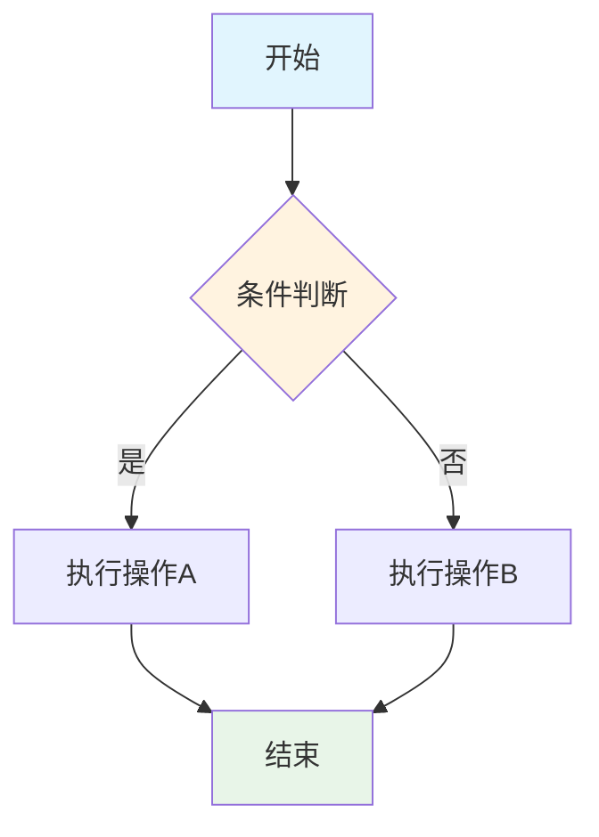
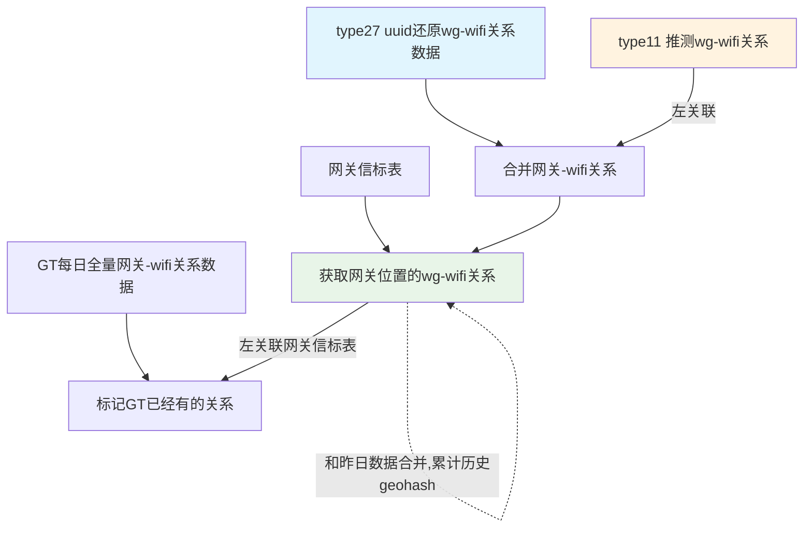


**时序图**：


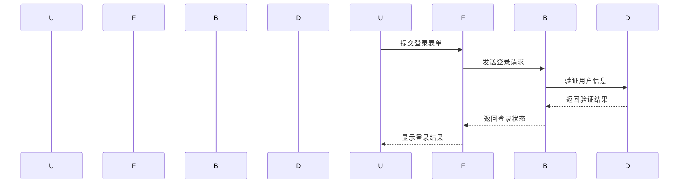
**饼图（使用Mermaid）**：

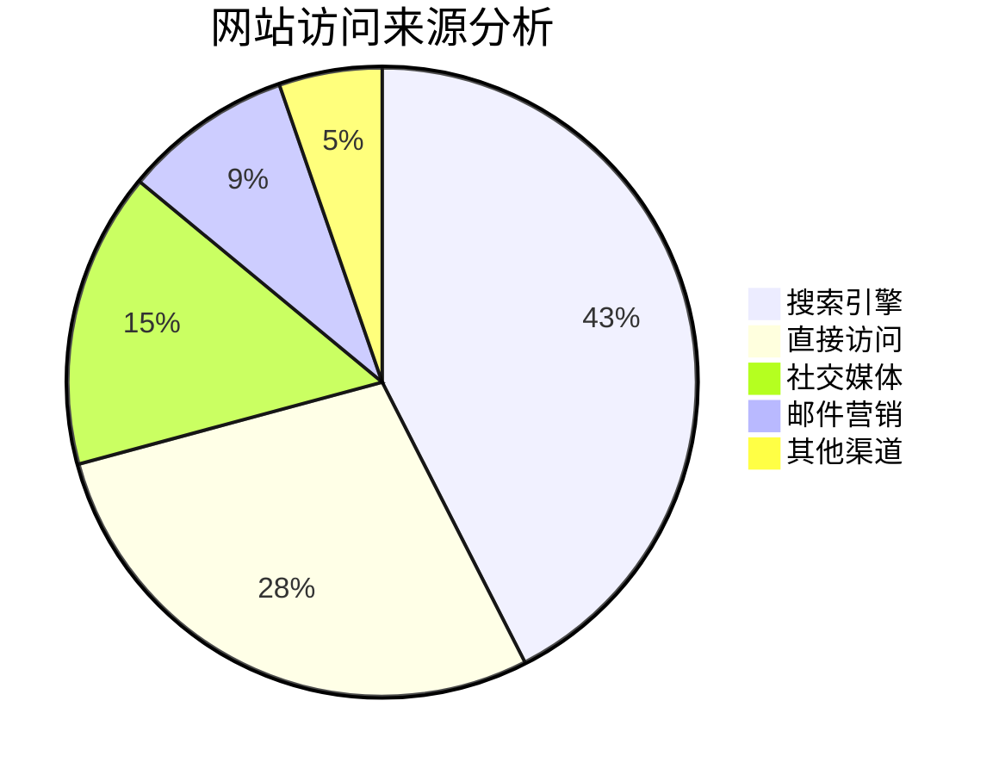

**甘特图**：


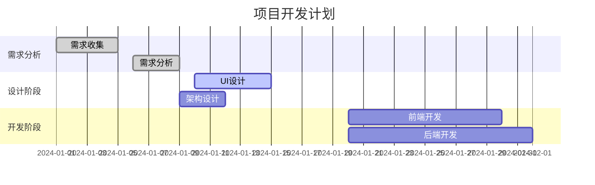

**状态图**：

```mermaid
stateDiagram-v2
    [*] --> "待支付"
    "待支付" --> "已支付" : 支付成功
    "待支付" --> "已取消" : 超时/用户取消
    "已支付" --> "待发货" : 商家确认
    "待发货" --> "已发货" : 商家发货
    "已发货" --> "已收货" : 用户确认收货
    "已收货" --> "已完成" : 系统自动确认
    "已支付" --> "退款中" : 用户申请退款
    "退款中" --> "已退款" : 退款成功
    "已退款" --> [*]
    "已完成" --> [*]
    "已取消" --> [*]
    
    note right of "待支付" : 订单创建后15分钟内需要支付
    note left of "退款中" : 退款处理需要3-7个工作日
```

**实体关系图（ER图）**：

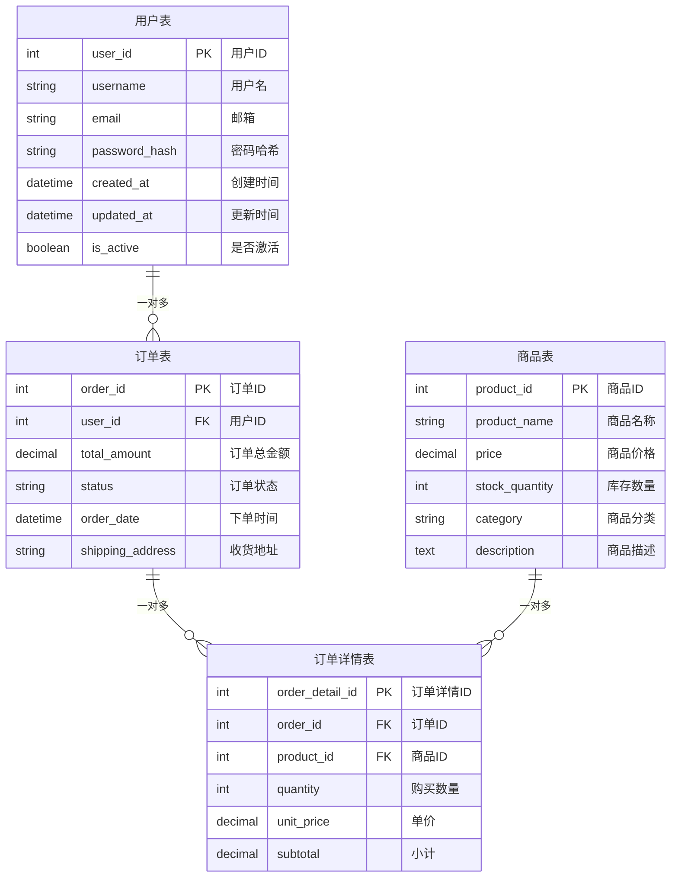

**复杂流程图（系统架构）**：

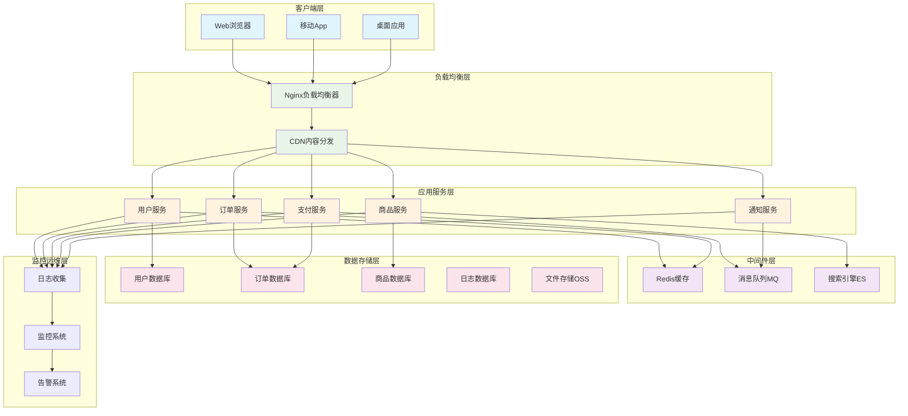

**Git工作流程图**：

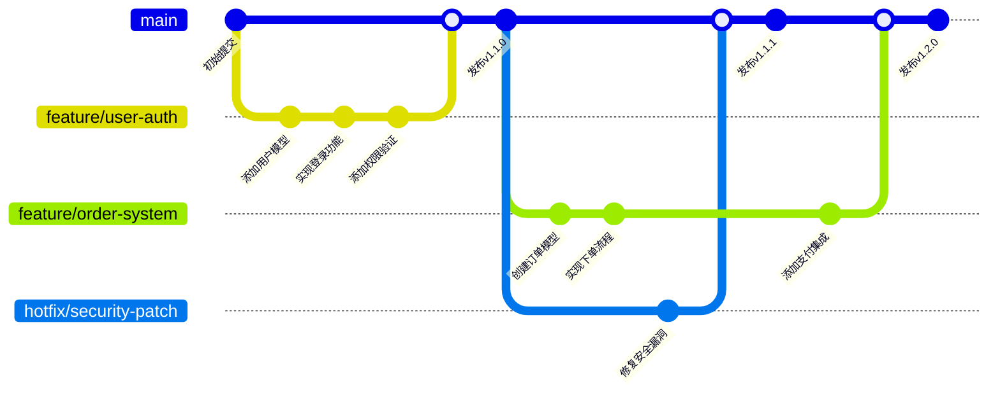

**思维导图**：

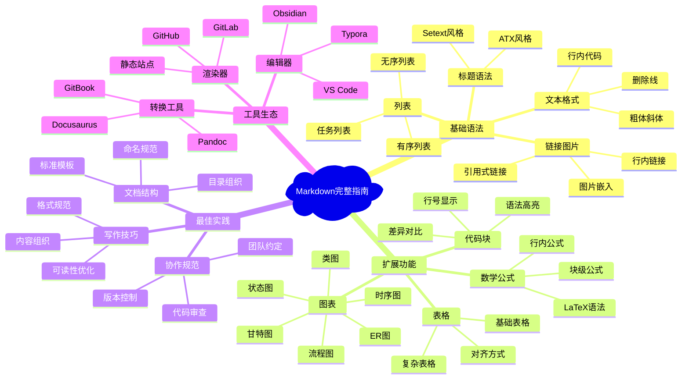

**复杂时序图（微服务交互）**：

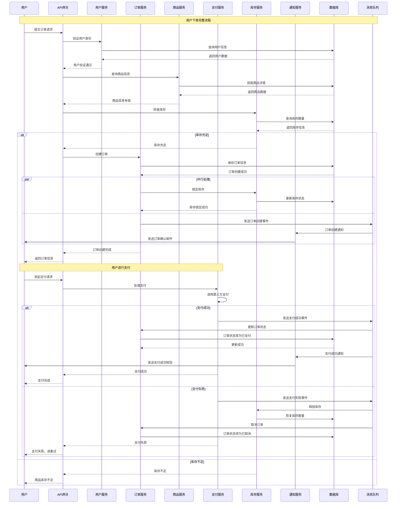


**用户旅程图**：

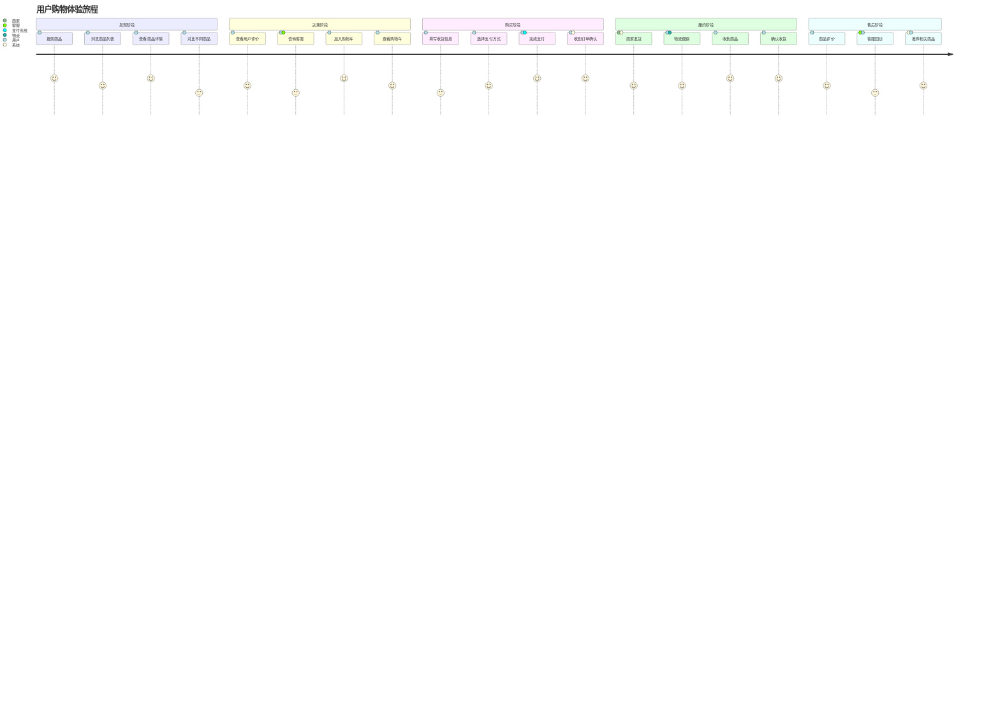


### 7.3 脚注与定义

**脚注语法**：

```markdown
这是一个包含脚注的句子[^1]。

这是另一个脚注[^note]。

[^1]: 这是第一个脚注的内容。
[^note]: 这是命名脚注的内容，可以包含**格式化文本**。
```

**定义列表**：

```markdown
术语1
:   这是术语1的定义。

术语2
:   这是术语2的定义。
    可以包含多行内容。

    甚至可以包含多个段落。

HTML
:   超文本标记语言
:   用于创建网页的标准标记语言
```

### 7.4 高级功能

**折叠内容**：

```markdown
<details>
<summary>点击展开详细内容</summary>

这里是折叠的内容，可以包含：

- 列表项
- **格式化文本**
- `代码`

```javascript
console.log('代码块也可以');
```

</details>
```

**键盘按键**：

```markdown
按 <kbd>Ctrl</kbd> + <kbd>C</kbd> 复制文本。

使用 <kbd>Ctrl</kbd> + <kbd>Shift</kbd> + <kbd>P</kbd> 打开命令面板。
```

**进度条**：

```markdown
<progress value="70" max="100">70%</progress>

<div style="background-color: #f0f0f0; border-radius: 10px; padding: 3px;">
  <div style="background-color: #4CAF50; width: 70%; height: 20px; border-radius: 7px;"></div>
</div>
```

**颜色标记**：

```markdown
<span style="color: red;">红色文本</span>
<span style="color: #0066cc;">蓝色文本</span>
<span style="background-color: yellow;">黄色背景</span>
```

## 8. Markdown最佳实践

### 8.1 文档结构规范

**标准文档结构**：

```markdown
# 项目标题

## 目录
- [快速开始](#快速开始)
- [安装指南](#安装指南)
- [使用说明](#使用说明)
- [API参考](#api参考)
- [常见问题](#常见问题)
- [贡献指南](#贡献指南)

## 项目简介
简洁明了的项目描述...

## 快速开始
### 环境要求
### 安装步骤
### 基础使用

## 详细文档
...

## 许可证
```

**文件命名规范**：

```
docs/
├── README.md              # 项目主文档
├── CHANGELOG.md           # 变更日志
├── CONTRIBUTING.md        # 贡献指南
├── LICENSE.md             # 许可证
├── api/
│   ├── user-api.md       # 用户API文档
│   └── order-api.md      # 订单API文档
├── guides/
│   ├── quick-start.md    # 快速开始
│   ├── installation.md  # 安装指南
│   └── deployment.md    # 部署指南
└── examples/
    ├── basic-usage.md    # 基础用法示例
    └── advanced-usage.md # 高级用法示例
```

### 8.2 写作技巧

**信息层次结构**：

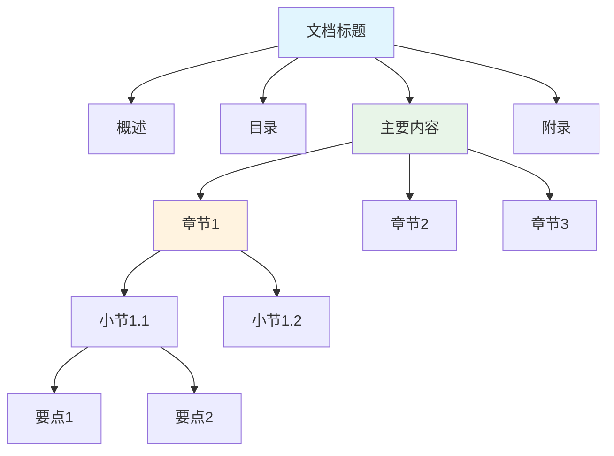

**内容组织原则**：

1. **金字塔原理**：先总后分，先重要后次要
2. **SCQA结构**：情境(Situation) → 冲突(Complication) → 问题(Question) → 答案(Answer)
3. **5W1H方法**：Who、What、When、Where、Why、How

**写作检查清单**：

- [ ] **标题层次**：是否清晰合理，没有跳级
- [ ] **内容完整**：是否涵盖了所有必要信息
- [ ] **格式一致**：标点符号、空格、缩进是否统一
- [ ] **链接有效**：所有链接是否可以正常访问
- [ ] **图片优化**：图片是否清晰，大小是否合适
- [ ] **代码测试**：示例代码是否可以正常运行
- [ ] **语言简洁**：是否去除了冗余表达
- [ ] **逻辑清晰**：内容是否按逻辑顺序组织

### 8.3 协作规范

**团队协作流程**：

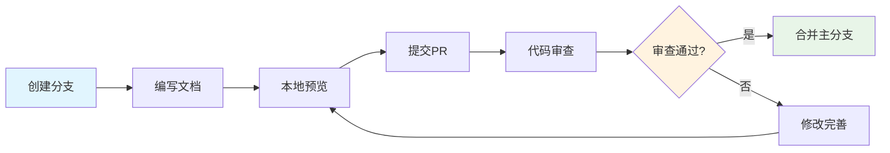

**文档审查要点**：

| 审查维度 | 检查要点 | 重要程度 |
|----------|----------|----------|
| **内容准确性** | 技术信息是否正确、示例是否可用 | ⭐⭐⭐⭐⭐ |
| **结构清晰性** | 层次是否合理、逻辑是否清楚 | ⭐⭐⭐⭐ |
| **格式规范性** | 语法是否正确、样式是否统一 | ⭐⭐⭐ |
| **完整性** | 是否遗漏重要信息 | ⭐⭐⭐⭐ |
| **可读性** | 语言是否简洁明了 | ⭐⭐⭐ |

**版本管理策略**：

```markdown
## 文档版本控制

### 版本号规则
- 主版本号：重大内容变更
- 次版本号：新增章节或重要功能
- 修订号：错误修正、格式调整

### 变更记录格式
## [1.2.1] - 2024-01-15
### 新增
- 添加了API认证章节
- 新增错误码说明表格

### 修改
- 优化了快速开始流程
- 更新了安装步骤截图

### 修复
- 修正了代码示例中的语法错误
- 修复了链接跳转问题
```

### 8.4 版本控制

**Git工作流程**：

```markdown
# 文档开发工作流

## 1. 创建功能分支
git checkout -b docs/add-api-guide

## 2. 编写文档
# 编辑相关文档文件

## 3. 提交变更
git add .
git commit -m "docs: 添加API使用指南

- 新增用户认证流程说明
- 添加常用API示例代码
- 完善错误处理说明"

## 4. 推送并创建PR
git push origin docs/add-api-guide
# 在GitHub/GitLab创建Pull Request

## 5. 代码审查和合并
# 团队成员审查后合并到主分支
```

**提交信息规范**：

```markdown
# 提交类型
docs: 文档相关变更
feat: 新功能文档
fix: 修复文档错误
style: 格式调整（不影响内容）
refactor: 文档重构
test: 测试相关文档

# 提交格式
<type>(<scope>): <subject>

<body>

<footer>

# 示例
docs(api): 添加用户管理API文档

- 新增用户CRUD操作说明
- 添加权限验证流程图
- 完善错误码对照表

Closes #123
```

## 9. Markdown面试题集

### 9.1 基础语法题

**Q1: Markdown中如何创建多级标题？有几种方式？**

**答案**：
Markdown支持两种标题语法：

1. **ATX风格（推荐）**：使用1-6个`#`号
```markdown
# 一级标题
## 二级标题
### 三级标题
#### 四级标题
##### 五级标题
###### 六级标题
```

2. **Setext风格**：仅支持一级和二级标题
```markdown
一级标题
========

二级标题
--------
```

**最佳实践**：
- 优先使用ATX风格，更简洁明了
- 标题层次要合理，避免跳级
- 标题后建议空一行再写内容

---

**Q2: 如何在Markdown中实现换行？有哪些方法？**

**答案**：
Markdown中有三种换行方式：

1. **硬换行**：行末添加两个或多个空格
```markdown
第一行内容  
第二行内容（注意第一行末尾有两个空格）
```

2. **段落分隔**：使用空行分隔段落
```markdown
第一段内容

第二段内容（中间有空行）
```

3. **HTML标签**：使用`<br>`标签
```markdown
第一行内容<br>
第二行内容
```

**注意事项**：
- 不同渲染器对换行的处理可能不同
- 建议使用空行分段，语义更清晰
- 硬换行适用于诗歌、地址等特殊格式

---

**Q3: Markdown表格语法有什么限制？如何处理复杂表格？**

**答案**：

**基础表格语法**：
```markdown
| 列1 | 列2 | 列3 |
|-----|-----|-----|
| 数据1 | 数据2 | 数据3 |
```

**语法限制**：
- 不支持单元格合并
- 不支持复杂的嵌套结构
- 对齐方式有限（左对齐、居中、右对齐）

**复杂表格解决方案**：

1. **使用HTML表格**：
```html
<table>
  <tr>
    <td rowspan="2">合并行</td>
    <td>普通单元格</td>
  </tr>
  <tr>
    <td>另一个单元格</td>
  </tr>
</table>
```

2. **拆分复杂表格**：将复杂表格拆分为多个简单表格

3. **使用列表替代**：对于层次化数据，使用嵌套列表

### 9.2 扩展功能题

**Q4: 如何在Markdown中插入数学公式？支持哪些语法？**

**答案**：

**行内公式**：使用单个`$`包围
```markdown
这是行内公式：$E = mc^2$
```

**块级公式**：使用双`$$`包围
```markdown
$$
\frac{d}{dx}\left( \int_{0}^{x} f(u) \, du\right) = f(x)
$$
```

**常用LaTeX语法**：

| 功能 | 语法 | 示例 |
|------|------|------|
| 分数 | `\frac{分子}{分母}` | $\frac{a}{b}$ |
| 根号 | `\sqrt{内容}` | $\sqrt{x}$ |
| 上标 | `^{内容}` | $x^2$ |
| 下标 | `_{内容}` | $x_1$ |
| 求和 | `\sum_{下限}^{上限}` | $\sum_{i=1}^{n}$ |

**注意事项**：
- 需要渲染器支持MathJax或KaTeX
- 不同平台支持程度不同
- 复杂公式建议使用专门的数学编辑器

---

**Q5: Mermaid图表在Markdown中如何使用？支持哪些图表类型？**

**答案**：

**基础语法**：
````markdown
```mermaid
图表类型
    图表内容
```
````

**主要图表类型**：

1. **流程图**：
````markdown
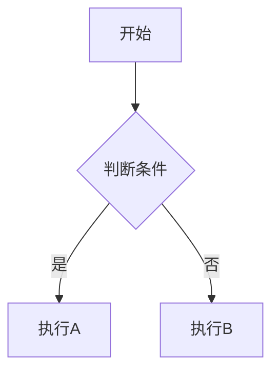
````

2. **时序图**：
````markdown
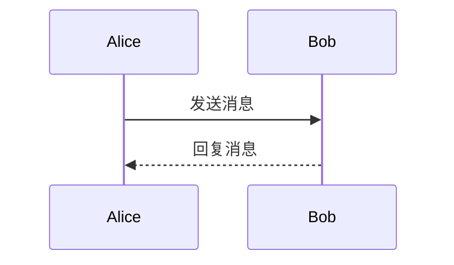
````

3. **甘特图**：
````markdown
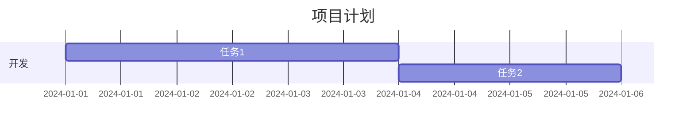
````

4. **类图**：
````markdown
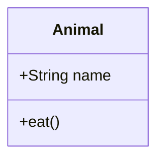
````

**最佳实践**：
- 所有文本使用双引号包围
- 保持图表简洁，避免过于复杂
- 注意不同平台的支持情况

### 9.3 实战应用题

**Q6: 如何设计一个技术文档的Markdown结构？包含哪些必要部分？**

**答案**：

**标准技术文档结构**：

```markdown
# 项目名称

## 徽章区域


## 目录
- [项目简介](#项目简介)
- [特性](#特性)
- [快速开始](#快速开始)
- [安装指南](#安装指南)
- [使用说明](#使用说明)
- [API文档](#api文档)
- [示例](#示例)
- [常见问题](#常见问题)
- [贡献指南](#贡献指南)
- [更新日志](#更新日志)
- [许可证](#许可证)

## 项目简介
简洁的项目描述，解决什么问题

## 特性
- 核心功能1
- 核心功能2
- 核心功能3

## 快速开始
### 环境要求
### 安装
### 基础使用

## 详细文档
...
```

**文档组织原则**：
- **用户导向**：按用户使用流程组织
- **层次清晰**：合理的标题层级
- **信息完整**：涵盖所有必要信息
- **易于维护**：模块化，便于更新

---

**Q7: 在团队协作中，如何制定Markdown文档规范？**

**答案**：

**文档规范要素**：

1. **文件命名规范**：
```
- 使用小写字母和连字符
- 英文命名，语义明确
- 示例：user-guide.md, api-reference.md
```

2. **目录结构规范**：
```
docs/
├── README.md           # 项目主文档
├── guides/            # 使用指南
├── api/              # API文档
├── examples/         # 示例代码
└── assets/           # 图片资源
```

3. **内容格式规范**：
```markdown
# 统一的标题格式
## 二级标题

### 三级标题

**重点内容加粗**

`代码使用反引号`

> 引用使用统一格式
```

4. **代码块规范**：
````markdown
```语言名称
// 代码内容
// 添加必要注释
```
````

5. **链接规范**：
```markdown
- 内部链接使用相对路径
- 外部链接提供描述性文本
- 图片添加alt属性
```

**协作流程**：
1. 制定并发布文档规范
2. 代码审查时检查文档规范
3. 使用工具自动化检查
4. 定期更新和完善规范

### 9.4 工具使用题

**Q8: 推荐几个Markdown编辑器，并说明各自的特点和适用场景？**

**答案**：

**桌面编辑器对比**：

| 编辑器 | 特点 | 适用场景 | 优缺点 |
|--------|------|----------|--------|
| **Typora** | 所见即所得 | 写作、笔记 | ✅实时预览 ❌收费 |
| **Obsidian** | 知识图谱 | 知识管理 | ✅双向链接 ❌学习成本高 |
| **Mark Text** | 开源免费 | 通用写作 | ✅免费 ❌功能相对简单 |
| **Notion** | 多功能 | 团队协作 | ✅协作强 ❌网络依赖 |

**在线编辑器**：

1. **Dillinger**：
   - 实时预览
   - 云存储集成
   - 适合临时编辑

2. **StackEdit**：
   - Google Drive同步
   - 离线编辑支持
   - 适合文档协作

3. **HackMD**：
   - 实时协作编辑
   - 演示模式
   - 适合团队协作

**IDE插件推荐**：

1. **VS Code**：
   - Markdown Preview Enhanced
   - Markdown All in One
   - 适合开发者

2. **Sublime Text**：
   - MarkdownEditing
   - 轻量级编辑

**选择建议**：
- **个人写作**：Typora、Mark Text
- **知识管理**：Obsidian、Notion
- **团队协作**：HackMD、Notion
- **开发文档**：VS Code + 插件

---

**Q9: 如何优化Markdown文档的SEO和可访问性？**

**答案**：

**SEO优化策略**：

1. **标题优化**：
```markdown
# 主标题包含核心关键词
## 二级标题使用相关关键词
### 长尾关键词作为三级标题
```

2. **元数据添加**：
```markdown
---
title: "完整的页面标题"
description: "页面描述，包含关键词"
keywords: "关键词1, 关键词2, 关键词3"
author: "作者名称"
date: "2024-01-15"
---
```

3. **内部链接优化**：
```markdown
相关文章：[Markdown进阶技巧](./advanced-tips.md)
参考资料：[官方文档](https://spec.commonmark.org/)
```

4. **图片优化**：
```markdown

```

**可访问性优化**：

1. **语义化标题**：
```markdown
# 主标题（页面主题）
## 章节标题（内容分组）
### 小节标题（具体主题）
```

2. **描述性链接**：
```markdown
<!-- ✅ 好的做法 -->
查看[用户注册流程图](./user-registration-flow.md)

<!-- ❌ 避免的做法 -->
点击[这里](./user-registration-flow.md)查看流程图
```

3. **表格可访问性**：
```markdown
| 功能 | 快捷键 | 说明 |
|------|--------|------|
| 复制 | Ctrl+C | 复制选中内容到剪贴板 |
| 粘贴 | Ctrl+V | 从剪贴板粘贴内容 |
```

4. **颜色和对比度**：
```markdown
<!-- 避免仅用颜色传达信息 -->
<span style="color: red;">❌ 错误</span>
<span style="color: green;">✅ 正确</span>

<!-- 使用图标和文字结合 -->
❌ **错误**：密码长度不足
✅ **正确**：密码符合要求
```

**技术实现**：

1. **静态站点生成器配置**：
```yaml
# _config.yml (Jekyll示例)
plugins:
  - jekyll-seo-tag
  - jekyll-sitemap

seo:
  title: "网站标题"
  description: "网站描述"
  author: "作者"
```

2. **HTML输出优化**：
```html
<!-- 自动生成的HTML应包含 -->
<h1 id="标题锚点">标题内容</h1>

<a href="link.html" title="链接描述">链接文本</a>
```

## 10. 总结与进阶方向

### 10.1 Markdown核心价值

**技术优势总结**：

```mermaid
mindmap
  root)Markdown核心价值(
    简洁性
      语法简单
      学习成本低
      专注内容创作
    兼容性
      纯文本格式
      跨平台支持
      版本控制友好
    扩展性
      HTML兼容
      插件生态
      自定义渲染
    协作性
      易于合并
      冲突少
      审查友好
```

**应用场景矩阵**：

| 场景类型 | 适用程度 | 推荐理由 | 注意事项 |
|----------|:--------:|----------|----------|
| **技术文档** | ⭐⭐⭐⭐⭐ | 代码友好、版本控制 | 需要语法高亮支持 |
| **博客写作** | ⭐⭐⭐⭐⭐ | 专注内容、快速发布 | 选择合适的渲染器 |
| **学术论文** | ⭐⭐⭐ | 数学公式、引用管理 | 复杂格式需要LaTeX |
| **商业报告** | ⭐⭐ | 格式简洁 | 缺乏复杂排版功能 |
| **演示文稿** | ⭐⭐⭐ | 快速制作 | 视觉效果有限 |

### 10.2 进阶学习路径

**技能发展路线**：

```mermaid
graph TD
    A["Markdown基础"] --> B["扩展语法"]
    B --> C["工具生态"]
    C --> D["自动化工作流"]
    D --> E["定制化解决方案"]
    
    A --> A1["标题、段落、列表"]
    A --> A2["链接、图片、表格"]
    A --> A3["代码块、引用"]
    
    B --> B1["数学公式 (LaTeX)"]
    B --> B2["图表 (Mermaid)"]
    B --> B3["脚注、定义列表"]
    
    C --> C1["编辑器选择"]
    C --> C2["静态站点生成"]
    C --> C3["CI/CD集成"]
    
    D --> D1["文档自动化"]
    D --> D2["内容管理系统"]
    D --> D3["多格式输出"]
    
    E --> E1["自定义渲染器"]
    E --> E2["插件开发"]
    E --> E3["企业级方案"]
    
    style A fill:#e1f5fe
    style E fill:#e8f5e8
```

**学习资源推荐**：

1. **官方文档**：
   - [CommonMark Spec](https://spec.commonmark.org/)
   - [GitHub Flavored Markdown](https://github.github.com/gfm/)
   - [Mermaid Documentation](https://mermaid-js.github.io/)

2. **实践项目**：
   - 个人博客搭建
   - 开源项目文档贡献
   - 技术知识库建设

3. **进阶工具**：
   - Pandoc：文档格式转换
   - GitBook：在线文档平台
   - Docusaurus：文档网站框架

### 10.3 最佳实践总结

**写作原则**：

1. **内容为王**：专注内容质量，而非格式复杂度
2. **结构清晰**：合理的标题层次和逻辑组织
3. **简洁明了**：避免冗余，突出重点
4. **用户导向**：站在读者角度组织内容
5. **持续改进**：根据反馈不断优化

**技术规范**：

```markdown
# 文档标准检查清单

## 内容质量
- [ ] 信息准确无误
- [ ] 逻辑结构清晰
- [ ] 语言简洁明了
- [ ] 示例代码可运行

## 格式规范
- [ ] 标题层次合理
- [ ] 代码块有语言标识
- [ ] 链接描述性强
- [ ] 图片有alt属性

## 技术要求
- [ ] 文件编码UTF-8
- [ ] 行尾符统一
- [ ] 无语法错误
- [ ] 渲染效果正常

## 协作规范
- [ ] 遵循团队约定
- [ ] 提交信息规范
- [ ] 通过代码审查
- [ ] 文档同步更新
```

### 10.4 未来发展趋势

**技术发展方向**：

1. **智能化写作**：
   - AI辅助内容生成
   - 自动格式优化
   - 智能链接建议

2. **协作增强**：
   - 实时协作编辑
   - 版本冲突智能解决
   - 多人审查工作流

3. **多媒体集成**：
   - 更丰富的图表类型
   - 交互式内容支持
   - 多媒体嵌入优化

4. **跨平台统一**：
   - 标准化规范推进
   - 渲染器兼容性提升
   - 移动端体验优化

**学习建议**：

1. **掌握基础**：熟练使用核心语法
2. **了解生态**：熟悉主流工具和平台
3. **实践应用**：在实际项目中应用
4. **持续学习**：关注新特性和最佳实践
5. **分享交流**：参与社区讨论和贡献

---

**总结**：Markdown作为一种轻量级标记语言，以其简洁的语法和强大的表达能力，已成为技术文档、博客写作、知识管理等领域的首选工具。掌握Markdown不仅能提高写作效率，更能让我们专注于内容本身，而非格式排版。随着技术的发展，Markdown生态将更加完善，为内容创作者提供更好的体验。## 6. 
表格与数据展示

### 6.1 基础表格语法

**简单表格**：

```markdown
| 姓名 | 年龄 | 职业 |
|------|------|------|
| 张三 | 25   | 工程师 |
| 李四 | 30   | 设计师 |
| 王五 | 28   | 产品经理 |
```

**渲染效果**：

| 姓名 | 年龄 | 职业 |
|------|------|------|
| 张三 | 25   | 工程师 |
| 李四 | 30   | 设计师 |
| 王五 | 28   | 产品经理 |

**最简表格**：

```markdown
姓名|年龄|职业
-|-|-
张三|25|工程师
李四|30|设计师
```

### 6.2 表格对齐

**对齐语法**：

```markdown
| 左对齐 | 居中对齐 | 右对齐 |
|:-------|:--------:|-------:|
| 左     | 中       | 右     |
| 内容   | 内容     | 内容   |
```

**渲染效果**：

| 左对齐 | 居中对齐 | 右对齐 |
|:-------|:--------:|-------:|
| 左     | 中       | 右     |
| 内容   | 内容     | 内容   |

**对齐符号说明**：
- `:-------` 左对齐
- `:------:` 居中对齐  
- `-------:` 右对齐

### 6.3 复杂表格

**包含格式化的表格**：

```markdown
| 功能 | 语法 | 示例 |
|------|------|------|
| **粗体** | `**文本**` | **重要内容** |
| *斜体* | `*文本*` | *强调内容* |
| `代码` | `` `代码` `` | `console.log()` |
| [链接](/) | `[文本](URL)` | [首页](/) |
```

**多行内容表格**：

```markdown
| 项目 | 描述 |
|------|------|
| 项目A | 这是一个很长的描述<br>可以使用HTML换行标签<br>来实现多行显示 |
| 项目B | 也可以使用HTML标签：<ul><li>列表项1</li><li>列表项2</li></ul> |
```

### 6.4 表格最佳实践

**数据表格示例**：

```markdown
| 指标 | Q1 | Q2 | Q3 | Q4 | 年度总计 |
|:-----|---:|---:|---:|---:|--------:|
| 收入 | 100万 | 120万 | 110万 | 130万 | **460万** |
| 支出 | 80万 | 90万 | 85万 | 95万 | **350万** |
| 利润 | 20万 | 30万 | 25万 | 35万 | **110万** |
| 增长率 | - | 20% | -8.3% | 40% | 15% |
```

**对比表格**：

```markdown
| 特性 | Markdown | Word | LaTeX |
|:-----|:--------:|:----:|:-----:|
| 学习难度 | ⭐⭐ | ⭐ | ⭐⭐⭐⭐ |
| 文件大小 | ✅ 小 | ❌ 大 | ✅ 小 |
| 版本控制 | ✅ 友好 | ❌ 困难 | ✅ 友好 |
| 跨平台 | ✅ 支持 | ⚠️ 部分 | ✅ 支持 |
| 数学公式 | ⚠️ 扩展 | ⚠️ 插件 | ✅ 原生 |
```