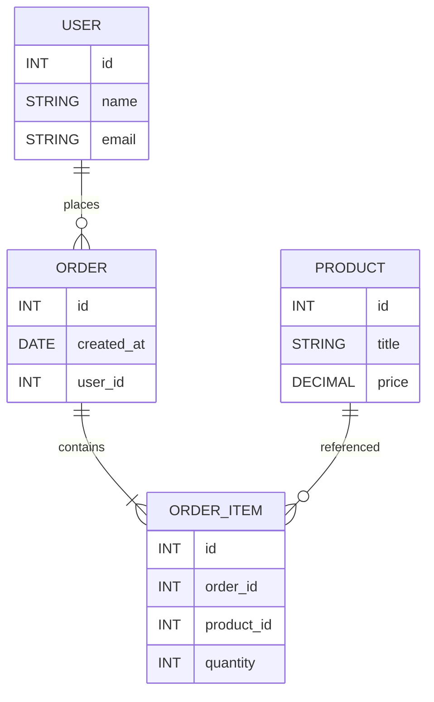
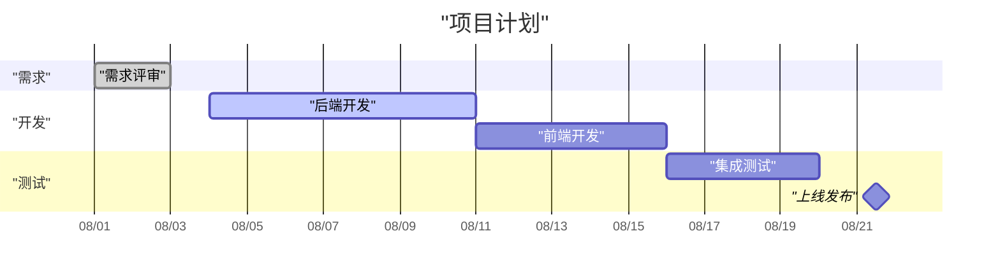
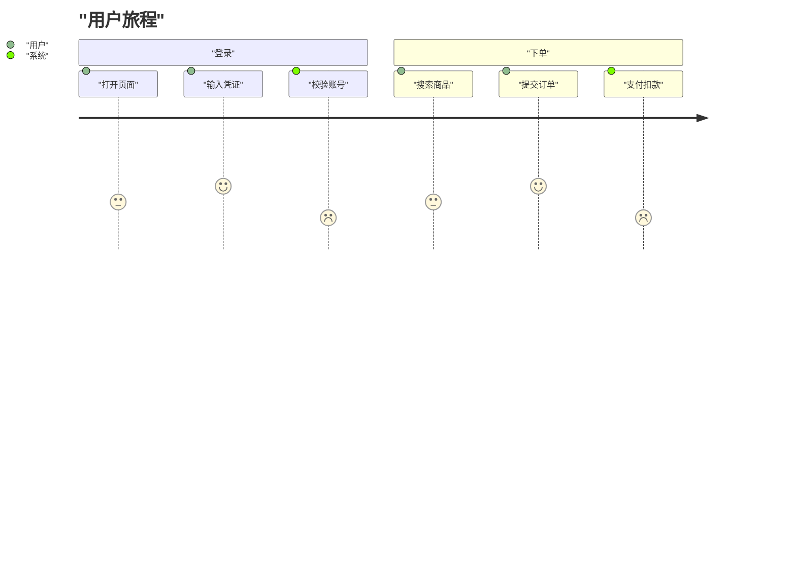
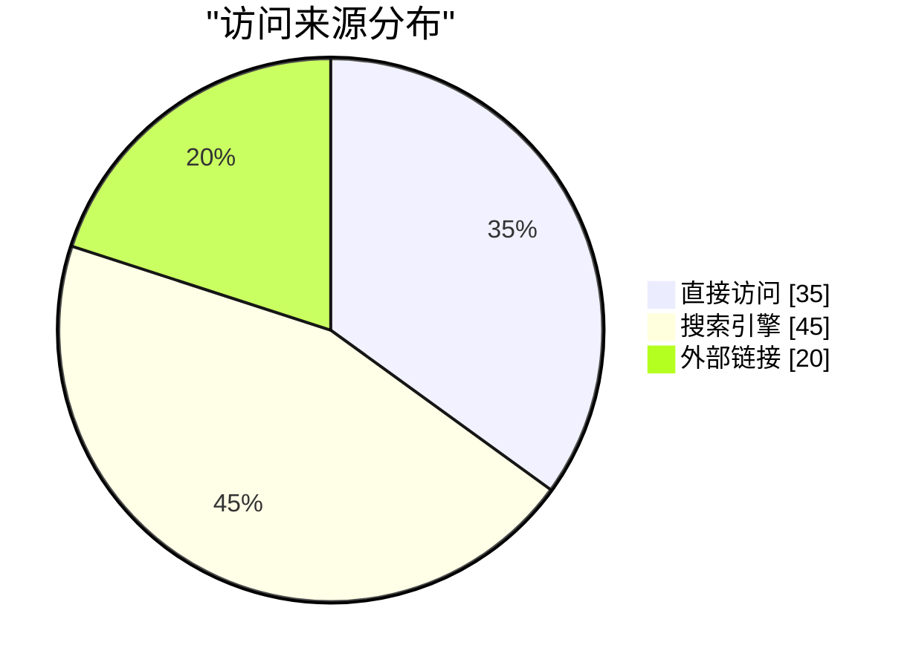
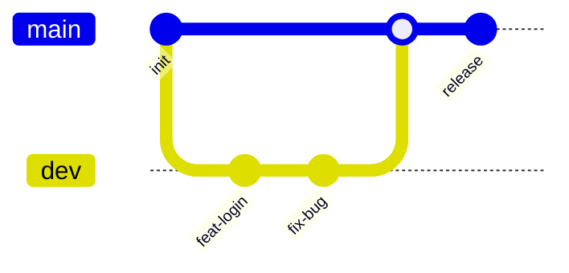
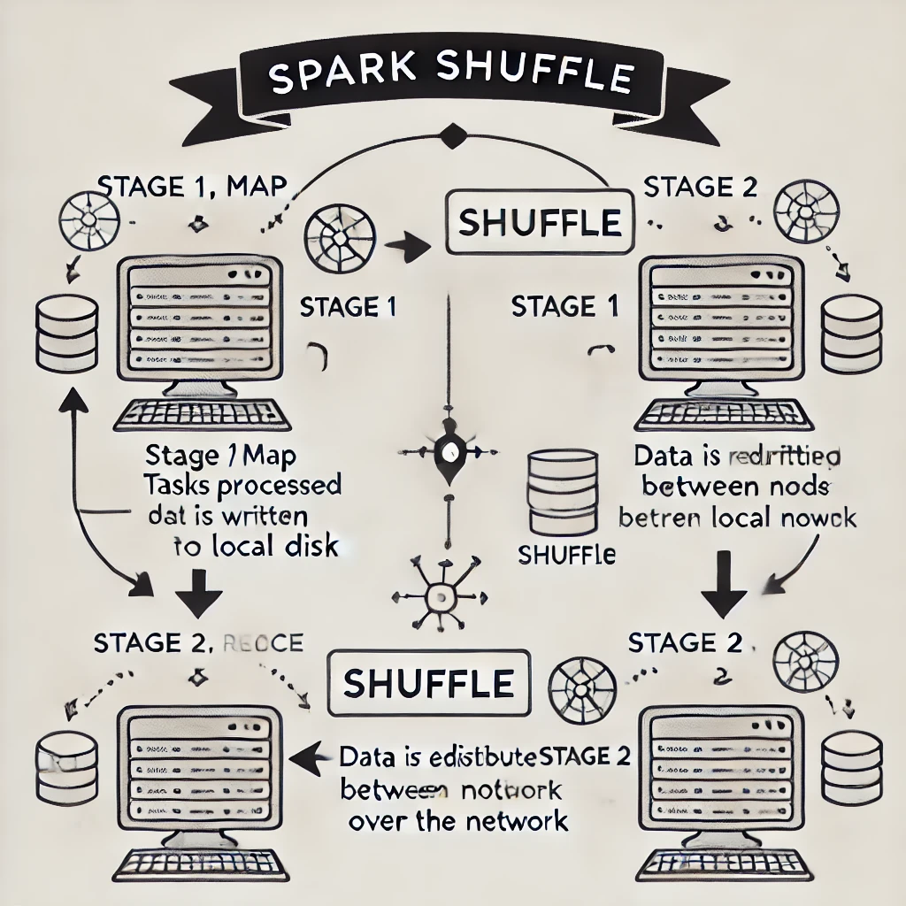
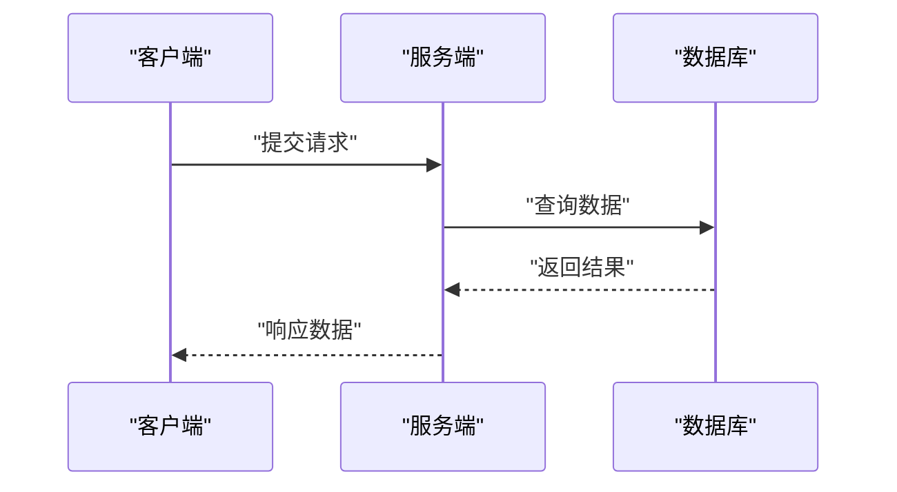

# Markdown 使用指南

## 目录
- 10.1 Markdown 基础语法示例
- 10.2 常用语法速查表
- 10.3 高级语法与扩展
- 10.4 Mermaid 流程图与时序图
- 10.5 写作规范与最佳实践
- 10.6 渲染差异与排错指南
- 10.7 业务落地与协作建议
- 10.8 高频面试题（Q&A）
- 10.9 参考资料

## 10.1 Markdown 基础语法示例

> 引用

---

### 表格
name|age|weight
-|-:|:-
默认居中|靠右|靠左
Ralph<br>很好<br>表格内换行|29|79

---

### 分割线
<hr style="height: 4px; border: none; background: linear-gradient(to right, red, orange, yellow, green, blue, indigo, violet);">

---

### 列表
- 黄刚
- 司马光
- 黄继光

1. general
2. capton

---

### 文本样式
*斜体 command i*

**加粗 command B**

---

### 代码块
```
北京
```

#### 类图（Class Diagram）

> 规则：显示文本可用双引号包裹；类名/成员名等标识符请按语法使用未加引号的标识符。

```mermaid
classDiagram
  class Animal {
    +String name
    +void eat()
    +void makeSound()
  }

  class Dog {
    +void bark()
  }

  Animal <|-- Dog

  %% 别名 + 显示名
  class "宠物狗" as PetDog
  Dog <|-- PetDog
```

#### 状态图（State Diagram）

```mermaid
stateDiagram-v2
  [*] --> idle
  state "空闲" as idle
  idle --> "处理中": "开始"
  "处理中" --> "完成": "成功"
  "处理中" --> "失败": "异常"
  "失败" --> idle: "重试"
  "完成" --> [*]
```

#### ER 图（Entity-Relationship Diagram）



#### 甘特图（Gantt）



#### 用户旅程图（Journey）



#### 饼图（Pie）



#### 需求图（Requirement Diagram）

```mermaid
requirementDiagram
  requirement "REQ-1" {
    id: "REQ-1"
    text: "用户必须登录才能下单"
    risk: high
    verifymethod: test
  }
  requirement "REQ-2" {
    id: "REQ-2"
    text: "支付必须在3秒内完成"
    risk: medium
    verifymethod: analysis
  }

  component "AuthService"
  component "PaymentService"
  test "LoginTest"
  test "PaymentPerfTest"

  "AuthService" - satisfies -> "REQ-1"
  "PaymentService" - satisfies -> "REQ-2"
  "LoginTest" - verifies -> "REQ-1"
  "PaymentPerfTest" - verifies -> "REQ-2"
```

#### Git 图（Git Graph）

> 说明：分支名等标识符按语法不加引号；提交信息为显示文本可加双引号。



#### 流程图进阶（方向与子图）

```mermaid
flowchart LR
  subgraph "子流程A"
    "开始A" --> "处理A"
    "处理A" --> "结束A"
  end
  subgraph "子流程B"
    "开始B" --> "处理B"
    "处理B" --> "结束B"
  end
  "结束A" -.-> |"触发"| "开始B"
```

---

### 行内代码
`回家` 行内代码

---

### 标题
一级标题

---

### 分割线
****
---

### 复选框
- [ ] 生成复选框，文字前面要有空格
- [x] 选中复选框
- [ ] 我爱朝鲜，将军的恩情还不完

---

### 插入链接
[**插入链接**](https://cf.cloudglab.cn/pages/viewpage.action?pageId=318865383)

---

### 插入图片


---

### 折叠代码
<details>
	<summary>折叠代码（点击展开）</summary>

```
hello world
```

</details>

---

## 10.2 常用语法速查表

| 类别 | 语法 | 示例 | 备注 |
|---|---|---|---|
| 标题 | `#` 到 `######` | `### 小标题` | 最多到 6 级，建议不超过 4 级 |
| 斜体 | `*text*` 或 `_text_` | `*强调*` | |
| 加粗 | `**text**` | `**重点**` | 文档关键点请加粗 |
| 删除线 | `~~text~~` | `~~废弃~~` | GFM 支持 |
| 行内代码 | `` `code` `` | `` `hello` `` | 保持短小 |
| 代码块 | 三反引号+语言 | ```python ... ``` | 指定语言启用高亮 |
| 列表（有序） | `1. item` | `1. A` | 自动编号 |
| 列表（无序） | `- item` | `- A` | 使用 `-` 统一风格 |
| 任务列表 | `- [ ]` / `- [x]` | `- [x] done` | GFM 支持 |
| 链接 | `[text](url)` | `[站点](https://example.com)` | 链接请加描述性锚文本 |
| 图片 | `` | `` | 使用相对路径并提供 alt |
| 引用 | `> text` | `> note` | 支持多级引用 |
| 分割线 | `---` 或 `***` | `---` | 建议使用 `---` |
| 表格 | `|` 分列 | `a|b` | 对齐用 `:-`, `-:` |

---

## 10.3 高级语法与扩展

#### 脚注（Footnotes）
这是一个脚注示例[^footnote1]，可用于补充说明或引用来源。

[^footnote1]: 脚注内容，这里可以放较长的补充说明或参考链接。

#### 注释与折叠区域
- HTML 注释不会显示：`<!-- hidden note -->`
- 折叠区域适合放示例、日志与长代码：

```html
<details>
  <summary>点击展开示例</summary>

  这里可以放更详细的演示代码、日志或截图。
</details>
```

#### 目录（TOC）
- 有些渲染器（如 Typora）支持 `[TOC]` 自动生成目录
- GitHub 建议手动维护“目录”块，或使用工具在构建阶段生成

#### 公式（可选，视平台）
- 内联：\( E = mc^2 \)
- 块级：

\[
\int_{-\infty}^{+\infty} e^{-x^2} \, dx = \sqrt{\pi}
\]

> 注意：不同平台对公式支持不同，需确认是否启用 KaTeX/MathJax。

#### 表格进阶：对齐与换行
- 对齐：`:-`（左）、`-:`（右）、`:-:`（居中）
- 单元格内换行：使用 `<br>`

#### 图片进阶：尺寸与相对路径
- 推荐使用相对路径并纳入仓库版本控制
- 不同平台的宽高语法支持不同，通用方案是使用 HTML：

```html

```

---

## 10.4 Mermaid 流程图与时序图

> 渲染注意：所有节点与文字请使用双引号包裹，避免渲染失败（仓库规则要求）。

#### 流程图

```mermaid
flowchart TD
  "开始" --> "校验输入"
  "校验输入" -- "合法" --> "执行处理"
  "校验输入" -- "不合法" --> "返回错误"
  "执行处理" --> "生成结果"
  "生成结果" --> "结束"
```

#### 时序图



---

## 10.5 写作规范与最佳实践

#### 结构化与层次
- 标题层级不超过 4 级，保证清晰的知识树
- 一个标题讲一个知识点，避免冗余与重复
- 重要结论与关键术语使用加粗强调（如：**重点**、**注意**）

#### 文风与可读性
- 句式简洁，段落短小，优先使用列表与表格表达
- 代码尽量短小可运行，必要处配合流程图/时序图
- 链接使用描述性锚文本，不要粘贴裸 URL

#### 可维护性
- 统一图片相对路径与命名规范
- 大文档按章节扩充，目录与编号同步更新
- 避免平台私有语法，或在文中明确平台依赖

---

## 10.6 渲染差异与排错指南

| 场景 | 现象 | 可能原因 | 解决建议 |
|---|---|---|---|
| 图片不显示 | 占位但无图 | 路径或大小写错误 | 使用相对路径；核对大小写；确保文件已入库 |
| Mermaid 不渲染 | 空白或报错 | 未加双引号；平台未启用 | 所有文本用双引号；确认平台支持并开启 |
| 公式不显示 | 公式原样输出 | 平台未启用 KaTeX/MathJax | 改用图片/表格表达；或开启公式渲染 |
| 表格错位 | 列宽超长 | 未控制列内容长度 | 拆分列；使用换行 `<br>`；合理裁剪 |
| 代码无高亮 | 颜色全灰 | 未指定语言 | 使用带语言的代码围栏，如 ```python |
| 目录不生效 | 无目录 | 渲染器不支持 | 手动维护目录；使用构建工具生成 |

---
