## Spark重点内容源码讲解

### 核心模块源码

#### SparkContext初始化流程图

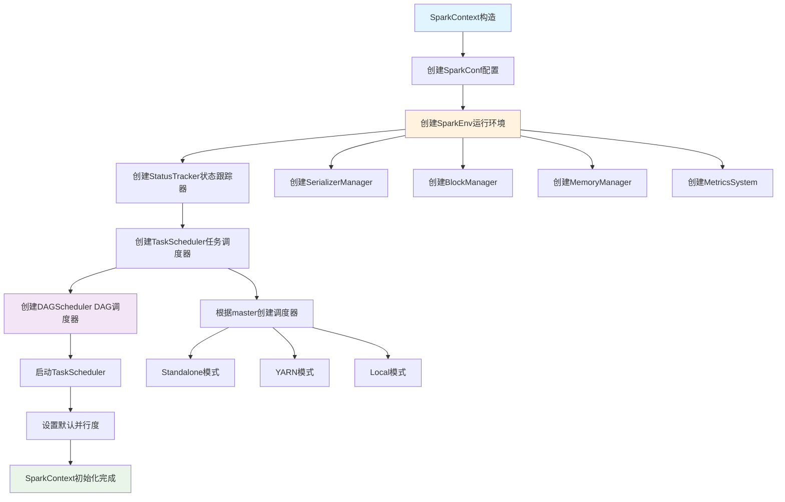

#### SparkContext初始化源码分析
```scala
// SparkContext.scala 核心初始化流程
class SparkContext(config: SparkConf) extends Logging {
  
  // 1. 创建SparkEnv - 核心运行环境
  private val env: SparkEnv = {
    SparkEnv.createDriverEnv(conf, isLocal, listenerBus, numCores, mockOutputCommitCoordinator)
  }
  
  // 2. 创建状态跟踪器
  private val statusTracker = new SparkStatusTracker(this, sparkUI)
  
  // 3. 创建任务调度器
  private val (sched, ts) = SparkContext.createTaskScheduler(this, master, deployMode)
  private val taskScheduler = ts
  
  // 4. 创建DAG调度器
  private val dagScheduler = new DAGScheduler(this)
  
  // 5. 启动任务调度器
  taskScheduler.start()
  
  // 6. 设置默认并行度
  private val defaultParallelism: Int = taskScheduler.defaultParallelism
  
  // 核心方法：创建RDD
  def parallelize[T: ClassTag](
      seq: Seq[T],
      numSlices: Int = defaultParallelism): RDD[T] = withScope {
    new ParallelCollectionRDD[T](this, seq, numSlices, Map[Int, Seq[String]]())
  }
  
  // 核心方法：提交作业
  def runJob[T, U: ClassTag](
      rdd: RDD[T],
      func: (TaskContext, Iterator[T]) => U,
      partitions: Seq[Int],
      resultHandler: (Int, U) => Unit): Unit = {
    dagScheduler.runJob(rdd, func, partitions, callSite, resultHandler, localProperties.get)
  }
}
```

#### RDD操作执行流程图

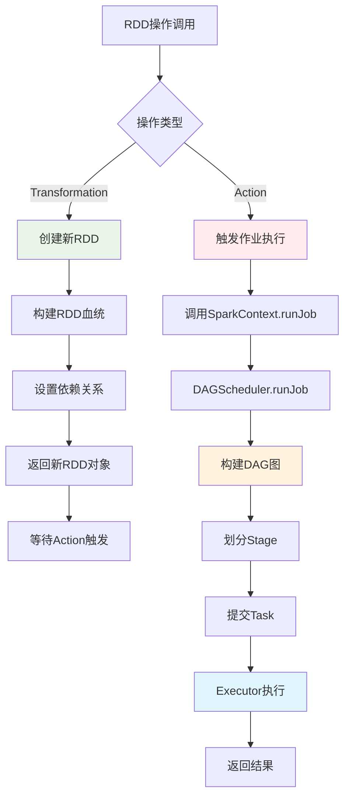

#### RDD五大特性实现流程

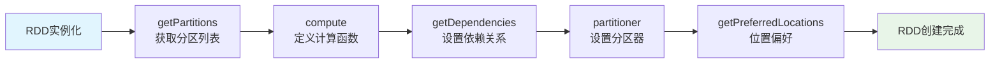

#### RDD源码核心实现
```scala
// RDD.scala 核心抽象
abstract class RDD[T: ClassTag](
    @transient private var _sc: SparkContext,
    @transient private var deps: Seq[Dependency[_]]
  ) extends Serializable with Logging {

  // 五大特性的具体实现
  
  // 1. 分区列表
  protected def getPartitions: Array[Partition]
  
  // 2. 计算函数
  def compute(split: Partition, context: TaskContext): Iterator[T]
  
  // 3. 依赖关系
  protected def getDependencies: Seq[Dependency[_]] = deps
  
  // 4. 分区器（可选）
  @transient val partitioner: Option[Partitioner] = None
  
  // 5. 位置偏好（可选）
  protected def getPreferredLocations(split: Partition): Seq[String] = Nil
  
  // Transformation操作实现
  def map[U: ClassTag](f: T => U): RDD[U] = withScope {
    val cleanF = sc.clean(f)
    new MapPartitionsRDD[U, T](this, (context, pid, iter) => iter.map(cleanF))
  }
  
  def filter(f: T => Boolean): RDD[T] = withScope {
    val cleanF = sc.clean(f)
    new MapPartitionsRDD[T, T](
      this,
      (context, pid, iter) => iter.filter(cleanF),
      preservesPartitioning = true)
  }
  
  def reduceByKey(func: (T, T) => T): RDD[T] = self.withScope {
    reduceByKey(defaultPartitioner(self), func)
  }
  
  // Action操作实现
  def collect(): Array[T] = withScope {
    val results = sc.runJob(this, (iter: Iterator[T]) => iter.toArray)
    Array.concat(results: _*)
  }
  
  def count(): Long = sc.runJob(this, Utils.getIteratorSize _).sum
  
  def foreach(f: T => Unit): Unit = withScope {
    val cleanF = sc.clean(f)
    sc.runJob(this, (iter: Iterator[T]) => iter.foreach(cleanF))
  }
}
```

### 调度器源码

#### DAGScheduler作业提交流程图

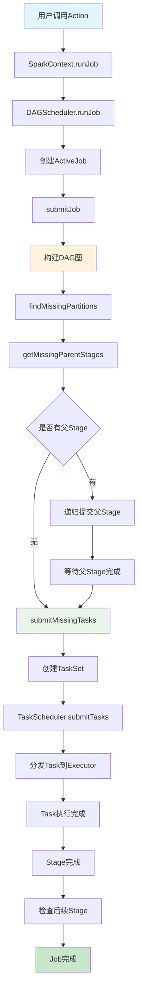

#### Stage划分算法流程图

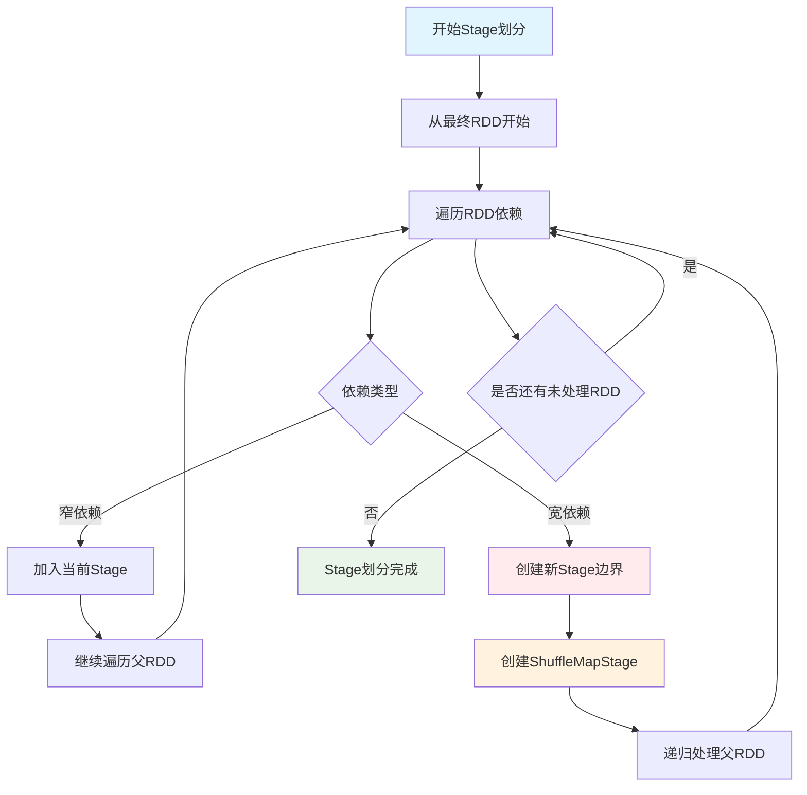

#### DAGScheduler源码分析
```scala
// DAGScheduler.scala 核心调度逻辑
class DAGScheduler(
    private[scheduler] val sc: SparkContext,
    private[scheduler] val taskScheduler: TaskScheduler,
    listenerBus: LiveListenerBus,
    mapOutputTracker: MapOutputTrackerMaster,
    blockManagerMaster: BlockManagerMaster,
    env: SparkEnv,
    clock: Clock = new SystemClock())
  extends Logging {

  // 事件处理循环
  private val eventProcessLoop = new DAGSchedulerEventProcessLoop(this)
  
  // 提交作业的核心方法
  def runJob[T, U](
      rdd: RDD[T],
      func: (TaskContext, Iterator[T]) => U,
      partitions: Seq[Int],
      callSite: CallSite,
      resultHandler: (Int, U) => Unit,
      properties: Properties): Unit = {
    
    val start = System.nanoTime
    val waiter = submitJob(rdd, func, partitions, callSite, resultHandler, properties)
    ThreadUtils.awaitReady(waiter, Duration.Inf)
    waiter.value.get match {
      case scala.util.Success(_) =>
        logInfo("Job %d finished: %s, took %f s".format
          (waiter.jobId, callSite.shortForm, (System.nanoTime - start) / 1e9))
      case scala.util.Failure(exception) =>
        logInfo("Job %d failed: %s, took %f s".format
          (waiter.jobId, callSite.shortForm, (System.nanoTime - start) / 1e9))
        throw exception
    }
  }
  
  // Stage划分核心算法
  private def getOrCreateShuffleMapStage(
      shuffleDep: ShuffleDependency[_, _, _],
      firstJobId: Int): ShuffleMapStage = {
    
    shuffleIdToMapStage.get(shuffleDep.shuffleId) match {
      case Some(stage) =>
        stage
        
      case None =>
        // 递归创建父Stage
        getMissingAncestorShuffleDependencies(shuffleDep.rdd).foreach { dep =>
          if (!shuffleIdToMapStage.contains(dep.shuffleId)) {
            createShuffleMapStage(dep, firstJobId)
          }
        }
        createShuffleMapStage(shuffleDep, firstJobId)
    }
  }
  
  // 查找缺失的父依赖
  private def getMissingAncestorShuffleDependencies(
      rdd: RDD[_]): ArrayStack[ShuffleDependency[_, _, _]] = {
    val ancestors = new ArrayStack[ShuffleDependency[_, _, _]]
    val visited = new HashSet[RDD[_]]
    val waitingForVisit = new ArrayStack[RDD[_]]
    
    waitingForVisit.push(rdd)
    while (waitingForVisit.nonEmpty) {
      val toVisit = waitingForVisit.pop()
      if (!visited(toVisit)) {
        visited += toVisit
        toVisit.dependencies.foreach {
          case shuffleDep: ShuffleDependency[_, _, _] =>
            if (!shuffleIdToMapStage.contains(shuffleDep.shuffleId)) {
              ancestors.push(shuffleDep)
              waitingForVisit.push(shuffleDep.rdd)
            }
          case narrowDep: NarrowDependency[_] =>
            waitingForVisit.push(narrowDep.rdd)
        }
      }
    }
    ancestors
  }
  
  // 提交Stage
  private def submitStage(stage: Stage): Unit = {
    val jobId = activeJobForStage(stage)
    if (jobId.isDefined) {
      if (!waitingStages(stage) && !runningStages(stage) && !failedStages(stage)) {
        val missing = getMissingParentStages(stage).sortBy(_.id)
        if (missing.isEmpty) {
          submitMissingTasks(stage, jobId.get)
        } else {
          for (parent <- missing) {
            submitStage(parent)
          }
          waitingStages += stage
        }
      }
    }
  }
}
```

### 存储系统源码

#### BlockManager源码分析
```scala
// BlockManager.scala 存储管理核心
class BlockManager(
    executorId: String,
    rpcEnv: RpcEnv,
    val master: BlockManagerMaster,
    val serializerManager: SerializerManager,
    val conf: SparkConf,
    memoryManager: MemoryManager,
    mapOutputTracker: MapOutputTracker,
    shuffleManager: ShuffleManager,
    val blockTransferService: BlockTransferService,
    securityManager: SecurityManager,
    numUsableCores: Int)
  extends BlockDataManager with BlockEvictionHandler with Logging {

  // 内存存储
  private[spark] val memoryStore =
    new MemoryStore(conf, blockInfoManager, serializerManager, memoryManager, this)
  
  // 磁盘存储
  private[spark] val diskStore = new DiskStore(conf, diskBlockManager, securityManager)
  
  // 获取Block的核心方法
  def getBlockData(blockId: BlockId): ManagedBuffer = {
    if (blockId.isShuffle) {
      shuffleManager.shuffleBlockResolver.getBlockData(blockId.asInstanceOf[ShuffleBlockId])
    } else {
      getLocalBytes(blockId) match {
        case Some(blockData) =>
          new BlockManagerManagedBuffer(blockInfoManager, blockId, blockData, true)
        case None =>
          throw new BlockNotFoundException(s"Block $blockId not found")
      }
    }
  }
  
  // 存储Block的核心方法
  def putBlockData(
      blockId: BlockId,
      data: ManagedBuffer,
      level: StorageLevel,
      classTag: ClassTag[_]): Boolean = {
    putBytes(blockId, new ChunkedByteBuffer(data.nioByteBuffer()), level)(classTag)
  }
  
  // 内存和磁盘存储逻辑
  private def doPutBytes[T](
      blockId: BlockId,
      bytes: ChunkedByteBuffer,
      level: StorageLevel,
      classTag: ClassTag[T],
      tellMaster: Boolean = true,
      keepReadLock: Boolean = false): Boolean = {
    
    doPut(blockId, level, classTag, tellMaster = tellMaster, keepReadLock = keepReadLock) { info =>
      val startTimeMs = System.currentTimeMillis
      
      // 尝试内存存储
      val res = if (level.useMemory) {
        memoryStore.putBytes(blockId, bytes, level.memoryStorageLevel)
      } else {
        false
      }
      
      // 内存存储失败，尝试磁盘存储
      if (!res && level.useDisk) {
        diskStore.putBytes(blockId, bytes)
      } else {
        res
      }
    }
  }
  
  // Block淘汰策略
  override def dropFromMemory(
      blockId: BlockId,
      data: () => Either[Array[T], ChunkedByteBuffer]): StorageLevel = {
    
    val info = blockInfoManager.lockForWriting(blockId)
    var blockIsUpdated = false
    val level = info.level
    
    try {
      if (level.useDisk && !diskStore.contains(blockId)) {
        data() match {
          case Left(elements) =>
            diskStore.put(blockId) { fileOutputStream =>
              serializerManager.dataSerializeStream(blockId,
                fileOutputStream, elements.toIterator)(info.classTag.asInstanceOf[ClassTag[T]])
            }
          case Right(bytes) =>
            diskStore.putBytes(blockId, bytes)
        }
        blockIsUpdated = true
      }
      
      memoryStore.remove(blockId)
      val droppedMemorySize = if (blockIsUpdated) 0L else info.size
      val blockIsRemoved = !level.useDisk
      
      if (blockIsRemoved) {
        blockInfoManager.removeBlock(blockId)
      }
      
      if (blockIsUpdated) {
        StorageLevel.DISK_ONLY
      } else {
        StorageLevel.NONE
      }
      
    } finally {
      blockInfoManager.unlock(blockId)
    }
  }
}
```

### 网络通信源码

#### NettyBlockTransferService源码
```scala
// NettyBlockTransferService.scala 网络传输核心
class NettyBlockTransferService(
    conf: SparkConf,
    securityManager: SecurityManager,
    bindAddress: String,
    advertiseAddress: String,
    numCores: Int)
  extends BlockTransferService {

  private[this] var transportContext: TransportContext = _
  private[this] var server: TransportServer = _
  private[this] var clientFactory: TransportClientFactory = _
  
  override def init(blockDataManager: BlockDataManager): Unit = {
    val rpcHandler = new NettyBlockRpcServer(conf.getAppId, serializer, blockDataManager)
    var serverBootstrap: Option[TransportServerBootstrap] = None
    var clientBootstrap: Option[TransportClientBootstrap] = None
    
    if (authEnabled) {
      serverBootstrap = Some(new AuthServerBootstrap(transportConf, securityManager))
      clientBootstrap = Some(new AuthClientBootstrap(transportConf, conf.getAppId, securityManager))
    }
    
    transportContext = new TransportContext(transportConf, rpcHandler)
    clientFactory = transportContext.createClientFactory(clientBootstrap.toSeq.asJava)
    server = createServer(serverBootstrap.toList)
  }
  
  // 获取远程Block
  override def fetchBlocks(
      host: String,
      port: Int,
      execId: String,
      blockIds: Array[String],
      listener: BlockFetchingListener,
      tempFileManager: DownloadFileManager): Unit = {
    
    try {
      val client = clientFactory.createClient(host, port)
      new OneForOneBlockFetcher(client, conf.getAppId, execId,
        blockIds, listener, transportConf, tempFileManager).start()
    } catch {
      case e: Exception =>
        logError(s"Exception while beginning fetchBlocks", e)
        blockIds.foreach(listener.onBlockFetchFailure(_, e))
    }
  }
  
  // 上传Block到远程
  override def uploadBlock(
      hostname: String,
      port: Int,
      execId: String,
      blockId: BlockId,
      blockData: ManagedBuffer,
      level: StorageLevel,
      classTag: ClassTag[_]): Future[Unit] = {
    
    val result = Promise[Unit]()
    val client = clientFactory.createClient(hostname, port)
    
    val callback = new RpcResponseCallback {
      override def onSuccess(response: ByteBuffer): Unit = {
        result.success(())
      }
      
      override def onFailure(e: Throwable): Unit = {
        result.failure(e)
      }
    }
    
    client.sendRpc(new UploadBlock(conf.getAppId, execId, blockId.toString,
      blockData.nioByteBuffer(), level, classTag).toByteBuffer, callback)
    
    result.future
  }
}
```
### 算子内存存储过程源码详解 

#### GroupByKey算子内存存储过程

**GroupByKey内存存储流程图**：

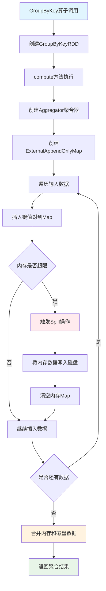

**ExternalAppendOnlyMap内存管理流程**：

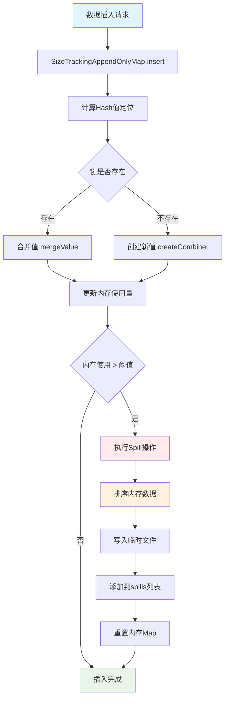

```scala
// GroupByKey算子核心实现
class GroupByKeyRDD[K: ClassTag, V: ClassTag](
    prev: RDD[(K, V)],
    part: Partitioner)
  extends RDD[(K, Iterable[V])](prev) {

  override def compute(split: Partition, context: TaskContext): Iterator[(K, Iterable[V])] = {
    // 1. 创建聚合器
    val aggregator = new Aggregator[K, V, ArrayBuffer[V]](
      createCombiner = (v: V) => ArrayBuffer(v),
      mergeValue = (buf: ArrayBuffer[V], v: V) => buf += v,
      mergeCombiners = (buf1: ArrayBuffer[V], buf2: ArrayBuffer[V]) => buf1 ++= buf2
    )
    
    // 2. 使用ExternalAppendOnlyMap进行聚合
    val externalMap = new ExternalAppendOnlyMap[K, V, ArrayBuffer[V]](aggregator)
    
    // 3. 插入所有键值对
    val iter = firstParent[(K, V)].iterator(split, context)
    while (iter.hasNext) {
      val (k, v) = iter.next()
      externalMap.insert(k, v)
    }
    
    // 4. 返回聚合结果
    externalMap.iterator
  }
}
```


```scala
// ExternalAppendOnlyMap核心实现
class ExternalAppendOnlyMap[K, V, C](
    aggregator: Aggregator[K, V, C],
    serializer: Serializer = SparkEnv.get.serializer)
  extends Spillable[WritablePartitionedPairCollection[K, C]](SparkEnv.get.blockManager.master)
  with Logging {

  // 内存中的Map
  private var map = new SizeTrackingAppendOnlyMap[K, C]
  
  // Spill文件列表
  private val spills = new ArrayBuffer[SpilledFile]
  
  // 插入键值对
  def insert(key: K, value: V): Unit = {
    // 1. 尝试在内存中聚合
    val update = (hadValue: Boolean, oldValue: C) => {
      if (hadValue) {
        aggregator.mergeValue(oldValue, value)
      } else {
        aggregator.createCombiner(value)
      }
    }
    
    map.changeValue(key, update)
    
    // 2. 检查是否需要Spill
    if (map.estimateSize() > myMemoryThreshold) {
      spill()
    }
  }
  
  // Spill到磁盘
  private def spill(): Unit = {
    val spillFile = spillMemoryIteratorToDisk(map.destructiveSortedWritablePartitionedIterator())
    spills += spillFile
    map = new SizeTrackingAppendOnlyMap[K, C]
  }
  
  // 获取最终结果
  def iterator: Iterator[(K, C)] = {
    // 合并内存中的结果和Spill文件
    val memoryIterator = map.destructiveSortedWritablePartitionedIterator()
    val spillIterators = spills.map(_.iterator)
    
    // 返回合并后的迭代器
    new MergedIterator(memoryIterator +: spillIterators)
  }
}
```

#### ReduceByKey算子内存存储过程

**ReduceByKey内存存储流程图**：

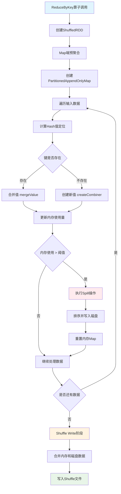

**PartitionedAppendOnlyMap操作流程**：

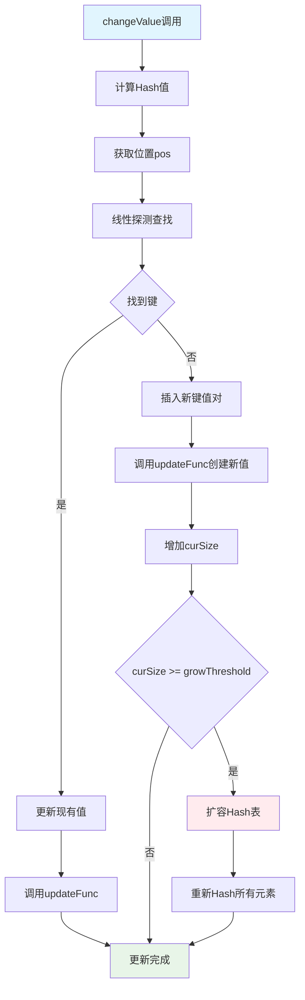

```scala
// PartitionedAppendOnlyMap的changeValue方法
def changeValue(key: K, updateFunc: (Boolean, V) => V): Unit = {
  val hash = getHash(key)
  val pos = getPos(hash)
  
  var i = pos
  while (data(2 * i) != null) {
    if (data(2 * i) == key) {
      // 找到现有键，更新值
      val hadValue = true
      val oldValue = data(2 * i + 1).asInstanceOf[V]
      val newValue = updateFunc(hadValue, oldValue)
      data(2 * i + 1) = newValue.asInstanceOf[AnyRef]
      return
    }
    i = (i + 1) % (data.length / 2)
  }
  
  // 未找到键，插入新值
  val hadValue = false
  val newValue = updateFunc(hadValue, null.asInstanceOf[V])
  data(2 * i) = key.asInstanceOf[AnyRef]
  data(2 * i + 1) = newValue.asInstanceOf[AnyRef]
  curSize += 1
  
  if (curSize >= growThreshold) {
    growTable()
  }
}
```

#### Join算子内存存储过程

**Join算子内存存储流程图**：

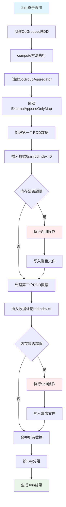

**CoGroup聚合过程流程**：

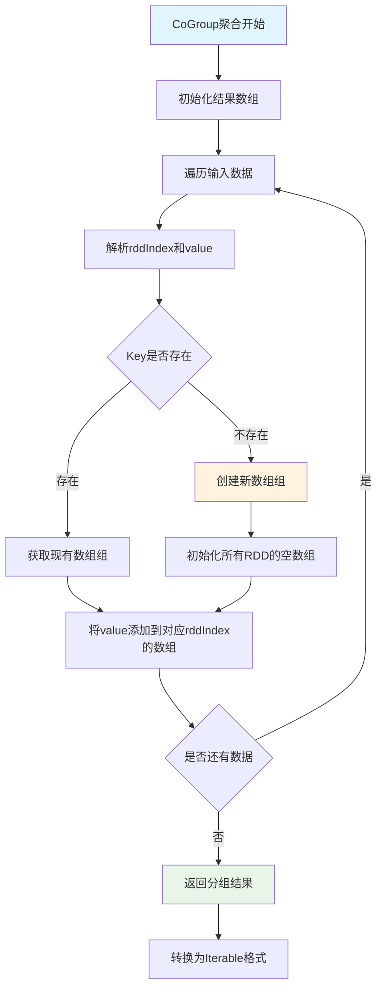

```scala
// CoGroupedRDD核心实现
class CoGroupedRDD[K: ClassTag](
    rdds: Seq[RDD[(K, _)]],
    part: Partitioner)
  extends RDD[(K, Array[Iterable[_]])](rdds.head.context, Nil) {

  override def compute(split: Partition, context: TaskContext): Iterator[(K, Array[Iterable[_]])] = {
    // 1. 创建CoGroup聚合器
    val aggregator = new CoGroupAggregator[K]
    
    // 2. 使用ExternalAppendOnlyMap进行分组
    val externalMap = new ExternalAppendOnlyMap[K, (Int, Any), Array[ArrayBuffer[Any]]](aggregator)
    
    // 3. 插入所有RDD的数据
    rdds.zipWithIndex.foreach { case (rdd, rddIndex) =>
      val iter = rdd.iterator(split, context)
      while (iter.hasNext) {
        val (k, v) = iter.next()
        externalMap.insert(k, (rddIndex, v))
      }
    }
    
    // 4. 返回分组结果
    externalMap.iterator.map { case (k, groups) =>
      (k, groups.map(_.toIterable))
    }
  }
}
```

#### 内存存储状态监控


```scala
// 内存使用监控组件
class MemoryMonitor {
  // 监控Map的内存使用
  def monitorMapMemory(map: SizeTrackingAppendOnlyMap[_, _]): MemoryUsage = {
    val estimatedSize = map.estimateSize()
    val currentMemory = map.currentMemory
    val maxMemory = map.maxMemory
    
    MemoryUsage(
      estimatedSize = estimatedSize,
      currentMemory = currentMemory,
      maxMemory = maxMemory,
      utilization = currentMemory.toDouble / maxMemory
    )
  }
  
  // 监控Spill状态
  def monitorSpillStatus(externalMap: ExternalAppendOnlyMap[_, _, _]): SpillStatus = {
    val spillCount = externalMap.spills.size
    val totalSpillSize = externalMap.spills.map(_.size).sum
    
    SpillStatus(
      spillCount = spillCount,
      totalSpillSize = totalSpillSize,
      averageSpillSize = if (spillCount > 0) totalSpillSize / spillCount else 0
    )
  }
}

case class MemoryUsage(
  estimatedSize: Long,
  currentMemory: Long,
  maxMemory: Long,
  utilization: Double)

case class SpillStatus(
  spillCount: Int,
  totalSpillSize: Long,
  averageSpillSize: Long)
```


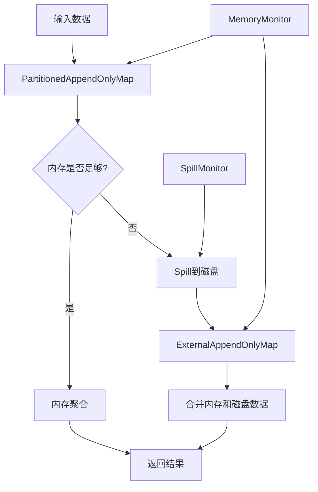

#### 内存存储优化策略


```scala
// 内存分配优化
class MemoryOptimizer {
  // 动态调整内存阈值
  def adjustMemoryThreshold(
      currentMemory: Long,
      maxMemory: Long,
      spillCount: Int): Long = {
    
    val utilization = currentMemory.toDouble / maxMemory
    
    if (utilization > 0.8 && spillCount > 0) {
      // 内存使用率高且有Spill，降低阈值
      (maxMemory * 0.6).toLong
    } else if (utilization < 0.5 && spillCount == 0) {
      // 内存使用率低且无Spill，提高阈值
      (maxMemory * 0.9).toLong
    } else {
      // 保持当前阈值
      (maxMemory * 0.8).toLong
    }
  }
  
  // 优化Map初始容量
  def optimizeInitialCapacity(dataSize: Long): Int = {
    val estimatedSize = (dataSize * 1.2).toInt
    math.max(64, math.min(estimatedSize, 1024 * 1024))
  }
}
```

---

### 任务提交流程源码解析

#### DAG的生成与依赖分析

**任务提交完整流程图**：

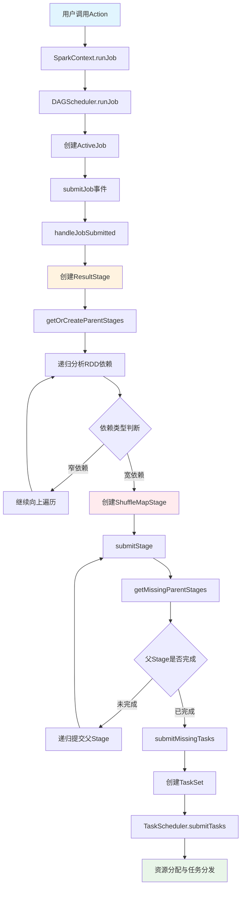

**DAG依赖分析流程图**：

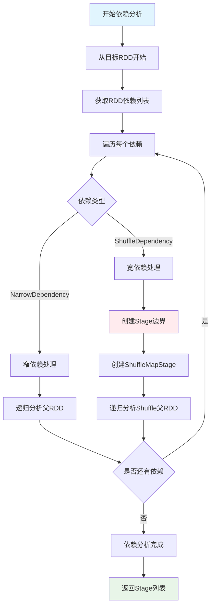

**用户触发Action时的完整流程**：

```scala
// 用户代码触发Action
val result = rdd.collect()

// SparkContext.collect()
def collect(): Array[T] = withScope {
  val results = sc.runJob(this, (iter: Iterator[T]) => iter.toArray)
  Array.concat(results: _*)
}

// SparkContext.runJob()
def runJob[T, U: ClassTag](
    rdd: RDD[T],
    func: (TaskContext, Iterator[T]) => U,
    partitions: Seq[Int],
    resultHandler: (Int, U) => Unit): Unit = {
  dagScheduler.runJob(rdd, func, partitions, callSite, resultHandler, localProperties.get)
}
```

**DAGScheduler依赖分析**：

```scala
// DAGScheduler.scala
private[scheduler] def getOrCreateParentStages(rdd: RDD[_], firstJobId: Int): List[Stage] = {
  val parents = new ArrayBuffer[Stage]()
  val visited = new HashSet[RDD[_]]
  
  def visit(r: RDD[_]): Unit = {
    if (!visited(r)) {
      visited += r
      for (dep <- r.dependencies) {
        dep match {
          case shufDep: ShuffleDependency[_, _, _] =>
            // 宽依赖，创建新的ShuffleMapStage
            parents += getOrCreateShuffleMapStage(shufDep, firstJobId)
          case _ =>
            // 窄依赖，递归访问父RDD
            visit(dep.rdd)
        }
      }
    }
  }
  
  visit(rdd)
  parents.toList
}
```

#### 任务分发与调度流程

**任务调度完整流程图**：

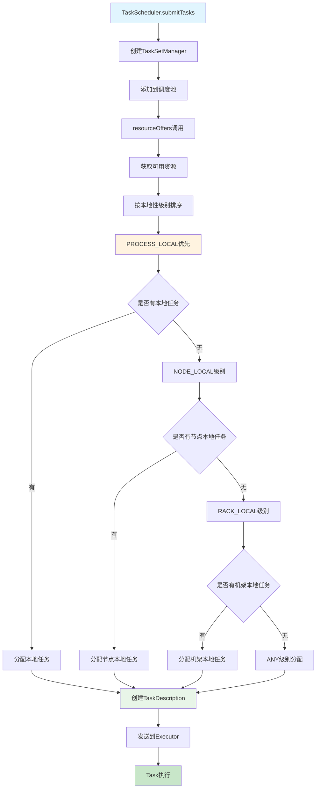

**资源分配本地性优化流程**：

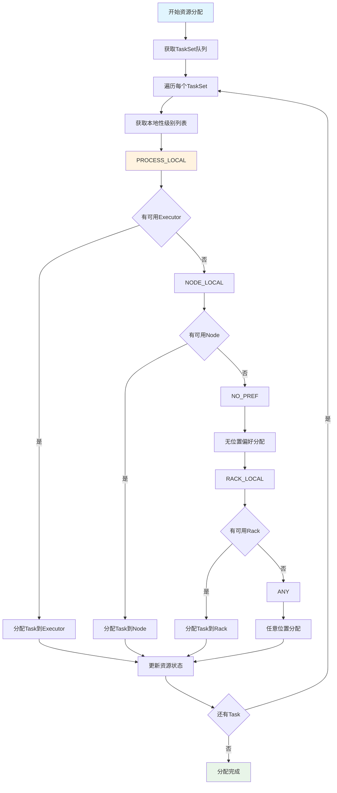

**完整的任务调度时序图**：

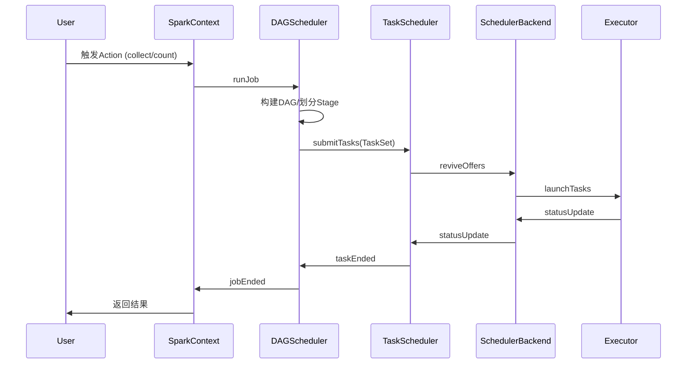

**TaskScheduler资源分配**：

```scala
// TaskSchedulerImpl.resourceOffers()
def resourceOffers(offers: IndexedSeq[WorkerOffer]): Seq[Seq[TaskDescription]] = {
  // 1. 随机打乱offers避免热点
  val shuffledOffers = Random.shuffle(offers)
  val tasks = shuffledOffers.map(o => new ArrayBuffer[TaskDescription](o.cores / CPUS_PER_TASK))
  val availableCpus = shuffledOffers.map(o => o.cores).toArray
  
  // 2. 按本地性级别分配任务
  val sortedTaskSets = rootPool.getSortedTaskSetQueue
  for (taskSet <- sortedTaskSets) {
    // PROCESS_LOCAL -> NODE_LOCAL -> NO_PREF -> RACK_LOCAL -> ANY
    for (currentMaxLocality <- taskSet.myLocalityLevels) {
      do {
        launchedAnyTask = resourceOfferSingleTaskSet(
          taskSet, currentMaxLocality, shuffledOffers, availableCpus, tasks)
      } while (launchedAnyTask)
    }
  }
  
  tasks
}
```

#### 失败重试与容错机制

**容错机制流程图**：

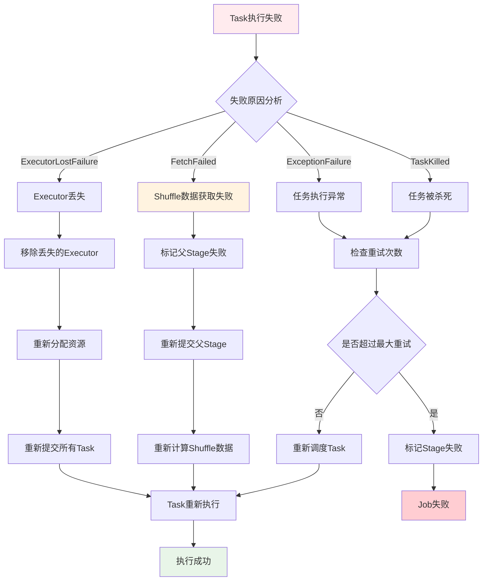

**RDD血统恢复流程图**：

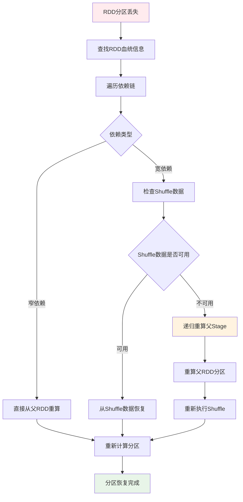

**DAGScheduler事件处理**：

```scala
// DAGSchedulerEventProcessLoop事件处理
private def doOnReceive(event: DAGSchedulerEvent): Unit = event match {
  case TaskFailed(taskId, taskType, reason, exception) =>
    reason match {
      case _: FetchFailed =>
        // Shuffle数据获取失败，需要重新计算父Stage
        val shuffleMapStage = shuffleIdToMapStage(reason.shuffleId)
        markStageAsFinished(shuffleMapStage, Some(reason.toString))
        submitStage(shuffleMapStage)
        
      case _: ExecutorLostFailure =>
        // Executor丢失，需要重新调度Task
        removeExecutorAndUnregisterOutputs(reason.execId, filesLost = true)
        
      case _: TaskKilled =>
        // Task被杀死，通常是推测执行
        logInfo(s"Task $taskId was killed")
        
      case _ =>
        // 其他异常，Task级别重试
        if (task.attempt < maxTaskFailures) {
          taskScheduler.submitTasks(createTaskSet(Array(task)))
        } else {
          abortStage(currentStage, s"Task $taskId failed $maxTaskFailures times")
        }
    }
    
  case StageCompleted(stage) =>
    // Stage完成，检查并提交依赖的Stage
    markStageAsFinished(stage)
    submitWaitingChildStages(stage)
}
```

#### Executor工作机制与Task执行

**Executor任务执行流程图**：

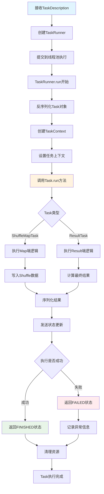

**Task执行上下文管理流程**：

```mermaid
graph TD
    A[TaskContext创建] --> B[设置Stage信息]
    B --> C[设置Partition信息]
    C --> D[初始化TaskMemoryManager]
    D --> E[设置MetricsSystem]
    E --> F[注册任务监听器]
    F --> G[开始Task执行]
    G --> H[监控内存使用]
    H --> I[收集执行指标]
    I --> J[处理中断信号]
    J --> K{Task是否完成}
    K -->|否| H
    K -->|是| L[清理TaskContext]
    L --> M[释放内存资源]
    M --> N[发送指标数据]
    N --> O[TaskContext销毁]
    
    style A fill:#e1f5fe
    style G fill:#fff3e0
    style O fill:#e8f5e8
```

**Executor任务执行详细流程**：

```scala
// Executor.launchTask()
def launchTask(context: ExecutorBackend, taskDescription: TaskDescription): Unit = {
  val tr = new TaskRunner(context, taskDescription)
  runningTasks.put(taskDescription.taskId, tr)
  threadPool.execute(tr)
}

// TaskRunner.run()
class TaskRunner(
    execBackend: ExecutorBackend,
    private val taskDescription: TaskDescription)
  extends Runnable {
  
  override def run(): Unit = {
    try {
      // 1. 反序列化Task
      val task = ser.deserialize[Task[Any]](
        taskDescription.serializedTask, 
        Thread.currentThread.getContextClassLoader)
      
      // 2. 设置TaskContext
      val taskContext = new TaskContextImpl(
        stageId = taskDescription.stageId,
        taskAttemptId = taskDescription.taskId,
        attemptNumber = taskDescription.attemptNumber,
        partitionId = task.partitionId,
        localProperties = taskDescription.properties,
        taskMemoryManager = taskMemoryManager,
        metricsSystem = env.metricsSystem)
      
      // 3. 执行Task
      val value = task.run(
        taskAttemptId = taskDescription.taskId,
        attemptNumber = taskDescription.attemptNumber,
        metricsSystem = env.metricsSystem)
      
      // 4. 序列化结果并返回
      val serializedResult = ser.serialize(value)
      execBackend.statusUpdate(
        taskDescription.taskId, 
        TaskState.FINISHED, 
        serializedResult)
        
    } catch {
      case e: Exception =>
        // 异常处理
        val reason = new ExceptionFailure(e, taskContext.taskMetrics())
        execBackend.statusUpdate(
          taskDescription.taskId, 
          TaskState.FAILED, 
          ser.serialize(TaskFailedReason(reason)))
    } finally {
      // 清理资源
      runningTasks.remove(taskDescription.taskId)
    }
  }
}
```

#### 数据读取、处理与RDD依赖

**RDD数据读取流程图**：

```mermaid
graph TD
    A[RDD.iterator调用] --> B{是否有缓存}
    B -->|有缓存| C[从缓存读取数据]
    B -->|无缓存| D{是否有Checkpoint}
    D -->|有Checkpoint| E[从Checkpoint读取]
    D -->|无Checkpoint| F[调用compute方法]
    F --> G{RDD类型}
    G -->|HadoopRDD| H[从HDFS读取]
    G -->|MapPartitionsRDD| I[调用父RDD.iterator]
    G -->|ShuffledRDD| J[从Shuffle数据读取]
    H --> K[返回数据迭代器]
    I --> L[递归调用父RDD]
    J --> M[读取Shuffle文件]
    C --> K
    E --> K
    L --> N[应用转换函数]
    M --> K
    N --> K
    K --> O[数据处理完成]
    
    style A fill:#e1f5fe
    style C fill:#e8f5e8
    style F fill:#fff3e0
    style O fill:#c8e6c9
```

**RDD依赖链递归调用流程**：

```mermaid
graph TD
    A[Task开始执行] --> B[调用ResultTask.runTask]
    B --> C[调用RDD.iterator]
    C --> D[检查存储级别]
    D --> E{是否缓存}
    E -->|是| F[从BlockManager获取]
    E -->|否| G[computeOrReadCheckpoint]
    G --> H{是否Checkpoint}
    H -->|是| I[从Checkpoint读取]
    H -->|否| J[调用compute方法]
    J --> K{RDD依赖类型}
    K -->|窄依赖| L[直接调用父RDD.iterator]
    K -->|宽依赖| M[从ShuffleReader读取]
    L --> N[递归处理父RDD]
    M --> O[读取Shuffle数据]
    N --> P[应用当前RDD的转换逻辑]
    O --> P
    F --> P
    I --> P
    P --> Q[返回处理后的数据]
    
    style A fill:#e1f5fe
    style J fill:#fff3e0
    style P fill:#e8f5e8
    style Q fill:#c8e6c9
```

**RDD依赖链调用流程**：

```scala
// RDD.iterator() 递归调用流程
final def iterator(split: Partition, context: TaskContext): Iterator[T] = {
  if (storageLevel != StorageLevel.NONE) {
    // 1. 尝试从缓存读取
    getOrCompute(split, context)
  } else {
    // 2. 直接计算
    computeOrReadCheckpoint(split, context)
  }
}

def computeOrReadCheckpoint(split: Partition, context: TaskContext): Iterator[T] = {
  if (isCheckpointed) {
    // 从Checkpoint读取
    firstParent[T].iterator(split, context)
  } else {
    // 调用具体RDD的compute方法
    compute(split, context)
  }
}

// 以MapPartitionsRDD为例
override def compute(split: Partition, context: TaskContext): Iterator[U] = {
  // 递归调用父RDD的iterator
  f(context, split.index, firstParent[T].iterator(split, context))
}
```

**典型RDD依赖链执行图**：

```mermaid
graph TD
    A[Action: collect] --> B[ResultTask]
    B --> C[RDD.iterator]
    C --> D[MapPartitionsRDD.compute]
    D --> E[父RDD.iterator]
    E --> F[FilteredRDD.compute]
    F --> G[父RDD.iterator]
    G --> H[HadoopRDD.compute]
    H --> I[读取HDFS数据]
    I --> J[返回Iterator]
    J --> K[逐级处理并返回]
    K --> L[最终结果]
    
    style A fill:#e1f5fe
    style H fill:#e8f5e8
    style L fill:#fff3e0
```

#### Task类型与执行差异

**Task类型执行流程对比图**：

```mermaid
graph TD
    A[Task创建] --> B{Task类型}
    B -->|ResultTask| C[ResultTask执行流程]
    B -->|ShuffleMapTask| D[ShuffleMapTask执行流程]
    
    C --> C1[调用RDD.iterator]
    C1 --> C2[递归计算RDD链]
    C2 --> C3[应用用户函数func]
    C3 --> C4[返回最终结果]
    C4 --> C5[发送结果到Driver]
    
    D --> D1[调用RDD.iterator]
    D1 --> D2[递归计算RDD链]
    D2 --> D3[获取ShuffleWriter]
    D3 --> D4[写入Shuffle数据]
    D4 --> D5[返回MapStatus]
    D5 --> D6[注册Shuffle输出位置]
    
    style C fill:#e8f5e8
    style D fill:#fff3e0
    style C5 fill:#e1f5fe
    style D6 fill:#ffebee
```

**ShuffleMapTask详细执行流程**：

```mermaid
graph TD
    A[ShuffleMapTask开始] --> B[获取ShuffleManager]
    B --> C[创建ShuffleWriter]
    C --> D{Writer类型}
    D -->|BypassMergeSortShuffleWriter| E[直接写入分区文件]
    D -->|SortShuffleWriter| F[排序后写入]
    D -->|UnsafeShuffleWriter| G[Unsafe内存写入]
    
    E --> H[为每个分区创建文件]
    H --> I[直接写入对应分区]
    
    F --> J[使用ExternalSorter排序]
    J --> K[合并相同Key的值]
    K --> L[写入单个文件]
    
    G --> M[使用Unsafe内存管理]
    M --> N[序列化后直接写入]
    
    I --> O[生成MapStatus]
    L --> O
    N --> O
    O --> P[返回分区大小信息]
    P --> Q[注册到MapOutputTracker]
    
    style A fill:#e1f5fe
    style O fill:#e8f5e8
    style Q fill:#c8e6c9
```

**ResultTask详细执行流程**：

```mermaid
graph TD
    A[ResultTask开始] --> B[调用RDD.iterator]
    B --> C[从Shuffle数据读取]
    C --> D[ShuffleReader.read]
    D --> E[合并多个Map输出]
    E --> F[应用用户定义函数]
    F --> G{函数类型}
    G -->|collect| H[收集所有数据]
    G -->|count| I[计算数据量]
    G -->|reduce| J[聚合计算]
    G -->|foreach| K[遍历处理]
    
    H --> L[序列化结果数据]
    I --> M[返回计数值]
    J --> N[返回聚合结果]
    K --> O[执行副作用操作]
    
    L --> P[发送到Driver]
    M --> P
    N --> P
    O --> Q[返回Unit]
    Q --> P
    P --> R[Task执行完成]
    
    style A fill:#e1f5fe
    style F fill:#fff3e0
    style P fill:#e8f5e8
    style R fill:#c8e6c9
```

**ResultTask vs ShuffleMapTask**：

```scala
// ResultTask - 产生最终结果
class ResultTask[T, U](
    stageId: Int,
    rdd: RDD[T],
    func: (TaskContext, Iterator[T]) => U,
    _partitionId: Int,
    locs: Seq[TaskLocation])
  extends Task[U](stageId, _partitionId) {
  
  override def runTask(context: TaskContext): U = {
    // 直接调用用户函数处理数据
    func(context, rdd.iterator(partition, context))
  }
}

// ShuffleMapTask - 产生中间Shuffle数据
class ShuffleMapTask(
    stageId: Int,
    rdd: RDD[_],
    dep: ShuffleDependency[_, _, _],
    _partitionId: Int,
    locs: Seq[TaskLocation])
  extends Task[MapStatus](stageId, _partitionId) {
  
  override def runTask(context: TaskContext): MapStatus = {
    // 获取ShuffleWriter
    val manager = SparkEnv.get.shuffleManager
    val writer = manager.getWriter[Any, Any](
      dep.shuffleHandle, partitionId, context)
    
    try {
      // 写入Shuffle数据
      writer.write(rdd.iterator(partition, context).asInstanceOf[Iterator[_ <: Product2[Any, Any]]])
      writer.stop(success = true).get
    } catch {
      case e: Exception =>
        writer.stop(success = false)
        throw e
    }
  }
}
```
