## Spark重点内容源码讲解

### 核心模块源码

#### SparkContext初始化流程图

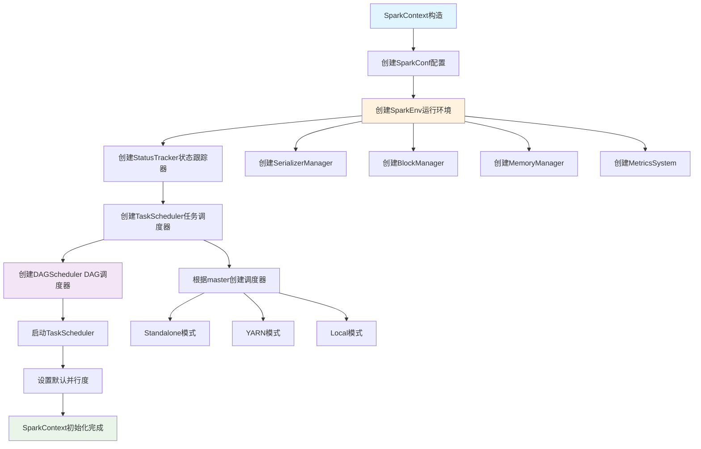

#### SparkContext初始化源码分析
```scala
// SparkContext.scala 核心初始化流程
class SparkContext(config: SparkConf) extends Logging {
  
  // 1. 创建SparkEnv - 核心运行环境
  private val env: SparkEnv = {
    SparkEnv.createDriverEnv(conf, isLocal, listenerBus, numCores, mockOutputCommitCoordinator)
  }
  
  // 2. 创建状态跟踪器
  private val statusTracker = new SparkStatusTracker(this, sparkUI)
  
  // 3. 创建任务调度器
  private val (sched, ts) = SparkContext.createTaskScheduler(this, master, deployMode)
  private val taskScheduler = ts
  
  // 4. 创建DAG调度器
  private val dagScheduler = new DAGScheduler(this)
  
  // 5. 启动任务调度器
  taskScheduler.start()
  
  // 6. 设置默认并行度
  private val defaultParallelism: Int = taskScheduler.defaultParallelism
  
  // 核心方法：创建RDD
  def parallelize[T: ClassTag](
      seq: Seq[T],
      numSlices: Int = defaultParallelism): RDD[T] = withScope {
    new ParallelCollectionRDD[T](this, seq, numSlices, Map[Int, Seq[String]]())
  }
  
  // 核心方法：提交作业
  def runJob[T, U: ClassTag](
      rdd: RDD[T],
      func: (TaskContext, Iterator[T]) => U,
      partitions: Seq[Int],
      resultHandler: (Int, U) => Unit): Unit = {
    dagScheduler.runJob(rdd, func, partitions, callSite, resultHandler, localProperties.get)
  }
}
```

#### RDD操作执行流程图

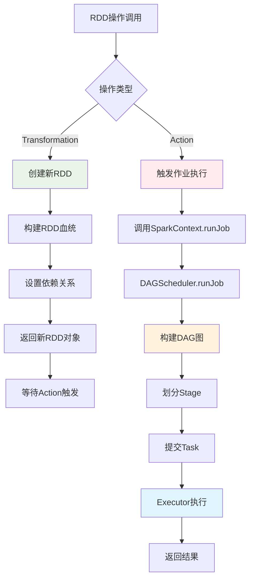

#### RDD五大特性实现流程

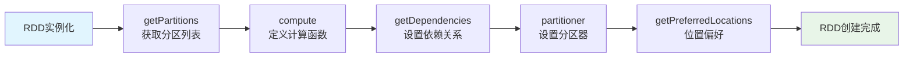

#### RDD源码核心实现
```scala
// RDD.scala 核心抽象
abstract class RDD[T: ClassTag](
    @transient private var _sc: SparkContext,
    @transient private var deps: Seq[Dependency[_]]
  ) extends Serializable with Logging {

  // 五大特性的具体实现
  
  // 1. 分区列表
  protected def getPartitions: Array[Partition]
  
  // 2. 计算函数
  def compute(split: Partition, context: TaskContext): Iterator[T]
  
  // 3. 依赖关系
  protected def getDependencies: Seq[Dependency[_]] = deps
  
  // 4. 分区器（可选）
  @transient val partitioner: Option[Partitioner] = None
  
  // 5. 位置偏好（可选）
  protected def getPreferredLocations(split: Partition): Seq[String] = Nil
  
  // Transformation操作实现
  def map[U: ClassTag](f: T => U): RDD[U] = withScope {
    val cleanF = sc.clean(f)
    new MapPartitionsRDD[U, T](this, (context, pid, iter) => iter.map(cleanF))
  }
  
  def filter(f: T => Boolean): RDD[T] = withScope {
    val cleanF = sc.clean(f)
    new MapPartitionsRDD[T, T](
      this,
      (context, pid, iter) => iter.filter(cleanF),
      preservesPartitioning = true)
  }
  
  def reduceByKey(func: (T, T) => T): RDD[T] = self.withScope {
    reduceByKey(defaultPartitioner(self), func)
  }
  
  // Action操作实现
  def collect(): Array[T] = withScope {
    val results = sc.runJob(this, (iter: Iterator[T]) => iter.toArray)
    Array.concat(results: _*)
  }
  
  def count(): Long = sc.runJob(this, Utils.getIteratorSize _).sum
  
  def foreach(f: T => Unit): Unit = withScope {
    val cleanF = sc.clean(f)
    sc.runJob(this, (iter: Iterator[T]) => iter.foreach(cleanF))
  }
}
```

### 调度器源码

#### DAGScheduler作业提交流程图

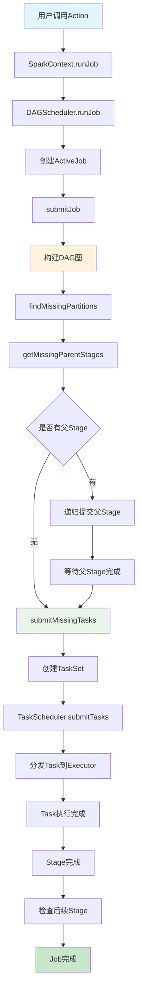

#### Stage划分算法流程图

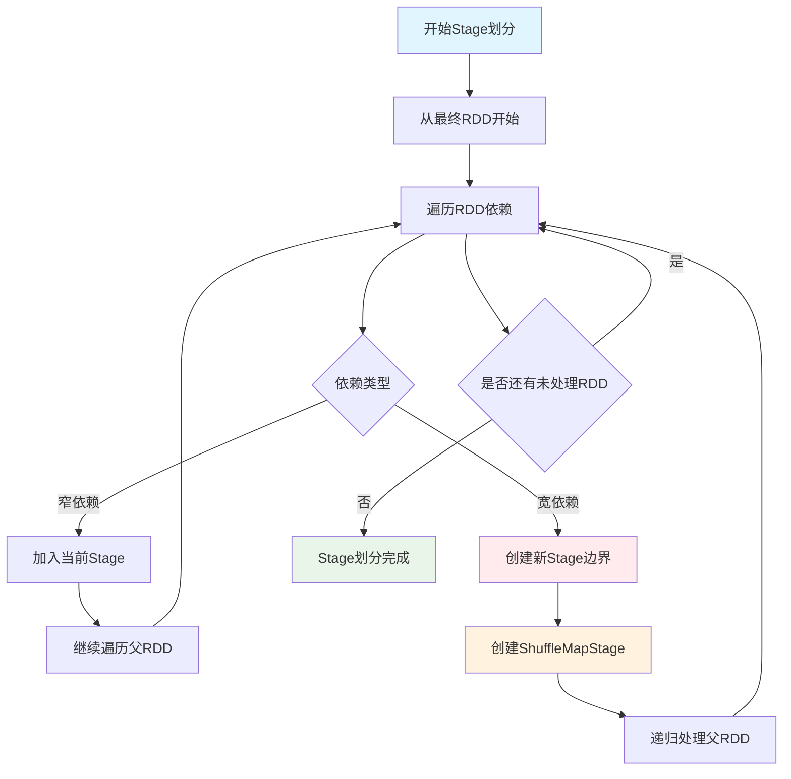

#### DAGScheduler源码分析
```scala
// DAGScheduler.scala 核心调度逻辑
class DAGScheduler(
    private[scheduler] val sc: SparkContext,
    private[scheduler] val taskScheduler: TaskScheduler,
    listenerBus: LiveListenerBus,
    mapOutputTracker: MapOutputTrackerMaster,
    blockManagerMaster: BlockManagerMaster,
    env: SparkEnv,
    clock: Clock = new SystemClock())
  extends Logging {

  // 事件处理循环
  private val eventProcessLoop = new DAGSchedulerEventProcessLoop(this)
  
  // 提交作业的核心方法
  def runJob[T, U](
      rdd: RDD[T],
      func: (TaskContext, Iterator[T]) => U,
      partitions: Seq[Int],
      callSite: CallSite,
      resultHandler: (Int, U) => Unit,
      properties: Properties): Unit = {
    
    val start = System.nanoTime
    val waiter = submitJob(rdd, func, partitions, callSite, resultHandler, properties)
    ThreadUtils.awaitReady(waiter, Duration.Inf)
    waiter.value.get match {
      case scala.util.Success(_) =>
        logInfo("Job %d finished: %s, took %f s".format
          (waiter.jobId, callSite.shortForm, (System.nanoTime - start) / 1e9))
      case scala.util.Failure(exception) =>
        logInfo("Job %d failed: %s, took %f s".format
          (waiter.jobId, callSite.shortForm, (System.nanoTime - start) / 1e9))
        throw exception
    }
  }
  
  // Stage划分核心算法
  private def getOrCreateShuffleMapStage(
      shuffleDep: ShuffleDependency[_, _, _],
      firstJobId: Int): ShuffleMapStage = {
    
    shuffleIdToMapStage.get(shuffleDep.shuffleId) match {
      case Some(stage) =>
        stage
        
      case None =>
        // 递归创建父Stage
        getMissingAncestorShuffleDependencies(shuffleDep.rdd).foreach { dep =>
          if (!shuffleIdToMapStage.contains(dep.shuffleId)) {
            createShuffleMapStage(dep, firstJobId)
          }
        }
        createShuffleMapStage(shuffleDep, firstJobId)
    }
  }
  
  // 查找缺失的父依赖
  private def getMissingAncestorShuffleDependencies(
      rdd: RDD[_]): ArrayStack[ShuffleDependency[_, _, _]] = {
    val ancestors = new ArrayStack[ShuffleDependency[_, _, _]]
    val visited = new HashSet[RDD[_]]
    val waitingForVisit = new ArrayStack[RDD[_]]
    
    waitingForVisit.push(rdd)
    while (waitingForVisit.nonEmpty) {
      val toVisit = waitingForVisit.pop()
      if (!visited(toVisit)) {
        visited += toVisit
        toVisit.dependencies.foreach {
          case shuffleDep: ShuffleDependency[_, _, _] =>
            if (!shuffleIdToMapStage.contains(shuffleDep.shuffleId)) {
              ancestors.push(shuffleDep)
              waitingForVisit.push(shuffleDep.rdd)
            }
          case narrowDep: NarrowDependency[_] =>
            waitingForVisit.push(narrowDep.rdd)
        }
      }
    }
    ancestors
  }
  
  // 提交Stage
  private def submitStage(stage: Stage): Unit = {
    val jobId = activeJobForStage(stage)
    if (jobId.isDefined) {
      if (!waitingStages(stage) && !runningStages(stage) && !failedStages(stage)) {
        val missing = getMissingParentStages(stage).sortBy(_.id)
        if (missing.isEmpty) {
          submitMissingTasks(stage, jobId.get)
        } else {
          for (parent <- missing) {
            submitStage(parent)
          }
          waitingStages += stage
        }
      }
    }
  }
}
```

### 存储系统源码

#### BlockManager源码分析
```scala
// BlockManager.scala 存储管理核心
class BlockManager(
    executorId: String,
    rpcEnv: RpcEnv,
    val master: BlockManagerMaster,
    val serializerManager: SerializerManager,
    val conf: SparkConf,
    memoryManager: MemoryManager,
    mapOutputTracker: MapOutputTracker,
    shuffleManager: ShuffleManager,
    val blockTransferService: BlockTransferService,
    securityManager: SecurityManager,
    numUsableCores: Int)
  extends BlockDataManager with BlockEvictionHandler with Logging {

  // 内存存储
  private[spark] val memoryStore =
    new MemoryStore(conf, blockInfoManager, serializerManager, memoryManager, this)
  
  // 磁盘存储
  private[spark] val diskStore = new DiskStore(conf, diskBlockManager, securityManager)
  
  // 获取Block的核心方法
  def getBlockData(blockId: BlockId): ManagedBuffer = {
    if (blockId.isShuffle) {
      shuffleManager.shuffleBlockResolver.getBlockData(blockId.asInstanceOf[ShuffleBlockId])
    } else {
      getLocalBytes(blockId) match {
        case Some(blockData) =>
          new BlockManagerManagedBuffer(blockInfoManager, blockId, blockData, true)
        case None =>
          throw new BlockNotFoundException(s"Block $blockId not found")
      }
    }
  }
  
  // 存储Block的核心方法
  def putBlockData(
      blockId: BlockId,
      data: ManagedBuffer,
      level: StorageLevel,
      classTag: ClassTag[_]): Boolean = {
    putBytes(blockId, new ChunkedByteBuffer(data.nioByteBuffer()), level)(classTag)
  }
  
  // 内存和磁盘存储逻辑
  private def doPutBytes[T](
      blockId: BlockId,
      bytes: ChunkedByteBuffer,
      level: StorageLevel,
      classTag: ClassTag[T],
      tellMaster: Boolean = true,
      keepReadLock: Boolean = false): Boolean = {
    
    doPut(blockId, level, classTag, tellMaster = tellMaster, keepReadLock = keepReadLock) { info =>
      val startTimeMs = System.currentTimeMillis
      
      // 尝试内存存储
      val res = if (level.useMemory) {
        memoryStore.putBytes(blockId, bytes, level.memoryStorageLevel)
      } else {
        false
      }
      
      // 内存存储失败，尝试磁盘存储
      if (!res && level.useDisk) {
        diskStore.putBytes(blockId, bytes)
      } else {
        res
      }
    }
  }
  
  // Block淘汰策略
  override def dropFromMemory(
      blockId: BlockId,
      data: () => Either[Array[T], ChunkedByteBuffer]): StorageLevel = {
    
    val info = blockInfoManager.lockForWriting(blockId)
    var blockIsUpdated = false
    val level = info.level
    
    try {
      if (level.useDisk && !diskStore.contains(blockId)) {
        data() match {
          case Left(elements) =>
            diskStore.put(blockId) { fileOutputStream =>
              serializerManager.dataSerializeStream(blockId,
                fileOutputStream, elements.toIterator)(info.classTag.asInstanceOf[ClassTag[T]])
            }
          case Right(bytes) =>
            diskStore.putBytes(blockId, bytes)
        }
        blockIsUpdated = true
      }
      
      memoryStore.remove(blockId)
      val droppedMemorySize = if (blockIsUpdated) 0L else info.size
      val blockIsRemoved = !level.useDisk
      
      if (blockIsRemoved) {
        blockInfoManager.removeBlock(blockId)
      }
      
      if (blockIsUpdated) {
        StorageLevel.DISK_ONLY
      } else {
        StorageLevel.NONE
      }
      
    } finally {
      blockInfoManager.unlock(blockId)
    }
  }
}
```

### 网络通信源码

#### NettyBlockTransferService源码
```scala
// NettyBlockTransferService.scala 网络传输核心
class NettyBlockTransferService(
    conf: SparkConf,
    securityManager: SecurityManager,
    bindAddress: String,
    advertiseAddress: String,
    numCores: Int)
  extends BlockTransferService {

  private[this] var transportContext: TransportContext = _
  private[this] var server: TransportServer = _
  private[this] var clientFactory: TransportClientFactory = _
  
  override def init(blockDataManager: BlockDataManager): Unit = {
    val rpcHandler = new NettyBlockRpcServer(conf.getAppId, serializer, blockDataManager)
    var serverBootstrap: Option[TransportServerBootstrap] = None
    var clientBootstrap: Option[TransportClientBootstrap] = None
    
    if (authEnabled) {
      serverBootstrap = Some(new AuthServerBootstrap(transportConf, securityManager))
      clientBootstrap = Some(new AuthClientBootstrap(transportConf, conf.getAppId, securityManager))
    }
    
    transportContext = new TransportContext(transportConf, rpcHandler)
    clientFactory = transportContext.createClientFactory(clientBootstrap.toSeq.asJava)
    server = createServer(serverBootstrap.toList)
  }
  
  // 获取远程Block
  override def fetchBlocks(
      host: String,
      port: Int,
      execId: String,
      blockIds: Array[String],
      listener: BlockFetchingListener,
      tempFileManager: DownloadFileManager): Unit = {
    
    try {
      val client = clientFactory.createClient(host, port)
      new OneForOneBlockFetcher(client, conf.getAppId, execId,
        blockIds, listener, transportConf, tempFileManager).start()
    } catch {
      case e: Exception =>
        logError(s"Exception while beginning fetchBlocks", e)
        blockIds.foreach(listener.onBlockFetchFailure(_, e))
    }
  }
  
  // 上传Block到远程
  override def uploadBlock(
      hostname: String,
      port: Int,
      execId: String,
      blockId: BlockId,
      blockData: ManagedBuffer,
      level: StorageLevel,
      classTag: ClassTag[_]): Future[Unit] = {
    
    val result = Promise[Unit]()
    val client = clientFactory.createClient(hostname, port)
    
    val callback = new RpcResponseCallback {
      override def onSuccess(response: ByteBuffer): Unit = {
        result.success(())
      }
      
      override def onFailure(e: Throwable): Unit = {
        result.failure(e)
      }
    }
    
    client.sendRpc(new UploadBlock(conf.getAppId, execId, blockId.toString,
      blockData.nioByteBuffer(), level, classTag).toByteBuffer, callback)
    
    result.future
  }
}
```
### 算子内存存储过程源码详解 

#### GroupByKey算子内存存储过程

**GroupByKey内存存储流程图**：

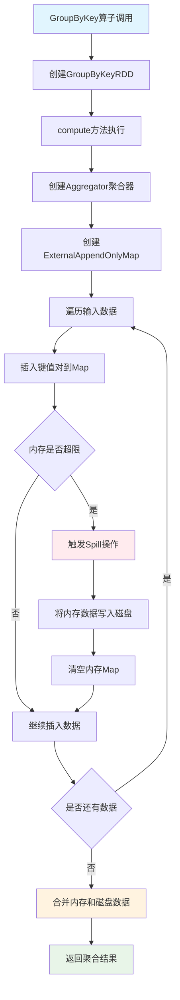

**ExternalAppendOnlyMap内存管理流程**：

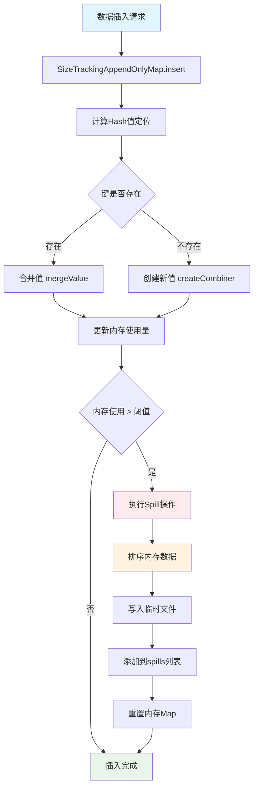

```scala
// GroupByKey算子核心实现
class GroupByKeyRDD[K: ClassTag, V: ClassTag](
    prev: RDD[(K, V)],
    part: Partitioner)
  extends RDD[(K, Iterable[V])](prev) {

  override def compute(split: Partition, context: TaskContext): Iterator[(K, Iterable[V])] = {
    // 1. 创建聚合器
    val aggregator = new Aggregator[K, V, ArrayBuffer[V]](
      createCombiner = (v: V) => ArrayBuffer(v),
      mergeValue = (buf: ArrayBuffer[V], v: V) => buf += v,
      mergeCombiners = (buf1: ArrayBuffer[V], buf2: ArrayBuffer[V]) => buf1 ++= buf2
    )
    
    // 2. 使用ExternalAppendOnlyMap进行聚合
    val externalMap = new ExternalAppendOnlyMap[K, V, ArrayBuffer[V]](aggregator)
    
    // 3. 插入所有键值对
    val iter = firstParent[(K, V)].iterator(split, context)
    while (iter.hasNext) {
      val (k, v) = iter.next()
      externalMap.insert(k, v)
    }
    
    // 4. 返回聚合结果
    externalMap.iterator
  }
}
```


```scala
// ExternalAppendOnlyMap核心实现
class ExternalAppendOnlyMap[K, V, C](
    aggregator: Aggregator[K, V, C],
    serializer: Serializer = SparkEnv.get.serializer)
  extends Spillable[WritablePartitionedPairCollection[K, C]](SparkEnv.get.blockManager.master)
  with Logging {

  // 内存中的Map
  private var map = new SizeTrackingAppendOnlyMap[K, C]
  
  // Spill文件列表
  private val spills = new ArrayBuffer[SpilledFile]
  
  // 插入键值对
  def insert(key: K, value: V): Unit = {
    // 1. 尝试在内存中聚合
    val update = (hadValue: Boolean, oldValue: C) => {
      if (hadValue) {
        aggregator.mergeValue(oldValue, value)
      } else {
        aggregator.createCombiner(value)
      }
    }
    
    map.changeValue(key, update)
    
    // 2. 检查是否需要Spill
    if (map.estimateSize() > myMemoryThreshold) {
      spill()
    }
  }
  
  // Spill到磁盘
  private def spill(): Unit = {
    val spillFile = spillMemoryIteratorToDisk(map.destructiveSortedWritablePartitionedIterator())
    spills += spillFile
    map = new SizeTrackingAppendOnlyMap[K, C]
  }
  
  // 获取最终结果
  def iterator: Iterator[(K, C)] = {
    // 合并内存中的结果和Spill文件
    val memoryIterator = map.destructiveSortedWritablePartitionedIterator()
    val spillIterators = spills.map(_.iterator)
    
    // 返回合并后的迭代器
    new MergedIterator(memoryIterator +: spillIterators)
  }
}
```

#### ReduceByKey算子内存存储过程

**ReduceByKey内存存储流程图**：

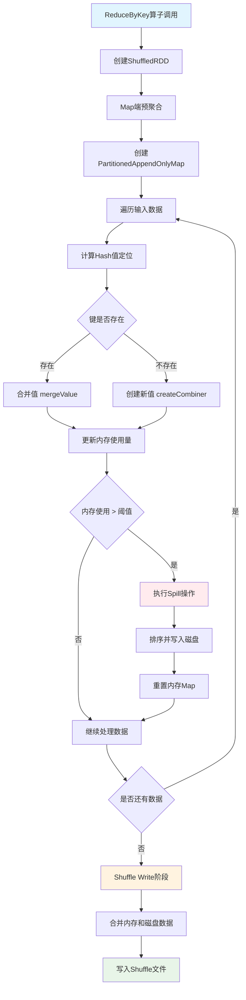

**PartitionedAppendOnlyMap操作流程**：

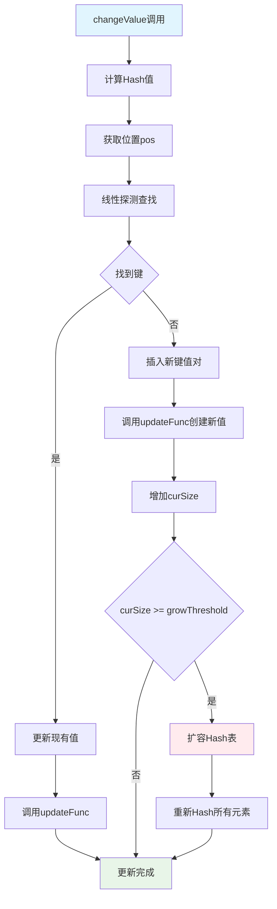

```scala
// PartitionedAppendOnlyMap的changeValue方法
def changeValue(key: K, updateFunc: (Boolean, V) => V): Unit = {
  val hash = getHash(key)
  val pos = getPos(hash)
  
  var i = pos
  while (data(2 * i) != null) {
    if (data(2 * i) == key) {
      // 找到现有键，更新值
      val hadValue = true
      val oldValue = data(2 * i + 1).asInstanceOf[V]
      val newValue = updateFunc(hadValue, oldValue)
      data(2 * i + 1) = newValue.asInstanceOf[AnyRef]
      return
    }
    i = (i + 1) % (data.length / 2)
  }
  
  // 未找到键，插入新值
  val hadValue = false
  val newValue = updateFunc(hadValue, null.asInstanceOf[V])
  data(2 * i) = key.asInstanceOf[AnyRef]
  data(2 * i + 1) = newValue.asInstanceOf[AnyRef]
  curSize += 1
  
  if (curSize >= growThreshold) {
    growTable()
  }
}
```

#### Join算子内存存储过程

**Join算子内存存储流程图**：

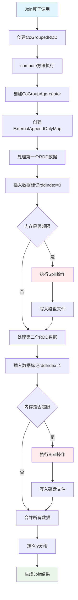

**CoGroup聚合过程流程**：

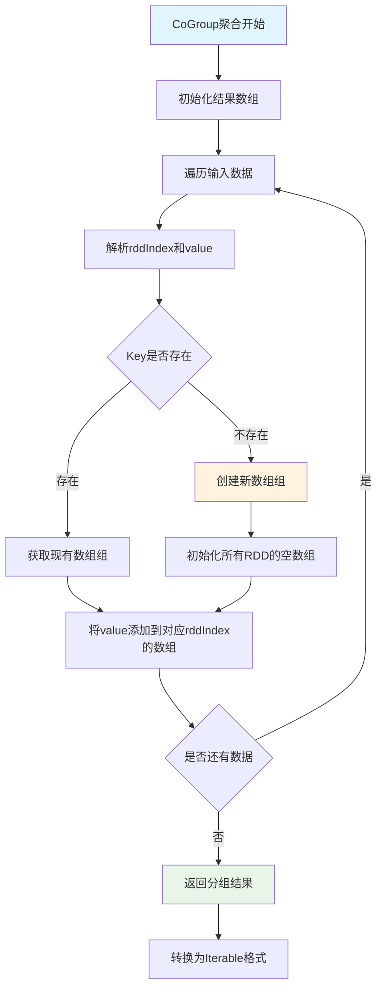

```scala
// CoGroupedRDD核心实现
class CoGroupedRDD[K: ClassTag](
    rdds: Seq[RDD[(K, _)]],
    part: Partitioner)
  extends RDD[(K, Array[Iterable[_]])](rdds.head.context, Nil) {

  override def compute(split: Partition, context: TaskContext): Iterator[(K, Array[Iterable[_]])] = {
    // 1. 创建CoGroup聚合器
    val aggregator = new CoGroupAggregator[K]
    
    // 2. 使用ExternalAppendOnlyMap进行分组
    val externalMap = new ExternalAppendOnlyMap[K, (Int, Any), Array[ArrayBuffer[Any]]](aggregator)
    
    // 3. 插入所有RDD的数据
    rdds.zipWithIndex.foreach { case (rdd, rddIndex) =>
      val iter = rdd.iterator(split, context)
      while (iter.hasNext) {
        val (k, v) = iter.next()
        externalMap.insert(k, (rddIndex, v))
      }
    }
    
    // 4. 返回分组结果
    externalMap.iterator.map { case (k, groups) =>
      (k, groups.map(_.toIterable))
    }
  }
}
```

#### 内存存储状态监控


```scala
// 内存使用监控组件
class MemoryMonitor {
  // 监控Map的内存使用
  def monitorMapMemory(map: SizeTrackingAppendOnlyMap[_, _]): MemoryUsage = {
    val estimatedSize = map.estimateSize()
    val currentMemory = map.currentMemory
    val maxMemory = map.maxMemory
    
    MemoryUsage(
      estimatedSize = estimatedSize,
      currentMemory = currentMemory,
      maxMemory = maxMemory,
      utilization = currentMemory.toDouble / maxMemory
    )
  }
  
  // 监控Spill状态
  def monitorSpillStatus(externalMap: ExternalAppendOnlyMap[_, _, _]): SpillStatus = {
    val spillCount = externalMap.spills.size
    val totalSpillSize = externalMap.spills.map(_.size).sum
    
    SpillStatus(
      spillCount = spillCount,
      totalSpillSize = totalSpillSize,
      averageSpillSize = if (spillCount > 0) totalSpillSize / spillCount else 0
    )
  }
}

case class MemoryUsage(
  estimatedSize: Long,
  currentMemory: Long,
  maxMemory: Long,
  utilization: Double)

case class SpillStatus(
  spillCount: Int,
  totalSpillSize: Long,
  averageSpillSize: Long)
```


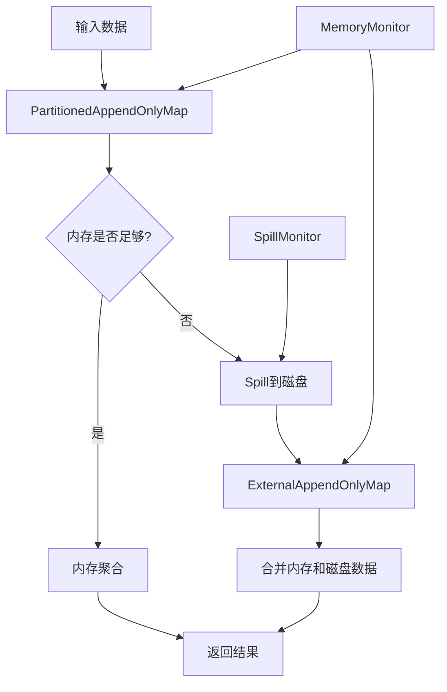

#### 内存存储优化策略


```scala
// 内存分配优化
class MemoryOptimizer {
  // 动态调整内存阈值
  def adjustMemoryThreshold(
      currentMemory: Long,
      maxMemory: Long,
      spillCount: Int): Long = {
    
    val utilization = currentMemory.toDouble / maxMemory
    
    if (utilization > 0.8 && spillCount > 0) {
      // 内存使用率高且有Spill，降低阈值
      (maxMemory * 0.6).toLong
    } else if (utilization < 0.5 && spillCount == 0) {
      // 内存使用率低且无Spill，提高阈值
      (maxMemory * 0.9).toLong
    } else {
      // 保持当前阈值
      (maxMemory * 0.8).toLong
    }
  }
  
  // 优化Map初始容量
  def optimizeInitialCapacity(dataSize: Long): Int = {
    val estimatedSize = (dataSize * 1.2).toInt
    math.max(64, math.min(estimatedSize, 1024 * 1024))
  }
}
```

---

### 任务提交流程源码解析

#### DAG的生成与依赖分析

**任务提交完整流程图**：

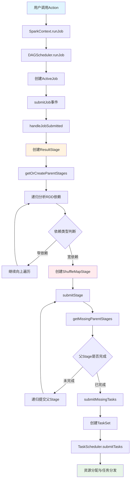

**DAG依赖分析流程图**：

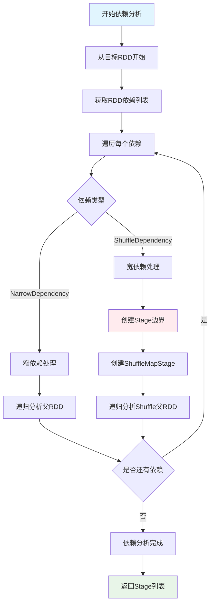

**用户触发Action时的完整流程**：

```scala
// 用户代码触发Action
val result = rdd.collect()

// SparkContext.collect()
def collect(): Array[T] = withScope {
  val results = sc.runJob(this, (iter: Iterator[T]) => iter.toArray)
  Array.concat(results: _*)
}

// SparkContext.runJob()
def runJob[T, U: ClassTag](
    rdd: RDD[T],
    func: (TaskContext, Iterator[T]) => U,
    partitions: Seq[Int],
    resultHandler: (Int, U) => Unit): Unit = {
  dagScheduler.runJob(rdd, func, partitions, callSite, resultHandler, localProperties.get)
}
```

**DAGScheduler依赖分析**：

```scala
// DAGScheduler.scala
private[scheduler] def getOrCreateParentStages(rdd: RDD[_], firstJobId: Int): List[Stage] = {
  val parents = new ArrayBuffer[Stage]()
  val visited = new HashSet[RDD[_]]
  
  def visit(r: RDD[_]): Unit = {
    if (!visited(r)) {
      visited += r
      for (dep <- r.dependencies) {
        dep match {
          case shufDep: ShuffleDependency[_, _, _] =>
            // 宽依赖，创建新的ShuffleMapStage
            parents += getOrCreateShuffleMapStage(shufDep, firstJobId)
          case _ =>
            // 窄依赖，递归访问父RDD
            visit(dep.rdd)
        }
      }
    }
  }
  
  visit(rdd)
  parents.toList
}
```

#### 任务分发与调度流程

**任务调度完整流程图**：

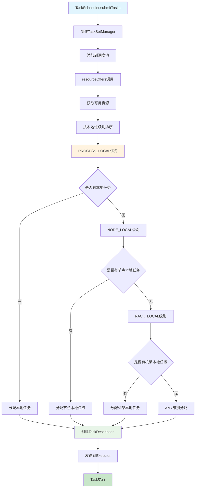

**资源分配本地性优化流程**：

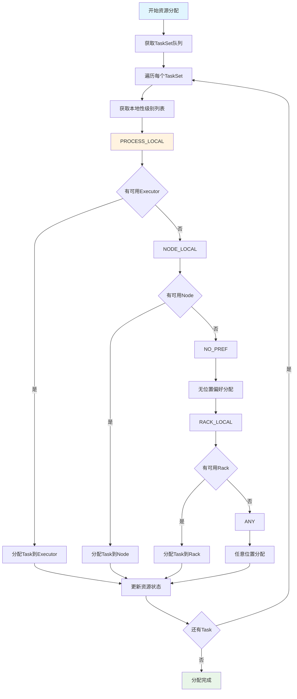

**完整的任务调度时序图**：

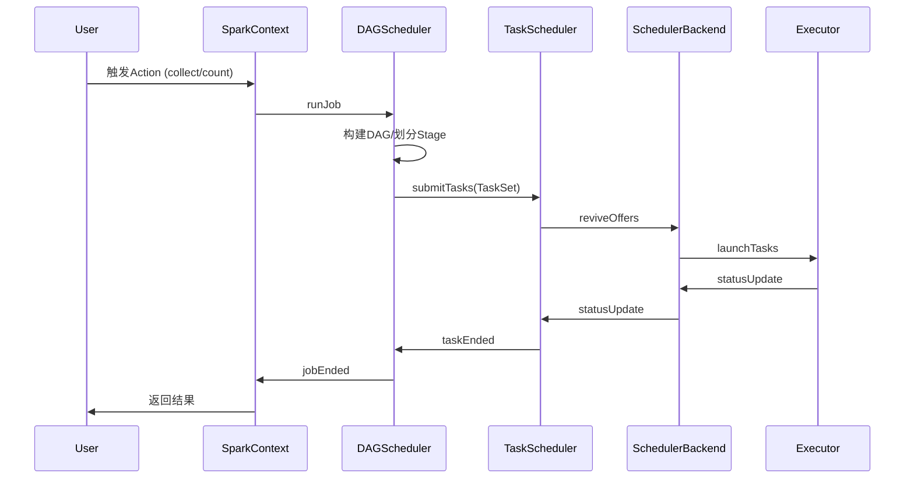

**TaskScheduler资源分配**：

```scala
// TaskSchedulerImpl.resourceOffers()
def resourceOffers(offers: IndexedSeq[WorkerOffer]): Seq[Seq[TaskDescription]] = {
  // 1. 随机打乱offers避免热点
  val shuffledOffers = Random.shuffle(offers)
  val tasks = shuffledOffers.map(o => new ArrayBuffer[TaskDescription](o.cores / CPUS_PER_TASK))
  val availableCpus = shuffledOffers.map(o => o.cores).toArray
  
  // 2. 按本地性级别分配任务
  val sortedTaskSets = rootPool.getSortedTaskSetQueue
  for (taskSet <- sortedTaskSets) {
    // PROCESS_LOCAL -> NODE_LOCAL -> NO_PREF -> RACK_LOCAL -> ANY
    for (currentMaxLocality <- taskSet.myLocalityLevels) {
      do {
        launchedAnyTask = resourceOfferSingleTaskSet(
          taskSet, currentMaxLocality, shuffledOffers, availableCpus, tasks)
      } while (launchedAnyTask)
    }
  }
  
  tasks
}
```

#### 失败重试与容错机制

**容错机制流程图**：

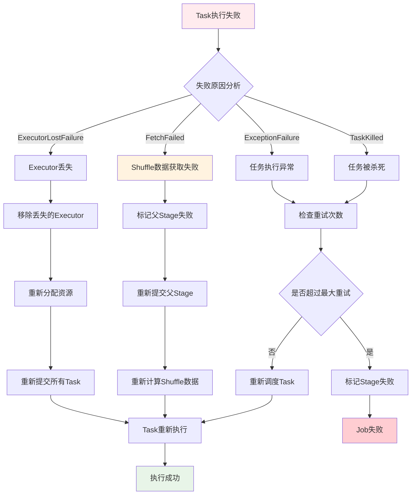

**RDD血统恢复流程图**：

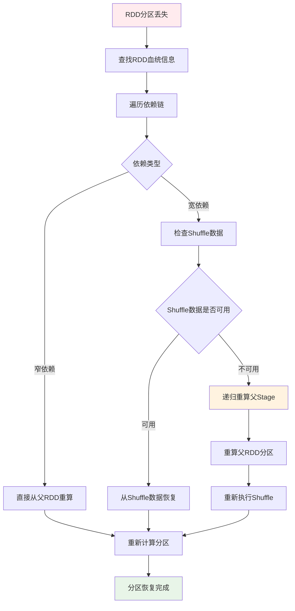

**DAGScheduler事件处理**：

```scala
// DAGSchedulerEventProcessLoop事件处理
private def doOnReceive(event: DAGSchedulerEvent): Unit = event match {
  case TaskFailed(taskId, taskType, reason, exception) =>
    reason match {
      case _: FetchFailed =>
        // Shuffle数据获取失败，需要重新计算父Stage
        val shuffleMapStage = shuffleIdToMapStage(reason.shuffleId)
        markStageAsFinished(shuffleMapStage, Some(reason.toString))
        submitStage(shuffleMapStage)
        
      case _: ExecutorLostFailure =>
        // Executor丢失，需要重新调度Task
        removeExecutorAndUnregisterOutputs(reason.execId, filesLost = true)
        
      case _: TaskKilled =>
        // Task被杀死，通常是推测执行
        logInfo(s"Task $taskId was killed")
        
      case _ =>
        // 其他异常，Task级别重试
        if (task.attempt < maxTaskFailures) {
          taskScheduler.submitTasks(createTaskSet(Array(task)))
        } else {
          abortStage(currentStage, s"Task $taskId failed $maxTaskFailures times")
        }
    }
    
  case StageCompleted(stage) =>
    // Stage完成，检查并提交依赖的Stage
    markStageAsFinished(stage)
    submitWaitingChildStages(stage)
}
```

#### Executor工作机制与Task执行

**Executor任务执行流程图**：

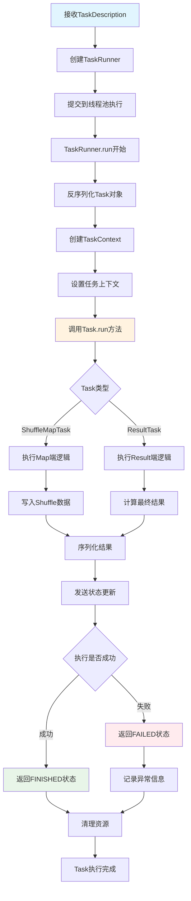

**Task执行上下文管理流程**：

```mermaid
graph TD
    A[TaskContext创建] --> B[设置Stage信息]
    B --> C[设置Partition信息]
    C --> D[初始化TaskMemoryManager]
    D --> E[设置MetricsSystem]
    E --> F[注册任务监听器]
    F --> G[开始Task执行]
    G --> H[监控内存使用]
    H --> I[收集执行指标]
    I --> J[处理中断信号]
    J --> K{Task是否完成}
    K -->|否| H
    K -->|是| L[清理TaskContext]
    L --> M[释放内存资源]
    M --> N[发送指标数据]
    N --> O[TaskContext销毁]
    
    style A fill:#e1f5fe
    style G fill:#fff3e0
    style O fill:#e8f5e8
```

**Executor任务执行详细流程**：

```scala
// Executor.launchTask()
def launchTask(context: ExecutorBackend, taskDescription: TaskDescription): Unit = {
  val tr = new TaskRunner(context, taskDescription)
  runningTasks.put(taskDescription.taskId, tr)
  threadPool.execute(tr)
}

// TaskRunner.run()
class TaskRunner(
    execBackend: ExecutorBackend,
    private val taskDescription: TaskDescription)
  extends Runnable {
  
  override def run(): Unit = {
    try {
      // 1. 反序列化Task
      val task = ser.deserialize[Task[Any]](
        taskDescription.serializedTask, 
        Thread.currentThread.getContextClassLoader)
      
      // 2. 设置TaskContext
      val taskContext = new TaskContextImpl(
        stageId = taskDescription.stageId,
        taskAttemptId = taskDescription.taskId,
        attemptNumber = taskDescription.attemptNumber,
        partitionId = task.partitionId,
        localProperties = taskDescription.properties,
        taskMemoryManager = taskMemoryManager,
        metricsSystem = env.metricsSystem)
      
      // 3. 执行Task
      val value = task.run(
        taskAttemptId = taskDescription.taskId,
        attemptNumber = taskDescription.attemptNumber,
        metricsSystem = env.metricsSystem)
      
      // 4. 序列化结果并返回
      val serializedResult = ser.serialize(value)
      execBackend.statusUpdate(
        taskDescription.taskId, 
        TaskState.FINISHED, 
        serializedResult)
        
    } catch {
      case e: Exception =>
        // 异常处理
        val reason = new ExceptionFailure(e, taskContext.taskMetrics())
        execBackend.statusUpdate(
          taskDescription.taskId, 
          TaskState.FAILED, 
          ser.serialize(TaskFailedReason(reason)))
    } finally {
      // 清理资源
      runningTasks.remove(taskDescription.taskId)
    }
  }
}
```

#### 数据读取、处理与RDD依赖

**RDD数据读取流程图**：

```mermaid
graph TD
    A[RDD.iterator调用] --> B{是否有缓存}
    B -->|有缓存| C[从缓存读取数据]
    B -->|无缓存| D{是否有Checkpoint}
    D -->|有Checkpoint| E[从Checkpoint读取]
    D -->|无Checkpoint| F[调用compute方法]
    F --> G{RDD类型}
    G -->|HadoopRDD| H[从HDFS读取]
    G -->|MapPartitionsRDD| I[调用父RDD.iterator]
    G -->|ShuffledRDD| J[从Shuffle数据读取]
    H --> K[返回数据迭代器]
    I --> L[递归调用父RDD]
    J --> M[读取Shuffle文件]
    C --> K
    E --> K
    L --> N[应用转换函数]
    M --> K
    N --> K
    K --> O[数据处理完成]
    
    style A fill:#e1f5fe
    style C fill:#e8f5e8
    style F fill:#fff3e0
    style O fill:#c8e6c9
```

**RDD依赖链递归调用流程**：

```mermaid
graph TD
    A[Task开始执行] --> B[调用ResultTask.runTask]
    B --> C[调用RDD.iterator]
    C --> D[检查存储级别]
    D --> E{是否缓存}
    E -->|是| F[从BlockManager获取]
    E -->|否| G[computeOrReadCheckpoint]
    G --> H{是否Checkpoint}
    H -->|是| I[从Checkpoint读取]
    H -->|否| J[调用compute方法]
    J --> K{RDD依赖类型}
    K -->|窄依赖| L[直接调用父RDD.iterator]
    K -->|宽依赖| M[从ShuffleReader读取]
    L --> N[递归处理父RDD]
    M --> O[读取Shuffle数据]
    N --> P[应用当前RDD的转换逻辑]
    O --> P
    F --> P
    I --> P
    P --> Q[返回处理后的数据]
    
    style A fill:#e1f5fe
    style J fill:#fff3e0
    style P fill:#e8f5e8
    style Q fill:#c8e6c9
```

**RDD依赖链调用流程**：

```scala
// RDD.iterator() 递归调用流程
final def iterator(split: Partition, context: TaskContext): Iterator[T] = {
  if (storageLevel != StorageLevel.NONE) {
    // 1. 尝试从缓存读取
    getOrCompute(split, context)
  } else {
    // 2. 直接计算
    computeOrReadCheckpoint(split, context)
  }
}

def computeOrReadCheckpoint(split: Partition, context: TaskContext): Iterator[T] = {
  if (isCheckpointed) {
    // 从Checkpoint读取
    firstParent[T].iterator(split, context)
  } else {
    // 调用具体RDD的compute方法
    compute(split, context)
  }
}

// 以MapPartitionsRDD为例
override def compute(split: Partition, context: TaskContext): Iterator[U] = {
  // 递归调用父RDD的iterator
  f(context, split.index, firstParent[T].iterator(split, context))
}
```

**典型RDD依赖链执行图**：

```mermaid
graph TD
    A[Action: collect] --> B[ResultTask]
    B --> C[RDD.iterator]
    C --> D[MapPartitionsRDD.compute]
    D --> E[父RDD.iterator]
    E --> F[FilteredRDD.compute]
    F --> G[父RDD.iterator]
    G --> H[HadoopRDD.compute]
    H --> I[读取HDFS数据]
    I --> J[返回Iterator]
    J --> K[逐级处理并返回]
    K --> L[最终结果]
    
    style A fill:#e1f5fe
    style H fill:#e8f5e8
    style L fill:#fff3e0
```

#### Task类型与执行差异

**Task类型执行流程对比图**：

```mermaid
graph TD
    A[Task创建] --> B{Task类型}
    B -->|ResultTask| C[ResultTask执行流程]
    B -->|ShuffleMapTask| D[ShuffleMapTask执行流程]
    
    C --> C1[调用RDD.iterator]
    C1 --> C2[递归计算RDD链]
    C2 --> C3[应用用户函数func]
    C3 --> C4[返回最终结果]
    C4 --> C5[发送结果到Driver]
    
    D --> D1[调用RDD.iterator]
    D1 --> D2[递归计算RDD链]
    D2 --> D3[获取ShuffleWriter]
    D3 --> D4[写入Shuffle数据]
    D4 --> D5[返回MapStatus]
    D5 --> D6[注册Shuffle输出位置]
    
    style C fill:#e8f5e8
    style D fill:#fff3e0
    style C5 fill:#e1f5fe
    style D6 fill:#ffebee
```

**ShuffleMapTask详细执行流程**：

```mermaid
graph TD
    A[ShuffleMapTask开始] --> B[获取ShuffleManager]
    B --> C[创建ShuffleWriter]
    C --> D{Writer类型}
    D -->|BypassMergeSortShuffleWriter| E[直接写入分区文件]
    D -->|SortShuffleWriter| F[排序后写入]
    D -->|UnsafeShuffleWriter| G[Unsafe内存写入]
    
    E --> H[为每个分区创建文件]
    H --> I[直接写入对应分区]
    
    F --> J[使用ExternalSorter排序]
    J --> K[合并相同Key的值]
    K --> L[写入单个文件]
    
    G --> M[使用Unsafe内存管理]
    M --> N[序列化后直接写入]
    
    I --> O[生成MapStatus]
    L --> O
    N --> O
    O --> P[返回分区大小信息]
    P --> Q[注册到MapOutputTracker]
    
    style A fill:#e1f5fe
    style O fill:#e8f5e8
    style Q fill:#c8e6c9
```

**ResultTask详细执行流程**：

```mermaid
graph TD
    A[ResultTask开始] --> B[调用RDD.iterator]
    B --> C[从Shuffle数据读取]
    C --> D[ShuffleReader.read]
    D --> E[合并多个Map输出]
    E --> F[应用用户定义函数]
    F --> G{函数类型}
    G -->|collect| H[收集所有数据]
    G -->|count| I[计算数据量]
    G -->|reduce| J[聚合计算]
    G -->|foreach| K[遍历处理]
    
    H --> L[序列化结果数据]
    I --> M[返回计数值]
    J --> N[返回聚合结果]
    K --> O[执行副作用操作]
    
    L --> P[发送到Driver]
    M --> P
    N --> P
    O --> Q[返回Unit]
    Q --> P
    P --> R[Task执行完成]
    
    style A fill:#e1f5fe
    style F fill:#fff3e0
    style P fill:#e8f5e8
    style R fill:#c8e6c9
```

**ResultTask vs ShuffleMapTask**：

```scala
// ResultTask - 产生最终结果
class ResultTask[T, U](
    stageId: Int,
    rdd: RDD[T],
    func: (TaskContext, Iterator[T]) => U,
    _partitionId: Int,
    locs: Seq[TaskLocation])
  extends Task[U](stageId, _partitionId) {
  
  override def runTask(context: TaskContext): U = {
    // 直接调用用户函数处理数据
    func(context, rdd.iterator(partition, context))
  }
}

// ShuffleMapTask - 产生中间Shuffle数据
class ShuffleMapTask(
    stageId: Int,
    rdd: RDD[_],
    dep: ShuffleDependency[_, _, _],
    _partitionId: Int,
    locs: Seq[TaskLocation])
  extends Task[MapStatus](stageId, _partitionId) {
  
  override def runTask(context: TaskContext): MapStatus = {
    // 获取ShuffleWriter
    val manager = SparkEnv.get.shuffleManager
    val writer = manager.getWriter[Any, Any](
      dep.shuffleHandle, partitionId, context)
    
    try {
      // 写入Shuffle数据
      writer.write(rdd.iterator(partition, context).asInstanceOf[Iterator[_ <: Product2[Any, Any]]])
      writer.stop(success = true).get
    } catch {
      case e: Exception =>
        writer.stop(success = false)
        throw e
    }
  }
}
```
---
## Spark高频面试题 🔥🔥🔥

### 基础概念题

**Q1: 请详细解释RDD、DataFrame和Dataset的区别及各自的应用场景。**

**标准答案：**

Spark提供了三种核心数据抽象：RDD、DataFrame和Dataset，它们各自适用于不同的场景，具有不同的特性和优势。

**1. 基本概念对比**

- **RDD (Resilient Distributed Dataset)**：Spark最初的数据抽象，是一个不可变的、分布式的对象集合，支持函数式编程操作。
- **DataFrame**：在RDD基础上引入了Schema概念，类似关系型数据库中的表结构，支持SQL查询。
- **Dataset**：DataFrame的扩展，提供类型安全的、面向对象的编程接口，结合了RDD的类型安全和DataFrame的优化性能。

**2. 核心特性对比**

| 特性           | RDD                  | DataFrame            | Dataset              |
| -------------- | -------------------- | -------------------- | -------------------- |
| **类型安全**   | 编译时类型检查       | 运行时类型检查       | 编译时类型检查       |
| **性能优化**   | 无内置优化           | Catalyst优化器       | Catalyst优化器       |
| **内存管理**   | Java对象/Kryo序列化  | Tungsten二进制格式   | Tungsten二进制格式   |
| **API风格**    | 函数式API            | SQL + 函数式API      | 类型安全的函数式API  |
| **Schema感知** | 无Schema             | 有Schema             | 有Schema             |
| **使用难度**   | 较复杂               | 简单                 | 中等                 |
| **适用场景**   | 非结构化数据处理     | 结构化数据分析       | 结构化数据复杂处理   |

**3. 代码示例对比**

```scala
// RDD示例
val rdd = sc.textFile("data.txt")
  .map(line => line.split(","))
  .map(fields => Person(fields(0), fields(1).toInt))
  .filter(person => person.age > 30)

// DataFrame示例
val df = spark.read.json("people.json")
df.filter($"age" > 30)
  .select($"name", $"age")
  .groupBy($"age")
  .count()

// Dataset示例
case class Person(name: String, age: Int)
val ds = spark.read.json("people.json").as[Person]
ds.filter(p => p.age > 30)
  .map(p => (p.name, p.age))
  .groupByKey(_._2)
  .count()
```

**4. 性能与优化对比**

- **RDD**：依赖于JVM的垃圾回收和Java序列化，性能受限
- **DataFrame**：
  - 使用Catalyst优化器进行逻辑和物理执行计划优化
  - 使用Tungsten高效内存管理，减少GC开销
  - 支持列式存储和压缩
- **Dataset**：
  - 结合了DataFrame的所有优化
  - 增加了编码器(Encoder)，在对象和内部Tungsten表示之间高效转换

**5. 选择建议**

- **选择RDD**：当需要细粒度控制或处理非结构化数据时
- **选择DataFrame**：处理结构化数据，需要高性能优化，或需要使用SQL查询
- **选择Dataset**：需要类型安全和函数式编程，同时又需要Catalyst优化器的性能提升

随着Spark的发展，DataFrame和Dataset API已经成为推荐的数据处理方式，特别是在Spark 2.0之后，DataFrame实际上是Dataset[Row]的类型别名。

**Q2: 请详细描述Spark任务的执行流程，从提交应用到任务完成的全过程。**

**标准答案：**

Spark任务执行是一个复杂的分布式计算过程，涉及多个组件协同工作。理解这个流程对于优化Spark应用和排查问题至关重要。

**1. 整体执行架构**

Spark应用程序的执行涉及以下核心组件：
- **Driver Program**：包含应用程序的main函数，负责创建SparkContext
- **Cluster Manager**：负责资源分配（如YARN、Kubernetes、Mesos或Standalone）
- **Worker Node**：执行计算任务的节点
- **Executor**：在Worker节点上运行，负责执行具体的计算任务

**2. 详细执行流程**

```mermaid
graph TD
    A[用户程序] --> B[SparkContext]
    B --> C[DAGScheduler]
    C --> D[TaskScheduler]
    D --> E[Worker节点]
    E --> F[Executor]
    F --> G[Task执行]
    G --> H[结果收集]
    H --> I[作业完成]
    
    style A fill:#f9f9f9,stroke:#333
    style B fill:#d4f1f9,stroke:#05a4d1
    style C fill:#ffe6cc,stroke:#d79b00
    style D fill:#d5e8d4,stroke:#82b366
    style E fill:#e1d5e7,stroke:#9673a6
    style F fill:#f8cecc,stroke:#b85450
    style G fill:#f8cecc,stroke:#b85450
    style H fill:#d4f1f9,stroke:#05a4d1
    style I fill:#f9f9f9,stroke:#333
```

**3. 执行步骤详解**

1. **应用程序启动**：
   - 用户提交应用程序
   - 创建SparkContext（Spark的入口点）
   - SparkContext连接到集群管理器

2. **资源申请**：
   - SparkContext通过集群管理器申请资源
   - 集群管理器在Worker节点上启动Executor进程

3. **DAG构建**：
   - 用户代码通过RDD转换操作构建DAG（有向无环图）
   - 延迟计算：转换操作只构建DAG，不执行计算

4. **作业提交**：
   - 当遇到Action操作时，触发作业提交
   - SparkContext将作业提交给DAGScheduler

5. **Stage划分**：
   - DAGScheduler将DAG划分为多个Stage
   - 划分依据：Shuffle操作（如reduceByKey、join等）
   - 每个Stage包含可以流水线执行的一组Task

6. **Task生成与调度**：
   - 为每个Stage生成TaskSet
   - TaskScheduler将TaskSet提交给TaskSetManager
   - TaskSetManager负责具体的任务调度和失败重试

7. **Task执行**：
   - Executor接收并执行Task
   - 执行计算并将结果保存在内存或磁盘
   - 对于Shuffle操作，将中间结果写入本地磁盘

8. **结果收集**：
   - 对于需要返回结果的Action操作，Driver收集结果
   - 对于写入外部存储的操作，直接写入目标位置

9. **作业完成**：
   - 所有Task执行完成后，作业结束
   - 释放资源或继续执行下一个作业

**4. 关键概念解析**

- **Job**：由Action操作触发的一组计算任务
- **Stage**：Job的子集，由一组可以流水线执行的Task组成
- **Task**：在单个Executor上执行的最小工作单元，处理一个分区的数据
- **Shuffle**：数据重分布过程，是Stage划分的边界

**5. 示例说明**

```scala
// 这个简单的Spark程序演示了执行流程
val sc = new SparkContext(conf)  // 创建SparkContext
val lines = sc.textFile("data.txt")  // 构建RDD，但不执行
val words = lines.flatMap(_.split(" "))  // 继续构建DAG
val wordCounts = words.map((_, 1)).reduceByKey(_ + _)  // reduceByKey会导致Shuffle，划分Stage
wordCounts.collect()  // Action操作，触发实际计算
```

在这个例子中：
- 会创建一个包含两个Stage的Job
- 第一个Stage执行textFile、flatMap和map操作
- 第二个Stage执行reduceByKey操作
- collect()触发整个Job的执行

理解Spark任务执行流程有助于编写高效的Spark应用程序，并能更好地进行性能调优和故障排查。

**Q3: 请解释Spark的内存管理机制，包括内存分配策略和优化方法。**

**标准答案：**

Spark内存管理是影响Spark应用性能的关键因素之一。Spark通过精细的内存管理机制，在有限的内存资源下实现高效的分布式计算。

**1. Spark内存架构**

Spark的JVM堆内存主要分为以下几个部分：

```mermaid
graph TD
    A[JVM堆内存] --> B[Reserved Memory<br>300MB]
    A --> C[User Memory<br>用户代码使用]
    A --> D[Spark Memory<br>执行和存储]
    
    D --> E[Storage Memory<br>缓存数据]
    D --> F[Execution Memory<br>计算过程]
    
    style A fill:#f9f9f9,stroke:#333
    style B fill:#f8cecc,stroke:#b85450
    style C fill:#d5e8d4,stroke:#82b366
    style D fill:#d4f1f9,stroke:#05a4d1
    style E fill:#ffe6cc,stroke:#d79b00
    style F fill:#e1d5e7,stroke:#9673a6
```

**2. 内存管理模式**

Spark提供两种内存管理模式：

- **静态内存管理(Static Memory Management)**：
  - Spark 1.6之前的默认模式
  - 为存储和执行内存分配固定比例，不能动态调整
  - 配置参数：`spark.storage.memoryFraction`和`spark.shuffle.memoryFraction`
  
- **统一内存管理(Unified Memory Management)**：
  - Spark 1.6及之后的默认模式
  - 存储内存和执行内存共享一个区域，可以动态调整
  - 配置参数：`spark.memory.fraction`和`spark.memory.storageFraction`

**3. 统一内存管理详解**

在统一内存管理模式下：

- **Spark Memory**：占JVM堆内存的比例由`spark.memory.fraction`控制，默认为0.6
- **Storage Memory**：初始大小由`spark.memory.storageFraction`控制，默认为0.5
- **Execution Memory**：初始大小为Spark Memory减去Storage Memory

**内存动态调整机制**：

1. **存储内存不足时**：
   - 如果执行内存有空闲，可以借用执行内存
   - 如果执行内存没有空闲，则按LRU策略淘汰已缓存的RDD分区

2. **执行内存不足时**：
   - 如果存储内存有空闲，可以借用存储内存
   - 如果存储内存没有空闲，但存储内存中有部分是被执行内存借用的，则可以抢占这部分内存
   - 执行内存不会淘汰存储内存中的数据

**4. 内存管理相关配置参数**

```scala
// 统一内存管理模式关键参数
spark.memory.fraction = 0.6  // Spark Memory占JVM堆内存的比例
spark.memory.storageFraction = 0.5  // Storage Memory初始占比

// 其他重要内存参数
spark.executor.memory = "4g"  // Executor的JVM堆内存大小
spark.memory.offHeap.enabled = false  // 是否启用堆外内存
spark.memory.offHeap.size = "2g"  // 堆外内存大小
```

**5. 堆外内存(Off-Heap Memory)**

从Spark 2.0开始，Spark支持使用堆外内存：

- 通过`spark.memory.offHeap.enabled`开启
- 使用`spark.memory.offHeap.size`设置大小
- 优势：减少GC开销，提高性能
- 缺点：需要手动管理内存，配置复杂

**6. 内存管理最佳实践**

- **合理设置Executor内存**：根据集群节点内存和并发任务数
- **监控内存使用情况**：通过Spark UI查看内存使用情况
- **调整内存分配比例**：根据应用特点调整存储和执行内存比例
- **使用堆外内存**：对于大数据量处理，考虑启用堆外内存
- **避免内存泄漏**：注意释放不再使用的RDD，使用`unpersist()`方法

**7. 内存不足问题排查**

当遇到`OutOfMemoryError`或性能下降时：

- 检查是否有不必要的数据缓存
- 考虑增加分区数，减少每个任务的内存使用
- 调整GC策略，如使用G1GC
- 使用Kryo序列化减少内存占用
- 考虑增加Executor内存或减少每个Executor的核心数

深入理解Spark内存管理机制，对于优化Spark应用性能和解决内存相关问题至关重要。

### 架构原理题

**Q4: 请详细介绍Spark的架构组件及其职责，各组件之间如何协同工作？**

**标准答案：**

Spark是一个分布式计算框架，其架构由多个组件协同工作，共同支撑分布式数据处理能力。深入理解Spark架构组件及其交互方式，对于有效使用Spark和排查问题至关重要。

**1. Spark架构总览**

```mermaid
graph TB
    A[用户应用] --> B[SparkContext]
    B --> C[集群管理器<br>YARN/Kubernetes/Mesos/Standalone]
    C --> D[Worker节点]
    D --> E[Executor]
    B --> F[DAGScheduler]
    F --> G[TaskScheduler]
    G --> E
    
    style A fill:#f9f9f9,stroke:#333
    style B fill:#d4f1f9,stroke:#05a4d1
    style C fill:#ffe6cc,stroke:#d79b00
    style D fill:#d5e8d4,stroke:#82b366
    style E fill:#e1d5e7,stroke:#9673a6
    style F fill:#f8cecc,stroke:#b85450
    style G fill:#f8cecc,stroke:#b85450
```

**2. 核心组件详解**

| 组件 | 位置 | 主要职责 | 关键特性 |
|------|------|---------|---------|
| **Driver Program** | 客户端或集群中 | 运行应用程序的main函数<br>创建SparkContext<br>提交作业<br>收集结果 | 应用程序的控制中心<br>包含DAGScheduler和TaskScheduler |
| **SparkContext** | Driver中 | Spark程序的入口点<br>连接集群管理器<br>获取Executor<br>构建RDD | 每个应用只有一个<br>负责作业提交和资源申请 |
| **SparkSession** | Driver中 | Spark 2.0后的入口点<br>整合SQL、DataFrame、Dataset API | 提供统一的数据访问接口<br>包含SparkContext |
| **Cluster Manager** | 独立进程 | 资源分配<br>启动Executor | 支持多种实现：<br>YARN、Kubernetes、Mesos、Standalone |
| **Worker Node** | 集群节点 | 提供计算资源<br>启动Executor进程 | 物理节点或虚拟机<br>可以运行多个Executor |
| **Executor** | Worker节点上 | 执行Task<br>缓存RDD<br>返回结果 | 每个应用有多个<br>生命周期与应用相同 |
| **DAGScheduler** | Driver中 | 构建DAG<br>划分Stage<br>生成TaskSet | 基于Shuffle依赖划分Stage<br>优化执行计划 |
| **TaskScheduler** | Driver中 | 将Task分发给Executor<br>监控Task执行<br>重试失败的Task | 负责具体的任务调度<br>处理任务失败和重试 |
| **BlockManager** | Driver和Executor中 | 管理内存和磁盘存储<br>处理数据块传输 | 负责RDD缓存<br>管理Shuffle数据 |

**3. 组件交互流程**

1. **应用程序初始化**：
   ```scala
   val spark = SparkSession.builder().appName("MyApp").getOrCreate()
   val sc = spark.sparkContext
   ```

2. **资源申请与Executor启动**：
   - SparkContext连接集群管理器
   - 集群管理器在Worker节点上启动Executor进程
   - Executor向Driver注册

3. **作业提交与执行**：
   - DAGScheduler将RDD DAG划分为Stage
   - TaskScheduler将TaskSet提交给Executor
   - Executor执行Task并返回结果

**4. 不同部署模式对组件的影响**

| 部署模式 | Driver位置 | 特点 | 适用场景 |
|---------|----------|------|----------|
| **Client模式** | 客户端机器 | Driver与客户端在同一进程<br>便于调试和查看输出 | 开发测试<br>交互式应用 |
| **Cluster模式** | 集群中的Worker节点 | Driver在集群中运行<br>客户端可以断开连接 | 生产环境<br>长时间运行的作业 |

**5. 各组件的高可用性考虑**

- **Driver**：在YARN或Kubernetes上可以启用AM (ApplicationMaster) 重启
- **Worker**：节点失败时，其上的Executor会在其他节点重启
- **Executor**：失败时会重启，正在执行的任务会重试
- **Task**：失败后会自动重试，最多重试次数可配置

**6. 实际应用中的架构选择**

- **小规模应用**：Standalone模式简单易用
- **企业生产环境**：YARN或Kubernetes提供更好的资源隔离和管理
- **混合负载环境**：Kubernetes适合与其他工作负载共存
- **传统大数据环境**：YARN与Hadoop生态系统集成更好

深入理解Spark架构组件及其交互方式，有助于优化应用性能、排查问题，以及设计适合特定场景的Spark应用架构。

**Q5: 请详细解释Spark的Shuffle机制原理及其演进历史，如何优化Shuffle操作？**

**标准答案：**

Shuffle是Spark中最关键也最复杂的机制之一，它涉及到数据的重新分区和跨节点传输，对Spark应用的性能有着重大影响。深入理解Shuffle机制对于优化Spark应用至关重要。

**1. Shuffle的基本概念**

Shuffle是指将分布在各个分区的数据按照某种规则重新组织，使得具有相同特征（如相同的key）的数据聚集在一起进行计算的过程。在Spark中，Shuffle操作是Stage划分的边界。

**触发Shuffle的操作包括**：
- **重分区操作**：`repartition`、`coalesce`
- **ByKey类操作**：`groupByKey`、`reduceByKey`、`aggregateByKey`
- **Join类操作**：`join`、`cogroup`
- **排序操作**：`sortBy`、`sortByKey`

**2. Shuffle的演进历史**

Spark Shuffle机制经历了多次重大改进：

| Shuffle版本 | Spark版本 | 特点 | 主要问题 |
|------------|----------|------|---------|
| **Hash Shuffle V1** | 0.8及之前 | 每个map task输出M×R个文件<br>(M=map任务数，R=reduce任务数) | 文件数过多，占用文件句柄 |
| **Hash Shuffle V2** | 0.8.1 - 1.1 | 每个executor输出C×R个文件<br>(C=core数，R=reduce任务数) | 文件数仍然较多 |
| **Sort Shuffle V1** | 1.1 - 1.5 | 每个map task输出1个文件，按key排序 | 所有数据都排序，开销大 |
| **Sort Shuffle V2<br>(Tungsten)** | 1.5 - 2.0 | 二进制序列化，直接操作内存 | 特定场景优化 |
| **Sort Shuffle V3** | 2.0+ | 统一的Sort-based Shuffle<br>小数据量可绕过排序 | 当前默认实现 |

**3. Sort-based Shuffle详细工作流程**

```mermaid
graph TD
    A[Map任务] --> B[内存中按Partitioner分区]
    B --> C{是否需要排序?}
    C -->|是| D[对每个分区内数据排序]
    C -->|否| E[跳过排序]
    D --> F[溢写到磁盘]
    E --> F
    F --> G[合并溢写文件]
    G --> H[生成数据文件和索引文件]
    H --> I[Reduce任务]
    I --> J[通过网络拉取数据]
    J --> K[合并数据]
    K --> L[进行Reduce计算]
    
    style A fill:#d4f1f9,stroke:#05a4d1
    style I fill:#e1d5e7,stroke:#9673a6
    style F fill:#ffe6cc,stroke:#d79b00
    style G fill:#ffe6cc,stroke:#d79b00
    style H fill:#ffe6cc,stroke:#d79b00
    style J fill:#d5e8d4,stroke:#82b366
    style K fill:#d5e8d4,stroke:#82b366
    style L fill:#d5e8d4,stroke:#82b366
```

**4. Map端详解**

1. **分区计算**：根据Partitioner确定每条数据的目标分区
2. **内存缓冲**：数据先写入内存缓冲区
3. **排序与聚合**：根据配置决定是否进行排序和聚合
4. **溢写机制**：
   - 当缓冲区达到阈值（`spark.shuffle.spill.numElementsForceSpillThreshold`）时触发溢写
   - 溢写过程中可能进行排序和聚合
5. **文件合并**：多个溢写文件最终合并为一个数据文件和一个索引文件

**5. Reduce端详解**

1. **任务初始化**：Reduce任务启动时，向DAGScheduler获取上游Shuffle数据的位置信息
2. **数据拉取**：通过BlockManager从各个Map任务所在节点拉取数据
3. **拉取策略**：
   - 按批次拉取，避免一次性拉取过多数据
   - 支持重试机制，处理临时网络故障
4. **数据聚合**：将拉取的数据进行合并和聚合处理
5. **结果计算**：对聚合后的数据执行Reduce操作

**6. 关键配置参数**

```scala
// Shuffle行为控制
spark.shuffle.manager = "sort"  // Shuffle实现方式，默认sort
spark.shuffle.sort.bypassMergeThreshold = 200  // 小分区数量绕过排序的阈值

// 内存使用控制
spark.shuffle.file.buffer = "32k"  // 每个输出流的缓冲大小
spark.shuffle.spill.compress = true  // 是否压缩溢写文件

// 网络传输控制
spark.reducer.maxSizeInFlight = "48m"  // 每个reduce任务同时拉取的最大数据量
spark.shuffle.io.retryWait = "5s"  // 重试等待时间
spark.shuffle.io.maxRetries = 3  // 最大重试次数
```

**7. Shuffle优化策略**

1. **减少Shuffle操作**：
   - 使用`mapPartitions`替代`map`后接`reduceByKey`
   - 使用广播变量替代`join`

2. **调整分区数量**：
   - 过少：数据倾斜，任务并行度低
   - 过多：小文件过多，调度开销大
   - 建议：每个分区大小在128MB左右

3. **启用聚合**：
   - 使用`reduceByKey`替代`groupByKey`
   - 使用`aggregateByKey`进行本地预聚合

4. **内存调优**：
   - 增加Shuffle缓冲区大小减少磁盘I/O
   - 调整执行内存比例适应Shuffle需求

5. **序列化优化**：
   - 使用Kryo序列化减少数据大小
   - 注册自定义类提高序列化性能

深入理解Shuffle机制，可以帮助开发者编写更高效的Spark应用，避免常见的性能陷阱，特别是在处理大规模数据时。

### 性能调优题

**Q6: 请详述Spark应用的性能调优策略，从哪些方面可以提升Spark作业的执行效率？**

**标准答案：**

Spark性能调优是一个系统性工作，需要从多个维度进行综合优化。一个高效的Spark应用需要合理的资源配置、优化的代码结构、适当的数据处理策略以及精细的参数调整。

**1. 性能调优的整体方法论**

性能调优应遵循以下方法论：
- **自上而下**：从应用架构到具体参数
- **数据驱动**：基于监控指标和性能测试
- **渐进式**：从最大瓶颈开始，逐步优化
- **权衡取舍**：在资源消耗、执行速度、稳定性之间寻找平衡

**2. 资源配置优化**

```mermaid
graph TD
    A[资源配置优化] --> B[Executor配置]
    A --> C[Driver配置]
    A --> D[集群资源]
    
    B --> B1[内存大小]
    B --> B2[核心数量]
    B --> B3[实例数量]
    
    C --> C1[内存大小]
    C --> C2[并行度]
    
    D --> D1[节点规格]
    D --> D2[资源隔离]
    
    style A fill:#f9f9f9,stroke:#333
    style B fill:#d4f1f9,stroke:#05a4d1
    style C fill:#ffe6cc,stroke:#d79b00
    style D fill:#d5e8d4,stroke:#82b366
```

**Executor配置最佳实践**：
- **内存大小**：每个Executor 4-8GB内存（过大导致GC延迟）
- **核心数量**：每个Executor 4-5个核心（过多导致线程竞争）
- **实例数量**：`(集群总核心数 / 每个Executor核心数)`，预留10%资源

**配置示例**：
```scala
// 10节点集群，每节点16核64GB内存
spark.executor.instances = 30       // (10 * 16) / 5 = 32，预留部分
spark.executor.cores = 5            // 每个Executor 5个核心
spark.executor.memory = "20g"       // 每个Executor 20GB内存
spark.driver.memory = "10g"         // Driver 10GB内存
```

**3. 并行度优化**

并行度是指任务划分的分区数，影响任务的并行执行效率。

**并行度设置原则**：
- **基准值**：集群总核心数的2-3倍
- **数据量**：每个分区数据量在128MB左右
- **动态调整**：`spark.sql.adaptive.enabled=true`

**并行度相关配置**：
```scala
// 静态配置
spark.default.parallelism = 600     // 默认并行度
spark.sql.shuffle.partitions = 600  // SQL操作的并行度

// 动态配置
spark.sql.adaptive.enabled = true   // 启用自适应查询执行
spark.sql.adaptive.coalescePartitions.enabled = true  // 合并小分区
```

**4. 数据倾斜优化**

数据倾斜是指某些分区的数据量远大于其他分区，导致任务执行时间不均衡。

**识别数据倾斜**：
- Spark UI中观察Stage页面的任务执行时间分布
- 查看Shuffle读写数据量的分布情况

**解决方案**：

| 倾斜类型 | 解决方案 | 实现方式 |
|---------|---------|---------|
| **Join倾斜** | 广播Join | `broadcast(smallDF).join(largeDF)` |
| **Join倾斜** | 拆分热点键 | 对热点键添加随机前缀，扩大Join |
| **聚合倾斜** | 两阶段聚合 | 局部聚合+全局聚合 |
| **聚合倾斜** | 自定义分区 | 实现自定义Partitioner |
| **数据源倾斜** | 预处理 | ETL阶段重新分区 |

**代码示例**：
```scala
// 两阶段聚合示例
val result = rdd
  .map(x => (x._1 + "_" + Random.nextInt(10), x._2))  // 加盐
  .reduceByKey(_ + _)  // 局部聚合
  .map(x => (x._1.split("_")(0), x._2))  // 去盐
  .reduceByKey(_ + _)  // 全局聚合
```

**5. 缓存策略优化**

合理的缓存策略可以避免重复计算，提高执行效率。

**缓存级别选择**：

| 存储级别 | 内存使用 | CPU开销 | 适用场景 |
|---------|---------|---------|---------|
| MEMORY_ONLY | 高 | 低 | 默认选择，内存充足 |
| MEMORY_AND_DISK | 中 | 低 | 数据量大于内存 |
| MEMORY_ONLY_SER | 低 | 高 | 内存受限，可接受序列化开销 |
| OFF_HEAP | 低 | 中 | 需要跨应用共享数据 |

**缓存使用原则**：
- 只缓存重复使用的RDD/DataFrame
- 在Shuffle操作之后、Action操作之前缓存
- 及时使用`unpersist()`释放不再使用的缓存

**6. Shuffle优化**

Shuffle是Spark中最昂贵的操作，优化Shuffle可以显著提升性能。

**Shuffle优化策略**：
- **减少Shuffle**：使用`mapPartitions`替代`map`+`reduceByKey`
- **本地聚合**：使用`reduceByKey`替代`groupByKey`
- **广播变量**：小表广播避免Shuffle
- **参数调整**：调整缓冲区大小、压缩算法等

**关键参数**：
```scala
spark.shuffle.file.buffer = "64k"  // 增加缓冲区减少磁盘I/O
spark.shuffle.compress = true      // 启用压缩
spark.shuffle.io.maxRetries = 6    // 增加重试次数
```

**7. SQL优化**

对于Spark SQL应用，可以应用以下优化技术：

**查询优化**：
- **谓词下推**：尽早过滤数据
- **列裁剪**：只读取需要的列
- **分区裁剪**：只读取需要的分区
- **自动优化**：启用AQE、动态分区裁剪等

**配置示例**：
```scala
// 启用自适应查询执行
spark.sql.adaptive.enabled = true
// 启用动态分区裁剪
spark.sql.optimizer.dynamicPartitionPruning.enabled = true
// 启用Join重排序
spark.sql.adaptive.optimizeSkewedJoin = true
```

**8. 序列化优化**

序列化影响数据传输和存储效率。

**序列化选择**：
- **Kryo序列化**：比Java序列化更高效
- **列式格式**：Parquet、ORC等格式更高效

**配置示例**：
```scala
// 启用Kryo序列化
spark.serializer = "org.apache.spark.serializer.KryoSerializer"
// 注册自定义类
spark.kryo.registrator = "com.example.MyRegistrator"
```

**9. 综合性能调优案例**

**大规模数据Join优化**：
```scala
// 优化前
val result = largeDF.join(smallDF, Seq("key"))

// 优化后
// 1. 广播小表
val broadcastDF = broadcast(smallDF)
val result = largeDF.join(broadcastDF, Seq("key"))

// 2. 启用AQE和Join优化
spark.conf.set("spark.sql.adaptive.enabled", "true")
spark.conf.set("spark.sql.adaptive.skewJoin.enabled", "true")
```

**数据倾斜处理**：
```scala
// 优化前
val result = rdd.reduceByKey(_ + _)

// 优化后
// 1. 两阶段聚合
val result = rdd
  .map(x => ((x._1, Random.nextInt(10)), x._2))  // 加盐
  .reduceByKey(_ + _)  // 局部聚合
  .map(x => (x._1._1, x._2))  // 去盐
  .reduceByKey(_ + _)  // 全局聚合
```

性能调优是一个持续的过程，需要结合具体应用场景、数据特点和资源情况，采用适当的优化策略。通过系统性的调优，可以显著提升Spark应用的性能和资源利用率。

**Q7: 如何识别和解决Spark中的数据倾斜问题？请给出具体的解决方案和代码示例。**

**标准答案：**

数据倾斜是Spark应用中常见的性能瓶颈，表现为某些分区的数据量远大于其他分区，导致任务执行时间不均衡，整体作业延迟。有效解决数据倾斜问题是Spark性能优化的关键环节。

**1. 数据倾斜的识别**

在解决数据倾斜前，首先需要准确识别问题：

**识别方法**：
- **Spark UI**：观察Stage页面中任务执行时间分布，如有明显"长尾"现象则可能存在倾斜
- **Shuffle统计**：检查Shuffle读写数据量分布是否均衡
- **数据采样**：对可能的倾斜键进行采样分析，确定热点数据

**倾斜特征**：
```
Task执行时间分布：
[████████] 12s
[████████] 13s
[████████] 11s
[██████████████████████████████████████] 120s  <- 明显的倾斜任务
[████████] 14s
```

**2. 数据倾斜的根本原因**

数据倾斜通常由以下原因导致：

```mermaid
graph TD
    A[数据倾斜根因] --> B[数据本身分布不均]
    A --> C[业务逻辑导致]
    A --> D[技术实现问题]
    
    B --> B1[热点键/值]
    B --> B2[异常数据]
    
    C --> C1[时间维度聚合]
    C --> C2[地域维度聚合]
    
    D --> D1[默认分区器问题]
    D --> D2[并行度设置不当]
    
    style A fill:#f9f9f9,stroke:#333
    style B fill:#d4f1f9,stroke:#05a4d1
    style C fill:#ffe6cc,stroke:#d79b00
    style D fill:#d5e8d4,stroke:#82b366
```

**3. 解决方案分类**

根据倾斜场景和原因，可以采用不同的解决方案：

| 倾斜场景 | 解决方案 | 适用条件 | 优缺点 |
|---------|---------|---------|--------|
| **Join倾斜** | 广播Join | 一侧数据集较小(<10GB) | 简单高效，但受内存限制 |
| **Join倾斜** | 拆分热点键 | 能识别出热点键 | 针对性强，但实现复杂 |
| **Join倾斜** | 随机前缀+扩容 | 热点键较多 | 通用性好，但增加计算量 |
| **聚合倾斜** | 两阶段聚合 | 聚合操作(如reduceByKey) | 效果好，适用面广 |
| **聚合倾斜** | 自定义分区 | 数据分布已知 | 精确控制，但需定制开发 |
| **数据源倾斜** | 预处理重分区 | ETL阶段可控 | 治本方法，但增加前置处理 |

**4. 详细解决方案**

**4.1 Join操作倾斜解决方案**

**方案一：广播Join**
```scala
// 优化前
val result = largeDF.join(smallDF, "key")

// 优化后
import org.apache.spark.sql.functions.broadcast
val result = largeDF.join(broadcast(smallDF), "key")
```

**方案二：拆分热点键**
```scala
// 假设发现"000"是热点键
// 1. 将大表中热点键对应的数据拆分出来
val largeDF_normal = largeDF.filter($"key" =!= "000")
val largeDF_skew = largeDF.filter($"key" === "000")
  .withColumn("key_random", concat($"key", lit("_"), rand()*10))

// 2. 将小表对应热点键数据扩容
val smallDF_normal = smallDF.filter($"key" =!= "000")
val smallDF_skew = smallDF.filter($"key" === "000")
  .withColumn("key_random", 
    explode(array((0 until 10).map(i => concat($"key", lit("_"), lit(i))): _*)))

// 3. 分别Join后合并结果
val join1 = largeDF_normal.join(smallDF_normal, "key")
val join2 = largeDF_skew.join(smallDF_skew, 
  largeDF_skew("key_random") === smallDF_skew("key_random"))
  .drop("key_random")

val result = join1.union(join2)
```

**方案三：随机前缀+扩容Join**
```scala
// 1. 大表添加随机前缀
val largeDF_rand = largeDF.withColumn("prefix", (rand()*10).cast("int"))
  .withColumn("key_prefixed", concat(col("prefix").cast("string"), lit("_"), col("key")))

// 2. 小表扩容10倍
val smallDF_expanded = smallDF.withColumn("prefix", 
  explode(array((0 until 10).map(lit(_)): _*)))
  .withColumn("key_prefixed", concat(col("prefix").cast("string"), lit("_"), col("key")))

// 3. 在prefixed key上Join
val joinResult = largeDF_rand.join(smallDF_expanded, "key_prefixed")
  .drop("prefix", "key_prefixed")
```

**4.2 聚合操作倾斜解决方案**

**方案一：两阶段聚合**
```scala
// 优化前
val result = rdd.reduceByKey(_ + _)

// 优化后
val result = rdd
  // 第一阶段：局部聚合，加随机前缀
  .map(x => ((x._1, Random.nextInt(100)), x._2))
  .reduceByKey(_ + _)
  // 第二阶段：全局聚合，去除随机前缀
  .map(x => (x._1._1, x._2))
  .reduceByKey(_ + _)
```

**方案二：自定义分区器**
```scala
// 定义自定义分区器
class BalancedPartitioner(partitions: Int) extends Partitioner {
  def numPartitions: Int = partitions
  
  def getPartition(key: Any): Int = {
    val k = key.toString
    // 对热点键特殊处理
    if (k == "hot_key_1") {
      Math.abs(Random.nextInt() % partitions)
    } else {
      Math.abs(k.hashCode % partitions)
    }
  }
}

// 使用自定义分区器
val result = rdd
  .partitionBy(new BalancedPartitioner(100))
  .reduceByKey(_ + _)
```

**4.3 数据源倾斜解决方案**

**方案一：预处理过滤异常数据**
```scala
// 过滤掉可能导致倾斜的异常值
val cleanedDF = rawDF.filter($"key".isNotNull && $"key" =!= "")
```

**方案二：预聚合处理**
```scala
// 在ETL阶段进行预聚合
val preAggregatedDF = rawDF
  .repartition(200, $"date", $"region")  // 先按非倾斜维度重分区
  .groupBy($"date", $"region", $"user_id")  // 低粒度预聚合
  .agg(sum($"value").as("value"))
```

**5. 实际案例分析**

**案例：用户行为数据分析中的数据倾斜**

**问题描述**：
在电商用户行为分析中，需要统计每个商品的点击次数，但某些热门商品的点击量远高于其他商品。

**解决方案**：
```scala
// 原始代码
val clickCounts = userClicks
  .groupBy("product_id")
  .count()

// 优化后代码
// 1. 数据采样，识别热点商品
val sampleDF = userClicks.sample(0.1)
val hotProducts = sampleDF
  .groupBy("product_id")
  .count()
  .orderBy($"count".desc)
  .limit(10)
  .collect()
  .map(_.getAs[String]("product_id"))
  .toSet
val bcHotProducts = spark.sparkContext.broadcast(hotProducts)

// 2. 对热点商品特殊处理
val processedClicks = userClicks.mapPartitions(iter => {
  val hotProds = bcHotProducts.value
  iter.map(row => {
    val productId = row.getAs[String]("product_id")
    if (hotProds.contains(productId)) {
      // 为热点商品添加随机后缀
      Row.fromSeq(row.toSeq :+ (productId + "_" + Random.nextInt(100)))
    } else {
      // 非热点商品保持不变
      Row.fromSeq(row.toSeq :+ productId)
    }
  })
}, true)

// 3. 使用处理后的键进行聚合
val schema = userClicks.schema.add("balanced_key", StringType)
val balancedDF = spark.createDataFrame(processedClicks, schema)

val result = balancedDF
  .groupBy("balanced_key")
  .count()
  // 去除随机后缀，恢复原始商品ID
  .withColumn("product_id", 
    when($"balanced_key".contains("_"), 
      split($"balanced_key", "_").getItem(0))
    .otherwise($"balanced_key"))
  .groupBy("product_id")
  .sum("count")
  .drop("balanced_key")
```

**6. 预防数据倾斜的最佳实践**

1. **合理设计键**：避免使用可能产生热点的键（如时间戳精确到秒）
2. **提前预估**：在开发前评估数据分布情况
3. **监控机制**：建立任务监控，及时发现倾斜问题
4. **数据质量**：在数据接入阶段处理异常值和空值
5. **并行度**：设置合理的并行度，避免分区过少

有效解决数据倾斜问题需要结合具体业务场景和数据特点，灵活运用各种技术手段，从根本上优化数据分布，提高Spark作业的执行效率。

### 实战应用题

**Q8: 请介绍Spark SQL的优化技术，如何提高SQL查询性能？**

**标准答案：**

Spark SQL是Spark生态系统中的重要组件，它提供了结构化数据处理能力和SQL查询接口。通过一系列优化技术，可以显著提升SQL查询性能。

**1. Spark SQL优化技术概述**

Spark SQL优化主要分为以下几个方面：
- **Catalyst优化器**：基于规则和成本的查询优化
- **Tungsten执行引擎**：内存管理和代码生成优化
- **参数配置**：针对特定场景的参数调整

**2. 关键优化配置**

```scala
// 开启自适应查询执行(AQE)
spark.conf.set("spark.sql.adaptive.enabled", "true")
// 启用小分区合并
spark.conf.set("spark.sql.adaptive.coalescePartitions.enabled", "true")
// 设置合并后的目标分区大小
spark.conf.set("spark.sql.adaptive.advisoryPartitionSizeInBytes", "128m")

// 广播Join优化
spark.conf.set("spark.sql.autoBroadcastJoinThreshold", "100MB")
// 启用AQE优化的Join策略
spark.conf.set("spark.sql.adaptive.localShuffleReader.enabled", "true")

// 动态分区裁剪
spark.conf.set("spark.sql.optimizer.dynamicPartitionPruning.enabled", "true")
// 启用Join重排序
spark.conf.set("spark.sql.optimizer.joinReorder.enabled", "true")
```

**3. 查询优化实例**

```scala
// 优化前
val result = spark.sql("""
  SELECT c.customer_name, sum(o.order_amount) as total_amount
  FROM orders o
  JOIN customers c ON o.customer_id = c.customer_id
  WHERE o.order_date > '2023-01-01'
  GROUP BY c.customer_name
""")

// 优化后
// 1. 使用广播Join
val customers = spark.table("customers")
val orders = spark.table("orders").filter($"order_date" > "2023-01-01")
import org.apache.spark.sql.functions.broadcast
val result = orders.join(broadcast(customers), "customer_id")
  .groupBy($"customer_name")
  .agg(sum($"order_amount").as("total_amount"))

// 2. 启用AQE和其他优化
spark.conf.set("spark.sql.adaptive.enabled", "true")
spark.conf.set("spark.sql.adaptive.skewJoin.enabled", "true")
val result = spark.sql("""
  SELECT /*+ BROADCAST(c) */ 
    c.customer_name, sum(o.order_amount) as total_amount
  FROM orders o
  JOIN customers c ON o.customer_id = c.customer_id
  WHERE o.order_date > '2023-01-01'
  GROUP BY c.customer_name
""")
```

**4. 性能优化最佳实践**

- **数据格式选择**：使用列式存储格式（Parquet、ORC）
- **分区策略**：根据查询模式选择合适的分区键
- **预聚合**：对常用查询创建物化视图
- **缓存管理**：缓存频繁使用的表或查询结果
- **SQL Hint**：使用查询提示指导优化器

通过综合应用这些优化技术，可以显著提升Spark SQL查询性能，特别是在处理大规模数据集时效果更为明显。

**Q9: 当Spark应用出现故障或性能问题时，如何进行排查和解决？**

**标准答案：**

Spark应用故障排查是一项系统性工作，需要从多个维度收集信息，分析根因，并采取相应的解决措施。

**1. 故障排查方法论**

有效的故障排查需要遵循以下方法论：
- **系统性分析**：从应用、集群到资源全面考虑
- **数据驱动**：基于日志和监控数据进行分析
- **逐层排除**：从外到内或从内到外逐层排查
- **复现验证**：尝试复现问题并验证解决方案

**2. 排查步骤详解**

1. **查看Spark UI**
   - 分析失败的Stage和Task
   - 检查Job执行时间和资源使用情况
   - 识别异常的执行模式（如数据倾斜）

2. **检查日志信息**
   - Driver日志：应用级别错误和异常
   - Executor日志：任务执行错误
   - Worker/Master日志：集群级别问题
   - 系统日志：资源和环境问题

3. **资源监控分析**
   - CPU使用率：是否存在计算瓶颈
   - 内存使用：是否存在OOM或GC问题
   - 磁盘I/O：是否存在存储瓶颈
   - 网络传输：是否存在网络瓶颈

4. **常见问题诊断**

| 问题类型 | 症状 | 诊断方法 | 可能解决方案 |
|---------|------|---------|------------|
| **OOM错误** | `java.lang.OutOfMemoryError` | 检查GC日志，内存使用趋势 | 增加内存，调整分区，优化代码 |
| **数据倾斜** | 少数任务执行时间远长于其他任务 | 查看Stage详情，分析数据分布 | 加盐处理，预聚合，调整分区 |
| **序列化错误** | `java.io.NotSerializableException` | 检查类的序列化实现 | 实现Serializable接口，使用@transient注解 |
| **Shuffle失败** | `FetchFailedException` | 检查Shuffle写入和读取日志 | 增加内存，调整Shuffle参数 |
| **资源不足** | 任务排队，执行缓慢 | 查看集群资源使用情况 | 增加资源，优化资源分配 |

**3. 性能问题排查工具**

```bash
# 查看Spark应用日志
yarn logs -applicationId application_1234567890_0001

# 使用jstack查看JVM线程状态
jstack <pid> > thread_dump.txt

# 使用jmap查看内存使用
jmap -heap <pid>

# 使用Spark History Server查看历史应用
http://history-server:18080
```

**4. 常见问题解决方案**

```scala
// 解决OOM问题
spark.conf.set("spark.executor.memory", "8g")
spark.conf.set("spark.memory.fraction", "0.8")
spark.conf.set("spark.memory.storageFraction", "0.3")

// 解决Shuffle问题
spark.conf.set("spark.shuffle.file.buffer", "64k")
spark.conf.set("spark.reducer.maxSizeInFlight", "96m")
spark.conf.set("spark.shuffle.io.maxRetries", "10")

// 解决数据倾斜
// 参见数据倾斜解决方案
```

**5. 预防措施**

- **监控系统**：建立应用和集群监控
- **性能测试**：在生产环境前进行压力测试
- **渐进式部署**：先小规模测试，再扩大规模
- **容量规划**：根据数据增长预估资源需求

通过系统性的故障排查和性能优化，可以提高Spark应用的稳定性和效率，减少生产环境中的问题发生。

### 深度技术原理题

**Q10: 请详细解释Spark的Catalyst优化器的工作原理及其优化规则。**

**标准答案：**

Catalyst优化器是Spark SQL的核心优化引擎，它基于Scala的模式匹配和函数式编程特性构建，为Spark SQL提供了强大的查询优化能力。理解Catalyst的工作原理对于编写高效的Spark SQL应用至关重要。

**1. Catalyst优化器架构**

Catalyst优化器的核心架构包括以下组件：
- **树节点转换框架**：基于Scala模式匹配的树转换机制
- **规则执行引擎**：应用优化规则的执行器
- **成本模型**：评估不同执行计划性能的模型
- **代码生成引擎**：将物理计划转换为高效执行代码

**2. 优化流程详解**

```mermaid
graph TD
    A[SQL/DataFrame API] --> B[抽象语法树(AST)]
    B --> C[未解析逻辑计划]
    C --> D[解析逻辑计划]
    D --> E[优化逻辑计划]
    E --> F[物理计划生成]
    F --> G[物理计划优化]
    G --> H[选择最优计划]
    H --> I[代码生成]
    I --> J[执行]
    
    style A fill:#f9f9f9,stroke:#333
    style B fill:#d4f1f9,stroke:#05a4d1
    style C fill:#d4f1f9,stroke:#05a4d1
    style D fill:#ffe6cc,stroke:#d79b00
    style E fill:#ffe6cc,stroke:#d79b00
    style F fill:#d5e8d4,stroke:#82b366
    style G fill:#d5e8d4,stroke:#82b366
    style H fill:#d5e8d4,stroke:#82b366
    style I fill:#e1d5e7,stroke:#9673a6
    style J fill:#f8cecc,stroke:#b85450
```

**3. 优化阶段详细说明**

1. **语法分析**
   - 将SQL语句解析为抽象语法树(AST)
   - 使用ANTLR语法解析器处理SQL语法
   - 转换DataFrame/Dataset API调用为内部表示

2. **逻辑计划生成与解析**
   - 将AST转换为未解析逻辑计划
   - 通过Catalog解析表名、列名和函数名
   - 进行类型推断和类型检查

3. **逻辑计划优化**
   - 应用基于规则的优化策略
   - 优化转换是声明式的，基于模式匹配
   - 多轮应用规则直至计划稳定

4. **物理计划生成**
   - 将逻辑算子转换为物理算子
   - 为同一逻辑操作生成多种物理实现
   - 如Sort可实现为SortExec或ExternalSortExec

5. **物理计划优化与选择**
   - 使用基于成本的优化器评估计划
   - 考虑数据大小、操作复杂度等因素
   - 选择成本最低的执行计划

6. **代码生成**
   - 使用Janino编译器生成Java字节码
   - 将多个操作融合为单个函数
   - 减少虚函数调用和解释开销

**4. 核心优化规则详解**

| 优化规则 | 描述 | 示例 |
|---------|------|------|
| **谓词下推** | 将过滤条件尽早应用，减少数据量 | `SELECT * FROM t1 JOIN t2 WHERE t1.id > 100` → 先过滤t1.id > 100再Join |
| **列裁剪** | 只读取和处理查询所需的列 | `SELECT name FROM (SELECT id, name, age FROM users)` → 只读取name列 |
| **常量折叠** | 编译时计算常量表达式 | `SELECT id + 5 * 10 FROM t` → `SELECT id + 50 FROM t` |
| **Join重排序** | 优化多表Join的顺序 | 小表先Join，减少中间结果 |
| **Join选择** | 根据表大小选择Join策略 | 小表使用BroadcastHashJoin，大表使用SortMergeJoin |
| **分区裁剪** | 只读取包含所需数据的分区 | `WHERE date='2023-01-01'` → 只读取该日期的分区 |
| **聚合优化** | 部分聚合+最终聚合 | 先在每个分区内聚合，再全局聚合 |

**5. 代码示例：Catalyst转换过程**

```scala
// 示例查询
val query = spark.sql("""
  SELECT c.name, sum(o.amount) as total
  FROM orders o
  JOIN customers c ON o.customer_id = c.id
  WHERE o.date > '2023-01-01'
  GROUP BY c.name
  HAVING sum(o.amount) > 1000
""")

// 查看逻辑计划
println("Logical Plan:")
query.queryExecution.logical.explain(true)

// 查看优化后的逻辑计划
println("Optimized Logical Plan:")
query.queryExecution.optimizedPlan.explain(true)

// 查看物理计划
println("Physical Plan:")
query.queryExecution.sparkPlan.explain(true)

// 查看执行计划
println("Executed Plan:")
query.queryExecution.executedPlan.explain(true)
```

**6. 自定义优化规则**

Catalyst允许开发者扩展优化规则，实现自定义优化：

```scala
// 自定义优化规则示例
object MyOptimizationRule extends Rule[LogicalPlan] {
  def apply(plan: LogicalPlan): LogicalPlan = plan transform {
    case Filter(condition, child) if canOptimize(condition) =>
      // 自定义优化逻辑
      OptimizedFilter(optimizeCondition(condition), child)
  }
}

// 注册自定义规则
spark.experimental.extraOptimizations = Seq(MyOptimizationRule)
```

Catalyst优化器是Spark SQL性能优越的关键因素，通过理解其工作原理和优化规则，可以编写更高效的Spark SQL应用，并在必要时通过自定义规则进一步提升性能。

**Q11: 请详细介绍Spark内存管理的演进历史，旧版本和新版本的区别是什么？**

**标准答案：**

Spark内存管理机制经历了重要的演进过程，从早期的静态内存管理到现代的统一内存管理，显著提升了内存利用率和应用性能。

**1. 内存管理演进的背景**

Spark作为内存计算框架，其性能很大程度上取决于内存管理效率。早期版本的内存管理机制存在诸多问题，如内存划分固定、配置复杂、资源利用率低等，这促使Spark团队不断优化内存管理机制。

**2. 静态内存管理（Static Memory Management）**

静态内存管理是Spark 1.6之前的默认模式，其特点是：

- **固定内存划分**：预先为不同用途划分固定比例的内存
- **严格边界**：各内存区域之间不能动态调整
- **手动配置**：需要用户手动调整多个参数

**静态内存划分**：
```
+---------------------------+---------------------------+---------------+
|     Storage Memory        |     Execution Memory      |  Other Memory |
| spark.storage.memoryFraction  | spark.shuffle.memoryFraction |  Remainder    |
|        (默认0.6)          |        (默认0.2)          |    (0.2)      |
+---------------------------+---------------------------+---------------+
```

**关键参数**：
```scala
// 静态内存管理关键参数
spark.storage.memoryFraction = 0.6  // 缓存RDD数据的内存比例
spark.storage.unrollFraction = 0.2  // 用于展开RDD的内存比例
spark.shuffle.memoryFraction = 0.2  // Shuffle操作的内存比例
```

**3. 统一内存管理（Unified Memory Management）**

统一内存管理是Spark 1.6及之后的默认模式，其特点是：

- **动态内存共享**：Storage和Execution内存可以相互借用
- **简化配置**：减少配置参数，更易使用
- **自适应调整**：根据运行时需求动态分配内存

**统一内存划分**：
```
+--------------------+----------------------+---------------+
|      Reserved      |      User Memory     |  Spark Memory |
|      (300MB)       | (1-spark.memory.fraction) | spark.memory.fraction |
+--------------------+----------------------+---------------+
                                            |
                     +----------------------+---------------+
                     |    Storage Memory    | Execution Memory |
                     | spark.memory.storageFraction | Remainder |
                     +----------------------+---------------+
```

**关键参数**：
```scala
// 统一内存管理关键参数
spark.memory.fraction = 0.75  // Spark Memory占JVM堆内存的比例
spark.memory.storageFraction = 0.5  // Storage Memory初始占比
```

**4. 两种模式的核心区别**

| 特性 | 静态内存管理 | 统一内存管理 |
|------|------------|------------|
| **内存划分** | 固定比例，不可调整 | 动态共享，可相互借用 |
| **配置复杂度** | 多参数，调优复杂 | 少量参数，简化配置 |
| **内存利用率** | 较低，常有浪费 | 较高，按需分配 |
| **适用场景** | 负载稳定，可预测 | 多样化负载，资源竞争 |
| **溢出处理** | 直接溢出到磁盘 | 先尝试借用，再溢出 |
| **版本支持** | 1.6之前默认 | 1.6及之后默认 |

**5. 内存借用机制详解**

在统一内存管理模式下：

1. **Storage Memory不足时**：
   - 如果Execution Memory有空闲，可以借用
   - 如果没有空闲，则溢出到磁盘

2. **Execution Memory不足时**：
   - 如果Storage Memory有空闲，可以借用
   - 如果Storage Memory中有部分是被Execution Memory借用的，可以强制收回
   - Execution Memory不会淘汰Storage Memory中的数据

**6. 代码示例：配置对比**

```scala
// 静态内存管理配置示例
spark.storage.memoryFraction = 0.6
spark.storage.unrollFraction = 0.2
spark.shuffle.memoryFraction = 0.2

// 统一内存管理配置示例
spark.memory.fraction = 0.75
spark.memory.storageFraction = 0.5
```

**7. 实际应用建议**

- **内存密集型计算**：增加`spark.memory.fraction`，分配更多内存给Spark
- **缓存优先场景**：增加`spark.memory.storageFraction`，提高缓存容量
- **Shuffle密集场景**：降低`spark.memory.storageFraction`，提供更多执行内存
- **监控内存使用**：通过Spark UI监控内存使用情况，及时调整参数

Spark内存管理的演进体现了分布式计算框架对资源利用效率的不断追求。统一内存管理机制显著提升了Spark的内存利用率，减少了OOM错误，简化了配置，是Spark性能优化的重要里程碑。

**Q12: 请详细对比Spark Streaming和Structured Streaming的区别，并说明各自的适用场景。**

**标准答案：**

Spark提供了两种流处理引擎：Spark Streaming和Structured Streaming，它们在设计理念、API、处理模型等方面存在显著差异。深入理解这些差异对于选择合适的流处理技术至关重要。

**1. 基本概念对比**

- **Spark Streaming**：
  Spark 0.7版本引入的第一代流处理引擎，基于RDD模型，采用微批处理架构，将流数据分割成小批次进行处理。

- **Structured Streaming**：
  Spark 2.0版本引入的第二代流处理引擎，基于Spark SQL引擎，将流数据视为无界表，提供更高级的API和优化。

**2. 核心特性对比**

| 特性 | Spark Streaming | Structured Streaming | 差异影响 |
|------|----------------|---------------------|---------|
| **处理模型** | 微批处理（DStream） | 连续处理（无界表） | Structured Streaming可实现更低延迟 |
| **API抽象** | DStream API | DataFrame/Dataset API | Structured Streaming使用更统一的API |
| **编程模型** | 函数式转换 | 声明式查询 | Structured Streaming代码更简洁 |
| **容错机制** | WAL + Checkpoint | 状态存储 + Checkpoint | 两者都支持容错，但实现方式不同 |
| **延迟** | 秒级 | 毫秒级（连续处理模式） | Structured Streaming可实现更低延迟 |
| **状态管理** | updateStateByKey/mapWithState | 内置状态管理 | Structured Streaming状态管理更强大 |
| **事件时间** | 有限支持 | 原生支持 | Structured Streaming更适合事件时间处理 |
| **水印机制** | 不支持 | 支持 | Structured Streaming能更好处理乱序数据 |
| **输出模式** | 固定模式 | Complete/Append/Update | Structured Streaming提供更灵活的输出选项 |
| **优化器** | 无 | Catalyst优化器 | Structured Streaming查询性能更高 |
| **端到端一致性** | 至少一次 | 精确一次 | Structured Streaming提供更强的一致性保证 |

**3. 代码示例对比**

**Spark Streaming示例**：
```scala
// 创建StreamingContext
val ssc = new StreamingContext(sparkContext, Seconds(1))

// 从Kafka读取数据
val kafkaStream = KafkaUtils.createDirectStream[String, String](
  ssc,
  LocationStrategies.PreferConsistent,
  ConsumerStrategies.Subscribe[String, String](topics, kafkaParams)
)

// 处理数据
val wordCounts = kafkaStream
  .map(record => record.value)
  .flatMap(_.split(" "))
  .map(word => (word, 1))
  .reduceByKey(_ + _)

// 输出结果
wordCounts.print()

// 启动流处理
ssc.start()
ssc.awaitTermination()
```

**Structured Streaming示例**：
```scala
// 从Kafka读取数据
val kafkaStream = spark.readStream
  .format("kafka")
  .option("kafka.bootstrap.servers", "host:port")
  .option("subscribe", "topic")
  .load()

// 处理数据
val wordCounts = kafkaStream
  .selectExpr("CAST(value AS STRING)")
  .as[String]
  .flatMap(_.split(" "))
  .groupBy("value")
  .count()

// 输出结果
val query = wordCounts.writeStream
  .outputMode("complete")
  .format("console")
  .start()

query.awaitTermination()
```

**4. 高级特性对比**

**事件时间处理**：
- **Spark Streaming**：需要手动实现，较为复杂
- **Structured Streaming**：内置支持
  ```scala
  // 使用事件时间窗口
  val windowedCounts = kafkaStream
    .selectExpr("CAST(value AS STRING)", "CAST(timestamp AS TIMESTAMP)")
    .as[(String, Timestamp)]
    .flatMap(record => record._1.split(" ").map((_, record._2)))
    .groupBy(
      window($"_2", "10 minutes", "5 minutes"),
      $"_1"
    )
    .count()
  ```

**水印机制**：
- **Spark Streaming**：不支持
- **Structured Streaming**：内置支持
  ```scala
  // 添加水印
  val windowedCounts = kafkaStream
    .withWatermark("timestamp", "10 minutes")
    .groupBy(
      window($"timestamp", "10 minutes", "5 minutes"),
      $"value"
    )
    .count()
  ```

**5. 性能与扩展性对比**

| 方面 | Spark Streaming | Structured Streaming | 
|------|----------------|---------------------|
| **查询优化** | 无内置优化器 | 使用Catalyst优化器 | 
| **内存使用** | 基于RDD | 基于Tungsten | 
| **吞吐量** | 高 | 更高（得益于优化） | 
| **延迟** | 取决于批次间隔 | 可配置（微批或连续） | 
| **扩展性** | 水平扩展 | 水平扩展 | 

**6. 适用场景建议**

**选择Spark Streaming的场景**：
- 与现有RDD代码集成
- 简单的流处理需求
- 对API稳定性要求高（API较为稳定）
- 需要自定义复杂的转换操作
- 与遗留系统集成

**选择Structured Streaming的场景**：
- 新项目开发
- 需要低延迟处理
- 需要事件时间处理和水印支持
- 需要强一致性保证
- 复杂的流处理需求（如窗口聚合、会话分析）
- 与Spark SQL生态系统集成

**7. 未来发展趋势**

Structured Streaming是Spark流处理的未来发展方向，Spark团队将主要精力投入到Structured Streaming的改进和优化中。对于新项目，建议优先考虑Structured Streaming，除非有特殊需求只能使用Spark Streaming。

总体而言，Structured Streaming相比Spark Streaming提供了更高级的API、更强大的功能和更好的性能，是Spark流处理技术的重要进步。

**Q13: 请详细解释Spark如何实现Exactly-Once语义，包括原理和实现方式。**

**标准答案：**

在分布式流处理系统中，数据处理语义是一个核心问题，特别是在面对节点故障和网络分区等情况时。Exactly-Once语义是指每条数据被精确处理一次，不多不少，这是最强的一致性保证。Spark通过多层机制实现了Exactly-Once语义。

**1. 数据处理语义级别**

首先理解三种主要的数据处理语义：

| 语义级别 | 描述 | 实现难度 | 性能影响 |
|---------|------|---------|---------|
| **At-most-once** | 数据最多处理一次，可能丢失 | 低 | 几乎无影响 |
| **At-least-once** | 数据至少处理一次，可能重复 | 中 | 轻微影响 |
| **Exactly-once** | 数据精确处理一次，不丢失不重复 | 高 | 可能显著影响 |

**2. Spark实现Exactly-Once的核心机制**

Spark通过以下多层机制共同保证Exactly-Once语义：

**2.1 数据源端保证**

- **可重放的数据源**：使用支持偏移量跟踪的数据源（如Kafka）
- **偏移量管理**：精确记录和管理已处理数据的偏移量
- **断点续传**：从上次处理的位置继续处理

**2.2 处理过程保证**

- **确定性操作**：确保相同输入产生相同输出
- **Checkpoint机制**：定期保存计算状态和进度
- **WAL（预写日志）**：记录所有状态变更操作
- **幂等性转换**：确保重复执行不会产生副作用

**2.3 数据输出保证**

- **幂等性写入**：确保重复写入不会导致数据重复
- **事务性写入**：使用支持事务的存储系统
- **两阶段提交**：确保数据处理和结果写入的原子性
- **输出提交协议**：将输出操作与偏移量提交绑定

**3. Structured Streaming中的Exactly-Once实现**

Structured Streaming通过以下方式实现Exactly-Once：

```mermaid
graph TD
    A[数据源] --> B[偏移量跟踪]
    B --> C[微批处理]
    C --> D[状态管理]
    D --> E[输出模式]
    E --> F[事务性Sink]
    
    B -.-> G[WAL/Checkpoint]
    D -.-> G
    F -.-> G
    
    style A fill:#d4f1f9,stroke:#05a4d1
    style B fill:#ffe6cc,stroke:#d79b00
    style C fill:#d5e8d4,stroke:#82b366
    style D fill:#e1d5e7,stroke:#9673a6
    style E fill:#f8cecc,stroke:#b85450
    style F fill:#f8cecc,stroke:#b85450
    style G fill:#fff2cc,stroke:#d6b656
```

**3.1 详细实现机制**

1. **偏移量跟踪**：
   - 记录每个数据源的读取位置
   - 将偏移量与处理结果关联
   - 在Checkpoint中保存偏移量信息

2. **状态管理**：
   - 使用状态存储保存中间状态
   - 定期Checkpoint状态到可靠存储
   - 故障恢复时重建状态

3. **输出提交协议**：
   - 将结果写入与偏移量提交绑定
   - 确保原子性：要么都成功，要么都失败
   - 使用事务性Sink或幂等性写入

**4. 代码示例：实现Exactly-Once语义**

**4.1 使用事务性输出**：

```scala
// 使用foreachBatch实现事务性输出
val query = inputStream
  .writeStream
  .foreachBatch { (batchDF, batchId) =>
    // 开启事务
    val connection = getConnection()  // 获取数据库连接
    connection.beginTransaction()
    try {
      // 使用batchId确保幂等性
      val outputPath = s"output/batch_$batchId"
      
      // 删除可能存在的旧数据（幂等性保证）
      connection.executeUpdate(s"DELETE FROM results WHERE batch_id = $batchId")
      
      // 写入新数据
      batchDF.write
        .format("jdbc")
        .option("driver", "com.mysql.jdbc.Driver")
        .option("url", jdbcUrl)
        .option("dbtable", "results")
        .option("user", user)
        .option("password", password)
        .mode("append")
        .save()
        
      // 提交事务
      connection.commit()
    } catch {
      case e: Exception =>
        // 回滚事务
        connection.rollback()
        throw e
    } finally {
      connection.close()
    }
  }
  .option("checkpointLocation", "/checkpoint")
  .start()
```

**4.2 使用幂等性写入**：

```scala
// 使用幂等性写入
val query = inputStream
  .writeStream
  .foreachBatch { (batchDF, batchId) =>
    // 使用批次ID作为唯一标识，确保幂等性
    val outputPath = s"output/batch_$batchId"
    
    // 覆盖写入，确保幂等性
    batchDF.write
      .mode("overwrite")  // 覆盖模式确保幂等性
      .parquet(outputPath)
      
    // 可选：更新元数据表记录已处理的批次
    spark.sql(s"""
      MERGE INTO batch_metadata
      USING (SELECT $batchId as id) AS source
      ON batch_metadata.id = source.id
      WHEN MATCHED THEN UPDATE SET processed_time = current_timestamp()
      WHEN NOT MATCHED THEN INSERT (id, processed_time) VALUES ($batchId, current_timestamp())
    """)
  }
  .option("checkpointLocation", "/checkpoint")
  .start()
```

**5. 不同场景下的Exactly-Once实现**

| 场景 | 实现方式 | 关键点 |
|------|---------|-------|
| **Kafka → HDFS** | WAL + 幂等性写入 | 使用批次ID作为文件名或路径 |
| **Kafka → 数据库** | 两阶段提交 | 将偏移量与数据库事务绑定 |
| **Kafka → Kafka** | 事务性API | 使用Kafka事务API |
| **有状态操作** | Checkpoint + 状态存储 | 定期Checkpoint状态 |

**6. 实现Exactly-Once的最佳实践**

1. **选择合适的数据源**：使用支持重放和偏移量管理的数据源
2. **启用Checkpoint**：配置可靠的Checkpoint存储
3. **使用幂等性操作**：确保重复执行不会产生副作用
4. **事务性输出**：使用支持事务的输出系统
5. **错误处理**：妥善处理异常，避免部分提交
6. **监控与验证**：建立监控机制验证Exactly-Once语义

**7. 限制与挑战**

- **性能开销**：实现Exactly-Once通常会带来一定性能开销
- **外部系统限制**：依赖外部系统对事务的支持
- **复杂性增加**：实现和维护更为复杂
- **调试难度**：问题排查更具挑战性

Spark的Exactly-Once语义实现是一个多层次的系统，通过结合多种机制共同保证数据处理的一致性。理解这些机制有助于构建可靠的流处理应用，并在面对故障时保持数据一致性。

### 故障排查与运维题

#### 如何诊断和解决Spark应用的性能问题？


**诊断步骤**：
1. **收集指标**：CPU、内存、网络、磁盘使用情况
2. **分析日志**：Driver和Executor日志
3. **查看Spark UI**：Stage执行时间、Task分布
4. **监控GC**：垃圾回收频率和时间

**常见问题及解决方案**：

**问题1：数据倾斜**
```scala
// 检测方法
val partitionSizes = rdd.mapPartitionsWithIndex { (index, iter) =>
  Iterator((index, iter.size))
}.collect()

// 解决方案：加盐处理
val saltedRDD = rdd.map(x => (x._1 + "_" + Random.nextInt(10), x._2))
```

**问题2：内存溢出**
```bash
# 解决方案：调整内存配置
--conf spark.executor.memory=8g
--conf spark.executor.memoryOverhead=2g
--conf spark.memory.offHeap.enabled=true
--conf spark.memory.offHeap.size=4g
```

**问题3：任务执行缓慢**
```scala
// 检查并行度
println(s"分区数: ${rdd.getNumPartitions}")

// 调整分区数
val repartitionedRDD = rdd.repartition(optimalPartitions)
```

#### Spark应用在生产环境中如何进行监控？


**监控维度**：
1. **应用级监控**：作业执行状态、执行时间
2. **资源监控**：CPU、内存、磁盘、网络使用
3. **性能监控**：Task执行时间、Shuffle数据量
4. **错误监控**：失败任务、异常统计

**监控工具**：
```scala
// 1. 自定义监听器
class CustomSparkListener extends SparkListener {
  override def onStageCompleted(stageCompleted: SparkListenerStageCompleted): Unit = {
    val stage = stageCompleted.stageInfo
    println(s"Stage ${stage.stageId} completed in ${stage.completionTime.get - stage.submissionTime.get} ms")
  }
  
  override def onTaskEnd(taskEnd: SparkListenerTaskEnd): Unit = {
    val metrics = taskEnd.taskMetrics
    if (metrics.executorRunTime > 60000) {  // 超过1分钟的任务
      println(s"Long running task: ${taskEnd.taskInfo.taskId}")
    }
  }
}

// 注册监听器
spark.sparkContext.addSparkListener(new CustomSparkListener)
```

**监控指标**：
```bash
# 关键监控指标
- 应用执行时间
- Task失败率
- 内存使用率
- GC时间占比
- Shuffle数据量
- 网络I/O
- 磁盘I/O
```

#### Spark与Hadoop生态系统的集成最佳实践？


**集成要点**：
1. **存储集成**：HDFS、HBase、Hive
2. **资源管理**：YARN集成
3. **安全集成**：Kerberos认证
4. **监控集成**：Hadoop监控体系

**最佳实践**：
```scala
// 1. Hive集成
spark.sql("CREATE TABLE IF NOT EXISTS spark_hive_table (key INT, value STRING) USING HIVE")

// 2. HBase集成
val hbaseConf = HBaseConfiguration.create()
hbaseConf.set("hbase.zookeeper.quorum", "zk1,zk2,zk3")
val hbaseRDD = spark.sparkContext.newAPIHadoopRDD(
  hbaseConf,
  classOf[TableInputFormat],
  classOf[ImmutableBytesWritable],
  classOf[Result]
)

// 3. YARN配置
val conf = new SparkConf()
conf.set("spark.master", "yarn")
conf.set("spark.submit.deployMode", "cluster")
conf.set("spark.yarn.queue", "production")
```

**性能优化**：
```properties
# HDFS优化
spark.hadoop.dfs.blocksize=268435456
spark.hadoop.dfs.replication=3

# YARN优化
spark.yarn.executor.memoryOverhead=512m
spark.yarn.driver.memoryOverhead=512m
spark.yarn.maxAppAttempts=2
```

### 高级应用题

#### 如何在Spark中实现机器学习流水线？


**MLlib Pipeline构建**：
```scala
import org.apache.spark.ml.Pipeline
import org.apache.spark.ml.feature._
import org.apache.spark.ml.classification.LogisticRegression

// 1. 数据预处理
val tokenizer = new Tokenizer()
  .setInputCol("text")
  .setOutputCol("words")

val hashingTF = new HashingTF()
  .setInputCol("words")
  .setOutputCol("features")
  .setNumFeatures(10000)

// 2. 特征缩放
val scaler = new StandardScaler()
  .setInputCol("features")
  .setOutputCol("scaledFeatures")

// 3. 模型训练
val lr = new LogisticRegression()
  .setFeaturesCol("scaledFeatures")
  .setLabelCol("label")

// 4. 构建Pipeline
val pipeline = new Pipeline()
  .setStages(Array(tokenizer, hashingTF, scaler, lr))

// 5. 训练模型
val model = pipeline.fit(trainingData)

// 6. 模型预测
val predictions = model.transform(testData)
```

**模型评估**：
```scala
import org.apache.spark.ml.evaluation.BinaryClassificationEvaluator

val evaluator = new BinaryClassificationEvaluator()
  .setLabelCol("label")
  .setRawPredictionCol("rawPrediction")
  .setMetricName("areaUnderROC")

val auc = evaluator.evaluate(predictions)
println(s"AUC: $auc")
```

#### Spark在实时推荐系统中的应用？


**架构设计**：
```mermaid
graph LR
    A[用户行为数据] --> B[Kafka]
    B --> C[Structured Streaming]
    C --> D[特征提取]
    D --> E[模型预测]
    E --> F[推荐结果]
    F --> G[Redis缓存]
    G --> H[API服务]
```

**实现代码**：
```scala
// 1. 实时特征提取
val userFeatures = kafkaStream
  .select(from_json($"value", schema).as("data"))
  .select("data.*")
  .withWatermark("timestamp", "10 minutes")
  .groupBy($"userId", window($"timestamp", "10 minutes"))
  .agg(
    count("*").as("eventCount"),
    countDistinct("itemId").as("uniqueItems"),
    collect_list("category").as("categories")
  )

// 2. 实时推荐
val recommendations = userFeatures.map { row =>
  val userId = row.getAs[String]("userId")
  val features = extractFeatures(row)
  val items = recommendationModel.recommend(userId, features, 10)
  RecommendationResult(userId, items, System.currentTimeMillis())
}

// 3. 结果输出
recommendations.writeStream
  .foreach(new ForeachWriter[RecommendationResult] {
    override def open(partitionId: Long, epochId: Long): Boolean = true
    
    override def process(rec: RecommendationResult): Unit = {
      // 写入Redis
      redisClient.setex(s"rec:${rec.userId}", 3600, rec.toJson)
    }
    
    override def close(errorOrNull: Throwable): Unit = {}
  })
  .start()
```