# 12.1 Spark源码解析

## 目录

### 一、Spark核心架构与初始化
- [1.1 SparkContext初始化流程](#11-sparkcontext初始化流程)
- [1.2 运行环境构建](#12-运行环境构建)

### 二、RDD设计与实现 
- [2.1 RDD核心抽象](#21-rdd核心抽象)
- [2.2 RDD五大特性](#22-rdd五大特性)
- [2.3 RDD操作执行](#23-rdd操作执行)

### 三、任务调度系统
- [3.1 DAGScheduler调度器](#31-dagscheduler调度器)
- [3.2 Stage划分算法](#32-stage划分算法)
- [3.3 TaskScheduler任务调度](#33-taskscheduler任务调度)
- [3.4 Task执行机制](#34-task执行机制)
- [3.5 任务分发与调度流程](#35-任务分发与调度流程)
- [3.6 容错与监控机制](#36-容错与监控机制)
- [3.7 失败重试机制](#37-失败重试机制)
- [3.8 RDD血统恢复](#38-rdd血统恢复)

### 四、内存管理系统
- [4.1 统一内存管理](#41-统一内存管理)
- [4.2 算子内存存储](#42-算子内存存储)
- [4.3 内存监控与优化](#43-内存监控与优化)
- [4.4 内存管理系统（高级特性）](#44-内存管理系统高级特性)
- [4.5 统一内存管理（详细实现）](#45-统一内存管理详细实现)

### 五、Shuffle机制实现
- [5.1 Sort Shuffle核心](#51-sort-shuffle核心)
- [5.2 UnsafeShuffleWriter](#52-unsafeshufflewriter)

### 六、存储系统设计
- [6.1 BlockManager存储](#61-blockmanager存储)
- [6.2 缓存机制](#62-缓存机制)

### 七、网络通信系统
- [7.1 网络传输服务](#71-网络传输服务)
- [7.2 Block传输机制](#72-block传输机制)

### 八、动态资源分配
- [8.1 资源分配策略](#81-资源分配策略)
- [8.2 动态伸缩算法](#82-动态伸缩算法)

### 九、Spark SQL执行引擎
- [9.1 Catalyst优化器核心](#91-catalyst优化器核心)
- [9.2 代码生成与执行](#92-代码生成与执行)
- [9.3 列式存储与向量化](#93-列式存储与向量化)

### 十、广播变量与累加器
- [10.1 广播变量实现机制](#101-广播变量实现机制)
- [10.2 累加器源码分析](#102-累加器源码分析)

### 十一、检查点与容错机制
- [11.1 检查点机制实现](#111-检查点机制实现)
- [11.2 失败重试与血统恢复](#112-失败重试与血统恢复)

### 十二、集群管理器集成
- [12.1 YARN集成源码](#121-yarn集成源码)
- [12.2 Kubernetes集成](#122-kubernetes集成)

---

## 一、Spark核心架构与初始化

### 1.1 SparkContext初始化流程

#### SparkContext初始化流程图

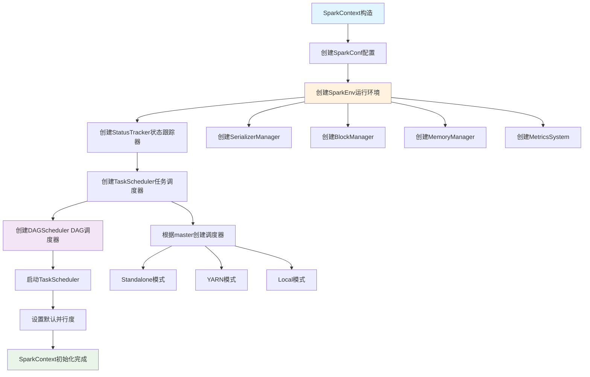

### 1.2 运行环境构建

#### SparkContext初始化源码分析
```scala
// SparkContext.scala 核心初始化流程
class SparkContext(config: SparkConf) extends Logging {
  
  // 1. 创建SparkEnv - 核心运行环境
  private val env: SparkEnv = {
    SparkEnv.createDriverEnv(conf, isLocal, listenerBus, numCores, mockOutputCommitCoordinator)
  }
  
  // 2. 创建状态跟踪器
  private val statusTracker = new SparkStatusTracker(this, sparkUI)
  
  // 3. 创建任务调度器
  private val (sched, ts) = SparkContext.createTaskScheduler(this, master, deployMode)
  private val taskScheduler = ts
  
  // 4. 创建DAG调度器
  private val dagScheduler = new DAGScheduler(this)
  
  // 5. 启动任务调度器
  taskScheduler.start()
  
  // 6. 设置默认并行度
  private val defaultParallelism: Int = taskScheduler.defaultParallelism
  
  // 核心方法：创建RDD
  def parallelize[T: ClassTag](
      seq: Seq[T],
      numSlices: Int = defaultParallelism): RDD[T] = withScope {
    new ParallelCollectionRDD[T](this, seq, numSlices, Map[Int, Seq[String]]())
  }
  
  // 核心方法：提交作业
  def runJob[T, U: ClassTag](
      rdd: RDD[T],
      func: (TaskContext, Iterator[T]) => U,
      partitions: Seq[Int],
      resultHandler: (Int, U) => Unit): Unit = {
    dagScheduler.runJob(rdd, func, partitions, callSite, resultHandler, localProperties.get)
  }
}
```

---

## 二、RDD设计与实现

### 2.1 RDD核心抽象

#### RDD五大特性实现流程

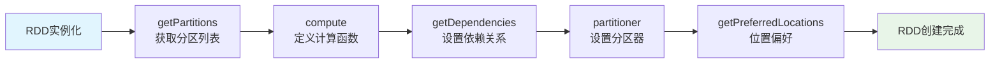

### 2.2 RDD五大特性

#### RDD源码核心实现
```scala
// RDD.scala 核心抽象
abstract class RDD[T: ClassTag](
    @transient private var _sc: SparkContext,
    @transient private var deps: Seq[Dependency[_]]
  ) extends Serializable with Logging {

  // 五大特性的具体实现
  
  // 1. 分区列表
  protected def getPartitions: Array[Partition]
  
  // 2. 计算函数
  def compute(split: Partition, context: TaskContext): Iterator[T]
  
  // 3. 依赖关系
  protected def getDependencies: Seq[Dependency[_]] = deps
  
  // 4. 分区器（可选）
  @transient val partitioner: Option[Partitioner] = None
  
  // 5. 位置偏好（可选）
  protected def getPreferredLocations(split: Partition): Seq[String] = Nil
  
  // Transformation操作实现
  def map[U: ClassTag](f: T => U): RDD[U] = withScope {
    val cleanF = sc.clean(f)
    new MapPartitionsRDD[U, T](this, (context, pid, iter) => iter.map(cleanF))
  }
  
  def filter(f: T => Boolean): RDD[T] = withScope {
    val cleanF = sc.clean(f)
    new MapPartitionsRDD[T, T](
      this,
      (context, pid, iter) => iter.filter(cleanF),
      preservesPartitioning = true)
  }
  
  def reduceByKey(func: (T, T) => T): RDD[T] = self.withScope {
    reduceByKey(defaultPartitioner(self), func)
  }
  
  // Action操作实现
  def collect(): Array[T] = withScope {
    val results = sc.runJob(this, (iter: Iterator[T]) => iter.toArray)
    Array.concat(results: _*)
  }
  
  def count(): Long = sc.runJob(this, Utils.getIteratorSize _).sum
  
  def foreach(f: T => Unit): Unit = withScope {
    val cleanF = sc.clean(f)
    sc.runJob(this, (iter: Iterator[T]) => iter.foreach(cleanF))
  }
}
```

### 2.3 RDD操作执行

#### RDD操作执行流程图

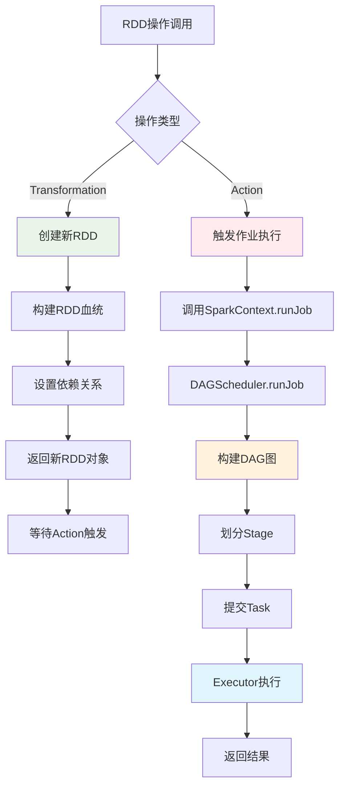

---

## 三、任务调度系统

### 3.1 DAGScheduler调度器

#### DAGScheduler作业提交流程图

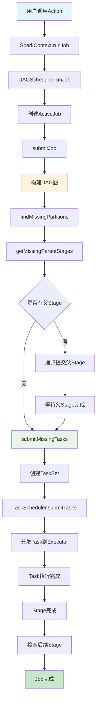

### 3.2 Stage划分算法

#### Stage划分算法流程图

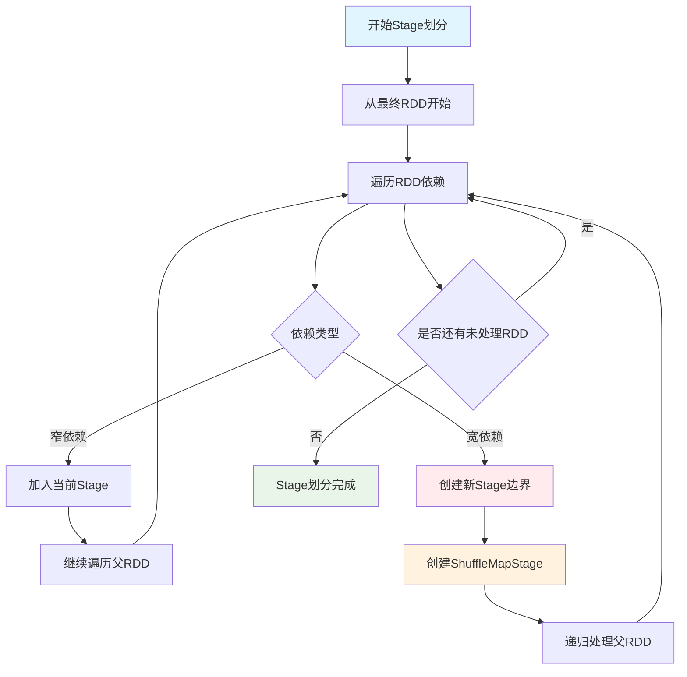

#### DAGScheduler源码分析
```scala
// DAGScheduler.scala 核心调度逻辑
class DAGScheduler(
    private[scheduler] val sc: SparkContext,
    private[scheduler] val taskScheduler: TaskScheduler,
    listenerBus: LiveListenerBus,
    mapOutputTracker: MapOutputTrackerMaster,
    blockManagerMaster: BlockManagerMaster,
    env: SparkEnv,
    clock: Clock = new SystemClock())
  extends Logging {

  // 事件处理循环
  private val eventProcessLoop = new DAGSchedulerEventProcessLoop(this)
  
  // 提交作业的核心方法
  def runJob[T, U](
      rdd: RDD[T],
      func: (TaskContext, Iterator[T]) => U,
      partitions: Seq[Int],
      callSite: CallSite,
      resultHandler: (Int, U) => Unit,
      properties: Properties): Unit = {
    
    val start = System.nanoTime
    val waiter = submitJob(rdd, func, partitions, callSite, resultHandler, properties)
    ThreadUtils.awaitReady(waiter, Duration.Inf)
    waiter.value.get match {
      case scala.util.Success(_) =>
        logInfo("Job %d finished: %s, took %f s".format
          (waiter.jobId, callSite.shortForm, (System.nanoTime - start) / 1e9))
      case scala.util.Failure(exception) =>
        logInfo("Job %d failed: %s, took %f s".format
          (waiter.jobId, callSite.shortForm, (System.nanoTime - start) / 1e9))
        throw exception
    }
  }
  
  // Stage划分核心算法
  private def getOrCreateShuffleMapStage(
      shuffleDep: ShuffleDependency[_, _, _],
      firstJobId: Int): ShuffleMapStage = {
    
    shuffleIdToMapStage.get(shuffleDep.shuffleId) match {
      case Some(stage) =>
        stage
        
      case None =>
        // 递归创建父Stage
        getMissingAncestorShuffleDependencies(shuffleDep.rdd).foreach { dep =>
          if (!shuffleIdToMapStage.contains(dep.shuffleId)) {
            createShuffleMapStage(dep, firstJobId)
          }
        }
        createShuffleMapStage(shuffleDep, firstJobId)
    }
  }
  
  // 查找缺失的父依赖
  private def getMissingAncestorShuffleDependencies(
      rdd: RDD[_]): ArrayStack[ShuffleDependency[_, _, _]] = {
    val ancestors = new ArrayStack[ShuffleDependency[_, _, _]]
    val visited = new HashSet[RDD[_]]
    val waitingForVisit = new ArrayStack[RDD[_]]
    
    waitingForVisit.push(rdd)
    while (waitingForVisit.nonEmpty) {
      val toVisit = waitingForVisit.pop()
      if (!visited(toVisit)) {
        visited += toVisit
        toVisit.dependencies.foreach {
          case shuffleDep: ShuffleDependency[_, _, _] =>
            if (!shuffleIdToMapStage.contains(shuffleDep.shuffleId)) {
              ancestors.push(shuffleDep)
              waitingForVisit.push(shuffleDep.rdd)
            }
          case narrowDep: NarrowDependency[_] =>
            waitingForVisit.push(narrowDep.rdd)
        }
      }
    }
    ancestors
  }
  
  // 提交Stage
  private def submitStage(stage: Stage): Unit = {
    val jobId = activeJobForStage(stage)
    if (jobId.isDefined) {
      if (!waitingStages(stage) && !runningStages(stage) && !failedStages(stage)) {
        val missing = getMissingParentStages(stage).sortBy(_.id)
        if (missing.isEmpty) {
          submitMissingTasks(stage, jobId.get)
        } else {
          for (parent <- missing) {
            submitStage(parent)
          }
          waitingStages += stage
        }
      }
    }
  }
}
```


### 4.3 内存监控与优化

#### 内存存储状态监控

```scala
// 内存使用监控组件
class MemoryMonitor {
  // 监控Map的内存使用
  def monitorMapMemory(map: SizeTrackingAppendOnlyMap[_, _]): MemoryUsage = {
    val estimatedSize = map.estimateSize()
    val currentMemory = map.currentMemory
    val maxMemory = map.maxMemory
    
    MemoryUsage(
      estimatedSize = estimatedSize,
      currentMemory = currentMemory,
      maxMemory = maxMemory,
      utilization = currentMemory.toDouble / maxMemory
    )
  }
  
  // 监控Spill状态
  def monitorSpillStatus(externalMap: ExternalAppendOnlyMap[_, _, _]): SpillStatus = {
    val spillCount = externalMap.spills.size
    val totalSpillSize = externalMap.spills.map(_.size).sum
    
    SpillStatus(
      spillCount = spillCount,
      totalSpillSize = totalSpillSize,
      averageSpillSize = if (spillCount > 0) totalSpillSize / spillCount else 0
    )
  }
}

case class MemoryUsage(
  estimatedSize: Long,
  currentMemory: Long,
  maxMemory: Long,
  utilization: Double)

case class SpillStatus(
  spillCount: Int,
  totalSpillSize: Long,
  averageSpillSize: Long)
```

#### 内存存储监控流程图

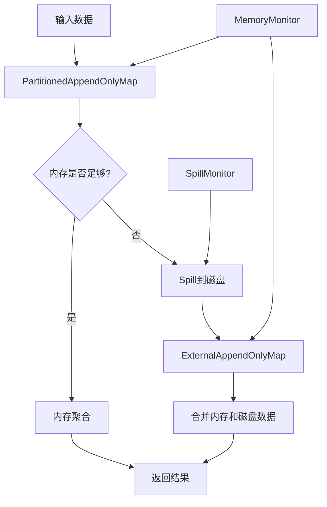

#### 内存存储优化策略

```scala
// 内存分配优化
class MemoryOptimizer {
  // 动态调整内存阈值
  def adjustMemoryThreshold(
      currentMemory: Long,
      maxMemory: Long,
      spillCount: Int): Long = {
    
    val utilization = currentMemory.toDouble / maxMemory
    
    if (utilization > 0.8 && spillCount > 0) {
      // 内存使用率高且有Spill，降低阈值
      (maxMemory * 0.6).toLong
    } else if (utilization < 0.5 && spillCount == 0) {
      // 内存使用率低且无Spill，提高阈值
      (maxMemory * 0.9).toLong
    } else {
      // 保持当前阈值
      (maxMemory * 0.8).toLong
    }
  }
  
  // 优化Map初始容量
  def optimizeInitialCapacity(dataSize: Long): Int = {
    val estimatedSize = (dataSize * 1.2).toInt
    math.max(64, math.min(estimatedSize, 1024 * 1024))
  }
}
```

---

### 3.5 任务分发与调度流程

### 3.3 TaskScheduler任务调度

#### DAG的生成与依赖分析

**任务提交完整流程图**：

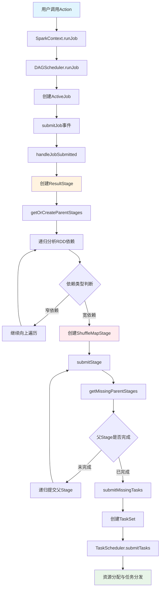

**DAG依赖分析流程图**：

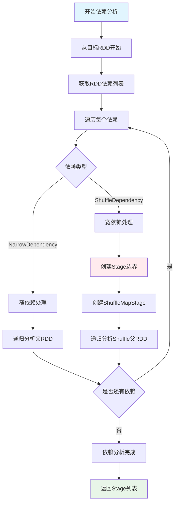

**用户触发Action时的完整流程**：

```scala
// 用户代码触发Action
val result = rdd.collect()

// SparkContext.collect()
def collect(): Array[T] = withScope {
  val results = sc.runJob(this, (iter: Iterator[T]) => iter.toArray)
  Array.concat(results: _*)
}

// SparkContext.runJob()
def runJob[T, U: ClassTag](
    rdd: RDD[T],
    func: (TaskContext, Iterator[T]) => U,
    partitions: Seq[Int],
    resultHandler: (Int, U) => Unit): Unit = {
  dagScheduler.runJob(rdd, func, partitions, callSite, resultHandler, localProperties.get)
}
```

**DAGScheduler依赖分析**：

```scala
// DAGScheduler.scala
private[scheduler] def getOrCreateParentStages(rdd: RDD[_], firstJobId: Int): List[Stage] = {
  val parents = new ArrayBuffer[Stage]()
  val visited = new HashSet[RDD[_]]
  
  def visit(r: RDD[_]): Unit = {
    if (!visited(r)) {
      visited += r
      for (dep <- r.dependencies) {
        dep match {
          case shufDep: ShuffleDependency[_, _, _] =>
            // 宽依赖，创建新的ShuffleMapStage
            parents += getOrCreateShuffleMapStage(shufDep, firstJobId)
          case _ =>
            // 窄依赖，递归访问父RDD
            visit(dep.rdd)
        }
      }
    }
  }
  
  visit(rdd)
  parents.toList
}
```

#### 任务分发与调度流程

**任务调度完整流程图**：

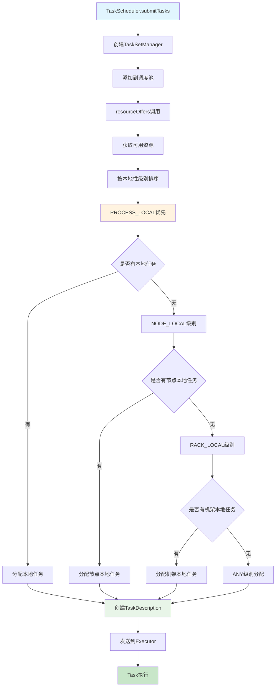

**资源分配本地性优化流程**：

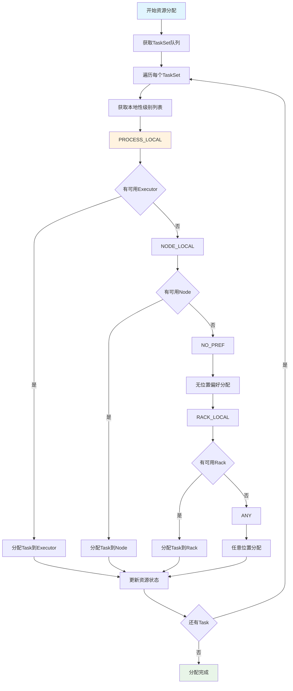

**完整的任务调度时序图**：

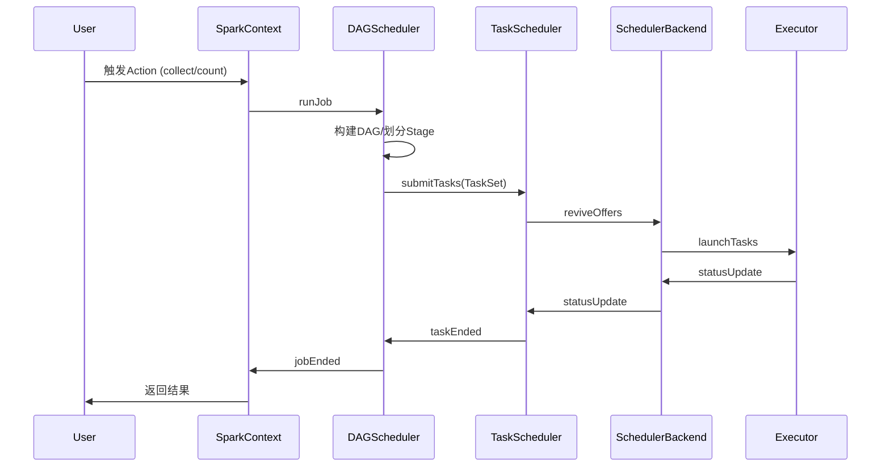

**TaskScheduler资源分配**：

```scala
// TaskSchedulerImpl.resourceOffers()
def resourceOffers(offers: IndexedSeq[WorkerOffer]): Seq[Seq[TaskDescription]] = {
  // 1. 随机打乱offers避免热点
  val shuffledOffers = Random.shuffle(offers)
  val tasks = shuffledOffers.map(o => new ArrayBuffer[TaskDescription](o.cores / CPUS_PER_TASK))
  val availableCpus = shuffledOffers.map(o => o.cores).toArray
  
  // 2. 按本地性级别分配任务
  val sortedTaskSets = rootPool.getSortedTaskSetQueue
  for (taskSet <- sortedTaskSets) {
    // PROCESS_LOCAL -> NODE_LOCAL -> NO_PREF -> RACK_LOCAL -> ANY
    for (currentMaxLocality <- taskSet.myLocalityLevels) {
      do {
        launchedAnyTask = resourceOfferSingleTaskSet(
          taskSet, currentMaxLocality, shuffledOffers, availableCpus, tasks)
      } while (launchedAnyTask)
    }
  }
  
  tasks
}
```

---

### 3.6 容错与监控机制

### 3.7 失败重试机制

**容错机制流程图**：

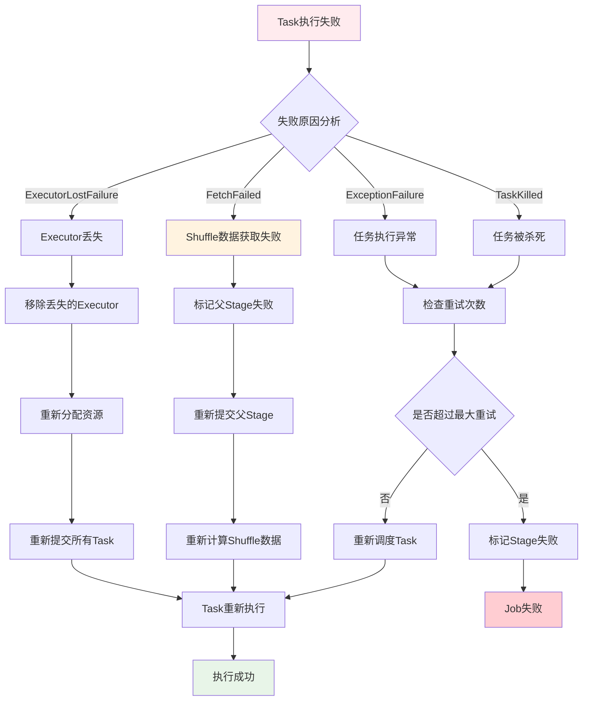

### 3.8 RDD血统恢复

**RDD血统恢复流程图**：

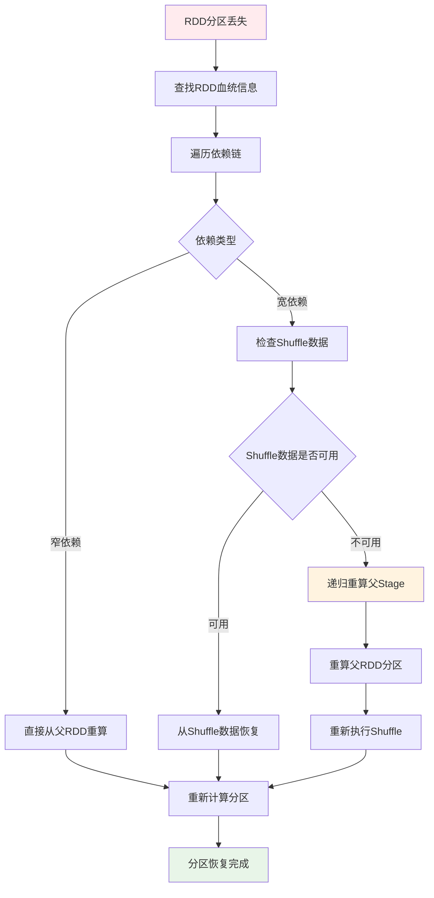

**DAGScheduler事件处理**：

```scala
// DAGSchedulerEventProcessLoop事件处理
private def doOnReceive(event: DAGSchedulerEvent): Unit = event match {
  case TaskFailed(taskId, taskType, reason, exception) =>
    reason match {
      case _: FetchFailed =>
        // Shuffle数据获取失败，需要重新计算父Stage
        val shuffleMapStage = shuffleIdToMapStage(reason.shuffleId)
        markStageAsFinished(shuffleMapStage, Some(reason.toString))
        submitStage(shuffleMapStage)
        
      case _: ExecutorLostFailure =>
        // Executor丢失，需要重新调度Task
        removeExecutorAndUnregisterOutputs(reason.execId, filesLost = true)
        
      case _: TaskKilled =>
        // Task被杀死，通常是推测执行
        logInfo(s"Task $taskId was killed")
        
      case _ =>
        // 其他异常，Task级别重试
        if (task.attempt < maxTaskFailures) {
          taskScheduler.submitTasks(createTaskSet(Array(task)))
        } else {
          abortStage(currentStage, s"Task $taskId failed $maxTaskFailures times")
        }
    }
    
  case StageCompleted(stage) =>
    // Stage完成，检查并提交依赖的Stage
    markStageAsFinished(stage)
    submitWaitingChildStages(stage)
}
```

### 3.4 Task执行机制

#### Executor工作机制与Task执行

**Executor任务执行流程图**：

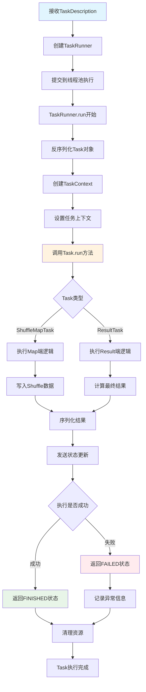

**Task执行上下文管理流程**：

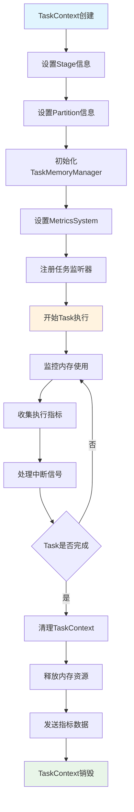

**Executor任务执行详细流程**：

```scala
// Executor.launchTask()
def launchTask(context: ExecutorBackend, taskDescription: TaskDescription): Unit = {
  val tr = new TaskRunner(context, taskDescription)
  runningTasks.put(taskDescription.taskId, tr)
  threadPool.execute(tr)
}

// TaskRunner.run()
class TaskRunner(
    execBackend: ExecutorBackend,
    private val taskDescription: TaskDescription)
  extends Runnable {
  
  override def run(): Unit = {
    try {
      // 1. 反序列化Task
      val task = ser.deserialize[Task[Any]](
        taskDescription.serializedTask, 
        Thread.currentThread.getContextClassLoader)
      
      // 2. 设置TaskContext
      val taskContext = new TaskContextImpl(
        stageId = taskDescription.stageId,
        taskAttemptId = taskDescription.taskId,
        attemptNumber = taskDescription.attemptNumber,
        partitionId = task.partitionId,
        localProperties = taskDescription.properties,
        taskMemoryManager = taskMemoryManager,
        metricsSystem = env.metricsSystem)
      
      // 3. 执行Task
      val value = task.run(
        taskAttemptId = taskDescription.taskId,
        attemptNumber = taskDescription.attemptNumber,
        metricsSystem = env.metricsSystem)
      
      // 4. 序列化结果并返回
      val serializedResult = ser.serialize(value)
      execBackend.statusUpdate(
        taskDescription.taskId, 
        TaskState.FINISHED, 
        serializedResult)
        
    } catch {
      case e: Exception =>
        // 异常处理
        val reason = new ExceptionFailure(e, taskContext.taskMetrics())
        execBackend.statusUpdate(
          taskDescription.taskId, 
          TaskState.FAILED, 
          ser.serialize(TaskFailedReason(reason)))
    } finally {
      // 清理资源
      runningTasks.remove(taskDescription.taskId)
    }
  }
}
```

#### 数据读取、处理与RDD依赖

**RDD数据读取流程图**：

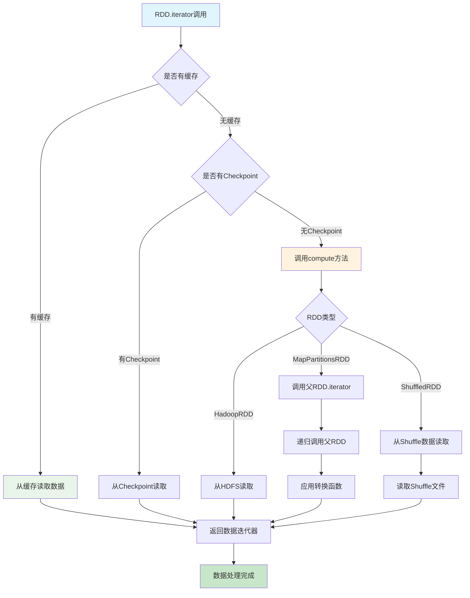

**RDD依赖链递归调用流程**：

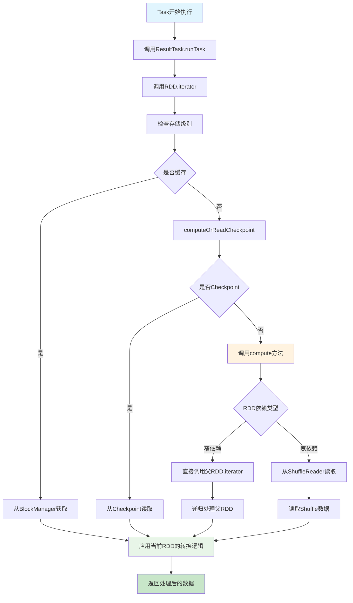

**RDD依赖链调用流程**：

```scala
// RDD.iterator() 递归调用流程
final def iterator(split: Partition, context: TaskContext): Iterator[T] = {
  if (storageLevel != StorageLevel.NONE) {
    // 1. 尝试从缓存读取
    getOrCompute(split, context)
  } else {
    // 2. 直接计算
    computeOrReadCheckpoint(split, context)
  }
}

def computeOrReadCheckpoint(split: Partition, context: TaskContext): Iterator[T] = {
  if (isCheckpointed) {
    // 从Checkpoint读取
    firstParent[T].iterator(split, context)
  } else {
    // 调用具体RDD的compute方法
    compute(split, context)
  }
}

// 以MapPartitionsRDD为例
override def compute(split: Partition, context: TaskContext): Iterator[U] = {
  // 递归调用父RDD的iterator
  f(context, split.index, firstParent[T].iterator(split, context))
}
```

**典型RDD依赖链执行图**：

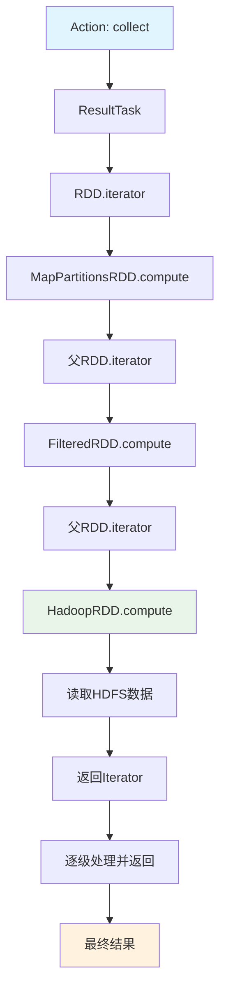

#### Task类型与执行差异

**Task类型执行流程对比图**：

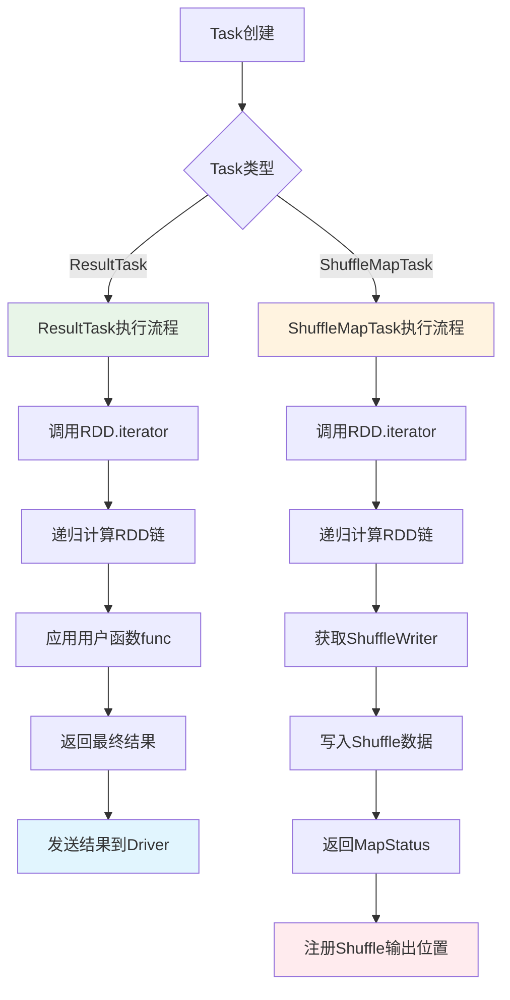

**ShuffleMapTask详细执行流程**：

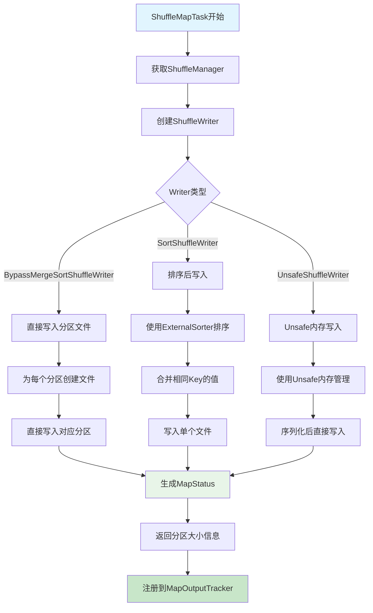

**ResultTask详细执行流程**：

```mermaid
graph TD
    A[ResultTask开始] --> B[调用RDD.iterator]
    B --> C[从Shuffle数据读取]
    C --> D[ShuffleReader.read]
    D --> E[合并多个Map输出]
    E --> F[应用用户定义函数]
    F --> G{函数类型}
    G -->|collect| H[收集所有数据]
    G -->|count| I[计算数据量]
    G -->|reduce| J[聚合计算]
    G -->|foreach| K[遍历处理]
    
    H --> L[序列化结果数据]
    I --> M[返回计数值]
    J --> N[返回聚合结果]
    K --> O[执行副作用操作]
    
    L --> P[发送到Driver]
    M --> P
    N --> P
    O --> Q[返回Unit]
    Q --> P
    P --> R[Task执行完成]
    
    style A fill:#e1f5fe
    style F fill:#fff3e0
    style P fill:#e8f5e8
    style R fill:#c8e6c9
```

**ResultTask vs ShuffleMapTask**：

```scala
// ResultTask - 产生最终结果
class ResultTask[T, U](
    stageId: Int,
    rdd: RDD[T],
    func: (TaskContext, Iterator[T]) => U,
    _partitionId: Int,
    locs: Seq[TaskLocation])
  extends Task[U](stageId, _partitionId) {
  
  override def runTask(context: TaskContext): U = {
    // 直接调用用户函数处理数据
    func(context, rdd.iterator(partition, context))
  }
}

// ShuffleMapTask - 产生中间Shuffle数据
class ShuffleMapTask(
    stageId: Int,
    rdd: RDD[_],
    dep: ShuffleDependency[_, _, _],
    _partitionId: Int,
    locs: Seq[TaskLocation])
  extends Task[MapStatus](stageId, _partitionId) {
  
  override def runTask(context: TaskContext): MapStatus = {
    // 获取ShuffleWriter
    val manager = SparkEnv.get.shuffleManager
    val writer = manager.getWriter[Any, Any](
      dep.shuffleHandle, partitionId, context)
    
    try {
      // 写入Shuffle数据
      writer.write(rdd.iterator(partition, context).asInstanceOf[Iterator[_ <: Product2[Any, Any]]])
      writer.stop(success = true).get
    } catch {
      case e: Exception =>
        writer.stop(success = false)
        throw e
    }
  }
}
```

## 四、内存管理系统

### 4.1 统一内存管理

统一内存管理的详细实现见后续UnifiedMemoryManager部分。

### 4.2 算子内存存储 

#### GroupByKey算子内存存储过程

**GroupByKey内存存储流程图**：

```mermaid
graph TD
    A[GroupByKey算子调用] --> B[创建GroupByKeyRDD]
    B --> C[compute方法执行]
    C --> D[创建Aggregator聚合器]
    D --> E[创建ExternalAppendOnlyMap]
    E --> F[遍历输入数据]
    F --> G[插入键值对到Map]
    G --> H{内存是否超限}
    H -->|否| I[继续插入数据]
    H -->|是| J[触发Spill操作]
    J --> K[将内存数据写入磁盘]
    K --> L[清空内存Map]
    L --> I
    I --> M{是否还有数据}
    M -->|是| F
    M -->|否| N[合并内存和磁盘数据]
    N --> O[返回聚合结果]
    
    style A fill:#e1f5fe
    style J fill:#ffebee
    style N fill:#fff3e0
    style O fill:#e8f5e8
```

**ExternalAppendOnlyMap内存管理流程**：

```mermaid
graph TD
    A[数据插入请求] --> B[SizeTrackingAppendOnlyMap.insert]
    B --> C[计算Hash值定位]
    C --> D{键是否存在}
    D -->|存在| E[合并值 mergeValue]
    D -->|不存在| F[创建新值 createCombiner]
    E --> G[更新内存使用量]
    F --> G
    G --> H{内存使用 > 阈值}
    H -->|否| I[插入完成]
    H -->|是| J[执行Spill操作]
    J --> K[排序内存数据]
    K --> L[写入临时文件]
    L --> M[添加到spills列表]
    M --> N[重置内存Map]
    N --> I
    
    style A fill:#e1f5fe
    style J fill:#ffebee
    style K fill:#fff3e0
    style I fill:#e8f5e8
```

```scala
// GroupByKey算子核心实现
class GroupByKeyRDD[K: ClassTag, V: ClassTag](
    prev: RDD[(K, V)],
    part: Partitioner)
  extends RDD[(K, Iterable[V])](prev) {

  override def compute(split: Partition, context: TaskContext): Iterator[(K, Iterable[V])] = {
    // 1. 创建聚合器
    val aggregator = new Aggregator[K, V, ArrayBuffer[V]](
      createCombiner = (v: V) => ArrayBuffer(v),
      mergeValue = (buf: ArrayBuffer[V], v: V) => buf += v,
      mergeCombiners = (buf1: ArrayBuffer[V], buf2: ArrayBuffer[V]) => buf1 ++= buf2
    )
    
    // 2. 使用ExternalAppendOnlyMap进行聚合
    val externalMap = new ExternalAppendOnlyMap[K, V, ArrayBuffer[V]](aggregator)
    
    // 3. 插入所有键值对
    val iter = firstParent[(K, V)].iterator(split, context)
    while (iter.hasNext) {
      val (k, v) = iter.next()
      externalMap.insert(k, v)
    }
    
    // 4. 返回聚合结果
    externalMap.iterator
  }
}
```


```scala
// ExternalAppendOnlyMap核心实现
class ExternalAppendOnlyMap[K, V, C](
    aggregator: Aggregator[K, V, C],
    serializer: Serializer = SparkEnv.get.serializer)
  extends Spillable[WritablePartitionedPairCollection[K, C]](SparkEnv.get.blockManager.master)
  with Logging {

  // 内存中的Map
  private var map = new SizeTrackingAppendOnlyMap[K, C]
  
  // Spill文件列表
  private val spills = new ArrayBuffer[SpilledFile]
  
  // 插入键值对
  def insert(key: K, value: V): Unit = {
    // 1. 尝试在内存中聚合
    val update = (hadValue: Boolean, oldValue: C) => {
      if (hadValue) {
        aggregator.mergeValue(oldValue, value)
      } else {
        aggregator.createCombiner(value)
      }
    }
    
    map.changeValue(key, update)
    
    // 2. 检查是否需要Spill
    if (map.estimateSize() > myMemoryThreshold) {
      spill()
    }
  }
  
  // Spill到磁盘
  private def spill(): Unit = {
    val spillFile = spillMemoryIteratorToDisk(map.destructiveSortedWritablePartitionedIterator())
    spills += spillFile
    map = new SizeTrackingAppendOnlyMap[K, C]
  }
  
  // 获取最终结果
  def iterator: Iterator[(K, C)] = {
    // 合并内存中的结果和Spill文件
    val memoryIterator = map.destructiveSortedWritablePartitionedIterator()
    val spillIterators = spills.map(_.iterator)
    
    // 返回合并后的迭代器
    new MergedIterator(memoryIterator +: spillIterators)
  }
}
```

#### ReduceByKey算子内存存储过程

**ReduceByKey内存存储流程图**：

```mermaid
graph TD
    A[ReduceByKey算子调用] --> B[创建ShuffledRDD]
    B --> C[Map端预聚合]
    C --> D[创建PartitionedAppendOnlyMap]
    D --> E[遍历输入数据]
    E --> F[计算Hash值定位]
    F --> G{键是否存在}
    G -->|存在| H[合并值 mergeValue]
    G -->|不存在| I[创建新值 createCombiner]
    H --> J[更新内存使用量]
    I --> J
    J --> K{内存使用 > 阈值}
    K -->|否| L[继续处理数据]
    K -->|是| M[执行Spill操作]
    M --> N[排序并写入磁盘]
    N --> O[重置内存Map]
    O --> L
    L --> P{是否还有数据}
    P -->|是| E
    P -->|否| Q[Shuffle Write阶段]
    Q --> R[合并内存和磁盘数据]
    R --> S[写入Shuffle文件]
    
    style A fill:#e1f5fe
    style M fill:#ffebee
    style Q fill:#fff3e0
    style S fill:#e8f5e8
```

**PartitionedAppendOnlyMap操作流程**：

```mermaid
graph TD
    A[changeValue调用] --> B[计算Hash值]
    B --> C[获取位置pos]
    C --> D[线性探测查找]
    D --> E{找到键}
    E -->|是| F[更新现有值]
    E -->|否| G[插入新键值对]
    F --> H[调用updateFunc]
    G --> I[调用updateFunc创建新值]
    H --> J[更新完成]
    I --> K[增加curSize]
    K --> L{curSize >= growThreshold}
    L -->|是| M[扩容Hash表]
    L -->|否| J
    M --> N[重新Hash所有元素]
    N --> J
    
    style A fill:#e1f5fe
    style M fill:#ffebee
    style J fill:#e8f5e8
```

```scala
// PartitionedAppendOnlyMap的changeValue方法
def changeValue(key: K, updateFunc: (Boolean, V) => V): Unit = {
  val hash = getHash(key)
  val pos = getPos(hash)
  
  var i = pos
  while (data(2 * i) != null) {
    if (data(2 * i) == key) {
      // 找到现有键，更新值
      val hadValue = true
      val oldValue = data(2 * i + 1).asInstanceOf[V]
      val newValue = updateFunc(hadValue, oldValue)
      data(2 * i + 1) = newValue.asInstanceOf[AnyRef]
      return
    }
    i = (i + 1) % (data.length / 2)
  }
  
  // 未找到键，插入新值
  val hadValue = false
  val newValue = updateFunc(hadValue, null.asInstanceOf[V])
  data(2 * i) = key.asInstanceOf[AnyRef]
  data(2 * i + 1) = newValue.asInstanceOf[AnyRef]
  curSize += 1
  
  if (curSize >= growThreshold) {
    growTable()
  }
}
```

#### Join算子内存存储过程

**Join算子内存存储流程图**：

```mermaid
graph TD
    A[Join算子调用] --> B[创建CoGroupedRDD]
    B --> C[compute方法执行]
    C --> D[创建CoGroupAggregator]
    D --> E[创建ExternalAppendOnlyMap]
    E --> F[处理第一个RDD数据]
    F --> G[插入数据标记rddIndex=0]
    G --> H{内存是否超限}
    H -->|是| I[执行Spill操作]
    H -->|否| J[处理第二个RDD数据]
    I --> K[写入磁盘文件]
    K --> J
    J --> L[插入数据标记rddIndex=1]
    L --> M{内存是否超限}
    M -->|是| N[执行Spill操作]
    M -->|否| O[合并所有数据]
    N --> P[写入磁盘文件]
    P --> O
    O --> Q[按Key分组]
    Q --> R[生成Join结果]
    
    style A fill:#e1f5fe
    style I fill:#ffebee
    style N fill:#ffebee
    style R fill:#e8f5e8
```

**CoGroup聚合过程流程**：

```mermaid
graph TD
    A[CoGroup聚合开始] --> B[初始化结果数组]
    B --> C[遍历输入数据]
    C --> D[解析rddIndex和value]
    D --> E{Key是否存在}
    E -->|存在| F[获取现有数组组]
    E -->|不存在| G[创建新数组组]
    F --> H[将value添加到对应rddIndex的数组]
    G --> I[初始化所有RDD的空数组]
    I --> H
    H --> J{是否还有数据}
    J -->|是| C
    J -->|否| K[返回分组结果]
    K --> L[转换为Iterable格式]
    
    style A fill:#e1f5fe
    style G fill:#fff3e0
    style K fill:#e8f5e8
```

```scala
// CoGroupedRDD核心实现
class CoGroupedRDD[K: ClassTag](
    rdds: Seq[RDD[(K, _)]],
    part: Partitioner)
  extends RDD[(K, Array[Iterable[_]])](rdds.head.context, Nil) {

  override def compute(split: Partition, context: TaskContext): Iterator[(K, Array[Iterable[_]])] = {
    // 1. 创建CoGroup聚合器
    val aggregator = new CoGroupAggregator[K]
    
    // 2. 使用ExternalAppendOnlyMap进行分组
    val externalMap = new ExternalAppendOnlyMap[K, (Int, Any), Array[ArrayBuffer[Any]]](aggregator)
    
    // 3. 插入所有RDD的数据
    rdds.zipWithIndex.foreach { case (rdd, rddIndex) =>
      val iter = rdd.iterator(split, context)
      while (iter.hasNext) {
        val (k, v) = iter.next()
        externalMap.insert(k, (rddIndex, v))
      }
    }
    
    // 4. 返回分组结果
    externalMap.iterator.map { case (k, groups) =>
      (k, groups.map(_.toIterable))
    }
  }
}
```

---

## 五、Shuffle机制实现

### 5.1 Sort Shuffle核心

#### Sort Shuffle执行流程图

```mermaid
graph TD
    A[ShuffleMapTask开始] --> B[获取SortShuffleManager]
    B --> C{判断Shuffle写入器类型}
    C -->|小数据量| D[BypassMergeSortShuffleWriter]
    C -->|大数据量| E[SortShuffleWriter]
    C -->|序列化数据| F[UnsafeShuffleWriter]
    
    D --> D1[为每个Reduce分区创建临时文件]
    D1 --> D2[直接写入对应分区文件]
    D2 --> D3[合并所有临时文件]
    D3 --> D4[生成索引文件]
    
    E --> E1[创建ExternalSorter]
    E1 --> E2[数据插入并排序]
    E2 --> E3{内存是否足够}
    E3 -->|否| E4[Spill到磁盘]
    E3 -->|是| E5[内存中排序]
    E4 --> E6[合并spill文件]
    E5 --> E6
    E6 --> E7[写入最终文件]
    
    F --> F1[使用Tungsten内存管理]
    F1 --> F2[直接序列化写入]
    F2 --> F3[内存排序]
    F3 --> F4[写入最终文件]
    
    D4 --> G[返回MapStatus]
    E7 --> G
    F4 --> G
    G --> H[注册到MapOutputTracker]
    
    style A fill:#e1f5fe
    style C fill:#fff3e0
    style G fill:#e8f5e8
    style H fill:#c8e6c9
```

### 5.2 UnsafeShuffleWriter

#### UnsafeShuffleWriter核心源码

```scala
// UnsafeShuffleWriter.scala - Unsafe模式的Shuffle写入器
class UnsafeShuffleWriter[K, V](
    blockManager: BlockManager,
    shuffleBlockResolver: IndexShuffleBlockResolver,
    taskMemoryManager: TaskMemoryManager,
    handle: SerializedShuffleHandle[K, V],
    mapId: Int,
    taskContext: TaskContext,
    sparkConf: SparkConf)
  extends ShuffleWriter[K, V] with Logging {

  private val dep = handle.dependency
  private val numPartitions = dep.partitioner.numPartitions
  private val serializer = dep.serializer.newInstance()
  
  // 内存排序器，直接操作序列化后的字节数组
  private var sorter: UnsafeShuffleInMemorySorter = null
  private var mapStatus: MapStatus = null

  // 写入记录的核心方法
  override def write(records: Iterator[Product2[K, V]]): Unit = {
    assert(partitioner.numPartitions <= UnsafeShuffleManager.MAX_SHUFFLE_OUTPUT_PARTITIONS)
    
    // 1. 创建内存排序器
    sorter = new UnsafeShuffleInMemorySorter(
      taskMemoryManager, 
      blockManager, 
      taskContext.taskMetrics().shuffleWriteMetrics,
      numPartitions,
      sparkConf)

    val serInstance = serializer
    val serOutputStream = new UnsafeShuffleSerializationStream(serInstance)
    
    // 2. 插入所有记录到排序器
    while (records.hasNext) {
      insertRecordIntoSorter(records.next(), serOutputStream)
    }
    
    // 3. 关闭序列化流并写入最终文件
    serOutputStream.close()
    val outputFile = shuffleBlockResolver.getDataFile(dep.shuffleId, mapId)
    val tmp = Utils.tempFileWith(outputFile)
    
    try {
      // 4. 合并所有spill文件并写入最终输出
      val partitionLengths = mergeSpills(tmp)
      shuffleBlockResolver.writeIndexFileAndCommit(dep.shuffleId, mapId, partitionLengths, tmp)
      mapStatus = MapStatus(blockManager.blockManagerId, partitionLengths)
    } finally {
      if (tmp.exists() && !tmp.delete()) {
        logError(s"Error while deleting temp file ${tmp.getAbsolutePath}")
      }
    }
  }

  // 插入记录到排序器
  private def insertRecordIntoSorter(record: Product2[K, V], 
                                   serOutputStream: UnsafeShuffleSerializationStream): Unit = {
    val key = record._1
    val value = record._2
    val partitionId = partitioner.getPartition(key)
    
    // 序列化键值对并插入到内存排序器
    val serializedRecordSize = serOutputStream.writeRecord(key, value, partitionId)
    
    // 检查是否需要Spill到磁盘
    if (sorter.numRecords() >= numElementsForSpillThreshold) {
      if (sorter.getMemoryUsage() > memoryThreshold) {
        spill()
      }
    }
  }

  // Spill操作 - 将内存数据溢写到磁盘
  private def spill(): Unit = {
    assert(sorter != null)
    logger.info(s"Thread ${Thread.currentThread().getId} spilling sort data of " +
      s"${Utils.bytesToString(sorter.getMemoryUsage())} to disk")
    
    // 获取排序后的数据迭代器
    val sortedRecords = sorter.getSortedIterator()
    
    // 创建或获取spill文件writer
    val spillWriter = spillWriters.size match {
      case 0 =>
        // 第一次Spill，创建新的writer
        val (file, blockId) = diskBlockManager.createTempShuffleBlock()
        val writer = blockManager.getDiskWriter(blockId, file, serializer, fileBufferSizeBytes, writeMetrics)
        spillWriters += writer
        writer
      case _ =>
        // 后续Spill，复用或创建新的writer
        spillWriters.last
    }
    
    // 将排序后的数据写入spill文件
    while (sortedRecords.hasNext) {
      val sortedRecord = sortedRecords.next()
      spillWriter.write(sortedRecord.key, sortedRecord.value)
    }
    spillWriter.commitAndGet()
    
    // 重置内存排序器以释放内存
    sorter.freeMemory()
    sorter = new UnsafeShuffleInMemorySorter(
      taskMemoryManager, blockManager, taskContext.taskMetrics().shuffleWriteMetrics,
      numPartitions, sparkConf)
  }

  // 合并所有Spill文件
  private def mergeSpills(outputFile: File): Array[Long] = {
    val numPartitions = dep.partitioner.numPartitions
    val partitionLengths = new Array[Long](numPartitions)
    
    if (spillWriters.isEmpty) {
      // 没有spill文件，直接从内存排序器读取
      val sortedRecords = sorter.getSortedIterator()
      val writer = new FileOutputStream(outputFile)
      
      try {
        var currentPartition = 0
        var currentPartitionSize = 0L
        
        while (sortedRecords.hasNext) {
          val record = sortedRecords.next()
          val partitionId = record.partitionId
          
          // 如果分区发生变化，记录之前分区的大小
          if (partitionId != currentPartition) {
            partitionLengths(currentPartition) = currentPartitionSize
            currentPartition = partitionId
            currentPartitionSize = 0L
          }
          
          // 写入记录
          writer.write(record.serializedRecord)
          currentPartitionSize += record.serializedRecord.length
        }
        
        // 记录最后一个分区的大小
        if (currentPartition < numPartitions) {
          partitionLengths(currentPartition) = currentPartitionSize
        }
      } finally {
        writer.close()
      }
    } else {
      // 有spill文件，需要合并多个文件
      mergeSpillFiles(outputFile, partitionLengths)
    }
    
    partitionLengths
  }

  // 合并多个spill文件
  private def mergeSpillFiles(outputFile: File, partitionLengths: Array[Long]): Unit = {
    val numPartitions = dep.partitioner.numPartitions
    val spillFiles = spillWriters.map(_.getFile())
    val priorityQueue = new mutable.PriorityQueue[SpillFileIterator]()(Ordering.by[SpillFileIterator, (Int, Long)](iter => (iter.partitionId, iter.recordId)).reverse)
    
    // 初始化所有spill文件的迭代器
    for ((file, index) <- spillFiles.zipWithIndex) {
      val iterator = new SpillFileIterator(file, index)
      if (iterator.hasNext) {
        priorityQueue.enqueue(iterator)
      }
    }
    
    val writer = new FileOutputStream(outputFile)
    try {
      var currentPartition = 0
      var currentPartitionSize = 0L
      
      // 使用优先队列进行多路归并
      while (priorityQueue.nonEmpty) {
        val iterator = priorityQueue.dequeue()
        val record = iterator.next()
        val partitionId = record.partitionId
        
        // 处理分区边界
        if (partitionId != currentPartition) {
          partitionLengths(currentPartition) = currentPartitionSize
          currentPartition = partitionId
          currentPartitionSize = 0L
        }
        
        // 写入记录
        writer.write(record.serializedRecord)
        currentPartitionSize += record.serializedRecord.length
        
        // 如果迭代器还有数据，重新加入队列
        if (iterator.hasNext) {
          priorityQueue.enqueue(iterator)
        }
      }
      
      // 记录最后一个分区的大小
      if (currentPartition < numPartitions) {
        partitionLengths(currentPartition) = currentPartitionSize
      }
    } finally {
      writer.close()
    }
  }
}
```

---

### 4.4 内存管理系统（高级特性）

### 4.5 统一内存管理（详细实现）

#### 内存分配策略流程图

```mermaid
graph TD
    A[内存分配请求] --> B{请求类型}
    B -->|存储内存| C[acquireStorageMemory]
    B -->|执行内存| D[acquireExecutionMemory]
    
    C --> C1[检查存储内存池]
    C1 --> C2{可用内存足够}
    C2 -->|是| C3[直接分配]
    C2 -->|否| C4[尝试从执行内存池借用]
    C4 --> C5{执行内存池有空闲}
    C5 -->|是| C6[转移内存到存储池]
    C5 -->|否| C7[分配失败]
    C6 --> C3
    
    D --> D1[检查执行内存池]
    D1 --> D2{可用内存足够}
    D2 -->|是| D3[直接分配]
    D2 -->|否| D4[尝试从存储内存池回收]
    D4 --> D5[驱逐缓存数据]
    D5 --> D6[转移释放的内存]
    D6 --> D7{回收内存足够}
    D7 -->|是| D3
    D7 -->|否| D8[部分分配]
    
    C3 --> E[分配成功]
    D3 --> E
    D8 --> E
    C7 --> F[分配失败]
    E --> G[更新内存池状态]
    F --> H[返回分配结果]
    G --> H
    
    style A fill:#e1f5fe
    style C4 fill:#fff3e0
    style D5 fill:#ffebee
    style H fill:#e8f5e8
```

#### UnifiedMemoryManager详细实现

```scala
// UnifiedMemoryManager.scala - 统一内存管理器
class UnifiedMemoryManager(
    conf: SparkConf,
    val maxHeapMemory: Long,
    onHeapStorageRegionSize: Long,
    numCores: Int)
  extends MemoryManager(conf, numCores, onHeapStorageRegionSize, maxHeapMemory) {

  // 系统保留内存（300MB）
  private val reservedMemory = conf.getLong("spark.testing.reservedMemory", 300 * 1024 * 1024)
  
  // 可用于Spark的总内存
  private val maxPoolSize = maxHeapMemory - reservedMemory
  
  // 内存分配给Spark的比例
  private val memoryFraction = conf.getDouble("spark.sql.adaptive.memoryFraction", 0.6)
  private val poolSize = (maxPoolSize * memoryFraction).toLong
  
  // 存储内存的初始比例
  private val storageFraction = conf.getDouble("spark.sql.adaptive.storageFraction", 0.5)
  private val initialStorageMemory = (poolSize * storageFraction).toLong
  
  // 创建内存池
  override val onHeapStorageMemoryPool = new StorageMemoryPool(this, MemoryMode.ON_HEAP)
  override val offHeapStorageMemoryPool = new StorageMemoryPool(this, MemoryMode.OFF_HEAP)
  override val onHeapExecutionMemoryPool = new ExecutionMemoryPool(this, MemoryMode.ON_HEAP)
  override val offHeapExecutionMemoryPool = new ExecutionMemoryPool(this, MemoryMode.OFF_HEAP)

  // 设置初始内存池大小
  onHeapStorageMemoryPool.incrementPoolSize(initialStorageMemory)
  onHeapExecutionMemoryPool.incrementPoolSize(poolSize - initialStorageMemory)

  // 获取存储内存
  override def acquireStorageMemory(
      blockId: BlockId,
      numBytes: Long,
      memoryMode: MemoryMode): Boolean = synchronized {
    
    assertInvariants()
    assert(numBytes >= 0)
    
    val (executionPool, storagePool, maxMemory) = memoryMode match {
      case MemoryMode.ON_HEAP => (
        onHeapExecutionMemoryPool,
        onHeapStorageMemoryPool,
        maxOnHeapStorageMemory)
      case MemoryMode.OFF_HEAP => (
        offHeapExecutionMemoryPool,
        offHeapStorageMemoryPool,
        maxOffHeapStorageMemory)
    }
    
    // 检查请求的内存是否超过最大限制
    if (numBytes > maxMemory) {
      logInfo(s"Will not store $blockId as the required space ($numBytes bytes) exceeds our " +
        s"memory limit ($maxMemory bytes)")
      return false
    }
    
    // 如果存储池内存不足，尝试从执行池借用
    if (numBytes > storagePool.memoryFree) {
      val memoryBorrowedFromExecution = Math.min(
        executionPool.memoryFree, 
        numBytes - storagePool.memoryFree)
      if (memoryBorrowedFromExecution > 0) {
        executionPool.decrementPoolSize(memoryBorrowedFromExecution)
        storagePool.incrementPoolSize(memoryBorrowedFromExecution)
        logInfo(s"Borrowed $memoryBorrowedFromExecution bytes from execution memory " +
          s"for storage of $blockId")
      }
    }
    
    // 在存储池中分配内存
    val success = storagePool.acquireMemory(blockId, numBytes)
    if (success) {
      logDebug(s"Successfully acquired $numBytes bytes for $blockId")
    } else {
      logDebug(s"Failed to acquire $numBytes bytes for $blockId")
    }
    
    assertInvariants()
    success
  }

  // 获取执行内存
  override def acquireExecutionMemory(
      numBytes: Long,
      taskAttemptId: Long,
      memoryMode: MemoryMode): Long = synchronized {
    
    assertInvariants()
    assert(numBytes >= 0)
    
    val (executionPool, storagePool, maxPoolSize, maybeGrowPool, maxMemory) = memoryMode match {
      case MemoryMode.ON_HEAP => (
        onHeapExecutionMemoryPool,
        onHeapStorageMemoryPool,
        maxOnHeapStorageMemory,
        () => expandOnHeapPool(numBytes),
        maxHeapMemory)
      case MemoryMode.OFF_HEAP => (
        offHeapExecutionMemoryPool,
        offHeapStorageMemoryPool,
        maxOffHeapStorageMemory,
        () => expandOffHeapPool(numBytes),
        maxOffHeapMemory)
    }

    /**
     * 执行内存分配策略：
     * 1. 首先尝试从执行池直接分配
     * 2. 如果执行池内存不足，尝试从存储池回收内存
     * 3. 如果存储池可以回收内存，将其转移到执行池
     * 4. 如果还是不足，考虑扩展内存池
     */

    // 1. 首先尝试从执行池直接分配
    val toGrant = Math.min(numBytes, executionPool.memoryFree)
    var memoryAcquired = 0L
    
    if (toGrant > 0) {
      memoryAcquired = executionPool.acquireMemory(toGrant, taskAttemptId)
    }
    
    // 2. 如果直接分配不够，尝试从存储池回收内存
    if (memoryAcquired < numBytes) {
      val memoryToReclaim = numBytes - memoryAcquired
      val memoryReclaimedFromStorage = storagePool.freeSpaceToShrinkPool(memoryToReclaim)
      
      if (memoryReclaimedFromStorage > 0) {
        // 将回收的内存转移到执行池
        storagePool.decrementPoolSize(memoryReclaimedFromStorage)
        executionPool.incrementPoolSize(memoryReclaimedFromStorage)
        
        logInfo(s"Reclaimed $memoryReclaimedFromStorage bytes from storage memory " +
          s"for execution task $taskAttemptId")
        
        // 尝试在执行池中分配剩余的内存
        val additionalMemory = Math.min(
          memoryToReclaim, 
          executionPool.memoryFree)
        if (additionalMemory > 0) {
          memoryAcquired += executionPool.acquireMemory(additionalMemory, taskAttemptId)
        }
      }
    }
    
    // 3. 如果还是不足，考虑扩展内存池
    if (memoryAcquired < numBytes) {
      val remainingNeeded = numBytes - memoryAcquired
      try {
        maybeGrowPool()
        val additionalMemory = Math.min(remainingNeeded, executionPool.memoryFree)
        if (additionalMemory > 0) {
          memoryAcquired += executionPool.acquireMemory(additionalMemory, taskAttemptId)
        }
      } catch {
        case _: Exception =>
          logWarning(s"Failed to expand memory pool for task $taskAttemptId")
      }
    }
    
    logDebug(s"Task $taskAttemptId acquired $memoryAcquired / $numBytes bytes of execution memory")
    
    assertInvariants()
    memoryAcquired
  }

  // 释放存储内存
  override def releaseStorageMemory(numBytes: Long, memoryMode: MemoryMode): Unit = synchronized {
    val storagePool = memoryMode match {
      case MemoryMode.ON_HEAP => onHeapStorageMemoryPool
      case MemoryMode.OFF_HEAP => offHeapStorageMemoryPool
    }
    storagePool.releaseMemory(numBytes)
    logDebug(s"Released $numBytes bytes of storage memory")
    assertInvariants()
  }

  // 释放执行内存
  override def releaseExecutionMemory(
      numBytes: Long,
      taskAttemptId: Long,
      memoryMode: MemoryMode): Unit = synchronized {
    val executionPool = memoryMode match {
      case MemoryMode.ON_HEAP => onHeapExecutionMemoryPool
      case MemoryMode.OFF_HEAP => offHeapExecutionMemoryPool
    }
    executionPool.releaseMemory(numBytes, taskAttemptId)
    logDebug(s"Task $taskAttemptId released $numBytes bytes of execution memory")
    assertInvariants()
  }

  // 扩展堆内内存池
  private def expandOnHeapPool(requestedMemory: Long): Unit = {
    val available = maxHeapMemory - onHeapExecutionMemoryPool.poolSize - onHeapStorageMemoryPool.poolSize
    val toExpand = Math.min(available, requestedMemory)
    if (toExpand > 0) {
      onHeapExecutionMemoryPool.incrementPoolSize(toExpand)
      logInfo(s"Expanded on-heap execution pool by ${Utils.bytesToString(toExpand)}")
    }
  }

  // 扩展堆外内存池  
  private def expandOffHeapPool(requestedMemory: Long): Unit = {
    val available = maxOffHeapMemory - offHeapExecutionMemoryPool.poolSize - offHeapStorageMemoryPool.poolSize
    val toExpand = Math.min(available, requestedMemory)
    if (toExpand > 0) {
      offHeapExecutionMemoryPool.incrementPoolSize(toExpand)
      logInfo(s"Expanded off-heap execution pool by ${Utils.bytesToString(toExpand)}")
    }
  }

  // 验证内存池状态的一致性
  private def assertInvariants(): Unit = {
    if (conf.getBoolean("spark.testing.memory.enableChecks", false)) {
      val totalOnHeap = onHeapExecutionMemoryPool.poolSize + onHeapStorageMemoryPool.poolSize
      val totalOffHeap = offHeapExecutionMemoryPool.poolSize + offHeapStorageMemoryPool.poolSize
      
      assert(totalOnHeap <= maxHeapMemory, 
        s"Total on-heap memory $totalOnHeap exceeds maximum $maxHeapMemory")
      assert(totalOffHeap <= maxOffHeapMemory, 
        s"Total off-heap memory $totalOffHeap exceeds maximum $maxOffHeapMemory")
      
      assert(onHeapStorageMemoryPool.memoryUsed <= onHeapStorageMemoryPool.poolSize,
        "Storage memory pool usage exceeds pool size")
      assert(onHeapExecutionMemoryPool.memoryUsed <= onHeapExecutionMemoryPool.poolSize,
        "Execution memory pool usage exceeds pool size")
    }
  }

  // 获取内存状态信息
  def getMemoryStatus: (Long, Long, Long, Long) = synchronized {
    (
      onHeapExecutionMemoryPool.memoryUsed,
      onHeapStorageMemoryPool.memoryUsed,
      offHeapExecutionMemoryPool.memoryUsed,
      offHeapStorageMemoryPool.memoryUsed
    )
  }

  // 显示内存使用详情
  override def toString: String = {
    synchronized {
      s"""UnifiedMemoryManager:
         |  On-heap Execution: ${Utils.bytesToString(onHeapExecutionMemoryPool.memoryUsed)} / ${Utils.bytesToString(onHeapExecutionMemoryPool.poolSize)}
         |  On-heap Storage: ${Utils.bytesToString(onHeapStorageMemoryPool.memoryUsed)} / ${Utils.bytesToString(onHeapStorageMemoryPool.poolSize)}
         |  Off-heap Execution: ${Utils.bytesToString(offHeapExecutionMemoryPool.memoryUsed)} / ${Utils.bytesToString(offHeapExecutionMemoryPool.poolSize)}
         |  Off-heap Storage: ${Utils.bytesToString(offHeapStorageMemoryPool.memoryUsed)} / ${Utils.bytesToString(offHeapStorageMemoryPool.poolSize)}
         |""".stripMargin
    }
  }
}
```

---
---

## 六、存储系统设计

### 6.1 BlockManager存储

#### BlockManager源码分析
```scala
// BlockManager.scala 存储管理核心
class BlockManager(
    executorId: String,
    rpcEnv: RpcEnv,
    val master: BlockManagerMaster,
    val serializerManager: SerializerManager,
    val conf: SparkConf,
    memoryManager: MemoryManager,
    mapOutputTracker: MapOutputTracker,
    shuffleManager: ShuffleManager,
    val blockTransferService: BlockTransferService,
    securityManager: SecurityManager,
    numUsableCores: Int)
  extends BlockDataManager with BlockEvictionHandler with Logging {

  // 内存存储
  private[spark] val memoryStore =
    new MemoryStore(conf, blockInfoManager, serializerManager, memoryManager, this)
  
  // 磁盘存储
  private[spark] val diskStore = new DiskStore(conf, diskBlockManager, securityManager)
  
  // 获取Block的核心方法
  def getBlockData(blockId: BlockId): ManagedBuffer = {
    if (blockId.isShuffle) {
      shuffleManager.shuffleBlockResolver.getBlockData(blockId.asInstanceOf[ShuffleBlockId])
    } else {
      getLocalBytes(blockId) match {
        case Some(blockData) =>
          new BlockManagerManagedBuffer(blockInfoManager, blockId, blockData, true)
        case None =>
          throw new BlockNotFoundException(s"Block $blockId not found")
      }
    }
  }
  
  // 存储Block的核心方法
  def putBlockData(
      blockId: BlockId,
      data: ManagedBuffer,
      level: StorageLevel,
      classTag: ClassTag[_]): Boolean = {
    putBytes(blockId, new ChunkedByteBuffer(data.nioByteBuffer()), level)(classTag)
  }
  
  // 内存和磁盘存储逻辑
  private def doPutBytes[T](
      blockId: BlockId,
      bytes: ChunkedByteBuffer,
      level: StorageLevel,
      classTag: ClassTag[T],
      tellMaster: Boolean = true,
      keepReadLock: Boolean = false): Boolean = {
    
    doPut(blockId, level, classTag, tellMaster = tellMaster, keepReadLock = keepReadLock) { info =>
      val startTimeMs = System.currentTimeMillis
      
      // 尝试内存存储
      val res = if (level.useMemory) {
        memoryStore.putBytes(blockId, bytes, level.memoryStorageLevel)
      } else {
        false
      }
      
      // 内存存储失败，尝试磁盘存储
      if (!res && level.useDisk) {
        diskStore.putBytes(blockId, bytes)
      } else {
        res
      }
    }
  }
  
  // Block淘汰策略
  override def dropFromMemory(
      blockId: BlockId,
      data: () => Either[Array[T], ChunkedByteBuffer]): StorageLevel = {
    
    val info = blockInfoManager.lockForWriting(blockId)
    var blockIsUpdated = false
    val level = info.level
    
    try {
      if (level.useDisk && !diskStore.contains(blockId)) {
        data() match {
          case Left(elements) =>
            diskStore.put(blockId) { fileOutputStream =>
              serializerManager.dataSerializeStream(blockId,
                fileOutputStream, elements.toIterator)(info.classTag.asInstanceOf[ClassTag[T]])
            }
          case Right(bytes) =>
            diskStore.putBytes(blockId, bytes)
        }
        blockIsUpdated = true
      }
      
      memoryStore.remove(blockId)
      val droppedMemorySize = if (blockIsUpdated) 0L else info.size
      val blockIsRemoved = !level.useDisk
      
      if (blockIsRemoved) {
        blockInfoManager.removeBlock(blockId)
      }
      
      if (blockIsUpdated) {
        StorageLevel.DISK_ONLY
      } else {
        StorageLevel.NONE
      }
      
    } finally {
      blockInfoManager.unlock(blockId)
    }
  }
}
```

### 6.2 缓存机制

缓存机制的详细实现见BlockManager中的内存存储和磁盘存储逻辑。

---

## 七、网络通信系统

### 7.1 网络传输服务

#### NettyBlockTransferService源码
```scala
// NettyBlockTransferService.scala 网络传输核心
class NettyBlockTransferService(
    conf: SparkConf,
    securityManager: SecurityManager,
    bindAddress: String,
    advertiseAddress: String,
    numCores: Int)
  extends BlockTransferService {

  private[this] var transportContext: TransportContext = _
  private[this] var server: TransportServer = _
  private[this] var clientFactory: TransportClientFactory = _
  
  override def init(blockDataManager: BlockDataManager): Unit = {
    val rpcHandler = new NettyBlockRpcServer(conf.getAppId, serializer, blockDataManager)
    var serverBootstrap: Option[TransportServerBootstrap] = None
    var clientBootstrap: Option[TransportClientBootstrap] = None
    
    if (authEnabled) {
      serverBootstrap = Some(new AuthServerBootstrap(transportConf, securityManager))
      clientBootstrap = Some(new AuthClientBootstrap(transportConf, conf.getAppId, securityManager))
    }
    
    transportContext = new TransportContext(transportConf, rpcHandler)
    clientFactory = transportContext.createClientFactory(clientBootstrap.toSeq.asJava)
    server = createServer(serverBootstrap.toList)
  }
  
  // 获取远程Block
  override def fetchBlocks(
      host: String,
      port: Int,
      execId: String,
      blockIds: Array[String],
      listener: BlockFetchingListener,
      tempFileManager: DownloadFileManager): Unit = {
    
    try {
      val client = clientFactory.createClient(host, port)
      new OneForOneBlockFetcher(client, conf.getAppId, execId,
        blockIds, listener, transportConf, tempFileManager).start()
    } catch {
      case e: Exception =>
        logError(s"Exception while beginning fetchBlocks", e)
        blockIds.foreach(listener.onBlockFetchFailure(_, e))
    }
  }
  
  // 上传Block到远程
  override def uploadBlock(
      hostname: String,
      port: Int,
      execId: String,
      blockId: BlockId,
      blockData: ManagedBuffer,
      level: StorageLevel,
      classTag: ClassTag[_]): Future[Unit] = {
    
    val result = Promise[Unit]()
    val client = clientFactory.createClient(hostname, port)
    
    val callback = new RpcResponseCallback {
      override def onSuccess(response: ByteBuffer): Unit = {
        result.success(())
      }
      
      override def onFailure(e: Throwable): Unit = {
        result.failure(e)
      }
    }
    
    client.sendRpc(new UploadBlock(conf.getAppId, execId, blockId.toString,
      blockData.nioByteBuffer(), level, classTag).toByteBuffer, callback)
    
    result.future
  }
}
```

### 7.2 Block传输机制

Block传输机制的详细实现见NettyBlockTransferService中的fetchBlocks和uploadBlock方法。

---


## 八、动态资源分配

### 8.1 资源分配策略

#### 资源分配决策流程图

```mermaid
graph TD
    A[定时检查触发] --> B[收集当前集群状态]
    B --> C[计算任务队列情况]
    C --> D[分析Executor使用率]
    D --> E{资源调整决策}
    E -->|需要扩容| F[计算扩容策略]
    E -->|需要缩容| G[计算缩容策略]
    E -->|保持现状| H[维持当前配置]
    
    F --> F1[分析任务积压程度]
    F1 --> F2[计算理想Executor数量]
    F2 --> F3[考虑最大资源限制]
    F3 --> F4[使用指数增长策略]
    F4 --> F5[向ResourceManager请求]
    F5 --> F6[等待Executor启动]
    
    G --> G1[识别空闲Executor]
    G1 --> G2[检查每个Executor状态]
    G2 --> G3{Executor类型判断}
    G3 -->|有缓存数据| G4[延迟移除策略]
    G3 -->|无缓存数据| G5[立即移除策略]
    G3 -->|正在执行任务| G6[跳过此Executor]
    
    G4 --> G7[设置缓存超时时间]
    G5 --> G8[设置标准超时时间]
    G7 --> G9[加入移除队列]
    G8 --> G9
    G9 --> G10[执行移除操作]
    
    F6 --> I[更新目标配置]
    G10 --> I
    H --> I
    G6 --> I
    I --> J[记录决策日志]
    J --> K[等待下次检查]
    K --> A
    
    style A fill:#e1f5fe
    style F1 fill:#fff3e0
    style G2 fill:#ffebee
    style I fill:#e8f5e8
```

### 8.2 动态伸缩算法

#### ExecutorAllocationManager核心算法

```scala
// ExecutorAllocationManager.scala - 动态资源分配管理器
class ExecutorAllocationManager(
    client: ExecutorAllocationClient,
    listenerBus: LiveListenerBus,
    conf: SparkConf,
    blockManagerMaster: BlockManagerMaster)
  extends Logging {

  // 动态分配配置参数
  private val minNumExecutors = conf.getInt("spark.dynamicAllocation.minExecutors", 0)
  private val maxNumExecutors = conf.getInt("spark.dynamicAllocation.maxExecutors", Int.MaxValue)
  private val initialNumExecutors = conf.getInt("spark.dynamicAllocation.initialExecutors", minNumExecutors)
  
  // 超时配置
  private val schedulerBacklogTimeoutS = conf.getTimeAsSeconds("spark.dynamicAllocation.schedulerBacklogTimeout", "1s")
  private val sustainedSchedulerBacklogTimeoutS = conf.getTimeAsSeconds("spark.dynamicAllocation.sustainedSchedulerBacklogTimeout", "60s")
  private val executorIdleTimeoutS = conf.getTimeAsSeconds("spark.dynamicAllocation.executorIdleTimeout", "60s")
  private val cachedExecutorIdleTimeoutS = conf.getTimeAsSeconds("spark.dynamicAllocation.cachedExecutorIdleTimeout", "120s")

  // 扩容策略配置
  private val scalingUpRatio = conf.getDouble("spark.dynamicAllocation.scalingUpRatio", 0.2)
  private val scalingDownRatio = conf.getDouble("spark.dynamicAllocation.scalingDownRatio", 0.1)

  // 状态跟踪
  private val executorIds = new mutable.HashSet[String]
  private val removeTimes = new mutable.HashMap[String, Long]
  private val executorIdleStartTimes = new mutable.HashMap[String, Long]
  
  @volatile private var numExecutorsTarget = initialNumExecutors
  @volatile private var addTime: Long = NOT_SET
  @volatile private var removeTime: Long = NOT_SET

  // 启动动态分配服务
  def start(): Unit = {
    listenerBus.addToManagementQueue(listener)
    
    // 请求初始数量的Executor
    if (initialNumExecutors > 0) {
      requestTotalExecutors(initialNumExecutors, localityAwareTasks = 0, hostToLocalTaskCount = Map.empty)
    }
    
    // 启动定期检查线程
    val intervalMillis = conf.getTimeAsMs("spark.dynamicAllocation.checkInterval", "1s")
    executor.scheduleWithFixedDelay(new Runnable {
      override def run(): Unit = Utils.tryLogNonFatalError {
        schedule()
      }
    }, 0, intervalMillis, TimeUnit.MILLISECONDS)
    
    logInfo("Dynamic allocation manager started")
  }

  // 主调度逻辑
  private def schedule(): Unit = synchronized {
    val now = clock.getTimeMillis()
    
    // 1. 更新目标Executor数量
    updateAndSyncNumExecutorsTarget(now)
    
    // 2. 处理需要移除的Executor
    val executorsToRemove = executorsPendingToRemove()
    if (executorsToRemove.nonEmpty) {
      removeExecutors(executorsToRemove.toSeq)
    }
    
    // 3. 更新统计信息
    updateStatistics()
  }

  // 更新目标Executor数量的核心算法
  private def updateAndSyncNumExecutorsTarget(now: Long): Int = synchronized {
    // 计算理想的Executor数量
    val idealNumExecutors = calculateIdealNumExecutors()
    val currentTarget = numExecutorsTarget
    
    if (idealNumExecutors > currentTarget) {
      // 需要扩容
      handleScaleUp(idealNumExecutors, now)
    } else if (idealNumExecutors < currentTarget) {
      // 需要缩容
      handleScaleDown(idealNumExecutors, now)
    } else {
      // 维持现状
      0
    }
  }

  // 计算理想的Executor数量
  private def calculateIdealNumExecutors(): Int = {
    val pendingTasks = listener.totalPendingTasks
    val runningTasks = listener.totalRunningTasks
    val totalTasks = pendingTasks + runningTasks
    
    if (totalTasks == 0) {
      // 没有任务，返回最小Executor数量
      minNumExecutors
    } else {
      // 根据任务数量和Executor配置计算理想数量
      val coresPerExecutor = conf.getInt("spark.executor.cores", 1)
      val tasksPerExecutor = math.max(coresPerExecutor / CPUS_PER_TASK, 1)
      
      // 基础计算：任务数 / 每个Executor可运行的任务数
      val basicNeeded = math.ceil(totalTasks.toDouble / tasksPerExecutor).toInt
      
      // 考虑任务局部性和负载均衡，增加缓冲
      val bufferedNeeded = math.ceil(basicNeeded * 1.2).toInt
      
      // 限制在配置范围内
      math.max(minNumExecutors, math.min(bufferedNeeded, maxNumExecutors))
    }
  }

  // 处理扩容逻辑
  private def handleScaleUp(idealNum: Int, now: Long): Int = {
    val currentTarget = numExecutorsTarget
    
    // 检查是否满足扩容条件
    if (addTime == NOT_SET) {
      // 首次检测到需要扩容，设置观察期
      addTime = now + (schedulerBacklogTimeoutS * 1000)
      logDebug(s"Started scale-up observation period, will add executors after $schedulerBacklogTimeoutS seconds")
      return 0
    }
    
    if (now < addTime) {
      // 还在观察期内，暂不扩容
      return 0
    }
    
    // 计算扩容数量，使用指数增长策略
    val numExecutorsToAdd = calculateScaleUpAmount(currentTarget, idealNum)
    
    if (numExecutorsToAdd > 0) {
      val newTotal = currentTarget + numExecutorsToAdd
      logInfo(s"Adding $numExecutorsToAdd executor(s) to reach target $newTotal " +
        s"(current: $currentTarget, ideal: $idealNum)")
      
      numExecutorsTarget = newTotal
      
      // 向ResourceManager请求Executor
      val requestSucceeded = client.requestTotalExecutors(
        numExecutorsTarget, 
        listener.localityAwareTasks, 
        listener.hostToLocalTaskCount)
      
      if (requestSucceeded) {
        // 重置扩容时间，准备下次扩容检查
        addTime = now + (sustainedSchedulerBacklogTimeoutS * 1000)
        numExecutorsToAdd
      } else {
        logWarning("Failed to request executors from cluster manager")
        addTime = now + (schedulerBacklogTimeoutS * 1000)  // 较短的重试间隔
        0
      }
    } else {
      0
    }
  }

  // 计算扩容数量
  private def calculateScaleUpAmount(currentTarget: Int, idealNum: Int): Int = {
    val deficit = idealNum - currentTarget
    
    if (deficit <= 0) {
      return 0
    }
    
    // 使用指数增长策略，但不超过所需数量
    val exponentialGrowth = math.max(1, (currentTarget * scalingUpRatio).toInt)
    val conservativeGrowth = math.min(exponentialGrowth, deficit)
    
    // 限制单次扩容的最大数量，避免资源浪费
    val maxSingleScaleUp = conf.getInt("spark.dynamicAllocation.maxExecutorsPerScale", 20)
    math.min(conservativeGrowth, maxSingleScaleUp)
  }

  // 处理缩容逻辑
  private def handleScaleDown(idealNum: Int, now: Long): Int = {
    val currentTarget = numExecutorsTarget
    val excess = currentTarget - idealNum
    
    if (excess <= 0) {
      return 0
    }
    
    // 逐步缩容，避免过于激进
    val numExecutorsToRemove = math.min(excess, (currentTarget * scalingDownRatio).toInt.max(1))
    
    logInfo(s"Removing $numExecutorsToRemove executor(s) to reach target ${currentTarget - numExecutorsToRemove} " +
      s"(current: $currentTarget, ideal: $idealNum)")
    
    numExecutorsTarget = currentTarget - numExecutorsToRemove
    numExecutorsToRemove
  }

  // 获取待移除的Executor
  private def executorsPendingToRemove(): Set[String] = {
    val now = clock.getTimeMillis()
    
    executorIds.filter { executorId =>
      canRemoveExecutor(executorId) && 
      removeTimes.get(executorId).exists(_ <= now)
    }.toSet
  }

  // 检查Executor是否可以移除
  private def canRemoveExecutor(executorId: String): Boolean = {
    // 1. 检查Executor是否忙碌
    if (listener.isExecutorBusy(executorId)) {
      return false
    }
    
    // 2. 检查Executor是否有缓存数据
    val hasCachedData = listener.executorHasCachedBlocks(executorId)
    
    if (hasCachedData) {
      // 有缓存数据的Executor需要更长的空闲时间才能移除
      removeTimes.get(executorId).exists { removeTime =>
        clock.getTimeMillis() - removeTime >= cachedExecutorIdleTimeoutS * 1000
      }
    } else {
      // 无缓存数据的Executor可以较快移除
      removeTimes.get(executorId).exists { removeTime =>
        clock.getTimeMillis() - removeTime >= executorIdleTimeoutS * 1000
      }
    }
  }

  // 实际移除Executor
  private def removeExecutors(executorsToRemove: Seq[String]): Seq[String] = {
    val (executorsRemoved, executorsSkipped) = client.killExecutors(
      executorsToRemove, 
      adjustTargetNumExecutors = true, 
      countFailures = false)
    
    if (executorsRemoved.nonEmpty) {
      logInfo(s"Successfully removed executors: ${executorsRemoved.mkString(", ")}")
    }
    
    if (executorsSkipped.nonEmpty) {
      logDebug(s"Skipped removing executors: ${executorsSkipped.mkString(", ")} " +
        "(they may be busy or contain cached data)")
    }
    
    executorsRemoved
  }

  // 更新统计信息
  private def updateStatistics(): Unit = {
    val executorCount = executorIds.size
    val targetCount = numExecutorsTarget
    val pendingTasks = listener.totalPendingTasks
    val runningTasks = listener.totalRunningTasks
    
    logDebug(s"Dynamic allocation status: " +
      s"executors=$executorCount, target=$targetCount, " +
      s"pendingTasks=$pendingTasks, runningTasks=$runningTasks")
  }

  // 处理调度器积压事件
  def onSchedulerBacklogged(): Unit = synchronized {
    if (addTime == NOT_SET) {
      logDebug("Scheduler backlogged, starting scale-up timer")
      addTime = clock.getTimeMillis() + (schedulerBacklogTimeoutS * 1000)
    }
  }

  // 处理调度器队列清空事件
  def onSchedulerQueueEmpty(): Unit = synchronized {
    logDebug("Scheduler queue is empty, resetting scale-up timer")
    addTime = NOT_SET
  }
}
```

---

## 九、Spark SQL执行引擎

### 9.1 Catalyst优化器核心

#### Catalyst优化器架构流程图

```mermaid
graph TD
    A[SQL查询] --> B[SQL Parser]
    B --> C[未解析的逻辑计划]
    C --> D[Analyzer分析器]
    D --> E[已解析的逻辑计划]
    E --> F[Optimizer优化器]
    F --> G[优化后的逻辑计划]
    G --> H[SparkPlanner规划器]
    H --> I[物理计划候选集]
    I --> J[CostModel成本模型]
    J --> K[最优物理计划]
    K --> L[CodeGen代码生成]
    L --> M[执行计划]
    
    D --> D1[解析列引用]
    D --> D2[解析函数调用]
    D --> D3[类型检查]
    
    F --> F1[谓词下推]
    F --> F2[列裁剪]
    F --> F3[常量折叠]
    F --> F4[Join重排序]
    
    style A fill:#e1f5fe
    style M fill:#e8f5e8
    style F fill:#fff3e0
    style L fill:#f3e5f5
```

#### Catalyst优化器核心实现

```scala
// Catalyst优化器核心框架
abstract class Optimizer extends RuleExecutor[LogicalPlan] {
  
  // 优化规则的执行顺序
  def batches: Seq[Batch] = Seq(
    // 第一批：基础优化
    Batch("Subquery", Once,
      OptimizeSubqueries),
    
    // 第二批：操作符下推
    Batch("Operator Optimization before Inferring Filters", fixedPoint,
      SplitConjunctivePredicates,
      PushDownPredicate,
      PushDownLeftSemiAntiJoin,
      PushLeftSemiLeftAntiThroughJoin,
      LimitPushDown,
      ColumnPruning,
      InferFiltersFromConstraints),
    
    // 第三批：Join重排序
    Batch("Join Reorder", Once,
      CostBasedJoinReorder),
    
    // 第四批：本地关系优化
    Batch("LocalRelation early", fixedPoint,
      ConvertToLocalRelation,
      PropagateEmptyRelation),
    
    // 第五批：清理和合并
    Batch("Cleanup", fixedPoint,
      SimplifyBinaryComparison,
      SimplifyConditionals,
      SimplifyLike,
      BooleanSimplification,
      SimplifyCaseConversionExpressions,
      RewritePredicateSubquery,
      EliminateSerialization,
      RemoveRedundantAliases,
      RemoveNoopOperators,
      SimplifyExtractValueOps,
      CombineLimits,
      CombineFilters,
      CombineUnions,
      NullPropagation,
      ConstantFolding,
      ReorderAssociativeOperator,
      LikeSimplification,
      BooleanSimplification,
      SimplifyConditionals,
      RemoveDispensableExpressions,
      SimplifyBinaryComparison,
      EliminateSorts,
      SimplifyCasts,
      SimplifyCaseConversionExpressions,
      RewriteCorrelatedScalarSubquery,
      EliminateOuterJoin,
      EliminateSerialization,
      RemoveRedundantAliases,
      RemoveRedundantProject,
      SimplifyCreateStructOps,
      SimplifyCreateArrayOps,
      SimplifyCreateMapOps,
      CombineConcats)
  )
}

// 谓词下推优化规则
object PushDownPredicate extends Rule[LogicalPlan] with PredicateHelper {
  
  def apply(plan: LogicalPlan): LogicalPlan = plan transform {
    // 处理Filter -> Join的情况
    case filter @ Filter(condition, join @ Join(left, right, joinType, joinCondition, hint)) =>
      val (leftPredicates, rightPredicates, commonPredicates) = 
        split(splitConjunctivePredicates(condition), left, right)
      
      joinType match {
        case _: InnerLike =>
          // 内连接：可以将谓词下推到两边
          val newLeft = leftPredicates.reduceOption(And).map(Filter(_, left)).getOrElse(left)
          val newRight = rightPredicates.reduceOption(And).map(Filter(_, right)).getOrElse(right)
          val newJoinCondition = (joinCondition ++ commonPredicates).reduceOption(And)
          
          Join(newLeft, newRight, joinType, newJoinCondition, hint)
          
        case LeftOuter =>
          // 左外连接：只能将左表谓词下推，右表谓词需要在Join后应用
          val newLeft = leftPredicates.reduceOption(And).map(Filter(_, left)).getOrElse(left)
          val remainingConditions = rightPredicates ++ commonPredicates
          val newJoin = Join(newLeft, right, joinType, joinCondition, hint)
          
          if (remainingConditions.nonEmpty) {
            Filter(remainingConditions.reduce(And), newJoin)
          } else {
            newJoin
          }
          
        case RightOuter =>
          // 右外连接：只能将右表谓词下推
          val newRight = rightPredicates.reduceOption(And).map(Filter(_, right)).getOrElse(right)
          val remainingConditions = leftPredicates ++ commonPredicates
          val newJoin = Join(left, newRight, joinType, joinCondition, hint)
          
          if (remainingConditions.nonEmpty) {
            Filter(remainingConditions.reduce(And), newJoin)
          } else {
            newJoin
          }
          
        case FullOuter =>
          // 全外连接：不能下推谓词，保持原Filter
          filter
      }
      
    // 处理Filter -> Project的情况
    case filter @ Filter(condition, project @ Project(fields, child)) =>
      // 检查条件是否只依赖于Project输出的列
      val projectOutputs = fields.map(_.toAttribute).toSet
      val conditionAttributes = condition.references
      
      if (conditionAttributes.subsetOf(projectOutputs)) {
        // 将Filter下推到Project下面
        val aliases = getAliasMap(project)
        val substitutedCondition = condition transform {
          case a: AttributeReference => aliases.getOrElse(a, a)
        }
        Project(fields, Filter(substitutedCondition, child))
      } else {
        filter
      }
  }
}

// 列裁剪优化规则
object ColumnPruning extends Rule[LogicalPlan] {
  
  def apply(plan: LogicalPlan): LogicalPlan = removeProjectBeforeFilter(plan).transform {
    
    // 对于Join操作的列裁剪
    case p @ Project(projectList, j @ Join(left, right, joinType, joinCondition, hint))
        if projectList != j.output =>
      
      val leftColumns = left.output.toSet
      val rightColumns = right.output.toSet
      
      // 收集所需的列
      val requiredColumns = projectList.flatMap(_.references).toSet
      val joinConditionColumns = joinCondition.map(_.references).getOrElse(Set.empty)
      val allRequiredColumns = requiredColumns ++ joinConditionColumns
      
      // 分别为左右表确定需要的列
      val leftRequiredColumns = allRequiredColumns.intersect(leftColumns)
      val rightRequiredColumns = allRequiredColumns.intersect(rightColumns)
      
      // 如果可以裁剪列，则在Join的子计划上添加Project
      val newLeft = if (leftRequiredColumns.size < leftColumns.size) {
        Project(leftRequiredColumns.toSeq.sortBy(_.name), left)
      } else {
        left
      }
      
      val newRight = if (rightRequiredColumns.size < rightColumns.size) {
        Project(rightRequiredColumns.toSeq.sortBy(_.name), right)
      } else {
        right
      }
      
      Project(projectList, Join(newLeft, newRight, joinType, joinCondition, hint))
  }
}
```

### 9.2 代码生成与执行

#### 代码生成执行流程图

```mermaid
graph TD
    A[物理计划] --> B[代码生成准备]
    B --> C[表达式代码生成]
    C --> D[操作符代码生成]
    D --> E[生成Java代码]
    E --> F[编译Java代码]
    F --> G[加载字节码]
    G --> H[创建可执行对象]
    H --> I[执行计划运行]
    
    C --> C1[生成eval方法]
    C --> C2[生成doGenCode方法]
    C --> C3[空值处理代码]
    
    D --> D1[生成consume方法]
    D --> D2[生成produce方法]
    D --> D3[生成输入处理逻辑]
    
    style A fill:#e1f5fe
    style I fill:#e8f5e8
    style F fill:#fff3e0
```

#### WholeStageCodegen实现

```scala
// 全阶段代码生成核心实现
case class WholeStageCodegenExec(child: SparkPlan) extends UnaryExecNode with CodegenSupport {
  
  override def doExecute(): RDD[InternalRow] = {
    // 生成代码并编译
    val (ctx, cleanedSource) = doCodeGen()
    
    // 编译生成的代码
    val compiledCode = CodeGenerator.compile(cleanedSource)
    val generated = compiledCode.generate().asInstanceOf[BufferedRowIterator]
    
    // 执行生成的代码
    child.execute().mapPartitionsWithIndex { (index, iter) =>
      generated.init(index, Array(iter))
      new Iterator[InternalRow] {
        override def hasNext: Boolean = generated.hasNext
        override def next(): InternalRow = generated.next()
      }
    }
  }
  
  // 代码生成的核心方法
  def doCodeGen(): (CodegenContext, String) = {
    val ctx = new CodegenContext
    val code = child.asInstanceOf[CodegenSupport].produce(ctx, this)
    
    val className = "GeneratedIteratorForCodegen"
    val finalCode = s"""
      |public Object generate(Object[] references) {
      |  return new $className(references);
      |}
      |
      |${ctx.registerComment("/** WHOLE STAGE CODEGEN */")}
      |final class $className extends ${classOf[BufferedRowIterator].getName} {
      |
      |  private Object[] references;
      |  ${ctx.declareMutableStates()}
      |
      |  public $className(Object[] references) {
      |    this.references = references;
      |    ${ctx.initMutableStates()}
      |  }
      |
      |  ${ctx.registerComment("/** PRODUCE */")}
      |  protected void processNext() throws java.io.IOException {
      |    $code
      |  }
      |
      |  ${ctx.declareAddedFunctions()}
      |}
    """.stripMargin
    
    (ctx, finalCode)
  }
}

// 算术表达式的代码生成实现
case class Add(left: Expression, right: Expression) extends BinaryArithmetic {
  
  override protected def doGenCode(ctx: CodegenContext, ev: ExprCode): ExprCode = {
    dataType match {
      case DecimalType.Fixed(precision, scale) =>
        // Decimal类型的加法
        genDecimalCode(ctx, ev, left, right, "add")
      case ByteType | ShortType | IntegerType | LongType =>
        // 整数类型的加法，需要检查溢出
        genIntegerCode(ctx, ev, left, right, "+")
      case FloatType | DoubleType =>
        // 浮点数类型的加法
        genFloatCode(ctx, ev, left, right, "+")
    }
  }
  
  private def genIntegerCode(
      ctx: CodegenContext,
      ev: ExprCode,
      left: Expression,
      right: Expression,
      operator: String): ExprCode = {
    
    val javaType = CodegenUtils.javaType(dataType)
    val leftGen = left.genCode(ctx)
    val rightGen = right.genCode(ctx)
    
    val overflow = if (failOnError) {
      s"""
        |if (java.lang.Math.addExact(${leftGen.value}, ${rightGen.value}) != 
        |    ((${javaType})(${leftGen.value} $operator ${rightGen.value}))) {
        |  throw new ArithmeticException("Integer overflow in add operation");
        |}
      """.stripMargin
    } else ""
    
    val resultCode = s"""
      |${leftGen.code}
      |${rightGen.code}
      |boolean ${ev.isNull} = ${leftGen.isNull} || ${rightGen.isNull};
      |$javaType ${ev.value} = ${CodegenContext.defaultValue(dataType)};
      |if (!${ev.isNull}) {
      |  $overflow
      |  ${ev.value} = (${javaType})(${leftGen.value} $operator ${rightGen.value});
      |}
    """.stripMargin
    
    ev.copy(code = resultCode)
  }
}
```

### 9.3 列式存储与向量化

#### 向量化执行流程图

```mermaid
graph TD
    A[输入数据] --> B[构建ColumnVector]
    B --> C[向量化表达式求值]
    C --> D[批量数据处理]
    D --> E[向量化算子执行]
    E --> F[输出ColumnBatch]
    
    B --> B1[OnHeapColumnVector]
    B --> B2[OffHeapColumnVector]
    B --> B3[DictionaryColumnVector]
    
    C --> C1[向量化Add]
    C --> C2[向量化Filter]
    C --> C3[向量化Projection]
    
    E --> E1[ColumnarBatchScan]
    E --> E2[ColumnarHashAggregate]
    E --> E3[ColumnarBroadcastJoin]
    
    style A fill:#e1f5fe
    style F fill:#e8f5e8
    style D fill:#fff3e0
```

#### 列式存储向量化实现

```scala
// 堆内列向量实现
class OnHeapColumnVector(capacity: Int, dataType: DataType) extends ColumnVector(capacity) {
  
  // 根据数据类型分配存储数组
  private val dataArray: AnyRef = dataType match {
    case IntegerType => new Array[Int](capacity)
    case LongType => new Array[Long](capacity)
    case FloatType => new Array[Float](capacity)
    case DoubleType => new Array[Double](capacity)
    case StringType => new Array[UTF8String](capacity)
    case BinaryType => new Array[Array[Byte]](capacity)
    case _ => new Array[Any](capacity)
  }
  
  // 空值标记数组
  private val nulls = new Array[Boolean](capacity)
  
  override def getInt(rowId: Int): Int = dataArray.asInstanceOf[Array[Int]](rowId)
  override def getLong(rowId: Int): Long = dataArray.asInstanceOf[Array[Long]](rowId)
  
  // 批量数据操作实现
  override def putInts(rowId: Int, count: Int, src: Array[Int], srcIndex: Int): Unit = {
    System.arraycopy(src, srcIndex, dataArray.asInstanceOf[Array[Int]], rowId, count)
  }
  
  override def putNulls(rowId: Int, count: Int): Unit = {
    Arrays.fill(nulls, rowId, rowId + count, true)
  }
}

// 向量化算术运算
case class VectorizedAdd(left: Expression, right: Expression) extends VectorizedExpression {
  
  override def evaluate(batch: ColumnarBatch): ColumnVector = {
    val leftVector = left.asInstanceOf[VectorizedExpression].evaluate(batch)
    val rightVector = right.asInstanceOf[VectorizedExpression].evaluate(batch)
    val batchSize = batch.numRows()
    
    val result = new OnHeapColumnVector(batchSize, dataType)
    
    dataType match {
      case IntegerType =>
        vectorizedIntAdd(leftVector, rightVector, result, batchSize)
      case LongType =>
        vectorizedLongAdd(leftVector, rightVector, result, batchSize)
      case DoubleType =>
        vectorizedDoubleAdd(leftVector, rightVector, result, batchSize)
    }
    
    result
  }
  
  private def vectorizedDoubleAdd(
      left: ColumnVector,
      right: ColumnVector,
      result: ColumnVector,
      batchSize: Int): Unit = {
    
    // 使用SIMD优化的向量化计算
    val leftDoubles = new Array[Double](batchSize)
    val rightDoubles = new Array[Double](batchSize)
    val resultDoubles = new Array[Double](batchSize)
    
    // 检查是否可以使用SIMD指令
    if (VectorizedUtils.supportsVectorizedOperations()) {
      VectorizedUtils.addDoubleArrays(leftDoubles, rightDoubles, resultDoubles, batchSize)
    } else {
      // 回退到标量计算
      for (i <- 0 until batchSize) {
        if (!left.isNullAt(i) && !right.isNullAt(i)) {
          resultDoubles(i) = left.getDouble(i) + right.getDouble(i)
        } else {
          result.putNulls(i, 1)
        }
      }
    }
    
    result.putDoubles(0, batchSize, resultDoubles, 0)
  }
}
```

---

## 十、广播变量与累加器

### 10.1 广播变量实现机制

#### 广播变量生命周期流程图

```mermaid
graph TD
    A[创建广播变量] --> B[序列化数据]
    B --> C[存储到Driver内存]
    C --> D[生成广播ID]
    D --> E[任务序列化时引用]
    E --> F[Executor接收任务]
    F --> G{本地是否有缓存}
    G -->|有| H[直接使用本地数据]
    G -->|无| I[从Driver或其他节点获取]
    I --> J[反序列化数据]
    J --> K[缓存到本地内存]
    K --> L[提供给任务使用]
    H --> L
    L --> M[任务执行完成]
    M --> N{广播变量是否取消}
    N -->|是| O[清理本地缓存]
    N -->|否| P[保持缓存]
    
    style A fill:#e1f5fe
    style L fill:#e8f5e8
    style I fill:#fff3e0
    style O fill:#ffebee
```

#### TorrentBroadcast核心实现

```scala
// TorrentBroadcast实现 - 基于BitTorrent协议的广播机制
class TorrentBroadcast[T: ClassTag](obj: T, id: Long) extends Broadcast[T](id) with Serializable {
  
  // 广播数据的块信息
  @transient private lazy val _value: T = readBroadcastBlock()
  
  // 压缩和序列化配置
  private val compressionCodec = CompressionCodec.createCodec(SparkEnv.get.conf)
  private val serializer = SparkEnv.get.serializer.newInstance()
  
  // 将对象分块存储
  @transient private val broadcastId = BroadcastBlockId(id)
  
  // 初始化时存储广播数据
  TorrentBroadcast.synchronized {
    SparkEnv.get.blockManager.putSingle(
      broadcastId, obj, StorageLevel.MEMORY_AND_DISK, tellMaster = false)
    
    // 将大对象分解为小块
    val blockSize = SparkEnv.get.conf.getSizeAsBytes("spark.broadcast.blockSize", "4m")
    val serializedObj = serialize(obj)
    val blocks = createBlocks(serializedObj, blockSize.toInt)
    
    // 存储每个块
    blocks.zipWithIndex.foreach { case (block, index) =>
      val blockId = BroadcastBlockId(id, s"piece$index")
      SparkEnv.get.blockManager.putBytes(
        blockId, block, StorageLevel.MEMORY_AND_DISK_SER, tellMaster = false)
    }
    
    // 存储块信息元数据
    val metaInfo = TorrentInfo(blocks.length, blockSize.toInt)
    val metaInfoBlockId = BroadcastBlockId(id, "meta")
    SparkEnv.get.blockManager.putSingle(
      metaInfoBlockId, metaInfo, StorageLevel.MEMORY_AND_DISK, tellMaster = false)
  }
  
  override def value: T = _value
  
  // 从远程获取数据块
  private def fetchBlock(blockId: BlockId): ChunkedByteBuffer = {
    val blockManager = SparkEnv.get.blockManager
    
    // 先尝试本地获取
    blockManager.getLocalBytes(blockId) match {
      case Some(buffer) => return buffer
      case None =>
    }
    
    // 从远程获取
    val locations = blockManager.master.getLocations(blockId)
    
    for (location <- Random.shuffle(locations)) {
      try {
        val buffer = blockManager.getRemoteBytes(blockId, location)
        if (buffer.isDefined) {
          // 缓存到本地
          blockManager.putBytes(blockId, buffer.get, StorageLevel.MEMORY_AND_DISK_SER)
          return buffer.get
        }
      } catch {
        case NonFatal(e) =>
          logWarning(s"Failed to fetch block $blockId from $location", e)
      }
    }
    
    throw new SparkException(s"Failed to get block $blockId")
  }
}
```

### 10.2 累加器源码分析

#### 累加器执行流程图

```mermaid
graph TD
    A[创建累加器] --> B[在Driver端注册]
    B --> C[任务序列化累加器引用]
    C --> D[Executor执行任务]
    D --> E[调用累加器add方法]
    E --> F[本地累加操作]
    F --> G[任务完成]
    G --> H[返回累加器更新]
    H --> I[Driver端合并结果]
    I --> J[更新全局累加器值]
    
    E --> E1[LongAccumulator.add]
    E --> E2[DoubleAccumulator.add]
    E --> E3[CollectionAccumulator.add]
    
    I --> I1[AccumulatorV2.merge]
    I --> I2[检查累加器状态]
    I --> I3[更新累加器值]
    
    style A fill:#e1f5fe
    style J fill:#e8f5e8
    style F fill:#fff3e0
```

#### 累加器核心实现

```scala
// 累加器抽象基类
abstract class AccumulatorV2[IN, OUT] extends Serializable {
  
  // 累加器是否为零值
  def isZero: Boolean
  
  // 复制累加器
  def copy(): AccumulatorV2[IN, OUT]
  
  // 重置累加器为零值
  def reset(): Unit
  
  // 添加值到累加器
  def add(v: IN): Unit
  
  // 合并另一个累加器
  def merge(other: AccumulatorV2[IN, OUT]): Unit
  
  // 获取累加器的值
  def value: OUT
  
  // 累加器的元数据
  private[spark] var metadata: AccumulatorMetadata = _
  private[util] var atDriverSide: Boolean = true
  
  // 在添加值时进行累加器状态检查
  final def add(v: IN): Unit = {
    if (atDriverSide) {
      throw new UnsupportedOperationException(
        s"Cannot add values to accumulator $this on the driver side")
    }
    addInPlace(v)
  }
  
  // 实际的累加操作，由子类实现
  protected def addInPlace(v: IN): Unit
  
  // 在Driver端合并累加器
  final def merge(other: AccumulatorV2[IN, OUT]): Unit = {
    if (!atDriverSide) {
      throw new UnsupportedOperationException(
        s"Cannot merge accumulator $this on executor side")
    }
    mergeInPlace(other)
  }
  
  // 实际的合并操作，由子类实现
  protected def mergeInPlace(other: AccumulatorV2[IN, OUT]): Unit
}

// Long类型累加器实现
class LongAccumulator extends AccumulatorV2[java.lang.Long, java.lang.Long] {
  
  private var _sum = 0L
  private var _count = 0L
  
  override def isZero: Boolean = _sum == 0L && _count == 0L
  
  override def copy(): LongAccumulator = {
    val newAcc = new LongAccumulator
    newAcc._sum = this._sum
    newAcc._count = this._count
    newAcc
  }
  
  override def reset(): Unit = {
    _sum = 0L
    _count = 0L
  }
  
  override def addInPlace(v: java.lang.Long): Unit = {
    _sum += v
    _count += 1
  }
  
  override def mergeInPlace(other: AccumulatorV2[java.lang.Long, java.lang.Long]): Unit = {
    other match {
      case o: LongAccumulator =>
        _sum += o._sum
        _count += o._count
      case _ =>
        throw new UnsupportedOperationException(
          s"Cannot merge ${this.getClass.getName} with ${other.getClass.getName}")
    }
  }
  
  override def value: java.lang.Long = _sum
  
  // 提供便捷的累加方法
  def add(v: Long): Unit = addInPlace(v)
  def add(v: java.lang.Long): Unit = addInPlace(v)
  
  // 获取累加次数
  def count: Long = _count
  
  // 获取平均值
  def avg: Double = if (_count == 0) 0.0 else _sum.toDouble / _count
}

// 集合累加器实现
class CollectionAccumulator[T] extends AccumulatorV2[T, java.util.List[T]] {
  
  private val _list: java.util.List[T] = Collections.synchronizedList(new java.util.ArrayList[T]())
  
  override def isZero: Boolean = _list.isEmpty
  
  override def copy(): CollectionAccumulator[T] = {
    val newAcc = new CollectionAccumulator[T]
    _list.synchronized {
      newAcc._list.addAll(_list)
    }
    newAcc
  }
  
  override def reset(): Unit = _list.clear()
  
  override def addInPlace(v: T): Unit = _list.add(v)
  
  override def mergeInPlace(other: AccumulatorV2[T, java.util.List[T]]): Unit = {
    other match {
      case o: CollectionAccumulator[T] =>
        _list.addAll(o.value)
      case _ =>
        throw new UnsupportedOperationException(
          s"Cannot merge ${this.getClass.getName} with ${other.getClass.getName}")
    }
  }
  
  override def value: java.util.List[T] = _list.synchronized {
    Collections.unmodifiableList(new java.util.ArrayList[T](_list))
  }
}

// 自定义累加器示例：统计不同状态的数量
class StatusCountAccumulator extends AccumulatorV2[String, Map[String, Long]] {
  
  private val _map = mutable.Map.empty[String, Long]
  
  override def isZero: Boolean = _map.isEmpty
  
  override def copy(): StatusCountAccumulator = {
    val newAcc = new StatusCountAccumulator
    newAcc._map ++= this._map
    newAcc
  }
  
  override def reset(): Unit = _map.clear()
  
  override def addInPlace(status: String): Unit = {
    _map(status) = _map.getOrElse(status, 0L) + 1
  }
  
  override def mergeInPlace(other: AccumulatorV2[String, Map[String, Long]]): Unit = {
    other match {
      case o: StatusCountAccumulator =>
        o._map.foreach { case (status, count) =>
          _map(status) = _map.getOrElse(status, 0L) + count
        }
      case _ =>
        throw new UnsupportedOperationException(
          s"Cannot merge ${this.getClass.getName} with ${other.getClass.getName}")
    }
  }
  
  override def value: Map[String, Long] = _map.toMap
}

// 累加器注册和管理
object AccumulatorContext {
  
  private val accums = new java.util.concurrent.ConcurrentHashMap[Long, AccumulatorV2[_, _]]()
  private val originals = new java.util.concurrent.ConcurrentHashMap[Long, AccumulatorV2[_, _]]()
  private val localAccums = new ThreadLocal[mutable.Map[Long, AccumulatorV2[_, _]]]() {
    override def initialValue(): mutable.Map[Long, AccumulatorV2[_, _]] = mutable.Map.empty
  }
  
  // 注册累加器
  def register(a: AccumulatorV2[_, _]): Unit = {
    accums.put(a.id, a)
    originals.put(a.id, a.copy())
  }
  
  // 在任务开始时创建累加器副本
  def copyAccumulators(): Map[Long, AccumulatorV2[_, _]] = {
    val copied = mutable.Map.empty[Long, AccumulatorV2[_, _]]
    originals.asScala.foreach { case (id, orig) =>
      val acc = orig.copy()
      acc.reset()
      copied(id) = acc
    }
    copied.toMap
  }
  
  // 在任务结束时收集累加器更新
  def collectAccumulatorUpdates(): Map[Long, AccumulatorV2[_, _]] = {
    val updates = mutable.Map.empty[Long, AccumulatorV2[_, _]]
    localAccums.get().foreach { case (id, acc) =>
      if (!acc.isZero) {
        updates(id) = acc
      }
    }
    updates.toMap
  }
  
  // 在Driver端合并累加器更新
  def mergeAccumulatorUpdates(updates: Map[Long, AccumulatorV2[_, _]]): Unit = {
    updates.foreach { case (id, update) =>
      val acc = accums.get(id)
      if (acc != null) {
        acc.merge(update)
      }
    }
  }
}
```

---

## 十一、检查点与容错机制

### 11.1 检查点机制实现

#### 检查点执行流程图

```mermaid
graph TD
    A[RDD.checkpoint调用] --> B[设置checkpointData]
    B --> C[等待Action触发]
    C --> D[doCheckpoint执行]
    D --> E[创建CheckpointRDD]
    E --> F[计算并写入存储]
    F --> G[更新RDD依赖关系]
    G --> H[清除原始RDD缓存]
    H --> I[检查点完成]
    
    F --> F1[HDFS存储]
    F --> F2[序列化数据]
    F --> F3[分区写入]
    
    G --> G1[切断血统依赖]
    G --> G2[指向CheckpointRDD]
    G --> G3[更新分区信息]
    
    style A fill:#e1f5fe
    style I fill:#e8f5e8
    style F fill:#fff3e0
    style G fill:#ffebee
```

#### 检查点核心实现

```scala
// 检查点数据抽象
abstract class CheckpointRDDData[T] extends Serializable {
  
  // 检查点状态
  def getCheckpointStatus: CheckpointState
  
  // 执行检查点
  def doCheckpoint(): CheckpointRDD[T]
  
  // 检查是否已经检查点
  def isCheckpointed: Boolean = getCheckpointStatus == Checkpointed
  
  // 获取检查点RDD
  def checkpointRDD: Option[CheckpointRDD[T]]
}

// 可靠检查点实现
private[spark] class ReliableCheckpointData[T: ClassTag](rdd: RDD[T]) extends CheckpointRDDData[T] {
  
  // 检查点状态管理
  @volatile private var cpState = CheckpointState.Initialized
  @volatile private var cpRDD: Option[CheckpointRDD[T]] = None
  @volatile private var cpDir: Option[String] = None
  
  override def getCheckpointStatus: CheckpointState = cpState
  override def checkpointRDD: Option[CheckpointRDD[T]] = cpRDD
  
  // 执行检查点的核心方法
  override def doCheckpoint(): CheckpointRDD[T] = {
    // 获取检查点目录
    val checkpointDir = rdd.context.checkpointDir.getOrElse {
      throw new SparkException("Checkpoint directory has not been set in the SparkContext")
    }
    
    // 生成检查点路径
    val checkpointPath = new Path(checkpointDir, s"rdd-${rdd.id}")
    val hadoopConf = rdd.context.hadoopConfiguration
    val fs = checkpointPath.getFileSystem(hadoopConf)
    
    // 检查路径是否已存在
    if (fs.exists(checkpointPath)) {
      logWarning(s"Checkpoint path $checkpointPath already exists, removing it")
      fs.delete(checkpointPath, recursive = true)
    }
    
    cpState = CheckpointState.CheckpointingInProgress
    
    try {
      // 写入检查点数据
      writeRDDToCheckpointDirectory(checkpointPath, hadoopConf)
      
      // 创建CheckpointRDD
      val newRDD = new ReliableCheckpointRDD[T](rdd.context, checkpointPath.toString)
      cpRDD = Some(newRDD)
      cpState = CheckpointState.Checkpointed
      cpDir = Some(checkpointPath.toString)
      
      logInfo(s"Successfully checkpointed RDD ${rdd.id} to $checkpointPath")
      newRDD
      
    } catch {
      case e: Exception =>
        cpState = CheckpointState.CheckpointingInProgress  // 保持进行中状态以便重试
        logError(s"Failed to checkpoint RDD ${rdd.id}", e)
        throw e
    }
  }
  
  // 将RDD写入检查点目录
  private def writeRDDToCheckpointDirectory(path: Path, hadoopConf: Configuration): Unit = {
    val sc = rdd.context
    val broadcastedConf = sc.broadcast(new SerializableConfiguration(hadoopConf))
    
    // 并行写入每个分区
    sc.runJob(rdd, (iter: Iterator[T], partitionId: Int) => {
      val conf = broadcastedConf.value.value
      writePartitionToCheckpointFile(path, conf, partitionId, iter)
    })
  }
  
  // 写入单个分区到检查点文件
  private def writePartitionToCheckpointFile(
      path: Path,
      hadoopConf: Configuration,
      partitionId: Int,
      iterator: Iterator[T]): Unit = {
    
    val partitionPath = new Path(path, s"part-$partitionId")
    val fs = partitionPath.getFileSystem(hadoopConf)
    val outputStream = fs.create(partitionPath, overwrite = false)
    
    try {
      val serializer = SparkEnv.get.serializer.newInstance()
      val compressedStream = if (rdd.context.conf.getBoolean("spark.checkpoint.compress", false)) {
        CompressionCodec.createCodec(rdd.context.conf).compressedOutputStream(outputStream)
      } else {
        outputStream
      }
      
      val serializationStream = serializer.serializeStream(compressedStream)
      
      try {
        // 序列化并写入数据
        while (iterator.hasNext) {
          serializationStream.writeObject(iterator.next())
        }
      } finally {
        serializationStream.close()
      }
      
    } finally {
      outputStream.close()
    }
    
    logDebug(s"Successfully wrote partition $partitionId to $partitionPath")
  }
}

// 检查点RDD实现
class ReliableCheckpointRDD[T: ClassTag](sc: SparkContext, val checkpointPath: String)
  extends CheckpointRDD[T](sc) {
  
  @transient private val hadoopConf = sc.hadoopConfiguration
  @transient private val cpath = new Path(checkpointPath)
  @transient private val fs = cpath.getFileSystem(hadoopConf)
  
  // 获取分区信息
  override def getPartitions: Array[Partition] = {
    val partitionFiles = fs.listStatus(cpath).filter(_.getPath.getName.startsWith("part-"))
    val numPartitions = partitionFiles.length
    
    (0 until numPartitions).map(i => new CheckpointRDDPartition(i)).toArray
  }
  
  // 计算分区数据
  override def compute(split: Partition, context: TaskContext): Iterator[T] = {
    val partitionId = split.index
    val partitionPath = new Path(checkpointPath, s"part-$partitionId")
    
    logDebug(s"Reading partition $partitionId from $partitionPath")
    
    if (!fs.exists(partitionPath)) {
      throw new SparkException(s"Checkpoint partition file not found: $partitionPath")
    }
    
    val inputStream = fs.open(partitionPath)
    
    try {
      val serializer = SparkEnv.get.serializer.newInstance()
      val compressedStream = if (context.getLocalProperty("spark.checkpoint.compress") == "true") {
        CompressionCodec.createCodec().compressedInputStream(inputStream)
      } else {
        inputStream
      }
      
      val deserializationStream = serializer.deserializeStream(compressedStream)
      
      // 返回反序列化迭代器
      new Iterator[T] {
        private var nextElement: Option[T] = None
        private var finished = false
        
        override def hasNext: Boolean = {
          if (nextElement.isDefined) {
            true
          } else if (finished) {
            false
          } else {
            try {
              nextElement = Some(deserializationStream.readObject[T]())
              true
            } catch {
              case _: EOFException =>
                finished = true
                deserializationStream.close()
                false
            }
          }
        }
        
        override def next(): T = {
          if (!hasNext) {
            throw new NoSuchElementException("No more elements")
          }
          val element = nextElement.get
          nextElement = None
          element
        }
      }
      
    } catch {
      case e: Exception =>
        inputStream.close()
        throw e
    }
  }
  
  // 获取首选位置（HDFS数据本地性）
  override def getPreferredLocations(split: Partition): Seq[String] = {
    val partitionPath = new Path(checkpointPath, s"part-${split.index}")
    
    try {
      val fileStatus = fs.getFileStatus(partitionPath)
      val blockLocations = fs.getFileBlockLocations(fileStatus, 0, fileStatus.getLen)
      
      if (blockLocations.nonEmpty) {
        blockLocations.head.getHosts.toSeq
      } else {
        Nil
      }
    } catch {
      case _: Exception => Nil
    }
  }
}

// 本地检查点实现（用于容错较少但性能更好的场景）
private[spark] class LocalCheckpointData[T: ClassTag](rdd: RDD[T]) extends CheckpointRDDData[T] {
  
  @volatile private var cpState = CheckpointState.Initialized
  @volatile private var cpRDD: Option[CheckpointRDD[T]] = None
  
  override def getCheckpointStatus: CheckpointState = cpState
  override def checkpointRDD: Option[CheckpointRDD[T]] = cpRDD
  
  override def doCheckpoint(): CheckpointRDD[T] = {
    cpState = CheckpointState.CheckpointingInProgress
    
    // 将RDD持久化到内存/磁盘
    val storageLevelToUse = rdd.getStorageLevel match {
      case StorageLevel.NONE => 
        // 如果RDD没有持久化，使用默认的内存+磁盘级别
        StorageLevel.MEMORY_AND_DISK
      case level => level
    }
    
    rdd.persist(storageLevelToUse)
    
    // 触发计算以确保数据被缓存
    val numPartitions = rdd.partitions.length
    rdd.context.runJob(rdd, (iter: Iterator[T]) => iter.foreach(_ => ()), 0 until numPartitions)
    
    // 创建LocalCheckpointRDD
    val newRDD = new LocalCheckpointRDD[T](rdd)
    cpRDD = Some(newRDD)
    cpState = CheckpointState.Checkpointed
    
    logInfo(s"Successfully created local checkpoint for RDD ${rdd.id}")
    newRDD
  }
}

// 本地检查点RDD
private[spark] class LocalCheckpointRDD[T: ClassTag](prev: RDD[T]) extends CheckpointRDD[T](prev.context) {
  
  // 直接使用前一个RDD的分区信息
  override def getPartitions: Array[Partition] = prev.partitions
  
  // 从持久化的RDD中计算数据
  override def compute(split: Partition, context: TaskContext): Iterator[T] = {
    prev.computeOrReadCheckpoint(split, context)
  }
  
  override def getPreferredLocations(split: Partition): Seq[String] = {
    prev.getPreferredLocations(split)
  }
}
```

### 11.2 失败重试与血统恢复

#### 容错机制流程图

```mermaid
graph TD
    A[任务执行失败] --> B[TaskScheduler检测失败]
    B --> C{失败类型判断}
    C -->|任务失败| D[重试当前任务]
    C -->|Stage失败| E[重新提交Stage]
    C -->|Executor失败| F[重新分配资源]
    D --> G{重试次数检查}
    G -->|未超限| H[重新调度任务]
    G -->|超限| I[标记Stage失败]
    H --> J[TaskSet重试]
    I --> K[检查RDD血统]
    K --> L{是否有检查点}
    L -->|有| M[从检查点恢复]
    L -->|无| N[血统回溯重计算]
    M --> O[恢复成功]
    N --> P[重新计算依赖RDD]
    P --> Q[递归恢复]
    Q --> O
    E --> R[重新提交父Stage]
    F --> S[申请新Executor]
    
    style A fill:#ffebee
    style O fill:#e8f5e8
    style N fill:#fff3e0
    style M fill:#e1f5fe
```

#### 失败重试机制实现

```scala
// 任务集管理器 - 处理任务级别的重试
private[spark] class TaskSetManager(
    sched: TaskSchedulerImpl,
    val taskSet: TaskSet,
    val maxTaskFailures: Int,
    blacklistTracker: Option[BlacklistTracker] = None) extends Schedulable with Logging {
  
  // 跟踪每个任务的失败次数
  private val numFailures = new Array[Int](numTasks)
  private val failedExecutors = new HashMap[String, Set[Int]]
  private val pendingTasks = new ArrayBuffer[Int]
  
  // 处理任务失败
  def handleFailedTask(tid: Long, state: TaskState, reason: TaskFailureReason): Unit = {
    val info = taskInfos(tid)
    if (info.failed || info.killed) {
      return  // 任务已经被标记为失败，忽略重复的失败消息
    }
    
    val index = info.index
    info.markFinished(state, clock.getTimeMillis())
    
    reason match {
      case fetchFailed: FetchFailedException =>
        // Shuffle fetch失败，需要重新运行map阶段
        handleFetchFailure(fetchFailed)
        
      case taskKilled: TaskKilled =>
        // 任务被杀死，通常是由于推测执行或资源重新分配
        logInfo(s"Task ${info.id} killed: ${taskKilled.reason}")
        
      case taskCommitDenied: TaskCommitDenied =>
        // 任务提交被拒绝，重新调度
        logInfo(s"Task ${info.id} commit denied: ${taskCommitDenied.reason}")
        addPendingTask(index)
        
      case executorLostFailure: ExecutorLostFailure =>
        // Executor丢失，标记Executor为失败并重新调度任务
        handleExecutorLostFailure(executorLostFailure, index)
        
      case _: TaskFailedException =>
        // 一般任务执行失败
        handleTaskFailure(index, reason)
    }
    
    // 更新任务状态
    if (successful.contains(index)) {
      logInfo(s"Task ${info.id} completed successfully")
    } else if (copiesRunning(index) == 0 && !successful.contains(index)) {
      taskFailed(index, reason)
    }
  }
  
  // 处理一般任务失败
  private def handleTaskFailure(index: Int, reason: TaskFailureReason): Unit = {
    numFailures(index) += 1
    
    if (numFailures(index) >= maxTaskFailures) {
      // 任务失败次数超过限制，标记整个TaskSet失败
      logError(s"Task $index failed $maxTaskFailures times; aborting job")
      abort(s"Task $index failed $maxTaskFailures times")
    } else {
      // 重新调度任务
      logWarning(s"Task $index failed (${numFailures(index)}/$maxTaskFailures), retrying")
      addPendingTask(index)
    }
  }
  
  // 处理Executor丢失
  private def handleExecutorLostFailure(failure: ExecutorLostFailure, index: Int): Unit = {
    val execId = failure.execId
    
    // 记录失败的Executor
    val existingFailures = failedExecutors.getOrElse(execId, Set.empty)
    failedExecutors(execId) = existingFailures + index
    
    // 如果这个Executor上的失败任务过多，将其加入黑名单
    if (existingFailures.size >= MAX_TASK_FAILURES_PER_EXECUTOR) {
      logWarning(s"Executor $execId has failed ${existingFailures.size} tasks, " +
        "adding to blacklist for this TaskSet")
      blacklistTracker.foreach(_.updateBlacklistForFailedTasks(execId, taskSet.name))
    }
    
    // 如果任务还没有成功完成，重新调度
    if (!successful.contains(index)) {
      addPendingTask(index)
    }
  }
  
  // 处理Shuffle Fetch失败
  private def handleFetchFailure(fetchFailed: FetchFailedException): Unit = {
    logWarning(s"Task failed due to fetch failure: $fetchFailed")
    
    // 通知DAGScheduler重新提交父Stage
    sched.dagScheduler.handleTaskCompletion(
      CompletionEvent(
        task = null,
        reason = fetchFailed,
        result = null,
        accumUpdates = Seq.empty,
        metricPeaks = Array.empty))
  }
}

// DAG调度器 - 处理Stage级别的重试
private[scheduler] class DAGScheduler(
    private[scheduler] val sc: SparkContext,
    private[scheduler] val taskScheduler: TaskScheduler) extends Logging {
  
  // 跟踪Stage的失败次数
  private val stageFailureCount = new HashMap[Int, Int]
  private val maxStageFailures = sc.conf.get("spark.stage.maxConsecutiveAttempts", "4").toInt
  
  // 处理Stage失败
  private def handleStageFailed(stageFailedEvent: StageFailed): Unit = {
    val stage = stageFailedEvent.stage
    val reason = stageFailedEvent.reason
    
    // 增加失败计数
    val currentFailures = stageFailureCount.getOrElse(stage.id, 0)
    stageFailureCount(stage.id) = currentFailures + 1
    
    logError(s"Stage ${stage.id} failed (${currentFailures + 1}/$maxStageFailures): $reason")
    
    if (currentFailures + 1 >= maxStageFailures) {
      // Stage失败次数超过限制，标记整个Job失败
      handleJobFailure(stage.jobId, 
        new SparkException(s"Stage ${stage.id} failed $maxStageFailures times"))
    } else {
      // 重新提交Stage
      resubmitFailedStages(stage)
    }
  }
  
  // 重新提交失败的Stage
  private def resubmitFailedStages(failedStage: Stage): Unit = {
    // 清除Stage的输出位置信息，强制重新计算
    clearCacheLocs()
    
    // 如果是ShuffleMapStage，清除其输出
    failedStage match {
      case shuffleStage: ShuffleMapStage =>
        mapOutputTracker.unregisterShuffle(shuffleStage.shuffleDep.shuffleId)
      case _ => // ResultStage不需要特殊处理
    }
    
    // 重新提交所有失败的Stage和其依赖的Stage
    val failedStages = new HashSet[Stage]
    val waitingStages = new HashSet[Stage]
    
    def collectFailedStages(stage: Stage): Unit = {
      if (!failedStages.contains(stage)) {
        failedStages += stage
        // 递归收集所有失败的父Stage
        for (parent <- stage.parents) {
          if (!parent.isAvailable) {
            collectFailedStages(parent)
          }
        }
      }
    }
    
    collectFailedStages(failedStage)
    
    // 按拓扑顺序重新提交Stage
    val sortedStages = failedStages.toSeq.sortBy(_.id)
    for (stage <- sortedStages) {
      submitStage(stage)
    }
  }
  
  // 处理丢失的RDD分区
  private def handleRDDPartitionLost(rdd: RDD[_], partitionId: Int): Unit = {
    logWarning(s"RDD ${rdd.id} partition $partitionId lost, attempting recovery")
    
    // 检查RDD是否有检查点
    if (rdd.isCheckpointed) {
      logInfo(s"RDD ${rdd.id} is checkpointed, recovery will use checkpoint data")
      // 检查点RDD会自动处理恢复
      return
    }
    
    // 没有检查点，需要通过血统回溯重计算
    recoverRDDPartition(rdd, partitionId)
  }
  
  // 通过血统回溯恢复RDD分区
  private def recoverRDDPartition(rdd: RDD[_], partitionId: Int): Unit = {
    logInfo(s"Recovering RDD ${rdd.id} partition $partitionId through lineage")
    
    // 找到需要重新计算的所有依赖RDD
    val dependentRDDs = new mutable.HashSet[RDD[_]]
    val visited = new mutable.HashSet[RDD[_]]
    
    def collectDependentRDDs(currentRDD: RDD[_]): Unit = {
      if (!visited.contains(currentRDD)) {
        visited += currentRDD
        
        // 检查当前RDD的分区是否可用
        if (!isRDDPartitionAvailable(currentRDD, partitionId)) {
          dependentRDDs += currentRDD
          
          // 递归检查父RDD
          for (dep <- currentRDD.dependencies) {
            dep match {
              case narrowDep: NarrowDependency[_] =>
                // 窄依赖：直接递归父RDD的对应分区
                collectDependentRDDs(dep.rdd)
                
              case shuffleDep: ShuffleDependency[_, _, _] =>
                // 宽依赖：需要重新计算整个父Stage
                val parentStage = getOrCreateShuffleMapStage(shuffleDep, rdd.creationSite)
                if (!parentStage.isAvailable) {
                  submitStage(parentStage)
                }
            }
          }
        }
      }
    }
    
    collectDependentRDDs(rdd)
    
    // 重新计算所有依赖的RDD分区
    dependentRDDs.foreach { dependentRDD =>
      val stage = getStageContaining(dependentRDD)
      if (stage.isDefined && !stage.get.isAvailable) {
        submitStage(stage.get)
      }
    }
  }
  
  // 检查RDD分区是否可用
  private def isRDDPartitionAvailable(rdd: RDD[_], partitionId: Int): Boolean = {
    // 检查缓存
    val blockManager = SparkEnv.get.blockManager
    val blockId = RDDBlockId(rdd.id, partitionId)
    
    if (blockManager.contains(blockId)) {
      return true
    }
    
    // 检查检查点
    if (rdd.isCheckpointed) {
      return true
    }
    
    // 检查Shuffle输出
    rdd match {
      case shuffleRDD: ShuffledRDD[_, _, _] =>
        val shuffleId = shuffleRDD.getDependencies.head.asInstanceOf[ShuffleDependency[_, _, _]].shuffleId
        return mapOutputTracker.getMapSizesByExecutorId(shuffleId, partitionId).nonEmpty
      case _ =>
    }
    
    false
  }
}

// 血统恢复的优化策略
object LineageRecoveryOptimizer {
  
  // 分析RDD血统深度，决定检查点策略
  def analyzeLineageDepth(rdd: RDD[_]): Int = {
    val visited = new mutable.HashSet[RDD[_]]
    
    def getDepth(currentRDD: RDD[_]): Int = {
      if (visited.contains(currentRDD) || currentRDD.isCheckpointed) {
        return 0
      }
      
      visited += currentRDD
      
      if (currentRDD.dependencies.isEmpty) {
        1
      } else {
        1 + currentRDD.dependencies.map(dep => getDepth(dep.rdd)).max
      }
    }
    
    getDepth(rdd)
  }
  
  // 建议检查点位置
  def suggestCheckpointLocations(rdd: RDD[_]): Seq[RDD[_]] = {
    val suggestions = mutable.ArrayBuffer[RDD[_]]()
    val visited = new mutable.HashSet[RDD[_]]
    
    def traverse(currentRDD: RDD[_], depth: Int): Unit = {
      if (!visited.contains(currentRDD)) {
        visited += currentRDD
        
        // 在深度较大的节点建议检查点
        if (depth > CHECKPOINT_SUGGESTION_DEPTH) {
          suggestions += currentRDD
        }
        
        // 在宽依赖前建议检查点
        val hasShuffleDep = currentRDD.dependencies.exists(_.isInstanceOf[ShuffleDependency[_, _, _]])
        if (hasShuffleDep && depth > 2) {
          suggestions += currentRDD
        }
        
        currentRDD.dependencies.foreach(dep => traverse(dep.rdd, depth + 1))
      }
    }
    
    traverse(rdd, 0)
    suggestions.toSeq
  }
  
  private val CHECKPOINT_SUGGESTION_DEPTH = 10
}
```

---

## 十二、集群管理器集成

### 12.1 YARN集成源码

#### YARN集成详细架构流程图

##### 1. Spark应用提交与资源申请流程

```mermaid
graph TB
    subgraph "Client节点"
        A[SparkSubmit启动] --> A1[解析应用参数]
        A1 --> A2[创建YarnClient]
        A2 --> A3[上传应用文件到HDFS]
        A3 --> A4[创建ApplicationSubmissionContext]
        A4 --> A5[提交应用到ResourceManager]
    end
    
    subgraph "ResourceManager"
        B[接收应用提交] --> B1[应用调度器处理]
        B1 --> B2[分配ApplicationMaster Container]
        B2 --> B3[通知NodeManager启动AM]
    end
    
    subgraph "NodeManager节点1"
        C[接收AM启动请求] --> C1[下载应用文件]
        C1 --> C2[启动AM Container]
        C2 --> C3[ApplicationMaster初始化]
    end
    
    A5 --> B
    B3 --> C
    
    style A fill:#e1f5fe
    style B1 fill:#fff3e0
    style C3 fill:#f3e5f5
```

##### 2. ApplicationMaster启动与Driver创建流程

```mermaid
graph TB
    subgraph "ApplicationMaster Container"
        AM1[AM进程启动] --> AM2[初始化YARN客户端]
        AM2 --> AM3[向RM注册AM]
        AM3 --> AM4{部署模式判断}
        
        AM4 -->|Client模式| AM5[连接远程Driver]
        AM4 -->|Cluster模式| AM6[在AM中启动Driver]
        
        AM5 --> AM7[获取Driver的RpcEndpoint]
        AM6 --> AM8[创建SparkContext]
        AM8 --> AM9[启动Driver服务]
        
        AM7 --> AM10[开始资源分配循环]
        AM9 --> AM10
    end
    
    subgraph "Client节点 (Client模式)"
        D1[Driver进程] --> D2[SparkContext初始化]
        D2 --> D3[启动RPC服务]
        D3 --> D4[等待AM连接]
    end
    
    AM5 -.-> D4
    
    style AM1 fill:#e1f5fe
    style AM8 fill:#e8f5e8
    style D2 fill:#fff3e0
```

##### 3. Executor资源申请与分配详细流程

```mermaid
graph TB
    subgraph "ApplicationMaster"
        R1[YarnAllocator.allocateResources] --> R2[计算需要的Executor数量]
        R2 --> R3[创建ContainerRequest]
        R3 --> R4[向RM发送资源请求]
        R4 --> R5[处理RM分配的Container]
        R5 --> R6[启动Container中的Executor]
    end
    
    subgraph "ResourceManager调度"
        S1[接收资源请求] --> S2[调度器处理]
        S2 --> S3[节点资源匹配]
        S3 --> S4[分配Container]
        S4 --> S5[返回分配结果]
    end
    
    subgraph "NodeManager节点"
        N1[接收Container启动请求] --> N2[验证资源可用性]
        N2 --> N3[下载应用文件]
        N3 --> N4[设置Container环境]
        N4 --> N5[启动ExecutorBackend进程]
        N5 --> N6[Executor初始化]
    end
    
    R4 --> S1
    S5 --> R5
    R6 --> N1
    
    style R2 fill:#e1f5fe
    style S3 fill:#fff3e0
    style N5 fill:#f3e5f5
```

##### 4. 任务创建、分发与执行详细流程

```mermaid
graph TB
    subgraph "Driver进程"
        T1[用户代码触发Action] --> T2[DAGScheduler创建Job]
        T2 --> T3[Job划分为Stage]
        T3 --> T4[Stage创建TaskSet]
        T4 --> T5[TaskScheduler接收TaskSet]
        T5 --> T6[CoarseGrainedSchedulerBackend分发任务]
    end
    
    subgraph "任务分发机制"
        TD1[计算任务数据本地性] --> TD2[选择最优Executor]
        TD2 --> TD3[序列化Task对象]
        TD3 --> TD4[通过RPC发送Task]
        TD4 --> TD5[Executor接收Task]
    end
    
    subgraph "Executor进程"
        E1[ExecutorBackend接收Task] --> E2[反序列化Task]
        E2 --> E3[创建TaskRunner线程]
        E3 --> E4[加载Task依赖]
        E4 --> E5["执行Task.run()"]
        E5 --> E6[处理Task结果]
        E6 --> E7[发送结果给Driver]
    end
    
    subgraph "结果处理"
        RT1[Driver接收Task结果] --> RT2[更新Task状态]
        RT2 --> RT3[检查Stage完成状态]
        RT3 --> RT4[触发后续Stage]
        RT4 --> RT5[Job完成处理]
    end
    
    T6 --> TD1
    TD5 --> E1
    E7 --> RT1
    
    style T2 fill:#e1f5fe
    style TD2 fill:#fff3e0
    style E5 fill:#f3e5f5
    style RT3 fill:#e8f5e8
```

##### 5. YARN资源管理与Container生命周期

```mermaid
graph TB
    subgraph "Container生命周期管理"
        LC1[Container请求] --> LC2[资源匹配]
        LC2 --> LC3[Container分配]
        LC3 --> LC4[Container启动]
        LC4 --> LC5[进程运行]
        LC5 --> LC6[监控与心跳]
        LC6 --> LC7[Container完成]
        LC7 --> LC8[资源释放]
    end
    
    subgraph "故障处理机制"
        F1[Container失败检测] --> F2[失败原因分析]
        F2 --> F3{失败类型}
        F3 -->|可重试| F4[重新申请Container]
        F3 -->|不可重试| F5[标记任务失败]
        F4 --> LC1
        F5 --> F6[上报Driver]
    end
    
    subgraph "动态资源调整"
        DR1[监控任务队列] --> DR2[计算资源需求]
        DR2 --> DR3[调整Executor数量]
        DR3 --> DR4[释放空闲Executor]
        DR4 --> DR5[申请新的Executor]
        DR5 --> LC1
    end
    
    LC6 --> F1
    LC5 --> DR1
    
    style LC4 fill:#e1f5fe
    style F2 fill:#ffebee
    style DR2 fill:#e8f5e8
```

##### 6. 端到端任务执行架构概览

```mermaid
graph TB
    subgraph "客户端层"
        U[用户提交Spark应用] --> SC[spark-submit脚本]
        SC --> YC[YarnClient]
    end
    
    subgraph "YARN集群管理层"
        RM[ResourceManager] --> NM1[NodeManager1]
        RM --> NM2[NodeManager2]
        RM --> NMN[NodeManager...]
    end
    
    subgraph "Spark应用层"
        AM[ApplicationMaster] --> DR[Driver程序]
        DR --> TS[TaskScheduler]
        TS --> CB[CoarseGrainedSchedulerBackend]
    end
    
    subgraph "Executor层"
        EX1[Executor1] --> TR1[TaskRunner线程池]
        EX2[Executor2] --> TR2[TaskRunner线程池]
        EXN[ExecutorN] --> TRN[TaskRunner线程池]
    end
    
    subgraph "存储层"
        HDFS[HDFS分布式存储] --> BS[BlockManager]
        BS --> SS[Shuffle存储]
    end
    
    YC --> RM
    RM --> AM
    CB --> EX1
    CB --> EX2
    CB --> EXN
    
    TR1 --> HDFS
    TR2 --> HDFS
    TRN --> HDFS
    
    style U fill:#e1f5fe
    style RM fill:#fff3e0
    style DR fill:#f3e5f5
    style EX1 fill:#e8f5e8
    style HDFS fill:#fff8e1
```

#### Spark YARN完整任务执行时序图

```mermaid
sequenceDiagram
    participant User as 用户
    participant SparkSubmit as SparkSubmit
    participant YarnClient as YarnClient
    participant HDFS as HDFS
    participant RM as ResourceManager
    participant NM1 as NodeManager1
    participant AM as ApplicationMaster
    participant Driver as Driver
    participant NM2 as NodeManager2
    participant NM3 as NodeManager3
    participant Executor1 as Executor1
    participant Executor2 as Executor2
    
    Note over User,Executor2: 1. 应用提交阶段
    User->>SparkSubmit: 提交Spark应用
    SparkSubmit->>YarnClient: 创建YARN客户端
    YarnClient->>HDFS: 上传应用JAR和配置文件
    HDFS-->>YarnClient: 上传完成
    YarnClient->>RM: 提交应用到ResourceManager
    RM-->>YarnClient: 返回ApplicationId
    
    Note over User,Executor2: 2. ApplicationMaster启动阶段
    RM->>RM: 调度器分配AM Container
    RM->>NM1: 请求启动ApplicationMaster
    NM1->>HDFS: 下载应用文件
    HDFS-->>NM1: 返回文件
    NM1->>AM: 启动ApplicationMaster进程
    AM->>RM: 向RM注册ApplicationMaster
    RM-->>AM: 注册成功
    
    Note over User,Executor2: 3. Driver启动阶段 (Cluster模式)
    AM->>Driver: 在AM中启动Driver
    Driver->>Driver: 初始化SparkContext
    Driver->>Driver: 创建DAGScheduler和TaskScheduler
    
    Note over User,Executor2: 4. Executor资源申请阶段
    AM->>RM: 向RM申请Executor容器
    RM->>RM: 调度器处理资源请求
    RM->>NM2: 分配Container给Executor1
    RM->>NM3: 分配Container给Executor2
    RM-->>AM: 返回分配的Container信息
    
    Note over User,Executor2: 5. Executor启动阶段
    AM->>NM2: 启动Executor1容器
    AM->>NM3: 启动Executor2容器
    NM2->>HDFS: 下载应用文件
    NM3->>HDFS: 下载应用文件
    HDFS-->>NM2: 返回文件
    HDFS-->>NM3: 返回文件
    NM2->>Executor1: 启动Executor进程
    NM3->>Executor2: 启动Executor进程
    
    Note over User,Executor2: 6. Executor注册阶段
    Executor1->>Driver: 向Driver注册Executor
    Executor2->>Driver: 向Driver注册Executor
    Driver-->>Executor1: 注册成功
    Driver-->>Executor2: 注册成功
    
    Note over User,Executor2: 7. 任务创建与提交阶段
    Driver->>Driver: 用户代码触发Action操作
    Driver->>Driver: DAGScheduler创建Job
    Driver->>Driver: Job划分为多个Stage
    Driver->>Driver: Stage创建TaskSet
    Driver->>Driver: TaskScheduler接收TaskSet
    
    Note over User,Executor2: 8. 任务调度与分发阶段
    Driver->>Driver: 计算任务数据本地性
    Driver->>Driver: 选择最优Executor
    Driver->>Executor1: 发送Task1 (RPC调用)
    Driver->>Executor2: 发送Task2 (RPC调用)
    Driver->>Executor1: 发送Task3 (RPC调用)
    
    Note over User,Executor2: 9. 任务执行阶段
    Executor1->>Executor1: 反序列化Task1
    Executor2->>Executor2: 反序列化Task2
    Executor1->>Executor1: 创建TaskRunner线程
    Executor2->>Executor2: 创建TaskRunner线程
    
    par 并行任务执行
        Executor1->>HDFS: 读取输入数据 (Task1)
        and Executor2->>HDFS: 读取输入数据 (Task2)
    end
    
    HDFS-->>Executor1: 返回数据分片1
    HDFS-->>Executor2: 返回数据分片2
    
    Executor1->>Executor1: 执行Task1业务逻辑
    Executor2->>Executor2: 执行Task2业务逻辑
    
    Note over User,Executor2: 10. 结果处理阶段
    Executor1->>Driver: 发送Task1执行结果
    Executor2->>Driver: 发送Task2执行结果
    Driver->>Driver: 收集并处理任务结果
    Driver->>Driver: 更新Stage状态
    
    Note over User,Executor2: 11. Shuffle阶段 (如果需要)
    Driver->>Executor1: 发送Task3 (下游Stage)
    Executor1->>Executor1: 反序列化Task3
    Executor1->>Executor1: 从Shuffle数据读取
    Executor1->>Executor2: 获取Shuffle数据
    Executor2-->>Executor1: 返回Shuffle数据
    Executor1->>Executor1: 执行Task3业务逻辑
    Executor1->>Driver: 发送Task3执行结果
    
    Note over User,Executor2: 12. Job完成阶段
    Driver->>Driver: 所有Task完成，Job成功
    Driver->>Driver: 清理Job相关资源
    
    Note over User,Executor2: 13. 应用清理阶段
    Driver->>Executor1: 发送Executor停止指令
    Driver->>Executor2: 发送Executor停止指令
    Executor1-->>Driver: 确认停止
    Executor2-->>Driver: 确认停止
    AM->>RM: 向RM注销ApplicationMaster
    RM-->>AM: 注销成功
    AM->>NM1: 停止AM Container
    AM->>NM2: 停止Executor1 Container
    AM->>NM3: 停止Executor2 Container
    
    Note over User,Executor2: 14. 资源回收完成
    RM->>RM: 回收所有分配的资源
    YarnClient-->>User: 应用执行完成
```

#### 详细技术实现时序图

```mermaid
sequenceDiagram
    participant User as 用户应用
    participant SC as SparkContext
    participant DAG as DAGScheduler
    participant TS as TaskScheduler
    participant SB as SchedulerBackend
    participant AM as ApplicationMaster
    participant YA as YarnAllocator
    participant RM as ResourceManager
    participant NM as NodeManager
    participant Exec as Executor
    participant TR as TaskRunner
    
    Note over User,TR: Spark作业执行详细时序
    
    rect rgb(240, 248, 255)
        Note over User,TR: 阶段1: SparkContext初始化
        User->>SC: 创建SparkContext
        SC->>DAG: 创建DAGScheduler
        SC->>TS: 创建TaskScheduler
        TS->>SB: 创建YarnSchedulerBackend
        SB->>AM: 启动ApplicationMaster
        AM->>YA: 创建YarnAllocator
        YA->>RM: 注册ApplicationMaster
        RM-->>YA: 返回注册确认
    end
    
    rect rgb(245, 255, 245)
        Note over User,TR: 阶段2: 资源申请与Executor启动
        AM->>YA: 开始资源分配循环
        YA->>RM: 发送ContainerRequest
        RM->>RM: 调度器处理资源请求
        RM->>NM: 分配Container
        NM->>Exec: 启动ExecutorBackend
        Exec->>SB: 注册Executor
        SB-->>Exec: 确认注册
        SB->>TS: 通知新Executor可用
    end
    
    rect rgb(255, 248, 240)
        Note over User,TR: 阶段3: Job提交与Stage划分
        User->>SC: 调用Action操作 (如collect())
        SC->>DAG: 提交Job
        DAG->>DAG: 构建RDD血统图
        DAG->>DAG: 根据Shuffle依赖划分Stage
        DAG->>DAG: 为每个Stage创建TaskSet
        DAG->>TS: 提交TaskSet
        TS->>TS: 将TaskSet加入调度队列
    end
    
    rect rgb(255, 240, 245)
        Note over User,TR: 阶段4: 任务调度与分发
        SB->>TS: 发送ReviveOffers消息
        TS->>TS: 计算可用资源
        TS->>TS: 根据数据本地性选择任务
        TS->>SB: 返回TaskDescription列表
        SB->>Exec: 发送LaunchTask消息
        Exec->>TR: 创建TaskRunner线程
        TR->>TR: 反序列化Task对象
    end
    
    rect rgb(248, 240, 255)
        Note over User,TR: 阶段5: 任务执行
        TR->>TR: 设置Task执行上下文
        TR->>TR: 调用Task.run()方法
        TR->>TR: 读取RDD分区数据
        TR->>TR: 执行用户定义的转换操作
        TR->>TR: 计算输出结果
        TR->>TR: 序列化执行结果
        TR->>SB: 发送StatusUpdate(FINISHED)
    end
    
    rect rgb(240, 255, 240)
        Note over User,TR: 阶段6: 结果收集与Stage完成
        SB->>TS: 处理任务状态更新
        TS->>DAG: 通知任务完成
        DAG->>DAG: 检查Stage是否完成
        DAG->>DAG: 如果Stage完成，触发后续Stage
        DAG->>SC: 如果Job完成，返回结果
        SC-->>User: 返回最终结果
    end
    
    rect rgb(255, 255, 240)
        Note over User,TR: 阶段7: 资源清理
        SC->>SB: 停止调度后端
        SB->>Exec: 发送StopExecutor消息
        Exec-->>SB: 确认停止
        AM->>RM: 注销ApplicationMaster
        RM->>NM: 释放Container资源
        NM-->>RM: 确认资源释放
    end
```

#### 关键时间节点说明

| 阶段 | 关键操作 | 主要组件 | 耗时特点 |
|------|----------|----------|----------|
| **SparkContext初始化** | Driver启动、组件创建 | SparkContext, DAGScheduler | 通常2-5秒 |
| **资源申请** | Container分配、Executor启动 | ApplicationMaster, YARN | 通常10-30秒 |
| **Job提交** | RDD血统分析、Stage划分 | DAGScheduler | 通常几毫秒到几秒 |
| **任务调度** | 数据本地性计算、任务分发 | TaskScheduler | 通常几十毫秒 |
| **任务执行** | 实际计算逻辑执行 | Executor, TaskRunner | 取决于数据量和算法复杂度 |
| **结果收集** | 状态更新、结果聚合 | Driver | 通常几毫秒到几秒 |
| **资源清理** | Container回收、状态清理 | ApplicationMaster, YARN | 通常5-10秒 |

#### YARN ApplicationMaster实现

```scala
// YARN ApplicationMaster实现
private[spark] class ApplicationMaster(
    args: ApplicationMasterArguments,
    sparkConf: SparkConf) extends Logging {
  
  // YARN相关组件
  private val yarnConf = new YarnConfiguration()
  private val resourceManager = AMRMClientAsync.createAMRMClientAsync[ContainerRequest](1000, new AMRMCallbackHandler())
  private val nodeManager = NMClientAsync.createNMClientAsync(new NMCallbackHandler())
  private val uiHistoryAddress = sparkConf.get("spark.yarn.historyServer.address", "")
  
  // Spark组件
  @volatile private var sparkContext: SparkContext = _
  @volatile private var driver: RpcEndpointRef = _
  private val allocator = new YarnAllocator(yarnConf, sparkConf, resourceManager)
  
  // 状态管理
  @volatile private var finalStatus = FinalApplicationStatus.UNDEFINED
  @volatile private var finalMsg = ""
  @volatile private var userClassThread: Thread = _
  
  def main(args: Array[String]): Unit = {
    SignalUtils.registerLogger(log)
    val amArgs = new ApplicationMasterArguments(args)
    val sparkConf = new SparkConf()
    
    // 从环境变量中读取Spark配置
    if (System.getenv("SPARK_CONF_DIR") != null) {
      sparkConf.setSparkHome(System.getenv("SPARK_HOME"))
    }
    
    val am = new ApplicationMaster(amArgs, sparkConf)
    am.run()
  }
  
  final def run(): Int = {
    try {
      // 初始化YARN客户端
      resourceManager.init(yarnConf)
      resourceManager.start()
      nodeManager.init(yarnConf)
      nodeManager.start()
      
      // 向ResourceManager注册ApplicationMaster
      registerAM()
      
      // 根据部署模式启动Driver或连接到Driver
      if (isClusterMode) {
        runDriverInClusterMode()
      } else {
        runExecutorLauncher()
      }
      
    } catch {
      case e: Exception =>
        logError("ApplicationMaster failed", e)
        finalStatus = FinalApplicationStatus.FAILED
        finalMsg = StringUtils.stringifyException(e)
    } finally {
      // 清理资源并注销ApplicationMaster
      try {
        unregisterAM()
      } catch {
        case e: Exception => logError("Failed to unregister AM", e)
      }
    }
    
    if (finalStatus == FinalApplicationStatus.SUCCEEDED) 0 else 1
  }
  
  // Cluster模式：Driver在ApplicationMaster中运行
  private def runDriverInClusterMode(): Unit = {
    logInfo("Running driver in cluster mode")
    
    // 启动用户应用程序
    userClassThread = new Thread("Driver") {
      override def run(): Unit = {
        try {
          // 创建SparkContext
          val (sparkContext, driverRef) = createSparkContext()
          ApplicationMaster.this.sparkContext = sparkContext
          ApplicationMaster.this.driver = driverRef
          
          // 等待SparkContext初始化完成
          sparkContext.getSchedulerBackend.asInstanceOf[YarnSchedulerBackend].getDriverEndpoint()
          
          // 启动资源分配循环
          allocator.allocateResources()
          
          // 等待应用程序完成
          val userClass = Utils.classForName(args.userClass)
          val mainMethod = userClass.getMethod("main", classOf[Array[String]])
          
          // 运行用户的main方法
          mainMethod.invoke(null, args.userArgs.toArray)
          
          finalStatus = FinalApplicationStatus.SUCCEEDED
          logInfo("Driver completed successfully")
          
        } catch {
          case e: InvocationTargetException =>
            e.getCause match {
              case _: InterruptedException =>
                logInfo("Driver was interrupted")
                finalStatus = FinalApplicationStatus.KILLED
              case cause: Throwable =>
                logError("Driver failed", cause)
                finalStatus = FinalApplicationStatus.FAILED
                finalMsg = StringUtils.stringifyException(cause)
            }
          case e: Exception =>
            logError("Driver initialization failed", e)
            finalStatus = FinalApplicationStatus.FAILED
            finalMsg = StringUtils.stringifyException(e)
        }
      }
    }
    
    userClassThread.setDaemon(false)
    userClassThread.setUncaughtExceptionHandler(new Thread.UncaughtExceptionHandler {
      override def uncaughtException(thread: Thread, exception: Throwable): Unit = {
        logError(s"Uncaught exception in thread $thread", exception)
        finalStatus = FinalApplicationStatus.FAILED
        finalMsg = StringUtils.stringifyException(exception)
      }
    })
    
    userClassThread.start()
    
    // 监控Driver状态
    while (userClassThread.isAlive) {
      allocator.allocateResources()
      reporterThread()
      Thread.sleep(1000)
    }
  }
  
  // Client模式：仅启动Executor Launcher
  private def runExecutorLauncher(): Unit = {
    logInfo("Running executor launcher in client mode")
    
    // 连接到Client端的Driver
    val driverHost = args.userArgs(0)
    val driverPort = args.userArgs(1).toInt
    val driverUrl = RpcEndpointAddress(driverHost, driverPort, "CoarseGrainedScheduler").toString
    
    val driverRef = rpcEnv.setupEndpointRef(driverUrl)
    driver = driverRef
    
    // 等待Driver连接
    allocator.setDriverRef(Some(driverRef))
    
    // 持续分配资源直到应用完成
    while (finalStatus == FinalApplicationStatus.UNDEFINED) {
      allocator.allocateResources()
      reporterThread()
      Thread.sleep(1000)
      
      // 检查Driver是否还活着
      if (!isDriverAlive()) {
        logWarning("Driver appears to be dead, shutting down executor launcher")
        finalStatus = FinalApplicationStatus.SUCCEEDED
      }
    }
  }
  
  // 创建SparkContext（仅在Cluster模式使用）
  private def createSparkContext(): (SparkContext, RpcEndpointRef) = {
    // 设置必要的Spark配置
    sparkConf.set("spark.driver.host", Utils.localHostName())
    sparkConf.set("spark.driver.port", "0")  // 让系统自动选择端口
    sparkConf.setAppName(args.userClass)
    
    // 创建SparkContext
    val sc = new SparkContext(sparkConf)
    val backend = sc.schedulerBackend.asInstanceOf[YarnSchedulerBackend]
    val driverRef = backend.getDriverEndpoint()
    
    (sc, driverRef)
  }
  
  // 向ResourceManager注册ApplicationMaster
  private def registerAM(): Unit = {
    val trackingUrl = if (uiHistoryAddress.nonEmpty) {
      uiHistoryAddress
    } else {
      ""
    }
    
    logInfo(s"Registering ApplicationMaster with tracking URL: $trackingUrl")
    
    val response = resourceManager.registerApplicationMaster(
      Utils.localHostName(),
      0,  // RPC端口
      trackingUrl)
    
    logInfo(s"ApplicationMaster registered successfully. " +
      s"Maximum resource capability: ${response.getMaximumResourceCapability}")
    
    // 获取之前分配的容器（用于AM重启恢复）
    val previousContainers = response.getContainersFromPreviousAttempts.asScala
    if (previousContainers.nonEmpty) {
      logInfo(s"Received ${previousContainers.size} containers from previous attempts")
      allocator.handlePreviousAttemptContainers(previousContainers.toSeq)
    }
  }
  
  // 从ResourceManager注销ApplicationMaster
  private def unregisterAM(): Unit = {
    logInfo(s"Unregistering ApplicationMaster with final status: $finalStatus")
    
    val trackingUrl = if (uiHistoryAddress.nonEmpty) {
      uiHistoryAddress
    } else {
      ""
    }
    
    resourceManager.unregisterApplicationMaster(finalStatus, finalMsg, trackingUrl)
    resourceManager.stop()
    nodeManager.stop()
  }
  
  // 检查Driver是否还活着
  private def isDriverAlive(): Boolean = {
    if (driver == null) return false
    
    try {
      driver.askSync[Boolean](IsDriverAlive, 10.seconds)
    } catch {
      case _: Exception => false
    }
  }
  
  // 定期向ResourceManager报告状态
  private def reporterThread(): Unit = {
    val progress = if (sparkContext != null) {
      sparkContext.statusTracker.getExecutorInfos.count(_.isActive).toFloat /
      sparkContext.statusTracker.getExecutorInfos.length.toFloat
    } else {
      0.0f
    }
    
    allocator.setProgress(progress)
  }
  
  // ResourceManager回调处理器
  private class AMRMCallbackHandler extends AMRMClientAsync.CallbackHandler {
    override def onContainersAllocated(containers: ju.List[Container]): Unit = {
      allocator.handleAllocatedContainers(containers.asScala.toSeq)
    }
    
    override def onContainersCompleted(statuses: ju.List[ContainerStatus]): Unit = {
      allocator.handleCompletedContainers(statuses.asScala.toSeq)
    }
    
    override def onNodesUpdated(updatedNodes: ju.List[NodeReport]): Unit = {
      logInfo(s"Received node updates: ${updatedNodes.size()} nodes")
    }
    
    override def onShutdownRequest(): Unit = {
      logInfo("Received shutdown request from ResourceManager")
      finalStatus = FinalApplicationStatus.KILLED
    }
    
    override def getProgress: Float = {
      if (sparkContext != null) {
        sparkContext.statusTracker.getExecutorInfos.count(_.isActive).toFloat /
        math.max(sparkContext.statusTracker.getExecutorInfos.length, 1).toFloat
      } else {
        0.0f
      }
    }
    
    override def onError(ex: Throwable): Unit = {
      logError("Error in ResourceManager callback", ex)
      finalStatus = FinalApplicationStatus.FAILED
      finalMsg = StringUtils.stringifyException(ex)
    }
  }
  
  // NodeManager回调处理器
  private class NMCallbackHandler extends NMClientAsync.CallbackHandler {
    override def onContainerStarted(containerId: ContainerId, 
                                   allServiceResponse: ju.Map[String, ByteBuffer]): Unit = {
      logInfo(s"Container $containerId started successfully")
      allocator.handleContainerStarted(containerId)
    }
    
    override def onContainerStatusReceived(containerId: ContainerId,
                                         containerStatus: ContainerStatus): Unit = {
      logDebug(s"Received container status: $containerId -> ${containerStatus.getState}")
    }
    
    override def onContainerStopped(containerId: ContainerId): Unit = {
      logInfo(s"Container $containerId stopped")
      allocator.handleContainerStopped(containerId)
    }
    
    override def onStartContainerError(containerId: ContainerId, t: Throwable): Unit = {
      logError(s"Failed to start container $containerId", t)
      allocator.handleContainerStartError(containerId, t)
    }
    
    override def onGetContainerStatusError(containerId: ContainerId, t: Throwable): Unit = {
      logWarning(s"Failed to get container status for $containerId", t)
    }
    
    override def onStopContainerError(containerId: ContainerId, t: Throwable): Unit = {
      logWarning(s"Failed to stop container $containerId", t)
    }
  }
}
```

#### 任务创建与分发源码实现

##### TaskScheduler任务调度核心实现

```scala
// TaskScheduler的核心实现，负责任务的创建和分发
private[spark] class TaskSchedulerImpl(
    val sc: SparkContext,
    val maxTaskFailures: Int,
    isLocal: Boolean = false)
  extends TaskScheduler with Logging {
  
  // 调度后端，在YARN模式下是YarnSchedulerBackend
  var backend: SchedulerBackend = null
  val schedulableBuilder = new FIFOSchedulableBuilder(rootPool)
  
  // 任务集合管理器的映射
  private val taskSetsByStageIdAndAttempt = new HashMap[Int, HashMap[Int, TaskSetManager]]
  private val taskIdToTaskSetManager = new HashMap[Long, TaskSetManager]
  
  override def submitTasks(taskSet: TaskSet): Unit = {
    val tasks = taskSet.tasks
    logInfo(s"Adding task set ${taskSet.id} with ${tasks.length} tasks")
    
    this.synchronized {
      // 创建TaskSetManager来管理这个TaskSet
      val manager = createTaskSetManager(taskSet, maxTaskFailures)
      val stage = taskSet.stageId
      val stageTaskSets = taskSetsByStageIdAndAttempt.getOrElseUpdate(stage, new HashMap[Int, TaskSetManager])
      
      // 检查是否有重复的stage attempt
      stageTaskSets.foreach { case (_, ts) =>
        ts.isZombie = true
      }
      stageTaskSets(taskSet.stageAttemptId) = manager
      
      // 将所有任务添加到task ID映射中
      for (task <- tasks) {
        taskIdToTaskSetManager(task.taskId) = manager
      }
      
      // 将TaskSetManager添加到调度池
      schedulableBuilder.addTaskSetManager(manager, manager.taskSet.properties)
      
      // 检查是否有推测执行的任务
      if (!isLocal && conf.getBoolean("spark.speculation", false)) {
        logInfo("Starting speculative execution thread")
      }
    }
    
    // 请求调度后端分配资源
    backend.reviveOffers()
  }
  
  // 创建TaskSetManager
  private def createTaskSetManager(taskSet: TaskSet, maxTaskFailures: Int): TaskSetManager = {
    new TaskSetManager(this, taskSet, maxTaskFailures, blacklistTrackerOpt)
  }
  
  // 处理资源提供，进行任务分发
  def resourceOffers(offers: IndexedSeq[WorkerOffer]): Seq[Seq[TaskDescription]] = {
    synchronized {
      // 首先随机化offers以避免总是在相同节点上分配任务
      val shuffledOffers = Random.shuffle(offers)
      
      // 构建每个executor的任务列表
      val tasks = shuffledOffers.map(o => new ArrayBuffer[TaskDescription](o.cores))
      val availableCpus = shuffledOffers.map(o => o.cores).toArray
      
      // 按本地性级别分配任务
      for (taskSet <- rootPool.getSortedTaskSets) {
        var launchedAnyTask = false
        
        // 依次尝试不同的本地性级别
        for (currentMaxLocality <- taskSet.myLocalityLevels) {
          do {
            launchedAnyTask = resourceOfferSingleTaskSet(
              taskSet, currentMaxLocality, shuffledOffers, availableCpus, tasks)
          } while (launchedAnyTask)
        }
      }
      
      // 过滤空的任务列表
      tasks.map(_.toSeq)
    }
  }
  
  // 为单个TaskSet分配资源
  private def resourceOfferSingleTaskSet(
      taskSet: TaskSetManager,
      maxLocality: TaskLocality,
      shuffledOffers: Seq[WorkerOffer],
      availableCpus: Array[Int],
      tasks: IndexedSeq[ArrayBuffer[TaskDescription]]): Boolean = {
    
    var launchedTask = false
    
    // 遍历所有可用的executor
    for (i <- 0 until shuffledOffers.length) {
      val execId = shuffledOffers(i).executorId
      val host = shuffledOffers(i).host
      
      if (availableCpus(i) >= CPUS_PER_TASK) {
        try {
          // 尝试在这个executor上启动任务
          for (task <- taskSet.resourceOffer(execId, host, maxLocality)) {
            tasks(i) += task
            val tid = task.taskId
            taskIdToTaskSetManager(tid) = taskSet
            taskIdToExecutorId(tid) = execId
            executorIdToRunningTaskIds.getOrElseUpdate(execId, new HashSet[Long]) += tid
            availableCpus(i) -= CPUS_PER_TASK
            assert(availableCpus(i) >= 0)
            launchedTask = true
          }
        } catch {
          case e: TaskNotSerializableException =>
            logError(s"Resource offer failed due to task not serializable: $e")
            return launchedTask
        }
      }
    }
    launchedTask
  }
  
  // 处理任务状态更新
  override def statusUpdate(tid: Long, state: TaskState, serializedData: ByteBuffer) {
    var failedExecutor: Option[String] = None
    var reason: Option[TaskFailedReason] = None
    
    synchronized {
      try {
        taskIdToTaskSetManager.get(tid) match {
          case Some(taskSet) =>
            if (state == TaskState.LOST) {
              // 处理任务丢失
              val execId = taskIdToExecutorId.getOrElse(tid, throw new IllegalStateException(
                s"taskIdToTaskSetManager contains $tid but taskIdToExecutorId does not"))
              
              if (executorIdToRunningTaskIds.contains(execId)) {
                reason = Some(ExecutorLostFailure(execId, exitCausedByApp = false, 
                  Some("Executor lost for unknown reason")))
              }
            }
            
            if (TaskState.isFinished(state)) {
              cleanupTaskState(tid)
              taskSet.removeRunningTask(tid)
              
              if (state == TaskState.FINISHED) {
                taskSet.handleSuccessfulTask(tid, serializedData)
              } else if (Set(TaskState.FAILED, TaskState.KILLED, TaskState.LOST).contains(state)) {
                taskSet.handleFailedTask(tid, state, reason)
              }
            }
          case None =>
            logError(s"Ignoring update with state $state for TID $tid because " +
              s"its task set is gone (this is likely the result of receiving duplicate task finished status updates)")
        }
      } catch {
        case e: Exception => logError("Exception in statusUpdate", e)
      }
    }
    
    // 更新后请求新的资源分配
    if (!isLocal && (state == TaskState.FINISHED || state == TaskState.FAILED)) {
      backend.reviveOffers()
    }
  }
  
  private def cleanupTaskState(tid: Long): Unit = {
    taskIdToTaskSetManager.remove(tid)
    for (execId <- taskIdToExecutorId.get(tid)) {
      executorIdToRunningTaskIds.get(execId).foreach(_ -= tid)
    }
    taskIdToExecutorId.remove(tid)
  }
}
```

##### CoarseGrainedSchedulerBackend任务分发实现

```scala
// YARN模式下的调度后端实现，负责与Executor通信
private[spark] class YarnSchedulerBackend(
    scheduler: TaskSchedulerImpl,
    sc: SparkContext)
  extends CoarseGrainedSchedulerBackend(scheduler, sc.env.rpcEnv) {
  
  // Executor注册处理
  override def onStart() {
    super.onStart()
    // 等待ApplicationMaster分配资源
  }
  
  // 处理Executor注册
  override def receiveAndReply(context: RpcCallContext): PartialFunction[Any, Unit] = {
    case RegisterExecutor(executorId, executorRef, hostname, cores, logUrls) =>
      if (executorDataMap.contains(executorId)) {
        context.sendFailure(new IllegalStateException(s"Duplicate executor ID: $executorId"))
      } else {
        // 注册新的Executor
        val executorData = new ExecutorData(executorRef, executorRef.address, hostname,
          cores, cores, logUrls)
        executorDataMap.put(executorId, executorData)
        
        logInfo(s"Registered executor $executorRef ($executorId) with $cores cores")
        context.reply(true)
        
        // 注册成功后立即尝试分配任务
        makeOffers()
      }
      
    case StopExecutor =>
      logInfo("Received StopExecutor message")
      context.reply(true)
      stop()
  }
  
  // 创建资源提供并分配任务
  private def makeOffers() {
    // 为所有活跃的executor创建WorkerOffer
    val activeExecutors = executorDataMap.filterKeys(executorIsAlive)
    val workOffers = activeExecutors.map {
      case (id, executorData) =>
        new WorkerOffer(id, executorData.executorHost, executorData.freeCores)
    }.toIndexedSeq
    
    launchTasks(scheduler.resourceOffers(workOffers))
  }
  
  // 启动任务
  private def launchTasks(tasks: Seq[Seq[TaskDescription]]) {
    for (i <- tasks.indices) {
      val execId = tasks(i).head.executorId
      val executorData = executorDataMap(execId)
      val numTasks = tasks(i).size
      
      executorData.freeCores -= scheduler.CPUS_PER_TASK * numTasks
      logDebug(s"Launching $numTasks tasks on executor $execId")
      
      // 向Executor发送任务
      val serializedTasks = tasks(i).map { task =>
        TaskDescription.encode(task)
      }
      
      executorData.executorEndpoint.send(LaunchTask(serializedTasks))
    }
  }
  
  // 处理任务状态更新
  override def receive: PartialFunction[Any, Unit] = {
    case StatusUpdate(executorId, taskId, state, data) =>
      scheduler.statusUpdate(taskId, state, data.value)
      
      if (TaskState.isFinished(state)) {
        executorDataMap.get(executorId) match {
          case Some(executorInfo) =>
            executorInfo.freeCores += scheduler.CPUS_PER_TASK
            makeOffers()
          case None =>
            logWarning(s"Ignored task status update ($taskId state $state) " +
              s"from unknown executor with ID $executorId")
        }
      }
      
    case ReviveOffers =>
      makeOffers()
      
    case KillTask(taskId, executorId, interruptThread, reason) =>
      executorDataMap.get(executorId) match {
        case Some(executorInfo) =>
          executorInfo.executorEndpoint.send(KillTask(taskId, executorId, interruptThread, reason))
        case None =>
          logWarning(s"Attempted to kill task $taskId for unknown executor $executorId.")
      }
  }
}
```

#### YARN资源分配器实现

```scala
// YARN资源分配器
private[yarn] class YarnAllocator(
    yarnConf: YarnConfiguration,
    sparkConf: SparkConf,
    rmClient: AMRMClientAsync[ContainerRequest]) extends Logging {
  
  // 资源请求配置
  private val executorMemory = sparkConf.getSizeAsBytes("spark.executor.memory", "1g").toInt / (1024 * 1024)
  private val executorCores = sparkConf.getInt("spark.executor.cores", 1)
  private val memoryOverhead = math.max((0.1 * executorMemory).toInt, 384)
  private val totalMemory = executorMemory + memoryOverhead
  
  // 容器管理
  private val allocatedContainers = new mutable.HashMap[ContainerId, Container]
  private val pendingRequests = new mutable.HashSet[ContainerRequest]
  private val runningExecutors = new mutable.HashMap[ContainerId, ExecutorRunnable]
  
  // 目标Executor数量
  @volatile private var targetNumExecutors = sparkConf.getInt("spark.executor.instances", 2)
  @volatile private var driverRef: Option[RpcEndpointRef] = None
  
  def setDriverRef(ref: Option[RpcEndpointRef]): Unit = {
    driverRef = ref
  }
  
  def setProgress(progress: Float): Unit = {
    // 更新应用程序进度
  }
  
  // 分配资源的主循环
  def allocateResources(): Unit = {
    val missingExecutors = targetNumExecutors - runningExecutors.size
    
    if (missingExecutors > 0) {
      logInfo(s"Need to allocate $missingExecutors more executors")
      requestExecutors(missingExecutors)
    }
    
    // 处理ResourceManager的响应
    val allocateResponse = rmClient.allocate(0.1f)
    
    val allocatedContainers = allocateResponse.getAllocatedContainers.asScala
    val completedContainers = allocateResponse.getCompletedContainersStatuses.asScala
    
    if (allocatedContainers.nonEmpty) {
      handleAllocatedContainers(allocatedContainers.toSeq)
    }
    
    if (completedContainers.nonEmpty) {
      handleCompletedContainers(completedContainers.toSeq)
    }
  }
  
  // 请求Executor容器
  private def requestExecutors(numExecutors: Int): Unit = {
    val resource = Resource.newInstance(totalMemory, executorCores)
    val priority = Priority.newInstance(1)
    
    for (_ <- 1 to numExecutors) {
      val containerRequest = new ContainerRequest(
        resource,
        null,  // 节点偏好
        null,  // 机架偏好
        priority)
      
      rmClient.addContainerRequest(containerRequest)
      pendingRequests += containerRequest
      
      logInfo(s"Requested container with $totalMemory MB memory and $executorCores cores")
    }
  }
  
  // 处理分配的容器
  def handleAllocatedContainers(containers: Seq[Container]): Unit = {
    logInfo(s"Received ${containers.size} containers from ResourceManager")
    
    for (container <- containers) {
      allocatedContainers(container.getId) = container
      
      // 移除对应的待处理请求
      val matchingRequests = pendingRequests.filter { request =>
        request.getCapability.getMemory <= container.getResource.getMemory &&
        request.getCapability.getVirtualCores <= container.getResource.getVirtualCores
      }
      
      if (matchingRequests.nonEmpty) {
        val request = matchingRequests.head
        pendingRequests -= request
        rmClient.removeContainerRequest(request)
        
        // 启动Executor
        launchExecutor(container)
      } else {
        logWarning(s"No matching request found for container ${container.getId}, releasing it")
        rmClient.releaseAssignedContainer(container.getId)
      }
    }
  }
  
  // 启动Executor
  private def launchExecutor(container: Container): Unit = {
    logInfo(s"Launching executor in container ${container.getId} on host ${container.getNodeId.getHost}")
    
    val executorRunnable = new ExecutorRunnable(
      container,
      sparkConf,
      driverRef.get,
      yarnConf)
    
    runningExecutors(container.getId) = executorRunnable
    
    // 在单独的线程中启动容器
    val launcherThread = new Thread(s"ContainerLauncher-${container.getId}") {
      override def run(): Unit = {
        try {
          executorRunnable.run()
        } catch {
          case e: Exception =>
            logError(s"Failed to launch executor in container ${container.getId}", e)
            runningExecutors.remove(container.getId)
            allocatedContainers.remove(container.getId)
        }
      }
    }
    
    launcherThread.setDaemon(true)
    launcherThread.start()
  }
  
  // 处理完成的容器
  def handleCompletedContainers(statuses: Seq[ContainerStatus]): Unit = {
    for (status <- statuses) {
      val containerId = status.getContainerId
      val exitStatus = status.getExitStatus
      
      logInfo(s"Container $containerId completed with exit status $exitStatus")
      
      runningExecutors.remove(containerId)
      allocatedContainers.remove(containerId)
      
      // 根据退出状态决定是否需要重新请求容器
      exitStatus match {
        case 0 => // 正常退出
          logInfo(s"Executor in container $containerId finished successfully")
        case ContainerExitStatus.PREEMPTED => // 被抢占
          logWarning(s"Executor in container $containerId was preempted")
          requestExecutors(1)  // 请求替换容器
        case _ => // 异常退出
          logError(s"Executor in container $containerId failed with exit status $exitStatus")
          requestExecutors(1)  // 请求替换容器
      }
    }
  }
  
  // 处理容器启动错误
  def handleContainerStartError(containerId: ContainerId, throwable: Throwable): Unit = {
    logError(s"Container $containerId failed to start", throwable)
    runningExecutors.remove(containerId)
    allocatedContainers.remove(containerId)
    
    // 请求新容器来替换失败的容器
    requestExecutors(1)
  }
  
  // 处理之前尝试的容器（用于AM重启恢复）
  def handlePreviousAttemptContainers(containers: Seq[Container]): Unit = {
    logInfo(s"Handling ${containers.size} containers from previous attempt")
    
    for (container <- containers) {
      logInfo(s"Releasing container from previous attempt: ${container.getId}")
      rmClient.releaseAssignedContainer(container.getId)
    }
  }
}
```

