# 12.1 Spark源码解析

## 目录

### 一、Spark核心架构与初始化
- [1.1 SparkContext初始化流程](#11-sparkcontext初始化流程)
- [1.2 运行环境构建](#12-运行环境构建)

### 二、RDD设计与实现 
- [2.1 RDD核心抽象](#21-rdd核心抽象)
- [2.2 RDD五大特性](#22-rdd五大特性)
- [2.3 RDD操作执行](#23-rdd操作执行)

### 三、任务调度系统
- [3.1 DAGScheduler调度器](#31-dagscheduler调度器)
- [3.2 Stage划分算法](#32-stage划分算法)
- [3.3 TaskScheduler任务调度](#33-taskscheduler任务调度)
- [3.4 Task执行机制](#34-task执行机制)

### 四、内存管理系统
- [4.1 统一内存管理](#41-统一内存管理)
- [4.2 算子内存存储](#42-算子内存存储)
- [4.3 内存监控与优化](#43-内存监控与优化)

### 五、Shuffle机制实现
- [5.1 Sort Shuffle核心](#51-sort-shuffle核心)
- [5.2 UnsafeShuffleWriter](#52-unsafeshufflewriter)

### 六、存储系统设计
- [6.1 BlockManager存储](#61-blockmanager存储)
- [6.2 缓存机制](#62-缓存机制)

### 七、网络通信系统
- [7.1 网络传输服务](#71-网络传输服务)
- [7.2 Block传输机制](#72-block传输机制)

### 八、动态资源分配
- [8.1 资源分配策略](#81-资源分配策略)
- [8.2 动态伸缩算法](#82-动态伸缩算法)

### 九、容错与监控机制
- [9.1 失败重试机制](#91-失败重试机制)
- [9.2 RDD血统恢复](#92-rdd血统恢复)

---

## 一、Spark核心架构与初始化

### 1.1 SparkContext初始化流程

#### SparkContext初始化流程图

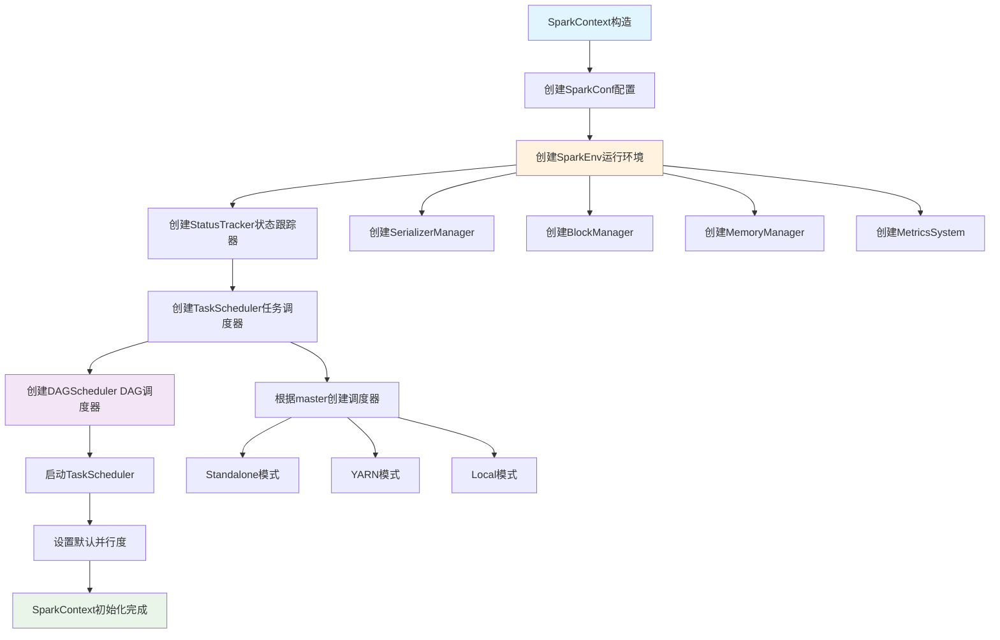

### 1.2 运行环境构建

#### SparkContext初始化源码分析
```scala
// SparkContext.scala 核心初始化流程
class SparkContext(config: SparkConf) extends Logging {
  
  // 1. 创建SparkEnv - 核心运行环境
  private val env: SparkEnv = {
    SparkEnv.createDriverEnv(conf, isLocal, listenerBus, numCores, mockOutputCommitCoordinator)
  }
  
  // 2. 创建状态跟踪器
  private val statusTracker = new SparkStatusTracker(this, sparkUI)
  
  // 3. 创建任务调度器
  private val (sched, ts) = SparkContext.createTaskScheduler(this, master, deployMode)
  private val taskScheduler = ts
  
  // 4. 创建DAG调度器
  private val dagScheduler = new DAGScheduler(this)
  
  // 5. 启动任务调度器
  taskScheduler.start()
  
  // 6. 设置默认并行度
  private val defaultParallelism: Int = taskScheduler.defaultParallelism
  
  // 核心方法：创建RDD
  def parallelize[T: ClassTag](
      seq: Seq[T],
      numSlices: Int = defaultParallelism): RDD[T] = withScope {
    new ParallelCollectionRDD[T](this, seq, numSlices, Map[Int, Seq[String]]())
  }
  
  // 核心方法：提交作业
  def runJob[T, U: ClassTag](
      rdd: RDD[T],
      func: (TaskContext, Iterator[T]) => U,
      partitions: Seq[Int],
      resultHandler: (Int, U) => Unit): Unit = {
    dagScheduler.runJob(rdd, func, partitions, callSite, resultHandler, localProperties.get)
  }
}
```

---

## 二、RDD设计与实现

### 2.1 RDD核心抽象

#### RDD五大特性实现流程

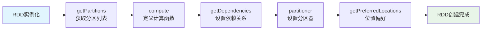

### 2.2 RDD五大特性

#### RDD源码核心实现
```scala
// RDD.scala 核心抽象
abstract class RDD[T: ClassTag](
    @transient private var _sc: SparkContext,
    @transient private var deps: Seq[Dependency[_]]
  ) extends Serializable with Logging {

  // 五大特性的具体实现
  
  // 1. 分区列表
  protected def getPartitions: Array[Partition]
  
  // 2. 计算函数
  def compute(split: Partition, context: TaskContext): Iterator[T]
  
  // 3. 依赖关系
  protected def getDependencies: Seq[Dependency[_]] = deps
  
  // 4. 分区器（可选）
  @transient val partitioner: Option[Partitioner] = None
  
  // 5. 位置偏好（可选）
  protected def getPreferredLocations(split: Partition): Seq[String] = Nil
  
  // Transformation操作实现
  def map[U: ClassTag](f: T => U): RDD[U] = withScope {
    val cleanF = sc.clean(f)
    new MapPartitionsRDD[U, T](this, (context, pid, iter) => iter.map(cleanF))
  }
  
  def filter(f: T => Boolean): RDD[T] = withScope {
    val cleanF = sc.clean(f)
    new MapPartitionsRDD[T, T](
      this,
      (context, pid, iter) => iter.filter(cleanF),
      preservesPartitioning = true)
  }
  
  def reduceByKey(func: (T, T) => T): RDD[T] = self.withScope {
    reduceByKey(defaultPartitioner(self), func)
  }
  
  // Action操作实现
  def collect(): Array[T] = withScope {
    val results = sc.runJob(this, (iter: Iterator[T]) => iter.toArray)
    Array.concat(results: _*)
  }
  
  def count(): Long = sc.runJob(this, Utils.getIteratorSize _).sum
  
  def foreach(f: T => Unit): Unit = withScope {
    val cleanF = sc.clean(f)
    sc.runJob(this, (iter: Iterator[T]) => iter.foreach(cleanF))
  }
}
```

### 2.3 RDD操作执行

#### RDD操作执行流程图

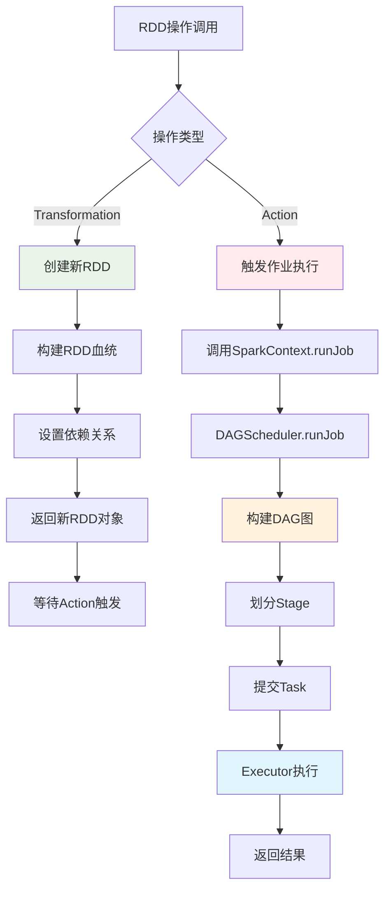

---

## 三、任务调度系统

### 3.1 DAGScheduler调度器

#### DAGScheduler作业提交流程图

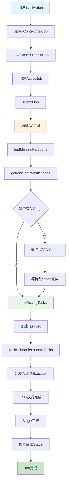

### 3.2 Stage划分算法

#### Stage划分算法流程图

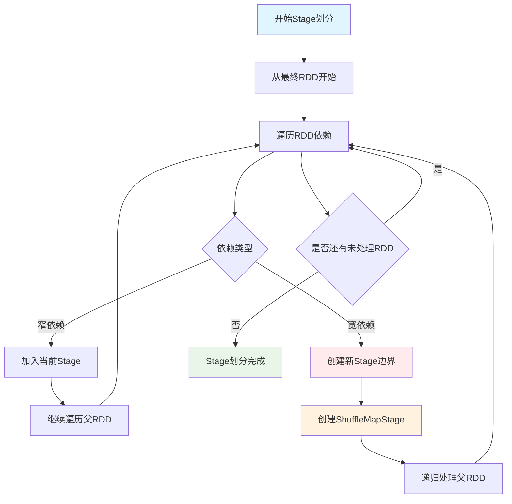

#### DAGScheduler源码分析
```scala
// DAGScheduler.scala 核心调度逻辑
class DAGScheduler(
    private[scheduler] val sc: SparkContext,
    private[scheduler] val taskScheduler: TaskScheduler,
    listenerBus: LiveListenerBus,
    mapOutputTracker: MapOutputTrackerMaster,
    blockManagerMaster: BlockManagerMaster,
    env: SparkEnv,
    clock: Clock = new SystemClock())
  extends Logging {

  // 事件处理循环
  private val eventProcessLoop = new DAGSchedulerEventProcessLoop(this)
  
  // 提交作业的核心方法
  def runJob[T, U](
      rdd: RDD[T],
      func: (TaskContext, Iterator[T]) => U,
      partitions: Seq[Int],
      callSite: CallSite,
      resultHandler: (Int, U) => Unit,
      properties: Properties): Unit = {
    
    val start = System.nanoTime
    val waiter = submitJob(rdd, func, partitions, callSite, resultHandler, properties)
    ThreadUtils.awaitReady(waiter, Duration.Inf)
    waiter.value.get match {
      case scala.util.Success(_) =>
        logInfo("Job %d finished: %s, took %f s".format
          (waiter.jobId, callSite.shortForm, (System.nanoTime - start) / 1e9))
      case scala.util.Failure(exception) =>
        logInfo("Job %d failed: %s, took %f s".format
          (waiter.jobId, callSite.shortForm, (System.nanoTime - start) / 1e9))
        throw exception
    }
  }
  
  // Stage划分核心算法
  private def getOrCreateShuffleMapStage(
      shuffleDep: ShuffleDependency[_, _, _],
      firstJobId: Int): ShuffleMapStage = {
    
    shuffleIdToMapStage.get(shuffleDep.shuffleId) match {
      case Some(stage) =>
        stage
        
      case None =>
        // 递归创建父Stage
        getMissingAncestorShuffleDependencies(shuffleDep.rdd).foreach { dep =>
          if (!shuffleIdToMapStage.contains(dep.shuffleId)) {
            createShuffleMapStage(dep, firstJobId)
          }
        }
        createShuffleMapStage(shuffleDep, firstJobId)
    }
  }
  
  // 查找缺失的父依赖
  private def getMissingAncestorShuffleDependencies(
      rdd: RDD[_]): ArrayStack[ShuffleDependency[_, _, _]] = {
    val ancestors = new ArrayStack[ShuffleDependency[_, _, _]]
    val visited = new HashSet[RDD[_]]
    val waitingForVisit = new ArrayStack[RDD[_]]
    
    waitingForVisit.push(rdd)
    while (waitingForVisit.nonEmpty) {
      val toVisit = waitingForVisit.pop()
      if (!visited(toVisit)) {
        visited += toVisit
        toVisit.dependencies.foreach {
          case shuffleDep: ShuffleDependency[_, _, _] =>
            if (!shuffleIdToMapStage.contains(shuffleDep.shuffleId)) {
              ancestors.push(shuffleDep)
              waitingForVisit.push(shuffleDep.rdd)
            }
          case narrowDep: NarrowDependency[_] =>
            waitingForVisit.push(narrowDep.rdd)
        }
      }
    }
    ancestors
  }
  
  // 提交Stage
  private def submitStage(stage: Stage): Unit = {
    val jobId = activeJobForStage(stage)
    if (jobId.isDefined) {
      if (!waitingStages(stage) && !runningStages(stage) && !failedStages(stage)) {
        val missing = getMissingParentStages(stage).sortBy(_.id)
        if (missing.isEmpty) {
          submitMissingTasks(stage, jobId.get)
        } else {
          for (parent <- missing) {
            submitStage(parent)
          }
          waitingStages += stage
        }
      }
    }
  }
}
```

---

## 六、存储系统设计

### 6.1 BlockManager存储

#### BlockManager源码分析
```scala
// BlockManager.scala 存储管理核心
class BlockManager(
    executorId: String,
    rpcEnv: RpcEnv,
    val master: BlockManagerMaster,
    val serializerManager: SerializerManager,
    val conf: SparkConf,
    memoryManager: MemoryManager,
    mapOutputTracker: MapOutputTracker,
    shuffleManager: ShuffleManager,
    val blockTransferService: BlockTransferService,
    securityManager: SecurityManager,
    numUsableCores: Int)
  extends BlockDataManager with BlockEvictionHandler with Logging {

  // 内存存储
  private[spark] val memoryStore =
    new MemoryStore(conf, blockInfoManager, serializerManager, memoryManager, this)
  
  // 磁盘存储
  private[spark] val diskStore = new DiskStore(conf, diskBlockManager, securityManager)
  
  // 获取Block的核心方法
  def getBlockData(blockId: BlockId): ManagedBuffer = {
    if (blockId.isShuffle) {
      shuffleManager.shuffleBlockResolver.getBlockData(blockId.asInstanceOf[ShuffleBlockId])
    } else {
      getLocalBytes(blockId) match {
        case Some(blockData) =>
          new BlockManagerManagedBuffer(blockInfoManager, blockId, blockData, true)
        case None =>
          throw new BlockNotFoundException(s"Block $blockId not found")
      }
    }
  }
  
  // 存储Block的核心方法
  def putBlockData(
      blockId: BlockId,
      data: ManagedBuffer,
      level: StorageLevel,
      classTag: ClassTag[_]): Boolean = {
    putBytes(blockId, new ChunkedByteBuffer(data.nioByteBuffer()), level)(classTag)
  }
  
  // 内存和磁盘存储逻辑
  private def doPutBytes[T](
      blockId: BlockId,
      bytes: ChunkedByteBuffer,
      level: StorageLevel,
      classTag: ClassTag[T],
      tellMaster: Boolean = true,
      keepReadLock: Boolean = false): Boolean = {
    
    doPut(blockId, level, classTag, tellMaster = tellMaster, keepReadLock = keepReadLock) { info =>
      val startTimeMs = System.currentTimeMillis
      
      // 尝试内存存储
      val res = if (level.useMemory) {
        memoryStore.putBytes(blockId, bytes, level.memoryStorageLevel)
      } else {
        false
      }
      
      // 内存存储失败，尝试磁盘存储
      if (!res && level.useDisk) {
        diskStore.putBytes(blockId, bytes)
      } else {
        res
      }
    }
  }
  
  // Block淘汰策略
  override def dropFromMemory(
      blockId: BlockId,
      data: () => Either[Array[T], ChunkedByteBuffer]): StorageLevel = {
    
    val info = blockInfoManager.lockForWriting(blockId)
    var blockIsUpdated = false
    val level = info.level
    
    try {
      if (level.useDisk && !diskStore.contains(blockId)) {
        data() match {
          case Left(elements) =>
            diskStore.put(blockId) { fileOutputStream =>
              serializerManager.dataSerializeStream(blockId,
                fileOutputStream, elements.toIterator)(info.classTag.asInstanceOf[ClassTag[T]])
            }
          case Right(bytes) =>
            diskStore.putBytes(blockId, bytes)
        }
        blockIsUpdated = true
      }
      
      memoryStore.remove(blockId)
      val droppedMemorySize = if (blockIsUpdated) 0L else info.size
      val blockIsRemoved = !level.useDisk
      
      if (blockIsRemoved) {
        blockInfoManager.removeBlock(blockId)
      }
      
      if (blockIsUpdated) {
        StorageLevel.DISK_ONLY
      } else {
        StorageLevel.NONE
      }
      
    } finally {
      blockInfoManager.unlock(blockId)
    }
  }
}
```

### 6.2 缓存机制

缓存机制的详细实现见BlockManager中的内存存储和磁盘存储逻辑。

---

## 七、网络通信系统

### 7.1 网络传输服务

#### NettyBlockTransferService源码
```scala
// NettyBlockTransferService.scala 网络传输核心
class NettyBlockTransferService(
    conf: SparkConf,
    securityManager: SecurityManager,
    bindAddress: String,
    advertiseAddress: String,
    numCores: Int)
  extends BlockTransferService {

  private[this] var transportContext: TransportContext = _
  private[this] var server: TransportServer = _
  private[this] var clientFactory: TransportClientFactory = _
  
  override def init(blockDataManager: BlockDataManager): Unit = {
    val rpcHandler = new NettyBlockRpcServer(conf.getAppId, serializer, blockDataManager)
    var serverBootstrap: Option[TransportServerBootstrap] = None
    var clientBootstrap: Option[TransportClientBootstrap] = None
    
    if (authEnabled) {
      serverBootstrap = Some(new AuthServerBootstrap(transportConf, securityManager))
      clientBootstrap = Some(new AuthClientBootstrap(transportConf, conf.getAppId, securityManager))
    }
    
    transportContext = new TransportContext(transportConf, rpcHandler)
    clientFactory = transportContext.createClientFactory(clientBootstrap.toSeq.asJava)
    server = createServer(serverBootstrap.toList)
  }
  
  // 获取远程Block
  override def fetchBlocks(
      host: String,
      port: Int,
      execId: String,
      blockIds: Array[String],
      listener: BlockFetchingListener,
      tempFileManager: DownloadFileManager): Unit = {
    
    try {
      val client = clientFactory.createClient(host, port)
      new OneForOneBlockFetcher(client, conf.getAppId, execId,
        blockIds, listener, transportConf, tempFileManager).start()
    } catch {
      case e: Exception =>
        logError(s"Exception while beginning fetchBlocks", e)
        blockIds.foreach(listener.onBlockFetchFailure(_, e))
    }
  }
  
  // 上传Block到远程
  override def uploadBlock(
      hostname: String,
      port: Int,
      execId: String,
      blockId: BlockId,
      blockData: ManagedBuffer,
      level: StorageLevel,
      classTag: ClassTag[_]): Future[Unit] = {
    
    val result = Promise[Unit]()
    val client = clientFactory.createClient(hostname, port)
    
    val callback = new RpcResponseCallback {
      override def onSuccess(response: ByteBuffer): Unit = {
        result.success(())
      }
      
      override def onFailure(e: Throwable): Unit = {
        result.failure(e)
      }
    }
    
    client.sendRpc(new UploadBlock(conf.getAppId, execId, blockId.toString,
      blockData.nioByteBuffer(), level, classTag).toByteBuffer, callback)
    
    result.future
  }
}
```

### 7.2 Block传输机制

Block传输机制的详细实现见NettyBlockTransferService中的fetchBlocks和uploadBlock方法。

---

## 四、内存管理系统

### 4.1 统一内存管理

统一内存管理的详细实现见后续UnifiedMemoryManager部分。

### 4.2 算子内存存储 

#### GroupByKey算子内存存储过程

**GroupByKey内存存储流程图**：

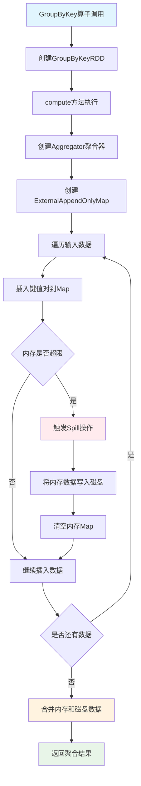

**ExternalAppendOnlyMap内存管理流程**：

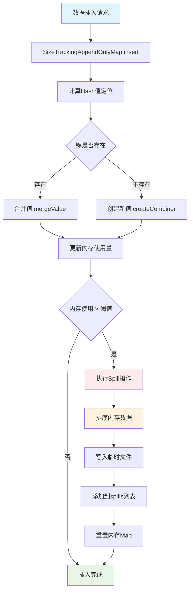

```scala
// GroupByKey算子核心实现
class GroupByKeyRDD[K: ClassTag, V: ClassTag](
    prev: RDD[(K, V)],
    part: Partitioner)
  extends RDD[(K, Iterable[V])](prev) {

  override def compute(split: Partition, context: TaskContext): Iterator[(K, Iterable[V])] = {
    // 1. 创建聚合器
    val aggregator = new Aggregator[K, V, ArrayBuffer[V]](
      createCombiner = (v: V) => ArrayBuffer(v),
      mergeValue = (buf: ArrayBuffer[V], v: V) => buf += v,
      mergeCombiners = (buf1: ArrayBuffer[V], buf2: ArrayBuffer[V]) => buf1 ++= buf2
    )
    
    // 2. 使用ExternalAppendOnlyMap进行聚合
    val externalMap = new ExternalAppendOnlyMap[K, V, ArrayBuffer[V]](aggregator)
    
    // 3. 插入所有键值对
    val iter = firstParent[(K, V)].iterator(split, context)
    while (iter.hasNext) {
      val (k, v) = iter.next()
      externalMap.insert(k, v)
    }
    
    // 4. 返回聚合结果
    externalMap.iterator
  }
}
```


```scala
// ExternalAppendOnlyMap核心实现
class ExternalAppendOnlyMap[K, V, C](
    aggregator: Aggregator[K, V, C],
    serializer: Serializer = SparkEnv.get.serializer)
  extends Spillable[WritablePartitionedPairCollection[K, C]](SparkEnv.get.blockManager.master)
  with Logging {

  // 内存中的Map
  private var map = new SizeTrackingAppendOnlyMap[K, C]
  
  // Spill文件列表
  private val spills = new ArrayBuffer[SpilledFile]
  
  // 插入键值对
  def insert(key: K, value: V): Unit = {
    // 1. 尝试在内存中聚合
    val update = (hadValue: Boolean, oldValue: C) => {
      if (hadValue) {
        aggregator.mergeValue(oldValue, value)
      } else {
        aggregator.createCombiner(value)
      }
    }
    
    map.changeValue(key, update)
    
    // 2. 检查是否需要Spill
    if (map.estimateSize() > myMemoryThreshold) {
      spill()
    }
  }
  
  // Spill到磁盘
  private def spill(): Unit = {
    val spillFile = spillMemoryIteratorToDisk(map.destructiveSortedWritablePartitionedIterator())
    spills += spillFile
    map = new SizeTrackingAppendOnlyMap[K, C]
  }
  
  // 获取最终结果
  def iterator: Iterator[(K, C)] = {
    // 合并内存中的结果和Spill文件
    val memoryIterator = map.destructiveSortedWritablePartitionedIterator()
    val spillIterators = spills.map(_.iterator)
    
    // 返回合并后的迭代器
    new MergedIterator(memoryIterator +: spillIterators)
  }
}
```

#### ReduceByKey算子内存存储过程

**ReduceByKey内存存储流程图**：

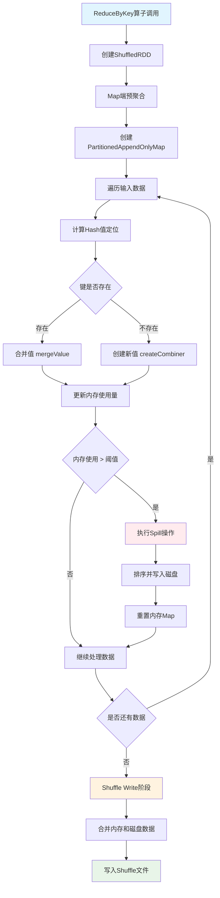

**PartitionedAppendOnlyMap操作流程**：

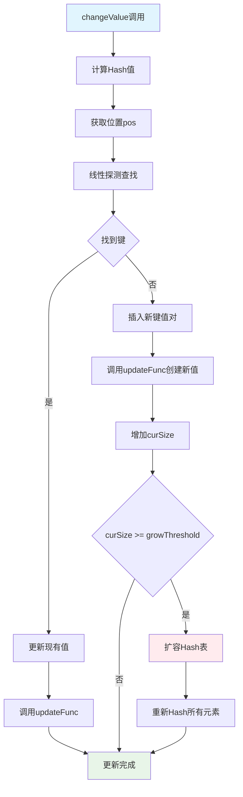

```scala
// PartitionedAppendOnlyMap的changeValue方法
def changeValue(key: K, updateFunc: (Boolean, V) => V): Unit = {
  val hash = getHash(key)
  val pos = getPos(hash)
  
  var i = pos
  while (data(2 * i) != null) {
    if (data(2 * i) == key) {
      // 找到现有键，更新值
      val hadValue = true
      val oldValue = data(2 * i + 1).asInstanceOf[V]
      val newValue = updateFunc(hadValue, oldValue)
      data(2 * i + 1) = newValue.asInstanceOf[AnyRef]
      return
    }
    i = (i + 1) % (data.length / 2)
  }
  
  // 未找到键，插入新值
  val hadValue = false
  val newValue = updateFunc(hadValue, null.asInstanceOf[V])
  data(2 * i) = key.asInstanceOf[AnyRef]
  data(2 * i + 1) = newValue.asInstanceOf[AnyRef]
  curSize += 1
  
  if (curSize >= growThreshold) {
    growTable()
  }
}
```

#### Join算子内存存储过程

**Join算子内存存储流程图**：

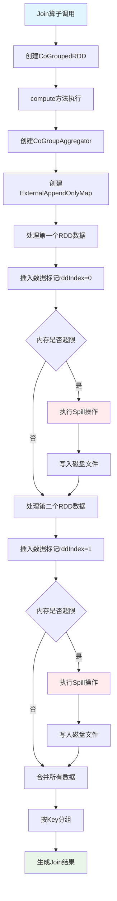

**CoGroup聚合过程流程**：

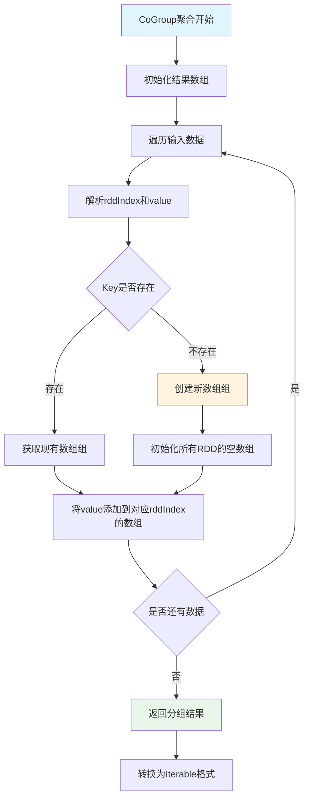

```scala
// CoGroupedRDD核心实现
class CoGroupedRDD[K: ClassTag](
    rdds: Seq[RDD[(K, _)]],
    part: Partitioner)
  extends RDD[(K, Array[Iterable[_]])](rdds.head.context, Nil) {

  override def compute(split: Partition, context: TaskContext): Iterator[(K, Array[Iterable[_]])] = {
    // 1. 创建CoGroup聚合器
    val aggregator = new CoGroupAggregator[K]
    
    // 2. 使用ExternalAppendOnlyMap进行分组
    val externalMap = new ExternalAppendOnlyMap[K, (Int, Any), Array[ArrayBuffer[Any]]](aggregator)
    
    // 3. 插入所有RDD的数据
    rdds.zipWithIndex.foreach { case (rdd, rddIndex) =>
      val iter = rdd.iterator(split, context)
      while (iter.hasNext) {
        val (k, v) = iter.next()
        externalMap.insert(k, (rddIndex, v))
      }
    }
    
    // 4. 返回分组结果
    externalMap.iterator.map { case (k, groups) =>
      (k, groups.map(_.toIterable))
    }
  }
}
```

### 4.3 内存监控与优化

#### 内存存储状态监控

```scala
// 内存使用监控组件
class MemoryMonitor {
  // 监控Map的内存使用
  def monitorMapMemory(map: SizeTrackingAppendOnlyMap[_, _]): MemoryUsage = {
    val estimatedSize = map.estimateSize()
    val currentMemory = map.currentMemory
    val maxMemory = map.maxMemory
    
    MemoryUsage(
      estimatedSize = estimatedSize,
      currentMemory = currentMemory,
      maxMemory = maxMemory,
      utilization = currentMemory.toDouble / maxMemory
    )
  }
  
  // 监控Spill状态
  def monitorSpillStatus(externalMap: ExternalAppendOnlyMap[_, _, _]): SpillStatus = {
    val spillCount = externalMap.spills.size
    val totalSpillSize = externalMap.spills.map(_.size).sum
    
    SpillStatus(
      spillCount = spillCount,
      totalSpillSize = totalSpillSize,
      averageSpillSize = if (spillCount > 0) totalSpillSize / spillCount else 0
    )
  }
}

case class MemoryUsage(
  estimatedSize: Long,
  currentMemory: Long,
  maxMemory: Long,
  utilization: Double)

case class SpillStatus(
  spillCount: Int,
  totalSpillSize: Long,
  averageSpillSize: Long)
```

#### 内存存储监控流程图

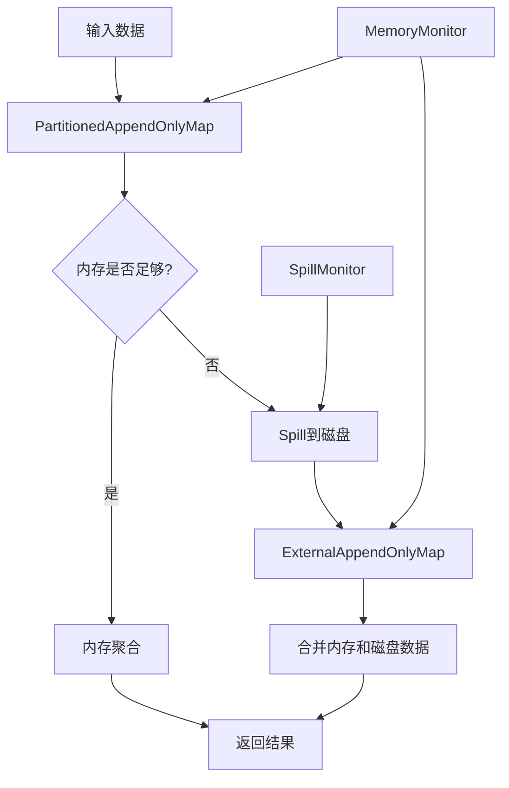

#### 内存存储优化策略

```scala
// 内存分配优化
class MemoryOptimizer {
  // 动态调整内存阈值
  def adjustMemoryThreshold(
      currentMemory: Long,
      maxMemory: Long,
      spillCount: Int): Long = {
    
    val utilization = currentMemory.toDouble / maxMemory
    
    if (utilization > 0.8 && spillCount > 0) {
      // 内存使用率高且有Spill，降低阈值
      (maxMemory * 0.6).toLong
    } else if (utilization < 0.5 && spillCount == 0) {
      // 内存使用率低且无Spill，提高阈值
      (maxMemory * 0.9).toLong
    } else {
      // 保持当前阈值
      (maxMemory * 0.8).toLong
    }
  }
  
  // 优化Map初始容量
  def optimizeInitialCapacity(dataSize: Long): Int = {
    val estimatedSize = (dataSize * 1.2).toInt
    math.max(64, math.min(estimatedSize, 1024 * 1024))
  }
}
```

---

## 三、任务调度系统（续）

### 3.3 TaskScheduler任务调度

#### DAG的生成与依赖分析

**任务提交完整流程图**：

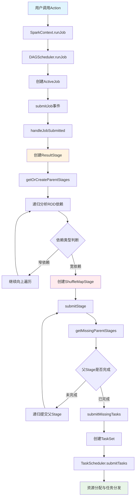

**DAG依赖分析流程图**：

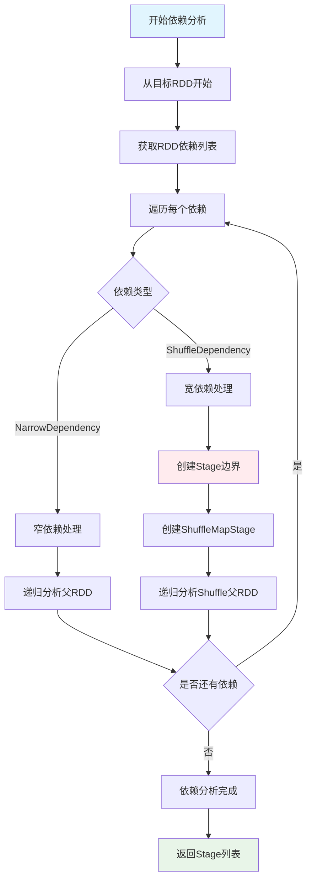

**用户触发Action时的完整流程**：

```scala
// 用户代码触发Action
val result = rdd.collect()

// SparkContext.collect()
def collect(): Array[T] = withScope {
  val results = sc.runJob(this, (iter: Iterator[T]) => iter.toArray)
  Array.concat(results: _*)
}

// SparkContext.runJob()
def runJob[T, U: ClassTag](
    rdd: RDD[T],
    func: (TaskContext, Iterator[T]) => U,
    partitions: Seq[Int],
    resultHandler: (Int, U) => Unit): Unit = {
  dagScheduler.runJob(rdd, func, partitions, callSite, resultHandler, localProperties.get)
}
```

**DAGScheduler依赖分析**：

```scala
// DAGScheduler.scala
private[scheduler] def getOrCreateParentStages(rdd: RDD[_], firstJobId: Int): List[Stage] = {
  val parents = new ArrayBuffer[Stage]()
  val visited = new HashSet[RDD[_]]
  
  def visit(r: RDD[_]): Unit = {
    if (!visited(r)) {
      visited += r
      for (dep <- r.dependencies) {
        dep match {
          case shufDep: ShuffleDependency[_, _, _] =>
            // 宽依赖，创建新的ShuffleMapStage
            parents += getOrCreateShuffleMapStage(shufDep, firstJobId)
          case _ =>
            // 窄依赖，递归访问父RDD
            visit(dep.rdd)
        }
      }
    }
  }
  
  visit(rdd)
  parents.toList
}
```

#### 任务分发与调度流程

**任务调度完整流程图**：

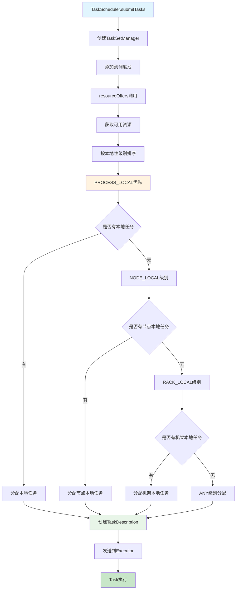

**资源分配本地性优化流程**：

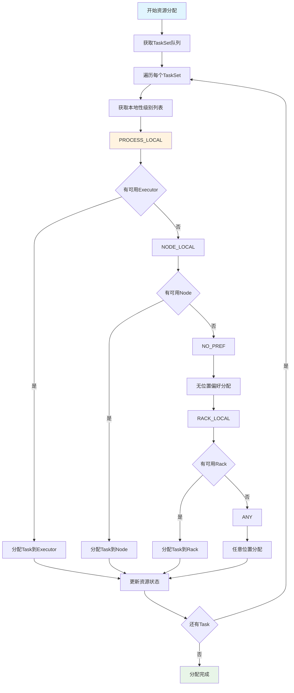

**完整的任务调度时序图**：

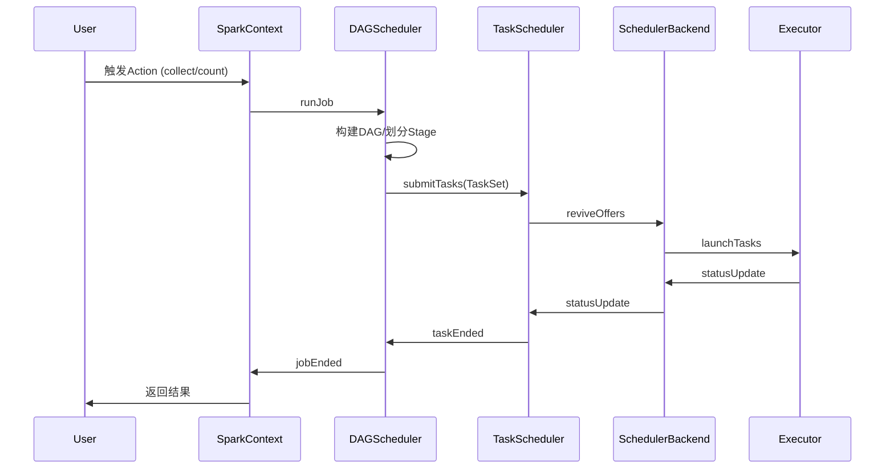

**TaskScheduler资源分配**：

```scala
// TaskSchedulerImpl.resourceOffers()
def resourceOffers(offers: IndexedSeq[WorkerOffer]): Seq[Seq[TaskDescription]] = {
  // 1. 随机打乱offers避免热点
  val shuffledOffers = Random.shuffle(offers)
  val tasks = shuffledOffers.map(o => new ArrayBuffer[TaskDescription](o.cores / CPUS_PER_TASK))
  val availableCpus = shuffledOffers.map(o => o.cores).toArray
  
  // 2. 按本地性级别分配任务
  val sortedTaskSets = rootPool.getSortedTaskSetQueue
  for (taskSet <- sortedTaskSets) {
    // PROCESS_LOCAL -> NODE_LOCAL -> NO_PREF -> RACK_LOCAL -> ANY
    for (currentMaxLocality <- taskSet.myLocalityLevels) {
      do {
        launchedAnyTask = resourceOfferSingleTaskSet(
          taskSet, currentMaxLocality, shuffledOffers, availableCpus, tasks)
      } while (launchedAnyTask)
    }
  }
  
  tasks
}
```

---

## 九、容错与监控机制

### 9.1 失败重试机制

**容错机制流程图**：

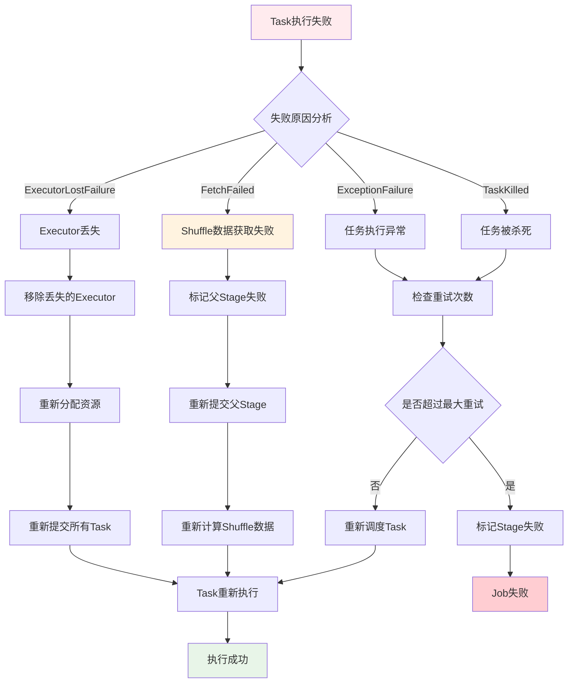

### 9.2 RDD血统恢复

**RDD血统恢复流程图**：

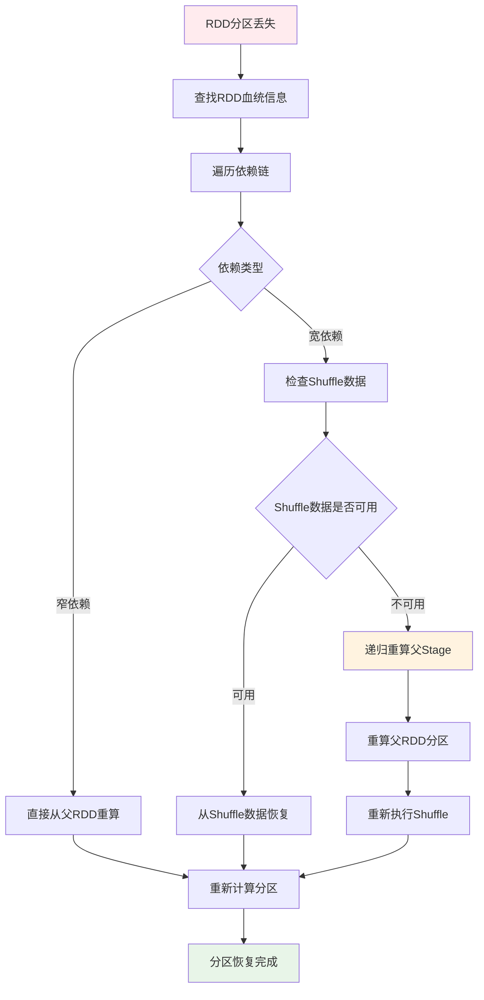

**DAGScheduler事件处理**：

```scala
// DAGSchedulerEventProcessLoop事件处理
private def doOnReceive(event: DAGSchedulerEvent): Unit = event match {
  case TaskFailed(taskId, taskType, reason, exception) =>
    reason match {
      case _: FetchFailed =>
        // Shuffle数据获取失败，需要重新计算父Stage
        val shuffleMapStage = shuffleIdToMapStage(reason.shuffleId)
        markStageAsFinished(shuffleMapStage, Some(reason.toString))
        submitStage(shuffleMapStage)
        
      case _: ExecutorLostFailure =>
        // Executor丢失，需要重新调度Task
        removeExecutorAndUnregisterOutputs(reason.execId, filesLost = true)
        
      case _: TaskKilled =>
        // Task被杀死，通常是推测执行
        logInfo(s"Task $taskId was killed")
        
      case _ =>
        // 其他异常，Task级别重试
        if (task.attempt < maxTaskFailures) {
          taskScheduler.submitTasks(createTaskSet(Array(task)))
        } else {
          abortStage(currentStage, s"Task $taskId failed $maxTaskFailures times")
        }
    }
    
  case StageCompleted(stage) =>
    // Stage完成，检查并提交依赖的Stage
    markStageAsFinished(stage)
    submitWaitingChildStages(stage)
}
```

### 3.4 Task执行机制

#### Executor工作机制与Task执行

**Executor任务执行流程图**：

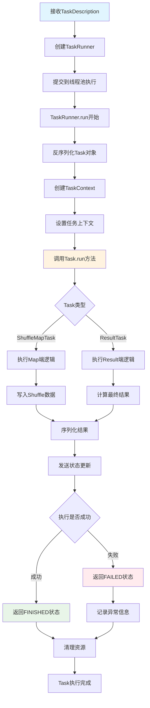

**Task执行上下文管理流程**：

```mermaid
graph TD
    A[TaskContext创建] --> B[设置Stage信息]
    B --> C[设置Partition信息]
    C --> D[初始化TaskMemoryManager]
    D --> E[设置MetricsSystem]
    E --> F[注册任务监听器]
    F --> G[开始Task执行]
    G --> H[监控内存使用]
    H --> I[收集执行指标]
    I --> J[处理中断信号]
    J --> K{Task是否完成}
    K -->|否| H
    K -->|是| L[清理TaskContext]
    L --> M[释放内存资源]
    M --> N[发送指标数据]
    N --> O[TaskContext销毁]
    
    style A fill:#e1f5fe
    style G fill:#fff3e0
    style O fill:#e8f5e8
```

**Executor任务执行详细流程**：

```scala
// Executor.launchTask()
def launchTask(context: ExecutorBackend, taskDescription: TaskDescription): Unit = {
  val tr = new TaskRunner(context, taskDescription)
  runningTasks.put(taskDescription.taskId, tr)
  threadPool.execute(tr)
}

// TaskRunner.run()
class TaskRunner(
    execBackend: ExecutorBackend,
    private val taskDescription: TaskDescription)
  extends Runnable {
  
  override def run(): Unit = {
    try {
      // 1. 反序列化Task
      val task = ser.deserialize[Task[Any]](
        taskDescription.serializedTask, 
        Thread.currentThread.getContextClassLoader)
      
      // 2. 设置TaskContext
      val taskContext = new TaskContextImpl(
        stageId = taskDescription.stageId,
        taskAttemptId = taskDescription.taskId,
        attemptNumber = taskDescription.attemptNumber,
        partitionId = task.partitionId,
        localProperties = taskDescription.properties,
        taskMemoryManager = taskMemoryManager,
        metricsSystem = env.metricsSystem)
      
      // 3. 执行Task
      val value = task.run(
        taskAttemptId = taskDescription.taskId,
        attemptNumber = taskDescription.attemptNumber,
        metricsSystem = env.metricsSystem)
      
      // 4. 序列化结果并返回
      val serializedResult = ser.serialize(value)
      execBackend.statusUpdate(
        taskDescription.taskId, 
        TaskState.FINISHED, 
        serializedResult)
        
    } catch {
      case e: Exception =>
        // 异常处理
        val reason = new ExceptionFailure(e, taskContext.taskMetrics())
        execBackend.statusUpdate(
          taskDescription.taskId, 
          TaskState.FAILED, 
          ser.serialize(TaskFailedReason(reason)))
    } finally {
      // 清理资源
      runningTasks.remove(taskDescription.taskId)
    }
  }
}
```

#### 数据读取、处理与RDD依赖

**RDD数据读取流程图**：

```mermaid
graph TD
    A[RDD.iterator调用] --> B{是否有缓存}
    B -->|有缓存| C[从缓存读取数据]
    B -->|无缓存| D{是否有Checkpoint}
    D -->|有Checkpoint| E[从Checkpoint读取]
    D -->|无Checkpoint| F[调用compute方法]
    F --> G{RDD类型}
    G -->|HadoopRDD| H[从HDFS读取]
    G -->|MapPartitionsRDD| I[调用父RDD.iterator]
    G -->|ShuffledRDD| J[从Shuffle数据读取]
    H --> K[返回数据迭代器]
    I --> L[递归调用父RDD]
    J --> M[读取Shuffle文件]
    C --> K
    E --> K
    L --> N[应用转换函数]
    M --> K
    N --> K
    K --> O[数据处理完成]
    
    style A fill:#e1f5fe
    style C fill:#e8f5e8
    style F fill:#fff3e0
    style O fill:#c8e6c9
```

**RDD依赖链递归调用流程**：

```mermaid
graph TD
    A[Task开始执行] --> B[调用ResultTask.runTask]
    B --> C[调用RDD.iterator]
    C --> D[检查存储级别]
    D --> E{是否缓存}
    E -->|是| F[从BlockManager获取]
    E -->|否| G[computeOrReadCheckpoint]
    G --> H{是否Checkpoint}
    H -->|是| I[从Checkpoint读取]
    H -->|否| J[调用compute方法]
    J --> K{RDD依赖类型}
    K -->|窄依赖| L[直接调用父RDD.iterator]
    K -->|宽依赖| M[从ShuffleReader读取]
    L --> N[递归处理父RDD]
    M --> O[读取Shuffle数据]
    N --> P[应用当前RDD的转换逻辑]
    O --> P
    F --> P
    I --> P
    P --> Q[返回处理后的数据]
    
    style A fill:#e1f5fe
    style J fill:#fff3e0
    style P fill:#e8f5e8
    style Q fill:#c8e6c9
```

**RDD依赖链调用流程**：

```scala
// RDD.iterator() 递归调用流程
final def iterator(split: Partition, context: TaskContext): Iterator[T] = {
  if (storageLevel != StorageLevel.NONE) {
    // 1. 尝试从缓存读取
    getOrCompute(split, context)
  } else {
    // 2. 直接计算
    computeOrReadCheckpoint(split, context)
  }
}

def computeOrReadCheckpoint(split: Partition, context: TaskContext): Iterator[T] = {
  if (isCheckpointed) {
    // 从Checkpoint读取
    firstParent[T].iterator(split, context)
  } else {
    // 调用具体RDD的compute方法
    compute(split, context)
  }
}

// 以MapPartitionsRDD为例
override def compute(split: Partition, context: TaskContext): Iterator[U] = {
  // 递归调用父RDD的iterator
  f(context, split.index, firstParent[T].iterator(split, context))
}
```

**典型RDD依赖链执行图**：

```mermaid
graph TD
    A[Action: collect] --> B[ResultTask]
    B --> C[RDD.iterator]
    C --> D[MapPartitionsRDD.compute]
    D --> E[父RDD.iterator]
    E --> F[FilteredRDD.compute]
    F --> G[父RDD.iterator]
    G --> H[HadoopRDD.compute]
    H --> I[读取HDFS数据]
    I --> J[返回Iterator]
    J --> K[逐级处理并返回]
    K --> L[最终结果]
    
    style A fill:#e1f5fe
    style H fill:#e8f5e8
    style L fill:#fff3e0
```

#### Task类型与执行差异

**Task类型执行流程对比图**：

```mermaid
graph TD
    A[Task创建] --> B{Task类型}
    B -->|ResultTask| C[ResultTask执行流程]
    B -->|ShuffleMapTask| D[ShuffleMapTask执行流程]
    
    C --> C1[调用RDD.iterator]
    C1 --> C2[递归计算RDD链]
    C2 --> C3[应用用户函数func]
    C3 --> C4[返回最终结果]
    C4 --> C5[发送结果到Driver]
    
    D --> D1[调用RDD.iterator]
    D1 --> D2[递归计算RDD链]
    D2 --> D3[获取ShuffleWriter]
    D3 --> D4[写入Shuffle数据]
    D4 --> D5[返回MapStatus]
    D5 --> D6[注册Shuffle输出位置]
    
    style C fill:#e8f5e8
    style D fill:#fff3e0
    style C5 fill:#e1f5fe
    style D6 fill:#ffebee
```

**ShuffleMapTask详细执行流程**：

```mermaid
graph TD
    A[ShuffleMapTask开始] --> B[获取ShuffleManager]
    B --> C[创建ShuffleWriter]
    C --> D{Writer类型}
    D -->|BypassMergeSortShuffleWriter| E[直接写入分区文件]
    D -->|SortShuffleWriter| F[排序后写入]
    D -->|UnsafeShuffleWriter| G[Unsafe内存写入]
    
    E --> H[为每个分区创建文件]
    H --> I[直接写入对应分区]
    
    F --> J[使用ExternalSorter排序]
    J --> K[合并相同Key的值]
    K --> L[写入单个文件]
    
    G --> M[使用Unsafe内存管理]
    M --> N[序列化后直接写入]
    
    I --> O[生成MapStatus]
    L --> O
    N --> O
    O --> P[返回分区大小信息]
    P --> Q[注册到MapOutputTracker]
    
    style A fill:#e1f5fe
    style O fill:#e8f5e8
    style Q fill:#c8e6c9
```

**ResultTask详细执行流程**：

```mermaid
graph TD
    A[ResultTask开始] --> B[调用RDD.iterator]
    B --> C[从Shuffle数据读取]
    C --> D[ShuffleReader.read]
    D --> E[合并多个Map输出]
    E --> F[应用用户定义函数]
    F --> G{函数类型}
    G -->|collect| H[收集所有数据]
    G -->|count| I[计算数据量]
    G -->|reduce| J[聚合计算]
    G -->|foreach| K[遍历处理]
    
    H --> L[序列化结果数据]
    I --> M[返回计数值]
    J --> N[返回聚合结果]
    K --> O[执行副作用操作]
    
    L --> P[发送到Driver]
    M --> P
    N --> P
    O --> Q[返回Unit]
    Q --> P
    P --> R[Task执行完成]
    
    style A fill:#e1f5fe
    style F fill:#fff3e0
    style P fill:#e8f5e8
    style R fill:#c8e6c9
```

**ResultTask vs ShuffleMapTask**：

```scala
// ResultTask - 产生最终结果
class ResultTask[T, U](
    stageId: Int,
    rdd: RDD[T],
    func: (TaskContext, Iterator[T]) => U,
    _partitionId: Int,
    locs: Seq[TaskLocation])
  extends Task[U](stageId, _partitionId) {
  
  override def runTask(context: TaskContext): U = {
    // 直接调用用户函数处理数据
    func(context, rdd.iterator(partition, context))
  }
}

// ShuffleMapTask - 产生中间Shuffle数据
class ShuffleMapTask(
    stageId: Int,
    rdd: RDD[_],
    dep: ShuffleDependency[_, _, _],
    _partitionId: Int,
    locs: Seq[TaskLocation])
  extends Task[MapStatus](stageId, _partitionId) {
  
  override def runTask(context: TaskContext): MapStatus = {
    // 获取ShuffleWriter
    val manager = SparkEnv.get.shuffleManager
    val writer = manager.getWriter[Any, Any](
      dep.shuffleHandle, partitionId, context)
    
    try {
      // 写入Shuffle数据
      writer.write(rdd.iterator(partition, context).asInstanceOf[Iterator[_ <: Product2[Any, Any]]])
      writer.stop(success = true).get
    } catch {
      case e: Exception =>
        writer.stop(success = false)
        throw e
    }
  }
}
```

---

## 五、Shuffle机制实现

### 5.1 Sort Shuffle核心

#### Sort Shuffle执行流程图

```mermaid
graph TD
    A[ShuffleMapTask开始] --> B[获取SortShuffleManager]
    B --> C{判断Shuffle写入器类型}
    C -->|小数据量| D[BypassMergeSortShuffleWriter]
    C -->|大数据量| E[SortShuffleWriter]
    C -->|序列化数据| F[UnsafeShuffleWriter]
    
    D --> D1[为每个Reduce分区创建临时文件]
    D1 --> D2[直接写入对应分区文件]
    D2 --> D3[合并所有临时文件]
    D3 --> D4[生成索引文件]
    
    E --> E1[创建ExternalSorter]
    E1 --> E2[数据插入并排序]
    E2 --> E3{内存是否足够}
    E3 -->|否| E4[Spill到磁盘]
    E3 -->|是| E5[内存中排序]
    E4 --> E6[合并spill文件]
    E5 --> E6
    E6 --> E7[写入最终文件]
    
    F --> F1[使用Tungsten内存管理]
    F1 --> F2[直接序列化写入]
    F2 --> F3[内存排序]
    F3 --> F4[写入最终文件]
    
    D4 --> G[返回MapStatus]
    E7 --> G
    F4 --> G
    G --> H[注册到MapOutputTracker]
    
    style A fill:#e1f5fe
    style C fill:#fff3e0
    style G fill:#e8f5e8
    style H fill:#c8e6c9
```

### 5.2 UnsafeShuffleWriter

#### UnsafeShuffleWriter核心源码

```scala
// UnsafeShuffleWriter.scala - Unsafe模式的Shuffle写入器
class UnsafeShuffleWriter[K, V](
    blockManager: BlockManager,
    shuffleBlockResolver: IndexShuffleBlockResolver,
    taskMemoryManager: TaskMemoryManager,
    handle: SerializedShuffleHandle[K, V],
    mapId: Int,
    taskContext: TaskContext,
    sparkConf: SparkConf)
  extends ShuffleWriter[K, V] with Logging {

  private val dep = handle.dependency
  private val numPartitions = dep.partitioner.numPartitions
  private val serializer = dep.serializer.newInstance()
  
  // 内存排序器，直接操作序列化后的字节数组
  private var sorter: UnsafeShuffleInMemorySorter = null
  private var mapStatus: MapStatus = null

  // 写入记录的核心方法
  override def write(records: Iterator[Product2[K, V]]): Unit = {
    assert(partitioner.numPartitions <= UnsafeShuffleManager.MAX_SHUFFLE_OUTPUT_PARTITIONS)
    
    // 1. 创建内存排序器
    sorter = new UnsafeShuffleInMemorySorter(
      taskMemoryManager, 
      blockManager, 
      taskContext.taskMetrics().shuffleWriteMetrics,
      numPartitions,
      sparkConf)

    val serInstance = serializer
    val serOutputStream = new UnsafeShuffleSerializationStream(serInstance)
    
    // 2. 插入所有记录到排序器
    while (records.hasNext) {
      insertRecordIntoSorter(records.next(), serOutputStream)
    }
    
    // 3. 关闭序列化流并写入最终文件
    serOutputStream.close()
    val outputFile = shuffleBlockResolver.getDataFile(dep.shuffleId, mapId)
    val tmp = Utils.tempFileWith(outputFile)
    
    try {
      // 4. 合并所有spill文件并写入最终输出
      val partitionLengths = mergeSpills(tmp)
      shuffleBlockResolver.writeIndexFileAndCommit(dep.shuffleId, mapId, partitionLengths, tmp)
      mapStatus = MapStatus(blockManager.blockManagerId, partitionLengths)
    } finally {
      if (tmp.exists() && !tmp.delete()) {
        logError(s"Error while deleting temp file ${tmp.getAbsolutePath}")
      }
    }
  }

  // 插入记录到排序器
  private def insertRecordIntoSorter(record: Product2[K, V], 
                                   serOutputStream: UnsafeShuffleSerializationStream): Unit = {
    val key = record._1
    val value = record._2
    val partitionId = partitioner.getPartition(key)
    
    // 序列化键值对并插入到内存排序器
    val serializedRecordSize = serOutputStream.writeRecord(key, value, partitionId)
    
    // 检查是否需要Spill到磁盘
    if (sorter.numRecords() >= numElementsForSpillThreshold) {
      if (sorter.getMemoryUsage() > memoryThreshold) {
        spill()
      }
    }
  }

  // Spill操作 - 将内存数据溢写到磁盘
  private def spill(): Unit = {
    assert(sorter != null)
    logger.info(s"Thread ${Thread.currentThread().getId} spilling sort data of " +
      s"${Utils.bytesToString(sorter.getMemoryUsage())} to disk")
    
    // 获取排序后的数据迭代器
    val sortedRecords = sorter.getSortedIterator()
    
    // 创建或获取spill文件writer
    val spillWriter = spillWriters.size match {
      case 0 =>
        // 第一次Spill，创建新的writer
        val (file, blockId) = diskBlockManager.createTempShuffleBlock()
        val writer = blockManager.getDiskWriter(blockId, file, serializer, fileBufferSizeBytes, writeMetrics)
        spillWriters += writer
        writer
      case _ =>
        // 后续Spill，复用或创建新的writer
        spillWriters.last
    }
    
    // 将排序后的数据写入spill文件
    while (sortedRecords.hasNext) {
      val sortedRecord = sortedRecords.next()
      spillWriter.write(sortedRecord.key, sortedRecord.value)
    }
    spillWriter.commitAndGet()
    
    // 重置内存排序器以释放内存
    sorter.freeMemory()
    sorter = new UnsafeShuffleInMemorySorter(
      taskMemoryManager, blockManager, taskContext.taskMetrics().shuffleWriteMetrics,
      numPartitions, sparkConf)
  }

  // 合并所有Spill文件
  private def mergeSpills(outputFile: File): Array[Long] = {
    val numPartitions = dep.partitioner.numPartitions
    val partitionLengths = new Array[Long](numPartitions)
    
    if (spillWriters.isEmpty) {
      // 没有spill文件，直接从内存排序器读取
      val sortedRecords = sorter.getSortedIterator()
      val writer = new FileOutputStream(outputFile)
      
      try {
        var currentPartition = 0
        var currentPartitionSize = 0L
        
        while (sortedRecords.hasNext) {
          val record = sortedRecords.next()
          val partitionId = record.partitionId
          
          // 如果分区发生变化，记录之前分区的大小
          if (partitionId != currentPartition) {
            partitionLengths(currentPartition) = currentPartitionSize
            currentPartition = partitionId
            currentPartitionSize = 0L
          }
          
          // 写入记录
          writer.write(record.serializedRecord)
          currentPartitionSize += record.serializedRecord.length
        }
        
        // 记录最后一个分区的大小
        if (currentPartition < numPartitions) {
          partitionLengths(currentPartition) = currentPartitionSize
        }
      } finally {
        writer.close()
      }
    } else {
      // 有spill文件，需要合并多个文件
      mergeSpillFiles(outputFile, partitionLengths)
    }
    
    partitionLengths
  }

  // 合并多个spill文件
  private def mergeSpillFiles(outputFile: File, partitionLengths: Array[Long]): Unit = {
    val numPartitions = dep.partitioner.numPartitions
    val spillFiles = spillWriters.map(_.getFile())
    val priorityQueue = new mutable.PriorityQueue[SpillFileIterator]()(Ordering.by[SpillFileIterator, (Int, Long)](iter => (iter.partitionId, iter.recordId)).reverse)
    
    // 初始化所有spill文件的迭代器
    for ((file, index) <- spillFiles.zipWithIndex) {
      val iterator = new SpillFileIterator(file, index)
      if (iterator.hasNext) {
        priorityQueue.enqueue(iterator)
      }
    }
    
    val writer = new FileOutputStream(outputFile)
    try {
      var currentPartition = 0
      var currentPartitionSize = 0L
      
      // 使用优先队列进行多路归并
      while (priorityQueue.nonEmpty) {
        val iterator = priorityQueue.dequeue()
        val record = iterator.next()
        val partitionId = record.partitionId
        
        // 处理分区边界
        if (partitionId != currentPartition) {
          partitionLengths(currentPartition) = currentPartitionSize
          currentPartition = partitionId
          currentPartitionSize = 0L
        }
        
        // 写入记录
        writer.write(record.serializedRecord)
        currentPartitionSize += record.serializedRecord.length
        
        // 如果迭代器还有数据，重新加入队列
        if (iterator.hasNext) {
          priorityQueue.enqueue(iterator)
        }
      }
      
      // 记录最后一个分区的大小
      if (currentPartition < numPartitions) {
        partitionLengths(currentPartition) = currentPartitionSize
      }
    } finally {
      writer.close()
    }
  }
}
```

---

## 四、内存管理系统（续）

### 4.1 统一内存管理（详细实现）

#### 内存分配策略流程图

```mermaid
graph TD
    A[内存分配请求] --> B{请求类型}
    B -->|存储内存| C[acquireStorageMemory]
    B -->|执行内存| D[acquireExecutionMemory]
    
    C --> C1[检查存储内存池]
    C1 --> C2{可用内存足够}
    C2 -->|是| C3[直接分配]
    C2 -->|否| C4[尝试从执行内存池借用]
    C4 --> C5{执行内存池有空闲}
    C5 -->|是| C6[转移内存到存储池]
    C5 -->|否| C7[分配失败]
    C6 --> C3
    
    D --> D1[检查执行内存池]
    D1 --> D2{可用内存足够}
    D2 -->|是| D3[直接分配]
    D2 -->|否| D4[尝试从存储内存池回收]
    D4 --> D5[驱逐缓存数据]
    D5 --> D6[转移释放的内存]
    D6 --> D7{回收内存足够}
    D7 -->|是| D3
    D7 -->|否| D8[部分分配]
    
    C3 --> E[分配成功]
    D3 --> E
    D8 --> E
    C7 --> F[分配失败]
    E --> G[更新内存池状态]
    F --> H[返回分配结果]
    G --> H
    
    style A fill:#e1f5fe
    style C4 fill:#fff3e0
    style D5 fill:#ffebee
    style H fill:#e8f5e8
```

#### UnifiedMemoryManager详细实现

```scala
// UnifiedMemoryManager.scala - 统一内存管理器
class UnifiedMemoryManager(
    conf: SparkConf,
    val maxHeapMemory: Long,
    onHeapStorageRegionSize: Long,
    numCores: Int)
  extends MemoryManager(conf, numCores, onHeapStorageRegionSize, maxHeapMemory) {

  // 系统保留内存（300MB）
  private val reservedMemory = conf.getLong("spark.testing.reservedMemory", 300 * 1024 * 1024)
  
  // 可用于Spark的总内存
  private val maxPoolSize = maxHeapMemory - reservedMemory
  
  // 内存分配给Spark的比例
  private val memoryFraction = conf.getDouble("spark.sql.adaptive.memoryFraction", 0.6)
  private val poolSize = (maxPoolSize * memoryFraction).toLong
  
  // 存储内存的初始比例
  private val storageFraction = conf.getDouble("spark.sql.adaptive.storageFraction", 0.5)
  private val initialStorageMemory = (poolSize * storageFraction).toLong
  
  // 创建内存池
  override val onHeapStorageMemoryPool = new StorageMemoryPool(this, MemoryMode.ON_HEAP)
  override val offHeapStorageMemoryPool = new StorageMemoryPool(this, MemoryMode.OFF_HEAP)
  override val onHeapExecutionMemoryPool = new ExecutionMemoryPool(this, MemoryMode.ON_HEAP)
  override val offHeapExecutionMemoryPool = new ExecutionMemoryPool(this, MemoryMode.OFF_HEAP)

  // 设置初始内存池大小
  onHeapStorageMemoryPool.incrementPoolSize(initialStorageMemory)
  onHeapExecutionMemoryPool.incrementPoolSize(poolSize - initialStorageMemory)

  // 获取存储内存
  override def acquireStorageMemory(
      blockId: BlockId,
      numBytes: Long,
      memoryMode: MemoryMode): Boolean = synchronized {
    
    assertInvariants()
    assert(numBytes >= 0)
    
    val (executionPool, storagePool, maxMemory) = memoryMode match {
      case MemoryMode.ON_HEAP => (
        onHeapExecutionMemoryPool,
        onHeapStorageMemoryPool,
        maxOnHeapStorageMemory)
      case MemoryMode.OFF_HEAP => (
        offHeapExecutionMemoryPool,
        offHeapStorageMemoryPool,
        maxOffHeapStorageMemory)
    }
    
    // 检查请求的内存是否超过最大限制
    if (numBytes > maxMemory) {
      logInfo(s"Will not store $blockId as the required space ($numBytes bytes) exceeds our " +
        s"memory limit ($maxMemory bytes)")
      return false
    }
    
    // 如果存储池内存不足，尝试从执行池借用
    if (numBytes > storagePool.memoryFree) {
      val memoryBorrowedFromExecution = Math.min(
        executionPool.memoryFree, 
        numBytes - storagePool.memoryFree)
      if (memoryBorrowedFromExecution > 0) {
        executionPool.decrementPoolSize(memoryBorrowedFromExecution)
        storagePool.incrementPoolSize(memoryBorrowedFromExecution)
        logInfo(s"Borrowed $memoryBorrowedFromExecution bytes from execution memory " +
          s"for storage of $blockId")
      }
    }
    
    // 在存储池中分配内存
    val success = storagePool.acquireMemory(blockId, numBytes)
    if (success) {
      logDebug(s"Successfully acquired $numBytes bytes for $blockId")
    } else {
      logDebug(s"Failed to acquire $numBytes bytes for $blockId")
    }
    
    assertInvariants()
    success
  }

  // 获取执行内存
  override def acquireExecutionMemory(
      numBytes: Long,
      taskAttemptId: Long,
      memoryMode: MemoryMode): Long = synchronized {
    
    assertInvariants()
    assert(numBytes >= 0)
    
    val (executionPool, storagePool, maxPoolSize, maybeGrowPool, maxMemory) = memoryMode match {
      case MemoryMode.ON_HEAP => (
        onHeapExecutionMemoryPool,
        onHeapStorageMemoryPool,
        maxOnHeapStorageMemory,
        () => expandOnHeapPool(numBytes),
        maxHeapMemory)
      case MemoryMode.OFF_HEAP => (
        offHeapExecutionMemoryPool,
        offHeapStorageMemoryPool,
        maxOffHeapStorageMemory,
        () => expandOffHeapPool(numBytes),
        maxOffHeapMemory)
    }

    /**
     * 执行内存分配策略：
     * 1. 首先尝试从执行池直接分配
     * 2. 如果执行池内存不足，尝试从存储池回收内存
     * 3. 如果存储池可以回收内存，将其转移到执行池
     * 4. 如果还是不足，考虑扩展内存池
     */

    // 1. 首先尝试从执行池直接分配
    val toGrant = Math.min(numBytes, executionPool.memoryFree)
    var memoryAcquired = 0L
    
    if (toGrant > 0) {
      memoryAcquired = executionPool.acquireMemory(toGrant, taskAttemptId)
    }
    
    // 2. 如果直接分配不够，尝试从存储池回收内存
    if (memoryAcquired < numBytes) {
      val memoryToReclaim = numBytes - memoryAcquired
      val memoryReclaimedFromStorage = storagePool.freeSpaceToShrinkPool(memoryToReclaim)
      
      if (memoryReclaimedFromStorage > 0) {
        // 将回收的内存转移到执行池
        storagePool.decrementPoolSize(memoryReclaimedFromStorage)
        executionPool.incrementPoolSize(memoryReclaimedFromStorage)
        
        logInfo(s"Reclaimed $memoryReclaimedFromStorage bytes from storage memory " +
          s"for execution task $taskAttemptId")
        
        // 尝试在执行池中分配剩余的内存
        val additionalMemory = Math.min(
          memoryToReclaim, 
          executionPool.memoryFree)
        if (additionalMemory > 0) {
          memoryAcquired += executionPool.acquireMemory(additionalMemory, taskAttemptId)
        }
      }
    }
    
    // 3. 如果还是不足，考虑扩展内存池
    if (memoryAcquired < numBytes) {
      val remainingNeeded = numBytes - memoryAcquired
      try {
        maybeGrowPool()
        val additionalMemory = Math.min(remainingNeeded, executionPool.memoryFree)
        if (additionalMemory > 0) {
          memoryAcquired += executionPool.acquireMemory(additionalMemory, taskAttemptId)
        }
      } catch {
        case _: Exception =>
          logWarning(s"Failed to expand memory pool for task $taskAttemptId")
      }
    }
    
    logDebug(s"Task $taskAttemptId acquired $memoryAcquired / $numBytes bytes of execution memory")
    
    assertInvariants()
    memoryAcquired
  }

  // 释放存储内存
  override def releaseStorageMemory(numBytes: Long, memoryMode: MemoryMode): Unit = synchronized {
    val storagePool = memoryMode match {
      case MemoryMode.ON_HEAP => onHeapStorageMemoryPool
      case MemoryMode.OFF_HEAP => offHeapStorageMemoryPool
    }
    storagePool.releaseMemory(numBytes)
    logDebug(s"Released $numBytes bytes of storage memory")
    assertInvariants()
  }

  // 释放执行内存
  override def releaseExecutionMemory(
      numBytes: Long,
      taskAttemptId: Long,
      memoryMode: MemoryMode): Unit = synchronized {
    val executionPool = memoryMode match {
      case MemoryMode.ON_HEAP => onHeapExecutionMemoryPool
      case MemoryMode.OFF_HEAP => offHeapExecutionMemoryPool
    }
    executionPool.releaseMemory(numBytes, taskAttemptId)
    logDebug(s"Task $taskAttemptId released $numBytes bytes of execution memory")
    assertInvariants()
  }

  // 扩展堆内内存池
  private def expandOnHeapPool(requestedMemory: Long): Unit = {
    val available = maxHeapMemory - onHeapExecutionMemoryPool.poolSize - onHeapStorageMemoryPool.poolSize
    val toExpand = Math.min(available, requestedMemory)
    if (toExpand > 0) {
      onHeapExecutionMemoryPool.incrementPoolSize(toExpand)
      logInfo(s"Expanded on-heap execution pool by ${Utils.bytesToString(toExpand)}")
    }
  }

  // 扩展堆外内存池  
  private def expandOffHeapPool(requestedMemory: Long): Unit = {
    val available = maxOffHeapMemory - offHeapExecutionMemoryPool.poolSize - offHeapStorageMemoryPool.poolSize
    val toExpand = Math.min(available, requestedMemory)
    if (toExpand > 0) {
      offHeapExecutionMemoryPool.incrementPoolSize(toExpand)
      logInfo(s"Expanded off-heap execution pool by ${Utils.bytesToString(toExpand)}")
    }
  }

  // 验证内存池状态的一致性
  private def assertInvariants(): Unit = {
    if (conf.getBoolean("spark.testing.memory.enableChecks", false)) {
      val totalOnHeap = onHeapExecutionMemoryPool.poolSize + onHeapStorageMemoryPool.poolSize
      val totalOffHeap = offHeapExecutionMemoryPool.poolSize + offHeapStorageMemoryPool.poolSize
      
      assert(totalOnHeap <= maxHeapMemory, 
        s"Total on-heap memory $totalOnHeap exceeds maximum $maxHeapMemory")
      assert(totalOffHeap <= maxOffHeapMemory, 
        s"Total off-heap memory $totalOffHeap exceeds maximum $maxOffHeapMemory")
      
      assert(onHeapStorageMemoryPool.memoryUsed <= onHeapStorageMemoryPool.poolSize,
        "Storage memory pool usage exceeds pool size")
      assert(onHeapExecutionMemoryPool.memoryUsed <= onHeapExecutionMemoryPool.poolSize,
        "Execution memory pool usage exceeds pool size")
    }
  }

  // 获取内存状态信息
  def getMemoryStatus: (Long, Long, Long, Long) = synchronized {
    (
      onHeapExecutionMemoryPool.memoryUsed,
      onHeapStorageMemoryPool.memoryUsed,
      offHeapExecutionMemoryPool.memoryUsed,
      offHeapStorageMemoryPool.memoryUsed
    )
  }

  // 显示内存使用详情
  override def toString: String = {
    synchronized {
      s"""UnifiedMemoryManager:
         |  On-heap Execution: ${Utils.bytesToString(onHeapExecutionMemoryPool.memoryUsed)} / ${Utils.bytesToString(onHeapExecutionMemoryPool.poolSize)}
         |  On-heap Storage: ${Utils.bytesToString(onHeapStorageMemoryPool.memoryUsed)} / ${Utils.bytesToString(onHeapStorageMemoryPool.poolSize)}
         |  Off-heap Execution: ${Utils.bytesToString(offHeapExecutionMemoryPool.memoryUsed)} / ${Utils.bytesToString(offHeapExecutionMemoryPool.poolSize)}
         |  Off-heap Storage: ${Utils.bytesToString(offHeapStorageMemoryPool.memoryUsed)} / ${Utils.bytesToString(offHeapStorageMemoryPool.poolSize)}
         |""".stripMargin
    }
  }
}
```

---

## 八、动态资源分配

### 8.1 资源分配策略

#### 资源分配决策流程图

```mermaid
graph TD
    A[定时检查触发] --> B[收集当前集群状态]
    B --> C[计算任务队列情况]
    C --> D[分析Executor使用率]
    D --> E{资源调整决策}
    E -->|需要扩容| F[计算扩容策略]
    E -->|需要缩容| G[计算缩容策略]
    E -->|保持现状| H[维持当前配置]
    
    F --> F1[分析任务积压程度]
    F1 --> F2[计算理想Executor数量]
    F2 --> F3[考虑最大资源限制]
    F3 --> F4[使用指数增长策略]
    F4 --> F5[向ResourceManager请求]
    F5 --> F6[等待Executor启动]
    
    G --> G1[识别空闲Executor]
    G1 --> G2[检查每个Executor状态]
    G2 --> G3{Executor类型判断}
    G3 -->|有缓存数据| G4[延迟移除策略]
    G3 -->|无缓存数据| G5[立即移除策略]
    G3 -->|正在执行任务| G6[跳过此Executor]
    
    G4 --> G7[设置缓存超时时间]
    G5 --> G8[设置标准超时时间]
    G7 --> G9[加入移除队列]
    G8 --> G9
    G9 --> G10[执行移除操作]
    
    F6 --> I[更新目标配置]
    G10 --> I
    H --> I
    G6 --> I
    I --> J[记录决策日志]
    J --> K[等待下次检查]
    K --> A
    
    style A fill:#e1f5fe
    style F1 fill:#fff3e0
    style G2 fill:#ffebee
    style I fill:#e8f5e8
```

### 8.2 动态伸缩算法

#### ExecutorAllocationManager核心算法

```scala
// ExecutorAllocationManager.scala - 动态资源分配管理器
class ExecutorAllocationManager(
    client: ExecutorAllocationClient,
    listenerBus: LiveListenerBus,
    conf: SparkConf,
    blockManagerMaster: BlockManagerMaster)
  extends Logging {

  // 动态分配配置参数
  private val minNumExecutors = conf.getInt("spark.dynamicAllocation.minExecutors", 0)
  private val maxNumExecutors = conf.getInt("spark.dynamicAllocation.maxExecutors", Int.MaxValue)
  private val initialNumExecutors = conf.getInt("spark.dynamicAllocation.initialExecutors", minNumExecutors)
  
  // 超时配置
  private val schedulerBacklogTimeoutS = conf.getTimeAsSeconds("spark.dynamicAllocation.schedulerBacklogTimeout", "1s")
  private val sustainedSchedulerBacklogTimeoutS = conf.getTimeAsSeconds("spark.dynamicAllocation.sustainedSchedulerBacklogTimeout", "60s")
  private val executorIdleTimeoutS = conf.getTimeAsSeconds("spark.dynamicAllocation.executorIdleTimeout", "60s")
  private val cachedExecutorIdleTimeoutS = conf.getTimeAsSeconds("spark.dynamicAllocation.cachedExecutorIdleTimeout", "120s")

  // 扩容策略配置
  private val scalingUpRatio = conf.getDouble("spark.dynamicAllocation.scalingUpRatio", 0.2)
  private val scalingDownRatio = conf.getDouble("spark.dynamicAllocation.scalingDownRatio", 0.1)

  // 状态跟踪
  private val executorIds = new mutable.HashSet[String]
  private val removeTimes = new mutable.HashMap[String, Long]
  private val executorIdleStartTimes = new mutable.HashMap[String, Long]
  
  @volatile private var numExecutorsTarget = initialNumExecutors
  @volatile private var addTime: Long = NOT_SET
  @volatile private var removeTime: Long = NOT_SET

  // 启动动态分配服务
  def start(): Unit = {
    listenerBus.addToManagementQueue(listener)
    
    // 请求初始数量的Executor
    if (initialNumExecutors > 0) {
      requestTotalExecutors(initialNumExecutors, localityAwareTasks = 0, hostToLocalTaskCount = Map.empty)
    }
    
    // 启动定期检查线程
    val intervalMillis = conf.getTimeAsMs("spark.dynamicAllocation.checkInterval", "1s")
    executor.scheduleWithFixedDelay(new Runnable {
      override def run(): Unit = Utils.tryLogNonFatalError {
        schedule()
      }
    }, 0, intervalMillis, TimeUnit.MILLISECONDS)
    
    logInfo("Dynamic allocation manager started")
  }

  // 主调度逻辑
  private def schedule(): Unit = synchronized {
    val now = clock.getTimeMillis()
    
    // 1. 更新目标Executor数量
    updateAndSyncNumExecutorsTarget(now)
    
    // 2. 处理需要移除的Executor
    val executorsToRemove = executorsPendingToRemove()
    if (executorsToRemove.nonEmpty) {
      removeExecutors(executorsToRemove.toSeq)
    }
    
    // 3. 更新统计信息
    updateStatistics()
  }

  // 更新目标Executor数量的核心算法
  private def updateAndSyncNumExecutorsTarget(now: Long): Int = synchronized {
    // 计算理想的Executor数量
    val idealNumExecutors = calculateIdealNumExecutors()
    val currentTarget = numExecutorsTarget
    
    if (idealNumExecutors > currentTarget) {
      // 需要扩容
      handleScaleUp(idealNumExecutors, now)
    } else if (idealNumExecutors < currentTarget) {
      // 需要缩容
      handleScaleDown(idealNumExecutors, now)
    } else {
      // 维持现状
      0
    }
  }

  // 计算理想的Executor数量
  private def calculateIdealNumExecutors(): Int = {
    val pendingTasks = listener.totalPendingTasks
    val runningTasks = listener.totalRunningTasks
    val totalTasks = pendingTasks + runningTasks
    
    if (totalTasks == 0) {
      // 没有任务，返回最小Executor数量
      minNumExecutors
    } else {
      // 根据任务数量和Executor配置计算理想数量
      val coresPerExecutor = conf.getInt("spark.executor.cores", 1)
      val tasksPerExecutor = math.max(coresPerExecutor / CPUS_PER_TASK, 1)
      
      // 基础计算：任务数 / 每个Executor可运行的任务数
      val basicNeeded = math.ceil(totalTasks.toDouble / tasksPerExecutor).toInt
      
      // 考虑任务局部性和负载均衡，增加缓冲
      val bufferedNeeded = math.ceil(basicNeeded * 1.2).toInt
      
      // 限制在配置范围内
      math.max(minNumExecutors, math.min(bufferedNeeded, maxNumExecutors))
    }
  }

  // 处理扩容逻辑
  private def handleScaleUp(idealNum: Int, now: Long): Int = {
    val currentTarget = numExecutorsTarget
    
    // 检查是否满足扩容条件
    if (addTime == NOT_SET) {
      // 首次检测到需要扩容，设置观察期
      addTime = now + (schedulerBacklogTimeoutS * 1000)
      logDebug(s"Started scale-up observation period, will add executors after $schedulerBacklogTimeoutS seconds")
      return 0
    }
    
    if (now < addTime) {
      // 还在观察期内，暂不扩容
      return 0
    }
    
    // 计算扩容数量，使用指数增长策略
    val numExecutorsToAdd = calculateScaleUpAmount(currentTarget, idealNum)
    
    if (numExecutorsToAdd > 0) {
      val newTotal = currentTarget + numExecutorsToAdd
      logInfo(s"Adding $numExecutorsToAdd executor(s) to reach target $newTotal " +
        s"(current: $currentTarget, ideal: $idealNum)")
      
      numExecutorsTarget = newTotal
      
      // 向ResourceManager请求Executor
      val requestSucceeded = client.requestTotalExecutors(
        numExecutorsTarget, 
        listener.localityAwareTasks, 
        listener.hostToLocalTaskCount)
      
      if (requestSucceeded) {
        // 重置扩容时间，准备下次扩容检查
        addTime = now + (sustainedSchedulerBacklogTimeoutS * 1000)
        numExecutorsToAdd
      } else {
        logWarning("Failed to request executors from cluster manager")
        addTime = now + (schedulerBacklogTimeoutS * 1000)  // 较短的重试间隔
        0
      }
    } else {
      0
    }
  }

  // 计算扩容数量
  private def calculateScaleUpAmount(currentTarget: Int, idealNum: Int): Int = {
    val deficit = idealNum - currentTarget
    
    if (deficit <= 0) {
      return 0
    }
    
    // 使用指数增长策略，但不超过所需数量
    val exponentialGrowth = math.max(1, (currentTarget * scalingUpRatio).toInt)
    val conservativeGrowth = math.min(exponentialGrowth, deficit)
    
    // 限制单次扩容的最大数量，避免资源浪费
    val maxSingleScaleUp = conf.getInt("spark.dynamicAllocation.maxExecutorsPerScale", 20)
    math.min(conservativeGrowth, maxSingleScaleUp)
  }

  // 处理缩容逻辑
  private def handleScaleDown(idealNum: Int, now: Long): Int = {
    val currentTarget = numExecutorsTarget
    val excess = currentTarget - idealNum
    
    if (excess <= 0) {
      return 0
    }
    
    // 逐步缩容，避免过于激进
    val numExecutorsToRemove = math.min(excess, (currentTarget * scalingDownRatio).toInt.max(1))
    
    logInfo(s"Removing $numExecutorsToRemove executor(s) to reach target ${currentTarget - numExecutorsToRemove} " +
      s"(current: $currentTarget, ideal: $idealNum)")
    
    numExecutorsTarget = currentTarget - numExecutorsToRemove
    numExecutorsToRemove
  }

  // 获取待移除的Executor
  private def executorsPendingToRemove(): Set[String] = {
    val now = clock.getTimeMillis()
    
    executorIds.filter { executorId =>
      canRemoveExecutor(executorId) && 
      removeTimes.get(executorId).exists(_ <= now)
    }.toSet
  }

  // 检查Executor是否可以移除
  private def canRemoveExecutor(executorId: String): Boolean = {
    // 1. 检查Executor是否忙碌
    if (listener.isExecutorBusy(executorId)) {
      return false
    }
    
    // 2. 检查Executor是否有缓存数据
    val hasCachedData = listener.executorHasCachedBlocks(executorId)
    
    if (hasCachedData) {
      // 有缓存数据的Executor需要更长的空闲时间才能移除
      removeTimes.get(executorId).exists { removeTime =>
        clock.getTimeMillis() - removeTime >= cachedExecutorIdleTimeoutS * 1000
      }
    } else {
      // 无缓存数据的Executor可以较快移除
      removeTimes.get(executorId).exists { removeTime =>
        clock.getTimeMillis() - removeTime >= executorIdleTimeoutS * 1000
      }
    }
  }

  // 实际移除Executor
  private def removeExecutors(executorsToRemove: Seq[String]): Seq[String] = {
    val (executorsRemoved, executorsSkipped) = client.killExecutors(
      executorsToRemove, 
      adjustTargetNumExecutors = true, 
      countFailures = false)
    
    if (executorsRemoved.nonEmpty) {
      logInfo(s"Successfully removed executors: ${executorsRemoved.mkString(", ")}")
    }
    
    if (executorsSkipped.nonEmpty) {
      logDebug(s"Skipped removing executors: ${executorsSkipped.mkString(", ")} " +
        "(they may be busy or contain cached data)")
    }
    
    executorsRemoved
  }

  // 更新统计信息
  private def updateStatistics(): Unit = {
    val executorCount = executorIds.size
    val targetCount = numExecutorsTarget
    val pendingTasks = listener.totalPendingTasks
    val runningTasks = listener.totalRunningTasks
    
    logDebug(s"Dynamic allocation status: " +
      s"executors=$executorCount, target=$targetCount, " +
      s"pendingTasks=$pendingTasks, runningTasks=$runningTasks")
  }

  // 处理调度器积压事件
  def onSchedulerBacklogged(): Unit = synchronized {
    if (addTime == NOT_SET) {
      logDebug("Scheduler backlogged, starting scale-up timer")
      addTime = clock.getTimeMillis() + (schedulerBacklogTimeoutS * 1000)
    }
  }

  // 处理调度器队列清空事件
  def onSchedulerQueueEmpty(): Unit = synchronized {
    logDebug("Scheduler queue is empty, resetting scale-up timer")
    addTime = NOT_SET
  }
}
```
