# 目录

- [目录](#目录)
- [Spark 基础概念](#spark-基础概念)
  - [RDD、DataFrame、Dataset](#rdddataframedataset)
    - [基础与区别](#基础与区别)
    - [常用操作](#常用操作)
      - [Transformation操作（惰性执行）](#transformation操作惰性执行)
      - [Action操作（触发计算）](#action操作触发计算)
      - [分区调整策略](#分区调整策略)
  - [Spark SQL 与 Catalyst 优化器](#spark-sql-与-catalyst-优化器)
    - [Spark SQL核心特性](#spark-sql核心特性)
      - [主要功能](#主要功能)
    - [Catalyst优化器详解](#catalyst优化器详解)
      - [优化阶段](#优化阶段)
      - [优化规则示例](#优化规则示例)
      - [查询执行流程](#查询执行流程)
    - [性能优化技巧](#性能优化技巧)
      - [1. 数据格式选择](#1-数据格式选择)
      - [2. 分区优化](#2-分区优化)
      - [3. 缓存策略](#3-缓存策略)
  - [参数配置](#参数配置)
    - [输出压缩配置](#输出压缩配置)
      - [配置示例](#配置示例)
    - [UDF注册与使用](#udf注册与使用)
      - [1. 注册UDF函数](#1-注册udf函数)
      - [2. 注册外部Jar包中的UDF](#2-注册外部jar包中的udf)
    - [常用配置参数](#常用配置参数)
      - [性能优化参数](#性能优化参数)
      - [数据源配置](#数据源配置)
- [Spark 核心组件与原理](#spark-核心组件与原理)
  - [BlockManager](#blockmanager)
    - [操作时序图](#操作时序图)
    - [BlockManager核心组件详解](#blockmanager核心组件详解)
      - [1. BlockManager架构组件](#1-blockmanager架构组件)
      - [2. BlockManager创建与初始化](#2-blockmanager创建与初始化)
      - [3. 数据块存储流程](#3-数据块存储流程)
      - [4. 数据块获取流程](#4-数据块获取流程)
  - [Spark核心组件架构详解](#spark核心组件架构详解)
    - [1. SparkContext核心组件](#1-sparkcontext核心组件)
      - [SparkContext初始化流程](#sparkcontext初始化流程)
      - [核心组件交互关系](#核心组件交互关系)
    - [2. DAGScheduler核心组件](#2-dagscheduler核心组件)
      - [DAGScheduler架构组件](#dagscheduler架构组件)
      - [DAGScheduler事件处理](#dagscheduler事件处理)
      - [Stage划分与依赖管理](#stage划分与依赖管理)
    - [3. TaskScheduler核心组件](#3-taskscheduler核心组件)
      - [TaskScheduler架构组件](#taskscheduler架构组件)
      - [TaskScheduler任务分发](#taskscheduler任务分发)
    - [4. Executor核心组件](#4-executor核心组件)
      - [Executor架构组件](#executor架构组件)
      - [Executor任务执行流程](#executor任务执行流程)
    - [5. 内存管理核心组件](#5-内存管理核心组件)
      - [内存管理架构](#内存管理架构)
      - [内存分配策略](#内存分配策略)
    - [6. 序列化与反序列化组件](#6-序列化与反序列化组件)
      - [序列化架构组件](#序列化架构组件)
      - [序列化使用示例](#序列化使用示例)
    - [7. 网络通信组件](#7-网络通信组件)
      - [网络通信架构](#网络通信架构)
      - [RPC通信示例](#rpc通信示例)
  - [Shuffle机制与源码解析](#shuffle机制与源码解析)
    - [Shuffle 原理与流程](#shuffle-原理与流程)
      - [Shuffle 类型与时序图](#shuffle-类型与时序图)
        - [Hash Shuffle 时序图](#hash-shuffle-时序图)
        - [Sort Shuffle 时序图](#sort-shuffle-时序图)
    - [Sort Shuffle 图解](#sort-shuffle-图解)
    - [Shuffle核心组件详解](#shuffle核心组件详解)
      - [1. ShuffleManager架构组件](#1-shufflemanager架构组件)
      - [2. ShuffleWriter核心实现](#2-shufflewriter核心实现)
      - [3. ExternalSorter内存管理](#3-externalsorter内存管理)
      - [4. ShuffleReader数据读取](#4-shufflereader数据读取)
      - [5. ShuffleBlockResolver文件管理](#5-shuffleblockresolver文件管理)
      - [6. Shuffle数据流组件交互](#6-shuffle数据流组件交互)
      - [7. Shuffle性能监控组件](#7-shuffle性能监控组件)
    - [Shuffle 优化与调优](#shuffle-优化与调优)
    - [Spark Shuffle 调优](#spark-shuffle-调优)
      - [1. 分区优化策略](#1-分区优化策略)
      - [2. 动态资源分配](#2-动态资源分配)
      - [3. 压缩与序列化优化](#3-压缩与序列化优化)
      - [4. 本地化Shuffle优化](#4-本地化shuffle优化)
      - [5. 高级优化技巧](#5-高级优化技巧)
    - [Shuffle常见问题与解决方案](#shuffle常见问题与解决方案)
      - [1. 数据倾斜问题](#1-数据倾斜问题)
      - [2. Shuffle文件过多问题](#2-shuffle文件过多问题)
      - [3. 内存溢出问题](#3-内存溢出问题)
  - [内存管理](#内存管理)
    - [内存管理机制](#内存管理机制)
    - [内存管理核心组件详解](#内存管理核心组件详解)
      - [1. 内存管理架构组件](#1-内存管理架构组件)
      - [2. MemoryStore缓存管理](#2-memorystore缓存管理)
      - [3. TaskMemoryManager任务内存管理](#3-taskmemorymanager任务内存管理)
      - [4. 内存池管理机制](#4-内存池管理机制)
      - [5. 内存分配器实现](#5-内存分配器实现)
      - [6. 内存监控与诊断](#6-内存监控与诊断)
      - [7. 内存管理组件交互图](#7-内存管理组件交互图)
    - [内存管理优化](#内存管理优化)
    - [内存管理常见问题](#内存管理常见问题)
      - [1. OOM（内存溢出）问题](#1-oom内存溢出问题)
      - [2. GC开销过高问题](#2-gc开销过高问题)
      - [3. 内存碎片化问题](#3-内存碎片化问题)
    - [内存优化最佳实践](#内存优化最佳实践)
      - [1. 缓存策略优化](#1-缓存策略优化)
      - [2. 代码层面优化](#2-代码层面优化)
      - [3. 监控与诊断](#3-监控与诊断)
    - [内存管理面试题](#内存管理面试题)
  - [容错机制](#容错机制)
- [Spark 作业与任务流程](#spark-作业与任务流程)
  - [作业执行流程](#作业执行流程)
    - [作业执行流程图示](#作业执行流程图示)
  - [任务提交流程与源码解析](#任务提交流程与源码解析)
    - [提交流程概述](#提交流程概述)
    - [提交流程图示](#提交流程图示)
    - [关键组件](#关键组件)
    - [提交方式](#提交方式)
    - [提交命令示例](#提交命令示例)
- [Spark 性能优化](#spark-性能优化)
  - [查询与作业优化](#查询与作业优化)
    - [1. 存储格式优化](#1-存储格式优化)
    - [2. 分区策略优化](#2-分区策略优化)
    - [3. 谓词下推优化](#3-谓词下推优化)
  - [Join 优化](#join-优化)
    - [1. Join策略选择](#1-join策略选择)
    - [2. 广播Join优化](#2-广播join优化)
    - [3. 数据倾斜处理](#3-数据倾斜处理)
  - [缓存与持久化](#缓存与持久化)
    - [1. 存储级别选择](#1-存储级别选择)
    - [2. 缓存策略](#2-缓存策略)
    - [3. 缓存管理](#3-缓存管理)
  - [代码层面优化](#代码层面优化)
    - [1. 算子选择优化](#1-算子选择优化)
    - [2. 广播变量优化](#2-广播变量优化)
    - [3. 累加器使用](#3-累加器使用)
    - [4. 序列化优化](#4-序列化优化)
  - [性能监控与调优](#性能监控与调优)
    - [1. 性能指标监控](#1-性能指标监控)
    - [2. 常见性能问题诊断](#2-常见性能问题诊断)
    - [3. 性能优化检查清单](#3-性能优化检查清单)
- [Spark 通信与网络](#spark-通信与网络)
  - [Netty 基础与应用](#netty-基础与应用)
- [Spark 关键参数与配置](#spark-关键参数与配置)
  - [资源相关](#资源相关)
  - [JVM 相关参数](#jvm-相关参数)
  - [其他常用参数](#其他常用参数)
- [Spark 典型面试题与答疑](#spark-典型面试题与答疑)
  - [常见面试题归纳](#常见面试题归纳)
    - [基础概念类面试题](#基础概念类面试题)
    - [性能优化类面试题](#性能优化类面试题)
    - [架构原理类面试题](#架构原理类面试题)
    - [实战应用类面试题](#实战应用类面试题)
    - [高级特性类面试题](#高级特性类面试题)
    - [故障排查类面试题](#故障排查类面试题)
    - [面试技巧总结](#面试技巧总结)
- [Spark 源码解析](#spark-源码解析)
  - [任务提交流程源码解析](#任务提交流程源码解析)
    - [关键类与核心职责](#关键类与核心职责)
    - [源码主流程梳理](#源码主流程梳理)
    - [关键源码片段与伪代码](#关键源码片段与伪代码)
    - [事件驱动与容错机制](#事件驱动与容错机制)
    - [关键源码文件索引](#关键源码文件索引)
    - [关键对象、变量与交互逻辑](#关键对象变量与交互逻辑)
      - [主要对象与变量](#主要对象与变量)
      - [交互流程与变量流转](#交互流程与变量流转)
      - [典型对象交互时序图](#典型对象交互时序图)
      - [关键变量生命周期说明](#关键变量生命周期说明)
  - [Shuffle 源码解析](#shuffle-源码解析)
    - [关键类与方法](#关键类与方法)
    - [源码流程梳理](#源码流程梳理)
      - [Shuffle 时序图（变量交互）](#shuffle-时序图变量交互)
      - [典型源码调用链](#典型源码调用链)
      - [Shuffle 关键流程变量说明](#shuffle-关键流程变量说明)
  - [Shuffle 过程中 Reduce Task 的内存工作流程](#shuffle-过程中-reduce-task-的内存工作流程)
    - [详细描述](#详细描述)
  - [内存管理源码解析](#内存管理源码解析)
    - [示例代码](#示例代码)
  - [算子计算中 `Map` 和数组的存储过程](#算子计算中-map-和数组的存储过程)
    - [1. Shuffle计算中的核心存储对象](#1-shuffle计算中的核心存储对象)
      - [1.1 内存存储核心类](#11-内存存储核心类)
      - [1.2 存储对象内存布局](#12-存储对象内存布局)
    - [2. GroupByKey算子的内存存储过程](#2-groupbykey算子的内存存储过程)
      - [2.1 GroupByKey计算流程](#21-groupbykey计算流程)
      - [2.2 ExternalAppendOnlyMap内存管理](#22-externalappendonlymap内存管理)
    - [3. ReduceByKey算子的内存存储过程](#3-reducebykey算子的内存存储过程)
      - [3.1 ReduceByKey计算流程](#31-reducebykey计算流程)
      - [3.2 内存中的聚合操作](#32-内存中的聚合操作)
    - [4. Join算子的内存存储过程](#4-join算子的内存存储过程)
      - [4.1 Join算子计算流程](#41-join算子计算流程)
    - [5. 内存存储状态监控](#5-内存存储状态监控)
      - [5.1 内存使用监控](#51-内存使用监控)
      - [5.2 内存存储状态可视化](#52-内存存储状态可视化)
    - [6. 内存存储优化策略](#6-内存存储优化策略)
      - [6.1 内存分配优化](#61-内存分配优化)
      - [6.2 数据结构选择策略](#62-数据结构选择策略)
    - [7. 实际应用示例](#7-实际应用示例)
      - [7.1 大数据量GroupByKey示例](#71-大数据量groupbykey示例)
      - [7.2 内存优化配置](#72-内存优化配置)
  - [任务提交流程源码解析（细节补充）](#任务提交流程源码解析细节补充)
    - [1. DAG 的生成与依赖分析](#1-dag-的生成与依赖分析)
    - [2. 任务分发与调度流程](#2-任务分发与调度流程)
    - [3. 失败重试与容错机制](#3-失败重试与容错机制)
    - [4. Executor 工作机制与 Task 执行](#4-executor-工作机制与-task-执行)
    - [5. 数据读取、处理与RDD依赖](#5-数据读取处理与rdd依赖)
    - [6. 典型源码流程图](#6-典型源码流程图)

---

# Spark 基础概念

## RDD、DataFrame、Dataset

### 基础与区别

| 特性 | RDD | DataFrame | Dataset |
|------|-----|-----------|---------|
| **类型安全** | ✅ 编译时类型检查 | ❌ 运行时类型检查 | ✅ 编译时类型检查 |
| **结构化** | ❌ 无结构 | ✅ 有Schema | ✅ 有Schema |
| **性能** | 一般 | 高（Tungsten引擎） | 高（Tungsten引擎） |
| **API** | 函数式API | SQL + DataFrame API | SQL + Dataset API |
| **优化** | 无 | Catalyst优化器 | Catalyst优化器 |

**核心概念**：
- **RDD（Resilient Distributed Dataset）**：弹性分布式数据集，Spark的核心抽象，支持容错、分布式、不可变、延迟计算
- **DataFrame**：结构化分布式数据表，支持SQL查询，依赖Catalyst优化器和Tungsten引擎
- **Dataset**：类型安全的分布式数据集，DataFrame是Dataset的特例

### 常用操作

#### Transformation操作（惰性执行）
```scala
// 常用Transformation操作
val rdd = sc.parallelize(1 to 10)
val mapped = rdd.map(x => x * 2)        // 映射
val filtered = rdd.filter(x => x > 5)   // 过滤
val reduced = rdd.reduceByKey((a, b) => a + b)  // 聚合
val repartitioned = rdd.repartition(4)  // 重分区
```

#### Action操作（触发计算）
```scala
// 常用Action操作
val count = rdd.count()                 // 计数
val first = rdd.first()                 // 取第一个
val collected = rdd.collect()           // 收集到Driver
rdd.saveAsTextFile("output")           // 保存到文件
```

#### 分区调整策略
| 操作 | 用途 | 场景 |
|------|------|------|
| `repartition(n)` | 增加或减少分区数 | 数据倾斜、性能调优 |
| `coalesce(n)` | 减少分区数 | 减少shuffle开销 |
| `partitionBy()` | 按指定分区器分区 | 自定义分区策略 |

---

## Spark SQL 与 Catalyst 优化器

### Spark SQL核心特性

**Spark SQL**是Spark中处理结构化/半结构化数据的模块，提供了统一的DataFrame/Dataset API和SQL查询能力。

#### 主要功能
- **统一数据访问**：支持Hive、Parquet、JSON、JDBC等多种数据源
- **SQL查询**：支持标准SQL语法和HiveQL扩展
- **DataFrame API**：提供类型安全的编程接口
- **优化执行**：基于Catalyst优化器和Tungsten引擎

### Catalyst优化器详解

Catalyst是Spark SQL的核心优化器，采用**规则优化**和**成本优化**相结合的策略。

#### 优化阶段

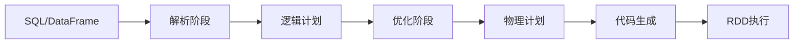

#### 优化规则示例

| 优化类型 | 优化规则 | 效果 |
|----------|----------|------|
| **谓词下推** | PushDownPredicates | 将过滤条件推到数据源 |
| **列裁剪** | ColumnPruning | 只读取需要的列 |
| **常量折叠** | ConstantFolding | 编译时计算常量表达式 |
| **Join重排序** | ReorderJoin | 优化Join顺序 |

#### 查询执行流程

```scala
// 1. SQL解析
val sql = "SELECT name, age FROM users WHERE age > 18"
val df = spark.sql(sql)

// 2. 查看执行计划
df.explain(true)  // 显示详细执行计划

// 3. 优化前后对比
// 优化前：全表扫描后过滤
// 优化后：谓词下推，只读取age>18的数据
```

### 性能优化技巧

#### 1. 数据格式选择
```scala
// 推荐使用Parquet格式
df.write.mode("overwrite").parquet("data.parquet")
val optimizedDF = spark.read.parquet("data.parquet")
```

#### 2. 分区优化
```scala
// 按时间分区
df.write.partitionBy("date").parquet("partitioned_data")

// 动态分区裁剪
spark.conf.set("spark.sql.optimizer.dynamicPartitionPruning.enabled", "true")
```

#### 3. 缓存策略
```scala
// 缓存频繁使用的DataFrame
df.cache()
df.count()  // 触发缓存

// 检查缓存状态
spark.catalog.isCached("table_name")
```

---

## 参数配置

### 输出压缩配置

**压缩格式选择**：根据数据特点和存储需求选择合适的压缩格式

| 压缩格式 | 压缩比 | 压缩速度 | 解压速度 | 适用场景 |
|----------|--------|----------|----------|----------|
| **GZIP** | 高 | 中等 | 快 | 通用场景，平衡性能 |
| **BZIP2** | 很高 | 慢 | 慢 | 存储空间敏感 |
| **SNAPPY** | 中等 | 很快 | 很快 | 计算密集型场景 |
| **LZ4** | 中等 | 很快 | 很快 | 实时处理场景 |

#### 配置示例
```scala
// CSV格式压缩
df.write.option("compression", "gzip").csv("output_csv_dir")

// JSON格式压缩
df.write.option("compression", "gzip").json("output_json_dir")

// Text格式压缩
df.write.option("compression", "bzip2").text("output_text_dir")

// Parquet格式压缩（推荐）
df.write.option("compression", "snappy").parquet("output_parquet_dir")
```

### UDF注册与使用

#### 1. 注册UDF函数
```scala
import com.ys.axe.saas.comn.util.IPV6Util
import org.apache.spark.sql.functions.udf

// 方式1：使用udf函数
val fullIpv6 = udf((arg: String) => IPV6Util.getFullIPv6(arg))
spark.udf.register("fullIpv6", fullIpv6)

// 方式2：直接注册
spark.udf.register("fullIpv6", (arg: String) => IPV6Util.getFullIPv6(arg))

// 使用UDF
val result = spark.sql("SELECT fullIpv6(ip_column) FROM table")
```

#### 2. 注册外部Jar包中的UDF
```sql
-- 注册Hive UDF
CREATE FUNCTION default.gt_geohash_dist 
AS 'com.glab.function.lbs.GetDistanceByGeoHash' 
USING JAR 'hdfs://gt-wz-ga/ext-jar/ys-bi-udf-hive-function.jar';

-- 使用UDF
SELECT gt_geohash_dist(geo1, geo2) FROM location_table;
```

### 常用配置参数

#### 性能优化参数
```properties
# 并行度设置
spark.sql.shuffle.partitions=200
spark.default.parallelism=200

# 内存配置
spark.executor.memory=4g
spark.executor.memoryOverhead=1g
spark.memory.fraction=0.8

# 序列化配置
spark.serializer=org.apache.spark.serializer.KryoSerializer
spark.kryo.registrationRequired=false

# 动态分配
spark.dynamicAllocation.enabled=true
spark.dynamicAllocation.minExecutors=2
spark.dynamicAllocation.maxExecutors=10
```

#### 数据源配置
```properties
# Parquet配置
spark.sql.parquet.compression.codec=snappy
spark.sql.parquet.enable.summary-metadata=false

# ORC配置
spark.sql.orc.compression.codec=snappy
spark.sql.orc.enable.index=true

# CSV配置
spark.sql.csv.parser.columnPruning.enabled=true
```

---

# Spark 核心组件与原理

## BlockManager

### 操作时序图
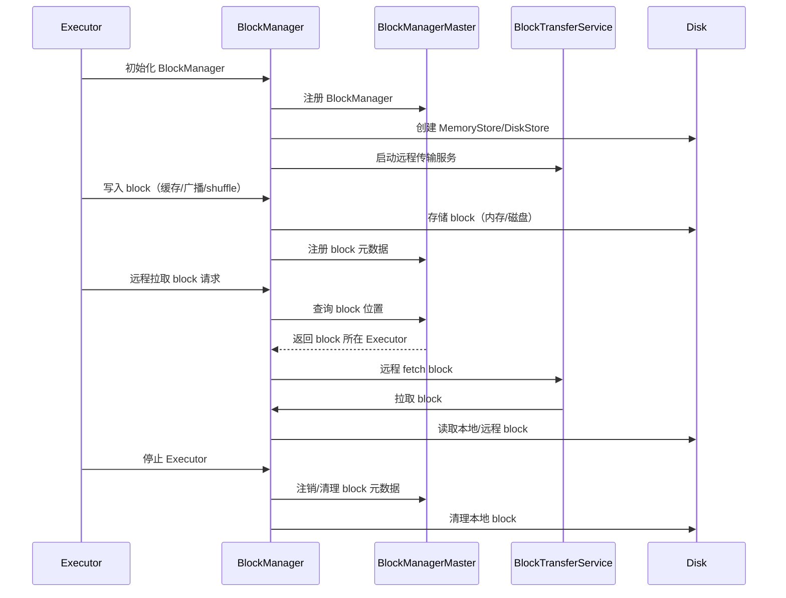

### BlockManager核心组件详解

#### 1. BlockManager架构组件

**核心类与职责**：

| 组件 | 类名 | 主要职责 | 生命周期 |
|------|------|----------|----------|
| **BlockManager** | `BlockManager` | 管理本地数据块存储和传输 | Executor启动到停止 |
| **BlockManagerMaster** | `BlockManagerMaster` | 管理集群中所有BlockManager元数据 | Driver启动到停止 |
| **MemoryStore** | `MemoryStore` | 管理内存中的数据块 | BlockManager生命周期 |
| **DiskStore** | `DiskStore` | 管理磁盘中的数据块 | BlockManager生命周期 |
| **BlockTransferService** | `NettyBlockTransferService` | 处理远程数据块传输 | BlockManager生命周期 |

#### 2. BlockManager创建与初始化

```scala
// BlockManager初始化流程
class BlockManager(
    executorId: String,
    rpcEnv: RpcEnv,
    val master: BlockManagerMaster,
    serializerManager: SerializerManager,
    conf: SparkConf,
    memoryManager: MemoryManager,
    mapOutputTracker: MapOutputTracker,
    shuffleManager: ShuffleManager,
    blockTransferService: BlockTransferService,
    securityManager: SecurityManager,
    externalBlockStoreClient: Option[ExternalBlockStoreClient])
  extends BlockDataManager with BlockEvictionHandler with Serializable {

  // 初始化存储组件
  private[spark] val memoryStore = new MemoryStore(conf, blockInfoManager)
  private[spark] val diskStore = new DiskStore(conf, diskBlockManager)
  
  // 注册到Master
  master.registerBlockManager(blockManagerId, maxMemory, slaveEndpoint)
}
```

#### 3. 数据块存储流程

```scala
// 数据块存储的核心方法
def putBlockData(
    blockId: BlockId,
    data: BlockData,
    level: StorageLevel,
    tellMaster: Boolean = true): Boolean = {
  
  // 1. 检查存储级别
  if (level.useMemory) {
    // 2. 尝试存储到内存
    val putSucceeded = memoryStore.putBytes(blockId, data, level)
    if (putSucceeded) {
      // 3. 通知Master
      if (tellMaster) {
        reportBlockStatus(blockId, BlockStatus(level, 0, 0))
      }
      return true
    }
  }
  
  // 4. 内存不足，存储到磁盘
  if (level.useDisk) {
    val putSucceeded = diskStore.putBytes(blockId, data)
    if (putSucceeded) {
      if (tellMaster) {
        reportBlockStatus(blockId, BlockStatus(level, 0, data.size))
      }
      return true
    }
  }
  
  false
}
```

#### 4. 数据块获取流程

```scala
// 数据块获取的核心方法
def get[T](blockId: BlockId): Option[BlockResult[T]] = {
  // 1. 检查本地内存
  memoryStore.get(blockId) match {
    case Some(blockResult) => return Some(blockResult)
    case None => // 继续查找
  }
  
  // 2. 检查本地磁盘
  diskStore.get(blockId) match {
    case Some(blockResult) => return Some(blockResult)
    case None => // 继续查找
  }
  
  // 3. 从远程获取
  getRemote(blockId)
}

def getRemote[T](blockId: BlockId): Option[BlockResult[T]] = {
  // 1. 从Master获取block位置
  val locations = master.getLocations(blockId)
  
  // 2. 从远程节点获取
  for (location <- locations) {
    val blockResult = blockTransferService.fetchBlockSync(
      location.host, location.port, location.executorId, blockId.toString)
    if (blockResult.isDefined) {
      return blockResult
    }
  }
  
  None
}
```

---

## Spark核心组件架构详解

### 1. SparkContext核心组件

#### SparkContext初始化流程

```scala
class SparkContext(config: SparkConf) extends Logging {
  
  // 核心组件初始化
  private val _conf = config.clone()
  private val _env = createSparkEnv(_conf, isLocal, listenerBus)
  private val _schedulerBackend = _env.schedulerBackend
  private val _taskScheduler = _env.taskScheduler
  private val _heartbeatReceiver = _env.heartbeatReceiver
  private val _dagScheduler = new DAGScheduler(this)
  
  // 启动组件
  _taskScheduler.start()
  _dagScheduler.start()
}
```

#### 核心组件交互关系

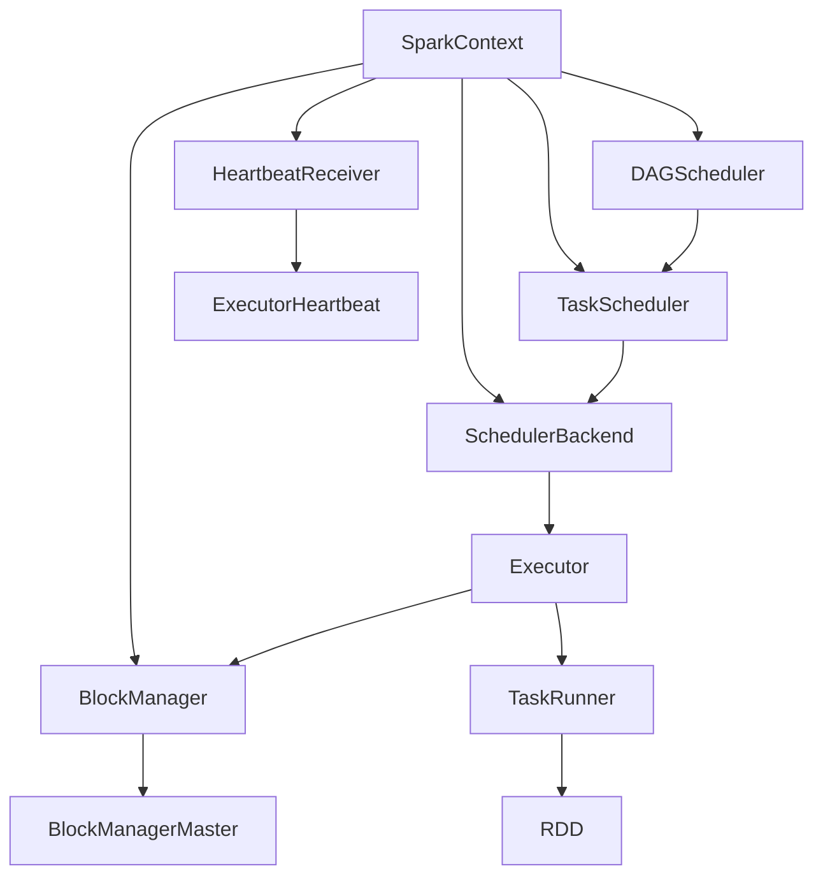

### 2. DAGScheduler核心组件

#### DAGScheduler架构组件

| 组件 | 类名 | 主要职责 | 关键方法 |
|------|------|----------|----------|
| **DAGScheduler** | `DAGScheduler` | 作业调度和Stage划分 | `submitJob`, `submitStage` |
| **EventLoop** | `DAGSchedulerEventProcessLoop` | 事件处理循环 | `post`, `onReceive` |
| **Stage** | `Stage`, `ResultStage`, `ShuffleMapStage` | Stage抽象 | `findMissingPartitions` |
| **Job** | `ActiveJob` | 作业抽象 | `numFinished`, `numPartitions` |

#### DAGScheduler事件处理

```scala
// DAGScheduler事件类型
sealed trait DAGSchedulerEvent

case class JobSubmitted(
    jobId: Int,
    finalRDD: RDD[_],
    func: (TaskContext, Iterator[_]) => _,
    partitions: Array[Int],
    callSite: CallSite,
    listener: JobListener,
    properties: Properties) extends DAGSchedulerEvent

case class StageCompleted(stage: Stage) extends DAGSchedulerEvent
case class TaskCompleted(task: Task[_], reason: TaskEndReason) extends DAGSchedulerEvent
case class TaskFailed(task: Task[_], reason: TaskEndReason, exception: Option[Throwable]) extends DAGSchedulerEvent

// 事件处理循环
class DAGSchedulerEventProcessLoop(dagScheduler: DAGScheduler)
  extends EventLoop[DAGSchedulerEvent]("dag-scheduler-event-loop") {
  
  override def onReceive(event: DAGSchedulerEvent): Unit = {
    event match {
      case JobSubmitted(jobId, rdd, func, partitions, callSite, listener, properties) =>
        dagScheduler.handleJobSubmitted(jobId, rdd, func, partitions, callSite, listener, properties)
      case StageCompleted(stage) =>
        dagScheduler.handleStageCompletion(stage)
      case TaskCompleted(task, reason) =>
        dagScheduler.handleTaskCompletion(task, reason)
      // ... 其他事件处理
    }
  }
}
```

#### Stage划分与依赖管理

```scala
// Stage划分核心逻辑
private def getOrCreateParentStages(rdd: RDD[_], firstJobId: Int): List[Stage] = {
  val parents = new ArrayBuffer[Stage]()
  val visited = new HashSet[RDD[_]]
  
  def visit(r: RDD[_]): Unit = {
    if (!visited(r)) {
      visited += r
      for (dep <- r.dependencies) {
        dep match {
          case shufDep: ShuffleDependency[_, _, _] =>
            // 宽依赖，创建新的ShuffleMapStage
            parents += getOrCreateShuffleMapStage(shufDep, firstJobId)
          case _ =>
            // 窄依赖，递归访问父RDD
            visit(dep.rdd)
        }
      }
    }
  }
  
  visit(rdd)
  parents.toList
}
```

### 3. TaskScheduler核心组件

#### TaskScheduler架构组件

| 组件 | 类名 | 主要职责 | 关键特性 |
|------|------|----------|----------|
| **TaskScheduler** | `TaskSchedulerImpl` | 任务调度和分发 | 支持多种调度策略 |
| **SchedulerBackend** | `CoarseGrainedSchedulerBackend` | 与集群管理器通信 | 资源分配和Executor管理 |
| **TaskSetManager** | `TaskSetManager` | 管理TaskSet执行 | 任务重试、推测执行 |
| **Pool** | `Pool` | 调度池管理 | 公平调度、FIFO调度 |

#### TaskScheduler任务分发

```scala
// TaskScheduler核心方法
class TaskSchedulerImpl(
    val sc: SparkContext,
    val maxTaskFailures: Int,
    isLocal: Boolean = false)
  extends TaskScheduler with Logging {

  def submitTasks(taskSet: TaskSet): Unit = {
    val tasks = taskSet.tasks
    logInfo("Adding task set " + taskSet.id + " with " + tasks.length + " tasks")
    
    // 1. 创建TaskSetManager
    val manager = createTaskSetManager(taskSet, maxTaskFailures)
    
    // 2. 添加到调度队列
    schedulableBuilder.addTaskSetManager(manager, manager.taskSet.properties)
    
    // 3. 触发资源分配
    backend.reviveOffers()
  }
  
  def resourceOffers(offers: Seq[WorkerOffer]): Seq[Seq[TaskDescription]] = {
    // 1. 标记Executor为活跃状态
    val activeExecutors = offers.map(_.executorId).toSet
    executorIdToTaskSetManager.keys.foreach { executorId =>
      if (!activeExecutors.contains(executorId)) {
        executorIdToTaskSetManager.remove(executorId)
      }
    }
    
    // 2. 为每个offer分配任务
    val tasks = offers.map { offer =>
      val taskSet = schedulableBuilder.getTaskSet(offer)
      taskSet.map { task =>
        new TaskDescription(
          taskId = task.taskId,
          attemptNumber = task.attemptNumber,
          executorId = offer.executorId,
          name = task.name,
          index = task.index,
          addedFiles = task.addedFiles,
          addedJars = task.addedJars,
          properties = task.properties,
          serializedTask = task.serializedTask)
      }
    }
    
    tasks
  }
}
```

### 4. Executor核心组件

#### Executor架构组件

| 组件 | 类名 | 主要职责 | 生命周期 |
|------|------|----------|----------|
| **Executor** | `Executor` | 执行任务的核心组件 | Executor进程生命周期 |
| **TaskRunner** | `TaskRunner` | 任务执行线程 | 单个任务执行期间 |
| **BlockManager** | `BlockManager` | 数据块管理 | Executor生命周期 |
| **MemoryManager** | `UnifiedMemoryManager` | 内存管理 | Executor生命周期 |

#### Executor任务执行流程

```scala
// Executor核心执行逻辑
class Executor(
    executorId: String,
    executorHostname: String,
    env: SparkEnv,
    userClassPath: Seq[URL] = Nil,
    isLocal: Boolean = false)
  extends Logging {

  // 任务执行线程池
  private val threadPool = ThreadUtils.newDaemonCachedThreadPool("Executor task launch worker")
  
  // 任务执行方法
  def launchTask(context: ExecutorBackend, taskId: Long, attemptNumber: Int, taskName: String, serializedTask: ByteBuffer): Unit = {
    val tr = new TaskRunner(context, taskId, attemptNumber, taskName, serializedTask)
    runningTasks.put(taskId, tr)
    threadPool.execute(tr)
  }
}

// TaskRunner执行逻辑
class TaskRunner(
    execBackend: ExecutorBackend,
    val taskId: Long,
    val attemptNumber: Int,
    taskName: String,
    serializedTask: ByteBuffer)
  extends Runnable {

  def run(): Unit = {
    try {
      // 1. 反序列化任务
      val (taskFiles, taskJars, taskProps, taskBytes) = Task.deserializeWithDependencies(serializedTask)
      
      // 2. 设置任务环境
      updateDependencies(taskFiles, taskJars)
      val task = ser.deserialize[Task[Any]](taskBytes, Thread.currentThread.getContextClassLoader)
      
      // 3. 执行任务
      val value = task.run(taskAttemptId = taskId, attemptNumber = attemptNumber, ...)
      
      // 4. 序列化结果
      val resultSer = env.serializer.newInstance()
      val serializedResult = resultSer.serialize(value)
      
      // 5. 返回结果
      execBackend.statusUpdate(taskId, TaskState.FINISHED, serializedResult)
      
    } catch {
      case e: Exception =>
        execBackend.statusUpdate(taskId, TaskState.FAILED, e)
    }
  }
}
```

### 5. 内存管理核心组件

#### 内存管理架构

| 组件 | 类名 | 主要职责 | 管理范围 |
|------|------|----------|----------|
| **MemoryManager** | `UnifiedMemoryManager` | 统一内存管理 | 堆内+堆外内存 |
| **MemoryPool** | `StorageMemoryPool`, `ExecutionMemoryPool` | 内存池管理 | 存储/执行内存 |
| **MemoryStore** | `MemoryStore` | 内存存储管理 | 缓存数据存储 |
| **TaskMemoryManager** | `TaskMemoryManager` | 任务内存管理 | 单个任务内存 |

#### 内存分配策略

```scala
// 统一内存管理器
class UnifiedMemoryManager(
    conf: SparkConf,
    maxHeapMemory: Long,
    onHeapStorageRegionSize: Long,
    numCores: Int)
  extends MemoryManager(conf, numCores, onHeapStorageRegionSize, maxHeapMemory) {

  // 存储内存池
  private val storageMemoryPool = new StorageMemoryPool(this, maxHeapMemory * storageFraction)
  
  // 执行内存池
  private val executionMemoryPool = new ExecutionMemoryPool(this, maxHeapMemory * executionFraction)
  
  // 内存分配方法
  override def acquireExecutionMemory(
      numBytes: Long,
      taskAttemptId: Long,
      memoryMode: MemoryMode): Long = {
    
    // 1. 尝试从执行内存池分配
    val acquired = executionMemoryPool.acquireMemory(numBytes, taskAttemptId)
    if (acquired >= numBytes) {
      return acquired
    }
    
    // 2. 从存储内存池借用
    val borrowed = storageMemoryPool.acquireMemory(numBytes - acquired, taskAttemptId)
    acquired + borrowed
  }
  
  override def acquireStorageMemory(
      blockId: BlockId,
      numBytes: Long,
      memoryMode: MemoryMode): Boolean = {
    
    // 1. 尝试从存储内存池分配
    if (storageMemoryPool.acquireMemory(numBytes, blockId)) {
      return true
    }
    
    // 2. 从执行内存池借用
    executionMemoryPool.acquireMemory(numBytes, blockId) >= numBytes
  }
}
```

### 6. 序列化与反序列化组件

#### 序列化架构组件

| 组件 | 类名 | 主要职责 | 使用场景 |
|------|------|----------|----------|
| **Serializer** | `JavaSerializer`, `KryoSerializer` | 对象序列化 | 数据传输、缓存 |
| **SerializerManager** | `SerializerManager` | 序列化管理 | 统一序列化接口 |
| **SerializationStream** | `SerializationStream` | 序列化流 | 数据写入 |
| **DeserializationStream** | `DeserializationStream` | 反序列化流 | 数据读取 |

#### 序列化使用示例

```scala
// 序列化管理器
class SerializerManager(
    defaultSerializer: Serializer,
    conf: SparkConf,
    encryptionKey: Option[Array[Byte]]) {

  // 获取序列化器
  def getSerializer(ct: ClassTag[_]): Serializer = {
    if (KryoSerializer.isSupported(ct)) {
      kryoSerializer.get
    } else {
      defaultSerializer
    }
  }
  
  // 序列化数据
  def dataSerializeStream[T: ClassTag](
      outputStream: OutputStream,
      value: T): SerializationStream = {
    val ser = getSerializer(implicitly[ClassTag[T]])
    ser.serializeStream(outputStream)
  }
  
  // 反序列化数据
  def dataDeserializeStream[T: ClassTag](
      inputStream: InputStream): DeserializationStream[T] = {
    val ser = getSerializer(implicitly[ClassTag[T]])
    ser.deserializeStream(inputStream)
  }
}
```

### 7. 网络通信组件

#### 网络通信架构

| 组件 | 类名 | 主要职责 | 通信协议 |
|------|------|----------|----------|
| **RpcEnv** | `NettyRpcEnv` | RPC环境 | Netty-based RPC |
| **RpcEndpoint** | `RpcEndpoint` | RPC端点 | 消息处理端点 |
| **RpcEndpointRef** | `RpcEndpointRef` | RPC引用 | 远程调用引用 |
| **TransportClient** | `TransportClient` | 传输客户端 | 网络传输 |

#### RPC通信示例

```scala
// RPC端点定义
class HeartbeatReceiver(
    override val rpcEnv: RpcEnv,
    isLocal: Boolean)
  extends RpcEndpoint with Logging {

  override def receive: PartialFunction[Any, Unit] = {
    case Heartbeat(executorId, blockManagerId, blockManagerId) =>
      // 处理心跳消息
      val response = HeartbeatResponse(reregisterBlockManager = false)
      sender().send(response)
  }
  
  override def receiveAndReply(context: RpcCallContext): PartialFunction[Any, Unit] = {
    case RegisterExecutor(executorId, executorRef, hostname, cores, logUrls) =>
      // 注册Executor
      context.reply(RegisteredExecutor)
  }
}

// RPC环境创建
def createRpcEnv(
    name: String,
    host: String,
    port: Int,
    conf: SparkConf,
    securityManager: SecurityManager,
    clientMode: Boolean = false): RpcEnv = {
  
  val config = RpcEnvConfig(conf, name, host, port, securityManager, clientMode)
  new NettyRpcEnvFactory().create(config)
}
```

---

## Shuffle机制与源码解析

### Shuffle 原理与流程

- Shuffle是指在数据重分区（Data Redistribution）过程中，将数据从一个或多个输入分区重新分布到新的输出分区的操作。
- 主要发生在 groupByKey、reduceByKey、join 等算子。
- 过程分为：
  1. Map阶段：输入数据按key分组，形成(key, value)对。
  2. Shuffle阶段：将Map端输出的数据根据分区规则写到本地磁盘，等待Reduce端拉取。
  3. Reduce阶段：Reduce任务拉取对应分区的数据，进行聚合、合并等操作，输出最终结果。
- Shuffle过程涉及大量磁盘和网络I/O，是Spark性能瓶颈之一。

#### Shuffle 类型与时序图

##### Hash Shuffle 时序图
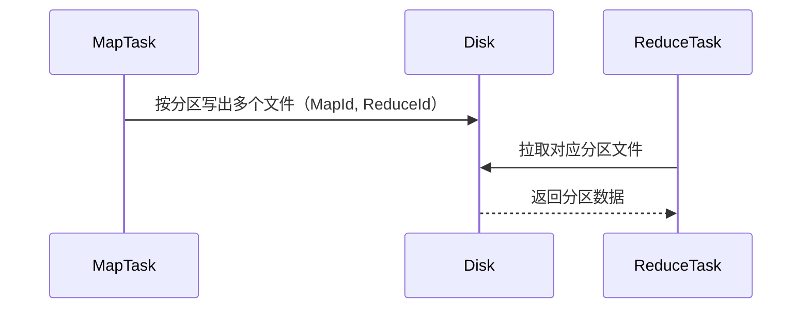

##### Sort Shuffle 时序图
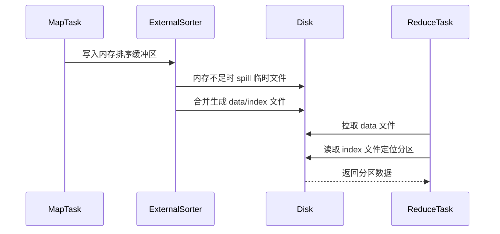

### Sort Shuffle 图解

- Sort Shuffle 是 Spark 中常用的 Shuffle 类型，适用于大规模数据处理。
- Map 端：
  1. 数据写入内存排序缓冲区。
  2. 内存不足时溢写到磁盘，生成多个临时文件。
  3. 最后将内存结果与磁盘文件合并，生成一个 data 文件和一个 index 文件。
- Reduce 端：
  1. 拉取 Map 端的 data 文件。
  2. 根据 index 文件定位分区数据。
  3. 对数据进行解压缩、反序列化、排序和聚合。

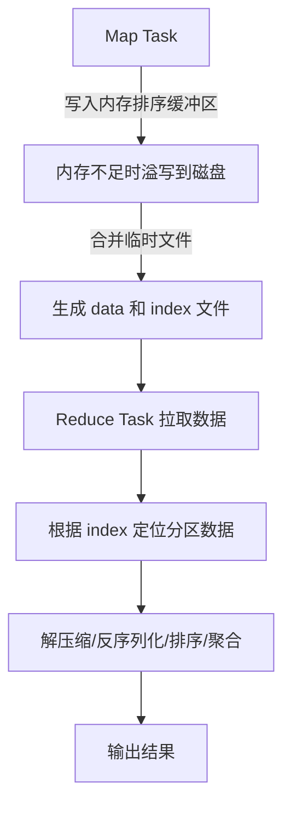

### Shuffle核心组件详解

#### 1. ShuffleManager架构组件

**核心类与职责**：

| 组件 | 类名 | 主要职责 | 使用场景 |
|------|------|----------|----------|
| **ShuffleManager** | `SortShuffleManager` | Shuffle管理器接口 | 统一Shuffle管理 |
| **ShuffleWriter** | `SortShuffleWriter` | Shuffle写入器 | Map端数据写入 |
| **ShuffleReader** | `BlockStoreShuffleReader` | Shuffle读取器 | Reduce端数据读取 |
| **ExternalSorter** | `ExternalSorter` | 外部排序器 | 内存排序和Spill |
| **ShuffleBlockResolver** | `IndexShuffleBlockResolver` | Shuffle块解析器 | 管理Shuffle文件 |

#### 2. ShuffleWriter核心实现

```scala
// SortShuffleWriter核心实现
class SortShuffleWriter[K, V, C](
    shuffleBlockResolver: IndexShuffleBlockResolver,
    handle: BaseShuffleHandle[K, V, C],
    mapId: Long,
    context: TaskContext)
  extends ShuffleWriter[K, V] {

  // 外部排序器
  private val sorter = new ExternalSorter[K, V, C](
    context, handle.aggregator, Some(handle.partitioner), keyComparator, serializer)

  def write(records: Iterator[Product2[K, V]]): Unit = {
    // 1. 插入记录到排序器
    sorter.insertAll(records)
    
    // 2. 获取排序后的迭代器
    val output = sorter.writePartitionedFile(
      shuffleBlockResolver.getDataFile(handle.shuffleId, mapId),
      shuffleBlockResolver.getIndexFile(handle.shuffleId, mapId))
    
    // 3. 注册Shuffle块
    shuffleBlockResolver.writeIndexFileAndCommit(
      handle.shuffleId, mapId, output.lengths)
  }
}
```

#### 3. ExternalSorter内存管理

```scala
// ExternalSorter核心实现
class ExternalSorter[K, V, C](
    context: TaskContext,
    aggregator: Option[Aggregator[K, V, C]] = None,
    partitioner: Option[Partitioner] = None,
    ordering: Option[Ordering[K]] = None,
    serializer: Serializer = SparkEnv.get.serializer)
  extends Spillable[WritablePartitionedPairCollection[K, C]](context.taskMemoryManager())
  with Logging {

  // 内存缓冲区
  private val map = new PartitionedAppendOnlyMap[K, C]
  
  // Spill文件列表
  private val spills = new ArrayBuffer[SpilledFile]
  
  def insertAll(input: Iterator[Product2[K, V]]): Unit = {
    val shouldSpill = context.taskMemoryManager().shouldSpill(Spillable.MEMORY)
    
    while (input.hasNext) {
      val kv = input.next()
      map.changeValue((getPartition(kv._1), kv._1), update)
      
      // 检查是否需要Spill
      if (shouldSpill && map.estimateSize() > myMemoryThreshold) {
        spill()
      }
    }
  }
  
  private def spill(): Unit = {
    val spillFile = spillMemoryIteratorToDisk(map.destructiveSortedWritablePartitionedIterator())
    spills += spillFile
  }
}
```

#### 4. ShuffleReader数据读取

```scala
// BlockStoreShuffleReader核心实现
class BlockStoreShuffleReader[K, C](
    handle: BaseShuffleHandle[K, _, C],
    startPartition: Int,
    endPartition: Int,
    context: TaskContext,
    readMetrics: ShuffleReadMetricsReporter)
  extends ShuffleReader[K, C] {

  def read(): Iterator[Product2[K, C]] = {
    // 1. 获取Shuffle块位置
    val blockManager = SparkEnv.get.blockManager
    val mapOutputTracker = SparkEnv.get.mapOutputTracker
    
    val blockIds = mapOutputTracker.getMapSizesByExecutorId(
      handle.shuffleId, startPartition, endPartition)
    
    // 2. 创建读取迭代器
    val blockFetcherItr = new ShuffleBlockFetcherIterator(
      context,
      blockManager.shuffleClient,
      blockManager,
      blockIds.iterator,
      serializerManager,
      readMetrics)
    
    // 3. 聚合和排序
    val aggregatedIter = if (handle.aggregator.isDefined) {
      new InterruptibleIterator(context, aggregator.combineCombinersByKey(blockFetcherItr))
    } else {
      blockFetcherItr
    }
    
    aggregatedIter
  }
}
```

#### 5. ShuffleBlockResolver文件管理

```scala
// IndexShuffleBlockResolver核心实现
class IndexShuffleBlockResolver(
    conf: SparkConf,
    _blockManager: BlockManager = null)
  extends ShuffleBlockResolver with Logging {

  // 获取数据文件
  def getDataFile(shuffleId: Int, mapId: Long): File = {
    new File(getShuffleDataDir(shuffleId), s"shuffle_${shuffleId}_${mapId}_0.data")
  }
  
  // 获取索引文件
  def getIndexFile(shuffleId: Int, mapId: Long): File = {
    new File(getShuffleDataDir(shuffleId), s"shuffle_${shuffleId}_${mapId}_0.index")
  }
  
  // 写入索引文件并提交
  def writeIndexFileAndCommit(
      shuffleId: Int,
      mapId: Long,
      lengths: Array[Long]): Unit = {
    
    val indexFile = getIndexFile(shuffleId, mapId)
    val tempIndexFile = new File(indexFile.getAbsolutePath + ".tmp")
    
    try {
      val out = new DataOutputStream(new BufferedOutputStream(new FileOutputStream(tempIndexFile)))
      Utils.tryWithSafeFinally {
        // 写入偏移量
        var offset = 0L
        out.writeLong(offset)
        for (length <- lengths) {
          offset += length
          out.writeLong(offset)
        }
      } {
        out.close()
      }
      
      // 原子性重命名
      if (!tempIndexFile.renameTo(indexFile)) {
        throw new IOException("Failed to rename index file")
      }
    } catch {
      case e: Exception =>
        tempIndexFile.delete()
        throw e
    }
  }
}
```

#### 6. Shuffle数据流组件交互

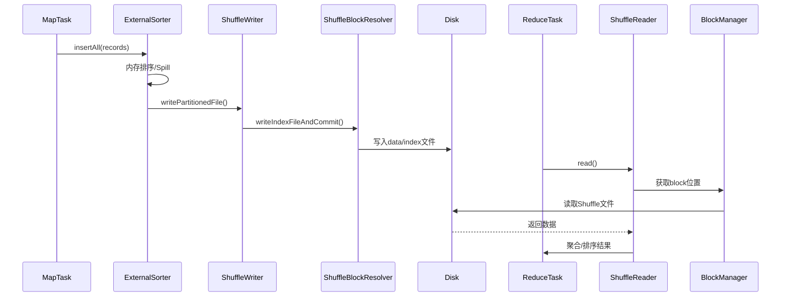

#### 7. Shuffle性能监控组件

```scala
// Shuffle性能指标收集
class ShuffleWriteMetrics extends TaskMetrics {
  // 写入字节数
  private var _bytesWritten: Long = 0L
  // 写入记录数
  private var _recordsWritten: Long = 0L
  // 写入时间
  private var _writeTime: Long = 0L
  
  def bytesWritten: Long = _bytesWritten
  def recordsWritten: Long = _recordsWritten
  def writeTime: Long = _writeTime
}

class ShuffleReadMetrics extends TaskMetrics {
  // 读取字节数
  private var _bytesRead: Long = 0L
  // 读取记录数
  private var _recordsRead: Long = 0L
  // 读取时间
  private var _readTime: Long = 0L
  // 远程读取字节数
  private var _remoteBytesRead: Long = 0L
  
  def bytesRead: Long = _bytesRead
  def recordsRead: Long = _recordsRead
  def readTime: Long = _readTime
  def remoteBytesRead: Long = _remoteBytesRead
}
```

### Shuffle 优化与调优

- 压缩：spark.shuffle.compress，减少网络传输量。
- 合理设置分区数：spark.sql.shuffle.partitions，避免分区过多或过少。
- 使用本地化Shuffle，减少网络I/O。
- 使用广播变量和累加器，减少Shuffle数据量。
- 启用spill机制，内存不足时溢写磁盘，防止OOM。
- 聚合缓冲区：Map端本地聚合，减少传输数据量。
- 合理选择Shuffle类型：大数据量优先Sort Shuffle。

### Spark Shuffle 调优

#### 1. 分区优化策略

**分区数设置原则**：
- **分区过多**：Task数量多，调度开销大，资源利用率低
- **分区过少**：单个Task处理数据量大，容易OOM，并行度不够

```properties
# 推荐设置（根据数据量调整）
spark.sql.shuffle.partitions=200
spark.default.parallelism=200

# 动态调整分区数
spark.sql.adaptive.enabled=true
spark.sql.adaptive.coalescePartitions.enabled=true
```

#### 2. 动态资源分配

```properties
# 启用动态分配
spark.dynamicAllocation.enabled=true
spark.dynamicAllocation.minExecutors=2
spark.dynamicAllocation.maxExecutors=10
spark.dynamicAllocation.initialExecutors=2

# 资源分配策略
spark.dynamicAllocation.executorIdleTimeout=60s
spark.dynamicAllocation.cachedExecutorIdleTimeout=120s
```

#### 3. 压缩与序列化优化

| 配置项 | 推荐值 | 说明 |
|--------|--------|------|
| `spark.shuffle.compress` | `true` | 启用Shuffle压缩 |
| `spark.shuffle.compress.codec` | `snappy` | 压缩算法选择 |
| `spark.serializer` | `KryoSerializer` | 序列化器选择 |
| `spark.kryo.registrationRequired` | `false` | 是否要求注册类 |

#### 4. 本地化Shuffle优化

```properties
# 本地化配置
spark.locality.wait=3s
spark.locality.wait.process=3s
spark.locality.wait.node=3s
spark.locality.wait.rack=3s
```

#### 5. 高级优化技巧

**Map端聚合**：
```scala
// 使用reduceByKey替代groupByKey
val result = rdd.reduceByKey(_ + _)  // 推荐
// val result = rdd.groupByKey().mapValues(_.sum)  // 不推荐
```

**广播变量优化**：
```scala
// 小表广播，避免Shuffle
val smallTable = spark.table("small_table").collect()
val broadcastVar = spark.sparkContext.broadcast(smallTable)
```

**数据倾斜处理**：
```scala
// 1. 加盐处理
val saltedRDD = rdd.map(x => (x._1 + "_" + Random.nextInt(10), x._2))

// 2. 两阶段聚合
val stage1 = rdd.map(x => (x._1 + "_" + Random.nextInt(10), x._2))
                .reduceByKey(_ + _)
val stage2 = stage1.map(x => (x._1.split("_")(0), x._2))
                   .reduceByKey(_ + _)
```

### Shuffle常见问题与解决方案

#### 1. 数据倾斜问题

**现象**：某些分区数据量远大于其他分区，导致Task执行时间差异很大

**解决方案**：
```scala
// 方案1：加盐处理
val skewedRDD = rdd.map(x => {
  val key = x._1
  val value = x._2
  if (isSkewedKey(key)) {
    (key + "_" + Random.nextInt(10), value)
  } else {
    (key, value)
  }
})

// 方案2：自定义分区器
class SkewPartitioner(numPartitions: Int) extends Partitioner {
  override def numPartitions: Int = numPartitions
  override def getPartition(key: Any): Int = {
    // 自定义分区逻辑
  }
}
```

#### 2. Shuffle文件过多问题

**现象**：Shuffle过程中产生大量小文件，影响性能

**解决方案**：
```properties
# 合并小文件
spark.sql.adaptive.enabled=true
spark.sql.adaptive.coalescePartitions.enabled=true
spark.sql.adaptive.coalescePartitions.minPartitionNum=1
spark.sql.adaptive.coalescePartitions.initialPartitionNum=200
```

#### 3. 内存溢出问题

**现象**：Shuffle过程中出现OOM

**解决方案**：
```properties
# 启用Spill机制
spark.shuffle.spill=true
spark.shuffle.spill.compress=true

# 调整内存配置
spark.executor.memory=4g
spark.memory.fraction=0.8
spark.memory.storageFraction=0.3
```

---

## 内存管理

### 内存管理机制

- Spark 内存分为堆内（On-Heap）和堆外（Off-Heap）内存。
- 堆内内存由 JVM 管理，堆外内存由 Spark 直接管理，减少 GC 影响。
- 内存池分为：
  1. **Storage Memory**：用于缓存 RDD、DataFrame、广播变量等。
  2. **Execution Memory**：用于任务运行中的临时数据存储（如 Shuffle、Join）。
- Storage Memory 和 Execution Memory 动态共享，优先满足 Execution Memory。
- 内存不足时：
  - 缓存数据会被逐步淘汰。
  - 计算数据会溢写到磁盘（spill）。

### 内存管理核心组件详解

#### 1. 内存管理架构组件

**核心类与职责**：

| 组件 | 类名 | 主要职责 | 管理范围 |
|------|------|----------|----------|
| **MemoryManager** | `UnifiedMemoryManager` | 统一内存管理器 | 堆内+堆外内存 |
| **StorageMemoryPool** | `StorageMemoryPool` | 存储内存池 | 缓存数据内存 |
| **ExecutionMemoryPool** | `ExecutionMemoryPool` | 执行内存池 | 任务执行内存 |
| **MemoryStore** | `MemoryStore` | 内存存储管理 | 缓存数据存储 |
| **TaskMemoryManager** | `TaskMemoryManager` | 任务内存管理 | 单个任务内存 |
| **MemoryAllocator** | `HeapMemoryAllocator`, `UnsafeMemoryAllocator` | 内存分配器 | 堆内/堆外分配 |

#### 2. MemoryStore缓存管理

```scala
// MemoryStore核心实现
class MemoryStore(
    conf: SparkConf,
    blockInfoManager: BlockInfoManager)
  extends BlockStore(BlockStore.MEMORY) with BlockEvictionHandler with Logging {

  // 内存映射表
  private val entries = new LinkedHashMap[BlockId, MemoryEntry[_]](32, 0.75f, true)
  
  // 当前内存使用量
  private var _currentMemory = 0L
  
  def putBytes[T](
      blockId: BlockId,
      size: Long,
      memoryMode: MemoryMode,
      _bytes: () => ChunkedByteBuffer): Boolean = {
    
    // 1. 检查内存是否足够
    if (!memoryManager.acquireStorageMemory(blockId, size, memoryMode)) {
      return false
    }
    
    // 2. 分配内存并存储数据
    val bytes = _bytes()
    val entry = new SerializedMemoryEntry[T](bytes, memoryMode, implicitly[ClassTag[T]])
    entries.synchronized {
      entries.put(blockId, entry)
      _currentMemory += size
    }
    
    true
  }
  
  def get[T](blockId: BlockId): Option[BlockResult[T]] = {
    entries.synchronized {
      entries.get(blockId) match {
        case entry: SerializedMemoryEntry[T] =>
          Some(BlockResult(entry.value.asInstanceOf[T], DataReadMethod.Memory, entry.size))
        case entry: DeserializedMemoryEntry[T] =>
          Some(BlockResult(entry.value.asInstanceOf[T], DataReadMethod.Memory, entry.size))
        case _ => None
      }
    }
  }
  
  // 内存淘汰策略
  override def dropFromMemory[T](
      blockId: BlockId,
      data: () => Either[Array[T], ChunkedByteBuffer]): StorageLevel = {
    
    val newLevel = StorageLevel.MEMORY_AND_DISK
    if (data().isLeft) {
      // 反序列化数据，存储到磁盘
      val array = data().left.get
      diskStore.put(blockId, array)
    } else {
      // 序列化数据，存储到磁盘
      val bytes = data().right.get
      diskStore.putBytes(blockId, bytes)
    }
    
    newLevel
  }
}
```

#### 3. TaskMemoryManager任务内存管理

```scala
// TaskMemoryManager核心实现
class TaskMemoryManager(
    memoryManager: MemoryManager,
    taskAttemptId: Long)
  extends MemoryManager with Logging {

  // 任务内存映射表
  private val memoryForTask = new mutable.HashMap[Long, Long]()
  
  // 内存分配方法
  def acquireExecutionMemory(
      numBytes: Long,
      taskAttemptId: Long,
      memoryMode: MemoryMode): Long = {
    
    // 1. 尝试从执行内存池分配
    val acquired = memoryManager.acquireExecutionMemory(numBytes, taskAttemptId, memoryMode)
    
    // 2. 记录分配的内存
    if (acquired > 0) {
      memoryForTask.synchronized {
        memoryForTask(taskAttemptId) = memoryForTask.getOrElse(taskAttemptId, 0L) + acquired
      }
    }
    
    acquired
  }
  
  // 释放内存
  def releaseExecutionMemory(
      numBytes: Long,
      taskAttemptId: Long,
      memoryMode: MemoryMode): Unit = {
    
    memoryManager.releaseExecutionMemory(numBytes, taskAttemptId, memoryMode)
    
    memoryForTask.synchronized {
      val current = memoryForTask.getOrElse(taskAttemptId, 0L)
      val newTotal = math.max(0L, current - numBytes)
      if (newTotal == 0) {
        memoryForTask.remove(taskAttemptId)
      } else {
        memoryForTask(taskAttemptId) = newTotal
      }
    }
  }
  
  // 清理任务内存
  def cleanupTaskMemory(taskAttemptId: Long): Unit = {
    memoryForTask.synchronized {
      val memory = memoryForTask.remove(taskAttemptId)
      if (memory.isDefined) {
        memoryManager.releaseExecutionMemory(memory.get, taskAttemptId, MemoryMode.ON_HEAP)
      }
    }
  }
}
```

#### 4. 内存池管理机制

```scala
// StorageMemoryPool核心实现
class StorageMemoryPool(
    lock: Object,
    memoryMode: MemoryMode)
  extends MemoryPool(lock) with Logging {

  // 当前内存使用量
  private var _memoryUsed: Long = 0L
  
  // 内存分配
  def acquireMemory(blockId: BlockId, numBytes: Long): Boolean = {
    lock.synchronized {
      if (numBytes <= memoryFree) {
        _memoryUsed += numBytes
        true
      } else {
        false
      }
    }
  }
  
  // 内存释放
  def releaseMemory(numBytes: Long): Unit = {
    lock.synchronized {
      if (numBytes <= _memoryUsed) {
        _memoryUsed -= numBytes
      } else {
        _memoryUsed = 0
      }
    }
  }
  
  // 内存借用
  def acquireMemory(numBytes: Long, evictedBlocks: mutable.Buffer[(BlockId, BlockStatus)]): Long = {
    lock.synchronized {
      val numBytesToFree = math.max(0, numBytes - memoryFree)
      if (numBytesToFree > 0) {
        // 触发内存淘汰
        val freed = evictBlocksToFreeSpace(numBytesToFree, evictedBlocks)
        math.min(numBytes, freed)
      } else {
        numBytes
      }
    }
  }
}

// ExecutionMemoryPool核心实现
class ExecutionMemoryPool(
    lock: Object,
    memoryMode: MemoryMode)
  extends MemoryPool(lock) with Logging {

  // 任务内存映射表
  private val memoryForTask = new mutable.HashMap[Long, Long]()
  
  // 内存分配
  def acquireMemory(
      numBytes: Long,
      taskAttemptId: Long,
      maybeGrowPool: Long => Unit = (additionalSpaceNeeded: Long) => Unit,
      computeMaxPoolSize: () => Long = () => poolSize): Long = {
    
    lock.synchronized {
      // 1. 检查当前任务是否超过限制
      val curMem = memoryForTask.getOrElse(taskAttemptId, 0L)
      val maxMemPerTask = maxMemoryPerTask
      if (curMem + numBytes > maxMemPerTask) {
        return 0L
      }
      
      // 2. 尝试分配内存
      val numBytesToFree = math.max(0, numBytes - memoryFree)
      if (numBytesToFree > 0) {
        // 需要释放其他任务的内存
        val freed = evictBlocksToFreeSpace(numBytesToFree)
        if (freed < numBytesToFree) {
          return 0L
        }
      }
      
      // 3. 分配内存
      memoryForTask(taskAttemptId) = curMem + numBytes
      numBytes
    }
  }
}
```

#### 5. 内存分配器实现

```scala
// 堆内内存分配器
class HeapMemoryAllocator extends MemoryAllocator {
  
  override def allocate(size: Long): MemoryBlock = {
    val array = new Array[Byte](size.toInt)
    new MemoryBlock(array, Platform.BYTE_ARRAY_OFFSET, size)
  }
  
  override def free(block: MemoryBlock): Unit = {
    // 堆内内存由GC自动回收
  }
}

// 堆外内存分配器
class UnsafeMemoryAllocator extends MemoryAllocator {
  
  override def allocate(size: Long): MemoryBlock = {
    val address = Platform.allocateMemory(size)
    new MemoryBlock(null, address, size)
  }
  
  override def free(block: MemoryBlock): Unit = {
    Platform.freeMemory(block.offset)
  }
}
```

#### 6. 内存监控与诊断

```scala
// 内存监控组件
class MemoryManager(
    conf: SparkConf,
    numCores: Int,
    onHeapStorageMemory: Long,
    onHeapExecutionMemory: Long)
  extends Logging {

  // 内存使用统计
  private val onHeapStorageMemoryPool = new StorageMemoryPool(this, MemoryMode.ON_HEAP)
  private val offHeapStorageMemoryPool = new StorageMemoryPool(this, MemoryMode.OFF_HEAP)
  private val onHeapExecutionMemoryPool = new ExecutionMemoryPool(this, MemoryMode.ON_HEAP)
  private val offHeapExecutionMemoryPool = new ExecutionMemoryPool(this, MemoryMode.OFF_HEAP)
  
  // 内存监控方法
  def getMemoryConsumptionForThisTask(taskAttemptId: Long): Long = {
    onHeapExecutionMemoryPool.getMemoryUsageForTask(taskAttemptId) +
    offHeapExecutionMemoryPool.getMemoryUsageForTask(taskAttemptId)
  }
  
  // 内存使用报告
  def getMemoryUsageSnapshot(): MemoryUsageSnapshot = {
    new MemoryUsageSnapshot(
      onHeapStorageMemoryPool.memoryUsed,
      offHeapStorageMemoryPool.memoryUsed,
      onHeapExecutionMemoryPool.memoryUsed,
      offHeapExecutionMemoryPool.memoryUsed)
  }
}

// 内存使用快照
case class MemoryUsageSnapshot(
    onHeapStorageMemory: Long,
    offHeapStorageMemory: Long,
    onHeapExecutionMemory: Long,
    offHeapExecutionMemory: Long) {
  
  def totalStorageMemory: Long = onHeapStorageMemory + offHeapStorageMemory
  def totalExecutionMemory: Long = onHeapExecutionMemory + offHeapExecutionMemory
  def totalMemory: Long = totalStorageMemory + totalExecutionMemory
}
```

#### 7. 内存管理组件交互图

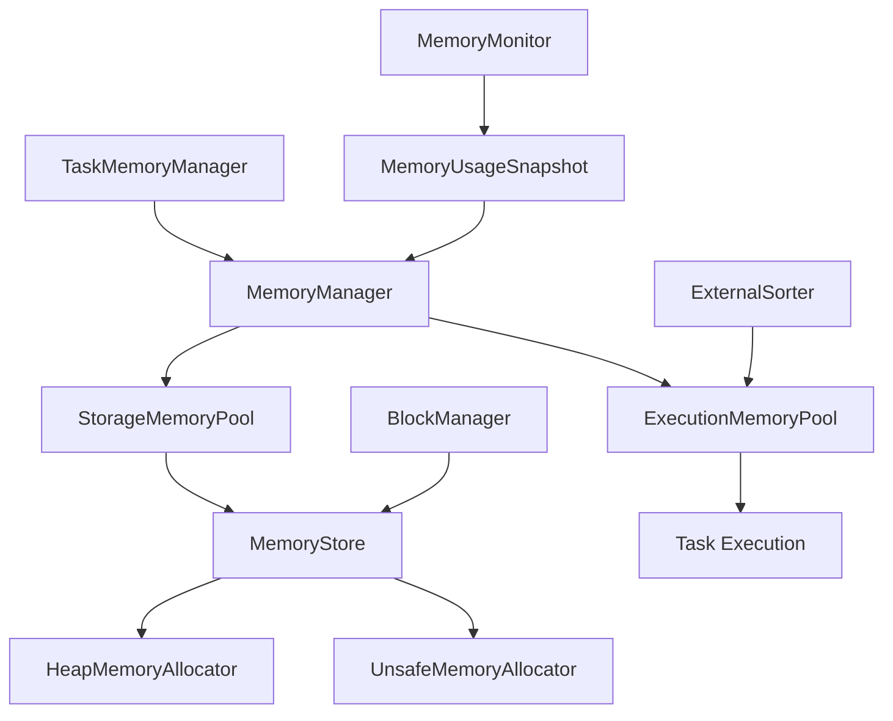

### 内存管理优化

1. **调整内存分配参数**：
   - `spark.executor.memory`：每个 Executor 的内存总大小。
   - `spark.memory.fraction`：Execution 和 Storage 内存占总内存的比例，默认 0.6。
   - `spark.memory.storageFraction`：Storage 内存占共享内存池的比例，默认 0.5。

2. **启用堆外内存**：
   - `spark.memory.offHeap.enabled=true`。
   - `spark.memory.offHeap.size=2G`。

3. **减少内存碎片化**：
   - 使用堆外内存。
   - 调整 JVM 堆大小，减少频繁 GC。

4. **优化任务执行**：
   - 减少宽依赖操作。
   - 使用广播变量，避免重复传输大数据。

### 内存管理常见问题

#### 1. OOM（内存溢出）问题

**常见原因**：
- 单个分区数据量过大
- 内存配置不合理
- 缓存数据过多
- Shuffle数据量过大

**解决方案**：
```properties
# 1. 调整内存配置
spark.executor.memory=4g
spark.executor.memoryOverhead=1g
spark.memory.fraction=0.8
spark.memory.storageFraction=0.3

# 2. 启用堆外内存
spark.memory.offHeap.enabled=true
spark.memory.offHeap.size=2g

# 3. 调整分区数
spark.sql.shuffle.partitions=200
spark.default.parallelism=200
```

#### 2. GC开销过高问题

**现象**：GC时间占比过高，影响任务执行效率

**解决方案**：
```properties
# 1. 使用G1GC
spark.executor.extraJavaOptions=-XX:+UseG1GC -XX:MaxGCPauseMillis=200

# 2. 启用堆外内存
spark.memory.offHeap.enabled=true

# 3. 优化代码，减少对象创建
# 使用mapPartitions替代map
# 复用对象，避免频繁创建
```

#### 3. 内存碎片化问题

**现象**：可用内存充足但无法分配大对象

**解决方案**：
```properties
# 1. 调整JVM参数
spark.executor.extraJavaOptions=-XX:+UseG1GC -XX:G1HeapRegionSize=16m

# 2. 使用堆外内存
spark.memory.offHeap.enabled=true

# 3. 合理设置内存比例
spark.memory.fraction=0.8
spark.memory.storageFraction=0.3
```

### 内存优化最佳实践

#### 1. 缓存策略优化

```scala
// 选择合适的存储级别
val rdd = sc.parallelize(1 to 1000000)

// 内存缓存（推荐用于频繁访问的小数据集）
rdd.cache()

// 磁盘缓存（适用于大数据集）
rdd.persist(StorageLevel.DISK_ONLY)

// 内存+磁盘缓存（平衡性能和容量）
rdd.persist(StorageLevel.MEMORY_AND_DISK)

// 堆外内存缓存（减少GC压力）
rdd.persist(StorageLevel.OFF_HEAP)
```

#### 2. 代码层面优化

```scala
// 优化1：使用mapPartitions减少函数调用开销
val result = rdd.mapPartitions(iter => {
  // 在分区级别初始化资源
  val connection = createConnection()
  try {
    iter.map(x => processWithConnection(x, connection))
  } finally {
    connection.close()
  }
})

// 优化2：使用广播变量避免重复传输
val smallData = sc.broadcast(largeLookupTable)
val result = rdd.map(x => processWithBroadcast(x, smallData.value))

// 优化3：使用累加器进行聚合
val counter = sc.longAccumulator("counter")
rdd.foreach(x => {
  if (condition(x)) counter.add(1)
})
```

#### 3. 监控与诊断

```scala
// 查看内存使用情况
spark.sparkContext.getExecutorMemoryStatus.foreach(println)

// 查看缓存状态
spark.sparkContext.getPersistentRDDs.foreach(println)

// 查看存储级别
rdd.getStorageLevel
```

### 内存管理面试题

#### Q1: Spark内存分为哪几个部分？
**A**: Spark内存主要分为：
- **Execution Memory**：用于任务执行中的临时数据存储
- **Storage Memory**：用于缓存RDD、DataFrame等
- **User Memory**：用户代码和数据结构
- **Reserved Memory**：系统预留内存

#### Q2: 如何解决Spark OOM问题？
**A**: 解决步骤：
1. **分析原因**：查看错误日志，确定是哪种OOM
2. **调整配置**：增加内存、调整分区数、启用堆外内存
3. **优化代码**：使用mapPartitions、广播变量、减少缓存
4. **监控调优**：使用Spark UI监控内存使用情况

#### Q3: 什么时候使用缓存？什么时候不使用？
**A**: 
**使用缓存**：
- 数据被多次使用
- 数据量适中，能放入内存
- 计算成本高，缓存收益大于存储成本

**不使用缓存**：
- 数据只使用一次
- 数据量过大，无法放入内存
- 数据更新频繁，缓存命中率低

---

## 容错机制

- Spark 通过RDD的血缘关系（Lineage）实现容错。每个RDD都记录了其生成方式（依赖链），当分区数据丢失时可通过重算恢复。
- Shuffle数据丢失时，相关Map Task会被重新调度执行，生成丢失的数据块。
- 容错机制依赖于DAG调度和任务重试，保证作业最终完成。
- 常见容错场景：节点故障、磁盘损坏、网络异常等。

---

# Spark 作业与任务流程

## 作业执行流程

1. 用户提交作业（如SQL、DataFrame操作）。
2. SparkContext解析作业，生成DAG（有向无环图）。
3. DAG Scheduler将DAG划分为多个Stage（阶段），每个Stage由多个Task组成。
4. Task Scheduler负责将Task分发到集群各Executor节点。
5. 各Executor执行Task，产生中间结果（如Shuffle），最终输出结果。
6. 失败Task自动重试，直至成功或超过最大重试次数。

### 作业执行流程图示

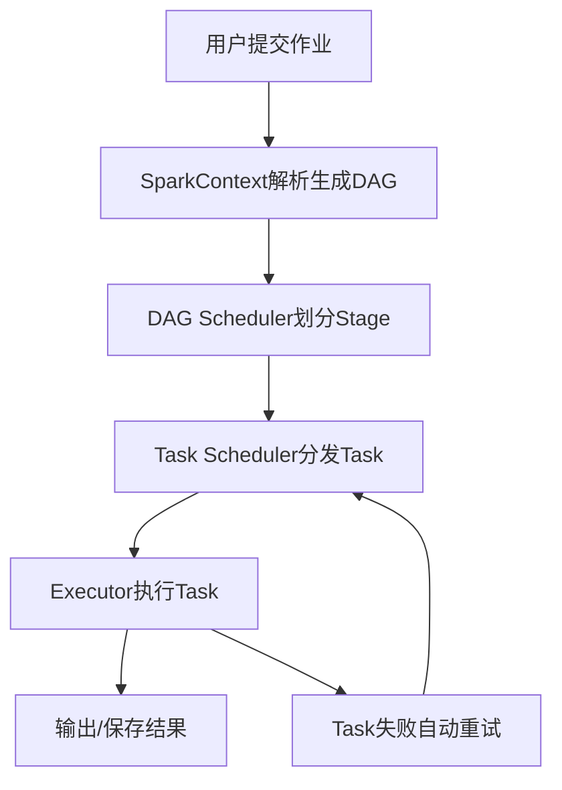

---

## 任务提交流程与源码解析

### 提交流程概述

1. **用户提交作业**：
   - 用户通过 Spark 提供的 API（如 Spark SQL、DataFrame、RDD）提交作业。

2. **Driver 初始化**：
   - Driver 进程启动，创建 SparkContext，负责作业的调度和任务分发。

3. **DAG 构建与优化**：
   - SparkContext 将用户代码解析为逻辑执行计划（DAG）。
   - 使用 Catalyst 优化器对逻辑计划进行优化，生成物理执行计划。

4. **任务划分与调度**：
   - DAG Scheduler 将物理计划划分为多个 Stage，每个 Stage 包含多个 Task。
   - Task Scheduler 将 Task 分发到集群中的 Executor 节点。

5. **Executor 执行任务**：
   - Executor 进程接收 Task，执行计算并将结果返回给 Driver。

6. **结果收集与输出**：
   - Driver 收集各 Task 的结果，生成最终输出。

### 提交流程图示

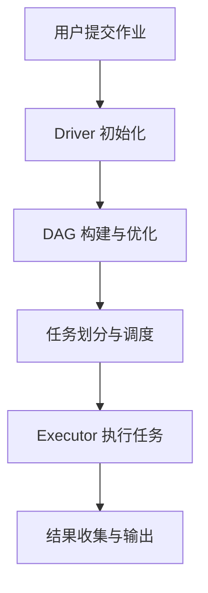

### 关键组件

- **Driver**：
  - 负责作业的整体调度和任务分发。
  - 维护作业的元数据和状态。

- **Executor**：
  - 负责执行分配的 Task。
  - 提供内存存储和计算资源。

- **Cluster Manager**：
  - 负责资源分配和管理（如 YARN、Mesos、Kubernetes）。

### 提交方式

1. **本地模式**：
   - 适用于开发和调试，所有组件运行在单机上。

2. **集群模式**：
   - Driver 运行在集群中，适用于生产环境。

3. **客户端模式**：
   - Driver 运行在提交作业的客户端，适用于交互式分析。

### 提交命令示例

```bash
spark-submit \
  --class org.apache.spark.examples.SparkPi \
  --master yarn \
  --deploy-mode cluster \
  --executor-memory 2G \
  --total-executor-cores 4 \
  examples/jars/spark-examples_2.12-3.1.2.jar 100
```

---

# Spark 性能优化

## 查询与作业优化

### 1. 存储格式优化

**推荐存储格式对比**：

| 格式 | 压缩比 | 查询速度 | 写入速度 | 适用场景 |
|------|--------|----------|----------|----------|
| **Parquet** | 高 | 快 | 中等 | 分析查询，列式存储 |
| **ORC** | 很高 | 很快 | 快 | Hive集成，高压缩比 |
| **Avro** | 中等 | 中等 | 快 | 行式存储，Schema演进 |
| **JSON** | 低 | 慢 | 快 | 开发调试，灵活性高 |

```scala
// 推荐使用Parquet格式
df.write.mode("overwrite").parquet("data.parquet")
val optimizedDF = spark.read.parquet("data.parquet")

// 配置压缩
spark.conf.set("spark.sql.parquet.compression.codec", "snappy")
```

### 2. 分区策略优化

```scala
// 按时间分区（推荐）
df.write.partitionBy("date", "hour").parquet("partitioned_data")

// 按业务字段分区
df.write.partitionBy("region", "category").parquet("business_data")

// 动态分区裁剪
spark.conf.set("spark.sql.optimizer.dynamicPartitionPruning.enabled", "true")
```

### 3. 谓词下推优化

```scala
// 启用谓词下推
spark.conf.set("spark.sql.parquet.filterPushdown", "true")
spark.conf.set("spark.sql.orc.filterPushdown", "true")

// 示例：过滤条件会被下推到数据源
val filtered = spark.read.parquet("data.parquet")
  .filter(col("age") > 18)
  .filter(col("city") === "Beijing")
```

## Join 优化

### 1. Join策略选择

| Join类型 | 适用场景 | 优势 | 劣势 |
|----------|----------|------|------|
| **Broadcast Join** | 小表Join大表 | 无Shuffle，性能最好 | 小表必须能放入内存 |
| **Sort Merge Join** | 大表Join大表 | 内存友好，稳定 | 需要Shuffle |
| **Shuffle Hash Join** | 中等表Join | 内存使用适中 | 需要Shuffle |

### 2. 广播Join优化

```scala
// 自动广播（小表小于阈值）
spark.conf.set("spark.sql.autoBroadcastJoinThreshold", "10m")

// 手动广播
val smallTable = spark.table("small_table")
val broadcastDF = broadcast(smallTable)
val result = largeTable.join(broadcastDF, "id")

// 强制广播
val result = largeTable.join(broadcast(smallTable), "id")
```

### 3. 数据倾斜处理

```scala
// 方案1：加盐处理
val saltedSmall = smallTable.map(row => {
  val key = row.getAs[String]("key")
  val saltedKey = key + "_" + Random.nextInt(10)
  (saltedKey, row)
})

// 方案2：两阶段Join
val stage1 = largeTable.join(saltedSmall, "key")
val stage2 = stage1.map(row => {
  val key = row.getAs[String]("key").split("_")(0)
  (key, row)
}).groupByKey().mapValues(_.toList)
```

## 缓存与持久化

### 1. 存储级别选择

| 存储级别 | 内存使用 | 磁盘使用 | 序列化 | 适用场景 |
|----------|----------|----------|--------|----------|
| **MEMORY_ONLY** | 高 | 无 | 无 | 小数据集，频繁访问 |
| **MEMORY_AND_DISK** | 中等 | 有 | 无 | 大数据集，内存不足时 |
| **DISK_ONLY** | 无 | 高 | 有 | 大数据集，内存紧张 |
| **OFF_HEAP** | 堆外 | 无 | 有 | 减少GC压力 |

### 2. 缓存策略

```scala
// 选择合适的缓存策略
val rdd = sc.parallelize(1 to 1000000)

// 内存缓存（推荐）
rdd.cache()

// 磁盘缓存
rdd.persist(StorageLevel.DISK_ONLY)

// 内存+磁盘缓存
rdd.persist(StorageLevel.MEMORY_AND_DISK)

// 堆外内存缓存
rdd.persist(StorageLevel.OFF_HEAP)
```

### 3. 缓存管理

```scala
// 检查缓存状态
spark.sparkContext.getPersistentRDDs.foreach(println)

// 手动释放缓存
rdd.unpersist()

// 设置缓存优先级
spark.conf.set("spark.storage.memoryFraction", "0.6")
```

## 代码层面优化

### 1. 算子选择优化

```scala
// 使用mapPartitions减少函数调用开销
val result = rdd.mapPartitions(iter => {
  // 在分区级别初始化资源
  val connection = createConnection()
  try {
    iter.map(x => processWithConnection(x, connection))
  } finally {
    connection.close()
  }
})

// 使用reduceByKey替代groupByKey
val result = rdd.reduceByKey(_ + _)  // 推荐
// val result = rdd.groupByKey().mapValues(_.sum)  // 不推荐
```

### 2. 广播变量优化

```scala
// 小表广播，避免Shuffle
val smallTable = spark.table("small_table").collect()
val broadcastVar = spark.sparkContext.broadcast(smallTable)

val result = largeTable.map(row => {
  val lookupTable = broadcastVar.value
  // 使用lookupTable进行查找
})
```

### 3. 累加器使用

```scala
// 使用累加器进行聚合
val counter = sc.longAccumulator("counter")
val sumAcc = sc.doubleAccumulator("sum")

rdd.foreach(x => {
  if (condition(x)) {
    counter.add(1)
    sumAcc.add(x.value)
  }
})
```

### 4. 序列化优化

```scala
// 使用Kryo序列化
spark.conf.set("spark.serializer", "org.apache.spark.serializer.KryoSerializer")

// 注册自定义类
spark.conf.set("spark.kryo.registrationRequired", "true")
spark.conf.set("spark.kryo.registrator", "com.example.MyKryoRegistrator")
```

## 性能监控与调优

### 1. 性能指标监控

```scala
// 查看任务执行时间
val startTime = System.currentTimeMillis()
val result = df.count()
val endTime = System.currentTimeMillis()
println(s"执行时间: ${endTime - startTime}ms")

// 查看分区数
println(s"分区数: ${df.rdd.getNumPartitions}")

// 查看数据倾斜
df.rdd.mapPartitionsWithIndex((index, iter) => {
  Iterator((index, iter.size))
}).collect().foreach(println)
```

### 2. 常见性能问题诊断

| 问题 | 现象 | 解决方案 |
|------|------|----------|
| **数据倾斜** | 某些Task执行时间过长 | 加盐处理、自定义分区器 |
| **内存溢出** | OOM错误 | 增加内存、调整分区数、启用堆外内存 |
| **GC频繁** | GC时间占比高 | 使用G1GC、启用堆外内存 |
| **网络瓶颈** | Shuffle时间长 | 启用压缩、本地化Shuffle |

### 3. 性能优化检查清单

- [ ] 选择合适的存储格式（Parquet/ORC）
- [ ] 启用谓词下推和列裁剪
- [ ] 合理设置分区数
- [ ] 使用广播Join处理小表
- [ ] 缓存频繁使用的数据
- [ ] 使用mapPartitions减少函数调用
- [ ] 启用Kryo序列化
- [ ] 监控GC和内存使用
- [ ] 处理数据倾斜问题

---

# Spark 通信与网络

## Netty 基础与应用

- Netty：高性能异步事件驱动网络通信框架，Spark 用于 RPC、Shuffle、心跳。
- 线程模型：Reactor，BossGroup 监听连接，WorkerGroup 处理 I/O。
- 内存管理：池化 ByteBuf，动态扩展和释放。
- 异常排查：日志、调试工具、分析线程池和缓冲区。
- 关键参数：spark.shuffle.io.numConnectionsPerPeer、spark.network.timeout、spark.shuffle.io.preferDirectBufs、spark.rpc.netty.dispatcher.numThreads。
- 性能调优：调整线程池、连接数、序列化、内存池、缓冲区。

---

# Spark 关键参数与配置

## 资源相关

```properties
spark.executor.memoryOverhead=2048
spark.memory.offHeap.enabled=true
spark.memory.offHeap.size=2G
spark.sql.autoBroadcastJoinThreshold=2g
spark.dynamicAllocation.enabled=true
spark.files.maxPartitionBytes=128m
spark.files.openCostInBytes=4m
spark.hadoop.parquet.enable.summary-metadata=true
```

## JVM 相关参数

```properties
--conf "spark.executor.extraJavaOptions=-XX:+PrintHeapAtGC -XX:+UseG1GC -XX:+PrintGCDetails -XX:+PrintGCTimeStamps"
--conf "spark.driver.extraJavaOptions=-XX:+PrintHeapAtGC"
-XX:+PrintGC
-XX:+PrintGCDetails
-XX:+PrintHeapAtGC
-XX:+PrintGCTimeStamps
-XX:+TraceClassLoading
-XX:+HeapDumpOnOutOfMemoryError
-Xloggc:/path/to/gc.log
```

## 其他常用参数

```properties
spark.sql.parquet.binaryAsString=true
spark.sql.shuffle.partitions=300
spark.default.parallelism=300
```

---

# Spark 典型面试题与答疑

## 常见面试题归纳

### 基础概念类面试题

#### Q1: RDD、DataFrame、Dataset的区别是什么？
**A**: 
- **RDD**：弹性分布式数据集，支持函数式编程，类型安全但无结构化
- **DataFrame**：基于RDD的分布式表，有Schema，支持SQL查询，性能更好
- **Dataset**：类型安全的DataFrame，编译时类型检查，结合了RDD和DataFrame的优点

**选择建议**：
- 需要SQL查询 → DataFrame
- 需要类型安全 → Dataset  
- 需要复杂函数式操作 → RDD

#### Q2: Spark的宽依赖和窄依赖有什么区别？
**A**: 
- **窄依赖**：父RDD的每个分区最多被一个子RDD分区使用（如map、filter）
- **宽依赖**：父RDD的分区会被多个子RDD分区使用（如groupByKey、reduceByKey）

**影响**：
- 窄依赖：可以流水线执行，无需Shuffle
- 宽依赖：需要Shuffle，会划分Stage边界

### 性能优化类面试题

#### Q3: 如何解决Spark数据倾斜问题？
**A**: 
1. **加盐处理**：给倾斜的key添加随机后缀
2. **两阶段聚合**：先局部聚合，再全局聚合
3. **自定义分区器**：将倾斜数据分散到多个分区
4. **广播Join**：小表广播，避免Shuffle
5. **采样倾斜key**：单独处理倾斜数据

#### Q4: Spark内存管理机制是怎样的？
**A**: 
- **Execution Memory**：任务执行时的临时数据
- **Storage Memory**：缓存RDD、DataFrame等
- **User Memory**：用户代码和数据结构
- **Reserved Memory**：系统预留内存

**优化策略**：
- 调整`spark.memory.fraction`比例
- 启用堆外内存减少GC压力
- 合理使用缓存策略

#### Q5: 什么情况下使用广播变量？
**A**: 
- **小表Join大表**：将小表广播到每个节点
- **查找表**：将查找表广播，避免重复传输
- **配置信息**：将配置信息广播到所有节点

**注意事项**：
- 广播变量必须能放入内存
- 广播后不可修改
- 使用完毕后及时释放

### 架构原理类面试题

#### Q6: Spark任务提交流程是怎样的？
**A**: 
1. **用户提交作业** → SparkContext
2. **DAGScheduler**：构建DAG，划分Stage
3. **TaskScheduler**：将Task分发到Executor
4. **Executor**：执行Task，返回结果
5. **Driver**：收集结果，完成作业

#### Q7: Shuffle的原理和优化方法？
**A**: 
**原理**：
- Map端：按分区写入本地磁盘
- Reduce端：拉取对应分区的数据
- 涉及大量磁盘I/O和网络传输

**优化方法**：
- 启用压缩减少网络传输
- 合理设置分区数
- 使用本地化Shuffle
- Map端聚合减少数据量

#### Q8: Spark的容错机制是如何实现的？
**A**: 
- **RDD血缘关系**：记录RDD的生成方式
- **Stage重算**：失败时重新计算整个Stage
- **Task重试**：单个Task失败时重试
- **Checkpoint**：定期保存中间结果

### 实战应用类面试题

#### Q9: 如何优化Spark SQL查询性能？
**A**: 
1. **存储格式**：使用Parquet/ORC列式存储
2. **分区策略**：按时间或业务字段分区
3. **谓词下推**：将过滤条件下推到数据源
4. **列裁剪**：只读取需要的列
5. **缓存策略**：缓存频繁使用的表

#### Q10: Spark Streaming和Flink有什么区别？
**A**: 
| 特性 | Spark Streaming | Flink |
|------|-----------------|-------|
| **处理模型** | 微批处理 | 流处理 |
| **延迟** | 秒级 | 毫秒级 |
| **容错** | RDD血缘 | Checkpoint |
| **状态管理** | 有限 | 丰富 |
| **适用场景** | 准实时分析 | 实时流处理 |

#### Q11: 如何监控和调优Spark应用？
**A**: 
**监控指标**：
- 任务执行时间
- 内存使用情况
- GC频率和时间
- Shuffle数据量
- 网络I/O

**调优方法**：
- 使用Spark UI分析性能瓶颈
- 调整内存和并行度参数
- 优化代码逻辑
- 处理数据倾斜问题

### 高级特性类面试题

#### Q12: Spark的广播变量和累加器有什么区别？
**A**: 
| 特性 | 广播变量 | 累加器 |
|------|----------|--------|
| **用途** | 共享只读数据 | 聚合统计信息 |
| **修改** | 不可修改 | 只能累加 |
| **传输** | 一次性广播 | 增量更新 |
| **使用场景** | 查找表、配置 | 计数器、统计 |

#### Q13: Spark的Checkpoint和Cache有什么区别？
**A**: 
| 特性 | Cache | Checkpoint |
|------|-------|------------|
| **存储位置** | 内存/磁盘 | 磁盘 |
| **血缘关系** | 保留 | 切断 |
| **容错性** | 依赖血缘 | 独立容错 |
| **性能** | 快 | 慢 |
| **适用场景** | 临时缓存 | 长期存储 |

#### Q14: 如何实现Spark的自定义分区器？
**A**: 
```scala
class CustomPartitioner(numPartitions: Int) extends Partitioner {
  override def numPartitions: Int = numPartitions
  
  override def getPartition(key: Any): Int = {
    // 自定义分区逻辑
    key match {
      case k: String => k.hashCode % numPartitions
      case k: Int => k % numPartitions
      case _ => 0
    }
  }
}

// 使用自定义分区器
val rdd = sc.parallelize(data)
val partitionedRDD = rdd.partitionBy(new CustomPartitioner(10))
```

### 故障排查类面试题

#### Q15: Spark应用出现OOM如何排查？
**A**: 
**排查步骤**：
1. 查看错误日志，确定OOM类型
2. 分析内存使用情况
3. 检查分区数据分布
4. 查看GC日志

**解决方案**：
- 增加Executor内存
- 调整分区数
- 启用堆外内存
- 优化代码逻辑

#### Q16: Spark任务执行缓慢如何分析？
**A**: 
**分析维度**：
1. **数据倾斜**：检查分区数据分布
2. **资源不足**：查看CPU和内存使用
3. **网络瓶颈**：分析Shuffle数据量
4. **代码效率**：检查算子选择

**优化方法**：
- 使用Spark UI分析Stage执行时间
- 查看Task执行详情
- 分析数据分布情况
- 优化代码逻辑

### 面试技巧总结

#### 回答要点：
1. **理论结合实践**：不仅要知道原理，还要有实际经验
2. **问题分析**：从现象到原因，再到解决方案
3. **性能优化**：从多个维度考虑优化策略
4. **故障排查**：有系统的排查思路和方法

#### 准备建议：
- 深入理解Spark核心概念
- 掌握常用优化技巧
- 积累实际项目经验
- 熟悉监控和调优方法

---

# Spark 源码解析

本章节结合源码，详细解析 Spark 任务提交流程、Shuffle 流程、内存管理等核心机制的实现原理，帮助深入理解 Spark 的底层设计。

## 任务提交流程源码解析

### 关键类与核心职责
- `SparkContext`：用户 API 入口，负责环境初始化、作业提交、资源管理。
- `DAGScheduler`：将作业划分为 Stage，管理 Stage 依赖，调度 TaskSet。
- `TaskSchedulerImpl`：将 TaskSet 分发到集群 Executor，管理 Task 状态。
- `SchedulerBackend`：与底层集群管理器（如 YARN、Standalone、K8s）通信，分配资源。
- `JobWaiter`：用于等待作业执行完成，收集结果。
- `EventLoop`：事件驱动机制，异步处理调度事件。

### 源码主流程梳理
1. **用户提交作业**
   - 通过 RDD、DataFrame、SQL 等 API 触发 Action（如 collect、count、save）。
   - 入口方法：`SparkContext.submitJob()`。
2. **DAGScheduler 处理作业**
   - `DAGScheduler.runJob()`：根据 RDD 依赖关系构建 DAG，有向无环图。
   - 生成 Job、Stage、TaskSet，管理 Stage 之间的依赖。
   - 通过事件驱动（EventLoop）异步调度 Stage 和 Task。
3. **Stage 划分与依赖管理**
   - 窄依赖（如 map、filter）合并为同一 Stage，宽依赖（如 shuffle、join）切分为新 Stage。
   - 递归查找所有父 Stage，确保依赖顺序。
4. **TaskSet 提交与调度**
   - `TaskScheduler.submitTasks()`：将 TaskSet 提交给 TaskSchedulerImpl。
   - TaskScheduler 负责将 Task 分发到合适的 Executor。
   - 通过 `SchedulerBackend` 与集群管理器通信，获取资源并启动 Task。
5. **Executor 执行 Task**
   - Executor 进程拉取 Task，反序列化后执行。
   - 计算结果通过 BlockManager 返回 Driver。
   - Task 状态和结果通过心跳机制和事件上报。
6. **结果收集与作业完成**
   - Driver 端 JobWaiter 等待所有 Task 完成，收集结果。
   - 若 Task 失败，DAGScheduler 负责重试和容错。
   - 所有 Stage 成功后，作业完成，返回最终结果。

### 关键源码片段与伪代码

```scala
// 用户触发 Action
rdd.collect() // -> SparkContext.runJob

// SparkContext.submitJob
val jobWaiter = dagScheduler.submitJob(...)

// DAGScheduler.submitJob
// 1. 构建 Job、Stage
// 2. 事件驱动提交 Stage
// 3. 监听 Task 完成

def submitJob(...): JobWaiter = {
  // 构建 finalStage
  submitStage(finalStage)
  // 等待所有 Task 完成
  jobWaiter.awaitResult()
}

def submitStage(stage): Unit = {
  // 递归提交父 Stage
  for (parent <- stage.parents) submitStage(parent)
  // 提交当前 Stage 的 TaskSet
  taskScheduler.submitTasks(taskSet)
}

// TaskSchedulerImpl.submitTasks
// 1. 资源分配
// 2. 启动 Task
// 3. 监听 Task 状态

// Executor 端
while (true) {
  val task = fetchTask()
  runTask(task)
  sendResultToDriver()
}
```


### 事件驱动与容错机制
- DAGScheduler 采用事件驱动（EventLoop），异步处理作业调度、Task 完成、失败重试等事件。
- Task 失败时，DAGScheduler 会根据失败类型（如 FetchFailed、ExecutorLost）决定重试策略。
- 支持 Stage 级别和 Task 级别的重试，保证作业最终完成。

### 关键源码文件索引
- `org.apache.spark.SparkContext`
- `org.apache.spark.scheduler.DAGScheduler`
- `org.apache.spark.scheduler.TaskSchedulerImpl`
- `org.apache.spark.scheduler.SchedulerBackend`
- `org.apache.spark.executor.Executor`
- `org.apache.spark.scheduler.JobWaiter`

### 关键对象、变量与交互逻辑

#### 主要对象与变量
- `SparkContext`：
  - `dagScheduler: DAGScheduler`：作业调度核心对象。
  - `taskScheduler: TaskScheduler`：任务调度与分发。
  - `env: SparkEnv`：运行环境，包含 BlockManager、Serializer、RpcEnv 等。
- `DAGScheduler`：
  - `eventQueue: EventLoop[DAGSchedulerEvent]`：事件队列，异步调度。
  - `jobIdToActiveJob: HashMap[Int, ActiveJob]`：作业 ID 到作业对象的映射。
  - `stageIdToStage: HashMap[Int, Stage]`：Stage ID 到 Stage 对象的映射。
  - `shuffleToMapStage: HashMap[Int, ShuffleMapStage]`：Shuffle ID 到 MapStage 的映射。
- `TaskSchedulerImpl`：
  - `backend: SchedulerBackend`：与集群资源管理器通信。
  - `taskIdToTaskSetManager: HashMap[Long, TaskSetManager]`：Task ID 到 TaskSet 管理器。
- `Executor`：
  - `executorId: String`：唯一标识。
  - `taskRunner: TaskRunner`：任务执行线程。
  - `blockManager: BlockManager`：数据块管理。

#### 交互流程与变量流转
1. **作业提交**
   - 用户调用 `rdd.collect()`，SparkContext 生成 JobId，构造 `ActiveJob`，注册到 `jobIdToActiveJob`。
   - 通过 `dagScheduler.submitJob()` 触发事件，放入 `eventQueue`。
2. **DAGScheduler 事件驱动**
   - `eventQueue` 异步消费事件，处理 `JobSubmitted`、`StageCompleted`、`TaskCompletion` 等事件。
   - 递归构建 Stage，依赖分析，生成 `ResultStage`、`ShuffleMapStage`，注册到 `stageIdToStage`。
   - 每个 Stage 生成 TaskSet，交给 TaskScheduler。
3. **TaskSet 分发与资源分配**
   - `TaskScheduler.submitTasks()`：将 TaskSet 提交给 TaskSchedulerImpl。
   - TaskScheduler 负责将 Task 分发到合适的 Executor。
   - 通过 `SchedulerBackend` 与集群管理器通信，获取资源并启动 Task。
4. **Executor 拉取与执行 Task**
   - Executor 通过 RPC 拉取 Task，反序列化为 `Task` 对象。
   - `TaskRunner` 线程执行 Task，期间会用到 `blockManager` 读写数据块。
   - 任务执行过程中，变量如 `taskContext`（记录 Task 状态、尝试次数、累加器等）贯穿始终。
5. **结果与状态回传**
   - Task 执行完毕后，结果通过 `blockManager` 或直接序列化后 RPC 发送给 Driver。
   - Executor 通过心跳机制（HeartbeatReceiver）周期性上报状态。
   - Driver 端 `JobWaiter` 监听所有 Task 完成，收集结果。
6. **失败重试与容错**
   - Task 失败时，`DAGScheduler` 通过事件队列收到 `TaskFailed`，分析失败类型。
   - 对于 FetchFailed 等宽依赖失败，重新提交父 Stage。
   - 变量如 `failedStages`、`runningStages`、`waitingStages` 维护调度状态。

#### 典型对象交互时序图
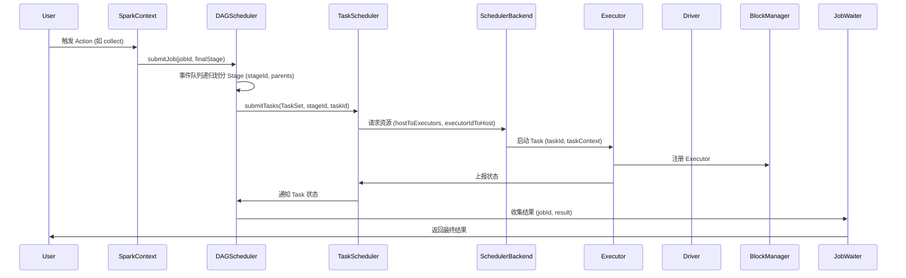

#### 关键变量生命周期说明
- `jobId`：贯穿整个作业生命周期，唯一标识一次作业。
- `stageId`：每个 Stage 唯一标识，便于依赖管理和重试。
- `taskId`：每个 Task 唯一标识，便于调度、重试和状态跟踪。
- `taskContext`：Task 执行期间的上下文，记录尝试次数、累加器、状态等。
- `blockId`：数据块唯一标识，BlockManager 读写数据的核心。

---

## Shuffle 源码解析

### 关键类与方法
- `ShuffleManager`：Shuffle 管理接口，支持 Hash/Sort Shuffle。
- `SortShuffleManager`：默认实现，支持大规模数据。
- `ShuffleWriter`/`ShuffleReader`：写入/读取 Shuffle 数据。
- `BlockManager`：管理数据块的本地/远程存储与传输。

### 源码流程梳理

1. **Map 端 Task 执行**
   - 每个 Map Task 处理输入分区数据，调用 `ShuffleManager.getWriter()` 获取 `ShuffleWriter` 实例。
   - `ShuffleWriter.write(records)`：将数据按分区写入内存缓冲区（如 `ExternalSorter`）。
   - 内存不足时，`spill` 到磁盘，生成临时文件。
   - 所有数据处理完后，`mergeSpills` 合并内存和磁盘文件，生成最终的 shuffle data 文件和 index 文件。
   - 通过 `BlockManager` 注册 shuffle block，供 Reduce 端拉取。
   - 关键变量：`shuffleId`、`mapId`、`blockId`、`partitionId`、`spillFiles`、`dataFile`、`indexFile`。

2. **BlockManager 交互**
   - `BlockManager` 负责 shuffle block 的本地存储、注册、元数据维护。
   - 通过 `BlockManagerMaster`（Driver 端）注册 block 元数据，供 Reduce 端定位。
   - 变量：`blockId`、`blockStatus`、`blockLocations`。

3. **Reduce 端 Task 拉取数据**
   - Reduce Task 启动时，调用 `ShuffleManager.getReader()` 获取 `ShuffleReader` 实例。
   - `ShuffleReader.read()`：根据 `shuffleId`、`reduceId`，向 `BlockManagerMaster` 查询所有 Map 端的 block 位置。
   - 通过 `BlockTransferService` 拉取本地或远程的 shuffle block。
   - 拉取的数据块会被解压缩、反序列化，聚合后参与后续计算。
   - 变量：`shuffleId`、`reduceId`、`blockId`、`blockLocations`、`fetchFailed`。

4. **容错与重试**
   - Reduce 端拉取 block 失败（如 FetchFailed），会向 Driver 上报，DAGScheduler 重新调度对应 Map Task。
   - 变量：`failedBlocks`、`fetchFailed`、`reRunMapTask`。

#### Shuffle 时序图（变量交互）


#### 典型源码调用链
```scala
// Map 端
val writer = shuffleManager.getWriter(shuffleHandle, mapId, context)
writer.write(records) // -> ExternalSorter.insertAll -> spill/merge -> BlockManager

// Reduce 端
val reader = shuffleManager.getReader(shuffleHandle, startPartition, endPartition, context)
reader.read() // -> BlockManagerMaster.getLocations -> BlockTransferService.fetchBlocks
```

#### Shuffle 关键流程变量说明
- `shuffleId`：每次 shuffle 操作的唯一标识。
- `mapId`：每个 Map Task 的唯一标识。
- `reduceId`：每个 Reduce Task 的唯一标识。
- `blockId`：每个 shuffle 分区数据块的唯一标识。
- `spillFiles`：Map 端溢写到磁盘的临时文件集合。
- `dataFile`/`indexFile`：最终 shuffle 输出文件。
- `blockLocations`：所有 Map 端 block 的物理位置。
- `fetchFailed`：Reduce 拉取失败标记，触发重试。

---

## Shuffle 过程中 Reduce Task 的内存工作流程

在 Shuffle 过程中，Reduce Task 处理数据时，内存的工作流程涉及多个角色和对象的协作。以下是详细的描述：

1. **内存管理角色**：
   - **Executor**：负责执行任务，管理任务的内存使用。
   - **TaskMemoryManager**：管理任务执行期间的内存分配和释放。
   - **BlockManager**：负责数据块的存储和传输，包括从磁盘读取和写入。
   - **ShuffleReader**：负责从 Map 端拉取 Shuffle 数据。

2. **内存工作流程**：
   - **数据拉取**：Reduce Task 启动时，通过 `ShuffleReader` 从 Map 端拉取数据块。
   - **数据解压缩与反序列化**：拉取的数据块会被解压缩和反序列化，以便进行后续处理。
   - **数据处理**：在内存中对数据进行聚合、排序等操作。
   - **内存管理**：`TaskMemoryManager` 负责在任务执行期间管理内存的分配和释放，确保内存使用的高效性。
   - **结果输出**：处理后的数据可能会被写入磁盘或直接返回给 Driver。

3. **示意图解**：
   - 以下时序图展示了 Reduce Task 在处理 Shuffle 数据时的内存工作流程。

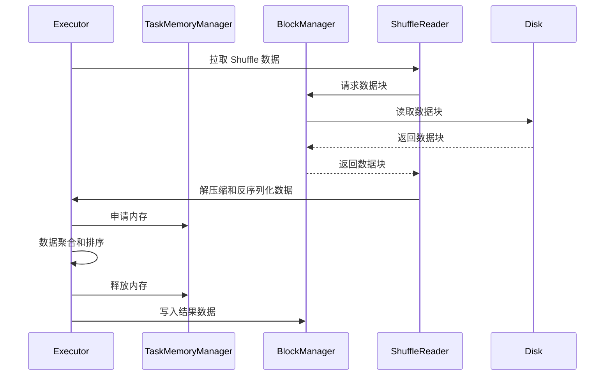

### 详细描述

- **Executor**：启动 Reduce Task，负责整个任务的执行。
- **ShuffleReader**：从 Map 端拉取数据块，解压缩和反序列化数据。
- **BlockManager**：管理数据块的存储和传输，负责从磁盘读取和写入数据。
- **TaskMemoryManager**：在任务执行期间管理内存的分配和释放，确保内存使用的高效性。

---

## 内存管理源码解析

1. **内存管理器初始化**
   - `UnifiedMemoryManager` 是 Spark 的内存管理核心类，负责管理堆内和堆外内存。
   - 初始化时，内存池被划分为 Execution 和 Storage 两个部分，默认比例为 0.6:0.4。

2. **内存分配策略**
   - **Execution Memory**：用于任务执行中的临时数据存储，如 Shuffle、Join 等。
   - **Storage Memory**：用于缓存 RDD、DataFrame、广播变量等。
   - 内存不足时，优先释放 Storage Memory，或将数据溢写到磁盘（spill）。

3. **内存共享机制**
   - Execution 和 Storage 内存是动态共享的，优先满足 Execution Memory 的需求。
   - 当 Execution Memory 需要更多内存时，可以从 Storage Memory 中借用。

4. **堆外内存管理**
   - Spark 支持堆外内存（Off-Heap Memory），减少 JVM GC 的影响。
   - 通过配置 `spark.memory.offHeap.enabled` 和 `spark.memory.offHeap.size` 启用和设置堆外内存大小。

5. **内存优化策略**
   - 调整 `spark.executor.memory` 和 `spark.memory.fraction` 等参数，优化内存使用。
   - 使用堆外内存，减少内存碎片化。
   - 合理分配内存，减少宽依赖操作，使用广播变量。

6. **源码示例**
   - `UnifiedMemoryManager` 的初始化和内存池划分。
   - `TaskMemoryManager` 如何申请和释放内存。
   - `MemoryStore` 如何管理缓存数据。

### 示例代码

```scala
// UnifiedMemoryManager.scala
class UnifiedMemoryManager(...) {
  // 初始化内存池
  private val maxMemory = computeMaxMemory(conf, numCores)
  private val storageMemoryPool = new StorageMemoryPool(this, maxMemory * storageFraction)
  private val executionMemoryPool = new ExecutionMemoryPool(this, maxMemory * executionFraction)
}

// TaskMemoryManager.scala
class TaskMemoryManager(...) {
  // 申请 Execution Memory
  def acquireExecutionMemory(required: Long, taskAttemptId: Long): Long = {
    // 逻辑实现
  }
}

// MemoryStore.scala
class MemoryStore(...) {
  // 缓存数据
  def putBlockData(blockId: BlockId, data: ByteBuffer): Unit = {
    // 逻辑实现
  }
}
```

---

## 算子计算中 `Map` 和数组的存储过程

在Spark的Shuffle计算过程中，中间计算结果在内存中的存储状态是理解Spark性能优化的关键。本节将详细分析各种算子计算过程中使用的核心数据结构、存储对象和操作方式。

### 1. Shuffle计算中的核心存储对象

#### 1.1 内存存储核心类

| 存储对象 | 类名 | 主要职责 | 内存结构 |
|----------|------|----------|----------|
| **PartitionedAppendOnlyMap** | `PartitionedAppendOnlyMap[K, C]` | 分区键值对存储 | 数组+哈希表 |
| **PartitionedPairBuffer** | `PartitionedPairBuffer[K, C]` | 分区键值对缓冲区 | 动态数组 |
| **ExternalAppendOnlyMap** | `ExternalAppendOnlyMap[K, V, C]` | 外部排序Map | 内存+磁盘 |
| **SizeTrackingAppendOnlyMap** | `SizeTrackingAppendOnlyMap[K, V]` | 大小跟踪Map | 内存映射表 |

#### 1.2 存储对象内存布局

```scala
// PartitionedAppendOnlyMap核心结构
class PartitionedAppendOnlyMap[K, V](
    initialCapacity: Int = 64,
    loadFactor: Float = 0.7f)
  extends Iterable[(K, V)] with Serializable {

  // 核心存储数组：存储(key, value)对
  private var data = new Array[AnyRef](2 * initialCapacity)
  
  // 当前大小
  private var curSize = 0
  
  // 容量阈值
  private var growThreshold = (loadFactor * initialCapacity).toInt
  
  // 插入键值对
  def insert(key: K, value: V): Unit = {
    val hash = getHash(key)
    val pos = getPos(hash)
    
    // 线性探测解决冲突
    var i = pos
    while (data(2 * i) != null) {
      if (data(2 * i) == key) {
        // 更新现有值
        data(2 * i + 1) = value.asInstanceOf[AnyRef]
        return
      }
      i = (i + 1) % (data.length / 2)
    }
    
    // 插入新键值对
    data(2 * i) = key.asInstanceOf[AnyRef]
    data(2 * i + 1) = value.asInstanceOf[AnyRef]
    curSize += 1
    
    // 检查是否需要扩容
    if (curSize >= growThreshold) {
      growTable()
    }
  }
  
  // 扩容操作
  private def growTable(): Unit = {
    val oldData = data
    val newCapacity = data.length * 2
    data = new Array[AnyRef](newCapacity)
    growThreshold = (loadFactor * newCapacity / 2).toInt
    
    // 重新哈希所有元素
    var i = 0
    while (i < oldData.length) {
      if (oldData(i) != null) {
        insert(oldData(i).asInstanceOf[K], oldData(i + 1).asInstanceOf[V])
      }
      i += 2
    }
  }
}
```

### 2. GroupByKey算子的内存存储过程

#### 2.1 GroupByKey计算流程

```scala
// GroupByKey算子核心实现
class GroupByKeyRDD[K: ClassTag, V: ClassTag](
    prev: RDD[(K, V)],
    part: Partitioner)
  extends RDD[(K, Iterable[V])](prev) {

  override def compute(split: Partition, context: TaskContext): Iterator[(K, Iterable[V])] = {
    // 1. 创建聚合器
    val aggregator = new Aggregator[K, V, ArrayBuffer[V]](
      createCombiner = (v: V) => ArrayBuffer(v),
      mergeValue = (buf: ArrayBuffer[V], v: V) => buf += v,
      mergeCombiners = (buf1: ArrayBuffer[V], buf2: ArrayBuffer[V]) => buf1 ++= buf2
    )
    
    // 2. 使用ExternalAppendOnlyMap进行聚合
    val externalMap = new ExternalAppendOnlyMap[K, V, ArrayBuffer[V]](aggregator)
    
    // 3. 插入所有键值对
    val iter = firstParent[(K, V)].iterator(split, context)
    while (iter.hasNext) {
      val (k, v) = iter.next()
      externalMap.insert(k, v)
    }
    
    // 4. 返回聚合结果
    externalMap.iterator
  }
}
```

#### 2.2 ExternalAppendOnlyMap内存管理

```scala
// ExternalAppendOnlyMap核心实现
class ExternalAppendOnlyMap[K, V, C](
    aggregator: Aggregator[K, V, C],
    serializer: Serializer = SparkEnv.get.serializer)
  extends Spillable[WritablePartitionedPairCollection[K, C]](SparkEnv.get.blockManager.master)
  with Logging {

  // 内存中的Map
  private var map = new SizeTrackingAppendOnlyMap[K, C]
  
  // Spill文件列表
  private val spills = new ArrayBuffer[SpilledFile]
  
  // 插入键值对
  def insert(key: K, value: V): Unit = {
    // 1. 尝试在内存中聚合
    val update = (hadValue: Boolean, oldValue: C) => {
      if (hadValue) {
        aggregator.mergeValue(oldValue, value)
      } else {
        aggregator.createCombiner(value)
      }
    }
    
    map.changeValue(key, update)
    
    // 2. 检查是否需要Spill
    if (map.estimateSize() > myMemoryThreshold) {
      spill()
    }
  }
  
  // Spill到磁盘
  private def spill(): Unit = {
    val spillFile = spillMemoryIteratorToDisk(map.destructiveSortedWritablePartitionedIterator())
    spills += spillFile
    map = new SizeTrackingAppendOnlyMap[K, C]
  }
  
  // 获取最终结果
  def iterator: Iterator[(K, C)] = {
    // 1. 合并内存中的结果
    val memoryIterator = map.destructiveSortedWritablePartitionedIterator()
    
    // 2. 合并Spill文件
    val spillIterators = spills.map(_.iterator)
    
    // 3. 返回合并后的迭代器
    new Iterator[(K, C)] {
      private val heap = new mutable.PriorityQueue[BufferedIterator[(K, C)]]()
      
      // 初始化堆
      if (memoryIterator.hasNext) {
        heap.enqueue(memoryIterator)
      }
      spillIterators.foreach { iter =>
        if (iter.hasNext) {
          heap.enqueue(iter)
        }
      }
      
      def hasNext: Boolean = heap.nonEmpty
      
      def next(): (K, C) = {
        if (!hasNext) {
          throw new NoSuchElementException
        }
        
        val iter = heap.dequeue()
        val result = iter.next()
        
        if (iter.hasNext) {
          heap.enqueue(iter)
        }
        
        result
      }
    }
  }
}
```

### 3. ReduceByKey算子的内存存储过程

#### 3.1 ReduceByKey计算流程

```scala
// ReduceByKey算子核心实现
class ReduceByKeyRDD[K: ClassTag, V: ClassTag](
    prev: RDD[(K, V)],
    part: Partitioner,
    func: (V, V) => V)
  extends RDD[(K, V)](prev) {

  override def compute(split: Partition, context: TaskContext): Iterator[(K, V)] = {
    // 1. 创建聚合器
    val aggregator = new Aggregator[K, V, V](
      createCombiner = (v: V) => v,
      mergeValue = func,
      mergeCombiners = func
    )
    
    // 2. 使用PartitionedAppendOnlyMap进行聚合
    val map = new PartitionedAppendOnlyMap[K, V]
    
    // 3. 插入并聚合键值对
    val iter = firstParent[(K, V)].iterator(split, context)
    while (iter.hasNext) {
      val (k, v) = iter.next()
      val update = (hadValue: Boolean, oldValue: V) => {
        if (hadValue) {
          func(oldValue, v)
        } else {
          v
        }
      }
      map.changeValue(k, update)
    }
    
    // 4. 返回聚合结果
    map.iterator
  }
}
```

#### 3.2 内存中的聚合操作

```scala
// PartitionedAppendOnlyMap的changeValue方法
def changeValue(key: K, updateFunc: (Boolean, V) => V): Unit = {
  val hash = getHash(key)
  val pos = getPos(hash)
  
  var i = pos
  while (data(2 * i) != null) {
    if (data(2 * i) == key) {
      // 找到现有键，更新值
      val hadValue = true
      val oldValue = data(2 * i + 1).asInstanceOf[V]
      val newValue = updateFunc(hadValue, oldValue)
      data(2 * i + 1) = newValue.asInstanceOf[AnyRef]
      return
    }
    i = (i + 1) % (data.length / 2)
  }
  
  // 未找到键，插入新值
  val hadValue = false
  val newValue = updateFunc(hadValue, null.asInstanceOf[V])
  data(2 * i) = key.asInstanceOf[AnyRef]
  data(2 * i + 1) = newValue.asInstanceOf[AnyRef]
  curSize += 1
  
  if (curSize >= growThreshold) {
    growTable()
  }
}
```

### 4. Join算子的内存存储过程

#### 4.1 Join算子计算流程

```scala
// Join算子核心实现
class CoGroupedRDD[K: ClassTag](
    rdds: Seq[RDD[(K, _)]],
    part: Partitioner)
  extends RDD[(K, Array[Iterable[_]])](rdds.head.context, Nil) {

  override def compute(split: Partition, context: TaskContext): Iterator[(K, Array[Iterable[_]])] = {
    // 1. 创建CoGroup聚合器
    val aggregator = new CoGroupAggregator[K]
    
    // 2. 使用ExternalAppendOnlyMap进行分组
    val externalMap = new ExternalAppendOnlyMap[K, (Int, Any), Array[ArrayBuffer[Any]]](aggregator)
    
    // 3. 插入所有RDD的数据
    rdds.zipWithIndex.foreach { case (rdd, rddIndex) =>
      val iter = rdd.iterator(split, context)
      while (iter.hasNext) {
        val (k, v) = iter.next()
        externalMap.insert(k, (rddIndex, v))
      }
    }
    
    // 4. 返回分组结果
    externalMap.iterator.map { case (k, groups) =>
      (k, groups.map(_.toIterable))
    }
  }
}

// CoGroup聚合器
class CoGroupAggregator[K] extends Aggregator[K, (Int, Any), Array[ArrayBuffer[Any]]] {
  def createCombiner(value: (Int, Any)): Array[ArrayBuffer[Any]] = {
    val groups = new Array[ArrayBuffer[Any]](2) // 假设只有2个RDD
    groups(0) = new ArrayBuffer[Any]()
    groups(1) = new ArrayBuffer[Any]()
    groups(value._1) += value._2
    groups
  }
  
  def mergeValue(groups: Array[ArrayBuffer[Any]], value: (Int, Any)): Array[ArrayBuffer[Any]] = {
    groups(value._1) += value._2
    groups
  }
  
  def mergeCombiners(groups1: Array[ArrayBuffer[Any]], groups2: Array[ArrayBuffer[Any]]): Array[ArrayBuffer[Any]] = {
    groups1.zip(groups2).map { case (buf1, buf2) => buf1 ++= buf2 }
    groups1
  }
}
```

### 5. 内存存储状态监控

#### 5.1 内存使用监控

```scala
// 内存使用监控组件
class MemoryMonitor {
  // 监控Map的内存使用
  def monitorMapMemory(map: SizeTrackingAppendOnlyMap[_, _]): MemoryUsage = {
    val estimatedSize = map.estimateSize()
    val currentMemory = map.currentMemory
    val maxMemory = map.maxMemory
    
    MemoryUsage(
      estimatedSize = estimatedSize,
      currentMemory = currentMemory,
      maxMemory = maxMemory,
      utilization = currentMemory.toDouble / maxMemory
    )
  }
  
  // 监控Spill状态
  def monitorSpillStatus(externalMap: ExternalAppendOnlyMap[_, _, _]): SpillStatus = {
    val spillCount = externalMap.spills.size
    val totalSpillSize = externalMap.spills.map(_.size).sum
    
    SpillStatus(
      spillCount = spillCount,
      totalSpillSize = totalSpillSize,
      averageSpillSize = if (spillCount > 0) totalSpillSize / spillCount else 0
    )
  }
}

case class MemoryUsage(
  estimatedSize: Long,
  currentMemory: Long,
  maxMemory: Long,
  utilization: Double)

case class SpillStatus(
  spillCount: Int,
  totalSpillSize: Long,
  averageSpillSize: Long)
```

#### 5.2 内存存储状态可视化

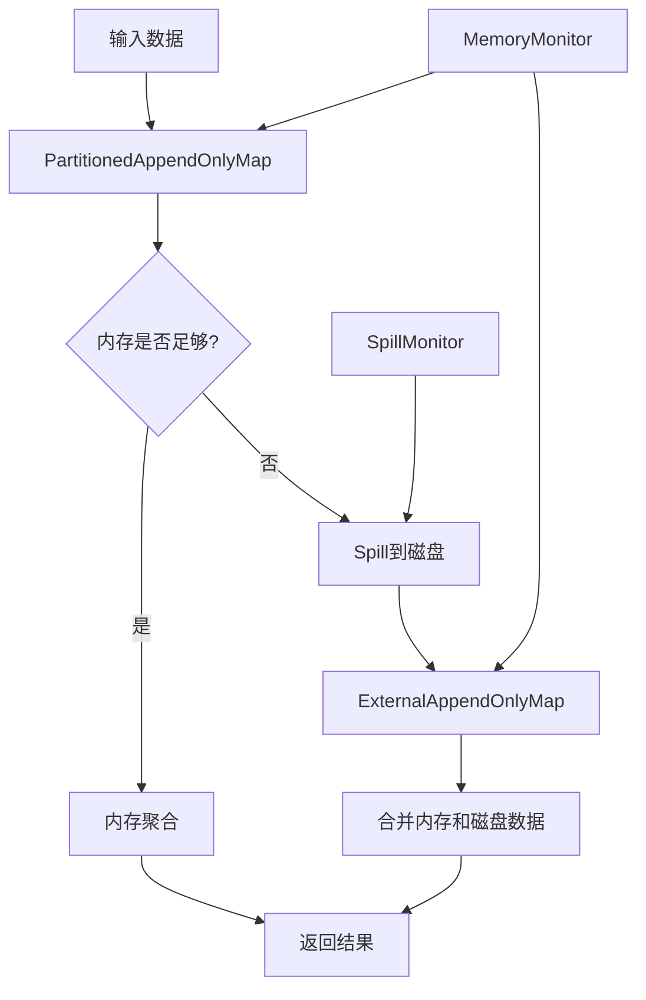

### 6. 内存存储优化策略

#### 6.1 内存分配优化

```scala
// 内存分配优化
class MemoryOptimizer {
  // 动态调整内存阈值
  def adjustMemoryThreshold(
      currentMemory: Long,
      maxMemory: Long,
      spillCount: Int): Long = {
    
    val utilization = currentMemory.toDouble / maxMemory
    
    if (utilization > 0.8 && spillCount > 0) {
      // 内存使用率高且有Spill，降低阈值
      (maxMemory * 0.6).toLong
    } else if (utilization < 0.5 && spillCount == 0) {
      // 内存使用率低且无Spill，提高阈值
      (maxMemory * 0.9).toLong
    } else {
      // 保持当前阈值
      (maxMemory * 0.8).toLong
    }
  }
  
  // 优化Map初始容量
  def optimizeInitialCapacity(dataSize: Long): Int = {
    val estimatedSize = (dataSize * 1.2).toInt
    math.max(64, math.min(estimatedSize, 1024 * 1024))
  }
}
```

#### 6.2 数据结构选择策略

```scala
// 数据结构选择策略
object DataStructureSelector {
  def selectMapType[K, V](
      dataSize: Long,
      memoryAvailable: Long,
      requiresSorting: Boolean): String = {
    
    if (dataSize < memoryAvailable * 0.5) {
      if (requiresSorting) {
        "PartitionedAppendOnlyMap" // 内存充足且需要排序
      } else {
        "PartitionedPairBuffer" // 内存充足且不需要排序
      }
    } else {
      "ExternalAppendOnlyMap" // 内存不足，需要外部排序
    }
  }
}
```

### 7. 实际应用示例

#### 7.1 大数据量GroupByKey示例

```scala
// 大数据量GroupByKey的内存存储过程
val largeRDD = sc.parallelize(1 to 10000000).map(x => (x % 1000, x.toString))

// 监控内存使用
val monitor = new MemoryMonitor()

val grouped = largeRDD.groupByKey().map { case (key, values) =>
  // 在计算过程中监控内存
  val memoryUsage = monitor.monitorMapMemory(/* 内部Map对象 */)
  println(s"Key: $key, Memory Usage: ${memoryUsage.utilization}")
  
  (key, values.toList)
}

// 查看Spill状态
val spillStatus = monitor.monitorSpillStatus(/* 内部ExternalMap对象 */)
println(s"Spill Count: ${spillStatus.spillCount}")
println(s"Total Spill Size: ${spillStatus.totalSpillSize}")
```

#### 7.2 内存优化配置

```properties
# 内存优化配置
spark.memory.fraction=0.8
spark.memory.storageFraction=0.3
spark.shuffle.spill=true
spark.shuffle.spill.compress=true
spark.shuffle.memoryFraction=0.2
spark.shuffle.safetyFraction=0.8
```

---

## 任务提交流程源码解析（细节补充）

### 1. DAG 的生成与依赖分析
- 用户触发 Action（如 collect、count），SparkContext 通过 `submitJob` 入口，将逻辑操作链转为 RDD 依赖图。
- DAGScheduler 递归分析 RDD 依赖（窄依赖/宽依赖），构建有向无环图（DAG），并据此划分 Stage。
- 依赖类型：
  - **窄依赖（NarrowDependency）**：如 map、filter，父RDD的每个分区最多被一个子RDD分区使用。
  - **宽依赖（ShuffleDependency）**：如 groupByKey、reduceByKey，父RDD的分区会被多个子RDD分区使用，需全局洗牌（Shuffle）。
- 关键源码：
```scala
// RDD.scala
abstract class RDD[T: ClassTag](...) {
  def dependencies: Seq[Dependency[_]]
}

// DAGScheduler.scala
private[scheduler] def getOrCreateParentStages(rdd: RDD[_], firstJobId: Int): List[Stage] = {
  val parents = new ArrayBuffer[Stage]()
  for (dep <- rdd.dependencies) dep match {
    case shufDep: ShuffleDependency[_, _, _] => ... // 宽依赖，生成新Stage
    case _ => ... // 窄依赖，递归查找
  }
  parents.toList
}
```

### 2. 任务分发与调度流程
- DAGScheduler 将每个 Stage 封装为 TaskSet，交由 TaskSchedulerImpl 调度。
- TaskSchedulerImpl 负责资源分配、Task分发、状态跟踪。
- SchedulerBackend 与集群管理器（如YARN/K8s）通信，分配Executor。
- 关键流程图：
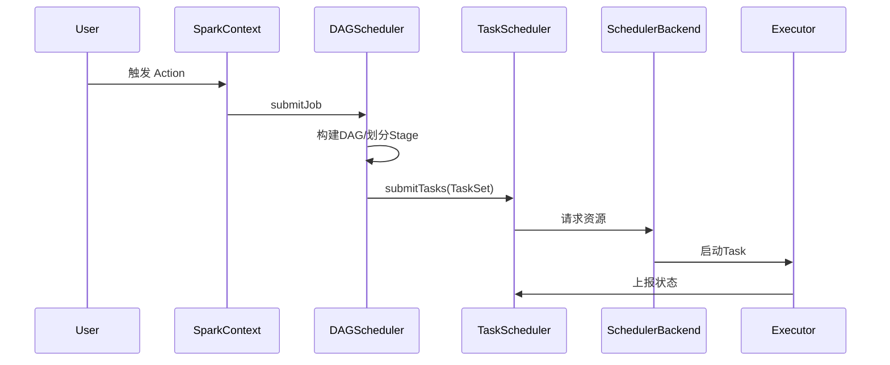

### 3. 失败重试与容错机制
- DAGScheduler 采用事件驱动（EventLoop），异步处理 Task 完成/失败等事件。
- Task 失败时，区分失败类型：
  - **FetchFailed**（拉取Shuffle数据失败）：需重算父Stage。
  - **ExecutorLost**：丢失Executor上的所有Task，需重试。
  - **其他异常**：Task级别重试，超过最大重试次数则作业失败。
- 关键变量：`failedStages`、`runningStages`、`waitingStages`。
- 关键源码：
```scala
// DAGSchedulerEventProcessLoop.scala
case class TaskFailed(task, reason, ...)
// 失败处理
if (reason.isInstanceOf[FetchFailed]) {
  // 重新提交父Stage
  submitStage(parentStage)
} else if (task.attempt < maxRetries) {
  // Task级别重试
  resubmitTask(task)
} else {
  // 作业失败
  abortJob(jobId)
}
```

### 4. Executor 工作机制与 Task 执行
- Executor 进程通过RPC从Driver拉取Task，反序列化后由TaskRunner线程执行。
- Task类型：ResultTask（最终结果）、ShuffleMapTask（中间结果）。
- 执行流程：
  1. 反序列化Task，获取依赖的RDD、分区、依赖关系。
  2. 调用RDD的 `compute` 方法处理数据。
  3. 结果通过BlockManager返回Driver或写入本地/远程。
- 关键源码：
```scala
// Executor.scala
val task = ser.deserialize[Task[Any]](taskBytes, Thread.currentThread.getContextClassLoader)
task.run(taskAttemptId = taskId, attemptNumber = attemptNumber, ...)

// Task.scala
abstract class Task[T](...) {
  def run(...): T = {
    val context = new TaskContextImpl(...)
    runTask(context)
  }
  def runTask(context: TaskContext): T // 由子类实现
}

// ResultTask.scala/ShuffleMapTask.scala
override def runTask(context: TaskContext): T = {
  rdd.iterator(split, context).asInstanceOf[T]
}
```

### 5. 数据读取、处理与RDD依赖
- 每个Task根据分区信息，调用RDD的 `iterator(split, context)` 读取和处理数据。
- RDD的依赖链会递归调用父RDD的 `iterator`，直至数据源（如HDFS、Kafka、内存等）。
- 依赖类型决定数据流转方式：
  - 窄依赖：直接从父RDD分区读取。
  - 宽依赖：通过Shuffle读取父Stage输出。
- 关键源码：
```scala
// RDD.scala
final def iterator(split: Partition, context: TaskContext): Iterator[T] = {
  computeOrReadCheckpoint(split, context)
}

def computeOrReadCheckpoint(split: Partition, context: TaskContext): Iterator[T] = {
  if (isCheckpointed) ... else compute(split, context)
}

// 依赖链递归
abstract class RDD[T: ClassTag](...) {
  def compute(split: Partition, context: TaskContext): Iterator[T]
}
```

### 6. 典型源码流程图
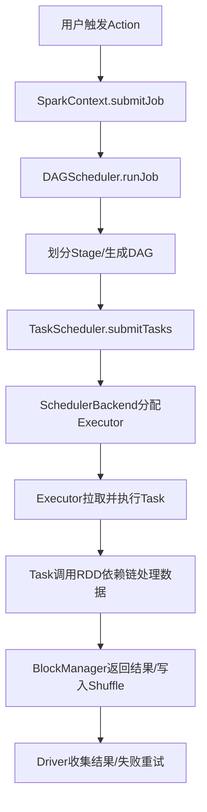

---


