# 12. Spark

## 目录

- [12. Spark](#12-spark)
  - [目录](#目录)
  - [Spark 概述与环境](#spark-概述与环境)
    - [Spark简介](#spark简介)
      - [Spark特点与优势](#spark特点与优势)
      - [Spark vs Hadoop MapReduce](#spark-vs-hadoop-mapreduce)
      - [Spark应用场景](#spark应用场景)
    - [Spark生态系统](#spark生态系统)
      - [核心组件](#核心组件)
      - [生态组件](#生态组件)
    - [Spark环境搭建](#spark环境搭建)
      - [本地模式](#本地模式)
      - [集群模式](#集群模式)
      - [常用配置](#常用配置)
  - [Spark 核心概念 ⭐](#spark-核心概念-)
    - [RDD核心概念](#rdd核心概念)
      - [RDD特性](#rdd特性)
      - [RDD操作分类](#rdd操作分类)
      - [RDD依赖关系](#rdd依赖关系)
    - [DataFrame与Dataset](#dataframe与dataset)
      - [DataFrame概念](#dataframe概念)
      - [Dataset概念](#dataset概念)
      - [三者对比分析 🔥](#三者对比分析-)
    - [分区机制](#分区机制)
      - [分区策略](#分区策略)
      - [分区调优](#分区调优)
  - [Spark 架构与原理 ⭐⭐](#spark-架构与原理-)
    - [Spark整体架构](#spark整体架构)
      - [集群架构组件](#集群架构组件)
      - [应用程序架构](#应用程序架构)
    - [核心组件详解](#核心组件详解)
      - [SparkContext](#sparkcontext)
      - [Driver Program](#driver-program)
      - [Cluster Manager](#cluster-manager)
      - [Executor](#executor)
    - [任务调度原理](#任务调度原理)
      - [DAGScheduler调度](#dagscheduler调度)
      - [TaskScheduler调度](#taskscheduler调度)
    - [存储管理机制](#存储管理机制)
      - [BlockManager组件](#blockmanager组件)
      - [内存模型](#内存模型)
      - [内存分配策略](#内存分配策略)
    - [Shuffle原理  ⭐⭐⭐](#shuffle原理--)
      - [Shuffle实现机制](#shuffle实现机制)
      - [Shuffle核心组件详解](#shuffle核心组件详解)
      - [Shuffle 优化与调优](#shuffle-优化与调优)
      - [Shuffle常见问题与解决方案](#shuffle常见问题与解决方案)
  - [Spark SQL与Catalyst ⭐⭐](#spark-sql与catalyst-)
    - [Spark SQL概述](#spark-sql概述)
      - [主要特性](#主要特性)
      - [使用方式](#使用方式)
    - [Catalyst优化器 🔥](#catalyst优化器-)
      - [优化流程](#优化流程)
      - [优化规则](#优化规则)
      - [代码生成](#代码生成)
    - [SparkSQL 实用函数与语法](#sparksql-实用函数与语法)
      - [日期与时间处理](#日期与时间处理)
      - [字符串处理](#字符串处理)
      - [数组与集合操作](#数组与集合操作)
      - [JSON处理](#json处理)
      - [条件与判断](#条件与判断)
      - [窗口函数](#窗口函数)
      - [聚合函数](#聚合函数)
      - [实用查询示例](#实用查询示例)
    - [数据源支持](#数据源支持)
      - [内置数据源](#内置数据源)
      - [外部数据源](#外部数据源)
  - [性能调优与优化 ⭐⭐⭐](#性能调优与优化-)
    - [查询与作业优化](#查询与作业优化)
    - [Join优化](#join优化)
    - [缓存与持久化](#缓存与持久化)
    - [代码层面优化](#代码层面优化)
    - [网络与I/O优化](#网络与io优化)
    - [常见性能问题](#常见性能问题)
    - [监控与诊断](#监控与诊断)
  - [Spark Streaming ⭐](#spark-streaming-)
    - [流处理概念](#流处理概念)
      - [微批次处理](#微批次处理)
      - [DStream概念](#dstream概念)
    - [Structured Streaming](#structured-streaming)
      - [核心概念](#核心概念)
      - [输出模式](#输出模式)
      - [窗口操作](#窗口操作)
    - [容错机制](#容错机制)
      - [Checkpoint机制](#checkpoint机制)
      - [WAL机制](#wal机制)
  - [Spark企业级应用实战 🏢](#spark企业级应用实战-)
    - [批处理应用](#批处理应用)
      - [ETL数据处理](#etl数据处理)
      - [数据分析案例](#数据分析案例)
    - [流处理应用](#流处理应用)
      - [实时数据处理](#实时数据处理)
      - [机器学习流水线](#机器学习流水线)
    - [最佳实践](#最佳实践)
      - [开发规范](#开发规范)
      - [部署策略](#部署策略)
      - [运维管理](#运维管理)
  - [常见错误解决方案](#常见错误解决方案)
    - [内存相关错误](#内存相关错误)
    - [网络相关错误](#网络相关错误)
    - [序列化相关错误](#序列化相关错误)
    - [资源相关错误](#资源相关错误)
    - [数据相关错误](#数据相关错误)
    - [调试和诊断工具](#调试和诊断工具)
    - [预防措施](#预防措施)
  - [关键参数与配置模板 ⚙️](#关键参数与配置模板-️)
    - [资源相关参数](#资源相关参数)
    - [JVM相关参数](#jvm相关参数)
    - [性能优化参数](#性能优化参数)
    - [配置模板](#配置模板)
  - [Spark高频面试题 🔥🔥🔥](#spark高频面试题-)
    - [基础概念题](#基础概念题)
    - [架构原理题](#架构原理题)
    - [性能调优题](#性能调优题)
    - [实战应用题](#实战应用题)
    - [深度技术原理题](#深度技术原理题)

---

## Spark 概述与环境

### Spark简介

**Apache Spark** 是一个快速、通用的大数据处理引擎，专为大规模数据处理而设计。它提供了高级API（Java、Scala、Python、R），并支持用于SQL查询、流处理、机器学习和图形处理的优化引擎。

#### Spark特点与优势

**核心特点**：

- **速度快**：内存计算比Hadoop MapReduce快100倍，磁盘计算快10倍
- **易用性**：提供多种语言API，支持80多种高级算子
- **通用性**：支持SQL查询、流处理、机器学习、图计算
- **兼容性**：可运行在Hadoop、Mesos、Kubernetes、standalone等集群上

**技术优势**：


| 特性         | Spark               | Hadoop MapReduce |
| -------------- | --------------------- | ------------------ |
| **计算模式** | 内存计算 + 磁盘存储 | 磁盘计算         |
| **数据共享** | RDD内存共享         | 磁盘文件系统     |
| **迭代计算** | 支持高效迭代        | 效率低           |
| **实时处理** | 支持流处理          | 仅批处理         |
| **容错机制** | RDD血统恢复         | 数据副本         |
| **开发效率** | 代码简洁            | 代码复杂         |

#### Spark vs Hadoop MapReduce

```mermaid
graph TD
    A[数据输入] --> B{计算引擎}
  
    B -->|MapReduce| C[Map阶段]
    C --> D[Shuffle写磁盘]
    D --> E[Reduce阶段]
    E --> F[结果写HDFS]
  
    B -->|Spark| G[RDD转换]
    G --> H[内存计算]
    H --> I[结果输出]
  
    style C fill:#ffcccb
    style D fill:#ffcccb
    style E fill:#ffcccb
    style F fill:#ffcccb
    style G fill:#90EE90
    style H fill:#90EE90
    style I fill:#90EE90
```

**性能对比**：

- **内存计算**：Spark在内存中缓存数据，避免重复I/O
- **DAG执行**：Spark将作业构建为DAG，优化执行计划
- **Pipelining**：Spark支持算子流水线，减少中间数据存储
- **代码生成**：Catalyst优化器生成高效的Java代码

#### Spark应用场景

**典型应用领域**：


| 场景           | 描述                       | 优势                       |
| ---------------- | ---------------------------- | ---------------------------- |
| **数据ETL**    | 大规模数据清洗、转换、加载 | 处理速度快，支持多种数据源 |
| **实时流处理** | 实时数据分析、监控告警     | 低延迟，高吞吐量           |
| **机器学习**   | 大规模机器学习模型训练     | MLlib生态，迭代计算优势    |
| **交互式查询** | 即席查询、数据探索         | SQL支持，响应速度快        |
| **图计算**     | 社交网络分析、推荐系统     | GraphX图处理能力           |

### Spark生态系统

#### 核心组件


**组件详解**：

1. **Spark Core**：

   - 基础运行时引擎
   - RDD抽象
   - 任务调度、内存管理、容错恢复
2. **Spark SQL**：

   - 结构化数据处理
   - DataFrame/Dataset API
   - JDBC/ODBC连接器
3. **Spark Streaming**：

   - 流数据处理
   - 微批次处理模型
   - 与批处理代码统一
4. **MLlib**：

   - 机器学习库
   - 分类、回归、聚类、协同过滤
   - 管道API
5. **GraphX**：

   - 图计算框架
   - 图算法库
   - 图并行计算

#### 生态组件

**外部集成**：


| 组件类型     | 组件名称              | 用途         |
| -------------- | ----------------------- | -------------- |
| **资源管理** | YARN、Mesos、K8s      | 集群资源管理 |
| **存储系统** | HDFS、S3、HBase       | 数据存储     |
| **数据格式** | Parquet、Avro、JSON   | 数据序列化   |
| **流数据**   | Kafka、Flume、Kinesis | 数据采集     |
| **监控工具** | Ganglia、Nagios       | 集群监控     |

### Spark环境搭建

#### 本地模式

**下载安装**：

```bash
# 下载Spark
wget https://downloads.apache.org/spark/spark-3.4.0/spark-3.4.0-bin-hadoop3.tgz

# 解压
tar -xzf spark-3.4.0-bin-hadoop3.tgz
cd spark-3.4.0-bin-hadoop3

# 设置环境变量
export SPARK_HOME=/path/to/spark-3.4.0-bin-hadoop3
export PATH=$SPARK_HOME/bin:$PATH
```

**启动本地模式**：

```bash
# 启动Spark Shell (Scala)
spark-shell --master local[2]

# 启动PySpark Shell (Python)
pyspark --master local[2]

# 提交应用程序
spark-submit \
  --master local[2] \
  --class org.apache.spark.examples.SparkPi \
  examples/jars/spark-examples_2.12-3.4.0.jar \
  10
```

#### 集群模式

**Standalone模式部署**：

```bash
# 1. 配置slaves文件
echo "worker1" >> conf/slaves
echo "worker2" >> conf/slaves

# 2. 启动Master
./sbin/start-master.sh

# 3. 启动Workers
./sbin/start-slaves.sh

# 4. 提交应用到集群
spark-submit \
  --master spark://master:7077 \
  --deploy-mode cluster \
  --class MainClass \
  --conf spark.sql.adaptive.enabled=true \
  app.jar
```

**YARN模式部署**：

```bash
# 配置Hadoop环境
export HADOOP_HOME=/path/to/hadoop
export HADOOP_CONF_DIR=$HADOOP_HOME/etc/hadoop

# 提交到YARN
spark-submit \
  --master yarn \
  --deploy-mode cluster \
  --num-executors 10 \
  --executor-memory 4g \
  --executor-cores 2 \
  --class MainClass \
  app.jar
```

#### 常用配置

**核心配置参数**：

```properties
# spark-defaults.conf

# 应用程序配置
spark.app.name                MySparkApp
spark.master                  yarn
spark.submit.deployMode       cluster

# 资源配置
spark.driver.memory           2g
spark.driver.cores            1
spark.executor.memory         4g
spark.executor.cores          2
spark.executor.instances      10

# 动态分配
spark.dynamicAllocation.enabled           true
spark.dynamicAllocation.minExecutors      2
spark.dynamicAllocation.maxExecutors      20
spark.dynamicAllocation.initialExecutors  5

# Shuffle配置
spark.sql.adaptive.enabled                true
spark.sql.adaptive.coalescePartitions.enabled  true
spark.sql.adaptive.skewJoin.enabled       true

# 序列化
spark.serializer              org.apache.spark.serializer.KryoSerializer
spark.kryo.registrationRequired  false

# 压缩
spark.sql.parquet.compression.codec  snappy
spark.sql.orc.compression.codec      snappy
```

**日志配置**：

```properties
# log4j.properties
log4j.rootCategory=WARN, console
log4j.appender.console=org.apache.log4j.ConsoleAppender
log4j.appender.console.target=System.err
log4j.appender.console.layout=org.apache.log4j.PatternLayout
log4j.appender.console.layout.ConversionPattern=%d{yy/MM/dd HH:mm:ss} %p %c{1}: %m%n

# 设置Spark日志级别
log4j.logger.org.apache.spark.repl.Main=WARN
log4j.logger.org.springframework.core.env.ConfigUtils=WARN
log4j.logger.org.spark_project.jetty=WARN
log4j.logger.org.apache.hadoop=WARN
log4j.logger.org.eclipse.jetty=WARN
log4j.logger.org.apache.spark.util.Utils=WARN
```

---

## Spark 核心概念 ⭐

### RDD核心概念

**RDD (Resilient Distributed Dataset)** 是Spark的核心抽象，代表一个不可变、可分区、可并行计算的数据集合。

#### RDD特性

```mermaid
graph TD
    A[RDD核心特性] --> B[不可变性<br/>Immutable]
    A --> C[分布式<br/>Distributed]
    A --> D[弹性容错<br/>Resilient]
    A --> E[惰性求值<br/>Lazy Evaluation]
    A --> F[分区计算<br/>Partitioned]
  
    B --> B1[数据一旦创建不可修改]
    C --> C1[数据分布在集群多个节点]
    D --> D1[通过血统信息自动容错]
    E --> E1[Transform操作延迟执行]
    F --> F1[支持并行计算]
  
    style A fill:#e1f5fe
    style B fill:#e8f5e8
    style C fill:#fff3e0
    style D fill:#ffebee
    style E fill:#f3e5f5
    style F fill:#fce4ec
```

**RDD的五大特性**：


| 特性         | 描述                    | 意义             |
| -------------- | ------------------------- | ------------------ |
| **分区列表** | RDD由多个分区组成       | 支持并行计算     |
| **计算函数** | 每个分区都有计算函数    | 定义数据处理逻辑 |
| **依赖关系** | RDD之间的依赖关系       | 支持容错恢复     |
| **分区器**   | Key-Value RDD的分区策略 | 优化数据分布     |
| **位置偏好** | 计算分区的最佳位置      | 数据本地性优化   |

#### RDD操作分类

**Transformation vs Action**：

```mermaid
graph LR
    A[RDD操作] --> B[Transformation<br/>转换操作]
    A --> C[Action<br/>行动操作]
  
    B --> D[惰性执行<br/>不立即计算]
    B --> E[返回新RDD]
    B --> F[构建计算图]
  
    C --> G[立即执行<br/>触发计算]
    C --> H[返回结果值]
    C --> I[提交作业]
  
    style B fill:#e8f5e8
    style C fill:#ffebee
```

**常用Transformation操作**：

```scala
// 创建RDD
val rdd = sc.parallelize(1 to 100, 4)

// map：一对一转换
val mapRDD = rdd.map(x => x * 2)

// filter：过滤数据
val filterRDD = rdd.filter(x => x % 2 == 0)

// flatMap：一对多转换
val flatMapRDD = rdd.flatMap(x => 1 to x)

// groupByKey：按键分组
val kvRDD = rdd.map(x => (x % 10, x))
val groupedRDD = kvRDD.groupByKey()

// reduceByKey：按键聚合
val reducedRDD = kvRDD.reduceByKey(_ + _)

// join：连接操作
val rdd2 = sc.parallelize(Seq((1, "a"), (2, "b"), (3, "c")))
val joinedRDD = kvRDD.join(rdd2)
```

**常用Action操作**：

```scala
// collect：收集所有元素到Driver
val result = rdd.collect()

// count：计算元素数量
val cnt = rdd.count()

// first：获取第一个元素
val firstElement = rdd.first()

// take：获取前n个元素
val firstN = rdd.take(10)

// reduce：聚合所有元素
val sum = rdd.reduce(_ + _)

// foreach：遍历每个元素
rdd.foreach(println)

// saveAsTextFile：保存到文件
rdd.saveAsTextFile("hdfs://output/path")
```

#### RDD依赖关系

**依赖类型**：

```mermaid
graph TD
    A[RDD依赖关系] --> B[窄依赖<br/>Narrow Dependency]
    A --> C[宽依赖<br/>Wide Dependency]
  
    B --> D[一对一映射<br/>1:1 Mapping]
    B --> E[同一Stage内<br/>Pipeline执行]
    B --> F[局部失败恢复]
  
    C --> G[一对多映射<br/>1:N Mapping]
    C --> H[需要Shuffle<br/>跨Stage执行]
    C --> I[全量重新计算]
  
    style B fill:#e8f5e8
    style C fill:#ffebee
```

**窄依赖示例**：

```scala
// map, filter, union等操作产生窄依赖
val rdd1 = sc.parallelize(1 to 10, 2)
val rdd2 = rdd1.map(_ * 2)        // 窄依赖
val rdd3 = rdd2.filter(_ > 10)    // 窄依赖
```

**宽依赖示例**：

```scala
// groupByKey, reduceByKey, join等操作产生宽依赖
val rdd1 = sc.parallelize(Seq((1, "a"), (2, "b"), (1, "c")), 2)
val rdd2 = rdd1.groupByKey()      // 宽依赖，需要Shuffle
val rdd3 = rdd1.reduceByKey(_ + _) // 宽依赖，需要Shuffle
```

### DataFrame与Dataset

#### DataFrame概念

**DataFrame** 是Spark SQL的核心抽象，是一个以命名列方式组织的分布式数据集，类似于关系数据库中的表。

**DataFrame特点**：

- **结构化数据**：具有明确的Schema定义
- **优化执行**：使用Catalyst优化器
- **多语言支持**：Scala、Java、Python、R
- **丰富API**：SQL风格和函数式API

**DataFrame创建**：

```scala
import org.apache.spark.sql.SparkSession
import org.apache.spark.sql.types._

val spark = SparkSession.builder()
  .appName("DataFrameExample")
  .getOrCreate()

import spark.implicits._

// 方式1：从RDD创建
val rdd = sc.parallelize(Seq(("Alice", 25), ("Bob", 30), ("Charlie", 35)))
val df1 = rdd.toDF("name", "age")

// 方式2：从序列创建
val df2 = Seq(("Alice", 25), ("Bob", 30)).toDF("name", "age")

// 方式3：从外部数据源创建
val df3 = spark.read.json("path/to/file.json")
val df4 = spark.read.parquet("path/to/file.parquet")

// 方式4：通过Schema创建
val schema = StructType(Seq(
  StructField("name", StringType, nullable = true),
  StructField("age", IntegerType, nullable = true)
))
val df5 = spark.createDataFrame(rdd, schema)
```

#### Dataset概念

**Dataset** 是DataFrame的扩展，提供了类型安全的面向对象编程接口。

**Dataset特点**：

- **类型安全**：编译时类型检查
- **优化执行**：享受Catalyst优化器
- **函数式API**：支持lambda表达式
- **编码器支持**：自动序列化/反序列化

**Dataset创建**：

```scala
// 定义样例类
case class Person(name: String, age: Int, city: String)

// 方式1：从序列创建
val ds1 = Seq(
  Person("Alice", 25, "Beijing"),
  Person("Bob", 30, "Shanghai")
).toDS()

// 方式2：从DataFrame转换
val ds2 = df.as[Person]

// 方式3：从外部数据源创建
val ds3 = spark.read.json("path/to/file.json").as[Person]
```

#### 三者对比分析 🔥

**RDD vs DataFrame vs Dataset 全面对比**：


| 特性           | RDD                    | DataFrame           | Dataset            |
| ---------------- | ------------------------ | --------------------- | -------------------- |
| **数据抽象**   | 分布式对象集合         | 结构化数据表        | 类型安全的数据表   |
| **编译时检查** | ❌ 运行时错误          | ❌ 运行时错误       | ✅ 编译时错误      |
| **执行优化**   | ❌ 无优化              | ✅ Catalyst优化     | ✅ Catalyst优化    |
| **代码生成**   | ❌ 无                  | ✅ 有               | ✅ 有              |
| **序列化**     | Java/Kryo序列化        | Tungsten二进制格式  | Tungsten二进制格式 |
| **API风格**    | 函数式                 | SQL + 函数式        | 类型安全函数式     |
| **性能**       | 低                     | 高                  | 高                 |
| **易用性**     | 复杂                   | 简单                | 中等               |
| **适用场景**   | 低级操作、非结构化数据 | SQL查询、结构化数据 | 类型安全要求高     |

**性能对比**：

```scala
// 性能测试示例
import org.apache.spark.sql.functions._

// RDD方式 - 性能较低
val rddResult = rdd.filter(_.age > 25)
  .map(p => (p.city, 1))
  .reduceByKey(_ + _)
  .collect()

// DataFrame方式 - 性能优化
val dfResult = df.filter($"age" > 25)
  .groupBy("city")
  .count()
  .collect()

// Dataset方式 - 类型安全 + 性能优化
val dsResult = ds.filter(_.age > 25)
  .groupByKey(_.city)
  .count()
  .collect()
```

**选择建议**：

```mermaid
graph TD
    A[选择数据抽象] --> B{数据类型}
    B -->|非结构化| C[使用RDD]
    B -->|结构化| D{类型安全要求}
    D -->|不需要| E[使用DataFrame]
    D -->|需要| F[使用Dataset]
  
    C --> G[复杂数据处理<br/>底层控制]
    E --> H[SQL查询<br/>高性能要求]
    F --> I[类型安全<br/>编译时检查]
  
    style C fill:#ffebee
    style E fill:#e8f5e8
    style F fill:#e1f5fe
```

### 分区机制

#### 分区策略

**分区的重要性**：

- **并行度控制**：分区数决定任务并行度
- **数据本地性**：减少网络传输
- **负载均衡**：避免数据倾斜
- **资源利用**：充分利用集群资源

**分区器类型**：


| 分区器               | 适用数据类型          | 分区策略                  | 使用场景     |
| ---------------------- | ----------------------- | --------------------------- | -------------- |
| **HashPartitioner**  | Key-Value RDD         | Hash(key) % numPartitions | 均匀分布的键 |
| **RangePartitioner** | 可排序的Key-Value RDD | 按键值范围分区            | 有序数据查询 |
| **自定义分区器**     | 任意类型              | 用户定义逻辑              | 特殊业务需求 |

**分区操作示例**：

```scala
// 创建带分区的RDD
val rdd = sc.parallelize(1 to 100, 4)  // 4个分区

// 查看分区信息
println(s"分区数: ${rdd.getNumPartitions}")
println(s"分区内容: ${rdd.glom().collect().map(_.toList).toList}")

// 重新分区
val repartitionedRDD = rdd.repartition(8)  // 增加分区数
val coalescedRDD = rdd.coalesce(2)         // 减少分区数

// Key-Value RDD分区
val kvRDD = sc.parallelize(Seq((1, "a"), (2, "b"), (3, "c"), (4, "d")), 2)

// 使用HashPartitioner
val hashPartitioned = kvRDD.partitionBy(new HashPartitioner(3))

// 使用RangePartitioner
val rangePartitioned = kvRDD.partitionBy(new RangePartitioner(3, kvRDD))
```

**自定义分区器**：

```scala
import org.apache.spark.Partitioner

// 自定义分区器：按用户ID的地区分区
class RegionPartitioner(regions: Array[String]) extends Partitioner {
  
  override def numPartitions: Int = regions.length
  
  override def getPartition(key: Any): Int = {
    val userId = key.asInstanceOf[String]
    val region = getUserRegion(userId)
    math.abs(regions.indexOf(region)) % numPartitions
  }
  
  private def getUserRegion(userId: String): String = {
    // 根据用户ID确定地区的业务逻辑
    userId.substring(0, 2) match {
      case "01" | "02" => "North"
      case "03" | "04" => "South"
      case "05" | "06" => "East"
      case _ => "West"
    }
  }
}

// 使用自定义分区器
val regions = Array("North", "South", "East", "West")
val customPartitioner = new RegionPartitioner(regions)
val customPartitioned = kvRDD.partitionBy(customPartitioner)
```

#### 分区调优

**分区数优化**：

```scala
// 分区数设置原则
val totalCores = 16  // 集群总核心数
val optimalPartitions = totalCores * 2  // 推荐分区数为核心数的2-3倍

// 动态调整分区数
def getOptimalPartitions(dataSize: Long): Int = {
  val targetPartitionSize = 128 * 1024 * 1024  // 128MB per partition
  math.max(1, (dataSize / targetPartitionSize).toInt)
}

// 分区倾斜检测
def detectPartitionSkew(rdd: RDD[_]): Unit = {
  val partitionSizes = rdd.mapPartitionsWithIndex { (index, iter) =>
    Iterator((index, iter.size))
  }.collect()
  
  val avgSize = partitionSizes.map(_._2).sum / partitionSizes.length
  val maxSize = partitionSizes.map(_._2).max
  val skewRatio = maxSize.toDouble / avgSize
  
  if (skewRatio > 2.0) {
    println(s"警告：检测到分区倾斜，倾斜比例: $skewRatio")
    partitionSizes.foreach { case (index, size) =>
      println(s"分区 $index: $size 条记录")
    }
  }
}
```

**分区优化策略**：

1. **预分区策略**：

```scala
// 根据数据特征预分区
val userRDD = sc.textFile("hdfs://users/*")
  .map(parseUser)
  .partitionBy(new HashPartitioner(numPartitions))
  .cache()  // 缓存预分区的数据
```

2. **Coalesce vs Repartition**：

```scala
// Coalesce：减少分区，避免全量Shuffle
val reducedRDD = largeRDD.coalesce(10)

// Repartition：重新分区，会进行全量Shuffle
val reshuffledRDD = largeRDD.repartition(20)

// 条件分区调整
def smartRepartition[T](rdd: RDD[T], targetPartitions: Int): RDD[T] = {
  val currentPartitions = rdd.getNumPartitions
  if (targetPartitions < currentPartitions) {
    rdd.coalesce(targetPartitions)
  } else {
    rdd.repartition(targetPartitions)
  }
}
```

3. **分区保持策略**：

```scala
// 使用mapPartitions保持分区结构
val optimizedRDD = rdd.mapPartitions { iter =>
  // 分区内处理逻辑
  iter.map(processRecord)
}

// 避免破坏分区的操作
val goodRDD = partitionedRDD.mapValues(_ * 2)  // 保持分区
val badRDD = partitionedRDD.map(x => (x._1, x._2 * 2))  // 可能破坏分区
```

---

## Spark 架构与原理 ⭐⭐

### Spark整体架构

#### 集群架构组件


**架构组件详解**：


| 组件                | 职责                       | 运行位置         |
| --------------------- | ---------------------------- | ------------------ |
| **Driver Program**  | 应用程序入口，包含main函数 | 客户端或集群节点 |
| **SparkContext**    | Spark应用程序的入口点      | Driver           |
| **Cluster Manager** | 集群资源管理器             | 独立节点         |
| **Worker Node**     | 工作节点，运行Executor     | 集群节点         |
| **Executor**        | 任务执行器，运行Task       | Worker Node      |

#### 应用程序架构

**Spark应用程序生命周期**：

```mermaid
sequenceDiagram
    participant Client
    participant Driver
    participant ClusterManager as Cluster Manager
    participant Worker
    participant Executor
  
    Client->>Driver: 1. 启动应用程序
    Driver->>ClusterManager: 2. 申请资源
    ClusterManager->>Worker: 3. 启动Executor
    Worker->>Executor: 4. 创建Executor进程
    Executor->>Driver: 5. 注册到Driver
    Driver->>Driver: 6. 构建DAG
    Driver->>Executor: 7. 分发Task
    Executor->>Executor: 8. 执行Task
    Executor->>Driver: 9. 返回结果
    Driver->>Client: 10. 应用程序完成
```

### 核心组件详解

#### SparkContext

**SparkContext** 是Spark应用程序的入口点，负责与集群建立连接。

```scala
// SparkContext核心功能
class SparkContext(config: SparkConf) extends Logging {
  
  // 1. 初始化核心组件
  private val env = SparkEnv.createDriverEnv(conf, isLocal, listenerBus, numCores, mockOutputCommitCoordinator)
  private val statusTracker = new SparkStatusTracker(this, sparkUI)
  private val taskScheduler = createTaskScheduler(this, master, deployMode)
  private val dagScheduler = new DAGScheduler(this)
  
  // 2. 创建RDD
  def parallelize[T: ClassTag](seq: Seq[T], numSlices: Int = defaultParallelism): RDD[T] = {
    new ParallelCollectionRDD[T](this, seq, numSlices, Map[Int, Seq[String]]())
  }
  
  def textFile(path: String, minPartitions: Int = defaultMinPartitions): RDD[String] = {
    hadoopFile(path, classOf[TextInputFormat], classOf[LongWritable], classOf[Text], minPartitions)
      .map(pair => pair._2.toString)
  }
  
  // 3. 提交作业
  def runJob[T, U: ClassTag](
      rdd: RDD[T],
      func: (TaskContext, Iterator[T]) => U,
      partitions: Seq[Int],
      resultHandler: (Int, U) => Unit): Unit = {
    dagScheduler.runJob(rdd, func, partitions, callSite, resultHandler, localProperties.get)
  }
  
  // 4. 资源管理
  def stop(): Unit = {
    dagScheduler.stop()
    taskScheduler.stop()
    env.stop()
  }
}
```

#### Driver Program

**Driver** 是运行应用程序main函数的进程，负责：

- **创建SparkContext**：初始化Spark应用程序
- **构建逻辑计划**：将用户程序转换为DAG
- **任务调度**：将DAG分解为Stage和Task
- **结果收集**：收集Executor返回的结果

```scala
// Driver程序示例
object WordCount {
  def main(args: Array[String]): Unit = {
    // 1. 创建SparkContext
    val conf = new SparkConf().setAppName("WordCount")
    val sc = new SparkContext(conf)
  
    try {
      // 2. 创建RDD并定义转换操作
      val lines = sc.textFile(args(0))
      val words = lines.flatMap(_.split("\\s+"))
      val wordCounts = words.map((_, 1)).reduceByKey(_ + _)
    
      // 3. 触发Action，提交作业
      wordCounts.saveAsTextFile(args(1))
    
    } finally {
      // 4. 停止SparkContext
      sc.stop()
    }
  }
}
```

#### Cluster Manager

**集群管理器类型**：


| 类型           | 特点                | 适用场景             |
| ---------------- | --------------------- | ---------------------- |
| **Standalone** | Spark内置，简单易用 | 开发测试、小规模集群 |
| **YARN**       | Hadoop生态集成      | 企业级Hadoop环境     |
| **Mesos**      | 通用资源管理器      | 多框架共享集群       |
| **Kubernetes** | 容器化部署          | 云原生环境           |

**YARN模式详解**：

```scala
// YARN Client模式
spark-submit \
  --master yarn \
  --deploy-mode client \
  --num-executors 10 \
  --executor-memory 4g \
  --executor-cores 2 \
  --class com.example.MyApp \
  myapp.jar

// YARN Cluster模式  
spark-submit \
  --master yarn \
  --deploy-mode cluster \
  --num-executors 10 \
  --executor-memory 4g \
  --executor-cores 2 \
  --class com.example.MyApp \
  myapp.jar
```

#### Executor

**Executor** 是运行在Worker节点上的JVM进程，负责执行Task。

```scala
// Executor核心组件
class Executor(
    executorId: String,
    executorHostname: String,
    env: SparkEnv,
    userClassPath: Seq[URL] = Nil,
    isLocal: Boolean = false)
  extends Logging {

  // 1. 线程池管理
  private val threadPool = ThreadUtils.newDaemonCachedThreadPool(
    "Executor task launch worker", sparkConf.get(EXECUTOR_CORES), 60)
  
  // 2. 内存管理
  private val memoryManager = env.memoryManager
  
  // 3. 存储管理
  private val blockManager = env.blockManager
  
  // 4. 任务执行
  def launchTask(context: ExecutorBackend, taskDescription: TaskDescription): Unit = {
    val tr = new TaskRunner(context, taskDescription)
    runningTasks.put(taskDescription.taskId, tr)
    threadPool.execute(tr)
  }
  
  // 5. 任务运行器
  class TaskRunner(
      execBackend: ExecutorBackend,
      private val taskDescription: TaskDescription)
    extends Runnable {
  
    override def run(): Unit = {
      try {
        // 反序列化任务
        val task = ser.deserialize[Task[Any]](taskDescription.serializedTask, Thread.currentThread.getContextClassLoader)
      
        // 执行任务
        val value = task.run(
          taskAttemptId = taskDescription.taskId,
          attemptNumber = taskDescription.attemptNumber,
          metricsSystem = env.metricsSystem)
      
        // 返回结果
        execBackend.statusUpdate(taskDescription.taskId, TaskState.FINISHED, ser.serialize(value))
      
      } catch {
        case e: Exception =>
          execBackend.statusUpdate(taskDescription.taskId, TaskState.FAILED, ser.serialize(TaskFailedReason))
      }
    }
  }
}
```

### 任务调度原理

#### DAGScheduler调度

**DAGScheduler** 是Spark作业调度的核心组件，负责将用户提交的RDD DAG分解为多个Stage，并按照依赖关系顺序提交给TaskScheduler执行。它是连接高层RDD操作和底层任务执行的关键桥梁。

**主要功能**：

- **DAG构建与分析**：将RDD的转换操作构建成有向无环图
- **Stage划分**：根据宽依赖边界将DAG划分为多个Stage
- **任务调度**：按照Stage依赖关系进行拓扑排序和调度
- **容错处理**：处理任务失败、Stage重试等容错逻辑
- **资源管理**：与TaskScheduler协调进行资源分配

```mermaid
graph TD
    A[用户调用Action] --> B[SparkContext.runJob]
    B --> C[DAGScheduler.runJob]
    C --> D[创建ActiveJob]
    D --> E[提交JobSubmitted事件]
    E --> F[handleJobSubmitted]
    F --> G[创建ResultStage]
    G --> H[getOrCreateParentStages]
    H --> I[递归分析RDD依赖]
    I --> J{依赖类型判断}
    J -->|窄依赖| K[继续向上遍历]
    J -->|宽依赖| L[创建ShuffleMapStage]
    K --> I
    L --> M[submitStage]
    M --> N[getMissingParentStages]
    N --> O{父Stage是否完成}
    O -->|未完成| P[递归提交父Stage]
    O -->|已完成| Q[submitMissingTasks]
    P --> M
    Q --> R[创建TaskSet]
    R --> S[TaskScheduler.submitTasks]
    S --> T[任务分发与执行]
    T --> U[Stage完成]
    U --> V[检查后续Stage]
    V --> W[Job完成]
  
    style A fill:#e1f5fe
    style G fill:#fff3e0
    style L fill:#ffebee
    style W fill:#c8e6c9
```

**DAGScheduler架构组件**：


| 组件             | 类名                                      | 主要职责            | 关键方法                       |
| ------------------ | ------------------------------------------- | --------------------- | -------------------------------- |
| **DAGScheduler** | `DAGScheduler`                            | 作业调度和Stage划分 | `submitJob`, `submitStage`     |
| **EventLoop**    | `DAGSchedulerEventProcessLoop`            | 事件处理循环        | `post`, `onReceive`            |
| **Stage**        | `Stage`, `ResultStage`, `ShuffleMapStage` | Stage抽象           | `findMissingPartitions`        |
| **Job**          | `ActiveJob`                               | 作业抽象            | `numFinished`, `numPartitions` |

**事件处理流程图**：

```mermaid
graph TD
    A[DAGScheduler事件] --> B[EventProcessLoop]
    B --> C{事件类型}
    C -->|JobSubmitted| D[handleJobSubmitted]
    C -->|StageCompleted| E[handleStageCompleted]
    C -->|TaskCompleted| F[handleTaskCompleted]
    C -->|TaskFailed| G[handleTaskFailed]
    C -->|ExecutorLost| H[handleExecutorLost]
  
    D --> I[创建Stage]
    E --> J[检查后续Stage]
    F --> K[更新Stage状态]
    G --> L[重试或失败处理]
    H --> M[重新提交受影响Stage]
  
    I --> N[提交Stage]
    J --> N
    K --> O[Stage完成检查]
    L --> P[容错处理]
    M --> N
  
    style B fill:#e1f5fe
    style N fill:#e8f5e8
    style P fill:#ffebee
```

```scala
// DAGScheduler事件类型定义
sealed trait DAGSchedulerEvent

case class JobSubmitted(
    jobId: Int,
    finalRDD: RDD[_],
    func: (TaskContext, Iterator[_]) => _,
    partitions: Array[Int],
    callSite: CallSite,
    listener: JobListener,
    properties: Properties) extends DAGSchedulerEvent

case class StageCompleted(stage: Stage) extends DAGSchedulerEvent
case class TaskCompleted(task: Task[_], reason: TaskEndReason) extends DAGSchedulerEvent
case class TaskFailed(taskId: Long, reason: TaskFailedReason) extends DAGSchedulerEvent
case class ExecutorLost(execId: String, reason: ExecutorLossReason) extends DAGSchedulerEvent

// 事件处理循环实现
class DAGSchedulerEventProcessLoop(dagScheduler: DAGScheduler)
  extends EventLoop[DAGSchedulerEvent]("dag-scheduler-event-loop") {
  
  override def onReceive(event: DAGSchedulerEvent): Unit = {
    val timerContext = dagScheduler.metricsSource.messageProcessingTimer.time()
    try {
      doOnReceive(event)
    } finally {
      timerContext.stop()
    }
  }
  
  private def doOnReceive(event: DAGSchedulerEvent): Unit = event match {
    case JobSubmitted(jobId, rdd, func, partitions, callSite, listener, properties) =>
      dagScheduler.handleJobSubmitted(jobId, rdd, func, partitions, callSite, listener, properties)
    
    case StageCompleted(stage) =>
      dagScheduler.handleStageCompleted(stage)
    
    case TaskCompleted(task, reason) =>
      dagScheduler.handleTaskCompleted(task, reason)
    
    case TaskFailed(taskId, reason) =>
      dagScheduler.handleTaskFailed(taskId, reason)
    
    case ExecutorLost(execId, reason) =>
      dagScheduler.handleExecutorLost(execId, reason)
  }
}
```

**DAGScheduler主要源码**：

```scala
// DAGScheduler.scala - 核心调度逻辑
class DAGScheduler(
    private[scheduler] val sc: SparkContext,
    private[scheduler] val taskScheduler: TaskScheduler,
    listenerBus: LiveListenerBus,
    mapOutputTracker: MapOutputTrackerMaster,
    blockManagerMaster: BlockManagerMaster,
    env: SparkEnv,
    clock: Clock = new SystemClock())
  extends Logging {

  // 事件处理循环
  private val eventProcessLoop = new DAGSchedulerEventProcessLoop(this)
  
  // Stage和Job管理
  private val stageIdToStage = new HashMap[Int, Stage]
  private val shuffleIdToMapStage = new HashMap[Int, ShuffleMapStage]
  private val jobIdToActiveJob = new HashMap[Int, ActiveJob]
  private val activeJobs = new HashSet[ActiveJob]
  
  // 等待和运行中的Stage
  private val waitingStages = new HashSet[Stage]
  private val runningStages = new HashSet[Stage]
  private val failedStages = new HashSet[Stage]
  
  // 1. 提交作业的核心方法
  def runJob[T, U](
      rdd: RDD[T],
      func: (TaskContext, Iterator[T]) => U,
      partitions: Seq[Int],
      callSite: CallSite,
      resultHandler: (Int, U) => Unit,
      properties: Properties): Unit = {
  
    val start = System.nanoTime
    val waiter = submitJob(rdd, func, partitions, callSite, resultHandler, properties)
    ThreadUtils.awaitReady(waiter, Duration.Inf)
  
    waiter.value.get match {
      case scala.util.Success(_) =>
        logInfo("Job %d finished: %s, took %f s".format
          (waiter.jobId, callSite.shortForm, (System.nanoTime - start) / 1e9))
      case scala.util.Failure(exception) =>
        logInfo("Job %d failed: %s, took %f s".format
          (waiter.jobId, callSite.shortForm, (System.nanoTime - start) / 1e9))
        throw exception
    }
  }
  
  // 2. 提交作业
  def submitJob[T, U](
      rdd: RDD[T],
      func: (TaskContext, Iterator[T]) => U,
      partitions: Seq[Int],
      callSite: CallSite,
      resultHandler: (Int, U) => Unit,
      properties: Properties): JobWaiter[U] = {
  
    // 检查分区有效性
    val maxPartitions = rdd.partitions.length
    partitions.find(p => p >= maxPartitions || p < 0).foreach { p =>
      throw new IllegalArgumentException(
        "Attempting to access a non-existent partition: " + p + ". " +
          "Total number of partitions: " + maxPartitions)
    }
  
    val jobId = nextJobId.getAndIncrement()
    if (partitions.size == 0) {
      // 空分区直接返回
      return new JobWaiter[U](this, jobId, 0, resultHandler)
    }
  
    assert(partitions.size > 0)
    val func2 = func.asInstanceOf[(TaskContext, Iterator[_]) => _]
    val waiter = new JobWaiter(this, jobId, partitions.size, resultHandler)
  
    // 提交JobSubmitted事件
    eventProcessLoop.post(JobSubmitted(
      jobId, rdd, func2, partitions.toArray, callSite, waiter, properties))
    waiter
  }
  
  // 3. 处理作业提交
  private[scheduler] def handleJobSubmitted(jobId: Int,
      finalRDD: RDD[_],
      func: (TaskContext, Iterator[_]) => _,
      partitions: Array[Int],
      callSite: CallSite,
      listener: JobListener,
      properties: Properties): Unit = {
  
    var finalStage: ResultStage = null
    try {
      // 创建ResultStage
      finalStage = createResultStage(finalRDD, func, partitions, jobId, callSite)
    } catch {
      case e: Exception =>
        logWarning("Creating new stage failed due to exception - job: " + jobId, e)
        listener.jobFailed(e)
        return
    }
  
    // 创建ActiveJob
    val job = new ActiveJob(jobId, finalStage, callSite, listener, properties)
    clearCacheLocs()
  
    logInfo("Got job %s (%s) with %d output partitions".format(
      job.jobId, callSite.shortForm, partitions.length))
    logInfo("Final stage: " + finalStage + " (" + finalStage.name + ")")
    logInfo("Parents of final stage: " + finalStage.parents)
    logInfo("Missing parents: " + getMissingParentStages(finalStage))
  
    val jobSubmissionTime = clock.getTimeMillis()
    jobIdToActiveJob(jobId) = job
    activeJobs += job
    finalStage.setActiveJob(job)
  
    val stageIds = jobIdToStageIds(jobId)
    val stageInfos = stageIds.flatMap(id => stageIdToStage.get(id).map(_.latestInfo))
    listenerBus.post(
      SparkListenerJobStart(job.jobId, jobSubmissionTime, stageInfos, properties))
  
    // 提交Stage
    submitStage(finalStage)
  }
  
  // 4. Stage划分核心算法
  private def getOrCreateParentStages(rdd: RDD[_], firstJobId: Int): List[Stage] = {
    val parents = new ArrayBuffer[Stage]()
    val visited = new HashSet[RDD[_]]
  
    def visit(r: RDD[_]): Unit = {
      if (!visited(r)) {
        visited += r
        for (dep <- r.dependencies) {
          dep match {
            case shufDep: ShuffleDependency[_, _, _] =>
              // 宽依赖，创建新的ShuffleMapStage
              parents += getOrCreateShuffleMapStage(shufDep, firstJobId)
            case _ =>
              // 窄依赖，递归访问父RDD
              visit(dep.rdd)
          }
        }
      }
    }
  
    visit(rdd)
    parents.toList
  }
  
  // 5. 创建或获取ShuffleMapStage
  private def getOrCreateShuffleMapStage(
      shuffleDep: ShuffleDependency[_, _, _],
      firstJobId: Int): ShuffleMapStage = {
  
    shuffleIdToMapStage.get(shuffleDep.shuffleId) match {
      case Some(stage) =>
        stage
      
      case None =>
        // 递归创建父Stage
        getMissingAncestorShuffleDependencies(shuffleDep.rdd).foreach { dep =>
          if (!shuffleIdToMapStage.contains(dep.shuffleId)) {
            createShuffleMapStage(dep, firstJobId)
          }
        }
        createShuffleMapStage(shuffleDep, firstJobId)
    }
  }
  
  // 6. 提交Stage
  private def submitStage(stage: Stage): Unit = {
    val jobId = activeJobForStage(stage)
    if (jobId.isDefined) {
      logDebug("submitStage(" + stage + ")")
      if (!waitingStages(stage) && !runningStages(stage) && !failedStages(stage)) {
        val missing = getMissingParentStages(stage).sortBy(_.id)
        logDebug("missing: " + missing)
        if (missing.isEmpty) {
          logInfo("Submitting " + stage + " (" + stage.rdd + "), which has no missing parents")
          submitMissingTasks(stage, jobId.get)
        } else {
          for (parent <- missing) {
            submitStage(parent)
          }
          waitingStages += stage
        }
      }
    } else {
      abortStage(stage, "No active job for stage " + stage.id, None)
    }
  }
  
  // 7. 提交缺失的任务
  private def submitMissingTasks(stage: Stage, jobId: Int): Unit = {
    logDebug("submitMissingTasks(" + stage + ")")
  
    // 获取缺失的分区
    val partitionsToCompute: Seq[Int] = stage.findMissingPartitions()
  
    // 添加到运行中的Stage
    runningStages += stage
  
    // 创建任务
    val tasks: Seq[Task[_]] = try {
      val serializedTaskMetrics = closureSerializer.serialize(stage.latestInfo.taskMetrics).array()
      stage match {
        case stage: ShuffleMapStage =>
          partitionsToCompute.map { id =>
            val locs = taskIdToLocations(id)
            val part = stage.rdd.partitions(id)
            new ShuffleMapTask(stage.id, stage.latestInfo.attemptId,
              taskBinary, part, locs, stage.latestInfo.taskMetrics, properties, serializedTaskMetrics)
          }
        
        case stage: ResultStage =>
          partitionsToCompute.map { id =>
            val p: Int = stage.partitions(id)
            val part = stage.rdd.partitions(p)
            val locs = taskIdToLocations(id)
            new ResultTask(stage.id, stage.latestInfo.attemptId,
              taskBinary, part, locs, id, properties, serializedTaskMetrics)
          }
      }
    } catch {
      case NonFatal(e) =>
        abortStage(stage, s"Task creation failed: $e\n${Utils.exceptionString(e)}", Some(e))
        runningStages -= stage
        return
    }
  
    if (tasks.size > 0) {
      logInfo(s"Submitting ${tasks.size} missing tasks from $stage (${stage.rdd}) (first 15 " +
        s"tasks are for partitions ${partitionsToCompute.take(15).mkString(", ")})")
    
      // 提交TaskSet给TaskScheduler
      taskScheduler.submitTasks(new TaskSet(
        tasks.toArray, stage.id, stage.latestInfo.attemptId, jobId, properties))
    } else {
      // 没有任务需要运行，标记Stage完成
      markStageAsFinished(stage, None)
    
      val debugString = stage match {
        case stage: ShuffleMapStage =>
          s"Stage ${stage} is actually done; " +
            s"(available: ${stage.isAvailable}," +
            s"available outputs: ${stage.numAvailableOutputs}," +
            s"partitions: ${stage.numPartitions})"
        case stage : ResultStage =>
          s"Stage ${stage} is actually done; (partitions: ${stage.numPartitions})"
      }
      logDebug(debugString)
    
      submitWaitingChildStages(stage)
    }
  }
  
  // 8. 处理任务完成
  def handleTaskCompletion(event: CompletionEvent): Unit = {
    val task = event.task
    val taskId = event.taskInfo.taskId
    val stageId = task.stageId
    val taskType = Utils.getFormattedClassName(task)
  
    // 更新累加器
    event.accumUpdates.foreach { case (id, partialValue) =>
      val acc = AccumulatorContext.get(id)
      if (acc != null) {
        acc.asInstanceOf[AccumulatorV2[Any, Any]].merge(partialValue.asInstanceOf[Any])
      }
    }
  
    // 处理不同的任务结果
    event.reason match {
      case Success =>
        task match {
          case rt: ResultTask[_, _] =>
            // ResultTask完成
            val resultStage = stage.asInstanceOf[ResultStage]
            resultStage.activeJob match {
              case Some(job) =>
                if (!job.finished(rt.outputId)) {
                  job.finished(rt.outputId) = true
                  job.numFinished += 1
                
                  // 调用结果处理器
                  job.listener.taskSucceeded(rt.outputId, event.result)
                
                  // 检查Job是否完成
                  if (job.numFinished == job.numPartitions) {
                    markStageAsFinished(resultStage)
                    cleanupStateForJobAndIndependentStages(job)
                    listenerBus.post(SparkListenerJobEnd(job.jobId, clock.getTimeMillis(), JobSucceeded))
                  }
                }
              case None =>
                logInfo("Ignoring result from " + rt + " because its job has finished")
            }
          
          case smt: ShuffleMapTask =>
            // ShuffleMapTask完成
            val shuffleStage = stage.asInstanceOf[ShuffleMapStage]
            shuffleStage.addOutputLoc(smt.partitionId, event.result.asInstanceOf[MapStatus])
          
            if (runningStages.contains(shuffleStage) && shuffleStage.pendingPartitions.isEmpty) {
              markStageAsFinished(shuffleStage)
              logInfo("looking for newly runnable stages")
              logInfo("running: " + runningStages)
              logInfo("waiting: " + waitingStages)
              logInfo("failed: " + failedStages)
            
              // 提交等待中的子Stage
              submitWaitingChildStages(shuffleStage)
            }
        }
      
      case _: TaskFailedException =>
        // 任务失败处理
        handleTaskFailure(task, event.reason.asInstanceOf[TaskFailedException])
    }
  }
}
```

**Stage划分算法详解**

**Stage划分原理流程图**：

```mermaid
graph TD
    A[开始Stage划分] --> B[从最终RDD开始]
    B --> C[遍历RDD依赖]
    C --> D{依赖类型}
    D -->|窄依赖| E[加入当前Stage]
    D -->|宽依赖| F[创建新Stage边界]
    E --> G[继续遍历父RDD]
    F --> H[创建ShuffleMapStage]
    G --> C
    H --> I[递归处理父RDD]
    I --> C
    C --> J{是否还有未处理RDD}
    J -->|是| C
    J -->|否| K[Stage划分完成]
  
    style A fill:#e1f5fe
    style F fill:#ffebee
    style H fill:#fff3e0
    style K fill:#e8f5e8
```

**Stage划分与依赖管理源码**：

```scala
// Stage划分核心逻辑
private def getOrCreateParentStages(rdd: RDD[_], firstJobId: Int): List[Stage] = {
  val parents = new ArrayBuffer[Stage]()
  val visited = new HashSet[RDD[_]]
  
  def visit(r: RDD[_]): Unit = {
    if (!visited(r)) {
      visited += r
      for (dep <- r.dependencies) {
        dep match {
          case shufDep: ShuffleDependency[_, _, _] =>
            // 宽依赖，创建新的ShuffleMapStage
            parents += getOrCreateShuffleMapStage(shufDep, firstJobId)
          case _ =>
            // 窄依赖，递归访问父RDD
            visit(dep.rdd)
        }
      }
    }
  }
  
  visit(rdd)
  parents.toList
}

// 查找缺失的父依赖
private def getMissingAncestorShuffleDependencies(
    rdd: RDD[_]): ArrayStack[ShuffleDependency[_, _, _]] = {
  val ancestors = new ArrayStack[ShuffleDependency[_, _, _]]
  val visited = new HashSet[RDD[_]]
  val waitingForVisit = new ArrayStack[RDD[_]]
  
  waitingForVisit.push(rdd)
  while (waitingForVisit.nonEmpty) {
    val toVisit = waitingForVisit.pop()
    if (!visited(toVisit)) {
      visited += toVisit
      toVisit.dependencies.foreach {
        case shuffleDep: ShuffleDependency[_, _, _] =>
          if (!shuffleIdToMapStage.contains(shuffleDep.shuffleId)) {
            ancestors.push(shuffleDep)
            waitingForVisit.push(shuffleDep.rdd)
          }
        case narrowDep: NarrowDependency[_] =>
          waitingForVisit.push(narrowDep.rdd)
      }
    }
  }
  ancestors
}

// 创建ResultStage
private def createResultStage(
    rdd: RDD[_],
    func: (TaskContext, Iterator[_]) => _,
    partitions: Array[Int],
    jobId: Int,
    callSite: CallSite): ResultStage = {
  
  val parents = getOrCreateParentStages(rdd, jobId)
  val id = nextStageId.getAndIncrement()
  val stage = new ResultStage(id, rdd, func, partitions, parents, jobId, callSite)
  stageIdToStage(id) = stage
  updateJobIdStageIdMaps(jobId, stage)
  stage
}

// 创建ShuffleMapStage
private def createShuffleMapStage(shuffleDep: ShuffleDependency[_, _, _], jobId: Int): ShuffleMapStage = {
  val rdd = shuffleDep.rdd
  val numTasks = rdd.partitions.length
  val parents = getOrCreateParentStages(rdd, jobId)
  val id = nextStageId.getAndIncrement()
  val stage = new ShuffleMapStage(id, rdd, numTasks, parents, jobId, rdd.creationSite, shuffleDep)
  
  stageIdToStage(id) = stage
  shuffleIdToMapStage(shuffleDep.shuffleId) = stage
  updateJobIdStageIdMaps(jobId, stage)
  
  if (!mapOutputTracker.containsShuffle(shuffleDep.shuffleId)) {
    logInfo("Registering RDD " + rdd.id + " (" + rdd.getCreationSite + ") as input to " +
      "shuffle " + shuffleDep.shuffleId)
    mapOutputTracker.registerShuffle(shuffleDep.shuffleId, rdd.partitions.length)
  }
  stage
}
```

**容错处理流程图**：

```mermaid
graph TD
    A[Task执行失败] --> B{失败原因分析}
    B -->|FetchFailed| C[Shuffle数据获取失败]
    B -->|TaskKilled| D[任务被杀死]
    B -->|ExceptionFailure| E[任务执行异常]
    B -->|ExecutorLostFailure| F[Executor丢失]
  
    C --> G[标记父Stage失败]
    G --> H[重新提交父Stage]
    H --> I[重新计算Shuffle数据]
  
    D --> J[检查重试次数]
    E --> J
    J --> K{是否超过最大重试}
    K -->|否| L[重新调度Task]
    K -->|是| M[标记Stage失败]
  
    F --> N[移除丢失的Executor]
    N --> O[重新分配资源]
    O --> P[重新提交所有Task]
  
    L --> Q[Task重新执行]
    I --> Q
    P --> Q
    M --> R[Job失败]
    Q --> S[执行成功]
  
    style A fill:#ffebee
    style C fill:#fff3e0
    style R fill:#ffcdd2
    style S fill:#e8f5e8
```

```mermaid
graph TD
    A[RDD DAG] --> B[DAGScheduler]
    B --> C[Stage划分]
    C --> D[Stage 0<br/>ShuffleMapStage]
    C --> E[Stage 1<br/>ShuffleMapStage]  
    C --> F[Stage 2<br/>ResultStage]
  
    D --> G[Task 0-1]
    D --> H[Task 0-2]
    E --> I[Task 1-1]
    E --> J[Task 1-2]
    F --> K[Task 2-1]
    F --> L[Task 2-2]
  
    style B fill:#e1f5fe
    style D fill:#fff3e0
    style E fill:#fff3e0
    style F fill:#e8f5e8
```

**DAGScheduler架构组件**：


| 组件             | 类名                                      | 主要职责            | 关键方法                       |
| ------------------ | ------------------------------------------- | --------------------- | -------------------------------- |
| **DAGScheduler** | `DAGScheduler`                            | 作业调度和Stage划分 | `submitJob`, `submitStage`     |
| **EventLoop**    | `DAGSchedulerEventProcessLoop`            | 事件处理循环        | `post`, `onReceive`            |
| **Stage**        | `Stage`, `ResultStage`, `ShuffleMapStage` | Stage抽象           | `findMissingPartitions`        |
| **Job**          | `ActiveJob`                               | 作业抽象            | `numFinished`, `numPartitions` |

**DAGScheduler事件处理**：

```scala
// DAGScheduler事件类型
sealed trait DAGSchedulerEvent

case class JobSubmitted(
    jobId: Int,
    finalRDD: RDD[_],
    func: (TaskContext, Iterator[_]) => _,
    partitions: Array[Int],
    callSite: CallSite,
    listener: JobListener,
    properties: Properties) extends DAGSchedulerEvent

case class StageCompleted(stage: Stage) extends DAGSchedulerEvent
case class TaskCompleted(task: Task[_], reason: TaskEndReason) extends DAGSchedulerEvent

// 事件处理循环
class DAGSchedulerEventProcessLoop(dagScheduler: DAGScheduler)
  extends EventLoop[DAGSchedulerEvent]("dag-scheduler-event-loop") {
  
  override def onReceive(event: DAGSchedulerEvent): Unit = {
    event match {
      case JobSubmitted(jobId, rdd, func, partitions, callSite, listener, properties) =>
        dagScheduler.handleJobSubmitted(jobId, rdd, func, partitions, callSite, listener, properties)
      case StageCompleted(stage) =>
        dagScheduler.handleStageCompletion(stage)
      case TaskCompleted(task, reason) =>
        dagScheduler.handleTaskCompletion(task, reason)
    }
  }
}
```

**Stage划分与依赖管理**：

```scala
// Stage划分核心逻辑
private def getOrCreateParentStages(rdd: RDD[_], firstJobId: Int): List[Stage] = {
  val parents = new ArrayBuffer[Stage]()
  val visited = new HashSet[RDD[_]]
  
  def visit(r: RDD[_]): Unit = {
    if (!visited(r)) {
      visited += r
      for (dep <- r.dependencies) {
        dep match {
          case shufDep: ShuffleDependency[_, _, _] =>
            // 宽依赖，创建新的ShuffleMapStage
            parents += getOrCreateShuffleMapStage(shufDep, firstJobId)
          case _ =>
            // 窄依赖，递归访问父RDD
            visit(dep.rdd)
        }
      }
    }
  }
  
  visit(rdd)
  parents.toList
}
```

#### TaskScheduler调度

**TaskScheduler** 负责将Task分发到Executor执行，支持多种调度策略。

```mermaid
graph TD
    A[DAGScheduler提交TaskSet] --> B[TaskSchedulerImpl.submitTasks]
    B --> C[创建TaskSetManager]
    C --> D[添加到调度池Pool]
    D --> E[SchedulerBackend.reviveOffers]
    E --> F[收集Executor资源信息]
    F --> G[TaskSchedulerImpl.resourceOffers]
    G --> H[按本地性级别分配Task]
    H --> I[创建TaskDescription]
    I --> J[SchedulerBackend.launchTasks]
    J --> K[发送Task到Executor]
    K --> L[Executor执行Task]
    L --> M[返回执行结果]
    M --> N[TaskScheduler.statusUpdate]
    N --> O[更新Task状态]
    O --> P{TaskSet是否完成}
    P -->|否| Q[继续调度剩余Task]
    P -->|是| R[通知DAGScheduler]
    Q --> G
    R --> S[Stage完成]
  
    style A fill:#e1f5fe
    style G fill:#fff3e0
    style L fill:#e8f5e8
    style S fill:#c8e6c9
```

**TaskScheduler架构组件**


| 组件                 | 类名                            | 主要职责         | 关键特性               |
| ---------------------- | --------------------------------- | ------------------ | ------------------------ |
| **TaskScheduler**    | `TaskSchedulerImpl`             | 任务调度和分发   | 支持多种调度策略       |
| **SchedulerBackend** | `CoarseGrainedSchedulerBackend` | 与集群管理器通信 | 资源分配和Executor管理 |
| **TaskSetManager**   | `TaskSetManager`                | 管理TaskSet执行  | 任务重试、推测执行     |
| **Pool**             | `Pool`                          | 调度池管理       | 公平调度、FIFO调度     |

TaskSchedulerImpl核心源码实现

```scala
// TaskSchedulerImpl.scala - 核心任务调度器实现
class TaskSchedulerImpl(
    val sc: SparkContext,
    val maxTaskFailures: Int,
    isLocal: Boolean = false)
  extends TaskScheduler with Logging {

  // 调度后端，负责与集群管理器通信
  var backend: SchedulerBackend = null
  
  // 根调度池，管理所有TaskSetManager
  val rootPool: Pool = new Pool("", SchedulingMode.FIFO, 0, 0)
  
  // 调度构建器，负责构建调度树
  var schedulableBuilder: SchedulableBuilder = null
  
  // 正在运行的TaskSet管理器
  private val taskSetsByStageIdAndAttempt = new HashMap[Int, HashMap[Int, TaskSetManager]]
  
  // 1. 提交TaskSet的核心方法
  override def submitTasks(taskSet: TaskSet): Unit = synchronized {
    val tasks = taskSet.tasks
    logInfo(s"Adding task set ${taskSet.id} with ${tasks.length} tasks")
  
    // 创建TaskSetManager来管理这个TaskSet
    val manager = createTaskSetManager(taskSet, maxTaskFailures)
    val stage = taskSet.stageId
    val stageTaskSets = taskSetsByStageIdAndAttempt.getOrElseUpdate(stage, new HashMap[Int, TaskSetManager])
  
    // 检查是否有重复的TaskSet
    stageTaskSets.foreach { case (_, ts) =>
      ts.isZombie = true
    }
    stageTaskSets(taskSet.stageAttemptId) = manager
  
    // 将TaskSetManager添加到调度池
    schedulableBuilder.addTaskSetManager(manager, manager.taskSet.properties)
  
    // 如果不是本地模式，触发资源分配
    if (!isLocal && manager.tasks.length > 0) {
      backend.reviveOffers()
    }
  }
  
  // 2. 资源分配的核心方法
  def resourceOffers(offers: IndexedSeq[WorkerOffer]): Seq[Seq[TaskDescription]] = synchronized {
    // 标记所有Executor为活跃状态
    var newExecAvail = false
    for (o <- offers) {
      if (!hostToExecutors.contains(o.host)) {
        hostToExecutors(o.host) = new HashSet[String]()
      }
      if (!executorIdToRunningTaskIds.contains(o.executorId)) {
        hostToExecutors(o.host) += o.executorId
        executorAdded(o.executorId, o.host)
        executorIdToHost(o.executorId) = o.host
        executorIdToRunningTaskIds(o.executorId) = HashSet[Long]()
        newExecAvail = true
      }
    }
  
    // 随机打乱offers，避免总是在同一个Executor上分配任务
    val shuffledOffers = Random.shuffle(offers)
  
    // 为每个offer创建任务列表
    val tasks = shuffledOffers.map(o => new ArrayBuffer[TaskDescription](o.cores / CPUS_PER_TASK))
    val availableCpus = shuffledOffers.map(o => o.cores).toArray
  
    // 获取排序后的TaskSet队列
    val sortedTaskSets = rootPool.getSortedTaskSetQueue
  
    // 按本地性级别分配任务
    for (taskSet <- sortedTaskSets) {
      var launchedAnyTask = false
    
      // 遍历所有本地性级别：PROCESS_LOCAL -> NODE_LOCAL -> NO_PREF -> RACK_LOCAL -> ANY
      for (currentMaxLocality <- taskSet.myLocalityLevels) {
        do {
          launchedAnyTask = resourceOfferSingleTaskSet(
            taskSet, currentMaxLocality, shuffledOffers, availableCpus, tasks)
        } while (launchedAnyTask)
      }
    }
  
    // 如果有新的Executor可用，检查是否有推测执行的任务
    if (newExecAvail) {
      for (taskSet <- sortedTaskSets) {
        taskSet.executorAdded()
      }
    }
  
    return tasks
  }
  
  // 3. 单个TaskSet的资源分配
  private def resourceOfferSingleTaskSet(
      taskSet: TaskSetManager,
      maxLocality: TaskLocality,
      shuffledOffers: Seq[WorkerOffer],
      availableCpus: Array[Int],
      tasks: IndexedSeq[ArrayBuffer[TaskDescription]]): Boolean = {
  
    var launchedTask = false
  
    // 遍历所有可用的Executor
    for (i <- 0 until shuffledOffers.length) {
      val execId = shuffledOffers(i).executorId
      val host = shuffledOffers(i).host
    
      // 检查是否有足够的CPU核心
      if (availableCpus(i) >= CPUS_PER_TASK) {
        try {
          // 尝试在当前Executor上启动任务
          for (task <- taskSet.resourceOffer(execId, host, maxLocality)) {
            tasks(i) += task
            val tid = task.taskId
            taskIdToTaskSetManager(tid) = taskSet
            taskIdToExecutorId(tid) = execId
            executorIdToRunningTaskIds(execId) += tid
            availableCpus(i) -= CPUS_PER_TASK
            assert(availableCpus(i) >= 0)
            launchedTask = true
          }
        } catch {
          case e: TaskNotSerializableException =>
            logError(s"Resource offer failed, task set ${taskSet.name} was not serializable")
            taskSet.abort("TaskSet %s was not serializable".format(taskSet.name))
            return launchedTask
        }
      }
    }
    return launchedTask
  }
  
  // 4. 任务状态更新处理
  def statusUpdate(tid: Long, state: TaskState, serializedData: ByteBuffer): Unit = {
    var failedExecutor: Option[String] = None
    var reason: Option[TaskFailedReason] = None
  
    synchronized {
      try {
        taskIdToTaskSetManager.get(tid) match {
          case Some(taskSet) =>
            if (state == TaskState.LOST) {
              // 任务丢失，可能是Executor失败
              val execId = taskIdToExecutorId.getOrElse(tid, throw new IllegalStateException(
                "taskIdToTaskSetManager.contains(tid) <=> taskIdToExecutorId.contains(tid)"))
              if (executorIdToRunningTaskIds.contains(execId)) {
                reason = Some(ExecutorLostFailure(execId, exitCausedByApp = false,
                  Some("Task $tid was lost, so marking the executor as lost as well.")))
                removeExecutor(execId, reason.get)
                failedExecutor = Some(execId)
              }
            }
          
            if (TaskState.isFinished(state)) {
              cleanupTaskState(tid)
              taskSet.removeRunningTask(tid)
              if (state == TaskState.FINISHED) {
                taskResultGetter.enqueueSuccessfulTask(taskSet, tid, serializedData)
              } else if (Set(TaskState.FAILED, TaskState.KILLED, TaskState.LOST).contains(state)) {
                taskResultGetter.enqueueFailedTask(taskSet, tid, state, serializedData)
              }
            }
          case None =>
            logError(
              ("Ignoring update with state %s for TID %s because its task set is gone (this is " +
               "likely the result of receiving duplicate task finished status updates) or its " +
               "executor has been marked as failed.")
                .format(state, tid))
        }
      } catch {
        case e: Exception => logError("Exception in statusUpdate", e)
      }
    }
  
    // 如果有Executor失败，更新DAGScheduler
    if (failedExecutor.isDefined) {
      assert(reason.isDefined)
      dagScheduler.executorLost(failedExecutor.get, reason.get)
      backend.reviveOffers()
    }
  }
  
  // 5. 创建TaskSetManager
  private def createTaskSetManager(
      taskSet: TaskSet,
      maxTaskFailures: Int): TaskSetManager = {
    new TaskSetManager(this, taskSet, maxTaskFailures, blacklistTrackerOpt)
  }
  
  // 6. 清理任务状态
  private def cleanupTaskState(tid: Long): Unit = {
    taskIdToTaskSetManager.remove(tid)
    taskIdToExecutorId.remove(tid).foreach { execId =>
      executorIdToRunningTaskIds.get(execId).foreach { _.remove(tid) }
    }
  }
  
  // 7. 移除失败的Executor
  private def removeExecutor(executorId: String, reason: ExecutorLossReason): Unit = {
    executorIdToRunningTaskIds.remove(executorId).foreach { taskIds =>
      logDebug("Cleaning up TaskScheduler state for tasks " +
        s"${taskIds.mkString("[", ",", "]")} on failed executor $executorId")
      // 将运行在失败Executor上的任务标记为失败
      taskIds.foreach { tid =>
        val taskSetMgr = taskIdToTaskSetManager(tid)
        if (taskSetMgr != null) {
          taskSetMgr.executorLost(executorId, tid, reason)
        }
      }
    }
  
    val host = executorIdToHost(executorId)
    val execs = hostToExecutors.getOrElse(host, new HashSet)
    execs -= executorId
    if (execs.isEmpty) {
      hostToExecutors -= host
    }
    executorIdToHost -= executorId
  
    rootPool.executorLost(executorId, host, reason)
  }
}
```

**TaskSetManager源码实现**

```scala
// TaskSetManager.scala - 管理单个TaskSet的执行
private[spark] class TaskSetManager(
    sched: TaskSchedulerImpl,
    val taskSet: TaskSet,
    val maxTaskFailures: Int,
    blacklistTracker: Option[BlacklistTracker] = None)
  extends Schedulable with Logging {

  // TaskSet中的所有任务
  val tasks = taskSet.tasks
  val numTasks = tasks.length
  
  // 任务状态跟踪
  private val copiesRunning = new Array[Int](numTasks)
  private val successful = new Array[Boolean](numTasks)
  private val numFailures = new Array[Int](numTasks)
  
  // 本地性级别管理
  private val myLocalityLevels = computeValidLocalityLevels()
  private val localityWaits = myLocalityLevels.map(getLocalityWait)
  
  // 待调度任务队列（按本地性级别分组）
  private val pendingTasksForExecutor = new HashMap[String, ArrayBuffer[Int]]
  private val pendingTasksForHost = new HashMap[String, ArrayBuffer[Int]]
  private val pendingTasksForRack = new HashMap[String, ArrayBuffer[Int]]
  private val pendingTasksWithNoPrefs = new ArrayBuffer[Int]
  private val allPendingTasks = new ArrayBuffer[Int]
  
  // 1. 资源分配的核心方法
  def resourceOffer(
      execId: String,
      host: String,
      maxLocality: TaskLocality): Option[TaskDescription] = {
  
    val offerBlacklisted = blacklistTracker.exists(_.isExecutorBlacklisted(execId)) ||
      blacklistTracker.exists(_.isNodeBlacklisted(host))
  
    if (!isZombie && !offerBlacklisted) {
      val curTime = clock.getTimeMillis()
    
      var allowedLocality = maxLocality
    
      if (maxLocality != TaskLocality.NO_PREF) {
        allowedLocality = getAllowedLocalityLevel(curTime)
        if (allowedLocality > maxLocality) {
          // 如果允许的本地性级别比提供的级别更宽松，则使用提供的级别
          allowedLocality = maxLocality
        }
      }
    
      dequeueTask(execId, host, allowedLocality).map { case ((index, taskLocality, speculative)) =>
        // 找到了可以调度的任务
        val task = tasks(index)
        val taskId = sched.newTaskId()
      
        // 更新任务状态
        copiesRunning(index) += 1
        successful(index) = false
      
        val attemptNum = taskAttempts(index).size
        val info = new TaskInfo(taskId, index, attemptNum, curTime,
          execId, host, taskLocality, speculative)
        taskInfos(taskId) = info
        taskAttempts(index) = info :: taskAttempts(index)
      
        // 更新运行任务统计
        if (maxLocality == TaskLocality.NO_PREF) {
          stats.incNoPrefs(1)
        } else {
          stats.incLocality(taskLocality)
        }
      
        // 序列化任务
        val serializedTask: ByteBuffer = try {
          ser.serialize(task)
        } catch {
          case NonFatal(e) =>
            val msg = s"Failed to serialize task $taskId, not attempting to retry it."
            logError(msg, e)
            abort(s"$msg Exception during serialization: $e")
            throw new TaskNotSerializableException(e)
        }
      
        if (serializedTask.limit() > TaskSetManager.TASK_SIZE_TO_WARN_KB * 1024 &&
            !emittedTaskSizeWarning) {
          emittedTaskSizeWarning = true
          logWarning(s"Stage ${task.stageId} contains a task of very large size " +
            s"(${serializedTask.limit() / 1024} KB). The maximum recommended task size is " +
            s"${TaskSetManager.TASK_SIZE_TO_WARN_KB} KB.")
        }
      
        addRunningTask(taskId)
      
        // 创建TaskDescription
        new TaskDescription(
          taskId = taskId,
          attemptNumber = attemptNum,
          execId,
          task.name,
          index,
          task.partitionId,
          addedFiles,
          addedJars,
          task.localProperties,
          serializedTask)
      }
    } else {
      None
    }
  }
  
  // 2. 任务出队逻辑
  private def dequeueTask(execId: String, host: String, maxLocality: TaskLocality)
    : Option[(Int, TaskLocality, Boolean)] = {
  
    // 按本地性级别依次尝试获取任务
    for (locality <- Array(TaskLocality.PROCESS_LOCAL, TaskLocality.NODE_LOCAL,
                          TaskLocality.NO_PREF, TaskLocality.RACK_LOCAL, TaskLocality.ANY)) {
      if (locality <= maxLocality) {
        val taskSetIndex = locality match {
          case TaskLocality.PROCESS_LOCAL => dequeueTaskFromList(execId, host, 
            pendingTasksForExecutor.getOrElse(execId, ArrayBuffer()))
          case TaskLocality.NODE_LOCAL => dequeueTaskFromList(execId, host,
            pendingTasksForHost.getOrElse(host, ArrayBuffer()))
          case TaskLocality.NO_PREF => dequeueTaskFromList(execId, host, pendingTasksWithNoPrefs)
          case TaskLocality.RACK_LOCAL => dequeueTaskFromList(execId, host,
            pendingTasksForRack.getOrElse(sched.getRackForHost(host).orNull, ArrayBuffer()))
          case TaskLocality.ANY => dequeueTaskFromList(execId, host, allPendingTasks)
        }
      
        if (taskSetIndex.isDefined) {
          return Some((taskSetIndex.get, locality, false))
        }
      }
    }
    None
  }
  
  // 3. 从任务列表中出队
  private def dequeueTaskFromList(
      execId: String,
      host: String,
      list: ArrayBuffer[Int]): Option[Int] = {
    var indexOffset = list.size
    while (indexOffset > 0) {
      indexOffset -= 1
      val index = list(indexOffset)
      if (copiesRunning(index) == 0 && !successful(index)) {
        // 找到可运行的任务
        list.remove(indexOffset)
        if (pendingTasksForExecutor.contains(execId)) {
          pendingTasksForExecutor(execId) -= index
        }
        if (pendingTasksForHost.contains(host)) {
          pendingTasksForHost(host) -= index
        }
        val rack = sched.getRackForHost(host)
        if (rack.isDefined && pendingTasksForRack.contains(rack.get)) {
          pendingTasksForRack(rack.get) -= index
        }
        pendingTasksWithNoPrefs -= index
        allPendingTasks -= index
        return Some(index)
      }
    }
    None
  }
  
  // 4. 任务完成处理
  def handleSuccessfulTask(tid: Long, result: DirectTaskResult[_]): Unit = {
    val info = taskInfos(tid)
    val index = info.index
  
    // 标记任务成功
    successful(index) = true
    removalPendingTask(index)
  
    // 更新统计信息
    tasksSuccessful += 1
    logInfo(s"Finished task ${info.id} in stage ${taskSet.stageId} (TID $tid) in" +
      s" ${info.duration} ms on ${info.host} (executor ${info.executorId})" +
      s" ($tasksSuccessful/$numTasks)")
  
    // 检查TaskSet是否完成
    if (tasksSuccessful == numTasks) {
      isZombie = true
    }
  
    // 通知DAGScheduler任务完成
    sched.dagScheduler.taskEnded(tasks(index), Success, result.value(), result.accumUpdates, info)
  }
  
  // 5. 任务失败处理
  def handleFailedTask(tid: Long, state: TaskState, reason: TaskFailedReason): Unit = {
    val info = taskInfos(tid)
    if (info != null && !successful(info.index)) {
      val index = info.index
      copiesRunning(index) -= 1
    
      reason match {
        case fetchFailed: FetchFailed =>
          logWarning(s"Lost task ${info.id} in stage ${taskSet.stageId} (TID $tid, ${info.host}," +
            s" executor ${info.executorId}): ${reason.toErrorString}")
          if (!successful(index)) {
            successful(index) = true
            tasksSuccessful += 1
          }
          isZombie = true
        
        case ef: ExceptionFailure =>
          // 任务执行异常
          numFailures(index) += 1
          if (numFailures(index) >= maxTaskFailures) {
            logError(s"Task ${info.id} in stage ${taskSet.stageId} failed $maxTaskFailures times; aborting job")
            abort(s"Task $index in stage ${taskSet.stageId} failed $maxTaskFailures times, " +
              s"most recent failure: ${ef.description}")
            return
          } else {
            // 重新调度任务
            addPendingTask(index)
          }
        
        case TaskKilled(_) =>
          logWarning(s"Task ${info.id} in stage ${taskSet.stageId} was killed")
        
        case _ =>
          logWarning(s"Lost task ${info.id} in stage ${taskSet.stageId} (TID $tid) on " +
            s"executor ${info.executorId}: ${reason.toErrorString}")
          addPendingTask(index)
      }
    }
  }
  
  // 6. 计算本地性级别
  private def computeValidLocalityLevels(): Array[TaskLocality.TaskLocality] = {
    import TaskLocality._
    val levels = new ArrayBuffer[TaskLocality.TaskLocality]
  
    if (!pendingTasksForExecutor.isEmpty &&
        pendingTasksForExecutor.values.exists(_.nonEmpty)) {
      levels += PROCESS_LOCAL
    }
    if (!pendingTasksForHost.isEmpty &&
        pendingTasksForHost.values.exists(_.nonEmpty)) {
      levels += NODE_LOCAL
    }
    if (!pendingTasksWithNoPrefs.isEmpty) {
      levels += NO_PREF
    }
    if (!pendingTasksForRack.isEmpty &&
        pendingTasksForRack.values.exists(_.nonEmpty)) {
      levels += RACK_LOCAL
    }
    levels += ANY
  
    logDebug("Valid locality levels for " + taskSet + ": " + levels.mkString(", "))
    levels.toArray
  }
}
```

**SchedulerBackend源码实现**

```scala
// CoarseGrainedSchedulerBackend.scala - 粗粒度调度后端
private[spark] class CoarseGrainedSchedulerBackend(
    scheduler: TaskSchedulerImpl,
    val rpcEnv: RpcEnv)
  extends ExecutorAllocationClient with SchedulerBackend with Logging {

  // Executor信息管理
  private val executorDataMap = new HashMap[String, ExecutorData]
  private val addressToExecutorId = new HashMap[RpcAddress, String]
  
  // 资源管理
  private val totalCoreCount = new AtomicInteger(0)
  private val totalRegisteredExecutors = new AtomicInteger(0)
  private val maxRpcMessageSize = RpcUtils.maxMessageSizeBytes(conf)
  
  // RPC端点引用
  var driverEndpoint: RpcEndpointRef = null
  
  // 1. 启动调度后端
  override def start(): Unit = {
    val properties = Seq[(String, String)](
      ("spark.scheduler.mode", scheduler.schedulingMode.toString),
      ("spark.starvation.timeout", starvationTimer.toString),
      ("spark.rpc.askTimeout", askTimeout.toString)
    ) ++ scheduler.applicationAttemptId().map(id => ("spark.app.attempt.id", id.toString))
  
    driverEndpoint = rpcEnv.setupEndpoint(ENDPOINT_NAME, createDriverEndpoint(properties))
  }
  
  // 2. 创建Driver端点
  protected def createDriverEndpoint(properties: Seq[(String, String)]): DriverEndpoint = {
    new DriverEndpoint(rpcEnv, properties)
  }
  
  // 3. Driver端点实现
  class DriverEndpoint(override val rpcEnv: RpcEnv, sparkProperties: Seq[(String, String)])
    extends ThreadSafeRpcEndpoint with Logging {
  
    // 处理Executor注册
    override def receiveAndReply(context: RpcCallContext): PartialFunction[Any, Unit] = {
      case RegisterExecutor(executorId, executorRef, hostname, cores, logUrls) =>
        if (executorDataMap.contains(executorId)) {
          executorRef.send(RegisterExecutorFailed("Duplicate executor ID: " + executorId))
          context.reply(true)
        } else if (scheduler.nodeBlacklist.contains(hostname)) {
          logInfo(s"Rejecting $executorId as it has been blacklisted.")
          executorRef.send(RegisterExecutorFailed(s"Executor is blacklisted: $executorId"))
          context.reply(true)
        } else {
          // 注册新的Executor
          val executorAddress = if (executorRef.address != null) {
            executorRef.address
          } else {
            context.senderAddress
          }
        
          logInfo(s"Registered executor $executorRef ($executorAddress) with ID $executorId")
          addressToExecutorId(executorAddress) = executorId
          totalCoreCount.addAndGet(cores)
          totalRegisteredExecutors.addAndGet(1)
        
          val data = new ExecutorData(executorRef, executorAddress, hostname,
            cores, cores, logUrls)
        
          // 将Executor信息存储到映射中
          CoarseGrainedSchedulerBackend.this.synchronized {
            executorDataMap.put(executorId, data)
            if (currentExecutorIdCounter < executorId.toInt) {
              currentExecutorIdCounter = executorId.toInt
            }
            if (numPendingExecutors > 0) {
              numPendingExecutors -= 1
              logDebug(s"Decremented number of pending executors ($numPendingExecutors left)")
            }
          }
        
          executorRef.send(RegisteredExecutor)
          context.reply(true)
          listenerBus.post(
            SparkListenerExecutorAdded(System.currentTimeMillis(), executorId, data))
          makeOffers()
        }
      
      case StopDriver =>
        context.reply(true)
        stop()
      
      case StopExecutors =>
        logInfo("Asking each executor to shut down")
        for ((_, executorData) <- executorDataMap) {
          executorData.executorEndpoint.send(StopExecutor)
        }
        context.reply(true)
    }
  
    // 处理Executor状态更新
    override def receive: PartialFunction[Any, Unit] = {
      case StatusUpdate(executorId, taskId, state, data) =>
        scheduler.statusUpdate(taskId, state, data.value)
        if (TaskState.isFinished(state)) {
          executorDataMap.get(executorId) match {
            case Some(executorInfo) =>
              executorInfo.freeCores += scheduler.CPUS_PER_TASK
              makeOffers(executorId)
            case None =>
              logWarning(s"Ignored task status update ($taskId state $state) " +
                s"from unknown executor with ID $executorId")
          }
        }
      
      case ReviveOffers =>
        makeOffers()
      
      case KillTask(taskId, executorId, interruptThread, reason) =>
        executorDataMap.get(executorId) match {
          case Some(executorInfo) =>
            executorInfo.executorEndpoint.send(
              KillTask(taskId, executorId, interruptThread, reason))
          case None =>
            logWarning(s"Attempted to kill task $taskId for unknown executor $executorId.")
        }
    }
  
    // 4. 资源分配核心方法
    private def makeOffers(): Unit = {
      // 过滤出活跃的Executor
      val activeExecutors = executorDataMap.filterKeys(executorIsAlive)
      val workOffers = activeExecutors.map {
        case (id, executorData) =>
          new WorkerOffer(id, executorData.executorHost, executorData.freeCores)
      }.toIndexedSeq
    
      launchTasks(scheduler.resourceOffers(workOffers))
    }
  
    private def makeOffers(executorId: String): Unit = {
      // 为特定Executor创建资源offer
      if (executorIsAlive(executorId)) {
        val executorData = executorDataMap(executorId)
        val workOffers = IndexedSeq(
          new WorkerOffer(executorId, executorData.executorHost, executorData.freeCores))
        launchTasks(scheduler.resourceOffers(workOffers))
      }
    }
  
    // 5. 启动任务
    private def launchTasks(tasks: Seq[Seq[TaskDescription]]): Unit = {
      for (i <- tasks.indices) {
        val execId = tasks(i).head.executorId
        val executorData = executorDataMap(execId)
        val executorOffers = tasks(i)
      
        if (executorOffers.nonEmpty) {
          // 减少可用核心数
          executorData.freeCores -= executorOffers.size * scheduler.CPUS_PER_TASK
        
          logDebug(s"Launching ${executorOffers.size} tasks on executor $execId")
        
          // 序列化任务并发送给Executor
          val serializedTasks = executorOffers.map { task =>
            ser.serialize(task)
          }
        
          if (serializedTasks.nonEmpty) {
            executorData.executorEndpoint.send(LaunchTask(new SerializableBuffer(
              Utils.serialize(serializedTasks))))
          }
        }
      }
    }
  }
  
  // 6. 停止调度后端
  override def stop(): Unit = {
    reviveThread.shutdownNow()
    try {
      if (driverEndpoint != null) {
        driverEndpoint.askSync[Boolean](StopDriver)
      }
    } catch {
      case e: Exception =>
        logWarning("Exception during shutdown", e)
    }
  }
}
```

**Task分发和执行完整流程图**

```mermaid
graph TD
    A[DAGScheduler提交TaskSet] --> B[TaskScheduler.submitTasks]
    B --> C[创建TaskSetManager]
    C --> D[添加到调度池]
    D --> E[SchedulerBackend.reviveOffers]
    E --> F[收集Executor资源信息]
    F --> G[创建WorkerOffer列表]
    G --> H[TaskScheduler.resourceOffers]
    H --> I[遍历TaskSetManager队列]
    I --> J[按本地性级别分配]
    J --> K{PROCESS_LOCAL可用?}
    K -->|是| L[分配到指定Executor]
    K -->|否| M{NODE_LOCAL可用?}
    M -->|是| N[分配到指定Host]
    M -->|否| O{RACK_LOCAL可用?}
    O -->|是| P[分配到指定Rack]
    O -->|否| Q[ANY级别分配]
    L --> R[创建TaskDescription]
    N --> R
    P --> R
    Q --> R
    R --> S[序列化Task]
    S --> T[SchedulerBackend.launchTasks]
    T --> U[发送LaunchTask消息]
    U --> V[Executor接收任务]
    V --> W[创建TaskRunner]
    W --> X[提交到线程池执行]
    X --> Y[Task.run执行]
    Y --> Z[返回执行结果]
    Z --> AA[StatusUpdate消息]
    AA --> BB[TaskScheduler.statusUpdate]
    BB --> CC[更新TaskSetManager状态]
    CC --> DD{TaskSet完成?}
    DD -->|否| E
    DD -->|是| EE[通知DAGScheduler]
  
    style A fill:#e1f5fe
    style H fill:#fff3e0
    style Y fill:#e8f5e8
    style EE fill:#c8e6c9
```

**Stage划分机制 🔥**

**Stage划分原则**：

- **宽依赖边界**：遇到宽依赖（Shuffle）划分新Stage
- **窄依赖合并**：窄依赖的RDD在同一Stage内Pipeline执行
- **Stage类型**：ShuffleMapStage和ResultStage


### 存储管理机制

#### BlockManager组件

**BlockManager** 是Spark中负责数据存储和管理的核心组件，统一管理内存和磁盘上的数据块。

**操作时序图**

```mermaid
sequenceDiagram
    participant Driver
    participant BlockManagerMaster
    participant Executor
    participant BlockManager
    participant MemoryStore
    participant DiskStore
  
    Driver->>BlockManagerMaster: 1. 注册BlockManager
    Executor->>BlockManager: 2. 初始化BlockManager
    BlockManager->>BlockManagerMaster: 3. 注册到Master
    BlockManager->>MemoryStore: 4. 初始化内存存储
    BlockManager->>DiskStore: 5. 初始化磁盘存储
  
    Note over BlockManager,DiskStore: 数据存储流程
    BlockManager->>MemoryStore: 6. 尝试内存存储
    alt 内存足够
        MemoryStore-->>BlockManager: 7a. 存储成功
    else 内存不足
        BlockManager->>DiskStore: 7b. 磁盘存储
        DiskStore-->>BlockManager: 7c. 存储成功
    end
  
    BlockManager->>BlockManagerMaster: 8. 报告存储状态
```

**BlockManager核心组件详解**

**1. BlockManager架构组件**


| 组件                   | 类名                 | 主要职责           | 存储介质   |
| ------------------------ | ---------------------- | -------------------- | ------------ |
| **BlockManager**       | `BlockManager`       | 数据块管理总控制器 | 内存+磁盘  |
| **MemoryStore**        | `MemoryStore`        | 内存数据存储       | JVM堆内存  |
| **DiskStore**          | `DiskStore`          | 磁盘数据存储       | 本地磁盘   |
| **BlockManagerMaster** | `BlockManagerMaster` | 元数据管理         | Driver内存 |
| **BlockInfoManager**   | `BlockInfoManager`   | Block信息管理      | 内存索引   |

**2. BlockManager创建与初始化**

```scala
class BlockManager(
    executorId: String,
    rpcEnv: RpcEnv,
    master: BlockManagerMaster,
    serializerManager: SerializerManager,
    conf: SparkConf,
    memoryManager: MemoryManager,
    mapOutputTracker: MapOutputTracker)
  extends BlockDataManager with BlockEvictionHandler with Logging {

  // 核心组件初始化
  private[spark] val diskBlockManager = new DiskBlockManager(conf, deleteFilesOnStop = true)
  private[spark] val blockInfoManager = new BlockInfoManager
  
  // 初始化存储组件
  private[spark] val memoryStore = new MemoryStore(conf, blockInfoManager)
  private[spark] val diskStore = new DiskStore(conf, diskBlockManager)
  
  // 注册到Master
  master.registerBlockManager(blockManagerId, maxMemory, slaveEndpoint)
}
```

**3. 数据块存储流程**

```scala
// 数据块存储的核心方法
def putBlockData(
    blockId: BlockId,
    data: BlockData,
    level: StorageLevel,
    tellMaster: Boolean = true): Boolean = {
  
  // 1. 检查存储级别
  if (level.useMemory) {
    // 2. 尝试存储到内存
    val putSucceeded = memoryStore.putBytes(blockId, data, level)
    if (putSucceeded) {
      // 3. 通知Master
      if (tellMaster) {
        reportBlockStatus(blockId, BlockStatus(level, 0, 0))
      }
      return true
    }
  }
  
  // 4. 内存不足，存储到磁盘
  if (level.useDisk) {
    val putSucceeded = diskStore.putBytes(blockId, data)
    if (putSucceeded) {
      if (tellMaster) {
        reportBlockStatus(blockId, BlockStatus(level, 0, data.size))
      }
      return true
    }
  }
  
  false
}
```

**4. 数据块获取流程**

```scala
// 数据块获取的核心方法
def get[T](blockId: BlockId): Option[BlockResult[T]] = {
  // 1. 检查本地内存
  memoryStore.get(blockId) match {
    case Some(blockResult) => return Some(blockResult)
    case None => // 继续查找
  }
  
  // 2. 检查本地磁盘
  diskStore.get(blockId) match {
    case Some(blockResult) => return Some(blockResult)
    case None => // 继续查找
  }
  
  // 3. 从远程获取
  getRemote(blockId)
}

def getRemote[T](blockId: BlockId): Option[BlockResult[T]] = {
  // 1. 从Master获取block位置
  val locations = master.getLocations(blockId)
  
  // 2. 从远程节点获取
  for (location <- locations) {
    val blockResult = blockTransferService.fetchBlockSync(
      location.host, location.port, location.executorId, blockId.toString)
    if (blockResult.isDefined) {
      return blockResult
    }
  }
  
  None
}
```

#### 内存模型

**Spark内存分区架构**：

```mermaid
graph TD
    A[JVM内存] --> B[堆内内存<br/>On-Heap]
    A --> C[堆外内存<br/>Off-Heap]
  
    B --> D[存储内存<br/>Storage Memory]
    B --> E[执行内存<br/>Execution Memory]
    B --> F[其他内存<br/>Other Memory]
  
    D --> G[RDD缓存<br/>广播变量]
    E --> H[Shuffle<br/>Join聚合]
    F --> I[用户数据结构<br/>Spark内部对象]
  
    C --> J[堆外存储<br/>Off-Heap Storage]
    C --> K[堆外执行<br/>Off-Heap Execution]
  
    style B fill:#e8f5e8
    style C fill:#e1f5fe
    style D fill:#fff3e0
    style E fill:#ffebee
```

**1. 内存管理架构组件**


| 组件                    | 类名                   | 主要职责       | 管理范围      |
| ------------------------- | ------------------------ | ---------------- | --------------- |
| **MemoryManager**       | `UnifiedMemoryManager` | 统一内存管理器 | 堆内+堆外内存 |
| **StorageMemoryPool**   | `StorageMemoryPool`    | 存储内存池     | 缓存数据内存  |
| **ExecutionMemoryPool** | `ExecutionMemoryPool`  | 执行内存池     | 任务执行内存  |
| **MemoryStore**         | `MemoryStore`          | 内存存储管理   | 缓存数据存储  |
| **TaskMemoryManager**   | `TaskMemoryManager`    | 任务内存管理   | 单个任务内存  |

**2. MemoryStore缓存管理**

```scala
// MemoryStore核心实现
class MemoryStore(
    conf: SparkConf,
    blockInfoManager: BlockInfoManager)
  extends BlockStore(BlockStore.MEMORY) with BlockEvictionHandler with Logging {

  // 内存映射表
  private val entries = new LinkedHashMap[BlockId, MemoryEntry[_]](32, 0.75f, true)
  
  // 当前内存使用量
  private var _currentMemory = 0L
  
  def putBytes[T](
      blockId: BlockId,
      size: Long,
      memoryMode: MemoryMode,
      _bytes: () => ChunkedByteBuffer): Boolean = {
  
    // 1. 检查内存是否足够
    if (!memoryManager.acquireStorageMemory(blockId, size, memoryMode)) {
      return false
    }
  
    // 2. 分配内存并存储数据
    val bytes = _bytes()
    val entry = new SerializedMemoryEntry[T](bytes, memoryMode, implicitly[ClassTag[T]])
    entries.synchronized {
      entries.put(blockId, entry)
      _currentMemory += size
    }
  
    true
  }
  
  def get[T](blockId: BlockId): Option[BlockResult[T]] = {
    entries.synchronized {
      entries.get(blockId) match {
        case entry: SerializedMemoryEntry[T] =>
          Some(BlockResult(entry.value.asInstanceOf[T], DataReadMethod.Memory, entry.size))
        case entry: DeserializedMemoryEntry[T] =>
          Some(BlockResult(entry.value.asInstanceOf[T], DataReadMethod.Memory, entry.size))
        case _ => None
      }
    }
  }
}
```

**3. TaskMemoryManager任务内存管理**

```scala
// TaskMemoryManager核心实现
class TaskMemoryManager(
    memoryManager: MemoryManager,
    taskAttemptId: Long)
  extends MemoryManager with Logging {

  // 任务内存映射表
  private val memoryForTask = new mutable.HashMap[Long, Long]()
  
  // 内存分配方法
  def acquireExecutionMemory(
      numBytes: Long,
      taskAttemptId: Long,
      memoryMode: MemoryMode): Long = {
  
    // 1. 尝试从执行内存池分配
    val acquired = memoryManager.acquireExecutionMemory(numBytes, taskAttemptId, memoryMode)
  
    // 2. 记录分配的内存
    if (acquired > 0) {
      memoryForTask.synchronized {
        memoryForTask(taskAttemptId) = memoryForTask.getOrElse(taskAttemptId, 0L) + acquired
      }
    }
  
    acquired
  }
  
  // 释放内存
  def releaseExecutionMemory(
      numBytes: Long,
      taskAttemptId: Long,
      memoryMode: MemoryMode): Unit = {
  
    memoryManager.releaseExecutionMemory(numBytes, taskAttemptId, memoryMode)
  
    memoryForTask.synchronized {
      val current = memoryForTask.getOrElse(taskAttemptId, 0L)
      val newTotal = math.max(0L, current - numBytes)
      if (newTotal == 0) {
        memoryForTask.remove(taskAttemptId)
      } else {
        memoryForTask(taskAttemptId) = newTotal
      }
    }
  }
}
```

#### 内存分配策略

**统一内存管理**：

```scala
class UnifiedMemoryManager(
    conf: SparkConf,
    val maxHeapMemory: Long,
    onHeapStorageRegionSize: Long,
    numCores: Int)
  extends MemoryManager(conf, numCores, onHeapStorageRegionSize, maxHeapMemory) {

  // 内存池配置
  private val maxPoolSize = maxHeapMemory - reservedMemory
  private val poolSize = maxPoolSize * memoryFraction
  
  // 动态内存分配
  override def acquireStorageMemory(
      blockId: BlockId,
      numBytes: Long,
      memoryMode: MemoryMode): Boolean = synchronized {
  
    val (executionPool, storagePool, maxMemory) = memoryMode match {
      case MemoryMode.ON_HEAP => (
        onHeapExecutionMemoryPool,
        onHeapStorageMemoryPool,
        maxOnHeapStorageMemory)
      case MemoryMode.OFF_HEAP => (
        offHeapExecutionMemoryPool,
        offHeapStorageMemoryPool,
        maxOffHeapStorageMemory)
    }
  
    if (numBytes > maxMemory) {
      return false
    }
  
    if (numBytes > storagePool.memoryFree) {
      // 尝试从执行内存池借用
      val memoryBorrowedFromExecution = math.min(
        executionPool.memoryFree, 
        numBytes - storagePool.memoryFree)
    
      executionPool.decrementPoolSize(memoryBorrowedFromExecution)
      storagePool.incrementPoolSize(memoryBorrowedFromExecution)
    }
  
    storagePool.acquireMemory(blockId, numBytes)
  }
}
```

### Shuffle原理  ⭐⭐⭐

**Shuffle** 是Spark中数据重新分布的过程，发生在需要跨分区进行数据交换的操作中。

**触发Shuffle的操作**：

```scala
// 1. 聚合操作
val grouped = rdd.groupByKey()        // 触发Shuffle
val reduced = rdd.reduceByKey(_ + _)  // 触发Shuffle

// 2. 连接操作
val joined = rdd1.join(rdd2)          // 触发Shuffle

// 3. 重分区操作
val repartitioned = rdd.repartition(10)  // 触发Shuffle
```

**Shuffle类型对比 🔥**


| Shuffle类型       | 特点                                  | 优缺点               |
| ------------------- | --------------------------------------- | ---------------------- |
| **Hash Shuffle**  | 每个Map Task为每个Reduce Task创建文件 | 文件数过多，影响性能 |
| **Sort Shuffle**  | 每个Map Task创建一个文件，按分区排序  | 减少文件数，提高性能 |
| **Tungsten Sort** | 使用堆外内存，优化排序性能            | 内存使用更高效       |

#### Shuffle实现机制

**Hash Shuffle**

```mermaid
graph TD
    subgraph "Map阶段"
        A[Map Task 1] --> D[File 1-1]
        A --> E[File 1-2]
        A --> F[File 1-3]
      
        B[Map Task 2] --> G[File 2-1]
        B --> H[File 2-2] 
        B --> I[File 2-3]
      
        C[Map Task 3] --> J[File 3-1]
        C --> K[File 3-2]
        C --> L[File 3-3]
    end
  
    subgraph "Reduce阶段"
        D --> M[Reduce Task 1]
        G --> M
        J --> M
      
        E --> N[Reduce Task 2]
        H --> N
        K --> N
      
        F --> O[Reduce Task 3]
        I --> O
        L --> O
    end
  
    style A fill:#ffebee
    style B fill:#ffebee
    style C fill:#ffebee
```

**Hash Shuffle问题**：

- **文件数爆炸**：M个Map Task × N个Reduce Task = M×N个文件
- **随机I/O**：大量小文件导致随机I/O
- **内存压力**：需要为每个文件维护缓冲区

**Sort Shuffle**

```mermaid
graph TD
    subgraph "Map阶段"
        A[Map Task 1] --> D[排序缓冲区]
        D --> E[单个输出文件]
        E --> F[索引文件]
      
        B[Map Task 2] --> G[排序缓冲区]
        G --> H[单个输出文件]
        H --> I[索引文件]
    end
  
    subgraph "Reduce阶段"
        F --> J[Reduce Task 1]
        I --> J
      
        F --> K[Reduce Task 2]
        I --> K
    end
  
    style D fill:#fff3e0
    style G fill:#fff3e0
    style E fill:#e8f5e8
    style H fill:#e8f5e8
```

**Sort Shuffle优势**：

- **文件数减少**：每个Map Task只产生一个数据文件和一个索引文件
- **顺序I/O**：数据按分区ID排序写入，提高I/O效率
- **内存优化**：使用外部排序，支持spill到磁盘

**Tungsten Sort Shuffle**

**Tungsten优化**：

- **堆外内存管理**：减少GC压力
- **缓存友好的数据结构**：提高CPU缓存命中率
- **代码生成**：运行时生成优化的字节码

```scala
// Tungsten Sort实现
class UnsafeShuffleWriter[K, V](
    blockManager: BlockManager,
    shuffleBlockResolver: IndexShuffleBlockResolver,
    taskMemoryManager: TaskMemoryManager,
    handle: SerializedShuffleHandle[K, V],
    mapId: Int,
    context: TaskContext)
  extends ShuffleWriter[K, V] with Logging {

  private val partitioner = handle.dependency.partitioner
  private val numPartitions = partitioner.numPartitions
  private var sorter: UnsafeShuffleExternalSorter = _
  
  override def write(records: Iterator[Product2[K, V]]): Unit = {
    // 使用Tungsten内存管理
    val taskContext = context.asInstanceOf[TaskContextImpl]
    sorter = UnsafeShuffleExternalSorter.create(
      taskContext.taskMemoryManager(),
      blockManager,
      context,
      numPartitions,
      shouldCompress = true)

    // 序列化并插入记录
    while (records.hasNext) {
      insertRecordIntoSorter(records.next())
    }
  
    // 写出排序结果
    val outputFile = shuffleBlockResolver.getDataFile(handle.shuffleId, mapId)
    val partitionLengths = sorter.closeAndGetSpills.map(_.file)
      .foldLeft(Array.fill[Long](numPartitions)(0)) { (lengths, file) =>
        // 合并spill文件
        mergeSpillsWithTransferTo(file, outputFile, lengths)
      }
  
    shuffleBlockResolver.writeIndexFileAndCommit(handle.shuffleId, mapId, partitionLengths, outputFile)
  }
}

```

**Hash Shuffle 时序图**：

```mermaid
sequenceDiagram
    participant MapTask
    participant HashWriter
    participant FileSystem
    participant ReduceTask
    participant HashReader
  
    MapTask->>HashWriter: 写入记录
    HashWriter->>FileSystem: 为每个分区创建文件
    Note over FileSystem: M×N个文件创建
    HashWriter->>FileSystem: 写入数据到对应文件
  
    ReduceTask->>HashReader: 开始读取
    HashReader->>FileSystem: 读取相关分区文件
    FileSystem-->>HashReader: 返回数据
    HashReader-->>ReduceTask: 聚合后数据
```

**Sort Shuffle 时序图**：

```mermaid
sequenceDiagram
    participant MapTask
    participant SortWriter
    participant ExternalSorter
    participant FileSystem
    participant ReduceTask
    participant SortReader
  
    MapTask->>SortWriter: 写入记录
    SortWriter->>ExternalSorter: 缓存并排序
    ExternalSorter->>ExternalSorter: 内存排序/Spill
    ExternalSorter->>FileSystem: 写入单个数据文件
    SortWriter->>FileSystem: 写入索引文件
  
    ReduceTask->>SortReader: 开始读取
    SortReader->>FileSystem: 根据索引读取数据
    FileSystem-->>SortReader: 返回分区数据
    SortReader-->>ReduceTask: 聚合后数据
```

#### Shuffle核心组件详解

**1. ShuffleManager架构组件**


| 组件                   | 类名                                       | 主要职责           | 适用场景         |
| ------------------------ | -------------------------------------------- | -------------------- | ------------------ |
| **SortShuffleManager** | `SortShuffleManager`                       | Sort Shuffle管理器 | 默认Shuffle方式  |
| **HashShuffleManager** | `HashShuffleManager`                       | Hash Shuffle管理器 | 已废弃           |
| **ShuffleWriter**      | `SortShuffleWriter`, `UnsafeShuffleWriter` | Shuffle写入器      | Map端数据写入    |
| **ShuffleReader**      | `BlockStoreShuffleReader`                  | Shuffle读取器      | Reduce端数据读取 |

**2. ShuffleWriter核心实现**

```scala
// Sort Shuffle实现核心
class SortShuffleWriter[K, V, C](
    shuffleBlockResolver: IndexShuffleBlockResolver,
    handle: BaseShuffleHandle[K, V, C],
    mapId: Int,
    context: TaskContext)
  extends ShuffleWriter[K, V] with Logging {

  private val dep = handle.dependency
  private val blockManager = SparkEnv.get.blockManager
  private val sorter: ExternalSorter[K, V, _] = {
    if (dep.mapSideCombine) {
      new ExternalSorter[K, V, C](
        context, dep.aggregator, Some(dep.partitioner), dep.keyOrdering, dep.serializer)
    } else {
      new ExternalSorter[K, V, V](
        context, aggregator = None, Some(dep.partitioner), dep.keyOrdering, dep.serializer)
    }
  }

  // 写入数据
  override def write(records: Iterator[Product2[K, V]]): Unit = {
    sorter.insertAll(records)
  
    // 获取输出文件
    val outputFile = shuffleBlockResolver.getDataFile(dep.shuffleId, mapId)
    val blockId = ShuffleBlockId(dep.shuffleId, mapId, IndexShuffleBlockResolver.NOOP_REDUCE_ID)
  
    // 写入排序后的数据
    val partitionLengths = sorter.writePartitionedFile(blockId, outputFile)
  
    // 写入索引文件
    shuffleBlockResolver.writeIndexFileAndCommit(dep.shuffleId, mapId, partitionLengths, outputFile)
  }
}
```

**3. ExternalSorter内存管理**

```scala
// ExternalSorter核心实现
class ExternalSorter[K, V, C](
    context: TaskContext,
    aggregator: Option[Aggregator[K, V, C]] = None,
    partitioner: Option[Partitioner] = None,
    ordering: Option[Ordering[K]] = None,
    serializer: Serializer = SparkEnv.get.serializer)
  extends Spillable[WritablePartitionedPairCollection[K, C]](context.taskMemoryManager())
  with Logging {

  // 内存中的数据结构
  private var map = new PartitionedAppendOnlyMap[K, C]
  private val buffer = new PartitionedPairBuffer[K, C]

  // 插入数据
  def insertAll(records: Iterator[Product2[K, V]]): Unit = {
    val shouldCombine = aggregator.isDefined
  
    if (shouldCombine) {
      // 需要聚合的情况
      val mergeValue = aggregator.get.mergeValue
      val createCombiner = aggregator.get.createCombiner
      var kv: Product2[K, V] = null
    
      val update = (hadValue: Boolean, oldValue: C) => {
        if (hadValue) mergeValue(oldValue, kv._2) else createCombiner(kv._2)
      }
    
      while (records.hasNext) {
        addElementsRead()
        kv = records.next()
        map.changeValue((getPartition(kv._1), kv._1), update)
        maybeSpillCollection(usingMap = true)
      }
    } else {
      // 不需要聚合的情况
      while (records.hasNext) {
        addElementsRead()
        val kv = records.next()
        buffer.insert(getPartition(kv._1), kv._1, kv._2.asInstanceOf[C])
        maybeSpillCollection(usingMap = false)
      }
    }
  }

  // Spill到磁盘
  override protected[this] def spill(collection: WritablePartitionedPairCollection[K, C]): SpilledFile = {
    val inMemoryIterator = collection.destructiveSortedWritablePartitionedIterator(comparator)
    val spillFile = spillMemoryIteratorToDisk(inMemoryIterator)
    collection.clear()
    spillFile
  }
}
```

**4. ShuffleReader数据读取**

```scala
// ShuffleReader核心实现
class BlockStoreShuffleReader[K, C](
    handle: BaseShuffleHandle[K, _, C],
    startPartition: Int,
    endPartition: Int,
    context: TaskContext,
    serializerManager: SerializerManager = SparkEnv.get.serializerManager,
    blockManager: BlockManager = SparkEnv.get.blockManager,
    mapOutputTracker: MapOutputTracker = SparkEnv.get.mapOutputTracker)
  extends ShuffleReader[K, C] with Logging {

  private val dep = handle.dependency

  override def read(): Iterator[Product2[K, C]] = {
    // 1. 获取Shuffle数据块位置
    val blocksByAddress = mapOutputTracker.getMapSizesByExecutorId(
      handle.shuffleId, startPartition, endPartition)
  
    // 2. 读取数据块
    val blockFetcherItr = new ShuffleBlockFetcherIterator(
      context,
      blockManager.blockTransferService,
      blockManager,
      blocksByAddress,
      serializerManager.wrapStream(blockId, _),
      // 注意：我们使用serializerManager来获取压缩和加密包装器
      maxBytesInFlight = SparkEnv.get.conf.getSizeAsMb("spark.reducer.maxSizeInFlight", "48m") * 1024 * 1024,
      maxReqsInFlight = SparkEnv.get.conf.getInt("spark.reducer.maxReqsInFlight", Int.MaxValue),
      maxBlocksInFlightPerAddress = SparkEnv.get.conf.getInt(
        "spark.reducer.maxBlocksInFlightPerAddress", Int.MaxValue),
      maxReqSizeShuffleToMem = SparkEnv.get.conf.getSizeAsBytes(
        "spark.reducer.maxReqSizeShuffleToMem", Long.MaxValue),
      detectCorrupt = SparkEnv.get.conf.getBoolean("spark.shuffle.detectCorrupt", true))

    // 3. 反序列化并聚合
    val aggregatedIter: Iterator[Product2[K, C]] = if (dep.aggregator.isDefined) {
      if (dep.mapSideCombine) {
        // Map端已经聚合，Reduce端继续聚合
        val combinedKeyValuesIterator = interruptibleIter.asInstanceOf[Iterator[(K, C)]]
        dep.aggregator.get.combineCombinersByKey(combinedKeyValuesIterator, context)
      } else {
        // Map端未聚合，Reduce端进行聚合
        val keyValuesIterator = interruptibleIter.asInstanceOf[Iterator[(K, V)]]
        dep.aggregator.get.combineValuesByKey(keyValuesIterator, context)
      }
    } else {
      interruptibleIter.asInstanceOf[Iterator[Product2[K, C]]]
    }

    // 4. 排序（如果需要）
    dep.keyOrdering match {
      case Some(keyOrd: Ordering[K]) =>
        // 创建ExternalSorter进行排序
        val sorter = new ExternalSorter[K, C, C](context, ordering = Some(keyOrd), serializer = dep.serializer)
        sorter.insertAll(aggregatedIter)
        context.taskMetrics().incMemoryBytesSpilled(sorter.memoryBytesSpilled)
        context.taskMetrics().incDiskBytesSpilled(sorter.diskBytesSpilled)
        CompletionIterator[Product2[K, C], Iterator[Product2[K, C]]](sorter.iterator, sorter.stop())
      case None =>
        aggregatedIter
    }
  }
}
```

**5. ShuffleBlockResolver文件管理**

```scala
// ShuffleBlockResolver核心实现
class IndexShuffleBlockResolver(conf: SparkConf, _blockManager: BlockManager = null)
  extends ShuffleBlockResolver with Logging {

  // 获取数据文件
  def getDataFile(shuffleId: Int, mapId: Long): File = {
    new File(getShuffleDataDir(shuffleId), s"shuffle_${shuffleId}_${mapId}_0.data")
  }
  
  // 获取索引文件
  def getIndexFile(shuffleId: Int, mapId: Long): File = {
    new File(getShuffleDataDir(shuffleId), s"shuffle_${shuffleId}_${mapId}_0.index")
  }
  
  // 写入索引文件并提交
  def writeIndexFileAndCommit(
      shuffleId: Int,
      mapId: Long,
      lengths: Array[Long],
      dataTmp: File): Unit = {
  
    val indexFile = getIndexFile(shuffleId, mapId)
    val indexTmp = new File(indexFile.getAbsolutePath + ".tmp")
  
    try {
      val out = new DataOutputStream(new BufferedOutputStream(new FileOutputStream(indexTmp)))
      Utils.tryWithSafeFinally {
        // 写入偏移量
        var offset = 0L
        out.writeLong(offset)
        for (length <- lengths) {
          offset += length
          out.writeLong(offset)
        }
      } {
        out.close()
      }
    
      // 原子性重命名
      val dataFile = getDataFile(shuffleId, mapId)
      if (dataTmp.exists() && !dataTmp.renameTo(dataFile)) {
        throw new IOException("Failed to rename data file")
      }
      if (!indexTmp.renameTo(indexFile)) {
        throw new IOException("Failed to rename index file")
      }
    } catch {
      case e: Exception =>
        indexTmp.delete()
        throw e
    }
  }
}
```

**6. Shuffle数据流组件交互**

```mermaid
sequenceDiagram
  participant MapTask
  participant ExternalSorter
  participant ShuffleWriter
  participant ShuffleBlockResolver
  participant Disk
  participant ReduceTask
  participant ShuffleReader
  participant BlockManager

  MapTask->>ExternalSorter: insertAll(records)
  ExternalSorter->>ExternalSorter: 内存排序/Spill
  ExternalSorter->>ShuffleWriter: writePartitionedFile()
  ShuffleWriter->>ShuffleBlockResolver: writeIndexFileAndCommit()
  ShuffleBlockResolver->>Disk: 写入data/index文件
  
  ReduceTask->>ShuffleReader: read()
  ShuffleReader->>BlockManager: 获取block位置
  BlockManager->>Disk: 读取Shuffle文件
  Disk-->>ShuffleReader: 返回数据
  ShuffleReader->>ReduceTask: 聚合/排序结果
```

**7. Shuffle性能监控组件**

```scala
// Shuffle性能指标收集
class ShuffleWriteMetrics extends TaskMetrics {
  // 写入字节数
  private var _bytesWritten: Long = 0L
  // 写入记录数
  private var _recordsWritten: Long = 0L
  // 写入时间
  private var _writeTime: Long = 0L
  
  def bytesWritten: Long = _bytesWritten
  def recordsWritten: Long = _recordsWritten
  def writeTime: Long = _writeTime
}

class ShuffleReadMetrics extends TaskMetrics {
  // 读取字节数
  private var _bytesRead: Long = 0L
  // 读取记录数
  private var _recordsRead: Long = 0L
  // 读取时间
  private var _readTime: Long = 0L
  // 远程读取字节数
  private var _remoteBytesRead: Long = 0L
  
  def bytesRead: Long = _bytesRead
  def recordsRead: Long = _recordsRead
  def readTime: Long = _readTime
  def remoteBytesRead: Long = _remoteBytesRead
}
```

#### Shuffle 优化与调优

**主要优化策略**：

- **压缩**：`spark.shuffle.compress`，减少网络传输量
- **合理设置分区数**：`spark.sql.shuffle.partitions`，避免分区过多或过少
- **使用本地化Shuffle**：减少网络I/O
- **启用spill机制**：内存不足时溢写磁盘，防止OOM
- **聚合缓冲区**：Map端本地聚合，减少传输数据量

**1. 分区优化策略**

```properties
# 推荐设置（根据数据量调整）
spark.sql.shuffle.partitions=200
spark.default.parallelism=200

# 动态调整分区数
spark.sql.adaptive.enabled=true
spark.sql.adaptive.coalescePartitions.enabled=true
```

**2. 动态资源分配**

```properties
# 启用动态分配
spark.dynamicAllocation.enabled=true
spark.dynamicAllocation.minExecutors=2
spark.dynamicAllocation.maxExecutors=10
spark.dynamicAllocation.initialExecutors=2

# 资源分配策略
spark.dynamicAllocation.executorIdleTimeout=60s
spark.dynamicAllocation.cachedExecutorIdleTimeout=120s
```

**3. 压缩与序列化优化**


| 配置项                            | 推荐值           | 说明            |
| ----------------------------------- | ------------------ | ----------------- |
| `spark.shuffle.compress`          | `true`           | 启用Shuffle压缩 |
| `spark.shuffle.compress.codec`    | `snappy`         | 压缩算法选择    |
| `spark.serializer`                | `KryoSerializer` | 序列化器选择    |
| `spark.kryo.registrationRequired` | `false`          | 是否要求注册类  |

**4. 本地化Shuffle优化**

```properties
# 本地化配置
spark.locality.wait=3s
spark.locality.wait.process=3s
spark.locality.wait.node=3s
spark.locality.wait.rack=3s
```

**5. 高级优化技巧**

**Map端聚合**：

```scala
// 使用reduceByKey替代groupByKey
val result = rdd.reduceByKey(_ + _)  // 推荐
// val result = rdd.groupByKey().mapValues(_.sum)  // 不推荐
```

**广播变量优化**：

```scala
// 小表广播，避免Shuffle
val smallTable = spark.table("small_table").collect()
val broadcastVar = spark.sparkContext.broadcast(smallTable)
```

#### Shuffle常见问题与解决方案

**1. 数据倾斜问题**

**现象**：某些分区数据量远大于其他分区，导致Task执行时间差异很大

**解决方案**：

```scala
// 方案1：加盐处理
val skewedRDD = rdd.map(x => {
  val key = x._1
  val value = x._2
  if (isSkewedKey(key)) {
    (key + "_" + Random.nextInt(10), value)
  } else {
    (key, value)
  }
})

// 方案2：自定义分区器
class SkewPartitioner(numPartitions: Int) extends Partitioner {
  override def numPartitions: Int = numPartitions
  override def getPartition(key: Any): Int = {
    // 自定义分区逻辑，避免数据倾斜
    val rawKey = key.toString.split("_")(0)
    math.abs(rawKey.hashCode) % numPartitions
  }
}
```

**2. Shuffle文件过多问题**

**现象**：Shuffle过程中产生大量小文件，影响性能

**解决方案**：

```properties
# 合并小文件
spark.sql.adaptive.enabled=true
spark.sql.adaptive.coalescePartitions.enabled=true
spark.sql.adaptive.coalescePartitions.minPartitionNum=1
spark.sql.adaptive.coalescePartitions.initialPartitionNum=200
```

**3. 内存溢出问题**

**现象**：Shuffle过程中出现OOM

**解决方案**：

```properties
# 启用Spill机制
spark.shuffle.spill=true
spark.shuffle.spill.compress=true

# 调整内存配置
spark.executor.memory=4g
spark.memory.fraction=0.8
spark.memory.storageFraction=0.3
```

---

## Spark SQL与Catalyst ⭐⭐

### Spark SQL概述

**Spark SQL** 是Spark用于处理结构化数据的模块，提供了DataFrame和Dataset API。

#### 主要特性

- **统一数据访问**：支持多种数据源
- **Hive兼容性**：完全兼容Hive SQL
- **优化执行**：Catalyst优化器
- **代码生成**：运行时代码生成

#### 使用方式

```scala
// 创建SparkSession
val spark = SparkSession.builder()
  .appName("SparkSQLExample")
  .config("spark.sql.adaptive.enabled", "true")
  .getOrCreate()

// 读取数据
val df = spark.read
  .option("header", "true")
  .option("inferSchema", "true")
  .csv("path/to/data.csv")

// SQL查询
df.createOrReplaceTempView("people")
val result = spark.sql("""
  SELECT age, count(*) as count
  FROM people 
  WHERE age > 21
  GROUP BY age
  ORDER BY age
""")

// DataFrame API
val result2 = df
  .filter($"age" > 21)
  .groupBy("age")
  .count()
  .orderBy("age")
```

### Catalyst优化器 🔥

**Catalyst** 是Spark SQL的查询优化框架，基于Scala的函数式编程构建。

#### 优化流程

```mermaid
graph LR
    A[SQL/DataFrame] --> B[解析器<br/>Parser]
    B --> C[逻辑计划<br/>Logical Plan]
    C --> D[优化器<br/>Optimizer]
    D --> E[物理计划<br/>Physical Plan]
    E --> F[代码生成<br/>CodeGen]
    F --> G[执行<br/>Execution]
  
    style B fill:#e8f5e8
    style D fill:#e1f5fe
    style F fill:#fff3e0
```

**优化阶段**：

1. **逻辑计划优化**：谓词下推、投影下推、常量折叠
2. **物理计划生成**：选择最优的物理执行策略
3. **代码生成**：生成高效的Java字节码

#### 优化规则

**主要优化规则**：

```scala
// 谓词下推（Predicate Pushdown）
// 优化前
SELECT * FROM (SELECT * FROM table WHERE col1 > 10) WHERE col2 = 'value'
// 优化后  
SELECT * FROM table WHERE col1 > 10 AND col2 = 'value'

// 投影下推（Projection Pushdown）
// 优化前
SELECT col1 FROM (SELECT col1, col2, col3 FROM table)
// 优化后
SELECT col1 FROM table

// 常量折叠（Constant Folding）
// 优化前
SELECT col1 + 1 + 2 FROM table
// 优化后
SELECT col1 + 3 FROM table
```

#### 代码生成

**Whole-Stage Code Generation**：

```scala
// 生成的代码示例（简化版）
```

### SparkSQL 实用函数与语法

#### 日期与时间处理

```sql
-- 获取当前时间戳
SELECT current_timestamp() as current_time,
       unix_timestamp() as unix_timestamp;

-- 时间戳转换
SELECT from_unixtime(1640995200) as datetime,
       unix_timestamp('2022-01-01 00:00:00') as timestamp;

-- 日期加减操作
SELECT date_add('2022-01-01', 7) as next_week,
       date_sub('2022-01-01', 7) as last_week,
       add_months('2022-01-01', 1) as next_month;

-- 日期差计算
SELECT datediff('2022-01-15', '2022-01-01') as days_diff,
       months_between('2022-03-01', '2022-01-01') as months_diff;

-- 日期格式化
SELECT date_format('2022-01-01', 'yyyy-MM-dd') as formatted_date,
       to_date('2022-01-01') as date_type;
```

#### 字符串处理

```sql
-- 字符串连接
SELECT concat('Hello', ' ', 'World') as greeting,
       concat_ws('-', '2022', '01', '01') as date_str;

-- 字符串截取
SELECT substring('Hello World', 1, 5) as substring,
       substr('Hello World', 7) as substr_from_7;

-- 字符串替换
SELECT replace('Hello World', 'World', 'Spark') as replaced,
       regexp_replace('Hello123World', '\\d+', '') as no_digits;

-- 正则表达式提取
SELECT regexp_extract('Hello123World456', '(\\d+)', 1) as first_number,
       regexp_extract('email@example.com', '([^@]+)@([^@]+)', 1) as username;

-- 字符串分割
SELECT split('a,b,c,d', ',') as split_array,
       size(split('a,b,c,d', ',')) as array_size;
```

#### 数组与集合操作

```sql
-- 数组创建
SELECT array(1, 2, 3) as simple_array,
       array_contains(array(1, 2, 3), 2) as contains_2;

-- 数组展开（行转列）
SELECT explode(array(1, 2, 3)) as exploded_value;

-- 数组聚合（列转行）
SELECT collect_list(column_name) as list_agg,
       collect_set(column_name) as set_agg;

-- 数组交集
SELECT arrays_overlap(array(1, 2, 3), array(2, 3, 4)) as has_overlap;

-- 复杂数组操作
SELECT 
    id,
    explode(split(tags, ',')) as tag
FROM user_tags;
```

#### JSON处理

```sql
-- JSON解析
SELECT get_json_object('{"name": "John", "age": 30}', '$.name') as name,
       get_json_object('{"name": "John", "age": 30}', '$.age') as age;

-- JSON数组处理
SELECT json_array_length('[1, 2, 3, 4]') as array_length;

-- 转换为JSON
SELECT to_json(struct('John' as name, 30 as age)) as json_string;

-- 复杂JSON操作
SELECT 
    user_id,
    get_json_object(profile, '$.email') as email,
    get_json_object(profile, '$.address.city') as city
FROM user_profiles;
```

#### 条件与判断

```sql
-- CASE WHEN语句
SELECT 
    name,
    age,
    CASE 
        WHEN age < 18 THEN '未成年'
        WHEN age < 30 THEN '青年'
        WHEN age < 50 THEN '中年'
        ELSE '老年'
    END as age_group
FROM users;

-- IF函数
SELECT 
    name,
    IF(age >= 18, '成年', '未成年') as adult_status,
    IFNULL(email, '无邮箱') as email_info
FROM users;

-- COALESCE函数
SELECT 
    user_id,
    COALESCE(nickname, real_name, 'Unknown') as display_name
FROM user_info;
```

#### 窗口函数

```sql
-- ROW_NUMBER() 行号
SELECT 
    name,
    salary,
    ROW_NUMBER() OVER (ORDER BY salary DESC) as rank
FROM employees;

-- RANK() 排名（相同值相同排名，跳过）
SELECT 
    name,
    salary,
    RANK() OVER (ORDER BY salary DESC) as rank
FROM employees;

-- DENSE_RANK() 密集排名（相同值相同排名，不跳过）
SELECT 
    name,
    salary,
    DENSE_RANK() OVER (ORDER BY salary DESC) as rank
FROM employees;

-- LAG/LEAD 前后值
SELECT 
    date,
    sales,
    LAG(sales, 1) OVER (ORDER BY date) as prev_sales,
    LEAD(sales, 1) OVER (ORDER BY date) as next_sales
FROM daily_sales;

-- 分区窗口函数
SELECT 
    department,
    name,
    salary,
    ROW_NUMBER() OVER (PARTITION BY department ORDER BY salary DESC) as dept_rank
FROM employees;
```

#### 聚合函数

```sql
-- 基本聚合
SELECT 
    department,
    COUNT(*) as employee_count,
    AVG(salary) as avg_salary,
    SUM(salary) as total_salary,
    MIN(salary) as min_salary,
    MAX(salary) as max_salary
FROM employees
GROUP BY department;

-- 条件聚合
SELECT 
    department,
    COUNT(CASE WHEN gender = 'M' THEN 1 END) as male_count,
    COUNT(CASE WHEN gender = 'F' THEN 1 END) as female_count,
    AVG(CASE WHEN age > 30 THEN salary END) as senior_avg_salary
FROM employees
GROUP BY department;

-- 去重聚合
SELECT 
    department,
    COUNT(DISTINCT employee_id) as unique_employees
FROM employees
GROUP BY department;
```

#### 实用查询示例

```sql
-- 用户留存分析
WITH user_activity AS (
    SELECT 
        user_id,
        date,
        ROW_NUMBER() OVER (PARTITION BY user_id ORDER BY date) as visit_order
    FROM user_visits
)
SELECT 
    first_visit.date as cohort_date,
    COUNT(DISTINCT first_visit.user_id) as cohort_size,
    COUNT(DISTINCT CASE WHEN second_visit.user_id IS NOT NULL THEN first_visit.user_id END) as retained_users,
    COUNT(DISTINCT CASE WHEN second_visit.user_id IS NOT NULL THEN first_visit.user_id END) / 
        COUNT(DISTINCT first_visit.user_id) as retention_rate
FROM user_activity first_visit
LEFT JOIN user_activity second_visit 
    ON first_visit.user_id = second_visit.user_id 
    AND second_visit.visit_order = 2
WHERE first_visit.visit_order = 1
GROUP BY first_visit.date;

-- 漏斗分析
SELECT 
    step_name,
    COUNT(DISTINCT user_id) as users,
    LAG(COUNT(DISTINCT user_id)) OVER (ORDER BY step_order) as prev_step_users,
    COUNT(DISTINCT user_id) / LAG(COUNT(DISTINCT user_id)) OVER (ORDER BY step_order) as conversion_rate
FROM funnel_events
GROUP BY step_name, step_order
ORDER BY step_order;

-- 时间序列分析
SELECT 
    date,
    sales,
    AVG(sales) OVER (ORDER BY date ROWS BETWEEN 6 PRECEDING AND CURRENT ROW) as moving_avg_7d,
    SUM(sales) OVER (ORDER BY date ROWS BETWEEN 29 PRECEDING AND CURRENT ROW) as rolling_sum_30d
FROM daily_sales
ORDER BY date;

// 原始查询：SELECT sum(x + y) FROM table WHERE z > 10
class GeneratedIterator extends Iterator[InternalRow] {
  private var sum: Long = 0L
  
  def processNext(): Unit = {
    while (input.hasNext) {
      val row = input.next()
      val z = row.getLong(2)
      if (z > 10) {  // 谓词计算
        val x = row.getLong(0)
        val y = row.getLong(1)
        sum += (x + y)  // 聚合计算
      }
    }
    // 返回最终结果
    result.setLong(0, sum)
  }
}
```

### 数据源支持

#### 内置数据源

**支持的数据格式**：

- **Parquet**：列式存储，高压缩比
- **JSON**：半结构化数据
- **CSV**：文本格式
- **ORC**：优化的行列存储
- **Avro**：模式演化支持

```scala
// 读取不同格式数据
val parquetDF = spark.read.parquet("path/to/data.parquet")
val jsonDF = spark.read.json("path/to/data.json")
val csvDF = spark.read
  .option("header", "true")
  .option("inferSchema", "true")
  .csv("path/to/data.csv")

// 写入数据
df.write
  .mode("overwrite")
  .option("compression", "snappy")
  .parquet("output/path")
```

#### 外部数据源

**常用外部数据源**：

```scala
// JDBC数据源
val jdbcDF = spark.read
  .format("jdbc")
  .option("url", "jdbc:mysql://localhost:3306/test")
  .option("dbtable", "users")
  .option("user", "username")
  .option("password", "password")
  .load()

// Kafka数据源
val kafkaDF = spark.readStream
  .format("kafka")
  .option("kafka.bootstrap.servers", "localhost:9092")
  .option("subscribe", "topic1")
  .load()

// Hive表
val hiveDF = spark.sql("SELECT * FROM hive_table")
```

---

---

## 性能调优与优化 ⭐⭐⭐

### 查询与作业优化

**1、存储格式优化**

**推荐存储格式对比**：


| 格式        | 压缩比 | 查询速度 | 写入速度 | 适用场景             |
| ------------- | -------- | ---------- | ---------- | ---------------------- |
| **Parquet** | 高     | 快       | 中等     | 分析查询，列式存储   |
| **ORC**     | 很高   | 很快     | 快       | Hive集成，高压缩比   |
| **Avro**    | 中等   | 中等     | 快       | 行式存储，Schema演进 |
| **JSON**    | 低     | 慢       | 快       | 开发调试，灵活性高   |

**Parquet格式优化**：

```scala
// 推荐使用Parquet格式
df.write.mode("overwrite").parquet("data.parquet")
val optimizedDF = spark.read.parquet("data.parquet")

// 配置压缩
spark.conf.set("spark.sql.parquet.compression.codec", "snappy")

// 设置列式读取批次大小
spark.conf.set("spark.sql.parquet.columnarReaderBatchSize", "10000")

// 启用向量化读取
spark.conf.set("spark.sql.parquet.enableVectorizedReader", "true")
```

**ORC格式优化**：

```scala
// 使用ORC格式
df.write.format("orc").mode("overwrite").save("data.orc")

// ORC优化配置
spark.conf.set("spark.sql.orc.compression.codec", "snappy")
spark.conf.set("spark.sql.orc.filterPushdown", "true")
spark.conf.set("spark.sql.orc.enableVectorizedReader", "true")
```

**2、分区策略优化**

**时间分区策略**：

```scala
// 按时间分区（推荐）
df.write
  .partitionBy("year", "month", "day")
  .parquet("time_partitioned_data")

// 避免过度分区
val dailyData = df.withColumn("date", to_date($"timestamp"))
dailyData.write
  .partitionBy("date")
  .parquet("daily_partitioned_data")

// 动态分区裁剪
spark.conf.set("spark.sql.optimizer.dynamicPartitionPruning.enabled", "true")
spark.conf.set("spark.sql.optimizer.dynamicPartitionPruning.useStats", "true")
```

**业务分区策略**：

```scala
// 按业务字段分区
df.write
  .partitionBy("region", "category")
  .parquet("business_partitioned_data")

// 分区数控制
val numPartitions = spark.conf.get("spark.sql.shuffle.partitions", "200").toInt
val optimalPartitions = Math.max(100, Math.min(numPartitions, 1000))

df.repartition(optimalPartitions, $"partition_key")
  .write
  .partitionBy("partition_key")
  .parquet("optimized_data")
```

**分区裁剪优化**：

```scala
// 启用分区裁剪
spark.conf.set("spark.sql.sources.partitionOverwriteMode", "dynamic")

// 查询时使用分区过滤
val result = spark.read.parquet("partitioned_data")
  .filter($"year" === 2023 && $"month" >= 6)  // 有效分区裁剪
  .select("id", "name", "value")
```

**3、谓词下推优化**

**启用谓词下推**：

```scala
// 启用各种数据源的谓词下推
spark.conf.set("spark.sql.parquet.filterPushdown", "true")
spark.conf.set("spark.sql.orc.filterPushdown", "true")
spark.conf.set("spark.sql.json.filterPushdown", "true")

// JDBC谓词下推
spark.conf.set("spark.sql.pushDownPredicate", "true")
```

**优化示例**：

```scala
// 原始查询（未优化）
val df = spark.read.parquet("large_dataset.parquet")
val result = df.select("*").filter($"age" > 18 && $"city" === "Beijing")

// 优化后查询（谓词下推）
val result = spark.read.parquet("large_dataset.parquet")
  .filter($"age" > 18)  // 谓词下推到数据源
  .filter($"city" === "Beijing")  // 谓词下推到数据源
  .select("id", "name", "age")  // 列裁剪
```

**复杂谓词优化**：

```scala
// 组合条件优化
val complexFilter = ($"age".between(18, 65)) && 
                   ($"salary" > 50000) && 
                   ($"department".isin("IT", "Finance"))

val result = spark.read.parquet("employee_data.parquet")
  .filter(complexFilter)  // 复杂谓词会被自动优化和下推
  .select("id", "name", "salary")
```

### Join优化

1. **Join策略选择**

**Join类型对比**：


| Join类型              | 适用场景     | 优势                | 劣势               | 触发条件    |
| ----------------------- | -------------- | --------------------- | -------------------- | ------------- |
| **Broadcast Join**    | 小表Join大表 | 无Shuffle，性能最好 | 小表必须能放入内存 | 小表 < 10MB |
| **Sort Merge Join**   | 大表Join大表 | 内存友好，稳定      | 需要Shuffle        | 默认Join    |
| **Shuffle Hash Join** | 中等表Join   | 内存使用适中        | 需要Shuffle        | 中等数据量  |
| **Cartesian Join**    | 笛卡尔积     | 简单                | 性能极差           | 无Join键    |

2. **广播Join优化**

**自动广播配置**：

```scala
// 设置自动广播阈值
spark.conf.set("spark.sql.autoBroadcastJoinThreshold", "100MB")

// 启用自适应查询执行
spark.conf.set("spark.sql.adaptive.enabled", "true")
spark.conf.set("spark.sql.adaptive.coalescePartitions.enabled", "true")
spark.conf.set("spark.sql.adaptive.localShuffleReader.enabled", "true")
```

**手动广播优化**：

```scala
// 手动广播小表
val smallTable = spark.table("small_table")
val broadcastDF = broadcast(smallTable)
val result = largeTable.join(broadcastDF, "id")

// 强制广播（即使超过阈值）
val result = largeTable.join(broadcast(mediumTable), "id")

// 广播变量优化
val lookupMap = smallTable.collect()
  .map(row => row.getAs[String]("key") -> row.getAs[String]("value"))
  .toMap
val broadcastMap = spark.sparkContext.broadcast(lookupMap)

val enrichedData = largeTable.map { row =>
  val key = row.getAs[String]("key")
  val enrichValue = broadcastMap.value.getOrElse(key, "unknown")
  (row, enrichValue)
}
```

3. **Sort Merge Join优化**

**预排序优化**：

```scala
// 预先排序减少Shuffle成本
val sortedTable1 = table1.sort("join_key")
val sortedTable2 = table2.sort("join_key")
val result = sortedTable1.join(sortedTable2, "join_key")

// 使用分桶表
table1.write
  .bucketBy(10, "join_key")
  .sortBy("join_key")
  .saveAsTable("bucketed_table1")

table2.write
  .bucketBy(10, "join_key")
  .sortBy("join_key")
  .saveAsTable("bucketed_table2")

// 分桶表Join（无Shuffle）
val result = spark.table("bucketed_table1")
  .join(spark.table("bucketed_table2"), "join_key")
```

4. **数据倾斜处理**

**倾斜检测**：

```scala
// 检测Join键分布
val keyDistribution = largeTable
  .groupBy("join_key")
  .count()
  .orderBy($"count".desc)

keyDistribution.show(20)  // 查看top 20的键分布

// 统计分析
val stats = keyDistribution.agg(
  avg("count").as("avg_count"),
  max("count").as("max_count"),
  min("count").as("min_count"),
  stddev("count").as("stddev_count")
)
stats.show()
```

**倾斜解决方案**：

**方案1：加盐处理**：

```scala
// 加盐Join
import scala.util.Random

// 给小表加盐
val saltedSmallTable = smallTable.flatMap { row =>
  (0 until 10).map { salt =>
    Row.fromSeq(row.toSeq :+ salt)
  }
}

// 给大表的倾斜键加随机盐
val saltedLargeTable = largeTable.map { row =>
  val key = row.getAs[String]("join_key")
  val salt = if (isSkewedKey(key)) Random.nextInt(10) else 0
  Row.fromSeq(row.toSeq :+ salt)
}

// 执行Join
val result = saltedLargeTable.join(saltedSmallTable, 
  Seq("join_key", "salt_column"))
```

**方案2：倾斜键单独处理**：

```scala
// 识别倾斜键
val skewedKeys = Set("skewed_key_1", "skewed_key_2")

// 分离倾斜数据和正常数据
val normalData = largeTable.filter(!$"join_key".isin(skewedKeys.toSeq:_*))
val skewedData = largeTable.filter($"join_key".isin(skewedKeys.toSeq:_*))

// 正常数据正常Join
val normalResult = normalData.join(smallTable, "join_key")

// 倾斜数据使用广播Join
val skewedResult = skewedData.join(broadcast(smallTable), "join_key")

// 合并结果
val finalResult = normalResult.union(skewedResult)
```

**方案3：两阶段聚合**：

```scala
// 预聚合阶段
val preAggregated = largeTable
  .withColumn("salt", (rand() * 10).cast("int"))
  .withColumn("salted_key", concat($"join_key", lit("_"), $"salt"))
  .groupBy("salted_key")
  .agg(sum("value").as("partial_sum"))

// 最终聚合阶段
val finalAggregated = preAggregated
  .withColumn("original_key", split($"salted_key", "_").getItem(0))
  .groupBy("original_key")
  .agg(sum("partial_sum").as("final_sum"))
```

### 缓存与持久化

1. **存储级别选择**

**存储级别对比**：


| 存储级别            | 内存使用 | 磁盘使用 | 序列化 | CPU开销 | 适用场景             |
| --------------------- | ---------- | ---------- | -------- | --------- | ---------------------- |
| **MEMORY_ONLY**     | 高       | 无       | 无     | 低      | 小数据集，频繁访问   |
| **MEMORY_AND_DISK** | 中等     | 有       | 无     | 低      | 大数据集，内存不足时 |
| **MEMORY_ONLY_SER** | 低       | 无       | 有     | 高      | 内存紧张，CPU充足    |
| **DISK_ONLY**       | 无       | 高       | 有     | 中等    | 大数据集，内存紧张   |
| **OFF_HEAP**        | 堆外     | 无       | 有     | 中等    | 减少GC压力           |

2. **缓存策略优化**

**智能缓存策略**：

```scala
// 根据数据大小选择存储级别
def selectStorageLevel(dataSize: Long, memoryAvailable: Long): StorageLevel = {
  val ratio = dataSize.toDouble / memoryAvailable
  
  if (ratio < 0.3) {
    StorageLevel.MEMORY_ONLY  // 内存充足
  } else if (ratio < 0.8) {
    StorageLevel.MEMORY_ONLY_SER  // 内存紧张，序列化节省空间
  } else {
    StorageLevel.MEMORY_AND_DISK_SER  // 内存不足，溢出到磁盘
  }
}

// 应用缓存策略
val dataSize = rdd.map(_.toString.length).sum()
val storageLevel = selectStorageLevel(dataSize, availableMemory)
rdd.persist(storageLevel)
```

**缓存生命周期管理**：

```scala
// 缓存管理器
class CacheManager {
  private val cachedRDDs = mutable.Map[String, RDD[_]]()
  
  def cache[T](name: String, rdd: RDD[T], level: StorageLevel = StorageLevel.MEMORY_AND_DISK): RDD[T] = {
    // 检查是否已缓存
    if (!cachedRDDs.contains(name)) {
      rdd.persist(level)
      cachedRDDs(name) = rdd
      println(s"Cached RDD: $name")
    }
    rdd
  }
  
  def uncache(name: String): Unit = {
    cachedRDDs.get(name).foreach { rdd =>
      rdd.unpersist()
      cachedRDDs.remove(name)
      println(s"Uncached RDD: $name")
    }
  }
  
  def clearAll(): Unit = {
    cachedRDDs.values.foreach(_.unpersist())
    cachedRDDs.clear()
    println("Cleared all cached RDDs")
  }
}
```

3. **Checkpoint优化**

**Checkpoint策略**：

```scala
// 设置checkpoint目录
spark.sparkContext.setCheckpointDir("hdfs://namenode:8020/checkpoint")

// 智能checkpoint
def smartCheckpoint[T](rdd: RDD[T], lineageDepth: Int = 10): RDD[T] = {
  // 计算血缘深度
  def getLineageDepth(rdd: RDD[_]): Int = {
    if (rdd.dependencies.isEmpty) {
      1
    } else {
      1 + rdd.dependencies.map(_.rdd).map(getLineageDepth).max
    }
  }
  
  val currentDepth = getLineageDepth(rdd)
  if (currentDepth > lineageDepth) {
    println(s"Checkpointing RDD with lineage depth: $currentDepth")
    rdd.checkpoint()
  }
  rdd
}

// 使用示例
val deepRDD = rdd1.map(transform1)
  .filter(filter1)
  .join(rdd2)
  .map(transform2)
  .filter(filter2)

val checkpointedRDD = smartCheckpoint(deepRDD)
```

### 代码层面优化

1. **算子选择优化**

**高效算子使用**：

```scala
// 使用reduceByKey替代groupByKey
val wordCounts = words.map(word => (word, 1))
  .reduceByKey(_ + _)  // 推荐：Map端预聚合

// 而不是
val wordCounts = words.map(word => (word, 1))
  .groupByKey()  // 不推荐：所有数据都要Shuffle
  .mapValues(_.sum)

// 使用mapPartitions减少函数调用开销
val result = rdd.mapPartitions { partition =>
  // 在分区级别初始化资源
  val connection = createConnection()
  val buffer = new ArrayBuffer[ProcessedRecord]()
  
  try {
    partition.foreach { record =>
      buffer += processWithConnection(record, connection)
    }
    buffer.iterator
  } finally {
    connection.close()
  }
}

// 使用aggregateByKey进行复杂聚合
val result = rdd.aggregateByKey((0, 0))(
  // 分区内聚合
  (acc, value) => (acc._1 + value, acc._2 + 1),
  // 分区间聚合
  (acc1, acc2) => (acc1._1 + acc2._1, acc1._2 + acc2._2)
).mapValues { case (sum, count) => sum.toDouble / count }
```

2. **数据结构优化**

**选择合适的数据结构**：

```scala
// 使用原始类型数组替代集合
class OptimizedProcessor {
  // 推荐：原始类型数组
  private val intArray = new Array[Int](1000000)
  
  // 不推荐：装箱类型集合
  private val intList = new ArrayBuffer[Integer]()
  
  // 使用专用的数据结构
  def processLargeDataset(data: RDD[String]): RDD[String] = {
    data.mapPartitions { partition =>
      val bloom = new BloomFilter[String](1000000, 0.01)
      val deduped = new mutable.HashSet[String]()
    
      partition.filter { item =>
        if (bloom.mightContain(item)) {
          if (deduped.contains(item)) {
            false  // 重复项
          } else {
            deduped += item
            true
          }
        } else {
          bloom.put(item)
          deduped += item
          true
        }
      }
    }
  }
}
```

3. **内存使用优化**

**对象复用**：

```scala
// 对象池模式
class ObjectPool[T](createFunc: () => T, resetFunc: T => Unit) {
  private val pool = new mutable.Queue[T]()
  
  def borrow(): T = {
    pool.synchronized {
      if (pool.nonEmpty) {
        pool.dequeue()
      } else {
        createFunc()
      }
    }
  }
  
  def return(obj: T): Unit = {
    resetFunc(obj)
    pool.synchronized {
      pool.enqueue(obj)
    }
  }
}

// 使用对象池
val stringBuilderPool = new ObjectPool[StringBuilder](
  () => new StringBuilder(),
  _.clear()
)

val result = rdd.mapPartitions { partition =>
  partition.map { item =>
    val sb = stringBuilderPool.borrow()
    try {
      sb.append(item).append("_processed").toString
    } finally {
      stringBuilderPool.return(sb)
    }
  }
}
```

4. **广播变量和累加器优化**

**广播变量最佳实践**：

```scala
// 大查找表广播
val lookupTableMap = smallTable.collect()
  .map(row => row.getString(0) -> row.getString(1))
  .toMap

val broadcastLookup = spark.sparkContext.broadcast(lookupTableMap)

val enrichedData = largeRDD.map { record =>
  val enrichValue = broadcastLookup.value.getOrElse(record.key, "unknown")
  EnrichedRecord(record, enrichValue)
}

// 记住及时释放
broadcastLookup.destroy()
```

**累加器优化**：

```scala
// 自定义累加器
class HistogramAccumulator extends AccumulatorV2[Double, mutable.Map[String, Long]] {
  private val histogram = mutable.Map[String, Long]()
  
  override def isZero: Boolean = histogram.isEmpty
  
  override def copy(): HistogramAccumulator = {
    val newAcc = new HistogramAccumulator
    newAcc.histogram ++= this.histogram
    newAcc
  }
  
  override def reset(): Unit = histogram.clear()
  
  override def add(value: Double): Unit = {
    val bucket = getBucket(value)
    histogram(bucket) = histogram.getOrElse(bucket, 0L) + 1
  }
  
  override def merge(other: AccumulatorV2[Double, mutable.Map[String, Long]]): Unit = {
    other match {
      case o: HistogramAccumulator =>
        o.histogram.foreach { case (bucket, count) =>
          histogram(bucket) = histogram.getOrElse(bucket, 0L) + count
        }
    }
  }
  
  override def value: mutable.Map[String, Long] = histogram.toMap
  
  private def getBucket(value: Double): String = {
    if (value < 0) "negative"
    else if (value < 10) "0-10"
    else if (value < 100) "10-100"
    else "100+"
  }
}

// 使用自定义累加器
val histogramAcc = new HistogramAccumulator
spark.sparkContext.register(histogramAcc, "histogram")

rdd.foreach(value => histogramAcc.add(value))
println(s"Histogram: ${histogramAcc.value}")
```

### 网络与I/O优化

1. **序列化优化**

**Kryo序列化配置**：

```scala
// Kryo配置
spark.conf.set("spark.serializer", "org.apache.spark.serializer.KryoSerializer")
spark.conf.set("spark.kryo.registrationRequired", "false")
spark.conf.set("spark.kryo.unsafe", "true")

// 注册常用类
val conf = new SparkConf()
conf.registerKryoClasses(Array(
  classOf[MyClass],
  classOf[scala.collection.mutable.WrappedArray.ofRef[_]],
  classOf[org.apache.spark.sql.types.StructType],
  classOf[Array[org.apache.spark.sql.types.StructField]]
))
```

2. **压缩优化**

**压缩算法选择**：

```scala
// 根据场景选择压缩算法
spark.conf.set("spark.io.compression.codec", "snappy")  // 平衡压缩比和速度
// spark.conf.set("spark.io.compression.codec", "lz4")     // 更快的压缩/解压
// spark.conf.set("spark.io.compression.codec", "gzip")    // 更高的压缩比

// 启用各种压缩
spark.conf.set("spark.broadcast.compress", "true")
spark.conf.set("spark.shuffle.compress", "true")
spark.conf.set("spark.shuffle.spill.compress", "true")
spark.conf.set("spark.rdd.compress", "true")
```

3. **网络调优**

**网络参数优化**：

```bash
# 网络超时设置
spark.conf.set("spark.network.timeout", "800s")
spark.conf.set("spark.rpc.askTimeout", "800s")
spark.conf.set("spark.rpc.lookupTimeout", "800s")

# 网络连接优化
spark.conf.set("spark.rpc.netty.dispatcher.numThreads", "8")
spark.conf.set("spark.shuffle.io.numConnectionsPerPeer", "3")
spark.conf.set("spark.shuffle.io.preferDirectBufs", "true")

# 传输优化
spark.conf.set("spark.reducer.maxSizeInFlight", "96m")
spark.conf.set("spark.reducer.maxReqsInFlight", "Int.MaxValue")
```

### 常见性能问题

**内存溢出问题 🔥**

**OOM问题诊断**：

```scala
// 1. Driver OOM
// 原因：collect()操作数据量过大
val result = largeRDD.collect()  // 危险操作

// 解决方案：使用take()或分批处理
val sample = largeRDD.take(1000)
largeRDD.foreachPartition { partition =>
  // 分区内处理，避免将所有数据拉到Driver
}

// 2. Executor OOM  
// 原因：单个分区数据过大
// 解决方案：增加分区数
val repartitionedRDD = rdd.repartition(numPartitions * 2)
```

**数据倾斜解决方案 🔥**

**倾斜检测和解决**：

```scala
// 检测倾斜
def detectSkew[T](rdd: RDD[T]): Unit = {
  val partitionSizes = rdd.mapPartitionsWithIndex { (index, iter) =>
    Iterator((index, iter.size))
  }.collect()
  
  val maxSize = partitionSizes.maxBy(_._2)
  val avgSize = partitionSizes.map(_._2).sum / partitionSizes.length
  
  if (maxSize._2 > avgSize * 3) {
    println(s"数据倾斜警告：分区${maxSize._1}有${maxSize._2}条记录，平均${avgSize}条")
  }
}
```

### 监控与诊断

Spark UI监控

**关键监控指标**：

- **Jobs页面**：作业执行时间、Stage信息
- **Stages页面**：Stage执行详情、任务分布
- **Storage页面**：RDD缓存使用情况
- **Executors页面**：Executor资源使用情况
- **SQL页面**：SQL查询执行计划

性能指标

**核心性能指标**：

```bash
# 查看应用程序指标
curl http://driver-host:4040/api/v1/applications
curl http://driver-host:4040/api/v1/applications/[app-id]/jobs
curl http://driver-host:4040/api/v1/applications/[app-id]/stages
curl http://driver-host:4040/api/v1/applications/[app-id]/executors
```

---

---

## Spark Streaming ⭐

### 流处理概念

#### 微批次处理

**Spark Streaming** 基于微批次（Micro-batch）处理模型，将连续的数据流划分为小的批次进行处理。

```mermaid
graph LR
    A[实时数据流] --> B[批次1<br/>1-2秒]
    A --> C[批次2<br/>2-3秒]
    A --> D[批次3<br/>3-4秒]
  
    B --> E[RDD1]
    C --> F[RDD2]
    D --> G[RDD3]
  
    E --> H[处理结果1]
    F --> I[处理结果2]
    G --> J[处理结果3]
  
    style A fill:#e1f5fe
    style B fill:#fff3e0
    style C fill:#fff3e0
    style D fill:#fff3e0
```

#### DStream概念

**DStream (Discretized Stream)** 是Spark Streaming的基本抽象，代表连续的数据流。

```scala
// DStream基本使用
val conf = new SparkConf().setAppName("StreamingExample")
val ssc = new StreamingContext(conf, Seconds(2))

// 创建DStream
val lines = ssc.socketTextStream("localhost", 9999)
val words = lines.flatMap(_.split(" "))
val wordCounts = words.map(x => (x, 1)).reduceByKey(_ + _)

// 输出结果
wordCounts.print()

// 启动流处理
ssc.start()
ssc.awaitTermination()
```

### Structured Streaming

#### 核心概念

**Structured Streaming** 是Spark 2.0引入的新流处理引擎，基于Spark SQL构建。

```scala
// Structured Streaming示例
import org.apache.spark.sql.streaming.Trigger
import org.apache.spark.sql.types._

val spark = SparkSession.builder()
  .appName("StructuredStreamingExample")
  .getOrCreate()

// 定义Schema
val schema = StructType(
  StructField("timestamp", TimestampType, true) ::
  StructField("value", StringType, true) :: Nil
)

// 创建流数据源
val df = spark.readStream
  .format("kafka")
  .option("kafka.bootstrap.servers", "localhost:9092")
  .option("subscribe", "topic1")
  .load()

// 处理数据
val words = df
  .selectExpr("CAST(value AS STRING) as message")
  .flatMap(_.split(" "))
  .groupBy("word")
  .count()

// 输出到控制台
val query = words.writeStream
  .outputMode("complete")
  .format("console")
  .trigger(Trigger.ProcessingTime("2 seconds"))
  .start()

query.awaitTermination()
```

#### 输出模式


| 输出模式     | 描述           | 适用场景           |
| -------------- | ---------------- | -------------------- |
| **Complete** | 输出完整结果表 | 聚合查询           |
| **Append**   | 只输出新增行   | 无聚合的查询       |
| **Update**   | 输出更新的行   | 聚合查询的增量更新 |

#### 窗口操作

```scala
// 窗口聚合
val windowedCounts = df
  .withWatermark("timestamp", "10 minutes")
  .groupBy(
    window($"timestamp", "10 minutes", "5 minutes"),
    $"word"
  )
  .count()

// 会话窗口
val sessionCounts = df
  .groupBy(
    session_window($"timestamp", "30 minutes"),
    $"userId"
  )
  .count()
```

### 容错机制

#### Checkpoint机制

**Checkpoint** 提供容错恢复能力，保存DStream的元数据和数据。

```scala
// 设置Checkpoint
ssc.checkpoint("hdfs://checkpoint/path")

// 有状态操作需要Checkpoint
val runningCounts = words.updateStateByKey { (values: Seq[Int], state: Option[Int]) =>
  val currentCount = values.sum
  val previousCount = state.getOrElse(0)
  Some(currentCount + previousCount)
}
```

#### WAL机制

**Write-Ahead Logs** 确保接收到的数据在处理前先写入可靠存储。

```scala
// 启用WAL
spark.conf.set("spark.streaming.receiver.writeAheadLog.enable", "true")
spark.conf.set("spark.streaming.driver.writeAheadLog.closeFileAfterWrite", "true")
```

---

---

## Spark企业级应用实战 🏢

### 批处理应用

#### ETL数据处理

**大规模数据清洗案例**：

```scala
import org.apache.spark.sql.functions._
import org.apache.spark.sql.types._

// 1. 数据读取与Schema定义
val schema = StructType(Array(
  StructField("user_id", LongType, true),
  StructField("timestamp", TimestampType, true),
  StructField("event_type", StringType, true),
  StructField("page_url", StringType, true),
  StructField("ip_address", StringType, true)
))

val rawData = spark.read
  .option("header", "true")
  .schema(schema)
  .csv("hdfs://data/raw/user_events/*")

// 2. 数据清洗与转换
val cleanedData = rawData
  .filter($"user_id".isNotNull && $"timestamp".isNotNull)
  .filter($"ip_address".rlike("^(?:[0-9]{1,3}\\.){3}[0-9]{1,3}$"))
  .withColumn("date", to_date($"timestamp"))
  .withColumn("hour", hour($"timestamp"))
  .withColumn("domain", regexp_extract($"page_url", "https?://([^/]+)", 1))

// 3. 数据聚合分析
val userBehavior = cleanedData
  .groupBy("user_id", "date", "event_type")
  .agg(
    count("*").as("event_count"),
    countDistinct("page_url").as("unique_pages"),
    min("timestamp").as("first_event_time"),
    max("timestamp").as("last_event_time")
  )

// 4. 结果保存
userBehavior
  .coalesce(100)
  .write
  .mode("overwrite")
  .partitionBy("date")
  .parquet("hdfs://data/processed/user_behavior")
```

#### 数据分析案例

**用户行为分析**：

```scala
// 漏斗分析
val funnelAnalysis = spark.sql("""
  WITH user_events AS (
    SELECT user_id, event_type, timestamp,
           ROW_NUMBER() OVER (PARTITION BY user_id ORDER BY timestamp) as event_order
    FROM cleaned_data
    WHERE date >= '2023-01-01'
  ),
  funnel_steps AS (
    SELECT 
      user_id,
      SUM(CASE WHEN event_type = 'page_view' THEN 1 ELSE 0 END) as step1_count,
      SUM(CASE WHEN event_type = 'add_to_cart' THEN 1 ELSE 0 END) as step2_count,
      SUM(CASE WHEN event_type = 'purchase' THEN 1 ELSE 0 END) as step3_count
    FROM user_events
    GROUP BY user_id
  )
  SELECT 
    COUNT(DISTINCT user_id) as total_users,
    COUNT(DISTINCT CASE WHEN step1_count > 0 THEN user_id END) as step1_users,
    COUNT(DISTINCT CASE WHEN step2_count > 0 THEN user_id END) as step2_users,
    COUNT(DISTINCT CASE WHEN step3_count > 0 THEN user_id END) as step3_users
  FROM funnel_steps
""")

// 用户留存分析
val retentionAnalysis = spark.sql("""
  WITH user_first_visit AS (
    SELECT user_id, MIN(date) as first_visit_date
    FROM cleaned_data
    GROUP BY user_id
  ),
  user_visits AS (
    SELECT u.user_id, u.first_visit_date, c.date as visit_date,
           DATEDIFF(c.date, u.first_visit_date) as days_since_first_visit
    FROM user_first_visit u
    JOIN cleaned_data c ON u.user_id = c.user_id
  )
  SELECT 
    first_visit_date,
    COUNT(DISTINCT user_id) as new_users,
    COUNT(DISTINCT CASE WHEN days_since_first_visit = 1 THEN user_id END) as day1_retention,
    COUNT(DISTINCT CASE WHEN days_since_first_visit = 7 THEN user_id END) as day7_retention,
    COUNT(DISTINCT CASE WHEN days_since_first_visit = 30 THEN user_id END) as day30_retention
  FROM user_visits
  GROUP BY first_visit_date
  ORDER BY first_visit_date
""")
```

### 流处理应用

#### 实时数据处理

**实时推荐系统**：

```scala
// 实时用户行为流处理
val kafkaStream = spark.readStream
  .format("kafka")
  .option("kafka.bootstrap.servers", "localhost:9092")
  .option("subscribe", "user_behavior")
  .option("startingOffsets", "latest")
  .load()

// 解析JSON数据
val userEvents = kafkaStream
  .select(from_json($"value".cast("string"), schema).as("data"))
  .select("data.*")
  .withWatermark("timestamp", "10 minutes")

// 实时特征计算
val userFeatures = userEvents
  .groupBy(
    $"user_id",
    window($"timestamp", "10 minutes", "1 minute")
  )
  .agg(
    count("*").as("event_count"),
    countDistinct("page_url").as("unique_pages"),
    collect_list("event_type").as("event_sequence")
  )

// 实时推荐生成
val recommendations = userFeatures.map { row =>
  val userId = row.getLong("user_id")
  val features = extractFeatures(row)
  val recommendations = recommendationModel.predict(features)
  RecommendationResult(userId, recommendations, System.currentTimeMillis())
}

// 输出到Kafka
val query = recommendations.writeStream
  .format("kafka")
  .option("kafka.bootstrap.servers", "localhost:9092")
  .option("topic", "recommendations")
  .option("checkpointLocation", "/path/to/checkpoint")
  .outputMode("append")
  .start()
```

#### 机器学习流水线

**实时模型训练与预测**：

```scala
import org.apache.spark.ml.Pipeline
import org.apache.spark.ml.feature._
import org.apache.spark.ml.classification.RandomForestClassifier

// 构建ML Pipeline
val assembler = new VectorAssembler()
  .setInputCols(Array("feature1", "feature2", "feature3"))
  .setOutputCol("features")

val scaler = new StandardScaler()
  .setInputCol("features")
  .setOutputCol("scaledFeatures")

val rf = new RandomForestClassifier()
  .setFeaturesCol("scaledFeatures")
  .setLabelCol("label")
  .setNumTrees(100)

val pipeline = new Pipeline()
  .setStages(Array(assembler, scaler, rf))

// 流式模型训练
val trainingStream = spark.readStream
  .format("delta")
  .option("path", "/path/to/training/data")
  .load()

val model = pipeline.fit(trainingStream)

// 流式预测
val predictionStream = spark.readStream
  .format("kafka")
  .option("kafka.bootstrap.servers", "localhost:9092")
  .option("subscribe", "prediction_requests")
  .load()

val predictions = model.transform(predictionStream)

predictions.writeStream
  .format("console")
  .outputMode("append")
  .start()
```

### 最佳实践

#### 开发规范

**代码组织结构**：

```scala
// 配置管理
object SparkConfig {
  def getSparkSession(appName: String): SparkSession = {
    SparkSession.builder()
      .appName(appName)
      .config("spark.sql.adaptive.enabled", "true")
      .config("spark.sql.adaptive.coalescePartitions.enabled", "true")
      .config("spark.serializer", "org.apache.spark.serializer.KryoSerializer")
      .getOrCreate()
  }
}

// 数据处理工具类
object DataProcessor {
  def cleanUserData(spark: SparkSession, inputPath: String): DataFrame = {
    import spark.implicits._
  
    spark.read.parquet(inputPath)
      .filter($"user_id".isNotNull)
      .filter($"timestamp".isNotNull)
      .dropDuplicates("user_id", "timestamp")
  }
  
  def validateData(df: DataFrame): DataFrame = {
    df.filter("user_id > 0")
      .filter("timestamp IS NOT NULL")
  }
}

// 主应用程序
object UserAnalysisApp {
  def main(args: Array[String]): Unit = {
    val spark = SparkConfig.getSparkSession("UserAnalysis")
  
    try {
      val inputPath = args(0)
      val outputPath = args(1)
    
      val cleanData = DataProcessor.cleanUserData(spark, inputPath)
      val validData = DataProcessor.validateData(cleanData)
    
      validData.write
        .mode("overwrite")
        .parquet(outputPath)
      
    } finally {
      spark.stop()
    }
  }
}
```

#### 部署策略

**生产环境配置**：

```bash
#!/bin/bash
# spark-submit脚本

spark-submit \
  --class com.company.UserAnalysisApp \
  --master yarn \
  --deploy-mode cluster \
  --num-executors 50 \
  --executor-memory 8g \
  --executor-cores 4 \
  --driver-memory 4g \
  --driver-cores 2 \
  --conf spark.sql.adaptive.enabled=true \
  --conf spark.sql.adaptive.coalescePartitions.enabled=true \
  --conf spark.sql.adaptive.skewJoin.enabled=true \
  --conf spark.dynamicAllocation.enabled=true \
  --conf spark.dynamicAllocation.minExecutors=10 \
  --conf spark.dynamicAllocation.maxExecutors=100 \
  --conf spark.sql.execution.arrow.pyspark.enabled=true \
  --conf spark.sql.parquet.columnarReaderBatchSize=10000 \
  user-analysis-app.jar \
  /input/path \
  /output/path
```

#### 运维管理

**监控脚本**：

```bash
#!/bin/bash
# Spark应用监控脚本

# 检查应用状态
check_app_status() {
    local app_id=$1
    local status=$(yarn application -status $app_id | grep "Final-State" | awk '{print $3}')
    echo "Application $app_id status: $status"
    return $status
}

# 监控资源使用
monitor_resources() {
    local app_id=$1
    yarn top -r $app_id
}

# 收集日志
collect_logs() {
    local app_id=$1
    yarn logs -applicationId $app_id > /logs/spark_${app_id}.log
}

# 主监控循环
main() {
    while true; do
        for app_id in $(yarn application -list -appStates RUNNING | grep SPARK | awk '{print $1}'); do
            check_app_status $app_id
            monitor_resources $app_id
        done
        sleep 30
    done
}

main
```

---

## 常见错误解决方案

### 内存相关错误

1. OutOfMemoryError: Java heap space

**错误现象**：

```
java.lang.OutOfMemoryError: Java heap space
    at java.util.Arrays.copyOf(Arrays.java:3332)
    at java.lang.AbstractStringBuilder.expandCapacity(AbstractStringBuilder.java:137)
    at java.lang.AbstractStringBuilder.ensureCapacityInternal(AbstractStringBuilder.java:121)
    at java.lang.AbstractStringBuilder.append(AbstractStringBuilder.java:421)
    at java.lang.StringBuilder.append(StringBuilder.java:136)
```

**原因分析**：

- **堆内存不足**：Executor或Driver的堆内存设置过小
- **数据倾斜**：某些分区数据量过大，导致单个Task内存溢出
- **缓存过多**：RDD缓存占用过多内存
- **对象创建过多**：频繁创建大对象

**解决方案**：

**1. 调整内存配置**：

```bash
# 增加Executor内存
spark-submit \
  --conf spark.executor.memory=8g \
  --conf spark.executor.memoryOverhead=2g \
  --conf spark.driver.memory=4g \
  --conf spark.driver.memoryOverhead=1g \
  your-app.jar

# 调整内存比例
spark-submit \
  --conf spark.memory.fraction=0.8 \
  --conf spark.memory.storageFraction=0.3 \
  your-app.jar
```

**2. 处理数据倾斜**：

```scala
// 方法1：增加分区数
val skewedRDD = originalRDD.repartition(200)

// 方法2：自定义分区策略
val customPartitioner = new Partitioner {
  override def numPartitions: Int = 200
  override def getPartition(key: Any): Int = {
    // 自定义分区逻辑，避免数据倾斜
    val hash = key.hashCode()
    Math.abs(hash) % numPartitions
  }
}
val skewedRDD = originalRDD.partitionBy(customPartitioner)

// 方法3：两阶段聚合
val stage1RDD = originalRDD
  .map(x => (x._1 + "_" + Random.nextInt(10), x._2))  // 添加随机前缀
  .reduceByKey(_ + _)
  .map(x => (x._1.split("_")(0), x._2))  // 去掉随机前缀
  .reduceByKey(_ + _)
```

**3. 优化缓存策略**：

```scala
// 使用MEMORY_AND_DISK_SER减少内存占用
rdd.persist(StorageLevel.MEMORY_AND_DISK_SER)

// 及时释放不需要的缓存
rdd.unpersist()

// 使用checkpoint减少内存压力
rdd.checkpoint()
```

**4. 代码优化**：

```scala
// 使用mapPartitions减少对象创建
val optimizedRDD = rdd.mapPartitions(iter => {
  val result = new ArrayBuffer[String]()
  while (iter.hasNext) {
    val item = iter.next()
    // 处理逻辑
    result += processedItem
  }
  result.iterator
})

// 复用对象
case class User(id: Long, name: String)
val userRDD = rdd.mapPartitions(iter => {
  val user = User(0L, "")  // 复用对象
  iter.map { case (id, name) =>
    user.id = id
    user.name = name
    user.copy()  // 返回副本
  }
})
```

1. OutOfMemoryError: Direct buffer memory

**错误现象**：

```
java.lang.OutOfMemoryError: Direct buffer memory
    at java.nio.Bits.reserveMemory(Bits.java:694)
    at java.nio.DirectByteBuffer.<init>(DirectByteBuffer.java:123)
    at java.nio.ByteBuffer.allocateDirect(ByteBuffer.java:311)
```

**原因分析**：

- **堆外内存不足**：DirectBuffer内存设置过小
- **网络传输过多**：大量数据通过网络传输
- **序列化问题**：序列化过程中占用过多堆外内存

**解决方案**：

**1. 增加堆外内存**：

```bash
spark-submit \
  --conf spark.executor.memoryOverhead=4g \
  --conf spark.driver.memoryOverhead=2g \
  --conf spark.memory.offHeap.enabled=true \
  --conf spark.memory.offHeap.size=4g \
  your-app.jar
```

**2. 优化网络传输**：

```scala
// 启用压缩
spark.conf.set("spark.io.compression.codec", "snappy")
spark.conf.set("spark.broadcast.compress", "true")
spark.conf.set("spark.shuffle.compress", "true")

// 调整网络缓冲区
spark.conf.set("spark.network.timeout", "800s")
spark.conf.set("spark.executor.heartbeatInterval", "60s")
```

**3. 优化序列化**：

```scala
// 使用Kryo序列化
spark.conf.set("spark.serializer", "org.apache.spark.serializer.KryoSerializer")
spark.conf.set("spark.kryo.registrationRequired", "false")

// 注册自定义类
val conf = new SparkConf()
conf.registerKryoClasses(Array(classOf[MyClass]))
```

1. OutOfMemoryError: Metaspace

**错误现象**：

```
java.lang.OutOfMemoryError: Metaspace
    at java.lang.ClassLoader.defineClass1(Native Method)
    at java.lang.ClassLoader.defineClass(ClassLoader.java:763)
```

**原因分析**：

- **类加载过多**：动态生成大量类
- **Metaspace设置过小**：JVM Metaspace空间不足
- **UDF使用过多**：大量UDF导致类加载

**解决方案**：

**1. 调整JVM参数**：

```bash
spark-submit \
  --conf spark.executor.extraJavaOptions="-XX:MaxMetaspaceSize=512m" \
  --conf spark.driver.extraJavaOptions="-XX:MaxMetaspaceSize=512m" \
  your-app.jar
```

**2. 优化UDF使用**：

```scala
// 避免在UDF中创建过多类
val optimizedUDF = udf((value: String) => {
  // 使用简单逻辑，避免动态类生成
  value.toUpperCase
})

// 复用UDF实例
val myUDF = udf((x: Int) => x * 2)
df.select(myUDF(col("value")))
```

### 网络相关错误

1. FetchFailedException

**错误现象**：

```
org.apache.spark.shuffle.FetchFailedException: Failed to connect to hostname:7337
    at org.apache.spark.storage.BlockManager$$anonfun$doGetRemote$2.apply(BlockManager.scala:646)
    at org.apache.spark.storage.BlockManager$$anonfun$doGetRemote$2.apply(BlockManager.scala:646)
```

**原因分析**：

- **网络超时**：网络连接超时
- **Executor丢失**：Executor进程异常退出
- **内存不足**：Executor内存不足导致进程退出
- **网络不稳定**：网络连接不稳定

**解决方案**：

**1. 调整网络超时参数**：

```bash
spark-submit \
  --conf spark.network.timeout=800s \
  --conf spark.executor.heartbeatInterval=60s \
  --conf spark.rpc.askTimeout=800s \
  --conf spark.rpc.lookupTimeout=800s \
  your-app.jar
```

**2. 增加重试机制**：

```bash
spark-submit \
  --conf spark.task.maxFailures=8 \
  --conf spark.stage.maxAttempts=4 \
  your-app.jar
```

**3. 优化Shuffle配置**：

```bash
spark-submit \
  --conf spark.shuffle.io.maxRetries=3 \
  --conf spark.shuffle.io.retryWait=60s \
  --conf spark.shuffle.file.buffer=32k \
  your-app.jar
```

**4. 监控Executor状态**：

```scala
// 添加监控代码
spark.sparkContext.addSparkListener(new SparkListener {
  override def onExecutorLost(executorLost: SparkListenerExecutorLost): Unit = {
    println(s"Executor lost: ${executorLost.executorId}")
    // 记录日志或发送告警
  }
})
```

1. ConnectionTimeoutException

**错误现象**：

```
java.net.ConnectTimeoutException: Connection timed out
    at java.net.PlainSocketImpl.socketConnect(Native Method)
    at java.net.AbstractPlainSocketImpl.doConnect(AbstractPlainSocketImpl.java:350)
```

**原因分析**：

- **网络延迟**：网络延迟过高
- **防火墙限制**：防火墙阻止连接
- **端口冲突**：端口被占用
- **DNS解析问题**：DNS解析失败

**解决方案**：

**1. 调整连接超时**：

```bash
spark-submit \
  --conf spark.network.timeout=1200s \
  --conf spark.rpc.askTimeout=1200s \
  your-app.jar
```

**2. 检查网络配置**：

```bash
# 检查网络连通性
ping hostname
telnet hostname port

# 检查防火墙
iptables -L
```

**3. 使用本地化策略**：

```scala
// 启用数据本地化
spark.conf.set("spark.locality.wait", "30s")
spark.conf.set("spark.locality.wait.process", "30s")
spark.conf.set("spark.locality.wait.node", "30s")
spark.conf.set("spark.locality.wait.rack", "30s")
```

### 序列化相关错误

1. NotSerializableException

**错误现象**：

```
java.io.NotSerializableException: com.example.MyClass
    at java.io.ObjectOutputStream.writeObject0(ObjectOutputStream.java:1184)
    at java.io.ObjectOutputStream.writeObject(ObjectOutputStream.java:348)
```

**原因分析**：

- **类未实现Serializable**：自定义类未实现Serializable接口
- **闭包问题**：在闭包中引用了不可序列化的对象
- **静态变量**：引用了静态变量或单例对象

**解决方案**：

**1. 实现Serializable接口**：

```scala
// 方法1：实现Serializable
case class MyClass(id: Int, name: String) extends Serializable

// 方法2：使用@transient注解
class MyClass(val id: Int, val name: String) extends Serializable {
  @transient
  private val nonSerializableField = new NonSerializableClass()
}
```

**2. 避免闭包问题**：

```scala
// 错误示例
val nonSerializableObject = new NonSerializableClass()
val rdd = spark.sparkContext.parallelize(1 to 10)
rdd.map(x => nonSerializableObject.process(x))  // 会报错

// 正确示例
val rdd = spark.sparkContext.parallelize(1 to 10)
rdd.mapPartitions(iter => {
  val localObject = new NonSerializableClass()  // 在分区内创建
  iter.map(x => localObject.process(x))
})
```

**3. 使用广播变量**：

```scala
// 对于只读的大对象，使用广播变量
val largeData = spark.sparkContext.parallelize(1 to 1000000).collect()
val broadcastData = spark.sparkContext.broadcast(largeData)

val rdd = spark.sparkContext.parallelize(1 to 10)
rdd.map(x => {
  val data = broadcastData.value  // 使用广播变量
  processWithData(x, data)
})
```

1. KryoSerializationException

**错误现象**：

```
com.esotericsoftware.kryo.KryoException: java.lang.ClassNotFoundException: com.example.MyClass
    at com.esotericsoftware.kryo.util.DefaultClassResolver.readName(DefaultClassResolver.java:138)
```

**原因分析**：

- **类未注册**：使用Kryo序列化时类未注册
- **类路径问题**：类不在classpath中
- **版本不兼容**：序列化和反序列化版本不匹配

**解决方案**：

**1. 注册自定义类**：

```scala
val conf = new SparkConf()
conf.set("spark.serializer", "org.apache.spark.serializer.KryoSerializer")
conf.registerKryoClasses(Array(
  classOf[MyClass],
  classOf[MyOtherClass]
))

val spark = SparkSession.builder()
  .config(conf)
  .getOrCreate()
```

**2. 使用Kryo注册器**：

```scala
class MyKryoRegistrator extends KryoRegistrator {
  override def registerClasses(kryo: Kryo): Unit = {
    kryo.register(classOf[MyClass])
    kryo.register(classOf[MyOtherClass])
  }
}

val conf = new SparkConf()
conf.set("spark.serializer", "org.apache.spark.serializer.KryoSerializer")
conf.set("spark.kryo.registrator", "com.example.MyKryoRegistrator")
```

**3. 禁用严格模式**：

```scala
spark.conf.set("spark.kryo.registrationRequired", "false")
```

### 资源相关错误

1. ExecutorLostFailure

**错误现象**：

```
org.apache.spark.scheduler.ExecutorLostFailure: Executor 1 lost
    at org.apache.spark.scheduler.TaskSetManager$$anonfun$abortIfCompletelyBlacklisted$1.apply(TaskSetManager.scala:1023)
```

**原因分析**：

- **内存不足**：Executor内存不足被杀死
- **CPU过载**：CPU使用率过高导致进程异常
- **磁盘空间不足**：磁盘空间不足导致写入失败
- **网络问题**：网络连接问题导致心跳超时

**解决方案**：

**1. 增加资源配额**：

```bash
spark-submit \
  --executor-memory 8g \
  --executor-cores 4 \
  --num-executors 10 \
  --conf spark.executor.memoryOverhead=2g \
  your-app.jar
```

**2. 监控资源使用**：

```scala
// 添加资源监控
spark.sparkContext.addSparkListener(new SparkListener {
  override def onTaskEnd(taskEnd: SparkListenerTaskEnd): Unit = {
    val metrics = taskEnd.taskMetrics
    println(s"Task ${taskEnd.taskInfo.taskId} completed:")
    println(s"  Duration: ${taskEnd.taskInfo.duration}ms")
    println(s"  Memory: ${metrics.peakExecutionMemory} bytes")
    println(s"  Disk: ${metrics.diskBytesSpilled} bytes spilled")
  }
})
```

**3. 优化资源分配**：

```bash
spark-submit \
  --conf spark.dynamicAllocation.enabled=true \
  --conf spark.dynamicAllocation.minExecutors=2 \
  --conf spark.dynamicAllocation.maxExecutors=20 \
  --conf spark.dynamicAllocation.initialExecutors=5 \
  your-app.jar
```

1. NoClassDefFoundError

**错误现象**：

```
java.lang.NoClassDefFoundError: com.example.MyClass
    at java.lang.ClassLoader.defineClass1(Native Method)
    at java.lang.ClassLoader.defineClass(ClassLoader.java:763)
```

**原因分析**：

- **依赖缺失**：缺少必要的jar包
- **版本冲突**：依赖版本冲突
- **类路径问题**：类不在classpath中
- **打包问题**：jar包打包不完整

**解决方案**：

**1. 添加依赖jar包**：

```bash
spark-submit \
  --jars /path/to/dependency1.jar,/path/to/dependency2.jar \
  --conf spark.executor.extraClassPath=/path/to/dependencies/* \
  your-app.jar
```

**2. 使用fat jar**：

```xml
<!-- Maven配置 -->
<plugin>
  <groupId>org.apache.maven.plugins</groupId>
  <artifactId>maven-shade-plugin</artifactId>
  <version>3.2.4</version>
  <executions>
    <execution>
      <phase>package</phase>
      <goals>
        <goal>shade</goal>
      </goals>
    </execution>
  </executions>
</plugin>
```

**3. 检查依赖冲突**：

```bash
# 查看依赖树
mvn dependency:tree

# 排除冲突依赖
<dependency>
  <groupId>com.example</groupId>
  <artifactId>library</artifactId>
  <version>1.0.0</version>
  <exclusions>
    <exclusion>
      <groupId>conflicting.group</groupId>
      <artifactId>conflicting-artifact</artifactId>
    </exclusion>
  </exclusions>
</dependency>
```

### 数据相关错误

1. FileNotFoundException

**错误现象**：

```
java.io.FileNotFoundException: File does not exist: hdfs://namenode:8020/path/to/file
    at org.apache.hadoop.hdfs.DFSClient.checkPath(DFSClient.java:1274)
    at org.apache.hadoop.hdfs.DFSClient.open(DFSClient.java:1527)
```

**原因分析**：

- **文件不存在**：输入文件路径错误或文件被删除
- **权限问题**：没有读取文件的权限
- **路径错误**：文件路径格式错误
- **HDFS问题**：HDFS服务异常

**解决方案**：

**1. 检查文件路径**：

```scala
// 检查文件是否存在
val hadoopConf = spark.sparkContext.hadoopConfiguration
val fs = org.apache.hadoop.fs.FileSystem.get(hadoopConf)
val path = new org.apache.hadoop.fs.Path("/path/to/file")

if (fs.exists(path)) {
  println("File exists")
} else {
  println("File does not exist")
}
```

**2. 设置文件系统配置**：

```scala
// 设置HDFS配置
spark.conf.set("spark.hadoop.fs.defaultFS", "hdfs://namenode:8020")
spark.conf.set("spark.hadoop.dfs.namenode.rpc-address", "namenode:8020")
```

**3. 处理权限问题**：

```bash
# 检查文件权限
hdfs dfs -ls /path/to/file

# 修改文件权限
hdfs dfs -chmod 644 /path/to/file

# 修改文件所有者
hdfs dfs -chown username:group /path/to/file
```

1. DataSourceException

**错误现象**：

```
org.apache.spark.sql.AnalysisException: Table or view not found: table_name
    at org.apache.spark.sql.catalyst.analysis.package$AnalysisErrorAt.failAnalysis(package.scala:42)
```

**原因分析**：

- **表不存在**：数据库表不存在
- **权限问题**：没有访问表的权限
- **数据库连接问题**：数据库连接失败
- **表名错误**：表名拼写错误

**解决方案**：

**1. 检查表是否存在**：

```scala
// 检查表是否存在
val tables = spark.catalog.listTables()
tables.filter(_.name == "table_name").show()

// 或者使用SQL
spark.sql("SHOW TABLES").show()
```

**2. 设置数据库连接**：

```scala
// 设置数据库连接
spark.conf.set("spark.sql.warehouse.dir", "/user/hive/warehouse")
spark.conf.set("hive.metastore.uris", "thrift://metastore:9083")

// 使用Hive
spark.sql("USE database_name")
spark.sql("SHOW TABLES").show()
```

**3. 处理权限问题**：

```sql
-- 授予权限
GRANT SELECT ON TABLE table_name TO USER username;

-- 检查权限
SHOW GRANT USER username ON TABLE table_name;
```

### 调试和诊断工具

1. Spark Web UI

**访问方式**：

```
http://driver-host:4040  # 应用运行时
http://driver-host:18080 # 历史服务器
```

**关键指标**：

- **Stages页面**：查看Stage执行情况和失败原因
- **Executors页面**：查看Executor资源使用情况
- **Storage页面**：查看RDD缓存情况
- **Environment页面**：查看配置参数

1. 日志分析

**查看日志**：

```bash
# 查看Driver日志
tail -f /path/to/spark/logs/spark-*-driver-*.log

# 查看Executor日志
tail -f /path/to/spark/logs/spark-*-executor-*.log

# 查看YARN日志
yarn logs -applicationId application_1234567890_0001
```

**关键日志模式**：

```bash
# 查找错误信息
grep -i "error\|exception\|failed" /path/to/logs/*.log

# 查找内存相关错误
grep -i "outofmemory\|oom" /path/to/logs/*.log

# 查找网络相关错误
grep -i "timeout\|connection" /path/to/logs/*.log
```

1. 性能分析工具

**JVM分析**：

```bash
# 查看JVM堆内存使用
jstat -gc <pid> 1000

# 查看线程状态
jstack <pid>

# 查看内存dump
jmap -dump:format=b,file=heap.hprof <pid>
```

**系统资源监控**：

```bash
# 查看系统资源使用
top -p <pid>
iostat -x 1
netstat -i
```

1. 调试代码

**添加调试信息**：

```scala
// 添加日志
import org.apache.log4j.{Level, Logger}
Logger.getLogger("org.apache.spark").setLevel(Level.DEBUG)

// 添加监控
spark.sparkContext.addSparkListener(new SparkListener {
  override def onTaskStart(taskStart: SparkListenerTaskStart): Unit = {
    println(s"Task started: ${taskStart.taskInfo.taskId}")
  }
  
  override def onTaskEnd(taskEnd: SparkListenerTaskEnd): Unit = {
    println(s"Task ended: ${taskEnd.taskInfo.taskId}, " +
            s"status: ${taskEnd.taskInfo.status}")
  }
})
```

**使用Spark Shell调试**：

```scala
// 启动Spark Shell
spark-shell --master local[*]

// 逐步调试
val rdd = sc.textFile("/path/to/file")
rdd.take(10).foreach(println)  // 查看数据
rdd.count()  // 检查数据量
```

### 预防措施

1. 配置优化

**基础配置**：

```bash
# 内存配置
spark.executor.memory=8g
spark.executor.memoryOverhead=2g
spark.driver.memory=4g
spark.driver.memoryOverhead=1g

# 网络配置
spark.network.timeout=800s
spark.executor.heartbeatInterval=60s

# 序列化配置
spark.serializer=org.apache.spark.serializer.KryoSerializer
spark.kryo.registrationRequired=false
```

**性能配置**：

```bash
# Shuffle配置
spark.shuffle.file.buffer=32k
spark.shuffle.io.maxRetries=3
spark.shuffle.io.retryWait=60s

# 动态分配
spark.dynamicAllocation.enabled=true
spark.dynamicAllocation.minExecutors=2
spark.dynamicAllocation.maxExecutors=20
```

1. 代码最佳实践

**内存优化**：

```scala
// 使用广播变量
val broadcastVar = sc.broadcast(largeData)

// 及时释放缓存
rdd.unpersist()

// 使用checkpoint
rdd.checkpoint()
```

**性能优化**：

```scala
// 合理设置分区数
val optimalPartitions = Math.max(rdd.partitions.length, 200)
val repartitionedRDD = rdd.repartition(optimalPartitions)

// 使用mapPartitions
val optimizedRDD = rdd.mapPartitions(iter => {
  // 批量处理逻辑
  iter.map(processItem)
})
```

1. 监控告警

**设置监控**：

```scala
// 添加监控指标
val metrics = spark.sparkContext.getStatusTracker
val stageInfo = metrics.getStageInfo(stageId)
println(s"Stage $stageId: ${stageInfo.numTasks} tasks, " +
        s"${stageInfo.numCompletedTasks} completed")
```

**告警配置**：

```bash
# 设置告警阈值
spark.executor.failures.max=3
spark.task.maxFailures=8
spark.stage.maxAttempts=4
```

通过以上详细的错误分析和解决方案，可以有效处理Spark任务中的常见问题，提高系统的稳定性和性能。

---

---

---

## 关键参数与配置模板 ⚙️

### 资源相关参数

**内存配置**：

```properties
# 基础内存配置
spark.executor.memory=8g
spark.executor.memoryOverhead=2048m
spark.driver.memory=4g
spark.driver.memoryOverhead=1024m

# 堆外内存
spark.memory.offHeap.enabled=true
spark.memory.offHeap.size=4g

# 内存分配比例
spark.memory.fraction=0.8
spark.memory.storageFraction=0.3

# 动态内存分配
spark.dynamicAllocation.enabled=true
spark.dynamicAllocation.minExecutors=5
spark.dynamicAllocation.maxExecutors=100
spark.dynamicAllocation.initialExecutors=10
```

**CPU配置**：

```properties
# CPU资源配置
spark.executor.cores=4
spark.driver.cores=2
spark.default.parallelism=400
spark.sql.shuffle.partitions=400

# 任务调度
spark.task.cpus=1
spark.task.maxFailures=8
spark.stage.maxConsecutiveAttempts=4
```

### JVM相关参数

**垃圾回收配置**：

```bash
# G1GC配置（推荐）
--conf "spark.executor.extraJavaOptions=-XX:+UseG1GC 
-XX:G1HeapRegionSize=16m 
-XX:MaxGCPauseMillis=200 
-XX:+G1PrintRegionRememberedSetInfo 
-XX:+UseCompressedOops 
-XX:+UseCompressedClassPointers
-XX:+PrintHeapAtGC 
-XX:+PrintGCDetails 
-XX:+PrintGCTimeStamps
-Xloggc:/var/log/spark/gc-executor.log"

--conf "spark.driver.extraJavaOptions=-XX:+UseG1GC 
-XX:MaxGCPauseMillis=200 
-XX:+PrintHeapAtGC
-Xloggc:/var/log/spark/gc-driver.log"
```

**并发GC配置**：

```bash
# CMS GC配置
--conf "spark.executor.extraJavaOptions=-XX:+UseConcMarkSweepGC 
-XX:+CMSParallelRemarkEnabled 
-XX:+UseCMSInitiatingOccupancyOnly 
-XX:CMSInitiatingOccupancyFraction=70
-XX:+PrintGC 
-XX:+PrintGCDetails 
-XX:+PrintGCTimeStamps"
```

**内存调试参数**：

```bash
# 内存调试配置
--conf "spark.executor.extraJavaOptions=-XX:+HeapDumpOnOutOfMemoryError
-XX:HeapDumpPath=/var/log/spark/heapdump
-XX:+TraceClassLoading
-XX:+PrintStringDeduplication"
```

### 性能优化参数

**SQL执行优化**：

```properties
# 自适应查询执行
spark.sql.adaptive.enabled=true
spark.sql.adaptive.coalescePartitions.enabled=true
spark.sql.adaptive.skewJoin.enabled=true
spark.sql.adaptive.localShuffleReader.enabled=true

# 数据格式优化
spark.sql.parquet.columnarReaderBatchSize=10000
spark.sql.parquet.enableVectorizedReader=true
spark.sql.parquet.binaryAsString=false
spark.sql.execution.arrow.pyspark.enabled=true

# Join优化
spark.sql.autoBroadcastJoinThreshold=100MB
spark.sql.broadcastTimeout=300s
```

**Shuffle优化**：

```properties
# Shuffle基础配置
spark.shuffle.compress=true
spark.shuffle.spill.compress=true
spark.shuffle.file.buffer=64k
spark.shuffle.unsafe.file.output.buffer=64k

# Shuffle高级配置
spark.shuffle.sort.bypassMergeThreshold=200
spark.shuffle.consolidateFiles=true
spark.shuffle.memoryFraction=0.2
spark.shuffle.safetyFraction=0.8

# Shuffle网络配置
spark.shuffle.io.maxRetries=3
spark.shuffle.io.retryWait=60s
spark.shuffle.service.enabled=true
```

**其他常用参数**：

```properties
# 序列化配置
spark.serializer=org.apache.spark.serializer.KryoSerializer
spark.kryo.registrationRequired=false
spark.kryo.unsafe=true

# 压缩配置
spark.io.compression.codec=snappy
spark.broadcast.compress=true
spark.rdd.compress=true

# 文件系统配置
spark.files.maxPartitionBytes=128m
spark.files.openCostInBytes=4m

# Hadoop兼容配置
spark.hadoop.parquet.enable.summary-metadata=false
spark.hadoop.mapreduce.fileoutputcommitter.algorithm.version=2
```

### 配置模板

**开发环境配置**：

```bash
#!/bin/bash
# 开发环境Spark配置模板

spark-submit \
  --master local[*] \
  --deploy-mode client \
  --executor-memory 2g \
  --driver-memory 1g \
  --conf spark.sql.adaptive.enabled=true \
  --conf spark.serializer=org.apache.spark.serializer.KryoSerializer \
  --conf spark.sql.adaptive.coalescePartitions.enabled=true \
  your-app.jar
```

**生产环境配置**：

```bash
#!/bin/bash
# 生产环境Spark配置模板

spark-submit \
  --master yarn \
  --deploy-mode cluster \
  --num-executors 50 \
  --executor-memory 8g \
  --executor-cores 4 \
  --driver-memory 4g \
  --driver-cores 2 \
  --conf spark.executor.memoryOverhead=2g \
  --conf spark.driver.memoryOverhead=1g \
  --conf spark.memory.offHeap.enabled=true \
  --conf spark.memory.offHeap.size=4g \
  --conf spark.sql.adaptive.enabled=true \
  --conf spark.sql.adaptive.coalescePartitions.enabled=true \
  --conf spark.sql.adaptive.skewJoin.enabled=true \
  --conf spark.dynamicAllocation.enabled=true \
  --conf spark.dynamicAllocation.minExecutors=10 \
  --conf spark.dynamicAllocation.maxExecutors=100 \
  --conf spark.shuffle.service.enabled=true \
  --conf spark.serializer=org.apache.spark.serializer.KryoSerializer \
  --conf spark.sql.execution.arrow.pyspark.enabled=true \
  your-app.jar
```

---

## Spark高频面试题 🔥🔥🔥

### 基础概念题

**1. 什么是RDD？它有哪些特性？**

RDD（Resilient Distributed Dataset）是Spark的核心抽象，具有以下特性：

- **不可变性**：数据一旦创建不可修改，保证了数据的一致性
- **分布式**：数据分布在集群的多个节点上
- **弹性容错**：通过血统信息自动容错恢复
- **惰性求值**：Transformation操作延迟执行，直到Action操作触发
- **分区计算**：支持并行计算，提高处理效率

**2. RDD、DataFrame、Dataset三者的区别？**


| 特性           | RDD            | DataFrame       | Dataset          |
| ---------------- | ---------------- | ----------------- | ------------------ |
| **数据抽象**   | 分布式对象集合 | 结构化数据表    | 类型安全的数据表 |
| **编译时检查** | ❌             | ❌              | ✅               |
| **执行优化**   | ❌             | ✅ Catalyst优化 | ✅ Catalyst优化  |
| **序列化**     | Java/Kryo      | Tungsten二进制  | Tungsten二进制   |
| **适用场景**   | 底层操作       | SQL查询         | 类型安全要求高   |

### 架构原理题

**3. Spark的核心组件有哪些？各自的作用是什么？**

- **Driver Program**：运行应用程序main函数，创建SparkContext，协调任务执行
- **SparkContext**：Spark应用程序的入口点，负责与集群建立连接
- **Cluster Manager**：集群资源管理器（YARN、Mesos、Kubernetes等）
- **Executor**：运行在Worker节点上的JVM进程，执行具体的Task
- **DAGScheduler**：将作业分解为Stage，按依赖关系调度
- **TaskScheduler**：将Task分发到Executor执行

**4. Spark的任务调度流程是怎样的？**

1. **用户提交Action操作**
2. **SparkContext创建作业**，调用DAGScheduler.runJob
3. **DAGScheduler分析依赖关系**，划分Stage
4. **按拓扑顺序提交Stage**，创建TaskSet
5. **TaskScheduler接收TaskSet**，分配资源
6. **Task分发到Executor**执行
7. **收集执行结果**，完成作业

### 性能调优题

**5. Spark中如何处理数据倾斜问题？**

- **加盐处理**：为倾斜的key添加随机前缀，分散到多个分区
- **两阶段聚合**：先本地聚合，再全局聚合
- **自定义分区器**：根据业务逻辑自定义分区策略
- **广播Join**：将小表广播，避免Shuffle
- **增加分区数**：提高并行度，减少单个分区数据量

**6. Spark性能调优的主要策略有哪些？**

- **资源配置调优**：合理设置Executor内存、核心数、数量
- **代码优化**：使用合适的算子、避免重复计算、使用广播变量
- **缓存策略**：合理选择存储级别，及时释放缓存
- **Shuffle优化**：减少Shuffle操作，调整分区数
- **序列化优化**：使用Kryo序列化器
- **垃圾回收优化**：调整GC参数

### 实战应用题

**7. 在生产环境中如何监控Spark应用？**

- **Spark UI监控**：查看Jobs、Stages、Storage、Executors页面
- **应用程序日志**：分析Driver和Executor日志
- **系统指标监控**：CPU、内存、磁盘、网络使用率
- **第三方工具**：Ganglia、Nagios、Prometheus等
- **自定义监控**：通过Spark Listener收集指标

**8. Spark Streaming与Structured Streaming的区别？**


| 特性         | Spark Streaming | Structured Streaming |
| -------------- | ----------------- | ---------------------- |
| **处理模型** | 微批次DStream   | 连续流表             |
| **API**      | DStream API     | DataFrame/SQL API    |
| **优化**     | 无              | Catalyst优化器       |
| **容错**     | Checkpoint+WAL  | Checkpoint+日志      |
| **延迟**     | 秒级            | 毫秒级               |

### 深度技术原理题

**9. Shuffle的实现原理是什么？不同Shuffle类型的区别？**

**Shuffle实现原理**：

- **Map端**：将数据按分区ID写入本地磁盘文件
- **Reduce端**：从各个Map端拉取对应分区的数据
- **协调机制**：通过MapOutputTracker管理元数据

**Shuffle类型对比**：

- **Hash Shuffle**：每个Map Task为每个Reduce Task创建文件，文件数M×N
- **Sort Shuffle**：每个Map Task创建一个文件，按分区ID排序
- **Tungsten Sort**：使用堆外内存，优化排序性能

**10. Spark的内存管理机制是怎样的？**

Spark使用统一内存管理（Unified Memory Manager）：

- **存储内存**：用于RDD缓存、广播变量
- **执行内存**：用于Shuffle、Join、聚合等操作
- **动态调整**：存储内存和执行内存可以相互借用
- **内存分区**：堆内内存和堆外内存分别管理
