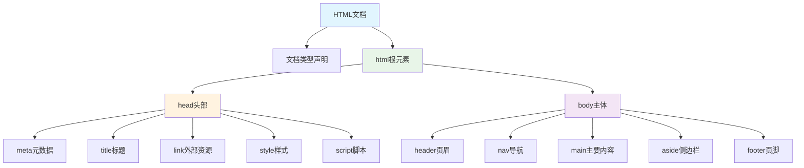

# 13. HTML 技术指南

## 目录

1. [HTML 基础概念](#1-html-基础概念)
   - 1.1 什么是HTML
   - 1.2 HTML发展历史
   - 1.3 HTML文档结构
   - 1.4 HTML语法规则

2. [基础HTML标签](#2-基础html标签)
   - 2.1 结构性标签
   - 2.2 文本标签
   - 2.3 链接与导航
   - 2.4 列表标签

3. [表单与交互](#3-表单与交互)
   - 3.1 表单基础
   - 3.2 输入类型
   - 3.3 表单验证
   - 3.4 表单最佳实践

4. [多媒体内容](#4-多媒体内容)
   - 4.1 图片处理
   - 4.2 音频视频
   - 4.3 响应式媒体
   - 4.4 性能优化

5. [语义化HTML](#5-语义化html)
   - 5.1 语义化标签
   - 5.2 文档结构
   - 5.3 无障碍设计
   - 5.4 SEO优化

6. [表格与数据展示](#6-表格与数据展示)
   - 6.1 表格结构
   - 6.2 复杂表格
   - 6.3 响应式表格
   - 6.4 数据展示最佳实践

7. [HTML5新特性](#7-html5新特性)
   - 7.1 新增标签
   - 7.2 API特性
   - 7.3 存储技术
   - 7.4 离线应用

8. [性能优化](#8-性能优化)
   - 8.1 加载优化
   - 8.2 资源优化
   - 8.3 渲染优化
   - 8.4 用户体验

9. [现代HTML开发](#9-现代html开发)
   - 9.1 组件化思维
   - 9.2 模板引擎
   - 9.3 构建工具
   - 9.4 框架集成

10. [HTML面试题详解](#10-html面试题详解)
    - 10.1 基础概念类
    - 10.2 语义化与无障碍
    - 10.3 性能优化类
    - 10.4 实战应用类

---

## 1. HTML 基础概念

### 1.1 什么是HTML

**HTML（HyperText Markup Language）**是超文本标记语言，是创建网页的标准标记语言。它使用标记标签来描述网页的结构和内容。

**核心特点：**
- **标记语言**：使用标签来定义内容结构
- **超文本**：支持链接，可以连接到其他文档
- **结构化**：提供文档的语义结构
- **平台无关**：可在任何设备和浏览器上运行



### 1.2 HTML发展历史

**版本演进：**

| 版本 | 发布时间 | 主要特性 |
|------|----------|----------|
| **HTML 1.0** | 1991年 | 基础标签，超链接 |
| **HTML 2.0** | 1995年 | 表单、表格、图片 |
| **HTML 3.2** | 1997年 | CSS支持、脚本 |
| **HTML 4.01** | 1999年 | 严格/过渡/框架DTD |
| **XHTML 1.0** | 2000年 | XML语法规则 |
| **HTML5** | 2014年 | 语义化标签、API、多媒体 |
| **HTML Living Standard** | 持续更新 | 持续演进的标准 |

### 1.3 HTML文档结构

**标准HTML5文档结构：**

```html
<!DOCTYPE html>
<html lang="zh-CN">
<head>
    <!-- 元数据 -->
    <meta charset="UTF-8">
    <meta name="viewport" content="width=device-width, initial-scale=1.0">
    <meta name="description" content="页面描述，用于SEO">
    <meta name="keywords" content="关键词1,关键词2">
    <meta name="author" content="作者名称">
    
    <!-- 标题 -->
    <title>页面标题 - 网站名称</title>
    
    <!-- 外部资源 -->
    <link rel="stylesheet" href="styles.css">
    <link rel="icon" href="favicon.ico">
    <link rel="canonical" href="https://example.com/page">
    
    <!-- 内联样式（不推荐） -->
    <style>
        /* CSS 样式 */
    </style>
</head>
<body>
    <!-- 页面主体内容 -->
    <header>
        <nav>
            <!-- 导航菜单 -->
        </nav>
    </header>
    
    <main>
        <!-- 主要内容 -->
        <article>
            <!-- 文章内容 -->
        </article>
        
        <aside>
            <!-- 侧边栏 -->
        </aside>
    </main>
    
    <footer>
        <!-- 页脚 -->
    </footer>
    
    <!-- JavaScript -->
    <script src="script.js"></script>
</body>
</html>
```

### 1.4 HTML语法规则

**基本语法规则：**

1. **标签结构**
```html
<!-- 双标签 -->
<tagname attribute="value">内容</tagname>

<!-- 自闭合标签 -->
<tagname attribute="value" />

<!-- HTML5简化写法 -->

<br>
<hr>
```

2. **属性规则**
```html
<!-- 正确写法 -->
<input type="text" name="username" id="user" class="form-control" required>

<!-- 布尔属性 -->
<input type="checkbox" checked>
<script src="app.js" defer></script>
<details open>内容</details>
```

3. **嵌套规则**
```html
<!-- 正确嵌套 -->
<div>
    <p>段落内容</p>
    <ul>
        <li>列表项</li>
    </ul>
</div>

<!-- 错误嵌套（避免） -->
<p><div>错误</div></p>  <!-- 块级元素不能嵌套在行内元素中 -->
<a><a>链接</a></a>     <!-- 交互元素不能嵌套 -->
```

## 2. 基础HTML标签

### 2.1 结构性标签

**文档结构标签：**

```html
<!DOCTYPE html>  <!-- HTML5文档类型声明 -->
<html lang="zh-CN">  <!-- 根元素，指定语言 -->
<head>
    <!-- 文档头部信息 -->
    <meta charset="UTF-8">
    <title>页面标题</title>
</head>
<body>
    <!-- 页面可见内容 -->
</body>
</html>
```

**语义化布局标签：**

```html
<header>
    <!-- 页眉：logo、导航、标题等 -->
    <h1>网站标题</h1>
    <nav>
        <ul>
            <li><a href="/">首页</a></li>
            <li><a href="/about">关于</a></li>
            <li><a href="/contact">联系</a></li>
        </ul>
    </nav>
</header>

<main>
    <!-- 主要内容区域 -->
    <article>
        <!-- 独立的文章内容 -->
        <header>
            <h2>文章标题</h2>
            <time datetime="2024-01-15">2024年1月15日</time>
        </header>
        <p>文章内容...</p>
    </article>
    
    <aside>
        <!-- 侧边栏：相关链接、广告等 -->
        <section>
            <h3>相关文章</h3>
            <ul>
                <li><a href="/article1">文章1</a></li>
                <li><a href="/article2">文章2</a></li>
            </ul>
        </section>
    </aside>
</main>

<footer>
    <!-- 页脚：版权、联系信息等 -->
    <p>&copy; 2024 网站名称. 保留所有权利.</p>
</footer>
```

### 2.2 文本标签

**标题标签层级：**

```html
<h1>主标题 - 页面最重要的标题</h1>
<h2>二级标题 - 主要章节</h2>
<h3>三级标题 - 子章节</h3>
<h4>四级标题</h4>
<h5>五级标题</h5>
<h6>六级标题</h6>

<!-- SEO最佳实践 -->
<header>
    <h1>网站名称或页面主题</h1>  <!-- 每页只有一个h1 -->
</header>

<main>
    <article>
        <h2>文章标题</h2>  <!-- 文章主标题 -->
        <section>
            <h3>章节标题</h3>  <!-- 章节标题 -->
            <h4>子章节标题</h4>
        </section>
    </article>
</main>
```

**文本格式化：**

```html
<!-- 语义化强调 -->
<p>这是一个<strong>重要</strong>的通知。</p>
<p>请<em>仔细</em>阅读以下内容。</p>

<!-- 特殊文本样式 -->
<p>普通文本 <mark>高亮文本</mark> 继续。</p>
<p>原价：<s>100元</s> 现价：<strong>80元</strong></p>
<p><small>注：活动有效期至2024年12月31日</small></p>

<!-- 代码和技术文本 -->
<p>请按 <kbd>Ctrl</kbd> + <kbd>C</kbd> 复制。</p>
<p>函数 <code>console.log()</code> 用于输出信息。</p>
<p>程序输出：<samp>Hello, World!</samp></p>

<!-- 预格式化文本 -->
<pre><code>
function greet(name) {
    return `Hello, ${name}!`;
}
</code></pre>

<!-- 引用 -->
<blockquote cite="https://example.com">
    <p>这是一段引用的内容。</p>
    <footer>
        —— <cite>作者名称</cite>
    </footer>
</blockquote>
```

### 2.3 链接与导航

**链接类型和用法：**

```html
<!-- 外部链接 -->
<a href="https://example.com" target="_blank" rel="noopener noreferrer">
    访问外部网站
</a>

<!-- 内部链接 -->
<a href="/about">关于我们</a>
<a href="../parent/page.html">相对路径</a>

<!-- 锚点链接 -->
<a href="#section1">跳转到第一节</a>
<a href="#top">返回顶部</a>

<!-- 邮件和电话链接 -->
<a href="mailto:contact@example.com?subject=联系我们">发送邮件</a>
<a href="tel:+86-138-0000-0000">拨打电话</a>

<!-- 下载链接 -->
<a href="/files/document.pdf" download="用户手册.pdf">下载用户手册</a>

<!-- 语义化导航 -->
<nav aria-label="主导航">
    <ul>
        <li><a href="/" aria-current="page">首页</a></li>
        <li><a href="/products">产品</a></li>
        <li><a href="/services">服务</a></li>
        <li><a href="/contact">联系我们</a></li>
    </ul>
</nav>

<!-- 面包屑导航 -->
<nav aria-label="面包屑">
    <ol>
        <li><a href="/">首页</a></li>
        <li><a href="/category">分类</a></li>
        <li aria-current="page">当前页面</li>
    </ol>
</nav>
```

### 2.4 列表标签

**无序列表：**

```html
<ul>
    <li>列表项 1</li>
    <li>列表项 2
        <ul>
            <li>嵌套项 2.1</li>
            <li>嵌套项 2.2</li>
        </ul>
    </li>
    <li>列表项 3</li>
</ul>
```

**有序列表：**

```html
<ol type="1" start="5">
    <li>第五项</li>
    <li>第六项</li>
    <li value="10">第十项（跳过7、8、9）</li>
</ol>

<!-- 不同编号类型 -->
<ol type="A">  <!-- A, B, C... -->
<ol type="a">  <!-- a, b, c... -->
<ol type="I">  <!-- I, II, III... -->
<ol type="i">  <!-- i, ii, iii... -->
```

**描述列表：**

```html
<dl>
    <dt>HTML</dt>
    <dd>超文本标记语言，用于创建网页的标准标记语言。</dd>
    
    <dt>CSS</dt>
    <dd>层叠样式表，用于描述HTML文档的样式。</dd>
    
    <dt>JavaScript</dt>
    <dd>编程语言，为网页添加交互性。</dd>
</dl>
```

## 3. 表单与交互

### 3.1 表单基础

**基本表单结构：**

```html
<form action="/submit" method="post" enctype="multipart/form-data">
    <fieldset>
        <legend>用户注册</legend>
        
        <div class="form-group">
            <label for="username">用户名*</label>
            <input type="text" id="username" name="username" required 
                   placeholder="请输入用户名" autocomplete="username">
        </div>
        
        <div class="form-group">
            <label for="email">邮箱*</label>
            <input type="email" id="email" name="email" required 
                   placeholder="user@example.com" autocomplete="email">
        </div>
        
        <div class="form-group">
            <label for="password">密码*</label>
            <input type="password" id="password" name="password" required 
                   minlength="8" autocomplete="new-password">
        </div>
        
        <button type="submit">注册</button>
        <button type="reset">重置</button>
    </fieldset>
</form>
```

### 3.2 输入类型

**HTML5输入类型：**

```html
<!-- 文本输入 -->
<input type="text" placeholder="普通文本">
<input type="password" placeholder="密码">
<input type="email" placeholder="邮箱地址">
<input type="url" placeholder="网址">
<input type="tel" placeholder="电话号码">

<!-- 数字输入 -->
<input type="number" min="1" max="100" step="1" value="50">
<input type="range" min="0" max="100" value="50">

<!-- 日期时间 -->
<input type="date" value="2024-01-15">
<input type="time" value="14:30">
<input type="datetime-local" value="2024-01-15T14:30">

<!-- 文件上传 -->
<input type="file" accept=".jpg,.png,.pdf" multiple>

<!-- 颜色选择 -->
<input type="color" value="#ff6b35">
```

## 4. 多媒体内容

### 4.1 图片处理

**响应式图片：**

```html
<!-- 基本用法 -->


<!-- 响应式图片 -->


<!-- 不同格式支持 -->
<picture>
    <source srcset="image.avif" type="image/avif">
    <source srcset="image.webp" type="image/webp">
    
</picture>
```

### 4.2 音频视频

**音频标签：**

```html
<audio controls preload="metadata">
    <source src="audio.mp3" type="audio/mpeg">
    <source src="audio.ogg" type="audio/ogg">
    您的浏览器不支持音频播放。
</audio>
```

**视频标签：**

```html
<video controls width="800" height="450" poster="thumbnail.jpg">
    <source src="video.mp4" type="video/mp4">
    <source src="video.webm" type="video/webm">
    <track kind="subtitles" src="subtitles.vtt" srclang="zh" label="中文" default>
    您的浏览器不支持视频播放。
</video>
```

## 5. 语义化HTML

### 5.1 语义化标签

**文档结构语义化：**

```html
<article>
    <header>
        <h1>文章标题</h1>
        <time datetime="2024-01-15">2024年1月15日</time>
        <address>作者：<a href="mailto:author@example.com">张三</a></address>
    </header>
    
    <main>
        <section>
            <h2>章节标题</h2>
            <p>章节内容...</p>
        </section>
        
        <aside>
            <h3>相关链接</h3>
            <nav>
                <ul>
                    <li><a href="/related1">相关文章1</a></li>
                    <li><a href="/related2">相关文章2</a></li>
                </ul>
            </nav>
        </aside>
    </main>
    
    <footer>
        <p>版权所有 © 2024</p>
    </footer>
</article>
```

### 5.2 无障碍设计

**ARIA属性使用：**

```html
<!-- 角色定义 -->
<div role="button" tabindex="0" aria-pressed="false">自定义按钮</div>

<!-- 状态描述 -->
<button aria-expanded="false" aria-controls="menu">菜单</button>
<ul id="menu" aria-hidden="true">
    <li><a href="/home">首页</a></li>
    <li><a href="/about">关于</a></li>
</ul>

<!-- 标签关联 -->
<label id="username-label">用户名</label>
<input type="text" aria-labelledby="username-label" aria-describedby="username-help">
<div id="username-help">请输入3-20位字符</div>

<!-- 实时区域 -->
<div aria-live="polite" id="status">状态信息会在这里更新</div>
```

## 6. 表格与数据展示

### 6.1 表格结构

**完整表格示例：**

```html
<table>
    <caption>2024年第一季度销售数据</caption>
    <thead>
        <tr>
            <th scope="col">月份</th>
            <th scope="col">产品A</th>
            <th scope="col">产品B</th>
            <th scope="col">总计</th>
        </tr>
    </thead>
    <tbody>
        <tr>
            <th scope="row">1月</th>
            <td>1000</td>
            <td>1500</td>
            <td>2500</td>
        </tr>
        <tr>
            <th scope="row">2月</th>
            <td>1200</td>
            <td>1800</td>
            <td>3000</td>
        </tr>
    </tbody>
    <tfoot>
        <tr>
            <th scope="row">合计</th>
            <td>2200</td>
            <td>3300</td>
            <td>5500</td>
        </tr>
    </tfoot>
</table>
```

### 6.2 复杂表格

**单元格合并：**

```html
<table border="1">
    <thead>
        <tr>
            <th rowspan="2">员工</th>
            <th colspan="2">第一季度</th>
            <th colspan="2">第二季度</th>
        </tr>
        <tr>
            <th>销售额</th>
            <th>达成率</th>
            <th>销售额</th>
            <th>达成率</th>
        </tr>
    </thead>
    <tbody>
        <tr>
            <td>张三</td>
            <td>10万</td>
            <td>120%</td>
            <td>12万</td>
            <td>110%</td>
        </tr>
    </tbody>
</table>
```

## 7. HTML5新特性

### 7.1 新增标签

**语义化标签：**

```html
<!-- 文档结构 -->
<header>页眉</header>
<nav>导航</nav>
<main>主要内容</main>
<section>章节</section>
<article>文章</article>
<aside>侧边栏</aside>
<footer>页脚</footer>

<!-- 内容标签 -->
<figure>
    
    <figcaption>2024年销售趋势图</figcaption>
</figure>

<details>
    <summary>点击展开详情</summary>
    <p>这是详细内容...</p>
</details>

<mark>高亮文本</mark>
<time datetime="2024-01-15T10:30">2024年1月15日上午10:30</time>
<progress value="70" max="100">70%</progress>
<meter value="6" min="0" max="10">6分（满分10分）</meter>
```

## 2. 头部标签（页面信息）
| 标签 | 作用 |
|------|------|
| `<title>` | 设置网页标题（浏览器标签上显示） |
| `<meta>` | 定义网页元数据（如编码、SEO、视口等） |
| `<link>` | 引入外部 CSS、图标等 |
| `<style>` | 内部 CSS 样式表 |
| `<script>` | 内部 JavaScript 代码或外部 JS 文件 |

## 3. 文字与段落
| 标签 | 作用 |
|------|------|
| `<h1>` ~ `<h6>` | 标题标签，`h1` 最大，`h6` 最小 |
| `<p>` | 段落 |
| `<br>` | 换行（自闭合） |
| `<hr>` | 水平分割线（自闭合） |
| `<pre>` | 预格式化文本（保留空格、换行） |

## 4. 文本格式化
| 标签 | 作用 |
|------|------|
| `<strong>` | 加粗（语义化，强调） |
| `<b>` | 加粗（非语义化） |
| `<em>` | 斜体（语义化，强调） |
| `<i>` | 斜体（非语义化） |
| `<u>` | 下划线 |
| `<s>` | 删除线 |
| `<mark>` | 高亮文本 |
| `<small>` | 小号文本 |
| `<blockquote>` | 块级引用 |
| `<cite>` | 引用来源 |

## 5. 超链接与导航
| 标签 | 作用 |
|------|------|
| `<a>` | 超链接（`href` 指定链接地址） |
| `<nav>` | 导航区域（语义化） |

**示例**：
```html
<a href="https://example.com" target="_blank">访问网站</a>
```

## 6.列表
| 标签 | 作用 |
|------|------|
| `<ul>` | 无序列表 |
| `<ol>` | 有序列表 |
| `<li>` | 列表项 |


## 7.表格
| 标签 | 作用 |
|------|------|
| `<table>` | 定义表格 |
| `<tr>` | 行 |
| `<th>` | 表头单元格 |
| `<td>` | 表数据单元格 |
| `<thead>` | 表头部分 |
| `<tbody>` | 表体部分 |
| `<tfoot>` | 表尾部分 |

## 8.表单
| 标签 | 作用 |
|------|------|
| `<form>` | 表单容器 |
| `<input>` | 输入框 |
| `<textarea>` | 多行文本输入 |
| `<selet>` | 下拉选择框 |
| `<option>` | 下拉选项 |
| `<button>` | 按钮 |
| `<label>` | 标签 |

## 9.多媒体
| 标签 | 作用 |
|------|------|
| `` | 图片 |
| `<audio>` | 音频 |
| `<video>` | 视频 |
| `<source>` | 多媒体资源 |
| `<iframe>` | 内嵌网页 |


## 10.语义化布局
| 标签 | 作用 |
|------|------|
| `<header>` | 页眉 |
| `<footer>` | 页脚 |
| `<main>` | 主要内容 |
| `<section>` | 章节 |
| `<article>` | 文章 |
| `<aside>` | 侧边栏 |
| `<div>` | 块级内容 |
| `<span>` | 行内内容 |

## 11.交互
| 标签 | 作用 |
|------|------|
| `<details>` | 可展开/折叠 |
| `<summary>` | details的标题 |

## 12.其他
| 标签 | 作用 |
|------|------|
| `<code>` | 代码快 |
| `<kbd>` | 键盘输入 |
| `<samp>` | 计算机输出 |
| `<progress>` | 进度条 |
| `<meter>` | 量表|

