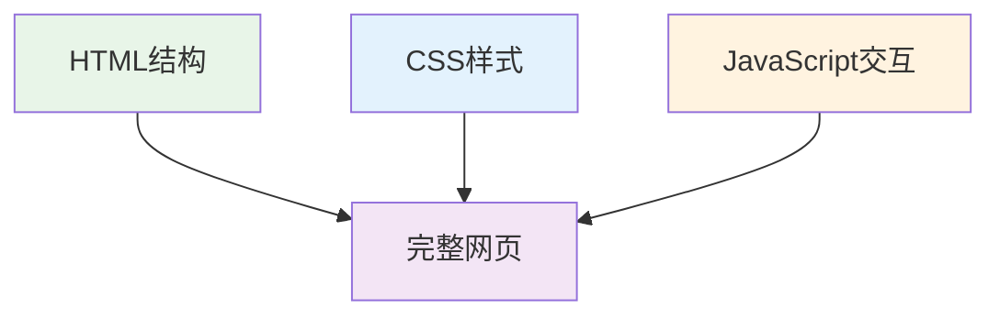
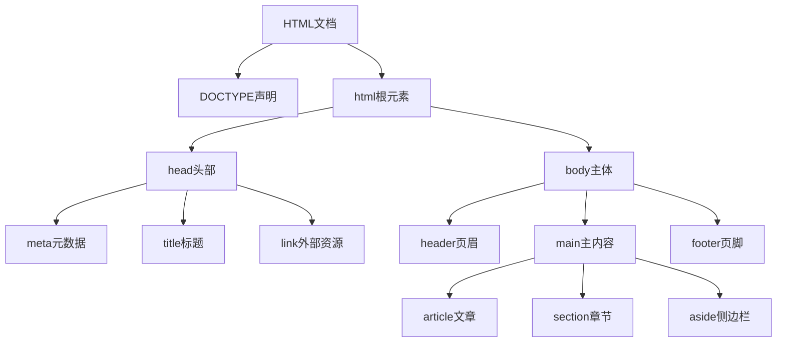

# 13. HTML完整技术指南

## 目录

### [1. HTML基础概念](#1-html基础概念)
- [1.1 HTML简介与特点](#11-html简介与特点)
- [1.2 HTML发展历史](#12-html发展历史)
- [1.3 HTML文档结构](#13-html文档结构)
- [1.4 HTML语法规则](#14-html语法规则)

### [2. 基础HTML标签](#2-基础html标签)
- [2.1 文档结构标签](#21-文档结构标签)
- [2.2 文本内容标签](#22-文本内容标签)
- [2.3 链接与导航标签](#23-链接与导航标签)
- [2.4 列表标签](#24-列表标签)

### [3. 表单与交互元素](#3-表单与交互元素)
- [3.1 表单基础结构](#31-表单基础结构)
- [3.2 输入控件类型](#32-输入控件类型)
- [3.3 表单验证](#33-表单验证)
- [3.4 表单最佳实践](#34-表单最佳实践)

### [4. 多媒体与嵌入内容](#4-多媒体与嵌入内容)
- [4.1 图片处理](#41-图片处理)
- [4.2 音频视频](#42-音频视频)
- [4.3 响应式媒体](#43-响应式媒体)
- [4.4 嵌入内容](#44-嵌入内容)

### [5. 语义化HTML与无障碍](#5-语义化html与无障碍)
- [5.1 语义化标签](#51-语义化标签)
- [5.2 文档结构语义化](#52-文档结构语义化)
- [5.3 无障碍设计](#53-无障碍设计)
- [5.4 ARIA属性](#54-aria属性)

### [6. 表格与数据展示](#6-表格与数据展示)
- [6.1 表格基础结构](#61-表格基础结构)
- [6.2 复杂表格设计](#62-复杂表格设计)
- [6.3 响应式表格](#63-响应式表格)
- [6.4 数据展示最佳实践](#64-数据展示最佳实践)

### [7. HTML5新特性与API](#7-html5新特性与api)
- [7.1 HTML5新增标签](#71-html5新增标签)
- [7.2 Canvas与SVG](#72-canvas与svg)
- [7.3 Web存储技术](#73-web存储技术)
- [7.4 现代Web API](#74-现代web-api)

### [8. 性能优化与最佳实践](#8-性能优化与最佳实践)
- [8.1 页面加载优化](#81-页面加载优化)
- [8.2 资源优化策略](#82-资源优化策略)
- [8.3 渲染性能优化](#83-渲染性能优化)
- [8.4 SEO优化](#84-seo优化)

### [9. HTML面试题集](#9-html面试题集)
- [9.1 基础概念题](#91-基础概念题)
- [9.2 语义化与标准题](#92-语义化与标准题)
- [9.3 性能优化题](#93-性能优化题)
- [9.4 实战应用题](#94-实战应用题)

### [10. 总结与进阶方向](#10-总结与进阶方向)

## 1. HTML基础概念

### 1.1 HTML简介与特点

**HTML（HyperText Markup Language）**是超文本标记语言，是创建网页的标准标记语言。

**核心特点**：
- **标记语言**：使用标签定义内容结构和语义
- **超文本**：支持链接，连接不同文档和资源
- **结构化**：提供清晰的文档层次结构
- **平台无关**：可在任何设备和浏览器运行
- **易于学习**：语法简单，学习成本低

**HTML在Web技术栈中的地位**：



### 1.2 HTML发展历史

**版本演进时间线**：

| 版本 | 发布年份 | 主要特性 | 重要意义 |
|------|----------|----------|----------|
| **HTML 1.0** | 1991 | 基础标签、超链接 | Web的起点 |
| **HTML 2.0** | 1995 | 表单、表格、图片 | 交互能力增强 |
| **HTML 3.2** | 1997 | CSS支持、脚本 | 样式与行为分离 |
| **HTML 4.01** | 1999 | 严格/过渡/框架DTD | 标准化规范 |
| **XHTML 1.0** | 2000 | XML语法规则 | 更严格的语法 |
| **HTML5** | 2014 | 语义化、API、多媒体 | 现代Web标准 |
| **Living Standard** | 持续 | 持续演进 | 动态标准 |

### 1.3 HTML文档结构

**标准HTML5文档结构**：

```html
<!DOCTYPE html>
<html lang="zh-CN">
<head>
    <!-- 文档元数据 -->
    <meta charset="UTF-8">
    <meta name="viewport" content="width=device-width, initial-scale=1.0">
    <meta name="description" content="页面描述">
    <title>页面标题</title>
    
    <!-- 外部资源 -->
    <link rel="stylesheet" href="styles.css">
    <link rel="icon" href="favicon.ico">
</head>
<body>
    <!-- 页面内容 -->
    <header>
        <nav>导航</nav>
    </header>
    
    <main>
        <article>主要内容</article>
        <aside>侧边栏</aside>
    </main>
    
    <footer>页脚</footer>
    
    <!-- JavaScript -->
    <script src="script.js"></script>
</body>
</html>
```

**文档结构说明**：



### 1.4 HTML语法规则

**基本语法规范**：

1. **标签结构**
```html
<!-- 双标签（容器标签） -->
<tagname attribute="value">内容</tagname>

<!-- 单标签（自闭合标签） -->
<tagname attribute="value">
<tagname attribute="value" />  <!-- XHTML风格 -->
```

2. **属性规则**
```html
<!-- 属性值建议加引号 -->


<!-- 布尔属性 -->
<input type="checkbox" checked>
<script src="app.js" defer></script>
```

3. **嵌套规则**
```html
<!-- ✅ 正确嵌套 -->
<div>
    <p>段落内容</p>
    <ul>
        <li>列表项</li>
    </ul>
</div>

<!-- ❌ 错误嵌套 -->
<p><div>块级元素不能嵌套在行内元素中</div></p>
<a><a>交互元素不能嵌套</a></a>
```

## 2. 基础HTML标签

### 2.1 文档结构标签

**HTML5语义化结构标签**：

```html
<!DOCTYPE html>
<html lang="zh-CN">
<head>
    <meta charset="UTF-8">
    <title>网站标题</title>
</head>
<body>
    <!-- 页眉区域 -->
    <header>
        <h1>网站Logo</h1>
        <nav>
            <ul>
                <li><a href="/">首页</a></li>
                <li><a href="/about">关于</a></li>
                <li><a href="/contact">联系</a></li>
            </ul>
        </nav>
    </header>
    
    <!-- 主要内容区域 -->
    <main>
        <article>
            <header>
                <h2>文章标题</h2>
                <time datetime="2024-01-15">2024年1月15日</time>
            </header>
            <section>
                <h3>章节标题</h3>
                <p>章节内容...</p>
            </section>
        </article>
        
        <aside>
            <section>
                <h3>相关链接</h3>
                <ul>
                    <li><a href="/link1">链接1</a></li>
                    <li><a href="/link2">链接2</a></li>
                </ul>
            </section>
        </aside>
    </main>
    
    <!-- 页脚区域 -->
    <footer>
        <p>&copy; 2024 网站名称. 保留所有权利.</p>
    </footer>
</body>
</html>
```

**标签语义说明**：

| 标签 | 语义 | 使用场景 |
|------|------|----------|
| `<header>` | 页眉/标题区域 | 网站头部、文章标题区 |
| `<nav>` | 导航区域 | 主导航、面包屑导航 |
| `<main>` | 主要内容 | 页面核心内容（每页唯一） |
| `<article>` | 独立文章 | 博客文章、新闻报道 |
| `<section>` | 章节区域 | 内容分组、主题区块 |
| `<aside>` | 侧边内容 | 侧边栏、相关链接 |
| `<footer>` | 页脚区域 | 版权信息、联系方式 |

### 2.2 文本内容标签

**标题标签层级**：

```html
<!-- 标题层级结构 -->
<h1>页面主标题</h1>
    <h2>主要章节</h2>
        <h3>子章节</h3>
            <h4>小节标题</h4>
                <h5>细分标题</h5>
                    <h6>最小标题</h6>

<!-- SEO最佳实践 -->
<header>
    <h1>网站名称或页面主题</h1>  <!-- 每页只有一个h1 -->
</header>

<main>
    <article>
        <h2>文章标题</h2>
        <section>
            <h3>章节标题</h3>
            <h4>子章节标题</h4>
        </section>
    </article>
</main>
```

**文本格式化标签**：

```html
<!-- 语义化强调 -->
<p>这是一个<strong>重要</strong>的通知。</p>
<p>请<em>仔细</em>阅读以下内容。</p>

<!-- 特殊文本样式 -->
<p>普通文本 <mark>高亮文本</mark> 继续。</p>
<p>原价：<s>100元</s> 现价：<strong>80元</strong></p>
<p><small>注：活动有效期至2024年12月31日</small></p>

<!-- 代码和技术文本 -->
<p>请按 <kbd>Ctrl</kbd> + <kbd>C</kbd> 复制。</p>
<p>函数 <code>console.log()</code> 用于输出信息。</p>
<p>程序输出：<samp>Hello, World!</samp></p>

<!-- 预格式化文本 -->
<pre><code>
function greet(name) {
    return `Hello, ${name}!`;
}
</code></pre>

<!-- 引用内容 -->
<blockquote cite="https://example.com">
    <p>这是一段重要的引用内容。</p>
    <footer>
        —— <cite>作者名称</cite>
    </footer>
</blockquote>

<p>如<q>子曰</q>所言，学而时习之。</p>
```

### 2.3 链接与导航标签

**链接类型与用法**：

```html
<!-- 外部链接 -->
<a href="https://example.com" 
   target="_blank" 
   rel="noopener noreferrer">
    访问外部网站
</a>

<!-- 内部链接 -->
<a href="/about">关于我们</a>
<a href="../parent/page.html">相对路径</a>

<!-- 锚点链接 -->
<a href="#section1">跳转到第一节</a>
<a href="#top">返回顶部</a>

<!-- 功能性链接 -->
<a href="mailto:contact@example.com?subject=联系我们">发送邮件</a>
<a href="tel:+86-138-0000-0000">拨打电话</a>
<a href="/files/document.pdf" download="用户手册.pdf">下载文档</a>

<!-- 语义化导航 -->
<nav aria-label="主导航">
    <ul>
        <li><a href="/" aria-current="page">首页</a></li>
        <li><a href="/products">产品</a></li>
        <li><a href="/services">服务</a></li>
        <li><a href="/contact">联系我们</a></li>
    </ul>
</nav>

<!-- 面包屑导航 -->
<nav aria-label="面包屑导航">
    <ol>
        <li><a href="/">首页</a></li>
        <li><a href="/category">分类</a></li>
        <li aria-current="page">当前页面</li>
    </ol>
</nav>
```

### 2.4 列表标签

**列表类型与应用**：

```html
<!-- 无序列表 -->
<ul>
    <li>列表项 1</li>
    <li>列表项 2
        <ul>
            <li>嵌套项 2.1</li>
            <li>嵌套项 2.2</li>
        </ul>
    </li>
    <li>列表项 3</li>
</ul>

<!-- 有序列表 -->
<ol>
    <li>第一步：准备材料</li>
    <li>第二步：开始制作</li>
    <li>第三步：完成作品</li>
</ol>

<!-- 不同编号类型 -->
<ol type="A">  <!-- A, B, C... -->
    <li>选项A</li>
    <li>选项B</li>
</ol>

<ol type="i" start="5">  <!-- v, vi, vii... -->
    <li>第五项</li>
    <li>第六项</li>
</ol>

<!-- 描述列表 -->
<dl>
    <dt>HTML</dt>
    <dd>超文本标记语言，用于创建网页结构。</dd>
    
    <dt>CSS</dt>
    <dd>层叠样式表，用于网页样式设计。</dd>
    
    <dt>JavaScript</dt>
    <dd>编程语言，为网页添加交互功能。</dd>
</dl>
```

## 3. 表单与交互元素

### 3.1 表单基础结构

**完整表单示例**：

```html
<form action="/submit" method="post" enctype="multipart/form-data">
    <fieldset>
        <legend>用户注册信息</legend>
        
        <!-- 文本输入 -->
        <div class="form-group">
            <label for="username">用户名*</label>
            <input type="text" 
                   id="username" 
                   name="username" 
                   required 
                   placeholder="请输入用户名"
                   autocomplete="username"
                   minlength="3"
                   maxlength="20">
        </div>
        
        <!-- 邮箱输入 -->
        <div class="form-group">
            <label for="email">邮箱地址*</label>
            <input type="email" 
                   id="email" 
                   name="email" 
                   required 
                   placeholder="user@example.com"
                   autocomplete="email">
        </div>
        
        <!-- 密码输入 -->
        <div class="form-group">
            <label for="password">密码*</label>
            <input type="password" 
                   id="password" 
                   name="password" 
                   required 
                   minlength="8"
                   autocomplete="new-password">
        </div>
        
        <!-- 提交按钮 -->
        <div class="form-actions">
            <button type="submit">注册</button>
            <button type="reset">重置</button>
        </div>
    </fieldset>
</form>
```

### 3.2 输入控件类型

**HTML5输入类型详解**：

```html
<!-- 文本类输入 -->
<input type="text" placeholder="普通文本">
<input type="password" placeholder="密码">
<input type="email" placeholder="邮箱地址">
<input type="url" placeholder="网站地址">
<input type="tel" placeholder="电话号码">
<input type="search" placeholder="搜索内容">

<!-- 数字类输入 -->
<input type="number" min="1" max="100" step="1" value="50">
<input type="range" min="0" max="100" value="50" step="10">

<!-- 日期时间输入 -->
<input type="date" value="2024-01-15">
<input type="time" value="14:30">
<input type="datetime-local" value="2024-01-15T14:30">
<input type="month" value="2024-01">
<input type="week" value="2024-W03">

<!-- 文件上传 -->
<input type="file" accept=".jpg,.png,.pdf" multiple>
<input type="file" accept="image/*" capture="camera">

<!-- 其他类型 -->
<input type="color" value="#ff6b35">
<input type="hidden" name="token" value="abc123">

<!-- 选择控件 -->
<input type="checkbox" id="agree" name="agree" value="yes">
<label for="agree">我同意服务条款</label>

<input type="radio" id="male" name="gender" value="male">
<label for="male">男</label>
<input type="radio" id="female" name="gender" value="female">
<label for="female">女</label>

<!-- 多行文本 -->
<textarea name="message" 
          rows="5" 
          cols="50" 
          placeholder="请输入您的留言"
          maxlength="500"></textarea>

<!-- 下拉选择 -->
<select name="country" required>
    <option value="">请选择国家</option>
    <option value="cn">中国</option>
    <option value="us">美国</option>
    <option value="jp">日本</option>
</select>

<!-- 多选下拉 -->
<select name="skills" multiple size="4">
    <optgroup label="前端技术">
        <option value="html">HTML</option>
        <option value="css">CSS</option>
        <option value="js">JavaScript</option>
    </optgroup>
    <optgroup label="后端技术">
        <option value="python">Python</option>
        <option value="java">Java</option>
    </optgroup>
</select>
```

### 3.3 表单验证

**HTML5内置验证**：

```html
<form novalidate>  <!-- 禁用浏览器默认验证，使用自定义验证 -->
    <!-- 必填验证 -->
    <input type="text" name="username" required>
    
    <!-- 长度验证 -->
    <input type="text" name="name" minlength="2" maxlength="50">
    
    <!-- 数值范围验证 -->
    <input type="number" name="age" min="18" max="120">
    
    <!-- 正则表达式验证 -->
    <input type="text" 
           name="phone" 
           pattern="[0-9]{3}-[0-9]{4}-[0-9]{4}"
           title="请输入格式：123-4567-8900">
    
    <!-- 自定义验证消息 -->
    <input type="email" 
           name="email" 
           required
           oninvalid="this.setCustomValidity('请输入有效的邮箱地址')"
           oninput="this.setCustomValidity('')">
    
    <button type="submit">提交</button>
</form>
```

### 3.4 表单最佳实践

**无障碍表单设计**：

```html
<form>
    <!-- 标签关联 -->
    <div class="form-group">
        <label for="user-email">邮箱地址*</label>
        <input type="email" 
               id="user-email" 
               name="email" 
               required
               aria-describedby="email-help email-error">
        <div id="email-help" class="help-text">
            我们不会分享您的邮箱地址
        </div>
        <div id="email-error" class="error-message" aria-live="polite">
            <!-- 错误信息将在这里显示 -->
        </div>
    </div>
    
    <!-- 字段组 -->
    <fieldset>
        <legend>联系方式</legend>
        <div class="form-row">
            <div class="form-group">
                <label for="phone">电话</label>
                <input type="tel" id="phone" name="phone">
            </div>
            <div class="form-group">
                <label for="address">地址</label>
                <input type="text" id="address" name="address">
            </div>
        </div>
    </fieldset>
    
    <!-- 提交状态 -->
    <div class="form-actions">
        <button type="submit" aria-describedby="submit-help">
            提交表单
        </button>
        <div id="submit-help" class="help-text">
            点击提交将保存您的信息
        </div>
    </div>
</form>
```

## 4. 多媒体与嵌入内容

### 4.1 图片处理

**响应式图片技术**：

```html
<!-- 基础图片 -->


<!-- 响应式图片 -->


<!-- 不同格式支持 -->
<picture>
    <source srcset="image.avif" type="image/avif">
    <source srcset="image.webp" type="image/webp">
    <source srcset="image.jpg" type="image/jpeg">
    
</picture>

<!-- 艺术指导 -->
<picture>
    <source media="(min-width: 800px)" srcset="desktop.jpg">
    <source media="(min-width: 400px)" srcset="tablet.jpg">
    
</picture>

<!-- 图片与说明 -->
<figure>
    
    <figcaption>
        图1：2024年第一季度销售数据显示增长20%
    </figcaption>
</figure>
```

### 4.2 音频视频

**音频标签使用**：

```html
<audio controls preload="metadata">
    <source src="audio.mp3" type="audio/mpeg">
    <source src="audio.ogg" type="audio/ogg">
    <source src="audio.wav" type="audio/wav">
    <p>您的浏览器不支持音频播放。
       <a href="audio.mp3">下载音频文件</a>
    </p>
</audio>

<!-- 自动播放音频（需要用户交互） -->
<audio autoplay muted loop>
    <source src="background.mp3" type="audio/mpeg">
</audio>
```

**视频标签使用**：

```html
<video controls 
       width="800" 
       height="450" 
       poster="thumbnail.jpg"
       preload="metadata">
    <source src="video.mp4" type="video/mp4">
    <source src="video.webm" type="video/webm">
    <source src="video.ogg" type="video/ogg">
    
    <!-- 字幕轨道 -->
    <track kind="subtitles" 
           src="subtitles-zh.vtt" 
           srclang="zh" 
           label="中文字幕" 
           default>
    <track kind="subtitles" 
           src="subtitles-en.vtt" 
           srclang="en" 
           label="English">
    
    <p>您的浏览器不支持视频播放。
       <a href="video.mp4">下载视频文件</a>
    </p>
</video>
```

### 4.3 响应式媒体

**媒体查询与响应式设计**：

```html
<!-- 响应式视频 -->
<div class="video-container">
    <video controls>
        <source src="video-hd.mp4" 
                media="(min-width: 1200px)" 
                type="video/mp4">
        <source src="video-sd.mp4" 
                type="video/mp4">
    </video>
</div>

<style>
.video-container {
    position: relative;
    width: 100%;
    height: 0;
    padding-bottom: 56.25%; /* 16:9 宽高比 */
}

.video-container video {
    position: absolute;
    top: 0;
    left: 0;
    width: 100%;
    height: 100%;
}
</style>
```

### 4.4 嵌入内容

**iframe与嵌入内容**：

```html
<!-- 嵌入网页 -->
<iframe src="https://example.com" 
        width="800" 
        height="600"
        title="嵌入的网页内容"
        sandbox="allow-scripts allow-same-origin">
    <p>您的浏览器不支持iframe。
       <a href="https://example.com">访问链接</a>
    </p>
</iframe>

<!-- 嵌入地图 -->
<iframe src="https://maps.google.com/embed?..."
        width="100%" 
        height="300"
        style="border:0;"
        allowfullscreen=""
        loading="lazy"
        referrerpolicy="no-referrer-when-downgrade"
        title="Google地图">
</iframe>

<!-- 嵌入视频（YouTube） -->
<iframe width="560" 
        height="315" 
        src="https://www.youtube.com/embed/VIDEO_ID"
        title="YouTube视频播放器"
        frameborder="0"
        allow="accelerometer; autoplay; clipboard-write; encrypted-media; gyroscope; picture-in-picture"
        allowfullscreen>
</iframe>
```

## 5. 语义化HTML与无障碍

### 5.1 语义化标签

**HTML5语义化标签详解**：

```html
<article>
    <header>
        <h1>文章标题</h1>
        <time datetime="2024-01-15T10:30:00">
            2024年1月15日 上午10:30
        </time>
        <address>
            作者：<a href="mailto:author@example.com">张三</a>
        </address>
    </header>
    
    <main>
        <section>
            <h2>第一章节</h2>
            <p>章节内容...</p>
            
            <details>
                <summary>展开更多信息</summary>
                <p>这里是详细信息内容。</p>
            </details>
        </section>
        
        <section>
            <h2>第二章节</h2>
            <p>更多内容...</p>
            
            <mark>重要信息高亮显示</mark>
        </section>
    </main>
    
    <aside>
        <h3>相关文章</h3>
        <nav>
            <ul>
                <li><a href="/article1">相关文章1</a></li>
                <li><a href="/article2">相关文章2</a></li>
            </ul>
        </nav>
    </aside>
    
    <footer>
        <p>发布于：<time datetime="2024-01-15">2024年1月15日</time></p>
        <p>标签：
            <a href="/tag/html" rel="tag">HTML</a>
            <a href="/tag/web" rel="tag">Web开发</a>
        </p>
    </footer>
</article>
```

### 5.2 文档结构语义化

**语义化文档结构**：

```html
<!DOCTYPE html>
<html lang="zh-CN">
<head>
    <meta charset="UTF-8">
    <title>语义化网站示例</title>
</head>
<body>
    <!-- 跳过链接（无障碍） -->
    <a href="#main-content" class="skip-link">跳过导航</a>
    
    <!-- 网站头部 -->
    <header role="banner">
        <div class="site-branding">
            <h1>网站名称</h1>
            <p>网站标语</p>
        </div>
        
        <!-- 主导航 -->
        <nav role="navigation" aria-label="主导航">
            <ul>
                <li><a href="/" aria-current="page">首页</a></li>
                <li><a href="/about">关于我们</a></li>
                <li><a href="/services">服务</a></li>
                <li><a href="/contact">联系我们</a></li>
            </ul>
        </nav>
    </header>
    
    <!-- 主要内容区域 -->
    <main id="main-content" role="main">
        <!-- 面包屑导航 -->
        <nav aria-label="面包屑导航">
            <ol>
                <li><a href="/">首页</a></li>
                <li><a href="/services">服务</a></li>
                <li aria-current="page">网站开发</li>
            </ol>
        </nav>
        
        <!-- 主要文章内容 -->
        <article>
            <header>
                <h1>网站开发服务</h1>
                <p class="lead">专业的网站开发解决方案</p>
            </header>
            
            <section>
                <h2>服务特色</h2>
                <ul>
                    <li>响应式设计</li>
                    <li>SEO优化</li>
                    <li>性能优化</li>
                </ul>
            </section>
        </article>
        
        <!-- 侧边栏 -->
        <aside role="complementary">
            <section>
                <h2>联系信息</h2>
                <address>
                    <p>电话：<a href="tel:+86-138-0000-0000">138-0000-0000</a></p>
                    <p>邮箱：<a href="mailto:info@example.com">info@example.com</a></p>
                </address>
            </section>
        </aside>
    </main>
    
    <!-- 网站页脚 -->
    <footer role="contentinfo">
        <div class="footer-content">
            <section>
                <h3>快速链接</h3>
                <nav aria-label="页脚导航">
                    <ul>
                        <li><a href="/privacy">隐私政策</a></li>
                        <li><a href="/terms">服务条款</a></li>
                    </ul>
                </nav>
            </section>
            
            <section>
                <h3>社交媒体</h3>
                <ul>
                    <li><a href="#" aria-label="关注我们的微博">微博</a></li>
                    <li><a href="#" aria-label="关注我们的微信">微信</a></li>
                </ul>
            </section>
        </div>
        
        <div class="copyright">
            <p>&copy; 2024 网站名称. 保留所有权利.</p>
        </div>
    </footer>
</body>
</html>
```

### 5.3 无障碍设计

**无障碍访问要点**：

```html
<!-- 1. 键盘导航支持 -->
<button type="button" 
        tabindex="0"
        onclick="toggleMenu()"
        onkeydown="handleKeyDown(event)">
    菜单
</button>

<!-- 2. 焦点管理 -->
<div class="modal" 
     role="dialog" 
     aria-modal="true"
     aria-labelledby="modal-title"
     tabindex="-1">
    <h2 id="modal-title">对话框标题</h2>
    <button type="button" aria-label="关闭对话框">×</button>
</div>

<!-- 3. 屏幕阅读器支持 -->


<!-- 4. 表单标签关联 -->
<div class="form-group">
    <label for="search-input">搜索内容</label>
    <input type="search" 
           id="search-input"
           name="query"
           aria-describedby="search-help">
    <div id="search-help">输入关键词进行搜索</div>
</div>

<!-- 5. 状态和属性 -->
<button aria-expanded="false" 
        aria-controls="submenu"
        onclick="toggleSubmenu()">
    产品分类
</button>
<ul id="submenu" aria-hidden="true">
    <li><a href="/category1">分类1</a></li>
    <li><a href="/category2">分类2</a></li>
</ul>

<!-- 6. 实时更新区域 -->
<div aria-live="polite" id="status-message">
    <!-- 状态信息会在这里更新 -->
</div>

<div aria-live="assertive" id="error-message">
    <!-- 重要错误信息会在这里显示 -->
</div>
```

### 5.4 ARIA属性

**ARIA属性详解**：

```html
<!-- 角色定义 -->
<div role="button" 
     tabindex="0" 
     aria-pressed="false"
     onclick="toggleButton()">
    自定义按钮
</div>

<div role="progressbar" 
     aria-valuenow="32" 
     aria-valuemin="0" 
     aria-valuemax="100">
    32% 完成
</div>

<!-- 属性关系 -->
<h2 id="billing-title">账单信息</h2>
<div role="group" aria-labelledby="billing-title">
    <label for="card-number">信用卡号</label>
    <input type="text" 
           id="card-number"
           aria-describedby="card-help card-error">
    <div id="card-help">请输入16位信用卡号</div>
    <div id="card-error" aria-live="polite"></div>
</div>

<!-- 状态属性 -->
<nav>
    <ul role="menubar">
        <li role="none">
            <a href="/home" 
               role="menuitem" 
               aria-current="page">首页</a>
        </li>
        <li role="none">
            <button role="menuitem" 
                    aria-expanded="false"
                    aria-haspopup="true">
                产品
            </button>
        </li>
    </ul>
</nav>

<!-- 隐藏内容 -->
<button onclick="showDetails()">
    查看详情
    <span aria-hidden="true">→</span>
</button>

<!-- 标签和描述 -->
<div role="slider" 
     aria-label="音量控制"
     aria-valuemin="0"
     aria-valuemax="100"
     aria-valuenow="50"
     tabindex="0">
</div>
```## 
6. 表格与数据展示

### 6.1 表格基础结构

**完整表格示例**：

```html
<table>
    <caption>2024年第一季度销售数据统计表</caption>
    <thead>
        <tr>
            <th scope="col">月份</th>
            <th scope="col">产品A销量</th>
            <th scope="col">产品B销量</th>
            <th scope="col">总销量</th>
            <th scope="col">增长率</th>
        </tr>
    </thead>
    <tbody>
        <tr>
            <th scope="row">1月</th>
            <td>1,000</td>
            <td>1,500</td>
            <td>2,500</td>
            <td>+15%</td>
        </tr>
        <tr>
            <th scope="row">2月</th>
            <td>1,200</td>
            <td>1,800</td>
            <td>3,000</td>
            <td>+20%</td>
        </tr>
        <tr>
            <th scope="row">3月</th>
            <td>1,100</td>
            <td>1,700</td>
            <td>2,800</td>
            <td>+12%</td>
        </tr>
    </tbody>
    <tfoot>
        <tr>
            <th scope="row">合计</th>
            <td>3,300</td>
            <td>5,000</td>
            <td>8,300</td>
            <td>+16%</td>
        </tr>
    </tfoot>
</table>
```

### 6.2 复杂表格设计

**单元格合并与复杂结构**：

```html
<table border="1">
    <caption>员工季度绩效统计表</caption>
    <thead>
        <tr>
            <th rowspan="2">员工姓名</th>
            <th colspan="2">第一季度</th>
            <th colspan="2">第二季度</th>
            <th rowspan="2">年度评级</th>
        </tr>
        <tr>
            <th>销售额</th>
            <th>达成率</th>
            <th>销售额</th>
            <th>达成率</th>
        </tr>
    </thead>
    <tbody>
        <tr>
            <th scope="row">张三</th>
            <td>10万</td>
            <td>120%</td>
            <td>12万</td>
            <td>110%</td>
            <td>优秀</td>
        </tr>
        <tr>
            <th scope="row">李四</th>
            <td>8万</td>
            <td>95%</td>
            <td>9万</td>
            <td>105%</td>
            <td>良好</td>
        </tr>
    </tbody>
</table>

<!-- 表格分组 -->
<table>
    <caption>部门员工信息表</caption>
    <colgroup>
        <col style="width: 20%;">
        <col style="width: 30%;">
        <col style="width: 25%;">
        <col style="width: 25%;">
    </colgroup>
    <thead>
        <tr>
            <th>部门</th>
            <th>姓名</th>
            <th>职位</th>
            <th>入职时间</th>
        </tr>
    </thead>
    <tbody>
        <tr>
            <th rowspan="2" scope="rowgroup">技术部</th>
            <td>王五</td>
            <td>前端工程师</td>
            <td>2023-01-15</td>
        </tr>
        <tr>
            <td>赵六</td>
            <td>后端工程师</td>
            <td>2023-03-20</td>
        </tr>
    </tbody>
</table>
```

### 6.3 响应式表格

**响应式表格解决方案**：

```html
<!-- 方案1：水平滚动 -->
<div class="table-container">
    <table class="responsive-table">
        <thead>
            <tr>
                <th>产品名称</th>
                <th>价格</th>
                <th>库存</th>
                <th>销量</th>
                <th>评分</th>
                <th>操作</th>
            </tr>
        </thead>
        <tbody>
            <tr>
                <td data-label="产品名称">iPhone 15</td>
                <td data-label="价格">¥5,999</td>
                <td data-label="库存">100</td>
                <td data-label="销量">50</td>
                <td data-label="评分">4.8</td>
                <td data-label="操作">
                    <button>编辑</button>
                    <button>删除</button>
                </td>
            </tr>
        </tbody>
    </table>
</div>

<style>
.table-container {
    overflow-x: auto;
    margin: 1rem 0;
}

.responsive-table {
    width: 100%;
    border-collapse: collapse;
    min-width: 600px;
}

/* 移动端样式 */
@media (max-width: 768px) {
    .responsive-table,
    .responsive-table thead,
    .responsive-table tbody,
    .responsive-table th,
    .responsive-table td,
    .responsive-table tr {
        display: block;
    }
    
    .responsive-table thead tr {
        position: absolute;
        top: -9999px;
        left: -9999px;
    }
    
    .responsive-table tr {
        border: 1px solid #ccc;
        margin-bottom: 10px;
        padding: 10px;
    }
    
    .responsive-table td {
        border: none;
        position: relative;
        padding-left: 50%;
    }
    
    .responsive-table td:before {
        content: attr(data-label) ": ";
        position: absolute;
        left: 6px;
        width: 45%;
        font-weight: bold;
    }
}
</style>
```

### 6.4 数据展示最佳实践

**表格无障碍设计**：

```html
<table role="table" aria-labelledby="table-title">
    <caption id="table-title">
        2024年产品销售数据
        <details>
            <summary>表格说明</summary>
            <p>此表格显示了2024年各产品的销售情况，包括销量、收入等关键指标。</p>
        </details>
    </caption>
    
    <thead>
        <tr>
            <th scope="col" 
                aria-sort="none"
                tabindex="0"
                onclick="sortTable(0)">
                产品名称
                <span aria-hidden="true">↕</span>
            </th>
            <th scope="col" 
                aria-sort="none"
                tabindex="0"
                onclick="sortTable(1)">
                销量
                <span aria-hidden="true">↕</span>
            </th>
            <th scope="col">收入</th>
        </tr>
    </thead>
    
    <tbody>
        <tr>
            <th scope="row">产品A</th>
            <td>
                <span class="sr-only">销量：</span>
                1,000 件
            </td>
            <td>
                <span class="sr-only">收入：</span>
                ¥50,000
            </td>
        </tr>
        <tr>
            <th scope="row">产品B</th>
            <td>
                <span class="sr-only">销量：</span>
                800 件
            </td>
            <td>
                <span class="sr-only">收入：</span>
                ¥40,000
            </td>
        </tr>
    </tbody>
</table>

<!-- 屏幕阅读器专用文本 -->
<style>
.sr-only {
    position: absolute;
    width: 1px;
    height: 1px;
    padding: 0;
    margin: -1px;
    overflow: hidden;
    clip: rect(0, 0, 0, 0);
    white-space: nowrap;
    border: 0;
}
</style>
```

## 7. HTML5新特性与API

### 7.1 HTML5新增标签

**语义化标签详解**：

```html
<!-- 文档结构标签 -->
<header>页眉内容</header>
<nav>导航菜单</nav>
<main>主要内容</main>
<section>章节内容</section>
<article>文章内容</article>
<aside>侧边栏内容</aside>
<footer>页脚内容</footer>

<!-- 内容标签 -->
<figure>
    
    <figcaption>图片说明</figcaption>
</figure>

<details>
    <summary>点击展开</summary>
    <p>详细内容...</p>
</details>

<time datetime="2024-01-15T10:30:00">2024年1月15日</time>
<mark>高亮文本</mark>
<progress value="70" max="100">70%</progress>
<meter value="6" min="0" max="10">6/10</meter>

<!-- 表单增强标签 -->
<datalist id="browsers">
    <option value="Chrome">
    <option value="Firefox">
    <option value="Safari">
    <option value="Edge">
</datalist>
<input list="browsers" name="browser">

<output name="result" for="a b">计算结果</output>
```

### 7.2 Canvas与SVG

**Canvas绘图API**：

```html
<canvas id="myCanvas" width="400" height="300">
    您的浏览器不支持Canvas
</canvas>

<script>
const canvas = document.getElementById('myCanvas');
const ctx = canvas.getContext('2d');

// 绘制矩形
ctx.fillStyle = '#FF6B35';
ctx.fillRect(50, 50, 100, 80);

// 绘制圆形
ctx.beginPath();
ctx.arc(200, 90, 40, 0, 2 * Math.PI);
ctx.fillStyle = '#4ECDC4';
ctx.fill();

// 绘制文字
ctx.font = '20px Arial';
ctx.fillStyle = '#333';
ctx.fillText('Canvas绘图', 50, 200);

// 绘制路径
ctx.beginPath();
ctx.moveTo(50, 250);
ctx.lineTo(150, 220);
ctx.lineTo(250, 280);
ctx.strokeStyle = '#45B7D1';
ctx.lineWidth = 3;
ctx.stroke();
</script>
```

**SVG矢量图形**：

```html
<svg width="400" height="300" xmlns="http://www.w3.org/2000/svg">
    <!-- 矩形 -->
    <rect x="50" y="50" width="100" height="80" 
          fill="#FF6B35" stroke="#333" stroke-width="2"/>
    
    <!-- 圆形 -->
    <circle cx="200" cy="90" r="40" 
            fill="#4ECDC4" stroke="#333" stroke-width="2"/>
    
    <!-- 路径 -->
    <path d="M 50 250 Q 150 220 250 280" 
          stroke="#45B7D1" stroke-width="3" fill="none"/>
    
    <!-- 文字 -->
    <text x="50" y="200" font-family="Arial" font-size="20" fill="#333">
        SVG矢量图
    </text>
    
    <!-- 动画 -->
    <circle cx="300" cy="150" r="20" fill="#FF6B35">
        <animate attributeName="r" 
                 values="20;30;20" 
                 dur="2s" 
                 repeatCount="indefinite"/>
    </circle>
</svg>
```

### 7.3 Web存储技术

**localStorage本地存储**：

```html
<div class="storage-demo">
    <input type="text" id="dataInput" placeholder="输入数据">
    <button onclick="saveData()">保存到本地</button>
    <button onclick="loadData()">加载数据</button>
    <button onclick="clearData()">清除数据</button>
    <div id="output"></div>
</div>

<script>
// localStorage操作
function saveData() {
    const data = document.getElementById('dataInput').value;
    const timestamp = new Date().toISOString();
    
    const dataObject = {
        content: data,
        savedAt: timestamp
    };
    
    localStorage.setItem('userData', JSON.stringify(dataObject));
    document.getElementById('output').innerHTML = 
        `数据已保存于 ${timestamp}`;
}

function loadData() {
    const savedData = localStorage.getItem('userData');
    if (savedData) {
        const dataObject = JSON.parse(savedData);
        document.getElementById('dataInput').value = dataObject.content;
        document.getElementById('output').innerHTML = 
            `数据加载成功，保存时间：${dataObject.savedAt}`;
    } else {
        document.getElementById('output').innerHTML = '没有保存的数据';
    }
}

function clearData() {
    localStorage.removeItem('userData');
    document.getElementById('dataInput').value = '';
    document.getElementById('output').innerHTML = '数据已清除';
}

// sessionStorage操作（会话存储）
function saveSessionData(key, value) {
    sessionStorage.setItem(key, JSON.stringify(value));
}

function getSessionData(key) {
    const data = sessionStorage.getItem(key);
    return data ? JSON.parse(data) : null;
}
</script>
```

**IndexedDB数据库**：

```html
<div class="indexeddb-demo">
    <h3>IndexedDB示例</h3>
    <input type="text" id="nameInput" placeholder="姓名">
    <input type="email" id="emailInput" placeholder="邮箱">
    <button onclick="addUser()">添加用户</button>
    <button onclick="getUsers()">获取所有用户</button>
    <div id="userList"></div>
</div>

<script>
let db;

// 打开数据库
function openDB() {
    const request = indexedDB.open('UserDB', 1);
    
    request.onerror = function(event) {
        console.error('数据库打开失败');
    };
    
    request.onsuccess = function(event) {
        db = event.target.result;
        console.log('数据库打开成功');
    };
    
    request.onupgradeneeded = function(event) {
        db = event.target.result;
        
        // 创建对象存储
        const objectStore = db.createObjectStore('users', { 
            keyPath: 'id', 
            autoIncrement: true 
        });
        
        // 创建索引
        objectStore.createIndex('name', 'name', { unique: false });
        objectStore.createIndex('email', 'email', { unique: true });
    };
}

// 添加用户
function addUser() {
    const name = document.getElementById('nameInput').value;
    const email = document.getElementById('emailInput').value;
    
    if (!name || !email) {
        alert('请填写完整信息');
        return;
    }
    
    const transaction = db.transaction(['users'], 'readwrite');
    const objectStore = transaction.objectStore('users');
    
    const user = {
        name: name,
        email: email,
        createdAt: new Date()
    };
    
    const request = objectStore.add(user);
    
    request.onsuccess = function() {
        console.log('用户添加成功');
        document.getElementById('nameInput').value = '';
        document.getElementById('emailInput').value = '';
        getUsers();
    };
    
    request.onerror = function() {
        console.error('用户添加失败');
    };
}

// 获取所有用户
function getUsers() {
    const transaction = db.transaction(['users'], 'readonly');
    const objectStore = transaction.objectStore('users');
    const request = objectStore.getAll();
    
    request.onsuccess = function() {
        const users = request.result;
        const userList = document.getElementById('userList');
        
        userList.innerHTML = '<h4>用户列表：</h4>';
        users.forEach(user => {
            userList.innerHTML += `
                <div>
                    <strong>${user.name}</strong> - ${user.email}
                    <small>(${user.createdAt.toLocaleString()})</small>
                </div>
            `;
        });
    };
}

// 初始化数据库
openDB();
</script>
```

### 7.4 现代Web API

**地理位置API**：

```html
<div class="geolocation-demo">
    <button onclick="getLocation()">获取当前位置</button>
    <button onclick="watchLocation()">监听位置变化</button>
    <button onclick="stopWatching()">停止监听</button>
    <div id="locationInfo"></div>
</div>

<script>
let watchId;

function getLocation() {
    if (navigator.geolocation) {
        navigator.geolocation.getCurrentPosition(
            showPosition, 
            showError,
            {
                enableHighAccuracy: true,
                timeout: 10000,
                maximumAge: 60000
            }
        );
    } else {
        document.getElementById('locationInfo').innerHTML = 
            "浏览器不支持地理位置服务";
    }
}

function watchLocation() {
    if (navigator.geolocation) {
        watchId = navigator.geolocation.watchPosition(
            showPosition,
            showError,
            { enableHighAccuracy: true }
        );
    }
}

function stopWatching() {
    if (watchId) {
        navigator.geolocation.clearWatch(watchId);
        document.getElementById('locationInfo').innerHTML += 
            "<br>已停止位置监听";
    }
}

function showPosition(position) {
    const lat = position.coords.latitude;
    const lon = position.coords.longitude;
    const accuracy = position.coords.accuracy;
    
    document.getElementById('locationInfo').innerHTML = `
        <h4>位置信息：</h4>
        <p>纬度: ${lat.toFixed(6)}</p>
        <p>经度: ${lon.toFixed(6)}</p>
        <p>精度: ${accuracy} 米</p>
        <p>时间: ${new Date(position.timestamp).toLocaleString()}</p>
    `;
}

function showError(error) {
    const errorMessages = {
        1: "用户拒绝了地理位置请求",
        2: "位置信息不可用",
        3: "请求超时"
    };
    
    document.getElementById('locationInfo').innerHTML = 
        `错误: ${errorMessages[error.code] || "未知错误"}`;
}
</script>
```

**Web Workers**：

```html
<div class="worker-demo">
    <button onclick="startWorker()">启动Worker计算</button>
    <button onclick="stopWorker()">停止Worker</button>
    <div id="workerResult"></div>
</div>

<script>
let worker;

function startWorker() {
    if (typeof(Worker) !== "undefined") {
        if (typeof(worker) == "undefined") {
            // 创建Worker
            worker = new Worker('worker.js');
        }
        
        // 监听Worker消息
        worker.onmessage = function(event) {
            document.getElementById('workerResult').innerHTML = 
                `计算结果: ${event.data}`;
        };
        
        // 发送数据给Worker
        worker.postMessage({
            command: 'calculate',
            data: 1000000
        });
        
        document.getElementById('workerResult').innerHTML = 
            "Worker正在计算中...";
    } else {
        document.getElementById('workerResult').innerHTML = 
            "浏览器不支持Web Workers";
    }
}

function stopWorker() {
    if (worker) {
        worker.terminate();
        worker = undefined;
        document.getElementById('workerResult').innerHTML = 
            "Worker已停止";
    }
}
</script>

<!-- worker.js 文件内容 -->
<script type="text/plain" id="worker-code">
// worker.js
self.onmessage = function(event) {
    const { command, data } = event.data;
    
    if (command === 'calculate') {
        // 执行复杂计算
        let result = 0;
        for (let i = 0; i < data; i++) {
            result += Math.sqrt(i);
        }
        
        // 发送结果回主线程
        self.postMessage(result.toFixed(2));
    }
};
</script>
```

## 8. 性能优化与最佳实践

### 8.1 页面加载优化

**资源预加载策略**：

```html
<!DOCTYPE html>
<html lang="zh-CN">
<head>
    <meta charset="UTF-8">
    <meta name="viewport" content="width=device-width, initial-scale=1.0">
    
    <!-- DNS预解析 -->
    <link rel="dns-prefetch" href="//cdn.example.com">
    <link rel="dns-prefetch" href="//fonts.googleapis.com">
    
    <!-- 预连接 -->
    <link rel="preconnect" href="https://fonts.googleapis.com">
    <link rel="preconnect" href="https://cdn.example.com" crossorigin>
    
    <!-- 关键资源预加载 -->
    <link rel="preload" href="critical.css" as="style">
    <link rel="preload" href="hero-image.jpg" as="image">
    <link rel="preload" href="main.woff2" as="font" type="font/woff2" crossorigin>
    
    <!-- 预获取非关键资源 -->
    <link rel="prefetch" href="next-page.html">
    <link rel="prefetch" href="secondary.js">
    
    <!-- 模块预加载 -->
    <link rel="modulepreload" href="modules/app.js">
    
    <title>性能优化示例</title>
    
    <!-- 内联关键CSS -->
    <style>
        /* 首屏关键样式 */
        .header { display: flex; }
        .hero { height: 100vh; }
    </style>
</head>
<body>
    <!-- 关键内容 -->
    <header class="header">
        <h1>网站标题</h1>
    </header>
    
    <main>
        <section class="hero">
            
        </section>
    </main>
    
    <!-- 非关键CSS异步加载 -->
    <link rel="preload" href="non-critical.css" as="style" 
          onload="this.onload=null;this.rel='stylesheet'">
    <noscript><link rel="stylesheet" href="non-critical.css"></noscript>
    
    <!-- JavaScript延迟加载 -->
    <script src="critical.js"></script>
    <script src="non-critical.js" defer></script>
</body>
</html>
```

### 8.2 资源优化策略

**图片优化技术**：

```html
<!-- 现代图片格式 -->
<picture>
    <source srcset="image.avif" type="image/avif">
    <source srcset="image.webp" type="image/webp">
    
</picture>

<!-- 响应式图片 -->


<!-- 关键图片优先加载 -->


<!-- 懒加载实现 -->


<script>
// 图片懒加载
if ('IntersectionObserver' in window) {
    const imageObserver = new IntersectionObserver((entries, observer) => {
        entries.forEach(entry => {
            if (entry.isIntersecting) {
                const img = entry.target;
                img.src = img.dataset.src;
                img.classList.remove('lazy-load');
                observer.unobserve(img);
            }
        });
    });
    
    document.querySelectorAll('.lazy-load').forEach(img => {
        imageObserver.observe(img);
    });
}
</script>
```

**脚本优化**：

```html
<!-- 关键脚本内联 -->
<script>
    // 关键的初始化代码
    window.APP_CONFIG = {
        version: '1.0.0',
        apiUrl: '/api'
    };
</script>

<!-- 异步加载非关键脚本 -->
<script src="analytics.js" async></script>

<!-- 延迟加载 -->
<script src="non-critical.js" defer></script>

<!-- 模块化加载 -->
<script type="module">
    import { initApp } from './modules/app.js';
    initApp();
</script>

<!-- 降级支持 -->
<script nomodule src="legacy-bundle.js"></script>

<!-- 动态导入 -->
<script>
async function loadFeature() {
    const { feature } = await import('./feature.js');
    feature.init();
}

// 用户交互时再加载
document.getElementById('feature-btn').addEventListener('click', loadFeature);
</script>
```

### 8.3 渲染性能优化

**关键渲染路径优化**：

```html
<!DOCTYPE html>
<html lang="zh-CN">
<head>
    <meta charset="UTF-8">
    <meta name="viewport" content="width=device-width, initial-scale=1.0">
    
    <!-- 关键资源优先级 -->
    <link rel="preload" href="critical.css" as="style">
    <link rel="preload" href="font.woff2" as="font" type="font/woff2" crossorigin>
    
    <!-- 内联关键CSS -->
    <style>
        /* 首屏样式 */
        body { margin: 0; font-family: Arial, sans-serif; }
        .header { background: #333; color: white; padding: 1rem; }
        .hero { height: 100vh; background: #f0f0f0; }
    </style>
    
    <title>渲染优化示例</title>
</head>
<body>
    <!-- 避免布局抖动 -->
    <header class="header">
        <h1>网站标题</h1>
    </header>
    
    <main>
        <!-- 为图片预留空间 -->
        <div class="hero">
            
        </div>
        
        <!-- 骨架屏 -->
        <div class="content-skeleton" aria-hidden="true">
            <div class="skeleton-line"></div>
            <div class="skeleton-line"></div>
            <div class="skeleton-line short"></div>
        </div>
        
        <!-- 实际内容 -->
        <div class="content" style="display: none;">
            <h2>页面内容</h2>
            <p>这里是页面的实际内容...</p>
        </div>
    </main>
    
    <!-- 非关键CSS -->
    <link rel="stylesheet" href="non-critical.css" media="print" 
          onload="this.media='all'">
    
    <!-- JavaScript在底部 -->
    <script>
        // 内容加载完成后显示
        document.addEventListener('DOMContentLoaded', function() {
            document.querySelector('.content-skeleton').style.display = 'none';
            document.querySelector('.content').style.display = 'block';
        });
    </script>
</body>
</html>

<style>
/* 骨架屏样式 */
.skeleton-line {
    height: 20px;
    background: linear-gradient(90deg, #f0f0f0 25%, #e0e0e0 50%, #f0f0f0 75%);
    background-size: 200% 100%;
    animation: loading 1.5s infinite;
    margin-bottom: 10px;
    border-radius: 4px;
}

.skeleton-line.short {
    width: 60%;
}

@keyframes loading {
    0% { background-position: 200% 0; }
    100% { background-position: -200% 0; }
}
</style>
```

### 8.4 SEO优化

**搜索引擎优化最佳实践**：

```html
<!DOCTYPE html>
<html lang="zh-CN">
<head>
    <meta charset="UTF-8">
    <meta name="viewport" content="width=device-width, initial-scale=1.0">
    
    <!-- 基础SEO标签 -->
    <title>页面标题 - 网站名称</title>
    <meta name="description" content="页面描述，150-160字符，包含关键词">
    <meta name="keywords" content="关键词1,关键词2,关键词3">
    <meta name="author" content="作者名称">
    
    <!-- 规范化URL -->
    <link rel="canonical" href="https://example.com/page">
    
    <!-- Open Graph标签 -->
    <meta property="og:title" content="页面标题">
    <meta property="og:description" content="页面描述">
    <meta property="og:image" content="https://example.com/image.jpg">
    <meta property="og:url" content="https://example.com/page">
    <meta property="og:type" content="website">
    <meta property="og:site_name" content="网站名称">
    
    <!-- Twitter Card -->
    <meta name="twitter:card" content="summary_large_image">
    <meta name="twitter:title" content="页面标题">
    <meta name="twitter:description" content="页面描述">
    <meta name="twitter:image" content="https://example.com/image.jpg">
    
    <!-- 结构化数据 -->
    <script type="application/ld+json">
    {
        "@context": "https://schema.org",
        "@type": "Article",
        "headline": "文章标题",
        "description": "文章描述",
        "image": "https://example.com/article-image.jpg",
        "author": {
            "@type": "Person",
            "name": "作者姓名"
        },
        "publisher": {
            "@type": "Organization",
            "name": "网站名称",
            "logo": {
                "@type": "ImageObject",
                "url": "https://example.com/logo.jpg"
            }
        },
        "datePublished": "2024-01-15",
        "dateModified": "2024-01-15"
    }
    </script>
</head>
<body>
    <!-- 语义化HTML结构 -->
    <header>
        <h1>网站名称</h1>
        <nav aria-label="主导航">
            <ul>
                <li><a href="/">首页</a></li>
                <li><a href="/about">关于我们</a></li>
                <li><a href="/contact">联系我们</a></li>
            </ul>
        </nav>
    </header>
    
    <main>
        <!-- 面包屑导航 -->
        <nav aria-label="面包屑导航">
            <ol itemscope itemtype="https://schema.org/BreadcrumbList">
                <li itemprop="itemListElement" itemscope itemtype="https://schema.org/ListItem">
                    <a itemprop="item" href="/">
                        <span itemprop="name">首页</span>
                    </a>
                    <meta itemprop="position" content="1" />
                </li>
                <li itemprop="itemListElement" itemscope itemtype="https://schema.org/ListItem">
                    <a itemprop="item" href="/category">
                        <span itemprop="name">分类</span>
                    </a>
                    <meta itemprop="position" content="2" />
                </li>
                <li itemprop="itemListElement" itemscope itemtype="https://schema.org/ListItem">
                    <span itemprop="name">当前页面</span>
                    <meta itemprop="position" content="3" />
                </li>
            </ol>
        </nav>
        
        <article>
            <header>
                <h1>文章标题</h1>
                <time datetime="2024-01-15T10:30:00">2024年1月15日</time>
            </header>
            
            <section>
                <h2>章节标题</h2>
                <p>文章内容，包含相关关键词...</p>
                
                <!-- 图片SEO -->
                <figure>
                    
                    <figcaption>图片说明文字</figcaption>
                </figure>
            </section>
        </article>
        
        <aside>
            <section>
                <h2>相关文章</h2>
                <ul>
                    <li><a href="/related1">相关文章1</a></li>
                    <li><a href="/related2">相关文章2</a></li>
                </ul>
            </section>
        </aside>
    </main>
    
    <footer>
        <p>&copy; 2024 网站名称. 保留所有权利.</p>
        <nav aria-label="页脚导航">
            <ul>
                <li><a href="/privacy">隐私政策</a></li>
                <li><a href="/terms">服务条款</a></li>
                <li><a href="/sitemap.xml">网站地图</a></li>
            </ul>
        </nav>
    </footer>
</body>
</html>
```

## 9. HTML面试题集

### 9.1 基础概念题

#### 题目1：HTML5相比HTML4有哪些重要改进？

**标准答案**：
HTML5相比HTML4的主要改进包括：

**新增语义化标签**：
- 结构标签：`<header>`, `<footer>`, `<nav>`, `<main>`, `<section>`, `<article>`, `<aside>`
- 内容标签：`<figure>`, `<figcaption>`, `<time>`, `<mark>`, `<details>`, `<summary>`

**表单功能增强**：
- 新输入类型：`email`, `url`, `tel`, `number`, `date`, `color`, `range`等
- 新属性：`placeholder`, `required`, `pattern`, `autocomplete`, `autofocus`
- 内置表单验证API

**多媒体支持**：
- 原生音视频支持：`<audio>`, `<video>`标签
- Canvas 2D绘图API
- SVG矢量图形内联支持

**存储技术**：
- localStorage和sessionStorage
- IndexedDB客户端数据库
- Web SQL（已废弃）

**新API特性**：
- 地理位置API、拖拽API、Web Workers
- WebSocket、Server-Sent Events
- History API、Fullscreen API

#### 题目2：DOCTYPE声明的作用是什么？

**标准答案**：
DOCTYPE（文档类型声明）的主要作用：

1. **触发标准模式**：告诉浏览器使用标准模式解析和渲染页面
2. **避免怪异模式**：防止浏览器进入向后兼容的怪异模式
3. **版本声明**：指定HTML文档遵循的标准版本

**三种渲染模式**：
- **标准模式（Standards Mode）**：严格按照W3C标准渲染
- **怪异模式（Quirks Mode）**：模拟旧版浏览器的非标准行为
- **近似标准模式（Almost Standards Mode）**：除表格单元格外与标准模式相同

```html
<!-- HTML5 DOCTYPE（推荐） -->
<!DOCTYPE html>

<!-- HTML 4.01 Strict -->
<!DOCTYPE HTML PUBLIC "-//W3C//DTD HTML 4.01//EN" 
"http://www.w3.org/TR/html4/strict.dtd">
```

#### 题目3：meta标签有哪些重要用途？

**标准答案**：
meta标签用于提供页面元数据，主要用途包括：

**字符编码**：
```html
<meta charset="UTF-8">
```

**视口设置**：
```html
<meta name="viewport" content="width=device-width, initial-scale=1.0">
```

**SEO优化**：
```html
<meta name="description" content="页面描述">
<meta name="keywords" content="关键词1,关键词2">
<meta name="author" content="作者名称">
```

**社交媒体分享**：
```html
<meta property="og:title" content="页面标题">
<meta property="og:description" content="页面描述">
<meta property="og:image" content="分享图片URL">
```

**浏览器行为控制**：
```html
<meta http-equiv="X-UA-Compatible" content="IE=edge">
<meta http-equiv="refresh" content="30">
```

### 9.2 语义化与标准题

#### 题目4：什么是语义化HTML？为什么重要？

**标准答案**：
**语义化HTML**是指使用恰当的HTML标签来表达内容的含义和结构，而不仅仅是外观。

**重要性**：

1. **SEO优化**：搜索引擎更好理解页面内容结构
2. **无障碍访问**：屏幕阅读器等辅助技术能正确解析
3. **代码可维护性**：结构清晰，易于理解和维护
4. **设备兼容性**：在不同设备和浏览器上都能正确显示
5. **团队协作**：统一的语义标准便于团队开发

**语义化对比示例**：

```html
<!-- ❌ 非语义化 -->
<div class="header">
    <div class="title">网站标题</div>
    <div class="nav">
        <div class="nav-item">首页</div>
        <div class="nav-item">关于</div>
    </div>
</div>

<!-- ✅ 语义化 -->
<header>
    <h1>网站标题</h1>
    <nav>
        <ul>
            <li><a href="/">首页</a></li>
            <li><a href="/about">关于</a></li>
        </ul>
    </nav>
</header>
```

#### 题目5：如何实现网页的无障碍访问？

**标准答案**：
无障碍访问（Web Accessibility）的实现要点：

**1. 语义化标签**：
```html
<main role="main">
    <article>
        <h1>文章标题</h1>
        <section>
            <h2>章节标题</h2>
        </section>
    </article>
</main>
```

**2. ARIA属性**：
```html
<button aria-expanded="false" aria-controls="menu">菜单</button>
<ul id="menu" aria-hidden="true">...</ul>
```

**3. 键盘导航**：
```html
<div tabindex="0" role="button" onkeydown="handleKeyPress(event)">
    自定义按钮
</div>
```

**4. 替代文本**：
```html

```

**5. 表单标签关联**：
```html
<label for="email">邮箱地址</label>
<input type="email" id="email" aria-describedby="email-help">
<div id="email-help">请输入有效的邮箱地址</div>
```

### 9.3 性能优化题

#### 题目6：如何优化HTML页面的加载性能？

**标准答案**：
HTML页面性能优化策略：

**1. 资源预加载**：
```html
<link rel="preload" href="critical.css" as="style">
<link rel="dns-prefetch" href="//cdn.example.com">
<link rel="preconnect" href="https://fonts.googleapis.com">
```

**2. 关键渲染路径优化**：
- 内联关键CSS
- 异步加载非关键资源
- 脚本放在页面底部或使用defer/async

**3. 图片优化**：
```html

<picture>
    <source srcset="image.webp" type="image/webp">
    
</picture>
```

**4. 代码压缩**：
- HTML、CSS、JavaScript压缩
- 启用Gzip/Brotli压缩
- 移除不必要的空白和注释

**5. 缓存策略**：
- 设置合适的HTTP缓存头
- 使用CDN加速
- 实现Service Worker缓存

#### 题目7：什么是关键渲染路径？如何优化？

**标准答案**：
**关键渲染路径**是浏览器将HTML、CSS、JavaScript转换为屏幕像素的步骤序列。

**渲染步骤**：
1. 构建DOM树（解析HTML）
2. 构建CSSOM树（解析CSS）
3. 合并生成渲染树
4. 布局计算（Layout/Reflow）
5. 绘制（Paint）
6. 合成（Composite）

**优化策略**：

1. **减少关键资源数量**：
   - 内联关键CSS
   - 合并CSS和JS文件

2. **减少关键字节数**：
   - 压缩HTML、CSS、JS
   - 移除未使用的代码

3. **缩短关键路径长度**：
   - 使用CDN
   - 启用HTTP/2
   - 实现资源预加载

### 9.4 实战应用题

#### 题目8：如何实现一个SEO友好的单页应用？

**标准答案**：
SEO友好的SPA实现策略：

**1. 服务端渲染（SSR）**：
```html
<!DOCTYPE html>
<html lang="zh-CN">
<head>
    <title>产品列表 - 网站名称</title>
    <meta name="description" content="浏览我们的产品">
    <link rel="canonical" href="https://example.com/products">
</head>
<body>
    <!-- 预渲染的内容 -->
    <main id="app">
        <h1>产品列表</h1>
        <!-- 服务端渲染的产品数据 -->
    </main>
    <script src="app.js"></script>
</body>
</html>
```

**2. 动态meta更新**：
```javascript
function updateSEO(pageData) {
    document.title = pageData.title;
    updateMetaTag('description', pageData.description);
    updateCanonicalUrl(pageData.url);
}
```

**3. 结构化数据**：
```html
<script type="application/ld+json">
{
    "@context": "https://schema.org",
    "@type": "Product",
    "name": "产品名称",
    "description": "产品描述"
}
</script>
```

#### 题目9：如何处理HTML表单验证？

**标准答案**：
HTML表单验证最佳实践：

**1. HTML5内置验证**：
```html
<form novalidate>
    <input type="email" required 
           pattern="[a-z0-9._%+-]+@[a-z0-9.-]+\.[a-z]{2,}$"
           title="请输入有效的邮箱地址">
    <input type="password" required minlength="8">
</form>
```

**2. 自定义验证**：
```javascript
form.addEventListener('submit', function(e) {
    e.preventDefault();
    
    const formData = new FormData(this);
    const errors = validateForm(formData);
    
    if (errors.length === 0) {
        submitForm(formData);
    } else {
        displayErrors(errors);
    }
});
```

**3. 无障碍验证**：
```html
<input type="email" 
       aria-describedby="email-error"
       aria-invalid="false">
<div id="email-error" 
     role="alert" 
     aria-live="polite"></div>
```

#### 题目10：如何实现响应式图片？

**标准答案**：
响应式图片的实现方法：

**1. srcset属性**：
```html

```

**2. picture元素**：
```html
<picture>
    <source media="(min-width: 800px)" srcset="desktop.jpg">
    <source media="(min-width: 400px)" srcset="tablet.jpg">
    
</picture>
```

**3. 现代格式支持**：
```html
<picture>
    <source srcset="image.avif" type="image/avif">
    <source srcset="image.webp" type="image/webp">
    
</picture>
```

## 10. 总结与进阶方向

### HTML学习路径总结

**基础阶段**：
1. 掌握HTML基本语法和标签
2. 理解文档结构和语义化
3. 学习表单和多媒体元素

**进阶阶段**：
1. 深入理解HTML5新特性
2. 掌握无障碍设计原则
3. 学习性能优化技术

**专业阶段**：
1. 精通SEO优化策略
2. 掌握现代Web标准
3. 了解浏览器渲染原理

### 现代Web开发趋势

**技术发展方向**：
- Web Components标准化
- Progressive Web Apps（PWA）
- WebAssembly集成
- AI辅助开发工具

**最佳实践演进**：
- 性能优先的开发理念
- 无障碍访问标准化
- 移动优先设计
- 可持续Web开发

### 持续学习建议

1. **关注Web标准发展**：定期查看W3C和WHATWG规范更新
2. **实践项目驱动**：通过实际项目应用所学知识
3. **性能监控**：使用工具监控和优化页面性能
4. **无障碍测试**：定期进行无障碍访问测试
5. **跨浏览器兼容**：确保在不同浏览器中的一致性

HTML作为Web开发的基石，其重要性不言而喻。掌握现代HTML技术，不仅能够构建高质量的Web应用，更能为用户提供优秀的访问体验。随着Web技术的不断发展，HTML也在持续演进，开发者需要保持学习热情，跟上技术发展的步伐。