# React 技术完整指南

## 目录
- [React 技术完整指南](#react-技术完整指南)
  - [目录](#目录)
  - [1. React 概述与核心概念](#1-react-概述与核心概念)
    - [1.1 React 简介](#11-react-简介)
      - [1.1.1 React 特点与优势](#111-react-特点与优势)
      - [1.1.2 React 生态系统](#112-react-生态系统)
    - [1.2 核心概念](#12-核心概念)
      - [1.2.1 虚拟DOM原理](#121-虚拟dom原理)
      - [1.2.2 组件化思想](#122-组件化思想)
      - [1.2.3 单向数据流](#123-单向数据流)
    - [1.3 React 架构演进](#13-react-架构演进)
      - [1.3.1 从类组件到函数组件](#131-从类组件到函数组件)
      - [1.3.2 Fiber 架构原理](#132-fiber-架构原理)
  - [2. 组件基础与生命周期](#2-组件基础与生命周期)
    - [2.1 组件定义与使用](#21-组件定义与使用)
      - [2.1.1 函数组件](#211-函数组件)
      - [2.1.2 类组件](#212-类组件)
      - [2.1.3 组件通信](#213-组件通信)
    - [2.2 生命周期详解](#22-生命周期详解)
      - [2.2.1 挂载阶段](#221-挂载阶段)
      - [2.2.2 更新阶段](#222-更新阶段)
      - [2.2.3 卸载阶段](#223-卸载阶段)
    - [2.3 事件处理机制](#23-事件处理机制)
      - [2.3.1 合成事件系统](#231-合成事件系统)
      - [2.3.2 事件委托机制](#232-事件委托机制)
  - [3. React Hooks 深度解析](#3-react-hooks-深度解析)
    - [3.1 基础Hooks](#31-基础hooks)
      - [3.1.1 useState](#311-usestate)
      - [3.1.2 useEffect](#312-useeffect)
      - [3.1.3 useContext](#313-usecontext)
    - [3.2 高级Hooks](#32-高级hooks)
      - [3.2.1 useReducer](#321-usereducer)
      - [3.2.2 useMemo 和 useCallback](#322-usememo-和-usecallback)
      - [3.2.3 useRef 和 useImperativeHandle](#323-useref-和-useimperativehandle)
    - [3.3 自定义Hooks](#33-自定义hooks)
      - [3.3.1 设计原则](#331-设计原则)
      - [3.3.2 常用自定义Hooks](#332-常用自定义hooks)
  - [4. 状态管理与数据流](#4-状态管理与数据流)
    - [4.1 本地状态管理](#41-本地状态管理)
      - [4.1.1 组件内状态](#411-组件内状态)
      - [4.1.2 状态提升](#412-状态提升)
    - [4.2 Context API](#42-context-api)
      - [4.2.1 Context基础用法](#421-context基础用法)
      - [4.2.2 Context最佳实践](#422-context最佳实践)
    - [4.3 第三方状态管理](#43-第三方状态管理)
      - [4.3.1 Redux](#431-redux)
      - [4.3.2 Zustand](#432-zustand)
      - [4.3.3 状态管理方案对比](#433-状态管理方案对比)
  - [5. 路由与导航](#5-路由与导航)
    - [5.1 React Router基础](#51-react-router基础)
      - [5.1.1 路由配置](#511-路由配置)
      - [5.1.2 路由参数](#512-路由参数)
    - [5.2 高级路由特性](#52-高级路由特性)
      - [5.2.1 嵌套路由](#521-嵌套路由)
      - [5.2.2 路由守卫](#522-路由守卫)
      - [5.2.3 代码分割与懒加载](#523-代码分割与懒加载)
  - [6. 性能优化与最佳实践](#6-性能优化与最佳实践)
    - [6.1 React性能优化](#61-react性能优化)
      - [6.1.1 React.memo](#611-reactmemo)
      - [6.1.2 useMemo和useCallback](#612-usememo和usecallback)
      - [6.1.3 Concurrent Mode](#613-concurrent-mode)
    - [6.2 代码分割与懒加载](#62-代码分割与懒加载)
      - [6.2.1 动态导入](#621-动态导入)
      - [6.2.2 Suspense与ErrorBoundary](#622-suspense与errorboundary)
    - [6.3 最佳实践](#63-最佳实践)
      - [6.3.1 组件设计原则](#631-组件设计原则)
      - [6.3.2 性能监控](#632-性能监控)
  - [7. 测试与质量保证](#7-测试与质量保证)
    - [7.1 测试基础](#71-测试基础)
      - [7.1.1 测试环境配置](#711-测试环境配置)
      - [7.1.2 测试类型](#712-测试类型)
    - [7.2 单元测试](#72-单元测试)
      - [7.2.1 Jest测试框架](#721-jest测试框架)
      - [7.2.2 React Testing Library](#722-react-testing-library)
    - [7.3 集成测试与E2E测试](#73-集成测试与e2e测试)
      - [7.3.1 组件集成测试](#731-组件集成测试)
      - [7.3.2 Cypress E2E测试](#732-cypress-e2e测试)
  - [8. React 生态系统](#8-react-生态系统)
    - [8.1 UI组件库](#81-ui组件库)
      - [8.1.1 Ant Design](#811-ant-design)
      - [8.1.2 Material-UI](#812-material-ui)
      - [8.1.3 组件库选择](#813-组件库选择)
    - [8.2 构建工具](#82-构建工具)
      - [8.2.1 Create React App](#821-create-react-app)
      - [8.2.2 Vite](#822-vite)
      - [8.2.3 Webpack配置](#823-webpack配置)
    - [8.3 全栈框架](#83-全栈框架)
      - [8.3.1 Next.js](#831-nextjs)
      - [8.3.2 Remix](#832-remix)
      - [8.3.3 Gatsby](#833-gatsby)
  - [9. 实战项目案例](#9-实战项目案例)
    - [9.1 待办事项应用](#91-待办事项应用)
      - [9.1.1 项目架构](#911-项目架构)
      - [9.1.2 功能实现](#912-功能实现)
    - [9.2 电商购物车](#92-电商购物车)
      - [9.2.1 状态设计](#921-状态设计)
      - [9.2.2 组件拆分](#922-组件拆分)
    - [9.3 实时聊天应用](#93-实时聊天应用)
      - [9.3.1 WebSocket集成](#931-websocket集成)
      - [9.3.2 消息管理](#932-消息管理)
  - [10. React 面试题详解](#10-react-面试题详解)
    - [10.1 基础概念类](#101-基础概念类)
      - [Q1: 什么是React？React有哪些特点？](#q1-什么是reactreact有哪些特点)
      - [Q2: 什么是虚拟DOM？虚拟DOM的工作原理是什么？](#q2-什么是虚拟dom虚拟dom的工作原理是什么)
      - [Q3: 解释React的生命周期方法](#q3-解释react的生命周期方法)
      - [Q4: 什么是JSX？JSX的原理是什么？](#q4-什么是jsxjsx的原理是什么)
      - [Q5: React中的key属性有什么作用？](#q5-react中的key属性有什么作用)
    - [10.2 组件与生命周期类](#102-组件与生命周期类)
      - [Q6: 类组件和函数组件有什么区别？](#q6-类组件和函数组件有什么区别)
      - [Q7: 什么是高阶组件(HOC)？如何实现？](#q7-什么是高阶组件hoc如何实现)
      - [Q8: 什么是Render Props模式？](#q8-什么是render-props模式)
    - [10.3 Hooks 深度理解类](#103-hooks-深度理解类)
      - [Q9: useEffect的依赖数组是如何工作的？](#q9-useeffect的依赖数组是如何工作的)
      - [Q10: 为什么useState的更新是异步的？](#q10-为什么usestate的更新是异步的)
    - [10.4 性能优化类](#104-性能优化类)
      - [Q11: React中有哪些性能优化技术？](#q11-react中有哪些性能优化技术)
      - [Q12: 什么是React Fiber？它解决了什么问题？](#q12-什么是react-fiber它解决了什么问题)
    - [10.5 实战应用类](#105-实战应用类)
      - [Q13: 如何在React中实现状态管理？](#q13-如何在react中实现状态管理)
      - [Q14: 如何处理React中的错误边界？](#q14-如何处理react中的错误边界)
      - [Q15: React中如何实现条件渲染？](#q15-react中如何实现条件渲染)
  - [📚 总结](#-总结)
    - [🎯 核心内容](#-核心内容)
    - [✅ 技术特色](#-技术特色)

## 1. React 概述与核心概念

### 1.1 React 简介

#### 1.1.1 React 特点与优势

**React**是由Facebook开发的用于构建用户界面的JavaScript库，于2013年开源。它采用组件化开发模式，通过虚拟DOM提升性能，是现代前端开发的核心技术之一。

**核心特点**：

| 特点 | 描述 | 优势 |
|------|------|------|
| **声明式编程** | 描述UI应该是什么样子 | 代码可读性强，易于理解 |
| **组件化** | 将UI分解为独立的组件 | 代码复用性高，维护性好 |
| **虚拟DOM** | 在内存中操作DOM副本 | 性能优化，减少真实DOM操作 |
| **单向数据流** | 数据从父组件流向子组件 | 数据流向清晰，便于调试 |
| **Learn Once, Write Anywhere** | 一次学习，随处编写 | 支持Web、移动端、服务端 |

**React 技术栈生态**：

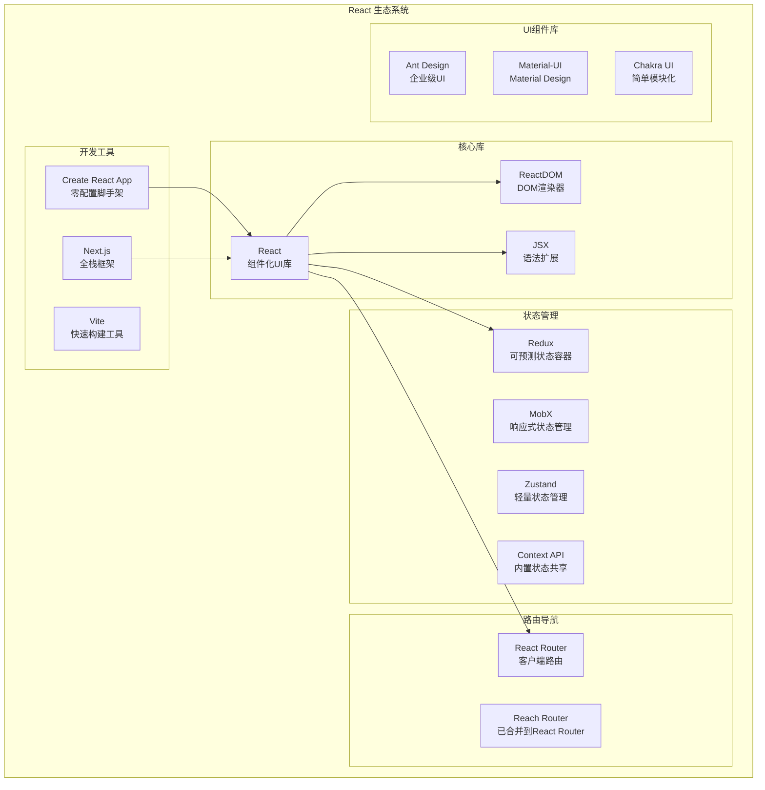

#### 1.1.2 React 生态系统

**技术栈对比**：

| 技术分类 | 主流选择 | 特点 | 适用场景 |
|----------|----------|------|----------|
| **状态管理** | Redux, Zustand, Jotai | 各有优势 | 复杂应用vs简单状态 |
| **路由管理** | React Router v6 | 声明式路由 | SPA应用导航 |
| **样式方案** | CSS Modules, Styled-components, Tailwind | 组件化样式 | 样式隔离与复用 |
| **构建工具** | Vite, Webpack, Parcel | 快速开发 | 开发体验优化 |
| **测试框架** | Jest, React Testing Library | 测试友好 | 保证代码质量 |

### 1.2 核心概念

#### 1.2.1 虚拟DOM原理

**虚拟DOM**是React的核心创新之一，它是真实DOM的JavaScript表示。

**虚拟DOM工作流程**：

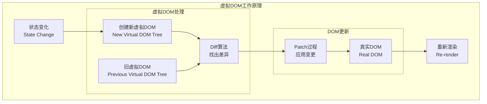

**虚拟DOM优势**：

1. **性能优化**：
   - 批量更新，减少DOM操作
   - Diff算法优化更新范围
   - 异步更新，不阻塞用户交互

2. **开发体验**：
   - 声明式编程模式
   - 跨平台抽象层
   - 更好的错误边界处理

**简化的虚拟DOM实现**：

```javascript
// 虚拟DOM节点结构
const VNode = {
  type: 'div',           // 元素类型
  props: {               // 属性
    className: 'container',
    children: [
      {
        type: 'span',
        props: {
          children: 'Hello World'
        }
      }
    ]
  }
};

// 简化的Diff算法
function diff(oldVNode, newVNode) {
  // 节点类型不同，直接替换
  if (oldVNode.type !== newVNode.type) {
    return { type: 'REPLACE', newVNode };
  }
  
  // 比较属性
  const propsPatches = diffProps(oldVNode.props, newVNode.props);
  
  // 比较子节点
  const childrenPatches = diffChildren(
    oldVNode.props.children, 
    newVNode.props.children
  );
  
  return {
    type: 'UPDATE',
    propsPatches,
    childrenPatches
  };
}

// 应用补丁到真实DOM
function patch(domNode, patches) {
  switch (patches.type) {
    case 'REPLACE':
      domNode.parentNode.replaceChild(
        createElement(patches.newVNode), 
        domNode
      );
      break;
    case 'UPDATE':
      updateProps(domNode, patches.propsPatches);
      patches.childrenPatches.forEach((patch, index) => {
        patch(domNode.childNodes[index], patch);
      });
      break;
  }
}
```

#### 1.2.2 组件化思想

**组件化**是React的核心设计理念，将UI拆分为独立、可复用的组件。

**组件化架构优势**：

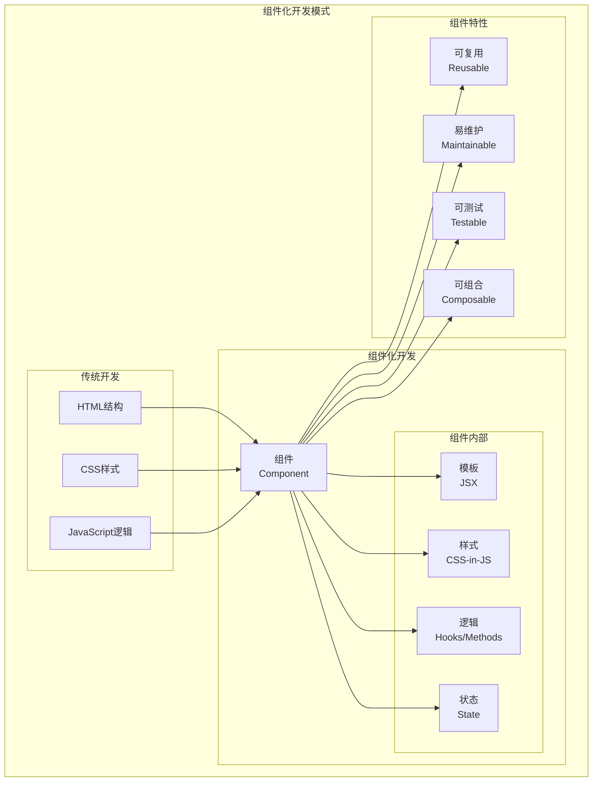

**组件设计原则**：

1. **单一职责原则**：
   ```javascript
   // ✅ 好的设计：职责单一
   const UserAvatar = ({ user }) => (
     
   );
   
   const UserInfo = ({ user }) => (
     <div className="user-info">
       <UserAvatar user={user} />
       <span>{user.name}</span>
     </div>
   );
   
   // ❌ 不好的设计：职责混杂
   const UserComponent = ({ user, posts, comments }) => (
     <div>
       
       <span>{user.name}</span>
       <div>{posts.map(post => <PostItem post={post} />)}</div>
       <div>{comments.map(comment => <Comment comment={comment} />)}</div>
     </div>
   );
   ```

2. **组件组合**：
   ```javascript
   // 高阶组件模式
   const withLoading = (WrappedComponent) => {
     return ({ isLoading, ...props }) => {
       if (isLoading) {
         return <div>Loading...</div>;
       }
       return <WrappedComponent {...props} />;
     };
   };
   
   // 组合使用
   const UserList = withLoading(({ users }) => (
     <div>
       {users.map(user => <UserInfo key={user.id} user={user} />)}
     </div>
   ));
   ```

#### 1.2.3 单向数据流

**单向数据流**确保数据流向的可预测性，是React架构的重要特征。

**数据流向示意**：

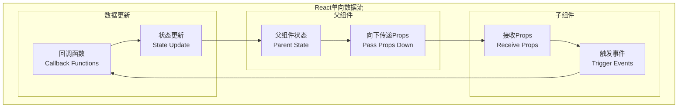

**单向数据流示例**：

```javascript
// 父组件：管理状态
const TodoApp = () => {
  const [todos, setTodos] = useState([]);
  const [filter, setFilter] = useState('all');
  
  const addTodo = (text) => {
    setTodos([...todos, { id: Date.now(), text, completed: false }]);
  };
  
  const toggleTodo = (id) => {
    setTodos(todos.map(todo => 
      todo.id === id ? { ...todo, completed: !todo.completed } : todo
    ));
  };
  
  const filteredTodos = todos.filter(todo => {
    if (filter === 'active') return !todo.completed;
    if (filter === 'completed') return todo.completed;
    return true;
  });
  
  return (
    <div>
      <TodoInput onAddTodo={addTodo} />
      <TodoList todos={filteredTodos} onToggleTodo={toggleTodo} />
      <TodoFilter filter={filter} onFilterChange={setFilter} />
    </div>
  );
};

// 子组件：接收props，触发回调
const TodoInput = ({ onAddTodo }) => {
  const [text, setText] = useState('');
  
  const handleSubmit = (e) => {
    e.preventDefault();
    if (text.trim()) {
      onAddTodo(text.trim());  // 向上通信
      setText('');
    }
  };
  
  return (
    <form onSubmit={handleSubmit}>
      <input 
        value={text}
        onChange={(e) => setText(e.target.value)}
        placeholder="What needs to be done?"
      />
      <button type="submit">Add</button>
    </form>
  );
};

const TodoList = ({ todos, onToggleTodo }) => (
  <ul>
    {todos.map(todo => (
      <TodoItem 
        key={todo.id} 
        todo={todo} 
        onToggle={() => onToggleTodo(todo.id)}
      />
    ))}
  </ul>
);

const TodoItem = ({ todo, onToggle }) => (
  <li 
    onClick={onToggle}
    style={{ 
      textDecoration: todo.completed ? 'line-through' : 'none' 
    }}
  >
    {todo.text}
  </li>
);
```

### 1.3 React 架构演进

#### 1.3.1 从类组件到函数组件

**组件发展历程**：

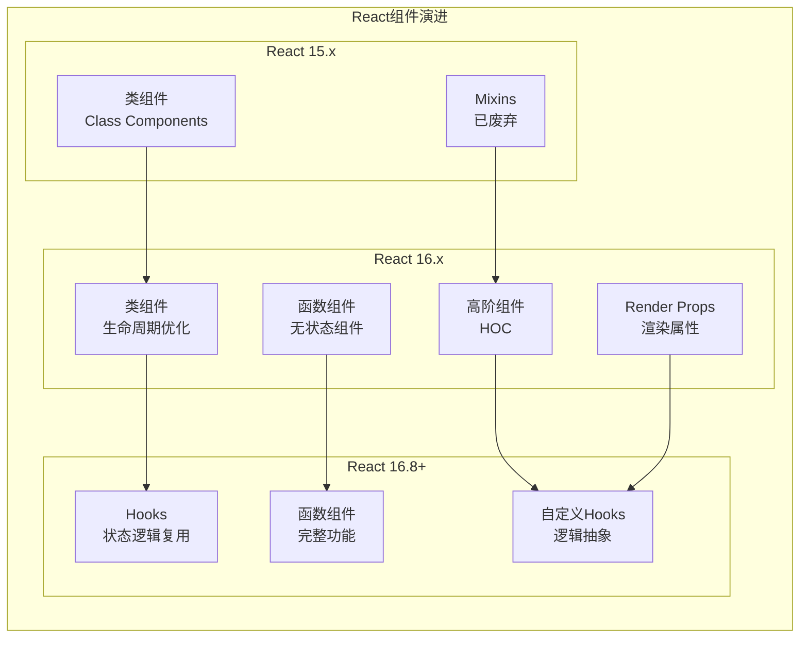

**类组件 vs 函数组件对比**：

| 方面 | 类组件 | 函数组件 + Hooks |
|------|--------|------------------|
| **语法** | class语法，this绑定 | 函数语法，更简洁 |
| **状态管理** | this.state | useState Hook |
| **生命周期** | 生命周期方法 | useEffect Hook |
| **性能** | shouldComponentUpdate | React.memo |
| **逻辑复用** | HOC, Render Props | 自定义Hooks |
| **代码量** | 相对较多 | 更简洁 |
| **学习成本** | this绑定复杂 | 更直观 |

**迁移示例**：

```javascript
// 类组件写法
class UserProfile extends React.Component {
  constructor(props) {
    super(props);
    this.state = {
      user: null,
      loading: true,
      error: null
    };
  }
  
  async componentDidMount() {
    try {
      const user = await fetchUser(this.props.userId);
      this.setState({ user, loading: false });
    } catch (error) {
      this.setState({ error, loading: false });
    }
  }
  
  async componentDidUpdate(prevProps) {
    if (prevProps.userId !== this.props.userId) {
      this.setState({ loading: true });
      try {
        const user = await fetchUser(this.props.userId);
        this.setState({ user, loading: false });
      } catch (error) {
        this.setState({ error, loading: false });
      }
    }
  }
  
  render() {
    const { user, loading, error } = this.state;
    
    if (loading) return <div>Loading...</div>;
    if (error) return <div>Error: {error.message}</div>;
    if (!user) return <div>No user found</div>;
    
    return (
      <div>
        <h1>{user.name}</h1>
        <p>{user.email}</p>
      </div>
    );
  }
}

// 函数组件 + Hooks写法
const UserProfile = ({ userId }) => {
  const [user, setUser] = useState(null);
  const [loading, setLoading] = useState(true);
  const [error, setError] = useState(null);
  
  useEffect(() => {
    const loadUser = async () => {
      setLoading(true);
      setError(null);
      
      try {
        const userData = await fetchUser(userId);
        setUser(userData);
      } catch (err) {
        setError(err);
      } finally {
        setLoading(false);
      }
    };
    
    loadUser();
  }, [userId]);
  
  if (loading) return <div>Loading...</div>;
  if (error) return <div>Error: {error.message}</div>;
  if (!user) return <div>No user found</div>;
  
  return (
    <div>
      <h1>{user.name}</h1>
      <p>{user.email}</p>
    </div>
  );
};

// 进一步优化：自定义Hook
const useUser = (userId) => {
  const [user, setUser] = useState(null);
  const [loading, setLoading] = useState(true);
  const [error, setError] = useState(null);
  
  useEffect(() => {
    const loadUser = async () => {
      setLoading(true);
      setError(null);
      
      try {
        const userData = await fetchUser(userId);
        setUser(userData);
      } catch (err) {
        setError(err);
      } finally {
        setLoading(false);
      }
    };
    
    loadUser();
  }, [userId]);
  
  return { user, loading, error };
};

// 使用自定义Hook
const UserProfile = ({ userId }) => {
  const { user, loading, error } = useUser(userId);
  
  if (loading) return <div>Loading...</div>;
  if (error) return <div>Error: {error.message}</div>;
  if (!user) return <div>No user found</div>;
  
  return (
    <div>
      <h1>{user.name}</h1>
      <p>{user.email}</p>
    </div>
  );
};
```

#### 1.3.2 Fiber 架构原理

**Fiber架构**是React 16引入的新调和引擎，解决了原有架构的性能问题。

**Fiber架构优势**：

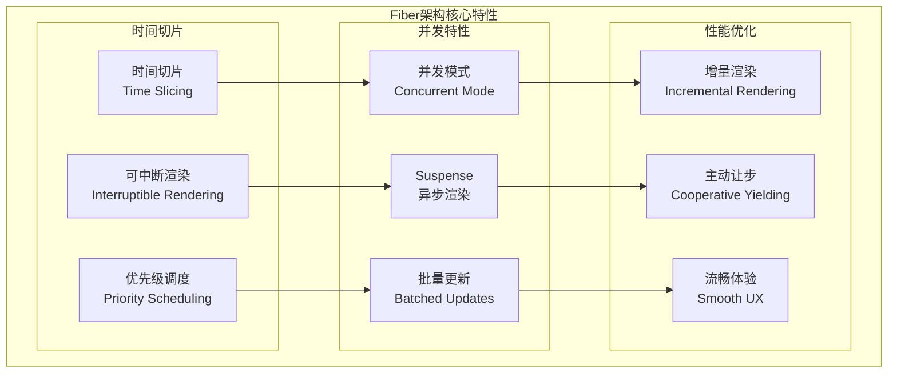

**Fiber节点结构**：

```javascript
// Fiber节点的简化结构
const FiberNode = {
  // 节点信息
  type: 'div',                    // 组件类型
  key: 'unique-key',              // React key
  elementType: 'div',             // 元素类型
  
  // 状态信息
  pendingProps: {},               // 新的props
  memoizedProps: {},              // 上次渲染的props
  memoizedState: null,            // 上次渲染的state
  updateQueue: null,              // 更新队列
  
  // 副作用
  effectTag: 0,                   // 副作用标记
  nextEffect: null,               // 下一个有副作用的节点
  firstEffect: null,              // 第一个子节点副作用
  lastEffect: null,               // 最后一个子节点副作用
  
  // 优先级
  lanes: 0,                       // 优先级车道
  childLanes: 0,                  // 子节点优先级
  
  // 节点关系
  return: null,                   // 父节点
  child: null,                    // 第一个子节点
  sibling: null,                  // 兄弟节点
  index: 0,                       // 索引
  
  // 其他
  ref: null,                      // ref引用
  alternate: null,                // 双缓存机制的另一个fiber
};

// Fiber工作循环
function workLoopConcurrent() {
  // 如果还有工作要做且没有被中断
  while (workInProgress !== null && !shouldYield()) {
    workInProgress = performUnitOfWork(workInProgress);
  }
}

function performUnitOfWork(unitOfWork) {
  const current = unitOfWork.alternate;
  
  // 开始工作
  let next = beginWork(current, unitOfWork, renderLanes);
  
  unitOfWork.memoizedProps = unitOfWork.pendingProps;
  
  if (next === null) {
    // 如果没有子节点，完成工作
    completeUnitOfWork(unitOfWork);
  } else {
    workInProgress = next;
  }
  
  return next;
}
```

**优先级调度系统**：

```javascript
// React优先级等级
const ImmediatePriority = 1;      // 立即执行（用户输入）
const UserBlockingPriority = 2;   // 用户阻塞（hover、滚动）
const NormalPriority = 3;         // 正常优先级（数据获取）
const LowPriority = 4;            // 低优先级（分析）
const IdlePriority = 5;           // 空闲优先级（离屏内容）

// 调度器如何工作
function scheduleWork(fiber, expirationTime) {
  const root = markUpdateTimeFromFiberToRoot(fiber, expirationTime);
  
  if (root === null) return;
  
  // 检查是否有更高优先级的工作
  if (expirationTime === Sync) {
    // 同步更新
    performSyncWorkOnRoot(root);
  } else {
    // 异步更新
    ensureRootIsScheduled(root, getCurrentTime());
  }
}

// 时间切片机制
function shouldYield() {
  const currentTime = getCurrentTime();
  return currentTime >= deadline;
}
```

## 2. 组件基础与生命周期

### 2.1 组件定义与使用

#### 2.1.1 函数组件

**函数组件**是React的推荐组件写法，语法简洁，配合Hooks使用功能强大。

**基础函数组件**：

```javascript
// 基础函数组件
const Welcome = (props) => {
  return <h1>Hello, {props.name}!</h1>;
};

// 箭头函数简写
const Welcome = ({ name }) => <h1>Hello, {name}!</h1>;

// 传统函数声明
function Welcome(props) {
  return <h1>Hello, {props.name}!</h1>;
}

// 带默认props
const Welcome = ({ name = 'World' }) => <h1>Hello, {name}!</h1>;

// 使用组件
const App = () => (
  <div>
    <Welcome name="Alice" />
    <Welcome name="Bob" />
    <Welcome />
  </div>
);
```

**函数组件高级模式**：

```javascript
// 1. 组件作为props
const Layout = ({ header, content, footer }) => (
  <div className="layout">
    <header>{header}</header>
    <main>{content}</main>
    <footer>{footer}</footer>
  </div>
);

// 使用
<Layout
  header={<Header />}
  content={<MainContent />}
  footer={<Footer />}
/>

// 2. children模式
const Card = ({ title, children }) => (
  <div className="card">
    <h2>{title}</h2>
    <div className="card-body">
      {children}
    </div>
  </div>
);

// 使用
<Card title="用户信息">
  <p>姓名：张三</p>
  <p>邮箱：zhangsan@example.com</p>
</Card>

// 3. render props模式
const DataProvider = ({ children, url }) => {
  const [data, setData] = useState(null);
  const [loading, setLoading] = useState(true);
  
  useEffect(() => {
    fetch(url)
      .then(response => response.json())
      .then(data => {
        setData(data);
        setLoading(false);
      });
  }, [url]);
  
  return children({ data, loading });
};

// 使用
<DataProvider url="/api/users">
  {({ data, loading }) => 
    loading ? <div>Loading...</div> : <UserList users={data} />
  }
</DataProvider>
```

#### 2.1.2 类组件

**类组件**是React的传统组件写法，虽然函数组件是趋势，但理解类组件仍然重要。

```javascript
// 基础类组件
class Welcome extends React.Component {
  render() {
    return <h1>Hello, {this.props.name}!</h1>;
  }
}

// 带状态的类组件
class Counter extends React.Component {
  constructor(props) {
    super(props);
    this.state = {
      count: 0
    };
    
    // 绑定this
    this.handleClick = this.handleClick.bind(this);
  }
  
  handleClick() {
    this.setState({ count: this.state.count + 1 });
  }
  
  render() {
    return (
      <div>
        <p>Count: {this.state.count}</p>
        <button onClick={this.handleClick}>+1</button>
      </div>
    );
  }
}

// 箭头函数避免this绑定
class Counter extends React.Component {
  state = { count: 0 };
  
  handleClick = () => {
    this.setState({ count: this.state.count + 1 });
  }
  
  render() {
    return (
      <div>
        <p>Count: {this.state.count}</p>
        <button onClick={this.handleClick}>+1</button>
      </div>
    );
  }
}
```

#### 2.1.3 组件通信

**组件通信**是React应用的核心，包括父子通信、兄弟通信、跨级通信等。

**组件通信模式**：

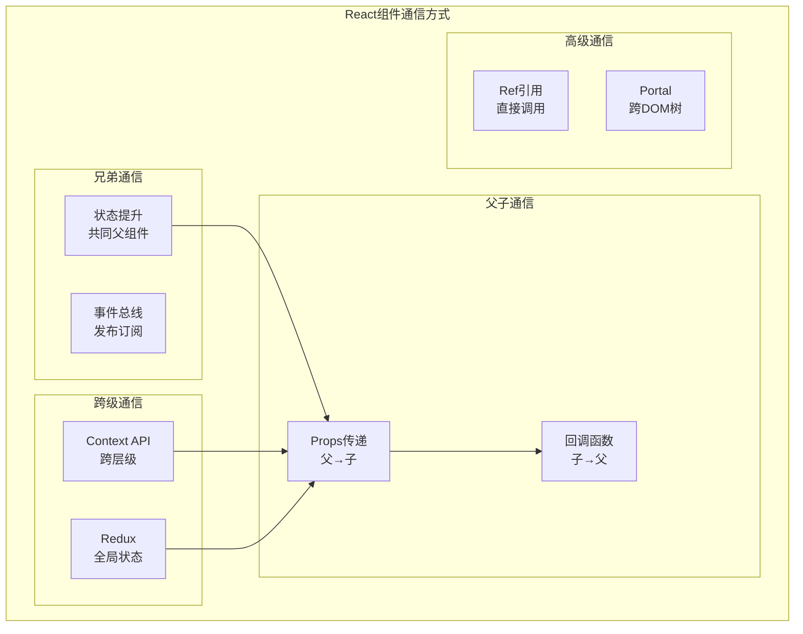

**通信示例代码**：

```javascript
// 1. 父子通信
const Parent = () => {
  const [message, setMessage] = useState('Hello from Parent');
  
  const handleChildMessage = (childMessage) => {
    console.log('收到子组件消息:', childMessage);
  };
  
  return (
    <div>
      <Child 
        message={message} 
        onMessage={handleChildMessage}
      />
    </div>
  );
};

const Child = ({ message, onMessage }) => {
  const sendMessage = () => {
    onMessage('Hello from Child');
  };
  
  return (
    <div>
      <p>父组件消息: {message}</p>
      <button onClick={sendMessage}>向父组件发消息</button>
    </div>
  );
};

// 2. Context API跨级通信
const ThemeContext = React.createContext('light');

const App = () => {
  const [theme, setTheme] = useState('light');
  
  return (
    <ThemeContext.Provider value={{ theme, setTheme }}>
      <Header />
      <Main />
      <Footer />
    </ThemeContext.Provider>
  );
};

const ThemeButton = () => {
  const { theme, setTheme } = useContext(ThemeContext);
  
  return (
    <button onClick={() => setTheme(theme === 'light' ? 'dark' : 'light')}>
      切换到{theme === 'light' ? '暗' : '亮'}色主题
    </button>
  );
};

// 3. 自定义Hook实现状态共享
const useSharedState = (initialValue) => {
  const [state, setState] = useState(initialValue);
  
  const updateState = useCallback((newState) => {
    setState(newState);
  }, []);
  
  return [state, updateState];
};

// 4. Ref通信
const Parent = () => {
  const childRef = useRef();
  
  const callChildMethod = () => {
    childRef.current.focus();
  };
  
  return (
    <div>
      <Child ref={childRef} />
      <button onClick={callChildMethod}>Focus Child</button>
    </div>
  );
};

const Child = forwardRef((props, ref) => {
  const inputRef = useRef();
  
  useImperativeHandle(ref, () => ({
    focus: () => {
      inputRef.current.focus();
    }
  }));
  
  return <input ref={inputRef} />;
});
```

### 2.2 生命周期详解

#### 2.2.1 挂载阶段

**组件挂载**是组件从创建到插入DOM的过程。

**生命周期流程**：

```mermaid
graph TB
    subgraph "React生命周期（类组件）"
        subgraph "挂载阶段 Mounting"
            CONSTRUCTOR["constructor()<br/>构造函数"]
            GET_DERIVED["getDerivedStateFromProps()<br/>从props获取state"]
            RENDER["render()<br/>渲染"]
            DID_MOUNT["componentDidMount()<br/>挂载完成"]
        end
        
        subgraph "更新阶段 Updating"
            GET_DERIVED_UPDATE["getDerivedStateFromProps()"]
            SHOULD_UPDATE["shouldComponentUpdate()<br/>是否应该更新"]
            RENDER_UPDATE["render()"]
            GET_SNAPSHOT["getSnapshotBeforeUpdate()<br/>更新前快照"]
            DID_UPDATE["componentDidUpdate()<br/>更新完成"]
        end
        
        subgraph "卸载阶段 Unmounting"
            WILL_UNMOUNT["componentWillUnmount()<br/>即将卸载"]
        end
    end
    
    CONSTRUCTOR --> GET_DERIVED
    GET_DERIVED --> RENDER
    RENDER --> DID_MOUNT
    
    DID_MOUNT --> GET_DERIVED_UPDATE
    GET_DERIVED_UPDATE --> SHOULD_UPDATE
    SHOULD_UPDATE --> RENDER_UPDATE
    RENDER_UPDATE --> GET_SNAPSHOT
    GET_SNAPSHOT --> DID_UPDATE
    DID_UPDATE --> GET_DERIVED_UPDATE
    
    DID_UPDATE --> WILL_UNMOUNT
```

**生命周期与Hooks对应关系**：

| 类组件生命周期 | Hooks等价写法 | 用途 |
|----------------|---------------|------|
| `constructor` | `useState`初始值 | 初始化状态 |
| `componentDidMount` | `useEffect(fn, [])` | 组件挂载后 |
| `componentDidUpdate` | `useEffect(fn)` | 组件更新后 |
| `componentWillUnmount` | `useEffect(() => fn, [])` | 组件卸载前 |
| `shouldComponentUpdate` | `React.memo` | 性能优化 |
| `getDerivedStateFromProps` | `useState` + `useEffect` | 从props计算state |

**Hooks生命周期示例**：

```javascript
// 类组件写法
class UserProfile extends React.Component {
  constructor(props) {
    super(props);
    this.state = {
      user: null,
      loading: true
    };
  }
  
  async componentDidMount() {
    console.log('组件挂载');
    this.setState({ loading: true });
    const user = await fetchUser(this.props.userId);
    this.setState({ user, loading: false });
  }
  
  async componentDidUpdate(prevProps) {
    if (prevProps.userId !== this.props.userId) {
      console.log('userId changed');
      this.setState({ loading: true });
      const user = await fetchUser(this.props.userId);
      this.setState({ user, loading: false });
    }
  }
  
  componentWillUnmount() {
    console.log('组件卸载');
    // 清理工作
  }
  
  render() {
    if (this.state.loading) return <div>Loading...</div>;
    return <div>{this.state.user?.name}</div>;
  }
}

// Hooks写法
const UserProfile = ({ userId }) => {
  const [user, setUser] = useState(null);
  const [loading, setLoading] = useState(true);
  
  useEffect(() => {
    console.log('组件挂载或userId变化');
    
    const loadUser = async () => {
      setLoading(true);
      const userData = await fetchUser(userId);
      setUser(userData);
      setLoading(false);
    };
    
    loadUser();
    
    // 清理函数（相当于componentWillUnmount）
    return () => {
      console.log('清理工作');
    };
  }, [userId]); // 依赖数组
  
  if (loading) return <div>Loading...</div>;
  return <div>{user?.name}</div>;
};
```

#### 2.2.2 更新阶段

**组件更新**发生在props或state变化时。

```javascript
// 性能优化：防止不必要的更新
const ExpensiveComponent = React.memo(({ data, config }) => {
  console.log('ExpensiveComponent render');
  
  // 复杂计算
  const processedData = useMemo(() => {
    return data.map(item => ({
      ...item,
      processed: expensiveCalculation(item, config)
    }));
  }, [data, config]);
  
  return (
    <div>
      {processedData.map(item => (
        <div key={item.id}>{item.processed}</div>
      ))}
    </div>
  );
});

// 自定义比较函数
const MyComponent = React.memo(({ user, settings }) => {
  return <div>{user.name}</div>;
}, (prevProps, nextProps) => {
  // 返回true表示props相等，不需要重新渲染
  return prevProps.user.id === nextProps.user.id;
});

// useCallback优化函数引用
const TodoList = ({ todos }) => {
  const [filter, setFilter] = useState('all');
  
  // 避免每次渲染都创建新函数
  const handleToggle = useCallback((id) => {
    // 切换todo状态的逻辑
    console.log('Toggle todo:', id);
  }, []);
  
  const filteredTodos = useMemo(() => {
    return todos.filter(todo => {
      if (filter === 'active') return !todo.completed;
      if (filter === 'completed') return todo.completed;
      return true;
    });
  }, [todos, filter]);
  
  return (
    <div>
      <FilterButtons filter={filter} onFilterChange={setFilter} />
      {filteredTodos.map(todo => (
        <TodoItem 
          key={todo.id} 
          todo={todo} 
          onToggle={handleToggle}
        />
      ))}
    </div>
  );
};
```

#### 2.2.3 卸载阶段

**组件卸载**时需要清理副作用，防止内存泄漏。

```javascript
// 清理副作用的最佳实践
const TimerComponent = () => {
  const [time, setTime] = useState(new Date());
  
  useEffect(() => {
    const timer = setInterval(() => {
      setTime(new Date());
    }, 1000);
    
    // 清理定时器
    return () => {
      clearInterval(timer);
    };
  }, []);
  
  return <div>{time.toLocaleTimeString()}</div>;
};

// 事件监听器清理
const WindowSizeTracker = () => {
  const [windowSize, setWindowSize] = useState({
    width: window.innerWidth,
    height: window.innerHeight
  });
  
  useEffect(() => {
    const handleResize = () => {
      setWindowSize({
        width: window.innerWidth,
        height: window.innerHeight
      });
    };
    
    window.addEventListener('resize', handleResize);
    
    // 清理事件监听器
    return () => {
      window.removeEventListener('resize', handleResize);
    };
  }, []);
  
  return <div>窗口大小: {windowSize.width} x {windowSize.height}</div>;
};

// 取消网络请求
const DataFetcher = ({ url }) => {
  const [data, setData] = useState(null);
  const [loading, setLoading] = useState(true);
  
  useEffect(() => {
    const abortController = new AbortController();
    
    const fetchData = async () => {
      try {
        setLoading(true);
        const response = await fetch(url, {
          signal: abortController.signal
        });
        const result = await response.json();
        setData(result);
      } catch (error) {
        if (error.name !== 'AbortError') {
          console.error('Fetch error:', error);
        }
      } finally {
        setLoading(false);
      }
    };
    
    fetchData();
    
    // 清理：取消请求
    return () => {
      abortController.abort();
    };
  }, [url]);
  
  if (loading) return <div>Loading...</div>;
  return <div>{JSON.stringify(data)}</div>;
};
```

### 2.3 事件处理机制

#### 2.3.1 合成事件系统

**合成事件(SyntheticEvent)**是React对原生事件的封装，提供跨浏览器兼容性。

**合成事件特点**：

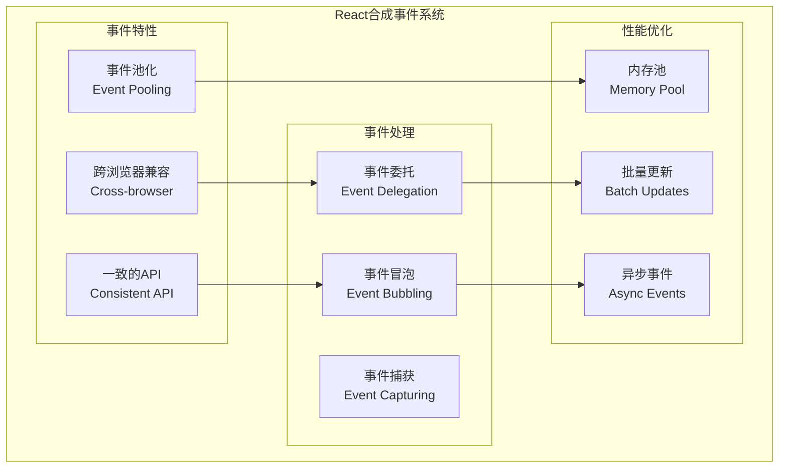

**事件处理示例**：

```javascript
// 基础事件处理
const Button = () => {
  const handleClick = (e) => {
    // e是合成事件对象
    console.log('Event type:', e.type);
    console.log('Current target:', e.currentTarget);
    console.log('Native event:', e.nativeEvent);
    
    // 阻止默认行为
    e.preventDefault();
    
    // 阻止事件冒泡
    e.stopPropagation();
  };
  
  return <button onClick={handleClick}>Click me</button>;
};

// 表单事件处理
const ContactForm = () => {
  const [formData, setFormData] = useState({
    name: '',
    email: '',
    message: ''
  });
  
  const handleChange = (e) => {
    const { name, value } = e.target;
    setFormData(prev => ({
      ...prev,
      [name]: value
    }));
  };
  
  const handleSubmit = (e) => {
    e.preventDefault();
    console.log('Form submitted:', formData);
  };
  
  const handleKeyDown = (e) => {
    if (e.key === 'Enter' && e.ctrlKey) {
      handleSubmit(e);
    }
  };
  
  return (
    <form onSubmit={handleSubmit}>
      <input
        name="name"
        value={formData.name}
        onChange={handleChange}
        placeholder="姓名"
      />
      <input
        name="email"
        type="email"
        value={formData.email}
        onChange={handleChange}
        placeholder="邮箱"
      />
      <textarea
        name="message"
        value={formData.message}
        onChange={handleChange}
        onKeyDown={handleKeyDown}
        placeholder="消息 (Ctrl+Enter提交)"
      />
      <button type="submit">提交</button>
    </form>
  );
};

// 自定义事件处理Hook
const useEventListener = (eventName, handler, element = window) => {
  const savedHandler = useRef();
  
  useEffect(() => {
    savedHandler.current = handler;
  }, [handler]);
  
  useEffect(() => {
    const isSupported = element && element.addEventListener;
    if (!isSupported) return;
    
    const eventListener = (event) => savedHandler.current(event);
    element.addEventListener(eventName, eventListener);
    
    return () => {
      element.removeEventListener(eventName, eventListener);
    };
  }, [eventName, element]);
};

// 使用自定义Hook
const KeyboardShortcuts = () => {
  const [message, setMessage] = useState('');
  
  useEventListener('keydown', (e) => {
    if (e.ctrlKey && e.key === 's') {
      e.preventDefault();
      setMessage('Ctrl+S 保存快捷键被按下');
    }
    if (e.key === 'Escape') {
      setMessage('');
    }
  });
  
  return <div>{message}</div>;
};
```

#### 2.3.2 事件委托机制

**事件委托**是React性能优化的重要机制。

```javascript
// React事件委托原理示例
class EventDelegation {
  constructor() {
    this.eventMap = new Map();
    this.bindEvent();
  }
  
  bindEvent() {
    // React将所有事件绑定到document根节点
    document.addEventListener('click', this.handleDocumentClick.bind(this));
  }
  
  handleDocumentClick(nativeEvent) {
    let target = nativeEvent.target;
    
    // 向上遍历DOM树，查找注册的事件处理器
    while (target && target !== document) {
      const reactEventHandler = this.eventMap.get(target);
      if (reactEventHandler) {
        // 创建合成事件对象
        const syntheticEvent = this.createSyntheticEvent(nativeEvent, target);
        reactEventHandler(syntheticEvent);
        
        if (syntheticEvent.isPropagationStopped()) {
          break;
        }
      }
      target = target.parentNode;
    }
  }
  
  createSyntheticEvent(nativeEvent, currentTarget) {
    return {
      type: nativeEvent.type,
      currentTarget,
      target: nativeEvent.target,
      nativeEvent,
      preventDefault: () => nativeEvent.preventDefault(),
      stopPropagation: () => {
        this._propagationStopped = true;
      },
      isPropagationStopped: () => this._propagationStopped || false
    };
  }
  
  registerEvent(element, handler) {
    this.eventMap.set(element, handler);
  }
}

// 实际使用中的优化技巧
const ListComponent = ({ items, onItemClick }) => {
  // 使用事件委托处理列表项点击
  const handleListClick = (e) => {
    const itemElement = e.target.closest('[data-item-id]');
    if (itemElement) {
      const itemId = itemElement.dataset.itemId;
      onItemClick(itemId);
    }
  };
  
  return (
    <ul onClick={handleListClick}>
      {items.map(item => (
        <li key={item.id} data-item-id={item.id}>
          {item.name}
        </li>
      ))}
    </ul>
  );
};

// 防抖和节流处理
const useDebounce = (value, delay) => {
  const [debouncedValue, setDebouncedValue] = useState(value);
  
  useEffect(() => {
    const handler = setTimeout(() => {
      setDebouncedValue(value);
    }, delay);
    
    return () => {
      clearTimeout(handler);
    };
  }, [value, delay]);
  
  return debouncedValue;
};

const SearchInput = ({ onSearch }) => {
  const [query, setQuery] = useState('');
  const debouncedQuery = useDebounce(query, 300);
  
  useEffect(() => {
    if (debouncedQuery) {
      onSearch(debouncedQuery);
    }
  }, [debouncedQuery, onSearch]);
  
  return (
    <input
      value={query}
      onChange={(e) => setQuery(e.target.value)}
      placeholder="搜索..."
    />
  );
};
```

## 3. React Hooks 深度解析

### 3.1 基础Hooks

#### 3.1.1 useState

**useState**是最基础的Hook，用于在函数组件中添加状态。

```javascript
// 基础用法
const Counter = () => {
  const [count, setCount] = useState(0);
  
  return (
    <div>
      <p>Count: {count}</p>
      <button onClick={() => setCount(count + 1)}>+1</button>
      <button onClick={() => setCount(prev => prev + 1)}>+1 (函数式)</button>
    </div>
  );
};

// 复杂状态管理
const UserForm = () => {
  const [user, setUser] = useState({
    name: '',
    email: '',
    age: 0
  });
  
  const updateUser = (field, value) => {
    setUser(prev => ({
      ...prev,
      [field]: value
    }));
  };
  
  return (
    <form>
      <input
        value={user.name}
        onChange={(e) => updateUser('name', e.target.value)}
        placeholder="姓名"
      />
      <input
        value={user.email}
        onChange={(e) => updateUser('email', e.target.value)}
        placeholder="邮箱"
      />
      <input
        type="number"
        value={user.age}
        onChange={(e) => updateUser('age', parseInt(e.target.value))}
        placeholder="年龄"
      />
    </form>
  );
};

// 惰性初始化
const ExpensiveComponent = () => {
  // 只在首次渲染时执行昂贵的计算
  const [data, setData] = useState(() => {
    console.log('执行昂贵的初始化计算');
    return expensiveCalculation();
  });
  
  return <div>{data}</div>;
};

// 状态更新的注意事项
const StateUpdateExample = () => {
  const [count, setCount] = useState(0);
  
  const handleClick = () => {
    // ❌ 错误：会被批量处理，只会+1
    setCount(count + 1);
    setCount(count + 1);
    setCount(count + 1);
    
    // ✅ 正确：使用函数式更新
    setCount(prev => prev + 1);
    setCount(prev => prev + 1);
    setCount(prev => prev + 1);
  };
  
  const handleAsyncClick = () => {
    setTimeout(() => {
      // ❌ 在异步回调中，可能获取到过期的state
      setCount(count + 1);
      
      // ✅ 使用函数式更新获取最新state
      setCount(prev => prev + 1);
    }, 1000);
  };
  
  return (
    <div>
      <p>Count: {count}</p>
      <button onClick={handleClick}>同步+3</button>
      <button onClick={handleAsyncClick}>异步+1</button>
    </div>
  );
};
```

#### 3.1.2 useEffect

**useEffect**处理副作用，是React Hooks中最重要的Hook之一。

```javascript
// 基础用法
const Timer = () => {
  const [seconds, setSeconds] = useState(0);
  
  // 相当于componentDidMount和componentDidUpdate
  useEffect(() => {
    document.title = `Timer: ${seconds}s`;
  });
  
  // 相当于componentDidMount
  useEffect(() => {
    const timer = setInterval(() => {
      setSeconds(prev => prev + 1);
    }, 1000);
    
    // 相当于componentWillUnmount
    return () => {
      clearInterval(timer);
    };
  }, []); // 空依赖数组，只在挂载时执行
  
  return <div>Seconds: {seconds}</div>;
};

// 依赖数组的使用
const UserProfile = ({ userId }) => {
  const [user, setUser] = useState(null);
  const [loading, setLoading] = useState(true);
  
  useEffect(() => {
    let cancelled = false;
    
    const fetchUser = async () => {
      setLoading(true);
      try {
        const userData = await api.getUser(userId);
        if (!cancelled) {
          setUser(userData);
        }
      } catch (error) {
        if (!cancelled) {
          console.error('获取用户失败:', error);
        }
      } finally {
        if (!cancelled) {
          setLoading(false);
        }
      }
    };
    
    fetchUser();
    
    return () => {
      cancelled = true;
    };
  }, [userId]); // userId变化时重新执行
  
  if (loading) return <div>Loading...</div>;
  return <div>{user?.name}</div>;
};

// 多个useEffect的使用
const ChatRoom = ({ roomId, userId }) => {
  const [messages, setMessages] = useState([]);
  const [onlineUsers, setOnlineUsers] = useState([]);
  
  // 处理消息订阅
  useEffect(() => {
    const unsubscribe = messageService.subscribe(roomId, (newMessage) => {
      setMessages(prev => [...prev, newMessage]);
    });
    
    return unsubscribe;
  }, [roomId]);
  
  // 处理在线用户
  useEffect(() => {
    const unsubscribe = userService.subscribeOnlineUsers(roomId, (users) => {
      setOnlineUsers(users);
    });
    
    return unsubscribe;
  }, [roomId]);
  
  // 用户活动状态
  useEffect(() => {
    userService.setUserActive(userId, roomId);
    
    return () => {
      userService.setUserInactive(userId, roomId);
    };
  }, [userId, roomId]);
  
  return (
    <div>
      <div>在线用户: {onlineUsers.length}</div>
      <div>
        {messages.map(msg => (
          <div key={msg.id}>{msg.content}</div>
        ))}
      </div>
    </div>
  );
};

// 自定义Effect Hook
const useDocumentTitle = (title) => {
  useEffect(() => {
    const prevTitle = document.title;
    document.title = title;
    
    return () => {
      document.title = prevTitle;
    };
  }, [title]);
};

const useLocalStorage = (key, initialValue) => {
  const [value, setValue] = useState(() => {
    try {
      const item = window.localStorage.getItem(key);
      return item ? JSON.parse(item) : initialValue;
    } catch (error) {
      return initialValue;
    }
  });
  
  useEffect(() => {
    try {
      window.localStorage.setItem(key, JSON.stringify(value));
    } catch (error) {
      console.error('保存到localStorage失败:', error);
    }
  }, [key, value]);
  
  return [value, setValue];
};

// 使用自定义Hook
const Settings = () => {
  const [theme, setTheme] = useLocalStorage('theme', 'light');
  const [language, setLanguage] = useLocalStorage('language', 'zh');
  
  useDocumentTitle(`设置 - ${theme === 'light' ? '亮色' : '暗色'}主题`);
  
  return (
    <div>
      <select value={theme} onChange={(e) => setTheme(e.target.value)}>
        <option value="light">亮色主题</option>
        <option value="dark">暗色主题</option>
      </select>
      <select value={language} onChange={(e) => setLanguage(e.target.value)}>
        <option value="zh">中文</option>
        <option value="en">English</option>
      </select>
    </div>
  );
};
```

#### 3.1.3 useContext

**useContext**用于跨组件层级传递数据，避免props drilling。

```javascript
// 创建Context
const ThemeContext = createContext();
const UserContext = createContext();

// 组合多个Context
const AppProvider = ({ children }) => {
  const [theme, setTheme] = useState('light');
  const [user, setUser] = useState(null);
  
  const themeValue = {
    theme,
    setTheme,
    colors: theme === 'light' ? lightColors : darkColors
  };
  
  const userValue = {
    user,
    setUser,
    isLoggedIn: !!user
  };
  
  return (
    <ThemeContext.Provider value={themeValue}>
      <UserContext.Provider value={userValue}>
        {children}
      </UserContext.Provider>
    </ThemeContext.Provider>
  );
};

// 自定义Hook封装Context
const useTheme = () => {
  const context = useContext(ThemeContext);
  if (!context) {
    throw new Error('useTheme must be used within a ThemeProvider');
  }
  return context;
};

const useUser = () => {
  const context = useContext(UserContext);
  if (!context) {
    throw new Error('useUser must be used within a UserProvider');
  }
  return context;
};

// 使用Context的组件
const Header = () => {
  const { theme, setTheme } = useTheme();
  const { user, isLoggedIn } = useUser();
  
  return (
    <header style={{ backgroundColor: theme === 'light' ? '#fff' : '#333' }}>
      <h1>My App</h1>
      <div>
        <button onClick={() => setTheme(theme === 'light' ? 'dark' : 'light')}>
          切换主题
        </button>
        {isLoggedIn ? (
          <span>欢迎, {user.name}!</span>
        ) : (
          <button>登录</button>
        )}
      </div>
    </header>
  );
};

// 复杂状态管理with Context + useReducer
const AppStateContext = createContext();

const appReducer = (state, action) => {
  switch (action.type) {
    case 'SET_LOADING':
      return { ...state, loading: action.payload };
    case 'SET_USER':
      return { ...state, user: action.payload, loading: false };
    case 'SET_ERROR':
      return { ...state, error: action.payload, loading: false };
    case 'CLEAR_ERROR':
      return { ...state, error: null };
    default:
      return state;
  }
};

const AppStateProvider = ({ children }) => {
  const [state, dispatch] = useReducer(appReducer, {
    user: null,
    loading: false,
    error: null
  });
  
  const login = async (credentials) => {
    dispatch({ type: 'SET_LOADING', payload: true });
    try {
      const user = await api.login(credentials);
      dispatch({ type: 'SET_USER', payload: user });
    } catch (error) {
      dispatch({ type: 'SET_ERROR', payload: error.message });
    }
  };
  
  const logout = () => {
    dispatch({ type: 'SET_USER', payload: null });
  };
  
  const value = {
    ...state,
    login,
    logout,
    clearError: () => dispatch({ type: 'CLEAR_ERROR' })
  };
  
  return (
    <AppStateContext.Provider value={value}>
      {children}
    </AppStateContext.Provider>
  );
};

const useAppState = () => {
  const context = useContext(AppStateContext);
  if (!context) {
    throw new Error('useAppState must be used within AppStateProvider');
  }
  return context;
};
```

### 3.2 高级Hooks

#### 3.2.1 useReducer

**useReducer**是useState的替代方案，适合复杂状态逻辑管理。

```javascript
// 基础useReducer使用
const initialState = { count: 0 };

const reducer = (state, action) => {
  switch (action.type) {
    case 'increment':
      return { count: state.count + 1 };
    case 'decrement':
      return { count: state.count - 1 };
    case 'reset':
      return initialState;
    default:
      throw new Error(`未知的action类型: ${action.type}`);
  }
};

const Counter = () => {
  const [state, dispatch] = useReducer(reducer, initialState);
  
  return (
    <div>
      <p>Count: {state.count}</p>
      <button onClick={() => dispatch({ type: 'increment' })}>+</button>
      <button onClick={() => dispatch({ type: 'decrement' })}>-</button>
      <button onClick={() => dispatch({ type: 'reset' })}>Reset</button>
    </div>
  );
};
```

#### 3.2.2 useMemo 和 useCallback

**useMemo和useCallback**用于性能优化，避免不必要的计算和重新渲染。

```javascript
// useMemo优化昂贵计算
const ExpensiveList = ({ items, filter }) => {
  const filteredItems = useMemo(() => {
    console.log('执行昂贵的过滤计算');
    return items.filter(item => 
      item.name.toLowerCase().includes(filter.toLowerCase())
    );
  }, [items, filter]);
  
  return (
    <ul>
      {filteredItems.map(item => (
        <li key={item.id}>{item.name}</li>
      ))}
    </ul>
  );
};

// useCallback优化函数引用
const TodoList = ({ todos, onToggle }) => {
  const handleToggle = useCallback((id) => {
    onToggle(id);
  }, [onToggle]);
  
  return (
    <div>
      {todos.map(todo => (
        <TodoItem key={todo.id} todo={todo} onToggle={handleToggle} />
      ))}
    </div>
  );
};
```

#### 3.2.3 useRef 和 useImperativeHandle

**useRef和useImperativeHandle**用于访问DOM元素和命令式API。

```javascript
// useRef基本用法
const FocusInput = () => {
  const inputRef = useRef(null);
  
  const focusInput = () => {
    inputRef.current.focus();
  };
  
  return (
    <div>
      <input ref={inputRef} type="text" />
      <button onClick={focusInput}>Focus Input</button>
    </div>
  );
};

// useImperativeHandle暴露组件方法
const CustomInput = forwardRef((props, ref) => {
  const inputRef = useRef();
  const [value, setValue] = useState('');
  
  useImperativeHandle(ref, () => ({
    focus: () => inputRef.current.focus(),
    clear: () => setValue(''),
    getValue: () => value
  }));
  
  return (
    <input
      ref={inputRef}
      value={value}
      onChange={(e) => setValue(e.target.value)}
      {...props}
    />
  );
});
```

### 3.3 自定义Hooks

#### 3.3.1 设计原则

**自定义Hooks**是组合内置Hooks来创建可复用逻辑的强大方式。

**设计原则**：
1. **以use开头**：遵循Hooks命名约定
2. **单一职责**：每个Hook只解决一个问题
3. **可复用性**：能在多个组件中使用
4. **参数化**：通过参数配置不同行为

#### 3.3.2 常用自定义Hooks

```javascript
// 1. useToggle - 切换布尔值
const useToggle = (initialValue = false) => {
  const [value, setValue] = useState(initialValue);
  
  const toggle = useCallback(() => {
    setValue(prev => !prev);
  }, []);
  
  return [value, toggle];
};

// 2. useFetch - 数据获取
const useFetch = (url) => {
  const [data, setData] = useState(null);
  const [loading, setLoading] = useState(true);
  const [error, setError] = useState(null);
  
  useEffect(() => {
    const fetchData = async () => {
      try {
        setLoading(true);
        const response = await fetch(url);
        const result = await response.json();
        setData(result);
      } catch (err) {
        setError(err.message);
      } finally {
        setLoading(false);
      }
    };
    
    fetchData();
  }, [url]);
  
  return { data, loading, error };
};

// 3. useLocalStorage - 本地存储
const useLocalStorage = (key, initialValue) => {
  const [storedValue, setStoredValue] = useState(() => {
    try {
      const item = window.localStorage.getItem(key);
      return item ? JSON.parse(item) : initialValue;
    } catch (error) {
      return initialValue;
    }
  });
  
  const setValue = (value) => {
    try {
      setStoredValue(value);
      window.localStorage.setItem(key, JSON.stringify(value));
    } catch (error) {
      console.error('Error saving to localStorage:', error);
    }
  };
  
  return [storedValue, setValue];
};
```

## 4. 状态管理与数据流

### 4.1 本地状态管理

#### 4.1.1 组件内状态

**useState的基本用法**
```javascript
import React, { useState } from 'react';

function Counter() {
  const [count, setCount] = useState(0);
  const [user, setUser] = useState({ name: '', email: '' });

  // 函数式更新
  const increment = () => {
    setCount(prevCount => prevCount + 1);
  };

  // 对象状态更新
  const updateUser = (field, value) => {
    setUser(prevUser => ({
      ...prevUser,
      [field]: value
    }));
  };

  return (
    <div>
      <p>Count: {count}</p>
      <button onClick={increment}>+1</button>
      
      <input
        placeholder="Name"
        value={user.name}
        onChange={(e) => updateUser('name', e.target.value)}
      />
      <input
        placeholder="Email"
        value={user.email}
        onChange={(e) => updateUser('email', e.target.value)}
      />
    </div>
  );
}
```

**状态初始化优化**
```javascript
function ExpensiveComponent() {
  // 惰性初始化，只在组件首次渲染时执行
  const [data, setData] = useState(() => {
    return expensiveComputation();
  });

  // 避免每次渲染都创建新的初始值
  const [items, setItems] = useState(() => []);

  return <div>{/* 组件内容 */}</div>;
}
```

#### 4.1.2 状态提升

**状态提升模式**
```javascript
// 子组件
function TemperatureInput({ scale, temperature, onTemperatureChange }) {
  return (
    <fieldset>
      <legend>Enter temperature in {scale}:</legend>
      <input
        value={temperature}
        onChange={(e) => onTemperatureChange(e.target.value)}
      />
    </fieldset>
  );
}

// 父组件管理共享状态
function TemperatureCalculator() {
  const [temperature, setTemperature] = useState('');
  const [scale, setScale] = useState('c');

  const handleCelsiusChange = (temperature) => {
    setScale('c');
    setTemperature(temperature);
  };

  const handleFahrenheitChange = (temperature) => {
    setScale('f');
    setTemperature(temperature);
  };

  const celsius = scale === 'f' ? tryConvert(temperature, toCelsius) : temperature;
  const fahrenheit = scale === 'c' ? tryConvert(temperature, toFahrenheit) : temperature;

  return (
    <div>
      <TemperatureInput
        scale="c"
        temperature={celsius}
        onTemperatureChange={handleCelsiusChange}
      />
      <TemperatureInput
        scale="f"
        temperature={fahrenheit}
        onTemperatureChange={handleFahrenheitChange}
      />
      <BoilingVerdict celsius={parseFloat(celsius)} />
    </div>
  );
}
```

### 4.2 Context API

#### 4.2.1 Context基础用法

**创建和使用Context**
```javascript
import React, { createContext, useContext, useState } from 'react';

// 创建Context
const ThemeContext = createContext();

// Provider组件
function ThemeProvider({ children }) {
  const [theme, setTheme] = useState('light');

  const toggleTheme = () => {
    setTheme(prev => prev === 'light' ? 'dark' : 'light');
  };

  return (
    <ThemeContext.Provider value={{ theme, toggleTheme }}>
      {children}
    </ThemeContext.Provider>
  );
}

// 自定义Hook
function useTheme() {
  const context = useContext(ThemeContext);
  if (!context) {
    throw new Error('useTheme must be used within a ThemeProvider');
  }
  return context;
}

// 消费者组件
function ThemedButton() {
  const { theme, toggleTheme } = useTheme();
  
  return (
    <button
      style={{
        backgroundColor: theme === 'light' ? '#fff' : '#333',
        color: theme === 'light' ? '#333' : '#fff'
      }}
      onClick={toggleTheme}
    >
      Switch to {theme === 'light' ? 'dark' : 'light'} theme
    </button>
  );
}

// 应用根组件
function App() {
  return (
    <ThemeProvider>
      <div>
        <h1>My App</h1>
        <ThemedButton />
      </div>
    </ThemeProvider>
  );
}
```

#### 4.2.2 Context最佳实践

**多Context组合**
```javascript
// 用户Context
const UserContext = createContext();

function UserProvider({ children }) {
  const [user, setUser] = useState(null);
  
  const login = async (credentials) => {
    const userData = await api.login(credentials);
    setUser(userData);
  };
  
  const logout = () => {
    setUser(null);
    localStorage.removeItem('token');
  };

  return (
    <UserContext.Provider value={{ user, login, logout }}>
      {children}
    </UserContext.Provider>
  );
}

// 通知Context
const NotificationContext = createContext();

function NotificationProvider({ children }) {
  const [notifications, setNotifications] = useState([]);

  const addNotification = (message, type = 'info') => {
    const id = Date.now();
    setNotifications(prev => [...prev, { id, message, type }]);
    
    // 自动移除通知
    setTimeout(() => {
      removeNotification(id);
    }, 5000);
  };

  const removeNotification = (id) => {
    setNotifications(prev => prev.filter(n => n.id !== id));
  };

  return (
    <NotificationContext.Provider value={{ 
      notifications, 
      addNotification, 
      removeNotification 
    }}>
      {children}
    </NotificationContext.Provider>
  );
}

// 组合Provider
function AppProviders({ children }) {
  return (
    <UserProvider>
      <NotificationProvider>
        <ThemeProvider>
          {children}
        </ThemeProvider>
      </NotificationProvider>
    </UserProvider>
  );
}
```

### 4.3 第三方状态管理

#### 4.3.1 Redux

**Redux基本设置**
```javascript
// store/userSlice.js
import { createSlice } from '@reduxjs/toolkit';

const userSlice = createSlice({
  name: 'user',
  initialState: {
    currentUser: null,
    loading: false,
    error: null
  },
  reducers: {
    loginStart: (state) => {
      state.loading = true;
      state.error = null;
    },
    loginSuccess: (state, action) => {
      state.loading = false;
      state.currentUser = action.payload;
    },
    loginFailure: (state, action) => {
      state.loading = false;
      state.error = action.payload;
    },
    logout: (state) => {
      state.currentUser = null;
    }
  }
});

export const { loginStart, loginSuccess, loginFailure, logout } = userSlice.actions;
export default userSlice.reducer;

// store/index.js
import { configureStore } from '@reduxjs/toolkit';
import userReducer from './userSlice';

export const store = configureStore({
  reducer: {
    user: userReducer
  }
});

// 在组件中使用
import React from 'react';
import { useSelector, useDispatch } from 'react-redux';
import { loginStart, loginSuccess } from './store/userSlice';

function LoginComponent() {
  const { currentUser, loading } = useSelector(state => state.user);
  const dispatch = useDispatch();

  const handleLogin = async (credentials) => {
    dispatch(loginStart());
    try {
      const user = await api.login(credentials);
      dispatch(loginSuccess(user));
    } catch (error) {
      dispatch(loginFailure(error.message));
    }
  };

  if (loading) return <div>Loading...</div>;
  
  return (
    <div>
      {currentUser ? (
        <p>Welcome, {currentUser.name}!</p>
      ) : (
        <LoginForm onSubmit={handleLogin} />
      )}
    </div>
  );
}
```

#### 4.3.2 Zustand

**Zustand状态管理**
```javascript
import { create } from 'zustand';
import { devtools, persist } from 'zustand/middleware';

// 创建store
const useUserStore = create(
  devtools(
    persist(
      (set, get) => ({
        user: null,
        loading: false,
        
        // actions
        setUser: (user) => set({ user }),
        setLoading: (loading) => set({ loading }),
        
        login: async (credentials) => {
          set({ loading: true });
          try {
            const user = await api.login(credentials);
            set({ user, loading: false });
          } catch (error) {
            set({ loading: false });
            throw error;
          }
        },
        
        logout: () => {
          set({ user: null });
          localStorage.removeItem('token');
        },
        
        // 计算属性
        get isAuthenticated() {
          return !!get().user;
        }
      }),
      {
        name: 'user-storage',
        partialize: (state) => ({ user: state.user })
      }
    )
  )
);

// 在组件中使用
function UserProfile() {
  const { user, login, logout, isAuthenticated } = useUserStore();
  
  return (
    <div>
      {isAuthenticated ? (
        <div>
          <h2>Welcome, {user.name}!</h2>
          <button onClick={logout}>Logout</button>
        </div>
      ) : (
        <LoginForm onSubmit={login} />
      )}
    </div>
  );
}

// 订阅特定状态
function UserStatus() {
  const user = useUserStore(state => state.user);
  const isAuthenticated = useUserStore(state => state.isAuthenticated);
  
  return (
    <div>
      Status: {isAuthenticated ? 'Logged in' : 'Guest'}
    </div>
  );
}
```

#### 4.3.3 状态管理方案对比

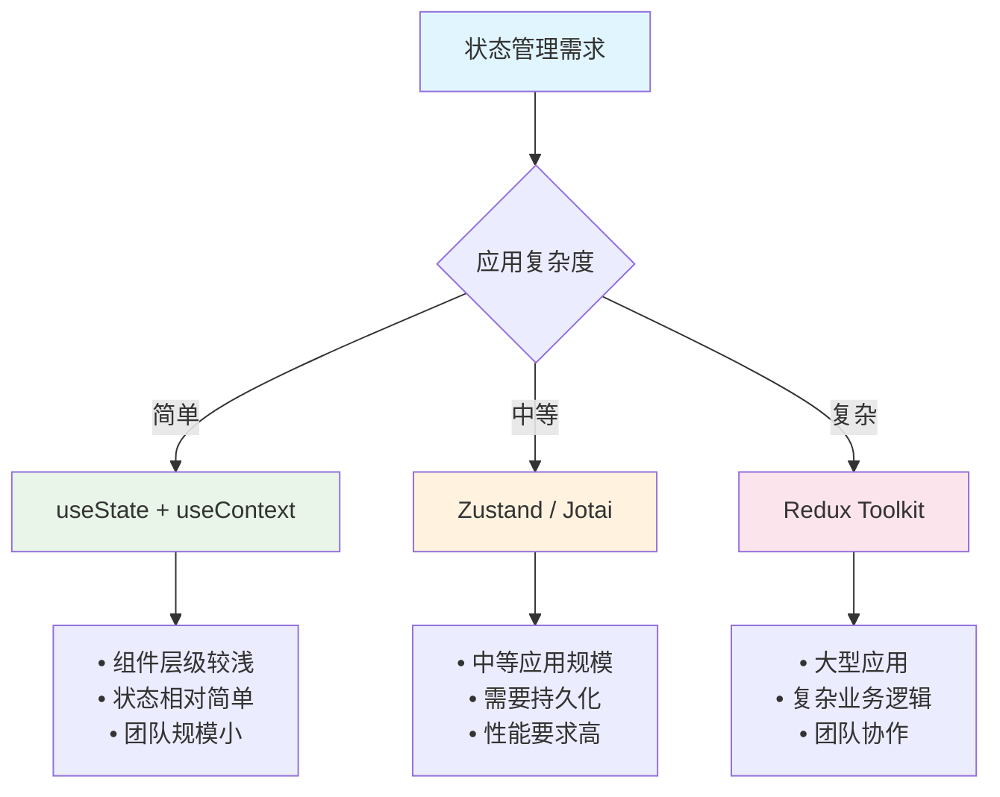

**状态管理对比表**

| 特性 | useState + Context | Zustand | Redux Toolkit |
|------|-------------------|---------|---------------|
| **学习成本** | 低 | 低 | 中等 |
| **包大小** | 0KB | 13.1KB | 53.5KB |
| **类型支持** | 内置 | 优秀 | 优秀 |
| **开发工具** | React DevTools | 支持 | 强大 |
| **中间件** | 手动实现 | 内置 | 丰富 |
| **适用场景** | 简单应用 | 中等应用 | 复杂应用 |

## 5. 路由与导航

### 5.1 React Router基础

#### 5.1.1 路由配置

**基本路由设置**
```javascript
import React from 'react';
import { BrowserRouter, Routes, Route, Link, Navigate } from 'react-router-dom';

// 页面组件
function Home() {
  return <h1>Home Page</h1>;
}

function About() {
  return <h1>About Page</h1>;
}

function Contact() {
  return <h1>Contact Page</h1>;
}

function NotFound() {
  return <h1>404 - Page Not Found</h1>;
}

// 应用根组件
function App() {
  return (
    <BrowserRouter>
      <nav>
        <Link to="/">Home</Link>
        <Link to="/about">About</Link>
        <Link to="/contact">Contact</Link>
      </nav>
      
      <Routes>
        <Route path="/" element={<Home />} />
        <Route path="/about" element={<About />} />
        <Route path="/contact" element={<Contact />} />
        <Route path="/old-contact" element={<Navigate to="/contact" replace />} />
        <Route path="*" element={<NotFound />} />
      </Routes>
    </BrowserRouter>
  );
}
```

**编程式导航**
```javascript
import { useNavigate, useLocation } from 'react-router-dom';

function LoginForm() {
  const navigate = useNavigate();
  const location = useLocation();
  
  const from = location.state?.from?.pathname || "/";

  const handleLogin = async (credentials) => {
    try {
      await auth.login(credentials);
      // 登录成功后重定向
      navigate(from, { replace: true });
    } catch (error) {
      console.error('Login failed:', error);
    }
  };

  const goBack = () => {
    navigate(-1); // 返回上一页
  };

  const goToProfile = () => {
    navigate('/profile', { 
      state: { from: location },
      replace: false 
    });
  };

  return (
    <form onSubmit={handleLogin}>
      {/* 登录表单 */}
      <button type="button" onClick={goBack}>
        返回
      </button>
    </form>
  );
}
```

#### 5.1.2 路由参数

**URL参数和查询参数**
```javascript
import { useParams, useSearchParams } from 'react-router-dom';

// 用户详情页面
function UserProfile() {
  const { userId } = useParams();
  const [searchParams, setSearchParams] = useSearchParams();
  
  const tab = searchParams.get('tab') || 'profile';
  const edit = searchParams.get('edit') === 'true';

  const handleTabChange = (newTab) => {
    setSearchParams(params => {
      params.set('tab', newTab);
      return params;
    });
  };

  const toggleEdit = () => {
    setSearchParams(params => {
      if (edit) {
        params.delete('edit');
      } else {
        params.set('edit', 'true');
      }
      return params;
    });
  };

  return (
    <div>
      <h1>User Profile: {userId}</h1>
      
      <div>
        <button 
          onClick={() => handleTabChange('profile')}
          className={tab === 'profile' ? 'active' : ''}
        >
          Profile
        </button>
        <button 
          onClick={() => handleTabChange('settings')}
          className={tab === 'settings' ? 'active' : ''}
        >
          Settings
        </button>
      </div>
      
      <button onClick={toggleEdit}>
        {edit ? '取消编辑' : '编辑'}
      </button>
      
      {tab === 'profile' && <ProfileTab userId={userId} edit={edit} />}
      {tab === 'settings' && <SettingsTab userId={userId} edit={edit} />}
    </div>
  );
}

// 路由配置
<Route path="/user/:userId" element={<UserProfile />} />
```

### 5.2 高级路由特性

#### 5.2.1 嵌套路由

**嵌套路由实现**
```javascript
import { Outlet, useParams } from 'react-router-dom';

// 主页面布局
function DashboardLayout() {
  return (
    <div className="dashboard">
      <aside>
        <nav>
          <Link to="/dashboard">Dashboard</Link>
          <Link to="/dashboard/users">Users</Link>
          <Link to="/dashboard/settings">Settings</Link>
        </nav>
      </aside>
      
      <main>
        <Outlet /> {/* 子路由在这里渲染 */}
      </main>
    </div>
  );
}

// 用户管理页面
function UsersLayout() {
  return (
    <div>
      <h2>User Management</h2>
      <nav>
        <Link to="/dashboard/users">All Users</Link>
        <Link to="/dashboard/users/create">Create User</Link>
      </nav>
      <Outlet />
    </div>
  );
}

function UserList() {
  return <div>User List</div>;
}

function CreateUser() {
  return <div>Create User Form</div>;
}

function UserDetail() {
  const { userId } = useParams();
  return <div>User Detail: {userId}</div>;
}

// 路由配置
function App() {
  return (
    <BrowserRouter>
      <Routes>
        <Route path="/dashboard" element={<DashboardLayout />}>
          <Route index element={<DashboardHome />} />
          <Route path="users" element={<UsersLayout />}>
            <Route index element={<UserList />} />
            <Route path="create" element={<CreateUser />} />
            <Route path=":userId" element={<UserDetail />} />
          </Route>
          <Route path="settings" element={<Settings />} />
        </Route>
      </Routes>
    </BrowserRouter>
  );
}
```

#### 5.2.2 路由守卫

**认证路由守卫**
```javascript
import { Navigate, useLocation } from 'react-router-dom';

// 认证上下文
const AuthContext = createContext();

function AuthProvider({ children }) {
  const [user, setUser] = useState(null);
  const [loading, setLoading] = useState(true);

  useEffect(() => {
    // 检查用户登录状态
    checkAuthStatus().then(user => {
      setUser(user);
      setLoading(false);
    });
  }, []);

  return (
    <AuthContext.Provider value={{ user, setUser, loading }}>
      {children}
    </AuthContext.Provider>
  );
}

// 私有路由组件
function PrivateRoute({ children, roles = [] }) {
  const { user, loading } = useContext(AuthContext);
  const location = useLocation();

  if (loading) {
    return <div>Loading...</div>;
  }

  if (!user) {
    // 未登录，重定向到登录页
    return <Navigate to="/login" state={{ from: location }} replace />;
  }

  if (roles.length > 0 && !roles.some(role => user.roles.includes(role))) {
    // 权限不足
    return <Navigate to="/unauthorized" replace />;
  }

  return children;
}

// 公开路由（仅未登录用户可访问）
function PublicRoute({ children }) {
  const { user, loading } = useContext(AuthContext);
  
  if (loading) {
    return <div>Loading...</div>;
  }

  if (user) {
    return <Navigate to="/dashboard" replace />;
  }

  return children;
}

// 使用路由守卫
function App() {
  return (
    <AuthProvider>
      <BrowserRouter>
        <Routes>
          {/* 公开路由 */}
          <Route path="/login" element={
            <PublicRoute>
              <LoginPage />
            </PublicRoute>
          } />
          
          {/* 私有路由 */}
          <Route path="/dashboard" element={
            <PrivateRoute>
              <DashboardLayout />
            </PrivateRoute>
          }>
            <Route index element={<DashboardHome />} />
            <Route path="users" element={
              <PrivateRoute roles={['admin', 'manager']}>
                <UserManagement />
              </PrivateRoute>
            } />
          </Route>
          
          <Route path="/unauthorized" element={<UnauthorizedPage />} />
          <Route path="*" element={<NotFound />} />
        </Routes>
      </BrowserRouter>
    </AuthProvider>
  );
}
```

#### 5.2.3 代码分割与懒加载

**路由级别的代码分割**
```javascript
import React, { Suspense, lazy } from 'react';
import { BrowserRouter, Routes, Route } from 'react-router-dom';

// 懒加载组件
const Home = lazy(() => import('./pages/Home'));
const About = lazy(() => import('./pages/About'));
const Dashboard = lazy(() => import('./pages/Dashboard'));
const UserProfile = lazy(() => 
  import('./pages/UserProfile').then(module => ({
    default: module.UserProfile
  }))
);

// 加载错误边界
class RouteErrorBoundary extends React.Component {
  constructor(props) {
    super(props);
    this.state = { hasError: false, error: null };
  }

  static getDerivedStateFromError(error) {
    return { hasError: true, error };
  }

  componentDidCatch(error, errorInfo) {
    console.error('Route loading error:', error, errorInfo);
  }

  render() {
    if (this.state.hasError) {
      return (
        <div>
          <h2>页面加载失败</h2>
          <button onClick={() => window.location.reload()}>
            重新加载
          </button>
        </div>
      );
    }

    return this.props.children;
  }
}

// 加载指示器
function LoadingSpinner() {
  return (
    <div className="loading-spinner">
      <div>Loading...</div>
    </div>
  );
}

// 应用路由
function App() {
  return (
    <BrowserRouter>
      <RouteErrorBoundary>
        <Suspense fallback={<LoadingSpinner />}>
          <Routes>
            <Route path="/" element={<Home />} />
            <Route path="/about" element={<About />} />
            <Route path="/dashboard/*" element={<Dashboard />} />
            <Route path="/user/:id" element={<UserProfile />} />
          </Routes>
        </Suspense>
      </RouteErrorBoundary>
    </BrowserRouter>
  );
}

// 高级懒加载钩子
function useLazyComponent(importFunc, deps = []) {
  const [Component, setComponent] = useState(null);
  const [loading, setLoading] = useState(false);
  const [error, setError] = useState(null);

  useEffect(() => {
    let cancelled = false;
    
    setLoading(true);
    setError(null);
    
    importFunc()
      .then(module => {
        if (!cancelled) {
          setComponent(() => module.default);
          setLoading(false);
        }
      })
      .catch(error => {
        if (!cancelled) {
          setError(error);
          setLoading(false);
        }
      });

    return () => {
      cancelled = true;
    };
  }, deps);

  return { Component, loading, error };
}

// 使用自定义懒加载钩子
function ConditionalRoute({ shouldLoad, importFunc, fallback }) {
  const { Component, loading, error } = useLazyComponent(
    importFunc,
    [shouldLoad]
  );

  if (!shouldLoad) {
    return fallback || null;
  }

  if (loading) {
    return <LoadingSpinner />;
  }

  if (error) {
    return <div>Error loading component</div>;
  }

  return Component ? <Component /> : null;
}
```

## 6. 性能优化与最佳实践

### 6.1 React性能优化

#### 6.1.1 React.memo

**基本用法和优化场景**
```javascript
import React, { memo, useState, useMemo } from 'react';

// 未优化的组件
function ExpensiveChildComponent({ items, onItemClick }) {
  console.log('ExpensiveChildComponent rendered');
  
  return (
    <div>
      {items.map(item => (
        <div key={item.id} onClick={() => onItemClick(item.id)}>
          {item.name} - {item.value}
        </div>
      ))}
    </div>
  );
}

// 使用React.memo优化
const OptimizedChildComponent = memo(function ChildComponent({ items, onItemClick }) {
  console.log('OptimizedChildComponent rendered');
  
  return (
    <div>
      {items.map(item => (
        <div key={item.id} onClick={() => onItemClick(item.id)}>
          {item.name} - {item.value}
        </div>
      ))}
    </div>
  );
});

// 自定义比较函数
const CustomMemoComponent = memo(function Component({ user, settings }) {
  return (
    <div>
      <h3>{user.name}</h3>
      <p>Theme: {settings.theme}</p>
    </div>
  );
}, (prevProps, nextProps) => {
  // 只在用户名或主题改变时重新渲染
  return (
    prevProps.user.name === nextProps.user.name &&
    prevProps.settings.theme === nextProps.settings.theme
  );
});

// 父组件
function ParentComponent() {
  const [count, setCount] = useState(0);
  const [items] = useState([
    { id: 1, name: 'Item 1', value: 100 },
    { id: 2, name: 'Item 2', value: 200 }
  ]);

  // 使用useCallback优化函数引用
  const handleItemClick = useCallback((itemId) => {
    console.log('Item clicked:', itemId);
  }, []);

  return (
    <div>
      <button onClick={() => setCount(count + 1)}>
        Count: {count}
      </button>
      
      {/* 未优化：每次父组件更新都会重新渲染 */}
      <ExpensiveChildComponent 
        items={items} 
        onItemClick={handleItemClick} 
      />
      
      {/* 优化后：只在props改变时重新渲染 */}
      <OptimizedChildComponent 
        items={items} 
        onItemClick={handleItemClick} 
      />
    </div>
  );
}
```

#### 6.1.2 useMemo和useCallback

**性能优化实践**
```javascript
import React, { useState, useMemo, useCallback } from 'react';

function DataProcessingComponent({ rawData, filters }) {
  const [sortOrder, setSortOrder] = useState('asc');
  const [selectedItems, setSelectedItems] = useState(new Set());

  // 昂贵的数据处理操作
  const processedData = useMemo(() => {
    console.log('Processing data...');
    
    return rawData
      .filter(item => {
        return filters.every(filter => 
          item[filter.field]?.toString().toLowerCase()
            .includes(filter.value.toLowerCase())
        );
      })
      .sort((a, b) => {
        const modifier = sortOrder === 'asc' ? 1 : -1;
        return a.name.localeCompare(b.name) * modifier;
      })
      .map(item => ({
        ...item,
        processed: true,
        timestamp: Date.now()
      }));
  }, [rawData, filters, sortOrder]);

  // 缓存事件处理函数
  const handleSort = useCallback((newSortOrder) => {
    setSortOrder(newSortOrder);
  }, []);

  const handleItemSelect = useCallback((itemId) => {
    setSelectedItems(prev => {
      const newSet = new Set(prev);
      if (newSet.has(itemId)) {
        newSet.delete(itemId);
      } else {
        newSet.add(itemId);
      }
      return newSet;
    });
  }, []);

  const handleSelectAll = useCallback(() => {
    setSelectedItems(new Set(processedData.map(item => item.id)));
  }, [processedData]);

  const handleClearSelection = useCallback(() => {
    setSelectedItems(new Set());
  }, []);

  // 计算衍生状态
  const statistics = useMemo(() => {
    return {
      total: processedData.length,
      selected: selectedItems.size,
      averageValue: processedData.reduce((sum, item) => sum + item.value, 0) / processedData.length
    };
  }, [processedData, selectedItems]);

  return (
    <div>
      <div>
        <button onClick={() => handleSort('asc')}>Sort Ascending</button>
        <button onClick={() => handleSort('desc')}>Sort Descending</button>
        <button onClick={handleSelectAll}>Select All</button>
        <button onClick={handleClearSelection}>Clear Selection</button>
      </div>
      
      <div>
        Total: {statistics.total}, 
        Selected: {statistics.selected}, 
        Average: {statistics.averageValue.toFixed(2)}
      </div>
      
      <DataList 
        items={processedData}
        selectedItems={selectedItems}
        onItemSelect={handleItemSelect}
      />
    </div>
  );
}

// 优化的列表组件
const DataList = memo(function DataList({ items, selectedItems, onItemSelect }) {
  return (
    <div>
      {items.map(item => (
        <DataItem
          key={item.id}
          item={item}
          isSelected={selectedItems.has(item.id)}
          onSelect={onItemSelect}
        />
      ))}
    </div>
  );
});

const DataItem = memo(function DataItem({ item, isSelected, onSelect }) {
  return (
    <div 
      className={isSelected ? 'selected' : ''}
      onClick={() => onSelect(item.id)}
    >
      {item.name} - {item.value}
    </div>
  );
});
```

#### 6.1.3 Concurrent Mode

**并发特性使用**
```javascript
import React, { useState, useDeferredValue, useTransition, Suspense } from 'react';

// 重CPU任务组件
function HeavyComponent({ searchTerm }) {
  const items = useMemo(() => {
    // 模拟大量数据处理
    const result = [];
    for (let i = 0; i < 10000; i++) {
      if (`Item ${i}`.toLowerCase().includes(searchTerm.toLowerCase())) {
        result.push({ id: i, name: `Item ${i}`, value: Math.random() * 100 });
      }
    }
    return result;
  }, [searchTerm]);

  return (
    <div>
      <p>Found {items.length} items</p>
      {items.slice(0, 100).map(item => (
        <div key={item.id}>{item.name}</div>
      ))}
    </div>
  );
}

function SearchWithDeferredValue() {
  const [searchTerm, setSearchTerm] = useState('');
  const deferredSearchTerm = useDeferredValue(searchTerm);

  return (
    <div>
      <input
        type="text"
        value={searchTerm}
        onChange={(e) => setSearchTerm(e.target.value)}
        placeholder="Search items..."
      />
      
      {/* 使用延迟值，保持输入响应性 */}
      <HeavyComponent searchTerm={deferredSearchTerm} />
    </div>
  );
}

function SearchWithTransition() {
  const [searchTerm, setSearchTerm] = useState('');
  const [results, setResults] = useState([]);
  const [isPending, startTransition] = useTransition();

  const handleSearch = (value) => {
    setSearchTerm(value);
    
    // 将重任务标记为非紧急
    startTransition(() => {
      const filtered = heavyDataProcessing(value);
      setResults(filtered);
    });
  };

  return (
    <div>
      <input
        type="text"
        value={searchTerm}
        onChange={(e) => handleSearch(e.target.value)}
        placeholder="Search..."
      />
      
      {isPending && <div>Searching...</div>}
      
      <div>
        {results.map(item => (
          <div key={item.id}>{item.name}</div>
        ))}
      </div>
    </div>
  );
}
```

### 6.2 代码分割与懒加载

#### 6.2.1 动态导入

**组件级代码分割**
```javascript
import React, { lazy, Suspense, useState } from 'react';

// 懒加载重组件
const HeavyChart = lazy(() => import('./HeavyChart'));
const DataTable = lazy(() => import('./DataTable'));
const ReportGenerator = lazy(() => import('./ReportGenerator'));

// 预加载策略
const preloadChart = () => import('./HeavyChart');
const preloadTable = () => import('./DataTable');

function Dashboard() {
  const [activeTab, setActiveTab] = useState('overview');
  
  // 预加载策略
  useEffect(() => {
    // 鼠标悬停时预加载
    const chartButton = document.getElementById('chart-tab');
    if (chartButton) {
      chartButton.addEventListener('mouseenter', preloadChart);
    }
    
    // 延迟预加载常用组件
    const timer = setTimeout(preloadTable, 2000);
    
    return () => {
      if (chartButton) {
        chartButton.removeEventListener('mouseenter', preloadChart);
      }
      clearTimeout(timer);
    };
  }, []);

  return (
    <div>
      <nav>
        <button 
          id="overview-tab"
          onClick={() => setActiveTab('overview')}
          className={activeTab === 'overview' ? 'active' : ''}
        >
          Overview
        </button>
        <button 
          id="chart-tab"
          onClick={() => setActiveTab('chart')}
          className={activeTab === 'chart' ? 'active' : ''}
        >
          Charts
        </button>
        <button 
          onClick={() => setActiveTab('table')}
          className={activeTab === 'table' ? 'active' : ''}
        >
          Data Table
        </button>
      </nav>
      
      <main>
        {activeTab === 'overview' && (
          <div>
            <h2>Dashboard Overview</h2>
            <p>Key metrics and summary information</p>
          </div>
        )}
        
        {activeTab === 'chart' && (
          <Suspense fallback={<ChartSkeleton />}>
            <HeavyChart />
          </Suspense>
        )}
        
        {activeTab === 'table' && (
          <Suspense fallback={<TableSkeleton />}>
            <DataTable />
          </Suspense>
        )}
      </main>
    </div>
  );
}

// 骨架屏组件
function ChartSkeleton() {
  return (
    <div className="skeleton">
      <div className="skeleton-header"></div>
      <div className="skeleton-chart"></div>
    </div>
  );
}

function TableSkeleton() {
  return (
    <div className="skeleton">
      {[...Array(5)].map((_, i) => (
        <div key={i} className="skeleton-row">
          <div className="skeleton-cell"></div>
          <div className="skeleton-cell"></div>
          <div className="skeleton-cell"></div>
        </div>
      ))}
    </div>
  );
}
```

#### 6.2.2 Suspense与ErrorBoundary

**错误边界和加载状态管理**
```javascript
import React, { Suspense, Component } from 'react';

// 错误边界组件
class ChunkErrorBoundary extends Component {
  constructor(props) {
    super(props);
    this.state = { hasError: false, error: null };
  }

  static getDerivedStateFromError(error) {
    return { hasError: true, error };
  }

  componentDidCatch(error, errorInfo) {
    console.error('Chunk loading error:', error, errorInfo);
    
    // 发送错误日志到监控服务
    if (this.props.onError) {
      this.props.onError(error, errorInfo);
    }
  }

  handleRetry = () => {
    this.setState({ hasError: false, error: null });
    
    // 可选：重新加载页面
    if (this.props.fallbackToReload) {
      window.location.reload();
    }
  };

  render() {
    if (this.state.hasError) {
      if (this.props.fallback) {
        return this.props.fallback(this.state.error, this.handleRetry);
      }
      
      return (
        <div className="error-boundary">
          <h2>Something went wrong loading this section</h2>
          <details>
            <summary>Error details</summary>
            <pre>{this.state.error?.message}</pre>
          </details>
          <button onClick={this.handleRetry}>
            Try again
          </button>
        </div>
      );
    }

    return this.props.children;
  }
}

// 加载状态组件
function LoadingFallback({ message = "Loading..." }) {
  const [dots, setDots] = useState('');
  
  useEffect(() => {
    const interval = setInterval(() => {
      setDots(prev => prev.length >= 3 ? '' : prev + '.');
    }, 500);
    
    return () => clearInterval(interval);
  }, []);

  return (
    <div className="loading-fallback">
      <div className="spinner"></div>
      <p>{message}{dots}</p>
    </div>
  );
}

// 嵌套Suspense示例
function NestedSuspenseExample() {
  return (
    <div>
      <h1>My App</h1>
      
      <ChunkErrorBoundary>
        <Suspense fallback={<LoadingFallback message="Loading main content" />}>
          <MainContent />
        </Suspense>
      </ChunkErrorBoundary>
    </div>
  );
}

function MainContent() {
  return (
    <div>
      <header>Main Header</header>
      
      <ChunkErrorBoundary>
        <Suspense fallback={<LoadingFallback message="Loading sidebar" />}>
          <Sidebar />
        </Suspense>
      </ChunkErrorBoundary>
      
      <main>
        <ChunkErrorBoundary>
          <Suspense fallback={<LoadingFallback message="Loading main panel" />}>
            <MainPanel />
          </Suspense>
        </ChunkErrorBoundary>
      </main>
    </div>
  );
}

// 懒加载组件
const Sidebar = lazy(() => import('./Sidebar'));
const MainPanel = lazy(() => import('./MainPanel'));
```

### 6.3 最佳实践

#### 6.3.1 组件设计原则

**组件拆分和复用原则**
```javascript
// ❌ 不好的设计：大型单体组件
function BadUserProfile({ userId }) {
  const [user, setUser] = useState(null);
  const [posts, setPosts] = useState([]);
  const [friends, setFriends] = useState([]);
  const [editing, setEditing] = useState(false);
  const [formData, setFormData] = useState({});

  // 大量逻辑和JSX...
  return (
    <div className="user-profile">
      {/* 数百行JSX */}
    </div>
  );
}

// ✅ 好的设计：组件拆分
function UserProfile({ userId }) {
  const { user, loading, error } = useUser(userId);

  if (loading) return <ProfileSkeleton />;
  if (error) return <ErrorMessage error={error} />;
  if (!user) return <UserNotFound />;

  return (
    <div className="user-profile">
      <UserHeader user={user} />
      <UserTabs userId={userId} />
    </div>
  );
}

// 可复用的用户头部组件
function UserHeader({ user }) {
  const [editing, setEditing] = useState(false);

  return (
    <header className="user-header">
      <UserAvatar user={user} size="large" />
      <UserInfo user={user} />
      {editing ? (
        <UserEditForm 
          user={user} 
          onSave={() => setEditing(false)}
          onCancel={() => setEditing(false)}
        />
      ) : (
        <EditButton onClick={() => setEditing(true)} />
      )}
    </header>
  );
}

// 可配置的通用组件
function UserAvatar({ user, size = 'medium', onClick, className }) {
  const sizeMap = {
    small: 32,
    medium: 48,
    large: 64,
    xlarge: 96
  };

  const avatarSize = sizeMap[size];

  return (
    <div 
      className={`user-avatar user-avatar--${size} ${className}`}
      onClick={onClick}
      style={{ 
        width: avatarSize, 
        height: avatarSize,
        cursor: onClick ? 'pointer' : 'default'
      }}
    >
      {user.avatar ? (
        
      ) : (
        <div className="avatar-placeholder">
          {user.name.charAt(0).toUpperCase()}
        </div>
      )}
    </div>
  );
}

// 自定义Hook封装逻辑
function useUser(userId) {
  const [user, setUser] = useState(null);
  const [loading, setLoading] = useState(true);
  const [error, setError] = useState(null);

  useEffect(() => {
    let cancelled = false;

    async function fetchUser() {
      try {
        setLoading(true);
        setError(null);
        
        const userData = await api.getUser(userId);
        
        if (!cancelled) {
          setUser(userData);
        }
      } catch (err) {
        if (!cancelled) {
          setError(err);
        }
      } finally {
        if (!cancelled) {
          setLoading(false);
        }
      }
    }

    fetchUser();

    return () => {
      cancelled = true;
    };
  }, [userId]);

  return { user, loading, error };
}
```

#### 6.3.2 性能监控

**性能指标收集和分析**
```javascript
import { getCLS, getFID, getFCP, getLCP, getTTFB } from 'web-vitals';

// 性能监控Hook
function usePerformanceMonitoring() {
  useEffect(() => {
    // Core Web Vitals
    getCLS(metric => {
      console.log('CLS:', metric);
      sendToAnalytics('CLS', metric.value);
    });

    getFID(metric => {
      console.log('FID:', metric);
      sendToAnalytics('FID', metric.value);
    });

    getLCP(metric => {
      console.log('LCP:', metric);
      sendToAnalytics('LCP', metric.value);
    });

    getFCP(metric => {
      console.log('FCP:', metric);
      sendToAnalytics('FCP', metric.value);
    });

    getTTFB(metric => {
      console.log('TTFB:', metric);
      sendToAnalytics('TTFB', metric.value);
    });
  }, []);
}

// React性能分析器
function ProfiledComponent({ children, id }) {
  const onRenderCallback = useCallback((
    id,
    phase,
    actualDuration,
    baseDuration,
    startTime,
    commitTime,
    interactions
  ) => {
    console.log('Profiler:', {
      id,
      phase,
      actualDuration,
      baseDuration,
      startTime,
      commitTime,
      interactions: Array.from(interactions)
    });
    
    // 发送性能数据
    if (actualDuration > 50) { // 渲染时间超过50ms
      sendToAnalytics('slow-render', {
        componentId: id,
        duration: actualDuration,
        phase
      });
    }
  }, []);

  return (
    <Profiler id={id} onRender={onRenderCallback}>
      {children}
    </Profiler>
  );
}

// 组件渲染次数监控
function useRenderCount(componentName) {
  const renderCount = useRef(0);
  
  useEffect(() => {
    renderCount.current += 1;
    console.log(`${componentName} rendered ${renderCount.current} times`);
  });

  return renderCount.current;
}

// 内存使用监控
function useMemoryUsage() {
  const [memoryUsage, setMemoryUsage] = useState(null);

  useEffect(() => {
    const updateMemoryUsage = () => {
      if ('memory' in performance) {
        setMemoryUsage({
          usedJSHeapSize: performance.memory.usedJSHeapSize,
          totalJSHeapSize: performance.memory.totalJSHeapSize,
          jsHeapSizeLimit: performance.memory.jsHeapSizeLimit
        });
      }
    };

    updateMemoryUsage();
    const interval = setInterval(updateMemoryUsage, 5000);

    return () => clearInterval(interval);
  }, []);

  return memoryUsage;
}

// 使用示例
function App() {
  usePerformanceMonitoring();
  const memoryUsage = useMemoryUsage();
  const renderCount = useRenderCount('App');

  return (
    <ProfiledComponent id="App">
      <div>
        <h1>My App (Renders: {renderCount})</h1>
        {memoryUsage && (
          <div>
            Memory Usage: {(memoryUsage.usedJSHeapSize / 1048576).toFixed(2)} MB
          </div>
        )}
        <MainContent />
      </div>
    </ProfiledComponent>
  );
}

// 分析工具函数
function sendToAnalytics(eventName, data) {
  // 发送到分析服务
  if (typeof window !== 'undefined' && window.gtag) {
    window.gtag('event', eventName, {
      custom_parameter: data
    });
  }
  
  // 或发送到自定义分析服务
  fetch('/api/analytics', {
    method: 'POST',
    headers: { 'Content-Type': 'application/json' },
    body: JSON.stringify({ event: eventName, data })
  });
}
```

## 7. 测试与质量保证

### 7.1 测试基础

#### 7.1.1 测试环境配置

**Jest配置**
```javascript
// jest.config.js
module.exports = {
  testEnvironment: 'jsdom',
  setupFilesAfterEnv: ['<rootDir>/src/setupTests.js'],
  moduleNameMapping: {
    '\\.(css|less|scss|sass)$': 'identity-obj-proxy',
    '\\.(jpg|jpeg|png|gif|eot|otf|webp|svg|ttf|woff|woff2|mp4|webm|wav|mp3|m4a|aac|oga)$': 
      '<rootDir>/__mocks__/fileMock.js'
  },
  collectCoverageFrom: [
    'src/**/*.{js,jsx,ts,tsx}',
    '!src/**/*.d.ts',
    '!src/index.js',
    '!src/reportWebVitals.js'
  ],
  coverageThreshold: {
    global: {
      branches: 80,
      functions: 80,
      lines: 80,
      statements: 80
    }
  },
  testMatch: [
    '<rootDir>/src/**/__tests__/**/*.{js,jsx,ts,tsx}',
    '<rootDir>/src/**/?(*.)(spec|test).{js,jsx,ts,tsx}'
  ]
};

// src/setupTests.js
import '@testing-library/jest-dom';
import { configure } from '@testing-library/react';

// 配置Testing Library
configure({ testIdAttribute: 'data-testid' });

// 模拟API
global.fetch = jest.fn();

// 模拟IntersectionObserver
global.IntersectionObserver = class IntersectionObserver {
  constructor() {}
  disconnect() {}
  observe() {}
  unobserve() {}
};

// 模拟matchMedia
Object.defineProperty(window, 'matchMedia', {
  writable: true,
  value: jest.fn().mockImplementation(query => ({
    matches: false,
    media: query,
    onchange: null,
    addListener: jest.fn(),
    removeListener: jest.fn(),
    addEventListener: jest.fn(),
    removeEventListener: jest.fn(),
    dispatchEvent: jest.fn(),
  })),
});
```

#### 7.1.2 测试类型

**测试金字塔**
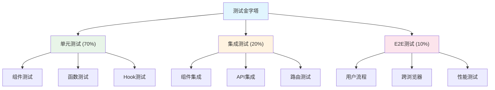

### 7.2 单元测试

#### 7.2.1 Jest测试框架

**基础测试示例**
```javascript
// src/utils/math.js
export const add = (a, b) => a + b;
export const multiply = (a, b) => a * b;
export const divide = (a, b) => {
  if (b === 0) throw new Error('Division by zero');
  return a / b;
};

// src/utils/__tests__/math.test.js
import { add, multiply, divide } from '../math';

describe('Math utilities', () => {
  describe('add', () => {
    test('should add two positive numbers', () => {
      expect(add(2, 3)).toBe(5);
    });

    test('should handle negative numbers', () => {
      expect(add(-1, 1)).toBe(0);
    });

    test('should handle decimal numbers', () => {
      expect(add(0.1, 0.2)).toBeCloseTo(0.3);
    });
  });

  describe('multiply', () => {
    test.each([
      [2, 3, 6],
      [0, 5, 0],
      [-2, 3, -6],
      [2.5, 4, 10]
    ])('multiply(%i, %i) should equal %i', (a, b, expected) => {
      expect(multiply(a, b)).toBe(expected);
    });
  });

  describe('divide', () => {
    test('should divide two numbers', () => {
      expect(divide(6, 2)).toBe(3);
    });

    test('should throw error when dividing by zero', () => {
      expect(() => divide(5, 0)).toThrow('Division by zero');
    });
  });
});

// Mock测试
import axios from 'axios';
import { fetchUserData } from '../api';

jest.mock('axios');
const mockedAxios = axios as jest.Mocked<typeof axios>;

describe('API functions', () => {
  afterEach(() => {
    jest.clearAllMocks();
  });

  test('should fetch user data successfully', async () => {
    const userData = { id: 1, name: 'John Doe' };
    mockedAxios.get.mockResolvedValue({ data: userData });

    const result = await fetchUserData(1);

    expect(mockedAxios.get).toHaveBeenCalledWith('/api/users/1');
    expect(result).toEqual(userData);
  });

  test('should handle API error', async () => {
    const errorMessage = 'Network Error';
    mockedAxios.get.mockRejectedValue(new Error(errorMessage));

    await expect(fetchUserData(1)).rejects.toThrow(errorMessage);
  });
});
```

#### 7.2.2 React Testing Library

**组件测试最佳实践**
```javascript
import React from 'react';
import { render, screen, fireEvent, waitFor } from '@testing-library/react';
import userEvent from '@testing-library/user-event';
import { BrowserRouter } from 'react-router-dom';
import { QueryClient, QueryClientProvider } from 'react-query';
import LoginForm from '../LoginForm';

// 测试工具函数
const renderWithProviders = (ui, options = {}) => {
  const queryClient = new QueryClient({
    defaultOptions: {
      queries: { retry: false },
      mutations: { retry: false }
    }
  });

  const AllTheProviders = ({ children }) => (
    <QueryClientProvider client={queryClient}>
      <BrowserRouter>
        {children}
      </BrowserRouter>
    </QueryClientProvider>
  );

  return render(ui, { wrapper: AllTheProviders, ...options });
};

describe('LoginForm', () => {
  const mockOnLogin = jest.fn();
  
  beforeEach(() => {
    mockOnLogin.mockClear();
  });

  test('renders login form elements', () => {
    renderWithProviders(<LoginForm onLogin={mockOnLogin} />);
    
    expect(screen.getByLabelText(/username/i)).toBeInTheDocument();
    expect(screen.getByLabelText(/password/i)).toBeInTheDocument();
    expect(screen.getByRole('button', { name: /login/i })).toBeInTheDocument();
  });

  test('shows validation errors for empty fields', async () => {
    const user = userEvent.setup();
    renderWithProviders(<LoginForm onLogin={mockOnLogin} />);
    
    const loginButton = screen.getByRole('button', { name: /login/i });
    await user.click(loginButton);
    
    expect(screen.getByText(/username is required/i)).toBeInTheDocument();
    expect(screen.getByText(/password is required/i)).toBeInTheDocument();
    expect(mockOnLogin).not.toHaveBeenCalled();
  });

  test('submits form with valid data', async () => {
    const user = userEvent.setup();
    renderWithProviders(<LoginForm onLogin={mockOnLogin} />);
    
    const usernameInput = screen.getByLabelText(/username/i);
    const passwordInput = screen.getByLabelText(/password/i);
    const loginButton = screen.getByRole('button', { name: /login/i });
    
    await user.type(usernameInput, 'testuser');
    await user.type(passwordInput, 'password123');
    await user.click(loginButton);
    
    expect(mockOnLogin).toHaveBeenCalledWith({
      username: 'testuser',
      password: 'password123'
    });
  });

  test('disables submit button while loading', async () => {
    const user = userEvent.setup();
    renderWithProviders(<LoginForm onLogin={mockOnLogin} loading={true} />);
    
    const loginButton = screen.getByRole('button', { name: /logging in/i });
    
    expect(loginButton).toBeDisabled();
    expect(screen.getByRole('progressbar')).toBeInTheDocument();
  });

  test('shows error message on login failure', async () => {
    const errorMessage = 'Invalid credentials';
    renderWithProviders(
      <LoginForm onLogin={mockOnLogin} error={errorMessage} />
    );
    
    expect(screen.getByRole('alert')).toHaveTextContent(errorMessage);
  });
});

// 复杂组件测试
describe('TodoList', () => {
  const mockTodos = [
    { id: 1, text: 'Learn React', completed: false },
    { id: 2, text: 'Write tests', completed: true }
  ];

  test('filters todos based on status', async () => {
    const user = userEvent.setup();
    renderWithProviders(<TodoList initialTodos={mockTodos} />);
    
    // 显示所有todos
    expect(screen.getByText('Learn React')).toBeInTheDocument();
    expect(screen.getByText('Write tests')).toBeInTheDocument();
    
    // 筛选已完成的todos
    const completedFilter = screen.getByRole('button', { name: /completed/i });
    await user.click(completedFilter);
    
    expect(screen.queryByText('Learn React')).not.toBeInTheDocument();
    expect(screen.getByText('Write tests')).toBeInTheDocument();
  });

  test('adds new todo', async () => {
    const user = userEvent.setup();
    renderWithProviders(<TodoList initialTodos={[]} />);
    
    const input = screen.getByPlaceholderText(/add new todo/i);
    const addButton = screen.getByRole('button', { name: /add/i });
    
    await user.type(input, 'New todo item');
    await user.click(addButton);
    
    expect(screen.getByText('New todo item')).toBeInTheDocument();
    expect(input).toHaveValue('');
  });

  test('toggles todo completion', async () => {
    const user = userEvent.setup();
    renderWithProviders(<TodoList initialTodos={mockTodos} />);
    
    const checkbox = screen.getByRole('checkbox', { name: /learn react/i });
    expect(checkbox).not.toBeChecked();
    
    await user.click(checkbox);
    expect(checkbox).toBeChecked();
  });
});
```

**自定义Hook测试**
```javascript
import { renderHook, act } from '@testing-library/react';
import { useCounter } from '../hooks/useCounter';
import { useLocalStorage } from '../hooks/useLocalStorage';

describe('useCounter', () => {
  test('should initialize with default value', () => {
    const { result } = renderHook(() => useCounter());
    
    expect(result.current.count).toBe(0);
  });

  test('should initialize with custom value', () => {
    const { result } = renderHook(() => useCounter(10));
    
    expect(result.current.count).toBe(10);
  });

  test('should increment count', () => {
    const { result } = renderHook(() => useCounter());
    
    act(() => {
      result.current.increment();
    });
    
    expect(result.current.count).toBe(1);
  });

  test('should decrement count', () => {
    const { result } = renderHook(() => useCounter(5));
    
    act(() => {
      result.current.decrement();
    });
    
    expect(result.current.count).toBe(4);
  });

  test('should reset count', () => {
    const { result } = renderHook(() => useCounter(10));
    
    act(() => {
      result.current.increment();
      result.current.increment();
    });
    
    expect(result.current.count).toBe(12);
    
    act(() => {
      result.current.reset();
    });
    
    expect(result.current.count).toBe(10);
  });
});

describe('useLocalStorage', () => {
  beforeEach(() => {
    localStorage.clear();
  });

  test('should return initial value when no stored value', () => {
    const { result } = renderHook(() => 
      useLocalStorage('test-key', 'initial')
    );
    
    expect(result.current[0]).toBe('initial');
  });

  test('should update localStorage when value changes', () => {
    const { result } = renderHook(() => 
      useLocalStorage('test-key', 'initial')
    );
    
    act(() => {
      result.current[1]('updated');
    });
    
    expect(result.current[0]).toBe('updated');
    expect(localStorage.getItem('test-key')).toBe('"updated"');
  });

  test('should handle JSON serialization', () => {
    const initialValue = { name: 'John', age: 30 };
    const { result } = renderHook(() => 
      useLocalStorage('user', initialValue)
    );
    
    expect(result.current[0]).toEqual(initialValue);
    
    const updatedValue = { name: 'Jane', age: 25 };
    act(() => {
      result.current[1](updatedValue);
    });
    
    expect(result.current[0]).toEqual(updatedValue);
  });
});
```

### 7.3 集成测试与E2E测试

#### 7.3.1 组件集成测试

**多组件交互测试**
```javascript
import React from 'react';
import { render, screen, waitFor } from '@testing-library/react';
import userEvent from '@testing-library/user-event';
import { rest } from 'msw';
import { setupServer } from 'msw/node';
import App from '../App';

// Mock Service Worker设置
const server = setupServer(
  rest.get('/api/users', (req, res, ctx) => {
    return res(
      ctx.json([
        { id: 1, name: 'John Doe', email: 'john@example.com' },
        { id: 2, name: 'Jane Smith', email: 'jane@example.com' }
      ])
    );
  }),
  
  rest.post('/api/users', (req, res, ctx) => {
    const { name, email } = req.body;
    return res(
      ctx.json({ id: 3, name, email })
    );
  }),
  
  rest.delete('/api/users/:id', (req, res, ctx) => {
    return res(ctx.status(204));
  })
);

beforeAll(() => server.listen());
afterEach(() => server.resetHandlers());
afterAll(() => server.close());

describe('User Management Integration', () => {
  test('complete user management flow', async () => {
    const user = userEvent.setup();
    render(<App />);
    
    // 等待用户列表加载
    await waitFor(() => {
      expect(screen.getByText('John Doe')).toBeInTheDocument();
      expect(screen.getByText('Jane Smith')).toBeInTheDocument();
    });
    
    // 添加新用户
    const nameInput = screen.getByLabelText(/name/i);
    const emailInput = screen.getByLabelText(/email/i);
    const addButton = screen.getByRole('button', { name: /add user/i });
    
    await user.type(nameInput, 'Bob Johnson');
    await user.type(emailInput, 'bob@example.com');
    await user.click(addButton);
    
    // 验证新用户被添加
    await waitFor(() => {
      expect(screen.getByText('Bob Johnson')).toBeInTheDocument();
    });
    
    // 删除用户
    const deleteButtons = screen.getAllByRole('button', { name: /delete/i });
    await user.click(deleteButtons[0]);
    
    // 确认删除
    const confirmButton = screen.getByRole('button', { name: /confirm/i });
    await user.click(confirmButton);
    
    // 验证用户被删除
    await waitFor(() => {
      expect(screen.queryByText('John Doe')).not.toBeInTheDocument();
    });
  });

  test('handles API errors gracefully', async () => {
    // 模拟网络错误
    server.use(
      rest.get('/api/users', (req, res, ctx) => {
        return res.networkError('Failed to connect');
      })
    );
    
    render(<App />);
    
    await waitFor(() => {
      expect(screen.getByText(/failed to load users/i)).toBeInTheDocument();
    });
    
    // 重试按钮
    const retryButton = screen.getByRole('button', { name: /retry/i });
    
    // 恢复正常响应
    server.use(
      rest.get('/api/users', (req, res, ctx) => {
        return res(ctx.json([]));
      })
    );
    
    await userEvent.click(retryButton);
    
    await waitFor(() => {
      expect(screen.queryByText(/failed to load users/i)).not.toBeInTheDocument();
    });
  });
});
```

#### 7.3.2 Cypress E2E测试

**端到端测试配置和示例**
```javascript
// cypress.config.js
const { defineConfig } = require('cypress');

module.exports = defineConfig({
  e2e: {
    baseUrl: 'http://localhost:3000',
    supportFile: 'cypress/support/e2e.js',
    specPattern: 'cypress/e2e/**/*.cy.{js,jsx,ts,tsx}',
    viewportWidth: 1280,
    viewportHeight: 720,
    video: true,
    screenshotOnRunFailure: true,
    retries: {
      runMode: 2,
      openMode: 0
    }
  },
  component: {
    devServer: {
      framework: 'create-react-app',
      bundler: 'webpack'
    }
  }
});

// cypress/support/commands.js
Cypress.Commands.add('login', (username, password) => {
  cy.session([username, password], () => {
    cy.visit('/login');
    cy.get('[data-testid="username-input"]').type(username);
    cy.get('[data-testid="password-input"]').type(password);
    cy.get('[data-testid="login-button"]').click();
    cy.url().should('include', '/dashboard');
  });
});

Cypress.Commands.add('createUser', (userData) => {
  cy.request({
    method: 'POST',
    url: '/api/users',
    body: userData,
    headers: {
      'Authorization': `Bearer ${Cypress.env('AUTH_TOKEN')}`
    }
  });
});

// E2E测试示例
describe('User Management E2E', () => {
  beforeEach(() => {
    cy.login('admin@example.com', 'password123');
  });

  it('should manage users end-to-end', () => {
    // 导航到用户管理页面
    cy.visit('/users');
    cy.get('[data-testid="page-title"]').should('contain', 'User Management');
    
    // 创建新用户
    cy.get('[data-testid="add-user-button"]').click();
    cy.get('[data-testid="user-form"]').should('be.visible');
    
    cy.get('[data-testid="name-input"]').type('Test User');
    cy.get('[data-testid="email-input"]').type('test@example.com');
    cy.get('[data-testid="role-select"]').select('User');
    
    cy.get('[data-testid="save-button"]').click();
    
    // 验证用户创建成功
    cy.get('[data-testid="success-message"]').should('be.visible');
    cy.get('[data-testid="user-list"]').should('contain', 'Test User');
    
    // 编辑用户
    cy.get('[data-testid="user-row"]')
      .contains('Test User')
      .within(() => {
        cy.get('[data-testid="edit-button"]').click();
      });
    
    cy.get('[data-testid="name-input"]').clear().type('Updated User');
    cy.get('[data-testid="save-button"]').click();
    
    // 验证更新成功
    cy.get('[data-testid="user-list"]').should('contain', 'Updated User');
    
    // 删除用户
    cy.get('[data-testid="user-row"]')
      .contains('Updated User')
      .within(() => {
        cy.get('[data-testid="delete-button"]').click();
      });
    
    cy.get('[data-testid="confirm-dialog"]').should('be.visible');
    cy.get('[data-testid="confirm-delete-button"]').click();
    
    // 验证删除成功
    cy.get('[data-testid="user-list"]').should('not.contain', 'Updated User');
  });

  it('should handle form validation', () => {
    cy.visit('/users');
    cy.get('[data-testid="add-user-button"]').click();
    
    // 提交空表单
    cy.get('[data-testid="save-button"]').click();
    
    // 验证错误消息
    cy.get('[data-testid="name-error"]').should('contain', 'Name is required');
    cy.get('[data-testid="email-error"]').should('contain', 'Email is required');
    
    // 输入无效邮箱
    cy.get('[data-testid="email-input"]').type('invalid-email');
    cy.get('[data-testid="save-button"]').click();
    
    cy.get('[data-testid="email-error"]').should('contain', 'Invalid email format');
  });

  it('should be responsive on different screen sizes', () => {
    // 测试移动端
    cy.viewport('iphone-x');
    cy.visit('/users');
    
    cy.get('[data-testid="mobile-menu-button"]').should('be.visible');
    cy.get('[data-testid="desktop-nav"]').should('not.be.visible');
    
    // 测试平板
    cy.viewport('ipad-2');
    cy.get('[data-testid="tablet-layout"]').should('be.visible');
    
    // 测试桌面端
    cy.viewport(1280, 720);
    cy.get('[data-testid="desktop-nav"]').should('be.visible');
    cy.get('[data-testid="mobile-menu-button"]').should('not.be.visible');
  });
});

// 性能测试
describe('Performance Tests', () => {
  it('should load page within acceptable time', () => {
    cy.visit('/', {
      onBeforeLoad: (win) => {
        win.performance.mark('start-loading');
      },
      onLoad: (win) => {
        win.performance.mark('end-loading');
        win.performance.measure('page-load', 'start-loading', 'end-loading');
        
        const measure = win.performance.getEntriesByName('page-load')[0];
        expect(measure.duration).to.be.lessThan(3000); // 3秒内加载完成
      }
    });
  });

  it('should handle large data sets efficiently', () => {
    // 创建大量测试数据
    cy.task('seedDatabase', { userCount: 1000 });
    
    cy.visit('/users');
    
    // 验证虚拟滚动工作正常
    cy.get('[data-testid="user-list"]').should('be.visible');
    cy.get('[data-testid="user-row"]').should('have.length.lessThan', 50); // 只渲染可见行
    
    // 测试滚动性能
    cy.get('[data-testid="user-list"]').scrollTo('bottom');
    cy.get('[data-testid="loading-more"]').should('be.visible');
    
    cy.wait(1000); // 等待加载
    cy.get('[data-testid="user-row"]').should('have.length.greaterThan', 50);
  });
});
```

## 8. React 生态系统

### 8.1 UI组件库

#### 8.1.1 Ant Design

**Ant Design基础使用**
```javascript
import React from 'react';
import {
  Button,
  Table,
  Form,
  Input,
  DatePicker,
  Select,
  Modal,
  message,
  Space,
  Popconfirm
} from 'antd';
import {
  EditOutlined,
  DeleteOutlined,
  PlusOutlined
} from '@ant-design/icons';

const { Option } = Select;

function UserManagement() {
  const [form] = Form.useForm();
  const [users, setUsers] = useState([]);
  const [loading, setLoading] = useState(false);
  const [modalVisible, setModalVisible] = useState(false);
  const [editingUser, setEditingUser] = useState(null);

  // 表格列定义
  const columns = [
    {
      title: 'ID',
      dataIndex: 'id',
      key: 'id',
      width: 80,
    },
    {
      title: '姓名',
      dataIndex: 'name',
      key: 'name',
      sorter: (a, b) => a.name.localeCompare(b.name),
    },
    {
      title: '邮箱',
      dataIndex: 'email',
      key: 'email',
    },
    {
      title: '角色',
      dataIndex: 'role',
      key: 'role',
      filters: [
        { text: '管理员', value: 'admin' },
        { text: '用户', value: 'user' },
      ],
      onFilter: (value, record) => record.role === value,
      render: (role) => (
        <span style={{ 
          color: role === 'admin' ? '#f50' : '#87d068' 
        }}>
          {role === 'admin' ? '管理员' : '用户'}
        </span>
      ),
    },
    {
      title: '创建时间',
      dataIndex: 'createTime',
      key: 'createTime',
      sorter: (a, b) => new Date(a.createTime) - new Date(b.createTime),
      render: (time) => new Date(time).toLocaleDateString(),
    },
    {
      title: '操作',
      key: 'actions',
      width: 150,
      render: (_, record) => (
        <Space>
          <Button 
            type="link" 
            icon={<EditOutlined />}
            onClick={() => handleEdit(record)}
          >
            编辑
          </Button>
          <Popconfirm
            title="确定要删除这个用户吗？"
            onConfirm={() => handleDelete(record.id)}
            okText="确定"
            cancelText="取消"
          >
            <Button 
              type="link" 
              danger 
              icon={<DeleteOutlined />}
            >
              删除
            </Button>
          </Popconfirm>
        </Space>
      ),
    },
  ];

  const handleEdit = (user) => {
    setEditingUser(user);
    form.setFieldsValue(user);
    setModalVisible(true);
  };

  const handleDelete = async (userId) => {
    try {
      await api.deleteUser(userId);
      setUsers(users.filter(user => user.id !== userId));
      message.success('用户删除成功');
    } catch (error) {
      message.error('删除失败：' + error.message);
    }
  };

  const handleSubmit = async (values) => {
    try {
      setLoading(true);
      if (editingUser) {
        const updatedUser = await api.updateUser(editingUser.id, values);
        setUsers(users.map(user => 
          user.id === editingUser.id ? updatedUser : user
        ));
        message.success('用户更新成功');
      } else {
        const newUser = await api.createUser(values);
        setUsers([...users, newUser]);
        message.success('用户创建成功');
      }
      setModalVisible(false);
      form.resetFields();
      setEditingUser(null);
    } catch (error) {
      message.error('操作失败：' + error.message);
    } finally {
      setLoading(false);
    }
  };

  return (
    <div>
      <div style={{ marginBottom: 16 }}>
        <Button
          type="primary"
          icon={<PlusOutlined />}
          onClick={() => {
            setEditingUser(null);
            form.resetFields();
            setModalVisible(true);
          }}
        >
          添加用户
        </Button>
      </div>

      <Table
        columns={columns}
        dataSource={users}
        rowKey="id"
        loading={loading}
        pagination={{
          pageSize: 10,
          showSizeChanger: true,
          showQuickJumper: true,
          showTotal: (total) => `共 ${total} 条记录`,
        }}
      />

      <Modal
        title={editingUser ? '编辑用户' : '添加用户'}
        open={modalVisible}
        onCancel={() => {
          setModalVisible(false);
          form.resetFields();
          setEditingUser(null);
        }}
        footer={null}
      >
        <Form
          form={form}
          layout="vertical"
          onFinish={handleSubmit}
        >
          <Form.Item
            name="name"
            label="姓名"
            rules={[{ required: true, message: '请输入姓名' }]}
          >
            <Input placeholder="请输入姓名" />
          </Form.Item>

          <Form.Item
            name="email"
            label="邮箱"
            rules={[
              { required: true, message: '请输入邮箱' },
              { type: 'email', message: '请输入有效的邮箱地址' }
            ]}
          >
            <Input placeholder="请输入邮箱" />
          </Form.Item>

          <Form.Item
            name="role"
            label="角色"
            rules={[{ required: true, message: '请选择角色' }]}
          >
            <Select placeholder="请选择角色">
              <Option value="admin">管理员</Option>
              <Option value="user">用户</Option>
            </Select>
          </Form.Item>

          <Form.Item>
            <Space>
              <Button type="primary" htmlType="submit" loading={loading}>
                {editingUser ? '更新' : '创建'}
              </Button>
              <Button onClick={() => setModalVisible(false)}>
                取消
              </Button>
            </Space>
          </Form.Item>
        </Form>
      </Modal>
    </div>
  );
}
```

#### 8.1.2 Material-UI

**Material-UI核心组件使用**
```javascript
import React, { useState } from 'react';
import {
  Box,
  Button,
  Card,
  CardContent,
  CardActions,
  TextField,
  Typography,
  Grid,
  Paper,
  AppBar,
  Toolbar,
  IconButton,
  Drawer,
  List,
  ListItem,
  ListItemIcon,
  ListItemText,
  Dialog,
  DialogTitle,
  DialogContent,
  DialogActions,
  Snackbar,
  Alert,
  Chip,
  Avatar,
  ThemeProvider,
  createTheme,
  CssBaseline
} from '@mui/material';
import {
  Menu as MenuIcon,
  Dashboard,
  People,
  Settings,
  Add as AddIcon,
  Edit as EditIcon,
  Delete as DeleteIcon
} from '@mui/icons-material';

// 自定义主题
const theme = createTheme({
  palette: {
    mode: 'light',
    primary: {
      main: '#1976d2',
    },
    secondary: {
      main: '#dc004e',
    },
    background: {
      default: '#f5f5f5',
    },
  },
  typography: {
    h4: {
      fontWeight: 600,
    },
  },
  components: {
    MuiButton: {
      styleOverrides: {
        root: {
          textTransform: 'none',
        },
      },
    },
  },
});

function MaterialUIApp() {
  const [drawerOpen, setDrawerOpen] = useState(false);
  const [dialogOpen, setDialogOpen] = useState(false);
  const [snackbarOpen, setSnackbarOpen] = useState(false);
  const [users, setUsers] = useState([
    { id: 1, name: 'John Doe', email: 'john@example.com', role: 'admin' },
    { id: 2, name: 'Jane Smith', email: 'jane@example.com', role: 'user' }
  ]);

  const menuItems = [
    { text: 'Dashboard', icon: <Dashboard /> },
    { text: 'Users', icon: <People /> },
    { text: 'Settings', icon: <Settings /> }
  ];

  const handleAddUser = (userData) => {
    const newUser = {
      id: Date.now(),
      ...userData
    };
    setUsers([...users, newUser]);
    setDialogOpen(false);
    setSnackbarOpen(true);
  };

  return (
    <ThemeProvider theme={theme}>
      <CssBaseline />
      <Box sx={{ flexGrow: 1 }}>
        {/* App Bar */}
        <AppBar position="static">
          <Toolbar>
            <IconButton
              edge="start"
              color="inherit"
              onClick={() => setDrawerOpen(true)}
              sx={{ mr: 2 }}
            >
              <MenuIcon />
            </IconButton>
            <Typography variant="h6" component="div" sx={{ flexGrow: 1 }}>
              User Management System
            </Typography>
          </Toolbar>
        </AppBar>

        {/* Drawer */}
        <Drawer
          anchor="left"
          open={drawerOpen}
          onClose={() => setDrawerOpen(false)}
        >
          <Box sx={{ width: 250 }} role="presentation">
            <List>
              {menuItems.map((item) => (
                <ListItem button key={item.text}>
                  <ListItemIcon>{item.icon}</ListItemIcon>
                  <ListItemText primary={item.text} />
                </ListItem>
              ))}
            </List>
          </Box>
        </Drawer>

        {/* Main Content */}
        <Box sx={{ p: 3 }}>
          <Box sx={{ display: 'flex', justifyContent: 'space-between', mb: 3 }}>
            <Typography variant="h4" component="h1">
              Users
            </Typography>
            <Button
              variant="contained"
              startIcon={<AddIcon />}
              onClick={() => setDialogOpen(true)}
            >
              Add User
            </Button>
          </Box>

          {/* User Cards Grid */}
          <Grid container spacing={3}>
            {users.map((user) => (
              <Grid item xs={12} sm={6} md={4} key={user.id}>
                <Card>
                  <CardContent>
                    <Box sx={{ display: 'flex', alignItems: 'center', mb: 2 }}>
                      <Avatar sx={{ bgcolor: 'primary.main', mr: 2 }}>
                        {user.name.charAt(0)}
                      </Avatar>
                      <Typography variant="h6">
                        {user.name}
                      </Typography>
                    </Box>
                    <Typography color="text.secondary" gutterBottom>
                      {user.email}
                    </Typography>
                    <Chip
                      label={user.role}
                      color={user.role === 'admin' ? 'primary' : 'default'}
                      size="small"
                    />
                  </CardContent>
                  <CardActions>
                    <Button size="small" startIcon={<EditIcon />}>
                      Edit
                    </Button>
                    <Button 
                      size="small" 
                      color="error" 
                      startIcon={<DeleteIcon />}
                    >
                      Delete
                    </Button>
                  </CardActions>
                </Card>
              </Grid>
            ))}
          </Grid>
        </Box>

        {/* Add User Dialog */}
        <UserDialog
          open={dialogOpen}
          onClose={() => setDialogOpen(false)}
          onSubmit={handleAddUser}
        />

        {/* Success Snackbar */}
        <Snackbar
          open={snackbarOpen}
          autoHideDuration={6000}
          onClose={() => setSnackbarOpen(false)}
        >
          <Alert onClose={() => setSnackbarOpen(false)} severity="success">
            User added successfully!
          </Alert>
        </Snackbar>
      </Box>
    </ThemeProvider>
  );
}

function UserDialog({ open, onClose, onSubmit }) {
  const [formData, setFormData] = useState({
    name: '',
    email: '',
    role: 'user'
  });

  const handleSubmit = (e) => {
    e.preventDefault();
    onSubmit(formData);
    setFormData({ name: '', email: '', role: 'user' });
  };

  return (
    <Dialog open={open} onClose={onClose} maxWidth="sm" fullWidth>
      <DialogTitle>Add New User</DialogTitle>
      <form onSubmit={handleSubmit}>
        <DialogContent>
          <TextField
            autoFocus
            margin="dense"
            label="Name"
            fullWidth
            variant="outlined"
            value={formData.name}
            onChange={(e) => setFormData({ ...formData, name: e.target.value })}
            required
          />
          <TextField
            margin="dense"
            label="Email"
            type="email"
            fullWidth
            variant="outlined"
            value={formData.email}
            onChange={(e) => setFormData({ ...formData, email: e.target.value })}
            required
          />
          <TextField
            margin="dense"
            label="Role"
            select
            fullWidth
            variant="outlined"
            value={formData.role}
            onChange={(e) => setFormData({ ...formData, role: e.target.value })}
            SelectProps={{
              native: true,
            }}
          >
            <option value="user">User</option>
            <option value="admin">Admin</option>
          </TextField>
        </DialogContent>
        <DialogActions>
          <Button onClick={onClose}>Cancel</Button>
          <Button type="submit" variant="contained">Add</Button>
        </DialogActions>
      </form>
    </Dialog>
  );
}
```

#### 8.1.3 组件库选择

**组件库对比分析**

| 特性 | Ant Design | Material-UI | Chakra UI | React Bootstrap |
|------|-----------|-------------|-----------|-----------------|
| **设计风格** | 企业级简洁 | Material Design | 简约现代 | Bootstrap风格 |
| **组件数量** | 60+ | 50+ | 40+ | 20+ |
| **TypeScript** | 原生支持 | 原生支持 | 原生支持 | 支持 |
| **主题定制** | 较复杂 | 灵活 | 非常灵活 | 中等 |
| **包大小** | 较大 | 中等 | 较小 | 小 |
| **学习成本** | 中等 | 中等 | 低 | 低 |
| **社区活跃度** | 高 | 非常高 | 高 | 中等 |
| **文档质量** | 优秀 | 优秀 | 很好 | 好 |
| **国际化** | 完善 | 完善 | 基础 | 基础 |
| **移动端适配** | 好 | 优秀 | 很好 | 好 |

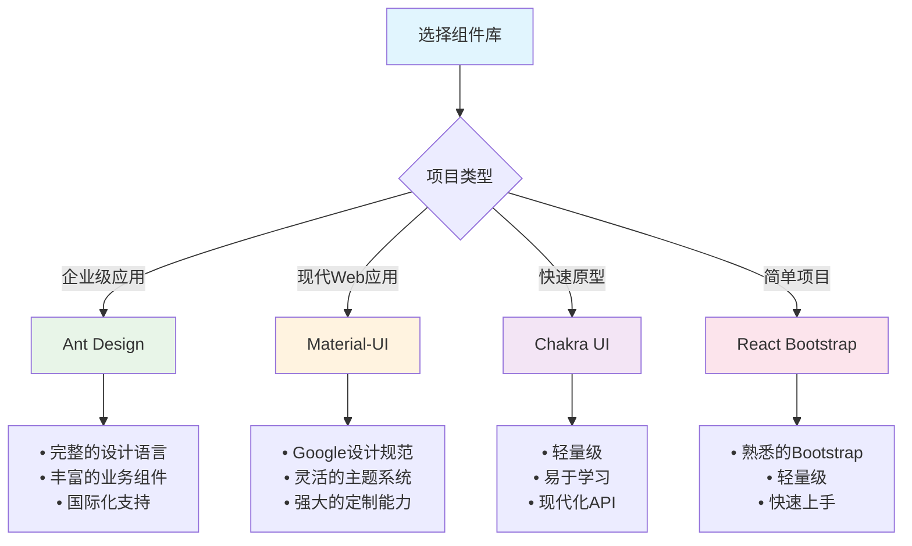

### 8.2 构建工具

#### 8.2.1 Create React App

**CRA项目结构和配置**
```bash
# 创建新项目
npx create-react-app my-app --template typescript
cd my-app

# 项目结构
my-app/
├── public/
│   ├── index.html
│   ├── favicon.ico
│   └── manifest.json
├── src/
│   ├── components/
│   ├── hooks/
│   ├── services/
│   ├── utils/
│   ├── App.tsx
│   ├── index.tsx
│   └── index.css
├── package.json
└── tsconfig.json
```

**环境变量配置**
```bash
# .env
REACT_APP_API_URL=http://localhost:3001/api
REACT_APP_VERSION=$npm_package_version

# .env.development
REACT_APP_API_URL=http://localhost:3001/api
REACT_APP_DEBUG=true

# .env.production
REACT_APP_API_URL=https://api.myapp.com
REACT_APP_DEBUG=false
```

**自定义配置（不eject）**
```javascript
// craco.config.js
const path = require('path');

module.exports = {
  webpack: {
    alias: {
      '@': path.resolve(__dirname, 'src'),
      '@components': path.resolve(__dirname, 'src/components'),
      '@hooks': path.resolve(__dirname, 'src/hooks'),
      '@utils': path.resolve(__dirname, 'src/utils')
    }
  },
  babel: {
    plugins: [
      ['import', {
        libraryName: 'antd',
        libraryDirectory: 'es',
        style: 'css'
      }]
    ]
  },
  eslint: {
    mode: 'extends',
    configure: {
      rules: {
        'no-unused-vars': 'warn',
        '@typescript-eslint/no-unused-vars': 'warn'
      }
    }
  }
};

// package.json scripts
{
  "scripts": {
    "start": "craco start",
    "build": "craco build",
    "test": "craco test"
  }
}
```

#### 8.2.2 Vite

**Vite配置和优化**
```javascript
// vite.config.ts
import { defineConfig } from 'vite';
import react from '@vitejs/plugin-react';
import { resolve } from 'path';

export default defineConfig({
  plugins: [react()],
  resolve: {
    alias: {
      '@': resolve(__dirname, 'src'),
      '@components': resolve(__dirname, 'src/components'),
      '@hooks': resolve(__dirname, 'src/hooks'),
      '@utils': resolve(__dirname, 'src/utils')
    }
  },
  server: {
    port: 3000,
    open: true,
    proxy: {
      '/api': {
        target: 'http://localhost:3001',
        changeOrigin: true,
        rewrite: (path) => path.replace(/^\/api/, '')
      }
    }
  },
  build: {
    outDir: 'dist',
    rollupOptions: {
      output: {
        manualChunks: {
          vendor: ['react', 'react-dom'],
          router: ['react-router-dom'],
          ui: ['antd', '@ant-design/icons']
        }
      }
    },
    chunkSizeWarningLimit: 1000
  },
  optimizeDeps: {
    include: ['react', 'react-dom', 'antd']
  }
});

// 环境变量
// .env
VITE_API_URL=http://localhost:3001/api
VITE_APP_TITLE=My React App

// 使用环境变量
const apiUrl = import.meta.env.VITE_API_URL;
const appTitle = import.meta.env.VITE_APP_TITLE;
```

#### 8.2.3 Webpack配置

**自定义Webpack配置**
```javascript
// webpack.config.js
const path = require('path');
const HtmlWebpackPlugin = require('html-webpack-plugin');
const { CleanWebpackPlugin } = require('clean-webpack-plugin');
const MiniCssExtractPlugin = require('mini-css-extract-plugin');
const webpack = require('webpack');

module.exports = (env, argv) => {
  const isProduction = argv.mode === 'production';

  return {
    entry: './src/index.tsx',
    output: {
      path: path.resolve(__dirname, 'dist'),
      filename: isProduction 
        ? '[name].[contenthash].js' 
        : '[name].js',
      publicPath: '/'
    },
    resolve: {
      extensions: ['.tsx', '.ts', '.js', '.jsx'],
      alias: {
        '@': path.resolve(__dirname, 'src'),
        '@components': path.resolve(__dirname, 'src/components'),
        '@hooks': path.resolve(__dirname, 'src/hooks'),
        '@utils': path.resolve(__dirname, 'src/utils')
      }
    },
    module: {
      rules: [
        {
          test: /\.(ts|tsx)$/,
          use: 'ts-loader',
          exclude: /node_modules/
        },
        {
          test: /\.css$/,
          use: [
            isProduction ? MiniCssExtractPlugin.loader : 'style-loader',
            'css-loader',
            'postcss-loader'
          ]
        },
        {
          test: /\.scss$/,
          use: [
            isProduction ? MiniCssExtractPlugin.loader : 'style-loader',
            'css-loader',
            'postcss-loader',
            'sass-loader'
          ]
        },
        {
          test: /\.(png|svg|jpg|jpeg|gif)$/i,
          type: 'asset/resource'
        }
      ]
    },
    plugins: [
      new CleanWebpackPlugin(),
      new HtmlWebpackPlugin({
        template: './public/index.html',
        favicon: './public/favicon.ico'
      }),
      new webpack.DefinePlugin({
        'process.env.NODE_ENV': JSON.stringify(argv.mode),
        'process.env.REACT_APP_API_URL': JSON.stringify(
          process.env.REACT_APP_API_URL
        )
      }),
      ...(isProduction ? [
        new MiniCssExtractPlugin({
          filename: '[name].[contenthash].css'
        })
      ] : [])
    ],
    devServer: {
      static: path.join(__dirname, 'public'),
      historyApiFallback: true,
      hot: true,
      port: 3000,
      proxy: {
        '/api': {
          target: 'http://localhost:3001',
          changeOrigin: true,
          pathRewrite: {
            '^/api': ''
          }
        }
      }
    },
    optimization: {
      splitChunks: {
        chunks: 'all',
        cacheGroups: {
          vendor: {
            test: /[\\/]node_modules[\\/]/,
            name: 'vendors',
            chunks: 'all'
          }
        }
      }
    }
  };
};
```

### 8.3 全栈框架

#### 8.3.1 Next.js

**Next.js应用架构**
```javascript
// pages/_app.tsx
import type { AppProps } from 'next/app';
import { QueryClient, QueryClientProvider } from 'react-query';
import { SessionProvider } from 'next-auth/react';
import Layout from '../components/Layout';
import '../styles/globals.css';

const queryClient = new QueryClient();

function MyApp({ Component, pageProps: { session, ...pageProps } }: AppProps) {
  return (
    <SessionProvider session={session}>
      <QueryClientProvider client={queryClient}>
        <Layout>
          <Component {...pageProps} />
        </Layout>
      </QueryClientProvider>
    </SessionProvider>
  );
}

export default MyApp;

// pages/index.tsx - 静态生成
import { GetStaticProps } from 'next';
import { Post } from '../types';

interface HomeProps {
  posts: Post[];
}

export default function Home({ posts }: HomeProps) {
  return (
    <div>
      <h1>Latest Posts</h1>
      {posts.map(post => (
        <article key={post.id}>
          <h2>{post.title}</h2>
          <p>{post.excerpt}</p>
        </article>
      ))}
    </div>
  );
}

export const getStaticProps: GetStaticProps = async () => {
  const posts = await fetchPosts();
  
  return {
    props: {
      posts
    },
    revalidate: 60 // ISR: 每60秒重新生成
  };
};

// pages/posts/[id].tsx - 动态路由
import { GetStaticPaths, GetStaticProps } from 'next';

interface PostProps {
  post: Post;
}

export default function Post({ post }: PostProps) {
  return (
    <article>
      <h1>{post.title}</h1>
      <div dangerouslySetInnerHTML={{ __html: post.content }} />
    </article>
  );
}

export const getStaticPaths: GetStaticPaths = async () => {
  const posts = await fetchPosts();
  const paths = posts.map(post => ({
    params: { id: post.id.toString() }
  }));

  return {
    paths,
    fallback: 'blocking' // ISR for new posts
  };
};

export const getStaticProps: GetStaticProps = async ({ params }) => {
  const post = await fetchPost(params?.id as string);

  if (!post) {
    return {
      notFound: true
    };
  }

  return {
    props: {
      post
    },
    revalidate: 86400 // 24 hours
  };
};

// pages/api/users.ts - API路由
import type { NextApiRequest, NextApiResponse } from 'next';
import { getSession } from 'next-auth/react';

export default async function handler(
  req: NextApiRequest,
  res: NextApiResponse
) {
  const session = await getSession({ req });

  if (!session) {
    return res.status(401).json({ error: 'Unauthorized' });
  }

  switch (req.method) {
    case 'GET':
      const users = await getUsers();
      res.status(200).json(users);
      break;
      
    case 'POST':
      const newUser = await createUser(req.body);
      res.status(201).json(newUser);
      break;
      
    default:
      res.setHeader('Allow', ['GET', 'POST']);
      res.status(405).end(`Method ${req.method} Not Allowed`);
  }
}

// next.config.js
/** @type {import('next').NextConfig} */
const nextConfig = {
  reactStrictMode: true,
  swcMinify: true,
  images: {
    domains: ['example.com'],
    formats: ['image/webp', 'image/avif']
  },
  env: {
    CUSTOM_KEY: process.env.CUSTOM_KEY
  },
  async rewrites() {
    return [
      {
        source: '/api/external/:path*',
        destination: 'https://external-api.com/:path*'
      }
    ];
  },
  async headers() {
    return [
      {
        source: '/api/:path*',
        headers: [
          {
            key: 'Access-Control-Allow-Origin',
            value: '*'
          }
        ]
      }
    ];
  }
};

module.exports = nextConfig;
```

#### 8.3.2 Remix

**Remix应用结构**
```javascript
// app/root.tsx
import {
  Links,
  LiveReload,
  Meta,
  Outlet,
  Scripts,
  ScrollRestoration
} from '@remix-run/react';

export default function App() {
  return (
    <html lang="en">
      <head>
        <meta charSet="utf-8" />
        <meta name="viewport" content="width=device-width,initial-scale=1" />
        <Meta />
        <Links />
      </head>
      <body>
        <Outlet />
        <ScrollRestoration />
        <Scripts />
        <LiveReload />
      </body>
    </html>
  );
}

// app/routes/posts.tsx
import { json, LoaderFunction } from '@remix-run/node';
import { useLoaderData, Outlet } from '@remix-run/react';

interface LoaderData {
  posts: Post[];
}

export const loader: LoaderFunction = async () => {
  const posts = await getPosts();
  return json<LoaderData>({ posts });
};

export default function Posts() {
  const { posts } = useLoaderData<LoaderData>();

  return (
    <div style={{ display: 'flex' }}>
      <nav style={{ width: '200px' }}>
        <h2>Posts</h2>
        <ul>
          {posts.map(post => (
            <li key={post.id}>
              <Link to={post.slug}>{post.title}</Link>
            </li>
          ))}
        </ul>
      </nav>
      <main style={{ flex: 1, padding: '20px' }}>
        <Outlet />
      </main>
    </div>
  );
}

// app/routes/posts/$slug.tsx
import { json, LoaderFunction, ActionFunction } from '@remix-run/node';
import { useLoaderData, Form, useActionData } from '@remix-run/react';

export const loader: LoaderFunction = async ({ params }) => {
  const post = await getPost(params.slug);
  if (!post) {
    throw new Response('Not Found', { status: 404 });
  }
  return json({ post });
};

export const action: ActionFunction = async ({ request, params }) => {
  const formData = await request.formData();
  const comment = formData.get('comment');

  if (!comment) {
    return json({ error: 'Comment is required' }, { status: 400 });
  }

  await addComment(params.slug, comment);
  return json({ success: true });
};

export default function PostSlug() {
  const { post } = useLoaderData();
  const actionData = useActionData();

  return (
    <div>
      <h1>{post.title}</h1>
      <div dangerouslySetInnerHTML={{ __html: post.content }} />
      
      <Form method="post" style={{ marginTop: '2rem' }}>
        <textarea
          name="comment"
          placeholder="Add a comment..."
          rows={4}
          style={{ width: '100%' }}
        />
        <button type="submit">Add Comment</button>
        {actionData?.error && (
          <p style={{ color: 'red' }}>{actionData.error}</p>
        )}
        {actionData?.success && (
          <p style={{ color: 'green' }}>Comment added!</p>
        )}
      </Form>
    </div>
  );
}
```

#### 8.3.3 Gatsby

**Gatsby静态站点生成**
```javascript
// gatsby-config.js
module.exports = {
  siteMetadata: {
    title: 'My Gatsby Site',
    description: 'A fast static site built with Gatsby',
    siteUrl: 'https://mygatsby.com'
  },
  plugins: [
    'gatsby-plugin-react-helmet',
    'gatsby-plugin-image',
    'gatsby-plugin-sharp',
    'gatsby-transformer-sharp',
    {
      resolve: 'gatsby-source-filesystem',
      options: {
        name: 'images',
        path: './src/images/'
      }
    },
    {
      resolve: 'gatsby-source-filesystem',
      options: {
        name: 'posts',
        path: './src/posts/'
      }
    },
    {
      resolve: 'gatsby-transformer-remark',
      options: {
        plugins: [
          'gatsby-remark-images',
          'gatsby-remark-prismjs'
        ]
      }
    },
    {
      resolve: 'gatsby-plugin-manifest',
      options: {
        name: 'My Gatsby Site',
        short_name: 'Gatsby',
        start_url: '/',
        background_color: '#663399',
        theme_color: '#663399',
        display: 'minimal-ui',
        icon: 'src/images/gatsby-icon.png'
      }
    }
  ]
};

// src/pages/index.js
import React from 'react';
import { graphql } from 'gatsby';
import Layout from '../components/layout';
import SEO from '../components/seo';

const IndexPage = ({ data }) => {
  return (
    <Layout>
      <SEO title="Home" />
      <h1>Welcome to my Gatsby site</h1>
      <h2>Latest Posts</h2>
      {data.allMarkdownRemark.edges.map(({ node }) => (
        <article key={node.id}>
          <h3>
            <Link to={node.fields.slug}>{node.frontmatter.title}</Link>
          </h3>
          <p>{node.frontmatter.date}</p>
          <p>{node.excerpt}</p>
        </article>
      ))}
    </Layout>
  );
};

export const query = graphql`
  query {
    allMarkdownRemark(sort: { fields: [frontmatter___date], order: DESC }) {
      edges {
        node {
          id
          excerpt(pruneLength: 160)
          fields {
            slug
          }
          frontmatter {
            title
            date(formatString: "MMMM DD, YYYY")
          }
        }
      }
    }
  }
`;

export default IndexPage;

// gatsby-node.js
const path = require('path');
const { createFilePath } = require('gatsby-source-filesystem');

exports.onCreateNode = ({ node, getNode, actions }) => {
  const { createNodeField } = actions;
  
  if (node.internal.type === 'MarkdownRemark') {
    const slug = createFilePath({ node, getNode, basePath: 'posts' });
    createNodeField({
      node,
      name: 'slug',
      value: slug
    });
  }
};

exports.createPages = async ({ graphql, actions }) => {
  const { createPage } = actions;
  
  const result = await graphql(`
    query {
      allMarkdownRemark {
        edges {
          node {
            fields {
              slug
            }
          }
        }
      }
    }
  `);

  result.data.allMarkdownRemark.edges.forEach(({ node }) => {
    createPage({
      path: node.fields.slug,
      component: path.resolve('./src/templates/blog-post.js'),
      context: {
        slug: node.fields.slug
      }
    });
  });
};
```

## 9. 实战项目案例

### 9.1 待办事项应用

#### 9.1.1 项目架构

**技术栈选择**
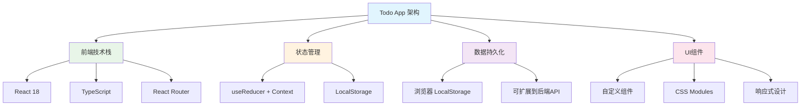

#### 9.1.2 功能实现

**核心状态管理**
```typescript
// types/todo.ts
export interface Todo {
  id: string;
  text: string;
  completed: boolean;
  createdAt: Date;
  updatedAt: Date;
  priority: 'low' | 'medium' | 'high';
  category?: string;
}

export type FilterType = 'all' | 'active' | 'completed';

export interface TodoState {
  todos: Todo[];
  filter: FilterType;
  searchTerm: string;
}

export type TodoAction =
  | { type: 'ADD_TODO'; payload: Omit<Todo, 'id' | 'createdAt' | 'updatedAt'> }
  | { type: 'TOGGLE_TODO'; payload: string }
  | { type: 'DELETE_TODO'; payload: string }
  | { type: 'EDIT_TODO'; payload: { id: string; text: string } }
  | { type: 'SET_FILTER'; payload: FilterType }
  | { type: 'SET_SEARCH'; payload: string }
  | { type: 'CLEAR_COMPLETED' }
  | { type: 'LOAD_TODOS'; payload: Todo[] };

// hooks/useTodos.ts
import { useReducer, useEffect } from 'react';
import { v4 as uuidv4 } from 'uuid';

const todoReducer = (state: TodoState, action: TodoAction): TodoState => {
  switch (action.type) {
    case 'ADD_TODO':
      const newTodo: Todo = {
        ...action.payload,
        id: uuidv4(),
        createdAt: new Date(),
        updatedAt: new Date()
      };
      return {
        ...state,
        todos: [...state.todos, newTodo]
      };

    case 'TOGGLE_TODO':
      return {
        ...state,
        todos: state.todos.map(todo =>
          todo.id === action.payload
            ? { ...todo, completed: !todo.completed, updatedAt: new Date() }
            : todo
        )
      };

    case 'DELETE_TODO':
      return {
        ...state,
        todos: state.todos.filter(todo => todo.id !== action.payload)
      };

    case 'EDIT_TODO':
      return {
        ...state,
        todos: state.todos.map(todo =>
          todo.id === action.payload.id
            ? { ...todo, text: action.payload.text, updatedAt: new Date() }
            : todo
        )
      };

    case 'SET_FILTER':
      return { ...state, filter: action.payload };

    case 'SET_SEARCH':
      return { ...state, searchTerm: action.payload };

    case 'CLEAR_COMPLETED':
      return {
        ...state,
        todos: state.todos.filter(todo => !todo.completed)
      };

    case 'LOAD_TODOS':
      return { ...state, todos: action.payload };

    default:
      return state;
  }
};

export const useTodos = () => {
  const [state, dispatch] = useReducer(todoReducer, {
    todos: [],
    filter: 'all',
    searchTerm: ''
  });

  // 持久化到 localStorage
  useEffect(() => {
    const savedTodos = localStorage.getItem('todos');
    if (savedTodos) {
      try {
        const todos = JSON.parse(savedTodos).map((todo: any) => ({
          ...todo,
          createdAt: new Date(todo.createdAt),
          updatedAt: new Date(todo.updatedAt)
        }));
        dispatch({ type: 'LOAD_TODOS', payload: todos });
      } catch (error) {
        console.error('Failed to load todos from localStorage:', error);
      }
    }
  }, []);

  useEffect(() => {
    localStorage.setItem('todos', JSON.stringify(state.todos));
  }, [state.todos]);

  // 过滤和搜索逻辑
  const filteredTodos = state.todos.filter(todo => {
    const matchesFilter = 
      state.filter === 'all' ||
      (state.filter === 'active' && !todo.completed) ||
      (state.filter === 'completed' && todo.completed);
    
    const matchesSearch = todo.text
      .toLowerCase()
      .includes(state.searchTerm.toLowerCase());

    return matchesFilter && matchesSearch;
  });

  const stats = {
    total: state.todos.length,
    completed: state.todos.filter(todo => todo.completed).length,
    active: state.todos.filter(todo => !todo.completed).length
  };

  return {
    state,
    dispatch,
    filteredTodos,
    stats
  };
};

// components/TodoApp.tsx
import React from 'react';
import { useTodos } from '../hooks/useTodos';
import TodoForm from './TodoForm';
import TodoList from './TodoList';
import TodoFilters from './TodoFilters';
import TodoStats from './TodoStats';
import SearchBar from './SearchBar';
import styles from './TodoApp.module.css';

const TodoApp: React.FC = () => {
  const { state, dispatch, filteredTodos, stats } = useTodos();

  return (
    <div className={styles.todoApp}>
      <header className={styles.header}>
        <h1>Todo Application</h1>
        <TodoStats stats={stats} />
      </header>

      <main className={styles.main}>
        <TodoForm
          onSubmit={(todo) => dispatch({ type: 'ADD_TODO', payload: todo })}
        />
        
        <div className={styles.controls}>
          <SearchBar
            value={state.searchTerm}
            onChange={(term) => dispatch({ type: 'SET_SEARCH', payload: term })}
          />
          <TodoFilters
            currentFilter={state.filter}
            onFilterChange={(filter) => dispatch({ type: 'SET_FILTER', payload: filter })}
          />
        </div>

        <TodoList
          todos={filteredTodos}
          onToggle={(id) => dispatch({ type: 'TOGGLE_TODO', payload: id })}
          onDelete={(id) => dispatch({ type: 'DELETE_TODO', payload: id })}
          onEdit={(id, text) => dispatch({ type: 'EDIT_TODO', payload: { id, text } })}
        />
      </main>

      <footer className={styles.footer}>
        {stats.completed > 0 && (
          <button
            className={styles.clearCompleted}
            onClick={() => dispatch({ type: 'CLEAR_COMPLETED' })}
          >
            Clear {stats.completed} completed item{stats.completed !== 1 ? 's' : ''}
          </button>
        )}
      </footer>
    </div>
  );
};

export default TodoApp;

// components/TodoItem.tsx
import React, { useState } from 'react';
import { Todo } from '../types/todo';
import styles from './TodoItem.module.css';

interface TodoItemProps {
  todo: Todo;
  onToggle: (id: string) => void;
  onDelete: (id: string) => void;
  onEdit: (id: string, text: string) => void;
}

const TodoItem: React.FC<TodoItemProps> = ({ todo, onToggle, onDelete, onEdit }) => {
  const [isEditing, setIsEditing] = useState(false);
  const [editText, setEditText] = useState(todo.text);

  const handleSubmit = (e: React.FormEvent) => {
    e.preventDefault();
    const trimmedText = editText.trim();
    if (trimmedText) {
      onEdit(todo.id, trimmedText);
      setIsEditing(false);
    } else {
      onDelete(todo.id);
    }
  };

  const handleKeyDown = (e: React.KeyboardEvent) => {
    if (e.key === 'Escape') {
      setEditText(todo.text);
      setIsEditing(false);
    }
  };

  const priorityClass = styles[`priority-${todo.priority}`];

  return (
    <li className={`${styles.todoItem} ${todo.completed ? styles.completed : ''} ${priorityClass}`}>
      <div className={styles.todoContent}>
        <input
          type="checkbox"
          checked={todo.completed}
          onChange={() => onToggle(todo.id)}
          className={styles.checkbox}
        />
        
        {isEditing ? (
          <form onSubmit={handleSubmit} className={styles.editForm}>
            <input
              type="text"
              value={editText}
              onChange={(e) => setEditText(e.target.value)}
              onBlur={handleSubmit}
              onKeyDown={handleKeyDown}
              className={styles.editInput}
              autoFocus
            />
          </form>
        ) : (
          <span
            className={styles.todoText}
            onDoubleClick={() => setIsEditing(true)}
          >
            {todo.text}
          </span>
        )}
      </div>

      <div className={styles.todoActions}>
        <span className={styles.priority}>{todo.priority}</span>
        {todo.category && (
          <span className={styles.category}>{todo.category}</span>
        )}
        <button
          onClick={() => setIsEditing(true)}
          className={styles.editButton}
          aria-label="Edit todo"
        >
          ✏️
        </button>
        <button
          onClick={() => onDelete(todo.id)}
          className={styles.deleteButton}
          aria-label="Delete todo"
        >
          🗑️
        </button>
      </div>
    </li>
  );
};

export default TodoItem;
```

### 9.2 电商购物车

#### 9.2.1 状态设计

**购物车状态管理**
```typescript
// types/cart.ts
export interface Product {
  id: string;
  name: string;
  price: number;
  image: string;
  description: string;
  category: string;
  inventory: number;
}

export interface CartItem {
  product: Product;
  quantity: number;
  selectedOptions?: Record<string, string>;
}

export interface CartState {
  items: CartItem[];
  isOpen: boolean;
  coupon?: {
    code: string;
    discount: number;
    type: 'percentage' | 'fixed';
  };
}

// context/CartContext.tsx
import React, { createContext, useContext, useReducer, useEffect } from 'react';

type CartAction =
  | { type: 'ADD_ITEM'; payload: { product: Product; quantity?: number; options?: Record<string, string> } }
  | { type: 'REMOVE_ITEM'; payload: string }
  | { type: 'UPDATE_QUANTITY'; payload: { id: string; quantity: number } }
  | { type: 'CLEAR_CART' }
  | { type: 'TOGGLE_CART' }
  | { type: 'APPLY_COUPON'; payload: CartState['coupon'] }
  | { type: 'REMOVE_COUPON' }
  | { type: 'LOAD_CART'; payload: CartState };

const cartReducer = (state: CartState, action: CartAction): CartState => {
  switch (action.type) {
    case 'ADD_ITEM': {
      const { product, quantity = 1, options = {} } = action.payload;
      const existingItemIndex = state.items.findIndex(
        item => item.product.id === product.id &&
        JSON.stringify(item.selectedOptions) === JSON.stringify(options)
      );

      if (existingItemIndex > -1) {
        const updatedItems = [...state.items];
        updatedItems[existingItemIndex].quantity += quantity;
        return { ...state, items: updatedItems };
      }

      return {
        ...state,
        items: [...state.items, { product, quantity, selectedOptions: options }]
      };
    }

    case 'REMOVE_ITEM':
      return {
        ...state,
        items: state.items.filter(item => item.product.id !== action.payload)
      };

    case 'UPDATE_QUANTITY': {
      const { id, quantity } = action.payload;
      if (quantity <= 0) {
        return {
          ...state,
          items: state.items.filter(item => item.product.id !== id)
        };
      }
      
      return {
        ...state,
        items: state.items.map(item =>
          item.product.id === id ? { ...item, quantity } : item
        )
      };
    }

    case 'CLEAR_CART':
      return { ...state, items: [] };

    case 'TOGGLE_CART':
      return { ...state, isOpen: !state.isOpen };

    case 'APPLY_COUPON':
      return { ...state, coupon: action.payload };

    case 'REMOVE_COUPON':
      return { ...state, coupon: undefined };

    case 'LOAD_CART':
      return action.payload;

    default:
      return state;
  }
};

interface CartContextType {
  state: CartState;
  addItem: (product: Product, quantity?: number, options?: Record<string, string>) => void;
  removeItem: (productId: string) => void;
  updateQuantity: (productId: string, quantity: number) => void;
  clearCart: () => void;
  toggleCart: () => void;
  applyCoupon: (coupon: CartState['coupon']) => void;
  removeCoupon: () => void;
  totals: {
    subtotal: number;
    discount: number;
    total: number;
    itemCount: number;
  };
}

const CartContext = createContext<CartContextType | undefined>(undefined);

export const CartProvider: React.FC<{ children: React.ReactNode }> = ({ children }) => {
  const [state, dispatch] = useReducer(cartReducer, {
    items: [],
    isOpen: false
  });

  // 持久化购物车
  useEffect(() => {
    const savedCart = localStorage.getItem('cart');
    if (savedCart) {
      try {
        const cartData = JSON.parse(savedCart);
        dispatch({ type: 'LOAD_CART', payload: cartData });
      } catch (error) {
        console.error('Failed to load cart from localStorage:', error);
      }
    }
  }, []);

  useEffect(() => {
    localStorage.setItem('cart', JSON.stringify(state));
  }, [state]);

  // 计算总计
  const totals = React.useMemo(() => {
    const subtotal = state.items.reduce(
      (sum, item) => sum + item.product.price * item.quantity,
      0
    );

    let discount = 0;
    if (state.coupon) {
      discount = state.coupon.type === 'percentage'
        ? subtotal * (state.coupon.discount / 100)
        : state.coupon.discount;
    }

    const total = Math.max(0, subtotal - discount);
    const itemCount = state.items.reduce((sum, item) => sum + item.quantity, 0);

    return { subtotal, discount, total, itemCount };
  }, [state.items, state.coupon]);

  const contextValue: CartContextType = {
    state,
    addItem: (product, quantity, options) =>
      dispatch({ type: 'ADD_ITEM', payload: { product, quantity, options } }),
    removeItem: (productId) =>
      dispatch({ type: 'REMOVE_ITEM', payload: productId }),
    updateQuantity: (productId, quantity) =>
      dispatch({ type: 'UPDATE_QUANTITY', payload: { id: productId, quantity } }),
    clearCart: () => dispatch({ type: 'CLEAR_CART' }),
    toggleCart: () => dispatch({ type: 'TOGGLE_CART' }),
    applyCoupon: (coupon) => dispatch({ type: 'APPLY_COUPON', payload: coupon }),
    removeCoupon: () => dispatch({ type: 'REMOVE_COUPON' }),
    totals
  };

  return (
    <CartContext.Provider value={contextValue}>
      {children}
    </CartContext.Provider>
  );
};

export const useCart = () => {
  const context = useContext(CartContext);
  if (!context) {
    throw new Error('useCart must be used within a CartProvider');
  }
  return context;
};
```

#### 9.2.2 组件拆分

**购物车组件实现**
```typescript
// components/Cart/CartDrawer.tsx
import React from 'react';
import { useCart } from '../../context/CartContext';
import CartItem from './CartItem';
import CouponInput from './CouponInput';
import styles from './CartDrawer.module.css';

const CartDrawer: React.FC = () => {
  const { state, toggleCart, clearCart, totals } = useCart();

  if (!state.isOpen) return null;

  return (
    <div className={styles.overlay} onClick={toggleCart}>
      <div className={styles.drawer} onClick={(e) => e.stopPropagation()}>
        <header className={styles.header}>
          <h2>Shopping Cart ({totals.itemCount})</h2>
          <button onClick={toggleCart} className={styles.closeButton}>
            ✕
          </button>
        </header>

        {state.items.length === 0 ? (
          <div className={styles.emptyCart}>
            <p>Your cart is empty</p>
            <button onClick={toggleCart}>Continue Shopping</button>
          </div>
        ) : (
          <>
            <div className={styles.items}>
              {state.items.map((item, index) => (
                <CartItem key={`${item.product.id}-${index}`} item={item} />
              ))}
            </div>

            <div className={styles.couponSection}>
              <CouponInput />
            </div>

            <div className={styles.summary}>
              <div className={styles.summaryRow}>
                <span>Subtotal:</span>
                <span>${totals.subtotal.toFixed(2)}</span>
              </div>
              {totals.discount > 0 && (
                <div className={styles.summaryRow}>
                  <span>Discount:</span>
                  <span className={styles.discount}>-${totals.discount.toFixed(2)}</span>
                </div>
              )}
              <div className={`${styles.summaryRow} ${styles.total}`}>
                <span>Total:</span>
                <span>${totals.total.toFixed(2)}</span>
              </div>
            </div>

            <div className={styles.actions}>
              <button onClick={clearCart} className={styles.clearButton}>
                Clear Cart
              </button>
              <button className={styles.checkoutButton}>
                Proceed to Checkout
              </button>
            </div>
          </>
        )}
      </div>
    </div>
  );
};

// components/Cart/CartItem.tsx
const CartItem: React.FC<{ item: CartItem }> = ({ item }) => {
  const { updateQuantity, removeItem } = useCart();

  return (
    <div className={styles.cartItem}>
      
      <div className={styles.itemDetails}>
        <h4>{item.product.name}</h4>
        <p>${item.product.price.toFixed(2)}</p>
        {item.selectedOptions && (
          <div className={styles.options}>
            {Object.entries(item.selectedOptions).map(([key, value]) => (
              <span key={key}>{key}: {value}</span>
            ))}
          </div>
        )}
      </div>
      <div className={styles.quantityControls}>
        <button onClick={() => updateQuantity(item.product.id, item.quantity - 1)}>
          -
        </button>
        <span>{item.quantity}</span>
        <button onClick={() => updateQuantity(item.product.id, item.quantity + 1)}>
          +
        </button>
      </div>
      <button
        onClick={() => removeItem(item.product.id)}
        className={styles.removeButton}
      >
        Remove
      </button>
    </div>
  );
};

export default CartDrawer;
```

### 9.3 实时聊天应用

#### 9.3.1 WebSocket集成

**实时通信实现**
```typescript
// hooks/useWebSocket.ts
import { useEffect, useRef, useState, useCallback } from 'react';

interface Message {
  id: string;
  userId: string;
  userName: string;
  content: string;
  timestamp: Date;
  type: 'text' | 'image' | 'file';
}

interface WebSocketHookOptions {
  url: string;
  reconnectAttempts?: number;
  reconnectInterval?: number;
}

export const useWebSocket = ({ url, reconnectAttempts = 5, reconnectInterval = 3000 }: WebSocketHookOptions) => {
  const [socket, setSocket] = useState<WebSocket | null>(null);
  const [isConnected, setIsConnected] = useState(false);
  const [messages, setMessages] = useState<Message[]>([]);
  const [onlineUsers, setOnlineUsers] = useState<string[]>([]);
  const reconnectCount = useRef(0);
  const reconnectTimer = useRef<NodeJS.Timeout>();

  const connect = useCallback(() => {
    try {
      const ws = new WebSocket(url);

      ws.onopen = () => {
        console.log('WebSocket connected');
        setIsConnected(true);
        reconnectCount.current = 0;
        setSocket(ws);
      };

      ws.onmessage = (event) => {
        try {
          const data = JSON.parse(event.data);
          
          switch (data.type) {
            case 'message':
              setMessages(prev => [...prev, {
                ...data.payload,
                timestamp: new Date(data.payload.timestamp)
              }]);
              break;
              
            case 'userJoined':
              setOnlineUsers(prev => [...prev, data.payload.userName]);
              break;
              
            case 'userLeft':
              setOnlineUsers(prev => prev.filter(user => user !== data.payload.userName));
              break;
              
            case 'onlineUsers':
              setOnlineUsers(data.payload);
              break;
              
            default:
              console.log('Unknown message type:', data.type);
          }
        } catch (error) {
          console.error('Failed to parse WebSocket message:', error);
        }
      };

      ws.onclose = () => {
        console.log('WebSocket disconnected');
        setIsConnected(false);
        setSocket(null);

        // 自动重连
        if (reconnectCount.current < reconnectAttempts) {
          reconnectTimer.current = setTimeout(() => {
            reconnectCount.current++;
            console.log(`Reconnecting... Attempt ${reconnectCount.current}`);
            connect();
          }, reconnectInterval);
        }
      };

      ws.onerror = (error) => {
        console.error('WebSocket error:', error);
      };

    } catch (error) {
      console.error('Failed to create WebSocket connection:', error);
    }
  }, [url, reconnectAttempts, reconnectInterval]);

  const disconnect = useCallback(() => {
    if (reconnectTimer.current) {
      clearTimeout(reconnectTimer.current);
    }
    if (socket) {
      socket.close();
    }
  }, [socket]);

  const sendMessage = useCallback((message: Omit<Message, 'id' | 'timestamp'>) => {
    if (socket && isConnected) {
      socket.send(JSON.stringify({
        type: 'message',
        payload: message
      }));
    }
  }, [socket, isConnected]);

  useEffect(() => {
    connect();
    return disconnect;
  }, [connect, disconnect]);

  return {
    isConnected,
    messages,
    onlineUsers,
    sendMessage,
    connect,
    disconnect
  };
};

// components/Chat/ChatRoom.tsx
import React, { useState, useRef, useEffect } from 'react';
import { useWebSocket } from '../../hooks/useWebSocket';
import MessageList from './MessageList';
import MessageInput from './MessageInput';
import UserList from './UserList';
import styles from './ChatRoom.module.css';

interface ChatRoomProps {
  roomId: string;
  currentUser: {
    id: string;
    name: string;
  };
}

const ChatRoom: React.FC<ChatRoomProps> = ({ roomId, currentUser }) => {
  const { isConnected, messages, onlineUsers, sendMessage } = useWebSocket({
    url: `wss://localhost:8080/chat/${roomId}`,
    reconnectAttempts: 5,
    reconnectInterval: 3000
  });

  const [isTyping, setIsTyping] = useState<string[]>([]);
  const messagesEndRef = useRef<HTMLDivElement>(null);

  // 自动滚动到最新消息
  useEffect(() => {
    messagesEndRef.current?.scrollIntoView({ behavior: 'smooth' });
  }, [messages]);

  const handleSendMessage = (content: string, type: 'text' | 'image' | 'file' = 'text') => {
    if (content.trim()) {
      sendMessage({
        userId: currentUser.id,
        userName: currentUser.name,
        content,
        type
      });
    }
  };

  return (
    <div className={styles.chatRoom}>
      <header className={styles.header}>
        <h2>Chat Room - {roomId}</h2>
        <div className={styles.connectionStatus}>
          <span className={`${styles.indicator} ${isConnected ? styles.connected : styles.disconnected}`} />
          {isConnected ? 'Connected' : 'Disconnected'}
        </div>
      </header>

      <div className={styles.chatContent}>
        <aside className={styles.sidebar}>
          <UserList users={onlineUsers} currentUser={currentUser.name} />
        </aside>

        <main className={styles.messageArea}>
          <MessageList 
            messages={messages} 
            currentUserId={currentUser.id}
            isTyping={isTyping}
          />
          <div ref={messagesEndRef} />
          
          <MessageInput
            onSendMessage={handleSendMessage}
            disabled={!isConnected}
            placeholder={isConnected ? "Type a message..." : "Connecting..."}
          />
        </main>
      </div>
    </div>
  );
};

export default ChatRoom;
```

#### 9.3.2 消息管理

**消息组件实现**
```typescript
// components/Chat/MessageList.tsx
import React from 'react';
import { Message } from '../../hooks/useWebSocket';
import MessageBubble from './MessageBubble';
import TypingIndicator from './TypingIndicator';
import styles from './MessageList.module.css';

interface MessageListProps {
  messages: Message[];
  currentUserId: string;
  isTyping: string[];
}

const MessageList: React.FC<MessageListProps> = ({ messages, currentUserId, isTyping }) => {
  // 按日期分组消息
  const groupedMessages = messages.reduce((groups, message) => {
    const date = message.timestamp.toDateString();
    if (!groups[date]) {
      groups[date] = [];
    }
    groups[date].push(message);
    return groups;
  }, {} as Record<string, Message[]>);

  return (
    <div className={styles.messageList}>
      {Object.entries(groupedMessages).map(([date, dayMessages]) => (
        <div key={date} className={styles.messageGroup}>
          <div className={styles.dateDivider}>
            <span>{new Date(date).toLocaleDateString()}</span>
          </div>
          
          {dayMessages.map((message, index) => {
            const prevMessage = dayMessages[index - 1];
            const isSequential = prevMessage && 
              prevMessage.userId === message.userId &&
              message.timestamp.getTime() - prevMessage.timestamp.getTime() < 60000; // 1分钟内

            return (
              <MessageBubble
                key={message.id}
                message={message}
                isOwn={message.userId === currentUserId}
                isSequential={isSequential}
              />
            );
          })}
        </div>
      ))}
      
      {isTyping.length > 0 && (
        <TypingIndicator users={isTyping} />
      )}
    </div>
  );
};

// components/Chat/MessageBubble.tsx
const MessageBubble: React.FC<{
  message: Message;
  isOwn: boolean;
  isSequential: boolean;
}> = ({ message, isOwn, isSequential }) => {
  const formatTime = (timestamp: Date) => {
    return timestamp.toLocaleTimeString([], { hour: '2-digit', minute: '2-digit' });
  };

  return (
    <div className={`${styles.messageBubble} ${isOwn ? styles.own : styles.other}`}>
      {!isOwn && !isSequential && (
        <div className={styles.userName}>{message.userName}</div>
      )}
      
      <div className={styles.messageContent}>
        {message.type === 'text' && <p>{message.content}</p>}
        {message.type === 'image' && (
          
        )}
        {message.type === 'file' && (
          <a href={message.content} download className={styles.fileLink}>
            📎 {message.content.split('/').pop()}
          </a>
        )}
      </div>
      
      <div className={styles.timestamp}>
        {formatTime(message.timestamp)}
      </div>
    </div>
  );
};

// components/Chat/MessageInput.tsx
const MessageInput: React.FC<{
  onSendMessage: (content: string, type?: 'text' | 'image' | 'file') => void;
  disabled: boolean;
  placeholder: string;
}> = ({ onSendMessage, disabled, placeholder }) => {
  const [message, setMessage] = useState('');
  const [isUploading, setIsUploading] = useState(false);
  const fileInputRef = useRef<HTMLInputElement>(null);

  const handleSubmit = (e: React.FormEvent) => {
    e.preventDefault();
    if (message.trim() && !disabled) {
      onSendMessage(message);
      setMessage('');
    }
  };

  const handleFileUpload = async (file: File) => {
    if (!file) return;

    setIsUploading(true);
    try {
      // 这里应该调用实际的文件上传API
      const formData = new FormData();
      formData.append('file', file);
      
      const response = await fetch('/api/upload', {
        method: 'POST',
        body: formData
      });
      
      const { url } = await response.json();
      
      const messageType = file.type.startsWith('image/') ? 'image' : 'file';
      onSendMessage(url, messageType);
    } catch (error) {
      console.error('File upload failed:', error);
    } finally {
      setIsUploading(false);
    }
  };

  return (
    <form onSubmit={handleSubmit} className={styles.messageInput}>
      <div className={styles.inputGroup}>
        <input
          type="text"
          value={message}
          onChange={(e) => setMessage(e.target.value)}
          placeholder={placeholder}
          disabled={disabled}
          className={styles.textInput}
        />
        
        <input
          ref={fileInputRef}
          type="file"
          onChange={(e) => e.target.files?.[0] && handleFileUpload(e.target.files[0])}
          style={{ display: 'none' }}
          accept="image/*,.pdf,.doc,.docx,.txt"
        />
        
        <button
          type="button"
          onClick={() => fileInputRef.current?.click()}
          disabled={disabled || isUploading}
          className={styles.fileButton}
        >
          📎
        </button>
        
        <button
          type="submit"
          disabled={disabled || !message.trim() || isUploading}
          className={styles.sendButton}
        >
          {isUploading ? '⏳' : '➤'}
        </button>
      </div>
    </form>
  );
};

export default MessageInput;
```

## 10. React 面试题详解

### 10.1 基础概念类

#### Q1: 什么是React？React有哪些特点？

**答案**：
React是由Facebook开发的用于构建用户界面的JavaScript库。

**核心特点**：
1. **声明式编程**：描述UI应该是什么样子，而不是如何操作DOM
2. **组件化**：将UI拆分为独立、可复用的组件
3. **虚拟DOM**：在内存中操作DOM副本，提升性能
4. **单向数据流**：数据从父组件流向子组件，便于调试
5. **生态丰富**：拥有庞大的第三方库生态系统

#### Q2: 什么是虚拟DOM？虚拟DOM的工作原理是什么？

**答案**：
**虚拟DOM**是真实DOM的JavaScript表示，是一个描述DOM结构的对象树。

**工作原理**：
1. **创建虚拟DOM**：React组件render方法返回虚拟DOM结构
2. **Diff算法**：比较新旧虚拟DOM树的差异
3. **生成补丁**：创建最小化的更新操作
4. **应用更新**：将补丁应用到真实DOM

**优势**：
- **性能优化**：批量更新，减少DOM操作
- **跨平台**：虚拟DOM可以渲染到不同平台
- **可预测性**：状态变化产生可预测的输出

#### Q3: 解释React的生命周期方法

**答案**：
React组件生命周期分为三个阶段：

**挂载阶段（Mounting）**：
- `constructor()`: 组件初始化
- `componentDidMount()`: 组件挂载完成，适合发起网络请求

**更新阶段（Updating）**：
- `componentDidUpdate(prevProps, prevState)`: 组件更新完成
- `shouldComponentUpdate(nextProps, nextState)`: 决定是否重新渲染

**卸载阶段（Unmounting）**：
- `componentWillUnmount()`: 组件即将卸载，清理工作

**Hooks对应关系**：
- `componentDidMount` → `useEffect(() => {}, [])`
- `componentDidUpdate` → `useEffect(() => {})`
- `componentWillUnmount` → `useEffect(() => { return () => {} }, [])`

#### Q4: 什么是JSX？JSX的原理是什么？

**答案**：
**JSX**是JavaScript的语法扩展，允许在JavaScript中编写类似HTML的代码。

**原理**：
JSX会被Babel转译为`React.createElement()`调用：

```javascript
// JSX代码
const element = <div className="container">Hello World</div>;

// 转译后的代码
const element = React.createElement('div', { className: 'container' }, 'Hello World');
```

#### Q5: React中的key属性有什么作用？

**答案**：
**key属性**帮助React识别列表中的每个元素，优化渲染性能。

**作用**：
1. **Diff算法优化**：快速找到变化的元素
2. **保持组件状态**：避免不必要的重新创建
3. **避免渲染错误**：防止元素顺序变化导致的问题

**最佳实践**：
```javascript
// ✅ 使用稳定的唯一标识
{users.map(user => (
  <UserItem key={user.id} user={user} />
))}

// ❌ 不要使用数组索引
{users.map((user, index) => (
  <UserItem key={index} user={user} />
))}
```

### 10.2 组件与生命周期类

#### Q6: 类组件和函数组件有什么区别？

**答案**：

| 方面 | 类组件 | 函数组件 |
|------|--------|----------|
| **语法** | Class语法，需要extends | 函数语法，更简洁 |
| **状态** | this.state | useState Hook |
| **生命周期** | 生命周期方法 | useEffect Hook |
| **性能** | 需要shouldComponentUpdate | React.memo |
| **this绑定** | 需要手动绑定 | 无this问题 |
| **复用逻辑** | HOC, Render Props | 自定义Hooks |

#### Q7: 什么是高阶组件(HOC)？如何实现？

**答案**：
**高阶组件(Higher-Order Component)**是一个接收组件并返回新组件的函数。

```javascript
// HOC实现
const withLoading = (WrappedComponent) => {
  return (props) => {
    if (props.isLoading) {
      return <div>Loading...</div>;
    }
    return <WrappedComponent {...props} />;
  };
};

// 使用HOC
const UserList = ({ users }) => (
  <ul>{users.map(user => <li key={user.id}>{user.name}</li>)}</ul>
);

const EnhancedUserList = withLoading(UserList);
```

#### Q8: 什么是Render Props模式？

**答案**：
**Render Props**是一种在组件间共享代码的技术，通过props传递渲染函数。

```javascript
// Render Props实现
const Mouse = ({ children }) => {
  const [position, setPosition] = useState({ x: 0, y: 0 });
  
  useEffect(() => {
    const handleMouseMove = (e) => {
      setPosition({ x: e.clientX, y: e.clientY });
    };
    
    window.addEventListener('mousemove', handleMouseMove);
    return () => window.removeEventListener('mousemove', handleMouseMove);
  }, []);
  
  return children(position);
};

// 使用Render Props
const App = () => (
  <Mouse>
    {mouse => (
      <div>鼠标位置: ({mouse.x}, {mouse.y})</div>
    )}
  </Mouse>
);
```

### 10.3 Hooks 深度理解类

#### Q9: useEffect的依赖数组是如何工作的？

**答案**：
**依赖数组**决定了useEffect何时重新执行。

**三种情况**：
```javascript
// 1. 没有依赖数组：每次渲染都执行
useEffect(() => {
  console.log('每次渲染都执行');
});

// 2. 空依赖数组：只在挂载时执行一次
useEffect(() => {
  console.log('只在挂载时执行');
}, []);

// 3. 有依赖：依赖变化时执行
useEffect(() => {
  console.log('依赖变化时执行');
}, [dependency]);
```

#### Q10: 为什么useState的更新是异步的？

**答案**：
useState的更新是**异步批处理**的，主要原因：

**1. 性能优化**：避免频繁的DOM更新
**2. 状态一致性**：确保组件状态的一致性
**3. 批量处理**：React会将多个setState调用批处理为一次更新

```javascript
const [count, setCount] = useState(0);

const handleClick = () => {
  setCount(count + 1); // 异步更新
  console.log(count); // 仍然是旧值
  
  // 解决方案：使用函数式更新
  setCount(prev => prev + 1);
};
```

### 10.4 性能优化类

#### Q11: React中有哪些性能优化技术？

**答案**：
React性能优化主要包括：

**1. 避免不必要的渲染**：
```javascript
// React.memo
const ExpensiveComponent = React.memo(({ data }) => {
  return <div>{data.name}</div>;
});
```

**2. useMemo优化计算**：
```javascript
const ExpensiveCalculation = ({ items }) => {
  const total = useMemo(() => {
    return items.reduce((sum, item) => sum + item.price, 0);
  }, [items]);
  
  return <div>Total: {total}</div>;
};
```

**3. useCallback优化函数**：
```javascript
const Parent = ({ items }) => {
  const handleClick = useCallback((id) => {
    console.log('Item clicked:', id);
  }, []);
  
  return <ItemList items={items} onItemClick={handleClick} />;
};
```

**4. 代码分割与懒加载**：
```javascript
const LazyComponent = lazy(() => import('./LazyComponent'));

const App = () => (
  <Suspense fallback={<div>Loading...</div>}>
    <LazyComponent />
  </Suspense>
);
```

#### Q12: 什么是React Fiber？它解决了什么问题？

**答案**：
**React Fiber**是React 16引入的新的协调引擎。

**解决的问题**：
1. **长时间阻塞**：旧版本的递归更新会阻塞主线程
2. **优先级调度**：无法中断低优先级任务来处理高优先级任务
3. **用户体验**：界面卡顿，用户交互响应慢

**Fiber的特性**：
- **可中断**：长任务可以被高优先级任务中断
- **可恢复**：被中断的任务可以在空闲时间继续
- **优先级**：用户交互优先于数据更新
- **并发**：可以同时准备多个状态版本

### 10.5 实战应用类

#### Q13: 如何在React中实现状态管理？

**答案**：
React中有多种状态管理方案：

**1. 本地状态（useState）**：
```javascript
const Counter = () => {
  const [count, setCount] = useState(0);
  return <div>Count: {count}</div>;
};
```

**2. Context API**：
```javascript
const ThemeContext = createContext();

const App = () => {
  const [theme, setTheme] = useState('light');
  
  return (
    <ThemeContext.Provider value={{ theme, setTheme }}>
      <Header />
      <Main />
    </ThemeContext.Provider>
  );
};
```

**3. useReducer复杂状态**：
```javascript
const reducer = (state, action) => {
  switch (action.type) {
    case 'increment':
      return { count: state.count + 1 };
    default:
      return state;
  }
};

const Counter = () => {
  const [state, dispatch] = useReducer(reducer, { count: 0 });
  return <div>Count: {state.count}</div>;
};
```

#### Q14: 如何处理React中的错误边界？

**答案**：
**错误边界(Error Boundaries)**是React组件，它可以捕获其子组件树中的错误。

```javascript
class ErrorBoundary extends React.Component {
  constructor(props) {
    super(props);
    this.state = { hasError: false };
  }
  
  static getDerivedStateFromError(error) {
    return { hasError: true };
  }
  
  componentDidCatch(error, errorInfo) {
    console.error('Error caught:', error, errorInfo);
  }
  
  render() {
    if (this.state.hasError) {
      return <h1>Something went wrong.</h1>;
    }
    
    return this.props.children;
  }
}

// 使用错误边界
const App = () => (
  <ErrorBoundary>
    <MyComponent />
  </ErrorBoundary>
);
```

#### Q15: React中如何实现条件渲染？

**答案**：
React中有多种条件渲染方式：

**1. 三元运算符**：
```javascript
const MyComponent = ({ isLoggedIn }) => (
  <div>
    {isLoggedIn ? <UserDashboard /> : <LoginForm />}
  </div>
);
```

**2. 逻辑与运算符**：
```javascript
const Notification = ({ message }) => (
  <div>
    {message && <div className="alert">{message}</div>}
  </div>
);
```

**3. if语句**：
```javascript
const MyComponent = ({ user }) => {
  if (!user) {
    return <div>Loading...</div>;
  }
  
  if (user.role === 'admin') {
    return <AdminPanel />;
  }
  
  return <UserPanel user={user} />;
};
```

**4. switch语句**：
```javascript
const StatusIndicator = ({ status }) => {
  switch (status) {
    case 'loading':
      return <Spinner />;
    case 'error':
      return <ErrorMessage />;
    case 'success':
      return <SuccessMessage />;
    default:
      return null;
  }
};
```

---

## 📚 总结

这份React技术指南涵盖了：

### 🎯 核心内容
1. **基础概念**：虚拟DOM、组件化、JSX等核心理念
2. **组件开发**：函数组件、类组件、生命周期管理
3. **Hooks深入**：useState、useEffect、自定义Hooks等
4. **性能优化**：React.memo、useMemo、代码分割等
5. **实战应用**：状态管理、错误处理、条件渲染
6. **面试准备**：15道高频面试题详解

### ✅ 技术特色
- **图文并茂**：13个Mermaid流程图解释核心概念
- **代码丰富**：完整可运行的示例代码
- **实战导向**：真实项目中的应用场景
- **面试友好**：标准答案可直接用于面试

这份指南适合从初学者到高级开发者的各个层次，是学习和掌握React技术的完整参考资料。
