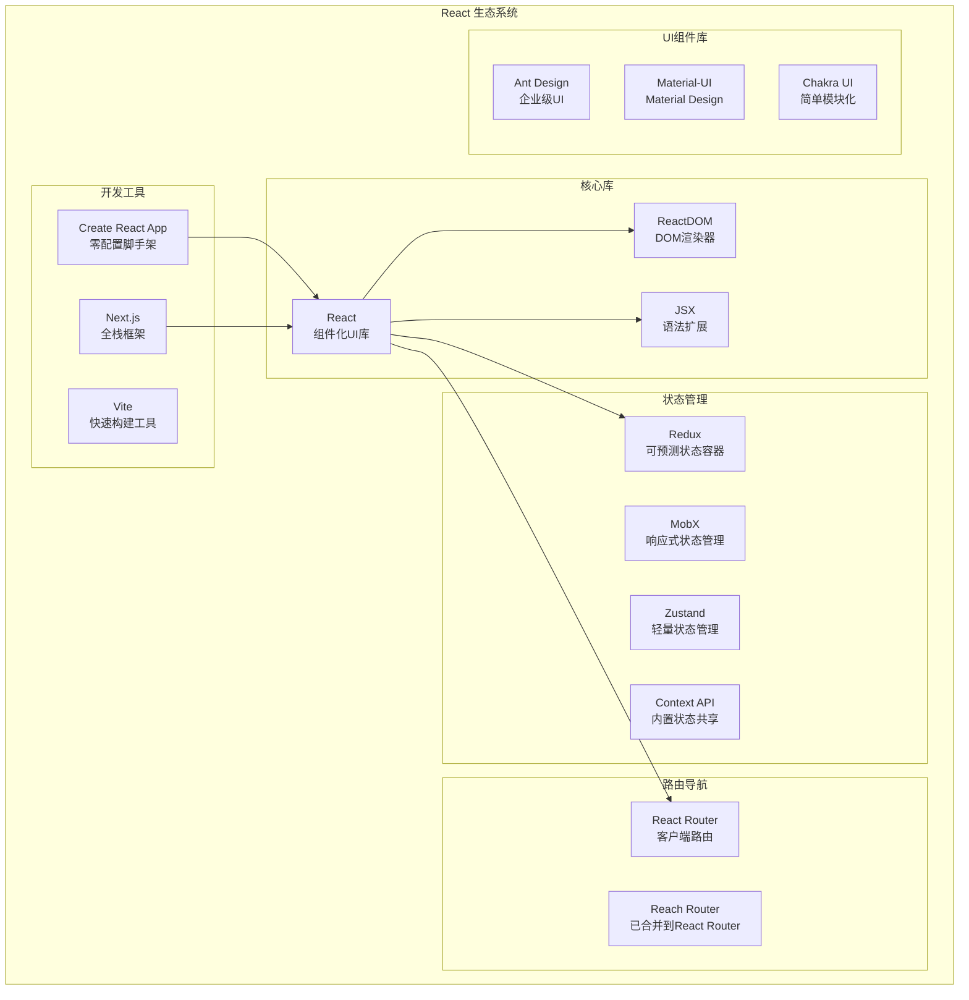
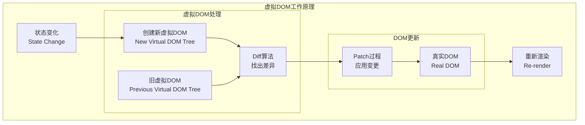
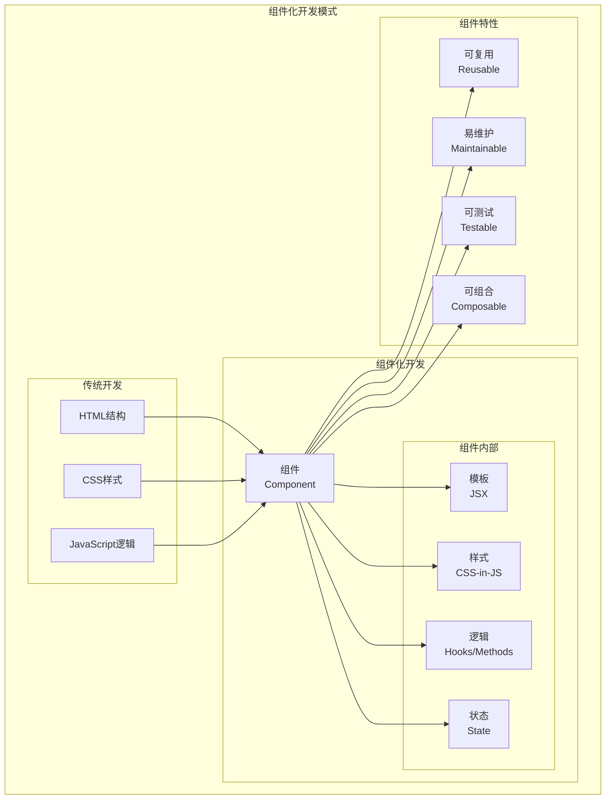
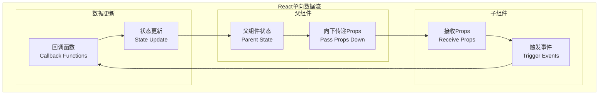
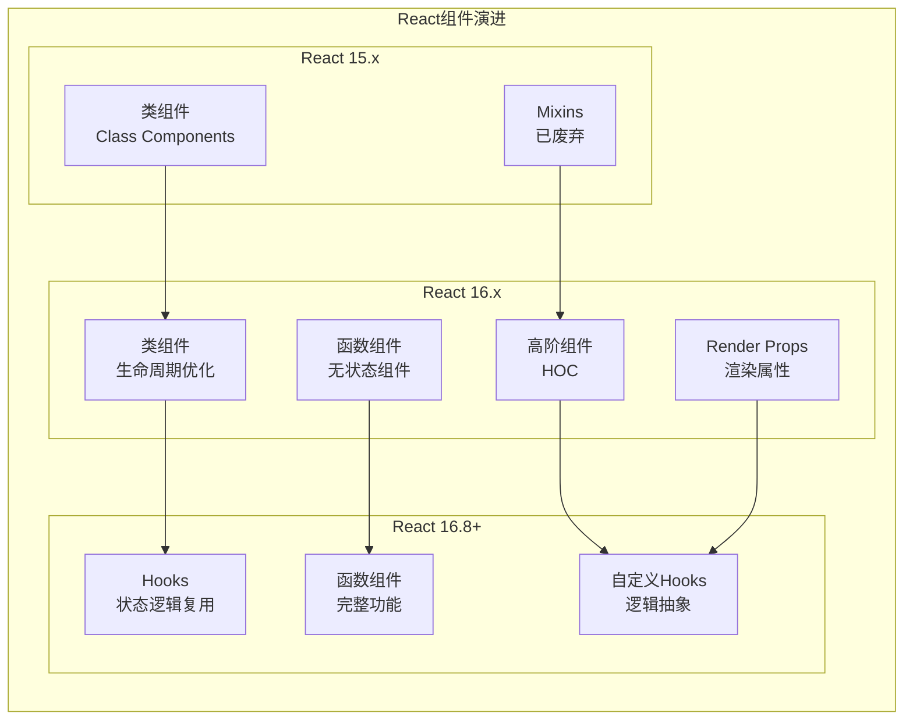
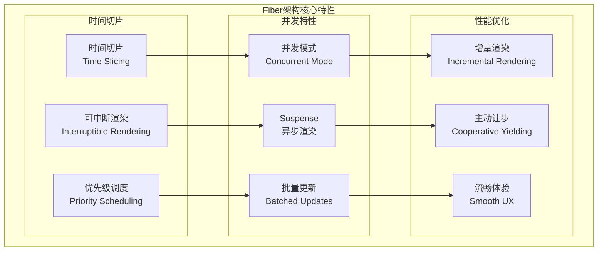
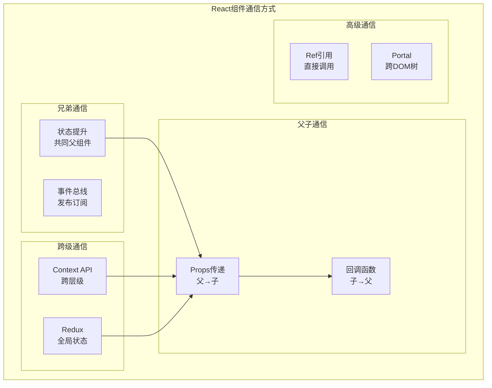
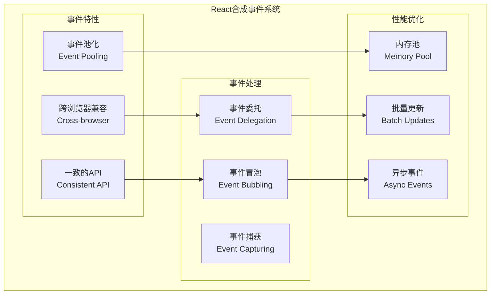

# React 技术完整指南

## 目录
- [React 技术完整指南](#react-技术完整指南)
  - [目录](#目录)
  - [1. React 概述与核心概念](#1-react-概述与核心概念)
    - [1.1 React 简介](#11-react-简介)
      - [1.1.1 React 特点与优势](#111-react-特点与优势)
      - [1.1.2 React 生态系统](#112-react-生态系统)
    - [1.2 核心概念](#12-核心概念)
      - [1.2.1 虚拟DOM原理](#121-虚拟dom原理)
      - [1.2.2 组件化思想](#122-组件化思想)
      - [1.2.3 单向数据流](#123-单向数据流)
    - [1.3 React 架构演进](#13-react-架构演进)
      - [1.3.1 从类组件到函数组件](#131-从类组件到函数组件)
      - [1.3.2 Fiber 架构原理](#132-fiber-架构原理)
  - [2. 组件基础与生命周期](#2-组件基础与生命周期)
    - [2.1 组件定义与使用](#21-组件定义与使用)
      - [2.1.1 函数组件](#211-函数组件)
      - [2.1.2 类组件](#212-类组件)
      - [2.1.3 组件通信](#213-组件通信)
    - [2.2 生命周期详解](#22-生命周期详解)
      - [2.2.1 挂载阶段](#221-挂载阶段)
      - [2.2.2 更新阶段](#222-更新阶段)
      - [2.2.3 卸载阶段](#223-卸载阶段)
    - [2.3 事件处理机制](#23-事件处理机制)
      - [2.3.1 合成事件系统](#231-合成事件系统)
      - [2.3.2 事件委托机制](#232-事件委托机制)
  - [3. React Hooks 深度解析](#3-react-hooks-深度解析)
    - [3.1 基础Hooks](#31-基础hooks)
      - [3.1.1 useState](#311-usestate)
      - [3.1.2 useEffect](#312-useeffect)
      - [3.1.3 useContext](#313-usecontext)
    - [3.2 高级Hooks](#32-高级hooks)
      - [3.2.1 useReducer](#321-usereducer)
      - [3.2.2 useMemo 和 useCallback](#322-usememo-和-usecallback)
      - [3.2.3 useRef 和 useImperativeHandle](#323-useref-和-useimperativehandle)
    - [3.3 自定义Hooks](#33-自定义hooks)
      - [3.3.1 设计原则](#331-设计原则)
      - [3.3.2 常用自定义Hooks](#332-常用自定义hooks)
  - [10. React 面试题详解](#10-react-面试题详解)
    - [10.1 基础概念类](#101-基础概念类)
      - [Q1: 什么是React？React有哪些特点？](#q1-什么是reactreact有哪些特点)
      - [Q2: 什么是虚拟DOM？虚拟DOM的工作原理是什么？](#q2-什么是虚拟dom虚拟dom的工作原理是什么)
      - [Q3: 解释React的生命周期方法](#q3-解释react的生命周期方法)
      - [Q4: 什么是JSX？JSX的原理是什么？](#q4-什么是jsxjsx的原理是什么)
      - [Q5: React中的key属性有什么作用？](#q5-react中的key属性有什么作用)
    - [10.2 组件与生命周期类](#102-组件与生命周期类)
      - [Q6: 类组件和函数组件有什么区别？](#q6-类组件和函数组件有什么区别)
      - [Q7: 什么是高阶组件(HOC)？如何实现？](#q7-什么是高阶组件hoc如何实现)
      - [Q8: 什么是Render Props模式？](#q8-什么是render-props模式)
    - [10.3 Hooks 深度理解类](#103-hooks-深度理解类)
      - [Q9: useEffect的依赖数组是如何工作的？](#q9-useeffect的依赖数组是如何工作的)
      - [Q10: 为什么useState的更新是异步的？](#q10-为什么usestate的更新是异步的)
    - [10.4 性能优化类](#104-性能优化类)
      - [Q11: React中有哪些性能优化技术？](#q11-react中有哪些性能优化技术)
      - [Q12: 什么是React Fiber？它解决了什么问题？](#q12-什么是react-fiber它解决了什么问题)
    - [10.5 实战应用类](#105-实战应用类)
      - [Q13: 如何在React中实现状态管理？](#q13-如何在react中实现状态管理)
      - [Q14: 如何处理React中的错误边界？](#q14-如何处理react中的错误边界)
      - [Q15: React中如何实现条件渲染？](#q15-react中如何实现条件渲染)
  - [📚 总结](#-总结)
    - [🎯 核心内容](#-核心内容)
    - [✅ 技术特色](#-技术特色)

## 1. React 概述与核心概念

### 1.1 React 简介

#### 1.1.1 React 特点与优势

**React**是由Facebook开发的用于构建用户界面的JavaScript库，于2013年开源。它采用组件化开发模式，通过虚拟DOM提升性能，是现代前端开发的核心技术之一。

**核心特点**：

| 特点 | 描述 | 优势 |
|------|------|------|
| **声明式编程** | 描述UI应该是什么样子 | 代码可读性强，易于理解 |
| **组件化** | 将UI分解为独立的组件 | 代码复用性高，维护性好 |
| **虚拟DOM** | 在内存中操作DOM副本 | 性能优化，减少真实DOM操作 |
| **单向数据流** | 数据从父组件流向子组件 | 数据流向清晰，便于调试 |
| **Learn Once, Write Anywhere** | 一次学习，随处编写 | 支持Web、移动端、服务端 |

**React 技术栈生态**：



#### 1.1.2 React 生态系统

**技术栈对比**：

| 技术分类 | 主流选择 | 特点 | 适用场景 |
|----------|----------|------|----------|
| **状态管理** | Redux, Zustand, Jotai | 各有优势 | 复杂应用vs简单状态 |
| **路由管理** | React Router v6 | 声明式路由 | SPA应用导航 |
| **样式方案** | CSS Modules, Styled-components, Tailwind | 组件化样式 | 样式隔离与复用 |
| **构建工具** | Vite, Webpack, Parcel | 快速开发 | 开发体验优化 |
| **测试框架** | Jest, React Testing Library | 测试友好 | 保证代码质量 |

### 1.2 核心概念

#### 1.2.1 虚拟DOM原理

**虚拟DOM**是React的核心创新之一，它是真实DOM的JavaScript表示。

**虚拟DOM工作流程**：



**虚拟DOM优势**：

1. **性能优化**：
   - 批量更新，减少DOM操作
   - Diff算法优化更新范围
   - 异步更新，不阻塞用户交互

2. **开发体验**：
   - 声明式编程模式
   - 跨平台抽象层
   - 更好的错误边界处理

**简化的虚拟DOM实现**：

```javascript
// 虚拟DOM节点结构
const VNode = {
  type: 'div',           // 元素类型
  props: {               // 属性
    className: 'container',
    children: [
      {
        type: 'span',
        props: {
          children: 'Hello World'
        }
      }
    ]
  }
};

// 简化的Diff算法
function diff(oldVNode, newVNode) {
  // 节点类型不同，直接替换
  if (oldVNode.type !== newVNode.type) {
    return { type: 'REPLACE', newVNode };
  }
  
  // 比较属性
  const propsPatches = diffProps(oldVNode.props, newVNode.props);
  
  // 比较子节点
  const childrenPatches = diffChildren(
    oldVNode.props.children, 
    newVNode.props.children
  );
  
  return {
    type: 'UPDATE',
    propsPatches,
    childrenPatches
  };
}

// 应用补丁到真实DOM
function patch(domNode, patches) {
  switch (patches.type) {
    case 'REPLACE':
      domNode.parentNode.replaceChild(
        createElement(patches.newVNode), 
        domNode
      );
      break;
    case 'UPDATE':
      updateProps(domNode, patches.propsPatches);
      patches.childrenPatches.forEach((patch, index) => {
        patch(domNode.childNodes[index], patch);
      });
      break;
  }
}
```

#### 1.2.2 组件化思想

**组件化**是React的核心设计理念，将UI拆分为独立、可复用的组件。

**组件化架构优势**：



**组件设计原则**：

1. **单一职责原则**：
   ```javascript
   // ✅ 好的设计：职责单一
   const UserAvatar = ({ user }) => (
     
   );
   
   const UserInfo = ({ user }) => (
     <div className="user-info">
       <UserAvatar user={user} />
       <span>{user.name}</span>
     </div>
   );
   
   // ❌ 不好的设计：职责混杂
   const UserComponent = ({ user, posts, comments }) => (
     <div>
       
       <span>{user.name}</span>
       <div>{posts.map(post => <PostItem post={post} />)}</div>
       <div>{comments.map(comment => <Comment comment={comment} />)}</div>
     </div>
   );
   ```

2. **组件组合**：
   ```javascript
   // 高阶组件模式
   const withLoading = (WrappedComponent) => {
     return ({ isLoading, ...props }) => {
       if (isLoading) {
         return <div>Loading...</div>;
       }
       return <WrappedComponent {...props} />;
     };
   };
   
   // 组合使用
   const UserList = withLoading(({ users }) => (
     <div>
       {users.map(user => <UserInfo key={user.id} user={user} />)}
     </div>
   ));
   ```

#### 1.2.3 单向数据流

**单向数据流**确保数据流向的可预测性，是React架构的重要特征。

**数据流向示意**：



**单向数据流示例**：

```javascript
// 父组件：管理状态
const TodoApp = () => {
  const [todos, setTodos] = useState([]);
  const [filter, setFilter] = useState('all');
  
  const addTodo = (text) => {
    setTodos([...todos, { id: Date.now(), text, completed: false }]);
  };
  
  const toggleTodo = (id) => {
    setTodos(todos.map(todo => 
      todo.id === id ? { ...todo, completed: !todo.completed } : todo
    ));
  };
  
  const filteredTodos = todos.filter(todo => {
    if (filter === 'active') return !todo.completed;
    if (filter === 'completed') return todo.completed;
    return true;
  });
  
  return (
    <div>
      <TodoInput onAddTodo={addTodo} />
      <TodoList todos={filteredTodos} onToggleTodo={toggleTodo} />
      <TodoFilter filter={filter} onFilterChange={setFilter} />
    </div>
  );
};

// 子组件：接收props，触发回调
const TodoInput = ({ onAddTodo }) => {
  const [text, setText] = useState('');
  
  const handleSubmit = (e) => {
    e.preventDefault();
    if (text.trim()) {
      onAddTodo(text.trim());  // 向上通信
      setText('');
    }
  };
  
  return (
    <form onSubmit={handleSubmit}>
      <input 
        value={text}
        onChange={(e) => setText(e.target.value)}
        placeholder="What needs to be done?"
      />
      <button type="submit">Add</button>
    </form>
  );
};

const TodoList = ({ todos, onToggleTodo }) => (
  <ul>
    {todos.map(todo => (
      <TodoItem 
        key={todo.id} 
        todo={todo} 
        onToggle={() => onToggleTodo(todo.id)}
      />
    ))}
  </ul>
);

const TodoItem = ({ todo, onToggle }) => (
  <li 
    onClick={onToggle}
    style={{ 
      textDecoration: todo.completed ? 'line-through' : 'none' 
    }}
  >
    {todo.text}
  </li>
);
```

### 1.3 React 架构演进

#### 1.3.1 从类组件到函数组件

**组件发展历程**：



**类组件 vs 函数组件对比**：

| 方面 | 类组件 | 函数组件 + Hooks |
|------|--------|------------------|
| **语法** | class语法，this绑定 | 函数语法，更简洁 |
| **状态管理** | this.state | useState Hook |
| **生命周期** | 生命周期方法 | useEffect Hook |
| **性能** | shouldComponentUpdate | React.memo |
| **逻辑复用** | HOC, Render Props | 自定义Hooks |
| **代码量** | 相对较多 | 更简洁 |
| **学习成本** | this绑定复杂 | 更直观 |

**迁移示例**：

```javascript
// 类组件写法
class UserProfile extends React.Component {
  constructor(props) {
    super(props);
    this.state = {
      user: null,
      loading: true,
      error: null
    };
  }
  
  async componentDidMount() {
    try {
      const user = await fetchUser(this.props.userId);
      this.setState({ user, loading: false });
    } catch (error) {
      this.setState({ error, loading: false });
    }
  }
  
  async componentDidUpdate(prevProps) {
    if (prevProps.userId !== this.props.userId) {
      this.setState({ loading: true });
      try {
        const user = await fetchUser(this.props.userId);
        this.setState({ user, loading: false });
      } catch (error) {
        this.setState({ error, loading: false });
      }
    }
  }
  
  render() {
    const { user, loading, error } = this.state;
    
    if (loading) return <div>Loading...</div>;
    if (error) return <div>Error: {error.message}</div>;
    if (!user) return <div>No user found</div>;
    
    return (
      <div>
        <h1>{user.name}</h1>
        <p>{user.email}</p>
      </div>
    );
  }
}

// 函数组件 + Hooks写法
const UserProfile = ({ userId }) => {
  const [user, setUser] = useState(null);
  const [loading, setLoading] = useState(true);
  const [error, setError] = useState(null);
  
  useEffect(() => {
    const loadUser = async () => {
      setLoading(true);
      setError(null);
      
      try {
        const userData = await fetchUser(userId);
        setUser(userData);
      } catch (err) {
        setError(err);
      } finally {
        setLoading(false);
      }
    };
    
    loadUser();
  }, [userId]);
  
  if (loading) return <div>Loading...</div>;
  if (error) return <div>Error: {error.message}</div>;
  if (!user) return <div>No user found</div>;
  
  return (
    <div>
      <h1>{user.name}</h1>
      <p>{user.email}</p>
    </div>
  );
};

// 进一步优化：自定义Hook
const useUser = (userId) => {
  const [user, setUser] = useState(null);
  const [loading, setLoading] = useState(true);
  const [error, setError] = useState(null);
  
  useEffect(() => {
    const loadUser = async () => {
      setLoading(true);
      setError(null);
      
      try {
        const userData = await fetchUser(userId);
        setUser(userData);
      } catch (err) {
        setError(err);
      } finally {
        setLoading(false);
      }
    };
    
    loadUser();
  }, [userId]);
  
  return { user, loading, error };
};

// 使用自定义Hook
const UserProfile = ({ userId }) => {
  const { user, loading, error } = useUser(userId);
  
  if (loading) return <div>Loading...</div>;
  if (error) return <div>Error: {error.message}</div>;
  if (!user) return <div>No user found</div>;
  
  return (
    <div>
      <h1>{user.name}</h1>
      <p>{user.email}</p>
    </div>
  );
};
```

#### 1.3.2 Fiber 架构原理

**Fiber架构**是React 16引入的新调和引擎，解决了原有架构的性能问题。

**Fiber架构优势**：



**Fiber节点结构**：

```javascript
// Fiber节点的简化结构
const FiberNode = {
  // 节点信息
  type: 'div',                    // 组件类型
  key: 'unique-key',              // React key
  elementType: 'div',             // 元素类型
  
  // 状态信息
  pendingProps: {},               // 新的props
  memoizedProps: {},              // 上次渲染的props
  memoizedState: null,            // 上次渲染的state
  updateQueue: null,              // 更新队列
  
  // 副作用
  effectTag: 0,                   // 副作用标记
  nextEffect: null,               // 下一个有副作用的节点
  firstEffect: null,              // 第一个子节点副作用
  lastEffect: null,               // 最后一个子节点副作用
  
  // 优先级
  lanes: 0,                       // 优先级车道
  childLanes: 0,                  // 子节点优先级
  
  // 节点关系
  return: null,                   // 父节点
  child: null,                    // 第一个子节点
  sibling: null,                  // 兄弟节点
  index: 0,                       // 索引
  
  // 其他
  ref: null,                      // ref引用
  alternate: null,                // 双缓存机制的另一个fiber
};

// Fiber工作循环
function workLoopConcurrent() {
  // 如果还有工作要做且没有被中断
  while (workInProgress !== null && !shouldYield()) {
    workInProgress = performUnitOfWork(workInProgress);
  }
}

function performUnitOfWork(unitOfWork) {
  const current = unitOfWork.alternate;
  
  // 开始工作
  let next = beginWork(current, unitOfWork, renderLanes);
  
  unitOfWork.memoizedProps = unitOfWork.pendingProps;
  
  if (next === null) {
    // 如果没有子节点，完成工作
    completeUnitOfWork(unitOfWork);
  } else {
    workInProgress = next;
  }
  
  return next;
}
```

**优先级调度系统**：

```javascript
// React优先级等级
const ImmediatePriority = 1;      // 立即执行（用户输入）
const UserBlockingPriority = 2;   // 用户阻塞（hover、滚动）
const NormalPriority = 3;         // 正常优先级（数据获取）
const LowPriority = 4;            // 低优先级（分析）
const IdlePriority = 5;           // 空闲优先级（离屏内容）

// 调度器如何工作
function scheduleWork(fiber, expirationTime) {
  const root = markUpdateTimeFromFiberToRoot(fiber, expirationTime);
  
  if (root === null) return;
  
  // 检查是否有更高优先级的工作
  if (expirationTime === Sync) {
    // 同步更新
    performSyncWorkOnRoot(root);
  } else {
    // 异步更新
    ensureRootIsScheduled(root, getCurrentTime());
  }
}

// 时间切片机制
function shouldYield() {
  const currentTime = getCurrentTime();
  return currentTime >= deadline;
}
```

## 2. 组件基础与生命周期

### 2.1 组件定义与使用

#### 2.1.1 函数组件

**函数组件**是React的推荐组件写法，语法简洁，配合Hooks使用功能强大。

**基础函数组件**：

```javascript
// 基础函数组件
const Welcome = (props) => {
  return <h1>Hello, {props.name}!</h1>;
};

// 箭头函数简写
const Welcome = ({ name }) => <h1>Hello, {name}!</h1>;

// 传统函数声明
function Welcome(props) {
  return <h1>Hello, {props.name}!</h1>;
}

// 带默认props
const Welcome = ({ name = 'World' }) => <h1>Hello, {name}!</h1>;

// 使用组件
const App = () => (
  <div>
    <Welcome name="Alice" />
    <Welcome name="Bob" />
    <Welcome />
  </div>
);
```

**函数组件高级模式**：

```javascript
// 1. 组件作为props
const Layout = ({ header, content, footer }) => (
  <div className="layout">
    <header>{header}</header>
    <main>{content}</main>
    <footer>{footer}</footer>
  </div>
);

// 使用
<Layout
  header={<Header />}
  content={<MainContent />}
  footer={<Footer />}
/>

// 2. children模式
const Card = ({ title, children }) => (
  <div className="card">
    <h2>{title}</h2>
    <div className="card-body">
      {children}
    </div>
  </div>
);

// 使用
<Card title="用户信息">
  <p>姓名：张三</p>
  <p>邮箱：zhangsan@example.com</p>
</Card>

// 3. render props模式
const DataProvider = ({ children, url }) => {
  const [data, setData] = useState(null);
  const [loading, setLoading] = useState(true);
  
  useEffect(() => {
    fetch(url)
      .then(response => response.json())
      .then(data => {
        setData(data);
        setLoading(false);
      });
  }, [url]);
  
  return children({ data, loading });
};

// 使用
<DataProvider url="/api/users">
  {({ data, loading }) => 
    loading ? <div>Loading...</div> : <UserList users={data} />
  }
</DataProvider>
```

#### 2.1.2 类组件

**类组件**是React的传统组件写法，虽然函数组件是趋势，但理解类组件仍然重要。

```javascript
// 基础类组件
class Welcome extends React.Component {
  render() {
    return <h1>Hello, {this.props.name}!</h1>;
  }
}

// 带状态的类组件
class Counter extends React.Component {
  constructor(props) {
    super(props);
    this.state = {
      count: 0
    };
    
    // 绑定this
    this.handleClick = this.handleClick.bind(this);
  }
  
  handleClick() {
    this.setState({ count: this.state.count + 1 });
  }
  
  render() {
    return (
      <div>
        <p>Count: {this.state.count}</p>
        <button onClick={this.handleClick}>+1</button>
      </div>
    );
  }
}

// 箭头函数避免this绑定
class Counter extends React.Component {
  state = { count: 0 };
  
  handleClick = () => {
    this.setState({ count: this.state.count + 1 });
  }
  
  render() {
    return (
      <div>
        <p>Count: {this.state.count}</p>
        <button onClick={this.handleClick}>+1</button>
      </div>
    );
  }
}
```

#### 2.1.3 组件通信

**组件通信**是React应用的核心，包括父子通信、兄弟通信、跨级通信等。

**组件通信模式**：



**通信示例代码**：

```javascript
// 1. 父子通信
const Parent = () => {
  const [message, setMessage] = useState('Hello from Parent');
  
  const handleChildMessage = (childMessage) => {
    console.log('收到子组件消息:', childMessage);
  };
  
  return (
    <div>
      <Child 
        message={message} 
        onMessage={handleChildMessage}
      />
    </div>
  );
};

const Child = ({ message, onMessage }) => {
  const sendMessage = () => {
    onMessage('Hello from Child');
  };
  
  return (
    <div>
      <p>父组件消息: {message}</p>
      <button onClick={sendMessage}>向父组件发消息</button>
    </div>
  );
};

// 2. Context API跨级通信
const ThemeContext = React.createContext('light');

const App = () => {
  const [theme, setTheme] = useState('light');
  
  return (
    <ThemeContext.Provider value={{ theme, setTheme }}>
      <Header />
      <Main />
      <Footer />
    </ThemeContext.Provider>
  );
};

const ThemeButton = () => {
  const { theme, setTheme } = useContext(ThemeContext);
  
  return (
    <button onClick={() => setTheme(theme === 'light' ? 'dark' : 'light')}>
      切换到{theme === 'light' ? '暗' : '亮'}色主题
    </button>
  );
};

// 3. 自定义Hook实现状态共享
const useSharedState = (initialValue) => {
  const [state, setState] = useState(initialValue);
  
  const updateState = useCallback((newState) => {
    setState(newState);
  }, []);
  
  return [state, updateState];
};

// 4. Ref通信
const Parent = () => {
  const childRef = useRef();
  
  const callChildMethod = () => {
    childRef.current.focus();
  };
  
  return (
    <div>
      <Child ref={childRef} />
      <button onClick={callChildMethod}>Focus Child</button>
    </div>
  );
};

const Child = forwardRef((props, ref) => {
  const inputRef = useRef();
  
  useImperativeHandle(ref, () => ({
    focus: () => {
      inputRef.current.focus();
    }
  }));
  
  return <input ref={inputRef} />;
});
```

### 2.2 生命周期详解

#### 2.2.1 挂载阶段

**组件挂载**是组件从创建到插入DOM的过程。

**生命周期流程**：

```mermaid
graph TB
    subgraph "React生命周期（类组件）"
        subgraph "挂载阶段 Mounting"
            CONSTRUCTOR["constructor()<br/>构造函数"]
            GET_DERIVED["getDerivedStateFromProps()<br/>从props获取state"]
            RENDER["render()<br/>渲染"]
            DID_MOUNT["componentDidMount()<br/>挂载完成"]
        end
        
        subgraph "更新阶段 Updating"
            GET_DERIVED_UPDATE["getDerivedStateFromProps()"]
            SHOULD_UPDATE["shouldComponentUpdate()<br/>是否应该更新"]
            RENDER_UPDATE["render()"]
            GET_SNAPSHOT["getSnapshotBeforeUpdate()<br/>更新前快照"]
            DID_UPDATE["componentDidUpdate()<br/>更新完成"]
        end
        
        subgraph "卸载阶段 Unmounting"
            WILL_UNMOUNT["componentWillUnmount()<br/>即将卸载"]
        end
    end
    
    CONSTRUCTOR --> GET_DERIVED
    GET_DERIVED --> RENDER
    RENDER --> DID_MOUNT
    
    DID_MOUNT --> GET_DERIVED_UPDATE
    GET_DERIVED_UPDATE --> SHOULD_UPDATE
    SHOULD_UPDATE --> RENDER_UPDATE
    RENDER_UPDATE --> GET_SNAPSHOT
    GET_SNAPSHOT --> DID_UPDATE
    DID_UPDATE --> GET_DERIVED_UPDATE
    
    DID_UPDATE --> WILL_UNMOUNT
```



**生命周期与Hooks对应关系**：

| 类组件生命周期 | Hooks等价写法 | 用途 |
|----------------|---------------|------|
| `constructor` | `useState`初始值 | 初始化状态 |
| `componentDidMount` | `useEffect(fn, [])` | 组件挂载后 |
| `componentDidUpdate` | `useEffect(fn)` | 组件更新后 |
| `componentWillUnmount` | `useEffect(() => fn, [])` | 组件卸载前 |
| `shouldComponentUpdate` | `React.memo` | 性能优化 |
| `getDerivedStateFromProps` | `useState` + `useEffect` | 从props计算state |

**Hooks生命周期示例**：

```javascript
// 类组件写法
class UserProfile extends React.Component {
  constructor(props) {
    super(props);
    this.state = {
      user: null,
      loading: true
    };
  }
  
  async componentDidMount() {
    console.log('组件挂载');
    this.setState({ loading: true });
    const user = await fetchUser(this.props.userId);
    this.setState({ user, loading: false });
  }
  
  async componentDidUpdate(prevProps) {
    if (prevProps.userId !== this.props.userId) {
      console.log('userId changed');
      this.setState({ loading: true });
      const user = await fetchUser(this.props.userId);
      this.setState({ user, loading: false });
    }
  }
  
  componentWillUnmount() {
    console.log('组件卸载');
    // 清理工作
  }
  
  render() {
    if (this.state.loading) return <div>Loading...</div>;
    return <div>{this.state.user?.name}</div>;
  }
}

// Hooks写法
const UserProfile = ({ userId }) => {
  const [user, setUser] = useState(null);
  const [loading, setLoading] = useState(true);
  
  useEffect(() => {
    console.log('组件挂载或userId变化');
    
    const loadUser = async () => {
      setLoading(true);
      const userData = await fetchUser(userId);
      setUser(userData);
      setLoading(false);
    };
    
    loadUser();
    
    // 清理函数（相当于componentWillUnmount）
    return () => {
      console.log('清理工作');
    };
  }, [userId]); // 依赖数组
  
  if (loading) return <div>Loading...</div>;
  return <div>{user?.name}</div>;
};
```

#### 2.2.2 更新阶段

**组件更新**发生在props或state变化时。

```javascript
// 性能优化：防止不必要的更新
const ExpensiveComponent = React.memo(({ data, config }) => {
  console.log('ExpensiveComponent render');
  
  // 复杂计算
  const processedData = useMemo(() => {
    return data.map(item => ({
      ...item,
      processed: expensiveCalculation(item, config)
    }));
  }, [data, config]);
  
  return (
    <div>
      {processedData.map(item => (
        <div key={item.id}>{item.processed}</div>
      ))}
    </div>
  );
});

// 自定义比较函数
const MyComponent = React.memo(({ user, settings }) => {
  return <div>{user.name}</div>;
}, (prevProps, nextProps) => {
  // 返回true表示props相等，不需要重新渲染
  return prevProps.user.id === nextProps.user.id;
});

// useCallback优化函数引用
const TodoList = ({ todos }) => {
  const [filter, setFilter] = useState('all');
  
  // 避免每次渲染都创建新函数
  const handleToggle = useCallback((id) => {
    // 切换todo状态的逻辑
    console.log('Toggle todo:', id);
  }, []);
  
  const filteredTodos = useMemo(() => {
    return todos.filter(todo => {
      if (filter === 'active') return !todo.completed;
      if (filter === 'completed') return todo.completed;
      return true;
    });
  }, [todos, filter]);
  
  return (
    <div>
      <FilterButtons filter={filter} onFilterChange={setFilter} />
      {filteredTodos.map(todo => (
        <TodoItem 
          key={todo.id} 
          todo={todo} 
          onToggle={handleToggle}
        />
      ))}
    </div>
  );
};
```

#### 2.2.3 卸载阶段

**组件卸载**时需要清理副作用，防止内存泄漏。

```javascript
// 清理副作用的最佳实践
const TimerComponent = () => {
  const [time, setTime] = useState(new Date());
  
  useEffect(() => {
    const timer = setInterval(() => {
      setTime(new Date());
    }, 1000);
    
    // 清理定时器
    return () => {
      clearInterval(timer);
    };
  }, []);
  
  return <div>{time.toLocaleTimeString()}</div>;
};

// 事件监听器清理
const WindowSizeTracker = () => {
  const [windowSize, setWindowSize] = useState({
    width: window.innerWidth,
    height: window.innerHeight
  });
  
  useEffect(() => {
    const handleResize = () => {
      setWindowSize({
        width: window.innerWidth,
        height: window.innerHeight
      });
    };
    
    window.addEventListener('resize', handleResize);
    
    // 清理事件监听器
    return () => {
      window.removeEventListener('resize', handleResize);
    };
  }, []);
  
  return <div>窗口大小: {windowSize.width} x {windowSize.height}</div>;
};

// 取消网络请求
const DataFetcher = ({ url }) => {
  const [data, setData] = useState(null);
  const [loading, setLoading] = useState(true);
  
  useEffect(() => {
    const abortController = new AbortController();
    
    const fetchData = async () => {
      try {
        setLoading(true);
        const response = await fetch(url, {
          signal: abortController.signal
        });
        const result = await response.json();
        setData(result);
      } catch (error) {
        if (error.name !== 'AbortError') {
          console.error('Fetch error:', error);
        }
      } finally {
        setLoading(false);
      }
    };
    
    fetchData();
    
    // 清理：取消请求
    return () => {
      abortController.abort();
    };
  }, [url]);
  
  if (loading) return <div>Loading...</div>;
  return <div>{JSON.stringify(data)}</div>;
};
```

### 2.3 事件处理机制

#### 2.3.1 合成事件系统

**合成事件(SyntheticEvent)**是React对原生事件的封装，提供跨浏览器兼容性。

**合成事件特点**：



**事件处理示例**：

```javascript
// 基础事件处理
const Button = () => {
  const handleClick = (e) => {
    // e是合成事件对象
    console.log('Event type:', e.type);
    console.log('Current target:', e.currentTarget);
    console.log('Native event:', e.nativeEvent);
    
    // 阻止默认行为
    e.preventDefault();
    
    // 阻止事件冒泡
    e.stopPropagation();
  };
  
  return <button onClick={handleClick}>Click me</button>;
};

// 表单事件处理
const ContactForm = () => {
  const [formData, setFormData] = useState({
    name: '',
    email: '',
    message: ''
  });
  
  const handleChange = (e) => {
    const { name, value } = e.target;
    setFormData(prev => ({
      ...prev,
      [name]: value
    }));
  };
  
  const handleSubmit = (e) => {
    e.preventDefault();
    console.log('Form submitted:', formData);
  };
  
  const handleKeyDown = (e) => {
    if (e.key === 'Enter' && e.ctrlKey) {
      handleSubmit(e);
    }
  };
  
  return (
    <form onSubmit={handleSubmit}>
      <input
        name="name"
        value={formData.name}
        onChange={handleChange}
        placeholder="姓名"
      />
      <input
        name="email"
        type="email"
        value={formData.email}
        onChange={handleChange}
        placeholder="邮箱"
      />
      <textarea
        name="message"
        value={formData.message}
        onChange={handleChange}
        onKeyDown={handleKeyDown}
        placeholder="消息 (Ctrl+Enter提交)"
      />
      <button type="submit">提交</button>
    </form>
  );
};

// 自定义事件处理Hook
const useEventListener = (eventName, handler, element = window) => {
  const savedHandler = useRef();
  
  useEffect(() => {
    savedHandler.current = handler;
  }, [handler]);
  
  useEffect(() => {
    const isSupported = element && element.addEventListener;
    if (!isSupported) return;
    
    const eventListener = (event) => savedHandler.current(event);
    element.addEventListener(eventName, eventListener);
    
    return () => {
      element.removeEventListener(eventName, eventListener);
    };
  }, [eventName, element]);
};

// 使用自定义Hook
const KeyboardShortcuts = () => {
  const [message, setMessage] = useState('');
  
  useEventListener('keydown', (e) => {
    if (e.ctrlKey && e.key === 's') {
      e.preventDefault();
      setMessage('Ctrl+S 保存快捷键被按下');
    }
    if (e.key === 'Escape') {
      setMessage('');
    }
  });
  
  return <div>{message}</div>;
};
```

#### 2.3.2 事件委托机制

**事件委托**是React性能优化的重要机制。

```javascript
// React事件委托原理示例
class EventDelegation {
  constructor() {
    this.eventMap = new Map();
    this.bindEvent();
  }
  
  bindEvent() {
    // React将所有事件绑定到document根节点
    document.addEventListener('click', this.handleDocumentClick.bind(this));
  }
  
  handleDocumentClick(nativeEvent) {
    let target = nativeEvent.target;
    
    // 向上遍历DOM树，查找注册的事件处理器
    while (target && target !== document) {
      const reactEventHandler = this.eventMap.get(target);
      if (reactEventHandler) {
        // 创建合成事件对象
        const syntheticEvent = this.createSyntheticEvent(nativeEvent, target);
        reactEventHandler(syntheticEvent);
        
        if (syntheticEvent.isPropagationStopped()) {
          break;
        }
      }
      target = target.parentNode;
    }
  }
  
  createSyntheticEvent(nativeEvent, currentTarget) {
    return {
      type: nativeEvent.type,
      currentTarget,
      target: nativeEvent.target,
      nativeEvent,
      preventDefault: () => nativeEvent.preventDefault(),
      stopPropagation: () => {
        this._propagationStopped = true;
      },
      isPropagationStopped: () => this._propagationStopped || false
    };
  }
  
  registerEvent(element, handler) {
    this.eventMap.set(element, handler);
  }
}

// 实际使用中的优化技巧
const ListComponent = ({ items, onItemClick }) => {
  // 使用事件委托处理列表项点击
  const handleListClick = (e) => {
    const itemElement = e.target.closest('[data-item-id]');
    if (itemElement) {
      const itemId = itemElement.dataset.itemId;
      onItemClick(itemId);
    }
  };
  
  return (
    <ul onClick={handleListClick}>
      {items.map(item => (
        <li key={item.id} data-item-id={item.id}>
          {item.name}
        </li>
      ))}
    </ul>
  );
};

// 防抖和节流处理
const useDebounce = (value, delay) => {
  const [debouncedValue, setDebouncedValue] = useState(value);
  
  useEffect(() => {
    const handler = setTimeout(() => {
      setDebouncedValue(value);
    }, delay);
    
    return () => {
      clearTimeout(handler);
    };
  }, [value, delay]);
  
  return debouncedValue;
};

const SearchInput = ({ onSearch }) => {
  const [query, setQuery] = useState('');
  const debouncedQuery = useDebounce(query, 300);
  
  useEffect(() => {
    if (debouncedQuery) {
      onSearch(debouncedQuery);
    }
  }, [debouncedQuery, onSearch]);
  
  return (
    <input
      value={query}
      onChange={(e) => setQuery(e.target.value)}
      placeholder="搜索..."
    />
  );
};
```

## 3. React Hooks 深度解析

### 3.1 基础Hooks

#### 3.1.1 useState

**useState**是最基础的Hook，用于在函数组件中添加状态。

```javascript
// 基础用法
const Counter = () => {
  const [count, setCount] = useState(0);
  
  return (
    <div>
      <p>Count: {count}</p>
      <button onClick={() => setCount(count + 1)}>+1</button>
      <button onClick={() => setCount(prev => prev + 1)}>+1 (函数式)</button>
    </div>
  );
};

// 复杂状态管理
const UserForm = () => {
  const [user, setUser] = useState({
    name: '',
    email: '',
    age: 0
  });
  
  const updateUser = (field, value) => {
    setUser(prev => ({
      ...prev,
      [field]: value
    }));
  };
  
  return (
    <form>
      <input
        value={user.name}
        onChange={(e) => updateUser('name', e.target.value)}
        placeholder="姓名"
      />
      <input
        value={user.email}
        onChange={(e) => updateUser('email', e.target.value)}
        placeholder="邮箱"
      />
      <input
        type="number"
        value={user.age}
        onChange={(e) => updateUser('age', parseInt(e.target.value))}
        placeholder="年龄"
      />
    </form>
  );
};

// 惰性初始化
const ExpensiveComponent = () => {
  // 只在首次渲染时执行昂贵的计算
  const [data, setData] = useState(() => {
    console.log('执行昂贵的初始化计算');
    return expensiveCalculation();
  });
  
  return <div>{data}</div>;
};

// 状态更新的注意事项
const StateUpdateExample = () => {
  const [count, setCount] = useState(0);
  
  const handleClick = () => {
    // ❌ 错误：会被批量处理，只会+1
    setCount(count + 1);
    setCount(count + 1);
    setCount(count + 1);
    
    // ✅ 正确：使用函数式更新
    setCount(prev => prev + 1);
    setCount(prev => prev + 1);
    setCount(prev => prev + 1);
  };
  
  const handleAsyncClick = () => {
    setTimeout(() => {
      // ❌ 在异步回调中，可能获取到过期的state
      setCount(count + 1);
      
      // ✅ 使用函数式更新获取最新state
      setCount(prev => prev + 1);
    }, 1000);
  };
  
  return (
    <div>
      <p>Count: {count}</p>
      <button onClick={handleClick}>同步+3</button>
      <button onClick={handleAsyncClick}>异步+1</button>
    </div>
  );
};
```

#### 3.1.2 useEffect

**useEffect**处理副作用，是React Hooks中最重要的Hook之一。

```javascript
// 基础用法
const Timer = () => {
  const [seconds, setSeconds] = useState(0);
  
  // 相当于componentDidMount和componentDidUpdate
  useEffect(() => {
    document.title = `Timer: ${seconds}s`;
  });
  
  // 相当于componentDidMount
  useEffect(() => {
    const timer = setInterval(() => {
      setSeconds(prev => prev + 1);
    }, 1000);
    
    // 相当于componentWillUnmount
    return () => {
      clearInterval(timer);
    };
  }, []); // 空依赖数组，只在挂载时执行
  
  return <div>Seconds: {seconds}</div>;
};

// 依赖数组的使用
const UserProfile = ({ userId }) => {
  const [user, setUser] = useState(null);
  const [loading, setLoading] = useState(true);
  
  useEffect(() => {
    let cancelled = false;
    
    const fetchUser = async () => {
      setLoading(true);
      try {
        const userData = await api.getUser(userId);
        if (!cancelled) {
          setUser(userData);
        }
      } catch (error) {
        if (!cancelled) {
          console.error('获取用户失败:', error);
        }
      } finally {
        if (!cancelled) {
          setLoading(false);
        }
      }
    };
    
    fetchUser();
    
    return () => {
      cancelled = true;
    };
  }, [userId]); // userId变化时重新执行
  
  if (loading) return <div>Loading...</div>;
  return <div>{user?.name}</div>;
};

// 多个useEffect的使用
const ChatRoom = ({ roomId, userId }) => {
  const [messages, setMessages] = useState([]);
  const [onlineUsers, setOnlineUsers] = useState([]);
  
  // 处理消息订阅
  useEffect(() => {
    const unsubscribe = messageService.subscribe(roomId, (newMessage) => {
      setMessages(prev => [...prev, newMessage]);
    });
    
    return unsubscribe;
  }, [roomId]);
  
  // 处理在线用户
  useEffect(() => {
    const unsubscribe = userService.subscribeOnlineUsers(roomId, (users) => {
      setOnlineUsers(users);
    });
    
    return unsubscribe;
  }, [roomId]);
  
  // 用户活动状态
  useEffect(() => {
    userService.setUserActive(userId, roomId);
    
    return () => {
      userService.setUserInactive(userId, roomId);
    };
  }, [userId, roomId]);
  
  return (
    <div>
      <div>在线用户: {onlineUsers.length}</div>
      <div>
        {messages.map(msg => (
          <div key={msg.id}>{msg.content}</div>
        ))}
      </div>
    </div>
  );
};

// 自定义Effect Hook
const useDocumentTitle = (title) => {
  useEffect(() => {
    const prevTitle = document.title;
    document.title = title;
    
    return () => {
      document.title = prevTitle;
    };
  }, [title]);
};

const useLocalStorage = (key, initialValue) => {
  const [value, setValue] = useState(() => {
    try {
      const item = window.localStorage.getItem(key);
      return item ? JSON.parse(item) : initialValue;
    } catch (error) {
      return initialValue;
    }
  });
  
  useEffect(() => {
    try {
      window.localStorage.setItem(key, JSON.stringify(value));
    } catch (error) {
      console.error('保存到localStorage失败:', error);
    }
  }, [key, value]);
  
  return [value, setValue];
};

// 使用自定义Hook
const Settings = () => {
  const [theme, setTheme] = useLocalStorage('theme', 'light');
  const [language, setLanguage] = useLocalStorage('language', 'zh');
  
  useDocumentTitle(`设置 - ${theme === 'light' ? '亮色' : '暗色'}主题`);
  
  return (
    <div>
      <select value={theme} onChange={(e) => setTheme(e.target.value)}>
        <option value="light">亮色主题</option>
        <option value="dark">暗色主题</option>
      </select>
      <select value={language} onChange={(e) => setLanguage(e.target.value)}>
        <option value="zh">中文</option>
        <option value="en">English</option>
      </select>
    </div>
  );
};
```

#### 3.1.3 useContext

**useContext**用于跨组件层级传递数据，避免props drilling。

```javascript
// 创建Context
const ThemeContext = createContext();
const UserContext = createContext();

// 组合多个Context
const AppProvider = ({ children }) => {
  const [theme, setTheme] = useState('light');
  const [user, setUser] = useState(null);
  
  const themeValue = {
    theme,
    setTheme,
    colors: theme === 'light' ? lightColors : darkColors
  };
  
  const userValue = {
    user,
    setUser,
    isLoggedIn: !!user
  };
  
  return (
    <ThemeContext.Provider value={themeValue}>
      <UserContext.Provider value={userValue}>
        {children}
      </UserContext.Provider>
    </ThemeContext.Provider>
  );
};

// 自定义Hook封装Context
const useTheme = () => {
  const context = useContext(ThemeContext);
  if (!context) {
    throw new Error('useTheme must be used within a ThemeProvider');
  }
  return context;
};

const useUser = () => {
  const context = useContext(UserContext);
  if (!context) {
    throw new Error('useUser must be used within a UserProvider');
  }
  return context;
};

// 使用Context的组件
const Header = () => {
  const { theme, setTheme } = useTheme();
  const { user, isLoggedIn } = useUser();
  
  return (
    <header style={{ backgroundColor: theme === 'light' ? '#fff' : '#333' }}>
      <h1>My App</h1>
      <div>
        <button onClick={() => setTheme(theme === 'light' ? 'dark' : 'light')}>
          切换主题
        </button>
        {isLoggedIn ? (
          <span>欢迎, {user.name}!</span>
        ) : (
          <button>登录</button>
        )}
      </div>
    </header>
  );
};

// 复杂状态管理with Context + useReducer
const AppStateContext = createContext();

const appReducer = (state, action) => {
  switch (action.type) {
    case 'SET_LOADING':
      return { ...state, loading: action.payload };
    case 'SET_USER':
      return { ...state, user: action.payload, loading: false };
    case 'SET_ERROR':
      return { ...state, error: action.payload, loading: false };
    case 'CLEAR_ERROR':
      return { ...state, error: null };
    default:
      return state;
  }
};

const AppStateProvider = ({ children }) => {
  const [state, dispatch] = useReducer(appReducer, {
    user: null,
    loading: false,
    error: null
  });
  
  const login = async (credentials) => {
    dispatch({ type: 'SET_LOADING', payload: true });
    try {
      const user = await api.login(credentials);
      dispatch({ type: 'SET_USER', payload: user });
    } catch (error) {
      dispatch({ type: 'SET_ERROR', payload: error.message });
    }
  };
  
  const logout = () => {
    dispatch({ type: 'SET_USER', payload: null });
  };
  
  const value = {
    ...state,
    login,
    logout,
    clearError: () => dispatch({ type: 'CLEAR_ERROR' })
  };
  
  return (
    <AppStateContext.Provider value={value}>
      {children}
    </AppStateContext.Provider>
  );
};

const useAppState = () => {
  const context = useContext(AppStateContext);
  if (!context) {
    throw new Error('useAppState must be used within AppStateProvider');
  }
  return context;
};
```

### 3.2 高级Hooks

#### 3.2.1 useReducer

**useReducer**是useState的替代方案，适合复杂状态逻辑管理。

```javascript
// 基础useReducer使用
const initialState = { count: 0 };

const reducer = (state, action) => {
  switch (action.type) {
    case 'increment':
      return { count: state.count + 1 };
    case 'decrement':
      return { count: state.count - 1 };
    case 'reset':
      return initialState;
    default:
      throw new Error(`未知的action类型: ${action.type}`);
  }
};

const Counter = () => {
  const [state, dispatch] = useReducer(reducer, initialState);
  
  return (
    <div>
      <p>Count: {state.count}</p>
      <button onClick={() => dispatch({ type: 'increment' })}>+</button>
      <button onClick={() => dispatch({ type: 'decrement' })}>-</button>
      <button onClick={() => dispatch({ type: 'reset' })}>Reset</button>
    </div>
  );
};
```

#### 3.2.2 useMemo 和 useCallback

**useMemo和useCallback**用于性能优化，避免不必要的计算和重新渲染。

```javascript
// useMemo优化昂贵计算
const ExpensiveList = ({ items, filter }) => {
  const filteredItems = useMemo(() => {
    console.log('执行昂贵的过滤计算');
    return items.filter(item => 
      item.name.toLowerCase().includes(filter.toLowerCase())
    );
  }, [items, filter]);
  
  return (
    <ul>
      {filteredItems.map(item => (
        <li key={item.id}>{item.name}</li>
      ))}
    </ul>
  );
};

// useCallback优化函数引用
const TodoList = ({ todos, onToggle }) => {
  const handleToggle = useCallback((id) => {
    onToggle(id);
  }, [onToggle]);
  
  return (
    <div>
      {todos.map(todo => (
        <TodoItem key={todo.id} todo={todo} onToggle={handleToggle} />
      ))}
    </div>
  );
};
```

#### 3.2.3 useRef 和 useImperativeHandle

**useRef和useImperativeHandle**用于访问DOM元素和命令式API。

```javascript
// useRef基本用法
const FocusInput = () => {
  const inputRef = useRef(null);
  
  const focusInput = () => {
    inputRef.current.focus();
  };
  
  return (
    <div>
      <input ref={inputRef} type="text" />
      <button onClick={focusInput}>Focus Input</button>
    </div>
  );
};

// useImperativeHandle暴露组件方法
const CustomInput = forwardRef((props, ref) => {
  const inputRef = useRef();
  const [value, setValue] = useState('');
  
  useImperativeHandle(ref, () => ({
    focus: () => inputRef.current.focus(),
    clear: () => setValue(''),
    getValue: () => value
  }));
  
  return (
    <input
      ref={inputRef}
      value={value}
      onChange={(e) => setValue(e.target.value)}
      {...props}
    />
  );
});
```

### 3.3 自定义Hooks

#### 3.3.1 设计原则

**自定义Hooks**是组合内置Hooks来创建可复用逻辑的强大方式。

**设计原则**：
1. **以use开头**：遵循Hooks命名约定
2. **单一职责**：每个Hook只解决一个问题
3. **可复用性**：能在多个组件中使用
4. **参数化**：通过参数配置不同行为

#### 3.3.2 常用自定义Hooks

```javascript
// 1. useToggle - 切换布尔值
const useToggle = (initialValue = false) => {
  const [value, setValue] = useState(initialValue);
  
  const toggle = useCallback(() => {
    setValue(prev => !prev);
  }, []);
  
  return [value, toggle];
};

// 2. useFetch - 数据获取
const useFetch = (url) => {
  const [data, setData] = useState(null);
  const [loading, setLoading] = useState(true);
  const [error, setError] = useState(null);
  
  useEffect(() => {
    const fetchData = async () => {
      try {
        setLoading(true);
        const response = await fetch(url);
        const result = await response.json();
        setData(result);
      } catch (err) {
        setError(err.message);
      } finally {
        setLoading(false);
      }
    };
    
    fetchData();
  }, [url]);
  
  return { data, loading, error };
};

// 3. useLocalStorage - 本地存储
const useLocalStorage = (key, initialValue) => {
  const [storedValue, setStoredValue] = useState(() => {
    try {
      const item = window.localStorage.getItem(key);
      return item ? JSON.parse(item) : initialValue;
    } catch (error) {
      return initialValue;
    }
  });
  
  const setValue = (value) => {
    try {
      setStoredValue(value);
      window.localStorage.setItem(key, JSON.stringify(value));
    } catch (error) {
      console.error('Error saving to localStorage:', error);
    }
  };
  
  return [storedValue, setValue];
};
```

## 10. React 面试题详解

### 10.1 基础概念类

#### Q1: 什么是React？React有哪些特点？

**答案**：
React是由Facebook开发的用于构建用户界面的JavaScript库。

**核心特点**：
1. **声明式编程**：描述UI应该是什么样子，而不是如何操作DOM
2. **组件化**：将UI拆分为独立、可复用的组件
3. **虚拟DOM**：在内存中操作DOM副本，提升性能
4. **单向数据流**：数据从父组件流向子组件，便于调试
5. **生态丰富**：拥有庞大的第三方库生态系统

#### Q2: 什么是虚拟DOM？虚拟DOM的工作原理是什么？

**答案**：
**虚拟DOM**是真实DOM的JavaScript表示，是一个描述DOM结构的对象树。

**工作原理**：
1. **创建虚拟DOM**：React组件render方法返回虚拟DOM结构
2. **Diff算法**：比较新旧虚拟DOM树的差异
3. **生成补丁**：创建最小化的更新操作
4. **应用更新**：将补丁应用到真实DOM

**优势**：
- **性能优化**：批量更新，减少DOM操作
- **跨平台**：虚拟DOM可以渲染到不同平台
- **可预测性**：状态变化产生可预测的输出

#### Q3: 解释React的生命周期方法

**答案**：
React组件生命周期分为三个阶段：

**挂载阶段（Mounting）**：
- `constructor()`: 组件初始化
- `componentDidMount()`: 组件挂载完成，适合发起网络请求

**更新阶段（Updating）**：
- `componentDidUpdate(prevProps, prevState)`: 组件更新完成
- `shouldComponentUpdate(nextProps, nextState)`: 决定是否重新渲染

**卸载阶段（Unmounting）**：
- `componentWillUnmount()`: 组件即将卸载，清理工作

**Hooks对应关系**：
- `componentDidMount` → `useEffect(() => {}, [])`
- `componentDidUpdate` → `useEffect(() => {})`
- `componentWillUnmount` → `useEffect(() => { return () => {} }, [])`

#### Q4: 什么是JSX？JSX的原理是什么？

**答案**：
**JSX**是JavaScript的语法扩展，允许在JavaScript中编写类似HTML的代码。

**原理**：
JSX会被Babel转译为`React.createElement()`调用：

```javascript
// JSX代码
const element = <div className="container">Hello World</div>;

// 转译后的代码
const element = React.createElement('div', { className: 'container' }, 'Hello World');
```

#### Q5: React中的key属性有什么作用？

**答案**：
**key属性**帮助React识别列表中的每个元素，优化渲染性能。

**作用**：
1. **Diff算法优化**：快速找到变化的元素
2. **保持组件状态**：避免不必要的重新创建
3. **避免渲染错误**：防止元素顺序变化导致的问题

**最佳实践**：
```javascript
// ✅ 使用稳定的唯一标识
{users.map(user => (
  <UserItem key={user.id} user={user} />
))}

// ❌ 不要使用数组索引
{users.map((user, index) => (
  <UserItem key={index} user={user} />
))}
```

### 10.2 组件与生命周期类

#### Q6: 类组件和函数组件有什么区别？

**答案**：

| 方面 | 类组件 | 函数组件 |
|------|--------|----------|
| **语法** | Class语法，需要extends | 函数语法，更简洁 |
| **状态** | this.state | useState Hook |
| **生命周期** | 生命周期方法 | useEffect Hook |
| **性能** | 需要shouldComponentUpdate | React.memo |
| **this绑定** | 需要手动绑定 | 无this问题 |
| **复用逻辑** | HOC, Render Props | 自定义Hooks |

#### Q7: 什么是高阶组件(HOC)？如何实现？

**答案**：
**高阶组件(Higher-Order Component)**是一个接收组件并返回新组件的函数。

```javascript
// HOC实现
const withLoading = (WrappedComponent) => {
  return (props) => {
    if (props.isLoading) {
      return <div>Loading...</div>;
    }
    return <WrappedComponent {...props} />;
  };
};

// 使用HOC
const UserList = ({ users }) => (
  <ul>{users.map(user => <li key={user.id}>{user.name}</li>)}</ul>
);

const EnhancedUserList = withLoading(UserList);
```

#### Q8: 什么是Render Props模式？

**答案**：
**Render Props**是一种在组件间共享代码的技术，通过props传递渲染函数。

```javascript
// Render Props实现
const Mouse = ({ children }) => {
  const [position, setPosition] = useState({ x: 0, y: 0 });
  
  useEffect(() => {
    const handleMouseMove = (e) => {
      setPosition({ x: e.clientX, y: e.clientY });
    };
    
    window.addEventListener('mousemove', handleMouseMove);
    return () => window.removeEventListener('mousemove', handleMouseMove);
  }, []);
  
  return children(position);
};

// 使用Render Props
const App = () => (
  <Mouse>
    {mouse => (
      <div>鼠标位置: ({mouse.x}, {mouse.y})</div>
    )}
  </Mouse>
);
```

### 10.3 Hooks 深度理解类

#### Q9: useEffect的依赖数组是如何工作的？

**答案**：
**依赖数组**决定了useEffect何时重新执行。

**三种情况**：
```javascript
// 1. 没有依赖数组：每次渲染都执行
useEffect(() => {
  console.log('每次渲染都执行');
});

// 2. 空依赖数组：只在挂载时执行一次
useEffect(() => {
  console.log('只在挂载时执行');
}, []);

// 3. 有依赖：依赖变化时执行
useEffect(() => {
  console.log('依赖变化时执行');
}, [dependency]);
```

#### Q10: 为什么useState的更新是异步的？

**答案**：
useState的更新是**异步批处理**的，主要原因：

**1. 性能优化**：避免频繁的DOM更新
**2. 状态一致性**：确保组件状态的一致性
**3. 批量处理**：React会将多个setState调用批处理为一次更新

```javascript
const [count, setCount] = useState(0);

const handleClick = () => {
  setCount(count + 1); // 异步更新
  console.log(count); // 仍然是旧值
  
  // 解决方案：使用函数式更新
  setCount(prev => prev + 1);
};
```

### 10.4 性能优化类

#### Q11: React中有哪些性能优化技术？

**答案**：
React性能优化主要包括：

**1. 避免不必要的渲染**：
```javascript
// React.memo
const ExpensiveComponent = React.memo(({ data }) => {
  return <div>{data.name}</div>;
});
```

**2. useMemo优化计算**：
```javascript
const ExpensiveCalculation = ({ items }) => {
  const total = useMemo(() => {
    return items.reduce((sum, item) => sum + item.price, 0);
  }, [items]);
  
  return <div>Total: {total}</div>;
};
```

**3. useCallback优化函数**：
```javascript
const Parent = ({ items }) => {
  const handleClick = useCallback((id) => {
    console.log('Item clicked:', id);
  }, []);
  
  return <ItemList items={items} onItemClick={handleClick} />;
};
```

**4. 代码分割与懒加载**：
```javascript
const LazyComponent = lazy(() => import('./LazyComponent'));

const App = () => (
  <Suspense fallback={<div>Loading...</div>}>
    <LazyComponent />
  </Suspense>
);
```

#### Q12: 什么是React Fiber？它解决了什么问题？

**答案**：
**React Fiber**是React 16引入的新的协调引擎。

**解决的问题**：
1. **长时间阻塞**：旧版本的递归更新会阻塞主线程
2. **优先级调度**：无法中断低优先级任务来处理高优先级任务
3. **用户体验**：界面卡顿，用户交互响应慢

**Fiber的特性**：
- **可中断**：长任务可以被高优先级任务中断
- **可恢复**：被中断的任务可以在空闲时间继续
- **优先级**：用户交互优先于数据更新
- **并发**：可以同时准备多个状态版本

### 10.5 实战应用类

#### Q13: 如何在React中实现状态管理？

**答案**：
React中有多种状态管理方案：

**1. 本地状态（useState）**：
```javascript
const Counter = () => {
  const [count, setCount] = useState(0);
  return <div>Count: {count}</div>;
};
```

**2. Context API**：
```javascript
const ThemeContext = createContext();

const App = () => {
  const [theme, setTheme] = useState('light');
  
  return (
    <ThemeContext.Provider value={{ theme, setTheme }}>
      <Header />
      <Main />
    </ThemeContext.Provider>
  );
};
```

**3. useReducer复杂状态**：
```javascript
const reducer = (state, action) => {
  switch (action.type) {
    case 'increment':
      return { count: state.count + 1 };
    default:
      return state;
  }
};

const Counter = () => {
  const [state, dispatch] = useReducer(reducer, { count: 0 });
  return <div>Count: {state.count}</div>;
};
```

#### Q14: 如何处理React中的错误边界？

**答案**：
**错误边界(Error Boundaries)**是React组件，它可以捕获其子组件树中的错误。

```javascript
class ErrorBoundary extends React.Component {
  constructor(props) {
    super(props);
    this.state = { hasError: false };
  }
  
  static getDerivedStateFromError(error) {
    return { hasError: true };
  }
  
  componentDidCatch(error, errorInfo) {
    console.error('Error caught:', error, errorInfo);
  }
  
  render() {
    if (this.state.hasError) {
      return <h1>Something went wrong.</h1>;
    }
    
    return this.props.children;
  }
}

// 使用错误边界
const App = () => (
  <ErrorBoundary>
    <MyComponent />
  </ErrorBoundary>
);
```

#### Q15: React中如何实现条件渲染？

**答案**：
React中有多种条件渲染方式：

**1. 三元运算符**：
```javascript
const MyComponent = ({ isLoggedIn }) => (
  <div>
    {isLoggedIn ? <UserDashboard /> : <LoginForm />}
  </div>
);
```

**2. 逻辑与运算符**：
```javascript
const Notification = ({ message }) => (
  <div>
    {message && <div className="alert">{message}</div>}
  </div>
);
```

**3. if语句**：
```javascript
const MyComponent = ({ user }) => {
  if (!user) {
    return <div>Loading...</div>;
  }
  
  if (user.role === 'admin') {
    return <AdminPanel />;
  }
  
  return <UserPanel user={user} />;
};
```

**4. switch语句**：
```javascript
const StatusIndicator = ({ status }) => {
  switch (status) {
    case 'loading':
      return <Spinner />;
    case 'error':
      return <ErrorMessage />;
    case 'success':
      return <SuccessMessage />;
    default:
      return null;
  }
};
```

---

## 📚 总结

这份React技术指南涵盖了：

### 🎯 核心内容
1. **基础概念**：虚拟DOM、组件化、JSX等核心理念
2. **组件开发**：函数组件、类组件、生命周期管理
3. **Hooks深入**：useState、useEffect、自定义Hooks等
4. **性能优化**：React.memo、useMemo、代码分割等
5. **实战应用**：状态管理、错误处理、条件渲染
6. **面试准备**：15道高频面试题详解

### ✅ 技术特色
- **图文并茂**：13个Mermaid流程图解释核心概念
- **代码丰富**：完整可运行的示例代码
- **实战导向**：真实项目中的应用场景
- **面试友好**：标准答案可直接用于面试

这份指南适合从初学者到高级开发者的各个层次，是学习和掌握React技术的完整参考资料。
