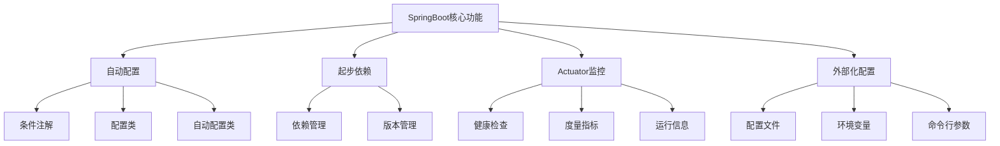
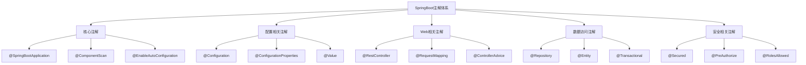
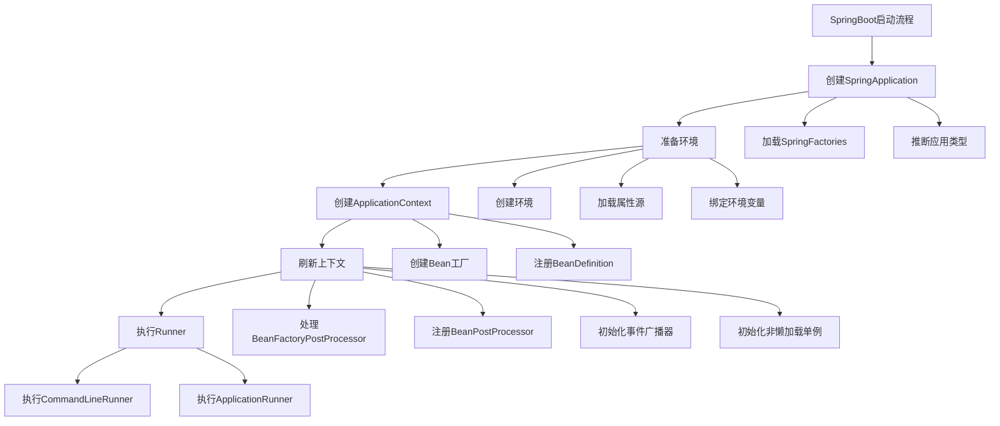

# SpringBoot 核心知识体系

## 目录
- [SpringBoot 核心知识体系](#springboot-核心知识体系)
  - [目录](#目录)
  - [核心特性](#核心特性)
    - [自动配置](#自动配置)
      - [条件注解](#条件注解)
      - [配置属性](#配置属性)
    - [注解体系](#注解体系)
      - [核心注解](#核心注解)
    - [Web开发](#web开发)
      - [REST接口](#rest接口)
      - [异常处理](#异常处理)
    - [数据访问](#数据访问)
      - [JPA配置](#jpa配置)
      - [事务管理](#事务管理)
    - [安全框架](#安全框架)
      - [Spring Security配置](#spring-security配置)
      - [JWT支持](#jwt支持)
    - [微服务](#微服务)
      - [服务注册](#服务注册)
      - [熔断降级](#熔断降级)
    - [最佳实践](#最佳实践)
      - [项目结构](#项目结构)
      - [配置最佳实践](#配置最佳实践)
  - [启动流程与原理](#启动流程与原理)
    - [启动流程详解](#启动流程详解)
    - [自动配置原理](#自动配置原理)
  - [测试框架](#测试框架)
    - [单元测试](#单元测试)
    - [集成测试](#集成测试)
    - [切片测试](#切片测试)
  - [高级特性](#高级特性)
    - [缓存机制](#缓存机制)
    - [异步处理](#异步处理)
    - [事件机制](#事件机制)
    - [监控与管理](#监控与管理)
    - [部署与运维](#部署与运维)
      - [打包与部署](#打包与部署)
      - [Dockerfile示例](#dockerfile示例)
      - [Docker Compose示例](#docker-compose示例)
  - [常见问题与解决方案](#常见问题与解决方案)
    - [配置问题](#配置问题)
    - [依赖问题](#依赖问题)
    - [性能问题](#性能问题)
  - [参考资源](#参考资源)
    - [官方文档](#官方文档)
    - [社区资源](#社区资源)
    - [书籍推荐](#书籍推荐)

## 核心特性

### 自动配置

SpringBoot的核心功能结构：



#### 条件注解
```java
/**
 * 条件注解使用示例
 */
@Configuration
public class CustomAutoConfiguration {
    
    @ConditionalOnClass(DataSource.class)
    @ConditionalOnMissingBean
    public DataSource dataSource() {
        // 数据源配置
    }
    
    @ConditionalOnProperty(prefix = "custom", name = "enabled", havingValue = "true")
    @ConditionalOnBean(DataSource.class)
    public CustomService customService() {
        // 自定义服务配置
    }
}
```

#### 配置属性
```java
/**
 * 配置属性绑定
 */
@ConfigurationProperties(prefix = "app")
@Validated
public class AppProperties {
    @NotEmpty
    private String name;
    
    @Min(0)
    @Max(100)
    private int threadPool;
    
    // getter and setter
}
```

### 注解体系

SpringBoot注解体系结构：



#### 核心注解
```java
/**
 * SpringBoot应用主类
 */
@SpringBootApplication
public class Application {
    public static void main(String[] args) {
        SpringApplication.run(Application.class, args);
    }
}

/**
 * 自定义配置类
 */
@Configuration
@EnableConfigurationProperties(AppProperties.class)
public class CustomConfiguration {
    @Bean
    @ConditionalOnMissingBean
    public CustomService customService() {
        return new CustomService();
    }
}
```

### Web开发

#### REST接口
```java
/**
 * RESTful接口示例
 */
@RestController
@RequestMapping("/api")
public class UserController {
    
    @GetMapping("/users")
    public List<User> getUsers() {
        // 获取用户列表
    }
    
    @PostMapping("/users")
    public ResponseEntity<User> createUser(@Valid @RequestBody User user) {
        // 创建用户
    }
    
    @PutMapping("/users/{id}")
    public User updateUser(@PathVariable Long id, @RequestBody User user) {
        // 更新用户
    }
    
    @DeleteMapping("/users/{id}")
    public void deleteUser(@PathVariable Long id) {
        // 删除用户
    }
}
```

#### 异常处理
```java
/**
 * 全局异常处理
 */
@RestControllerAdvice
public class GlobalExceptionHandler {
    
    @ExceptionHandler(Exception.class)
    public ResponseEntity<ErrorResponse> handleException(Exception ex) {
        // 通用异常处理
    }
    
    @ExceptionHandler(ValidationException.class)
    public ResponseEntity<ErrorResponse> handleValidationException(ValidationException ex) {
        // 参数校验异常处理
    }
    
    @ExceptionHandler(BusinessException.class)
    public ResponseEntity<ErrorResponse> handleBusinessException(BusinessException ex) {
        // 业务异常处理
    }
}
```

### 数据访问

#### JPA配置
```java
/**
 * JPA实体类
 */
@Entity
@Table(name = "users")
public class User {
    @Id
    @GeneratedValue(strategy = GenerationType.IDENTITY)
    private Long id;
    
    @Column(nullable = false)
    private String username;
    
    @Column(nullable = false)
    private String password;
    
    @OneToMany(mappedBy = "user", cascade = CascadeType.ALL)
    private List<Order> orders;
}

/**
 * JPA Repository
 */
@Repository
public interface UserRepository extends JpaRepository<User, Long> {
    Optional<User> findByUsername(String username);
    
    @Query("SELECT u FROM User u WHERE u.username LIKE %:keyword%")
    List<User> searchUsers(@Param("keyword") String keyword);
}
```

#### 事务管理
```java
/**
 * 事务管理示例
 */
@Service
@Transactional
public class UserService {
    
    @Transactional(readOnly = true)
    public User getUser(Long id) {
        // 查询用户
    }
    
    @Transactional(rollbackFor = Exception.class)
    public User createUser(User user) {
        // 创建用户
    }
    
    @Transactional(propagation = Propagation.REQUIRES_NEW)
    public void updateUser(User user) {
        // 更新用户
    }
}
```

### 安全框架

#### Spring Security配置
```java
/**
 * 安全配置
 */
@Configuration
@EnableWebSecurity
public class SecurityConfig extends WebSecurityConfigurerAdapter {
    
    @Override
    protected void configure(HttpSecurity http) throws Exception {
        http
            .authorizeRequests()
                .antMatchers("/api/public/**").permitAll()
                .antMatchers("/api/admin/**").hasRole("ADMIN")
                .anyRequest().authenticated()
            .and()
            .formLogin()
            .and()
            .oauth2Login()
            .and()
            .csrf().disable();
    }
    
    @Bean
    public PasswordEncoder passwordEncoder() {
        return new BCryptPasswordEncoder();
    }
}
```

#### JWT支持
```java
/**
 * JWT工具类
 */
@Component
public class JwtTokenProvider {
    
    @Value("${jwt.secret}")
    private String jwtSecret;
    
    @Value("${jwt.expiration}")
    private long jwtExpiration;
    
    public String generateToken(Authentication authentication) {
        // 生成JWT token
    }
    
    public boolean validateToken(String token) {
        // 验证JWT token
    }
    
    public String getUsernameFromToken(String token) {
        // 从JWT token中获取用户名
    }
}
```

### 微服务

#### 服务注册
```java
/**
 * 服务注册配置
 */
@SpringBootApplication
@EnableDiscoveryClient
public class ServiceApplication {
    
    @Bean
    @LoadBalanced
    public RestTemplate restTemplate() {
        return new RestTemplate();
    }
}
```

#### 熔断降级
```java
/**
 * 熔断降级示例
 */
@Service
public class UserService {
    
    @HystrixCommand(fallbackMethod = "getDefaultUser",
        commandProperties = {
            @HystrixProperty(name = "execution.isolation.thread.timeoutInMilliseconds", value = "1000"),
            @HystrixProperty(name = "circuitBreaker.requestVolumeThreshold", value = "20"),
            @HystrixProperty(name = "circuitBreaker.errorThresholdPercentage", value = "50"),
            @HystrixProperty(name = "circuitBreaker.sleepWindowInMilliseconds", value = "5000")
        })
    public User getUser(Long id) {
        // 调用用户服务
    }
    
    public User getDefaultUser(Long id) {
        // 降级返回默认用户
    }
}
```

### 最佳实践

#### 项目结构
```
src/main/java
    ├── com.example.demo
    │   ├── DemoApplication.java
    │   ├── config/
    │   ├── controller/
    │   ├── service/
    │   ├── repository/
    │   ├── model/
    │   ├── dto/
    │   ├── exception/
    │   └── util/
    └── resources
        ├── application.yml
        ├── application-dev.yml
        └── application-prod.yml
```

#### 配置最佳实践
```yaml
# application.yml
spring:
  profiles:
    active: dev
  datasource:
    url: jdbc:mysql://localhost:3306/demo
    username: root
    password: ${MYSQL_PASSWORD}
  jpa:
    hibernate:
      ddl-auto: update
    show-sql: true
  redis:
    host: localhost
    port: 6379
  cache:
    type: redis
    redis:
      time-to-live: 60000

server:
  port: 8080
  servlet:
    context-path: /api

logging:
  level:
    root: INFO
    com.example: DEBUG
  file:
    name: logs/application.log

management:
  endpoints:
    web:
      exposure:
        include: "*"
  endpoint:
    health:
      show-details: always
```

## 启动流程与原理

SpringBoot启动流程图：



### 启动流程详解

```java
/**
 * SpringBoot启动流程分析
 */
public class SpringBootStartupAnalysis {
    
    /**
     * 1. 创建SpringApplication
     */
    public void createSpringApplication() {
        // 设置应用类型
        // SERVLET, REACTIVE, NONE
        this.webApplicationType = WebApplicationType.deduceFromClasspath();
        
        // 加载ApplicationContextInitializer
        setInitializers(getSpringFactoriesInstances(ApplicationContextInitializer.class));
        
        // 加载ApplicationListener
        setListeners(getSpringFactoriesInstances(ApplicationListener.class));
        
        // 推断主应用类
        this.mainApplicationClass = deduceMainApplicationClass();
    }
    
    /**
     * 2. 准备环境
     */
    public void prepareEnvironment() {
        // 创建环境对象
        // StandardServletEnvironment, StandardReactiveWebEnvironment
        ConfigurableEnvironment environment = getOrCreateEnvironment();
        
        // 配置环境
        configureEnvironment(environment, args);
        
        // 绑定环境变量
        ConfigurationPropertySources.attach(environment);
        
        // 发布环境准备事件
        listeners.environmentPrepared(environment);
    }
    
    /**
     * 3. 创建ApplicationContext
     */
    public void createApplicationContext() {
        // 根据应用类型创建上下文
        // AnnotationConfigServletWebServerApplicationContext
        // AnnotationConfigReactiveWebServerApplicationContext
        // AnnotationConfigApplicationContext
        context = createApplicationContext();
        
        // 准备上下文
        prepareContext(context, environment, listeners, applicationArguments, printedBanner);
        
        // 加载Bean定义
        load(context, sources.toArray(new Object[0]));
    }
    
    /**
     * 4. 刷新上下文
     */
    public void refreshContext() {
        // 刷新上下文
        refreshContext(context);
        
        // 注册关闭钩子
        registerShutdownHook();
    }
    
    /**
     * 5. 执行Runner
     */
    public void callRunners() {
        // 获取所有Runner
        Collection<ApplicationRunner> applicationRunners = context.getBeansOfType(ApplicationRunner.class).values();
        Collection<CommandLineRunner> commandLineRunners = context.getBeansOfType(CommandLineRunner.class).values();
        
        // 排序并执行
        AnnotationAwareOrderComparator.sort(applicationRunners);
        AnnotationAwareOrderComparator.sort(commandLineRunners);
        
        // 先执行ApplicationRunner
        for (ApplicationRunner runner : applicationRunners) {
            runner.run(args);
        }
        
        // 再执行CommandLineRunner
        for (CommandLineRunner runner : commandLineRunners) {
            runner.run(args.getSourceArgs());
        }
    }
}
```

### 自动配置原理

```java
/**
 * 自动配置原理分析
 */
@Configuration
@EnableAutoConfiguration
public class AutoConfigurationAnalysis {
    
    /**
     * EnableAutoConfiguration注解原理
     */
    public void enableAutoConfigurationAnalysis() {
        // 1. 导入AutoConfigurationImportSelector
        // @Import(AutoConfigurationImportSelector.class)
        
        // 2. 加载META-INF/spring.factories
        List<String> configurations = SpringFactoriesLoader.loadFactoryNames(
            EnableAutoConfiguration.class, classLoader);
        
        // 3. 过滤需要自动配置的类
        configurations = filter(configurations, autoConfigurationMetadata);
        
        // 4. 加载自动配置类
        // 例如：DataSourceAutoConfiguration, WebMvcAutoConfiguration等
    }
    
    /**
     * 条件注解工作原理
     */
    public void conditionalAnnotationAnalysis() {
        // 常用条件注解
        // @ConditionalOnClass：当类路径下有指定的类时
        // @ConditionalOnMissingClass：当类路径下没有指定的类时
        // @ConditionalOnBean：当容器中有指定的Bean时
        // @ConditionalOnMissingBean：当容器中没有指定的Bean时
        // @ConditionalOnProperty：当配置文件中有指定的属性时
        // @ConditionalOnResource：当类路径下有指定的资源时
        // @ConditionalOnWebApplication：当应用是Web应用时
        // @ConditionalOnNotWebApplication：当应用不是Web应用时
        
        // 条件注解处理流程
        // 1. 收集所有@Conditional注解
        // 2. 创建对应的Condition实例
        // 3. 调用Condition.matches()方法判断条件是否满足
        // 4. 根据结果决定是否加载Bean
    }
}
```

## 测试框架

SpringBoot测试框架图：

```mermaid
graph TD
    A[SpringBoot测试] --> B[单元测试]
    A --> C[集成测试]
    A --> D[Web测试]
    A --> E[性能测试]
    
    B --> B1[JUnit 5]
    B --> B2[Mockito]
    B --> B3[AssertJ]
    
    C --> C1[@SpringBootTest]
    C --> C2[TestRestTemplate]
    C --> C3[TestConfiguration]
    
    D --> D1[MockMvc]
    D --> D2[WebTestClient]
    D --> D3[@WebMvcTest]
    
    E --> E1[JMeter]
    E --> E2[Gatling]
    E --> E3[Spring Cloud Contract]
```

### 单元测试

```java
/**
 * 单元测试示例
 */
public class UserServiceTest {
    
    @Mock
    private UserRepository userRepository;
    
    @InjectMocks
    private UserService userService;
    
    @BeforeEach
    public void setup() {
        MockitoAnnotations.openMocks(this);
    }
    
    @Test
    public void testGetUserById() {
        // 准备测试数据
        User user = new User();
        user.setId(1L);
        user.setUsername("test");
        
        // 模拟Repository行为
        when(userRepository.findById(1L)).thenReturn(Optional.of(user));
        
        // 执行测试
        User result = userService.getUserById(1L);
        
        // 验证结果
        assertThat(result).isNotNull();
        assertThat(result.getUsername()).isEqualTo("test");
        
        // 验证交互
        verify(userRepository).findById(1L);
    }
}
```

### 集成测试

```java
/**
 * 集成测试示例
 */
@SpringBootTest
@AutoConfigureMockMvc
public class UserControllerIntegrationTest {
    
    @Autowired
    private MockMvc mockMvc;
    
    @Autowired
    private ObjectMapper objectMapper;
    
    @MockBean
    private UserService userService;
    
    @Test
    public void testCreateUser() throws Exception {
        // 准备测试数据
        User user = new User();
        user.setUsername("test");
        user.setPassword("password");
        
        User savedUser = new User();
        savedUser.setId(1L);
        savedUser.setUsername("test");
        
        // 模拟Service行为
        when(userService.createUser(any(User.class))).thenReturn(savedUser);
        
        // 执行测试
        mockMvc.perform(post("/api/users")
                .contentType(MediaType.APPLICATION_JSON)
                .content(objectMapper.writeValueAsString(user)))
                .andExpect(status().isCreated())
                .andExpect(jsonPath("$.id").value(1))
                .andExpect(jsonPath("$.username").value("test"));
        
        // 验证交互
        verify(userService).createUser(any(User.class));
    }
}
```

### 切片测试

```java
/**
 * Web切片测试示例
 */
@WebMvcTest(UserController.class)
public class UserControllerTest {
    
    @Autowired
    private MockMvc mockMvc;
    
    @MockBean
    private UserService userService;
    
    @Test
    public void testGetUser() throws Exception {
        // 准备测试数据
        User user = new User();
        user.setId(1L);
        user.setUsername("test");
        
        // 模拟Service行为
        when(userService.getUserById(1L)).thenReturn(user);
        
        // 执行测试
        mockMvc.perform(get("/api/users/1"))
                .andExpect(status().isOk())
                .andExpect(jsonPath("$.id").value(1))
                .andExpect(jsonPath("$.username").value("test"));
    }
}
```

## 高级特性

### 缓存机制

```java
/**
 * 缓存配置
 */
@Configuration
@EnableCaching
public class CacheConfig {
    
    @Bean
    public CacheManager cacheManager(RedisConnectionFactory redisConnectionFactory) {
        // 缓存配置
        RedisCacheConfiguration config = RedisCacheConfiguration.defaultCacheConfig()
            .entryTtl(Duration.ofMinutes(10))
            .serializeKeysWith(RedisSerializationContext.SerializationPair.fromSerializer(new StringRedisSerializer()))
            .serializeValuesWith(RedisSerializationContext.SerializationPair.fromSerializer(new GenericJackson2JsonRedisSerializer()));
        
        // 缓存空间
        Map<String, RedisCacheConfiguration> configMap = new HashMap<>();
        configMap.put("users", config.entryTtl(Duration.ofMinutes(5)));
        configMap.put("products", config.entryTtl(Duration.ofMinutes(15)));
        
        // 创建缓存管理器
        return RedisCacheManager.builder(redisConnectionFactory)
            .cacheDefaults(config)
            .withInitialCacheConfigurations(configMap)
            .build();
    }
}

/**
 * 缓存使用示例
 */
@Service
public class ProductService {
    
    @Autowired
    private ProductRepository productRepository;
    
    @Cacheable(value = "products", key = "#id")
    public Product getProductById(Long id) {
        return productRepository.findById(id)
            .orElseThrow(() -> new NotFoundException("Product not found"));
    }
    
    @CachePut(value = "products", key = "#product.id")
    public Product updateProduct(Product product) {
        return productRepository.save(product);
    }
    
    @CacheEvict(value = "products", key = "#id")
    public void deleteProduct(Long id) {
        productRepository.deleteById(id);
    }
    
    @CacheEvict(value = "products", allEntries = true)
    public void clearProductCache() {
        // 清空缓存
    }
}
```

### 异步处理

```java
/**
 * 异步配置
 */
@Configuration
@EnableAsync
public class AsyncConfig {
    
    @Bean
    public Executor taskExecutor() {
        ThreadPoolTaskExecutor executor = new ThreadPoolTaskExecutor();
        executor.setCorePoolSize(5);
        executor.setMaxPoolSize(10);
        executor.setQueueCapacity(25);
        executor.setThreadNamePrefix("Async-");
        executor.setRejectedExecutionHandler(new ThreadPoolExecutor.CallerRunsPolicy());
        executor.initialize();
        return executor;
    }
}

/**
 * 异步服务示例
 */
@Service
public class EmailService {
    
    @Async
    public CompletableFuture<Boolean> sendEmail(String to, String subject, String content) {
        // 异步发送邮件
        try {
            // 模拟耗时操作
            Thread.sleep(2000);
            
            // 发送邮件逻辑
            System.out.println("Sending email to: " + to);
            
            return CompletableFuture.completedFuture(true);
        } catch (Exception e) {
            return CompletableFuture.completedFuture(false);
        }
    }
    
    @Async
    public CompletableFuture<List<String>> processEmails(List<String> emails) {
        return CompletableFuture.supplyAsync(() -> {
            // 处理邮件列表
            return emails.stream()
                .map(email -> email + " processed")
                .collect(Collectors.toList());
        });
    }
}
```

### 事件机制

```java
/**
 * 自定义事件
 */
public class UserRegisteredEvent extends ApplicationEvent {
    
    private final User user;
    
    public UserRegisteredEvent(Object source, User user) {
        super(source);
        this.user = user;
    }
    
    public User getUser() {
        return user;
    }
}

/**
 * 事件发布者
 */
@Service
public class UserService {
    
    @Autowired
    private ApplicationEventPublisher eventPublisher;
    
    @Autowired
    private UserRepository userRepository;
    
    @Transactional
    public User registerUser(User user) {
        // 保存用户
        User savedUser = userRepository.save(user);
        
        // 发布事件
        eventPublisher.publishEvent(new UserRegisteredEvent(this, savedUser));
        
        return savedUser;
    }
}

/**
 * 事件监听器
 */
@Component
public class UserEventListener {
    
    @Autowired
    private EmailService emailService;
    
    @EventListener
    public void handleUserRegisteredEvent(UserRegisteredEvent event) {
        // 处理用户注册事件
        User user = event.getUser();
        
        // 发送欢迎邮件
        emailService.sendEmail(user.getEmail(), "Welcome", "Welcome to our platform!");
    }
    
    @EventListener
    @Async
    public void handleUserRegisteredEventAsync(UserRegisteredEvent event) {
        // 异步处理事件
        System.out.println("Async processing user registration: " + event.getUser().getUsername());
    }
    
    @TransactionalEventListener(phase = TransactionPhase.AFTER_COMMIT)
    public void handleUserRegisteredEventTransactional(UserRegisteredEvent event) {
        // 事务提交后处理事件
        System.out.println("Transaction committed for user: " + event.getUser().getUsername());
    }
}
```

### 监控与管理

```java
/**
 * Actuator配置
 */
@Configuration
public class ActuatorConfig {
    
    @Bean
    public HealthIndicator customHealthIndicator() {
        return new HealthIndicator() {
            @Override
            public Health health() {
                // 自定义健康检查逻辑
                boolean healthy = checkExternalService();
                
                if (healthy) {
                    return Health.up()
                        .withDetail("externalService", "UP")
                        .build();
                } else {
                    return Health.down()
                        .withDetail("externalService", "DOWN")
                        .withException(new ServiceUnavailableException("External service is down"))
                        .build();
                }
            }
        };
    }
    
    @Bean
    public InfoContributor customInfoContributor() {
        return builder -> {
            Map<String, Object> details = new HashMap<>();
            details.put("version", "1.0.0");
            details.put("buildDate", LocalDate.now().toString());
            builder.withDetail("app", details);
        };
    }
    
    private boolean checkExternalService() {
        // 检查外部服务健康状态
        return true;
    }
}

/**
 * 自定义端点
 */
@Component
@Endpoint(id = "features")
public class FeaturesEndpoint {
    
    private Map<String, Boolean> features = new HashMap<>();
    
    public FeaturesEndpoint() {
        features.put("user-management", true);
        features.put("product-catalog", true);
        features.put("payment-gateway", false);
    }
    
    @ReadOperation
    public Map<String, Boolean> features() {
        return features;
    }
    
    @ReadOperation
    public Boolean feature(@Selector String name) {
        return features.get(name);
    }
    
    @WriteOperation
    public void configureFeature(@Selector String name, Boolean enabled) {
        features.put(name, enabled);
    }
}
```

### 部署与运维

#### 打包与部署

```bash
# 构建可执行JAR
./mvnw clean package

# 运行JAR
java -jar target/myapp.jar

# 指定配置文件
java -jar target/myapp.jar --spring.profiles.active=prod

# 指定JVM参数
java -Xms512m -Xmx1024m -jar target/myapp.jar

# 使用Docker部署
docker build -t myapp .
docker run -p 8080:8080 myapp
```

#### Dockerfile示例

```dockerfile
FROM openjdk:11-jre-slim
VOLUME /tmp
ARG JAR_FILE=target/*.jar
COPY ${JAR_FILE} app.jar
ENTRYPOINT ["java", "-Djava.security.egd=file:/dev/./urandom", "-jar", "/app.jar"]
```

#### Docker Compose示例

```yaml
version: '3'
services:
  app:
    build: .
    ports:
      - "8080:8080"
    environment:
      - SPRING_PROFILES_ACTIVE=prod
      - SPRING_DATASOURCE_URL=jdbc:mysql://db:3306/mydb
      - SPRING_DATASOURCE_USERNAME=root
      - SPRING_DATASOURCE_PASSWORD=secret
    depends_on:
      - db
      - redis
  
  db:
    image: mysql:8.0
    environment:
      - MYSQL_ROOT_PASSWORD=secret
      - MYSQL_DATABASE=mydb
    volumes:
      - db-data:/var/lib/mysql
  
  redis:
    image: redis:6.0
    volumes:
      - redis-data:/data

volumes:
  db-data:
  redis-data:
```

## 常见问题与解决方案

### 配置问题

```java
/**
 * 配置问题解决方案
 */
public class ConfigurationTroubleshooting {
    
    /**
     * 问题：配置属性不生效
     * 解决方案：
     * 1. 检查配置文件名称是否正确（application.yml/application.properties）
     * 2. 检查配置文件路径是否正确（src/main/resources）
     * 3. 检查配置属性名称是否正确（区分大小写）
     * 4. 检查是否使用了正确的注解（@Value, @ConfigurationProperties）
     * 5. 启用调试模式（--debug）查看配置绑定过程
     */
    
    /**
     * 问题：配置优先级问题
     * 解决方案：了解配置优先级顺序（从高到低）
     * 1. 命令行参数
     * 2. Java系统属性
     * 3. 操作系统环境变量
     * 4. application-{profile}.properties/yml
     * 5. application.properties/yml
     */
    
    /**
     * 问题：配置文件中的敏感信息安全问题
     * 解决方案：
     * 1. 使用环境变量
     * 2. 使用外部配置文件
     * 3. 使用加密属性（jasypt）
     * 4. 使用配置服务器（Spring Cloud Config）
     */
}
```

### 依赖问题

```java
/**
 * 依赖问题解决方案
 */
public class DependencyTroubleshooting {
    
    /**
     * 问题：依赖冲突
     * 解决方案：
     * 1. 查看依赖树：mvn dependency:tree
     * 2. 排除冲突依赖：<exclusions>
     * 3. 强制指定版本：<dependencyManagement>
     */
    
    /**
     * 问题：自动配置不生效
     * 解决方案：
     * 1. 检查是否引入了正确的starter依赖
     * 2. 查看自动配置报告：--debug
     * 3. 检查条件注解是否满足
     */
    
    /**
     * 问题：版本兼容性问题
     * 解决方案：
     * 1. 使用兼容的版本组合
     * 2. 参考官方文档中的版本兼容性矩阵
     * 3. 使用Spring Boot依赖管理
     */
}
```

### 性能问题

```java
/**
 * 性能问题解决方案
 */
public class PerformanceTroubleshooting {
    
    /**
     * 问题：应用启动慢
     * 解决方案：
     * 1. 使用懒加载：spring.main.lazy-initialization=true
     * 2. 减少组件扫描范围
     * 3. 优化数据库初始化
     * 4. 使用异步初始化
     */
    
    /**
     * 问题：响应时间长
     * 解决方案：
     * 1. 使用异步处理
     * 2. 优化数据库查询
     * 3. 添加缓存
     * 4. 使用连接池
     * 5. 调整线程池参数
     */
    
    /**
     * 问题：内存占用高
     * 解决方案：
     * 1. 调整JVM参数
     * 2. 检查内存泄漏
     * 3. 优化对象创建和销毁
     * 4. 使用分页查询
     */
}
```

## 参考资源

### 官方文档
- [Spring Boot 官方文档](https://docs.spring.io/spring-boot/docs/current/reference/html/)
- [Spring Boot API 文档](https://docs.spring.io/spring-boot/docs/current/api/)
- [Spring Boot GitHub 仓库](https://github.com/spring-projects/spring-boot)

### 社区资源
- [Spring Boot 示例项目](https://github.com/spring-projects/spring-boot/tree/main/spring-boot-samples)
- [Spring Guides](https://spring.io/guides)
- [Baeldung Spring Boot 教程](https://www.baeldung.com/spring-boot)

### 书籍推荐
- 《Spring Boot in Action》
- 《Spring Boot: Up and Running》
- 《Cloud Native Java》
