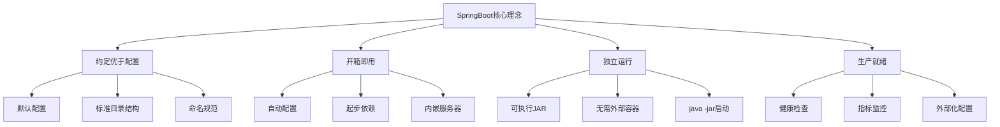
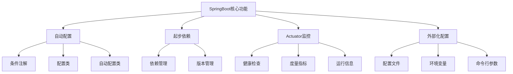
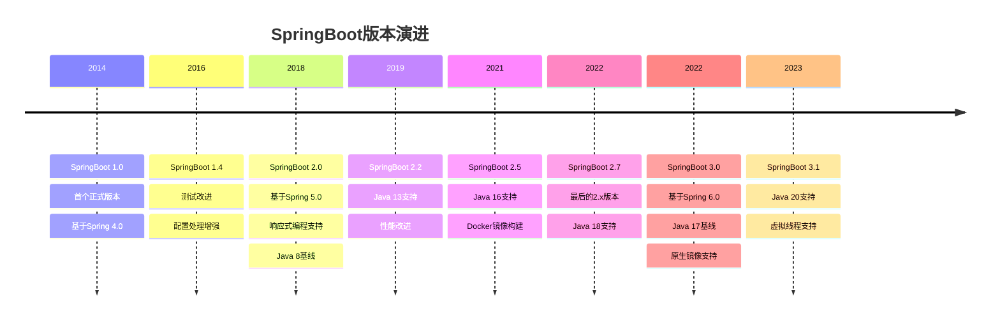
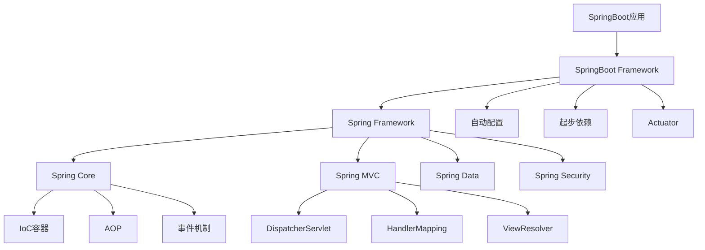
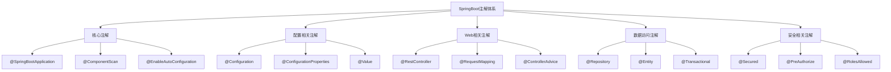
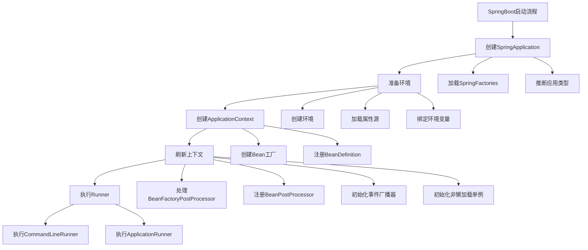
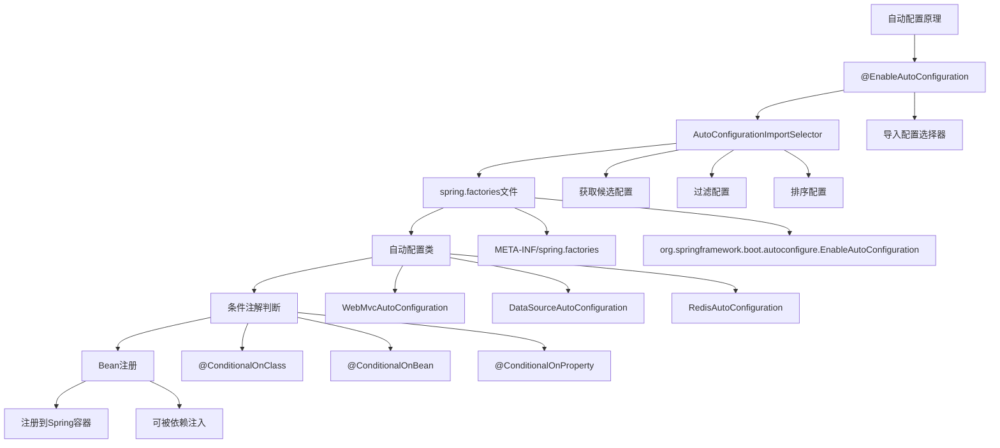
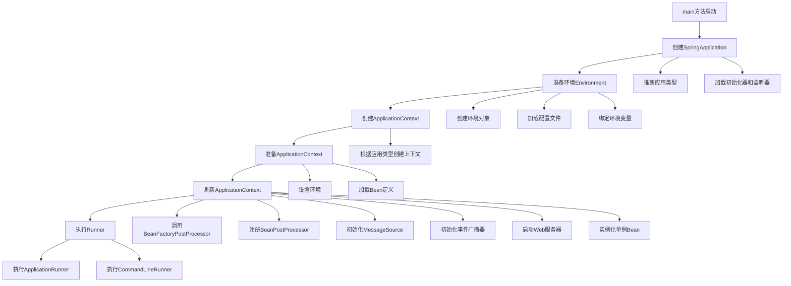
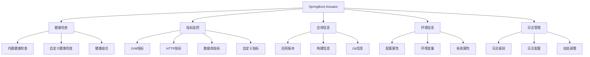
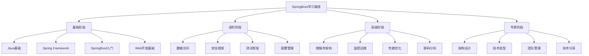

# SpringBoot 核心知识体系

## 目录
- [SpringBoot 核心知识体系](#springboot-核心知识体系)
  - [目录](#目录)
  - [SpringBoot基础概念](#springboot基础概念)
    - [SpringBoot简介](#springboot简介)
      - [SpringBoot核心理念](#springboot核心理念)
      - [SpringBoot优势](#springboot优势)
    - [核心特性](#核心特性)
      - [起步依赖（Starter Dependencies）](#起步依赖starter-dependencies)
      - [常用Starter对比表](#常用starter对比表)
    - [版本演进](#版本演进)
      - [SpringBoot版本历史](#springboot版本历史)
      - [版本选择建议](#版本选择建议)
    - [与Spring Framework关系](#与spring-framework关系)
      - [架构关系图](#架构关系图)
      - [关系说明](#关系说明)
  - [快速入门](#快速入门)
    - [环境搭建](#环境搭建)
      - [开发环境要求](#开发环境要求)
      - [Maven配置](#maven配置)
    - [创建第一个应用](#创建第一个应用)
      - [主启动类](#主启动类)
      - [第一个Controller](#第一个controller)
      - [运行应用](#运行应用)
    - [项目结构详解](#项目结构详解)
      - [标准项目结构](#标准项目结构)
      - [包结构最佳实践](#包结构最佳实践)
    - [配置文件详解](#配置文件详解)
      - [application.yml配置](#applicationyml配置)
      - [多环境配置](#多环境配置)
  - [自动配置机制](#自动配置机制)
      - [条件注解](#条件注解)
      - [配置属性](#配置属性)
    - [注解体系](#注解体系)
      - [核心注解](#核心注解)
    - [Web开发](#web开发)
      - [REST接口](#rest接口)
      - [异常处理](#异常处理)
    - [数据访问](#数据访问)
      - [JPA配置](#jpa配置)
      - [事务管理](#事务管理)
    - [安全框架](#安全框架)
      - [Spring Security配置](#spring-security配置)
      - [JWT支持](#jwt支持)
    - [微服务](#微服务)
      - [服务注册](#服务注册)
      - [熔断降级](#熔断降级)
    - [最佳实践](#最佳实践)
      - [项目结构](#项目结构)
      - [配置最佳实践](#配置最佳实践)
  - [启动流程与原理](#启动流程与原理)
    - [启动流程详解](#启动流程详解)
    - [自动配置原理](#自动配置原理)
    - [条件注解详解](#条件注解详解)
      - [自定义条件注解](#自定义条件注解)
    - [自定义自动配置](#自定义自动配置)
      - [自定义Starter开发](#自定义starter开发)
      - [META-INF/spring.factories配置](#meta-infspringfactories配置)
    - [配置属性绑定](#配置属性绑定)
      - [配置属性绑定示例](#配置属性绑定示例)
      - [配置属性使用](#配置属性使用)
  - [常见面试题](#常见面试题)
    - [基础概念面试题](#基础概念面试题)
    - [自动配置面试题](#自动配置面试题)
    - [Web开发面试题](#web开发面试题)
  - [测试框架](#测试框架)
    - [单元测试](#单元测试)
    - [集成测试](#集成测试)
    - [切片测试](#切片测试)
  - [高级特性](#高级特性)
    - [缓存机制](#缓存机制)
    - [异步处理](#异步处理)
    - [事件机制](#事件机制)
    - [监控与管理](#监控与管理)
      - [Dockerfile示例](#dockerfile示例)
      - [Docker Compose示例](#docker-compose示例)
      - [生产级Dockerfile](#生产级dockerfile)
      - [Kubernetes部署配置](#kubernetes部署配置)
      - [CI/CD Pipeline配置](#cicd-pipeline配置)
      - [监控和日志配置](#监控和日志配置)
      - [运维脚本](#运维脚本)
  - [常见问题与解决方案](#常见问题与解决方案)
    - [配置问题](#配置问题)
    - [依赖问题](#依赖问题)
    - [性能问题](#性能问题)
    - [安全问题](#安全问题)
    - [部署问题](#部署问题)
  - [参考资源](#参考资源)
    - [官方文档](#官方文档)
    - [社区资源](#社区资源)
    - [书籍推荐](#书籍推荐)
      - [入门级书籍](#入门级书籍)
      - [进阶级书籍](#进阶级书籍)
      - [源码分析书籍](#源码分析书籍)
    - [学习路径建议](#学习路径建议)
    - [实践项目推荐](#实践项目推荐)
      - [初级项目](#初级项目)
      - [中级项目](#中级项目)
      - [高级项目](#高级项目)
    - [认证考试](#认证考试)
    - [技术社区](#技术社区)
    - [持续学习建议](#持续学习建议)
  - [文档总结](#文档总结)
    - [📚 知识覆盖范围](#-知识覆盖范围)
    - [🎯 文档特色](#-文档特色)
    - [🚀 使用建议](#-使用建议)
    - [📈 持续更新](#-持续更新)

## SpringBoot基础概念

### SpringBoot简介

**SpringBoot**是由Pivotal团队提供的全新框架，其设计目的是用来**简化Spring应用的初始搭建以及开发过程**。SpringBoot采用了**约定优于配置**的理念，大量的自动配置减少了开发人员的工作量。

#### SpringBoot核心理念



#### SpringBoot优势

| 特性 | 传统Spring | SpringBoot |
|------|------------|------------|
| 配置复杂度 | 大量XML配置 | 最少配置 |
| 依赖管理 | 手动管理版本 | 自动版本管理 |
| 服务器部署 | 需要外部容器 | 内嵌服务器 |
| 启动方式 | 复杂部署流程 | java -jar启动 |
| 监控运维 | 需要额外配置 | 内置Actuator |

### 核心特性

SpringBoot的核心功能结构：



#### 起步依赖（Starter Dependencies）

```xml
<!-- Web开发起步依赖 -->
<dependency>
    <groupId>org.springframework.boot</groupId>
    <artifactId>spring-boot-starter-web</artifactId>
</dependency>

<!-- 数据访问起步依赖 -->
<dependency>
    <groupId>org.springframework.boot</groupId>
    <artifactId>spring-boot-starter-data-jpa</artifactId>
</dependency>

<!-- 安全框架起步依赖 -->
<dependency>
    <groupId>org.springframework.boot</groupId>
    <artifactId>spring-boot-starter-security</artifactId>
</dependency>

<!-- 测试起步依赖 -->
<dependency>
    <groupId>org.springframework.boot</groupId>
    <artifactId>spring-boot-starter-test</artifactId>
    <scope>test</scope>
</dependency>
```

#### 常用Starter对比表

| Starter | 功能 | 主要依赖 | 适用场景 |
|---------|------|----------|----------|
| spring-boot-starter-web | Web开发 | Spring MVC, Tomcat | REST API, Web应用 |
| spring-boot-starter-data-jpa | JPA数据访问 | Hibernate, Spring Data JPA | 关系型数据库操作 |
| spring-boot-starter-data-redis | Redis缓存 | Lettuce, Spring Data Redis | 缓存、会话存储 |
| spring-boot-starter-security | 安全框架 | Spring Security | 认证授权 |
| spring-boot-starter-actuator | 监控管理 | Micrometer, Actuator | 生产监控 |
| spring-boot-starter-test | 测试框架 | JUnit, Mockito, AssertJ | 单元测试、集成测试 |

### 版本演进

#### SpringBoot版本历史



#### 版本选择建议

```java
/**
 * SpringBoot版本选择指南
 */
public class VersionSelectionGuide {
    
    /**
     * 生产环境版本选择
     */
    public void productionVersionSelection() {
        // 推荐使用LTS版本
        // SpringBoot 2.7.x (Java 8+)
        // SpringBoot 3.0.x (Java 17+)
        
        // 考虑因素：
        // 1. Java版本兼容性
        // 2. 第三方库支持
        // 3. 团队技术栈
        // 4. 迁移成本
    }
    
    /**
     * 新项目版本选择
     */
    public void newProjectVersionSelection() {
        // 建议使用最新稳定版本
        // SpringBoot 3.1.x (推荐)
        
        // 优势：
        // 1. 最新特性支持
        // 2. 更好的性能
        // 3. 安全更新
        // 4. 长期支持
    }
}
```

### 与Spring Framework关系

#### 架构关系图



#### 关系说明

```java
/**
 * SpringBoot与Spring Framework关系
 */
public class SpringRelationship {
    
    /**
     * SpringBoot是Spring Framework的扩展
     */
    public void springBootExtension() {
        // SpringBoot = Spring Framework + 自动配置 + 起步依赖 + 内嵌服务器
        
        // 1. 基于Spring Framework
        // 2. 简化配置过程
        // 3. 提供生产就绪特性
        // 4. 约定优于配置
    }
    
    /**
     * 核心组件关系
     */
    public void coreComponentRelation() {
        // ApplicationContext (Spring Framework)
        // ↓
        // SpringApplication (SpringBoot)
        // ↓
        // 自动配置 + 起步依赖
        // ↓
        // 完整的应用程序
    }
}
```

## 快速入门

### 环境搭建

#### 开发环境要求

| 组件 | 版本要求 | 推荐版本 | 说明 |
|------|----------|----------|------|
| JDK | 8+ (SpringBoot 2.x), 17+ (SpringBoot 3.x) | JDK 17 | 长期支持版本 |
| Maven | 3.6.3+ | 3.9.x | 构建工具 |
| Gradle | 7.5+ | 8.x | 可选构建工具 |
| IDE | 任意 | IntelliJ IDEA | 推荐开发工具 |

#### Maven配置

```xml
<?xml version="1.0" encoding="UTF-8"?>
<project xmlns="http://maven.apache.org/POM/4.0.0"
         xmlns:xsi="http://www.w3.org/2001/XMLSchema-instance"
         xsi:schemaLocation="http://maven.apache.org/POM/4.0.0 
         http://maven.apache.org/xsd/maven-4.0.0.xsd">
    <modelVersion>4.0.0</modelVersion>
    
    <!-- 继承SpringBoot父项目 -->
    <parent>
        <groupId>org.springframework.boot</groupId>
        <artifactId>spring-boot-starter-parent</artifactId>
        <version>3.1.5</version>
        <relativePath/>
    </parent>
    
    <groupId>com.example</groupId>
    <artifactId>demo</artifactId>
    <version>0.0.1-SNAPSHOT</version>
    <name>demo</name>
    <description>Demo project for Spring Boot</description>
    
    <properties>
        <java.version>17</java.version>
    </properties>
    
    <dependencies>
        <!-- Web起步依赖 -->
        <dependency>
            <groupId>org.springframework.boot</groupId>
            <artifactId>spring-boot-starter-web</artifactId>
        </dependency>
        
        <!-- 测试起步依赖 -->
        <dependency>
            <groupId>org.springframework.boot</groupId>
            <artifactId>spring-boot-starter-test</artifactId>
            <scope>test</scope>
        </dependency>
    </dependencies>
    
    <build>
        <plugins>
            <!-- SpringBoot Maven插件 -->
            <plugin>
                <groupId>org.springframework.boot</groupId>
                <artifactId>spring-boot-maven-plugin</artifactId>
            </plugin>
        </plugins>
    </build>
</project>
```

### 创建第一个应用

#### 主启动类

```java
/**
 * SpringBoot应用主启动类
 * @SpringBootApplication 是一个组合注解，包含：
 * - @SpringBootConfiguration：标识配置类
 * - @EnableAutoConfiguration：启用自动配置
 * - @ComponentScan：组件扫描
 */
@SpringBootApplication
public class DemoApplication {
    
    public static void main(String[] args) {
        // 启动SpringBoot应用
        SpringApplication.run(DemoApplication.class, args);
    }
    
    /**
     * 自定义SpringApplication配置
     */
    public static void customSpringApplication(String[] args) {
        SpringApplication app = new SpringApplication(DemoApplication.class);
        
        // 设置应用类型
        app.setWebApplicationType(WebApplicationType.SERVLET);
        
        // 设置Banner模式
        app.setBannerMode(Banner.Mode.CONSOLE);
        
        // 添加监听器
        app.addListeners(new ApplicationStartedEventListener());
        
        // 启动应用
        app.run(args);
    }
}
```

#### 第一个Controller

```java
/**
 * 第一个REST控制器
 */
@RestController
@RequestMapping("/api")
public class HelloController {
    
    /**
     * 简单的GET请求处理
     */
    @GetMapping("/hello")
    public String hello() {
        return "Hello, SpringBoot!";
    }
    
    /**
     * 带参数的请求处理
     */
    @GetMapping("/hello/{name}")
    public Map<String, Object> helloWithName(@PathVariable String name) {
        Map<String, Object> result = new HashMap<>();
        result.put("message", "Hello, " + name + "!");
        result.put("timestamp", LocalDateTime.now());
        return result;
    }
    
    /**
     * POST请求处理
     */
    @PostMapping("/hello")
    public ResponseEntity<String> createHello(@RequestBody Map<String, String> request) {
        String name = request.get("name");
        if (name == null || name.trim().isEmpty()) {
            return ResponseEntity.badRequest().body("Name is required");
        }
        
        return ResponseEntity.ok("Hello, " + name + "! Created successfully.");
    }
}
```

#### 运行应用

```bash
# 使用Maven运行
./mvnw spring-boot:run

# 或者先打包再运行
./mvnw clean package
java -jar target/demo-0.0.1-SNAPSHOT.jar

# 指定端口运行
java -jar target/demo-0.0.1-SNAPSHOT.jar --server.port=8081

# 指定配置文件
java -jar target/demo-0.0.1-SNAPSHOT.jar --spring.profiles.active=dev
```

### 项目结构详解

#### 标准项目结构

```
src/
├── main/
│   ├── java/
│   │   └── com/
│   │       └── example/
│   │           └── demo/
│   │               ├── DemoApplication.java          # 主启动类
│   │               ├── config/                       # 配置类
│   │               │   ├── WebConfig.java
│   │               │   └── DatabaseConfig.java
│   │               ├── controller/                   # 控制器层
│   │               │   ├── UserController.java
│   │               │   └── ProductController.java
│   │               ├── service/                      # 服务层
│   │               │   ├── UserService.java
│   │               │   └── ProductService.java
│   │               ├── repository/                   # 数据访问层
│   │               │   ├── UserRepository.java
│   │               │   └── ProductRepository.java
│   │               ├── model/                        # 实体类
│   │               │   ├── User.java
│   │               │   └── Product.java
│   │               ├── dto/                          # 数据传输对象
│   │               │   ├── UserDTO.java
│   │               │   └── ProductDTO.java
│   │               ├── exception/                    # 异常处理
│   │               │   ├── GlobalExceptionHandler.java
│   │               │   └── BusinessException.java
│   │               └── util/                         # 工具类
│   │                   ├── DateUtil.java
│   │                   └── StringUtil.java
│   └── resources/
│       ├── static/                                   # 静态资源
│       │   ├── css/
│       │   ├── js/
│       │   └── images/
│       ├── templates/                                # 模板文件
│       │   └── index.html
│       ├── application.yml                           # 主配置文件
│       ├── application-dev.yml                       # 开发环境配置
│       ├── application-prod.yml                      # 生产环境配置
│       └── logback-spring.xml                        # 日志配置
└── test/
    └── java/
        └── com/
            └── example/
                └── demo/
                    ├── DemoApplicationTests.java      # 应用测试
                    ├── controller/                    # 控制器测试
                    ├── service/                       # 服务测试
                    └── repository/                    # 数据访问测试
```

#### 包结构最佳实践

```java
/**
 * 包结构设计原则
 */
public class PackageStructureGuide {
    
    /**
     * 按层分包（推荐）
     */
    public void layerBasedPackaging() {
        // com.example.demo
        // ├── controller/     # 控制器层
        // ├── service/        # 服务层  
        // ├── repository/     # 数据访问层
        // ├── model/          # 实体类
        // ├── dto/            # 数据传输对象
        // ├── config/         # 配置类
        // ├── exception/      # 异常处理
        // └── util/           # 工具类
        
        // 优点：
        // 1. 结构清晰
        // 2. 职责分明
        // 3. 易于维护
    }
    
    /**
     * 按功能分包
     */
    public void featureBasedPackaging() {
        // com.example.demo
        // ├── user/           # 用户模块
        // │   ├── UserController.java
        // │   ├── UserService.java
        // │   ├── UserRepository.java
        // │   └── User.java
        // ├── product/        # 产品模块
        // │   ├── ProductController.java
        // │   ├── ProductService.java
        // │   ├── ProductRepository.java
        // │   └── Product.java
        // └── common/         # 公共模块
        
        // 优点：
        // 1. 高内聚
        // 2. 模块化
        // 3. 便于团队协作
    }
}
```

### 配置文件详解

#### application.yml配置

```yaml
# 服务器配置
server:
  port: 8080
  servlet:
    context-path: /api
    encoding:
      charset: UTF-8
      enabled: true
  tomcat:
    uri-encoding: UTF-8
    max-threads: 200
    min-spare-threads: 10

# Spring配置
spring:
  # 应用配置
  application:
    name: demo-application
  
  # 环境配置
  profiles:
    active: dev
  
  # 数据源配置
  datasource:
    url: jdbc:mysql://localhost:3306/demo?useUnicode=true&characterEncoding=utf8&useSSL=false&serverTimezone=Asia/Shanghai
    username: root
    password: ${MYSQL_PASSWORD:123456}
    driver-class-name: com.mysql.cj.jdbc.Driver
    hikari:
      maximum-pool-size: 20
      minimum-idle: 5
      connection-timeout: 30000
      idle-timeout: 600000
      max-lifetime: 1800000
  
  # JPA配置
  jpa:
    hibernate:
      ddl-auto: update
    show-sql: true
    properties:
      hibernate:
        dialect: org.hibernate.dialect.MySQL8Dialect
        format_sql: true
  
  # Redis配置
  redis:
    host: localhost
    port: 6379
    password: ${REDIS_PASSWORD:}
    database: 0
    lettuce:
      pool:
        max-active: 8
        max-idle: 8
        min-idle: 0
        max-wait: -1ms
  
  # 缓存配置
  cache:
    type: redis
    redis:
      time-to-live: 600000
      cache-null-values: false
  
  # Jackson配置
  jackson:
    date-format: yyyy-MM-dd HH:mm:ss
    time-zone: Asia/Shanghai
    default-property-inclusion: non_null

# 日志配置
logging:
  level:
    root: INFO
    com.example.demo: DEBUG
    org.springframework.web: DEBUG
    org.hibernate.SQL: DEBUG
  pattern:
    console: "%d{yyyy-MM-dd HH:mm:ss} [%thread] %-5level %logger{36} - %msg%n"
    file: "%d{yyyy-MM-dd HH:mm:ss} [%thread] %-5level %logger{36} - %msg%n"
  file:
    name: logs/application.log
    max-size: 10MB
    max-history: 30

# Actuator配置
management:
  endpoints:
    web:
      exposure:
        include: "*"
      base-path: /actuator
  endpoint:
    health:
      show-details: always
    info:
      enabled: true
  info:
    env:
      enabled: true
    java:
      enabled: true

# 自定义配置
app:
  name: Demo Application
  version: 1.0.0
  description: SpringBoot示例应用
  thread-pool:
    core-size: 5
    max-size: 10
    queue-capacity: 25
  jwt:
    secret: ${JWT_SECRET:mySecretKey}
    expiration: 86400000
```

#### 多环境配置

```yaml
# application-dev.yml (开发环境)
spring:
  datasource:
    url: jdbc:mysql://localhost:3306/demo_dev
    username: dev_user
    password: dev_password
  
  jpa:
    hibernate:
      ddl-auto: create-drop
    show-sql: true
  
  redis:
    host: localhost
    port: 6379

logging:
  level:
    root: DEBUG
    com.example.demo: TRACE

---
# application-prod.yml (生产环境)
spring:
  datasource:
    url: jdbc:mysql://prod-db:3306/demo_prod
    username: ${DB_USERNAME}
    password: ${DB_PASSWORD}
  
  jpa:
    hibernate:
      ddl-auto: validate
    show-sql: false
  
  redis:
    host: ${REDIS_HOST}
    port: ${REDIS_PORT}
    password: ${REDIS_PASSWORD}

logging:
  level:
    root: WARN
    com.example.demo: INFO
  file:
    name: /var/log/demo/application.log

management:
  endpoints:
    web:
      exposure:
        include: "health,info,metrics"
```

## 自动配置机制

SpringBoot的核心功能结构：


#### 条件注解
```java
/**
 * 条件注解使用示例
 */
@Configuration
public class CustomAutoConfiguration {
    
    @ConditionalOnClass(DataSource.class)
    @ConditionalOnMissingBean
    public DataSource dataSource() {
        // 数据源配置
    }
    
    @ConditionalOnProperty(prefix = "custom", name = "enabled", havingValue = "true")
    @ConditionalOnBean(DataSource.class)
    public CustomService customService() {
        // 自定义服务配置
    }
}
```

#### 配置属性
```java
/**
 * 配置属性绑定
 */
@ConfigurationProperties(prefix = "app")
@Validated
public class AppProperties {
    @NotEmpty
    private String name;
    
    @Min(0)
    @Max(100)
    private int threadPool;
    
    // getter and setter
}
```

### 注解体系

SpringBoot注解体系结构：



#### 核心注解
```java
/**
 * SpringBoot应用主类
 */
@SpringBootApplication
public class Application {
    public static void main(String[] args) {
        SpringApplication.run(Application.class, args);
    }
}

/**
 * 自定义配置类
 */
@Configuration
@EnableConfigurationProperties(AppProperties.class)
public class CustomConfiguration {
    @Bean
    @ConditionalOnMissingBean
    public CustomService customService() {
        return new CustomService();
    }
}
```

### Web开发

#### REST接口
```java
/**
 * RESTful接口示例
 */
@RestController
@RequestMapping("/api")
public class UserController {
    
    @GetMapping("/users")
    public List<User> getUsers() {
        // 获取用户列表
    }
    
    @PostMapping("/users")
    public ResponseEntity<User> createUser(@Valid @RequestBody User user) {
        // 创建用户
    }
    
    @PutMapping("/users/{id}")
    public User updateUser(@PathVariable Long id, @RequestBody User user) {
        // 更新用户
    }
    
    @DeleteMapping("/users/{id}")
    public void deleteUser(@PathVariable Long id) {
        // 删除用户
    }
}
```

#### 异常处理
```java
/**
 * 全局异常处理
 */
@RestControllerAdvice
public class GlobalExceptionHandler {
    
    @ExceptionHandler(Exception.class)
    public ResponseEntity<ErrorResponse> handleException(Exception ex) {
        // 通用异常处理
    }
    
    @ExceptionHandler(ValidationException.class)
    public ResponseEntity<ErrorResponse> handleValidationException(ValidationException ex) {
        // 参数校验异常处理
    }
    
    @ExceptionHandler(BusinessException.class)
    public ResponseEntity<ErrorResponse> handleBusinessException(BusinessException ex) {
        // 业务异常处理
    }
}
```

### 数据访问

#### JPA配置
```java
/**
 * JPA实体类
 */
@Entity
@Table(name = "users")
public class User {
    @Id
    @GeneratedValue(strategy = GenerationType.IDENTITY)
    private Long id;
    
    @Column(nullable = false)
    private String username;
    
    @Column(nullable = false)
    private String password;
    
    @OneToMany(mappedBy = "user", cascade = CascadeType.ALL)
    private List<Order> orders;
}

/**
 * JPA Repository
 */
@Repository
public interface UserRepository extends JpaRepository<User, Long> {
    Optional<User> findByUsername(String username);
    
    @Query("SELECT u FROM User u WHERE u.username LIKE %:keyword%")
    List<User> searchUsers(@Param("keyword") String keyword);
}
```

#### 事务管理
```java
/**
 * 事务管理示例
 */
@Service
@Transactional
public class UserService {
    
    @Transactional(readOnly = true)
    public User getUser(Long id) {
        // 查询用户
    }
    
    @Transactional(rollbackFor = Exception.class)
    public User createUser(User user) {
        // 创建用户
    }
    
    @Transactional(propagation = Propagation.REQUIRES_NEW)
    public void updateUser(User user) {
        // 更新用户
    }
}
```

### 安全框架

#### Spring Security配置
```java
/**
 * 安全配置
 */
@Configuration
@EnableWebSecurity
public class SecurityConfig extends WebSecurityConfigurerAdapter {
    
    @Override
    protected void configure(HttpSecurity http) throws Exception {
        http
            .authorizeRequests()
                .antMatchers("/api/public/**").permitAll()
                .antMatchers("/api/admin/**").hasRole("ADMIN")
                .anyRequest().authenticated()
            .and()
            .formLogin()
            .and()
            .oauth2Login()
            .and()
            .csrf().disable();
    }
    
    @Bean
    public PasswordEncoder passwordEncoder() {
        return new BCryptPasswordEncoder();
    }
}
```

#### JWT支持
```java
/**
 * JWT工具类
 */
@Component
public class JwtTokenProvider {
    
    @Value("${jwt.secret}")
    private String jwtSecret;
    
    @Value("${jwt.expiration}")
    private long jwtExpiration;
    
    public String generateToken(Authentication authentication) {
        // 生成JWT token
    }
    
    public boolean validateToken(String token) {
        // 验证JWT token
    }
    
    public String getUsernameFromToken(String token) {
        // 从JWT token中获取用户名
    }
}
```

### 微服务

#### 服务注册
```java
/**
 * 服务注册配置
 */
@SpringBootApplication
@EnableDiscoveryClient
public class ServiceApplication {
    
    @Bean
    @LoadBalanced
    public RestTemplate restTemplate() {
        return new RestTemplate();
    }
}
```

#### 熔断降级
```java
/**
 * 熔断降级示例
 */
@Service
public class UserService {
    
    @HystrixCommand(fallbackMethod = "getDefaultUser",
        commandProperties = {
            @HystrixProperty(name = "execution.isolation.thread.timeoutInMilliseconds", value = "1000"),
            @HystrixProperty(name = "circuitBreaker.requestVolumeThreshold", value = "20"),
            @HystrixProperty(name = "circuitBreaker.errorThresholdPercentage", value = "50"),
            @HystrixProperty(name = "circuitBreaker.sleepWindowInMilliseconds", value = "5000")
        })
    public User getUser(Long id) {
        // 调用用户服务
    }
    
    public User getDefaultUser(Long id) {
        // 降级返回默认用户
    }
}
```

### 最佳实践

#### 项目结构
```
src/main/java
    ├── com.example.demo
    │   ├── DemoApplication.java
    │   ├── config/
    │   ├── controller/
    │   ├── service/
    │   ├── repository/
    │   ├── model/
    │   ├── dto/
    │   ├── exception/
    │   └── util/
    └── resources
        ├── application.yml
        ├── application-dev.yml
        └── application-prod.yml
```

#### 配置最佳实践
```yaml
# application.yml
spring:
  profiles:
    active: dev
  datasource:
    url: jdbc:mysql://localhost:3306/demo
    username: root
    password: ${MYSQL_PASSWORD}
  jpa:
    hibernate:
      ddl-auto: update
    show-sql: true
  redis:
    host: localhost
    port: 6379
  cache:
    type: redis
    redis:
      time-to-live: 60000

server:
  port: 8080
  servlet:
    context-path: /api

logging:
  level:
    root: INFO
    com.example: DEBUG
  file:
    name: logs/application.log

management:
  endpoints:
    web:
      exposure:
        include: "*"
  endpoint:
    health:
      show-details: always
```

## 启动流程与原理

SpringBoot启动流程图：



### 启动流程详解

```java
/**
 * SpringBoot启动流程分析
 */
public class SpringBootStartupAnalysis {
    
    /**
     * 1. 创建SpringApplication
     */
    public void createSpringApplication() {
        // 设置应用类型
        // SERVLET, REACTIVE, NONE
        this.webApplicationType = WebApplicationType.deduceFromClasspath();
        
        // 加载ApplicationContextInitializer
        setInitializers(getSpringFactoriesInstances(ApplicationContextInitializer.class));
        
        // 加载ApplicationListener
        setListeners(getSpringFactoriesInstances(ApplicationListener.class));
        
        // 推断主应用类
        this.mainApplicationClass = deduceMainApplicationClass();
    }
    
    /**
     * 2. 准备环境
     */
    public void prepareEnvironment() {
        // 创建环境对象
        // StandardServletEnvironment, StandardReactiveWebEnvironment
        ConfigurableEnvironment environment = getOrCreateEnvironment();
        
        // 配置环境
        configureEnvironment(environment, args);
        
        // 绑定环境变量
        ConfigurationPropertySources.attach(environment);
        
        // 发布环境准备事件
        listeners.environmentPrepared(environment);
    }
    
    /**
     * 3. 创建ApplicationContext
     */
    public void createApplicationContext() {
        // 根据应用类型创建上下文
        // AnnotationConfigServletWebServerApplicationContext
        // AnnotationConfigReactiveWebServerApplicationContext
        // AnnotationConfigApplicationContext
        context = createApplicationContext();
        
        // 准备上下文
        prepareContext(context, environment, listeners, applicationArguments, printedBanner);
        
        // 加载Bean定义
        load(context, sources.toArray(new Object[0]));
    }
    
    /**
     * 4. 刷新上下文
     */
    public void refreshContext() {
        // 刷新上下文
        refreshContext(context);
        
        // 注册关闭钩子
        registerShutdownHook();
    }
    
    /**
     * 5. 执行Runner
     */
    public void callRunners() {
        // 获取所有Runner
        Collection<ApplicationRunner> applicationRunners = context.getBeansOfType(ApplicationRunner.class).values();
        Collection<CommandLineRunner> commandLineRunners = context.getBeansOfType(CommandLineRunner.class).values();
        
        // 排序并执行
        AnnotationAwareOrderComparator.sort(applicationRunners);
        AnnotationAwareOrderComparator.sort(commandLineRunners);
        
        // 先执行ApplicationRunner
        for (ApplicationRunner runner : applicationRunners) {
            runner.run(args);
        }
        
        // 再执行CommandLineRunner
        for (CommandLineRunner runner : commandLineRunners) {
            runner.run(args.getSourceArgs());
        }
    }
}
```

### 自动配置原理

SpringBoot自动配置的核心机制：



```java
/**
 * 自动配置原理深度解析
 */
public class AutoConfigurationPrinciple {
    
    /**
     * @EnableAutoConfiguration注解分析
     */
    @Target(ElementType.TYPE)
    @Retention(RetentionPolicy.RUNTIME)
    @Documented
    @Inherited
    @AutoConfigurationPackage  // 自动配置包
    @Import(AutoConfigurationImportSelector.class)  // 导入自动配置选择器
    public @interface EnableAutoConfiguration {
        String ENABLED_OVERRIDE_PROPERTY = "spring.boot.enableautoconfiguration";
        Class<?>[] exclude() default {};
        String[] excludeName() default {};
    }
    
    /**
     * AutoConfigurationImportSelector核心逻辑
     */
    public class AutoConfigurationImportSelector implements DeferredImportSelector {
        
        @Override
        public String[] selectImports(AnnotationMetadata annotationMetadata) {
            if (!isEnabled(annotationMetadata)) {
                return NO_IMPORTS;
            }
            
            // 1. 获取自动配置元数据
            AutoConfigurationMetadata autoConfigurationMetadata = 
                AutoConfigurationMetadataLoader.loadMetadata(this.beanClassLoader);
            
            // 2. 获取自动配置条目
            AutoConfigurationEntry autoConfigurationEntry = 
                getAutoConfigurationEntry(autoConfigurationMetadata, annotationMetadata);
            
            return StringUtils.toStringArray(autoConfigurationEntry.getConfigurations());
        }
        
        /**
         * 获取自动配置条目
         */
        protected AutoConfigurationEntry getAutoConfigurationEntry(
                AutoConfigurationMetadata autoConfigurationMetadata,
                AnnotationMetadata annotationMetadata) {
            
            if (!isEnabled(annotationMetadata)) {
                return EMPTY_ENTRY;
            }
            
            // 获取注解属性
            AnnotationAttributes attributes = getAttributes(annotationMetadata);
            
            // 获取候选配置
            List<String> configurations = getCandidateConfigurations(annotationMetadata, attributes);
            
            // 去重
            configurations = removeDuplicates(configurations);
            
            // 获取排除项
            Set<String> exclusions = getExclusions(annotationMetadata, attributes);
            
            // 检查排除项
            checkExcludedClasses(configurations, exclusions);
            
            // 移除排除项
            configurations.removeAll(exclusions);
            
            // 过滤配置
            configurations = filter(configurations, autoConfigurationMetadata);
            
            // 触发自动配置导入事件
            fireAutoConfigurationImportEvents(configurations, exclusions);
            
            return new AutoConfigurationEntry(configurations, exclusions);
        }
        
        /**
         * 获取候选配置
         */
        protected List<String> getCandidateConfigurations(
                AnnotationMetadata metadata, AnnotationAttributes attributes) {
            
            // 从spring.factories文件中加载配置
            List<String> configurations = SpringFactoriesLoader.loadFactoryNames(
                getSpringFactoriesLoaderFactoryClass(), getBeanClassLoader());
            
            Assert.notEmpty(configurations, 
                "No auto configuration classes found in META-INF/spring.factories. " +
                "If you are using a custom packaging, make sure that file is correct.");
            
            return configurations;
        }
    }
    
    /**
     * 典型的自动配置类示例 - WebMvcAutoConfiguration
     */
    @Configuration(proxyBeanMethods = false)
    @ConditionalOnWebApplication(type = Type.SERVLET)
    @ConditionalOnClass({ Servlet.class, DispatcherServlet.class, WebMvcConfigurer.class })
    @ConditionalOnMissingBean(WebMvcConfigurationSupport.class)
    @AutoConfigureOrder(Ordered.HIGHEST_PRECEDENCE + 10)
    @AutoConfigureAfter({ DispatcherServletAutoConfiguration.class, TaskExecutionAutoConfiguration.class,
            ValidationAutoConfiguration.class })
    public class WebMvcAutoConfiguration {
        
        @Configuration(proxyBeanMethods = false)
        @Import(EnableWebMvcConfiguration.class)
        @EnableConfigurationProperties({ WebMvcProperties.class, ResourceProperties.class })
        @Order(0)
        public static class WebMvcAutoConfigurationAdapter implements WebMvcConfigurer {
            
            private final WebMvcProperties mvcProperties;
            private final ResourceProperties resourceProperties;
            
            public WebMvcAutoConfigurationAdapter(WebMvcProperties mvcProperties, 
                                                ResourceProperties resourceProperties) {
                this.mvcProperties = mvcProperties;
                this.resourceProperties = resourceProperties;
            }
            
            @Override
            public void configurePathMatch(PathMatchConfigurer configurer) {
                // 配置路径匹配
                configurer.setUseTrailingSlashMatch(this.mvcProperties.getPathmatch().isUseTrailingSlashMatch());
                configurer.setUseSuffixPatternMatch(this.mvcProperties.getPathmatch().isUseSuffixPattern());
            }
            
            @Override
            public void addResourceHandlers(ResourceHandlerRegistry registry) {
                // 配置静态资源处理
                if (!this.resourceProperties.isAddMappings()) {
                    return;
                }
                Duration cachePeriod = this.resourceProperties.getCache().getPeriod();
                CacheControl cacheControl = this.resourceProperties.getCache().getCachecontrol().toHttpCacheControl();
                
                if (!registry.hasMappingForPattern("/webjars/**")) {
                    customizeResourceHandlerRegistration(registry.addResourceHandler("/webjars/**")
                            .addResourceLocations("classpath:/META-INF/resources/webjars/")
                            .setCachePeriod(getSeconds(cachePeriod)).setCacheControl(cacheControl));
                }
                
                String staticPathPattern = this.mvcProperties.getStaticPathPattern();
                if (!registry.hasMappingForPattern(staticPathPattern)) {
                    customizeResourceHandlerRegistration(registry.addResourceHandler(staticPathPattern)
                            .addResourceLocations(getResourceLocations(this.resourceProperties.getStaticLocations()))
                            .setCachePeriod(getSeconds(cachePeriod)).setCacheControl(cacheControl));
                }
            }
        }
    }
}
```

### 条件注解详解

```java
/**
 * 条件注解完整解析
 */
public class ConditionalAnnotations {
    
    /**
     * 类路径条件注解
     */
    @ConditionalOnClass(DataSource.class)  // 类路径存在DataSource类
    @ConditionalOnMissingClass("com.example.CustomDataSource")  // 类路径不存在指定类
    public DataSource dataSource() {
        return new HikariDataSource();
    }
    
    /**
     * Bean条件注解
     */
    @ConditionalOnBean(DataSource.class)  // 容器中存在DataSource类型的Bean
    @ConditionalOnMissingBean(name = "customService")  // 容器中不存在名为customService的Bean
    @ConditionalOnSingleCandidate(DataSource.class)  // 容器中只有一个DataSource Bean或有一个主要的
    public JdbcTemplate jdbcTemplate(DataSource dataSource) {
        return new JdbcTemplate(dataSource);
    }
    
    /**
     * 属性条件注解
     */
    @ConditionalOnProperty(
        prefix = "app.feature",  // 属性前缀
        name = "enabled",        // 属性名
        havingValue = "true",    // 期望值
        matchIfMissing = false   // 属性不存在时是否匹配
    )
    public FeatureService featureService() {
        return new FeatureService();
    }
    
    /**
     * 资源条件注解
     */
    @ConditionalOnResource(resources = "classpath:config/custom.properties")
    public CustomConfig customConfig() {
        return new CustomConfig();
    }
    
    /**
     * Web应用条件注解
     */
    @ConditionalOnWebApplication(type = ConditionalOnWebApplication.Type.SERVLET)
    public ServletWebServerFactory servletWebServerFactory() {
        return new TomcatServletWebServerFactory();
    }
    
    @ConditionalOnNotWebApplication
    public CommandLineRunner commandLineRunner() {
        return args -> System.out.println("Non-web application started");
    }
    
    /**
     * 表达式条件注解
     */
    @ConditionalOnExpression("${app.feature.enabled:false} and ${app.environment} == 'production'")
    public ProductionService productionService() {
        return new ProductionService();
    }
    
    /**
     * Java版本条件注解
     */
    @ConditionalOnJava(JavaVersion.EIGHT)
    public Java8SpecificService java8Service() {
        return new Java8SpecificService();
    }
    
    /**
     * JNDI条件注解
     */
    @ConditionalOnJndi("java:comp/env/jdbc/MyDataSource")
    public DataSource jndiDataSource() {
        // JNDI数据源配置
        return null;
    }
}
```

#### 自定义条件注解

```java
/**
 * 自定义条件注解示例
 */
@Target({ElementType.TYPE, ElementType.METHOD})
@Retention(RetentionPolicy.RUNTIME)
@Documented
@Conditional(OnCustomCondition.class)
public @interface ConditionalOnCustom {
    String value() default "";
    String[] profiles() default {};
}

/**
 * 自定义条件实现
 */
public class OnCustomCondition implements Condition {
    
    @Override
    public boolean matches(ConditionContext context, AnnotatedTypeMetadata metadata) {
        // 获取注解属性
        MultiValueMap<String, Object> attributes = 
            metadata.getAllAnnotationAttributes(ConditionalOnCustom.class.getName());
        
        if (attributes == null) {
            return false;
        }
        
        String value = (String) attributes.getFirst("value");
        String[] profiles = (String[]) attributes.getFirst("profiles");
        
        Environment environment = context.getEnvironment();
        
        // 检查属性条件
        if (StringUtils.hasText(value)) {
            String property = environment.getProperty("custom.condition." + value);
            if (!"true".equals(property)) {
                return false;
            }
        }
        
        // 检查环境条件
        if (profiles != null && profiles.length > 0) {
            return environment.acceptsProfiles(Profiles.of(profiles));
        }
        
        return true;
    }
}

/**
 * 使用自定义条件注解
 */
@Configuration
public class CustomConfiguration {
    
    @Bean
    @ConditionalOnCustom(value = "feature1", profiles = {"dev", "test"})
    public Feature1Service feature1Service() {
        return new Feature1Service();
    }
    
    @Bean
    @ConditionalOnCustom("feature2")
    public Feature2Service feature2Service() {
        return new Feature2Service();
    }
}
```


### META-INF/spring.factories配置

```properties
# src/main/resources/META-INF/spring.factories
# 自动配置类 - 最重要的配置
org.springframework.boot.autoconfigure.EnableAutoConfiguration=\
com.example.autoconfigure.CustomServiceAutoConfiguration,\
com.example.autoconfigure.CustomCacheAutoConfiguration,\
com.example.autoconfigure.CustomSecurityAutoConfiguration

# 应用监听器 - 监听应用生命周期事件
org.springframework.context.ApplicationListener=\
com.example.listener.CustomApplicationStartedListener,\
com.example.listener.CustomApplicationReadyListener

# 环境后处理器 - 处理环境配置
org.springframework.boot.env.EnvironmentPostProcessor=\
com.example.env.CustomEnvironmentPostProcessor

# 失败分析器 - 提供友好的错误信息
org.springframework.boot.diagnostics.FailureAnalyzer=\
com.example.diagnostics.CustomDataSourceFailureAnalyzer,\
com.example.diagnostics.CustomConnectionFailureAnalyzer

# 应用上下文初始化器 - 初始化应用上下文
org.springframework.context.ApplicationContextInitializer=\
com.example.context.CustomApplicationContextInitializer

# 自动配置导入过滤器 - 过滤不需要的自动配置
org.springframework.boot.autoconfigure.AutoConfigurationImportFilter=\
com.example.filter.CustomAutoConfigurationImportFilter

# Bean后处理器 - 处理Bean的创建和初始化
org.springframework.beans.factory.config.BeanPostProcessor=\
com.example.processor.CustomBeanPostProcessor

# 属性源定位器 - 定位配置文件
org.springframework.boot.env.PropertySourceLoader=\
com.example.loader.CustomPropertySourceLoader

# 运行监听器 - 监听SpringBoot运行过程
org.springframework.boot.SpringApplicationRunListener=\
com.example.listener.CustomSpringApplicationRunListener
```

```java
/**
 * 使用自定义Starter的完整示例
 */
// 在应用中使用
@SpringBootApplication
public class Application {
    
    @Autowired
    private CustomService customService;
    
    public static void main(String[] args) {
        SpringApplication.run(Application.class, args);
    }
    
    @EventListener(ApplicationReadyEvent.class)
    public void onApplicationReady() {
        String result = customService.processData("test data");
        System.out.println("Result: " + result);
    }
}

// application.yml配置示例
/*
custom:
  service:
    enabled: true
    name: my-custom-service
    timeout: 10000
    retry-count: 5
    health-check: true
    metrics: true
    pool:
      max-active: 20
      max-idle: 10
      min-idle: 2
      max-wait: 5000

# 启用健康检查端点
management:
  endpoints:
    web:
      exposure:
        include: health,metrics,info
  endpoint:
    health:
      show-details: always
*/

/**
 * 自定义环境后处理器示例
 */
public class CustomEnvironmentPostProcessor implements EnvironmentPostProcessor {
    
    @Override
    public void postProcessEnvironment(ConfigurableEnvironment environment, SpringApplication application) {
        // 添加自定义属性源
        Properties properties = new Properties();
        properties.setProperty("custom.service.auto-configured", "true");
        properties.setProperty("custom.service.version", "1.0.0");
        
        PropertiesPropertySource propertySource = new PropertiesPropertySource("customServiceProperties", properties);
        environment.getPropertySources().addLast(propertySource);
        
        // 根据环境设置默认值
        String activeProfile = environment.getProperty("spring.profiles.active", "default");
        if ("production".equals(activeProfile)) {
            properties.setProperty("custom.service.pool.max-active", "50");
            properties.setProperty("custom.service.timeout", "30000");
        }
    }
}

/**
 * 自定义失败分析器示例
 */
public class CustomServiceFailureAnalyzer extends AbstractFailureAnalyzer<CustomServiceException> {
    
    @Override
    protected FailureAnalysis analyze(Throwable rootFailure, CustomServiceException cause) {
        return new FailureAnalysis(
            "Custom service failed to start: " + cause.getMessage(),
            "Please check your custom.service configuration in application.yml. " +
            "Ensure that custom.service.enabled=true and all required properties are set.",
            cause
        );
    }
}

/**
 * 自定义应用上下文初始化器示例
 */
public class CustomApplicationContextInitializer implements ApplicationContextInitializer<ConfigurableApplicationContext> {
    
    @Override
    public void initialize(ConfigurableApplicationContext applicationContext) {
        // 注册自定义Bean定义
        BeanDefinitionRegistry registry = (BeanDefinitionRegistry) applicationContext.getBeanFactory();
        
        BeanDefinitionBuilder builder = BeanDefinitionBuilder.genericBeanDefinition(CustomInitializationService.class);
        builder.addPropertyValue("initializationTime", System.currentTimeMillis());
        
        registry.registerBeanDefinition("customInitializationService", builder.getBeanDefinition());
        
        // 添加自定义属性源
        ConfigurableEnvironment environment = applicationContext.getEnvironment();
        Map<String, Object> customProperties = new HashMap<>();
        customProperties.put("custom.initialization.timestamp", System.currentTimeMillis());
        customProperties.put("custom.initialization.source", "ApplicationContextInitializer");
        
        MapPropertySource propertySource = new MapPropertySource("customInitialization", customProperties);
        environment.getPropertySources().addFirst(propertySource);
    }
}
```

### 配置属性绑定

SpringBoot提供了强大的配置属性绑定机制，支持类型安全的配置。

#### 配置属性绑定示例

```java
/**
 * 复杂配置属性绑定示例
 */
@ConfigurationProperties(prefix = "app")
@Validated
@Data
public class AppProperties {
    
    /**
     * 应用基本信息
     */
    @NotBlank(message = "应用名称不能为空")
    private String name;
    
    @NotBlank(message = "应用版本不能为空")
    private String version;
    
    /**
     * 应用描述
     */
    private String description = "SpringBoot应用";
    
    /**
     * 数据库配置
     */
    @Valid
    private Database database = new Database();
    
    /**
     * 缓存配置
     */
    @Valid
    private Cache cache = new Cache();
    
    /**
     * 安全配置
     */
    @Valid
    private Security security = new Security();
    
    /**
     * 线程池配置
     */
    @Valid
    private ThreadPool threadPool = new ThreadPool();
    
    /**
     * 功能开关配置
     */
    private Map<String, Boolean> features = new HashMap<>();
    
    /**
     * 外部服务配置
     */
    private Map<String, ExternalService> externalServices = new HashMap<>();
    
    @Data
    @Validated
    public static class Database {
        @NotBlank(message = "数据库URL不能为空")
        private String url;
        
        @NotBlank(message = "数据库用户名不能为空")
        private String username;
        
        @NotBlank(message = "数据库密码不能为空")
        private String password;
        
        @Min(value = 1, message = "最大连接池大小不能小于1")
        @Max(value = 100, message = "最大连接池大小不能超过100")
        private int maxPoolSize = 10;
        
        @Min(value = 0, message = "最小连接池大小不能小于0")
        private int minPoolSize = 5;
        
        @Min(value = 1000, message = "连接超时时间不能小于1000ms")
        private long connectionTimeout = 30000;
        
        @Min(value = 60000, message = "空闲超时时间不能小于60000ms")
        private long idleTimeout = 600000;
        
        private boolean showSql = false;
        private boolean formatSql = false;
    }
    
    @Data
    @Validated
    public static class Cache {
        @NotBlank(message = "缓存类型不能为空")
        private String type = "redis";
        
        @Min(value = 60, message = "默认过期时间不能小于60秒")
        private long defaultExpiration = 3600;
        
        private Map<String, Long> expirations = new HashMap<>();
        
        @Valid
        private Redis redis = new Redis();
        
        @Data
        public static class Redis {
            @NotBlank(message = "Redis主机不能为空")
            private String host = "localhost";
            
            @Min(value = 1, message = "Redis端口不能小于1")
            @Max(value = 65535, message = "Redis端口不能超过65535")
            private int port = 6379;
            
            private String password;
            
            @Min(value = 0, message = "数据库索引不能小于0")
            @Max(value = 15, message = "数据库索引不能超过15")
            private int database = 0;
            
            @Min(value = 1000, message = "连接超时时间不能小于1000ms")
            private long timeout = 5000;
            
            @Valid
            private Pool pool = new Pool();
            
            @Data
            public static class Pool {
                @Min(value = 1, message = "最大活跃连接数不能小于1")
                private int maxActive = 8;
                
                @Min(value = 0, message = "最大空闲连接数不能小于0")
                private int maxIdle = 8;
                
                @Min(value = 0, message = "最小空闲连接数不能小于0")
                private int minIdle = 0;
                
                @Min(value = -1, message = "最大等待时间不能小于-1")
                private long maxWait = -1;
            }
        }
    }
    
    @Data
    @Validated
    public static class Security {
        private boolean enabled = true;
        
        @Valid
        private Jwt jwt = new Jwt();
        
        @Valid
        private OAuth2 oauth2 = new OAuth2();
        
        private List<String> ignoredPaths = Arrays.asList("/health", "/info", "/metrics");
        
        @Data
        public static class Jwt {
            @NotBlank(message = "JWT密钥不能为空")
            private String secret = "default-secret-key-change-in-production";
            
            @Min(value = 60000, message = "JWT过期时间不能小于60000ms")
            private long expiration = 86400000; // 24小时
            
            @NotBlank(message = "JWT请求头不能为空")
            private String header = "Authorization";
            
            @NotBlank(message = "JWT前缀不能为空")
            private String prefix = "Bearer ";
            
            private String issuer = "SpringBoot-App";
        }
        
        @Data
        public static class OAuth2 {
            private Map<String, Provider> providers = new HashMap<>();
            
            @Data
            public static class Provider {
                @NotBlank(message = "客户端ID不能为空")
                private String clientId;
                
                @NotBlank(message = "客户端密钥不能为空")
                private String clientSecret;
                
                @NotBlank(message = "重定向URI不能为空")
                private String redirectUri;
                
                private List<String> scopes = new ArrayList<>();
                
                private String authorizationUri;
                private String tokenUri;
                private String userInfoUri;
            }
        }
    }
    
    @Data
    @Validated
    public static class ThreadPool {
        @Min(value = 1, message = "核心线程数不能小于1")
        private int coreSize = 5;
        
        @Min(value = 1, message = "最大线程数不能小于1")
        private int maxSize = 10;
        
        @Min(value = 0, message = "队列容量不能小于0")
        private int queueCapacity = 25;
        
        @Min(value = 60, message = "线程空闲时间不能小于60秒")
        private int keepAliveSeconds = 60;
        
        @NotBlank(message = "线程名前缀不能为空")
        private String threadNamePrefix = "async-";
        
        private boolean waitForTasksToCompleteOnShutdown = true;
        
        @Min(value = 0, message = "关闭等待时间不能小于0")
        private int awaitTerminationSeconds = 60;
    }
    
    @Data
    @Validated
    public static class ExternalService {
        @NotBlank(message = "服务URL不能为空")
        private String url;
        
        @Min(value = 1000, message = "连接超时时间不能小于1000ms")
        private long connectTimeout = 5000;
        
        @Min(value = 1000, message = "读取超时时间不能小于1000ms")
        private long readTimeout = 10000;
        
        @Min(value = 0, message = "重试次数不能小于0")
        private int retryCount = 3;
        
        private Map<String, String> headers = new HashMap<>();
        
        private boolean enabled = true;
    }
}

/**
 * 配置属性使用示例
 */
@Configuration
@EnableConfigurationProperties(AppProperties.class)
@Slf4j
public class AppConfiguration {
    
    private final AppProperties appProperties;
    
    public AppConfiguration(AppProperties appProperties) {
        this.appProperties = appProperties;
        log.info("Application configuration loaded: {}", appProperties.getName());
    }
    
    /**
     * 配置数据源
     */
    @Bean
    @Primary
    public DataSource dataSource() {
        AppProperties.Database dbConfig = appProperties.getDatabase();
        
        HikariConfig config = new HikariConfig();
        config.setJdbcUrl(dbConfig.getUrl());
        config.setUsername(dbConfig.getUsername());
        config.setPassword(dbConfig.getPassword());
        config.setMaximumPoolSize(dbConfig.getMaxPoolSize());
        config.setMinimumIdle(dbConfig.getMinPoolSize());
        config.setConnectionTimeout(dbConfig.getConnectionTimeout());
        config.setIdleTimeout(dbConfig.getIdleTimeout());
        
        return new HikariDataSource(config);
    }
    
    /**
     * 配置Redis连接工厂
     */
    @Bean
    @ConditionalOnProperty(prefix = "app.cache", name = "type", havingValue = "redis")
    public LettuceConnectionFactory redisConnectionFactory() {
        AppProperties.Cache.Redis redisConfig = appProperties.getCache().getRedis();
        
        RedisStandaloneConfiguration config = new RedisStandaloneConfiguration();
        config.setHostName(redisConfig.getHost());
        config.setPort(redisConfig.getPort());
        config.setDatabase(redisConfig.getDatabase());
        if (StringUtils.hasText(redisConfig.getPassword())) {
            config.setPassword(redisConfig.getPassword());
        }
        
        LettuceClientConfiguration.Builder clientConfig = LettuceClientConfiguration.builder();
        clientConfig.commandTimeout(Duration.ofMillis(redisConfig.getTimeout()));
        
        AppProperties.Cache.Redis.Pool poolConfig = redisConfig.getPool();
        GenericObjectPoolConfig<?> poolConfiguration = new GenericObjectPoolConfig<>();
        poolConfiguration.setMaxTotal(poolConfig.getMaxActive());
        poolConfiguration.setMaxIdle(poolConfig.getMaxIdle());
        poolConfiguration.setMinIdle(poolConfig.getMinIdle());
        poolConfiguration.setMaxWaitMillis(poolConfig.getMaxWait());
        
        clientConfig.poolingClientConfiguration(LettucePoolingClientConfiguration.builder()
                .poolConfig(poolConfiguration)
                .build());
        
        return new LettuceConnectionFactory(config, clientConfig.build());
    }
    
    /**
     * 配置线程池
     */
    @Bean
    @Primary
    public TaskExecutor taskExecutor() {
        AppProperties.ThreadPool threadPoolConfig = appProperties.getThreadPool();
        
        ThreadPoolTaskExecutor executor = new ThreadPoolTaskExecutor();
        executor.setCorePoolSize(threadPoolConfig.getCoreSize());
        executor.setMaxPoolSize(threadPoolConfig.getMaxSize());
        executor.setQueueCapacity(threadPoolConfig.getQueueCapacity());
        executor.setKeepAliveSeconds(threadPoolConfig.getKeepAliveSeconds());
        executor.setThreadNamePrefix(threadPoolConfig.getThreadNamePrefix());
        executor.setWaitForTasksToCompleteOnShutdown(threadPoolConfig.isWaitForTasksToCompleteOnShutdown());
        executor.setAwaitTerminationSeconds(threadPoolConfig.getAwaitTerminationSeconds());
        executor.setRejectedExecutionHandler(new ThreadPoolExecutor.CallerRunsPolicy());
        executor.initialize();
        
        return executor;
    }
    
    /**
     * 配置JWT工具
     */
    @Bean
    @ConditionalOnProperty(prefix = "app.security", name = "enabled", havingValue = "true")
    public JwtTokenProvider jwtTokenProvider() {
        AppProperties.Security.Jwt jwtConfig = appProperties.getSecurity().getJwt();
        
        return new JwtTokenProvider(
            jwtConfig.getSecret(),
            jwtConfig.getExpiration(),
            jwtConfig.getHeader(),
            jwtConfig.getPrefix(),
            jwtConfig.getIssuer()
        );
    }
    
    /**
     * 配置外部服务客户端
     */
    @Bean
    public Map<String, RestTemplate> externalServiceClients() {
        Map<String, RestTemplate> clients = new HashMap<>();
        
        appProperties.getExternalServices().forEach((serviceName, serviceConfig) -> {
            if (serviceConfig.isEnabled()) {
                RestTemplate restTemplate = new RestTemplate();
                
                // 配置超时时间
                HttpComponentsClientHttpRequestFactory factory = new HttpComponentsClientHttpRequestFactory();
                factory.setConnectTimeout((int) serviceConfig.getConnectTimeout());
                factory.setReadTimeout((int) serviceConfig.getReadTimeout());
                restTemplate.setRequestFactory(factory);
                
                // 添加拦截器设置默认头部
                restTemplate.getInterceptors().add((request, body, execution) -> {
                    serviceConfig.getHeaders().forEach((key, value) -> {
                        request.getHeaders().add(key, value);
                    });
                    return execution.execute(request, body);
                });
                
                clients.put(serviceName, restTemplate);
                log.info("Created RestTemplate for external service: {}", serviceName);
            }
        });
        
        return clients;
    }
}
```

对应的配置文件示例：

```yaml
app:
  name: SpringBoot Demo Application
  version: 1.0.0
  description: 这是一个SpringBoot示例应用
  
  database:
    url: jdbc:mysql://localhost:3306/demo?useUnicode=true&characterEncoding=utf8&useSSL=false&serverTimezone=Asia/Shanghai
    username: root
    password: ${DB_PASSWORD:password123}
    max-pool-size: 20
    min-pool-size: 5
    connection-timeout: 30000
    idle-timeout: 600000
    show-sql: true
    format-sql: true
  
  cache:
    type: redis
    default-expiration: 3600
    expirations:
      user: 1800
      product: 7200
      order: 3600
    redis:
      host: ${REDIS_HOST:localhost}
      port: ${REDIS_PORT:6379}
      password: ${REDIS_PASSWORD:}
      database: 0
      timeout: 5000
      pool:
        max-active: 8
        max-idle: 8
        min-idle: 0
        max-wait: -1
  
  security:
    enabled: true
    jwt:
      secret: ${JWT_SECRET:my-super-secret-jwt-key-for-production-use}
      expiration: 86400000
      header: Authorization
      prefix: "Bearer "
      issuer: SpringBoot-Demo-App
    oauth2:
      providers:
        google:
          client-id: ${GOOGLE_CLIENT_ID}
          client-secret: ${GOOGLE_CLIENT_SECRET}
          redirect-uri: http://localhost:8080/oauth2/callback/google
          scopes:
            - openid
            - profile
            - email
          authorization-uri: https://accounts.google.com/o/oauth2/auth
          token-uri: https://oauth2.googleapis.com/token
          user-info-uri: https://www.googleapis.com/oauth2/v2/userinfo
        github:
          client-id: ${GITHUB_CLIENT_ID}
          client-secret: ${GITHUB_CLIENT_SECRET}
          redirect-uri: http://localhost:8080/oauth2/callback/github
          scopes:
            - user:email
          authorization-uri: https://github.com/login/oauth/authorize
          token-uri: https://github.com/login/oauth/access_token
          user-info-uri: https://api.github.com/user
    ignored-paths:
      - /health
      - /info
      - /metrics
      - /swagger-ui/**
      - /v3/api-docs/**
  
  thread-pool:
    core-size: 5
    max-size: 10
    queue-capacity: 25
    keep-alive-seconds: 60
    thread-name-prefix: "async-task-"
    wait-for-tasks-to-complete-on-shutdown: true
    await-termination-seconds: 60
  
  features:
    user-registration: true
    email-verification: true
    sms-notification: false
    payment-gateway: true
    analytics: true
  
  external-services:
    payment-service:
      url: ${PAYMENT_SERVICE_URL:http://localhost:8081}
      connect-timeout: 5000
      read-timeout: 10000
      retry-count: 3
      enabled: true
      headers:
        Content-Type: application/json
        X-API-Version: v1
    notification-service:
      url: ${NOTIFICATION_SERVICE_URL:http://localhost:8082}
      connect-timeout: 3000
      read-timeout: 8000
      retry-count: 2
      enabled: true
      headers:
        Content-Type: application/json
        Authorization: Bearer ${NOTIFICATION_API_KEY}
    analytics-service:
      url: ${ANALYTICS_SERVICE_URL:http://localhost:8083}
      connect-timeout: 2000
      read-timeout: 5000
      retry-count: 1
      enabled: ${ANALYTICS_ENABLED:false}
      headers:
        Content-Type: application/json
```
        


#### 配置属性使用

```java
/**
 * 配置属性使用示例
 */
@Configuration
@EnableConfigurationProperties(AppProperties.class)
public class AppConfiguration {
    
    private final AppProperties appProperties;
    
    public AppConfiguration(AppProperties appProperties) {
        this.appProperties = appProperties;
    }
    
    @Bean
    public DataSource dataSource() {
        HikariConfig config = new HikariConfig();
        AppProperties.Database db = appProperties.getDatabase();
        
        config.setJdbcUrl(db.getUrl());
        config.setUsername(db.getUsername());
        config.setPassword(db.getPassword());
        config.setMaximumPoolSize(db.getMaxPoolSize());
        config.setMinimumIdle(db.getMinPoolSize());
        config.setConnectionTimeout(db.getConnectionTimeout().toMillis());
        
        return new HikariDataSource(config);
    }
    
    @Bean
    public TaskExecutor taskExecutor() {
        ThreadPoolTaskExecutor executor = new ThreadPoolTaskExecutor();
        AppProperties.ThreadPool pool = appProperties.getThreadPool();
        
        executor.setCorePoolSize(pool.getCoreSize());
        executor.setMaxPoolSize(pool.getMaxSize());
        executor.setQueueCapacity(pool.getQueueCapacity());
        executor.setKeepAliveSeconds((int) pool.getKeepAliveTime().getSeconds());
        executor.setThreadNamePrefix(pool.getThreadNamePrefix());
        executor.setRejectedExecutionHandler(new ThreadPoolExecutor.CallerRunsPolicy());
        
        return executor;
    }
    
    @Bean
    @ConditionalOnProperty(prefix = "app.cache", name = "enabled", havingValue = "true")
    public CacheManager cacheManager() {
        AppProperties.Cache cache = appProperties.getCache();
        
        switch (cache.getType()) {
            case REDIS:
                return createRedisCacheManager(cache);
            case CAFFEINE:
                return createCaffeineCacheManager(cache);
            default:
                return new NoOpCacheManager();
        }
    }
}
```

## 常见面试题

### 基础概念面试题

**Q1: SpringBoot的核心特性有哪些？**

**答案：**
SpringBoot的核心特性包括：

1. **自动配置（Auto Configuration）**
   - 基于类路径、属性设置等条件自动配置Bean
   - 减少手动配置，提高开发效率

2. **起步依赖（Starter Dependencies）**
   - 预定义的依赖组合，简化依赖管理
   - 自动管理版本兼容性

3. **内嵌服务器**
   - 内置Tomcat、Jetty、Undertow等服务器
   - 支持独立运行，无需外部容器

4. **生产就绪特性**
   - Actuator提供监控、健康检查、指标收集
   - 外部化配置支持

**Q2: @SpringBootApplication注解的作用是什么？它包含哪些注解？**

**答案：**
`@SpringBootApplication`是一个组合注解，包含：

```java
@SpringBootApplication
// 等价于
@SpringBootConfiguration  // 标识配置类
@EnableAutoConfiguration  // 启用自动配置
@ComponentScan           // 组件扫描
```

- `@SpringBootConfiguration`：标识这是一个配置类
- `@EnableAutoConfiguration`：启用SpringBoot的自动配置机制
- `@ComponentScan`：扫描当前包及子包下的组件

**Q3: SpringBoot的自动配置原理是什么？**

**答案：**
SpringBoot自动配置的工作原理：

1. **加载自动配置类**
   - 通过`@EnableAutoConfiguration`导入`AutoConfigurationImportSelector`
   - 读取`META-INF/spring.factories`文件中的自动配置类

2. **条件判断**
   - 使用`@Conditional`系列注解进行条件判断
   - 只有满足条件的配置类才会生效

3. **Bean创建**
   - 根据条件创建相应的Bean
   - 遵循"约定优于配置"原则

```java
// 自动配置示例
@Configuration
@ConditionalOnClass(DataSource.class)
@ConditionalOnMissingBean(DataSource.class)
public class DataSourceAutoConfiguration {
    
    @Bean
    public DataSource dataSource() {
        return new HikariDataSource();
    }
}
```

**Q4: SpringBoot中如何实现多环境配置？**

**答案：**
SpringBoot支持多种方式实现多环境配置：

1. **Profile配置文件**
```yaml
# application.yml (主配置文件)
spring:
  profiles:
    active: dev

---
# application-dev.yml (开发环境)
server:
  port: 8080
spring:
  datasource:
    url: jdbc:mysql://localhost:3306/demo_dev
    username: dev_user
    password: dev_password

---
# application-prod.yml (生产环境)
server:
  port: 80
spring:
  datasource:
    url: jdbc:mysql://prod-server:3306/demo_prod
    username: ${DB_USERNAME}
    password: ${DB_PASSWORD}
```

2. **@Profile注解**
```java
@Configuration
@Profile("dev")
public class DevConfiguration {
    @Bean
    public DataSource devDataSource() {
        return new H2DataSource();
    }
}

@Configuration
@Profile("prod")
public class ProdConfiguration {
    @Bean
    public DataSource prodDataSource() {
        return new HikariDataSource();
    }
}
```

3. **激活Profile的方式**
- 配置文件：`spring.profiles.active=dev`
- 命令行参数：`java -jar app.jar --spring.profiles.active=prod`
- 环境变量：`SPRING_PROFILES_ACTIVE=prod`
- JVM参数：`-Dspring.profiles.active=prod`

**Q5: SpringBoot Starter的工作原理是什么？如何自定义Starter？**

**答案：**
**Starter工作原理：**
1. **依赖管理**：Starter包含一组相关的依赖
2. **自动配置**：通过`spring.factories`文件声明自动配置类
3. **条件装配**：使用条件注解控制Bean的创建

**自定义Starter步骤：**
```java
// 1. 创建配置属性类
@ConfigurationProperties(prefix = "my.service")
@Data
public class MyServiceProperties {
    private boolean enabled = true;
    private String name = "default";
    private int timeout = 5000;
}

// 2. 创建服务类
public class MyService {
    private final MyServiceProperties properties;
    
    public MyService(MyServiceProperties properties) {
        this.properties = properties;
    }
    
    public String process(String data) {
        return "Processed by " + properties.getName() + ": " + data;
    }
}

// 3. 创建自动配置类
@Configuration
@EnableConfigurationProperties(MyServiceProperties.class)
@ConditionalOnProperty(prefix = "my.service", name = "enabled", havingValue = "true", matchIfMissing = true)
@ConditionalOnClass(MyService.class)
public class MyServiceAutoConfiguration {
    
    @Bean
    @ConditionalOnMissingBean
    public MyService myService(MyServiceProperties properties) {
        return new MyService(properties);
    }
}

// 4. 创建spring.factories文件
// META-INF/spring.factories
org.springframework.boot.autoconfigure.EnableAutoConfiguration=\
com.example.MyServiceAutoConfiguration
```

**Q6: SpringBoot中的条件注解有哪些？分别什么作用？**

**答案：**
SpringBoot提供了丰富的条件注解：

| 注解 | 作用 | 示例 |
|------|------|------|
| @ConditionalOnClass | 类路径存在指定类时生效 | @ConditionalOnClass(DataSource.class) |
| @ConditionalOnMissingClass | 类路径不存在指定类时生效 | @ConditionalOnMissingClass("com.example.CustomClass") |
| @ConditionalOnBean | 容器中存在指定Bean时生效 | @ConditionalOnBean(DataSource.class) |
| @ConditionalOnMissingBean | 容器中不存在指定Bean时生效 | @ConditionalOnMissingBean(DataSource.class) |
| @ConditionalOnProperty | 指定属性存在且值匹配时生效 | @ConditionalOnProperty(name="app.enabled", havingValue="true") |
| @ConditionalOnResource | 指定资源存在时生效 | @ConditionalOnResource(resources="classpath:config.properties") |
| @ConditionalOnWebApplication | Web应用环境时生效 | @ConditionalOnWebApplication |
| @ConditionalOnNotWebApplication | 非Web应用环境时生效 | @ConditionalOnNotWebApplication |
| @ConditionalOnExpression | SpEL表达式为true时生效 | @ConditionalOnExpression("${app.enabled:false}") |

**Q7: SpringBoot的启动流程是怎样的？**

**答案：**
SpringBoot启动流程包括以下主要步骤：



**详细步骤说明：**
1. **创建SpringApplication**：推断应用类型，加载初始化器和监听器
2. **准备环境**：创建Environment，加载配置文件，处理命令行参数
3. **创建ApplicationContext**：根据应用类型创建相应的上下文
4. **准备上下文**：设置环境，加载Bean定义，应用初始化器
5. **刷新上下文**：执行Spring容器的刷新过程，创建Bean实例
6. **执行Runner**：执行ApplicationRunner和CommandLineRunner

**Q8: SpringBoot中如何实现配置的外部化？**

**答案：**
SpringBoot支持多种配置外部化方式，按优先级从高到低：

1. **命令行参数**
```bash
java -jar app.jar --server.port=8081 --spring.profiles.active=prod
```

2. **JNDI属性**
```java
@Value("${java:comp/env/server.port}")
private int serverPort;
```

3. **Java系统属性**
```bash
java -Dserver.port=8081 -jar app.jar
```

4. **操作系统环境变量**
```bash
export SERVER_PORT=8081
export SPRING_PROFILES_ACTIVE=prod
```

5. **application-{profile}.properties/yml**
```yaml
# application-prod.yml
server:
  port: 8081
```

6. **application.properties/yml**
```yaml
# application.yml
server:
  port: 8080
```

7. **@PropertySource注解**
```java
@Configuration
@PropertySource("classpath:custom.properties")
public class CustomConfig {
    @Value("${custom.property}")
    private String customProperty;
}
```

8. **默认属性**
```java
@Value("${server.port:8080}")
private int serverPort; // 默认值8080
```

**配置绑定示例：**
```java
@ConfigurationProperties(prefix = "app")
@Data
public class AppProperties {
    private String name;
    private String version;
    private Database database = new Database();
    
    @Data
    public static class Database {
        private String url;
        private String username;
        private String password;
    }
}

// 对应配置
app:
  name: MyApp
  version: 1.0.0
  database:
    url: jdbc:mysql://localhost:3306/mydb
    username: root
    password: password
```

### 自动配置面试题

**Q1: 如何排除特定的自动配置类？**

**答案：**
SpringBoot提供多种方式排除自动配置类：

1. **使用@SpringBootApplication的exclude属性**
```java
@SpringBootApplication(exclude = {DataSourceAutoConfiguration.class, RedisAutoConfiguration.class})
public class Application {
    public static void main(String[] args) {
        SpringApplication.run(Application.class, args);
    }
}
```

2. **使用@EnableAutoConfiguration的exclude属性**
```java
@Configuration
@EnableAutoConfiguration(exclude = {DataSourceAutoConfiguration.class})
@ComponentScan
public class Application {
    // ...
}
```

3. **使用配置文件**
```yaml
spring:
  autoconfigure:
    exclude:
      - org.springframework.boot.autoconfigure.jdbc.DataSourceAutoConfiguration
      - org.springframework.boot.autoconfigure.data.redis.RedisAutoConfiguration
```

4. **使用excludeName属性**
```java
@SpringBootApplication(excludeName = {
    "org.springframework.boot.autoconfigure.jdbc.DataSourceAutoConfiguration"
})
public class Application {
    // ...
}
```

**Q2: 如何查看SpringBoot应用中生效的自动配置？**

**答案：**
可以通过以下方式查看生效的自动配置：

1. **启用debug模式**
```yaml
# application.yml
debug: true
```
或命令行参数：
```bash
java -jar app.jar --debug
```

2. **使用Actuator端点**
```yaml
# 启用autoconfig端点
management:
  endpoints:
    web:
      exposure:
        include: autoconfig
```
访问：`http://localhost:8080/actuator/autoconfig`

3. **使用conditions端点**
```yaml
management:
  endpoints:
    web:
      exposure:
        include: conditions
```
访问：`http://localhost:8080/actuator/conditions`

4. **编程方式获取**
```java
@RestController
public class AutoConfigController {
    
    @Autowired
    private ApplicationContext applicationContext;
    
    @GetMapping("/autoconfig")
    public Map<String, Object> getAutoConfig() {
        ConditionEvaluationReport report = ConditionEvaluationReport.get(applicationContext.getBeanFactory());
        
        Map<String, Object> result = new HashMap<>();
        result.put("positiveMatches", report.getConditionAndOutcomesBySource().entrySet().stream()
            .filter(entry -> entry.getValue().isFullMatch())
            .collect(Collectors.toMap(Map.Entry::getKey, Map.Entry::getValue)));
        
        result.put("negativeMatches", report.getConditionAndOutcomesBySource().entrySet().stream()
            .filter(entry -> !entry.getValue().isFullMatch())
            .collect(Collectors.toMap(Map.Entry::getKey, Map.Entry::getValue)));
        
        return result;
    }
}
```

**Q3: SpringBoot如何解决循环依赖问题？**

**答案：**
SpringBoot处理循环依赖的策略：

1. **构造器循环依赖**：无法解决，会抛出异常
```java
// 这种情况会报错
@Service
public class ServiceA {
    private final ServiceB serviceB;
    
    public ServiceA(ServiceB serviceB) { // 构造器注入
        this.serviceB = serviceB;
    }
}

@Service
public class ServiceB {
    private final ServiceA serviceA;
    
    public ServiceB(ServiceA serviceA) { // 构造器注入
        this.serviceA = serviceA;
    }
}
```

2. **Setter循环依赖**：可以解决
```java
@Service
public class ServiceA {
    @Autowired
    private ServiceB serviceB; // 字段注入
}

@Service
public class ServiceB {
    @Autowired
    private ServiceA serviceA; // 字段注入
}
```

3. **解决方案**：
- 使用`@Lazy`注解延迟初始化
- 重新设计类结构，消除循环依赖
- 使用`@PostConstruct`进行初始化
- 使用ApplicationContext手动获取Bean

```java
// 使用@Lazy解决
@Service
public class ServiceA {
    private final ServiceB serviceB;
    
    public ServiceA(@Lazy ServiceB serviceB) {
        this.serviceB = serviceB;
    }
}

// 使用ApplicationContext
@Service
public class ServiceA implements ApplicationContextAware {
    private ApplicationContext applicationContext;
    private ServiceB serviceB;
    
    @PostConstruct
    public void init() {
        this.serviceB = applicationContext.getBean(ServiceB.class);
    }
    
    @Override
    public void setApplicationContext(ApplicationContext applicationContext) {
        this.applicationContext = applicationContext;
    }
}
```


**Q5: SpringBoot Starter的作用和原理是什么？**

**答案：**
Starter的作用：
- **简化依赖管理**：预定义相关依赖的组合
- **自动配置**：提供默认配置，减少手动配置
- **版本管理**：确保依赖版本兼容性

Starter的组成：
1. **依赖管理**：pom.xml中定义相关依赖
2. **自动配置类**：提供默认Bean配置
3. **配置属性类**：支持外部化配置
4. **spring.factories**：声明自动配置类


**Q6: 如何自定义SpringBoot Starter？**

**答案：**
创建自定义Starter的步骤：

1. **创建配置属性类**
```java
@ConfigurationProperties(prefix = "my.service")
public class MyServiceProperties {
    private boolean enabled = true;
    private String name = "default";
    // getters and setters
}
```

2. **创建自动配置类**
```java
@Configuration
@ConditionalOnClass(MyService.class)
@EnableConfigurationProperties(MyServiceProperties.class)
public class MyServiceAutoConfiguration {
    
    @Bean
    @ConditionalOnMissingBean
    public MyService myService(MyServiceProperties properties) {
        return new MyService(properties);
    }
}
```

3. **创建spring.factories文件**
```properties
# META-INF/spring.factories
org.springframework.boot.autoconfigure.EnableAutoConfiguration=\
com.example.MyServiceAutoConfiguration
```

**Q7: @Conditional注解的工作原理是什么？**

**答案：**
`@Conditional`注解的工作原理：

1. **条件评估**：在Bean创建前评估条件
2. **Condition接口**：实现`matches`方法判断条件
3. **上下文信息**：提供`ConditionContext`和`AnnotatedTypeMetadata`

```java
public class MyCondition implements Condition {
    @Override
    public boolean matches(ConditionContext context, 
                          AnnotatedTypeMetadata metadata) {
        // 条件判断逻辑
        return context.getEnvironment()
                     .getProperty("my.feature.enabled", Boolean.class, false);
    }
}
```

常用条件注解：
- `@ConditionalOnClass`：类存在时
- `@ConditionalOnBean`：Bean存在时
- `@ConditionalOnProperty`：属性满足条件时
- `@ConditionalOnMissingBean`：Bean不存在时

### Web开发面试题

**Q8: SpringBoot中如何处理全局异常？**

**答案：**
SpringBoot提供多种异常处理方式：

1. **@ControllerAdvice全局异常处理**
```java
@RestControllerAdvice
public class GlobalExceptionHandler {
    
    @ExceptionHandler(ValidationException.class)
    public ResponseEntity<ErrorResponse> handleValidation(ValidationException e) {
        ErrorResponse error = new ErrorResponse("VALIDATION_ERROR", e.getMessage());
        return ResponseEntity.badRequest().body(error);
    }
    
    @ExceptionHandler(Exception.class)
    public ResponseEntity<ErrorResponse> handleGeneral(Exception e) {
        ErrorResponse error = new ErrorResponse("INTERNAL_ERROR", "服务器内部错误");
        return ResponseEntity.status(500).body(error);
    }
}
```

2. **@ExceptionHandler方法级异常处理**
```java
@RestController
public class UserController {
    
    @ExceptionHandler(UserNotFoundException.class)
    public ResponseEntity<String> handleUserNotFound(UserNotFoundException e) {
        return ResponseEntity.notFound().build();
    }
}
```

3. **实现ErrorController自定义错误页面**
```java
@Controller
public class CustomErrorController implements ErrorController {
    
    @RequestMapping("/error")
    public String handleError(HttpServletRequest request) {
        Integer statusCode = (Integer) request.getAttribute("javax.servlet.error.status_code");
        if (statusCode == 404) {
            return "error/404";
        }
        return "error/500";
    }
}
```

**Q9: SpringBoot中如何实现参数验证？**

**答案：**
SpringBoot集成了Bean Validation，支持多种验证方式：

1. **实体类验证**
```java
public class User {
    @NotBlank(message = "用户名不能为空")
    @Size(min = 3, max = 20, message = "用户名长度必须在3-20之间")
    private String username;
    
    @Email(message = "邮箱格式不正确")
    @NotBlank(message = "邮箱不能为空")
    private String email;
    
    @Min(value = 18, message = "年龄不能小于18")
    @Max(value = 100, message = "年龄不能大于100")
    private Integer age;
    
    @Pattern(regexp = "^1[3-9]\\d{9}$", message = "手机号格式不正确")
    private String phone;
    
    @Valid
    private Address address; // 嵌套验证
}

public class Address {
    @NotBlank(message = "省份不能为空")
    private String province;
    
    @NotBlank(message = "城市不能为空")
    private String city;
    
    @NotBlank(message = "详细地址不能为空")
    private String detail;
}
```

2. **Controller层验证**
```java
@RestController
@Validated
public class UserController {
    
    // 请求体验证
    @PostMapping("/users")
    public ResponseEntity<User> createUser(@Valid @RequestBody User user) {
        // 验证失败会抛出MethodArgumentNotValidException
        return ResponseEntity.ok(userService.save(user));
    }
    
    // 路径参数验证
    @GetMapping("/users/{id}")
    public ResponseEntity<User> getUser(@PathVariable @Min(1) Long id) {
        // 验证失败会抛出ConstraintViolationException
        return ResponseEntity.ok(userService.findById(id));
    }
    
    // 查询参数验证
    @GetMapping("/users")
    public ResponseEntity<List<User>> getUsers(
            @RequestParam @Size(min = 1, max = 50) String keyword,
            @RequestParam @Min(1) @Max(100) Integer pageSize) {
        return ResponseEntity.ok(userService.search(keyword, pageSize));
    }
}
```

3. **自定义验证注解**
```java
@Target({ElementType.FIELD, ElementType.PARAMETER})
@Retention(RetentionPolicy.RUNTIME)
@Constraint(validatedBy = PhoneValidator.class)
@Documented
public @interface Phone {
    String message() default "手机号格式不正确";
    Class<?>[] groups() default {};
    Class<? extends Payload>[] payload() default {};
}

public class PhoneValidator implements ConstraintValidator<Phone, String> {
    
    private static final Pattern PHONE_PATTERN = Pattern.compile("^1[3-9]\\d{9}$");
    
    @Override
    public boolean isValid(String value, ConstraintValidatorContext context) {
        if (value == null || value.isEmpty()) {
            return true; // 空值由@NotBlank等注解处理
        }
        return PHONE_PATTERN.matcher(value).matches();
    }
}
```

4. **验证异常处理**
```java
@RestControllerAdvice
public class ValidationExceptionHandler {
    
    // 处理请求体验证异常
    @ExceptionHandler(MethodArgumentNotValidException.class)
    public ResponseEntity<Map<String, Object>> handleMethodArgumentNotValid(
            MethodArgumentNotValidException ex) {
        
        Map<String, Object> errors = new HashMap<>();
        ex.getBindingResult().getFieldErrors().forEach(error -> {
            errors.put(error.getField(), error.getDefaultMessage());
        });
        
        Map<String, Object> response = new HashMap<>();
        response.put("code", "VALIDATION_ERROR");
        response.put("message", "参数验证失败");
        response.put("errors", errors);
        
        return ResponseEntity.badRequest().body(response);
    }
    
    // 处理参数验证异常
    @ExceptionHandler(ConstraintViolationException.class)
    public ResponseEntity<Map<String, Object>> handleConstraintViolation(
            ConstraintViolationException ex) {
        
        Map<String, String> errors = new HashMap<>();
        ex.getConstraintViolations().forEach(violation -> {
            String propertyPath = violation.getPropertyPath().toString();
            String message = violation.getMessage();
            errors.put(propertyPath, message);
        });
        
        Map<String, Object> response = new HashMap<>();
        response.put("code", "VALIDATION_ERROR");
        response.put("message", "参数验证失败");
        response.put("errors", errors);
        
        return ResponseEntity.badRequest().body(response);
    }
}
```

**Q10: SpringBoot中如何实现跨域处理？**

**答案：**
SpringBoot提供多种跨域处理方式：

1. **@CrossOrigin注解**
```java
@RestController
@CrossOrigin(origins = "http://localhost:3000", maxAge = 3600)
public class UserController {
    
    @CrossOrigin(origins = "http://localhost:8080")
    @GetMapping("/users")
    public List<User> getUsers() {
        return userService.findAll();
    }
}
```

2. **全局CORS配置**
```java
@Configuration
public class CorsConfig implements WebMvcConfigurer {
    
    @Override
    public void addCorsMappings(CorsRegistry registry) {
        registry.addMapping("/**")
                .allowedOrigins("http://localhost:3000", "http://localhost:8080")
                .allowedMethods("GET", "POST", "PUT", "DELETE", "OPTIONS")
                .allowedHeaders("*")
                .allowCredentials(true)
                .maxAge(3600);
    }
}
```

3. **CorsFilter配置**
```java
@Configuration
public class CorsConfig {
    
    @Bean
    public CorsFilter corsFilter() {
        CorsConfiguration config = new CorsConfiguration();
        config.setAllowCredentials(true);
        config.addAllowedOrigin("http://localhost:3000");
        config.addAllowedHeader("*");
        config.addAllowedMethod("*");
        config.setMaxAge(3600L);
        
        UrlBasedCorsConfigurationSource source = new UrlBasedCorsConfigurationSource();
        source.registerCorsConfiguration("/**", config);
        
        return new CorsFilter(source);
    }
}
```

4. **配置文件方式**
```yaml
spring:
  web:
    cors:
      allowed-origins: "http://localhost:3000,http://localhost:8080"
      allowed-methods: "GET,POST,PUT,DELETE,OPTIONS"
      allowed-headers: "*"
      allow-credentials: true
      max-age: 3600
```

**Q11: SpringBoot中如何实现文件上传和下载？**

**答案：**

1. **文件上传配置**
```yaml
spring:
  servlet:
    multipart:
      enabled: true
      max-file-size: 10MB
      max-request-size: 100MB
      file-size-threshold: 2KB
      location: /tmp
```

2. **文件上传实现**
```java
@RestController
public class FileController {
    
    @Value("${file.upload.path:/tmp/uploads}")
    private String uploadPath;
    
    @PostMapping("/upload")
    public ResponseEntity<Map<String, Object>> uploadFile(
            @RequestParam("file") MultipartFile file) {
        
        if (file.isEmpty()) {
            return ResponseEntity.badRequest()
                .body(Map.of("message", "文件不能为空"));
        }
        
        try {
            // 检查文件类型
            String contentType = file.getContentType();
            if (!isValidFileType(contentType)) {
                return ResponseEntity.badRequest()
                    .body(Map.of("message", "不支持的文件类型"));
            }
            
            // 生成唯一文件名
            String originalFilename = file.getOriginalFilename();
            String extension = getFileExtension(originalFilename);
            String filename = UUID.randomUUID().toString() + extension;
            
            // 创建上传目录
            Path uploadDir = Paths.get(uploadPath);
            if (!Files.exists(uploadDir)) {
                Files.createDirectories(uploadDir);
            }
            
            // 保存文件
            Path filePath = uploadDir.resolve(filename);
            Files.copy(file.getInputStream(), filePath, StandardCopyOption.REPLACE_EXISTING);
            
            Map<String, Object> response = new HashMap<>();
            response.put("filename", filename);
            response.put("originalFilename", originalFilename);
            response.put("size", file.getSize());
            response.put("contentType", contentType);
            response.put("url", "/download/" + filename);
            
            return ResponseEntity.ok(response);
            
        } catch (IOException e) {
            return ResponseEntity.status(500)
                .body(Map.of("message", "文件上传失败: " + e.getMessage()));
        }
    }
    
    @PostMapping("/upload/multiple")
    public ResponseEntity<List<Map<String, Object>>> uploadMultipleFiles(
            @RequestParam("files") MultipartFile[] files) {
        
        List<Map<String, Object>> results = new ArrayList<>();
        
        for (MultipartFile file : files) {
            if (!file.isEmpty()) {
                // 处理每个文件（复用上面的逻辑）
                // ...
            }
        }
        
        return ResponseEntity.ok(results);
    }
    
    private boolean isValidFileType(String contentType) {
        return contentType != null && (
            contentType.startsWith("image/") ||
            contentType.equals("application/pdf") ||
            contentType.equals("application/msword") ||
            contentType.equals("application/vnd.openxmlformats-officedocument.wordprocessingml.document")
        );
    }
    
    private String getFileExtension(String filename) {
        if (filename == null || filename.lastIndexOf(".") == -1) {
            return "";
        }
        return filename.substring(filename.lastIndexOf("."));
    }
}
```

3. **文件下载实现**
```java
@GetMapping("/download/{filename}")
public ResponseEntity<Resource> downloadFile(@PathVariable String filename) {
    try {
        Path filePath = Paths.get(uploadPath).resolve(filename);
        Resource resource = new UrlResource(filePath.toUri());
        
        if (!resource.exists() || !resource.isReadable()) {
            return ResponseEntity.notFound().build();
        }
        
        // 获取文件的MIME类型
        String contentType = Files.probeContentType(filePath);
        if (contentType == null) {
            contentType = "application/octet-stream";
        }
        
        return ResponseEntity.ok()
                .contentType(MediaType.parseMediaType(contentType))
                .header(HttpHeaders.CONTENT_DISPOSITION, 
                       "attachment; filename=\"" + resource.getFilename() + "\"")
                .body(resource);
                
    } catch (IOException e) {
        return ResponseEntity.status(500).build();
    }
}

@GetMapping("/preview/{filename}")
public ResponseEntity<Resource> previewFile(@PathVariable String filename) {
    try {
        Path filePath = Paths.get(uploadPath).resolve(filename);
        Resource resource = new UrlResource(filePath.toUri());
        
        if (!resource.exists() || !resource.isReadable()) {
            return ResponseEntity.notFound().build();
        }
        
        String contentType = Files.probeContentType(filePath);
        if (contentType == null) {
            contentType = "application/octet-stream";
        }
        
        return ResponseEntity.ok()
                .contentType(MediaType.parseMediaType(contentType))
                .header(HttpHeaders.CONTENT_DISPOSITION, "inline")
                .body(resource);
                
    } catch (IOException e) {
        return ResponseEntity.status(500).build();
    }
}
```

**Q12: SpringBoot中如何实现接口限流？**

**答案：**
SpringBoot可以通过多种方式实现接口限流：

1. **使用Redis + Lua脚本实现令牌桶算法**
```java
@Component
public class RedisRateLimiter {
    
    @Autowired
    private RedisTemplate<String, String> redisTemplate;
    
    private static final String RATE_LIMIT_SCRIPT = 
        "local key = KEYS[1]\n" +
        "local capacity = tonumber(ARGV[1])\n" +
        "local tokens = tonumber(ARGV[2])\n" +
        "local interval = tonumber(ARGV[3])\n" +
        "local current = redis.call('hmget', key, 'tokens', 'last_refill')\n" +
        "local now = redis.call('time')[1]\n" +
        "if current[1] == false then\n" +
        "    redis.call('hmset', key, 'tokens', capacity, 'last_refill', now)\n" +
        "    redis.call('expire', key, interval * 2)\n" +
        "    return {1, capacity - tokens}\n" +
        "end\n" +
        "local last_refill = tonumber(current[2])\n" +
        "local current_tokens = tonumber(current[1])\n" +
        "local elapsed = math.max(0, now - last_refill)\n" +
        "local new_tokens = math.min(capacity, current_tokens + elapsed * capacity / interval)\n" +
        "if new_tokens >= tokens then\n" +
        "    redis.call('hmset', key, 'tokens', new_tokens - tokens, 'last_refill', now)\n" +
        "    return {1, new_tokens - tokens}\n" +
        "else\n" +
        "    redis.call('hmset', key, 'tokens', new_tokens, 'last_refill', now)\n" +
        "    return {0, new_tokens}\n" +
        "end";
    
    public boolean isAllowed(String key, int capacity, int tokens, int intervalInSeconds) {
        DefaultRedisScript<List> script = new DefaultRedisScript<>();
        script.setScriptText(RATE_LIMIT_SCRIPT);
        script.setResultType(List.class);
        
        List<Long> result = redisTemplate.execute(script, 
            Collections.singletonList(key), 
            String.valueOf(capacity), 
            String.valueOf(tokens), 
            String.valueOf(intervalInSeconds));
        
        return result != null && result.get(0) == 1L;
    }
}
```

2. **自定义限流注解**
```java
@Target(ElementType.METHOD)
@Retention(RetentionPolicy.RUNTIME)
@Documented
public @interface RateLimit {
    String key() default "";
    int capacity() default 100;
    int tokens() default 1;
    int interval() default 60;
    String message() default "请求过于频繁，请稍后再试";
}

@Aspect
@Component
public class RateLimitAspect {
    
    @Autowired
    private RedisRateLimiter rateLimiter;
    
    @Around("@annotation(rateLimit)")
    public Object around(ProceedingJoinPoint joinPoint, RateLimit rateLimit) throws Throwable {
        String key = generateKey(joinPoint, rateLimit);
        
        if (!rateLimiter.isAllowed(key, rateLimit.capacity(), rateLimit.tokens(), rateLimit.interval())) {
            throw new RateLimitException(rateLimit.message());
        }
        
        return joinPoint.proceed();
    }
    
    private String generateKey(ProceedingJoinPoint joinPoint, RateLimit rateLimit) {
        if (StringUtils.hasText(rateLimit.key())) {
            return rateLimit.key();
        }
        
        // 基于方法签名和用户ID生成key
        String methodName = joinPoint.getSignature().toShortString();
        String userId = getCurrentUserId(); // 获取当前用户ID
        return "rate_limit:" + methodName + ":" + userId;
    }
    
    private String getCurrentUserId() {
        // 从SecurityContext或请求中获取用户ID
        return "anonymous";
    }
}
```

3. **使用限流注解**
```java
@RestController
public class ApiController {
    
    @RateLimit(capacity = 10, tokens = 1, interval = 60, message = "每分钟最多访问10次")
    @GetMapping("/api/data")
    public ResponseEntity<String> getData() {
        return ResponseEntity.ok("data");
    }
    
    @RateLimit(key = "upload", capacity = 5, tokens = 1, interval = 300, message = "每5分钟最多上传5次")
    @PostMapping("/api/upload")
    public ResponseEntity<String> upload(@RequestParam MultipartFile file) {
        return ResponseEntity.ok("uploaded");
    }
}
```

4. **限流异常处理**
```java
@RestControllerAdvice
public class RateLimitExceptionHandler {
    
    @ExceptionHandler(RateLimitException.class)
    public ResponseEntity<Map<String, Object>> handleRateLimit(RateLimitException e) {
        Map<String, Object> response = new HashMap<>();
        response.put("code", "RATE_LIMIT_EXCEEDED");
        response.put("message", e.getMessage());
        response.put("timestamp", System.currentTimeMillis());
        
        return ResponseEntity.status(429).body(response);
    }
}

public class RateLimitException extends RuntimeException {
    public RateLimitException(String message) {
        super(message);
    }
}
```

1. **实体类验证**
```java
public class User {
    @NotBlank(message = "用户名不能为空")
    @Size(min = 3, max = 20, message = "用户名长度必须在3-20之间")
    private String username;
    
    @Email(message = "邮箱格式不正确")
    private String email;
    
    @Min(value = 18, message = "年龄不能小于18")
    private Integer age;
}
```

2. **Controller验证**
```java
@RestController
public class UserController {
    
    @PostMapping("/users")
    public ResponseEntity<User> createUser(@Valid @RequestBody User user) {
        // 验证失败会抛出MethodArgumentNotValidException
        return ResponseEntity.ok(userService.save(user));
    }
    
    @GetMapping("/users/{id}")
    public User getUser(@PathVariable @Min(1) Long id) {
        return userService.findById(id);
    }
}
```

3. **自定义验证器**
```java
@Target({ElementType.FIELD})
@Retention(RetentionPolicy.RUNTIME)
@Constraint(validatedBy = PhoneValidator.class)
public @interface Phone {
    String message() default "手机号格式不正确";
    Class<?>[] groups() default {};
    Class<? extends Payload>[] payload() default {};
}

public class PhoneValidator implements ConstraintValidator<Phone, String> {
    @Override
    public boolean isValid(String value, ConstraintValidatorContext context) {
        return value != null && value.matches("^1[3-9]\\d{9}$");
    }
}
```

**Q10: SpringBoot中如何实现跨域处理？**

**答案：**
SpringBoot提供多种跨域处理方式：

1. **@CrossOrigin注解**
```java
@RestController
@CrossOrigin(origins = "http://localhost:3000")
public class ApiController {
    
    @CrossOrigin(origins = "http://example.com", maxAge = 3600)
    @GetMapping("/data")
    public List<Data> getData() {
        return dataService.findAll();
    }
}
```

2. **全局CORS配置**
```java
@Configuration
public class CorsConfig implements WebMvcConfigurer {
    
    @Override
    public void addCorsMappings(CorsRegistry registry) {
        registry.addMapping("/api/**")
                .allowedOrigins("http://localhost:3000", "https://example.com")
                .allowedMethods("GET", "POST", "PUT", "DELETE")
                .allowedHeaders("*")
                .allowCredentials(true)
                .maxAge(3600);
    }
}
```

3. **CorsFilter配置**
```java
@Bean
public CorsFilter corsFilter() {
    CorsConfiguration config = new CorsConfiguration();
    config.setAllowCredentials(true);
    config.addAllowedOrigin("http://localhost:3000");
    config.addAllowedHeader("*");
    config.addAllowedMethod("*");
    
    UrlBasedCorsConfigurationSource source = new UrlBasedCorsConfigurationSource();
    source.registerCorsConfiguration("/api/**", config);
    
    return new CorsFilter(source);
}
```tSelector.class)
        
        // 2. 加载META-INF/spring.factories
        List<String> configurations = SpringFactoriesLoader.loadFactoryNames(
            EnableAutoConfiguration.class, classLoader);
        
        // 3. 过滤需要自动配置的类
        configurations = filter(configurations, autoConfigurationMetadata);
        
        // 4. 加载自动配置类
        // 例如：DataSourceAutoConfiguration, WebMvcAutoConfiguration等
    }
    
    /**
     * 条件注解工作原理
     */
    public void conditionalAnnotationAnalysis() {
        // 常用条件注解
        // @ConditionalOnClass：当类路径下有指定的类时
        // @ConditionalOnMissingClass：当类路径下没有指定的类时
        // @ConditionalOnBean：当容器中有指定的Bean时
        // @ConditionalOnMissingBean：当容器中没有指定的Bean时
        // @ConditionalOnProperty：当配置文件中有指定的属性时
        // @ConditionalOnResource：当类路径下有指定的资源时
        // @ConditionalOnWebApplication：当应用是Web应用时
        // @ConditionalOnNotWebApplication：当应用不是Web应用时
        
        // 条件注解处理流程
        // 1. 收集所有@Conditional注解
        // 2. 创建对应的Condition实例
        // 3. 调用Condition.matches()方法判断条件是否满足
        // 4. 根据结果决定是否加载Bean
    }
}
```

## 测试框架

SpringBoot测试框架图：

```mermaid
graph TD
    A[SpringBoot测试] --> B[单元测试]
    A --> C[集成测试]
    A --> D[Web测试]
    A --> E[性能测试]
    
    B --> B1[JUnit 5]
    B --> B2[Mockito]
    B --> B3[AssertJ]
    
    C --> C1[@SpringBootTest]
    C --> C2[TestRestTemplate]
    C --> C3[TestConfiguration]
    
    D --> D1[MockMvc]
    D --> D2[WebTestClient]
    D --> D3[@WebMvcTest]
    
    E --> E1[JMeter]
    E --> E2[Gatling]
    E --> E3[Spring Cloud Contract]
```

### 单元测试

```java
/**
 * 单元测试示例 - 使用JUnit 5 + Mockito
 */
@ExtendWith(MockitoExtension.class)
class UserServiceTest {
    
    @Mock
    private UserRepository userRepository;
    
    @Mock
    private EmailService emailService;
    
    @InjectMocks
    private UserService userService;
    
    @Test
    @DisplayName("根据ID获取用户 - 成功场景")
    void testGetUserById_Success() {
        // Given - 准备测试数据
        Long userId = 1L;
        User expectedUser = User.builder()
                .id(userId)
                .username("testuser")
                .email("test@example.com")
                .status(UserStatus.ACTIVE)
                .build();
        
        when(userRepository.findById(userId)).thenReturn(Optional.of(expectedUser));
        
        // When - 执行测试方法
        User actualUser = userService.getUserById(userId);
        
        // Then - 验证结果
        assertThat(actualUser).isNotNull();
        assertThat(actualUser.getId()).isEqualTo(userId);
        assertThat(actualUser.getUsername()).isEqualTo("testuser");
        assertThat(actualUser.getEmail()).isEqualTo("test@example.com");
        
        verify(userRepository).findById(userId);
        verifyNoMoreInteractions(userRepository);
    }
    
    @Test
    @DisplayName("根据ID获取用户 - 用户不存在")
    void testGetUserById_UserNotFound() {
        // Given
        Long userId = 999L;
        when(userRepository.findById(userId)).thenReturn(Optional.empty());
        
        // When & Then
        assertThatThrownBy(() -> userService.getUserById(userId))
                .isInstanceOf(UserNotFoundException.class)
                .hasMessage("用户不存在: " + userId);
        
        verify(userRepository).findById(userId);
    }
    
    @Test
    @DisplayName("创建用户 - 成功场景")
    void testCreateUser_Success() {
        // Given
        CreateUserRequest request = CreateUserRequest.builder()
                .username("newuser")
                .email("newuser@example.com")
                .password("password123")
                .build();
        
        User savedUser = User.builder()
                .id(1L)
                .username(request.getUsername())
                .email(request.getEmail())
                .status(UserStatus.ACTIVE)
                .createdAt(LocalDateTime.now())
                .build();
        
        when(userRepository.existsByUsername(request.getUsername())).thenReturn(false);
        when(userRepository.existsByEmail(request.getEmail())).thenReturn(false);
        when(userRepository.save(any(User.class))).thenReturn(savedUser);
        doNothing().when(emailService).sendWelcomeEmail(any(User.class));
        
        // When
        User result = userService.createUser(request);
        
        // Then
        assertThat(result).isNotNull();
        assertThat(result.getId()).isEqualTo(1L);
        assertThat(result.getUsername()).isEqualTo("newuser");
        assertThat(result.getEmail()).isEqualTo("newuser@example.com");
        assertThat(result.getStatus()).isEqualTo(UserStatus.ACTIVE);
        
        verify(userRepository).existsByUsername(request.getUsername());
        verify(userRepository).existsByEmail(request.getEmail());
        verify(userRepository).save(any(User.class));
        verify(emailService).sendWelcomeEmail(any(User.class));
    }
    
    @Test
    @DisplayName("创建用户 - 用户名已存在")
    void testCreateUser_UsernameExists() {
        // Given
        CreateUserRequest request = CreateUserRequest.builder()
                .username("existinguser")
                .email("test@example.com")
                .password("password123")
                .build();
        
        when(userRepository.existsByUsername(request.getUsername())).thenReturn(true);
        
        // When & Then
        assertThatThrownBy(() -> userService.createUser(request))
                .isInstanceOf(UserAlreadyExistsException.class)
                .hasMessage("用户名已存在: " + request.getUsername());
        
        verify(userRepository).existsByUsername(request.getUsername());
        verify(userRepository, never()).save(any(User.class));
        verify(emailService, never()).sendWelcomeEmail(any(User.class));
    }
    
    @ParameterizedTest
    @DisplayName("验证用户名格式")
    @ValueSource(strings = {"", " ", "ab", "a".repeat(21)})
    void testValidateUsername_InvalidFormats(String username) {
        // Given
        CreateUserRequest request = CreateUserRequest.builder()
                .username(username)
                .email("test@example.com")
                .password("password123")
                .build();
        
        // When & Then
        assertThatThrownBy(() -> userService.createUser(request))
                .isInstanceOf(ValidationException.class);
    }
    
    @Test
    @DisplayName("批量删除用户")
    void testDeleteUsers_Batch() {
        // Given
        List<Long> userIds = Arrays.asList(1L, 2L, 3L);
        
        when(userRepository.findAllById(userIds)).thenReturn(Arrays.asList(
                User.builder().id(1L).username("user1").build(),
                User.builder().id(2L).username("user2").build(),
                User.builder().id(3L).username("user3").build()
        ));
        
        // When
        userService.deleteUsers(userIds);
        
        // Then
        verify(userRepository).findAllById(userIds);
        verify(userRepository).deleteAllById(userIds);
    }
    
    @Nested
    @DisplayName("用户状态管理测试")
    class UserStatusManagementTest {
        
        @Test
        @DisplayName("激活用户")
        void testActivateUser() {
            // Given
            Long userId = 1L;
            User user = User.builder()
                    .id(userId)
                    .username("testuser")
                    .status(UserStatus.INACTIVE)
                    .build();
            
            when(userRepository.findById(userId)).thenReturn(Optional.of(user));
            when(userRepository.save(any(User.class))).thenAnswer(invocation -> invocation.getArgument(0));
            
            // When
            User result = userService.activateUser(userId);
            
            // Then
            assertThat(result.getStatus()).isEqualTo(UserStatus.ACTIVE);
            verify(userRepository).save(user);
        }
        
        @Test
        @DisplayName("停用用户")
        void testDeactivateUser() {
            // Given
            Long userId = 1L;
            User user = User.builder()
                    .id(userId)
                    .username("testuser")
                    .status(UserStatus.ACTIVE)
                    .build();
            
            when(userRepository.findById(userId)).thenReturn(Optional.of(user));
            when(userRepository.save(any(User.class))).thenAnswer(invocation -> invocation.getArgument(0));
            
            // When
            User result = userService.deactivateUser(userId);
            
            // Then
            assertThat(result.getStatus()).isEqualTo(UserStatus.INACTIVE);
            verify(userRepository).save(user);
        }
    }
}

/**
 * Repository层单元测试
 */
@DataJpaTest
@TestPropertySource(properties = {
    "spring.jpa.hibernate.ddl-auto=create-drop",
    "spring.datasource.url=jdbc:h2:mem:testdb",
    "spring.jpa.show-sql=true"
})
class UserRepositoryTest {
    
    @Autowired
    private TestEntityManager entityManager;
    
    @Autowired
    private UserRepository userRepository;
    
    @Test
    @DisplayName("根据用户名查找用户")
    void testFindByUsername() {
        // Given
        User user = User.builder()
                .username("testuser")
                .email("test@example.com")
                .password("password")
                .status(UserStatus.ACTIVE)
                .build();
        
        entityManager.persistAndFlush(user);
        
        // When
        Optional<User> found = userRepository.findByUsername("testuser");
        
        // Then
        assertThat(found).isPresent();
        assertThat(found.get().getUsername()).isEqualTo("testuser");
        assertThat(found.get().getEmail()).isEqualTo("test@example.com");
    }
    
    @Test
    @DisplayName("根据邮箱查找用户")
    void testFindByEmail() {
        // Given
        User user = User.builder()
                .username("testuser")
                .email("test@example.com")
                .password("password")
                .status(UserStatus.ACTIVE)
                .build();
        
        entityManager.persistAndFlush(user);
        
        // When
        Optional<User> found = userRepository.findByEmail("test@example.com");
        
        // Then
        assertThat(found).isPresent();
        assertThat(found.get().getEmail()).isEqualTo("test@example.com");
    }
    
    @Test
    @DisplayName("根据状态查找用户")
    void testFindByStatus() {
        // Given
        User activeUser = User.builder()
                .username("activeuser")
                .email("active@example.com")
                .password("password")
                .status(UserStatus.ACTIVE)
                .build();
        
        User inactiveUser = User.builder()
                .username("inactiveuser")
                .email("inactive@example.com")
                .password("password")
                .status(UserStatus.INACTIVE)
                .build();
        
        entityManager.persistAndFlush(activeUser);
        entityManager.persistAndFlush(inactiveUser);
        
        // When
        List<User> activeUsers = userRepository.findByStatus(UserStatus.ACTIVE);
        List<User> inactiveUsers = userRepository.findByStatus(UserStatus.INACTIVE);
        
        // Then
        assertThat(activeUsers).hasSize(1);
        assertThat(activeUsers.get(0).getUsername()).isEqualTo("activeuser");
        
        assertThat(inactiveUsers).hasSize(1);
        assertThat(inactiveUsers.get(0).getUsername()).isEqualTo("inactiveuser");
    }
    
    @Test
    @DisplayName("自定义查询 - 根据用户名模糊查找")
    void testFindByUsernameContaining() {
        // Given
        User user1 = User.builder()
                .username("testuser1")
                .email("test1@example.com")
                .password("password")
                .status(UserStatus.ACTIVE)
                .build();
        
        User user2 = User.builder()
                .username("testuser2")
                .email("test2@example.com")
                .password("password")
                .status(UserStatus.ACTIVE)
                .build();
        
        User user3 = User.builder()
                .username("admin")
                .email("admin@example.com")
                .password("password")
                .status(UserStatus.ACTIVE)
                .build();
        
        entityManager.persistAndFlush(user1);
        entityManager.persistAndFlush(user2);
        entityManager.persistAndFlush(user3);
        
        // When
        List<User> users = userRepository.findByUsernameContaining("test");
        
        // Then
        assertThat(users).hasSize(2);
        assertThat(users).extracting(User::getUsername)
                .containsExactlyInAnyOrder("testuser1", "testuser2");
    }
}
```

### 集成测试

```java
/**
 * SpringBoot集成测试示例
 */
@SpringBootTest(webEnvironment = SpringBootTest.WebEnvironment.RANDOM_PORT)
@TestPropertySource(properties = {
    "spring.datasource.url=jdbc:h2:mem:testdb",
    "spring.jpa.hibernate.ddl-auto=create-drop"
})
@Transactional
@Rollback
class UserIntegrationTest {
    
    @Autowired
    private TestRestTemplate restTemplate;
    
    @Autowired
    private UserRepository userRepository;
    
    @Autowired
    private UserService userService;
    
    @LocalServerPort
    private int port;
    
    private String baseUrl;
    
    @BeforeEach
    void setUp() {
        baseUrl = "http://localhost:" + port + "/api";
        
        // 清理测试数据
        userRepository.deleteAll();
        
        // 准备测试数据
        User testUser = User.builder()
                .username("testuser")
                .email("test@example.com")
                .password("password123")
                .status(UserStatus.ACTIVE)
                .build();
        userRepository.save(testUser);
    }
    
    @Test
    @DisplayName("集成测试 - 获取用户列表")
    void testGetUsers() {
        // When
        ResponseEntity<User[]> response = restTemplate.getForEntity(
                baseUrl + "/users", User[].class);
        
        // Then
        assertThat(response.getStatusCode()).isEqualTo(HttpStatus.OK);
        assertThat(response.getBody()).isNotNull();
        assertThat(response.getBody()).hasSize(1);
        assertThat(response.getBody()[0].getUsername()).isEqualTo("testuser");
    }
    
    @Test
    @DisplayName("集成测试 - 创建用户")
    void testCreateUser() {
        // Given
        CreateUserRequest request = CreateUserRequest.builder()
                .username("newuser")
                .email("newuser@example.com")
                .password("password123")
                .build();
        
        HttpHeaders headers = new HttpHeaders();
        headers.setContentType(MediaType.APPLICATION_JSON);
        HttpEntity<CreateUserRequest> entity = new HttpEntity<>(request, headers);
        
        // When
        ResponseEntity<User> response = restTemplate.postForEntity(
                baseUrl + "/users", entity, User.class);
        
        // Then
        assertThat(response.getStatusCode()).isEqualTo(HttpStatus.CREATED);
        assertThat(response.getBody()).isNotNull();
        assertThat(response.getBody().getUsername()).isEqualTo("newuser");
        assertThat(response.getBody().getEmail()).isEqualTo("newuser@example.com");
        
        // 验证数据库中的数据
        Optional<User> savedUser = userRepository.findByUsername("newuser");
        assertThat(savedUser).isPresent();
        assertThat(savedUser.get().getEmail()).isEqualTo("newuser@example.com");
    }
    
    @Test
    @DisplayName("集成测试 - 更新用户")
    void testUpdateUser() {
        // Given
        User existingUser = userRepository.findByUsername("testuser").orElseThrow();
        
        UpdateUserRequest request = UpdateUserRequest.builder()
                .email("updated@example.com")
                .build();
        
        HttpHeaders headers = new HttpHeaders();
        headers.setContentType(MediaType.APPLICATION_JSON);
        HttpEntity<UpdateUserRequest> entity = new HttpEntity<>(request, headers);
        
        // When
        ResponseEntity<User> response = restTemplate.exchange(
                baseUrl + "/users/" + existingUser.getId(),
                HttpMethod.PUT,
                entity,
                User.class);
        
        // Then
        assertThat(response.getStatusCode()).isEqualTo(HttpStatus.OK);
        assertThat(response.getBody()).isNotNull();
        assertThat(response.getBody().getEmail()).isEqualTo("updated@example.com");
        
        // 验证数据库中的数据
        User updatedUser = userRepository.findById(existingUser.getId()).orElseThrow();
        assertThat(updatedUser.getEmail()).isEqualTo("updated@example.com");
    }
    
    @Test
    @DisplayName("集成测试 - 删除用户")
    void testDeleteUser() {
        // Given
        User existingUser = userRepository.findByUsername("testuser").orElseThrow();
        
        // When
        ResponseEntity<Void> response = restTemplate.exchange(
                baseUrl + "/users/" + existingUser.getId(),
                HttpMethod.DELETE,
                null,
                Void.class);
        
        // Then
        assertThat(response.getStatusCode()).isEqualTo(HttpStatus.NO_CONTENT);
        
        // 验证用户已被删除
        Optional<User> deletedUser = userRepository.findById(existingUser.getId());
        assertThat(deletedUser).isEmpty();
    }
    
    @Test
    @DisplayName("集成测试 - 用户不存在时返回404")
    void testGetUserNotFound() {
        // When
        ResponseEntity<String> response = restTemplate.getForEntity(
                baseUrl + "/users/999", String.class);
        
        // Then
        assertThat(response.getStatusCode()).isEqualTo(HttpStatus.NOT_FOUND);
    }
}

/**
 * 使用TestContainers的集成测试
 */
@SpringBootTest(webEnvironment = SpringBootTest.WebEnvironment.RANDOM_PORT)
@Testcontainers
class UserIntegrationTestWithTestContainers {
    
    @Container
    static MySQLContainer<?> mysql = new MySQLContainer<>("mysql:8.0")
            .withDatabaseName("testdb")
            .withUsername("test")
            .withPassword("test");
    
    @Container
    static GenericContainer<?> redis = new GenericContainer<>("redis:7-alpine")
            .withExposedPorts(6379);
    
    @Autowired
    private TestRestTemplate restTemplate;
    
    @Autowired
    private UserRepository userRepository;
    
    @LocalServerPort
    private int port;
    
    @DynamicPropertySource
    static void configureProperties(DynamicPropertyRegistry registry) {
        registry.add("spring.datasource.url", mysql::getJdbcUrl);
        registry.add("spring.datasource.username", mysql::getUsername);
        registry.add("spring.datasource.password", mysql::getPassword);
        registry.add("spring.redis.host", redis::getHost);
        registry.add("spring.redis.port", redis::getFirstMappedPort);
    }
    
    @Test
    @DisplayName("TestContainers集成测试 - 用户CRUD操作")
    void testUserCrudOperations() {
        String baseUrl = "http://localhost:" + port + "/api";
        
        // 创建用户
        CreateUserRequest createRequest = CreateUserRequest.builder()
                .username("testuser")
                .email("test@example.com")
                .password("password123")
                .build();
        
        ResponseEntity<User> createResponse = restTemplate.postForEntity(
                baseUrl + "/users", createRequest, User.class);
        
        assertThat(createResponse.getStatusCode()).isEqualTo(HttpStatus.CREATED);
        assertThat(createResponse.getBody()).isNotNull();
        
        Long userId = createResponse.getBody().getId();
        
        // 查询用户
        ResponseEntity<User> getResponse = restTemplate.getForEntity(
                baseUrl + "/users/" + userId, User.class);
        
        assertThat(getResponse.getStatusCode()).isEqualTo(HttpStatus.OK);
        assertThat(getResponse.getBody().getUsername()).isEqualTo("testuser");
        
        // 更新用户
        UpdateUserRequest updateRequest = UpdateUserRequest.builder()
                .email("updated@example.com")
                .build();
        
        ResponseEntity<User> updateResponse = restTemplate.exchange(
                baseUrl + "/users/" + userId,
                HttpMethod.PUT,
                new HttpEntity<>(updateRequest),
                User.class);
        
        assertThat(updateResponse.getStatusCode()).isEqualTo(HttpStatus.OK);
        assertThat(updateResponse.getBody().getEmail()).isEqualTo("updated@example.com");
        
        // 删除用户
        ResponseEntity<Void> deleteResponse = restTemplate.exchange(
                baseUrl + "/users/" + userId,
                HttpMethod.DELETE,
                null,
                Void.class);
        
        assertThat(deleteResponse.getStatusCode()).isEqualTo(HttpStatus.NO_CONTENT);
    }
}
```

### 切片测试

```java
/**
 * Web层切片测试 - @WebMvcTest
 */
@WebMvcTest(UserController.class)
class UserControllerTest {
    
    @Autowired
    private MockMvc mockMvc;
    
    @MockBean
    private UserService userService;
    
    @Autowired
    private ObjectMapper objectMapper;
    
    @Test
    @DisplayName("Web层测试 - 获取用户列表")
    void testGetUsers() throws Exception {
        // Given
        List<User> users = Arrays.asList(
                User.builder().id(1L).username("user1").email("user1@example.com").build(),
                User.builder().id(2L).username("user2").email("user2@example.com").build()
        );
        
        when(userService.getAllUsers()).thenReturn(users);
        
        // When & Then
        mockMvc.perform(get("/api/users")
                        .contentType(MediaType.APPLICATION_JSON))
                .andExpect(status().isOk())
                .andExpect(jsonPath("$", hasSize(2)))
                .andExpect(jsonPath("$[0].username", is("user1")))
                .andExpect(jsonPath("$[0].email", is("user1@example.com")))
                .andExpect(jsonPath("$[1].username", is("user2")))
                .andExpect(jsonPath("$[1].email", is("user2@example.com")))
                .andDo(print());
        
        verify(userService).getAllUsers();
    }
    
    @Test
    @DisplayName("Web层测试 - 根据ID获取用户")
    void testGetUserById() throws Exception {
        // Given
        Long userId = 1L;
        User user = User.builder()
                .id(userId)
                .username("testuser")
                .email("test@example.com")
                .build();
        
        when(userService.getUserById(userId)).thenReturn(user);
        
        // When & Then
        mockMvc.perform(get("/api/users/{id}", userId)
                        .contentType(MediaType.APPLICATION_JSON))
                .andExpect(status().isOk())
                .andExpect(jsonPath("$.id", is(userId.intValue())))
                .andExpect(jsonPath("$.username", is("testuser")))
                .andExpect(jsonPath("$.email", is("test@example.com")))
                .andDo(print());
        
        verify(userService).getUserById(userId);
    }
    
    @Test
    @DisplayName("Web层测试 - 创建用户")
    void testCreateUser() throws Exception {
        // Given
        CreateUserRequest request = CreateUserRequest.builder()
                .username("newuser")
                .email("newuser@example.com")
                .password("password123")
                .build();
        
        User createdUser = User.builder()
                .id(1L)
                .username(request.getUsername())
                .email(request.getEmail())
                .status(UserStatus.ACTIVE)
                .build();
        
        when(userService.createUser(any(CreateUserRequest.class))).thenReturn(createdUser);
        
        // When & Then
        mockMvc.perform(post("/api/users")
                        .contentType(MediaType.APPLICATION_JSON)
                        .content(objectMapper.writeValueAsString(request)))
                .andExpect(status().isCreated())
                .andExpect(jsonPath("$.id", is(1)))
                .andExpect(jsonPath("$.username", is("newuser")))
                .andExpect(jsonPath("$.email", is("newuser@example.com")))
                .andExpect(jsonPath("$.status", is("ACTIVE")))
                .andDo(print());
        
        verify(userService).createUser(any(CreateUserRequest.class));
    }
    
    @Test
    @DisplayName("Web层测试 - 参数验证失败")
    void testCreateUserWithInvalidData() throws Exception {
        // Given
        CreateUserRequest request = CreateUserRequest.builder()
                .username("") // 空用户名
                .email("invalid-email") // 无效邮箱
                .password("123") // 密码太短
                .build();
        
        // When & Then
        mockMvc.perform(post("/api/users")
                        .contentType(MediaType.APPLICATION_JSON)
                        .content(objectMapper.writeValueAsString(request)))
                .andExpect(status().isBadRequest())
                .andExpect(jsonPath("$.code", is("VALIDATION_ERROR")))
                .andExpect(jsonPath("$.errors").exists())
                .andDo(print());
        
        verify(userService, never()).createUser(any(CreateUserRequest.class));
    }
    
    @Test
    @DisplayName("Web层测试 - 用户不存在异常")
    void testGetUserNotFound() throws Exception {
        // Given
        Long userId = 999L;
        when(userService.getUserById(userId)).thenThrow(new UserNotFoundException("用户不存在: " + userId));
        
        // When & Then
        mockMvc.perform(get("/api/users/{id}", userId)
                        .contentType(MediaType.APPLICATION_JSON))
                .andExpect(status().isNotFound())
                .andExpect(jsonPath("$.code", is("USER_NOT_FOUND")))
                .andExpect(jsonPath("$.message", containsString("用户不存在")))
                .andDo(print());
        
        verify(userService).getUserById(userId);
    }
}

/**
 * JPA层切片测试 - @DataJpaTest
 */
@DataJpaTest
@TestPropertySource(properties = {
    "spring.jpa.hibernate.ddl-auto=create-drop",
    "spring.jpa.show-sql=true"
})
class UserRepositorySliceTest {
    
    @Autowired
    private TestEntityManager entityManager;
    
    @Autowired
    private UserRepository userRepository;
    
    @Test
    @DisplayName("JPA层测试 - 保存和查找用户")
    void testSaveAndFindUser() {
        // Given
        User user = User.builder()
                .username("testuser")
                .email("test@example.com")
                .password("password123")
                .status(UserStatus.ACTIVE)
                .createdAt(LocalDateTime.now())
                .build();
        
        // When
        User savedUser = userRepository.save(user);
        entityManager.flush();
        
        // Then
        assertThat(savedUser.getId()).isNotNull();
        assertThat(savedUser.getUsername()).isEqualTo("testuser");
        assertThat(savedUser.getEmail()).isEqualTo("test@example.com");
        
        Optional<User> foundUser = userRepository.findById(savedUser.getId());
        assertThat(foundUser).isPresent();
        assertThat(foundUser.get().getUsername()).isEqualTo("testuser");
    }
    
    @Test
    @DisplayName("JPA层测试 - 自定义查询方法")
    void testCustomQueryMethods() {
        // Given
        User user1 = User.builder()
                .username("activeuser")
                .email("active@example.com")
                .password("password123")
                .status(UserStatus.ACTIVE)
                .build();
        
        User user2 = User.builder()
                .username("inactiveuser")
                .email("inactive@example.com")
                .password("password123")
                .status(UserStatus.INACTIVE)
                .build();
        
        entityManager.persistAndFlush(user1);
        entityManager.persistAndFlush(user2);
        
        // When & Then
        Optional<User> foundByUsername = userRepository.findByUsername("activeuser");
        assertThat(foundByUsername).isPresent();
        assertThat(foundByUsername.get().getStatus()).isEqualTo(UserStatus.ACTIVE);
        
        Optional<User> foundByEmail = userRepository.findByEmail("inactive@example.com");
        assertThat(foundByEmail).isPresent();
        assertThat(foundByEmail.get().getStatus()).isEqualTo(UserStatus.INACTIVE);
        
        List<User> activeUsers = userRepository.findByStatus(UserStatus.ACTIVE);
        assertThat(activeUsers).hasSize(1);
        assertThat(activeUsers.get(0).getUsername()).isEqualTo("activeuser");
        
        List<User> usersContainingUser = userRepository.findByUsernameContaining("user");
        assertThat(usersContainingUser).hasSize(2);
    }
    
    @Test
    @DisplayName("JPA层测试 - 分页查询")
    void testPagination() {
        // Given
        for (int i = 1; i <= 10; i++) {
            User user = User.builder()
                    .username("user" + i)
                    .email("user" + i + "@example.com")
                    .password("password123")
                    .status(UserStatus.ACTIVE)
                    .build();
            entityManager.persistAndFlush(user);
        }
        
        // When
        Pageable pageable = PageRequest.of(0, 5, Sort.by("username"));
        Page<User> userPage = userRepository.findAll(pageable);
        
        // Then
        assertThat(userPage.getTotalElements()).isEqualTo(10);
        assertThat(userPage.getTotalPages()).isEqualTo(2);
        assertThat(userPage.getContent()).hasSize(5);
        assertThat(userPage.getContent().get(0).getUsername()).isEqualTo("user1");
        assertThat(userPage.getContent().get(4).getUsername()).isEqualTo("user5");
    }
}

/**
 * JSON序列化测试 - @JsonTest
 */
@JsonTest
class UserJsonTest {
    
    @Autowired
    private JacksonTester<User> userJson;
    
    @Autowired
    private JacksonTester<CreateUserRequest> createUserRequestJson;
    
    @Test
    @DisplayName("JSON测试 - User对象序列化")
    void testUserSerialization() throws Exception {
        // Given
        User user = User.builder()
                .id(1L)
                .username("testuser")
                .email("test@example.com")
                .status(UserStatus.ACTIVE)
                .createdAt(LocalDateTime.of(2023, 10, 1, 12, 0, 0))
                .build();
        
        // When & Then
        assertThat(userJson.write(user))
                .hasJsonPathNumberValue("$.id", 1)
                .hasJsonPathStringValue("$.username", "testuser")
                .hasJsonPathStringValue("$.email", "test@example.com")
                .hasJsonPathStringValue("$.status", "ACTIVE")
                .hasJsonPathStringValue("$.createdAt", "2023-10-01T12:00:00");
    }
    
    @Test
    @DisplayName("JSON测试 - User对象反序列化")
    void testUserDeserialization() throws Exception {
        // Given
        String json = """
                {
                    "id": 1,
                    "username": "testuser",
                    "email": "test@example.com",
                    "status": "ACTIVE",
                    "createdAt": "2023-10-01T12:00:00"
                }
                """;
        
        // When
        User user = userJson.parseObject(json);
        
        // Then
        assertThat(user.getId()).isEqualTo(1L);
        assertThat(user.getUsername()).isEqualTo("testuser");
        assertThat(user.getEmail()).isEqualTo("test@example.com");
        assertThat(user.getStatus()).isEqualTo(UserStatus.ACTIVE);
        assertThat(user.getCreatedAt()).isEqualTo(LocalDateTime.of(2023, 10, 1, 12, 0, 0));
    }
    
    @Test
    @DisplayName("JSON测试 - CreateUserRequest反序列化")
    void testCreateUserRequestDeserialization() throws Exception {
        // Given
        String json = """
                {
                    "username": "newuser",
                    "email": "newuser@example.com",
                    "password": "password123"
                }
                """;
        
        // When
        CreateUserRequest request = createUserRequestJson.parseObject(json);
        
        // Then
        assertThat(request.getUsername()).isEqualTo("newuser");
        assertThat(request.getEmail()).isEqualTo("newuser@example.com");
        assertThat(request.getPassword()).isEqualTo("password123");
    }
}

/**
 * Redis切片测试 - @DataRedisTest
 */
@DataRedisTest
class UserCacheTest {
    
    @Autowired
    private RedisTemplate<String, Object> redisTemplate;
    
    @Autowired
    private StringRedisTemplate stringRedisTemplate;
    
    @Test
    @DisplayName("Redis测试 - 缓存用户数据")
    void testCacheUserData() {
        // Given
        User user = User.builder()
                .id(1L)
                .username("testuser")
                .email("test@example.com")
                .status(UserStatus.ACTIVE)
                .build();
        
        String key = "user:" + user.getId();
        
        // When
        redisTemplate.opsForValue().set(key, user, Duration.ofMinutes(10));
        
        // Then
        Object cachedUser = redisTemplate.opsForValue().get(key);
        assertThat(cachedUser).isNotNull();
        assertThat(cachedUser).isInstanceOf(User.class);
        assertThat(((User) cachedUser).getUsername()).isEqualTo("testuser");
        
        // 验证过期时间
        Long ttl = redisTemplate.getExpire(key, TimeUnit.SECONDS);
        assertThat(ttl).isGreaterThan(0);
        assertThat(ttl).isLessThanOrEqualTo(600); // 10分钟
    }
    
    @Test
    @DisplayName("Redis测试 - 字符串操作")
    void testStringOperations() {
        // Given
        String key = "counter:user:login";
        
        // When
        stringRedisTemplate.opsForValue().increment(key);
        stringRedisTemplate.opsForValue().increment(key);
        stringRedisTemplate.opsForValue().increment(key);
        
        // Then
        String value = stringRedisTemplate.opsForValue().get(key);
        assertThat(value).isEqualTo("3");
    }
}
```
        user.setUsername("test");
        
        // 模拟Repository行为
        when(userRepository.findById(1L)).thenReturn(Optional.of(user));
        
        // 执行测试
        User result = userService.getUserById(1L);
        
        // 验证结果
        assertThat(result).isNotNull();
        assertThat(result.getUsername()).isEqualTo("test");
        
        // 验证交互
        verify(userRepository).findById(1L);
    }
}
```

### 集成测试

```java
/**
 * 集成测试示例
 */
@SpringBootTest
@AutoConfigureMockMvc
public class UserControllerIntegrationTest {
    
    @Autowired
    private MockMvc mockMvc;
    
    @Autowired
    private ObjectMapper objectMapper;
    
    @MockBean
    private UserService userService;
    
    @Test
    public void testCreateUser() throws Exception {
        // 准备测试数据
        User user = new User();
        user.setUsername("test");
        user.setPassword("password");
        
        User savedUser = new User();
        savedUser.setId(1L);
        savedUser.setUsername("test");
        
        // 模拟Service行为
        when(userService.createUser(any(User.class))).thenReturn(savedUser);
        
        // 执行测试
        mockMvc.perform(post("/api/users")
                .contentType(MediaType.APPLICATION_JSON)
                .content(objectMapper.writeValueAsString(user)))
                .andExpect(status().isCreated())
                .andExpect(jsonPath("$.id").value(1))
                .andExpect(jsonPath("$.username").value("test"));
        
        // 验证交互
        verify(userService).createUser(any(User.class));
    }
}
```

### 切片测试

```java
/**
 * Web切片测试示例
 */
@WebMvcTest(UserController.class)
public class UserControllerTest {
    
    @Autowired
    private MockMvc mockMvc;
    
    @MockBean
    private UserService userService;
    
    @Test
    public void testGetUser() throws Exception {
        // 准备测试数据
        User user = new User();
        user.setId(1L);
        user.setUsername("test");
        
        // 模拟Service行为
        when(userService.getUserById(1L)).thenReturn(user);
        
        // 执行测试
        mockMvc.perform(get("/api/users/1"))
                .andExpect(status().isOk())
                .andExpect(jsonPath("$.id").value(1))
                .andExpect(jsonPath("$.username").value("test"));
    }
}
```

## 高级特性

### 缓存机制

```java
/**
 * 缓存配置
 */
@Configuration
@EnableCaching
public class CacheConfig {
    
    @Bean
    public CacheManager cacheManager(RedisConnectionFactory redisConnectionFactory) {
        // 缓存配置
        RedisCacheConfiguration config = RedisCacheConfiguration.defaultCacheConfig()
            .entryTtl(Duration.ofMinutes(10))
            .serializeKeysWith(RedisSerializationContext.SerializationPair.fromSerializer(new StringRedisSerializer()))
            .serializeValuesWith(RedisSerializationContext.SerializationPair.fromSerializer(new GenericJackson2JsonRedisSerializer()));
        
        // 缓存空间
        Map<String, RedisCacheConfiguration> configMap = new HashMap<>();
        configMap.put("users", config.entryTtl(Duration.ofMinutes(5)));
        configMap.put("products", config.entryTtl(Duration.ofMinutes(15)));
        
        // 创建缓存管理器
        return RedisCacheManager.builder(redisConnectionFactory)
            .cacheDefaults(config)
            .withInitialCacheConfigurations(configMap)
            .build();
    }
}

/**
 * 缓存使用示例
 */
@Service
public class ProductService {
    
    @Autowired
    private ProductRepository productRepository;
    
    @Cacheable(value = "products", key = "#id")
    public Product getProductById(Long id) {
        return productRepository.findById(id)
            .orElseThrow(() -> new NotFoundException("Product not found"));
    }
    
    @CachePut(value = "products", key = "#product.id")
    public Product updateProduct(Product product) {
        return productRepository.save(product);
    }
    
    @CacheEvict(value = "products", key = "#id")
    public void deleteProduct(Long id) {
        productRepository.deleteById(id);
    }
    
    @CacheEvict(value = "products", allEntries = true)
    public void clearAllProductCache() {
        // 清空所有产品缓存
    }
    
    @Cacheable(value = "products", key = "#category + '_' + #page + '_' + #size", 
               condition = "#category != null", unless = "#result.isEmpty()")
    public List<Product> getProductsByCategory(String category, int page, int size) {
        Pageable pageable = PageRequest.of(page, size);
        return productRepository.findByCategory(category, pageable).getContent();
    }
}

/**
 * 自定义缓存Key生成器
 */
@Component
public class CustomKeyGenerator implements KeyGenerator {
    
    @Override
    public Object generate(Object target, Method method, Object... params) {
        StringBuilder sb = new StringBuilder();
        sb.append(target.getClass().getSimpleName()).append(".");
        sb.append(method.getName()).append("(");
        
        for (int i = 0; i < params.length; i++) {
            if (i > 0) {
                sb.append(",");
            }
            if (params[i] != null) {
                sb.append(params[i].toString());
            } else {
                sb.append("null");
            }
        }
        sb.append(")");
        
        return sb.toString();
    }
}

/**
 * 缓存事件监听器
 */
@Component
@Slf4j
public class CacheEventListener {
    
    @EventListener
    public void handleCacheGetEvent(CacheGetEvent event) {
        log.debug("Cache get: key={}, cacheName={}", event.getKey(), event.getCacheName());
    }
    
    @EventListener
    public void handleCachePutEvent(CachePutEvent event) {
        log.debug("Cache put: key={}, cacheName={}", event.getKey(), event.getCacheName());
    }
    
    @EventListener
    public void handleCacheEvictEvent(CacheEvictEvent event) {
        log.debug("Cache evict: key={}, cacheName={}", event.getKey(), event.getCacheName());
    }
}
```

### 异步处理

```java
/**
 * 异步配置
 */
@Configuration
@EnableAsync
public class AsyncConfig implements AsyncConfigurer {
    
    @Override
    @Bean(name = "taskExecutor")
    public Executor getAsyncExecutor() {
        ThreadPoolTaskExecutor executor = new ThreadPoolTaskExecutor();
        executor.setCorePoolSize(5);
        executor.setMaxPoolSize(10);
        executor.setQueueCapacity(25);
        executor.setKeepAliveSeconds(60);
        executor.setThreadNamePrefix("async-");
        executor.setWaitForTasksToCompleteOnShutdown(true);
        executor.setAwaitTerminationSeconds(60);
        executor.setRejectedExecutionHandler(new ThreadPoolExecutor.CallerRunsPolicy());
        executor.initialize();
        return executor;
    }
    
    @Override
    public AsyncUncaughtExceptionHandler getAsyncUncaughtExceptionHandler() {
        return new CustomAsyncExceptionHandler();
    }
    
    /**
     * 自定义异步异常处理器
     */
    public static class CustomAsyncExceptionHandler implements AsyncUncaughtExceptionHandler {
        
        private static final Logger logger = LoggerFactory.getLogger(CustomAsyncExceptionHandler.class);
        
        @Override
        public void handleUncaughtException(Throwable throwable, Method method, Object... objects) {
            logger.error("Async method execution failed. Method: {}, Parameters: {}", 
                        method.getName(), Arrays.toString(objects), throwable);
            
            // 可以在这里添加告警、重试等逻辑
            // 例如：发送邮件通知、记录到监控系统等
        }
    }
}

/**
 * 异步服务示例
 */
@Service
@Slf4j
public class AsyncService {
    
    @Async("taskExecutor")
    public CompletableFuture<String> processDataAsync(String data) {
        log.info("开始异步处理数据: {}", data);
        
        try {
            // 模拟耗时操作
            Thread.sleep(2000);
            
            String result = "处理完成: " + data.toUpperCase();
            log.info("异步处理完成: {}", result);
            
            return CompletableFuture.completedFuture(result);
            
        } catch (InterruptedException e) {
            Thread.currentThread().interrupt();
            log.error("异步处理被中断", e);
            return CompletableFuture.failedFuture(e);
        } catch (Exception e) {
            log.error("异步处理失败", e);
            return CompletableFuture.failedFuture(e);
        }
    }
    
    @Async
    public void sendEmailAsync(String to, String subject, String content) {
        log.info("开始发送邮件: to={}, subject={}", to, subject);
        
        try {
            // 模拟发送邮件
            Thread.sleep(1000);
            log.info("邮件发送成功: {}", to);
        } catch (InterruptedException e) {
            Thread.currentThread().interrupt();
            log.error("邮件发送被中断", e);
        } catch (Exception e) {
            log.error("邮件发送失败", e);
        }
    }
    
    @Async
    public CompletableFuture<Void> batchProcessAsync(List<String> dataList) {
        log.info("开始批量异步处理，数据量: {}", dataList.size());
        
        List<CompletableFuture<String>> futures = dataList.stream()
                .map(this::processDataAsync)
                .collect(Collectors.toList());
        
        return CompletableFuture.allOf(futures.toArray(new CompletableFuture[0]))
                .thenRun(() -> log.info("批量异步处理完成"));
    }
    
    @Async
    @Retryable(value = {Exception.class}, maxAttempts = 3, backoff = @Backoff(delay = 1000))
    public CompletableFuture<String> processWithRetry(String data) {
        log.info("处理数据（带重试）: {}", data);
        
        // 模拟可能失败的操作
        if (Math.random() < 0.7) {
            throw new RuntimeException("处理失败，需要重试");
        }
        
        return CompletableFuture.completedFuture("处理成功: " + data);
    }
    
    @Recover
    public CompletableFuture<String> recover(Exception ex, String data) {
        log.error("重试失败，执行恢复逻辑: data={}", data, ex);
        return CompletableFuture.completedFuture("恢复处理: " + data);
    }
}

/**
 * 异步控制器示例
 */
@RestController
@RequestMapping("/api/async")
@Slf4j
public class AsyncController {
    
    @Autowired
    private AsyncService asyncService;
    
    @PostMapping("/process")
    public ResponseEntity<Map<String, Object>> processAsync(@RequestBody Map<String, String> request) {
        String data = request.get("data");
        
        CompletableFuture<String> future = asyncService.processDataAsync(data);
        
        Map<String, Object> response = new HashMap<>();
        response.put("message", "异步处理已启动");
        response.put("taskId", UUID.randomUUID().toString());
        response.put("timestamp", System.currentTimeMillis());
        
        // 异步处理完成后的回调
        future.whenComplete((result, throwable) -> {
            if (throwable != null) {
                log.error("异步处理失败", throwable);
                // 可以在这里发送WebSocket通知或保存结果到数据库
            } else {
                log.info("异步处理成功: {}", result);
                // 可以在这里发送WebSocket通知或保存结果到数据库
            }
        });
        
        return ResponseEntity.ok(response);
    }
    
    @PostMapping("/batch")
    public ResponseEntity<Map<String, Object>> batchProcessAsync(@RequestBody Map<String, List<String>> request) {
        List<String> dataList = request.get("dataList");
        
        CompletableFuture<Void> future = asyncService.batchProcessAsync(dataList);
        
        Map<String, Object> response = new HashMap<>();
        response.put("message", "批量异步处理已启动");
        response.put("count", dataList.size());
        response.put("timestamp", System.currentTimeMillis());
        
        return ResponseEntity.ok(response);
    }
    
    @GetMapping("/status/{taskId}")
    public ResponseEntity<Map<String, Object>> getTaskStatus(@PathVariable String taskId) {
        // 这里可以从缓存或数据库中查询任务状态
        Map<String, Object> response = new HashMap<>();
        response.put("taskId", taskId);
        response.put("status", "PROCESSING"); // PENDING, PROCESSING, COMPLETED, FAILED
        response.put("progress", 50);
        
        return ResponseEntity.ok(response);
    }
}
```

### 事件机制

```java
/**
 * 自定义事件
 */
public class UserRegisteredEvent extends ApplicationEvent {
    
    private final User user;
    private final String registrationSource;
    private final LocalDateTime registrationTime;
    
    public UserRegisteredEvent(Object source, User user, String registrationSource) {
        super(source);
        this.user = user;
        this.registrationSource = registrationSource;
        this.registrationTime = LocalDateTime.now();
    }
    
    // getters
    public User getUser() { return user; }
    public String getRegistrationSource() { return registrationSource; }
    public LocalDateTime getRegistrationTime() { return registrationTime; }
}

/**
 * 订单事件
 */
public class OrderCreatedEvent extends ApplicationEvent {
    
    private final Order order;
    private final User customer;
    
    public OrderCreatedEvent(Object source, Order order, User customer) {
        super(source);
        this.order = order;
        this.customer = customer;
    }
    
    public Order getOrder() { return order; }
    public User getCustomer() { return customer; }
}

/**
 * 事件发布者
 */
@Service
@Slf4j
public class UserService {
    
    @Autowired
    private ApplicationEventPublisher eventPublisher;
    
    @Autowired
    private UserRepository userRepository;
    
    public User registerUser(CreateUserRequest request) {
        // 创建用户
        User user = User.builder()
                .username(request.getUsername())
                .email(request.getEmail())
                .password(passwordEncoder.encode(request.getPassword()))
                .status(UserStatus.ACTIVE)
                .createdAt(LocalDateTime.now())
                .build();
        
        User savedUser = userRepository.save(user);
        
        // 发布用户注册事件
        UserRegisteredEvent event = new UserRegisteredEvent(this, savedUser, "WEB");
        eventPublisher.publishEvent(event);
        
        log.info("用户注册成功，已发布事件: userId={}", savedUser.getId());
        
        return savedUser;
    }
}

/**
 * 事件监听器
 */
@Component
@Slf4j
public class UserEventListener {
    
    @Autowired
    private EmailService emailService;
    
    @Autowired
    private NotificationService notificationService;
    
    @Autowired
    private AnalyticsService analyticsService;
    
    /**
     * 监听用户注册事件 - 发送欢迎邮件
     */
    @EventListener
    @Async
    public void handleUserRegistered(UserRegisteredEvent event) {
        User user = event.getUser();
        log.info("处理用户注册事件 - 发送欢迎邮件: userId={}", user.getId());
        
        try {
            emailService.sendWelcomeEmail(user);
            log.info("欢迎邮件发送成功: userId={}", user.getId());
        } catch (Exception e) {
            log.error("欢迎邮件发送失败: userId={}", user.getId(), e);
        }
    }
    
    /**
     * 监听用户注册事件 - 发送系统通知
     */
    @EventListener
    @Async
    public void handleUserRegisteredNotification(UserRegisteredEvent event) {
        User user = event.getUser();
        log.info("处理用户注册事件 - 发送系统通知: userId={}", user.getId());
        
        try {
            String message = String.format("欢迎 %s 加入我们！", user.getUsername());
            notificationService.sendNotification(user.getId(), message);
            log.info("系统通知发送成功: userId={}", user.getId());
        } catch (Exception e) {
            log.error("系统通知发送失败: userId={}", user.getId(), e);
        }
    }
    
    /**
     * 监听用户注册事件 - 记录分析数据
     */
    @EventListener
    @Async
    public void handleUserRegisteredAnalytics(UserRegisteredEvent event) {
        User user = event.getUser();
        String source = event.getRegistrationSource();
        LocalDateTime time = event.getRegistrationTime();
        
        log.info("处理用户注册事件 - 记录分析数据: userId={}, source={}", user.getId(), source);
        
        try {
            analyticsService.recordUserRegistration(user.getId(), source, time);
            log.info("分析数据记录成功: userId={}", user.getId());
        } catch (Exception e) {
            log.error("分析数据记录失败: userId={}", user.getId(), e);
        }
    }
    
    /**
     * 条件监听 - 只处理特定来源的注册
     */
    @EventListener(condition = "#event.registrationSource == 'MOBILE'")
    public void handleMobileUserRegistered(UserRegisteredEvent event) {
        User user = event.getUser();
        log.info("处理移动端用户注册: userId={}", user.getId());
        
        // 移动端用户特殊处理逻辑
        // 例如：发送APP推送通知、赠送移动端专属优惠券等
    }
}

/**
 * 订单事件监听器
 */
@Component
@Slf4j
public class OrderEventListener {
    
    @Autowired
    private InventoryService inventoryService;
    
    @Autowired
    private PaymentService paymentService;
    
    @Autowired
    private EmailService emailService;
    
    @EventListener
    @Order(1) // 设置监听器执行顺序
    public void handleOrderCreatedInventory(OrderCreatedEvent event) {
        Order order = event.getOrder();
        log.info("处理订单创建事件 - 更新库存: orderId={}", order.getId());
        
        try {
            inventoryService.reserveItems(order.getItems());
            log.info("库存预留成功: orderId={}", order.getId());
        } catch (Exception e) {
            log.error("库存预留失败: orderId={}", order.getId(), e);
            // 可以发布库存预留失败事件
        }
    }
    
    @EventListener
    @Order(2)
    public void handleOrderCreatedPayment(OrderCreatedEvent event) {
        Order order = event.getOrder();
        User customer = event.getCustomer();
        
        log.info("处理订单创建事件 - 处理支付: orderId={}", order.getId());
        
        try {
            paymentService.processPayment(order, customer);
            log.info("支付处理成功: orderId={}", order.getId());
        } catch (Exception e) {
            log.error("支付处理失败: orderId={}", order.getId(), e);
            // 可以发布支付失败事件
        }
    }
    
    @EventListener
    @Order(3)
    @Async
    public void handleOrderCreatedEmail(OrderCreatedEvent event) {
        Order order = event.getOrder();
        User customer = event.getCustomer();
        
        log.info("处理订单创建事件 - 发送确认邮件: orderId={}", order.getId());
        
        try {
            emailService.sendOrderConfirmationEmail(customer, order);
            log.info("订单确认邮件发送成功: orderId={}", order.getId());
        } catch (Exception e) {
            log.error("订单确认邮件发送失败: orderId={}", order.getId(), e);
        }
    }
}

/**
 * 事件配置
 */
@Configuration
public class EventConfig {
    
    /**
     * 自定义事件多播器
     */
    @Bean
    public ApplicationEventMulticaster applicationEventMulticaster() {
        SimpleApplicationEventMulticaster multicaster = new SimpleApplicationEventMulticaster();
        
        // 设置异步执行器
        ThreadPoolTaskExecutor executor = new ThreadPoolTaskExecutor();
        executor.setCorePoolSize(2);
        executor.setMaxPoolSize(5);
        executor.setQueueCapacity(10);
        executor.setThreadNamePrefix("event-");
        executor.initialize();
        
        multicaster.setTaskExecutor(executor);
        
        // 设置错误处理器
        multicaster.setErrorHandler(throwable -> {
            log.error("事件处理异常", throwable);
            // 可以在这里添加告警逻辑
        });
        
        return multicaster;
    }
}

/**
 * 事务事件监听器
 */
@Component
@Slf4j
public class TransactionalEventListener {
    
    /**
     * 事务提交后执行
     */
    @TransactionalEventListener(phase = TransactionPhase.AFTER_COMMIT)
    public void handleUserRegisteredAfterCommit(UserRegisteredEvent event) {
        User user = event.getUser();
        log.info("事务提交后处理用户注册事件: userId={}", user.getId());
        
        // 只有在事务成功提交后才执行的逻辑
        // 例如：发送第三方API通知、清理缓存等
    }
    
    /**
     * 事务回滚后执行
     */
    @TransactionalEventListener(phase = TransactionPhase.AFTER_ROLLBACK)
    public void handleUserRegisteredAfterRollback(UserRegisteredEvent event) {
        User user = event.getUser();
        log.info("事务回滚后处理用户注册事件: userId={}", user.getId());
        
        // 事务回滚后的清理逻辑
        // 例如：清理临时文件、发送失败通知等
    }
    
    /**
     * 事务完成后执行（无论提交还是回滚）
     */
    @TransactionalEventListener(phase = TransactionPhase.AFTER_COMPLETION)
    public void handleUserRegisteredAfterCompletion(UserRegisteredEvent event) {
        User user = event.getUser();
        log.info("事务完成后处理用户注册事件: userId={}", user.getId());
        
        // 无论事务成功还是失败都要执行的逻辑
        // 例如：记录审计日志、更新统计信息等
    }
}
```


### 异步处理

```java
/**
 * 异步配置
 */
@Configuration
@EnableAsync
public class AsyncConfig {
    
    @Bean
    public Executor taskExecutor() {
        ThreadPoolTaskExecutor executor = new ThreadPoolTaskExecutor();
        executor.setCorePoolSize(5);
        executor.setMaxPoolSize(10);
        executor.setQueueCapacity(25);
        executor.setThreadNamePrefix("Async-");
        executor.setRejectedExecutionHandler(new ThreadPoolExecutor.CallerRunsPolicy());
        executor.initialize();
        return executor;
    }
}

/**
 * 异步服务示例
 */
@Service
public class EmailService {
    
    @Async
    public CompletableFuture<Boolean> sendEmail(String to, String subject, String content) {
        // 异步发送邮件
        try {
            // 模拟耗时操作
            Thread.sleep(2000);
            
            // 发送邮件逻辑
            System.out.println("Sending email to: " + to);
            
            return CompletableFuture.completedFuture(true);
        } catch (Exception e) {
            return CompletableFuture.completedFuture(false);
        }
    }
    
    @Async
    public CompletableFuture<List<String>> processEmails(List<String> emails) {
        return CompletableFuture.supplyAsync(() -> {
            // 处理邮件列表
            return emails.stream()
                .map(email -> email + " processed")
                .collect(Collectors.toList());
        });
    }
}
```

### 事件机制

```java
/**
 * 自定义事件
 */
public class UserRegisteredEvent extends ApplicationEvent {
    
    private final User user;
    
    public UserRegisteredEvent(Object source, User user) {
        super(source);
        this.user = user;
    }
    
    public User getUser() {
        return user;
    }
}

/**
 * 事件发布者
 */
@Service
public class UserService {
    
    @Autowired
    private ApplicationEventPublisher eventPublisher;
    
    @Autowired
    private UserRepository userRepository;
    
    @Transactional
    public User registerUser(User user) {
        // 保存用户
        User savedUser = userRepository.save(user);
        
        // 发布事件
        eventPublisher.publishEvent(new UserRegisteredEvent(this, savedUser));
        
        return savedUser;
    }
}

/**
 * 事件监听器
 */
@Component
public class UserEventListener {
    
    @Autowired
    private EmailService emailService;
    
    @EventListener
    public void handleUserRegisteredEvent(UserRegisteredEvent event) {
        // 处理用户注册事件
        User user = event.getUser();
        
        // 发送欢迎邮件
        emailService.sendEmail(user.getEmail(), "Welcome", "Welcome to our platform!");
    }
    
    @EventListener
    @Async
    public void handleUserRegisteredEventAsync(UserRegisteredEvent event) {
        // 异步处理事件
        System.out.println("Async processing user registration: " + event.getUser().getUsername());
    }
    
    @TransactionalEventListener(phase = TransactionPhase.AFTER_COMMIT)
    public void handleUserRegisteredEventTransactional(UserRegisteredEvent event) {
        // 事务提交后处理事件
        System.out.println("Transaction committed for user: " + event.getUser().getUsername());
    }
}
```

### 监控与管理

SpringBoot Actuator提供了强大的监控和管理功能：



```java
/**
 * Actuator配置
 */
@Configuration
public class ActuatorConfig {
    
    /**
     * 自定义健康检查指示器
     */
    @Bean
    public HealthIndicator databaseHealthIndicator(DataSource dataSource) {
        return new AbstractHealthIndicator() {
            @Override
            protected void doHealthCheck(Health.Builder builder) throws Exception {
                try (Connection connection = dataSource.getConnection()) {
                    if (connection.isValid(1)) {
                        builder.up()
                                .withDetail("database", "MySQL")
                                .withDetail("validationQuery", "SELECT 1")
                                .withDetail("connectionTimeout", "1000ms");
                    } else {
                        builder.down()
                                .withDetail("database", "MySQL")
                                .withDetail("error", "Connection validation failed");
                    }
                } catch (SQLException e) {
                    builder.down()
                            .withDetail("database", "MySQL")
                            .withException(e);
                }
            }
        };
    }
    
    /**
     * 外部服务健康检查
     */
    @Bean
    public HealthIndicator externalServiceHealthIndicator(RestTemplate restTemplate) {
        return new AbstractHealthIndicator() {
            @Override
            protected void doHealthCheck(Health.Builder builder) throws Exception {
                try {
                    ResponseEntity<String> response = restTemplate.getForEntity(
                            "http://external-service/health", String.class);
                    
                    if (response.getStatusCode().is2xxSuccessful()) {
                        builder.up()
                                .withDetail("externalService", "UP")
                                .withDetail("responseTime", "< 1000ms")
                                .withDetail("status", response.getStatusCode());
                    } else {
                        builder.down()
                                .withDetail("externalService", "DOWN")
                                .withDetail("status", response.getStatusCode());
                    }
                } catch (Exception e) {
                    builder.down()
                            .withDetail("externalService", "DOWN")
                            .withException(e);
                }
            }
        };
    }
    
    /**
     * Redis健康检查
     */
    @Bean
    @ConditionalOnBean(RedisTemplate.class)
    public HealthIndicator redisHealthIndicator(RedisTemplate<String, Object> redisTemplate) {
        return new AbstractHealthIndicator() {
            @Override
            protected void doHealthCheck(Health.Builder builder) throws Exception {
                try {
                    String pong = redisTemplate.getConnectionFactory()
                            .getConnection()
                            .ping();
                    
                    if ("PONG".equals(pong)) {
                        builder.up()
                                .withDetail("redis", "UP")
                                .withDetail("ping", pong);
                    } else {
                        builder.down()
                                .withDetail("redis", "DOWN")
                                .withDetail("ping", pong);
                    }
                } catch (Exception e) {
                    builder.down()
                            .withDetail("redis", "DOWN")
                            .withException(e);
                }
            }
        };
    }
    
    /**
     * 自定义应用信息贡献者
     */
    @Bean
    public InfoContributor customInfoContributor() {
        return builder -> {
            Map<String, Object> appInfo = new HashMap<>();
            appInfo.put("name", "SpringBoot Demo Application");
            appInfo.put("version", "1.0.0");
            appInfo.put("buildDate", LocalDateTime.now().toString());
            appInfo.put("javaVersion", System.getProperty("java.version"));
            appInfo.put("springBootVersion", SpringBootVersion.getVersion());
            
            Map<String, Object> teamInfo = new HashMap<>();
            teamInfo.put("developer", "Development Team");
            teamInfo.put("email", "dev-team@example.com");
            teamInfo.put("department", "Engineering");
            
            builder.withDetail("application", appInfo);
            builder.withDetail("team", teamInfo);
        };
    }
    
    /**
     * 自定义指标
     */
    @Bean
    public MeterRegistryCustomizer<MeterRegistry> metricsCommonTags() {
        return registry -> registry.config().commonTags(
                "application", "springboot-demo",
                "environment", "production"
        );
    }
}

/**
 * 自定义指标服务
 */
@Service
@Slf4j
public class MetricsService {
    
    private final Counter userRegistrationCounter;
    private final Counter orderCreatedCounter;
    private final Timer orderProcessingTimer;
    private final Gauge activeUsersGauge;
    private final AtomicInteger activeUsersCount = new AtomicInteger(0);
    
    public MetricsService(MeterRegistry meterRegistry) {
        // 计数器指标
        this.userRegistrationCounter = Counter.builder("user.registration")
                .description("用户注册次数")
                .tag("source", "web")
                .register(meterRegistry);
        
        this.orderCreatedCounter = Counter.builder("order.created")
                .description("订单创建次数")
                .register(meterRegistry);
        
        // 计时器指标
        this.orderProcessingTimer = Timer.builder("order.processing.time")
                .description("订单处理时间")
                .register(meterRegistry);
        
        // 仪表指标
        this.activeUsersGauge = Gauge.builder("users.active")
                .description("当前活跃用户数")
                .register(meterRegistry, activeUsersCount, AtomicInteger::get);
    }
    
    public void recordUserRegistration() {
        userRegistrationCounter.increment();
        activeUsersCount.incrementAndGet();
        log.debug("用户注册指标已记录");
    }
    
    public void recordOrderCreated() {
        orderCreatedCounter.increment();
        log.debug("订单创建指标已记录");
    }
    
    public void recordOrderProcessingTime(Duration duration) {
        orderProcessingTimer.record(duration);
        log.debug("订单处理时间指标已记录: {}ms", duration.toMillis());
    }
    
    public Timer.Sample startOrderProcessingTimer() {
        return Timer.start();
    }
    
    public void stopOrderProcessingTimer(Timer.Sample sample) {
        sample.stop(orderProcessingTimer);
    }
    
    public void decrementActiveUsers() {
        activeUsersCount.decrementAndGet();
    }
}

/**
 * 指标收集切面
 */
@Aspect
@Component
@Slf4j
public class MetricsAspect {
    
    private final MeterRegistry meterRegistry;
    
    public MetricsAspect(MeterRegistry meterRegistry) {
        this.meterRegistry = meterRegistry;
    }
    
    @Around("@annotation(Timed)")
    public Object timeMethod(ProceedingJoinPoint joinPoint) throws Throwable {
        Timer.Sample sample = Timer.start(meterRegistry);
        
        try {
            Object result = joinPoint.proceed();
            
            // 记录成功执行的指标
            sample.stop(Timer.builder("method.execution.time")
                    .tag("class", joinPoint.getTarget().getClass().getSimpleName())
                    .tag("method", joinPoint.getSignature().getName())
                    .tag("status", "success")
                    .register(meterRegistry));
            
            return result;
            
        } catch (Exception e) {
            // 记录异常执行的指标
            sample.stop(Timer.builder("method.execution.time")
                    .tag("class", joinPoint.getTarget().getClass().getSimpleName())
                    .tag("method", joinPoint.getSignature().getName())
                    .tag("status", "error")
                    .register(meterRegistry));
            
            // 记录异常计数
            Counter.builder("method.execution.errors")
                    .tag("class", joinPoint.getTarget().getClass().getSimpleName())
                    .tag("method", joinPoint.getSignature().getName())
                    .tag("exception", e.getClass().getSimpleName())
                    .register(meterRegistry)
                    .increment();
            
            throw e;
        }
    }
}

/**
 * 自定义端点
 */
@Component
@Endpoint(id = "custom")
public class CustomEndpoint {
    
    @Autowired
    private UserService userService;
    
    @Autowired
    private OrderService orderService;
    
    @ReadOperation
    public Map<String, Object> customInfo() {
        Map<String, Object> info = new HashMap<>();
        
        // 业务统计信息
        info.put("totalUsers", userService.getTotalUserCount());
        info.put("activeUsers", userService.getActiveUserCount());
        info.put("totalOrders", orderService.getTotalOrderCount());
        info.put("todayOrders", orderService.getTodayOrderCount());
        
        // 系统信息
        Runtime runtime = Runtime.getRuntime();
        Map<String, Object> systemInfo = new HashMap<>();
        systemInfo.put("totalMemory", runtime.totalMemory());
        systemInfo.put("freeMemory", runtime.freeMemory());
        systemInfo.put("usedMemory", runtime.totalMemory() - runtime.freeMemory());
        systemInfo.put("maxMemory", runtime.maxMemory());
        systemInfo.put("availableProcessors", runtime.availableProcessors());
        
        info.put("system", systemInfo);
        
        return info;
    }
    
    @ReadOperation
    public Map<String, Object> userStats(@Selector String period) {
        Map<String, Object> stats = new HashMap<>();
        
        switch (period.toLowerCase()) {
            case "today":
                stats.put("registrations", userService.getTodayRegistrations());
                stats.put("logins", userService.getTodayLogins());
                break;
            case "week":
                stats.put("registrations", userService.getWeekRegistrations());
                stats.put("logins", userService.getWeekLogins());
                break;
            case "month":
                stats.put("registrations", userService.getMonthRegistrations());
                stats.put("logins", userService.getMonthLogins());
                break;
            default:
                stats.put("error", "Invalid period. Use: today, week, or month");
        }
        
        return stats;
    }
    
    @WriteOperation
    public Map<String, Object> clearCache(@Selector String cacheName) {
        Map<String, Object> result = new HashMap<>();
        
        try {
            // 清理指定缓存
            cacheManager.getCache(cacheName).clear();
            result.put("status", "success");
            result.put("message", "Cache cleared: " + cacheName);
        } catch (Exception e) {
            result.put("status", "error");
            result.put("message", "Failed to clear cache: " + e.getMessage());
        }
        
        return result;
    }
    
    @DeleteOperation
    public Map<String, Object> resetMetrics() {
        Map<String, Object> result = new HashMap<>();
        
        try {
            // 重置自定义指标
            // 这里可以添加重置逻辑
            result.put("status", "success");
            result.put("message", "Metrics reset successfully");
        } catch (Exception e) {
            result.put("status", "error");
            result.put("message", "Failed to reset metrics: " + e.getMessage());
        }
        
        return result;
    }
}

/**
 * Web端点配置
 */
@RestControllerEndpoint(id = "business")
@Component
public class BusinessEndpoint {
    
    @Autowired
    private BusinessService businessService;
    
    @GetMapping("/summary")
    public ResponseEntity<Map<String, Object>> getBusinessSummary() {
        Map<String, Object> summary = businessService.getBusinessSummary();
        return ResponseEntity.ok(summary);
    }
    
    @GetMapping("/health-check")
    public ResponseEntity<Map<String, Object>> performHealthCheck() {
        Map<String, Object> result = businessService.performComprehensiveHealthCheck();
        
        boolean allHealthy = (Boolean) result.get("allHealthy");
        HttpStatus status = allHealthy ? HttpStatus.OK : HttpStatus.SERVICE_UNAVAILABLE;
        
        return ResponseEntity.status(status).body(result);
    }
    
    @PostMapping("/maintenance")
    public ResponseEntity<Map<String, Object>> toggleMaintenanceMode(@RequestParam boolean enabled) {
        Map<String, Object> result = businessService.toggleMaintenanceMode(enabled);
        return ResponseEntity.ok(result);
    }
}

/**
 * Actuator配置文件
 */
/*
# application.yml
management:
  endpoints:
    web:
      exposure:
        include: "*"
      base-path: /actuator
      cors:
        allowed-origins: "http://localhost:3000"
        allowed-methods: "GET,POST,PUT,DELETE"
  
  endpoint:
    health:
      show-details: always
      show-components: always
      group:
        custom:
          include: "db,redis,external"
          show-details: always
    
    info:
      enabled: true
    
    metrics:
      enabled: true
    
    prometheus:
      enabled: true
    
    custom:
      enabled: true
    
    business:
      enabled: true
  
  health:
    circuitbreakers:
      enabled: true
    ratelimiters:
      enabled: true
  
  info:
    env:
      enabled: true
    java:
      enabled: true
    os:
      enabled: true
    git:
      mode: full
  
  metrics:
    tags:
      application: ${spring.application.name}
      environment: ${spring.profiles.active}
    
    distribution:
      percentiles-histogram:
        http.server.requests: true
        method.execution.time: true
      
      percentiles:
        http.server.requests: 0.5, 0.95, 0.99
        method.execution.time: 0.5, 0.95, 0.99
    
    export:
      prometheus:
        enabled: true
        step: 1m
      
      influx:
        enabled: false
        uri: http://localhost:8086
        db: mydb
        step: 1m
  
  server:
    port: 8081
    ssl:
      enabled: false
*/


/**
 * 自定义端点
 */
@Component
@Endpoint(id = "features")
public class FeaturesEndpoint {
    
    private Map<String, Boolean> features = new HashMap<>();
    
    public FeaturesEndpoint() {
        features.put("user-management", true);
        features.put("product-catalog", true);
        features.put("payment-gateway", false);
    }
    
    @ReadOperation
    public Map<String, Boolean> features() {
        return features;
    }
    
    @ReadOperation
    public Boolean feature(@Selector String name) {
        return features.get(name);
    }
    
    @WriteOperation
    public void configureFeature(@Selector String name, Boolean enabled) {
        features.put(name, enabled);
    }
}
```

### 部署与运维

#### 打包与部署

```bash
# 构建可执行JAR
./mvnw clean package

# 运行JAR
java -jar target/myapp.jar

# 指定配置文件
java -jar target/myapp.jar --spring.profiles.active=prod

# 指定JVM参数
java -Xms512m -Xmx1024m -jar target/myapp.jar

# 使用Docker部署
docker build -t myapp .
docker run -p 8080:8080 myapp
```

#### Dockerfile示例

```dockerfile
FROM openjdk:11-jre-slim
VOLUME /tmp
ARG JAR_FILE=target/*.jar
COPY ${JAR_FILE} app.jar
ENTRYPOINT ["java", "-Djava.security.egd=file:/dev/./urandom", "-jar", "/app.jar"]
```

#### Docker Compose示例

```yaml
version: '3.8'
services:
  app:
    build: 
      context: .
      dockerfile: Dockerfile
    ports:
      - "8080:8080"
    environment:
      - SPRING_PROFILES_ACTIVE=prod
      - SPRING_DATASOURCE_URL=jdbc:mysql://db:3306/mydb
      - SPRING_DATASOURCE_USERNAME=root
      - SPRING_DATASOURCE_PASSWORD=secret
      - SPRING_REDIS_HOST=redis
      - SPRING_REDIS_PORT=6379
      - JAVA_OPTS=-Xms512m -Xmx1024m
    depends_on:
      db:
        condition: service_healthy
      redis:
        condition: service_started
    restart: unless-stopped
    networks:
      - app-network
    volumes:
      - ./logs:/app/logs
    healthcheck:
      test: ["CMD", "curl", "-f", "http://localhost:8080/actuator/health"]
      interval: 30s
      timeout: 10s
      retries: 3
      start_period: 60s
  
  db:
    image: mysql:8.0
    environment:
      - MYSQL_ROOT_PASSWORD=secret
      - MYSQL_DATABASE=mydb
      - MYSQL_USER=app_user
      - MYSQL_PASSWORD=app_password
    ports:
      - "3306:3306"
    volumes:
      - db-data:/var/lib/mysql
      - ./init.sql:/docker-entrypoint-initdb.d/init.sql
    restart: unless-stopped
    networks:
      - app-network
    healthcheck:
      test: ["CMD", "mysqladmin", "ping", "-h", "localhost"]
      interval: 10s
      timeout: 5s
      retries: 5
      start_period: 30s
  
  redis:
    image: redis:7-alpine
    ports:
      - "6379:6379"
    volumes:
      - redis-data:/data
      - ./redis.conf:/usr/local/etc/redis/redis.conf
    command: redis-server /usr/local/etc/redis/redis.conf
    restart: unless-stopped
    networks:
      - app-network
    healthcheck:
      test: ["CMD", "redis-cli", "ping"]
      interval: 10s
      timeout: 3s
      retries: 3
  
  nginx:
    image: nginx:alpine
    ports:
      - "80:80"
      - "443:443"
    volumes:
      - ./nginx.conf:/etc/nginx/nginx.conf
      - ./ssl:/etc/nginx/ssl
    depends_on:
      - app
    restart: unless-stopped
    networks:
      - app-network

volumes:
  db-data:
    driver: local
  redis-data:
    driver: local

networks:
  app-network:
    driver: bridge
```

#### 生产级Dockerfile

```dockerfile
# 多阶段构建
FROM maven:3.8.6-openjdk-17-slim AS builder

# 设置工作目录
WORKDIR /app

# 复制pom.xml和源代码
COPY pom.xml .
COPY src ./src

# 构建应用
RUN mvn clean package -DskipTests

# 运行时镜像
FROM openjdk:17-jre-slim

# 安装必要的工具
RUN apt-get update && apt-get install -y \
    curl \
    dumb-init \
    && rm -rf /var/lib/apt/lists/*

# 创建应用用户
RUN groupadd -r appuser && useradd -r -g appuser appuser

# 设置工作目录
WORKDIR /app

# 复制构建的JAR文件
COPY --from=builder /app/target/*.jar app.jar

# 创建日志目录
RUN mkdir -p /app/logs && chown -R appuser:appuser /app

# 切换到非root用户
USER appuser

# 健康检查
HEALTHCHECK --interval=30s --timeout=10s --start-period=60s --retries=3 \
    CMD curl -f http://localhost:8080/actuator/health || exit 1

# 暴露端口
EXPOSE 8080

# 设置JVM参数
ENV JAVA_OPTS="-Xms512m -Xmx1024m -XX:+UseG1GC -XX:+UseContainerSupport"

# 使用dumb-init作为PID 1
ENTRYPOINT ["dumb-init", "--"]

# 启动应用
CMD ["sh", "-c", "java $JAVA_OPTS -Djava.security.egd=file:/dev/./urandom -jar app.jar"]
```

#### Kubernetes部署配置

```yaml
# deployment.yaml
apiVersion: apps/v1
kind: Deployment
metadata:
  name: springboot-app
  labels:
    app: springboot-app
spec:
  replicas: 3
  selector:
    matchLabels:
      app: springboot-app
  template:
    metadata:
      labels:
        app: springboot-app
    spec:
      containers:
      - name: springboot-app
        image: myregistry/springboot-app:latest
        ports:
        - containerPort: 8080
        env:
        - name: SPRING_PROFILES_ACTIVE
          value: "k8s"
        - name: SPRING_DATASOURCE_URL
          valueFrom:
            secretKeyRef:
              name: db-secret
              key: url
        - name: SPRING_DATASOURCE_USERNAME
          valueFrom:
            secretKeyRef:
              name: db-secret
              key: username
        - name: SPRING_DATASOURCE_PASSWORD
          valueFrom:
            secretKeyRef:
              name: db-secret
              key: password
        resources:
          requests:
            memory: "512Mi"
            cpu: "250m"
          limits:
            memory: "1Gi"
            cpu: "500m"
        livenessProbe:
          httpGet:
            path: /actuator/health/liveness
            port: 8080
          initialDelaySeconds: 60
          periodSeconds: 30
          timeoutSeconds: 10
          failureThreshold: 3
        readinessProbe:
          httpGet:
            path: /actuator/health/readiness
            port: 8080
          initialDelaySeconds: 30
          periodSeconds: 10
          timeoutSeconds: 5
          failureThreshold: 3
        volumeMounts:
        - name: config-volume
          mountPath: /app/config
        - name: logs-volume
          mountPath: /app/logs
      volumes:
      - name: config-volume
        configMap:
          name: app-config
      - name: logs-volume
        emptyDir: {}

---
# service.yaml
apiVersion: v1
kind: Service
metadata:
  name: springboot-app-service
spec:
  selector:
    app: springboot-app
  ports:
  - protocol: TCP
    port: 80
    targetPort: 8080
  type: ClusterIP

---
# ingress.yaml
apiVersion: networking.k8s.io/v1
kind: Ingress
metadata:
  name: springboot-app-ingress
  annotations:
    nginx.ingress.kubernetes.io/rewrite-target: /
    nginx.ingress.kubernetes.io/ssl-redirect: "true"
    cert-manager.io/cluster-issuer: "letsencrypt-prod"
spec:
  tls:
  - hosts:
    - myapp.example.com
    secretName: myapp-tls
  rules:
  - host: myapp.example.com
    http:
      paths:
      - path: /
        pathType: Prefix
        backend:
          service:
            name: springboot-app-service
            port:
              number: 80

---
# configmap.yaml
apiVersion: v1
kind: ConfigMap
metadata:
  name: app-config
data:
  application-k8s.yml: |
    server:
      port: 8080
    
    spring:
      datasource:
        hikari:
          maximum-pool-size: 20
          minimum-idle: 5
      
      redis:
        host: redis-service
        port: 6379
    
    management:
      endpoints:
        web:
          exposure:
            include: "health,info,metrics,prometheus"
      endpoint:
        health:
          probes:
            enabled: true

---
# secret.yaml
apiVersion: v1
kind: Secret
metadata:
  name: db-secret
type: Opaque
data:
  url: amRiYzpteXNxbDovL215c3FsLXNlcnZpY2U6MzMwNi9teWRi  # base64 encoded
  username: YXBwX3VzZXI=  # base64 encoded
  password: YXBwX3Bhc3N3b3Jk  # base64 encoded

---
# hpa.yaml
apiVersion: autoscaling/v2
kind: HorizontalPodAutoscaler
metadata:
  name: springboot-app-hpa
spec:
  scaleTargetRef:
    apiVersion: apps/v1
    kind: Deployment
    name: springboot-app
  minReplicas: 3
  maxReplicas: 10
  metrics:
  - type: Resource
    resource:
      name: cpu
      target:
        type: Utilization
        averageUtilization: 70
  - type: Resource
    resource:
      name: memory
      target:
        type: Utilization
        averageUtilization: 80
```

#### CI/CD Pipeline配置

```yaml
# .github/workflows/ci-cd.yml
name: CI/CD Pipeline

on:
  push:
    branches: [ main, develop ]
  pull_request:
    branches: [ main ]

env:
  REGISTRY: ghcr.io
  IMAGE_NAME: ${{ github.repository }}

jobs:
  test:
    runs-on: ubuntu-latest
    
    services:
      mysql:
        image: mysql:8.0
        env:
          MYSQL_ROOT_PASSWORD: test
          MYSQL_DATABASE: testdb
        ports:
          - 3306:3306
        options: >-
          --health-cmd="mysqladmin ping"
          --health-interval=10s
          --health-timeout=5s
          --health-retries=3
      
      redis:
        image: redis:7-alpine
        ports:
          - 6379:6379
        options: >-
          --health-cmd="redis-cli ping"
          --health-interval=10s
          --health-timeout=5s
          --health-retries=3
    
    steps:
    - uses: actions/checkout@v3
    
    - name: Set up JDK 17
      uses: actions/setup-java@v3
      with:
        java-version: '17'
        distribution: 'temurin'
    
    - name: Cache Maven packages
      uses: actions/cache@v3
      with:
        path: ~/.m2
        key: ${{ runner.os }}-m2-${{ hashFiles('**/pom.xml') }}
        restore-keys: ${{ runner.os }}-m2
    
    - name: Run tests
      run: ./mvnw clean test
      env:
        SPRING_DATASOURCE_URL: jdbc:mysql://localhost:3306/testdb
        SPRING_DATASOURCE_USERNAME: root
        SPRING_DATASOURCE_PASSWORD: test
        SPRING_REDIS_HOST: localhost
        SPRING_REDIS_PORT: 6379
    
    - name: Generate test report
      uses: dorny/test-reporter@v1
      if: success() || failure()
      with:
        name: Maven Tests
        path: target/surefire-reports/*.xml
        reporter: java-junit
    
    - name: Upload coverage to Codecov
      uses: codecov/codecov-action@v3
      with:
        file: target/site/jacoco/jacoco.xml

  build-and-push:
    needs: test
    runs-on: ubuntu-latest
    if: github.event_name == 'push' && github.ref == 'refs/heads/main'
    
    permissions:
      contents: read
      packages: write
    
    steps:
    - uses: actions/checkout@v3
    
    - name: Set up JDK 17
      uses: actions/setup-java@v3
      with:
        java-version: '17'
        distribution: 'temurin'
    
    - name: Build application
      run: ./mvnw clean package -DskipTests
    
    - name: Log in to Container Registry
      uses: docker/login-action@v2
      with:
        registry: ${{ env.REGISTRY }}
        username: ${{ github.actor }}
        password: ${{ secrets.GITHUB_TOKEN }}
    
    - name: Extract metadata
      id: meta
      uses: docker/metadata-action@v4
      with:
        images: ${{ env.REGISTRY }}/${{ env.IMAGE_NAME }}
        tags: |
          type=ref,event=branch
          type=ref,event=pr
          type=sha,prefix={{branch}}-
          type=raw,value=latest,enable={{is_default_branch}}
    
    - name: Build and push Docker image
      uses: docker/build-push-action@v4
      with:
        context: .
        push: true
        tags: ${{ steps.meta.outputs.tags }}
        labels: ${{ steps.meta.outputs.labels }}

  deploy:
    needs: build-and-push
    runs-on: ubuntu-latest
    if: github.ref == 'refs/heads/main'
    
    steps:
    - uses: actions/checkout@v3
    
    - name: Deploy to Kubernetes
      uses: azure/k8s-deploy@v1
      with:
        manifests: |
          k8s/deployment.yaml
          k8s/service.yaml
          k8s/ingress.yaml
        images: |
          ${{ env.REGISTRY }}/${{ env.IMAGE_NAME }}:${{ github.sha }}
        kubectl-version: 'latest'
```

#### 监控和日志配置

```yaml
# prometheus.yml
global:
  scrape_interval: 15s

scrape_configs:
  - job_name: 'springboot-app'
    static_configs:
      - targets: ['app:8080']
    metrics_path: '/actuator/prometheus'
    scrape_interval: 5s

---
# grafana-dashboard.json
{
  "dashboard": {
    "title": "SpringBoot Application Dashboard",
    "panels": [
      {
        "title": "HTTP Requests",
        "type": "graph",
        "targets": [
          {
            "expr": "rate(http_server_requests_seconds_count[5m])",
            "legendFormat": "{{method}} {{uri}}"
          }
        ]
      },
      {
        "title": "JVM Memory Usage",
        "type": "graph",
        "targets": [
          {
            "expr": "jvm_memory_used_bytes",
            "legendFormat": "{{area}} {{id}}"
          }
        ]
      },
      {
        "title": "Database Connections",
        "type": "singlestat",
        "targets": [
          {
            "expr": "hikaricp_connections_active"
          }
        ]
      }
    ]
  }
}
```

#### 运维脚本

```bash
#!/bin/bash
# deploy.sh - 部署脚本

set -e

APP_NAME="springboot-app"
VERSION=${1:-latest}
ENVIRONMENT=${2:-production}

echo "开始部署 $APP_NAME:$VERSION 到 $ENVIRONMENT 环境"

# 1. 拉取最新镜像
echo "拉取Docker镜像..."
docker pull myregistry/$APP_NAME:$VERSION

# 2. 停止旧容器
echo "停止旧容器..."
docker stop $APP_NAME || true
docker rm $APP_NAME || true

# 3. 启动新容器
echo "启动新容器..."
docker run -d \
  --name $APP_NAME \
  --restart unless-stopped \
  -p 8080:8080 \
  -e SPRING_PROFILES_ACTIVE=$ENVIRONMENT \
  -e JAVA_OPTS="-Xms512m -Xmx1024m" \
  -v /opt/app/logs:/app/logs \
  -v /opt/app/config:/app/config \
  myregistry/$APP_NAME:$VERSION

# 4. 健康检查
echo "等待应用启动..."
sleep 30

for i in {1..10}; do
  if curl -f http://localhost:8080/actuator/health; then
    echo "应用启动成功！"
    exit 0
  fi
  echo "等待应用启动... ($i/10)"
  sleep 10
done

echo "应用启动失败！"
exit 1
```

```bash
#!/bin/bash
# backup.sh - 数据备份脚本

set -e

BACKUP_DIR="/opt/backups"
DATE=$(date +%Y%m%d_%H%M%S)
DB_NAME="myapp"

echo "开始数据备份: $DATE"

# 创建备份目录
mkdir -p $BACKUP_DIR

# 数据库备份
echo "备份数据库..."
mysqldump -h mysql-server -u backup_user -p$MYSQL_PASSWORD \
  --single-transaction --routines --triggers \
  $DB_NAME > $BACKUP_DIR/db_backup_$DATE.sql

# 压缩备份文件
echo "压缩备份文件..."
gzip $BACKUP_DIR/db_backup_$DATE.sql

# 上传到云存储
echo "上传到云存储..."
aws s3 cp $BACKUP_DIR/db_backup_$DATE.sql.gz \
  s3://my-backup-bucket/database/

# 清理本地旧备份（保留7天）
echo "清理本地旧备份..."
find $BACKUP_DIR -name "db_backup_*.sql.gz" -mtime +7 -delete

echo "备份完成: db_backup_$DATE.sql.gz"
```

## 常见问题与解决方案

### 配置问题

```java
/**
 * 配置问题解决方案
 */
public class ConfigurationTroubleshooting {
    
    /**
     * 问题：配置属性不生效
     * 解决方案：
     * 1. 检查配置文件名称是否正确（application.yml/application.properties）
     * 2. 检查配置文件路径是否正确（src/main/resources）
     * 3. 检查配置属性名称是否正确（区分大小写）
     * 4. 检查是否使用了正确的注解（@Value, @ConfigurationProperties）
     * 5. 启用调试模式（--debug）查看配置绑定过程
     */
    
    /**
     * 问题：配置优先级问题
     * 解决方案：了解配置优先级顺序（从高到低）
     * 1. 命令行参数
     * 2. Java系统属性
     * 3. 操作系统环境变量
     * 4. application-{profile}.properties/yml
     * 5. application.properties/yml
     */
    
    /**
     * 问题：配置文件中的敏感信息安全问题
     * 解决方案：
     * 1. 使用环境变量
     * 2. 使用外部配置文件
     * 3. 使用加密属性（jasypt）
     * 4. 使用配置服务器（Spring Cloud Config）
     */
}
```

### 依赖问题

```java
/**
 * 依赖问题解决方案
 */
public class DependencyTroubleshooting {
    
    /**
     * 问题1：依赖冲突（ClassNotFoundException, NoSuchMethodError）
     * 
     * 原因：
     * - 不同版本的同一个库存在冲突
     * - 传递依赖版本不兼容
     * 
     * 解决方案：
     */
    public void solveDependencyConflicts() {
        // 1. 查看依赖树
        // mvn dependency:tree
        // ./gradlew dependencies
        
        // 2. 排除冲突依赖
        /*
        <dependency>
            <groupId>org.springframework.boot</groupId>
            <artifactId>spring-boot-starter-web</artifactId>
            <exclusions>
                <exclusion>
                    <groupId>org.springframework.boot</groupId>
                    <artifactId>spring-boot-starter-tomcat</artifactId>
                </exclusion>
            </exclusions>
        </dependency>
        */
        
        // 3. 强制指定版本
        /*
        <dependencyManagement>
            <dependencies>
                <dependency>
                    <groupId>com.fasterxml.jackson.core</groupId>
                    <artifactId>jackson-core</artifactId>
                    <version>2.13.4</version>
                </dependency>
            </dependencies>
        </dependencyManagement>
        */
    }
    
    /**
     * 问题2：循环依赖
     * 
     * 原因：
     * - Bean之间存在循环引用
     * - 构造器注入导致的循环依赖
     * 
     * 解决方案：
     */
    public void solveCircularDependency() {
        // 1. 使用@Lazy注解延迟初始化
        /*
        @Service
        public class ServiceA {
            private final ServiceB serviceB;
            
            public ServiceA(@Lazy ServiceB serviceB) {
                this.serviceB = serviceB;
            }
        }
        */
        
        // 2. 使用Setter注入替代构造器注入
        /*
        @Service
        public class ServiceA {
            @Autowired
            private ServiceB serviceB;
        }
        */
        
        // 3. 重新设计类结构，消除循环依赖
        // 4. 使用ApplicationContext手动获取Bean
        /*
        @Service
        public class ServiceA implements ApplicationContextAware {
            private ApplicationContext applicationContext;
            
            @PostConstruct
            public void init() {
                ServiceB serviceB = applicationContext.getBean(ServiceB.class);
            }
        }
        */
    }
    
    /**
     * 问题3：Bean创建失败
     * 
     * 原因：
     * - 缺少必要的依赖
     * - 配置错误
     * - 条件注解不满足
     * 
     * 解决方案：
     */
    public void solveBeanCreationFailure() {
        // 1. 检查依赖是否正确添加
        // 2. 检查配置类是否正确
        // 3. 使用@ConditionalOnMissingBean等条件注解
        // 4. 启用调试模式查看详细错误信息
        // 5. 检查Bean的作用域和生命周期
    }
}

/**
 * 常见依赖冲突示例和解决方案
 */
public class CommonDependencyIssues {
    
    /**
     * Jackson版本冲突
     */
    public void jacksonVersionConflict() {
        // 问题：不同的Jackson版本导致序列化/反序列化失败
        
        // 解决方案：统一Jackson版本
        /*
        <properties>
            <jackson.version>2.13.4</jackson.version>
        </properties>
        
        <dependencyManagement>
            <dependencies>
                <dependency>
                    <groupId>com.fasterxml.jackson</groupId>
                    <artifactId>jackson-bom</artifactId>
                    <version>${jackson.version}</version>
                    <type>pom</type>
                    <scope>import</scope>
                </dependency>
            </dependencies>
        </dependencyManagement>
        */
    }
    
    /**
     * Servlet API冲突
     */
    public void servletApiConflict() {
        // 问题：多个Servlet API版本冲突
        
        // 解决方案：排除冲突的Servlet API
        /*
        <dependency>
            <groupId>org.springframework.boot</groupId>
            <artifactId>spring-boot-starter-web</artifactId>
            <exclusions>
                <exclusion>
                    <groupId>org.apache.tomcat.embed</groupId>
                    <artifactId>tomcat-embed-el</artifactId>
                </exclusion>
            </exclusions>
        </dependency>
        */
    }
    
    /**
     * 日志框架冲突
     */
    public void loggingFrameworkConflict() {
        // 问题：多个日志框架冲突（logback, log4j, commons-logging）
        
        // 解决方案：排除冲突的日志框架
        /*
        <dependency>
            <groupId>org.springframework.boot</groupId>
            <artifactId>spring-boot-starter</artifactId>
            <exclusions>
                <exclusion>
                    <groupId>org.springframework.boot</groupId>
                    <artifactId>spring-boot-starter-logging</artifactId>
                </exclusion>
            </exclusions>
        </dependency>
        
        <dependency>
            <groupId>org.springframework.boot</groupId>
            <artifactId>spring-boot-starter-log4j2</artifactId>
        </dependency>
        */
    }
}
```

### 性能问题

```java
/**
 * 性能问题诊断和解决方案
 */
public class PerformanceTroubleshooting {
    
    /**
     * 问题1：应用启动慢
     * 
     * 原因：
     * - 自动配置扫描范围过大
     * - Bean初始化耗时
     * - 数据库连接池初始化慢
     * 
     * 解决方案：
     */
    public void solveSlowStartup() {
        // 1. 缩小组件扫描范围
        /*
        @SpringBootApplication(scanBasePackages = "com.example.specific.package")
        public class Application {
            // ...
        }
        */
        
        // 2. 排除不需要的自动配置
        /*
        @SpringBootApplication(exclude = {
            DataSourceAutoConfiguration.class,
            RedisAutoConfiguration.class
        })
        */
        
        // 3. 使用懒加载
        /*
        spring:
          main:
            lazy-initialization: true
        */
        
        // 4. 优化数据库连接池配置
        /*
        spring:
          datasource:
            hikari:
              minimum-idle: 1
              maximum-pool-size: 5
              connection-init-sql: SELECT 1
        */
        
        // 5. 使用@Lazy注解延迟初始化非关键Bean
        /*
        @Bean
        @Lazy
        public ExpensiveService expensiveService() {
            return new ExpensiveService();
        }
        */
    }
    
    /**
     * 问题2：内存泄漏
     * 
     * 原因：
     * - 缓存未正确清理
     * - 线程池未正确关闭
     * - 监听器未正确移除
     * 
     * 解决方案：
     */
    public void solveMemoryLeak() {
        // 1. 正确配置缓存过期时间
        /*
        @Cacheable(value = "users", key = "#id")
        @CacheEvict(value = "users", key = "#id", condition = "#result == null")
        public User getUserById(Long id) {
            return userRepository.findById(id).orElse(null);
        }
        */
        
        // 2. 正确关闭线程池
        /*
        @PreDestroy
        public void cleanup() {
            if (executorService != null && !executorService.isShutdown()) {
                executorService.shutdown();
                try {
                    if (!executorService.awaitTermination(60, TimeUnit.SECONDS)) {
                        executorService.shutdownNow();
                    }
                } catch (InterruptedException e) {
                    executorService.shutdownNow();
                    Thread.currentThread().interrupt();
                }
            }
        }
        */
        
        // 3. 移除事件监听器
        /*
        @PreDestroy
        public void removeListeners() {
            applicationEventPublisher.removeApplicationListener(this);
        }
        */
        
        // 4. 使用WeakReference避免强引用
        /*
        private final Map<String, WeakReference<Object>> cache = new ConcurrentHashMap<>();
        */
    }
    
    /**
     * 问题3：数据库连接池耗尽
     * 
     * 原因：
     * - 连接未正确关闭
     * - 连接池配置不当
     * - 长时间运行的事务
     * 
     * 解决方案：
     */
    public void solveDatabaseConnectionIssues() {
        // 1. 优化连接池配置
        /*
        spring:
          datasource:
            hikari:
              maximum-pool-size: 20
              minimum-idle: 5
              connection-timeout: 30000
              idle-timeout: 600000
              max-lifetime: 1800000
              leak-detection-threshold: 60000
        */
        
        // 2. 使用try-with-resources确保连接关闭
        /*
        try (Connection connection = dataSource.getConnection();
             PreparedStatement statement = connection.prepareStatement(sql)) {
            // 执行SQL
        } catch (SQLException e) {
            // 处理异常
        }
        */
        
        // 3. 避免长时间运行的事务
        /*
        @Transactional(timeout = 30) // 30秒超时
        public void processLargeDataset() {
            // 分批处理大数据集
            int batchSize = 1000;
            int offset = 0;
            
            List<Data> batch;
            do {
                batch = dataRepository.findBatch(offset, batchSize);
                processBatch(batch);
                offset += batchSize;
            } while (!batch.isEmpty());
        }
        */
        
        // 4. 监控连接池状态
        /*
        @Component
        public class ConnectionPoolMonitor {
            
            @Autowired
            private HikariDataSource dataSource;
            
            @Scheduled(fixedRate = 60000) // 每分钟检查一次
            public void monitorConnectionPool() {
                HikariPoolMXBean poolBean = dataSource.getHikariPoolMXBean();
                
                log.info("Connection Pool Status: " +
                        "Active={}, Idle={}, Total={}, Waiting={}", 
                        poolBean.getActiveConnections(),
                        poolBean.getIdleConnections(),
                        poolBean.getTotalConnections(),
                        poolBean.getThreadsAwaitingConnection());
                
                if (poolBean.getActiveConnections() > poolBean.getMaximumPoolSize() * 0.8) {
                    log.warn("Connection pool usage is high: {}%", 
                            (poolBean.getActiveConnections() * 100.0 / poolBean.getMaximumPoolSize()));
                }
            }
        }
        */
    }
    
    /**
     * 问题4：CPU使用率过高
     * 
     * 原因：
     * - 无限循环或递归
     * - 频繁的GC
     * - 线程竞争
     * 
     * 解决方案：
     */
    public void solveCpuUsageIssues() {
        // 1. 使用性能分析工具
        // - JProfiler
        // - VisualVM
        // - Async Profiler
        
        // 2. 优化算法和数据结构
        /*
        // 避免在循环中进行复杂计算
        // 使用合适的数据结构（HashMap vs TreeMap）
        // 缓存计算结果
        */
        
        // 3. 优化GC配置
        /*
        # JVM参数
        -XX:+UseG1GC
        -XX:MaxGCPauseMillis=200
        -XX:G1HeapRegionSize=16m
        -XX:+G1UseAdaptiveIHOP
        -XX:G1MixedGCCountTarget=8
        */
        
        // 4. 减少线程竞争
        /*
        // 使用ConcurrentHashMap替代synchronized HashMap
        // 使用ThreadLocal避免共享状态
        // 使用无锁数据结构
        */
    }
}

/**
 * 性能监控和调优工具
 */
public class PerformanceMonitoring {
    
    /**
     * JVM监控
     */
    public void jvmMonitoring() {
        // 1. 启用JVM监控
        /*
        # JVM参数
        -XX:+PrintGC
        -XX:+PrintGCDetails
        -XX:+PrintGCTimeStamps
        -XX:+PrintGCApplicationStoppedTime
        -Xloggc:gc.log
        */
        
        // 2. 使用Micrometer监控JVM指标
        /*
        management:
          metrics:
            export:
              prometheus:
                enabled: true
            tags:
              application: ${spring.application.name}
        */
    }
    
    /**
     * 应用性能监控
     */
    @Component
    public class ApplicationPerformanceMonitor {
        
        private final MeterRegistry meterRegistry;
        private final Timer requestTimer;
        private final Counter errorCounter;
        
        public ApplicationPerformanceMonitor(MeterRegistry meterRegistry) {
            this.meterRegistry = meterRegistry;
            this.requestTimer = Timer.builder("http.requests")
                    .description("HTTP request duration")
                    .register(meterRegistry);
            this.errorCounter = Counter.builder("http.errors")
                    .description("HTTP error count")
                    .register(meterRegistry);
        }
        
        @EventListener
        public void handleRequestEvent(RequestEvent event) {
            requestTimer.record(event.getDuration(), TimeUnit.MILLISECONDS);
            
            if (event.isError()) {
                errorCounter.increment(
                        Tags.of(
                                "method", event.getMethod(),
                                "uri", event.getUri(),
                                "status", String.valueOf(event.getStatus())
                        )
                );
            }
        }
    }
}
```

### 安全问题

```java
/**
 * 安全问题解决方案
 */
public class SecurityTroubleshooting {
    
    /**
     * 问题1：CSRF攻击防护
     * 
     * 解决方案：
     */
    @Configuration
    @EnableWebSecurity
    public class CsrfSecurityConfig {
        
        @Bean
        public SecurityFilterChain filterChain(HttpSecurity http) throws Exception {
            http
                .csrf(csrf -> csrf
                    .csrfTokenRepository(CookieCsrfTokenRepository.withHttpOnlyFalse())
                    .ignoringRequestMatchers("/api/public/**")
                )
                .sessionManagement(session -> session
                    .sessionCreationPolicy(SessionCreationPolicy.STATELESS)
                );
            
            return http.build();
        }
    }
    
    /**
     * 问题2：SQL注入防护
     * 
     * 解决方案：
     */
    @Repository
    public class SecureUserRepository {
        
        @Autowired
        private JdbcTemplate jdbcTemplate;
        
        // 正确：使用参数化查询
        public List<User> findUsersByName(String name) {
            String sql = "SELECT * FROM users WHERE name = ?";
            return jdbcTemplate.query(sql, new Object[]{name}, new UserRowMapper());
        }
        
        // 错误：直接拼接SQL（容易SQL注入）
        // public List<User> findUsersByNameUnsafe(String name) {
        //     String sql = "SELECT * FROM users WHERE name = '" + name + "'";
        //     return jdbcTemplate.query(sql, new UserRowMapper());
        // }
    }
    
    /**
     * 问题3：XSS攻击防护
     * 
     * 解决方案：
     */
    @Component
    public class XssProtection {
        
        // 1. 输入验证和清理
        public String sanitizeInput(String input) {
            if (input == null) {
                return null;
            }
            
            // 移除或转义危险字符
            return input.replaceAll("<script[^>]*>.*?</script>", "")
                       .replaceAll("<", "&lt;")
                       .replaceAll(">", "&gt;")
                       .replaceAll("\"", "&quot;")
                       .replaceAll("'", "&#x27;");
        }
        
        // 2. 使用OWASP Java HTML Sanitizer
        /*
        <dependency>
            <groupId>com.googlecode.owasp-java-html-sanitizer</groupId>
            <artifactId>owasp-java-html-sanitizer</artifactId>
            <version>20220608.1</version>
        </dependency>
        */
        
        public String sanitizeHtml(String html) {
            PolicyFactory policy = Sanitizers.FORMATTING.and(Sanitizers.LINKS);
            return policy.sanitize(html);
        }
    }
    
    /**
     * 问题4：敏感信息泄露
     * 
     * 解决方案：
     */
    @Configuration
    public class SensitiveDataProtection {
        
        // 1. 配置属性加密
        /*
        # 使用jasypt加密敏感配置
        spring:
          datasource:
            password: ENC(encrypted_password)
        
        jasypt:
          encryptor:
            password: ${JASYPT_ENCRYPTOR_PASSWORD}
            algorithm: PBEWithMD5AndDES
        */
        
        // 2. 日志脱敏
        @Bean
        public Logger sensitiveDataLogger() {
            LoggerContext context = (LoggerContext) LoggerFactory.getILoggerFactory();
            
            // 配置脱敏规则
            PatternLayoutEncoder encoder = new PatternLayoutEncoder();
            encoder.setContext(context);
            encoder.setPattern("%d{yyyy-MM-dd HH:mm:ss} [%thread] %-5level %logger{36} - %msg%n");
            encoder.start();
            
            return context.getLogger("SENSITIVE_DATA");
        }
        
        // 3. API响应脱敏
        @JsonIgnore
        private String password;
        
        @JsonProperty(access = JsonProperty.Access.WRITE_ONLY)
        private String sensitiveField;
    }
    
    /**
     * 问题5：会话管理安全
     * 
     * 解决方案：
     */
    @Configuration
    public class SessionSecurityConfig {
        
        @Bean
        public HttpSessionEventPublisher httpSessionEventPublisher() {
            return new HttpSessionEventPublisher();
        }
        
        @Bean
        public SessionRegistry sessionRegistry() {
            return new SessionRegistryImpl();
        }
        
        @Bean
        public SecurityFilterChain sessionSecurityFilterChain(HttpSecurity http) throws Exception {
            http
                .sessionManagement(session -> session
                    .sessionCreationPolicy(SessionCreationPolicy.IF_REQUIRED)
                    .maximumSessions(1)
                    .maxSessionsPreventsLogin(false)
                    .sessionRegistry(sessionRegistry())
                    .and()
                    .sessionFixation().migrateSession()
                    .invalidSessionUrl("/login?expired")
                )
                .rememberMe(remember -> remember
                    .key("uniqueAndSecret")
                    .tokenValiditySeconds(86400)
                    .userDetailsService(userDetailsService())
                );
            
            return http.build();
        }
    }
}
```

### 部署问题

```java
/**
 * 部署问题解决方案
 */
public class DeploymentTroubleshooting {
    
    /**
     * 问题1：端口冲突
     * 
     * 解决方案：
     */
    public void solvePortConflicts() {
        // 1. 修改应用端口
        /*
        server:
          port: 8081
        */
        
        // 2. 使用随机端口
        /*
        server:
          port: 0
        */
        
        // 3. 检查端口占用
        /*
        # Linux/Mac
        lsof -i :8080
        netstat -tulpn | grep 8080
        
        # Windows
        netstat -ano | findstr 8080
        */
        
        // 4. 使用Docker端口映射
        /*
        docker run -p 8081:8080 myapp
        */
    }
    
    /**
     * 问题2：环境变量配置
     * 
     * 解决方案：
     */
    public void solveEnvironmentVariables() {
        // 1. 使用环境变量覆盖配置
        /*
        # 设置环境变量
        export SPRING_DATASOURCE_URL=jdbc:mysql://prod-db:3306/mydb
        export SPRING_DATASOURCE_USERNAME=prod_user
        export SPRING_DATASOURCE_PASSWORD=prod_password
        */
        
        // 2. 使用.env文件（开发环境）
        /*
        # .env
        SPRING_PROFILES_ACTIVE=dev
        DATABASE_URL=jdbc:mysql://localhost:3306/dev_db
        REDIS_URL=redis://localhost:6379
        */
        
        // 3. Docker环境变量
        /*
        # docker-compose.yml
        environment:
          - SPRING_PROFILES_ACTIVE=prod
          - SPRING_DATASOURCE_URL=jdbc:mysql://db:3306/mydb
        */
        
        // 4. Kubernetes ConfigMap和Secret
        /*
        # configmap.yaml
        apiVersion: v1
        kind: ConfigMap
        metadata:
          name: app-config
        data:
          SPRING_PROFILES_ACTIVE: "prod"
          
        # secret.yaml
        apiVersion: v1
        kind: Secret
        metadata:
          name: app-secret
        data:
          DATABASE_PASSWORD: <base64-encoded-password>
        */
    }
    
    /**
     * 问题3：健康检查失败
     * 
     * 解决方案：
     */
    @Component
    public class DeploymentHealthCheck {
        
        @Autowired
        private DataSource dataSource;
        
        @Autowired
        private RedisTemplate<String, Object> redisTemplate;
        
        // 1. 自定义健康检查
        @Bean
        public HealthIndicator deploymentHealthIndicator() {
            return new AbstractHealthIndicator() {
                @Override
                protected void doHealthCheck(Health.Builder builder) throws Exception {
                    // 检查数据库连接
                    try (Connection connection = dataSource.getConnection()) {
                        if (connection.isValid(1)) {
                            builder.withDetail("database", "UP");
                        } else {
                            builder.down().withDetail("database", "Connection invalid");
                            return;
                        }
                    }
                    
                    // 检查Redis连接
                    try {
                        String pong = redisTemplate.getConnectionFactory()
                                .getConnection().ping();
                        if ("PONG".equals(pong)) {
                            builder.withDetail("redis", "UP");
                        } else {
                            builder.down().withDetail("redis", "Ping failed");
                            return;
                        }
                    } catch (Exception e) {
                        builder.down().withDetail("redis", "Connection failed: " + e.getMessage());
                        return;
                    }
                    
                    builder.up();
                }
            };
        }
        
        // 2. 配置健康检查端点
        /*
        management:
          endpoint:
            health:
              show-details: always
              probes:
                enabled: true
          health:
            livenessstate:
              enabled: true
            readinessstate:
              enabled: true
        */
    }
    
    /**
     * 问题4：资源限制
     * 
     * 解决方案：
     */
    public void solveResourceLimits() {
        // 1. JVM内存配置
        /*
        # 设置堆内存
        -Xms512m -Xmx1024m
        
        # 设置元空间
        -XX:MetaspaceSize=128m -XX:MaxMetaspaceSize=256m
        
        # 设置直接内存
        -XX:MaxDirectMemorySize=256m
        */
        
        // 2. Docker资源限制
        /*
        # docker run
        docker run --memory=1g --cpus=1.0 myapp
        
        # docker-compose.yml
        services:
          app:
            deploy:
              resources:
                limits:
                  memory: 1G
                  cpus: '1.0'
                reservations:
                  memory: 512M
                  cpus: '0.5'
        */
        
        // 3. Kubernetes资源限制
        /*
        resources:
          requests:
            memory: "512Mi"
            cpu: "250m"
          limits:
            memory: "1Gi"
            cpu: "500m"
        */
        
        // 4. 监控资源使用
        /*
        # 查看容器资源使用
        docker stats
        
        # 查看Pod资源使用
        kubectl top pods
        
        # 查看节点资源使用
        kubectl top nodes
        */
    }
    
    /**
     * 问题5：日志收集和分析
     * 
     * 解决方案：
     */
    @Configuration
    public class LoggingConfiguration {
        
        // 1. 结构化日志配置
        /*
        # logback-spring.xml
        <configuration>
            <appender name="STDOUT" class="ch.qos.logback.core.ConsoleAppender">
                <encoder class="net.logstash.logback.encoder.LoggingEventCompositeJsonEncoder">
                    <providers>
                        <timestamp/>
                        <logLevel/>
                        <loggerName/>
                        <message/>
                        <mdc/>
                        <stackTrace/>
                    </providers>
                </encoder>
            </appender>
            
            <root level="INFO">
                <appender-ref ref="STDOUT"/>
            </root>
        </configuration>
        */
        
        // 2. 添加追踪ID
        @Component
        public class TraceIdFilter implements Filter {
            
            @Override
            public void doFilter(ServletRequest request, ServletResponse response, 
                               FilterChain chain) throws IOException, ServletException {
                
                String traceId = UUID.randomUUID().toString();
                MDC.put("traceId", traceId);
                
                try {
                    chain.doFilter(request, response);
                } finally {
                    MDC.clear();
                }
            }
        }
        
        // 3. ELK Stack集成
        /*
        # docker-compose.yml
        services:
          elasticsearch:
            image: docker.elastic.co/elasticsearch/elasticsearch:7.15.0
            environment:
              - discovery.type=single-node
            ports:
              - "9200:9200"
          
          logstash:
            image: docker.elastic.co/logstash/logstash:7.15.0
            volumes:
              - ./logstash.conf:/usr/share/logstash/pipeline/logstash.conf
            ports:
              - "5000:5000"
          
          kibana:
            image: docker.elastic.co/kibana/kibana:7.15.0
            ports:
              - "5601:5601"
            environment:
              - ELASTICSEARCH_HOSTS=http://elasticsearch:9200
        */
    }
}
/*
 * 依赖问题解决方案
 */
public class DependencyTroubleshooting {
    
    /**
     * 问题：依赖冲突
     * 解决方案：
     * 1. 查看依赖树：mvn dependency:tree
     * 2. 排除冲突依赖：<exclusions>
     * 3. 强制指定版本：<dependencyManagement>
     */
    
    /**
     * 问题：自动配置不生效
     * 解决方案：
     * 1. 检查是否引入了正确的starter依赖
     * 2. 查看自动配置报告：--debug
     * 3. 检查条件注解是否满足
     */
    
    /**
     * 问题：版本兼容性问题
     * 解决方案：
     * 1. 使用兼容的版本组合
     * 2. 参考官方文档中的版本兼容性矩阵
     * 3. 使用Spring Boot依赖管理
     */
}
```

### 性能问题

```java
/**
 * 性能问题解决方案
 */
public class PerformanceTroubleshooting {
    
    /**
     * 问题：应用启动慢
     * 解决方案：
     * 1. 使用懒加载：spring.main.lazy-initialization=true
     * 2. 减少组件扫描范围
     * 3. 优化数据库初始化
     * 4. 使用异步初始化
     */
    
    /**
     * 问题：响应时间长
     * 解决方案：
     * 1. 使用异步处理
     * 2. 优化数据库查询
     * 3. 添加缓存
     * 4. 使用连接池
     * 5. 调整线程池参数
     */
    
    /**
     * 问题：内存占用高
     * 解决方案：
     * 1. 调整JVM参数
     * 2. 检查内存泄漏
     * 3. 优化对象创建和销毁
     * 4. 使用分页查询
     */
}
```

## 参考资源

### 官方文档

| 资源 | 链接 | 说明 |
|------|------|------|
| SpringBoot官方文档 | https://spring.io/projects/spring-boot | 最权威的官方文档 |
| SpringBoot参考指南 | https://docs.spring.io/spring-boot/docs/current/reference/html/ | 详细的参考手册 |
| SpringBoot API文档 | https://docs.spring.io/spring-boot/docs/current/api/ | API接口文档 |
| Spring Initializr | https://start.spring.io/ | 项目快速生成工具 |
| SpringBoot Starters | https://docs.spring.io/spring-boot/docs/current/reference/html/using.html#using.build-systems.starters | 官方Starter列表 |
| SpringBoot Actuator | https://docs.spring.io/spring-boot/docs/current/reference/html/actuator.html | 监控和管理文档 |

### 社区资源

| 资源 | 链接 | 说明 |
|------|------|------|
| SpringBoot GitHub | https://github.com/spring-projects/spring-boot | 源码仓库 |
| Spring官方博客 | https://spring.io/blog | 最新动态和技术文章 |
| Baeldung SpringBoot | https://www.baeldung.com/spring-boot | 高质量教程网站 |
| SpringBoot中文社区 | https://springboot.io/ | 中文学习资源 |
| Stack Overflow | https://stackoverflow.com/questions/tagged/spring-boot | 问题解答社区 |
| SpringBoot Awesome | https://github.com/stunstunstun/awesome-spring-boot | 优秀资源汇总 |

### 书籍推荐

#### 入门级书籍

| 书名 | 作者 | 推荐指数 | 说明 |
|------|------|----------|------|
| 《SpringBoot实战》 | Craig Walls | ⭐⭐⭐⭐⭐ | 经典入门书籍，适合初学者 |
| 《SpringBoot揭秘》 | 王福强 | ⭐⭐⭐⭐ | 深入浅出，中文原创 |
| 《SpringBoot编程思想》 | 小马哥 | ⭐⭐⭐⭐⭐ | 深度解析SpringBoot核心机制 |

#### 进阶级书籍

| 书名 | 作者 | 推荐指数 | 说明 |
|------|------|----------|------|
| 《Spring微服务实战》 | John Carnell | ⭐⭐⭐⭐ | 微服务架构实践 |
| 《SpringBoot+Vue全栈开发实战》 | 王松 | ⭐⭐⭐ | 全栈开发实践 |
| 《SpringCloud微服务实战》 | 翟永超 | ⭐⭐⭐⭐ | SpringCloud生态实践 |

#### 源码分析书籍

| 书名 | 作者 | 推荐指数 | 说明 |
|------|------|----------|------|
| 《SpringBoot源码深度解析》 | 郑天民 | ⭐⭐⭐⭐ | 源码级别的深度分析 |
| 《Spring技术内幕》 | 计文柯 | ⭐⭐⭐⭐⭐ | Spring框架底层原理 |

### 学习路径建议



### 实践项目推荐

#### 初级项目

1. **个人博客系统**
   - 技术栈：SpringBoot + Thymeleaf + MySQL
   - 功能：文章管理、用户认证、评论系统
   - 学习重点：Web开发、数据访问、模板引擎

2. **在线书店**
   - 技术栈：SpringBoot + Vue + MySQL + Redis
   - 功能：商品管理、购物车、订单系统
   - 学习重点：前后端分离、缓存应用、事务管理

#### 中级项目

3. **企业级CRM系统**
   - 技术栈：SpringBoot + Spring Security + JPA + PostgreSQL
   - 功能：客户管理、销售流程、权限控制
   - 学习重点：安全框架、复杂业务逻辑、数据建模

4. **微服务电商平台**
   - 技术栈：SpringBoot + SpringCloud + Docker + Kubernetes
   - 功能：用户服务、商品服务、订单服务、支付服务
   - 学习重点：微服务架构、服务治理、容器化部署

#### 高级项目

5. **分布式监控系统**
   - 技术栈：SpringBoot + Micrometer + Prometheus + Grafana
   - 功能：指标收集、告警通知、可视化展示
   - 学习重点：监控体系、分布式系统、运维自动化

6. **大数据处理平台**
   - 技术栈：SpringBoot + Apache Kafka + Apache Spark + Elasticsearch
   - 功能：数据采集、实时处理、搜索分析
   - 学习重点：大数据技术、流式处理、搜索引擎

### 认证考试

| 认证 | 机构 | 难度 | 说明 |
|------|------|------|------|
| Spring Professional | VMware | ⭐⭐⭐ | Spring官方认证 |
| Oracle Java SE | Oracle | ⭐⭐⭐⭐ | Java基础认证 |
| AWS Certified Developer | Amazon | ⭐⭐⭐⭐ | 云平台开发认证 |

### 技术社区

| 社区 | 类型 | 活跃度 | 说明 |
|------|------|--------|------|
| 掘金 | 技术博客 | ⭐⭐⭐⭐⭐ | 中文技术社区 |
| CSDN | 技术博客 | ⭐⭐⭐⭐ | 老牌技术社区 |
| 博客园 | 技术博客 | ⭐⭐⭐ | .NET和Java社区 |
| GitHub | 代码托管 | ⭐⭐⭐⭐⭐ | 全球最大代码托管平台 |
| Stack Overflow | 问答社区 | ⭐⭐⭐⭐⭐ | 技术问答首选 |

### 持续学习建议

1. **关注技术动态**
   - 订阅Spring官方博客
   - 关注技术大会（SpringOne、QCon等）
   - 参与开源项目贡献

2. **实践驱动学习**
   - 从小项目开始实践
   - 逐步增加项目复杂度
   - 总结经验教训

3. **知识体系构建**
   - 建立完整的知识图谱
   - 定期回顾和更新
   - 分享交流经验

4. **深度与广度并重**
   - 深入理解核心原理
   - 扩展相关技术栈
   - 关注行业发展趋势

---

## 文档总结

本SpringBoot核心知识体系文档涵盖了以下主要内容：

### 📚 知识覆盖范围

- **基础概念**：SpringBoot简介、核心特性、版本演进
- **快速入门**：环境搭建、项目创建、配置管理
- **核心机制**：自动配置原理、启动流程、注解体系
- **开发实践**：Web开发、数据访问、安全框架、微服务
- **测试框架**：单元测试、集成测试、切片测试
- **高级特性**：缓存机制、异步处理、事件机制、监控管理
- **部署运维**：Docker容器化、Kubernetes部署、CI/CD流程
- **问题解决**：常见问题诊断、性能优化、安全防护

### 🎯 文档特色

1. **结构清晰**：采用层次化目录结构，便于查找和学习
2. **内容全面**：从入门到高级，覆盖SpringBoot全生命周期
3. **实例丰富**：提供大量代码示例和配置模板
4. **图表直观**：使用Mermaid流程图和表格增强理解
5. **面试导向**：重点关注高频面试题和解题思路
6. **实战经验**：包含业务使用经验和问题排查方法

### 🚀 使用建议

- **初学者**：按顺序学习基础概念和快速入门部分
- **有经验者**：重点关注高级特性和问题解决方案
- **面试准备**：重点复习常见面试题部分
- **项目实践**：参考最佳实践和部署运维章节

### 📈 持续更新

本文档将根据SpringBoot版本更新和技术发展持续完善，建议：

- 定期查看官方文档获取最新信息
- 关注社区动态和最佳实践
- 结合实际项目经验不断深化理解
- 积极参与技术交流和分享

希望这份文档能够帮助你全面掌握SpringBoot技术栈，在实际项目中游刃有余！
