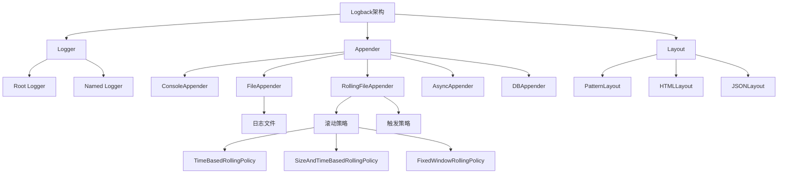
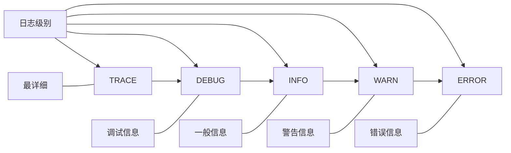

# Logback 日志框架详解

## 目录
- [简介](#简介)
- [核心组件](#核心组件)
  - [Logger](#logger)
  - [Appender](#appender)
  - [Layout](#layout)
- [配置文件](#配置文件)
  - [基本结构](#基本结构)
  - [配置加载顺序](#配置加载顺序)
- [常用配置](#常用配置)
  - [日志级别](#日志级别)
  - [输出到控制台](#输出到控制台)
  - [输出到文件](#输出到文件)
  - [滚动策略](#滚动策略)
  - [异步日志](#异步日志)
- [日志模式](#日志模式)
  - [PatternLayout](#patternlayout)
  - [常用转换符](#常用转换符)
- [与框架集成](#与框架集成)
  - [Spring Boot集成](#spring-boot集成)
  - [Web应用集成](#web应用集成)
- [最佳实践](#最佳实践)
  - [性能优化](#性能优化)
  - [日志分类](#日志分类)
  - [MDC使用](#mdc使用)
- [常见问题](#常见问题)

## 简介

Logback 是由 log4j 创始人设计的另一个开源日志组件，是 log4j 的继任者。它与 slf4j 结合使用，性能比 log4j 更好，是目前 Java 社区中最流行的日志框架之一，也是 Spring Boot 的默认日志实现。

### 主要特点

- 更快的实现
- 更少的内存占用
- 自动重新加载配置文件
- 条件处理配置文件
- 自动压缩归档日志文件
- 优雅地从 I/O 错误中恢复
- 自动删除旧的日志文件
- 支持 Prudent 模式（多进程安全）

## 核心组件

Logback 架构图：



### Logger

Logger 是 Logback 的核心组件，用于记录日志。每个 Logger 都有一个名称，通常使用类的全限定名作为 Logger 的名称。

```java
// 获取Logger实例
private static final Logger logger = LoggerFactory.getLogger(MyClass.class);

// 使用Logger记录日志
logger.debug("Debug message");
logger.info("Info message");
logger.warn("Warning message");
logger.error("Error message");
```

#### Logger 层次结构

Logger 是有层次结构的，子 Logger 会继承父 Logger 的属性。例如：

- `com.example` 是 `com.example.service` 的父 Logger
- `com.example.service` 是 `com.example.service.UserService` 的父 Logger

#### 日志级别



日志级别从低到高依次为：TRACE < DEBUG < INFO < WARN < ERROR。如果设置了 INFO 级别，则只会记录 INFO 及以上级别的日志。

### Appender

Appender 负责将日志事件输出到不同的目标位置，如控制台、文件、数据库等。

#### 常用 Appender 类型

1. **ConsoleAppender**：将日志输出到控制台
   ```xml
   <appender name="CONSOLE" class="ch.qos.logback.core.ConsoleAppender">
       <encoder>
           <pattern>%d{HH:mm:ss.SSS} [%thread] %-5level %logger{36} - %msg%n</pattern>
       </encoder>
   </appender>
   ```

2. **FileAppender**：将日志输出到文件
   ```xml
   <appender name="FILE" class="ch.qos.logback.core.FileAppender">
       <file>logs/application.log</file>
       <append>true</append>
       <encoder>
           <pattern>%d{yyyy-MM-dd HH:mm:ss.SSS} [%thread] %-5level %logger{36} - %msg%n</pattern>
       </encoder>
   </appender>
   ```

3. **RollingFileAppender**：支持滚动策略的文件 Appender
   ```xml
   <appender name="ROLLING_FILE" class="ch.qos.logback.core.rolling.RollingFileAppender">
       <file>logs/application.log</file>
       <rollingPolicy class="ch.qos.logback.core.rolling.TimeBasedRollingPolicy">
           <fileNamePattern>logs/application.%d{yyyy-MM-dd}.log</fileNamePattern>
           <maxHistory>30</maxHistory>
           <totalSizeCap>3GB</totalSizeCap>
       </rollingPolicy>
       <encoder>
           <pattern>%d{yyyy-MM-dd HH:mm:ss.SSS} [%thread] %-5level %logger{36} - %msg%n</pattern>
       </encoder>
   </appender>
   ```

4. **AsyncAppender**：异步 Appender，提高性能
   ```xml
   <appender name="ASYNC" class="ch.qos.logback.classic.AsyncAppender">
       <appender-ref ref="FILE" />
       <queueSize>512</queueSize>
       <discardingThreshold>0</discardingThreshold>
   </appender>
   ```

### Layout

Layout 负责格式化日志信息。最常用的是 PatternLayout，它允许用户指定输出格式。

```xml
<encoder>
    <pattern>%d{yyyy-MM-dd HH:mm:ss.SSS} [%thread] %-5level %logger{36} - %msg%n</pattern>
</encoder>
```

## 配置文件

### 基本结构

Logback 配置文件通常命名为 `logback.xml` 或 `logback-spring.xml`（在 Spring Boot 中），其基本结构如下：

```xml
<?xml version="1.0" encoding="UTF-8"?>
<configuration>
    <!-- 属性定义 -->
    <property name="LOG_PATH" value="logs" />
    
    <!-- Appender定义 -->
    <appender name="CONSOLE" class="ch.qos.logback.core.ConsoleAppender">
        <encoder>
            <pattern>%d{HH:mm:ss.SSS} [%thread] %-5level %logger{36} - %msg%n</pattern>
        </encoder>
    </appender>
    
    <!-- Logger定义 -->
    <logger name="com.example" level="DEBUG" additivity="false">
        <appender-ref ref="CONSOLE" />
    </logger>
    
    <!-- Root Logger -->
    <root level="INFO">
        <appender-ref ref="CONSOLE" />
    </root>
</configuration>
```

### 配置加载顺序

Logback 按以下顺序查找配置文件：

1. 在 classpath 中查找 `logback-test.xml`
2. 如果未找到，则在 classpath 中查找 `logback.xml`
3. 如果都未找到，则使用默认配置（ConsoleAppender 和 PatternLayout）

## 常用配置

### 日志级别

```xml
<!-- 设置包的日志级别 -->
<logger name="com.example" level="DEBUG" />

<!-- 设置根日志级别 -->
<root level="INFO">
    <appender-ref ref="CONSOLE" />
</root>
```

### 输出到控制台

```xml
<appender name="CONSOLE" class="ch.qos.logback.core.ConsoleAppender">
    <!-- 过滤器，只输出 INFO 及以上级别的日志 -->
    <filter class="ch.qos.logback.classic.filter.ThresholdFilter">
        <level>INFO</level>
    </filter>
    <encoder>
        <pattern>%d{HH:mm:ss.SSS} [%thread] %-5level %logger{36} - %msg%n</pattern>
        <charset>UTF-8</charset>
    </encoder>
</appender>
```

### 输出到文件

```xml
<appender name="FILE" class="ch.qos.logback.core.FileAppender">
    <file>${LOG_PATH}/application.log</file>
    <append>true</append>
    <encoder>
        <pattern>%d{yyyy-MM-dd HH:mm:ss.SSS} [%thread] %-5level %logger{36} - %msg%n</pattern>
        <charset>UTF-8</charset>
    </encoder>
</appender>
```

### 滚动策略

#### 按时间滚动

```xml
<appender name="TIME_ROLLING" class="ch.qos.logback.core.rolling.RollingFileAppender">
    <file>${LOG_PATH}/application.log</file>
    <rollingPolicy class="ch.qos.logback.core.rolling.TimeBasedRollingPolicy">
        <!-- 按天滚动 -->
        <fileNamePattern>${LOG_PATH}/application.%d{yyyy-MM-dd}.log</fileNamePattern>
        <!-- 保留30天的日志 -->
        <maxHistory>30</maxHistory>
        <!-- 日志总大小上限 -->
        <totalSizeCap>3GB</totalSizeCap>
    </rollingPolicy>
    <encoder>
        <pattern>%d{yyyy-MM-dd HH:mm:ss.SSS} [%thread] %-5level %logger{36} - %msg%n</pattern>
    </encoder>
</appender>
```

#### 按大小和时间滚动

```xml
<appender name="SIZE_AND_TIME_ROLLING" class="ch.qos.logback.core.rolling.RollingFileAppender">
    <file>${LOG_PATH}/application.log</file>
    <rollingPolicy class="ch.qos.logback.core.rolling.SizeAndTimeBasedRollingPolicy">
        <!-- 按天和大小滚动 -->
        <fileNamePattern>${LOG_PATH}/application.%d{yyyy-MM-dd}.%i.log</fileNamePattern>
        <!-- 单个文件最大大小 -->
        <maxFileSize>100MB</maxFileSize>
        <!-- 保留30天的日志 -->
        <maxHistory>30</maxHistory>
        <!-- 日志总大小上限 -->
        <totalSizeCap>3GB</totalSizeCap>
    </rollingPolicy>
    <encoder>
        <pattern>%d{yyyy-MM-dd HH:mm:ss.SSS} [%thread] %-5level %logger{36} - %msg%n</pattern>
    </encoder>
</appender>
```

### 异步日志

```xml
<appender name="ASYNC" class="ch.qos.logback.classic.AsyncAppender">
    <!-- 引用其他appender -->
    <appender-ref ref="FILE" />
    <!-- 队列大小 -->
    <queueSize>512</queueSize>
    <!-- 丢弃阈值，队列剩余容量小于该值时，丢弃TRACE, DEBUG, INFO级别的日志 -->
    <discardingThreshold>0</discardingThreshold>
    <!-- 是否包含调用者信息 -->
    <includeCallerData>false</includeCallerData>
    <!-- 队列满时是否阻塞 -->
    <neverBlock>false</neverBlock>
</appender>
```

## 日志模式

### PatternLayout

PatternLayout 是最常用的 Layout，它允许用户指定输出格式。

### 常用转换符

| 转换符 | 描述 | 示例 |
|--------|------|------|
| `%d` | 日期时间 | `%d{yyyy-MM-dd HH:mm:ss.SSS}` |
| `%thread` | 线程名 | `[main]` |
| `%-5level` | 日志级别，-5表示左对齐5个字符 | `INFO  ` |
| `%logger{36}` | Logger名称，36表示最大长度 | `com.example.MyClass` |
| `%msg` | 日志消息 | `Hello, world!` |
| `%n` | 换行符 | `\n` |
| `%class` | 调用者的类名 | `com.example.MyClass` |
| `%method` | 调用者的方法名 | `myMethod` |
| `%line` | 调用者的行号 | `123` |
| `%X{key}` | MDC中的值 | `%X{userId}` |
| `%ex` | 异常堆栈 | `java.lang.Exception: ...` |
| `%contextName` | 日志上下文名称 | `default` |

#### 完整示例

```xml
<pattern>%d{yyyy-MM-dd HH:mm:ss.SSS} [%thread] %-5level %logger{36} - %msg%n</pattern>
```

输出示例：
```
2023-06-01 12:34:56.789 [main] INFO  com.example.MyClass - Hello, world!
```

## 与框架集成

### Spring Boot集成

Spring Boot 默认使用 Logback 作为日志实现。可以通过 `application.properties` 或 `application.yml` 配置日志：

```yaml
logging:
  level:
    root: INFO
    com.example: DEBUG
  file:
    name: logs/application.log
  pattern:
    console: "%d{yyyy-MM-dd HH:mm:ss} [%thread] %-5level %logger{36} - %msg%n"
    file: "%d{yyyy-MM-dd HH:mm:ss} [%thread] %-5level %logger{36} - %msg%n"
```

或者使用 `logback-spring.xml` 进行更详细的配置：

```xml
<?xml version="1.0" encoding="UTF-8"?>
<configuration>
    <!-- 引入Spring Boot的默认配置 -->
    <include resource="org/springframework/boot/logging/logback/defaults.xml" />
    
    <!-- 自定义配置 -->
    <property name="LOG_PATH" value="logs" />
    
    <!-- 控制台输出 -->
    <appender name="CONSOLE" class="ch.qos.logback.core.ConsoleAppender">
        <encoder>
            <pattern>${CONSOLE_LOG_PATTERN}</pattern>
            <charset>UTF-8</charset>
        </encoder>
    </appender>
    
    <!-- 文件输出 -->
    <appender name="FILE" class="ch.qos.logback.core.rolling.RollingFileAppender">
        <file>${LOG_PATH}/application.log</file>
        <rollingPolicy class="ch.qos.logback.core.rolling.SizeAndTimeBasedRollingPolicy">
            <fileNamePattern>${LOG_PATH}/application.%d{yyyy-MM-dd}.%i.log</fileNamePattern>
            <maxFileSize>10MB</maxFileSize>
            <maxHistory>30</maxHistory>
            <totalSizeCap>1GB</totalSizeCap>
        </rollingPolicy>
        <encoder>
            <pattern>${FILE_LOG_PATTERN}</pattern>
            <charset>UTF-8</charset>
        </encoder>
    </appender>
    
    <!-- 使用Spring Profile进行环境区分 -->
    <springProfile name="dev">
        <root level="DEBUG">
            <appender-ref ref="CONSOLE" />
        </root>
    </springProfile>
    
    <springProfile name="prod">
        <root level="INFO">
            <appender-ref ref="FILE" />
        </root>
    </springProfile>
</configuration>
```

### Web应用集成

在Web应用中，可以使用 `logback-access` 模块记录HTTP访问日志：

```xml
<!-- 在web.xml中配置 -->
<filter>
    <filter-name>logbackFilter</filter-name>
    <filter-class>ch.qos.logback.classic.servlet.LogbackServletFilter</filter-class>
</filter>
<filter-mapping>
    <filter-name>logbackFilter</filter-name>
    <url-pattern>/*</url-pattern>
</filter-mapping>
```

然后在 `logback-access.xml` 中配置访问日志格式：

```xml
<?xml version="1.0" encoding="UTF-8"?>
<configuration>
    <appender name="ACCESS_FILE" class="ch.qos.logback.core.rolling.RollingFileAppender">
        <file>logs/access.log</file>
        <rollingPolicy class="ch.qos.logback.core.rolling.TimeBasedRollingPolicy">
            <fileNamePattern>logs/access.%d{yyyy-MM-dd}.log</fileNamePattern>
            <maxHistory>30</maxHistory>
        </rollingPolicy>
        <encoder>
            <pattern>%h %l %u [%t] "%r" %s %b "%i{Referer}" "%i{User-Agent}" %D</pattern>
        </encoder>
    </appender>
    
    <appender-ref ref="ACCESS_FILE" />
</configuration>
```

## 最佳实践

### 性能优化

1. **使用异步日志**
   ```xml
   <appender name="ASYNC" class="ch.qos.logback.classic.AsyncAppender">
       <appender-ref ref="FILE" />
       <queueSize>512</queueSize>
   </appender>
   ```

2. **避免使用调用者信息**
   调用者信息（%class, %method, %line）会影响性能，尽量避免在生产环境使用。

3. **合理设置日志级别**
   生产环境通常设置为 INFO 或 WARN 级别，减少日志量。

4. **使用条件日志**
   ```java
   if (logger.isDebugEnabled()) {
       logger.debug("Complex message: {}", createComplexMessage());
   }
   ```

### 日志分类

按不同模块或功能分类日志：

```xml
<!-- 业务日志 -->
<appender name="BUSINESS" class="ch.qos.logback.core.rolling.RollingFileAppender">
    <file>logs/business.log</file>
    <rollingPolicy class="ch.qos.logback.core.rolling.TimeBasedRollingPolicy">
        <fileNamePattern>logs/business.%d{yyyy-MM-dd}.log</fileNamePattern>
    </rollingPolicy>
    <encoder>
        <pattern>%d{yyyy-MM-dd HH:mm:ss.SSS} [%thread] %-5level %logger{36} - %msg%n</pattern>
    </encoder>
</appender>

<!-- 错误日志 -->
<appender name="ERROR" class="ch.qos.logback.core.rolling.RollingFileAppender">
    <file>logs/error.log</file>
    <filter class="ch.qos.logback.classic.filter.ThresholdFilter">
        <level>ERROR</level>
    </filter>
    <rollingPolicy class="ch.qos.logback.core.rolling.TimeBasedRollingPolicy">
        <fileNamePattern>logs/error.%d{yyyy-MM-dd}.log</fileNamePattern>
    </rollingPolicy>
    <encoder>
        <pattern>%d{yyyy-MM-dd HH:mm:ss.SSS} [%thread] %-5level %logger{36} - %msg%n</pattern>
    </encoder>
</appender>

<logger name="com.example.business" level="INFO" additivity="false">
    <appender-ref ref="BUSINESS" />
</logger>

<root level="INFO">
    <appender-ref ref="CONSOLE" />
    <appender-ref ref="ERROR" />
</root>
```

### MDC使用

MDC（Mapped Diagnostic Context）可以用于记录请求特定的信息：

```java
// 在请求处理开始时设置MDC
MDC.put("requestId", UUID.randomUUID().toString());
MDC.put("userId", user.getId());

// 日志会自动包含MDC信息
logger.info("Processing request");

// 请求处理完成后清除MDC
MDC.clear();
```

配置文件中使用 MDC：

```xml
<pattern>%d{yyyy-MM-dd HH:mm:ss.SSS} [%thread] %-5level %logger{36} [requestId=%X{requestId}, userId=%X{userId}] - %msg%n</pattern>
```

## 常见问题

### 1. 日志文件没有创建

- 检查文件路径是否存在
- 检查应用是否有写权限
- 检查磁盘空间是否充足

### 2. 日志级别不生效

- 检查 Logger 的继承关系
- 检查 additivity 属性
- 检查是否有多个配置文件冲突

### 3. 性能问题

- 使用异步 Appender
- 减少不必要的日志
- 避免使用调用者信息（%class, %method, %line）
- 使用条件日志

### 4. 日志文件大小问题

- 使用 RollingFileAppender
- 设置合理的 maxFileSize 和 maxHistory
- 设置 totalSizeCap 限制总大小

### 5. 多环境配置

使用 Spring Profile 或条件配置：

```xml
<springProfile name="dev">
    <root level="DEBUG">
        <appender-ref ref="CONSOLE" />
    </root>
</springProfile>

<springProfile name="prod">
    <root level="INFO">
        <appender-ref ref="FILE" />
    </root>
</springProfile>
```

或使用条件处理：

```xml
<if condition='property("ENV").equals("dev")'>
    <then>
        <root level="DEBUG">
            <appender-ref ref="CONSOLE" />
        </root>
    </then>
    <else>
        <root level="INFO">
            <appender-ref ref="FILE" />
        </root>
    </else>
</if>
``` 