# 网络基础知识

---

## 目录
- [网络基础知识](#网络基础知识)
  - [目录](#目录)
  - [常见网络设备](#常见网络设备)
    - [光猫（ONU/ONT）](#光猫onuont)
    - [路由器](#路由器)
    - [光猫与路由器的关系](#光猫与路由器的关系)
  - [IP 基础知识](#ip-基础知识)
    - [IP（Internet Protocol）](#ipinternet-protocol)
    - [IPv4 地址](#ipv4-地址)
      - [IP 段与子网掩码](#ip-段与子网掩码)
    - [IPv6 地址](#ipv6-地址)
      - [IPv6 示例解析](#ipv6-示例解析)
      - [IPv6不同地址段的使用场景](#ipv6不同地址段的使用场景)
      - [常见IPv6前缀及实际应用举例](#常见ipv6前缀及实际应用举例)
    - [城域网IP与公网IP](#城域网ip与公网ip)
  - [TCP/IP协议栈](#tcpip协议栈)
    - [协议层次结构](#协议层次结构)
      - [四层模型概述](#四层模型概述)
      - [各层详细功能与协议](#各层详细功能与协议)
      - [协议栈架构图](#协议栈架构图)
      - [数据封装与解封装过程](#数据封装与解封装过程)
      - [端口号分类与管理](#端口号分类与管理)
    - [TCP与UDP对比](#tcp与udp对比)
      - [基本特性对比](#基本特性对比)
      - [TCP协议详细分析](#tcp协议详细分析)
      - [UDP协议详细分析](#udp协议详细分析)
      - [性能对比分析](#性能对比分析)
      - [实际应用场景详解](#实际应用场景详解)
      - [混合使用策略](#混合使用策略)
    - [三次握手与四次挥手](#三次握手与四次挥手)
      - [TCP三次握手详细分析](#tcp三次握手详细分析)
      - [TCP四次挥手详细分析](#tcp四次挥手详细分析)
    - [常见端口号与服务](#常见端口号与服务)
  - [HTTP/HTTPS协议](#httphttps协议)
    - [HTTP基础](#http基础)
    - [HTTPS工作原理](#https工作原理)
    - [HTTP状态码](#http状态码)
    - [HTTP请求方法](#http请求方法)
    - [HTTP/1.1、HTTP/2和HTTP/3对比](#http11http2和http3对比)
  - [常用网络命令](#常用网络命令)
    - [基础网络诊断命令](#基础网络诊断命令)
      - [ping - 测试网络连通性](#ping---测试网络连通性)
      - [traceroute/tracert - 路由追踪](#traceroutetracert---路由追踪)
      - [netstat - 查看网络连接](#netstat---查看网络连接)
      - [nslookup/dig - DNS查询](#nslookupdig---dns查询)
    - [网络接口配置命令](#网络接口配置命令)
      - [ifconfig/ip - 网络接口管理](#ifconfigip---网络接口管理)
      - [route - 路由管理](#route---路由管理)
    - [高级网络分析工具](#高级网络分析工具)
      - [ss - Socket统计（现代netstat替代）](#ss---socket统计现代netstat替代)
      - [lsof - 查看打开的文件和网络连接](#lsof---查看打开的文件和网络连接)
    - [性能测试工具](#性能测试工具)
      - [iperf3 - 网络带宽测试](#iperf3---网络带宽测试)
      - [mtr - 网络诊断工具（结合ping和traceroute）](#mtr---网络诊断工具结合ping和traceroute)
    - [实际问题排查流程](#实际问题排查流程)
      - [网络不通排查](#网络不通排查)
      - [端口连通性测试](#端口连通性测试)
      - [网络性能分析](#网络性能分析)
  - [网关基础知识](#网关基础知识)
    - [网关（Gateway）概述](#网关gateway概述)
      - [定义与基本概念](#定义与基本概念)
      - [网关在网络架构中的位置](#网关在网络架构中的位置)
    - [网关类型详解](#网关类型详解)
      - [按功能层次分类](#按功能层次分类)
      - [按部署位置分类](#按部署位置分类)
    - [网关工作原理](#网关工作原理)
      - [数据包转发流程](#数据包转发流程)
    - [NAT与端口映射](#nat与端口映射)
      - [NAT类型对比](#nat类型对比)
      - [端口映射配置示例](#端口映射配置示例)
    - [网关故障排查](#网关故障排查)
      - [常见故障诊断](#常见故障诊断)
  - [Wi-Fi 基础知识](#wi-fi-基础知识)
    - [Wi-Fi（Wireless Fidelity）概述](#wi-fiwireless-fidelity概述)
      - [定义与基本概念](#定义与基本概念-1)
      - [Wi-Fi网络架构图](#wi-fi网络架构图)
    - [Wi-Fi标准演进与技术对比](#wi-fi标准演进与技术对比)
      - [IEEE 802.11标准发展历程](#ieee-80211标准发展历程)
      - [关键技术演进详解](#关键技术演进详解)
    - [频段分析与信道规划](#频段分析与信道规划)
      - [频段特性对比](#频段特性对比)
      - [信道规划策略](#信道规划策略)
    - [Wi-Fi安全协议详解](#wi-fi安全协议详解)
      - [安全协议演进](#安全协议演进)
      - [WPA3安全机制详解](#wpa3安全机制详解)
    - [企业级Wi-Fi部署方案](#企业级wi-fi部署方案)
      - [网络架构设计](#网络架构设计)
      - [VLAN隔离与访客网络](#vlan隔离与访客网络)
    - [Wi-Fi性能优化与监控](#wi-fi性能优化与监控)
      - [性能指标监控](#性能指标监控)
      - [故障排查方法论](#故障排查方法论)
  - [Wi-Fi与网关基础](#wi-fi与网关基础)
    - [Wi-Fi（无线局域网）](#wi-fi无线局域网)
    - [网关（Gateway）](#网关gateway)
  - [局域网IP与公网IP关系](#局域网ip与公网ip关系)
    - [局域网IP（私有IP）](#局域网ip私有ip)
    - [公网IP](#公网ip)
    - [NAT（网络地址转换）与端口映射](#nat网络地址转换与端口映射)
    - [关系与通信流程](#关系与通信流程)
    - [典型应用场景](#典型应用场景)
    - [安全注意事项](#安全注意事项)
  - [IP冲突相关问题](#ip冲突相关问题)
    - [什么是IP冲突？](#什么是ip冲突)
    - [产生原因](#产生原因)
    - [常见表现](#常见表现)
    - [排查与解决方法](#排查与解决方法)
    - [进阶知识](#进阶知识)
  - [DHCP相关知识](#dhcp相关知识)
    - [什么是DHCP？](#什么是dhcp)
    - [工作原理](#工作原理)
    - [主要优势](#主要优势)
    - [常见应用场景](#常见应用场景)
    - [进阶知识](#进阶知识-1)
    - [常见问题与排查](#常见问题与排查)
  - [VPN相关知识](#vpn相关知识)
    - [什么是VPN？](#什么是vpn)
    - [工作原理](#工作原理-1)
    - [主要用途](#主要用途)
    - [常见类型](#常见类型)
    - [进阶知识](#进阶知识-2)
    - [常见问题与排查](#常见问题与排查-1)
    - [安全注意事项](#安全注意事项-1)
  - [翻墙（科学上网）原理补充](#翻墙科学上网原理补充)
    - [主流翻墙协议补充](#主流翻墙协议补充)
    - [主流翻墙协议优缺点对比](#主流翻墙协议优缺点对比)
    - [从中国翻墙到国外](#从中国翻墙到国外)
    - [从国外翻墙到国内](#从国外翻墙到国内)
    - [安全与合规风险](#安全与合规风险)
  - [家庭网络结构与流程图](#家庭网络结构与流程图)
  - [家庭电脑上网浏览获取数据详细流程图](#家庭电脑上网浏览获取数据详细流程图)
  - [手机翻墙获取网页信息详细流程图](#手机翻墙获取网页信息详细流程图)
    - [场景说明](#场景说明)
    - [流程图](#流程图)
    - [详细说明](#详细说明)
  - [MAC地址相关知识](#mac地址相关知识)
    - [单播、组播、广播MAC地址基础知识](#单播组播广播mac地址基础知识)
      - [单播MAC地址](#单播mac地址)
      - [组播MAC地址](#组播mac地址)
      - [广播MAC地址](#广播mac地址)
      - [三者区别与网络行为总结](#三者区别与网络行为总结)
    - [组播MAC地址相关知识](#组播mac地址相关知识)
      - [什么是组播MAC地址？](#什么是组播mac地址)
      - [组播MAC地址的格式](#组播mac地址的格式)
      - [组播MAC与IP组播的关系](#组播mac与ip组播的关系)
      - [应用场景](#应用场景)
      - [与单播/广播MAC的区别](#与单播广播mac的区别)
      - [典型用途](#典型用途)
      - [安全与管理](#安全与管理)
  - [UPnP相关知识](#upnp相关知识)
    - [什么是UPnP？](#什么是upnp)
    - [工作原理](#工作原理-2)
    - [优势与局限性](#优势与局限性)
    - [常见应用场景](#常见应用场景-1)
    - [安全注意事项](#安全注意事项-2)
  - [ARP相关知识](#arp相关知识)
    - [什么是ARP？](#什么是arp)
    - [工作原理](#工作原理-3)
    - [优势与局限性](#优势与局限性-1)
    - [常见应用场景](#常见应用场景-2)
    - [安全注意事项](#安全注意事项-3)
  - [GFW相关知识](#gfw相关知识)
    - [什么是GFW？](#什么是gfw)
    - [工作原理](#工作原理-4)
    - [优势与局限性](#优势与局限性-2)
    - [常见应对方法](#常见应对方法)
    - [安全与合规注意事项](#安全与合规注意事项)
    - [GFW的实现方式](#gfw的实现方式)
      - [DNS污染](#dns污染)
      - [IP封锁](#ip封锁)
      - [深度包检测（DPI）](#深度包检测dpi)
      - [协议干扰](#协议干扰)
      - [流量监控](#流量监控)
    - [技术细节](#技术细节)
    - [应对技术](#应对技术)
  - [DNS相关知识](#dns相关知识)
    - [什么是DNS？](#什么是dns)
    - [DNS的工作原理](#dns的工作原理)
      - [域名解析流程](#域名解析流程)
      - [DNS记录类型](#dns记录类型)
    - [优势与局限性](#优势与局限性-3)
    - [常见应用场景](#常见应用场景-3)
    - [安全注意事项](#安全注意事项-4)
  - [CDN相关知识](#cdn相关知识)
    - [什么是CDN？](#什么是cdn)
    - [CDN的工作原理](#cdn的工作原理)
      - [内容分发流程](#内容分发流程)
      - [核心技术](#核心技术)
    - [优势与局限性](#优势与局限性-4)
    - [常见应用场景](#常见应用场景-4)
    - [安全注意事项](#安全注意事项-5)
  - [网络安全基础](#网络安全基础)
    - [常见网络攻击类型](#常见网络攻击类型)
      - [网络层攻击](#网络层攻击)
      - [应用层攻击](#应用层攻击)
    - [网络安全防护措施](#网络安全防护措施)
      - [网络层防护](#网络层防护)
    - [加密技术基础](#加密技术基础)
      - [加密算法对比](#加密算法对比)
      - [数字证书体系](#数字证书体系)
    - [网络安全最佳实践](#网络安全最佳实践)
      - [密码安全策略](#密码安全策略)
      - [网络架构安全原则](#网络架构安全原则)
      - [安全监控与事件响应](#安全监控与事件响应)
    - [网络安全防护措施](#网络安全防护措施-1)
    - [加密技术基础](#加密技术基础-1)
    - [网络安全最佳实践](#网络安全最佳实践-1)
  - [网络故障排查](#网络故障排查)
    - [常见网络问题与解决方案](#常见网络问题与解决方案)
    - [网络诊断工具](#网络诊断工具)
    - [排查流程与方法论](#排查流程与方法论)
  - [国内用户在CF部署翻墙节点VLESS的时序图](#国内用户在cf部署翻墙节点vless的时序图)
      - [时序图说明](#时序图说明)
      - [详细说明](#详细说明-1)
      - [注意事项](#注意事项)

---

## 常见网络设备

### 光猫（ONU/ONT）
- **定义**：光纤调制解调器（Optical Network Unit/Optical Network Terminal），是光纤到户（FTTH）方案中的核心设备，将运营商的光信号转换为家庭/企业可用的以太网信号。
- **主要功能**：
  - 信号转换（光→电）：实现光纤信号与以太网信号的互通。
  - 宽带拨号（PPPoE）：部分光猫支持直接拨号上网。
  - 电话功能：部分型号集成语音端口，支持固话接入。
  - 简单 Wi-Fi：部分光猫自带基础无线功能，但信号覆盖和性能有限。
- **进阶知识**：
  - 光猫分为桥接模式（Bridge）和路由模式（Router），桥接模式下需外接路由器拨号，路由模式下光猫自身拨号并分配IP。
  - 部分运营商会对光猫进行定制和管理，用户更换或重置需注意兼容性和认证问题。
- **常见问题**：
  - 光猫故障会导致全网断网，常见表现为PON灯异常、LOS灯闪烁。
  - 光猫性能瓶颈可能影响带宽利用率，建议高带宽场景选用高性能路由器分流。

### 路由器
- **定义**：路由器是连接不同网络、转发数据包的网络设备，家庭和企业网络的核心。
- **主要功能**：
  - 设备连接管理：支持多终端有线/无线接入。
  - Wi-Fi覆盖：提供无线网络接入，支持多频段、多SSID。
  - 网络优化与安全：如QoS带宽管理、家长控制、防火墙、VPN、访客网络等。
  - NAT转换：实现私有IP与公网IP的转换，支持端口映射、UPnP等。
- **进阶知识**：
  - 支持多种工作模式：路由、AP、桥接、中继、Mesh组网等。
  - 企业级路由器支持VLAN、静态/动态路由、ACL访问控制等高级功能。
- **常见问题**：
  - 路由器过载会导致掉线、卡顿，建议定期重启或升级固件。
  - 信号死角可通过Mesh、信号放大器等方式优化。

### 光猫与路由器的关系
- **网络结构**：光猫负责接入运营商网络，路由器负责内部网络管理和分发。
- **连接方式**：光纤→光猫→（网线）→路由器WAN口→家庭/企业终端。
- **一体机与分体机**：一体机集成光猫和路由器功能，适合简单场景；分体机便于灵活扩展和升级。
- **进阶知识**：
  - 桥接模式下，光猫仅做信号转换，路由器负责拨号和分配IP，便于网络管理和安全隔离。
  - 路由模式下，光猫和路由器均可分配IP，易出现双重NAT，影响端口映射和远程访问。
- **实际案例**：
  - 家庭宽带升级千兆后，建议光猫桥接+千兆路由器，充分发挥带宽优势。

---

## IP 基础知识

### IP（Internet Protocol）
- **定义**：IP是互联网协议族的核心协议，负责网络层寻址和数据包转发。
- **作用**：为每台联网设备分配唯一地址，实现全球范围内的设备互联。
- **进阶知识**：
  - IP协议分为IPv4和IPv6，分别对应32位和128位地址空间。
  - IP协议支持分片、重组、TTL（生存时间）、校验和等机制，保障数据可靠传输。

### IPv4 地址
- **结构**：32位二进制，通常以点分十进制表示（如192.168.1.1）。
- **地址分类**：A类（1.0.0.0-126.255.255.255）、B类、C类、D类（多播）、E类（保留）。
- **私有地址段**：仅限局域网使用，不能在公网路由。
- **公网地址**：全球唯一，由IANA和各地区RIR分配。
- **地址耗尽**：IPv4地址有限，已基本分配完毕，推动IPv6普及。
- **进阶知识**：
  - 子网划分（CIDR）：灵活分配IP资源，提高地址利用率。
  - DHCP动态分配与静态分配的区别与应用场景。

#### IP 段与子网掩码
- **子网掩码**：用于区分网络号和主机号，决定同一网段内哪些设备可直接通信。
- **CIDR表示法**：如192.168.1.0/24，表示前24位为网络号。
- **广播地址**：用于同一网段内所有主机的广播通信。
- **实际案例**：
  - 企业网络常用子网划分实现部门隔离和安全控制。

### IPv6 地址
- **结构**：128位，十六进制冒号分隔（如2001:0db8:85a3:0000:0000:8a2e:0370:7334）。
- **主要类型**：
  - 全局单播地址：可在互联网路由，类似IPv4公网IP。
  - 链路本地地址：仅限本地链路通信，自动分配，前缀fe80::/10。
  - 回环地址（::1）：本机自测。
  - 多播地址：一对多通信。
- **IPv6优势**：
  - 地址空间极大，支持物联网、5G等大规模接入。
  - 支持IPsec加密、自动配置、无NAT直连等特性。
- **进阶知识**：
  - IPv6过渡技术（如双栈、隧道、NAT64等）。
  - SLAAC自动地址配置与DHCPv6的区别。

#### IPv6 示例解析
- **fe80::26da:33ff:fec7:924b%wlan0**：链路本地地址，%wlan0为接口标识。
- **应用场景**：本地网段设备自动发现、无须手动配置。
- **注意事项**：链路本地地址不可用于互联网通信。

#### IPv6不同地址段的使用场景
- **全球单播地址（2000::/3）**：
  - 用于互联网中的唯一标识，适合公网通信。
- **链路本地地址（fe80::/10）**：
  - 仅在本地链路（同一网段）内通信，不可路由到互联网，常用于自动地址配置和本地发现。
- **站点本地地址（fec0::/10，已弃用）**：
  - 早期用于站点内部通信，现已被弃用，推荐使用唯一本地地址（ULA）。
- **唯一本地地址ULA（fc00::/7）**：
  - 用于组织内部私有网络，类似于IPv4的私有地址（如192.168.0.0/16），不可在公网路由。
- **多播地址（ff00::/8）**：
  - 用于一对多通信，如邻居发现、路由协议等。
- **回环地址（::1/128）**：
  - 本地回环测试，类似于IPv4的127.0.0.1。
- **未指定地址（::/128）**：
  - 表示"无地址"，常用于初始化阶段。

#### 常见IPv6前缀及实际应用举例
- **2000::/3**
  - 全球单播地址（Global Unicast Address），用于互联网中唯一标识的主机或网络。
- **fc00::/7**
  - 唯一本地地址（Unique Local Address, ULA），用于组织内部私有网络，类似IPv4的私有地址。
- **fe80::/10**
  - 链路本地地址（Link-Local Address），仅在本地链路内有效，自动分配，常用于本地通信和邻居发现。
- **ff00::/8**
  - 多播地址（Multicast Address），用于一对多通信，支持协议发现、路由等。
- **::1/128**
  - 回环地址（Loopback Address），本地回环测试，类似IPv4的127.0.0.1。
- **::/128**
  - 未指定地址（Unspecified Address），表示"无地址"，常用于初始化阶段。
- **2001:db8::/32**
  - 文档和示例专用地址段，仅用于文档和教学，不会在实际网络中分配。
- **240e::/16、2409::/16、2408::/16**
  - 中国大陆三大运营商（电信、移动、联通）分配的全球单播地址段，实际公网IPv6地址。
- **2001:da8::/32**
  - 中国教育和科研网（CERNET）分配的全球单播地址段。
- **2001:250::/32**
  - 中国互联网信息中心（CNNIC）分配的全球单播地址段。

> 这些前缀段可用于快速判断IPv6地址的用途、作用范围及归属。

### 城域网IP与公网IP

| 特性         | 城域网IP（私网）                | 公网IP                |
| ------------ | ------------------------------ | --------------------- |
| 地址类型     | 私网IP（如10.x.x.x,192.168.x.x） | 全球唯一公网IP        |
| 是否直连互联网 | 否（需NAT转换）                 | 是                    |
| 分配范围     | 城市/区域内部                   | 全球                  |
| 典型用途     | 家庭宽带、企业内网              | 网站、服务器对外服务  |

- **城域网IP**：运营商在城市范围内分配的IP，通常为私网IP，通过NAT共享公网出口。
- **公网IP**：全球唯一，可直接访问互联网。

---

## TCP/IP协议栈

### 协议层次结构

#### 四层模型概述
- **定义**：TCP/IP协议栈是互联网通信的基础架构，采用分层设计，每层负责特定功能，层与层之间通过标准接口通信。
- **设计原理**：基于"分而治之"的思想，将复杂的网络通信分解为相对独立的功能模块，提高系统的可扩展性和可维护性。

#### 各层详细功能与协议

**应用层（Application Layer）**
- **功能**：为用户应用程序提供网络服务接口，处理特定应用的数据格式和语义。
- **主要协议**：
  - **HTTP/HTTPS**：超文本传输协议，Web浏览的基础
  - **FTP/SFTP**：文件传输协议，支持文件上传下载
  - **SMTP/POP3/IMAP**：邮件传输协议族
  - **DNS**：域名解析系统，将域名转换为IP地址
  - **DHCP**：动态主机配置协议，自动分配网络参数
  - **SSH/Telnet**：远程登录和管理协议
  - **SNMP**：简单网络管理协议，网络设备监控
- **数据单位**：消息（Message）或数据流（Data Stream）

**传输层（Transport Layer）**
- **功能**：提供端到端的可靠或快速数据传输服务，处理数据分段、重组、流量控制和错误检测。
- **主要协议**：
  - **TCP**：传输控制协议，面向连接、可靠传输
  - **UDP**：用户数据报协议，无连接、快速传输
  - **SCTP**：流控制传输协议，多流、多宿主特性
- **数据单位**：TCP段（Segment）或UDP数据报（Datagram）
- **关键机制**：
  - 端口号寻址（0-65535）
  - 流量控制（滑动窗口）
  - 拥塞控制（慢启动、拥塞避免）
  - 错误检测和重传

**网络层（Network Layer）**
- **功能**：负责数据包在不同网络间的路由和转发，实现端到端的网络层寻址。
- **主要协议**：
  - **IP**：互联网协议（IPv4/IPv6），提供无连接的数据报传输
  - **ICMP**：互联网控制消息协议，错误报告和网络诊断
  - **ARP**：地址解析协议，IP地址到MAC地址的映射
  - **OSPF/BGP**：路由协议，动态路由计算
  - **IPSec**：IP安全协议，提供加密和认证
- **数据单位**：IP数据包（Packet）
- **关键功能**：
  - 逻辑地址分配（IP地址）
  - 路径选择和数据包转发
  - 分片和重组
  - TTL（生存时间）管理

**链路层（Data Link Layer）**
- **功能**：在直接相连的节点间提供可靠的数据传输，处理物理地址寻址和错误检测。
- **主要协议/技术**：
  - **以太网（Ethernet）**：有线局域网标准
  - **Wi-Fi（802.11）**：无线局域网标准
  - **PPP**：点对点协议，串行链路连接
  - **ATM**：异步传输模式，高速网络
  - **帧中继**：广域网技术
- **数据单位**：帧（Frame）
- **关键功能**：
  - 物理地址寻址（MAC地址）
  - 帧同步和界定
  - 错误检测（CRC校验）
  - 流量控制

#### 协议栈架构图

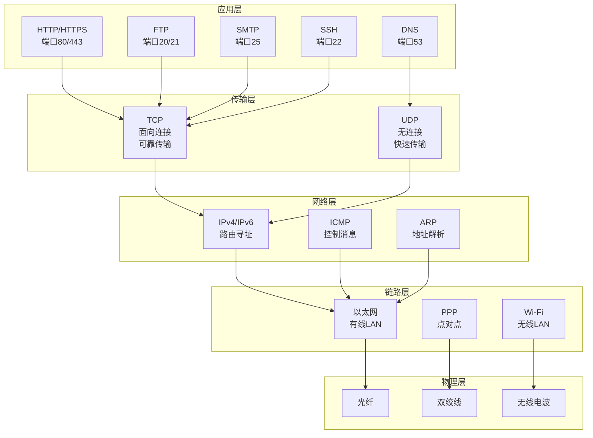
```mermaid
graph TD
    subgraph "应用层"
        A1[HTTP/HTTPS<br/>端口80/443]
        A2[FTP<br/>端口20/21]
        A3[SMTP<br/>端口25]
        A4[DNS<br/>端口53]
        A5[SSH<br/>端口22]
    end
    
    subgraph "传输层"
        B1[TCP<br/>面向连接<br/>可靠传输]
        B2[UDP<br/>无连接<br/>快速传输]
    end
    
    subgraph "网络层"
        C1[IPv4/IPv6<br/>路由寻址]
        C2[ICMP<br/>控制消息]
        C3[ARP<br/>地址解析]
    end
    
    subgraph "链路层"
        D1[以太网<br/>有线LAN]
        D2[Wi-Fi<br/>无线LAN]
        D3[PPP<br/>点对点]
    end
    
    subgraph "物理层"
        E1[光纤]
        E2[双绞线]
        E3[无线电波]
    end
    
    A1 --> B1
    A2 --> B1
    A3 --> B1
    A4 --> B2
    A5 --> B1
    
    B1 --> C1
    B2 --> C1
    
    C1 --> D1
    C2 --> D1
    C3 --> D1
    
    D1 --> E1
    D2 --> E3
    D3 --> E2
```

#### 数据封装与解封装过程

**数据发送过程（自上而下封装）**

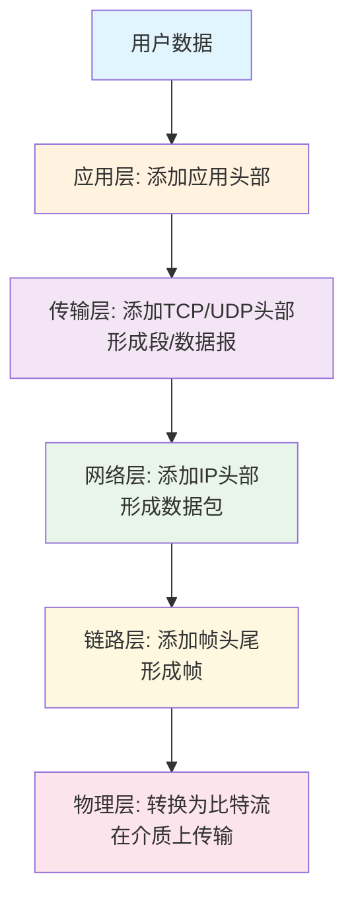
```mermaid
flowchart TD
    A[用户数据] --> A1[应用层: 添加应用头部]
    A1 --> B[传输层: 添加TCP/UDP头部<br/>形成段/数据报]
    B --> C[网络层: 添加IP头部<br/>形成数据包]
    C --> D[链路层: 添加帧头尾<br/>形成帧]
    D --> E[物理层: 转换为比特流<br/>在介质上传输]
    
    style A fill:#e1f5fe
    style A1 fill:#fff3e0
    style B fill:#f3e5f5
    style C fill:#e8f5e8
    style D fill:#fff8e1
    style E fill:#fce4ec
```

**数据接收过程（自下而上解封装）**

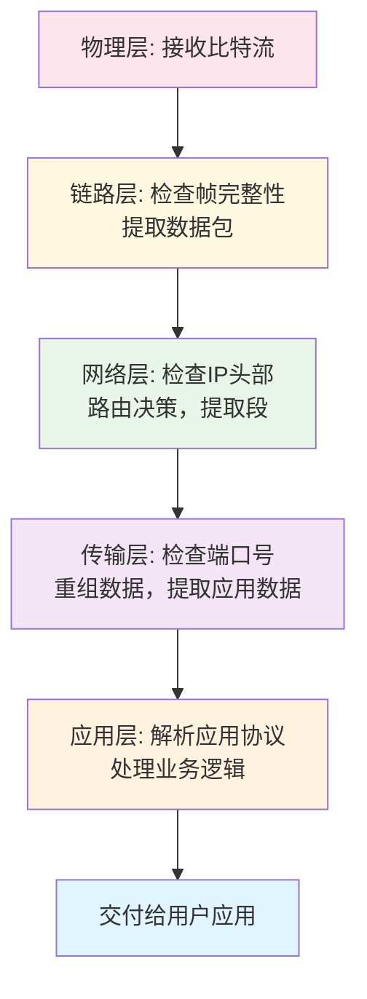
```mermaid
flowchart TD
    E[物理层: 接收比特流] --> D[链路层: 检查帧完整性<br/>提取数据包]
    D --> C[网络层: 检查IP头部<br/>路由决策，提取段]
    C --> B[传输层: 检查端口号<br/>重组数据，提取应用数据]
    B --> A1[应用层: 解析应用协议<br/>处理业务逻辑]
    A1 --> A[交付给用户应用]
    
    style E fill:#fce4ec
    style D fill:#fff8e1
    style C fill:#e8f5e8
    style B fill:#f3e5f5
    style A1 fill:#fff3e0
    style A fill:#e1f5fe
```

**各层头部信息详解**

| 协议层 | 头部信息 | 主要字段 | 长度 |
|--------|----------|----------|------|
| 应用层 | 应用数据头 | 协议特定字段（如HTTP请求行） | 可变 |
| 传输层 | TCP/UDP头 | 源端口、目标端口、序列号、校验和 | TCP:20-60字节, UDP:8字节 |
| 网络层 | IP头 | 源IP、目标IP、协议类型、TTL | IPv4:20-60字节, IPv6:40字节 |
| 链路层 | 帧头/尾 | 源MAC、目标MAC、类型、FCS | 以太网:18字节 |

#### 端口号分类与管理

**端口号范围划分**

| 端口范围 | 类型 | 用途 | 管理方式 | 示例 |
|----------|------|------|----------| ---- |
| 0-1023 | 系统/知名端口 | 标准服务 | IANA分配 | HTTP(80), HTTPS(443), SSH(22) |
| 1024-49151 | 注册端口 | 用户应用 | IANA注册 | MySQL(3306), RDP(3389) |
| 49152-65535 | 动态/私有端口 | 临时连接 | 系统自动分配 | 客户端临时端口 |

### TCP与UDP对比

#### 基本特性对比

| 特性 | TCP | UDP |
|------|-----|-----|
| 连接类型 | 面向连接 | 无连接 |
| 可靠性 | 高（有确认、重传机制） | 低（无确认机制） |
| 数据顺序 | 保证有序 | 不保证有序 |
| 速度 | 较慢 | 较快 |
| 流量控制 | 有（滑动窗口） | 无 |
| 拥塞控制 | 有 | 无 |
| 应用场景 | 网页浏览、文件传输、邮件 | 视频流、游戏、DNS |
| 头部大小 | 20-60字节 | 8字节 |
| 连接状态 | 有状态 | 无状态 |
| 广播支持 | 不支持 | 支持 |
| 多播支持 | 不支持 | 支持 |
| 数据边界 | 字节流（无边界） | 数据报（有边界） |

#### TCP协议详细分析

**TCP头部结构**
```
 0                   1                   2                   3
 0 1 2 3 4 5 6 7 8 9 0 1 2 3 4 5 6 7 8 9 0 1 2 3 4 5 6 7 8 9 0 1
+-+-+-+-+-+-+-+-+-+-+-+-+-+-+-+-+-+-+-+-+-+-+-+-+-+-+-+-+-+-+-+-+
|          源端口号            |        目标端口号             |
+-+-+-+-+-+-+-+-+-+-+-+-+-+-+-+-+-+-+-+-+-+-+-+-+-+-+-+-+-+-+-+-+
|                        序列号                                |
+-+-+-+-+-+-+-+-+-+-+-+-+-+-+-+-+-+-+-+-+-+-+-+-+-+-+-+-+-+-+-+-+
|                        确认号                                |
+-+-+-+-+-+-+-+-+-+-+-+-+-+-+-+-+-+-+-+-+-+-+-+-+-+-+-+-+-+-+-+-+
|  数据偏移 |保留|U|A|P|R|S|F|            窗口大小             |
+-+-+-+-+-+-+-+-+-+-+-+-+-+-+-+-+-+-+-+-+-+-+-+-+-+-+-+-+-+-+-+-+
|            校验和            |          紧急指针             |
+-+-+-+-+-+-+-+-+-+-+-+-+-+-+-+-+-+-+-+-+-+-+-+-+-+-+-+-+-+-+-+-+
|                    选项（可变长度）                         |
+-+-+-+-+-+-+-+-+-+-+-+-+-+-+-+-+-+-+-+-+-+-+-+-+-+-+-+-+-+-+-+-+
```

**TCP头部字段详解**
- **源端口号（16位）**：发送方端口
- **目标端口号（16位）**：接收方端口
- **序列号（32位）**：标识字节流中的位置
- **确认号（32位）**：期望接收的下一个序列号
- **数据偏移（4位）**：TCP头部长度
- **保留（6位）**：未使用，设为0
- **控制位（6位）**：
  - **URG**：紧急指针有效
  - **ACK**：确认号有效
  - **PSH**：推送数据到应用层
  - **RST**：重置连接
  - **SYN**：同步序列号，建立连接
  - **FIN**：结束连接
- **窗口大小（16位）**：滑动窗口大小，用于流量控制
- **校验和（16位）**：错误检测
- **紧急指针（16位）**：紧急数据末尾位置
- **选项（可变）**：可选功能，如最大段大小（MSS）

**TCP状态机**
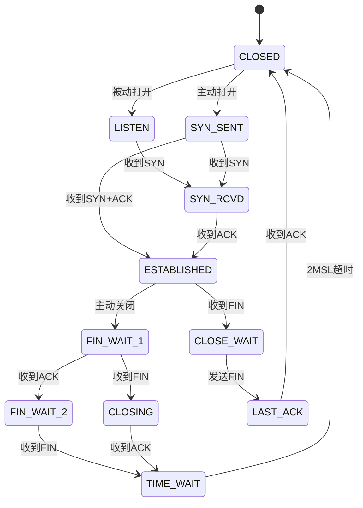
```mermaid
stateDiagram-v2
    [*] --> CLOSED
    CLOSED --> LISTEN : 被动打开
    CLOSED --> SYN_SENT : 主动打开
    LISTEN --> SYN_RCVD : 收到SYN
    SYN_SENT --> SYN_RCVD : 收到SYN
    SYN_SENT --> ESTABLISHED : 收到SYN+ACK
    SYN_RCVD --> ESTABLISHED : 收到ACK
    ESTABLISHED --> FIN_WAIT_1 : 主动关闭
    ESTABLISHED --> CLOSE_WAIT : 收到FIN
    FIN_WAIT_1 --> FIN_WAIT_2 : 收到ACK
    FIN_WAIT_1 --> CLOSING : 收到FIN
    FIN_WAIT_2 --> TIME_WAIT : 收到FIN
    CLOSE_WAIT --> LAST_ACK : 发送FIN
    CLOSING --> TIME_WAIT : 收到ACK
    LAST_ACK --> CLOSED : 收到ACK
    TIME_WAIT --> CLOSED : 2MSL超时
```

**TCP可靠性机制**
1. **序列号和确认机制**：
   - 每个字节都有序列号
   - 接收方发送确认（ACK）
   - 发送方维护确认号

2. **超时重传**：
   - RTT（往返时间）测量
   - 自适应超时算法
   - 指数退避策略

3. **滑动窗口流量控制**：
   - 接收方通告窗口大小
   - 发送方控制发送速率
   - 零窗口探测

4. **拥塞控制算法**：
   - **慢启动**：指数增长
   - **拥塞避免**：线性增长
   - **快速重传**：三次重复ACK
   - **快速恢复**：减半窗口

#### UDP协议详细分析

**UDP头部结构**
```
 0                   1                   2                   3
 0 1 2 3 4 5 6 7 8 9 0 1 2 3 4 5 6 7 8 9 0 1 2 3 4 5 6 7 8 9 0 1
+-+-+-+-+-+-+-+-+-+-+-+-+-+-+-+-+-+-+-+-+-+-+-+-+-+-+-+-+-+-+-+-+
|          源端口号            |        目标端口号             |
+-+-+-+-+-+-+-+-+-+-+-+-+-+-+-+-+-+-+-+-+-+-+-+-+-+-+-+-+-+-+-+-+
|            长度              |            校验和             |
+-+-+-+-+-+-+-+-+-+-+-+-+-+-+-+-+-+-+-+-+-+-+-+-+-+-+-+-+-+-+-+-+
```

**UDP头部字段详解**
- **源端口号（16位）**：发送方端口
- **目标端口号（16位）**：接收方端口
- **长度（16位）**：UDP头部+数据总长度
- **校验和（16位）**：错误检测（可选）

**UDP特性详解**
1. **无连接性**：
   - 不需要建立连接
   - 直接发送数据
   - 减少延迟

2. **不可靠传输**：
   - 无确认机制
   - 无重传机制
   - 数据可能丢失、重复、乱序

3. **数据报模式**：
   - 保持消息边界
   - 每个数据报独立处理
   - 支持一对一、一对多、多对多通信

4. **高效性**：
   - 头部开销小（8字节）
   - 处理简单
   - 适合实时应用

#### 性能对比分析

| 性能指标 | TCP | UDP | 影响因素 |
|----------|-----|-----|----------|
| 延迟 | 高 | 低 | 连接建立、确认机制 |
| 吞吐量 | 高（长连接） | 中等 | 滑动窗口 vs 固定缓冲 |
| CPU开销 | 高 | 低 | 状态维护、算法复杂度 |
| 内存开销 | 高 | 低 | 缓冲区、状态信息 |
| 网络开销 | 中等 | 低 | 头部大小、控制包 |
| 适用场景 | 可靠性优先 | 实时性优先 | 业务需求 |

#### 实际应用场景详解

**TCP适用场景**
- **Web浏览**：HTTP/HTTPS需要可靠传输
- **文件传输**：FTP/SFTP确保文件完整性
- **电子邮件**：SMTP/POP3/IMAP保证邮件可靠传递
- **远程登录**：SSH/Telnet需要准确的命令传输
- **数据库连接**：SQL查询和结果需要完整性
- **API调用**：RESTful API需要可靠的请求-响应

**UDP适用场景**
- **DNS查询**：简单请求-响应，丢包可重试
- **DHCP**：配置信息获取，丢包重试成本低
- **视频/音频流**：实时性重要，少量丢包可接受
- **在线游戏**：延迟敏感，状态可通过游戏逻辑恢复
- **网络时间协议（NTP）**：简单时间同步
- **广播/组播服务**：一对多通信
- **实时监控**：SNMP等简单协议

#### 混合使用策略

**应用层可靠性**
- 在UDP基础上实现应用层可靠性机制
- 例如：QUIC协议（HTTP/3基础）
- 自定义重传、确认机制

**协议选择决策树**
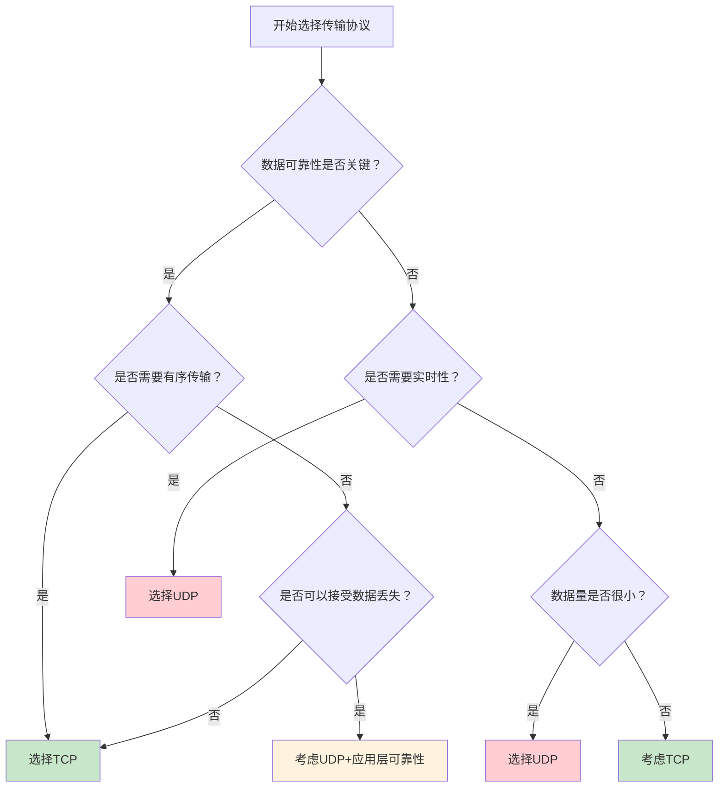
```mermaid
flowchart TD
    A[开始选择传输协议] --> B{数据可靠性是否关键？}
    B -->|是| C{是否需要有序传输？}
    B -->|否| D{是否需要实时性？}
    
    C -->|是| E[选择TCP]
    C -->|否| F{是否可以接受数据丢失？}
    
    D -->|是| G[选择UDP]
    D -->|否| H{数据量是否很小？}
    
    F -->|是| I[考虑UDP+应用层可靠性]
    F -->|否| E
    
    H -->|是| J[选择UDP]
    H -->|否| K[考虑TCP]
    
    style E fill:#c8e6c9
    style G fill:#ffcdd2
    style I fill:#fff3e0
    style J fill:#ffcdd2
    style K fill:#c8e6c9
```

### 三次握手与四次挥手

#### TCP三次握手详细分析

**握手过程与状态变化**

1. **第一次握手：客户端发起连接请求**
   - 客户端状态：CLOSED → SYN_SENT
   - 发送：SYN=1, seq=x（初始序列号）
   - 含义："我要和你建立连接，我的初始序列号是x"

2. **第二次握手：服务器确认并响应**
   - 服务器状态：LISTEN → SYN_RCVD
   - 发送：SYN=1, ACK=1, seq=y, ack=x+1
   - 含义："我收到了你的连接请求，我也要和你建立连接，我的初始序列号是y"

3. **第三次握手：客户端确认**
   - 客户端状态：SYN_SENT → ESTABLISHED
   - 服务器状态：SYN_RCVD → ESTABLISHED
   - 发送：ACK=1, seq=x+1, ack=y+1
   - 含义："我收到了你的响应，连接建立成功"

**三次握手时序图**

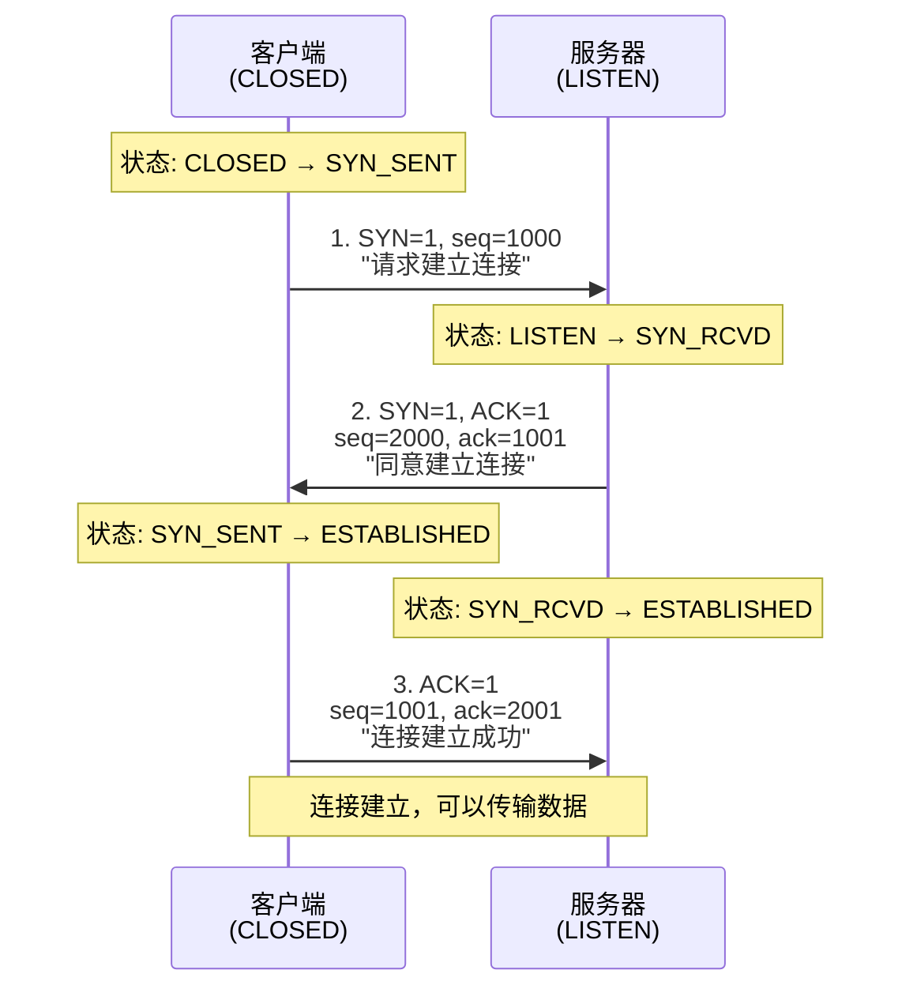
```mermaid
sequenceDiagram
    participant C as 客户端<br/>(CLOSED)
    participant S as 服务器<br/>(LISTEN)
    
    Note over C: 状态: CLOSED → SYN_SENT
    C->>S: 1. SYN=1, seq=1000<br/>"请求建立连接"
    
    Note over S: 状态: LISTEN → SYN_RCVD
    S->>C: 2. SYN=1, ACK=1<br/>seq=2000, ack=1001<br/>"同意建立连接"
    
    Note over C: 状态: SYN_SENT → ESTABLISHED
    Note over S: 状态: SYN_RCVD → ESTABLISHED
    C->>S: 3. ACK=1<br/>seq=1001, ack=2001<br/>"连接建立成功"
    
    Note over C,S: 连接建立，可以传输数据
```

**为什么需要三次握手？**

1. **防止失效连接请求**：确保只有有效的连接请求才会被处理
2. **双向确认**：确认双方的接收和发送能力都正常
3. **初始化序列号**：同步双方的初始序列号（ISN）

#### TCP四次挥手详细分析

**挥手过程与状态变化**

1. **第一次挥手：主动关闭方发起关闭**
   - 客户端状态：ESTABLISHED → FIN_WAIT_1
   - 发送：FIN=1, seq=u
   - 含义："我已经发送完所有数据，请求关闭连接"

2. **第二次挥手：被动关闭方确认**
   - 服务器状态：ESTABLISHED → CLOSE_WAIT
   - 客户端状态：FIN_WAIT_1 → FIN_WAIT_2
   - 发送：ACK=1, ack=u+1
   - 含义："我收到了你的关闭请求，但我可能还有数据要发送"

3. **第三次挥手：被动关闭方发送关闭**
   - 服务器状态：CLOSE_WAIT → LAST_ACK
   - 发送：FIN=1, seq=v
   - 含义："我也发送完了所有数据，同意关闭连接"

4. **第四次挥手：主动关闭方最终确认**
   - 客户端状态：FIN_WAIT_2 → TIME_WAIT → CLOSED
   - 服务器状态：LAST_ACK → CLOSED
   - 发送：ACK=1, ack=v+1
   - 含义："我收到了你的关闭请求，连接可以完全关闭"

**四次挥手时序图**

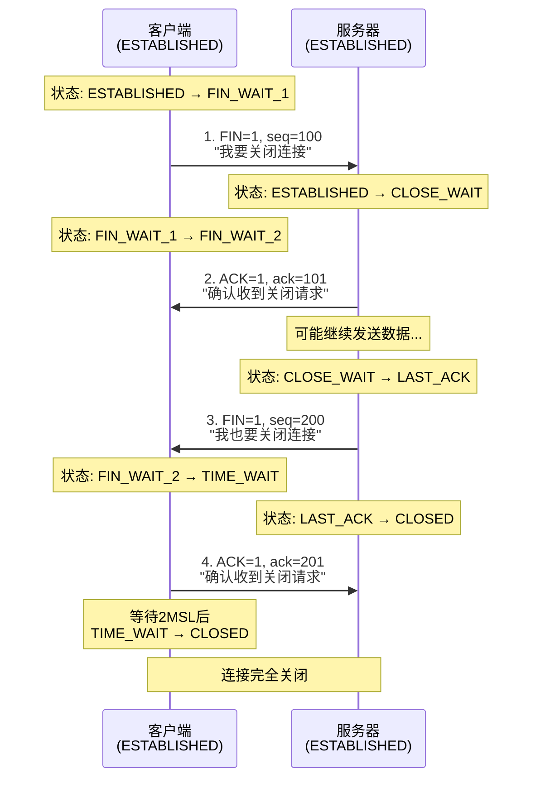
```mermaid
sequenceDiagram
    participant C as 客户端<br/>(ESTABLISHED)
    participant S as 服务器<br/>(ESTABLISHED)
    
    Note over C: 状态: ESTABLISHED → FIN_WAIT_1
    C->>S: 1. FIN=1, seq=100<br/>"我要关闭连接"
    
    Note over S: 状态: ESTABLISHED → CLOSE_WAIT
    Note over C: 状态: FIN_WAIT_1 → FIN_WAIT_2
    S->>C: 2. ACK=1, ack=101<br/>"确认收到关闭请求"
    
    Note over S: 可能继续发送数据...
    
    Note over S: 状态: CLOSE_WAIT → LAST_ACK
    S->>C: 3. FIN=1, seq=200<br/>"我也要关闭连接"
    
    Note over C: 状态: FIN_WAIT_2 → TIME_WAIT
    Note over S: 状态: LAST_ACK → CLOSED
    C->>S: 4. ACK=1, ack=201<br/>"确认收到关闭请求"
    
    Note over C: 等待2MSL后<br/>TIME_WAIT → CLOSED
    Note over C,S: 连接完全关闭
```

**为什么需要四次挥手？**

1. **半关闭状态**：TCP是全双工通信，一方关闭发送通道，另一方可能还有数据要发送
2. **确保数据完整性**：CLOSE_WAIT状态允许被动关闭方发送剩余数据
3. **TIME_WAIT状态**：确保最后一个ACK能够到达对方，防止失效连接干扰新连接

**常见异常情况处理**

1. **连接被拒绝（Connection Refused）**
   - 原因：目标端口没有监听服务
   - 响应：返回RST段

2. **连接超时（Connection Timeout）**
   - 原因：网络不可达或防火墙阻断
   - 处理：多次重试后放弃

3. **强制关闭（RST）**
   - 触发条件：应用程序异常退出、系统崩溃
   - 特点：立即释放资源，不等待2MSL

### 常见端口号与服务

| 端口号 | 服务 | 协议 | 用途 |
|--------|------|------|------|
| 20/21 | FTP | TCP | 文件传输 |
| 22 | SSH | TCP | 安全远程登录 |
| 23 | Telnet | TCP | 远程登录 |
| 25 | SMTP | TCP | 邮件发送 |
| 53 | DNS | TCP/UDP | 域名解析 |
| 80 | HTTP | TCP | 网页访问 |
| 110 | POP3 | TCP | 邮件接收 |
| 143 | IMAP | TCP | 邮件接收 |
| 443 | HTTPS | TCP | 安全网页访问 |
| 1723 | PPTP | TCP | VPN服务 |
| 3306 | MySQL | TCP | 数据库服务 |
| 3389 | RDP | TCP | 远程桌面 |
| 8080 | HTTP代理 | TCP | 代理服务 |

---

## HTTP/HTTPS协议

### HTTP完整请求处理流程

#### 从用户输入URL到页面显示的完整过程

```mermaid
sequenceDiagram
    participant User as 用户
    participant Browser as 浏览器
    participant OS as 操作系统网络栈
    participant DNS as DNS服务器
    participant Server as Web服务器
    participant DB as 数据库
    
    User->>Browser: 1. 输入URL: https://www.example.com
    
    Note over Browser: URL解析与验证
    Browser->>Browser: 2. 解析URL组件<br/>协议: https<br/>域名: www.example.com<br/>端口: 443(默认)<br/>路径: /
    
    Note over Browser: 缓存检查阶段
    Browser->>Browser: 3. 检查浏览器缓存<br/>DNS缓存、HTTP缓存
    
    alt DNS缓存命中
        Note over Browser: 使用缓存的IP地址
    else DNS缓存未命中
        Browser->>OS: 4. DNS查询请求
        OS->>DNS: 5. DNS递归解析<br/>查询www.example.com
        DNS-->>OS: 6. 返回IP地址: 93.184.216.34
        OS-->>Browser: 7. DNS解析结果
    end
    
    Note over Browser: TCP/TLS连接建立
    Browser->>OS: 8. TCP连接请求 (SYN)
    OS->>Server: 9. TCP三次握手<br/>目标: 93.184.216.34:443
    Server-->>OS: 10. TCP连接建立 (SYN-ACK, ACK)
    OS-->>Browser: 11. TCP连接就绪
    
    Note over Browser: TLS/SSL握手(针对HTTPS)
    Browser->>Server: 12. TLS Client Hello<br/>支持的加密算法
    Server-->>Browser: 13. TLS Server Hello<br/>选中的加密算法
    Server-->>Browser: 14. 服务器证书
    Browser->>Browser: 15. 验证证书有效性<br/>检查CA签名、域名匹配、过期时间
    Browser->>Server: 16. Client Key Exchange<br/>生成并发送预主密钥
    Browser->>Server: 17. Change Cipher Spec<br/>开始加密通信
    Server-->>Browser: 18. TLS握手完成
    
    Note over Browser: HTTP请求阶段
    Browser->>Server: 19. HTTPS请求(加密)<br/>GET / HTTP/1.1<br/>Host: www.example.com<br/>User-Agent: Browser/1.0<br/>Accept: text/html,application/xhtml+xml<br/>Accept-Language: zh-CN,zh;q=0.9<br/>Accept-Encoding: gzip, deflate, br<br/>Connection: keep-alive
    
    Note over Server: 服务器处理阶段
    Server->>Server: 20. 解析HTTP请求<br/>路由匹配、参数解析
    
    alt 需要数据库查询
        Server->>DB: 21. 数据库查询<br/>SELECT * FROM pages WHERE path='/'
        DB-->>Server: 22. 返回数据结果
    end
    
    Server->>Server: 23. 生成HTML响应<br/>模板渲染、数据组装
    
    Note over Server: HTTP响应阶段
    Server-->>Browser: 24. HTTPS响应(加密)<br/>HTTP/1.1 200 OK<br/>Content-Type: text/html; charset=UTF-8<br/>Content-Length: 1234<br/>Cache-Control: max-age=3600<br/>Set-Cookie: sessionid=abc123<br/>Content-Encoding: gzip<br/><br/><!DOCTYPE html><html>...
    
    Note over Browser: 响应处理阶段
    Browser->>Browser: 25. HTTP响应解析<br/>状态码检查、头部处理
    
    Browser->>Browser: 26. 内容解压缩<br/>gzip解压缩
    
    Browser->>Browser: 27. HTML解析<br/>DOM树构建
    
    Note over Browser: 资源加载阶段
    loop 对于每个资源(CSS, JS, 图片)
        Browser->>Server: 28. 资源请求<br/>GET /style.css<br/>GET /script.js<br/>GET /image.png
        Server-->>Browser: 29. 资源响应<br/>返回对应文件
    end
    
    Note over Browser: 页面渲染阶段
    Browser->>Browser: 30. CSS解析和样式计算<br/>CSSOM树构建
    
    Browser->>Browser: 31. JavaScript执行<br/>DOM操作、事件绑定
    
    Browser->>Browser: 32. 布局计算(Layout)<br/>元素位置和尺寸
    
    Browser->>Browser: 33. 绘制(Paint)<br/>像素填充和效果
    
    Browser->>Browser: 34. 合成(Composite)<br/>图层合成与显示
    
    Browser-->>User: 35. 页面显示完成
    
    Note over Browser: 持续优化
    Browser->>Browser: 36. 缓存管理<br/>保存DNS、HTTP缓存
```

#### HTTP请求处理流程关键阶段详解

**1. URL解析与验证**
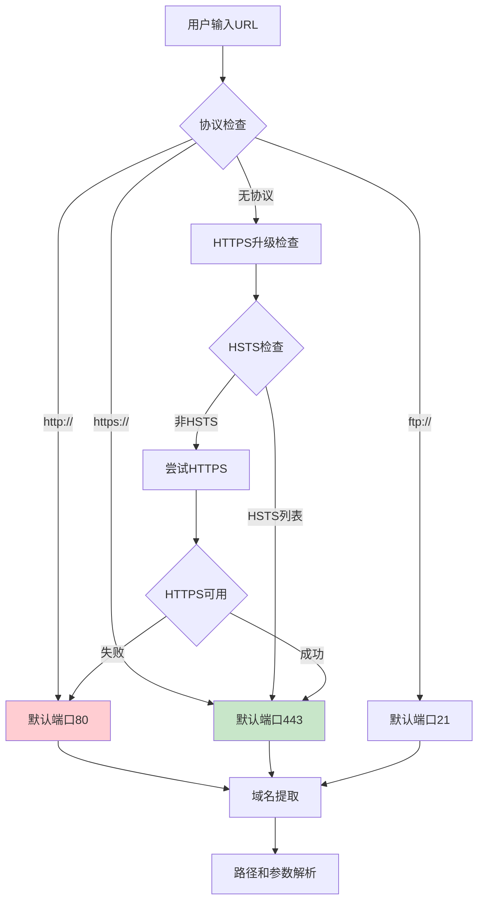
```mermaid
flowchart TD
    A["用户输入URL"] --> B{"协议检查"}
    
    B -->|"http://"| C["默认端口80"]
    B -->|"https://"| D["默认端口443"]
    B -->|"ftp://"| E["默认端口21"]
    B -->|"无协议"| F["HTTPS升级检查"]
    
    C --> G["域名提取"]
    D --> G
    E --> G
    F --> H{"HSTS检查"}
    
    H -->|"HSTS列表"| D
    H -->|"非HSTS"| I["尝试HTTPS"]
    I --> J{"HTTPS可用"}
    J -->|"成功"| D
    J -->|"失败"| C
    
    G --> K["路径和参数解析"]
    
    style D fill:#c8e6c9
    style C fill:#ffcdd2
```

**2. 缓存检查策略**

| 缓存类型 | 存储位置 | 存储内容 | 过期策略 |
|----------|----------|----------|----------|
| DNS缓存 | 操作系统/浏览器 | 域名→IP映射 | TTL时间 |
| HTTP缓存 | 浏览器/代理 | 完整HTTP响应 | Cache-Control/Expires |
| Cookie缓存 | 浏览器 | 会话信息 | Max-Age/Expires |
| localStorage | 浏览器 | 用户数据 | 手动清理 |
| CDN缓存 | 边缘节点 | 静态资源 | 配置策略 |

**3. TCP/TLS连接优化**

```bash
# 查看TCP连接状态
netstat -an | grep :443
ss -tuln | grep :443

# 查看TLS证书信息
openssl s_client -connect www.example.com:443 -servername www.example.com

# 测试TLS握手时间
curl -w "@curl-format.txt" -o /dev/null -s "https://www.example.com"

# curl-format.txt 内容
time_namelookup:  %{time_namelookup}\n
time_connect:     %{time_connect}\n
time_appconnect:  %{time_appconnect}\n
time_pretransfer: %{time_pretransfer}\n
time_redirect:    %{time_redirect}\n
time_starttransfer: %{time_starttransfer}\n
time_total:       %{time_total}\n
```

**4. HTTP请求头部详解**

| 头部字段 | 作用 | 示例值 |
|----------|------|--------|
| Host | 指定目标主机 | `www.example.com` |
| User-Agent | 浏览器标识 | `Mozilla/5.0 (Windows NT 10.0)` |
| Accept | 可接受的内容类型 | `text/html,application/json` |
| Accept-Language | 语言偏好 | `zh-CN,zh;q=0.9,en;q=0.8` |
| Accept-Encoding | 压缩支持 | `gzip, deflate, br` |
| Connection | 连接管理 | `keep-alive, close` |
| Cache-Control | 缓存控制 | `no-cache, max-age=3600` |
| Authorization | 身份验证 | `Bearer token123` |
| Referer | 来源页面 | `https://www.google.com` |
| Cookie | 会话信息 | `sessionid=abc123` |

**5. HTTP响应处理流程**

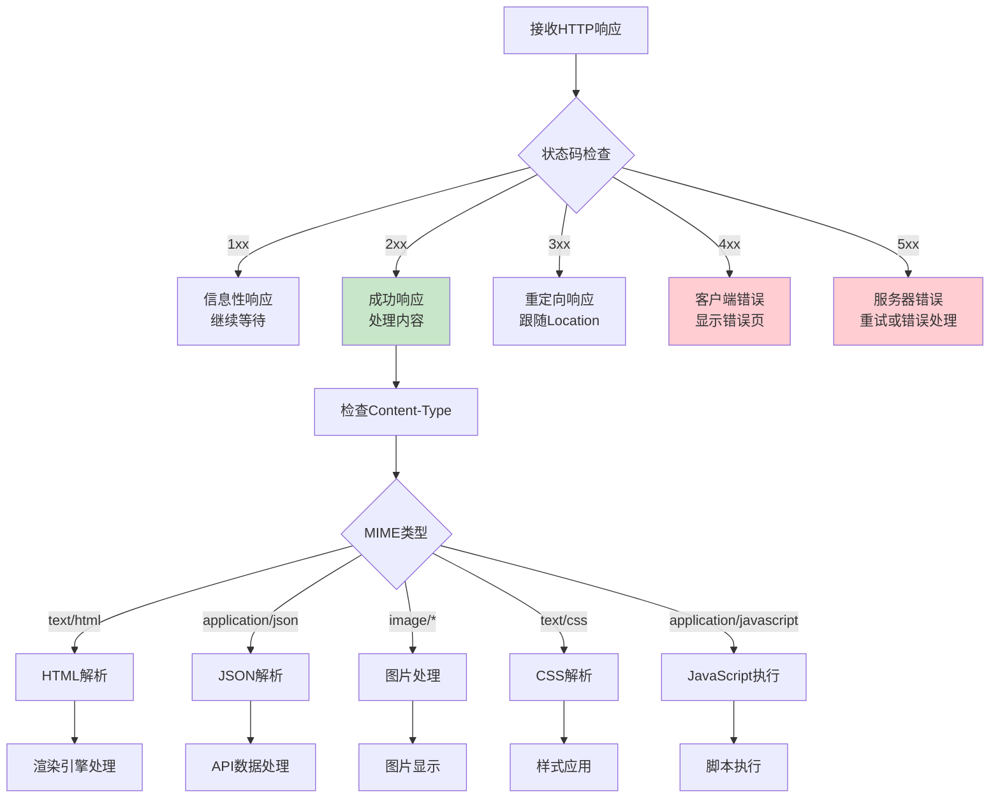
```mermaid
flowchart TD
    A["接收HTTP响应"] --> B{"状态码检查"}
    
    B -->|"1xx"| C["信息性响应<br/>继续等待"]
    B -->|"2xx"| D["成功响应<br/>处理内容"]
    B -->|"3xx"| E["重定向响应<br/>跟随Location"]
    B -->|"4xx"| F["客户端错误<br/>显示错误页"]
    B -->|"5xx"| G["服务器错误<br/>重试或错误处理"]
    
    D --> H["检查Content-Type"]
    H --> I{"MIME类型"}
    
    I -->|"text/html"| J["HTML解析"]
    I -->|"application/json"| K["JSON解析"]
    I -->|"image/*"| L["图片处理"]
    I -->|"text/css"| M["CSS解析"]
    I -->|"application/javascript"| N["JavaScript执行"]
    
    J --> O["渲染引擎处理"]
    K --> P["API数据处理"]
    L --> Q["图片显示"]
    M --> R["样式应用"]
    N --> S["脚本执行"]
    
    style D fill:#c8e6c9
    style F fill:#ffcdd2
    style G fill:#ffcdd2
```

### HTTPS工作原理
- **定义**：HTTPS（HTTP Secure）是HTTP的安全版本，通过SSL/TLS加密HTTP通信。
- **工作流程**：
  1. **握手阶段**：客户端与服务器建立SSL/TLS连接
  2. **证书验证**：客户端验证服务器证书
  3. **密钥交换**：协商对称加密密钥
  4. **加密通信**：使用对称密钥加密数据传输

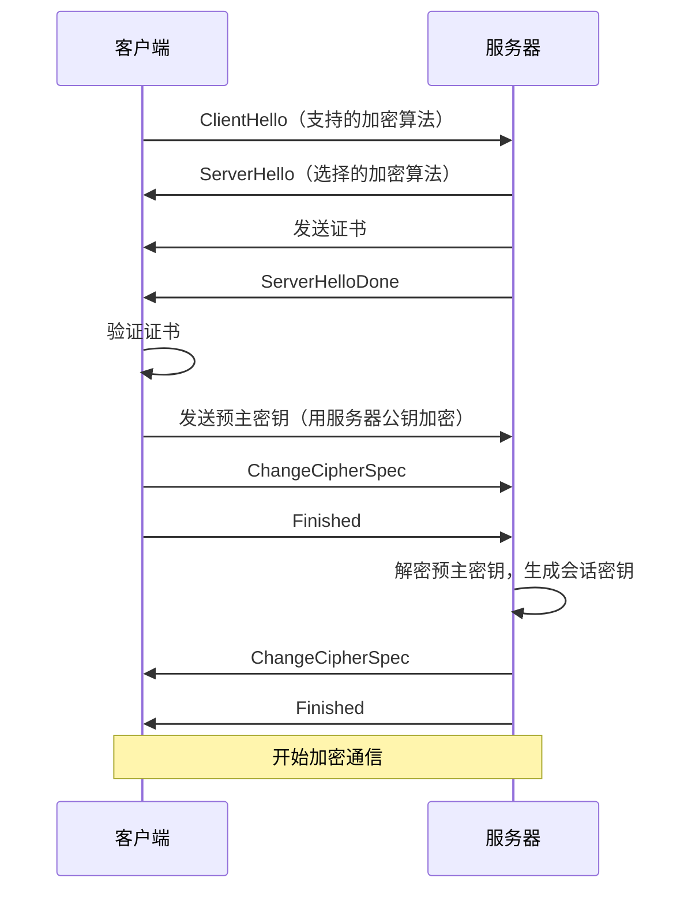
```mermaid
sequenceDiagram
    participant 客户端
    participant 服务器
    客户端->>服务器: ClientHello（支持的加密算法）
    服务器->>客户端: ServerHello（选择的加密算法）
    服务器->>客户端: 发送证书
    服务器->>客户端: ServerHelloDone
    客户端->>客户端: 验证证书
    客户端->>服务器: 发送预主密钥（用服务器公钥加密）
    客户端->>服务器: ChangeCipherSpec
    客户端->>服务器: Finished
    服务器->>服务器: 解密预主密钥，生成会话密钥
    服务器->>客户端: ChangeCipherSpec
    服务器->>客户端: Finished
    Note over 客户端,服务器: 开始加密通信
```

### HTTP状态码

| 状态码 | 类别 | 描述 | 常见示例 |
|--------|------|------|----------|
| 1xx | 信息性 | 请求已接收，继续处理 | 100 Continue |
| 2xx | 成功 | 请求已成功接收、理解、接受 | 200 OK, 201 Created |
| 3xx | 重定向 | 需要进一步操作才能完成请求 | 301 Moved Permanently, 302 Found |
| 4xx | 客户端错误 | 请求包含语法错误或无法完成 | 400 Bad Request, 404 Not Found |
| 5xx | 服务器错误 | 服务器在处理请求时发生错误 | 500 Internal Server Error, 503 Service Unavailable |

### HTTP请求方法

| 方法 | 描述 | 是否幂等 | 是否安全 |
|------|------|----------|----------|
| GET | 请求资源 | 是 | 是 |
| POST | 提交数据 | 否 | 否 |
| PUT | 更新资源 | 是 | 否 |
| DELETE | 删除资源 | 是 | 否 |
| HEAD | 获取头信息 | 是 | 是 |
| OPTIONS | 获取支持的方法 | 是 | 是 |
| PATCH | 部分更新资源 | 否 | 否 |

### HTTP/1.1、HTTP/2和HTTP/3对比

| 特性 | HTTP/1.1 | HTTP/2 | HTTP/3 |
|------|----------|--------|--------|
| 发布年份 | 1997年 | 2015年 | 2022年 |
| 传输协议 | TCP | TCP | QUIC(UDP) |
| 多路复用 | 不支持 | 支持 | 支持 |
| 头部压缩 | 不支持 | HPACK | QPACK |
| 服务器推送 | 不支持 | 支持 | 支持 |
| 队头阻塞 | 存在 | 部分解决 | 基本解决 |
| 连接建立 | 需要多次RTT | 需要多次RTT | 0-RTT或1-RTT |
| 加密 | 可选 | 实际上必需 | 必需 |

---

## 常用网络命令

### 基础网络诊断命令

#### ping - 测试网络连通性

**基本用法**
```bash
# 基本用法
ping www.baidu.com
ping 8.8.8.8

# 指定次数（Windows）
ping -n 4 www.baidu.com

# 指定次数（Linux/Mac）
ping -c 4 www.baidu.com

# 设置包大小
ping -s 1024 www.baidu.com  # Linux/Mac
ping -l 1024 www.baidu.com  # Windows

# 设置间隔时间
ping -i 2 www.baidu.com     # Linux/Mac，间隔2秒
```

**常用参数**
| 参数 | Linux/Mac | Windows | 说明 |
|------|-----------|---------|------|
| 次数 | -c 4 | -n 4 | 指定发送包数量 |
| 包大小 | -s 1024 | -l 1024 | 设置数据包大小 |
| 间隔 | -i 2 | -w 2000 | 设置间隔时间 |
| 超时 | -W 3 | -w 3000 | 设置超时时间 |
| 禁止分片 | -M do | -f | 禁止IP分片 |

**输出解析**
```bash
PING www.baidu.com (14.215.177.38): 56 data bytes
64 bytes from 14.215.177.38: icmp_seq=0 ttl=55 time=25.123 ms
64 bytes from 14.215.177.38: icmp_seq=1 ttl=55 time=24.891 ms
64 bytes from 14.215.177.38: icmp_seq=2 ttl=55 time=25.045 ms

--- www.baidu.com ping statistics ---
3 packets transmitted, 3 packets received, 0.0% packet loss
round-trip min/avg/max/stddev = 24.891/25.020/25.123/0.095 ms
```

- **ttl**：生存时间，经过路由器数量推算
- **time**：往返时间（RTT）
- **packet loss**：丢包率，网络质量指标

#### traceroute/tracert - 路由追踪

**基本用法**
```bash
# Linux/Mac
traceroute www.baidu.com
traceroute -I www.baidu.com  # 使用ICMP代替UDP

# Windows
tracert www.baidu.com

# 指定最大跳数
traceroute -m 15 www.baidu.com

# 设置超时时间
traceroute -w 3 www.baidu.com
```

**输出解析**
```bash
traceroute to www.baidu.com (14.215.177.38), 30 hops max, 60 byte packets
 1  192.168.1.1 (192.168.1.1)  1.234 ms  1.123 ms  1.045 ms
 2  10.0.0.1 (10.0.0.1)  5.678 ms  5.456 ms  5.234 ms
 3  221.176.0.1 (221.176.0.1)  15.678 ms  15.456 ms  15.234 ms
 4  * * *
 5  14.215.177.38 (14.215.177.38)  25.123 ms  24.891 ms  25.045 ms
```

- **跳数**：第一列数字，表示经过的路由器数量
- **IP地址**：每一跳路由器的IP地址
- **响应时间**：三次测试的往返时间
- **\* \* \***：表示该路由器不响应或被防火墙阻断

#### netstat - 查看网络连接

**常用组合**
```bash
# 查看所有连接
netstat -a

# 查看监听端口
netstat -l        # Linux/Mac
netstat -a | grep LISTEN  # 替代方法

# 查看已建立的连接
netstat -t        # 仅TCP
netstat -u        # 仅UDP

# 显示进程信息
netstat -p        # Linux/Mac
netstat -b        # Windows

# 不解析域名，加速显示
netstat -n

# 统计信息
netstat -s

# 常用组合：查看所有TCP连接和进程
netstat -antp     # Linux
netstat -anb      # Windows
```

**连接状态说明**
| 状态 | 含义 | 可能原因 |
|------|------|----------|
| LISTEN | 监听状态 | 服务正在等待客户端连接 |
| ESTABLISHED | 已连接 | 正常的数据传输状态 |
| TIME_WAIT | 等待关闭 | 主动关闭连接后的等待状态 |
| CLOSE_WAIT | 等待关闭 | 被动关闭，应用未正确关闭 |
| SYN_SENT | 发送连接请求 | 正在尝试连接服务器 |

#### nslookup/dig - DNS查询

**nslookup基本用法**
```bash
# 查询A记录（默认）
nslookup www.baidu.com

# 指定查询类型
nslookup -type=MX baidu.com    # 邮件服务器
nslookup -type=NS baidu.com    # 域名服务器
nslookup -type=CNAME www.baidu.com  # 别名记录

# 指定DNS服务器
nslookup www.baidu.com 8.8.8.8

# 反向查询（IP到域名）
nslookup 14.215.177.38
```

**dig命令（Linux/Mac）**
```bash
# 基本查询
dig www.baidu.com

# 简洁输出
dig +short www.baidu.com

# 查询指定类型
dig MX baidu.com
dig NS baidu.com
dig AAAA www.baidu.com  # IPv6地址

# 反向查询
dig -x 14.215.177.38

# 追踪解析过程
dig +trace www.baidu.com
```

### 网络接口配置命令

#### ifconfig/ip - 网络接口管理

**ifconfig（传统命令）**
```bash
# 查看所有网络接口
ifconfig

# 查看指定接口
ifconfig eth0

# 配置IP地址
sudo ifconfig eth0 192.168.1.100 netmask 255.255.255.0

# 启用/禁用接口
sudo ifconfig eth0 up
sudo ifconfig eth0 down
```

**ip（现代命令）**
```bash
# 查看所有接口
ip addr show
ip a  # 简写

# 查看指定接口
ip addr show eth0

# 添加IP地址
sudo ip addr add 192.168.1.100/24 dev eth0

# 删除IP地址
sudo ip addr del 192.168.1.100/24 dev eth0

# 启用/禁用接口
sudo ip link set eth0 up
sudo ip link set eth0 down

# 查看路由表
ip route show
ip r  # 简写

# 添加路由
sudo ip route add 192.168.2.0/24 via 192.168.1.1
```

#### route - 路由管理

```bash
# 查看路由表
route -n          # Linux
route print       # Windows
netstat -rn       # 通用方法

# 添加默认路由
sudo route add default gw 192.168.1.1  # Linux
route add 0.0.0.0 mask 0.0.0.0 192.168.1.1  # Windows

# 添加特定网段路由
sudo route add -net 192.168.2.0/24 gw 192.168.1.1  # Linux
route add 192.168.2.0 mask 255.255.255.0 192.168.1.1  # Windows

# 删除路由
sudo route del -net 192.168.2.0/24  # Linux
route delete 192.168.2.0 mask 255.255.255.0  # Windows
```

### 高级网络分析工具

#### ss - Socket统计（现代netstat替代）

```bash
# 查看所有socket
ss -a

# 仅显示TCP连接
ss -t

# 仅显示UDP连接
ss -u

# 显示监听端口
ss -l

# 显示进程信息
ss -p

# 常用组合
ss -tulpn  # 显示TCP和UDP的监听端口和进程

# 过滤特定端口
ss -tlnp | grep :80
ss -tlnp sport = :80

# 查看特定状态的连接
ss -t state established
ss -t state time-wait
```

#### lsof - 查看打开的文件和网络连接

```bash
# 查看网络连接
lsof -i

# 查看指定端口
lsof -i :80
lsof -i :22

# 查看指定协议
lsof -i tcp
lsof -i udp

# 查看指定进程的网络连接
lsof -p 1234
lsof -c nginx

# 查看指定IP的连接
lsof -i @192.168.1.1
```

### 性能测试工具

#### iperf3 - 网络带宽测试

```bash
# 服务器模式
iperf3 -s
iperf3 -s -p 5201  # 指定端口

# 客户端模式
iperf3 -c server_ip
iperf3 -c 192.168.1.1 -p 5201

# TCP测试（默认）
iperf3 -c 192.168.1.1 -t 10  # 持续10秒
iperf3 -c 192.168.1.1 -P 4   # 4个并发连接

# UDP测试
iperf3 -c 192.168.1.1 -u
iperf3 -c 192.168.1.1 -u -b 100M  # 限制带宽100Mbps

# 反向测试（服务器向客户端发送）
iperf3 -c 192.168.1.1 -R

# 双向测试
iperf3 -c 192.168.1.1 --bidir
```

#### mtr - 网络诊断工具（结合ping和traceroute）

```bash
# 基本用法
mtr www.baidu.com

# 指定测试次数
mtr -c 100 www.baidu.com

# 生成报告
mtr --report www.baidu.com
mtr --report-cycles 50 www.baidu.com

# 不解析域名，加速显示
mtr -n www.baidu.com

# 使用TCP SYN包代替ICMP
mtr --tcp --port 80 www.baidu.com
```

### 实际问题排查流程

#### 网络不通排查

```bash
# 1. 检查本地网络配置
ip addr show
ifconfig

# 2. 测试本地回环
ping 127.0.0.1

# 3. 测试本地网关
ping 192.168.1.1

# 4. 测试公网DNS
ping 8.8.8.8

# 5. 测试域名解析
nslookup www.baidu.com
ping www.baidu.com

# 6. 追踪路由路径
traceroute www.baidu.com
mtr www.baidu.com
```

#### 端口连通性测试

```bash
# telnet测试
telnet www.baidu.com 80
telnet smtp.gmail.com 587

# nc（netcat）测试
nc -zv www.baidu.com 80
nc -zv 192.168.1.1 22

# nmap端口扫描
nmap -p 80,443 www.baidu.com
nmap -p 1-1000 192.168.1.1
```

#### 网络性能分析

```bash
# 查看网络统计信息
netstat -s
ss -s

# 查看网络接口统计
cat /proc/net/dev
ip -s link

# 实时监控网络流量
iftop
nload
bandwidth

# 查看系统负载
top
htop
sar -n DEV 1
```

- `arp -a`：查看本地ARP缓存，排查IP与MAC绑定冲突。
- `ipconfig`/`ifconfig`：查看和配置本机网络参数，常用于排查IP冲突、网关异常。
- `ping`：测试网络连通性和延迟，判断丢包、延迟等问题。
- `traceroute`/`tracert`：追踪数据包经过的路由路径，定位网络瓶颈和故障节点。
- `netstat -an`：查看端口占用、连接状态，排查异常连接和端口冲突。
- `nslookup`：DNS解析测试，排查域名无法访问等问题。
- **进阶命令**：
  - `route`/`ip route`：查看和配置路由表。
  - `tcpdump`/`wireshark`：抓包分析网络流量。
  - `nmap`：端口扫描与安全检测。

---

## 网关基础知识

### 网关（Gateway）概述

#### 定义与基本概念
- **定义**：网关是连接不同网络或网络协议的设备或软件，充当网络之间的"门户"，实现数据包的转发、协议转换和安全控制。
- **核心作用**：
  - **协议转换**：在不同网络协议之间进行翻译和适配（如IPv4与IPv6、TCP与UDP、HTTP与HTTPS等）
  - **路由转发**：根据目标地址决定数据包的转发路径
  - **安全隔离**：提供防火墙、访问控制列表（ACL）等安全功能
  - **地址转换**：实现内网与外网之间的地址映射（NAT）

#### 网关在网络架构中的位置

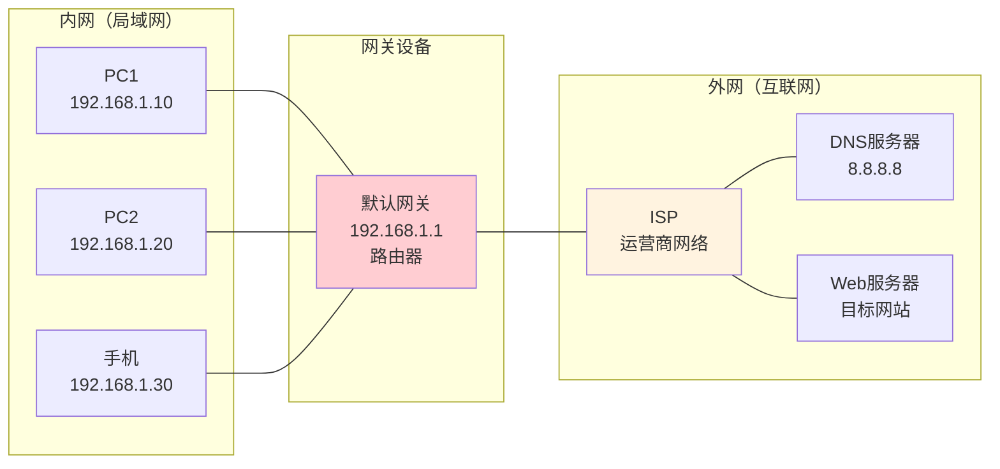
```mermaid
flowchart LR
    subgraph "内网（局域网）"
        A[PC1<br/>192.168.1.10]
        B[PC2<br/>192.168.1.20]
        C[手机<br/>192.168.1.30]
    end
    
    subgraph "网关设备"
        D[默认网关<br/>192.168.1.1<br/>路由器]
    end
    
    subgraph "外网（互联网）"
        E[ISP<br/>运营商网络]
        F[DNS服务器<br/>8.8.8.8]
        G[Web服务器<br/>目标网站]
    end
    
    A --- D
    B --- D
    C --- D
    D --- E
    E --- F
    E --- G
    
    style D fill:#ffcdd2
    style E fill:#fff3e0
```

### 网关类型详解

#### 按功能层次分类

**1. 网络层网关（IP网关/路由器）**
- **功能**：主要工作在OSI第三层（网络层），负责IP数据包的路由转发
- **典型设备**：路由器、三层交换机
- **应用场景**：家庭宽带路由器、企业核心路由器、运营商边界路由器

**2. 传输层网关（代理网关）**
- **功能**：工作在OSI第四层（传输层），提供代理和负载均衡功能
- **典型设备**：代理服务器、负载均衡器
- **应用场景**：HTTP/HTTPS代理、SOCKS代理、反向代理（Nginx、HAProxy）

**3. 应用层网关（应用网关）**
- **功能**：工作在OSI第七层（应用层），提供应用协议的转换和处理
- **典型应用**：API网关、邮件网关、语音网关

#### 按部署位置分类

**1. 默认网关（Default Gateway）**
- **定义**：局域网中设备访问外部网络的默认路由出口
- **配置示例**：
  ```bash
  # Linux查看默认网关
  ip route show default
  route -n | grep '^0.0.0.0'
  
  # Windows查看默认网关
  ipconfig /all
  route print 0.0.0.0
  
  # 手动配置默认网关
  sudo ip route add default via 192.168.1.1  # Linux
  route add 0.0.0.0 mask 0.0.0.0 192.168.1.1  # Windows
  ```

**2. 边界网关（Border Gateway）**
- **定义**：位于网络边界，连接内网与外网或不同自治系统
- **特点**：通常运行BGP协议，处理域间路由
- **应用**：企业出口路由器、运营商AS边界路由器

**3. 内部网关（Interior Gateway）**
- **定义**：位于网络内部，连接不同子网或VLAN
- **特点**：通常运行OSPF、RIP等内部网关协议（IGP）
- **应用**：企业内部核心交换机、汇聚层设备

### 网关工作原理

#### 数据包转发流程

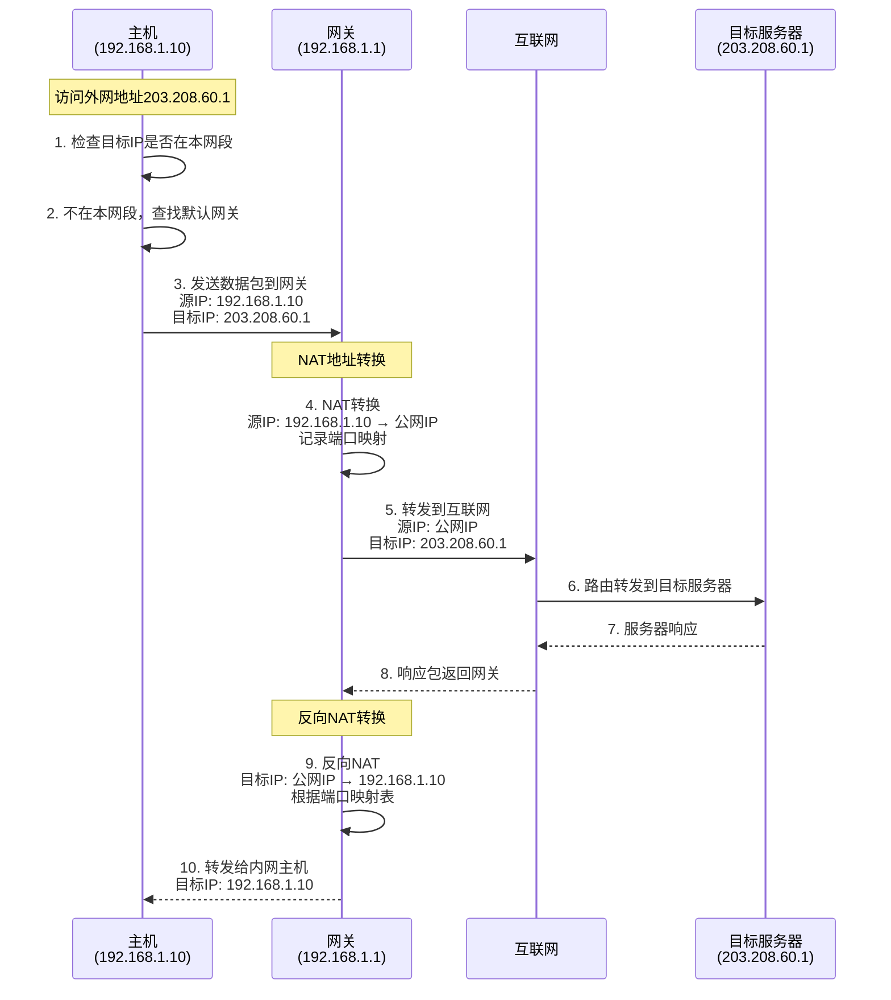
```mermaid
sequenceDiagram
    participant Host as 主机<br/>(192.168.1.10)
    participant GW as 网关<br/>(192.168.1.1)
    participant Internet as 互联网
    participant Server as 目标服务器<br/>(203.208.60.1)
    
    Note over Host: 访问外网地址203.208.60.1
    Host->>Host: 1. 检查目标IP是否在本网段
    Host->>Host: 2. 不在本网段，查找默认网关
    Host->>GW: 3. 发送数据包到网关<br/>源IP: 192.168.1.10<br/>目标IP: 203.208.60.1
    
    Note over GW: NAT地址转换
    GW->>GW: 4. NAT转换<br/>源IP: 192.168.1.10 → 公网IP<br/>记录端口映射
    
    GW->>Internet: 5. 转发到互联网<br/>源IP: 公网IP<br/>目标IP: 203.208.60.1
    Internet->>Server: 6. 路由转发到目标服务器
    
    Server-->>Internet: 7. 服务器响应
    Internet-->>GW: 8. 响应包返回网关
    
    Note over GW: 反向NAT转换
    GW->>GW: 9. 反向NAT<br/>目标IP: 公网IP → 192.168.1.10<br/>根据端口映射表
    
    GW-->>Host: 10. 转发给内网主机<br/>目标IP: 192.168.1.10
```

#### 路由器数据包转发决策流程

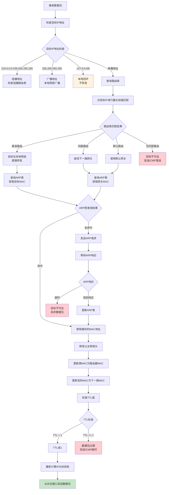
```mermaid
flowchart TD
    A["接收数据包"] --> B["检查目标IP地址"]
    
    B --> C{"目标IP地址检查"}
    
    C -->|"224.0.0.0-239.255.255.255"| D["组播地址<br/>检查组播路由表"]
    C -->|"255.255.255.255"| E["广播地址<br/>本地网段广播"]
    C -->|"127.0.0.0/8"| F["本地回环<br/>不转发"]
    C -->|"单播地址"| G["查询路由表"]
    
    G --> H["对目标IP进行最长前缀匹配"]
    
    H --> I{"路由表匹配结果"}
    
    I -->|"直连路由"| J["目标在本地网段<br/>直接转发"]
    I -->|"间接路由"| K["查找下一跳网关"]
    I -->|"默认路由"| L["使用默认网关"]
    I -->|"无匹配路由"| M["目标不可达<br/>发送ICMP错误"]
    
    J --> N["查询ARP表<br/>获取目标MAC"]
    K --> O["查询ARP表<br/>获取网关MAC"]
    L --> O
    
    N --> P{"ARP表查询结果"}
    O --> P
    
    P -->|"命中"| Q["使用缓存的MAC地址"]
    P -->|"未命中"| R["发送ARP请求"]
    
    R --> S["等待ARP响应"]
    S --> T{"ARP响应"}
    
    T -->|"收到响应"| U["更新ARP表"]
    T -->|"超时"| V["目标不可达<br/>丢弃数据包"]
    
    U --> Q
    Q --> W["修改以太网帧头"]
    
    W --> X["更新源MAC为路由器MAC"]
    X --> Y["更新目标MAC为下一跳MAC"]
    Y --> Z["检查TTL值"]
    
    Z --> AA{"TTL检查"}
    
    AA -->|"TTL > 1"| BB["TTL减1"]
    AA -->|"TTL <= 1"| CC["数据包过期<br/>发送ICMP超时"]
    
    BB --> DD["重新计算IP头校验和"]
    DD --> EE["从对应接口发送数据包"]
    
    style EE fill:#c8e6c9
    style M fill:#ffcdd2
    style V fill:#ffcdd2
    style CC fill:#ffcdd2
    style F fill:#fff3e0
```

#### 路由表查找算法详解

**1. 最长前缀匹配(LPM)原理**

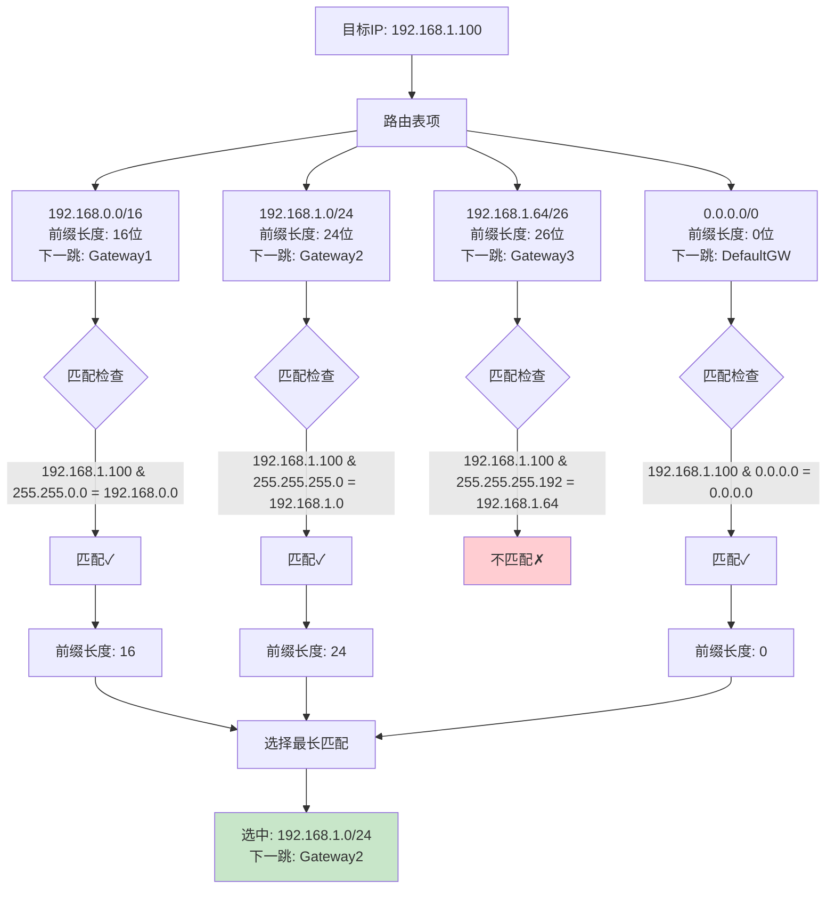
```mermaid
graph TD
    A["目标IP: 192.168.1.100"] --> B["路由表项"]
    
    B --> C["192.168.0.0/16<br/>前缀长度: 16位<br/>下一跳: Gateway1"]
    B --> D["192.168.1.0/24<br/>前缀长度: 24位<br/>下一跳: Gateway2"]
    B --> E["192.168.1.64/26<br/>前缀长度: 26位<br/>下一跳: Gateway3"]
    B --> F["0.0.0.0/0<br/>前缀长度: 0位<br/>下一跳: DefaultGW"]
    
    C --> G{"匹配检查"}
    D --> H{"匹配检查"}
    E --> I{"匹配检查"}
    F --> J{"匹配检查"}
    
    G -->|"192.168.1.100 & 255.255.0.0 = 192.168.0.0"| K["匹配✓"]
    H -->|"192.168.1.100 & 255.255.255.0 = 192.168.1.0"| L["匹配✓"]
    I -->|"192.168.1.100 & 255.255.255.192 = 192.168.1.64"| M["不匹配✗"]
    J -->|"192.168.1.100 & 0.0.0.0 = 0.0.0.0"| N["匹配✓"]
    
    K --> O["前缀长度: 16"]
    L --> P["前缀长度: 24"]
    N --> Q["前缀长度: 0"]
    
    O --> R["选择最长匹配"]
    P --> R
    Q --> R
    
    R --> S["选中: 192.168.1.0/24<br/>下一跳: Gateway2"]
    
    style S fill:#c8e6c9
    style M fill:#ffcdd2
```

**2. 路由表类型对比**

| 路由类型 | 描述 | 优先级 | 示例 |
|----------|------|----------|------|
| 直连路由| 目标在直接连接的网段 | 最高 | `192.168.1.0/24 dev eth0` |
| 静态路由 | 管理员手动配置 | 高 | `route add -net 10.0.0.0/8 gw 192.168.1.254` |
| 动态路由 | 路由协议自动学习 | 中 | `OSPF、BGP、RIP学习到的路由` |
| 默认路由 | 用于未匹配的目标 | 最低 | `0.0.0.0/0 via 192.168.1.1` |

**3. 常用路由管理命令**

```bash
# Linux 路由表管理
# 查看路由表
ip route show
route -n
netstat -rn

# 添加静态路由
ip route add 10.0.0.0/8 via 192.168.1.254
route add -net 10.0.0.0/8 gw 192.168.1.254

# 删除路由
ip route del 10.0.0.0/8
route del -net 10.0.0.0/8

# 修改默认路由
ip route del default
ip route add default via 192.168.1.1

# Windows 路由表管理
# 查看路由表
route print
netstat -rn

# 添加静态路由
route add 10.0.0.0 mask 255.0.0.0 192.168.1.254
route add 0.0.0.0 mask 0.0.0.0 192.168.1.1  # 默认路由

# 删除路由
route delete 10.0.0.0

# 永久路由(重启后保留)
route add 10.0.0.0 mask 255.0.0.0 192.168.1.254 -p
```

**4. 路由缓存与ARP表协同**

```bash
# 查看ARP表状态
arp -a
ip neighbor show

# 清空ARP缓存
ip neighbor flush all
arp -d -a  # Windows

# 跟踪路由路径
traceroute -n 8.8.8.8
tracert 8.8.8.8  # Windows
mtr --report --report-cycles 10 8.8.8.8

# 路由表的实时监控
watch -n 1 'ip route show'
route print | findstr "0.0.0.0"  # Windows监控默认路由
```

### NAT与端口映射

#### NAT类型对比

| NAT类型 | 特点 | 端口复用 | 安全性 | 应用场景 |
|---------|------|----------|--------|----------|
| 静态NAT | 一对一映射 | 不复用 | 中等 | 服务器发布 |
| 动态NAT | 多对多映射 | 不复用 | 中等 | 地址池充足场景 |
| PAT/NAPT | 多对一映射 | 端口复用 | 较高 | 家庭/企业网络 |
| 双向NAT | 双向转换 | 可选 | 高 | 网络合并场景 |

#### 端口映射配置示例

```bash
# iptables配置示例（Linux）
# 将外网80端口映射到内网服务器的80端口
iptables -t nat -A PREROUTING -p tcp --dport 80 -j DNAT --to-destination 192.168.1.100:80
iptables -t nat -A POSTROUTING -p tcp -d 192.168.1.100 --dport 80 -j SNAT --to-source 192.168.1.1

# UPnP自动端口映射
miniupnpc -a 192.168.1.100 8080 8080 TCP
```

### 网关故障排查

#### 常见故障诊断

```bash
# 1. 测试网关可达性
ping 192.168.1.1

# 2. 测试路由配置
traceroute 8.8.8.8
mtr -r 8.8.8.8

# 3. 检查ARP表
arp -a | grep 192.168.1.1
ip neigh show

# 4. 检查路由表
ip route show
route -n

# 5. 测试DNS解析
nslookup www.baidu.com 192.168.1.1
dig @192.168.1.1 www.baidu.com
```

---

## Wi-Fi 基础知识

### Wi-Fi（Wireless Fidelity）概述

#### 定义与基本概念
- **定义**：基于IEEE 802.11标准的无线局域网技术，实现终端设备与网络的无线通信。
- **核心组成**：
  - **无线路由器/无线AP（Access Point，接入点）**：负责无线信号发射与接入，是无线网络的核心枢纽
  - **无线终端**：如手机、电脑、平板、智能家居设备等，通过Wi-Fi连接到网络
- **基础原理**：终端通过Wi-Fi连接到AP，AP通过有线方式连接到路由器/网关，最终实现互联网访问

#### Wi-Fi网络架构图

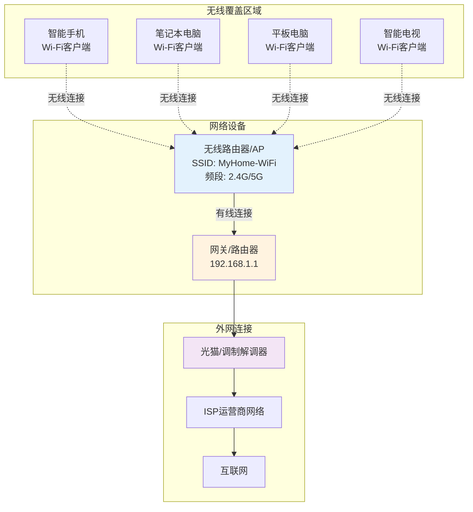
```mermaid
flowchart TD
    subgraph "无线覆盖区域"
        A["智能手机<br/>Wi-Fi客户端"]
        B["笔记本电脑<br/>Wi-Fi客户端"]
        C["平板电脑<br/>Wi-Fi客户端"]
        D["智能电视<br/>Wi-Fi客户端"]
    end
    
    subgraph "网络设备"
        E["无线路由器/AP<br/>SSID: MyHome-WiFi<br/>频段: 2.4G/5G"]
        F["网关/路由器<br/>192.168.1.1"]
    end
    
    subgraph "外网连接"
        G["光猫/调制解调器"]
        H["ISP运营商网络"]
        I["互联网"]
    end
    
    A -.->|"无线连接"| E
    B -.->|"无线连接"| E
    C -.->|"无线连接"| E
    D -.->|"无线连接"| E
    
    E -->|"有线连接"| F
    F --> G
    G --> H
    H --> I
    
    style E fill:#e3f2fd
    style F fill:#fff3e0
    style G fill:#f3e5f5
```

### Wi-Fi标准演进与技术对比

#### IEEE 802.11标准发展历程

| Wi-Fi标准 | IEEE标准 | 发布年份 | 频段 | 最大速率 | 特色技术 | 适用场景 |
|----------|----------|----------|------|----------|----------|----------|
| Wi-Fi 1 | 802.11 | 1997 | 2.4GHz | 2Mbps | 基础无线连接 | 已淘汰 |
| Wi-Fi 2 | 802.11a | 1999 | 5GHz | 54Mbps | OFDM调制 | 已淘汰 |
| Wi-Fi 3 | 802.11b | 1999 | 2.4GHz | 11Mbps | DSSS调制 | 已淘汰 |
| Wi-Fi 4 | 802.11g | 2003 | 2.4GHz | 54Mbps | OFDM+向下兼容 | 基本淘汰 |
| Wi-Fi 5 | 802.11n | 2009 | 2.4/5GHz | 600Mbps | MIMO、信道绑定 | 仍在使用 |
| Wi-Fi 6 | 802.11ac | 2013 | 5GHz | 6.93Gbps | MU-MIMO、波束成形 | 主流标准 |
| Wi-Fi 6 | 802.11ax | 2019 | 2.4/5GHz | 9.6Gbps | OFDMA、1024-QAM | 最新主流 |
| Wi-Fi 6E | 802.11ax | 2020 | 2.4/5/6GHz | 9.6Gbps | 6GHz频段 | 高端应用 |
| Wi-Fi 7 | 802.11be | 2024 | 2.4/5/6GHz | 46Gbps | 4096-QAM、MLO | 未来标准 |

#### 关键技术演进详解

**1. MIMO技术发展**
- **SU-MIMO（Single User MIMO）**：Wi-Fi 5时代，同时只能为一个用户提供多天线服务
- **MU-MIMO（Multi User MIMO）**：Wi-Fi 6时代，可同时为多个用户提供并发服务
- **空间复用**：通过多根天线在同一时间、同一频率向不同用户发送数据

**2. OFDMA技术（Wi-Fi 6核心特性）**
- **工作原理**：将信道分割成更小的资源单元（RU），多个设备可同时使用同一信道的不同部分
- **优势**：显著提升网络效率，特别是在高密度设备环境下
- **对比OFDM**：传统OFDM一次只能服务一个设备，OFDMA可同时服务多个设备

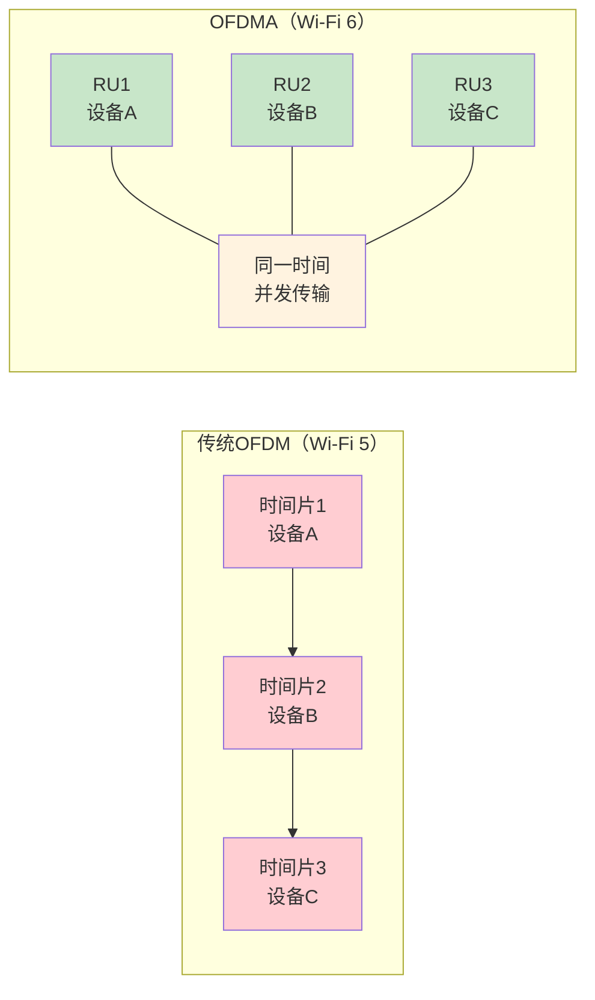
```mermaid
flowchart LR
    subgraph "传统OFDM（Wi-Fi 5）"
        A1["时间片1<br/>设备A"] 
        A2["时间片2<br/>设备B"]
        A3["时间片3<br/>设备C"]
    end
    
    subgraph "OFDMA（Wi-Fi 6）"
        B1["RU1<br/>设备A"]
        B2["RU2<br/>设备B"]
        B3["RU3<br/>设备C"]
        B4["同一时间<br/>并发传输"]
    end
    
    A1 --> A2 --> A3
    B1 --- B4
    B2 --- B4
    B3 --- B4
    
    style A1 fill:#ffcdd2
    style A2 fill:#ffcdd2
    style A3 fill:#ffcdd2
    style B1 fill:#c8e6c9
    style B2 fill:#c8e6c9
    style B3 fill:#c8e6c9
    style B4 fill:#fff3e0
```

### 频段分析与信道规划

#### 频段特性对比

**1. 2.4GHz频段**
- **频率范围**：2.400-2.484GHz
- **可用信道**：1-14信道（中国大陆1-13信道）
- **非重叠信道**：1、6、11三个信道（20MHz带宽）
- **特性优势**：
  - 穿透力强，覆盖范围广
  - 绕射能力好，适合穿墙传输
  - 设备兼容性好
- **缺点劣势**：
  - 频谱拥挤，干扰严重
  - 可用带宽有限，速率较低
  - 与蓝牙、微波炉等设备频段重叠

**2. 5GHz频段**
- **频率范围**：5.150-5.825GHz
- **可用信道**：149个信道（因国家而异）
- **信道带宽**：20/40/80/160MHz可选
- **特性优势**：
  - 频谱干净，干扰少
  - 可用带宽大，支持高速率
  - 支持更宽的信道绑定
- **缺点劣势**：
  - 穿透力弱，覆盖范围小
  - 对障碍物敏感
  - 功耗相对较高

**3. 6GHz频段（Wi-Fi 6E/7）**
- **频率范围**：5.925-7.125GHz
- **可用信道**：59个20MHz信道
- **特性优势**：
  - 全新频段，几乎无干扰
  - 大量可用频谱资源
  - 支持更多并发设备
- **缺点劣势**：
  - 设备兼容性有限
  - 法规限制较多
  - 覆盖范围更小

#### 信道规划策略

**信道干扰分析图**


```mermaid
gantt
    title 2.4GHz信道重叠示意图
    dateFormat X
    axisFormat %s
    
    section 信道分布
    信道1   :1, 5
    信道2   :2, 6
    信道3   :3, 7
    信道4   :4, 8
    信道5   :5, 9
    信道6   :6, 10
    信道7   :7, 11
    信道8   :8, 12
    信道9   :9, 13
    信道10  :10, 14
    信道11  :11, 15
    
    section 推荐使用
    建议信道1  :crit, 1, 5
    建议信道6  :crit, 6, 10
    建议信道11 :crit, 11, 15
```

**企业级信道规划原则**

1. **信道复用规划**
   - 相邻AP使用不重叠信道（2.4GHz：1、6、11）
   - 5GHz频段可使用更多非重叠信道
   - 采用蜂窝式部署模式

2. **功率控制策略**
   - 降低AP发射功率，减少同频干扰
   - 确保覆盖重叠度在15-20%
   - 考虑垂直覆盖（楼层间隔离）

3. **动态频率选择（DFS）**
   - 5GHz部分信道需要雷达检测
   - 自动避开雷达信号干扰
   - 智能信道切换机制

### Wi-Fi安全协议详解

#### 安全协议演进

**1. WEP（Wired Equivalent Privacy）**
- **发布时间**：1997年
- **加密算法**：RC4流加密
- **密钥长度**：64位或128位
- **安全问题**：
  - 密钥管理简单，容易被破解
  - IV（初始化向量）重复使用
  - 已被证明存在严重安全漏洞
- **现状**：已完全淘汰，不建议使用

**2. WPA（Wi-Fi Protected Access）**
- **发布时间**：2003年
- **加密算法**：TKIP（临时密钥完整性协议）
- **认证方式**：PSK（预共享密钥）或802.1X
- **改进点**：
  - 动态密钥生成
  - 消息完整性检查（MIC）
  - 重放攻击防护

**3. WPA2（802.11i标准）**
- **发布时间**：2004年
- **加密算法**：AES-CCMP
- **认证方式**：PSK或Enterprise（802.1X）
- **安全特性**：
  - 强加密算法（AES）
  - 更强的消息认证码
  - 支持企业级认证

**4. WPA3（最新标准）**
- **发布时间**：2018年
- **核心改进**：
  - **SAE（Simultaneous Authentication of Equals）**：防止字典攻击
  - **前向保密性**：即使密码泄露，历史通信仍安全
  - **更强的加密**：192位安全套件（Enterprise模式）
  - **简化配置**：Wi-Fi Easy Connect（DPP）

#### WPA3安全机制详解

**SAE握手过程**

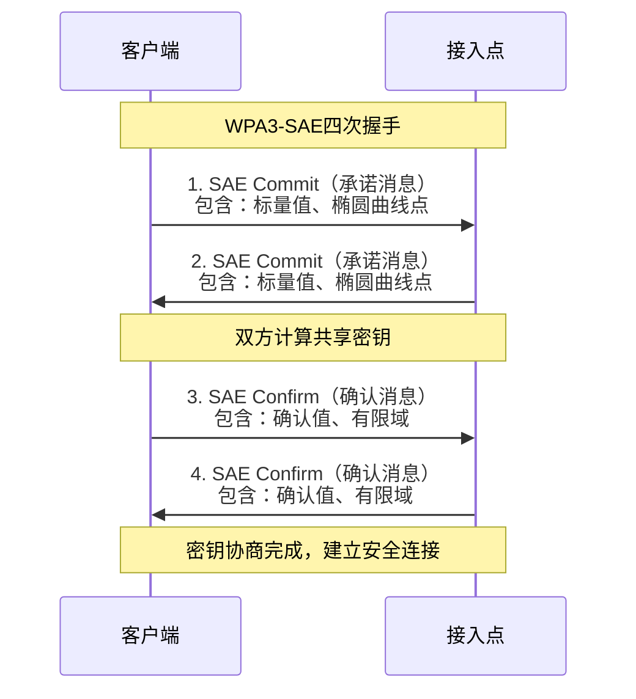
```mermaid
sequenceDiagram
    participant Client as 客户端
    participant AP as 接入点
    
    Note over Client,AP: WPA3-SAE四次握手
    
    Client->>AP: 1. SAE Commit（承诺消息）<br/>包含：标量值、椭圆曲线点
    AP->>Client: 2. SAE Commit（承诺消息）<br/>包含：标量值、椭圆曲线点
    
    Note over Client,AP: 双方计算共享密钥
    
    Client->>AP: 3. SAE Confirm（确认消息）<br/>包含：确认值、有限域
    AP->>Client: 4. SAE Confirm（确认消息）<br/>包含：确认值、有限域
    
    Note over Client,AP: 密钥协商完成，建立安全连接
```

**WPA3安全优势**

| 安全特性 | WPA2 | WPA3 | 改进说明 |
|----------|------|------|----------|
| 密码攻击防护 | 易受字典攻击 | SAE防护 | 防止离线暴力破解 |
| 前向保密性 | 不支持 | 支持 | 密码泄露不影响历史通信 |
| 开放网络 | 明文传输 | OWE加密 | 公共场所Wi-Fi也加密 |
| 企业级安全 | 128位 | 192位套件 | 更强的加密强度 |
| 配置简化 | 手动输入 | Easy Connect | 二维码快速配置 |

### 企业级Wi-Fi部署方案

#### 网络架构设计

**1. 集中式架构**

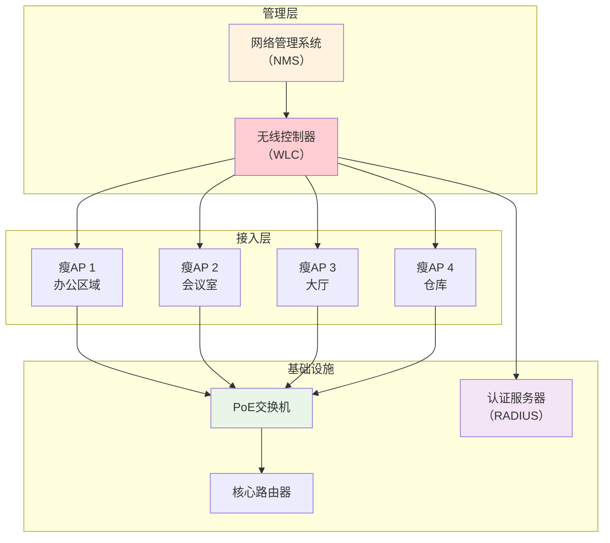
```mermaid
flowchart TD
    subgraph "管理层"
        A["无线控制器<br/>（WLC）"]
        B["网络管理系统<br/>（NMS）"]
    end
    
    subgraph "接入层"
        C["瘦AP 1<br/>办公区域"]
        D["瘦AP 2<br/>会议室"]
        E["瘦AP 3<br/>大厅"]
        F["瘦AP 4<br/>仓库"]
    end
    
    subgraph "基础设施"
        G["PoE交换机"]
        H["核心路由器"]
        I["认证服务器<br/>（RADIUS）"]
    end
    
    A --> C
    A --> D
    A --> E
    A --> F
    
    B --> A
    C --> G
    D --> G
    E --> G
    F --> G
    G --> H
    A --> I
    
    style A fill:#ffcdd2
    style B fill:#fff3e0
    style G fill:#e8f5e8
    style I fill:#f3e5f5
```

**2. 分布式架构**
- **胖AP部署**：每个AP独立运行，自主管理
- **云管理**：通过云平台统一管理分布式AP
- **边缘计算**：部分智能功能在AP本地处理

#### VLAN隔离与访客网络

**网络隔离策略**

| 网络类型 | VLAN ID | 用户群体 | 安全级别 | 网络权限 |
|----------|---------|----------|----------|----------|
| 内网办公 | VLAN 10 | 员工 | 高 | 内网+外网全访问 |
| 访客网络 | VLAN 20 | 访客 | 中 | 仅外网访问 |
| 物联网 | VLAN 30 | IoT设备 | 中 | 受限访问 |
| 管理网络 | VLAN 99 | 管理员 | 最高 | 设备管理+监控 |

**访客网络Portal认证**
- **Web Portal认证**：浏览器跳转到认证页面
- **短信验证码**：手机号码+验证码认证
- **社交账号登录**：微信、QQ等第三方账号
- **访问权限控制**：时间限制、带宽限制、网站过滤

### Wi-Fi性能优化与监控

#### 性能指标监控

**关键性能指标（KPI）**

| 性能指标 | 优秀 | 良好 | 一般 | 较差 | 监控方法 |
|----------|------|------|------|------|---------|
| 信号强度(RSSI) | >-50dBm | -50~-60dBm | -60~-70dBm | <-70dBm | 实时监控 |
| 连接成功率 | >98% | 95~98% | 90~95% | <90% | 日志分析 |
| 平均延迟 | <10ms | 10~20ms | 20~50ms | >50ms | Ping测试 |
| 吞吐量 | >80%理论值 | 60~80% | 40~60% | <40% | 速度测试 |
| 丢包率 | <0.1% | 0.1~0.5% | 0.5~1% | >1% | 流量分析 |
| 同时在线数 | 依据规划 | 80%规划值 | 60%规划值 | 超载 | 用户统计 |

#### 故障排查方法论

**分层故障排查流程**

```mermaid
flowchart TD
    A["用户反馈问题"] --> B{"物理层检查"}
    
    B -->|"正常"| C{"链路层检查"}
    B -->|"异常"| B1["检查：<br/>• AP供电状态<br/>• 网线连接<br/>• 指示灯状态"]
    
    C -->|"正常"| D{"网络层检查"}
    C -->|"异常"| C1["检查：<br/>• SSID广播<br/>• 密码正确性<br/>• MAC地址过滤"]
    
    D -->|"正常"| E{"应用层检查"}
    D -->|"异常"| D1["检查：<br/>• IP地址分配<br/>• DHCP服务<br/>• DNS解析"]
    
    E -->|"异常"| E1["检查：<br/>• 防火墙规则<br/>• 访问控制<br/>• 带宽限制"]
    E -->|"正常"| F["问题解决"]
    
    B1 --> G["硬件维修/更换"]
    C1 --> H["配置调整"]
    D1 --> I["网络配置修复"]
    E1 --> J["策略调整"]
    
    G --> F
    H --> F
    I --> F
    J --> F
    
    style A fill:#ffcdd2
    style F fill:#c8e6c9
    style B fill:#fff3e0
    style C fill:#fff3e0
    style D fill:#fff3e0
    style E fill:#fff3e0
```

**常见问题诊断命令**

```bash
# Wi-Fi连接状态检查
# Windows
netsh wlan show profiles
netsh wlan show profile name="WiFi名称" key=clear

# macOS
airport -I  # 显示当前连接信息
airport -s  # 扫描可用网络

# Linux
iwconfig
iw dev wlan0 scan | grep -E "SSID|signal|freq"

# 信号强度测试
ping -t 192.168.1.1  # Windows持续ping
ping 192.168.1.1     # macOS/Linux

# 速度测试
iperf3 -c speedtest.server.com
speedtest-cli

# 网络连通性测试
tracert 8.8.8.8      # Windows
traceroute 8.8.8.8   # macOS/Linux

# DNS解析测试
nslookup www.baidu.com
dig www.baidu.com
```


---

## Wi-Fi与网关基础

### Wi-Fi（无线局域网）
- **定义**：无线局域网通过AP实现无线接入，终端无需布线即可联网。
- **主要组成**：无线路由器/无线AP、无线终端。
- **工作原理**：终端通过Wi-Fi连接AP，AP通过有线方式连接路由器/网关，最终访问互联网。
- **进阶知识**：
  - Mesh组网可实现无缝漫游和大范围覆盖。
  - 企业级Wi-Fi支持VLAN隔离、访客网络、AP集中管理。
- **常见问题排查**：同上。

### 网关（Gateway）
- **定义**：连接不同网络的协议转换设备，是局域网与外网的桥梁。
- **作用**：协议转换、网络隔离、安全控制、路由转发。
- **进阶知识**：
  - 支持多WAN、负载均衡、策略路由。
  - 可集成防火墙、IDS/IPS、VPN等安全功能。
- **实际案例**：企业多出口网关、家庭智能路由器。

---

## 局域网IP与公网IP关系

### 局域网IP（私有IP）
- **定义**：仅在本地网络有效的IP地址，不能直接在互联网中路由。
- **常见地址段**：10.0.0.0/8、172.16.0.0/12、192.168.0.0/16。
- **作用**：内部通信、节省公网IP、提升安全性。
- **分配方式**：DHCP自动分配或手动指定。
- **访问限制**：外部无法直接访问，需端口映射或VPN。
- **进阶知识**：
  - 支持多级子网划分，便于大规模网络管理。
  - 可结合VLAN实现逻辑隔离。
- **实际案例**：家庭、企业、校园网、数据中心内网。

### 公网IP
- **定义**：全球唯一、可直接在互联网中路由的IP地址。
- **作用**：实现全球互联。
- **分配方式**：由ISP或云服务商分配。
- **访问特性**：可被全球访问，易受攻击，需加强安全防护。
- **进阶知识**：
  - IPv4公网IP稀缺，IPv6公网IP充足。
  - 支持静态和动态分配，动态公网IP常见于家庭宽带。
- **实际案例**：网站服务器、云主机、远程办公等。

### NAT（网络地址转换）与端口映射
- **NAT原理**：路由器将多个私有IP映射到一个公网IP，实现地址复用。
- **类型**：
  - 静态NAT：一一映射，常用于服务器。
  - 动态NAT：多对多映射，适合大规模用户。
  - PAT（端口地址转换）：多对一映射，最常见。
- **端口映射**：将公网IP的特定端口转发到内网指定设备，实现外部访问。
- **进阶知识**：
  - UPnP自动端口映射，便于P2P、游戏等应用。
  - NAT穿透技术（如STUN、TURN、Hole Punching）解决P2P通信难题。
- **实际案例**：远程桌面、NAS、摄像头、游戏主机等。

### 关系与通信流程
- **出网流程**：
  1. 终端用私有IP与网关通信。
  2. 路由器NAT转换为公网IP，数据包发往互联网。
  3. 返回数据包由路由器转发给对应终端。
- **入网流程**：
  1. 默认公网无法直接访问内网。
  2. 需端口映射、DMZ、VPN等方式实现。
- **进阶知识**：
  - CGNAT（运营商级NAT）进一步复用公网IP，影响P2P、端口映射。
  - IPv6下无需NAT，终端可获全球唯一地址。
- **实际案例**：家庭宽带、企业内网、云主机公网访问。

### 典型应用场景
- 家庭/公司设备通过路由器分配私有IP，共享公网IP上网。
- 远程办公、监控、游戏等需公网访问内网设备时，配置端口映射或VPN。
- 云服务器直接分配公网IP，适合对外服务。

### 安全注意事项
- 局域网IP具备天然安全性，公网IP需防火墙、入侵检测等保护。
- 端口映射易被扫描攻击，建议关闭不必要端口，使用强密码和加密。
- VPN可安全访问内网资源，推荐企业和远程办公场景。

---

## IP冲突相关问题

### 什么是IP冲突？
- IP冲突是指同一局域网内有两台或多台设备被分配了相同的IP地址，导致网络通信异常。

### 产生原因
- 多台设备手动设置了相同的静态IP。
- DHCP服务器分配的IP与某台设备的静态IP重复。
- 网络中存在多个DHCP服务器，分配了重叠的地址池。
- 设备休眠/断网后IP未及时释放，重新上线时被其他设备占用。

### 常见表现
- 设备无法正常上网或频繁掉线。
- 局域网内部分设备无法互相访问。
- 系统提示"IP地址冲突"或"有另一台设备使用了本机IP"。
- ping本机IP时出现多台设备响应。

### 排查与解决方法
- 检查路由器DHCP设置，确保地址池不与静态IP冲突。
- 局域网内设备尽量采用自动获取IP（DHCP），如需静态IP应避开DHCP分配范围。
- 使用`arp -a`、`ping`等命令查找冲突设备的MAC地址。
- 逐台排查手动设置静态IP的设备，调整为唯一IP。
- 重启路由器和所有终端，释放并重新分配IP。

### 进阶知识
- 大型企业网络可采用IP地址管理（IPAM）系统自动分配和监控IP，避免冲突。
- IPv6由于地址空间极大，几乎不会出现IP冲突。

---

## DHCP相关知识

### 什么是DHCP？
- DHCP（Dynamic Host Configuration Protocol，动态主机配置协议）是一种网络协议，用于自动为局域网内的设备分配IP地址、子网掩码、网关、DNS等网络参数。

### 工作原理
- 设备（客户端）接入网络时，自动向DHCP服务器发送请求。
- DHCP服务器从地址池中分配可用IP及相关参数，并下发给客户端。
- 客户端获得IP后可正常通信，租约到期后可续租或重新分配。
- 支持手动绑定（MAC-IP绑定）、地址池划分、租约管理等功能。

#### DHCP DORA四步握手详细流程

```mermaid
sequenceDiagram
    participant Client as DHCP客户端<br/>MAC: AA:BB:CC:DD:EE:FF<br/>IP: 0.0.0.0
    participant Switch as 交换机<br/>(广播域)
    participant Server as DHCP服务器<br/>IP: 192.168.1.1<br/>地址池: 192.168.1.100-200
    participant Router as 路由器<br/>默认网关
    
    Note over Client: 设备开机或网络重连
    
    Client->>Switch: 1. DHCP Discover(发现)<br/>源IP: 0.0.0.0<br/>目标IP: 255.255.255.255<br/>源MAC: AA:BB:CC:DD:EE:FF<br/>目标MAC: FF:FF:FF:FF:FF:FF<br/>“请问有DHCP服务器吗？”
    
    Switch->>Server: 2. 转发Discover广播
    Switch->>Router: 2. 转发Discover广播
    
    Note over Server: 检查地址池可用IP
    Server->>Server: 3. 选择可用IP: 192.168.1.150<br/>绑定MAC地址<br/>预留租约时间
    
    Server->>Switch: 4. DHCP Offer(提供)<br/>源IP: 192.168.1.1<br/>目标IP: 255.255.255.255<br/>提供IP: 192.168.1.150<br/>子网掩码: 255.255.255.0<br/>网关: 192.168.1.1<br/>DNS: 8.8.8.8<br/>租约时间: 86400秒<br/>“给你分配192.168.1.150”
    
    Switch->>Client: 5. 转发Offer消息
    
    Note over Client: 接受分配的IP地址
    Client->>Switch: 6. DHCP Request(请求)<br/>源IP: 0.0.0.0<br/>目标IP: 255.255.255.255<br/>请求IP: 192.168.1.150<br/>服务器ID: 192.168.1.1<br/>“我要使用192.168.1.150”
    
    Switch->>Server: 7. 转发Request广播
    
    Note over Server: 确认IP地址分配
    Server->>Server: 8. 正式分配IP<br/>更新地址池状态<br/>记录租约信息
    
    Server->>Switch: 9. DHCP Acknowledge(确认)<br/>源IP: 192.168.1.1<br/>目标IP: 192.168.1.150<br/>确认IP: 192.168.1.150<br/>子网掩码: 255.255.255.0<br/>网关: 192.168.1.1<br/>DNS: 8.8.8.8<br/>租约时间: 86400秒<br/>“分配成功！”
    
    Switch->>Client: 10. 转发ACK消息
    
    Client->>Client: 11. 配置网络参数<br/>IP: 192.168.1.150<br/>子网掩码: 255.255.255.0<br/>网关: 192.168.1.1<br/>DNS: 8.8.8.8
    
    Note over Client: 网络配置完成，开始正常通信
    
    Client->>Router: 12. 正常数据通信<br/>源IP: 192.168.1.150
```

#### DHCP工作机制详细分析

**1. DHCP消息类型与功能**

| 消息类型 | 方向 | 功能 | 广播/单播 |
|----------|------|------|------------|
| DISCOVER | 客户端→服务器 | 发现DHCP服务器 | 广播 |
| OFFER | 服务器→客户端 | 提供IP地址和参数 | 广播 |
| REQUEST | 客户端→服务器 | 请求使用指定IP | 广播 |
| ACK | 服务器→客户端 | 确认分配成功 | 单播 |
| NAK | 服务器→客户端 | 拒绝分配 | 广播 |
| RELEASE | 客户端→服务器 | 释放IP地址 | 单播 |
| RENEW | 客户端→服务器 | 续租IP地址 | 单播 |

**2. DHCP租约生命周期管理**

```mermaid
stateDiagram-v2
    [*] --> INIT : 设备开机
    
    INIT --> SELECTING : 发送DISCOVER
    SELECTING --> REQUESTING : 收到OFFER
    REQUESTING --> BOUND : 收到ACK
    REQUESTING --> INIT : 收到NAK
    
    BOUND --> RENEWING : T1时间到达(50%租约时间)
    RENEWING --> BOUND : 续租成功
    RENEWING --> REBINDING : T2时间到达(87.5%租约时间)
    
    REBINDING --> BOUND : 续租成功
    REBINDING --> INIT : 租约过期
    
    BOUND --> [*] : 手动释放(RELEASE)
```

**3. DHCP服务器配置示例**

```bash
# Linux DHCP服务器配置 (isc-dhcp-server)
# /etc/dhcp/dhcpd.conf

# 全局配置
default-lease-time 86400;  # 默认租约时间(24小时)
max-lease-time 172800;     # 最大租约时间(48小时)
option domain-name-servers 8.8.8.8, 114.114.114.114;
option domain-name "local";

# 子网配置
subnet 192.168.1.0 netmask 255.255.255.0 {
    range 192.168.1.100 192.168.1.200;  # 地址池范围
    option routers 192.168.1.1;          # 默认网关
    option broadcast-address 192.168.1.255;
    option subnet-mask 255.255.255.0;
}

# 静态IP分配(MAC绑定)
host server1 {
    hardware ethernet 00:11:22:33:44:55;
    fixed-address 192.168.1.10;
}

# Windows DHCP服务器配置
# 通过图形界面配置，或PowerShell命令
Add-DhcpServerv4Scope -Name "LAN" -StartRange 192.168.1.100 -EndRange 192.168.1.200 -SubnetMask 255.255.255.0
Set-DhcpServerv4OptionValue -ScopeId 192.168.1.0 -Router 192.168.1.1 -DnsServer 8.8.8.8
```

**4. DHCP故障排查**

```bash
# 客户端排查
# Windows
ipconfig /release    # 释放IP
ipconfig /renew      # 重新获取IP
ipconfig /all        # 查看详细信息

# Linux/macOS
sudo dhclient -r     # 释放IP
sudo dhclient        # 重新获取IP
ip addr show         # 查看接口信息

# 服务器端排查
# 查看DHCP租约
sudo dhcp-lease-list
tail -f /var/log/syslog | grep dhcp

# 查看地址池使用情况
dhcp-lease-list --all
```

**5. DHCP安全考虑**

| 安全风险 | 影响 | 防护措施 |
|----------|------|----------|
| 非DHCP服务器 | IP地址冲突、网络中断 | DHCP Snooping、信任端口 |
| DHCP饥饿攻击 | 地址池耗尽 | 限制每个MAC的请求频率 |
| DHCP欺骗 | 流量劫持、中间人攻击 | 静态ARP、端口安全 |
| 信息泄露 | 网络拓扑暴露 | VLAN隔离、访问控制 |

### 主要优势
- 自动化：简化网络管理，避免手动配置错误。
- 灵活性：支持动态分配、静态分配、保留地址等多种模式。
- 可扩展性：适用于家庭、企业、数据中心等各种规模网络。

### 常见应用场景
- 家庭和企业路由器默认启用DHCP，自动为终端分配IP。
- 大型企业通过集中式DHCP服务器统一管理全网IP。
- 数据中心、云平台通过DHCP实现虚拟机、容器的自动网络配置。

### 进阶知识
- 支持DHCP Option参数扩展（如PXE网络启动、VoIP配置等）。
- 支持DHCP中继（Relay），跨网段分配IP。
- DHCP与静态IP共存时需避免地址池重叠，防止IP冲突。
- IPv6环境下有DHCPv6协议，支持无状态自动配置（SLAAC）和有状态分配。

### 常见问题与排查
- 设备无法获取IP：检查DHCP服务是否开启、地址池是否耗尽、网络连通性。
- 出现IP冲突：排查静态IP与DHCP池是否重叠，检查是否有多个DHCP服务器。
- DHCP租约异常：可尝试释放/续租IP，或重启DHCP服务。

---

## VPN相关知识

### 什么是VPN？
- VPN（Virtual Private Network，虚拟专用网络）是一种通过公用网络（如互联网）建立加密"隧道"，实现远程安全访问内网资源的技术。

### 工作原理
- 通过加密协议（如IPSec、SSL、L2TP、PPTP、WireGuard等）在用户设备与VPN服务器之间建立安全连接。
- 所有数据在"隧道"中传输，防止被窃听、篡改。
- 连接VPN后，用户设备可获得目标内网的访问权限，仿佛身处本地网络。

### 主要用途
- 远程办公：员工在外地通过VPN安全访问公司内网、OA、文件服务器等。
- 数据加密：保护公共Wi-Fi环境下的数据安全，防止中间人攻击。
- 匿名访问：隐藏真实IP，突破地理限制访问特定网站或服务。
- 多分支互联：企业各地分支通过VPN组网，统一管理和资源共享。

### 常见类型
- 远程接入VPN（Remote Access VPN）：个人设备通过VPN客户端连接企业/学校等内网。
- 站点到站点VPN（Site-to-Site VPN）：两个或多个局域网通过VPN网关互联，常用于企业分支互通。
- SSL VPN：基于浏览器或专用客户端，适合灵活远程接入。
- IPSec VPN：基于IP层，安全性高，适合企业级应用。
- WireGuard：新一代高性能、易配置的VPN协议。

### 进阶知识
- 支持多种认证方式（用户名密码、证书、双因子等）。
- 可与防火墙、IDS/IPS、访问控制策略结合，提升安全性。
- 支持分流（Split Tunneling），可选择哪些流量走VPN，哪些直连互联网。
- VPN服务器可自建（如OpenVPN、StrongSwan、WireGuard）或使用云服务（如阿里云、AWS VPN等）。

### 常见问题与排查
- 无法连接VPN：检查网络连通性、账号权限、防火墙端口、协议兼容性。
- 连接后无法访问内网：排查路由配置、访问控制、DNS设置。
- 速度慢/掉线：检查带宽、服务器负载、加密算法、网络质量。
- 被封锁：尝试更换协议、端口或使用混淆插件。

### 安全注意事项
- VPN账号和证书需妥善保管，防止泄露。
- 建议启用强加密和多因子认证。
- 定期更新VPN服务器和客户端，修补安全漏洞。

---

## 翻墙（科学上网）原理补充

### 主流翻墙协议补充
- **VLESS**：V2Ray项目推出的新一代代理协议，设计上去除了VMess的认证机制，简化协议结构，提升性能和抗封锁能力。支持多种传输层（如TCP、WebSocket、gRPC、QUIC等），常与TLS、XTLS等加密方式结合，适合高性能和抗干扰场景。
- **VMess**：V2Ray最早的专用代理协议，支持用户认证和多种混淆方式，适合多用户和复杂场景，但被GFW识别概率较高。
- **Trojan**：以HTTPS为伪装的代理协议，流量特征与正常HTTPS极为相似，抗封锁能力强，易于穿透防火墙。支持多用户、WebSocket、XTLS等。
- **Shadowsocks（SS）/ShadowsocksR（SSR）**：轻量级加密代理协议，流量混淆能力较强，配置简单，广泛用于个人科学上网。
- **WireGuard**：新一代高性能VPN协议，基于UDP，配置简单，安全性高，适合移动端和服务器端点对点加密通信。

### 主流翻墙协议优缺点对比

| 协议         | 主要特点                   | 抗封锁能力 | 性能/延迟 | 配置难度 | 适用场景           | 典型缺点                   |
|--------------|----------------------------|------------|-----------|----------|--------------------|----------------------------|
| VLESS        | 新一代V2Ray协议，去认证，支持多传输层，配合TLS/XTLS | 很强       | 高        | 中       | 高敏感环境/多平台   | 需配合TLS/XTLS，配置略复杂 |
| VMess        | V2Ray专用，支持多用户/混淆  | 较强       | 高        | 中       | 多用户/自定义场景   | 被GFW识别概率较高           |
| Trojan       | HTTPS伪装，流量极像正常HTTPS| 很强       | 高        | 中       | 高敏感/易被封锁环境 | 依赖TLS证书，需服务器支持   |
| Shadowsocks  | 轻量级加密代理，混淆能力强  | 一般       | 高        | 低       | 个人/轻量级需求     | 不自带抗封锁机制，易被识别  |
| WireGuard    | 新一代高性能VPN，UDP传输    | 一般       | 极高      | 低       | 全局加密/VPN场景    | 仅VPN用途，非HTTP代理       |

### 从中国翻墙到国外
- **背景**：由于中国大陆存在网络防火墙（GFW），部分国外网站和服务（如Google、YouTube、Twitter等）被屏蔽，用户需通过"翻墙"技术访问。
- **常见原理**：
  - **VPN**：通过加密隧道将本地流量转发到国外VPN服务器，由服务器代理访问被屏蔽网站。
  - **代理（如Shadowsocks、V2Ray、Trojan等）**：本地客户端将流量加密后转发到国外代理服务器，再由服务器访问目标网站。
  - **隧道协议**：如SSH隧道、WireGuard、OpenVPN等，均可实现加密转发和流量伪装。
  - **CDN/域前置**：利用内容分发网络或第三方平台中转流量，绕过封锁。
- **流量混淆与伔装**：为防止被GFW识别和封锁，常用TLS加密、WebSocket、HTTP/2、TLS指纹伪装等技术。
- **常见问题**：
  - 服务器IP被封锁、端口被阻断、协议被识别。
  - 需定期更换服务器、协议或使用多重混淆。

### 从国外翻墙到国内
- **背景**：部分在海外的用户（如留学生、外企员工）需访问中国大陆的内网或仅限中国大陆访问的服务（如部分政务、教育、视频平台等）。
- **常见原理**：
  - **反向VPN/代理**：在中国大陆部署VPN或代理服务器，海外用户连接后流量通过该服务器访问国内资源。
  - **远程桌面/堡垒机**：通过远程桌面、堡垒机等方式间接访问内网。
  - **企业专线/SD-WAN**：企业通过专线或SD-WAN技术实现全球分支互联，保障国内资源访问。
- **常见协议**：OpenVPN、IPSec、WireGuard、Shadowsocks、V2Ray等。
- **注意事项**：
  - 国内服务器需有公网IP并开放相应端口。
  - 需遵守当地法律法规，合理合规使用。

### 安全与合规风险
- **加密通信**可提升隐私和安全，但部分国家/地区对VPN和代理有法律限制。
- **企业/个人应遵守当地网络管理政策，合理使用科学上网工具。**

---

## 家庭网络结构与流程图

```mermaid
graph TD
  subgraph 宽带运营商
    A[运营商光纤] 
  end
  A -- 光信号 --> B[光猫（ONU/ONT）]
  B -- 网线/以太网（MAC1, IP1） --> C[路由器]
  C -- Wi-Fi信号（SSID, MAC2, IP2） --> D1[手机/电脑等终端1]
  C -- Wi-Fi信号（SSID, MAC3, IP3） --> D2[终端2]
  C -- 有线（MAC4, IP4） --> D3[有线终端]
  C -- 默认网关 --> D1
  C -- 默认网关 --> D2
  C -- 默认网关 --> D3
  B -- 管理IP --> C

  %% 说明
  classDef device fill:#f9f,stroke:#333,stroke-width:1px;
  B:::device
  C:::device
  D1:::device
  D2:::device
  D3:::device
```

- 光猫负责将运营商光信号转换为以太网信号，连接路由器。
- 路由器负责分配IP（DHCP）、管理MAC、提供网关、发射WiFi信号。
- 终端通过WiFi或有线方式接入，获取IP和MAC，网关为路由器。
- 每台设备有唯一MAC，IP由路由器分配。

---

## 家庭电脑上网浏览获取数据详细流程图

```mermaid
sequenceDiagram
  participant 浏览器 as 家庭电脑浏览器
  participant 操作系统 as 操作系统/网络栈
  participant 路由器 as 家用路由器
  participant 光猫 as 光猫（ONU/ONT）
  participant 运营商 as 运营商网络
  participant DNS as DNS服务器
  participant 互联网 as 互联网骨干网
  participant 目标站 as 目标网站服务器

  浏览器->>操作系统: 输入网址，发起HTTP/HTTPS请求
  操作系统->>DNS: DNS查询（域名解析为IP）
  DNS-->>操作系统: 返回目标IP地址
  操作系统->>路由器: 发送数据包（源IP:内网IP，目标IP:网站IP）
  路由器->>路由器: NAT转换（内网IP→公网IP，分配端口）
  路由器->>光猫: 以太网帧/PPPoE封装，转发数据包
  光猫->>运营商: 光信号转换，上传数据包
  运营商->>互联网: 路由转发，数据包多级跳转
  互联网->>目标站: 数据包到达目标网站服务器
  目标站-->>互联网: 返回响应数据包
  互联网-->>运营商: 数据包回传
  运营商-->>光猫: 数据包下行
  光猫-->>路由器: 以太网帧还原
  路由器->>路由器: NAT还原（公网IP→内网IP，端口映射）
  路由器-->>操作系统: 数据包还原，送达电脑
  操作系统-->>浏览器: 解析响应，渲染网页
```

- 包含DNS解析、NAT转换、路由转发、光信号转换、运营商与互联网传输、目标服务器响应、数据回传、端口映射等详细处理环节。
- 可结合抓包工具（如Wireshark）观察每一步的实际数据流。

---

## 手机翻墙获取网页信息详细流程图

### 场景说明
- 用户在中国大陆使用手机，通过VPN或代理（如Shadowsocks、V2Ray等）访问被GFW屏蔽的国外网站。
- 涉及本地VPN/代理客户端、加密、DNS解析、NAT、运营商、GFW、VPN/代理服务器、目标网站等多个环节。

### 流程图

```mermaid
sequenceDiagram
    participant APP as 手机APP/浏览器
    participant VPN as VPN/代理客户端
    participant Router as 家用路由器
    participant ISP as 运营商
    participant GFW as GFW（防火墙）
    participant Proxy as VPN/代理服务器
    participant Site as 目标网站

    APP->>VPN: 发起网页请求（如https://www.google.com）
    VPN->>VPN: 流量加密、封装（如TLS/混淆/隧道）
    VPN->>Router: 发送加密数据包（目标：代理服务器IP）
    Router->>Router: NAT转换（内网IP→公网IP，端口映射）
    Router->>ISP: 数据包上传至运营商
    ISP->>GFW: 数据包经过GFW检测
    GFW->>Proxy: 若未被阻断，转发至VPN/代理服务器
    Proxy->>Proxy: 解密、还原原始请求
    Proxy->>Site: 代理服务器向目标网站发起请求
    Site-->>Proxy: 目标网站响应数据
    Proxy->>Proxy: 加密响应数据
    Proxy->>GFW: 返回加密数据包
    GFW->>ISP: 数据包回程
    ISP->>Router: 数据包下行
    Router->>VPN: NAT还原，转发至手机VPN客户端
    VPN->>APP: 解密数据，送达APP/浏览器
```

### 详细说明
1. **手机APP/浏览器**发起网页请求（如访问Google），请求被本地VPN/代理客户端拦截。
2. **VPN/代理客户端**对流量进行加密、封装（如TLS、混淆、隧道协议），并将数据包目标地址设为代理服务器IP。
3. 数据包通过**家用路由器**，进行NAT转换（内网IP转公网IP，端口映射）。
4. 数据包上传至**运营商**网络。
5. 数据包经过**GFW**(防火墙)检测，若未被识别/阻断，则继续转发。
6. 数据包到达**VPN/代理服务器**，服务器解密、还原原始请求。
7. 代理服务器向**目标网站**发起真实请求，获取网页数据。
8. 目标网站响应数据，回传至代理服务器。
9. 代理服务器对响应数据加密后回传。
10. 数据包经GFW、运营商、家用路由器回程，最终到达手机VPN/代理客户端。
11. **VPN/代理客户端**解密数据，交付给APP/浏览器，网页内容展示。

- **DNS解析**：通常由VPN/代理客户端处理，防止DNS污染，可采用DoH/DoT等加密DNS协议。
- **GFW检测**：可能会阻断、重置连接或识别协议，需采用混淆、TLS指纹伪装等技术。
- **NAT转换**：家庭路由器和运营商均可能涉及NAT，需端口映射保证回程。
- **加密与隐私**：全程加密可防止流量被窃听、篡改，提高隐私安全。

> 可结合抓包工具（如Wireshark、tcpdump）和VPN日志，观察每一步的实际数据流和加密过程。

---

## MAC地址相关知识

### 单播、组播、广播MAC地址基础知识

#### 单播MAC地址
- 单播MAC（Unicast MAC）用于唯一标识网络中的一台设备。
- 格式：通常为 `00:11:22:33:44:55` 这样的48位地址，最低有效位为0（第一个字节最低位）。
- 网络行为：数据帧只会被目标MAC对应的设备接收和处理，其他设备直接丢弃。
- 应用场景：绝大多数点对点通信，如PC与路由器、手机与AP的数据传输。

#### 组播MAC地址
- 组播MAC（Multicast MAC）用于标识一组设备，允许同一局域网内多个设备同时接收同一数据帧。
- 格式：以太网IPv4组播前缀为 `01:00:5e`，IPv6为 `33:33`。
- 网络行为：只有订阅该组播地址的设备才会处理该帧，未订阅的设备直接丢弃。
- 应用场景：mDNS、UPnP、IPTV、视频会议、IPv6邻居发现等。

#### 广播MAC地址
- 广播MAC（Broadcast MAC）用于向同一广播域内所有设备发送数据。
- 格式：`ff:ff:ff:ff:ff:ff`，所有48位均为1。
- 网络行为：同一局域网内所有设备都会接收和处理该广播帧。
- 应用场景：ARP请求、DHCP发现、网络唤醒、初始网络发现等。

#### 三者区别与网络行为总结
| 类型   | 目标设备数 | 典型格式                | 网络行为                         | 典型应用           |
|--------|------------|-------------------------|----------------------------------|--------------------|
| 单播   | 1          | 00:11:22:33:44:55      | 仅目标设备接收                   | 普通数据通信       |
| 组播   | 多（部分） | 01:00:5e:xx:xx:xx等    | 订阅该组播的设备接收             | mDNS、IPTV、UPnP   |
| 广播   | 全部       | ff:ff:ff:ff:ff:ff      | 所有同网段设备都接收             | ARP、DHCP、发现等  |

- 单播高效、最常用，组播适合一对多，广播适合全网通知但易引发风暴。
- 交换机可根据MAC类型优化转发，合理使用可提升网络效率。

### 组播MAC地址相关知识

#### 什么是组播MAC地址？
- 组播MAC地址（Multicast MAC Address）是以太网中用于标识一组设备的特殊MAC地址，允许同一局域网内多个设备同时接收同一数据帧。
- 与单播MAC（唯一标识一个设备）和广播MAC（所有设备都接收）不同，组播MAC用于"部分设备"接收。

#### 组播MAC地址的格式
- 以太网组播MAC地址的前缀为 `01:00:5e`，后面23位由IP组播地址映射而来。
- 典型格式：`01:00:5e:xx:xx:xx`，如 `01:00:5e:00:00:fb`（mDNS组播）。
- IPv6组播MAC前缀为 `33:33`，如 `33:33:xx:xx:xx:xx`。

#### 组播MAC与IP组播的关系
- IP组播地址（如224.0.0.0~239.255.255.255）会通过算法映射为以太网组播MAC。
- 例如，IP组播224.0.0.1对应MAC为`01:00:5e:00:00:01`。

#### 应用场景
- 局域网内的多播DNS（mDNS）、UPnP、IGMP、视频会议、在线直播、企业组播推送等。
- IPv6邻居发现、路由通告等也依赖组播MAC。

#### 与单播/广播MAC的区别
- 单播MAC：唯一标识一台设备，如 `00:11:22:33:44:55`。
- 组播MAC：一组设备共享，只有订阅该组播的设备才会处理该帧。
- 广播MAC：`ff:ff:ff:ff:ff:ff`，所有设备都接收。

#### 典型用途
- 组播视频流、IPTV、企业软件分发、网络发现协议（如mDNS、LLMNR）、IPv6协议栈等。

#### 安全与管理
- 组播流量可被交换机过滤或限制，防止网络风暴。
- 需合理配置IGMP Snooping等功能，提升局域网效率。

---

## UPnP相关知识

### 什么是UPnP？
- **定义**：UPnP（Universal Plug and Play）是一种网络协议，旨在简化设备间的连接和通信。
- **主要功能**：
  - 自动发现：设备可以自动发现网络中的其他设备。
  - 动态端口映射：支持动态配置NAT设备的端口映射。
  - 即插即用：无需用户手动配置，设备即可实现互联。

### 工作原理
- **设备发现**：通过SSDP（Simple Service Discovery Protocol）广播设备信息。
- **服务描述**：设备提供XML格式的服务描述文件，供其他设备解析。
- **控制与事件通知**：通过SOAP协议实现设备控制和状态更新。

### 优势与局限性
- **优势**：
  - 简化网络配置，适合家庭网络环境。
  - 支持多种设备类型，包括路由器、打印机、智能家居设备等。
- **局限性**：
  - 安全性较弱，容易被恶意软件利用。
  - 依赖设备厂商的实现质量，可能存在兼容性问题。

### 常见应用场景
- **家庭网络**：自动配置路由器的端口映射，支持在线游戏和P2P下载。
- **智能家居**：实现智能设备间的自动连接和控制。
- **多媒体共享**：支持DLNA协议的设备间共享多媒体内容。

### 安全注意事项
- **关闭不必要的UPnP功能**：减少安全风险。
- **使用防火墙**：监控UPnP流量，防止恶意访问。
- **定期更新设备固件**：修复潜在的安全漏洞。

---

## ARP相关知识

### 什么是ARP？
- **定义**：ARP（Address Resolution Protocol）是一种网络协议，用于将IP地址解析为MAC地址。
- **主要功能**：
  - 在局域网中实现IP地址到MAC地址的映射。
  - 支持动态更新和缓存解析结果。

### 工作原理
- **请求与响应**：
  - ARP请求：主机广播一个请求，询问目标IP地址对应的MAC地址。
  - ARP响应：目标主机回复其MAC地址。
- **缓存机制**：
  - 主机会将解析结果存储在ARP缓存中，以减少重复请求。

#### ARP协议详细工作流程

```mermaid
sequenceDiagram
    participant HostA as 主机A<br/>IP: 192.168.1.10<br/>MAC: AA:BB:CC:DD:EE:FF
    participant Switch as 交换机<br/>(广播域)
    participant HostB as 主机B<br/>IP: 192.168.1.20<br/>MAC: 11:22:33:44:55:66
    participant HostC as 其他主机<br/>IP: 192.168.1.30
    
    Note over HostA: 需要与192.168.1.20通信
    
    HostA->>HostA: 1. 检查ARP缓存表<br/>192.168.1.20 -> ?
    Note over HostA: 缓存中无记录
    
    HostA->>Switch: 2. ARP请求(广播)<br/>源MAC: AA:BB:CC:DD:EE:FF<br/>目标MAC: FF:FF:FF:FF:FF:FF<br/>“谁的IP是192.168.1.20？”
    
    Switch->>HostB: 3. 转发ARP请求(广播)
    Switch->>HostC: 3. 转发ARP请求(广播)
    
    Note over HostB: 识别到是查询自己的IP
    Note over HostC: IP不匹配，忽略请求
    
    HostB->>HostB: 4. 更新ARP缓存<br/>192.168.1.10 -> AA:BB:CC:DD:EE:FF
    
    HostB->>Switch: 5. ARP响应(单播)<br/>源MAC: 11:22:33:44:55:66<br/>目标MAC: AA:BB:CC:DD:EE:FF<br/>“我的MAC是11:22:33:44:55:66”
    
    Switch->>HostA: 6. 转发ARP响应
    
    HostA->>HostA: 7. 更新ARP缓存<br/>192.168.1.20 -> 11:22:33:44:55:66
    
    Note over HostA,HostB: ARP解析完成，开始数据通信
    
    HostA->>HostB: 8. 数据帧通信<br/>源MAC: AA:BB:CC:DD:EE:FF<br/>目标MAC: 11:22:33:44:55:66
```

#### ARP协议工作过程详细分析

**1. ARP表的维护机制**
```mermaid
flowchart TD
    A["ARP请求触发"] --> B{"检查ARP缓存"}
    
    B -->|"Hit"| C["直接使用缓存的MAC地址"]
    B -->|"Miss"| D["ARP请求广播"]
    
    D --> E["目标主机响应"]
    E --> F["更新ARP缓存"]
    F --> G["设置超时时间"]
    
    G --> H{"缓存时间"}
    H -->|"TTL未过期"| C
    H -->|"TTL过期"| I["删除缓存项"]
    I --> D
    
    style C fill:#c8e6c9
    style D fill:#ffcdd2
    style F fill:#fff3e0
```

**2. ARP协议关键特点**

| 特性 | 说明 | 安全影响 |
|------|------|----------|
| 广播请求 | ARP请求采用广播方式 | 可能被恶意监听 |
| 无认证机制 | ARP响应无需验证 | 容易受到ARP欺骗攻击 |
| 缓存机制 | 动态更新ARP表 | 可能被恶意更新 |
| 免费ARP | 主动通告更新 | 可被利用做IP冲突 |

**3. ARP缓存表查看与管理**

```bash
# 查看ARP缓存表
# Windows
arp -a
arp -a | findstr "192.168.1"

# Linux/macOS
arp -a
ip neighbor show
ip neigh show

# 清空ARP缓存
# Windows
arp -d *
netsh interface ip delete arpcache

# Linux
sudo ip neighbor flush all
sudo arp -d 192.168.1.20  # 删除指定项

# 添加静态ARP项（防ARP欺骗）
# Windows
arp -s 192.168.1.1 00:11:22:33:44:55

# Linux
sudo arp -s 192.168.1.1 00:11:22:33:44:55
sudo ip neighbor add 192.168.1.1 lladdr 00:11:22:33:44:55 dev eth0
```

**4. ARP协议帧结构**

```
ARP帧结构 (28字节)
+----------------+----------------+
|硬件类型(2字节)|协议类型(2字节)|
+----------------+----------------+
|硬件地址长度|协议地址长度|
+----------------+----------------+
|     操作类型(2字节)     |
+--------------------------------+
|    源MAC地址(6字节)      |
+--------------------------------+
|    源IP地址(4字节)       |
+--------------------------------+
|   目标MAC地址(6字节)    |
+--------------------------------+
|   目标IP地址(4字节)     |
+--------------------------------+
```

**操作类型说明**：
- `1`：ARP请求 (Request)
- `2`：ARP响应 (Reply)
- `3`：RARP请求 (Reverse ARP Request)
- `4`：RARP响应 (Reverse ARP Reply)

### 优势与局限性
- **优势**：
  - 提高局域网通信效率。
  - 支持动态网络环境。
- **局限性**：
  - ARP欺骗：攻击者伪造响应，导致流量劫持或中断。
  - 仅适用于IPv4网络，IPv6使用邻居发现协议（NDP）。

### 常见应用场景
- **局域网通信**：实现设备间的直接通信。
- **网络故障排查**：通过ARP表检查设备连接状态。

### 安全注意事项
- **启用防ARP欺骗功能**：在路由器或交换机中启用相关安全设置。
- **使用静态ARP表**：在关键设备上配置静态映射，减少攻击风险。
- **监控网络流量**：使用工具检测异常ARP流量。

---

## GFW相关知识

### 什么是GFW？
- **定义**：GFW（Great Firewall of China），即中国的互联网防火墙系统，用于对跨境互联网流量进行监控和过滤。
- **主要功能**：
  - 内容过滤：屏蔽特定网站和关键词。
  - 流量监控：分析和记录跨境流量。
  - 协议干扰：对VPN、代理等协议进行干扰。

### 工作原理
- **DNS污染**：
  - 修改域名解析结果，返回错误的IP地址。
- **IP封锁**：
  - 阻止访问特定IP地址的流量。
- **深度包检测（DPI）**：
  - 分析数据包内容，识别并干扰特定协议。
- **协议干扰**：
  - 通过识别流量特征，对特定协议进行干扰。
- **流量监控**：
  - 记录和分析跨境流量，识别异常行为。

### 优势与局限性
- **优势**：
  - 提高网络安全性，防止恶意内容传播。
  - 保护国内互联网环境。
- **局限性**：
  - 限制信息自由，影响跨境通信。
  - 对技术创新和国际合作可能产生负面影响。

### 常见应对方法
- **使用代理协议**：如Shadowsocks、VLESS、Trojan等。
- **部署加密通信**：通过TLS、HTTPS等方式保护数据。
- **动态端口切换**：减少被封锁的风险。

### 安全与合规注意事项
- **遵守法律法规**：确保跨境通信行为合法合规。
- **选择可靠服务**：使用安全性高的代理和加密技术。
- **定期更新技术**：应对防火墙的技术升级。

### GFW的实现方式

#### DNS污染
- **原理**：
  - 当用户请求某些被屏蔽的域名时，GFW会返回错误的IP地址或无效的结果。
  - 通过修改DNS解析结果，阻止用户访问目标网站。
- **典型表现**：
  - 网站无法访问，提示"无法解析域名"。

#### IP封锁
- **原理**：
  - GFW会直接阻止与特定IP地址的通信。
  - 通过黑名单机制，屏蔽目标服务器的IP地址。
- **典型表现**：
  - 无法连接到目标服务器，即使使用正确的域名。

#### 深度包检测（DPI）
- **原理**：
  - 分析数据包的内容，识别特定协议或敏感信息。
  - 对VPN、代理协议等进行干扰或封锁。
- **典型表现**：
  - VPN连接不稳定或无法建立。

#### 协议干扰
- **原理**：
  - 通过识别流量特征，对特定协议进行干扰。
  - 例如，阻断Shadowsocks、Trojan等代理协议的通信。
- **典型表现**：
  - 代理工具无法正常工作，流量中断。

#### 流量监控
- **原理**：
  - 记录和分析跨境流量，识别异常行为。
  - 通过流量模式分析，发现并阻止规避行为。
- **典型表现**：
  - 跨境流量速度下降，连接频繁中断。

### 技术细节
- **黑名单与白名单机制**：
  - 黑名单：屏蔽特定域名和IP地址。
  - 白名单：允许访问特定网站和服务。
- **动态更新**：
  - GFW会根据流量特征和用户行为动态调整屏蔽策略。
- **分布式架构**：
  - GFW部署在全国范围内的网络节点，覆盖广泛。

### 应对技术
- **流量混淆**：
  - 使用混淆技术隐藏流量特征，例如XTLS、Obfs等。
- **加密通信**：
  - 通过TLS、HTTPS等加密协议保护数据。
- **动态端口切换**：
  - 随机切换端口，减少被封锁的风险。
- **分布式代理**：
  - 使用分布式节点降低单点封锁的影响。

---

## DNS相关知识

### 什么是DNS？
- **定义**：DNS（Domain Name System）是互联网的域名解析系统，用于将域名转换为IP地址。
- **主要功能**：
  - 将用户输入的域名解析为服务器的IP地址。
  - 提供分布式的域名管理和解析服务。

### DNS的工作原理
#### 域名解析流程
1. **本地缓存查询**：
   - 用户设备首先检查本地DNS缓存中是否有目标域名的解析记录。
2. **递归查询**：
   - 如果本地缓存中没有记录，设备向本地DNS服务器发起递归查询。
3. **根域名服务器查询**：
   - 本地DNS服务器向根域名服务器请求目标域名的顶级域名（如".com"）的解析信息。
4. **顶级域名服务器查询**：
   - 根域名服务器返回顶级域名服务器的地址，本地DNS服务器继续查询。
5. **权威域名服务器查询**：
   - 顶级域名服务器返回权威域名服务器的地址，本地DNS服务器向权威服务器请求最终的IP地址。
6. **返回结果**：
   - 权威域名服务器返回目标域名的IP地址，本地DNS服务器将结果缓存并返回给用户设备。

#### DNS递归解析详细流程图

```mermaid
sequenceDiagram
    participant User as 用户设备<br/>(浏览器)
    participant LocalDNS as 本地DNS服务器<br/>(ISP或企业DNS)
    participant RootNS as 根域名服务器<br/>(.)
    participant TLD as 顶级域服务器<br/>(.com)
    participant AuthNS as 权威域名服务器<br/>(baidu.com)
    
    Note over User: 用户输入 www.baidu.com
    
    User->>User: 1. 检查浏览器DNS缓存
    Note over User: 缓存未命中
    
    User->>User: 2. 检查操作系统DNS缓存
    Note over User: 缓存未命中
    
    User->>LocalDNS: 3. 向本地DNS服务器发起递归查询<br/>查询：www.baidu.com A记录
    
    LocalDNS->>LocalDNS: 4. 检查本地DNS缓存
    Note over LocalDNS: 缓存未命中，开始递归解析
    
    LocalDNS->>RootNS: 5. 查询根域名服务器<br/>"www.baidu.com在哪里？"
    RootNS-->>LocalDNS: 6. 返回.com顶级域服务器地址<br/>"去问.com域服务器"
    
    LocalDNS->>TLD: 7. 查询.com顶级域服务器<br/>"baidu.com的权威服务器在哪里？"
    TLD-->>LocalDNS: 8. 返回baidu.com权威服务器地址<br/>"去问ns1.baidu.com"
    
    LocalDNS->>AuthNS: 9. 查询baidu.com权威服务器<br/>"www.baidu.com的IP地址是什么？"
    AuthNS-->>LocalDNS: 10. 返回IP地址<br/>"14.215.177.38"
    
    LocalDNS->>LocalDNS: 11. 缓存解析结果<br/>TTL=300秒
    LocalDNS-->>User: 12. 返回IP地址给用户<br/>14.215.177.38
    
    User->>User: 13. 缓存解析结果
    Note over User: 开始TCP连接到14.215.177.38:80
```

#### DNS解析过程详细说明

**1. 本地缓存查询层次**
- **浏览器缓存**：浏览器维护的短期DNS缓存（通常几分钟）
- **操作系统缓存**：系统级DNS缓存，由操作系统管理
- **路由器缓存**：家庭路由器可能也会缓存DNS记录

**2. 递归与迭代查询**
- **递归查询**：用户设备到本地DNS服务器的查询，本地DNS负责完整解析
- **迭代查询**：本地DNS服务器向各级域名服务器的查询，每次返回下一级服务器地址

**3. DNS服务器层级结构**
```mermaid
graph TD
    A["根域名服务器<br/>全球13个根服务器集群"] --> B[".com顶级域服务器<br/>管理所有.com域名"]
    A --> C[".org顶级域服务器"]
    A --> D[".cn顶级域服务器"]
    
    B --> E["baidu.com权威服务器<br/>存储baidu.com的DNS记录"]
    B --> F["google.com权威服务器"]
    
    E --> G["www.baidu.com<br/>A记录: 14.215.177.38"]
    E --> H["mail.baidu.com<br/>A记录: 220.181.12.11"]
    
    style A fill:#ffcdd2
    style B fill:#fff3e0
    style E fill:#e8f5e8
    style G fill:#e3f2fd
```

**4. DNS记录类型与解析**
- **A记录**：域名到IPv4地址的映射
- **AAAA记录**：域名到IPv6地址的映射
- **CNAME记录**：域名别名，指向另一个域名
- **MX记录**：邮件服务器记录
- **NS记录**：域名服务器记录
- **TTL（生存时间）**：记录在缓存中的有效时间

**5. DNS性能优化策略**
- **DNS缓存**：多级缓存减少重复查询
- **DNS预解析**：浏览器预先解析页面中的域名
- **CDN与智能DNS**：根据用户位置返回最近的服务器IP
- **DNS负载均衡**：通过DNS返回不同IP实现负载分担

#### DNS记录类型
- **A记录**：将域名解析为IPv4地址。
- **AAAA记录**：将域名解析为IPv6地址。
- **CNAME记录**：将一个域名映射到另一个域名。
- **MX记录**：指定邮件服务器的地址。
- **TXT记录**：存储文本信息，用于验证和其他用途。

### 优势与局限性
- **优势**：
  - 提供分布式解析服务，支持全球范围的域名解析。
  - 提高用户访问网站的便捷性。
- **局限性**：
  - DNS劫持：攻击者篡改解析结果，导致用户访问错误的服务器。
  - DNS污染：防火墙或其他设备返回错误的解析结果。

### 常见应用场景
- **网站访问**：用户通过域名访问网站。
- **邮件服务**：通过MX记录实现邮件服务器的解析。
- **CDN加速**：通过CNAME记录实现内容分发网络的优化。

### 安全注意事项
- **使用DNS加密**：如DNS over HTTPS（DoH）或DNS over TLS（DoT）。
- **配置防火墙**：防止DNS劫持和污染。
- **定期检查DNS记录**：确保解析结果的正确性。

---

## CDN相关知识

### 什么是CDN？
- **定义**：CDN（Content Delivery Network）是一种分布式网络架构，用于加速内容的分发和提高用户访问体验。
- **主要功能**：
  - 缓存静态资源：如图片、视频、CSS、JavaScript等。
  - 分布式节点：通过多个节点分发内容，减少服务器压力。
  - 提高访问速度：优化用户与服务器之间的通信。

### CDN的工作原理
#### 内容分发流程
1. **用户请求**：
   - 用户访问网站时，浏览器向CDN节点发起请求。
2. **节点选择**：
   - CDN根据用户的地理位置、网络状况等选择最优节点。
3. **缓存命中**：
   - 如果节点缓存中有目标资源，直接返回给用户。
4. **回源请求**：
   - 如果节点缓存中没有资源，向源服务器请求并缓存结果。
5. **返回结果**：
   - 将资源返回给用户，同时更新节点缓存。

#### 核心技术
- **负载均衡**：
  - 分配流量到多个节点，避免单点过载。
- **缓存机制**：
  - 使用缓存策略减少重复请求。
- **动态加速**：
  - 优化动态内容的传输速度。

### 优势与局限性
- **优势**：
  - 提高网站访问速度，减少延迟。
  - 降低源服务器压力，提升稳定性。
  - 提供防御DDoS攻击的能力。
- **局限性**：
  - 依赖CDN服务商，可能存在服务中断风险。
  - 配置复杂，需根据业务需求优化。

### 常见应用场景
- **网站加速**：
  - 提高用户访问网页的加载速度。
- **视频流媒体**：
  - 优化视频播放体验，减少缓冲时间。
- **全球分发**：
  - 支持跨区域的内容分发，提升国际用户体验。

### 安全注意事项
- **配置防盗链**：
  - 防止资源被非法盗用。
- **启用HTTPS**：
  - 保护用户数据安全。
- **监控流量**：
  - 检测异常流量，防止攻击。

---

## 网络安全基础

### 常见网络攻击类型

#### 网络层攻击

**DDoS攻击（分布式拒绝服务）**
- **攻击原理**：通过大量兵域机同时向目标发送请求，耗尽目标资源
- **常见类型**：
  - **流量洪水**：UDP Flood、ICMP Flood
  - **连接洪水**：SYN Flood、TCP Connect Flood  
  - **应用层攻击**：HTTP Flood、Slowloris
- **防护措施**：流量清洗、限率控制、CDN分发、防火墙过滤

**中间人攻击（MITM）**
- **攻击场景**：公共Wi-Fi、ARP欺骗、DNS劫持
- **防护方法**：使用HTTPS/TLS加密、验证SSL证书、启用VPN

#### 应用层攻击

**SQL注入攻击**
- **攻击原理**：在输入中插入恶意的SQL代码，破坏数据库查询逻辑
- **示例输入**：`' OR 1=1 --`、`'; DROP TABLE users; --`
- **防护措施**：参数化查询、输入验证、最小权限原则、WAF

**XSS攻击（跨站脚本）**
- **攻击类型**：反射型XSS、存储型XSS、DOM型XSS
- **防护措施**：输入过滤和输出编码、CSP策略、HttpOnly Cookie

**CSRF攻击（跨站请求伪造）**
- **攻击原理**：利用用户已登录的身份，诱导执行非本意操作
- **防护措施**：CSRF Token验证、SameSite Cookie、Referer头部检查

**钓鱼攻击（Phishing）**
- **常见手段**：伪造邮件、伪造网站、手机短信
- **防护方法**：验证发送者身份、检查URL真实性、启用两步验证

### 网络安全防护措施

#### 网络层防护

**防火墙类型对比**

| 防火墙类型 | 适用场景 | 优点 | 缺点 |
|------------|----------|------|------|
| 包过滤防火墙 | 基础网络防护 | 性能高、配置简单 | 无法检查应用层内容 |
| 状态检测防火墙 | 企业网络边界 | 连接状态追踪 | 资源消耗较大 |
| 应用层防火墙 | Web应用防护 | 深度内容检查 | 性能影响较大 |
| 下一代防火墙 | 综合安全防护 | 多功能集成 | 成本高、复杂度高 |

**入侵检测系统（IDS/IPS）**
- **IDS（入侵检测系统）**：被动监控，只告警不阻断
- **IPS（入侵防护系统）**：主动防护，可实时阻断攻击
- **常见工具**：Suricata、Snort、OSSEC

### 加密技术基础

#### 加密算法对比

| 加密类型 | 算法示例 | 密钥特点 | 优点 | 缺点 | 适用场景 |
|----------|----------|----------|------|------|---------|
| 对称加密 | AES、DES、3DES | 相同密钥 | 速度快、效率高 | 密钥分发问题 | 大量数据加密 |
| 非对称加密 | RSA、ECC、DH | 公私钥对 | 解决密钥分发 | 计算复杂度高 | 密钥交换、数字签名 |
| 哈希函数 | MD5、SHA-1、SHA-256 | 单向函数 | 不可逆、固定输出 | 存在碰撞风险 | 密码存储、数据完整性 |

#### 数字证书体系

```mermaid
flowchart TD
    A[根CA证书] --> B[中间CA证书]
    A --> C[中间CA证书]
    B --> D[终端实体证书]
    B --> E[终端实体证书]
    C --> F[终端实体证书]
    
    style A fill:#ffcdd2
    style B fill:#fff3e0
    style C fill:#fff3e0
    style D fill:#c8e6c9
    style E fill:#c8e6c9
    style F fill:#c8e6c9
```

**SSL/TLS证书类型**
- **DV证书（域名验证）**：仅验证域名所有权，适合个人网站
- **OV证书（组织验证）**：验证组织身份，适合企业网站
- **EV证书（扩展验证）**：最高级别验证，适合金融机构

### 网络安全最佳实践

#### 密码安全策略

**强密码要求**
- 最小长度：12位（推荐16位以上）
- 必须包含：大小写字母、数字、特殊字符
- 禁止使用：常见密码、个人信息、键盘序列
- 定期更换：90天（整个做不建议太频繁）

**多因素认证（MFA）实施**
1. **知识因素**：密码、PIN码
2. **所有因素**：智能手机、硬件令牌
3. **生物因素**：指纹、人脸识别

#### 网络架构安全原则

**最小权限原则**
- 用户只获得完成工作所需的最小权限
- 定期审查和调整用户权限
- 特权账户分离与监控

**网络分段策略**
- **DMZ区**：放置对外服务器（Web、邮件、DNS）
- **内网办公区**：员工日常办公环境
- **数据中心**：核心数据库和应用服务器
- **管理网络**：设备管理和监控网络

#### 安全监控与事件响应

**日志监控重点**
- 登录失败尝试、特权操作、异常网络流量
- 系统配置变更、文件访问、数据库操作
- 恶意软件特征、网络扫描、端口探测

**事件响应等级**
| 等级 | 响应时间 | 处理方式 | 示例事件 |
|------|----------|----------|----------|
| 低级 | 24小时 | 日志记录 | 单次登录失败 |
| 中级 | 4小时 | 人工分析 | 多次登录失败 |
| 高级 | 1小时 | 立即响应 | 批量数据删除 |
| 紧急 | 15分钟 | 自动隔离 | 恶意软件感染 |

**备份与恢复策略**
- **3-2-1备份原则**：3份备份、2种介质、1份异地
- **RTO（恢复时间目标）**：系统允许的最大停机时间
- **RPO（恢复点目标）**：系统允许的最大数据丢失量
- **定期测试**：每季度执行灶平恢复测试

### 网络安全防护措施

| 防护层面 | 防护措施 | 防御的攻击类型 | 实施难度 |
|----------|----------|----------------|----------|
| 网络层 | 防火墙 | 未授权访问、端口扫描 | 中等 |
| 网络层 | 入侵检测系统(IDS) | 异常流量、已知攻击模式 | 高 |
| 网络层 | DDoS防护 | DDoS攻击 | 高 |
| 应用层 | WAF(Web应用防火墙) | SQL注入、XSS、CSRF | 中等 |
| 应用层 | 内容过滤 | 恶意软件、钓鱼网站 | 中等 |
| 数据层 | 加密传输(TLS/SSL) | 中间人攻击、数据窃听 | 低 |
| 数据层 | 数据加密存储 | 数据泄露 | 中等 |
| 用户层 | 多因素认证 | 账号盗用 | 低 |
| 用户层 | 安全意识培训 | 社会工程学攻击 | 中等 |

### 加密技术基础
- **对称加密**：使用相同密钥加密和解密，如AES、DES。
  - 优点：速度快、效率高
  - 缺点：密钥分发问题
- **非对称加密**：使用公钥加密、私钥解密，如RSA、ECC。
  - 优点：解决密钥分发问题
  - 缺点：计算复杂度高
- **哈希函数**：将任意长度数据映射为固定长度值，如MD5、SHA系列。
  - 用途：数据完整性校验、密码存储
- **数字签名**：使用私钥签名、公钥验证，确保数据来源和完整性。
- **证书体系**：PKI（公钥基础设施），通过CA（证书颁发机构）管理证书。

### 网络安全最佳实践
1. **定期更新系统和软件**：修补已知安全漏洞。
2. **使用强密码和多因素认证**：增强账号安全性。
3. **网络分段**：限制攻击面和潜在影响范围。
4. **最小权限原则**：仅授予必要的访问权限。
5. **加密敏感数据**：保护数据在传输和存储过程中的安全。
6. **定期备份**：防止数据丢失和勒索软件攻击。
7. **安全审计和日志分析**：及时发现异常活动。
8. **制定安全策略和应急响应计划**：快速应对安全事件。
9. **员工安全意识培训**：防范社会工程学攻击。
10. **使用VPN访问敏感系统**：保护远程访问安全。

---

## 网络故障排查

### 常见网络问题与解决方案

| 问题类型 | 可能原因 | 排查方法 | 解决方案 |
|----------|----------|----------|----------|
| 无法连接网络 | 物理连接问题、IP配置错误、DNS问题 | 检查网线/Wi-Fi、ipconfig/ifconfig、ping测试 | 重新连接、重启设备、重置网络设置 |
| 网络速度慢 | 带宽限制、网络拥塞、硬件瓶颈 | 速度测试、查看网络使用情况、检查硬件状态 | 关闭占用带宽的程序、更换信道、升级硬件 |
| 连接不稳定 | 信号干扰、驱动问题、硬件故障 | 信号强度测试、更新驱动、替换硬件测试 | 调整设备位置、更新驱动、更换设备 |
| 特定网站无法访问 | DNS问题、网站故障、ISP限制 | nslookup测试、traceroute追踪、更换DNS | 更换DNS服务器、使用代理或VPN、联系ISP |
| 高延迟/丢包 | 网络拥塞、路由问题、硬件故障 | ping测试、traceroute、MTR | 更换路由路径、优化QoS设置、联系ISP |

### 网络诊断工具
- **ping**：测试网络连通性和延迟。
- **traceroute/tracert**：追踪数据包经过的路由路径。
- **nslookup/dig**：测试DNS解析。
- **ipconfig/ifconfig**：查看网络接口配置。
- **netstat**：显示网络连接、路由表和接口统计信息。
- **Wireshark**：网络协议分析器，捕获和分析网络流量。
- **MTR**：结合ping和traceroute功能的网络诊断工具。
- **iperf**：测试网络带宽性能。
- **nmap**：网络扫描和安全审计工具。

### 排查流程与方法论
1. **确认问题范围**：
   - 是特定设备还是全网问题？
   - 是特定应用还是所有应用？
   - 是临时性还是持续性问题？

2. **自下而上排查**：
   - 物理层：检查网线、接口、电源等
   - 数据链路层：检查MAC地址、交换机端口
   - 网络层：检查IP配置、路由
   - 传输层：检查端口、防火墙规则
   - 应用层：检查应用配置、服务状态

3. **分割问题**：
   - 使用排除法确定故障点
   - 替换可疑组件进行测试
   - 简化网络结构进行测试

#### 系统化网络故障排查流程

```mermaid
flowchart TD
    A["用户报告网络问题"] --> B["问题信息收集"]
    
    B --> C["详细描述:<br/>• 具体现象<br/>• 影响范围<br/>• 发生时间<br/>• 频率特点"]
    
    C --> D{"问题类型初步判断"}
    
    D -->|"1. 无法连接网络"| E["连接性问题流程"]
    D -->|"2. 网络速度慢"| F["性能问题流程"]
    D -->|"3. 间歇性中断"| G["稳定性问题流程"]
    D -->|"4. 特定网站无法访问"| H["DNS/应用问题流程"]
    
    E --> E1["物理层检查"]
    E1 --> E2{"指示灯状态"}
    
    E2 -->|"Link LED亮"| E3["数据链路层检查"]
    E2 -->|"Link LED不亮"| E4["物理连接故障"]
    
    E4 --> E5["检查项目:<br/>• 网线连接<br/>• 网线状态<br/>• 端口配置<br/>• 电源供电"]
    
    E3 --> E6{"测试本地连接"}
    E6 -->|"ping 127.0.0.1 成功"| E7["网络层检查"]
    E6 -->|"ping 失败"| E8["网络协议栈故障"]
    
    E7 --> E9{"测试网关连接"}
    E9 -->|"ping 网关成功"| E10["传输层检查"]
    E9 -->|"ping 网关失败"| E11["网络配置问题"]
    
    E11 --> E12["检查项目:<br/>• IP地址配置<br/>• 子网掩码<br/>• 默认网关<br/>• DHCP服务"]
    
    E10 --> E13{"测试外部网络"}
    E13 -->|"ping 8.8.8.8 成功"| E14["应用层检查"]
    E13 -->|"ping 8.8.8.8 失败"| E15["路由/防火墙问题"]
    
    E14 --> E16["检查项目:<br/>• DNS设置<br/>• 代理配置<br/>• 应用程序设置<br/>• 身份认证"]
    
    F --> F1["带宽测试"]
    F1 --> F2{"实际速度 vs 带宽"}
    
    F2 -->|"正常"| F3["网络优化建议"]
    F2 -->|"明显偏低"| F4["性能瓶颈分析"]
    
    F4 --> F5["检查项目:<br/>• 网络拥塞<br/>• 硬件性能<br/>• QoS配置<br/>• 同时连接数"]
    
    G --> G1["间歇性监控"]
    G1 --> G2{"中断模式分析"}
    
    G2 -->|"定时中断"| G3["设备过热/老化"]
    G2 -->|"随机中断"| G4["信号干扰/硬件故障"]
    G2 -->|"高负载时中断"| G5["资源不足/过载"]
    
    G3 --> G6["检查项目:<br/>• 设备温度<br/>• 电源稳定性<br/>• 硬件寿命<br/>• 环境湿度"]
    
    H --> H1["域名解析测试"]
    H1 --> H2{"nslookup 结果"}
    
    H2 -->|"解析成功"| H3["应用层问题"]
    H2 -->|"解析失败"| H4["DNS服务问题"]
    
    H4 --> H5["检查项目:<br/>• DNS服务器配置<br/>• DNS服务器可达性<br/>• 防火墙DNS规则<br/>• 代理服务器设置"]
    
    H3 --> H6["检查项目:<br/>• 服务器状态<br/>• 端口连通性<br/>• 身份认证<br/>• 应用版本"]
    
    E5 --> I["实施解决方案"]
    E8 --> I
    E12 --> I
    E15 --> I
    E16 --> I
    F3 --> I
    F5 --> I
    G6 --> I
    H5 --> I
    H6 --> I
    
    I --> J["验证修复效果"]
    J --> K{"}问题是否解决"}
    
    K -->|"已解决"| L["文档记录和预防措施"]
    K -->|"未解决"| M["深入分析或升级支持"]
    
    M --> M1["高级排查:<br/>• 数据包抓取<br/>• 网络拓扑分析<br/>• 设备日志分析<br/>• 厂商技术支持"]
    
    style L fill:#c8e6c9
    style E4 fill:#ffcdd2
    style E8 fill:#ffcdd2
    style E11 fill:#ffcdd2
    style E15 fill:#ffcdd2
    style F4 fill:#fff3e0
    style G3 fill:#fff3e0
    style H4 fill:#fff3e0
```

#### 分层故障排查详细指南

**1. 物理层排查清单**

| 检查项目 | 排查方法 | 常见问题 | 解决方案 |
|----------|----------|----------|----------|
| 网线连接 | 目视检查、插拔重连 | 接触不良、线材损坏 | 更换网线、重新绕线 |
| 端口状态 | 指示灯LED状态 | 端口损坏、配置错误 | 更换端口、重置配置 |
| 电源供电 | 电厕表测量、UPS状态 | 电源故障、功率不足 | 更换电源、增加UPS |
| 环境因素 | 温湿度监控、电磁干扰 | 过热、潮湿、干扰 | 改善通风、防潮、屏蔽 |

**2. 数据链路层排查清单**

```bash
# 检查网络接口状态
ip link show
ethtool eth0  # 查看接口详细信息
ifconfig -a

# 检查MAC地址表
arp -a
ip neighbor show
bridge fdb show  # 交换机转发表

# 检查VLAN配置
vlan
ip link show type vlan

# 网络性能统计
cat /proc/net/dev
sar -n DEV 1 10
```

**3. 网络层排查清单**

```bash
# IP配置检查
ip addr show
ifconfig
ipconfig /all  # Windows

# 路由表检查
ip route show
route -n
netstat -rn

# DNS配置检查
cat /etc/resolv.conf
nslookup
dig

# 网络连通性测试
ping -c 4 8.8.8.8
traceroute 8.8.8.8
mtr --report-cycles 10 8.8.8.8

# ICMP错误监控
ping -v  # verbose模式
tcpdump -i any icmp
```

**4. 传输层排查清单**

```bash
# 端口状态检查
netstat -tuln
ss -tuln
lsof -i

# 防火墙规则检查
iptables -L -n -v
firewall-cmd --list-all  # CentOS/RHEL
ufw status  # Ubuntu

# TCP连接状态
netstat -an | grep ESTABLISHED
ss -o state established

# 端口连通性测试
telnet 192.168.1.1 80
nc -zv 192.168.1.1 80
nmap -p 80,443 192.168.1.1
```

**5. 应用层排查清单**

```bash
# 服务状态检查
systemctl status service_name
service service_name status
ps aux | grep service_name

# 日志分析
tail -f /var/log/service.log
journalctl -u service_name -f

# 应用配置检查
cat /etc/service/config
nginx -t  # Nginx配置测试
apachectl configtest  # Apache配置测试

# HTTP服务测试
curl -v http://website.com
wget --spider http://website.com
```

**6. 网络排查工具集**

| 工具类别 | 工具名称 | 主要功能 | 使用场景 |
|----------|----------|----------|----------|
| 基础工具 | ping, traceroute, nslookup | 连通性、路由、DNS测试 | 基础排查 |
| 性能工具 | iperf3, netperf, mtr | 带宽、延迟、丢包测试 | 性能问题排查 |
| 抓包工具 | tcpdump, Wireshark | 数据包分析 | 深入排查 |
| 扫描工具 | nmap, zmap | 端口扫描、服务发现 | 安全检查 |
| 监控工具 | Nagios, Zabbix, PRTG | 实时监控、告警 | 主动运维 |

4. **常见排查命令流程**：
   ```
   # 检查网络接口
   ipconfig /all (Windows) 或 ifconfig -a (Linux/Mac)
   
   # 测试本地回环
   ping 127.0.0.1
   
   # 测试本地网关
   ping 默认网关IP
   
   # 测试DNS服务器
   ping DNS服务器IP
   
   # 测试外部网站
   ping www.baidu.com
   
   # 追踪路由
   tracert www.baidu.com (Windows) 或 traceroute www.baidu.com (Linux/Mac)
   
   # 查看DNS解析
   nslookup www.baidu.com
   
   # 查看网络连接
   netstat -an
   ```

5. **文档记录**：
   - 记录问题现象、排查步骤和解决方案
   - 建立知识库，便于未来参考

---

## 国内用户在CF部署翻墙节点VLESS的时序图

#### 时序图说明
以下时序图展示了国内用户通过Cloudflare（CF）部署VLESS节点进行网络访问的流程。

```mermaid
gantt
    title 国内用户通过CF部署VLESS节点进行网络访问的时序图
    dateFormat HH:mm:ss
    axisFormat %H:%M:%S
    section 用户端
    用户发起请求: active, 00:00:00, 00:00:10
    加密流量发送至CF: active, 00:00:10, 00:00:20
    section Cloudflare节点
    接收加密流量: active, 00:00:20, 00:00:30
    转发至VLESS服务器: active, 00:00:30, 00:00:40
    section VLESS服务器
    解密流量: active, 00:00:40, 00:00:50
    处理请求并返回数据: active, 00:00:50, 00:01:00
    section Cloudflare节点
    接收服务器返回数据: active, 00:01:00, 00:01:10
    加密数据并转发至用户: active, 00:01:10, 00:01:20
    section 用户端
    接收并解密数据: active, 00:01:20, 00:01:30
```

#### 详细说明
1. **用户端**：
   - 用户通过VLESS客户端发起网络请求。
   - 请求数据经过加密后发送至Cloudflare节点。
2. **Cloudflare节点**：
   - 接收用户端的加密流量。
   - 将流量转发至部署的VLESS服务器。
3. **VLESS服务器**：
   - 解密流量并处理用户请求。
   - 返回处理结果至Cloudflare节点。
4. **Cloudflare节点**：
   - 接收VLESS服务器返回的数据。
   - 对数据进行加密后转发至用户端。
5. **用户端**：
   - 接收加密数据并解密，完成网络访问。

#### 注意事项
- **加密协议**：确保使用TLS或XTLS协议保护数据安全。
- **节点选择**：选择稳定的Cloudflare节点以提高访问速度。
- **配置优化**：根据网络环境调整VLESS配置以减少延迟。

