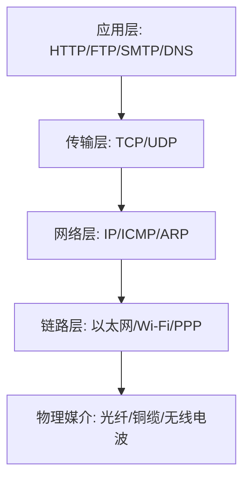
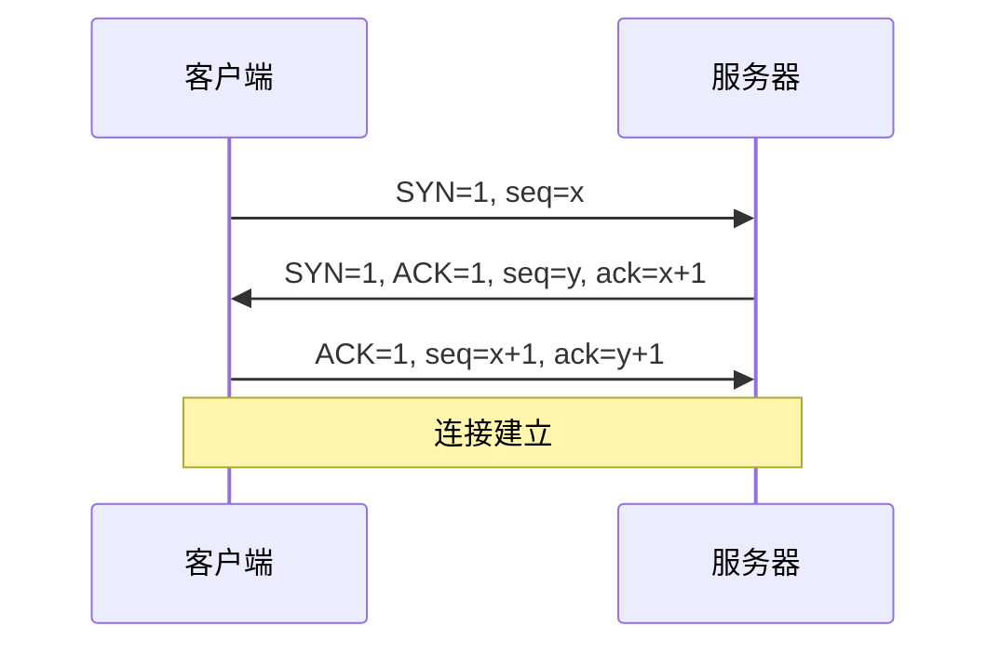
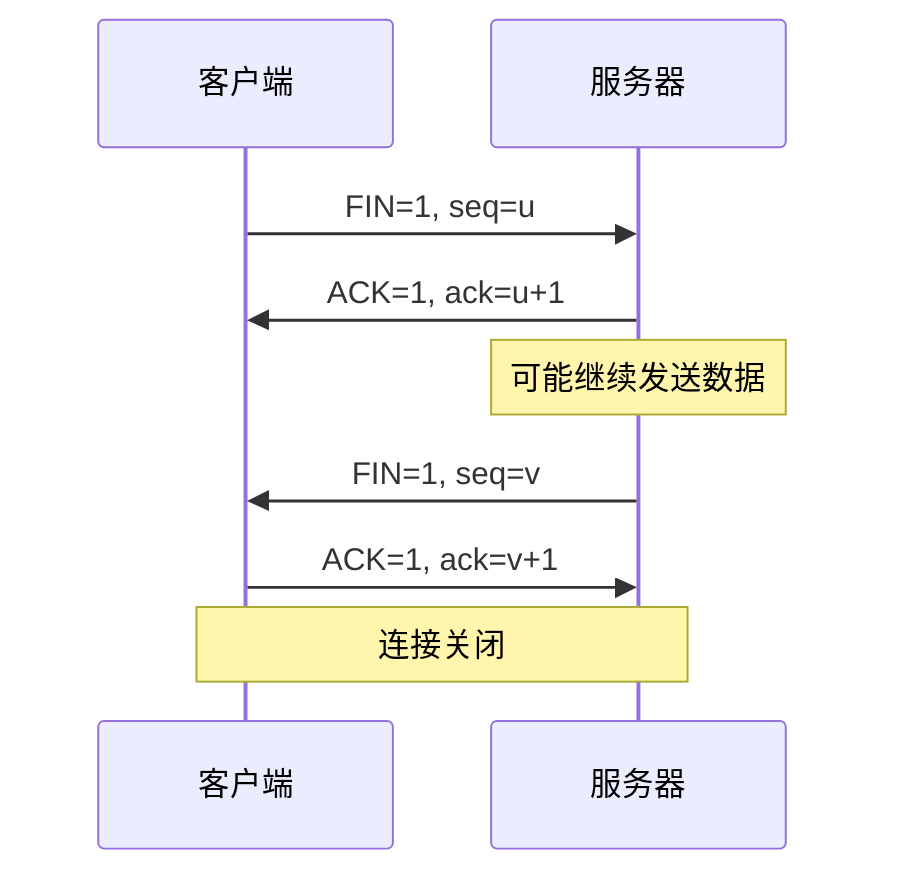

# 网络基础知识

---

## 目录
- [网络基础知识](#网络基础知识)
  - [目录](#目录)
  - [常见网络设备](#常见网络设备)
    - [光猫（ONU/ONT）](#光猫onuont)
    - [路由器](#路由器)
    - [光猫与路由器的关系](#光猫与路由器的关系)
  - [IP 基础知识](#ip-基础知识)
    - [IP（Internet Protocol）](#ipinternet-protocol)
    - [IPv4 地址](#ipv4-地址)
      - [IP 段与子网掩码](#ip-段与子网掩码)
    - [IPv6 地址](#ipv6-地址)
      - [IPv6 示例解析](#ipv6-示例解析)
      - [IPv6不同地址段的使用场景](#ipv6不同地址段的使用场景)
      - [常见IPv6前缀及实际应用举例](#常见ipv6前缀及实际应用举例)
    - [城域网IP与公网IP](#城域网ip与公网ip)
  - [TCP/IP协议栈](#tcpip协议栈)
    - [协议层次结构](#协议层次结构)
    - [TCP与UDP对比](#tcp与udp对比)
    - [三次握手与四次挥手](#三次握手与四次挥手)
    - [常见端口号与服务](#常见端口号与服务)
  - [HTTP/HTTPS协议](#httphttps协议)
    - [HTTP基础](#http基础)
    - [HTTPS工作原理](#https工作原理)
    - [HTTP状态码](#http状态码)
    - [HTTP请求方法](#http请求方法)
    - [HTTP/1.1、HTTP/2和HTTP/3对比](#http11-http2和http3对比)
  - [常用网络命令](#常用网络命令)
  - [网关基础知识](#网关基础知识)
    - [网关（Gateway）](#网关gateway)
  - [Wi-Fi 基础知识](#wi-fi-基础知识)
    - [Wi-Fi（Wireless Fidelity）](#wi-fiwireless-fidelity)
  - [Wi-Fi与网关基础](#wi-fi与网关基础)
    - [Wi-Fi（无线局域网）](#wi-fi无线局域网)
    - [网关（Gateway）](#网关gateway-1)
  - [局域网IP与公网IP关系](#局域网ip与公网ip关系)
    - [局域网IP（私有IP）](#局域网ip私有ip)
    - [公网IP](#公网ip)
    - [NAT（网络地址转换）与端口映射](#nat网络地址转换与端口映射)
    - [关系与通信流程](#关系与通信流程)
    - [典型应用场景](#典型应用场景)
    - [安全注意事项](#安全注意事项)
  - [IP冲突相关问题](#ip冲突相关问题)
    - [什么是IP冲突？](#什么是ip冲突)
    - [产生原因](#产生原因)
    - [常见表现](#常见表现)
    - [排查与解决方法](#排查与解决方法)
    - [进阶知识](#进阶知识)
  - [DHCP相关知识](#dhcp相关知识)
    - [什么是DHCP？](#什么是dhcp)
    - [工作原理](#工作原理)
    - [主要优势](#主要优势)
    - [常见应用场景](#常见应用场景)
    - [进阶知识](#进阶知识-1)
    - [常见问题与排查](#常见问题与排查)
  - [VPN相关知识](#vpn相关知识)
    - [什么是VPN？](#什么是vpn)
    - [工作原理](#工作原理-1)
    - [主要用途](#主要用途)
    - [常见类型](#常见类型)
    - [进阶知识](#进阶知识-2)
    - [常见问题与排查](#常见问题与排查-1)
    - [安全注意事项](#安全注意事项-1)
  - [翻墙（科学上网）原理补充](#翻墙科学上网原理补充)
    - [主流翻墙协议补充](#主流翻墙协议补充)
    - [主流翻墙协议优缺点对比](#主流翻墙协议优缺点对比)
    - [从中国翻墙到国外](#从中国翻墙到国外)
    - [从国外翻墙到国内](#从国外翻墙到国内)
    - [安全与合规风险](#安全与合规风险)
  - [家庭网络结构与流程图](#家庭网络结构与流程图)
  - [家庭电脑上网浏览获取数据详细流程图](#家庭电脑上网浏览获取数据详细流程图)
  - [手机翻墙获取网页信息详细流程图](#手机翻墙获取网页信息详细流程图)
    - [场景说明](#场景说明)
    - [流程图](#流程图)
    - [详细说明](#详细说明)
  - [MAC地址相关知识](#mac地址相关知识)
    - [单播、组播、广播MAC地址基础知识](#单播组播广播mac地址基础知识)
      - [单播MAC地址](#单播mac地址)
      - [组播MAC地址](#组播mac地址)
      - [广播MAC地址](#广播mac地址)
      - [三者区别与网络行为总结](#三者区别与网络行为总结)
    - [组播MAC地址相关知识](#组播mac地址相关知识)
      - [什么是组播MAC地址？](#什么是组播mac地址)
      - [组播MAC地址的格式](#组播mac地址的格式)
      - [组播MAC与IP组播的关系](#组播mac与ip组播的关系)
      - [应用场景](#应用场景)
      - [与单播/广播MAC的区别](#与单播广播mac的区别)
      - [典型用途](#典型用途)
      - [安全与管理](#安全与管理)
  - [UPnP相关知识](#upnp相关知识)
    - [什么是UPnP？](#什么是upnp)
    - [工作原理](#工作原理-2)
    - [优势与局限性](#优势与局限性)
    - [常见应用场景](#常见应用场景-1)
    - [安全注意事项](#安全注意事项-2)
  - [ARP相关知识](#arp相关知识)
    - [什么是ARP？](#什么是arp)
    - [工作原理](#工作原理-3)
    - [优势与局限性](#优势与局限性-1)
    - [常见应用场景](#常见应用场景-2)
    - [安全注意事项](#安全注意事项-3)
  - [GFW相关知识](#gfw相关知识)
    - [什么是GFW？](#什么是gfw)
    - [工作原理](#工作原理-4)
    - [优势与局限性](#优势与局限性-2)
    - [常见应对方法](#常见应对方法)
    - [安全与合规注意事项](#安全与合规注意事项)
    - [GFW的实现方式](#gfw的实现方式)
      - [DNS污染](#dns污染)
      - [IP封锁](#ip封锁)
      - [深度包检测（DPI）](#深度包检测dpi)
      - [协议干扰](#协议干扰)
      - [流量监控](#流量监控)
    - [技术细节](#技术细节)
    - [应对技术](#应对技术)
  - [DNS相关知识](#dns相关知识)
    - [什么是DNS？](#什么是dns)
    - [DNS的工作原理](#dns的工作原理)
      - [域名解析流程](#域名解析流程)
      - [DNS记录类型](#dns记录类型)
    - [优势与局限性](#优势与局限性-3)
    - [常见应用场景](#常见应用场景-3)
    - [安全注意事项](#安全注意事项-4)
  - [CDN相关知识](#cdn相关知识)
    - [什么是CDN？](#什么是cdn)
    - [CDN的工作原理](#cdn的工作原理)
      - [内容分发流程](#内容分发流程)
      - [核心技术](#核心技术)
    - [优势与局限性](#优势与局限性-4)
    - [常见应用场景](#常见应用场景-4)
    - [安全注意事项](#安全注意事项-5)
  - [网络安全基础](#网络安全基础)
    - [常见网络攻击类型](#常见网络攻击类型)
    - [网络安全防护措施](#网络安全防护措施)
    - [加密技术基础](#加密技术基础)
    - [网络安全最佳实践](#网络安全最佳实践)
  - [网络故障排查](#网络故障排查)
    - [常见网络问题与解决方案](#常见网络问题与解决方案)
    - [网络诊断工具](#网络诊断工具)
    - [排查流程与方法论](#排查流程与方法论)
  - [国内用户在CF部署翻墙节点VLESS的时序图](#国内用户在cf部署翻墙节点vless的时序图)
      - [时序图说明](#时序图说明)
      - [详细说明](#详细说明-1)
      - [注意事项](#注意事项)

---

## 常见网络设备

### 光猫（ONU/ONT）
- **定义**：光纤调制解调器（Optical Network Unit/Optical Network Terminal），是光纤到户（FTTH）方案中的核心设备，将运营商的光信号转换为家庭/企业可用的以太网信号。
- **主要功能**：
  - 信号转换（光→电）：实现光纤信号与以太网信号的互通。
  - 宽带拨号（PPPoE）：部分光猫支持直接拨号上网。
  - 电话功能：部分型号集成语音端口，支持固话接入。
  - 简单 Wi-Fi：部分光猫自带基础无线功能，但信号覆盖和性能有限。
- **进阶知识**：
  - 光猫分为桥接模式（Bridge）和路由模式（Router），桥接模式下需外接路由器拨号，路由模式下光猫自身拨号并分配IP。
  - 部分运营商会对光猫进行定制和管理，用户更换或重置需注意兼容性和认证问题。
- **常见问题**：
  - 光猫故障会导致全网断网，常见表现为PON灯异常、LOS灯闪烁。
  - 光猫性能瓶颈可能影响带宽利用率，建议高带宽场景选用高性能路由器分流。

### 路由器
- **定义**：路由器是连接不同网络、转发数据包的网络设备，家庭和企业网络的核心。
- **主要功能**：
  - 设备连接管理：支持多终端有线/无线接入。
  - Wi-Fi覆盖：提供无线网络接入，支持多频段、多SSID。
  - 网络优化与安全：如QoS带宽管理、家长控制、防火墙、VPN、访客网络等。
  - NAT转换：实现私有IP与公网IP的转换，支持端口映射、UPnP等。
- **进阶知识**：
  - 支持多种工作模式：路由、AP、桥接、中继、Mesh组网等。
  - 企业级路由器支持VLAN、静态/动态路由、ACL访问控制等高级功能。
- **常见问题**：
  - 路由器过载会导致掉线、卡顿，建议定期重启或升级固件。
  - 信号死角可通过Mesh、信号放大器等方式优化。

### 光猫与路由器的关系
- **网络结构**：光猫负责接入运营商网络，路由器负责内部网络管理和分发。
- **连接方式**：光纤→光猫→（网线）→路由器WAN口→家庭/企业终端。
- **一体机与分体机**：一体机集成光猫和路由器功能，适合简单场景；分体机便于灵活扩展和升级。
- **进阶知识**：
  - 桥接模式下，光猫仅做信号转换，路由器负责拨号和分配IP，便于网络管理和安全隔离。
  - 路由模式下，光猫和路由器均可分配IP，易出现双重NAT，影响端口映射和远程访问。
- **实际案例**：
  - 家庭宽带升级千兆后，建议光猫桥接+千兆路由器，充分发挥带宽优势。

---

## IP 基础知识

### IP（Internet Protocol）
- **定义**：IP是互联网协议族的核心协议，负责网络层寻址和数据包转发。
- **作用**：为每台联网设备分配唯一地址，实现全球范围内的设备互联。
- **进阶知识**：
  - IP协议分为IPv4和IPv6，分别对应32位和128位地址空间。
  - IP协议支持分片、重组、TTL（生存时间）、校验和等机制，保障数据可靠传输。

### IPv4 地址
- **结构**：32位二进制，通常以点分十进制表示（如192.168.1.1）。
- **地址分类**：A类（1.0.0.0-126.255.255.255）、B类、C类、D类（多播）、E类（保留）。
- **私有地址段**：仅限局域网使用，不能在公网路由。
- **公网地址**：全球唯一，由IANA和各地区RIR分配。
- **地址耗尽**：IPv4地址有限，已基本分配完毕，推动IPv6普及。
- **进阶知识**：
  - 子网划分（CIDR）：灵活分配IP资源，提高地址利用率。
  - DHCP动态分配与静态分配的区别与应用场景。

#### IP 段与子网掩码
- **子网掩码**：用于区分网络号和主机号，决定同一网段内哪些设备可直接通信。
- **CIDR表示法**：如192.168.1.0/24，表示前24位为网络号。
- **广播地址**：用于同一网段内所有主机的广播通信。
- **实际案例**：
  - 企业网络常用子网划分实现部门隔离和安全控制。

### IPv6 地址
- **结构**：128位，十六进制冒号分隔（如2001:0db8:85a3:0000:0000:8a2e:0370:7334）。
- **主要类型**：
  - 全局单播地址：可在互联网路由，类似IPv4公网IP。
  - 链路本地地址：仅限本地链路通信，自动分配，前缀fe80::/10。
  - 回环地址（::1）：本机自测。
  - 多播地址：一对多通信。
- **IPv6优势**：
  - 地址空间极大，支持物联网、5G等大规模接入。
  - 支持IPsec加密、自动配置、无NAT直连等特性。
- **进阶知识**：
  - IPv6过渡技术（如双栈、隧道、NAT64等）。
  - SLAAC自动地址配置与DHCPv6的区别。

#### IPv6 示例解析
- **fe80::26da:33ff:fec7:924b%wlan0**：链路本地地址，%wlan0为接口标识。
- **应用场景**：本地网段设备自动发现、无须手动配置。
- **注意事项**：链路本地地址不可用于互联网通信。

#### IPv6不同地址段的使用场景
- **全球单播地址（2000::/3）**：
  - 用于互联网中的唯一标识，适合公网通信。
- **链路本地地址（fe80::/10）**：
  - 仅在本地链路（同一网段）内通信，不可路由到互联网，常用于自动地址配置和本地发现。
- **站点本地地址（fec0::/10，已弃用）**：
  - 早期用于站点内部通信，现已被弃用，推荐使用唯一本地地址（ULA）。
- **唯一本地地址ULA（fc00::/7）**：
  - 用于组织内部私有网络，类似于IPv4的私有地址（如192.168.0.0/16），不可在公网路由。
- **多播地址（ff00::/8）**：
  - 用于一对多通信，如邻居发现、路由协议等。
- **回环地址（::1/128）**：
  - 本地回环测试，类似于IPv4的127.0.0.1。
- **未指定地址（::/128）**：
  - 表示"无地址"，常用于初始化阶段。

#### 常见IPv6前缀及实际应用举例
- **2000::/3**
  - 全球单播地址（Global Unicast Address），用于互联网中唯一标识的主机或网络。
- **fc00::/7**
  - 唯一本地地址（Unique Local Address, ULA），用于组织内部私有网络，类似IPv4的私有地址。
- **fe80::/10**
  - 链路本地地址（Link-Local Address），仅在本地链路内有效，自动分配，常用于本地通信和邻居发现。
- **ff00::/8**
  - 多播地址（Multicast Address），用于一对多通信，支持协议发现、路由等。
- **::1/128**
  - 回环地址（Loopback Address），本地回环测试，类似IPv4的127.0.0.1。
- **::/128**
  - 未指定地址（Unspecified Address），表示"无地址"，常用于初始化阶段。
- **2001:db8::/32**
  - 文档和示例专用地址段，仅用于文档和教学，不会在实际网络中分配。
- **240e::/16、2409::/16、2408::/16**
  - 中国大陆三大运营商（电信、移动、联通）分配的全球单播地址段，实际公网IPv6地址。
- **2001:da8::/32**
  - 中国教育和科研网（CERNET）分配的全球单播地址段。
- **2001:250::/32**
  - 中国互联网信息中心（CNNIC）分配的全球单播地址段。

> 这些前缀段可用于快速判断IPv6地址的用途、作用范围及归属。

### 城域网IP与公网IP

| 特性         | 城域网IP（私网）                | 公网IP                |
| ------------ | ------------------------------ | --------------------- |
| 地址类型     | 私网IP（如10.x.x.x,192.168.x.x） | 全球唯一公网IP        |
| 是否直连互联网 | 否（需NAT转换）                 | 是                    |
| 分配范围     | 城市/区域内部                   | 全球                  |
| 典型用途     | 家庭宽带、企业内网              | 网站、服务器对外服务  |

- **城域网IP**：运营商在城市范围内分配的IP，通常为私网IP，通过NAT共享公网出口。
- **公网IP**：全球唯一，可直接访问互联网。

---

## TCP/IP协议栈

### 协议层次结构
- **定义**：TCP/IP协议栈是互联网通信的基础，由四层组成：应用层、传输层、网络层、链路层。
- **各层功能**：
  - **应用层**：提供应用程序间通信服务，如HTTP、FTP、SMTP等。
  - **传输层**：提供端到端的通信服务，如TCP、UDP。
  - **网络层**：负责数据包的路由和转发，如IP协议。
  - **链路层**：负责物理传输，如以太网、Wi-Fi等。



### TCP与UDP对比

| 特性 | TCP | UDP |
|------|-----|-----|
| 连接类型 | 面向连接 | 无连接 |
| 可靠性 | 高（有确认、重传机制） | 低（无确认机制） |
| 数据顺序 | 保证有序 | 不保证有序 |
| 速度 | 较慢 | 较快 |
| 流量控制 | 有（滑动窗口） | 无 |
| 拥塞控制 | 有 | 无 |
| 应用场景 | 网页浏览、文件传输、邮件 | 视频流、游戏、DNS |
| 头部大小 | 20-60字节 | 8字节 |

### 三次握手与四次挥手
- **TCP三次握手**：建立连接的过程
  1. **客户端→服务器**：SYN=1, seq=x
  2. **服务器→客户端**：SYN=1, ACK=1, seq=y, ack=x+1
  3. **客户端→服务器**：ACK=1, seq=x+1, ack=y+1



- **TCP四次挥手**：断开连接的过程
  1. **客户端→服务器**：FIN=1, seq=u
  2. **服务器→客户端**：ACK=1, ack=u+1
  3. **服务器→客户端**：FIN=1, seq=v
  4. **客户端→服务器**：ACK=1, ack=v+1



### 常见端口号与服务

| 端口号 | 服务 | 协议 | 用途 |
|--------|------|------|------|
| 20/21 | FTP | TCP | 文件传输 |
| 22 | SSH | TCP | 安全远程登录 |
| 23 | Telnet | TCP | 远程登录 |
| 25 | SMTP | TCP | 邮件发送 |
| 53 | DNS | TCP/UDP | 域名解析 |
| 80 | HTTP | TCP | 网页访问 |
| 110 | POP3 | TCP | 邮件接收 |
| 143 | IMAP | TCP | 邮件接收 |
| 443 | HTTPS | TCP | 安全网页访问 |
| 1723 | PPTP | TCP | VPN服务 |
| 3306 | MySQL | TCP | 数据库服务 |
| 3389 | RDP | TCP | 远程桌面 |
| 8080 | HTTP代理 | TCP | 代理服务 |

---

## HTTP/HTTPS协议

### HTTP基础
- **定义**：HTTP（HyperText Transfer Protocol）是应用层协议，用于在Web上传输超文本。
- **特点**：
  - 无状态：每个请求相互独立
  - 明文传输：数据未加密
  - 请求-响应模式：客户端发起请求，服务器响应

### HTTPS工作原理
- **定义**：HTTPS（HTTP Secure）是HTTP的安全版本，通过SSL/TLS加密HTTP通信。
- **工作流程**：
  1. **握手阶段**：客户端与服务器建立SSL/TLS连接
  2. **证书验证**：客户端验证服务器证书
  3. **密钥交换**：协商对称加密密钥
  4. **加密通信**：使用对称密钥加密数据传输


### HTTP状态码

| 状态码 | 类别 | 描述 | 常见示例 |
|--------|------|------|----------|
| 1xx | 信息性 | 请求已接收，继续处理 | 100 Continue |
| 2xx | 成功 | 请求已成功接收、理解、接受 | 200 OK, 201 Created |
| 3xx | 重定向 | 需要进一步操作才能完成请求 | 301 Moved Permanently, 302 Found |
| 4xx | 客户端错误 | 请求包含语法错误或无法完成 | 400 Bad Request, 404 Not Found |
| 5xx | 服务器错误 | 服务器在处理请求时发生错误 | 500 Internal Server Error, 503 Service Unavailable |

### HTTP请求方法

| 方法 | 描述 | 是否幂等 | 是否安全 |
|------|------|----------|----------|
| GET | 请求资源 | 是 | 是 |
| POST | 提交数据 | 否 | 否 |
| PUT | 更新资源 | 是 | 否 |
| DELETE | 删除资源 | 是 | 否 |
| HEAD | 获取头信息 | 是 | 是 |
| OPTIONS | 获取支持的方法 | 是 | 是 |
| PATCH | 部分更新资源 | 否 | 否 |

### HTTP/1.1、HTTP/2和HTTP/3对比

| 特性 | HTTP/1.1 | HTTP/2 | HTTP/3 |
|------|----------|--------|--------|
| 发布年份 | 1997年 | 2015年 | 2022年 |
| 传输协议 | TCP | TCP | QUIC(UDP) |
| 多路复用 | 不支持 | 支持 | 支持 |
| 头部压缩 | 不支持 | HPACK | QPACK |
| 服务器推送 | 不支持 | 支持 | 支持 |
| 队头阻塞 | 存在 | 部分解决 | 基本解决 |
| 连接建立 | 需要多次RTT | 需要多次RTT | 0-RTT或1-RTT |
| 加密 | 可选 | 实际上必需 | 必需 |

---

## 常用网络命令

- `arp -a`：查看本地ARP缓存，排查IP与MAC绑定冲突。
- `ipconfig`/`ifconfig`：查看和配置本机网络参数，常用于排查IP冲突、网关异常。
- `ping`：测试网络连通性和延迟，判断丢包、延迟等问题。
- `traceroute`/`tracert`：追踪数据包经过的路由路径，定位网络瓶颈和故障节点。
- `netstat -an`：查看端口占用、连接状态，排查异常连接和端口冲突。
- `nslookup`：DNS解析测试，排查域名无法访问等问题。
- **进阶命令**：
  - `route`/`ip route`：查看和配置路由表。
  - `tcpdump`/`wireshark`：抓包分析网络流量。
  - `nmap`：端口扫描与安全检测。

---

## 网关基础知识

### 网关（Gateway）
- **定义**：网关是网络层与更高层之间的协议转换设备，连接不同网络，实现数据转发和协议适配。
- **主要作用**：
  - 协议转换：如IPv4与IPv6、TCP与UDP、HTTP与HTTPS等。
  - 网络隔离与安全控制：防火墙、NAT、访问控制列表（ACL）。
  - 路由转发：实现不同网段、不同协议间的数据互通。
- **类型**：
  - 默认网关：局域网设备访问外部网络的出口。
  - 应用层网关（如代理服务器、API网关）：实现应用协议转换和安全控制。
- **进阶知识**：
  - 支持静态路由、动态路由（RIP、OSPF、BGP等）协议。
  - 企业级网关支持负载均衡、冗余备份（VRRP）、多出口策略等。
- **实际案例**：
  - 家庭宽带路由器的WAN口即为默认网关。
  - 企业部署多出口网关实现链路备份和负载均衡。

---

## Wi-Fi 基础知识

### Wi-Fi（Wireless Fidelity）
- **定义**：基于IEEE 802.11标准的无线局域网技术，实现终端设备与网络的无线通信。
- **主要组成**：
  - 无线路由器/无线AP（Access Point，接入点）：负责无线信号发射与接入。
  - 无线终端：如手机、电脑、平板、智能家居等。
- **常见术语**：
  - SSID：无线网络名称，可隐藏或广播。
  - 加密方式：WPA2、WPA3（推荐）、WEP（已淘汰）。
  - 频段：2.4GHz（穿透力强，易干扰）、5GHz（速率高，覆盖近）、6GHz（Wi-Fi 6E）。
- **基础原理**：
  - 终端通过Wi-Fi连接到AP，AP通过有线方式连接到路由器/网关，实现互联网访问。
  - 支持漫游、Mesh组网、QoS等高级特性。
- **进阶知识**：
  - Wi-Fi 5/6/6E/7标准的区别与优势。
  - MU-MIMO、OFDMA等提升并发和效率的技术。
  - 信道干扰与自动信道选择。
- **常见问题排查**：
  - 信号弱：优化AP布局、减少障碍物、升级天线。
  - 无法连接：检查SSID、密码、加密方式、黑名单设置。
  - 频段干扰：切换信道、使用5G频段、避开微波炉等干扰源。
  - 速率慢：排查带宽瓶颈、终端兼容性、邻居Wi-Fi干扰。

---

## Wi-Fi与网关基础

### Wi-Fi（无线局域网）
- **定义**：无线局域网通过AP实现无线接入，终端无需布线即可联网。
- **主要组成**：无线路由器/无线AP、无线终端。
- **工作原理**：终端通过Wi-Fi连接AP，AP通过有线方式连接路由器/网关，最终访问互联网。
- **进阶知识**：
  - Mesh组网可实现无缝漫游和大范围覆盖。
  - 企业级Wi-Fi支持VLAN隔离、访客网络、AP集中管理。
- **常见问题排查**：同上。

### 网关（Gateway）
- **定义**：连接不同网络的协议转换设备，是局域网与外网的桥梁。
- **作用**：协议转换、网络隔离、安全控制、路由转发。
- **进阶知识**：
  - 支持多WAN、负载均衡、策略路由。
  - 可集成防火墙、IDS/IPS、VPN等安全功能。
- **实际案例**：企业多出口网关、家庭智能路由器。

---

## 局域网IP与公网IP关系

### 局域网IP（私有IP）
- **定义**：仅在本地网络有效的IP地址，不能直接在互联网中路由。
- **常见地址段**：10.0.0.0/8、172.16.0.0/12、192.168.0.0/16。
- **作用**：内部通信、节省公网IP、提升安全性。
- **分配方式**：DHCP自动分配或手动指定。
- **访问限制**：外部无法直接访问，需端口映射或VPN。
- **进阶知识**：
  - 支持多级子网划分，便于大规模网络管理。
  - 可结合VLAN实现逻辑隔离。
- **实际案例**：家庭、企业、校园网、数据中心内网。

### 公网IP
- **定义**：全球唯一、可直接在互联网中路由的IP地址。
- **作用**：实现全球互联。
- **分配方式**：由ISP或云服务商分配。
- **访问特性**：可被全球访问，易受攻击，需加强安全防护。
- **进阶知识**：
  - IPv4公网IP稀缺，IPv6公网IP充足。
  - 支持静态和动态分配，动态公网IP常见于家庭宽带。
- **实际案例**：网站服务器、云主机、远程办公等。

### NAT（网络地址转换）与端口映射
- **NAT原理**：路由器将多个私有IP映射到一个公网IP，实现地址复用。
- **类型**：
  - 静态NAT：一一映射，常用于服务器。
  - 动态NAT：多对多映射，适合大规模用户。
  - PAT（端口地址转换）：多对一映射，最常见。
- **端口映射**：将公网IP的特定端口转发到内网指定设备，实现外部访问。
- **进阶知识**：
  - UPnP自动端口映射，便于P2P、游戏等应用。
  - NAT穿透技术（如STUN、TURN、Hole Punching）解决P2P通信难题。
- **实际案例**：远程桌面、NAS、摄像头、游戏主机等。

### 关系与通信流程
- **出网流程**：
  1. 终端用私有IP与网关通信。
  2. 路由器NAT转换为公网IP，数据包发往互联网。
  3. 返回数据包由路由器转发给对应终端。
- **入网流程**：
  1. 默认公网无法直接访问内网。
  2. 需端口映射、DMZ、VPN等方式实现。
- **进阶知识**：
  - CGNAT（运营商级NAT）进一步复用公网IP，影响P2P、端口映射。
  - IPv6下无需NAT，终端可获全球唯一地址。
- **实际案例**：家庭宽带、企业内网、云主机公网访问。

### 典型应用场景
- 家庭/公司设备通过路由器分配私有IP，共享公网IP上网。
- 远程办公、监控、游戏等需公网访问内网设备时，配置端口映射或VPN。
- 云服务器直接分配公网IP，适合对外服务。

### 安全注意事项
- 局域网IP具备天然安全性，公网IP需防火墙、入侵检测等保护。
- 端口映射易被扫描攻击，建议关闭不必要端口，使用强密码和加密。
- VPN可安全访问内网资源，推荐企业和远程办公场景。

---

## IP冲突相关问题

### 什么是IP冲突？
- IP冲突是指同一局域网内有两台或多台设备被分配了相同的IP地址，导致网络通信异常。

### 产生原因
- 多台设备手动设置了相同的静态IP。
- DHCP服务器分配的IP与某台设备的静态IP重复。
- 网络中存在多个DHCP服务器，分配了重叠的地址池。
- 设备休眠/断网后IP未及时释放，重新上线时被其他设备占用。

### 常见表现
- 设备无法正常上网或频繁掉线。
- 局域网内部分设备无法互相访问。
- 系统提示"IP地址冲突"或"有另一台设备使用了本机IP"。
- ping本机IP时出现多台设备响应。

### 排查与解决方法
- 检查路由器DHCP设置，确保地址池不与静态IP冲突。
- 局域网内设备尽量采用自动获取IP（DHCP），如需静态IP应避开DHCP分配范围。
- 使用`arp -a`、`ping`等命令查找冲突设备的MAC地址。
- 逐台排查手动设置静态IP的设备，调整为唯一IP。
- 重启路由器和所有终端，释放并重新分配IP。

### 进阶知识
- 大型企业网络可采用IP地址管理（IPAM）系统自动分配和监控IP，避免冲突。
- IPv6由于地址空间极大，几乎不会出现IP冲突。

---

## DHCP相关知识

### 什么是DHCP？
- DHCP（Dynamic Host Configuration Protocol，动态主机配置协议）是一种网络协议，用于自动为局域网内的设备分配IP地址、子网掩码、网关、DNS等网络参数。

### 工作原理
- 设备（客户端）接入网络时，自动向DHCP服务器发送请求。
- DHCP服务器从地址池中分配可用IP及相关参数，并下发给客户端。
- 客户端获得IP后可正常通信，租约到期后可续租或重新分配。
- 支持手动绑定（MAC-IP绑定）、地址池划分、租约管理等功能。

### 主要优势
- 自动化：简化网络管理，避免手动配置错误。
- 灵活性：支持动态分配、静态分配、保留地址等多种模式。
- 可扩展性：适用于家庭、企业、数据中心等各种规模网络。

### 常见应用场景
- 家庭和企业路由器默认启用DHCP，自动为终端分配IP。
- 大型企业通过集中式DHCP服务器统一管理全网IP。
- 数据中心、云平台通过DHCP实现虚拟机、容器的自动网络配置。

### 进阶知识
- 支持DHCP Option参数扩展（如PXE网络启动、VoIP配置等）。
- 支持DHCP中继（Relay），跨网段分配IP。
- DHCP与静态IP共存时需避免地址池重叠，防止IP冲突。
- IPv6环境下有DHCPv6协议，支持无状态自动配置（SLAAC）和有状态分配。

### 常见问题与排查
- 设备无法获取IP：检查DHCP服务是否开启、地址池是否耗尽、网络连通性。
- 出现IP冲突：排查静态IP与DHCP池是否重叠，检查是否有多个DHCP服务器。
- DHCP租约异常：可尝试释放/续租IP，或重启DHCP服务。

---

## VPN相关知识

### 什么是VPN？
- VPN（Virtual Private Network，虚拟专用网络）是一种通过公用网络（如互联网）建立加密"隧道"，实现远程安全访问内网资源的技术。

### 工作原理
- 通过加密协议（如IPSec、SSL、L2TP、PPTP、WireGuard等）在用户设备与VPN服务器之间建立安全连接。
- 所有数据在"隧道"中传输，防止被窃听、篡改。
- 连接VPN后，用户设备可获得目标内网的访问权限，仿佛身处本地网络。

### 主要用途
- 远程办公：员工在外地通过VPN安全访问公司内网、OA、文件服务器等。
- 数据加密：保护公共Wi-Fi环境下的数据安全，防止中间人攻击。
- 匿名访问：隐藏真实IP，突破地理限制访问特定网站或服务。
- 多分支互联：企业各地分支通过VPN组网，统一管理和资源共享。

### 常见类型
- 远程接入VPN（Remote Access VPN）：个人设备通过VPN客户端连接企业/学校等内网。
- 站点到站点VPN（Site-to-Site VPN）：两个或多个局域网通过VPN网关互联，常用于企业分支互通。
- SSL VPN：基于浏览器或专用客户端，适合灵活远程接入。
- IPSec VPN：基于IP层，安全性高，适合企业级应用。
- WireGuard：新一代高性能、易配置的VPN协议。

### 进阶知识
- 支持多种认证方式（用户名密码、证书、双因子等）。
- 可与防火墙、IDS/IPS、访问控制策略结合，提升安全性。
- 支持分流（Split Tunneling），可选择哪些流量走VPN，哪些直连互联网。
- VPN服务器可自建（如OpenVPN、StrongSwan、WireGuard）或使用云服务（如阿里云、AWS VPN等）。

### 常见问题与排查
- 无法连接VPN：检查网络连通性、账号权限、防火墙端口、协议兼容性。
- 连接后无法访问内网：排查路由配置、访问控制、DNS设置。
- 速度慢/掉线：检查带宽、服务器负载、加密算法、网络质量。
- 被封锁：尝试更换协议、端口或使用混淆插件。

### 安全注意事项
- VPN账号和证书需妥善保管，防止泄露。
- 建议启用强加密和多因子认证。
- 定期更新VPN服务器和客户端，修补安全漏洞。

---

## 翻墙（科学上网）原理补充

### 主流翻墙协议补充
- **VLESS**：V2Ray项目推出的新一代代理协议，设计上去除了VMess的认证机制，简化协议结构，提升性能和抗封锁能力。支持多种传输层（如TCP、WebSocket、gRPC、QUIC等），常与TLS、XTLS等加密方式结合，适合高性能和抗干扰场景。
- **VMess**：V2Ray最早的专用代理协议，支持用户认证和多种混淆方式，适合多用户和复杂场景，但被GFW识别概率较高。
- **Trojan**：以HTTPS为伪装的代理协议，流量特征与正常HTTPS极为相似，抗封锁能力强，易于穿透防火墙。支持多用户、WebSocket、XTLS等。
- **Shadowsocks（SS）/ShadowsocksR（SSR）**：轻量级加密代理协议，流量混淆能力较强，配置简单，广泛用于个人科学上网。
- **WireGuard**：新一代高性能VPN协议，基于UDP，配置简单，安全性高，适合移动端和服务器端点对点加密通信。

### 主流翻墙协议优缺点对比

| 协议         | 主要特点                   | 抗封锁能力 | 性能/延迟 | 配置难度 | 适用场景           | 典型缺点                   |
|--------------|----------------------------|------------|-----------|----------|--------------------|----------------------------|
| VLESS        | 新一代V2Ray协议，去认证，支持多传输层，配合TLS/XTLS | 很强       | 高        | 中       | 高敏感环境/多平台   | 需配合TLS/XTLS，配置略复杂 |
| VMess        | V2Ray专用，支持多用户/混淆  | 较强       | 高        | 中       | 多用户/自定义场景   | 被GFW识别概率较高           |
| Trojan       | HTTPS伪装，流量极像正常HTTPS| 很强       | 高        | 中       | 高敏感/易被封锁环境 | 依赖TLS证书，需服务器支持   |
| Shadowsocks  | 轻量级加密代理，混淆能力强  | 一般       | 高        | 低       | 个人/轻量级需求     | 不自带抗封锁机制，易被识别  |
| WireGuard    | 新一代高性能VPN，UDP传输    | 一般       | 极高      | 低       | 全局加密/VPN场景    | 仅VPN用途，非HTTP代理       |

### 从中国翻墙到国外
- **背景**：由于中国大陆存在网络防火墙（GFW），部分国外网站和服务（如Google、YouTube、Twitter等）被屏蔽，用户需通过"翻墙"技术访问。
- **常见原理**：
  - **VPN**：通过加密隧道将本地流量转发到国外VPN服务器，由服务器代理访问被屏蔽网站。
  - **代理（如Shadowsocks、V2Ray、Trojan等）**：本地客户端将流量加密后转发到国外代理服务器，再由服务器访问目标网站。
  - **隧道协议**：如SSH隧道、WireGuard、OpenVPN等，均可实现加密转发和流量伪装。
  - **CDN/域前置**：利用内容分发网络或第三方平台中转流量，绕过封锁。
- **流量混淆与伔装**：为防止被GFW识别和封锁，常用TLS加密、WebSocket、HTTP/2、TLS指纹伪装等技术。
- **常见问题**：
  - 服务器IP被封锁、端口被阻断、协议被识别。
  - 需定期更换服务器、协议或使用多重混淆。

### 从国外翻墙到国内
- **背景**：部分在海外的用户（如留学生、外企员工）需访问中国大陆的内网或仅限中国大陆访问的服务（如部分政务、教育、视频平台等）。
- **常见原理**：
  - **反向VPN/代理**：在中国大陆部署VPN或代理服务器，海外用户连接后流量通过该服务器访问国内资源。
  - **远程桌面/堡垒机**：通过远程桌面、堡垒机等方式间接访问内网。
  - **企业专线/SD-WAN**：企业通过专线或SD-WAN技术实现全球分支互联，保障国内资源访问。
- **常见协议**：OpenVPN、IPSec、WireGuard、Shadowsocks、V2Ray等。
- **注意事项**：
  - 国内服务器需有公网IP并开放相应端口。
  - 需遵守当地法律法规，合理合规使用。

### 安全与合规风险
- **加密通信**可提升隐私和安全，但部分国家/地区对VPN和代理有法律限制。
- **企业/个人应遵守当地网络管理政策，合理使用科学上网工具。**

---

## 家庭网络结构与流程图


- 光猫负责将运营商光信号转换为以太网信号，连接路由器。
- 路由器负责分配IP（DHCP）、管理MAC、提供网关、发射WiFi信号。
- 终端通过WiFi或有线方式接入，获取IP和MAC，网关为路由器。
- 每台设备有唯一MAC，IP由路由器分配。

---

## 家庭电脑上网浏览获取数据详细流程图


- 包含DNS解析、NAT转换、路由转发、光信号转换、运营商与互联网传输、目标服务器响应、数据回传、端口映射等详细处理环节。
- 可结合抓包工具（如Wireshark）观察每一步的实际数据流。

---

## 手机翻墙获取网页信息详细流程图

### 场景说明
- 用户在中国大陆使用手机，通过VPN或代理（如Shadowsocks、V2Ray等）访问被GFW屏蔽的国外网站。
- 涉及本地VPN/代理客户端、加密、DNS解析、NAT、运营商、GFW、VPN/代理服务器、目标网站等多个环节。

### 流程图


### 详细说明
1. **手机APP/浏览器**发起网页请求（如访问Google），请求被本地VPN/代理客户端拦截。
2. **VPN/代理客户端**对流量进行加密、封装（如TLS、混淆、隧道协议），并将数据包目标地址设为代理服务器IP。
3. 数据包通过**家用路由器**，进行NAT转换（内网IP转公网IP，端口映射）。
4. 数据包上传至**运营商**网络。
5. 数据包经过**GFW**(防火墙)检测，若未被识别/阻断，则继续转发。
6. 数据包到达**VPN/代理服务器**，服务器解密、还原原始请求。
7. 代理服务器向**目标网站**发起真实请求，获取网页数据。
8. 目标网站响应数据，回传至代理服务器。
9. 代理服务器对响应数据加密后回传。
10. 数据包经GFW、运营商、家用路由器回程，最终到达手机VPN/代理客户端。
11. **VPN/代理客户端**解密数据，交付给APP/浏览器，网页内容展示。

- **DNS解析**：通常由VPN/代理客户端处理，防止DNS污染，可采用DoH/DoT等加密DNS协议。
- **GFW检测**：可能会阻断、重置连接或识别协议，需采用混淆、TLS指纹伪装等技术。
- **NAT转换**：家庭路由器和运营商均可能涉及NAT，需端口映射保证回程。
- **加密与隐私**：全程加密可防止流量被窃听、篡改，提高隐私安全。

> 可结合抓包工具（如Wireshark、tcpdump）和VPN日志，观察每一步的实际数据流和加密过程。

---

## MAC地址相关知识

### 单播、组播、广播MAC地址基础知识

#### 单播MAC地址
- 单播MAC（Unicast MAC）用于唯一标识网络中的一台设备。
- 格式：通常为 `00:11:22:33:44:55` 这样的48位地址，最低有效位为0（第一个字节最低位）。
- 网络行为：数据帧只会被目标MAC对应的设备接收和处理，其他设备直接丢弃。
- 应用场景：绝大多数点对点通信，如PC与路由器、手机与AP的数据传输。

#### 组播MAC地址
- 组播MAC（Multicast MAC）用于标识一组设备，允许同一局域网内多个设备同时接收同一数据帧。
- 格式：以太网IPv4组播前缀为 `01:00:5e`，IPv6为 `33:33`。
- 网络行为：只有订阅该组播地址的设备才会处理该帧，未订阅的设备直接丢弃。
- 应用场景：mDNS、UPnP、IPTV、视频会议、IPv6邻居发现等。

#### 广播MAC地址
- 广播MAC（Broadcast MAC）用于向同一广播域内所有设备发送数据。
- 格式：`ff:ff:ff:ff:ff:ff`，所有48位均为1。
- 网络行为：同一局域网内所有设备都会接收和处理该广播帧。
- 应用场景：ARP请求、DHCP发现、网络唤醒、初始网络发现等。

#### 三者区别与网络行为总结
| 类型   | 目标设备数 | 典型格式                | 网络行为                         | 典型应用           |
|--------|------------|-------------------------|----------------------------------|--------------------|
| 单播   | 1          | 00:11:22:33:44:55      | 仅目标设备接收                   | 普通数据通信       |
| 组播   | 多（部分） | 01:00:5e:xx:xx:xx等    | 订阅该组播的设备接收             | mDNS、IPTV、UPnP   |
| 广播   | 全部       | ff:ff:ff:ff:ff:ff      | 所有同网段设备都接收             | ARP、DHCP、发现等  |

- 单播高效、最常用，组播适合一对多，广播适合全网通知但易引发风暴。
- 交换机可根据MAC类型优化转发，合理使用可提升网络效率。

### 组播MAC地址相关知识

#### 什么是组播MAC地址？
- 组播MAC地址（Multicast MAC Address）是以太网中用于标识一组设备的特殊MAC地址，允许同一局域网内多个设备同时接收同一数据帧。
- 与单播MAC（唯一标识一个设备）和广播MAC（所有设备都接收）不同，组播MAC用于"部分设备"接收。

#### 组播MAC地址的格式
- 以太网组播MAC地址的前缀为 `01:00:5e`，后面23位由IP组播地址映射而来。
- 典型格式：`01:00:5e:xx:xx:xx`，如 `01:00:5e:00:00:fb`（mDNS组播）。
- IPv6组播MAC前缀为 `33:33`，如 `33:33:xx:xx:xx:xx`。

#### 组播MAC与IP组播的关系
- IP组播地址（如224.0.0.0~239.255.255.255）会通过算法映射为以太网组播MAC。
- 例如，IP组播224.0.0.1对应MAC为`01:00:5e:00:00:01`。

#### 应用场景
- 局域网内的多播DNS（mDNS）、UPnP、IGMP、视频会议、在线直播、企业组播推送等。
- IPv6邻居发现、路由通告等也依赖组播MAC。

#### 与单播/广播MAC的区别
- 单播MAC：唯一标识一台设备，如 `00:11:22:33:44:55`。
- 组播MAC：一组设备共享，只有订阅该组播的设备才会处理该帧。
- 广播MAC：`ff:ff:ff:ff:ff:ff`，所有设备都接收。

#### 典型用途
- 组播视频流、IPTV、企业软件分发、网络发现协议（如mDNS、LLMNR）、IPv6协议栈等。

#### 安全与管理
- 组播流量可被交换机过滤或限制，防止网络风暴。
- 需合理配置IGMP Snooping等功能，提升局域网效率。

---

## UPnP相关知识

### 什么是UPnP？
- **定义**：UPnP（Universal Plug and Play）是一种网络协议，旨在简化设备间的连接和通信。
- **主要功能**：
  - 自动发现：设备可以自动发现网络中的其他设备。
  - 动态端口映射：支持动态配置NAT设备的端口映射。
  - 即插即用：无需用户手动配置，设备即可实现互联。

### 工作原理
- **设备发现**：通过SSDP（Simple Service Discovery Protocol）广播设备信息。
- **服务描述**：设备提供XML格式的服务描述文件，供其他设备解析。
- **控制与事件通知**：通过SOAP协议实现设备控制和状态更新。

### 优势与局限性
- **优势**：
  - 简化网络配置，适合家庭网络环境。
  - 支持多种设备类型，包括路由器、打印机、智能家居设备等。
- **局限性**：
  - 安全性较弱，容易被恶意软件利用。
  - 依赖设备厂商的实现质量，可能存在兼容性问题。

### 常见应用场景
- **家庭网络**：自动配置路由器的端口映射，支持在线游戏和P2P下载。
- **智能家居**：实现智能设备间的自动连接和控制。
- **多媒体共享**：支持DLNA协议的设备间共享多媒体内容。

### 安全注意事项
- **关闭不必要的UPnP功能**：减少安全风险。
- **使用防火墙**：监控UPnP流量，防止恶意访问。
- **定期更新设备固件**：修复潜在的安全漏洞。

---

## ARP相关知识

### 什么是ARP？
- **定义**：ARP（Address Resolution Protocol）是一种网络协议，用于将IP地址解析为MAC地址。
- **主要功能**：
  - 在局域网中实现IP地址到MAC地址的映射。
  - 支持动态更新和缓存解析结果。

### 工作原理
- **请求与响应**：
  - ARP请求：主机广播一个请求，询问目标IP地址对应的MAC地址。
  - ARP响应：目标主机回复其MAC地址。
- **缓存机制**：
  - 主机会将解析结果存储在ARP缓存中，以减少重复请求。

### 优势与局限性
- **优势**：
  - 提高局域网通信效率。
  - 支持动态网络环境。
- **局限性**：
  - ARP欺骗：攻击者伪造响应，导致流量劫持或中断。
  - 仅适用于IPv4网络，IPv6使用邻居发现协议（NDP）。

### 常见应用场景
- **局域网通信**：实现设备间的直接通信。
- **网络故障排查**：通过ARP表检查设备连接状态。

### 安全注意事项
- **启用防ARP欺骗功能**：在路由器或交换机中启用相关安全设置。
- **使用静态ARP表**：在关键设备上配置静态映射，减少攻击风险。
- **监控网络流量**：使用工具检测异常ARP流量。

---

## GFW相关知识

### 什么是GFW？
- **定义**：GFW（Great Firewall of China），即中国的互联网防火墙系统，用于对跨境互联网流量进行监控和过滤。
- **主要功能**：
  - 内容过滤：屏蔽特定网站和关键词。
  - 流量监控：分析和记录跨境流量。
  - 协议干扰：对VPN、代理等协议进行干扰。

### 工作原理
- **DNS污染**：
  - 修改域名解析结果，返回错误的IP地址。
- **IP封锁**：
  - 阻止访问特定IP地址的流量。
- **深度包检测（DPI）**：
  - 分析数据包内容，识别并干扰特定协议。
- **协议干扰**：
  - 通过识别流量特征，对特定协议进行干扰。
- **流量监控**：
  - 记录和分析跨境流量，识别异常行为。

### 优势与局限性
- **优势**：
  - 提高网络安全性，防止恶意内容传播。
  - 保护国内互联网环境。
- **局限性**：
  - 限制信息自由，影响跨境通信。
  - 对技术创新和国际合作可能产生负面影响。

### 常见应对方法
- **使用代理协议**：如Shadowsocks、VLESS、Trojan等。
- **部署加密通信**：通过TLS、HTTPS等方式保护数据。
- **动态端口切换**：减少被封锁的风险。

### 安全与合规注意事项
- **遵守法律法规**：确保跨境通信行为合法合规。
- **选择可靠服务**：使用安全性高的代理和加密技术。
- **定期更新技术**：应对防火墙的技术升级。

### GFW的实现方式

#### DNS污染
- **原理**：
  - 当用户请求某些被屏蔽的域名时，GFW会返回错误的IP地址或无效的结果。
  - 通过修改DNS解析结果，阻止用户访问目标网站。
- **典型表现**：
  - 网站无法访问，提示"无法解析域名"。

#### IP封锁
- **原理**：
  - GFW会直接阻止与特定IP地址的通信。
  - 通过黑名单机制，屏蔽目标服务器的IP地址。
- **典型表现**：
  - 无法连接到目标服务器，即使使用正确的域名。

#### 深度包检测（DPI）
- **原理**：
  - 分析数据包的内容，识别特定协议或敏感信息。
  - 对VPN、代理协议等进行干扰或封锁。
- **典型表现**：
  - VPN连接不稳定或无法建立。

#### 协议干扰
- **原理**：
  - 通过识别流量特征，对特定协议进行干扰。
  - 例如，阻断Shadowsocks、Trojan等代理协议的通信。
- **典型表现**：
  - 代理工具无法正常工作，流量中断。

#### 流量监控
- **原理**：
  - 记录和分析跨境流量，识别异常行为。
  - 通过流量模式分析，发现并阻止规避行为。
- **典型表现**：
  - 跨境流量速度下降，连接频繁中断。

### 技术细节
- **黑名单与白名单机制**：
  - 黑名单：屏蔽特定域名和IP地址。
  - 白名单：允许访问特定网站和服务。
- **动态更新**：
  - GFW会根据流量特征和用户行为动态调整屏蔽策略。
- **分布式架构**：
  - GFW部署在全国范围内的网络节点，覆盖广泛。

### 应对技术
- **流量混淆**：
  - 使用混淆技术隐藏流量特征，例如XTLS、Obfs等。
- **加密通信**：
  - 通过TLS、HTTPS等加密协议保护数据。
- **动态端口切换**：
  - 随机切换端口，减少被封锁的风险。
- **分布式代理**：
  - 使用分布式节点降低单点封锁的影响。

---

## DNS相关知识

### 什么是DNS？
- **定义**：DNS（Domain Name System）是互联网的域名解析系统，用于将域名转换为IP地址。
- **主要功能**：
  - 将用户输入的域名解析为服务器的IP地址。
  - 提供分布式的域名管理和解析服务。

### DNS的工作原理
#### 域名解析流程
1. **本地缓存查询**：
   - 用户设备首先检查本地DNS缓存中是否有目标域名的解析记录。
2. **递归查询**：
   - 如果本地缓存中没有记录，设备向本地DNS服务器发起递归查询。
3. **根域名服务器查询**：
   - 本地DNS服务器向根域名服务器请求目标域名的顶级域名（如".com"）的解析信息。
4. **顶级域名服务器查询**：
   - 根域名服务器返回顶级域名服务器的地址，本地DNS服务器继续查询。
5. **权威域名服务器查询**：
   - 顶级域名服务器返回权威域名服务器的地址，本地DNS服务器向权威服务器请求最终的IP地址。
6. **返回结果**：
   - 权威域名服务器返回目标域名的IP地址，本地DNS服务器将结果缓存并返回给用户设备。

#### DNS记录类型
- **A记录**：将域名解析为IPv4地址。
- **AAAA记录**：将域名解析为IPv6地址。
- **CNAME记录**：将一个域名映射到另一个域名。
- **MX记录**：指定邮件服务器的地址。
- **TXT记录**：存储文本信息，用于验证和其他用途。

### 优势与局限性
- **优势**：
  - 提供分布式解析服务，支持全球范围的域名解析。
  - 提高用户访问网站的便捷性。
- **局限性**：
  - DNS劫持：攻击者篡改解析结果，导致用户访问错误的服务器。
  - DNS污染：防火墙或其他设备返回错误的解析结果。

### 常见应用场景
- **网站访问**：用户通过域名访问网站。
- **邮件服务**：通过MX记录实现邮件服务器的解析。
- **CDN加速**：通过CNAME记录实现内容分发网络的优化。

### 安全注意事项
- **使用DNS加密**：如DNS over HTTPS（DoH）或DNS over TLS（DoT）。
- **配置防火墙**：防止DNS劫持和污染。
- **定期检查DNS记录**：确保解析结果的正确性。

---

## CDN相关知识

### 什么是CDN？
- **定义**：CDN（Content Delivery Network）是一种分布式网络架构，用于加速内容的分发和提高用户访问体验。
- **主要功能**：
  - 缓存静态资源：如图片、视频、CSS、JavaScript等。
  - 分布式节点：通过多个节点分发内容，减少服务器压力。
  - 提高访问速度：优化用户与服务器之间的通信。

### CDN的工作原理
#### 内容分发流程
1. **用户请求**：
   - 用户访问网站时，浏览器向CDN节点发起请求。
2. **节点选择**：
   - CDN根据用户的地理位置、网络状况等选择最优节点。
3. **缓存命中**：
   - 如果节点缓存中有目标资源，直接返回给用户。
4. **回源请求**：
   - 如果节点缓存中没有资源，向源服务器请求并缓存结果。
5. **返回结果**：
   - 将资源返回给用户，同时更新节点缓存。

#### 核心技术
- **负载均衡**：
  - 分配流量到多个节点，避免单点过载。
- **缓存机制**：
  - 使用缓存策略减少重复请求。
- **动态加速**：
  - 优化动态内容的传输速度。

### 优势与局限性
- **优势**：
  - 提高网站访问速度，减少延迟。
  - 降低源服务器压力，提升稳定性。
  - 提供防御DDoS攻击的能力。
- **局限性**：
  - 依赖CDN服务商，可能存在服务中断风险。
  - 配置复杂，需根据业务需求优化。

### 常见应用场景
- **网站加速**：
  - 提高用户访问网页的加载速度。
- **视频流媒体**：
  - 优化视频播放体验，减少缓冲时间。
- **全球分发**：
  - 支持跨区域的内容分发，提升国际用户体验。

### 安全注意事项
- **配置防盗链**：
  - 防止资源被非法盗用。
- **启用HTTPS**：
  - 保护用户数据安全。
- **监控流量**：
  - 检测异常流量，防止攻击。

---

## 网络安全基础

### 常见网络攻击类型
- **DDoS攻击**：分布式拒绝服务攻击，通过大量请求使服务不可用。
- **中间人攻击**：攻击者截取并可能修改通信双方的数据。
- **钓鱼攻击**：伪装成可信实体诱骗用户提供敏感信息。
- **SQL注入**：向数据库查询中插入恶意代码。
- **XSS攻击**：跨站脚本攻击，向网页注入恶意脚本。
- **CSRF攻击**：跨站请求伪造，诱导用户执行非本意操作。
- **DNS劫持/污染**：修改DNS解析结果，将用户引导至恶意网站。

### 网络安全防护措施

| 防护层面 | 防护措施 | 防御的攻击类型 | 实施难度 |
|----------|----------|----------------|----------|
| 网络层 | 防火墙 | 未授权访问、端口扫描 | 中等 |
| 网络层 | 入侵检测系统(IDS) | 异常流量、已知攻击模式 | 高 |
| 网络层 | DDoS防护 | DDoS攻击 | 高 |
| 应用层 | WAF(Web应用防火墙) | SQL注入、XSS、CSRF | 中等 |
| 应用层 | 内容过滤 | 恶意软件、钓鱼网站 | 中等 |
| 数据层 | 加密传输(TLS/SSL) | 中间人攻击、数据窃听 | 低 |
| 数据层 | 数据加密存储 | 数据泄露 | 中等 |
| 用户层 | 多因素认证 | 账号盗用 | 低 |
| 用户层 | 安全意识培训 | 社会工程学攻击 | 中等 |

### 加密技术基础
- **对称加密**：使用相同密钥加密和解密，如AES、DES。
  - 优点：速度快、效率高
  - 缺点：密钥分发问题
- **非对称加密**：使用公钥加密、私钥解密，如RSA、ECC。
  - 优点：解决密钥分发问题
  - 缺点：计算复杂度高
- **哈希函数**：将任意长度数据映射为固定长度值，如MD5、SHA系列。
  - 用途：数据完整性校验、密码存储
- **数字签名**：使用私钥签名、公钥验证，确保数据来源和完整性。
- **证书体系**：PKI（公钥基础设施），通过CA（证书颁发机构）管理证书。

### 网络安全最佳实践
1. **定期更新系统和软件**：修补已知安全漏洞。
2. **使用强密码和多因素认证**：增强账号安全性。
3. **网络分段**：限制攻击面和潜在影响范围。
4. **最小权限原则**：仅授予必要的访问权限。
5. **加密敏感数据**：保护数据在传输和存储过程中的安全。
6. **定期备份**：防止数据丢失和勒索软件攻击。
7. **安全审计和日志分析**：及时发现异常活动。
8. **制定安全策略和应急响应计划**：快速应对安全事件。
9. **员工安全意识培训**：防范社会工程学攻击。
10. **使用VPN访问敏感系统**：保护远程访问安全。

---

## 网络故障排查

### 常见网络问题与解决方案

| 问题类型 | 可能原因 | 排查方法 | 解决方案 |
|----------|----------|----------|----------|
| 无法连接网络 | 物理连接问题、IP配置错误、DNS问题 | 检查网线/Wi-Fi、ipconfig/ifconfig、ping测试 | 重新连接、重启设备、重置网络设置 |
| 网络速度慢 | 带宽限制、网络拥塞、硬件瓶颈 | 速度测试、查看网络使用情况、检查硬件状态 | 关闭占用带宽的程序、更换信道、升级硬件 |
| 连接不稳定 | 信号干扰、驱动问题、硬件故障 | 信号强度测试、更新驱动、替换硬件测试 | 调整设备位置、更新驱动、更换设备 |
| 特定网站无法访问 | DNS问题、网站故障、ISP限制 | nslookup测试、traceroute追踪、更换DNS | 更换DNS服务器、使用代理或VPN、联系ISP |
| 高延迟/丢包 | 网络拥塞、路由问题、硬件故障 | ping测试、traceroute、MTR | 更换路由路径、优化QoS设置、联系ISP |

### 网络诊断工具
- **ping**：测试网络连通性和延迟。
- **traceroute/tracert**：追踪数据包经过的路由路径。
- **nslookup/dig**：测试DNS解析。
- **ipconfig/ifconfig**：查看网络接口配置。
- **netstat**：显示网络连接、路由表和接口统计信息。
- **Wireshark**：网络协议分析器，捕获和分析网络流量。
- **MTR**：结合ping和traceroute功能的网络诊断工具。
- **iperf**：测试网络带宽性能。
- **nmap**：网络扫描和安全审计工具。

### 排查流程与方法论
1. **确认问题范围**：
   - 是特定设备还是全网问题？
   - 是特定应用还是所有应用？
   - 是临时性还是持续性问题？

2. **自下而上排查**：
   - 物理层：检查网线、接口、电源等
   - 数据链路层：检查MAC地址、交换机端口
   - 网络层：检查IP配置、路由
   - 传输层：检查端口、防火墙规则
   - 应用层：检查应用配置、服务状态

3. **分割问题**：
   - 使用排除法确定故障点
   - 替换可疑组件进行测试
   - 简化网络结构进行测试

4. **常见排查命令流程**：
   ```
   # 检查网络接口
   ipconfig /all (Windows) 或 ifconfig -a (Linux/Mac)
   
   # 测试本地回环
   ping 127.0.0.1
   
   # 测试本地网关
   ping 默认网关IP
   
   # 测试DNS服务器
   ping DNS服务器IP
   
   # 测试外部网站
   ping www.baidu.com
   
   # 追踪路由
   tracert www.baidu.com (Windows) 或 traceroute www.baidu.com (Linux/Mac)
   
   # 查看DNS解析
   nslookup www.baidu.com
   
   # 查看网络连接
   netstat -an
   ```

5. **文档记录**：
   - 记录问题现象、排查步骤和解决方案
   - 建立知识库，便于未来参考

---

## 国内用户在CF部署翻墙节点VLESS的时序图

#### 时序图说明
以下时序图展示了国内用户通过Cloudflare（CF）部署VLESS节点进行网络访问的流程。


#### 详细说明
1. **用户端**：
   - 用户通过VLESS客户端发起网络请求。
   - 请求数据经过加密后发送至Cloudflare节点。
2. **Cloudflare节点**：
   - 接收用户端的加密流量。
   - 将流量转发至部署的VLESS服务器。
3. **VLESS服务器**：
   - 解密流量并处理用户请求。
   - 返回处理结果至Cloudflare节点。
4. **Cloudflare节点**：
   - 接收VLESS服务器返回的数据。
   - 对数据进行加密后转发至用户端。
5. **用户端**：
   - 接收加密数据并解密，完成网络访问。

#### 注意事项
- **加密协议**：确保使用TLS或XTLS协议保护数据安全。
- **节点选择**：选择稳定的Cloudflare节点以提高访问速度。
- **配置优化**：根据网络环境调整VLESS配置以减少延迟。

