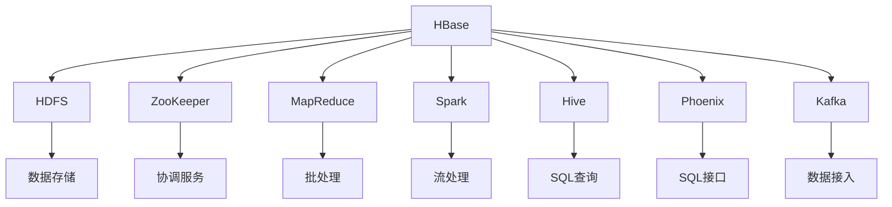
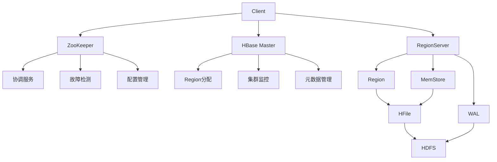
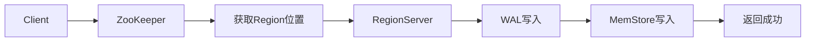
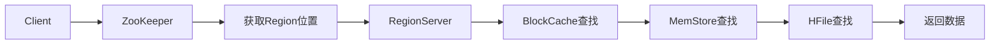

# HBase 技术详解

## 目录

- [HBase 技术详解](#hbase-技术详解)
  - [目录](#目录)
  - [HBase 基础概念](#hbase-基础概念)
    - [HBase 简介](#hbase-简介)
      - [HBase 特点与优势](#hbase-特点与优势)
      - [HBase 应用场景](#hbase-应用场景)
      - [HBase 生态系统](#hbase-生态系统)
    - [HBase 架构设计](#hbase-架构设计)
      - [HBase 整体架构](#hbase-整体架构)
      - [HBase 数据模型](#hbase-数据模型)
      - [HBase 存储模型](#hbase-存储模型)
    - [HBase 核心概念](#hbase-核心概念)
      - [Table（表）](#table表)
      - [Row（行）](#row行)
      - [Column Family（列族）](#column-family列族)
      - [Column Qualifier（列限定符）](#column-qualifier列限定符)
      - [Cell（单元格）](#cell单元格)
      - [Timestamp（时间戳）](#timestamp时间戳)
      - [Region（区域）](#region区域)
      - [RegionServer（区域服务器）](#regionserver区域服务器)
      - [Master（主服务器）](#master主服务器)
      - [ZooKeeper（协调服务）](#zookeeper协调服务)
  - [HBase 编程模型](#hbase-编程模型)
    - [HBase Shell 操作](#hbase-shell-操作)
      - [表管理操作](#表管理操作)
      - [数据操作命令](#数据操作命令)
      - [集群管理命令](#集群管理命令)
    - [HBase Java API](#hbase-java-api)
      - [连接管理](#连接管理)
      - [表操作](#表操作)
      - [数据操作](#数据操作)
      - [批量操作](#批量操作)
  - [HBase 高级特性](#hbase-高级特性)
    - [HBase 过滤器](#hbase-过滤器)
      - [内置过滤器](#内置过滤器)
      - [自定义过滤器](#自定义过滤器)
      - [过滤器链](#过滤器链)
    - [HBase 协处理器](#hbase-协处理器)
      - [Observer 协处理器](#observer-协处理器)
      - [Endpoint 协处理器](#endpoint-协处理器)
      - [协处理器开发](#协处理器开发)
    - [HBase 安全机制](#hbase-安全机制)
      - [访问控制](#访问控制)
      - [认证机制](#认证机制)
      - [加密传输](#加密传输)
    - [HBase 备份恢复](#hbase-备份恢复)
      - [快照备份](#快照备份)
      - [复制机制](#复制机制)
      - [数据恢复](#数据恢复)
    - [HBase 集成应用](#hbase-集成应用)
      - [HBase + Spark 集成](#hbase--spark-集成)
      - [HBase + Kafka 集成](#hbase--kafka-集成)
      - [HBase + Phoenix 集成](#hbase--phoenix-集成)
      - [HBase + Hive 集成](#hbase--hive-集成)
  - [HBase 性能优化](#hbase-性能优化)
    - [配置优化](#配置优化)
      - [内存配置](#内存配置)
      - [JVM 调优](#jvm-调优)
      - [HDFS 优化](#hdfs-优化)
    - [表设计优化](#表设计优化)
      - [RowKey 设计](#rowkey-设计)
      - [列族设计](#列族设计)
      - [预分区策略](#预分区策略)
    - [查询优化](#查询优化)
      - [扫描优化](#扫描优化)
      - [过滤器优化](#过滤器优化)
      - [批量操作优化](#批量操作优化)
    - [存储优化](#存储优化)
      - [压缩策略](#压缩策略)
      - [布隆过滤器](#布隆过滤器)
      - [缓存策略](#缓存策略)
  - [HBase 运维与监控](#hbase-运维与监控)
    - [集群部署](#集群部署)
      - [Standalone 部署](#standalone-部署)
      - [伪分布式部署](#伪分布式部署)
      - [完全分布式部署](#完全分布式部署)
    - [监控管理](#监控管理)
      - [Web UI 监控](#web-ui-监控)
      - [JMX 监控](#jmx-监控)
      - [日志管理](#日志管理)
    - [故障排查](#故障排查)
      - [常见问题诊断](#常见问题诊断)
      - [性能问题分析](#性能问题分析)
      - [故障恢复策略](#故障恢复策略)
  - [HBase 常见任务报错及解决办法](#hbase-常见任务报错及解决办法)
    - [启动相关错误](#启动相关错误)
    - [连接相关错误](#连接相关错误)
    - [读写相关错误](#读写相关错误)
    - [存储相关错误](#存储相关错误)
    - [性能相关错误](#性能相关错误)
    - [调试和诊断工具](#调试和诊断工具)
    - [预防措施](#预防措施)
  - [HBase 典型面试题与答疑](#hbase-典型面试题与答疑)
    - [基础概念面试题](#基础概念面试题)
    - [架构设计面试题](#架构设计面试题)
    - [性能优化面试题](#性能优化面试题)
    - [实际应用面试题](#实际应用面试题)
    - [原理与架构类](#原理与架构类)
    - [性能优化类](#性能优化类)
    - [运维监控类](#运维监控类)
    - [对比分析类](#对比分析类)
    - [实际应用类](#实际应用类)

---

## HBase 基础概念

### HBase 简介

**HBase（Hadoop Database）**是一个分布式、面向列的开源数据库，基于Google的BigTable设计，运行在HDFS之上。

#### HBase 特点与优势

**核心特点**：
- **分布式存储**：基于HDFS的分布式存储架构
- **面向列存储**：按列族组织数据，支持高效的列级操作
- **实时读写**：支持实时随机读写访问
- **强一致性**：提供强一致性的数据访问
- **水平扩展**：支持水平扩展，可处理PB级数据
- **高可用性**：支持自动故障转移和恢复

**技术优势**：
- **大数据处理**：专为大数据场景设计
- **实时查询**：支持毫秒级的随机读写
- **灵活模式**：无固定模式，支持动态列
- **版本控制**：内置数据版本控制机制
- **压缩存储**：支持多种压缩算法
- **集成生态**：与Hadoop生态系统深度集成

#### HBase 应用场景

**1. 实时数据存储**：
```java
// 用户行为数据存储
public class UserBehaviorStorage {
    
    public static void storeUserBehavior(String userId, String action, long timestamp) {
        Put put = new Put(Bytes.toBytes(userId));
        put.addColumn(
            Bytes.toBytes("behavior"), 
            Bytes.toBytes(action), 
            timestamp,
            Bytes.toBytes("1")
        );
        table.put(put);
    }
}
```

**2. 时序数据存储**：
```java
// 传感器数据存储
public class SensorDataStorage {
    
    public static void storeSensorData(String sensorId, double value, long timestamp) {
        String rowKey = sensorId + "_" + timestamp;
        Put put = new Put(Bytes.toBytes(rowKey));
        put.addColumn(
            Bytes.toBytes("data"), 
            Bytes.toBytes("value"), 
            timestamp,
            Bytes.toBytes(value)
        );
        table.put(put);
    }
}
```

**3. 日志数据存储**：
```java
// 系统日志存储
public class LogStorage {
    
    public static void storeLog(String service, String level, String message, long timestamp) {
        String rowKey = service + "_" + timestamp + "_" + UUID.randomUUID().toString();
        Put put = new Put(Bytes.toBytes(rowKey));
        put.addColumn(Bytes.toBytes("log"), Bytes.toBytes("level"), timestamp, Bytes.toBytes(level));
        put.addColumn(Bytes.toBytes("log"), Bytes.toBytes("message"), timestamp, Bytes.toBytes(message));
        table.put(put);
    }
}
```

**4. 消息队列存储**：
```java
// 消息队列存储
public class MessageQueueStorage {
    
    public static void enqueueMessage(String queueName, String message) {
        String rowKey = queueName + "_" + System.currentTimeMillis() + "_" + UUID.randomUUID().toString();
        Put put = new Put(Bytes.toBytes(rowKey));
        put.addColumn(Bytes.toBytes("msg"), Bytes.toBytes("content"), Bytes.toBytes(message));
        put.addColumn(Bytes.toBytes("msg"), Bytes.toBytes("status"), Bytes.toBytes("pending"));
        table.put(put);
    }
}
```

#### HBase 生态系统

**HBase 生态系统组件**：



**核心组件**：
- **HDFS**：底层分布式文件系统
- **ZooKeeper**：分布式协调服务
- **MapReduce**：批处理计算框架
- **Spark**：内存计算框架
- **Hive**：数据仓库工具
- **Phoenix**：SQL查询引擎
- **Kafka**：消息队列系统

### HBase 架构设计

#### HBase 整体架构

**HBase 架构图**：



**架构组件**：
- **Client**：客户端，提供API接口
- **ZooKeeper**：协调服务，管理集群状态
- **HBase Master**：主服务器，管理Region分配
- **RegionServer**：区域服务器，处理读写请求
- **Region**：数据分区，存储表的一部分数据
- **MemStore**：内存存储，缓存写操作
- **WAL**：预写日志，保证数据一致性
- **HFile**：数据文件，存储在HDFS上

#### HBase 数据模型

**数据模型层次结构**：

```
Table（表）
├── Row（行）
│   ├── RowKey（行键）
│   └── Column Family（列族）
│       ├── Column Qualifier（列限定符）
│       │   └── Cell（单元格）
│       │       ├── Value（值）
│       │       └── Timestamp（时间戳）
│       └── ...
└── ...
```

**数据模型示例**：
```java
// 用户表数据模型
public class UserTableModel {
    
    // 表结构
    public static final String TABLE_NAME = "users";
    public static final String CF_BASIC = "basic";
    public static final String CF_PROFILE = "profile";
    public static final String CF_PREFERENCES = "preferences";
    
    // 列定义
    public static final String COL_NAME = "name";
    public static final String COL_EMAIL = "email";
    public static final String COL_AGE = "age";
    public static final String COL_CITY = "city";
    public static final String COL_THEME = "theme";
    public static final String COL_LANGUAGE = "language";
    
    // 数据操作示例
    public static void createUser(String userId, String name, String email, int age) {
        Put put = new Put(Bytes.toBytes(userId));
        
        // 基本信息
        put.addColumn(Bytes.toBytes(CF_BASIC), Bytes.toBytes(COL_NAME), Bytes.toBytes(name));
        put.addColumn(Bytes.toBytes(CF_BASIC), Bytes.toBytes(COL_EMAIL), Bytes.toBytes(email));
        put.addColumn(Bytes.toBytes(CF_BASIC), Bytes.toBytes(COL_AGE), Bytes.toBytes(age));
        
        table.put(put);
    }
}
```

#### HBase 存储模型

**存储模型特点**：
- **稀疏矩阵**：只存储有值的单元格
- **版本控制**：每个单元格可以有多个版本
- **列族存储**：同一列族的数据存储在一起
- **时间戳排序**：数据按时间戳倒序排列

**存储结构示例**：
```java
// 存储结构示例
public class StorageModelExample {
    
    // 数据存储格式
    public static void demonstrateStorage() {
        // RowKey: user123
        // Column Family: basic
        //   - name: "John Doe"
        //   - email: "john@example.com"
        //   - age: "30"
        // Column Family: profile
        //   - city: "New York"
        //   - country: "USA"
        //   - phone: "123-456-7890"
        
        Put put = new Put(Bytes.toBytes("user123"));
        
        // 基本信息列族
        put.addColumn(Bytes.toBytes("basic"), Bytes.toBytes("name"), Bytes.toBytes("John Doe"));
        put.addColumn(Bytes.toBytes("basic"), Bytes.toBytes("email"), Bytes.toBytes("john@example.com"));
        put.addColumn(Bytes.toBytes("basic"), Bytes.toBytes("age"), Bytes.toBytes("30"));
        
        // 档案信息列族
        put.addColumn(Bytes.toBytes("profile"), Bytes.toBytes("city"), Bytes.toBytes("New York"));
        put.addColumn(Bytes.toBytes("profile"), Bytes.toBytes("country"), Bytes.toBytes("USA"));
        put.addColumn(Bytes.toBytes("profile"), Bytes.toBytes("phone"), Bytes.toBytes("123-456-7890"));
        
        table.put(put);
    }
}
```

### HBase 核心概念

#### Table（表）

**表的概念**：
- 表是HBase中数据的逻辑组织单位
- 表由行和列族组成
- 表在创建时需要定义列族
- 表可以动态添加列，但不能动态添加列族

**表操作示例**：
```java
// 表管理操作
public class TableManagement {
    
    public static void createTable(String tableName, String... columnFamilies) throws IOException {
        TableName name = TableName.valueOf(tableName);
        HTableDescriptor tableDescriptor = new HTableDescriptor(name);
        
        for (String cf : columnFamilies) {
            HColumnDescriptor columnDescriptor = new HColumnDescriptor(cf);
            tableDescriptor.addFamily(columnDescriptor);
        }
        
        admin.createTable(tableDescriptor);
    }
    
    public static void deleteTable(String tableName) throws IOException {
        TableName name = TableName.valueOf(tableName);
        admin.disableTable(name);
        admin.deleteTable(name);
    }
    
    public static boolean tableExists(String tableName) throws IOException {
        TableName name = TableName.valueOf(tableName);
        return admin.tableExists(name);
    }
}
```

#### Row（行）

**行的概念**：
- 行是HBase中的基本数据单位
- 每行都有一个唯一的RowKey
- RowKey是字节数组，按字典序排序
- 行可以包含任意数量的列

**RowKey设计示例**：
```java
// RowKey设计策略
public class RowKeyDesign {
    
    // 1. 用户ID作为RowKey
    public static String createUserRowKey(String userId) {
        return userId;
    }
    
    // 2. 时间戳作为RowKey
    public static String createTimeRowKey(long timestamp) {
        return String.format("%020d", timestamp);
    }
    
    // 3. 组合RowKey
    public static String createCompositeRowKey(String userId, long timestamp) {
        return userId + "_" + String.format("%020d", timestamp);
    }
    
    // 4. 哈希RowKey（避免热点）
    public static String createHashedRowKey(String userId) {
        int hash = Math.abs(userId.hashCode());
        return String.format("%03d", hash % 1000) + "_" + userId;
    }
    
    // 5. 反转RowKey
    public static String createReversedRowKey(String userId) {
        return new StringBuilder(userId).reverse().toString();
    }
}
```

#### Column Family（列族）

**列族的概念**：
- 列族是列的集合，具有相同的访问模式
- 列族在表创建时定义，不能动态修改
- 同一列族的数据存储在一起
- 列族是HBase中最重要的设计决策

**列族设计示例**：
```java
// 列族设计策略
public class ColumnFamilyDesign {
    
    // 用户表列族设计
    public static class UserTable {
        public static final String CF_BASIC = "basic";        // 基本信息
        public static final String CF_PROFILE = "profile";    // 档案信息
        public static final String CF_PREFERENCES = "pref";   // 偏好设置
        public static final String CF_ACTIVITY = "activity";  // 活动记录
    }
    
    // 订单表列族设计
    public static class OrderTable {
        public static final String CF_ORDER = "order";        // 订单信息
        public static final String CF_ITEM = "item";          // 商品信息
        public static final String CF_PAYMENT = "payment";    // 支付信息
        public static final String CF_SHIPPING = "shipping";  // 物流信息
    }
    
    // 日志表列族设计
    public static class LogTable {
        public static final String CF_LOG = "log";            // 日志内容
        public static final String CF_META = "meta";          // 元数据
        public static final String CF_STATS = "stats";        // 统计信息
    }
}
```

#### Column Qualifier（列限定符）

**列限定符的概念**：
- 列限定符是列族内的具体列名
- 列限定符可以动态添加
- 列限定符是字节数组
- 列限定符的设计影响查询性能

**列限定符设计示例**：
```java
// 列限定符设计策略
public class ColumnQualifierDesign {
    
    // 1. 简单列名
    public static class SimpleColumns {
        public static final String NAME = "name";
        public static final String EMAIL = "email";
        public static final String AGE = "age";
        public static final String CITY = "city";
    }
    
    // 2. 时间序列列名
    public static class TimeSeriesColumns {
        public static String createTimeColumn(long timestamp) {
            return "t_" + timestamp;
        }
        
        public static String createDateColumn(String date) {
            return "d_" + date;
        }
    }
    
    // 3. 属性列名
    public static class AttributeColumns {
        public static String createAttributeColumn(String attribute) {
            return "attr_" + attribute;
        }
        
        public static String createTagColumn(String tag) {
            return "tag_" + tag;
        }
    }
    
    // 4. 版本列名
    public static class VersionColumns {
        public static String createVersionColumn(int version) {
            return "v" + version;
        }
        
        public static String createLatestColumn() {
            return "latest";
        }
    }
}
```

#### Cell（单元格）

**单元格的概念**：
- 单元格是HBase中最小的数据单位
- 单元格包含值、时间戳和列信息
- 单元格可以有多个版本
- 单元格的值是字节数组

**单元格操作示例**：
```java
// 单元格操作
public class CellOperations {
    
    // 创建单元格
    public static void createCell(String rowKey, String cf, String cq, String value) throws IOException {
        Put put = new Put(Bytes.toBytes(rowKey));
        put.addColumn(Bytes.toBytes(cf), Bytes.toBytes(cq), Bytes.toBytes(value));
        table.put(put);
    }
    
    // 创建带时间戳的单元格
    public static void createCellWithTimestamp(String rowKey, String cf, String cq, String value, long timestamp) throws IOException {
        Put put = new Put(Bytes.toBytes(rowKey));
        put.addColumn(Bytes.toBytes(cf), Bytes.toBytes(cq), timestamp, Bytes.toBytes(value));
        table.put(put);
    }
    
    // 读取单元格
    public static String getCell(String rowKey, String cf, String cq) throws IOException {
        Get get = new Get(Bytes.toBytes(rowKey));
        get.addColumn(Bytes.toBytes(cf), Bytes.toBytes(cq));
        Result result = table.get(get);
        
        Cell cell = result.getColumnLatestCell(Bytes.toBytes(cf), Bytes.toBytes(cq));
        if (cell != null) {
            return Bytes.toString(CellUtil.cloneValue(cell));
        }
        return null;
    }
    
    // 读取单元格所有版本
    public static List<String> getCellVersions(String rowKey, String cf, String cq, int maxVersions) throws IOException {
        Get get = new Get(Bytes.toBytes(rowKey));
        get.addColumn(Bytes.toBytes(cf), Bytes.toBytes(cq));
        get.setMaxVersions(maxVersions);
        Result result = table.get(get);
        
        List<String> versions = new ArrayList<>();
        List<Cell> cells = result.getColumnCells(Bytes.toBytes(cf), Bytes.toBytes(cq));
        for (Cell cell : cells) {
            versions.add(Bytes.toString(CellUtil.cloneValue(cell)));
        }
        return versions;
    }
}
```

#### Timestamp（时间戳）

**时间戳的概念**：
- 时间戳标识数据的版本
- 时间戳是64位长整型
- 时间戳按倒序排列（最新的在前）
- 时间戳可以自动生成或手动指定

**时间戳操作示例**：
```java
// 时间戳操作
public class TimestampOperations {
    
    // 使用系统时间戳
    public static void putWithSystemTimestamp(String rowKey, String cf, String cq, String value) throws IOException {
        Put put = new Put(Bytes.toBytes(rowKey));
        put.addColumn(Bytes.toBytes(cf), Bytes.toBytes(cq), Bytes.toBytes(value));
        table.put(put);
    }
    
    // 使用自定义时间戳
    public static void putWithCustomTimestamp(String rowKey, String cf, String cq, String value, long timestamp) throws IOException {
        Put put = new Put(Bytes.toBytes(rowKey));
        put.addColumn(Bytes.toBytes(cf), Bytes.toBytes(cq), timestamp, Bytes.toBytes(value));
        table.put(put);
    }
    
    // 读取指定时间戳的数据
    public static String getAtTimestamp(String rowKey, String cf, String cq, long timestamp) throws IOException {
        Get get = new Get(Bytes.toBytes(rowKey));
        get.addColumn(Bytes.toBytes(cf), Bytes.toBytes(cq));
        get.setTimeStamp(timestamp);
        Result result = table.get(get);
        
        Cell cell = result.getColumnLatestCell(Bytes.toBytes(cf), Bytes.toBytes(cq));
        if (cell != null) {
            return Bytes.toString(CellUtil.cloneValue(cell));
        }
        return null;
    }
    
    // 读取时间范围的数据
    public static List<String> getInTimeRange(String rowKey, String cf, String cq, long startTime, long endTime) throws IOException {
        Get get = new Get(Bytes.toBytes(rowKey));
        get.addColumn(Bytes.toBytes(cf), Bytes.toBytes(cq));
        get.setTimeRange(startTime, endTime);
        Result result = table.get(get);
        
        List<String> values = new ArrayList<>();
        List<Cell> cells = result.getColumnCells(Bytes.toBytes(cf), Bytes.toBytes(cq));
        for (Cell cell : cells) {
            values.add(Bytes.toString(CellUtil.cloneValue(cell)));
        }
        return values;
    }
}
```

#### Region（区域）

**区域的概念**：
- Region是表的分区，包含一定范围的RowKey
- Region是HBase中负载均衡的基本单位
- Region大小有上限（默认10GB）
- Region可以自动分裂和合并

**Region操作示例**：
```java
// Region操作
public class RegionOperations {
    
    // 获取表的Region信息
    public static List<HRegionInfo> getTableRegions(String tableName) throws IOException {
        TableName name = TableName.valueOf(tableName);
        return admin.getTableRegions(name);
    }
    
    // 手动分裂Region
    public static void splitRegion(String regionName, String splitPoint) throws IOException {
        admin.splitRegion(Bytes.toBytes(regionName), Bytes.toBytes(splitPoint));
    }
    
    // 手动合并Region
    public static void mergeRegions(String region1, String region2) throws IOException {
        admin.mergeRegions(Bytes.toBytes(region1), Bytes.toBytes(region2), false);
    }
    
    // 获取Region的统计信息
    public static Map<String, Object> getRegionStats(String regionName) throws IOException {
        // 通过JMX获取Region统计信息
        Map<String, Object> stats = new HashMap<>();
        // 实现统计信息获取逻辑
        return stats;
    }
}
```

#### RegionServer（区域服务器）

**RegionServer的概念**：
- RegionServer是HBase的工作节点
- 每个RegionServer管理多个Region
- RegionServer处理客户端的读写请求
- RegionServer负责Region的分裂和合并

**RegionServer监控示例**：
```java
// RegionServer监控
public class RegionServerMonitoring {
    
    // 获取RegionServer列表
    public static List<ServerName> getRegionServers() throws IOException {
        return admin.getClusterStatus().getServers();
    }
    
    // 获取RegionServer的Region数量
    public static int getRegionCount(ServerName serverName) throws IOException {
        ClusterStatus status = admin.getClusterStatus();
        return status.getRegionsCount(serverName);
    }
    
    // 获取RegionServer的负载信息
    public static Map<String, Object> getServerLoad(ServerName serverName) throws IOException {
        ClusterStatus status = admin.getClusterStatus();
        ServerLoad load = status.getLoad(serverName);
        
        Map<String, Object> loadInfo = new HashMap<>();
        loadInfo.put("heapSizeMB", load.getHeapSizeMB());
        loadInfo.put("maxHeapSizeMB", load.getMaxHeapSizeMB());
        loadInfo.put("requestsPerSecond", load.getNumberOfRequests());
        loadInfo.put("regionsCount", load.getNumberOfRegions());
        
        return loadInfo;
    }
}
```

#### Master（主服务器）

**Master的概念**：
- Master是HBase集群的主控节点
- Master负责Region的分配和负载均衡
- Master管理集群的元数据
- Master处理集群的故障恢复

**Master操作示例**：
```java
// Master操作
public class MasterOperations {
    
    // 获取Master信息
    public static ServerName getMaster() throws IOException {
        return admin.getClusterStatus().getMaster();
    }
    
    // 检查Master状态
    public static boolean isMasterRunning() throws IOException {
        try {
            admin.getClusterStatus();
            return true;
        } catch (Exception e) {
            return false;
        }
    }
    
    // 获取集群状态
    public static ClusterStatus getClusterStatus() throws IOException {
        return admin.getClusterStatus();
    }
    
    // 执行负载均衡
    public static boolean balance() throws IOException {
        return admin.balancer();
    }
}
```

#### ZooKeeper（协调服务）

**ZooKeeper的概念**：
- ZooKeeper是HBase的协调服务
- ZooKeeper存储集群的元数据
- ZooKeeper提供故障检测和恢复
- ZooKeeper管理集群配置

**ZooKeeper操作示例**：
```java
// ZooKeeper操作
public class ZooKeeperOperations {
    
    // 检查ZooKeeper连接
    public static boolean isZooKeeperConnected() {
        try {
            ZooKeeper zk = new ZooKeeper("localhost:2181", 3000, null);
            zk.close();
            return true;
        } catch (Exception e) {
            return false;
        }
    }
    
    // 获取ZooKeeper中的HBase信息
    public static List<String> getHBaseZNodes() throws Exception {
        ZooKeeper zk = new ZooKeeper("localhost:2181", 3000, null);
        List<String> znodes = zk.getChildren("/hbase", false);
        zk.close();
        return znodes;
    }
    
    // 监控ZooKeeper状态
    public static Map<String, Object> getZooKeeperStats() throws Exception {
        ZooKeeper zk = new ZooKeeper("localhost:2181", 3000, null);
        
        Map<String, Object> stats = new HashMap<>();
        stats.put("connected", zk.getState().isConnected());
        stats.put("sessionId", zk.getSessionId());
        stats.put("sessionTimeout", zk.getSessionTimeout());
        
        zk.close();
        return stats;
    }
}
```

---

## HBase 编程模型

### HBase Shell 操作

**HBase Shell**是HBase的命令行接口，提供表管理和数据操作功能。

#### 表管理操作

**表管理命令**：
```bash
# 1. 创建表
create 'users', 'basic', 'profile', 'preferences'

# 2. 查看表列表
list

# 3. 查看表结构
describe 'users'

# 4. 启用表
enable 'users'

# 5. 禁用表
disable 'users'

# 6. 删除表
drop 'users'

# 7. 修改表
alter 'users', {NAME => 'basic', VERSIONS => 3}
alter 'users', {NAME => 'new_cf', METHOD => 'add'}
alter 'users', {NAME => 'old_cf', METHOD => 'delete'}
```

**表管理示例**：
```java
// Java API表管理
public class TableManagementAPI {
    
    public static void createTableWithShell(String tableName, String... columnFamilies) throws IOException {
        // 构建创建表命令
        StringBuilder command = new StringBuilder();
        command.append("create '").append(tableName).append("'");
        
        for (String cf : columnFamilies) {
            command.append(", '").append(cf).append("'");
        }
        
        // 执行Shell命令
        executeShellCommand(command.toString());
    }
    
    public static void describeTable(String tableName) throws IOException {
        String command = "describe '" + tableName + "'";
        String result = executeShellCommand(command);
        System.out.println("Table description: " + result);
    }
    
    private static String executeShellCommand(String command) throws IOException {
        // 实现Shell命令执行逻辑
        Process process = Runtime.getRuntime().exec("hbase shell -n <<< '" + command + "'");
        // 读取输出结果
        return readProcessOutput(process);
    }
}
```

#### 数据操作命令

**数据操作命令**：
```bash
# 1. 插入数据
put 'users', 'user123', 'basic:name', 'John Doe'
put 'users', 'user123', 'basic:email', 'john@example.com'
put 'users', 'user123', 'basic:age', '30'
put 'users', 'user123', 'profile:city', 'New York'
put 'users', 'user123', 'profile:country', 'USA'

# 2. 查询数据
get 'users', 'user123'
get 'users', 'user123', 'basic:name'
get 'users', 'user123', {COLUMN => 'basic:name', VERSIONS => 3}

# 3. 扫描数据
scan 'users'
scan 'users', {STARTROW => 'user100', STOPROW => 'user200'}
scan 'users', {COLUMN => 'basic:name'}
scan 'users', {LIMIT => 10}

# 4. 删除数据
delete 'users', 'user123', 'basic:age'
deleteall 'users', 'user123'

# 5. 计数
count 'users'
count 'users', {INTERVAL => 1000}
```

**数据操作示例**：
```java
// Java API数据操作
public class DataOperationsAPI {
    
    public static void putDataWithShell(String tableName, String rowKey, String cf, String cq, String value) throws IOException {
        String command = String.format("put '%s', '%s', '%s:%s', '%s'", 
                                     tableName, rowKey, cf, cq, value);
        executeShellCommand(command);
    }
    
    public static String getDataWithShell(String tableName, String rowKey, String cf, String cq) throws IOException {
        String command = String.format("get '%s', '%s', '%s:%s'", 
                                     tableName, rowKey, cf, cq);
        String result = executeShellCommand(command);
        return parseGetResult(result);
    }
    
    public static List<String> scanDataWithShell(String tableName, String startRow, String stopRow) throws IOException {
        String command = String.format("scan '%s', {STARTROW => '%s', STOPROW => '%s'}", 
                                     tableName, startRow, stopRow);
        String result = executeShellCommand(command);
        return parseScanResult(result);
    }
    
    public static void deleteDataWithShell(String tableName, String rowKey, String cf, String cq) throws IOException {
        String command = String.format("delete '%s', '%s', '%s:%s'", 
                                     tableName, rowKey, cf, cq);
        executeShellCommand(command);
    }
    
    private static String parseGetResult(String result) {
        // 解析get命令结果
        // 实现解析逻辑
        return result;
    }
    
    private static List<String> parseScanResult(String result) {
        // 解析scan命令结果
        List<String> rows = new ArrayList<>();
        // 实现解析逻辑
        return rows;
    }
}
```

#### 集群管理命令

**集群管理命令**：
```bash
# 1. 集群状态
status
status 'summary'
status 'detailed'

# 2. 表状态
list
list 'users'
is_enabled 'users'
is_disabled 'users'

# 3. Region信息
list_regions 'users'
split 'users'
merge_region 'region1', 'region2'

# 4. 负载均衡
balancer
balancer_enabled
balancer_switch true

# 5. 压缩
major_compact 'users'
major_compact 'users', 'basic'
flush 'users'

# 6. 快照
snapshot 'users', 'users_snapshot'
list_snapshots
clone_snapshot 'users_snapshot', 'users_restored'
restore_snapshot 'users_snapshot'
delete_snapshot 'users_snapshot'
```

### HBase Java API

**HBase Java API**是HBase的主要编程接口，提供完整的表和数据操作功能。

#### 连接管理

**连接管理**：
```java
// 连接管理
public class ConnectionManagement {
    
    private static Connection connection;
    private static Admin admin;
    
    // 1. 创建连接
    public static void createConnection() throws IOException {
        Configuration conf = HBaseConfiguration.create();
        
        // 设置ZooKeeper连接
        conf.set("hbase.zookeeper.quorum", "localhost");
        conf.set("hbase.zookeeper.property.clientPort", "2181");
        
        // 创建连接
        connection = ConnectionFactory.createConnection(conf);
        admin = connection.getAdmin();
    }
    
    // 2. 获取连接
    public static Connection getConnection() {
        return connection;
    }
    
    public static Admin getAdmin() {
        return admin;
    }
    
    // 3. 关闭连接
    public static void closeConnection() throws IOException {
        if (admin != null) {
            admin.close();
        }
        if (connection != null) {
            connection.close();
        }
    }
    
    // 4. 连接池管理
    public static class ConnectionPool {
        
        private static final int POOL_SIZE = 10;
        private static final BlockingQueue<Connection> pool = new ArrayBlockingQueue<>(POOL_SIZE);
        
        public static void initializePool() throws IOException {
            for (int i = 0; i < POOL_SIZE; i++) {
                Connection conn = ConnectionFactory.createConnection();
                pool.offer(conn);
            }
        }
        
        public static Connection getConnection() throws InterruptedException {
            return pool.take();
        }
        
        public static void returnConnection(Connection conn) {
            pool.offer(conn);
        }
        
        public static void closePool() throws IOException {
            Connection conn;
            while ((conn = pool.poll()) != null) {
                conn.close();
            }
        }
    }
}
```

#### 表操作

**表操作**：
```java
// 表操作
public class TableOperations {
    
    // 1. 创建表
    public static void createTable(String tableName, String... columnFamilies) throws IOException {
        TableName name = TableName.valueOf(tableName);
        HTableDescriptor tableDescriptor = new HTableDescriptor(name);
        
        for (String cf : columnFamilies) {
            HColumnDescriptor columnDescriptor = new HColumnDescriptor(cf);
            // 设置列族属性
            columnDescriptor.setMaxVersions(3);
            columnDescriptor.setMinVersions(1);
            columnDescriptor.setTimeToLive(86400); // 1天
            tableDescriptor.addFamily(columnDescriptor);
        }
        
        admin.createTable(tableDescriptor);
    }
    
    // 2. 删除表
    public static void deleteTable(String tableName) throws IOException {
        TableName name = TableName.valueOf(tableName);
        
        if (admin.tableExists(name)) {
            admin.disableTable(name);
            admin.deleteTable(name);
        }
    }
    
    // 3. 检查表是否存在
    public static boolean tableExists(String tableName) throws IOException {
        TableName name = TableName.valueOf(tableName);
        return admin.tableExists(name);
    }
    
    // 4. 启用/禁用表
    public static void enableTable(String tableName) throws IOException {
        TableName name = TableName.valueOf(tableName);
        admin.enableTable(name);
    }
    
    public static void disableTable(String tableName) throws IOException {
        TableName name = TableName.valueOf(tableName);
        admin.disableTable(name);
    }
    
    // 5. 修改表结构
    public static void addColumnFamily(String tableName, String columnFamily) throws IOException {
        TableName name = TableName.valueOf(tableName);
        HColumnDescriptor columnDescriptor = new HColumnDescriptor(columnFamily);
        admin.addColumn(name, columnDescriptor);
    }
    
    public static void deleteColumnFamily(String tableName, String columnFamily) throws IOException {
        TableName name = TableName.valueOf(tableName);
        admin.deleteColumn(name, columnFamily.getBytes());
    }
    
    // 6. 获取表信息
    public static HTableDescriptor getTableDescriptor(String tableName) throws IOException {
        TableName name = TableName.valueOf(tableName);
        return admin.getTableDescriptor(name);
    }
    
    // 7. 表预分区
    public static void createTableWithPreSplits(String tableName, String columnFamily, byte[][] splitKeys) throws IOException {
        TableName name = TableName.valueOf(tableName);
        HTableDescriptor tableDescriptor = new HTableDescriptor(name);
        
        HColumnDescriptor columnDescriptor = new HColumnDescriptor(columnFamily);
        tableDescriptor.addFamily(columnDescriptor);
        
        admin.createTable(tableDescriptor, splitKeys);
    }
    
    // 8. 生成分区键
    public static byte[][] generateSplitKeys(int numRegions) {
        byte[][] splitKeys = new byte[numRegions - 1][];
        
        for (int i = 1; i < numRegions; i++) {
            splitKeys[i - 1] = Bytes.toBytes(String.format("%03d", i));
        }
        
        return splitKeys;
    }
}
```

#### 数据操作

**数据操作**：
```java
// 数据操作
public class DataOperations {
    
    // 1. 插入数据
    public static void putData(String tableName, String rowKey, String cf, String cq, String value) throws IOException {
        Table table = connection.getTable(TableName.valueOf(tableName));
        
        Put put = new Put(Bytes.toBytes(rowKey));
        put.addColumn(Bytes.toBytes(cf), Bytes.toBytes(cq), Bytes.toBytes(value));
        
        table.put(put);
        table.close();
    }
    
    // 2. 批量插入
    public static void putBatch(String tableName, List<Put> puts) throws IOException {
        Table table = connection.getTable(TableName.valueOf(tableName));
        
        table.batch(puts);
        table.close();
    }
    
    // 3. 查询数据
    public static String getData(String tableName, String rowKey, String cf, String cq) throws IOException {
        Table table = connection.getTable(TableName.valueOf(tableName));
        
        Get get = new Get(Bytes.toBytes(rowKey));
        get.addColumn(Bytes.toBytes(cf), Bytes.toBytes(cq));
        
        Result result = table.get(get);
        table.close();
        
        Cell cell = result.getColumnLatestCell(Bytes.toBytes(cf), Bytes.toBytes(cq));
        if (cell != null) {
            return Bytes.toString(CellUtil.cloneValue(cell));
        }
        return null;
    }
    
    // 4. 查询整行数据
    public static Map<String, String> getRow(String tableName, String rowKey) throws IOException {
        Table table = connection.getTable(TableName.valueOf(tableName));
        
        Get get = new Get(Bytes.toBytes(rowKey));
        Result result = table.get(get);
        table.close();
        
        Map<String, String> rowData = new HashMap<>();
        for (Cell cell : result.rawCells()) {
            String cf = Bytes.toString(CellUtil.cloneFamily(cell));
            String cq = Bytes.toString(CellUtil.cloneQualifier(cell));
            String value = Bytes.toString(CellUtil.cloneValue(cell));
            rowData.put(cf + ":" + cq, value);
        }
        
        return rowData;
    }
    
    // 5. 扫描数据
    public static List<Map<String, String>> scanTable(String tableName, String startRow, String stopRow) throws IOException {
        Table table = connection.getTable(TableName.valueOf(tableName));
        
        Scan scan = new Scan();
        if (startRow != null) {
            scan.setStartRow(Bytes.toBytes(startRow));
        }
        if (stopRow != null) {
            scan.setStopRow(Bytes.toBytes(stopRow));
        }
        
        ResultScanner scanner = table.getScanner(scan);
        List<Map<String, String>> results = new ArrayList<>();
        
        for (Result result : scanner) {
            Map<String, String> rowData = new HashMap<>();
            for (Cell cell : result.rawCells()) {
                String cf = Bytes.toString(CellUtil.cloneFamily(cell));
                String cq = Bytes.toString(CellUtil.cloneQualifier(cell));
                String value = Bytes.toString(CellUtil.cloneValue(cell));
                rowData.put(cf + ":" + cq, value);
            }
            results.add(rowData);
        }
        
        scanner.close();
        table.close();
        return results;
    }
    
    // 6. 删除数据
    public static void deleteData(String tableName, String rowKey, String cf, String cq) throws IOException {
        Table table = connection.getTable(TableName.valueOf(tableName));
        
        Delete delete = new Delete(Bytes.toBytes(rowKey));
        delete.addColumn(Bytes.toBytes(cf), Bytes.toBytes(cq));
        
        table.delete(delete);
        table.close();
    }
    
    // 7. 删除整行
    public static void deleteRow(String tableName, String rowKey) throws IOException {
        Table table = connection.getTable(TableName.valueOf(tableName));
        
        Delete delete = new Delete(Bytes.toBytes(rowKey));
        table.delete(delete);
        table.close();
    }
    
    // 8. 检查行是否存在
    public static boolean rowExists(String tableName, String rowKey) throws IOException {
        Table table = connection.getTable(TableName.valueOf(tableName));
        
        Get get = new Get(Bytes.toBytes(rowKey));
        get.setCheckExistenceOnly(true);
        
        Result result = table.get(get);
        table.close();
        
        return result.getExists();
    }
}
```

#### 批量操作

**批量操作**：
```java
// 批量操作
public class BatchOperations {
    
    // 1. 批量写入
    public static void batchPut(String tableName, Map<String, Map<String, String>> data) throws IOException {
        Table table = connection.getTable(TableName.valueOf(tableName));
        List<Put> puts = new ArrayList<>();
        
        for (Map.Entry<String, Map<String, String>> rowEntry : data.entrySet()) {
            String rowKey = rowEntry.getKey();
            Map<String, String> columns = rowEntry.getValue();
            
            Put put = new Put(Bytes.toBytes(rowKey));
            for (Map.Entry<String, String> colEntry : columns.entrySet()) {
                String[] cfCq = colEntry.getKey().split(":");
                String cf = cfCq[0];
                String cq = cfCq[1];
                String value = colEntry.getValue();
                
                put.addColumn(Bytes.toBytes(cf), Bytes.toBytes(cq), Bytes.toBytes(value));
            }
            puts.add(put);
        }
        
        table.batch(puts);
        table.close();
    }
    
    // 2. 批量读取
    public static Map<String, Map<String, String>> batchGet(String tableName, List<String> rowKeys) throws IOException {
        Table table = connection.getTable(TableName.valueOf(tableName));
        List<Get> gets = new ArrayList<>();
        
        for (String rowKey : rowKeys) {
            Get get = new Get(Bytes.toBytes(rowKey));
            gets.add(get);
        }
        
        Result[] results = table.get(gets);
        Map<String, Map<String, String>> batchResults = new HashMap<>();
        
        for (int i = 0; i < results.length; i++) {
            String rowKey = rowKeys.get(i);
            Result result = results[i];
            
            Map<String, String> rowData = new HashMap<>();
            for (Cell cell : result.rawCells()) {
                String cf = Bytes.toString(CellUtil.cloneFamily(cell));
                String cq = Bytes.toString(CellUtil.cloneQualifier(cell));
                String value = Bytes.toString(CellUtil.cloneValue(cell));
                rowData.put(cf + ":" + cq, value);
            }
            batchResults.put(rowKey, rowData);
        }
        
        table.close();
        return batchResults;
    }
    
    // 3. 批量删除
    public static void batchDelete(String tableName, List<String> rowKeys) throws IOException {
        Table table = connection.getTable(TableName.valueOf(tableName));
        List<Delete> deletes = new ArrayList<>();
        
        for (String rowKey : rowKeys) {
            Delete delete = new Delete(Bytes.toBytes(rowKey));
            deletes.add(delete);
        }
        
        table.batch(deletes);
        table.close();
    }
    
    // 4. 混合批量操作
    public static void batchMixed(String tableName, List<Row> operations) throws IOException {
        Table table = connection.getTable(TableName.valueOf(tableName));
        
        Object[] results = table.batch(operations);
        
        for (int i = 0; i < results.length; i++) {
            Object result = results[i];
            if (result instanceof Exception) {
                System.err.println("Operation " + i + " failed: " + result);
            }
        }
        
        table.close();
    }
    
    // 5. 批量操作示例
    public static void demonstrateBatchOperations(String tableName) throws IOException {
        // 准备批量操作
        List<Row> operations = new ArrayList<>();
        
        // 添加Put操作
        Put put = new Put(Bytes.toBytes("user123"));
        put.addColumn(Bytes.toBytes("basic"), Bytes.toBytes("name"), Bytes.toBytes("John Doe"));
        operations.add(put);
        
        // 添加Get操作
        Get get = new Get(Bytes.toBytes("user456"));
        operations.add(get);
        
        // 添加Delete操作
        Delete delete = new Delete(Bytes.toBytes("user789"));
        operations.add(delete);
        
        // 执行批量操作
        batchMixed(tableName, operations);
    }
}
```

---

## HBase 高级特性

### HBase 过滤器

**HBase过滤器**是HBase中用于数据过滤的重要机制，可以在服务器端过滤数据，减少网络传输。

#### 内置过滤器

**1. 比较过滤器**：
```java
// 行过滤器
public class RowFilterExample {
    
    // 前缀过滤器
    public static void prefixFilter(String tableName, String prefix) throws IOException {
        Table table = connection.getTable(TableName.valueOf(tableName));
        
        Filter filter = new PrefixFilter(Bytes.toBytes(prefix));
        Scan scan = new Scan();
        scan.setFilter(filter);
        
        ResultScanner scanner = table.getScanner(scan);
        for (Result result : scanner) {
            // 处理结果
        }
        scanner.close();
        table.close();
    }
    
    // 行键过滤器
    public static void rowFilter(String tableName, String rowKey) throws IOException {
        Table table = connection.getTable(TableName.valueOf(tableName));
        
        Filter filter = new RowFilter(CompareFilter.CompareOp.EQUAL, 
                                    new BinaryComparator(Bytes.toBytes(rowKey)));
        Scan scan = new Scan();
        scan.setFilter(filter);
        
        ResultScanner scanner = table.getScanner(scan);
        for (Result result : scanner) {
            // 处理结果
        }
        scanner.close();
        table.close();
    }
}
```

**2. 列过滤器**：
```java
// 列过滤器
public class ColumnFilterExample {
    
    // 列族过滤器
    public static void familyFilter(String tableName, String family) throws IOException {
        Table table = connection.getTable(TableName.valueOf(tableName));
        
        Filter filter = new FamilyFilter(CompareFilter.CompareOp.EQUAL, 
                                       new BinaryComparator(Bytes.toBytes(family)));
        Scan scan = new Scan();
        scan.setFilter(filter);
        
        ResultScanner scanner = table.getScanner(scan);
        for (Result result : scanner) {
            // 处理结果
        }
        scanner.close();
        table.close();
    }
    
    // 列限定符过滤器
    public static void qualifierFilter(String tableName, String qualifier) throws IOException {
        Table table = connection.getTable(TableName.valueOf(tableName));
        
        Filter filter = new QualifierFilter(CompareFilter.CompareOp.EQUAL, 
                                          new BinaryComparator(Bytes.toBytes(qualifier)));
        Scan scan = new Scan();
        scan.setFilter(filter);
        
        ResultScanner scanner = table.getScanner(scan);
        for (Result result : scanner) {
            // 处理结果
        }
        scanner.close();
        table.close();
    }
}
```

**3. 值过滤器**：
```java
// 值过滤器
public class ValueFilterExample {
    
    // 值过滤器
    public static void valueFilter(String tableName, String value) throws IOException {
        Table table = connection.getTable(TableName.valueOf(tableName));
        
        Filter filter = new ValueFilter(CompareFilter.CompareOp.EQUAL, 
                                      new SubstringComparator(value));
        Scan scan = new Scan();
        scan.setFilter(filter);
        
        ResultScanner scanner = table.getScanner(scan);
        for (Result result : scanner) {
            // 处理结果
        }
        scanner.close();
        table.close();
    }
    
    // 单列值过滤器
    public static void singleColumnValueFilter(String tableName, String family, 
                                             String qualifier, String value) throws IOException {
        Table table = connection.getTable(TableName.valueOf(tableName));
        
        Filter filter = new SingleColumnValueFilter(
            Bytes.toBytes(family), 
            Bytes.toBytes(qualifier), 
            CompareFilter.CompareOp.EQUAL, 
            new SubstringComparator(value)
        );
        Scan scan = new Scan();
        scan.setFilter(filter);
        
        ResultScanner scanner = table.getScanner(scan);
        for (Result result : scanner) {
            // 处理结果
        }
        scanner.close();
        table.close();
    }
}
```

#### 自定义过滤器

**自定义过滤器开发**：
```java
// 自定义过滤器
public class CustomFilter extends FilterBase {
    
    private byte[] value;
    private boolean filterRow = false;
    
    public CustomFilter(byte[] value) {
        this.value = value;
    }
    
    @Override
    public boolean filterRowKey(byte[] buffer, int offset, int length) {
        // 过滤行键逻辑
        return false;
    }
    
    @Override
    public boolean filterKeyValue(Cell cell) {
        // 过滤单元格逻辑
        byte[] cellValue = CellUtil.cloneValue(cell);
        if (Bytes.compareTo(cellValue, value) == 0) {
            filterRow = true;
            return true;
        }
        return false;
    }
    
    @Override
    public boolean filterRow() {
        return filterRow;
    }
    
    @Override
    public void reset() {
        filterRow = false;
    }
    
    @Override
    public boolean filterAllRemaining() {
        return false;
    }
}
```

#### 过滤器链

**过滤器链使用**：
```java
// 过滤器链
public class FilterChainExample {
    
    public static void complexFilter(String tableName) throws IOException {
        Table table = connection.getTable(TableName.valueOf(tableName));
        
        // 创建过滤器链
        FilterList filterList = new FilterList(FilterList.Operator.MUST_PASS_ALL);
        
        // 添加前缀过滤器
        filterList.addFilter(new PrefixFilter(Bytes.toBytes("user")));
        
        // 添加列族过滤器
        filterList.addFilter(new FamilyFilter(CompareFilter.CompareOp.EQUAL, 
                                            new BinaryComparator(Bytes.toBytes("basic"))));
        
        // 添加值过滤器
        filterList.addFilter(new ValueFilter(CompareFilter.CompareOp.NOT_EQUAL, 
                                           new NullComparator()));
        
        Scan scan = new Scan();
        scan.setFilter(filterList);
        
        ResultScanner scanner = table.getScanner(scan);
        for (Result result : scanner) {
            // 处理结果
        }
        scanner.close();
        table.close();
    }
}
```

### HBase 协处理器

**HBase协处理器**是HBase的扩展机制，允许在RegionServer上执行自定义代码。

#### Observer 协处理器

**Observer协处理器示例**：
```java
// Observer协处理器
public class UserObserver extends BaseRegionObserver {
    
    private static final Logger LOG = LoggerFactory.getLogger(UserObserver.class);
    
    @Override
    public void prePut(ObserverContext<RegionCoprocessorEnvironment> e, 
                      Put put, WALEdit edit, Durability durability) throws IOException {
        // 在Put操作前执行
        LOG.info("Pre-put operation for row: " + Bytes.toString(put.getRow()));
        
        // 添加时间戳
        long timestamp = System.currentTimeMillis();
        put.addColumn(Bytes.toBytes("meta"), Bytes.toBytes("created_time"), 
                     timestamp, Bytes.toBytes(timestamp));
    }
    
    @Override
    public void postPut(ObserverContext<RegionCoprocessorEnvironment> e, 
                       Put put, WALEdit edit, Durability durability) throws IOException {
        // 在Put操作后执行
        LOG.info("Post-put operation completed for row: " + Bytes.toString(put.getRow()));
    }
    
    @Override
    public void preDelete(ObserverContext<RegionCoprocessorEnvironment> e, 
                         Delete delete, WALEdit edit, Durability durability) throws IOException {
        // 在Delete操作前执行
        LOG.info("Pre-delete operation for row: " + Bytes.toString(delete.getRow()));
    }
}
```

#### Endpoint 协处理器

**Endpoint协处理器示例**：
```java
// Endpoint协处理器
public class UserStatisticsEndpoint extends BaseEndpointCoprocessor 
    implements UserStatisticsProtocol {
    
    @Override
    public long getUserCount(byte[] family, byte[] qualifier) throws IOException {
        long count = 0;
        RegionCoprocessorEnvironment env = getEnvironment();
        Region region = env.getRegion();
        
        Scan scan = new Scan();
        scan.addColumn(family, qualifier);
        
        InternalScanner scanner = region.getScanner(scan);
        List<Cell> results = new ArrayList<>();
        boolean hasMore = true;
        
        while (hasMore) {
            hasMore = scanner.next(results);
            if (!results.isEmpty()) {
                count++;
            }
            results.clear();
        }
        
        return count;
    }
}

// 协议接口
public interface UserStatisticsProtocol extends CoprocessorProtocol {
    long getUserCount(byte[] family, byte[] qualifier) throws IOException;
}
```

#### 协处理器开发

**协处理器部署**：
```java
// 协处理器部署
public class CoprocessorDeployment {
    
    // 加载协处理器
    public static void loadCoprocessor(String tableName, String coprocessorClass) throws IOException {
        TableName name = TableName.valueOf(tableName);
        
        // 获取表描述符
        HTableDescriptor tableDescriptor = admin.getTableDescriptor(name);
        
        // 添加协处理器
        tableDescriptor.addCoprocessor(coprocessorClass);
        
        // 更新表
        admin.modifyTable(name, tableDescriptor);
    }
    
    // 卸载协处理器
    public static void unloadCoprocessor(String tableName, String coprocessorClass) throws IOException {
        TableName name = TableName.valueOf(tableName);
        
        // 获取表描述符
        HTableDescriptor tableDescriptor = admin.getTableDescriptor(name);
        
        // 移除协处理器
        tableDescriptor.removeCoprocessor(coprocessorClass);
        
        // 更新表
        admin.modifyTable(name, tableDescriptor);
    }
}
```

### HBase 安全机制

#### 访问控制

**访问控制配置**：
```java
// 访问控制
public class AccessControl {
    
    // 创建用户
    public static void createUser(String username, String password) throws IOException {
        admin.grant(new UserPermission(username, Permission.Action.READ, 
                                     Permission.Action.WRITE, Permission.Action.CREATE));
    }
    
    // 授予权限
    public static void grantPermission(String username, String tableName, 
                                     String family, String qualifier, 
                                     Permission.Action... actions) throws IOException {
        TableName name = TableName.valueOf(tableName);
        admin.grant(new UserPermission(username, name, family, qualifier, actions));
    }
    
    // 撤销权限
    public static void revokePermission(String username, String tableName, 
                                      String family, String qualifier, 
                                      Permission.Action... actions) throws IOException {
        TableName name = TableName.valueOf(tableName);
        admin.revoke(new UserPermission(username, name, family, qualifier, actions));
    }
}
```

#### 认证机制

**Kerberos认证配置**：
```java
// Kerberos认证
public class KerberosAuthentication {
    
    public static void configureKerberos() {
        Configuration conf = HBaseConfiguration.create();
        
        // 启用Kerberos
        conf.set("hbase.security.authentication", "kerberos");
        conf.set("hbase.security.authorization", "true");
        
        // 设置Kerberos配置
        conf.set("hbase.master.kerberos.principal", "hbase/_HOST@REALM");
        conf.set("hbase.regionserver.kerberos.principal", "hbase/_HOST@REALM");
        
        // 设置keytab文件
        conf.set("hbase.master.keytab.file", "/path/to/hbase.keytab");
        conf.set("hbase.regionserver.keytab.file", "/path/to/hbase.keytab");
    }
}
```

#### 加密传输

**传输加密配置**：
```java
// 传输加密
public class TransportEncryption {
    
    public static void configureEncryption() {
        Configuration conf = HBaseConfiguration.create();
        
        // 启用传输加密
        conf.set("hbase.rpc.ssl.enabled", "true");
        conf.set("hbase.rpc.ssl.keystore.location", "/path/to/keystore.jks");
        conf.set("hbase.rpc.ssl.keystore.password", "password");
        conf.set("hbase.rpc.ssl.truststore.location", "/path/to/truststore.jks");
        conf.set("hbase.rpc.ssl.truststore.password", "password");
    }
}
```

### HBase 备份恢复

#### 快照备份

**快照操作**：
```java
// 快照备份
public class SnapshotBackup {
    
    // 创建快照
    public static void createSnapshot(String tableName, String snapshotName) throws IOException {
        admin.snapshot(snapshotName, TableName.valueOf(tableName));
    }
    
    // 列出快照
    public static List<SnapshotDescription> listSnapshots() throws IOException {
        return admin.listSnapshots();
    }
    
    // 删除快照
    public static void deleteSnapshot(String snapshotName) throws IOException {
        admin.deleteSnapshot(snapshotName);
    }
    
    // 恢复快照
    public static void restoreSnapshot(String snapshotName) throws IOException {
        admin.restoreSnapshot(snapshotName);
    }
    
    // 克隆快照
    public static void cloneSnapshot(String snapshotName, String tableName) throws IOException {
        admin.cloneSnapshot(snapshotName, TableName.valueOf(tableName));
    }
}
```

#### 复制机制

**复制配置**：
```java
// 复制机制
public class ReplicationConfig {
    
    // 启用复制
    public static void enableReplication(String tableName) throws IOException {
        TableName name = TableName.valueOf(tableName);
        HTableDescriptor tableDescriptor = admin.getTableDescriptor(name);
        
        // 设置复制范围
        tableDescriptor.setScope(HConstants.REPLICATION_SCOPE_GLOBAL);
        
        admin.modifyTable(name, tableDescriptor);
    }
    
    // 添加对等集群
    public static void addPeer(String peerId, String clusterKey) throws IOException {
        admin.addPeer(peerId, ReplicationPeerConfig.newBuilder()
            .setClusterKey(clusterKey)
            .build());
    }
    
    // 启用对等复制
    public static void enablePeer(String peerId) throws IOException {
        admin.enableReplicationPeer(peerId);
    }
    
    // 禁用对等复制
    public static void disablePeer(String peerId) throws IOException {
        admin.disableReplicationPeer(peerId);
    }
}
```

#### 数据恢复

**数据恢复操作**：
```java
// 数据恢复
public class DataRecovery {
    
    // 从快照恢复
    public static void recoverFromSnapshot(String snapshotName, String tableName) throws IOException {
        // 删除原表
        TableName name = TableName.valueOf(tableName);
        if (admin.tableExists(name)) {
            admin.disableTable(name);
            admin.deleteTable(name);
        }
        
        // 从快照恢复
        admin.cloneSnapshot(snapshotName, name);
    }
    
    // 增量恢复
    public static void incrementalRecovery(String tableName, long startTime, long endTime) throws IOException {
        // 实现增量恢复逻辑
        // 从WAL日志中恢复指定时间范围的数据
    }
    
    // 表级恢复
    public static void tableLevelRecovery(String sourceTable, String targetTable) throws IOException {
        TableName source = TableName.valueOf(sourceTable);
        TableName target = TableName.valueOf(targetTable);
        
        // 复制表结构
        HTableDescriptor sourceDesc = admin.getTableDescriptor(source);
        HTableDescriptor targetDesc = new HTableDescriptor(target);
        
        for (HColumnDescriptor column : sourceDesc.getColumnFamilies()) {
            targetDesc.addFamily(column);
        }
        
        admin.createTable(targetDesc);
        
        // 复制数据
        // 实现数据复制逻辑
    }
}
```

### HBase 集成应用

#### HBase + Spark 集成

**Spark集成示例**：
```java
// Spark集成
public class SparkHBaseIntegration {
    
    // Spark读取HBase数据
    public static void readFromHBase(JavaSparkContext sc, String tableName) {
        Configuration conf = HBaseConfiguration.create();
        conf.set(TableInputFormat.INPUT_TABLE, tableName);
        conf.set(TableInputFormat.SCAN_COLUMNS, "basic:name basic:email");
        
        JavaPairRDD<ImmutableBytesWritable, Result> hbaseRDD = 
            sc.newAPIHadoopRDD(conf, TableInputFormat.class, 
                              ImmutableBytesWritable.class, Result.class);
        
        // 处理数据
        JavaRDD<String> names = hbaseRDD.map(tuple -> {
            Result result = tuple._2;
            Cell cell = result.getColumnLatestCell(Bytes.toBytes("basic"), Bytes.toBytes("name"));
            return Bytes.toString(CellUtil.cloneValue(cell));
        });
        
        names.foreach(name -> System.out.println("Name: " + name));
    }
    
    // Spark写入HBase数据
    public static void writeToHBase(JavaSparkContext sc, String tableName, 
                                   JavaRDD<String> data) {
        Configuration conf = HBaseConfiguration.create();
        conf.set(TableOutputFormat.OUTPUT_TABLE, tableName);
        
        JavaPairRDD<ImmutableBytesWritable, Put> hbaseRDD = data.mapToPair(line -> {
            String[] parts = line.split(",");
            String rowKey = parts[0];
            String name = parts[1];
            String email = parts[2];
            
            Put put = new Put(Bytes.toBytes(rowKey));
            put.addColumn(Bytes.toBytes("basic"), Bytes.toBytes("name"), 
                         Bytes.toBytes(name));
            put.addColumn(Bytes.toBytes("basic"), Bytes.toBytes("email"), 
                         Bytes.toBytes(email));
            
            return new Tuple2<>(new ImmutableBytesWritable(), put);
        });
        
        hbaseRDD.saveAsNewAPIHadoopFile("", ImmutableBytesWritable.class, Put.class, 
                                       TableOutputFormat.class, conf);
    }
}
```

#### HBase + Kafka 集成

**Kafka集成示例**：
```java
// Kafka集成
public class KafkaHBaseIntegration {
    
    // 从Kafka消费数据写入HBase
    public static void consumeFromKafkaAndWriteToHBase(String topic, String tableName) {
        Properties props = new Properties();
        props.put("bootstrap.servers", "localhost:9092");
        props.put("group.id", "hbase-consumer");
        props.put("key.deserializer", "org.apache.kafka.common.serialization.StringDeserializer");
        props.put("value.deserializer", "org.apache.kafka.common.serialization.StringDeserializer");
        
        KafkaConsumer<String, String> consumer = new KafkaConsumer<>(props);
        consumer.subscribe(Arrays.asList(topic));
        
        Table table = connection.getTable(TableName.valueOf(tableName));
        
        try {
            while (true) {
                ConsumerRecords<String, String> records = consumer.poll(Duration.ofMillis(100));
                
                for (ConsumerRecord<String, String> record : records) {
                    // 解析消息
                    String[] parts = record.value().split(",");
                    String rowKey = parts[0];
                    String name = parts[1];
                    String email = parts[2];
                    
                    // 写入HBase
                    Put put = new Put(Bytes.toBytes(rowKey));
                    put.addColumn(Bytes.toBytes("basic"), Bytes.toBytes("name"), 
                                 Bytes.toBytes(name));
                    put.addColumn(Bytes.toBytes("basic"), Bytes.toBytes("email"), 
                                 Bytes.toBytes(email));
                    
                    table.put(put);
                }
            }
        } finally {
            consumer.close();
            table.close();
        }
    }
    
    // 从HBase读取数据发送到Kafka
    public static void readFromHBaseAndSendToKafka(String tableName, String topic) {
        Properties props = new Properties();
        props.put("bootstrap.servers", "localhost:9092");
        props.put("key.serializer", "org.apache.kafka.common.serialization.StringSerializer");
        props.put("value.serializer", "org.apache.kafka.common.serialization.StringSerializer");
        
        KafkaProducer<String, String> producer = new KafkaProducer<>(props);
        Table table = connection.getTable(TableName.valueOf(tableName));
        
        try {
            Scan scan = new Scan();
            ResultScanner scanner = table.getScanner(scan);
            
            for (Result result : scanner) {
                String rowKey = Bytes.toString(result.getRow());
                Cell nameCell = result.getColumnLatestCell(Bytes.toBytes("basic"), 
                                                          Bytes.toBytes("name"));
                Cell emailCell = result.getColumnLatestCell(Bytes.toBytes("basic"), 
                                                           Bytes.toBytes("email"));
                
                String name = Bytes.toString(CellUtil.cloneValue(nameCell));
                String email = Bytes.toString(CellUtil.cloneValue(emailCell));
                
                String message = rowKey + "," + name + "," + email;
                producer.send(new ProducerRecord<>(topic, rowKey, message));
            }
        } finally {
            producer.close();
            table.close();
        }
    }
}
```

#### HBase + Phoenix 集成

**Phoenix集成示例**：
```java
// Phoenix集成
public class PhoenixHBaseIntegration {
    
    // 使用Phoenix查询HBase
    public static void queryWithPhoenix() throws SQLException {
        String url = "jdbc:phoenix:localhost:2181:/hbase";
        Connection conn = DriverManager.getConnection(url);
        
        // 创建表
        String createTableSQL = 
            "CREATE TABLE IF NOT EXISTS users (" +
            "user_id VARCHAR PRIMARY KEY, " +
            "name VARCHAR, " +
            "email VARCHAR, " +
            "age INTEGER)";
        
        Statement stmt = conn.createStatement();
        stmt.execute(createTableSQL);
        
        // 插入数据
        String insertSQL = 
            "UPSERT INTO users (user_id, name, email, age) VALUES (?, ?, ?, ?)";
        PreparedStatement pstmt = conn.prepareStatement(insertSQL);
        
        pstmt.setString(1, "user123");
        pstmt.setString(2, "John Doe");
        pstmt.setString(3, "john@example.com");
        pstmt.setInt(4, 30);
        pstmt.executeUpdate();
        
        // 查询数据
        String selectSQL = "SELECT * FROM users WHERE age > ?";
        pstmt = conn.prepareStatement(selectSQL);
        pstmt.setInt(1, 25);
        
        ResultSet rs = pstmt.executeQuery();
        while (rs.next()) {
            System.out.println("User: " + rs.getString("name") + 
                             ", Email: " + rs.getString("email"));
        }
        
        conn.close();
    }
    
    // Phoenix批量操作
    public static void batchOperationWithPhoenix() throws SQLException {
        String url = "jdbc:phoenix:localhost:2181:/hbase";
        Connection conn = DriverManager.getConnection(url);
        
        String upsertSQL = 
            "UPSERT INTO users (user_id, name, email, age) VALUES (?, ?, ?, ?)";
        PreparedStatement pstmt = conn.prepareStatement(upsertSQL);
        
        // 批量插入
        for (int i = 1; i <= 1000; i++) {
            pstmt.setString(1, "user" + i);
            pstmt.setString(2, "User " + i);
            pstmt.setString(3, "user" + i + "@example.com");
            pstmt.setInt(4, 20 + (i % 50));
            pstmt.addBatch();
            
            if (i % 100 == 0) {
                pstmt.executeBatch();
            }
        }
        pstmt.executeBatch();
        
        conn.close();
    }
}
```

#### HBase + Hive 集成

**Hive集成示例**：
```java
// Hive集成
public class HiveHBaseIntegration {
    
    // 创建Hive外部表映射HBase表
    public static void createHiveTable(String hbaseTableName, String hiveTableName) {
        String createTableSQL = 
            "CREATE EXTERNAL TABLE " + hiveTableName + " (" +
            "user_id STRING, " +
            "name STRING, " +
            "email STRING, " +
            "age INT) " +
            "STORED BY 'org.apache.hadoop.hive.hbase.HBaseStorageHandler' " +
            "WITH SERDEPROPERTIES (" +
            "'hbase.columns.mapping' = ':key,basic:name,basic:email,basic:age') " +
            "TBLPROPERTIES ('hbase.table.name' = '" + hbaseTableName + "')";
        
        // 执行SQL
        // hiveContext.sql(createTableSQL);
    }
    
    // Hive查询HBase数据
    public static void queryHBaseWithHive(String hiveTableName) {
        String querySQL = 
            "SELECT user_id, name, email, age " +
            "FROM " + hiveTableName + " " +
            "WHERE age > 25 " +
            "ORDER BY age DESC";
        
        // 执行查询
        // Dataset<Row> result = hiveContext.sql(querySQL);
        // result.show();
    }
    
    // 将Hive数据写入HBase
    public static void writeHiveToHBase(String hiveTableName, String hbaseTableName) {
        String insertSQL = 
            "INSERT INTO TABLE " + hiveTableName + " " +
            "SELECT user_id, name, email, age " +
            "FROM source_table";
        
        // 执行插入
        // hiveContext.sql(insertSQL);
    }
}
```

---

## HBase 性能优化

### 配置优化

#### 内存配置

**内存配置优化**：
```java
// 内存配置优化
public class MemoryOptimization {
    
    // JVM堆内存配置
    public static void configureJVMHeap() {
        // 建议配置
        // -Xms4g -Xmx4g -XX:+UseG1GC -XX:MaxGCPauseMillis=200
        
        // 关键参数说明
        // -Xms4g: 初始堆大小
        // -Xmx4g: 最大堆大小
        // -XX:+UseG1GC: 使用G1垃圾收集器
        // -XX:MaxGCPauseMillis=200: 最大GC暂停时间
    }
    
    // MemStore配置
    public static void configureMemStore() {
        Configuration conf = HBaseConfiguration.create();
        
        // MemStore大小限制（默认128MB）
        conf.set("hbase.hregion.memstore.flush.size", "134217728");
        
        // MemStore阻塞因子（默认0.4）
        conf.set("hbase.hregion.memstore.block.multiplier", "0.4");
        
        // 全局MemStore大小限制（默认0.4）
        conf.set("hbase.regionserver.global.memstore.size", "0.4");
    }
    
    // BlockCache配置
    public static void configureBlockCache() {
        Configuration conf = HBaseConfiguration.create();
        
        // BlockCache大小（默认0.4）
        conf.set("hfile.block.cache.size", "0.4");
        
        // 启用L2缓存
        conf.set("hbase.bucketcache.ioengine", "offheap");
        conf.set("hbase.bucketcache.size", "1024");
    }
}
```

#### JVM 调优

**JVM调优配置**：
```java
// JVM调优
public class JVMOptimization {
    
    // G1GC配置
    public static void configureG1GC() {
        // G1GC参数
        // -XX:+UseG1GC
        // -XX:MaxGCPauseMillis=200
        // -XX:G1HeapRegionSize=16m
        // -XX:G1NewSizePercent=30
        // -XX:G1MaxNewSizePercent=40
        // -XX:G1MixedGCCountTarget=8
        // -XX:+UnlockExperimentalVMOptions
        // -XX:G1MixedGCLiveThresholdPercent=85
    }
    
    // 内存分配配置
    public static void configureMemoryAllocation() {
        // 内存分配参数
        // -XX:NewRatio=3
        // -XX:SurvivorRatio=8
        // -XX:MetaspaceSize=256m
        // -XX:MaxMetaspaceSize=512m
    }
    
    // GC日志配置
    public static void configureGCLogging() {
        // GC日志参数
        // -XX:+PrintGCDetails
        // -XX:+PrintGCTimeStamps
        // -XX:+PrintGCDateStamps
        // -Xloggc:/path/to/gc.log
        // -XX:+UseGCLogFileRotation
        // -XX:NumberOfGCLogFiles=10
        // -XX:GCLogFileSize=100M
    }
}
```

#### HDFS 优化

**HDFS优化配置**：
```java
// HDFS优化
public class HDFSOptimization {
    
    // HDFS配置优化
    public static void configureHDFS() {
        Configuration conf = HBaseConfiguration.create();
        
        // 块大小（默认128MB）
        conf.set("dfs.blocksize", "134217728");
        
        // 副本数（默认3）
        conf.set("dfs.replication", "3");
        
        // 启用短路本地读取
        conf.set("dfs.client.read.shortcircuit", "true");
        conf.set("dfs.domain.socket.disable", "false");
    }
    
    // 文件系统优化
    public static void configureFileSystem() {
        // 启用本地缓存
        // 配置本地缓存目录
        // 优化文件系统参数
    }
}
```

### 表设计优化

#### RowKey 设计

**RowKey设计优化**：
```java
// RowKey设计优化
public class RowKeyOptimization {
    
    // 1. 哈希RowKey（避免热点）
    public static String createHashedRowKey(String originalKey) {
        int hash = Math.abs(originalKey.hashCode());
        return String.format("%03d", hash % 1000) + "_" + originalKey;
    }
    
    // 2. 反转RowKey
    public static String createReversedRowKey(String originalKey) {
        return new StringBuilder(originalKey).reverse().toString();
    }
    
    // 3. 时间戳RowKey
    public static String createTimeBasedRowKey(String prefix, long timestamp) {
        // 反转时间戳，使最新的数据在前面
        long reversedTime = Long.MAX_VALUE - timestamp;
        return prefix + "_" + String.format("%020d", reversedTime);
    }
    
    // 4. 组合RowKey
    public static String createCompositeRowKey(String... components) {
        return String.join("_", components);
    }
    
    // 5. 加盐RowKey
    public static String createSaltedRowKey(String originalKey, int saltCount) {
        int salt = Math.abs(originalKey.hashCode()) % saltCount;
        return String.format("%02d", salt) + "_" + originalKey;
    }
}
```

#### 列族设计

**列族设计优化**：
```java
// 列族设计优化
public class ColumnFamilyOptimization {
    
    // 列族配置优化
    public static void optimizeColumnFamily(String tableName, String columnFamily) throws IOException {
        TableName name = TableName.valueOf(tableName);
        HTableDescriptor tableDescriptor = admin.getTableDescriptor(name);
        HColumnDescriptor columnDescriptor = tableDescriptor.getFamily(Bytes.toBytes(columnFamily));
        
        // 设置版本数
        columnDescriptor.setMaxVersions(3);
        columnDescriptor.setMinVersions(1);
        
        // 设置TTL
        columnDescriptor.setTimeToLive(86400 * 30); // 30天
        
        // 设置压缩
        columnDescriptor.setCompressionType(Compression.Algorithm.SNAPPY);
        
        // 设置布隆过滤器
        columnDescriptor.setBloomFilterType(BloomType.ROW);
        
        // 设置块大小
        columnDescriptor.setBlocksize(65536);
        
        // 设置内存中存储
        columnDescriptor.setInMemory(false);
        
        admin.modifyTable(name, tableDescriptor);
    }
    
    // 列族分离策略
    public static void separateColumnFamilies() {
        // 按访问频率分离
        // 按数据大小分离
        // 按生命周期分离
    }
}
```

#### 预分区策略

**预分区策略**：
```java
// 预分区策略
public class PreSplittingStrategy {
    
    // 1. 均匀分区
    public static byte[][] createUniformSplits(int numRegions) {
        byte[][] splits = new byte[numRegions - 1][];
        
        for (int i = 1; i < numRegions; i++) {
            splits[i - 1] = Bytes.toBytes(String.format("%03d", i * 1000 / numRegions));
        }
        
        return splits;
    }
    
    // 2. 基于数据分布的分区
    public static byte[][] createDataBasedSplits(List<String> sampleKeys, int numRegions) {
        // 根据样本数据分布创建分区点
        Collections.sort(sampleKeys);
        
        byte[][] splits = new byte[numRegions - 1][];
        int step = sampleKeys.size() / numRegions;
        
        for (int i = 1; i < numRegions; i++) {
            int index = i * step;
            splits[i - 1] = Bytes.toBytes(sampleKeys.get(index));
        }
        
        return splits;
    }
    
    // 3. 时间范围分区
    public static byte[][] createTimeBasedSplits(int numRegions, long startTime, long endTime) {
        byte[][] splits = new byte[numRegions - 1][];
        long timeStep = (endTime - startTime) / numRegions;
        
        for (int i = 1; i < numRegions; i++) {
            long splitTime = startTime + i * timeStep;
            splits[i - 1] = Bytes.toBytes(String.format("%020d", splitTime));
        }
        
        return splits;
    }
    
    // 4. 创建预分区表
    public static void createTableWithPreSplits(String tableName, String columnFamily, 
                                               byte[][] splitKeys) throws IOException {
        TableName name = TableName.valueOf(tableName);
        HTableDescriptor tableDescriptor = new HTableDescriptor(name);
        
        HColumnDescriptor columnDescriptor = new HColumnDescriptor(columnFamily);
        tableDescriptor.addFamily(columnDescriptor);
        
        admin.createTable(tableDescriptor, splitKeys);
    }
}
```

### 查询优化

#### 扫描优化

**扫描优化策略**：
```java
// 扫描优化
public class ScanOptimization {
    
    // 1. 设置扫描范围
    public static void optimizedScan(String tableName, String startRow, String stopRow) throws IOException {
        Table table = connection.getTable(TableName.valueOf(tableName));
        
        Scan scan = new Scan();
        scan.setStartRow(Bytes.toBytes(startRow));
        scan.setStopRow(Bytes.toBytes(stopRow));
        
        // 设置缓存大小
        scan.setCaching(1000);
        
        // 设置批处理大小
        scan.setBatch(100);
        
        // 只扫描需要的列
        scan.addColumn(Bytes.toBytes("basic"), Bytes.toBytes("name"));
        scan.addColumn(Bytes.toBytes("basic"), Bytes.toBytes("email"));
        
        ResultScanner scanner = table.getScanner(scan);
        for (Result result : scanner) {
            // 处理结果
        }
        scanner.close();
        table.close();
    }
    
    // 2. 使用过滤器
    public static void filteredScan(String tableName) throws IOException {
        Table table = connection.getTable(TableName.valueOf(tableName));
        
        Scan scan = new Scan();
        
        // 添加过滤器
        FilterList filterList = new FilterList(FilterList.Operator.MUST_PASS_ALL);
        filterList.addFilter(new PrefixFilter(Bytes.toBytes("user")));
        filterList.addFilter(new ValueFilter(CompareFilter.CompareOp.NOT_EQUAL, 
                                           new NullComparator()));
        
        scan.setFilter(filterList);
        
        ResultScanner scanner = table.getScanner(scan);
        for (Result result : scanner) {
            // 处理结果
        }
        scanner.close();
        table.close();
    }
    
    // 3. 批量获取
    public static void batchGet(String tableName, List<String> rowKeys) throws IOException {
        Table table = connection.getTable(TableName.valueOf(tableName));
        
        List<Get> gets = new ArrayList<>();
        for (String rowKey : rowKeys) {
            Get get = new Get(Bytes.toBytes(rowKey));
            gets.add(get);
        }
        
        Result[] results = table.get(gets);
        for (Result result : results) {
            // 处理结果
        }
        
        table.close();
    }
}
```

#### 过滤器优化

**过滤器优化策略**：
```java
// 过滤器优化
public class FilterOptimization {
    
    // 1. 过滤器顺序优化
    public static void optimizedFilterOrder(String tableName) throws IOException {
        Table table = connection.getTable(TableName.valueOf(tableName));
        
        Scan scan = new Scan();
        
        // 优化过滤器顺序：先过滤行，再过滤列，最后过滤值
        FilterList filterList = new FilterList(FilterList.Operator.MUST_PASS_ALL);
        
        // 1. 行过滤器（最高效）
        filterList.addFilter(new PrefixFilter(Bytes.toBytes("user")));
        
        // 2. 列过滤器
        filterList.addFilter(new FamilyFilter(CompareFilter.CompareOp.EQUAL, 
                                            new BinaryComparator(Bytes.toBytes("basic"))));
        
        // 3. 值过滤器（最低效）
        filterList.addFilter(new ValueFilter(CompareFilter.CompareOp.EQUAL, 
                                           new SubstringComparator("john")));
        
        scan.setFilter(filterList);
        
        ResultScanner scanner = table.getScanner(scan);
        for (Result result : scanner) {
            // 处理结果
        }
        scanner.close();
        table.close();
    }
    
    // 2. 使用布隆过滤器
    public static void useBloomFilter(String tableName) throws IOException {
        // 布隆过滤器在列族级别配置
        // 在创建表或修改表时设置
        // BloomType.ROW: 行级布隆过滤器
        // BloomType.ROWCOL: 行列级布隆过滤器
    }
    
    // 3. 自定义高效过滤器
    public static class EfficientFilter extends FilterBase {
        
        private byte[] targetValue;
        private boolean found = false;
        
        public EfficientFilter(byte[] targetValue) {
            this.targetValue = targetValue;
        }
        
        @Override
        public boolean filterKeyValue(Cell cell) {
            if (found) {
                return true; // 跳过后续单元格
            }
            
            byte[] cellValue = CellUtil.cloneValue(cell);
            if (Bytes.compareTo(cellValue, targetValue) == 0) {
                found = true;
                return false; // 包含当前单元格
            }
            return true; // 跳过当前单元格
        }
        
        @Override
        public boolean filterRow() {
            return !found; // 如果没找到目标值，过滤整行
        }
        
        @Override
        public void reset() {
            found = false;
        }
    }
}
```

#### 批量操作优化

**批量操作优化**：
```java
// 批量操作优化
public class BatchOperationOptimization {
    
    // 1. 批量写入优化
    public static void optimizedBatchPut(String tableName, List<Put> puts) throws IOException {
        Table table = connection.getTable(TableName.valueOf(tableName));
        
        // 设置批量大小
        int batchSize = 1000;
        List<Put> batch = new ArrayList<>();
        
        for (Put put : puts) {
            batch.add(put);
            
            if (batch.size() >= batchSize) {
                table.batch(batch);
                batch.clear();
            }
        }
        
        // 处理剩余的数据
        if (!batch.isEmpty()) {
            table.batch(batch);
        }
        
        table.close();
    }
    
    // 2. 异步批量写入
    public static void asyncBatchPut(String tableName, List<Put> puts) throws IOException {
        Table table = connection.getTable(TableName.valueOf(tableName));
        
        // 使用异步批量操作
        BufferedMutator mutator = connection.getBufferedMutator(TableName.valueOf(tableName));
        
        for (Put put : puts) {
            mutator.mutate(put);
        }
        
        // 刷新缓冲区
        mutator.flush();
        mutator.close();
        table.close();
    }
    
    // 3. 批量读取优化
    public static void optimizedBatchGet(String tableName, List<String> rowKeys) throws IOException {
        Table table = connection.getTable(TableName.valueOf(tableName));
        
        // 分批处理
        int batchSize = 100;
        List<Get> batch = new ArrayList<>();
        
        for (String rowKey : rowKeys) {
            Get get = new Get(Bytes.toBytes(rowKey));
            batch.add(get);
            
            if (batch.size() >= batchSize) {
                Result[] results = table.get(batch);
                processResults(results);
                batch.clear();
            }
        }
        
        // 处理剩余的数据
        if (!batch.isEmpty()) {
            Result[] results = table.get(batch);
            processResults(results);
        }
        
        table.close();
    }
    
    private static void processResults(Result[] results) {
        for (Result result : results) {
            // 处理结果
        }
    }
}
```

### 存储优化

#### 压缩策略

**压缩策略优化**：
```java
// 压缩策略优化
public class CompressionOptimization {
    
    // 1. 选择压缩算法
    public static void configureCompression(String tableName, String columnFamily, 
                                          Compression.Algorithm algorithm) throws IOException {
        TableName name = TableName.valueOf(tableName);
        HTableDescriptor tableDescriptor = admin.getTableDescriptor(name);
        HColumnDescriptor columnDescriptor = tableDescriptor.getFamily(Bytes.toBytes(columnFamily));
        
        columnDescriptor.setCompressionType(algorithm);
        admin.modifyTable(name, tableDescriptor);
    }
    
    // 2. 压缩算法比较
    public static void compareCompressionAlgorithms() {
        // GZ: 压缩率高，CPU消耗大
        // LZO: 压缩率中等，CPU消耗小
        // SNAPPY: 压缩率中等，CPU消耗小，推荐
        // ZSTD: 压缩率高，CPU消耗中等
        // NONE: 不压缩
    }
    
    // 3. 动态压缩
    public static void dynamicCompression(String tableName) throws IOException {
        // 根据数据特征动态选择压缩算法
        // 热数据使用快速压缩算法
        // 冷数据使用高压缩率算法
    }
}
```

#### 布隆过滤器

**布隆过滤器优化**：
```java
// 布隆过滤器优化
public class BloomFilterOptimization {
    
    // 1. 配置布隆过滤器
    public static void configureBloomFilter(String tableName, String columnFamily, 
                                          BloomType bloomType) throws IOException {
        TableName name = TableName.valueOf(tableName);
        HTableDescriptor tableDescriptor = admin.getTableDescriptor(name);
        HColumnDescriptor columnDescriptor = tableDescriptor.getFamily(Bytes.toBytes(columnFamily));
        
        columnDescriptor.setBloomFilterType(bloomType);
        admin.modifyTable(name, tableDescriptor);
    }
    
    // 2. 布隆过滤器类型
    public static void bloomFilterTypes() {
        // BloomType.NONE: 不使用布隆过滤器
        // BloomType.ROW: 行级布隆过滤器
        // BloomType.ROWCOL: 行列级布隆过滤器
    }
    
    // 3. 布隆过滤器使用场景
    public static void bloomFilterUseCases() {
        // 适用于：随机读取，点查询
        // 不适用于：范围扫描，全表扫描
    }
}
```

#### 缓存策略

**缓存策略优化**：
```java
// 缓存策略优化
public class CacheOptimization {
    
    // 1. BlockCache配置
    public static void configureBlockCache() {
        Configuration conf = HBaseConfiguration.create();
        
        // BlockCache大小（默认0.4）
        conf.set("hfile.block.cache.size", "0.4");
        
        // 启用L2缓存
        conf.set("hbase.bucketcache.ioengine", "offheap");
        conf.set("hbase.bucketcache.size", "1024");
        
        // 缓存块大小
        conf.set("hfile.block.cache.size", "65536");
    }
    
    // 2. MemStore配置
    public static void configureMemStore() {
        Configuration conf = HBaseConfiguration.create();
        
        // MemStore大小限制
        conf.set("hbase.hregion.memstore.flush.size", "134217728");
        
        // 全局MemStore大小限制
        conf.set("hbase.regionserver.global.memstore.size", "0.4");
        
        // MemStore阻塞因子
        conf.set("hbase.hregion.memstore.block.multiplier", "0.4");
    }
    
    // 3. 缓存预热
    public static void cacheWarming(String tableName) throws IOException {
        // 在系统启动时预热缓存
        // 扫描热点数据到缓存中
    }
}
```

---

## HBase 运维与监控

### 集群部署

#### Standalone 部署

**单机部署配置**：
```bash
# 1. 下载HBase
wget https://archive.apache.org/dist/hbase/2.4.9/hbase-2.4.9-bin.tar.gz
tar -xzf hbase-2.4.9-bin.tar.gz
cd hbase-2.4.9

# 2. 配置环境变量
export JAVA_HOME=/usr/lib/jvm/java-8-openjdk
export HBASE_HOME=/path/to/hbase-2.4.9
export PATH=$PATH:$HBASE_HOME/bin

# 3. 配置HBase
# 编辑 conf/hbase-site.xml
```

**hbase-site.xml配置**：
```xml
<configuration>
    <property>
        <name>hbase.rootdir</name>
        <value>file:///tmp/hbase</value>
    </property>
    <property>
        <name>hbase.zookeeper.property.dataDir</name>
        <value>/tmp/zookeeper</value>
    </property>
</configuration>
```

**启动HBase**：
```bash
# 启动HBase
bin/start-hbase.sh

# 验证启动
bin/hbase shell
```

#### 伪分布式部署

**伪分布式配置**：
```xml
<!-- conf/hbase-site.xml -->
<configuration>
    <property>
        <name>hbase.rootdir</name>
        <value>hdfs://localhost:9000/hbase</value>
    </property>
    <property>
        <name>hbase.cluster.distributed</name>
        <value>true</value>
    </property>
    <property>
        <name>hbase.zookeeper.quorum</name>
        <value>localhost</value>
    </property>
</configuration>
```

**启动伪分布式集群**：
```bash
# 启动HDFS
start-dfs.sh

# 启动HBase
start-hbase.sh

# 验证集群
jps
```

#### 完全分布式部署

**完全分布式配置**：
```xml
<!-- conf/hbase-site.xml -->
<configuration>
    <property>
        <name>hbase.rootdir</name>
        <value>hdfs://namenode:9000/hbase</value>
    </property>
    <property>
        <name>hbase.cluster.distributed</name>
        <value>true</value>
    </property>
    <property>
        <name>hbase.zookeeper.quorum</name>
        <value>zk1,zk2,zk3</value>
    </property>
    <property>
        <name>hbase.zookeeper.property.clientPort</name>
        <value>2181</value>
    </property>
</configuration>
```

**regionservers配置**：
```bash
# conf/regionservers
rs1
rs2
rs3
```

**启动完全分布式集群**：
```bash
# 启动ZooKeeper集群
zkServer.sh start

# 启动HDFS集群
start-dfs.sh

# 启动HBase集群
start-hbase.sh

# 验证集群状态
hbase shell
status
```

### 监控管理

#### Web UI 监控

**Web UI访问**：
```java
// Web UI监控
public class WebUIMonitoring {
    
    // Master Web UI
    public static String getMasterWebUI() {
        return "http://master:16010";
    }
    
    // RegionServer Web UI
    public static String getRegionServerWebUI(String host, int port) {
        return "http://" + host + ":" + port;
    }
    
    // 获取集群状态
    public static void getClusterStatus() {
        // 访问Master Web UI获取集群状态
        // 包括Region数量、RegionServer状态等
    }
    
    // 获取表信息
    public static void getTableInfo(String tableName) {
        // 访问Web UI获取表详细信息
        // 包括Region分布、大小等
    }
}
```

#### JMX 监控

**JMX监控配置**：
```java
// JMX监控
public class JMXMonitoring {
    
    // 启用JMX监控
    public static void enableJMXMonitoring() {
        // JVM参数
        // -Dcom.sun.management.jmxremote
        // -Dcom.sun.management.jmxremote.port=10101
        // -Dcom.sun.management.jmxremote.authenticate=false
        // -Dcom.sun.management.jmxremote.ssl=false
    }
    
    // 连接JMX
    public static void connectJMX(String host, int port) {
        try {
            JMXServiceURL url = new JMXServiceURL(
                "service:jmx:rmi:///jndi/rmi://" + host + ":" + port + "/jmxrmi");
            JMXConnector connector = JMXConnectorFactory.connect(url);
            MBeanServerConnection connection = connector.getMBeanServerConnection();
            
            // 获取MBean信息
            Set<ObjectName> mbeans = connection.queryNames(null, null);
            for (ObjectName mbean : mbeans) {
                System.out.println("MBean: " + mbean);
            }
            
            connector.close();
        } catch (Exception e) {
            e.printStackTrace();
        }
    }
    
    // 获取RegionServer指标
    public static void getRegionServerMetrics(String host, int port) {
        // 获取RegionServer的JMX指标
        // 包括请求数、内存使用、Region数量等
    }
}
```

#### 日志管理

**日志管理配置**：
```java
// 日志管理
public class LogManagement {
    
    // 配置日志级别
    public static void configureLogLevel() {
        // 在log4j.properties中配置
        // log4j.logger.org.apache.hadoop.hbase=INFO
        // log4j.logger.org.apache.hadoop.hbase.regionserver=DEBUG
    }
    
    // 日志轮转配置
    public static void configureLogRotation() {
        // 配置日志文件大小和数量
        // 避免日志文件过大
    }
    
    // 日志分析
    public static void analyzeLogs(String logFile) {
        // 分析HBase日志
        // 查找错误和性能问题
    }
    
    // 关键日志监控
    public static void monitorKeyLogs() {
        // 监控关键日志事件
        // Region分裂、合并、故障等
    }
}
```

### 故障排查

#### 常见问题诊断

**常见问题诊断**：
```java
// 故障诊断
public class Troubleshooting {
    
    // 1. 连接问题诊断
    public static void diagnoseConnectionIssues() {
        // 检查ZooKeeper连接
        // 检查网络连通性
        // 检查防火墙设置
    }
    
    // 2. 性能问题诊断
    public static void diagnosePerformanceIssues() {
        // 检查内存使用
        // 检查磁盘I/O
        // 检查网络带宽
        // 检查GC情况
    }
    
    // 3. 数据一致性问题诊断
    public static void diagnoseDataConsistencyIssues() {
        // 检查WAL日志
        // 检查Region状态
        // 检查数据完整性
    }
    
    // 4. 集群状态诊断
    public static void diagnoseClusterStatus() throws IOException {
        ClusterStatus status = admin.getClusterStatus();
        
        // 检查Master状态
        ServerName master = status.getMaster();
        System.out.println("Master: " + master);
        
        // 检查RegionServer状态
        Collection<ServerName> servers = status.getServers();
        for (ServerName server : servers) {
            ServerLoad load = status.getLoad(server);
            System.out.println("Server: " + server + ", Load: " + load);
        }
    }
}
```

#### 性能问题分析

**性能问题分析**：
```java
// 性能分析
public class PerformanceAnalysis {
    
    // 1. 内存分析
    public static void analyzeMemoryUsage() {
        // 分析MemStore使用情况
        // 分析BlockCache使用情况
        // 分析JVM堆内存使用
    }
    
    // 2. I/O分析
    public static void analyzeIOUsage() {
        // 分析磁盘I/O
        // 分析网络I/O
        // 分析HDFS I/O
    }
    
    // 3. 请求分析
    public static void analyzeRequestPatterns() {
        // 分析请求分布
        // 分析热点数据
        // 分析慢查询
    }
    
    // 4. GC分析
    public static void analyzeGC() {
        // 分析GC频率
        // 分析GC暂停时间
        // 分析内存泄漏
    }
}
```

#### 故障恢复策略

**故障恢复策略**：
```java
// 故障恢复
public class FailureRecovery {
    
    // 1. RegionServer故障恢复
    public static void recoverRegionServer(String serverName) throws IOException {
        // 检查RegionServer状态
        // 重新分配Region
        // 恢复WAL数据
    }
    
    // 2. Master故障恢复
    public static void recoverMaster() {
        // 启动备用Master
        // 恢复元数据
        // 重新平衡Region
    }
    
    // 3. 数据恢复
    public static void recoverData(String tableName) throws IOException {
        // 从快照恢复
        // 从备份恢复
        // 增量恢复
    }
    
    // 4. 集群恢复
    public static void recoverCluster() throws IOException {
        // 停止集群
        // 清理状态
        // 重新启动
        // 验证状态
    }
}
```

---

## HBase 常见任务报错及解决办法

### 启动相关错误

**1. ZooKeeper连接失败**：
```bash
# 错误信息
ERROR: Can't get master address from ZooKeeper; znode data == null

# 解决方法
# 1. 检查ZooKeeper是否启动
zkServer.sh status

# 2. 检查ZooKeeper配置
echo stat | nc localhost 2181

# 3. 重启ZooKeeper
zkServer.sh restart
```

**2. HDFS连接失败**：
```bash
# 错误信息
ERROR: Failed to get master address from ZooKeeper

# 解决方法
# 1. 检查HDFS状态
hdfs dfsadmin -report

# 2. 检查HDFS配置
# 确保hbase.rootdir配置正确

# 3. 重启HDFS
stop-dfs.sh
start-dfs.sh
```

**3. 端口冲突**：
```bash
# 错误信息
ERROR: Port 16010 is already in use

# 解决方法
# 1. 查找占用端口的进程
netstat -tulpn | grep 16010

# 2. 杀死进程
kill -9 <pid>

# 3. 修改端口配置
# 在hbase-site.xml中修改端口
```

### 连接相关错误

**1. 客户端连接超时**：
```java
// 错误信息
org.apache.hadoop.hbase.client.RetriesExhaustedException

// 解决方法
public class ConnectionTimeoutFix {
    
    public static void configureConnectionTimeout() {
        Configuration conf = HBaseConfiguration.create();
        
        // 设置连接超时
        conf.set("hbase.client.pause", "100");
        conf.set("hbase.client.retries.number", "3");
        conf.set("hbase.rpc.timeout", "20000");
        conf.set("hbase.client.operation.timeout", "30000");
        conf.set("hbase.client.scanner.timeout.period", "60000");
    }
}
```

**2. 认证失败**：
```bash
# 错误信息
ERROR: Authentication failed

# 解决方法
# 1. 检查Kerberos配置
kinit <username>

# 2. 检查keytab文件
klist

# 3. 重新生成keytab
ktutil
```

### 读写相关错误

**1. Region不可用**：
```java
// 错误信息
org.apache.hadoop.hbase.NotServingRegionException

// 解决方法
public class RegionNotServingFix {
    
    public static void handleRegionNotServing() throws IOException {
        // 1. 检查Region状态
        admin.getTableRegions(TableName.valueOf("table_name"));
        
        // 2. 重新分配Region
        admin.move(Bytes.toBytes("region_name"), targetServer);
        
        // 3. 等待Region上线
        admin.waitTableAvailable(TableName.valueOf("table_name"), 30000);
    }
}
```

**2. 内存不足**：
```java
// 错误信息
java.lang.OutOfMemoryError: Java heap space

// 解决方法
public class MemoryFix {
    
    public static void configureMemory() {
        // 1. 增加JVM堆内存
        // -Xms4g -Xmx4g
        
        // 2. 调整MemStore大小
        Configuration conf = HBaseConfiguration.create();
        conf.set("hbase.hregion.memstore.flush.size", "268435456"); // 256MB
        
        // 3. 调整BlockCache大小
        conf.set("hfile.block.cache.size", "0.3");
    }
}
```

### 存储相关错误

**1. HDFS空间不足**：
```bash
# 错误信息
ERROR: No space left on device

# 解决方法
# 1. 检查HDFS空间
hdfs dfsadmin -report

# 2. 清理临时文件
hdfs dfs -rm -r /tmp/*

# 3. 增加HDFS空间
# 添加新的DataNode
```

**2. 文件损坏**：
```java
// 错误信息
org.apache.hadoop.hbase.io.hfile.CorruptHFileException

// 解决方法
public class CorruptFileFix {
    
    public static void fixCorruptFiles() throws IOException {
        // 1. 运行HFile工具检查
        // hbase hfile -f /path/to/hfile
        
        // 2. 从备份恢复
        // 3. 重新生成HFile
    }
}
```

### 性能相关错误

**1. 热点问题**：
```java
// 热点问题解决
public class HotspotFix {
    
    public static void fixHotspot(String tableName) throws IOException {
        // 1. 重新设计RowKey
        // 使用哈希或反转技术
        
        // 2. 预分区
        byte[][] splits = createBalancedSplits(10);
        admin.createTable(TableName.valueOf(tableName), splits);
        
        // 3. 负载均衡
        admin.balancer();
    }
}
```

**2. 慢查询**：
```java
// 慢查询优化
public class SlowQueryFix {
    
    public static void optimizeSlowQuery() {
        // 1. 使用过滤器
        // 2. 设置合理的缓存
        // 3. 批量操作
        // 4. 索引优化
    }
}
```

### 调试和诊断工具

**1. HBase Shell调试**：
```bash
# 进入HBase Shell
hbase shell

# 查看表状态
list
describe 'table_name'

# 查看Region信息
list_regions 'table_name'

# 查看集群状态
status
```

**2. 日志分析工具**：
```java
// 日志分析
public class LogAnalysis {
    
    public static void analyzeLogs(String logFile) {
        // 1. 查找错误日志
        // grep "ERROR" hbase.log
        
        // 2. 查找性能问题
        // grep "slow" hbase.log
        
        // 3. 查找GC日志
        // grep "GC" gc.log
    }
}
```

**3. JMX监控工具**：
```java
// JMX监控
public class JMXMonitoring {
    
    public static void monitorMetrics() {
        // 1. 使用JConsole连接
        // 2. 使用VisualVM
        // 3. 使用自定义监控脚本
    }
}
```

### 预防措施

**1. 定期备份**：
```java
// 定期备份
public class RegularBackup {
    
    public static void scheduleBackup(String tableName) {
        // 1. 创建快照
        // 2. 导出快照
        // 3. 验证备份
        // 4. 清理旧备份
    }
}
```

**2. 监控告警**：
```java
// 监控告警
public class MonitoringAlert {
    
    public static void setupAlerts() {
        // 1. 设置内存告警
        // 2. 设置磁盘告警
        // 3. 设置响应时间告警
        // 4. 设置错误率告警
    }
}
```

**3. 容量规划**：
```java
// 容量规划
public class CapacityPlanning {
    
    public static void planCapacity() {
        // 1. 评估数据增长
        // 2. 评估访问模式
        // 3. 规划硬件资源
        // 4. 制定扩展计划
    }
}
```

---

## HBase 典型面试题与答疑

### 基础概念面试题

**1. HBase是什么？它的特点是什么？**

**答案**：
- **HBase**是一个分布式、面向列的开源数据库，基于Google的BigTable设计
- **核心特点**：
  - 分布式存储：基于HDFS的分布式架构
  - 面向列存储：按列族组织数据
  - 实时读写：支持毫秒级随机访问
  - 强一致性：提供强一致性的数据访问
  - 水平扩展：支持PB级数据存储
  - 高可用性：自动故障转移和恢复

**2. HBase的数据模型是什么？**

**答案**：
```
Table（表）
├── Row（行）
│   ├── RowKey（行键）
│   └── Column Family（列族）
│       ├── Column Qualifier（列限定符）
│       │   └── Cell（单元格）
│       │       ├── Value（值）
│       │       └── Timestamp（时间戳）
│       └── ...
└── ...
```

**3. HBase中的RowKey设计原则是什么？**

**答案**：
- **唯一性**：RowKey必须唯一标识一行数据
- **长度原则**：建议10-100字节，避免过长或过短
- **散列原则**：避免热点，使用散列或反转技术
- **排序原则**：RowKey按字典序排序，影响查询性能
- **可读性**：便于调试和维护

**4. HBase的列族设计原则是什么？**

**答案**：
- **访问模式**：相同访问模式的列放在同一列族
- **数据大小**：避免列族间数据量差异过大
- **版本控制**：根据版本需求设置列族属性
- **TTL设置**：根据数据生命周期设置TTL
- **压缩策略**：选择合适的压缩算法

### 架构设计面试题

**5. HBase的架构组件有哪些？各自的作用是什么？**

**答案**：
- **Client**：客户端，提供API接口
- **ZooKeeper**：协调服务，管理集群状态
- **HBase Master**：主服务器，管理Region分配
- **RegionServer**：区域服务器，处理读写请求
- **Region**：数据分区，存储表的一部分数据
- **MemStore**：内存存储，缓存写操作
- **WAL**：预写日志，保证数据一致性
- **HFile**：数据文件，存储在HDFS上

**6. HBase的读写流程是什么？**

**答案**：

**写流程**：


**读流程**：


**7. HBase的Region分裂机制是什么？**

**答案**：
- **触发条件**：Region大小超过阈值（默认10GB）
- **分裂过程**：
  1. RegionServer检测到Region过大
  2. 选择分裂点（通常是中间点）
  3. 创建两个子Region
  4. 将数据分配到子Region
  5. 更新元数据
  6. 完成分裂

**8. HBase的故障恢复机制是什么？**

**答案**：
- **Master故障**：通过ZooKeeper选举新的Master
- **RegionServer故障**：
  1. Master检测到RegionServer故障
  2. 将故障RegionServer的Region分配给其他RegionServer
  3. 从WAL恢复未持久化的数据
  4. 重新加载Region数据

### 性能优化面试题

**9. HBase性能优化的关键点有哪些？**

**答案**：
- **RowKey设计**：避免热点，合理分布
- **列族设计**：控制列族数量，合理设置属性
- **预分区**：避免自动分裂，提高写入性能
- **压缩策略**：选择合适的压缩算法
- **缓存配置**：合理设置BlockCache和MemStore
- **批量操作**：使用批量API提高吞吐量

**10. 如何解决HBase的热点问题？**

**答案**：
- **RowKey散列**：使用MD5或哈希函数
- **RowKey反转**：反转时间戳或ID
- **预分区**：手动创建Region，均匀分布
- **加盐**：在RowKey前添加随机前缀
- **时间戳处理**：使用长整型时间戳

**11. HBase的压缩策略有哪些？如何选择？**

**答案**：
- **GZ**：压缩率高，CPU消耗大
- **LZO**：压缩率中等，CPU消耗小
- **SNAPPY**：压缩率中等，CPU消耗小，推荐
- **ZSTD**：压缩率高，CPU消耗中等
- **选择原则**：根据CPU和存储资源平衡选择

**12. HBase的缓存策略是什么？**

**答案**：
- **BlockCache**：缓存HFile数据块，提高读性能
- **MemStore**：缓存写操作，提高写性能
- **L1Cache**：Region级别的缓存
- **L2Cache**：全局共享缓存
- **配置原则**：根据内存大小和访问模式配置

### 实际应用面试题

**13. 如何设计一个用户行为分析系统？**

**答案**：
```java
// 表设计
public class UserBehaviorTable {
    public static final String TABLE_NAME = "user_behavior";
    public static final String CF_BEHAVIOR = "behavior";
    public static final String CF_META = "meta";
    
    // RowKey设计：userId_timestamp_action
    public static String createRowKey(String userId, long timestamp, String action) {
        return userId + "_" + String.format("%020d", timestamp) + "_" + action;
    }
    
    // 存储用户行为
    public static void storeBehavior(String userId, String action, Map<String, String> properties) {
        String rowKey = createRowKey(userId, System.currentTimeMillis(), action);
        Put put = new Put(Bytes.toBytes(rowKey));
        
        // 存储行为属性
        for (Map.Entry<String, String> entry : properties.entrySet()) {
            put.addColumn(Bytes.toBytes(CF_BEHAVIOR), 
                         Bytes.toBytes(entry.getKey()), 
                         Bytes.toBytes(entry.getValue()));
        }
        
        // 存储元数据
        put.addColumn(Bytes.toBytes(CF_META), Bytes.toBytes("timestamp"), 
                     Bytes.toBytes(System.currentTimeMillis()));
        put.addColumn(Bytes.toBytes(CF_META), Bytes.toBytes("action"), 
                     Bytes.toBytes(action));
        
        table.put(put);
    }
}
```

**14. 如何实现HBase的数据备份和恢复？**

**答案**：
```java
// 快照备份
public class BackupRestore {
    
    // 创建快照
    public static void createSnapshot(String tableName, String snapshotName) throws IOException {
        admin.snapshot(snapshotName, TableName.valueOf(tableName));
    }
    
    // 恢复快照
    public static void restoreSnapshot(String snapshotName, String tableName) throws IOException {
        admin.restoreSnapshot(snapshotName);
    }
    
    // 导出快照
    public static void exportSnapshot(String snapshotName, String targetPath) throws IOException {
        admin.exportSnapshot(snapshotName, targetPath);
    }
    
    // 复制表
    public static void copyTable(String sourceTable, String targetTable) throws IOException {
        TableName source = TableName.valueOf(sourceTable);
        TableName target = TableName.valueOf(targetTable);
        
        admin.cloneSnapshot(snapshotName, target);
    }
}
```

**15. 如何监控HBase集群性能？**

**答案**：
```java
// 性能监控
public class PerformanceMonitoring {
    
    // 获取集群状态
    public static ClusterStatus getClusterStatus() throws IOException {
        return admin.getClusterStatus();
    }
    
    // 获取RegionServer负载
    public static Map<String, Object> getServerLoad(ServerName serverName) throws IOException {
        ClusterStatus status = admin.getClusterStatus();
        ServerLoad load = status.getLoad(serverName);
        
        Map<String, Object> metrics = new HashMap<>();
        metrics.put("heapSizeMB", load.getHeapSizeMB());
        metrics.put("maxHeapSizeMB", load.getMaxHeapSizeMB());
        metrics.put("requestsPerSecond", load.getNumberOfRequests());
        metrics.put("regionsCount", load.getNumberOfRegions());
        
        return metrics;
    }
    
    // 获取表统计信息
    public static Map<String, Object> getTableStats(String tableName) throws IOException {
        TableName name = TableName.valueOf(tableName);
        List<HRegionInfo> regions = admin.getTableRegions(name);
        
        Map<String, Object> stats = new HashMap<>();
        stats.put("regionCount", regions.size());
        stats.put("totalSize", calculateTotalSize(regions));
        
        return stats;
    }
}
```

**16. 如何处理HBase的数据倾斜问题？**

**答案**：
```java
// 数据倾斜处理
public class DataSkewHandling {
    
    // 1. RowKey重新设计
    public static String createBalancedRowKey(String originalKey) {
        // 使用哈希函数重新分布
        int hash = Math.abs(originalKey.hashCode());
        return String.format("%03d", hash % 1000) + "_" + originalKey;
    }
    
    // 2. 预分区策略
    public static byte[][] createBalancedSplits(int numRegions) {
        byte[][] splits = new byte[numRegions - 1][];
        
        for (int i = 1; i < numRegions; i++) {
            // 根据数据分布创建分割点
            splits[i - 1] = Bytes.toBytes(String.format("%03d", i * 1000 / numRegions));
        }
        
        return splits;
    }
    
    // 3. 负载均衡
    public static void triggerLoadBalancing() throws IOException {
        admin.balancer();
    }
    
    // 4. 手动Region分配
    public static void moveRegion(String regionName, ServerName targetServer) throws IOException {
        admin.move(Bytes.toBytes(regionName), targetServer);
    }
}
```


**17. HBase面试常见问题总结**

**技术深度问题**：
- **存储机制**：HFile结构、MemStore机制、WAL原理
- **一致性模型**：强一致性、最终一致性、CAP理论
- **性能调优**：内存配置、JVM调优、网络优化
- **故障处理**：故障检测、自动恢复、手动干预

**实践经验问题**：
- **项目经验**：实际项目中的HBase使用场景
- **问题解决**：遇到的具体问题和解决方案
- **性能优化**：实际的性能优化经验
- **运维经验**：集群部署、监控、维护经验

**架构设计问题**：
- **系统设计**：基于HBase的系统架构设计
- **数据建模**：表设计、RowKey设计、列族设计
- **扩展性**：水平扩展、垂直扩展策略
- **高可用**：故障转移、数据备份、灾难恢复

**18. 面试准备建议**

**技术准备**：
- 深入理解HBase核心概念和原理
- 掌握HBase的API使用和最佳实践
- 了解HBase的性能优化技巧
- 熟悉HBase的运维和监控

**项目准备**：
- 准备2-3个HBase相关的项目经验
- 详细描述项目背景、技术方案、实现细节
- 准备项目中遇到的问题和解决方案
- 准备项目的性能数据和优化效果

**面试技巧**：
- 回答问题时先说明概念，再举例说明
- 遇到不会的问题要诚实承认，但可以尝试分析
- 主动展示自己的技术深度和实践经验
- 准备一些有深度的问题向面试官提问

**19. 常见面试陷阱**

**概念混淆**：
- HBase vs 关系型数据库
- HBase vs Cassandra
- HBase vs MongoDB
- 列存储 vs 行存储

**技术细节**：
- Region分裂的具体过程
- WAL的写入机制
- 压缩算法的选择
- 缓存策略的配置

**实践经验**：
- 大规模集群的部署经验
- 性能问题的诊断和解决
- 数据迁移和备份策略
- 故障恢复的实际操作

**20. 面试后的总结**

**技术提升**：
- 记录面试中暴露的技术盲点
- 深入学习相关技术知识
- 实践面试中提到的技术方案
- 总结面试中的技术讨论

**经验积累**：
- 总结面试中的问题类型
- 分析面试官的关注点
- 改进自己的表达方式
- 积累更多的项目经验

**持续学习**：
- 关注HBase的最新发展
- 学习相关的技术栈
- 参与开源项目和技术社区
- 保持技术敏感度和学习能力

### 原理与架构类

**21. HBase的CAP特性是什么？**
**答案**：HBase是CP系统，提供强一致性（Consistency）和分区容错性（Partition Tolerance），牺牲了可用性（Availability）。在分区发生时，HBase会拒绝写请求，保证数据一致性。

**22. HBase的ACID特性如何？**
**答案**：HBase只支持单行事务的原子性（Atomicity），不支持跨行事务。提供强一致性（Consistency），支持隔离性（Isolation），持久性（Durability）通过WAL保证。

**23. HBase的存储引擎是什么？**
**答案**：HBase使用LSM树（Log-Structured Merge Tree）作为存储引擎，包括MemStore（内存）和HFile（磁盘），通过合并压缩提高写入性能。

**24. HBase的Region分裂过程？**
**答案**：
1. RegionServer检测Region大小超过阈值（默认10GB）
2. 选择分裂点（通常是中间点）
3. 创建两个子Region，分配RegionID
4. 将数据分配到子Region
5. 更新元数据，通知Master
6. 完成分裂，子Region上线

**25. HBase的WAL机制作用？**
**答案**：WAL（Write-Ahead Log）确保数据持久性，写入时先写WAL再写MemStore，故障时从WAL恢复未持久化数据，保证数据不丢失。

### 性能优化类

**26. HBase的MemStore刷写机制？**
**答案**：MemStore刷写触发条件：大小超过阈值（默认128MB）、全局MemStore大小超过限制、手动触发、RegionServer关闭。刷写过程：将内存数据写入HFile，清空MemStore。

**27. HBase的BlockCache策略？**
**答案**：BlockCache缓存HFile数据块，提高读性能。L1Cache是Region级别，L2Cache是全局共享。使用LRU算法淘汰，可配置堆内或堆外存储。

**28. HBase的压缩算法选择？**
**答案**：
- **SNAPPY**：压缩率中等，CPU消耗小，推荐
- **GZ**：压缩率高，CPU消耗大
- **LZO**：压缩率中等，CPU消耗小
- **ZSTD**：压缩率高，CPU消耗中等

**29. HBase的布隆过滤器使用？**
**答案**：布隆过滤器用于快速判断数据是否存在，减少不必要的磁盘读取。BloomType.ROW用于行级，BloomType.ROWCOL用于行列级，适用于点查询，不适用于范围扫描。

**30. HBase的批量操作优化？**
**答案**：
- 使用批量Put减少网络开销
- 设置合适的批量大小（1000-5000）
- 使用BufferedMutator异步写入
- 批量Get减少RPC调用

### 运维监控类

**31. HBase集群扩容步骤？**
**答案**：
1. 准备新节点，安装HBase
2. 配置新节点到regionservers文件
3. 启动新RegionServer
4. 执行负载均衡：`hbase balancer`
5. 监控Region分布和性能

**32. HBase的JMX监控指标？**
**答案**：关键指标包括：
- **RegionServer**：请求数、内存使用、Region数量
- **Region**：读写请求数、大小、分裂次数
- **MemStore**：大小、刷写次数、阻塞次数
- **BlockCache**：命中率、大小、淘汰次数

**33. HBase的日志分析重点？**
**答案**：
- **ERROR日志**：故障诊断
- **GC日志**：内存问题分析
- **Region分裂日志**：性能影响评估
- **WAL日志**：数据一致性检查

**34. HBase的故障恢复流程？**
**答案**：
1. 检测故障（ZooKeeper心跳）
2. 重新分配Region到其他RegionServer
3. 从WAL恢复未持久化数据
4. 重新加载Region数据
5. 验证数据一致性

**35. HBase的安全配置？**
**答案**：
- **认证**：Kerberos认证
- **授权**：ACL权限控制
- **加密**：传输加密（SSL/TLS）
- **审计**：操作日志记录

### 对比分析类

**36. HBase vs Cassandra对比？**
**答案**：
| 特性 | HBase | Cassandra |
|------|-------|-----------|
| 一致性 | 强一致性 | 最终一致性 |
| 存储 | 依赖HDFS | 自带存储 |
| 写入性能 | 中等 | 高 |
| 读取性能 | 高 | 中等 |
| 扩展性 | 水平扩展 | 水平扩展 |
| 复杂度 | 高 | 中等 |

**37. HBase vs MongoDB对比？**
**答案**：
| 特性 | HBase | MongoDB |
|------|-------|---------|
| 数据模型 | 列族 | 文档 |
| 一致性 | 强一致性 | 最终一致性 |
| 适用场景 | 大数据分析 | 应用数据 |
| 查询能力 | 简单查询 | 复杂查询 |
| 扩展性 | 水平扩展 | 水平扩展 |

**38. HBase vs Redis对比？**
**答案**：
| 特性 | HBase | Redis |
|------|-------|-------|
| 存储类型 | 持久化存储 | 内存存储 |
| 数据量 | PB级 | GB级 |
| 性能 | 中等 | 极高 |
| 一致性 | 强一致性 | 最终一致性 |
| 适用场景 | 大数据存储 | 缓存加速 |

### 实际应用类

**39. 如何设计一个用户行为分析系统？**
**答案**：
- **表设计**：用户行为表，RowKey为`userId_timestamp_action`
- **列族设计**：行为数据、元数据、统计信息
- **优化策略**：预分区、压缩、TTL设置
- **查询优化**：使用过滤器、批量操作

**40. 如何实现HBase的数据迁移？**
**答案**：
- **快照迁移**：创建快照，导出到目标集群
- **WAL迁移**：复制WAL日志，重放数据
- **工具迁移**：使用HBase提供的迁移工具
- **验证数据**：检查数据完整性和一致性

**41. HBase在实时计算中的应用？**
**答案**：
- **数据存储**：存储实时计算结果
- **状态管理**：保存计算状态
- **数据查询**：提供实时数据查询
- **集成方案**：与Spark Streaming、Flink集成

**42. HBase的监控告警配置？**
**答案**：
- **关键指标**：Region数量、请求延迟、内存使用
- **告警阈值**：设置合理的告警阈值
- **告警方式**：邮件、短信、钉钉等
- **告警级别**：严重、警告、信息

**43. HBase的容量规划？**
**答案**：
- **数据量评估**：当前数据量、增长率
- **访问模式**：读写比例、热点分布
- **硬件规划**：CPU、内存、磁盘、网络
- **扩展计划**：水平扩展、垂直扩展

**44. HBase的备份策略？**
**答案**：
- **全量备份**：定期创建快照
- **增量备份**：备份WAL日志
- **异地备份**：跨集群复制
- **恢复测试**：定期验证备份有效性

**45. HBase的性能调优经验？**
**答案**：
- **RowKey设计**：避免热点，合理分布
- **列族设计**：控制数量，合理配置
- **内存配置**：调整MemStore和BlockCache
- **JVM调优**：使用G1GC，合理设置堆大小
- **网络优化**：调整RPC超时和重试参数

