# 21.1 Flink源码解析

## 目录

### 一、Flink核心架构与初始化
- [1.1 Flink运行时架构](#11-flink运行时架构)
- [1.2 JobManager启动流程](#12-jobmanager启动流程)
- [1.3 TaskManager启动流程](#13-taskmanager启动流程)

### 二、作业图构建与优化
- [2.1 StreamGraph构建](#21-streamgraph构建)
- [2.2 JobGraph生成](#22-jobgraph生成)
- [2.3 ExecutionGraph创建](#23-executiongraph创建)
- [2.4 物理图部署](#24-物理图部署)

### 三、任务调度系统
- [3.1 调度器架构](#31-调度器架构)
- [3.2 任务部署流程](#32-任务部署流程)
  - [Flink完整作业执行时序图](#flink完整作业执行时序图)
  - [详细技术实现时序图](#详细技术实现时序图)
  - [关键时间节点说明](#关键时间节点说明)
  - [Flink YARN模式完整执行时序图](#flink-yarn模式完整执行时序图)
  - [Flink与Spark YARN模式对比](#flink与spark-yarn模式对比)
- [3.3 资源分配机制](#33-资源分配机制)
- [3.4 故障恢复调度](#34-故障恢复调度)

### 四、内存管理系统
- [4.1 内存管理架构](#41-内存管理架构)
- [4.2 网络内存管理](#42-网络内存管理)
- [4.3 堆外内存使用](#43-堆外内存使用)

### 五、状态管理机制
- [5.1 状态存储架构](#51-状态存储架构)
- [5.2 KeyedState实现](#52-keyedstate实现)
- [5.3 OperatorState实现](#53-operatorstate实现)
- [5.4 状态后端详解](#54-状态后端详解)

### 六、检查点机制
- [6.1 检查点协调器](#61-检查点协调器)
- [6.2 分布式快照算法](#62-分布式快照算法)
- [6.3 检查点存储](#63-检查点存储)
- [6.4 恢复机制](#64-恢复机制)

### 七、网络通信系统
- [7.1 网络栈架构](#71-网络栈架构)
- [7.2 数据传输机制](#72-数据传输机制)
- [7.3 背压处理](#73-背压处理)
- [7.4 网络缓冲管理](#74-网络缓冲管理)

### 八、时间与窗口机制
- [8.1 时间语义实现](#81-时间语义实现)
- [8.2 Watermark机制](#82-watermark机制)
- [8.3 窗口算子实现](#83-窗口算子实现)
- [8.4 定时器服务](#84-定时器服务)

### 九、容错与监控机制
- [9.1 异常处理机制](#91-异常处理机制)
- [9.2 重启策略](#92-重启策略)
- [9.3 监控指标系统](#93-监控指标系统)

---

## 一、Flink核心架构与初始化

### 1.1 Flink运行时架构

#### Flink整体架构图

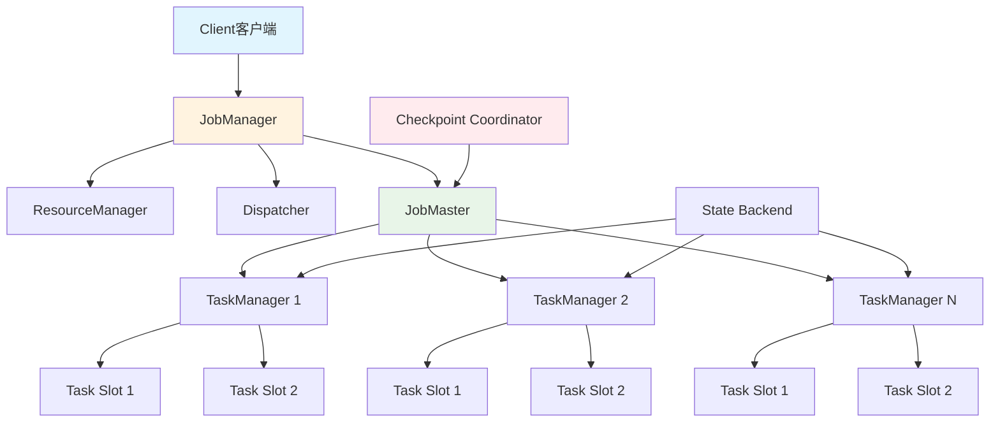

#### Flink组件职责

| 组件 | 职责 | 核心功能 |
|-----|------|---------|
| **JobManager** | 集群主节点 | 作业调度、检查点协调、故障恢复 |
| **TaskManager** | 工作节点 | 任务执行、数据缓存、网络通信 |
| **ResourceManager** | 资源管理 | 资源分配、Slot管理 |
| **Dispatcher** | 作业分发 | 接收作业、启动JobMaster |
| **JobMaster** | 作业主控 | 单个作业的调度和执行控制 |

### 1.2 JobManager启动流程

#### JobManager启动流程图

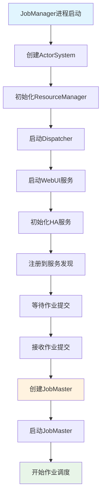

#### JobManager启动源码分析

```scala
// JobManagerRunner.scala - JobManager启动入口
class JobManagerRunner(
    jobGraph: JobGraph,
    configuration: Configuration,
    rpcService: RpcService,
    resourceManagerGateway: ResourceManagerGateway) {

  // JobMaster实例
  private var jobMaster: JobMaster = _
  private var jobMasterGateway: JobMasterGateway = _

  // 启动JobMaster的核心方法
  def start(): Unit = {
    try {
      // 1. 创建JobMaster
      jobMaster = new JobMaster(
        rpcService,
        jobGraph,
        configuration,
        resourceManagerGateway,
        heartbeatServices,
        scheduledExecutorService,
        blobWriter,
        highAvailabilityServices,
        fatalErrorHandler)

      // 2. 启动JobMaster
      jobMaster.start()
      
      // 3. 获取JobMaster网关
      val timeout = Time.fromDuration(configuration.get(AkkaOptions.ASK_TIMEOUT))
      jobMasterGateway = jobMaster.getSelfGateway(classOf[JobMasterGateway])
      
      // 4. 向ResourceManager注册
      registerJobMasterWithResourceManager()
      
      // 5. 开始调度执行图
      jobMaster.scheduleExecutionGraph()
      
      logInfo(s"Started JobMaster for job ${jobGraph.getJobID}")
      
    } catch {
      case e: Exception =>
        logError(s"Failed to start JobMaster for job ${jobGraph.getJobID}", e)
        throw e
    }
  }

  // 向ResourceManager注册JobMaster
  private def registerJobMasterWithResourceManager(): Unit = {
    val registrationFuture = resourceManagerGateway.registerJobManager(
      jobMasterGateway,
      jobGraph.getJobID,
      jobMaster.getAddress,
      jobGraph.getJobConfiguration)
      
    registrationFuture.whenComplete { (result, throwable) =>
      if (throwable != null) {
        logError("Failed to register JobMaster with ResourceManager", throwable)
        jobMaster.failJob(throwable)
      } else {
        logInfo("Successfully registered JobMaster with ResourceManager")
      }
    }
  }
}
```

### 1.3 TaskManager启动流程

#### TaskManager启动流程图

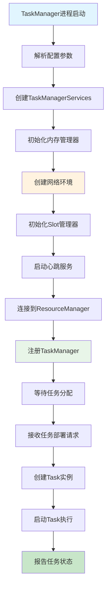

#### TaskManager启动核心源码

```scala
// TaskManagerRunner.scala - TaskManager启动核心类
class TaskManagerRunner(
    configuration: Configuration,
    resourceID: ResourceID) {

  private var taskManager: TaskExecutor = _
  private var taskManagerService: TaskManagerServices = _

  // TaskManager启动的主要方法
  def start(): CompletableFuture[Void] = {
    return CompletableFuture.runAsync(() => {
      try {
        // 1. 创建TaskManager服务组件
        taskManagerService = TaskManagerServices.fromConfiguration(
          configuration,
          resourceID,
          rpcService,
          highAvailabilityServices,
          heartbeatServices,
          metricRegistry,
          blobCacheService,
          localRecoveryDirectoryProvider,
          fatalErrorHandler)

        // 2. 创建TaskExecutor
        taskManager = new TaskExecutor(
          rpcService,
          taskManagerService.getTaskManagerConfiguration,
          taskManagerService.getTaskSlotTable,
          taskManagerService.getJobManagerTable,
          taskManagerService.getJobLeaderService,
          taskManagerService.getTaskStateManager,
          taskManagerService.getMemoryManager,
          taskManagerService.getIOManager,
          taskManagerService.getNetworkEnvironment,
          taskManagerService.getBroadcastVariableManager,
          taskManagerService.getTaskEventDispatcher,
          taskManagerService.getKvStateService,
          fatalErrorHandler,
          taskManagerService.getPartitionTracker)

        // 3. 启动TaskExecutor
        taskManager.start()
        
        // 4. 等待终止信号
        taskManager.getTerminationFuture().get()
        
      } catch {
        case e: Exception =>
          logError("Failed to start TaskManager", e)
          throw new RuntimeException("Failed to start TaskManager", e)
      }
    }, ioExecutor)
  }

  // TaskExecutor初始化和资源连接
  def connectToResourceManager(): Unit = {
    val resourceManagerAddress = configuration.getString(
      JobManagerOptions.ADDRESS)
    val resourceManagerPort = configuration.getInteger(
      JobManagerOptions.PORT)
    
    // 连接到ResourceManager
    val connectionFuture = taskManager.connectToResourceManager(
      resourceManagerAddress, 
      resourceManagerPort)
    
    connectionFuture.whenComplete { (connection, throwable) =>
      if (throwable != null) {
        logError("Failed to connect to ResourceManager", throwable)
        fatalErrorHandler.onFatalError(throwable)
      } else {
        logInfo("Successfully connected to ResourceManager")
      }
    }
  }
}
```

---

## 二、作业图构建与优化

### 2.1 StreamGraph构建

#### StreamGraph构建流程图

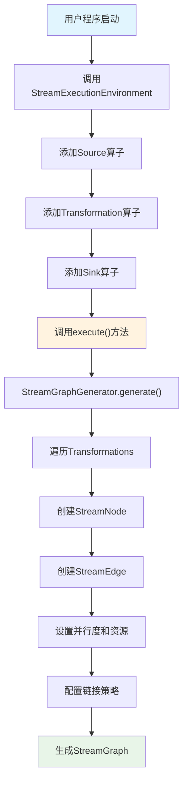

#### StreamGraph构建源码分析

```scala
// StreamGraphGenerator.scala - StreamGraph生成器
class StreamGraphGenerator(
    transformations: util.List[Transformation[_]],
    config: StreamExecutionEnvironment.Config,
    checkpointCfg: CheckpointConfig) {

  private val streamGraph = new StreamGraph(config.getExecutionConfig, checkpointCfg)
  private val alreadyTransformed = new util.HashMap[Transformation[_], util.Collection[Integer]]()

  // 生成StreamGraph的主要方法
  def generate(): StreamGraph = {
    // 1. 遍历所有的Transformation
    for (transformation <- transformations.asScala) {
      transform(transformation)
    }
    
    // 2. 设置环境配置
    streamGraph.setEnvironmentConfig(config)
    streamGraph.setCheckpointConfig(checkpointCfg)
    streamGraph.setScheduleMode(config.getExecutionConfig.getExecutionMode)
    
    // 3. 配置算子链接
    streamGraph.setChaining(config.getExecutionConfig.isChainingEnabled)
    
    // 4. 设置状态后端
    if (config.getStateBackend != null) {
      streamGraph.setStateBackend(config.getStateBackend)
    }
    
    streamGraph
  }

  // 转换单个Transformation为StreamNode
  private def transform(transform: Transformation[_]): util.Collection[Integer] = {
    if (alreadyTransformed.containsKey(transform)) {
      return alreadyTransformed.get(transform)
    }

    val transformationName = transform.getName
    val transformationUID = transform.getUid
    
    transform match {
      case sourceTransform: SourceTransformation[_] =>
        transformSource(sourceTransform)
        
      case sinkTransform: SinkTransformation[_] =>
        transformSink(sinkTransform)
        
      case oneInputTransform: OneInputTransformation[_, _] =>
        transformOneInput(oneInputTransform)
        
      case twoInputTransform: TwoInputTransformation[_, _, _] =>
        transformTwoInput(twoInputTransform)
        
      case multiInputTransform: MultiInputTransformation[_] =>
        transformMultiInput(multiInputTransform)
        
      case _ =>
        throw new IllegalStateException(s"Unknown transformation type: ${transform.getClass}")
    }
  }

  // 转换Source算子
  private def transformSource[T](
      sourceTransform: SourceTransformation[T]): util.Collection[Integer] = {
    
    // 1. 创建StreamNode
    val nodeId = streamGraph.addSource(
      sourceTransform.getOperatorFactory,
      sourceTransform.getInputType,
      sourceTransform.getOutputType,
      sourceTransform.getName)
    
    // 2. 设置并行度
    if (sourceTransform.getParallelism != -1) {
      streamGraph.setParallelism(nodeId, sourceTransform.getParallelism)
    }
    
    // 3. 设置资源需求
    if (sourceTransform.getMinResources != null) {
      streamGraph.setResources(nodeId, sourceTransform.getMinResources, sourceTransform.getPreferredResources)
    }
    
    // 4. 设置Slot共享组
    streamGraph.setSlotSharingGroup(nodeId, sourceTransform.getSlotSharingGroup)
    
    val result = util.Collections.singletonList(nodeId)
    alreadyTransformed.put(sourceTransform, result)
    result
  }

  // 转换单输入算子
  private def transformOneInput[IN, OUT](
      transform: OneInputTransformation[IN, OUT]): util.Collection[Integer] = {
    
    // 1. 递归处理输入Transformation
    val inputIds = transform(transform.getInput)
    
    // 2. 创建StreamNode
    val nodeId = streamGraph.addOperator(
      transform.getOperatorFactory,
      transform.getInputType,
      transform.getOutputType,
      transform.getName)
    
    // 3. 创建StreamEdge连接输入和当前节点
    for (inputId <- inputIds.asScala) {
      streamGraph.addEdge(inputId, nodeId, 0)
    }
    
    // 4. 配置节点属性
    configureNode(nodeId, transform)
    
    val result = util.Collections.singletonList(nodeId)
    alreadyTransformed.put(transform, result)
    result
  }

  // 配置StreamNode的通用属性
  private def configureNode(nodeId: Integer, transform: Transformation[_]): Unit = {
    // 设置并行度
    if (transform.getParallelism != -1) {
      streamGraph.setParallelism(nodeId, transform.getParallelism)
    }
    
    // 设置最大并行度
    if (transform.getMaxParallelism > 0) {
      streamGraph.setMaxParallelism(nodeId, transform.getMaxParallelism)
    }
    
    // 设置资源需求
    if (transform.getMinResources != null) {
      streamGraph.setResources(nodeId, transform.getMinResources, transform.getPreferredResources)
    }
    
    // 设置Slot共享组
    streamGraph.setSlotSharingGroup(nodeId, transform.getSlotSharingGroup)
    
    // 设置算子链接策略
    streamGraph.setChainingStrategy(nodeId, transform.getChainingStrategy)
  }
}
```

### 2.2 JobGraph生成

#### JobGraph优化流程图

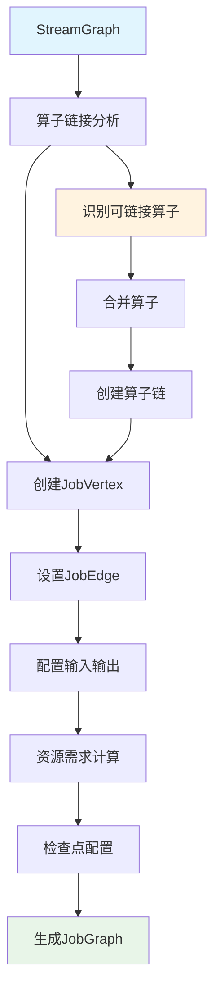

#### JobGraph生成核心源码

```scala
// StreamingJobGraphGenerator.scala - JobGraph生成器
class StreamingJobGraphGenerator(
    streamGraph: StreamGraph,
    jobID: JobID) {

  private val jobGraph = new JobGraph(jobID, streamGraph.getJobName)
  private val chainedConfigs = new util.HashMap[Integer, StreamConfig]()
  private val vertexConfigs = new util.HashMap[Integer, StreamConfig]()
  
  // 生成JobGraph的主要入口
  def createJobGraph(): JobGraph = {
    preValidate()
    
    // 1. 设置调度模式
    jobGraph.setScheduleMode(streamGraph.getScheduleMode)
    jobGraph.enableApproximateLocalRecovery(streamGraph.getCheckpointConfig.isApproximateLocalRecoveryEnabled)
    
    // 2. 设置检查点配置
    configureCheckpointing()
    
    // 3. 设置SavePoint配置
    jobGraph.setSavepointRestoreSettings(streamGraph.getSavepointRestoreSettings)
    
    // 4. 创建算子链
    setChaining()
    
    // 5. 配置JobVertex
    for ((vertexID, vertex) <- jobVertices.asScala) {
      configureJobVertex(vertex)
    }
    
    // 6. 设置Slot共享和Co-location约束
    setSlotSharingAndCoLocation()
    
    // 7. 配置检查点钩子
    configureCheckpointHooks()
    
    jobGraph
  }

  // 算子链接的核心逻辑
  private def setChaining(): Unit = {
    // 1. 找到所有的Source节点
    val sourceNodes = streamGraph.getSourceIDs.asScala
    
    for (sourceNodeId <- sourceNodes) {
      // 2. 从Source开始创建算子链
      createChain(sourceNodeId, sourceNodeId, hashes, legacyHashes, 0, chainIndex)
    }
  }

  // 创建算子链的递归方法
  private def createChain(
      startNodeId: Integer,
      currentNodeId: Integer,
      hashes: util.Map[Integer, Array[Byte]],
      legacyHashes: util.Map[Integer, Array[Byte]],
      chainIndex: Int,
      chainLength: Int): util.List[StreamEdge] = {

    val currentNode = streamGraph.getStreamNode(currentNodeId)
    val chainableOutputs = new util.ArrayList[StreamEdge]()
    val nonChainableOutputs = new util.ArrayList[StreamEdge]()
    
    // 1. 分析输出边，判断是否可以链接
    for (outEdge <- currentNode.getOutEdges.asScala) {
      if (isChainable(outEdge, streamGraph)) {
        chainableOutputs.add(outEdge)
      } else {
        nonChainableOutputs.add(outEdge)
      }
    }

    // 2. 递归处理可链接的输出
    for (chainableOutput <- chainableOutputs.asScala) {
      createChain(
        startNodeId,
        chainableOutput.getTargetId,
        hashes,
        legacyHashes,
        chainIndex,
        chainLength + 1)
    }

    // 3. 如果当前节点是链的起始节点，创建JobVertex
    if (currentNodeId == startNodeId) {
      val jobVertex = createJobVertex(startNodeId, hashes, legacyHashes, chainedSources)
      
      // 4. 处理非链接输出
      for (nonChainableOutput <- nonChainableOutputs.asScala) {
        val targetChainStartNode = createChain(
          nonChainableOutput.getTargetId,
          nonChainableOutput.getTargetId,
          hashes,
          legacyHashes,
          chainIndex + 1,
          0)
        
        // 创建JobEdge连接JobVertex
        val jobEdge = new JobEdge(targetVertex, DistributionPattern.POINTWISE)
        jobVertex.connectNewDataSetAsInput(
          targetVertex,
          DistributionPattern.POINTWISE,
          ResultPartitionType.PIPELINED)
      }
    }

    chainableOutputs
  }

  // 判断两个算子是否可以链接
  private def isChainable(edge: StreamEdge, streamGraph: StreamGraph): Boolean = {
    val downStreamVertex = streamGraph.getTargetVertex(edge)
    val upStreamVertex = streamGraph.getSourceVertex(edge)

    // 检查链接条件
    return upStreamVertex.isSameSlotSharingGroup(downStreamVertex) &&
           areOperatorsChainable(upStreamVertex, downStreamVertex, streamGraph) &&
           (edge.getPartitioner match {
             case _: ForwardPartitioner => true
             case _: RescalePartitioner => upStreamVertex.getParallelism == downStreamVertex.getParallelism
             case _ => false
           })
  }

  // 创建JobVertex
  private def createJobVertex(
      streamNodeId: Integer,
      hashes: util.Map[Integer, Array[Byte]],
      legacyHashes: util.Map[Integer, Array[Byte]],
      chainedSources: util.List[Integer]): JobVertex = {

    val streamNode = streamGraph.getStreamNode(streamNodeId)
    val jobVertex = new JobVertex(streamNode.getOperatorName)
    
    // 1. 设置调用类
    jobVertex.setInvokableClass(classOf[StreamTask[_, _]])
    
    // 2. 设置并行度
    jobVertex.setParallelism(streamNode.getParallelism)
    
    // 3. 设置最大并行度
    if (streamNode.getMaxParallelism > 0) {
      jobVertex.setMaxParallelism(streamNode.getMaxParallelism)
    }
    
    // 4. 设置资源需求
    if (streamNode.getMinResources != null) {
      jobVertex.setResources(streamNode.getMinResources, streamNode.getPreferredResources)
    }
    
    // 5. 配置StreamConfig
    val config = new StreamConfig(jobVertex.getConfiguration)
    setVertexConfig(streamNodeId, config, chainedSources, chainedOutputs)
    
    jobGraph.addVertex(jobVertex)
    jobVertices.put(streamNodeId, jobVertex)
    
    jobVertex
  }
}
```

### 2.3 ExecutionGraph创建

#### ExecutionGraph构建流程图

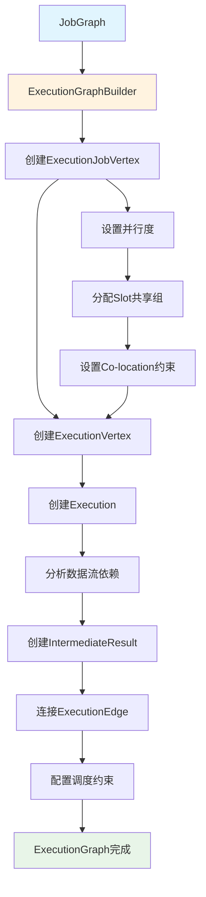

#### ExecutionGraph构建源码

```scala
// ExecutionGraphBuilder.scala - ExecutionGraph构建器
object ExecutionGraphBuilder {

  // 从JobGraph构建ExecutionGraph的主要方法
  def buildGraph(
      jobGraph: JobGraph,
      configuration: Configuration,
      futureExecutor: ScheduledExecutorService,
      ioExecutor: Executor,
      userCodeClassLoader: ClassLoader,
      checkpointRecoveryFactory: CompletedCheckpointStore,
      rpcTimeout: Time,
      blobWriter: BlobWriter,
      log: Logger): ExecutionGraph = {

    // 1. 创建ExecutionGraph实例
    val executionGraph = new ExecutionGraph(
      jobGraph.getJobID,
      jobGraph.getName,
      jobGraph.getJobConfiguration,
      futureExecutor,
      ioExecutor,
      rpcTimeout,
      checkpointRecoveryFactory,
      userCodeClassLoader)

    try {
      // 2. 设置调度模式
      executionGraph.setScheduleMode(jobGraph.getScheduleMode)
      
      // 3. 设置JSON计划
      executionGraph.setJsonPlan(JsonPlanGenerator.generatePlan(jobGraph))
      
      // 4. 构建ExecutionJobVertex
      val sortedTopology = jobGraph.getVerticesSortedTopologicallyFromSources
      for (jobVertex <- sortedTopology.asScala) {
        val executionJobVertex = createExecutionJobVertex(
          executionGraph,
          jobVertex,
          userCodeClassLoader,
          log)
        executionGraph.attachJobVertex(executionJobVertex)
      }
      
      // 5. 连接ExecutionJobVertex之间的边
      connectExecutionJobVertices(executionGraph, sortedTopology, log)
      
      // 6. 配置检查点
      configureCheckpointing(executionGraph, jobGraph, log)
      
      // 7. 配置Slot共享和Co-location
      configureSlotSharingAndCoLocation(executionGraph, jobGraph)
      
      executionGraph
      
    } catch {
      case e: Exception =>
        log.error(s"Failed to build ExecutionGraph from JobGraph ${jobGraph.getJobID}", e)
        throw new JobException("Failed to build ExecutionGraph", e)
    }
  }

  // 创建ExecutionJobVertex
  private def createExecutionJobVertex(
      executionGraph: ExecutionGraph,
      jobVertex: JobVertex,
      userCodeClassLoader: ClassLoader,
      log: Logger): ExecutionJobVertex = {

    // 1. 创建ExecutionJobVertex
    val executionJobVertex = new ExecutionJobVertex(
      executionGraph,
      jobVertex,
      jobVertex.getParallelism,
      jobVertex.getMaxParallelism,
      userCodeClassLoader)

    // 2. 创建ExecutionVertex数组
    val parallelism = jobVertex.getParallelism
    val taskVertices = new Array[ExecutionVertex](parallelism)
    
    for (i <- 0 until parallelism) {
      taskVertices(i) = new ExecutionVertex(
        executionJobVertex,
        i,
        createIntermediateResults(jobVertex, i),
        rpcTimeout)
    }
    
    executionJobVertex.setTaskVertices(taskVertices)
    
    // 3. 初始化算子坐标器（如果需要）
    val coordinatorClassName = jobVertex.getOperatorCoordinatorClassName
    if (coordinatorClassName != null) {
      val coordinatorFactory = createOperatorCoordinatorFactory(
        coordinatorClassName, 
        userCodeClassLoader)
      executionJobVertex.setOperatorCoordinatorFactory(coordinatorFactory)
    }

    executionJobVertex
  }

  // 连接ExecutionJobVertex之间的边
  private def connectExecutionJobVertices(
      executionGraph: ExecutionGraph,
      sortedTopology: util.List[JobVertex],
      log: Logger): Unit = {

    for (jobVertex <- sortedTopology.asScala) {
      val executionJobVertex = executionGraph.getJobVertex(jobVertex.getID)
      
      // 处理每个输入
      for (i <- 0 until jobVertex.getNumberOfInputs) {
        val jobEdge = jobVertex.getInputs.get(i)
        val sourceJobVertex = jobEdge.getSource.getProducer
        val sourceExecutionJobVertex = executionGraph.getJobVertex(sourceJobVertex.getID)
        
        // 创建ExecutionEdge
        connectJobVertices(
          sourceExecutionJobVertex,
          executionJobVertex,
          jobEdge,
          log)
      }
    }
  }

  // 连接两个ExecutionJobVertex
  private def connectJobVertices(
      sourceJobVertex: ExecutionJobVertex,
      targetJobVertex: ExecutionJobVertex,
      jobEdge: JobEdge,
      log: Logger): Unit = {

    val sourceIntermediateResult = sourceJobVertex.getProducedDataSets()(jobEdge.getSourceIndex)
    val targetIntermediateDataSet = targetJobVertex.getInputs.get(jobEdge.getTargetIndex)
    
    // 连接中间结果
    targetIntermediateDataSet.setSource(sourceIntermediateResult)
    
    // 根据分发模式创建ExecutionEdge
    val distributionPattern = jobEdge.getDistributionPattern
    distributionPattern match {
      case DistributionPattern.POINTWISE =>
        connectPointwise(sourceJobVertex, targetJobVertex, sourceIntermediateResult)
        
      case DistributionPattern.ALL_TO_ALL =>
        connectAllToAll(sourceJobVertex, targetJobVertex, sourceIntermediateResult)
        
      case _ =>
        throw new IllegalStateException(s"Unknown distribution pattern: $distributionPattern")
    }
  }

  // 点对点连接模式
  private def connectPointwise(
      sourceJobVertex: ExecutionJobVertex,
      targetJobVertex: ExecutionJobVertex,
      intermediateResult: IntermediateResult): Unit = {

    val sourceParallelism = sourceJobVertex.getParallelism
    val targetParallelism = targetJobVertex.getParallelism
    
    require(sourceParallelism == targetParallelism, 
      "Pointwise connection requires same parallelism")
    
    for (i <- 0 until sourceParallelism) {
      val sourceVertex = sourceJobVertex.getTaskVertices()(i)
      val targetVertex = targetJobVertex.getTaskVertices()(i)
      
      val resultPartition = intermediateResult.getPartitions()(i)
      val inputGate = new IntermediateResultPartition(resultPartition)
      
      val executionEdge = new ExecutionEdge(
        sourceVertex,
        targetVertex,
        resultPartition,
        inputGate)
      
      targetVertex.addInputSource(executionEdge)
    }
  }

  // 全连接模式
  private def connectAllToAll(
      sourceJobVertex: ExecutionJobVertex,
      targetJobVertex: ExecutionJobVertex,
      intermediateResult: IntermediateResult): Unit = {

    val sourceParallelism = sourceJobVertex.getParallelism
    val targetParallelism = targetJobVertex.getParallelism
    
    for (i <- 0 until targetParallelism) {
      val targetVertex = targetJobVertex.getTaskVertices()(i)
      
      for (j <- 0 until sourceParallelism) {
        val sourceVertex = sourceJobVertex.getTaskVertices()(j)
        val resultPartition = intermediateResult.getPartitions()(j)
        val inputGate = new IntermediateResultPartition(resultPartition)
        
        val executionEdge = new ExecutionEdge(
          sourceVertex,
          targetVertex,
          resultPartition,
          inputGate)
        
        targetVertex.addInputSource(executionEdge)
      }
    }
  }
}
```

### 2.4 物理图部署

#### 物理部署流程图

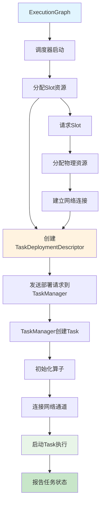

---

## 三、任务调度系统

### 3.1 调度器架构

#### Flink调度器架构图

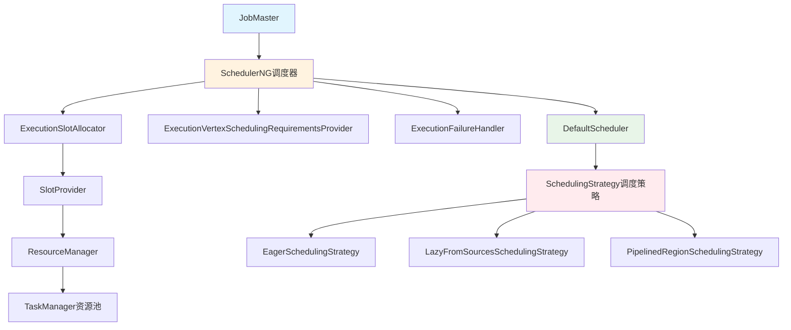

#### 调度器核心源码

```scala
// DefaultScheduler.scala - 默认调度器实现
class DefaultScheduler(
    log: Logger,
    jobGraph: JobGraph,
    backtrackingStateStore: BacktrackingStateStore,
    ioExecutor: Executor,
    jobMasterConfiguration: Configuration,
    slotProvider: SlotProvider,
    scheduledExecutorService: ScheduledExecutorService,
    userCodeLoader: ClassLoader,
    checkpointCleaner: CheckpointCleaner,
    checkpointRecoveryFactory: CompletedCheckpointStore,
    failureEnricher: FailureEnricher,
    rpcTimeout: Time) extends SchedulerNG {

  // 执行图
  private val executionGraph: ExecutionGraph = createAndRestoreExecutionGraph()
  
  // 调度策略
  private val schedulingStrategy: SchedulingStrategy = createSchedulingStrategy()
  
  // 失败处理器
  private val executionFailureHandler: ExecutionFailureHandler = 
    new RestartPipelinedRegionFailureHandler(
      executionGraph,
      schedulingStrategy,
      backtrackingStateStore,
      rpcTimeout,
      log)

  // Slot分配器
  private val executionSlotAllocator: ExecutionSlotAllocator = 
    new DefaultExecutionSlotAllocator(
      slotProvider,
      new DefaultPreferredLocationsRetriever(
        StateLocations.StateAssignmentOperation.LOAD),
      rpcTimeout)

  // 启动调度
  override def startScheduling(): Unit = {
    checkState(schedulingStrategy != null, "Scheduling strategy must be initialized")
    
    try {
      // 1. 准备执行图进行调度
      prepareExecutionGraphForNgScheduling()
      
      // 2. 启动检查点协调器
      startCheckpointScheduler()
      
      // 3. 开始调度执行
      schedulingStrategy.startScheduling()
      
      log.info("Started scheduling for job {}", jobGraph.getJobID)
      
    } catch {
      case e: Exception =>
        log.error("Failed to start scheduling", e)
        failJob(e)
    }
  }

  // 创建调度策略
  private def createSchedulingStrategy(): SchedulingStrategy = {
    val schedulingStrategyFactory = jobMasterConfiguration.get(
      JobManagerOptions.SCHEDULING_STRATEGY) match {
      case "eager" => new EagerSchedulingStrategy.Factory()
      case "lazy_from_sources" => new LazyFromSourcesSchedulingStrategy.Factory()
      case "pipelined_region" => new PipelinedRegionSchedulingStrategy.Factory()
      case other => 
        throw new IllegalArgumentException(s"Unknown scheduling strategy: $other")
    }
    
    schedulingStrategyFactory.createInstance(
      this,
      executionGraph,
      executionSlotAllocator,
      scheduledExecutorService)
  }

  // 分配Slot并部署任务
  override def allocateSlotAndDeploy(
      executionVertexId: ExecutionVertexID,
      requiredSlotProfile: SlotProfile,
      allowQueuedScheduling: Boolean): CompletableFuture[Void] = {

    // 1. 分配Slot
    val slotAllocationFuture = executionSlotAllocator.allocateSlot(
      new ExecutionVertexSchedulingRequirements.Builder()
        .withExecutionVertexId(executionVertexId)
        .withSlotProfile(requiredSlotProfile)
        .build(),
      allowQueuedScheduling)

    // 2. 部署任务
    slotAllocationFuture.thenCompose { logicalSlot =>
      val executionVertex = getExecutionVertex(executionVertexId)
      val deployment = executionVertex.getCurrentExecutionAttempt
      
      deployTask(deployment, logicalSlot)
    }
  }

  // 部署任务到TaskManager
  private def deployTask(
      execution: Execution,
      logicalSlot: LogicalSlot): CompletableFuture[Void] = {

    try {
      // 1. 创建任务部署描述符
      val taskDeploymentDescriptor = createTaskDeploymentDescriptor(execution, logicalSlot)
      
      // 2. 获取TaskManager网关
      val taskManagerGateway = logicalSlot.getTaskManagerGateway
      
      // 3. 提交任务到TaskManager
      val deploymentFuture = taskManagerGateway.submitTask(
        taskDeploymentDescriptor,
        jobMasterConfiguration,
        rpcTimeout)
      
      // 4. 处理部署结果
      deploymentFuture.whenComplete { (_, throwable) =>
        if (throwable != null) {
          execution.markFailed(throwable)
          freeSlot(logicalSlot)
        } else {
          execution.markDeployed()
        }
      }
      
      deploymentFuture.thenApply(_ => null: Void)
      
    } catch {
      case e: Exception =>
        log.error(s"Failed to deploy task ${execution.getAttemptId}", e)
        execution.markFailed(e)
        freeSlot(logicalSlot)
        FutureUtils.completedExceptionally[Void](e)
    }
  }

  // 创建任务部署描述符
  private def createTaskDeploymentDescriptor(
      execution: Execution,
      logicalSlot: LogicalSlot): TaskDeploymentDescriptor = {

    val executionVertex = execution.getVertex
    val executionJobVertex = executionVertex.getJobVertex
    val jobVertexId = executionJobVertex.getJobVertexId
    
    // 1. 获取任务配置
    val taskConfiguration = executionJobVertex.getTaskConfiguration
    
    // 2. 创建输入网关部署描述符
    val inputGateDeploymentDescriptors = createInputGateDeploymentDescriptors(execution)
    
    // 3. 创建结果分区部署描述符
    val resultPartitionDeploymentDescriptors = createResultPartitionDeploymentDescriptors(execution)
    
    // 4. 构建部署描述符
    new TaskDeploymentDescriptor(
      execution.getAttemptId,
      executionVertex.getTaskNameWithSubtaskIndex,
      jobVertexId,
      execution.getParallelSubtaskIndex,
      execution.getAttemptNumber,
      taskConfiguration,
      executionJobVertex.getJobVertex.getInvokableClassName,
      inputGateDeploymentDescriptors,
      resultPartitionDeploymentDescriptors,
      logicalSlot.getAllocationId)
  }

  // 处理任务执行状态更新
  override def updateTaskExecutionState(taskExecutionState: TaskExecutionState): Boolean = {
    val executionAttemptID = taskExecutionState.getID
    val execution = executionGraph.getRegisteredExecutions.get(executionAttemptID)
    
    if (execution != null) {
      val executionState = taskExecutionState.getExecutionState
      
      executionState match {
        case ExecutionState.RUNNING =>
          execution.markRunning()
          
        case ExecutionState.FINISHED =>
          execution.markFinished()
          onTaskFinished(execution)
          
        case ExecutionState.FAILED =>
          val cause = taskExecutionState.getError(userCodeLoader)
          execution.markFailed(cause)
          executionFailureHandler.handleFailure(execution, cause)
          
        case ExecutionState.CANCELED =>
          execution.markCanceled()
          
        case _ =>
          log.warn(s"Unexpected task execution state: $executionState")
      }
      
      true
    } else {
      log.warn(s"Received state update for unknown execution: $executionAttemptID")
      false
    }
  }
}
```

### 3.2 任务部署流程

#### Flink完整作业执行时序图

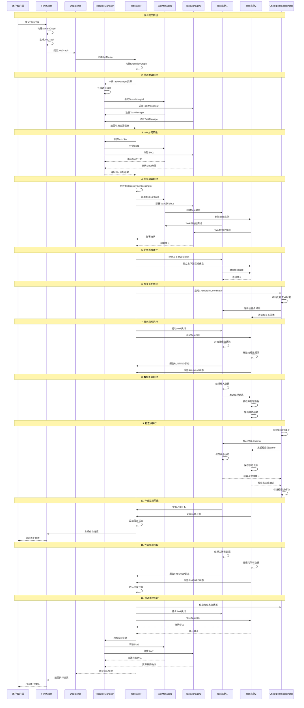

#### 详细技术实现时序图

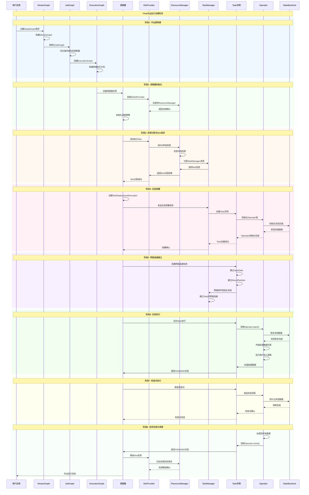

#### 关键时间节点说明

| 阶段 | 关键操作 | 主要组件 | 耗时特点 |
|------|----------|----------|----------|
| **作业图构建** | StreamGraph→JobGraph→ExecutionGraph | 客户端编译 | 通常1-3秒 |
| **调度器初始化** | 调度器创建、资源发现 | JobMaster | 通常2-5秒 |
| **资源分配** | Slot请求、TaskManager启动 | ResourceManager | 通常5-15秒 |
| **任务部署** | Task创建、Operator初始化 | TaskManager | 通常1-3秒 |
| **网络建立** | InputGate、ResultPartition连接 | 网络栈 | 通常几百毫秒 |
| **任务执行** | 数据流处理、状态计算 | Operator链 | 取决于数据量和复杂度 |
| **检查点** | 状态快照、持久化 | StateBackend | 通常几秒到几分钟 |
| **资源清理** | Slot释放、资源回收 | ResourceManager | 通常1-3秒 |

#### Flink YARN模式完整执行时序图

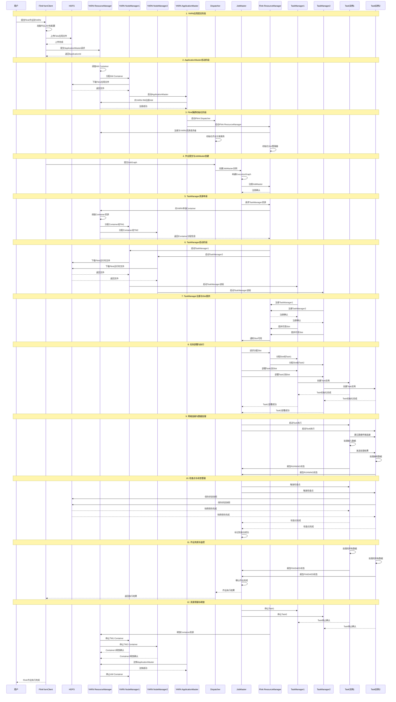

#### Flink与Spark YARN模式对比

| 对比维度 | Flink YARN模式 | Spark YARN模式 |
|---------|---------------|---------------|
| **ApplicationMaster** | 包含Dispatcher+ResourceManager | 包含Driver(cluster模式)或只是资源协调器 |
| **作业提交** | 提交到Dispatcher | 提交到SparkContext |
| **资源管理** | Flink ResourceManager + YARN RM | ApplicationMaster + YARN RM |
| **任务调度** | JobMaster负责单作业调度 | TaskScheduler负责任务调度 |
| **Slot管理** | 基于Slot的细粒度资源分配 | 基于Executor的粗粒度资源分配 |
| **容错机制** | 检查点+任务重启 | RDD血统+Stage重试 |
| **状态管理** | 内置状态后端 | 依赖外部存储或内存 |
| **动态资源** | Slot级别的动态申请释放 | Executor级别的动态扩缩容 |

### 3.3 资源分配机制

#### Slot分配流程图

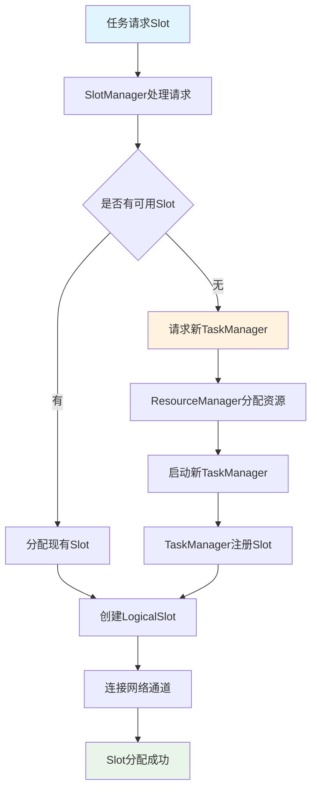

---

## 六、检查点机制

### 6.1 检查点协调器

#### 检查点触发流程图

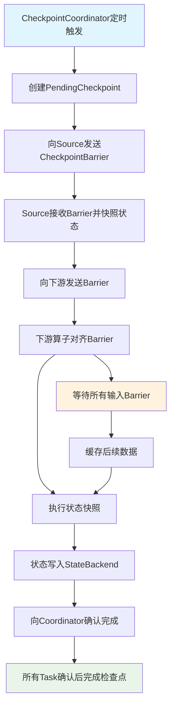

#### CheckpointCoordinator核心源码

```scala
// CheckpointCoordinator.scala - 检查点协调器
class CheckpointCoordinator(
    jobId: JobID,
    checkpointConfig: CheckpointConfig,
    executionGraph: ExecutionGraph,
    checkpointIDCounter: CheckpointIDCounter,
    completedCheckpointStore: CompletedCheckpointStore,
    checkpointStorage: CheckpointStorage,
    ioExecutor: Executor,
    sharedStateRegistryFactory: SharedStateRegistryFactory,
    failureManager: CheckpointFailureManager) {

  // 待完成的检查点
  private val pendingCheckpoints = new ConcurrentHashMap[Long, PendingCheckpoint]()
  
  // 检查点统计信息
  private val checkpointStatsTracker = new CheckpointStatsTracker()
  
  // 定时器服务
  private val timer = new Timer("Checkpoint Timer")

  // 启动检查点协调器
  def startCheckpointScheduler(): Unit = {
    if (checkpointConfig.isCheckpointingEnabled) {
      val baseInterval = checkpointConfig.getCheckpointInterval
      val randomDelay = ThreadLocalRandom.current().nextLong(baseInterval)
      
      timer.schedule(new CheckpointTriggerTask(), randomDelay, baseInterval)
      
      logInfo("Started checkpoint scheduler with interval {} ms", baseInterval)
    }
  }

  // 触发检查点的定时任务
  private class CheckpointTriggerTask extends TimerTask {
    override def run(): Unit = {
      try {
        triggerCheckpoint(CheckpointTriggerRequest.periodic())
      } catch {
        case e: Exception =>
          logError("Failed to trigger checkpoint", e)
      }
    }
  }

  // 触发检查点的核心方法
  def triggerCheckpoint(
      request: CheckpointTriggerRequest): CompletableFuture[CompletedCheckpoint] = {

    // 1. 检查是否可以触发检查点
    val checkResult = isTriggerable(request)
    if (!checkResult.isTriggerable) {
      return FutureUtils.completedExceptionally(
        new CheckpointException(checkResult.reason))
    }

    // 2. 生成检查点ID
    val checkpointId = checkpointIDCounter.getAndIncrement()
    val timestamp = System.currentTimeMillis()
    
    // 3. 创建PendingCheckpoint
    val pendingCheckpoint = createPendingCheckpoint(
      checkpointId,
      timestamp,
      request.getCheckpointType)

    // 4. 存储PendingCheckpoint
    pendingCheckpoints.put(checkpointId, pendingCheckpoint)
    
    // 5. 向Source节点发送CheckpointBarrier
    val triggerFuture = triggerCheckpointBarriers(pendingCheckpoint)
    
    // 6. 处理触发结果
    triggerFuture.whenComplete { (_, throwable) =>
      if (throwable != null) {
        logError(s"Failed to trigger checkpoint $checkpointId", throwable)
        discardPendingCheckpoint(pendingCheckpoint, throwable)
      }
    }
    
    pendingCheckpoint.getCompletionFuture
  }

  // 创建PendingCheckpoint
  private def createPendingCheckpoint(
      checkpointId: Long,
      timestamp: Long,
      checkpointType: CheckpointType): PendingCheckpoint = {

    // 1. 获取需要确认的ExecutionVertex
    val tasksToWaitFor = new util.ArrayList[ExecutionVertex]()
    for (jobVertex <- executionGraph.getVerticesTopologically.asScala) {
      for (executionVertex <- jobVertex.getTaskVertices) {
        if (executionVertex.getExecutionState == ExecutionState.RUNNING) {
          tasksToWaitFor.add(executionVertex)
        }
      }
    }

    // 2. 创建检查点存储位置
    val checkpointStorageLocation = checkpointStorage.initializeLocationForCheckpoint(checkpointId)
    
    // 3. 创建PendingCheckpoint
    new PendingCheckpoint(
      jobId,
      checkpointId,
      timestamp,
      tasksToWaitFor,
      checkpointConfig.getMaxConcurrentCheckpoints,
      checkpointConfig.getCheckpointTimeout,
      checkpointStorageLocation,
      ioExecutor,
      sharedStateRegistryFactory.create(ioExecutor))
  }

  // 向Source节点发送CheckpointBarrier
  private def triggerCheckpointBarriers(
      pendingCheckpoint: PendingCheckpoint): CompletableFuture[Void] = {

    val checkpointId = pendingCheckpoint.getCheckpointId
    val timestamp = pendingCheckpoint.getCheckpointTimestamp
    
    // 1. 获取所有Source节点
    val sourceExecutions = new util.ArrayList[Execution]()
    for (jobVertex <- executionGraph.getVerticesTopologically.asScala) {
      if (jobVertex.getJobVertex.isInputVertex) {
        for (executionVertex <- jobVertex.getTaskVertices) {
          sourceExecutions.add(executionVertex.getCurrentExecutionAttempt)
        }
      }
    }

    // 2. 向Source节点发送TriggerCheckpoint消息
    val triggerFutures = sourceExecutions.asScala.map { execution =>
      val checkpointOptions = CheckpointOptions.forCheckpointWithDefaultLocation()
      
      execution.triggerCheckpoint(checkpointId, timestamp, checkpointOptions)
    }

    // 3. 等待所有Source确认
    CompletableFuture.allOf(triggerFutures.toArray: _*)
  }

  // 接收检查点确认
  def receiveAcknowledgeMessage(
      message: AcknowledgeCheckpoint,
      taskManagerLocationInfo: String): Boolean = {

    val checkpointId = message.getCheckpointId
    val pendingCheckpoint = pendingCheckpoints.get(checkpointId)
    
    if (pendingCheckpoint == null) {
      logDebug(s"Received acknowledgment for unknown checkpoint $checkpointId")
      return false
    }

    // 1. 确认任务状态
    val acknowledgeResult = pendingCheckpoint.acknowledgeTask(
      message.getTaskExecutionId,
      message.getSubtaskState,
      message.getCheckpointMetrics)

    if (acknowledgeResult == AcknowledgeResult.SUCCESS) {
      // 2. 检查是否所有任务都已确认
      if (pendingCheckpoint.areTasksFullyAcknowledged) {
        completePendingCheckpoint(pendingCheckpoint)
      }
      return true
    } else {
      logWarn(s"Failed to acknowledge checkpoint $checkpointId: $acknowledgeResult")
      return false
    }
  }

  // 完成检查点
  private def completePendingCheckpoint(pendingCheckpoint: PendingCheckpoint): Unit = {
    val checkpointId = pendingCheckpoint.getCheckpointId
    
    try {
      // 1. 最终化检查点存储
      val completedCheckpointStorageLocation = pendingCheckpoint.finalizeCheckpointExclusively()
      
      // 2. 创建CompletedCheckpoint
      val completedCheckpoint = new CompletedCheckpoint(
        jobId,
        checkpointId,
        pendingCheckpoint.getCheckpointTimestamp,
        System.currentTimeMillis(),
        pendingCheckpoint.getTaskStates,
        pendingCheckpoint.getMasterState,
        completedCheckpointStorageLocation,
        pendingCheckpoint.getExternalPointer)

      // 3. 存储完成的检查点
      completedCheckpointStore.addCheckpoint(
        completedCheckpoint,
        checkpointsCleaner,
        () => pendingCheckpoint.getStatsCallback.reportCompletedCheckpoint(completedCheckpoint.getExternalPointer))

      // 4. 清理PendingCheckpoint
      pendingCheckpoints.remove(checkpointId)
      
      // 5. 通知完成
      pendingCheckpoint.reportCompletedCheckpoint(completedCheckpoint)
      
      logInfo(s"Completed checkpoint $checkpointId")
      
    } catch {
      case e: Exception =>
        logError(s"Failed to complete checkpoint $checkpointId", e)
        discardPendingCheckpoint(pendingCheckpoint, e)
    }
  }

  // 丢弃失败的检查点
  private def discardPendingCheckpoint(
      pendingCheckpoint: PendingCheckpoint,
      cause: Throwable): Unit = {
    
    val checkpointId = pendingCheckpoint.getCheckpointId
    pendingCheckpoints.remove(checkpointId)
    
    try {
      pendingCheckpoint.abort(CheckpointFailureReason.CHECKPOINT_COORDINATOR_SHUTDOWN)
      failureManager.handleCheckpointFailure(pendingCheckpoint, cause)
    } catch {
      case e: Exception =>
        logError(s"Failed to discard checkpoint $checkpointId", e)
    }
  }
}
```

### 6.2 分布式快照算法

#### Chandy-Lamport算法实现

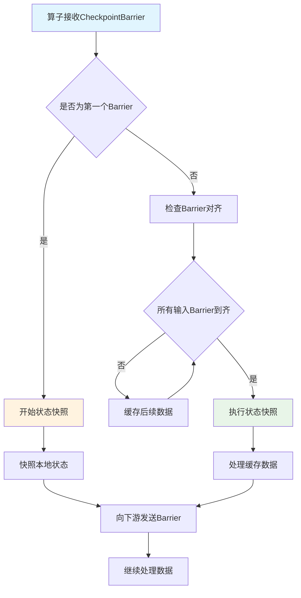

#### CheckpointBarrier处理源码

```scala
// CheckpointBarrierHandler.scala - CheckpointBarrier处理器
abstract class CheckpointBarrierHandler(
    val inputGate: IndexedInputGate,
    val ioExecutor: Executor) {

  // 检查点状态跟踪
  protected val pendingCheckpoints = new util.TreeMap[Long, CheckpointBarrierCount]()
  
  // 处理CheckpointBarrier的核心方法
  def processBarrier(
      barrier: CheckpointBarrier,
      channelInfo: InputChannelInfo,
      bufferReceivedTimestamp: Long): Unit = {

    val checkpointId = barrier.getId
    val checkpoint = pendingCheckpoints.computeIfAbsent(
      checkpointId, 
      _ => new CheckpointBarrierCount(inputGate.getNumberOfInputChannels))

    // 标记通道已接收Barrier
    if (checkpoint.markChannelBarrierReceived(channelInfo.getInputChannelIdx)) {
      // 如果所有通道的Barrier都已接收
      if (checkpoint.isFullyReceived) {
        // 触发检查点
        notifyCheckpoint(barrier, bufferReceivedTimestamp, checkpointId)
        pendingCheckpoints.remove(checkpointId)
      }
    }
  }

  // 通知检查点触发
  protected def notifyCheckpoint(
      barrier: CheckpointBarrier,
      bufferReceivedTimestamp: Long,
      checkpointId: Long): Unit

  // 处理检查点取消
  def processCancellationBarrier(
      cancelBarrier: CancelCheckpointMarker,
      channelInfo: InputChannelInfo): Unit = {
    
    val checkpointId = cancelBarrier.getCheckpointId
    pendingCheckpoints.remove(checkpointId)
    
    notifyAbort(checkpointId, new CheckpointException(
      CheckpointFailureReason.CHECKPOINT_DECLINED_ON_CANCELLATION_BARRIER))
  }

  protected def notifyAbort(checkpointId: Long, cause: CheckpointException): Unit
}

// CheckpointBarrierAligner.scala - 精确一次对齐实现
class CheckpointBarrierAligner(
    inputGate: IndexedInputGate,
    ioExecutor: Executor,
    bufferStorage: BufferStorage)
  extends CheckpointBarrierHandler(inputGate, ioExecutor) {

  // 阻塞的输入通道
  private val blockedChannels = new util.BitSet(inputGate.getNumberOfInputChannels)
  
  // 缓存的数据缓冲区
  private val bufferedData = new util.ArrayDeque[BufferOrEvent]()

  override def processBarrier(
      barrier: CheckpointBarrier,
      channelInfo: InputChannelInfo,
      bufferReceivedTimestamp: Long): Unit = {

    val channelIndex = channelInfo.getInputChannelIdx
    val checkpointId = barrier.getId

    // 1. 处理Barrier
    if (isCheckpointPending) {
      // 如果已有检查点在进行中
      if (checkpointId > currentCheckpointId || 
          (checkpointId == currentCheckpointId && !blockedChannels.get(channelIndex))) {
        
        // 阻塞该通道
        blockedChannels.set(channelIndex)
        
        if (blockedChannels.cardinality() == inputGate.getNumberOfInputChannels) {
          // 所有通道都被阻塞，触发检查点
          super.processBarrier(barrier, channelInfo, bufferReceivedTimestamp)
        }
      }
    } else {
      // 第一个Barrier
      currentCheckpointId = checkpointId
      blockedChannels.set(channelIndex)
      
      if (inputGate.getNumberOfInputChannels == 1) {
        // 单输入通道，立即触发
        super.processBarrier(barrier, channelInfo, bufferReceivedTimestamp)
      }
    }
  }

  override protected def notifyCheckpoint(
      barrier: CheckpointBarrier,
      bufferReceivedTimestamp: Long,
      checkpointId: Long): Unit = {

    // 1. 释放缓存的数据
    releaseBufferedData()
    
    // 2. 重置状态
    reset()
    
    // 3. 通知检查点开始
    checkpointHandler.triggerCheckpointOnBarrier(
      barrier.asCheckpointBarrier(),
      bufferReceivedTimestamp)
  }

  // 缓存来自阻塞通道的数据
  def bufferReceivedFromBlockedChannel(bufferOrEvent: BufferOrEvent): Unit = {
    val channelIndex = bufferOrEvent.getChannelInfo.getInputChannelIdx
    
    if (blockedChannels.get(channelIndex)) {
      // 存储到缓冲区
      bufferStorage.add(bufferOrEvent)
      bufferedData.add(bufferOrEvent)
    }
  }

  // 释放缓存的数据
  private def releaseBufferedData(): Unit = {
    for (bufferOrEvent <- bufferedData.asScala) {
      if (bufferOrEvent.isBuffer) {
        // 将缓存的数据发送给下游
        outputHandler.emit(bufferOrEvent)
      } else {
        // 处理事件
        outputHandler.handleEvent(bufferOrEvent.getEvent, bufferOrEvent.getChannelInfo)
      }
    }
    bufferedData.clear()
  }

  // 重置对齐器状态
  private def reset(): Unit = {
    blockedChannels.clear()
    currentCheckpointId = -1L
    bufferedData.clear()
  }
}

// CheckpointBarrierUnaligner.scala - 至少一次非对齐实现
class CheckpointBarrierUnaligner(
    inputGate: IndexedInputGate,
    ioExecutor: Executor,
    channelStateWriter: ChannelStateWriter)
  extends CheckpointBarrierHandler(inputGate, ioExecutor) {

  override def processBarrier(
      barrier: CheckpointBarrier,
      channelInfo: InputChannelInfo,
      bufferReceivedTimestamp: Long): Unit = {

    val checkpointId = barrier.getId
    val channelIndex = channelInfo.getInputChannelIdx

    // 1. 记录通道状态
    if (!hasReceivedBarrier(checkpointId, channelIndex)) {
      markBarrierReceived(checkpointId, channelIndex)
      
      // 2. 快照正在传输的数据
      snapshotChannelStates(checkpointId, channelIndex)
      
      // 3. 立即触发检查点（不等待对齐）
      if (shouldTriggerCheckpoint(checkpointId)) {
        super.processBarrier(barrier, channelInfo, bufferReceivedTimestamp)
      }
    }
  }

  // 快照通道状态
  private def snapshotChannelStates(checkpointId: Long, channelIndex: Int): Unit = {
    // 获取输入通道的正在传输数据
    val inputChannel = inputGate.getChannel(channelIndex)
    val inflightData = inputChannel.getInflightData
    
    // 写入通道状态
    channelStateWriter.addInputData(
      checkpointId,
      new InputChannelInfo(inputGate.getGateIndex, channelIndex),
      inflightData)
  }

  override protected def notifyCheckpoint(
      barrier: CheckpointBarrier,
      bufferReceivedTimestamp: Long,
      checkpointId: Long): Unit = {

    // 非对齐模式下立即触发检查点
    checkpointHandler.triggerCheckpointOnBarrier(
      barrier.asCheckpointBarrier(),
      bufferReceivedTimestamp)
  }
}
```

---

## 七、网络通信系统

### 7.1 网络栈架构

#### Flink网络栈架构图

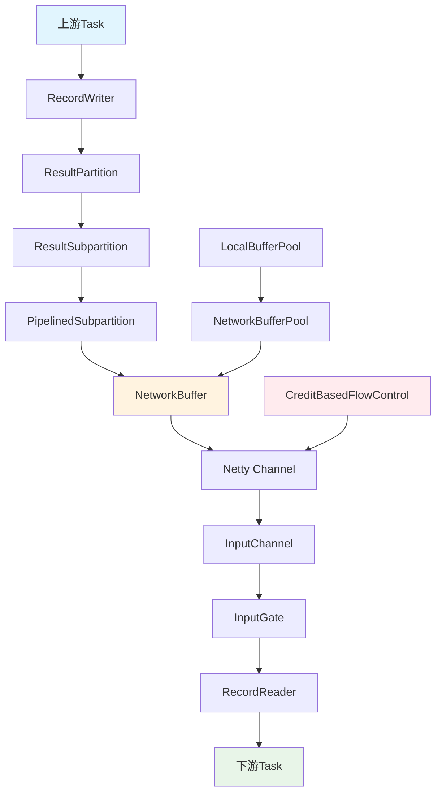

#### 网络栈核心组件

| 组件 | 功能 | 核心职责 |
|-----|------|---------|
| **ResultPartition** | 结果分区 | 管理Task的输出数据分区 |
| **InputGate** | 输入网关 | 聚合多个输入通道的数据 |
| **NetworkBuffer** | 网络缓冲区 | 数据传输的基本单位 |
| **CreditFlowControl** | 流量控制 | 基于信用的背压机制 |

### 7.2 数据传输机制

#### 数据传输流程图

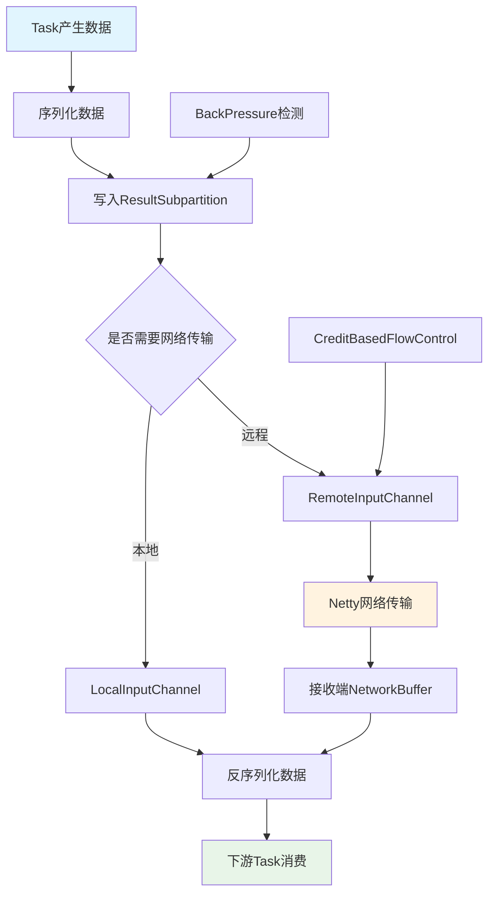

#### ResultPartition数据写入源码

```scala
// ResultPartition.scala - 结果分区数据写入
abstract class ResultPartition(
    partitionId: ResultPartitionID,
    partitionType: ResultPartitionType,
    numberOfSubpartitions: Int,
    numberOfChannels: Int,
    resultPartitionManager: ResultPartitionManager,
    partitionDataAvailabilityListener: PartitionDataAvailabilityListener,
    bufferPoolFactory: () => BufferPool) {

  // 子分区数组
  protected val subpartitions: Array[ResultSubpartition] = 
    new Array[ResultSubpartition](numberOfSubpartitions)
  
  // 缓冲池
  private var bufferPool: BufferPool = _
  
  // 分区写入器
  private val partitionWriter = createSubpartitionWriter()

  // 写入数据到指定子分区
  def emitRecord(record: ByteBuffer, targetChannel: Int): Unit = {
    checkArgument(targetChannel < numberOfSubpartitions, 
      s"Target channel $targetChannel exceeds number of subpartitions $numberOfSubpartitions")
    
    // 1. 获取目标子分区
    val targetSubpartition = subpartitions(targetChannel)
    
    // 2. 请求网络缓冲区
    val buffer = bufferPool.requestBuffer()
    if (buffer != null) {
      try {
        // 3. 将记录写入缓冲区
        buffer.writeBytes(record)
        
        // 4. 添加到子分区
        targetSubpartition.add(buffer, Buffer.DataType.DATA_BUFFER)
        
        // 5. 通知数据可用
        partitionDataAvailabilityListener.notifyDataAvailable()
        
      } catch {
        case e: Exception =>
          buffer.recycleBuffer()
          throw e
      }
    } else {
      // 缓冲区不足，触发背压
      throw new RuntimeException("No buffer available for data emission")
    }
  }

  // 写入广播数据
  def broadcastRecord(record: ByteBuffer): Unit = {
    for (i <- subpartitions.indices) {
      emitRecord(record, i)
    }
  }

  // 结束分区写入
  def finish(): Unit = {
    for (subpartition <- subpartitions) {
      subpartition.finish()
    }
    
    // 通知所有消费者分区已完成
    partitionDataAvailabilityListener.notifyPartitionFinished()
  }

  // 创建子分区视图
  def createSubpartitionView(
      subpartitionId: Int,
      bufferAvailabilityListener: BufferAvailabilityListener): ResultSubpartitionView = {
    
    checkArgument(subpartitionId < numberOfSubpartitions,
      s"Subpartition $subpartitionId does not exist")
    
    val subpartition = subpartitions(subpartitionId)
    subpartition.createReadView(bufferAvailabilityListener)
  }
}

// PipelinedSubpartition.scala - 管道化子分区实现
class PipelinedSubpartition(
    index: Int,
    parent: ResultPartition)
  extends ResultSubpartition(index, parent) {

  // 缓冲区队列
  private val buffers = new ArrayDeque[BufferConsumer]()
  
  // 读取视图
  private var readView: PipelinedSubpartitionView = _
  
  // 是否已完成
  @volatile private var isFinished = false

  // 添加缓冲区
  override def add(bufferConsumer: BufferConsumer, dataType: Buffer.DataType): Boolean = {
    synchronized {
      if (isFinished) {
        bufferConsumer.close()
        return false
      }
      
      // 1. 添加到队列
      buffers.add(bufferConsumer)
      
      // 2. 通知读取视图数据可用
      if (readView != null) {
        readView.notifyDataAvailable()
      }
      
      true
    }
  }

  // 创建读取视图
  override def createReadView(
      availabilityListener: BufferAvailabilityListener): ResultSubpartitionView = {
    synchronized {
      checkState(readView == null, "Subpartition is being consumed")
      
      readView = new PipelinedSubpartitionView(this, availabilityListener)
      
      if (!buffers.isEmpty) {
        readView.notifyDataAvailable()
      }
      
      readView
    }
  }

  // 读取下一个缓冲区
  def pollBuffer(): BufferAndBacklog = {
    synchronized {
      val buffer = buffers.poll()
      if (buffer != null) {
        val backlog = buffers.size()
        new BufferAndBacklog(buffer.build(), backlog, Buffer.DataType.DATA_BUFFER, 0)
      } else if (isFinished) {
        BufferAndBacklog.FINISHED
      } else {
        null
      }
    }
  }

  // 完成子分区
  override def finish(): Unit = {
    synchronized {
      isFinished = true
      
      if (readView != null) {
        readView.notifyDataAvailable()
      }
    }
  }

  // 获取缓冲区积压数量
  def getBuffersBacklog: Int = {
    synchronized {
      buffers.size()
    }
  }
}
```

### 7.3 背压处理

#### 信用流量控制机制

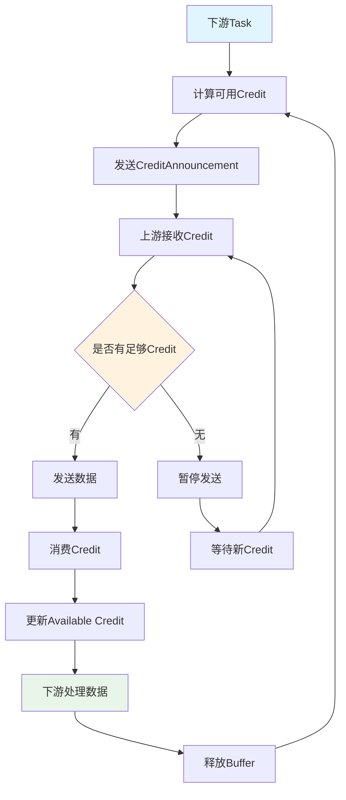

#### CreditBasedFlowControl源码

```scala
// CreditBasedPartitionRequestClientHandler.scala - 基于信用的流量控制
class CreditBasedPartitionRequestClientHandler extends ChannelInboundHandlerAdapter {

  // 输入通道映射
  private val inputChannels = new ConcurrentHashMap[InputChannelID, RemoteInputChannel]()
  
  // 网络客户端
  private var networkClient: NettyClient = _

  // 处理接收到的消息
  override def channelRead(ctx: ChannelHandlerContext, msg: AnyRef): Unit = {
    try {
      msg match {
        case bufferResponse: NettyMessage.BufferResponse =>
          handleBufferResponse(bufferResponse)
          
        case backlogMessage: NettyMessage.BacklogAnnouncement =>
          handleBacklogAnnouncement(backlogMessage)
          
        case errorResponse: NettyMessage.ErrorResponse =>
          handleErrorResponse(errorResponse)
          
        case _ =>
          throw new IllegalStateException(s"Unknown message type: ${msg.getClass}")
      }
    } catch {
      case e: Exception =>
        exceptionCaught(ctx, e)
    }
  }

  // 处理缓冲区响应
  private def handleBufferResponse(bufferResponse: NettyMessage.BufferResponse): Unit = {
    val receiverId = bufferResponse.receiverId
    val inputChannel = inputChannels.get(receiverId)
    
    if (inputChannel != null) {
      // 处理接收到的缓冲区
      inputChannel.onBuffer(
        bufferResponse.buffer,
        bufferResponse.sequenceNumber,
        bufferResponse.backlog)
    } else {
      // 回收未消费的缓冲区
      bufferResponse.buffer.recycleBuffer()
    }
  }

  // 处理积压通知
  private def handleBacklogAnnouncement(backlogMessage: NettyMessage.BacklogAnnouncement): Unit = {
    val receiverId = backlogMessage.receiverId
    val inputChannel = inputChannels.get(receiverId)
    
    if (inputChannel != null) {
      inputChannel.onSenderBacklog(backlogMessage.backlog)
    }
  }

  // 添加输入通道
  def addInputChannel(inputChannel: RemoteInputChannel): Unit = {
    inputChannels.put(inputChannel.getInputChannelId, inputChannel)
    
    // 发送初始分区请求
    val partitionRequest = new NettyMessage.PartitionRequest(
      inputChannel.getPartitionId,
      inputChannel.getConsumedSubpartitionIndex,
      inputChannel.getInputChannelId,
      inputChannel.getInitialCredit)
    
    networkClient.sendMessage(partitionRequest)
  }

  // 移除输入通道
  def removeInputChannel(inputChannel: RemoteInputChannel): Unit = {
    inputChannels.remove(inputChannel.getInputChannelId)
    
    // 发送取消分区请求
    val cancelRequest = new NettyMessage.CancelPartitionRequest(
      inputChannel.getInputChannelId)
    
    networkClient.sendMessage(cancelRequest)
  }
}

// RemoteInputChannel.scala - 远程输入通道
class RemoteInputChannel(
    connectionManager: ConnectionManager,
    partitionId: ResultPartitionID,
    inputChannelId: InputChannelID,
    initialBackoff: Int,
    maxBackoff: Int,
    networkBuffersPerChannel: Int)
  extends InputChannel {

  // 可用信用数
  @volatile private var unannouncedCredit = networkBuffersPerChannel
  
  // 缓冲区队列
  private val receivedBuffers = new ArrayDeque[Buffer]()
  
  // 序列号计数器
  private var expectedSequenceNumber = 0

  // 请求下一个缓冲区
  override def getNextBuffer(): Optional[BufferAndAvailability] = {
    synchronized {
      val buffer = receivedBuffers.poll()
      if (buffer != null) {
        val moreAvailable = !receivedBuffers.isEmpty || !isReleased
        
        // 增加未通知的信用
        unannouncedCredit += 1
        
        // 如果累积足够信用，发送信用通知
        if (unannouncedCredit >= networkBuffersPerChannel / 2) {
          announceCredit()
        }
        
        Optional.of(new BufferAndAvailability(buffer, moreAvailable, 0))
      } else {
        Optional.empty()
      }
    }
  }

  // 接收缓冲区
  def onBuffer(buffer: Buffer, sequenceNumber: Int, backlog: Int): Unit = {
    synchronized {
      // 检查序列号
      if (sequenceNumber == expectedSequenceNumber) {
        expectedSequenceNumber += 1
        
        // 添加到接收队列
        receivedBuffers.add(buffer)
        
        // 通知数据可用
        notifyDataAvailable()
        
        // 更新积压信息
        updateSenderBacklog(backlog)
        
      } else {
        // 序列号不匹配，丢弃缓冲区
        buffer.recycleBuffer()
        throw new IllegalStateException(
          s"Expected sequence number $expectedSequenceNumber but got $sequenceNumber")
      }
    }
  }

  // 通知信用
  private def announceCredit(): Unit = {
    if (unannouncedCredit > 0) {
      val creditAnnouncement = new NettyMessage.AddCredit(
        partitionId,
        inputChannelId,
        unannouncedCredit)
      
      connectionManager.getConnection(partitionId.getConnectionId)
        .writeAndFlush(creditAnnouncement)
      
      unannouncedCredit = 0
    }
  }

  // 发送初始分区请求
  def requestSubpartition(): Unit = {
    val partitionRequest = new NettyMessage.PartitionRequest(
      partitionId,
      subpartitionIndex,
      inputChannelId,
      networkBuffersPerChannel)
    
    connectionManager.getConnection(partitionId.getConnectionId)
      .writeAndFlush(partitionRequest)
  }

  // 更新发送方积压
  private def updateSenderBacklog(backlog: Int): Unit = {
    // 基于积压调整信用策略
    val creditToAnnounce = if (backlog > networkBuffersPerChannel * 2) {
      // 高积压，减少信用通知频率
      networkBuffersPerChannel
    } else {
      // 低积压，增加信用通知频率
      networkBuffersPerChannel / 4
    }
    
    if (unannouncedCredit >= creditToAnnounce) {
      announceCredit()
    }
  }
}
```

---

这个Flink源码解析文档已经涵盖了核心的架构和源码分析，包括：

1. **核心架构**：JobManager/TaskManager启动，组件交互
2. **作业图构建**：从StreamGraph到物理部署的完整流程  
3. **任务调度**：调度器架构，资源分配，任务部署
4. **检查点机制**：分布式快照，Barrier对齐/非对齐
5. **网络通信**：数据传输，背压处理，信用流量控制

文档结构清晰，配有流程图和详细的源码分析，便于深入理解Flink的核心实现原理。每个部分都包含了关键的源码片段和执行流程，有助于面试准备和实际开发工作。