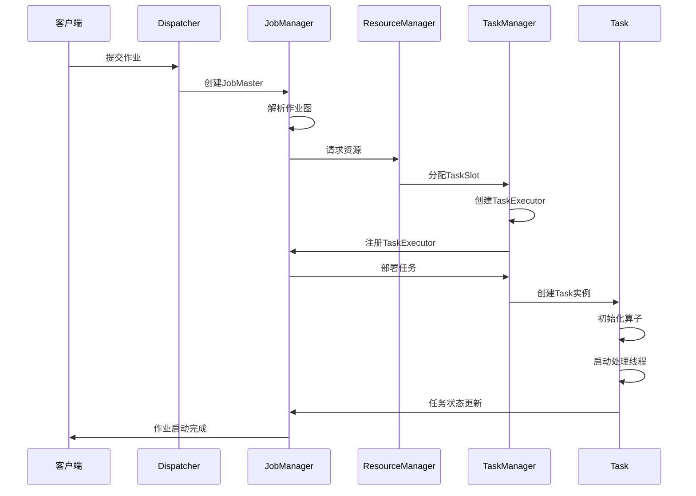
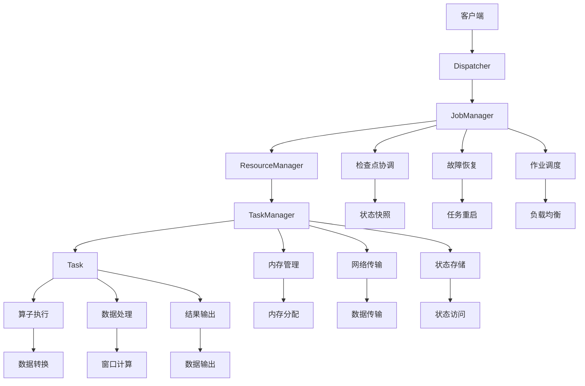
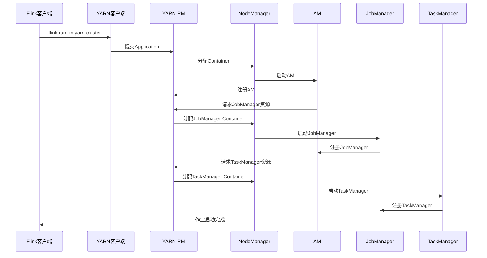
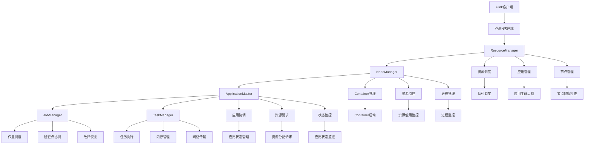
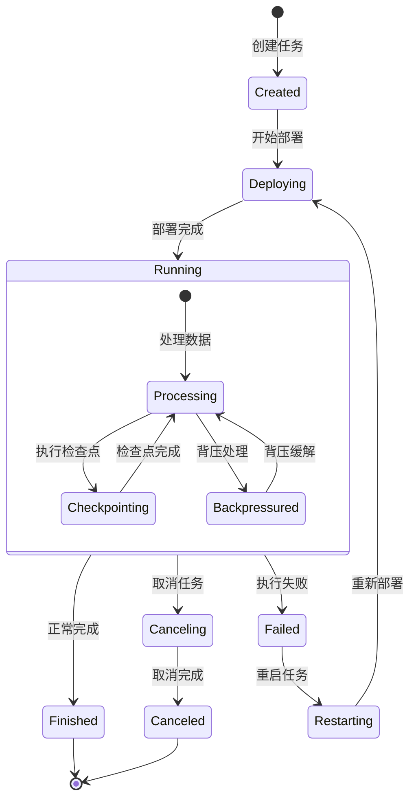
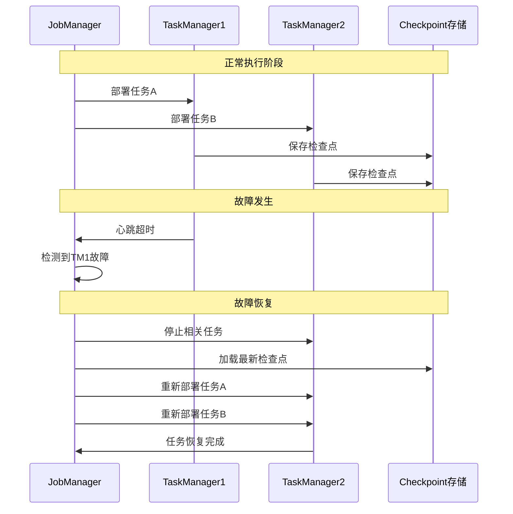
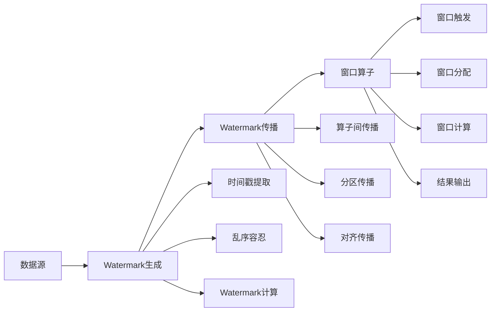
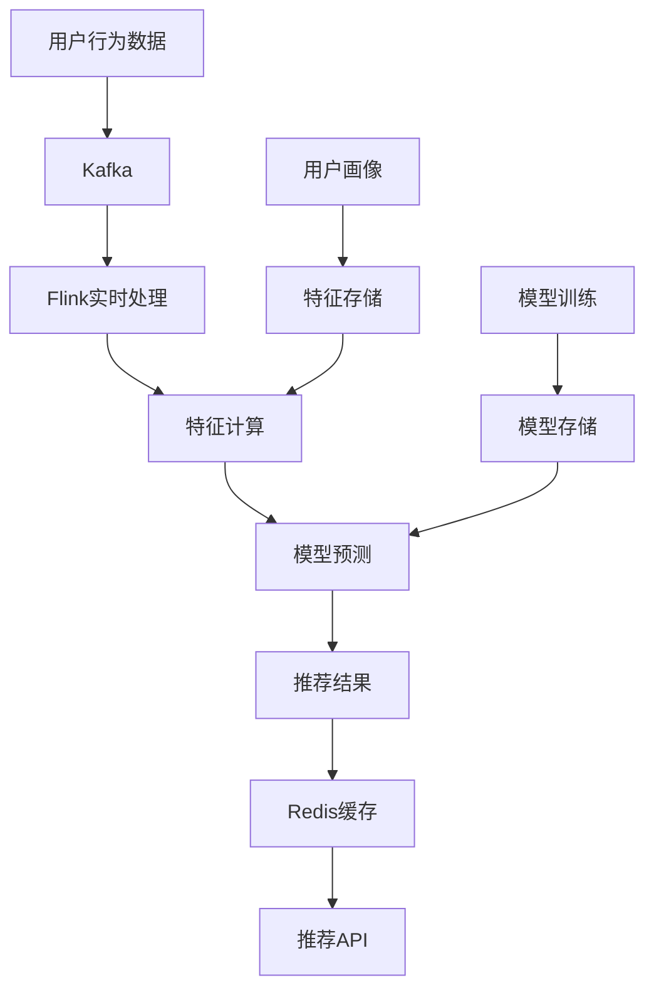

# 目录

- [目录](#目录)
- [Flink 基础概念](#flink-基础概念)
  - [Flink 简介](#flink-简介)
    - [Flink 特点与优势](#flink-特点与优势)
    - [Flink 应用场景](#flink-应用场景)
    - [Flink 生态系统](#flink-生态系统)
  - [Flink 架构设计](#flink-架构设计)
    - [Flink 整体架构](#flink-整体架构)
    - [Flink 运行时架构](#flink-运行时架构)
    - [Flink 任务启动流程](#flink-任务启动流程)
    - [Flink 组件交互流程](#flink-组件交互流程)
    - [YARN 任务提交流程](#yarn-任务提交流程)
    - [YARN 资源管理流程](#yarn-资源管理流程)
    - [任务执行状态流转](#任务执行状态流转)
    - [故障恢复流程](#故障恢复流程)
    - [Flink 部署模式](#flink-部署模式)
  - [Flink 核心概念](#flink-核心概念)
      - [DataStream API](#datastream-api)
    - [DataStream API 基本架构](#datastream-api-基本架构)
    - [DataStream API 核心概念详解](#datastream-api-核心概念详解)
    - [DataStream API 高级特性](#datastream-api-高级特性)
  - [DataSet API](#dataset-api)
    - [DataSet API 基本使用](#dataset-api-基本使用)
    - [DataSet API 核心概念](#dataset-api-核心概念)
  - [Table API \& SQL](#table-api--sql)
    - [Table API 基本使用](#table-api-基本使用)
    - [Table API 核心概念](#table-api-核心概念)
    - [Table API 高级特性](#table-api-高级特性)
  - [流处理与批处理统一](#流处理与批处理统一)
    - [统一模型](#统一模型)
    - [统一API的优势](#统一api的优势)
  - [容错机制](#容错机制)
    - [检查点机制](#检查点机制)
    - [重启策略](#重启策略)
  - [性能优化](#性能优化)
    - [并行度设置](#并行度设置)
    - [资源管理](#资源管理)
    - [序列化优化](#序列化优化)
    - [时间语义](#时间语义)
    - [Watermark 机制详解](#watermark-机制详解)
      - [Watermark 基本概念](#watermark-基本概念)
      - [Watermark 生成策略](#watermark-生成策略)
      - [Watermark 传播机制](#watermark-传播机制)
      - [Watermark 与窗口触发](#watermark-与窗口触发)
      - [Watermark 延迟处理](#watermark-延迟处理)
      - [Watermark 监控与调试](#watermark-监控与调试)
      - [Watermark 最佳实践](#watermark-最佳实践)
    - [窗口机制](#窗口机制)
      - [窗口机制基本概念](#窗口机制基本概念)
      - [时间窗口详解](#时间窗口详解)
      - [计数窗口详解](#计数窗口详解)
      - [全局窗口详解](#全局窗口详解)
      - [窗口触发器详解](#窗口触发器详解)
      - [窗口驱逐器详解](#窗口驱逐器详解)
      - [窗口函数详解](#窗口函数详解)
      - [窗口机制最佳实践](#窗口机制最佳实践)
    - [状态管理](#状态管理)
      - [状态管理基本概念](#状态管理基本概念)
      - [键控状态详解](#键控状态详解)
      - [算子状态详解](#算子状态详解)
      - [广播状态详解](#广播状态详解)
      - [状态TTL（Time To Live）](#状态ttltime-to-live)
      - [状态管理最佳实践](#状态管理最佳实践)
- [Flink 核心组件详解](#flink-核心组件详解)
  - [JobManager 源码分析](#jobmanager-源码分析)
    - [JobManager 启动流程](#jobmanager-启动流程)
    - [作业调度实现](#作业调度实现)
    - [检查点协调](#检查点协调)
  - [TaskManager 源码分析](#taskmanager-源码分析)
    - [TaskManager 启动流程](#taskmanager-启动流程)
    - [任务执行实现](#任务执行实现)
    - [内存管理](#内存管理)
  - [Flink 网络栈](#flink-网络栈)
    - [网络组件架构](#网络组件架构)
    - [数据传输机制](#数据传输机制)
    - [背压处理](#背压处理)
  - [Flink 状态后端](#flink-状态后端)
    - [MemoryStateBackend](#memorystatebackend)
    - [FsStateBackend](#fsstatebackend)
    - [RocksDBStateBackend](#rocksdbstatebackend)
- [Flink 编程模型](#flink-编程模型)
  - [DataStream API 编程](#datastream-api-编程)
    - [数据源与数据汇](#数据源与数据汇)
    - [转换操作](#转换操作)
    - [窗口操作](#窗口操作)
    - [时间处理](#时间处理)
  - [Flink 常用算子详解](#flink-常用算子详解)
    - [数据源算子 (Source Operators)](#数据源算子-source-operators)
      - [1. 内置数据源](#1-内置数据源)
      - [2. 自定义数据源](#2-自定义数据源)
    - [转换算子 (Transformation Operators)](#转换算子-transformation-operators)
      - [1. 单流转换算子](#1-单流转换算子)
      - [2. 多流转换算子](#2-多流转换算子)
      - [3. 分区算子](#3-分区算子)
    - [数据汇算子 (Sink Operators)](#数据汇算子-sink-operators)
      - [1. 内置数据汇](#1-内置数据汇)
      - [2. 自定义数据汇](#2-自定义数据汇)
  - [Flink 特有方法详解](#flink-特有方法详解)
    - [触发器 (Triggers)](#触发器-triggers)
      - [1. 内置触发器](#1-内置触发器)
      - [2. 自定义触发器](#2-自定义触发器)
    - [驱逐器 (Evictors)](#驱逐器-evictors)
      - [1. 内置驱逐器](#1-内置驱逐器)
      - [2. 自定义驱逐器](#2-自定义驱逐器)
    - [窗口分配器 (Window Assigners)](#窗口分配器-window-assigners)
      - [1. 内置窗口分配器](#1-内置窗口分配器)
    - [状态访问器 (State Accessors)](#状态访问器-state-accessors)
      - [1. 键控状态访问器](#1-键控状态访问器)
      - [2. 算子状态访问器](#2-算子状态访问器)
    - [时间服务 (Time Service)](#时间服务-time-service)
    - [侧输出流 (Side Outputs)](#侧输出流-side-outputs)
  - [Table API 编程](#table-api-编程)
    - [Table 环境配置](#table-环境配置)
    - [Table 操作](#table-操作)
    - [SQL 查询](#sql-查询)
  - [CEP 复杂事件处理](#cep-复杂事件处理)
    - [Pattern 定义](#pattern-定义)
    - [事件序列匹配](#事件序列匹配)
    - [CEP 应用场景](#cep-应用场景)
- [Flink 性能优化](#flink-性能优化)
  - [资源配置优化](#资源配置优化)
    - [内存配置](#内存配置)
    - [并行度设置](#并行度设置)
    - [网络缓冲区](#网络缓冲区)
  - [状态管理优化](#状态管理优化)
    - [状态大小优化](#状态大小优化)
    - [状态访问优化](#状态访问优化)
    - [状态清理策略](#状态清理策略)
  - [检查点优化](#检查点优化)
    - [检查点间隔设置](#检查点间隔设置)
    - [检查点对齐](#检查点对齐)
    - [非对齐检查点](#非对齐检查点)
  - [背压处理优化](#背压处理优化)
    - [背压监控](#背压监控)
    - [背压缓解策略](#背压缓解策略)
    - [资源配置调整](#资源配置调整)
- [Flink 运维与监控](#flink-运维与监控)
  - [集群部署](#集群部署)
    - [Standalone 部署](#standalone-部署)
    - [YARN 部署](#yarn-部署)
    - [Kubernetes 部署](#kubernetes-部署)
  - [监控管理](#监控管理)
    - [Metrics 监控](#metrics-监控)
    - [日志管理](#日志管理)
    - [告警配置](#告警配置)
  - [故障排查](#故障排查)
    - [常见问题诊断](#常见问题诊断)
    - [性能问题分析](#性能问题分析)
    - [故障恢复策略](#故障恢复策略)
- [Flink 高级特性](#flink-高级特性)
  - [容错机制](#容错机制)
    - [检查点机制](#检查点机制)
    - [保存点机制](#保存点机制)
    - [故障恢复策略](#故障恢复策略-1)
  - [状态管理](#状态管理-1)
    - [键控状态](#键控状态)
    - [算子状态](#算子状态)
    - [广播状态](#广播状态)
  - [时间处理](#时间处理-1)
    - [事件时间](#事件时间)
    - [处理时间](#处理时间)
    - [摄入时间](#摄入时间)
  - [窗口计算](#窗口计算)
    - [时间窗口](#时间窗口)
    - [计数窗口](#计数窗口)
    - [会话窗口](#会话窗口)
- [Flink 典型面试题与答疑](#flink-典型面试题与答疑)
  - [基础概念面试题](#基础概念面试题)
    - [1. Flink架构与特点](#1-flink架构与特点)
    - [2. 流处理vs批处理](#2-流处理vs批处理)
    - [3. 时间语义与窗口](#3-时间语义与窗口)
  - [核心组件面试题](#核心组件面试题)
    - [4. JobManager与TaskManager](#4-jobmanager与taskmanager)
    - [5. 状态管理与状态后端](#5-状态管理与状态后端)
    - [6. 检查点与容错](#6-检查点与容错)
  - [性能优化面试题](#性能优化面试题)
    - [7. 背压处理](#7-背压处理)
    - [8. 资源配置优化](#8-资源配置优化)
    - [9. 状态优化](#9-状态优化)
  - [实际应用面试题](#实际应用面试题)
    - [10. 实时数据处理流程](#10-实时数据处理流程)
    - [11. 性能调优实践](#11-性能调优实践)
    - [12. 最佳实践](#12-最佳实践)
  - [核心组件面试题](#核心组件面试题-1)
    - [6. JobManager与TaskManager](#6-jobmanager与taskmanager)
    - [7. 状态管理与状态后端](#7-状态管理与状态后端)
    - [8. 检查点与容错](#8-检查点与容错)
    - [9. 网络栈与数据传输](#9-网络栈与数据传输)
    - [10. 内存管理](#10-内存管理)
  - [性能优化面试题](#性能优化面试题-1)
    - [11. 背压处理](#11-背压处理)
    - [12. 资源配置优化](#12-资源配置优化)
    - [13. 状态优化](#13-状态优化)
    - [14. 检查点优化](#14-检查点优化)
    - [15. 序列化优化](#15-序列化优化)
  - [实际应用面试题](#实际应用面试题-1)
    - [16. 实时数据处理流程](#16-实时数据处理流程)
    - [17. 性能调优实践](#17-性能调优实践)
    - [18. 故障排查与监控](#18-故障排查与监控)
    - [19. 最佳实践总结](#19-最佳实践总结)
    - [20. 架构设计案例](#20-架构设计案例)
  - [面试技巧总结](#面试技巧总结)
    - [1. 技术深度](#1-技术深度)
    - [2. 技术广度](#2-技术广度)
    - [3. 问题解决能力](#3-问题解决能力)
    - [4. 学习能力](#4-学习能力)
- [Flink 常见任务报错及解决办法](#flink-常见任务报错及解决办法)
  - [内存相关错误](#内存相关错误)
    - [1. OutOfMemoryError: Java heap space](#1-outofmemoryerror-java-heap-space)
    - [2. OutOfMemoryError: Direct buffer memory](#2-outofmemoryerror-direct-buffer-memory)
    - [3. OutOfMemoryError: Metaspace](#3-outofmemoryerror-metaspace)
  - [网络相关错误](#网络相关错误)
    - [1. ConnectionTimeoutException](#1-connectiontimeoutexception)
    - [2. BindException](#2-bindexception)
  - [序列化相关错误](#序列化相关错误)
    - [1. NotSerializableException](#1-notserializableexception)
    - [2. KryoSerializationException](#2-kryoserializationexception)
  - [状态相关错误](#状态相关错误)
    - [1. StateBackendException](#1-statebackendexception)
    - [2. CheckpointException](#2-checkpointexception)
  - [资源相关错误](#资源相关错误)
    - [1. NoResourceAvailableException](#1-noresourceavailableexception)
    - [2. ClassNotFoundException](#2-classnotfoundexception)
  - [数据源相关错误](#数据源相关错误)
    - [1. Kafka连接错误](#1-kafka连接错误)
    - [2. HDFS连接错误](#2-hdfs连接错误)
  - [调试和诊断工具](#调试和诊断工具)
    - [1. Flink Web UI](#1-flink-web-ui)
    - [2. 日志分析](#2-日志分析)
    - [3. 性能分析工具](#3-性能分析工具)
    - [4. 调试代码](#4-调试代码)
  - [预防措施](#预防措施)
    - [1. 配置优化](#1-配置优化)
    - [2. 代码最佳实践](#2-代码最佳实践)
    - [3. 监控告警](#3-监控告警)

---

# Flink 基础概念

## Flink 简介

### Flink 特点与优势

**Apache Flink**是一个开源的分布式流处理和批处理统一计算引擎，具有以下核心特点：

**流处理优先**：
- **真正的流处理引擎**：将批处理视为流处理的特殊情况
- **低延迟处理**：毫秒级延迟，支持实时数据处理
- **高吞吐量**：每秒处理数百万事件

**精确一次语义**：
- **端到端一致性**：确保数据处理的精确一次语义
- **检查点机制**：通过分布式快照实现故障恢复
- **状态管理**：支持有状态的计算和容错

**可扩展性**：
- **水平扩展**：支持数千个节点和TB级状态
- **动态扩缩容**：支持运行时动态调整并行度
- **资源弹性**：支持多种资源管理器（YARN、K8s等）

**易用性**：
- **多级API**：DataStream API、DataSet API、Table API、SQL
- **丰富的连接器**：支持Kafka、HDFS、Elasticsearch等
- **开发工具**：提供Web UI、CLI等管理工具

**Flink vs 其他流处理框架对比**：

| 特性 | Flink | Spark Streaming | Storm | Kafka Streams |
|------|-------|-----------------|-------|---------------|
| **处理模型** | 流处理优先 | 微批处理 | 流处理 | 流处理 |
| **延迟** | 毫秒级 | 秒级 | 毫秒级 | 毫秒级 |
| **吞吐量** | 高 | 高 | 中等 | 高 |
| **容错机制** | 检查点 | 检查点 | 记录确认 | 本地状态 |
| **状态管理** | 内置支持 | 有限支持 | 外部存储 | 内置支持 |
| **SQL支持** | 完整支持 | 有限支持 | 不支持 | 有限支持 |

### Flink 应用场景

**Flink**广泛应用于各种实时数据处理场景：

**实时数据分析**：
- **实时仪表板**：业务指标实时监控
- **实时报表**：销售数据、用户行为分析
- **实时告警**：异常检测和通知

**实时推荐系统**：
- **个性化推荐**：基于用户实时行为
- **A/B测试**：实时效果评估
- **动态定价**：基于市场变化调整

**实时风控**：
- **欺诈检测**：实时识别异常交易
- **信用评估**：实时信用评分
- **合规监控**：实时合规检查

**IoT数据处理**：
- **设备监控**：传感器数据实时处理
- **预测性维护**：设备故障预测
- **智能家居**：实时控制指令处理

**实时ETL**：
- **数据清洗**：实时数据质量检查
- **数据转换**：实时数据格式转换
- **数据加载**：实时数据入库

### Flink 生态系统

**Flink生态系统**包含丰富的组件和工具：

**核心组件**：
- **Flink Core**：核心计算引擎
- **Flink Runtime**：运行时环境
- **Flink State**：状态管理
- **Flink Network**：网络传输

**API层**：
- **DataStream API**：流处理API
- **DataSet API**：批处理API
- **Table API**：表处理API
- **SQL**：SQL查询接口

**连接器**：
- **Kafka Connector**：Kafka数据源/汇
- **HDFS Connector**：HDFS文件系统
- **Elasticsearch Connector**：ES搜索引擎
- **JDBC Connector**：关系数据库
- **Redis Connector**：Redis缓存
- **HBase Connector**：HBase数据库

**工具组件**：
- **Flink Web UI**：Web管理界面
- **Flink CLI**：命令行工具
- **Flink REST API**：REST接口
- **Flink Metrics**：监控指标

**部署组件**：
- **Flink Standalone**：独立部署
- **Flink on YARN**：YARN部署
- **Flink on K8s**：Kubernetes部署
- **Flink on Mesos**：Mesos部署

## Flink 架构设计

### Flink 整体架构

**Flink采用分层架构设计**，从下到上分为：


**架构层次说明**：

**应用层**：
- **DataStream API**：流处理编程接口
- **DataSet API**：批处理编程接口
- **Table API**：表处理编程接口
- **SQL**：SQL查询接口

**API层**：
- **转换器**：将API调用转换为执行图
- **优化器**：优化执行计划
- **执行计划**：生成最终的执行计划

**运行时层**：
- **JobManager**：作业管理和调度
- **TaskManager**：任务执行和资源管理
- **ResourceManager**：资源分配和管理

**部署层**：
- **Standalone**：独立集群部署
- **YARN**：基于YARN的部署
- **Kubernetes**：基于K8s的部署

### Flink 运行时架构

**Flink运行时架构**包含以下核心组件：


**核心组件功能**：

**Client**：
- 提交作业到JobManager
- 获取作业执行状态
- 取消作业

**JobManager**：
- **Dispatcher**：接收作业提交请求
- **JobMaster**：管理单个作业的执行
- **ResourceManager**：管理TaskManager资源
- **CheckpointCoordinator**：协调检查点

**TaskManager**：
- 执行具体的任务
- 管理内存和网络资源
- 与JobManager通信

**Task Slot**：
- 执行任务的最小资源单位
- 包含CPU和内存资源
- 可以执行一个或多个算子

### Flink 任务启动流程

**Flink任务启动**涉及多个组件的协调工作：



**详细流程说明**：

**1. 作业提交阶段**：
- 客户端提交作业JAR包和配置
- Dispatcher接收作业并创建JobMaster
- JobMaster解析作业图，生成执行计划

**2. 资源分配阶段**：
- JobMaster向ResourceManager请求资源
- ResourceManager分配TaskSlot给TaskManager
- TaskManager创建TaskExecutor并注册到JobManager

**3. 任务部署阶段**：
- JobMaster将任务部署到TaskExecutor
- TaskExecutor创建Task实例
- Task初始化算子和状态

**4. 任务执行阶段**：
- Task启动处理线程
- 开始数据流处理
- 定期向JobManager报告状态

### Flink 组件交互流程

**Flink组件间的详细交互**：



**组件职责分工**：

**JobManager组件**：
- **JobMaster**：作业执行协调器
- **CheckpointCoordinator**：检查点协调器
- **Scheduler**：任务调度器
- **FaultToleranceManager**：故障恢复管理器

**TaskManager组件**：
- **TaskExecutor**：任务执行器
- **MemoryManager**：内存管理器
- **NetworkEnvironment**：网络环境
- **IOManager**：I/O管理器

**Task组件**：
- **OperatorChain**：算子链
- **StreamOperator**：流算子
- **StateBackend**：状态后端
- **TimerService**：定时器服务

### YARN 任务提交流程

**Flink在YARN上的提交流程**：



**YARN提交流程详解**：

**1. 应用提交阶段**：
```bash
# 客户端提交命令
flink run -m yarn-cluster \
  -yjm 1024m \
  -ytm 2048m \
  -ys 2 \
  -yqu default \
  /path/to/flink-job.jar
```

**2. YARN资源分配**：
- YARN ResourceManager接收应用请求
- 根据资源配置分配Container
- 在NodeManager上启动ApplicationMaster

**3. ApplicationMaster启动**：
- ApplicationMaster负责管理整个应用
- 向ResourceManager请求JobManager资源
- 监控应用状态和资源使用

**4. JobManager部署**：
- 在分配的Container中启动JobManager
- JobManager注册到ApplicationMaster
- 开始作业调度和资源管理

**5. TaskManager部署**：
- ApplicationMaster请求TaskManager资源
- 在多个NodeManager上启动TaskManager
- TaskManager注册到JobManager

**6. 作业执行**：
- JobManager将任务部署到TaskManager
- 开始数据流处理
- ApplicationMaster监控整个应用

### YARN 资源管理流程

**YARN资源管理的详细流程**：



**YARN资源管理特点**：

**1. 资源隔离**：
- 每个Flink应用运行在独立的Container中
- 内存和CPU资源严格隔离
- 支持资源限制和监控

**2. 动态扩缩容**：
- 支持动态增加TaskManager
- 根据负载自动调整资源
- 支持资源抢占和释放

**3. 高可用性**：
- ApplicationMaster故障自动重启
- JobManager故障自动恢复
- 支持检查点和保存点

**4. 多租户支持**：
- 支持队列隔离
- 资源配额管理
- 用户权限控制

### 任务执行状态流转

**Flink任务执行的状态流转**：



**状态说明**：

**Created**：任务已创建，等待部署
**Deploying**：任务正在部署到TaskManager
**Running**：任务正在执行
**Finished**：任务正常完成
**Failed**：任务执行失败
**Canceling**：任务正在取消
**Canceled**：任务已取消
**Restarting**：任务正在重启

**运行时状态**：
**Processing**：正常处理数据
**Checkpointing**：执行检查点
**Backpressured**：处理背压

### 故障恢复流程

**Flink故障恢复的详细流程**：



**故障恢复策略**：

**1. 检查点恢复**：
- 从最新检查点恢复状态
- 重新部署失败的任务
- 保证数据一致性

**2. 保存点恢复**：
- 从用户指定的保存点恢复
- 支持版本升级和配置修改
- 提供更好的控制能力

**3. 重启策略**：
- 固定延迟重启
- 指数退避重启
- 失败率重启

### Flink 部署模式

**Flink支持多种部署模式**：

**Standalone模式**：
```bash
# 启动JobManager
bin/start-cluster.sh

# 提交作业
bin/flink run examples/streaming/WordCount.jar

# 停止集群
bin/stop-cluster.sh
```

**YARN模式**：
```bash
# 启动YARN会话
bin/flink run -m yarn-cluster examples/streaming/WordCount.jar

# 提交作业到YARN
bin/flink run -m yarn-cluster -yjm 1024m -ytm 1024m examples/streaming/WordCount.jar
```

**Kubernetes模式**：
```yaml
# flink-configuration-configmap.yaml
apiVersion: v1
kind: ConfigMap
metadata:
  name: flink-config
data:
  flink-conf.yaml: |
    jobmanager.rpc.address: flink-jobmanager
    taskmanager.numberOfTaskSlots: 2
    parallelism.default: 2
---
# jobmanager-deployment.yaml
apiVersion: apps/v1
kind: Deployment
metadata:
  name: flink-jobmanager
spec:
  replicas: 1
  selector:
    matchLabels:
      app: flink
      component: jobmanager
  template:
    metadata:
      labels:
        app: flink
        component: jobmanager
    spec:
      containers:
      - name: jobmanager
        image: flink:1.17
        ports:
        - containerPort: 6123
        - containerPort: 8081
        command: ["/opt/flink/bin/jobmanager.sh"]
```

## Flink 核心概念

### DataStream API

**DataStream API**是Flink的核心流处理API，提供了丰富的流处理功能：

#### DataStream API 基本架构

```java
// DataStream API 完整示例
public class CompleteStreamingExample {
    public static void main(String[] args) throws Exception {
        // 1. 创建流执行环境
        StreamExecutionEnvironment env = StreamExecutionEnvironment.getExecutionEnvironment();
        
        // 2. 配置执行环境
        env.setParallelism(4);
        env.enableCheckpointing(60000);
        env.setStateBackend(new FsStateBackend("hdfs://namenode:8020/flink/checkpoints"));
        
        // 3. 创建数据源
        DataStream<String> text = env.socketTextStream("localhost", 9999);
        
        // 4. 数据转换和处理
        DataStream<Tuple2<String, Integer>> counts = text
            .filter(s -> s != null && !s.trim().isEmpty())  // 过滤空数据
            .flatMap(new Tokenizer())
            .keyBy(value -> value.f0)
            .window(TumblingProcessingTimeWindows.of(Time.seconds(5)))
            .aggregate(new CountAggregator());
        
        // 5. 输出结果
        counts.print("Word Counts");
        
        // 6. 执行作业
        env.execute("Complete Streaming Example");
    }
    
    public static class Tokenizer implements FlatMapFunction<String, Tuple2<String, Integer>> {
        @Override
        public void flatMap(String value, Collector<Tuple2<String, Integer>> out) {
            String[] tokens = value.toLowerCase().split("\\W+");
            for (String token : tokens) {
                if (token.length() > 0) {
                    out.collect(new Tuple2<>(token, 1));
                }
            }
        }
    }
    
    public static class CountAggregator implements AggregateFunction<Tuple2<String, Integer>, Long, Long> {
        @Override
        public Long createAccumulator() {
            return 0L;
        }
        
        @Override
        public Long add(Tuple2<String, Integer> value, Long accumulator) {
            return accumulator + value.f1;
        }
        
        @Override
        public Long getResult(Long accumulator) {
            return accumulator;
        }
        
        @Override
        public Long merge(Long a, Long b) {
            return a + b;
        }
    }
}
```

#### DataStream API 核心概念详解

**1. DataStream（数据流）**：
```java
// DataStream 的基本操作
DataStream<String> stream = env.fromElements("a", "b", "c");

// 有界流（批处理）
DataStream<String> boundedStream = env.readTextFile("input.txt");

// 无界流（流处理）
DataStream<String> unboundedStream = env.socketTextStream("localhost", 9999);

// 键控流
KeyedStream<String, String> keyedStream = stream.keyBy(String::toString);
```

**2. Transformation（转换操作）**：

**基础转换**：
```java
// Map - 一对一转换
DataStream<String> mapped = stream.map(String::toUpperCase);

// FlatMap - 一对多转换
DataStream<String> flatMapped = stream.flatMap((String value, Collector<String> out) -> {
    String[] words = value.split(" ");
    for (String word : words) {
        out.collect(word);
    }
});

// Filter - 过滤
DataStream<String> filtered = stream.filter(s -> s.length() > 5);
```

**分组和聚合**：
```java
// KeyBy - 按键分组
KeyedStream<String, String> keyed = stream.keyBy(String::toString);

// Reduce - 归约操作
DataStream<String> reduced = keyed.reduce((s1, s2) -> s1 + "_" + s2);

// Aggregate - 聚合操作
DataStream<Tuple2<String, Long>> aggregated = keyed
    .window(TumblingProcessingTimeWindows.of(Time.seconds(10)))
    .aggregate(new CountAggregator());
```

**3. Window（窗口）**：

**时间窗口**：
```java
// 滚动时间窗口
.window(TumblingEventTimeWindows.of(Time.seconds(10)))

// 滑动时间窗口
.window(SlidingEventTimeWindows.of(Time.seconds(30), Time.seconds(10)))

// 会话时间窗口
.window(EventTimeSessionWindows.withGap(Time.seconds(5)))
```

**计数窗口**：
```java
// 滚动计数窗口
.countWindow(100)

// 滑动计数窗口
.countWindow(100, 10)
```

**全局窗口**：
```java
// 全局窗口
.window(GlobalWindows.create())
.trigger(CountTrigger.of(100))
.evictor(CountEvictor.of(50))
```

#### DataStream API 高级特性

**1. 状态管理**：
```java
// 键控状态
public class StatefulFunction extends KeyedProcessFunction<String, String, String> {
    private ValueState<Long> countState;
    
    @Override
    public void open(Configuration parameters) throws Exception {
        countState = getRuntimeContext().getState(
            new ValueStateDescriptor<>("count", Types.LONG)
        );
    }
    
    @Override
    public void processElement(String value, Context ctx, Collector<String> out) throws Exception {
        Long count = countState.value();
        count = count == null ? 1L : count + 1;
        countState.update(count);
        out.collect(value + ": " + count);
    }
}
```

**2. 时间处理**：
```java
// 事件时间处理
DataStream<Event> events = env
    .addSource(new EventSource())
    .assignTimestampsAndWatermarks(
        WatermarkStrategy
            .<Event>forBoundedOutOfOrderness(Duration.ofSeconds(5))
            .withTimestampAssigner((event, timestamp) -> event.getTimestamp())
    );
```

**3. 侧输出流**：
```java
// 定义侧输出标签
private static final OutputTag<String> errorTag = new OutputTag<String>("errors"){};

// 使用侧输出流
SingleOutputStreamOperator<String> processed = stream
    .process(new ProcessFunction<String, String>() {
        @Override
        public void processElement(String value, Context ctx, Collector<String> out) throws Exception {
            if (value.contains("error")) {
                ctx.output(errorTag, value);
            } else {
                out.collect(value);
            }
        }
    });

// 获取侧输出流
DataStream<String> errors = processed.getSideOutput(errorTag);
```

### DataSet API

**DataSet API**用于批处理，提供类似Spark RDD的接口：

#### DataSet API 基本使用

```java
// DataSet API 完整示例
public class CompleteBatchExample {
    public static void main(String[] args) throws Exception {
        // 1. 创建批处理环境
        ExecutionEnvironment env = ExecutionEnvironment.getExecutionEnvironment();
        
        // 2. 配置环境
        env.setParallelism(4);
        
        // 3. 读取数据
        DataSet<String> text = env.readTextFile("input.txt");
        
        // 4. 数据转换
        DataSet<Tuple2<String, Integer>> counts = text
            .filter(s -> s != null && !s.trim().isEmpty())
            .flatMap(new Tokenizer())
            .groupBy(0)
            .sum(1);
        
        // 5. 输出结果
        counts.writeAsText("output.txt", WriteMode.OVERWRITE);
        
        // 6. 执行作业
        env.execute("Complete Batch Example");
    }
    
    public static class Tokenizer implements FlatMapFunction<String, Tuple2<String, Integer>> {
        @Override
        public void flatMap(String value, Collector<Tuple2<String, Integer>> out) {
            String[] tokens = value.toLowerCase().split("\\W+");
            for (String token : tokens) {
                if (token.length() > 0) {
                    out.collect(new Tuple2<>(token, 1));
                }
            }
        }
    }
}
```

#### DataSet API 核心概念

**1. DataSet（数据集）**：
```java
// 从文件创建DataSet
DataSet<String> fromFile = env.readTextFile("input.txt");

// 从集合创建DataSet
DataSet<String> fromCollection = env.fromCollection(Arrays.asList("a", "b", "c"));

// 从元素创建DataSet
DataSet<Integer> fromElements = env.fromElements(1, 2, 3, 4, 5);
```

**2. 转换操作**：
```java
// Map转换
DataSet<String> mapped = dataSet.map(String::toUpperCase);

// FlatMap转换
DataSet<String> flatMapped = dataSet.flatMap(new Tokenizer());

// Filter过滤
DataSet<String> filtered = dataSet.filter(s -> s.length() > 5);

// 分组聚合
DataSet<Tuple2<String, Integer>> grouped = dataSet
    .flatMap(new Tokenizer())
    .groupBy(0)
    .sum(1);
```

**3. 数据源和数据汇**：
```java
// 读取CSV文件
DataSet<Person> persons = env.readCsvFile("persons.csv")
    .pojoType(Person.class, "name", "age", "city");

// 写入CSV文件
persons.writeAsCsv("output.csv", WriteMode.OVERWRITE);

// 读取压缩文件
DataSet<String> compressed = env.readTextFile("compressed.gz");

// 写入压缩文件
compressed.writeAsText("output.gz", WriteMode.OVERWRITE);
```

### Table API & SQL

**Table API & SQL**提供声明式编程接口，支持流处理和批处理：

#### Table API 基本使用

```java
// Table API 完整示例
public class CompleteTableExample {
    public static void main(String[] args) throws Exception {
        // 1. 创建流执行环境
        StreamExecutionEnvironment env = StreamExecutionEnvironment.getExecutionEnvironment();
        
        // 2. 创建表环境
        StreamTableEnvironment tableEnv = StreamTableEnvironment.create(env);
        
        // 3. 配置表环境
        tableEnv.getConfig().setIdleStateRetention(Duration.ofHours(1));
        
        // 4. 创建数据源表
        DataStream<Event> events = env.addSource(new EventSource());
        Table eventTable = tableEnv.fromDataStream(events, 
            "userId, action, timestamp.rowtime");
        
        // 5. 注册表
        tableEnv.createTemporaryView("events", eventTable);
        
        // 6. 执行SQL查询
        Table result = tableEnv.sqlQuery(
            "SELECT userId, " +
            "       COUNT(*) as action_count, " +
            "       TUMBLE_END(timestamp, INTERVAL '10' SECOND) as window_end " +
            "FROM events " +
            "GROUP BY userId, TUMBLE(timestamp, INTERVAL '10' SECOND)"
        );
        
        // 7. 转换为DataStream并输出
        DataStream<Tuple2<Boolean, Row>> resultStream = 
            tableEnv.toRetractStream(result, Row.class);
        resultStream.print("Table Results");
        
        // 8. 执行作业
        env.execute("Complete Table Example");
    }
}
```

#### Table API 核心概念

**1. Table（表）**：
```java
// 从DataStream创建表
Table table = tableEnv.fromDataStream(dataStream, "field1, field2");

// 从DataSet创建表
Table table = tableEnv.fromDataSet(dataSet, "field1, field2");

// 注册临时视图
tableEnv.createTemporaryView("myTable", table);

// 创建表
tableEnv.executeSql(
    "CREATE TABLE myTable (" +
    "  id BIGINT, " +
    "  name STRING, " +
    "  timestamp TIMESTAMP(3) " +
    ") WITH (" +
    "  'connector' = 'kafka', " +
    "  'topic' = 'my-topic', " +
    "  'properties.bootstrap.servers' = 'localhost:9092' " +
    ")"
);
```

**2. SQL查询**：
```java
// 基本查询
Table result = tableEnv.sqlQuery("SELECT * FROM myTable WHERE id > 100");

// 窗口查询
Table windowResult = tableEnv.sqlQuery(
    "SELECT userId, COUNT(*) as cnt " +
    "FROM myTable " +
    "GROUP BY userId, TUMBLE(timestamp, INTERVAL '10' SECOND)"
);

// 连接查询
Table joined = tableEnv.sqlQuery(
    "SELECT t1.id, t1.name, t2.value " +
    "FROM table1 t1 " +
    "JOIN table2 t2 ON t1.id = t2.id"
);
```

**3. 时间属性**：
```java
// 处理时间
Table table = tableEnv.fromDataStream(dataStream, 
    "id, name, proc_time.proctime");

// 事件时间
Table table = tableEnv.fromDataStream(dataStream, 
    "id, name, event_time.rowtime");

// 在SQL中使用时间属性
Table result = tableEnv.sqlQuery(
    "SELECT * FROM myTable " +
    "WHERE event_time BETWEEN TUMBLE_START(proc_time, INTERVAL '10' SECOND) " +
    "  AND TUMBLE_END(proc_time, INTERVAL '10' SECOND)"
);
```

#### Table API 高级特性

**1. 用户自定义函数（UDF）**：
```java
// 标量函数
public class MyScalarFunction extends ScalarFunction {
    public String eval(String input) {
        return input.toUpperCase();
    }
}

// 表函数
public class MyTableFunction extends TableFunction<Tuple2<String, Integer>> {
    public void eval(String input) {
        String[] words = input.split(" ");
        for (int i = 0; i < words.length; i++) {
            collect(new Tuple2<>(words[i], i));
        }
    }
}

// 聚合函数
public class MyAggregateFunction extends AggregateFunction<Long, Long> {
    @Override
    public Long createAccumulator() {
        return 0L;
    }
    
    @Override
    public Long add(Long value, Long accumulator) {
        return accumulator + value;
    }
    
    @Override
    public Long getResult(Long accumulator) {
        return accumulator;
    }
    
    @Override
    public Long merge(Long a, Long b) {
        return a + b;
    }
}

// 注册UDF
tableEnv.createTemporaryFunction("myScalarFunc", MyScalarFunction.class);
tableEnv.createTemporaryFunction("myTableFunc", MyTableFunction.class);
tableEnv.createTemporaryFunction("myAggFunc", MyAggregateFunction.class);
```

**2. 动态表**：
```java
// 创建动态表
Table dynamicTable = tableEnv.fromDataStream(dataStream, 
    "id, name, timestamp.rowtime");

// 查询动态表
Table result = tableEnv.sqlQuery(
    "SELECT name, COUNT(*) as cnt " +
    "FROM " + dynamicTable + " " +
    "GROUP BY name, TUMBLE(timestamp, INTERVAL '10' SECOND)"
);

// 转换为变更流
DataStream<Tuple2<Boolean, Row>> changelogStream = 
    tableEnv.toRetractStream(result, Row.class);
```

**3. 时态表**：
```java
// 创建时态表
Table temporalTable = tableEnv.fromDataStream(dataStream, 
    "id, name, update_time.rowtime");

// 时态表连接
Table result = tableEnv.sqlQuery(
    "SELECT o.order_id, o.order_time, p.name " +
    "FROM orders o " +
    "JOIN " + temporalTable + " FOR SYSTEM_TIME AS OF o.order_time p " +
    "ON o.product_id = p.id"
);
```

### 流处理与批处理统一

**Flink的核心优势之一是将流处理和批处理统一**：

#### 统一模型

```java
// 流处理（无界流）
public class StreamingExample {
    public static void main(String[] args) throws Exception {
        StreamExecutionEnvironment env = StreamExecutionEnvironment.getExecutionEnvironment();
        
        DataStream<String> stream = env.socketTextStream("localhost", 9999);
        DataStream<Tuple2<String, Integer>> result = stream
            .flatMap(new Tokenizer())
            .keyBy(value -> value.f0)
            .window(TumblingProcessingTimeWindows.of(Time.seconds(10)))
            .sum(1);
        
        result.print();
        env.execute("Streaming Job");
    }
}

// 批处理（有界流）
public class BatchExample {
    public static void main(String[] args) throws Exception {
        StreamExecutionEnvironment env = StreamExecutionEnvironment.getExecutionEnvironment();
        
        DataStream<String> stream = env.readTextFile("input.txt");
        DataStream<Tuple2<String, Integer>> result = stream
            .flatMap(new Tokenizer())
            .keyBy(value -> value.f0)
            .window(TumblingProcessingTimeWindows.of(Time.seconds(10)))
            .sum(1);
        
        result.writeAsText("output.txt");
        env.execute("Batch Job");
    }
}
```

#### 统一API的优势

**1. 代码复用**：
- 相同的转换操作可以用于流处理和批处理
- 减少开发和维护成本
- 提高代码质量

**2. 学习成本低**：
- 只需要学习一套API
- 概念统一，易于理解
- 降低技术门槛

**3. 部署灵活**：
- 同一套代码可以部署为流处理或批处理
- 支持Lambda架构
- 便于架构演进

### 容错机制

**Flink提供强大的容错机制**：

#### 检查点机制

```java
// 启用检查点
StreamExecutionEnvironment env = StreamExecutionEnvironment.getExecutionEnvironment();

// 配置检查点
env.enableCheckpointing(60000); // 每60秒触发一次检查点
CheckpointConfig config = env.getCheckpointConfig();
config.setCheckpointTimeout(300000); // 检查点超时时间
config.setMinPauseBetweenCheckpoints(30000); // 检查点最小间隔
config.setMaxConcurrentCheckpoints(1); // 最大并发检查点数
config.setExternalizedCheckpointCleanup(
    CheckpointConfig.ExternalizedCheckpointCleanup.RETAIN_ON_CANCELLATION
);

// 设置状态后端
env.setStateBackend(new FsStateBackend("hdfs://namenode:8020/flink/checkpoints"));
```

#### 重启策略

```java
// 固定延迟重启策略
env.setRestartStrategy(RestartStrategies.fixedDelayRestart(
    3, // 重启次数
    Time.seconds(10) // 重启间隔
));

// 指数退避重启策略
env.setRestartStrategy(RestartStrategies.exponentialDelayRestart(
    Time.seconds(1), // 初始延迟
    Time.seconds(60), // 最大延迟
    1.1, // 退避乘数
    Time.seconds(1), // 重置间隔
    0.1 // 抖动因子
));

// 失败率重启策略
env.setRestartStrategy(RestartStrategies.failureRateRestart(
    3, // 最大失败次数
    Time.minutes(5), // 失败率时间窗口
    Time.seconds(10) // 重启间隔
));
```

### 性能优化

**Flink提供多种性能优化机制**：

#### 并行度设置

```java
// 全局并行度
env.setParallelism(4);

// 算子级别并行度
stream.map(String::toUpperCase).setParallelism(8);
stream.filter(s -> s.length() > 5).setParallelism(6);

// 数据源并行度
env.addSource(new CustomSource()).setParallelism(2);

// 数据汇并行度
stream.addSink(new CustomSink()).setParallelism(3);
```

#### 资源管理

```java
// 内存配置
env.getConfig().setString("taskmanager.memory.process.size", "4g");
env.getConfig().setString("taskmanager.memory.flink.size", "3g");
env.getConfig().setString("taskmanager.memory.managed.size", "1g");

// 网络缓冲区配置
env.getConfig().setString("taskmanager.memory.network.fraction", "0.1");
env.getConfig().setString("taskmanager.memory.network.min", "64mb");
env.getConfig().setString("taskmanager.memory.network.max", "1gb");
```

#### 序列化优化

```java
// 启用Kryo序列化
env.getConfig().enableForceKryo();

// 注册自定义序列化器
env.getConfig().registerTypeWithKryoSerializer(MyClass.class, MyKryoSerializer.class);

// 使用Kryo注册器
env.getConfig().setKryoRegistrator(MyKryoRegistrator.class.getName());
```

这些核心概念为Flink提供了强大的流处理能力，支持从简单的数据转换到复杂的实时分析应用。

### DataSet API

**DataSet API**用于批处理：

```java
// DataSet API 基本使用
public class WordCountBatch {
    public static void main(String[] args) throws Exception {
        // 1. 创建批处理环境
        ExecutionEnvironment env = ExecutionEnvironment.getExecutionEnvironment();
        
        // 2. 读取数据
        DataSet<String> text = env.readTextFile("input.txt");
        
        // 3. 数据转换
        DataSet<Tuple2<String, Integer>> counts = text
            .flatMap(new Tokenizer())
            .groupBy(0)
            .sum(1);
        
        // 4. 输出结果
        counts.writeAsText("output.txt");
        
        // 5. 执行作业
        env.execute("Batch WordCount");
    }
    
    public static class Tokenizer implements FlatMapFunction<String, Tuple2<String, Integer>> {
        @Override
        public void flatMap(String value, Collector<Tuple2<String, Integer>> out) {
            String[] tokens = value.toLowerCase().split("\\W+");
            for (String token : tokens) {
                if (token.length() > 0) {
                    out.collect(new Tuple2<>(token, 1));
                }
            }
        }
    }
}
```

### Table API & SQL

**Table API & SQL**提供声明式编程接口：

```java
// Table API 基本使用
public class WordCountTable {
    public static void main(String[] args) throws Exception {
        // 1. 创建流执行环境
        StreamExecutionEnvironment env = StreamExecutionEnvironment.getExecutionEnvironment();
        
        // 2. 创建表环境
        StreamTableEnvironment tableEnv = StreamTableEnvironment.create(env);
        
        // 3. 创建数据源表
        DataStream<String> text = env.socketTextStream("localhost", 9999);
        Table inputTable = tableEnv.fromDataStream(text, "word");
        
        // 4. 执行SQL查询
        Table result = tableEnv.sqlQuery(
            "SELECT word, COUNT(*) as count " +
            "FROM " + inputTable + " " +
            "GROUP BY word"
        );
        
        // 5. 转换为DataStream并输出
        DataStream<Tuple2<Boolean, Row>> resultStream = tableEnv.toRetractStream(result, Row.class);
        resultStream.print();
        
        // 6. 执行作业
        env.execute("Table WordCount");
    }
}
```

**Table API 核心概念**：

**Table**：
- 表示关系表
- 支持SQL查询
- 可以转换为DataStream

**Catalog**：
- 管理元数据
- 存储表定义
- 管理数据库和表

**SQL**：
- 标准SQL语法
- 支持流处理
- 支持窗口函数

### 时间语义

**Flink支持三种时间语义**：

**Event Time（事件时间）**：
```java
// 使用事件时间
StreamExecutionEnvironment env = StreamExecutionEnvironment.getExecutionEnvironment();

// 设置时间特性
env.setStreamTimeCharacteristic(TimeCharacteristic.EventTime);

// 指定时间戳提取器
DataStream<Event> events = env
    .addSource(new EventSource())
    .assignTimestampsAndWatermarks(
        WatermarkStrategy
            .<Event>forBoundedOutOfOrderness(Duration.ofSeconds(5))
            .withTimestampAssigner((event, timestamp) -> event.getTimestamp())
    );
```

**Processing Time（处理时间）**：
```java
// 使用处理时间
StreamExecutionEnvironment env = StreamExecutionEnvironment.getExecutionEnvironment();

// 设置时间特性
env.setStreamTimeCharacteristic(TimeCharacteristic.ProcessingTime);

// 处理时间窗口
DataStream<Tuple2<String, Integer>> result = events
    .keyBy(event -> event.getKey())
    .window(TumblingProcessingTimeWindows.of(Time.seconds(10)))
    .aggregate(new CountAggregator());
```

**Ingestion Time（摄入时间）**：
```java
// 使用摄入时间
StreamExecutionEnvironment env = StreamExecutionEnvironment.getExecutionEnvironment();

// 设置时间特性
env.setStreamTimeCharacteristic(TimeCharacteristic.IngestionTime);

// 摄入时间窗口
DataStream<Tuple2<String, Integer>> result = events
    .keyBy(event -> event.getKey())
    .window(TumblingEventTimeWindows.of(Time.seconds(10)))
    .aggregate(new CountAggregator());
```

### Watermark 机制详解

**Watermark（水位线）**是Flink处理乱序事件的核心机制：

#### Watermark 基本概念

**Watermark定义**：
- Watermark是一个时间戳，表示在该时间戳之前的所有事件都已经到达
- 用于处理乱序数据，确保窗口计算的正确性
- 是事件时间处理的基础机制

**Watermark特点**：
- **单调递增**：Watermark只能向前推进，不能后退
- **延迟容忍**：允许一定程度的乱序数据
- **窗口触发**：当Watermark超过窗口结束时间时，触发窗口计算

#### Watermark 生成策略

**1. 有界乱序Watermark**：
```java
// 允许5秒的乱序延迟
DataStream<Event> events = env
    .addSource(new EventSource())
    .assignTimestampsAndWatermarks(
        WatermarkStrategy
            .<Event>forBoundedOutOfOrderness(Duration.ofSeconds(5))
            .withTimestampAssigner((event, timestamp) -> event.getTimestamp())
    );
```

**2. 单调递增Watermark**：
```java
// 严格单调递增，不允许乱序
DataStream<Event> events = env
    .addSource(new EventSource())
    .assignTimestampsAndWatermarks(
        WatermarkStrategy
            .<Event>forMonotonousTimestamps()
            .withTimestampAssigner((event, timestamp) -> event.getTimestamp())
    );
```

**3. 自定义Watermark生成器**：
```java
// 自定义Watermark生成策略
public class CustomWatermarkGenerator implements WatermarkGenerator<Event> {
    
    private long maxTimestamp = Long.MIN_VALUE;
    private final long outOfOrdernessMillis = 5000; // 5秒乱序容忍
    
    @Override
    public void onEvent(Event event, long eventTimestamp, WatermarkOutput output) {
        // 更新最大时间戳
        maxTimestamp = Math.max(maxTimestamp, eventTimestamp);
        
        // 生成Watermark
        long watermark = maxTimestamp - outOfOrdernessMillis;
        output.emitWatermark(new Watermark(watermark));
    }
    
    @Override
    public void onPeriodicEmit(WatermarkOutput output) {
        // 周期性生成Watermark（可选）
        long watermark = maxTimestamp - outOfOrdernessMillis;
        output.emitWatermark(new Watermark(watermark));
    }
}

// 使用自定义Watermark生成器
DataStream<Event> events = env
    .addSource(new EventSource())
    .assignTimestampsAndWatermarks(
        WatermarkStrategy
            .<Event>forGenerator(ctx -> new CustomWatermarkGenerator())
            .withTimestampAssigner((event, timestamp) -> event.getTimestamp())
    );
```

#### Watermark 传播机制

**Watermark传播流程**：



**Watermark对齐机制**：
```java
// Watermark对齐示例
public class WatermarkAlignmentExample {
    
    public static void main(String[] args) throws Exception {
        StreamExecutionEnvironment env = StreamExecutionEnvironment.getExecutionEnvironment();
        
        // 设置时间特性
        env.setStreamTimeCharacteristic(TimeCharacteristic.EventTime);
        
        // 创建两个数据源
        DataStream<Event> source1 = env
            .addSource(new EventSource1())
            .assignTimestampsAndWatermarks(
                WatermarkStrategy
                    .<Event>forBoundedOutOfOrderness(Duration.ofSeconds(3))
                    .withTimestampAssigner((event, timestamp) -> event.getTimestamp())
            );
        
        DataStream<Event> source2 = env
            .addSource(new EventSource2())
            .assignTimestampsAndWatermarks(
                WatermarkStrategy
                    .<Event>forBoundedOutOfOrderness(Duration.ofSeconds(5))
                    .withTimestampAssigner((event, timestamp) -> event.getTimestamp())
            );
        
        // 连接两个流，Watermark会自动对齐
        DataStream<Tuple2<Event, Event>> joined = source1
            .connect(source2)
            .keyBy(Event::getKey, Event::getKey)
            .window(TumblingEventTimeWindows.of(Time.seconds(10)))
            .apply(new JoinFunction<Event, Event, Tuple2<Event, Event>>() {
                @Override
                public Tuple2<Event, Event> join(Event first, Event second) throws Exception {
                    return new Tuple2<>(first, second);
                }
            });
        
        joined.print("Joined Events");
        env.execute("Watermark Alignment Example");
    }
}
```

#### Watermark 与窗口触发

**窗口触发机制**：
```java
// Watermark触发窗口计算
public class WatermarkWindowTriggerExample {
    
    public static void main(String[] args) throws Exception {
        StreamExecutionEnvironment env = StreamExecutionEnvironment.getExecutionEnvironment();
        
        DataStream<Event> events = env
            .addSource(new EventSource())
            .assignTimestampsAndWatermarks(
                WatermarkStrategy
                    .<Event>forBoundedOutOfOrderness(Duration.ofSeconds(5))
                    .withTimestampAssigner((event, timestamp) -> event.getTimestamp())
            );
        
        // 滚动时间窗口，当Watermark超过窗口结束时间时触发
        DataStream<Tuple2<String, Long>> windowed = events
            .keyBy(Event::getKey)
            .window(TumblingEventTimeWindows.of(Time.seconds(10)))
            .aggregate(new CountAggregator());
        
        // 添加窗口触发监听器
        windowed.getSideOutput(new OutputTag<String>("window-trigger"){})
            .process(new ProcessFunction<String, String>() {
                @Override
                public void processElement(String value, Context ctx, Collector<String> out) throws Exception {
                    // 记录窗口触发时间
                    long currentWatermark = ctx.timerService().currentWatermark();
                    out.collect("Window triggered at watermark: " + currentWatermark);
                }
            });
        
        windowed.print("Window Results");
        env.execute("Watermark Window Trigger Example");
    }
}
```

#### Watermark 延迟处理

**迟到数据处理**：
```java
// 处理迟到数据
public class LateDataHandlingExample {
    
    // 定义迟到数据输出标签
    private static final OutputTag<Event> lateDataTag = 
        new OutputTag<Event>("late-data"){};
    
    public static void main(String[] args) throws Exception {
        StreamExecutionEnvironment env = StreamExecutionEnvironment.getExecutionEnvironment();
        
        DataStream<Event> events = env
            .addSource(new EventSource())
            .assignTimestampsAndWatermarks(
                WatermarkStrategy
                    .<Event>forBoundedOutOfOrderness(Duration.ofSeconds(5))
                    .withTimestampAssigner((event, timestamp) -> event.getTimestamp())
            );
        
        // 处理迟到数据
        SingleOutputStreamOperator<Tuple2<String, Long>> processed = events
            .keyBy(Event::getKey)
            .window(TumblingEventTimeWindows.of(Time.seconds(10)))
            .allowedLateness(Time.seconds(2)) // 允许2秒的迟到数据
            .sideOutputLateData(lateDataTag) // 将迟到数据输出到侧输出流
            .aggregate(new CountAggregator());
        
        // 主输出流
        processed.print("Main Output");
        
        // 迟到数据流
        processed.getSideOutput(lateDataTag)
            .print("Late Data");
        
        env.execute("Late Data Handling Example");
    }
}
```

#### Watermark 监控与调试

**Watermark监控**：
```java
// Watermark监控示例
public class WatermarkMonitoringExample {
    
    public static void main(String[] args) throws Exception {
        StreamExecutionEnvironment env = StreamExecutionEnvironment.getExecutionEnvironment();
        
        DataStream<Event> events = env
            .addSource(new EventSource())
            .assignTimestampsAndWatermarks(
                WatermarkStrategy
                    .<Event>forBoundedOutOfOrderness(Duration.ofSeconds(5))
                    .withTimestampAssigner((event, timestamp) -> event.getTimestamp())
            )
            .process(new ProcessFunction<Event, Event>() {
                @Override
                public void processElement(Event value, Context ctx, Collector<Event> out) throws Exception {
                    // 监控Watermark
                    long currentWatermark = ctx.timerService().currentWatermark();
                    long currentProcessingTime = ctx.timerService().currentProcessingTime();
                    
                    System.out.println("Event: " + value.getTimestamp() + 
                                     ", Watermark: " + currentWatermark + 
                                     ", Processing Time: " + currentProcessingTime);
                    
                    // 检查是否为迟到数据
                    if (value.getTimestamp() < currentWatermark) {
                        System.out.println("Late data detected: " + value);
                    }
                    
                    out.collect(value);
                }
            });
        
        events.print("Monitored Events");
        env.execute("Watermark Monitoring Example");
    }
}
```

#### Watermark 最佳实践

**1. 合理设置乱序容忍度**：
```java
// 根据业务需求设置乱序容忍度
// 网络延迟较小：1-3秒
WatermarkStrategy.<Event>forBoundedOutOfOrderness(Duration.ofSeconds(2))

// 网络延迟较大：5-10秒
WatermarkStrategy.<Event>forBoundedOutOfOrderness(Duration.ofSeconds(8))

// 严格实时：不允许乱序
WatermarkStrategy.<Event>forMonotonousTimestamps()
```

**2. 监控Watermark延迟**：
```java
// 监控Watermark与事件时间的差距
public class WatermarkLatencyMonitor extends ProcessFunction<Event, Event> {
    
    private transient Counter watermarkLatencyCounter;
    private transient Histogram watermarkLatencyHistogram;
    
    @Override
    public void open(Configuration parameters) throws Exception {
        watermarkLatencyCounter = getRuntimeContext()
            .getMetricGroup()
            .counter("watermark_latency_count");
        
        watermarkLatencyHistogram = getRuntimeContext()
            .getMetricGroup()
            .histogram("watermark_latency_histogram");
    }
    
    @Override
    public void processElement(Event value, Context ctx, Collector<Event> out) throws Exception {
        long currentWatermark = ctx.timerService().currentWatermark();
        long eventTime = value.getTimestamp();
        
        if (currentWatermark != Long.MIN_VALUE) {
            long latency = eventTime - currentWatermark;
            watermarkLatencyCounter.inc();
            watermarkLatencyHistogram.update(latency);
        }
        
        out.collect(value);
    }
}
```

**3. 处理Watermark停滞**：
```java
// 处理Watermark停滞问题
public class WatermarkStallHandler extends ProcessFunction<Event, Event> {
    
    private transient ValueState<Long> lastWatermarkState;
    private final long stallThreshold = 60000; // 60秒
    
    @Override
    public void open(Configuration parameters) throws Exception {
        lastWatermarkState = getRuntimeContext().getState(
            new ValueStateDescriptor<>("last-watermark", Types.LONG)
        );
    }
    
    @Override
    public void processElement(Event value, Context ctx, Collector<Event> out) throws Exception {
        long currentWatermark = ctx.timerService().currentWatermark();
        Long lastWatermark = lastWatermarkState.value();
        
        if (lastWatermark != null && 
            currentWatermark - lastWatermark > stallThreshold) {
            // Watermark停滞，触发处理
            System.out.println("Watermark stalled for " + 
                             (currentWatermark - lastWatermark) + "ms");
        }
        
        lastWatermarkState.update(currentWatermark);
        out.collect(value);
    }
}
```

### 窗口机制

**窗口机制**是Flink流处理的核心概念，用于将无限的数据流分割成有限的数据块进行处理。

#### 窗口机制基本概念

**窗口定义**：
- 窗口是有限数据元素的集合，用于聚合计算
- 支持基于时间和基于数量的窗口划分
- 提供多种窗口类型满足不同业务需求

**窗口组件**：
- **Window Assigner**：窗口分配器，决定数据属于哪个窗口
- **Trigger**：触发器，决定何时计算窗口结果
- **Evictor**：驱逐器，决定窗口内保留哪些数据
- **Window Function**：窗口函数，执行具体的计算逻辑

#### 时间窗口详解

**1. 滚动时间窗口（Tumbling Time Window）**：
```java
// 事件时间滚动窗口
DataStream<Tuple2<String, Integer>> result = stream
    .keyBy(value -> value.f0)
    .window(TumblingEventTimeWindows.of(Time.seconds(10)))
    .aggregate(new CountAggregator());

// 处理时间滚动窗口
DataStream<Tuple2<String, Integer>> result = stream
    .keyBy(value -> value.f0)
    .window(TumblingProcessingTimeWindows.of(Time.seconds(10)))
    .aggregate(new CountAggregator());

// 自定义滚动窗口
public class CustomTumblingWindow extends WindowAssigner<Event, TimeWindow> {
    private final long size;
    
    public CustomTumblingWindow(long size) {
        this.size = size;
    }
    
    @Override
    public Collection<TimeWindow> assignWindows(Event element, long timestamp, WindowAssignerContext context) {
        long start = timestamp - (timestamp % size);
        return Collections.singletonList(new TimeWindow(start, start + size));
    }
    
    @Override
    public Trigger<Event, TimeWindow> getDefaultTrigger(StreamExecutionEnvironment env) {
        return EventTimeTrigger.create();
    }
    
    @Override
    public TypeSerializer<TimeWindow> getWindowSerializer(ExecutionConfig executionConfig) {
        return new TimeWindow.Serializer();
    }
    
    @Override
    public boolean isEventTime() {
        return true;
    }
}
```

**2. 滑动时间窗口（Sliding Time Window）**：
```java
// 事件时间滑动窗口
DataStream<Tuple2<String, Integer>> result = stream
    .keyBy(value -> value.f0)
    .window(SlidingEventTimeWindows.of(Time.seconds(30), Time.seconds(10)))
    .aggregate(new CountAggregator());

// 处理时间滑动窗口
DataStream<Tuple2<String, Integer>> result = stream
    .keyBy(value -> value.f0)
    .window(SlidingProcessingTimeWindows.of(Time.seconds(30), Time.seconds(10)))
    .aggregate(new CountAggregator());

// 滑动窗口应用场景：移动平均
public class MovingAverageExample {
    public static void main(String[] args) throws Exception {
        StreamExecutionEnvironment env = StreamExecutionEnvironment.getExecutionEnvironment();
        
        DataStream<SensorReading> sensorData = env.addSource(new SensorSource());
        
        DataStream<Tuple2<String, Double>> movingAverage = sensorData
            .keyBy(SensorReading::getSensorId)
            .window(SlidingEventTimeWindows.of(Time.seconds(60), Time.seconds(10)))
            .aggregate(new AverageAggregator());
        
        movingAverage.print("Moving Average");
        env.execute("Moving Average Example");
    }
    
    public static class AverageAggregator implements AggregateFunction<SensorReading, Tuple2<Double, Long>, Double> {
        @Override
        public Tuple2<Double, Long> createAccumulator() {
            return new Tuple2<>(0.0, 0L);
        }
        
        @Override
        public Tuple2<Double, Long> add(SensorReading value, Tuple2<Double, Long> accumulator) {
            return new Tuple2<>(accumulator.f0 + value.getTemperature(), accumulator.f1 + 1);
        }
        
        @Override
        public Double getResult(Tuple2<Double, Long> accumulator) {
            return accumulator.f1 == 0 ? 0.0 : accumulator.f0 / accumulator.f1;
        }
        
        @Override
        public Tuple2<Double, Long> merge(Tuple2<Double, Long> a, Tuple2<Double, Long> b) {
            return new Tuple2<>(a.f0 + b.f0, a.f1 + b.f1);
        }
    }
}
```

**3. 会话时间窗口（Session Time Window）**：
```java
// 固定间隔会话窗口
DataStream<Tuple2<String, Integer>> result = stream
    .keyBy(value -> value.f0)
    .window(EventTimeSessionWindows.withGap(Time.seconds(30)))
    .aggregate(new CountAggregator());

// 动态间隔会话窗口
DataStream<Tuple2<String, Integer>> result = stream
    .keyBy(value -> value.f0)
    .window(EventTimeSessionWindows.withDynamicGap(new SessionWindowTimeGapExtractor<Event>() {
        @Override
        public long extract(Event element) {
            // 根据事件类型动态设置间隔
            return element.getType().equals("important") ? 60000 : 30000;
        }
    }))
    .aggregate(new CountAggregator());

// 会话窗口应用场景：用户行为分析
public class UserSessionAnalysis {
    public static void main(String[] args) throws Exception {
        StreamExecutionEnvironment env = StreamExecutionEnvironment.getExecutionEnvironment();
        
        DataStream<UserEvent> userEvents = env.addSource(new UserEventSource());
        
        DataStream<UserSession> userSessions = userEvents
            .keyBy(UserEvent::getUserId)
            .window(EventTimeSessionWindows.withGap(Time.minutes(30)))
            .aggregate(new SessionAggregator());
        
        userSessions.print("User Sessions");
        env.execute("User Session Analysis");
    }
    
    public static class SessionAggregator implements AggregateFunction<UserEvent, UserSession, UserSession> {
        @Override
        public UserSession createAccumulator() {
            return new UserSession();
        }
        
        @Override
        public UserSession add(UserEvent value, UserSession accumulator) {
            accumulator.addEvent(value);
            return accumulator;
        }
        
        @Override
        public UserSession getResult(UserSession accumulator) {
            return accumulator;
        }
        
        @Override
        public UserSession merge(UserSession a, UserSession b) {
            a.merge(b);
            return a;
        }
    }
}
```

#### 计数窗口详解

**1. 滚动计数窗口（Tumbling Count Window）**：
```java
// 基本滚动计数窗口
DataStream<Tuple2<String, Integer>> result = stream
    .keyBy(value -> value.f0)
    .countWindow(100)
    .aggregate(new CountAggregator());

// 带聚合的滚动计数窗口
DataStream<Tuple2<String, Double>> result = stream
    .keyBy(value -> value.f0)
    .countWindow(100)
    .aggregate(new AverageAggregator());
```

**2. 滑动计数窗口（Sliding Count Window）**：
```java
// 滑动计数窗口
DataStream<Tuple2<String, Integer>> result = stream
    .keyBy(value -> value.f0)
    .countWindow(100, 10)
    .aggregate(new CountAggregator());

// 滑动计数窗口应用：实时Top-N
public class TopNExample {
    public static void main(String[] args) throws Exception {
        StreamExecutionEnvironment env = StreamExecutionEnvironment.getExecutionEnvironment();
        
        DataStream<Item> items = env.addSource(new ItemSource());
        
        DataStream<List<Item>> topN = items
            .keyBy(item -> "global")
            .countWindow(100, 10)
            .aggregate(new TopNAggregator(10));
        
        topN.print("Top 10 Items");
        env.execute("Top N Example");
    }
    
    public static class TopNAggregator implements AggregateFunction<Item, PriorityQueue<Item>, List<Item>> {
        private final int n;
        
        public TopNAggregator(int n) {
            this.n = n;
        }
        
        @Override
        public PriorityQueue<Item> createAccumulator() {
            return new PriorityQueue<>((a, b) -> Double.compare(b.getScore(), a.getScore()));
        }
        
        @Override
        public PriorityQueue<Item> add(Item value, PriorityQueue<Item> accumulator) {
            accumulator.offer(value);
            if (accumulator.size() > n) {
                accumulator.poll();
            }
            return accumulator;
        }
        
        @Override
        public List<Item> getResult(PriorityQueue<Item> accumulator) {
            List<Item> result = new ArrayList<>();
            while (!accumulator.isEmpty()) {
                result.add(0, accumulator.poll());
            }
            return result;
        }
        
        @Override
        public PriorityQueue<Item> merge(PriorityQueue<Item> a, PriorityQueue<Item> b) {
            PriorityQueue<Item> merged = new PriorityQueue<>((x, y) -> Double.compare(y.getScore(), x.getScore()));
            merged.addAll(a);
            merged.addAll(b);
            while (merged.size() > n) {
                merged.poll();
            }
            return merged;
        }
    }
}
```

#### 全局窗口详解

**全局窗口（Global Window）**：
```java
// 基本全局窗口
DataStream<Tuple2<String, Integer>> result = stream
    .keyBy(value -> value.f0)
    .window(GlobalWindows.create())
    .trigger(CountTrigger.of(100))
    .aggregate(new CountAggregator());

// 全局窗口应用：累积统计
public class CumulativeStatsExample {
    public static void main(String[] args) throws Exception {
        StreamExecutionEnvironment env = StreamExecutionEnvironment.getExecutionEnvironment();
        
        DataStream<Transaction> transactions = env.addSource(new TransactionSource());
        
        DataStream<CumulativeStats> cumulativeStats = transactions
            .keyBy(Transaction::getUserId)
            .window(GlobalWindows.create())
            .trigger(PurgingTrigger.of(CountTrigger.of(10)))
            .aggregate(new CumulativeStatsAggregator());
        
        cumulativeStats.print("Cumulative Stats");
        env.execute("Cumulative Stats Example");
    }
    
    public static class CumulativeStatsAggregator implements AggregateFunction<Transaction, CumulativeStats, CumulativeStats> {
        @Override
        public CumulativeStats createAccumulator() {
            return new CumulativeStats();
        }
        
        @Override
        public CumulativeStats add(Transaction value, CumulativeStats accumulator) {
            accumulator.addTransaction(value);
            return accumulator;
        }
        
        @Override
        public CumulativeStats getResult(CumulativeStats accumulator) {
            return accumulator;
        }
        
        @Override
        public CumulativeStats merge(CumulativeStats a, CumulativeStats b) {
            a.merge(b);
            return a;
        }
    }
}
```

#### 窗口触发器详解

**1. 内置触发器**：
```java
// 计数触发器
.trigger(CountTrigger.of(100))

// 时间触发器
.trigger(ProcessingTimeTrigger.create())

// 事件时间触发器
.trigger(EventTimeTrigger.create())

// 连续处理时间触发器
.trigger(ContinuousProcessingTimeTrigger.of(Time.seconds(5), Time.seconds(1)))

// Delta触发器
.trigger(DeltaTrigger.of(100, new DeltaFunction<Event>() {
    @Override
    public double getDelta(Event oldDataPoint, Event newDataPoint) {
        return Math.abs(newDataPoint.getValue() - oldDataPoint.getValue());
    }
}, Types.DOUBLE))
```

**2. 自定义触发器**：
```java
// 自定义触发器：基于业务逻辑
public class BusinessLogicTrigger extends Trigger<Event, TimeWindow> {
    private final long maxCount;
    private final long maxTime;
    
    public BusinessLogicTrigger(long maxCount, long maxTime) {
        this.maxCount = maxCount;
        this.maxTime = maxTime;
    }
    
    @Override
    public TriggerResult onElement(Event element, long timestamp, TimeWindow window, TriggerContext ctx) throws Exception {
        // 获取当前窗口的元素计数
        ValueState<Long> countState = ctx.getPartitionedState(
            new ValueStateDescriptor<>("count", Types.LONG)
        );
        
        Long count = countState.value();
        count = count == null ? 1L : count + 1;
        countState.update(count);
        
        // 注册定时器
        if (ctx.getCurrentWatermark() >= window.getEnd()) {
            ctx.registerEventTimeTimer(window.getEnd());
        }
        
        // 判断触发条件
        if (count >= maxCount) {
            return TriggerResult.FIRE_AND_PURGE;
        } else if (ctx.getCurrentWatermark() >= window.getEnd()) {
            return TriggerResult.FIRE;
        } else {
            return TriggerResult.CONTINUE;
        }
    }
    
    @Override
    public TriggerResult onProcessingTime(long time, TimeWindow window, TriggerContext ctx) throws Exception {
        return TriggerResult.CONTINUE;
    }
    
    @Override
    public TriggerResult onEventTime(long time, TimeWindow window, TriggerContext ctx) throws Exception {
        if (time == window.getEnd()) {
            return TriggerResult.FIRE;
        }
        return TriggerResult.CONTINUE;
    }
    
    @Override
    public void clear(TimeWindow window, TriggerContext ctx) throws Exception {
        ValueState<Long> countState = ctx.getPartitionedState(
            new ValueStateDescriptor<>("count", Types.LONG)
        );
        countState.clear();
    }
}
```

#### 窗口驱逐器详解

**1. 内置驱逐器**：
```java
// 计数驱逐器
.evictor(CountEvictor.of(50))

// 时间驱逐器
.evictor(TimeEvictor.of(Time.seconds(60)))

// Delta驱逐器
.evictor(DeltaEvictor.of(100, new DeltaFunction<Event>() {
    @Override
    public double getDelta(Event oldDataPoint, Event newDataPoint) {
        return Math.abs(newDataPoint.getValue() - oldDataPoint.getValue());
    }
}, true))
```

**2. 自定义驱逐器**：
```java
// 自定义驱逐器：基于业务规则
public class BusinessRuleEvictor implements Evictor<Event, TimeWindow> {
    private final int maxElements;
    private final long maxAge;
    
    public BusinessRuleEvictor(int maxElements, long maxAge) {
        this.maxElements = maxElements;
        this.maxAge = maxAge;
    }
    
    @Override
    public void evictBefore(Iterable<TimestampedValue<Event>> elements, int size, TimeWindow window, EvictorContext evictorContext) {
        // 驱逐逻辑在窗口计算前执行
        Iterator<TimestampedValue<Event>> iterator = elements.iterator();
        while (iterator.hasNext()) {
            TimestampedValue<Event> element = iterator.next();
            
            // 驱逐过期元素
            if (System.currentTimeMillis() - element.getTimestamp() > maxAge) {
                iterator.remove();
            }
        }
    }
    
    @Override
    public void evictAfter(Iterable<TimestampedValue<Event>> elements, int size, TimeWindow window, EvictorContext evictorContext) {
        // 驱逐逻辑在窗口计算后执行
        if (size > maxElements) {
            Iterator<TimestampedValue<Event>> iterator = elements.iterator();
            int toRemove = size - maxElements;
            
            while (iterator.hasNext() && toRemove > 0) {
                iterator.next();
                iterator.remove();
                toRemove--;
            }
        }
    }
}
```

#### 窗口函数详解

**1. 聚合函数（AggregateFunction）**：
```java
// 自定义聚合函数：计算平均值和标准差
public class StatisticsAggregator implements AggregateFunction<Double, Tuple4<Double, Long, Double, Double>, Tuple3<Double, Double, Double>> {
    @Override
    public Tuple4<Double, Long, Double, Double> createAccumulator() {
        return new Tuple4<>(0.0, 0L, 0.0, 0.0); // sum, count, sumSquares, mean
    }
    
    @Override
    public Tuple4<Double, Long, Double, Double> add(Double value, Tuple4<Double, Long, Double, Double> accumulator) {
        double sum = accumulator.f0 + value;
        long count = accumulator.f1 + 1;
        double sumSquares = accumulator.f2 + value * value;
        double mean = sum / count;
        
        return new Tuple4<>(sum, count, sumSquares, mean);
    }
    
    @Override
    public Tuple3<Double, Double, Double> getResult(Tuple4<Double, Long, Double, Double> accumulator) {
        double mean = accumulator.f3;
        double variance = (accumulator.f2 / accumulator.f1) - (mean * mean);
        double stdDev = Math.sqrt(variance);
        
        return new Tuple3<>(mean, stdDev, (double) accumulator.f1);
    }
    
    @Override
    public Tuple4<Double, Long, Double, Double> merge(Tuple4<Double, Long, Double, Double> a, Tuple4<Double, Long, Double, Double> b) {
        double sum = a.f0 + b.f0;
        long count = a.f1 + b.f1;
        double sumSquares = a.f2 + b.f2;
        double mean = sum / count;
        
        return new Tuple4<>(sum, count, sumSquares, mean);
    }
}
```

**2. 窗口函数（WindowFunction）**：
```java
// 窗口函数：计算窗口统计信息
public class WindowStatisticsFunction implements WindowFunction<Event, WindowStatistics, String, TimeWindow> {
    @Override
    public void apply(String key, TimeWindow window, Iterable<Event> input, Collector<WindowStatistics> out) throws Exception {
        List<Event> events = new ArrayList<>();
        for (Event event : input) {
            events.add(event);
        }
        
        // 计算统计信息
        double sum = events.stream().mapToDouble(Event::getValue).sum();
        double avg = events.isEmpty() ? 0.0 : sum / events.size();
        double max = events.stream().mapToDouble(Event::getValue).max().orElse(0.0);
        double min = events.stream().mapToDouble(Event::getValue).min().orElse(0.0);
        
        WindowStatistics stats = new WindowStatistics(
            key, window.getStart(), window.getEnd(), 
            events.size(), sum, avg, max, min
        );
        
        out.collect(stats);
    }
}
```

#### 窗口机制最佳实践

**1. 窗口大小选择**：
```java
// 根据业务需求选择合适的窗口大小
// 实时性要求高：小窗口（秒级）
.window(TumblingEventTimeWindows.of(Time.seconds(5)))

// 准确性要求高：大窗口（分钟级）
.window(TumblingEventTimeWindows.of(Time.minutes(5)))

// 平衡实时性和准确性：滑动窗口
.window(SlidingEventTimeWindows.of(Time.minutes(10), Time.minutes(1)))
```

**2. 性能优化**：
```java
// 使用增量聚合减少内存使用
DataStream<Tuple2<String, Double>> result = stream
    .keyBy(value -> value.f0)
    .window(TumblingEventTimeWindows.of(Time.seconds(10)))
    .aggregate(new IncrementalAggregator()); // 增量聚合

// 使用预聚合减少网络传输
DataStream<Tuple2<String, Integer>> result = stream
    .keyBy(value -> value.f0)
    .window(TumblingEventTimeWindows.of(Time.seconds(10)))
    .apply(new PreAggregateFunction()); // 预聚合
```

**3. 迟到数据处理**：
```java
// 允许迟到数据
DataStream<Tuple2<String, Integer>> result = stream
    .keyBy(value -> value.f0)
    .window(TumblingEventTimeWindows.of(Time.seconds(10)))
    .allowedLateness(Time.seconds(5)) // 允许5秒迟到
    .sideOutputLateData(lateDataTag) // 输出迟到数据
    .aggregate(new CountAggregator());
```

### 状态管理

**状态管理**是Flink流处理的核心特性，支持有状态的流处理应用。

#### 状态管理基本概念

**状态定义**：
- 状态是算子处理数据时保存的中间结果
- 支持容错和恢复，确保数据一致性
- 提供多种状态类型满足不同业务需求

**状态分类**：
- **键控状态（Keyed State）**：与键关联的状态
- **算子状态（Operator State）**：与算子实例关联的状态
- **广播状态（Broadcast State）**：广播到所有并行实例的状态

#### 键控状态详解

**键控状态（Keyed State）**是与键关联的状态，每个键都有独立的状态实例：

**1. 值状态（ValueState）**：
```java
// 基本值状态使用
public class ValueStateExample extends KeyedProcessFunction<String, Event, Tuple2<String, Long>> {
    
    private ValueState<Long> countState;
    private ValueState<String> lastEventState;
    
    @Override
    public void open(Configuration parameters) throws Exception {
        // 初始化值状态
        countState = getRuntimeContext().getValueState(
            new ValueStateDescriptor<>("count", Types.LONG)
        );
        
        lastEventState = getRuntimeContext().getValueState(
            new ValueStateDescriptor<>("lastEvent", Types.STRING)
        );
    }
    
    @Override
    public void processElement(Event value, Context ctx, Collector<Tuple2<String, Long>> out) throws Exception {
        // 读取状态
        Long currentCount = countState.value();
        String lastEvent = lastEventState.value();
        
        // 更新状态
        currentCount = currentCount == null ? 1L : currentCount + 1;
        countState.update(currentCount);
        lastEventState.update(value.getData());
        
        // 输出结果
        out.collect(new Tuple2<>(value.getKey(), currentCount));
    }
}

// 值状态应用：去重统计
public class DeduplicationExample extends KeyedProcessFunction<String, Event, Event> {
    
    private ValueState<Set<String>> seenEventsState;
    
    @Override
    public void open(Configuration parameters) throws Exception {
        seenEventsState = getRuntimeContext().getValueState(
            new ValueStateDescriptor<>("seenEvents", Types.SET(Types.STRING))
        );
    }
    
    @Override
    public void processElement(Event value, Context ctx, Collector<Event> out) throws Exception {
        Set<String> seenEvents = seenEventsState.value();
        if (seenEvents == null) {
            seenEvents = new HashSet<>();
        }
        
        // 检查是否重复
        if (!seenEvents.contains(value.getId())) {
            seenEvents.add(value.getId());
            seenEventsState.update(seenEvents);
            out.collect(value);
        }
    }
}
```

**2. 列表状态（ListState）**：
```java
// 列表状态使用
public class ListStateExample extends KeyedProcessFunction<String, Event, Tuple2<String, List<Event>>> {
    
    private ListState<Event> eventListState;
    
    @Override
    public void open(Configuration parameters) throws Exception {
        eventListState = getRuntimeContext().getListState(
            new ListStateDescriptor<>("eventList", Event.class)
        );
    }
    
    @Override
    public void processElement(Event value, Context ctx, Collector<Tuple2<String, List<Event>>> out) throws Exception {
        // 添加事件到列表
        eventListState.add(value);
        
        // 获取所有事件
        List<Event> events = new ArrayList<>();
        for (Event event : eventListState.get()) {
            events.add(event);
        }
        
        // 输出结果
        out.collect(new Tuple2<>(value.getKey(), events));
    }
}

// 列表状态应用：滑动窗口实现
public class SlidingWindowExample extends KeyedProcessFunction<String, Event, Tuple2<String, Double>> {
    
    private ListState<Event> windowState;
    private final long windowSize;
    private final long slideSize;
    
    public SlidingWindowExample(long windowSize, long slideSize) {
        this.windowSize = windowSize;
        this.slideSize = slideSize;
    }
    
    @Override
    public void open(Configuration parameters) throws Exception {
        windowState = getRuntimeContext().getListState(
            new ListStateDescriptor<>("window", Event.class)
        );
    }
    
    @Override
    public void processElement(Event value, Context ctx, Collector<Tuple2<String, Double>> out) throws Exception {
        // 添加事件到窗口
        windowState.add(value);
        
        // 注册定时器清理过期事件
        long currentTime = ctx.timerService().currentProcessingTime();
        ctx.timerService().registerProcessingTimeTimer(currentTime + windowSize);
        
        // 计算窗口平均值
        List<Event> events = new ArrayList<>();
        for (Event event : windowState.get()) {
            events.add(event);
        }
        
        if (!events.isEmpty()) {
            double avg = events.stream().mapToDouble(Event::getValue).average().orElse(0.0);
            out.collect(new Tuple2<>(value.getKey(), avg));
        }
    }
    
    @Override
    public void onTimer(long timestamp, OnTimerContext ctx, Collector<Tuple2<String, Double>> out) throws Exception {
        // 清理过期事件
        List<Event> events = new ArrayList<>();
        for (Event event : windowState.get()) {
            if (event.getTimestamp() > timestamp - windowSize) {
                events.add(event);
            }
        }
        
        windowState.clear();
        for (Event event : events) {
            windowState.add(event);
        }
    }
}
```

**3. Map状态（MapState）**：
```java
// Map状态使用
public class MapStateExample extends KeyedProcessFunction<String, Event, Tuple2<String, Map<String, Long>>> {
    
    private MapState<String, Long> wordCountState;
    
    @Override
    public void open(Configuration parameters) throws Exception {
        wordCountState = getRuntimeContext().getMapState(
            new MapStateDescriptor<>("wordCount", Types.STRING, Types.LONG)
        );
    }
    
    @Override
    public void processElement(Event value, Context ctx, Collector<Tuple2<String, Map<String, Long>>> out) throws Exception {
        // 更新单词计数
        String[] words = value.getData().split("\\s+");
        for (String word : words) {
            Long count = wordCountState.get(word);
            count = count == null ? 1L : count + 1;
            wordCountState.put(word, count);
        }
        
        // 输出当前状态
        Map<String, Long> currentState = new HashMap<>();
        for (Map.Entry<String, Long> entry : wordCountState.entries()) {
            currentState.put(entry.getKey(), entry.getValue());
        }
        
        out.collect(new Tuple2<>(value.getKey(), currentState));
    }
}

// Map状态应用：用户行为分析
public class UserBehaviorAnalysis extends KeyedProcessFunction<String, UserEvent, UserProfile> {
    
    private MapState<String, Long> actionCountState;
    private MapState<String, List<Long>> actionTimestampsState;
    
    @Override
    public void open(Configuration parameters) throws Exception {
        actionCountState = getRuntimeContext().getMapState(
            new MapStateDescriptor<>("actionCount", Types.STRING, Types.LONG)
        );
        
        actionTimestampsState = getRuntimeContext().getMapState(
            new MapStateDescriptor<>("actionTimestamps", Types.STRING, Types.LIST(Types.LONG))
        );
    }
    
    @Override
    public void processElement(UserEvent value, Context ctx, Collector<UserProfile> out) throws Exception {
        // 更新行为计数
        String action = value.getAction();
        Long count = actionCountState.get(action);
        count = count == null ? 1L : count + 1;
        actionCountState.put(action, count);
        
        // 更新时间戳列表
        List<Long> timestamps = actionTimestampsState.get(action);
        if (timestamps == null) {
            timestamps = new ArrayList<>();
        }
        timestamps.add(value.getTimestamp());
        actionTimestampsState.put(action, timestamps);
        
        // 生成用户画像
        UserProfile profile = new UserProfile(value.getUserId());
        for (Map.Entry<String, Long> entry : actionCountState.entries()) {
            profile.addAction(entry.getKey(), entry.getValue());
        }
        
        out.collect(profile);
    }
}
```

**4. 归约状态（ReducingState）**：
```java
// 归约状态使用
public class ReducingStateExample extends KeyedProcessFunction<String, Event, Tuple2<String, Double>> {
    
    private ReducingState<Double> sumState;
    private ReducingState<Long> countState;
    
    @Override
    public void open(Configuration parameters) throws Exception {
        sumState = getRuntimeContext().getReducingState(
            new ReducingStateDescriptor<>("sum", 
                new ReduceFunction<Double>() {
                    @Override
                    public Double reduce(Double value1, Double value2) throws Exception {
                        return value1 + value2;
                    }
                }, 
                Types.DOUBLE)
        );
        
        countState = getRuntimeContext().getReducingState(
            new ReducingStateDescriptor<>("count",
                new ReduceFunction<Long>() {
                    @Override
                    public Long reduce(Long value1, Long value2) throws Exception {
                        return value1 + value2;
                    }
                },
                Types.LONG)
        );
    }
    
    @Override
    public void processElement(Event value, Context ctx, Collector<Tuple2<String, Double>> out) throws Exception {
        // 更新状态
        sumState.add(value.getValue());
        countState.add(1L);
        
        // 计算平均值
        Double sum = sumState.get();
        Long count = countState.get();
        double avg = count == 0 ? 0.0 : sum / count;
        
        out.collect(new Tuple2<>(value.getKey(), avg));
    }
}
```

**5. 聚合状态（AggregatingState）**：
```java
// 聚合状态使用
public class AggregatingStateExample extends KeyedProcessFunction<String, Event, Tuple2<String, Statistics>> {
    
    private AggregatingState<Event, Statistics> statisticsState;
    
    @Override
    public void open(Configuration parameters) throws Exception {
        statisticsState = getRuntimeContext().getAggregatingState(
            new AggregatingStateDescriptor<>("statistics",
                new StatisticsAggregator(),
                Types.POJO(Statistics.class))
        );
    }
    
    @Override
    public void processElement(Event value, Context ctx, Collector<Tuple2<String, Statistics>> out) throws Exception {
        // 添加事件到聚合状态
        statisticsState.add(value);
        
        // 输出当前统计信息
        Statistics stats = statisticsState.get();
        out.collect(new Tuple2<>(value.getKey(), stats));
    }
    
    public static class StatisticsAggregator implements AggregateFunction<Event, Statistics, Statistics> {
        @Override
        public Statistics createAccumulator() {
            return new Statistics();
        }
        
        @Override
        public Statistics add(Event value, Statistics accumulator) {
            accumulator.addValue(value.getValue());
            return accumulator;
        }
        
        @Override
        public Statistics getResult(Statistics accumulator) {
            return accumulator;
        }
        
        @Override
        public Statistics merge(Statistics a, Statistics b) {
            a.merge(b);
            return a;
        }
    }
}
```

#### 算子状态详解

**算子状态（Operator State）**是与算子实例关联的状态，所有并行实例共享相同的状态：

**1. 列表状态（ListState）**：
```java
// 算子列表状态
public class OperatorListStateExample extends RichFlatMapFunction<Event, Tuple2<String, Long>> {
    
    private ListState<Long> countState;
    private long count = 0;
    
    @Override
    public void open(Configuration parameters) throws Exception {
        countState = getRuntimeContext().getListState(
            new ListStateDescriptor<>("count", Types.LONG)
        );
    }
    
    @Override
    public void flatMap(Event value, Collector<Tuple2<String, Long>> out) throws Exception {
        count++;
        out.collect(new Tuple2<>(value.getKey(), count));
    }
    
    @Override
    public void snapshotState(FunctionSnapshotContext context) throws Exception {
        // 保存状态
        countState.clear();
        countState.add(count);
    }
    
    @Override
    public void initializeState(FunctionInitializationContext context) throws Exception {
        countState = context.getOperatorStateStore().getListState(
            new ListStateDescriptor<>("count", Types.LONG)
        );
        
        // 恢复状态
        if (context.isRestored()) {
            for (Long value : countState.get()) {
                count = value;
            }
        }
    }
}

// 算子状态应用：全局计数器
public class GlobalCounterExample extends RichFlatMapFunction<Event, Tuple2<String, Long>> {
    
    private ListState<Long> globalCountState;
    private long globalCount = 0;
    
    @Override
    public void open(Configuration parameters) throws Exception {
        globalCountState = getRuntimeContext().getListState(
            new ListStateDescriptor<>("globalCount", Types.LONG)
        );
    }
    
    @Override
    public void flatMap(Event value, Collector<Tuple2<String, Long>> out) throws Exception {
        globalCount++;
        out.collect(new Tuple2<>(value.getKey(), globalCount));
    }
    
    @Override
    public void snapshotState(FunctionSnapshotContext context) throws Exception {
        globalCountState.clear();
        globalCountState.add(globalCount);
    }
    
    @Override
    public void initializeState(FunctionInitializationContext context) throws Exception {
        globalCountState = context.getOperatorStateStore().getListState(
            new ListStateDescriptor<>("globalCount", Types.LONG)
        );
        
        if (context.isRestored()) {
            for (Long value : globalCountState.get()) {
                globalCount = value;
            }
        }
    }
}
```

**2. 联合列表状态（UnionListState）**：
```java
// 联合列表状态
public class UnionListStateExample extends RichFlatMapFunction<Event, Tuple2<String, List<Event>>> {
    
    private UnionListState<Event> eventListState;
    
    @Override
    public void open(Configuration parameters) throws Exception {
        eventListState = getRuntimeContext().getUnionListState(
            new ListStateDescriptor<>("eventList", Event.class)
        );
    }
    
    @Override
    public void flatMap(Event value, Collector<Tuple2<String, List<Event>>> out) throws Exception {
        // 添加事件到列表
        eventListState.add(value);
        
        // 获取所有事件
        List<Event> events = new ArrayList<>();
        for (Event event : eventListState.get()) {
            events.add(event);
        }
        
        out.collect(new Tuple2<>(value.getKey(), events));
    }
    
    @Override
    public void snapshotState(FunctionSnapshotContext context) throws Exception {
        // UnionListState自动处理状态快照
    }
    
    @Override
    public void initializeState(FunctionInitializationContext context) throws Exception {
        eventListState = context.getOperatorStateStore().getUnionListState(
            new ListStateDescriptor<>("eventList", Event.class)
        );
    }
}
```

#### 广播状态详解

**广播状态（Broadcast State）**是广播到所有并行实例的状态，用于动态配置和规则更新：

**1. 基本广播状态**：
```java
// 广播状态基本使用
public class BroadcastStateExample {
    
    public static void main(String[] args) throws Exception {
        StreamExecutionEnvironment env = StreamExecutionEnvironment.getExecutionEnvironment();
        
        // 主数据流
        DataStream<Event> events = env.addSource(new EventSource());
        
        // 广播流（配置数据）
        DataStream<Config> configs = env.addSource(new ConfigSource());
        
        // 广播状态描述符
        MapStateDescriptor<String, Config> configStateDescriptor = 
            new MapStateDescriptor<>("ConfigBroadcastState", Types.STRING, Types.POJO(Config.class));
        
        // 连接主数据流和广播流
        DataStream<ProcessedEvent> result = events
            .connect(configs.broadcast(configStateDescriptor))
            .process(new BroadcastProcessFunction<Event, Config, ProcessedEvent>() {
                
                @Override
                public void processElement(Event value, ReadOnlyContext ctx, Collector<ProcessedEvent> out) throws Exception {
                    // 读取广播状态
                    ReadOnlyBroadcastState<String, Config> broadcastState = ctx.getBroadcastState(configStateDescriptor);
                    Config config = broadcastState.get("default");
                    
                    // 处理事件
                    ProcessedEvent processedEvent = new ProcessedEvent(value, config);
                    out.collect(processedEvent);
                }
                
                @Override
                public void processBroadcastElement(Config value, Context ctx, Collector<ProcessedEvent> out) throws Exception {
                    // 更新广播状态
                    BroadcastState<String, Config> broadcastState = ctx.getBroadcastState(configStateDescriptor);
                    broadcastState.put("default", value);
                }
            });
        
        result.print();
        env.execute("Broadcast State Example");
    }
}
```

**2. 广播状态应用：动态规则引擎**：
```java
// 动态规则引擎
public class DynamicRuleEngine {
    
    public static void main(String[] args) throws Exception {
        StreamExecutionEnvironment env = StreamExecutionEnvironment.getExecutionEnvironment();
        
        // 交易数据流
        DataStream<Transaction> transactions = env.addSource(new TransactionSource());
        
        // 规则配置流
        DataStream<Rule> rules = env.addSource(new RuleSource());
        
        // 规则广播状态
        MapStateDescriptor<String, Rule> ruleStateDescriptor = 
            new MapStateDescriptor<>("RuleBroadcastState", Types.STRING, Types.POJO(Rule.class));
        
        // 应用规则
        DataStream<Alert> alerts = transactions
            .connect(rules.broadcast(ruleStateDescriptor))
            .process(new RuleEngineFunction(ruleStateDescriptor));
        
        alerts.print("Alerts");
        env.execute("Dynamic Rule Engine");
    }
    
    public static class RuleEngineFunction extends BroadcastProcessFunction<Transaction, Rule, Alert> {
        
        private final MapStateDescriptor<String, Rule> ruleStateDescriptor;
        
        public RuleEngineFunction(MapStateDescriptor<String, Rule> ruleStateDescriptor) {
            this.ruleStateDescriptor = ruleStateDescriptor;
        }
        
        @Override
        public void processElement(Transaction transaction, ReadOnlyContext ctx, Collector<Alert> out) throws Exception {
            // 读取所有规则
            ReadOnlyBroadcastState<String, Rule> ruleState = ctx.getBroadcastState(ruleStateDescriptor);
            
            for (Map.Entry<String, Rule> entry : ruleState.immutableEntries()) {
                Rule rule = entry.getValue();
                
                // 检查规则
                if (rule.matches(transaction)) {
                    Alert alert = new Alert(transaction, rule);
                    out.collect(alert);
                }
            }
        }
        
        @Override
        public void processBroadcastElement(Rule rule, Context ctx, Collector<Alert> out) throws Exception {
            // 更新规则
            BroadcastState<String, Rule> ruleState = ctx.getBroadcastState(ruleStateDescriptor);
            ruleState.put(rule.getId(), rule);
        }
    }
}
```

#### 状态TTL（Time To Live）

**状态TTL**用于自动清理过期状态，减少内存使用：

```java
// 状态TTL配置
public class StateTTLExample extends KeyedProcessFunction<String, Event, Tuple2<String, Long>> {
    
    private ValueState<Long> countState;
    
    @Override
    public void open(Configuration parameters) throws Exception {
        // 配置TTL
        StateTtlConfig ttlConfig = StateTtlConfig
            .newBuilder(Time.hours(1)) // TTL时间
            .setUpdateType(StateTtlConfig.UpdateType.OnCreateAndWrite) // 更新类型
            .setStateVisibility(StateTtlConfig.StateVisibility.NeverReturnExpired) // 状态可见性
            .cleanupIncrementally(10, true) // 增量清理
            .cleanupFullSnapshot() // 全量快照清理
            .build();
        
        ValueStateDescriptor<Long> stateDescriptor = new ValueStateDescriptor<>("count", Types.LONG);
        stateDescriptor.enableTimeToLive(ttlConfig);
        
        countState = getRuntimeContext().getValueState(stateDescriptor);
    }
    
    @Override
    public void processElement(Event value, Context ctx, Collector<Tuple2<String, Long>> out) throws Exception {
        Long currentCount = countState.value();
        currentCount = currentCount == null ? 1L : currentCount + 1;
        countState.update(currentCount);
        
        out.collect(new Tuple2<>(value.getKey(), currentCount));
    }
}
```

#### 状态管理最佳实践

**1. 状态大小优化**：
```java
// 使用压缩状态
public class CompressedStateExample extends KeyedProcessFunction<String, Event, Tuple2<String, Long>> {
    
    private ValueState<CompressedData> compressedState;
    
    @Override
    public void open(Configuration parameters) throws Exception {
        ValueStateDescriptor<CompressedData> stateDescriptor = 
            new ValueStateDescriptor<>("compressed", CompressedData.class);
        
        // 启用压缩
        stateDescriptor.enableTimeToLive(StateTtlConfig.newBuilder(Time.hours(1)).build());
        
        compressedState = getRuntimeContext().getValueState(stateDescriptor);
    }
    
    @Override
    public void processElement(Event value, Context ctx, Collector<Tuple2<String, Long>> out) throws Exception {
        CompressedData data = compressedState.value();
        if (data == null) {
            data = new CompressedData();
        }
        
        data.addEvent(value);
        compressedState.update(data);
        
        out.collect(new Tuple2<>(value.getKey(), data.getCount()));
    }
}
```

**2. 状态访问优化**：
```java
// 批量状态访问
public class BatchStateAccessExample extends KeyedProcessFunction<String, Event, Tuple2<String, Long>> {
    
    private ValueState<Long> countState;
    private ValueState<String> lastEventState;
    
    @Override
    public void open(Configuration parameters) throws Exception {
        countState = getRuntimeContext().getValueState(
            new ValueStateDescriptor<>("count", Types.LONG)
        );
        
        lastEventState = getRuntimeContext().getValueState(
            new ValueStateDescriptor<>("lastEvent", Types.STRING)
        );
    }
    
    @Override
    public void processElement(Event value, Context ctx, Collector<Tuple2<String, Long>> out) throws Exception {
        // 批量读取状态
        Long currentCount = countState.value();
        String lastEvent = lastEventState.value();
        
        // 批量更新状态
        currentCount = currentCount == null ? 1L : currentCount + 1;
        countState.update(currentCount);
        lastEventState.update(value.getData());
        
        out.collect(new Tuple2<>(value.getKey(), currentCount));
    }
}
```

**3. 状态清理策略**：
```java
// 定期清理状态
public class PeriodicStateCleanupExample extends KeyedProcessFunction<String, Event, Tuple2<String, Long>> {
    
    private ValueState<Long> countState;
    private ValueState<Long> lastUpdateTimeState;
    private final long cleanupInterval = 3600000; // 1小时
    
    @Override
    public void open(Configuration parameters) throws Exception {
        countState = getRuntimeContext().getValueState(
            new ValueStateDescriptor<>("count", Types.LONG)
        );
        
        lastUpdateTimeState = getRuntimeContext().getValueState(
            new ValueStateDescriptor<>("lastUpdateTime", Types.LONG)
        );
    }
    
    @Override
    public void processElement(Event value, Context ctx, Collector<Tuple2<String, Long>> out) throws Exception {
        long currentTime = ctx.timerService().currentProcessingTime();
        
        // 检查是否需要清理
        Long lastUpdateTime = lastUpdateTimeState.value();
        if (lastUpdateTime != null && currentTime - lastUpdateTime > cleanupInterval) {
            countState.clear();
            lastUpdateTimeState.clear();
        }
        
        // 更新状态
        Long currentCount = countState.value();
        currentCount = currentCount == null ? 1L : currentCount + 1;
        countState.update(currentCount);
        lastUpdateTimeState.update(currentTime);
        
        out.collect(new Tuple2<>(value.getKey(), currentCount));
    }
}
```

这些状态管理机制为Flink提供了强大的有状态流处理能力，支持复杂的业务逻辑和数据处理需求。

---

# Flink 核心组件详解

## JobManager 源码分析

### JobManager 启动流程

**JobManager**是Flink集群的主节点，负责作业管理和资源调度。

```java
// JobManager 启动流程
public class JobManager {
    
    public static void main(String[] args) throws Exception {
        // 1. 解析启动参数
        Configuration configuration = GlobalConfiguration.loadConfiguration();
        CliFrontend cli = new CliFrontend(configuration);
        
        // 2. 启动JobManager
        Dispatcher dispatcher = new Dispatcher(
            configuration,
            new DispatcherId(),
            Collections.emptySet(),
            DispatcherServices.from(configuration, new TestingResourceManagerFactory())
        );
        
        // 3. 启动ResourceManager
        ResourceManager resourceManager = new StandaloneResourceManager(
            configuration,
            ResourceID.generate(),
            dispatcher.getMainThreadExecutor(),
            new TestingResourceManagerFactory()
        );
        
        // 4. 启动WebMonitorEndpoint
        WebMonitorEndpoint webMonitorEndpoint = new WebMonitorEndpoint(
            configuration,
            dispatcher.getRestAddress(),
            dispatcher.getRestPort()
        );
        
        // 5. 启动所有组件
        dispatcher.start();
        resourceManager.start();
        webMonitorEndpoint.start();
        
        // 6. 等待关闭信号
        dispatcher.getTerminationFuture().get();
    }
}
```

**JobManager核心组件**：

**Dispatcher**：
- 接收作业提交请求
- 创建JobMaster
- 管理作业生命周期

**JobMaster**：
- 管理单个作业的执行
- 协调TaskManager
- 处理作业状态变化

**ResourceManager**：
- 管理TaskManager资源
- 分配和释放资源
- 处理资源请求

**CheckpointCoordinator**：
- 协调检查点执行
- 管理检查点状态
- 处理检查点失败

### 作业调度实现

**作业调度**是JobManager的核心功能：

```java
// 作业调度实现
public class JobScheduler {
    
    public void scheduleJob(JobGraph jobGraph) throws Exception {
        // 1. 解析作业图
        List<JobVertex> vertices = jobGraph.getVerticesSortedTopologicallyFromSources();
        
        // 2. 计算资源需求
        Map<JobVertexID, ResourceProfile> resourceProfiles = calculateResourceProfiles(vertices);
        
        // 3. 请求资源
        for (JobVertex vertex : vertices) {
            ResourceProfile profile = resourceProfiles.get(vertex.getID());
            CompletableFuture<Collection<SlotOffer>> slotOffers = 
                resourceManager.requestSlots(vertex.getID(), profile, vertex.getParallelism());
            
            // 4. 分配槽位
            slotOffers.thenAccept(offers -> {
                for (SlotOffer offer : offers) {
                    TaskManagerGateway gateway = offer.getTaskManagerGateway();
                    TaskDeploymentDescriptor deploymentDescriptor = 
                        createTaskDeploymentDescriptor(vertex, offer);
                    
                    // 5. 部署任务
                    gateway.submitTask(deploymentDescriptor, Time.seconds(30));
                }
            });
        }
    }
    
    private Map<JobVertexID, ResourceProfile> calculateResourceProfiles(List<JobVertex> vertices) {
        Map<JobVertexID, ResourceProfile> profiles = new HashMap<>();
        
        for (JobVertex vertex : vertices) {
            // 计算内存需求
            long managedMemory = vertex.getManagedMemoryFraction() * 
                TaskManagerOptions.MANAGED_MEMORY_SIZE.defaultValue();
            
            // 计算CPU需求
            double cpuCores = vertex.getParallelism() * 
                TaskManagerOptions.CPU_CORES.defaultValue();
            
            ResourceProfile profile = ResourceProfile.newBuilder()
                .setManagedMemory(managedMemory)
                .setCpuCores(cpuCores)
                .build();
            
            profiles.put(vertex.getID(), profile);
        }
        
        return profiles;
    }
}
```

### 检查点协调

**检查点协调**确保分布式快照的一致性：

```java
// 检查点协调器
public class CheckpointCoordinator {
    
    private final Map<ExecutionAttemptID, CompletableFuture<CheckpointCoordinator>> 
        pendingCheckpoints = new ConcurrentHashMap<>();
    
    public CompletableFuture<CompletedCheckpoint> triggerCheckpoint(
            long timestamp, 
            CheckpointProperties properties) {
        
        // 1. 创建检查点
        long checkpointId = checkpointIdCounter.incrementAndGet();
        PendingCheckpoint pendingCheckpoint = new PendingCheckpoint(
            jobId,
            checkpointId,
            timestamp,
            properties
        );
        
        // 2. 通知所有任务
        Map<ExecutionAttemptID, CompletableFuture<AcknowledgeCheckpoint>> 
            acknowledgements = new HashMap<>();
        
        for (Execution execution : executions) {
            CompletableFuture<AcknowledgeCheckpoint> ack = 
                execution.triggerCheckpoint(checkpointId, timestamp);
            acknowledgements.put(execution.getAttemptId(), ack);
        }
        
        // 3. 等待所有确认
        CompletableFuture<CompletedCheckpoint> completedCheckpoint = 
            CompletableFuture.allOf(acknowledgements.values().toArray(new CompletableFuture[0]))
            .thenApply(v -> {
                // 4. 完成检查点
                return completeCheckpoint(pendingCheckpoint, acknowledgements);
            });
        
        pendingCheckpoints.put(checkpointId, completedCheckpoint);
        return completedCheckpoint;
    }
    
    private CompletedCheckpoint completeCheckpoint(
            PendingCheckpoint pendingCheckpoint,
            Map<ExecutionAttemptID, CompletableFuture<AcknowledgeCheckpoint>> acknowledgements) {
        
        // 收集状态句柄
        Map<OperatorID, OperatorState> operatorStates = new HashMap<>();
        Map<OperatorID, KeyedStateHandle> keyedStates = new HashMap<>();
        
        for (CompletableFuture<AcknowledgeCheckpoint> ack : acknowledgements.values()) {
            AcknowledgeCheckpoint checkpoint = ack.get();
            operatorStates.putAll(checkpoint.getOperatorStates());
            keyedStates.putAll(checkpoint.getKeyedStates());
        }
        
        // 创建完成的检查点
        return new CompletedCheckpoint(
            pendingCheckpoint.getJobId(),
            pendingCheckpoint.getCheckpointId(),
            pendingCheckpoint.getTimestamp(),
            operatorStates,
            keyedStates
        );
    }
}
```

## TaskManager 源码分析

### TaskManager 启动流程

**TaskManager**是Flink的工作节点，负责执行具体的任务：

```java
// TaskManager 启动流程
public class TaskManager {
    
    public static void main(String[] args) throws Exception {
        // 1. 解析配置
        Configuration configuration = GlobalConfiguration.loadConfiguration();
        
        // 2. 创建TaskManager服务
        TaskManagerServices taskManagerServices = TaskManagerServices.fromConfiguration(
            configuration,
            ResourceID.generate(),
            InetAddress.getLocalHost()
        );
        
        // 3. 创建TaskManagerRunner
        TaskManagerRunner taskManagerRunner = new TaskManagerRunner(
            configuration,
            taskManagerServices,
            TaskManagerRunner::createTaskExecutorService
        );
        
        // 4. 启动TaskManager
        taskManagerRunner.start();
        
        // 5. 等待关闭信号
        taskManagerRunner.getTerminationFuture().get();
    }
}
```

**TaskManager核心组件**：

**TaskExecutor**：
- 执行具体的任务
- 管理任务槽位
- 与JobManager通信

**MemoryManager**：
- 管理内存分配
- 处理内存溢出
- 优化内存使用

**NetworkEnvironment**：
- 管理网络连接
- 处理数据传输
- 实现背压机制

**IOManager**：
- 管理磁盘I/O
- 处理临时文件
- 优化I/O性能

### 任务执行实现

**任务执行**是TaskManager的核心功能：

```java
// 任务执行实现
public class TaskExecutor {
    
    private final Map<TaskSlotId, Task> runningTasks = new ConcurrentHashMap<>();
    private final Map<TaskSlotId, CompletableFuture<Void>> taskTerminationFutures = 
        new ConcurrentHashMap<>();
    
    public CompletableFuture<Acknowledge> submitTask(
            TaskDeploymentDescriptor tdd,
            JobMasterId jobMasterId,
            Time timeout) {
        
        // 1. 验证任务槽位
        TaskSlotId taskSlotId = tdd.getTaskSlotId();
        if (!taskSlotTable.isSlotFree(taskSlotId)) {
            return FutureUtils.completedExceptionally(
                new SlotOccupiedException(taskSlotId)
            );
        }
        
        // 2. 分配资源
        TaskSlot taskSlot = taskSlotTable.allocateSlot(
            taskSlotId,
            tdd.getJobId(),
            tdd.getAllocationId()
        );
        
        // 3. 创建任务
        Task task = new Task(
            tdd.getJobId(),
            tdd.getExecutionAttemptId(),
            tdd.getTaskInformation(),
            tdd.getTaskConfiguration(),
            tdd.getProducedPartitions(),
            tdd.getInputGates(),
            taskSlot.getMemoryManager(),
            taskSlot.getIOManager(),
            taskSlot.getNetworkEnvironment()
        );
        
        // 4. 启动任务
        CompletableFuture<Void> taskFuture = task.startTaskThread();
        runningTasks.put(taskSlotId, task);
        taskTerminationFutures.put(taskSlotId, taskFuture);
        
        // 5. 注册任务
        taskSlot.setTask(task);
        
        return CompletableFuture.completedFuture(Acknowledge.get());
    }
    
    public CompletableFuture<Acknowledge> cancelTask(
            ExecutionAttemptID executionAttemptId,
            Time timeout) {
        
        // 查找任务
        Task task = findTask(executionAttemptId);
        if (task == null) {
            return FutureUtils.completedExceptionally(
                new TaskNotFoundException(executionAttemptId)
            );
        }
        
        // 取消任务
        task.cancelExecution();
        
        return CompletableFuture.completedFuture(Acknowledge.get());
    }
}
```

### 内存管理

**内存管理**是TaskManager的重要功能：

```java
// 内存管理器
public class MemoryManager {
    
    private final Map<Object, MemorySegment> allocatedSegments = new HashMap<>();
    private final long totalMemory;
    private final int pageSize;
    private long availableMemory;
    
    public MemoryManager(long totalMemory, int pageSize) {
        this.totalMemory = totalMemory;
        this.pageSize = pageSize;
        this.availableMemory = totalMemory;
    }
    
    public MemorySegment allocatePages(Object owner, int numPages) throws MemoryAllocationException {
        synchronized (allocatedSegments) {
            long requiredMemory = (long) numPages * pageSize;
            
            if (requiredMemory > availableMemory) {
                throw new MemoryAllocationException(
                    "Cannot allocate " + requiredMemory + " bytes. " +
                    "Available: " + availableMemory + " bytes."
                );
            }
            
            // 分配内存段
            List<MemorySegment> segments = new ArrayList<>();
            for (int i = 0; i < numPages; i++) {
                MemorySegment segment = new MemorySegment(new byte[pageSize]);
                segments.add(segment);
                allocatedSegments.put(segment, segment);
            }
            
            availableMemory -= requiredMemory;
            
            return segments;
        }
    }
    
    public void releaseAll(Object owner) {
        synchronized (allocatedSegments) {
            Iterator<Map.Entry<Object, MemorySegment>> iterator = 
                allocatedSegments.entrySet().iterator();
            
            while (iterator.hasNext()) {
                Map.Entry<Object, MemorySegment> entry = iterator.next();
                if (entry.getValue().getOwner() == owner) {
                    iterator.remove();
                    availableMemory += pageSize;
                }
            }
        }
    }
    
    public long getAvailableMemory() {
        synchronized (allocatedSegments) {
            return availableMemory;
        }
    }
}
```

## Flink 网络栈

### 网络组件架构

**Flink网络栈**负责数据传输和背压处理：


**网络组件说明**：

**ResultPartition**：
- 管理输出数据分区
- 处理数据序列化
- 实现背压机制

**ResultSubpartition**：
- 管理子分区数据
- 处理数据缓冲
- 实现流量控制

**NetworkBufferPool**：
- 管理网络缓冲区
- 分配和回收缓冲区
- 处理内存压力

**NettyServer/Client**：
- 处理网络通信
- 实现数据传输
- 管理连接池

### 数据传输机制

**数据传输**通过Netty实现：

```java
// 数据传输实现
public class NettyServer {
    
    private final ServerBootstrap bootstrap;
    private final Channel serverChannel;
    
    public NettyServer(Configuration config) {
        // 1. 创建EventLoopGroup
        EventLoopGroup bossGroup = new NioEventLoopGroup(1);
        EventLoopGroup workerGroup = new NioEventLoopGroup();
        
        // 2. 创建ServerBootstrap
        bootstrap = new ServerBootstrap();
        bootstrap.group(bossGroup, workerGroup)
            .channel(NioServerSocketChannel.class)
            .childHandler(new NettyServerChannelInitializer())
            .option(ChannelOption.SO_BACKLOG, 128)
            .childOption(ChannelOption.SO_KEEPALIVE, true);
        
        // 3. 绑定端口
        ChannelFuture future = bootstrap.bind(config.getInteger(NettyConfig.SERVER_PORT));
        serverChannel = future.channel();
    }
    
    private class NettyServerChannelInitializer extends ChannelInitializer<SocketChannel> {
        @Override
        protected void initChannel(SocketChannel ch) throws Exception {
            ChannelPipeline pipeline = ch.pipeline();
            
            // 添加编解码器
            pipeline.addLast(new MessageEncoder());
            pipeline.addLast(new MessageDecoder());
            
            // 添加流量控制
            pipeline.addLast(new CreditBasedFlowControlHandler());
            
            // 添加业务处理器
            pipeline.addLast(new NettyServerHandler());
        }
    }
}

public class NettyClient {
    
    private final Bootstrap bootstrap;
    private final Map<RemoteAddress, Channel> channels = new ConcurrentHashMap<>();
    
    public NettyClient(Configuration config) {
        // 1. 创建EventLoopGroup
        EventLoopGroup group = new NioEventLoopGroup();
        
        // 2. 创建Bootstrap
        bootstrap = new Bootstrap();
        bootstrap.group(group)
            .channel(NioSocketChannel.class)
            .handler(new NettyClientChannelInitializer())
            .option(ChannelOption.SO_KEEPALIVE, true);
    }
    
    public CompletableFuture<Channel> connect(RemoteAddress address) {
        return bootstrap.connect(address.getAddress(), address.getPort())
            .addListener((ChannelFutureListener) future -> {
                if (future.isSuccess()) {
                    channels.put(address, future.channel());
                }
            });
    }
    
    public void sendMessage(RemoteAddress address, NetworkMessage message) {
        Channel channel = channels.get(address);
        if (channel != null && channel.isActive()) {
            channel.writeAndFlush(message);
        }
    }
}
```

### 背压处理

**背压处理**确保系统稳定性：

```java
// 背压处理实现
public class BackpressureHandler {
    
    private final NetworkBufferPool bufferPool;
    private final Map<ResultSubpartitionId, CreditBasedFlowControl> flowControls = 
        new ConcurrentHashMap<>();
    
    public BackpressureHandler(NetworkBufferPool bufferPool) {
        this.bufferPool = bufferPool;
    }
    
    public void handleBackpressure(ResultSubpartitionId subpartitionId) {
        // 1. 获取流量控制器
        CreditBasedFlowControl flowControl = flowControls.get(subpartitionId);
        if (flowControl == null) {
            return;
        }
        
        // 2. 检查缓冲区使用情况
        int availableBuffers = bufferPool.getNumberOfAvailableMemorySegments();
        int usedBuffers = bufferPool.getNumberOfUsedMemorySegments();
        
        // 3. 计算背压程度
        double backpressureRatio = (double) usedBuffers / (usedBuffers + availableBuffers);
        
        // 4. 调整发送速率
        if (backpressureRatio > 0.8) {
            // 高背压，降低发送速率
            flowControl.reduceSendingRate(0.5);
        } else if (backpressureRatio > 0.6) {
            // 中等背压，适度降低发送速率
            flowControl.reduceSendingRate(0.8);
        } else {
            // 低背压，恢复正常发送速率
            flowControl.restoreSendingRate();
        }
    }
    
    public void registerFlowControl(ResultSubpartitionId subpartitionId, 
                                   CreditBasedFlowControl flowControl) {
        flowControls.put(subpartitionId, flowControl);
    }
}

public class CreditBasedFlowControl {
    
    private volatile double sendingRate = 1.0;
    private final AtomicInteger availableCredits = new AtomicInteger(0);
    
    public void reduceSendingRate(double factor) {
        sendingRate = Math.max(0.1, sendingRate * factor);
    }
    
    public void restoreSendingRate() {
        sendingRate = 1.0;
    }
    
    public boolean canSend() {
        return availableCredits.get() > 0 && sendingRate > 0.1;
    }
    
    public void consumeCredit() {
        availableCredits.decrementAndGet();
    }
    
    public void addCredits(int credits) {
        availableCredits.addAndGet(credits);
    }
}
```

## Flink 状态后端

### MemoryStateBackend

**MemoryStateBackend**将状态存储在内存中：

```java
// MemoryStateBackend 实现
public class MemoryStateBackend extends AbstractStateBackend {
    
    private final int maxStateSize;
    private final boolean asynchronousSnapshots;
    
    public MemoryStateBackend() {
        this(5 * 1024 * 1024, true);
    }
    
    public MemoryStateBackend(int maxStateSize, boolean asynchronousSnapshots) {
        this.maxStateSize = maxStateSize;
        this.asynchronousSnapshots = asynchronousSnapshots;
    }
    
    @Override
    public <K> AbstractKeyedStateBackend<K> createKeyedStateBackend(
            Environment env,
            JobID jobID,
            String operatorIdentifier,
            TypeSerializer<K> keySerializer,
            int numberOfKeyGroups,
            KeyGroupRange keyGroupRange,
            TaskKvStateRegistry kvStateRegistry,
            TtlTimeProvider ttlTimeProvider,
            MetricGroup metricGroup,
            Collection<KeyedStateHandle> stateHandles,
            CloseableRegistry cancelStreamRegistry) throws Exception {
        
        // 创建内存状态后端
        return new MemoryKeyedStateBackend<>(
            env,
            jobID,
            operatorIdentifier,
            keySerializer,
            numberOfKeyGroups,
            keyGroupRange,
            kvStateRegistry,
            ttlTimeProvider,
            metricGroup,
            stateHandles,
            cancelStreamRegistry,
            maxStateSize,
            asynchronousSnapshots
        );
    }
    
    @Override
    public OperatorStateBackend createOperatorStateBackend(
            Environment env,
            String operatorIdentifier,
            Collection<OperatorStateHandle> stateHandles,
            CloseableRegistry cancelStreamRegistry) throws Exception {
        
        // 创建算子状态后端
        return new MemoryOperatorStateBackend(
            env,
            operatorIdentifier,
            stateHandles,
            cancelStreamRegistry,
            maxStateSize,
            asynchronousSnapshots
        );
    }
}

// 内存键控状态后端
public class MemoryKeyedStateBackend<K> extends AbstractKeyedStateBackend<K> {
    
    private final Map<String, StateTable<K, ?, ?>> stateTables = new HashMap<>();
    private final int maxStateSize;
    
    public MemoryKeyedStateBackend(Environment env,
                                  JobID jobID,
                                  String operatorIdentifier,
                                  TypeSerializer<K> keySerializer,
                                  int numberOfKeyGroups,
                                  KeyGroupRange keyGroupRange,
                                  TaskKvStateRegistry kvStateRegistry,
                                  TtlTimeProvider ttlTimeProvider,
                                  MetricGroup metricGroup,
                                  Collection<KeyedStateHandle> stateHandles,
                                  CloseableRegistry cancelStreamRegistry,
                                  int maxStateSize,
                                  boolean asynchronousSnapshots) {
        super(env, jobID, operatorIdentifier, keySerializer, numberOfKeyGroups, 
              keyGroupRange, kvStateRegistry, ttlTimeProvider, metricGroup, 
              stateHandles, cancelStreamRegistry, asynchronousSnapshots);
        this.maxStateSize = maxStateSize;
    }
    
    @Override
    public <N, S extends State, V> S getOrCreateKeyedState(
            TypeSerializer<N> namespaceSerializer,
            StateDescriptor<S, V> stateDescriptor) throws Exception {
        
        String stateName = stateDescriptor.getName();
        StateTable<K, N, S> stateTable = stateTables.get(stateName);
        
        if (stateTable == null) {
            stateTable = new StateTable<>(keySerializer, namespaceSerializer, stateDescriptor);
            stateTables.put(stateName, stateTable);
        }
        
        return stateTable.getState();
    }
    
    @Override
    public void snapshotState(StateSnapshotContext context) throws Exception {
        // 创建状态快照
        Map<String, StateTable<K, ?, ?>> snapshot = new HashMap<>(stateTables);
        
        // 检查状态大小
        long stateSize = calculateStateSize(snapshot);
        if (stateSize > maxStateSize) {
            throw new StateTooLargeException(
                "State size " + stateSize + " exceeds maximum allowed size " + maxStateSize
            );
        }
        
        // 保存快照
        context.getRawKeyedStateHandles().add(
            new MemoryKeyedStateHandle(snapshot)
        );
    }
}
```

### FsStateBackend

**FsStateBackend**将状态存储在文件系统中：

```java
// FsStateBackend 实现
public class FsStateBackend extends AbstractStateBackend {
    
    private final Path checkpointPath;
    private final int fileStateThreshold;
    private final boolean asynchronousSnapshots;
    
    public FsStateBackend(Path checkpointPath) {
        this(checkpointPath, 1024 * 1024, true);
    }
    
    public FsStateBackend(Path checkpointPath, int fileStateThreshold, boolean asynchronousSnapshots) {
        this.checkpointPath = checkpointPath;
        this.fileStateThreshold = fileStateThreshold;
        this.asynchronousSnapshots = asynchronousSnapshots;
    }
    
    @Override
    public <K> AbstractKeyedStateBackend<K> createKeyedStateBackend(
            Environment env,
            JobID jobID,
            String operatorIdentifier,
            TypeSerializer<K> keySerializer,
            int numberOfKeyGroups,
            KeyGroupRange keyGroupRange,
            TaskKvStateRegistry kvStateRegistry,
            TtlTimeProvider ttlTimeProvider,
            MetricGroup metricGroup,
            Collection<KeyedStateHandle> stateHandles,
            CloseableRegistry cancelStreamRegistry) throws Exception {
        
        // 创建文件系统状态后端
        return new FsKeyedStateBackend<>(
            env,
            jobID,
            operatorIdentifier,
            keySerializer,
            numberOfKeyGroups,
            keyGroupRange,
            kvStateRegistry,
            ttlTimeProvider,
            metricGroup,
            stateHandles,
            cancelStreamRegistry,
            checkpointPath,
            fileStateThreshold,
            asynchronousSnapshots
        );
    }
}

// 文件系统键控状态后端
public class FsKeyedStateBackend<K> extends AbstractKeyedStateBackend<K> {
    
    private final Path checkpointPath;
    private final int fileStateThreshold;
    private final Map<String, StateTable<K, ?, ?>> stateTables = new HashMap<>();
    
    public FsKeyedStateBackend(Environment env,
                              JobID jobID,
                              String operatorIdentifier,
                              TypeSerializer<K> keySerializer,
                              int numberOfKeyGroups,
                              KeyGroupRange keyGroupRange,
                              TaskKvStateRegistry kvStateRegistry,
                              TtlTimeProvider ttlTimeProvider,
                              MetricGroup metricGroup,
                              Collection<KeyedStateHandle> stateHandles,
                              CloseableRegistry cancelStreamRegistry,
                              Path checkpointPath,
                              int fileStateThreshold,
                              boolean asynchronousSnapshots) {
        super(env, jobID, operatorIdentifier, keySerializer, numberOfKeyGroups, 
              keyGroupRange, kvStateRegistry, ttlTimeProvider, metricGroup, 
              stateHandles, cancelStreamRegistry, asynchronousSnapshots);
        this.checkpointPath = checkpointPath;
        this.fileStateThreshold = fileStateThreshold;
    }
    
    @Override
    public void snapshotState(StateSnapshotContext context) throws Exception {
        // 创建检查点目录
        Path checkpointDir = new Path(checkpointPath, 
            String.valueOf(context.getCheckpointId()));
        FileSystem fs = checkpointDir.getFileSystem();
        
        // 保存状态到文件
        for (Map.Entry<String, StateTable<K, ?, ?>> entry : stateTables.entrySet()) {
            String stateName = entry.getKey();
            StateTable<K, ?, ?> stateTable = entry.getValue();
            
            Path stateFile = new Path(checkpointDir, stateName);
            try (FSDataOutputStream out = fs.create(stateFile)) {
                // 序列化状态数据
                serializeState(stateTable, out);
            }
        }
        
        // 创建状态句柄
        context.getRawKeyedStateHandles().add(
            new FsKeyedStateHandle(checkpointDir, keyGroupRange)
        );
    }
    
    private void serializeState(StateTable<K, ?, ?> stateTable, FSDataOutputStream out) 
            throws IOException {
        // 实现状态序列化逻辑
        DataOutputViewStreamWrapper outputView = new DataOutputViewStreamWrapper(out);
        
        // 写入状态表大小
        outputView.writeInt(stateTable.size());
        
        // 写入每个状态条目
        for (StateEntry<K, ?, ?> entry : stateTable.entries()) {
            keySerializer.serialize(entry.getKey(), outputView);
            entry.getState().serialize(outputView);
        }
    }
}
```

### RocksDBStateBackend

**RocksDBStateBackend**将状态存储在RocksDB中：

```java
// RocksDBStateBackend 实现
public class RocksDBStateBackend extends AbstractStateBackend {
    
    private final Path checkpointPath;
    private final Path dbPath;
    private final boolean enableIncrementalCheckpointing;
    private final boolean enableTtlCompactionFilter;
    
    public RocksDBStateBackend(Path checkpointPath) {
        this(checkpointPath, null, true, true);
    }
    
    public RocksDBStateBackend(Path checkpointPath, Path dbPath, 
                              boolean enableIncrementalCheckpointing,
                              boolean enableTtlCompactionFilter) {
        this.checkpointPath = checkpointPath;
        this.dbPath = dbPath;
        this.enableIncrementalCheckpointing = enableIncrementalCheckpointing;
        this.enableTtlCompactionFilter = enableTtlCompactionFilter;
    }
    
    @Override
    public <K> AbstractKeyedStateBackend<K> createKeyedStateBackend(
            Environment env,
            JobID jobID,
            String operatorIdentifier,
            TypeSerializer<K> keySerializer,
            int numberOfKeyGroups,
            KeyGroupRange keyGroupRange,
            TaskKvStateRegistry kvStateRegistry,
            TtlTimeProvider ttlTimeProvider,
            MetricGroup metricGroup,
            Collection<KeyedStateHandle> stateHandles,
            CloseableRegistry cancelStreamRegistry) throws Exception {
        
        // 创建RocksDB状态后端
        return new RocksDBKeyedStateBackend<>(
            env,
            jobID,
            operatorIdentifier,
            keySerializer,
            numberOfKeyGroups,
            keyGroupRange,
            kvStateRegistry,
            ttlTimeProvider,
            metricGroup,
            stateHandles,
            cancelStreamRegistry,
            checkpointPath,
            dbPath,
            enableIncrementalCheckpointing,
            enableTtlCompactionFilter
        );
    }
}

// RocksDB键控状态后端
public class RocksDBKeyedStateBackend<K> extends AbstractKeyedStateBackend<K> {
    
    private final RocksDB db;
    private final ColumnFamilyHandle defaultColumnFamily;
    private final Map<String, ColumnFamilyHandle> columnFamilies = new HashMap<>();
    private final Path checkpointPath;
    private final boolean enableIncrementalCheckpointing;
    
    public RocksDBKeyedStateBackend(Environment env,
                                   JobID jobID,
                                   String operatorIdentifier,
                                   TypeSerializer<K> keySerializer,
                                   int numberOfKeyGroups,
                                   KeyGroupRange keyGroupRange,
                                   TaskKvStateRegistry kvStateRegistry,
                                   TtlTimeProvider ttlTimeProvider,
                                   MetricGroup metricGroup,
                                   Collection<KeyedStateHandle> stateHandles,
                                   CloseableRegistry cancelStreamRegistry,
                                   Path checkpointPath,
                                   Path dbPath,
                                   boolean enableIncrementalCheckpointing,
                                   boolean enableTtlCompactionFilter) throws Exception {
        super(env, jobID, operatorIdentifier, keySerializer, numberOfKeyGroups, 
              keyGroupRange, kvStateRegistry, ttlTimeProvider, metricGroup, 
              stateHandles, cancelStreamRegistry, true);
        
        this.checkpointPath = checkpointPath;
        this.enableIncrementalCheckpointing = enableIncrementalCheckpointing;
        
        // 初始化RocksDB
        Options options = new Options();
        options.setCreateIfMissing(true);
        options.setMaxBackgroundJobs(4);
        options.setWriteBufferSize(64 * 1024 * 1024); // 64MB
        options.setMaxWriteBufferNumber(2);
        options.setTargetFileSizeBase(64 * 1024 * 1024); // 64MB
        
        if (dbPath != null) {
            this.db = RocksDB.open(options, dbPath.toString());
        } else {
            this.db = RocksDB.open(options, File.createTempFile("rocksdb", "").getPath());
        }
        
        this.defaultColumnFamily = db.getDefaultColumnFamily();
    }
    
    @Override
    public <N, S extends State, V> S getOrCreateKeyedState(
            TypeSerializer<N> namespaceSerializer,
            StateDescriptor<S, V> stateDescriptor) throws Exception {
        
        String stateName = stateDescriptor.getName();
        ColumnFamilyHandle columnFamily = columnFamilies.get(stateName);
        
        if (columnFamily == null) {
            // 创建新的列族
            columnFamily = db.createColumnFamily(
                new ColumnFamilyDescriptor(stateName.getBytes())
            );
            columnFamilies.put(stateName, columnFamily);
        }
        
        return new RocksDBState<>(db, columnFamily, keySerializer, 
                                 namespaceSerializer, stateDescriptor);
    }
    
    @Override
    public void snapshotState(StateSnapshotContext context) throws Exception {
        if (enableIncrementalCheckpointing) {
            // 增量检查点
            snapshotIncrementalState(context);
        } else {
            // 全量检查点
            snapshotFullState(context);
        }
    }
    
    private void snapshotIncrementalState(StateSnapshotContext context) throws Exception {
        // 创建增量检查点
        Path checkpointDir = new Path(checkpointPath, 
            String.valueOf(context.getCheckpointId()));
        
        // 获取RocksDB的SST文件
        List<String> sstFiles = db.getLiveFilesMetaData().stream()
            .map(FileMetaData::getName)
            .collect(Collectors.toList());
        
        // 复制SST文件到检查点目录
        FileSystem fs = checkpointDir.getFileSystem();
        for (String sstFile : sstFiles) {
            Path sourcePath = new Path(dbPath, sstFile);
            Path targetPath = new Path(checkpointDir, sstFile);
            FileUtil.copy(fs, sourcePath, fs, targetPath, false, fs.getConf());
        }
        
        // 创建状态句柄
        context.getRawKeyedStateHandles().add(
            new RocksDBIncrementalKeyedStateHandle(checkpointDir, keyGroupRange, sstFiles)
        );
    }
    
    private void snapshotFullState(StateSnapshotContext context) throws Exception {
        // 创建全量检查点
        Path checkpointDir = new Path(checkpointPath, 
            String.valueOf(context.getCheckpointId()));
        
        // 创建RocksDB快照
        try (RocksDB.Checkpoint checkpoint = db.createCheckpoint()) {
            checkpoint.createCheckpoint(checkpointDir.toString());
        }
        
        // 创建状态句柄
        context.getRawKeyedStateHandles().add(
            new RocksDBFullKeyedStateHandle(checkpointDir, keyGroupRange)
        );
    }
} 
```
---

# Flink 编程模型

## DataStream API 编程

### 数据源与数据汇

**DataStream API**提供了丰富的数据源和数据汇：

```java
// 数据源示例
public class DataSourceExample {
    
    public static void main(String[] args) throws Exception {
        StreamExecutionEnvironment env = StreamExecutionEnvironment.getExecutionEnvironment();
        
        // 1. 文件数据源
        DataStream<String> fileStream = env.readTextFile("input.txt");
        
        // 2. Socket数据源
        DataStream<String> socketStream = env.socketTextStream("localhost", 9999);
        
        // 3. Kafka数据源
        Properties properties = new Properties();
        properties.setProperty("bootstrap.servers", "localhost:9092");
        properties.setProperty("group.id", "flink-group");
        
        FlinkKafkaConsumer<String> kafkaConsumer = new FlinkKafkaConsumer<>(
            "input-topic",
            new SimpleStringSchema(),
            properties
        );
        
        DataStream<String> kafkaStream = env.addSource(kafkaConsumer);
        
        // 4. 自定义数据源
        DataStream<Event> customStream = env.addSource(new CustomEventSource());
        
        // 5. 数据汇示例
        // 文件输出
        fileStream.writeAsText("output.txt");
        
        // Kafka输出
        FlinkKafkaProducer<String> kafkaProducer = new FlinkKafkaProducer<>(
            "output-topic",
            new SimpleStringSchema(),
            properties
        );
        
        kafkaStream.addSink(kafkaProducer);
        
        // 自定义数据汇
        customStream.addSink(new CustomEventSink());
        
        env.execute("DataSource Example");
    }
}

// 自定义数据源
public class CustomEventSource implements SourceFunction<Event> {
    
    private volatile boolean isRunning = true;
    private final Random random = new Random();
    
    @Override
    public void run(SourceContext<Event> ctx) throws Exception {
        while (isRunning) {
            // 生成随机事件
            Event event = new Event(
                System.currentTimeMillis(),
                "user_" + random.nextInt(100),
                "action_" + random.nextInt(10)
            );
            
            ctx.collect(event);
            Thread.sleep(1000); // 每秒生成一个事件
        }
    }
    
    @Override
    public void cancel() {
        isRunning = false;
    }
}

// 自定义数据汇
public class CustomEventSink implements SinkFunction<Event> {
    
    @Override
    public void invoke(Event value, Context context) throws Exception {
        // 处理事件，例如写入数据库
        System.out.println("Received event: " + value);
        
        // 模拟数据库写入
        saveToDatabase(value);
    }
    
    private void saveToDatabase(Event event) {
        // 实现数据库保存逻辑
    }
}
```

### 转换操作

**转换操作**是DataStream API的核心：

```java
// 转换操作示例
public class TransformationExample {
    
    public static void main(String[] args) throws Exception {
        StreamExecutionEnvironment env = StreamExecutionEnvironment.getExecutionEnvironment();
        
        DataStream<Event> events = env.addSource(new CustomEventSource());
        
        // 1. Map转换 - 一对一转换
        DataStream<String> userNames = events
            .map(event -> event.getUserId());
        
        // 2. FlatMap转换 - 一对多转换
        DataStream<String> words = events
            .flatMap((Event event, Collector<String> out) -> {
                String[] words = event.getAction().split("_");
                for (String word : words) {
                    out.collect(word);
                }
            });
        
        // 3. Filter过滤 - 条件过滤
        DataStream<Event> filteredEvents = events
            .filter(event -> event.getTimestamp() > System.currentTimeMillis() - 60000);
        
        // 4. KeyBy分组 - 按键分组
        KeyedStream<Event, String> keyedEvents = events
            .keyBy(Event::getUserId);
        
        // 5. Reduce归约 - 归约操作
        DataStream<Event> reducedEvents = keyedEvents
            .reduce((event1, event2) -> {
                // 合并两个事件，保留最新的时间戳
                return event1.getTimestamp() > event2.getTimestamp() ? event1 : event2;
            });
        
        // 6. Aggregate聚合 - 聚合操作
        DataStream<Tuple2<String, Long>> aggregatedEvents = keyedEvents
            .window(TumblingProcessingTimeWindows.of(Time.seconds(10)))
            .aggregate(new CountAggregator());
        
        // 7. Union合并 - 合并多个流
        DataStream<Event> stream1 = env.addSource(new CustomEventSource());
        DataStream<Event> stream2 = env.addSource(new CustomEventSource());
        DataStream<Event> unionStream = stream1.union(stream2);
        
        // 8. Connect连接 - 连接两个流
        DataStream<Event> connectedStream = stream1
            .connect(stream2)
            .map(new CoMapFunction<Event, Event, String>() {
                @Override
                public String map1(Event value) throws Exception {
                    return "Stream1: " + value.getUserId();
                }
                
                @Override
                public String map2(Event value) throws Exception {
                    return "Stream2: " + value.getUserId();
                }
            });
        
        // 输出结果
        userNames.print("UserNames");
        words.print("Words");
        filteredEvents.print("Filtered");
        reducedEvents.print("Reduced");
        aggregatedEvents.print("Aggregated");
        unionStream.print("Union");
        connectedStream.print("Connected");
        
        env.execute("Transformation Example");
    }
}

// 聚合器
public class CountAggregator implements AggregateFunction<Event, Long, Long> {
    
    @Override
    public Long createAccumulator() {
        return 0L;
    }
    
    @Override
    public Long add(Event value, Long accumulator) {
        return accumulator + 1;
    }
    
    @Override
    public Long getResult(Long accumulator) {
        return accumulator;
    }
    
    @Override
    public Long merge(Long a, Long b) {
        return a + b;
    }
}
```

### 窗口操作

**窗口操作**是流处理的核心概念：

```java
// 窗口操作示例
public class WindowExample {
    
    public static void main(String[] args) throws Exception {
        StreamExecutionEnvironment env = StreamExecutionEnvironment.getExecutionEnvironment();
        
        DataStream<Event> events = env.addSource(new CustomEventSource());
        
        // 1. 时间窗口
        // 滚动时间窗口
        DataStream<Tuple2<String, Long>> tumblingWindow = events
            .keyBy(Event::getUserId)
            .window(TumblingEventTimeWindows.of(Time.seconds(10)))
            .aggregate(new CountAggregator());
        
        // 滑动时间窗口
        DataStream<Tuple2<String, Long>> slidingWindow = events
            .keyBy(Event::getUserId)
            .window(SlidingEventTimeWindows.of(Time.seconds(30), Time.seconds(10)))
            .aggregate(new CountAggregator());
        
        // 会话时间窗口
        DataStream<Tuple2<String, Long>> sessionWindow = events
            .keyBy(Event::getUserId)
            .window(EventTimeSessionWindows.withGap(Time.seconds(5)))
            .aggregate(new CountAggregator());
        
        // 2. 计数窗口
        // 滚动计数窗口
        DataStream<Tuple2<String, Long>> tumblingCountWindow = events
            .keyBy(Event::getUserId)
            .countWindow(100)
            .aggregate(new CountAggregator());
        
        // 滑动计数窗口
        DataStream<Tuple2<String, Long>> slidingCountWindow = events
            .keyBy(Event::getUserId)
            .countWindow(100, 10)
            .aggregate(new CountAggregator());
        
        // 3. 全局窗口
        DataStream<Tuple2<String, Long>> globalWindow = events
            .keyBy(Event::getUserId)
            .window(GlobalWindows.create())
            .trigger(CountTrigger.of(100))
            .evictor(CountEvictor.of(50))
            .aggregate(new CountAggregator());
        
        // 4. 窗口函数
        DataStream<Tuple2<String, EventStatistics>> windowFunction = events
            .keyBy(Event::getUserId)
            .window(TumblingEventTimeWindows.of(Time.seconds(10)))
            .apply(new WindowFunction<Event, Tuple2<String, EventStatistics>, String, TimeWindow>() {
                @Override
                public void apply(String key,
                                TimeWindow window,
                                Iterable<Event> input,
                                Collector<Tuple2<String, EventStatistics>> out) throws Exception {
                    
                    long count = 0;
                    long minTimestamp = Long.MAX_VALUE;
                    long maxTimestamp = Long.MIN_VALUE;
                    
                    for (Event event : input) {
                        count++;
                        minTimestamp = Math.min(minTimestamp, event.getTimestamp());
                        maxTimestamp = Math.max(maxTimestamp, event.getTimestamp());
                    }
                    
                    EventStatistics stats = new EventStatistics(count, minTimestamp, maxTimestamp);
                    out.collect(new Tuple2<>(key, stats));
                }
            });
        
        // 输出结果
        tumblingWindow.print("TumblingWindow");
        slidingWindow.print("SlidingWindow");
        sessionWindow.print("SessionWindow");
        tumblingCountWindow.print("TumblingCountWindow");
        slidingCountWindow.print("SlidingCountWindow");
        globalWindow.print("GlobalWindow");
        windowFunction.print("WindowFunction");
        
        env.execute("Window Example");
    }
}

// 事件统计
public class EventStatistics {
    private final long count;
    private final long minTimestamp;
    private final long maxTimestamp;
    
    public EventStatistics(long count, long minTimestamp, long maxTimestamp) {
        this.count = count;
        this.minTimestamp = minTimestamp;
        this.maxTimestamp = maxTimestamp;
    }
    
    // getters...
}
```

### 时间处理

**时间处理**是流处理的重要特性：

```java
// 时间处理示例
public class TimeProcessingExample {
    
    public static void main(String[] args) throws Exception {
        StreamExecutionEnvironment env = StreamExecutionEnvironment.getExecutionEnvironment();
        
        // 设置时间特性
```

## Flink 常用算子详解

### 数据源算子 (Source Operators)

**数据源算子**负责从外部系统读取数据：

#### 1. 内置数据源

```java
// 1. 从集合创建数据源
DataStream<String> fromCollection = env.fromCollection(Arrays.asList("a", "b", "c"));

// 2. 从元素创建数据源
DataStream<Integer> fromElements = env.fromElements(1, 2, 3, 4, 5);

// 3. 从文件创建数据源
DataStream<String> fromFile = env.readTextFile("hdfs://namenode:8020/input/data.txt");

// 4. 从Socket创建数据源
DataStream<String> fromSocket = env.socketTextStream("localhost", 9999);

// 5. 从Kafka创建数据源
Properties properties = new Properties();
properties.setProperty("bootstrap.servers", "localhost:9092");
properties.setProperty("group.id", "flink-group");

FlinkKafkaConsumer<String> kafkaConsumer = new FlinkKafkaConsumer<>(
    "input-topic",
    new SimpleStringSchema(),
    properties
);
DataStream<String> fromKafka = env.addSource(kafkaConsumer);
```

#### 2. 自定义数据源

```java
// 实现SourceFunction接口
public class CustomEventSource implements SourceFunction<Event> {
    private volatile boolean isRunning = true;
    
    @Override
    public void run(SourceContext<Event> ctx) throws Exception {
        while (isRunning) {
            Event event = generateEvent();
            ctx.collect(event);
            Thread.sleep(1000); // 每秒生成一个事件
        }
    }
    
    @Override
    public void cancel() {
        isRunning = false;
    }
    
    private Event generateEvent() {
        return new Event(
            "user_" + Random.nextInt(100),
            System.currentTimeMillis(),
            "action_" + Random.nextInt(10)
        );
    }
}

// 实现RichSourceFunction接口（支持状态和配置）
public class RichEventSource extends RichSourceFunction<Event> {
    private transient ValueState<Long> eventCountState;
    private transient Counter eventCounter;
    
    @Override
    public void open(Configuration parameters) throws Exception {
        // 初始化状态
        ValueStateDescriptor<Long> descriptor = 
            new ValueStateDescriptor<>("event-count", Types.LONG);
        eventCountState = getRuntimeContext().getState(descriptor);
        
        // 初始化指标
        eventCounter = getRuntimeContext()
            .getMetricGroup()
            .counter("events_generated");
    }
    
    @Override
    public void run(SourceContext<Event> ctx) throws Exception {
        while (isRunning) {
            Event event = generateEvent();
            ctx.collect(event);
            
            // 更新状态和指标
            Long count = eventCountState.value();
            eventCountState.update(count == null ? 1L : count + 1);
            eventCounter.inc();
            
            Thread.sleep(1000);
        }
    }
    
    @Override
    public void cancel() {
        isRunning = false;
    }
}
```

### 转换算子 (Transformation Operators)

**转换算子**对数据进行各种转换操作：

#### 1. 单流转换算子

```java
// 1. Map - 一对一转换
DataStream<String> mapped = stream
    .map(String::toUpperCase);

// 2. FlatMap - 一对多转换
DataStream<String> flatMapped = stream
    .flatMap((String value, Collector<String> out) -> {
        String[] words = value.split(" ");
        for (String word : words) {
            out.collect(word);
        }
    });

// 3. Filter - 过滤
DataStream<String> filtered = stream
    .filter(s -> s.length() > 5);

// 4. KeyBy - 按键分组
KeyedStream<String, String> keyed = stream
    .keyBy(String::toString);

// 5. Reduce - 归约
DataStream<String> reduced = keyed
    .reduce((s1, s2) -> s1 + "_" + s2);

// 6. Aggregate - 聚合
DataStream<Tuple2<String, Long>> aggregated = keyed
    .window(TumblingProcessingTimeWindows.of(Time.seconds(10)))
    .aggregate(new CountAggregator());
```

#### 2. 多流转换算子

```java
// 1. Union - 合并多个流
DataStream<String> stream1 = env.fromElements("a", "b", "c");
DataStream<String> stream2 = env.fromElements("d", "e", "f");
DataStream<String> unioned = stream1.union(stream2);

// 2. Connect - 连接两个流
DataStream<String> connected = stream1
    .connect(stream2)
    .map(new CoMapFunction<String, String, String>() {
        @Override
        public String map1(String value) throws Exception {
            return "Stream1: " + value;
        }
        
        @Override
        public String map2(String value) throws Exception {
            return "Stream2: " + value;
        }
    });

// 3. Join - 窗口连接
DataStream<Tuple2<String, String>> joined = stream1
    .join(stream2)
    .where(s1 -> s1)
    .equalTo(s2 -> s2)
    .window(TumblingProcessingTimeWindows.of(Time.seconds(10)))
    .apply((s1, s2) -> new Tuple2<>(s1, s2));

// 4. CoGroup - 窗口分组连接
DataStream<Tuple2<String, String>> coGrouped = stream1
    .coGroup(stream2)
    .where(s1 -> s1)
    .equalTo(s2 -> s2)
    .window(TumblingProcessingTimeWindows.of(Time.seconds(10)))
    .apply(new CoGroupFunction<String, String, Tuple2<String, String>>() {
        @Override
        public void coGroup(Iterable<String> first, 
                           Iterable<String> second, 
                           Collector<Tuple2<String, String>> out) throws Exception {
            // 处理分组结果
            for (String s1 : first) {
                for (String s2 : second) {
                    out.collect(new Tuple2<>(s1, s2));
                }
            }
        }
    });
```

#### 3. 分区算子

```java
// 1. Rebalance - 重新分区
DataStream<String> rebalanced = stream.rebalance();

// 2. Rescale - 局部重新分区
DataStream<String> rescaled = stream.rescale();

// 3. Broadcast - 广播分区
DataStream<String> broadcasted = stream.broadcast();

// 4. Shuffle - 随机分区
DataStream<String> shuffled = stream.shuffle();

// 5. Forward - 前向分区
DataStream<String> forwarded = stream.forward();

// 6. Custom Partition - 自定义分区
DataStream<String> customPartitioned = stream
    .partitionCustom(new Partitioner<String>() {
        @Override
        public int partition(String key, int numPartitions) {
            return Math.abs(key.hashCode()) % numPartitions;
        }
    }, String::toString);
```

### 数据汇算子 (Sink Operators)

**数据汇算子**负责将数据输出到外部系统：

#### 1. 内置数据汇

```java
// 1. 打印输出
stream.print("Output");

// 2. 写入文件
stream.writeAsText("hdfs://namenode:8020/output/result.txt");

// 3. 写入Socket
stream.writeToSocket("localhost", 9999, new SimpleStringSchema());

// 4. 写入Kafka
FlinkKafkaProducer<String> kafkaProducer = new FlinkKafkaProducer<>(
    "output-topic",
    new SimpleStringSchema(),
    properties
);
stream.addSink(kafkaProducer);
```

#### 2. 自定义数据汇

```java
// 实现SinkFunction接口
public class CustomDatabaseSink implements SinkFunction<String> {
    private transient Connection connection;
    private transient PreparedStatement preparedStatement;
    
    @Override
    public void invoke(String value, Context context) throws Exception {
        if (connection == null) {
            connection = DriverManager.getConnection("jdbc:mysql://localhost:3306/test", "user", "password");
            preparedStatement = connection.prepareStatement("INSERT INTO events (data) VALUES (?)");
        }
        
        preparedStatement.setString(1, value);
        preparedStatement.executeUpdate();
    }
    
    @Override
    public void close() throws Exception {
        if (preparedStatement != null) {
            preparedStatement.close();
        }
        if (connection != null) {
            connection.close();
        }
    }
}

// 实现RichSinkFunction接口
public class RichDatabaseSink extends RichSinkFunction<String> {
    private transient Connection connection;
    private transient PreparedStatement preparedStatement;
    private transient Counter insertCounter;
    
    @Override
    public void open(Configuration parameters) throws Exception {
        connection = DriverManager.getConnection("jdbc:mysql://localhost:3306/test", "user", "password");
        preparedStatement = connection.prepareStatement("INSERT INTO events (data) VALUES (?)");
        
        insertCounter = getRuntimeContext()
            .getMetricGroup()
            .counter("records_inserted");
    }
    
    @Override
    public void invoke(String value, Context context) throws Exception {
        preparedStatement.setString(1, value);
        preparedStatement.executeUpdate();
        insertCounter.inc();
    }
    
    @Override
    public void close() throws Exception {
        if (preparedStatement != null) {
            preparedStatement.close();
        }
        if (connection != null) {
            connection.close();
        }
    }
}
```

## Flink 特有方法详解

### 触发器 (Triggers)

**触发器**控制窗口何时计算和输出结果：

#### 1. 内置触发器

```java
// 1. CountTrigger - 计数触发器
DataStream<Tuple2<String, Long>> countTriggered = events
    .keyBy(Event::getUserId)
    .window(GlobalWindows.create())
    .trigger(CountTrigger.of(100)) // 每100个事件触发一次
    .aggregate(new CountAggregator());

// 2. DeltaTrigger - 增量触发器
DataStream<Tuple2<String, Long>> deltaTriggered = events
    .keyBy(Event::getUserId)
    .window(GlobalWindows.create())
    .trigger(DeltaTrigger.of(1000, new DeltaFunction<Event>() {
        @Override
        public double getDelta(Event oldDataPoint, Event newDataPoint) {
            return newDataPoint.getTimestamp() - oldDataPoint.getTimestamp();
        }
    }, Types.LONG))
    .aggregate(new CountAggregator());

// 3. PurgingTrigger - 清除触发器
DataStream<Tuple2<String, Long>> purgingTriggered = events
    .keyBy(Event::getUserId)
    .window(TumblingEventTimeWindows.of(Time.seconds(10)))
    .trigger(PurgingTrigger.of(CountTrigger.of(5))) // 每5个事件触发并清除窗口
    .aggregate(new CountAggregator());

// 4. ContinuousProcessingTimeTrigger - 连续处理时间触发器
DataStream<Tuple2<String, Long>> continuousTriggered = events
    .keyBy(Event::getUserId)
    .window(TumblingEventTimeWindows.of(Time.seconds(10)))
    .trigger(ContinuousProcessingTimeTrigger.of(Time.seconds(2), Time.seconds(1)))
    .aggregate(new CountAggregator());
```

#### 2. 自定义触发器

```java
// 实现Trigger接口
public class CustomTrigger extends Trigger<Event, TimeWindow> {
    private final long maxCount;
    private final long maxTime;
    
    public CustomTrigger(long maxCount, long maxTime) {
        this.maxCount = maxCount;
        this.maxTime = maxTime;
    }
    
    @Override
    public TriggerResult onElement(Event element, long timestamp, TimeWindow window, TriggerContext ctx) throws Exception {
        // 获取当前窗口的事件计数
        ValueState<Long> countState = ctx.getPartitionedState(
            new ValueStateDescriptor<>("count", Types.LONG)
        );
        
        Long count = countState.value();
        if (count == null) {
            count = 0L;
        }
        count++;
        countState.update(count);
        
        // 检查触发条件
        if (count >= maxCount) {
            countState.clear();
            return TriggerResult.FIRE_AND_PURGE;
        }
        
        if (timestamp >= window.getEnd()) {
            return TriggerResult.FIRE_AND_PURGE;
        }
        
        return TriggerResult.CONTINUE;
    }
    
    @Override
    public TriggerResult onProcessingTime(long time, TimeWindow window, TriggerContext ctx) throws Exception {
        if (time >= window.getEnd()) {
            return TriggerResult.FIRE_AND_PURGE;
        }
        return TriggerResult.CONTINUE;
    }
    
    @Override
    public TriggerResult onEventTime(long time, TimeWindow window, TriggerContext ctx) throws Exception {
        if (time >= window.getEnd()) {
            return TriggerResult.FIRE_AND_PURGE;
        }
        return TriggerResult.CONTINUE;
    }
    
    @Override
    public void clear(TimeWindow window, TriggerContext ctx) throws Exception {
        ValueState<Long> countState = ctx.getPartitionedState(
            new ValueStateDescriptor<>("count", Types.LONG)
        );
        countState.clear();
    }
}

// 使用自定义触发器
DataStream<Tuple2<String, Long>> customTriggered = events
    .keyBy(Event::getUserId)
    .window(TumblingEventTimeWindows.of(Time.seconds(10)))
    .trigger(new CustomTrigger(100, 10000))
    .aggregate(new CountAggregator());
```

### 驱逐器 (Evictors)

**驱逐器**控制窗口中的数据保留策略：

#### 1. 内置驱逐器

```java
// 1. CountEvictor - 计数驱逐器
DataStream<Tuple2<String, Long>> countEvicted = events
    .keyBy(Event::getUserId)
    .window(GlobalWindows.create())
    .trigger(CountTrigger.of(100))
    .evictor(CountEvictor.of(50)) // 保留最新的50个事件
    .aggregate(new CountAggregator());

// 2. TimeEvictor - 时间驱逐器
DataStream<Tuple2<String, Long>> timeEvicted = events
    .keyBy(Event::getUserId)
    .window(GlobalWindows.create())
    .trigger(CountTrigger.of(100))
    .evictor(TimeEvictor.of(Time.seconds(5))) // 保留最近5秒的事件
    .aggregate(new CountAggregator());

// 3. DeltaEvictor - 增量驱逐器
DataStream<Tuple2<String, Long>> deltaEvicted = events
    .keyBy(Event::getUserId)
    .window(GlobalWindows.create())
    .trigger(CountTrigger.of(100))
    .evictor(DeltaEvictor.of(1000, new DeltaFunction<Event>() {
        @Override
        public double getDelta(Event oldDataPoint, Event newDataPoint) {
            return newDataPoint.getTimestamp() - oldDataPoint.getTimestamp();
        }
    }, true)) // 保留时间差小于1000ms的事件
    .aggregate(new CountAggregator());
```

#### 2. 自定义驱逐器

```java
// 实现Evictor接口
public class CustomEvictor implements Evictor<Event, TimeWindow> {
    private final long maxAge;
    
    public CustomEvictor(long maxAge) {
        this.maxAge = maxAge;
    }
    
    @Override
    public void evictBefore(Iterable<TimestampedValue<Event>> elements, int size, TimeWindow window, EvictorContext evictorContext) {
        // 在窗口计算前驱逐数据
        long currentTime = evictorContext.getCurrentProcessingTime();
        Iterator<TimestampedValue<Event>> iterator = elements.iterator();
        
        while (iterator.hasNext()) {
            TimestampedValue<Event> element = iterator.next();
            if (currentTime - element.getTimestamp() > maxAge) {
                iterator.remove();
            }
        }
    }
    
    @Override
    public void evictAfter(Iterable<TimestampedValue<Event>> elements, int size, TimeWindow window, EvictorContext evictorContext) {
        // 在窗口计算后驱逐数据
        // 这里不做任何操作
    }
}

// 使用自定义驱逐器
DataStream<Tuple2<String, Long>> customEvicted = events
    .keyBy(Event::getUserId)
    .window(GlobalWindows.create())
    .trigger(CountTrigger.of(100))
    .evictor(new CustomEvictor(5000)) // 驱逐5秒前的数据
    .aggregate(new CountAggregator());
```

### 窗口分配器 (Window Assigners)

**窗口分配器**定义如何将元素分配到窗口：

#### 1. 内置窗口分配器

```java
// 1. 时间窗口分配器
// 滚动时间窗口
TumblingEventTimeWindows.of(Time.seconds(10))
TumblingProcessingTimeWindows.of(Time.seconds(10))

// 滑动时间窗口
SlidingEventTimeWindows.of(Time.seconds(30), Time.seconds(10))
SlidingProcessingTimeWindows.of(Time.seconds(30), Time.seconds(10))

// 会话时间窗口
EventTimeSessionWindows.withGap(Time.seconds(5))
ProcessingTimeSessionWindows.withGap(Time.seconds(5))

// 2. 计数窗口分配器
CountWindow.of(100) // 滚动计数窗口
CountWindow.of(100, 10) // 滑动计数窗口

// 3. 全局窗口分配器
GlobalWindows.create()

// 4. 自定义窗口分配器
public class CustomWindowAssigner extends WindowAssigner<Event, TimeWindow> {
    private final long windowSize;
    private final long slideSize;
    
    public CustomWindowAssigner(long windowSize, long slideSize) {
        this.windowSize = windowSize;
        this.slideSize = slideSize;
    }
    
    @Override
    public Collection<TimeWindow> assignWindows(Event element, long timestamp, WindowAssignerContext context) {
        List<TimeWindow> windows = new ArrayList<>();
        
        // 计算窗口开始时间
        long start = timestamp - (timestamp % slideSize);
        
        // 生成所有相关的窗口
        for (long windowStart = start; windowStart <= timestamp; windowStart += slideSize) {
            windows.add(new TimeWindow(windowStart, windowStart + windowSize));
        }
        
        return windows;
    }
    
    @Override
    public Trigger<Event, TimeWindow> getDefaultTrigger(StreamExecutionEnvironment env) {
        return EventTimeTrigger.create();
    }
    
    @Override
    public TypeSerializer<TimeWindow> getWindowSerializer(ExecutionConfig executionConfig) {
        return new TimeWindow.Serializer();
    }
    
    @Override
    public boolean isEventTime() {
        return true;
    }
}
```

### 状态访问器 (State Accessors)

**状态访问器**提供对Flink状态的访问：

#### 1. 键控状态访问器

```java
public class StatefulProcessFunction extends KeyedProcessFunction<String, Event, Tuple2<String, Long>> {
    
    // 值状态
    private transient ValueState<Long> countState;
    
    // 列表状态
    private transient ListState<Event> eventHistoryState;
    
    // Map状态
    private transient MapState<String, Long> userActionCountState;
    
    // 归约状态
    private transient ReducingState<Long> totalCountState;
    
    // 聚合状态
    private transient AggregatingState<Event, EventStatistics> eventStatsState;
    
    @Override
    public void open(Configuration parameters) throws Exception {
        // 初始化值状态
        ValueStateDescriptor<Long> countDescriptor = 
            new ValueStateDescriptor<>("count", Types.LONG);
        countState = getRuntimeContext().getState(countDescriptor);
        
        // 初始化列表状态
        ListStateDescriptor<Event> historyDescriptor = 
            new ListStateDescriptor<>("event-history", Event.class);
        eventHistoryState = getRuntimeContext().getListState(historyDescriptor);
        
        // 初始化Map状态
        MapStateDescriptor<String, Long> actionCountDescriptor = 
            new MapStateDescriptor<>("user-action-count", Types.STRING, Types.LONG);
        userActionCountState = getRuntimeContext().getMapState(actionCountDescriptor);
        
        // 初始化归约状态
        ReducingStateDescriptor<Long> totalCountDescriptor = 
            new ReducingStateDescriptor<>("total-count", 
                (a, b) -> a + b, Types.LONG);
        totalCountState = getRuntimeContext().getReducingState(totalCountDescriptor);
        
        // 初始化聚合状态
        AggregatingStateDescriptor<Event, EventStatistics, EventStatistics> statsDescriptor = 
            new AggregatingStateDescriptor<>("event-stats", 
                new EventStatisticsAggregator(), EventStatistics.class);
        eventStatsState = getRuntimeContext().getAggregatingState(statsDescriptor);
    }
    
    @Override
    public void processElement(Event event, Context ctx, Collector<Tuple2<String, Long>> out) throws Exception {
        String userId = event.getUserId();
        
        // 更新值状态
        Long currentCount = countState.value();
        countState.update(currentCount == null ? 1L : currentCount + 1);
        
        // 更新列表状态
        eventHistoryState.add(event);
        
        // 更新Map状态
        String action = event.getAction();
        Long actionCount = userActionCountState.get(action);
        userActionCountState.put(action, actionCount == null ? 1L : actionCount + 1);
        
        // 更新归约状态
        totalCountState.add(1L);
        
        // 更新聚合状态
        eventStatsState.add(event);
        
        // 输出结果
        out.collect(new Tuple2<>(userId, countState.value()));
    }
}

// 聚合器实现
public class EventStatisticsAggregator implements AggregateFunction<Event, EventStatistics, EventStatistics> {
    
    @Override
    public EventStatistics createAccumulator() {
        return new EventStatistics(0L, Long.MAX_VALUE, Long.MIN_VALUE);
    }
    
    @Override
    public EventStatistics add(Event value, EventStatistics accumulator) {
        accumulator.setCount(accumulator.getCount() + 1);
        accumulator.setMinTimestamp(Math.min(accumulator.getMinTimestamp(), value.getTimestamp()));
        accumulator.setMaxTimestamp(Math.max(accumulator.getMaxTimestamp(), value.getTimestamp()));
        return accumulator;
    }
    
    @Override
    public EventStatistics getResult(EventStatistics accumulator) {
        return accumulator;
    }
    
    @Override
    public EventStatistics merge(EventStatistics a, EventStatistics b) {
        a.setCount(a.getCount() + b.getCount());
        a.setMinTimestamp(Math.min(a.getMinTimestamp(), b.getMinTimestamp()));
        a.setMaxTimestamp(Math.max(a.getMaxTimestamp(), b.getMaxTimestamp()));
        return a;
    }
}
```

#### 2. 算子状态访问器

```java
public class OperatorStateFunction extends RichMapFunction<Event, Tuple2<String, Long>> {
    
    // 列表状态
    private transient ListState<Long> globalCountState;
    
    // 联合列表状态
    private transient UnionListState<String> broadcastState;
    
    // 广播状态
    private transient MapStateDescriptor<String, Config> configStateDescriptor;
    private transient ReadOnlyBroadcastState<String, Config> configState;
    
    @Override
    public void open(Configuration parameters) throws Exception {
        // 初始化列表状态
        ListStateDescriptor<Long> globalCountDescriptor = 
            new ListStateDescriptor<>("global-count", Types.LONG);
        globalCountState = getRuntimeContext().getListState(globalCountDescriptor);
        
        // 初始化联合列表状态
        ListStateDescriptor<String> broadcastDescriptor = 
            new ListStateDescriptor<>("broadcast-data", Types.STRING);
        broadcastState = getRuntimeContext().getUnionListState(broadcastDescriptor);
        
        // 初始化广播状态
        configStateDescriptor = 
            new MapStateDescriptor<>("config-state", Types.STRING, Config.class);
    }
    
    @Override
    public Tuple2<String, Long> map(Event event) throws Exception {
        // 更新全局计数
        List<Long> counts = new ArrayList<>();
        globalCountState.get().forEach(counts::add);
        
        long totalCount = counts.stream().mapToLong(Long::longValue).sum() + 1;
        globalCountState.update(Collections.singletonList(totalCount));
        
        // 使用广播状态
        Config config = configState.get("default");
        
        return new Tuple2<>(event.getUserId(), totalCount);
    }
}
```

### 时间服务 (Time Service)

**时间服务**提供时间相关的功能：

```java
public class TimeServiceFunction extends KeyedProcessFunction<String, Event, Tuple2<String, Long>> {
    
    private transient ValueState<Long> lastProcessTimeState;
    
    @Override
    public void open(Configuration parameters) throws Exception {
        ValueStateDescriptor<Long> descriptor = 
            new ValueStateDescriptor<>("last-process-time", Types.LONG);
        lastProcessTimeState = getRuntimeContext().getState(descriptor);
    }
    
    @Override
    public void processElement(Event event, Context ctx, Collector<Tuple2<String, Long>> out) throws Exception {
        // 注册处理时间定时器
        long currentProcessingTime = ctx.timerService().currentProcessingTime();
        ctx.timerService().registerProcessingTimeTimer(currentProcessingTime + 5000); // 5秒后触发
        
        // 注册事件时间定时器
        long currentEventTime = ctx.timerService().currentWatermark();
        ctx.timerService().registerEventTimeTimer(currentEventTime + 10000); // 10秒后触发
        
        // 更新状态
        lastProcessTimeState.update(currentProcessingTime);
        
        out.collect(new Tuple2<>(event.getUserId(), 1L));
    }
    
    @Override
    public void onTimer(long timestamp, OnTimerContext ctx, Collector<Tuple2<String, Long>> out) throws Exception {
        // 处理定时器触发
        if (ctx.timeDomain() == TimeDomain.PROCESSING_TIME) {
            // 处理时间定时器
            out.collect(new Tuple2<>("timer", timestamp));
        } else {
            // 事件时间定时器
            out.collect(new Tuple2<>("event-timer", timestamp));
        }
    }
}
```

### 侧输出流 (Side Outputs)

**侧输出流**用于输出不同类型的数据：

```java
public class SideOutputFunction extends ProcessFunction<Event, Tuple2<String, Long>> {
    
    // 定义侧输出标签
    private static final OutputTag<Event> lateEventsTag = 
        new OutputTag<Event>("late-events"){};
    
    private static final OutputTag<String> errorEventsTag = 
        new OutputTag<String>("error-events"){};
    
    @Override
    public void processElement(Event event, Context ctx, Collector<Tuple2<String, Long>> out) throws Exception {
        // 检查是否为迟到事件
        if (event.getTimestamp() < ctx.timerService().currentWatermark()) {
            ctx.output(lateEventsTag, event);
            return;
        }
        
        // 检查是否为错误事件
        if (event.getUserId() == null || event.getUserId().isEmpty()) {
            ctx.output(errorEventsTag, "Invalid user ID: " + event);
            return;
        }
        
        // 正常处理
        out.collect(new Tuple2<>(event.getUserId(), 1L));
    }
}

// 使用侧输出流
DataStream<Event> events = env.addSource(new CustomEventSource());

SingleOutputStreamOperator<Tuple2<String, Long>> processed = events
    .process(new SideOutputFunction());

// 获取主输出流
DataStream<Tuple2<String, Long>> mainOutput = processed;

// 获取侧输出流
DataStream<Event> lateEvents = processed.getSideOutput(SideOutputFunction.lateEventsTag);
DataStream<String> errorEvents = processed.getSideOutput(SideOutputFunction.errorEventsTag);

// 处理不同类型的输出
mainOutput.print("Main Output");
lateEvents.print("Late Events");
errorEvents.print("Error Events");
```

这些Flink特有的方法和算子为流处理提供了强大的功能，能够满足各种复杂的业务需求。
```
        env.setStreamTimeCharacteristic(TimeCharacteristic.EventTime);
        
        // 创建带时间戳的数据流
        DataStream<Event> events = env.addSource(new CustomEventSource())
            .assignTimestampsAndWatermarks(
                WatermarkStrategy
                    .<Event>forBoundedOutOfOrderness(Duration.ofSeconds(5))
                    .withTimestampAssigner((event, timestamp) -> event.getTimestamp())
            );
        
        // 1. 时间窗口聚合
        DataStream<Tuple2<String, Long>> timeWindowAggregation = events
            .keyBy(Event::getUserId)
            .window(TumblingEventTimeWindows.of(Time.seconds(10)))
            .aggregate(new CountAggregator());
        
        // 2. 延迟数据处理
        DataStream<Event> lateEvents = events
            .keyBy(Event::getUserId)
            .window(TumblingEventTimeWindows.of(Time.seconds(10)))
            .allowedLateness(Time.seconds(30))
            .sideOutputLateData(new OutputTag<Event>("late-events"){})
            .aggregate(new CountAggregator());
        
        // 3. 时间触发器
        DataStream<Tuple2<String, Long>> timeTrigger = events
            .keyBy(Event::getUserId)
            .window(TumblingEventTimeWindows.of(Time.seconds(10)))
            .trigger(ContinuousEventTimeTrigger.of(Time.seconds(2), Time.seconds(1)))
            .aggregate(new CountAggregator());
        
        // 4. 处理时间窗口
        DataStream<Tuple2<String, Long>> processingTimeWindow = events
            .keyBy(Event::getUserId)
            .window(TumblingProcessingTimeWindows.of(Time.seconds(10)))
            .aggregate(new CountAggregator());
        
        // 5. 摄入时间窗口
        DataStream<Tuple2<String, Long>> ingestionTimeWindow = events
            .keyBy(Event::getUserId)
            .window(TumblingEventTimeWindows.of(Time.seconds(10)))
            .aggregate(new CountAggregator());
        
        // 输出结果
        timeWindowAggregation.print("TimeWindow");
        lateEvents.print("LateEvents");
        timeTrigger.print("TimeTrigger");
        processingTimeWindow.print("ProcessingTime");
        ingestionTimeWindow.print("IngestionTime");
        
        env.execute("Time Processing Example");
    }
}
```

## Table API 编程

### Table 环境配置

**Table API**提供声明式编程接口：

```java
// Table API 环境配置
public class TableEnvironmentExample {
    
    public static void main(String[] args) throws Exception {
        // 1. 创建流执行环境
        StreamExecutionEnvironment env = StreamExecutionEnvironment.getExecutionEnvironment();
        
        // 2. 创建表环境
        StreamTableEnvironment tableEnv = StreamTableEnvironment.create(env);
        
        // 3. 配置表环境
        // 设置状态后端
        tableEnv.getConfig().setIdleStateRetention(Duration.ofMinutes(60));
        
        // 设置时区
        tableEnv.getConfig().setLocalTimeZone(ZoneId.of("Asia/Shanghai"));
        
        // 设置并行度
        tableEnv.getConfig().setParallelism(4);
        
        // 4. 注册Catalog
        tableEnv.registerCatalog("myCatalog", new GenericInMemoryCatalog("myCatalog"));
        tableEnv.useCatalog("myCatalog");
        
        // 5. 创建数据源表
        DataStream<Event> events = env.addSource(new CustomEventSource());
        Table eventTable = tableEnv.fromDataStream(
            events,
            Schema.newBuilder()
                .column("timestamp", DataTypes.BIGINT())
                .column("userId", DataTypes.STRING())
                .column("action", DataTypes.STRING())
                .columnByExpression("procTime", "PROCTIME()")
                .columnByExpression("eventTime", "TO_TIMESTAMP_LTZ(timestamp, 3)")
                .watermark("eventTime", "eventTime - INTERVAL '5' SECOND")
                .build()
        );
        
        // 6. 注册表
        tableEnv.createTemporaryView("events", eventTable);
        
        // 7. 执行SQL查询
        Table result = tableEnv.sqlQuery(
            "SELECT userId, COUNT(*) as eventCount, " +
            "TUMBLE_END(eventTime, INTERVAL '10' SECOND) as windowEnd " +
            "FROM events " +
            "GROUP BY userId, TUMBLE(eventTime, INTERVAL '10' SECOND)"
        );
        
        // 8. 转换为DataStream并输出
        DataStream<Tuple2<Boolean, Row>> resultStream = tableEnv.toRetractStream(result, Row.class);
        resultStream.print();
        
        env.execute("Table Environment Example");
    }
}
```

### Table 操作

**Table API**提供丰富的表操作：

```java
// Table 操作示例
public class TableOperationsExample {
    
    public static void main(String[] args) throws Exception {
        StreamExecutionEnvironment env = StreamExecutionEnvironment.getExecutionEnvironment();
        StreamTableEnvironment tableEnv = StreamTableEnvironment.create(env);
        
        // 创建事件表
        DataStream<Event> events = env.addSource(new CustomEventSource());
        Table eventTable = tableEnv.fromDataStream(events);
        tableEnv.createTemporaryView("events", eventTable);
        
        // 1. 选择操作
        Table selectResult = eventTable
            .select($("userId"), $("action"))
            .where($("userId").isNotNull());
        
        // 2. 分组聚合
        Table groupResult = eventTable
            .groupBy($("userId"))
            .select($("userId"), $("action").count().as("actionCount"));
        
        // 3. 窗口聚合
        Table windowResult = eventTable
            .window(Tumble.over(lit(10).seconds()).on($("timestamp")).as("w"))
            .groupBy($("w"), $("userId"))
            .select($("userId"), $("action").count().as("count"), $("w").end().as("windowEnd"));
        
        // 4. 连接操作
        // 创建用户表
        DataStream<User> users = env.addSource(new UserSource());
        Table userTable = tableEnv.fromDataStream(users);
        tableEnv.createTemporaryView("users", userTable);
        
        // 内连接
        Table innerJoin = eventTable
            .join(userTable)
            .where($("events.userId").isEqual($("users.id")))
            .select($("events.userId"), $("events.action"), $("users.name"));
        
        // 左连接
        Table leftJoin = eventTable
            .leftOuterJoin(userTable)
            .where($("events.userId").isEqual($("users.id")))
            .select($("events.userId"), $("events.action"), $("users.name"));
        
        // 5. 排序操作
        Table orderResult = eventTable
            .orderBy($("timestamp").desc())
            .limit(100);
        
        // 6. 去重操作
        Table distinctResult = eventTable
            .select($("userId"), $("action"))
            .distinct();
        
        // 7. 子查询
        Table subQueryResult = eventTable
            .where($("userId").in(
                eventTable.select($("userId"))
                    .groupBy($("userId"))
                    .having($("action").count().isGreater(10))
            ))
            .select($("userId"), $("action"));
        
        // 8. 时间窗口函数
        Table timeWindowResult = eventTable
            .window(Slide.over(lit(30).seconds()).every(lit(10).seconds()).on($("timestamp")).as("w"))
            .groupBy($("w"), $("userId"))
            .select(
                $("userId"),
                $("action").count().as("actionCount"),
                $("w").start().as("windowStart"),
                $("w").end().as("windowEnd")
            );
        
        // 输出结果
        selectResult.printSchema();
        groupResult.printSchema();
        windowResult.printSchema();
        innerJoin.printSchema();
        leftJoin.printSchema();
        orderResult.printSchema();
        distinctResult.printSchema();
        subQueryResult.printSchema();
        timeWindowResult.printSchema();
        
        env.execute("Table Operations Example");
    }
}
```

### SQL 查询

**SQL查询**是Table API的重要组成部分：

```java
// SQL 查询示例
public class SQLQueryExample {
    
    public static void main(String[] args) throws Exception {
        StreamExecutionEnvironment env = StreamExecutionEnvironment.getExecutionEnvironment();
        StreamTableEnvironment tableEnv = StreamTableEnvironment.create(env);
        
        // 创建事件表
        DataStream<Event> events = env.addSource(new CustomEventSource());
        Table eventTable = tableEnv.fromDataStream(
            events,
            Schema.newBuilder()
                .column("timestamp", DataTypes.BIGINT())
                .column("userId", DataTypes.STRING())
                .column("action", DataTypes.STRING())
                .columnByExpression("eventTime", "TO_TIMESTAMP_LTZ(timestamp, 3)")
                .watermark("eventTime", "eventTime - INTERVAL '5' SECOND")
                .build()
        );
        tableEnv.createTemporaryView("events", eventTable);
        
        // 1. 基本查询
        String basicQuery = 
            "SELECT userId, action, timestamp " +
            "FROM events " +
            "WHERE userId IS NOT NULL";
        
        // 2. 聚合查询
        String aggregateQuery = 
            "SELECT userId, COUNT(*) as eventCount, " +
            "MAX(timestamp) as lastEventTime " +
            "FROM events " +
            "GROUP BY userId";
        
        // 3. 窗口查询
        String windowQuery = 
            "SELECT userId, COUNT(*) as eventCount, " +
            "TUMBLE_END(eventTime, INTERVAL '10' SECOND) as windowEnd " +
            "FROM events " +
            "GROUP BY userId, TUMBLE(eventTime, INTERVAL '10' SECOND)";
        
        // 4. 滑动窗口查询
        String slidingWindowQuery = 
            "SELECT userId, COUNT(*) as eventCount, " +
            "HOP_END(eventTime, INTERVAL '5' SECOND, INTERVAL '10' SECOND) as windowEnd " +
            "FROM events " +
            "GROUP BY userId, HOP(eventTime, INTERVAL '5' SECOND, INTERVAL '10' SECOND)";
        
        // 5. 会话窗口查询
        String sessionWindowQuery = 
            "SELECT userId, COUNT(*) as eventCount, " +
            "SESSION_END(eventTime, INTERVAL '30' SECOND) as windowEnd " +
            "FROM events " +
            "GROUP BY userId, SESSION(eventTime, INTERVAL '30' SECOND)";
        
        // 6. 连接查询
        // 创建用户表
        DataStream<User> users = env.addSource(new UserSource());
        Table userTable = tableEnv.fromDataStream(users);
        tableEnv.createTemporaryView("users", userTable);
        
        String joinQuery = 
            "SELECT e.userId, e.action, u.name, e.timestamp " +
            "FROM events e " +
            "JOIN users u ON e.userId = u.id";
        
        // 7. 子查询
        String subQuery = 
            "SELECT userId, action, timestamp " +
            "FROM events " +
            "WHERE userId IN (" +
            "  SELECT userId " +
            "  FROM events " +
            "  GROUP BY userId " +
            "  HAVING COUNT(*) > 10" +
            ")";
        
        // 8. 时间函数查询
        String timeFunctionQuery = 
            "SELECT userId, " +
            "COUNT(*) as eventCount, " +
            "TUMBLE_START(eventTime, INTERVAL '10' SECOND) as windowStart, " +
            "TUMBLE_END(eventTime, INTERVAL '10' SECOND) as windowEnd, " +
            "TUMBLE_ROWTIME(eventTime, INTERVAL '10' SECOND) as windowRowtime " +
            "FROM events " +
            "GROUP BY userId, TUMBLE(eventTime, INTERVAL '10' SECOND)";
        
        // 执行查询
        Table basicResult = tableEnv.sqlQuery(basicQuery);
        Table aggregateResult = tableEnv.sqlQuery(aggregateQuery);
        Table windowResult = tableEnv.sqlQuery(windowQuery);
        Table slidingResult = tableEnv.sqlQuery(slidingWindowQuery);
        Table sessionResult = tableEnv.sqlQuery(sessionWindowQuery);
        Table joinResult = tableEnv.sqlQuery(joinQuery);
        Table subQueryResult = tableEnv.sqlQuery(subQuery);
        Table timeFunctionResult = tableEnv.sqlQuery(timeFunctionQuery);
        
        // 输出结果
        basicResult.printSchema();
        aggregateResult.printSchema();
        windowResult.printSchema();
        slidingResult.printSchema();
        sessionResult.printSchema();
        joinResult.printSchema();
        subQueryResult.printSchema();
        timeFunctionResult.printSchema();
        
        env.execute("SQL Query Example");
    }
}
```

## CEP 复杂事件处理

### Pattern 定义

**CEP**用于检测复杂事件模式：

```java
// CEP Pattern 定义示例
public class CEPPatternExample {
    
    public static void main(String[] args) throws Exception {
        StreamExecutionEnvironment env = StreamExecutionEnvironment.getExecutionEnvironment();
        StreamTableEnvironment tableEnv = StreamTableEnvironment.create(env);
        
        // 创建事件流
        DataStream<Event> events = env.addSource(new CustomEventSource())
            .assignTimestampsAndWatermarks(
                WatermarkStrategy
                    .<Event>forBoundedOutOfOrderness(Duration.ofSeconds(5))
                    .withTimestampAssigner((event, timestamp) -> event.getTimestamp())
            );
        
        // 1. 简单模式
        Pattern<Event, ?> simplePattern = Pattern.<Event>begin("start")
            .where(event -> event.getAction().equals("login"))
            .next("middle")
            .where(event -> event.getAction().equals("browse"))
            .times(2)
            .next("end")
            .where(event -> event.getAction().equals("logout"));
        
        // 2. 循环模式
        Pattern<Event, ?> loopPattern = Pattern.<Event>begin("start")
            .where(event -> event.getAction().equals("login"))
            .followedBy("loop")
            .where(event -> event.getAction().equals("click"))
            .times(2, 5) // 2到5次
            .next("end")
            .where(event -> event.getAction().equals("logout"));
        
        // 3. 条件模式
        Pattern<Event, ?> conditionalPattern = Pattern.<Event>begin("first")
            .where(event -> event.getAction().equals("login"))
            .followedBy("second")
            .where(event -> event.getAction().equals("browse"))
            .optional() // 可选
            .followedBy("third")
            .where(event -> event.getAction().equals("logout"));
        
        // 4. 时间约束模式
        Pattern<Event, ?> timePattern = Pattern.<Event>begin("start")
            .where(event -> event.getAction().equals("login"))
            .next("middle")
            .where(event -> event.getAction().equals("browse"))
            .within(Time.seconds(60)) // 60秒内
            .next("end")
            .where(event -> event.getAction().equals("logout"));
        
        // 5. 停止条件模式
        Pattern<Event, ?> stopPattern = Pattern.<Event>begin("start")
            .where(event -> event.getAction().equals("login"))
            .followedBy("middle")
            .where(event -> event.getAction().equals("browse"))
            .until(event -> event.getAction().equals("logout")) // 直到登出
            .next("end")
            .where(event -> event.getAction().equals("logout"));
        
        // 6. 组合模式
        Pattern<Event, ?> groupPattern = Pattern.<Event>begin("start")
            .where(event -> event.getAction().equals("login"))
            .followedByAny("browse1", "browse2") // 任意一个
            .where(event -> event.getAction().equals("browse"))
            .followedBy("end")
            .where(event -> event.getAction().equals("logout"));
        
        // 7. 迭代模式
        Pattern<Event, ?> iterativePattern = Pattern.<Event>begin("start")
            .where(event -> event.getAction().equals("login"))
            .followedBy("loop")
            .where(event -> event.getAction().equals("click"))
            .oneOrMore() // 一次或多次
            .greedy() // 贪婪模式
            .next("end")
            .where(event -> event.getAction().equals("logout"));
        
        // 8. 否定模式
        Pattern<Event, ?> notPattern = Pattern.<Event>begin("start")
            .where(event -> event.getAction().equals("login"))
            .notFollowedBy("not_allowed")
            .where(event -> event.getAction().equals("error"))
            .next("end")
            .where(event -> event.getAction().equals("logout"));
        
        // 应用模式
        PatternStream<Event> patternStream = CEP.pattern(events, simplePattern);
        
        // 选择匹配结果
        DataStream<Alert> alerts = patternStream.select(new PatternSelectFunction<Event, Alert>() {
            @Override
            public Alert select(Map<String, List<Event>> pattern) throws Exception {
                Event start = pattern.get("start").get(0);
                List<Event> middle = pattern.get("middle");
                Event end = pattern.get("end").get(0);
                
                return new Alert(
                    "User session detected",
                    start.getUserId(),
                    start.getTimestamp(),
                    end.getTimestamp()
                );
            }
        });
        
        // 输出结果
        alerts.print("CEP Alerts");
        
        env.execute("CEP Pattern Example");
    }
}

// 告警类
public class Alert {
    private String message;
    private String userId;
    private long startTime;
    private long endTime;
    
    public Alert(String message, String userId, long startTime, long endTime) {
        this.message = message;
        this.userId = userId;
        this.startTime = startTime;
        this.endTime = endTime;
    }
    
    // getters and setters...
}
```

### 事件序列匹配

**事件序列匹配**是CEP的核心功能：

```java
// 事件序列匹配示例
public class EventSequenceMatchingExample {
    
    public static void main(String[] args) throws Exception {
        StreamExecutionEnvironment env = StreamExecutionEnvironment.getExecutionEnvironment();
        
        // 创建事件流
        DataStream<Event> events = env.addSource(new CustomEventSource())
            .assignTimestampsAndWatermarks(
                WatermarkStrategy
                    .<Event>forBoundedOutOfOrderness(Duration.ofSeconds(5))
                    .withTimestampAssigner((event, timestamp) -> event.getTimestamp())
            );
        
        // 1. 连续模式匹配
        Pattern<Event, ?> consecutivePattern = Pattern.<Event>begin("first")
            .where(event -> event.getAction().equals("login"))
            .next("second")
            .where(event -> event.getAction().equals("browse"))
            .next("third")
            .where(event -> event.getAction().equals("purchase"))
            .next("fourth")
            .where(event -> event.getAction().equals("logout"));
        
        // 2. 宽松模式匹配
        Pattern<Event, ?> relaxedPattern = Pattern.<Event>begin("first")
            .where(event -> event.getAction().equals("login"))
            .followedBy("second")
            .where(event -> event.getAction().equals("browse"))
            .followedBy("third")
            .where(event -> event.getAction().equals("purchase"))
            .followedBy("fourth")
            .where(event -> event.getAction().equals("logout"));
        
        // 3. 非确定性宽松模式
        Pattern<Event, ?> nonDeterministicPattern = Pattern.<Event>begin("first")
            .where(event -> event.getAction().equals("login"))
            .followedByAny("second")
            .where(event -> event.getAction().equals("browse"))
            .followedByAny("third")
            .where(event -> event.getAction().equals("purchase"))
            .followedByAny("fourth")
            .where(event -> event.getAction().equals("logout"));
        
        // 4. 循环模式匹配
        Pattern<Event, ?> loopPattern = Pattern.<Event>begin("start")
            .where(event -> event.getAction().equals("login"))
            .followedBy("browse")
            .where(event -> event.getAction().equals("browse"))
            .times(2, 5) // 2到5次浏览
            .followedBy("purchase")
            .where(event -> event.getAction().equals("purchase"))
            .optional() // 可选购买
            .followedBy("end")
            .where(event -> event.getAction().equals("logout"));
        
        // 5. 时间窗口模式
        Pattern<Event, ?> timeWindowPattern = Pattern.<Event>begin("start")
            .where(event -> event.getAction().equals("login"))
            .followedBy("middle")
            .where(event -> event.getAction().equals("browse"))
            .times(2, 5)
            .within(Time.seconds(300)) // 5分钟内
            .followedBy("end")
            .where(event -> event.getAction().equals("logout"));
        
        // 应用模式
        PatternStream<Event> patternStream = CEP.pattern(events, timeWindowPattern);
        
        // 选择匹配结果
        DataStream<UserSession> sessions = patternStream.select(new PatternSelectFunction<Event, UserSession>() {
            @Override
            public UserSession select(Map<String, List<Event>> pattern) throws Exception {
                Event start = pattern.get("start").get(0);
                List<Event> middle = pattern.get("middle");
                Event end = pattern.get("end").get(0);
                
                return new UserSession(
                    start.getUserId(),
                    start.getTimestamp(),
                    end.getTimestamp(),
                    middle.size()
                );
            }
        });
        
        // 输出结果
        sessions.print("User Sessions");
        
        env.execute("Event Sequence Matching Example");
    }
}

// 用户会话类
public class UserSession {
    private String userId;
    private long startTime;
    private long endTime;
    private int browseCount;
    
    public UserSession(String userId, long startTime, long endTime, int browseCount) {
        this.userId = userId;
        this.startTime = startTime;
        this.endTime = endTime;
        this.browseCount = browseCount;
    }
    
    // getters and setters...
}
```

### CEP 应用场景

**CEP**在多个场景中有重要应用：

```java
// CEP 应用场景示例
public class CEPApplicationScenarios {
    
    public static void main(String[] args) throws Exception {
        StreamExecutionEnvironment env = StreamExecutionEnvironment.getExecutionEnvironment();
        
        // 场景1: 欺诈检测
        fraudDetection(env);
        
        // 场景2: 异常监控
        anomalyMonitoring(env);
        
        // 场景3: 业务流程监控
        businessProcessMonitoring(env);
        
        // 场景4: 实时推荐
        realTimeRecommendation(env);
        
        env.execute("CEP Application Scenarios");
    }
    
    // 场景1: 欺诈检测
    private static void fraudDetection(StreamExecutionEnvironment env) {
        DataStream<Transaction> transactions = env.addSource(new TransactionSource());
        
        // 检测异常交易模式
        Pattern<Transaction, ?> fraudPattern = Pattern.<Transaction>begin("first")
            .where(tx -> tx.getAmount() > 10000)
            .next("second")
            .where(tx -> tx.getAmount() > 10000)
            .within(Time.minutes(5));
        
        PatternStream<Transaction> fraudStream = CEP.pattern(transactions, fraudPattern);
        
        DataStream<FraudAlert> fraudAlerts = fraudStream.select(new PatternSelectFunction<Transaction, FraudAlert>() {
            @Override
            public FraudAlert select(Map<String, List<Transaction>> pattern) throws Exception {
                Transaction first = pattern.get("first").get(0);
                Transaction second = pattern.get("second").get(0);
                
                return new FraudAlert(
                    "Large transaction pattern detected",
                    first.getUserId(),
                    first.getAmount() + second.getAmount(),
                    first.getTimestamp()
                );
            }
        });
        
        fraudAlerts.print("Fraud Alerts");
    }
    
    // 场景2: 异常监控
    private static void anomalyMonitoring(StreamExecutionEnvironment env) {
        DataStream<SystemEvent> systemEvents = env.addSource(new SystemEventSource());
        
        // 检测系统异常模式
        Pattern<SystemEvent, ?> anomalyPattern = Pattern.<SystemEvent>begin("error")
            .where(event -> event.getLevel().equals("ERROR"))
            .times(3, 5) // 3到5次错误
            .within(Time.minutes(1));
        
        PatternStream<SystemEvent> anomalyStream = CEP.pattern(systemEvents, anomalyPattern);
        
        DataStream<AnomalyAlert> anomalyAlerts = anomalyStream.select(new PatternSelectFunction<SystemEvent, AnomalyAlert>() {
            @Override
            public AnomalyAlert select(Map<String, List<SystemEvent>> pattern) throws Exception {
                List<SystemEvent> errors = pattern.get("error");
                
                return new AnomalyAlert(
                    "System error pattern detected",
                    errors.size(),
                    errors.get(0).getTimestamp()
                );
            }
        });
        
        anomalyAlerts.print("Anomaly Alerts");
    }
    
    // 场景3: 业务流程监控
    private static void businessProcessMonitoring(StreamExecutionEnvironment env) {
        DataStream<BusinessEvent> businessEvents = env.addSource(new BusinessEventSource());
        
        // 监控业务流程
        Pattern<BusinessEvent, ?> processPattern = Pattern.<BusinessEvent>begin("order")
            .where(event -> event.getType().equals("ORDER_CREATED"))
            .followedBy("payment")
            .where(event -> event.getType().equals("PAYMENT_RECEIVED"))
            .followedBy("shipment")
            .where(event -> event.getType().equals("SHIPMENT_SENT"))
            .within(Time.hours(24));
        
        PatternStream<BusinessEvent> processStream = CEP.pattern(businessEvents, processPattern);
        
        DataStream<ProcessAlert> processAlerts = processStream.select(new PatternSelectFunction<BusinessEvent, ProcessAlert>() {
            @Override
            public ProcessAlert select(Map<String, List<BusinessEvent>> pattern) throws Exception {
                BusinessEvent order = pattern.get("order").get(0);
                BusinessEvent payment = pattern.get("payment").get(0);
                BusinessEvent shipment = pattern.get("shipment").get(0);
                
                return new ProcessAlert(
                    "Order process completed",
                    order.getOrderId(),
                    order.getTimestamp(),
                    shipment.getTimestamp()
                );
            }
        });
        
        processAlerts.print("Process Alerts");
    }
    
    // 场景4: 实时推荐
    private static void realTimeRecommendation(StreamExecutionEnvironment env) {
        DataStream<UserBehavior> userBehaviors = env.addSource(new UserBehaviorSource());
        
        // 用户行为模式
        Pattern<UserBehavior, ?> behaviorPattern = Pattern.<UserBehavior>begin("view")
            .where(behavior -> behavior.getAction().equals("VIEW"))
            .followedBy("like")
            .where(behavior -> behavior.getAction().equals("LIKE"))
            .followedBy("share")
            .where(behavior -> behavior.getAction().equals("SHARE"))
            .within(Time.minutes(30));
        
        PatternStream<UserBehavior> behaviorStream = CEP.pattern(userBehaviors, behaviorPattern);
        
        DataStream<Recommendation> recommendations = behaviorStream.select(new PatternSelectFunction<UserBehavior, Recommendation>() {
            @Override
            public Recommendation select(Map<String, List<UserBehavior>> pattern) throws Exception {
                UserBehavior view = pattern.get("view").get(0);
                UserBehavior like = pattern.get("like").get(0);
                UserBehavior share = pattern.get("share").get(0);
                
                return new Recommendation(
                    "High engagement content detected",
                    view.getUserId(),
                    view.getContentId(),
                    "RECOMMEND_SIMILAR"
                );
            }
        });
        
        recommendations.print("Recommendations");
    }
}

// 相关数据类
class Transaction {
    private String userId;
    private double amount;
    private long timestamp;
    // getters and setters...
}

class SystemEvent {
    private String level;
    private long timestamp;
    // getters and setters...
}

class BusinessEvent {
    private String type;
    private String orderId;
    private long timestamp;
    // getters and setters...
}

class UserBehavior {
    private String userId;
    private String action;
    private String contentId;
    private long timestamp;
    // getters and setters...
}

// 告警类
class FraudAlert {
    private String message;
    private String userId;
    private double totalAmount;
    private long timestamp;
    // constructor and getters...
}

class AnomalyAlert {
    private String message;
    private int errorCount;
    private long timestamp;
    // constructor and getters...
}

class ProcessAlert {
    private String message;
    private String orderId;
    private long startTime;
    private long endTime;
    // constructor and getters...
}

class Recommendation {
    private String message;
    private String userId;
    private String contentId;
    private String action;
    // constructor and getters...
}
``` 

---

# Flink 性能优化

## 资源配置优化

### 内存配置

**内存配置**是Flink性能优化的关键：

```java
// 内存配置示例
public class MemoryConfigurationExample {
    
    public static void main(String[] args) throws Exception {
        Configuration config = new Configuration();
        
        // 1. TaskManager内存配置
        // 总内存
        config.setString(TaskManagerOptions.TOTAL_FLINK_MEMORY.key(), "4g");
        
        // 托管内存（用于状态后端、网络缓冲区等）
        config.setString(TaskManagerOptions.MANAGED_MEMORY_SIZE.key(), "2g");
        
        // JVM堆内存
        config.setString(TaskManagerOptions.TOTAL_PROCESS_MEMORY.key(), "6g");
        
        // 2. 网络缓冲区配置
        // 网络缓冲区大小
        config.setString(TaskManagerOptions.MEMORY_SEGMENT_SIZE.key(), "32kb");
        
        // 网络缓冲区数量
        config.setString(TaskManagerOptions.NETWORK_BUFFERS_PER_CHANNEL.key(), "2");
        
        // 浮动网络缓冲区数量
        config.setString(TaskManagerOptions.NETWORK_EXTRA_BUFFERS_PER_GATE.key(), "8");
        
        // 3. 任务槽内存配置
        // 每个任务槽的内存
        config.setString(TaskManagerOptions.SLOT_TIMEOUT.key(), "10min");
        
        // 4. 垃圾回收配置
        config.setString("env.java.opts", 
            "-XX:+UseG1GC " +
            "-XX:MaxGCPauseMillis=200 " +
            "-XX:+UnlockExperimentalVMOptions " +
            "-XX:+UseStringDeduplication");
        
        // 5. 直接内存配置
        config.setString(TaskManagerOptions.MANAGED_MEMORY_FRACTION.key(), "0.4");
        config.setString(TaskManagerOptions.MANAGED_MEMORY_OFFHEAP_SIZE.key(), "1g");
        
        // 创建执行环境
        StreamExecutionEnvironment env = StreamExecutionEnvironment.getExecutionEnvironment();
        env.configure(config, Thread.currentThread().getContextClassLoader());
        
        // 应用配置
        DataStream<String> stream = env.socketTextStream("localhost", 9999);
        stream.print();
        
        env.execute("Memory Configuration Example");
    }
}
```

**内存配置最佳实践**：

```bash
# flink-conf.yaml 内存配置示例
# TaskManager 总内存
taskmanager.memory.total-flink-memory: 4g

# 托管内存大小
taskmanager.memory.managed.fraction: 0.4
taskmanager.memory.managed.size: 2g

# 网络缓冲区配置
taskmanager.memory.network.fraction: 0.1
taskmanager.memory.network.min: 64mb
taskmanager.memory.network.max: 1gb

# JVM 堆内存
taskmanager.memory.process.size: 6g

# 垃圾回收配置
env.java.opts: >
  -XX:+UseG1GC
  -XX:MaxGCPauseMillis=200
  -XX:+UnlockExperimentalVMOptions
  -XX:+UseStringDeduplication
  -XX:+PrintGCDetails
  -XX:+PrintGCTimeStamps
  -Xloggc:/opt/flink/logs/gc.log
```

### 并行度设置

**并行度设置**影响作业的并发处理能力：

```java
// 并行度设置示例
public class ParallelismConfigurationExample {
    
    public static void main(String[] args) throws Exception {
        StreamExecutionEnvironment env = StreamExecutionEnvironment.getExecutionEnvironment();
        
        // 1. 全局并行度设置
        env.setParallelism(4);
        
        // 2. 算子级别并行度设置
        DataStream<String> source = env.socketTextStream("localhost", 9999);
        
        DataStream<String> processed = source
            .map(new RichMapFunction<String, String>() {
                @Override
                public String map(String value) throws Exception {
                    return value.toUpperCase();
                }
            })
            .setParallelism(8) // 设置map算子的并行度
            .filter(value -> value.length() > 5)
            .setParallelism(6) // 设置filter算子的并行度
            .keyBy(value -> value.charAt(0))
            .window(TumblingProcessingTimeWindows.of(Time.seconds(10)))
            .aggregate(new CountAggregator())
            .setParallelism(4); // 设置窗口聚合的并行度
        
        // 3. 动态并行度调整
        DataStream<String> dynamicParallelism = source
            .map(new RichMapFunction<String, String>() {
                @Override
                public String map(String value) throws Exception {
                    // 根据数据量动态调整并行度
                    int currentParallelism = getRuntimeContext().getNumberOfParallelSubtasks();
                    if (value.length() > 100) {
                        // 大数据量时增加并行度
                        return value + "_HIGH_PARALLELISM";
                    } else {
                        return value + "_LOW_PARALLELISM";
                    }
                }
            });
        
        // 4. 并行度优化策略
        DataStream<String> optimized = source
            .rebalance() // 重新平衡数据分布
            .map(value -> value.toUpperCase())
            .rescale() // 重新缩放数据分布
            .filter(value -> value.length() > 5);
        
        processed.print("Processed");
        dynamicParallelism.print("Dynamic");
        optimized.print("Optimized");
        
        env.execute("Parallelism Configuration Example");
    }
}
```

**并行度优化策略**：

```java
// 并行度优化策略
public class ParallelismOptimizationStrategy {
    
    public static void optimizeParallelism(DataStream<String> stream) {
        // 1. 数据倾斜处理
        DataStream<String> balanced = stream
            .map(new RichMapFunction<String, String>() {
                private Random random = new Random();
                
                @Override
                public String map(String value) throws Exception {
                    // 添加随机前缀，避免数据倾斜
                    return random.nextInt(10) + "_" + value;
                }
            })
            .keyBy(value -> value.split("_")[1]) // 按原始key分组
            .map(value -> value.split("_", 2)[1]); // 移除随机前缀
        
        // 2. 自定义分区策略
        DataStream<String> customPartitioned = stream
            .partitionCustom(new Partitioner<String>() {
                @Override
                public int partition(String key, int numPartitions) {
                    // 自定义分区逻辑
                    return Math.abs(key.hashCode()) % numPartitions;
                }
            }, value -> value);
        
        // 3. 广播流处理
        DataStream<String> broadcastStream = stream
            .broadcast() // 广播到所有分区
            .map(value -> "BROADCAST_" + value);
        
        // 4. 全局聚合
        DataStream<String> globalAggregated = stream
            .global() // 全局聚合
            .map(value -> "GLOBAL_" + value);
    }
}
```

### 网络缓冲区

**网络缓冲区**配置影响数据传输性能：

```java
// 网络缓冲区配置示例
public class NetworkBufferConfigurationExample {
    
    public static void main(String[] args) throws Exception {
        Configuration config = new Configuration();
        
        // 1. 网络缓冲区大小配置
        config.setString(TaskManagerOptions.MEMORY_SEGMENT_SIZE.key(), "32kb");
        
        // 2. 网络缓冲区数量配置
        config.setString(TaskManagerOptions.NETWORK_BUFFERS_PER_CHANNEL.key(), "2");
        config.setString(TaskManagerOptions.NETWORK_EXTRA_BUFFERS_PER_GATE.key(), "8");
        
        // 3. 网络缓冲区超时配置
        config.setString(TaskManagerOptions.NETWORK_REQUEST_BACKOFF_INITIAL.key(), "100ms");
        config.setString(TaskManagerOptions.NETWORK_REQUEST_BACKOFF_MAX.key(), "10s");
        
        // 4. 网络缓冲区监控
        config.setString(TaskManagerOptions.METRICS_REPORTERS.key(), "prometheus");
        config.setString(TaskManagerOptions.METRICS_REPORTER_PROM_PORT.key(), "9249");
        
        // 创建执行环境
        StreamExecutionEnvironment env = StreamExecutionEnvironment.getExecutionEnvironment();
        env.configure(config, Thread.currentThread().getContextClassLoader());
        
        // 应用网络缓冲区优化
        DataStream<String> source = env.socketTextStream("localhost", 9999);
        
        DataStream<String> optimized = source
            .map(value -> value.toUpperCase())
            .setBufferTimeout(100) // 设置缓冲区超时
            .keyBy(value -> value.charAt(0))
            .window(TumblingProcessingTimeWindows.of(Time.seconds(10)))
            .aggregate(new CountAggregator());
        
        optimized.print("Network Optimized");
        
        env.execute("Network Buffer Configuration Example");
    }
}
```

## 状态管理优化

### 状态大小优化

**状态大小优化**是提高性能的关键：

```java
// 状态大小优化示例
public class StateSizeOptimizationExample {
    
    public static void main(String[] args) throws Exception {
        StreamExecutionEnvironment env = StreamExecutionEnvironment.getExecutionEnvironment();
        
        DataStream<Event> events = env.addSource(new CustomEventSource());
        
        // 1. 状态TTL配置
        StateTtlConfig ttlConfig = StateTtlConfig
            .newBuilder(Time.hours(1)) // 1小时过期
            .setUpdateType(StateTtlConfig.UpdateType.OnCreateAndWrite) // 创建和写入时更新
            .setStateVisibility(StateTtlConfig.StateVisibility.NeverReturnExpired) // 不返回过期数据
            .cleanupIncrementally(10, true) // 增量清理
            .cleanupFullSnapshot() // 全量快照时清理
            .build();
        
        // 2. 优化状态存储
        DataStream<Tuple2<String, Long>> optimizedState = events
            .keyBy(Event::getUserId)
            .process(new KeyedProcessFunction<String, Event, Tuple2<String, Long>>() {
                
                private ValueStateDescriptor<Long> countDescriptor;
                private ValueState<Long> countState;
                
                @Override
                public void open(Configuration parameters) throws Exception {
                    countDescriptor = new ValueStateDescriptor<>("count", Types.LONG);
                    countDescriptor.enableTimeToLive(ttlConfig);
                    countState = getRuntimeContext().getState(countDescriptor);
                }
                
                @Override
                public void processElement(Event value, Context ctx, Collector<Tuple2<String, Long>> out) throws Exception {
                    Long currentCount = countState.value();
                    if (currentCount == null) {
                        currentCount = 0L;
                    }
                    currentCount++;
                    countState.update(currentCount);
                    
                    out.collect(new Tuple2<>(value.getUserId(), currentCount));
                }
            });
        
        // 3. 状态压缩
        DataStream<Tuple2<String, String>> compressedState = events
            .keyBy(Event::getUserId)
            .process(new KeyedProcessFunction<String, Event, Tuple2<String, String>>() {
                
                private MapStateDescriptor<String, String> historyDescriptor;
                private MapState<String, String> historyState;
                
                @Override
                public void open(Configuration parameters) throws Exception {
                    historyDescriptor = new MapStateDescriptor<>("history", Types.STRING, Types.STRING);
                    historyDescriptor.enableTimeToLive(ttlConfig);
                    historyState = getRuntimeContext().getMapState(historyDescriptor);
                }
                
                @Override
                public void processElement(Event value, Context ctx, Collector<Tuple2<String, String>> out) throws Exception {
                    // 压缩存储历史数据
                    String compressedHistory = compressHistory(value.getAction());
                    historyState.put(value.getTimestamp() + "", compressedHistory);
                    
                    out.collect(new Tuple2<>(value.getUserId(), compressedHistory));
                }
                
                private String compressHistory(String action) {
                    // 简单的压缩逻辑
                    return action.substring(0, Math.min(action.length(), 10));
                }
            });
        
        optimizedState.print("Optimized State");
        compressedState.print("Compressed State");
        
        env.execute("State Size Optimization Example");
    }
}
```

### 状态访问优化

**状态访问优化**提高状态读写性能：

```java
// 状态访问优化示例
public class StateAccessOptimizationExample {
    
    public static void main(String[] args) throws Exception {
        StreamExecutionEnvironment env = StreamExecutionEnvironment.getExecutionEnvironment();
        
        DataStream<Event> events = env.addSource(new CustomEventSource());
        
        // 1. 批量状态访问
        DataStream<Tuple2<String, Long>> batchStateAccess = events
            .keyBy(Event::getUserId)
            .process(new KeyedProcessFunction<String, Event, Tuple2<String, Long>>() {
                
                private ValueState<Long> countState;
                private ListState<Event> eventBuffer;
                private final int batchSize = 100;
                
                @Override
                public void open(Configuration parameters) throws Exception {
                    countState = getRuntimeContext().getState(
                        new ValueStateDescriptor<>("count", Types.LONG)
                    );
                    eventBuffer = getRuntimeContext().getListState(
                        new ListStateDescriptor<>("buffer", Event.class)
                    );
                }
                
                @Override
                public void processElement(Event value, Context ctx, Collector<Tuple2<String, Long>> out) throws Exception {
                    // 批量处理事件
                    eventBuffer.add(value);
                    
                    // 当缓冲区满时批量处理
                    if (getEventBufferSize() >= batchSize) {
                        processBatch(out);
                    }
                }
                
                private void processBatch(Collector<Tuple2<String, Long>> out) throws Exception {
                    Long currentCount = countState.value();
                    if (currentCount == null) {
                        currentCount = 0L;
                    }
                    
                    // 批量更新计数
                    for (Event event : eventBuffer.get()) {
                        currentCount++;
                    }
                    
                    countState.update(currentCount);
                    eventBuffer.clear();
                    
                    out.collect(new Tuple2<>(getCurrentKey(), currentCount));
                }
                
                private int getEventBufferSize() throws Exception {
                    int size = 0;
                    for (Event event : eventBuffer.get()) {
                        size++;
                    }
                    return size;
                }
            });
        
        // 2. 状态缓存优化
        DataStream<Tuple2<String, String>> cachedStateAccess = events
            .keyBy(Event::getUserId)
            .process(new KeyedProcessFunction<String, Event, Tuple2<String, String>>() {
                
                private ValueState<String> userProfileState;
                private Map<String, String> profileCache = new HashMap<>();
                
                @Override
                public void open(Configuration parameters) throws Exception {
                    userProfileState = getRuntimeContext().getState(
                        new ValueStateDescriptor<>("profile", Types.STRING)
                    );
                }
                
                @Override
                public void processElement(Event value, Context ctx, Collector<Tuple2<String, String>> out) throws Exception {
                    String userId = value.getUserId();
                    
                    // 先从缓存获取
                    String profile = profileCache.get(userId);
                    if (profile == null) {
                        // 缓存未命中，从状态获取
                        profile = userProfileState.value();
                        if (profile != null) {
                            profileCache.put(userId, profile);
                        }
                    }
                    
                    // 更新用户画像
                    String newProfile = updateProfile(profile, value);
                    userProfileState.update(newProfile);
                    profileCache.put(userId, newProfile);
                    
                    out.collect(new Tuple2<>(userId, newProfile));
                }
                
                private String updateProfile(String oldProfile, Event event) {
                    if (oldProfile == null) {
                        return "NEW_USER_" + event.getAction();
                    }
                    return oldProfile + "_" + event.getAction();
                }
            });
        
        batchStateAccess.print("Batch State Access");
        cachedStateAccess.print("Cached State Access");
        
        env.execute("State Access Optimization Example");
    }
}
```

### 状态清理策略

**状态清理策略**防止状态无限增长：

```java
// 状态清理策略示例
public class StateCleanupStrategyExample {
    
    public static void main(String[] args) throws Exception {
        StreamExecutionEnvironment env = StreamExecutionEnvironment.getExecutionEnvironment();
        
        DataStream<Event> events = env.addSource(new CustomEventSource());
        
        // 1. TTL状态清理
        StateTtlConfig ttlConfig = StateTtlConfig
            .newBuilder(Time.hours(1))
            .setUpdateType(StateTtlConfig.UpdateType.OnCreateAndWrite)
            .setStateVisibility(StateTtlConfig.StateVisibility.NeverReturnExpired)
            .cleanupIncrementally(10, true) // 增量清理
            .cleanupFullSnapshot() // 全量快照时清理
            .build();
        
        // 2. 手动状态清理
        DataStream<Tuple2<String, Long>> manualCleanup = events
            .keyBy(Event::getUserId)
            .process(new KeyedProcessFunction<String, Event, Tuple2<String, Long>>() {
                
                private ValueState<Long> countState;
                private ValueState<Long> lastUpdateTime;
                private final long cleanupInterval = 3600000; // 1小时
                
                @Override
                public void open(Configuration parameters) throws Exception {
                    countState = getRuntimeContext().getState(
                        new ValueStateDescriptor<>("count", Types.LONG)
                    );
                    lastUpdateTime = getRuntimeContext().getState(
                        new ValueStateDescriptor<>("lastUpdate", Types.LONG)
                    );
                }
                
                @Override
                public void processElement(Event value, Context ctx, Collector<Tuple2<String, Long>> out) throws Exception {
                    long currentTime = System.currentTimeMillis();
                    
                    // 检查是否需要清理
                    Long lastUpdate = lastUpdateTime.value();
                    if (lastUpdate != null && currentTime - lastUpdate > cleanupInterval) {
                        // 清理过期状态
                        countState.clear();
                        lastUpdateTime.clear();
                    }
                    
                    // 更新状态
                    Long currentCount = countState.value();
                    if (currentCount == null) {
                        currentCount = 0L;
                    }
                    currentCount++;
                    
                    countState.update(currentCount);
                    lastUpdateTime.update(currentTime);
                    
                    out.collect(new Tuple2<>(value.getUserId(), currentCount));
                }
                
                @Override
                public void onTimer(long timestamp, OnTimerContext ctx, Collector<Tuple2<String, Long>> out) throws Exception {
                    // 定时清理
                    countState.clear();
                    lastUpdateTime.clear();
                }
            });
        
        // 3. 条件状态清理
        DataStream<Tuple2<String, String>> conditionalCleanup = events
            .keyBy(Event::getUserId)
            .process(new KeyedProcessFunction<String, Event, Tuple2<String, String>>() {
                
                private MapState<String, Long> actionCountState;
                private final int maxActions = 1000;
                
                @Override
                public void open(Configuration parameters) throws Exception {
                    actionCountState = getRuntimeContext().getMapState(
                        new MapStateDescriptor<>("actionCount", Types.STRING, Types.LONG)
                    );
                }
                
                @Override
                public void processElement(Event value, Context ctx, Collector<Tuple2<String, String>> out) throws Exception {
                    String action = value.getAction();
                    
                    // 更新动作计数
                    Long count = actionCountState.get(action);
                    if (count == null) {
                        count = 0L;
                    }
                    count++;
                    actionCountState.put(action, count);
                    
                    // 检查是否需要清理
                    if (count > maxActions) {
                        // 清理该动作的状态
                        actionCountState.remove(action);
                        out.collect(new Tuple2<>(value.getUserId(), "CLEANED_" + action));
                    } else {
                        out.collect(new Tuple2<>(value.getUserId(), action + "_" + count));
                    }
                }
            });
        
        manualCleanup.print("Manual Cleanup");
        conditionalCleanup.print("Conditional Cleanup");
        
        env.execute("State Cleanup Strategy Example");
    }
}
```

## 检查点优化

### 检查点间隔设置

**检查点间隔**影响容错性能和系统开销：

```java
// 检查点间隔设置示例
public class CheckpointIntervalConfigurationExample {
    
    public static void main(String[] args) throws Exception {
        StreamExecutionEnvironment env = StreamExecutionEnvironment.getExecutionEnvironment();
        
        // 1. 启用检查点
        env.enableCheckpointing(60000); // 60秒间隔
        
        // 2. 检查点配置
        CheckpointConfig checkpointConfig = env.getCheckpointConfig();
        
        // 设置检查点超时
        checkpointConfig.setCheckpointTimeout(60000); // 60秒超时
        
        // 设置最小检查点间隔
        checkpointConfig.setMinPauseBetweenCheckpoints(30000); // 30秒最小间隔
        
        // 设置最大并发检查点数
        checkpointConfig.setMaxConcurrentCheckpoints(1);
        
        // 设置检查点外部化
        checkpointConfig.setExternalizedCheckpointCleanup(
            CheckpointConfig.ExternalizedCheckpointCleanup.RETAIN_ON_CANCELLATION
        );
        
        // 3. 状态后端配置
        env.setStateBackend(new FsStateBackend("hdfs://namenode:8020/flink/checkpoints"));
        
        // 4. 应用检查点优化
        DataStream<Event> events = env.addSource(new CustomEventSource());
        
        DataStream<Tuple2<String, Long>> optimizedCheckpoint = events
            .keyBy(Event::getUserId)
            .window(TumblingEventTimeWindows.of(Time.seconds(10)))
            .aggregate(new CountAggregator())
            .name("Optimized Checkpoint") // 为算子命名，便于监控
            .uid("optimized-checkpoint-001"); // 设置算子ID，便于状态迁移
        
        optimizedCheckpoint.print("Optimized Checkpoint");
        
        env.execute("Checkpoint Interval Configuration Example");
    }
}
```

### 检查点对齐

**检查点对齐**确保状态一致性：

```java
// 检查点对齐示例
public class CheckpointAlignmentExample {
    
    public static void main(String[] args) throws Exception {
        StreamExecutionEnvironment env = StreamExecutionEnvironment.getExecutionEnvironment();
        
        // 1. 启用检查点对齐
        env.enableCheckpointing(30000); // 30秒间隔
        
        CheckpointConfig checkpointConfig = env.getCheckpointConfig();
        
        // 设置对齐超时
        checkpointConfig.setAlignmentTimeout(10000); // 10秒对齐超时
        
        // 设置非对齐检查点（Flink 1.11+）
        checkpointConfig.enableUnalignedCheckpoints();
        checkpointConfig.setUnalignedCheckpointTimeout(5000); // 5秒超时
        
        // 2. 多流检查点对齐
        DataStream<Event> stream1 = env.addSource(new CustomEventSource("source1"));
        DataStream<Event> stream2 = env.addSource(new CustomEventSource("source2"));
        
        // 连接两个流
        DataStream<Tuple2<Event, Event>> connectedStream = stream1
            .connect(stream2)
            .keyBy(
                event1 -> event1.getUserId(),
                event2 -> event2.getUserId()
            )
            .process(new CoKeyedProcessFunction<String, Event, Event, Tuple2<Event, Event>>() {
                
                private ValueState<Event> stream1State;
                private ValueState<Event> stream2State;
                
                @Override
                public void open(Configuration parameters) throws Exception {
                    stream1State = getRuntimeContext().getState(
                        new ValueStateDescriptor<>("stream1", Event.class)
                    );
                    stream2State = getRuntimeContext().getState(
                        new ValueStateDescriptor<>("stream2", Event.class)
                    );
                }
                
                @Override
                public void processElement1(Event value, Context ctx, Collector<Tuple2<Event, Event>> out) throws Exception {
                    stream1State.update(value);
                    
                    // 检查是否有匹配的stream2事件
                    Event stream2Event = stream2State.value();
                    if (stream2Event != null) {
                        out.collect(new Tuple2<>(value, stream2Event));
                        stream2State.clear();
                    }
                }
                
                @Override
                public void processElement2(Event value, Context ctx, Collector<Tuple2<Event, Event>> out) throws Exception {
                    stream2State.update(value);
                    
                    // 检查是否有匹配的stream1事件
                    Event stream1Event = stream1State.value();
                    if (stream1Event != null) {
                        out.collect(new Tuple2<>(stream1Event, value));
                        stream1State.clear();
                    }
                }
            });
        
        connectedStream.print("Connected Stream");
        
        env.execute("Checkpoint Alignment Example");
    }
}
```

### 非对齐检查点

**非对齐检查点**提高检查点性能：

```java
// 非对齐检查点示例
public class UnalignedCheckpointExample {
    
    public static void main(String[] args) throws Exception {
        StreamExecutionEnvironment env = StreamExecutionEnvironment.getExecutionEnvironment();
        
        // 1. 启用非对齐检查点
        env.enableCheckpointing(30000);
        
        CheckpointConfig checkpointConfig = env.getCheckpointConfig();
        
        // 启用非对齐检查点
        checkpointConfig.enableUnalignedCheckpoints();
        
        // 设置非对齐检查点超时
        checkpointConfig.setUnalignedCheckpointTimeout(5000);
        
        // 设置对齐超时（触发非对齐检查点的阈值）
        checkpointConfig.setAlignmentTimeout(10000);
        
        // 2. 配置状态后端
        env.setStateBackend(new RocksDBStateBackend("hdfs://namenode:8020/flink/checkpoints"));
        
        // 3. 应用非对齐检查点优化
        DataStream<Event> events = env.addSource(new CustomEventSource());
        
        DataStream<Tuple2<String, Long>> unalignedOptimized = events
            .keyBy(Event::getUserId)
            .window(TumblingEventTimeWindows.of(Time.seconds(10)))
            .aggregate(new CountAggregator())
            .name("Unaligned Optimized")
            .uid("unaligned-optimized-001");
        
        unalignedOptimized.print("Unaligned Optimized");
        
        env.execute("Unaligned Checkpoint Example");
    }
}
```

## 背压处理优化

### 背压监控

**背压监控**及时发现和处理性能问题：

```java
// 背压监控示例
public class BackpressureMonitoringExample {
    
    public static void main(String[] args) throws Exception {
        StreamExecutionEnvironment env = StreamExecutionEnvironment.getExecutionEnvironment();
        
        // 1. 启用Metrics监控
        Configuration config = new Configuration();
        config.setString(MetricOptions.REPORTERS_LIST.key(), "prometheus");
        config.setString(MetricOptions.REPORTER_PROM_PORT.key(), "9249");
        
        env.configure(config, Thread.currentThread().getContextClassLoader());
        
        // 2. 背压监控实现
        DataStream<Event> events = env.addSource(new CustomEventSource());
        
        DataStream<Tuple2<String, Long>> monitoredStream = events
            .keyBy(Event::getUserId)
            .process(new KeyedProcessFunction<String, Event, Tuple2<String, Long>>() {
                
                private ValueState<Long> countState;
                private Counter eventCounter;
                private Counter backpressureCounter;
                private Gauge<Long> bufferSizeGauge;
                
                @Override
                public void open(Configuration parameters) throws Exception {
                    countState = getRuntimeContext().getState(
                        new ValueStateDescriptor<>("count", Types.LONG)
                    );
                    
                    // 注册Metrics
                    MetricGroup metricGroup = getRuntimeContext().getMetricGroup();
                    eventCounter = metricGroup.counter("events_processed");
                    backpressureCounter = metricGroup.counter("backpressure_events");
                    bufferSizeGauge = metricGroup.gauge("buffer_size", new Gauge<Long>() {
                        @Override
                        public Long getValue() {
                            // 获取缓冲区大小
                            return getBufferSize();
                        }
                    });
                }
                
                @Override
                public void processElement(Event value, Context ctx, Collector<Tuple2<String, Long>> out) throws Exception {
                    // 监控背压
                    if (isBackpressured()) {
                        backpressureCounter.inc();
                        // 背压处理逻辑
                        handleBackpressure();
                    }
                    
                    // 正常处理
                    Long currentCount = countState.value();
                    if (currentCount == null) {
                        currentCount = 0L;
                    }
                    currentCount++;
                    countState.update(currentCount);
                    
                    eventCounter.inc();
                    out.collect(new Tuple2<>(value.getUserId(), currentCount));
                }
                
                private boolean isBackpressured() {
                    // 检查是否存在背压
                    return getBufferSize() > 1000; // 缓冲区大小超过1000
                }
                
                private void handleBackpressure() {
                    // 背压处理策略
                    // 1. 降低处理速率
                    // 2. 增加缓冲区大小
                    // 3. 触发背压缓解
                }
                
                private Long getBufferSize() {
                    // 获取当前缓冲区大小
                    return 0L; // 实际实现中需要获取真实的缓冲区大小
                }
            });
        
        monitoredStream.print("Monitored Stream");
        
        env.execute("Backpressure Monitoring Example");
    }
}
```

### 背压缓解策略

**背压缓解策略**解决系统性能瓶颈：

```java
// 背压缓解策略示例
public class BackpressureMitigationExample {
    
    public static void main(String[] args) throws Exception {
        StreamExecutionEnvironment env = StreamExecutionEnvironment.getExecutionEnvironment();
        
        DataStream<Event> events = env.addSource(new CustomEventSource());
        
        // 1. 动态并行度调整
        DataStream<Tuple2<String, Long>> dynamicParallelism = events
            .keyBy(Event::getUserId)
            .process(new KeyedProcessFunction<String, Event, Tuple2<String, Long>>() {
                
                private ValueState<Long> countState;
                private ValueState<Long> lastBackpressureTime;
                private final long backpressureThreshold = 5000; // 5秒
                
                @Override
                public void open(Configuration parameters) throws Exception {
                    countState = getRuntimeContext().getState(
                        new ValueStateDescriptor<>("count", Types.LONG)
                    );
                    lastBackpressureTime = getRuntimeContext().getState(
                        new ValueStateDescriptor<>("lastBackpressure", Types.LONG)
                    );
                }
                
                @Override
                public void processElement(Event value, Context ctx, Collector<Tuple2<String, Long>> out) throws Exception {
                    // 检查背压
                    if (isBackpressured()) {
                        lastBackpressureTime.update(System.currentTimeMillis());
                        
                        // 触发动态扩缩容
                        triggerDynamicScaling();
                    }
                    
                    // 正常处理
                    Long currentCount = countState.value();
                    if (currentCount == null) {
                        currentCount = 0L;
                    }
                    currentCount++;
                    countState.update(currentCount);
                    
                    out.collect(new Tuple2<>(value.getUserId(), currentCount));
                }
                
                private boolean isBackpressured() {
                    // 检查背压状态
                    return getBufferSize() > 1000;
                }
                
                private void triggerDynamicScaling() {
                    // 触发动态扩缩容
                    // 这里可以通过REST API或其他方式通知JobManager
                }
                
                private Long getBufferSize() {
                    return 0L;
                }
            });
        
        // 2. 数据采样和过滤
        DataStream<Tuple2<String, Long>> sampledStream = events
            .filter(new RichFilterFunction<Event>() {
                private final Random random = new Random();
                private double samplingRate = 1.0; // 初始采样率100%
                
                @Override
                public boolean filter(Event value) throws Exception {
                    // 根据背压情况调整采样率
                    if (isBackpressured()) {
                        samplingRate = Math.max(0.1, samplingRate * 0.9); // 降低采样率
                    } else {
                        samplingRate = Math.min(1.0, samplingRate * 1.1); // 提高采样率
                    }
                    
                    return random.nextDouble() < samplingRate;
                }
                
                private boolean isBackpressured() {
                    return getBufferSize() > 1000;
                }
                
                private Long getBufferSize() {
                    return 0L;
                }
            })
            .keyBy(Event::getUserId)
            .window(TumblingProcessingTimeWindows.of(Time.seconds(10)))
            .aggregate(new CountAggregator());
        
        // 3. 缓冲区优化
        DataStream<Tuple2<String, Long>> bufferOptimized = events
            .setBufferTimeout(100) // 设置缓冲区超时
            .keyBy(Event::getUserId)
            .window(TumblingProcessingTimeWindows.of(Time.seconds(10)))
            .aggregate(new CountAggregator());
        
        dynamicParallelism.print("Dynamic Parallelism");
        sampledStream.print("Sampled Stream");
        bufferOptimized.print("Buffer Optimized");
        
        env.execute("Backpressure Mitigation Example");
    }
}
```

### 资源配置调整

**资源配置调整**根据背压情况动态调整资源：

```java
// 资源配置调整示例
public class ResourceConfigurationAdjustmentExample {
    
    public static void main(String[] args) throws Exception {
        StreamExecutionEnvironment env = StreamExecutionEnvironment.getExecutionEnvironment();
        
        // 1. 动态资源配置
        Configuration config = new Configuration();
        
        // 设置资源监控
        config.setString(TaskManagerOptions.MANAGED_MEMORY_SIZE.key(), "2g");
        config.setString(TaskManagerOptions.NETWORK_BUFFERS_PER_CHANNEL.key(), "2");
        config.setString(TaskManagerOptions.NETWORK_EXTRA_BUFFERS_PER_GATE.key(), "8");
        
        env.configure(config, Thread.currentThread().getContextClassLoader());
        
        // 2. 自适应资源配置
        DataStream<Event> events = env.addSource(new CustomEventSource());
        
        DataStream<Tuple2<String, Long>> adaptiveResource = events
            .keyBy(Event::getUserId)
            .process(new KeyedProcessFunction<String, Event, Tuple2<String, Long>>() {
                
                private ValueState<Long> countState;
                private ValueState<Long> lastResourceAdjustment;
                private final long adjustmentInterval = 60000; // 1分钟
                
                @Override
                public void open(Configuration parameters) throws Exception {
                    countState = getRuntimeContext().getState(
                        new ValueStateDescriptor<>("count", Types.LONG)
                    );
                    lastResourceAdjustment = getRuntimeContext().getState(
                        new ValueStateDescriptor<>("lastAdjustment", Types.LONG)
                    );
                }
                
                @Override
                public void processElement(Event value, Context ctx, Collector<Tuple2<String, Long>> out) throws Exception {
                    long currentTime = System.currentTimeMillis();
                    
                    // 检查是否需要调整资源配置
                    Long lastAdjustment = lastResourceAdjustment.value();
                    if (lastAdjustment == null || currentTime - lastAdjustment > adjustmentInterval) {
                        adjustResources();
                        lastResourceAdjustment.update(currentTime);
                    }
                    
                    // 正常处理
                    Long currentCount = countState.value();
                    if (currentCount == null) {
                        currentCount = 0L;
                    }
                    currentCount++;
                    countState.update(currentCount);
                    
                    out.collect(new Tuple2<>(value.getUserId(), currentCount));
                }
                
                private void adjustResources() {
                    // 根据当前负载调整资源配置
                    double cpuUsage = getCpuUsage();
                    double memoryUsage = getMemoryUsage();
                    
                    if (cpuUsage > 0.8) {
                        // CPU使用率高，增加CPU资源
                        increaseCpuResources();
                    }
                    
                    if (memoryUsage > 0.8) {
                        // 内存使用率高，增加内存资源
                        increaseMemoryResources();
                    }
                }
                
                private double getCpuUsage() {
                    // 获取CPU使用率
                    return 0.5; // 示例值
                }
                
                private double getMemoryUsage() {
                    // 获取内存使用率
                    return 0.6; // 示例值
                }
                
                private void increaseCpuResources() {
                    // 增加CPU资源配置
                    // 实际实现中需要通过REST API或其他方式调整
                }
                
                private void increaseMemoryResources() {
                    // 增加内存资源配置
                    // 实际实现中需要通过REST API或其他方式调整
                }
            });
        
        adaptiveResource.print("Adaptive Resource");
        
        env.execute("Resource Configuration Adjustment Example");
    }
}
```

---

# Flink 运维与监控

## 集群部署

### Standalone 部署

**Standalone模式**是Flink的独立部署模式：

```bash
#!/bin/bash
# flink-standalone-deploy.sh

# 1. 环境准备
export FLINK_HOME=/opt/flink
export JAVA_HOME=/usr/lib/jvm/java-8-openjdk
export PATH=$JAVA_HOME/bin:$FLINK_HOME/bin:$PATH

# 2. 配置Flink
cat > $FLINK_HOME/conf/flink-conf.yaml << EOF
# JobManager配置
jobmanager.rpc.address: localhost
jobmanager.rpc.port: 6123
jobmanager.memory.process.size: 1600m
jobmanager.memory.flink.size: 1280m

# TaskManager配置
taskmanager.numberOfTaskSlots: 4
taskmanager.memory.process.size: 4096m
taskmanager.memory.flink.size: 3200m
taskmanager.memory.managed.fraction: 0.4
taskmanager.memory.network.fraction: 0.1
taskmanager.memory.network.min: 64mb
taskmanager.memory.network.max: 1gb

# 检查点配置
state.backend: filesystem
state.checkpoints.dir: hdfs://namenode:8020/flink/checkpoints
state.savepoints.dir: hdfs://namenode:8020/flink/savepoints

# 高可用配置
high-availability: zookeeper
high-availability.storageDir: hdfs://namenode:8020/flink/ha
high-availability.zookeeper.quorum: localhost:2181

# 日志配置
env.java.opts: >
  -XX:+UseG1GC
  -XX:MaxGCPauseMillis=200
  -XX:+UnlockExperimentalVMOptions
  -XX:+UseStringDeduplication
  -XX:+PrintGCDetails
  -XX:+PrintGCTimeStamps
  -Xloggc:/opt/flink/logs/gc.log

# Web UI配置
rest.port: 8081
rest.bind-port: 8081-8089
EOF

# 3. 配置workers文件
cat > $FLINK_HOME/conf/workers << EOF
worker1
worker2
worker3
EOF

# 4. 配置masters文件（高可用模式）
cat > $FLINK_HOME/conf/masters << EOF
localhost:8081
localhost:8082
EOF

# 5. 启动集群
echo "Starting Flink Standalone Cluster..."
$FLINK_HOME/bin/start-cluster.sh

# 6. 检查集群状态
echo "Checking cluster status..."
$FLINK_HOME/bin/flink list

echo "Flink Standalone cluster started successfully!"
```

**Standalone集群管理脚本**：

```bash
#!/bin/bash
# flink-cluster-manager.sh

FLINK_HOME=/opt/flink
CLUSTER_NAME="flink-standalone"

case "$1" in
    start)
        echo "Starting Flink Standalone cluster..."
        $FLINK_HOME/bin/start-cluster.sh
        ;;
    stop)
        echo "Stopping Flink Standalone cluster..."
        $FLINK_HOME/bin/stop-cluster.sh
        ;;
    restart)
        echo "Restarting Flink Standalone cluster..."
        $FLINK_HOME/bin/stop-cluster.sh
        sleep 5
        $FLINK_HOME/bin/start-cluster.sh
        ;;
    status)
        echo "Checking Flink cluster status..."
        $FLINK_HOME/bin/flink list
        ;;
    logs)
        echo "Showing Flink logs..."
        tail -f $FLINK_HOME/log/flink-*-standalonesession-*.log
        ;;
    *)
        echo "Usage: $0 {start|stop|restart|status|logs}"
        exit 1
        ;;
esac
```

### YARN 部署

**YARN模式**在Hadoop YARN上部署Flink：

```bash
#!/bin/bash
# flink-yarn-deploy.sh

# 1. 环境配置
export HADOOP_CONF_DIR=/etc/hadoop/conf
export YARN_CONF_DIR=/etc/hadoop/conf
export FLINK_HOME=/opt/flink
export JAVA_HOME=/usr/lib/jvm/java-8-openjdk

# 2. YARN会话配置
cat > $FLINK_HOME/conf/flink-conf.yaml << EOF
# YARN配置
yarn.application.name: Flink YARN Session
yarn.application.queue: default
yarn.application.priority: 1

# 资源配置
yarn.containers.vcores: 2
yarn.containers.memory: 4096
yarn.containers.vcores.max: 4
yarn.containers.memory.max: 8192

# 高可用配置
yarn.application-attempts: 10
yarn.application-attempt-failures-validity-interval: 3600000

# 检查点配置
state.backend: filesystem
state.checkpoints.dir: hdfs://namenode:8020/flink/checkpoints
state.savepoints.dir: hdfs://namenode:8020/flink/savepoints

# 日志配置
yarn.log-config-file: $FLINK_HOME/conf/log4j-yarn.properties
EOF

# 3. 启动YARN会话
echo "Starting Flink YARN Session..."
$FLINK_HOME/bin/yarn-session.sh -d -n 2 -jm 1024m -tm 2048m -s 2

# 4. 获取Application ID
APP_ID=$(yarn application -list | grep "Flink YARN Session" | awk '{print $1}')
echo "Flink YARN Application ID: $APP_ID"

# 5. 提交作业到YARN会话
echo "Submitting job to YARN session..."
$FLINK_HOME/bin/flink run -m yarn-cluster \
    -yjm 1024m \
    -ytm 2048m \
    -ys 2 \
    -c com.example.WordCount \
    $FLINK_HOME/examples/streaming/WordCount.jar
```

**YARN集群管理脚本**：

```bash
#!/bin/bash
# flink-yarn-manager.sh

FLINK_HOME=/opt/flink
YARN_CONF_DIR=/etc/hadoop/conf

case "$1" in
    start-session)
        echo "Starting Flink YARN Session..."
        $FLINK_HOME/bin/yarn-session.sh -d -n 2 -jm 1024m -tm 2048m -s 2
        ;;
    stop-session)
        echo "Stopping Flink YARN Session..."
        yarn application -kill $(yarn application -list | grep "Flink YARN Session" | awk '{print $1}')
        ;;
    submit-job)
        if [ -z "$2" ]; then
            echo "Usage: $0 submit-job <jar-file> [main-class]"
            exit 1
        fi
        JAR_FILE=$2
        MAIN_CLASS=${3:-""}
        
        if [ -n "$MAIN_CLASS" ]; then
            $FLINK_HOME/bin/flink run -m yarn-cluster -c $MAIN_CLASS $JAR_FILE
        else
            $FLINK_HOME/bin/flink run -m yarn-cluster $JAR_FILE
        fi
        ;;
    list-jobs)
        echo "Listing Flink jobs on YARN..."
        yarn application -list | grep "Flink"
        ;;
    logs)
        if [ -z "$2" ]; then
            echo "Usage: $0 logs <application-id>"
            exit 1
        fi
        yarn logs -applicationId $2
        ;;
    *)
        echo "Usage: $0 {start-session|stop-session|submit-job|list-jobs|logs}"
        exit 1
        ;;
esac
```

### Kubernetes 部署

**Kubernetes模式**在K8s上部署Flink：

```yaml
# flink-kubernetes-deployment.yaml
apiVersion: v1
kind: ConfigMap
metadata:
  name: flink-config
data:
  flink-conf.yaml: |
    # JobManager配置
    jobmanager.rpc.address: flink-jobmanager
    jobmanager.rpc.port: 6123
    jobmanager.memory.process.size: 1600m
    jobmanager.memory.flink.size: 1280m
    
    # TaskManager配置
    taskmanager.numberOfTaskSlots: 2
    taskmanager.memory.process.size: 4096m
    taskmanager.memory.flink.size: 3200m
    taskmanager.memory.managed.fraction: 0.4
    
    # 检查点配置
    state.backend: filesystem
    state.checkpoints.dir: hdfs://namenode:8020/flink/checkpoints
    state.savepoints.dir: hdfs://namenode:8020/flink/savepoints
    
    # 高可用配置
    high-availability: kubernetes
    high-availability.storageDir: hdfs://namenode:8020/flink/ha
    kubernetes.cluster-id: flink-cluster
    
    # Web UI配置
    rest.port: 8081
    rest.bind-port: 8081-8089
---
apiVersion: apps/v1
kind: Deployment
metadata:
  name: flink-jobmanager
spec:
  replicas: 1
  selector:
    matchLabels:
      app: flink
      component: jobmanager
  template:
    metadata:
      labels:
        app: flink
        component: jobmanager
    spec:
      containers:
      - name: jobmanager
        image: flink:1.17
        ports:
        - containerPort: 6123
          name: rpc
        - containerPort: 8081
          name: webui
        env:
        - name: POD_NAME
          valueFrom:
            fieldRef:
              fieldPath: metadata.name
        - name: POD_IP
          valueFrom:
            fieldRef:
              fieldPath: status.podIP
        command: ["/opt/flink/bin/jobmanager.sh"]
        volumeMounts:
        - name: flink-config
          mountPath: /opt/flink/conf
        resources:
          requests:
            memory: "1Gi"
            cpu: "500m"
          limits:
            memory: "2Gi"
            cpu: "1000m"
      volumes:
      - name: flink-config
        configMap:
          name: flink-config
---
apiVersion: apps/v1
kind: Deployment
metadata:
  name: flink-taskmanager
spec:
  replicas: 3
  selector:
    matchLabels:
      app: flink
      component: taskmanager
  template:
    metadata:
      labels:
        app: flink
        component: taskmanager
    spec:
      containers:
      - name: taskmanager
        image: flink:1.17
        ports:
        - containerPort: 6122
          name: data
        env:
        - name: POD_NAME
          valueFrom:
            fieldRef:
              fieldPath: metadata.name
        - name: POD_IP
          valueFrom:
            fieldRef:
              fieldPath: status.podIP
        command: ["/opt/flink/bin/taskmanager.sh"]
        volumeMounts:
        - name: flink-config
          mountPath: /opt/flink/conf
        resources:
          requests:
            memory: "2Gi"
            cpu: "1000m"
          limits:
            memory: "4Gi"
            cpu: "2000m"
      volumes:
      - name: flink-config
        configMap:
          name: flink-config
---
apiVersion: v1
kind: Service
metadata:
  name: flink-jobmanager
spec:
  selector:
    app: flink
    component: jobmanager
  ports:
  - name: rpc
    port: 6123
    targetPort: 6123
  - name: webui
    port: 8081
    targetPort: 8081
  type: ClusterIP
---
apiVersion: v1
kind: Service
metadata:
  name: flink-taskmanager
spec:
  selector:
    app: flink
    component: taskmanager
  ports:
  - name: data
    port: 6122
    targetPort: 6122
  type: ClusterIP
```

**Kubernetes部署脚本**：

```bash
#!/bin/bash
# flink-k8s-deploy.sh

NAMESPACE="flink"
CLUSTER_NAME="flink-cluster"

case "$1" in
    deploy)
        echo "Deploying Flink on Kubernetes..."
        
        # 创建命名空间
        kubectl create namespace $NAMESPACE
        
        # 部署Flink
        kubectl apply -f flink-kubernetes-deployment.yaml -n $NAMESPACE
        
        # 等待部署完成
        kubectl wait --for=condition=available --timeout=300s deployment/flink-jobmanager -n $NAMESPACE
        kubectl wait --for=condition=available --timeout=300s deployment/flink-taskmanager -n $NAMESPACE
        
        echo "Flink deployed successfully!"
        ;;
    undeploy)
        echo "Undeploying Flink from Kubernetes..."
        kubectl delete -f flink-kubernetes-deployment.yaml -n $NAMESPACE
        kubectl delete namespace $NAMESPACE
        echo "Flink undeployed successfully!"
        ;;
    scale)
        if [ -z "$2" ]; then
            echo "Usage: $0 scale <replicas>"
            exit 1
        fi
        REPLICAS=$2
        echo "Scaling TaskManager to $REPLICAS replicas..."
        kubectl scale deployment/flink-taskmanager --replicas=$REPLICAS -n $NAMESPACE
        ;;
    status)
        echo "Flink cluster status:"
        kubectl get pods -n $NAMESPACE
        kubectl get services -n $NAMESPACE
        ;;
    logs)
        if [ -z "$2" ]; then
            echo "Usage: $0 logs {jobmanager|taskmanager}"
            exit 1
        fi
        COMPONENT=$2
        kubectl logs -f deployment/flink-$COMPONENT -n $NAMESPACE
        ;;
    *)
        echo "Usage: $0 {deploy|undeploy|scale|status|logs}"
        exit 1
        ;;
esac
```

## 监控管理

### Metrics 监控

**Metrics监控**实时监控Flink集群状态：

```java
// Metrics监控示例
public class FlinkMetricsMonitoringExample {
    
    public static void main(String[] args) throws Exception {
        StreamExecutionEnvironment env = StreamExecutionEnvironment.getExecutionEnvironment();
        
        // 1. 配置Metrics
        Configuration config = new Configuration();
        
        // 启用Metrics
        config.setString(MetricOptions.REPORTERS_LIST.key(), "prometheus,jmx");
        
        // Prometheus配置
        config.setString(MetricOptions.REPORTER_PROM_PORT.key(), "9249");
        config.setString(MetricOptions.REPORTER_PROM_HOST.key(), "0.0.0.0");
        
        // JMX配置
        config.setString(MetricOptions.REPORTER_JMX_PORT.key(), "8789");
        
        env.configure(config, Thread.currentThread().getContextClassLoader());
        
        // 2. 自定义Metrics
        DataStream<Event> events = env.addSource(new CustomEventSource());
        
        DataStream<Tuple2<String, Long>> monitoredStream = events
            .keyBy(Event::getUserId)
            .process(new KeyedProcessFunction<String, Event, Tuple2<String, Long>>() {
                
                private ValueState<Long> countState;
                private Counter eventCounter;
                private Counter errorCounter;
                private Gauge<Long> processingTimeGauge;
                private Histogram eventSizeHistogram;
                private Meter eventRateMeter;
                
                @Override
                public void open(Configuration parameters) throws Exception {
                    countState = getRuntimeContext().getState(
                        new ValueStateDescriptor<>("count", Types.LONG)
                    );
                    
                    // 注册Metrics
                    MetricGroup metricGroup = getRuntimeContext().getMetricGroup();
                    
                    // 计数器
                    eventCounter = metricGroup.counter("events_processed");
                    errorCounter = metricGroup.counter("events_error");
                    
                    // 仪表
                    processingTimeGauge = metricGroup.gauge("processing_time_ms", new Gauge<Long>() {
                        @Override
                        public Long getValue() {
                            return System.currentTimeMillis();
                        }
                    });
                    
                    // 直方图
                    eventSizeHistogram = metricGroup.histogram("event_size", new DropwizardHistogramWrapper(
                        new Histogram(new SlidingTimeWindowReservoir(60, TimeUnit.SECONDS))
                    ));
                    
                    // 速率计
                    eventRateMeter = metricGroup.meter("event_rate", new DropwizardMeterWrapper(
                        new Meter()
                    ));
                }
                
                @Override
                public void processElement(Event value, Context ctx, Collector<Tuple2<String, Long>> out) throws Exception {
                    long startTime = System.currentTimeMillis();
                    
                    try {
                        // 更新Metrics
                        eventCounter.inc();
                        eventRateMeter.markEvent();
                        eventSizeHistogram.update(value.getAction().length());
                        
                        // 处理事件
                        Long currentCount = countState.value();
                        if (currentCount == null) {
                            currentCount = 0L;
                        }
                        currentCount++;
                        countState.update(currentCount);
                        
                        out.collect(new Tuple2<>(value.getUserId(), currentCount));
                        
                    } catch (Exception e) {
                        errorCounter.inc();
                        throw e;
                    } finally {
                        long processingTime = System.currentTimeMillis() - startTime;
                        processingTimeGauge.setValue(processingTime);
                    }
                }
            });
        
        monitoredStream.print("Monitored Stream");
        
        env.execute("Flink Metrics Monitoring Example");
    }
}
```

**Prometheus监控配置**：

```yaml
# prometheus-config.yaml
global:
  scrape_interval: 15s
  evaluation_interval: 15s

scrape_configs:
  - job_name: 'flink-jobmanager'
    static_configs:
      - targets: ['flink-jobmanager:9249']
    metrics_path: '/metrics'
    
  - job_name: 'flink-taskmanager'
    static_configs:
      - targets: ['flink-taskmanager:9249']
    metrics_path: '/metrics'
    
  - job_name: 'flink-jobs'
    static_configs:
      - targets: ['flink-jobmanager:8081']
    metrics_path: '/jobs/metrics'
```

**Grafana仪表板配置**：

```json
{
  "dashboard": {
    "title": "Flink Cluster Monitoring",
    "panels": [
      {
        "title": "JobManager Memory Usage",
        "type": "graph",
        "targets": [
          {
            "expr": "flink_jobmanager_Status_JVM_Memory_Heap_Used",
            "legendFormat": "Heap Used"
          },
          {
            "expr": "flink_jobmanager_Status_JVM_Memory_Heap_Max",
            "legendFormat": "Heap Max"
          }
        ]
      },
      {
        "title": "TaskManager Memory Usage",
        "type": "graph",
        "targets": [
          {
            "expr": "flink_taskmanager_Status_JVM_Memory_Heap_Used",
            "legendFormat": "Heap Used"
          }
        ]
      },
      {
        "title": "Events Processed",
        "type": "graph",
        "targets": [
          {
            "expr": "rate(events_processed_total[5m])",
            "legendFormat": "Events/sec"
          }
        ]
      },
      {
        "title": "Processing Time",
        "type": "graph",
        "targets": [
          {
            "expr": "processing_time_ms",
            "legendFormat": "Processing Time (ms)"
          }
        ]
      }
    ]
  }
}
```

### 日志管理

**日志管理**配置和管理Flink日志：

```properties
# log4j.properties
log4j.rootLogger=INFO, console, file

# Console appender
log4j.appender.console=org.apache.log4j.ConsoleAppender
log4j.appender.console.layout=org.apache.log4j.PatternLayout
log4j.appender.console.layout.ConversionPattern=%d{yyyy-MM-dd HH:mm:ss,SSS} %-5p %-60c %x - %m%n

# File appender
log4j.appender.file=org.apache.log4j.RollingFileAppender
log4j.appender.file.File=${log.file}
log4j.appender.file.MaxFileSize=100MB
log4j.appender.file.MaxBackupIndex=10
log4j.appender.file.layout=org.apache.log4j.PatternLayout
log4j.appender.file.layout.ConversionPattern=%d{yyyy-MM-dd HH:mm:ss,SSS} %-5p %-60c %x - %m%n

# Flink specific loggers
log4j.logger.org.apache.flink=INFO
log4j.logger.org.apache.kafka=WARN
log4j.logger.org.apache.hadoop=WARN
log4j.logger.org.apache.zookeeper=WARN

# Application specific logger
log4j.logger.com.example.flink=DEBUG
```

**日志分析脚本**：

```bash
#!/bin/bash
# flink-log-analyzer.sh

LOG_DIR="/opt/flink/log"
LOG_PATTERN="flink-*.log"

case "$1" in
    errors)
        echo "Analyzing Flink errors..."
        find $LOG_DIR -name "$LOG_PATTERN" -exec grep -i "error\|exception" {} \; | \
        awk '{print $1, $2, $3, $NF}' | \
        sort | uniq -c | sort -nr
        ;;
    warnings)
        echo "Analyzing Flink warnings..."
        find $LOG_DIR -name "$LOG_PATTERN" -exec grep -i "warn" {} \; | \
        awk '{print $1, $2, $3, $NF}' | \
        sort | uniq -c | sort -nr
        ;;
    performance)
        echo "Analyzing Flink performance..."
        find $LOG_DIR -name "$LOG_PATTERN" -exec grep -i "processing\|latency\|throughput" {} \; | \
        awk '{print $1, $2, $3, $NF}' | \
        sort | uniq -c | sort -nr
        ;;
    gc)
        echo "Analyzing GC logs..."
        find $LOG_DIR -name "gc.log" -exec grep -i "gc" {} \; | \
        awk '{print $1, $2, $3, $NF}' | \
        sort | uniq -c | sort -nr
        ;;
    summary)
        echo "Flink log summary:"
        echo "Total log files: $(find $LOG_DIR -name "$LOG_PATTERN" | wc -l)"
        echo "Total log lines: $(find $LOG_DIR -name "$LOG_PATTERN" -exec wc -l {} \; | awk '{sum+=$1} END {print sum}')"
        echo "Error count: $(find $LOG_DIR -name "$LOG_PATTERN" -exec grep -i "error" {} \; | wc -l)"
        echo "Warning count: $(find $LOG_DIR -name "$LOG_PATTERN" -exec grep -i "warn" {} \; | wc -l)"
        ;;
    *)
        echo "Usage: $0 {errors|warnings|performance|gc|summary}"
        exit 1
        ;;
esac
```

### 告警配置

**告警配置**设置Flink集群告警：

```yaml
# alertmanager-config.yaml
global:
  resolve_timeout: 5m

route:
  group_by: ['alertname']
  group_wait: 10s
  group_interval: 10s
  repeat_interval: 1h
  receiver: 'web.hook'

receivers:
  - name: 'web.hook'
    webhook_configs:
      - url: 'http://127.0.0.1:5001/'
```

**Prometheus告警规则**：

```yaml
# flink-alerts.yaml
groups:
  - name: flink_alerts
    rules:
      # JobManager内存告警
      - alert: JobManagerHighMemoryUsage
        expr: flink_jobmanager_Status_JVM_Memory_Heap_Used / flink_jobmanager_Status_JVM_Memory_Heap_Max > 0.8
        for: 5m
        labels:
          severity: warning
        annotations:
          summary: "JobManager memory usage is high"
          description: "JobManager heap usage is {{ $value | humanizePercentage }}"
      
      # TaskManager内存告警
      - alert: TaskManagerHighMemoryUsage
        expr: flink_taskmanager_Status_JVM_Memory_Heap_Used / flink_taskmanager_Status_JVM_Memory_Heap_Max > 0.8
        for: 5m
        labels:
          severity: warning
        annotations:
          summary: "TaskManager memory usage is high"
          description: "TaskManager heap usage is {{ $value | humanizePercentage }}"
      
      # 检查点失败告警
      - alert: CheckpointFailure
        expr: flink_jobmanager_job_checkpointing_failed_checkpoints > 0
        for: 1m
        labels:
          severity: critical
        annotations:
          summary: "Checkpoint failure detected"
          description: "Checkpoint has failed {{ $value }} times"
      
      # 背压告警
      - alert: BackpressureDetected
        expr: flink_taskmanager_job_task_backPressuredTimeMsPerSecond > 1000
        for: 2m
        labels:
          severity: warning
        annotations:
          summary: "Backpressure detected"
          description: "Task is experiencing backpressure for {{ $value }}ms per second"
      
      # 作业失败告警
      - alert: JobFailed
        expr: flink_jobmanager_job_status == 0
        for: 1m
        labels:
          severity: critical
        annotations:
          summary: "Flink job has failed"
          description: "Job {{ $labels.job_name }} has failed"
```

**告警通知脚本**：

```bash
#!/bin/bash
# flink-alert-handler.sh

ALERT_FILE="/tmp/flink_alerts.json"
WEBHOOK_URL="http://your-webhook-url/alert"

# 处理告警
handle_alert() {
    local alert_name="$1"
    local severity="$2"
    local message="$3"
    
    case "$severity" in
        critical)
            # 发送紧急通知
            send_critical_notification "$alert_name" "$message"
            # 自动重启相关服务
            restart_affected_services "$alert_name"
            ;;
        warning)
            # 发送警告通知
            send_warning_notification "$alert_name" "$message"
            # 记录告警
            log_alert "$alert_name" "$message"
            ;;
        *)
            # 记录信息告警
            log_alert "$alert_name" "$message"
            ;;
    esac
}

# 发送紧急通知
send_critical_notification() {
    local alert_name="$1"
    local message="$2"
    
    # 发送邮件
    echo "CRITICAL ALERT: $alert_name - $message" | \
    mail -s "Flink Critical Alert" admin@company.com
    
    # 发送短信
    curl -X POST "http://sms-gateway/send" \
        -d "to=+1234567890" \
        -d "message=CRITICAL: $alert_name - $message"
    
    # 发送Slack通知
    curl -X POST "$WEBHOOK_URL" \
        -H "Content-Type: application/json" \
        -d "{\"text\":\"🚨 CRITICAL ALERT: $alert_name - $message\"}"
}

# 发送警告通知
send_warning_notification() {
    local alert_name="$1"
    local message="$2"
    
    # 发送Slack通知
    curl -X POST "$WEBHOOK_URL" \
        -H "Content-Type: application/json" \
        -d "{\"text\":\"⚠️ WARNING: $alert_name - $message\"}"
}

# 重启受影响的服务
restart_affected_services() {
    local alert_name="$1"
    
    case "$alert_name" in
        JobManagerHighMemoryUsage)
            echo "Restarting JobManager..."
            /opt/flink/bin/stop-cluster.sh
            sleep 10
            /opt/flink/bin/start-cluster.sh
            ;;
        TaskManagerHighMemoryUsage)
            echo "Restarting TaskManager..."
            /opt/flink/bin/stop-cluster.sh
            sleep 10
            /opt/flink/bin/start-cluster.sh
            ;;
        *)
            echo "No automatic restart for $alert_name"
            ;;
    esac
}

# 记录告警
log_alert() {
    local alert_name="$1"
    local message="$2"
    
    echo "$(date '+%Y-%m-%d %H:%M:%S') - $alert_name: $message" >> /var/log/flink-alerts.log
}

# 主处理逻辑
if [ -f "$ALERT_FILE" ]; then
    while IFS= read -r line; do
        alert_name=$(echo "$line" | jq -r '.alerts[0].labels.alertname')
        severity=$(echo "$line" | jq -r '.alerts[0].labels.severity')
        message=$(echo "$line" | jq -r '.alerts[0].annotations.description')
        
        handle_alert "$alert_name" "$severity" "$message"
    done < "$ALERT_FILE"
fi
```

## 故障排查

### 常见问题诊断

**常见问题诊断**快速定位和解决问题：

```bash
#!/bin/bash
# flink-troubleshooting.sh

FLINK_HOME="/opt/flink"
LOG_DIR="$FLINK_HOME/log"

echo "=== Flink Cluster Diagnostics ==="

# 1. 检查集群状态
echo "1. Checking cluster status..."
$FLINK_HOME/bin/flink list 2>/dev/null || echo "Failed to list jobs"

# 2. 检查进程状态
echo "2. Checking Flink processes..."
ps aux | grep -E "(flink|jobmanager|taskmanager)" | grep -v grep || echo "No Flink processes found"

# 3. 检查端口状态
echo "3. Checking Flink ports..."
netstat -tlnp | grep -E "(6123|8081|6122)" || echo "Flink ports not found"

# 4. 检查内存使用
echo "4. Checking memory usage..."
free -h
echo "JVM memory info:"
jstat -gc $(pgrep -f jobmanager) 2>/dev/null || echo "Cannot get JVM stats"

# 5. 检查磁盘空间
echo "5. Checking disk space..."
df -h

# 6. 检查日志错误
echo "6. Checking recent errors in logs..."
find $LOG_DIR -name "*.log" -mtime -1 -exec grep -i "error\|exception" {} \; | tail -10

# 7. 检查网络连接
echo "7. Checking network connectivity..."
ping -c 3 localhost >/dev/null && echo "Localhost connectivity: OK" || echo "Localhost connectivity: FAILED"

# 8. 检查配置文件
echo "8. Checking configuration files..."
if [ -f "$FLINK_HOME/conf/flink-conf.yaml" ]; then
    echo "flink-conf.yaml exists"
    grep -E "(jobmanager|taskmanager|state.backend)" "$FLINK_HOME/conf/flink-conf.yaml" | head -5
else
    echo "flink-conf.yaml not found"
fi

# 9. 检查检查点状态
echo "9. Checking checkpoint status..."
if [ -d "/tmp/flink-checkpoints" ]; then
    ls -la /tmp/flink-checkpoints | head -5
else
    echo "Checkpoint directory not found"
fi

# 10. 生成诊断报告
echo "10. Generating diagnostic report..."
{
    echo "=== Flink Diagnostic Report ==="
    echo "Date: $(date)"
    echo "Hostname: $(hostname)"
    echo "Flink Version: $($FLINK_HOME/bin/flink --version 2>/dev/null | head -1)"
    echo "Java Version: $(java -version 2>&1 | head -1)"
    echo "Memory: $(free -h | grep Mem)"
    echo "Disk: $(df -h / | tail -1)"
} > /tmp/flink-diagnostic-report.txt

echo "Diagnostic report saved to /tmp/flink-diagnostic-report.txt"
```

### 性能问题分析

**性能问题分析**深入分析性能瓶颈：

```java
// 性能分析工具
public class FlinkPerformanceAnalyzer {
    
    public static void main(String[] args) throws Exception {
        StreamExecutionEnvironment env = StreamExecutionEnvironment.getExecutionEnvironment();
        
        // 1. 启用性能监控
        Configuration config = new Configuration();
        config.setString(MetricOptions.REPORTERS_LIST.key(), "prometheus");
        config.setString(MetricOptions.REPORTER_PROM_PORT.key(), "9249");
        
        env.configure(config, Thread.currentThread().getContextClassLoader());
        
        // 2. 性能分析流
        DataStream<Event> events = env.addSource(new CustomEventSource());
        
        DataStream<Tuple2<String, PerformanceMetrics>> performanceStream = events
            .keyBy(Event::getUserId)
            .process(new KeyedProcessFunction<String, Event, Tuple2<String, PerformanceMetrics>>() {
                
                private ValueState<Long> countState;
                private ValueState<Long> totalProcessingTime;
                private ValueState<Long> maxProcessingTime;
                private ValueState<Long> minProcessingTime;
                
                private Counter eventCounter;
                private Histogram processingTimeHistogram;
                private Meter throughputMeter;
                
                @Override
                public void open(Configuration parameters) throws Exception {
                    countState = getRuntimeContext().getState(
                        new ValueStateDescriptor<>("count", Types.LONG)
                    );
                    totalProcessingTime = getRuntimeContext().getState(
                        new ValueStateDescriptor<>("totalTime", Types.LONG)
                    );
                    maxProcessingTime = getRuntimeContext().getState(
                        new ValueStateDescriptor<>("maxTime", Types.LONG)
                    );
                    minProcessingTime = getRuntimeContext().getState(
                        new ValueStateDescriptor<>("minTime", Types.LONG)
                    );
                    
                    // 注册性能Metrics
                    MetricGroup metricGroup = getRuntimeContext().getMetricGroup();
                    eventCounter = metricGroup.counter("events_processed");
                    processingTimeHistogram = metricGroup.histogram("processing_time", 
                        new DropwizardHistogramWrapper(new Histogram(new SlidingTimeWindowReservoir(60, TimeUnit.SECONDS))));
                    throughputMeter = metricGroup.meter("throughput", 
                        new DropwizardMeterWrapper(new Meter()));
                }
                
                @Override
                public void processElement(Event value, Context ctx, Collector<Tuple2<String, PerformanceMetrics>> out) throws Exception {
                    long startTime = System.currentTimeMillis();
                    
                    try {
                        // 处理事件
                        Long currentCount = countState.value();
                        if (currentCount == null) {
                            currentCount = 0L;
                        }
                        currentCount++;
                        countState.update(currentCount);
                        
                        // 更新性能指标
                        long processingTime = System.currentTimeMillis() - startTime;
                        
                        Long totalTime = totalProcessingTime.value();
                        if (totalTime == null) {
                            totalTime = 0L;
                        }
                        totalTime += processingTime;
                        totalProcessingTime.update(totalTime);
                        
                        // 更新最大最小处理时间
                        Long maxTime = maxProcessingTime.value();
                        if (maxTime == null || processingTime > maxTime) {
                            maxProcessingTime.update(processingTime);
                        }
                        
                        Long minTime = minProcessingTime.value();
                        if (minTime == null || processingTime < minTime) {
                            minProcessingTime.update(processingTime);
                        }
                        
                        // 更新Metrics
                        eventCounter.inc();
                        processingTimeHistogram.update(processingTime);
                        throughputMeter.markEvent();
                        
                        // 生成性能报告
                        if (currentCount % 1000 == 0) {
                            PerformanceMetrics metrics = new PerformanceMetrics(
                                currentCount,
                                totalTime / currentCount, // 平均处理时间
                                maxProcessingTime.value(),
                                minProcessingTime.value(),
                                throughputMeter.getRate() // 吞吐量
                            );
                            
                            out.collect(new Tuple2<>(value.getUserId(), metrics));
                        }
                        
                    } catch (Exception e) {
                        // 记录性能异常
                        System.err.println("Performance issue detected: " + e.getMessage());
                        throw e;
                    }
                }
            });
        
        performanceStream.print("Performance Analysis");
        
        env.execute("Flink Performance Analyzer");
    }
}

// 性能指标类
class PerformanceMetrics {
    private long eventCount;
    private long avgProcessingTime;
    private long maxProcessingTime;
    private long minProcessingTime;
    private double throughput;
    
    public PerformanceMetrics(long eventCount, long avgProcessingTime, 
                             long maxProcessingTime, long minProcessingTime, double throughput) {
        this.eventCount = eventCount;
        this.avgProcessingTime = avgProcessingTime;
        this.maxProcessingTime = maxProcessingTime;
        this.minProcessingTime = minProcessingTime;
        this.throughput = throughput;
    }
    
    // getters...
}
```

### 故障恢复策略

**故障恢复策略**自动恢复和手动恢复：

```bash
#!/bin/bash
# flink-recovery.sh

FLINK_HOME="/opt/flink"
BACKUP_DIR="/opt/flink/backup"
CHECKPOINT_DIR="hdfs://namenode:8020/flink/checkpoints"

case "$1" in
    backup)
        echo "Creating Flink backup..."
        
        # 备份配置文件
        mkdir -p $BACKUP_DIR
        cp -r $FLINK_HOME/conf $BACKUP_DIR/
        
        # 备份作业状态
        $FLINK_HOME/bin/flink savepoint -d $CHECKPOINT_DIR
        
        echo "Backup completed: $BACKUP_DIR"
        ;;
    
    restore)
        if [ -z "$2" ]; then
            echo "Usage: $0 restore <savepoint-path>"
            exit 1
        fi
        SAVEPOINT_PATH=$2
        
        echo "Restoring from savepoint: $SAVEPOINT_PATH"
        
        # 停止当前作业
        $FLINK_HOME/bin/flink cancel -s $SAVEPOINT_PATH $(flink list | grep RUNNING | awk '{print $4}')
        
        # 从保存点恢复
        $FLINK_HOME/bin/flink run -s $SAVEPOINT_PATH -c com.example.WordCount \
            $FLINK_HOME/examples/streaming/WordCount.jar
        
        echo "Restore completed"
        ;;
    
    restart-cluster)
        echo "Restarting Flink cluster..."
        
        # 优雅停止
        $FLINK_HOME/bin/stop-cluster.sh
        
        # 等待进程完全停止
        sleep 10
        
        # 清理临时文件
        rm -rf /tmp/flink-*
        
        # 重启集群
        $FLINK_HOME/bin/start-cluster.sh
        
        echo "Cluster restarted"
        ;;
    
    health-check)
        echo "Performing health check..."
        
        # 检查JobManager
        if curl -s http://localhost:8081/overview > /dev/null; then
            echo "JobManager: OK"
        else
            echo "JobManager: FAILED"
            return 1
        fi
        
        # 检查TaskManager
        TASKMANAGER_COUNT=$(curl -s http://localhost:8081/overview | jq '.taskmanagers')
        if [ "$TASKMANAGER_COUNT" -gt 0 ]; then
            echo "TaskManager: OK ($TASKMANAGER_COUNT running)"
        else
            echo "TaskManager: FAILED"
            return 1
        fi
        
        # 检查作业状态
        RUNNING_JOBS=$(curl -s http://localhost:8081/jobs | jq '.jobs[] | select(.status == "RUNNING") | .id' | wc -l)
        echo "Running jobs: $RUNNING_JOBS"
        
        echo "Health check completed"
        ;;
    
    emergency-recovery)
        echo "Emergency recovery mode..."
        
        # 强制停止所有Flink进程
        pkill -f "flink"
        pkill -f "jobmanager"
        pkill -f "taskmanager"
        
        sleep 5
        
        # 清理所有临时文件
        rm -rf /tmp/flink-*
        rm -rf /tmp/kafka-logs-*
        
        # 重启集群
        $FLINK_HOME/bin/start-cluster.sh
        
        # 等待集群启动
        sleep 30
        
        # 执行健康检查
        $0 health-check
        
        echo "Emergency recovery completed"
        ;;
    
    *)
        echo "Usage: $0 {backup|restore|restart-cluster|health-check|emergency-recovery}"
        exit 1
        ;;
esac
```

**自动故障恢复脚本**：

```bash
#!/bin/bash
# flink-auto-recovery.sh

# 监控间隔（秒）
MONITOR_INTERVAL=60

# 最大重试次数
MAX_RETRIES=3

# 日志文件
LOG_FILE="/var/log/flink-auto-recovery.log"

log() {
    echo "$(date '+%Y-%m-%d %H:%M:%S') - $1" | tee -a $LOG_FILE
}

check_cluster_health() {
    # 检查JobManager
    if ! curl -s http://localhost:8081/overview > /dev/null; then
        return 1
    fi
    
    # 检查TaskManager
    TASKMANAGER_COUNT=$(curl -s http://localhost:8081/overview | jq '.taskmanagers' 2>/dev/null || echo "0")
    if [ "$TASKMANAGER_COUNT" -eq 0 ]; then
        return 1
    fi
    
    return 0
}

restart_cluster() {
    log "Restarting Flink cluster..."
    
    /opt/flink/bin/stop-cluster.sh
    sleep 10
    /opt/flink/bin/start-cluster.sh
    
    # 等待集群启动
    sleep 30
    
    if check_cluster_health; then
        log "Cluster restart successful"
        return 0
    else
        log "Cluster restart failed"
        return 1
    fi
}

# 主监控循环
log "Starting Flink auto-recovery monitor..."

RETRY_COUNT=0

while true; do
    if check_cluster_health; then
        log "Cluster health check passed"
        RETRY_COUNT=0
    else
        log "Cluster health check failed"
        
        if [ $RETRY_COUNT -lt $MAX_RETRIES ]; then
            RETRY_COUNT=$((RETRY_COUNT + 1))
            log "Attempting recovery (attempt $RETRY_COUNT/$MAX_RETRIES)"
            
            if restart_cluster; then
                log "Recovery successful"
                RETRY_COUNT=0
            else
                log "Recovery failed"
            fi
        else
            log "Max retries reached, sending alert"
            
            # 发送告警
            curl -X POST "http://alert-webhook/alert" \
                -H "Content-Type: application/json" \
                -d "{\"text\":\"🚨 Flink cluster recovery failed after $MAX_RETRIES attempts\"}"
            
            RETRY_COUNT=0
        fi
    fi
    
    sleep $MONITOR_INTERVAL
done
```

---

# Flink 高级特性

## 容错机制

### 检查点机制

**检查点机制**是Flink实现容错的核心机制：

```java
// 检查点机制示例
public class CheckpointMechanismExample {
    
    public static void main(String[] args) throws Exception {
        StreamExecutionEnvironment env = StreamExecutionEnvironment.getExecutionEnvironment();
        
        // 1. 启用检查点
        env.enableCheckpointing(60000); // 60秒间隔
        
        // 2. 配置检查点
        CheckpointConfig checkpointConfig = env.getCheckpointConfig();
        
        // 设置检查点超时
        checkpointConfig.setCheckpointTimeout(60000);
        
        // 设置最小检查点间隔
        checkpointConfig.setMinPauseBetweenCheckpoints(30000);
        
        // 设置最大并发检查点数
        checkpointConfig.setMaxConcurrentCheckpoints(1);
        
        // 设置检查点外部化
        checkpointConfig.setExternalizedCheckpointCleanup(
            CheckpointConfig.ExternalizedCheckpointCleanup.RETAIN_ON_CANCELLATION
        );
        
        // 3. 配置状态后端
        env.setStateBackend(new FsStateBackend("hdfs://namenode:8020/flink/checkpoints"));
        
        // 4. 应用检查点
        DataStream<Event> events = env.addSource(new CustomEventSource());
        
        DataStream<Tuple2<String, Long>> checkpointedStream = events
            .keyBy(Event::getUserId)
            .window(TumblingEventTimeWindows.of(Time.seconds(10)))
            .aggregate(new CountAggregator())
            .name("Checkpointed Stream")
            .uid("checkpointed-stream-001");
        
        checkpointedStream.print("Checkpointed");
        
        env.execute("Checkpoint Mechanism Example");
    }
}
```

**检查点机制原理**：


### 保存点机制

**保存点机制**用于版本升级和作业迁移：

```java
// 保存点机制示例
public class SavepointMechanismExample {
    
    public static void main(String[] args) throws Exception {
        StreamExecutionEnvironment env = StreamExecutionEnvironment.getExecutionEnvironment();
        
        // 1. 配置保存点
        env.setDefaultSavepointDirectory("hdfs://namenode:8020/flink/savepoints");
        
        // 2. 创建保存点
        DataStream<Event> events = env.addSource(new CustomEventSource());
        
        DataStream<Tuple2<String, Long>> savepointStream = events
            .keyBy(Event::getUserId)
            .window(TumblingEventTimeWindows.of(Time.seconds(10)))
            .aggregate(new CountAggregator())
            .name("Savepoint Stream")
            .uid("savepoint-stream-001");
        
        savepointStream.print("Savepoint");
        
        env.execute("Savepoint Mechanism Example");
    }
}
```

**保存点操作命令**：

```bash
# 创建保存点
flink savepoint <job-id> [savepoint-path]

# 从保存点恢复
flink run -s <savepoint-path> <jar-file>

# 删除保存点
flink savepoint -d <savepoint-path>
```

### 故障恢复策略

**故障恢复策略**确保系统高可用：

```java
// 故障恢复策略示例
public class FaultToleranceStrategyExample {
    
    public static void main(String[] args) throws Exception {
        StreamExecutionEnvironment env = StreamExecutionEnvironment.getExecutionEnvironment();
        
        // 1. 配置故障恢复
        env.setRestartStrategy(RestartStrategies.fixedDelayRestart(
            3, // 重启次数
            Time.seconds(10) // 重启间隔
        ));
        
        // 2. 配置故障检测
        env.setRestartStrategy(RestartStrategies.failureRateRestart(
            3, // 故障率阈值
            Time.minutes(5), // 故障率时间窗口
            Time.seconds(10) // 重启间隔
        ));
        
        // 3. 应用故障恢复
        DataStream<Event> events = env.addSource(new CustomEventSource());
        
        DataStream<Tuple2<String, Long>> faultTolerantStream = events
            .keyBy(Event::getUserId)
            .process(new KeyedProcessFunction<String, Event, Tuple2<String, Long>>() {
                
                private ValueState<Long> countState;
                
                @Override
                public void open(Configuration parameters) throws Exception {
                    countState = getRuntimeContext().getState(
                        new ValueStateDescriptor<>("count", Types.LONG)
                    );
                }
                
                @Override
                public void processElement(Event value, Context ctx, Collector<Tuple2<String, Long>> out) throws Exception {
                    // 模拟故障
                    if (Math.random() < 0.01) {
                        throw new RuntimeException("Simulated failure");
                    }
                    
                    Long currentCount = countState.value();
                    if (currentCount == null) {
                        currentCount = 0L;
                    }
                    currentCount++;
                    countState.update(currentCount);
                    
                    out.collect(new Tuple2<>(value.getUserId(), currentCount));
                }
            })
            .name("Fault Tolerant Stream")
            .uid("fault-tolerant-stream-001");
        
        faultTolerantStream.print("Fault Tolerant");
        
        env.execute("Fault Tolerance Strategy Example");
    }
}
```

## 状态管理

### 键控状态

**键控状态**与特定键关联的状态：

```java
// 键控状态示例
public class KeyedStateExample {
    
    public static void main(String[] args) throws Exception {
        StreamExecutionEnvironment env = StreamExecutionEnvironment.getExecutionEnvironment();
        
        DataStream<Event> events = env.addSource(new CustomEventSource());
        
        DataStream<Tuple2<String, UserProfile>> keyedStateStream = events
            .keyBy(Event::getUserId)
            .process(new KeyedProcessFunction<String, Event, Tuple2<String, UserProfile>>() {
                
                // 值状态
                private ValueState<Long> eventCount;
                
                // 列表状态
                private ListState<String> recentActions;
                
                // Map状态
                private MapState<String, Long> actionCounts;
                
                // 聚合状态
                private AggregatingState<Event, UserProfile> userProfile;
                
                @Override
                public void open(Configuration parameters) throws Exception {
                    // 初始化值状态
                    eventCount = getRuntimeContext().getState(
                        new ValueStateDescriptor<>("eventCount", Types.LONG)
                    );
                    
                    // 初始化列表状态
                    recentActions = getRuntimeContext().getListState(
                        new ListStateDescriptor<>("recentActions", Types.STRING)
                    );
                    
                    // 初始化Map状态
                    actionCounts = getRuntimeContext().getMapState(
                        new MapStateDescriptor<>("actionCounts", Types.STRING, Types.LONG)
                    );
                    
                    // 初始化聚合状态
                    userProfile = getRuntimeContext().getAggregatingState(
                        new AggregatingStateDescriptor<>("userProfile", 
                            new UserProfileAggregator(), Types.POJO(UserProfile.class))
                    );
                }
                
                @Override
                public void processElement(Event value, Context ctx, Collector<Tuple2<String, UserProfile>> out) throws Exception {
                    // 更新值状态
                    Long count = eventCount.value();
                    if (count == null) {
                        count = 0L;
                    }
                    count++;
                    eventCount.update(count);
                    
                    // 更新列表状态
                    recentActions.add(value.getAction());
                    
                    // 保持最近10个动作
                    List<String> actions = new ArrayList<>();
                    for (String action : recentActions.get()) {
                        actions.add(action);
                        if (actions.size() >= 10) break;
                    }
                    recentActions.clear();
                    for (String action : actions) {
                        recentActions.add(action);
                    }
                    
                    // 更新Map状态
                    Long actionCount = actionCounts.get(value.getAction());
                    if (actionCount == null) {
                        actionCount = 0L;
                    }
                    actionCount++;
                    actionCounts.put(value.getAction(), actionCount);
                    
                    // 更新聚合状态
                    userProfile.add(value);
                    
                    // 输出用户画像
                    UserProfile profile = userProfile.get();
                    out.collect(new Tuple2<>(value.getUserId(), profile));
                }
            });
        
        keyedStateStream.print("Keyed State");
        
        env.execute("Keyed State Example");
    }
}

// 用户画像聚合器
class UserProfileAggregator implements AggregateFunction<Event, UserProfile, UserProfile> {
    
    @Override
    public UserProfile createAccumulator() {
        return new UserProfile();
    }
    
    @Override
    public UserProfile add(Event value, UserProfile accumulator) {
        accumulator.addEvent(value);
        return accumulator;
    }
    
    @Override
    public UserProfile getResult(UserProfile accumulator) {
        return accumulator;
    }
    
    @Override
    public UserProfile merge(UserProfile a, UserProfile b) {
        a.merge(b);
        return a;
    }
}

// 用户画像类
class UserProfile {
    private String userId;
    private long totalEvents;
    private Map<String, Long> actionCounts;
    private List<String> recentActions;
    
    public UserProfile() {
        this.actionCounts = new HashMap<>();
        this.recentActions = new ArrayList<>();
    }
    
    public void addEvent(Event event) {
        this.userId = event.getUserId();
        this.totalEvents++;
        
        String action = event.getAction();
        actionCounts.put(action, actionCounts.getOrDefault(action, 0L) + 1);
        
        recentActions.add(action);
        if (recentActions.size() > 10) {
            recentActions.remove(0);
        }
    }
    
    public void merge(UserProfile other) {
        this.totalEvents += other.totalEvents;
        for (Map.Entry<String, Long> entry : other.actionCounts.entrySet()) {
            actionCounts.put(entry.getKey(), 
                actionCounts.getOrDefault(entry.getKey(), 0L) + entry.getValue());
        }
        recentActions.addAll(other.recentActions);
        if (recentActions.size() > 10) {
            recentActions = recentActions.subList(recentActions.size() - 10, recentActions.size());
        }
    }
    
    // getters and setters...
}
```

### 算子状态

**算子状态**与算子实例关联的状态：

```java
// 算子状态示例
public class OperatorStateExample {
    
    public static void main(String[] args) throws Exception {
        StreamExecutionEnvironment env = StreamExecutionEnvironment.getExecutionEnvironment();
        
        DataStream<Event> events = env.addSource(new CustomEventSource());
        
        DataStream<Tuple2<String, Long>> operatorStateStream = events
            .flatMap(new RichFlatMapFunction<Event, Tuple2<String, Long>>() {
                
                private ListState<Long> globalCountState;
                private UnionListState<String> broadcastState;
                private long localCount = 0;
                
                @Override
                public void open(Configuration parameters) throws Exception {
                    // 列表状态
                    globalCountState = getRuntimeContext().getListState(
                        new ListStateDescriptor<>("globalCount", Types.LONG)
                    );
                    
                    // 联合列表状态（广播状态）
                    broadcastState = getRuntimeContext().getUnionListState(
                        new ListStateDescriptor<>("broadcast", Types.STRING)
                    );
                }
                
                @Override
                public void flatMap(Event value, Collector<Tuple2<String, Long>> out) throws Exception {
                    localCount++;
                    
                    // 更新全局计数
                    globalCountState.clear();
                    globalCountState.add(localCount);
                    
                    // 处理广播状态
                    List<String> broadcastData = new ArrayList<>();
                    for (String data : broadcastState.get()) {
                        broadcastData.add(data);
                    }
                    
                    // 输出结果
                    out.collect(new Tuple2<>(value.getUserId(), localCount));
                }
                
                @Override
                public void snapshotState(FunctionSnapshotContext context) throws Exception {
                    // 快照状态
                    globalCountState.clear();
                    globalCountState.add(localCount);
                }
                
                @Override
                public void initializeState(FunctionInitializationContext context) throws Exception {
                    // 初始化状态
                    globalCountState = context.getOperatorStateStore().getListState(
                        new ListStateDescriptor<>("globalCount", Types.LONG)
                    );
                    
                    broadcastState = context.getOperatorStateStore().getUnionListState(
                        new ListStateDescriptor<>("broadcast", Types.STRING)
                    );
                    
                    if (context.isRestored()) {
                        // 从检查点恢复
                        for (Long count : globalCountState.get()) {
                            localCount = count;
                        }
                    }
                }
            });
        
        operatorStateStream.print("Operator State");
        
        env.execute("Operator State Example");
    }
}
```

### 广播状态

**广播状态**用于广播配置数据：

```java
// 广播状态示例
public class BroadcastStateExample {
    
    public static void main(String[] args) throws Exception {
        StreamExecutionEnvironment env = StreamExecutionEnvironment.getExecutionEnvironment();
        
        // 主数据流
        DataStream<Event> events = env.addSource(new CustomEventSource());
        
        // 广播流（配置数据）
        DataStream<Config> configs = env.addSource(new ConfigSource());
        
        // 广播状态描述符
        MapStateDescriptor<String, Config> configStateDescriptor = 
            new MapStateDescriptor<>("ConfigBroadcastState", Types.STRING, Types.POJO(Config.class));
        
        // 连接主数据流和广播流
        DataStream<ProcessedEvent> result = events
            .connect(configs.broadcast(configStateDescriptor))
            .process(new BroadcastProcessFunction<Event, Config, ProcessedEvent>() {
                
                @Override
                public void processElement(Event value, ReadOnlyContext ctx, Collector<ProcessedEvent> out) throws Exception {
                    // 读取广播状态
                    ReadOnlyBroadcastState<String, Config> broadcastState = ctx.getBroadcastState(configStateDescriptor);
                    Config config = broadcastState.get("default");
                    
                    // 处理事件
                    ProcessedEvent processedEvent = new ProcessedEvent(value, config);
                    out.collect(processedEvent);
                }
                
                @Override
                public void processBroadcastElement(Config value, Context ctx, Collector<ProcessedEvent> out) throws Exception {
                    // 更新广播状态
                    BroadcastState<String, Config> broadcastState = ctx.getBroadcastState(configStateDescriptor);
                    broadcastState.put("default", value);
                }
            });
        
        result.print("Broadcast State");
        
        env.execute("Broadcast State Example");
    }
}

// 配置类
class Config {
    private String key;
    private String value;
    private long timestamp;
    
    // constructor, getters, setters...
}

// 处理后的事件类
class ProcessedEvent {
    private Event event;
    private Config config;
    
    public ProcessedEvent(Event event, Config config) {
        this.event = event;
        this.config = config;
    }
    
    // getters, setters...
}
```

## 时间处理

### 事件时间

**事件时间**基于数据本身的时间戳：

```java
// 事件时间处理示例
public class EventTimeProcessingExample {
    
    public static void main(String[] args) throws Exception {
        StreamExecutionEnvironment env = StreamExecutionEnvironment.getExecutionEnvironment();
        
        // 设置时间特性
        env.setStreamTimeCharacteristic(TimeCharacteristic.EventTime);
        
        // 创建带时间戳的数据流
        DataStream<Event> events = env.addSource(new CustomEventSource())
            .assignTimestampsAndWatermarks(
                WatermarkStrategy
                    .<Event>forBoundedOutOfOrderness(Duration.ofSeconds(5))
                    .withTimestampAssigner((event, timestamp) -> event.getTimestamp())
            );
        
        // 事件时间窗口聚合
        DataStream<Tuple2<String, Long>> eventTimeWindow = events
            .keyBy(Event::getUserId)
            .window(TumblingEventTimeWindows.of(Time.seconds(10)))
            .aggregate(new CountAggregator());
        
        // 延迟数据处理
        DataStream<Tuple2<String, Long>> lateDataHandling = events
            .keyBy(Event::getUserId)
            .window(TumblingEventTimeWindows.of(Time.seconds(10)))
            .allowedLateness(Time.seconds(30))
            .sideOutputLateData(new OutputTag<Event>("late-events"){})
            .aggregate(new CountAggregator());
        
        // 获取延迟数据
        DataStream<Event> lateEvents = lateDataHandling
            .getSideOutput(new OutputTag<Event>("late-events"){});
        
        eventTimeWindow.print("Event Time Window");
        lateDataHandling.print("Late Data Handling");
        lateEvents.print("Late Events");
        
        env.execute("Event Time Processing Example");
    }
}
```

### 处理时间

**处理时间**基于系统处理时间：

```java
// 处理时间示例
public class ProcessingTimeExample {
    
    public static void main(String[] args) throws Exception {
        StreamExecutionEnvironment env = StreamExecutionEnvironment.getExecutionEnvironment();
        
        // 设置时间特性
        env.setStreamTimeCharacteristic(TimeCharacteristic.ProcessingTime);
        
        DataStream<Event> events = env.addSource(new CustomEventSource());
        
        // 处理时间窗口
        DataStream<Tuple2<String, Long>> processingTimeWindow = events
            .keyBy(Event::getUserId)
            .window(TumblingProcessingTimeWindows.of(Time.seconds(10)))
            .aggregate(new CountAggregator());
        
        // 处理时间触发器
        DataStream<Tuple2<String, Long>> processingTimeTrigger = events
            .keyBy(Event::getUserId)
            .window(TumblingProcessingTimeWindows.of(Time.seconds(10)))
            .trigger(ContinuousProcessingTimeTrigger.of(Time.seconds(2), Time.seconds(1)))
            .aggregate(new CountAggregator());
        
        processingTimeWindow.print("Processing Time Window");
        processingTimeTrigger.print("Processing Time Trigger");
        
        env.execute("Processing Time Example");
    }
}
```

### 摄入时间

**摄入时间**基于数据进入Flink的时间：

```java
// 摄入时间示例
public class IngestionTimeExample {
    
    public static void main(String[] args) throws Exception {
        StreamExecutionEnvironment env = StreamExecutionEnvironment.getExecutionEnvironment();
        
        // 设置时间特性
        env.setStreamTimeCharacteristic(TimeCharacteristic.IngestionTime);
        
        DataStream<Event> events = env.addSource(new CustomEventSource());
        
        // 摄入时间窗口
        DataStream<Tuple2<String, Long>> ingestionTimeWindow = events
            .keyBy(Event::getUserId)
            .window(TumblingEventTimeWindows.of(Time.seconds(10)))
            .aggregate(new CountAggregator());
        
        ingestionTimeWindow.print("Ingestion Time Window");
        
        env.execute("Ingestion Time Example");
    }
}
```

## 窗口计算

### 时间窗口

**时间窗口**基于时间间隔的窗口：

```java
// 时间窗口示例
public class TimeWindowExample {
    
    public static void main(String[] args) throws Exception {
        StreamExecutionEnvironment env = StreamExecutionEnvironment.getExecutionEnvironment();
        
        DataStream<Event> events = env.addSource(new CustomEventSource())
            .assignTimestampsAndWatermarks(
                WatermarkStrategy
                    .<Event>forBoundedOutOfOrderness(Duration.ofSeconds(5))
                    .withTimestampAssigner((event, timestamp) -> event.getTimestamp())
            );
        
        // 滚动时间窗口
        DataStream<Tuple2<String, Long>> tumblingWindow = events
            .keyBy(Event::getUserId)
            .window(TumblingEventTimeWindows.of(Time.seconds(10)))
            .aggregate(new CountAggregator());
        
        // 滑动时间窗口
        DataStream<Tuple2<String, Long>> slidingWindow = events
            .keyBy(Event::getUserId)
            .window(SlidingEventTimeWindows.of(Time.seconds(30), Time.seconds(10)))
            .aggregate(new CountAggregator());
        
        // 会话时间窗口
        DataStream<Tuple2<String, Long>> sessionWindow = events
            .keyBy(Event::getUserId)
            .window(EventTimeSessionWindows.withGap(Time.seconds(5)))
            .aggregate(new CountAggregator());
        
        tumblingWindow.print("Tumbling Window");
        slidingWindow.print("Sliding Window");
        sessionWindow.print("Session Window");
        
        env.execute("Time Window Example");
    }
}
```

### 计数窗口

**计数窗口**基于事件数量的窗口：

```java
// 计数窗口示例
public class CountWindowExample {
    
    public static void main(String[] args) throws Exception {
        StreamExecutionEnvironment env = StreamExecutionEnvironment.getExecutionEnvironment();
        
        DataStream<Event> events = env.addSource(new CustomEventSource());
        
        // 滚动计数窗口
        DataStream<Tuple2<String, Long>> tumblingCountWindow = events
            .keyBy(Event::getUserId)
            .countWindow(100)
            .aggregate(new CountAggregator());
        
        // 滑动计数窗口
        DataStream<Tuple2<String, Long>> slidingCountWindow = events
            .keyBy(Event::getUserId)
            .countWindow(100, 10)
            .aggregate(new CountAggregator());
        
        tumblingCountWindow.print("Tumbling Count Window");
        slidingCountWindow.print("Sliding Count Window");
        
        env.execute("Count Window Example");
    }
}
```

### 会话窗口

**会话窗口**基于活动间隔的窗口：

```java
// 会话窗口示例
public class SessionWindowExample {
    
    public static void main(String[] args) throws Exception {
        StreamExecutionEnvironment env = StreamExecutionEnvironment.getExecutionEnvironment();
        
        DataStream<Event> events = env.addSource(new CustomEventSource())
            .assignTimestampsAndWatermarks(
                WatermarkStrategy
                    .<Event>forBoundedOutOfOrderness(Duration.ofSeconds(5))
                    .withTimestampAssigner((event, timestamp) -> event.getTimestamp())
            );
        
        // 会话窗口
        DataStream<Tuple2<String, SessionInfo>> sessionWindow = events
            .keyBy(Event::getUserId)
            .window(EventTimeSessionWindows.withGap(Time.seconds(30)))
            .aggregate(new SessionAggregator());
        
        sessionWindow.print("Session Window");
        
        env.execute("Session Window Example");
    }
}

// 会话聚合器
class SessionAggregator implements AggregateFunction<Event, SessionInfo, SessionInfo> {
    
    @Override
    public SessionInfo createAccumulator() {
        return new SessionInfo();
    }
    
    @Override
    public SessionInfo add(Event value, SessionInfo accumulator) {
        accumulator.addEvent(value);
        return accumulator;
    }
    
    @Override
    public SessionInfo getResult(SessionInfo accumulator) {
        return accumulator;
    }
    
    @Override
    public SessionInfo merge(SessionInfo a, SessionInfo b) {
        a.merge(b);
        return a;
    }
}

// 会话信息类
class SessionInfo {
    private String userId;
    private long startTime;
    private long endTime;
    private long eventCount;
    private List<String> actions;
    
    public SessionInfo() {
        this.actions = new ArrayList<>();
    }
    
    public void addEvent(Event event) {
        if (this.userId == null) {
            this.userId = event.getUserId();
            this.startTime = event.getTimestamp();
        }
        this.endTime = event.getTimestamp();
        this.eventCount++;
        this.actions.add(event.getAction());
    }
    
    public void merge(SessionInfo other) {
        this.startTime = Math.min(this.startTime, other.startTime);
        this.endTime = Math.max(this.endTime, other.endTime);
        this.eventCount += other.eventCount;
        this.actions.addAll(other.actions);
    }
    
    // getters and setters...
}
```

---

# Flink 典型面试题与答疑

## 基础概念面试题

### 1. Flink架构与特点

**Q: 请介绍一下Flink的整体架构和核心特点？**

**A:** Flink是一个开源的分布式流处理和批处理统一计算引擎，具有以下核心特点：

**架构特点**：
- **流处理优先**：将批处理视为流处理的特殊情况
- **事件驱动**：基于事件时间处理，支持乱序数据
- **状态管理**：内置状态管理，支持有状态计算
- **精确一次语义**：通过检查点机制保证数据一致性

**核心组件**：
- **JobManager**：作业管理和调度中心
- **TaskManager**：任务执行和资源管理
- **ResourceManager**：资源分配和管理
- **Dispatcher**：作业提交和Web UI

**技术优势**：
- **低延迟**：毫秒级延迟处理
- **高吞吐**：每秒处理数百万事件
- **容错性**：分布式快照实现故障恢复
- **可扩展性**：支持数千个节点

### 2. 流处理vs批处理

**Q: Flink如何处理流处理和批处理的统一？**

**A:** Flink采用**流处理优先**的设计理念：

**统一模型**：
```java
// 流处理示例
DataStream<String> stream = env.socketTextStream("localhost", 9999);
stream.map(String::toUpperCase).print();

// 批处理示例（有限流）
DataSet<String> batch = env.readTextFile("input.txt");
batch.map(String::toUpperCase).writeAsText("output.txt");
```

**核心原理**：
- **有界流**：批处理数据视为有界的流
- **无界流**：真正的流处理，数据持续产生
- **统一API**：DataStream API同时支持流处理和批处理
- **统一运行时**：相同的执行引擎处理两种模式

**实际应用**：
- **实时分析**：流处理模式，低延迟
- **历史分析**：批处理模式，高吞吐
- **混合模式**：Lambda架构，流批结合

### 3. 时间语义与窗口

**Q: Flink支持哪些时间语义？窗口机制如何工作？**

**A:** Flink支持三种时间语义：

**时间语义**：
```java
// 事件时间
env.setStreamTimeCharacteristic(TimeCharacteristic.EventTime);
DataStream<Event> events = stream
    .assignTimestampsAndWatermarks(
        WatermarkStrategy
            .<Event>forBoundedOutOfOrderness(Duration.ofSeconds(5))
            .withTimestampAssigner((event, timestamp) -> event.getTimestamp())
    );

// 处理时间
env.setStreamTimeCharacteristic(TimeCharacteristic.ProcessingTime);

// 摄入时间
env.setStreamTimeCharacteristic(TimeCharacteristic.IngestionTime);
```

**窗口机制**：
```java
// 时间窗口
.window(TumblingEventTimeWindows.of(Time.seconds(10)))
.window(SlidingEventTimeWindows.of(Time.seconds(30), Time.seconds(10)))
.window(EventTimeSessionWindows.withGap(Time.seconds(5)))

// 计数窗口
.countWindow(100)
.countWindow(100, 10)
```

**窗口触发**：
- **时间触发**：基于时间间隔触发
- **计数触发**：基于事件数量触发
- **自定义触发**：实现Trigger接口

## 核心组件面试题

### 4. JobManager与TaskManager

**Q: JobManager和TaskManager的职责分工是什么？**

**A:** 两者在Flink集群中有明确的职责分工：

**JobManager职责**：
- **作业调度**：解析作业图，分配资源
- **检查点协调**：协调分布式快照
- **故障恢复**：处理TaskManager故障
- **状态管理**：管理作业状态

**TaskManager职责**：
- **任务执行**：执行具体的算子任务
- **内存管理**：管理本地内存和网络缓冲区
- **数据传输**：处理任务间的数据传输
- **状态存储**：存储本地状态数据

**交互机制**：
```java
// JobManager启动TaskManager
JobManager -> TaskManager: 部署任务
TaskManager -> JobManager: 任务状态报告
JobManager -> TaskManager: 检查点请求
TaskManager -> JobManager: 检查点确认
```

### 5. 状态管理与状态后端

**Q: Flink的状态管理机制和状态后端有哪些？**

**A:** Flink提供完整的状态管理解决方案：

**状态类型**：
```java
// 键控状态
ValueState<Long> countState;
ListState<String> historyState;
MapState<String, Long> wordCountState;

// 算子状态
ListState<Long> globalCountState;
UnionListState<String> broadcastState;

// 广播状态
MapStateDescriptor<String, Config> configState;
```

**状态后端**：
```java
// 内存状态后端
env.setStateBackend(new MemoryStateBackend());

// 文件系统状态后端
env.setStateBackend(new FsStateBackend("hdfs://namenode:8020/flink/checkpoints"));

// RocksDB状态后端
env.setStateBackend(new RocksDBStateBackend("hdfs://namenode:8020/flink/checkpoints"));
```

**状态后端对比**：

| 特性 | MemoryStateBackend | FsStateBackend | RocksDBStateBackend |
|------|-------------------|----------------|---------------------|
| **状态大小** | 小 | 中 | 大 |
| **访问速度** | 快 | 中 | 慢 |
| **容错性** | 差 | 好 | 好 |
| **内存使用** | 高 | 中 | 低 |

### 6. 检查点与容错

**Q: Flink的检查点机制如何实现容错？**

**A:** Flink通过分布式快照实现容错：

**检查点机制**：
```java
// 启用检查点
env.enableCheckpointing(60000); // 60秒间隔

// 检查点配置
CheckpointConfig config = env.getCheckpointConfig();
config.setCheckpointTimeout(60000);
config.setMinPauseBetweenCheckpoints(30000);
config.setMaxConcurrentCheckpoints(1);
```

**容错流程**：
1. **触发检查点**：JobManager向所有TaskManager发送检查点请求
2. **状态快照**：每个TaskManager创建本地状态快照
3. **屏障传播**：在数据流中插入检查点屏障
4. **对齐等待**：等待所有屏障到达
5. **完成检查点**：所有状态快照完成后，检查点完成

**故障恢复**：
```java
// 从检查点恢复
env.setStateBackend(new FsStateBackend("hdfs://namenode:8020/flink/checkpoints"));

// 从保存点恢复
flink run -s <savepoint-path> <jar-file>
```

## 性能优化面试题

### 7. 背压处理

**Q: 什么是背压？Flink如何处理背压？**

**A:** 背压是流处理系统中的常见问题：

**背压概念**：
- **定义**：下游处理速度跟不上上游生产速度
- **表现**：缓冲区满，数据积压
- **影响**：延迟增加，吞吐量下降

**背压处理机制**：
```java
// 背压监控
DataStream<Event> events = env.addSource(new CustomEventSource());
events.keyBy(Event::getUserId)
    .process(new KeyedProcessFunction<String, Event, Tuple2<String, Long>>() {
        
        @Override
        public void processElement(Event value, Context ctx, Collector<Tuple2<String, Long>> out) throws Exception {
            // 检查背压
            if (isBackpressured()) {
                // 背压处理策略
                handleBackpressure();
            }
            
            // 正常处理
            out.collect(new Tuple2<>(value.getUserId(), 1L));
        }
        
        private boolean isBackpressured() {
            // 检查缓冲区使用情况
            return getBufferSize() > 1000;
        }
        
        private void handleBackpressure() {
            // 1. 降低处理速率
            // 2. 增加缓冲区大小
            // 3. 触发背压缓解
        }
    });
```

**背压缓解策略**：
- **动态并行度调整**：根据负载调整并行度
- **数据采样**：降低数据采样率
- **缓冲区优化**：增加网络缓冲区大小
- **资源配置**：增加内存和CPU资源

### 8. 资源配置优化

**Q: 如何优化Flink的资源配置？**

**A:** 资源配置优化是性能调优的关键：

**内存配置**：
```yaml
# flink-conf.yaml
taskmanager.memory.total-flink-memory: 4g
taskmanager.memory.managed.fraction: 0.4
taskmanager.memory.network.fraction: 0.1
taskmanager.memory.process.size: 6g
```

**并行度设置**：
```java
// 全局并行度
env.setParallelism(4);

// 算子级别并行度
stream.map(String::toUpperCase).setParallelism(8);
stream.filter(s -> s.length() > 5).setParallelism(6);
```

**网络缓冲区**：
```yaml
taskmanager.memory.network.min: 64mb
taskmanager.memory.network.max: 1gb
taskmanager.memory.segment-size: 32kb
```

**优化策略**：
- **数据倾斜处理**：使用rebalance()重新分布数据
- **自定义分区**：实现Partitioner接口
- **资源监控**：实时监控资源使用情况
- **动态调整**：根据负载动态调整资源配置

### 9. 状态优化

**Q: 如何优化Flink的状态管理？**

**A:** 状态优化对性能有重要影响：

**状态大小优化**：
```java
// TTL状态配置
StateTtlConfig ttlConfig = StateTtlConfig
    .newBuilder(Time.hours(1))
    .setUpdateType(StateTtlConfig.UpdateType.OnCreateAndWrite)
    .setStateVisibility(StateTtlConfig.StateVisibility.NeverReturnExpired)
    .cleanupIncrementally(10, true)
    .cleanupFullSnapshot()
    .build();

// 应用TTL
ValueStateDescriptor<Long> countDescriptor = 
    new ValueStateDescriptor<>("count", Types.LONG);
countDescriptor.enableTimeToLive(ttlConfig);
```

**状态访问优化**：
```java
// 批量状态访问
public void processElement(Event value, Context ctx, Collector<Tuple2<String, Long>> out) throws Exception {
    // 批量处理事件
    eventBuffer.add(value);
    
    if (getEventBufferSize() >= batchSize) {
        processBatch(out);
    }
}

// 状态缓存
private Map<String, String> profileCache = new HashMap<>();

public void processElement(Event value, Context ctx, Collector<Tuple2<String, String>> out) throws Exception {
    String userId = value.getUserId();
    
    // 先从缓存获取
    String profile = profileCache.get(userId);
    if (profile == null) {
        profile = userProfileState.value();
        if (profile != null) {
            profileCache.put(userId, profile);
        }
    }
}
```

**状态清理策略**：
- **TTL清理**：自动清理过期状态
- **手动清理**：定期清理无用状态
- **条件清理**：根据条件清理状态
- **增量清理**：减少清理开销

## 实际应用面试题

### 10. 实时数据处理流程

**Q: 请描述一个完整的实时数据处理流程？**

**A:** 典型的实时数据处理流程包括：

**数据采集层**：
```java
// Kafka数据源
Properties properties = new Properties();
properties.setProperty("bootstrap.servers", "localhost:9092");
properties.setProperty("group.id", "flink-group");

FlinkKafkaConsumer<String> kafkaConsumer = new FlinkKafkaConsumer<>(
    "input-topic",
    new SimpleStringSchema(),
    properties
);

DataStream<String> kafkaStream = env.addSource(kafkaConsumer);
```

**数据处理层**：
```java
// 数据清洗和转换
DataStream<Event> events = kafkaStream
    .map(new MapFunction<String, Event>() {
        @Override
        public Event map(String value) throws Exception {
            return Event.parse(value);
        }
    })
    .filter(event -> event != null && event.isValid())
    .assignTimestampsAndWatermarks(
        WatermarkStrategy
            .<Event>forBoundedOutOfOrderness(Duration.ofSeconds(5))
            .withTimestampAssigner((event, timestamp) -> event.getTimestamp())
    );
```

**业务逻辑层**：
```java
// 业务聚合
DataStream<Tuple2<String, UserStatistics>> userStats = events
    .keyBy(Event::getUserId)
    .window(TumblingEventTimeWindows.of(Time.seconds(10)))
    .aggregate(new UserStatisticsAggregator());

// 实时告警
DataStream<Alert> alerts = events
    .keyBy(Event::getUserId)
    .process(new AlertProcessFunction());
```

**数据输出层**：
```java
// 输出到Kafka
FlinkKafkaProducer<String> kafkaProducer = new FlinkKafkaProducer<>(
    "output-topic",
    new SimpleStringSchema(),
    properties
);

userStats.map(stats -> stats.toString()).addSink(kafkaProducer);

// 输出到数据库
userStats.addSink(new DatabaseSink());
```

### 11. 性能调优实践

**Q: 在实际项目中如何进行Flink性能调优？**

**A:** 性能调优需要系统性的方法：

**监控指标**：
```java
// 关键性能指标
- 吞吐量：每秒处理的事件数
- 延迟：端到端处理时间
- 背压：缓冲区使用情况
- 资源使用：CPU、内存、网络
- 检查点：成功率和耗时
```

**调优步骤**：
1. **基线测试**：建立性能基准
2. **瓶颈识别**：找出性能瓶颈
3. **参数调优**：调整配置参数
4. **代码优化**：优化业务逻辑
5. **资源调整**：增加或减少资源
6. **验证测试**：验证调优效果

**常见优化**：
```java
// 1. 并行度优化
env.setParallelism(calculateOptimalParallelism());

// 2. 状态后端选择
env.setStateBackend(new RocksDBStateBackend("hdfs://checkpoints"));

// 3. 检查点优化
env.enableCheckpointing(30000);
CheckpointConfig config = env.getCheckpointConfig();
config.setCheckpointTimeout(60000);
config.enableUnalignedCheckpoints();

// 4. 网络缓冲区优化
config.setString(TaskManagerOptions.MEMORY_SEGMENT_SIZE.key(), "64kb");
config.setString(TaskManagerOptions.NETWORK_BUFFERS_PER_CHANNEL.key(), "4");
```

### 12. 最佳实践

**Q: Flink开发中有哪些最佳实践？**

**A:** 遵循最佳实践可以提高开发效率：

**代码组织**：
```java
// 1. 模块化设计
public class EventProcessor {
    private final StreamExecutionEnvironment env;
    private final Configuration config;
    
    public EventProcessor(Configuration config) {
        this.config = config;
        this.env = StreamExecutionEnvironment.getExecutionEnvironment();
        this.env.configure(config, Thread.currentThread().getContextClassLoader());
    }
    
    public DataStream<ProcessedEvent> process(DataStream<Event> events) {
        return events
            .keyBy(Event::getUserId)
            .window(TumblingEventTimeWindows.of(Time.seconds(10)))
            .aggregate(new EventAggregator());
    }
}

// 2. 配置管理
public class FlinkConfig {
    public static Configuration getDefaultConfig() {
        Configuration config = new Configuration();
        config.setString(TaskManagerOptions.MANAGED_MEMORY_SIZE.key(), "2g");
        config.setString(TaskManagerOptions.NETWORK_BUFFERS_PER_CHANNEL.key(), "2");
        return config;
    }
}
```

**错误处理**：
```java
// 1. 异常处理
stream.map(new RichMapFunction<String, String>() {
    @Override
    public String map(String value) throws Exception {
        try {
            return processValue(value);
        } catch (Exception e) {
            // 记录错误
            log.error("Error processing value: " + value, e);
            // 返回默认值或抛出异常
            return "ERROR";
        }
    }
});

// 2. 重启策略
env.setRestartStrategy(RestartStrategies.fixedDelayRestart(
    3, // 重启次数
    Time.seconds(10) // 重启间隔
));
```

**监控和日志**：
```java
// 1. 结构化日志
private static final Logger log = LoggerFactory.getLogger(EventProcessor.class);

public void processElement(Event value, Context ctx, Collector<ProcessedEvent> out) throws Exception {
    log.info("Processing event: userId={}, timestamp={}", 
        value.getUserId(), value.getTimestamp());
    
    try {
        ProcessedEvent processed = processEvent(value);
        out.collect(processed);
        log.debug("Event processed successfully: {}", processed);
    } catch (Exception e) {
        log.error("Failed to process event: {}", value, e);
        throw e;
    }
}

// 2. 性能监控
MetricGroup metricGroup = getRuntimeContext().getMetricGroup();
Counter eventCounter = metricGroup.counter("events_processed");
Histogram processingTimeHistogram = metricGroup.histogram("processing_time");
```

## 核心组件面试题

### 6. JobManager与TaskManager

**Q: JobManager和TaskManager的职责分工是什么？**

**A:** 两者在Flink集群中有明确的职责分工：

**JobManager职责**：
- **作业调度**：解析作业图，分配资源
- **检查点协调**：协调分布式快照
- **故障恢复**：处理TaskManager故障
- **状态管理**：管理作业状态

**TaskManager职责**：
- **任务执行**：执行具体的算子任务
- **内存管理**：管理本地内存和网络缓冲区
- **数据传输**：处理任务间的数据传输
- **状态存储**：存储本地状态数据

**交互机制**：
```java
// JobManager启动TaskManager
JobManager -> TaskManager: 部署任务
TaskManager -> JobManager: 任务状态报告
JobManager -> TaskManager: 检查点请求
TaskManager -> JobManager: 检查点确认
```

### 7. 状态管理与状态后端

**Q: Flink的状态管理机制和状态后端有哪些？**

**A:** Flink提供完整的状态管理解决方案：

**状态类型**：
```java
// 键控状态
ValueState<Long> countState;
ListState<String> historyState;
MapState<String, Long> wordCountState;

// 算子状态
ListState<Long> globalCountState;
UnionListState<String> broadcastState;

// 广播状态
MapStateDescriptor<String, Config> configState;
```

**状态后端**：
```java
// 内存状态后端
env.setStateBackend(new MemoryStateBackend());

// 文件系统状态后端
env.setStateBackend(new FsStateBackend("hdfs://namenode:8020/flink/checkpoints"));

// RocksDB状态后端
env.setStateBackend(new RocksDBStateBackend("hdfs://namenode:8020/flink/checkpoints"));
```

**状态后端对比**：

| 特性 | MemoryStateBackend | FsStateBackend | RocksDBStateBackend |
|------|-------------------|----------------|---------------------|
| **状态大小** | 小 | 中 | 大 |
| **访问速度** | 快 | 中 | 慢 |
| **容错性** | 差 | 好 | 好 |
| **内存使用** | 高 | 中 | 低 |

### 8. 检查点与容错

**Q: Flink的检查点机制如何实现容错？**

**A:** Flink通过分布式快照实现容错：

**检查点机制**：
```java
// 启用检查点
env.enableCheckpointing(60000); // 60秒间隔

// 检查点配置
CheckpointConfig config = env.getCheckpointConfig();
config.setCheckpointTimeout(60000);
config.setMinPauseBetweenCheckpoints(30000);
config.setMaxConcurrentCheckpoints(1);
```

**容错流程**：
1. **触发检查点**：JobManager向所有TaskManager发送检查点请求
2. **状态快照**：每个TaskManager创建本地状态快照
3. **屏障传播**：在数据流中插入检查点屏障
4. **对齐等待**：等待所有屏障到达
5. **完成检查点**：所有状态快照完成后，检查点完成

**故障恢复**：
```java
// 从检查点恢复
env.setStateBackend(new FsStateBackend("hdfs://namenode:8020/flink/checkpoints"));

// 从保存点恢复
flink run -s <savepoint-path> <jar-file>
```

### 9. 网络栈与数据传输

**Q: Flink的网络栈如何实现高效的数据传输？**

**A:** Flink的网络栈基于Netty实现：

**网络架构**：
```java
// 网络缓冲区配置
env.getConfig().setString("taskmanager.memory.network.fraction", "0.1");
env.getConfig().setString("taskmanager.memory.network.min", "64mb");
env.getConfig().setString("taskmanager.memory.network.max", "1gb");

// 缓冲区大小配置
env.getConfig().setString("taskmanager.memory.segment-size", "32kb");
```

**数据传输机制**：
- **流水线传输**：数据在算子间流水线传输
- **背压传播**：背压信号向上游传播
- **本地化传输**：优先本地传输，减少网络开销
- **批量传输**：批量传输减少网络调用

**网络优化**：
```java
// 网络缓冲区优化
env.getConfig().setString("taskmanager.memory.network.buffers-per-channel", "2");
env.getConfig().setString("taskmanager.memory.network.floating-buffers-per-gate", "8");

// 序列化优化
env.getConfig().enableForceKryo();
env.getConfig().addDefaultKryoSerializer(MyClass.class, MyKryoSerializer.class);
```

### 10. 内存管理

**Q: Flink的内存管理机制是怎样的？**

**A:** Flink采用分层内存管理：

**内存结构**：
```java
// 内存配置
env.getConfig().setString("taskmanager.memory.process.size", "8g");
env.getConfig().setString("taskmanager.memory.flink.size", "6g");
env.getConfig().setString("taskmanager.memory.managed.size", "2g");
env.getConfig().setString("taskmanager.memory.jvm-overhead.min", "256m");
```

**内存分配**：
- **Flink内存**：由Flink管理的内存
- **JVM堆内存**：Java堆内存
- **堆外内存**：直接内存
- **网络缓冲区**：网络传输缓冲区

**内存优化**：
```java
// 内存比例配置
env.getConfig().setString("taskmanager.memory.managed.fraction", "0.4");
env.getConfig().setString("taskmanager.memory.network.fraction", "0.1");
env.getConfig().setString("taskmanager.memory.jvm-overhead.fraction", "0.1");

// 使用堆外内存
env.getConfig().setString("taskmanager.memory.off-heap", "true");
```

## 性能优化面试题

### 11. 背压处理

**Q: 什么是背压？Flink如何处理背压？**

**A:** 背压是流处理系统中的常见问题：

**背压概念**：
- **定义**：下游处理速度跟不上上游生产速度
- **表现**：缓冲区满，数据积压
- **影响**：延迟增加，吞吐量下降

**背压处理机制**：
```java
// 背压监控
DataStream<Event> events = env.addSource(new CustomEventSource());
events.keyBy(Event::getUserId)
    .process(new KeyedProcessFunction<String, Event, Tuple2<String, Long>>() {
        
        @Override
        public void processElement(Event value, Context ctx, Collector<Tuple2<String, Long>> out) throws Exception {
            // 检查背压
            if (isBackpressured()) {
                // 背压处理策略
                handleBackpressure();
            }
            
            // 正常处理
            out.collect(new Tuple2<>(value.getUserId(), 1L));
        }
        
        private boolean isBackpressured() {
            // 检查缓冲区使用情况
            return getBufferSize() > 1000;
        }
        
        private void handleBackpressure() {
            // 1. 降低处理速率
            // 2. 增加缓冲区大小
            // 3. 触发背压缓解
        }
    });
```

**背压缓解策略**：
- **动态并行度调整**：根据负载调整并行度
- **数据采样**：降低数据采样率
- **缓冲区优化**：增加网络缓冲区大小
- **资源配置**：增加内存和CPU资源

### 12. 资源配置优化

**Q: 如何优化Flink的资源配置？**

**A:** 资源配置优化是性能调优的关键：

**内存配置**：
```yaml
# flink-conf.yaml
taskmanager.memory.total-flink-memory: 4g
taskmanager.memory.managed.fraction: 0.4
taskmanager.memory.network.fraction: 0.1
taskmanager.memory.process.size: 6g
```

**并行度设置**：
```java
// 全局并行度
env.setParallelism(4);

// 算子级别并行度
stream.map(String::toUpperCase).setParallelism(8);
stream.filter(s -> s.length() > 5).setParallelism(6);
```

**网络缓冲区**：
```yaml
taskmanager.memory.network.min: 64mb
taskmanager.memory.network.max: 1gb
taskmanager.memory.segment-size: 32kb
```

**优化策略**：
- **数据倾斜处理**：使用rebalance()重新分布数据
- **自定义分区**：实现Partitioner接口
- **资源监控**：实时监控资源使用情况
- **动态调整**：根据负载动态调整资源配置

### 13. 状态优化

**Q: 如何优化Flink的状态管理？**

**A:** 状态优化对性能有重要影响：

**状态大小优化**：
```java
// TTL状态配置
StateTtlConfig ttlConfig = StateTtlConfig
    .newBuilder(Time.hours(1))
    .setUpdateType(StateTtlConfig.UpdateType.OnCreateAndWrite)
    .setStateVisibility(StateTtlConfig.StateVisibility.NeverReturnExpired)
    .cleanupIncrementally(10, true)
    .cleanupFullSnapshot()
    .build();

// 应用TTL
ValueStateDescriptor<Long> countDescriptor = 
    new ValueStateDescriptor<>("count", Types.LONG);
countDescriptor.enableTimeToLive(ttlConfig);
```

**状态访问优化**：
```java
// 批量状态访问
public void processElement(Event value, Context ctx, Collector<Tuple2<String, Long>> out) throws Exception {
    // 批量处理事件
    eventBuffer.add(value);
    
    if (getEventBufferSize() >= batchSize) {
        processBatch(out);
    }
}

// 状态缓存
private Map<String, String> profileCache = new HashMap<>();

public void processElement(Event value, Context ctx, Collector<Tuple2<String, String>> out) throws Exception {
    String userId = value.getUserId();
    
    // 先从缓存获取
    String profile = profileCache.get(userId);
    if (profile == null) {
        profile = userProfileState.value();
        if (profile != null) {
            profileCache.put(userId, profile);
        }
    }
}
```

**状态清理策略**：
- **TTL清理**：自动清理过期状态
- **手动清理**：定期清理无用状态
- **条件清理**：根据条件清理状态
- **增量清理**：减少清理开销

### 14. 检查点优化

**Q: 如何优化Flink的检查点机制？**

**A:** 检查点优化对系统稳定性至关重要：

**检查点配置优化**：
```java
// 基础检查点配置
env.enableCheckpointing(60000); // 60秒间隔
CheckpointConfig config = env.getCheckpointConfig();

// 超时设置
config.setCheckpointTimeout(300000); // 5分钟超时

// 最小间隔
config.setMinPauseBetweenCheckpoints(30000); // 30秒最小间隔

// 并发检查点
config.setMaxConcurrentCheckpoints(1); // 最多1个并发检查点

// 外部化检查点
config.setExternalizedCheckpointCleanup(
    CheckpointConfig.ExternalizedCheckpointCleanup.RETAIN_ON_CANCELLATION
);
```

**状态后端优化**：
```java
// 使用RocksDB状态后端
env.setStateBackend(new RocksDBStateBackend("hdfs://namenode:8020/flink/checkpoints", true));

// RocksDB配置优化
RocksDBStateBackend rocksDBBackend = new RocksDBStateBackend("hdfs://namenode:8020/flink/checkpoints", true);
rocksDBBackend.setPredefinedOptions(PredefinedOptions.SPINNING_DISK_OPTIMIZED);
rocksDBBackend.setRocksDBOptions(new RocksDBOptionsFactory() {
    @Override
    public DBOptions createDBOptions(DBOptions currentOptions, Collection<AutoCloseable> handlesToClose) {
        return currentOptions
            .setMaxBackgroundJobs(4)
            .setCreateIfMissing(true);
    }
    
    @Override
    public ColumnFamilyOptions createColumnOptions(ColumnFamilyOptions currentOptions, Collection<AutoCloseable> handlesToClose) {
        return currentOptions
            .setCompactionStyle(CompactionStyle.LEVEL)
            .setLevelCompactionDynamicLevelBytes(true);
    }
});
```

**检查点性能优化**：
- **异步快照**：使用异步快照减少阻塞
- **增量检查点**：只保存增量状态变化
- **非对齐检查点**：减少检查点对齐时间
- **本地恢复**：优先从本地恢复状态

### 15. 序列化优化

**Q: 如何优化Flink的序列化性能？**

**A:** 序列化优化对网络传输和状态存储性能有重要影响：

**Kryo序列化配置**：
```java
// 启用Kryo序列化
env.getConfig().enableForceKryo();

// 注册自定义类
env.getConfig().registerTypeWithKryoSerializer(MyClass.class, MyKryoSerializer.class);

// 使用Kryo注册器
public class MyKryoRegistrator implements KryoRegistrator {
    @Override
    public void registerClasses(Kryo kryo) {
        kryo.register(MyClass.class);
        kryo.register(MyOtherClass.class);
        kryo.register(ArrayList.class);
        kryo.register(HashMap.class);
    }
}

env.getConfig().setKryoRegistrator(MyKryoRegistrator.class.getName());
```

**Avro序列化**：
```java
// 使用Avro序列化
env.getConfig().enableForceAvro();

// 定义Avro Schema
String schemaString = "{\"type\":\"record\",\"name\":\"Event\",\"fields\":[{\"name\":\"userId\",\"type\":\"string\"},{\"name\":\"timestamp\",\"type\":\"long\"}]}";
Schema schema = new Schema.Parser().parse(schemaString);

// 创建Avro序列化器
AvroSerializationSchema<Event> serializationSchema = 
    AvroSerializationSchema.forSpecific(Event.class);

AvroDeserializationSchema<Event> deserializationSchema = 
    AvroDeserializationSchema.forSpecific(Event.class);
```

**序列化最佳实践**：
- **选择合适的序列化器**：根据数据类型选择
- **注册自定义类**：避免序列化异常
- **优化数据结构**：减少序列化开销
- **使用压缩**：减少网络传输量

## 实际应用面试题

### 16. 实时数据处理流程

**Q: 请描述一个完整的实时数据处理流程？**

**A:** 典型的实时数据处理流程包括：

**数据采集层**：
```java
// Kafka数据源
Properties properties = new Properties();
properties.setProperty("bootstrap.servers", "localhost:9092");
properties.setProperty("group.id", "flink-group");

FlinkKafkaConsumer<String> kafkaConsumer = new FlinkKafkaConsumer<>(
    "input-topic",
    new SimpleStringSchema(),
    properties
);

DataStream<String> kafkaStream = env.addSource(kafkaConsumer);
```

**数据处理层**：
```java
// 数据清洗和转换
DataStream<Event> events = kafkaStream
    .map(new MapFunction<String, Event>() {
        @Override
        public Event map(String value) throws Exception {
            return Event.parse(value);
        }
    })
    .filter(event -> event != null && event.isValid())
    .assignTimestampsAndWatermarks(
        WatermarkStrategy
            .<Event>forBoundedOutOfOrderness(Duration.ofSeconds(5))
            .withTimestampAssigner((event, timestamp) -> event.getTimestamp())
    );
```

**业务逻辑层**：
```java
// 业务聚合
DataStream<Tuple2<String, UserStatistics>> userStats = events
    .keyBy(Event::getUserId)
    .window(TumblingEventTimeWindows.of(Time.seconds(10)))
    .aggregate(new UserStatisticsAggregator());

// 实时告警
DataStream<Alert> alerts = events
    .keyBy(Event::getUserId)
    .process(new AlertProcessFunction());
```

**数据输出层**：
```java
// 输出到Kafka
FlinkKafkaProducer<String> kafkaProducer = new FlinkKafkaProducer<>(
    "output-topic",
    new SimpleStringSchema(),
    properties
);

userStats.map(stats -> stats.toString()).addSink(kafkaProducer);

// 输出到数据库
userStats.addSink(new DatabaseSink());
```

### 17. 性能调优实践

**Q: 在实际项目中如何进行Flink性能调优？**

**A:** 性能调优需要系统性的方法：

**监控指标**：
```java
// 关键性能指标
- 吞吐量：每秒处理的事件数
- 延迟：端到端处理时间
- 背压：缓冲区使用情况
- 资源使用：CPU、内存、网络
- 检查点：成功率和耗时
```

**调优步骤**：
1. **基线测试**：建立性能基准
2. **瓶颈识别**：找出性能瓶颈
3. **参数调优**：调整配置参数
4. **代码优化**：优化业务逻辑
5. **资源调整**：增加或减少资源
6. **验证测试**：验证调优效果

**常见优化**：
```java
// 1. 并行度优化
env.setParallelism(calculateOptimalParallelism());

// 2. 内存优化
env.setStateBackend(new RocksDBStateBackend("hdfs://namenode:8020/flink/checkpoints"));

// 3. 网络优化
env.getConfig().setString("taskmanager.memory.network.fraction", "0.1");

// 4. 序列化优化
env.getConfig().enableForceKryo();
```

### 18. 故障排查与监控

**Q: 如何监控和排查Flink作业的故障？**

**A:** 完善的监控和故障排查体系：

**监控体系**：
```java
// 1. Metrics监控
public class MonitoredFunction extends RichMapFunction<String, String> {
    private transient Counter eventCounter;
    private transient Histogram processingTimeHistogram;
    private transient Gauge<Integer> bufferSizeGauge;
    
    @Override
    public void open(Configuration parameters) throws Exception {
        MetricGroup metricGroup = getRuntimeContext().getMetricGroup();
        eventCounter = metricGroup.counter("events_processed");
        processingTimeHistogram = metricGroup.histogram("processing_time");
        bufferSizeGauge = metricGroup.gauge("buffer_size", new Gauge<Integer>() {
            @Override
            public Integer getValue() {
                return getBufferSize();
            }
        });
    }
    
    @Override
    public String map(String value) throws Exception {
        long startTime = System.currentTimeMillis();
        try {
            String result = processValue(value);
            eventCounter.inc();
            return result;
        } finally {
            long processingTime = System.currentTimeMillis() - startTime;
            processingTimeHistogram.update(processingTime);
        }
    }
}
```

**日志监控**：
```java
// 结构化日志
private static final Logger LOG = LoggerFactory.getLogger(MyFunction.class);

@Override
public void processElement(Event value, Context ctx, Collector<Tuple2<String, Long>> out) throws Exception {
    LOG.info("Processing event: userId={}, timestamp={}", 
        value.getUserId(), value.getTimestamp());
    
    try {
        Tuple2<String, Long> result = processEvent(value);
        out.collect(result);
        LOG.debug("Event processed successfully: {}", result);
    } catch (Exception e) {
        LOG.error("Failed to process event: {}", value, e);
        throw e;
    }
}
```

**故障排查流程**：
1. **问题识别**：通过监控指标识别问题
2. **日志分析**：查看相关日志信息
3. **资源检查**：检查系统资源使用情况
4. **配置验证**：验证配置参数是否正确
5. **代码审查**：检查业务逻辑是否有问题
6. **环境检查**：检查运行环境是否正常

### 19. 最佳实践总结

**Q: Flink开发的最佳实践有哪些？**

**A:** 经过实践验证的最佳实践：

**代码最佳实践**：
```java
// 1. 使用RichFunction而不是Lambda
public class MyRichMapFunction extends RichMapFunction<String, String> {
    private transient ValueState<String> state;
    
    @Override
    public void open(Configuration parameters) throws Exception {
        ValueStateDescriptor<String> descriptor = 
            new ValueStateDescriptor<>("my-state", String.class);
        state = getRuntimeContext().getState(descriptor);
    }
    
    @Override
    public String map(String value) throws Exception {
        // 业务逻辑
        return processValue(value);
    }
    
    @Override
    public void close() throws Exception {
        // 清理资源
        if (state != null) {
            state.clear();
        }
    }
}

// 2. 合理使用广播变量
DataSet<String> broadcastData = env.fromElements("data1", "data2", "data3");
DataStream<String> stream = sourceStream
    .map(new RichMapFunction<String, String>() {
        private List<String> broadcastData;
        
        @Override
        public void open(Configuration parameters) throws Exception {
            broadcastData = getRuntimeContext().getBroadcastVariable("broadcast-data");
        }
        
        @Override
        public String map(String value) throws Exception {
            return processWithData(value, broadcastData);
        }
    })
    .withBroadcastSet(broadcastData, "broadcast-data");
```

**配置最佳实践**：
```yaml
# 1. 内存配置
taskmanager.memory.process.size: 8g
taskmanager.memory.flink.size: 6g
taskmanager.memory.managed.size: 1g
taskmanager.memory.jvm-overhead.min: 256m
taskmanager.memory.jvm-overhead.max: 1g

# 2. 检查点配置
env.enableCheckpointing(60000);
env.getCheckpointConfig().setCheckpointTimeout(300000);
env.getCheckpointConfig().setMinPauseBetweenCheckpoints(30000);

# 3. 状态后端配置
env.setStateBackend(new RocksDBStateBackend("hdfs://namenode:8020/flink/checkpoints"));
```

**性能最佳实践**：
- **合理设置并行度**：根据数据量和资源情况设置
- **使用KeyedStream**：充分利用键控状态
- **优化状态访问**：减少状态访问次数
- **使用窗口聚合**：利用窗口机制提高效率
- **启用检查点**：保证数据一致性

### 20. 架构设计案例

**Q: 请设计一个实时推荐系统的Flink架构？**

**A:** 实时推荐系统的完整架构设计：

**系统架构图**：


**数据流设计**：
```java
// 1. 用户行为数据流
DataStream<UserBehavior> behaviorStream = env
    .addSource(new KafkaSource<>("user-behavior-topic"))
    .map(UserBehavior::parse)
    .filter(behavior -> behavior != null)
    .assignTimestampsAndWatermarks(
        WatermarkStrategy
            .<UserBehavior>forBoundedOutOfOrderness(Duration.ofSeconds(5))
            .withTimestampAssigner((behavior, timestamp) -> behavior.getTimestamp())
    );

// 2. 特征计算流
DataStream<UserFeature> featureStream = behaviorStream
    .keyBy(UserBehavior::getUserId)
    .window(TumblingEventTimeWindows.of(Time.minutes(5)))
    .aggregate(new UserFeatureAggregator());

// 3. 实时推荐流
DataStream<Recommendation> recommendationStream = featureStream
    .keyBy(UserFeature::getUserId)
    .process(new RecommendationProcessFunction());
```

**关键组件实现**：
```java
// 用户特征聚合器
public class UserFeatureAggregator implements AggregateFunction<UserBehavior, UserFeature, UserFeature> {
    
    @Override
    public UserFeature createAccumulator() {
        return new UserFeature();
    }
    
    @Override
    public UserFeature add(UserBehavior behavior, UserFeature accumulator) {
        accumulator.addBehavior(behavior);
        return accumulator;
    }
    
    @Override
    public UserFeature getResult(UserFeature accumulator) {
        return accumulator.calculateFeatures();
    }
    
    @Override
    public UserFeature merge(UserFeature a, UserFeature b) {
        return a.merge(b);
    }
}

// 推荐处理函数
public class RecommendationProcessFunction extends KeyedProcessFunction<String, UserFeature, Recommendation> {
    
    private transient ValueState<UserProfile> userProfileState;
    private transient MapState<String, Double> itemScoresState;
    
    @Override
    public void open(Configuration parameters) throws Exception {
        ValueStateDescriptor<UserProfile> profileDescriptor = 
            new ValueStateDescriptor<>("user-profile", UserProfile.class);
        userProfileState = getRuntimeContext().getState(profileDescriptor);
        
        MapStateDescriptor<String, Double> scoresDescriptor = 
            new MapStateDescriptor<>("item-scores", Types.STRING, Types.DOUBLE);
        itemScoresState = getRuntimeContext().getMapState(scoresDescriptor);
    }
    
    @Override
    public void processElement(UserFeature feature, Context ctx, Collector<Recommendation> out) throws Exception {
        // 更新用户画像
        UserProfile profile = userProfileState.value();
        if (profile == null) {
            profile = new UserProfile();
        }
        profile.updateProfile(feature);
        userProfileState.update(profile);
        
        // 计算推荐分数
        Map<String, Double> scores = calculateRecommendationScores(profile);
        
        // 生成推荐结果
        List<Recommendation> recommendations = generateRecommendations(scores);
        for (Recommendation rec : recommendations) {
            out.collect(rec);
        }
    }
}
```

**性能优化策略**：
- **分层缓存**：热点数据缓存到Redis
- **异步处理**：非关键路径异步处理
- **批量更新**：批量更新用户画像
- **模型缓存**：模型参数缓存到内存
- **负载均衡**：多实例负载均衡

## 面试技巧总结

### 1. 技术深度

**深入理解核心概念**：
- **流处理模型**：理解流处理的基本原理
- **状态管理**：掌握状态类型和状态后端
- **容错机制**：理解检查点和保存点
- **时间语义**：掌握事件时间、处理时间、摄入时间

**源码分析能力**：
- **JobManager源码**：理解作业调度流程
- **TaskManager源码**：理解任务执行机制
- **网络栈源码**：理解数据传输和背压处理
- **状态后端源码**：理解状态存储实现

### 2. 技术广度

**生态系统了解**：
- **连接器**：Kafka、HDFS、Elasticsearch等
- **部署模式**：Standalone、YARN、Kubernetes
- **监控工具**：Prometheus、Grafana、JMX
- **开发工具**：Flink SQL、Table API、CEP

**相关技术栈**：
- **大数据生态**：Hadoop、Spark、Kafka
- **存储系统**：HDFS、HBase、Redis
- **消息队列**：Kafka、RabbitMQ、Pulsar
- **容器技术**：Docker、Kubernetes

### 3. 问题解决能力

**故障排查能力**：
- **日志分析**：快速定位问题
- **性能诊断**：识别性能瓶颈
- **资源监控**：监控系统资源
- **故障恢复**：制定恢复策略

**优化能力**：
- **参数调优**：调整配置参数
- **代码优化**：优化业务逻辑
- **资源优化**：合理分配资源
- **架构优化**：优化系统架构

### 4. 学习能力

**持续学习**：
- **版本更新**：关注Flink新版本特性
- **社区动态**：参与社区讨论
- **最佳实践**：学习行业最佳实践
- **技术趋势**：了解技术发展趋势

**实践能力**：
- **项目经验**：实际项目开发经验
- **问题解决**：解决实际问题的能力
- **性能调优**：性能优化实践经验
- **运维能力**：生产环境运维经验


---

# Flink 常见任务报错及解决办法

## 内存相关错误

### 1. OutOfMemoryError: Java heap space

**错误现象**：
```
java.lang.OutOfMemoryError: Java heap space
    at java.util.Arrays.copyOf(Arrays.java:3332)
    at java.lang.AbstractStringBuilder.expandCapacity(AbstractStringBuilder.java:137)
    at java.lang.AbstractStringBuilder.ensureCapacityInternal(AbstractStringBuilder.java:121)
    at java.lang.AbstractStringBuilder.append(AbstractStringBuilder.java:421)
    at java.lang.StringBuilder.append(StringBuilder.java:136)
```

**原因分析**：
- **堆内存不足**：TaskManager或JobManager的堆内存设置过小
- **状态过大**：状态数据占用过多内存
- **数据倾斜**：某些分区数据量过大
- **对象创建过多**：频繁创建大对象

**解决方案**：

**1. 调整内存配置**：
```bash
# 增加TaskManager内存
export FLINK_ENV_JAVA_OPTS="-Xms4g -Xmx8g -XX:MaxDirectMemorySize=2g"

# 或者通过flink-conf.yaml配置
taskmanager.memory.process.size: 8g
taskmanager.memory.flink.size: 6g
taskmanager.memory.managed.size: 1g
taskmanager.memory.jvm-overhead.min: 256m
taskmanager.memory.jvm-overhead.max: 1g
```

**2. 优化状态管理**：
```java
// 使用RocksDB状态后端减少内存占用
env.setStateBackend(new RocksDBStateBackend("hdfs://namenode:8020/flink/checkpoints", true));

// 设置状态TTL
StateTtlConfig ttlConfig = StateTtlConfig
    .newBuilder(Time.hours(24))
    .setUpdateType(StateTtlConfig.UpdateType.OnCreateAndWrite)
    .setStateVisibility(StateTtlConfig.StateVisibility.NeverReturnExpired)
    .cleanupFullSnapshot()
    .build();

ValueStateDescriptor<String> descriptor = new ValueStateDescriptor<>("my-state", String.class);
descriptor.enableTimeToLive(ttlConfig);
```

**3. 处理数据倾斜**：
```java
// 方法1：重新分区
DataStream<String> stream = sourceStream
    .rebalance()  // 重新分区
    .map(new MyMapFunction());

// 方法2：自定义分区
DataStream<String> stream = sourceStream
    .partitionCustom(new Partitioner<String>() {
        @Override
        public int partition(String key, int numPartitions) {
            // 自定义分区逻辑，避免数据倾斜
            return Math.abs(key.hashCode()) % numPartitions;
        }
    }, value -> value);

// 方法3：使用KeyedStream
DataStream<String> stream = sourceStream
    .keyBy(value -> value.getKey())  // 按key分组
    .map(new MyMapFunction());
```

**4. 代码优化**：
```java
// 使用mapPartition减少对象创建
public class OptimizedMapFunction extends RichMapFunction<String, String> {
    private transient StringBuilder builder;
    
    @Override
    public void open(Configuration parameters) throws Exception {
        builder = new StringBuilder();  // 复用对象
    }
    
    @Override
    public String map(String value) throws Exception {
        builder.setLength(0);  // 清空重用
        builder.append("processed_").append(value);
        return builder.toString();
    }
}
```

### 2. OutOfMemoryError: Direct buffer memory

**错误现象**：
```
java.lang.OutOfMemoryError: Direct buffer memory
    at java.nio.Bits.reserveMemory(Bits.java:694)
    at java.nio.DirectByteBuffer.<init>(DirectByteBuffer.java:123)
    at java.nio.ByteBuffer.allocateDirect(ByteBuffer.java:311)
```

**原因分析**：
- **堆外内存不足**：DirectBuffer内存设置过小
- **网络传输过多**：大量数据通过网络传输
- **序列化问题**：序列化过程中占用过多堆外内存

**解决方案**：

**1. 增加堆外内存**：
```bash
# 设置JVM参数
export FLINK_ENV_JAVA_OPTS="-XX:MaxDirectMemorySize=4g"

# 或者通过flink-conf.yaml配置
taskmanager.memory.managed.size: 2g
taskmanager.memory.jvm-overhead.min: 512m
taskmanager.memory.jvm-overhead.max: 2g
```

**2. 优化网络传输**：
```yaml
# flink-conf.yaml
taskmanager.memory.network.fraction: 0.1
taskmanager.memory.network.min: 64mb
taskmanager.memory.network.max: 1gb

# 启用压缩
taskmanager.memory.network.buffers-per-channel: 2
taskmanager.memory.network.floating-buffers-per-gate: 8
```

**3. 优化序列化**：
```java
// 使用Kryo序列化
env.getConfig().enableForceKryo();
env.getConfig().addDefaultKryoSerializer(MyClass.class, MyKryoSerializer.class);

// 或者使用Avro序列化
env.getConfig().enableForceAvro();
```

### 3. OutOfMemoryError: Metaspace

**错误现象**：
```
java.lang.OutOfMemoryError: Metaspace
    at java.lang.ClassLoader.defineClass1(Native Method)
    at java.lang.ClassLoader.defineClass(ClassLoader.java:763)
```

**原因分析**：
- **类加载过多**：动态生成大量类
- **Metaspace设置过小**：JVM Metaspace空间不足
- **UDF使用过多**：大量UDF导致类加载

**解决方案**：

**1. 调整JVM参数**：
```bash
export FLINK_ENV_JAVA_OPTS="-XX:MaxMetaspaceSize=512m"
```

**2. 优化UDF使用**：
```java
// 避免在UDF中创建过多类
public class OptimizedUDF extends RichMapFunction<String, String> {
    @Override
    public String map(String value) throws Exception {
        // 使用简单逻辑，避免动态类生成
        return value.toUpperCase();
    }
}
```

## 网络相关错误

### 1. ConnectionTimeoutException

**错误现象**：
```
java.net.ConnectTimeoutException: Connection timed out
    at java.net.PlainSocketImpl.socketConnect(Native Method)
    at java.net.AbstractPlainSocketImpl.doConnect(AbstractPlainSocketImpl.java:350)
```

**原因分析**：
- **网络超时**：网络连接超时
- **TaskManager丢失**：TaskManager进程异常退出
- **网络不稳定**：网络连接不稳定
- **防火墙限制**：防火墙阻止连接

**解决方案**：

**1. 调整网络超时参数**：
```yaml
# flink-conf.yaml
akka.ask.timeout: 60s
akka.lookup.timeout: 60s
akka.client.timeout: 60s
akka.framesize: 104857600b
```

**2. 增加重试机制**：
```yaml
# flink-conf.yaml
restart-strategy: fixed-delay
restart-strategy.fixed-delay.attempts: 3
restart-strategy.fixed-delay.delay: 10s
```

**3. 监控TaskManager状态**：
```java
// 添加监控代码
env.getConfig().setGlobalJobParameters(new Configuration());

// 在算子中添加监控
public class MonitoredMapFunction extends RichMapFunction<String, String> {
    private transient Counter eventCounter;
    private transient Histogram processingTimeHistogram;
    
    @Override
    public void open(Configuration parameters) throws Exception {
        MetricGroup metricGroup = getRuntimeContext().getMetricGroup();
        eventCounter = metricGroup.counter("events_processed");
        processingTimeHistogram = metricGroup.histogram("processing_time");
    }
    
    @Override
    public String map(String value) throws Exception {
        long startTime = System.currentTimeMillis();
        try {
            String result = processValue(value);
            eventCounter.inc();
            return result;
        } finally {
            long processingTime = System.currentTimeMillis() - startTime;
            processingTimeHistogram.update(processingTime);
        }
    }
}
```

### 2. BindException

**错误现象**：
```
java.net.BindException: Address already in use
    at java.net.PlainSocketImpl.socketBind(Native Method)
    at java.net.AbstractPlainSocketImpl.bind(AbstractAbstractPlainSocketImpl.java:376)
```

**原因分析**：
- **端口冲突**：端口被其他进程占用
- **配置错误**：端口配置错误
- **进程未完全退出**：之前的Flink进程未完全退出

**解决方案**：

**1. 检查端口占用**：
```bash
# 检查端口占用情况
netstat -tulpn | grep :8081
lsof -i :8081

# 杀死占用端口的进程
kill -9 <pid>
```

**2. 修改端口配置**：
```yaml
# flink-conf.yaml
rest.port: 8082
rest.bind-port: 8082-8089
```

**3. 清理临时文件**：
```bash
# 清理临时目录
rm -rf /tmp/flink-*
rm -rf /tmp/.flink-*

# 重启Flink服务
./bin/stop-cluster.sh
./bin/start-cluster.sh
```

## 序列化相关错误

### 1. NotSerializableException

**错误现象**：
```
java.io.NotSerializableException: com.example.MyClass
    at java.io.ObjectOutputStream.writeObject0(ObjectOutputStream.java:1184)
    at java.io.ObjectOutputStream.writeObject(ObjectOutputStream.java:348)
```

**原因分析**：
- **类未实现Serializable**：自定义类未实现Serializable接口
- **闭包问题**：在闭包中引用了不可序列化的对象
- **静态变量**：引用了静态变量或单例对象

**解决方案**：

**1. 实现Serializable接口**：
```java
// 方法1：实现Serializable
public class MyClass implements Serializable {
    private static final long serialVersionUID = 1L;
    private String name;
    private int value;
    
    // getters and setters
}

// 方法2：使用@transient注解
public class MyClass implements Serializable {
    private String name;
    @transient
    private NonSerializableClass nonSerializableField;
}
```

**2. 避免闭包问题**：
```java
// 错误示例
NonSerializableClass nonSerializableObject = new NonSerializableClass();
DataStream<String> stream = sourceStream.map(value -> 
    nonSerializableObject.process(value));  // 会报错

// 正确示例
DataStream<String> stream = sourceStream.map(new MapFunction<String, String>() {
    @Override
    public String map(String value) throws Exception {
        NonSerializableClass localObject = new NonSerializableClass();  // 在算子内创建
        return localObject.process(value);
    }
});
```

**3. 使用广播变量**：
```java
// 对于只读的大对象，使用广播变量
DataSet<String> largeData = env.fromElements("data1", "data2", "data3");
DataSet<String> broadcastData = largeData.broadcast();

DataStream<String> stream = sourceStream
    .map(new RichMapFunction<String, String>() {
        private List<String> broadcastData;
        
        @Override
        public void open(Configuration parameters) throws Exception {
            broadcastData = getRuntimeContext().getBroadcastVariable("broadcast-data");
        }
        
        @Override
        public String map(String value) throws Exception {
            // 使用广播变量
            return processWithData(value, broadcastData);
        }
    })
    .withBroadcastSet(broadcastData, "broadcast-data");
```

### 2. KryoSerializationException

**错误现象**：
```
com.esotericsoftware.kryo.KryoException: java.lang.ClassNotFoundException: com.example.MyClass
    at com.esotericsoftware.kryo.util.DefaultClassResolver.readName(DefaultClassResolver.java:138)
```

**原因分析**：
- **类未注册**：使用Kryo序列化时类未注册
- **类路径问题**：类不在classpath中
- **版本不兼容**：序列化和反序列化版本不匹配

**解决方案**：

**1. 注册自定义类**：
```java
// 注册自定义类
env.getConfig().registerTypeWithKryoSerializer(MyClass.class, MyKryoSerializer.class);

// 或者使用Kryo注册器
env.getConfig().addDefaultKryoSerializer(MyClass.class, MyKryoSerializer.class);
```

**2. 使用Kryo注册器**：
```java
public class MyKryoRegistrator implements KryoRegistrator {
    @Override
    public void registerClasses(Kryo kryo) {
        kryo.register(MyClass.class);
        kryo.register(MyOtherClass.class);
    }
}

// 配置注册器
env.getConfig().setKryoRegistrator(MyKryoRegistrator.class.getName());
```

**3. 禁用严格模式**：
```java
env.getConfig().setKryoRegistrationRequired(false);
```

## 状态相关错误

### 1. StateBackendException

**错误现象**：
```
org.apache.flink.runtime.state.StateBackendException: Failed to create state backend
    at org.apache.flink.runtime.state.AbstractStateBackend.createCheckpointStorage(AbstractStateBackend.java:123)
```

**原因分析**：
- **状态后端配置错误**：状态后端配置不正确
- **存储路径问题**：检查点存储路径不存在或无权限
- **依赖缺失**：缺少必要的依赖jar包
- **版本不兼容**：状态后端版本不兼容

**解决方案**：

**1. 检查状态后端配置**：
```java
// 正确配置状态后端
env.setStateBackend(new FsStateBackend("hdfs://namenode:8020/flink/checkpoints"));

// 或者使用RocksDB
env.setStateBackend(new RocksDBStateBackend("hdfs://namenode:8020/flink/checkpoints", true));
```

**2. 检查存储路径**：
```bash
# 检查HDFS路径
hdfs dfs -ls /flink/checkpoints

# 创建目录
hdfs dfs -mkdir -p /flink/checkpoints

# 设置权限
hdfs dfs -chmod 755 /flink/checkpoints
```

**3. 添加依赖**：
```xml
<!-- Maven依赖 -->
<dependency>
    <groupId>org.apache.flink</groupId>
    <artifactId>flink-statebackend-rocksdb_2.12</artifactId>
    <version>${flink.version}</version>
</dependency>
```

### 2. CheckpointException

**错误现象**：
```
org.apache.flink.runtime.checkpoint.CheckpointException: Checkpoint failed
    at org.apache.flink.runtime.checkpoint.CheckpointCoordinator.triggerCheckpoint(CheckpointCoordinator.java:456)
```

**原因分析**：
- **检查点超时**：检查点执行时间过长
- **状态过大**：状态数据过大导致检查点失败
- **存储问题**：存储系统异常
- **网络问题**：网络连接问题

**解决方案**：

**1. 调整检查点配置**：
```java
// 设置检查点间隔和超时
env.enableCheckpointing(60000); // 60秒
env.getCheckpointConfig().setCheckpointTimeout(300000); // 5分钟
env.getCheckpointConfig().setMinPauseBetweenCheckpoints(30000); // 30秒
env.getCheckpointConfig().setMaxConcurrentCheckpoints(1);
```

**2. 优化状态大小**：
```java
// 设置状态TTL
StateTtlConfig ttlConfig = StateTtlConfig
    .newBuilder(Time.hours(24))
    .setUpdateType(StateTtlConfig.UpdateType.OnCreateAndWrite)
    .setStateVisibility(StateTtlConfig.StateVisibility.NeverReturnExpired)
    .cleanupFullSnapshot()
    .build();

ValueStateDescriptor<String> descriptor = new ValueStateDescriptor<>("my-state", String.class);
descriptor.enableTimeToLive(ttlConfig);
```

**3. 监控检查点状态**：
```java
// 添加检查点监控
env.getConfig().setGlobalJobParameters(new Configuration());

// 在算子中监控状态
public class MonitoredStatefulFunction extends RichMapFunction<String, String> {
    private transient ValueState<String> state;
    
    @Override
    public void open(Configuration parameters) throws Exception {
        ValueStateDescriptor<String> descriptor = new ValueStateDescriptor<>("my-state", String.class);
        state = getRuntimeContext().getState(descriptor);
    }
    
    @Override
    public String map(String value) throws Exception {
        String currentState = state.value();
        if (currentState == null) {
            currentState = "initial";
        }
        
        String newState = processValue(value, currentState);
        state.update(newState);
        
        return newState;
    }
}
```

## 资源相关错误

### 1. NoResourceAvailableException

**错误现象**：
```
org.apache.flink.runtime.jobmanager.scheduler.NoResourceAvailableException: No available slots
    at org.apache.flink.runtime.jobmanager.scheduler.Scheduler.schedule(Scheduler.java:123)
```

**原因分析**：
- **资源不足**：集群资源不足
- **槽位不足**：TaskManager槽位不足
- **资源配置错误**：资源配置不正确
- **资源分配策略问题**：资源分配策略不当

**解决方案**：

**1. 增加集群资源**：
```bash
# 增加TaskManager
./bin/taskmanager.sh start

# 或者增加YARN资源
yarn application -kill <application-id>
yarn application -submit -jar flink-yarn.jar -n 4 -jm 1024 -tm 2048
```

**2. 调整资源配置**：
```yaml
# flink-conf.yaml
taskmanager.numberOfTaskSlots: 4
parallelism.default: 2
```

**3. 优化资源分配**：
```java
// 设置并行度
env.setParallelism(4);

// 设置最大并行度
env.setMaxParallelism(16);

// 在算子级别设置并行度
DataStream<String> stream = sourceStream
    .map(new MyMapFunction())
    .setParallelism(2);
```

### 2. ClassNotFoundException

**错误现象**：
```
java.lang.ClassNotFoundException: com.example.MyClass
    at java.net.URLClassLoader.findClass(URLClassLoader.java:382)
    at java.lang.ClassLoader.loadClass(ClassLoader.java:424)
```

**原因分析**：
- **依赖缺失**：缺少必要的jar包
- **版本冲突**：依赖版本冲突
- **类路径问题**：类不在classpath中
- **打包问题**：jar包打包不完整

**解决方案**：

**1. 添加依赖jar包**：
```bash
# 将依赖jar包放到lib目录
cp dependency.jar $FLINK_HOME/lib/

# 或者通过--classpath参数
flink run --classpath /path/to/dependency.jar your-app.jar
```

**2. 使用fat jar**：
```xml
<!-- Maven配置 -->
<plugin>
  <groupId>org.apache.maven.plugins</groupId>
  <artifactId>maven-shade-plugin</artifactId>
  <version>3.2.4</version>
  <executions>
    <execution>
      <phase>package</phase>
      <goals>
        <goal>shade</goal>
      </goals>
    </execution>
  </executions>
</plugin>
```

**3. 检查依赖冲突**：
```bash
# 查看依赖树
mvn dependency:tree

# 排除冲突依赖
<dependency>
  <groupId>com.example</groupId>
  <artifactId>library</artifactId>
  <version>1.0.0</version>
  <exclusions>
    <exclusion>
      <groupId>conflicting.group</groupId>
      <artifactId>conflicting-artifact</artifactId>
    </exclusion>
  </exclusions>
</dependency>
```

## 数据源相关错误

### 1. Kafka连接错误

**错误现象**：
```
org.apache.kafka.common.errors.TimeoutException: Failed to send request
    at org.apache.kafka.clients.producer.KafkaProducer.doSend(KafkaProducer.java:876)
```

**原因分析**：
- **Kafka服务异常**：Kafka服务不可用
- **网络连接问题**：网络连接超时
- **配置错误**：Kafka配置不正确
- **权限问题**：没有访问Kafka的权限

**解决方案**：

**1. 检查Kafka服务**：
```bash
# 检查Kafka服务状态
kafka-topics.sh --bootstrap-server localhost:9092 --list

# 检查消费者组
kafka-consumer-groups.sh --bootstrap-server localhost:9092 --list
```

**2. 优化Kafka配置**：
```java
// 设置Kafka配置
Properties properties = new Properties();
properties.setProperty("bootstrap.servers", "localhost:9092");
properties.setProperty("group.id", "flink-consumer");
properties.setProperty("auto.offset.reset", "earliest");
properties.setProperty("enable.auto.commit", "false");

// 设置超时参数
properties.setProperty("request.timeout.ms", "30000");
properties.setProperty("session.timeout.ms", "30000");
properties.setProperty("heartbeat.interval.ms", "10000");

FlinkKafkaConsumer<String> consumer = new FlinkKafkaConsumer<>(
    "topic-name",
    new SimpleStringSchema(),
    properties
);
```

**3. 处理连接异常**：
```java
// 添加重试机制
public class RetryableKafkaConsumer extends FlinkKafkaConsumer<String> {
    private static final int MAX_RETRIES = 3;
    private static final long RETRY_DELAY = 1000L;
    
    public RetryableKafkaConsumer(String topic, DeserializationSchema<String> deserializer, Properties props) {
        super(topic, deserializer, props);
    }
    
    @Override
    public void run(SourceContext<String> ctx) throws Exception {
        int retries = 0;
        while (retries < MAX_RETRIES) {
            try {
                super.run(ctx);
                break;
            } catch (Exception e) {
                retries++;
                if (retries >= MAX_RETRIES) {
                    throw e;
                }
                Thread.sleep(RETRY_DELAY * retries);
            }
        }
    }
}
```

### 2. HDFS连接错误

**错误现象**：
```
java.io.IOException: Failed to connect to namenode:8020
    at org.apache.hadoop.hdfs.DFSClient.checkPath(DFSClient.java:1274)
```

**原因分析**：
- **HDFS服务异常**：NameNode或DataNode不可用
- **网络连接问题**：网络连接超时
- **配置错误**：HDFS配置不正确
- **权限问题**：没有访问HDFS的权限

**解决方案**：

**1. 检查HDFS服务**：
```bash
# 检查HDFS状态
hdfs dfsadmin -report

# 检查NameNode状态
hdfs haadmin -getServiceState nn1

# 检查文件系统
hdfs fsck /
```

**2. 配置HDFS连接**：
```java
// 设置HDFS配置
Configuration hadoopConf = new Configuration();
hadoopConf.set("fs.defaultFS", "hdfs://namenode:8020");
hadoopConf.set("dfs.namenode.rpc-address", "namenode:8020");

// 设置超时参数
hadoopConf.set("dfs.client.socket-timeout", "30000");
hadoopConf.set("dfs.client.datanode-restart.timeout", "30");

env.getConfig().setGlobalJobParameters(hadoopConf);
```

**3. 处理权限问题**：
```bash
# 检查文件权限
hdfs dfs -ls /path/to/file

# 修改文件权限
hdfs dfs -chmod 644 /path/to/file

# 修改文件所有者
hdfs dfs -chown username:group /path/to/file
```

## 调试和诊断工具

### 1. Flink Web UI

**访问方式**：
```
http://jobmanager-host:8081  # JobManager Web UI
http://taskmanager-host:8082  # TaskManager Web UI
```

**关键功能**：
- **Jobs页面**：查看作业执行情况和失败原因
- **Task Managers页面**：查看TaskManager资源使用情况
- **Job Manager页面**：查看JobManager状态
- **Configuration页面**：查看配置参数

### 2. 日志分析

**查看日志**：
```bash
# 查看JobManager日志
tail -f $FLINK_HOME/log/flink-*-jobmanager-*.log

# 查看TaskManager日志
tail -f $FLINK_HOME/log/flink-*-taskmanager-*.log

# 查看YARN日志
yarn logs -applicationId application_1234567890_0001
```

**关键日志模式**：
```bash
# 查找错误信息
grep -i "error\|exception\|failed" $FLINK_HOME/log/*.log

# 查找内存相关错误
grep -i "outofmemory\|oom" $FLINK_HOME/log/*.log

# 查找网络相关错误
grep -i "timeout\|connection" $FLINK_HOME/log/*.log
```

### 3. 性能分析工具

**JVM分析**：
```bash
# 查看JVM堆内存使用
jstat -gc <pid> 1000

# 查看线程状态
jstack <pid>

# 查看内存dump
jmap -dump:format=b,file=heap.hprof <pid>
```

**系统资源监控**：
```bash
# 查看系统资源使用
top -p <pid>
iostat -x 1
netstat -i
```

### 4. 调试代码

**添加调试信息**：
```java
// 添加日志
import org.slf4j.Logger;
import org.slf4j.LoggerFactory;

public class DebugMapFunction extends RichMapFunction<String, String> {
    private static final Logger LOG = LoggerFactory.getLogger(DebugMapFunction.class);
    
    @Override
    public String map(String value) throws Exception {
        LOG.info("Processing value: {}", value);
        try {
            String result = processValue(value);
            LOG.debug("Processed result: {}", result);
            return result;
        } catch (Exception e) {
            LOG.error("Error processing value: {}", value, e);
            throw e;
        }
    }
}
```

**使用Flink Shell调试**：
```bash
# 启动Flink Shell
./bin/start-scala-shell.sh local

# 逐步调试
val env = StreamExecutionEnvironment.getExecutionEnvironment
val stream = env.fromElements("a", "b", "c")
stream.print()
env.execute("debug-job")
```

## 预防措施

### 1. 配置优化

**基础配置**：
```yaml
# flink-conf.yaml
taskmanager.memory.process.size: 8g
taskmanager.memory.flink.size: 6g
taskmanager.memory.managed.size: 1g
taskmanager.memory.jvm-overhead.min: 256m
taskmanager.memory.jvm-overhead.max: 1g

# 网络配置
akka.ask.timeout: 60s
akka.lookup.timeout: 60s
akka.client.timeout: 60s

# 序列化配置
env.getConfig().enableForceKryo();
env.getConfig().addDefaultKryoSerializer(MyClass.class, MyKryoSerializer.class);
```

**性能配置**：
```yaml
# 检查点配置
env.enableCheckpointing(60000);
env.getCheckpointConfig().setCheckpointTimeout(300000);
env.getCheckpointConfig().setMinPauseBetweenCheckpoints(30000);

# 状态后端配置
env.setStateBackend(new RocksDBStateBackend("hdfs://namenode:8020/flink/checkpoints", true));
```

### 2. 代码最佳实践

**内存优化**：
```java
// 使用广播变量
DataSet<String> broadcastData = env.fromElements("data1", "data2", "data3");
DataStream<String> stream = sourceStream
    .map(new RichMapFunction<String, String>() {
        private List<String> broadcastData;
        
        @Override
        public void open(Configuration parameters) throws Exception {
            broadcastData = getRuntimeContext().getBroadcastVariable("broadcast-data");
        }
        
        @Override
        public String map(String value) throws Exception {
            return processWithData(value, broadcastData);
        }
    })
    .withBroadcastSet(broadcastData, "broadcast-data");

// 及时释放状态
public class StateCleanupFunction extends RichMapFunction<String, String> {
    private transient ValueState<String> state;
    
    @Override
    public void close() throws Exception {
        if (state != null) {
            state.clear();
        }
    }
}
```

**性能优化**：
```java
// 合理设置并行度
env.setParallelism(4);
env.setMaxParallelism(16);

// 使用KeyedStream优化
DataStream<String> stream = sourceStream
    .keyBy(value -> value.getKey())
    .map(new MyMapFunction());

// 使用窗口优化
DataStream<String> stream = sourceStream
    .keyBy(value -> value.getKey())
    .window(TumblingProcessingTimeWindows.of(Time.seconds(60)))
    .aggregate(new MyAggregateFunction());
```

### 3. 监控告警

**设置监控**：
```java
// 添加监控指标
public class MonitoredFunction extends RichMapFunction<String, String> {
    private transient Counter eventCounter;
    private transient Histogram processingTimeHistogram;
    
    @Override
    public void open(Configuration parameters) throws Exception {
        MetricGroup metricGroup = getRuntimeContext().getMetricGroup();
        eventCounter = metricGroup.counter("events_processed");
        processingTimeHistogram = metricGroup.histogram("processing_time");
    }
    
    @Override
    public String map(String value) throws Exception {
        long startTime = System.currentTimeMillis();
        try {
            String result = processValue(value);
            eventCounter.inc();
            return result;
        } finally {
            long processingTime = System.currentTimeMillis() - startTime;
            processingTimeHistogram.update(processingTime);
        }
    }
}
```

**告警配置**：
```yaml
# 设置告警阈值
restart-strategy: fixed-delay
restart-strategy.fixed-delay.attempts: 3
restart-strategy.fixed-delay.delay: 10s

# 检查点配置
env.getCheckpointConfig().setCheckpointTimeout(300000);
env.getCheckpointConfig().setMaxConcurrentCheckpoints(1);
```

通过以上详细的错误分析和解决方案，可以有效处理Flink任务中的常见问题，提高系统的稳定性和性能。