# 22. Redis

## 目录
- [22. Redis](#22-redis)
  - [目录](#目录)
  - [Redis 基础概念](#redis-基础概念)
    - [Redis 简介](#redis-简介)
    - [核心特性与优势](#核心特性与优势)
      - [1. 高性能](#1-高性能)
      - [2. 丰富的数据结构](#2-丰富的数据结构)
      - [3. 持久化机制](#3-持久化机制)
      - [4. 高可用与分布式](#4-高可用与分布式)
      - [5. 扩展功能](#5-扩展功能)
    - [应用场景](#应用场景)
      - [1. 缓存系统](#1-缓存系统)
      - [2. 分布式锁](#2-分布式锁)
      - [3. 消息队列](#3-消息队列)
      - [4. 排行榜与计数器](#4-排行榜与计数器)
      - [5. 社交网络功能](#5-社交网络功能)
      - [6. 地理位置应用](#6-地理位置应用)
      - [7. 限流与防刷](#7-限流与防刷)
  - [Redis 数据结构](#redis-数据结构)
    - [String（字符串）](#string字符串)
      - [内部编码](#内部编码)
      - [常用命令](#常用命令)
      - [应用场景](#应用场景-1)
    - [List（列表）](#list列表)
      - [内部编码](#内部编码-1)
      - [常用命令](#常用命令-1)
      - [应用场景](#应用场景-2)
    - [Set（集合）](#set集合)
      - [内部编码](#内部编码-2)
      - [常用命令](#常用命令-2)
      - [应用场景](#应用场景-3)
    - [Hash（哈希）](#hash哈希)
      - [内部编码](#内部编码-3)
      - [常用命令](#常用命令-3)
      - [应用场景](#应用场景-4)
    - [ZSet（有序集合）](#zset有序集合)
      - [内部编码](#内部编码-4)
      - [常用命令](#常用命令-4)
      - [应用场景](#应用场景-5)
    - [Bitmap、HyperLogLog、Geo](#bitmaphyperlogloggeo)
      - [Bitmap（位图）](#bitmap位图)
      - [HyperLogLog](#hyperloglog)
      - [Geo（地理位置）](#geo地理位置)
  - [Redis 架构设计](#redis-架构设计)
    - [单机架构](#单机架构)
    - [主从复制](#主从复制)
    - [哨兵模式](#哨兵模式)
    - [集群模式](#集群模式)
    - [高可用与分布式](#高可用与分布式)
  - [Redis 持久化机制](#redis-持久化机制)
    - [RDB 快照](#rdb-快照)
    - [AOF 日志](#aof-日志)
    - [混合持久化](#混合持久化)
    - [持久化策略对比](#持久化策略对比)
  - [Redis 高级特性](#redis-高级特性)
    - [事务与Lua脚本](#事务与lua脚本)
      - [Redis事务](#redis事务)
      - [Lua脚本](#lua脚本)
    - [发布订阅](#发布订阅)
    - [延迟队列与消息队列](#延迟队列与消息队列)
      - [基于List的简单队列](#基于list的简单队列)
      - [基于Sorted Set的延迟队列](#基于sorted-set的延迟队列)
      - [基于Stream的可靠队列](#基于stream的可靠队列)
    - [分布式锁](#分布式锁)
      - [基于SETNX实现分布式锁](#基于setnx实现分布式锁)
      - [Redlock算法](#redlock算法)
    - [缓存淘汰策略](#缓存淘汰策略)
    - [内存管理与回收](#内存管理与回收)
      - [内存占用分析](#内存占用分析)
      - [内存优化技巧](#内存优化技巧)
      - [过期键回收机制](#过期键回收机制)
  - [Redis 性能优化](#redis-性能优化)
    - [网络与IO优化](#网络与io优化)
      - [网络配置优化](#网络配置优化)
      - [管道与批量操作](#管道与批量操作)
    - [内存优化](#内存优化)
      - [内存使用优化](#内存使用优化)
      - [键设计优化](#键设计优化)
      - [压缩与编码](#压缩与编码)
    - [慢查询与监控](#慢查询与监控)
      - [慢查询日志](#慢查询日志)
      - [监控指标](#监控指标)
    - [大key与热点key处理](#大key与热点key处理)
      - [大key问题](#大key问题)
      - [热点key问题](#热点key问题)
  - [Redis 运维与监控](#redis-运维与监控)
    - [常用运维命令](#常用运维命令)
      - [信息查看命令](#信息查看命令)
      - [数据库管理命令](#数据库管理命令)
      - [集群管理命令](#集群管理命令)
    - [监控指标与工具](#监控指标与工具)
      - [关键监控指标](#关键监控指标)
      - [监控工具与平台](#监控工具与平台)
      - [告警策略](#告警策略)
    - [故障排查与恢复](#故障排查与恢复)
      - [常见故障场景](#常见故障场景)
      - [故障恢复流程](#故障恢复流程)
      - [性能调优建议](#性能调优建议)
  - [Redis 典型面试题与答疑](#redis-典型面试题与答疑)
    - [基础概念面试题](#基础概念面试题)
      - [1. Redis是什么？有什么特点？](#1-redis是什么有什么特点)
      - [2. Redis为什么这么快？](#2-redis为什么这么快)
      - [3. Redis单线程为什么能支持高并发？](#3-redis单线程为什么能支持高并发)
      - [4. Redis有哪些数据类型？分别适用于什么场景？](#4-redis有哪些数据类型分别适用于什么场景)
    - [架构设计面试题](#架构设计面试题)
      - [5. Redis的持久化机制有哪些？如何选择？](#5-redis的持久化机制有哪些如何选择)
      - [6. Redis的主从复制原理是什么？](#6-redis的主从复制原理是什么)
      - [7. Redis集群的数据分片原理？](#7-redis集群的数据分片原理)
    - [性能优化面试题](#性能优化面试题)
      - [8. 如何解决Redis缓存穿透、缓存击穿、缓存雪崩？](#8-如何解决redis缓存穿透缓存击穿缓存雪崩)
      - [9. Redis如何实现分布式锁？有什么问题？](#9-redis如何实现分布式锁有什么问题)
      - [10. Redis内存优化有哪些方法？](#10-redis内存优化有哪些方法)
    - [运维监控面试题](#运维监控面试题)
      - [11. Redis的监控指标有哪些？如何监控？](#11-redis的监控指标有哪些如何监控)
      - [12. Redis出现OOM如何排查和解决？](#12-redis出现oom如何排查和解决)
    - [实际应用面试题](#实际应用面试题)
      - [13. 设计一个分布式计数器，要求高并发、高可靠？](#13-设计一个分布式计数器要求高并发高可靠)
      - [14. 如何设计一个基于Redis的延迟队列？](#14-如何设计一个基于redis的延迟队列)
      - [15. 在电商秒杀场景中，如何使用Redis？](#15-在电商秒杀场景中如何使用redis)

---

## Redis 基础概念

### Redis 简介

**Redis** (Remote Dictionary Server) 是一个开源的、基于内存的高性能键值对（Key-Value）数据库，由Salvatore Sanfilippo开发，现在由Redis Labs维护。

Redis以其卓越的性能、丰富的数据结构、灵活的持久化选项和强大的集群功能，在互联网行业得到了广泛应用。

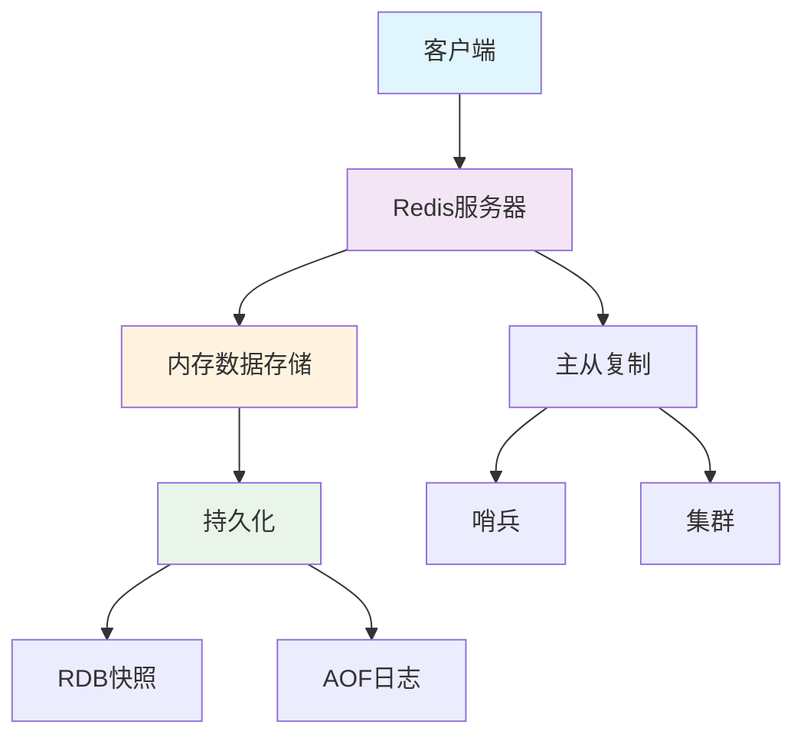

**Redis核心特点**：
- **内存存储**：所有数据都存储在内存中，因此读写速度极快
- **单线程模型**：核心操作采用单线程模型，避免了多线程的锁竞争开销
- **多种数据结构**：支持字符串、列表、集合、哈希、有序集合等多种数据结构
- **持久化机制**：支持RDB和AOF两种持久化方式，确保数据安全
- **原子性操作**：所有操作都是原子性的，支持事务和Lua脚本
- **高可用**：支持主从复制、哨兵模式和集群模式，保障服务可靠性

### 核心特性与优势

#### 1. 高性能
- **基于内存**：所有操作都在内存中完成，单机可达10万+ QPS
- **高效数据结构**：专门设计的数据结构，如ziplist、intset等，节省内存并提高性能
- **单线程模型**：避免线程切换和锁竞争开销，简化实现
- **I/O多路复用**：使用epoll/kqueue等技术高效处理网络请求

```
# Redis性能测试示例
redis-benchmark -h localhost -p 6379 -c 100 -n 100000
```

#### 2. 丰富的数据结构
- **String**：最基本的数据类型，可以是字符串、整数或浮点数
- **List**：双向链表，支持双向操作
- **Set**：无序集合，元素不重复
- **Hash**：哈希表，适合存储对象
- **ZSet**：有序集合，每个元素关联一个分数
- **Bitmap**：位图，适合布尔值存储
- **HyperLogLog**：用于基数统计
- **Geo**：地理位置数据类型
- **Stream**：消息队列（Redis 5.0新增）

#### 3. 持久化机制
- **RDB**：按指定时间间隔生成数据快照
- **AOF**：记录每一个写操作，可以配置不同的同步策略
- **混合持久化**：结合RDB和AOF的优点（Redis 4.0+）

#### 4. 高可用与分布式
- **主从复制**：一个主节点可以有多个从节点
- **哨兵模式**：自动监控和故障转移
- **集群模式**：数据自动分片，支持线性扩展

#### 5. 扩展功能
- **事务支持**：MULTI/EXEC/DISCARD/WATCH命令实现事务
- **Lua脚本**：在服务器端执行Lua脚本，减少网络往返
- **发布/订阅**：支持消息通信模式
- **管道技术**：客户端可以一次发送多个命令，减少网络往返

### 应用场景

#### 1. 缓存系统
Redis最常见的应用场景是作为缓存系统，减轻数据库负载，提高应用响应速度。

```
# 缓存示例
SET user:1001 "{name:'张三', age:28, email:'zhangsan@example.com'}" EX 3600
GET user:1001
```

**缓存模式**：
- **Cache-Aside**：先查缓存，缓存没有则查数据库并更新缓存
- **Write-Through**：写入数据时同时更新缓存和数据库
- **Write-Back**：先写入缓存，定期批量写入数据库
- **Read-Through**：缓存自动加载数据库数据

#### 2. 分布式锁
利用Redis的原子性操作实现分布式锁，协调分布式系统中的并发操作。

```
# 分布式锁实现示例
SET lock_key unique_value NX PX 10000
# 业务操作
DEL lock_key
```

**最佳实践**：
- 使用唯一标识作为锁值，确保只有锁的持有者才能释放锁
- 设置合理的过期时间，避免死锁
- 考虑使用Redlock算法在集群环境中实现更可靠的分布式锁

#### 3. 消息队列
使用List或Stream实现简单的消息队列功能。

```
# 生产者
LPUSH task_queue "task1"
LPUSH task_queue "task2"

# 消费者
BRPOP task_queue 0
```

**适用场景**：
- 轻量级消息传递
- 任务队列
- 实时通知

#### 4. 排行榜与计数器
利用ZSet实现排行榜，String实现计数器。

```
# 排行榜示例
ZADD leaderboard 100 "player1"
ZADD leaderboard 200 "player2"
ZADD leaderboard 150 "player3"
ZREVRANGE leaderboard 0 2 WITHSCORES  # 获取前三名

# 计数器示例
INCR page_view
INCRBY user:1001:followers 5
```

#### 5. 社交网络功能
使用Set实现关注、粉丝、共同好友等功能。

```
# 关注关系
SADD user:1001:following 1002 1003 1004
SADD user:1002:followers 1001

# 共同关注
SINTER user:1001:following user:1002:following
```

#### 6. 地理位置应用
使用Geo类型实现附近的人、店铺等地理位置服务。

```
# 添加位置
GEOADD locations 116.48105 39.99756 "user1"
GEOADD locations 116.51429 39.99794 "user2"

# 计算距离
GEODIST locations user1 user2 km

# 查找附近的人
GEORADIUS locations 116.48105 39.99756 5 km
```

#### 7. 限流与防刷
使用ZSet或String实现接口限流，防止恶意请求。

```
# 简单限流示例（限制每分钟访问次数）
INCR user:1001:api:count
EXPIRE user:1001:api:count 60
GET user:1001:api:count  # 如果超过阈值，则拒绝请求
```

## Redis 数据结构

### String（字符串）

String是Redis最基本的数据类型，可以存储字符串、整数、浮点数或二进制数据，最大可存储512MB。

#### 内部编码

Redis的String类型有三种内部编码：
- **int**：存储整数值
- **embstr**：存储短字符串（小于44字节）
- **raw**：存储长字符串

#### 常用命令

```
# 基本操作
SET key value [EX seconds] [PX milliseconds] [NX|XX]
GET key
DEL key
EXISTS key
EXPIRE key seconds

# 批量操作
MSET key1 value1 key2 value2 ...
MGET key1 key2 ...

# 原子增减
INCR key
DECR key
INCRBY key increment
DECRBY key decrement
INCRBYFLOAT key increment

# 字符串操作
APPEND key value
STRLEN key
GETRANGE key start end
SETRANGE key offset value
```

#### 应用场景

1. **缓存**：存储用户信息、页面、热点数据等
   ```
   SET cache:user:1001 "{json data}" EX 3600
   ```

2. **计数器**：如页面访问量、点赞数、关注数
   ```
   INCR page:views
   GET page:views
   ```

3. **分布式锁**：
   ```
   SET lock:resource_name unique_value NX PX 10000
   ```

4. **限流**：
   ```
   INCR user:1001:requests
   EXPIRE user:1001:requests 60
   ```

5. **Session存储**：
   ```
   SET session:token123 "{session data}" EX 1800
   ```

### List（列表）

List是一个双向链表，支持两端操作，可以实现队列和栈。

#### 内部编码

- **ziplist**：当列表元素较少且每个元素较小时使用
- **linkedlist**：当元素较多或较大时使用
- **quicklist**：Redis 3.2后的默认实现，结合ziplist和linkedlist的优点

#### 常用命令

```
# 添加元素
LPUSH key value [value ...]  # 左侧添加
RPUSH key value [value ...]  # 右侧添加
LPUSHX key value  # 仅当key存在时左侧添加
RPUSHX key value  # 仅当key存在时右侧添加

# 弹出元素
LPOP key  # 左侧弹出
RPOP key  # 右侧弹出
BLPOP key [key ...] timeout  # 阻塞左侧弹出
BRPOP key [key ...] timeout  # 阻塞右侧弹出

# 查询操作
LLEN key  # 获取长度
LRANGE key start stop  # 获取指定范围的元素
LINDEX key index  # 获取指定位置的元素
LSET key index value  # 设置指定位置的元素

# 高级操作
LTRIM key start stop  # 修剪列表
LINSERT key BEFORE|AFTER pivot value  # 在指定元素前/后插入
RPOPLPUSH source destination  # 弹出并推入
```

#### 应用场景

1. **消息队列**：
   ```
   # 生产者
   LPUSH task_queue "task1"
   
   # 消费者
   BRPOP task_queue 0
   ```

2. **最新动态**：如朋友圈、微博最新消息
   ```
   LPUSH user:1001:timeline "post1" "post2"
   LRANGE user:1001:timeline 0 9  # 获取最新10条
   ```

3. **文章列表**：
   ```
   LPUSH articles:recent article:1 article:2
   LTRIM articles:recent 0 99  # 只保留最新的100篇
   ```

### Set（集合）

Set是无序且唯一的字符串集合，支持并集、交集、差集等集合运算。

#### 内部编码

- **intset**：当集合中只包含整数且元素较少时使用
- **hashtable**：当包含非整数或元素较多时使用

#### 常用命令

```
# 基本操作
SADD key member [member ...]  # 添加元素
SREM key member [member ...]  # 删除元素
SISMEMBER key member  # 判断元素是否存在
SCARD key  # 获取集合大小
SMEMBERS key  # 获取所有元素
SRANDMEMBER key [count]  # 随机获取元素
SPOP key [count]  # 随机弹出元素

# 集合运算
SINTER key [key ...]  # 交集
SINTERSTORE destination key [key ...]  # 交集并存储
SUNION key [key ...]  # 并集
SUNIONSTORE destination key [key ...]  # 并集并存储
SDIFF key [key ...]  # 差集
SDIFFSTORE destination key [key ...]  # 差集并存储
```

#### 应用场景

1. **用户标签**：
   ```
   SADD user:1001:tags "python" "redis" "mysql"
   SMEMBERS user:1001:tags
   ```

2. **共同好友/关注**：
   ```
   SADD user:1001:following 1002 1003 1004
   SADD user:1002:following 1003 1005 1006
   SINTER user:1001:following user:1002:following  # 共同关注
   ```

3. **黑名单/白名单**：
   ```
   SADD blacklist:ip "192.168.1.1" "10.0.0.1"
   SISMEMBER blacklist:ip "192.168.1.1"  # 检查IP是否在黑名单
   ```

4. **随机抽奖**：
   ```
   SADD lottery:users user1 user2 user3 user4
   SRANDMEMBER lottery:users 3  # 随机抽取3人
   ```

5. **网站访问IP统计**：
   ```
   SADD website:unique:ip "192.168.1.1" "10.0.0.1"
   SCARD website:unique:ip  # 获取唯一IP数
   ```

### Hash（哈希）

Hash是键值对的集合，适合存储对象数据，每个Hash最多可存储2^32-1个键值对。

#### 内部编码

- **ziplist**：当哈希元素较少且每个元素较小时使用
- **hashtable**：当元素较多或较大时使用

#### 常用命令

```
# 基本操作
HSET key field value [field value ...]  # 设置字段值
HGET key field  # 获取字段值
HDEL key field [field ...]  # 删除字段
HEXISTS key field  # 判断字段是否存在
HLEN key  # 获取字段数量
HGETALL key  # 获取所有字段和值
HKEYS key  # 获取所有字段
HVALS key  # 获取所有值

# 批量操作
HMSET key field value [field value ...]  # 批量设置
HMGET key field [field ...]  # 批量获取

# 数值操作
HINCRBY key field increment  # 整数增加
HINCRBYFLOAT key field increment  # 浮点数增加

# 高级操作
HSCAN key cursor [MATCH pattern] [COUNT count]  # 迭代哈希
```

#### 应用场景

1. **用户信息**：
   ```
   HSET user:1001 name "张三" age 28 email "zhangsan@example.com"
   HGET user:1001 name
   HGETALL user:1001
   ```

2. **购物车**：
   ```
   HSET cart:user:1001 product:1 2 product:2 1 product:3 5
   HINCRBY cart:user:1001 product:1 1  # 增加商品数量
   ```

3. **配置信息**：
   ```
   HSET config:app cache_time 60 max_connections 100 debug true
   ```

4. **计数器**：
   ```
   HINCRBY user:stats:1001 login_count 1
   HINCRBY user:stats:1001 post_count 1
   ```

### ZSet（有序集合）

ZSet是有序且唯一的字符串集合，每个元素关联一个分数，按分数排序。

#### 内部编码

- **ziplist**：当元素较少且每个元素较小时使用
- **skiplist**：当元素较多或较大时使用，基于跳表实现

#### 常用命令

```
# 基本操作
ZADD key [NX|XX] [GT|LT] [CH] [INCR] score member [score member ...]  # 添加元素
ZREM key member [member ...]  # 删除元素
ZSCORE key member  # 获取分数
ZCARD key  # 获取元素数量
ZCOUNT key min max  # 统计分数范围内的元素数量

# 范围查询
ZRANGE key start stop [WITHSCORES]  # 按索引范围获取
ZREVRANGE key start stop [WITHSCORES]  # 按索引范围倒序获取
ZRANGEBYSCORE key min max [WITHSCORES] [LIMIT offset count]  # 按分数范围获取
ZREVRANGEBYSCORE key max min [WITHSCORES] [LIMIT offset count]  # 按分数范围倒序获取

# 排名操作
ZRANK key member  # 获取正序排名
ZREVRANK key member  # 获取倒序排名

# 分数操作
ZINCRBY key increment member  # 增加分数

# 集合操作
ZINTERSTORE destination numkeys key [key ...] [WEIGHTS weight [weight ...]] [AGGREGATE SUM|MIN|MAX]  # 交集
ZUNIONSTORE destination numkeys key [key ...] [WEIGHTS weight [weight ...]] [AGGREGATE SUM|MIN|MAX]  # 并集
```

#### 应用场景

1. **排行榜**：
   ```
   ZADD leaderboard 100 "player1" 200 "player2" 150 "player3"
   ZREVRANGE leaderboard 0 9 WITHSCORES  # 获取前10名
   ZRANK leaderboard "player1"  # 获取排名
   ```

2. **带权重的任务队列**：
   ```
   ZADD tasks 10 "task:1" 5 "task:2" 7 "task:3"
   ZRANGE tasks 0 0  # 获取优先级最高的任务
   ```

3. **延迟队列**：
   ```
   ZADD delayed_queue 1628668800 "task:1"  # 使用时间戳作为分数
   ZRANGEBYSCORE delayed_queue 0 1628668800  # 获取到期的任务
   ```

4. **用户访问统计**：
   ```
   ZINCRBY active_users 1 "user:1001"
   ZREVRANGE active_users 0 9 WITHSCORES  # 获取最活跃的10个用户
   ```

5. **范围查询**：
   ```
   ZADD products 10.5 "product:1" 15.0 "product:2" 8.5 "product:3"
   ZRANGEBYSCORE products 8 12  # 获取价格在8-12之间的产品
   ```

### Bitmap、HyperLogLog、Geo

#### Bitmap（位图）

Bitmap是String的一种特殊形式，可以对字符串的位进行操作，非常适合存储布尔信息。

```
# 基本操作
SETBIT key offset value  # 设置位的值
GETBIT key offset  # 获取位的值
BITCOUNT key [start end]  # 统计为1的位数
BITOP operation destkey key [key ...]  # 位操作
BITPOS key bit [start] [end]  # 查找第一个为指定值的位
```

**应用场景**：
- 用户签到记录
  ```
  SETBIT user:1001:sign:2023-08 0 1  # 8月1日签到
  SETBIT user:1001:sign:2023-08 1 1  # 8月2日签到
  BITCOUNT user:1001:sign:2023-08  # 获取签到天数
  ```
- 在线状态统计
  ```
  SETBIT online_users 1001 1  # 用户1001在线
  SETBIT online_users 1002 0  # 用户1002离线
  ```
- 布隆过滤器
  ```
  # 使用多个哈希函数计算位置，然后设置对应的位
  SETBIT bloom_filter 123 1
  SETBIT bloom_filter 456 1
  SETBIT bloom_filter 789 1
  ```

#### HyperLogLog

HyperLogLog是用于基数统计的概率数据结构，使用极小的内存（12KB）即可统计接近2^64个不同元素。

```
# 基本操作
PFADD key element [element ...]  # 添加元素
PFCOUNT key [key ...]  # 获取基数估计值
PFMERGE destkey sourcekey [sourcekey ...]  # 合并
```

**应用场景**：
- 网站UV统计
  ```
  PFADD website:uv:2023-08-01 user1 user2 user3
  PFCOUNT website:uv:2023-08-01  # 获取当日UV
  ```
- 搜索关键词统计
  ```
  PFADD search:keywords:2023-08 "redis" "mysql" "python"
  PFCOUNT search:keywords:2023-08  # 获取不同关键词数量
  ```

#### Geo（地理位置）

Geo用于存储地理位置信息，支持计算距离、范围查询等。

```
# 基本操作
GEOADD key longitude latitude member [longitude latitude member ...]  # 添加位置
GEOPOS key member [member ...]  # 获取位置
GEODIST key member1 member2 [unit]  # 计算距离
GEORADIUS key longitude latitude radius m|km|ft|mi [WITHCOORD] [WITHDIST] [WITHHASH] [COUNT count]  # 范围查询
GEORADIUSBYMEMBER key member radius m|km|ft|mi [WITHCOORD] [WITHDIST] [WITHHASH] [COUNT count]  # 以成员为中心的范围查询
```

**应用场景**：
- 附近的人/店铺
  ```
  GEOADD locations 116.48105 39.99756 "user1" 116.51429 39.99794 "user2"
  GEORADIUS locations 116.48105 39.99756 5 km  # 5公里内的用户
  ```
- 打车服务
  ```
  GEOADD drivers 116.48105 39.99756 "driver1" 116.51429 39.99794 "driver2"
  GEORADIUSBYMEMBER drivers "user1" 3 km  # 用户3公里内的司机
  ```
- 位置共享
  ```
  GEOADD friends 116.48105 39.99756 "friend1" 116.51429 39.99794 "friend2"
  GEODIST friends "friend1" "friend2" km  # 计算两个朋友之间的距离
  ``` 

## Redis 架构设计

### 单机架构

单机版Redis是最简单的部署方式，所有命令在单个Redis实例中执行。

**架构特点**：
- 单进程单线程模型（Redis 6.0之前）
- 使用I/O多路复用技术处理并发连接
- 所有操作都在内存中进行，定期持久化到磁盘

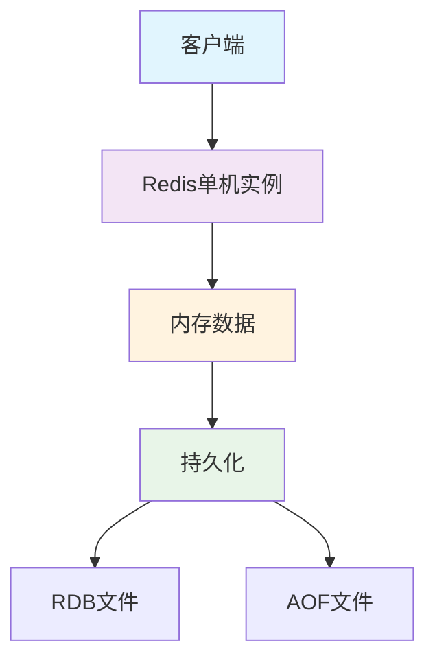

**配置示例**：
```
# redis.conf 单机版配置
port 6379
bind 127.0.0.1
daemonize yes
pidfile /var/run/redis_6379.pid
logfile "/var/log/redis/redis.log"
dir /var/lib/redis
```

**优缺点**：
- **优点**：部署简单，维护方便，性能高
- **缺点**：单点故障风险，容量受单机内存限制，无法横向扩展

**适用场景**：
- 开发测试环境
- 数据量较小的应用
- 对可用性要求不高的场景

### 主从复制

主从复制是Redis实现高可用的基础，一个主节点可以有多个从节点，主节点负责写操作，从节点负责读操作。

**复制原理**：
1. **全量同步**：从节点连接主节点时，主节点生成RDB文件发送给从节点
2. **增量同步**：主节点将写命令记录在复制缓冲区，从节点断线重连后只需同步新写入的命令
3. **无盘复制**：主节点直接通过网络传输RDB数据，不写入磁盘

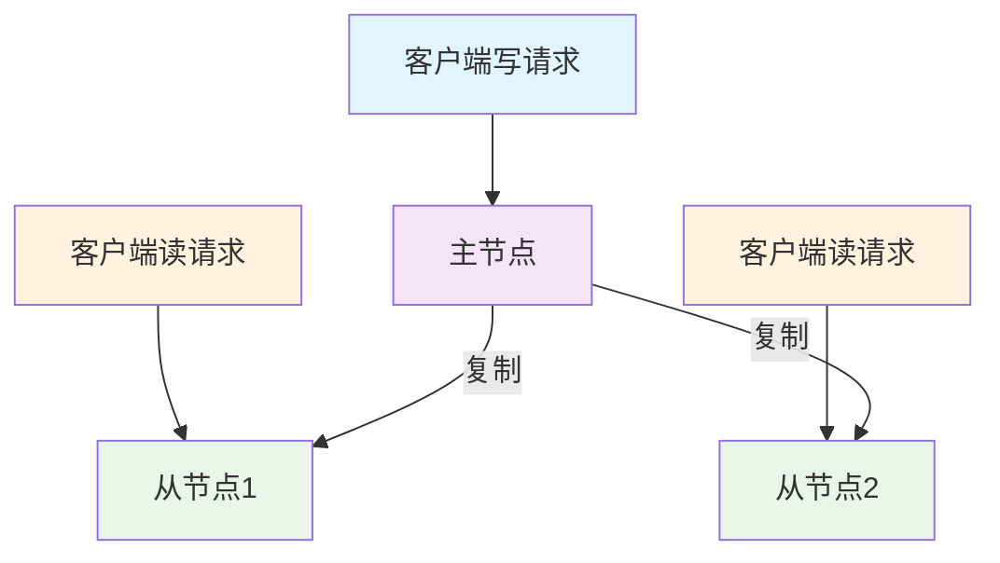

**配置示例**：
```
# 主节点配置
port 6379
bind 0.0.0.0

# 从节点配置
port 6380
replicaof 127.0.0.1 6379
replica-read-only yes
```

**命令示例**：
```
# 在从节点执行
REPLICAOF 192.168.1.100 6379

# 查看复制状态
INFO replication

# 断开复制
REPLICAOF NO ONE
```

**优缺点**：
- **优点**：读写分离，提高系统吞吐量，从节点可作为备份
- **缺点**：主节点故障需手动切换，无法自动故障转移

**最佳实践**：
- 合理配置复制缓冲区大小，避免全量同步
- 避免过多从节点连接到同一主节点
- 考虑使用复制延迟较小的从节点提供服务

### 哨兵模式

哨兵（Sentinel）是Redis的高可用解决方案，通过监控主从节点，在主节点故障时自动进行故障转移。

**哨兵工作原理**：
1. **监控**：定期检查主从节点是否正常运行
2. **通知**：当监控的节点出现问题时，通过API通知系统管理员
3. **自动故障转移**：主节点不可用时，选择一个从节点升级为新主节点
4. **配置提供者**：客户端连接时，提供主节点的信息

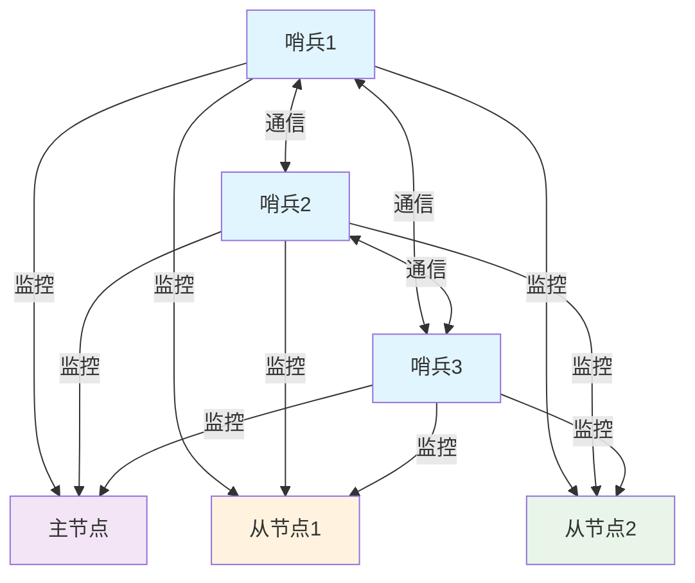

**配置示例**：
```
# sentinel.conf
port 26379
sentinel monitor mymaster 127.0.0.1 6379 2
sentinel down-after-milliseconds mymaster 5000
sentinel failover-timeout mymaster 60000
sentinel parallel-syncs mymaster 1
```

**故障转移过程**：
1. 多个哨兵发现主节点不可达
2. 达到quorum数量后，其中一个哨兵被选为leader
3. leader选择一个最适合的从节点作为新主节点
4. 通知其他从节点复制新主节点
5. 通知客户端主节点已更换

**优缺点**：
- **优点**：自动故障转移，提高系统可用性
- **缺点**：配置较复杂，无法解决扩容问题

**最佳实践**：
- 部署至少3个哨兵实例，分布在不同物理机
- 合理配置quorum值，通常为哨兵数量的一半加1
- 使用Redis客户端的哨兵感知功能自动发现主节点

### 集群模式

Redis集群是Redis提供的分布式解决方案，支持数据自动分片和高可用。

**集群特点**：
- 数据自动分片，每个节点存储部分数据
- 无中心架构，所有节点地位平等
- 支持在线扩容和缩容
- 内置高可用，节点故障时自动故障转移

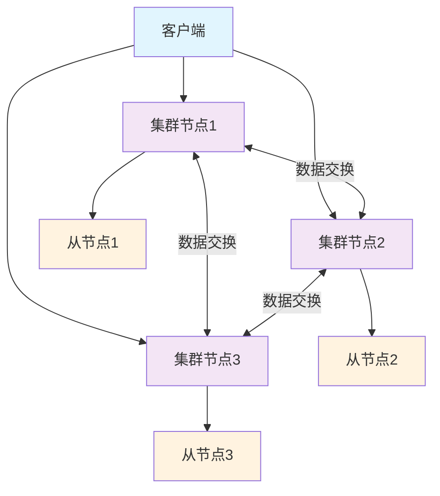

**数据分片原理**：
- 使用哈希槽（Hash Slot）进行数据分片
- 集群有16384个哈希槽，每个节点负责一部分槽
- 根据key的CRC16值对16384取模，确定key属于哪个槽

**配置示例**：
```
# 节点1配置
port 7001
cluster-enabled yes
cluster-config-file nodes-7001.conf
cluster-node-timeout 5000

# 节点2配置
port 7002
cluster-enabled yes
cluster-config-file nodes-7002.conf
cluster-node-timeout 5000

# 节点3配置
port 7003
cluster-enabled yes
cluster-config-file nodes-7003.conf
cluster-node-timeout 5000
```

**创建集群命令**：
```bash
redis-cli --cluster create 127.0.0.1:7001 127.0.0.1:7002 127.0.0.1:7003 \
                           127.0.0.1:7004 127.0.0.1:7005 127.0.0.1:7006 \
                           --cluster-replicas 1
```

**集群操作命令**：
```
# 查看集群信息
CLUSTER INFO

# 查看节点信息
CLUSTER NODES

# 查看槽位分配
CLUSTER SLOTS

# 手动故障转移
CLUSTER FAILOVER
```

**优缺点**：
- **优点**：支持海量数据存储，可线性扩展，高可用
- **缺点**：配置复杂，不支持多键操作（跨槽），客户端实现复杂

**最佳实践**：
- 集群节点数量建议为3的倍数，每个主节点配一个从节点
- 合理规划哈希槽分配，避免数据倾斜
- 使用支持集群的客户端，如Lettuce、Redisson等

### 高可用与分布式

Redis高可用与分布式架构结合了主从复制、哨兵和集群模式，实现数据安全、服务可靠和水平扩展。

**高可用架构示例**：

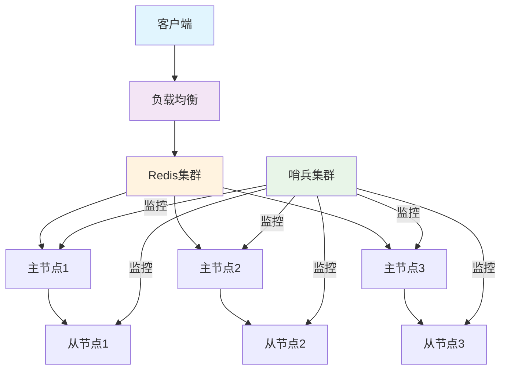

**分布式Redis架构特点**：
- **数据分片**：数据分散存储在多个节点
- **高可用**：每个分片有主从结构，保证服务可用性
- **自动故障转移**：节点故障时自动切换
- **动态扩容**：支持在线增加节点，重新分配数据

**Redis高可用最佳实践**：
1. **多级缓存**：
   - 本地缓存（如Caffeine）+ Redis缓存
   - 减轻Redis负载，提高响应速度

2. **读写分离**：
   - 写操作路由到主节点
   - 读操作路由到从节点
   - 提高系统吞吐量

3. **故障自动恢复**：
   - 使用哨兵或集群模式实现自动故障转移
   - 配置合理的超时时间和重试策略

4. **多数据中心部署**：
   - 跨数据中心部署Redis实例
   - 实现异地容灾和就近访问

5. **监控与告警**：
   - 实时监控Redis实例状态
   - 设置关键指标告警阈值
   - 提前发现并解决潜在问题

## Redis 持久化机制

Redis提供了多种持久化机制，确保数据在服务器重启后不会丢失。

### RDB 快照

RDB（Redis Database）是Redis默认的持久化方式，通过创建数据快照保存到磁盘。

**RDB工作原理**：
1. Redis在指定的时间间隔内，检查是否满足持久化条件
2. 满足条件时，Redis创建子进程（fork）
3. 子进程将内存数据写入临时RDB文件
4. 写入完成后，用临时文件替换旧的RDB文件

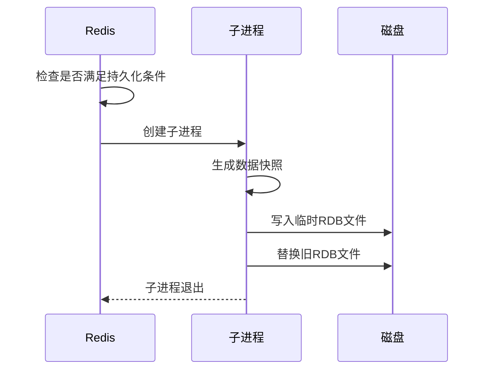

**配置示例**：
```
# redis.conf RDB配置
save 900 1      # 900秒内至少1个key变化
save 300 10     # 300秒内至少10个key变化
save 60 10000   # 60秒内至少10000个key变化
dbfilename dump.rdb
dir ./
rdbcompression yes
rdbchecksum yes
```

**手动触发RDB**：
```
# 同步保存（会阻塞服务器）
SAVE

# 异步保存（不阻塞服务器）
BGSAVE
```

**优缺点**：
- **优点**：
  - 文件紧凑，适合备份和恢复
  - 恢复速度快，适合大规模数据恢复
  - 对性能影响小，fork子进程执行
- **缺点**：
  - 可能丢失最后一次快照后的数据
  - fork过程可能导致服务短暂暂停

**最佳实践**：
- 根据数据更新频率和重要性配置合适的保存策略
- 考虑使用SSD存储RDB文件，提高I/O性能
- 定期备份RDB文件到远程存储

### AOF 日志

AOF（Append Only File）通过记录服务器接收的每一个写操作命令来持久化数据。

**AOF工作原理**：
1. 服务器执行完写命令后，将命令追加到AOF缓冲区
2. 根据同步策略将缓冲区数据写入并同步到磁盘
3. 当AOF文件过大时，Redis会自动重写AOF文件，减小体积

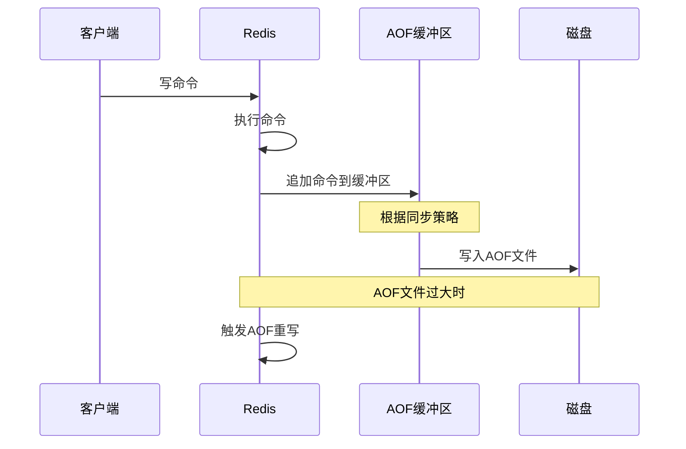

**配置示例**：
```
# redis.conf AOF配置
appendonly yes
appendfilename "appendonly.aof"
appendfsync everysec  # always, everysec, no
no-appendfsync-on-rewrite no
auto-aof-rewrite-percentage 100
auto-aof-rewrite-min-size 64mb
```

**AOF同步策略**：
- **always**：每个写命令都同步到磁盘，最安全但性能最差
- **everysec**：每秒同步一次，平衡安全性和性能
- **no**：由操作系统决定何时同步，性能最好但最不安全

**手动触发AOF重写**：
```
BGREWRITEAOF
```

**优缺点**：
- **优点**：
  - 数据安全性高，支持不同级别的同步策略
  - 文件易于理解和解析，可以手动修复
  - 支持增量追加，不会覆盖已有数据
- **缺点**：
  - 文件体积通常比RDB大
  - 恢复速度比RDB慢
  - 对性能影响较大，特别是使用always同步策略时

**最佳实践**：
- 使用everysec同步策略，平衡性能和数据安全
- 定期执行AOF重写，控制文件大小
- 监控AOF重写过程，避免对服务造成影响

### 混合持久化

混合持久化（Redis 4.0+）结合了RDB和AOF的优点，在AOF重写时，将重写点之前的数据以RDB格式保存，重写点之后的命令以AOF格式追加。

**混合持久化工作原理**：
1. 触发AOF重写时，创建子进程
2. 子进程先将内存数据以RDB格式写入新AOF文件
3. 再将重写缓冲区中的增量命令以AOF格式追加到文件末尾
4. 替换旧的AOF文件

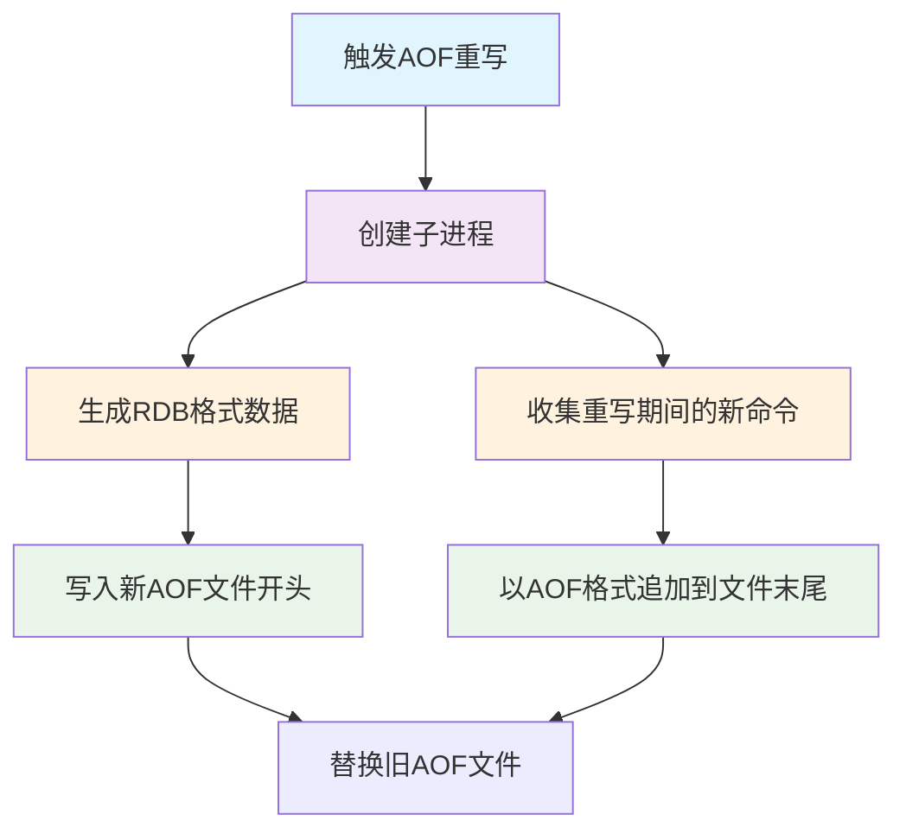

**配置示例**：
```
# redis.conf 混合持久化配置
appendonly yes
aof-use-rdb-preamble yes
```

**优缺点**：
- **优点**：
  - 结合RDB的恢复速度和AOF的数据安全性
  - 文件体积小于纯AOF
  - 恢复速度快于纯AOF
- **缺点**：
  - 兼容性问题，Redis 4.0以下版本不支持
  - 文件结构较复杂，难以手动修复

**最佳实践**：
- Redis 4.0及以上版本推荐使用混合持久化
- 同时配置适当的RDB策略作为额外保障
- 定期备份持久化文件

### 持久化策略对比

| 特性 | RDB | AOF | 混合持久化 |
|------|-----|-----|------------|
| **数据安全性** | 低（可能丢失最后一次快照后的数据） | 高（根据同步策略，最多丢失1秒数据） | 高（同AOF） |
| **文件大小** | 小（二进制格式） | 大（文本格式） | 中等（RDB+AOF） |
| **恢复速度** | 快 | 慢 | 中等 |
| **对性能影响** | 低（fork时可能短暂阻塞） | 中等（取决于同步策略） | 中等 |
| **启动优先级** | 低（如果同时存在AOF） | 高（优先使用AOF恢复） | 高 |

**持久化选择建议**：

1. **仅使用RDB**：
   - 适用场景：对数据安全性要求不高，可以接受少量数据丢失
   - 配置：设置合适的save参数，关闭AOF

2. **仅使用AOF**：
   - 适用场景：对数据安全性要求高，不能接受数据丢失
   - 配置：开启AOF，选择合适的同步策略

3. **同时使用RDB和AOF**：
   - 适用场景：需要数据安全性，同时需要RDB用于备份
   - 配置：开启AOF，设置RDB策略，优先使用AOF恢复

4. **使用混合持久化**（推荐）：
   - 适用场景：Redis 4.0及以上版本，兼顾安全性和性能
   - 配置：开启AOF和aof-use-rdb-preamble

**实际应用案例**：

```
# 高性能场景配置
appendonly no
save 900 1
save 300 10
save 60 10000

# 高可靠场景配置
appendonly yes
appendfsync everysec
auto-aof-rewrite-percentage 100
auto-aof-rewrite-min-size 64mb

# 平衡场景配置（Redis 4.0+）
appendonly yes
appendfsync everysec
aof-use-rdb-preamble yes
save 900 1
``` 

## Redis 高级特性

### 事务与Lua脚本

#### Redis事务

Redis事务允许在一个步骤中执行一组命令，具有以下特点：
- 批量操作：一次性执行多个命令
- 原子性：事务中的命令要么全部执行，要么全不执行
- 隔离性：事务执行期间，其他客户端提交的命令不会插入到事务中

**事务命令**：
```
MULTI       # 开始事务
EXEC        # 执行事务
DISCARD     # 丢弃事务
WATCH       # 监视键，实现乐观锁
UNWATCH     # 取消监视
```

**事务示例**：
```
MULTI
SET user:1:name "张三"
SET user:1:balance 100
EXEC
```

**事务注意事项**：
- Redis事务不支持回滚，命令执行出错不会影响其他命令
- WATCH命令可以实现乐观锁，但不保证强一致性
- 事务中的命令在EXEC执行前不会被实际执行

**乐观锁示例**：
```
WATCH account:1
GET account:1
MULTI
DECRBY account:1 100
INCRBY account:2 100
EXEC  # 如果account:1被其他客户端修改，EXEC将返回nil
```

#### Lua脚本

Redis支持使用Lua脚本执行原子操作，相比事务有更强的功能和灵活性。

**Lua脚本优势**：
- 减少网络往返：一次发送，一次执行，一次返回
- 原子性：脚本执行期间不会执行其他命令
- 可编程性：支持条件判断、循环等编程结构

**Lua脚本命令**：
```
EVAL script numkeys key [key ...] arg [arg ...]  # 执行Lua脚本
EVALSHA sha1 numkeys key [key ...] arg [arg ...]  # 执行已缓存的脚本
SCRIPT LOAD script  # 加载脚本到缓存
SCRIPT EXISTS sha1 [sha1 ...]  # 检查脚本是否已缓存
SCRIPT FLUSH  # 清空脚本缓存
SCRIPT KILL  # 终止正在执行的脚本
```

**Lua脚本示例**：
```
# 原子计数器
EVAL "local current = redis.call('get', KEYS[1]) or 0;
      local next = current + 1;
      redis.call('set', KEYS[1], next);
      return next;" 1 counter

# 条件更新
EVAL "if redis.call('get', KEYS[1]) == ARGV[1] then
        return redis.call('set', KEYS[1], ARGV[2])
      else
        return 0
      end" 1 key oldvalue newvalue
```

**最佳实践**：
- 使用SCRIPT LOAD预加载常用脚本，减少传输开销
- 避免编写耗时长的Lua脚本，可能阻塞Redis
- 使用KEYS数组接收键名，ARGV数组接收参数

### 发布订阅

Redis发布订阅（Pub/Sub）是一种消息通信模式，发布者发送消息，订阅者接收消息。

**发布订阅命令**：
```
SUBSCRIBE channel [channel ...]  # 订阅一个或多个频道
PSUBSCRIBE pattern [pattern ...]  # 订阅与模式匹配的频道
PUBLISH channel message  # 发布消息到频道
UNSUBSCRIBE [channel [channel ...]]  # 取消订阅
PUNSUBSCRIBE [pattern [pattern ...]]  # 取消模式订阅
PUBSUB CHANNELS [pattern]  # 列出活跃频道
PUBSUB NUMSUB [channel ...]  # 获取订阅数量
PUBSUB NUMPAT  # 获取模式订阅数量
```

**发布订阅示例**：
```
# 订阅者
SUBSCRIBE news
# 发布者
PUBLISH news "Hello World"
```

**发布订阅特点**：
- 消息即发即失，不会持久化
- 订阅者断线重连后需要重新订阅
- 支持模式匹配订阅，如PSUBSCRIBE news.*

**应用场景**：
- 实时消息通知
- 聊天系统
- 实时数据更新

**最佳实践**：
- 不要用于可靠消息传递，考虑使用Stream或其他消息队列
- 避免大量频道和订阅者，可能影响性能
- 考虑使用Keyspace Notifications监听键事件

### 延迟队列与消息队列

#### 基于List的简单队列

使用LPUSH+BRPOP实现简单的消息队列：

```
# 生产者
LPUSH queue:tasks "task1"
LPUSH queue:tasks "task2"

# 消费者
BRPOP queue:tasks 0  # 阻塞等待任务
```

**优缺点**：
- 优点：实现简单，适合轻量级应用
- 缺点：不支持优先级，不保证可靠性，不支持消息确认

#### 基于Sorted Set的延迟队列

使用ZSet实现延迟队列，分数为执行时间戳：

```
# 添加延迟任务，10秒后执行
ZADD delay:queue (time() + 10) task:1

# 获取到期任务
ZRANGEBYSCORE delay:queue 0 current_timestamp LIMIT 0 1
ZREM delay:queue task:1  # 移除已处理任务
```

**优缺点**：
- 优点：支持精确的延迟控制，可以按优先级处理
- 缺点：需要轮询检查，不支持阻塞获取

#### 基于Stream的可靠队列

Redis 5.0引入的Stream提供了更完善的消息队列功能：

```
# 生产者
XADD mystream * name "张三" age 25

# 消费者组
XGROUP CREATE mystream mygroup 0

# 消费者处理消息
XREADGROUP GROUP mygroup consumer1 COUNT 1 STREAMS mystream >

# 确认消息处理完成
XACK mystream mygroup message_id
```

**Stream特点**：
- 支持消费者组模式，多个消费者可以协同工作
- 提供消息确认机制，保证消息不丢失
- 支持消息持久化和历史消息查询
- 可以指定起始ID，支持从特定位置开始消费

**最佳实践**：
- 对于简单场景，使用List实现轻量级队列
- 需要延迟执行的任务，使用ZSet实现延迟队列
- 对可靠性要求高的场景，使用Stream实现消息队列
- 大规模生产环境考虑使用专业消息队列如RabbitMQ、Kafka

### 分布式锁

分布式锁是控制分布式系统中多个进程对共享资源访问的一种机制。

#### 基于SETNX实现分布式锁

```
# 获取锁
SET resource_name unique_value NX PX 10000

# 释放锁（使用Lua脚本保证原子性）
EVAL "if redis.call('get', KEYS[1]) == ARGV[1] then
        return redis.call('del', KEYS[1])
      else
        return 0
      end" 1 resource_name unique_value
```

**实现要点**：
1. **唯一标识**：使用唯一值作为锁值，确保只有锁的持有者才能释放锁
2. **自动过期**：设置合理的过期时间，避免死锁
3. **原子释放**：使用Lua脚本保证释放锁的原子性

#### Redlock算法

针对Redis集群环境，Redlock算法提供了更可靠的分布式锁实现：

1. 获取当前时间（毫秒）
2. 依次尝试在N个独立Redis实例上获取锁
3. 如果在大多数实例（N/2+1）上获取成功且耗时小于锁有效期，则认为获取锁成功
4. 锁的有效时间 = 初始有效时间 - 获取锁耗时
5. 如果获取锁失败，尝试释放所有实例上的锁

**Java实现示例**：
```java
public boolean acquireLock(String resource, String value, int expireTime) {
    long startTime = System.currentTimeMillis();
    int acquiredInstances = 0;
    
    // 尝试在所有实例上获取锁
    for (JedisPool jedisPool : jedisPools) {
        try (Jedis jedis = jedisPool.getResource()) {
            if ("OK".equals(jedis.set(resource, value, "NX", "PX", expireTime))) {
                acquiredInstances++;
            }
        }
    }
    
    // 计算获取锁耗时
    long elapsedTime = System.currentTimeMillis() - startTime;
    long validityTime = expireTime - elapsedTime;
    
    // 判断是否成功获取锁
    if (acquiredInstances >= majority && validityTime > 0) {
        return true;
    } else {
        // 释放所有实例上的锁
        releaseLock(resource, value);
        return false;
    }
}
```

**分布式锁最佳实践**：
- 设置合理的锁超时时间，避免死锁
- 实现锁续期机制（看门狗），处理长任务
- 使用唯一标识作为锁值，避免误释放
- 考虑使用Redisson等成熟的分布式锁实现

### 缓存淘汰策略

Redis作为内存数据库，当内存不足时需要通过缓存淘汰策略释放空间。

**Redis支持的淘汰策略**：

| 策略 | 描述 |
|------|------|
| **noeviction** | 不淘汰，内存不足时返回错误 |
| **allkeys-lru** | 所有键中，移除最近最少使用的键 |
| **allkeys-lfu** | 所有键中，移除使用频率最少的键 |
| **allkeys-random** | 所有键中，随机移除键 |
| **volatile-lru** | 设置了过期时间的键中，移除最近最少使用的键 |
| **volatile-lfu** | 设置了过期时间的键中，移除使用频率最少的键 |
| **volatile-random** | 设置了过期时间的键中，随机移除键 |
| **volatile-ttl** | 设置了过期时间的键中，优先移除更早过期的键 |

**配置示例**：
```
# redis.conf
maxmemory 2gb
maxmemory-policy allkeys-lru
maxmemory-samples 5
```

**策略选择建议**：
- **allkeys-lru**：适合大多数缓存场景，优先保留热点数据
- **allkeys-lfu**：适合访问模式固定的场景，优先保留高频访问数据
- **volatile-ttl**：适合有明确过期时间的场景，优先移除即将过期的数据
- **noeviction**：适合不允许丢失数据的场景，如队列、计数器

**最佳实践**：
- 根据应用特性选择合适的淘汰策略
- 设置合理的maxmemory值，预留足够的系统内存
- 为重要数据设置过期时间，避免长期占用内存
- 定期监控内存使用情况和淘汰次数

### 内存管理与回收

#### 内存占用分析

Redis内存占用包括：
- 数据存储空间
- 客户端缓冲区
- 复制积压缓冲区
- AOF/RDB持久化临时空间

**内存使用查看命令**：
```
INFO memory  # 查看内存使用情况
MEMORY USAGE key  # 查看键占用内存
MEMORY STATS  # 查看内存统计信息
```

#### 内存优化技巧

1. **使用合适的数据结构**：
   - 小整数使用整数编码
   - 小集合使用intset编码
   - 短字符串使用embstr编码

2. **使用压缩数据结构**：
   - ziplist（压缩列表）
   - intset（整数集合）
   - quicklist（快速列表）

3. **设置合理的配置**：
   ```
   hash-max-ziplist-entries 512
   hash-max-ziplist-value 64
   zset-max-ziplist-entries 128
   zset-max-ziplist-value 64
   ```

#### 过期键回收机制

Redis使用两种方式回收过期键：
- **惰性删除**：访问键时检查是否过期，过期则删除
- **定期删除**：每秒执行10次，随机检查一部分过期键并删除

**过期键配置**：
```
# redis.conf
# 过期键占比达到25%时，会增加删除频率
lazyfree-lazy-expire yes  # 异步删除过期键
```

**最佳实践**：
- 合理设置过期时间，避免大量键同时过期
- 使用SCAN+EXPIRE代替KEYS命令设置过期时间
- 监控过期键删除情况，避免内存泄漏

## Redis 性能优化

### 网络与IO优化

#### 网络配置优化

**TCP配置**：
```
# redis.conf
tcp-backlog 511  # TCP连接队列大小
tcp-keepalive 300  # TCP保活时间
timeout 0  # 客户端连接超时时间，0表示不超时
```

**连接池配置**：
```java
// Java客户端连接池配置
JedisPoolConfig poolConfig = new JedisPoolConfig();
poolConfig.setMaxTotal(200);  // 最大连接数
poolConfig.setMaxIdle(50);    // 最大空闲连接
poolConfig.setMinIdle(10);    // 最小空闲连接
poolConfig.setMaxWaitMillis(3000);  // 获取连接最大等待时间
```

#### 管道与批量操作

**管道（Pipeline）**：
```
# 不使用管道
SET key1 value1
SET key2 value2
SET key3 value3

# 使用管道
PIPELINE
SET key1 value1
SET key2 value2
SET key3 value3
EXEC
```

**批量命令**：
```
# 批量操作
MSET key1 value1 key2 value2 key3 value3
MGET key1 key2 key3
```

**性能对比**：
- 单个命令：1次操作 = 1次网络往返
- 管道：N次操作 = 1次网络往返
- 批量命令：1次操作 = 1次网络往返，且服务器端一次执行

**最佳实践**：
- 使用连接池管理连接，避免频繁创建连接
- 批量操作优先使用原生批量命令（如MSET、MGET）
- 大量无关联操作使用管道提高吞吐量
- 避免过大的请求包，可能导致网络拥塞

### 内存优化

#### 内存使用优化

**数据结构选择**：
- 存储对象属性：使用Hash而非String
- 存储小整数：利用整数编码优化
- 存储小集合：利用压缩编码

**示例**：
```
# 不优化
SET user:1:name "张三"
SET user:1:age 25
SET user:1:gender "男"

# 优化后
HMSET user:1 name "张三" age 25 gender "男"
```

#### 键设计优化

**键名优化**：
- 避免过长的键名
- 使用统一的命名规范
- 合理使用分隔符

**示例**：
```
# 不优化
SET user_profile_info_name_for_user_id_1001 "张三"

# 优化后
SET u:1001:name "张三"
```

#### 压缩与编码

**启用压缩**：
```
# redis.conf
activerehashing yes  # 主动重新散列
```

**使用特殊编码**：
- LowCardinality(String)：适用于有限集合的字符串
- 整数优化：小整数使用共享对象池

**最佳实践**：
- 定期使用MEMORY DOCTOR分析内存使用
- 监控内存碎片率，必要时进行重启整理
- 合理设置maxmemory，避免内存溢出

### 慢查询与监控

#### 慢查询日志

**配置慢查询日志**：
```
# redis.conf
slowlog-log-slower-than 10000  # 记录执行时间超过10000微秒的命令
slowlog-max-len 128  # 最多保存128条慢查询记录
```

**查看慢查询**：
```
SLOWLOG GET [count]  # 获取慢查询日志
SLOWLOG LEN  # 获取慢查询日志长度
SLOWLOG RESET  # 重置慢查询日志
```

#### 监控指标

**关键监控指标**：
- **性能指标**：QPS、响应时间、命令执行时间
- **内存指标**：used_memory、used_memory_rss、mem_fragmentation_ratio
- **连接指标**：connected_clients、rejected_connections
- **持久化指标**：rdb_last_save_time、aof_current_size
- **复制指标**：master_link_status、slave_repl_offset

**监控命令**：
```
INFO  # 获取所有信息
INFO memory  # 获取内存信息
INFO stats  # 获取统计信息
INFO clients  # 获取客户端连接信息
INFO replication  # 获取复制信息
```

**监控工具**：
- Redis-cli：自带监控工具
- Redis-stat：实时监控工具
- Prometheus + Grafana：企业级监控方案
- Redis Sentinel：高可用监控

**最佳实践**：
- 设置合理的慢查询阈值，捕获潜在问题
- 定期分析慢查询日志，优化慢命令
- 建立完善的监控体系，设置关键指标告警
- 使用INFO COMMANDSTATS分析命令使用情况

### 大key与热点key处理

#### 大key问题

**大key定义**：
- String类型值超过10KB
- Hash、List、Set、ZSet等类型元素超过5000个

**大key危害**：
- 内存空间不均匀
- 操作耗时长，可能阻塞服务
- 网络带宽占用高
- 数据迁移困难

**大key发现**：
```
# 使用SCAN+MEMORY USAGE发现大key
redis-cli --bigkeys  # 内置大key扫描工具

# 自定义扫描脚本
SCAN 0 COUNT 100
```

**大key处理**：
1. **拆分**：
   - 大String：拆分为多个小String
   - 大Hash：拆分为多个小Hash
   - 大List：拆分为多个小List

2. **渐进式删除**：
   ```
   # 替代DEL命令
   UNLINK key  # 异步删除
   
   # 替代FLUSHDB/FLUSHALL
   FLUSHDB ASYNC
   FLUSHALL ASYNC
   ```

#### 热点key问题

**热点key定义**：
- 访问频率远高于其他key
- 可能导致单节点负载过高

**热点key危害**：
- 单节点CPU使用率高
- 影响其他key的访问
- 可能触发雪崩效应

**热点key发现**：
```
# 使用monitor命令（谨慎使用，影响性能）
MONITOR

# 使用INFO commandstats
INFO commandstats
```

**热点key处理**：
1. **本地缓存**：
   - 在应用层增加本地缓存
   - 减少Redis访问频率

2. **读写分离**：
   - 主节点写入
   - 从节点读取

3. **分片**：
   - 将热点key复制到多个key
   - 随机访问不同key

**示例**：
```
# 热点key分片
SET hot_key:0 value
SET hot_key:1 value
SET hot_key:2 value

# 随机访问
GET hot_key:{随机数 % 3}
```

**最佳实践**：
- 定期扫描大key，进行拆分或清理
- 使用分片技术分散热点key访问
- 合理设计过期策略，避免同时过期
- 使用本地缓存减轻Redis负载 

## Redis 运维与监控

### 常用运维命令

#### 信息查看命令

**服务器信息**：
```bash
# 查看服务器基本信息
INFO server
INFO clients
INFO memory
INFO persistence
INFO stats
INFO replication
INFO cpu
INFO keyspace

# 查看配置信息
CONFIG GET *
CONFIG GET maxmemory
CONFIG SET maxmemory 2gb

# 查看客户端连接
CLIENT LIST
CLIENT KILL ip:port
CLIENT SETNAME "web-server-1"
```

**性能监控命令**：
```bash
# 实时监控命令执行
MONITOR  # 谨慎使用，会降低性能

# 查看慢查询
SLOWLOG GET 10
SLOWLOG LEN
SLOWLOG RESET

# 统计命令使用情况
INFO commandstats
```

#### 数据库管理命令

**键空间管理**：
```bash
# 查看所有键（生产环境禁用）
KEYS *
KEYS user:*

# 安全的键遍历
SCAN 0 MATCH user:* COUNT 100

# 数据库管理
SELECT 0  # 切换到数据库0
FLUSHDB   # 清空当前数据库
FLUSHALL  # 清空所有数据库
DBSIZE    # 获取当前数据库键数量

# 内存分析
MEMORY USAGE key
MEMORY STATS
MEMORY DOCTOR
```

**备份与恢复**：
```bash
# 手动备份
SAVE     # 同步保存（阻塞）
BGSAVE   # 后台保存

# 最后保存时间
LASTSAVE

# AOF重写
BGREWRITEAOF

# 调试命令
DEBUG OBJECT key
DEBUG SEGFAULT  # 让服务器崩溃，仅用于调试
```

#### 集群管理命令

**集群信息**：
```bash
# 查看集群信息
CLUSTER INFO
CLUSTER NODES
CLUSTER SLOTS

# 集群操作
CLUSTER MEET ip port        # 添加节点
CLUSTER FORGET node_id      # 移除节点
CLUSTER REPLICATE master_id # 设为从节点
CLUSTER FAILOVER            # 手动故障转移

# 槽位管理
CLUSTER ADDSLOTS slot [slot ...]
CLUSTER DELSLOTS slot [slot ...]
CLUSTER SETSLOT slot NODE node_id
```

**哨兵命令**：
```bash
# 哨兵信息
SENTINEL masters
SENTINEL slaves master_name
SENTINEL sentinels master_name

# 故障转移
SENTINEL failover master_name

# 配置管理
SENTINEL set master_name option value
```

### 监控指标与工具

#### 关键监控指标

**性能指标**：
- **QPS**：每秒查询数（instantaneous_ops_per_sec）
- **响应时间**：命令执行延迟
- **命中率**：缓存命中率（keyspace_hits / (keyspace_hits + keyspace_misses)）
- **慢查询**：执行时间超过阈值的命令数

**内存指标**：
- **used_memory**：Redis使用的内存总量
- **used_memory_rss**：操作系统分配给Redis的物理内存
- **mem_fragmentation_ratio**：内存碎片率
- **evicted_keys**：被淘汰的键数量

**连接指标**：
- **connected_clients**：当前连接的客户端数
- **blocked_clients**：被阻塞的客户端数
- **rejected_connections**：因连接数限制被拒绝的连接数

**持久化指标**：
- **rdb_last_save_time**：最后一次RDB保存时间
- **aof_last_rewrite_time_sec**：最后一次AOF重写耗时
- **aof_current_size**：当前AOF文件大小

#### 监控工具与平台

**Redis自带监控**：
```bash
# redis-cli监控模式
redis-cli --stat
redis-cli --latency
redis-cli --latency-history

# 大key扫描
redis-cli --bigkeys

# 内存使用分析
redis-cli --memkeys
```

**第三方监控工具**：
1. **Redis-stat**：
   ```bash
   # 安装
   gem install redis-stat
   
   # 使用
   redis-stat --server localhost:6379
   ```

2. **RedisInsight**：Redis官方GUI管理工具
3. **Prometheus + Grafana**：企业级监控解决方案
4. **Zabbix**：开源监控系统
5. **Datadog**：云监控平台

**监控配置示例**：
```yaml
# Prometheus配置
global:
  scrape_interval: 15s

scrape_configs:
  - job_name: 'redis'
    static_configs:
      - targets: ['localhost:6379']
    metrics_path: /metrics
    scrape_interval: 5s
```

#### 告警策略

**关键指标告警阈值**：
```yaml
# 示例告警规则
alerts:
  - name: Redis内存使用率过高
    condition: used_memory / maxmemory > 0.85
    
  - name: Redis连接数过多
    condition: connected_clients > 1000
    
  - name: Redis命中率过低
    condition: hit_rate < 0.9
    
  - name: Redis主从延迟过大
    condition: master_last_io_seconds_ago > 10
    
  - name: Redis慢查询过多
    condition: slowlog_len > 100
```

### 故障排查与恢复

#### 常见故障场景

**1. 内存不足**：
```bash
# 症状：内存使用率持续上升，可能出现OOM
# 排查步骤：
INFO memory
MEMORY USAGE key
redis-cli --bigkeys

# 解决方案：
CONFIG SET maxmemory-policy allkeys-lru
# 清理大key或增加内存
```

**2. 慢查询问题**：
```bash
# 症状：响应时间变长，QPS下降
# 排查步骤：
SLOWLOG GET 100
INFO commandstats

# 解决方案：
# 优化慢查询命令，使用更高效的数据结构
# 避免使用KEYS、FLUSHALL等危险命令
```

**3. 连接数过多**：
```bash
# 症状：新连接被拒绝
# 排查步骤：
INFO clients
CLIENT LIST

# 解决方案：
CONFIG SET maxclients 10000
# 优化应用连接池配置
# 清理僵尸连接
```

**4. 主从同步问题**：
```bash
# 症状：主从数据不一致，复制延迟
# 排查步骤：
INFO replication
# 检查网络连接和防火墙

# 解决方案：
# 检查复制缓冲区大小
CONFIG SET repl-backlog-size 64mb
# 重新建立主从关系
REPLICAOF master_ip master_port
```

#### 故障恢复流程

**数据恢复流程**：

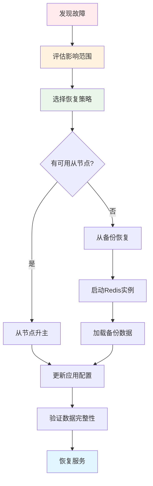

**数据备份恢复**：
```bash
# 1. 停止Redis服务
sudo systemctl stop redis

# 2. 备份数据文件
cp /var/lib/redis/dump.rdb /backup/
cp /var/lib/redis/appendonly.aof /backup/

# 3. 恢复数据
cp /backup/dump.rdb /var/lib/redis/
cp /backup/appendonly.aof /var/lib/redis/

# 4. 启动Redis服务
sudo systemctl start redis

# 5. 验证数据
redis-cli
> DBSIZE
> GET test_key
```

**集群故障恢复**：
```bash
# 1. 检查集群状态
redis-cli -c -p 7000 cluster nodes

# 2. 手动故障转移
redis-cli -c -p 7001 cluster failover

# 3. 添加新节点
redis-cli --cluster add-node new_node_ip:port existing_node_ip:port

# 4. 重新分配槽位
redis-cli --cluster reshard cluster_node_ip:port
```

#### 性能调优建议

**系统级优化**：
```bash
# 内核参数优化
echo 'vm.overcommit_memory = 1' >> /etc/sysctl.conf
echo 'net.core.somaxconn = 65535' >> /etc/sysctl.conf
echo 'vm.swappiness = 1' >> /etc/sysctl.conf

# 禁用透明大页
echo never > /sys/kernel/mm/transparent_hugepage/enabled
```

**Redis配置优化**：
```
# redis.conf
maxclients 10000
tcp-backlog 511
tcp-keepalive 60
timeout 0

# 持久化优化
save 900 1
save 300 10
save 60 10000
stop-writes-on-bgsave-error no

# 内存优化
maxmemory 8gb
maxmemory-policy allkeys-lru
```

**应用层优化**：
- 使用连接池管理连接
- 合理使用Pipeline和批量命令
- 设置合理的超时时间
- 监控慢查询并及时优化

## Redis 典型面试题与答疑

### 基础概念面试题

#### 1. Redis是什么？有什么特点？

**答案**：
Redis（Remote Dictionary Server）是一个开源的、基于内存的键值对数据库，具有以下特点：

- **高性能**：基于内存存储，单机可达10万+QPS
- **丰富的数据结构**：支持String、List、Set、Hash、ZSet等
- **持久化**：支持RDB快照和AOF日志两种持久化方式
- **高可用**：支持主从复制、哨兵、集群模式
- **原子性**：所有操作都是原子性的
- **发布订阅**：支持消息发布订阅功能
- **Lua脚本**：支持Lua脚本，保证操作原子性

#### 2. Redis为什么这么快？

**答案**：
1. **基于内存存储**：所有数据都在内存中，避免磁盘I/O
2. **单线程模型**：避免线程切换和锁竞争开销
3. **I/O多路复用**：使用epoll/kqueue等高效处理网络请求
4. **优化的数据结构**：针对性设计的数据结构，如ziplist、intset等
5. **简单的操作**：大部分操作时间复杂度为O(1)

#### 3. Redis单线程为什么能支持高并发？

**答案**：
- **I/O多路复用**：使用select/epoll/kqueue等技术，单线程可以处理多个网络连接
- **基于内存操作**：避免了磁盘I/O的阻塞
- **高效的数据结构和算法**：减少CPU消耗
- **避免线程切换开销**：单线程避免了上下文切换
- **Redis 6.0引入多线程**：在网络I/O处理上使用多线程，核心操作仍是单线程

#### 4. Redis有哪些数据类型？分别适用于什么场景？

**答案**：
| 数据类型 | 应用场景 | 示例 |
|----------|----------|------|
| **String** | 缓存、计数器、分布式锁 | 用户信息缓存、页面访问量 |
| **List** | 消息队列、最新动态 | 微博时间线、任务队列 |
| **Set** | 标签、共同关注、去重 | 用户标签、黑白名单 |
| **Hash** | 对象存储、购物车 | 用户信息、商品属性 |
| **ZSet** | 排行榜、延迟队列 | 游戏排行榜、定时任务 |
| **Bitmap** | 布尔统计、签到 | 用户签到、在线状态 |
| **HyperLogLog** | 基数统计 | UV统计、搜索热词 |
| **Geo** | 地理位置 | 附近的人、打车服务 |

### 架构设计面试题

#### 5. Redis的持久化机制有哪些？如何选择？

**答案**：
Redis支持三种持久化机制：

1. **RDB（快照）**：
   - 优点：文件小、恢复快、性能影响小
   - 缺点：可能丢失最后一次快照后的数据
   - 适用：对数据安全性要求不高，允许少量数据丢失

2. **AOF（日志）**：
   - 优点：数据安全性高、文件可读、支持增量同步
   - 缺点：文件大、恢复慢、性能影响大
   - 适用：对数据安全性要求高，不能容忍数据丢失

3. **混合持久化（Redis 4.0+）**：
   - 结合RDB和AOF的优点
   - AOF重写时先保存RDB格式，再追加AOF格式
   - 推荐使用

**选择建议**：
- 不能容忍数据丢失：AOF + everysec
- 可以容忍少量数据丢失：RDB
- 平衡性能和安全性：混合持久化

#### 6. Redis的主从复制原理是什么？

**答案**：
主从复制分为**全量同步**和**增量同步**：

**全量同步过程**：
1. 从节点发送PSYNC命令给主节点
2. 主节点执行BGSAVE生成RDB文件
3. 主节点将RDB文件发送给从节点
4. 从节点清空本地数据，加载RDB文件
5. 主节点将缓冲区中的写命令发送给从节点

**增量同步过程**：
1. 主节点将写命令写入复制缓冲区
2. 主节点将命令发送给从节点
3. 从节点执行收到的命令

**复制优化**：
- 无盘复制：直接通过网络传输，避免磁盘I/O
- 部分重同步：从节点短暂断线后只同步差异数据

#### 7. Redis集群的数据分片原理？

**答案**：
Redis集群使用**哈希槽（Hash Slot）** 进行数据分片：

1. **槽位分配**：集群共有16384个哈希槽，每个节点负责一部分槽
2. **Key映射**：根据CRC16(key) % 16384计算key属于哪个槽
3. **节点路由**：客户端根据槽位找到对应的节点

**优势**：
- 数据分布均匀
- 支持在线迁移槽位
- 客户端可以直接路由到正确节点

**集群扩容**：
```bash
# 添加新节点
redis-cli --cluster add-node new_node existing_node

# 重新分配槽位
redis-cli --cluster reshard cluster_node
```

### 性能优化面试题

#### 8. 如何解决Redis缓存穿透、缓存击穿、缓存雪崩？

**答案**：

**缓存穿透**：查询不存在的数据，每次都要查询数据库
- **解决方案**：
  - 布隆过滤器：预先过滤不存在的key
  - 空值缓存：将空结果也缓存，设置较短过期时间
  - 参数校验：在接口层校验参数合法性

**缓存击穿**：热点key过期，大量请求同时访问数据库
- **解决方案**：
  - 分布式锁：只允许一个线程重建缓存
  - 热点数据永不过期：异步更新
  - 多级缓存：本地缓存+Redis缓存

**缓存雪崩**：大量key同时过期，数据库压力激增
- **解决方案**：
  - 过期时间随机化：避免同时过期
  - 热点数据预加载：提前刷新即将过期的数据
  - 多级缓存：降低对Redis的依赖
  - 熔断限流：保护数据库

#### 9. Redis如何实现分布式锁？有什么问题？

**答案**：
**基本实现**：
```
# 获取锁
SET lock_key unique_value NX PX 10000

# 释放锁（Lua脚本保证原子性）
if redis.call('get', KEYS[1]) == ARGV[1] then
    return redis.call('del', KEYS[1])
else
    return 0
end
```

**存在的问题**：
1. **锁超时问题**：任务执行时间超过锁过期时间
2. **主从切换问题**：主节点宕机可能导致锁丢失
3. **时钟跳跃问题**：系统时钟不一致

**改进方案**：
1. **看门狗机制**：自动续期锁的过期时间
2. **Redlock算法**：在多个Redis实例上获取锁
3. **基于ZooKeeper**：使用ZooKeeper的临时顺序节点

#### 10. Redis内存优化有哪些方法？

**答案**：
1. **数据结构优化**：
   - 使用Hash代替String存储对象
   - 利用压缩编码（ziplist、intset）
   - 合理设置压缩阈值

2. **键名优化**：
   - 避免过长的键名
   - 使用统一的命名规范
   - 合理使用分隔符

3. **过期策略**：
   - 设置合理的过期时间
   - 避免大量key同时过期
   - 使用LRU等淘汰策略

4. **内存回收**：
   - 定期清理无用数据
   - 监控内存碎片率
   - 必要时重启整理内存

### 运维监控面试题

#### 11. Redis的监控指标有哪些？如何监控？

**答案**：
**关键监控指标**：
- **性能指标**：QPS、延迟、命中率、慢查询数量
- **内存指标**：内存使用量、内存碎片率、淘汰key数量
- **连接指标**：连接数、阻塞客户端数、拒绝连接数
- **持久化指标**：RDB/AOF文件大小、持久化耗时

**监控方法**：
```bash
# 基础监控
INFO all
INFO memory
SLOWLOG GET

# 实时监控
redis-cli --stat
redis-cli --latency

# 第三方工具
redis-stat
RedisInsight
Prometheus + Grafana
```

#### 12. Redis出现OOM如何排查和解决？

**答案**：
**排查步骤**：
1. **检查内存使用**：
   ```bash
   INFO memory
   CONFIG GET maxmemory
   ```

2. **找出大Key**：
   ```bash
   redis-cli --bigkeys
   MEMORY USAGE key
   ```

3. **分析内存分布**：
   ```bash
   MEMORY STATS
   ```

**解决方案**：
1. **增加内存**：提高maxmemory配置
2. **优化数据结构**：拆分大key，使用更高效的数据结构
3. **设置淘汰策略**：配置合适的maxmemory-policy
4. **清理无用数据**：删除过期或无用的key

### 实际应用面试题

#### 13. 设计一个分布式计数器，要求高并发、高可靠？

**答案**：
**方案设计**：
1. **数据分片**：将计数器拆分到多个key
   ```
   counter:user:1001:0
   counter:user:1001:1
   counter:user:1001:2
   ```

2. **读写分离**：
   - 写操作：随机选择一个分片进行INCR
   - 读操作：汇总所有分片的值

3. **容错处理**：
   - 使用Redis集群保证高可用
   - 设置合理的超时和重试机制

4. **实现代码**：
   ```java
   public class DistributedCounter {
       private JedisCluster jedisCluster;
       private int shardCount = 10;
       
       public void increment(String key) {
           int shard = ThreadLocalRandom.current().nextInt(shardCount);
           String shardKey = key + ":" + shard;
           jedisCluster.incr(shardKey);
       }
       
       public long getCount(String key) {
           long total = 0;
           for (int i = 0; i < shardCount; i++) {
               String shardKey = key + ":" + i;
               String value = jedisCluster.get(shardKey);
               if (value != null) {
                   total += Long.parseLong(value);
               }
           }
           return total;
       }
   }
   ```

#### 14. 如何设计一个基于Redis的延迟队列？

**答案**：
**方案一：基于ZSet**
```java
public class DelayQueue {
    private JedisPool jedisPool;
    
    // 添加延迟任务
    public void addTask(String task, long delaySeconds) {
        long score = System.currentTimeMillis() + delaySeconds * 1000;
        try (Jedis jedis = jedisPool.getResource()) {
            jedis.zadd("delay_queue", score, task);
        }
    }
    
    // 获取到期任务
    public List<String> getExpiredTasks() {
        long now = System.currentTimeMillis();
        try (Jedis jedis = jedisPool.getResource()) {
            Set<String> tasks = jedis.zrangeByScore("delay_queue", 0, now);
            if (!tasks.isEmpty()) {
                jedis.zremrangeByScore("delay_queue", 0, now);
            }
            return new ArrayList<>(tasks);
        }
    }
}
```

**方案二：基于多个List + 时间轮**
- 按时间分片创建多个List
- 使用定时器扫描对应时间片的List
- 适合大规模、高精度的延迟任务

#### 15. 在电商秒杀场景中，如何使用Redis？

**答案**：
**秒杀系统Redis应用**：

1. **库存管理**：
   ```
   # 预设库存
   SET product:1001:stock 100
   
   # 原子减库存
   EVAL "
   local stock = redis.call('get', KEYS[1])
   if stock and tonumber(stock) > 0 then
       return redis.call('decr', KEYS[1])
   else
       return -1
   end
   " 1 product:1001:stock
   ```

2. **用户限制**：
   ```
   # 用户购买次数限制
   INCR user:1001:buy_count:product:1001
   EXPIRE user:1001:buy_count:product:1001 86400
   ```

3. **防重复提交**：
   ```
   # 订单幂等性
   SET order:token:abc123 1 NX EX 300
   ```

4. **热点数据缓存**：
   ```
   # 商品信息缓存
   HSET product:1001 name "iPhone15" price 6999 description "最新款"
   ```

5. **实时统计**：
   ```
   # 秒杀进度
   INCR seckill:1001:sold_count
   ```

**完整流程**：
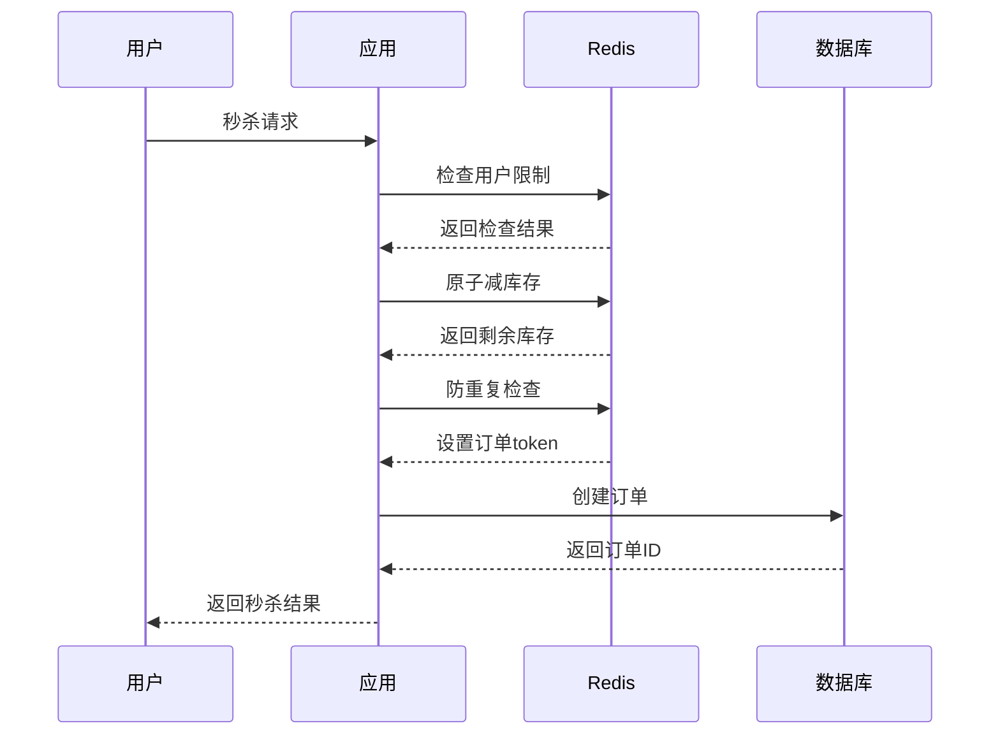

这样的设计能够：
- 保证库存准确性（原子操作）
- 防止超卖（库存检查）
- 限制用户行为（防刷单）
- 提高系统性能（缓存热点数据）
- 保证幂等性（防重复提交）