# 23. MySQL

## 目录
- [23. MySQL](#23-mysql)
  - [目录](#目录)
  - [MySQL 基础概念](#mysql-基础概念)
    - [MySQL 简介](#mysql-简介)
    - [MySQL 特点与优势](#mysql-特点与优势)
      - [1. 性能优势](#1-性能优势)
      - [2. 可靠性保障](#2-可靠性保障)
      - [3. 易用性特点](#3-易用性特点)
      - [4. 扩展性设计](#4-扩展性设计)
    - [MySQL 版本演进](#mysql-版本演进)
      - [重要版本里程碑](#重要版本里程碑)
      - [MySQL 8.0 重大改进](#mysql-80-重大改进)
    - [MySQL 应用场景](#mysql-应用场景)
      - [1. Web应用开发](#1-web应用开发)
      - [2. 企业级应用](#2-企业级应用)
      - [3. 大数据分析](#3-大数据分析)
      - [4. 移动应用后端](#4-移动应用后端)
      - [5. 物联网(IoT)应用](#5-物联网iot应用)
      - [6. 游戏行业应用](#6-游戏行业应用)
      - [7. 金融科技领域](#7-金融科技领域)
      - [8. 教育行业应用](#8-教育行业应用)
  - [MySQL 架构与存储引擎](#mysql-架构与存储引擎)
    - [MySQL 整体架构](#mysql-整体架构)
      - [连接层](#连接层)
      - [服务层](#服务层)
      - [存储引擎层](#存储引擎层)
      - [文件系统层](#文件系统层)
    - [存储引擎对比](#存储引擎对比)
      - [InnoDB 存储引擎](#innodb-存储引擎)
      - [MyISAM 存储引擎](#myisam-存储引擎)
      - [Memory 存储引擎](#memory-存储引擎)
      - [其他存储引擎](#其他存储引擎)
    - [InnoDB 内部结构](#innodb-内部结构)
      - [缓冲池 (Buffer Pool)](#缓冲池-buffer-pool)
      - [重做日志 (Redo Log)](#重做日志-redo-log)
      - [撤销日志 (Undo Log)](#撤销日志-undo-log)
      - [二进制日志 (Binary Log)](#二进制日志-binary-log)
  - [数据类型与表设计](#数据类型与表设计)
    - [MySQL 数据类型](#mysql-数据类型)
      - [数值类型](#数值类型)
      - [字符串类型](#字符串类型)
      - [日期时间类型](#日期时间类型)
      - [JSON 数据类型](#json-数据类型)
    - [表设计最佳实践](#表设计最佳实践)
      - [表结构设计原则](#表结构设计原则)
      - [字段类型选择](#字段类型选择)
      - [主键设计策略](#主键设计策略)
      - [外键约束使用](#外键约束使用)
    - [字符集与排序规则](#字符集与排序规则)
      - [字符集选择](#字符集选择)
      - [排序规则配置](#排序规则配置)
      - [字符集转换](#字符集转换)
  - [索引原理与优化](#索引原理与优化)
    - [索引基础概念](#索引基础概念)
      - [索引定义与作用](#索引定义与作用)
      - [索引分类](#索引分类)
      - [索引数据结构](#索引数据结构)
    - [B+树索引原理](#b树索引原理)
      - [B+树结构特点](#b树结构特点)
      - [索引查找过程](#索引查找过程)
      - [聚簇索引与非聚簇索引](#聚簇索引与非聚簇索引)
    - [索引使用策略](#索引使用策略)
      - [单列索引](#单列索引)
      - [复合索引](#复合索引)
      - [覆盖索引](#覆盖索引)
      - [前缀索引](#前缀索引)
    - [索引优化技巧](#索引优化技巧)
      - [索引失效场景](#索引失效场景)
      - [索引选择性分析](#索引选择性分析)
      - [索引维护策略](#索引维护策略)
  - [SQL语句优化](#sql语句优化)
    - [查询优化基础](#查询优化基础)
      - [执行计划分析](#执行计划分析)
      - [查询成本分析](#查询成本分析)
    - [SELECT 查询优化](#select-查询优化)
      - [WHERE 条件优化](#where-条件优化)
      - [JOIN 连接优化](#join-连接优化)
      - [LIMIT 分页优化](#limit-分页优化)
    - [DML 语句优化](#dml-语句优化)
      - [INSERT 插入优化](#insert-插入优化)
      - [UPDATE 更新优化](#update-更新优化)
    - [子查询与表连接](#子查询与表连接)
      - [子查询优化](#子查询优化)
      - [EXISTS vs IN](#exists-vs-in)
  - [事务与锁机制](#事务与锁机制)
    - [事务基础概念](#事务基础概念)
      - [ACID 特性](#acid-特性)
      - [事务隔离级别](#事务隔离级别)
      - [事务控制语句](#事务控制语句)
    - [并发控制问题](#并发控制问题)
      - [脏读 (Dirty Read)](#脏读-dirty-read)
      - [不可重复读 (Non-Repeatable Read)](#不可重复读-non-repeatable-read)
      - [幻读 (Phantom Read)](#幻读-phantom-read)
      - [丢失更新 (Lost Update)](#丢失更新-lost-update)
    - [InnoDB 锁机制](#innodb-锁机制)
      - [锁的分类](#锁的分类)
      - [行级锁详解](#行级锁详解)
      - [表级锁与意向锁](#表级锁与意向锁)
      - [死锁检测与处理](#死锁检测与处理)
      - [MVCC多版本并发控制](#mvcc多版本并发控制)
  - [性能监控与调优](#性能监控与调优)
    - [性能监控指标](#性能监控指标)
      - [系统级监控](#系统级监控)
      - [数据库级监控](#数据库级监控)
      - [SQL级监控](#sql级监控)
    - [慢查询分析](#慢查询分析)
      - [慢查询日志配置](#慢查询日志配置)
      - [慢查询分析工具](#慢查询分析工具)
      - [慢查询优化策略](#慢查询优化策略)
    - [性能调优实践](#性能调优实践)
      - [配置参数优化](#配置参数优化)
      - [硬件资源优化](#硬件资源优化)
      - [系统级优化](#系统级优化)
  - [备份与恢复](#备份与恢复)
    - [备份策略设计](#备份策略设计)
      - [备份类型选择](#备份类型选择)
      - [备份方案设计](#备份方案设计)
        - [RTO与RPO指标](#rto与rpo指标)
        - [备份频率规划](#备份频率规划)
    - [逻辑备份](#逻辑备份)
      - [mysqldump详解](#mysqldump详解)
    - [物理备份](#物理备份)
      - [MySQL Enterprise Backup](#mysql-enterprise-backup)
      - [Percona XtraBackup](#percona-xtrabackup)
      - [快照备份](#快照备份)
    - [恢复操作](#恢复操作)
      - [完全恢复](#完全恢复)
      - [时间点恢复](#时间点恢复)
      - [灾难恢复](#灾难恢复)
  - [主从复制与高可用](#主从复制与高可用)
    - [主从复制原理](#主从复制原理)
      - [复制机制详解](#复制机制详解)
      - [复制格式对比](#复制格式对比)
      - [GTID复制](#gtid复制)
    - [复制架构设计](#复制架构设计)
      - [一主多从架构](#一主多从架构)
      - [主主复制架构](#主主复制架构)
      - [级联复制架构](#级联复制架构)
    - [高可用解决方案](#高可用解决方案)
      - [MHA高可用架构](#mha高可用架构)
      - [MySQL Group Replication](#mysql-group-replication)
      - [ProxySQL负载均衡](#proxysql负载均衡)
  - [分区表设计](#分区表设计)
    - [分区类型详解](#分区类型详解)
      - [RANGE分区](#range分区)
      - [LIST分区](#list分区)
      - [HASH分区](#hash分区)
      - [KEY分区](#key分区)
  - [分库分表实践](#分库分表实践)
    - [垂直拆分](#垂直拆分)
    - [水平拆分](#水平拆分)
  - [实际应用与最佳实践](#实际应用与最佳实践)
    - [电商系统数据库设计](#电商系统数据库设计)
      - [核心表结构设计](#核心表结构设计)
        - [用户模块](#用户模块)
        - [商品模块](#商品模块)
        - [订单模块](#订单模块)
        - [支付模块](#支付模块)
        - [金融系统数据库设计](#金融系统数据库设计)
          - [账户与交易系统](#账户与交易系统)
      - [业务逻辑实现](#业务逻辑实现)
        - [库存管理](#库存管理)
        - [订单状态流转](#订单状态流转)
      - [金融系统数据库设计](#金融系统数据库设计)
        - [账户表设计](#账户表设计)
        - [交易记录表设计](#交易记录表设计)
        - [转账事务处理](#转账事务处理)
  - [MySQL 高频面试题](#mysql-高频面试题)
    - [基础概念题](#基础概念题)
      - [1. MySQL存储引擎对比](#1-mysql存储引擎对比)
      - [2. MySQL索引类型和原理](#2-mysql索引类型和原理)
      - [3. 事务隔离级别详解](#3-事务隔离级别详解)
    - [性能优化题](#性能优化题)
      - [4. 慢查询优化实战](#4-慢查询优化实战)
      - [5. 大表分页优化](#5-大表分页优化)
    - [架构设计题](#架构设计题)
      - [6. 主从复制延迟问题](#6-主从复制延迟问题)
      - [7. 数据库连接池设计](#7-数据库连接池设计)
    - [实战应用题](#实战应用题)
      - [8. 秒杀系统数据库设计](#8-秒杀系统数据库设计)
      - [9. 数据库选型决策](#9-数据库选型决策)

--- 

## MySQL 基础概念

### MySQL 简介

**MySQL** 是世界上最流行的开源关系型数据库管理系统之一，由瑞典MySQL AB公司开发，现在由Oracle公司维护。MySQL以其高性能、可靠性和易用性而著称，广泛应用于Web应用程序、企业级应用和大型网站。

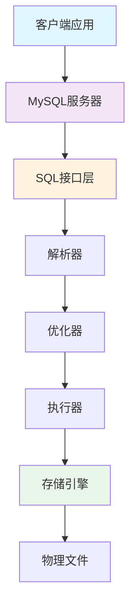

**MySQL核心特点**：
- **开源免费**：基于GPL许可证，有商业许可版本
- **跨平台**：支持Linux、Windows、macOS等多种操作系统
- **多存储引擎**：支持InnoDB、MyISAM、Memory等多种存储引擎
- **高性能**：经过优化的查询引擎，支持大型数据库应用
- **ACID兼容**：完全支持事务的ACID特性
- **可扩展**：支持主从复制、集群、分片等扩展方案

### MySQL 特点与优势

#### 1. 性能优势
- **查询优化器**：智能的SQL查询优化器，自动选择最优执行路径
- **索引支持**：支持B+树、哈希、全文索引等多种索引类型
- **缓存机制**：查询缓存、InnoDB缓冲池等多级缓存
- **并发处理**：支持大量并发连接和事务处理

#### 2. 可靠性保障
- **事务支持**：完整的ACID事务特性
- **数据完整性**：支持主键、外键、唯一性等约束
- **故障恢复**：自动崩溃恢复、二进制日志、增量备份
- **复制机制**：主从复制保证数据冗余和高可用

#### 3. 易用性特点
- **标准SQL**：遵循SQL标准，语法简洁易懂
- **丰富工具**：MySQL Workbench、phpMyAdmin等图形化管理工具
- **完善文档**：详细的官方文档和社区支持
- **API支持**：支持多种编程语言的连接库

#### 4. 扩展性设计
- **水平扩展**：支持读写分离、分库分表
- **垂直扩展**：支持硬件升级、配置优化
- **集群方案**：MySQL Cluster、Galera Cluster等
- **云原生**：支持容器化部署、云数据库服务

### MySQL 版本演进

#### 重要版本里程碑

| 版本 | 发布时间 | 主要特性 |
|------|----------|----------|
| **MySQL 3.23** | 2001年 | MyISAM存储引擎、全文索引 |
| **MySQL 4.0** | 2003年 | 查询缓存、InnoDB事务支持 |
| **MySQL 4.1** | 2004年 | 子查询、Unicode支持 |
| **MySQL 5.0** | 2005年 | 存储过程、触发器、视图 |
| **MySQL 5.1** | 2008年 | 分区表、事件调度器 |
| **MySQL 5.5** | 2010年 | **InnoDB为默认引擎**、半同步复制 |
| **MySQL 5.6** | 2013年 | GTID复制、Online DDL、性能改进 |
| **MySQL 5.7** | 2015年 | **JSON数据类型**、Generated Columns、性能大幅提升 |
| **MySQL 8.0** | 2018年 | **窗口函数**、CTE、原子DDL、角色管理 |

#### MySQL 8.0 重大改进
1. **性能提升**：
   - 默认字符集从latin1改为utf8mb4
   - 改进的优化器统计信息
   - 更好的内存使用和锁定算法

2. **新功能特性**：
   - **窗口函数**：ROW_NUMBER()、RANK()、LAG()等
   - **公用表表达式(CTE)**：WITH子句支持递归查询
   - **JSON增强**：JSON_TABLE()、JSON聚合函数
   - **原子DDL**：DDL操作的原子性保证

3. **安全性增强**：
   - 默认身份验证插件caching_sha2_password
   - 角色管理和密码验证组件
   - 数据字典加密

4. **管理性改进**：
   - 不可见索引和降序索引
   - 资源组管理
   - 改进的复制功能

### MySQL 应用场景

#### 1. Web应用开发
MySQL是LAMP/LNMP技术栈的重要组成部分，广泛用于：
- **内容管理系统**：WordPress、Drupal、Joomla
- **电商平台**：Magento、OpenCart
- **社交网络**：Facebook早期使用MySQL
- **博客系统**：各种CMS和个人博客

**典型架构**：
```
[Web服务器] --> [应用服务器] --> [MySQL数据库]
     |              |                   |
   nginx/Apache   PHP/Java/Python    InnoDB存储引擎
```

#### 2. 企业级应用
- **ERP系统**：企业资源规划
- **CRM系统**：客户关系管理
- **财务系统**：会计、报表、审计
- **人力资源**：员工管理、薪资系统

**特点要求**：
- 高可靠性和数据一致性
- 复杂的业务逻辑支持
- 严格的权限控制
- 完善的备份恢复机制

#### 3. 大数据分析
虽然MySQL不是专门的大数据工具，但在中等规模数据分析中表现出色：
- **OLAP查询**：使用窗口函数和聚合查询
- **报表生成**：结合BI工具生成业务报表
- **数据仓库**：作为数据集市的存储引擎
- **实时分析**：配合Redis等内存数据库

#### 4. 移动应用后端
- **API服务**：RESTful API的数据存储
- **用户管理**：注册、登录、权限管理
- **内容存储**：文章、图片元信息、评论
- **推送系统**：消息队列和用户偏好存储

#### 5. 物联网(IoT)应用
- **设备数据采集**：传感器数据存储
- **时序数据**：配合时间分区表存储
- **设备管理**：设备注册、状态监控
- **数据分析**：设备行为分析和预测

#### 6. 游戏行业应用
- **玩家数据**：账户信息、游戏进度
- **排行榜系统**：积分、等级排名
- **游戏内经济**：虚拟物品、交易记录
- **日志分析**：游戏行为数据分析

**性能优化重点**：
- 读写分离架构
- 合理的分库分表策略
- 缓存层设计
- 异步处理机制

#### 7. 金融科技领域
- **支付系统**：交易记录、资金流水
- **风控系统**：信用评估、反欺诈
- **投资管理**：组合管理、风险分析
- **数字货币**：钱包管理、交易撮合

**安全要求**：
- 数据加密存储
- 审计日志记录
- 高可用架构
- 灾难恢复方案

#### 8. 教育行业应用
- **学习管理系统**：课程、学员管理
- **在线考试**：题库、成绩管理
- **教学资源**：课件、视频元数据
- **学生信息**：档案、成绩、选课

**特色需求**：
- 学期周期性数据处理
- 大批量成绩导入导出
- 复杂的权限分级管理
- 历史数据长期保存

MySQL凭借其稳定性、性能和生态系统的完善，在各个行业都有广泛应用。合理的架构设计和优化策略是发挥MySQL优势的关键。

## MySQL 架构与存储引擎

### MySQL 整体架构

MySQL采用分层架构设计，从上到下分为连接层、服务层、存储引擎层和文件系统层。

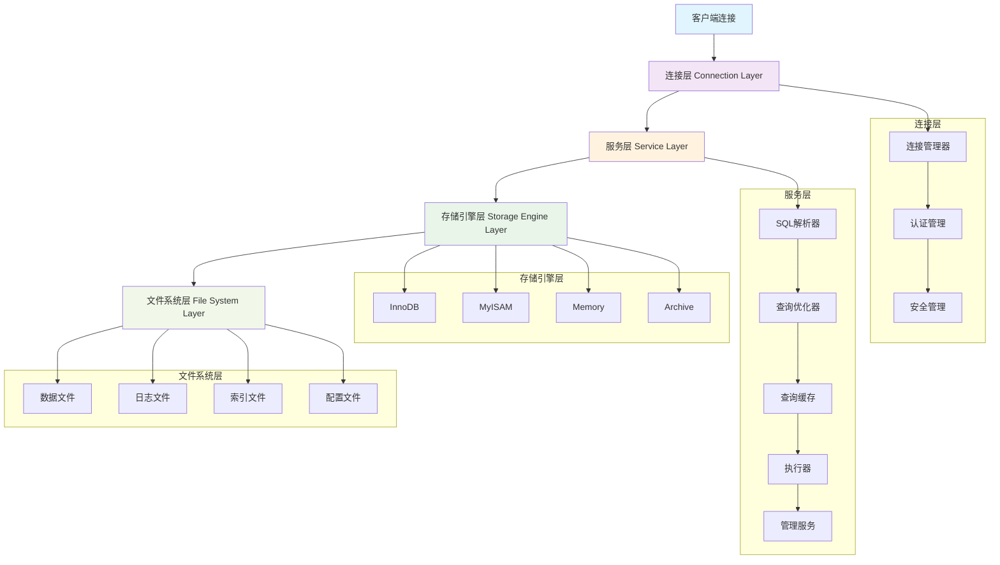

#### 连接层

**连接层**是MySQL的最外层，负责处理客户端连接和用户认证。

**主要组件**：
- **连接管理器**：
  - 管理客户端连接的建立、维护和断开
  - 支持TCP/IP、命名管道、Unix域套接字等连接方式
  - 维护连接池，复用连接资源

- **认证管理**：
  - 验证用户身份和密码
  - 支持多种认证插件（mysql_native_password、caching_sha2_password等）
  - 管理用户权限和访问控制

- **安全管理**：
  - SSL/TLS加密连接
  - IP白名单和防火墙规则
  - 审计日志和安全监控

**连接过程**：
```sql
-- 查看当前连接
SHOW PROCESSLIST;

-- 查看连接数配置
SHOW VARIABLES LIKE 'max_connections';
SHOW VARIABLES LIKE 'max_user_connections';

-- 查看当前连接状态
SHOW STATUS LIKE 'Connections';
SHOW STATUS LIKE 'Threads_connected';
```

#### 服务层

**服务层**包含MySQL的核心功能，负责SQL解析、优化和执行。

**主要组件**：

1. **SQL解析器 (Parser)**：
   - 词法分析：将SQL语句分解为Token
   - 语法分析：构建抽象语法树(AST)
   - 语义分析：检查表、字段是否存在

2. **查询优化器 (Optimizer)**：
   - **基于成本的优化(CBO)**：选择执行成本最低的方案
   - **基于规则的优化(RBO)**：应用预定义的优化规则
   - **执行计划生成**：确定表连接顺序、索引使用策略

3. **查询缓存 (Query Cache)**：
   - 缓存SELECT语句结果
   - 提高相同查询的响应速度
   - MySQL 8.0已移除此功能

4. **执行器 (Executor)**：
   - 根据执行计划调用存储引擎API
   - 处理查询结果并返回给客户端
   - 管理临时表和排序操作

5. **管理服务**：
   - 备份恢复
   - 安全管理
   - 集群管理
   - 性能监控

#### 存储引擎层

**存储引擎层**是MySQL的插件式架构核心，不同存储引擎提供不同的存储和索引策略。

**特点**：
- **插件式架构**：可以为不同的表选择不同的存储引擎
- **统一接口**：存储引擎提供统一的API接口
- **功能差异**：不同引擎在事务、锁定、索引等方面有不同特性

**常用命令**：
```sql
-- 查看支持的存储引擎
SHOW ENGINES;

-- 查看表的存储引擎
SHOW TABLE STATUS LIKE 'table_name';

-- 修改表的存储引擎
ALTER TABLE table_name ENGINE = InnoDB;
```

#### 文件系统层

**文件系统层**负责数据的物理存储，包括各种数据文件和日志文件。

**文件类型**：
- **数据文件**：.ibd文件（InnoDB）、.MYD文件（MyISAM）
- **索引文件**：.MYI文件（MyISAM独立索引文件）
- **日志文件**：redo log、undo log、binary log、error log
- **配置文件**：my.cnf、my.ini

### 存储引擎对比

#### InnoDB 存储引擎

**InnoDB**是MySQL的默认存储引擎（MySQL 5.5+），专为高性能和高可靠性设计。

**主要特性**：
- **ACID事务支持**：完整的事务特性
- **行级锁定**：支持行级锁和表级锁
- **外键约束**：支持引用完整性
- **崩溃恢复**：自动崩溃恢复机制
- **MVCC**：多版本并发控制
- **聚簇索引**：数据按主键顺序存储

**适用场景**：
- 需要事务支持的应用
- 高并发读写操作
- 数据一致性要求高
- 在线事务处理(OLTP)

**性能特点**：
```sql
-- InnoDB状态查看
SHOW ENGINE INNODB STATUS;

-- 关键配置参数
SHOW VARIABLES LIKE 'innodb_buffer_pool_size';
SHOW VARIABLES LIKE 'innodb_log_file_size';
SHOW VARIABLES LIKE 'innodb_flush_log_at_trx_commit';
```

#### MyISAM 存储引擎

**MyISAM**是MySQL早期的默认存储引擎，以读取速度快著称。

**主要特性**：
- **表级锁定**：只支持表级锁
- **非事务性**：不支持事务和外键
- **压缩表**：支持表压缩，节省存储空间
- **快速COUNT()**：快速统计表行数
- **全文索引**：早期版本的全文搜索支持

**适用场景**：
- 读多写少的应用
- 数据仓库和分析系统
- 日志和历史数据存储
- 对事务要求不高的场景

**局限性**：
- 不支持事务
- 表级锁影响并发性能
- 崩溃后数据恢复困难

#### Memory 存储引擎

**Memory**存储引擎将数据存储在内存中，提供极快的访问速度。

**主要特性**：
- **内存存储**：所有数据存储在RAM中
- **表级锁定**：支持表级锁
- **哈希索引**：默认使用哈希索引
- **固定长度行**：所有行长度相同

**适用场景**：
- 临时数据存储
- 缓存表
- 中间结果集
- 会话数据

**注意事项**：
- 服务器重启数据丢失
- 内存大小限制表大小
- 不支持BLOB和TEXT类型

#### 其他存储引擎

| 存储引擎 | 特点 | 适用场景 |
|----------|------|----------|
| **Archive** | 高压缩比、只支持INSERT和SELECT | 日志归档、历史数据 |
| **CSV** | 以CSV格式存储数据 | 数据交换、导入导出 |
| **Federated** | 访问远程MySQL表 | 分布式数据访问 |
| **NDB Cluster** | 分布式计算、内存存储 | 高可用集群、电信级应用 |
| **BlackHole** | 丢弃写入数据、不存储 | 复制架构、性能测试 |

### InnoDB 内部结构

InnoDB存储引擎的内部结构复杂，理解其工作原理对性能优化至关重要。

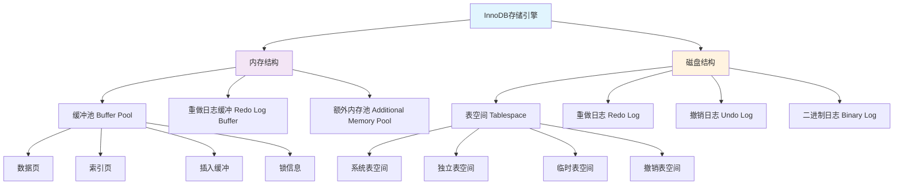

#### 缓冲池 (Buffer Pool)

**缓冲池**是InnoDB最重要的内存结构，用于缓存表数据和索引。

**组成部分**：
- **数据页缓存**：缓存表数据页
- **索引页缓存**：缓存索引页
- **插入缓冲**：优化非聚簇索引的插入
- **自适应哈希索引**：自动创建的哈希索引
- **锁信息**：事务锁信息

**工作原理**：
1. **页面置换算法**：使用改进的LRU算法管理页面
2. **预读机制**：预读相邻页面提高I/O效率
3. **脏页刷新**：定期将修改过的页面写入磁盘

**配置优化**：
```sql
-- 查看缓冲池配置
SHOW VARIABLES LIKE 'innodb_buffer_pool_size';
SHOW VARIABLES LIKE 'innodb_buffer_pool_instances';

-- 查看缓冲池状态
SHOW STATUS LIKE 'Innodb_buffer_pool%';

-- 建议配置（物理内存的70-80%）
SET GLOBAL innodb_buffer_pool_size = 1073741824; -- 1GB
```

#### 重做日志 (Redo Log)

**重做日志**确保事务的持久性，记录所有对InnoDB表的修改。

**工作机制**：
1. **WAL原则**：先写日志，再写数据页(Write-Ahead Logging)
2. **循环写入**：重做日志文件循环使用
3. **检查点**：定期创建检查点，标记已刷新到磁盘的数据

**配置参数**：
```sql
-- 重做日志配置
SHOW VARIABLES LIKE 'innodb_log_file_size';
SHOW VARIABLES LIKE 'innodb_log_files_in_group';
SHOW VARIABLES LIKE 'innodb_flush_log_at_trx_commit';

-- 建议配置
innodb_log_file_size = 256M
innodb_log_files_in_group = 2
innodb_flush_log_at_trx_commit = 1  -- 最高安全性
```

**innodb_flush_log_at_trx_commit参数**：
- **0**：每秒刷新一次，性能最好但可能丢失1秒数据
- **1**：每次事务提交都刷新，最安全但性能最低
- **2**：每次事务提交写入OS缓存，每秒刷新到磁盘

#### 撤销日志 (Undo Log)

**撤销日志**用于实现事务回滚和MVCC多版本并发控制。

**主要功能**：
- **事务回滚**：当事务需要回滚时，使用undo log恢复数据
- **MVCC实现**：为不同事务提供数据的不同版本视图
- **崩溃恢复**：系统崩溃后的数据恢复

**存储位置**：
- **系统表空间**：默认存储在ibdata文件中
- **独立撤销表空间**：MySQL 8.0支持独立的undo表空间

**配置管理**：
```sql
-- 查看撤销日志配置
SHOW VARIABLES LIKE 'innodb_undo_logs';
SHOW VARIABLES LIKE 'innodb_undo_tablespaces';

-- MySQL 8.0配置
SET GLOBAL innodb_undo_log_truncate = ON;
SET GLOBAL innodb_max_undo_log_size = 1073741824; -- 1GB
```

#### 二进制日志 (Binary Log)

**二进制日志**记录所有修改数据的SQL语句，用于主从复制和数据恢复。

**日志格式**：
- **STATEMENT**：记录SQL语句本身
- **ROW**：记录具体的行变更
- **MIXED**：混合模式，自动选择格式

**配置示例**：
```sql
-- 启用二进制日志
log-bin = mysql-bin
binlog_format = ROW
expire_logs_days = 7

-- 查看二进制日志状态
SHOW MASTER STATUS;
SHOW BINARY LOGS;

-- 查看二进制日志内容
SHOW BINLOG EVENTS IN 'mysql-bin.000001';
```

**最佳实践**：
- 生产环境必须启用二进制日志
- 使用ROW格式确保数据一致性
- 定期清理过期的二进制日志
- 监控二进制日志磁盘使用情况 

## 数据类型与表设计

### MySQL 数据类型

MySQL提供了丰富的数据类型，选择合适的数据类型对性能和存储效率至关重要。

#### 数值类型

**整数类型**：

| 类型 | 存储字节 | 有符号范围 | 无符号范围 | 应用场景 |
|------|----------|------------|------------|----------|
| **TINYINT** | 1 | -128 到 127 | 0 到 255 | 年龄、状态标志 |
| **SMALLINT** | 2 | -32,768 到 32,767 | 0 到 65,535 | 计数器、小数值 |
| **MEDIUMINT** | 3 | -8,388,608 到 8,388,607 | 0 到 16,777,215 | 中等范围数值 |
| **INT** | 4 | -2,147,483,648 到 2,147,483,647 | 0 到 4,294,967,295 | **主键ID、数量** |
| **BIGINT** | 8 | -9,223,372,036,854,775,808 到 9,223,372,036,854,775,807 | 0 到 18,446,744,073,709,551,615 | 大数值、时间戳 |

**浮点和定点类型**：

| 类型 | 存储字节 | 精度 | 应用场景 |
|------|----------|------|----------|
| **FLOAT** | 4 | 单精度浮点 | 科学计算、不要求精确的小数 |
| **DOUBLE** | 8 | 双精度浮点 | 高精度科学计算 |
| **DECIMAL(M,D)** | 变长 | 精确定点数 | **金融计算、货币金额** |

**数值类型使用示例**：
```sql
-- 用户表设计
CREATE TABLE users (
    id INT UNSIGNED AUTO_INCREMENT PRIMARY KEY,  -- 无符号整数作为主键
    age TINYINT UNSIGNED,                        -- 年龄：0-255足够
    score DECIMAL(5,2),                          -- 分数：xxx.xx格式
    balance DECIMAL(15,2) NOT NULL DEFAULT 0.00, -- 余额：精确到分
    login_count BIGINT UNSIGNED DEFAULT 0        -- 登录次数：大数值
);

-- 性能对比测试
SELECT 
    BENCHMARK(10000000, id + 1) as int_calc,
    BENCHMARK(10000000, balance + 1.00) as decimal_calc
FROM users LIMIT 1;
```

**数值类型最佳实践**：
- **主键使用INT UNSIGNED AUTO_INCREMENT**
- **金融数据必须使用DECIMAL**，避免浮点数精度问题
- **能用小类型就不用大类型**，节省存储空间
- **考虑使用UNSIGNED**，扩大正数范围

#### 字符串类型

**字符串类型对比**：

| 类型 | 最大长度 | 存储方式 | 适用场景 |
|------|----------|----------|----------|
| **CHAR(M)** | 255字符 | 固定长度，空格填充 | 定长数据（如手机号、身份证） |
| **VARCHAR(M)** | 65,535字符 | 变长，记录实际长度 | **变长字符串（如姓名、地址）** |
| **TEXT** | 65,535字符 | 变长，大文本 | 文章内容、描述信息 |
| **MEDIUMTEXT** | 16,777,215字符 | 变长，中等文本 | 长文章、富文本内容 |
| **LONGTEXT** | 4,294,967,295字符 | 变长，超大文本 | 超长文档、JSON数据 |
| **BINARY(M)** | 255字节 | 固定长度二进制 | 固定长度二进制数据 |
| **VARBINARY(M)** | 65,535字节 | 变长二进制 | 变长二进制数据 |
| **BLOB** | 65,535字节 | 二进制大对象 | 图片、文件等二进制数据 |

**字符串类型实际应用**：
```sql
-- 用户信息表
CREATE TABLE user_profiles (
    id INT UNSIGNED AUTO_INCREMENT PRIMARY KEY,
    username VARCHAR(50) NOT NULL UNIQUE,          -- 用户名：变长，50字符足够
    phone CHAR(11),                                -- 手机号：固定11位
    email VARCHAR(100),                            -- 邮箱：变长，最长100字符
    address VARCHAR(500),                          -- 地址：变长，较长
    bio TEXT,                                      -- 个人简介：大文本
    avatar_data MEDIUMBLOB,                        -- 头像数据：二进制
    settings JSON,                                 -- 用户设置：JSON格式
    created_at TIMESTAMP DEFAULT CURRENT_TIMESTAMP
);

-- 性能测试：CHAR vs VARCHAR
-- CHAR(50) vs VARCHAR(50) 在不同数据长度下的存储对比
SELECT 
    LENGTH('test') as actual_length,
    CHAR_LENGTH(CHAR_FIELD) as char_storage,
    CHAR_LENGTH(VARCHAR_FIELD) as varchar_storage
FROM test_table;
```

**字符串类型选择原则**：
- **固定长度数据使用CHAR**（如手机号、身份证号）
- **变长数据使用VARCHAR**（如姓名、地址）
- **大文本使用TEXT系列**，但避免在WHERE中使用
- **二进制数据使用BLOB系列**
- **尽量指定合适的长度**，避免过大造成浪费

#### 日期时间类型

**日期时间类型详解**：

| 类型 | 存储字节 | 格式 | 范围 | 时区相关 | 应用场景 |
|------|----------|------|------|----------|----------|
| **DATE** | 3 | YYYY-MM-DD | 1000-01-01 到 9999-12-31 | 否 | 生日、入职日期 |
| **TIME** | 3 | HH:MM:SS | -838:59:59 到 838:59:59 | 否 | 时间段、持续时间 |
| **DATETIME** | 8 | YYYY-MM-DD HH:MM:SS | 1000-01-01 00:00:00 到 9999-12-31 23:59:59 | 否 | **记录创建时间** |
| **TIMESTAMP** | 4 | YYYY-MM-DD HH:MM:SS | 1970-01-01 00:00:01 到 2038-01-19 03:14:07 | 是 | **自动更新时间** |
| **YEAR** | 1 | YYYY | 1901 到 2155 | 否 | 年份字段 |

**日期时间类型实际应用**：
```sql
-- 订单表设计
CREATE TABLE orders (
    id INT UNSIGNED AUTO_INCREMENT PRIMARY KEY,
    user_id INT UNSIGNED NOT NULL,
    order_date DATE NOT NULL,                      -- 订单日期
    order_time TIME,                               -- 下单时间点
    created_at DATETIME DEFAULT CURRENT_TIMESTAMP, -- 创建时间
    updated_at TIMESTAMP DEFAULT CURRENT_TIMESTAMP 
               ON UPDATE CURRENT_TIMESTAMP,        -- 自动更新时间
    delivery_year YEAR,                            -- 发货年份
    
    INDEX idx_order_date (order_date),
    INDEX idx_created_at (created_at)
);

-- 日期时间查询示例
SELECT 
    id,
    order_date,
    DATE_FORMAT(created_at, '%Y-%m-%d %H:%i:%s') as formatted_time,
    YEAR(created_at) as order_year,
    MONTH(created_at) as order_month,
    DAYOFWEEK(created_at) as weekday
FROM orders 
WHERE created_at >= DATE_SUB(NOW(), INTERVAL 30 DAY);

-- 时区处理
SELECT 
    created_at,
    CONVERT_TZ(created_at, '+00:00', '+08:00') as beijing_time
FROM orders;
```

**日期时间类型最佳实践**：
- **记录时间使用DATETIME**，不受时区影响
- **自动时间戳使用TIMESTAMP**，支持自动更新
- **只需要日期使用DATE**，节省存储空间
- **注意TIMESTAMP的2038年问题**
- **合理使用索引优化日期查询**

#### JSON 数据类型

MySQL 5.7引入了原生JSON数据类型，提供了强大的JSON处理能力。

**JSON类型特点**：
- **原生存储**：二进制格式存储，查询效率高
- **自动验证**：插入时自动验证JSON格式
- **丰富函数**：提供完整的JSON操作函数
- **索引支持**：支持虚拟列索引

**JSON使用示例**：
```sql
-- 用户配置表
CREATE TABLE user_configs (
    id INT UNSIGNED AUTO_INCREMENT PRIMARY KEY,
    user_id INT UNSIGNED NOT NULL,
    config JSON NOT NULL,
    created_at TIMESTAMP DEFAULT CURRENT_TIMESTAMP,
    
    INDEX idx_user_id (user_id)
);

-- 插入JSON数据
INSERT INTO user_configs (user_id, config) VALUES 
(1, '{"theme": "dark", "language": "zh-CN", "notifications": {"email": true, "sms": false}}'),
(2, '{"theme": "light", "language": "en-US", "notifications": {"email": false, "sms": true}}');

-- JSON查询和操作
SELECT 
    user_id,
    JSON_EXTRACT(config, '$.theme') as theme,
    config->'$.language' as language,               -- 简化语法
    config->>'$.notifications.email' as email_notify, -- 去除引号
    JSON_KEYS(config->'$.notifications') as notify_keys
FROM user_configs;

-- JSON修改
UPDATE user_configs 
SET config = JSON_SET(config, '$.theme', 'auto', '$.version', '1.0')
WHERE user_id = 1;

-- JSON数组操作
SELECT 
    JSON_ARRAY('apple', 'banana', 'orange') as fruits,
    JSON_OBJECT('name', 'John', 'age', 30) as person;

-- 创建虚拟列索引提高JSON查询性能
ALTER TABLE user_configs 
ADD COLUMN theme_virtual VARCHAR(20) 
GENERATED ALWAYS AS (config->>'$.theme') VIRTUAL,
ADD INDEX idx_theme (theme_virtual);
```

**JSON最佳实践**：
- **适用于配置信息、用户偏好等半结构化数据**
- **使用虚拟列索引提高查询性能**
- **避免存储过于复杂的嵌套结构**
- **考虑数据一致性，必要时使用关系表**

### 表设计最佳实践

#### 表结构设计原则

**1. 遵循数据库范式**

**第一范式（1NF）**：
- 每个列都是不可分割的原子数据项
- 不允许有重复的列

```sql
-- 错误设计：违反1NF
CREATE TABLE orders_bad (
    id INT PRIMARY KEY,
    customer_info VARCHAR(500)  -- 包含姓名、电话、地址等多个信息
);

-- 正确设计：符合1NF
CREATE TABLE orders_good (
    id INT PRIMARY KEY,
    customer_name VARCHAR(100),
    customer_phone CHAR(11),
    customer_address VARCHAR(300)
);
```

**第二范式（2NF）**：
- 符合1NF，且非主键列完全依赖于主键

```sql
-- 错误设计：违反2NF
CREATE TABLE order_items_bad (
    order_id INT,
    product_id INT,
    product_name VARCHAR(100),    -- 依赖于product_id，不依赖于组合主键
    product_price DECIMAL(10,2),  -- 依赖于product_id，不依赖于组合主键
    quantity INT,
    PRIMARY KEY (order_id, product_id)
);

-- 正确设计：符合2NF，拆分表
CREATE TABLE products (
    id INT PRIMARY KEY,
    name VARCHAR(100),
    price DECIMAL(10,2)
);

CREATE TABLE order_items (
    order_id INT,
    product_id INT,
    quantity INT,
    PRIMARY KEY (order_id, product_id),
    FOREIGN KEY (product_id) REFERENCES products(id)
);
```

**第三范式（3NF）**：
- 符合2NF，且非主键列不传递依赖于主键

**2. 表设计基本原则**

```sql
-- 优秀的表设计示例
CREATE TABLE users (
    -- 主键设计
    id INT UNSIGNED AUTO_INCREMENT PRIMARY KEY,
    
    -- 基本信息：选择合适的数据类型
    username VARCHAR(50) NOT NULL UNIQUE COMMENT '用户名',
    email VARCHAR(100) NOT NULL UNIQUE COMMENT '邮箱',
    phone CHAR(11) COMMENT '手机号',
    
    -- 状态字段：使用枚举或小整数
    status TINYINT UNSIGNED DEFAULT 1 COMMENT '状态：1-正常，2-禁用，3-删除',
    gender ENUM('M', 'F', 'U') DEFAULT 'U' COMMENT '性别：M-男，F-女，U-未知',
    
    -- 时间字段：标准化
    birthday DATE COMMENT '生日',
    created_at DATETIME DEFAULT CURRENT_TIMESTAMP COMMENT '创建时间',
    updated_at TIMESTAMP DEFAULT CURRENT_TIMESTAMP ON UPDATE CURRENT_TIMESTAMP COMMENT '更新时间',
    
    -- 索引设计
    INDEX idx_username (username),
    INDEX idx_email (email),
    INDEX idx_phone (phone),
    INDEX idx_status (status),
    INDEX idx_created_at (created_at)
) ENGINE=InnoDB DEFAULT CHARSET=utf8mb4 COLLATE=utf8mb4_unicode_ci COMMENT='用户表';
```

#### 字段类型选择

**1. 主键设计策略**

```sql
-- 策略1：自增整数主键（推荐）
CREATE TABLE orders (
    id INT UNSIGNED AUTO_INCREMENT PRIMARY KEY,  -- 简单、高效、有序
    order_no VARCHAR(32) NOT NULL UNIQUE,        -- 业务编号作为唯一索引
    -- 其他字段...
);

-- 策略2：UUID主键（分布式场景）
CREATE TABLE distributed_orders (
    id CHAR(36) PRIMARY KEY DEFAULT (UUID()),    -- UUID保证全局唯一
    -- 其他字段...
);

-- 策略3：雪花算法ID（推荐分布式场景）
CREATE TABLE snowflake_orders (
    id BIGINT UNSIGNED PRIMARY KEY,              -- 雪花算法生成的ID
    -- 其他字段...
);
```

**2. 状态字段设计**

```sql
-- 使用ENUM类型
CREATE TABLE orders (
    id INT UNSIGNED AUTO_INCREMENT PRIMARY KEY,
    status ENUM('pending', 'paid', 'shipped', 'delivered', 'cancelled') 
           DEFAULT 'pending' COMMENT '订单状态',
    -- 其他字段...
);

-- 使用TINYINT + 常量定义（推荐）
CREATE TABLE orders_v2 (
    id INT UNSIGNED AUTO_INCREMENT PRIMARY KEY,
    status TINYINT UNSIGNED DEFAULT 1 COMMENT '状态：1-待付款，2-已付款，3-已发货，4-已送达，5-已取消',
    INDEX idx_status (status)
);
```

**3. 金融字段设计**

```sql
CREATE TABLE financial_records (
    id INT UNSIGNED AUTO_INCREMENT PRIMARY KEY,
    amount DECIMAL(15,2) NOT NULL COMMENT '金额，精确到分',
    currency CHAR(3) DEFAULT 'CNY' COMMENT '货币代码',
    -- 避免使用FLOAT或DOUBLE存储金额
    created_at DATETIME DEFAULT CURRENT_TIMESTAMP
);
```

#### 主键设计策略

**主键选择决策树**：

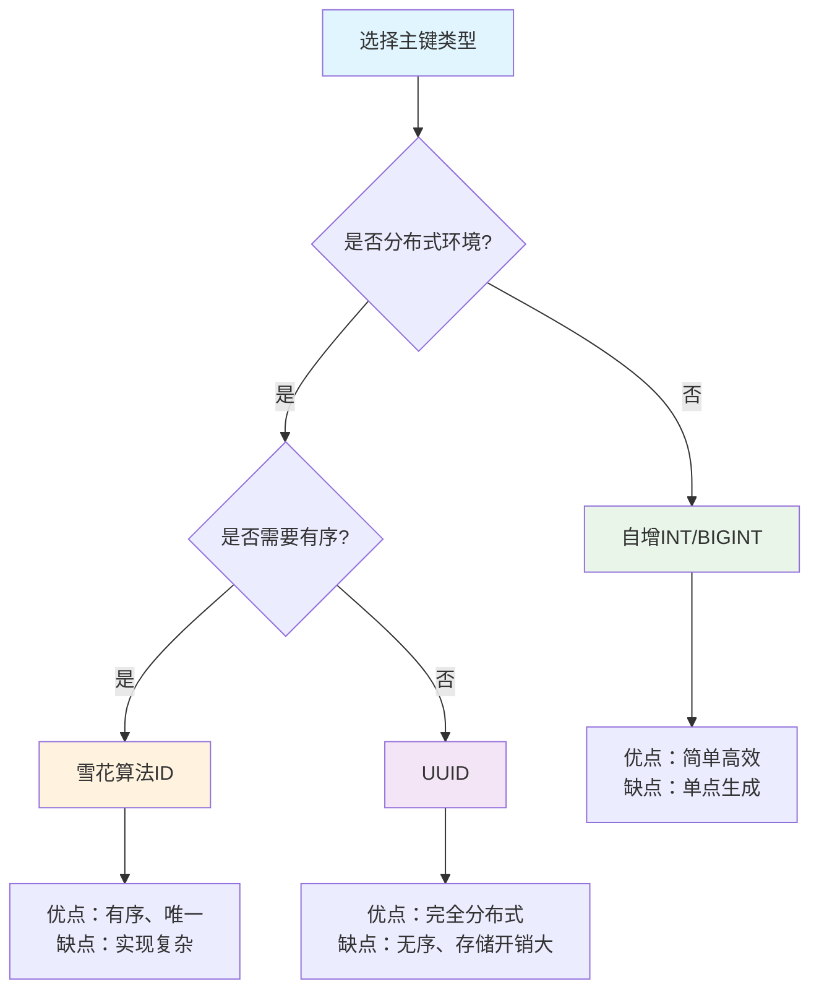

**主键设计比较**：

| 类型 | 存储大小 | 有序性 | 分布式友好 | 性能 | 推荐场景 |
|------|----------|--------|------------|------|----------|
| **AUTO_INCREMENT** | 4/8字节 | 有序 | 否 | 最高 | 单机应用 |
| **UUID** | 36字节 | 无序 | 是 | 较低 | 分布式，对性能要求不高 |
| **雪花算法** | 8字节 | 有序 | 是 | 高 | **分布式应用（推荐）** |

#### 外键约束使用

**外键约束的优缺点**：

**优点**：
- 保证数据完整性
- 防止删除被引用的记录
- 数据库层面的约束保证

**缺点**：
- 影响性能（检查约束）
- 限制操作灵活性
- 分库分表困难

**实际应用策略**：
```sql
-- 开发环境：使用外键保证数据一致性
CREATE TABLE orders (
    id INT UNSIGNED AUTO_INCREMENT PRIMARY KEY,
    user_id INT UNSIGNED NOT NULL,
    FOREIGN KEY (user_id) REFERENCES users(id) ON DELETE CASCADE
);

-- 生产环境：通常不使用外键，在应用层保证一致性
CREATE TABLE orders_prod (
    id INT UNSIGNED AUTO_INCREMENT PRIMARY KEY,
    user_id INT UNSIGNED NOT NULL,
    INDEX idx_user_id (user_id)
    -- 不使用外键，在应用代码中保证数据一致性
);
```

### 字符集与排序规则

#### 字符集选择

**常用字符集对比**：

| 字符集 | 存储字节 | 支持字符 | 适用场景 |
|--------|----------|----------|----------|
| **latin1** | 1字节/字符 | 西欧字符 | 纯英文应用（已不推荐） |
| **utf8** | 1-3字节/字符 | Unicode基本平面 | 兼容性考虑（不推荐新项目） |
| **utf8mb4** | 1-4字节/字符 | 完整Unicode | **推荐使用** |
| **gbk** | 1-2字节/字符 | 中文字符 | 中文应用（特殊需求） |

**字符集配置**：
```sql
-- 查看当前字符集配置
SHOW VARIABLES LIKE 'character_set%';
SHOW VARIABLES LIKE 'collation%';

-- 创建数据库时指定字符集
CREATE DATABASE myapp 
DEFAULT CHARACTER SET utf8mb4 
DEFAULT COLLATE utf8mb4_unicode_ci;

-- 创建表时指定字符集
CREATE TABLE users (
    id INT AUTO_INCREMENT PRIMARY KEY,
    name VARCHAR(100) NOT NULL,
    email VARCHAR(100) NOT NULL
) ENGINE=InnoDB 
DEFAULT CHARSET=utf8mb4 
COLLATE=utf8mb4_unicode_ci;

-- 修改已存在表的字符集
ALTER TABLE users 
CONVERT TO CHARACTER SET utf8mb4 
COLLATE utf8mb4_unicode_ci;
```

#### 排序规则配置

**主要排序规则对比**：

| 排序规则 | 特点 | 适用场景 |
|----------|------|----------|
| **utf8mb4_unicode_ci** | Unicode标准，精确排序 | **国际化应用（推荐）** |
| **utf8mb4_general_ci** | 简化排序，性能更好 | 性能敏感应用 |
| **utf8mb4_bin** | 二进制排序，区分大小写 | 精确匹配场景 |

**排序规则示例**：
```sql
-- 不同排序规则的比较
CREATE TABLE test_collation (
    id INT AUTO_INCREMENT PRIMARY KEY,
    name_unicode VARCHAR(100) COLLATE utf8mb4_unicode_ci,
    name_general VARCHAR(100) COLLATE utf8mb4_general_ci,
    name_bin VARCHAR(100) COLLATE utf8mb4_bin
);

INSERT INTO test_collation (name_unicode, name_general, name_bin) 
VALUES ('Apple', 'Apple', 'Apple'), ('apple', 'apple', 'apple');

-- 查询结果对比
SELECT * FROM test_collation WHERE name_unicode = 'apple';  -- 找到两条
SELECT * FROM test_collation WHERE name_bin = 'apple';      -- 只找到一条
```

#### 字符集转换

**字符集迁移流程**：
```sql
-- 1. 备份数据
mysqldump --default-character-set=utf8mb4 mydb > backup.sql

-- 2. 检查当前字符集
SELECT 
    TABLE_SCHEMA,
    TABLE_NAME,
    TABLE_COLLATION 
FROM information_schema.TABLES 
WHERE TABLE_SCHEMA = 'mydb';

-- 3. 转换数据库字符集
ALTER DATABASE mydb 
CHARACTER SET utf8mb4 
COLLATE utf8mb4_unicode_ci;

-- 4. 转换表字符集
ALTER TABLE users 
CONVERT TO CHARACTER SET utf8mb4 
COLLATE utf8mb4_unicode_ci;

-- 5. 验证转换结果
SHOW FULL COLUMNS FROM users;
```

**最佳实践**：
- **新项目统一使用utf8mb4字符集**
- **排序规则优先选择utf8mb4_unicode_ci**
- **避免在应用中混用不同字符集**
- **转换前务必备份数据**
- **注意emoji等特殊字符的支持** 

## 索引原理与优化

### 索引基础概念

#### 索引定义与作用

**索引**是数据库表中一种特殊的数据结构，类似于书籍的目录，用于快速定位和访问数据。

**索引的作用**：
- **提高查询速度**：将O(n)的线性查找优化为O(log n)的树查找
- **加速排序**：ORDER BY操作可以直接利用索引的有序性
- **加速连接**：JOIN操作中的关联字段索引提高连接效率
- **唯一性约束**：唯一索引保证数据的唯一性

**索引的代价**：
- **额外存储空间**：索引需要占用额外的磁盘空间
- **维护开销**：DML操作需要同时维护索引
- **内存消耗**：索引页面需要加载到内存中

```mermaid
graph LR
    A[查询请求] --> B{是否有索引?}
    B -->|有| C[索引查找 O(log n)]
    B -->|无| D[全表扫描 O(n)]
    C --> E[快速返回结果]
    D --> F[慢速返回结果]
    
    style C fill:#e8f5e8
    style D fill:#ffebee
    style E fill:#e8f5e8
    style F fill:#ffebee
```

#### 索引分类

**按数据结构分类**：

| 索引类型 | 数据结构 | 特点 | 适用场景 |
|----------|----------|------|----------|
| **B+树索引** | B+树 | 有序、范围查询好 | **大部分场景（默认）** |
| **哈希索引** | 哈希表 | 等值查询快、无序 | Memory引擎、精确匹配 |
| **全文索引** | 倒排索引 | 文本搜索 | 全文检索 |
| **空间索引** | R-树 | 地理数据 | GIS应用 |

**按字段数量分类**：
- **单列索引**：基于单个字段创建
- **复合索引（联合索引）**：基于多个字段创建

**按功能分类**：
- **主键索引**：PRIMARY KEY，唯一且非空
- **唯一索引**：UNIQUE KEY，保证唯一性
- **普通索引**：KEY/INDEX，最常用的索引
- **前缀索引**：对字段的前几个字符建索引

#### 索引数据结构

**为什么选择B+树？**

**对比不同数据结构**：

| 数据结构 | 查找复杂度 | 优点 | 缺点 | 适用性 |
|----------|------------|------|------|--------|
| **数组** | O(n) | 简单 | 查找慢 | 不适用 |
| **有序数组** | O(log n) | 查找快、内存紧凑 | 插入删除慢 | 静态数据 |
| **链表** | O(n) | 插入删除快 | 查找慢、无序 | 不适用 |
| **二叉搜索树** | O(log n) | 动态结构 | 可能退化为链表 | 内存场景 |
| **B树** | O(log n) | 多叉、减少层数 | 叶子节点不连续 | 文件系统 |
| **B+树** | O(log n) | 叶子节点连续、范围查询好 | 相对复杂 | **数据库索引** |
| **哈希表** | O(1) | 等值查询快 | 无序、不支持范围查询 | 内存数据库 |

### B+树索引原理

#### B+树结构特点

B+树是专门为外存储器（如磁盘）设计的平衡多路搜索树。

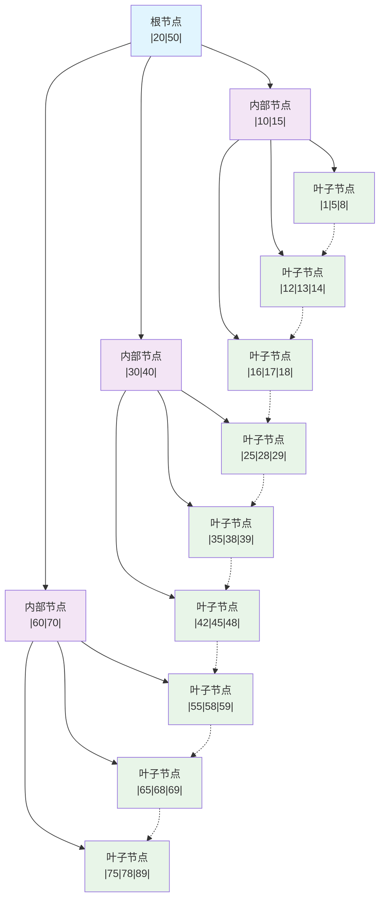

**B+树特点**：
1. **所有数据存储在叶子节点**：内部节点只存储索引键值
2. **叶子节点链式连接**：支持高效的范围查询
3. **平衡树结构**：所有叶子节点到根节点的路径长度相同
4. **多路节点**：每个节点可以有多个子节点，减少树的高度
5. **有序性**：叶子节点按键值有序排列

**B+树vs B树的区别**：
- **数据存储位置**：B+树只在叶子节点存数据，B树每个节点都存数据
- **叶子节点连接**：B+树叶子节点有指针连接，B树没有
- **查询性能**：B+树查询性能更稳定，B树查询性能不稳定
- **范围查询**：B+树支持高效范围查询，B树需要中序遍历

#### 索引查找过程

**等值查询过程**：
```sql
-- 示例：查找 id = 35 的记录
SELECT * FROM users WHERE id = 35;
```

**查找步骤**：
1. **从根节点开始**：比较35与根节点键值[20, 50]
2. **定位子节点**：35在20-50之间，进入中间子节点[30, 40]
3. **继续向下**：35在30-40之间，进入对应叶子节点
4. **叶子节点查找**：在叶子节点中精确定位到35对应的数据

**范围查询过程**：
```sql
-- 示例：查找 25 <= id <= 45 的记录
SELECT * FROM users WHERE id BETWEEN 25 AND 45;
```

**查找步骤**：
1. **定位起始点**：按等值查询方式找到id=25的叶子节点
2. **顺序扫描**：沿着叶子节点链表顺序扫描
3. **结束条件**：扫描到id>45时停止

**索引查找性能分析**：
```sql
-- 创建测试表和索引
CREATE TABLE test_index (
    id INT AUTO_INCREMENT PRIMARY KEY,
    name VARCHAR(50),
    age INT,
    city VARCHAR(50),
    INDEX idx_age (age),
    INDEX idx_name_age (name, age)
);

-- 插入测试数据
INSERT INTO test_index (name, age, city) 
SELECT 
    CONCAT('user_', i), 
    20 + (i % 50), 
    CASE (i % 3) 
        WHEN 0 THEN 'Beijing' 
        WHEN 1 THEN 'Shanghai' 
        ELSE 'Guangzhou' 
    END
FROM (
    SELECT @i := @i + 1 as i 
    FROM information_schema.tables t1, information_schema.tables t2, 
         (SELECT @i := 0) r 
    LIMIT 100000
) nums;

-- 分析索引使用情况
EXPLAIN SELECT * FROM test_index WHERE age = 25;
EXPLAIN SELECT * FROM test_index WHERE age BETWEEN 25 AND 30;
EXPLAIN SELECT * FROM test_index WHERE name = 'user_1000';
```

#### 聚簇索引与非聚簇索引

**聚簇索引 (Clustered Index)**：
- **定义**：数据行按照索引键顺序物理存储
- **特点**：叶子节点存储完整的数据行
- **数量限制**：每个表只能有一个聚簇索引
- **InnoDB中**：主键就是聚簇索引

**非聚簇索引 (Non-Clustered Index)**：
- **定义**：索引顺序与数据物理存储顺序不一定相同
- **特点**：叶子节点存储主键值（InnoDB）或行指针（MyISAM）
- **数量限制**：一个表可以有多个非聚簇索引
- **InnoDB中**：二级索引就是非聚簇索引

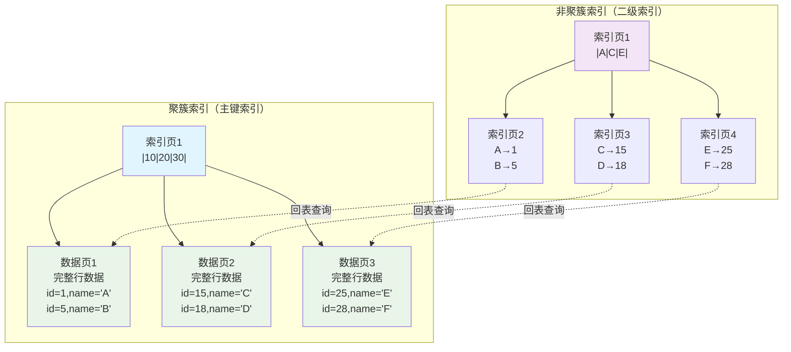

**聚簇索引vs非聚簇索引对比**：

| 特性 | 聚簇索引 | 非聚簇索引 |
|------|----------|------------|
| **数据存储** | 叶子节点存储完整数据行 | 叶子节点存储主键值 |
| **查询性能** | 一次查找即可获得数据 | 需要回表查询（可能） |
| **数据顺序** | 按索引键顺序物理存储 | 与物理存储顺序无关 |
| **存储空间** | 不需要额外存储空间 | 需要额外存储空间 |
| **更新性能** | 更新主键代价大 | 更新索引键相对简单 |

**回表查询示例**：
```sql
-- 回表查询：先查二级索引，再查主键索引
SELECT * FROM users WHERE name = 'John';

-- 覆盖索引：无需回表，直接从索引获取所需数据
SELECT id, name FROM users WHERE name = 'John';

-- 分析是否发生回表
EXPLAIN FORMAT=JSON SELECT * FROM users WHERE name = 'John';
```

### 索引使用策略

#### 单列索引

**单列索引**是最简单也是最常用的索引类型。

**创建单列索引**：
```sql
-- 创建普通索引
CREATE INDEX idx_age ON users(age);
ALTER TABLE users ADD INDEX idx_age (age);

-- 创建唯一索引
CREATE UNIQUE INDEX idx_email ON users(email);
ALTER TABLE users ADD UNIQUE KEY idx_email (email);

-- 删除索引
DROP INDEX idx_age ON users;
ALTER TABLE users DROP INDEX idx_age;
```

**单列索引使用场景**：
```sql
-- 1. 等值查询
SELECT * FROM users WHERE age = 25;

-- 2. 范围查询
SELECT * FROM users WHERE age BETWEEN 20 AND 30;
SELECT * FROM users WHERE age > 25;

-- 3. 排序操作
SELECT * FROM users ORDER BY age;

-- 4. 分组操作
SELECT age, COUNT(*) FROM users GROUP BY age;
```

**单列索引注意事项**：
- **选择性高的字段**：不同值越多，索引效果越好
- **避免在小基数字段建索引**：如性别、状态等
- **考虑查询频率**：经常用于WHERE、ORDER BY的字段

#### 复合索引

**复合索引（联合索引）**是基于多个字段创建的索引，是性能优化的重要手段。

**复合索引创建**：
```sql
-- 创建复合索引
CREATE INDEX idx_name_age_city ON users(name, age, city);

-- 等价写法
ALTER TABLE users ADD INDEX idx_name_age_city (name, age, city);
```

**最左前缀原则**：
复合索引遵循最左前缀原则，查询条件必须从索引的最左字段开始。

```sql
-- 创建复合索引 (name, age, city)
CREATE INDEX idx_name_age_city ON users(name, age, city);

-- ✅ 可以使用索引的查询
SELECT * FROM users WHERE name = 'John';                          -- 使用索引：name
SELECT * FROM users WHERE name = 'John' AND age = 25;             -- 使用索引：name, age
SELECT * FROM users WHERE name = 'John' AND age = 25 AND city = 'Beijing'; -- 使用索引：name, age, city
SELECT * FROM users WHERE name = 'John' AND city = 'Beijing';     -- 使用索引：name

-- ❌ 无法使用索引的查询
SELECT * FROM users WHERE age = 25;                               -- 不能使用索引
SELECT * FROM users WHERE city = 'Beijing';                       -- 不能使用索引
SELECT * FROM users WHERE age = 25 AND city = 'Beijing';          -- 不能使用索引
```

**复合索引顺序设计原则**：
1. **区分度高的字段放前面**：减少需要扫描的数据量
2. **等值查询字段放前面**：范围查询字段放后面
3. **考虑查询频率**：经常查询的字段组合放前面

```sql
-- 设计示例：订单查询索引
-- 查询场景：按用户查订单、按时间范围查订单、按状态查订单

-- 方案1：按查询频率设计
CREATE INDEX idx_user_status_time ON orders(user_id, status, created_at);

-- 方案2：按区分度设计  
CREATE INDEX idx_user_time_status ON orders(user_id, created_at, status);

-- 分析不同查询的索引使用情况
EXPLAIN SELECT * FROM orders WHERE user_id = 1001;
EXPLAIN SELECT * FROM orders WHERE user_id = 1001 AND status = 1;
EXPLAIN SELECT * FROM orders WHERE user_id = 1001 AND created_at > '2023-01-01';
EXPLAIN SELECT * FROM orders WHERE user_id = 1001 AND status = 1 AND created_at > '2023-01-01';
```

#### 覆盖索引

**覆盖索引**是指查询所需的所有字段都包含在索引中，无需回表查询。

**覆盖索引优势**：
- **减少I/O操作**：避免回表查询，只需读取索引页
- **提高查询性能**：特别是对于大表的查询
- **减少缓存压力**：减少对数据页的访问

**覆盖索引示例**：
```sql
-- 创建复合索引
CREATE INDEX idx_name_age ON users(name, age);

-- ✅ 覆盖索引查询：查询字段都在索引中
SELECT name, age FROM users WHERE name = 'John';
SELECT name FROM users WHERE name = 'John';
SELECT age FROM users WHERE name = 'John';

-- ❌ 非覆盖索引查询：需要回表获取city字段
SELECT name, age, city FROM users WHERE name = 'John';

-- 验证是否使用覆盖索引
EXPLAIN SELECT name, age FROM users WHERE name = 'John';
-- 查看Extra字段，如果显示"Using index"表示使用覆盖索引
```

**覆盖索引设计策略**：
```sql
-- 场景：用户列表页面，显示用户名、年龄、注册时间
-- 频繁查询：按注册时间排序，按年龄范围筛选

-- 传统索引设计
CREATE INDEX idx_age ON users(age);
CREATE INDEX idx_created_at ON users(created_at);

-- 覆盖索引设计：将查询需要的字段都包含进来
CREATE INDEX idx_age_created_name ON users(age, created_at, name);

-- 比较查询性能
-- 传统索引：需要回表查询
EXPLAIN SELECT name, age, created_at FROM users WHERE age BETWEEN 20 AND 30 ORDER BY created_at;

-- 覆盖索引：无需回表
EXPLAIN SELECT name, age, created_at FROM users WHERE age BETWEEN 20 AND 30 ORDER BY created_at;
```

#### 前缀索引

**前缀索引**是指对字符串字段的前几个字符建立索引，用于优化长字符串字段的索引。

**前缀索引应用场景**：
- 长VARCHAR字段（如URL、邮箱、地址）
- TEXT字段的索引需求
- 节省索引存储空间

**前缀索引创建**：
```sql
-- 分析字符串字段的区分度
SELECT 
    COUNT(DISTINCT LEFT(email, 5)) / COUNT(*) as prefix_5,
    COUNT(DISTINCT LEFT(email, 10)) / COUNT(*) as prefix_10,
    COUNT(DISTINCT LEFT(email, 15)) / COUNT(*) as prefix_15,
    COUNT(DISTINCT email) / COUNT(*) as full_column
FROM users;

-- 创建前缀索引
CREATE INDEX idx_email_prefix ON users(email(10));

-- 比较存储空间
SELECT 
    index_name,
    index_length,
    cardinality 
FROM information_schema.statistics 
WHERE table_name = 'users' AND column_name = 'email';
```

**前缀索引长度选择**：
```sql
-- 分析不同前缀长度的区分度
SELECT 
    prefix_length,
    COUNT(DISTINCT LEFT(url, prefix_length)) as distinct_count,
    COUNT(DISTINCT LEFT(url, prefix_length)) / COUNT(*) as selectivity
FROM 
    urls,
    (SELECT 5 as prefix_length UNION SELECT 10 UNION SELECT 15 UNION SELECT 20) as lengths
GROUP BY prefix_length
ORDER BY prefix_length;

-- 选择区分度达到95%以上的最短前缀长度
```

**前缀索引的限制**：
- **无法用于ORDER BY**：前缀索引不能用于排序
- **无法用于GROUP BY**：不能用于分组操作
- **覆盖索引限制**：无法作为覆盖索引使用

### 索引优化技巧

#### 索引失效场景

理解索引失效场景对查询优化至关重要。

**1. 违反最左前缀原则**：
```sql
-- 复合索引：(name, age, city)
CREATE INDEX idx_name_age_city ON users(name, age, city);

-- ❌ 索引失效：跳过了最左字段name
SELECT * FROM users WHERE age = 25;
SELECT * FROM users WHERE city = 'Beijing';
SELECT * FROM users WHERE age = 25 AND city = 'Beijing';

-- ✅ 索引有效
SELECT * FROM users WHERE name = 'John';
SELECT * FROM users WHERE name = 'John' AND age = 25;
```

**2. 索引字段使用函数**：
```sql
-- ❌ 索引失效：对索引字段使用函数
SELECT * FROM users WHERE UPPER(name) = 'JOHN';
SELECT * FROM users WHERE DATE(created_at) = '2023-01-01';
SELECT * FROM users WHERE age + 1 = 26;

-- ✅ 索引有效：避免对索引字段使用函数
SELECT * FROM users WHERE name = 'JOHN';  -- 或在应用层转换
SELECT * FROM users WHERE created_at >= '2023-01-01' AND created_at < '2023-01-02';
SELECT * FROM users WHERE age = 25;
```

**3. 隐式类型转换**：
```sql
-- 假设phone字段是VARCHAR类型
-- ❌ 索引失效：发生隐式类型转换
SELECT * FROM users WHERE phone = 13812345678;  -- 数字类型

-- ✅ 索引有效：使用正确的类型
SELECT * FROM users WHERE phone = '13812345678';  -- 字符串类型
```

**4. 使用NOT、!=、<>操作符**：
```sql
-- ❌ 索引失效：负向条件通常不能使用索引
SELECT * FROM users WHERE age != 25;
SELECT * FROM users WHERE age <> 25;
SELECT * FROM users WHERE NOT age = 25;

-- ✅ 可能使用索引：正向条件
SELECT * FROM users WHERE age = 25;
SELECT * FROM users WHERE age > 25;
SELECT * FROM users WHERE age IN (20, 25, 30);
```

**5. LIKE查询的前导通配符**：
```sql
-- ❌ 索引失效：前导通配符
SELECT * FROM users WHERE name LIKE '%john';
SELECT * FROM users WHERE name LIKE '%john%';

-- ✅ 索引有效：后置通配符
SELECT * FROM users WHERE name LIKE 'john%';

-- 解决方案：全文索引
ALTER TABLE users ADD FULLTEXT(name);
SELECT * FROM users WHERE MATCH(name) AGAINST('john');
```

**6. OR条件使用**：
```sql
-- ❌ 可能索引失效：OR条件中有字段没有索引
SELECT * FROM users WHERE name = 'John' OR city = 'Beijing';  -- city没有索引

-- ✅ 索引有效：OR条件中所有字段都有索引
SELECT * FROM users WHERE name = 'John' OR email = 'john@example.com';

-- 或者使用UNION改写
SELECT * FROM users WHERE name = 'John'
UNION
SELECT * FROM users WHERE city = 'Beijing';
```

#### 索引选择性分析

**索引选择性**是指索引字段中不同值的数量与总记录数的比值，选择性越高，索引效果越好。

**选择性计算公式**：
```
选择性 = COUNT(DISTINCT column) / COUNT(*)
```

**选择性分析示例**：
```sql
-- 分析表中各字段的选择性
SELECT 
    'id' as column_name,
    COUNT(DISTINCT id) as distinct_count,
    COUNT(*) as total_count,
    COUNT(DISTINCT id) / COUNT(*) as selectivity
FROM users
UNION ALL
SELECT 
    'name',
    COUNT(DISTINCT name),
    COUNT(*),
    COUNT(DISTINCT name) / COUNT(*)
FROM users
UNION ALL
SELECT 
    'age',
    COUNT(DISTINCT age),
    COUNT(*),
    COUNT(DISTINCT age) / COUNT(*)
FROM users
UNION ALL
SELECT 
    'gender',
    COUNT(DISTINCT gender),
    COUNT(*),
    COUNT(DISTINCT gender) / COUNT(*)
FROM users;
```

**选择性指导索引设计**：
```sql
-- 高选择性字段（0.8+）：适合建立索引
-- id: 1.0（主键）
-- email: 0.95+（邮箱通常唯一）
-- phone: 0.90+（手机号通常唯一）

-- 中等选择性字段（0.1-0.8）：可以考虑建立索引
-- name: 0.3-0.7（姓名有一定重复）
-- age: 0.05-0.1（年龄值有限）

-- 低选择性字段（<0.1）：不适合单独建立索引
-- gender: 0.5（男/女两个值）
-- status: 0.1（状态值有限）

-- 复合索引设计：将低选择性字段与高选择性字段组合
CREATE INDEX idx_gender_age_name ON users(gender, age, name);
```

#### 索引维护策略

**1. 定期分析索引使用情况**：
```sql
-- 查看索引使用统计
SELECT 
    TABLE_SCHEMA,
    TABLE_NAME,
    INDEX_NAME,
    CARDINALITY,
    PAGES,
    COMMENT
FROM information_schema.statistics 
WHERE TABLE_SCHEMA = 'your_database'
ORDER BY TABLE_NAME, INDEX_NAME;

-- 查看从未使用的索引（MySQL 5.7+）
SELECT 
    s.table_schema,
    s.table_name,
    s.index_name
FROM information_schema.statistics s
LEFT JOIN performance_schema.table_io_waits_summary_by_index_usage p
    ON s.table_schema = p.object_schema
    AND s.table_name = p.object_name
    AND s.index_name = p.index_name
WHERE p.index_name IS NULL
    AND s.table_schema = 'your_database'
    AND s.index_name != 'PRIMARY';
```

**2. 重复索引检查**：
```sql
-- 检查重复索引
SELECT 
    table_schema,
    table_name,
    GROUP_CONCAT(index_name) as duplicate_indexes,
    GROUP_CONCAT(column_name ORDER BY seq_in_index) as columns
FROM information_schema.statistics
WHERE table_schema = 'your_database'
GROUP BY table_schema, table_name, 
         GROUP_CONCAT(column_name ORDER BY seq_in_index)
HAVING COUNT(*) > 1;
```

**3. 索引维护操作**：
```sql
-- 重建索引（清理索引碎片）
ALTER TABLE users DROP INDEX idx_name, ADD INDEX idx_name (name);

-- 在线DDL（MySQL 5.6+）
ALTER TABLE users DROP INDEX idx_name, ADD INDEX idx_name (name), ALGORITHM=INPLACE, LOCK=NONE;

-- 分析表统计信息
ANALYZE TABLE users;

-- 检查表和索引
CHECK TABLE users;

-- 优化表（整理碎片）
OPTIMIZE TABLE users;
```

**4. 索引监控指标**：
```sql
-- 监控索引效率
SHOW STATUS LIKE 'Handler_read%';

-- Handler_read_first: 读取索引第一个条目的次数
-- Handler_read_key: 通过索引读取的次数
-- Handler_read_next: 顺序读取下一行的次数
-- Handler_read_rnd: 随机读取的次数

-- 索引使用率 = Handler_read_key / (Handler_read_key + Handler_read_rnd)
```

**索引优化最佳实践**：
- **定期审查索引使用情况**，删除无用索引
- **避免过多索引**，每个DML操作都需要维护所有索引
- **合理设计复合索引**，一个好的复合索引胜过多个单列索引
- **考虑索引的存储开销**，索引大小不应超过表大小的20%
- **测试索引效果**，使用EXPLAIN分析查询计划
- **关注索引选择性**，低选择性字段不适合单独建索引 

## SQL语句优化

### 查询优化基础

#### 执行计划分析

**EXPLAIN命令**是SQL优化的核心工具，用于分析查询的执行计划。

**EXPLAIN输出字段解析**：

| 字段 | 含义 | 重要值 |
|------|------|--------|
| **id** | 查询序列号 | 数字越大优先级越高 |
| **select_type** | 查询类型 | SIMPLE、PRIMARY、SUBQUERY、UNION |
| **table** | 访问的表 | 表名或别名 |
| **type** | 访问类型 | **system > const > eq_ref > ref > range > index > ALL** |
| **possible_keys** | 可能使用的索引 | 索引名列表 |
| **key** | 实际使用的索引 | 索引名 |
| **key_len** | 索引长度 | 字节数，越短越好 |
| **ref** | 索引比较的列 | 常量或字段名 |
| **rows** | 扫描行数估计 | 越少越好 |
| **Extra** | 额外信息 | Using index、Using filesort等 |

**关键性能指标**：
```sql
-- 优秀的执行计划特征
-- type: const, eq_ref, ref
-- key: 使用了合适的索引
-- rows: 扫描行数少
-- Extra: Using index (覆盖索引)

-- 需要优化的执行计划
-- type: ALL, index (全表扫描)
-- key: NULL (没有使用索引)
-- rows: 大量行扫描
-- Extra: Using filesort, Using temporary
```

#### 查询成本分析

MySQL优化器使用成本模型选择最优执行计划。

**成本组成**：
- **I/O成本**：读取数据页的成本
- **CPU成本**：处理行记录的成本
- **网络成本**：数据传输成本

**成本分析示例**：
```sql
-- 开启优化器追踪
SET optimizer_trace='enabled=on';

-- 执行查询
SELECT * FROM users WHERE age BETWEEN 20 AND 30;

-- 查看优化器决策过程
SELECT * FROM information_schema.optimizer_trace;

-- 关闭追踪
SET optimizer_trace='enabled=off';
```

### SELECT 查询优化

#### WHERE 条件优化

**1. 索引条件优化**：
```sql
-- ✅ 优化后：使用索引
SELECT * FROM users WHERE user_id = 1001;
SELECT * FROM users WHERE status = 1 AND created_at > '2023-01-01';

-- ❌ 优化前：无法使用索引
SELECT * FROM users WHERE YEAR(created_at) = 2023;
SELECT * FROM users WHERE age + 1 = 26;
```

**2. 条件顺序优化**：
```sql
-- 复合索引：(status, user_id, created_at)
-- ✅ 优化：按索引顺序组织条件
SELECT * FROM orders 
WHERE status = 1 
  AND user_id = 1001 
  AND created_at > '2023-01-01';
```

#### JOIN 连接优化

**JOIN类型选择**：
- **INNER JOIN**：只返回匹配的记录
- **LEFT JOIN**：返回左表所有记录
- **RIGHT JOIN**：返回右表所有记录

**JOIN优化策略**：
```sql
-- 1. 小表驱动大表
-- ✅ 优化：用户表(小)驱动订单表(大)
SELECT o.* FROM users u
INNER JOIN orders o ON u.id = o.user_id
WHERE u.status = 1;

-- 2. 确保JOIN字段有索引
-- ✅ 优化：在关联字段建立索引
CREATE INDEX idx_user_id ON orders(user_id);
CREATE INDEX idx_status ON users(status);

-- 3. 避免笛卡尔积
-- ❌ 危险：缺少关联条件
SELECT * FROM users u, orders o WHERE u.status = 1;
-- ✅ 安全：明确关联条件
SELECT * FROM users u, orders o WHERE u.id = o.user_id AND u.status = 1;
```

#### LIMIT 分页优化

**大偏移量分页问题**：
```sql
-- ❌ 性能差：大偏移量
SELECT * FROM users ORDER BY id LIMIT 1000000, 20;

-- ✅ 优化方案1：使用主键范围
SELECT * FROM users WHERE id > 1000000 ORDER BY id LIMIT 20;

-- ✅ 优化方案2：延迟关联
SELECT u.* FROM users u
INNER JOIN (
    SELECT id FROM users ORDER BY id LIMIT 1000000, 20
) t ON u.id = t.id;
```

### DML 语句优化

#### INSERT 插入优化

**批量插入优化**：
```sql
-- ❌ 低效：逐条插入
INSERT INTO users (name, email) VALUES ('user1', 'user1@example.com');
INSERT INTO users (name, email) VALUES ('user2', 'user2@example.com');

-- ✅ 高效：批量插入
INSERT INTO users (name, email) VALUES 
('user1', 'user1@example.com'),
('user2', 'user2@example.com'),
('user3', 'user3@example.com');

-- ✅ 大量数据：LOAD DATA
LOAD DATA INFILE 'users.csv' 
INTO TABLE users 
FIELDS TERMINATED BY ',' 
LINES TERMINATED BY '\n';
```

#### UPDATE 更新优化

**UPDATE优化原则**：
```sql
-- ✅ 使用索引条件
UPDATE users SET status = 1 WHERE id = 1001;

-- ✅ 批量更新
UPDATE users SET status = 1 WHERE id IN (1001, 1002, 1003);

-- ✅ 避免全表更新
UPDATE users SET updated_at = NOW() WHERE status = 0 LIMIT 1000;
```

### 子查询与表连接

#### 子查询优化

**子查询转换为JOIN**：
```sql
-- ❌ 性能差：相关子查询
SELECT * FROM users u
WHERE EXISTS (
    SELECT 1 FROM orders o 
    WHERE o.user_id = u.id AND o.status = 1
);

-- ✅ 优化：转换为JOIN
SELECT DISTINCT u.* FROM users u
INNER JOIN orders o ON u.id = o.user_id
WHERE o.status = 1;
```

#### EXISTS vs IN

**性能对比**：
```sql
-- 大表 EXISTS 小表：使用 EXISTS
SELECT * FROM users u
WHERE EXISTS (
    SELECT 1 FROM user_profiles p WHERE p.user_id = u.id
);

-- 小表 IN 大表：使用 IN
SELECT * FROM users
WHERE id IN (SELECT user_id FROM user_profiles);
```

**优化最佳实践**：
- **使用EXPLAIN分析所有重要查询**
- **优先优化高频查询和慢查询**
- **合理使用索引，避免冗余索引**
- **小表驱动大表，确保JOIN字段有索引**
- **避免SELECT \*，只查询需要的字段**
- **使用LIMIT限制返回结果集大小**
- **定期分析和更新表统计信息**

## 事务与锁机制

### 事务基础概念

#### ACID 特性

**ACID**是事务的四个基本特性：
- **原子性**：事务中的所有操作要么全部完成，要么全部不完成，不会出现部分完成的情况。
- **一致性**：事务执行前后，数据库的一致性状态必须保持一致。
- **隔离性**：多个事务并发执行时，每个事务都应该感觉不到其他事务的存在。
- **持久性**：事务一旦提交，其结果应该永久保存到数据库中。

#### 事务隔离级别

**隔离级别**是指事务之间的隔离程度，MySQL提供了四种隔离级别：
- **读未提交**：一个事务可以读取另一个事务未提交的数据。
- **读已提交**：一个事务只能读取另一个事务已提交的数据。
- **可重复读**：一个事务在执行过程中多次读取同一数据时，结果是一致的。
- **串行化**：事务串行执行，事务之间完全隔离。

**隔离级别对比**：
```
[读未提交] < [读已提交] < [可重复读] < [串行化]
```

**隔离级别选择**：
- **读未提交**：性能最高，但可能出现脏读、不可重复读、幻读。
- **读已提交**：性能较高，但可能出现不可重复读、幻读。
- **可重复读**：性能较高，但可能出现幻读。
- **串行化**：性能最低，但不会出现脏读、不可重复读、幻读。

**实际应用场景**：
- **读未提交**：适用于对数据一致性要求不高的场景。
- **读已提交**：适用于对数据一致性要求较高的场景。
- **可重复读**：适用于对数据一致性要求较高的场景。
- **串行化**：适用于对数据一致性要求最高的场景。

#### 事务控制语句

**事务控制语句**包括：
- **START TRANSACTION**：开始一个新事务。
- **COMMIT**：提交当前事务。
- **ROLLBACK**：回滚当前事务。
- **SAVEPOINT**：设置保存点。
- **RELEASE SAVEPOINT**：释放保存点。
- **ROLLBACK TO SAVEPOINT**：回滚到保存点。

**事务控制示例**：
```sql
-- 开始事务
START TRANSACTION;

-- 执行一系列操作
INSERT INTO orders (user_id, status, created_at) VALUES (1, 'pending', NOW());
UPDATE users SET status = 1 WHERE id = 1;

-- 提交事务
COMMIT;

-- 回滚事务
ROLLBACK;

-- 设置保存点
SAVEPOINT sp1;

-- 执行一系列操作
INSERT INTO orders (user_id, status, created_at) VALUES (2, 'pending', NOW());
UPDATE users SET status = 1 WHERE id = 2;

-- 回滚到保存点
ROLLBACK TO sp1;
```

### 并发控制问题

#### 脏读 (Dirty Read)

**脏读**是指一个事务读取了另一个事务未提交的数据。

**脏读的危害**：
- 可能导致不可重复读和幻读。
- 破坏事务的隔离性。

**脏读示例**：
```sql
-- 事务A
START TRANSACTION;
INSERT INTO orders (user_id, status, created_at) VALUES (1, 'pending', NOW());

-- 事务B
START TRANSACTION;
SELECT * FROM orders WHERE user_id = 1;  -- 读取到未提交的数据

-- 事务A
COMMIT;

-- 事务B
COMMIT;  -- 提交后，事务A的插入操作对事务B可见
```

#### 不可重复读 (Non-Repeatable Read)

**不可重复读**是指一个事务在读取数据时，另一个事务修改了该数据。

**不可重复读的危害**：
- 可能导致事务读取到不一致的数据。
- 破坏事务的一致性。

**不可重复读示例**：
```sql
-- 事务A
START TRANSACTION;
SELECT * FROM orders WHERE user_id = 1;  -- 读取到数据

-- 事务B
START TRANSACTION;
UPDATE orders SET status = 'paid' WHERE user_id = 1;  -- 修改数据

-- 事务A
COMMIT;

-- 事务B
COMMIT;  -- 提交后，事务A的读取操作读取到修改后的数据
```

#### 幻读 (Phantom Read)

**幻读**是指一个事务在读取数据时，另一个事务插入了新数据。

**幻读的危害**：
- 可能导致事务读取到不一致的数据。
- 破坏事务的一致性。

**幻读示例**：
```sql
-- 事务A
START TRANSACTION;
SELECT * FROM orders WHERE user_id = 1;  -- 读取到数据

-- 事务B
START TRANSACTION;
INSERT INTO orders (user_id, status, created_at) VALUES (1, 'paid', NOW());  -- 插入新数据

-- 事务A
COMMIT;

-- 事务B
COMMIT;  -- 提交后，事务A的读取操作读取到插入的新数据
```

#### 丢失更新 (Lost Update)

**丢失更新**是指两个事务同时更新同一行数据，导致数据丢失。

**丢失更新示例**：
```sql
-- 事务A
START TRANSACTION;
UPDATE orders SET status = 'paid' WHERE user_id = 1;  -- 更新数据

-- 事务B
START TRANSACTION;
UPDATE orders SET status = 'shipped' WHERE user_id = 1;  -- 更新数据

-- 事务A
COMMIT;

-- 事务B
COMMIT;  -- 提交后，事务A的更新操作被事务B覆盖
```

### InnoDB 锁机制

#### 锁的分类

**InnoDB锁的层次结构**：

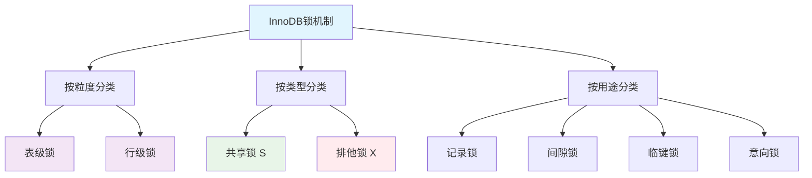

**锁的分类详解**：

| 锁类型 | 锁定对象 | 锁定范围 | 兼容性 | 使用场景 |
|--------|----------|----------|--------|----------|
| **表级锁** | 整个表 | 表 | 读读兼容 | DDL操作、LOCK TABLES |
| **行级锁** | 数据行 | 行/间隙 | 根据具体类型 | DML操作 |
| **意向锁** | 表 | 意向标识 | 特殊规则 | 锁冲突检测 |

#### 行级锁详解

**行级锁是InnoDB的核心特性**，基于索引实现，提供更好的并发性能。

**1. 记录锁 (Record Lock)**：
```sql
-- 记录锁：锁定具体的索引记录
BEGIN;
SELECT * FROM users WHERE id = 100 FOR UPDATE;  -- 锁定id=100这一行
-- 其他事务无法修改id=100的记录，但可以插入其他记录
```

**2. 间隙锁 (Gap Lock)**：
```sql
-- 间隙锁：锁定索引记录之间的间隙，防止幻读
BEGIN;
SELECT * FROM users WHERE id BETWEEN 10 AND 20 FOR UPDATE;
-- 锁定(10,20)区间，防止在此区间插入新记录
-- 注意：间隙锁与间隙锁兼容，不会相互阻塞
```

**3. 临键锁 (Next-Key Lock)**：
```sql
-- 临键锁：记录锁+间隙锁，锁定记录及其前面的间隙
-- 这是InnoDB默认的行锁算法
BEGIN;
SELECT * FROM users WHERE age >= 25 FOR UPDATE;
-- 锁定age>=25的所有记录，以及(24,25]的间隙
```

**锁定算法选择规则**：

| 查询条件 | 索引类型 | 锁定算法 | 示例 |
|----------|----------|----------|------|
| **等值查询+唯一索引+记录存在** | 唯一索引 | 记录锁 | `WHERE id = 10` |
| **等值查询+唯一索引+记录不存在** | 唯一索引 | 间隙锁 | `WHERE id = 15` |
| **等值查询+非唯一索引** | 普通索引 | 记录锁+间隙锁 | `WHERE name = 'John'` |
| **范围查询** | 任意索引 | Next-Key锁 | `WHERE age > 20` |

**实际测试示例**：
```sql
-- 创建测试表
CREATE TABLE lock_demo (
    id INT PRIMARY KEY,
    age INT,
    name VARCHAR(50),
    KEY idx_age (age)
);

INSERT INTO lock_demo VALUES 
(1, 10, 'Alice'),
(5, 20, 'Bob'),
(10, 30, 'Charlie'),
(15, 40, 'David');

-- 测试1：唯一索引等值查询（记录存在）
-- 会话1
BEGIN;
SELECT * FROM lock_demo WHERE id = 5 FOR UPDATE;  -- 只锁定id=5

-- 会话2
INSERT INTO lock_demo VALUES (3, 15, 'Eve');      -- 成功
INSERT INTO lock_demo VALUES (5, 25, 'Frank');    -- 阻塞，主键冲突
UPDATE lock_demo SET name = 'Bob2' WHERE id = 5;  -- 阻塞，记录被锁

-- 测试2：普通索引等值查询
-- 会话1  
BEGIN;
SELECT * FROM lock_demo WHERE age = 20 FOR UPDATE;  -- Next-Key锁

-- 会话2
INSERT INTO lock_demo VALUES (3, 15, 'Eve');        -- 成功
INSERT INTO lock_demo VALUES (6, 20, 'Frank');      -- 阻塞，age=20被锁
INSERT INTO lock_demo VALUES (7, 25, 'Grace');      -- 阻塞，(20,30)间隙被锁
```

#### 表级锁与意向锁

**表级锁类型**：

| 锁类型 | 符号 | 作用 | 兼容性 |
|--------|------|------|--------|
| **表读锁** | S | 允许读，禁止写 | 与表读锁兼容 |
| **表写锁** | X | 禁止读写 | 与所有锁冲突 |
| **意向共享锁** | IS | 表示将获取行级S锁 | 与IS、S兼容 |
| **意向排他锁** | IX | 表示将获取行级X锁 | 与IS、IX兼容 |

**意向锁的作用**：
```sql
-- 意向锁解决表锁与行锁的冲突检测问题

-- 场景：事务A持有行级锁，事务B申请表级锁
-- 会话A：获取行级锁时，自动获取意向锁
BEGIN;
SELECT * FROM users WHERE id = 1 FOR UPDATE;  -- 自动获取IX锁

-- 会话B：申请表级锁时，检查意向锁
LOCK TABLES users WRITE;  -- 检查到IX锁存在，等待

-- 如果没有意向锁，会话B需要检查所有行锁，效率极低
```

**锁兼容性矩阵**：

|      | IS | IX | S  | X  |
|------|----|----|----|----|
| **IS** | ✓  | ✓  | ✓  | ✗  |
| **IX** | ✓  | ✓  | ✗  | ✗  |
| **S**  | ✓  | ✗  | ✓  | ✗  |
| **X**  | ✗  | ✗  | ✗  | ✗  |

#### 死锁检测与处理

**死锁定义**：两个或多个事务相互等待对方释放锁，形成循环等待。

**经典死锁场景**：
```sql
-- 转账场景死锁
-- 会话A：A账户转给B账户
BEGIN;
UPDATE accounts SET balance = balance - 100 WHERE account_id = 'A';  -- 锁定A账户
-- 模拟处理时间
UPDATE accounts SET balance = balance + 100 WHERE account_id = 'B';  -- 等待B账户

-- 会话B：B账户转给A账户  
BEGIN;
UPDATE accounts SET balance = balance - 50 WHERE account_id = 'B';   -- 锁定B账户
-- 模拟处理时间
UPDATE accounts SET balance = balance + 50 WHERE account_id = 'A';   -- 等待A账户

-- 结果：形成死锁，InnoDB自动检测并回滚其中一个事务
```

**死锁预防策略**：

1. **统一加锁顺序**：
```sql
-- 预防策略1：按ID顺序加锁
BEGIN;
-- 总是按照account_id字典序加锁
UPDATE accounts SET balance = balance - 100 WHERE account_id = 'A';
UPDATE accounts SET balance = balance + 100 WHERE account_id = 'B';
COMMIT;
```

2. **减少锁持有时间**：
```sql
-- 预防策略2：快速事务
BEGIN;
-- 一次性获取所有需要的锁
SELECT * FROM accounts WHERE account_id IN ('A', 'B') FOR UPDATE;
-- 快速完成所有操作
UPDATE accounts SET balance = balance - 100 WHERE account_id = 'A';
UPDATE accounts SET balance = balance + 100 WHERE account_id = 'B';
COMMIT;
```

3. **使用更低隔离级别**：
```sql
-- 预防策略3：降低隔离级别（适用场景有限）
SET SESSION TRANSACTION ISOLATION LEVEL READ COMMITTED;
```

**死锁监控与分析**：
```sql
-- 查看最近一次死锁信息
SHOW ENGINE INNODB STATUS;

-- 启用死锁日志
SET GLOBAL innodb_print_all_deadlocks = ON;

-- 监控死锁频率
SHOW STATUS LIKE 'Innodb_deadlocks';

-- 监控锁等待情况
SHOW STATUS LIKE 'Innodb_lock_wait%';
```

#### MVCC多版本并发控制

**MVCC核心思想**：通过维护数据的多个版本，实现读写不冲突，提高并发性能。

**MVCC实现机制**：

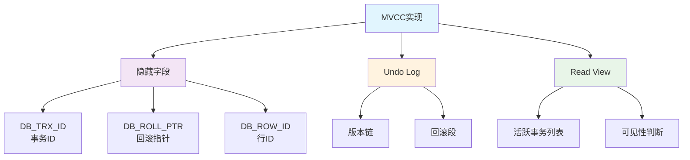

**数据行版本链示例**：
```sql
-- 原始数据
id | name  | age | DB_TRX_ID | DB_ROLL_PTR
1  | Alice | 25  | 100       | ptr1

-- 事务101修改后
id | name  | age | DB_TRX_ID | DB_ROLL_PTR
1  | Bob   | 25  | 101       | ptr2
                     ↓
              [Undo Log]
              name=Alice, age=25, trx_id=100

-- 事务102再次修改
id | name  | age | DB_TRX_ID | DB_ROLL_PTR  
1  | Charlie| 30 | 102       | ptr3
                     ↓
              [Undo Log]
              name=Bob, age=25, trx_id=101 → ptr2
                                    ↓
                            [Undo Log]
                            name=Alice, age=25, trx_id=100
```

**Read View可见性判断**：
```sql
-- Read View结构
ReadView {
    m_low_limit_id,     -- 最大事务ID+1
    m_up_limit_id,      -- 最小活跃事务ID  
    m_creator_trx_id,   -- 创建该ReadView的事务ID
    m_ids              -- 活跃事务ID列表
}

-- 可见性判断规则
-- 1. trx_id < m_up_limit_id：已提交事务，可见
-- 2. trx_id >= m_low_limit_id：未来事务，不可见
-- 3. m_up_limit_id <= trx_id < m_low_limit_id：
--    if trx_id in m_ids：活跃事务，不可见
--    else：已提交事务，可见
```

**不同隔离级别下的MVCC行为**：
```sql
-- READ COMMITTED：每次查询创建新ReadView
SET SESSION TRANSACTION ISOLATION LEVEL READ COMMITTED;
BEGIN;
SELECT * FROM users WHERE id = 1;  -- ReadView1
-- 其他事务提交修改
SELECT * FROM users WHERE id = 1;  -- ReadView2，可能看到新值

-- REPEATABLE READ：事务开始时创建ReadView
SET SESSION TRANSACTION ISOLATION LEVEL REPEATABLE READ;
BEGIN;  
SELECT * FROM users WHERE id = 1;  -- ReadView固定
-- 其他事务提交修改
SELECT * FROM users WHERE id = 1;  -- 使用相同ReadView，保证一致性
```

**当前读vs快照读**：
```sql
-- 快照读：使用MVCC，读取历史版本
SELECT * FROM users WHERE id = 1;

-- 当前读：加锁读取最新版本
SELECT * FROM users WHERE id = 1 LOCK IN SHARE MODE;  -- 共享锁
SELECT * FROM users WHERE id = 1 FOR UPDATE;         -- 排他锁
UPDATE users SET name = 'New' WHERE id = 1;          -- 排他锁
DELETE FROM users WHERE id = 1;                      -- 排他锁
```

## 性能监控与调优

### 性能监控指标

#### 系统级监控

**关键系统指标**：

| 指标类别 | 监控指标 | 正常范围 | 说明 |
|----------|----------|----------|------|
| **CPU** | CPU使用率 | <70% | 持续高使用率影响响应时间 |
| **内存** | 内存使用率 | <80% | 避免频繁swap |
| **磁盘** | IOPS | 根据硬件 | 监控读写操作频率 |
| **磁盘** | 磁盘使用率 | <85% | 预留空间用于临时文件 |
| **网络** | 网络带宽 | <70% | 避免网络瓶颈 |

**监控命令示例**：
```bash
# CPU监控
top -p $(pidof mysqld)
iostat -x 1

# 内存监控
free -h
cat /proc/meminfo | grep -E "MemTotal|MemFree|MemAvailable|Buffers|Cached"

# 磁盘监控
df -h
iostat -d 1

# 网络监控
iftop
nethogs
```

#### 数据库级监控

**MySQL核心性能指标**：

```sql
-- 连接监控
SHOW STATUS LIKE 'Connections';              -- 总连接数
SHOW STATUS LIKE 'Threads_connected';        -- 当前连接数
SHOW STATUS LIKE 'Threads_running';          -- 活跃连接数
SHOW STATUS LIKE 'Max_used_connections';     -- 历史最大连接数

-- QPS/TPS监控
SHOW STATUS LIKE 'Questions';                -- 总查询数
SHOW STATUS LIKE 'Queries';                  -- 总语句数
SHOW STATUS LIKE 'Com_select';               -- SELECT数量
SHOW STATUS LIKE 'Com_insert';               -- INSERT数量  
SHOW STATUS LIKE 'Com_update';               -- UPDATE数量
SHOW STATUS LIKE 'Com_delete';               -- DELETE数量

-- 缓冲池监控
SHOW STATUS LIKE 'Innodb_buffer_pool%';

-- 锁监控
SHOW STATUS LIKE 'Innodb_lock_wait%';
SHOW STATUS LIKE 'Innodb_deadlocks';

-- 临时表监控
SHOW STATUS LIKE 'Created_tmp%';
```

**性能监控脚本**：
```bash
#!/bin/bash
# mysql_monitor.sh

# 计算QPS
mysql -e "
SELECT 
    ROUND(Questions/Uptime, 2) AS QPS,
    ROUND((Com_select + Com_insert + Com_update + Com_delete)/Uptime, 2) AS TPS,
    ROUND(Connections/Uptime, 2) AS CPS
FROM (
    SELECT 
        VARIABLE_VALUE AS Questions
    FROM information_schema.GLOBAL_STATUS 
    WHERE VARIABLE_NAME = 'Questions'
) q,
(
    SELECT 
        VARIABLE_VALUE AS Uptime
    FROM information_schema.GLOBAL_STATUS 
    WHERE VARIABLE_NAME = 'Uptime'  
) u,
(
    SELECT 
        SUM(VARIABLE_VALUE) AS Com_select
    FROM information_schema.GLOBAL_STATUS
    WHERE VARIABLE_NAME = 'Com_select'
) cs,
-- ... 其他指标
"
```

#### SQL级监控

**慢查询识别**：
```sql
-- 开启慢查询日志
SET GLOBAL slow_query_log = ON;
SET GLOBAL long_query_time = 1;  -- 1秒以上的查询
SET GLOBAL log_queries_not_using_indexes = ON;

-- 查看慢查询状态
SHOW VARIABLES LIKE 'slow_query%';
SHOW STATUS LIKE 'Slow_queries';

-- 实时监控正在执行的查询
SELECT 
    ID,
    USER,
    HOST,
    DB,
    COMMAND,
    TIME,
    STATE,
    LEFT(INFO, 100) as QUERY
FROM information_schema.PROCESSLIST 
WHERE COMMAND != 'Sleep' 
ORDER BY TIME DESC;
```

**查询分析工具**：
```sql
-- 使用EXPLAIN分析查询
EXPLAIN FORMAT=JSON 
SELECT u.name, COUNT(o.id) as order_count
FROM users u
LEFT JOIN orders o ON u.id = o.user_id
WHERE u.status = 1
GROUP BY u.id;

-- 使用SHOW PROFILE分析查询耗时
SET profiling = 1;
SELECT COUNT(*) FROM large_table WHERE status = 1;
SHOW PROFILES;
SHOW PROFILE FOR QUERY 1;
```

### 慢查询分析

#### 慢查询日志配置

**慢查询日志参数**：
```sql
-- 查看慢查询配置
SHOW VARIABLES LIKE '%slow%';
SHOW VARIABLES LIKE '%long_query_time%';

-- 配置慢查询日志
SET GLOBAL slow_query_log = ON;                    -- 启用慢查询日志
SET GLOBAL slow_query_log_file = '/var/log/mysql/slow.log';  -- 日志文件路径
SET GLOBAL long_query_time = 2;                    -- 2秒阈值
SET GLOBAL log_queries_not_using_indexes = ON;     -- 记录未使用索引的查询
SET GLOBAL log_slow_admin_statements = ON;         -- 记录管理语句
SET GLOBAL min_examined_row_limit = 1000;          -- 最小扫描行数
```

**my.cnf配置**：
```ini
[mysqld]
# 慢查询日志配置
slow_query_log = 1
slow_query_log_file = /var/log/mysql/slow.log
long_query_time = 1
log_queries_not_using_indexes = 1
log_slow_admin_statements = 1
min_examined_row_limit = 100
```

#### 慢查询分析工具

**1. mysqldumpslow工具**：
```bash
# 分析慢查询日志
mysqldumpslow -s c -t 10 /var/log/mysql/slow.log
# -s c: 按查询次数排序
# -t 10: 显示前10条
# -s at: 按平均查询时间排序
# -s t: 按查询时间排序

# 过滤特定数据库
mysqldumpslow -s t -t 5 -g "^SELECT" /var/log/mysql/slow.log

# 输出示例
Count: 32  Time=2.15s (68s)  Lock=0.00s (0s)  Rows=1000.0 (32000), root[root]@localhost
  SELECT * FROM users WHERE status = N AND created_at > 'S'
```

**2. pt-query-digest工具**：
```bash
# 安装Percona Toolkit
yum install percona-toolkit

# 分析慢查询日志
pt-query-digest /var/log/mysql/slow.log

# 输出报告到文件
pt-query-digest /var/log/mysql/slow.log > slow_query_report.txt

# 分析指定时间段
pt-query-digest --since='2023-01-01' --until='2023-01-31' /var/log/mysql/slow.log
```

**3. 自定义分析脚本**：
```python
#!/usr/bin/env python3
# slow_query_analyzer.py

import re
import sys
from collections import defaultdict

def parse_slow_log(filename):
    queries = defaultdict(list)
    current_query = {}
    
    with open(filename, 'r') as f:
        for line in f:
            if line.startswith('# Time:'):
                if current_query:
                    query_pattern = normalize_query(current_query['sql'])
                    queries[query_pattern].append(current_query)
                current_query = {'time': line.strip()}
                
            elif line.startswith('# Query_time:'):
                parts = line.split()
                current_query['query_time'] = float(parts[2])
                current_query['lock_time'] = float(parts[4])
                current_query['rows_sent'] = int(parts[6])
                current_query['rows_examined'] = int(parts[8])
                
            elif not line.startswith('#') and line.strip():
                current_query['sql'] = line.strip()
    
    return queries

def normalize_query(sql):
    # 标准化SQL，替换具体值为占位符
    sql = re.sub(r'\b\d+\b', 'N', sql)
    sql = re.sub(r"'[^']*'", "'S'", sql)
    sql = re.sub(r'"[^"]*"', '"S"', sql)
    return sql

if __name__ == '__main__':
    if len(sys.argv) != 2:
        print("Usage: python3 slow_query_analyzer.py <slow_log_file>")
        sys.exit(1)
    
    queries = parse_slow_log(sys.argv[1])
    
    # 分析结果
    for pattern, query_list in sorted(queries.items(), 
                                    key=lambda x: len(x[1]), reverse=True)[:10]:
        count = len(query_list)
        avg_time = sum(q['query_time'] for q in query_list) / count
        total_time = sum(q['query_time'] for q in query_list)
        
        print(f"Count: {count}, Avg Time: {avg_time:.2f}s, Total: {total_time:.2f}s")
        print(f"Query: {pattern}")
        print("-" * 80)
```

#### 慢查询优化策略

**1. 索引优化**：
```sql
-- 分析缺失索引
-- 查询：SELECT * FROM orders WHERE user_id = ? AND status = ?
-- 优化：创建复合索引
CREATE INDEX idx_user_status ON orders(user_id, status);

-- 分析索引使用情况
EXPLAIN SELECT * FROM orders WHERE user_id = 1001 AND status = 'pending';
```

**2. 查询重写**：
```sql
-- 原始查询（慢）
SELECT * FROM users 
WHERE id IN (
    SELECT user_id FROM orders WHERE status = 'pending'
);

-- 优化后（快）
SELECT DISTINCT u.* FROM users u
INNER JOIN orders o ON u.id = o.user_id  
WHERE o.status = 'pending';
```

**3. 分页优化**：
```sql
-- 原始分页（慢）
SELECT * FROM large_table ORDER BY id LIMIT 100000, 20;

-- 优化后（快）
SELECT * FROM large_table 
WHERE id > (SELECT id FROM large_table ORDER BY id LIMIT 100000, 1)
ORDER BY id LIMIT 20;
```

### 性能调优实践

#### 配置参数优化

**InnoDB关键参数**：
```sql
-- 缓冲池大小（物理内存的70-80%）
innodb_buffer_pool_size = 8G

-- 缓冲池实例数（通常设置为CPU核心数）
innodb_buffer_pool_instances = 8

-- 日志文件大小
innodb_log_file_size = 512M
innodb_log_files_in_group = 2

-- 刷新策略
innodb_flush_log_at_trx_commit = 1  -- 最高安全性
innodb_flush_method = O_DIRECT      -- 避免双重缓存

-- 并发控制
innodb_thread_concurrency = 0      -- 0表示无限制
innodb_read_io_threads = 8
innodb_write_io_threads = 8

-- 锁等待超时
innodb_lock_wait_timeout = 50

-- 死锁检测
innodb_deadlock_detect = ON
```

**查询缓存参数**（MySQL 5.7及以前）：
```sql
-- 查询缓存配置
query_cache_size = 256M
query_cache_type = 1
query_cache_limit = 2M
```

**连接参数**：
```sql
-- 连接数配置
max_connections = 1000
max_user_connections = 950
max_connect_errors = 100000

-- 连接超时
connect_timeout = 10
interactive_timeout = 28800
wait_timeout = 28800
```

#### 硬件资源优化

**CPU优化**：
```bash
# 查看CPU信息
cat /proc/cpuinfo | grep "processor\|model name\|cpu MHz"

# CPU绑定（避免CPU切换开销）
taskset -cp 0-3 $(pidof mysqld)

# NUMA优化
numactl --interleave=all mysqld_safe &
```

**内存优化**：
```sql
-- 内存使用分析
SELECT 
    @@innodb_buffer_pool_size/1024/1024/1024 as buffer_pool_gb,
    @@key_buffer_size/1024/1024 as key_buffer_mb,
    @@query_cache_size/1024/1024 as query_cache_mb,
    @@tmp_table_size/1024/1024 as tmp_table_mb,
    @@max_heap_table_size/1024/1024 as heap_table_mb;

-- 监控内存使用
SHOW STATUS LIKE 'Innodb_buffer_pool_pages%';
```

**磁盘I/O优化**：
```bash
# 查看磁盘I/O状态
iostat -x 1

# SSD优化设置
echo deadline > /sys/block/sda/queue/scheduler
echo 1 > /sys/block/sda/queue/add_random

# 文件系统优化
mount -o noatime,data=writeback /dev/sda1 /var/lib/mysql
```

#### 系统级优化

**操作系统参数优化**：
```bash
# /etc/sysctl.conf 优化配置

# 网络优化
net.core.rmem_default = 262144
net.core.rmem_max = 16777216
net.core.wmem_default = 262144
net.core.wmem_max = 16777216
net.ipv4.tcp_rmem = 4096 87380 16777216
net.ipv4.tcp_wmem = 4096 65536 16777216

# 内存优化
vm.swappiness = 1              # 减少swap使用
vm.dirty_ratio = 15            # 脏页比例
vm.dirty_background_ratio = 5  # 后台写入比例

# 文件描述符
fs.file-max = 2097152
```

**MySQL系统变量优化**：
```sql
-- 临时表优化
tmp_table_size = 256M
max_heap_table_size = 256M

-- 排序和分组优化
sort_buffer_size = 2M          -- 每个会话
read_buffer_size = 1M
read_rnd_buffer_size = 2M
join_buffer_size = 2M

-- 表缓存
table_open_cache = 4000
table_definition_cache = 2000

-- 线程缓存
thread_cache_size = 100
```

**监控脚本示例**：
```bash
#!/bin/bash
# mysql_health_check.sh

echo "=== MySQL Health Check ==="
echo "Date: $(date)"
echo

# 基本状态
mysql -e "SELECT @@version as Version, @@hostname as Hostname;"

# 连接状态
echo "=== Connection Status ==="
mysql -e "
SELECT 
    VARIABLE_VALUE as Current_Connections
FROM information_schema.GLOBAL_STATUS 
WHERE VARIABLE_NAME = 'Threads_connected';

SELECT 
    VARIABLE_VALUE as Max_Connections
FROM information_schema.GLOBAL_VARIABLES
WHERE VARIABLE_NAME = 'max_connections';
"

# 性能指标
echo "=== Performance Metrics ==="
mysql -e "
SELECT 
    ROUND(Questions/Uptime, 2) as QPS,
    ROUND(Uptime/3600, 2) as Uptime_Hours,
    ROUND((Com_select + Com_insert + Com_update + Com_delete)/Uptime, 2) as TPS
FROM (
    SELECT 
        MAX(CASE WHEN VARIABLE_NAME = 'Questions' THEN VARIABLE_VALUE END) as Questions,
        MAX(CASE WHEN VARIABLE_NAME = 'Uptime' THEN VARIABLE_VALUE END) as Uptime,
        MAX(CASE WHEN VARIABLE_NAME = 'Com_select' THEN VARIABLE_VALUE END) as Com_select,
        MAX(CASE WHEN VARIABLE_NAME = 'Com_insert' THEN VARIABLE_VALUE END) as Com_insert,
        MAX(CASE WHEN VARIABLE_NAME = 'Com_update' THEN VARIABLE_VALUE END) as Com_update,
        MAX(CASE WHEN VARIABLE_NAME = 'Com_delete' THEN VARIABLE_VALUE END) as Com_delete
    FROM information_schema.GLOBAL_STATUS
    WHERE VARIABLE_NAME IN ('Questions', 'Uptime', 'Com_select', 'Com_insert', 'Com_update', 'Com_delete')
) stats;
"

# 缓冲池状态
echo "=== InnoDB Buffer Pool ==="
mysql -e "
SELECT 
    ROUND(@@innodb_buffer_pool_size/1024/1024/1024, 2) as BufferPool_GB,
    ROUND((pages_total * @@innodb_page_size)/1024/1024/1024, 2) as Used_GB,
    ROUND(pages_free * @@innodb_page_size/1024/1024/1024, 2) as Free_GB,
    ROUND((pages_data * @@innodb_page_size)/1024/1024/1024, 2) as Data_GB
FROM (
    SELECT 
        MAX(CASE WHEN VARIABLE_NAME = 'Innodb_buffer_pool_pages_total' THEN VARIABLE_VALUE END) as pages_total,
        MAX(CASE WHEN VARIABLE_NAME = 'Innodb_buffer_pool_pages_free' THEN VARIABLE_VALUE END) as pages_free,
        MAX(CASE WHEN VARIABLE_NAME = 'Innodb_buffer_pool_pages_data' THEN VARIABLE_VALUE END) as pages_data
    FROM information_schema.GLOBAL_STATUS
    WHERE VARIABLE_NAME LIKE 'Innodb_buffer_pool_pages_%'
) bp;
"

echo "=== Health Check Complete ==="
```

## 备份与恢复

### 备份策略设计

#### 备份类型选择

**备份类型对比**：

| 备份类型 | 特点 | 优势 | 劣势 | 适用场景 |
|----------|------|------|------|----------|
| **逻辑备份** | 导出SQL语句 | 可读性好、跨平台 | 恢复慢、锁表 | 小型数据库、跨版本迁移 |
| **物理备份** | 复制数据文件 | 备份快、恢复快 | 平台相关、版本依赖 | **大型数据库、生产环境** |
| **快照备份** | 文件系统快照 | 瞬时备份 | 需要LVM支持 | 存储级别备份 |

**备份方式分类**：

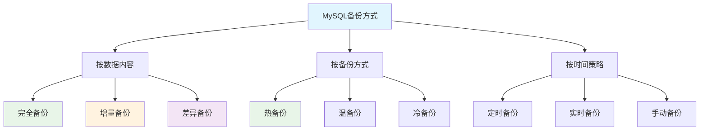

#### 备份方案设计

**RTO与RPO指标**：
- **RTO (Recovery Time Objective)**：系统恢复时间目标
- **RPO (Recovery Point Objective)**：数据丢失时间目标

**备份方案选择**：

| 业务级别 | RTO要求 | RPO要求 | 推荐方案 |
|----------|---------|---------|----------|
| **核心业务** | <1小时 | <5分钟 | 物理备份+二进制日志+主从复制 |
| **重要业务** | <4小时 | <30分钟 | 物理备份+二进制日志 |
| **一般业务** | <24小时 | <2小时 | 逻辑备份+定期备份 |

#### 备份频率规划

**3-2-1备份原则**：
- **3份数据副本**：1份生产数据 + 2份备份
- **2种不同介质**：本地存储 + 远程存储
- **1份异地备份**：防止灾难性事件

**备份计划示例**：
```bash
# 备份计划配置
# 每日全量备份 + 每小时增量备份

# 全量备份（每天凌晨2点）
0 2 * * * /usr/local/bin/mysql_full_backup.sh

# 增量备份（每小时）
0 * * * * /usr/local/bin/mysql_incremental_backup.sh

# 二进制日志备份（每15分钟）
*/15 * * * * /usr/local/bin/mysql_binlog_backup.sh

# 备份清理（保留30天）
0 3 * * * /usr/local/bin/cleanup_old_backups.sh
```

### 逻辑备份

#### mysqldump详解

**mysqldump是MySQL官方提供的逻辑备份工具**，导出SQL语句实现备份。

**基本语法**：
```bash
# 备份单个数据库
mysqldump -u用户名 -p密码 数据库名 > backup.sql

# 备份多个数据库
mysqldump -u用户名 -p密码 --databases db1 db2 > backup.sql

# 备份所有数据库
mysqldump -u用户名 -p密码 --all-databases > backup.sql

# 只备份表结构
mysqldump -u用户名 -p密码 --no-data 数据库名 > structure.sql

# 只备份数据
mysqldump -u用户名 -p密码 --no-create-info 数据库名 > data.sql
```

**重要参数详解**：
```bash
# 一致性备份参数
--single-transaction    # InnoDB一致性备份（推荐）
--lock-all-tables      # 锁定所有表（MyISAM）
--master-data=2        # 记录二进制日志位置
--flush-logs           # 刷新日志

# 性能优化参数
--quick               # 不缓存查询结果，节省内存
--skip-extended-insert # 每行一个INSERT（便于diff）
--compress            # 压缩网络传输
--single-row          # 每行一个INSERT

# 完整备份示例
mysqldump \
  --single-transaction \
  --routines \
  --triggers \
  --events \
  --master-data=2 \
  --flush-logs \
  --quick \
  --compress \
  -u backup_user -p \
  --all-databases > full_backup_$(date +%Y%m%d_%H%M%S).sql
```

**特殊场景备份**：
```bash
# 大表备份（分块导出）
mysqldump \
  --single-transaction \
  --where="id >= 1000000 AND id < 2000000" \
  database_name table_name > table_chunk.sql

# 跨网络备份
mysqldump \
  -h remote_host \
  -u backup_user -p \
  --single-transaction \
  --compress \
  database_name | gzip > remote_backup.sql.gz

# 排除特定表
mysqldump \
  --single-transaction \
  --ignore-table=db.temp_table \
  --ignore-table=db.log_table \
  database_name > selective_backup.sql
```

#### 备份脚本编写

**完整备份脚本示例**：
```bash
#!/bin/bash
# mysql_logical_backup.sh

# 配置变量
MYSQL_USER="backup_user"
MYSQL_PASSWORD="backup_password"
MYSQL_HOST="localhost"
BACKUP_DIR="/data/mysql_backups"
DATE=$(date +%Y%m%d_%H%M%S)
LOG_FILE="$BACKUP_DIR/backup_$DATE.log"

# 创建备份目录
mkdir -p "$BACKUP_DIR"

# 日志函数
log() {
    echo "[$(date '+%Y-%m-%d %H:%M:%S')] $1" | tee -a "$LOG_FILE"
}

# 备份函数
backup_database() {
    local db_name=$1
    local backup_file="$BACKUP_DIR/${db_name}_$DATE.sql"
    
    log "开始备份数据库: $db_name"
    
    # 执行备份
    mysqldump \
        -h "$MYSQL_HOST" \
        -u "$MYSQL_USER" \
        -p"$MYSQL_PASSWORD" \
        --single-transaction \
        --routines \
        --triggers \
        --events \
        --master-data=2 \
        --flush-logs \
        --quick \
        --compress \
        "$db_name" > "$backup_file" 2>>"$LOG_FILE"
    
    if [ $? -eq 0 ]; then
        # 压缩备份文件
        gzip "$backup_file"
        log "数据库 $db_name 备份成功: ${backup_file}.gz"
        
        # 计算文件大小
        size=$(du -h "${backup_file}.gz" | cut -f1)
        log "备份文件大小: $size"
        
        return 0
    else
        log "数据库 $db_name 备份失败"
        return 1
    fi
}

# 主程序
main() {
    log "开始MySQL逻辑备份"
    
    # 获取数据库列表
    databases=$(mysql -h "$MYSQL_HOST" -u "$MYSQL_USER" -p"$MYSQL_PASSWORD" \
                -e "SHOW DATABASES;" | grep -Ev "^(Database|information_schema|performance_schema|mysql|sys)$")
    
    success_count=0
    total_count=0
    
    for db in $databases; do
        total_count=$((total_count + 1))
        if backup_database "$db"; then
            success_count=$((success_count + 1))
        fi
    done
    
    log "备份完成: $success_count/$total_count 成功"
    
    # 清理老备份（保留7天）
    find "$BACKUP_DIR" -name "*.sql.gz" -mtime +7 -delete
    log "清理7天前的备份文件"
}

# 执行备份
main
```

#### 增量备份实现

**基于二进制日志的增量备份**：
```bash
#!/bin/bash
# mysql_incremental_backup.sh

MYSQL_USER="backup_user"
MYSQL_PASSWORD="backup_password"
BINLOG_DIR="/var/lib/mysql"
BACKUP_DIR="/data/mysql_incremental"
DATE=$(date +%Y%m%d_%H%M%S)

# 获取当前二进制日志文件和位置
get_master_status() {
    mysql -u "$MYSQL_USER" -p"$MYSQL_PASSWORD" \
          -e "SHOW MASTER STATUS\G" | grep -E "File|Position"
}

# 刷新二进制日志
flush_logs() {
    mysql -u "$MYSQL_USER" -p"$MYSQL_PASSWORD" -e "FLUSH LOGS;"
}

# 备份二进制日志
backup_binlogs() {
    local start_file=$1
    local end_file=$2
    
    # 复制二进制日志文件
    for binlog in $(ls "$BINLOG_DIR"/mysql-bin.[0-9]*); do
        binlog_name=$(basename "$binlog")
        
        # 判断是否在备份范围内
        if [[ "$binlog_name" > "$start_file" ]] || [[ "$binlog_name" == "$start_file" ]]; then
            if [[ "$binlog_name" < "$end_file" ]] || [[ "$binlog_name" == "$end_file" ]]; then
                cp "$binlog" "$BACKUP_DIR/incremental_$DATE/"
                echo "备份二进制日志: $binlog_name"
            fi
        fi
    done
}

# 主程序
mkdir -p "$BACKUP_DIR/incremental_$DATE"

# 记录当前位置
get_master_status > "$BACKUP_DIR/incremental_$DATE/master_status_$DATE.txt"

# 刷新日志
flush_logs

echo "增量备份完成: $BACKUP_DIR/incremental_$DATE"
```

### 物理备份

#### MySQL Enterprise Backup

**MySQL Enterprise Backup (MEB)** 是Oracle官方提供的物理备份工具。

**基本用法**：
```bash
# 全量备份
mysqlbackup \
  --user=backup_user \
  --password=backup_password \
  --backup-dir=/data/backups/full_$(date +%Y%m%d) \
  backup-and-apply-log

# 增量备份
mysqlbackup \
  --user=backup_user \
  --password=backup_password \
  --backup-dir=/data/backups/incremental_$(date +%Y%m%d_%H%M) \
  --incremental \
  --incremental-base=dir:/data/backups/full_20231201 \
  backup

# 压缩备份
mysqlbackup \
  --user=backup_user \
  --password=backup_password \
  --backup-dir=/data/backups/compressed_backup \
  --compress \
  backup-and-apply-log
```

#### Percona XtraBackup

**Percona XtraBackup** 是开源的物理备份工具，功能强大且免费。

**安装XtraBackup**：
```bash
# CentOS/RHEL
yum install percona-xtrabackup-80

# Ubuntu/Debian
apt-get install percona-xtrabackup-80

# 验证安装
xtrabackup --version
```

**XtraBackup备份操作**：
```bash
# 全量备份
xtrabackup \
  --user=backup_user \
  --password=backup_password \
  --backup \
  --target-dir=/data/backups/full_$(date +%Y%m%d)

# 准备备份（必须步骤）
xtrabackup \
  --prepare \
  --target-dir=/data/backups/full_20231201

# 增量备份
# 第一次增量备份
xtrabackup \
  --user=backup_user \
  --password=backup_password \
  --backup \
  --target-dir=/data/backups/inc1 \
  --incremental-basedir=/data/backups/full_20231201

# 第二次增量备份
xtrabackup \
  --user=backup_user \
  --password=backup_password \
  --backup \
  --target-dir=/data/backups/inc2 \
  --incremental-basedir=/data/backups/inc1

# 准备增量备份
xtrabackup --prepare --apply-log-only --target-dir=/data/backups/full_20231201
xtrabackup --prepare --apply-log-only --target-dir=/data/backups/full_20231201 --incremental-dir=/data/backups/inc1
xtrabackup --prepare --target-dir=/data/backups/full_20231201 --incremental-dir=/data/backups/inc2
```

**XtraBackup高级功能**：
```bash
# 流式备份到远程服务器
xtrabackup \
  --user=backup_user \
  --password=backup_password \
  --backup \
  --stream=xbstream \
  --target-dir=./ | \
  ssh backup-server "xbstream -x -C /data/remote_backups/"

# 压缩备份
xtrabackup \
  --user=backup_user \
  --password=backup_password \
  --backup \
  --compress \
  --compress-threads=4 \
  --target-dir=/data/backups/compressed

# 部分备份（特定数据库）
xtrabackup \
  --user=backup_user \
  --password=backup_password \
  --backup \
  --databases="database1 database2" \
  --target-dir=/data/backups/partial

# 加密备份
xtrabackup \
  --user=backup_user \
  --password=backup_password \
  --backup \
  --encrypt=AES256 \
  --encrypt-key-file=/etc/mysql/backup.key \
  --target-dir=/data/backups/encrypted
```

#### 快照备份

**LVM快照备份**：
```bash
#!/bin/bash
# lvm_snapshot_backup.sh

MYSQL_DATA_DIR="/var/lib/mysql"
LV_PATH="/dev/vg0/mysql_data"
SNAPSHOT_SIZE="10G"
MOUNT_POINT="/mnt/mysql_snapshot"
BACKUP_DIR="/data/mysql_snapshots"
DATE=$(date +%Y%m%d_%H%M%S)

# 刷新表并加读锁
flush_and_lock() {
    mysql -e "FLUSH TABLES WITH READ LOCK; SELECT SLEEP(10);" &
    MYSQL_PID=$!
    sleep 2  # 等待锁生效
}

# 创建LVM快照
create_snapshot() {
    lvcreate -L "$SNAPSHOT_SIZE" -s -n mysql_snapshot_$DATE "$LV_PATH"
    if [ $? -eq 0 ]; then
        echo "快照创建成功: mysql_snapshot_$DATE"
        return 0
    else
        echo "快照创建失败"
        return 1
    fi
}

# 挂载快照
mount_snapshot() {
    mkdir -p "$MOUNT_POINT"
    mount /dev/vg0/mysql_snapshot_$DATE "$MOUNT_POINT"
    if [ $? -eq 0 ]; then
        echo "快照挂载成功: $MOUNT_POINT"
        return 0
    else
        echo "快照挂载失败"
        return 1
    fi
}

# 复制数据
copy_data() {
    mkdir -p "$BACKUP_DIR/snapshot_$DATE"
    cp -a "$MOUNT_POINT"/* "$BACKUP_DIR/snapshot_$DATE/"
    if [ $? -eq 0 ]; then
        echo "数据复制成功: $BACKUP_DIR/snapshot_$DATE"
        return 0
    else
        echo "数据复制失败"
        return 1
    fi
}

# 清理资源
cleanup() {
    # 释放MySQL锁
    kill $MYSQL_PID 2>/dev/null
    
    # 卸载快照
    umount "$MOUNT_POINT" 2>/dev/null
    
    # 删除快照
    lvremove -f /dev/vg0/mysql_snapshot_$DATE 2>/dev/null
    
    echo "清理完成"
}

# 主程序
main() {
    echo "开始LVM快照备份: $DATE"
    
    # 刷新并锁定表
    flush_and_lock
    
    # 创建快照
    if create_snapshot; then
        # 释放锁（快照已创建，可以释放）
        kill $MYSQL_PID
        
        # 挂载快照
        if mount_snapshot; then
            # 复制数据
            copy_data
            
            # 压缩备份
            cd "$BACKUP_DIR"
            tar -czf "snapshot_$DATE.tar.gz" "snapshot_$DATE/"
            rm -rf "snapshot_$DATE/"
            
            echo "快照备份完成: snapshot_$DATE.tar.gz"
        fi
    fi
    
    # 清理资源
    cleanup
}

# 执行备份
main
```

### 恢复操作

#### 完全恢复

**逻辑备份恢复**：
```bash
# 从mysqldump备份恢复
mysql -u root -p < full_backup.sql

# 恢复特定数据库
mysql -u root -p database_name < database_backup.sql

# 恢复时忽略错误
mysql -u root -p --force < backup_with_errors.sql

# 显示恢复进度
pv backup.sql | mysql -u root -p database_name
```

**物理备份恢复**：
```bash
# XtraBackup恢复步骤

# 1. 停止MySQL服务
systemctl stop mysqld

# 2. 清空数据目录（备份现有数据）
mv /var/lib/mysql /var/lib/mysql.bak
mkdir /var/lib/mysql

# 3. 恢复数据文件
xtrabackup \
  --copy-back \
  --target-dir=/data/backups/full_20231201

# 4. 修改文件权限
chown -R mysql:mysql /var/lib/mysql

# 5. 启动MySQL服务
systemctl start mysqld
```

#### 时间点恢复

**PITR (Point-in-Time Recovery)** 可以恢复到任意时间点。

**恢复步骤**：
```bash
#!/bin/bash
# point_in_time_recovery.sh

FULL_BACKUP="/data/backups/full_backup.sql"
BINLOG_DIR="/var/lib/mysql"
TARGET_TIME="2023-12-01 14:30:00"
RECOVERY_DIR="/tmp/mysql_recovery"

# 1. 从完全备份恢复
echo "1. 恢复完全备份..."
mysql -u root -p < "$FULL_BACKUP"

# 2. 获取备份时的二进制日志位置
BINLOG_FILE=$(grep "CHANGE MASTER TO" "$FULL_BACKUP" | sed -n "s/.*MASTER_LOG_FILE='\([^']*\)'.*/\1/p")
BINLOG_POS=$(grep "CHANGE MASTER TO" "$FULL_BACKUP" | sed -n "s/.*MASTER_LOG_POS=\([0-9]*\).*/\1/p")

echo "备份时二进制日志位置: $BINLOG_FILE:$BINLOG_POS"

# 3. 应用二进制日志到目标时间
echo "2. 应用二进制日志到 $TARGET_TIME..."

# 找到所有相关的二进制日志文件
for binlog in $(ls "$BINLOG_DIR"/mysql-bin.[0-9]* | sort); do
    binlog_name=$(basename "$binlog")
    
    # 检查是否需要处理此日志文件
    if [[ "$binlog_name" > "$BINLOG_FILE" ]] || [[ "$binlog_name" == "$BINLOG_FILE" ]]; then
        echo "处理二进制日志: $binlog_name"
        
        if [[ "$binlog_name" == "$BINLOG_FILE" ]]; then
            # 从指定位置开始
            mysqlbinlog \
              --start-position="$BINLOG_POS" \
              --stop-datetime="$TARGET_TIME" \
              "$binlog" | mysql -u root -p
        else
            # 处理完整的日志文件
            mysqlbinlog \
              --stop-datetime="$TARGET_TIME" \
              "$binlog" | mysql -u root -p
        fi
        
        # 检查是否已到达目标时间
        last_event_time=$(mysqlbinlog --start-position=4 "$binlog" | grep "^#" | tail -1 | awk '{print $1 " " $2}' | sed 's/#//')
        if [[ "$last_event_time" > "$TARGET_TIME" ]]; then
            echo "已到达目标时间，停止应用日志"
            break
        fi
    fi
done

echo "时间点恢复完成"
```

**精确时间点恢复**：
```bash
# 基于时间的恢复
mysqlbinlog \
  --start-datetime="2023-12-01 12:00:00" \
  --stop-datetime="2023-12-01 14:30:00" \
  mysql-bin.000001 mysql-bin.000002 | mysql -u root -p

# 基于位置的恢复
mysqlbinlog \
  --start-position=1000 \
  --stop-position=5000 \
  mysql-bin.000001 | mysql -u root -p

# 跳过特定事务（如误删操作）
mysqlbinlog \
  --start-datetime="2023-12-01 12:00:00" \
  --stop-datetime="2023-12-01 13:59:59" \
  mysql-bin.000001 | mysql -u root -p

# 跳过误删操作后继续
mysqlbinlog \
  --start-datetime="2023-12-01 14:01:00" \
  --stop-datetime="2023-12-01 14:30:00" \
  mysql-bin.000001 | mysql -u root -p
```

#### 灾难恢复

**灾难恢复计划**：
```bash
#!/bin/bash
# disaster_recovery.sh

# 灾难恢复配置
PRIMARY_HOST="192.168.1.100"
BACKUP_HOST="192.168.1.200"
MYSQL_USER="admin"
MYSQL_PASSWORD="password"
BACKUP_DIR="/data/mysql_backups"
RECOVERY_LOG="/var/log/mysql_recovery.log"

# 日志函数
log() {
    echo "[$(date '+%Y-%m-%d %H:%M:%S')] $1" | tee -a "$RECOVERY_LOG"
}

# 检查主服务器状态
check_primary() {
    mysqladmin -h "$PRIMARY_HOST" -u "$MYSQL_USER" -p"$MYSQL_PASSWORD" ping &>/dev/null
    return $?
}

# 激活备用服务器
activate_standby() {
    log "激活备用服务器..."
    
    # 1. 停止从库复制
    mysql -h "$BACKUP_HOST" -u "$MYSQL_USER" -p"$MYSQL_PASSWORD" \
          -e "STOP SLAVE;"
    
    # 2. 重置从库状态
    mysql -h "$BACKUP_HOST" -u "$MYSQL_USER" -p"$MYSQL_PASSWORD" \
          -e "RESET SLAVE ALL;"
    
    # 3. 更新DNS或配置文件指向备用服务器
    # update_dns_to_backup
    
    log "备用服务器激活完成"
}

# 从最新备份恢复
restore_from_backup() {
    local target_host=$1
    
    log "从最新备份恢复到 $target_host..."
    
    # 找到最新的备份文件
    latest_backup=$(ls -t "$BACKUP_DIR"/full_*.sql.gz | head -1)
    
    if [ -n "$latest_backup" ]; then
        log "使用备份文件: $latest_backup"
        
        # 恢复数据
        zcat "$latest_backup" | mysql -h "$target_host" -u "$MYSQL_USER" -p"$MYSQL_PASSWORD"
        
        if [ $? -eq 0 ]; then
            log "备份恢复成功"
            return 0
        else
            log "备份恢复失败"
            return 1
        fi
    else
        log "未找到可用的备份文件"
        return 1
    fi
}

# 主程序
main() {
    log "开始灾难恢复检查..."
    
    if ! check_primary; then
        log "主服务器不可用，开始灾难恢复流程"
        
        # 激活备用服务器
        activate_standby
        
        # 发送告警通知
        # send_alert "MySQL主服务器故障，已切换到备用服务器"
        
        log "灾难恢复完成"
    else
        log "主服务器正常运行"
    fi
}

# 执行恢复检查
main
```

**备份恢复最佳实践**：

1. **定期测试恢复**：
```bash
#!/bin/bash
# backup_test.sh

# 每月自动测试恢复流程
test_restore() {
    local test_instance="test_mysql_3307"
    local latest_backup=$(ls -t /data/backups/full_*.sql.gz | head -1)
    
    echo "测试恢复备份: $latest_backup"
    
    # 启动测试实例
    docker run -d --name "$test_instance" \
      -p 3307:3306 \
      -e MYSQL_ROOT_PASSWORD=test123 \
      mysql:8.0
    
    # 等待服务启动
    sleep 30
    
    # 恢复数据
    zcat "$latest_backup" | mysql -h localhost -P 3307 -u root -ptest123
    
    # 验证数据完整性
    mysql -h localhost -P 3307 -u root -ptest123 -e "SELECT COUNT(*) FROM important_table;"
    
    # 清理测试环境
    docker rm -f "$test_instance"
    
    echo "恢复测试完成"
}

# 执行测试
test_restore
```

2. **监控备份状态**：
```sql
-- 创建备份状态表
CREATE TABLE backup_status (
    id INT AUTO_INCREMENT PRIMARY KEY,
    backup_type ENUM('full', 'incremental', 'binlog'),
    backup_file VARCHAR(255),
    backup_size BIGINT,
    start_time DATETIME,
    end_time DATETIME,
    status ENUM('success', 'failed', 'running'),
    error_message TEXT,
    created_at TIMESTAMP DEFAULT CURRENT_TIMESTAMP
);

-- 记录备份状态
INSERT INTO backup_status 
(backup_type, backup_file, start_time, status) 
VALUES ('full', 'full_backup_20231201.sql.gz', NOW(), 'running');
```

## 主从复制与高可用

### 主从复制原理

#### 复制机制详解

**MySQL主从复制**基于二进制日志实现，是MySQL高可用性的核心技术。


**复制流程详解**：

1. **主服务器记录变更**：
   - 所有写操作记录到二进制日志
   - 每个事务获得唯一的日志位置

2. **从服务器请求日志**：
   - I/O线程连接主服务器
   - 请求指定位置之后的日志事件

3. **主服务器传输日志**：
   - Dump线程读取二进制日志
   - 将日志事件发送给从服务器

4. **从服务器接收日志**：
   - I/O线程接收日志事件
   - 写入本地中继日志(Relay Log)

5. **从服务器执行日志**：
   - SQL线程读取中继日志
   - 重放SQL语句到从服务器

#### 复制格式对比

**三种复制格式**：

| 格式 | 记录内容 | 优点 | 缺点 | 适用场景 |
|------|----------|------|------|----------|
| **STATEMENT** | SQL语句 | 日志小、易读 | 非确定函数有问题 | 简单应用 |
| **ROW** | 行变更 | 精确一致、安全 | 日志大 | **生产环境推荐** |
| **MIXED** | 自动选择 | 平衡优缺点 | 复杂度高 | 兼容场景 |

**格式选择示例**：
```sql
-- 查看当前复制格式
SHOW VARIABLES LIKE 'binlog_format';

-- 设置复制格式
SET GLOBAL binlog_format = 'ROW';
SET SESSION binlog_format = 'ROW';

-- 在my.cnf中配置
[mysqld]
binlog_format = ROW
```

**不同格式的日志示例**：
```sql
-- 原始SQL
UPDATE users SET balance = balance + 100 WHERE id IN (1, 2, 3);

-- STATEMENT格式记录
BEGIN;
UPDATE users SET balance = balance + 100 WHERE id IN (1, 2, 3);
COMMIT;

-- ROW格式记录（简化）
BEGIN;
UPDATE users SET id=1, balance=1100 WHERE id=1;  -- 原值1000
UPDATE users SET id=2, balance=1200 WHERE id=2;  -- 原值1100  
UPDATE users SET id=3, balance=1300 WHERE id=3;  -- 原值1200
COMMIT;
```

#### GTID复制

**GTID (Global Transaction Identifier)** 是MySQL 5.6引入的全局事务标识符。

**GTID优势**：
- **全局唯一**：每个事务都有唯一标识符
- **简化故障切换**：无需计算二进制日志位置
- **自动定位**：从服务器自动找到复制位置
- **支持多源复制**：更好的复制拓扑支持

**GTID格式**：
```
GTID = server_uuid:transaction_id
示例: 3E11FA47-71CA-11E1-9E33-C80AA9429562:23
```

**启用GTID复制**：
```sql
-- 主从服务器都需要配置
[mysqld]
# 启用GTID
gtid_mode = ON
enforce_gtid_consistency = ON

# 二进制日志配置
log-bin = mysql-bin
server-id = 1  # 主服务器
# server-id = 2  # 从服务器

# 从服务器配置
read_only = ON
super_read_only = ON
```

**配置GTID复制**：
```sql
-- 主服务器操作
-- 1. 创建复制用户
CREATE USER 'repl'@'%' IDENTIFIED BY 'repl_password';
GRANT REPLICATION SLAVE ON *.* TO 'repl'@'%';

-- 2. 查看GTID状态
SHOW MASTER STATUS;

-- 从服务器操作
-- 1. 配置主从关系
CHANGE MASTER TO
  MASTER_HOST='192.168.1.100',
  MASTER_USER='repl',
  MASTER_PASSWORD='repl_password',
  MASTER_AUTO_POSITION=1;  -- 使用GTID自动定位

-- 2. 启动从服务器
START SLAVE;

-- 3. 检查复制状态
SHOW SLAVE STATUS\G
```

### 复制架构设计

#### 一主多从架构

**一主多从**是最常见的复制架构，用于读写分离和高可用。

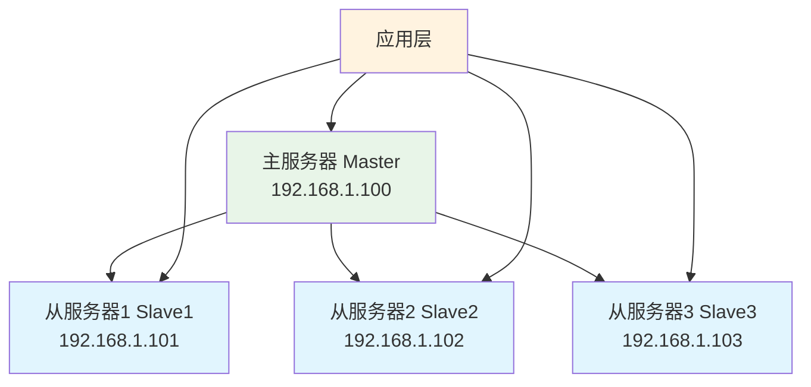

**配置步骤**：
```bash
#!/bin/bash
# setup_master_slave.sh

MASTER_HOST="192.168.1.100"
SLAVE_HOSTS=("192.168.1.101" "192.168.1.102" "192.168.1.103")
REPL_USER="repl_user"
REPL_PASSWORD="repl_pass_123"

# 配置主服务器
setup_master() {
    echo "配置主服务器..."
    
    mysql -h "$MASTER_HOST" -u root -p << EOF
-- 创建复制用户
CREATE USER '$REPL_USER'@'%' IDENTIFIED BY '$REPL_PASSWORD';
GRANT REPLICATION SLAVE ON *.* TO '$REPL_USER'@'%';

-- 刷新权限
FLUSH PRIVILEGES;

-- 查看主服务器状态
SHOW MASTER STATUS;
EOF
}

# 配置从服务器
setup_slave() {
    local slave_host=$1
    local server_id=$2
    
    echo "配置从服务器: $slave_host (server-id: $server_id)"
    
    mysql -h "$slave_host" -u root -p << EOF
-- 设置server-id
SET GLOBAL server_id = $server_id;

-- 配置主从关系
CHANGE MASTER TO
  MASTER_HOST='$MASTER_HOST',
  MASTER_USER='$REPL_USER',
  MASTER_PASSWORD='$REPL_PASSWORD',
  MASTER_AUTO_POSITION=1;

-- 启动从服务器
START SLAVE;

-- 检查状态
SHOW SLAVE STATUS\G
EOF
}

# 主程序
setup_master

# 配置所有从服务器
for i in "${!SLAVE_HOSTS[@]}"; do
    slave_host="${SLAVE_HOSTS[$i]}"
    server_id=$((102 + i))  # 从102开始编号
    setup_slave "$slave_host" "$server_id"
done

echo "一主多从架构配置完成"
```

**读写分离实现**：
```python
# Python示例：读写分离连接池
import pymysql
import random

class MySQLReadWritePool:
    def __init__(self, master_config, slave_configs):
        self.master_config = master_config
        self.slave_configs = slave_configs
        self.master_conn = None
        self.slave_conns = []
        
    def get_master_connection(self):
        """获取主库连接（写操作）"""
        if not self.master_conn:
            self.master_conn = pymysql.connect(**self.master_config)
        return self.master_conn
    
    def get_slave_connection(self):
        """获取从库连接（读操作）"""
        if not self.slave_conns:
            for config in self.slave_configs:
                conn = pymysql.connect(**config)
                self.slave_conns.append(conn)
        
        # 随机选择一个从库
        return random.choice(self.slave_conns)
    
    def execute_write(self, sql, params=None):
        """执行写操作"""
        conn = self.get_master_connection()
        cursor = conn.cursor()
        try:
            cursor.execute(sql, params)
            conn.commit()
            return cursor.fetchall()
        finally:
            cursor.close()
    
    def execute_read(self, sql, params=None):
        """执行读操作"""
        conn = self.get_slave_connection()
        cursor = conn.cursor()
        try:
            cursor.execute(sql, params)
            return cursor.fetchall()
        finally:
            cursor.close()

# 使用示例
pool = MySQLReadWritePool(
    master_config={
        'host': '192.168.1.100',
        'user': 'app_user',
        'password': 'app_pass',
        'database': 'myapp'
    },
    slave_configs=[
        {'host': '192.168.1.101', 'user': 'app_user', 'password': 'app_pass', 'database': 'myapp'},
        {'host': '192.168.1.102', 'user': 'app_user', 'password': 'app_pass', 'database': 'myapp'},
    ]
)

# 写操作使用主库
pool.execute_write("INSERT INTO users (name, email) VALUES (%s, %s)", ("John", "john@example.com"))

# 读操作使用从库
users = pool.execute_read("SELECT * FROM users WHERE status = %s", (1,))
```

#### 主主复制架构

**主主复制**允许两个服务器互为主从，实现双活架构。

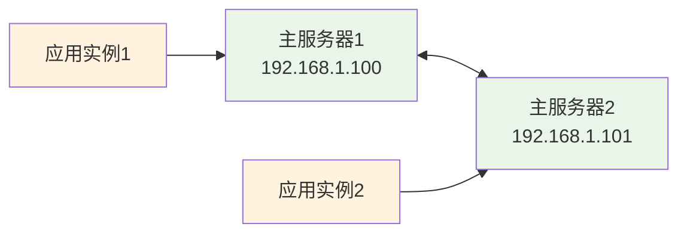

**主主复制配置**：
```sql
-- 服务器1配置 (192.168.1.100)
[mysqld]
server-id = 1
log-bin = mysql-bin
auto_increment_increment = 2    -- 自增步长
auto_increment_offset = 1       -- 自增起始值

-- 服务器2配置 (192.168.1.101)  
[mysqld]
server-id = 2
log-bin = mysql-bin
auto_increment_increment = 2    -- 自增步长
auto_increment_offset = 2       -- 自增起始值

-- 服务器1上配置复制到服务器2
CHANGE MASTER TO
  MASTER_HOST='192.168.1.101',
  MASTER_USER='repl_user',
  MASTER_PASSWORD='repl_password',
  MASTER_AUTO_POSITION=1;

-- 服务器2上配置复制到服务器1
CHANGE MASTER TO
  MASTER_HOST='192.168.1.100',
  MASTER_USER='repl_user', 
  MASTER_PASSWORD='repl_password',
  MASTER_AUTO_POSITION=1;

-- 两台服务器都启动从服务
START SLAVE;
```

**主主复制注意事项**：
```sql
-- 1. 避免主键冲突
-- 使用不同的auto_increment_offset

-- 2. 避免数据冲突
-- 应用层控制写入分区
-- 例如：用户ID奇数写服务器1，偶数写服务器2

-- 3. 监控复制延迟
SELECT 
    SECONDS_BEHIND_MASTER,
    MASTER_HOST,
    IO_THREAD,
    SQL_THREAD
FROM information_schema.replica_host_status;
```

#### 级联复制架构

**级联复制**通过中间从服务器减少主服务器压力。

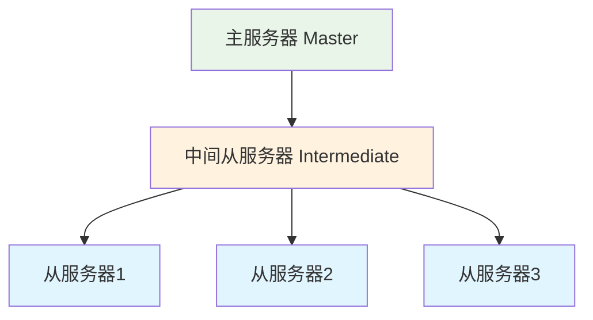

**配置级联复制**：
```sql
-- 中间服务器配置
[mysqld]
server-id = 10
log-bin = mysql-bin
log_slave_updates = ON  -- 重要：记录从主服务器复制的更新

-- 中间服务器作为从服务器
CHANGE MASTER TO
  MASTER_HOST='192.168.1.100',  -- 主服务器
  MASTER_USER='repl_user',
  MASTER_PASSWORD='repl_password',
  MASTER_AUTO_POSITION=1;

START SLAVE;

-- 最终从服务器配置
CHANGE MASTER TO
  MASTER_HOST='192.168.1.110',  -- 中间服务器
  MASTER_USER='repl_user',
  MASTER_PASSWORD='repl_password',
  MASTER_AUTO_POSITION=1;

START SLAVE;
```

### 高可用解决方案

#### MHA高可用架构

**MHA (Master High Availability)** 是一套成熟的MySQL高可用解决方案。

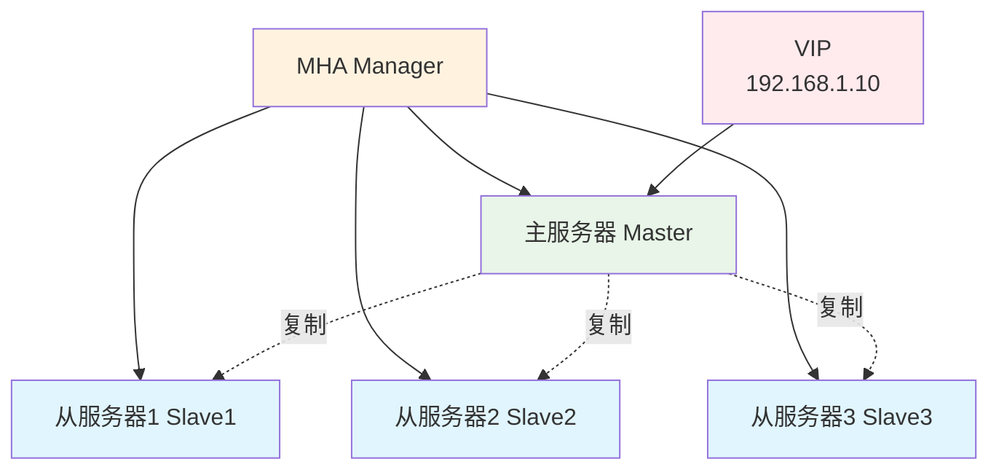

**MHA架构特点**：
- **自动故障切换**：主服务器故障时自动切换
- **数据一致性**：确保切换时数据不丢失
- **快速切换**：通常在10-30秒内完成切换
- **支持在线切换**：支持计划内维护切换

**MHA安装配置**：
```bash
# 安装MHA Manager
yum install mha4mysql-manager-0.58-0.el7.centos.noarch.rpm

# 安装MHA Node（所有MySQL服务器）
yum install mha4mysql-node-0.58-0.el7.centos.noarch.rpm

# 配置SSH免密登录（Manager到所有Node）
ssh-keygen -t rsa
ssh-copy-id root@192.168.1.100  # 主服务器
ssh-copy-id root@192.168.1.101  # 从服务器1
ssh-copy-id root@192.168.1.102  # 从服务器2
```

**MHA配置文件**：
```ini
# /etc/mha/app1.cnf
[server default]
# MHA Manager配置
manager_workdir=/var/log/mha/app1
manager_log=/var/log/mha/app1/manager.log
remote_workdir=/tmp

# MySQL用户配置
user=mha
password=mha_password
ssh_user=root
repl_user=repl
repl_password=repl_password

# 故障切换脚本
master_ip_failover_script=/usr/local/bin/master_ip_failover
shutdown_script=/usr/local/bin/power_manager

# 服务器配置
[server1]
hostname=192.168.1.100
candidate_master=1
check_repl_delay=0

[server2]
hostname=192.168.1.101
candidate_master=1
check_repl_delay=0

[server3]
hostname=192.168.1.102
no_master=1
```

**VIP切换脚本**：
```bash
#!/bin/bash
# /usr/local/bin/master_ip_failover

VIP="192.168.1.10/24"
INTERFACE="eth0"

case "$1" in
  --command=start)
    echo "Adding VIP $VIP to $2"
    ip addr add $VIP dev $INTERFACE
    ;;
  --command=stop)
    echo "Removing VIP $VIP from $2"
    ip addr del $VIP dev $INTERFACE
    ;;
  --command=status)
    echo "Checking VIP $VIP status"
    ip addr show $INTERFACE | grep $VIP
    ;;
esac
```

**MHA启动和管理**：
```bash
# 检查配置
masterha_check_ssh --conf=/etc/mha/app1.cnf
masterha_check_repl --conf=/etc/mha/app1.cnf

# 启动MHA Manager
masterha_manager --conf=/etc/mha/app1.cnf --remove_dead_master_conf --ignore_last_failover

# 手动故障切换
masterha_master_switch --conf=/etc/mha/app1.cnf --master_state=alive --new_master_host=192.168.1.101

# 检查状态
masterha_check_status --conf=/etc/mha/app1.cnf
```

#### MySQL Group Replication

**MySQL Group Replication** 是MySQL 5.7引入的原生高可用解决方案。

**Group Replication特点**：
- **多主模式**：支持多个节点同时写入
- **自动故障检测**：自动检测和处理节点故障
- **数据一致性**：基于Paxos协议保证一致性
- **自动成员管理**：自动管理集群成员关系

**配置Group Replication**：
```sql
-- 所有节点的基础配置
[mysqld]
# 基础配置
server_id = 1  # 每个节点唯一
gtid_mode = ON
enforce_gtid_consistency = ON
binlog_format = ROW
log_bin = mysql-bin
binlog_checksum = NONE

# Group Replication配置
plugin_load_add = 'group_replication.so'
group_replication_group_name = "aaaaaaaa-aaaa-aaaa-aaaa-aaaaaaaaaaaa"
group_replication_start_on_boot = OFF
group_replication_local_address = "192.168.1.100:33061"
group_replication_group_seeds = "192.168.1.100:33061,192.168.1.101:33061,192.168.1.102:33061"
group_replication_bootstrap_group = OFF

# 第一个节点启动（仅第一次）
SET GLOBAL group_replication_bootstrap_group=ON;
START GROUP_REPLICATION;
SET GLOBAL group_replication_bootstrap_group=OFF;

# 其他节点加入
START GROUP_REPLICATION;

-- 检查集群状态
SELECT * FROM performance_schema.replication_group_members;
```

**Group Replication监控**：
```sql
-- 检查成员状态
SELECT 
    MEMBER_ID,
    MEMBER_HOST,
    MEMBER_PORT,
    MEMBER_STATE,
    MEMBER_ROLE
FROM performance_schema.replication_group_members;

-- 检查复制状态
SELECT 
    CHANNEL_NAME,
    MEMBER_ID,
    COUNT_TRANSACTIONS_IN_QUEUE,
    COUNT_TRANSACTIONS_CHECKED,
    COUNT_CONFLICTS_DETECTED
FROM performance_schema.replication_group_member_stats;
```

#### ProxySQL负载均衡

**ProxySQL**是高性能的MySQL代理，提供读写分离和负载均衡功能。

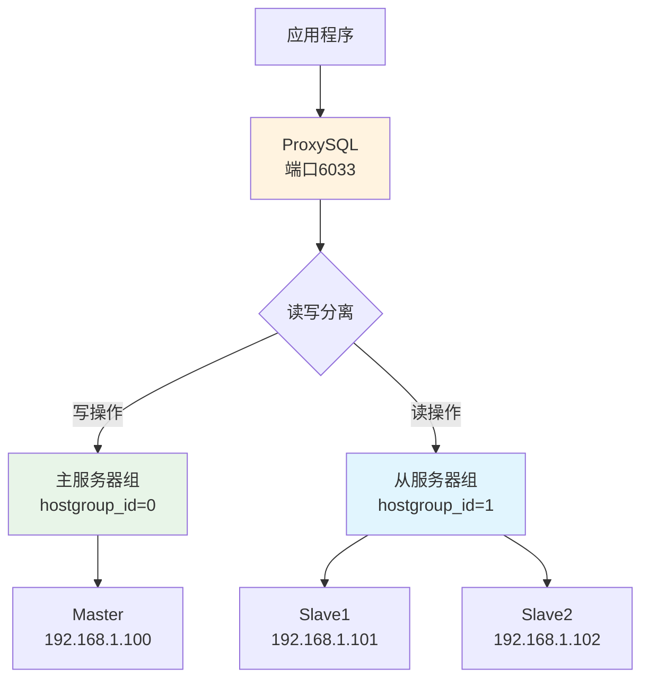

**ProxySQL安装配置**：
```bash
# 安装ProxySQL
yum install proxysql2

# 启动ProxySQL
systemctl start proxysql
systemctl enable proxysql

# 连接ProxySQL管理接口
mysql -u admin -padmin -h 127.0.0.1 -P 6032
```

**ProxySQL配置**：
```sql
-- 1. 配置MySQL服务器
INSERT INTO mysql_servers(hostgroup_id, hostname, port, weight, comment) VALUES
(0, '192.168.1.100', 3306, 1000, 'Master'),
(1, '192.168.1.101', 3306, 900, 'Slave1'),
(1, '192.168.1.102', 3306, 900, 'Slave2');

-- 2. 配置用户
INSERT INTO mysql_users(username, password, default_hostgroup, comment) VALUES
('app_user', 'app_password', 0, 'Application User');

-- 3. 配置查询路由规则
INSERT INTO mysql_query_rules(rule_id, active, match_pattern, destination_hostgroup, apply) VALUES
(1, 1, '^SELECT.*', 1, 1),    -- 读操作路由到从库
(2, 1, '^INSERT.*', 0, 1),    -- 写操作路由到主库
(3, 1, '^UPDATE.*', 0, 1),
(4, 1, '^DELETE.*', 0, 1);

-- 4. 应用配置
LOAD MYSQL SERVERS TO RUNTIME;
LOAD MYSQL USERS TO RUNTIME;
LOAD MYSQL QUERY RULES TO RUNTIME;

-- 5. 保存配置
SAVE MYSQL SERVERS TO DISK;
SAVE MYSQL USERS TO DISK;
SAVE MYSQL QUERY RULES TO DISK;
```

**健康检查配置**：
```sql
-- 配置健康检查用户
CREATE USER 'monitor'@'%' IDENTIFIED BY 'monitor_password';
GRANT REPLICATION CLIENT ON *.* TO 'monitor'@'%';

-- 在ProxySQL中配置监控
UPDATE global_variables SET variable_value='monitor' WHERE variable_name='mysql-monitor_username';
UPDATE global_variables SET variable_value='monitor_password' WHERE variable_name='mysql-monitor_password';
UPDATE global_variables SET variable_value='3000' WHERE variable_name='mysql-monitor_connect_interval';
UPDATE global_variables SET variable_value='1000' WHERE variable_name='mysql-monitor_ping_interval';

LOAD MYSQL VARIABLES TO RUNTIME;
SAVE MYSQL VARIABLES TO DISK;
```

### 分区表设计

#### 分区类型详解

**MySQL支持的分区类型**：

| 分区类型 | 分区键类型 | 适用场景 | 示例 |
|----------|------------|----------|------|
| **RANGE分区** | 连续范围值 | 时间序列数据 | 按年月分区 |
| **LIST分区** | 离散值列表 | 枚举类型数据 | 按地区分区 |
| **HASH分区** | 哈希函数 | 数据均匀分布 | 按用户ID分区 |
| **KEY分区** | MySQL内置哈希 | 主键分区 | 按主键分区 |

**分区的优势**：
- **查询性能提升**：分区剪裁减少扫描数据量
- **维护操作优化**：可以对单个分区进行维护
- **并行处理**：多个分区可以并行处理
- **数据管理**：便于数据的归档和删除

#### RANGE分区实践

**时间范围分区示例**：
```sql
-- 按月分区的订单表
CREATE TABLE orders (
    id INT AUTO_INCREMENT,
    user_id INT NOT NULL,
    order_amount DECIMAL(10,2),
    order_date DATE NOT NULL,
    status TINYINT DEFAULT 1,
    created_at TIMESTAMP DEFAULT CURRENT_TIMESTAMP,
    PRIMARY KEY (id, order_date),  -- 分区键必须包含在主键中
    KEY idx_user_id (user_id),
    KEY idx_status (status)
) 
PARTITION BY RANGE (YEAR(order_date) * 100 + MONTH(order_date)) (
    PARTITION p202301 VALUES LESS THAN (202302),
    PARTITION p202302 VALUES LESS THAN (202303),
    PARTITION p202303 VALUES LESS THAN (202304),
    PARTITION p202304 VALUES LESS THAN (202305),
    PARTITION p202305 VALUES LESS THAN (202306),
    PARTITION p202306 VALUES LESS THAN (202307),
    PARTITION p202307 VALUES LESS THAN (202308),
    PARTITION p202308 VALUES LESS THAN (202309),
    PARTITION p202309 VALUES LESS THAN (202310),
    PARTITION p202310 VALUES LESS THAN (202311),
    PARTITION p202311 VALUES LESS THAN (202312),
    PARTITION p202312 VALUES LESS THAN (202401),
    PARTITION p_future VALUES LESS THAN MAXVALUE
);
```

**自动分区管理脚本**：
```bash
#!/bin/bash
# auto_partition_management.sh

MYSQL_USER="root"
MYSQL_PASSWORD="password"
DATABASE="ecommerce"
TABLE="orders"

# 创建下个月分区
create_next_partition() {
    next_month=$(date -d "next month" +%Y%m)
    next_next_month=$(date -d "+2 months" +%Y%m)
    
    echo "创建分区 p$next_month"
    
    mysql -u "$MYSQL_USER" -p"$MYSQL_PASSWORD" "$DATABASE" << EOF
ALTER TABLE $TABLE 
REORGANIZE PARTITION p_future INTO (
    PARTITION p$next_month VALUES LESS THAN ($next_next_month),
    PARTITION p_future VALUES LESS THAN MAXVALUE
);
EOF
}

# 删除过期分区（保留12个月）
cleanup_old_partitions() {
    cutoff_month=$(date -d "12 months ago" +%Y%m)
    
    # 获取需要删除的分区列表
    old_partitions=$(mysql -u "$MYSQL_USER" -p"$MYSQL_PASSWORD" "$DATABASE" -N -e "
        SELECT PARTITION_NAME 
        FROM information_schema.PARTITIONS 
        WHERE TABLE_SCHEMA='$DATABASE' 
          AND TABLE_NAME='$TABLE' 
          AND PARTITION_NAME REGEXP '^p[0-9]{6}$'
          AND SUBSTRING(PARTITION_NAME, 2) < '$cutoff_month'
    ")
    
    for partition in $old_partitions; do
        echo "删除过期分区: $partition"
        mysql -u "$MYSQL_USER" -p"$MYSQL_PASSWORD" "$DATABASE" << EOF
ALTER TABLE $TABLE DROP PARTITION $partition;
EOF
    done
}

# 执行分区管理
create_next_partition
cleanup_old_partitions

echo "分区管理完成"
```

#### LIST分区应用

**地区分区示例**：
```sql
-- 按地区分区的用户表
CREATE TABLE users_by_region (
    id INT AUTO_INCREMENT,
    username VARCHAR(50) NOT NULL,
    email VARCHAR(100),
    region_code CHAR(2) NOT NULL,
    created_at TIMESTAMP DEFAULT CURRENT_TIMESTAMP,
    PRIMARY KEY (id, region_code),
    UNIQUE KEY idx_username (username, region_code),
    KEY idx_email (email)
)
PARTITION BY LIST (region_code) (
    PARTITION p_north VALUES IN ('BJ', 'TJ', 'HE', 'SX', 'NM'),
    PARTITION p_east VALUES IN ('SH', 'JS', 'ZJ', 'AH', 'FJ', 'JX', 'SD'),
    PARTITION p_south VALUES IN ('GD', 'GX', 'HI', 'HN', 'CQ', 'SC', 'GZ', 'YN'),
    PARTITION p_west VALUES IN ('SN', 'GS', 'QH', 'NX', 'XJ', 'XZ'),
    PARTITION p_northeast VALUES IN ('LN', 'JL', 'HL')
);
```

#### HASH分区优化

**用户数据哈希分区**：
```sql
-- 按用户ID哈希分区
CREATE TABLE user_activities (
    id BIGINT AUTO_INCREMENT,
    user_id INT NOT NULL,
    activity_type VARCHAR(50),
    activity_data JSON,
    created_at TIMESTAMP DEFAULT CURRENT_TIMESTAMP,
    PRIMARY KEY (id, user_id),
    KEY idx_activity_type (activity_type),
    KEY idx_created_at (created_at)
)
PARTITION BY HASH(user_id)
PARTITIONS 16;  -- 16个分区，便于后续扩展
```

**分区性能优化技巧**：
```sql
-- 1. 分区剪裁查询示例
-- 好的查询：能够利用分区剪裁
SELECT * FROM orders 
WHERE order_date BETWEEN '2023-06-01' AND '2023-06-30'
  AND user_id = 12345;

-- 不好的查询：无法利用分区剪裁
SELECT * FROM orders 
WHERE user_id = 12345  -- 没有包含分区键
  AND status = 1;

-- 2. 查看分区剪裁效果
EXPLAIN PARTITIONS 
SELECT * FROM orders 
WHERE order_date BETWEEN '2023-06-01' AND '2023-06-30';
-- 结果中的partitions字段显示访问的分区

-- 3. 分区统计信息
SELECT 
    PARTITION_NAME,
    TABLE_ROWS,
    AVG_ROW_LENGTH,
    DATA_LENGTH,
    INDEX_LENGTH
FROM information_schema.PARTITIONS
WHERE TABLE_SCHEMA = 'ecommerce' 
  AND TABLE_NAME = 'orders'
ORDER BY PARTITION_ORDINAL_POSITION;
```

### 分库分表实践

#### 垂直拆分

**垂直拆分**将不同业务的表拆分到不同数据库。

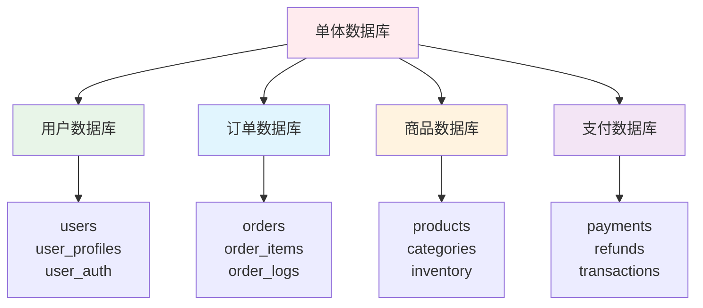

**垂直拆分策略**：
```sql
-- 原始单体数据库表
-- 用户相关表 -> user_db
-- 订单相关表 -> order_db  
-- 商品相关表 -> product_db
-- 支付相关表 -> payment_db

-- 1. 用户数据库 (user_db)
CREATE DATABASE user_db;
CREATE TABLE user_db.users (
    id INT AUTO_INCREMENT PRIMARY KEY,
    username VARCHAR(50) UNIQUE,
    email VARCHAR(100),
    created_at TIMESTAMP DEFAULT CURRENT_TIMESTAMP
);

-- 2. 订单数据库 (order_db)
CREATE DATABASE order_db;
CREATE TABLE order_db.orders (
    id INT AUTO_INCREMENT PRIMARY KEY,
    user_id INT NOT NULL,  -- 外键关联到user_db.users.id
    total_amount DECIMAL(10,2),
    created_at TIMESTAMP DEFAULT CURRENT_TIMESTAMP
);

-- 跨库关联查询处理
-- 应用层先查询用户信息，再查询订单信息
```

#### 水平拆分

**水平拆分**将单表的数据按照某种规则拆分到多个表或多个库。

**按用户ID分表示例**：
```sql
-- 用户表水平拆分（按用户ID模运算）
-- 假设分为4个表：users_0, users_1, users_2, users_3

-- 分表函数
-- table_index = user_id % 4

-- 用户表结构（每个分表结构相同）
CREATE TABLE users_0 (
    id INT AUTO_INCREMENT PRIMARY KEY,
    user_id INT UNIQUE NOT NULL,
    username VARCHAR(50),
    email VARCHAR(100),
    created_at TIMESTAMP DEFAULT CURRENT_TIMESTAMP,
    KEY idx_user_id (user_id)
);

-- 类似地创建 users_1, users_2, users_3
```

**分库分表路由逻辑**：
```python
# Python分库分表路由示例
class DatabaseRouter:
    def __init__(self):
        self.db_configs = {
            'user_db_0': {'host': '192.168.1.101', 'database': 'user_db_0'},
            'user_db_1': {'host': '192.168.1.102', 'database': 'user_db_1'},
            'user_db_2': {'host': '192.168.1.103', 'database': 'user_db_2'},
            'user_db_3': {'host': '192.168.1.104', 'database': 'user_db_3'},
        }
        self.table_count = 4
        self.db_count = 4
    
    def get_db_table(self, user_id):
        """根据用户ID计算数据库和表"""
        db_index = user_id % self.db_count
        table_index = user_id % self.table_count
        
        db_name = f'user_db_{db_index}'
        table_name = f'users_{table_index}'
        
        return db_name, table_name
    
    def get_connection(self, db_name):
        """获取数据库连接"""
        config = self.db_configs[db_name]
        return pymysql.connect(**config)
    
    def insert_user(self, user_id, username, email):
        """插入用户数据"""
        db_name, table_name = self.get_db_table(user_id)
        conn = self.get_connection(db_name)
        
        sql = f"INSERT INTO {table_name} (user_id, username, email) VALUES (%s, %s, %s)"
        cursor = conn.cursor()
        cursor.execute(sql, (user_id, username, email))
        conn.commit()
        cursor.close()
        conn.close()
    
    def get_user(self, user_id):
        """查询用户数据"""
        db_name, table_name = self.get_db_table(user_id)
        conn = self.get_connection(db_name)
        
        sql = f"SELECT * FROM {table_name} WHERE user_id = %s"
        cursor = conn.cursor()
        cursor.execute(sql, (user_id,))
        result = cursor.fetchone()
        cursor.close()
        conn.close()
        
        return result

# 使用示例
router = DatabaseRouter()
router.insert_user(12345, 'john_doe', 'john@example.com')
user = router.get_user(12345)
```

## 实际应用与最佳实践

### 电商系统数据库设计

#### 核心表结构设计

**用户模块**：
```sql
-- 用户基础信息表
CREATE TABLE users (
    id INT UNSIGNED AUTO_INCREMENT PRIMARY KEY,
    username VARCHAR(50) NOT NULL UNIQUE COMMENT '用户名',
    email VARCHAR(100) NOT NULL UNIQUE COMMENT '邮箱',
    phone CHAR(11) UNIQUE COMMENT '手机号',
    password_hash VARCHAR(255) NOT NULL COMMENT '密码哈希',
    salt VARCHAR(32) NOT NULL COMMENT '密码盐值',
    status TINYINT UNSIGNED DEFAULT 1 COMMENT '状态：1-正常，2-禁用',
    created_at TIMESTAMP DEFAULT CURRENT_TIMESTAMP COMMENT '创建时间',
    updated_at TIMESTAMP DEFAULT CURRENT_TIMESTAMP ON UPDATE CURRENT_TIMESTAMP,
    
    INDEX idx_email (email),
    INDEX idx_phone (phone),
    INDEX idx_status_created (status, created_at)
) ENGINE=InnoDB DEFAULT CHARSET=utf8mb4 COLLATE=utf8mb4_unicode_ci COMMENT='用户表';

-- 用户详细信息表
CREATE TABLE user_profiles (
    user_id INT UNSIGNED PRIMARY KEY,
    real_name VARCHAR(50) COMMENT '真实姓名',
    gender ENUM('M', 'F', 'U') DEFAULT 'U' COMMENT '性别',
    birthday DATE COMMENT '生日',
    avatar_url VARCHAR(255) COMMENT '头像URL',
    bio TEXT COMMENT '个人简介',
    level TINYINT UNSIGNED DEFAULT 1 COMMENT '用户等级',
    points INT UNSIGNED DEFAULT 0 COMMENT '积分',
    balance DECIMAL(15,2) DEFAULT 0.00 COMMENT '账户余额',
    
    FOREIGN KEY (user_id) REFERENCES users(id) ON DELETE CASCADE,
    INDEX idx_level (level),
    INDEX idx_points (points)
) ENGINE=InnoDB DEFAULT CHARSET=utf8mb4 COLLATE=utf8mb4_unicode_ci COMMENT='用户详细信息表';
```

**商品模块**：
```sql
-- 商品分类表
CREATE TABLE categories (
    id INT UNSIGNED AUTO_INCREMENT PRIMARY KEY,
    parent_id INT UNSIGNED DEFAULT 0 COMMENT '父分类ID，0表示顶级分类',
    name VARCHAR(100) NOT NULL COMMENT '分类名称',
    slug VARCHAR(100) NOT NULL UNIQUE COMMENT 'URL别名',
    description TEXT COMMENT '分类描述',
    sort_order INT UNSIGNED DEFAULT 0 COMMENT '排序权重',
    is_active TINYINT(1) DEFAULT 1 COMMENT '是否激活',
    
    INDEX idx_parent_id (parent_id),
    INDEX idx_sort_order (sort_order),
    INDEX idx_is_active (is_active)
) ENGINE=InnoDB DEFAULT CHARSET=utf8mb4 COLLATE=utf8mb4_unicode_ci COMMENT='商品分类表';

-- 商品表
CREATE TABLE products (
    id INT UNSIGNED AUTO_INCREMENT PRIMARY KEY,
    category_id INT UNSIGNED NOT NULL COMMENT '分类ID',
    brand_id INT UNSIGNED COMMENT '品牌ID',
    name VARCHAR(255) NOT NULL COMMENT '商品名称',
    slug VARCHAR(255) NOT NULL UNIQUE COMMENT 'URL别名',
    description TEXT COMMENT '商品描述',
    price DECIMAL(10,2) NOT NULL COMMENT '价格',
    cost_price DECIMAL(10,2) COMMENT '成本价',
    market_price DECIMAL(10,2) COMMENT '市场价',
    stock_quantity INT UNSIGNED DEFAULT 0 COMMENT '库存数量',
    min_stock INT UNSIGNED DEFAULT 0 COMMENT '最低库存预警',
    weight DECIMAL(8,2) COMMENT '重量(kg)',
    dimensions VARCHAR(50) COMMENT '尺寸',
    sku VARCHAR(100) UNIQUE COMMENT '商品编码',
    status ENUM('active', 'inactive', 'out_of_stock') DEFAULT 'active',
    is_featured TINYINT(1) DEFAULT 0 COMMENT '是否精选',
    created_at TIMESTAMP DEFAULT CURRENT_TIMESTAMP,
    updated_at TIMESTAMP DEFAULT CURRENT_TIMESTAMP ON UPDATE CURRENT_TIMESTAMP,
    
    FOREIGN KEY (category_id) REFERENCES categories(id),
    INDEX idx_category_id (category_id),
    INDEX idx_brand_id (brand_id),
    INDEX idx_price (price),
    INDEX idx_status (status),
    INDEX idx_is_featured (is_featured),
    INDEX idx_created_at (created_at),
    FULLTEXT idx_name_desc (name, description)
) ENGINE=InnoDB DEFAULT CHARSET=utf8mb4 COLLATE=utf8mb4_unicode_ci COMMENT='商品表';
```

**订单模块**：
```sql
-- 订单表
CREATE TABLE orders (
    id INT UNSIGNED AUTO_INCREMENT PRIMARY KEY,
    order_no VARCHAR(32) NOT NULL UNIQUE COMMENT '订单号',
    user_id INT UNSIGNED NOT NULL COMMENT '用户ID',
    status ENUM('pending', 'paid', 'shipped', 'delivered', 'cancelled', 'refunded') DEFAULT 'pending',
    payment_status ENUM('unpaid', 'paid', 'refunded') DEFAULT 'unpaid',
    shipping_status ENUM('unshipped', 'shipped', 'delivered') DEFAULT 'unshipped',
    
    -- 价格信息
    subtotal DECIMAL(10,2) NOT NULL DEFAULT 0.00 COMMENT '商品小计',
    shipping_fee DECIMAL(10,2) DEFAULT 0.00 COMMENT '运费',
    discount_amount DECIMAL(10,2) DEFAULT 0.00 COMMENT '优惠金额',
    tax_amount DECIMAL(10,2) DEFAULT 0.00 COMMENT '税费',
    total_amount DECIMAL(10,2) NOT NULL DEFAULT 0.00 COMMENT '订单总额',
    
    -- 收货信息
    shipping_name VARCHAR(50) NOT NULL COMMENT '收货人姓名',
    shipping_phone VARCHAR(20) NOT NULL COMMENT '收货人电话',
    shipping_address TEXT NOT NULL COMMENT '收货地址',
    
    -- 时间信息
    paid_at TIMESTAMP NULL COMMENT '支付时间',
    shipped_at TIMESTAMP NULL COMMENT '发货时间',
    delivered_at TIMESTAMP NULL COMMENT '收货时间',
    created_at TIMESTAMP DEFAULT CURRENT_TIMESTAMP,
    updated_at TIMESTAMP DEFAULT CURRENT_TIMESTAMP ON UPDATE CURRENT_TIMESTAMP,
    
    FOREIGN KEY (user_id) REFERENCES users(id),
    INDEX idx_order_no (order_no),
    INDEX idx_user_id (user_id),
    INDEX idx_status (status),
    INDEX idx_payment_status (payment_status),
    INDEX idx_created_at (created_at)
) ENGINE=InnoDB DEFAULT CHARSET=utf8mb4 COLLATE=utf8mb4_unicode_ci COMMENT='订单表'
PARTITION BY RANGE (YEAR(created_at) * 100 + MONTH(created_at)) (
    PARTITION p202301 VALUES LESS THAN (202302),
    PARTITION p202302 VALUES LESS THAN (202303),
    PARTITION p202303 VALUES LESS THAN (202304),
    PARTITION p202304 VALUES LESS THAN (202305),
    PARTITION p202305 VALUES LESS THAN (202306),
    PARTITION p202306 VALUES LESS THAN (202307),
    PARTITION p202307 VALUES LESS THAN (202308),
    PARTITION p202308 VALUES LESS THAN (202309),
    PARTITION p202309 VALUES LESS THAN (202310),
    PARTITION p202310 VALUES LESS THAN (202311),
    PARTITION p202311 VALUES LESS THAN (202312),
    PARTITION p202312 VALUES LESS THAN (202401),
    PARTITION p_future VALUES LESS THAN MAXVALUE
);

-- 订单商品表
CREATE TABLE order_items (
    id INT UNSIGNED AUTO_INCREMENT PRIMARY KEY,
    order_id INT UNSIGNED NOT NULL COMMENT '订单ID',
    product_id INT UNSIGNED NOT NULL COMMENT '商品ID',
    product_name VARCHAR(255) NOT NULL COMMENT '商品名称',
    product_sku VARCHAR(100) COMMENT '商品SKU',
    price DECIMAL(10,2) NOT NULL COMMENT '商品单价',
    quantity INT UNSIGNED NOT NULL COMMENT '购买数量',
    subtotal DECIMAL(10,2) NOT NULL COMMENT '小计金额',
    
    FOREIGN KEY (order_id) REFERENCES orders(id) ON DELETE CASCADE,
    FOREIGN KEY (product_id) REFERENCES products(id),
    INDEX idx_order_id (order_id),
    INDEX idx_product_id (product_id)
) ENGINE=InnoDB DEFAULT CHARSET=utf8mb4 COLLATE=utf8mb4_unicode_ci COMMENT='订单商品表';
```

#### 业务逻辑实现

**库存管理**：
```sql
-- 库存操作存储过程
DELIMITER //
CREATE PROCEDURE UpdateProductStock(
    IN p_product_id INT UNSIGNED,
    IN p_quantity INT,
    IN p_operation ENUM('increase', 'decrease'),
    OUT p_result TINYINT,
    OUT p_message VARCHAR(255)
)
BEGIN
    DECLARE current_stock INT DEFAULT 0;
    DECLARE EXIT HANDLER FOR SQLEXCEPTION
    BEGIN
        ROLLBACK;
        SET p_result = 0;
        SET p_message = 'Database error occurred';
    END;
    
    START TRANSACTION;
    
    -- 锁定商品记录
    SELECT stock_quantity INTO current_stock 
    FROM products 
    WHERE id = p_product_id 
    FOR UPDATE;
    
    -- 检查商品是否存在
    IF current_stock IS NULL THEN
        SET p_result = 0;
        SET p_message = 'Product not found';
        ROLLBACK;
    ELSEIF p_operation = 'decrease' AND current_stock < p_quantity THEN
        SET p_result = 0;
        SET p_message = 'Insufficient stock';
        ROLLBACK;
    ELSE
        -- 更新库存
        IF p_operation = 'increase' THEN
            UPDATE products 
            SET stock_quantity = stock_quantity + p_quantity,
                updated_at = NOW()
            WHERE id = p_product_id;
        ELSE
            UPDATE products 
            SET stock_quantity = stock_quantity - p_quantity,
                updated_at = NOW()
            WHERE id = p_product_id;
        END IF;
        
        SET p_result = 1;
        SET p_message = 'Stock updated successfully';
        COMMIT;
    END IF;
END//
DELIMITER ;

-- 使用示例
CALL UpdateProductStock(12345, 5, 'decrease', @result, @message);
SELECT @result, @message;
```

**订单状态流转**：
```sql
-- 订单状态更新触发器
DELIMITER //
CREATE TRIGGER order_status_log 
AFTER UPDATE ON orders
FOR EACH ROW
BEGIN
    IF OLD.status != NEW.status THEN
        INSERT INTO order_status_logs (
            order_id, 
            old_status, 
            new_status, 
            changed_at,
            operator_id
        ) VALUES (
            NEW.id, 
            OLD.status, 
            NEW.status, 
            NOW(),
            @current_user_id
        );
    END IF;
END//
DELIMITER ;
```

### 金融系统数据库设计

#### 账户与交易系统

**账户表设计**：
```sql
-- 账户表
CREATE TABLE accounts (
    id BIGINT UNSIGNED AUTO_INCREMENT PRIMARY KEY,
    account_no VARCHAR(32) NOT NULL UNIQUE COMMENT '账户号',
    user_id INT UNSIGNED NOT NULL COMMENT '用户ID',
    account_type ENUM('savings', 'checking', 'credit', 'loan') NOT NULL COMMENT '账户类型',
    currency CHAR(3) DEFAULT 'CNY' COMMENT '货币类型',
    balance DECIMAL(20,2) NOT NULL DEFAULT 0.00 COMMENT '账户余额',
    frozen_amount DECIMAL(20,2) DEFAULT 0.00 COMMENT '冻结金额',
    credit_limit DECIMAL(20,2) DEFAULT 0.00 COMMENT '信用额度',
    status ENUM('active', 'frozen', 'closed') DEFAULT 'active' COMMENT '账户状态',
    created_at TIMESTAMP DEFAULT CURRENT_TIMESTAMP,
    updated_at TIMESTAMP DEFAULT CURRENT_TIMESTAMP ON UPDATE CURRENT_TIMESTAMP,
    
    FOREIGN KEY (user_id) REFERENCES users(id),
    INDEX idx_account_no (account_no),
    INDEX idx_user_id (user_id),
    INDEX idx_account_type (account_type),
    INDEX idx_status (status)
) ENGINE=InnoDB DEFAULT CHARSET=utf8mb4 COLLATE=utf8mb4_unicode_ci COMMENT='账户表';

-- 交易记录表
CREATE TABLE transactions (
    id BIGINT UNSIGNED AUTO_INCREMENT PRIMARY KEY,
    transaction_no VARCHAR(64) NOT NULL UNIQUE COMMENT '交易流水号',
    from_account_id BIGINT UNSIGNED COMMENT '出账账户ID',
    to_account_id BIGINT UNSIGNED COMMENT '入账账户ID',
    transaction_type ENUM('transfer', 'deposit', 'withdrawal', 'payment', 'refund') NOT NULL,
    amount DECIMAL(20,2) NOT NULL COMMENT '交易金额',
    currency CHAR(3) DEFAULT 'CNY' COMMENT '货币类型',
    fee DECIMAL(10,2) DEFAULT 0.00 COMMENT '手续费',
    status ENUM('pending', 'processing', 'completed', 'failed', 'cancelled') DEFAULT 'pending',
    description TEXT COMMENT '交易描述',
    reference_no VARCHAR(64) COMMENT '关联订单号',
    
    -- 余额快照（用于对账）
    from_balance_before DECIMAL(20,2) COMMENT '出账前余额',
    from_balance_after DECIMAL(20,2) COMMENT '出账后余额',
    to_balance_before DECIMAL(20,2) COMMENT '入账前余额',
    to_balance_after DECIMAL(20,2) COMMENT '入账后余额',
    
    created_at TIMESTAMP DEFAULT CURRENT_TIMESTAMP,
    completed_at TIMESTAMP NULL COMMENT '完成时间',
    
    INDEX idx_transaction_no (transaction_no),
    INDEX idx_from_account (from_account_id),
    INDEX idx_to_account (to_account_id),
    INDEX idx_transaction_type (transaction_type),
    INDEX idx_status (status),
    INDEX idx_created_at (created_at),
    INDEX idx_reference_no (reference_no)
) ENGINE=InnoDB DEFAULT CHARSET=utf8mb4 COLLATE=utf8mb4_unicode_ci COMMENT='交易记录表'
PARTITION BY RANGE (UNIX_TIMESTAMP(created_at)) (
    PARTITION p202301 VALUES LESS THAN (UNIX_TIMESTAMP('2023-02-01')),
    PARTITION p202302 VALUES LESS THAN (UNIX_TIMESTAMP('2023-03-01')),
    PARTITION p202303 VALUES LESS THAN (UNIX_TIMESTAMP('2023-04-01')),
    PARTITION p_future VALUES LESS THAN MAXVALUE
);
```

**转账事务处理**：
```sql
-- 安全转账存储过程
DELIMITER //
CREATE PROCEDURE TransferMoney(
    IN p_from_account_id BIGINT UNSIGNED,
    IN p_to_account_id BIGINT UNSIGNED,
    IN p_amount DECIMAL(20,2),
    IN p_description TEXT,
    IN p_reference_no VARCHAR(64),
    OUT p_transaction_id BIGINT UNSIGNED,
    OUT p_result TINYINT,
    OUT p_message VARCHAR(255)
)
BEGIN
    DECLARE v_from_balance DECIMAL(20,2) DEFAULT 0;
    DECLARE v_to_balance DECIMAL(20,2) DEFAULT 0;
    DECLARE v_transaction_no VARCHAR(64);
    DECLARE v_from_status ENUM('active', 'frozen', 'closed');
    DECLARE v_to_status ENUM('active', 'frozen', 'closed');
    
    DECLARE EXIT HANDLER FOR SQLEXCEPTION
    BEGIN
        ROLLBACK;
        SET p_result = 0;
        SET p_message = 'Transaction failed due to database error';
    END;
    
    -- 生成交易流水号
    SET v_transaction_no = CONCAT('TXN', DATE_FORMAT(NOW(), '%Y%m%d%H%i%s'), LPAD(CONNECTION_ID(), 6, '0'));
    
    START TRANSACTION;
    
    -- 1. 锁定并检查出账账户
    SELECT balance, status INTO v_from_balance, v_from_status
    FROM accounts 
    WHERE id = p_from_account_id 
    FOR UPDATE;
    
    IF v_from_status != 'active' THEN
        SET p_result = 0;
        SET p_message = 'From account is not active';
        ROLLBACK;
        LEAVE proc_exit;
    END IF;
    
    IF v_from_balance < p_amount THEN
        SET p_result = 0;
        SET p_message = 'Insufficient balance';
        ROLLBACK;
        LEAVE proc_exit;
    END IF;
    
    -- 2. 锁定并检查入账账户
    SELECT balance, status INTO v_to_balance, v_to_status
    FROM accounts 
    WHERE id = p_to_account_id 
    FOR UPDATE;
    
    IF v_to_status != 'active' THEN
        SET p_result = 0;
        SET p_message = 'To account is not active';
        ROLLBACK;
        LEAVE proc_exit;
    END IF;
    
    -- 3. 创建交易记录
    INSERT INTO transactions (
        transaction_no, from_account_id, to_account_id, 
        transaction_type, amount, status, description, reference_no,
        from_balance_before, to_balance_before
    ) VALUES (
        v_transaction_no, p_from_account_id, p_to_account_id,
        'transfer', p_amount, 'processing', p_description, p_reference_no,
        v_from_balance, v_to_balance
    );
    
    SET p_transaction_id = LAST_INSERT_ID();
    
    -- 4. 更新出账账户余额
    UPDATE accounts 
    SET balance = balance - p_amount,
        updated_at = NOW()
    WHERE id = p_from_account_id;
    
    -- 5. 更新入账账户余额
    UPDATE accounts 
    SET balance = balance + p_amount,
        updated_at = NOW()
    WHERE id = p_to_account_id;
    
    -- 6. 更新交易记录状态
    UPDATE transactions 
    SET status = 'completed',
        from_balance_after = v_from_balance - p_amount,
        to_balance_after = v_to_balance + p_amount,
        completed_at = NOW()
    WHERE id = p_transaction_id;
    
    SET p_result = 1;
    SET p_message = 'Transfer completed successfully';
    COMMIT;
    
proc_exit:
END//
DELIMITER ;
```

## MySQL 高频面试题

### 基础概念题

#### 1. MySQL存储引擎对比

**面试题**：请对比InnoDB和MyISAM存储引擎的区别。

**参考答案**：

| 特性 | InnoDB | MyISAM |
|------|--------|---------|
| **事务支持** | ✅ 支持ACID事务 | ❌ 不支持事务 |
| **锁机制** | 行级锁 + 表级锁 | 表级锁 |
| **外键约束** | ✅ 支持外键 | ❌ 不支持外键 |
| **崩溃恢复** | ✅ 自动崩溃恢复 | ❌ 需要手动修复 |
| **MVCC** | ✅ 支持多版本并发控制 | ❌ 不支持 |
| **存储结构** | 聚簇索引，数据和索引一起存储 | 非聚簇索引，数据和索引分离 |
| **内存使用** | 缓冲池缓存数据和索引 | 只缓存索引 |
| **COUNT(*)性能** | 需要扫描全表 | 直接返回（无WHERE条件） |
| **适用场景** | **OLTP，高并发，事务要求高** | OLAP，读多写少，数据仓库 |

**扩展回答**：
- **为什么InnoDB是默认引擎**：MySQL 5.5开始InnoDB成为默认引擎，主要因为现代应用对事务和并发的要求越来越高
- **选择建议**：生产环境推荐使用InnoDB，除非有特殊需求（如只读数据仓库）才考虑MyISAM

#### 2. MySQL索引类型和原理

**面试题**：MySQL有哪些索引类型？B+树索引为什么比B树更适合数据库？

**参考答案**：

**索引类型**：
1. **按数据结构分类**：
   - B+树索引（默认，最常用）
   - 哈希索引（Memory引擎）
   - 全文索引（FULLTEXT）
   - 空间索引（SPATIAL）

2. **按物理存储分类**：
   - 聚簇索引（主键索引）
   - 非聚簇索引（二级索引）

3. **按字段特性分类**：
   - 主键索引（PRIMARY KEY）
   - 唯一索引（UNIQUE）
   - 普通索引（INDEX）
   - 复合索引（多列索引）

**B+树 vs B树优势**：
1. **范围查询效率**：B+树叶子节点有指针连接，范围查询只需扫描叶子节点
2. **稳定的查询性能**：B+树所有数据都在叶子节点，查询路径长度一致
3. **更高的扇出比**：内部节点不存储数据，可以存储更多键值，树高更低
4. **更好的缓存局部性**：叶子节点连续存储，利于预读和缓存

#### 3. 事务隔离级别详解

**面试题**：MySQL的四种事务隔离级别是什么？分别解决了什么问题？

**参考答案**：

| 隔离级别 | 脏读 | 不可重复读 | 幻读 | 加锁方式 |
|----------|------|------------|------|----------|
| **READ UNCOMMITTED** | ✅ | ✅ | ✅ | 几乎不加锁 |
| **READ COMMITTED** | ❌ | ✅ | ✅ | 读取时加共享锁，读完释放 |
| **REPEATABLE READ** | ❌ | ❌ | ✅ | 读取时加共享锁，事务结束释放 |
| **SERIALIZABLE** | ❌ | ❌ | ❌ | 读加共享锁，写加排他锁 |

**问题解决**：
- **脏读**：读取未提交的数据
- **不可重复读**：同一事务中多次读取同一数据结果不同
- **幻读**：同一事务中多次读取数据行数不同

**MySQL默认**：REPEATABLE READ（通过MVCC和Next-Key Lock解决大部分幻读问题）

### 性能优化题

#### 4. 慢查询优化实战

**面试题**：给定一个慢查询，如何进行优化？

```sql
-- 慢查询示例
SELECT u.username, u.email, COUNT(o.id) as order_count
FROM users u
LEFT JOIN orders o ON u.id = o.user_id
WHERE u.created_at > '2023-01-01'
  AND o.status = 'completed'
GROUP BY u.id
ORDER BY order_count DESC
LIMIT 10;
```

**优化思路**：

1. **使用EXPLAIN分析**：
```sql
EXPLAIN FORMAT=JSON 
SELECT u.username, u.email, COUNT(o.id) as order_count
FROM users u
LEFT JOIN orders o ON u.id = o.user_id
WHERE u.created_at > '2023-01-01'
  AND o.status = 'completed'
GROUP BY u.id
ORDER BY order_count DESC
LIMIT 10;
```

2. **索引优化**：
```sql
-- 添加必要索引
CREATE INDEX idx_users_created_at ON users(created_at);
CREATE INDEX idx_orders_user_status ON orders(user_id, status);
CREATE INDEX idx_orders_status_user ON orders(status, user_id);
```

3. **查询重写**：
```sql
-- 优化后查询
SELECT u.username, u.email, o.order_count
FROM users u
JOIN (
    SELECT user_id, COUNT(*) as order_count
    FROM orders 
    WHERE status = 'completed'
    GROUP BY user_id
    ORDER BY order_count DESC
    LIMIT 10
) o ON u.id = o.user_id
WHERE u.created_at > '2023-01-01';
```

4. **分析优化效果**：
- 减少JOIN的数据量
- 先过滤再JOIN
- 利用覆盖索引

#### 5. 大表分页优化

**面试题**：如何优化大表的深度分页查询？

**问题示例**：
```sql
-- 慢查询：大偏移量分页
SELECT * FROM large_table ORDER BY id LIMIT 1000000, 20;
```

**优化方案**：

1. **使用主键范围**：
```sql
-- 记录上次查询的最大ID
SELECT * FROM large_table 
WHERE id > 1000020  -- 上次查询的最后一个ID
ORDER BY id LIMIT 20;
```

2. **延迟关联优化**：
```sql
-- 先查询ID，再关联获取完整数据
SELECT t.* FROM large_table t
INNER JOIN (
    SELECT id FROM large_table 
    ORDER BY id LIMIT 1000000, 20
) temp ON t.id = temp.id;
```

3. **使用游标分页**：
```sql
-- 基于游标的分页
SELECT * FROM large_table 
WHERE id > :cursor_id 
ORDER BY id LIMIT 20;
```

### 架构设计题

#### 6. 主从复制延迟问题

**面试题**：主从复制出现延迟，如何排查和解决？

**排查步骤**：

1. **检查复制状态**：
```sql
-- 主库
SHOW MASTER STATUS;

-- 从库
SHOW SLAVE STATUS\G
-- 关注：Seconds_Behind_Master、Slave_IO_Running、Slave_SQL_Running
```

2. **分析延迟原因**：
```sql
-- 查看复制事件
SHOW PROCESSLIST;

-- 查看二进制日志事件
SHOW BINLOG EVENTS IN 'mysql-bin.000001';

-- 监控复制性能
SELECT * FROM performance_schema.replication_applier_status_by_worker;
```

**解决方案**：

1. **硬件优化**：
   - 升级从服务器硬件（CPU、内存、SSD）
   - 使用更快的网络连接

2. **配置优化**：
```sql
-- 并行复制（MySQL 5.7+）
slave_parallel_type = LOGICAL_CLOCK
slave_parallel_workers = 8
slave_preserve_commit_order = ON

-- 复制优化参数
sync_binlog = 1
innodb_flush_log_at_trx_commit = 1
slave_compressed_protocol = ON
```

3. **架构优化**：
   - 使用半同步复制
   - 实施读写分离
   - 考虑分库分表

#### 7. 数据库连接池设计

**面试题**：如何设计一个数据库连接池？需要考虑哪些因素？

**设计要点**：

1. **核心参数**：
```java
public class ConnectionPoolConfig {
    private int minIdle = 10;           // 最小空闲连接数
    private int maxActive = 100;        // 最大活跃连接数
    private int maxWait = 30000;        // 最大等待时间(ms)
    private int maxAge = 3600000;       // 连接最大存活时间(ms)
    private int timeBetweenEvictionRunsMillis = 60000;  // 检测空闲连接间隔
    private boolean testOnBorrow = true;   // 获取连接时检测
    private boolean testWhileIdle = true;  // 空闲时检测
    private String validationQuery = "SELECT 1";  // 连接检测SQL
}
```

2. **关键功能**：
   - **连接创建和销毁**
   - **连接池大小管理**
   - **连接有效性检测**
   - **连接泄漏检测**
   - **性能监控**

3. **注意事项**：
   - **避免连接泄漏**：确保连接使用后归还
   - **合理设置超时**：避免无限等待
   - **监控连接池状态**：活跃连接数、等待队列长度
   - **故障恢复**：数据库重启后重新建立连接

### 实战应用题

#### 8. 秒杀系统数据库设计

**面试题**：设计一个秒杀系统的数据库架构，如何保证数据一致性？

**架构设计**：

1. **表结构设计**：
```sql
-- 秒杀活动表
CREATE TABLE seckill_activities (
    id INT UNSIGNED AUTO_INCREMENT PRIMARY KEY,
    product_id INT UNSIGNED NOT NULL,
    start_time TIMESTAMP NOT NULL,
    end_time TIMESTAMP NOT NULL,
    total_stock INT UNSIGNED NOT NULL,
    current_stock INT UNSIGNED NOT NULL,
    price DECIMAL(10,2) NOT NULL,
    status ENUM('pending', 'active', 'ended') DEFAULT 'pending',
    version INT UNSIGNED DEFAULT 0,  -- 乐观锁版本号
    
    INDEX idx_product_time (product_id, start_time),
    INDEX idx_status (status)
) ENGINE=InnoDB;

-- 秒杀订单表
CREATE TABLE seckill_orders (
    id BIGINT UNSIGNED AUTO_INCREMENT PRIMARY KEY,
    activity_id INT UNSIGNED NOT NULL,
    user_id INT UNSIGNED NOT NULL,
    product_id INT UNSIGNED NOT NULL,
    order_no VARCHAR(32) NOT NULL UNIQUE,
    status ENUM('pending', 'paid', 'cancelled') DEFAULT 'pending',
    created_at TIMESTAMP DEFAULT CURRENT_TIMESTAMP,
    
    UNIQUE KEY uk_activity_user (activity_id, user_id),  -- 防止重复下单
    INDEX idx_order_no (order_no),
    INDEX idx_user_id (user_id)
) ENGINE=InnoDB;
```

2. **库存扣减策略**：
```sql
-- 方案1：乐观锁
UPDATE seckill_activities 
SET current_stock = current_stock - 1,
    version = version + 1
WHERE id = ? 
  AND current_stock > 0 
  AND version = ?;

-- 方案2：悲观锁
SELECT current_stock FROM seckill_activities 
WHERE id = ? FOR UPDATE;

UPDATE seckill_activities 
SET current_stock = current_stock - 1
WHERE id = ? AND current_stock > 0;
```

3. **性能优化方案**：
   - **Redis预扣库存**：先在Redis中扣库存，异步同步到数据库
   - **消息队列削峰**：使用MQ处理下单请求
   - **读写分离**：查询走从库，写入走主库
   - **分库分表**：按活动ID或用户ID分表

#### 9. 数据库选型决策

**面试题**：在什么场景下选择MySQL？什么场景下选择NoSQL？

**MySQL适用场景**：
- **OLTP事务处理**：需要ACID特性
- **复杂关联查询**：多表JOIN操作
- **数据一致性要求高**：金融、支付等
- **成熟的生态系统**：工具链完善
- **技术团队熟悉度高**：维护成本低

**NoSQL适用场景**：
- **大数据量**：需要水平扩展
- **高并发读写**：缓存、计数器等
- **灵活的数据模型**：非结构化数据
- **地理分布**：多数据中心部署
- **实时性要求高**：毫秒级响应

**混合架构**：
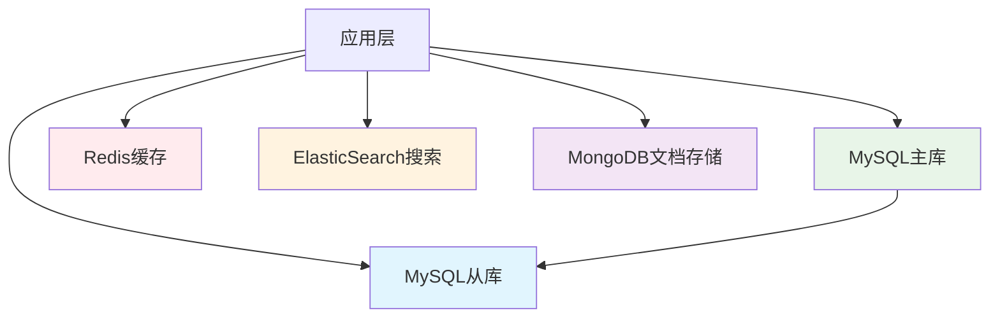

**最佳实践总结**：

1. **数据库设计原则**：
   - 遵循三范式，但适度反范式化
   - 选择合适的数据类型
   - 合理设计索引策略
   - 考虑分区和分表需求

2. **性能优化策略**：
   - 定期分析慢查询日志
   - 监控数据库性能指标
   - 合理配置数据库参数
   - 实施读写分离架构

3. **高可用保障**：
   - 建立完善的备份策略
   - 实施主从复制
   - 准备故障切换方案
   - 定期进行灾难恢复演练

4. **运维管理规范**：
   - 建立数据库变更流程
   - 实施数据库监控告警
   - 制定容量规划策略
   - 培训团队技术能力

这份MySQL文档涵盖了从基础概念到高级应用的各个方面，包括实际的配置示例、脚本代码和最佳实践，可以作为学习和面试的重要参考资料。

