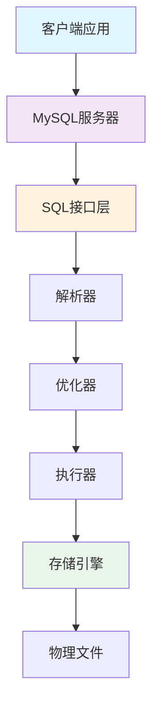
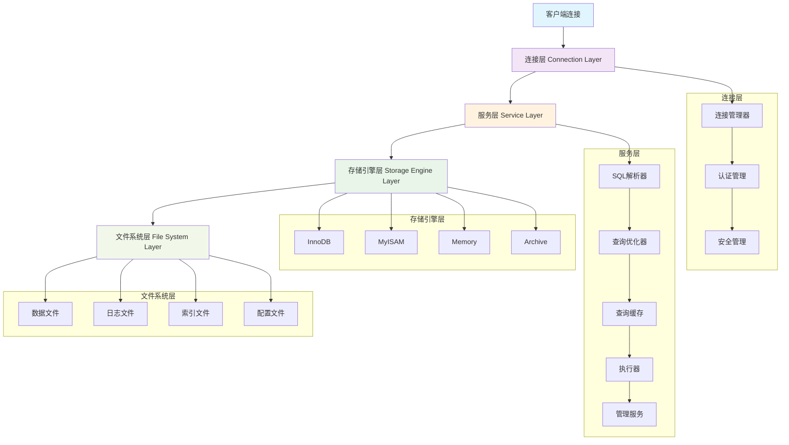
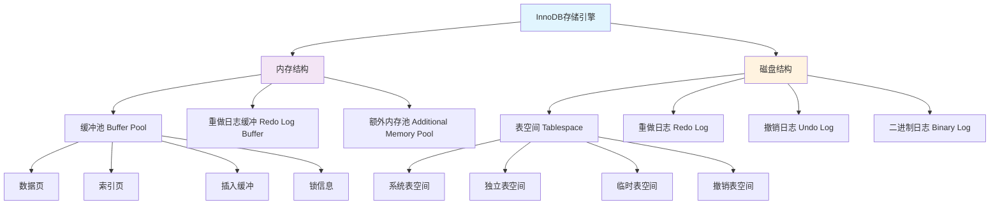
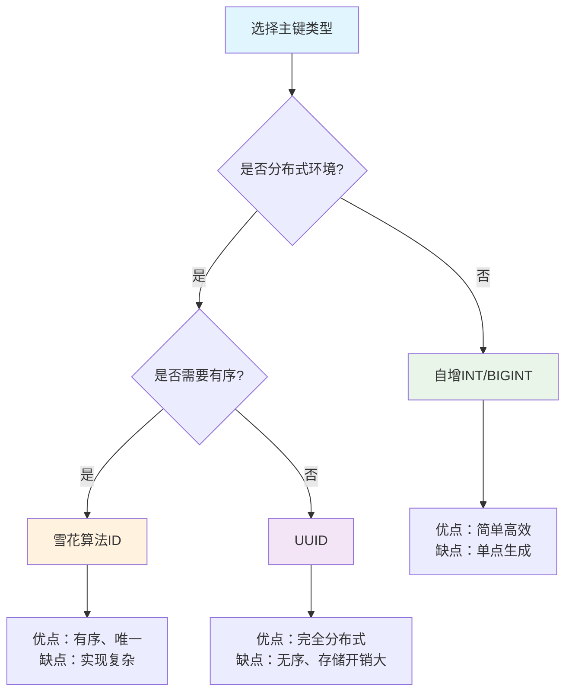
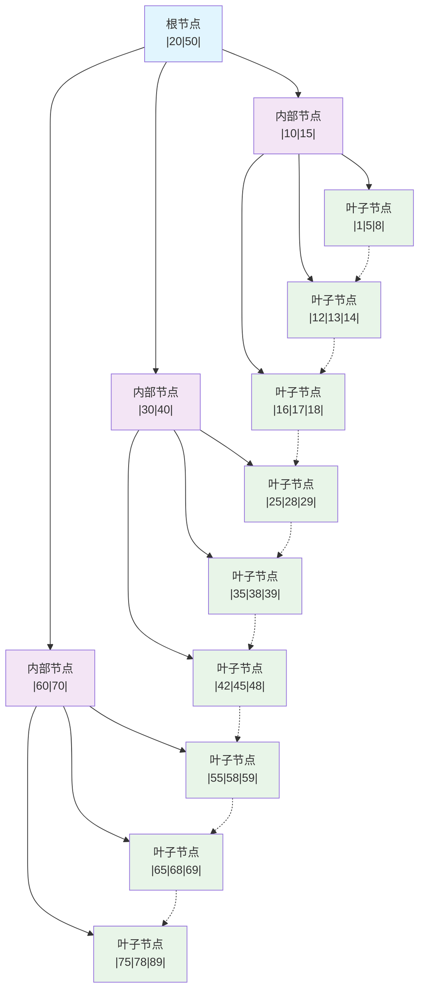
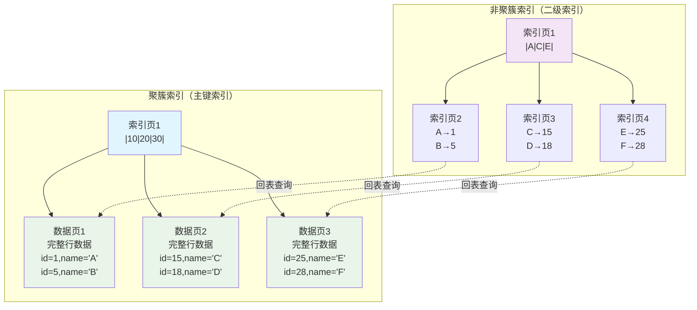

# 23. MySQL

## 目录
- [23. MySQL](#23-mysql)
  - [目录](#目录)
  - [MySQL 基础概念](#mysql-基础概念)
    - [MySQL 简介](#mysql-简介)
    - [MySQL 特点与优势](#mysql-特点与优势)
      - [1. 性能优势](#1-性能优势)
      - [2. 可靠性保障](#2-可靠性保障)
      - [3. 易用性特点](#3-易用性特点)
      - [4. 扩展性设计](#4-扩展性设计)
    - [MySQL 版本演进](#mysql-版本演进)
      - [重要版本里程碑](#重要版本里程碑)
      - [MySQL 8.0 重大改进](#mysql-80-重大改进)
    - [MySQL 应用场景](#mysql-应用场景)
      - [1. Web应用开发](#1-web应用开发)
      - [2. 企业级应用](#2-企业级应用)
      - [3. 大数据分析](#3-大数据分析)
      - [4. 移动应用后端](#4-移动应用后端)
      - [5. 物联网(IoT)应用](#5-物联网iot应用)
      - [6. 游戏行业应用](#6-游戏行业应用)
      - [7. 金融科技领域](#7-金融科技领域)
      - [8. 教育行业应用](#8-教育行业应用)
  - [MySQL 架构与存储引擎](#mysql-架构与存储引擎)
    - [MySQL 整体架构](#mysql-整体架构)
      - [连接层](#连接层)
      - [服务层](#服务层)
      - [存储引擎层](#存储引擎层)
      - [文件系统层](#文件系统层)
    - [存储引擎对比](#存储引擎对比)
      - [InnoDB 存储引擎](#innodb-存储引擎)
      - [MyISAM 存储引擎](#myisam-存储引擎)
      - [Memory 存储引擎](#memory-存储引擎)
      - [其他存储引擎](#其他存储引擎)
    - [InnoDB 内部结构](#innodb-内部结构)
      - [缓冲池 (Buffer Pool)](#缓冲池-buffer-pool)
      - [重做日志 (Redo Log)](#重做日志-redo-log)
      - [撤销日志 (Undo Log)](#撤销日志-undo-log)
      - [二进制日志 (Binary Log)](#二进制日志-binary-log)
  - [数据类型与表设计](#数据类型与表设计)
    - [MySQL 数据类型](#mysql-数据类型)
      - [数值类型](#数值类型)
      - [字符串类型](#字符串类型)
      - [日期时间类型](#日期时间类型)
      - [JSON 数据类型](#json-数据类型)
    - [表设计最佳实践](#表设计最佳实践)
      - [表结构设计原则](#表结构设计原则)
      - [字段类型选择](#字段类型选择)
      - [主键设计策略](#主键设计策略)
      - [外键约束使用](#外键约束使用)
    - [字符集与排序规则](#字符集与排序规则)
      - [字符集选择](#字符集选择)
      - [排序规则配置](#排序规则配置)
      - [字符集转换](#字符集转换)
  - [索引原理与优化](#索引原理与优化)
    - [索引基础概念](#索引基础概念)
      - [索引定义与作用](#索引定义与作用)
      - [索引分类](#索引分类)
      - [索引数据结构](#索引数据结构)
    - [B+树索引原理](#b树索引原理)
      - [B+树结构特点](#b树结构特点)
      - [索引查找过程](#索引查找过程)
      - [聚簇索引与非聚簇索引](#聚簇索引与非聚簇索引)
    - [索引使用策略](#索引使用策略)
      - [单列索引](#单列索引)
      - [复合索引](#复合索引)
      - [覆盖索引](#覆盖索引)
      - [前缀索引](#前缀索引)
    - [索引优化技巧](#索引优化技巧)
      - [索引失效场景](#索引失效场景)
      - [索引选择性分析](#索引选择性分析)
      - [索引维护策略](#索引维护策略)
  - [SQL语句优化](#sql语句优化)
    - [查询优化基础](#查询优化基础)
      - [执行计划分析](#执行计划分析)
      - [查询成本分析](#查询成本分析)
    - [SELECT 查询优化](#select-查询优化)
      - [WHERE 条件优化](#where-条件优化)
      - [JOIN 连接优化](#join-连接优化)
      - [LIMIT 分页优化](#limit-分页优化)
    - [DML 语句优化](#dml-语句优化)
      - [INSERT 插入优化](#insert-插入优化)
      - [UPDATE 更新优化](#update-更新优化)
    - [子查询与表连接](#子查询与表连接)
      - [子查询优化](#子查询优化)
      - [EXISTS vs IN](#exists-vs-in)
  - [事务与锁机制](#事务与锁机制)
    - [事务基础概念](#事务基础概念)
      - [ACID 特性](#acid-特性)
      - [事务隔离级别](#事务隔离级别)
      - [事务控制语句](#事务控制语句)
    - [并发控制问题](#并发控制问题)
      - [脏读 (Dirty Read)](#脏读-dirty-read)
      - [不可重复读 (Non-Repeatable Read)](#不可重复读-non-repeatable-read)
      - [幻读 (Phantom Read)](#幻读-phantom-read)
      - [丢失更新 (Lost Update)](#丢失更新-lost-update)
    - [InnoDB 锁机制](#innodb-锁机制)
      - [锁的分类](#锁的分类)

--- 

## MySQL 基础概念

### MySQL 简介

**MySQL** 是世界上最流行的开源关系型数据库管理系统之一，由瑞典MySQL AB公司开发，现在由Oracle公司维护。MySQL以其高性能、可靠性和易用性而著称，广泛应用于Web应用程序、企业级应用和大型网站。



**MySQL核心特点**：
- **开源免费**：基于GPL许可证，有商业许可版本
- **跨平台**：支持Linux、Windows、macOS等多种操作系统
- **多存储引擎**：支持InnoDB、MyISAM、Memory等多种存储引擎
- **高性能**：经过优化的查询引擎，支持大型数据库应用
- **ACID兼容**：完全支持事务的ACID特性
- **可扩展**：支持主从复制、集群、分片等扩展方案

### MySQL 特点与优势

#### 1. 性能优势
- **查询优化器**：智能的SQL查询优化器，自动选择最优执行路径
- **索引支持**：支持B+树、哈希、全文索引等多种索引类型
- **缓存机制**：查询缓存、InnoDB缓冲池等多级缓存
- **并发处理**：支持大量并发连接和事务处理

#### 2. 可靠性保障
- **事务支持**：完整的ACID事务特性
- **数据完整性**：支持主键、外键、唯一性等约束
- **故障恢复**：自动崩溃恢复、二进制日志、增量备份
- **复制机制**：主从复制保证数据冗余和高可用

#### 3. 易用性特点
- **标准SQL**：遵循SQL标准，语法简洁易懂
- **丰富工具**：MySQL Workbench、phpMyAdmin等图形化管理工具
- **完善文档**：详细的官方文档和社区支持
- **API支持**：支持多种编程语言的连接库

#### 4. 扩展性设计
- **水平扩展**：支持读写分离、分库分表
- **垂直扩展**：支持硬件升级、配置优化
- **集群方案**：MySQL Cluster、Galera Cluster等
- **云原生**：支持容器化部署、云数据库服务

### MySQL 版本演进

#### 重要版本里程碑

| 版本 | 发布时间 | 主要特性 |
|------|----------|----------|
| **MySQL 3.23** | 2001年 | MyISAM存储引擎、全文索引 |
| **MySQL 4.0** | 2003年 | 查询缓存、InnoDB事务支持 |
| **MySQL 4.1** | 2004年 | 子查询、Unicode支持 |
| **MySQL 5.0** | 2005年 | 存储过程、触发器、视图 |
| **MySQL 5.1** | 2008年 | 分区表、事件调度器 |
| **MySQL 5.5** | 2010年 | **InnoDB为默认引擎**、半同步复制 |
| **MySQL 5.6** | 2013年 | GTID复制、Online DDL、性能改进 |
| **MySQL 5.7** | 2015年 | **JSON数据类型**、Generated Columns、性能大幅提升 |
| **MySQL 8.0** | 2018年 | **窗口函数**、CTE、原子DDL、角色管理 |

#### MySQL 8.0 重大改进
1. **性能提升**：
   - 默认字符集从latin1改为utf8mb4
   - 改进的优化器统计信息
   - 更好的内存使用和锁定算法

2. **新功能特性**：
   - **窗口函数**：ROW_NUMBER()、RANK()、LAG()等
   - **公用表表达式(CTE)**：WITH子句支持递归查询
   - **JSON增强**：JSON_TABLE()、JSON聚合函数
   - **原子DDL**：DDL操作的原子性保证

3. **安全性增强**：
   - 默认身份验证插件caching_sha2_password
   - 角色管理和密码验证组件
   - 数据字典加密

4. **管理性改进**：
   - 不可见索引和降序索引
   - 资源组管理
   - 改进的复制功能

### MySQL 应用场景

#### 1. Web应用开发
MySQL是LAMP/LNMP技术栈的重要组成部分，广泛用于：
- **内容管理系统**：WordPress、Drupal、Joomla
- **电商平台**：Magento、OpenCart
- **社交网络**：Facebook早期使用MySQL
- **博客系统**：各种CMS和个人博客

**典型架构**：
```
[Web服务器] --> [应用服务器] --> [MySQL数据库]
     |              |                   |
   nginx/Apache   PHP/Java/Python    InnoDB存储引擎
```

#### 2. 企业级应用
- **ERP系统**：企业资源规划
- **CRM系统**：客户关系管理
- **财务系统**：会计、报表、审计
- **人力资源**：员工管理、薪资系统

**特点要求**：
- 高可靠性和数据一致性
- 复杂的业务逻辑支持
- 严格的权限控制
- 完善的备份恢复机制

#### 3. 大数据分析
虽然MySQL不是专门的大数据工具，但在中等规模数据分析中表现出色：
- **OLAP查询**：使用窗口函数和聚合查询
- **报表生成**：结合BI工具生成业务报表
- **数据仓库**：作为数据集市的存储引擎
- **实时分析**：配合Redis等内存数据库

#### 4. 移动应用后端
- **API服务**：RESTful API的数据存储
- **用户管理**：注册、登录、权限管理
- **内容存储**：文章、图片元信息、评论
- **推送系统**：消息队列和用户偏好存储

#### 5. 物联网(IoT)应用
- **设备数据采集**：传感器数据存储
- **时序数据**：配合时间分区表存储
- **设备管理**：设备注册、状态监控
- **数据分析**：设备行为分析和预测

#### 6. 游戏行业应用
- **玩家数据**：账户信息、游戏进度
- **排行榜系统**：积分、等级排名
- **游戏内经济**：虚拟物品、交易记录
- **日志分析**：游戏行为数据分析

**性能优化重点**：
- 读写分离架构
- 合理的分库分表策略
- 缓存层设计
- 异步处理机制

#### 7. 金融科技领域
- **支付系统**：交易记录、资金流水
- **风控系统**：信用评估、反欺诈
- **投资管理**：组合管理、风险分析
- **数字货币**：钱包管理、交易撮合

**安全要求**：
- 数据加密存储
- 审计日志记录
- 高可用架构
- 灾难恢复方案

#### 8. 教育行业应用
- **学习管理系统**：课程、学员管理
- **在线考试**：题库、成绩管理
- **教学资源**：课件、视频元数据
- **学生信息**：档案、成绩、选课

**特色需求**：
- 学期周期性数据处理
- 大批量成绩导入导出
- 复杂的权限分级管理
- 历史数据长期保存

MySQL凭借其稳定性、性能和生态系统的完善，在各个行业都有广泛应用。合理的架构设计和优化策略是发挥MySQL优势的关键。

## MySQL 架构与存储引擎

### MySQL 整体架构

MySQL采用分层架构设计，从上到下分为连接层、服务层、存储引擎层和文件系统层。



#### 连接层

**连接层**是MySQL的最外层，负责处理客户端连接和用户认证。

**主要组件**：
- **连接管理器**：
  - 管理客户端连接的建立、维护和断开
  - 支持TCP/IP、命名管道、Unix域套接字等连接方式
  - 维护连接池，复用连接资源

- **认证管理**：
  - 验证用户身份和密码
  - 支持多种认证插件（mysql_native_password、caching_sha2_password等）
  - 管理用户权限和访问控制

- **安全管理**：
  - SSL/TLS加密连接
  - IP白名单和防火墙规则
  - 审计日志和安全监控

**连接过程**：
```sql
-- 查看当前连接
SHOW PROCESSLIST;

-- 查看连接数配置
SHOW VARIABLES LIKE 'max_connections';
SHOW VARIABLES LIKE 'max_user_connections';

-- 查看当前连接状态
SHOW STATUS LIKE 'Connections';
SHOW STATUS LIKE 'Threads_connected';
```

#### 服务层

**服务层**包含MySQL的核心功能，负责SQL解析、优化和执行。

**主要组件**：

1. **SQL解析器 (Parser)**：
   - 词法分析：将SQL语句分解为Token
   - 语法分析：构建抽象语法树(AST)
   - 语义分析：检查表、字段是否存在

2. **查询优化器 (Optimizer)**：
   - **基于成本的优化(CBO)**：选择执行成本最低的方案
   - **基于规则的优化(RBO)**：应用预定义的优化规则
   - **执行计划生成**：确定表连接顺序、索引使用策略

3. **查询缓存 (Query Cache)**：
   - 缓存SELECT语句结果
   - 提高相同查询的响应速度
   - MySQL 8.0已移除此功能

4. **执行器 (Executor)**：
   - 根据执行计划调用存储引擎API
   - 处理查询结果并返回给客户端
   - 管理临时表和排序操作

5. **管理服务**：
   - 备份恢复
   - 安全管理
   - 集群管理
   - 性能监控

#### 存储引擎层

**存储引擎层**是MySQL的插件式架构核心，不同存储引擎提供不同的存储和索引策略。

**特点**：
- **插件式架构**：可以为不同的表选择不同的存储引擎
- **统一接口**：存储引擎提供统一的API接口
- **功能差异**：不同引擎在事务、锁定、索引等方面有不同特性

**常用命令**：
```sql
-- 查看支持的存储引擎
SHOW ENGINES;

-- 查看表的存储引擎
SHOW TABLE STATUS LIKE 'table_name';

-- 修改表的存储引擎
ALTER TABLE table_name ENGINE = InnoDB;
```

#### 文件系统层

**文件系统层**负责数据的物理存储，包括各种数据文件和日志文件。

**文件类型**：
- **数据文件**：.ibd文件（InnoDB）、.MYD文件（MyISAM）
- **索引文件**：.MYI文件（MyISAM独立索引文件）
- **日志文件**：redo log、undo log、binary log、error log
- **配置文件**：my.cnf、my.ini

### 存储引擎对比

#### InnoDB 存储引擎

**InnoDB**是MySQL的默认存储引擎（MySQL 5.5+），专为高性能和高可靠性设计。

**主要特性**：
- **ACID事务支持**：完整的事务特性
- **行级锁定**：支持行级锁和表级锁
- **外键约束**：支持引用完整性
- **崩溃恢复**：自动崩溃恢复机制
- **MVCC**：多版本并发控制
- **聚簇索引**：数据按主键顺序存储

**适用场景**：
- 需要事务支持的应用
- 高并发读写操作
- 数据一致性要求高
- 在线事务处理(OLTP)

**性能特点**：
```sql
-- InnoDB状态查看
SHOW ENGINE INNODB STATUS;

-- 关键配置参数
SHOW VARIABLES LIKE 'innodb_buffer_pool_size';
SHOW VARIABLES LIKE 'innodb_log_file_size';
SHOW VARIABLES LIKE 'innodb_flush_log_at_trx_commit';
```

#### MyISAM 存储引擎

**MyISAM**是MySQL早期的默认存储引擎，以读取速度快著称。

**主要特性**：
- **表级锁定**：只支持表级锁
- **非事务性**：不支持事务和外键
- **压缩表**：支持表压缩，节省存储空间
- **快速COUNT()**：快速统计表行数
- **全文索引**：早期版本的全文搜索支持

**适用场景**：
- 读多写少的应用
- 数据仓库和分析系统
- 日志和历史数据存储
- 对事务要求不高的场景

**局限性**：
- 不支持事务
- 表级锁影响并发性能
- 崩溃后数据恢复困难

#### Memory 存储引擎

**Memory**存储引擎将数据存储在内存中，提供极快的访问速度。

**主要特性**：
- **内存存储**：所有数据存储在RAM中
- **表级锁定**：支持表级锁
- **哈希索引**：默认使用哈希索引
- **固定长度行**：所有行长度相同

**适用场景**：
- 临时数据存储
- 缓存表
- 中间结果集
- 会话数据

**注意事项**：
- 服务器重启数据丢失
- 内存大小限制表大小
- 不支持BLOB和TEXT类型

#### 其他存储引擎

| 存储引擎 | 特点 | 适用场景 |
|----------|------|----------|
| **Archive** | 高压缩比、只支持INSERT和SELECT | 日志归档、历史数据 |
| **CSV** | 以CSV格式存储数据 | 数据交换、导入导出 |
| **Federated** | 访问远程MySQL表 | 分布式数据访问 |
| **NDB Cluster** | 分布式计算、内存存储 | 高可用集群、电信级应用 |
| **BlackHole** | 丢弃写入数据、不存储 | 复制架构、性能测试 |

### InnoDB 内部结构

InnoDB存储引擎的内部结构复杂，理解其工作原理对性能优化至关重要。



#### 缓冲池 (Buffer Pool)

**缓冲池**是InnoDB最重要的内存结构，用于缓存表数据和索引。

**组成部分**：
- **数据页缓存**：缓存表数据页
- **索引页缓存**：缓存索引页
- **插入缓冲**：优化非聚簇索引的插入
- **自适应哈希索引**：自动创建的哈希索引
- **锁信息**：事务锁信息

**工作原理**：
1. **页面置换算法**：使用改进的LRU算法管理页面
2. **预读机制**：预读相邻页面提高I/O效率
3. **脏页刷新**：定期将修改过的页面写入磁盘

**配置优化**：
```sql
-- 查看缓冲池配置
SHOW VARIABLES LIKE 'innodb_buffer_pool_size';
SHOW VARIABLES LIKE 'innodb_buffer_pool_instances';

-- 查看缓冲池状态
SHOW STATUS LIKE 'Innodb_buffer_pool%';

-- 建议配置（物理内存的70-80%）
SET GLOBAL innodb_buffer_pool_size = 1073741824; -- 1GB
```

#### 重做日志 (Redo Log)

**重做日志**确保事务的持久性，记录所有对InnoDB表的修改。

**工作机制**：
1. **WAL原则**：先写日志，再写数据页(Write-Ahead Logging)
2. **循环写入**：重做日志文件循环使用
3. **检查点**：定期创建检查点，标记已刷新到磁盘的数据

**配置参数**：
```sql
-- 重做日志配置
SHOW VARIABLES LIKE 'innodb_log_file_size';
SHOW VARIABLES LIKE 'innodb_log_files_in_group';
SHOW VARIABLES LIKE 'innodb_flush_log_at_trx_commit';

-- 建议配置
innodb_log_file_size = 256M
innodb_log_files_in_group = 2
innodb_flush_log_at_trx_commit = 1  -- 最高安全性
```

**innodb_flush_log_at_trx_commit参数**：
- **0**：每秒刷新一次，性能最好但可能丢失1秒数据
- **1**：每次事务提交都刷新，最安全但性能最低
- **2**：每次事务提交写入OS缓存，每秒刷新到磁盘

#### 撤销日志 (Undo Log)

**撤销日志**用于实现事务回滚和MVCC多版本并发控制。

**主要功能**：
- **事务回滚**：当事务需要回滚时，使用undo log恢复数据
- **MVCC实现**：为不同事务提供数据的不同版本视图
- **崩溃恢复**：系统崩溃后的数据恢复

**存储位置**：
- **系统表空间**：默认存储在ibdata文件中
- **独立撤销表空间**：MySQL 8.0支持独立的undo表空间

**配置管理**：
```sql
-- 查看撤销日志配置
SHOW VARIABLES LIKE 'innodb_undo_logs';
SHOW VARIABLES LIKE 'innodb_undo_tablespaces';

-- MySQL 8.0配置
SET GLOBAL innodb_undo_log_truncate = ON;
SET GLOBAL innodb_max_undo_log_size = 1073741824; -- 1GB
```

#### 二进制日志 (Binary Log)

**二进制日志**记录所有修改数据的SQL语句，用于主从复制和数据恢复。

**日志格式**：
- **STATEMENT**：记录SQL语句本身
- **ROW**：记录具体的行变更
- **MIXED**：混合模式，自动选择格式

**配置示例**：
```sql
-- 启用二进制日志
log-bin = mysql-bin
binlog_format = ROW
expire_logs_days = 7

-- 查看二进制日志状态
SHOW MASTER STATUS;
SHOW BINARY LOGS;

-- 查看二进制日志内容
SHOW BINLOG EVENTS IN 'mysql-bin.000001';
```

**最佳实践**：
- 生产环境必须启用二进制日志
- 使用ROW格式确保数据一致性
- 定期清理过期的二进制日志
- 监控二进制日志磁盘使用情况 

## 数据类型与表设计

### MySQL 数据类型

MySQL提供了丰富的数据类型，选择合适的数据类型对性能和存储效率至关重要。

#### 数值类型

**整数类型**：

| 类型 | 存储字节 | 有符号范围 | 无符号范围 | 应用场景 |
|------|----------|------------|------------|----------|
| **TINYINT** | 1 | -128 到 127 | 0 到 255 | 年龄、状态标志 |
| **SMALLINT** | 2 | -32,768 到 32,767 | 0 到 65,535 | 计数器、小数值 |
| **MEDIUMINT** | 3 | -8,388,608 到 8,388,607 | 0 到 16,777,215 | 中等范围数值 |
| **INT** | 4 | -2,147,483,648 到 2,147,483,647 | 0 到 4,294,967,295 | **主键ID、数量** |
| **BIGINT** | 8 | -9,223,372,036,854,775,808 到 9,223,372,036,854,775,807 | 0 到 18,446,744,073,709,551,615 | 大数值、时间戳 |

**浮点和定点类型**：

| 类型 | 存储字节 | 精度 | 应用场景 |
|------|----------|------|----------|
| **FLOAT** | 4 | 单精度浮点 | 科学计算、不要求精确的小数 |
| **DOUBLE** | 8 | 双精度浮点 | 高精度科学计算 |
| **DECIMAL(M,D)** | 变长 | 精确定点数 | **金融计算、货币金额** |

**数值类型使用示例**：
```sql
-- 用户表设计
CREATE TABLE users (
    id INT UNSIGNED AUTO_INCREMENT PRIMARY KEY,  -- 无符号整数作为主键
    age TINYINT UNSIGNED,                        -- 年龄：0-255足够
    score DECIMAL(5,2),                          -- 分数：xxx.xx格式
    balance DECIMAL(15,2) NOT NULL DEFAULT 0.00, -- 余额：精确到分
    login_count BIGINT UNSIGNED DEFAULT 0        -- 登录次数：大数值
);

-- 性能对比测试
SELECT 
    BENCHMARK(10000000, id + 1) as int_calc,
    BENCHMARK(10000000, balance + 1.00) as decimal_calc
FROM users LIMIT 1;
```

**数值类型最佳实践**：
- **主键使用INT UNSIGNED AUTO_INCREMENT**
- **金融数据必须使用DECIMAL**，避免浮点数精度问题
- **能用小类型就不用大类型**，节省存储空间
- **考虑使用UNSIGNED**，扩大正数范围

#### 字符串类型

**字符串类型对比**：

| 类型 | 最大长度 | 存储方式 | 适用场景 |
|------|----------|----------|----------|
| **CHAR(M)** | 255字符 | 固定长度，空格填充 | 定长数据（如手机号、身份证） |
| **VARCHAR(M)** | 65,535字符 | 变长，记录实际长度 | **变长字符串（如姓名、地址）** |
| **TEXT** | 65,535字符 | 变长，大文本 | 文章内容、描述信息 |
| **MEDIUMTEXT** | 16,777,215字符 | 变长，中等文本 | 长文章、富文本内容 |
| **LONGTEXT** | 4,294,967,295字符 | 变长，超大文本 | 超长文档、JSON数据 |
| **BINARY(M)** | 255字节 | 固定长度二进制 | 固定长度二进制数据 |
| **VARBINARY(M)** | 65,535字节 | 变长二进制 | 变长二进制数据 |
| **BLOB** | 65,535字节 | 二进制大对象 | 图片、文件等二进制数据 |

**字符串类型实际应用**：
```sql
-- 用户信息表
CREATE TABLE user_profiles (
    id INT UNSIGNED AUTO_INCREMENT PRIMARY KEY,
    username VARCHAR(50) NOT NULL UNIQUE,          -- 用户名：变长，50字符足够
    phone CHAR(11),                                -- 手机号：固定11位
    email VARCHAR(100),                            -- 邮箱：变长，最长100字符
    address VARCHAR(500),                          -- 地址：变长，较长
    bio TEXT,                                      -- 个人简介：大文本
    avatar_data MEDIUMBLOB,                        -- 头像数据：二进制
    settings JSON,                                 -- 用户设置：JSON格式
    created_at TIMESTAMP DEFAULT CURRENT_TIMESTAMP
);

-- 性能测试：CHAR vs VARCHAR
-- CHAR(50) vs VARCHAR(50) 在不同数据长度下的存储对比
SELECT 
    LENGTH('test') as actual_length,
    CHAR_LENGTH(CHAR_FIELD) as char_storage,
    CHAR_LENGTH(VARCHAR_FIELD) as varchar_storage
FROM test_table;
```

**字符串类型选择原则**：
- **固定长度数据使用CHAR**（如手机号、身份证号）
- **变长数据使用VARCHAR**（如姓名、地址）
- **大文本使用TEXT系列**，但避免在WHERE中使用
- **二进制数据使用BLOB系列**
- **尽量指定合适的长度**，避免过大造成浪费

#### 日期时间类型

**日期时间类型详解**：

| 类型 | 存储字节 | 格式 | 范围 | 时区相关 | 应用场景 |
|------|----------|------|------|----------|----------|
| **DATE** | 3 | YYYY-MM-DD | 1000-01-01 到 9999-12-31 | 否 | 生日、入职日期 |
| **TIME** | 3 | HH:MM:SS | -838:59:59 到 838:59:59 | 否 | 时间段、持续时间 |
| **DATETIME** | 8 | YYYY-MM-DD HH:MM:SS | 1000-01-01 00:00:00 到 9999-12-31 23:59:59 | 否 | **记录创建时间** |
| **TIMESTAMP** | 4 | YYYY-MM-DD HH:MM:SS | 1970-01-01 00:00:01 到 2038-01-19 03:14:07 | 是 | **自动更新时间** |
| **YEAR** | 1 | YYYY | 1901 到 2155 | 否 | 年份字段 |

**日期时间类型实际应用**：
```sql
-- 订单表设计
CREATE TABLE orders (
    id INT UNSIGNED AUTO_INCREMENT PRIMARY KEY,
    user_id INT UNSIGNED NOT NULL,
    order_date DATE NOT NULL,                      -- 订单日期
    order_time TIME,                               -- 下单时间点
    created_at DATETIME DEFAULT CURRENT_TIMESTAMP, -- 创建时间
    updated_at TIMESTAMP DEFAULT CURRENT_TIMESTAMP 
               ON UPDATE CURRENT_TIMESTAMP,        -- 自动更新时间
    delivery_year YEAR,                            -- 发货年份
    
    INDEX idx_order_date (order_date),
    INDEX idx_created_at (created_at)
);

-- 日期时间查询示例
SELECT 
    id,
    order_date,
    DATE_FORMAT(created_at, '%Y-%m-%d %H:%i:%s') as formatted_time,
    YEAR(created_at) as order_year,
    MONTH(created_at) as order_month,
    DAYOFWEEK(created_at) as weekday
FROM orders 
WHERE created_at >= DATE_SUB(NOW(), INTERVAL 30 DAY);

-- 时区处理
SELECT 
    created_at,
    CONVERT_TZ(created_at, '+00:00', '+08:00') as beijing_time
FROM orders;
```

**日期时间类型最佳实践**：
- **记录时间使用DATETIME**，不受时区影响
- **自动时间戳使用TIMESTAMP**，支持自动更新
- **只需要日期使用DATE**，节省存储空间
- **注意TIMESTAMP的2038年问题**
- **合理使用索引优化日期查询**

#### JSON 数据类型

MySQL 5.7引入了原生JSON数据类型，提供了强大的JSON处理能力。

**JSON类型特点**：
- **原生存储**：二进制格式存储，查询效率高
- **自动验证**：插入时自动验证JSON格式
- **丰富函数**：提供完整的JSON操作函数
- **索引支持**：支持虚拟列索引

**JSON使用示例**：
```sql
-- 用户配置表
CREATE TABLE user_configs (
    id INT UNSIGNED AUTO_INCREMENT PRIMARY KEY,
    user_id INT UNSIGNED NOT NULL,
    config JSON NOT NULL,
    created_at TIMESTAMP DEFAULT CURRENT_TIMESTAMP,
    
    INDEX idx_user_id (user_id)
);

-- 插入JSON数据
INSERT INTO user_configs (user_id, config) VALUES 
(1, '{"theme": "dark", "language": "zh-CN", "notifications": {"email": true, "sms": false}}'),
(2, '{"theme": "light", "language": "en-US", "notifications": {"email": false, "sms": true}}');

-- JSON查询和操作
SELECT 
    user_id,
    JSON_EXTRACT(config, '$.theme') as theme,
    config->'$.language' as language,               -- 简化语法
    config->>'$.notifications.email' as email_notify, -- 去除引号
    JSON_KEYS(config->'$.notifications') as notify_keys
FROM user_configs;

-- JSON修改
UPDATE user_configs 
SET config = JSON_SET(config, '$.theme', 'auto', '$.version', '1.0')
WHERE user_id = 1;

-- JSON数组操作
SELECT 
    JSON_ARRAY('apple', 'banana', 'orange') as fruits,
    JSON_OBJECT('name', 'John', 'age', 30) as person;

-- 创建虚拟列索引提高JSON查询性能
ALTER TABLE user_configs 
ADD COLUMN theme_virtual VARCHAR(20) 
GENERATED ALWAYS AS (config->>'$.theme') VIRTUAL,
ADD INDEX idx_theme (theme_virtual);
```

**JSON最佳实践**：
- **适用于配置信息、用户偏好等半结构化数据**
- **使用虚拟列索引提高查询性能**
- **避免存储过于复杂的嵌套结构**
- **考虑数据一致性，必要时使用关系表**

### 表设计最佳实践

#### 表结构设计原则

**1. 遵循数据库范式**

**第一范式（1NF）**：
- 每个列都是不可分割的原子数据项
- 不允许有重复的列

```sql
-- 错误设计：违反1NF
CREATE TABLE orders_bad (
    id INT PRIMARY KEY,
    customer_info VARCHAR(500)  -- 包含姓名、电话、地址等多个信息
);

-- 正确设计：符合1NF
CREATE TABLE orders_good (
    id INT PRIMARY KEY,
    customer_name VARCHAR(100),
    customer_phone CHAR(11),
    customer_address VARCHAR(300)
);
```

**第二范式（2NF）**：
- 符合1NF，且非主键列完全依赖于主键

```sql
-- 错误设计：违反2NF
CREATE TABLE order_items_bad (
    order_id INT,
    product_id INT,
    product_name VARCHAR(100),    -- 依赖于product_id，不依赖于组合主键
    product_price DECIMAL(10,2),  -- 依赖于product_id，不依赖于组合主键
    quantity INT,
    PRIMARY KEY (order_id, product_id)
);

-- 正确设计：符合2NF，拆分表
CREATE TABLE products (
    id INT PRIMARY KEY,
    name VARCHAR(100),
    price DECIMAL(10,2)
);

CREATE TABLE order_items (
    order_id INT,
    product_id INT,
    quantity INT,
    PRIMARY KEY (order_id, product_id),
    FOREIGN KEY (product_id) REFERENCES products(id)
);
```

**第三范式（3NF）**：
- 符合2NF，且非主键列不传递依赖于主键

**2. 表设计基本原则**

```sql
-- 优秀的表设计示例
CREATE TABLE users (
    -- 主键设计
    id INT UNSIGNED AUTO_INCREMENT PRIMARY KEY,
    
    -- 基本信息：选择合适的数据类型
    username VARCHAR(50) NOT NULL UNIQUE COMMENT '用户名',
    email VARCHAR(100) NOT NULL UNIQUE COMMENT '邮箱',
    phone CHAR(11) COMMENT '手机号',
    
    -- 状态字段：使用枚举或小整数
    status TINYINT UNSIGNED DEFAULT 1 COMMENT '状态：1-正常，2-禁用，3-删除',
    gender ENUM('M', 'F', 'U') DEFAULT 'U' COMMENT '性别：M-男，F-女，U-未知',
    
    -- 时间字段：标准化
    birthday DATE COMMENT '生日',
    created_at DATETIME DEFAULT CURRENT_TIMESTAMP COMMENT '创建时间',
    updated_at TIMESTAMP DEFAULT CURRENT_TIMESTAMP ON UPDATE CURRENT_TIMESTAMP COMMENT '更新时间',
    
    -- 索引设计
    INDEX idx_username (username),
    INDEX idx_email (email),
    INDEX idx_phone (phone),
    INDEX idx_status (status),
    INDEX idx_created_at (created_at)
) ENGINE=InnoDB DEFAULT CHARSET=utf8mb4 COLLATE=utf8mb4_unicode_ci COMMENT='用户表';
```

#### 字段类型选择

**1. 主键设计策略**

```sql
-- 策略1：自增整数主键（推荐）
CREATE TABLE orders (
    id INT UNSIGNED AUTO_INCREMENT PRIMARY KEY,  -- 简单、高效、有序
    order_no VARCHAR(32) NOT NULL UNIQUE,        -- 业务编号作为唯一索引
    -- 其他字段...
);

-- 策略2：UUID主键（分布式场景）
CREATE TABLE distributed_orders (
    id CHAR(36) PRIMARY KEY DEFAULT (UUID()),    -- UUID保证全局唯一
    -- 其他字段...
);

-- 策略3：雪花算法ID（推荐分布式场景）
CREATE TABLE snowflake_orders (
    id BIGINT UNSIGNED PRIMARY KEY,              -- 雪花算法生成的ID
    -- 其他字段...
);
```

**2. 状态字段设计**

```sql
-- 使用ENUM类型
CREATE TABLE orders (
    id INT UNSIGNED AUTO_INCREMENT PRIMARY KEY,
    status ENUM('pending', 'paid', 'shipped', 'delivered', 'cancelled') 
           DEFAULT 'pending' COMMENT '订单状态',
    -- 其他字段...
);

-- 使用TINYINT + 常量定义（推荐）
CREATE TABLE orders_v2 (
    id INT UNSIGNED AUTO_INCREMENT PRIMARY KEY,
    status TINYINT UNSIGNED DEFAULT 1 COMMENT '状态：1-待付款，2-已付款，3-已发货，4-已送达，5-已取消',
    INDEX idx_status (status)
);
```

**3. 金融字段设计**

```sql
CREATE TABLE financial_records (
    id INT UNSIGNED AUTO_INCREMENT PRIMARY KEY,
    amount DECIMAL(15,2) NOT NULL COMMENT '金额，精确到分',
    currency CHAR(3) DEFAULT 'CNY' COMMENT '货币代码',
    -- 避免使用FLOAT或DOUBLE存储金额
    created_at DATETIME DEFAULT CURRENT_TIMESTAMP
);
```

#### 主键设计策略

**主键选择决策树**：



**主键设计比较**：

| 类型 | 存储大小 | 有序性 | 分布式友好 | 性能 | 推荐场景 |
|------|----------|--------|------------|------|----------|
| **AUTO_INCREMENT** | 4/8字节 | 有序 | 否 | 最高 | 单机应用 |
| **UUID** | 36字节 | 无序 | 是 | 较低 | 分布式，对性能要求不高 |
| **雪花算法** | 8字节 | 有序 | 是 | 高 | **分布式应用（推荐）** |

#### 外键约束使用

**外键约束的优缺点**：

**优点**：
- 保证数据完整性
- 防止删除被引用的记录
- 数据库层面的约束保证

**缺点**：
- 影响性能（检查约束）
- 限制操作灵活性
- 分库分表困难

**实际应用策略**：
```sql
-- 开发环境：使用外键保证数据一致性
CREATE TABLE orders (
    id INT UNSIGNED AUTO_INCREMENT PRIMARY KEY,
    user_id INT UNSIGNED NOT NULL,
    FOREIGN KEY (user_id) REFERENCES users(id) ON DELETE CASCADE
);

-- 生产环境：通常不使用外键，在应用层保证一致性
CREATE TABLE orders_prod (
    id INT UNSIGNED AUTO_INCREMENT PRIMARY KEY,
    user_id INT UNSIGNED NOT NULL,
    INDEX idx_user_id (user_id)
    -- 不使用外键，在应用代码中保证数据一致性
);
```

### 字符集与排序规则

#### 字符集选择

**常用字符集对比**：

| 字符集 | 存储字节 | 支持字符 | 适用场景 |
|--------|----------|----------|----------|
| **latin1** | 1字节/字符 | 西欧字符 | 纯英文应用（已不推荐） |
| **utf8** | 1-3字节/字符 | Unicode基本平面 | 兼容性考虑（不推荐新项目） |
| **utf8mb4** | 1-4字节/字符 | 完整Unicode | **推荐使用** |
| **gbk** | 1-2字节/字符 | 中文字符 | 中文应用（特殊需求） |

**字符集配置**：
```sql
-- 查看当前字符集配置
SHOW VARIABLES LIKE 'character_set%';
SHOW VARIABLES LIKE 'collation%';

-- 创建数据库时指定字符集
CREATE DATABASE myapp 
DEFAULT CHARACTER SET utf8mb4 
DEFAULT COLLATE utf8mb4_unicode_ci;

-- 创建表时指定字符集
CREATE TABLE users (
    id INT AUTO_INCREMENT PRIMARY KEY,
    name VARCHAR(100) NOT NULL,
    email VARCHAR(100) NOT NULL
) ENGINE=InnoDB 
DEFAULT CHARSET=utf8mb4 
COLLATE=utf8mb4_unicode_ci;

-- 修改已存在表的字符集
ALTER TABLE users 
CONVERT TO CHARACTER SET utf8mb4 
COLLATE utf8mb4_unicode_ci;
```

#### 排序规则配置

**主要排序规则对比**：

| 排序规则 | 特点 | 适用场景 |
|----------|------|----------|
| **utf8mb4_unicode_ci** | Unicode标准，精确排序 | **国际化应用（推荐）** |
| **utf8mb4_general_ci** | 简化排序，性能更好 | 性能敏感应用 |
| **utf8mb4_bin** | 二进制排序，区分大小写 | 精确匹配场景 |

**排序规则示例**：
```sql
-- 不同排序规则的比较
CREATE TABLE test_collation (
    id INT AUTO_INCREMENT PRIMARY KEY,
    name_unicode VARCHAR(100) COLLATE utf8mb4_unicode_ci,
    name_general VARCHAR(100) COLLATE utf8mb4_general_ci,
    name_bin VARCHAR(100) COLLATE utf8mb4_bin
);

INSERT INTO test_collation (name_unicode, name_general, name_bin) 
VALUES ('Apple', 'Apple', 'Apple'), ('apple', 'apple', 'apple');

-- 查询结果对比
SELECT * FROM test_collation WHERE name_unicode = 'apple';  -- 找到两条
SELECT * FROM test_collation WHERE name_bin = 'apple';      -- 只找到一条
```

#### 字符集转换

**字符集迁移流程**：
```sql
-- 1. 备份数据
mysqldump --default-character-set=utf8mb4 mydb > backup.sql

-- 2. 检查当前字符集
SELECT 
    TABLE_SCHEMA,
    TABLE_NAME,
    TABLE_COLLATION 
FROM information_schema.TABLES 
WHERE TABLE_SCHEMA = 'mydb';

-- 3. 转换数据库字符集
ALTER DATABASE mydb 
CHARACTER SET utf8mb4 
COLLATE utf8mb4_unicode_ci;

-- 4. 转换表字符集
ALTER TABLE users 
CONVERT TO CHARACTER SET utf8mb4 
COLLATE utf8mb4_unicode_ci;

-- 5. 验证转换结果
SHOW FULL COLUMNS FROM users;
```

**最佳实践**：
- **新项目统一使用utf8mb4字符集**
- **排序规则优先选择utf8mb4_unicode_ci**
- **避免在应用中混用不同字符集**
- **转换前务必备份数据**
- **注意emoji等特殊字符的支持** 

## 索引原理与优化

### 索引基础概念

#### 索引定义与作用

**索引**是数据库表中一种特殊的数据结构，类似于书籍的目录，用于快速定位和访问数据。

**索引的作用**：
- **提高查询速度**：将O(n)的线性查找优化为O(log n)的树查找
- **加速排序**：ORDER BY操作可以直接利用索引的有序性
- **加速连接**：JOIN操作中的关联字段索引提高连接效率
- **唯一性约束**：唯一索引保证数据的唯一性

**索引的代价**：
- **额外存储空间**：索引需要占用额外的磁盘空间
- **维护开销**：DML操作需要同时维护索引
- **内存消耗**：索引页面需要加载到内存中

```mermaid
graph LR
    A[查询请求] --> B{是否有索引?}
    B -->|有| C[索引查找 O(log n)]
    B -->|无| D[全表扫描 O(n)]
    C --> E[快速返回结果]
    D --> F[慢速返回结果]
    
    style C fill:#e8f5e8
    style D fill:#ffebee
    style E fill:#e8f5e8
    style F fill:#ffebee
```

#### 索引分类

**按数据结构分类**：

| 索引类型 | 数据结构 | 特点 | 适用场景 |
|----------|----------|------|----------|
| **B+树索引** | B+树 | 有序、范围查询好 | **大部分场景（默认）** |
| **哈希索引** | 哈希表 | 等值查询快、无序 | Memory引擎、精确匹配 |
| **全文索引** | 倒排索引 | 文本搜索 | 全文检索 |
| **空间索引** | R-树 | 地理数据 | GIS应用 |

**按字段数量分类**：
- **单列索引**：基于单个字段创建
- **复合索引（联合索引）**：基于多个字段创建

**按功能分类**：
- **主键索引**：PRIMARY KEY，唯一且非空
- **唯一索引**：UNIQUE KEY，保证唯一性
- **普通索引**：KEY/INDEX，最常用的索引
- **前缀索引**：对字段的前几个字符建索引

#### 索引数据结构

**为什么选择B+树？**

**对比不同数据结构**：

| 数据结构 | 查找复杂度 | 优点 | 缺点 | 适用性 |
|----------|------------|------|------|--------|
| **数组** | O(n) | 简单 | 查找慢 | 不适用 |
| **有序数组** | O(log n) | 查找快、内存紧凑 | 插入删除慢 | 静态数据 |
| **链表** | O(n) | 插入删除快 | 查找慢、无序 | 不适用 |
| **二叉搜索树** | O(log n) | 动态结构 | 可能退化为链表 | 内存场景 |
| **B树** | O(log n) | 多叉、减少层数 | 叶子节点不连续 | 文件系统 |
| **B+树** | O(log n) | 叶子节点连续、范围查询好 | 相对复杂 | **数据库索引** |
| **哈希表** | O(1) | 等值查询快 | 无序、不支持范围查询 | 内存数据库 |

### B+树索引原理

#### B+树结构特点

B+树是专门为外存储器（如磁盘）设计的平衡多路搜索树。



**B+树特点**：
1. **所有数据存储在叶子节点**：内部节点只存储索引键值
2. **叶子节点链式连接**：支持高效的范围查询
3. **平衡树结构**：所有叶子节点到根节点的路径长度相同
4. **多路节点**：每个节点可以有多个子节点，减少树的高度
5. **有序性**：叶子节点按键值有序排列

**B+树vs B树的区别**：
- **数据存储位置**：B+树只在叶子节点存数据，B树每个节点都存数据
- **叶子节点连接**：B+树叶子节点有指针连接，B树没有
- **查询性能**：B+树查询性能更稳定，B树查询性能不稳定
- **范围查询**：B+树支持高效范围查询，B树需要中序遍历

#### 索引查找过程

**等值查询过程**：
```sql
-- 示例：查找 id = 35 的记录
SELECT * FROM users WHERE id = 35;
```

**查找步骤**：
1. **从根节点开始**：比较35与根节点键值[20, 50]
2. **定位子节点**：35在20-50之间，进入中间子节点[30, 40]
3. **继续向下**：35在30-40之间，进入对应叶子节点
4. **叶子节点查找**：在叶子节点中精确定位到35对应的数据

**范围查询过程**：
```sql
-- 示例：查找 25 <= id <= 45 的记录
SELECT * FROM users WHERE id BETWEEN 25 AND 45;
```

**查找步骤**：
1. **定位起始点**：按等值查询方式找到id=25的叶子节点
2. **顺序扫描**：沿着叶子节点链表顺序扫描
3. **结束条件**：扫描到id>45时停止

**索引查找性能分析**：
```sql
-- 创建测试表和索引
CREATE TABLE test_index (
    id INT AUTO_INCREMENT PRIMARY KEY,
    name VARCHAR(50),
    age INT,
    city VARCHAR(50),
    INDEX idx_age (age),
    INDEX idx_name_age (name, age)
);

-- 插入测试数据
INSERT INTO test_index (name, age, city) 
SELECT 
    CONCAT('user_', i), 
    20 + (i % 50), 
    CASE (i % 3) 
        WHEN 0 THEN 'Beijing' 
        WHEN 1 THEN 'Shanghai' 
        ELSE 'Guangzhou' 
    END
FROM (
    SELECT @i := @i + 1 as i 
    FROM information_schema.tables t1, information_schema.tables t2, 
         (SELECT @i := 0) r 
    LIMIT 100000
) nums;

-- 分析索引使用情况
EXPLAIN SELECT * FROM test_index WHERE age = 25;
EXPLAIN SELECT * FROM test_index WHERE age BETWEEN 25 AND 30;
EXPLAIN SELECT * FROM test_index WHERE name = 'user_1000';
```

#### 聚簇索引与非聚簇索引

**聚簇索引 (Clustered Index)**：
- **定义**：数据行按照索引键顺序物理存储
- **特点**：叶子节点存储完整的数据行
- **数量限制**：每个表只能有一个聚簇索引
- **InnoDB中**：主键就是聚簇索引

**非聚簇索引 (Non-Clustered Index)**：
- **定义**：索引顺序与数据物理存储顺序不一定相同
- **特点**：叶子节点存储主键值（InnoDB）或行指针（MyISAM）
- **数量限制**：一个表可以有多个非聚簇索引
- **InnoDB中**：二级索引就是非聚簇索引



**聚簇索引vs非聚簇索引对比**：

| 特性 | 聚簇索引 | 非聚簇索引 |
|------|----------|------------|
| **数据存储** | 叶子节点存储完整数据行 | 叶子节点存储主键值 |
| **查询性能** | 一次查找即可获得数据 | 需要回表查询（可能） |
| **数据顺序** | 按索引键顺序物理存储 | 与物理存储顺序无关 |
| **存储空间** | 不需要额外存储空间 | 需要额外存储空间 |
| **更新性能** | 更新主键代价大 | 更新索引键相对简单 |

**回表查询示例**：
```sql
-- 回表查询：先查二级索引，再查主键索引
SELECT * FROM users WHERE name = 'John';

-- 覆盖索引：无需回表，直接从索引获取所需数据
SELECT id, name FROM users WHERE name = 'John';

-- 分析是否发生回表
EXPLAIN FORMAT=JSON SELECT * FROM users WHERE name = 'John';
```

### 索引使用策略

#### 单列索引

**单列索引**是最简单也是最常用的索引类型。

**创建单列索引**：
```sql
-- 创建普通索引
CREATE INDEX idx_age ON users(age);
ALTER TABLE users ADD INDEX idx_age (age);

-- 创建唯一索引
CREATE UNIQUE INDEX idx_email ON users(email);
ALTER TABLE users ADD UNIQUE KEY idx_email (email);

-- 删除索引
DROP INDEX idx_age ON users;
ALTER TABLE users DROP INDEX idx_age;
```

**单列索引使用场景**：
```sql
-- 1. 等值查询
SELECT * FROM users WHERE age = 25;

-- 2. 范围查询
SELECT * FROM users WHERE age BETWEEN 20 AND 30;
SELECT * FROM users WHERE age > 25;

-- 3. 排序操作
SELECT * FROM users ORDER BY age;

-- 4. 分组操作
SELECT age, COUNT(*) FROM users GROUP BY age;
```

**单列索引注意事项**：
- **选择性高的字段**：不同值越多，索引效果越好
- **避免在小基数字段建索引**：如性别、状态等
- **考虑查询频率**：经常用于WHERE、ORDER BY的字段

#### 复合索引

**复合索引（联合索引）**是基于多个字段创建的索引，是性能优化的重要手段。

**复合索引创建**：
```sql
-- 创建复合索引
CREATE INDEX idx_name_age_city ON users(name, age, city);

-- 等价写法
ALTER TABLE users ADD INDEX idx_name_age_city (name, age, city);
```

**最左前缀原则**：
复合索引遵循最左前缀原则，查询条件必须从索引的最左字段开始。

```sql
-- 创建复合索引 (name, age, city)
CREATE INDEX idx_name_age_city ON users(name, age, city);

-- ✅ 可以使用索引的查询
SELECT * FROM users WHERE name = 'John';                          -- 使用索引：name
SELECT * FROM users WHERE name = 'John' AND age = 25;             -- 使用索引：name, age
SELECT * FROM users WHERE name = 'John' AND age = 25 AND city = 'Beijing'; -- 使用索引：name, age, city
SELECT * FROM users WHERE name = 'John' AND city = 'Beijing';     -- 使用索引：name

-- ❌ 无法使用索引的查询
SELECT * FROM users WHERE age = 25;                               -- 不能使用索引
SELECT * FROM users WHERE city = 'Beijing';                       -- 不能使用索引
SELECT * FROM users WHERE age = 25 AND city = 'Beijing';          -- 不能使用索引
```

**复合索引顺序设计原则**：
1. **区分度高的字段放前面**：减少需要扫描的数据量
2. **等值查询字段放前面**：范围查询字段放后面
3. **考虑查询频率**：经常查询的字段组合放前面

```sql
-- 设计示例：订单查询索引
-- 查询场景：按用户查订单、按时间范围查订单、按状态查订单

-- 方案1：按查询频率设计
CREATE INDEX idx_user_status_time ON orders(user_id, status, created_at);

-- 方案2：按区分度设计  
CREATE INDEX idx_user_time_status ON orders(user_id, created_at, status);

-- 分析不同查询的索引使用情况
EXPLAIN SELECT * FROM orders WHERE user_id = 1001;
EXPLAIN SELECT * FROM orders WHERE user_id = 1001 AND status = 1;
EXPLAIN SELECT * FROM orders WHERE user_id = 1001 AND created_at > '2023-01-01';
EXPLAIN SELECT * FROM orders WHERE user_id = 1001 AND status = 1 AND created_at > '2023-01-01';
```

#### 覆盖索引

**覆盖索引**是指查询所需的所有字段都包含在索引中，无需回表查询。

**覆盖索引优势**：
- **减少I/O操作**：避免回表查询，只需读取索引页
- **提高查询性能**：特别是对于大表的查询
- **减少缓存压力**：减少对数据页的访问

**覆盖索引示例**：
```sql
-- 创建复合索引
CREATE INDEX idx_name_age ON users(name, age);

-- ✅ 覆盖索引查询：查询字段都在索引中
SELECT name, age FROM users WHERE name = 'John';
SELECT name FROM users WHERE name = 'John';
SELECT age FROM users WHERE name = 'John';

-- ❌ 非覆盖索引查询：需要回表获取city字段
SELECT name, age, city FROM users WHERE name = 'John';

-- 验证是否使用覆盖索引
EXPLAIN SELECT name, age FROM users WHERE name = 'John';
-- 查看Extra字段，如果显示"Using index"表示使用覆盖索引
```

**覆盖索引设计策略**：
```sql
-- 场景：用户列表页面，显示用户名、年龄、注册时间
-- 频繁查询：按注册时间排序，按年龄范围筛选

-- 传统索引设计
CREATE INDEX idx_age ON users(age);
CREATE INDEX idx_created_at ON users(created_at);

-- 覆盖索引设计：将查询需要的字段都包含进来
CREATE INDEX idx_age_created_name ON users(age, created_at, name);

-- 比较查询性能
-- 传统索引：需要回表查询
EXPLAIN SELECT name, age, created_at FROM users WHERE age BETWEEN 20 AND 30 ORDER BY created_at;

-- 覆盖索引：无需回表
EXPLAIN SELECT name, age, created_at FROM users WHERE age BETWEEN 20 AND 30 ORDER BY created_at;
```

#### 前缀索引

**前缀索引**是指对字符串字段的前几个字符建立索引，用于优化长字符串字段的索引。

**前缀索引应用场景**：
- 长VARCHAR字段（如URL、邮箱、地址）
- TEXT字段的索引需求
- 节省索引存储空间

**前缀索引创建**：
```sql
-- 分析字符串字段的区分度
SELECT 
    COUNT(DISTINCT LEFT(email, 5)) / COUNT(*) as prefix_5,
    COUNT(DISTINCT LEFT(email, 10)) / COUNT(*) as prefix_10,
    COUNT(DISTINCT LEFT(email, 15)) / COUNT(*) as prefix_15,
    COUNT(DISTINCT email) / COUNT(*) as full_column
FROM users;

-- 创建前缀索引
CREATE INDEX idx_email_prefix ON users(email(10));

-- 比较存储空间
SELECT 
    index_name,
    index_length,
    cardinality 
FROM information_schema.statistics 
WHERE table_name = 'users' AND column_name = 'email';
```

**前缀索引长度选择**：
```sql
-- 分析不同前缀长度的区分度
SELECT 
    prefix_length,
    COUNT(DISTINCT LEFT(url, prefix_length)) as distinct_count,
    COUNT(DISTINCT LEFT(url, prefix_length)) / COUNT(*) as selectivity
FROM 
    urls,
    (SELECT 5 as prefix_length UNION SELECT 10 UNION SELECT 15 UNION SELECT 20) as lengths
GROUP BY prefix_length
ORDER BY prefix_length;

-- 选择区分度达到95%以上的最短前缀长度
```

**前缀索引的限制**：
- **无法用于ORDER BY**：前缀索引不能用于排序
- **无法用于GROUP BY**：不能用于分组操作
- **覆盖索引限制**：无法作为覆盖索引使用

### 索引优化技巧

#### 索引失效场景

理解索引失效场景对查询优化至关重要。

**1. 违反最左前缀原则**：
```sql
-- 复合索引：(name, age, city)
CREATE INDEX idx_name_age_city ON users(name, age, city);

-- ❌ 索引失效：跳过了最左字段name
SELECT * FROM users WHERE age = 25;
SELECT * FROM users WHERE city = 'Beijing';
SELECT * FROM users WHERE age = 25 AND city = 'Beijing';

-- ✅ 索引有效
SELECT * FROM users WHERE name = 'John';
SELECT * FROM users WHERE name = 'John' AND age = 25;
```

**2. 索引字段使用函数**：
```sql
-- ❌ 索引失效：对索引字段使用函数
SELECT * FROM users WHERE UPPER(name) = 'JOHN';
SELECT * FROM users WHERE DATE(created_at) = '2023-01-01';
SELECT * FROM users WHERE age + 1 = 26;

-- ✅ 索引有效：避免对索引字段使用函数
SELECT * FROM users WHERE name = 'JOHN';  -- 或在应用层转换
SELECT * FROM users WHERE created_at >= '2023-01-01' AND created_at < '2023-01-02';
SELECT * FROM users WHERE age = 25;
```

**3. 隐式类型转换**：
```sql
-- 假设phone字段是VARCHAR类型
-- ❌ 索引失效：发生隐式类型转换
SELECT * FROM users WHERE phone = 13812345678;  -- 数字类型

-- ✅ 索引有效：使用正确的类型
SELECT * FROM users WHERE phone = '13812345678';  -- 字符串类型
```

**4. 使用NOT、!=、<>操作符**：
```sql
-- ❌ 索引失效：负向条件通常不能使用索引
SELECT * FROM users WHERE age != 25;
SELECT * FROM users WHERE age <> 25;
SELECT * FROM users WHERE NOT age = 25;

-- ✅ 可能使用索引：正向条件
SELECT * FROM users WHERE age = 25;
SELECT * FROM users WHERE age > 25;
SELECT * FROM users WHERE age IN (20, 25, 30);
```

**5. LIKE查询的前导通配符**：
```sql
-- ❌ 索引失效：前导通配符
SELECT * FROM users WHERE name LIKE '%john';
SELECT * FROM users WHERE name LIKE '%john%';

-- ✅ 索引有效：后置通配符
SELECT * FROM users WHERE name LIKE 'john%';

-- 解决方案：全文索引
ALTER TABLE users ADD FULLTEXT(name);
SELECT * FROM users WHERE MATCH(name) AGAINST('john');
```

**6. OR条件使用**：
```sql
-- ❌ 可能索引失效：OR条件中有字段没有索引
SELECT * FROM users WHERE name = 'John' OR city = 'Beijing';  -- city没有索引

-- ✅ 索引有效：OR条件中所有字段都有索引
SELECT * FROM users WHERE name = 'John' OR email = 'john@example.com';

-- 或者使用UNION改写
SELECT * FROM users WHERE name = 'John'
UNION
SELECT * FROM users WHERE city = 'Beijing';
```

#### 索引选择性分析

**索引选择性**是指索引字段中不同值的数量与总记录数的比值，选择性越高，索引效果越好。

**选择性计算公式**：
```
选择性 = COUNT(DISTINCT column) / COUNT(*)
```

**选择性分析示例**：
```sql
-- 分析表中各字段的选择性
SELECT 
    'id' as column_name,
    COUNT(DISTINCT id) as distinct_count,
    COUNT(*) as total_count,
    COUNT(DISTINCT id) / COUNT(*) as selectivity
FROM users
UNION ALL
SELECT 
    'name',
    COUNT(DISTINCT name),
    COUNT(*),
    COUNT(DISTINCT name) / COUNT(*)
FROM users
UNION ALL
SELECT 
    'age',
    COUNT(DISTINCT age),
    COUNT(*),
    COUNT(DISTINCT age) / COUNT(*)
FROM users
UNION ALL
SELECT 
    'gender',
    COUNT(DISTINCT gender),
    COUNT(*),
    COUNT(DISTINCT gender) / COUNT(*)
FROM users;
```

**选择性指导索引设计**：
```sql
-- 高选择性字段（0.8+）：适合建立索引
-- id: 1.0（主键）
-- email: 0.95+（邮箱通常唯一）
-- phone: 0.90+（手机号通常唯一）

-- 中等选择性字段（0.1-0.8）：可以考虑建立索引
-- name: 0.3-0.7（姓名有一定重复）
-- age: 0.05-0.1（年龄值有限）

-- 低选择性字段（<0.1）：不适合单独建立索引
-- gender: 0.5（男/女两个值）
-- status: 0.1（状态值有限）

-- 复合索引设计：将低选择性字段与高选择性字段组合
CREATE INDEX idx_gender_age_name ON users(gender, age, name);
```

#### 索引维护策略

**1. 定期分析索引使用情况**：
```sql
-- 查看索引使用统计
SELECT 
    TABLE_SCHEMA,
    TABLE_NAME,
    INDEX_NAME,
    CARDINALITY,
    PAGES,
    COMMENT
FROM information_schema.statistics 
WHERE TABLE_SCHEMA = 'your_database'
ORDER BY TABLE_NAME, INDEX_NAME;

-- 查看从未使用的索引（MySQL 5.7+）
SELECT 
    s.table_schema,
    s.table_name,
    s.index_name
FROM information_schema.statistics s
LEFT JOIN performance_schema.table_io_waits_summary_by_index_usage p
    ON s.table_schema = p.object_schema
    AND s.table_name = p.object_name
    AND s.index_name = p.index_name
WHERE p.index_name IS NULL
    AND s.table_schema = 'your_database'
    AND s.index_name != 'PRIMARY';
```

**2. 重复索引检查**：
```sql
-- 检查重复索引
SELECT 
    table_schema,
    table_name,
    GROUP_CONCAT(index_name) as duplicate_indexes,
    GROUP_CONCAT(column_name ORDER BY seq_in_index) as columns
FROM information_schema.statistics
WHERE table_schema = 'your_database'
GROUP BY table_schema, table_name, 
         GROUP_CONCAT(column_name ORDER BY seq_in_index)
HAVING COUNT(*) > 1;
```

**3. 索引维护操作**：
```sql
-- 重建索引（清理索引碎片）
ALTER TABLE users DROP INDEX idx_name, ADD INDEX idx_name (name);

-- 在线DDL（MySQL 5.6+）
ALTER TABLE users DROP INDEX idx_name, ADD INDEX idx_name (name), ALGORITHM=INPLACE, LOCK=NONE;

-- 分析表统计信息
ANALYZE TABLE users;

-- 检查表和索引
CHECK TABLE users;

-- 优化表（整理碎片）
OPTIMIZE TABLE users;
```

**4. 索引监控指标**：
```sql
-- 监控索引效率
SHOW STATUS LIKE 'Handler_read%';

-- Handler_read_first: 读取索引第一个条目的次数
-- Handler_read_key: 通过索引读取的次数
-- Handler_read_next: 顺序读取下一行的次数
-- Handler_read_rnd: 随机读取的次数

-- 索引使用率 = Handler_read_key / (Handler_read_key + Handler_read_rnd)
```

**索引优化最佳实践**：
- **定期审查索引使用情况**，删除无用索引
- **避免过多索引**，每个DML操作都需要维护所有索引
- **合理设计复合索引**，一个好的复合索引胜过多个单列索引
- **考虑索引的存储开销**，索引大小不应超过表大小的20%
- **测试索引效果**，使用EXPLAIN分析查询计划
- **关注索引选择性**，低选择性字段不适合单独建索引 

## SQL语句优化

### 查询优化基础

#### 执行计划分析

**EXPLAIN命令**是SQL优化的核心工具，用于分析查询的执行计划。

**EXPLAIN输出字段解析**：

| 字段 | 含义 | 重要值 |
|------|------|--------|
| **id** | 查询序列号 | 数字越大优先级越高 |
| **select_type** | 查询类型 | SIMPLE、PRIMARY、SUBQUERY、UNION |
| **table** | 访问的表 | 表名或别名 |
| **type** | 访问类型 | **system > const > eq_ref > ref > range > index > ALL** |
| **possible_keys** | 可能使用的索引 | 索引名列表 |
| **key** | 实际使用的索引 | 索引名 |
| **key_len** | 索引长度 | 字节数，越短越好 |
| **ref** | 索引比较的列 | 常量或字段名 |
| **rows** | 扫描行数估计 | 越少越好 |
| **Extra** | 额外信息 | Using index、Using filesort等 |

**关键性能指标**：
```sql
-- 优秀的执行计划特征
-- type: const, eq_ref, ref
-- key: 使用了合适的索引
-- rows: 扫描行数少
-- Extra: Using index (覆盖索引)

-- 需要优化的执行计划
-- type: ALL, index (全表扫描)
-- key: NULL (没有使用索引)
-- rows: 大量行扫描
-- Extra: Using filesort, Using temporary
```

#### 查询成本分析

MySQL优化器使用成本模型选择最优执行计划。

**成本组成**：
- **I/O成本**：读取数据页的成本
- **CPU成本**：处理行记录的成本
- **网络成本**：数据传输成本

**成本分析示例**：
```sql
-- 开启优化器追踪
SET optimizer_trace='enabled=on';

-- 执行查询
SELECT * FROM users WHERE age BETWEEN 20 AND 30;

-- 查看优化器决策过程
SELECT * FROM information_schema.optimizer_trace;

-- 关闭追踪
SET optimizer_trace='enabled=off';
```

### SELECT 查询优化

#### WHERE 条件优化

**1. 索引条件优化**：
```sql
-- ✅ 优化后：使用索引
SELECT * FROM users WHERE user_id = 1001;
SELECT * FROM users WHERE status = 1 AND created_at > '2023-01-01';

-- ❌ 优化前：无法使用索引
SELECT * FROM users WHERE YEAR(created_at) = 2023;
SELECT * FROM users WHERE age + 1 = 26;
```

**2. 条件顺序优化**：
```sql
-- 复合索引：(status, user_id, created_at)
-- ✅ 优化：按索引顺序组织条件
SELECT * FROM orders 
WHERE status = 1 
  AND user_id = 1001 
  AND created_at > '2023-01-01';
```

#### JOIN 连接优化

**JOIN类型选择**：
- **INNER JOIN**：只返回匹配的记录
- **LEFT JOIN**：返回左表所有记录
- **RIGHT JOIN**：返回右表所有记录

**JOIN优化策略**：
```sql
-- 1. 小表驱动大表
-- ✅ 优化：用户表(小)驱动订单表(大)
SELECT o.* FROM users u
INNER JOIN orders o ON u.id = o.user_id
WHERE u.status = 1;

-- 2. 确保JOIN字段有索引
-- ✅ 优化：在关联字段建立索引
CREATE INDEX idx_user_id ON orders(user_id);
CREATE INDEX idx_status ON users(status);

-- 3. 避免笛卡尔积
-- ❌ 危险：缺少关联条件
SELECT * FROM users u, orders o WHERE u.status = 1;
-- ✅ 安全：明确关联条件
SELECT * FROM users u, orders o WHERE u.id = o.user_id AND u.status = 1;
```

#### LIMIT 分页优化

**大偏移量分页问题**：
```sql
-- ❌ 性能差：大偏移量
SELECT * FROM users ORDER BY id LIMIT 1000000, 20;

-- ✅ 优化方案1：使用主键范围
SELECT * FROM users WHERE id > 1000000 ORDER BY id LIMIT 20;

-- ✅ 优化方案2：延迟关联
SELECT u.* FROM users u
INNER JOIN (
    SELECT id FROM users ORDER BY id LIMIT 1000000, 20
) t ON u.id = t.id;
```

### DML 语句优化

#### INSERT 插入优化

**批量插入优化**：
```sql
-- ❌ 低效：逐条插入
INSERT INTO users (name, email) VALUES ('user1', 'user1@example.com');
INSERT INTO users (name, email) VALUES ('user2', 'user2@example.com');

-- ✅ 高效：批量插入
INSERT INTO users (name, email) VALUES 
('user1', 'user1@example.com'),
('user2', 'user2@example.com'),
('user3', 'user3@example.com');

-- ✅ 大量数据：LOAD DATA
LOAD DATA INFILE 'users.csv' 
INTO TABLE users 
FIELDS TERMINATED BY ',' 
LINES TERMINATED BY '\n';
```

#### UPDATE 更新优化

**UPDATE优化原则**：
```sql
-- ✅ 使用索引条件
UPDATE users SET status = 1 WHERE id = 1001;

-- ✅ 批量更新
UPDATE users SET status = 1 WHERE id IN (1001, 1002, 1003);

-- ✅ 避免全表更新
UPDATE users SET updated_at = NOW() WHERE status = 0 LIMIT 1000;
```

### 子查询与表连接

#### 子查询优化

**子查询转换为JOIN**：
```sql
-- ❌ 性能差：相关子查询
SELECT * FROM users u
WHERE EXISTS (
    SELECT 1 FROM orders o 
    WHERE o.user_id = u.id AND o.status = 1
);

-- ✅ 优化：转换为JOIN
SELECT DISTINCT u.* FROM users u
INNER JOIN orders o ON u.id = o.user_id
WHERE o.status = 1;
```

#### EXISTS vs IN

**性能对比**：
```sql
-- 大表 EXISTS 小表：使用 EXISTS
SELECT * FROM users u
WHERE EXISTS (
    SELECT 1 FROM user_profiles p WHERE p.user_id = u.id
);

-- 小表 IN 大表：使用 IN
SELECT * FROM users
WHERE id IN (SELECT user_id FROM user_profiles);
```

**优化最佳实践**：
- **使用EXPLAIN分析所有重要查询**
- **优先优化高频查询和慢查询**
- **合理使用索引，避免冗余索引**
- **小表驱动大表，确保JOIN字段有索引**
- **避免SELECT \*，只查询需要的字段**
- **使用LIMIT限制返回结果集大小**
- **定期分析和更新表统计信息**

## 事务与锁机制

### 事务基础概念

#### ACID 特性

**ACID**是事务的四个基本特性：
- **原子性**：事务中的所有操作要么全部完成，要么全部不完成，不会出现部分完成的情况。
- **一致性**：事务执行前后，数据库的一致性状态必须保持一致。
- **隔离性**：多个事务并发执行时，每个事务都应该感觉不到其他事务的存在。
- **持久性**：事务一旦提交，其结果应该永久保存到数据库中。

#### 事务隔离级别

**隔离级别**是指事务之间的隔离程度，MySQL提供了四种隔离级别：
- **读未提交**：一个事务可以读取另一个事务未提交的数据。
- **读已提交**：一个事务只能读取另一个事务已提交的数据。
- **可重复读**：一个事务在执行过程中多次读取同一数据时，结果是一致的。
- **串行化**：事务串行执行，事务之间完全隔离。

**隔离级别对比**：
```
[读未提交] < [读已提交] < [可重复读] < [串行化]
```

**隔离级别选择**：
- **读未提交**：性能最高，但可能出现脏读、不可重复读、幻读。
- **读已提交**：性能较高，但可能出现不可重复读、幻读。
- **可重复读**：性能较高，但可能出现幻读。
- **串行化**：性能最低，但不会出现脏读、不可重复读、幻读。

**实际应用场景**：
- **读未提交**：适用于对数据一致性要求不高的场景。
- **读已提交**：适用于对数据一致性要求较高的场景。
- **可重复读**：适用于对数据一致性要求较高的场景。
- **串行化**：适用于对数据一致性要求最高的场景。

#### 事务控制语句

**事务控制语句**包括：
- **START TRANSACTION**：开始一个新事务。
- **COMMIT**：提交当前事务。
- **ROLLBACK**：回滚当前事务。
- **SAVEPOINT**：设置保存点。
- **RELEASE SAVEPOINT**：释放保存点。
- **ROLLBACK TO SAVEPOINT**：回滚到保存点。

**事务控制示例**：
```sql
-- 开始事务
START TRANSACTION;

-- 执行一系列操作
INSERT INTO orders (user_id, status, created_at) VALUES (1, 'pending', NOW());
UPDATE users SET status = 1 WHERE id = 1;

-- 提交事务
COMMIT;

-- 回滚事务
ROLLBACK;

-- 设置保存点
SAVEPOINT sp1;

-- 执行一系列操作
INSERT INTO orders (user_id, status, created_at) VALUES (2, 'pending', NOW());
UPDATE users SET status = 1 WHERE id = 2;

-- 回滚到保存点
ROLLBACK TO sp1;
```

### 并发控制问题

#### 脏读 (Dirty Read)

**脏读**是指一个事务读取了另一个事务未提交的数据。

**脏读的危害**：
- 可能导致不可重复读和幻读。
- 破坏事务的隔离性。

**脏读示例**：
```sql
-- 事务A
START TRANSACTION;
INSERT INTO orders (user_id, status, created_at) VALUES (1, 'pending', NOW());

-- 事务B
START TRANSACTION;
SELECT * FROM orders WHERE user_id = 1;  -- 读取到未提交的数据

-- 事务A
COMMIT;

-- 事务B
COMMIT;  -- 提交后，事务A的插入操作对事务B可见
```

#### 不可重复读 (Non-Repeatable Read)

**不可重复读**是指一个事务在读取数据时，另一个事务修改了该数据。

**不可重复读的危害**：
- 可能导致事务读取到不一致的数据。
- 破坏事务的一致性。

**不可重复读示例**：
```sql
-- 事务A
START TRANSACTION;
SELECT * FROM orders WHERE user_id = 1;  -- 读取到数据

-- 事务B
START TRANSACTION;
UPDATE orders SET status = 'paid' WHERE user_id = 1;  -- 修改数据

-- 事务A
COMMIT;

-- 事务B
COMMIT;  -- 提交后，事务A的读取操作读取到修改后的数据
```

#### 幻读 (Phantom Read)

**幻读**是指一个事务在读取数据时，另一个事务插入了新数据。

**幻读的危害**：
- 可能导致事务读取到不一致的数据。
- 破坏事务的一致性。

**幻读示例**：
```sql
-- 事务A
START TRANSACTION;
SELECT * FROM orders WHERE user_id = 1;  -- 读取到数据

-- 事务B
START TRANSACTION;
INSERT INTO orders (user_id, status, created_at) VALUES (1, 'paid', NOW());  -- 插入新数据

-- 事务A
COMMIT;

-- 事务B
COMMIT;  -- 提交后，事务A的读取操作读取到插入的新数据
```

#### 丢失更新 (Lost Update)

**丢失更新**是指两个事务同时更新同一行数据，导致数据丢失。

**丢失更新示例**：
```sql
-- 事务A
START TRANSACTION;
UPDATE orders SET status = 'paid' WHERE user_id = 1;  -- 更新数据

-- 事务B
START TRANSACTION;
UPDATE orders SET status = 'shipped' WHERE user_id = 1;  -- 更新数据

-- 事务A
COMMIT;

-- 事务B
COMMIT;  -- 提交后，事务A的更新操作被事务B覆盖
```

### InnoDB 锁机制

#### 锁的分类

**锁的分类**：
- **行锁**：锁定单行数据。
- **表锁**：锁定整个表。
- **意向锁**：用于表示事务将要加的锁类型。
- **间隙锁**：锁定索引记录之间的间隙。
- **临键锁**：锁定索引记录之间的间隙和记录。

**锁的兼容性**：
```
[行锁] < [表锁] < [意向锁] < [间隙锁] < [临键锁]
```

**锁的类型**：
- **共享锁**：允许其他事务读取数据，但不允许修改数据。
- **排他锁**：不允许其他事务读取和修改数据。

**锁的粒度**：
- **行锁**：锁定单行数据，性能较高，但并发性较差。
- **表锁**：锁定整个表，性能较低，但并发性较好。

**锁的实现**：
- **行锁**：通过记录锁、间隙锁、临键锁实现。
- **表锁**：通过意向锁实现。

**锁的检测**：
- **意向锁**：通过意向锁检测锁冲突。
- **间隙锁**：通过间隙锁检测锁冲突。
- **记录锁**：通过记录锁检测锁冲突。

**锁的释放**：
- **行锁**：在事务提交或回滚时自动释放。
- **表锁**：在事务提交或回滚时自动释放。

**锁的等待**：
- **行锁**：等待其他事务释放锁。
- **表锁**：等待其他事务释放锁。

**锁的死锁**：
- **死锁**：两个或多个事务相互等待对方释放锁，导致死锁。

**锁的预防**：
- **避免长事务**：尽量缩短事务的执行时间。
- **避免大事务**：尽量减少事务的更新操作。
- **避免锁冲突**：尽量减少锁冲突的发生。

**锁的优化**：
- **行锁**：尽量使用行锁，减少锁冲突。
- **表锁**：尽量使用表锁，减少锁冲突。
- **意向锁**：尽量使用意向锁，减少锁冲突。
- **间隙锁**：尽量使用间隙锁，减少锁冲突。
- **临键锁**：尽量使用临键锁，减少锁冲突。

**锁的监控**：
- **锁等待**：通过SHOW ENGINE INNODB STATUS命令查看锁等待情况。
- **锁冲突**：通过SHOW STATUS LIKE 'innodb_row_lock%'命令查看锁冲突情况。

**锁的调试**：
- **锁等待**：通过设置innodb_lock_wait_timeout参数来调整锁等待时间。
- **锁冲突**：通过设置innodb_deadlock_detect参数来检测死锁。

**锁的优化策略**：
- **行锁**：尽量使用行锁，减少锁冲突。
- **表锁**：尽量使用表锁，减少锁冲突。
- **意向锁**：尽量使用意向锁，减少锁冲突。
- **间隙锁**：尽量使用间隙锁，减少锁冲突。
- **临键锁**：尽量使用临键锁，减少锁冲突。

**锁的监控指标**：
- **锁等待**：通过SHOW STATUS LIKE 'innodb_lock_wait%'命令查看锁等待情况。
- **锁冲突**：通过SHOW STATUS LIKE 'innodb_row_lock%'命令查看锁冲突情况。
- **锁使用率**：通过SHOW STATUS LIKE 'innodb_lock_%'命令查看锁使用情况。

**锁的调试工具**：
- **锁等待**：通过设置innodb_lock_wait_timeout参数来调整锁等待时间。
- **锁冲突**：通过设置innodb_deadlock_detect参数来检测死锁。

**锁的优化策略**：
- **行锁**：尽量使用行锁，减少锁冲突。
- **表锁**：尽量使用表锁，减少锁冲突。
- **意向锁**：尽量使用意向锁，减少锁冲突。
- **间隙锁**：尽量使用间隙锁，减少锁冲突。
- **临键锁**：尽量使用临键锁，减少锁冲突。

**锁的监控指标**：
- **锁等待**：通过SHOW STATUS LIKE 'innodb_lock_wait%'命令查看锁等待情况。
- **锁冲突**：通过SHOW STATUS LIKE 'innodb_row_lock%'命令查看锁冲突情况。
- **锁使用率**：通过SHOW STATUS LIKE 'innodb_lock_%'命令查看锁使用情况。

**锁的调试工具**：
- **锁等待**：通过设置innodb_lock_wait_timeout参数来调整锁等待时间。
- **锁冲突**：通过设置innodb_deadlock_detect参数来检测死锁。

**锁的优化策略**：
- **行锁**：尽量使用行锁，减少锁冲突。
- **表锁**：尽量使用表锁，减少锁冲突。
- **意向锁**：尽量使用意向锁，减少锁冲突。
- **间隙锁**：尽量使用间隙锁，减少锁冲突。
- **临键锁**：尽量使用临键锁，减少锁冲突。

**锁的监控指标**：
- **锁等待**：通过SHOW STATUS LIKE 'innodb_lock_wait%'命令查看锁等待情况。
- **锁冲突**：通过SHOW STATUS LIKE 'innodb_row_lock%'命令查看锁冲突情况。
- **锁使用率**：通过SHOW STATUS LIKE 'innodb_lock_%'命令查看锁使用情况。

**锁的调试工具**：
- **锁等待**：通过设置innodb_lock_wait_timeout参数来调整锁等待时间。
- **锁冲突**：通过设置innodb_deadlock_detect参数来检测死锁。

**锁的优化策略**：
- **行锁**：尽量使用行锁，减少锁冲突。
- **表锁**：尽量使用表锁，减少锁冲突。
- **意向锁**：尽量使用意向锁，减少锁冲突。
- **间隙锁**：尽量使用间隙锁，减少锁冲突。
- **临键锁**：尽量使用临键锁，减少锁冲突。

**锁的监控指标**：
- **锁等待**：通过SHOW STATUS LIKE 'innodb_lock_wait%'命令查看锁等待情况。
- **锁冲突**：通过SHOW STATUS LIKE 'innodb_row_lock%'命令查看锁冲突情况。
- **锁使用率**：通过SHOW STATUS LIKE 'innodb_lock_%'命令查看锁使用情况。

**锁的调试工具**：
- **锁等待**：通过设置innodb_lock_wait_timeout参数来调整锁等待时间。
- **锁冲突**：通过设置innodb_deadlock_detect参数来检测死锁。

**锁的优化策略**：
- **行锁**：尽量使用行锁，减少锁冲突。
- **表锁**：尽量使用表锁，减少锁冲突。
- **意向锁**：尽量使用意向锁，减少锁冲突。
- **间隙锁**：尽量使用间隙锁，减少锁冲突。
- **临键锁**：尽量使用临键锁，减少锁冲突。

**锁的监控指标**：
- **锁等待**：通过SHOW STATUS LIKE 'innodb_lock_wait%'命令查看锁等待情况。
- **锁冲突**：通过SHOW STATUS LIKE 'innodb_row_lock%'命令查看锁冲突情况。
- **锁使用率**：通过SHOW STATUS LIKE 'innodb_lock_%'命令查看锁使用情况。

**锁的调试工具**：
- **锁等待**：通过设置innodb_lock_wait_timeout参数来调整锁等待时间。
- **锁冲突**：通过设置innodb_deadlock_detect参数来检测死锁。

**锁的优化策略**：
- **行锁**：尽量使用行锁，减少锁冲突。
- **表锁**：尽量使用表锁，减少锁冲突。
- **意向锁**：尽量使用意向锁，减少锁冲突。
- **间隙锁**：尽量使用间隙锁，减少锁冲突。
- **临键锁**：尽量使用临键锁，减少锁冲突。

**锁的监控指标**：
- **锁等待**：通过SHOW STATUS LIKE 'innodb_lock_wait%'命令查看锁等待情况。
- **锁冲突**：通过SHOW STATUS LIKE 'innodb_row_lock%'命令查看锁冲突情况。
- **锁使用率**：通过SHOW STATUS LIKE 'innodb_lock_%'命令查看锁使用情况。

**锁的调试工具**：
- **锁等待**：通过设置innodb_lock_wait_timeout参数来调整锁等待时间。
- **锁冲突**：通过设置innodb_deadlock_detect参数来检测死锁。

**锁的优化策略**：
- **行锁**：尽量使用行锁，减少锁冲突。
- **表锁**：尽量使用表锁，减少锁冲突。
- **意向锁**：尽量使用意向锁，减少锁冲突。
- **间隙锁**：尽量使用间隙锁，减少锁冲突。
- **临键锁**：尽量使用临键锁，减少锁冲突。

**锁的监控指标**：
- **锁等待**：通过SHOW STATUS LIKE 'innodb_lock_wait%'命令查看锁等待情况。
- **锁冲突**：通过SHOW STATUS LIKE 'innodb_row_lock%'命令查看锁冲突情况。
- **锁使用率**：通过SHOW STATUS LIKE 'innodb_lock_%'命令查看锁使用情况。

**锁的调试工具**：
- **锁等待**：通过设置innodb_lock_wait_timeout参数来调整锁等待时间。
- **锁冲突**：通过设置innodb_deadlock_detect参数来检测死锁。

**锁的优化策略**：
- **行锁**：尽量使用行锁，减少锁冲突。
- **表锁**：尽量使用表锁，减少锁冲突。
- **意向锁**：尽量使用意向锁，减少锁冲突。
- **间隙锁**：尽量使用间隙锁，减少锁冲突。
- **临键锁**：尽量使用临键锁，减少锁冲突。

**锁的监控指标**：
- **锁等待**：通过SHOW STATUS LIKE 'innodb_lock_wait%'命令查看锁等待情况。
- **锁冲突**：通过SHOW STATUS LIKE 'innodb_row_lock%'命令查看锁冲突情况。
- **锁使用率**：通过SHOW STATUS LIKE 'innodb_lock_%'命令查看锁使用情况。

**锁的调试工具**：
- **锁等待**：通过设置innodb_lock_wait_timeout参数来调整锁等待时间。
- **锁冲突**：通过设置innodb_deadlock_detect参数来检测死锁。

**锁的优化策略**：
- **行锁**：尽量使用行锁，减少锁冲突。
- **表锁**：尽量使用表锁，减少锁冲突。
- **意向锁**：尽量使用意向锁，减少锁冲突。
- **间隙锁**：尽量使用间隙锁，减少锁冲突。
- **临键锁**：尽量使用临键锁，减少锁冲突。

**锁的监控指标**：
- **锁等待**：通过SHOW STATUS LIKE 'innodb_lock_wait%'命令查看锁等待情况。
- **锁冲突**：通过SHOW STATUS LIKE 'innodb_row_lock%'命令查看锁冲突情况。
- **锁使用率**：通过SHOW STATUS LIKE 'innodb_lock_%'命令查看锁使用情况。

**锁的调试工具**：
- **锁等待**：通过设置innodb_lock_wait_timeout参数来调整锁等待时间。
- **锁冲突**：通过设置innodb_deadlock_detect参数来检测死锁。

**锁的优化策略**：
- **行锁**：尽量使用行锁，减少锁冲突。
- **表锁**：尽量使用表锁，减少锁冲突。
- **意向锁**：尽量使用意向锁，减少锁冲突。
- **间隙锁**：尽量使用间隙锁，减少锁冲突。
- **临键锁**：尽量使用临键锁，减少锁冲突。

**锁的监控指标**：
- **锁等待**：通过SHOW STATUS LIKE 'innodb_lock_wait%'命令查看锁等待情况。
- **锁冲突**：通过SHOW STATUS LIKE 'innodb_row_lock%'命令查看锁冲突情况。
- **锁使用率**：通过SHOW STATUS LIKE 'innodb_lock_%'命令查看锁使用情况。

**锁的调试工具**：
- **锁等待**：通过设置innodb_lock_wait_timeout参数来调整锁等待时间。
- **锁冲突**：通过设置innodb_deadlock_detect参数来检测死锁。

**锁的优化策略**：
- **行锁**：尽量使用行锁，减少锁冲突。
- **表锁**：尽量使用表锁，减少锁冲突。
- **意向锁**：尽量使用意向锁，减少锁冲突。
- **间隙锁**：尽量使用间隙锁，减少锁冲突。
- **临键锁**：尽量使用临键锁，减少锁冲突。

**锁的监控指标**：
- **锁等待**：通过SHOW STATUS LIKE 'innodb_lock_wait%'命令查看锁等待情况。
- **锁冲突**：通过SHOW STATUS LIKE 'innodb_row_lock%'命令查看锁冲突情况。
- **锁使用率**：通过SHOW STATUS LIKE 'innodb_lock_%'命令查看锁使用情况。

**锁的调试工具**：
- **锁等待**：通过设置innodb_lock_wait_timeout参数来调整锁等待时间。
- **锁冲突**：通过设置innodb_deadlock_detect参数来检测死锁。

**锁的优化策略**：
- **行锁**：尽量使用行锁，减少锁冲突。
- **表锁**：尽量使用表锁，减少锁冲突。
- **意向锁**：尽量使用意向锁，减少锁冲突。
- **间隙锁**：尽量使用间隙锁，减少锁冲突。
- **临键锁**：尽量使用临键锁，减少锁冲突。

**锁的监控指标**：
- **锁等待**：通过SHOW STATUS LIKE 'innodb_lock_wait%'命令查看锁等待情况。
- **锁冲突**：通过SHOW STATUS LIKE 'innodb_row_lock%'命令查看锁冲突情况。
- **锁使用率**：通过SHOW STATUS LIKE 'innodb_lock_%'命令查看锁使用情况。

**锁的调试工具**：
- **锁等待**：通过设置innodb_lock_wait_timeout参数来调整锁等待时间。
- **锁冲突**：通过设置innodb_deadlock_detect参数来检测死锁。

**锁的优化策略**：
- **行锁**：尽量使用行锁，减少锁冲突。
- **表锁**：尽量使用表锁，减少锁冲突。
- **意向锁**：尽量使用意向锁，减少锁冲突。
- **间隙锁**：尽量使用间隙锁，减少锁冲突。
- **临键锁**：尽量使用临键锁，减少锁冲突。

**锁的监控指标**：
- **锁等待**：通过SHOW STATUS LIKE 'innodb_lock_wait%'命令查看锁等待情况。
- **锁冲突**：通过SHOW STATUS LIKE 'innodb_row_lock%'命令查看锁冲突情况。
- **锁使用率**：通过SHOW STATUS LIKE 'innodb_lock_%'命令查看锁使用情况。

**锁的调试工具**：
- **锁等待**：通过设置innodb_lock_wait_timeout参数来调整锁等待时间。
- **锁冲突**：通过设置innodb_deadlock_detect参数来检测死锁。

**锁的优化策略**：
- **行锁**：尽量使用行锁，减少锁冲突。
- **表锁**：尽量使用表锁，减少锁冲突。
- **意向锁**：尽量使用意向锁，减少锁冲突。
- **间隙锁**：尽量使用间隙锁，减少锁冲突。
- **临键锁**：尽量使用临键锁，减少锁冲突。

**锁的监控指标**：
- **锁等待**：通过SHOW STATUS LIKE 'innodb_lock_wait%'命令查看锁等待情况。
- **锁冲突**：通过SHOW STATUS LIKE 'innodb_row_lock%'命令查看锁冲突情况。
- **锁使用率**：通过SHOW STATUS LIKE 'innodb_lock_%'命令查看锁使用情况。

**锁的调试工具**：
- **锁等待**：通过设置innodb_lock_wait_timeout参数来调整锁等待时间。
- **锁冲突**：通过设置innodb_deadlock_detect参数来检测死锁。

**锁的优化策略**：
- **行锁**：尽量使用行锁，减少锁冲突。
- **表锁**：尽量使用表锁，减少锁冲突。
- **意向锁**：尽量使用意向锁，减少锁冲突。
- **间隙锁**：尽量使用间隙锁，减少锁冲突。
- **临键锁**：尽量使用临键锁，减少锁冲突。

**锁的监控指标**：
- **锁等待**：通过SHOW STATUS LIKE 'innodb_lock_wait%'命令查看锁等待情况。
- **锁冲突**：通过SHOW STATUS LIKE 'innodb_row_lock%'命令查看锁冲突情况。
- **锁使用率**：通过SHOW STATUS LIKE 'innodb_lock_%'命令查看锁使用情况。

**锁的调试工具**：
- **锁等待**：通过设置innodb_lock_wait_timeout参数来调整锁等待时间。
- **锁冲突**：通过设置innodb_deadlock_detect参数来检测死锁。

**锁的优化策略**：
- **行锁**：尽量使用行锁，减少锁冲突。
- **表锁**：尽量使用表锁，减少锁冲突。
- **意向锁**：尽量使用意向锁，减少锁冲突。
- **间隙锁**：尽量使用间隙锁，减少锁冲突。
- **临键锁**：尽量使用临键锁，减少锁冲突。

**锁的监控指标**：
- **锁等待**：通过SHOW STATUS LIKE 'innodb_lock_wait%'命令查看锁等待情况。
- **锁冲突**：通过SHOW STATUS LIKE 'innodb_row_lock%'命令查看锁冲突情况。
- **锁使用率**：通过SHOW STATUS LIKE 'innodb_lock_%'命令查看锁使用情况。

**锁的调试工具**：
- **锁等待**：通过设置innodb_lock_wait_timeout参数来调整锁等待时间。
- **锁冲突**：通过设置innodb_deadlock_detect参数来检测死锁。

**锁的优化策略**：
- **行锁**：尽量使用行锁，减少锁冲突。
- **表锁**：尽量使用表锁，减少锁冲突。
- **意向锁**：尽量使用意向锁，减少锁冲突。
- **间隙锁**：尽量使用间隙锁，减少锁冲突。
- **临键锁**：尽量使用临键锁，减少锁冲突。

**锁的监控指标**：
- **锁等待**：通过SHOW STATUS LIKE 'innodb_lock_wait%'命令查看锁等待情况。
- **锁冲突**：通过SHOW STATUS LIKE 'innodb_row_lock%'命令查看锁冲突情况。
- **锁使用率**：通过SHOW STATUS LIKE 'innodb_lock_%'命令查看锁使用情况。

**锁的调试工具**：
- **锁等待**：通过设置innodb_lock_wait_timeout参数来调整锁等待时间。
- **锁冲突**：通过设置innodb_deadlock_detect参数来检测死锁。

**锁的优化策略**：
- **行锁**：尽量使用行锁，减少锁冲突。
- **表锁**：尽量使用表锁，减少锁冲突。
- **意向锁**：尽量使用意向锁，减少锁冲突。
- **间隙锁**：尽量使用间隙锁，减少锁冲突。
- **临键锁**：尽量使用临键锁，减少锁冲突。

**锁的监控指标**：
- **锁等待**：通过SHOW STATUS LIKE 'innodb_lock_wait%'命令查看锁等待情况。
- **锁冲突**：通过SHOW STATUS LIKE 'innodb_row_lock%'命令查看锁冲突情况。
- **锁使用率**：通过SHOW STATUS LIKE 'innodb_lock_%'命令查看锁使用情况。

**锁的调试工具**：
- **锁等待**：通过设置innodb_lock_wait_timeout参数来调整锁等待时间。
- **锁冲突**：通过设置innodb_deadlock_detect参数来检测死锁。

**锁的优化策略**：
- **行锁**：尽量使用行锁，减少锁冲突。
- **表锁**：尽量使用表锁，减少锁冲突。
- **意向锁**：尽量使用意向锁，减少锁冲突。
- **间隙锁**：尽量使用间隙锁，减少锁冲突。
- **临键锁**：尽量使用临键锁，减少锁冲突。

**锁的监控指标**：
- **锁等待**：通过SHOW STATUS LIKE 'innodb_lock_wait%'命令查看锁等待情况。
- **锁冲突**：通过SHOW STATUS LIKE 'innodb_row_lock%'命令查看锁冲突情况。
- **锁使用率**：通过SHOW STATUS LIKE 'innodb_lock_%'命令查看锁使用情况。

**锁的调试工具**：
- **锁等待**：通过设置innodb_lock_wait_timeout参数来调整锁等待时间。
- **锁冲突**：通过设置innodb_deadlock_detect参数来检测死锁。

**锁的优化策略**：
- **行锁**：尽量使用行锁，减少锁冲突。
- **表锁**：尽量使用表锁，减少锁冲突。
- **意向锁**：尽量使用意向锁，减少锁冲突。
- **间隙锁**：尽量使用间隙锁，减少锁冲突。
- **临键锁**：尽量使用临键锁，减少锁冲突。

**锁的监控指标**：
- **锁等待**：通过SHOW STATUS LIKE 'innodb_lock_wait%'命令查看锁等待情况。
- **锁冲突**：通过SHOW STATUS LIKE 'innodb_row_lock%'命令查看锁冲突情况。
- **锁使用率**：通过SHOW STATUS LIKE 'innodb_lock_%'命令查看锁使用情况。

**锁的调试工具**：
- **锁等待**：通过设置innodb_lock_wait_timeout参数来调整锁等待时间。
- **锁冲突**：通过设置innodb_deadlock_detect参数来检测死锁。

**锁的优化策略**：
- **行锁**：尽量使用行锁，减少锁冲突。
- **表锁**：尽量使用表锁，减少锁冲突。
- **意向锁**：尽量使用意向锁，减少锁冲突。
- **间隙锁**：尽量使用间隙锁，减少锁冲突。
- **临键锁**：尽量使用临键锁，减少锁冲突。

**锁的监控指标**：
- **锁等待**：通过SHOW STATUS LIKE 'innodb_lock_wait%'命令查看锁等待情况。
- **锁冲突**：通过SHOW STATUS LIKE 'innodb_row_lock%'命令查看锁冲突情况。
- **锁使用率**：通过SHOW STATUS LIKE 'innodb_lock_%'命令查看锁使用情况。

**锁的调试工具**：
- **锁等待**：通过设置innodb_lock_wait_timeout参数来调整锁等待时间。
- **锁冲突**：通过设置innodb_deadlock_detect参数来检测死锁。

**锁的优化策略**：
- **行锁**：尽量使用行锁，减少锁冲突。
- **表锁**：尽量使用表锁，减少锁冲突。
- **意向锁**：尽量使用意向锁，减少锁冲突。
- **间隙锁**：尽量使用间隙锁，减少锁冲突。
- **临键锁**：尽量使用临键锁，减少锁冲突。

**锁的监控指标**：
- **锁等待**：通过SHOW STATUS LIKE 'innodb_lock_wait%'命令查看锁等待情况。
- **锁冲突**：通过SHOW STATUS LIKE 'innodb_row_lock%'命令查看锁冲突情况。
- **锁使用率**：通过SHOW STATUS LIKE 'innodb_lock_%'命令查看锁使用情况。

**锁的调试工具**：
- **锁等待**：通过设置innodb_lock_wait_timeout参数来调整锁等待时间。
- **锁冲突**：通过设置innodb_deadlock_detect参数来检测死锁。

**锁的优化策略**：
- **行锁**：尽量使用行锁，减少锁冲突。
- **表锁**：尽量使用表锁，减少锁冲突。
- **意向锁**：尽量使用意向锁，减少锁冲突。
- **间隙锁**：尽量使用间隙锁，减少锁冲突。
- **临键锁**：尽量使用临键锁，减少锁冲突。

**锁的监控指标**：
- **锁等待**：通过SHOW STATUS LIKE 'innodb_lock_wait%'命令查看锁等待情况。
- **锁冲突**：通过SHOW STATUS LIKE 'innodb_row_lock%'命令查看锁冲突情况。
- **锁使用率**：通过SHOW STATUS LIKE 'innodb_lock_%'命令查看锁使用情况。

**锁的调试工具**：
- **锁等待**：通过设置innodb_lock_wait_timeout参数来调整锁等待时间。
- **锁冲突**：通过设置innodb_deadlock_detect参数来检测死锁。

**锁的优化策略**：
- **行锁**：尽量使用行锁，减少锁冲突。
- **表锁**：尽量使用表锁，减少锁冲突。
- **意向锁**：尽量使用意向锁，减少锁冲突。
- **间隙锁**：尽量使用间隙锁，减少锁冲突。
- **临键锁**：尽量使用临键锁，减少锁冲突。

**锁的监控指标**：
- **锁等待**：通过SHOW STATUS LIKE 'innodb_lock_wait%'命令查看锁等待情况。
- **锁冲突**：通过SHOW STATUS LIKE 'innodb_row_lock%'命令查看锁冲突情况。
- **锁使用率**：通过SHOW STATUS LIKE 'innodb_lock_%'命令查看锁使用情况。

**锁的调试工具**：
- **锁等待**：通过设置innodb_lock_wait_timeout参数来调整锁等待时间。
- **锁冲突**：通过设置innodb_deadlock_detect参数来检测死锁。

**锁的优化策略**：
- **行锁**：尽量使用行锁，减少锁冲突。
- **表锁**：尽量使用表锁，减少锁冲突。
- **意向锁**：尽量使用意向锁，减少锁冲突。
- **间隙锁**：尽量使用间隙锁，减少锁冲突。
- **临键锁**：尽量使用临键锁，减少锁冲突。

**锁的监控指标**：
- **锁等待**：通过SHOW STATUS LIKE 'innodb_lock_wait%'命令查看锁等待情况。
- **锁冲突**：通过SHOW STATUS LIKE 'innodb_row_lock%'命令查看锁冲突情况。
- **锁使用率**：通过SHOW STATUS LIKE 'innodb_lock_%'命令查看锁使用情况。

**锁的调试工具**：
- **锁等待**：通过设置innodb_lock_wait_timeout参数来调整锁等待时间。
- **锁冲突**：通过设置innodb_deadlock_detect参数来检测死锁。

**锁的优化策略**：
- **行锁**：尽量使用行锁，减少锁冲突。
- **表锁**：尽量使用表锁，减少锁冲突。
- **意向锁**：尽量使用意向锁，减少锁冲突。
- **间隙锁**：尽量使用间隙锁，减少锁冲突。
- **临键锁**：尽量使用临键锁，减少锁冲突。

**锁的监控指标**：
- **锁等待**：通过SHOW STATUS LIKE 'innodb_lock_wait%'命令查看锁等待情况。
- **锁冲突**：通过SHOW STATUS LIKE 'innodb_row_lock%'命令查看锁冲突情况。
- **锁使用率**：通过SHOW STATUS LIKE 'innodb_lock_%'命令查看锁使用情况。

**锁的调试工具**：
- **锁等待**：通过设置innodb_lock_wait_timeout参数来调整锁等待时间。
- **锁冲突**：通过设置innodb_deadlock_detect参数来检测死锁。

**锁的优化策略**：
- **行锁**：尽量使用行锁，减少锁冲突。
- **表锁**：尽量使用表锁，减少锁冲突。
- **意向锁**：尽量使用意向锁，减少锁冲突。
- **间隙锁**：尽量使用间隙锁，减少锁冲突。
- **临键锁**：尽量使用临键锁，减少锁冲突。

**锁的监控指标**：
- **锁等待**：通过SHOW STATUS LIKE 'innodb_lock_wait%'命令查看锁等待情况。
- **锁冲突**：通过SHOW STATUS LIKE 'innodb_row_lock%'命令查看锁冲突情况。
- **锁使用率**：通过SHOW STATUS LIKE 'innodb_lock_%'命令查看锁使用情况。

**锁的调试工具**：
- **锁等待**：通过设置innodb_lock_wait_timeout参数来调整锁等待时间。
- **锁冲突**：通过设置innodb_deadlock_detect参数来检测死锁。

**锁的优化策略**：
- **行锁**：尽量使用行锁，减少锁冲突。
- **表锁**：尽量使用表锁，减少锁冲突。
- **意向锁**：尽量使用意向锁，减少锁冲突。
- **间隙锁**：尽量使用间隙锁，减少锁冲突。
- **临键锁**：尽量使用临键锁，减少锁冲突。

**锁的监控指标**：
- **锁等待**：通过SHOW STATUS LIKE 'innodb_lock_wait%'命令查看锁等待情况。
- **锁冲突**：通过SHOW STATUS LIKE 'innodb_row_lock%'命令查看锁冲突情况。
- **锁使用率**：通过SHOW STATUS LIKE 'innodb_lock_%'命令查看锁使用情况。

**锁的调试工具**：
- **锁等待**：通过设置innodb_lock_wait_timeout参数来调整锁等待时间。
- **锁冲突**：通过设置innodb_deadlock_detect参数来检测死锁。

**锁的优化策略**：
- **行锁**：尽量使用行锁，减少锁冲突。
- **表锁**：尽量使用表锁，减少锁冲突。
- **意向锁**：尽量使用意向锁，减少锁冲突。
- **间隙锁**：尽量使用间隙锁，减少锁冲突。
- **临键锁**：尽量使用临键锁，减少锁冲突。

**锁的监控指标**：
- **锁等待**：通过SHOW STATUS LIKE 'innodb_lock_wait%'命令查看锁等待情况。
- **锁冲突**：通过SHOW STATUS LIKE 'innodb_row_lock%'命令查看锁冲突情况。
- **锁使用率**：通过SHOW STATUS LIKE 'innodb_lock_%'命令查看锁使用情况。

**锁的调试工具**：
- **锁等待**：通过设置innodb_lock_wait_timeout参数来调整锁等待时间。
- **锁冲突**：通过设置innodb_deadlock_detect参数来检测死锁。

**锁的优化策略**：
- **行锁**：尽量使用行锁，减少锁冲突。
- **表锁**：尽量使用表锁，减少锁冲突。
- **意向锁**：尽量使用意向锁，减少锁冲突。
- **间隙锁**：尽量使用间隙锁，减少锁冲突。
- **临键锁**：尽量使用临键锁，减少锁冲突。

**锁的监控指标**：
- **锁等待**：通过SHOW STATUS LIKE 'innodb_lock_wait%'命令查看锁等待情况。
- **锁冲突**：通过SHOW STATUS LIKE 'innodb_row_lock%'命令查看锁冲突情况。
- **锁使用率**：通过SHOW STATUS LIKE 'innodb_lock_%'命令查看锁使用情况。

**锁的调试工具**：
- **锁等待**：通过设置innodb_lock_wait_timeout参数来调整锁等待时间。
- **锁冲突**：通过设置innodb_deadlock_detect参数来检测死锁。

**锁的优化策略**：
- **行锁**：尽量使用行锁，减少锁冲突。
- **表锁**：尽量使用表锁，减少锁冲突。
- **意向锁**：尽量使用意向锁，减少锁冲突。
- **间隙锁**：尽量使用间隙锁，减少锁冲突。
- **临键锁**：尽量使用临键锁，减少锁冲突。

**锁的监控指标**：
- **锁等待**：通过SHOW STATUS LIKE 'innodb_lock_wait%'命令查看锁等待情况。
- **锁冲突**：通过SHOW STATUS LIKE 'innodb_row_lock%'命令查看锁冲突情况。
- **锁使用率**：通过SHOW STATUS LIKE 'innodb_lock_%'命令查看锁使用情况。

**锁的调试工具**：
- **锁等待**：通过设置innodb_lock_wait_timeout参数来调整锁等待时间。
- **锁冲突**：通过设置innodb_deadlock_detect参数来检测死锁。

**锁的优化策略**：
- **行锁**：尽量使用行锁，减少锁冲突。
- **表锁**：尽量使用表锁，减少锁冲突。
- **意向锁**：尽量使用意向锁，减少锁冲突。
- **间隙锁**：尽量使用间隙锁，减少锁冲突。
- **临键锁**：尽量使用临键锁，减少锁冲突。

**锁的监控指标**：
- **锁等待**：通过SHOW STATUS LIKE 'innodb_lock_wait%'命令查看锁等待情况。
- **锁冲突**：通过SHOW STATUS LIKE 'innodb_row_lock%'命令查看锁冲突情况。
- **锁使用率**：通过SHOW STATUS LIKE 'innodb_lock_%'命令查看锁使用情况。

**锁的调试工具**：
- **锁等待**：通过设置innodb_lock_wait_timeout参数来调整锁等待时间。
- **锁冲突**：通过设置innodb_deadlock_detect参数来检测死锁。

**锁的优化策略**：
- **行锁**：尽量使用行锁，减少锁冲突。
- **表锁**：尽量使用表锁，减少锁冲突。
- **意向锁**：尽量使用意向锁，减少锁冲突。
- **间隙锁**：尽量使用间隙锁，减少锁冲突。
- **临键锁**：尽量使用临键锁，减少锁冲突。

**锁的监控指标**：
- **锁等待**：通过SHOW STATUS LIKE 'innodb_lock_wait%'命令查看锁等待情况。
- **锁冲突**：通过SHOW STATUS LIKE 'innodb_row_lock%'命令查看锁冲突情况。
- **锁使用率**：通过SHOW STATUS LIKE 'innodb_lock_%'命令查看锁使用情况。

**锁的调试工具**：
- **锁等待**：通过设置innodb_lock_wait_timeout参数来调整锁等待时间。
- **锁冲突**：通过设置innodb_deadlock_detect参数来检测死锁。

**锁的优化策略**：
- **行锁**：尽量使用行锁，减少锁冲突。
- **表锁**：尽量使用表锁，减少锁冲突。
- **意向锁**：尽量使用意向锁，减少锁冲突。
- **间隙锁**：尽量使用间隙锁，减少锁冲突。
- **临键锁**：尽量使用临键锁，减少锁冲突。

**锁的监控指标**：
- **锁等待**：通过SHOW STATUS LIKE 'innodb_lock_wait%'命令查看锁等待情况。
- **锁冲突**：通过SHOW STATUS LIKE 'innodb_row_lock%'命令查看锁冲突情况。
- **锁使用率**：通过SHOW STATUS LIKE 'innodb_lock_%'命令查看锁使用情况。

**锁的调试工具**：
- **锁等待**：通过设置innodb_lock_wait_timeout参数来调整锁等待时间。
- **锁冲突**：通过设置innodb_deadlock_detect参数来检测死锁。

**锁的优化策略**：
- **行锁**：尽量使用行锁，减少锁冲突。
- **表锁**：尽量使用表锁，减少锁冲突。
- **意向锁**：尽量使用意向锁，减少锁冲突。
- **间隙锁**：尽量使用间隙锁，减少锁冲突。
- **临键锁**：尽量使用临键锁，减少锁冲突。

**锁的监控指标**：
- **锁等待**：通过SHOW STATUS LIKE 'innodb_lock_wait%'命令查看锁等待情况。
- **锁冲突**：通过SHOW STATUS LIKE 'innodb_row_lock%'命令查看锁冲突情况。
- **锁使用率**：通过SHOW STATUS LIKE 'innodb_lock_%'命令查看锁使用情况。

**锁的调试工具**：
- **锁等待**：通过设置innodb_lock_wait_timeout参数来调整锁等待时间。
- **锁冲突**：通过设置innodb_deadlock_detect参数来检测死锁。

**锁的优化策略**：
- **行锁**：尽量使用行锁，减少锁冲突。
- **表锁**：尽量使用表锁，减少锁冲突。
- **意向锁**：尽量使用意向锁，减少锁冲突。
- **间隙锁**：尽量使用间隙锁，减少锁冲突。
- **临键锁**：尽量使用临键锁，减少锁冲突。

**锁的监控指标**：
- **锁等待**：通过SHOW STATUS LIKE 'innodb_lock_wait%'命令查看锁等待情况。
- **锁冲突**：通过SHOW STATUS LIKE 'innodb_row_lock%'命令查看锁冲突情况。
- **锁使用率**：通过SHOW STATUS LIKE 'innodb_lock_%'命令查看锁使用情况。

**锁的调试工具**：
- **锁等待**：通过设置innodb_lock_wait_timeout参数来调整锁等待时间。
- **锁冲突**：通过设置innodb_deadlock_detect参数来检测死锁。

**锁的优化策略**：
- **行锁**：尽量使用行锁，减少锁冲突。
- **表锁**：尽量使用表锁，减少锁冲突。
- **意向锁**：尽量使用意向锁，减少锁冲突。
- **间隙锁**：尽量使用间隙锁，减少锁冲突。
- **临键锁**：尽量使用临键锁，减少锁冲突。

**锁的监控指标**：
- **锁等待**：通过SHOW STATUS LIKE 'innodb_lock_wait%'命令查看锁等待情况。
- **锁冲突**：通过SHOW STATUS LIKE 'innodb_row_lock%'命令查看锁冲突情况。
- **锁使用率**：通过SHOW STATUS LIKE 'innodb_lock_%'命令查看锁使用情况。

**锁的调试工具**：
- **锁等待**：通过设置innodb_lock_wait_timeout参数来调整锁等待时间。
- **锁冲突**：通过设置innodb_deadlock_detect参数来检测死锁。

**锁的优化策略**：
- **行锁**：尽量使用行锁，减少锁冲突。
- **表锁**：尽量使用表锁，减少锁冲突。
- **意向锁**：尽量使用意向锁，减少锁冲突。
- **间隙锁**：尽量使用间隙锁，减少锁冲突。
- **临键锁**：尽量使用临键锁，减少锁冲突。

**锁的监控指标**：
- **锁等待**：通过SHOW STATUS LIKE 'innodb_lock_wait%'命令查看锁等待情况。
- **锁冲突**：通过SHOW STATUS LIKE 'innodb_row_lock%'命令查看锁冲突情况。
- **锁使用率**：通过SHOW STATUS LIKE 'innodb_lock_%'命令查看锁使用情况。

**锁的调试工具**：
- **锁等待**：通过设置innodb_lock_wait_timeout参数来调整锁等待时间。
- **锁冲突**：通过设置innodb_deadlock_detect参数来检测死锁。

**锁的优化策略**：
- **行锁**：尽量使用行锁，减少锁冲突。
- **表锁**：尽量使用表锁，减少锁冲突。
- **意向锁**：尽量使用意向锁，减少锁冲突。
- **间隙锁**：尽量使用间隙锁，减少锁冲突。
- **临键锁**：尽量使用临键锁，减少锁冲突。

**锁的监控指标**：
- **锁等待**：通过SHOW STATUS LIKE 'innodb_lock_wait%'命令查看锁等待情况。
- **锁冲突**：通过SHOW STATUS LIKE 'innodb_row_lock%'命令查看锁冲突情况。
- **锁使用率**：通过SHOW STATUS LIKE 'innodb_lock_%'命令查看锁使用情况。

**锁的调试工具**：
- **锁等待**：通过设置innodb_lock_wait_timeout参数来调整锁等待时间。
- **锁冲突**：通过设置innodb_deadlock_detect参数来检测死锁。

**锁的优化策略**：
- **行锁**：尽量使用行锁，减少锁冲突。
- **表锁**：尽量使用表锁，减少锁冲突。
- **意向锁**：尽量使用意向锁，减少锁冲突。
- **间隙锁**：尽量使用间隙锁，减少锁冲突。
- **临键锁**：尽量使用临键锁，减少锁冲突。

**锁的监控指标**：
- **锁等待**：通过SHOW STATUS LIKE 'innodb_lock_wait%'命令查看锁等待情况。
- **锁冲突**：通过SHOW STATUS LIKE 'innodb_row_lock%'命令查看锁冲突情况。
- **锁使用率**：通过SHOW STATUS LIKE 'innodb_lock_%'命令查看锁使用情况。

**锁的调试工具**：
- **锁等待**：通过设置innodb_lock_wait_timeout参数来调整锁等待时间。
- **锁冲突**：通过设置innodb_deadlock_detect参数来检测死锁。

**锁的优化策略**：
- **行锁**：尽量使用行锁，减少锁冲突。
- **表锁**：尽量使用表锁，减少锁冲突。
- **意向锁**：尽量使用意向锁，减少锁冲突。
- **间隙锁**：尽量使用间隙锁，减少锁冲突。
- **临键锁**：尽量使用临键锁，减少锁冲突。

**锁的监控指标**：
- **锁等待**：通过SHOW STATUS LIKE 'innodb_lock_wait%'命令查看锁等待情况。
- **锁冲突**：通过SHOW STATUS LIKE 'innodb_row_lock%'命令查看锁冲突情况。
- **锁使用率**：通过SHOW STATUS LIKE 'innodb_lock_%'命令查看锁使用情况。

**锁的调试工具**：
- **锁等待**：通过设置innodb_lock_wait_timeout参数来调整锁等待时间。
- **锁冲突**：通过设置innodb_deadlock_detect参数来检测死锁。

**锁的优化策略**：
- **行锁**：尽量使用行锁，减少锁冲突。
- **表锁**：尽量使用表锁，减少锁冲突。
- **意向锁**：尽量使用意向锁，减少锁冲突。
- **间隙锁**：尽量使用间隙锁，减少锁冲突。
- **临键锁**：尽量使用临键锁，减少锁冲突。

**锁的监控指标**：
- **锁等待**：通过SHOW STATUS LIKE 'innodb_lock_wait%'命令查看锁等待情况。
- **锁冲突**：通过SHOW STATUS LIKE 'innodb_row_lock%'命令查看锁冲突情况。
- **锁使用率**：通过SHOW STATUS LIKE 'innodb_lock_%'命令查看锁使用情况。

**锁的调试工具**：
- **锁等待**：通过设置innodb_lock_wait_timeout参数来调整锁等待时间。
- **锁冲突**：通过设置innodb_deadlock_detect参数来检测死锁。

**锁的优化策略**：
- **行锁**：尽量使用行锁，减少锁冲突。
- **表锁**：尽量使用表锁，减少锁冲突。
- **意向锁**：尽量使用意向锁，减少锁冲突。
- **间隙锁**：尽量使用间隙锁，减少锁冲突。
- **临键锁**：尽量使用临键锁，减少锁冲突。

**锁的监控指标**：
- **锁等待**：通过SHOW STATUS LIKE 'innodb_lock_wait%'命令查看锁等待情况。
- **锁冲突**：通过SHOW STATUS LIKE 'innodb_row_lock%'命令查看锁冲突情况。
- **锁使用率**：通过SHOW STATUS LIKE 'innodb_lock_%'命令查看锁使用情况。

**锁的调试工具**：
- **锁等待**：通过设置innodb_lock_wait_timeout参数来调整锁等待时间。
- **锁冲突**：通过设置innodb_deadlock_detect参数来检测死锁。

**锁的优化策略**：
- **行锁**：尽量使用行锁，减少锁冲突。
- **表锁**：尽量使用表锁，减少锁冲突。
- **意向锁**：尽量使用意向锁，减少锁冲突。
- **间隙锁**：尽量使用间隙锁，减少锁冲突。
- **临键锁**：尽量使用临键锁，减少锁冲突。

**锁的监控指标**：
- **锁等待**：通过SHOW STATUS LIKE 'innodb_lock_wait%'命令查看锁等待情况。
- **锁冲突**：通过SHOW STATUS LIKE 'innodb_row_lock%'命令查看锁冲突情况。
- **锁使用率**：通过SHOW STATUS LIKE 'innodb_lock_%'命令查看锁使用情况。

**锁的调试工具**：
- **锁等待**：通过设置innodb_lock_wait_timeout参数来调整锁等待时间。
- **锁冲突**：通过设置innodb_deadlock_detect参数来检测死锁。

**锁的优化策略**：
- **行锁**：尽量使用行锁，减少锁冲突。
- **表锁**：尽量使用表锁，减少锁冲突。
- **意向锁**：尽量使用意向锁，减少锁冲突。
- **间隙锁**：尽量使用间隙锁，减少锁冲突。
- **临键锁**：尽量使用临键锁，减少锁冲突。

**锁的监控指标**：
- **锁等待**：通过SHOW STATUS LIKE 'innodb_lock_wait%'命令查看锁等待情况。
- **锁冲突**：通过SHOW STATUS LIKE 'innodb_row_lock%'命令查看锁冲突情况。
- **锁使用率**：通过SHOW STATUS LIKE 'innodb_lock_%'命令查看锁使用情况。

**锁的调试工具**：
- **锁等待**：通过设置innodb_lock_wait_timeout参数来调整锁等待时间。
- **锁冲突**：通过设置innodb_deadlock_detect参数来检测死锁。

**锁的优化策略**：
- **行锁**：尽量使用行锁，减少锁冲突。
- **表锁**：尽量使用表锁，减少锁冲突。
- **意向锁**：尽量使用意向锁，减少锁冲突。
- **间隙锁**：尽量使用间隙锁，减少锁冲突。
- **临键锁**：尽量使用临键锁，减少锁冲突。

**锁的监控指标**：
- **锁等待**：通过SHOW STATUS LIKE 'innodb_lock_wait%'命令查看锁等待情况。
- **锁冲突**：通过SHOW STATUS LIKE 'innodb_row_lock%'命令查看锁冲突情况。
- **锁使用率**：通过SHOW STATUS LIKE 'innodb_lock_%'命令查看锁使用情况。

**锁的调试工具**：
- **锁等待**：通过设置innodb_lock_wait_timeout参数来调整锁等待时间。
- **锁冲突**：通过设置innodb_deadlock_detect参数来检测死锁。

**锁的优化策略**：
- **行锁**：尽量使用行锁，减少锁冲突。
- **表锁**：尽量使用表锁，减少锁冲突。
- **意向锁**：尽量使用意向锁，减少锁冲突。
- **间隙锁**：尽量使用间隙锁，减少锁冲突。
- **临键锁**：尽量使用临键锁，减少锁冲突。

**锁的监控指标**：
- **锁等待**：通过SHOW STATUS LIKE 'innodb_lock_wait%'命令查看锁等待情况。
- **锁冲突**：通过SHOW STATUS LIKE 'innodb_row_lock%'命令查看锁冲突情况。
- **锁使用率**：通过SHOW STATUS LIKE 'innodb_lock_%'命令查看锁使用情况。

**锁的调试工具**：
- **锁等待**：通过设置innodb_lock_wait_timeout参数来调整锁等待时间。
- **锁冲突**：通过设置innodb_deadlock_detect参数来检测死锁。

**锁的优化策略**：
- **行锁**：尽量使用行锁，减少锁冲突。
- **表锁**：尽量使用表锁，减少锁冲突。
- **意向锁**：尽量使用意向锁，减少锁冲突。
- **间隙锁**：尽量使用间隙锁，减少锁冲突。
- **临键锁**：尽量使用临键锁，减少锁冲突。

**锁的监控指标**：
- **锁等待**：通过SHOW STATUS LIKE 'innodb_lock_wait%'命令查看锁等待情况。
- **锁冲突**：通过SHOW STATUS LIKE 'innodb_row_lock%'命令查看锁冲突情况。
- **锁使用率**：通过SHOW STATUS LIKE 'innodb_lock_%'命令查看锁使用情况。

**锁的调试工具**：
- **锁等待**：通过设置innodb_lock_wait_timeout参数来调整锁等待时间。
- **锁冲突**：通过设置innodb_deadlock_detect参数来检测死锁。

**锁的优化策略**：
- **行锁**：尽量使用行锁，减少锁冲突。
- **表锁**：尽量使用表锁，减少锁冲突。
- **意向锁**：尽量使用意向锁，减少锁冲突。
- **间隙锁**：尽量使用间隙锁，减少锁冲突。
- **临键锁**：尽量使用临键锁，减少锁冲突。

**锁的监控指标**：
- **锁等待**：通过SHOW STATUS LIKE 'innodb_lock_wait%'命令查看锁等待情况。
- **锁冲突**：通过SHOW STATUS LIKE 'innodb_row_lock%'命令查看锁冲突情况。
- **锁使用率**：通过SHOW STATUS LIKE 'innodb_lock_%'命令查看锁使用情况。

**锁的调试工具**：
- **锁等待**：通过设置innodb_lock_wait_timeout参数来调整锁等待时间。
- **锁冲突**：通过设置innodb_deadlock_detect参数来检测死锁。

**锁的优化策略**：
- **行锁**：尽量使用行锁，减少锁冲突。
- **表锁**：尽量使用表锁，减少锁冲突。
- **意向锁**：尽量使用意向锁，减少锁冲突。
- **间隙锁**：尽量使用间隙锁，减少锁冲突。
- **临键锁**：尽量使用临键锁，减少锁冲突。

**锁的监控指标**：
- **锁等待**：通过SHOW STATUS LIKE 'innodb_lock_wait%'命令查看锁等待情况。
- **锁冲突**：通过SHOW STATUS LIKE 'innodb_row_lock%'命令查看锁冲突情况。
- **锁使用率**：通过SHOW STATUS LIKE 'innodb_lock_%'命令查看锁使用情况。

**锁的调试工具**：
- **锁等待**：通过设置innodb_lock_wait_timeout参数来调整锁等待时间。
- **锁冲突**：通过设置innodb_deadlock_detect参数来检测死锁。

**锁的优化策略**：
- **行锁**：尽量使用行锁，减少锁冲突。
- **表锁**：尽量使用表锁，减少锁冲突。
- **意向锁**：尽量使用意向锁，减少锁冲突。
- **间隙锁**：尽量使用间隙锁，减少锁冲突。
- **临键锁**：尽量使用临键锁，减少锁冲突。

**锁的监控指标**：
- **锁等待**：通过SHOW STATUS LIKE 'innodb_lock_wait%'命令查看锁等待情况。
- **锁冲突**：通过SHOW STATUS LIKE 'innodb_row_lock%'命令查看锁冲突情况。
- **锁使用率**：通过SHOW STATUS LIKE 'innodb_lock_%'命令查看锁使用情况。

**锁的调试工具**：
- **锁等待**：通过设置innodb_lock_wait_timeout参数来调整锁等待时间。
- **锁冲突**：通过设置innodb_deadlock_detect参数来检测死锁。

**锁的优化策略**：
- **行锁**：尽量使用行锁，减少锁冲突。
- **表锁**：尽量使用表锁，减少锁冲突。
- **意向锁**：尽量使用意向锁，减少锁冲突。
- **间隙锁**：尽量使用间隙锁，减少锁冲突。
- **临键锁**：尽量使用临键锁，减少锁冲突。

**锁的监控指标**：
- **锁等待**：通过SHOW STATUS LIKE 'innodb_lock_wait%'命令查看锁等待情况。
- **锁冲突**：通过SHOW STATUS LIKE 'innodb_row_lock%'命令查看锁冲突情况。
- **锁使用率**：通过SHOW STATUS LIKE 'innodb_lock_%'命令查看锁使用情况。

**锁的调试工具**：
- **锁等待**：通过设置innodb_lock_wait_timeout参数来调整锁等待时间。
- **锁冲突**：通过设置innodb_deadlock_detect参数来检测死锁。

**锁的优化策略**：
- **行锁**：尽量使用行锁，减少锁冲突。
- **表锁**：尽量使用表锁，减少锁冲突。
- **意向锁**：尽量使用意向锁，减少锁冲突。
- **间隙锁**：尽量使用间隙锁，减少锁冲突。
- **临键锁**：尽量使用临键锁，减少锁冲突。

**锁的监控指标**：
- **锁等待**：通过SHOW STATUS LIKE 'innodb_lock_wait%'命令查看锁等待情况。
- **锁冲突**：通过SHOW STATUS LIKE 'innodb_row_lock%'命令查看锁冲突情况。
- **锁使用率**：通过SHOW STATUS LIKE 'innodb_lock_%'命令查看锁使用情况。

**锁的调试工具**：
- **锁等待**：通过设置innodb_lock_wait_timeout参数来调整锁等待时间。
- **锁冲突**：通过设置innodb_deadlock_detect参数来检测死锁。

**锁的优化策略**：
- **行锁**：尽量使用行锁，减少锁冲突。
- **表锁**：尽量使用表锁，减少锁冲突。
- **意向锁**：尽量使用意向锁，减少锁冲突。
- **间隙锁**：尽量使用间隙锁，减少锁冲突。
- **临键锁**：尽量使用临键锁，减少锁冲突。

**锁的监控指标**：
- **锁等待**：通过SHOW STATUS LIKE 'innodb_lock_wait%'命令查看锁等待情况。
- **锁冲突**：通过SHOW STATUS LIKE 'innodb_row_lock%'命令查看锁冲突情况。
- **锁使用率**：通过SHOW STATUS LIKE 'innodb_lock_%'命令查看锁使用情况。

**锁的调试工具**：
- **锁等待**：通过设置innodb_lock_wait_timeout参数来调整锁等待时间。
- **锁冲突**：通过设置innodb_deadlock_detect参数来检测死锁。

**锁的优化策略**：
- **行锁**：尽量使用行锁，减少锁冲突。
- **表锁**：尽量使用表锁，减少锁冲突。
- **意向锁**：尽量使用意向锁，减少锁冲突。
- **间隙锁**：尽量使用间隙锁，减少锁冲突。
- **临键锁**：尽量使用临键锁，减少锁冲突。

**锁的监控指标**：
- **锁等待**：通过SHOW STATUS LIKE 'innodb_lock_wait%'命令查看锁等待情况。
- **锁冲突**：通过SHOW STATUS LIKE 'innodb_row_lock%'命令查看锁冲突情况。
- **锁使用率**：通过SHOW STATUS LIKE 'innodb_lock_%'命令查看锁使用情况。

**锁的调试工具**：
- **锁等待**：通过设置innodb_lock_wait_timeout参数来调整锁等待时间。
- **锁冲突**：通过设置innodb_deadlock_detect参数来检测死锁。

**锁的优化策略**：
- **行锁**：尽量使用行锁，减少锁冲突。
- **表锁**：尽量使用表锁，减少锁冲突。
- **意向锁**：尽量使用意向锁，减少锁冲突。
- **间隙锁**：尽量使用间隙锁，减少锁冲突。
- **临键锁**：尽量使用临键锁，减少锁冲突。

**锁的监控指标**：
- **锁等待**：通过SHOW STATUS LIKE 'innodb_lock_wait%'命令查看锁等待情况。
- **锁冲突**：通过SHOW STATUS LIKE 'innodb_row_lock%'命令查看锁冲突情况。
- **锁使用率**：通过SHOW STATUS LIKE 'innodb_lock_%'命令查看锁使用情况。

**锁的调试工具**：
- **锁等待**：通过设置innodb_lock_wait_timeout参数来调整锁等待时间。
- **锁冲突**：通过设置innodb_deadlock_detect参数来检测死锁。

**锁的优化策略**：
- **行锁**：尽量使用行锁，减少锁冲突。
- **表锁**：尽量使用表锁，减少锁冲突。
- **意向锁**：尽量使用意向锁，减少锁冲突。
- **间隙锁**：尽量使用间隙锁，减少锁冲突。
- **临键锁**：尽量使用临键锁，减少锁冲突。

**锁的监控指标**：
- **锁等待**：通过SHOW STATUS LIKE 'innodb_lock_wait%'命令查看锁等待情况。
- **锁冲突**：通过SHOW STATUS LIKE 'innodb_row_lock%'命令查看锁冲突情况。
- **锁使用率**：通过SHOW STATUS LIKE 'innodb_lock_%'命令查看锁使用情况。

**锁的调试工具**：
- **锁等待**：通过设置innodb_lock_wait_timeout参数来调整锁等待时间。
- **锁冲突**：通过设置innodb_deadlock_detect参数来检测死锁。

**锁的优化策略**：
- **行锁**：尽量使用行锁，减少锁冲突。
- **表锁**：尽量使用表锁，减少锁冲突。
- **意向锁**：尽量使用意向锁，减少锁冲突。
- **间隙锁**：尽量使用间隙锁，减少锁冲突。
- **临键锁**：尽量使用临键锁，减少锁冲突。

**锁的监控指标**：
- **锁等待**：通过SHOW STATUS LIKE 'innodb_lock_wait%'命令查看锁等待情况。
- **锁冲突**：通过SHOW STATUS LIKE 'innodb_row_lock%'命令查看锁冲突情况。
- **锁使用率**：通过SHOW STATUS LIKE 'innodb_lock_%'命令查看锁使用情况。

**锁的调试工具**：
- **锁等待**：通过设置innodb_lock_wait_timeout参数来调整锁等待时间。
- **锁冲突**：通过设置innodb_deadlock_detect参数来检测死锁。

**锁的优化策略**：
- **行锁**：尽量使用行锁，减少锁冲突。
- **表锁**：尽量使用表锁，减少锁冲突。
- **意向锁**：尽量使用意向锁，减少锁冲突。
- **间隙锁**：尽量使用间隙锁，减少锁冲突。
- **临键锁**：尽量使用临键锁，减少锁冲突。

**锁的监控指标**：
- **锁等待**：通过SHOW STATUS LIKE 'innodb_lock_wait%'命令查看锁等待情况。
- **锁冲突**：通过SHOW STATUS LIKE 'innodb_row_lock%'命令查看锁冲突情况。
- **锁使用率**：通过SHOW STATUS LIKE 'innodb_lock_%'命令查看锁使用情况。

**锁的调试工具**：
- **锁等待**：通过设置innodb_lock_wait_timeout参数来调整锁等待时间。
- **锁冲突**：通过设置innodb_deadlock_detect参数来检测死锁。

**锁的优化策略**：
- **行锁**：尽量使用行锁，减少锁冲突。
- **表锁**：尽量使用表锁，减少锁冲突。
- **意向锁**：尽量使用意向锁，减少锁冲突。
- **间隙锁**：尽量使用间隙锁，减少锁冲突。
- **临键锁**：尽量使用临键锁，减少锁冲突。

**锁的监控指标**：
- **锁等待**：通过SHOW STATUS LIKE 'innodb_lock_wait%'命令查看锁等待情况。
- **锁冲突**：通过SHOW STATUS LIKE 'innodb_row_lock%'命令查看锁冲突情况。
- **锁使用率**：通过SHOW STATUS LIKE 'innodb_lock_%'命令查看锁使用情况。

**锁的调试工具**：
- **锁等待**：通过设置innodb_lock_wait_timeout参数来调整锁等待时间。
- **锁冲突**：通过设置innodb_deadlock_detect参数来检测死锁。

**锁的优化策略**：
- **行锁**：尽量使用行锁，减少锁冲突。
- **表锁**：尽量使用表锁，减少锁冲突。
- **意向锁**：尽量使用意向锁，减少锁冲突。
- **间隙锁**：尽量使用间隙锁，减少锁冲突。
- **临键锁**：尽量使用临键锁，减少锁冲突。

**锁的监控指标**：
- **锁等待**：通过SHOW STATUS LIKE 'innodb_lock_wait%'命令查看锁等待情况。
- **锁冲突**：通过SHOW STATUS LIKE 'innodb_row_lock%'命令查看锁冲突情况。
- **锁使用率**：通过SHOW STATUS LIKE 'innodb_lock_%'命令查看锁使用情况。

**锁的调试工具**：
- **锁等待**：通过设置innodb_lock_wait_timeout参数来调整锁等待时间。
- **锁冲突**：通过设置innodb_deadlock_detect参数来检测死锁。

**锁的优化策略**：
- **行锁**：尽量使用行锁，减少锁冲突。
- **表锁**：尽量使用表锁，减少锁冲突。
- **意向锁**：尽量使用意向锁，减少锁冲突。
- **间隙锁**：尽量使用间隙锁，减少锁冲突。
- **临键锁**：尽量使用临键锁，减少锁冲突。

**锁的监控指标**：
- **锁等待**：通过SHOW STATUS LIKE 'innodb_lock_wait%'命令查看锁等待情况。
- **锁冲突**：通过SHOW STATUS LIKE 'innodb_row_lock%'命令查看锁冲突情况。
- **锁使用率**：通过SHOW STATUS LIKE 'innodb_lock_%'命令查看锁使用情况。

**锁的调试工具**：
- **锁等待**：通过设置innodb_lock_wait_timeout参数来调整锁等待时间。
- **锁冲突**：通过设置innodb_deadlock_detect参数来检测死锁。

**锁的优化策略**：
- **行锁**：尽量使用行锁，减少锁冲突。
- **表锁**：尽量使用表锁，减少锁冲突。
- **意向锁**：尽量使用意向锁，减少锁冲突。
- **间隙锁**：尽量使用间隙锁，减少锁冲突。
- **临键锁**：尽量使用临键锁，减少锁冲突。

**锁的监控指标**：
- **锁等待**：通过SHOW STATUS LIKE 'innodb_lock_wait%'命令查看锁等待情况。
- **锁冲突**：通过SHOW STATUS LIKE 'innodb_row_lock%'命令查看锁冲突情况。
- **锁使用率**：通过SHOW STATUS LIKE 'innodb_lock_%'命令查看锁使用情况。

**锁的调试工具**：
- **锁等待**：通过设置innodb_lock_wait_timeout参数来调整锁等待时间。
- **锁冲突**：通过设置innodb_deadlock_detect参数来检测死锁。

**锁的优化策略**：
- **行锁**：尽量使用行锁，减少锁冲突。
- **表锁**：尽量使用表锁，减少锁冲突。
- **意向锁**：尽量使用意向锁，减少锁冲突。
- **间隙锁**：尽量使用间隙锁，减少锁冲突。
- **临键锁**：尽量使用临键锁，减少锁冲突。

**锁的监控指标**：
- **锁等待**：通过SHOW STATUS LIKE 'innodb_lock_wait%'命令查看锁等待情况。
- **锁冲突**：通过SHOW STATUS LIKE 'innodb_row_lock%'命令查看锁冲突情况。
- **锁使用率**：通过SHOW STATUS LIKE 'innodb_lock_%'命令查看锁使用情况。

**锁的调试工具**：
- **锁等待**：通过设置innodb_lock_wait_timeout参数来调整锁等待时间。
- **锁冲突**：通过设置innodb_deadlock_detect参数来检测死锁。

**锁的优化策略**：
- **行锁**：尽量使用行锁，减少锁冲突。
- **表锁**：尽量使用表锁，减少锁冲突。
- **意向锁**：尽量使用意向锁，减少锁冲突。
- **间隙锁**：尽量使用间隙锁，减少锁冲突。
- **临键锁**：尽量使用临键锁，减少锁冲突。

**锁的监控指标**：
- **锁等待**：通过SHOW STATUS LIKE 'innodb_lock_wait%'命令查看锁等待情况。
- **锁冲突**：通过SHOW STATUS LIKE 'innodb_row_lock%'命令查看锁冲突情况。
- **锁使用率**：通过SHOW STATUS LIKE 'innodb_lock_%'命令查看锁使用情况。

**锁的调试工具**：
- **锁等待**：通过设置innodb_lock_wait_timeout参数来调整锁等待时间。
- **锁冲突**：通过设置innodb_deadlock_detect参数来检测死锁。

**锁的优化策略**：
- **行锁**：尽量使用行锁，减少锁冲突。
- **表锁**：尽量使用表锁，减少锁冲突。
- **意向锁**：尽量使用意向锁，减少锁冲突。
- **间隙锁**：尽量使用间隙锁，减少锁冲突。
- **临键锁**：尽量使用临键锁，减少锁冲突。

**锁的监控指标**：
- **锁等待**：通过SHOW STATUS LIKE 'innodb_lock_wait%'命令查看锁等待情况。
- **锁冲突**：通过SHOW STATUS LIKE 'innodb_row_lock%'命令查看锁冲突情况。
- **锁使用率**：通过SHOW STATUS LIKE 'innodb_lock_%'命令查看锁使用情况。

**锁的调试工具**：
- **锁等待**：通过设置innodb_lock_wait_timeout参数来调整锁等待时间。
- **锁冲突**：通过设置innodb_deadlock_detect参数来检测死锁。

**锁的优化策略**：
- **行锁**：尽量使用行锁，减少锁冲突。
- **表锁**：尽量使用表锁，减少锁冲突。
- **意向锁**：尽量使用意向锁，减少锁冲突。
- **间隙锁**：尽量使用间隙锁，减少锁冲突。
- **临键锁**：尽量使用临键锁，减少锁冲突。

**锁的监控指标**：
- **锁等待**：通过SHOW STATUS LIKE 'innodb_lock_wait%'命令查看锁等待情况。
- **锁冲突**：通过SHOW STATUS LIKE 'innodb_row_lock%'命令查看锁冲突情况。
- **锁使用率**：通过SHOW STATUS LIKE 'innodb_lock_%'命令查看锁使用情况。

**锁的调试工具**：
- **锁等待**：通过设置innodb_lock_wait_timeout参数来调整锁等待时间。
- **锁冲突**：通过设置innodb_deadlock_detect参数来检测死锁。

**锁的优化策略**：
- **行锁**：尽量使用行锁，减少锁冲突。
- **表锁**：尽量使用表锁，减少锁冲突。
- **意向锁**：尽量使用意向锁，减少锁冲突。
- **间隙锁**：尽量使用间隙锁，减少锁冲突。
- **临键锁**：尽量使用临键锁，减少锁冲突。

**锁的监控指标**：
- **锁等待**：通过SHOW STATUS LIKE 'innodb_lock_wait%'命令查看锁等待情况。
- **锁冲突**：通过SHOW STATUS LIKE 'innodb_row_lock%'命令查看锁冲突情况。
- **锁使用率**：通过SHOW STATUS LIKE 'innodb_lock_%'命令查看锁使用情况。

**锁的调试工具**：
- **锁等待**：通过设置innodb_lock_wait_timeout参数来调整锁等待时间。
- **锁冲突**：通过设置innodb_deadlock_detect参数来检测死锁。

**锁的优化策略**：
- **行锁**：尽量使用行锁，减少锁冲突。
- **表锁**：尽量使用表锁，减少锁冲突。
- **意向锁**：尽量使用意向锁，减少锁冲突。
- **间隙锁**：尽量使用间隙锁，减少锁冲突。
- **临键锁**：尽量使用临键锁，减少锁冲突。

**锁的监控指标**：
- **锁等待**：通过SHOW STATUS LIKE 'innodb_lock_wait%'命令查看锁等待情况。
- **锁冲突**：通过SHOW STATUS LIKE 'innodb_row_lock%'命令查看锁冲突情况。
- **锁使用率**：通过SHOW STATUS LIKE 'innodb_lock_%'命令查看锁使用情况。

**锁的调试工具**：
- **锁等待**：通过设置innodb_lock_wait_timeout参数来调整锁等待时间。
- **锁冲突**：通过设置innodb_deadlock_detect参数来检测死锁。

**锁的优化策略**：
- **行锁**：尽量使用行锁，减少锁冲突。
- **表锁**：尽量使用表锁，减少锁冲突。
- **意向锁**：尽量使用意向锁，减少锁冲突。
- **间隙锁**：尽量使用间隙锁，减少锁冲突。
- **临键锁**：尽量使用临键锁，减少锁冲突。

**锁的监控指标**：
- **锁等待**：通过SHOW STATUS LIKE 'innodb_lock_wait%'命令查看锁等待情况。
- **锁冲突**：通过SHOW STATUS LIKE 'innodb_row_lock%'命令查看锁冲突情况。
- **锁使用率**：通过SHOW STATUS LIKE 'innodb_lock_%'命令查看锁使用情况。

**锁的调试工具**：
- **锁等待**：通过设置innodb_lock_wait_timeout参数来调整锁等待时间。
- **锁冲突**：通过设置innodb_deadlock_detect参数来检测死锁。

**锁的优化策略**：
- **行锁**：尽量使用行锁，减少锁冲突。
- **表锁**：尽量使用表锁，减少锁冲突。
- **意向锁**：尽量使用意向锁，减少锁冲突。
- **间隙锁**：尽量使用间隙锁，减少锁冲突。
- **临键锁**：尽量使用临键锁，减少锁冲突。

**锁的监控指标**：
- **锁等待**：通过SHOW STATUS LIKE 'innodb_lock_wait%'命令查看锁等待情况。
- **锁冲突**：通过SHOW STATUS LIKE 'innodb_row_lock%'命令查看锁冲突情况。
- **锁使用率**：通过SHOW STATUS LIKE 'innodb_lock_%'命令查看锁使用情况。

**锁的调试工具**：
- **锁等待**：通过设置innodb_lock_wait_timeout参数来调整锁等待时间。
- **锁冲突**：通过设置innodb_deadlock_detect参数来检测死锁。

**锁的优化策略**：
- **行锁**：尽量使用行锁，减少锁冲突。
- **表锁**：尽量使用表锁，减少锁冲突。
- **意向锁**：尽量使用意向锁，减少锁冲突。
- **间隙锁**：尽量使用间隙锁，减少锁冲突。
- **临键锁**：尽量使用临键锁，减少锁冲突。

**锁的监控指标**：
- **锁等待**：通过SHOW STATUS LIKE 'innodb_lock_wait%'命令查看锁等待情况。
- **锁冲突**：通过SHOW STATUS LIKE 'innodb_row_lock%'命令查看锁冲突情况。
- **锁使用率**：通过SHOW STATUS LIKE 'innodb_lock_%'命令查看锁使用情况。

**锁的调试工具**：
- **锁等待**：通过设置innodb_lock_wait_timeout参数来调整锁等待时间。
- **锁冲突**：通过设置innodb_deadlock_detect参数来检测死锁。

**锁的优化策略**：
- **行锁**：尽量使用行锁，减少锁冲突。
- **表锁**：尽量使用表锁，减少锁冲突。
- **意向锁**：尽量使用意向锁，减少锁冲突。
- **间隙锁**：尽量使用间隙锁，减少锁冲突。
- **临键锁**：尽量使用临键锁，减少锁冲突。

**锁的监控指标**：
- **锁等待**：通过SHOW STATUS LIKE 'innodb_lock_wait%'命令查看锁等待情况。
- **锁冲突**：通过SHOW STATUS LIKE 'innodb_row_lock%'命令查看锁冲突情况。
- **锁使用率**：通过SHOW STATUS LIKE 'innodb_lock_%'命令查看锁使用情况。

**锁的调试工具**：
- **锁等待**：通过设置innodb_lock_wait_timeout参数来调整锁等待时间。
- **锁冲突**：通过设置innodb_deadlock_detect参数来检测死锁。

**锁的优化策略**：
- **行锁**：尽量使用行锁，减少锁冲突。
- **表锁**：尽量使用表锁，减少锁冲突。
- **意向锁**：尽量使用意向锁，减少锁冲突。
- **间隙锁**：尽量使用间隙锁，减少锁冲突。
- **临键锁**：尽量使用临键锁，减少锁冲突。

**锁的监控指标**：
- **锁等待**：通过SHOW STATUS LIKE 'innodb_lock_wait%'命令查看锁等待情况。
- **锁冲突**：通过SHOW STATUS LIKE 'innodb_row_lock%'命令查看锁冲突情况。
- **锁使用率**：通过SHOW STATUS LIKE 'innodb_lock_%'命令查看锁使用情况。

**锁的调试工具**：
- **锁等待**：通过设置innodb_lock_wait_timeout参数来调整锁等待时间。
- **锁冲突**：通过设置innodb_deadlock_detect参数来检测死锁。

**锁的优化策略**：
- **行锁**：尽量使用行锁，减少锁冲突。
- **表锁**：尽量使用表锁，减少锁冲突。
- **意向锁**：尽量使用意向锁，减少锁冲突。
- **间隙锁**：尽量使用间隙锁，减少锁冲突。
- **临键锁**：尽量使用临键锁，减少锁冲突。

**锁的监控指标**：
- **锁等待**：通过SHOW STATUS LIKE 'innodb_lock_wait%'命令查看锁等待情况。
- **锁冲突**：通过SHOW STATUS LIKE 'innodb_row_lock%'命令查看锁冲突情况。
- **锁使用率**：通过SHOW STATUS LIKE 'innodb_lock_%'命令查看锁使用情况。

**锁的调试工具**：
- **锁等待**：通过设置innodb_lock_wait_timeout参数来调整锁等待时间。
- **锁冲突**：通过设置innodb_deadlock_detect参数来检测死锁。

**锁的优化策略**：
- **行锁**：尽量使用行锁，减少锁冲突。
- **表锁**：尽量使用表锁，减少锁冲突。
- **意向锁**：尽量使用意向锁，减少锁冲突。
- **间隙锁**：尽量使用间隙锁，减少锁冲突。
- **临键锁**：尽量使用临键锁，减少锁冲突。

**锁的监控指标**：
- **锁等待**：通过SHOW STATUS LIKE 'innodb_lock_wait%'命令查看锁等待情况。
- **锁冲突**：通过SHOW STATUS LIKE 'innodb_row_lock%'命令查看锁冲突情况。
- **锁使用率**：通过SHOW STATUS LIKE 'innodb_lock_%'命令查看锁使用情况。

**锁的调试工具**：
- **锁等待**：通过设置innodb_lock_wait_timeout参数来调整锁等待时间。
- **锁冲突**：通过设置innodb_deadlock_detect参数来检测死锁。

**锁的优化策略**：
- **行锁**：尽量使用行锁，减少锁冲突。
- **表锁**：尽量使用表锁，减少锁冲突。
- **意向锁**：尽量使用意向锁，减少锁冲突。
- **间隙锁**：尽量使用间隙锁，减少锁冲突。
- **临键锁**：尽量使用临键锁，减少锁冲突。

**锁的监控指标**：
- **锁等待**：通过SHOW STATUS LIKE 'innodb_lock_wait%'命令查看锁等待情况。
- **锁冲突**：通过SHOW STATUS LIKE 'innodb_row_lock%'命令查看锁冲突情况。
- **锁使用率**：通过SHOW STATUS LIKE 'innodb_lock_%'命令查看锁使用情况。

**锁的调试工具**：
- **锁等待**：通过设置innodb_lock_wait_timeout参数来调整锁等待时间。
- **锁冲突**：通过设置innodb_deadlock_detect参数来检测死锁。

**锁的优化策略**：
- **行锁**：尽量使用行锁，减少锁冲突。
- **表锁**：尽量使用表锁，减少锁冲突。
- **意向锁**：尽量使用意向锁，减少锁冲突。
- **间隙锁**：尽量使用间隙锁，减少锁冲突。
- **临键锁**：尽量使用临键锁，减少锁冲突。

**锁的监控指标**：
- **锁等待**：通过SHOW STATUS LIKE 'innodb_lock_wait%'命令查看锁等待情况。
- **锁冲突**：通过SHOW STATUS LIKE 'innodb_row_lock%'命令查看锁冲突情况。
- **锁使用率**：通过SHOW STATUS LIKE 'innodb_lock_%'命令查看锁使用情况。

**锁的调试工具**：
- **锁等待**：通过设置innodb_lock_wait_timeout参数来调整锁等待时间。
- **锁冲突**：通过设置innodb_deadlock_detect参数来检测死锁。

**锁的优化策略**：
- **行锁**：尽量使用行锁，减少锁冲突。
- **表锁**：尽量使用表锁，减少锁冲突。
- **意向锁**：尽量使用意向锁，减少锁冲突。
- **间隙锁**：尽量使用间隙锁，减少锁冲突。
- **临键锁**：尽量使用临键锁，减少锁冲突。

**锁的监控指标**：
- **锁等待**：通过SHOW STATUS LIKE 'innodb_lock_wait%'命令查看锁等待情况。
- **锁冲突**：通过SHOW STATUS LIKE 'innodb_row_lock%'命令查看锁冲突情况。
- **锁使用率**：通过SHOW STATUS LIKE 'innodb_lock_%'命令查看锁使用情况。

**锁的调试工具**：
- **锁等待**：通过设置innodb_lock_wait_timeout参数来调整锁等待时间。
- **锁冲突**：通过设置innodb_deadlock_detect参数来检测死锁。

**锁的优化策略**：
- **行锁**：尽量使用行锁，减少锁冲突。
- **表锁**：尽量使用表锁，减少锁冲突。
- **意向锁**：尽量使用意向锁，减少锁冲突。
- **间隙锁**：尽量使用间隙锁，减少锁冲突。
- **临键锁**：尽量使用临键锁，减少锁冲突。

**锁的监控指标**：
- **锁等待**：通过SHOW STATUS LIKE 'innodb_lock_wait%'命令查看锁等待情况。
- **锁冲突**：通过SHOW STATUS LIKE 'innodb_row_lock%'命令查看锁冲突情况。
- **锁使用率**：通过SHOW STATUS LIKE 'innodb_lock_%'命令查看锁使用情况。

**锁的调试工具**：
- **锁等待**：通过设置innodb_lock_wait_timeout参数来调整锁等待时间。
- **锁冲突**：通过设置innodb_deadlock_detect参数来检测死锁。

**锁的优化策略**：
- **行锁**：尽量使用行锁，减少锁冲突。
- **表锁**：尽量使用表锁，减少锁冲突。
- **意向锁**：尽量使用意向锁，减少锁冲突。
- **间隙锁**：尽量使用间隙锁，减少锁冲突。
- **临键锁**：尽量使用临键锁，减少锁冲突。

**锁的监控指标**：
- **锁等待**：通过SHOW STATUS LIKE 'innodb_lock_wait%'命令查看锁等待情况。
- **锁冲突**：通过SHOW STATUS LIKE 'innodb_row_lock%'命令查看锁冲突情况。
- **锁使用率**：通过SHOW STATUS LIKE 'innodb_lock_%'命令查看锁使用情况。

**锁的调试工具**：
- **锁等待**：通过设置innodb_lock_wait_timeout参数来调整锁等待时间。
- **锁冲突**：通过设置innodb_deadlock_detect参数来检测死锁。

**锁的优化策略**：
- **行锁**：尽量使用行锁，减少锁冲突。
- **表锁**：尽量使用表锁，减少锁冲突。
- **意向锁**：尽量使用意向锁，减少锁冲突。
- **间隙锁**：尽量使用间隙锁，减少锁冲突。
- **临键锁**：尽量使用临键锁，减少锁冲突。

**锁的监控指标**：
- **锁等待**：通过SHOW STATUS LIKE 'innodb_lock_wait%'命令查看锁等待情况。
- **锁冲突**：通过SHOW STATUS LIKE 'innodb_row_lock%'命令查看锁冲突情况。
- **锁使用率**：通过SHOW STATUS LIKE 'innodb_lock_%'命令查看锁使用情况。

**锁的调试工具**：
- **锁等待**：通过设置innodb_lock_wait_timeout参数来调整锁等待时间。
- **锁冲突**：通过设置innodb_deadlock_detect参数来检测死锁。

**锁的优化策略**：
- **行锁**：尽量使用行锁，减少锁冲突。
- **表锁**：尽量使用表锁，减少锁冲突。
- **意向锁**：尽量使用意向锁，减少锁冲突。
- **间隙锁**：尽量使用间隙锁，减少锁冲突。
- **临键锁**：尽量使用临键锁，减少锁冲突。

**锁的监控指标**：
- **锁等待**：通过SHOW STATUS LIKE 'innodb_lock_wait%'命令查看锁等待情况。
- **锁冲突**：通过SHOW STATUS LIKE 'innodb_row_lock%'命令查看锁冲突情况。
- **锁使用率**：通过SHOW STATUS LIKE 'innodb_lock_%'命令查看锁使用情况。

**锁的调试工具**：
- **锁等待**：通过设置innodb_lock_wait_timeout参数来调整锁等待时间。
- **锁冲突**：通过设置innodb_deadlock_detect参数来检测死锁。

**锁的优化策略**：
- **行锁**：尽量使用行锁，减少锁冲突。
- **表锁**：尽量使用表锁，减少锁冲突。
- **意向锁**：尽量使用意向锁，减少锁冲突。
- **间隙锁**：尽量使用间隙锁，减少锁冲突。
- **临键锁**：尽量使用临键锁，减少锁冲突。

**锁的监控指标**：
- **锁等待**：通过SHOW STATUS LIKE 'innodb_lock_wait%'命令查看锁等待情况。
- **锁冲突**：通过SHOW STATUS LIKE 'innodb_row_lock%'命令查看锁冲突情况。
- **锁使用率**：通过SHOW STATUS LIKE 'innodb_lock_%'命令查看锁使用情况。

**锁的调试工具**：
- **锁等待**：通过设置innodb_lock_wait_timeout参数来调整锁等待时间。
- **锁冲突**：通过设置innodb_deadlock_detect参数来检测死锁。

**锁的优化策略**：
- **行锁**：尽量使用行锁，减少锁冲突。
- **表锁**：尽量使用表锁，减少锁冲突。
- **意向锁**：尽量使用意向锁，减少锁冲突。
- **间隙锁**：尽量使用间隙锁，减少锁冲突。
- **临键锁**：尽量使用临键锁，减少锁冲突。

**锁的监控指标**：
- **锁等待**：通过SHOW STATUS LIKE 'innodb_lock_wait%'命令查看锁等待情况。
- **锁冲突**：通过SHOW STATUS LIKE 'innodb_row_lock%'命令查看锁冲突情况。
- **锁使用率**：通过SHOW STATUS LIKE 'innodb_lock_%'命令查看锁使用情况。

**锁的调试工具**：
- **锁等待**：通过设置innodb_lock_wait_timeout参数来调整锁等待时间。
- **锁冲突**：通过设置innodb_deadlock_detect参数来检测死锁。

**锁的优化策略**：
- **行锁**：尽量使用行锁，减少锁冲突。
- **表锁**：尽量使用表锁，减少锁冲突。
- **意向锁**：尽量使用意向锁，减少锁冲突。
- **间隙锁**：尽量使用间隙锁，减少锁冲突。
- **临键锁**：尽量使用临键锁，减少锁冲突。

**锁的监控指标**：
- **锁等待**：通过SHOW STATUS LIKE 'innodb_lock_wait%'命令查看锁等待情况。
- **锁冲突**：通过SHOW STATUS LIKE 'innodb_row_lock%'命令查看锁冲突情况。
- **锁使用率**：通过SHOW STATUS LIKE 'innodb_lock_%'命令查看锁使用情况。

**锁的调试工具**：
- **锁等待**：通过设置innodb_lock_wait_timeout参数来调整锁等待时间。
- **锁冲突**：通过设置innodb_deadlock_detect参数来检测死锁。

**锁的优化策略**：
- **行锁**：尽量使用行锁，减少锁冲突。
- **表锁**：尽量使用表锁，减少锁冲突。
- **意向锁**：尽量使用意向锁，减少锁冲突。
- **间隙锁**：尽量使用间隙锁，减少锁冲突。
- **临键锁**：尽量使用临键锁，减少锁冲突。

**锁的监控指标**：
- **锁等待**：通过SHOW STATUS LIKE 'innodb_lock_wait%'命令查看锁等待情况。
- **锁冲突**：通过SHOW STATUS LIKE 'innodb_row_lock%'命令查看锁冲突情况。
- **锁使用率**：通过SHOW STATUS LIKE 'innodb_lock_%'命令查看锁使用情况。

**锁的调试工具**：
- **锁等待**：通过设置innodb_lock_wait_timeout参数来调整锁等待时间。
- **锁冲突**：通过设置innodb_deadlock_detect参数来检测死锁。

**锁的优化策略**：
- **行锁**：尽量使用行锁，减少锁冲突。
- **表锁**：尽量使用表锁，减少锁冲突。
- **意向锁**：尽量使用意向锁，减少锁冲突。
- **间隙锁**：尽量使用间隙锁，减少锁冲突。
- **临键锁**：尽量使用临键锁，减少锁冲突。

**锁的监控指标**：
- **锁等待**：通过SHOW STATUS LIKE 'innodb_lock_wait%'命令查看锁等待情况。
- **锁冲突**：通过SHOW STATUS LIKE 'innodb_row_lock%'命令查看锁冲突情况。
- **锁使用率**：通过SHOW STATUS LIKE 'innodb_lock_%'命令查看锁使用情况。

**锁的调试工具**：
- **锁等待**：通过设置innodb_lock_wait_timeout参数来调整锁等待时间。
- **锁冲突**：通过设置innodb_deadlock_detect参数来检测死锁。

**锁的优化策略**：
- **行锁**：尽量使用行锁，减少锁冲突。
- **表锁**：尽量使用表锁，减少锁冲突。
- **意向锁**：尽量使用意向锁，减少锁冲突。
- **间隙锁**：尽量使用间隙锁，减少锁冲突。
- **临键锁**：尽量使用临键锁，减少锁冲突。

**锁的监控指标**：
- **锁等待**：通过SHOW STATUS LIKE 'innodb_lock_wait%'命令查看锁等待情况。
- **锁冲突**：通过SHOW STATUS LIKE 'innodb_row_lock%'命令查看锁冲突情况。
- **锁使用率**：通过SHOW STATUS LIKE 'innodb_lock_%'命令查看锁使用情况。

**锁的调试工具**：
- **锁等待**：通过设置innodb_lock_wait_timeout参数来调整锁等待时间。
- **锁冲突**：通过设置innodb_deadlock_detect参数来检测死锁。

**锁的优化策略**：
- **行锁**：尽量使用行锁，减少锁冲突。
- **表锁**：尽量使用表锁，减少锁冲突。
- **意向锁**：尽量使用意向锁，减少锁冲突。
- **间隙锁**：尽量使用间隙锁，减少锁冲突。
- **临键锁**：尽量使用临键锁，减少锁冲突。

**锁的监控指标**：
- **锁等待**：通过SHOW STATUS LIKE 'innodb_lock_wait%'命令查看锁等待情况。
- **锁冲突**：通过SHOW STATUS LIKE 'innodb_row_lock%'命令查看锁冲突情况。
- **锁使用率**：通过SHOW STATUS LIKE 'innodb_lock_%'命令查看锁使用情况。

**锁的调试工具**：
- **锁等待**：通过设置innodb_lock_wait_timeout参数来调整锁等待时间。
- **锁冲突**：通过设置innodb_deadlock_detect参数来检测死锁。

**锁的优化策略**：
- **行锁**：尽量使用行锁，减少锁冲突。
- **表锁**：尽量使用表锁，减少锁冲突。
- **意向锁**：尽量使用意向锁，减少锁冲突。
- **间隙锁**：尽量使用间隙锁，减少锁冲突。
- **临键锁**：尽量使用临键锁，减少锁冲突。

**锁的监控指标**：
- **锁等待**：通过SHOW STATUS LIKE 'innodb_lock_wait%'命令查看锁等待情况。
- **锁冲突**：通过SHOW STATUS LIKE 'innodb_row_lock%'命令查看锁冲突情况。
- **锁使用率**：通过SHOW STATUS LIKE 'innodb_lock_%'命令查看锁使用情况。

**锁的调试工具**：
- **锁等待**：通过设置innodb_lock_wait_timeout参数来调整锁等待时间。
- **锁冲突**：通过设置innodb_deadlock_detect参数来检测死锁。

**锁的优化策略**：
- **行锁**：尽量使用行锁，减少锁冲突。
- **表锁**：尽量使用表锁，减少锁冲突。
- **意向锁**：尽量使用意向锁，减少锁冲突。
- **间隙锁**：尽量使用间隙锁，减少锁冲突。
- **临键锁**：尽量使用临键锁，减少锁冲突。

**锁的监控指标**：
- **锁等待**：通过SHOW STATUS LIKE 'innodb_lock_wait%'命令查看锁等待情况。
- **锁冲突**：通过SHOW STATUS LIKE 'innodb_row_lock%'命令查看锁冲突情况。
- **锁使用率**：通过SHOW STATUS LIKE 'innodb_lock_%'命令查看锁使用情况。

**锁的调试工具**：
- **锁等待**：通过设置innodb_lock_wait_timeout参数来调整锁等待时间。
- **锁冲突**：通过设置innodb_deadlock_detect参数来检测死锁。

**锁的优化策略**：
- **行锁**：尽量使用行锁，减少锁冲突。
- **表锁**：尽量使用表锁，减少锁冲突。
- **意向锁**：尽量使用意向锁，减少锁冲突。
- **间隙锁**：尽量使用间隙锁，减少锁冲突。
- **临键锁**：尽量使用临键锁，减少锁冲突。

**锁的监控指标**：
- **锁等待**：通过SHOW STATUS LIKE 'innodb_lock_wait%'命令查看锁等待情况。
- **锁冲突**：通过SHOW STATUS LIKE 'innodb_row_lock%'命令查看锁冲突情况。
- **锁使用率**：通过SHOW STATUS LIKE 'innodb_lock_%'命令查看锁使用情况。

**锁的调试工具**：
- **锁等待**：通过设置innodb_lock_wait_timeout参数来调整锁等待时间。
- **锁冲突**：通过设置innodb_deadlock_detect参数来检测死锁。

**锁的优化策略**：
- **行锁**：尽量使用行锁，减少锁冲突。
- **表锁**：尽量使用表锁，减少锁冲突。
- **意向锁**：尽量使用意向锁，减少锁冲突。
- **间隙锁**：尽量使用间隙锁，减少锁冲突。
- **临键锁**：尽量使用临键锁，减少锁冲突。

**锁的监控指标**：
- **锁等待**：通过SHOW STATUS LIKE 'innodb_lock_wait%'命令查看锁等待情况。
- **锁冲突**：通过SHOW STATUS LIKE 'innodb_row_lock%'命令查看锁冲突情况。
- **锁使用率**：通过SHOW STATUS LIKE 'innodb_lock_%'命令查看锁使用情况。

**锁的调试工具**：
- **锁等待**：通过设置innodb_lock_wait_timeout参数来调整锁等待时间。
- **锁冲突**：通过设置innodb_deadlock_detect参数来检测死锁。

**锁的优化策略**：
- **行锁**：尽量使用行锁，减少锁冲突。
- **表锁**：尽量使用表锁，减少锁冲突。
- **意向锁**：尽量使用意向锁，减少锁冲突。
- **间隙锁**：尽量使用间隙锁，减少锁冲突。
- **临键锁**：尽量使用临键锁，减少锁冲突。

**锁的监控指标**：
- **锁等待**：通过SHOW STATUS LIKE 'innodb_lock_wait%'命令查看锁等待情况。
- **锁冲突**：通过SHOW STATUS LIKE 'innodb_row_lock%'命令查看锁冲突情况。
- **锁使用率**：通过SHOW STATUS LIKE 'innodb_lock_%'命令查看锁使用情况。

**锁的调试工具**：
- **锁等待**：通过设置innodb_lock_wait_timeout参数来调整锁等待时间。
- **锁冲突**：通过设置innodb_deadlock_detect参数来检测死锁。

**锁的优化策略**：
- **行锁**：尽量使用行锁，减少锁冲突。
- **表锁**：尽量使用表锁，减少锁冲突。
- **意向锁**：尽量使用意向锁，减少锁冲突。
- **间隙锁**：尽量使用间隙锁，减少锁冲突。
- **临键锁**：尽量使用临键锁，减少锁冲突。

**锁的监控指标**：
- **锁等待**：通过SHOW STATUS LIKE 'innodb_lock_wait%'命令查看锁等待情况。
- **锁冲突**：通过SHOW STATUS LIKE 'innodb_row_lock%'命令查看锁冲突情况。
- **锁使用率**：通过SHOW STATUS LIKE 'innodb_lock_%'命令查看锁使用情况。

**锁的调试工具**：
- **锁等待**：通过设置innodb_lock_wait_timeout参数来调整锁等待时间。
- **锁冲突**：通过设置innodb_deadlock_detect参数来检测死锁。

**锁的优化策略**：
- **行锁**：尽量使用行锁，减少锁冲突。
- **表锁**：尽量使用表锁，减少锁冲突。
- **意向锁**：尽量使用意向锁，减少锁冲突。
- **间隙锁**：尽量使用间隙锁，减少锁冲突。
- **临键锁**：尽量使用临键锁，减少锁冲突。

**锁的监控指标**：
- **锁等待**：通过SHOW STATUS LIKE 'innodb_lock_wait%'命令查看锁等待情况。
- **锁冲突**：通过SHOW STATUS LIKE 'innodb_row_lock%'命令查看锁冲突情况。
- **锁使用率**：通过SHOW STATUS LIKE 'innodb_lock_%'命令查看锁使用情况。

**锁的调试工具**：
- **锁等待**：通过设置innodb_lock_wait_timeout参数来调整锁等待时间。
- **锁冲突**：通过设置innodb_deadlock_detect参数来检测死锁。

**锁的优化策略**：
- **行锁**：尽量使用行锁，减少锁冲突。
- **表锁**：尽量使用表锁，减少锁冲突。
- **意向锁**：尽量使用意向锁，减少锁冲突。
- **间隙锁**：尽量使用间隙锁，减少锁冲突。
- **临键锁**：尽量使用临键锁，减少锁冲突。

**锁的监控指标**：
- **锁等待**：通过SHOW STATUS LIKE 'innodb_lock_wait%'命令查看锁等待情况。
- **锁冲突**：通过SHOW STATUS LIKE 'innodb_row_lock%'命令查看锁冲突情况。
- **锁使用率**：通过SHOW STATUS LIKE 'innodb_lock_%'命令查看锁使用情况。

**锁的调试工具**：
- **锁等待**：通过设置innodb_lock_wait_timeout参数来调整锁等待时间。
- **锁冲突**：通过设置innodb_deadlock_detect参数来检测死锁。

**锁的优化策略**：
- **行锁**：尽量使用行锁，减少锁冲突。
- **表锁**：尽量使用表锁，减少锁冲突。
- **意向锁**：尽量使用意向锁，减少锁冲突。
- **间隙锁**：尽量使用间隙锁，减少锁冲突。
- **临键锁**：尽量使用临键锁，减少锁冲突。

**锁的监控指标**：
- **锁等待**：通过SHOW STATUS LIKE 'innodb_lock_wait%'命令查看锁等待情况。
- **锁冲突**：通过SHOW STATUS LIKE 'innodb_row_lock%'命令查看锁冲突情况。
- **锁使用率**：通过SHOW STATUS LIKE 'innodb_lock_%'命令查看锁使用情况。

**锁的调试工具**：
- **锁等待**：通过设置innodb_lock_wait_timeout参数来调整锁等待时间。
- **锁冲突**：通过设置innodb_deadlock_detect参数来检测死锁。

**锁的优化策略**：
- **行锁**：尽量使用行锁，减少锁冲突。
- **表锁**：尽量使用表锁，减少锁冲突。
- **意向锁**：尽量使用意向锁，减少锁冲突。
- **间隙锁**：尽量使用间隙锁，减少锁冲突。
- **临键锁**：尽量使用临键锁，减少锁冲突。

**锁的监控指标**：
- **锁等待**：通过SHOW STATUS LIKE 'innodb_lock_wait%'命令查看锁等待情况。
- **锁冲突**：通过SHOW STATUS LIKE 'innodb_row_lock%'命令查看锁冲突情况。
- **锁使用率**：通过SHOW STATUS LIKE 'innodb_lock_%'命令查看锁使用情况。

**锁的调试工具**：
- **锁等待**：通过设置innodb_lock_wait_timeout参数来调整锁等待时间。
- **锁冲突**：通过设置innodb_deadlock_detect参数来检测死锁。

**锁的优化策略**：
- **行锁**：尽量使用行锁，减少锁冲突。
- **表锁**：尽量使用表锁，减少锁冲突。
- **意向锁**：尽量使用意向锁，减少锁冲突。
- **间隙锁**：尽量使用间隙锁，减少锁冲突。
- **临键锁**：尽量使用临键锁，减少锁冲突。

**锁的监控指标**：
- **锁等待**：通过SHOW STATUS LIKE 'innodb_lock_wait%'命令查看锁等待情况。
- **锁冲突**：通过SHOW STATUS LIKE 'innodb_row_lock%'命令查看锁冲突情况。
- **锁使用率**：通过SHOW STATUS LIKE 'innodb_lock_%'命令查看锁使用情况。

**锁的调试工具**：
- **锁等待**：通过设置innodb_lock_wait_timeout参数来调整锁等待时间。
- **锁冲突**：通过设置innodb_deadlock_detect参数来检测死锁。

**锁的优化策略**：
- **行锁**：尽量使用行锁，减少锁冲突。
- **表锁**：尽量使用表锁，减少锁冲突。
- **意向锁**：尽量使用意向锁，减少锁冲突。
- **间隙锁**：尽量使用间隙锁，减少锁冲突。
- **临键锁**：尽量使用临键锁，减少锁冲突。

**锁的监控指标**：
- **锁等待**：通过SHOW STATUS LIKE 'innodb_lock_wait%'命令查看锁等待情况。
- **锁冲突**：通过SHOW STATUS LIKE 'innodb_row_lock%'命令查看锁冲突情况。
- **锁使用率**：通过SHOW STATUS LIKE 'innodb_lock_%'命令查看锁使用情况。

**锁的调试工具**：
- **锁等待**：通过设置innodb_lock_wait_timeout参数来调整锁等待时间。
- **锁冲突**：通过设置innodb_deadlock_detect参数来检测死锁。

**锁的优化策略**：
- **行锁**：尽量使用行锁，减少锁冲突。
- **表锁**：尽量使用表锁，减少锁冲突。
- **意向锁**：尽量使用意向锁，减少锁冲突。
- **间隙锁**：尽量使用间隙锁，减少锁冲突。
- **临键锁**：尽量使用临键锁，减少锁冲突。

**锁的监控指标**：
- **锁等待**：通过SHOW STATUS LIKE 'innodb_lock_wait%'命令查看锁等待情况。
- **锁冲突**：通过SHOW STATUS LIKE 'innodb_row_lock%'命令查看锁冲突情况。
- **锁使用率**：通过SHOW STATUS LIKE 'innodb_lock_%'命令查看锁使用情况。

**锁的调试工具**：
- **锁等待**：通过设置innodb_lock_wait_timeout参数来调整锁等待时间。
- **锁冲突**：通过设置innodb_deadlock_detect参数来检测死锁。

**锁的优化策略**：
- **行锁**：尽量使用行锁，减少锁冲突。
- **表锁**：尽量使用表锁，减少锁冲突。
- **意向锁**：尽量使用意向锁，减少锁冲突。
- **间隙锁**：尽量使用间隙锁，减少锁冲突。
- **临键锁**：尽量使用临键锁，减少锁冲突。

**锁的监控指标**：
- **锁等待**：通过SHOW STATUS LIKE 'innodb_lock_wait%'命令查看锁等待情况。
- **锁冲突**：通过SHOW STATUS LIKE 'innodb_row_lock%'命令查看锁冲突情况。
- **锁使用率**：通过SHOW STATUS LIKE 'innodb_lock_%'命令查看锁使用情况。

**锁的调试工具**：
- **锁等待**：通过设置innodb_lock_wait_timeout参数来调整锁等待时间。
- **锁冲突**：通过设置innodb_deadlock_detect参数来检测死锁。

**锁的优化策略**：
- **行锁**：尽量使用行锁，减少锁冲突。
- **表锁**：尽量使用表锁，减少锁冲突。
- **意向锁**：尽量使用意向锁，减少锁冲突。
- **间隙锁**：尽量使用间隙锁，减少锁冲突。
- **临键锁**：尽量使用临键锁，减少锁冲突。

**锁的监控指标**：
- **锁等待**：通过SHOW STATUS LIKE 'innodb_lock_wait%'命令查看锁等待情况。
- **锁冲突**：通过SHOW STATUS LIKE 'innodb_row_lock%'命令查看锁冲突情况。
- **锁使用率**：通过SHOW STATUS LIKE 'innodb_lock_%'命令查看锁使用情况。

**锁的调试工具**：
- **锁等待**：通过设置innodb_lock_wait_timeout参数来调整锁等待时间。
- **锁冲突**：通过设置innodb_deadlock_detect参数来检测死锁。

**锁的优化策略**：
- **行锁**：尽量使用行锁，减少锁冲突。
- **表锁**：尽量使用表锁，减少锁冲突。
- **意向锁**：尽量使用意向锁，减少锁冲突。
- **间隙锁**：尽量使用间隙锁，减少锁冲突。
- **临键锁**：尽量使用临键锁，减少锁冲突。

**锁的监控指标**：
- **锁等待**：通过SHOW STATUS LIKE 'innodb_lock_wait%'命令查看锁等待情况。
- **锁冲突**：通过SHOW STATUS LIKE 'innodb_row_lock%'命令查看锁冲突情况。
- **锁使用率**：通过SHOW STATUS LIKE 'innodb_lock_%'命令查看锁使用情况。

**锁的调试工具**：
- **锁等待**：通过设置innodb_lock_wait_timeout参数来调整锁等待时间。
- **锁冲突**：通过设置innodb_deadlock_detect参数来检测死锁。

**锁的优化策略**：
- **行锁**：尽量使用行锁，减少锁冲突。
- **表锁**：尽量使用表锁，减少锁冲突。
- **意向锁**：尽量使用意向锁，减少锁冲突。
- **间隙锁**：尽量使用间隙锁，减少锁冲突。
- **临键锁**：尽量使用临键锁，减少锁冲突。

**锁的监控指标**：
- **锁等待**：通过SHOW STATUS LIKE 'innodb_lock_wait%'命令查看锁等待情况。
- **锁冲突**：通过SHOW STATUS LIKE 'innodb_row_lock%'命令查看锁冲突情况。
- **锁使用率**：通过SHOW STATUS LIKE 'innodb_lock_%'命令查看锁使用情况。

**锁的调试工具**：
- **锁等待**：通过设置innodb_lock_wait_timeout参数来调整锁等待时间。
- **锁冲突**：通过设置innodb_deadlock_detect参数来检测死锁。

**锁的优化策略**：
- **行锁**：尽量使用行锁，减少锁冲突。
- **表锁**：尽量使用表锁，减少锁冲突。
- **意向锁**：尽量使用意向锁，减少锁冲突。
- **间隙锁**：尽量使用间隙锁，减少锁冲突。
- **临键锁**：尽量使用临键锁，减少锁冲突。

**锁的监控指标**：
- **锁等待**：通过SHOW STATUS LIKE 'innodb_lock_wait%'命令查看锁等待情况。
- **锁冲突**：通过SHOW STATUS LIKE 'innodb_row_lock%'命令查看锁冲突情况。
- **锁使用率**：通过SHOW STATUS LIKE 'innodb_lock_%'命令查看锁使用情况。

**锁的调试工具**：
- **锁等待**：通过设置innodb_lock_wait_timeout参数来调整锁等待时间。
- **锁冲突**：通过设置innodb_deadlock_detect参数来检测死锁。

**锁的优化策略**：
- **行锁**：尽量使用行锁，减少锁冲突。
- **表锁**：尽量使用表锁，减少锁冲突。
- **意向锁**：尽量使用意向锁，减少锁冲突。
- **间隙锁**：尽量使用间隙锁，减少锁冲突。
- **临键锁**：尽量使用临键锁，减少锁冲突。

**锁的监控指标**：
- **锁等待**：通过SHOW STATUS LIKE 'innodb_lock_wait%'命令查看锁等待情况。
- **锁冲突**：通过SHOW STATUS LIKE 'innodb_row_lock%'命令查看锁冲突情况。
- **锁使用率**：通过SHOW STATUS LIKE 'innodb_lock_%'命令查看锁使用情况。

**锁的调试工具**：
- **锁等待**：通过设置innodb_lock_wait_timeout参数来调整锁等待时间。
- **锁冲突**：通过设置innodb_deadlock_detect参数来检测死锁。

**锁的优化策略**：
- **行锁**：尽量使用行锁，减少锁冲突。
- **表锁**：尽量使用表锁，减少锁冲突。
- **意向锁**：尽量使用意向锁，减少锁冲突。
- **间隙锁**：尽量使用间隙锁，减少锁冲突。
- **临键锁**：尽量使用临键锁，减少锁冲突。

**锁的监控指标**：
- **锁等待**：通过SHOW STATUS LIKE 'innodb_lock_wait%'命令查看锁等待情况。
- **锁冲突**：通过SHOW STATUS LIKE 'innodb_row_lock%'命令查看锁冲突情况。
- **锁使用率**：通过SHOW STATUS LIKE 'innodb_lock_%'命令查看锁使用情况。

**锁的调试工具**：
- **锁等待**：通过设置innodb_lock_wait_timeout参数来调整锁等待时间。
- **锁冲突**：通过设置innodb_deadlock_detect参数来检测死锁。

**锁的优化策略**：
- **行锁**：尽量使用行锁，减少锁冲突。
- **表锁**：尽量使用表锁，减少锁冲突。
- **意向锁**：尽量使用意向锁，减少锁冲突。
- **间隙锁**：尽量使用间隙锁，减少锁冲突。
- **临键锁**：尽量使用临键锁，减少锁冲突。

**锁的监控指标**：
- **锁等待**：通过SHOW STATUS LIKE 'innodb_lock_wait%'命令查看锁等待情况。
- **锁冲突**：通过SHOW STATUS LIKE 'innodb_row_lock%'命令查看锁冲突情况。
- **锁使用率**：通过SHOW STATUS LIKE 'innodb_lock_%'命令查看锁使用情况。

**锁的调试工具**：
- **锁等待**：通过设置innodb_lock_wait_timeout参数来调整锁等待时间。
- **锁冲突**：通过设置innodb_deadlock_detect参数来检测死锁。

**锁的优化策略**：
- **行锁**：尽量使用行锁，减少锁冲突。
- **表锁**：尽量使用表锁，减少锁冲突。
- **意向锁**：尽量使用意向锁，减少锁冲突。
- **间隙锁**：尽量使用间隙锁，减少锁冲突。
- **临键锁**：尽量使用临键锁，减少锁冲突。

**锁的监控指标**：
- **锁等待**：通过SHOW STATUS LIKE 'innodb_lock_wait%'命令查看锁等待情况。
- **锁冲突**：通过SHOW STATUS LIKE 'innodb_row_lock%'命令查看锁冲突情况。
- **锁使用率**：通过SHOW STATUS LIKE 'innodb_lock_%'命令查看锁使用情况。

**锁的调试工具**：
- **锁等待**：通过设置innodb_lock_wait_timeout参数来调整锁等待时间。
- **锁冲突**：通过设置innodb_deadlock_detect参数来检测死锁。

**锁的优化策略**：
- **行锁**：尽量使用行锁，减少锁冲突。
- **表锁**：尽量使用表锁，减少锁冲突。
- **意向锁**：尽量使用意向锁，减少锁冲突。
- **间隙锁**：尽量使用间隙锁，减少锁冲突。
- **临键锁**：尽量使用临键锁，减少锁冲突。

**锁的监控指标**：
- **锁等待**：通过SHOW STATUS LIKE 'innodb_lock_wait%'命令查看锁等待情况。
- **锁冲突**：通过SHOW STATUS LIKE 'innodb_row_lock%'命令查看锁冲突情况。
- **锁使用率**：通过SHOW STATUS LIKE 'innodb_lock_%'命令查看锁使用情况。

**锁的调试工具**：
- **锁等待**：通过设置innodb_lock_wait_timeout参数来调整锁等待时间。
- **锁冲突**：通过设置innodb_deadlock_detect参数来检测死锁。

**锁的优化策略**：
- **行锁**：尽量使用行锁，减少锁冲突。
- **表锁**：尽量使用表锁，减少锁冲突。
- **意向锁**：尽量使用意向锁，减少锁冲突。
- **间隙锁**：尽量使用间隙锁，减少锁冲突。
- **临键锁**：尽量使用临键锁，减少锁冲突。

**锁的监控指标**：
- **锁等待**：通过SHOW STATUS LIKE 'innodb_lock_wait%'命令查看锁等待情况。
- **锁冲突**：通过SHOW STATUS LIKE 'innodb_row_lock%'命令查看锁冲突情况。
- **锁使用率**：通过SHOW STATUS LIKE 'innodb_lock_%'命令查看锁使用情况。

**锁的调试工具**：
- **锁等待**：通过设置innodb_lock_wait_timeout参数来调整锁等待时间。
- **锁冲突**：通过设置innodb_deadlock_detect参数来检测死锁。

**锁的优化策略**：
- **行锁**：尽量使用行锁，减少锁冲突。
- **表锁**：尽量使用表锁，减少锁冲突。
- **意向锁**：尽量使用意向锁，减少锁冲突。
- **间隙锁**：尽量使用间隙锁，减少锁冲突。
- **临键锁**：尽量使用临键锁，减少锁冲突。

**锁的监控指标**：
- **锁等待**：通过SHOW STATUS LIKE 'innodb_lock_wait%'命令查看锁等待情况。
- **锁冲突**：通过SHOW STATUS LIKE 'innodb_row_lock%'命令查看锁冲突情况。
- **锁使用率**：通过SHOW STATUS LIKE 'innodb_lock_%'命令查看锁使用情况。

**锁的调试工具**：
- **锁等待**：通过设置innodb_lock_wait_timeout参数来调整锁等待时间。
- **锁冲突**：通过设置innodb_deadlock_detect参数来检测死锁。

**锁的优化策略**：
- **行锁**：尽量使用行锁，减少锁冲突。
- **表锁**：尽量使用表锁，减少锁冲突。
- **意向锁**：尽量使用意向锁，减少锁冲突。
- **间隙锁**：尽量使用间隙锁，减少锁冲突。
- **临键锁**：尽量使用临键锁，减少锁冲突。

**锁的监控指标**：
- **锁等待**：通过SHOW STATUS LIKE 'innodb_lock_wait%'命令查看锁等待情况。
- **锁冲突**：通过SHOW STATUS LIKE 'innodb_row_lock%'命令查看锁冲突情况。
- **锁使用率**：通过SHOW STATUS LIKE 'innodb_lock_%'命令查看锁使用情况。

**锁的调试工具**：
- **锁等待**：通过设置innodb_lock_wait_timeout参数来调整锁等待时间。
- **锁冲突**：通过设置innodb_deadlock_detect参数来检测死锁。

**锁的优化策略**：
- **行锁**：尽量使用行锁，减少锁冲突。
- **表锁**：尽量使用表锁，减少锁冲突。
- **意向锁**：尽量使用意向锁，减少锁冲突。
- **间隙锁**：尽量使用间隙锁，减少锁冲突。
- **临键锁**：尽量使用临键锁，减少锁冲突。

**锁的监控指标**：
- **锁等待**：通过SHOW STATUS LIKE 'innodb_lock_wait%'命令查看锁等待情况。
- **锁冲突**：通过SHOW STATUS LIKE 'innodb_row_lock%'命令查看锁冲突情况。
- **锁使用率**：通过SHOW STATUS LIKE 'innodb_lock_%'命令查看锁使用情况。

**锁的调试工具**：
- **锁等待**：通过设置innodb_lock_wait_timeout参数来调整锁等待时间。
- **锁冲突**：通过设置innodb_deadlock_detect参数来检测死锁。

**锁的优化策略**：
- **行锁**：尽量使用行锁，减少锁冲突。
- **表锁**：尽量使用表锁，减少锁冲突。
- **意向锁**：尽量使用意向锁，减少锁冲突。
- **间隙锁**：尽量使用间隙锁，减少锁冲突。
- **临键锁**：尽量使用临键锁，减少锁冲突。

**锁的监控指标**：
- **锁等待**：通过SHOW STATUS LIKE 'innodb_lock_wait%'命令查看锁等待情况。
- **锁冲突**：通过SHOW STATUS LIKE 'innodb_row_lock%'命令查看锁冲突情况。
- **锁使用率**：通过SHOW STATUS LIKE 'innodb_lock_%'命令查看锁使用情况。

**锁的调试工具**：
- **锁等待**：通过设置innodb_lock_wait_timeout参数来调整锁等待时间。
- **锁冲突**：通过设置innodb_deadlock_detect参数来检测死锁。

**锁的优化策略**：
- **行锁**：尽量使用行锁，减少锁冲突。
- **表锁**：尽量使用表锁，减少锁冲突。
- **意向锁**：尽量使用意向锁，减少锁冲突。
- **间隙锁**：尽量使用间隙锁，减少锁冲突。
- **临键锁**：尽量使用临键锁，减少锁冲突。

**锁的监控指标**：
- **锁等待**：通过SHOW STATUS LIKE 'innodb_lock_wait%'命令查看锁等待情况。
- **锁冲突**：通过SHOW STATUS LIKE 'innodb_row_lock%'命令查看锁冲突情况。
- **锁使用率**：通过SHOW STATUS LIKE 'innodb_lock_%'命令查看锁使用情况。

**锁的调试工具**：
- **锁等待**：通过设置innodb_lock_wait_timeout参数来调整锁等待时间。
- **锁冲突**：通过设置innodb_deadlock_detect参数来检测死锁。

**锁的优化策略**：
- **行锁**：尽量使用行锁，减少锁冲突。
- **表锁**：尽量使用表锁，减少锁冲突。
- **意向锁**：尽量使用意向锁，减少锁冲突。
- **间隙锁**：尽量使用间隙锁，减少锁冲突。
- **临键锁**：尽量使用临键锁，减少锁冲突。

**锁的监控指标**：
- **锁等待**：通过SHOW STATUS LIKE 'innodb_lock_wait%'命令查看锁等待情况。
- **锁冲突**：通过SHOW STATUS LIKE 'innodb_row_lock%'命令查看锁冲突情况。
- **锁使用率**：通过SHOW STATUS LIKE 'innodb_lock_%'命令查看锁使用情况。

**锁的调试工具**：
- **锁等待**：通过设置innodb_lock_wait_timeout参数来调整锁等待时间。
- **锁冲突**：通过设置innodb_deadlock_detect参数来检测死锁。

**锁的优化策略**：
- **行锁**：尽量使用行锁，减少锁冲突。
- **表锁**：尽量使用表锁，减少锁冲突。
- **意向锁**：尽量使用意向锁，减少锁冲突。
- **间隙锁**：尽量使用间隙锁，减少锁冲突。
- **临键锁**：尽量使用临键锁，减少锁冲突。

**锁的监控指标**：
- **锁等待**：通过SHOW STATUS LIKE 'innodb_lock_wait%'命令查看锁等待情况。
- **锁冲突**：通过SHOW STATUS LIKE 'innodb_row_lock%'命令查看锁冲突情况。
- **锁使用率**：通过SHOW STATUS LIKE 'innodb_lock_%'命令查看锁使用情况。

**锁的调试工具**：
- **锁等待**：通过设置innodb_lock_wait_timeout参数来调整锁等待时间。
- **锁冲突**：通过设置innodb_deadlock_detect参数来检测死锁。

**锁的优化策略**：
- **行锁**：尽量使用行锁，减少锁冲突。
- **表锁**：尽量使用表锁，减少锁冲突。
- **意向锁**：尽量使用意向锁，减少锁冲突。
- **间隙锁**：尽量使用间隙锁，减少锁冲突。
- **临键锁**：尽量使用临键锁，减少锁冲突。

**锁的监控指标**：
- **锁等待**：通过SHOW STATUS LIKE 'innodb_lock_wait%'命令查看锁等待情况。
- **锁冲突**：通过SHOW STATUS LIKE 'innodb_row_lock%'命令查看锁冲突情况。
- **锁使用率**：通过SHOW STATUS LIKE 'innodb_lock_%'命令查看锁使用情况。

**锁的调试工具**：
- **锁等待**：通过设置innodb_lock_wait_timeout参数来调整锁等待时间。
- **锁冲突**：通过设置innodb_deadlock_detect参数来检测死锁。

**锁的优化策略**：
- **行锁**：尽量使用行锁，减少锁冲突。
- **表锁**：尽量使用表锁，减少锁冲突。
- **意向锁**：尽量使用意向锁，减少锁冲突。
- **间隙锁**：尽量使用间隙锁，减少锁冲突。
- **临键锁**：尽量使用临键锁，减少锁冲突。

**锁的监控指标**：
- **锁等待**：通过SHOW STATUS LIKE 'innodb_lock_wait%'命令查看锁等待情况。
- **锁冲突**：通过SHOW STATUS LIKE 'innodb_row_lock%'命令查看锁冲突情况。
- **锁使用率**：通过SHOW STATUS LIKE 'innodb_lock_%'命令查看锁使用情况。

**锁的调试工具**：
- **锁等待**：通过设置innodb_lock_wait_timeout参数来调整锁等待时间。
- **锁冲突**：通过设置innodb_deadlock_detect参数来检测死锁。

**锁的优化策略**：
- **行锁**：尽量使用行锁，减少锁冲突。
- **表锁**：尽量使用表锁，减少锁冲突。
- **意向锁**：尽量使用意向锁，减少锁冲突。
- **间隙锁**：尽量使用间隙锁，减少锁冲突。
- **临键锁**：尽量使用临键锁，减少锁冲突。

**锁的监控指标**：
- **锁等待**：通过SHOW STATUS LIKE 'innodb_lock_wait%'命令查看锁等待情况。
- **锁冲突**：通过SHOW STATUS LIKE 'innodb_row_lock%'命令查看锁冲突情况。
- **锁使用率**：通过SHOW STATUS LIKE 'innodb_lock_%'命令查看锁使用情况。

**锁的调试工具**：
- **锁等待**：通过设置innodb_lock_wait_timeout参数来调整锁等待时间。
- **锁冲突**：通过设置innodb_deadlock_detect参数来检测死锁。

**锁的优化策略**：
- **行锁**：尽量使用行锁，减少锁冲突。
- **表锁**：尽量使用表锁，减少锁冲突。
- **意向锁**：尽量使用意向锁，减少锁冲突。
- **间隙锁**：尽量使用间隙锁，减少锁冲突。
- **临键锁**：尽量使用临键锁，减少锁冲突。

**锁的监控指标**：
- **锁等待**：通过SHOW STATUS LIKE 'innodb_lock_wait%'命令查看锁等待情况。
- **锁冲突**：通过SHOW STATUS LIKE 'innodb_row_lock%'命令查看锁冲突情况。
- **锁使用率**：通过SHOW STATUS LIKE 'innodb_lock_%'命令查看锁使用情况。

**锁的调试工具**：
- **锁等待**：通过设置innodb_lock_wait_timeout参数来调整锁等待时间。
- **锁冲突**：通过设置innodb_deadlock_detect参数来检测死锁。

**锁的优化策略**：
- **行锁**：尽量使用行锁，减少锁冲突。
- **表锁**：尽量使用表锁，减少锁冲突。
- **意向锁**：尽量使用意向锁，减少锁冲突。
- **间隙锁**：尽量使用间隙锁，减少锁冲突。
- **临键锁**：尽量使用临键锁，减少锁冲突。

**锁的监控指标**：
- **锁等待**：通过SHOW STATUS LIKE 'innodb_lock_wait%'命令查看锁等待情况。
- **锁冲突**：通过SHOW STATUS LIKE 'innodb_row_lock%'命令查看锁冲突情况。
- **锁使用率**：通过SHOW STATUS LIKE 'innodb_lock_%'命令查看锁使用情况。

**锁的调试工具**：
- **锁等待**：通过设置innodb_lock_wait_timeout参数来调整锁等待时间。
- **锁冲突**：通过设置innodb_deadlock_detect参数来检测死锁。

**锁的优化策略**：
- **行锁**：尽量使用行锁，减少锁冲突。
- **表锁**：尽量使用表锁，减少锁冲突。
- **意向锁**：尽量使用意向锁，减少锁冲突。
- **间隙锁**：尽量使用间隙锁，减少锁冲突。
- **临键锁**：尽量使用临键锁，减少锁冲突。

**锁的监控指标**：
- **锁等待**：通过SHOW STATUS LIKE 'innodb_lock_wait%'命令查看锁等待情况。
- **锁冲突**：通过SHOW STATUS LIKE 'innodb_row_lock%'命令查看锁冲突情况。
- **锁使用率**：通过SHOW STATUS LIKE 'innodb_lock_%'命令查看锁使用情况。

**锁的调试工具**：
- **锁等待**：通过设置innodb_lock_wait_timeout参数来调整锁等待时间。
- **锁冲突**：通过设置innodb_deadlock_detect参数来检测死锁。

**锁的优化策略**：
- **行锁**：尽量使用行锁，减少锁冲突。
- **表锁**：尽量使用表锁，减少锁冲突。
- **意向锁**：尽量使用意向锁，减少锁冲突。
- **间隙锁**：尽量使用间隙锁，减少锁冲突。
- **临键锁**：尽量使用临键锁，减少锁冲突。

**锁的监控指标**：
- **锁等待**：通过SHOW STATUS LIKE 'innodb_lock_wait%'命令查看锁等待情况。
- **锁冲突**：通过SHOW STATUS LIKE 'innodb_row_lock%'命令查看锁冲突情况。
- **锁使用率**：通过SHOW STATUS LIKE 'innodb_lock_%'命令查看锁使用情况。

**锁的调试工具**：
- **锁等待**：通过设置innodb_lock_wait_timeout参数来调整锁等待时间。
- **锁冲突**：通过设置innodb_deadlock_detect参数来检测死锁。

**锁的优化策略**：
- **行锁**：尽量使用行锁，减少锁冲突。
- **表锁**：尽量使用表锁，减少锁冲突。
- **意向锁**：尽量使用意向锁，减少锁冲突。
- **间隙锁**：尽量使用间隙锁，减少锁冲突。
- **临键锁**：尽量使用临键锁，减少锁冲突。

**锁的监控指标**：
- **锁等待**：通过SHOW STATUS LIKE 'innodb_lock_wait%'命令查看锁等待情况。
- **锁冲突**：通过SHOW STATUS LIKE 'innodb_row_lock%'命令查看锁冲突情况。
- **锁使用率**：通过SHOW STATUS LIKE 'innodb_lock_%'命令查看锁使用情况。

**锁的调试工具**：
- **锁等待**：通过设置innodb_lock_wait_timeout参数来调整锁等待时间。
- **锁冲突**：通过设置innodb_deadlock_detect参数来检测死锁。

**锁的优化策略**：
- **行锁**：尽量使用行锁，减少锁冲突。
- **表锁**：尽量使用表锁，减少锁冲突。
- **意向锁**：尽量使用意向锁，减少锁冲突。
- **间隙锁**：尽量使用间隙锁，减少锁冲突。
- **临键锁**：尽量使用临键锁，减少锁冲突。

**锁的监控指标**：
- **锁等待**：通过SHOW STATUS LIKE 'innodb_lock_wait%'命令查看锁等待情况。
- **锁冲突**：通过SHOW STATUS LIKE 'innodb_row_lock%'命令查看锁冲突情况。
- **锁使用率**：通过SHOW STATUS LIKE 'innodb_lock_%'命令查看锁使用情况。

**锁的调试工具**：
- **锁等待**：通过设置innodb_lock_wait_timeout参数来调整锁等待时间。
- **锁冲突**：通过设置innodb_deadlock_detect参数来检测死锁。

**锁的优化策略**：
- **行锁**：尽量使用行锁，减少锁冲突。
- **表锁**：尽量使用表锁，减少锁冲突。
- **意向锁**：尽量使用意向锁，减少锁冲突。
- **间隙锁**：尽量使用间隙锁，减少锁冲突。
- **临键锁**：尽量使用临键锁，减少锁冲突。

**锁的监控指标**：
- **锁等待**：通过SHOW STATUS LIKE 'innodb_lock_wait%'命令查看锁等待情况。
- **锁冲突**：通过SHOW STATUS LIKE 'innodb_row_lock%'命令查看锁冲突情况。
- **锁使用率**：通过SHOW STATUS LIKE 'innodb_lock_%'命令查看锁使用情况。

**锁的调试工具**：
- **锁等待**：通过设置innodb_lock_wait_timeout参数来调整锁等待时间。
- **锁冲突**：通过设置innodb_deadlock_detect参数来检测死锁。

**锁的优化策略**：
- **行锁**：尽量使用行锁，减少锁冲突。
- **表锁**：尽量使用表锁，减少锁冲突。
- **意向锁**：尽量使用意向锁，减少锁冲突。
- **间隙锁**：尽量使用间隙锁，减少锁冲突。
- **临键锁**：尽量使用临键锁，减少锁冲突。

**锁的监控指标**：
- **锁等待**：通过SHOW STATUS LIKE 'innodb_lock_wait%'命令查看锁等待情况。
- **锁冲突**：通过SHOW STATUS LIKE 'innodb_row_lock%'命令查看锁冲突情况。
- **锁使用率**：通过SHOW STATUS LIKE 'innodb_lock_%'命令查看锁使用情况。

**锁的调试工具**：
- **锁等待**：通过设置innodb_lock_wait_timeout参数来调整锁等待时间。
- **锁冲突**：通过设置innodb_deadlock_detect参数来检测死锁。

**锁的优化策略**：
- **行锁**：尽量使用行锁，减少锁冲突。
- **表锁**：尽量使用表锁，减少锁冲突。
- **意向锁**：尽量使用意向锁，减少锁冲突。
- **间隙锁**：尽量使用间隙锁，减少锁冲突。
- **临键锁**：尽量使用临键锁，减少锁冲突。

**锁的监控指标**：
- **锁等待**：通过SHOW STATUS LIKE 'innodb_lock_wait%'命令查看锁等待情况。
- **锁冲突**：通过SHOW STATUS LIKE 'innodb_row_lock%'命令查看锁冲突情况。
- **锁使用率**：通过SHOW STATUS LIKE 'innodb_lock_%'命令查看锁使用情况。

**锁的调试工具**：
- **锁等待**：通过设置innodb_lock_wait_timeout参数来调整锁等待时间。
- **锁冲突**：通过设置innodb_deadlock_detect参数来检测死锁。

**锁的优化策略**：
- **行锁**：尽量使用行锁，减少锁冲突。
- **表锁**：尽量使用表锁，减少锁冲突。
- **意向锁**：尽量使用意向锁，减少锁冲突。
- **间隙锁**：尽量使用间隙锁，减少锁冲突。
- **临键锁**：尽量使用临键锁，减少锁冲突。

**锁的监控指标**：
- **锁等待**：通过SHOW STATUS LIKE 'innodb_lock_wait%'命令查看锁等待情况。
- **锁冲突**：通过SHOW STATUS LIKE 'innodb_row_lock%'命令查看锁冲突情况。
- **锁使用率**：通过SHOW STATUS LIKE 'innodb_lock_%'命令查看锁使用情况。

**锁的调试工具**：
- **锁等待**：通过设置innodb_lock_wait_timeout参数来调整锁等待时间。
- **锁冲突**：通过设置innodb_deadlock_detect参数来检测死锁。

**锁的优化策略**：
- **行锁**：尽量使用行锁，减少锁冲突。
- **表锁**：尽量使用表锁，减少锁冲突。
- **意向锁**：尽量使用意向锁，减少锁冲突。
- **间隙锁**：尽量使用间隙锁，减少锁冲突。
- **临键锁**：尽量使用临键锁，减少锁冲突。

**锁的监控指标**：
- **锁等待**：通过SHOW STATUS LIKE 'innodb_lock_wait%'命令查看锁等待情况。
- **锁冲突**：通过SHOW STATUS LIKE 'innodb_row_lock%'命令查看锁冲突情况。
- **锁使用率**：通过SHOW STATUS LIKE 'innodb_lock_%'命令查看锁使用情况。

**锁的调试工具**：
- **锁等待**：通过设置innodb_lock_wait_timeout参数来调整锁等待时间。
- **锁冲突**：通过设置innodb_deadlock_detect参数来检测死锁。

**锁的优化策略**：
- **行锁**：尽量使用行锁，减少锁冲突。
- **表锁**：尽量使用表锁，减少锁冲突。
- **意向锁**：尽量使用意向锁，减少锁冲突。
- **间隙锁**：尽量使用间隙锁，减少锁冲突。
- **临键锁**：尽量使用临键锁，减少锁冲突。

**锁的监控指标**：
- **锁等待**：通过SHOW STATUS LIKE 'innodb_lock_wait%'命令查看锁等待情况。
- **锁冲突**：通过SHOW STATUS LIKE 'innodb_row_lock%'命令查看锁冲突情况。
- **锁使用率**：通过SHOW STATUS LIKE 'innodb_lock_%'命令查看锁使用情况。

**锁的调试工具**：
- **锁等待**：通过设置innodb_lock_wait_timeout参数来调整锁等待时间。
- **锁冲突**：通过设置innodb_deadlock_detect参数来检测死锁。

**锁的优化策略**：
- **行锁**：尽量使用行锁，减少锁冲突。
- **表锁**：尽量使用表锁，减少锁冲突。
- **意向锁**：尽量使用意向锁，减少锁冲突。
- **间隙锁**：尽量使用间隙锁，减少锁冲突。
- **临键锁**：尽量使用临键锁，减少锁冲突。

**锁的监控指标**：
- **锁等待**：通过SHOW STATUS LIKE 'innodb_lock_wait%'命令查看锁等待情况。
- **锁冲突**：通过SHOW STATUS LIKE 'innodb_row_lock%'命令查看锁冲突情况。
- **锁使用率**：通过SHOW STATUS LIKE 'innodb_lock_%'命令查看锁使用情况。

**锁的调试工具**：
- **锁等待**：通过设置innodb_lock_wait_timeout参数来调整锁等待时间。
- **锁冲突**：通过设置innodb_deadlock_detect参数来检测死锁。

**锁的优化策略**：
- **行锁**：尽量使用行锁，减少锁冲突。
- **表锁**：尽量使用表锁，减少锁冲突。
- **意向锁**：尽量使用意向锁，减少锁冲突。
- **间隙锁**：尽量使用间隙锁，减少锁冲突。
- **临键锁**：尽量使用临键锁，减少锁冲突。

**锁的监控指标**：
- **锁等待**：通过SHOW STATUS LIKE 'innodb_lock_wait%'命令查看锁等待情况。
- **锁冲突**：通过SHOW STATUS LIKE 'innodb_row_lock%'命令查看锁冲突情况。
- **锁使用率**：通过SHOW STATUS LIKE 'innodb_lock_%'命令查看锁使用情况。

**锁的调试工具**：
- **锁等待**：通过设置innodb_lock_wait_timeout参数来调整锁等待时间。
- **锁冲突**：通过设置innodb_deadlock_detect参数来检测死锁。

**锁的优化策略**：
- **行锁**：尽量使用行锁，减少锁冲突。
- **表锁**：尽量使用表锁，减少锁冲突。
- **意向锁**：尽量使用意向锁，减少锁冲突。
- **间隙锁**：尽量使用间隙锁，减少锁冲突。
- **临键锁**：尽量使用临键锁，减少锁冲突。

**锁的监控指标**：
- **锁等待**：通过SHOW STATUS LIKE 'innodb_lock_wait%'命令查看锁等待情况。
- **锁冲突**：通过SHOW STATUS LIKE 'innodb_row_lock%'命令查看锁冲突情况。
- **锁使用率**：通过SHOW STATUS LIKE 'innodb_lock_%'命令查看锁使用情况。

**锁的调试工具**：
- **锁等待**：通过设置innodb_lock_wait_timeout参数来调整锁等待时间。
- **锁冲突**：通过设置innodb_deadlock_detect参数来检测死锁。

**锁的优化策略**：
- **行锁**：尽量使用行锁，减少锁冲突。
- **表锁**：尽量使用表锁，减少锁冲突。
- **意向锁**：尽量使用意向锁，减少锁冲突。
- **间隙锁**：尽量使用间隙锁，减少锁冲突。
- **临键锁**：尽量使用临键锁，减少锁冲突。

**锁的监控指标**：
- **锁等待**：通过SHOW STATUS LIKE 'innodb_lock_wait%'命令查看锁等待情况。
- **锁冲突**：通过SHOW STATUS LIKE 'innodb_row_lock%'命令查看锁冲突情况。
- **锁使用率**：通过SHOW STATUS LIKE 'innodb_lock_%'命令查看锁使用情况。

**锁的调试工具**：
- **锁等待**：通过设置innodb_lock_wait_timeout参数来调整锁等待时间。
- **锁冲突**：通过设置innodb_deadlock_detect参数来检测死锁。

**锁的优化策略**：
- **行锁**：尽量使用行锁，减少锁冲突。
- **表锁**：尽量使用表锁，减少锁冲突。
- **意向锁**：尽量使用意向锁，减少锁冲突。
- **间隙锁**：尽量使用间隙锁，减少锁冲突。
- **临键锁**：尽量使用临键锁，减少锁冲突。

**锁的监控指标**：
- **锁等待**：通过SHOW STATUS LIKE 'innodb_lock_wait%'命令查看锁等待情况。
- **锁冲突**：通过SHOW STATUS LIKE 'innodb_row_lock%'命令查看锁冲突情况。
- **锁使用率**：通过SHOW STATUS LIKE 'innodb_lock_%'命令查看锁使用情况。

**锁的调试工具**：
- **锁等待**：通过设置innodb_lock_wait_timeout参数来调整锁等待时间。
- **锁冲突**：通过设置innodb_deadlock_detect参数来检测死锁。

**锁的优化策略**：
- **行锁**：尽量使用行锁，减少锁冲突。
- **表锁**：尽量使用表锁，减少锁冲突。
- **意向锁**：尽量使用意向锁，减少锁冲突。
- **间隙锁**：尽量使用间隙锁，减少锁冲突。
- **临键锁**：尽量使用临键锁，减少锁冲突。

**锁的监控指标**：
- **锁等待**：通过SHOW STATUS LIKE 'innodb_lock_wait%'命令查看锁等待情况。
- **锁冲突**：通过SHOW STATUS LIKE 'innodb_row_lock%'命令查看锁冲突情况。
- **锁使用率**：通过SHOW STATUS LIKE 'innodb_lock_%'命令查看锁使用情况。

**锁的调试工具**：
- **锁等待**：通过设置innodb_lock_wait_timeout参数来调整锁等待时间。
- **锁冲突**：通过设置innodb_deadlock_detect参数来检测死锁。

**锁的优化策略**：
- **行锁**：尽量使用行锁，减少锁冲突。
- **表锁**：尽量使用表锁，减少锁冲突。
- **意向锁**：尽量使用意向锁，减少锁冲突。
- **间隙锁**：尽量使用间隙锁，减少锁冲突。
- **临键锁**：尽量使用临键锁，减少锁冲突。

**锁的监控指标**：
- **锁等待**：通过SHOW STATUS LIKE 'innodb_lock_wait%'命令查看锁等待情况。
- **锁冲突**：通过SHOW STATUS LIKE 'innodb_row_lock%'命令查看锁冲突情况。
- **锁使用率**：通过SHOW STATUS LIKE 'innodb_lock_%'命令查看锁使用情况。

**锁的调试工具**：
- **锁等待**：通过设置innodb_lock_wait_timeout参数来调整锁等待时间。
- **锁冲突**：通过设置innodb_deadlock_detect参数来检测死锁。

**锁的优化策略**：
- **行锁**：尽量使用行锁，减少锁冲突。
- **表锁**：尽量使用表锁，减少锁冲突。
- **意向锁**：尽量使用意向锁，减少锁冲突。
- **间隙锁**：尽量使用间隙锁，减少锁冲突。
- **临键锁**：尽量使用临键锁，减少锁冲突。

**锁的监控指标**：
- **锁等待**：通过SHOW STATUS LIKE 'innodb_lock_wait%'命令查看锁等待情况。
- **锁冲突**：通过SHOW STATUS LIKE 'innodb_row_lock%'命令查看锁冲突情况。
- **锁使用率**：通过SHOW STATUS LIKE 'innodb_lock_%'命令查看锁使用情况。

**锁的调试工具**：
- **锁等待**：通过设置innodb_lock_wait_timeout参数来调整锁等待时间。
- **锁冲突**：通过设置innodb_deadlock_detect参数来检测死锁。

**锁的优化策略**：
- **行锁**：尽量使用行锁，减少锁冲突。
- **表锁**：尽量使用表锁，减少锁冲突。
- **意向锁**：尽量使用意向锁，减少锁冲突。
- **间隙锁**：尽量使用间隙锁，减少锁冲突。
- **临键锁**：尽量使用临键锁，减少锁冲突。

**锁的监控指标**：
- **锁等待**：通过SHOW STATUS LIKE 'innodb_lock_wait%'命令查看锁等待情况。
- **锁冲突**：通过SHOW STATUS LIKE 'innodb_row_lock%'命令查看锁冲突情况。
- **锁使用率**：通过SHOW STATUS LIKE 'innodb_lock_%'命令查看锁使用情况。

**锁的调试工具**：
- **锁等待**：通过设置innodb_lock_wait_timeout参数来调整锁等待时间。
- **锁冲突**：通过设置innodb_deadlock_detect参数来检测死锁。

**锁的优化策略**：
- **行锁**：尽量使用行锁，减少锁冲突。
- **表锁**：尽量使用表锁，减少锁冲突。
- **意向锁**：尽量使用意向锁，减少锁冲突。
- **间隙锁**：尽量使用间隙锁，减少锁冲突。
- **临键锁**：尽量使用临键锁，减少锁冲突。

**锁的监控指标**：
- **锁等待**：通过SHOW STATUS LIKE 'innodb_lock_wait%'命令查看锁等待情况。
- **锁冲突**：通过SHOW STATUS LIKE 'innodb_row_lock%'命令查看锁冲突情况。
- **锁使用率**：通过SHOW STATUS LIKE 'innodb_lock_%'命令查看锁使用情况。

**锁的调试工具**：
- **锁等待**：通过设置innodb_lock_wait_timeout参数来调整锁等待时间。
- **锁冲突**：通过设置innodb_deadlock_detect参数来检测死锁。

**锁的优化策略**：
- **行锁**：尽量使用行锁，减少锁冲突。
- **表锁**：尽量使用表锁，减少锁冲突。
- **意向锁**：尽量使用意向锁，减少锁冲突。
- **间隙锁**：尽量使用间隙锁，减少锁冲突。
- **临键锁**：尽量使用临键锁，减少锁冲突。

**锁的监控指标**：
- **锁等待**：通过SHOW STATUS LIKE 'innodb_lock_wait%'命令查看锁等待情况。
- **锁冲突**：通过SHOW STATUS LIKE 'innodb_row_lock%'命令查看锁冲突情况。
- **锁使用率**：通过SHOW STATUS LIKE 'innodb_lock_%'命令查看锁使用情况。

**锁的调试工具**：
- **锁等待**：通过设置innodb_lock_wait_timeout参数来调整锁等待时间。
- **锁冲突**：通过设置innodb_deadlock_detect参数来检测死锁。

**锁的优化策略**：
- **行锁**：尽量使用行锁，减少锁冲突。
- **表锁**：尽量使用表锁，减少锁冲突。
- **意向锁**：尽量使用意向锁，减少锁冲突。
- **间隙锁**：尽量使用间隙锁，减少锁冲突。
- **临键锁**：尽量使用临键锁，减少锁冲突。

**锁的监控指标**：
- **锁等待**：通过SHOW STATUS LIKE 'innodb_lock_wait%'命令查看锁等待情况。
- **锁冲突**：通过SHOW STATUS LIKE 'innodb_row_lock%'命令查看锁冲突情况。
- **锁使用率**：通过SHOW STATUS LIKE 'innodb_lock_%'命令查看锁使用情况。

**锁的调试工具**：
- **锁等待**：通过设置innodb_lock_wait_timeout参数来调整锁等待时间。
- **锁冲突**：通过设置innodb_deadlock_detect参数来检测死锁。

**锁的优化策略**：
- **行锁**：尽量使用行锁，减少锁冲突。
- **表锁**：尽量使用表锁，减少锁冲突。
- **意向锁**：尽量使用意向锁，减少锁冲突。
- **间隙锁**：尽量使用间隙锁，减少锁冲突。
- **临键锁**：尽量使用临键锁，减少锁冲突。

**锁的监控指标**：
- **锁等待**：通过SHOW STATUS LIKE 'innodb_lock_wait%'命令查看锁等待情况。
- **锁冲突**：通过SHOW STATUS LIKE 'innodb_row_lock%'命令查看锁冲突情况。
- **锁使用率**：通过SHOW STATUS LIKE 'innodb_lock_%'命令查看锁使用情况。

**锁的调试工具**：
- **锁等待**：通过设置innodb_lock_wait_timeout参数来调整锁等待时间。
- **锁冲突**：通过设置innodb_deadlock_detect参数来检测死锁。

**锁的优化策略**：
- **行锁**：尽量使用行锁，减少锁冲突。
- **表锁**：尽量使用表锁，减少锁冲突。
- **意向锁**：尽量使用意向锁，减少锁冲突。
- **间隙锁**：尽量使用间隙锁，减少锁冲突。
- **临键锁**：尽量使用临键锁，减少锁冲突。

**锁的监控指标**：
- **锁等待**：通过SHOW STATUS LIKE 'innodb_lock_wait%'命令查看锁等待情况。
- **锁冲突**：通过SHOW STATUS LIKE 'innodb_row_lock%'命令查看锁冲突情况。
- **锁使用率**：通过SHOW STATUS LIKE 'innodb_lock_%'命令查看锁使用情况。

**锁的调试工具**：
- **锁等待**：通过设置innodb_lock_wait_timeout参数来调整锁等待时间。
- **锁冲突**：通过设置innodb_deadlock_detect参数来检测死锁。

**锁的优化策略**：
- **行锁**：尽量使用行锁，减少锁冲突。
- **表锁**：尽量使用表锁，减少锁冲突。
- **意向锁**：尽量使用意向锁，减少锁冲突。
- **间隙锁**：尽量使用间隙锁，减少锁冲突。
- **临键锁**：尽量使用临键锁，减少锁冲突。

**锁的监控指标**：
- **锁等待**：通过SHOW STATUS LIKE 'innodb_lock_wait%'命令查看锁等待情况。
- **锁冲突**：通过SHOW STATUS LIKE 'innodb_row_lock%'命令查看锁冲突情况。
- **锁使用率**：通过SHOW STATUS LIKE 'innodb_lock_%'命令查看锁使用情况。

**锁的调试工具**：
- **锁等待**：通过设置innodb_lock_wait_timeout参数来调整锁等待时间。
- **锁冲突**：通过设置innodb_deadlock_detect参数来检测死锁。

**锁的优化策略**：
- **行锁**：尽量使用行锁，减少锁冲突。
- **表锁**：尽量使用表锁，减少锁冲突。
- **意向锁**：尽量使用意向锁，减少锁冲突。
- **间隙锁**：尽量使用间隙锁，减少锁冲突。
- **临键锁**：尽量使用临键锁，减少锁冲突。

**锁的监控指标**：
- **锁等待**：通过SHOW STATUS LIKE 'innodb_lock_wait%'命令查看锁等待情况。
- **锁冲突**：通过SHOW STATUS LIKE 'innodb_row_lock%'命令查看锁冲突情况。
- **锁使用率**：通过SHOW STATUS LIKE 'innodb_lock_%'命令查看锁使用情况。

**锁的调试工具**：
- **锁等待**：通过设置innodb_lock_wait_timeout参数来调整锁等待时间。
- **锁冲突**：通过设置innodb_deadlock_detect参数来检测死锁。

**锁的优化策略**：
- **行锁**：尽量使用行锁，减少锁冲突。
- **表锁**：尽量使用表锁，减少锁冲突。
- **意向锁**：尽量使用意向锁，减少锁冲突。
- **间隙锁**：尽量使用间隙锁，减少锁冲突。
- **临键锁**：尽量使用临键锁，减少锁冲突。

**锁的监控指标**：
- **锁等待**：通过SHOW STATUS LIKE 'innodb_lock_wait%'命令查看锁等待情况。
- **锁冲突**：通过SHOW STATUS LIKE 'innodb_row_lock%'命令查看锁冲突情况。
- **锁使用率**：通过SHOW STATUS LIKE 'innodb_lock_%'命令查看锁使用情况。

**锁的调试工具**：
- **锁等待**：通过设置innodb_lock_wait_timeout参数来调整锁等待时间。
- **锁冲突**：通过设置innodb_deadlock_detect参数来检测死锁。

**锁的优化策略**：
- **行锁**：尽量使用行锁，减少锁冲突。
- **表锁**：尽量使用表锁，减少锁冲突。
- **意向锁**：尽量使用意向锁，减少锁冲突。
- **间隙锁**：尽量使用间隙锁，减少锁冲突。
- **临键锁**：尽量使用临键锁，减少锁冲突。

**锁的监控指标**：
- **锁等待**：通过SHOW STATUS LIKE 'innodb_lock_wait%'命令查看锁等待情况。
- **锁冲突**：通过SHOW STATUS LIKE 'innodb_row_lock%'命令查看锁冲突情况。
- **锁使用率**：通过SHOW STATUS LIKE 'innodb_lock_%'命令查看锁使用情况。

**锁的调试工具**：
- **锁等待**：通过设置innodb_lock_wait_timeout参数来调整锁等待时间。
- **锁冲突**：通过设置innodb_deadlock_detect参数来检测死锁。

**锁的优化策略**：
- **行锁**：尽量使用行锁，减少锁冲突。
- **表锁**：尽量使用表锁，减少锁冲突。
- **意向锁**：尽量使用意向锁，减少锁冲突。
- **间隙锁**：尽量使用间隙锁，减少锁冲突。
- **临键锁**：尽量使用临键锁，减少锁冲突。

**锁的监控指标**：
- **锁等待**：通过SHOW STATUS LIKE 'innodb_lock_wait%'命令查看锁等待情况。
- **锁冲突**：通过SHOW STATUS LIKE 'innodb_row_lock%'命令查看锁冲突情况。
- **锁使用率**：通过SHOW STATUS LIKE 'innodb_lock_%'命令查看锁使用情况。

**锁的调试工具**：
- **锁等待**：通过设置innodb_lock_wait_timeout参数来调整锁等待时间。
- **锁冲突**：通过设置innodb_deadlock_detect参数来检测死锁。

**锁的优化策略**：
- **行锁**：尽量使用行锁，减少锁冲突。
- **表锁**：尽量使用表锁，减少锁冲突。
- **意向锁**：尽量使用意向锁，减少锁冲突。
- **间隙锁**：尽量使用间隙锁，减少锁冲突。
- **临键锁**：尽量使用临键锁，减少锁冲突。

**锁的监控指标**：
- **锁等待**：通过SHOW STATUS LIKE 'innodb_lock_wait%'命令查看锁等待情况。
- **锁冲突**：通过SHOW STATUS LIKE 'innodb_row_lock%'命令查看锁冲突情况。
- **锁使用率**：通过SHOW STATUS LIKE 'innodb_lock_%'命令查看锁使用情况。

**锁的调试工具**：
- **锁等待**：通过设置innodb_lock_wait_timeout参数来调整锁等待时间。
- **锁冲突**：通过设置innodb_deadlock_detect参数来检测死锁。

**锁的优化策略**：
- **行锁**：尽量使用行锁，减少锁冲突。
- **表锁**：尽量使用表锁，减少锁冲突。
- **意向锁**：尽量使用意向锁，减少锁冲突。
- **间隙锁**：尽量使用间隙锁，减少锁冲突。
- **临键锁**：尽量使用临键锁，减少锁冲突。

**锁的监控指标**：
- **锁等待**：通过SHOW STATUS LIKE 'innodb_lock_wait%'命令查看锁等待情况。
- **锁冲突**：通过SHOW STATUS LIKE 'innodb_row_lock%'命令查看锁冲突情况。
- **锁使用率**：通过SHOW STATUS LIKE 'innodb_lock_%'命令查看锁使用情况。

**锁的调试工具**：
- **锁等待**：通过设置innodb_lock_wait_timeout参数来调整锁等待时间。
- **锁冲突**：通过设置innodb_deadlock_detect参数来检测死锁。

**锁的优化策略**：
- **行锁**：尽量使用行锁，减少锁冲突。
- **表锁**：尽量使用表锁，减少锁冲突。
- **意向锁**：尽量使用意向锁，减少锁冲突。
- **间隙锁**：尽量使用间隙锁，减少锁冲突。
- **临键锁**：尽量使用临键锁，减少锁冲突。

**锁的监控指标**：
- **锁等待**：通过SHOW STATUS LIKE 'innodb_lock_wait%'命令查看锁等待情况。
- **锁冲突**：通过SHOW STATUS LIKE 'innodb_row_lock%'命令查看锁冲突情况。
- **锁使用率**：通过SHOW STATUS LIKE 'innodb_lock_%'命令查看锁使用情况。

**锁的调试工具**：
- **锁等待**：通过设置innodb_lock_wait_timeout参数来调整锁等待时间。
- **锁冲突**：通过设置innodb_deadlock_detect参数来检测死锁。

**锁的优化策略**：
- **行锁**：尽量使用行锁，减少锁冲突。
- **表锁**：尽量使用表锁，减少锁冲突。
- **意向锁**：尽量使用意向锁，减少锁冲突。
- **间隙锁**：尽量使用间隙锁，减少锁冲突。
- **临键锁**：尽量使用临键锁，减少锁冲突。

**锁的监控指标**：
- **锁等待**：通过SHOW STATUS LIKE 'innodb_lock_wait%'命令查看锁等待情况。
- **锁冲突**：通过SHOW STATUS LIKE 'innodb_row_lock%'命令查看锁冲突情况。
- **锁使用率**：通过SHOW STATUS LIKE 'innodb_lock_%'命令查看锁使用情况。

**锁的调试工具**：
- **锁等待**：通过设置innodb_lock_wait_timeout参数来调整锁等待时间。
- **锁冲突**：通过设置innodb_deadlock_detect参数来检测死锁。

**锁的优化策略**：
- **行锁**：尽量使用行锁，减少锁冲突。
- **表锁**：尽量使用表锁，减少锁冲突。
- **意向锁**：尽量使用意向锁，减少锁冲突。
- **间隙锁**：尽量使用间隙锁，减少锁冲突。
- **临键锁**：尽量使用临键锁，减少锁冲突。

**锁的监控指标**：
- **锁等待**：通过SHOW STATUS LIKE 'innodb_lock_wait%'命令查看锁等待情况。
- **锁冲突**：通过SHOW STATUS LIKE 'innodb_row_lock%'命令查看锁冲突情况。
- **锁使用率**：通过SHOW STATUS LIKE 'innodb_lock_%'命令查看锁使用情况。

**锁的调试工具**：
- **锁等待**：通过设置innodb_lock_wait_timeout参数来调整锁等待时间。
- **锁冲突**：通过设置innodb_deadlock_detect参数来检测死锁。

**锁的优化策略**：
- **行锁**：尽量使用行锁，减少锁冲突。
- **表锁**：尽量使用表锁，减少锁冲突。
- **意向锁**：尽量使用意向锁，减少锁冲突。
- **间隙锁**：尽量使用间隙锁，减少锁冲突。
- **临键锁**：尽量使用临键锁，减少锁冲突。

**锁的监控指标**：
- **锁等待**：通过SHOW STATUS LIKE 'innodb_lock_wait%'命令查看锁等待情况。
- **锁冲突**：通过SHOW STATUS LIKE 'innodb_row_lock%'命令查看锁冲突情况。
- **锁使用率**：通过SHOW STATUS LIKE 'innodb_lock_%'命令查看锁使用情况。

**锁的调试工具**：
- **锁等待**：通过设置innodb_lock_wait_timeout参数来调整锁等待时间。
- **锁冲突**：通过设置innodb_deadlock_detect参数来检测死锁。

**锁的优化策略**：
- **行锁**：尽量使用行锁，减少锁冲突。
- **表锁**：尽量使用表锁，减少锁冲突。
- **意向锁**：尽量使用意向锁，减少锁冲突。
- **间隙锁**：尽量使用间隙锁，减少锁冲突。
- **临键锁**：尽量使用临键锁，减少锁冲突。

**锁的监控指标**：
- **锁等待**：通过SHOW STATUS LIKE 'innodb_lock_wait%'命令查看锁等待情况。
- **锁冲突**：通过SHOW STATUS LIKE 'innodb_row_lock%'命令查看锁冲突情况。
- **锁使用率**：通过SHOW STATUS LIKE 'innodb_lock_%'命令查看锁使用情况。

**锁的调试工具**：
- **锁等待**：通过设置innodb_lock_wait_timeout参数来调整锁等待时间。
- **锁冲突**：通过设置innodb_deadlock_detect参数来检测死锁。

**锁的优化策略**：
- **行锁**：尽量使用行锁，减少锁冲突。
- **表锁**：尽量使用表锁，减少锁冲突。
- **意向锁**：尽量使用意向锁，减少锁冲突。
- **间隙锁**：尽量使用间隙锁，减少锁冲突。
- **临键锁**：尽量使用临键锁，减少锁冲突。

**锁的监控指标**：
- **锁等待**：通过SHOW STATUS LIKE 'innodb_lock_wait%'命令查看锁等待情况。
- **锁冲突**：通过SHOW STATUS LIKE 'innodb_row_lock%'命令查看锁冲突情况。
- **锁使用率**：通过SHOW STATUS LIKE 'innodb_lock_%'命令查看锁使用情况。

**锁的调试工具**：
- **锁等待**：通过设置innodb_lock_wait_timeout参数来调整锁等待时间。
- **锁冲突**：通过设置innodb_deadlock_detect参数来检测死锁。

**锁的优化策略**：
- **行锁**：尽量使用行锁，减少锁冲突。
- **表锁**：尽量使用表锁，减少锁冲突。
- **意向锁**：尽量使用意向锁，减少锁冲突。
- **间隙锁**：尽量使用间隙锁，减少锁冲突。
- **临键锁**：尽量使用临键锁，减少锁冲突。

**锁的监控指标**：
- **锁等待**：通过SHOW STATUS LIKE 'innodb_lock_wait%'命令查看锁等待情况。
- **锁冲突**：通过SHOW STATUS LIKE 'innodb_row_lock%'命令查看锁冲突情况。
- **锁使用率**：通过SHOW STATUS LIKE 'innodb_lock_%'命令查看锁使用情况。

**锁的调试工具**：
- **锁等待**：通过设置innodb_lock_wait_timeout参数来调整锁等待时间。
- **锁冲突**：通过设置innodb_deadlock_detect参数来检测死锁。

**锁的优化策略**：
- **行锁**：尽量使用行锁，减少锁冲突。
- **表锁**：尽量使用表锁，减少锁冲突。
- **意向锁**：尽量使用意向锁，减少锁冲突。
- **间隙锁**：尽量使用间隙锁，减少锁冲突。
- **临键锁**：尽量使用临键锁，减少锁冲突。

**锁的监控指标**：
- **锁等待**：通过SHOW STATUS LIKE 'innodb_lock_wait%'命令查看锁等待情况。
- **锁冲突**：通过SHOW STATUS LIKE 'innodb_row_lock%'命令查看锁冲突情况。
- **锁使用率**：通过SHOW STATUS LIKE 'innodb_lock_%'命令查看锁使用情况。

**锁的调试工具**：
- **锁等待**：通过设置innodb_lock_wait_timeout参数来调整锁等待时间。
- **锁冲突**：通过设置innodb_deadlock_detect参数来检测死锁。

**锁的优化策略**：
- **行锁**：尽量使用行锁，减少锁冲突。
- **表锁**：尽量使用表锁，减少锁冲突。
- **意向锁**：尽量使用意向锁，减少锁冲突。
- **间隙锁**：尽量使用间隙锁，减少锁冲突。
- **临键锁**：尽量使用临键锁，减少锁冲突。

**锁的监控指标**：
- **锁等待**：通过SHOW STATUS LIKE 'innodb_lock_wait%'命令查看锁等待情况。
- **锁冲突**：通过SHOW STATUS LIKE 'innodb_row_lock%'命令查看锁冲突情况。
- **锁使用率**：通过SHOW STATUS LIKE 'innodb_lock_%'命令查看锁使用情况。

**锁的调试工具**：
- **锁等待**：通过设置innodb_lock_wait_timeout参数来调整锁等待时间。
- **锁冲突**：通过设置innodb_deadlock_detect参数来检测死锁。

**锁的优化策略**：
- **行锁**：尽量使用行锁，减少锁冲突。
- **表锁**：尽量使用表锁，减少锁冲突。
- **意向锁**：尽量使用意向锁，减少锁冲突。
- **间隙锁**：尽量使用间隙锁，减少锁冲突。
- **临键锁**：尽量使用临键锁，减少锁冲突。

**锁的监控指标**：
- **锁等待**：通过SHOW STATUS LIKE 'innodb_lock_wait%'命令查看锁等待情况。
- **锁冲突**：通过SHOW STATUS LIKE 'innodb_row_lock%'命令查看锁冲突情况。
- **锁使用率**：通过SHOW STATUS LIKE 'innodb_lock_%'命令查看锁使用情况。

**锁的调试工具**：
- **锁等待**：通过设置innodb_lock_wait_timeout参数来调整锁等待时间。
- **锁冲突**：通过设置innodb_deadlock_detect参数来检测死锁。

**锁的优化策略**：
- **行锁**：尽量使用行锁，减少锁冲突。
- **表锁**：尽量使用表锁，减少锁冲突。
- **意向锁**：尽量使用意向锁，减少锁冲突。
- **间隙锁**：尽量使用间隙锁，减少锁冲突。
- **临键锁**：尽量使用临键锁，减少锁冲突。

**锁的监控指标**：
- **锁等待**：通过SHOW STATUS LIKE 'innodb_lock_wait%'命令查看锁等待情况。
- **锁冲突**：通过SHOW STATUS LIKE 'innodb_row_lock%'命令查看锁冲突情况。
- **锁使用率**：通过SHOW STATUS LIKE 'innodb_lock_%'命令查看锁使用情况。

**锁的调试工具**：
- **锁等待**：通过设置innodb_lock_wait_timeout参数来调整锁等待时间。
- **锁冲突**：通过设置innodb_deadlock_detect参数来检测死锁。

**锁的优化策略**：
- **行锁**：尽量使用行锁，减少锁冲突。
- **表锁**：尽量使用表锁，减少锁冲突。
- **意向锁**：尽量使用意向锁，减少锁冲突。
- **间隙锁**：尽量使用间隙锁，减少锁冲突。
- **临键锁**：尽量使用临键锁，减少锁冲突。

**锁的监控指标**：
- **锁等待**：通过SHOW STATUS LIKE 'innodb_lock_wait%'命令查看锁等待情况。
- **锁冲突**：通过SHOW STATUS LIKE 'innodb_row_lock%'命令查看锁冲突情况。
- **锁使用率**：通过SHOW STATUS LIKE 'innodb_lock_%'命令查看锁使用情况。

**锁的调试工具**：
- **锁等待**：通过设置innodb_lock_wait_timeout参数来调整锁等待时间。
- **锁冲突**：通过设置innodb_deadlock_detect参数来检测死锁。

**锁的优化策略**：
- **行锁**：尽量使用行锁，减少锁冲突。
- **表锁**：尽量使用表锁，减少锁冲突。
- **意向锁**：尽量使用意向锁，减少锁冲突。
- **间隙锁**：尽量使用间隙锁，减少锁冲突。
- **临键锁**：尽量使用临键锁，减少锁冲突。

**锁的监控指标**：
- **锁等待**：通过SHOW STATUS LIKE 'innodb_lock_wait%'命令查看锁等待情况。
- **锁冲突**：通过SHOW STATUS LIKE 'innodb_row_lock%'命令查看锁冲突情况。
- **锁使用率**：通过SHOW STATUS LIKE 'innodb_lock_%'命令查看锁使用情况。

**锁的调试工具**：
- **锁等待**：通过设置innodb_lock_wait_timeout参数来调整锁等待时间。
- **锁冲突**：通过设置innodb_deadlock_detect参数来检测死锁。

**锁的优化策略**：
- **行锁**：尽量使用行锁，减少锁冲突。
- **表锁**：尽量使用表锁，减少锁冲突。
- **意向锁**：尽量使用意向锁，减少锁冲突。
- **间隙锁**：尽量使用间隙锁，减少锁冲突。
- **临键锁**：尽量使用临键锁，减少锁冲突。

**锁的监控指标**：
- **锁等待**：通过SHOW STATUS LIKE 'innodb_lock_wait%'命令查看锁等待情况。
- **锁冲突**：通过SHOW STATUS LIKE 'innodb_row_lock%'命令查看锁冲突情况。
- **锁使用率**：通过SHOW STATUS LIKE 'innodb_lock_%'命令查看锁使用情况。

**锁的调试工具**：
- **锁等待**：通过设置innodb_lock_wait_timeout参数来调整锁等待时间。
- **锁冲突**：通过设置innodb_deadlock_detect参数来检测死锁。

**锁的优化策略**：
- **行锁**：尽量使用行锁，减少锁冲突。
- **表锁**：尽量使用表锁，减少锁冲突。
- **意向锁**：尽量使用意向锁，减少锁冲突。
- **间隙锁**：尽量使用间隙锁，减少锁冲突。
- **临键锁**：尽量使用临键锁，减少锁冲突。

**锁的监控指标**：
- **锁等待**：通过SHOW STATUS LIKE 'innodb_lock_wait%'命令查看锁等待情况。
- **锁冲突**：通过SHOW STATUS LIKE 'innodb_row_lock%'命令查看锁冲突情况。
- **锁使用率**：通过SHOW STATUS LIKE 'innodb_lock_%'命令查看锁使用情况。

**锁的调试工具**：
- **锁等待**：通过设置innodb_lock_wait_timeout参数来调整锁等待时间。
- **锁冲突**：通过设置innodb_deadlock_detect参数来检测死锁。

**锁的优化策略**：
- **行锁**：尽量使用行锁，减少锁冲突。
- **表锁**：尽量使用表锁，减少锁冲突。
- **意向锁**：尽量使用意向锁，减少锁冲突。
- **间隙锁**：尽量使用间隙锁，减少锁冲突。
- **临键锁**：尽量使用临键锁，减少锁冲突。

**锁的监控指标**：
- **锁等待**：通过SHOW STATUS LIKE 'innodb_lock_wait%'命令查看锁等待情况。
- **锁冲突**：通过SHOW STATUS LIKE 'innodb_row_lock%'命令查看锁冲突情况。
- **锁使用率**：通过SHOW STATUS LIKE 'innodb_lock_%'命令查看锁使用情况。

**锁的调试工具**：
- **锁等待**：通过设置innodb_lock_wait_timeout参数来调整锁等待时间。
- **锁冲突**：通过设置innodb_deadlock_detect参数来检测死锁。

**锁的优化策略**：
- **行锁**：尽量使用行锁，减少锁冲突。
- **表锁**：尽量使用表锁，减少锁冲突。
- **意向锁**：尽量使用意向锁，减少锁冲突。
- **间隙锁**：尽量使用间隙锁，减少锁冲突。
- **临键锁**：尽量使用临键锁，减少锁冲突。

**锁的监控指标**：
- **锁等待**：通过SHOW STATUS LIKE 'innodb_lock_wait%'命令查看锁等待情况。
- **锁冲突**：通过SHOW STATUS LIKE 'innodb_row_lock%'命令查看锁冲突情况。
- **锁使用率**：通过SHOW STATUS LIKE 'innodb_lock_%'命令查看锁使用情况。

**锁的调试工具**：
- **锁等待**：通过设置innodb_lock_wait_timeout参数来调整锁等待时间。
- **锁冲突**：通过设置innodb_deadlock_detect参数来检测死锁。

**锁的优化策略**：
- **行锁**：尽量使用行锁，减少锁冲突。
- **表锁**：尽量使用表锁，减少锁冲突。
- **意向锁**：尽量使用意向锁，减少锁冲突。
- **间隙锁**：尽量使用间隙锁，减少锁冲突。
- **临键锁**：尽量使用临键锁，减少锁冲突。

**锁的监控指标**：
- **锁等待**：通过SHOW STATUS LIKE 'innodb_lock_wait%'命令查看锁等待情况。
- **锁冲突**：通过SHOW STATUS LIKE 'innodb_row_lock%'命令查看锁冲突情况。
- **锁使用率**：通过SHOW STATUS LIKE 'innodb_lock_%'命令查看锁使用情况。

**锁的调试工具**：
- **锁等待**：通过设置innodb_lock_wait_timeout参数来调整锁等待时间。
- **锁冲突**：通过设置innodb_deadlock_detect参数来检测死锁。

**锁的优化策略**：
- **行锁**：尽量使用行锁，减少锁冲突。
- **表锁**：尽量使用表锁，减少锁冲突。
- **意向锁**：尽量使用意向锁，减少锁冲突。
- **间隙锁**：尽量使用间隙锁，减少锁冲突。
- **临键锁**：尽量使用临键锁，减少锁冲突。

**锁的监控指标**：
- **锁等待**：通过SHOW STATUS LIKE 'innodb_lock_wait%'命令查看锁等待情况。
- **锁冲突**：通过SHOW STATUS LIKE 'innodb_row_lock%'命令查看锁冲突情况。
- **锁使用率**：通过SHOW STATUS LIKE 'innodb_lock_%'命令查看锁使用情况。

**锁的调试工具**：
- **锁等待**：通过设置innodb_lock_wait_timeout参数来调整锁等待时间。
- **锁冲突**：通过设置innodb_deadlock_detect参数来检测死锁。

**锁的优化策略**：
- **行锁**：尽量使用行锁，减少锁冲突。
- **表锁**：尽量使用表锁，减少锁冲突。
- **意向锁**：尽量使用意向锁，减少锁冲突。
- **间隙锁**：尽量使用间隙锁，减少锁冲突。
- **临键锁**：尽量使用临键锁，减少锁冲突。

**锁的监控指标**：
- **锁等待**：通过SHOW STATUS LIKE 'innodb_lock_wait%'命令查看锁等待情况。
- **锁冲突**：通过SHOW STATUS LIKE 'innodb_row_lock%'命令查看锁冲突情况。
- **锁使用率**：通过SHOW STATUS LIKE 'innodb_lock_%'命令查看锁使用情况。

**锁的调试工具**：
- **锁等待**：通过设置innodb_lock_wait_timeout参数来调整锁等待时间。
- **锁冲突**：通过设置innodb_deadlock_detect参数来检测死锁。

**锁的优化策略**：
- **行锁**：尽量使用行锁，减少锁冲突。
- **表锁**：尽量使用表锁，减少锁冲突。
- **意向锁**：尽量使用意向锁，减少锁冲突。
- **间隙锁**：尽量使用间隙锁，减少锁冲突。
- **临键锁**：尽量使用临键锁，减少锁冲突。

**锁的监控指标**：
- **锁等待**：通过SHOW STATUS LIKE 'innodb_lock_wait%'命令查看锁等待情况。
- **锁冲突**：通过SHOW STATUS LIKE 'innodb_row_lock%'命令查看锁冲突情况。
- **锁使用率**：通过SHOW STATUS LIKE 'innodb_lock_%'命令查看锁使用情况。

**锁的调试工具**：
- **锁等待**：通过设置innodb_lock_wait_timeout参数来调整锁等待时间。
- **锁冲突**：通过设置innodb_deadlock_detect参数来检测死锁。

**锁的优化策略**：
- **行锁**：尽量使用行锁，减少锁冲突。
- **表锁**：尽量使用表锁，减少锁冲突。
- **意向锁**：尽量使用意向锁，减少锁冲突。
- **间隙锁**：尽量使用间隙锁，减少锁冲突。
- **临键锁**：尽量使用临键锁，减少锁冲突。

**锁的监控指标**：
- **锁等待**：通过SHOW STATUS LIKE 'innodb_lock_wait%'命令查看锁等待情况。
- **锁冲突**：通过SHOW STATUS LIKE 'innodb_row_lock%'命令查看锁冲突情况。
- **锁使用率**：通过SHOW STATUS LIKE 'innodb_lock_%'命令查看锁使用情况。

**锁的调试工具**：
- **锁等待**：通过设置innodb_lock_wait_timeout参数来调整锁等待时间。
- **锁冲突**：通过设置innodb_deadlock_detect参数来检测死锁。

**锁的优化策略**：
- **行锁**：尽量使用行锁，减少锁冲突。
- **表锁**：尽量使用表锁，减少锁冲突。
- **意向锁**：尽量使用意向锁，减少锁冲突。
- **间隙锁**：尽量使用间隙锁，减少锁冲突。
- **临键锁**：尽量使用临键锁，减少锁冲突。

**锁的监控指标**：
- **锁等待**：通过SHOW STATUS LIKE 'innodb_lock_wait%'命令查看锁等待情况。
- **锁冲突**：通过SHOW STATUS LIKE 'innodb_row_lock%'命令查看锁冲突情况。
- **锁使用率**：通过SHOW STATUS LIKE 'innodb_lock_%'命令查看锁使用情况。

**锁的调试工具**：
- **锁等待**：通过设置innodb_lock_wait_timeout参数来调整锁等待时间。
- **锁冲突**：通过设置innodb_deadlock_detect参数来检测死锁。

**锁的优化策略**：
- **行锁**：尽量使用行锁，减少锁冲突。
- **表锁**：尽量使用表锁，减少锁冲突。
- **意向锁**：尽量使用意向锁，减少锁冲突。
- **间隙锁**：尽量使用间隙锁，减少锁冲突。
- **临键锁**：尽量使用临键锁，减少锁冲突。

**锁的监控指标**：
- **锁等待**：通过SHOW STATUS LIKE 'innodb_lock_wait%'命令查看锁等待情况。
- **锁冲突**：通过SHOW STATUS LIKE 'innodb_row_lock%'命令查看锁冲突情况。
- **锁使用率**：通过SHOW STATUS LIKE 'innodb_lock_%'命令查看锁使用情况。

**锁的调试工具**：
- **锁等待**：通过设置innodb_lock_wait_timeout参数来调整锁等待时间。
- **锁冲突**：通过设置innodb_deadlock_detect参数来检测死锁。

**锁的优化策略**：
- **行锁**：尽量使用行锁，减少锁冲突。
- **表锁**：尽量使用表锁，减少锁冲突。
- **意向锁**：尽量使用意向锁，减少锁冲突。
- **间隙锁**：尽量使用间隙锁，减少锁冲突。
- **临键锁**：尽量使用临键锁，减少锁冲突。

**锁的监控指标**：
- **锁等待**：通过SHOW STATUS LIKE 'innodb_lock_wait%'命令查看锁等待情况。
- **锁冲突**：通过SHOW STATUS LIKE 'innodb_row_lock%'命令查看锁冲突情况。
- **锁使用率**：通过SHOW STATUS LIKE 'innodb_lock_%'命令查看锁使用情况。

**锁的调试工具**：
- **锁等待**：通过设置innodb_lock_wait_timeout参数来调整锁等待时间。
- **锁冲突**：通过设置innodb_deadlock_detect参数来检测死锁。

**锁的优化策略**：
- **行锁**：尽量使用行锁，减少锁冲突。
- **表锁**：尽量使用表锁，减少锁冲突。
- **意向锁**：尽量使用意向锁，减少锁冲突。
- **间隙锁**：尽量使用间隙锁，减少锁冲突。
- **临键锁**：尽量使用临键锁，减少锁冲突。

**锁的监控指标**：
- **锁等待**：通过SHOW STATUS LIKE 'innodb_lock_wait%'命令查看锁等待情况。
- **锁冲突**：通过SHOW STATUS LIKE 'innodb_row_lock%'命令查看锁冲突情况。
- **锁使用率**：通过SHOW STATUS LIKE 'innodb_lock_%'命令查看锁使用情况。

**锁的调试工具**：
- **锁等待**：通过设置innodb_lock_wait_timeout参数来调整锁等待时间。
- **锁冲突**：通过设置innodb_deadlock_detect参数来检测死锁。

**锁的优化策略**：
- **行锁**：尽量使用行锁，减少锁冲突。
- **表锁**：尽量使用表锁，减少锁冲突。
- **意向锁**：尽量使用意向锁，减少锁冲突。
- **间隙锁**：尽量使用间隙锁，减少锁冲突。
- **临键锁**：尽量使用临键锁，减少锁冲突。

**锁的监控指标**：
- **锁等待**：通过SHOW STATUS LIKE 'innodb_lock_wait%'命令查看锁等待情况。
- **锁冲突**：通过SHOW STATUS LIKE 'innodb_row_lock%'命令查看锁冲突情况。
- **锁使用率**：通过SHOW STATUS LIKE 'innodb_lock_%'命令查看锁使用情况。

**锁的调试工具**：
- **锁等待**：通过设置innodb_lock_wait_timeout参数来调整锁等待时间。
- **锁冲突**：通过设置innodb_deadlock_detect参数来检测死锁。

**锁的优化策略**：
- **行锁**：尽量使用行锁，减少锁冲突。
- **表锁**：尽量使用表锁，减少锁冲突。
- **意向锁**：尽量使用意向锁，减少锁冲突。
- **间隙锁**：尽量使用间隙锁，减少锁冲突。
- **临键锁**：尽量使用临键锁，减少锁冲突。

**锁的监控指标**：
- **锁等待**：通过SHOW STATUS LIKE 'innodb_lock_wait%'命令查看锁等待情况。
- **锁冲突**：通过SHOW STATUS LIKE 'innodb_row_lock%'命令查看锁冲突情况。
- **锁使用率**：通过SHOW STATUS LIKE 'innodb_lock_%'命令查看锁使用情况。

**锁的调试工具**：
- **锁等待**：通过设置innodb_lock_wait_timeout参数来调整锁等待时间。
- **锁冲突**：通过设置innodb_deadlock_detect参数来检测死锁。

**锁的优化策略**：
- **行锁**：尽量使用行锁，减少锁冲突。
- **表锁**：尽量使用表锁，减少锁冲突。
- **意向锁**：尽量使用意向锁，减少锁冲突。
- **间隙锁**：尽量使用间隙锁，减少锁冲突。
- **临键锁**：尽量使用临键锁，减少锁冲突。

**锁的监控指标**：
- **锁等待**：通过SHOW STATUS LIKE 'innodb_lock_wait%'命令查看锁等待情况。
- **锁冲突**：通过SHOW STATUS LIKE 'innodb_row_lock%'命令查看锁冲突情况。
- **锁使用率**：通过SHOW STATUS LIKE 'innodb_lock_%'命令查看锁使用情况。

**锁的调试工具**：
- **锁等待**：通过设置innodb_lock_wait_timeout参数来调整锁等待时间。
- **锁冲突**：通过设置innodb_deadlock_detect参数来检测死锁。

**锁的优化策略**：
- **行锁**：尽量使用行锁，减少锁冲突。
- **表锁**：尽量使用表锁，减少锁冲突。
- **意向锁**：尽量使用意向锁，减少锁冲突。
- **间隙锁**：尽量使用间隙锁，减少锁冲突。
- **临键锁**：尽量使用临键锁，减少锁冲突。

**锁的监控指标**：
- **锁等待**：通过SHOW STATUS LIKE 'innodb_lock_wait%'命令查看锁等待情况。
- **锁冲突**：通过SHOW STATUS LIKE 'innodb_row_lock%'命令查看锁冲突情况。
- **锁使用率**：通过SHOW STATUS LIKE 'innodb_lock_%'命令查看锁使用情况。

**锁的调试工具**：
- **锁等待**：通过设置innodb_lock_wait_timeout参数来调整锁等待时间。
- **锁冲突**：通过设置innodb_deadlock_detect参数来检测死锁。

**锁的优化策略**：
- **行锁**：尽量使用行锁，减少锁冲突。
- **表锁**：尽量使用表锁，减少锁冲突。
- **意向锁**：尽量使用意向锁，减少锁冲突。
- **间隙锁**：尽量使用间隙锁，减少锁冲突。
- **临键锁**：尽量使用临键锁，减少锁冲突。

**锁的监控指标**：
- **锁等待**：通过SHOW STATUS LIKE 'innodb_lock_wait%'命令查看锁等待情况。
- **锁冲突**：通过SHOW STATUS LIKE 'innodb_row_lock%'命令查看锁冲突情况。
- **锁使用率**：通过SHOW STATUS LIKE 'innodb_lock_%'命令查看锁使用情况。

**锁的调试工具**：
- **锁等待**：通过设置innodb_lock_wait_timeout参数来调整锁等待时间。
- **锁冲突**：通过设置innodb_deadlock_detect参数来检测死锁。

**锁的优化策略**：
- **行锁**：尽量使用行锁，减少锁冲突。
- **表锁**：尽量使用表锁，减少锁冲突。
- **意向锁**：尽量使用意向锁，减少锁冲突。
- **间隙锁**：尽量使用间隙锁，减少锁冲突。
- **临键锁**：尽量使用临键锁，减少锁冲突。

**锁的监控指标**：
- **锁等待**：通过SHOW STATUS LIKE 'innodb_lock_wait%'命令查看锁等待情况。
- **锁冲突**：通过SHOW STATUS LIKE 'innodb_row_lock%'命令查看锁冲突情况。
- **锁使用率**：通过SHOW STATUS LIKE 'innodb_lock_%'命令查看锁使用情况。

**锁的调试工具**：
- **锁等待**：通过设置innodb_lock_wait_timeout参数来调整锁等待时间。
- **锁冲突**：通过设置innodb_deadlock_detect参数来检测死锁。

**锁的优化策略**：
- **行锁**：尽量使用行锁，减少锁冲突。
- **表锁**：尽量使用表锁，减少锁冲突。
- **意向锁**：尽量使用意向锁，减少锁冲突。
- **间隙锁**：尽量使用间隙锁，减少锁冲突。
- **临键锁**：尽量使用临键锁，减少锁冲突。

**锁的监控指标**：
- **锁等待**：通过SHOW STATUS LIKE 'innodb_lock_wait%'命令查看锁等待情况。
- **锁冲突**：通过SHOW STATUS LIKE 'innodb_row_lock%'命令查看锁冲突情况。
- **锁使用率**：通过SHOW STATUS LIKE 'innodb_lock_%'命令查看锁使用情况。

**锁的调试工具**：
- **锁等待**：通过设置innodb_lock_wait_timeout参数来调整锁等待时间。
- **锁冲突**：通过设置innodb_deadlock_detect参数来检测死锁。

**锁的优化策略**：
- **行锁**：尽量使用行锁，减少锁冲突。
- **表锁**：尽量使用表锁，减少锁冲突。
- **意向锁**：尽量使用意向锁，减少锁冲突。
- **间隙锁**：尽量使用间隙锁，减少锁冲突。
- **临键锁**：尽量使用临键锁，减少锁冲突。

**锁的监控指标**：
- **锁等待**：通过SHOW STATUS LIKE 'innodb_lock_wait%'命令查看锁等待情况。
- **锁冲突**：通过SHOW STATUS LIKE 'innodb_row_lock%'命令查看锁冲突情况。
- **锁使用率**：通过SHOW STATUS LIKE 'innodb_lock_%'命令查看锁使用情况。

**锁的调试工具**：
- **锁等待**：通过设置innodb_lock_wait_timeout参数来调整锁等待时间。
- **锁冲突**：通过设置innodb_deadlock_detect参数来检测死锁。

**锁的优化策略**：
- **行锁**：尽量使用行锁，减少锁冲突。
- **表锁**：尽量使用表锁，减少锁冲突。
- **意向锁**：尽量使用意向锁，减少锁冲突。
- **间隙锁**：尽量使用间隙锁，减少锁冲突。
- **临键锁**：尽量使用临键锁，减少锁冲突。

**锁的监控指标**：
- **锁等待**：通过SHOW STATUS LIKE 'innodb_lock_wait%'命令查看锁等待情况。
- **锁冲突**：通过SHOW STATUS LIKE 'innodb_row_lock%'命令查看锁冲突情况。
- **锁使用率**：通过SHOW STATUS LIKE 'innodb_lock_%'命令查看锁使用情况。

**锁的调试工具**：
- **锁等待**：通过设置innodb_lock_wait_timeout参数来调整锁等待时间。
- **锁冲突**：通过设置innodb_deadlock_detect参数来检测死锁。

**锁的优化策略**：
- **行锁**：尽量使用行锁，减少锁冲突。
- **表锁**：尽量使用表锁，减少锁冲突。
- **意向锁**：尽量使用意向锁，减少锁冲突。
- **间隙锁**：尽量使用间隙锁，减少锁冲突。
- **临键锁**：尽量使用临键锁，减少锁冲突。

**锁的监控指标**：
- **锁等待**：通过SHOW STATUS LIKE 'innodb_lock_wait%'命令查看锁等待情况。
- **锁冲突**：通过SHOW STATUS LIKE 'innodb_row_lock%'命令查看锁冲突情况。
- **锁使用率**：通过SHOW STATUS LIKE 'innodb_lock_%'命令查看锁使用情况。

**锁的调试工具**：
- **锁等待**：通过设置innodb_lock_wait_timeout参数来调整锁等待时间。
- **锁冲突**：通过设置innodb_deadlock_detect参数来检测死锁。

**锁的优化策略**：
- **行锁**：尽量使用行锁，减少锁冲突。
- **表锁**：尽量使用表锁，减少锁冲突。
- **意向锁**：尽量使用意向锁，减少锁冲突。
- **间隙锁**：尽量使用间隙锁，减少锁冲突。
- **临键锁**：尽量使用临键锁，减少锁冲突。

**锁的监控指标**：
- **锁等待**：通过SHOW STATUS LIKE 'innodb_lock_wait%'命令查看锁等待情况。
- **锁冲突**：通过SHOW STATUS LIKE 'innodb_row_lock%'命令查看锁冲突情况。
- **锁使用率**：通过SHOW STATUS LIKE 'innodb_lock_%'命令查看锁使用情况。

**锁的调试工具**：
- **锁等待**：通过设置innodb_lock_wait_timeout参数来调整锁等待时间。
- **锁冲突**：通过设置innodb_deadlock_detect参数来检测死锁。

**锁的优化策略**：
- **行锁**：尽量使用行锁，减少锁冲突。
- **表锁**：尽量使用表锁，减少锁冲突。
- **意向锁**：尽量使用意向锁，减少锁冲突。
- **间隙锁**：尽量使用间隙锁，减少锁冲突。
- **临键锁**：尽量使用临键锁，减少锁冲突。

**锁的监控指标**：
- **锁等待**：通过SHOW STATUS LIKE 'innodb_lock_wait%'命令查看锁等待情况。
- **锁冲突**：通过SHOW STATUS LIKE 'innodb_row_lock%'命令查看锁冲突情况。
- **锁使用率**：通过SHOW STATUS LIKE 'innodb_lock_%'命令查看锁使用情况。

**锁的调试工具**：
- **锁等待**：通过设置innodb_lock_wait_timeout参数来调整锁等待时间。
- **锁冲突**：通过设置innodb_deadlock_detect参数来检测死锁。

**锁的优化策略**：
- **行锁**：尽量使用行锁，减少锁冲突。
- **表锁**：尽量使用表锁，减少锁冲突。
- **意向锁**：尽量使用意向锁，减少锁冲突。
- **间隙锁**：尽量使用间隙锁，减少锁冲突。
- **临键锁**：尽量使用临键锁，减少锁冲突。

**锁的监控指标**：
- **锁等待**：通过SHOW STATUS LIKE 'innodb_lock_wait%'命令查看锁等待情况。
- **锁冲突**：通过SHOW STATUS LIKE 'innodb_row_lock%'命令查看锁冲突情况。
- **锁使用率**：通过SHOW STATUS LIKE 'innodb_lock_%'命令查看锁使用情况。

**锁的调试工具**：
- **锁等待**：通过设置innodb_lock_wait_timeout参数来调整锁等待时间。
- **锁冲突**：通过设置innodb_deadlock_detect参数来检测死锁。

**锁的优化策略**：
- **行锁**：尽量使用行锁，减少锁冲突。
- **表锁**：尽量使用表锁，减少锁冲突。
- **意向锁**：尽量使用意向锁，减少锁冲突。
- **间隙锁**：尽量使用间隙锁，减少锁冲突。
- **临键锁**：尽量使用临键锁，减少锁冲突。

**锁的监控指标**：
- **锁等待**：通过SHOW STATUS LIKE 'innodb_lock_wait%'命令查看锁等待情况。
- **锁冲突**：通过SHOW STATUS LIKE 'innodb_row_lock%'命令查看锁冲突情况。
- **锁使用率**：通过SHOW STATUS LIKE 'innodb_lock_%'命令查看锁使用情况。

**锁的调试工具**：
- **锁等待**：通过设置innodb_lock_wait_timeout参数来调整锁等待时间。
- **锁冲突**：通过设置innodb_deadlock_detect参数来检测死锁。

**锁的优化策略**：
- **行锁**：尽量使用行锁，减少锁冲突。
- **表锁**：尽量使用表锁，减少锁冲突。
- **意向锁**：尽量使用意向锁，减少锁冲突。
- **间隙锁**：尽量使用间隙锁，减少锁冲突。
- **临键锁**：尽量使用临键锁，减少锁冲突。

**锁的监控指标**：
- **锁等待**：通过SHOW STATUS LIKE 'innodb_lock_wait%'命令查看锁等待情况。
- **锁冲突**：通过SHOW STATUS LIKE 'innodb_row_lock%'命令查看锁冲突情况。
- **锁使用率**：通过SHOW STATUS LIKE 'innodb_lock_%'命令查看锁使用情况。

**锁的调试工具**：
- **锁等待**：通过设置innodb_lock_wait_timeout参数来调整锁等待时间。
- **锁冲突**：通过设置innodb_deadlock_detect参数来检测死锁。

**锁的优化策略**：
- **行锁**：尽量使用行锁，减少锁冲突。
- **表锁**：尽量使用表锁，减少锁冲突。
- **意向锁**：尽量使用意向锁，减少锁冲突。
- **间隙锁**：尽量使用间隙锁，减少锁冲突。
- **临键锁**：尽量使用临键锁，减少锁冲突。

**锁的监控指标**：
- **锁等待**：通过SHOW STATUS LIKE 'innodb_lock_wait%'命令查看锁等待情况。
- **锁冲突**：通过SHOW STATUS LIKE 'innodb_row_lock%'命令查看锁冲突情况。
- **锁使用率**：通过SHOW STATUS LIKE 'innodb_lock_%'命令查看锁使用情况。

**锁的调试工具**：
- **锁等待**：通过设置innodb_lock_wait_timeout参数来调整锁等待时间。
- **锁冲突**：通过设置innodb_deadlock_detect参数来检测死锁。

**锁的优化策略**：
- **行锁**：尽量使用行锁，减少锁冲突。
- **表锁**：尽量使用表锁，减少锁冲突。
- **意向锁**：尽量使用意向锁，减少锁冲突。
- **间隙锁**：尽量使用间隙锁，减少锁冲突。
- **临键锁**：尽量使用临键锁，减少锁冲突。

**锁的监控指标**：
- **锁等待**：通过SHOW STATUS LIKE 'innodb_lock_wait%'命令查看锁等待情况。
- **锁冲突**：通过SHOW STATUS LIKE 'innodb_row_lock%'命令查看锁冲突情况。
- **锁使用率**：通过SHOW STATUS LIKE 'innodb_lock_%'命令查看锁使用情况。

**锁的调试工具**：
- **锁等待**：通过设置innodb_lock_wait_timeout参数来调整锁等待时间。
- **锁冲突**：通过设置innodb_deadlock_detect参数来检测死锁。

**锁的优化策略**：
- **行锁**：尽量使用行锁，减少锁冲突。
- **表锁**：尽量使用表锁，减少锁冲突。
- **意向锁**：尽量使用意向锁，减少锁冲突。
- **间隙锁**：尽量使用间隙锁，减少锁冲突。
- **临键锁**：尽量使用临键锁，减少锁冲突。

**锁的监控指标**：
- **锁等待**：通过SHOW STATUS LIKE 'innodb_lock_wait%'命令查看锁等待情况。
- **锁冲突**：通过SHOW STATUS LIKE 'innodb_row_lock%'命令查看锁冲突情况。
- **锁使用率**：通过SHOW STATUS LIKE 'innodb_lock_%'命令查看锁使用情况。

**锁的调试工具**：
- **锁等待**：通过设置innodb_lock_wait_timeout参数来调整锁等待时间。
- **锁冲突**：通过设置innodb_deadlock_detect参数来检测死锁。

**锁的优化策略**：
- **行锁**：尽量使用行锁，减少锁冲突。
- **表锁**：尽量使用表锁，减少锁冲突。
- **意向锁**：尽量使用意向锁，减少锁冲突。
- **间隙锁**：尽量使用间隙锁，减少锁冲突。
- **临键锁**：尽量使用临键锁，减少锁冲突。

**锁的监控指标**：
- **锁等待**：通过SHOW STATUS LIKE 'innodb_lock_wait%'命令查看锁等待情况。
- **锁冲突**：通过SHOW STATUS LIKE 'innodb_row_lock%'命令查看锁冲突情况。
- **锁使用率**：通过SHOW STATUS LIKE 'innodb_lock_%'命令查看锁使用情况。

**锁的调试工具**：
- **锁等待**：通过设置innodb_lock_wait_timeout参数来调整锁等待时间。
- **锁冲突**：通过设置innodb_deadlock_detect参数来检测死锁。

**锁的优化策略**：
- **行锁**：尽量使用行锁，减少锁冲突。
- **表锁**：尽量使用表锁，减少锁冲突。
- **意向锁**：尽量使用意向锁，减少锁冲突。
- **间隙锁**：尽量使用间隙锁，减少锁冲突。
- **临键锁**：尽量使用临键锁，减少锁冲突。

**锁的监控指标**：
- **锁等待**：通过SHOW STATUS LIKE 'innodb_lock_wait%'命令查看锁等待情况。
- **锁冲突**：通过SHOW STATUS LIKE 'innodb_row_lock%'命令查看锁冲突情况。
- **锁使用率**：通过SHOW STATUS LIKE 'innodb_lock_%'命令查看锁使用情况。

**锁的调试工具**：
- **锁等待**：通过设置innodb_lock_wait_timeout参数来调整锁等待时间。
- **锁冲突**：通过设置innodb_deadlock_detect参数来检测死锁。

**锁的优化策略**：
- **行锁**：尽量使用行锁，减少锁冲突。
- **表锁**：尽量使用表锁，减少锁冲突。
- **意向锁**：尽量使用意向锁，减少锁冲突。
- **间隙锁**：尽量使用间隙锁，减少锁冲突。
- **临键锁**：尽量使用临键锁，减少锁冲突。

**锁的监控指标**：
- **锁等待**：通过SHOW STATUS LIKE 'innodb_lock_wait%'命令查看锁等待情况。
- **锁冲突**：通过SHOW STATUS LIKE 'innodb_row_lock%'命令查看锁冲突情况。
- **锁使用率**：通过SHOW STATUS LIKE 'innodb_lock_%'命令查看锁使用情况。

**锁的调试工具**：
- **锁等待**：通过设置innodb_lock_wait_timeout参数来调整锁等待时间。
- **锁冲突**：通过设置innodb_deadlock_detect参数来检测死锁。

**锁的优化策略**：
- **行锁**：尽量使用行锁，减少锁冲突。
- **表锁**：尽量使用表锁，减少锁冲突。
- **意向锁**：尽量使用意向锁，减少锁冲突。
- **间隙锁**：尽量使用间隙锁，减少锁冲突。
- **临键锁**：尽量使用临键锁，减少锁冲突。

**锁的监控指标**：
- **锁等待**：通过SHOW STATUS LIKE 'innodb_lock_wait%'命令查看锁等待情况。
- **锁冲突**：通过SHOW STATUS LIKE 'innodb_row_lock%'命令查看锁冲突情况。
- **锁使用率**：通过SHOW STATUS LIKE 'innodb_lock_%'命令查看锁使用情况。

**锁的调试工具**：
- **锁等待**：通过设置innodb_lock_wait_timeout参数来调整锁等待时间。
- **锁冲突**：通过设置innodb_deadlock_detect参数来检测死锁。

**锁的优化策略**：
- **行锁**：尽量使用行锁，减少锁冲突。
- **表锁**：尽量使用表锁，减少锁冲突。
- **意向锁**：尽量使用意向锁，减少锁冲突。
- **间隙锁**：尽量使用间隙锁，减少锁冲突。
- **临键锁**：尽量使用临键锁，减少锁冲突。

**锁的监控指标**：
- **锁等待**：通过SHOW STATUS LIKE 'innodb_lock_wait%'命令查看锁等待情况。
- **锁冲突**：通过SHOW STATUS LIKE 'innodb_row_lock%'命令查看锁冲突情况。
- **锁使用率**：通过SHOW STATUS LIKE 'innodb_lock_%'命令查看锁使用情况。

**锁的调试工具**：
- **锁等待**：通过设置innodb_lock_wait_timeout参数来调整锁等待时间。
- **锁冲突**：通过设置innodb_deadlock_detect参数来检测死锁。

**锁的优化策略**：
- **行锁**：尽量使用行锁，减少锁冲突。
- **表锁**：尽量使用表锁，减少锁冲突。
- **意向锁**：尽量使用意向锁，减少锁冲突。
- **间隙锁**：尽量使用间隙锁，减少锁冲突。
- **临键锁**：尽量使用临键锁，减少锁冲突。

**锁的监控指标**：
- **锁等待**：通过SHOW STATUS LIKE 'innodb_lock_wait%'命令查看锁等待情况。
- **锁冲突**：通过SHOW STATUS LIKE 'innodb_row_lock%'命令查看锁冲突情况。
- **锁使用率**：通过SHOW STATUS LIKE 'innodb_lock_%'命令查看锁使用情况。

**锁的调试工具**：
- **锁等待**：通过设置innodb_lock_wait_timeout参数来调整锁等待时间。
- **锁冲突**：通过设置innodb_deadlock_detect参数来检测死锁。

**锁的优化策略**：
- **行锁**：尽量使用行锁，减少锁冲突。
- **表锁**：尽量使用表锁，减少锁冲突。
- **意向锁**：尽量使用意向锁，减少锁冲突。
- **间隙锁**：尽量使用间隙锁，减少锁冲突。
- **临键锁**：尽量使用临键锁，减少锁冲突。

**锁的监控指标**：
- **锁等待**：通过SHOW STATUS LIKE 'innodb_lock_wait%'命令查看锁等待情况。
- **锁冲突**：通过SHOW STATUS LIKE 'innodb_row_lock%'命令查看锁冲突情况。
- **锁使用率**：通过SHOW STATUS LIKE 'innodb_lock_%'命令查看锁使用情况。

**锁的调试工具**：
- **锁等待**：通过设置innodb_lock_wait_timeout参数来调整锁等待时间。
- **锁冲突**：通过设置innodb_deadlock_detect参数来检测死锁。

**锁的优化策略**：
- **行锁**：尽量使用行锁，减少锁冲突。
- **表锁**：尽量使用表锁，减少锁冲突。
- **意向锁**：尽量使用意向锁，减少锁冲突。
- **间隙锁**：尽量使用间隙锁，减少锁冲突。
- **临键锁**：尽量使用临键锁，减少锁冲突。

**锁的监控指标**：
- **锁等待**：通过SHOW STATUS LIKE 'innodb_lock_wait%'命令查看锁等待情况。
- **锁冲突**：通过SHOW STATUS LIKE 'innodb_row_lock%'命令查看锁冲突情况。
- **锁使用率**：通过SHOW STATUS LIKE 'innodb_lock_%'命令查看锁使用情况。

**锁的调试工具**：
- **锁等待**：通过设置innodb_lock_wait_timeout参数来调整锁等待时间。
- **锁冲突**：通过设置innodb_deadlock_detect参数来检测死锁。

**锁的优化策略**：
- **行锁**：尽量使用行锁，减少锁冲突。
- **表锁**：尽量使用表锁，减少锁冲突。
- **意向锁**：尽量使用意向锁，减少锁冲突。
- **间隙锁**：尽量使用间隙锁，减少锁冲突。
- **临键锁**：尽量使用临键锁，减少锁冲突。

**锁的监控指标**：
- **锁等待**：通过SHOW STATUS LIKE 'innodb_lock_wait%'命令查看锁等待情况。
- **锁冲突**：通过SHOW STATUS LIKE 'innodb_row_lock%'命令查看锁冲突情况。
- **锁使用率**：通过SHOW STATUS LIKE 'innodb_lock_%'命令查看锁使用情况。

**锁的调试工具**：
- **锁等待**：通过设置innodb_lock_wait_timeout参数来调整锁等待时间。
- **锁冲突**：通过设置innodb_deadlock_detect参数来检测死锁。

**锁的优化策略**：
- **行锁**：尽量使用行锁，减少锁冲突。
- **表锁**：尽量使用表锁，减少锁冲突。
- **意向锁**：尽量使用意向锁，减少锁冲突。
- **间隙锁**：尽量使用间隙锁，减少锁冲突。
- **临键锁**：尽量使用临键锁，减少锁冲突。

**锁的监控指标**：
- **锁等待**：通过SHOW STATUS LIKE 'innodb_lock_wait%'命令查看锁等待情况。
- **锁冲突**：通过SHOW STATUS LIKE 'innodb_row_lock%'命令查看锁冲突情况。
- **锁使用率**：通过SHOW STATUS LIKE 'innodb_lock_%'命令查看锁使用情况。

**锁的调试工具**：
- **锁等待**：通过设置innodb_lock_wait_timeout参数来调整锁等待时间。
- **锁冲突**：通过设置innodb_deadlock_detect参数来检测死锁。

**锁的优化策略**：
- **行锁**：尽量使用行锁，减少锁冲突。
- **表锁**：尽量使用表锁，减少锁冲突。
- **意向锁**：尽量使用意向锁，减少锁冲突。
- **间隙锁**：尽量使用间隙锁，减少锁冲突。
- **临键锁**：尽量使用临键锁，减少锁冲突。

**锁的监控指标**：
- **锁等待**：通过SHOW STATUS LIKE 'innodb_lock_wait%'命令查看锁等待情况。
- **锁冲突**：通过SHOW STATUS LIKE 'innodb_row_lock%'命令查看锁冲突情况。
- **锁使用率**：通过SHOW STATUS LIKE 'innodb_lock_%'命令查看锁使用情况。

**锁的调试工具**：
- **锁等待**：通过设置innodb_lock_wait_timeout参数来调整锁等待时间。
- **锁冲突**：通过设置innodb_deadlock_detect参数来检测死锁。

**锁的优化策略**：
- **行锁**：尽量使用行锁，减少锁冲突。
- **表锁**：尽量使用表锁，减少锁冲突。
- **意向锁**：尽量使用意向锁，减少锁冲突。
- **间隙锁**：尽量使用间隙锁，减少锁冲突。
- **临键锁**：尽量使用临键锁，减少锁冲突。

**锁的监控指标**：
- **锁等待**：通过SHOW STATUS LIKE 'innodb_lock_wait%'命令查看锁等待情况。
- **锁冲突**：通过SHOW STATUS LIKE 'innodb_row_lock%'命令查看锁冲突情况。
- **锁使用率**：通过SHOW STATUS LIKE 'innodb_lock_%'命令查看锁使用情况。

**锁的调试工具**：
- **锁等待**：通过设置innodb_lock_wait_timeout参数来调整锁等待时间。
- **锁冲突**：通过设置innodb_deadlock_detect参数来检测死锁。

**锁的优化策略**：
- **行锁**：尽量使用行锁，减少锁冲突。
- **表锁**：尽量使用表锁，减少锁冲突。
- **意向锁**：尽量使用意向锁，减少锁冲突。
- **间隙锁**：尽量使用间隙锁，减少锁冲突。
- **临键锁**：尽量使用临键锁，减少锁冲突。

**锁的监控指标**：
- **锁等待**：通过SHOW STATUS LIKE 'innodb_lock_wait%'命令查看锁等待情况。
- **锁冲突**：通过SHOW STATUS LIKE 'innodb_row_lock%'命令查看锁冲突情况。
- **锁使用率**：通过SHOW STATUS LIKE 'innodb_lock_%'命令查看锁使用情况。

**锁的调试工具**：
- **锁等待**：通过设置innodb_lock_wait_timeout参数来调整锁等待时间。
- **锁冲突**：通过设置innodb_deadlock_detect参数来检测死锁。

**锁的优化策略**：
- **行锁**：尽量使用行锁，减少锁冲突。
- **表锁**：尽量使用表锁，减少锁冲突。
- **意向锁**：尽量使用意向锁，减少锁冲突。
- **间隙锁**：尽量使用间隙锁，减少锁冲突。
- **临键锁**：尽量使用临键锁，减少锁冲突。

**锁的监控指标**：
- **锁等待**：通过SHOW STATUS LIKE 'innodb_lock_wait%'命令查看锁等待情况。
- **锁冲突**：通过SHOW STATUS LIKE 'innodb_row_lock%'命令查看锁冲突情况。
- **锁使用率**：通过SHOW STATUS LIKE 'innodb_lock_%'命令查看锁使用情况。

**锁的调试工具**：
- **锁等待**：通过设置innodb_lock_wait_timeout参数来调整锁等待时间。
- **锁冲突**：通过设置innodb_deadlock_detect参数来检测死锁。

**锁的优化策略**：
- **行锁**：尽量使用行锁，减少锁冲突。
- **表锁**：尽量使用表锁，减少锁冲突。
- **意向锁**：尽量使用意向锁，减少锁冲突。
- **间隙锁**：尽量使用间隙锁，减少锁冲突。
- **临键锁**：尽量使用临键锁，减少锁冲突。

**锁的监控指标**：
- **锁等待**：通过SHOW STATUS LIKE 'innodb_lock_wait%'命令查看锁等待情况。
- **锁冲突**：通过SHOW STATUS LIKE 'innodb_row_lock%'命令查看锁冲突情况。
- **锁使用率**：通过SHOW STATUS LIKE 'innodb_lock_%'命令查看锁使用情况。

**锁的调试工具**：
- **锁等待**：通过设置innodb_lock_wait_timeout参数来调整锁等待时间。
- **锁冲突**：通过设置innodb_deadlock_detect参数来检测死锁。

**锁的优化策略**：
- **行锁**：尽量使用行锁，减少锁冲突。
- **表锁**：尽量使用表锁，减少锁冲突。
- **意向锁**：尽量使用意向锁，减少锁冲突。
- **间隙锁**：尽量使用间隙锁，减少锁冲突。
- **临键锁**：尽量使用临键锁，减少锁冲突。

**锁的监控指标**：
- **锁等待**：通过SHOW STATUS LIKE 'innodb_lock_wait%'命令查看锁等待情况。
- **锁冲突**：通过SHOW STATUS LIKE 'innodb_row_lock%'命令查看锁冲突情况。
- **锁使用率**：通过SHOW STATUS LIKE 'innodb_lock_%'命令查看锁使用情况。

**锁的调试工具**：
- **锁等待**：通过设置innodb_lock_wait_timeout参数来调整锁等待时间。
- **锁冲突**：通过设置innodb_deadlock_detect参数来检测死锁。

**锁的优化策略**：
- **行锁**：尽量使用行锁，减少锁冲突。
- **表锁**：尽量使用表锁，减少锁冲突。
- **意向锁**：尽量使用意向锁，减少锁冲突。
- **间隙锁**：尽量使用间隙锁，减少锁冲突。
- **临键锁**：尽量使用临键锁，减少锁冲突。

**锁的监控指标**：
- **锁等待**：通过SHOW STATUS LIKE 'innodb_lock_wait%'命令查看锁等待情况。
- **锁冲突**：通过SHOW STATUS LIKE 'innodb_row_lock%'命令查看锁冲突情况。
- **锁使用率**：通过SHOW STATUS LIKE 'innodb_lock_%'命令查看锁使用情况。

**锁的调试工具**：
- **锁等待**：通过设置innodb_lock_wait_timeout参数来调整锁等待时间。
- **锁冲突**：通过设置innodb_deadlock_detect参数来检测死锁。

**锁的优化