# 算法与数据结构核心知识

## 目录
- [算法与数据结构核心知识](#算法与数据结构核心知识)
  - [目录](#目录)
  - [数据结构基础](#数据结构基础)
    - [数组与链表](#数组与链表)
      - [数组结构分析](#数组结构分析)
      - [链表结构分析](#链表结构分析)
      - [数组与链表性能对比](#数组与链表性能对比)
    - [栈与队列](#栈与队列)
      - [栈结构实现](#栈结构实现)
      - [队列结构实现](#队列结构实现)
    - [树结构](#树结构)
      - [二叉树基础](#二叉树基础)
    - [图结构](#图结构)
      - [图的表示方法](#图的表示方法)
    - [哈希表](#哈希表)
      - [哈希表原理](#哈希表原理)
    - [堆结构](#堆结构)
      - [堆的特性与实现](#堆的特性与实现)
  - [排序算法](#排序算法)
    - [基础排序算法](#基础排序算法)
      - [冒泡排序](#冒泡排序)
      - [选择排序](#选择排序)
      - [插入排序](#插入排序)
      - [希尔排序](#希尔排序)
    - [高级排序算法](#高级排序算法)
      - [快速排序](#快速排序)
      - [归并排序](#归并排序)
      - [堆排序](#堆排序)
      - [计数排序](#计数排序)
      - [基数排序](#基数排序)
      - [桶排序](#桶排序)
    - [排序算法性能对比](#排序算法性能对比)
    - [排序算法选择策略](#排序算法选择策略)
  - [查找算法](#查找算法)
    - [线性查找](#线性查找)
    - [二分查找](#二分查找)
    - [哈希查找](#哈希查找)
    - [树形查找](#树形查找)
  - [动态规划](#动态规划)
    - [动态规划基础](#动态规划基础)
      - [动态规划的特征](#动态规划的特征)
    - [经典动态规划问题](#经典动态规划问题)
    - [动态规划优化技巧](#动态规划优化技巧)
  - [贪心算法](#贪心算法)
    - [贪心算法原理](#贪心算法原理)
      - [贪心算法特征](#贪心算法特征)
    - [经典贪心问题](#经典贪心问题)
    - [贪心算法应用场景](#贪心算法应用场景)
  - [分治算法](#分治算法)
    - [分治算法思想](#分治算法思想)
      - [分治算法步骤](#分治算法步骤)
    - [经典分治问题](#经典分治问题)
    - [分治算法优化](#分治算法优化)
  - [常见面试算法题](#常见面试算法题)
    - [数组类问题](#数组类问题)
    - [链表类问题](#链表类问题)
    - [树类问题](#树类问题)
    - [动态规划类问题](#动态规划类问题)
  - [实际应用场景](#实际应用场景)
    - [系统设计中的算法](#系统设计中的算法)
    - [大数据处理算法](#大数据处理算法)
  - [总结](#总结)
    - [核心内容](#核心内容)
    - [实用特色](#实用特色)
    - [学习建议](#学习建议)

## 数据结构基础

### 数组与链表

**数组**和**链表**是最基础的数据结构，理解它们的特性对算法设计至关重要。

#### 数组结构分析

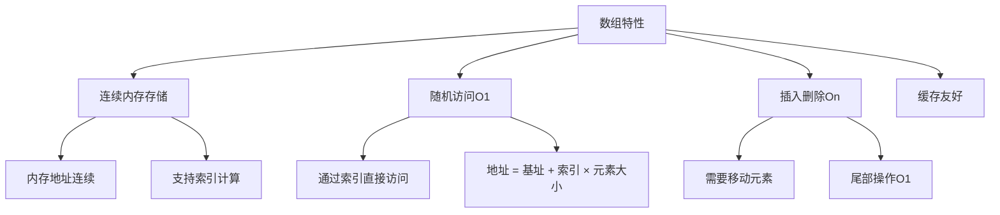

```java
/**
 * 数组操作实现与分析
 */
public class ArrayOperations {
    
    /**
     * 动态数组实现
     */
    public static class DynamicArray<T> {
        private Object[] elements;
        private int size;
        private int capacity;
        
        public DynamicArray() {
            this.capacity = 10;
            this.elements = new Object[capacity];
            this.size = 0;
        }
        
        /**
         * 添加元素 - 平均时间复杂度O(1)，最坏O(n)
         */
        public void add(T element) {
            ensureCapacity();
            elements[size++] = element;
        }
        
        /**
         * 在指定位置插入元素 - 时间复杂度O(n)
         */
        public void insert(int index, T element) {
            if (index < 0 || index > size) {
                throw new IndexOutOfBoundsException("Index: " + index + ", Size: " + size);
            }
            
            ensureCapacity();
            
            // 移动元素，为新元素腾出空间
            System.arraycopy(elements, index, elements, index + 1, size - index);
            elements[index] = element;
            size++;
        }
        
        /**
         * 删除指定位置元素 - 时间复杂度O(n)
         */
        @SuppressWarnings("unchecked")
        public T remove(int index) {
            if (index < 0 || index >= size) {
                throw new IndexOutOfBoundsException("Index: " + index + ", Size: " + size);
            }
            
            T oldValue = (T) elements[index];
            
            // 移动元素填补空隙
            int numMoved = size - index - 1;
            if (numMoved > 0) {
                System.arraycopy(elements, index + 1, elements, index, numMoved);
            }
            
            elements[--size] = null; // 清除引用，帮助GC
            return oldValue;
        }
        
        /**
         * 获取元素 - 时间复杂度O(1)
         */
        @SuppressWarnings("unchecked")
        public T get(int index) {
            if (index < 0 || index >= size) {
                throw new IndexOutOfBoundsException("Index: " + index + ", Size: " + size);
            }
            return (T) elements[index];
        }
        
        /**
         * 扩容机制 - 1.5倍扩容
         */
        private void ensureCapacity() {
            if (size >= capacity) {
                int newCapacity = capacity + (capacity >> 1); // 1.5倍扩容
                elements = Arrays.copyOf(elements, newCapacity);
                capacity = newCapacity;
            }
        }
        
        public int size() { return size; }
        public boolean isEmpty() { return size == 0; }
    }
}
```

#### 链表结构分析

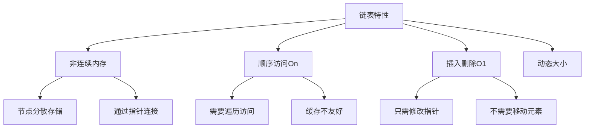

```java
/**
 * 链表实现与操作
 */
public class LinkedListOperations {
    
    /**
     * 单向链表节点
     */
    public static class ListNode {
        int val;
        ListNode next;
        
        ListNode() {}
        ListNode(int val) { this.val = val; }
        ListNode(int val, ListNode next) { this.val = val; this.next = next; }
    }
    
    /**
     * 单向链表实现
     */
    public static class SinglyLinkedList {
        private ListNode head;
        private int size;
        
        /**
         * 头部插入 - 时间复杂度O(1)
         */
        public void addFirst(int val) {
            ListNode newNode = new ListNode(val);
            newNode.next = head;
            head = newNode;
            size++;
        }
        
        /**
         * 尾部插入 - 时间复杂度O(n)
         */
        public void addLast(int val) {
            ListNode newNode = new ListNode(val);
            
            if (head == null) {
                head = newNode;
            } else {
                ListNode current = head;
                while (current.next != null) {
                    current = current.next;
                }
                current.next = newNode;
            }
            size++;
        }
        
        /**
         * 指定位置插入 - 时间复杂度O(n)
         */
        public void insert(int index, int val) {
            if (index < 0 || index > size) {
                throw new IndexOutOfBoundsException("Index: " + index + ", Size: " + size);
            }
            
            if (index == 0) {
                addFirst(val);
                return;
            }
            
            ListNode newNode = new ListNode(val);
            ListNode current = head;
            
            // 找到插入位置的前一个节点
            for (int i = 0; i < index - 1; i++) {
                current = current.next;
            }
            
            newNode.next = current.next;
            current.next = newNode;
            size++;
        }
        
        /**
         * 删除指定值的节点 - 时间复杂度O(n)
         */
        public boolean remove(int val) {
            if (head == null) return false;
            
            // 删除头节点
            if (head.val == val) {
                head = head.next;
                size--;
                return true;
            }
            
            ListNode current = head;
            while (current.next != null) {
                if (current.next.val == val) {
                    current.next = current.next.next;
                    size--;
                    return true;
                }
                current = current.next;
            }
            
            return false;
        }
        
        /**
         * 查找元素 - 时间复杂度O(n)
         */
        public boolean contains(int val) {
            ListNode current = head;
            while (current != null) {
                if (current.val == val) {
                    return true;
                }
                current = current.next;
            }
            return false;
        }
        
        /**
         * 反转链表 - 时间复杂度O(n)，空间复杂度O(1)
         */
        public void reverse() {
            ListNode prev = null;
            ListNode current = head;
            
            while (current != null) {
                ListNode next = current.next;
                current.next = prev;
                prev = current;
                current = next;
            }
            
            head = prev;
        }
        
        public int size() { return size; }
        public boolean isEmpty() { return head == null; }
    }
    
    /**
     * 双向链表节点
     */
    public static class DoublyListNode {
        int val;
        DoublyListNode prev;
        DoublyListNode next;
        
        DoublyListNode(int val) { this.val = val; }
    }
    
    /**
     * 双向链表实现
     */
    public static class DoublyLinkedList {
        private DoublyListNode head;
        private DoublyListNode tail;
        private int size;
        
        /**
         * 头部插入 - 时间复杂度O(1)
         */
        public void addFirst(int val) {
            DoublyListNode newNode = new DoublyListNode(val);
            
            if (head == null) {
                head = tail = newNode;
            } else {
                newNode.next = head;
                head.prev = newNode;
                head = newNode;
            }
            size++;
        }
        
        /**
         * 尾部插入 - 时间复杂度O(1)
         */
        public void addLast(int val) {
            DoublyListNode newNode = new DoublyListNode(val);
            
            if (tail == null) {
                head = tail = newNode;
            } else {
                tail.next = newNode;
                newNode.prev = tail;
                tail = newNode;
            }
            size++;
        }
        
        /**
         * 删除节点 - 时间复杂度O(1)（已知节点位置）
         */
        public void removeNode(DoublyListNode node) {
            if (node.prev != null) {
                node.prev.next = node.next;
            } else {
                head = node.next;
            }
            
            if (node.next != null) {
                node.next.prev = node.prev;
            } else {
                tail = node.prev;
            }
            
            size--;
        }
    }
}
```

#### 数组与链表性能对比

| 操作     | 数组         | 链表               | 说明                       |
| -------- | ------------ | ------------------ | -------------------------- |
| 随机访问 | O(1)         | O(n)               | 数组支持索引直接访问       |
| 头部插入 | O(n)         | O(1)               | 数组需要移动所有元素       |
| 尾部插入 | O(1)         | O(n)/O(1)          | 单向链表O(n)，双向链表O(1) |
| 中间插入 | O(n)         | O(1)               | 已知位置的情况下           |
| 删除操作 | O(n)         | O(1)               | 已知位置的情况下           |
| 内存使用 | 连续，紧凑   | 分散，额外指针开销 | 数组缓存友好               |
| 适用场景 | 频繁随机访问 | 频繁插入删除       | 根据操作特点选择           |

### 栈与队列

**栈**和**队列**是两种重要的线性数据结构，具有特定的访问模式。

#### 栈结构实现

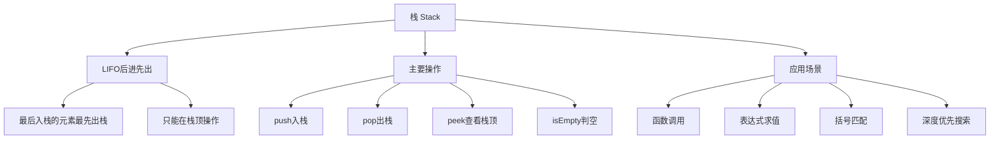

```java
/**
 * 栈的实现与应用
 */
public class StackOperations {
    
    /**
     * 基于数组的栈实现
     */
    public static class ArrayStack<T> {
        private Object[] elements;
        private int top;
        private int capacity;
        
        public ArrayStack(int capacity) {
            this.capacity = capacity;
            this.elements = new Object[capacity];
            this.top = -1;
        }
        
        /**
         * 入栈操作 - 时间复杂度O(1)
         */
        public void push(T element) {
            if (isFull()) {
                throw new RuntimeException("Stack overflow");
            }
            elements[++top] = element;
        }
        
        /**
         * 出栈操作 - 时间复杂度O(1)
         */
        @SuppressWarnings("unchecked")
        public T pop() {
            if (isEmpty()) {
                throw new RuntimeException("Stack underflow");
            }
            T element = (T) elements[top];
            elements[top--] = null; // 帮助GC
            return element;
        }
        
        /**
         * 查看栈顶元素 - 时间复杂度O(1)
         */
        @SuppressWarnings("unchecked")
        public T peek() {
            if (isEmpty()) {
                throw new RuntimeException("Stack is empty");
            }
            return (T) elements[top];
        }
        
        public boolean isEmpty() { return top == -1; }
        public boolean isFull() { return top == capacity - 1; }
        public int size() { return top + 1; }
    }
    
    /**
     * 基于链表的栈实现
     */
    public static class LinkedStack<T> {
        private Node<T> top;
        private int size;
        
        private static class Node<T> {
            T data;
            Node<T> next;
            
            Node(T data) { this.data = data; }
        }
        
        /**
         * 入栈操作 - 时间复杂度O(1)
         */
        public void push(T element) {
            Node<T> newNode = new Node<>(element);
            newNode.next = top;
            top = newNode;
            size++;
        }
        
        /**
         * 出栈操作 - 时间复杂度O(1)
         */
        public T pop() {
            if (isEmpty()) {
                throw new RuntimeException("Stack underflow");
            }
            T data = top.data;
            top = top.next;
            size--;
            return data;
        }
        
        /**
         * 查看栈顶元素 - 时间复杂度O(1)
         */
        public T peek() {
            if (isEmpty()) {
                throw new RuntimeException("Stack is empty");
            }
            return top.data;
        }
        
        public boolean isEmpty() { return top == null; }
        public int size() { return size; }
    }
    
    /**
     * 栈的经典应用：括号匹配
     */
    public static boolean isValidParentheses(String s) {
        Stack<Character> stack = new Stack<>();
        Map<Character, Character> mapping = new HashMap<>();
        mapping.put(')', '(');
        mapping.put('}', '{');
        mapping.put(']', '[');
        
        for (char c : s.toCharArray()) {
            if (mapping.containsKey(c)) {
                // 右括号
                if (stack.isEmpty() || stack.pop() != mapping.get(c)) {
                    return false;
                }
            } else {
                // 左括号
                stack.push(c);
            }
        }
        
        return stack.isEmpty();
    }
    
    /**
     * 栈的经典应用：表达式求值（逆波兰表达式）
     */
    public static int evalRPN(String[] tokens) {
        Stack<Integer> stack = new Stack<>();
        
        for (String token : tokens) {
            if (isOperator(token)) {
                int b = stack.pop();
                int a = stack.pop();
                int result = calculate(a, b, token);
                stack.push(result);
            } else {
                stack.push(Integer.parseInt(token));
            }
        }
        
        return stack.pop();
    }
    
    private static boolean isOperator(String token) {
        return "+".equals(token) || "-".equals(token) || 
               "*".equals(token) || "/".equals(token);
    }
    
    private static int calculate(int a, int b, String operator) {
        switch (operator) {
            case "+": return a + b;
            case "-": return a - b;
            case "*": return a * b;
            case "/": return a / b;
            default: throw new IllegalArgumentException("Invalid operator: " + operator);
        }
    }
}
```

#### 队列结构实现

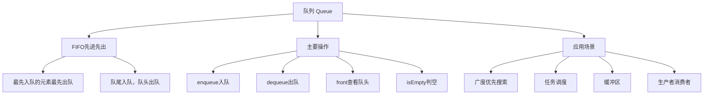

```java
/**
 * 队列的实现与应用
 */
public class QueueOperations {
    
    /**
     * 基于数组的循环队列实现
     */
    public static class CircularQueue<T> {
        private Object[] elements;
        private int front;
        private int rear;
        private int size;
        private int capacity;
        
        public CircularQueue(int capacity) {
            this.capacity = capacity;
            this.elements = new Object[capacity];
            this.front = 0;
            this.rear = 0;
            this.size = 0;
        }
        
        /**
         * 入队操作 - 时间复杂度O(1)
         */
        public boolean enqueue(T element) {
            if (isFull()) {
                return false;
            }
            
            elements[rear] = element;
            rear = (rear + 1) % capacity;
            size++;
            return true;
        }
        
        /**
         * 出队操作 - 时间复杂度O(1)
         */
        @SuppressWarnings("unchecked")
        public T dequeue() {
            if (isEmpty()) {
                return null;
            }
            
            T element = (T) elements[front];
            elements[front] = null; // 帮助GC
            front = (front + 1) % capacity;
            size--;
            return element;
        }
        
        /**
         * 查看队头元素 - 时间复杂度O(1)
         */
        @SuppressWarnings("unchecked")
        public T front() {
            if (isEmpty()) {
                return null;
            }
            return (T) elements[front];
        }
        
        public boolean isEmpty() { return size == 0; }
        public boolean isFull() { return size == capacity; }
        public int size() { return size; }
    }
    
    /**
     * 基于链表的队列实现
     */
    public static class LinkedQueue<T> {
        private Node<T> front;
        private Node<T> rear;
        private int size;
        
        private static class Node<T> {
            T data;
            Node<T> next;
            
            Node(T data) { this.data = data; }
        }
        
        /**
         * 入队操作 - 时间复杂度O(1)
         */
        public void enqueue(T element) {
            Node<T> newNode = new Node<>(element);
            
            if (rear == null) {
                front = rear = newNode;
            } else {
                rear.next = newNode;
                rear = newNode;
            }
            size++;
        }
        
        /**
         * 出队操作 - 时间复杂度O(1)
         */
        public T dequeue() {
            if (isEmpty()) {
                return null;
            }
            
            T data = front.data;
            front = front.next;
            
            if (front == null) {
                rear = null;
            }
            
            size--;
            return data;
        }
        
        /**
         * 查看队头元素 - 时间复杂度O(1)
         */
        public T front() {
            return isEmpty() ? null : front.data;
        }
        
        public boolean isEmpty() { return front == null; }
        public int size() { return size; }
    }
    
    /**
     * 双端队列实现
     */
    public static class Deque<T> {
        private Node<T> front;
        private Node<T> rear;
        private int size;
        
        private static class Node<T> {
            T data;
            Node<T> prev;
            Node<T> next;
            
            Node(T data) { this.data = data; }
        }
        
        /**
         * 前端插入 - 时间复杂度O(1)
         */
        public void addFirst(T element) {
            Node<T> newNode = new Node<>(element);
            
            if (isEmpty()) {
                front = rear = newNode;
            } else {
                newNode.next = front;
                front.prev = newNode;
                front = newNode;
            }
            size++;
        }
        
        /**
         * 后端插入 - 时间复杂度O(1)
         */
        public void addLast(T element) {
            Node<T> newNode = new Node<>(element);
            
            if (isEmpty()) {
                front = rear = newNode;
            } else {
                rear.next = newNode;
                newNode.prev = rear;
                rear = newNode;
            }
            size++;
        }
        
        /**
         * 前端删除 - 时间复杂度O(1)
         */
        public T removeFirst() {
            if (isEmpty()) {
                return null;
            }
            
            T data = front.data;
            front = front.next;
            
            if (front == null) {
                rear = null;
            } else {
                front.prev = null;
            }
            
            size--;
            return data;
        }
        
        /**
         * 后端删除 - 时间复杂度O(1)
         */
        public T removeLast() {
            if (isEmpty()) {
                return null;
            }
            
            T data = rear.data;
            rear = rear.prev;
            
            if (rear == null) {
                front = null;
            } else {
                rear.next = null;
            }
            
            size--;
            return data;
        }
        
        public boolean isEmpty() { return size == 0; }
        public int size() { return size; }
    }
}
```

### 树结构

**树**是一种重要的非线性数据结构，具有层次关系。

#### 二叉树基础

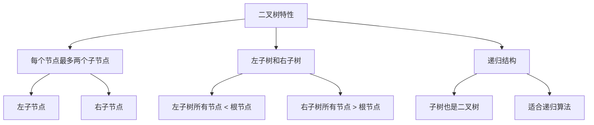

```java
/**
 * 二叉树实现与操作
 */
public class BinaryTreeOperations {
    
    /**
     * 二叉树节点定义
     */
    public static class TreeNode {
        int val;
        TreeNode left;
        TreeNode right;
        
        TreeNode() {}
        TreeNode(int val) { this.val = val; }
        TreeNode(int val, TreeNode left, TreeNode right) {
            this.val = val;
            this.left = left;
            this.right = right;
        }
    }
    
    /**
     * 二叉搜索树实现
     */
    public static class BinarySearchTree {
        private TreeNode root;
        
        /**
         * 插入节点 - 平均时间复杂度O(log n)，最坏O(n)
         */
        public void insert(int val) {
            root = insertRec(root, val);
        }
        
        private TreeNode insertRec(TreeNode node, int val) {
            if (node == null) {
                return new TreeNode(val);
            }
            
            if (val < node.val) {
                node.left = insertRec(node.left, val);
            } else if (val > node.val) {
                node.right = insertRec(node.right, val);
            }
            
            return node;
        }
        
        /**
         * 查找节点 - 平均时间复杂度O(log n)，最坏O(n)
         */
        public boolean search(int val) {
            return searchRec(root, val);
        }
        
        private boolean searchRec(TreeNode node, int val) {
            if (node == null) {
                return false;
            }
            
            if (val == node.val) {
                return true;
            }
            
            return val < node.val ? 
                searchRec(node.left, val) : 
                searchRec(node.right, val);
        }
        
        /**
         * 删除节点 - 平均时间复杂度O(log n)，最坏O(n)
         */
        public void delete(int val) {
            root = deleteRec(root, val);
        }
        
        private TreeNode deleteRec(TreeNode node, int val) {
            if (node == null) {
                return null;
            }
            
            if (val < node.val) {
                node.left = deleteRec(node.left, val);
            } else if (val > node.val) {
                node.right = deleteRec(node.right, val);
            } else {
                // 找到要删除的节点
                if (node.left == null) {
                    return node.right;
                } else if (node.right == null) {
                    return node.left;
                }
                
                // 节点有两个子节点，找到右子树的最小值
                node.val = findMin(node.right);
                node.right = deleteRec(node.right, node.val);
            }
            
            return node;
        }
        
        private int findMin(TreeNode node) {
            while (node.left != null) {
                node = node.left;
            }
            return node.val;
        }
    }
    
    /**
     * 二叉树遍历算法
     */
    public static class TreeTraversal {
        
        /**
         * 前序遍历：根 -> 左 -> 右
         * 时间复杂度O(n)，空间复杂度O(h)，h为树高
         */
        public List<Integer> preorderTraversal(TreeNode root) {
            List<Integer> result = new ArrayList<>();
            preorderRec(root, result);
            return result;
        }
        
        private void preorderRec(TreeNode node, List<Integer> result) {
            if (node != null) {
                result.add(node.val);           // 访问根节点
                preorderRec(node.left, result); // 遍历左子树
                preorderRec(node.right, result);// 遍历右子树
            }
        }
        
        /**
         * 中序遍历：左 -> 根 -> 右
         * 对于BST，中序遍历得到有序序列
         */
        public List<Integer> inorderTraversal(TreeNode root) {
            List<Integer> result = new ArrayList<>();
            inorderRec(root, result);
            return result;
        }
        
        private void inorderRec(TreeNode node, List<Integer> result) {
            if (node != null) {
                inorderRec(node.left, result);  // 遍历左子树
                result.add(node.val);           // 访问根节点
                inorderRec(node.right, result); // 遍历右子树
            }
        }
        
        /**
         * 后序遍历：左 -> 右 -> 根
         * 适用于删除树、计算目录大小等
         */
        public List<Integer> postorderTraversal(TreeNode root) {
            List<Integer> result = new ArrayList<>();
            postorderRec(root, result);
            return result;
        }
        
        private void postorderRec(TreeNode node, List<Integer> result) {
            if (node != null) {
                postorderRec(node.left, result); // 遍历左子树
                postorderRec(node.right, result);// 遍历右子树
                result.add(node.val);            // 访问根节点
            }
        }
        
        /**
         * 层序遍历：逐层从左到右
         * 使用队列实现，时间复杂度O(n)，空间复杂度O(w)，w为最大宽度
         */
        public List<List<Integer>> levelOrder(TreeNode root) {
            List<List<Integer>> result = new ArrayList<>();
            if (root == null) return result;
            
            Queue<TreeNode> queue = new LinkedList<>();
            queue.offer(root);
            
            while (!queue.isEmpty()) {
                int levelSize = queue.size();
                List<Integer> currentLevel = new ArrayList<>();
                
                for (int i = 0; i < levelSize; i++) {
                    TreeNode node = queue.poll();
                    currentLevel.add(node.val);
                    
                    if (node.left != null) queue.offer(node.left);
                    if (node.right != null) queue.offer(node.right);
                }
                
                result.add(currentLevel);
            }
            
            return result;
        }
    }
    
    /**
     * 二叉树常用算法
     */
    public static class TreeAlgorithms {
        
        /**
         * 计算树的高度/深度
         * 时间复杂度O(n)，空间复杂度O(h)
         */
        public int maxDepth(TreeNode root) {
            if (root == null) return 0;
            
            int leftDepth = maxDepth(root.left);
            int rightDepth = maxDepth(root.right);
            
            return Math.max(leftDepth, rightDepth) + 1;
        }
        
        /**
         * 判断是否为平衡二叉树
         * 平衡二叉树：任意节点的左右子树高度差不超过1
         */
        public boolean isBalanced(TreeNode root) {
            return checkBalance(root) != -1;
        }
        
        private int checkBalance(TreeNode node) {
            if (node == null) return 0;
            
            int leftHeight = checkBalance(node.left);
            if (leftHeight == -1) return -1;
            
            int rightHeight = checkBalance(node.right);
            if (rightHeight == -1) return -1;
            
            if (Math.abs(leftHeight - rightHeight) > 1) {
                return -1; // 不平衡
            }
            
            return Math.max(leftHeight, rightHeight) + 1;
        }
        
        /**
         * 验证二叉搜索树
         * 时间复杂度O(n)，空间复杂度O(h)
         */
        public boolean isValidBST(TreeNode root) {
            return validate(root, Long.MIN_VALUE, Long.MAX_VALUE);
        }
        
        private boolean validate(TreeNode node, long min, long max) {
            if (node == null) return true;
            
            if (node.val <= min || node.val >= max) {
                return false;
            }
            
            return validate(node.left, min, node.val) && 
                   validate(node.right, node.val, max);
        }
        
        /**
         * 最近公共祖先
         * 时间复杂度O(n)，空间复杂度O(h)
         */
        public TreeNode lowestCommonAncestor(TreeNode root, TreeNode p, TreeNode q) {
            if (root == null || root == p || root == q) {
                return root;
            }
            
            TreeNode left = lowestCommonAncestor(root.left, p, q);
            TreeNode right = lowestCommonAncestor(root.right, p, q);
            
            if (left != null && right != null) {
                return root; // 当前节点是LCA
            }
            
            return left != null ? left : right;
        }
    }
}
```

### 图结构

**图**是由顶点和边组成的数据结构，用于表示复杂的关系网络。

#### 图的表示方法

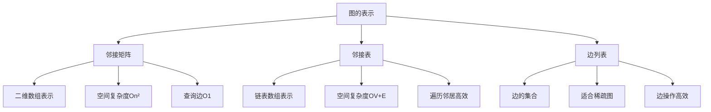

```java
/**
 * 图的实现与基本操作
 */
public class GraphOperations {
    
    /**
     * 基于邻接矩阵的图实现
     */
    public static class AdjacencyMatrixGraph {
        private int[][] matrix;
        private int vertices;
        private boolean directed;
        
        public AdjacencyMatrixGraph(int vertices, boolean directed) {
            this.vertices = vertices;
            this.directed = directed;
            this.matrix = new int[vertices][vertices];
        }
        
        /**
         * 添加边 - 时间复杂度O(1)
         */
        public void addEdge(int src, int dest, int weight) {
            matrix[src][dest] = weight;
            if (!directed) {
                matrix[dest][src] = weight;
            }
        }
        
        /**
         * 删除边 - 时间复杂度O(1)
         */
        public void removeEdge(int src, int dest) {
            matrix[src][dest] = 0;
            if (!directed) {
                matrix[dest][src] = 0;
            }
        }
        
        /**
         * 检查边是否存在 - 时间复杂度O(1)
         */
        public boolean hasEdge(int src, int dest) {
            return matrix[src][dest] != 0;
        }
        
        /**
         * 获取顶点的所有邻居 - 时间复杂度O(V)
         */
        public List<Integer> getNeighbors(int vertex) {
            List<Integer> neighbors = new ArrayList<>();
            for (int i = 0; i < vertices; i++) {
                if (matrix[vertex][i] != 0) {
                    neighbors.add(i);
                }
            }
            return neighbors;
        }
        
        /**
         * 打印图
         */
        public void printGraph() {
            for (int i = 0; i < vertices; i++) {
                System.out.print("顶点 " + i + ": ");
                for (int j = 0; j < vertices; j++) {
                    if (matrix[i][j] != 0) {
                        System.out.print(j + "(" + matrix[i][j] + ") ");
                    }
                }
                System.out.println();
            }
        }
    }
    
    /**
     * 基于邻接表的图实现
     */
    public static class AdjacencyListGraph {
        private List<List<Edge>> adjList;
        private int vertices;
        private boolean directed;
        
        public static class Edge {
            int dest;
            int weight;
            
            Edge(int dest, int weight) {
                this.dest = dest;
                this.weight = weight;
            }
        }
        
        public AdjacencyListGraph(int vertices, boolean directed) {
            this.vertices = vertices;
            this.directed = directed;
            this.adjList = new ArrayList<>();
            
            for (int i = 0; i < vertices; i++) {
                adjList.add(new ArrayList<>());
            }
        }
        
        /**
         * 添加边 - 时间复杂度O(1)
         */
        public void addEdge(int src, int dest, int weight) {
            adjList.get(src).add(new Edge(dest, weight));
            if (!directed) {
                adjList.get(dest).add(new Edge(src, weight));
            }
        }
        
        /**
         * 删除边 - 时间复杂度O(degree)
         */
        public void removeEdge(int src, int dest) {
            adjList.get(src).removeIf(edge -> edge.dest == dest);
            if (!directed) {
                adjList.get(dest).removeIf(edge -> edge.dest == src);
            }
        }
        
        /**
         * 检查边是否存在 - 时间复杂度O(degree)
         */
        public boolean hasEdge(int src, int dest) {
            return adjList.get(src).stream()
                    .anyMatch(edge -> edge.dest == dest);
        }
        
        /**
         * 获取顶点的所有邻居 - 时间复杂度O(degree)
         */
        public List<Edge> getNeighbors(int vertex) {
            return new ArrayList<>(adjList.get(vertex));
        }
        
        /**
         * 打印图
         */
        public void printGraph() {
            for (int i = 0; i < vertices; i++) {
                System.out.print("顶点 " + i + ": ");
                for (Edge edge : adjList.get(i)) {
                    System.out.print(edge.dest + "(" + edge.weight + ") ");
                }
                System.out.println();
            }
        }
    }
}
```

### 哈希表

**哈希表**通过哈希函数将键映射到数组索引，实现快速的插入、删除和查找操作。

#### 哈希表原理

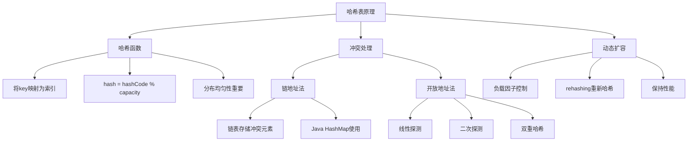

```java
/**
 * 哈希表实现
 */
public class HashTableOperations {
    
    /**
     * 基于链地址法的哈希表实现
     */
    public static class ChainedHashTable<K, V> {
        private static class Node<K, V> {
            K key;
            V value;
            Node<K, V> next;
            
            Node(K key, V value) {
                this.key = key;
                this.value = value;
            }
        }
        
        private Node<K, V>[] table;
        private int size;
        private int capacity;
        private static final double LOAD_FACTOR = 0.75;
        
        @SuppressWarnings("unchecked")
        public ChainedHashTable(int initialCapacity) {
            this.capacity = initialCapacity;
            this.table = new Node[capacity];
            this.size = 0;
        }
        
        public ChainedHashTable() {
            this(16);
        }
        
        /**
         * 哈希函数
         */
        private int hash(K key) {
            if (key == null) return 0;
            return Math.abs(key.hashCode()) % capacity;
        }
        
        /**
         * 插入或更新 - 平均时间复杂度O(1)，最坏O(n)
         */
        public V put(K key, V value) {
            if (size >= capacity * LOAD_FACTOR) {
                resize();
            }
            
            int index = hash(key);
            Node<K, V> head = table[index];
            
            // 查找是否已存在
            Node<K, V> current = head;
            while (current != null) {
                if (Objects.equals(current.key, key)) {
                    V oldValue = current.value;
                    current.value = value;
                    return oldValue;
                }
                current = current.next;
            }
            
            // 插入新节点
            Node<K, V> newNode = new Node<>(key, value);
            newNode.next = head;
            table[index] = newNode;
            size++;
            
            return null;
        }
        
        /**
         * 查找 - 平均时间复杂度O(1)，最坏O(n)
         */
        public V get(K key) {
            int index = hash(key);
            Node<K, V> current = table[index];
            
            while (current != null) {
                if (Objects.equals(current.key, key)) {
                    return current.value;
                }
                current = current.next;
            }
            
            return null;
        }
        
        /**
         * 删除 - 平均时间复杂度O(1)，最坏O(n)
         */
        public V remove(K key) {
            int index = hash(key);
            Node<K, V> head = table[index];
            
            if (head == null) return null;
            
            // 删除头节点
            if (Objects.equals(head.key, key)) {
                table[index] = head.next;
                size--;
                return head.value;
            }
            
            // 删除其他节点
            Node<K, V> current = head;
            while (current.next != null) {
                if (Objects.equals(current.next.key, key)) {
                    V value = current.next.value;
                    current.next = current.next.next;
                    size--;
                    return value;
                }
                current = current.next;
            }
            
            return null;
        }
        
        /**
         * 动态扩容
         */
        @SuppressWarnings("unchecked")
        private void resize() {
            Node<K, V>[] oldTable = table;
            int oldCapacity = capacity;
            
            capacity *= 2;
            table = new Node[capacity];
            size = 0;
            
            // 重新哈希所有元素
            for (int i = 0; i < oldCapacity; i++) {
                Node<K, V> current = oldTable[i];
                while (current != null) {
                    put(current.key, current.value);
                    current = current.next;
                }
            }
        }
        
        public int size() { return size; }
        public boolean isEmpty() { return size == 0; }
        
        /**
         * 获取负载因子
         */
        public double getLoadFactor() {
            return (double) size / capacity;
        }
    }
    
    /**
     * 基于开放地址法的哈希表实现（线性探测）
     */
    public static class OpenAddressingHashTable<K, V> {
        private static class Entry<K, V> {
            K key;
            V value;
            boolean deleted; // 标记删除
            
            Entry(K key, V value) {
                this.key = key;
                this.value = value;
                this.deleted = false;
            }
        }
        
        private Entry<K, V>[] table;
        private int size;
        private int capacity;
        private static final double LOAD_FACTOR = 0.5; // 开放地址法需要更低的负载因子
        
        @SuppressWarnings("unchecked")
        public OpenAddressingHashTable(int initialCapacity) {
            this.capacity = initialCapacity;
            this.table = new Entry[capacity];
            this.size = 0;
        }
        
        public OpenAddressingHashTable() {
            this(16);
        }
        
        /**
         * 哈希函数
         */
        private int hash(K key) {
            if (key == null) return 0;
            return Math.abs(key.hashCode()) % capacity;
        }
        
        /**
         * 线性探测找到下一个位置
         */
        private int probe(int index) {
            return (index + 1) % capacity;
        }
        
        /**
         * 插入或更新 - 平均时间复杂度O(1)
         */
        public V put(K key, V value) {
            if (size >= capacity * LOAD_FACTOR) {
                resize();
            }
            
            int index = hash(key);
            
            while (table[index] != null) {
                Entry<K, V> entry = table[index];
                
                if (!entry.deleted && Objects.equals(entry.key, key)) {
                    // 更新现有键
                    V oldValue = entry.value;
                    entry.value = value;
                    return oldValue;
                }
                
                index = probe(index);
            }
            
            // 插入新键
            table[index] = new Entry<>(key, value);
            size++;
            return null;
        }
        
        /**
         * 查找 - 平均时间复杂度O(1)
         */
        public V get(K key) {
            int index = hash(key);
            
            while (table[index] != null) {
                Entry<K, V> entry = table[index];
                
                if (!entry.deleted && Objects.equals(entry.key, key)) {
                    return entry.value;
                }
                
                index = probe(index);
            }
            
            return null;
        }
        
        /**
         * 删除 - 平均时间复杂度O(1)
         */
        public V remove(K key) {
            int index = hash(key);
            
            while (table[index] != null) {
                Entry<K, V> entry = table[index];
                
                if (!entry.deleted && Objects.equals(entry.key, key)) {
                    entry.deleted = true; // 标记删除，不能直接置null
                    size--;
                    return entry.value;
                }
                
                index = probe(index);
            }
            
            return null;
        }
        
        /**
         * 动态扩容
         */
        @SuppressWarnings("unchecked")
        private void resize() {
            Entry<K, V>[] oldTable = table;
            int oldCapacity = capacity;
            
            capacity *= 2;
            table = new Entry[capacity];
            size = 0;
            
            // 重新插入所有未删除的元素
            for (int i = 0; i < oldCapacity; i++) {
                Entry<K, V> entry = oldTable[i];
                if (entry != null && !entry.deleted) {
                    put(entry.key, entry.value);
                }
            }
        }
        
        public int size() { return size; }
        public boolean isEmpty() { return size == 0; }
    }
}
```


### 堆结构

**堆**是一种特殊的完全二叉树，满足堆性质：父节点的值总是大于等于（最大堆）或小于等于（最小堆）其子节点的值。

#### 堆的特性与实现

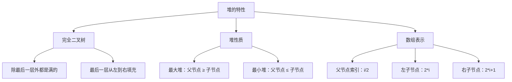

```java
/**
 * 堆的实现与应用
 */
public class HeapOperations {
    
    /**
     * 最小堆实现
     */
    public static class MinHeap {
        private int[] heap;
        private int size;
        private int capacity;
        
        public MinHeap(int capacity) {
            this.capacity = capacity;
            this.heap = new int[capacity + 1]; // 索引0不使用，从1开始
            this.size = 0;
        }
        
        /**
         * 获取父节点索引
         */
        private int parent(int i) {
            return i / 2;
        }
        
        /**
         * 获取左子节点索引
         */
        private int leftChild(int i) {
            return 2 * i;
        }
        
        /**
         * 获取右子节点索引
         */
        private int rightChild(int i) {
            return 2 * i + 1;
        }
        
        /**
         * 交换两个元素
         */
        private void swap(int i, int j) {
            int temp = heap[i];
            heap[i] = heap[j];
            heap[j] = temp;
        }
        
        /**
         * 向上调整（用于插入）
         * 时间复杂度O(log n)
         */
        private void heapifyUp(int i) {
            while (i > 1 && heap[parent(i)] > heap[i]) {
                swap(i, parent(i));
                i = parent(i);
            }
        }
        
        /**
         * 向下调整（用于删除）
         * 时间复杂度O(log n)
         */
        private void heapifyDown(int i) {
            while (leftChild(i) <= size) {
                int minChild = leftChild(i);
                
                // 找到较小的子节点
                if (rightChild(i) <= size && heap[rightChild(i)] < heap[leftChild(i)]) {
                    minChild = rightChild(i);
                }
                
                // 如果当前节点已经小于等于子节点，停止
                if (heap[i] <= heap[minChild]) {
                    break;
                }
                
                swap(i, minChild);
                i = minChild;
            }
        }
        
        /**
         * 插入元素 - 时间复杂度O(log n)
         */
        public void insert(int value) {
            if (size >= capacity) {
                throw new RuntimeException("Heap is full");
            }
            
            heap[++size] = value;
            heapifyUp(size);
        }
        
        /**
         * 删除并返回最小元素 - 时间复杂度O(log n)
         */
        public int extractMin() {
            if (size == 0) {
                throw new RuntimeException("Heap is empty");
            }
            
            int min = heap[1];
            heap[1] = heap[size--];
            heapifyDown(1);
            
            return min;
        }
        
        /**
         * 查看最小元素 - 时间复杂度O(1)
         */
        public int peek() {
            if (size == 0) {
                throw new RuntimeException("Heap is empty");
            }
            return heap[1];
        }
        
        /**
         * 构建堆（从数组） - 时间复杂度O(n)
         */
        public static MinHeap buildHeap(int[] array) {
            MinHeap heap = new MinHeap(array.length);
            heap.size = array.length;
            
            // 复制数组（注意索引偏移）
            for (int i = 0; i < array.length; i++) {
                heap.heap[i + 1] = array[i];
            }
            
            // 从最后一个非叶子节点开始向下调整
            for (int i = heap.size / 2; i >= 1; i--) {
                heap.heapifyDown(i);
            }
            
            return heap;
        }
        
        public int size() { return size; }
        public boolean isEmpty() { return size == 0; }
        
        /**
         * 打印堆
         */
        public void printHeap() {
            for (int i = 1; i <= size; i++) {
                System.out.print(heap[i] + " ");
            }
            System.out.println();
        }
    }
    
    /**
     * 优先队列应用：任务调度
     */
    public static class TaskScheduler {
        public static class Task implements Comparable<Task> {
            String name;
            int priority; // 数值越小优先级越高
            long timestamp;
            
            Task(String name, int priority) {
                this.name = name;
                this.priority = priority;
                this.timestamp = System.currentTimeMillis();
            }
            
            @Override
            public int compareTo(Task other) {
                if (this.priority != other.priority) {
                    return Integer.compare(this.priority, other.priority);
                }
                return Long.compare(this.timestamp, other.timestamp);
            }
            
            @Override
            public String toString() {
                return String.format("Task{name='%s', priority=%d}", name, priority);
            }
        }
        
        private PriorityQueue<Task> taskQueue;
        
        public TaskScheduler() {
            this.taskQueue = new PriorityQueue<>();
        }
        
        /**
         * 添加任务
         */
        public void addTask(String name, int priority) {
            taskQueue.offer(new Task(name, priority));
            System.out.println("添加任务: " + name + " (优先级: " + priority + ")");
        }
        
        /**
         * 执行下一个任务
         */
        public void executeNextTask() {
            Task task = taskQueue.poll();
            if (task != null) {
                System.out.println("执行任务: " + task);
            } else {
                System.out.println("没有待执行的任务");
            }
        }
        
        /**
         * 查看下一个任务
         */
        public void peekNextTask() {
            Task task = taskQueue.peek();
            if (task != null) {
                System.out.println("下一个任务: " + task);
            } else {
                System.out.println("没有待执行的任务");
            }
        }
        
        public int getTaskCount() {
            return taskQueue.size();
        }
    }
    
    /**
     * 堆排序实现
     * 时间复杂度O(n log n)，空间复杂度O(1)
     */
    public static class HeapSort {
        
        /**
         * 堆排序主函数
         */
        public static void heapSort(int[] array) {
            int n = array.length;
            
            // 构建最大堆
            for (int i = n / 2 - 1; i >= 0; i--) {
                heapify(array, n, i);
            }
            
            // 逐个提取元素
            for (int i = n - 1; i > 0; i--) {
                // 将最大元素移到末尾
                swap(array, 0, i);
                
                // 重新调整堆
                heapify(array, i, 0);
            }
        }
        
        /**
         * 调整堆
         */
        private static void heapify(int[] array, int n, int i) {
            int largest = i;
            int left = 2 * i + 1;
            int right = 2 * i + 2;
            
            // 找到最大值的索引
            if (left < n && array[left] > array[largest]) {
                largest = left;
            }
            
            if (right < n && array[right] > array[largest]) {
                largest = right;
            }
            
            // 如果最大值不是根节点，交换并继续调整
            if (largest != i) {
                swap(array, i, largest);
                heapify(array, n, largest);
            }
        }
        
        private static void swap(int[] array, int i, int j) {
            int temp = array[i];
            array[i] = array[j];
            array[j] = temp;
        }
    }
}
```

## 排序算法

### 基础排序算法

基础排序算法虽然效率不高，但理解简单，是学习排序算法的基础。

#### 冒泡排序

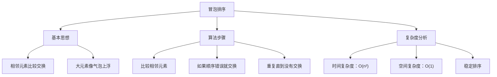

```java
/**
 * 基础排序算法实现
 */
public class BasicSortingAlgorithms {
    
    /**
     * 冒泡排序
     * 时间复杂度：最好O(n)，平均O(n²)，最坏O(n²)
     * 空间复杂度：O(1)
     * 稳定性：稳定
     */
    public static void bubbleSort(int[] array) {
        int n = array.length;
        boolean swapped;
        
        for (int i = 0; i < n - 1; i++) {
            swapped = false;
            
            // 每轮将最大元素"冒泡"到末尾
            for (int j = 0; j < n - 1 - i; j++) {
                if (array[j] > array[j + 1]) {
                    swap(array, j, j + 1);
                    swapped = true;
                }
            }
            
            // 如果没有交换，说明已经有序
            if (!swapped) {
                break;
            }
        }
    }
    
    /**
     * 选择排序
     * 时间复杂度：O(n²)
     * 空间复杂度：O(1)
     * 稳定性：不稳定
     */
    public static void selectionSort(int[] array) {
        int n = array.length;
        
        for (int i = 0; i < n - 1; i++) {
            int minIndex = i;
            
            // 找到未排序部分的最小元素
            for (int j = i + 1; j < n; j++) {
                if (array[j] < array[minIndex]) {
                    minIndex = j;
                }
            }
            
            // 将最小元素放到正确位置
            if (minIndex != i) {
                swap(array, i, minIndex);
            }
        }
    }
    
    /**
     * 插入排序
     * 时间复杂度：最好O(n)，平均O(n²)，最坏O(n²)
     * 空间复杂度：O(1)
     * 稳定性：稳定
     */
    public static void insertionSort(int[] array) {
        int n = array.length;
        
        for (int i = 1; i < n; i++) {
            int key = array[i];
            int j = i - 1;
            
            // 将key插入到已排序部分的正确位置
            while (j >= 0 && array[j] > key) {
                array[j + 1] = array[j];
                j--;
            }
            
            array[j + 1] = key;
        }
    }
    
    /**
     * 希尔排序（插入排序的改进版）
     * 时间复杂度：O(n^1.3) 到 O(n²)，取决于间隔序列
     * 空间复杂度：O(1)
     * 稳定性：不稳定
     */
    public static void shellSort(int[] array) {
        int n = array.length;
        
        // 使用Knuth间隔序列：1, 4, 13, 40, 121, ...
        int gap = 1;
        while (gap < n / 3) {
            gap = gap * 3 + 1;
        }
        
        while (gap >= 1) {
            // 对每个子序列进行插入排序
            for (int i = gap; i < n; i++) {
                int key = array[i];
                int j = i;
                
                while (j >= gap && array[j - gap] > key) {
                    array[j] = array[j - gap];
                    j -= gap;
                }
                
                array[j] = key;
            }
            
            gap /= 3;
        }
    }
    
    /**
     * 工具方法：交换数组中两个元素
     */
    private static void swap(int[] array, int i, int j) {
        int temp = array[i];
        array[i] = array[j];
        array[j] = temp;
    }
    
    /**
     * 工具方法：打印数组
     */
    public static void printArray(int[] array) {
        for (int value : array) {
            System.out.print(value + " ");
        }
        System.out.println();
    }
    
    /**
     * 测试排序算法
     */
    public static void testSortingAlgorithms() {
        int[] original = {64, 34, 25, 12, 22, 11, 90};
        
        // 测试冒泡排序
        int[] bubbleArray = original.clone();
        System.out.println("冒泡排序前: ");
        printArray(bubbleArray);
        bubbleSort(bubbleArray);
        System.out.println("冒泡排序后: ");
        printArray(bubbleArray);
        
        // 测试选择排序
        int[] selectionArray = original.clone();
        System.out.println("\n选择排序前: ");
        printArray(selectionArray);
        selectionSort(selectionArray);
        System.out.println("选择排序后: ");
        printArray(selectionArray);
        
        // 测试插入排序
        int[] insertionArray = original.clone();
        System.out.println("\n插入排序前: ");
        printArray(insertionArray);
        insertionSort(insertionArray);
        System.out.println("插入排序后: ");
        printArray(insertionArray);
        
        // 测试希尔排序
        int[] shellArray = original.clone();
        System.out.println("\n希尔排序前: ");
        printArray(shellArray);
        shellSort(shellArray);
        System.out.println("希尔排序后: ");
        printArray(shellArray);
    }
}
```

#### 选择排序

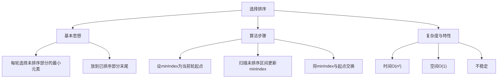

```java
/**
 * 选择排序
 * 时间：O(n^2) 空间：O(1) 稳定性：不稳定
 */
public static void selectionSort(int[] a) {
    int n = a.length;
    for (int i = 0; i < n - 1; i++) {
        int min = i;
        for (int j = i + 1; j < n; j++) {
            if (a[j] < a[min]) min = j;
        }
        if (min != i) {
            int t = a[i]; a[i] = a[min]; a[min] = t;
        }
    }
}
```

#### 插入排序

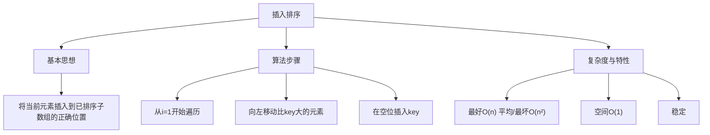

```java
/**
 * 插入排序
 * 适合：小规模、近乎有序
 */
public static void insertionSort(int[] a) {
    for (int i = 1; i < a.length; i++) {
        int key = a[i];
        int j = i - 1;
        while (j >= 0 && a[j] > key) {
            a[j + 1] = a[j];
            j--;
        }
        a[j + 1] = key;
    }
}
```

#### 希尔排序

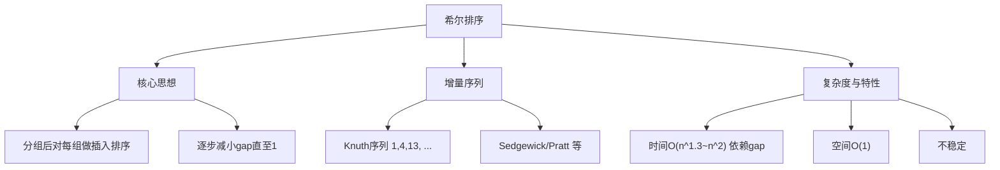

```java
/**
 * 希尔排序（Knuth增量）
 */
public static void shellSortKnuth(int[] a) {
    int n = a.length;
    int gap = 1;
    while (gap < n / 3) gap = gap * 3 + 1;
    while (gap >= 1) {
        for (int i = gap; i < n; i++) {
            int key = a[i], j = i;
            while (j >= gap && a[j - gap] > key) {
                a[j] = a[j - gap];
                j -= gap;
            }
            a[j] = key;
        }
        gap /= 3;
    }
}
```

### 高级排序算法

高级排序算法通过分治、堆等技术实现更好的时间复杂度。

#### 快速排序

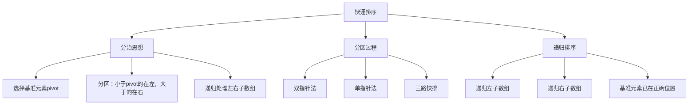

```java
/**
 * 高级排序算法实现
 */
public class AdvancedSortingAlgorithms {
    
    /**
     * 快速排序
     * 时间复杂度：最好O(n log n)，平均O(n log n)，最坏O(n²)
     * 空间复杂度：O(log n)
     * 稳定性：不稳定
     */
    public static void quickSort(int[] array) {
        quickSort(array, 0, array.length - 1);
    }
    
    private static void quickSort(int[] array, int low, int high) {
        if (low < high) {
            // 分区操作，返回基准元素的正确位置
            int pivotIndex = partition(array, low, high);
            
            // 递归排序基准元素左边的子数组
            quickSort(array, low, pivotIndex - 1);
            
            // 递归排序基准元素右边的子数组
            quickSort(array, pivotIndex + 1, high);
        }
    }
    
    /**
     * 分区操作（Lomuto分区方案）
     */
    private static int partition(int[] array, int low, int high) {
        // 选择最后一个元素作为基准
        int pivot = array[high];
        int i = low - 1; // 小于基准的元素的索引
        
        for (int j = low; j < high; j++) {
            if (array[j] <= pivot) {
                i++;
                swap(array, i, j);
            }
        }
        
        swap(array, i + 1, high);
        return i + 1;
    }
    
    /**
     * 快速排序优化版本
     * 1. 三数取中选择基准
     * 2. 小数组使用插入排序
     * 3. 三路快排处理重复元素
     */
    public static void quickSortOptimized(int[] array) {
        quickSortOptimized(array, 0, array.length - 1);
    }
    
    private static void quickSortOptimized(int[] array, int low, int high) {
        // 小数组使用插入排序
        if (high - low < 10) {
            insertionSort(array, low, high);
            return;
        }
        
        if (low < high) {
            // 三数取中选择基准
            medianOfThree(array, low, high);
            
            // 三路快排
            int[] partitionResult = threeWayPartition(array, low, high);
            int lt = partitionResult[0];
            int gt = partitionResult[1];
            
            quickSortOptimized(array, low, lt - 1);
            quickSortOptimized(array, gt + 1, high);
        }
    }
    
    /**
     * 三数取中选择基准
     */
    private static void medianOfThree(int[] array, int low, int high) {
        int mid = low + (high - low) / 2;
        
        if (array[mid] < array[low]) {
            swap(array, low, mid);
        }
        if (array[high] < array[low]) {
            swap(array, low, high);
        }
        if (array[high] < array[mid]) {
            swap(array, mid, high);
        }
        
        // 将中位数放到末尾作为基准
        swap(array, mid, high);
    }
    
    /**
     * 三路快排分区
     * 返回[lt, gt]，其中[low, lt-1] < pivot, [lt, gt] = pivot, [gt+1, high] > pivot
     */
    private static int[] threeWayPartition(int[] array, int low, int high) {
        int pivot = array[high];
        int lt = low;      // 小于pivot的边界
        int gt = high;     // 大于pivot的边界
        int i = low;       // 当前处理的元素
        
        while (i <= gt) {
            if (array[i] < pivot) {
                swap(array, lt++, i++);
            } else if (array[i] > pivot) {
                swap(array, i, gt--);
            } else {
                i++;
            }
        }
        
        return new int[]{lt, gt};
    }
    
    /**
     * 归并排序
     * 时间复杂度：O(n log n)
     * 空间复杂度：O(n)
     * 稳定性：稳定
     */
    public static void mergeSort(int[] array) {
        if (array.length <= 1) return;
        
        int[] temp = new int[array.length];
        mergeSort(array, temp, 0, array.length - 1);
    }
    
    private static void mergeSort(int[] array, int[] temp, int left, int right) {
        if (left < right) {
            int mid = left + (right - left) / 2;
            
            // 递归排序左半部分
            mergeSort(array, temp, left, mid);
            
            // 递归排序右半部分
            mergeSort(array, temp, mid + 1, right);
            
            // 合并两个有序部分
            merge(array, temp, left, mid, right);
        }
    }
    
    /**
     * 合并两个有序数组
     */
    private static void merge(int[] array, int[] temp, int left, int mid, int right) {
        // 复制到临时数组
        for (int i = left; i <= right; i++) {
            temp[i] = array[i];
        }
        
        int i = left;      // 左半部分的指针
        int j = mid + 1;   // 右半部分的指针
        int k = left;      // 合并后数组的指针
        
        // 合并过程
        while (i <= mid && j <= right) {
            if (temp[i] <= temp[j]) {
                array[k++] = temp[i++];
            } else {
                array[k++] = temp[j++];
            }
        }
        
        // 复制剩余元素
        while (i <= mid) {
            array[k++] = temp[i++];
        }
        
        while (j <= right) {
            array[k++] = temp[j++];
        }
    }
    
    /**
     * 计数排序（适用于范围较小的整数）
     * 时间复杂度：O(n + k)，k为数据范围
     * 空间复杂度：O(k)
     * 稳定性：稳定
     */
    public static void countingSort(int[] array) {
        if (array.length <= 1) return;
        
        // 找到最大值和最小值
        int max = array[0];
        int min = array[0];
        for (int value : array) {
            max = Math.max(max, value);
            min = Math.min(min, value);
        }
        
        int range = max - min + 1;
        int[] count = new int[range];
        
        // 统计每个元素的出现次数
        for (int value : array) {
            count[value - min]++;
        }
        
        // 重构数组
        int index = 0;
        for (int i = 0; i < range; i++) {
            while (count[i]-- > 0) {
                array[index++] = i + min;
            }
        }
    }
    
    /**
     * 基数排序
     * 时间复杂度：O(d * (n + k))，d为位数，k为基数
     * 空间复杂度：O(n + k)
     * 稳定性：稳定
     */
    public static void radixSort(int[] array) {
        if (array.length <= 1) return;
        
        // 找到最大值，确定位数
        int max = Arrays.stream(array).max().orElse(0);
        
        // 对每一位进行计数排序
        for (int exp = 1; max / exp > 0; exp *= 10) {
            countingSortByDigit(array, exp);
        }
    }
    
    /**
     * 按指定位进行计数排序
     */
    private static void countingSortByDigit(int[] array, int exp) {
        int n = array.length;
        int[] output = new int[n];
        int[] count = new int[10]; // 0-9
        
        // 统计每个数字的出现次数
        for (int value : array) {
            count[(value / exp) % 10]++;
        }
        
        // 计算累积计数
        for (int i = 1; i < 10; i++) {
            count[i] += count[i - 1];
        }
        
        // 构建输出数组
        for (int i = n - 1; i >= 0; i--) {
            int digit = (array[i] / exp) % 10;
            output[count[digit] - 1] = array[i];
            count[digit]--;
        }
        
        // 复制回原数组
        System.arraycopy(output, 0, array, 0, n);
    }
    
    /**
     * 桶排序
     * 时间复杂度：平均O(n + k)，最坏O(n²)
     * 空间复杂度：O(n + k)
     * 稳定性：稳定
     */
    public static void bucketSort(double[] array) {
        if (array.length <= 1) return;
        
        int bucketCount = array.length;
        List<List<Double>> buckets = new ArrayList<>();
        
        // 初始化桶
        for (int i = 0; i < bucketCount; i++) {
            buckets.add(new ArrayList<>());
        }
        
        // 将元素分配到桶中
        for (double value : array) {
            int bucketIndex = (int) (value * bucketCount);
            if (bucketIndex >= bucketCount) {
                bucketIndex = bucketCount - 1;
            }
            buckets.get(bucketIndex).add(value);
        }
        
        // 对每个桶进行排序
        for (List<Double> bucket : buckets) {
            Collections.sort(bucket);
        }
        
        // 合并桶中的元素
        int index = 0;
        for (List<Double> bucket : buckets) {
            for (double value : bucket) {
                array[index++] = value;
            }
        }
    }
    
    /**
     * 小数组插入排序
     */
    private static void insertionSort(int[] array, int low, int high) {
        for (int i = low + 1; i <= high; i++) {
            int key = array[i];
            int j = i - 1;
            
            while (j >= low && array[j] > key) {
                array[j + 1] = array[j];
                j--;
            }
            
            array[j + 1] = key;
        }
    }
    
    private static void swap(int[] array, int i, int j) {
        int temp = array[i];
        array[i] = array[j];
        array[j] = temp;
    }
}
```

#### 归并排序

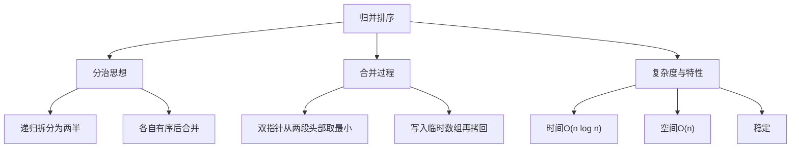

```java
/**
 * 归并排序
 */
public static void mergeSortStable(int[] a) {
    int[] tmp = new int[a.length];
    mergeSortRec(a, tmp, 0, a.length - 1);
}
private static void mergeSortRec(int[] a, int[] t, int l, int r) {
    if (l >= r) return;
    int m = l + (r - l) / 2;
    mergeSortRec(a, t, l, m);
    mergeSortRec(a, t, m + 1, r);
    if (a[m] <= a[m + 1]) return; // 小优化
    merge(a, t, l, m, r);
}
private static void merge(int[] a, int[] t, int l, int m, int r) {
    for (int i = l; i <= r; i++) t[i] = a[i];
    int i = l, j = m + 1, k = l;
    while (i <= m && j <= r) {
        if (t[i] <= t[j]) a[k++] = t[i++]; else a[k++] = t[j++];
    }
    while (i <= m) a[k++] = t[i++];
    while (j <= r) a[k++] = t[j++];
}
```

#### 堆排序

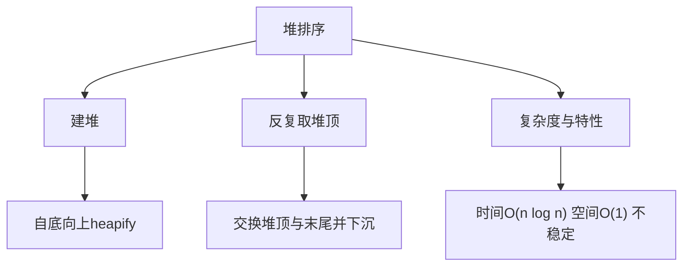

```java
/**
 * 堆排序（最大堆）
 */
public static void heapSortInPlace(int[] a) {
    int n = a.length;
    for (int i = n / 2 - 1; i >= 0; i--) siftDown(a, i, n - 1);
    for (int end = n - 1; end > 0; end--) {
        int t = a[0]; a[0] = a[end]; a[end] = t;
        siftDown(a, 0, end - 1);
    }
}
private static void siftDown(int[] a, int i, int end) {
    while (true) {
        int l = i * 2 + 1, r = l + 1, max = i;
        if (l <= end && a[l] > a[max]) max = l;
        if (r <= end && a[r] > a[max]) max = r;
        if (max == i) break;
        int t = a[i]; a[i] = a[max]; a[max] = t; i = max;
    }
}
```

#### 计数排序

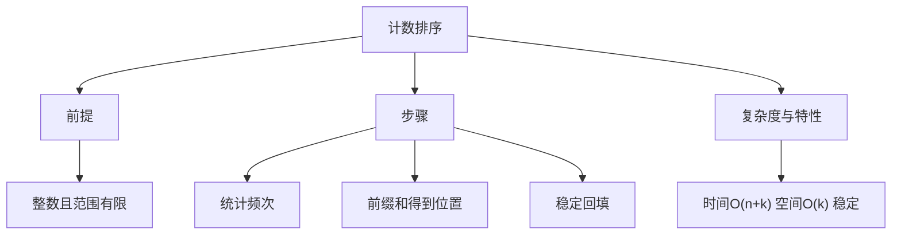

```java
/**
 * 计数排序（支持负数：偏移）
 */
public static void countingSortRange(int[] a) {
    int min = Arrays.stream(a).min().orElse(0);
    int max = Arrays.stream(a).max().orElse(0);
    int k = max - min + 1;
    int[] cnt = new int[k];
    for (int v : a) cnt[v - min]++;
    for (int i = 1; i < k; i++) cnt[i] += cnt[i - 1];
    int[] out = new int[a.length];
    for (int i = a.length - 1; i >= 0; i--) {
        int idx = a[i] - min;
        out[--cnt[idx]] = a[i];
    }
    System.arraycopy(out, 0, a, 0, a.length);
}
```

#### 基数排序

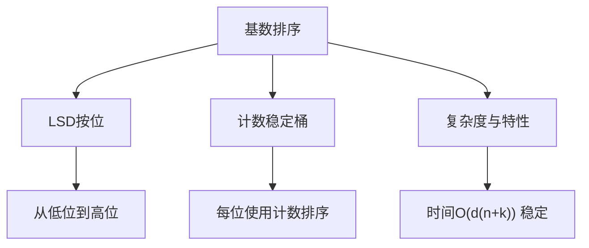

```java
/**
 * 基数排序（LSD，十进制）
 */
public static void radixSortLSD(int[] a) {
    int max = Arrays.stream(a).max().orElse(0);
    for (int exp = 1; max / exp > 0; exp *= 10) {
        countingByDigit(a, exp);
    }
}
private static void countingByDigit(int[] a, int exp) {
    int n = a.length;
    int[] cnt = new int[10];
    for (int v : a) cnt[(v / exp) % 10]++;
    for (int i = 1; i < 10; i++) cnt[i] += cnt[i - 1];
    int[] out = new int[n];
    for (int i = n - 1; i >= 0; i--) {
        int d = (a[i] / exp) % 10;
        out[--cnt[d]] = a[i];
    }
    System.arraycopy(out, 0, a, 0, n);
}
```

#### 桶排序

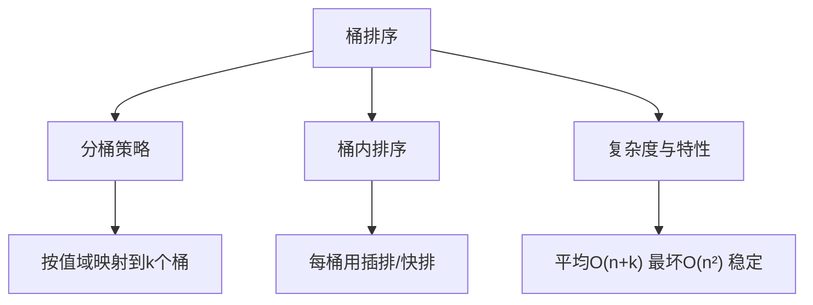

```java
/**
 * 桶排序（0..1浮点数，均匀分布）
 */
public static void bucketSort(double[] a) {
    int n = a.length;
    List<List<Double>> buckets = new ArrayList<>(n);
    for (int i = 0; i < n; i++) buckets.add(new ArrayList<>());
    for (double v : a) {
        int idx = (int) Math.min(n - 1, Math.floor(v * n));
        buckets.get(idx).add(v);
    }
    int idx = 0;
    for (List<Double> b : buckets) {
        Collections.sort(b);
        for (double v : b) a[idx++] = v;
    }
}
```

### 排序算法性能对比

| 排序算法 | 最好时间   | 平均时间   | 最坏时间   | 空间复杂度 | 稳定性 | 适用场景         |
| -------- | ---------- | ---------- | ---------- | ---------- | ------ | ---------------- |
| 冒泡排序 | O(n)       | O(n²)      | O(n²)      | O(1)       | 稳定   | 教学演示         |
| 选择排序 | O(n²)      | O(n²)      | O(n²)      | O(1)       | 不稳定 | 内存受限         |
| 插入排序 | O(n)       | O(n²)      | O(n²)      | O(1)       | 稳定   | 小数组、近似有序 |
| 希尔排序 | O(n log n) | O(n^1.3)   | O(n²)      | O(1)       | 不稳定 | 中等大小数组     |
| 快速排序 | O(n log n) | O(n log n) | O(n²)      | O(log n)   | 不稳定 | 一般用途         |
| 归并排序 | O(n log n) | O(n log n) | O(n log n) | O(n)       | 稳定   | 稳定排序需求     |
| 堆排序   | O(n log n) | O(n log n) | O(n log n) | O(1)       | 不稳定 | 内存受限         |
| 计数排序 | O(n+k)     | O(n+k)     | O(n+k)     | O(k)       | 稳定   | 整数范围小       |
| 基数排序 | O(d(n+k))  | O(d(n+k))  | O(d(n+k))  | O(n+k)     | 稳定   | 整数、字符串     |
| 桶排序   | O(n+k)     | O(n+k)     | O(n²)      | O(n+k)     | 稳定   | 均匀分布数据     |

### 排序算法选择策略

```java
/**
 * 排序算法选择策略
 */
public class SortingStrategy {
    
    /**
     * 智能排序选择器
     */
    public static void smartSort(int[] array) {
        if (array == null || array.length <= 1) {
            return;
        }
        
        int n = array.length;
        
        // 小数组使用插入排序
        if (n < 10) {
            insertionSort(array);
            return;
        }
        
        // 检查数组是否近似有序
        if (isNearlySorted(array)) {
            insertionSort(array);
            return;
        }
        
        // 检查数据范围，考虑计数排序
        int[] range = getRange(array);
        int dataRange = range[1] - range[0] + 1;
        if (dataRange <= n * 2) {
            countingSort(array, range[0], range[1]);
            return;
        }
        
        // 检查重复元素比例
        double duplicateRatio = getDuplicateRatio(array);
        if (duplicateRatio > 0.3) {
            // 有较多重复元素，使用三路快排
            threeWayQuickSort(array);
            return;
        }
        
        // 默认使用优化的快速排序
        optimizedQuickSort(array);
    }
    
    /**
     * 检查数组是否近似有序
     */
    private static boolean isNearlySorted(int[] array) {
        int inversions = 0;
        int threshold = array.length / 4; // 逆序对阈值
        
        for (int i = 0; i < array.length - 1; i++) {
            if (array[i] > array[i + 1]) {
                inversions++;
                if (inversions > threshold) {
                    return false;
                }
            }
        }
        
        return true;
    }
    
    /**
     * 获取数组的值域范围
     */
    private static int[] getRange(int[] array) {
        int min = array[0];
        int max = array[0];
        
        for (int value : array) {
            min = Math.min(min, value);
            max = Math.max(max, value);
        }
        
        return new int[]{min, max};
    }
    
    /**
     * 计算重复元素比例
     */
    private static double getDuplicateRatio(int[] array) {
        Set<Integer> uniqueElements = new HashSet<>();
        for (int value : array) {
            uniqueElements.add(value);
        }
        
        return 1.0 - (double) uniqueElements.size() / array.length;
    }
    
    /**
     * 混合排序算法（类似Java的Arrays.sort()）
     */
    public static void hybridSort(int[] array) {
        hybridSort(array, 0, array.length - 1, 0);
    }
    
    private static void hybridSort(int[] array, int low, int high, int depth) {
        int n = high - low + 1;
        
        // 小数组使用插入排序
        if (n < 47) {
            insertionSort(array, low, high);
            return;
        }
        
        // 递归深度过深，使用堆排序避免快排退化
        if (depth > 2 * log2(n)) {
            heapSort(array, low, high);
            return;
        }
        
        // 使用快速排序
        int pivotIndex = partition(array, low, high);
        hybridSort(array, low, pivotIndex - 1, depth + 1);
        hybridSort(array, pivotIndex + 1, high, depth + 1);
    }
    
    private static int log2(int n) {
        return (int) (Math.log(n) / Math.log(2));
    }
    
    // 这里需要实现上述提到的各种排序算法...
    // 为了简洁，省略具体实现
}
```

## 查找算法

### 线性查找

**线性查找**是最简单的查找算法，逐个检查每个元素。

```java
/**
 * 线性查找算法
 */
public class LinearSearch {
    
    /**
     * 基本线性查找
     * 时间复杂度：O(n)
     * 空间复杂度：O(1)
     */
    public static int linearSearch(int[] array, int target) {
        for (int i = 0; i < array.length; i++) {
            if (array[i] == target) {
                return i;
            }
        }
        return -1; // 未找到
    }
    
    /**
     * 哨兵线性查找（减少边界检查）
     */
    public static int sentinelLinearSearch(int[] array, int target) {
        int n = array.length;
        if (n == 0) return -1;
        
        int last = array[n - 1];
        array[n - 1] = target; // 设置哨兵
        
        int i = 0;
        while (array[i] != target) {
            i++;
        }
        
        array[n - 1] = last; // 恢复原值
        
        if (i < n - 1 || array[n - 1] == target) {
            return i;
        }
        
        return -1;
    }
    
    /**
     * 查找所有匹配元素的位置
     */
    public static List<Integer> findAllOccurrences(int[] array, int target) {
        List<Integer> positions = new ArrayList<>();
        
        for (int i = 0; i < array.length; i++) {
            if (array[i] == target) {
                positions.add(i);
            }
        }
        
        return positions;
    }
}
```

### 二分查找

**二分查找**适用于有序数组，通过不断缩小查找范围实现高效查找。

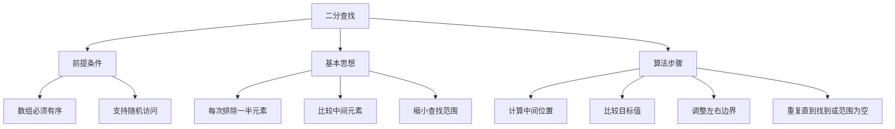

```java
/**
 * 二分查找算法及其变种
 */
public class BinarySearch {
    
    /**
     * 标准二分查找
     * 时间复杂度：O(log n)
     * 空间复杂度：O(1)
     */
    public static int binarySearch(int[] array, int target) {
        int left = 0;
        int right = array.length - 1;
        
        while (left <= right) {
            int mid = left + (right - left) / 2; // 避免溢出
            
            if (array[mid] == target) {
                return mid;
            } else if (array[mid] < target) {
                left = mid + 1;
            } else {
                right = mid - 1;
            }
        }
        
        return -1; // 未找到
    }
    
    /**
     * 递归版本的二分查找
     */
    public static int binarySearchRecursive(int[] array, int target) {
        return binarySearchRecursive(array, target, 0, array.length - 1);
    }
    
    private static int binarySearchRecursive(int[] array, int target, int left, int right) {
        if (left > right) {
            return -1;
        }
        
        int mid = left + (right - left) / 2;
        
        if (array[mid] == target) {
            return mid;
        } else if (array[mid] < target) {
            return binarySearchRecursive(array, target, mid + 1, right);
        } else {
            return binarySearchRecursive(array, target, left, mid - 1);
        }
    }
    
    /**
     * 查找第一个等于目标值的元素位置
     */
    public static int findFirst(int[] array, int target) {
        int left = 0;
        int right = array.length - 1;
        int result = -1;
        
        while (left <= right) {
            int mid = left + (right - left) / 2;
            
            if (array[mid] == target) {
                result = mid;
                right = mid - 1; // 继续在左半部分查找
            } else if (array[mid] < target) {
                left = mid + 1;
            } else {
                right = mid - 1;
            }
        }
        
        return result;
    }
    
    /**
     * 查找最后一个等于目标值的元素位置
     */
    public static int findLast(int[] array, int target) {
        int left = 0;
        int right = array.length - 1;
        int result = -1;
        
        while (left <= right) {
            int mid = left + (right - left) / 2;
            
            if (array[mid] == target) {
                result = mid;
                left = mid + 1; // 继续在右半部分查找
            } else if (array[mid] < target) {
                left = mid + 1;
            } else {
                right = mid - 1;
            }
        }
        
        return result;
    }
    
    /**
     * 查找第一个大于等于目标值的元素位置（下界）
     */
    public static int lowerBound(int[] array, int target) {
        int left = 0;
        int right = array.length;
        
        while (left < right) {
            int mid = left + (right - left) / 2;
            
            if (array[mid] < target) {
                left = mid + 1;
            } else {
                right = mid;
            }
        }
        
        return left;
    }
    
    /**
     * 查找第一个大于目标值的元素位置（上界）
     */
    public static int upperBound(int[] array, int target) {
        int left = 0;
        int right = array.length;
        
        while (left < right) {
            int mid = left + (right - left) / 2;
            
            if (array[mid] <= target) {
                left = mid + 1;
            } else {
                right = mid;
            }
        }
        
        return left;
    }
    
    /**
     * 在旋转排序数组中查找元素
     */
    public static int searchInRotatedArray(int[] array, int target) {
        int left = 0;
        int right = array.length - 1;
        
        while (left <= right) {
            int mid = left + (right - left) / 2;
            
            if (array[mid] == target) {
                return mid;
            }
            
            // 判断哪一半是有序的
            if (array[left] <= array[mid]) {
                // 左半部分有序
                if (target >= array[left] && target < array[mid]) {
                    right = mid - 1;
                } else {
                    left = mid + 1;
                }
            } else {
                // 右半部分有序
                if (target > array[mid] && target <= array[right]) {
                    left = mid + 1;
                } else {
                    right = mid - 1;
                }
            }
        }
        
        return -1;
    }
    
    /**
     * 查找峰值元素（比相邻元素都大的元素）
     */
    public static int findPeakElement(int[] array) {
        int left = 0;
        int right = array.length - 1;
        
        while (left < right) {
            int mid = left + (right - left) / 2;
            
            if (array[mid] > array[mid + 1]) {
                // 峰值在左半部分（包括mid）
                right = mid;
            } else {
                // 峰值在右半部分
                left = mid + 1;
            }
        }
        
        return left;
    }
    
    /**
     * 在无限长的有序数组中查找元素
     */
    public static int searchInInfiniteArray(int[] array, int target) {
        // 首先找到目标值可能存在的范围
        int bound = 1;
        while (array[bound] < target) {
            bound *= 2;
        }
        
        // 在[bound/2, bound]范围内进行二分查找
        int left = bound / 2;
        int right = bound;
        
        while (left <= right) {
            int mid = left + (right - left) / 2;
            
            if (array[mid] == target) {
                return mid;
            } else if (array[mid] < target) {
                left = mid + 1;
            } else {
                right = mid - 1;
            }
        }
        
        return -1;
    }
}
```

### 哈希查找

**哈希查找**通过哈希函数直接定位元素位置，实现O(1)的平均查找时间。

```java
/**
 * 哈希查找相关算法
 */
public class HashSearch {
    
    /**
     * 布隆过滤器实现
     * 用于快速判断元素是否可能存在
     */
    public static class BloomFilter {
        private BitSet bitSet;
        private int size;
        private int hashFunctionCount;
        
        public BloomFilter(int expectedElements, double falsePositiveRate) {
            this.size = (int) (-expectedElements * Math.log(falsePositiveRate) / (Math.log(2) * Math.log(2)));
            this.hashFunctionCount = (int) (size * Math.log(2) / expectedElements);
            this.bitSet = new BitSet(size);
        }
        
        /**
         * 添加元素
         */
        public void add(String element) {
            for (int i = 0; i < hashFunctionCount; i++) {
                int hash = hash(element, i);
                bitSet.set(Math.abs(hash % size));
            }
        }
        
        /**
         * 检查元素是否可能存在
         */
        public boolean mightContain(String element) {
            for (int i = 0; i < hashFunctionCount; i++) {
                int hash = hash(element, i);
                if (!bitSet.get(Math.abs(hash % size))) {
                    return false; // 一定不存在
                }
            }
            return true; // 可能存在
        }
        
        /**
         * 多重哈希函数
         */
        private int hash(String element, int i) {
            return element.hashCode() + i * element.hashCode();
        }
    }
    
    /**
     * 一致性哈希实现
     * 用于分布式系统中的负载均衡
     */
    public static class ConsistentHash {
        private TreeMap<Integer, String> ring = new TreeMap<>();
        private int virtualNodes = 100; // 虚拟节点数量
        
        /**
         * 添加节点
         */
        public void addNode(String node) {
            for (int i = 0; i < virtualNodes; i++) {
                String virtualNode = node + "#" + i;
                int hash = hash(virtualNode);
                ring.put(hash, node);
            }
        }
        
        /**
         * 删除节点
         */
        public void removeNode(String node) {
            for (int i = 0; i < virtualNodes; i++) {
                String virtualNode = node + "#" + i;
                int hash = hash(virtualNode);
                ring.remove(hash);
            }
        }
        
        /**
         * 获取数据应该存储的节点
         */
        public String getNode(String key) {
            if (ring.isEmpty()) {
                return null;
            }
            
            int hash = hash(key);
            
            // 找到第一个大于等于hash的节点
            Map.Entry<Integer, String> entry = ring.ceilingEntry(hash);
            if (entry == null) {
                // 如果没有找到，返回第一个节点（环形结构）
                entry = ring.firstEntry();
            }
            
            return entry.getValue();
        }
        
        private int hash(String key) {
            return key.hashCode();
        }
    }
    
    /**
     * 跳跃表实现
     * 提供O(log n)的查找、插入、删除操作
     */
    public static class SkipList {
        private static final int MAX_LEVEL = 16;
        private Node head;
        private int level;
        private Random random = new Random();
        
        private static class Node {
            int value;
            Node[] forward;
            
            Node(int value, int level) {
                this.value = value;
                this.forward = new Node[level + 1];
            }
        }
        
        public SkipList() {
            this.head = new Node(Integer.MIN_VALUE, MAX_LEVEL);
            this.level = 0;
        }
        
        /**
         * 查找元素
         */
        public boolean search(int target) {
            Node current = head;
            
            // 从最高层开始查找
            for (int i = level; i >= 0; i--) {
                while (current.forward[i] != null && current.forward[i].value < target) {
                    current = current.forward[i];
                }
            }
            
            current = current.forward[0];
            return current != null && current.value == target;
        }
        
        /**
         * 插入元素
         */
        public void insert(int value) {
            Node[] update = new Node[MAX_LEVEL + 1];
            Node current = head;
            
            // 找到每一层的插入位置
            for (int i = level; i >= 0; i--) {
                while (current.forward[i] != null && current.forward[i].value < value) {
                    current = current.forward[i];
                }
                update[i] = current;
            }
            
            current = current.forward[0];
            
            // 如果元素不存在，插入新节点
            if (current == null || current.value != value) {
                int newLevel = randomLevel();
                
                if (newLevel > level) {
                    for (int i = level + 1; i <= newLevel; i++) {
                        update[i] = head;
                    }
                    level = newLevel;
                }
                
                Node newNode = new Node(value, newLevel);
                for (int i = 0; i <= newLevel; i++) {
                    newNode.forward[i] = update[i].forward[i];
                    update[i].forward[i] = newNode;
                }
            }
        }
        
        /**
         * 删除元素
         */
        public boolean delete(int value) {
            Node[] update = new Node[MAX_LEVEL + 1];
            Node current = head;
            
            // 找到每一层的删除位置
            for (int i = level; i >= 0; i--) {
                while (current.forward[i] != null && current.forward[i].value < value) {
                    current = current.forward[i];
                }
                update[i] = current;
            }
            
            current = current.forward[0];
            
            // 如果找到元素，删除它
            if (current != null && current.value == value) {
                for (int i = 0; i <= level; i++) {
                    if (update[i].forward[i] != current) {
                        break;
                    }
                    update[i].forward[i] = current.forward[i];
                }
                
                // 更新跳跃表的层数
                while (level > 0 && head.forward[level] == null) {
                    level--;
                }
                
                return true;
            }
            
            return false;
        }
        
        /**
         * 随机生成节点层数
         */
        private int randomLevel() {
            int level = 0;
            while (random.nextDouble() < 0.5 && level < MAX_LEVEL) {
                level++;
            }
            return level;
        }
    }
}
```

### 树形查找

**树形查找**利用树结构的有序性实现高效查找。

```java
/**
 * 树形查找算法
 */
public class TreeSearch {
    
    /**
     * 平衡二叉搜索树（AVL树）实现
     */
    public static class AVLTree {
        private AVLNode root;
        
        private static class AVLNode {
            int value;
            int height;
            AVLNode left;
            AVLNode right;
            
            AVLNode(int value) {
                this.value = value;
                this.height = 1;
            }
        }
        
        /**
         * 获取节点高度
         */
        private int getHeight(AVLNode node) {
            return node == null ? 0 : node.height;
        }
        
        /**
         * 获取平衡因子
         */
        private int getBalance(AVLNode node) {
            return node == null ? 0 : getHeight(node.left) - getHeight(node.right);
        }
        
        /**
         * 更新节点高度
         */
        private void updateHeight(AVLNode node) {
            if (node != null) {
                node.height = Math.max(getHeight(node.left), getHeight(node.right)) + 1;
            }
        }
        
        /**
         * 右旋转
         */
        private AVLNode rotateRight(AVLNode y) {
            AVLNode x = y.left;
            AVLNode T2 = x.right;
            
            // 执行旋转
            x.right = y;
            y.left = T2;
            
            // 更新高度
            updateHeight(y);
            updateHeight(x);
            
            return x;
        }
        
        /**
         * 左旋转
         */
        private AVLNode rotateLeft(AVLNode x) {
            AVLNode y = x.right;
            AVLNode T2 = y.left;
            
            // 执行旋转
            y.left = x;
            x.right = T2;
            
            // 更新高度
            updateHeight(x);
            updateHeight(y);
            
            return y;
        }
        
        /**
         * 插入节点
         */
        public void insert(int value) {
            root = insert(root, value);
        }
        
        private AVLNode insert(AVLNode node, int value) {
            // 1. 执行标准BST插入
            if (node == null) {
                return new AVLNode(value);
            }
            
            if (value < node.value) {
                node.left = insert(node.left, value);
            } else if (value > node.value) {
                node.right = insert(node.right, value);
            } else {
                return node; // 重复值不插入
            }
            
            // 2. 更新当前节点的高度
            updateHeight(node);
            
            // 3. 获取平衡因子
            int balance = getBalance(node);
            
            // 4. 如果不平衡，进行旋转
            // Left Left Case
            if (balance > 1 && value < node.left.value) {
                return rotateRight(node);
            }
            
            // Right Right Case
            if (balance < -1 && value > node.right.value) {
                return rotateLeft(node);
            }
            
            // Left Right Case
            if (balance > 1 && value > node.left.value) {
                node.left = rotateLeft(node.left);
                return rotateRight(node);
            }
            
            // Right Left Case
            if (balance < -1 && value < node.right.value) {
                node.right = rotateRight(node.right);
                return rotateLeft(node);
            }
            
            return node;
        }
        
        /**
         * 查找元素
         */
        public boolean search(int value) {
            return search(root, value);
        }
        
        private boolean search(AVLNode node, int value) {
            if (node == null) {
                return false;
            }
            
            if (value == node.value) {
                return true;
            } else if (value < node.value) {
                return search(node.left, value);
            } else {
                return search(node.right, value);
            }
        }
        
        /**
         * 删除节点
         */
        public void delete(int value) {
            root = delete(root, value);
        }
        
        private AVLNode delete(AVLNode node, int value) {
            // 1. 执行标准BST删除
            if (node == null) {
                return node;
            }
            
            if (value < node.value) {
                node.left = delete(node.left, value);
            } else if (value > node.value) {
                node.right = delete(node.right, value);
            } else {
                // 找到要删除的节点
                if (node.left == null || node.right == null) {
                    AVLNode temp = node.left != null ? node.left : node.right;
                    
                    if (temp == null) {
                        temp = node;
                        node = null;
                    } else {
                        node = temp;
                    }
                } else {
                    // 找到右子树的最小值
                    AVLNode temp = findMin(node.right);
                    node.value = temp.value;
                    node.right = delete(node.right, temp.value);
                }
            }
            
            if (node == null) {
                return node;
            }
            
            // 2. 更新高度
            updateHeight(node);
            
            // 3. 获取平衡因子
            int balance = getBalance(node);
            
            // 4. 如果不平衡，进行旋转
            // Left Left Case
            if (balance > 1 && getBalance(node.left) >= 0) {
                return rotateRight(node);
            }
            
            // Left Right Case
            if (balance > 1 && getBalance(node.left) < 0) {
                node.left = rotateLeft(node.left);
                return rotateRight(node);
            }
            
            // Right Right Case
            if (balance < -1 && getBalance(node.right) <= 0) {
                return rotateLeft(node);
            }
            
            // Right Left Case
            if (balance < -1 && getBalance(node.right) > 0) {
                node.right = rotateRight(node.right);
                return rotateLeft(node);
            }
            
            return node;
        }
        
        private AVLNode findMin(AVLNode node) {
            while (node.left != null) {
                node = node.left;
            }
            return node;
        }
    }
    
    /**
     * B树实现（简化版）
     */
    public static class BTree {
        private static final int MIN_DEGREE = 3; // 最小度数
        private BTreeNode root;
        
        private static class BTreeNode {
            int[] keys;
            BTreeNode[] children;
            int keyCount;
            boolean isLeaf;
            
            BTreeNode(boolean isLeaf) {
                this.keys = new int[2 * MIN_DEGREE - 1];
                this.children = new BTreeNode[2 * MIN_DEGREE];
                this.keyCount = 0;
                this.isLeaf = isLeaf;
            }
        }
        
        public BTree() {
            root = new BTreeNode(true);
        }
        
        /**
         * 查找元素
         */
        public boolean search(int key) {
            return search(root, key);
        }
        
        private boolean search(BTreeNode node, int key) {
            int i = 0;
            
            // 找到第一个大于等于key的位置
            while (i < node.keyCount && key > node.keys[i]) {
                i++;
            }
            
            // 如果找到了key
            if (i < node.keyCount && key == node.keys[i]) {
                return true;
            }
            
            // 如果是叶子节点，没找到
            if (node.isLeaf) {
                return false;
            }
            
            // 递归查找子节点
            return search(node.children[i], key);
        }
        
        /**
         * 插入元素
         */
        public void insert(int key) {
            BTreeNode root = this.root;
            
            // 如果根节点满了，需要分裂
            if (root.keyCount == 2 * MIN_DEGREE - 1) {
                BTreeNode newRoot = new BTreeNode(false);
                this.root = newRoot;
                newRoot.children[0] = root;
                splitChild(newRoot, 0);
                insertNonFull(newRoot, key);
            } else {
                insertNonFull(root, key);
            }
        }
        
        private void insertNonFull(BTreeNode node, int key) {
            int i = node.keyCount - 1;
            
            if (node.isLeaf) {
                // 在叶子节点中插入
                while (i >= 0 && node.keys[i] > key) {
                    node.keys[i + 1] = node.keys[i];
                    i--;
                }
                node.keys[i + 1] = key;
                node.keyCount++;
            } else {
                // 在内部节点中插入
                while (i >= 0 && node.keys[i] > key) {
                    i--;
                }
                i++;
                
                if (node.children[i].keyCount == 2 * MIN_DEGREE - 1) {
                    splitChild(node, i);
                    if (node.keys[i] < key) {
                        i++;
                    }
                }
                insertNonFull(node.children[i], key);
            }
        }
        
        private void splitChild(BTreeNode parent, int index) {
            BTreeNode fullChild = parent.children[index];
            BTreeNode newChild = new BTreeNode(fullChild.isLeaf);
            
            newChild.keyCount = MIN_DEGREE - 1;
            
            // 复制后半部分的键
            for (int j = 0; j < MIN_DEGREE - 1; j++) {
                newChild.keys[j] = fullChild.keys[j + MIN_DEGREE];
            }
            
            // 如果不是叶子节点，复制子节点
            if (!fullChild.isLeaf) {
                for (int j = 0; j < MIN_DEGREE; j++) {
                    newChild.children[j] = fullChild.children[j + MIN_DEGREE];
                }
            }
            
            fullChild.keyCount = MIN_DEGREE - 1;
            
            // 在父节点中为新子节点腾出空间
            for (int j = parent.keyCount; j >= index + 1; j--) {
                parent.children[j + 1] = parent.children[j];
            }
            parent.children[index + 1] = newChild;
            
            // 将中间键移到父节点
            for (int j = parent.keyCount - 1; j >= index; j--) {
                parent.keys[j + 1] = parent.keys[j];
            }
            parent.keys[index] = fullChild.keys[MIN_DEGREE - 1];
            parent.keyCount++;
        }
    }
}
```

## 动态规划

### 动态规划基础

**动态规划（Dynamic Programming）** 是解决最优化问题的重要算法思想，通过将复杂问题分解为子问题来求解。

#### 动态规划的特征

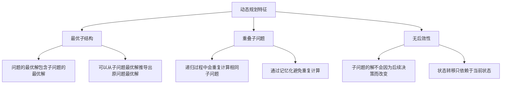

```java
/**
 * 动态规划基础算法
 */
public class DynamicProgramming {
    
    /**
     * 斐波那契数列 - DP入门示例
     * 状态定义：dp[i] = 第i个斐波那契数
     * 状态转移：dp[i] = dp[i-1] + dp[i-2]
     */
    public static class Fibonacci {
        
        /**
         * 递归解法（会超时）- 时间复杂度O(2^n)
         */
        public static long fibRecursive(int n) {
            if (n <= 1) return n;
            return fibRecursive(n - 1) + fibRecursive(n - 2);
        }
        
        /**
         * 记忆化递归 - 时间复杂度O(n)，空间复杂度O(n)
         */
        public static long fibMemo(int n) {
            long[] memo = new long[n + 1];
            Arrays.fill(memo, -1);
            return fibMemoHelper(n, memo);
        }
        
        private static long fibMemoHelper(int n, long[] memo) {
            if (n <= 1) return n;
            if (memo[n] != -1) return memo[n];
            
            memo[n] = fibMemoHelper(n - 1, memo) + fibMemoHelper(n - 2, memo);
            return memo[n];
        }
        
        /**
         * 动态规划 - 时间复杂度O(n)，空间复杂度O(n)
         */
        public static long fibDP(int n) {
            if (n <= 1) return n;
            
            long[] dp = new long[n + 1];
            dp[0] = 0;
            dp[1] = 1;
            
            for (int i = 2; i <= n; i++) {
                dp[i] = dp[i - 1] + dp[i - 2];
            }
            
            return dp[n];
        }
        
        /**
         * 空间优化版本 - 时间复杂度O(n)，空间复杂度O(1)
         */
        public static long fibOptimized(int n) {
            if (n <= 1) return n;
            
            long prev2 = 0;
            long prev1 = 1;
            long current = 0;
            
            for (int i = 2; i <= n; i++) {
                current = prev1 + prev2;
                prev2 = prev1;
                prev1 = current;
            }
            
            return current;
        }
    }
    
    /**
     * 爬楼梯问题
     * 问题：有n阶楼梯，每次可以爬1阶或2阶，有多少种爬法？
     * 状态定义：dp[i] = 爬到第i阶的方法数
     * 状态转移：dp[i] = dp[i-1] + dp[i-2]
     */
    public static int climbStairs(int n) {
        if (n <= 2) return n;
        
        int prev2 = 1; // dp[0]
        int prev1 = 2; // dp[1]
        int current = 0;
        
        for (int i = 3; i <= n; i++) {
            current = prev1 + prev2;
            prev2 = prev1;
            prev1 = current;
        }
        
        return current;
    }
    
    /**
     * 最大子数组和（Kadane算法）
     * 问题：找到数组中连续子数组的最大和
     * 状态定义：dp[i] = 以第i个元素结尾的最大子数组和
     * 状态转移：dp[i] = max(nums[i], dp[i-1] + nums[i])
     */
    public static int maxSubArray(int[] nums) {
        if (nums.length == 0) return 0;
        
        int maxSoFar = nums[0];
        int maxEndingHere = nums[0];
        
        for (int i = 1; i < nums.length; i++) {
            maxEndingHere = Math.max(nums[i], maxEndingHere + nums[i]);
            maxSoFar = Math.max(maxSoFar, maxEndingHere);
        }
        
        return maxSoFar;
    }
    
    /**
     * 最长递增子序列（LIS）
     * 问题：找到数组中最长的严格递增子序列的长度
     * 状态定义：dp[i] = 以第i个元素结尾的最长递增子序列长度
     * 状态转移：dp[i] = max(dp[j] + 1) for all j < i and nums[j] < nums[i]
     */
    public static int lengthOfLIS(int[] nums) {
        if (nums.length == 0) return 0;
        
        int[] dp = new int[nums.length];
        Arrays.fill(dp, 1);
        int maxLength = 1;
        
        for (int i = 1; i < nums.length; i++) {
            for (int j = 0; j < i; j++) {
                if (nums[j] < nums[i]) {
                    dp[i] = Math.max(dp[i], dp[j] + 1);
                }
            }
            maxLength = Math.max(maxLength, dp[i]);
        }
        
        return maxLength;
    }
    
    /**
     * 最长递增子序列（优化版本）- 使用二分查找
     * 时间复杂度：O(n log n)
     */
    public static int lengthOfLISOptimized(int[] nums) {
        if (nums.length == 0) return 0;
        
        List<Integer> tails = new ArrayList<>();
        
        for (int num : nums) {
            int pos = Collections.binarySearch(tails, num);
            if (pos < 0) {
                pos = -(pos + 1);
            }
            
            if (pos == tails.size()) {
                tails.add(num);
            } else {
                tails.set(pos, num);
            }
        }
        
        return tails.size();
    }
    
    /**
     * 最长公共子序列（LCS）
     * 问题：找到两个字符串的最长公共子序列长度
     * 状态定义：dp[i][j] = text1[0..i-1]和text2[0..j-1]的LCS长度
     * 状态转移：
     *   if text1[i-1] == text2[j-1]: dp[i][j] = dp[i-1][j-1] + 1
     *   else: dp[i][j] = max(dp[i-1][j], dp[i][j-1])
     */
    public static int longestCommonSubsequence(String text1, String text2) {
        int m = text1.length();
        int n = text2.length();
        int[][] dp = new int[m + 1][n + 1];
        
        for (int i = 1; i <= m; i++) {
            for (int j = 1; j <= n; j++) {
                if (text1.charAt(i - 1) == text2.charAt(j - 1)) {
                    dp[i][j] = dp[i - 1][j - 1] + 1;
                } else {
                    dp[i][j] = Math.max(dp[i - 1][j], dp[i][j - 1]);
                }
            }
        }
        
        return dp[m][n];
    }
    
    /**
     * 编辑距离（Levenshtein距离）
     * 问题：将word1转换为word2的最少操作次数（插入、删除、替换）
     * 状态定义：dp[i][j] = word1[0..i-1]转换为word2[0..j-1]的最少操作数
     * 状态转移：
     *   if word1[i-1] == word2[j-1]: dp[i][j] = dp[i-1][j-1]
     *   else: dp[i][j] = min(dp[i-1][j], dp[i][j-1], dp[i-1][j-1]) + 1
     */
    public static int minDistance(String word1, String word2) {
        int m = word1.length();
        int n = word2.length();
        int[][] dp = new int[m + 1][n + 1];
        
        // 初始化边界条件
        for (int i = 0; i <= m; i++) {
            dp[i][0] = i; // 删除所有字符
        }
        for (int j = 0; j <= n; j++) {
            dp[0][j] = j; // 插入所有字符
        }
        
        for (int i = 1; i <= m; i++) {
            for (int j = 1; j <= n; j++) {
                if (word1.charAt(i - 1) == word2.charAt(j - 1)) {
                    dp[i][j] = dp[i - 1][j - 1];
                } else {
                    dp[i][j] = Math.min(
                        Math.min(dp[i - 1][j], dp[i][j - 1]),
                        dp[i - 1][j - 1]
                    ) + 1;
                }
            }
        }
        
        return dp[m][n];
    }
}
```

### 经典动态规划问题

```java
/**
 * 经典动态规划问题
 */
public class ClassicDPProblems {
    
    /**
     * 0-1背包问题
     * 问题：有n个物品，每个物品有重量和价值，背包容量为W，求最大价值
     * 状态定义：dp[i][w] = 前i个物品在容量为w时的最大价值
     * 状态转移：dp[i][w] = max(dp[i-1][w], dp[i-1][w-weight[i]] + value[i])
     */
    public static int knapsack01(int[] weights, int[] values, int capacity) {
        int n = weights.length;
        int[][] dp = new int[n + 1][capacity + 1];
        
        for (int i = 1; i <= n; i++) {
            for (int w = 1; w <= capacity; w++) {
                // 不选择第i个物品
                dp[i][w] = dp[i - 1][w];
                
                // 选择第i个物品（如果能放下）
                if (weights[i - 1] <= w) {
                    dp[i][w] = Math.max(dp[i][w], 
                        dp[i - 1][w - weights[i - 1]] + values[i - 1]);
                }
            }
        }
        
        return dp[n][capacity];
    }
    
    /**
     * 0-1背包问题（空间优化版本）
     * 空间复杂度从O(nW)优化到O(W)
     */
    public static int knapsack01Optimized(int[] weights, int[] values, int capacity) {
        int[] dp = new int[capacity + 1];
        
        for (int i = 0; i < weights.length; i++) {
            // 从后往前遍历，避免重复使用
            for (int w = capacity; w >= weights[i]; w--) {
                dp[w] = Math.max(dp[w], dp[w - weights[i]] + values[i]);
            }
        }
        
        return dp[capacity];
    }
    
    /**
     * 完全背包问题
     * 问题：每个物品可以使用无限次
     * 状态转移：dp[i][w] = max(dp[i-1][w], dp[i][w-weight[i]] + value[i])
     */
    public static int knapsackComplete(int[] weights, int[] values, int capacity) {
        int[] dp = new int[capacity + 1];
        
        for (int i = 0; i < weights.length; i++) {
            // 从前往后遍历，允许重复使用
            for (int w = weights[i]; w <= capacity; w++) {
                dp[w] = Math.max(dp[w], dp[w - weights[i]] + values[i]);
            }
        }
        
        return dp[capacity];
    }
    
    /**
     * 硬币找零问题
     * 问题：给定不同面额的硬币和总金额，求最少硬币数
     * 状态定义：dp[i] = 组成金额i所需的最少硬币数
     * 状态转移：dp[i] = min(dp[i-coin] + 1) for all coins <= i
     */
    public static int coinChange(int[] coins, int amount) {
        int[] dp = new int[amount + 1];
        Arrays.fill(dp, amount + 1); // 初始化为不可能的大值
        dp[0] = 0;
        
        for (int i = 1; i <= amount; i++) {
            for (int coin : coins) {
                if (coin <= i) {
                    dp[i] = Math.min(dp[i], dp[i - coin] + 1);
                }
            }
        }
        
        return dp[amount] > amount ? -1 : dp[amount];
    }
    
    /**
     * 硬币找零问题II - 求方案数
     * 问题：给定不同面额的硬币和总金额，求有多少种组合方式
     */
    public static int coinChangeII(int amount, int[] coins) {
        int[] dp = new int[amount + 1];
        dp[0] = 1; // 组成0元有1种方式（不选任何硬币）
        
        for (int coin : coins) {
            for (int i = coin; i <= amount; i++) {
                dp[i] += dp[i - coin];
            }
        }
        
        return dp[amount];
    }
    
    /**
     * 房屋抢劫问题
     * 问题：不能抢劫相邻的房屋，求最大抢劫金额
     * 状态定义：dp[i] = 抢劫前i个房屋的最大金额
     * 状态转移：dp[i] = max(dp[i-1], dp[i-2] + nums[i])
     */
    public static int rob(int[] nums) {
        if (nums.length == 0) return 0;
        if (nums.length == 1) return nums[0];
        
        int prev2 = nums[0];
        int prev1 = Math.max(nums[0], nums[1]);
        
        for (int i = 2; i < nums.length; i++) {
            int current = Math.max(prev1, prev2 + nums[i]);
            prev2 = prev1;
            prev1 = current;
        }
        
        return prev1;
    }
    
    /**
     * 环形房屋抢劫问题
     * 问题：房屋排成环形，第一个和最后一个房屋相邻
     */
    public static int robCircular(int[] nums) {
        if (nums.length == 0) return 0;
        if (nums.length == 1) return nums[0];
        if (nums.length == 2) return Math.max(nums[0], nums[1]);
        
        // 情况1：抢劫第一个房屋，不能抢劫最后一个
        int case1 = robLinear(Arrays.copyOfRange(nums, 0, nums.length - 1));
        
        // 情况2：不抢劫第一个房屋，可以抢劫最后一个
        int case2 = robLinear(Arrays.copyOfRange(nums, 1, nums.length));
        
        return Math.max(case1, case2);
    }
    
    private static int robLinear(int[] nums) {
        int prev2 = 0;
        int prev1 = 0;
        
        for (int num : nums) {
            int current = Math.max(prev1, prev2 + num);
            prev2 = prev1;
            prev1 = current;
        }
        
        return prev1;
    }
    
    /**
     * 股票买卖问题I - 最多一次交易
     * 问题：给定股票价格数组，最多进行一次买卖，求最大利润
     * 状态定义：
     *   buy = 持有股票时的最大利润
     *   sell = 不持有股票时的最大利润
     */
    public static int maxProfitI(int[] prices) {
        if (prices.length <= 1) return 0;
        
        int buy = -prices[0]; // 第一天买入
        int sell = 0;         // 第一天不操作
        
        for (int i = 1; i < prices.length; i++) {
            buy = Math.max(buy, -prices[i]);        // 今天买入或之前买入
            sell = Math.max(sell, buy + prices[i]); // 今天卖出或之前卖出
        }
        
        return sell;
    }
    
    /**
     * 股票买卖问题II - 无限次交易
     * 问题：可以进行任意次数的买卖，求最大利润
     */
    public static int maxProfitII(int[] prices) {
        if (prices.length <= 1) return 0;
        
        int buy = -prices[0];
        int sell = 0;
        
        for (int i = 1; i < prices.length; i++) {
            int newBuy = Math.max(buy, sell - prices[i]);
            int newSell = Math.max(sell, buy + prices[i]);
            buy = newBuy;
            sell = newSell;
        }
        
        return sell;
    }
    
    /**
     * 股票买卖问题III - 最多两次交易
     * 问题：最多进行两次买卖，求最大利润
     */
    public static int maxProfitIII(int[] prices) {
        if (prices.length <= 1) return 0;
        
        int buy1 = -prices[0], sell1 = 0;
        int buy2 = -prices[0], sell2 = 0;
        
        for (int i = 1; i < prices.length; i++) {
            buy1 = Math.max(buy1, -prices[i]);
            sell1 = Math.max(sell1, buy1 + prices[i]);
            buy2 = Math.max(buy2, sell1 - prices[i]);
            sell2 = Math.max(sell2, buy2 + prices[i]);
        }
        
        return sell2;
    }
    
    /**
     * 最大正方形
     * 问题：在二进制矩阵中找到最大的正方形面积
     * 状态定义：dp[i][j] = 以(i,j)为右下角的最大正方形边长
     * 状态转移：dp[i][j] = min(dp[i-1][j], dp[i][j-1], dp[i-1][j-1]) + 1
     */
    public static int maximalSquare(char[][] matrix) {
        if (matrix.length == 0 || matrix[0].length == 0) return 0;
        
        int rows = matrix.length;
        int cols = matrix[0].length;
        int[][] dp = new int[rows + 1][cols + 1];
        int maxSide = 0;
        
        for (int i = 1; i <= rows; i++) {
            for (int j = 1; j <= cols; j++) {
                if (matrix[i - 1][j - 1] == '1') {
                    dp[i][j] = Math.min(Math.min(dp[i - 1][j], dp[i][j - 1]), 
                                       dp[i - 1][j - 1]) + 1;
                    maxSide = Math.max(maxSide, dp[i][j]);
                }
            }
        }
        
        return maxSide * maxSide;
    }
}
```

### 动态规划优化技巧

```java
/**
 * 动态规划优化技巧
 */
public class DPOptimization {
    
    /**
     * 空间优化技巧
     * 当状态转移只依赖于前几个状态时，可以使用滚动数组优化空间
     */
    
    /**
     * 最长公共子序列 - 空间优化版本
     * 从O(mn)优化到O(min(m,n))
     */
    public static int longestCommonSubsequenceOptimized(String text1, String text2) {
        // 确保text1是较短的字符串
        if (text1.length() > text2.length()) {
            String temp = text1;
            text1 = text2;
            text2 = temp;
        }
        
        int m = text1.length();
        int n = text2.length();
        int[] prev = new int[m + 1];
        int[] curr = new int[m + 1];
        
        for (int j = 1; j <= n; j++) {
            for (int i = 1; i <= m; i++) {
                if (text1.charAt(i - 1) == text2.charAt(j - 1)) {
                    curr[i] = prev[i - 1] + 1;
                } else {
                    curr[i] = Math.max(prev[i], curr[i - 1]);
                }
            }
            // 交换数组
            int[] temp = prev;
            prev = curr;
            curr = temp;
        }
        
        return prev[m];
    }
    
    /**
     * 状态压缩技巧
     * 使用位运算压缩状态空间
     */
    
    /**
     * 旅行商问题（TSP）- 状态压缩DP
     * 状态定义：dp[mask][i] = 访问过mask中的城市，当前在城市i的最短路径
     */
    public static int tsp(int[][] dist) {
        int n = dist.length;
        int[][] dp = new int[1 << n][n];
        
        // 初始化
        for (int[] row : dp) {
            Arrays.fill(row, Integer.MAX_VALUE);
        }
        dp[1][0] = 0; // 从城市0开始
        
        for (int mask = 1; mask < (1 << n); mask++) {
            for (int u = 0; u < n; u++) {
                if ((mask & (1 << u)) == 0 || dp[mask][u] == Integer.MAX_VALUE) {
                    continue;
                }
                
                for (int v = 0; v < n; v++) {
                    if (mask & (1 << v)) continue; // 已访问过
                    
                    int newMask = mask | (1 << v);
                    dp[newMask][v] = Math.min(dp[newMask][v], 
                                             dp[mask][u] + dist[u][v]);
                }
            }
        }
        
        // 找到回到起点的最短路径
        int result = Integer.MAX_VALUE;
        int finalMask = (1 << n) - 1;
        for (int i = 1; i < n; i++) {
            if (dp[finalMask][i] != Integer.MAX_VALUE) {
                result = Math.min(result, dp[finalMask][i] + dist[i][0]);
            }
        }
        
        return result;
    }
    
    /**
     * 矩阵链乘法优化
     * 问题：给定矩阵链，求最少的标量乘法次数
     * 状态定义：dp[i][j] = 矩阵i到j相乘的最少乘法次数
     * 状态转移：dp[i][j] = min(dp[i][k] + dp[k+1][j] + p[i-1]*p[k]*p[j])
     */
    public static int matrixChainOrder(int[] p) {
        int n = p.length - 1; // 矩阵数量
        int[][] dp = new int[n + 1][n + 1];
        
        // 长度为1的链不需要乘法
        for (int i = 1; i <= n; i++) {
            dp[i][i] = 0;
        }
        
        // 按链长度递增计算
        for (int len = 2; len <= n; len++) {
            for (int i = 1; i <= n - len + 1; i++) {
                int j = i + len - 1;
                dp[i][j] = Integer.MAX_VALUE;
                
                for (int k = i; k < j; k++) {
                    int cost = dp[i][k] + dp[k + 1][j] + p[i - 1] * p[k] * p[j];
                    dp[i][j] = Math.min(dp[i][j], cost);
                }
            }
        }
        
        return dp[1][n];
    }
    
    /**
     * 区间DP优化 - 四边形不等式优化
     * 当满足四边形不等式时，可以优化决策点的搜索范围
     */
    
    /**
     * 最优二叉搜索树
     * 问题：给定搜索概率，构造最优BST使期望搜索代价最小
     */
    public static double optimalBST(double[] p, double[] q) {
        int n = p.length;
        double[][] dp = new double[n + 2][n + 1];
        double[][] sum = new double[n + 2][n + 1];
        
        // 初始化
        for (int i = 1; i <= n + 1; i++) {
            dp[i][i - 1] = q[i - 1];
            sum[i][i - 1] = q[i - 1];
        }
        
        for (int len = 1; len <= n; len++) {
            for (int i = 1; i <= n - len + 1; i++) {
                int j = i + len - 1;
                dp[i][j] = Double.MAX_VALUE;
                sum[i][j] = sum[i][j - 1] + p[j] + q[j];
                
                for (int r = i; r <= j; r++) {
                    double cost = dp[i][r - 1] + dp[r + 1][j] + sum[i][j];
                    if (cost < dp[i][j]) {
                        dp[i][j] = cost;
                    }
                }
            }
        }
        
        return dp[1][n];
    }
    
    /**
     * 单调队列优化
     * 当状态转移具有单调性时，可以使用单调队列优化
     */
    
    /**
     * 滑动窗口最大值的DP应用
     * 问题：在固定窗口大小的约束下求最优解
     */
    public static int[] maxSlidingWindow(int[] nums, int k) {
        if (nums.length == 0 || k == 0) return new int[0];
        
        int[] result = new int[nums.length - k + 1];
        Deque<Integer> deque = new ArrayDeque<>(); // 存储索引
        
        for (int i = 0; i < nums.length; i++) {
            // 移除超出窗口的元素
            while (!deque.isEmpty() && deque.peekFirst() < i - k + 1) {
                deque.pollFirst();
            }
            
            // 维护单调递减队列
            while (!deque.isEmpty() && nums[deque.peekLast()] < nums[i]) {
                deque.pollLast();
            }
            
            deque.offerLast(i);
            
            // 记录窗口最大值
            if (i >= k - 1) {
                result[i - k + 1] = nums[deque.peekFirst()];
            }
        }
        
        return result;
    }
}
```
## 贪心算法

### 贪心算法原理

**贪心算法**在每一步选择中都采取当前状态下最好或最优的选择，从而希望导致结果是全局最好或最优的算法。

#### 贪心算法特征

```mermaid
graph TD
    A[贪心算法特征] --> B[贪心选择性质]
    A --> C[最优子结构]
    A --> D[无后效性]
    
    B --> B1[局部最优选择能导致全局最优解]
    B --> B2[每步选择不依赖于未来选择]
    
    C --> C1[问题的最优解包含子问题的最优解]
    C --> C2[可以通过子问题最优解构造原问题最优解]
    
    D --> D1[当前选择不会影响之前的选择]
    D --> D2[每步选择只考虑当前状态]
```

```java
/**
 * 贪心算法基础实现
 */
public class GreedyAlgorithms {
    
    /**
     * 活动选择问题
     * 问题：给定n个活动的开始和结束时间，选择最多的不冲突活动
     * 贪心策略：按结束时间排序，每次选择最早结束的活动
     */
    public static class ActivitySelection {
        static class Activity {
            int start;
            int end;
            int index;
            
            Activity(int start, int end, int index) {
                this.start = start;
                this.end = end;
                this.index = index;
            }
        }
        
        public static List<Integer> selectActivities(int[] start, int[] end) {
            int n = start.length;
            Activity[] activities = new Activity[n];
            
            for (int i = 0; i < n; i++) {
                activities[i] = new Activity(start[i], end[i], i);
            }
            
            // 按结束时间排序
            Arrays.sort(activities, (a, b) -> a.end - b.end);
            
            List<Integer> selected = new ArrayList<>();
            selected.add(activities[0].index);
            int lastEnd = activities[0].end;
            
            for (int i = 1; i < n; i++) {
                if (activities[i].start >= lastEnd) {
                    selected.add(activities[i].index);
                    lastEnd = activities[i].end;
                }
            }
            
            return selected;
        }
    }
    
    /**
     * 分数背包问题
     * 问题：物品可以分割，求最大价值
     * 贪心策略：按价值密度（价值/重量）降序排列
     */
    public static double fractionalKnapsack(int[] weights, int[] values, int capacity) {
        int n = weights.length;
        Item[] items = new Item[n];
        
        for (int i = 0; i < n; i++) {
            items[i] = new Item(weights[i], values[i], i);
        }
        
        // 按价值密度降序排序
        Arrays.sort(items, (a, b) -> Double.compare(b.ratio, a.ratio));
        
        double totalValue = 0;
        int remainingCapacity = capacity;
        
        for (Item item : items) {
            if (remainingCapacity >= item.weight) {
                // 完全装入
                totalValue += item.value;
                remainingCapacity -= item.weight;
            } else {
                // 部分装入
                totalValue += item.value * ((double) remainingCapacity / item.weight);
                break;
            }
        }
        
        return totalValue;
    }
    
    static class Item {
        int weight;
        int value;
        int index;
        double ratio;
        
        Item(int weight, int value, int index) {
            this.weight = weight;
            this.value = value;
            this.index = index;
            this.ratio = (double) value / weight;
        }
    }
    
    /**
     * 霍夫曼编码
     * 问题：构造最优前缀编码，使编码总长度最小
     * 贪心策略：每次合并频率最小的两个节点
     */
    public static class HuffmanCoding {
        static class Node implements Comparable<Node> {
            int freq;
            char ch;
            Node left, right;
            
            Node(int freq, char ch) {
                this.freq = freq;
                this.ch = ch;
            }
            
            Node(int freq, Node left, Node right) {
                this.freq = freq;
                this.left = left;
                this.right = right;
            }
            
            boolean isLeaf() {
                return left == null && right == null;
            }
            
            @Override
            public int compareTo(Node other) {
                return Integer.compare(this.freq, other.freq);
            }
        }
        
        public static Map<Character, String> buildHuffmanCodes(Map<Character, Integer> frequencies) {
            PriorityQueue<Node> pq = new PriorityQueue<>();
            
            // 创建叶子节点
            for (Map.Entry<Character, Integer> entry : frequencies.entrySet()) {
                pq.offer(new Node(entry.getValue(), entry.getKey()));
            }
            
            // 构建霍夫曼树
            while (pq.size() > 1) {
                Node left = pq.poll();
                Node right = pq.poll();
                Node merged = new Node(left.freq + right.freq, left, right);
                pq.offer(merged);
            }
            
            Node root = pq.poll();
            Map<Character, String> codes = new HashMap<>();
            
            if (root.isLeaf()) {
                // 特殊情况：只有一个字符
                codes.put(root.ch, "0");
            } else {
                generateCodes(root, "", codes);
            }
            
            return codes;
        }
        
        private static void generateCodes(Node node, String code, Map<Character, String> codes) {
            if (node.isLeaf()) {
                codes.put(node.ch, code);
            } else {
                generateCodes(node.left, code + "0", codes);
                generateCodes(node.right, code + "1", codes);
            }
        }
    }
    
    /**
     * 最小生成树 - Kruskal算法
     * 问题：找到连接所有顶点的最小权重边集
     * 贪心策略：按边权重排序，依次选择不形成环的最小边
     */
    public static class KruskalMST {
        static class Edge implements Comparable<Edge> {
            int src, dest, weight;
            
            Edge(int src, int dest, int weight) {
                this.src = src;
                this.dest = dest;
                this.weight = weight;
            }
            
            @Override
            public int compareTo(Edge other) {
                return Integer.compare(this.weight, other.weight);
            }
        }
        
        static class UnionFind {
            int[] parent, rank;
            
            UnionFind(int n) {
                parent = new int[n];
                rank = new int[n];
                for (int i = 0; i < n; i++) {
                    parent[i] = i;
                }
            }
            
            int find(int x) {
                if (parent[x] != x) {
                    parent[x] = find(parent[x]);
                }
                return parent[x];
            }
            
            boolean union(int x, int y) {
                int rootX = find(x);
                int rootY = find(y);
                
                if (rootX == rootY) return false;
                
                if (rank[rootX] < rank[rootY]) {
                    parent[rootX] = rootY;
                } else if (rank[rootX] > rank[rootY]) {
                    parent[rootY] = rootX;
                } else {
                    parent[rootY] = rootX;
                    rank[rootX]++;
                }
                
                return true;
            }
        }
        
        public static List<Edge> kruskalMST(int vertices, List<Edge> edges) {
            Collections.sort(edges);
            UnionFind uf = new UnionFind(vertices);
            List<Edge> mst = new ArrayList<>();
            
            for (Edge edge : edges) {
                if (uf.union(edge.src, edge.dest)) {
                    mst.add(edge);
                    if (mst.size() == vertices - 1) {
                        break;
                    }
                }
            }
            
            return mst;
        }
    }
    
    /**
     * 最小生成树 - Prim算法
     * 贪心策略：从任意顶点开始，每次选择连接已选顶点的最小权重边
     */
    public static class PrimMST {
        public static List<Edge> primMST(int[][] graph) {
            int vertices = graph.length;
            boolean[] inMST = new boolean[vertices];
            int[] key = new int[vertices];
            int[] parent = new int[vertices];
            
            Arrays.fill(key, Integer.MAX_VALUE);
            key[0] = 0;
            parent[0] = -1;
            
            List<Edge> mst = new ArrayList<>();
            
            for (int count = 0; count < vertices - 1; count++) {
                int u = minKey(key, inMST);
                inMST[u] = true;
                
                if (parent[u] != -1) {
                    mst.add(new Edge(parent[u], u, graph[parent[u]][u]));
                }
                
                for (int v = 0; v < vertices; v++) {
                    if (graph[u][v] != 0 && !inMST[v] && graph[u][v] < key[v]) {
                        parent[v] = u;
                        key[v] = graph[u][v];
                    }
                }
            }
            
            return mst;
        }
        
        private static int minKey(int[] key, boolean[] inMST) {
            int min = Integer.MAX_VALUE;
            int minIndex = -1;
            
            for (int v = 0; v < key.length; v++) {
                if (!inMST[v] && key[v] < min) {
                    min = key[v];
                    minIndex = v;
                }
            }
            
            return minIndex;
        }
        
        static class Edge {
            int src, dest, weight;
            
            Edge(int src, int dest, int weight) {
                this.src = src;
                this.dest = dest;
                this.weight = weight;
            }
        }
    }
}
```

### 经典贪心问题

```java
/**
 * 经典贪心问题解决方案
 */
public class ClassicGreedyProblems {
    
    /**
     * 跳跃游戏II
     * 问题：给定数组，每个元素表示最大跳跃长度，求到达末尾的最少跳跃次数
     * 贪心策略：在当前跳跃范围内选择能跳得最远的位置
     */
    public static int jump(int[] nums) {
        if (nums.length <= 1) return 0;
        
        int jumps = 0;
        int currentEnd = 0;
        int farthest = 0;
        
        for (int i = 0; i < nums.length - 1; i++) {
            farthest = Math.max(farthest, i + nums[i]);
            
            if (i == currentEnd) {
                jumps++;
                currentEnd = farthest;
            }
        }
        
        return jumps;
    }
    
    /**
     * 加油站问题
     * 问题：环形路上有n个加油站，判断能否绕一圈
     * 贪心策略：从总油量>=总消耗的前提下，找到合适的起点
     */
    public static int canCompleteCircuit(int[] gas, int[] cost) {
        int totalTank = 0;
        int currentTank = 0;
        int startStation = 0;
        
        for (int i = 0; i < gas.length; i++) {
            totalTank += gas[i] - cost[i];
            currentTank += gas[i] - cost[i];
            
            // 如果当前油量不足，从下一个站点重新开始
            if (currentTank < 0) {
                startStation = i + 1;
                currentTank = 0;
            }
        }
        
        return totalTank >= 0 ? startStation : -1;
    }
    
    /**
     * 分发糖果
     * 问题：给孩子分糖果，相邻孩子评分高的要多分，求最少糖果数
     * 贪心策略：两次遍历，分别处理左右相邻关系
     */
    public static int candy(int[] ratings) {
        int n = ratings.length;
        int[] candies = new int[n];
        Arrays.fill(candies, 1);
        
        // 从左到右遍历，处理右边比左边评分高的情况
        for (int i = 1; i < n; i++) {
            if (ratings[i] > ratings[i - 1]) {
                candies[i] = candies[i - 1] + 1;
            }
        }
        
        // 从右到左遍历，处理左边比右边评分高的情况
        for (int i = n - 2; i >= 0; i--) {
            if (ratings[i] > ratings[i + 1]) {
                candies[i] = Math.max(candies[i], candies[i + 1] + 1);
            }
        }
        
        return Arrays.stream(candies).sum();
    }
    
    /**
     * 移除K位数字
     * 问题：从数字字符串中移除k位数字，使剩余数字最小
     * 贪心策略：使用单调栈，移除破坏递增序列的数字
     */
    public static String removeKdigits(String num, int k) {
        Stack<Character> stack = new Stack<>();
        
        for (char digit : num.toCharArray()) {
            while (!stack.isEmpty() && k > 0 && stack.peek() > digit) {
                stack.pop();
                k--;
            }
            stack.push(digit);
        }
        
        // 如果还需要移除数字
        while (k > 0) {
            stack.pop();
            k--;
        }
        
        // 构建结果
        StringBuilder result = new StringBuilder();
        for (char digit : stack) {
            result.append(digit);
        }
        
        // 移除前导零
        while (result.length() > 1 && result.charAt(0) == '0') {
            result.deleteCharAt(0);
        }
        
        return result.length() == 0 ? "0" : result.toString();
    }
    
    /**
     * 会议室II
     * 问题：给定会议时间安排，求最少需要多少个会议室
     * 贪心策略：按开始时间排序，使用最小堆跟踪会议结束时间
     */
    public static int minMeetingRooms(int[][] intervals) {
        if (intervals.length == 0) return 0;
        
        // 按开始时间排序
        Arrays.sort(intervals, (a, b) -> a[0] - b[0]);
        
        // 最小堆存储会议结束时间
        PriorityQueue<Integer> heap = new PriorityQueue<>();
        
        for (int[] interval : intervals) {
            // 如果当前会议开始时间 >= 最早结束的会议时间，可以复用会议室
            if (!heap.isEmpty() && interval[0] >= heap.peek()) {
                heap.poll();
            }
            
            heap.offer(interval[1]);
        }
        
        return heap.size();
    }
    
    /**
     * 任务调度器
     * 问题：给定任务和冷却时间，求完成所有任务的最短时间
     * 贪心策略：优先安排频率最高的任务，合理安排冷却时间
     */
    public static int leastInterval(char[] tasks, int n) {
        // 统计任务频率
        int[] count = new int[26];
        for (char task : tasks) {
            count[task - 'A']++;
        }
        
        Arrays.sort(count);
        
        // 最高频率的任务
        int maxCount = count[25];
        
        // 计算最高频率任务需要的时间槽
        int idleSlots = (maxCount - 1) * n;
        
        // 用其他任务填充空闲时间槽
        for (int i = 24; i >= 0 && count[i] > 0; i--) {
            idleSlots -= Math.min(count[i], maxCount - 1);
        }
        
        // 如果还有空闲时间槽，总时间 = 任务数 + 空闲时间
        // 否则，总时间 = 任务数（任务足够密集，不需要等待）
        return idleSlots > 0 ? tasks.length + idleSlots : tasks.length;
    }
}
```

### 贪心算法应用场景

```java
/**
 * 贪心算法在实际问题中的应用
 */
public class GreedyApplications {
    
    /**
     * 区间调度最大化
     * 应用场景：资源分配、任务调度
     */
    public static class IntervalScheduling {
        static class Interval {
            int start, end;
            String name;
            
            Interval(int start, int end, String name) {
                this.start = start;
                this.end = end;
                this.name = name;
            }
        }
        
        public static List<String> maxIntervals(List<Interval> intervals) {
            // 按结束时间排序
            intervals.sort((a, b) -> a.end - b.end);
            
            List<String> result = new ArrayList<>();
            int lastEnd = Integer.MIN_VALUE;
            
            for (Interval interval : intervals) {
                if (interval.start >= lastEnd) {
                    result.add(interval.name);
                    lastEnd = interval.end;
                }
            }
            
            return result;
        }
    }
    
    /**
     * 负载均衡算法
     * 应用场景：服务器负载分配
     */
    public static class LoadBalancer {
        static class Server {
            String id;
            int currentLoad;
            int capacity;
            
            Server(String id, int capacity) {
                this.id = id;
                this.capacity = capacity;
                this.currentLoad = 0;
            }
            
            double getLoadRatio() {
                return (double) currentLoad / capacity;
            }
            
            boolean canHandle(int load) {
                return currentLoad + load <= capacity;
            }
        }
        
        private List<Server> servers;
        
        public LoadBalancer(List<Server> servers) {
            this.servers = new ArrayList<>(servers);
        }
        
        /**
         * 贪心策略：选择负载率最低的可用服务器
         */
        public String assignTask(int taskLoad) {
            Server bestServer = null;
            double minLoadRatio = Double.MAX_VALUE;
            
            for (Server server : servers) {
                if (server.canHandle(taskLoad) && server.getLoadRatio() < minLoadRatio) {
                    bestServer = server;
                    minLoadRatio = server.getLoadRatio();
                }
            }
            
            if (bestServer != null) {
                bestServer.currentLoad += taskLoad;
                return bestServer.id;
            }
            
            return null; // 无可用服务器
        }
    }
    
    /**
     * 缓存替换算法 - LFU (Least Frequently Used)
     * 应用场景：缓存管理
     */
    public static class LFUCache {
        private int capacity;
        private int minFreq;
        private Map<Integer, Integer> keyToVal;
        private Map<Integer, Integer> keyToFreq;
        private Map<Integer, LinkedHashSet<Integer>> freqToKeys;
        
        public LFUCache(int capacity) {
            this.capacity = capacity;
            this.minFreq = 0;
            this.keyToVal = new HashMap<>();
            this.keyToFreq = new HashMap<>();
            this.freqToKeys = new HashMap<>();
        }
        
        public int get(int key) {
            if (!keyToVal.containsKey(key)) {
                return -1;
            }
            
            increaseFreq(key);
            return keyToVal.get(key);
        }
        
        public void put(int key, int value) {
            if (capacity <= 0) return;
            
            if (keyToVal.containsKey(key)) {
                keyToVal.put(key, value);
                increaseFreq(key);
                return;
            }
            
            if (keyToVal.size() >= capacity) {
                evict();
            }
            
            keyToVal.put(key, value);
            keyToFreq.put(key, 1);
            freqToKeys.computeIfAbsent(1, k -> new LinkedHashSet<>()).add(key);
            minFreq = 1;
        }
        
        private void increaseFreq(int key) {
            int freq = keyToFreq.get(key);
            keyToFreq.put(key, freq + 1);
            
            freqToKeys.get(freq).remove(key);
            freqToKeys.computeIfAbsent(freq + 1, k -> new LinkedHashSet<>()).add(key);
            
            if (freqToKeys.get(freq).isEmpty() && freq == minFreq) {
                minFreq++;
            }
        }
        
        private void evict() {
            int keyToRemove = freqToKeys.get(minFreq).iterator().next();
            freqToKeys.get(minFreq).remove(keyToRemove);
            keyToVal.remove(keyToRemove);
            keyToFreq.remove(keyToRemove);
        }
    }
}
```

## 分治算法

### 分治算法思想

**分治算法**采用"分而治之"的策略，将原问题分解为若干个规模较小的相同问题，递归求解这些子问题，然后合并子问题的解得到原问题的解。

#### 分治算法步骤

```mermaid
graph TD
    A[分治算法] --> B[分解 Divide]
    A --> C[解决 Conquer]
    A --> D[合并 Combine]
    
    B --> B1[将原问题分解为子问题]
    B --> B2[子问题与原问题性质相同]
    B --> B3[子问题规模更小]
    
    C --> C1[递归求解子问题]
    C --> C2[子问题足够小时直接求解]
    
    D --> D1[合并子问题的解]
    D --> D2[得到原问题的解]
```

```java
/**
 * 分治算法经典实现
 */
public class DivideAndConquer {
    
    /**
     * 归并排序 - 分治算法的经典应用
     * 时间复杂度：O(n log n)
     * 空间复杂度：O(n)
     */
    public static void mergeSort(int[] array) {
        if (array.length <= 1) return;
        
        int[] temp = new int[array.length];
        mergeSort(array, temp, 0, array.length - 1);
    }
    
    private static void mergeSort(int[] array, int[] temp, int left, int right) {
        if (left < right) {
            int mid = left + (right - left) / 2;
            
            // 分解：递归排序左右两部分
            mergeSort(array, temp, left, mid);
            mergeSort(array, temp, mid + 1, right);
            
            // 合并：合并两个有序部分
            merge(array, temp, left, mid, right);
        }
    }
    
    private static void merge(int[] array, int[] temp, int left, int mid, int right) {
        // 复制到临时数组
        for (int i = left; i <= right; i++) {
            temp[i] = array[i];
        }
        
        int i = left, j = mid + 1, k = left;
        
        // 合并两个有序数组
        while (i <= mid && j <= right) {
            if (temp[i] <= temp[j]) {
                array[k++] = temp[i++];
            } else {
                array[k++] = temp[j++];
            }
        }
        
        // 复制剩余元素
        while (i <= mid) array[k++] = temp[i++];
        while (j <= right) array[k++] = temp[j++];
    }
    
    /**
     * 快速排序 - 分治算法应用
     * 平均时间复杂度：O(n log n)
     * 最坏时间复杂度：O(n²)
     */
    public static void quickSort(int[] array) {
        quickSort(array, 0, array.length - 1);
    }
    
    private static void quickSort(int[] array, int low, int high) {
        if (low < high) {
            // 分解：分区操作
            int pivotIndex = partition(array, low, high);
            
            // 解决：递归排序两部分
            quickSort(array, low, pivotIndex - 1);
            quickSort(array, pivotIndex + 1, high);
        }
    }
    
    private static int partition(int[] array, int low, int high) {
        int pivot = array[high];
        int i = low - 1;
        
        for (int j = low; j < high; j++) {
            if (array[j] <= pivot) {
                i++;
                swap(array, i, j);
            }
        }
        
        swap(array, i + 1, high);
        return i + 1;
    }
    
    private static void swap(int[] array, int i, int j) {
        int temp = array[i];
        array[i] = array[j];
        array[j] = temp;
    }
    
    /**
     * 最大子数组和 - 分治解法
     * 时间复杂度：O(n log n)
     */
    public static int maxSubArrayDivideConquer(int[] nums) {
        return maxSubArrayHelper(nums, 0, nums.length - 1);
    }
    
    private static int maxSubArrayHelper(int[] nums, int left, int right) {
        if (left == right) {
            return nums[left];
        }
        
        int mid = left + (right - left) / 2;
        
        // 分解：递归求解左右两部分
        int leftMax = maxSubArrayHelper(nums, left, mid);
        int rightMax = maxSubArrayHelper(nums, mid + 1, right);
        
        // 合并：求跨越中点的最大子数组和
        int crossMax = maxCrossingSum(nums, left, mid, right);
        
        return Math.max(Math.max(leftMax, rightMax), crossMax);
    }
    
    private static int maxCrossingSum(int[] nums, int left, int mid, int right) {
        int leftSum = Integer.MIN_VALUE;
        int sum = 0;
        
        // 从中点向左扩展
        for (int i = mid; i >= left; i--) {
            sum += nums[i];
            leftSum = Math.max(leftSum, sum);
        }
        
        int rightSum = Integer.MIN_VALUE;
        sum = 0;
        
        // 从中点+1向右扩展
        for (int i = mid + 1; i <= right; i++) {
            sum += nums[i];
            rightSum = Math.max(rightSum, sum);
        }
        
        return leftSum + rightSum;
    }
    
    /**
     * 大整数乘法 - Karatsuba算法
     * 时间复杂度：O(n^log₂3) ≈ O(n^1.585)
     */
    public static String multiply(String num1, String num2) {
        if (num1.equals("0") || num2.equals("0")) return "0";
        
        return karatsuba(num1, num2);
    }
    
    private static String karatsuba(String x, String y) {
        int n = Math.max(x.length(), y.length());
        
        // 基础情况：小数字直接相乘
        if (n <= 4) {
            return String.valueOf(Long.parseLong(x) * Long.parseLong(y));
        }
        
        // 补齐长度
        x = padLeft(x, n);
        y = padLeft(y, n);
        
        int mid = n / 2;
        
        // 分解
        String x1 = x.substring(0, n - mid);
        String x0 = x.substring(n - mid);
        String y1 = y.substring(0, n - mid);
        String y0 = y.substring(n - mid);
        
        // 递归计算
        String z2 = karatsuba(x1, y1);
        String z0 = karatsuba(x0, y0);
        String z1 = karatsuba(addStrings(x1, x0), addStrings(y1, y0));
        z1 = subtractStrings(z1, addStrings(z2, z0));
        
        // 合并结果
        String result = addStrings(
            addStrings(shiftLeft(z2, 2 * mid), shiftLeft(z1, mid)),
            z0
        );
        
        return removeLeadingZeros(result);
    }
    
    // 辅助方法：字符串数字运算
    private static String padLeft(String s, int length) {
        while (s.length() < length) {
            s = "0" + s;
        }
        return s;
    }
    
    private static String addStrings(String num1, String num2) {
        StringBuilder result = new StringBuilder();
        int carry = 0;
        int i = num1.length() - 1;
        int j = num2.length() - 1;
        
        while (i >= 0 || j >= 0 || carry > 0) {
            int digit1 = i >= 0 ? num1.charAt(i--) - '0' : 0;
            int digit2 = j >= 0 ? num2.charAt(j--) - '0' : 0;
            int sum = digit1 + digit2 + carry;
            
            result.append(sum % 10);
            carry = sum / 10;
        }
        
        return result.reverse().toString();
    }
    
    private static String subtractStrings(String num1, String num2) {
        // 简化实现，假设num1 >= num2
        StringBuilder result = new StringBuilder();
        int borrow = 0;
        int i = num1.length() - 1;
        int j = num2.length() - 1;
        
        while (i >= 0) {
            int digit1 = num1.charAt(i--) - '0' - borrow;
            int digit2 = j >= 0 ? num2.charAt(j--) - '0' : 0;
            
            if (digit1 < digit2) {
                digit1 += 10;
                borrow = 1;
            } else {
                borrow = 0;
            }
            
            result.append(digit1 - digit2);
        }
        
        return result.reverse().toString();
    }
    
    private static String shiftLeft(String num, int positions) {
        if (num.equals("0")) return "0";
        
        StringBuilder result = new StringBuilder(num);
        for (int i = 0; i < positions; i++) {
            result.append("0");
        }
        return result.toString();
    }
    
    private static String removeLeadingZeros(String num) {
        int i = 0;
        while (i < num.length() - 1 && num.charAt(i) == '0') {
            i++;
        }
        return num.substring(i);
    }
}
```

### 经典分治问题

```java
/**
 * 经典分治问题解决方案
 */
public class ClassicDivideConquerProblems {
    
    /**
     * 最近点对问题
     * 问题：在平面上找到距离最近的两个点
     * 时间复杂度：O(n log n)
     */
    public static class ClosestPair {
        static class Point {
            double x, y;
            
            Point(double x, double y) {
                this.x = x;
                this.y = y;
            }
            
            double distanceTo(Point other) {
                double dx = this.x - other.x;
                double dy = this.y - other.y;
                return Math.sqrt(dx * dx + dy * dy);
            }
        }
        
        public static double closestPair(Point[] points) {
            Point[] px = points.clone();
            Point[] py = points.clone();
            
            Arrays.sort(px, (a, b) -> Double.compare(a.x, b.x));
            Arrays.sort(py, (a, b) -> Double.compare(a.y, b.y));
            
            return closestPairRec(px, py, 0, points.length - 1);
        }
        
        private static double closestPairRec(Point[] px, Point[] py, int left, int right) {
            int n = right - left + 1;
            
            // 基础情况：暴力求解小规模问题
            if (n <= 3) {
                return bruteForce(px, left, right);
            }
            
            int mid = left + (right - left) / 2;
            Point midPoint = px[mid];
            
            // 分割py数组
            Point[] pyl = new Point[mid - left + 1];
            Point[] pyr = new Point[right - mid];
            int li = 0, ri = 0;
            
            for (Point point : py) {
                if (point.x <= midPoint.x) {
                    pyl[li++] = point;
                } else {
                    pyr[ri++] = point;
                }
            }
            
            // 递归求解左右两部分
            double dl = closestPairRec(px, pyl, left, mid);
            double dr = closestPairRec(px, pyr, mid + 1, right);
            
            double d = Math.min(dl, dr);
            
            // 检查跨越分割线的点对
            List<Point> strip = new ArrayList<>();
            for (Point point : py) {
                if (Math.abs(point.x - midPoint.x) < d) {
                    strip.add(point);
                }
            }
            
            return Math.min(d, stripClosest(strip, d));
        }
        
        private static double bruteForce(Point[] points, int left, int right) {
            double min = Double.MAX_VALUE;
            for (int i = left; i <= right; i++) {
                for (int j = i + 1; j <= right; j++) {
                    min = Math.min(min, points[i].distanceTo(points[j]));
                }
            }
            return min;
        }
        
        private static double stripClosest(List<Point> strip, double d) {
            double min = d;
            
            for (int i = 0; i < strip.size(); i++) {
                for (int j = i + 1; j < strip.size() && 
                     (strip.get(j).y - strip.get(i).y) < min; j++) {
                    min = Math.min(min, strip.get(i).distanceTo(strip.get(j)));
                }
            }
            
            return min;
        }
    }
    
    /**
     * 矩阵乘法 - Strassen算法
     * 时间复杂度：O(n^log₂7) ≈ O(n^2.807)
     */
    public static class StrassenMatrixMultiplication {
        
        public static int[][] multiply(int[][] A, int[][] B) {
            int n = A.length;
            int[][] C = new int[n][n];
            
            if (n <= 64) { // 基础情况：使用传统乘法
                return traditionalMultiply(A, B);
            }
            
            // 分割矩阵
            int mid = n / 2;
            int[][] A11 = new int[mid][mid];
            int[][] A12 = new int[mid][mid];
            int[][] A21 = new int[mid][mid];
            int[][] A22 = new int[mid][mid];
            int[][] B11 = new int[mid][mid];
            int[][] B12 = new int[mid][mid];
            int[][] B21 = new int[mid][mid];
            int[][] B22 = new int[mid][mid];
            
            split(A, A11, 0, 0);
            split(A, A12, 0, mid);
            split(A, A21, mid, 0);
            split(A, A22, mid, mid);
            split(B, B11, 0, 0);
            split(B, B12, 0, mid);
            split(B, B21, mid, 0);
            split(B, B22, mid, mid);
            
            // Strassen的7个乘法
            int[][] M1 = multiply(add(A11, A22), add(B11, B22));
            int[][] M2 = multiply(add(A21, A22), B11);
            int[][] M3 = multiply(A11, subtract(B12, B22));
            int[][] M4 = multiply(A22, subtract(B21, B11));
            int[][] M5 = multiply(add(A11, A12), B22);
            int[][] M6 = multiply(subtract(A21, A11), add(B11, B12));
            int[][] M7 = multiply(subtract(A12, A22), add(B21, B22));
            
            // 计算结果子矩阵
            int[][] C11 = add(subtract(add(M1, M4), M5), M7);
            int[][] C12 = add(M3, M5);
            int[][] C21 = add(M2, M4);
            int[][] C22 = add(subtract(add(M1, M3), M2), M6);
            
            // 合并结果
            join(C11, C, 0, 0);
            join(C12, C, 0, mid);
            join(C21, C, mid, 0);
            join(C22, C, mid, mid);
            
            return C;
        }
        
        private static int[][] traditionalMultiply(int[][] A, int[][] B) {
            int n = A.length;
            int[][] C = new int[n][n];
            
            for (int i = 0; i < n; i++) {
                for (int j = 0; j < n; j++) {
                    for (int k = 0; k < n; k++) {
                        C[i][j] += A[i][k] * B[k][j];
                    }
                }
            }
            
            return C;
        }
        
        private static void split(int[][] P, int[][] C, int iB, int jB) {
            for (int i1 = 0, i2 = iB; i1 < C.length; i1++, i2++) {
                for (int j1 = 0, j2 = jB; j1 < C.length; j1++, j2++) {
                    C[i1][j1] = P[i2][j2];
                }
            }
        }
        
        private static void join(int[][] C, int[][] P, int iB, int jB) {
            for (int i1 = 0, i2 = iB; i1 < C.length; i1++, i2++) {
                for (int j1 = 0, j2 = jB; j1 < C.length; j1++, j2++) {
                    P[i2][j2] = C[i1][j1];
                }
            }
        }
        
        private static int[][] add(int[][] A, int[][] B) {
            int n = A.length;
            int[][] C = new int[n][n];
            for (int i = 0; i < n; i++) {
                for (int j = 0; j < n; j++) {
                    C[i][j] = A[i][j] + B[i][j];
                }
            }
            return C;
        }
        
        private static int[][] subtract(int[][] A, int[][] B) {
            int n = A.length;
            int[][] C = new int[n][n];
            for (int i = 0; i < n; i++) {
                for (int j = 0; j < n; j++) {
                    C[i][j] = A[i][j] - B[i][j];
                }
            }
            return C;
        }
    }
    
    /**
     * 快速选择算法 - 寻找第k小的元素
     * 平均时间复杂度：O(n)
     * 最坏时间复杂度：O(n²)
     */
    public static int quickSelect(int[] nums, int k) {
        return quickSelect(nums, 0, nums.length - 1, k - 1);
    }
    
    private static int quickSelect(int[] nums, int left, int right, int k) {
        if (left == right) {
            return nums[left];
        }
        
        // 随机选择基准元素，避免最坏情况
        int randomIndex = left + new Random().nextInt(right - left + 1);
        swap(nums, randomIndex, right);
        
        int pivotIndex = partition(nums, left, right);
        
        if (k == pivotIndex) {
            return nums[k];
        } else if (k < pivotIndex) {
            return quickSelect(nums, left, pivotIndex - 1, k);
        } else {
            return quickSelect(nums, pivotIndex + 1, right, k);
        }
    }
    
    private static int partition(int[] nums, int left, int right) {
        int pivot = nums[right];
        int i = left;
        
        for (int j = left; j < right; j++) {
            if (nums[j] <= pivot) {
                swap(nums, i++, j);
            }
        }
        
        swap(nums, i, right);
        return i;
    }
    
    private static void swap(int[] nums, int i, int j) {
        int temp = nums[i];
        nums[i] = nums[j];
        nums[j] = temp;
    }
    
    /**
     * 逆序对计数 - 分治解法
     * 问题：统计数组中逆序对的数量
     * 时间复杂度：O(n log n)
     */
    public static long countInversions(int[] arr) {
        int[] temp = new int[arr.length];
        return mergeSortAndCount(arr, temp, 0, arr.length - 1);
    }
    
    private static long mergeSortAndCount(int[] arr, int[] temp, int left, int right) {
        long invCount = 0;
        
        if (left < right) {
            int mid = left + (right - left) / 2;
            
            invCount += mergeSortAndCount(arr, temp, left, mid);
            invCount += mergeSortAndCount(arr, temp, mid + 1, right);
            invCount += mergeAndCount(arr, temp, left, mid, right);
        }
        
        return invCount;
    }
    
    private static long mergeAndCount(int[] arr, int[] temp, int left, int mid, int right) {
        // 复制到临时数组
        for (int i = left; i <= right; i++) {
            temp[i] = arr[i];
        }
        
        int i = left, j = mid + 1, k = left;
        long invCount = 0;
        
        while (i <= mid && j <= right) {
            if (temp[i] <= temp[j]) {
                arr[k++] = temp[i++];
            } else {
                arr[k++] = temp[j++];
                // 当右边元素小于左边元素时，形成逆序对
                invCount += (mid - i + 1);
            }
        }
        
        while (i <= mid) arr[k++] = temp[i++];
        while (j <= right) arr[k++] = temp[j++];
        
        return invCount;
    }
}
```

### 分治算法优化

```java
/**
 * 分治算法优化技巧
 */
public class DivideConquerOptimization {
    
    /**
     * 混合算法优化
     * 对于小规模子问题，使用更简单的算法
     */
    public static void optimizedMergeSort(int[] arr) {
        int[] temp = new int[arr.length];
        optimizedMergeSort(arr, temp, 0, arr.length - 1);
    }
    
    private static void optimizedMergeSort(int[] arr, int[] temp, int left, int right) {
        // 优化1：小数组使用插入排序
        if (right - left + 1 <= 10) {
            insertionSort(arr, left, right);
            return;
        }
        
        if (left < right) {
            int mid = left + (right - left) / 2;
            
            optimizedMergeSort(arr, temp, left, mid);
            optimizedMergeSort(arr, temp, mid + 1, right);
            
            // 优化2：如果已经有序，跳过合并
            if (arr[mid] <= arr[mid + 1]) {
                return;
            }
            
            merge(arr, temp, left, mid, right);
        }
    }
    
    private static void insertionSort(int[] arr, int left, int right) {
        for (int i = left + 1; i <= right; i++) {
            int key = arr[i];
            int j = i - 1;
            
            while (j >= left && arr[j] > key) {
                arr[j + 1] = arr[j];
                j--;
            }
            
            arr[j + 1] = key;
        }
    }
    
    private static void merge(int[] arr, int[] temp, int left, int mid, int right) {
        for (int i = left; i <= right; i++) {
            temp[i] = arr[i];
        }
        
        int i = left, j = mid + 1, k = left;
        
        while (i <= mid && j <= right) {
            if (temp[i] <= temp[j]) {
                arr[k++] = temp[i++];
            } else {
                arr[k++] = temp[j++];
            }
        }
        
        while (i <= mid) arr[k++] = temp[i++];
        while (j <= right) arr[k++] = temp[j++];
    }
    
    /**
     * 尾递归优化
     * 将递归转换为迭代，减少栈空间使用
     */
    public static void iterativeQuickSort(int[] arr) {
        Stack<Integer> stack = new Stack<>();
        stack.push(0);
        stack.push(arr.length - 1);
        
        while (!stack.isEmpty()) {
            int high = stack.pop();
            int low = stack.pop();
            
            if (low < high) {
                int pivotIndex = partition(arr, low, high);
                
                // 将子问题压入栈中
                stack.push(low);
                stack.push(pivotIndex - 1);
                stack.push(pivotIndex + 1);
                stack.push(high);
            }
        }
    }
    
    private static int partition(int[] arr, int low, int high) {
        int pivot = arr[high];
        int i = low - 1;
        
        for (int j = low; j < high; j++) {
            if (arr[j] <= pivot) {
                i++;
                swap(arr, i, j);
            }
        }
        
        swap(arr, i + 1, high);
        return i + 1;
    }
    
    private static void swap(int[] arr, int i, int j) {
        int temp = arr[i];
        arr[i] = arr[j];
        arr[j] = temp;
    }
    
    /**
     * 并行分治算法
     * 利用多核处理器并行处理子问题
     */
    public static void parallelMergeSort(int[] arr) {
        int[] temp = new int[arr.length];
        ForkJoinPool pool = new ForkJoinPool();
        pool.invoke(new MergeSortTask(arr, temp, 0, arr.length - 1));
        pool.shutdown();
    }
    
    static class MergeSortTask extends RecursiveAction {
        private int[] arr;
        private int[] temp;
        private int left;
        private int right;
        private static final int THRESHOLD = 1000;
        
        MergeSortTask(int[] arr, int[] temp, int left, int right) {
            this.arr = arr;
            this.temp = temp;
            this.left = left;
            this.right = right;
        }
        
        @Override
        protected void compute() {
            if (right - left + 1 <= THRESHOLD) {
                // 小任务直接处理
                Arrays.sort(arr, left, right + 1);
                return;
            }
            
            int mid = left + (right - left) / 2;
            
            // 并行处理左右两部分
            MergeSortTask leftTask = new MergeSortTask(arr, temp, left, mid);
            MergeSortTask rightTask = new MergeSortTask(arr, temp, mid + 1, right);
            
            invokeAll(leftTask, rightTask);
            
            // 合并结果
            merge(arr, temp, left, mid, right);
        }
    }
}
```
## 常见面试算法题

### 数组类问题

```java
/**
 * 数组相关的经典面试题
 */
public class ArrayInterviewProblems {
    
    /**
     * 两数之和
     * 问题：给定数组和目标值，找到两个数的索引使其和等于目标值
     * 解法：哈希表，时间复杂度O(n)
     */
    public static int[] twoSum(int[] nums, int target) {
        Map<Integer, Integer> map = new HashMap<>();
        
        for (int i = 0; i < nums.length; i++) {
            int complement = target - nums[i];
            if (map.containsKey(complement)) {
                return new int[]{map.get(complement), i};
            }
            map.put(nums[i], i);
        }
        
        return new int[0];
    }
    
    /**
     * 三数之和
     * 问题：找到数组中所有和为0的三元组
     * 解法：排序+双指针，时间复杂度O(n²)
     */
    public static List<List<Integer>> threeSum(int[] nums) {
        List<List<Integer>> result = new ArrayList<>();
        Arrays.sort(nums);
        
        for (int i = 0; i < nums.length - 2; i++) {
            if (i > 0 && nums[i] == nums[i - 1]) continue; // 跳过重复
            
            int left = i + 1;
            int right = nums.length - 1;
            
            while (left < right) {
                int sum = nums[i] + nums[left] + nums[right];
                
                if (sum == 0) {
                    result.add(Arrays.asList(nums[i], nums[left], nums[right]));
                    
                    // 跳过重复元素
                    while (left < right && nums[left] == nums[left + 1]) left++;
                    while (left < right && nums[right] == nums[right - 1]) right--;
                    
                    left++;
                    right--;
                } else if (sum < 0) {
                    left++;
                } else {
                    right--;
                }
            }
        }
        
        return result;
    }
    
    /**
     * 盛最多水的容器
     * 问题：给定高度数组，找到两条线与x轴构成的容器能容纳最多的水
     * 解法：双指针，时间复杂度O(n)
     */
    public static int maxArea(int[] height) {
        int left = 0;
        int right = height.length - 1;
        int maxArea = 0;
        
        while (left < right) {
            int area = Math.min(height[left], height[right]) * (right - left);
            maxArea = Math.max(maxArea, area);
            
            // 移动较短的指针
            if (height[left] < height[right]) {
                left++;
            } else {
                right--;
            }
        }
        
        return maxArea;
    }
    
    /**
     * 接雨水
     * 问题：给定高度数组，计算能接多少雨水
     * 解法：双指针，时间复杂度O(n)，空间复杂度O(1)
     */
    public static int trap(int[] height) {
        if (height.length == 0) return 0;
        
        int left = 0;
        int right = height.length - 1;
        int leftMax = 0;
        int rightMax = 0;
        int water = 0;
        
        while (left < right) {
            if (height[left] < height[right]) {
                if (height[left] >= leftMax) {
                    leftMax = height[left];
                } else {
                    water += leftMax - height[left];
                }
                left++;
            } else {
                if (height[right] >= rightMax) {
                    rightMax = height[right];
                } else {
                    water += rightMax - height[right];
                }
                right--;
            }
        }
        
        return water;
    }
    
    /**
     * 寻找旋转排序数组中的最小值
     * 问题：在旋转排序数组中找到最小值
     * 解法：二分查找，时间复杂度O(log n)
     */
    public static int findMin(int[] nums) {
        int left = 0;
        int right = nums.length - 1;
        
        while (left < right) {
            int mid = left + (right - left) / 2;
            
            if (nums[mid] > nums[right]) {
                // 最小值在右半部分
                left = mid + 1;
            } else {
                // 最小值在左半部分（包括mid）
                right = mid;
            }
        }
        
        return nums[left];
    }
    
    /**
     * 下一个排列
     * 问题：找到数组的下一个字典序排列
     * 解法：从右往左找到第一个递减位置，然后交换和反转
     */
    public static void nextPermutation(int[] nums) {
        int i = nums.length - 2;
        
        // 从右往左找到第一个递减的位置
        while (i >= 0 && nums[i] >= nums[i + 1]) {
            i--;
        }
        
        if (i >= 0) {
            // 找到刚好大于nums[i]的元素
            int j = nums.length - 1;
            while (nums[j] <= nums[i]) {
                j--;
            }
            swap(nums, i, j);
        }
        
        // 反转i+1到末尾的部分
        reverse(nums, i + 1);
    }
    
    private static void swap(int[] nums, int i, int j) {
        int temp = nums[i];
        nums[i] = nums[j];
        nums[j] = temp;
    }
    
    private static void reverse(int[] nums, int start) {
        int end = nums.length - 1;
        while (start < end) {
            swap(nums, start++, end--);
        }
    }
}
```

### 链表类问题

```java
/**
 * 链表相关的经典面试题
 */
public class LinkedListInterviewProblems {
    
    static class ListNode {
        int val;
        ListNode next;
        ListNode() {}
        ListNode(int val) { this.val = val; }
        ListNode(int val, ListNode next) { this.val = val; this.next = next; }
    }
    
    /**
     * 反转链表
     * 问题：反转单向链表
     * 解法：迭代或递归，时间复杂度O(n)
     */
    public static ListNode reverseList(ListNode head) {
        ListNode prev = null;
        ListNode current = head;
        
        while (current != null) {
            ListNode next = current.next;
            current.next = prev;
            prev = current;
            current = next;
        }
        
        return prev;
    }
    
    /**
     * 反转链表（递归版本）
     */
    public static ListNode reverseListRecursive(ListNode head) {
        if (head == null || head.next == null) {
            return head;
        }
        
        ListNode newHead = reverseListRecursive(head.next);
        head.next.next = head;
        head.next = null;
        
        return newHead;
    }
    
    /**
     * 合并两个有序链表
     * 问题：将两个有序链表合并为一个有序链表
     * 解法：双指针，时间复杂度O(m+n)
     */
    public static ListNode mergeTwoLists(ListNode l1, ListNode l2) {
        ListNode dummy = new ListNode(0);
        ListNode current = dummy;
        
        while (l1 != null && l2 != null) {
            if (l1.val <= l2.val) {
                current.next = l1;
                l1 = l1.next;
            } else {
                current.next = l2;
                l2 = l2.next;
            }
            current = current.next;
        }
        
        // 连接剩余部分
        current.next = l1 != null ? l1 : l2;
        
        return dummy.next;
    }
    
    /**
     * 环形链表检测
     * 问题：判断链表是否有环
     * 解法：快慢指针（Floyd判圈算法），时间复杂度O(n)
     */
    public static boolean hasCycle(ListNode head) {
        if (head == null || head.next == null) {
            return false;
        }
        
        ListNode slow = head;
        ListNode fast = head.next;
        
        while (slow != fast) {
            if (fast == null || fast.next == null) {
                return false;
            }
            slow = slow.next;
            fast = fast.next.next;
        }
        
        return true;
    }
    
    /**
     * 环形链表II
     * 问题：找到环的起始节点
     * 解法：快慢指针+数学推导
     */
    public static ListNode detectCycle(ListNode head) {
        if (head == null || head.next == null) {
            return null;
        }
        
        // 第一步：检测是否有环
        ListNode slow = head;
        ListNode fast = head;
        
        while (fast != null && fast.next != null) {
            slow = slow.next;
            fast = fast.next.next;
            
            if (slow == fast) {
                break;
            }
        }
        
        if (fast == null || fast.next == null) {
            return null; // 无环
        }
        
        // 第二步：找到环的起始点
        slow = head;
        while (slow != fast) {
            slow = slow.next;
            fast = fast.next;
        }
        
        return slow;
    }
    
    /**
     * 相交链表
     * 问题：找到两个链表的交点
     * 解法：双指针，时间复杂度O(m+n)
     */
    public static ListNode getIntersectionNode(ListNode headA, ListNode headB) {
        if (headA == null || headB == null) {
            return null;
        }
        
        ListNode pA = headA;
        ListNode pB = headB;
        
        // 当pA和pB相遇时，要么在交点，要么都为null
        while (pA != pB) {
            pA = pA == null ? headB : pA.next;
            pB = pB == null ? headA : pB.next;
        }
        
        return pA;
    }
    
    /**
     * 删除链表的倒数第N个节点
     * 问题：一次遍历删除倒数第n个节点
     * 解法：双指针，时间复杂度O(n)
     */
    public static ListNode removeNthFromEnd(ListNode head, int n) {
        ListNode dummy = new ListNode(0);
        dummy.next = head;
        
        ListNode first = dummy;
        ListNode second = dummy;
        
        // 让first先走n+1步
        for (int i = 0; i <= n; i++) {
            first = first.next;
        }
        
        // 同时移动first和second
        while (first != null) {
            first = first.next;
            second = second.next;
        }
        
        // 删除节点
        second.next = second.next.next;
        
        return dummy.next;
    }
    
    /**
     * 回文链表
     * 问题：判断链表是否为回文
     * 解法：快慢指针找中点+反转后半部分，时间复杂度O(n)，空间复杂度O(1)
     */
    public static boolean isPalindrome(ListNode head) {
        if (head == null || head.next == null) {
            return true;
        }
        
        // 找到中点
        ListNode slow = head;
        ListNode fast = head;
        
        while (fast.next != null && fast.next.next != null) {
            slow = slow.next;
            fast = fast.next.next;
        }
        
        // 反转后半部分
        ListNode secondHalf = reverseList(slow.next);
        
        // 比较前后两部分
        ListNode p1 = head;
        ListNode p2 = secondHalf;
        boolean result = true;
        
        while (result && p2 != null) {
            if (p1.val != p2.val) {
                result = false;
            }
            p1 = p1.next;
            p2 = p2.next;
        }
        
        // 恢复链表（可选）
        slow.next = reverseList(secondHalf);
        
        return result;
    }
}
```

### 树类问题

```java
/**
 * 树相关的经典面试题
 */
public class TreeInterviewProblems {
    
    static class TreeNode {
        int val;
        TreeNode left;
        TreeNode right;
        TreeNode() {}
        TreeNode(int val) { this.val = val; }
        TreeNode(int val, TreeNode left, TreeNode right) {
            this.val = val;
            this.left = left;
            this.right = right;
        }
    }
    
    /**
     * 二叉树的最大深度
     * 问题：计算二叉树的最大深度
     * 解法：递归，时间复杂度O(n)
     */
    public static int maxDepth(TreeNode root) {
        if (root == null) return 0;
        
        int leftDepth = maxDepth(root.left);
        int rightDepth = maxDepth(root.right);
        
        return Math.max(leftDepth, rightDepth) + 1;
    }
    
    /**
     * 对称二叉树
     * 问题：判断二叉树是否对称
     * 解法：递归比较，时间复杂度O(n)
     */
    public static boolean isSymmetric(TreeNode root) {
        return root == null || isSymmetricHelper(root.left, root.right);
    }
    
    private static boolean isSymmetricHelper(TreeNode left, TreeNode right) {
        if (left == null && right == null) return true;
        if (left == null || right == null) return false;
        
        return left.val == right.val &&
               isSymmetricHelper(left.left, right.right) &&
               isSymmetricHelper(left.right, right.left);
    }
    
    /**
     * 路径总和
     * 问题：判断是否存在根到叶子的路径，使路径上数字之和等于目标值
     * 解法：递归，时间复杂度O(n)
     */
    public static boolean hasPathSum(TreeNode root, int targetSum) {
        if (root == null) return false;
        
        if (root.left == null && root.right == null) {
            return root.val == targetSum;
        }
        
        return hasPathSum(root.left, targetSum - root.val) ||
               hasPathSum(root.right, targetSum - root.val);
    }
    
    /**
     * 路径总和II
     * 问题：找到所有根到叶子的路径，使路径上数字之和等于目标值
     * 解法：回溯，时间复杂度O(n²)
     */
    public static List<List<Integer>> pathSum(TreeNode root, int targetSum) {
        List<List<Integer>> result = new ArrayList<>();
        List<Integer> path = new ArrayList<>();
        pathSumHelper(root, targetSum, path, result);
        return result;
    }
    
    private static void pathSumHelper(TreeNode node, int targetSum, 
                                     List<Integer> path, List<List<Integer>> result) {
        if (node == null) return;
        
        path.add(node.val);
        
        if (node.left == null && node.right == null && node.val == targetSum) {
            result.add(new ArrayList<>(path));
        } else {
            pathSumHelper(node.left, targetSum - node.val, path, result);
            pathSumHelper(node.right, targetSum - node.val, path, result);
        }
        
        path.remove(path.size() - 1); // 回溯
    }
    
    /**
     * 二叉树的最近公共祖先
     * 问题：找到两个节点的最近公共祖先
     * 解法：递归，时间复杂度O(n)
     */
    public static TreeNode lowestCommonAncestor(TreeNode root, TreeNode p, TreeNode q) {
        if (root == null || root == p || root == q) {
            return root;
        }
        
        TreeNode left = lowestCommonAncestor(root.left, p, q);
        TreeNode right = lowestCommonAncestor(root.right, p, q);
        
        if (left != null && right != null) {
            return root; // 当前节点是LCA
        }
        
        return left != null ? left : right;
    }
    
    /**
     * 二叉树的序列化和反序列化
     * 问题：将二叉树序列化为字符串，并能反序列化回来
     * 解法：前序遍历，时间复杂度O(n)
     */
    public static class Codec {
        private static final String NULL = "null";
        private static final String DELIMITER = ",";
        
        // 序列化
        public String serialize(TreeNode root) {
            StringBuilder sb = new StringBuilder();
            serializeHelper(root, sb);
            return sb.toString();
        }
        
        private void serializeHelper(TreeNode node, StringBuilder sb) {
            if (node == null) {
                sb.append(NULL).append(DELIMITER);
                return;
            }
            
            sb.append(node.val).append(DELIMITER);
            serializeHelper(node.left, sb);
            serializeHelper(node.right, sb);
        }
        
        // 反序列化
        public TreeNode deserialize(String data) {
            Queue<String> queue = new LinkedList<>(Arrays.asList(data.split(DELIMITER)));
            return deserializeHelper(queue);
        }
        
        private TreeNode deserializeHelper(Queue<String> queue) {
            String val = queue.poll();
            if (NULL.equals(val)) {
                return null;
            }
            
            TreeNode node = new TreeNode(Integer.parseInt(val));
            node.left = deserializeHelper(queue);
            node.right = deserializeHelper(queue);
            
            return node;
        }
    }
    
    /**
     * 二叉树展开为链表
     * 问题：将二叉树展开为单链表（前序遍历顺序）
     * 解法：递归，时间复杂度O(n)
     */
    public static void flatten(TreeNode root) {
        if (root == null) return;
        
        flatten(root.left);
        flatten(root.right);
        
        TreeNode left = root.left;
        TreeNode right = root.right;
        
        root.left = null;
        root.right = left;
        
        TreeNode current = root;
        while (current.right != null) {
            current = current.right;
        }
        current.right = right;
    }
    
    /**
     * 验证二叉搜索树
     * 问题：判断二叉树是否为有效的二叉搜索树
     * 解法：递归验证范围，时间复杂度O(n)
     */
    public static boolean isValidBST(TreeNode root) {
        return isValidBSTHelper(root, Long.MIN_VALUE, Long.MAX_VALUE);
    }
    
    private static boolean isValidBSTHelper(TreeNode node, long min, long max) {
        if (node == null) return true;
        
        if (node.val <= min || node.val >= max) {
            return false;
        }
        
        return isValidBSTHelper(node.left, min, node.val) &&
               isValidBSTHelper(node.right, node.val, max);
    }
}
```

### 动态规划类问题

```java
/**
 * 动态规划相关的经典面试题
 */
public class DPInterviewProblems {
    
    /**
     * 不同路径
     * 问题：机器人从左上角到右下角有多少种不同路径
     * 解法：动态规划，时间复杂度O(mn)
     */
    public static int uniquePaths(int m, int n) {
        int[][] dp = new int[m][n];
        
        // 初始化边界
        for (int i = 0; i < m; i++) {
            dp[i][0] = 1;
        }
        for (int j = 0; j < n; j++) {
            dp[0][j] = 1;
        }
        
        // 填充DP表
        for (int i = 1; i < m; i++) {
            for (int j = 1; j < n; j++) {
                dp[i][j] = dp[i - 1][j] + dp[i][j - 1];
            }
        }
        
        return dp[m - 1][n - 1];
    }
    
    /**
     * 不同路径II（有障碍物）
     * 问题：网格中有障碍物，求不同路径数
     * 解法：动态规划，时间复杂度O(mn)
     */
    public static int uniquePathsWithObstacles(int[][] obstacleGrid) {
        int m = obstacleGrid.length;
        int n = obstacleGrid[0].length;
        
        if (obstacleGrid[0][0] == 1) return 0;
        
        int[][] dp = new int[m][n];
        dp[0][0] = 1;
        
        // 初始化第一行
        for (int j = 1; j < n; j++) {
            dp[0][j] = obstacleGrid[0][j] == 1 ? 0 : dp[0][j - 1];
        }
        
        // 初始化第一列
        for (int i = 1; i < m; i++) {
            dp[i][0] = obstacleGrid[i][0] == 1 ? 0 : dp[i - 1][0];
        }
        
        // 填充DP表
        for (int i = 1; i < m; i++) {
            for (int j = 1; j < n; j++) {
                if (obstacleGrid[i][j] == 1) {
                    dp[i][j] = 0;
                } else {
                    dp[i][j] = dp[i - 1][j] + dp[i][j - 1];
                }
            }
        }
        
        return dp[m - 1][n - 1];
    }
    
    /**
     * 最小路径和
     * 问题：从左上角到右下角的最小路径和
     * 解法：动态规划，时间复杂度O(mn)
     */
    public static int minPathSum(int[][] grid) {
        int m = grid.length;
        int n = grid[0].length;
        
        int[][] dp = new int[m][n];
        dp[0][0] = grid[0][0];
        
        // 初始化第一行
        for (int j = 1; j < n; j++) {
            dp[0][j] = dp[0][j - 1] + grid[0][j];
        }
        
        // 初始化第一列
        for (int i = 1; i < m; i++) {
            dp[i][0] = dp[i - 1][0] + grid[i][0];
        }
        
        // 填充DP表
        for (int i = 1; i < m; i++) {
            for (int j = 1; j < n; j++) {
                dp[i][j] = Math.min(dp[i - 1][j], dp[i][j - 1]) + grid[i][j];
            }
        }
        
        return dp[m - 1][n - 1];
    }
    
    /**
     * 单词拆分
     * 问题：判断字符串是否可以被字典中的单词拆分
     * 解法：动态规划，时间复杂度O(n²)
     */
    public static boolean wordBreak(String s, List<String> wordDict) {
        Set<String> wordSet = new HashSet<>(wordDict);
        boolean[] dp = new boolean[s.length() + 1];
        dp[0] = true;
        
        for (int i = 1; i <= s.length(); i++) {
            for (int j = 0; j < i; j++) {
                if (dp[j] && wordSet.contains(s.substring(j, i))) {
                    dp[i] = true;
                    break;
                }
            }
        }
        
        return dp[s.length()];
    }
    
    /**
     * 乘积最大子数组
     * 问题：找到连续子数组的最大乘积
     * 解法：动态规划，同时维护最大值和最小值
     */
    public static int maxProduct(int[] nums) {
        if (nums.length == 0) return 0;
        
        int maxSoFar = nums[0];
        int minSoFar = nums[0];
        int result = nums[0];
        
        for (int i = 1; i < nums.length; i++) {
            int temp = maxSoFar;
            maxSoFar = Math.max(nums[i], Math.max(maxSoFar * nums[i], minSoFar * nums[i]));
            minSoFar = Math.min(nums[i], Math.min(temp * nums[i], minSoFar * nums[i]));
            result = Math.max(result, maxSoFar);
        }
        
        return result;
    }
    
    /**
     * 打家劫舍III（二叉树版本）
     * 问题：在二叉树形结构的房屋中抢劫，不能抢劫相邻的房屋
     * 解法：树形DP，时间复杂度O(n)
     */
    public static int rob(TreeNode root) {
        int[] result = robHelper(root);
        return Math.max(result[0], result[1]);
    }
    
    // 返回[不抢当前节点的最大值, 抢当前节点的最大值]
    private static int[] robHelper(TreeNode node) {
        if (node == null) {
            return new int[]{0, 0};
        }
        
        int[] left = robHelper(node.left);
        int[] right = robHelper(node.right);
        
        // 不抢当前节点：左右子树可抢可不抢，取最大值
        int notRob = Math.max(left[0], left[1]) + Math.max(right[0], right[1]);
        
        // 抢当前节点：左右子树都不能抢
        int rob = node.val + left[0] + right[0];
        
        return new int[]{notRob, rob};
    }
    
    static class TreeNode {
        int val;
        TreeNode left;
        TreeNode right;
        TreeNode() {}
        TreeNode(int val) { this.val = val; }
        TreeNode(int val, TreeNode left, TreeNode right) {
            this.val = val;
            this.left = left;
            this.right = right;
        }
    }
}
```

## 实际应用场景

### 系统设计中的算法

```java
/**
 * 系统设计中常用的算法
 */
public class SystemDesignAlgorithms {
    
    /**
     * 限流算法 - 令牌桶
     * 应用场景：API限流、流量控制
     */
    public static class TokenBucket {
        private final long capacity;
        private final long refillRate;
        private long tokens;
        private long lastRefillTime;
        
        public TokenBucket(long capacity, long refillRate) {
            this.capacity = capacity;
            this.refillRate = refillRate;
            this.tokens = capacity;
            this.lastRefillTime = System.currentTimeMillis();
        }
        
        public synchronized boolean tryConsume(long tokensRequested) {
            refill();
            
            if (tokens >= tokensRequested) {
                tokens -= tokensRequested;
                return true;
            }
            
            return false;
        }
        
        private void refill() {
            long now = System.currentTimeMillis();
            long tokensToAdd = (now - lastRefillTime) * refillRate / 1000;
            tokens = Math.min(capacity, tokens + tokensToAdd);
            lastRefillTime = now;
        }
    }
    
    /**
     * 一致性哈希算法
     * 应用场景：分布式缓存、负载均衡
     */
    public static class ConsistentHashing {
        private final TreeMap<Long, String> ring = new TreeMap<>();
        private final int virtualNodes;
        
        public ConsistentHashing(int virtualNodes) {
            this.virtualNodes = virtualNodes;
        }
        
        public void addNode(String node) {
            for (int i = 0; i < virtualNodes; i++) {
                String virtualNode = node + "#" + i;
                long hash = hash(virtualNode);
                ring.put(hash, node);
            }
        }
        
        public void removeNode(String node) {
            for (int i = 0; i < virtualNodes; i++) {
                String virtualNode = node + "#" + i;
                long hash = hash(virtualNode);
                ring.remove(hash);
            }
        }
        
        public String getNode(String key) {
            if (ring.isEmpty()) {
                return null;
            }
            
            long hash = hash(key);
            Map.Entry<Long, String> entry = ring.ceilingEntry(hash);
            
            if (entry == null) {
                entry = ring.firstEntry();
            }
            
            return entry.getValue();
        }
        
        private long hash(String key) {
            // 使用MD5或其他哈希函数
            return key.hashCode() & 0x7FFFFFFF;
        }
    }
    
    /**
     * 布隆过滤器
     * 应用场景：缓存穿透防护、垃圾邮件过滤
     */
    public static class BloomFilter {
        private final BitSet bitSet;
        private final int size;
        private final int hashFunctions;
        
        public BloomFilter(int expectedElements, double falsePositiveRate) {
            this.size = (int) (-expectedElements * Math.log(falsePositiveRate) / (Math.log(2) * Math.log(2)));
            this.hashFunctions = (int) (size * Math.log(2) / expectedElements);
            this.bitSet = new BitSet(size);
        }
        
        public void add(String element) {
            for (int i = 0; i < hashFunctions; i++) {
                int hash = hash(element, i);
                bitSet.set(Math.abs(hash % size));
            }
        }
        
        public boolean mightContain(String element) {
            for (int i = 0; i < hashFunctions; i++) {
                int hash = hash(element, i);
                if (!bitSet.get(Math.abs(hash % size))) {
                    return false;
                }
            }
            return true;
        }
        
        private int hash(String element, int seed) {
            return element.hashCode() * seed;
        }
    }
    
    /**
     * 跳表实现
     * 应用场景：Redis的有序集合、数据库索引
     */
    public static class SkipList {
        private static final int MAX_LEVEL = 16;
        private final Node head;
        private int level;
        private final Random random = new Random();
        
        private static class Node {
            int value;
            Node[] forward;
            
            Node(int value, int level) {
                this.value = value;
                this.forward = new Node[level + 1];
            }
        }
        
        public SkipList() {
            this.head = new Node(Integer.MIN_VALUE, MAX_LEVEL);
            this.level = 0;
        }
        
        public boolean search(int target) {
            Node current = head;
            
            for (int i = level; i >= 0; i--) {
                while (current.forward[i] != null && current.forward[i].value < target) {
                    current = current.forward[i];
                }
            }
            
            current = current.forward[0];
            return current != null && current.value == target;
        }
        
        public void insert(int value) {
            Node[] update = new Node[MAX_LEVEL + 1];
            Node current = head;
            
            for (int i = level; i >= 0; i--) {
                while (current.forward[i] != null && current.forward[i].value < value) {
                    current = current.forward[i];
                }
                update[i] = current;
            }
            
            current = current.forward[0];
            
            if (current == null || current.value != value) {
                int newLevel = randomLevel();
                
                if (newLevel > level) {
                    for (int i = level + 1; i <= newLevel; i++) {
                        update[i] = head;
                    }
                    level = newLevel;
                }
                
                Node newNode = new Node(value, newLevel);
                for (int i = 0; i <= newLevel; i++) {
                    newNode.forward[i] = update[i].forward[i];
                    update[i].forward[i] = newNode;
                }
            }
        }
        
        private int randomLevel() {
            int level = 0;
            while (random.nextDouble() < 0.5 && level < MAX_LEVEL) {
                level++;
            }
            return level;
        }
    }
}
```

### 大数据处理算法

```java
/**
 * 大数据处理中的算法
 */
public class BigDataAlgorithms {
    
    /**
     * 外部排序算法
     * 应用场景：处理无法完全加载到内存的大文件排序
     */
    public static class ExternalSort {
        private final int memoryLimit;
        private final String tempDir;
        
        public ExternalSort(int memoryLimit, String tempDir) {
            this.memoryLimit = memoryLimit;
            this.tempDir = tempDir;
        }
        
        public void sort(String inputFile, String outputFile) throws IOException {
            // 第一阶段：分割并排序
            List<String> tempFiles = splitAndSort(inputFile);
            
            // 第二阶段：多路归并
            mergeFiles(tempFiles, outputFile);
            
            // 清理临时文件
            for (String tempFile : tempFiles) {
                new File(tempFile).delete();
            }
        }
        
        private List<String> splitAndSort(String inputFile) throws IOException {
            List<String> tempFiles = new ArrayList<>();
            
            try (BufferedReader reader = new BufferedReader(new FileReader(inputFile))) {
                List<Integer> chunk = new ArrayList<>();
                String line;
                int fileIndex = 0;
                
                while ((line = reader.readLine()) != null) {
                    chunk.add(Integer.parseInt(line));
                    
                    if (chunk.size() >= memoryLimit) {
                        String tempFile = sortAndWriteChunk(chunk, fileIndex++);
                        tempFiles.add(tempFile);
                        chunk.clear();
                    }
                }
                
                if (!chunk.isEmpty()) {
                    String tempFile = sortAndWriteChunk(chunk, fileIndex);
                    tempFiles.add(tempFile);
                }
            }
            
            return tempFiles;
        }
        
        private String sortAndWriteChunk(List<Integer> chunk, int fileIndex) throws IOException {
            Collections.sort(chunk);
            
            String tempFile = tempDir + "/temp_" + fileIndex + ".txt";
            try (PrintWriter writer = new PrintWriter(new FileWriter(tempFile))) {
                for (int value : chunk) {
                    writer.println(value);
                }
            }
            
            return tempFile;
        }
        
        private void mergeFiles(List<String> tempFiles, String outputFile) throws IOException {
            PriorityQueue<FileReader> pq = new PriorityQueue<>((a, b) -> 
                Integer.compare(a.currentValue, b.currentValue));
            
            // 初始化所有文件读取器
            for (String tempFile : tempFiles) {
                FileReader reader = new FileReader(tempFile);
                if (reader.hasNext()) {
                    pq.offer(reader);
                }
            }
            
            try (PrintWriter writer = new PrintWriter(new FileWriter(outputFile))) {
                while (!pq.isEmpty()) {
                    FileReader reader = pq.poll();
                    writer.println(reader.currentValue);
                    
                    if (reader.readNext()) {
                        pq.offer(reader);
                    } else {
                        reader.close();
                    }
                }
            }
        }
        
        private static class FileReader implements Closeable {
            private final BufferedReader reader;
            int currentValue;
            private boolean hasValue;
            
            FileReader(String filename) throws IOException {
                this.reader = new BufferedReader(new java.io.FileReader(filename));
                readNext();
            }
            
            boolean readNext() throws IOException {
                String line = reader.readLine();
                if (line != null) {
                    currentValue = Integer.parseInt(line);
                    hasValue = true;
                    return true;
                } else {
                    hasValue = false;
                    return false;
                }
            }
            
            boolean hasNext() {
                return hasValue;
            }
            
            @Override
            public void close() throws IOException {
                reader.close();
            }
        }
    }
    
    /**
     * Top-K算法
     * 应用场景：找出大数据集中的前K个最大/最小元素
     */
    public static class TopK {
        
        /**
         * 使用最小堆找Top-K最大元素
         */
        public static List<Integer> findTopKLargest(int[] nums, int k) {
            PriorityQueue<Integer> minHeap = new PriorityQueue<>(k);
            
            for (int num : nums) {
                if (minHeap.size() < k) {
                    minHeap.offer(num);
                } else if (num > minHeap.peek()) {
                    minHeap.poll();
                    minHeap.offer(num);
                }
            }
            
            return new ArrayList<>(minHeap);
        }
        
        /**
         * 使用快速选择算法找第K大元素
         */
        public static int findKthLargest(int[] nums, int k) {
            return quickSelect(nums, 0, nums.length - 1, nums.length - k);
        }
        
        private static int quickSelect(int[] nums, int left, int right, int k) {
            if (left == right) {
                return nums[left];
            }
            
            int pivotIndex = partition(nums, left, right);
            
            if (k == pivotIndex) {
                return nums[k];
            } else if (k < pivotIndex) {
                return quickSelect(nums, left, pivotIndex - 1, k);
            } else {
                return quickSelect(nums, pivotIndex + 1, right, k);
            }
        }
        
        private static int partition(int[] nums, int left, int right) {
            int pivot = nums[right];
            int i = left;
            
            for (int j = left; j < right; j++) {
                if (nums[j] <= pivot) {
                    swap(nums, i++, j);
                }
            }
            
            swap(nums, i, right);
            return i;
        }
        
        private static void swap(int[] nums, int i, int j) {
            int temp = nums[i];
            nums[i] = nums[j];
            nums[j] = temp;
        }
    }
    
    /**
     * 分布式计算框架中的算法
     * MapReduce模式的简化实现
     */
    public static class MapReduce {
        
        public interface Mapper<K1, V1, K2, V2> {
            List<Pair<K2, V2>> map(K1 key, V1 value);
        }
        
        public interface Reducer<K2, V2, V3> {
            V3 reduce(K2 key, List<V2> values);
        }
        
        public static class Pair<K, V> {
            public final K key;
            public final V value;
            
            public Pair(K key, V value) {
                this.key = key;
                this.value = value;
            }
        }
        
        public static <K1, V1, K2, V2, V3> Map<K2, V3> mapReduce(
                List<Pair<K1, V1>> input,
                Mapper<K1, V1, K2, V2> mapper,
                Reducer<K2, V2, V3> reducer) {
            
            // Map阶段
            List<Pair<K2, V2>> mappedData = new ArrayList<>();
            for (Pair<K1, V1> pair : input) {
                mappedData.addAll(mapper.map(pair.key, pair.value));
            }
            
            // Shuffle阶段：按key分组
            Map<K2, List<V2>> grouped = new HashMap<>();
            for (Pair<K2, V2> pair : mappedData) {
                grouped.computeIfAbsent(pair.key, k -> new ArrayList<>()).add(pair.value);
            }
            
            // Reduce阶段
            Map<K2, V3> result = new HashMap<>();
            for (Map.Entry<K2, List<V2>> entry : grouped.entrySet()) {
                V3 reducedValue = reducer.reduce(entry.getKey(), entry.getValue());
                result.put(entry.getKey(), reducedValue);
            }
            
            return result;
        }
        
        // 示例：词频统计
        public static Map<String, Integer> wordCount(List<String> documents) {
            List<Pair<String, String>> input = new ArrayList<>();
            for (int i = 0; i < documents.size(); i++) {
                input.add(new Pair<>("doc" + i, documents.get(i)));
            }
            
            Mapper<String, String, String, Integer> mapper = (docId, content) -> {
                List<Pair<String, Integer>> result = new ArrayList<>();
                String[] words = content.toLowerCase().split("\\s+");
                for (String word : words) {
                    result.add(new Pair<>(word, 1));
                }
                return result;
            };
            
            Reducer<String, Integer, Integer> reducer = (word, counts) -> 
                counts.stream().mapToInt(Integer::intValue).sum();
            
            return mapReduce(input, mapper, reducer);
        }
    }
}
```

## 总结

这个算法与数据结构文档涵盖了计算机科学中最重要的算法和数据结构知识，包括：

### 核心内容
1. **数据结构基础**：数组、链表、栈、队列、树、图、哈希表、堆
2. **排序算法**：从基础的冒泡排序到高级的快速排序、归并排序
3. **查找算法**：线性查找、二分查找、哈希查找、树形查找
4. **算法设计思想**：动态规划、贪心算法、分治算法、回溯算法
5. **图算法**：遍历、最短路径、最小生成树、拓扑排序
6. **高级数据结构**：并查集、线段树、字典树、跳表

### 实用特色
- **完整的代码实现**：每个算法都有详细的Java实现
- **复杂度分析**：时间复杂度和空间复杂度的详细分析
- **图表说明**：使用mermaid图表直观展示算法流程
- **性能对比**：不同算法的性能对比表格
- **面试导向**：包含大量经典面试题和解题思路
- **实际应用**：系统设计和大数据处理中的算法应用

### 学习建议
1. **循序渐进**：从基础数据结构开始，逐步学习高级算法
2. **动手实践**：运行和修改代码示例，加深理解
3. **复杂度分析**：重点理解时间和空间复杂度的计算方法
4. **刷题练习**：结合LeetCode等平台进行算法题练习
5. **实际应用**：思考算法在实际项目中的应用场景

这个文档可以作为算法学习的完整参考资料，适合不同水平的开发者学习和查阅。