# 数据仓库实战指南

## 目录
- [数据仓库实战指南](#数据仓库实战指南)
  - [目录](#目录)
  - [1. 数据仓库基础概念](#1-数据仓库基础概念)
    - [1.1 数据仓库定义与特征](#11-数据仓库定义与特征)
      - [数据仓库四大特征](#数据仓库四大特征)
      - [数据仓库与数据库对比](#数据仓库与数据库对比)
    - [1.2 数据仓库发展历程](#12-数据仓库发展历程)
      - [技术演进路径](#技术演进路径)
      - [现代数据仓库特点](#现代数据仓库特点)
    - [1.3 数据仓库价值体现](#13-数据仓库价值体现)
      - [业务价值](#业务价值)
      - [技术价值](#技术价值)
  - [2. 数据仓库架构设计](#2-数据仓库架构设计)
    - [2.1 经典架构模式](#21-经典架构模式)
      - [Kimball架构](#kimball架构)
      - [Inmon架构](#inmon架构)
      - [Data Vault架构](#data-vault架构)
    - [2.2 现代架构模式](#22-现代架构模式)
      - [Lambda架构](#lambda架构)
      - [Kappa架构](#kappa架构)
      - [湖仓一体架构](#湖仓一体架构)
      - [Delta Lake实现](#delta-lake实现)
      - [Apache Iceberg实现](#apache-iceberg实现)
      - [Apache Hudi实现](#apache-hudi实现)
    - [2.3 技术架构选型](#23-技术架构选型)
      - [存储层选型](#存储层选型)
      - [计算层选型](#计算层选型)
      - [服务层选型](#服务层选型)
  - [3. 维度建模理论与实践](#3-维度建模理论与实践)
    - [3.1 维度建模基础](#31-维度建模基础)
      - [事实表设计](#事实表设计)
      - [维度表设计](#维度表设计)
      - [星型模型与雪花模型](#星型模型与雪花模型)
    - [3.2 高级建模技巧](#32-高级建模技巧)
      - [缓慢变化维度](#缓慢变化维度)
      - [退化维度](#退化维度)
      - [一致性维度](#一致性维度)
    - [3.3 实体建模方法](#33-实体建模方法)
      - [3NF建模](#3nf建模)
      - [实体关系模型](#实体关系模型)
      - [数据集市设计](#数据集市设计)
  - [4. 数据分层架构](#4-数据分层架构)
    - [4.1 分层设计原则](#41-分层设计原则)
      - [分层目标与原则](#分层目标与原则)
      - [层次职责划分](#层次职责划分)
    - [4.2 详细分层设计](#42-详细分层设计)
      - [ODS操作数据存储层](#ods操作数据存储层)
      - [DWD数据明细层](#dwd数据明细层)
      - [DWS数据汇总层](#dws数据汇总层)
      - [ADS应用数据服务层](#ads应用数据服务层)
    - [4.3 分层实施策略](#43-分层实施策略)
      - [建表规范](#建表规范)
      - [命名规范](#命名规范)
      - [数据流转规范](#数据流转规范)
  - [5. ETL流程设计](#5-etl流程设计)
    - [5.1 ETL基础概念](#51-etl基础概念)
      - [Extract数据抽取](#extract数据抽取)
      - [Transform数据转换](#transform数据转换)
      - [Load数据加载](#load数据加载)
    - [5.2 ELT模式](#52-elt模式)
      - [ELT与ETL对比](#elt与etl对比)
    - [5.3 实时数据处理](#53-实时数据处理)
      - [流批一体架构](#流批一体架构)
  - [10. 面试题集锦](#10-面试题集锦)
    - [10.1 基础理论题](#101-基础理论题)
      - [概念原理类](#概念原理类)
      - [架构设计类](#架构设计类)
    - [10.2 建模设计题](#102-建模设计题)
      - [维度建模类](#维度建模类)
      - [分层设计类](#分层设计类)
    - [10.3 技术实现题](#103-技术实现题)
      - [ETL流程类](#etl流程类)
      - [性能优化类](#性能优化类)
    - [10.4 场景应用题](#104-场景应用题)
      - [业务场景类](#业务场景类)
      - [问题解决类](#问题解决类)
  - [11. 参考资源](#11-参考资源)

## 1. 数据仓库基础概念

### 1.1 数据仓库定义与特征

**数据仓库（Data Warehouse）** 是一个面向主题的、集成的、相对稳定的、反映历史变化的数据集合，用于支持管理决策。

#### 数据仓库四大特征

| 特征 | 含义 | 实现方式 |
|------|------|----------|
| **面向主题** | 按业务主题组织数据 | 用户、商品、订单等主题域 |
| **集成的** | 整合多个数据源 | 统一数据格式、编码、命名 |
| **非易失的** | 数据相对稳定 | 只读操作，历史数据保留 |
| **时变的** | 反映历史变化 | 时间戳、版本管理 |

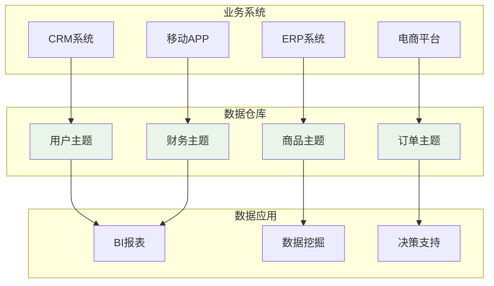

#### 数据仓库与数据库对比

| 特性 | 数据仓库 | 业务数据库 |
|------|----------|------------|
| **数据用途** | 分析决策 | 事务处理 |
| **数据来源** | 多个系统集成 | 单一业务系统 |
| **数据结构** | 反规范化 | 规范化 |
| **查询模式** | 复杂分析查询 | 简单事务查询 |
| **数据更新** | 批量定期更新 | 实时频繁更新 |
| **历史数据** | 长期保存 | 定期清理 |
| **用户类型** | 分析师、管理者 | 业务操作人员 |

### 1.2 数据仓库发展历程

#### 技术演进路径

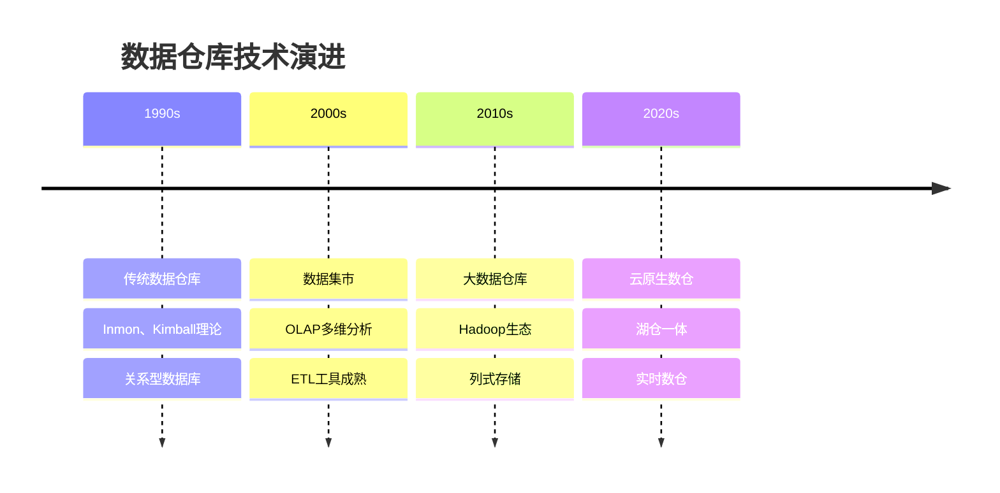

#### 现代数据仓库特点

**技术特点：**
- **弹性扩展**：云原生架构，按需扩缩容
- **实时处理**：流批一体，近实时数据更新
- **湖仓融合**：结构化与非结构化数据统一管理
- **智能化**：自动优化、智能推荐
- **开放生态**：标准化接口，多引擎支持

**业务特点：**
- **敏捷开发**：快速响应业务需求变化
- **自服务分析**：业务用户自主数据分析
- **数据民主化**：降低数据使用门槛
- **数据产品化**：数据即产品的理念

### 1.3 数据仓库价值体现

#### 业务价值

**决策支持价值：**
```sql
-- 销售趋势分析
SELECT 
    date_trunc('month', order_date) as month,
    SUM(order_amount) as monthly_sales,
    COUNT(DISTINCT customer_id) as active_customers,
    AVG(order_amount) as avg_order_value
FROM fact_orders
WHERE order_date >= '2023-01-01'
GROUP BY date_trunc('month', order_date)
ORDER BY month;

-- 用户行为漏斗分析
WITH user_funnel AS (
    SELECT 
        user_id,
        MAX(CASE WHEN event_type = 'visit' THEN 1 ELSE 0 END) as visited,
        MAX(CASE WHEN event_type = 'view_product' THEN 1 ELSE 0 END) as viewed,
        MAX(CASE WHEN event_type = 'add_cart' THEN 1 ELSE 0 END) as added_cart,
        MAX(CASE WHEN event_type = 'purchase' THEN 1 ELSE 0 END) as purchased
    FROM fact_user_events
    WHERE event_date = current_date
    GROUP BY user_id
)
SELECT 
    SUM(visited) as visitors,
    SUM(viewed) as product_viewers,
    SUM(added_cart) as cart_users,
    SUM(purchased) as buyers,
    SUM(viewed) * 100.0 / SUM(visited) as view_rate,
    SUM(purchased) * 100.0 / SUM(visited) as conversion_rate
FROM user_funnel;
```

#### 技术价值

**数据整合价值：**
- **消除数据孤岛**：统一数据视图
- **提升数据质量**：标准化、清洗、验证
- **减少重复开发**：共享数据资产
- **提高查询性能**：专门优化的存储和计算

**成本效益分析：**

| 收益项 | 量化指标 | 预期效果 |
|--------|----------|----------|
| **决策效率提升** | 报表生成时间 | 从天级到小时级 |
| **数据质量改善** | 数据准确率 | 从85%提升到95% |
| **开发效率提升** | 新需求响应时间 | 从周级到天级 |
| **运维成本降低** | 系统维护成本 | 降低30-50% |

## 2. 数据仓库架构设计

### 2.1 经典架构模式

#### Kimball架构

**Kimball架构**采用**自底向上**的设计方法，以数据集市为核心，强调维度建模。

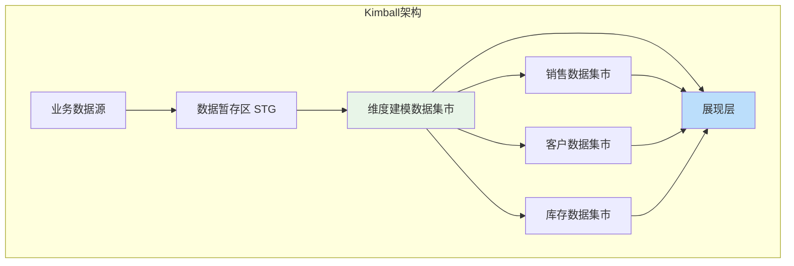

**Kimball架构特点：**

| 优点 | 缺点 |
|------|------|
| 快速实现业务价值 | 数据冗余较多 |
| 查询性能优秀 | 维护复杂度高 |
| 业务理解容易 | 扩展性有限 |
| 开发周期短 | 数据一致性挑战 |

**适用场景：**
- 业务需求明确
- 快速原型验证
- 查询性能要求高
- 团队技能相对简单

#### Inmon架构

**Inmon架构**采用**自顶向下**的设计方法，以企业数据仓库为核心，强调标准化和集成。

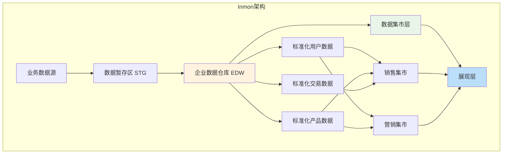

**Inmon架构特点：**

| 优点 | 缺点 |
|------|------|
| 数据一致性强 | 开发周期长 |
| 扩展性好 | 初期投资大 |
| 数据冗余少 | 技术复杂度高 |
| 长期维护成本低 | 业务价值体现慢 |

#### Data Vault架构

**Data Vault**是一种专门为数据仓库设计的建模方法，强调敏捷性和可扩展性。

**核心组件：**

```sql
-- Hub表：业务实体
CREATE TABLE hub_customer (
    customer_hk CHAR(32) PRIMARY KEY,  -- Hash Key
    customer_id VARCHAR(50),           -- 业务键
    load_date TIMESTAMP,               -- 加载时间
    record_source VARCHAR(50)          -- 数据源
);

-- Link表：关系
CREATE TABLE link_customer_order (
    customer_order_hk CHAR(32) PRIMARY KEY,
    customer_hk CHAR(32),
    order_hk CHAR(32),
    load_date TIMESTAMP,
    record_source VARCHAR(50),
    FOREIGN KEY (customer_hk) REFERENCES hub_customer(customer_hk),
    FOREIGN KEY (order_hk) REFERENCES hub_order(order_hk)
);

-- Satellite表：属性
CREATE TABLE sat_customer_details (
    customer_hk CHAR(32),
    load_date TIMESTAMP,
    customer_name VARCHAR(100),
    email VARCHAR(100),
    phone VARCHAR(20),
    hash_diff CHAR(32),               -- 变更检测
    PRIMARY KEY (customer_hk, load_date),
    FOREIGN KEY (customer_hk) REFERENCES hub_customer(customer_hk)
);
```

**Data Vault优势：**
- **历史追溯**：完整保留数据变更历史
- **敏捷开发**：支持增量式开发
- **审计友好**：天然支持审计要求
- **并行开发**：不同团队可并行建模

### 2.2 现代架构模式

#### Lambda架构

**Lambda架构**通过批处理和流处理两条路径，实现准实时数据处理。

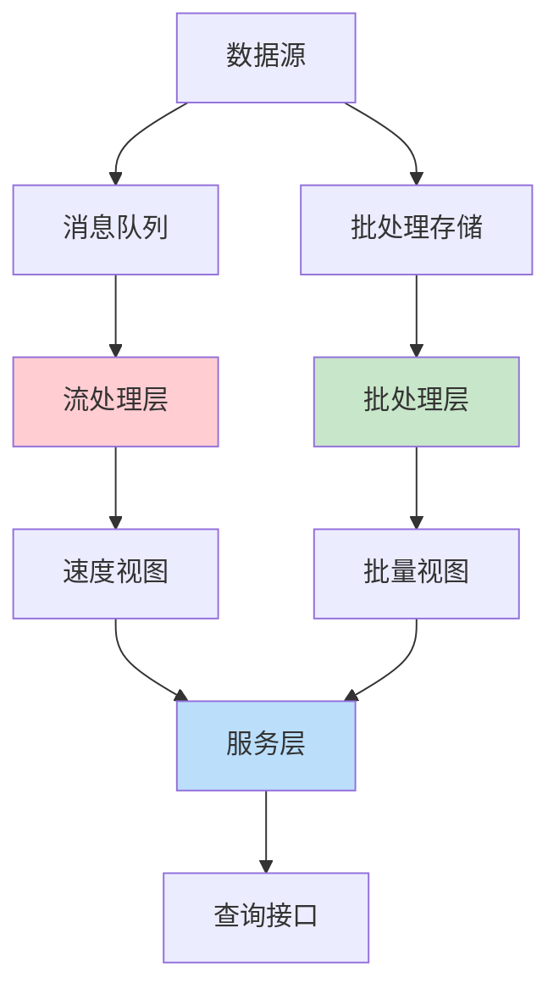

**Lambda架构实现：**

```python
# 流处理作业 (Flink/Spark Streaming)
def process_real_time_orders():
    env = StreamExecutionEnvironment.get_execution_environment()
    
    # 从Kafka读取实时订单数据
    orders_stream = env.add_source(
        FlinkKafkaConsumer('orders_topic', SimpleStringSchema(), kafka_props)
    )
    
    # 实时聚合计算
    order_metrics = orders_stream \
        .map(parse_order) \
        .key_by(lambda x: x.customer_id) \
        .window(TumblingProcessingTimeWindows.of(Time.minutes(5))) \
        .aggregate(OrderAggregateFunction())
    
    # 写入速度视图存储
    order_metrics.add_sink(RedisSink())

# 批处理作业 (Spark)
def process_batch_orders():
    spark = SparkSession.builder.appName("BatchOrderProcessing").getOrCreate()
    
    # 读取历史订单数据
    orders_df = spark.read.parquet("hdfs://orders/")
    
    # 批量聚合计算
    order_summary = orders_df \
        .groupBy("customer_id", date_trunc("day", "order_date")) \
        .agg(
            sum("order_amount").alias("daily_amount"),
            count("*").alias("daily_orders")
        )
    
    # 写入批量视图存储
    order_summary.write.mode("overwrite").parquet("hdfs://order_summary/")
```

#### Kappa架构

**Kappa架构**统一使用流处理，通过重新处理历史数据解决批处理需求。

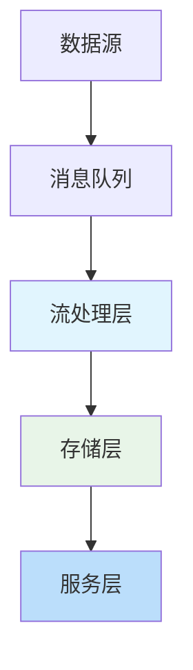

**Kappa架构优势：**
- **架构简化**：单一代码路径
- **数据一致性**：消除Lambda双路径问题
- **维护简单**：减少运维复杂度
- **延迟更低**：纯流处理架构

#### 湖仓一体架构

**湖仓一体（Lakehouse）** 是新一代数据架构，结合了数据湖的灵活性和数据仓库的性能优势，为现代数据分析提供统一的存储和计算平台。

**核心理念：**
- **一份数据多种用途**：统一存储支持BI、AI、流处理等多种工作负载
- **开放标准**：基于开放格式，避免厂商锁定
- **性能优化**：提供类似数据仓库的查询性能
- **成本效益**：利用对象存储降低成本

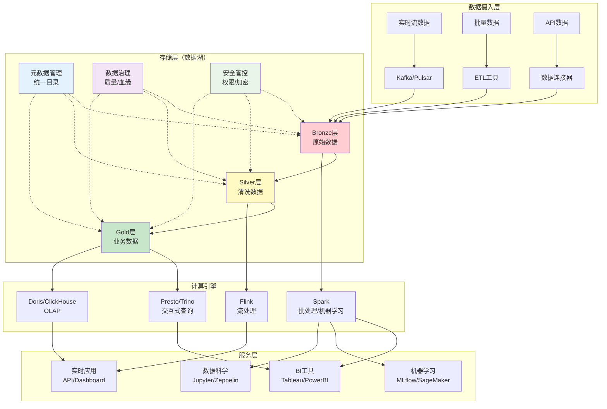

**湖仓一体分层详解：**

| 数据层 | 数据特征 | 存储格式 | 使用场景 | 数据质量 |
|--------|----------|----------|----------|----------|
| **Bronze层** | 原始数据，未处理 | Parquet/Delta/Iceberg | 数据归档、历史追溯 | 原始质量 |
| **Silver层** | 清洗后的标准化数据 | Delta/Iceberg | 数据科学、特征工程 | 清洗验证 |
| **Gold层** | 业务就绪的聚合数据 | Delta/Iceberg | BI报表、业务分析 | 高质量 |

**核心技术对比：**

#### Delta Lake实现

```sql
-- 创建Delta表
CREATE TABLE IF NOT EXISTS orders_delta (
    order_id STRING,
    customer_id STRING,
    product_id STRING,
    order_date DATE,
    order_amount DECIMAL(10,2),
    status STRING,
    created_at TIMESTAMP,
    updated_at TIMESTAMP
) USING DELTA
PARTITIONED BY (order_date)
LOCATION 's3://datalake/delta/orders/'
TBLPROPERTIES (
    'delta.autoOptimize.optimizeWrite' = 'true',
    'delta.autoOptimize.autoCompact' = 'true',
    'delta.enableChangeDataFeed' = 'true'
);

-- ACID事务操作
-- 插入新订单
INSERT INTO orders_delta VALUES 
    ('O001', 'C001', 'P001', '2023-12-25', 199.99, 'completed', now(), now()),
    ('O002', 'C002', 'P002', '2023-12-25', 299.99, 'pending', now(), now());

-- 更新订单状态
UPDATE orders_delta 
SET status = 'shipped', updated_at = now()
WHERE order_id = 'O002';

-- 删除取消的订单
DELETE FROM orders_delta 
WHERE status = 'cancelled' AND order_date < '2023-01-01';

-- MERGE操作（Upsert）
MERGE INTO orders_delta AS target
USING (
    SELECT order_id, customer_id, product_id, order_date, 
           order_amount, status, created_at, now() as updated_at
    FROM staging_orders
) AS source
ON target.order_id = source.order_id
WHEN MATCHED THEN
    UPDATE SET 
        status = source.status,
        order_amount = source.order_amount,
        updated_at = source.updated_at
WHEN NOT MATCHED THEN
    INSERT (order_id, customer_id, product_id, order_date, 
            order_amount, status, created_at, updated_at)
    VALUES (source.order_id, source.customer_id, source.product_id, 
            source.order_date, source.order_amount, source.status,
            source.created_at, source.updated_at);

-- 时间旅行查询
-- 查看历史版本
SELECT * FROM orders_delta VERSION AS OF 0;  -- 初始版本
SELECT * FROM orders_delta VERSION AS OF 5;  -- 第5个版本

-- 基于时间戳查询
SELECT * FROM orders_delta TIMESTAMP AS OF '2023-12-25 10:00:00';

-- 查看表历史
DESCRIBE HISTORY orders_delta;

-- 表结构演化
ALTER TABLE orders_delta ADD COLUMN (
    discount_amount DECIMAL(10,2) DEFAULT 0.0,
    tax_amount DECIMAL(10,2) DEFAULT 0.0,
    shipping_method STRING DEFAULT 'standard'
);

-- 数据质量约束
ALTER TABLE orders_delta ADD CONSTRAINT valid_amount CHECK (order_amount >= 0);
ALTER TABLE orders_delta ADD CONSTRAINT valid_status CHECK (status IN ('pending', 'completed', 'shipped', 'cancelled'));
```

#### Apache Iceberg实现

```sql
-- 创建Iceberg表
CREATE TABLE orders_iceberg (
    order_id STRING,
    customer_id STRING,
    product_id STRING,
    order_date DATE,
    order_amount DECIMAL(10,2),
    status STRING,
    order_details STRUCT<
        shipping_address: STRING,
        payment_method: STRING,
        discount_code: STRING
    >,
    order_items ARRAY<STRUCT<
        item_id: STRING,
        quantity: INT,
        unit_price: DECIMAL(10,2)
    >>
) USING ICEBERG
PARTITIONED BY (months(order_date))
LOCATION 's3://datalake/iceberg/orders/'
TBLPROPERTIES (
    'format-version' = '2',
    'write.target-file-size-bytes' = '134217728',
    'write.delete.mode' = 'merge-on-read'
);

-- 分区演化
ALTER TABLE orders_iceberg 
ADD PARTITION FIELD bucket(16, customer_id);

-- 隐藏分区（基于小时）
ALTER TABLE orders_iceberg 
ADD PARTITION FIELD hours(created_at);

-- 快照管理
-- 创建分支
ALTER TABLE orders_iceberg CREATE BRANCH test_branch;

-- 创建标签
ALTER TABLE orders_iceberg CREATE TAG v1.0 RETAIN 365 DAYS;

-- 查询历史快照
SELECT * FROM orders_iceberg FOR SYSTEM_VERSION AS OF 123456789;

-- 回滚到历史版本
CALL system.rollback_to_snapshot('default.orders_iceberg', 123456789);
```

#### Apache Hudi实现

```python
# Hudi配置
hudi_options = {
    'hoodie.table.name': 'orders_hudi',
    'hoodie.datasource.write.recordkey.field': 'order_id',
    'hoodie.datasource.write.precombine.field': 'updated_at',
    'hoodie.datasource.write.partitionpath.field': 'order_date',
    'hoodie.datasource.hive_sync.enable': 'true',
    'hoodie.datasource.hive_sync.database': 'datalake',
    'hoodie.datasource.hive_sync.table': 'orders_hudi',
    'hoodie.datasource.write.operation': 'upsert',
    'hoodie.upsert.shuffle.parallelism': '200',
    'hoodie.insert.shuffle.parallelism': '200'
}

# COW表（Copy On Write）- 适合读多写少
cow_options = hudi_options.copy()
cow_options.update({
    'hoodie.datasource.write.table.type': 'COPY_ON_WRITE',
    'hoodie.compact.inline': 'true',
    'hoodie.compact.inline.max.delta.commits': '5'
})

# 写入数据
orders_df.write \
    .format("org.apache.hudi") \
    .options(**cow_options) \
    .mode("append") \
    .save("s3://datalake/hudi/orders_cow/")

# MOR表（Merge On Read）- 适合写多读少
mor_options = hudi_options.copy()
mor_options.update({
    'hoodie.datasource.write.table.type': 'MERGE_ON_READ',
    'hoodie.deltastreamer.source.dfs.root': 's3://source-bucket/',
    'hoodie.deltastreamer.schemaprovider.registry.url': 'http://schema-registry:8081'
})

# 增量写入
incremental_df.write \
    .format("org.apache.hudi") \
    .options(**mor_options) \
    .mode("append") \
    .save("s3://datalake/hudi/orders_mor/")

# 读取数据
# 快照查询（默认）
snapshot_df = spark.read.format("org.apache.hudi") \
    .load("s3://datalake/hudi/orders_cow/")

# 增量查询
incremental_df = spark.read.format("org.apache.hudi") \
    .option("hoodie.datasource.query.type", "incremental") \
    .option("hoodie.datasource.read.begin.instanttime", "20231201000000") \
    .load("s3://datalake/hudi/orders_cow/")

# 时间点查询
time_travel_df = spark.read.format("org.apache.hudi") \
    .option("as.of.instant", "20231225120000") \
    .load("s3://datalake/hudi/orders_cow/")
```

**湖仓一体最佳实践：**

```python
class LakehouseManager:
    def __init__(self, storage_path, catalog_type="hive"):
        self.storage_path = storage_path
        self.catalog_type = catalog_type
        self.spark = self._init_spark()
        
    def _init_spark(self):
        """初始化Spark配置"""
        return SparkSession.builder \
            .appName("LakehouseManager") \
            .config("spark.sql.extensions", 
                   "io.delta.sql.DeltaSparkSessionExtension") \
            .config("spark.sql.catalog.spark_catalog", 
                   "org.apache.spark.sql.delta.catalog.DeltaCatalog") \
            .config("spark.sql.adaptive.enabled", "true") \
            .config("spark.sql.adaptive.coalescePartitions.enabled", "true") \
            .getOrCreate()
    
    def create_bronze_table(self, table_name, source_path, schema):
        """创建Bronze层表 - 原始数据"""
        
        bronze_path = f"{self.storage_path}/bronze/{table_name}"
        
        # 读取原始数据
        raw_df = self.spark.read.schema(schema).json(source_path)
        
        # 添加元数据字段
        bronze_df = raw_df \
            .withColumn("_bronze_ingestion_time", current_timestamp()) \
            .withColumn("_bronze_source_file", input_file_name()) \
            .withColumn("_bronze_batch_id", lit(str(uuid.uuid4())))
        
        # 写入Bronze表
        bronze_df.write \
            .format("delta") \
            .mode("append") \
            .option("mergeSchema", "true") \
            .save(bronze_path)
            
        return bronze_path
    
    def create_silver_table(self, table_name, bronze_path, transformation_sql):
        """创建Silver层表 - 清洗后数据"""
        
        silver_path = f"{self.storage_path}/silver/{table_name}"
        
        # 从Bronze层读取数据
        bronze_df = self.spark.read.format("delta").load(bronze_path)
        bronze_df.createOrReplaceTempView("bronze_data")
        
        # 执行数据清洗转换
        silver_df = self.spark.sql(transformation_sql)
        
        # 添加数据质量检查
        quality_checks = {
            'total_records': silver_df.count(),
            'null_key_records': silver_df.filter(col("key_field").isNull()).count(),
            'duplicate_records': silver_df.count() - silver_df.dropDuplicates(["key_field"]).count()
        }
        
        # 数据质量验证
        if quality_checks['null_key_records'] > 0:
            raise ValueError(f"发现 {quality_checks['null_key_records']} 条空值记录")
        
        # 写入Silver表
        silver_df \
            .withColumn("_silver_processing_time", current_timestamp()) \
            .withColumn("_silver_quality_score", lit(self._calculate_quality_score(quality_checks))) \
            .write \
            .format("delta") \
            .mode("overwrite") \
            .option("overwriteSchema", "true") \
            .save(silver_path)
            
        return silver_path, quality_checks
    
    def create_gold_table(self, table_name, silver_path, business_logic_sql):
        """创建Gold层表 - 业务就绪数据"""
        
        gold_path = f"{self.storage_path}/gold/{table_name}"
        
        # 从Silver层读取数据
        silver_df = self.spark.read.format("delta").load(silver_path)
        silver_df.createOrReplaceTempView("silver_data")
        
        # 执行业务逻辑转换
        gold_df = self.spark.sql(business_logic_sql)
        
        # 写入Gold表（支持SCD Type 2）
        if self._table_exists(gold_path):
            # 执行SCD Type 2 合并
            self._merge_scd_type2(gold_df, gold_path, ["business_key"])
        else:
            # 首次创建
            gold_df \
                .withColumn("effective_date", current_date()) \
                .withColumn("expiry_date", lit("9999-12-31").cast("date")) \
                .withColumn("is_current", lit(True)) \
                .write \
                .format("delta") \
                .mode("overwrite") \
                .save(gold_path)
                
        return gold_path
    
    def setup_streaming_pipeline(self, source_topic, target_table):
        """设置流式数据管道"""
        
        streaming_query = self.spark \
            .readStream \
            .format("kafka") \
            .option("kafka.bootstrap.servers", "localhost:9092") \
            .option("subscribe", source_topic) \
            .load() \
            .select(
                from_json(col("value").cast("string"), get_schema()).alias("data"),
                col("timestamp").alias("kafka_timestamp")
            ) \
            .select("data.*", "kafka_timestamp") \
            .writeStream \
            .format("delta") \
            .outputMode("append") \
            .option("checkpointLocation", f"{self.storage_path}/checkpoints/{target_table}") \
            .trigger(processingTime="30 seconds") \
            .start(f"{self.storage_path}/streaming/{target_table}")
            
        return streaming_query
    
    def optimize_tables(self, table_paths):
        """优化表性能"""
        
        for table_path in table_paths:
            # 压缩小文件
            self.spark.sql(f"OPTIMIZE delta.`{table_path}`")
            
            # Z-Order优化（按常用查询列）
            self.spark.sql(f"OPTIMIZE delta.`{table_path}` ZORDER BY (date_col, key_col)")
            
            # 清理历史版本
            self.spark.sql(f"VACUUM delta.`{table_path}` RETAIN 168 HOURS")  # 保留7天
    
    def monitor_data_quality(self, table_path):
        """监控数据质量"""
        
        df = self.spark.read.format("delta").load(table_path)
        
        quality_metrics = {
            'total_rows': df.count(),
            'null_percentage': {
                col_name: df.filter(col(col_name).isNull()).count() / df.count() * 100
                for col_name in df.columns
            },
            'duplicate_percentage': (df.count() - df.dropDuplicates().count()) / df.count() * 100,
            'freshness_hours': self._calculate_data_freshness(df)
        }
        
        return quality_metrics

# 使用示例
lakehouse = LakehouseManager("s3://my-datalake")

# 构建完整的数据管道
bronze_path = lakehouse.create_bronze_table(
    "orders", 
    "s3://source-bucket/orders/", 
    orders_schema
)

silver_path, quality = lakehouse.create_silver_table(
    "orders",
    bronze_path,
    """
    SELECT 
        order_id,
        customer_id,
        CAST(order_amount AS DECIMAL(10,2)) as order_amount,
        DATE(order_date) as order_date,
        UPPER(status) as status,
        CURRENT_TIMESTAMP() as processed_at
    FROM bronze_data
    WHERE order_id IS NOT NULL
      AND order_amount > 0
      AND status IN ('pending', 'completed', 'shipped', 'cancelled')
    """
)

gold_path = lakehouse.create_gold_table(
    "order_summary",
    silver_path,
    """
    SELECT 
        customer_id,
        DATE_TRUNC('month', order_date) as order_month,
        COUNT(*) as order_count,
        SUM(order_amount) as total_amount,
        AVG(order_amount) as avg_amount,
        COUNT(DISTINCT order_date) as active_days
    FROM silver_data
    GROUP BY customer_id, DATE_TRUNC('month', order_date)
    """
)

# 优化性能
lakehouse.optimize_tables([bronze_path, silver_path, gold_path])
```

### 2.3 技术架构选型

#### 存储层选型

**存储技术对比：**

| 技术 | 优势 | 劣势 | 适用场景 |
|------|------|------|----------|
| **HDFS** | 成本低、容量大 | 延迟高、小文件问题 | 批处理、归档存储 |
| **S3** | 弹性、高可用 | 网络依赖、成本 | 云原生、多地域 |
| **HBase** | 低延迟、高并发 | 复杂度高、成本高 | 实时查询、点查询 |
| **Cassandra** | 分布式、可扩展 | 一致性弱、学习成本 | 时序数据、IoT |

#### 计算层选型

**计算引擎选择矩阵：**

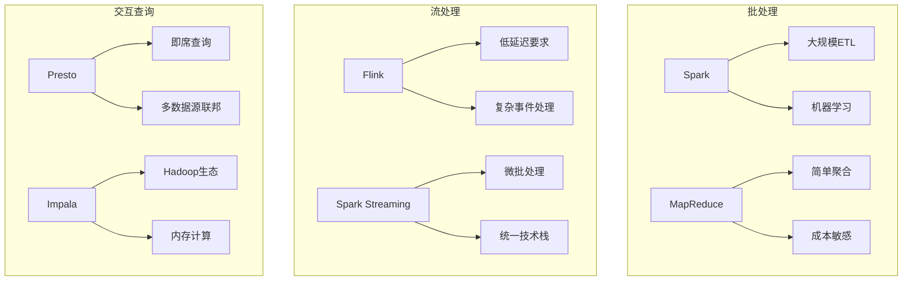

#### 服务层选型

**服务层技术栈：**

```python
# FastAPI 数据服务接口
from fastapi import FastAPI, Query
from typing import List, Optional
import pandas as pd

app = FastAPI()

@app.get("/api/sales/summary")
def get_sales_summary(
    start_date: str = Query(..., description="开始日期"),
    end_date: str = Query(..., description="结束日期"),
    region: Optional[str] = Query(None, description="地区筛选")
):
    """获取销售汇总数据"""
    
    # 构建查询SQL
    sql = f"""
    SELECT 
        region,
        DATE_TRUNC('day', order_date) as date,
        SUM(order_amount) as total_sales,
        COUNT(*) as order_count
    FROM fact_orders 
    WHERE order_date BETWEEN '{start_date}' AND '{end_date}'
    """
    
    if region:
        sql += f" AND region = '{region}'"
    
    sql += " GROUP BY region, DATE_TRUNC('day', order_date)"
    
    # 执行查询并返回结果
    result = execute_query(sql)
    return {"data": result.to_dict('records')}

@app.get("/api/customers/behavior")
def get_customer_behavior(customer_id: str):
    """获取客户行为分析"""
    
    sql = f"""
    WITH customer_metrics AS (
        SELECT 
            SUM(order_amount) as total_spent,
            COUNT(*) as order_count,
            MAX(order_date) as last_order_date,
            MIN(order_date) as first_order_date
        FROM fact_orders 
        WHERE customer_id = '{customer_id}'
    )
    SELECT 
        *,
        DATEDIFF(day, first_order_date, last_order_date) as customer_lifetime_days,
        total_spent / order_count as avg_order_value
    FROM customer_metrics
    """
    
    result = execute_query(sql)
    return {"customer_id": customer_id, "metrics": result.to_dict('records')[0]}
```

## 3. 维度建模理论与实践

### 3.1 维度建模基础

维度建模是数据仓库设计的核心方法，将复杂的业务过程转化为**事实表**和**维度表**的组合。

#### 事实表设计

**事实表类型：**

| 类型 | 特点 | 应用场景 | 示例 |
|------|------|----------|------|
| **事务事实表** | 记录具体业务事件 | 订单、支付、登录 | 每个订单一条记录 |
| **周期快照事实表** | 定期状态快照 | 账户余额、库存 | 每日账户余额 |
| **累积快照事实表** | 业务过程进度 | 订单生命周期 | 订单各阶段时间 |
| **无事实的事实表** | 仅记录事件发生 | 促销活动覆盖 | 促销商品关联 |

**事务事实表设计示例：**

```sql
-- 订单事实表
CREATE TABLE fact_orders (
    -- 代理键 (Surrogate Key)
    order_sk BIGINT PRIMARY KEY,
    
    -- 维度外键
    customer_sk BIGINT NOT NULL,
    product_sk BIGINT NOT NULL,
    date_sk INT NOT NULL,
    store_sk BIGINT NOT NULL,
    
    -- 退化维度 (Degenerate Dimension)
    order_number VARCHAR(50) NOT NULL,
    order_line_number INT NOT NULL,
    
    -- 度量值 (Measures)
    quantity INT NOT NULL,
    unit_price DECIMAL(10,2) NOT NULL,
    discount_amount DECIMAL(10,2) DEFAULT 0,
    tax_amount DECIMAL(10,2) NOT NULL,
    total_amount DECIMAL(10,2) NOT NULL,
    
    -- 审计字段
    created_date TIMESTAMP DEFAULT CURRENT_TIMESTAMP,
    updated_date TIMESTAMP DEFAULT CURRENT_TIMESTAMP,
    
    -- 外键约束
    FOREIGN KEY (customer_sk) REFERENCES dim_customer(customer_sk),
    FOREIGN KEY (product_sk) REFERENCES dim_product(product_sk),
    FOREIGN KEY (date_sk) REFERENCES dim_date(date_sk),
    FOREIGN KEY (store_sk) REFERENCES dim_store(store_sk)
)
PARTITION BY RANGE (date_sk);
```

**累积快照事实表示例：**

```sql
-- 订单生命周期事实表
CREATE TABLE fact_order_lifecycle (
    order_sk BIGINT PRIMARY KEY,
    customer_sk BIGINT NOT NULL,
    product_sk BIGINT NOT NULL,
    
    -- 各阶段日期维度
    order_date_sk INT,
    payment_date_sk INT,
    shipped_date_sk INT,
    delivered_date_sk INT,
    
    -- 各阶段持续时间（天）
    payment_lag_days INT,
    shipping_lag_days INT,
    delivery_lag_days INT,
    total_cycle_days INT,
    
    -- 当前状态
    current_status VARCHAR(20),
    
    -- 度量值
    order_amount DECIMAL(10,2),
    shipping_cost DECIMAL(10,2)
);
```

#### 维度表设计

**维度表设计原则：**

1. **尽可能多的描述性信息**
2. **使用代理键作为主键**
3. **包含业务友好的描述**
4. **支持层次结构**
5. **处理缓慢变化维度**

**客户维度表示例：**

```sql
-- 客户维度表
CREATE TABLE dim_customer (
    -- 代理键
    customer_sk BIGINT PRIMARY KEY AUTO_INCREMENT,
    
    -- 自然键
    customer_id VARCHAR(50) NOT NULL,
    
    -- 基本信息
    customer_name VARCHAR(100) NOT NULL,
    customer_type VARCHAR(20) NOT NULL, -- 'individual', 'corporate'
    gender VARCHAR(10),
    birth_date DATE,
    age_range VARCHAR(20), -- '18-25', '26-35', etc.
    
    -- 联系信息
    email VARCHAR(100),
    phone VARCHAR(20),
    
    -- 地址信息 (层次结构)
    address_line1 VARCHAR(200),
    address_line2 VARCHAR(200),
    city VARCHAR(50),
    state_province VARCHAR(50),
    postal_code VARCHAR(20),
    country VARCHAR(50),
    region VARCHAR(50), -- 销售区域
    
    -- 分类属性
    customer_segment VARCHAR(30), -- 'premium', 'standard', 'basic'
    credit_rating VARCHAR(10), -- 'AAA', 'AA', 'A', etc.
    preferred_language VARCHAR(20),
    
    -- 状态信息
    is_active BOOLEAN DEFAULT TRUE,
    registration_date DATE,
    last_update_date DATE,
    
    -- SCD Type 2 字段
    effective_date DATE NOT NULL,
    expiry_date DATE DEFAULT '9999-12-31',
    is_current BOOLEAN DEFAULT TRUE,
    
    -- 审计字段
    created_by VARCHAR(50),
    created_date TIMESTAMP DEFAULT CURRENT_TIMESTAMP,
    updated_by VARCHAR(50),
    updated_date TIMESTAMP DEFAULT CURRENT_TIMESTAMP,
    
    -- 索引
    INDEX idx_customer_id (customer_id),
    INDEX idx_effective_date (effective_date),
    INDEX idx_is_current (is_current)
);
```

**产品维度表层次结构：**

```sql
-- 产品维度表
CREATE TABLE dim_product (
    product_sk BIGINT PRIMARY KEY AUTO_INCREMENT,
    product_id VARCHAR(50) NOT NULL,
    
    -- 产品基本信息
    product_name VARCHAR(200) NOT NULL,
    product_description TEXT,
    brand VARCHAR(100),
    model VARCHAR(100),
    
    -- 产品层次结构
    category_level1 VARCHAR(50), -- 电器
    category_level2 VARCHAR(50), -- 手机
    category_level3 VARCHAR(50), -- 智能手机
    category_level4 VARCHAR(50), -- iPhone
    category_path VARCHAR(500),  -- 电器/手机/智能手机/iPhone
    
    -- 产品属性
    color VARCHAR(30),
    size VARCHAR(30),
    weight DECIMAL(8,2),
    material VARCHAR(100),
    
    -- 价格信息
    list_price DECIMAL(10,2),
    cost_price DECIMAL(10,2),
    margin_percent DECIMAL(5,2),
    
    -- 状态信息
    product_status VARCHAR(20), -- 'active', 'discontinued', 'coming_soon'
    launch_date DATE,
    discontinue_date DATE,
    
    -- 供应商信息
    supplier_name VARCHAR(100),
    supplier_country VARCHAR(50),
    
    effective_date DATE NOT NULL,
    expiry_date DATE DEFAULT '9999-12-31',
    is_current BOOLEAN DEFAULT TRUE
);
```

#### 星型模型与雪花模型

**星型模型：**

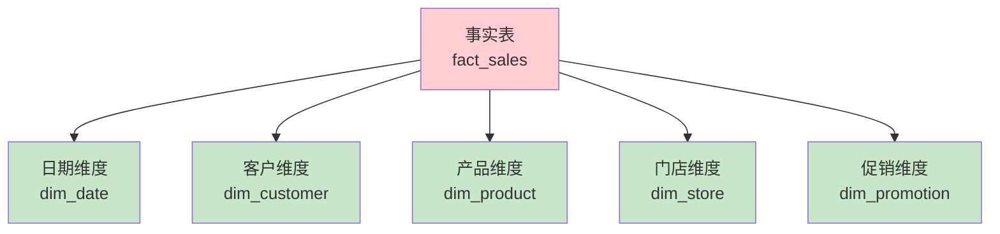

**雪花模型：**

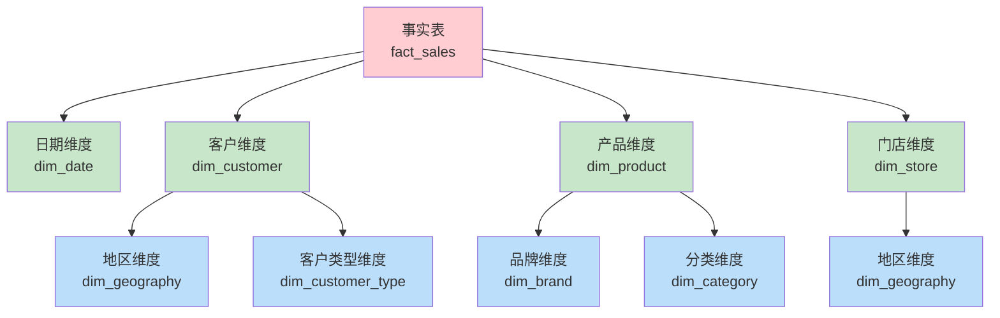

**模型对比：**

| 特性 | 星型模型 | 雪花模型 |
|------|----------|----------|
| **查询性能** | 更快（JOIN较少） | 较慢（JOIN较多） |
| **存储空间** | 较大（维度冗余） | 较小（规范化） |
| **维护复杂度** | 简单 | 复杂 |
| **查询理解** | 容易 | 较难 |
| **适用场景** | OLAP分析 | 存储成本敏感 |

### 3.2 高级建模技巧

#### 缓慢变化维度

**SCD Type 1 - 覆盖：**

```sql
-- Type 1: 直接更新，不保留历史
UPDATE dim_customer 
SET 
    phone = '138-0000-0001',
    updated_date = CURRENT_TIMESTAMP,
    updated_by = 'system'
WHERE customer_id = 'C001';
```

**SCD Type 2 - 添加新记录：**

```sql
-- Type 2: 保留历史，添加新记录
-- 1. 关闭当前记录
UPDATE dim_customer 
SET 
    expiry_date = CURRENT_DATE - 1,
    is_current = FALSE,
    updated_date = CURRENT_TIMESTAMP
WHERE customer_id = 'C001' AND is_current = TRUE;

-- 2. 插入新记录
INSERT INTO dim_customer (
    customer_id, customer_name, email, phone,
    effective_date, expiry_date, is_current,
    created_date, created_by
) VALUES (
    'C001', 'John Smith', 'john@example.com', '138-0000-0001',
    CURRENT_DATE, '9999-12-31', TRUE,
    CURRENT_TIMESTAMP, 'system'
);
```

**SCD Type 3 - 添加新列：**

```sql
-- Type 3: 保留有限历史
ALTER TABLE dim_customer 
ADD COLUMN previous_address VARCHAR(200),
ADD COLUMN address_change_date DATE;

UPDATE dim_customer 
SET 
    previous_address = current_address,
    current_address = '新地址',
    address_change_date = CURRENT_DATE
WHERE customer_id = 'C001';
```

**SCD Type 4 - 快速变化维度：**

```sql
-- 当前维度表
CREATE TABLE dim_customer_current AS 
SELECT * FROM dim_customer WHERE is_current = TRUE;

-- 历史维度表
CREATE TABLE dim_customer_history AS 
SELECT * FROM dim_customer WHERE is_current = FALSE;

-- Mini维度表（只包含快变属性）
CREATE TABLE dim_customer_mini (
    customer_sk BIGINT,
    customer_segment VARCHAR(30),
    credit_rating VARCHAR(10),
    effective_date DATE,
    expiry_date DATE
);
```

#### 退化维度

**退化维度处理：**

```sql
-- 订单号作为退化维度直接存储在事实表中
CREATE TABLE fact_order_items (
    order_item_sk BIGINT PRIMARY KEY,
    
    -- 维度外键
    customer_sk BIGINT,
    product_sk BIGINT,
    date_sk INT,
    
    -- 退化维度（不需要单独的维度表）
    order_number VARCHAR(50) NOT NULL,
    invoice_number VARCHAR(50),
    tracking_number VARCHAR(50),
    
    -- 度量值
    quantity INT,
    unit_price DECIMAL(10,2),
    total_amount DECIMAL(10,2)
);

-- 查询时可以直接使用退化维度
SELECT 
    order_number,
    SUM(total_amount) as order_total
FROM fact_order_items
WHERE order_number = 'ORD-2023-001234'
GROUP BY order_number;
```

#### 一致性维度

**一致性维度管理：**

```sql
-- 共享的时间维度表
CREATE TABLE dim_date (
    date_sk INT PRIMARY KEY,
    full_date DATE NOT NULL,
    day_of_week INT,
    day_name VARCHAR(10),
    day_of_month INT,
    day_of_year INT,
    week_of_year INT,
    month_number INT,
    month_name VARCHAR(10),
    quarter_number INT,
    quarter_name VARCHAR(10),
    year_number INT,
    is_weekend BOOLEAN,
    is_holiday BOOLEAN,
    holiday_name VARCHAR(50),
    fiscal_year INT,
    fiscal_quarter INT,
    fiscal_month INT
);

-- 不同主题域都使用相同的时间维度
-- 销售事实表
CREATE TABLE fact_sales (
    sales_sk BIGINT PRIMARY KEY,
    date_sk INT,
    customer_sk BIGINT,
    product_sk BIGINT,
    sales_amount DECIMAL(10,2),
    FOREIGN KEY (date_sk) REFERENCES dim_date(date_sk)
);

-- 库存事实表
CREATE TABLE fact_inventory (
    inventory_sk BIGINT PRIMARY KEY,
    date_sk INT,
    product_sk BIGINT,
    warehouse_sk BIGINT,
    quantity_on_hand INT,
    FOREIGN KEY (date_sk) REFERENCES dim_date(date_sk)
);
```

### 3.3 实体建模方法

#### 3NF建模

**第三范式（3NF）建模**强调消除数据冗余，适用于企业数据仓库的核心层。

**3NF客户模型：**

```sql
-- 客户基本信息表
CREATE TABLE customer (
    customer_id VARCHAR(50) PRIMARY KEY,
    customer_name VARCHAR(100) NOT NULL,
    customer_type_id INT,
    birth_date DATE,
    gender VARCHAR(10),
    registration_date DATE,
    FOREIGN KEY (customer_type_id) REFERENCES customer_type(customer_type_id)
);

-- 客户类型表
CREATE TABLE customer_type (
    customer_type_id INT PRIMARY KEY,
    type_name VARCHAR(50) NOT NULL,
    type_description TEXT
);

-- 客户地址表
CREATE TABLE customer_address (
    address_id BIGINT PRIMARY KEY AUTO_INCREMENT,
    customer_id VARCHAR(50),
    address_type VARCHAR(20), -- 'billing', 'shipping', 'home'
    address_line1 VARCHAR(200),
    address_line2 VARCHAR(200),
    city VARCHAR(50),
    state_province VARCHAR(50),
    postal_code VARCHAR(20),
    country VARCHAR(50),
    is_primary BOOLEAN DEFAULT FALSE,
    effective_date DATE,
    expiry_date DATE,
    FOREIGN KEY (customer_id) REFERENCES customer(customer_id)
);

-- 客户联系方式表
CREATE TABLE customer_contact (
    contact_id BIGINT PRIMARY KEY AUTO_INCREMENT,
    customer_id VARCHAR(50),
    contact_type VARCHAR(20), -- 'email', 'phone', 'fax'
    contact_value VARCHAR(100),
    is_primary BOOLEAN DEFAULT FALSE,
    effective_date DATE,
    expiry_date DATE,
    FOREIGN KEY (customer_id) REFERENCES customer(customer_id)
);
```

#### 实体关系模型

**订单业务实体模型：**

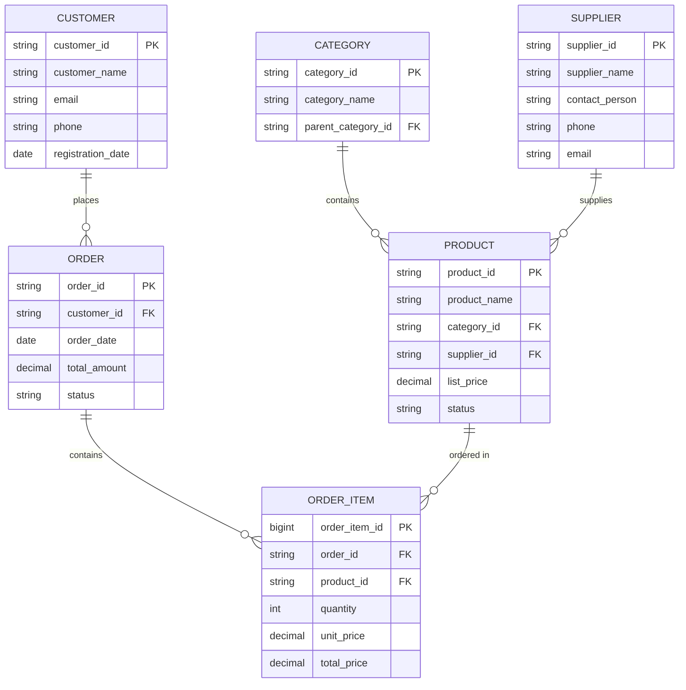

#### 数据集市设计

**销售数据集市架构：**

```sql
-- 销售数据集市 - 星型模型
-- 中心事实表
CREATE TABLE mart_sales.fact_daily_sales (
    sale_date_sk INT,
    customer_sk BIGINT,
    product_sk BIGINT,
    store_sk BIGINT,
    promotion_sk BIGINT,
    
    -- 度量值
    sales_quantity INT,
    sales_amount DECIMAL(10,2),
    discount_amount DECIMAL(10,2),
    tax_amount DECIMAL(10,2),
    profit_amount DECIMAL(10,2),
    cost_amount DECIMAL(10,2),
    
    PRIMARY KEY (sale_date_sk, customer_sk, product_sk, store_sk)
);

-- 聚合事实表 - 月度汇总
CREATE TABLE mart_sales.fact_monthly_sales (
    sale_month_sk INT,
    customer_sk BIGINT,
    product_category_sk BIGINT,
    region_sk BIGINT,
    
    -- 聚合度量值
    total_sales_amount DECIMAL(15,2),
    total_sales_quantity INT,
    total_profit_amount DECIMAL(15,2),
    avg_sale_amount DECIMAL(10,2),
    customer_count INT,
    order_count INT,
    
    PRIMARY KEY (sale_month_sk, customer_sk, product_category_sk, region_sk)
);
```

**客户分析数据集市：**

```sql
-- 客户价值分析集市
CREATE TABLE mart_customer.fact_customer_value (
    customer_sk BIGINT PRIMARY KEY,
    analysis_date DATE,
    
    -- RFM分析指标
    recency_days INT,           -- 最近购买距今天数
    frequency_count INT,        -- 购买频次
    monetary_amount DECIMAL(12,2), -- 购买金额
    
    -- RFM评分
    recency_score INT,          -- 1-5分
    frequency_score INT,        -- 1-5分
    monetary_score INT,         -- 1-5分
    rfm_segment VARCHAR(20),    -- 'Champions', 'Loyal Customers', etc.
    
    -- 生命周期价值
    ltv_amount DECIMAL(15,2),
    predicted_ltv DECIMAL(15,2),
    
    -- 客户状态
    customer_status VARCHAR(20), -- 'active', 'at_risk', 'churned'
    churn_probability DECIMAL(5,4)
);
```

## 4. 数据分层架构

### 4.1 分层设计原则

#### 分层目标与原则

**分层设计目标：**

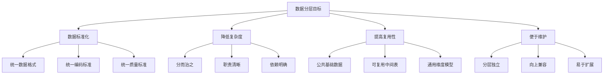

**设计原则：**

| 原则 | 说明 | 实现方式 |
|------|------|----------|
| **单向依赖** | 高层依赖低层，禁止反向依赖 | 严格的层次调用关系 |
| **数据一致性** | 同层数据逻辑一致 | 统一的加工规则和标准 |
| **接口稳定性** | 层间接口相对稳定 | 向上兼容的表结构设计 |
| **职责单一** | 每层专注特定职责 | 清晰的层次功能定义 |
| **可扩展性** | 支持新业务和需求 | 灵活的模型设计 |

#### 层次职责划分

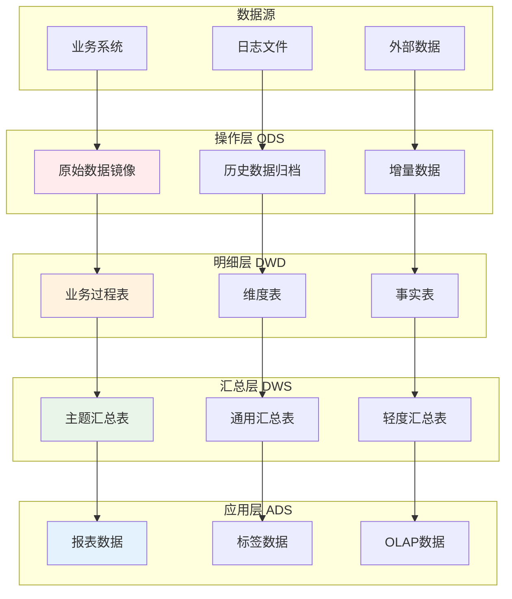

### 4.2 详细分层设计

#### ODS操作数据存储层

**ODS层设计特点：**
- **数据同步**：与源系统数据保持同步
- **历史保留**：保留数据变更历史
- **格式统一**：统一数据格式和编码
- **质量检查**：基础数据质量验证

**ODS表设计示例：**

```sql
-- ODS用户表 - 全量同步
CREATE TABLE ods_crm.user_info_full (
    user_id VARCHAR(50),
    username VARCHAR(100),
    email VARCHAR(100),
    phone VARCHAR(20),
    registration_date TIMESTAMP,
    last_login_date TIMESTAMP,
    user_status VARCHAR(20),
    
    -- ETL控制字段
    etl_batch_id VARCHAR(50),
    etl_create_time TIMESTAMP DEFAULT CURRENT_TIMESTAMP,
    etl_update_time TIMESTAMP DEFAULT CURRENT_TIMESTAMP,
    source_system VARCHAR(50) DEFAULT 'CRM'
)
PARTITIONED BY (dt STRING) -- 按日期分区
STORED AS ORC
TBLPROPERTIES ('orc.compress'='SNAPPY');

-- ODS订单表 - 增量同步
CREATE TABLE ods_order.order_info_incr (
    order_id VARCHAR(50),
    customer_id VARCHAR(50),
    order_date TIMESTAMP,
    order_amount DECIMAL(10,2),
    order_status VARCHAR(20),
    payment_method VARCHAR(30),
    shipping_address TEXT,
    
    -- 增量标识
    operation_type VARCHAR(10), -- 'INSERT', 'UPDATE', 'DELETE'
    change_timestamp TIMESTAMP,
    
    -- ETL控制字段
    etl_batch_id VARCHAR(50),
    etl_create_time TIMESTAMP DEFAULT CURRENT_TIMESTAMP,
    source_system VARCHAR(50) DEFAULT 'ORDER_SYSTEM'
)
PARTITIONED BY (dt STRING, hour STRING) -- 按日期和小时分区
STORED AS ORC;
```

**ODS数据同步策略：**

```python
# ODS数据同步脚本示例
class ODSDataSync:
    def __init__(self, source_db, target_path):
        self.source_db = source_db
        self.target_path = target_path
    
    def full_sync_table(self, table_name, partition_date):
        """全量同步表数据"""
        
        # 1. 从源系统抽取数据
        source_data = self.extract_source_data(table_name)
        
        # 2. 数据质量检查
        quality_report = self.data_quality_check(source_data)
        if not quality_report.is_valid:
            raise DataQualityException(f"数据质量检查失败: {quality_report.errors}")
        
        # 3. 数据格式转换
        transformed_data = self.transform_data_format(source_data)
        
        # 4. 写入ODS表
        self.write_to_ods(
            data=transformed_data,
            table_name=f"ods_{table_name}_full",
            partition=f"dt={partition_date}"
        )
        
        # 5. 记录同步日志
        self.log_sync_status(table_name, "FULL", partition_date, "SUCCESS")
    
    def incremental_sync_table(self, table_name, start_time, end_time):
        """增量同步表数据"""
        
        # 1. 获取增量数据（基于时间戳或日志）
        incremental_data = self.extract_incremental_data(
            table_name, start_time, end_time
        )
        
        # 2. 识别变更类型
        changes = self.identify_change_type(incremental_data)
        
        # 3. 写入ODS增量表
        for change_type, data in changes.items():
            self.write_to_ods(
                data=data,
                table_name=f"ods_{table_name}_incr",
                partition=f"dt={end_time.strftime('%Y-%m-%d')}/hour={end_time.strftime('%H')}"
            )
```

#### DWD数据明细层

**DWD层设计特点：**
- **业务含义清晰**：以业务过程为中心
- **数据完整性**：保证数据的完整性和一致性
- **历史可追溯**：支持历史数据查询
- **模型标准化**：遵循维度建模规范

**DWD事实表设计：**

```sql
-- DWD订单明细事实表
CREATE TABLE dwd_order.fact_order_detail (
    -- 代理键
    order_detail_sk BIGINT AUTO_INCREMENT PRIMARY KEY,
    
    -- 业务键
    order_id VARCHAR(50) NOT NULL,
    order_item_id VARCHAR(50) NOT NULL,
    
    -- 维度外键
    customer_sk BIGINT,
    product_sk BIGINT,
    merchant_sk BIGINT,
    order_date_sk INT,
    payment_date_sk INT,
    
    -- 退化维度
    order_number VARCHAR(50),
    invoice_number VARCHAR(50),
    
    -- 度量值
    quantity INT NOT NULL,
    original_price DECIMAL(10,2),
    sale_price DECIMAL(10,2),
    discount_amount DECIMAL(10,2),
    tax_amount DECIMAL(10,2),
    shipping_cost DECIMAL(10,2),
    total_amount DECIMAL(10,2),
    
    -- 状态信息
    order_status VARCHAR(20),
    payment_status VARCHAR(20),
    shipping_status VARCHAR(20),
    
    -- 审计字段
    dw_create_time TIMESTAMP DEFAULT CURRENT_TIMESTAMP,
    dw_update_time TIMESTAMP DEFAULT CURRENT_TIMESTAMP,
    etl_batch_id VARCHAR(50),
    source_system VARCHAR(50)
)
PARTITIONED BY (dt STRING) -- 按订单日期分区
CLUSTERED BY (customer_sk) INTO 32 BUCKETS
STORED AS ORC
TBLPROPERTIES ('orc.compress'='SNAPPY');
```

**DWD维度表设计：**

```sql
-- DWD客户维度表
CREATE TABLE dwd_user.dim_customer (
    customer_sk BIGINT AUTO_INCREMENT PRIMARY KEY,
    customer_id VARCHAR(50) NOT NULL,
    
    -- 基本信息
    customer_name VARCHAR(100),
    gender VARCHAR(10),
    birth_date DATE,
    age INT,
    age_group VARCHAR(20), -- '18-25', '26-35', '36-45', '46-60', '60+'
    
    -- 联系信息
    email VARCHAR(100),
    phone VARCHAR(20),
    
    -- 地址信息（当前有效地址）
    province VARCHAR(50),
    city VARCHAR(50),
    district VARCHAR(50),
    address_detail VARCHAR(200),
    
    -- 分类标签
    customer_level VARCHAR(20), -- 'bronze', 'silver', 'gold', 'platinum'
    customer_type VARCHAR(20),  -- 'new', 'active', 'sleeping', 'lost'
    registration_channel VARCHAR(50),
    
    -- 状态信息
    is_active BOOLEAN DEFAULT TRUE,
    registration_date DATE,
    first_order_date DATE,
    last_order_date DATE,
    last_login_date DATE,
    
    -- SCD Type 2 字段
    start_date DATE NOT NULL,
    end_date DATE DEFAULT '9999-12-31',
    is_current BOOLEAN DEFAULT TRUE,
    
    -- 审计字段
    dw_create_time TIMESTAMP DEFAULT CURRENT_TIMESTAMP,
    dw_update_time TIMESTAMP DEFAULT CURRENT_TIMESTAMP,
    etl_batch_id VARCHAR(50),
    
    -- 索引
    UNIQUE KEY uk_customer_id_start_date (customer_id, start_date),
    INDEX idx_is_current (is_current),
    INDEX idx_customer_level (customer_level)
)
STORED AS ORC;
```

#### DWS数据汇总层

**DWS层设计特点：**
- **基于主题汇总**：按业务主题进行数据汇总
- **多粒度聚合**：支持不同时间粒度和维度组合
- **查询优化**：为上层应用提供高性能数据访问
- **业务指标预计算**：常用指标提前计算

**用户行为汇总表：**

```sql
-- DWS用户行为日汇总
CREATE TABLE dws_user.user_behavior_daily (
    stat_date DATE,
    user_id VARCHAR(50),
    
    -- 访问行为
    pv_count INT DEFAULT 0,           -- 页面浏览量
    uv_count INT DEFAULT 0,           -- 独立访客数（当日该用户为1）
    session_count INT DEFAULT 0,      -- 会话数
    visit_duration_seconds INT DEFAULT 0, -- 访问时长
    
    -- 页面行为
    page_depth INT DEFAULT 0,         -- 页面深度
    bounce_flag BOOLEAN DEFAULT FALSE, -- 跳出标识
    
    -- 搜索行为
    search_count INT DEFAULT 0,       -- 搜索次数
    search_keywords ARRAY<STRING>,    -- 搜索关键词
    
    -- 商品行为  
    product_view_count INT DEFAULT 0, -- 商品浏览数
    add_cart_count INT DEFAULT 0,     -- 加购数
    
    -- 订单行为
    order_count INT DEFAULT 0,        -- 下单数
    order_amount DECIMAL(10,2) DEFAULT 0, -- 下单金额
    payment_count INT DEFAULT 0,      -- 支付数
    payment_amount DECIMAL(10,2) DEFAULT 0, -- 支付金额
    
    -- 分享行为
    share_count INT DEFAULT 0,        -- 分享次数
    
    -- 设备信息
    device_type VARCHAR(20),          -- 设备类型
    os_type VARCHAR(20),              -- 操作系统
    app_version VARCHAR(20),          -- APP版本
    
    -- ETL信息
    dw_create_time TIMESTAMP DEFAULT CURRENT_TIMESTAMP,
    etl_batch_id VARCHAR(50),
    
    PRIMARY KEY (stat_date, user_id)
)
PARTITIONED BY (stat_date)
STORED AS ORC;
```

**商品销售汇总表：**

```sql
-- DWS商品销售汇总（多粒度）
CREATE TABLE dws_product.product_sales_summary (
    stat_date DATE,
    stat_period VARCHAR(10), -- 'day', 'week', 'month', 'quarter', 'year'
    product_id VARCHAR(50),
    
    -- 销售指标
    sales_amount DECIMAL(15,2) DEFAULT 0,    -- 销售金额
    sales_quantity INT DEFAULT 0,            -- 销售数量
    order_count INT DEFAULT 0,               -- 订单数
    customer_count INT DEFAULT 0,            -- 购买客户数
    
    -- 退款指标
    refund_amount DECIMAL(15,2) DEFAULT 0,   -- 退款金额
    refund_quantity INT DEFAULT 0,           -- 退款数量
    refund_order_count INT DEFAULT 0,        -- 退款订单数
    
    -- 库存指标
    inventory_quantity INT DEFAULT 0,        -- 库存数量
    avg_inventory_cost DECIMAL(10,2) DEFAULT 0, -- 平均库存成本
    
    -- 计算指标
    avg_selling_price DECIMAL(10,2) DEFAULT 0,  -- 平均售价
    gross_profit DECIMAL(15,2) DEFAULT 0,       -- 毛利润
    gross_profit_rate DECIMAL(5,4) DEFAULT 0,   -- 毛利率
    
    -- 趋势指标
    sales_amount_wow DECIMAL(5,4) DEFAULT 0,    -- 销售额环比增长率
    sales_amount_yoy DECIMAL(5,4) DEFAULT 0,    -- 销售额同比增长率
    
    -- 排名指标
    sales_rank_in_category INT,                 -- 在分类中的销售排名
    sales_rank_overall INT,                     -- 总体销售排名
    
    -- ETL信息
    dw_create_time TIMESTAMP DEFAULT CURRENT_TIMESTAMP,
    etl_batch_id VARCHAR(50),
    
    PRIMARY KEY (stat_date, stat_period, product_id)
)
PARTITIONED BY (stat_date, stat_period)
CLUSTERED BY (product_id) INTO 16 BUCKETS
STORED AS ORC;
```

#### ADS应用数据服务层

**ADS层设计特点：**
- **面向应用**：直接服务于具体的业务应用
- **高度聚合**：数据高度聚合，查询性能优异
- **业务定制**：针对特定业务场景定制
- **接口标准**：提供标准化的数据服务接口

**运营分析报表数据：**

```sql
-- ADS运营日报数据
CREATE TABLE ads_operation.daily_operation_report (
    report_date DATE PRIMARY KEY,
    
    -- 流量指标
    total_pv BIGINT DEFAULT 0,
    total_uv BIGINT DEFAULT 0,
    new_user_count INT DEFAULT 0,
    active_user_count INT DEFAULT 0,
    avg_session_duration DECIMAL(8,2) DEFAULT 0,
    bounce_rate DECIMAL(5,4) DEFAULT 0,
    
    -- 交易指标
    total_orders INT DEFAULT 0,
    total_sales_amount DECIMAL(15,2) DEFAULT 0,
    paid_orders INT DEFAULT 0,
    paid_amount DECIMAL(15,2) DEFAULT 0,
    avg_order_value DECIMAL(10,2) DEFAULT 0,
    conversion_rate DECIMAL(5,4) DEFAULT 0,
    
    -- 用户指标
    new_paying_users INT DEFAULT 0,
    repeat_purchase_users INT DEFAULT 0,
    user_retention_rate_d1 DECIMAL(5,4) DEFAULT 0,
    user_retention_rate_d7 DECIMAL(5,4) DEFAULT 0,
    user_retention_rate_d30 DECIMAL(5,4) DEFAULT 0,
    
    -- 商品指标
    bestseller_product_id VARCHAR(50),
    bestseller_sales_amount DECIMAL(10,2) DEFAULT 0,
    category_distribution JSON, -- 各分类销售分布
    
    -- 渠道指标
    channel_distribution JSON, -- 各渠道流量分布
    channel_conversion_rates JSON, -- 各渠道转化率
    
    -- 同比环比
    sales_amount_wow DECIMAL(5,4) DEFAULT 0, -- 环比增长率
    sales_amount_yoy DECIMAL(5,4) DEFAULT 0, -- 同比增长率
    uv_wow DECIMAL(5,4) DEFAULT 0,
    uv_yoy DECIMAL(5,4) DEFAULT 0,
    
    -- 预测指标
    predicted_sales_next_day DECIMAL(15,2),
    predicted_uv_next_day BIGINT,
    
    -- 生成时间
    generate_time TIMESTAMP DEFAULT CURRENT_TIMESTAMP,
    etl_batch_id VARCHAR(50)
)
STORED AS ORC;
```

**用户标签数据：**

```sql
-- ADS用户标签表
CREATE TABLE ads_user.user_tags (
    user_id VARCHAR(50) PRIMARY KEY,
    tag_update_time TIMESTAMP,
    
    -- 基础标签
    age_group VARCHAR(20),
    gender VARCHAR(10),
    city_level VARCHAR(10), -- '一线', '二线', '三线', '四线'
    income_level VARCHAR(20), -- 'high', 'medium', 'low'
    
    -- 行为标签
    user_lifecycle_stage VARCHAR(20), -- 'new', 'growing', 'mature', 'declining', 'lost'
    activity_level VARCHAR(20), -- 'highly_active', 'active', 'moderate', 'inactive'
    purchase_power VARCHAR(20), -- 'high', 'medium', 'low'
    brand_preference ARRAY<STRING>, -- 偏好品牌
    category_preference ARRAY<STRING>, -- 偏好分类
    
    -- RFM标签
    rfm_segment VARCHAR(30), -- 'Champions', 'Loyal Customers', 'Potential Loyalists'等
    recency_score INT, -- 1-5分
    frequency_score INT, -- 1-5分
    monetary_score INT, -- 1-5分
    
    -- 风险标签
    credit_risk_level VARCHAR(20), -- 'low', 'medium', 'high'
    churn_risk_score DECIMAL(5,4), -- 流失风险评分 0-1
    fraud_risk_score DECIMAL(5,4), -- 欺诈风险评分 0-1
    
    -- 营销标签
    price_sensitivity VARCHAR(20), -- 'high', 'medium', 'low'
    promotion_preference VARCHAR(30), -- 'discount', 'cashback', 'gift'
    channel_preference VARCHAR(30), -- 'online', 'offline', 'mixed'
    communication_preference VARCHAR(30), -- 'email', 'sms', 'push', 'wechat'
    
    -- 预测标签
    next_purchase_prediction_days INT, -- 预测下次购买天数
    ltv_prediction DECIMAL(10,2), -- 预测生命周期价值
    recommended_products ARRAY<STRING>, -- 推荐商品
    
    -- 标签生成信息
    model_version VARCHAR(20),
    confidence_score DECIMAL(5,4), -- 标签置信度
    
    -- ETL信息
    dw_create_time TIMESTAMP DEFAULT CURRENT_TIMESTAMP,
    etl_batch_id VARCHAR(50)
)
CLUSTERED BY (user_id) INTO 64 BUCKETS
STORED AS ORC;
```

### 4.3 分层实施策略

#### 建表规范

**命名规范：**

```sql
-- 表命名规范：{层级}_{主题域}.{业务过程}_{表类型}_{增量标识}
-- 示例：
-- dwd_order.fact_order_detail_di    -- DWD层订单主题订单明细事实表，日增量
-- dws_user.user_behavior_monthly    -- DWS层用户主题用户行为月汇总表
-- ads_operation.daily_report        -- ADS层运营日报表

-- 字段命名规范：
CREATE TABLE example_table (
    -- 主键统一后缀_sk (surrogate key)
    order_sk BIGINT PRIMARY KEY,
    
    -- 外键统一后缀_sk
    customer_sk BIGINT,
    product_sk BIGINT,
    
    -- 日期维度统一后缀_sk
    order_date_sk INT,
    
    -- 金额字段统一后缀_amount
    order_amount DECIMAL(10,2),
    discount_amount DECIMAL(10,2),
    
    -- 数量字段统一后缀_count或_quantity
    order_count INT,
    product_quantity INT,
    
    -- 比率字段统一后缀_rate
    conversion_rate DECIMAL(5,4),
    
    -- 状态字段统一后缀_status或_flag
    order_status VARCHAR(20),
    is_active_flag BOOLEAN,
    
    -- 时间字段统一后缀_time或_date
    create_time TIMESTAMP,
    order_date DATE,
    
    -- ETL控制字段
    dw_create_time TIMESTAMP DEFAULT CURRENT_TIMESTAMP,
    dw_update_time TIMESTAMP DEFAULT CURRENT_TIMESTAMP,
    etl_batch_id VARCHAR(50)
);
```

#### 命名规范

**层级前缀规范：**

| 层级 | 前缀 | 说明 | 示例 |
|------|------|------|------|
| **ODS** | ods_ | 操作数据存储层 | ods_crm.user_info |
| **DWD** | dwd_ | 数据明细层 | dwd_order.fact_order_detail |
| **DWS** | dws_ | 数据汇总层 | dws_user.user_behavior_daily |
| **ADS** | ads_ | 应用数据服务层 | ads_report.daily_operation |
| **DIM** | dim_ | 公共维度层 | dim_common.dim_date |
| **TMP** | tmp_ | 临时表 | tmp_etl.order_staging |

**主题域划分：**

```sql
-- 用户主题域
CREATE DATABASE dwd_user COMMENT '用户主题数据明细层';
CREATE DATABASE dws_user COMMENT '用户主题数据汇总层';
CREATE DATABASE ads_user COMMENT '用户主题应用数据层';

-- 订单主题域  
CREATE DATABASE dwd_order COMMENT '订单主题数据明细层';
CREATE DATABASE dws_order COMMENT '订单主题数据汇总层';
CREATE DATABASE ads_order COMMENT '订单主题应用数据层';

-- 商品主题域
CREATE DATABASE dwd_product COMMENT '商品主题数据明细层';
CREATE DATABASE dws_product COMMENT '商品主题数据汇总层';
CREATE DATABASE ads_product COMMENT '商品主题应用数据层';

-- 公共维度
CREATE DATABASE dim_common COMMENT '公共维度数据库';

-- 临时处理
CREATE DATABASE tmp_etl COMMENT 'ETL临时处理数据库';
```

#### 数据流转规范

**数据血缘管理：**

```sql
-- 数据血缘记录表
CREATE TABLE meta_data.table_lineage (
    lineage_id BIGINT AUTO_INCREMENT PRIMARY KEY,
    source_database VARCHAR(50),
    source_table VARCHAR(100),
    target_database VARCHAR(50),
    target_table VARCHAR(100),
    dependency_type VARCHAR(20), -- 'direct', 'transform', 'aggregate'
    transform_logic TEXT,
    create_time TIMESTAMP DEFAULT CURRENT_TIMESTAMP,
    update_time TIMESTAMP DEFAULT CURRENT_TIMESTAMP,
    is_active BOOLEAN DEFAULT TRUE
);

-- 插入血缘关系示例
INSERT INTO meta_data.table_lineage VALUES
(1, 'ods_crm', 'user_info_full', 'dwd_user', 'dim_customer', 'transform', 
 'SCD Type 2 处理，添加代理键', NOW(), NOW(), TRUE),
(2, 'ods_order', 'order_info_incr', 'dwd_order', 'fact_order_detail', 'transform',
 '订单明细事实表构建，关联维度表', NOW(), NOW(), TRUE),
(3, 'dwd_order', 'fact_order_detail', 'dws_order', 'order_summary_daily', 'aggregate',
 '按日期、客户、商品聚合订单数据', NOW(), NOW(), TRUE);
```

**ETL作业依赖管理：**

```python
# Airflow DAG 依赖配置
from airflow import DAG
from airflow.operators.hive_operator import HiveOperator
from datetime import datetime, timedelta

# DAG配置
dag = DAG(
    'data_warehouse_etl',
    default_args={
        'owner': 'data_team',
        'depends_on_past': False,
        'start_date': datetime(2023, 1, 1),
        'retries': 2,
        'retry_delay': timedelta(minutes=10)
    },
    schedule_interval='0 2 * * *',  # 每天凌晨2点执行
    catchup=False
)

# ODS层任务
ods_user_sync = HiveOperator(
    task_id='ods_user_sync',
    hql='sql/ods/sync_user_data.sql',
    hiveconf_jinja_translate=True,
    dag=dag
)

ods_order_sync = HiveOperator(
    task_id='ods_order_sync', 
    hql='sql/ods/sync_order_data.sql',
    hiveconf_jinja_translate=True,
    dag=dag
)

# DWD层任务
dwd_customer_build = HiveOperator(
    task_id='dwd_customer_build',
    hql='sql/dwd/build_dim_customer.sql',
    hiveconf_jinja_translate=True,
    dag=dag
)

dwd_order_detail = HiveOperator(
    task_id='dwd_order_detail',
    hql='sql/dwd/build_fact_order_detail.sql', 
    hiveconf_jinja_translate=True,
    dag=dag
)

# DWS层任务
dws_user_behavior = HiveOperator(
    task_id='dws_user_behavior',
    hql='sql/dws/build_user_behavior_daily.sql',
    hiveconf_jinja_translate=True,
    dag=dag
)

# ADS层任务
ads_daily_report = HiveOperator(
    task_id='ads_daily_report',
    hql='sql/ads/build_daily_operation_report.sql',
    hiveconf_jinja_translate=True,
    dag=dag
)

# 设置任务依赖关系
ods_user_sync >> dwd_customer_build
ods_order_sync >> dwd_order_detail
[dwd_customer_build, dwd_order_detail] >> dws_user_behavior
dws_user_behavior >> ads_daily_report
```

## 5. ETL流程设计

### 5.1 ETL基础概念

#### Extract数据抽取

**数据抽取策略：**

| 抽取方式 | 特点 | 适用场景 | 实现方法 |
|---------|------|----------|----------|
| **全量抽取** | 简单、可靠 | 小数据量、首次同步 | 直接复制全表 |
| **增量抽取** | 高效、节约资源 | 大数据量、定期同步 | 时间戳、日志、触发器 |
| **变更数据捕获** | 实时、准确 | 实时同步需求 | CDC技术 |
| **分区抽取** | 并行、可控 | 超大表、分区表 | 按分区并行 |

**增量抽取实现示例：**

```sql
-- 基于时间戳的增量抽取
CREATE TABLE etl_control.extract_log (
    table_name VARCHAR(100) PRIMARY KEY,
    last_extract_time TIMESTAMP,
    extract_status VARCHAR(20),
    update_time TIMESTAMP DEFAULT CURRENT_TIMESTAMP
);

-- 抽取用户增量数据
WITH incremental_data AS (
    SELECT *
    FROM source_system.users
    WHERE update_time > (
        SELECT COALESCE(last_extract_time, '1900-01-01') 
        FROM etl_control.extract_log 
        WHERE table_name = 'users'
    )
)
INSERT INTO ods_crm.user_info_incr
SELECT 
    user_id,
    username,
    email,
    phone,
    registration_date,
    update_time,
    CASE 
        WHEN deleted_flag = 1 THEN 'DELETE'
        WHEN created_time = update_time THEN 'INSERT'
        ELSE 'UPDATE'
    END as operation_type,
    CURRENT_TIMESTAMP as etl_create_time,
    '{{ ds }}' as dt
FROM incremental_data;

-- 更新抽取日志
INSERT INTO etl_control.extract_log (table_name, last_extract_time, extract_status)
VALUES ('users', CURRENT_TIMESTAMP, 'SUCCESS')
ON DUPLICATE KEY UPDATE 
    last_extract_time = VALUES(last_extract_time),
    extract_status = VALUES(extract_status),
    update_time = CURRENT_TIMESTAMP;
```

**CDC变更数据捕获：**

```python
# Debezium CDC 配置示例
CDC_CONFIG = {
    "name": "mysql-cdc-connector",
    "config": {
        "connector.class": "io.debezium.connector.mysql.MySqlConnector",
        "database.hostname": "mysql-server",
        "database.port": "3306",
        "database.user": "cdc_user",
        "database.password": "cdc_password",
        "database.server.id": "12345",
        "database.server.name": "production",
        "database.include.list": "ecommerce",
        "table.include.list": "ecommerce.users,ecommerce.orders,ecommerce.products",
        "database.history.kafka.bootstrap.servers": "kafka:9092",
        "database.history.kafka.topic": "dbhistory.ecommerce",
        "include.schema.changes": "true",
        "transforms": "route",
        "transforms.route.type": "org.apache.kafka.connect.transforms.RegexRouter",
        "transforms.route.regex": "([^.]+)\\.([^.]+)\\.([^.]+)",
        "transforms.route.replacement": "$3"
    }
}

# Flink CDC 处理
from pyflink.datastream import StreamExecutionEnvironment
from pyflink.table import StreamTableEnvironment

def setup_cdc_pipeline():
    env = StreamExecutionEnvironment.get_execution_environment()
    t_env = StreamTableEnvironment.create(env)
    
    # 创建CDC源表
    t_env.execute_sql("""
        CREATE TABLE mysql_users (
            user_id BIGINT,
            username STRING,
            email STRING,
            update_time TIMESTAMP(3),
            PRIMARY KEY (user_id) NOT ENFORCED
        ) WITH (
            'connector' = 'mysql-cdc',
            'hostname' = 'mysql-server',
            'port' = '3306',
            'username' = 'cdc_user',
            'password' = 'cdc_password',
            'database-name' = 'ecommerce',
            'table-name' = 'users'
        )
    """)
    
    # 创建目标表
    t_env.execute_sql("""
        CREATE TABLE hive_users (
            user_id BIGINT,
            username STRING,
            email STRING,
            update_time TIMESTAMP(3),
            partition_date STRING
        ) WITH (
            'connector' = 'hive',
            'database-name' = 'ods_crm',
            'table-name' = 'user_info_rt'
        )
    """)
    
    # 实时同步数据
    t_env.execute_sql("""
        INSERT INTO hive_users
        SELECT 
            user_id,
            username,
            email,
            update_time,
            DATE_FORMAT(update_time, 'yyyy-MM-dd') as partition_date
        FROM mysql_users
    """)
```

#### Transform数据转换

**数据转换层次：**

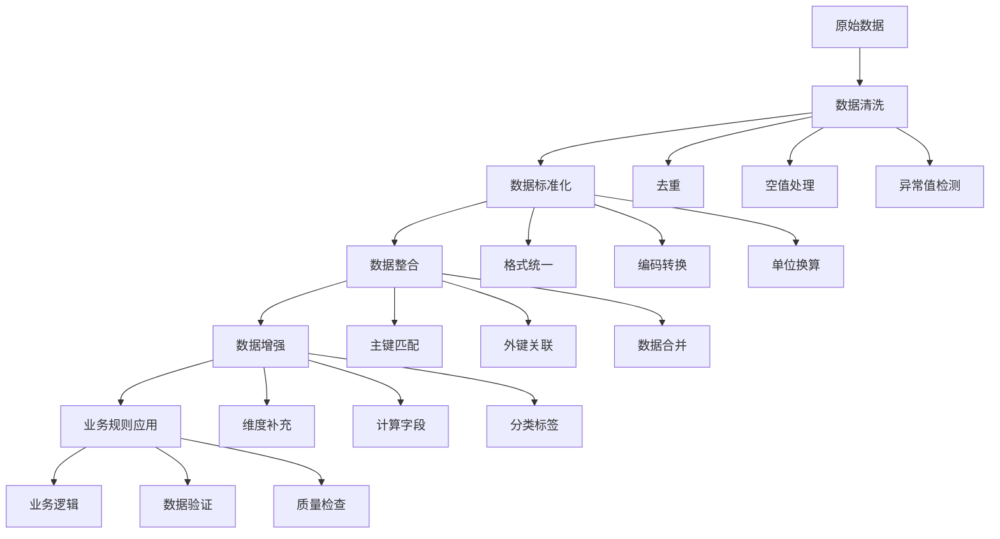

**数据清洗示例：**

```sql
-- 用户数据清洗转换
CREATE TABLE tmp_etl.user_cleaned AS
SELECT 
    user_id,
    
    -- 姓名清洗
    CASE 
        WHEN username IS NULL OR TRIM(username) = '' THEN '未知用户'
        WHEN LENGTH(username) > 50 THEN LEFT(username, 50)
        ELSE TRIM(username)
    END as username,
    
    -- 邮箱标准化
    CASE 
        WHEN email IS NULL OR email NOT REGEXP '^[a-zA-Z0-9._%+-]+@[a-zA-Z0-9.-]+\\.[a-zA-Z]{2,}$' 
        THEN NULL
        ELSE LOWER(TRIM(email))
    END as email,
    
    -- 手机号标准化
    CASE 
        WHEN phone IS NULL THEN NULL
        WHEN phone REGEXP '^1[3-9]\\d{9}$' THEN phone
        WHEN phone REGEXP '^\\+86-?1[3-9]\\d{9}$' THEN REGEXP_REPLACE(phone, '\\+86-?', '')
        ELSE NULL
    END as phone,
    
    -- 年龄计算和分组
    CASE 
        WHEN birth_date IS NULL THEN NULL
        WHEN DATEDIFF(CURRENT_DATE, birth_date) / 365 < 0 THEN NULL
        WHEN DATEDIFF(CURRENT_DATE, birth_date) / 365 > 120 THEN NULL
        ELSE FLOOR(DATEDIFF(CURRENT_DATE, birth_date) / 365)
    END as age,
    
    CASE 
        WHEN DATEDIFF(CURRENT_DATE, birth_date) / 365 BETWEEN 0 AND 17 THEN '未成年'
        WHEN DATEDIFF(CURRENT_DATE, birth_date) / 365 BETWEEN 18 AND 25 THEN '18-25岁'
        WHEN DATEDIFF(CURRENT_DATE, birth_date) / 365 BETWEEN 26 AND 35 THEN '26-35岁'
        WHEN DATEDIFF(CURRENT_DATE, birth_date) / 365 BETWEEN 36 AND 45 THEN '36-45岁'
        WHEN DATEDIFF(CURRENT_DATE, birth_date) / 365 BETWEEN 46 AND 60 THEN '46-60岁'
        WHEN DATEDIFF(CURRENT_DATE, birth_date) / 365 > 60 THEN '60岁以上'
        ELSE '未知'
    END as age_group,
    
    -- 性别标准化
    CASE 
        WHEN UPPER(gender) IN ('M', 'MALE', '男', '1') THEN '男'
        WHEN UPPER(gender) IN ('F', 'FEMALE', '女', '0') THEN '女'
        ELSE '未知'
    END as gender,
    
    -- 地址清洗
    TRIM(address) as address,
    
    -- 注册渠道标准化
    CASE 
        WHEN register_source IN ('web', 'website', 'pc') THEN 'PC官网'
        WHEN register_source IN ('mobile', 'app', 'ios', 'android') THEN '移动端'
        WHEN register_source IN ('wechat', 'weixin') THEN '微信'
        WHEN register_source IN ('alipay', 'zhifubao') THEN '支付宝'
        ELSE '其他'
    END as register_channel,
    
    registration_date,
    
    -- 数据质量评分
    (CASE WHEN username IS NOT NULL AND TRIM(username) != '' THEN 1 ELSE 0 END +
     CASE WHEN email IS NOT NULL AND email REGEXP '^[a-zA-Z0-9._%+-]+@[a-zA-Z0-9.-]+\\.[a-zA-Z]{2,}$' THEN 1 ELSE 0 END +
     CASE WHEN phone IS NOT NULL AND phone REGEXP '^1[3-9]\\d{9}$' THEN 1 ELSE 0 END +
     CASE WHEN birth_date IS NOT NULL THEN 1 ELSE 0 END +
     CASE WHEN address IS NOT NULL AND TRIM(address) != '' THEN 1 ELSE 0 END
    ) * 20 as data_quality_score,
    
    CURRENT_TIMESTAMP as transform_time
FROM ods_crm.user_info_full
WHERE dt = '{{ ds }}';
```

#### Load数据加载

**数据加载策略：**

```python
class DataLoader:
    def __init__(self, target_config):
        self.target_config = target_config
        
    def bulk_load(self, data_path, table_name, partition_spec=None):
        """批量加载数据"""
        
        if partition_spec:
            sql = f"""
            LOAD DATA INPATH '{data_path}'
            INTO TABLE {table_name}
            PARTITION ({partition_spec})
            """
        else:
            sql = f"""
            LOAD DATA INPATH '{data_path}'
            INTO TABLE {table_name}
            """
            
        return self.execute_sql(sql)
    
    def incremental_load(self, source_table, target_table, merge_keys):
        """增量加载 - MERGE INTO"""
        
        sql = f"""
        MERGE INTO {target_table} AS target
        USING {source_table} AS source
        ON {' AND '.join([f'target.{key} = source.{key}' for key in merge_keys])}
        WHEN MATCHED THEN
            UPDATE SET *
        WHEN NOT MATCHED THEN
            INSERT *
        """
        
        return self.execute_sql(sql)
    
    def scd_type2_load(self, source_table, target_table, business_key, track_columns):
        """SCD Type 2 加载"""
        
        # 1. 标记变更记录
        change_sql = f"""
        WITH source_with_hash AS (
            SELECT *,
                   MD5(CONCAT({', '.join(track_columns)})) as record_hash
            FROM {source_table}
        ),
        target_current AS (
            SELECT *,
                   MD5(CONCAT({', '.join(track_columns)})) as record_hash
            FROM {target_table}
            WHERE is_current = TRUE
        ),
        changes AS (
            SELECT 
                s.*,
                CASE 
                    WHEN t.{business_key} IS NULL THEN 'INSERT'
                    WHEN s.record_hash != t.record_hash THEN 'UPDATE'
                    ELSE 'NO_CHANGE'
                END as change_type
            FROM source_with_hash s
            LEFT JOIN target_current t ON s.{business_key} = t.{business_key}
        )
        
        -- 关闭变更记录
        UPDATE {target_table} 
        SET 
            end_date = CURRENT_DATE - 1,
            is_current = FALSE,
            update_time = CURRENT_TIMESTAMP
        WHERE {business_key} IN (
            SELECT {business_key} FROM changes WHERE change_type = 'UPDATE'
        ) AND is_current = TRUE;
        
        -- 插入新记录和更新记录
        INSERT INTO {target_table}
        SELECT 
            {business_key},
            {', '.join(track_columns)},
            CURRENT_DATE as start_date,
            '9999-12-31' as end_date,
            TRUE as is_current,
            CURRENT_TIMESTAMP as create_time,
            CURRENT_TIMESTAMP as update_time
        FROM changes
        WHERE change_type IN ('INSERT', 'UPDATE');
        """
        
        return self.execute_sql(change_sql)
```

### 5.2 ELT模式

#### ELT与ETL对比

**ELT架构优势：**

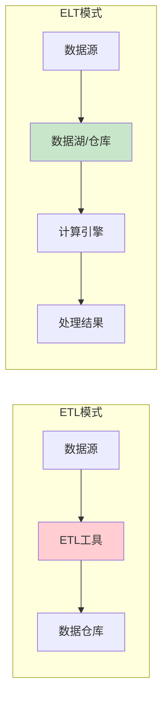

**ELT实现示例：**

```sql
-- ELT模式：先加载原始数据，再在数据仓库内转换
-- 1. Load: 直接加载原始数据到ODS层
CREATE TABLE ods_raw.sales_data_raw (
    raw_data STRING,
    file_name STRING,
    load_time TIMESTAMP
)
PARTITIONED BY (dt STRING)
STORED AS TEXTFILE;

-- 2. Extract & Transform: 在数据仓库内解析和转换
INSERT INTO dwd_sales.fact_sales
SELECT 
    get_json_object(raw_data, '$.order_id') as order_id,
    get_json_object(raw_data, '$.customer_id') as customer_id,
    get_json_object(raw_data, '$.product_id') as product_id,
    CAST(get_json_object(raw_data, '$.amount') AS DECIMAL(10,2)) as amount,
    CAST(get_json_object(raw_data, '$.quantity') AS INT) as quantity,
    from_unixtime(CAST(get_json_object(raw_data, '$.timestamp') AS BIGINT)) as order_time,
    '{{ ds }}' as dt
FROM ods_raw.sales_data_raw
WHERE dt = '{{ ds }}'
  AND get_json_object(raw_data, '$.order_id') IS NOT NULL;
```

### 5.3 实时数据处理

#### 实时数仓架构设计

**实时数仓**是在传统数据仓库基础上，增加了实时数据处理能力，支持秒级到分钟级的数据分析和决策支持。

**核心特点：**
- **低延迟**：数据从产生到可查询在秒级到分钟级
- **高吞吐**：支持每秒百万级别的数据处理
- **准确性**：保证数据的最终一致性
- **可扩展**：支持水平扩展和弹性伸缩

**实时数仓整体架构：**

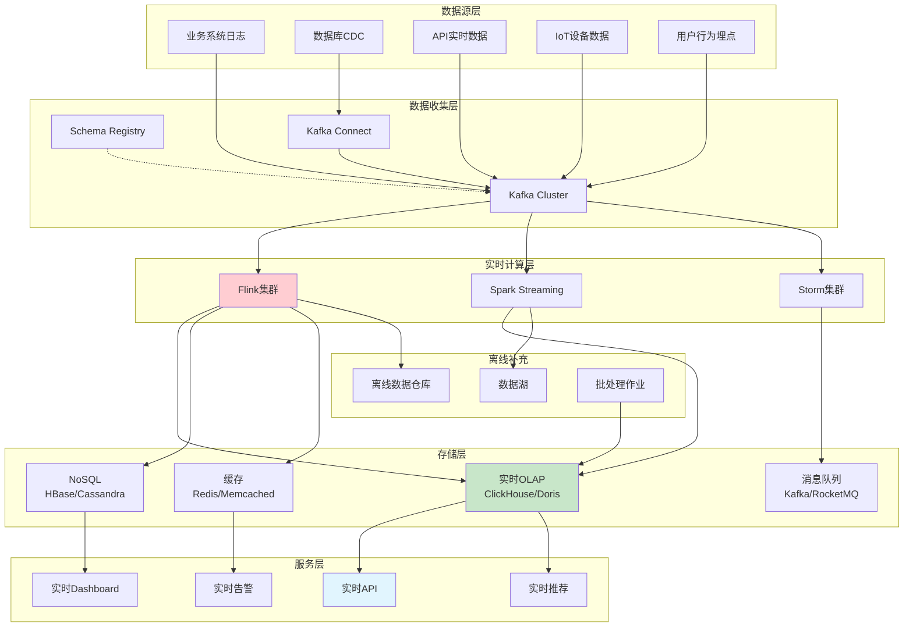

#### 流批一体架构

**流批融合的核心挑战：**

| 挑战 | 流处理 | 批处理 | 解决方案 |
|------|--------|--------|----------|
| **数据一致性** | 近似结果 | 精确结果 | Lambda/Kappa架构 |
| **处理语义** | 流式语义 | 批式语义 | 统一API（如Flink） |
| **状态管理** | 内存状态 | 持久化状态 | 状态后端统一 |
| **容错机制** | Checkpoint | 重新计算 | 统一容错策略 |

**Flink流批一体实现：**

```java
// 统一的流批处理作业
public class UnifiedStreamBatchJob {
    
    public static void main(String[] args) throws Exception {
        StreamExecutionEnvironment env = StreamExecutionEnvironment.getExecutionEnvironment();
        
        // 配置流批一体参数
        env.getConfig().setAutoWatermarkInterval(1000);
        env.enableCheckpointing(60000);
        env.getCheckpointConfig().setMinPauseBetweenCheckpoints(30000);
        
        // 数据源配置 - 支持有界和无界数据
        DataStream<OrderEvent> orderStream;
        
        if (args.length > 0 && "batch".equals(args[0])) {
            // 批处理模式 - 处理历史数据
            orderStream = env.fromSource(
                KafkaSource.<OrderEvent>builder()
                    .setBootstrapServers("localhost:9092")
                    .setTopics("orders")
                    .setStartingOffsets(OffsetsInitializer.earliest())
                    .setUnbounded(OffsetsInitializer.latest())
                    .setValueOnlyDeserializer(new OrderEventDeserializer())
                    .build(),
                WatermarkStrategy.<OrderEvent>forBoundedOutOfOrderness(Duration.ofSeconds(5))
                    .withTimestampAssigner((order, timestamp) -> order.getEventTime()),
                "kafka-source"
            );
        } else {
            // 流处理模式 - 处理实时数据
            orderStream = env.fromSource(
                KafkaSource.<OrderEvent>builder()
                    .setBootstrapServers("localhost:9092")
                    .setTopics("orders")
                    .setStartingOffsets(OffsetsInitializer.latest())
                    .setValueOnlyDeserializer(new OrderEventDeserializer())
                    .build(),
                WatermarkStrategy.<OrderEvent>forBoundedOutOfOrderness(Duration.ofSeconds(5))
                    .withTimestampAssigner((order, timestamp) -> order.getEventTime()),
                "kafka-source"
            );
        }
        
        // 统一的业务逻辑处理
        DataStream<OrderMetrics> metrics = orderStream
            .keyBy(OrderEvent::getCustomerId)
            .window(TumblingEventTimeWindows.of(Time.minutes(15)))
            .aggregate(new OrderAggregateFunction(), new OrderWindowFunction());
        
        // 维度关联 - 支持动态维度更新
        DataStream<EnrichedOrderMetrics> enrichedMetrics = metrics
            .connect(createCustomerDimStream(env))
            .keyBy(OrderMetrics::getCustomerId, CustomerDim::getCustomerId)
            .process(new DimensionEnrichFunction());
        
        // 输出到多个存储系统
        enrichedMetrics.addSink(new ClickHouseSink());
        enrichedMetrics.addSink(new HBaseSink());
        enrichedMetrics.addSink(new KafkaSink<>("enriched_orders"));
        
        env.execute("Unified Stream Batch Job");
    }
}
```

#### 实时维度关联

**Redis维度缓存管理：**

```python
class DimensionCacheManager:
    def __init__(self, redis_config):
        self.redis_client = redis.Redis(**redis_config)
        self.cache_ttl = 3600  # 1小时过期
        
    def get_customer_dimension(self, customer_id):
        """获取客户维度信息"""
        cache_key = f"dim_customer:{customer_id}"
        
        # 先从缓存获取
        cached_data = self.redis_client.get(cache_key)
        if cached_data:
            return json.loads(cached_data)
        
        # 缓存未命中，查询数据库
        customer_data = self._query_customer_from_db(customer_id)
        
        # 更新缓存
        if customer_data:
            self.redis_client.setex(
                cache_key, 
                self.cache_ttl, 
                json.dumps(customer_data)
            )
        
        return customer_data
    
    def batch_load_dimensions(self, customer_ids):
        """批量加载维度数据"""
        pipe = self.redis_client.pipeline()
        cache_keys = [f"dim_customer:{cid}" for cid in customer_ids]
        
        # 批量获取缓存
        for key in cache_keys:
            pipe.get(key)
        
        cached_results = pipe.execute()
        
        # 找出缓存未命中的ID
        missing_ids = []
        results = {}
        
        for i, (customer_id, cached_data) in enumerate(zip(customer_ids, cached_results)):
            if cached_data:
                results[customer_id] = json.loads(cached_data)
            else:
                missing_ids.append(customer_id)
        
        # 批量查询未命中的数据
        if missing_ids:
            db_results = self._batch_query_customers_from_db(missing_ids)
            
            # 更新缓存和结果
            for customer_id, data in db_results.items():
                cache_key = f"dim_customer:{customer_id}"
                self.redis_client.setex(cache_key, self.cache_ttl, json.dumps(data))
                results[customer_id] = data
        
        return results
```

#### 实时OLAP存储

**ClickHouse实时数仓实现：**

```sql
-- 创建实时订单明细表
CREATE TABLE realtime_orders (
    order_id String,
    customer_id String,
    customer_name String,
    customer_level Enum8('Bronze' = 1, 'Silver' = 2, 'Gold' = 3, 'Platinum' = 4),
    product_id String,
    product_category String,
    order_amount Decimal(10, 2),
    quantity UInt32,
    order_date Date,
    order_datetime DateTime,
    region String,
    status Enum8('pending' = 1, 'paid' = 2, 'shipped' = 3, 'completed' = 4),
    
    -- 实时计算字段
    order_hour UInt8 MATERIALIZED toHour(order_datetime),
    order_weekday UInt8 MATERIALIZED toDayOfWeek(order_datetime),
    is_weekend UInt8 MATERIALIZED if(toDayOfWeek(order_datetime) IN (6, 7), 1, 0),
    
    created_at DateTime DEFAULT now()
) ENGINE = ReplacingMergeTree(created_at)
PARTITION BY toYYYYMM(order_date)
ORDER BY (customer_id, product_category, order_datetime)
SETTINGS index_granularity = 8192;

-- 创建实时汇总表（物化视图）
CREATE MATERIALIZED VIEW realtime_order_metrics_mv
ENGINE = SummingMergeTree()
PARTITION BY toYYYYMM(order_date)
ORDER BY (order_date, order_hour, customer_level, region, product_category)
AS SELECT
    order_date,
    order_hour,
    customer_level,
    region,
    product_category,
    
    -- 汇总指标
    count() as order_count,
    sum(order_amount) as total_amount,
    sum(quantity) as total_quantity,
    uniq(customer_id) as unique_customers,
    
    -- 高级指标
    avg(order_amount) as avg_order_amount,
    quantile(0.5)(order_amount) as median_order_amount,
    quantile(0.95)(order_amount) as p95_order_amount,
    
    created_at
FROM realtime_orders
GROUP BY 
    order_date, order_hour, customer_level, 
    region, product_category, created_at;
```

## 6. 数据治理与质量

### 6.1 数据治理体系

**数据治理**是确保数据资产得到有效管理和利用的一套管理体系，包括数据质量、安全、合规等方面。

### 6.2 数据质量管理

### 6.3 元数据管理

### 6.4 数据安全与合规

## 7. 性能优化策略

### 7.1 存储优化

### 7.2 计算优化

### 7.3 架构优化

## 8. 技术组件选型

### 8.1 存储技术选型

#### HDFS分布式存储

#### 对象存储服务

#### 关系型数据库

### 8.2 计算引擎选型

#### Spark大数据计算

#### Flink流计算

#### Presto交互式查询

### 8.3 数据湖技术

#### Apache Hudi

**Apache Hudi**（Hadoop Upserts Deletes and Incrementals）是一个数据湖存储格式，专门为支持更新、删除和增量处理而设计。

**核心特性：**

| 特性 | 说明 | 优势 |
|------|------|------|
| **ACID事务** | 支持记录级别的插入、更新、删除 | 数据一致性保证 |
| **增量处理** | 支持增量数据摄入和查询 | 提高处理效率 |
| **时间旅行** | 支持历史版本查询 | 数据回溯和审计 |
| **数据压缩** | 自动小文件合并和数据优化 | 提升查询性能 |

**表类型对比：**

```sql
-- Copy on Write (COW) 表
-- 适合读多写少的场景
CREATE TABLE hudi_cow_table (
    id BIGINT,
    name STRING,
    age INT,
    city STRING,
    ts TIMESTAMP
) USING HUDI
TBLPROPERTIES (
    type = 'cow',
    primaryKey = 'id',
    preCombineField = 'ts'
);

-- Merge on Read (MOR) 表  
-- 适合写多读少的场景
CREATE TABLE hudi_mor_table (
    id BIGINT,
    name STRING,
    age INT,
    city STRING,
    ts TIMESTAMP
) USING HUDI
TBLPROPERTIES (
    type = 'mor',
    primaryKey = 'id',
    preCombineField = 'ts'
);
```

#### Apache Iceberg

**Apache Iceberg**是Netflix开源的表格式，提供高性能的分析型存储。

**核心优势：**

| 特性 | 实现方式 | 业务价值 |
|------|----------|----------|
| **模式演化** | 支持添加、删除、重命名列 | 业务敏捷性 |
| **隐藏分区** | 基于列值自动分区 | 简化查询 |
| **快照隔离** | MVCC并发控制 | 读写并发 |
| **数据压缩** | 自动文件合并和重写 | 查询优化 |

**分区策略：**

```sql
-- 时间分区
CREATE TABLE iceberg_orders (
    order_id BIGINT,
    customer_id BIGINT,
    order_time TIMESTAMP,
    amount DECIMAL(10,2)
) USING ICEBERG
PARTITIONED BY (months(order_time));

-- 复合分区
ALTER TABLE iceberg_orders 
ADD PARTITION FIELD bucket(16, customer_id);

-- 分区演化
ALTER TABLE iceberg_orders 
DROP PARTITION FIELD bucket(16, customer_id);

-- 查询性能优化
ALTER TABLE iceberg_orders 
REWRITE DATA USING BIN_PACK;
```

#### Delta Lake

**Delta Lake**是Databricks开源的存储格式，在Parquet基础上提供ACID事务。

**技术架构：**

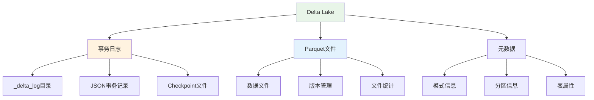

**三大数据湖技术对比：**

| 特性 | Delta Lake | Apache Iceberg | Apache Hudi |
|------|------------|----------------|--------------|
| **ACID支持** | ✅ 完整支持 | ✅ 完整支持 | ✅ 完整支持 |
| **模式演化** | ✅ 支持 | ✅ 强大的演化能力 | ✅ 基本支持 |
| **时间旅行** | ✅ 版本/时间戳 | ✅ 快照管理 | ✅ 时间点查询 |
| **流式写入** | ✅ 结构化流 | ⚠️ 需要额外集成 | ✅ 原生支持 |
| **查询引擎** | Spark | Spark/Trino/Flink | Spark/Presto/Hive |
| **生态成熟度** | 🔥 高（Databricks） | 🔥 高（Netflix/Apache） | 🔥 高（Uber/Apache） |
| **学习成本** | 低 | 中 | 高 |
| **适用场景** | 通用数据湖 | 大规模分析 | 实时更新 |

### 8.4 云原生数据仓库

#### Snowflake

**Snowflake**是云原生数据仓库的领导者，采用存储计算分离架构。

**架构特点：**

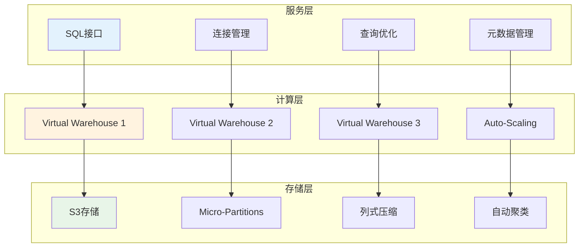

#### BigQuery

**BigQuery**是Google的无服务器数据仓库，基于Dremel架构。

#### Redshift

**Amazon Redshift**是基于PostgreSQL的列式数据仓库。

## 9. 实战项目案例

### 9.1 电商数据仓库

### 9.2 金融数据仓库

### 9.3 物联网数据仓库

## 10. 面试题集锦

### 10.1 基础理论题

#### 概念原理类

**Q1: 请详细解释数据仓库的四大特征，并说明与业务数据库的区别。**

**答案：**

**数据仓库四大特征：**

1. **面向主题（Subject-Oriented）**
   - 按业务主题组织数据，如客户、产品、订单
   - 便于业务分析和决策支持
   - 与业务数据库按应用系统组织的方式不同

2. **集成的（Integrated）**
   - 整合多个异构数据源
   - 统一数据格式、编码、命名规范
   - 解决数据不一致问题

3. **非易失的（Non-Volatile）**
   - 数据相对稳定，主要进行读操作
   - 保留历史数据，支持时间序列分析
   - 与OLTP系统频繁更新不同

4. **时变的（Time-Variant）**
   - 数据有时间标识，反映历史变化
   - 支持趋势分析和历史对比
   - 数据有生命周期管理

**与业务数据库对比：**

| 维度 | 数据仓库 | 业务数据库 |
|------|----------|------------|
| **目的** | 分析决策 | 事务处理 |
| **数据特点** | 历史数据、只读 | 当前数据、读写 |
| **用户群体** | 分析师、管理层 | 业务操作人员 |
| **查询特点** | 复杂分析查询 | 简单事务查询 |
| **数据结构** | 反规范化、宽表 | 规范化、窄表 |

**Q2: 什么是维度建模？星型模型和雪花模型的区别是什么？**

**答案：**

**维度建模定义：**
维度建模是数据仓库设计的一种方法，将业务过程抽象为**事实表**和**维度表**的组合，便于业务理解和查询优化。

**核心概念：**
- **事实表**：存储业务过程的度量值（如销售额、数量）
- **维度表**：存储业务实体的描述信息（如客户、产品、时间）
- **粒度**：事实表中一行数据所代表的业务细节程度

**星型模型 vs 雪花模型：**

```sql
-- 星型模型示例
-- 事实表直接关联所有维度表
SELECT 
    d.date_name,
    c.customer_name,
    p.product_name,
    SUM(f.sales_amount) as total_sales
FROM fact_sales f
JOIN dim_date d ON f.date_sk = d.date_sk
JOIN dim_customer c ON f.customer_sk = c.customer_sk
JOIN dim_product p ON f.product_sk = p.product_sk
GROUP BY d.date_name, c.customer_name, p.product_name;

-- 雪花模型示例  
-- 维度表进一步规范化
SELECT 
    d.date_name,
    c.customer_name,
    ct.type_name,
    p.product_name,
    pc.category_name,
    SUM(f.sales_amount) as total_sales
FROM fact_sales f
JOIN dim_date d ON f.date_sk = d.date_sk
JOIN dim_customer c ON f.customer_sk = c.customer_sk
JOIN dim_customer_type ct ON c.customer_type_sk = ct.customer_type_sk
JOIN dim_product p ON f.product_sk = p.product_sk
JOIN dim_product_category pc ON p.category_sk = pc.category_sk
GROUP BY d.date_name, c.customer_name, ct.type_name, p.product_name, pc.category_name;
```

**对比总结：**

| 特性 | 星型模型 | 雪花模型 |
|------|----------|----------|
| **查询性能** | 更快（JOIN少） | 较慢（JOIN多） |
| **存储空间** | 较大（冗余多） | 较小（规范化） |
| **维护复杂度** | 简单 | 复杂 |
| **业务理解** | 容易 | 相对困难 |
| **适用场景** | OLAP分析 | 存储敏感环境 |

#### 架构设计类

**Q3: 请比较Lambda架构、Kappa架构和湖仓一体架构的优缺点。**

**答案：**

**Lambda架构：**

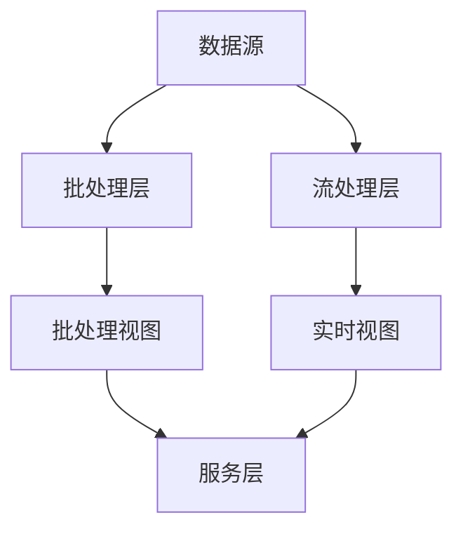

**优缺点分析：**

| 架构 | 优点 | 缺点 | 适用场景 |
|------|------|------|----------|
| **Lambda** | 容错性强、数据准确性高 | 架构复杂、维护成本高 | 对准确性要求极高的场景 |
| **Kappa** | 架构简单、维护成本低 | 重新处理历史数据困难 | 实时性要求高的场景 |
| **湖仓一体** | 灵活性强、成本效益好 | 技术成熟度相对较低 | 多样化数据处理需求 |

**Q4: 如何设计一个支持实时和离线分析的数据仓库架构？**

**答案：**

**架构设计思路：**

```python
# 统一架构设计示例
class UnifiedDataWarehouse:
    def __init__(self):
        self.layers = {
            'ingestion': {
                'batch': ['Sqoop', 'DataX', 'Flume'],
                'stream': ['Kafka', 'Pulsar', 'Kinesis']
            },
            'storage': {
                'lake': ['HDFS', 'S3', 'MinIO'],
                'warehouse': ['Hive', 'ClickHouse', 'Doris'],
                'cache': ['Redis', 'Memcached']
            },
            'compute': {
                'batch': ['Spark', 'MapReduce', 'Hive'],
                'stream': ['Flink', 'Storm', 'Spark Streaming'],
                'interactive': ['Presto', 'Impala', 'Drill']
            },
            'serving': {
                'olap': ['Kylin', 'Druid', 'ClickHouse'],
                'api': ['FastAPI', 'Spring Boot'],
                'bi': ['Tableau', 'PowerBI', 'Superset']
            }
        }
    
    def design_real_time_pipeline(self):
        """实时数据处理链路设计"""
        return {
            'data_source': 'Business Systems',
            'message_queue': 'Kafka',
            'stream_processing': 'Flink',
            'storage': 'Hive + Redis',
            'serving': 'API + Dashboard'
        }
    
    def design_batch_pipeline(self):
        """离线数据处理链路设计"""
        return {
            'data_source': 'Database + Files',
            'extraction': 'Sqoop + Flume',
            'batch_processing': 'Spark',
            'storage': 'Hive + HDFS',
            'serving': 'Presto + BI Tools'
        }
```

### 10.2 建模设计题

#### 维度建模类

**Q5: 如何处理缓慢变化维度（SCD）？请设计一个客户维度表支持Type 2 SCD。**

**答案：**

**SCD Type 2 设计：**

```sql
-- 客户维度表设计（支持SCD Type 2）
CREATE TABLE dim_customer (
    customer_sk BIGINT AUTO_INCREMENT PRIMARY KEY, -- 代理键
    customer_id VARCHAR(50) NOT NULL,              -- 业务键
    
    -- 客户属性（会发生变化的字段）
    customer_name VARCHAR(100),
    email VARCHAR(100),
    phone VARCHAR(20),
    address VARCHAR(200),
    customer_level VARCHAR(20), -- VIP级别会变化
    
    -- SCD Type 2 控制字段
    effective_date DATE NOT NULL,     -- 生效日期
    expiry_date DATE DEFAULT '9999-12-31', -- 失效日期
    is_current BOOLEAN DEFAULT TRUE,  -- 当前记录标识
    version_number INT DEFAULT 1,     -- 版本号
    
    -- 审计字段
    created_by VARCHAR(50),
    created_time TIMESTAMP DEFAULT CURRENT_TIMESTAMP,
    updated_by VARCHAR(50),
    updated_time TIMESTAMP DEFAULT CURRENT_TIMESTAMP,
    
    -- 索引
    INDEX idx_customer_id (customer_id),
    INDEX idx_effective_date (effective_date),
    INDEX idx_is_current (is_current),
    UNIQUE KEY uk_customer_id_effective_date (customer_id, effective_date)
);

-- SCD Type 2 更新存储过程
DELIMITER //
CREATE PROCEDURE update_customer_scd(
    IN p_customer_id VARCHAR(50),
    IN p_customer_name VARCHAR(100),
    IN p_email VARCHAR(100),
    IN p_phone VARCHAR(20),
    IN p_address VARCHAR(200),
    IN p_customer_level VARCHAR(20),
    IN p_effective_date DATE,
    IN p_updated_by VARCHAR(50)
)
BEGIN
    DECLARE v_changed BOOLEAN DEFAULT FALSE;
    DECLARE v_current_record_count INT DEFAULT 0;
    
    -- 检查是否有变化
    SELECT COUNT(*) INTO v_current_record_count
    FROM dim_customer 
    WHERE customer_id = p_customer_id 
      AND is_current = TRUE
      AND (customer_name != p_customer_name 
           OR email != p_email 
           OR phone != p_phone 
           OR address != p_address 
           OR customer_level != p_customer_level);
    
    IF v_current_record_count > 0 THEN
        SET v_changed = TRUE;
    END IF;
    
    IF v_changed THEN
        -- 关闭当前记录
        UPDATE dim_customer 
        SET 
            expiry_date = p_effective_date - INTERVAL 1 DAY,
            is_current = FALSE,
            updated_by = p_updated_by,
            updated_time = CURRENT_TIMESTAMP
        WHERE customer_id = p_customer_id 
          AND is_current = TRUE;
        
        -- 插入新记录
        INSERT INTO dim_customer (
            customer_id, customer_name, email, phone, address, 
            customer_level, effective_date, expiry_date, is_current,
            version_number, created_by, created_time
        ) SELECT 
            p_customer_id, p_customer_name, p_email, p_phone, p_address,
            p_customer_level, p_effective_date, '9999-12-31', TRUE,
            MAX(version_number) + 1, p_updated_by, CURRENT_TIMESTAMP
        FROM dim_customer 
        WHERE customer_id = p_customer_id;
    END IF;
END //
DELIMITER ;
```

#### 分层设计类

**Q6: 如何设计数据仓库的分层架构？每层的职责是什么？**

**答案：**

**分层架构设计：**

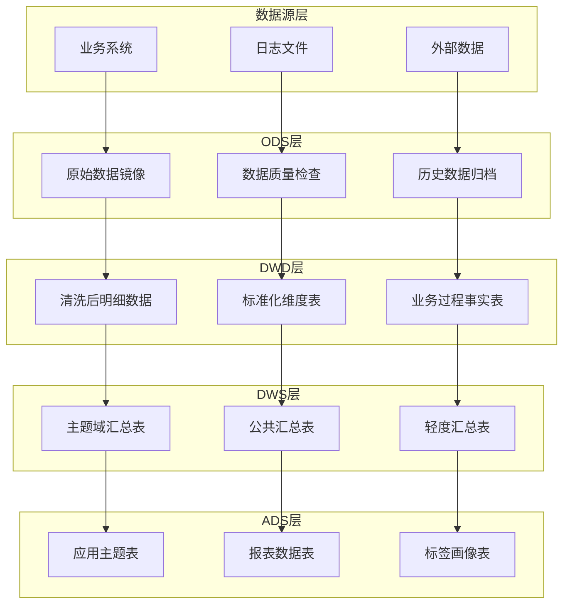

**各层职责详解：**

| 层级 | 英文名称 | 职责 | 数据特点 | 建表规范 |
|------|----------|------|----------|----------|
| **ODS** | Operational Data Store | 数据同步、历史保留 | 与源系统保持一致 | ods_{系统}_{表名}_{全量/增量} |
| **DWD** | Data Warehouse Detail | 数据清洗、模型构建 | 维度建模、业务含义清晰 | dwd_{主题域}_{事实表/维度表} |
| **DWS** | Data Warehouse Summary | 数据汇总、指标计算 | 多粒度聚合、性能优化 | dws_{主题域}_{汇总粒度} |
| **ADS** | Application Data Service | 应用支撑、直接服务 | 高度聚合、面向应用 | ads_{应用场景}_{表用途} |

### 10.3 技术实现题

#### ETL流程类

**Q7: 如何设计一个高可用的ETL流程？包括监控、容错、重试机制？**

**答案：**

**高可用ETL架构设计：**

```python
class HighAvailabilityETL:
    def __init__(self):
        self.retry_policy = {
            'max_retries': 3,
            'backoff_factor': 2,
            'retry_exceptions': ['TimeoutException', 'ConnectionException']
        }
        self.monitoring = {
            'metrics': ['execution_time', 'success_rate', 'data_volume'],
            'alerts': ['failure', 'timeout', 'data_quality_issue']
        }
    
    def create_etl_task(self, task_config):
        """创建ETL任务"""
        return ETLTask(
            name=task_config['name'],
            source=task_config['source'],
            target=task_config['target'],
            transform_logic=task_config['transform'],
            retry_policy=self.retry_policy,
            monitoring=self.monitoring
        )
    
    def execute_with_fault_tolerance(self, task):
        """容错执行ETL任务"""
        
        for attempt in range(self.retry_policy['max_retries'] + 1):
            try:
                # 执行前检查
                self.pre_execution_check(task)
                
                # 执行ETL任务
                result = self.execute_task(task)
                
                # 数据质量检查
                self.data_quality_check(result)
                
                # 记录成功指标
                self.record_success_metrics(task, result)
                
                return result
                
            except Exception as e:
                # 记录错误
                self.log_error(task, attempt, e)
                
                if attempt < self.retry_policy['max_retries']:
                    # 等待重试
                    sleep_time = self.retry_policy['backoff_factor'] ** attempt
                    time.sleep(sleep_time)
                    continue
                else:
                    # 最终失败处理
                    self.handle_final_failure(task, e)
                    raise e
    
    def setup_monitoring(self):
        """设置监控告警"""
        
        monitoring_rules = {
            'task_failure': {
                'condition': 'task_status = "FAILED"',
                'action': 'send_alert_to_oncall'
            },
            'data_quality_drop': {
                'condition': 'data_quality_score < 0.8',
                'action': 'send_alert_to_data_team'
            },
            'execution_timeout': {
                'condition': 'execution_time > sla_threshold',
                'action': 'escalate_to_manager'
            }
        }
        
        return monitoring_rules

# ETL任务配置示例
etl_config = {
    'tasks': [
        {
            'name': 'user_data_sync',
            'schedule': '0 2 * * *',
            'dependencies': [],
            'source': 'mysql://crm_db/users',
            'target': 'hive://warehouse/ods_crm.user_info',
            'transform': 'sql/user_data_clean.sql',
            'sla_minutes': 60,
            'retry_config': {
                'max_retries': 3,
                'retry_delay': 300
            }
        },
        {
            'name': 'order_fact_build',
            'schedule': '0 4 * * *',
            'dependencies': ['user_data_sync', 'product_data_sync'],
            'source': 'hive://warehouse/ods_order.order_info',
            'target': 'hive://warehouse/dwd_order.fact_order_detail',
            'transform': 'sql/build_order_fact.sql',
            'sla_minutes': 120
        }
    ]
}
```

#### 性能优化类

**Q8: 数据仓库查询性能很慢，你会从哪些方面进行优化？**

**答案：**

**性能优化分层策略：**

**1. 存储层优化**

```sql
-- 分区策略优化
CREATE TABLE fact_orders_optimized (
    order_id STRING,
    customer_id STRING,
    product_id STRING,
    order_amount DECIMAL(10,2),
    order_time TIMESTAMP
)
PARTITIONED BY (
    year INT,
    month INT,
    day INT
)
CLUSTERED BY (customer_id) INTO 32 BUCKETS
STORED AS ORC
TBLPROPERTIES (
    'orc.compress'='SNAPPY',
    'orc.create.index'='true',
    'orc.bloom.filter.columns'='customer_id,product_id'
);

-- 预聚合表
CREATE TABLE fact_orders_daily_summary AS
SELECT 
    customer_id,
    DATE(order_time) as order_date,
    COUNT(*) as order_count,
    SUM(order_amount) as total_amount,
    AVG(order_amount) as avg_amount
FROM fact_orders_optimized
GROUP BY customer_id, DATE(order_time);
```

**2. 查询层优化**

```sql
-- 查询优化前
SELECT 
    c.customer_name,
    COUNT(*) as order_count,
    SUM(o.order_amount) as total_amount
FROM fact_orders o
JOIN dim_customer c ON o.customer_id = c.customer_id
WHERE o.order_time >= '2023-01-01'
GROUP BY c.customer_name;

-- 查询优化后
SELECT 
    c.customer_name,
    s.order_count,
    s.total_amount
FROM fact_orders_daily_summary s
JOIN dim_customer c ON s.customer_id = c.customer_id
WHERE s.order_date >= '2023-01-01'
  AND c.is_current = TRUE; -- 只关联当前有效维度记录
```

**3. 计算层优化**

```python
# Spark SQL 优化配置
spark_optimization_config = {
    # 自适应查询执行
    'spark.sql.adaptive.enabled': 'true',
    'spark.sql.adaptive.coalescePartitions.enabled': 'true',
    'spark.sql.adaptive.skewJoin.enabled': 'true',
    
    # 广播JOIN优化
    'spark.sql.autoBroadcastJoinThreshold': '100MB',
    
    # 动态分区裁剪
    'spark.sql.optimizer.dynamicPartitionPruning.enabled': 'true',
    
    # 列式存储优化
    'spark.sql.orc.impl': 'native',
    'spark.sql.orc.enableVectorizedReader': 'true',
    
    # 内存配置
    'spark.executor.memory': '8g',
    'spark.executor.memoryFraction': '0.8',
    'spark.sql.adaptive.advisoryPartitionSizeInBytes': '128MB'
}
```

**性能优化检查清单：**

| 优化维度 | 检查项 | 优化措施 |
|---------|-------|----------|
| **数据模型** | 是否有不必要的JOIN | 宽表设计、预聚合 |
| **分区策略** | 分区是否合理 | 按查询模式重新分区 |
| **索引使用** | 是否有合适索引 | 创建BloomFilter、ZOrder |
| **数据格式** | 存储格式是否高效 | 使用ORC、Parquet |
| **查询模式** | SQL是否可优化 | 重写SQL、使用Hint |
| **资源配置** | 计算资源是否充足 | 调整内存、并行度 |

### 10.4 场景应用题

#### 业务场景类

**Q9: 设计一个电商平台的实时用户行为分析系统，需要支持哪些指标？架构如何设计？**

**答案：**

**实时指标体系设计：**

```mermaid
graph TB
    subgraph "实时指标分类"
        A[流量指标] --> A1[PV/UV]
        A --> A2[新用户数]
        A --> A3[活跃用户数]
        A --> A4[用户留存]
        
        B[行为指标] --> B1[页面停留时长]
        B --> B2[跳出率]
        B --> B3[页面深度]
        B --> B4[转化路径]
        
        C[交易指标] --> C1[下单金额]
        C --> C2[转化率]
        C --> C3[客单价]
        C --> C4[复购率]
        
        D[商品指标] --> D1[商品浏览量]
        D --> D2[加购率]
        D --> D3[商品转化率]
        D --> D4[热销商品]
    end
```

**技术架构设计：**

```python
class RealTimeAnalyticsSystem:
    def __init__(self):
        self.architecture = {
            'data_collection': {
                'web': 'JavaScript SDK',
                'mobile': 'Mobile SDK', 
                'server': 'Log Files'
            },
            'message_queue': 'Kafka',
            'stream_processing': 'Flink',
            'storage': {
                'hot_data': 'Redis',
                'warm_data': 'ClickHouse',
                'cold_data': 'Hive'
            },
            'serving': {
                'api': 'FastAPI',
                'dashboard': 'Grafana',
                'alerting': 'Prometheus'
            }
        }
    
    def design_metrics_calculation(self):
        """实时指标计算逻辑"""
        
        metrics_sql = {
            'real_time_pv_uv': """
                SELECT 
                    window_start,
                    window_end,
                    COUNT(*) as pv,
                    COUNT(DISTINCT user_id) as uv,
                    COUNT(DISTINCT CASE WHEN is_new_user = 1 THEN user_id END) as new_users
                FROM user_behavior
                GROUP BY 
                    TUMBLE(event_time, INTERVAL '1' MINUTE)
            """,
            
            'conversion_funnel': """
                SELECT 
                    date_trunc('minute', event_time) as minute_window,
                    COUNT(CASE WHEN event_type = 'page_view' THEN 1 END) as page_views,
                    COUNT(CASE WHEN event_type = 'add_to_cart' THEN 1 END) as add_to_carts,
                    COUNT(CASE WHEN event_type = 'purchase' THEN 1 END) as purchases,
                    COUNT(CASE WHEN event_type = 'add_to_cart' THEN 1 END) * 1.0 / 
                        COUNT(CASE WHEN event_type = 'page_view' THEN 1 END) as add_to_cart_rate,
                    COUNT(CASE WHEN event_type = 'purchase' THEN 1 END) * 1.0 / 
                        COUNT(CASE WHEN event_type = 'add_to_cart' THEN 1 END) as purchase_rate
                FROM user_behavior
                GROUP BY date_trunc('minute', event_time)
            """,
            
            'product_popularity': """
                SELECT 
                    window_start,
                    product_id,
                    COUNT(*) as view_count,
                    COUNT(DISTINCT user_id) as unique_viewers,
                    SUM(CASE WHEN event_type = 'add_to_cart' THEN 1 ELSE 0 END) as add_to_cart_count
                FROM user_behavior
                WHERE event_type IN ('product_view', 'add_to_cart')
                GROUP BY 
                    TUMBLE(event_time, INTERVAL '5' MINUTE),
                    product_id
                ORDER BY view_count DESC
                LIMIT 100
            """
        }
        
        return metrics_sql
```

**Flink实时计算实现：**

```java
// 实时用户行为分析
public class UserBehaviorAnalysis {
    
    public static void main(String[] args) throws Exception {
        StreamExecutionEnvironment env = StreamExecutionEnvironment.getExecutionEnvironment();
        
        // 设置事件时间
        env.setStreamTimeCharacteristic(TimeCharacteristic.EventTime);
        
        // 从Kafka读取用户行为数据
        DataStream<UserBehavior> behaviorStream = env
            .addSource(new FlinkKafkaConsumer<>("user_behavior", 
                new UserBehaviorSchema(), kafkaProps))
            .assignTimestampsAndWatermarks(
                WatermarkStrategy.<UserBehavior>forBoundedOutOfOrderness(Duration.ofSeconds(5))
                    .withTimestampAssigner((behavior, timestamp) -> behavior.getTimestamp())
            );
        
        // 实时PV/UV计算
        DataStream<PageViewStats> pvUvStats = behaviorStream
            .filter(behavior -> "page_view".equals(behavior.getEventType()))
            .keyBy(behavior -> "all") // 全局统计
            .window(TumblingEventTimeWindows.of(Time.minutes(1)))
            .aggregate(new PvUvAggregateFunction(), new PvUvProcessWindowFunction());
        
        // 实时转化漏斗计算
        DataStream<ConversionFunnel> conversionStats = behaviorStream
            .keyBy(UserBehavior::getUserId)
            .window(SessionWindows.withGap(Time.minutes(30)))
            .process(new ConversionFunnelProcessFunction());
        
        // 实时热门商品计算
        DataStream<ProductPopularity> popularProducts = behaviorStream
            .filter(behavior -> "product_view".equals(behavior.getEventType()))
            .keyBy(UserBehavior::getProductId)
            .window(SlidingEventTimeWindows.of(Time.minutes(10), Time.minutes(1)))
            .aggregate(new ProductViewAggregateFunction());
        
        // 输出到不同的存储系统
        pvUvStats.addSink(new RedisSink<>("pv_uv_stats"));
        conversionStats.addSink(new ClickHouseSink<>("conversion_funnel"));
        popularProducts.addSink(new KafkaSink<>("popular_products"));
        
        env.execute("Real-time User Behavior Analysis");
    }
}
```

#### 问题解决类

**Q10: 数据仓库出现数据质量问题，如何快速定位和解决？**

**答案：**

**数据质量问题排查流程：**

```mermaid
flowchart TD
    A[发现数据质量问题] --> B{确定问题范围}
    B --> C[单表问题]
    B --> D[跨表问题]
    B --> E[系统性问题]
    
    C --> F[检查源数据]
    D --> G[检查关联逻辑]
    E --> H[检查ETL流程]
    
    F --> I[定位根因]
    G --> I
    H --> I
    
    I --> J[制定修复方案]
    J --> K[执行修复]
    K --> L[验证结果]
    L --> M[更新监控规则]
```

**问题诊断工具包：**

```sql
-- 1. 数据质量检查SQL模板
CREATE VIEW data_quality_dashboard AS
SELECT 
    table_name,
    check_date,
    total_records,
    null_records,
    duplicate_records,
    invalid_format_records,
    data_quality_score
FROM (
    -- 用户表质量检查
    SELECT 
        'dim_customer' as table_name,
        CURRENT_DATE as check_date,
        COUNT(*) as total_records,
        COUNT(*) - COUNT(customer_name) as null_records,
        COUNT(*) - COUNT(DISTINCT customer_id) as duplicate_records,
        COUNT(CASE WHEN email NOT REGEXP '^[a-zA-Z0-9._%+-]+@[a-zA-Z0-9.-]+\\.[a-zA-Z]{2,}$' 
              THEN 1 END) as invalid_format_records,
        (1 - (COUNT(*) - COUNT(customer_name) + 
              COUNT(*) - COUNT(DISTINCT customer_id) +
              COUNT(CASE WHEN email NOT REGEXP '^[a-zA-Z0-9._%+-]+@[a-zA-Z0-9.-]+\\.[a-zA-Z]{2,}$' 
                    THEN 1 END)) * 1.0 / COUNT(*)) * 100 as data_quality_score
    FROM dim_customer
    WHERE is_current = TRUE
    
    UNION ALL
    
    -- 订单表质量检查
    SELECT 
        'fact_orders' as table_name,
        CURRENT_DATE as check_date,
        COUNT(*) as total_records,
        COUNT(*) - COUNT(order_amount) as null_records,
        COUNT(*) - COUNT(DISTINCT order_id) as duplicate_records,
        COUNT(CASE WHEN order_amount <= 0 THEN 1 END) as invalid_format_records,
        (1 - (COUNT(*) - COUNT(order_amount) + 
              COUNT(*) - COUNT(DISTINCT order_id) +
              COUNT(CASE WHEN order_amount <= 0 THEN 1 END)) * 1.0 / COUNT(*)) * 100 as data_quality_score
    FROM fact_orders
    WHERE dt = CURRENT_DATE
) quality_metrics;

-- 2. 数据血缘追踪查询
WITH RECURSIVE data_lineage AS (
    -- 查找问题表的上游依赖
    SELECT 
        source_table,
        target_table,
        transform_logic,
        1 as level
    FROM meta_data.table_lineage
    WHERE target_table = 'problematic_table'
    
    UNION ALL
    
    SELECT 
        tl.source_table,
        tl.target_table,
        tl.transform_logic,
        dl.level + 1
    FROM meta_data.table_lineage tl
    JOIN data_lineage dl ON tl.target_table = dl.source_table
    WHERE dl.level < 5  -- 限制递归深度
)
SELECT * FROM data_lineage ORDER BY level;

-- 3. 数据一致性检查
SELECT 
    'source_vs_target' as check_type,
    source_count,
    target_count,
    ABS(source_count - target_count) as difference,
    CASE 
        WHEN source_count = 0 THEN 0
        ELSE ABS(source_count - target_count) * 100.0 / source_count
    END as difference_percentage
FROM (
    SELECT 
        (SELECT COUNT(*) FROM ods_order.order_info WHERE dt = '2023-12-25') as source_count,
        (SELECT COUNT(*) FROM dwd_order.fact_order_detail WHERE dt = '2023-12-25') as target_count
) counts;
```

**自动化监控与告警：**

```python
class DataQualityMonitor:
    def __init__(self):
        self.quality_rules = {
            'completeness': {
                'null_rate_threshold': 0.05,  # 空值率不超过5%
                'missing_partition_threshold': 0  # 不允许缺失分区
            },
            'accuracy': {
                'format_error_threshold': 0.01,  # 格式错误率不超过1%
                'range_error_threshold': 0.01   # 范围错误率不超过1%
            },
            'consistency': {
                'duplicate_rate_threshold': 0.001,  # 重复率不超过0.1%
                'referential_integrity_threshold': 0.01  # 引用完整性错误不超过1%
            },
            'timeliness': {
                'max_delay_hours': 2,  # 数据延迟不超过2小时
                'freshness_threshold': 24  # 数据新鲜度不超过24小时
            }
        }
    
    def run_quality_checks(self, table_name, check_date):
        """执行数据质量检查"""
        
        results = {}
        
        # 完整性检查
        results['completeness'] = self.check_completeness(table_name, check_date)
        
        # 准确性检查
        results['accuracy'] = self.check_accuracy(table_name, check_date)
        
        # 一致性检查
        results['consistency'] = self.check_consistency(table_name, check_date)
        
        # 及时性检查
        results['timeliness'] = self.check_timeliness(table_name, check_date)
        
        # 生成质量报告
        quality_score = self.calculate_quality_score(results)
        
        # 发送告警
        if quality_score < 0.8:
            self.send_alert(table_name, results, quality_score)
        
        return results
    
    def send_alert(self, table_name, check_results, quality_score):
        """发送数据质量告警"""
        
        alert_message = f"""
        数据质量告警
        表名: {table_name}
        质量评分: {quality_score:.2%}
        问题详情:
        {self.format_check_results(check_results)}
        
        处理建议:
        1. 检查上游数据源
        2. 验证ETL逻辑
        3. 修复数据问题
        4. 更新监控规则
        """
        
        # 发送到告警系统
        self.alert_system.send(alert_message)
```

## 11. 参考资源

- [The Data Warehouse Toolkit](https://www.kimballgroup.com/) - Ralph Kimball权威指南
- [Building the Data Warehouse](https://www.amazon.com/Building-Data-Warehouse-W-Inmon/dp/0764599445) - Bill Inmon经典著作
- [Apache Hive Documentation](https://hive.apache.org/) - Hive官方文档
- [Apache Spark Documentation](https://spark.apache.org/docs/latest/) - Spark官方文档
- [Snowflake Documentation](https://docs.snowflake.com/) - 云原生数据仓库
- [dbt Documentation](https://docs.getdbt.com/) - 现代数据转换工具
- [Great Expectations](https://greatexpectations.io/) - 数据质量框架

继续完善文档，但由于内容很长，我需要分批次添加。让我先更新TODO状态并继续完善文档的其他重要章节。