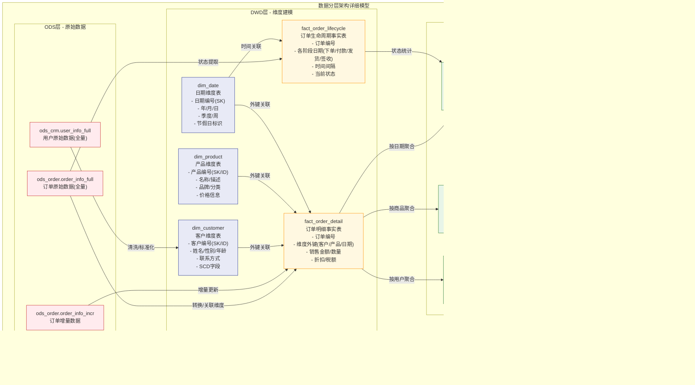

# 数据仓库实战指南

## 目录
- [数据仓库实战指南](#数据仓库实战指南)
  - [目录](#目录)
  - [1. 数据仓库基础概念](#1-数据仓库基础概念)
    - [1.1 数据仓库定义与特征](#11-数据仓库定义与特征)
      - [数据仓库四大特征](#数据仓库四大特征)
      - [数据仓库与数据库对比](#数据仓库与数据库对比)
    - [1.2 数据仓库发展历程](#12-数据仓库发展历程)
      - [技术演进路径](#技术演进路径)
      - [现代数据仓库特点](#现代数据仓库特点)
    - [1.3 数据仓库价值体现](#13-数据仓库价值体现)
      - [业务价值](#业务价值)
      - [技术价值](#技术价值)
  - [2. 数据仓库架构设计](#2-数据仓库架构设计)
    - [2.1 经典架构模式](#21-经典架构模式)
      - [Kimball架构](#kimball架构)
      - [Inmon架构](#inmon架构)
      - [Data Vault架构](#data-vault架构)
    - [2.2 现代架构模式](#22-现代架构模式)
      - [Lambda架构](#lambda架构)
      - [Kappa架构](#kappa架构)
      - [湖仓一体架构](#湖仓一体架构)
        - [Delta Lake实现](#delta-lake实现)
        - [Apache Iceberg实现](#apache-iceberg实现)
        - [Apache Hudi实现](#apache-hudi实现)
        - [湖仓一体最佳实践](#湖仓一体最佳实践)
    - [2.3 技术架构选型](#23-技术架构选型)
      - [存储层选型](#存储层选型)
      - [计算层选型](#计算层选型)
      - [服务层选型](#服务层选型)
  - [3. 维度建模理论与实践](#3-维度建模理论与实践)
    - [3.1 维度建模基础](#31-维度建模基础)
      - [事实表设计](#事实表设计)
      - [维度表设计](#维度表设计)
      - [星型模型与雪花模型](#星型模型与雪花模型)
    - [3.2 高级建模技巧](#32-高级建模技巧)
      - [缓慢变化维度](#缓慢变化维度)
      - [退化维度](#退化维度)
      - [一致性维度](#一致性维度)
    - [3.3 实体建模方法](#33-实体建模方法)
      - [3NF建模](#3nf建模)
      - [实体关系模型](#实体关系模型)
      - [数据集市设计](#数据集市设计)
  - [4. 数据分层架构](#4-数据分层架构)
    - [4.1 分层设计原则](#41-分层设计原则)
      - [分层目标与原则](#分层目标与原则)
      - [层次职责划分](#层次职责划分)
    - [4.2 详细分层设计](#42-详细分层设计)
      - [ODS操作数据存储层](#ods操作数据存储层)
      - [DWD数据明细层](#dwd数据明细层)
      - [DWS数据汇总层](#dws数据汇总层)
      - [ADS应用数据服务层](#ads应用数据服务层)
    - [4.3 分层实施策略](#43-分层实施策略)
      - [建表规范](#建表规范)
      - [命名规范](#命名规范)
      - [数据流转规范](#数据流转规范)
  - [5. ETL流程设计](#5-etl流程设计)
    - [5.1 ETL基础概念](#51-etl基础概念)
      - [Extract数据抽取](#extract数据抽取)
      - [Transform数据转换](#transform数据转换)
      - [Load数据加载](#load数据加载)
    - [5.2 ELT模式](#52-elt模式)
      - [ELT与ETL对比](#elt与etl对比)
    - [5.3 实时数据处理](#53-实时数据处理)
      - [实时数仓架构设计](#实时数仓架构设计)
      - [流批一体架构](#流批一体架构)
      - [实时维度关联](#实时维度关联)
      - [实时OLAP存储](#实时olap存储)
  - [6. 数据治理与质量](#6-数据治理与质量)
    - [6.1 数据治理体系](#61-数据治理体系)
    - [6.2 数据质量管理](#62-数据质量管理)
    - [6.3 元数据管理](#63-元数据管理)
    - [6.4 数据安全与合规](#64-数据安全与合规)
  - [7. 性能优化策略](#7-性能优化策略)
    - [7.1 存储优化](#71-存储优化)
    - [7.2 计算优化](#72-计算优化)
    - [7.3 架构优化](#73-架构优化)
  - [8. 技术组件选型](#8-技术组件选型)
    - [8.1 存储技术选型](#81-存储技术选型)
      - [HDFS分布式存储](#hdfs分布式存储)
      - [对象存储服务](#对象存储服务)
      - [关系型数据库](#关系型数据库)
    - [8.2 计算引擎选型](#82-计算引擎选型)
      - [Spark大数据计算](#spark大数据计算)
      - [Flink流计算](#flink流计算)
      - [Presto交互式查询](#presto交互式查询)
    - [8.3 数据湖技术](#83-数据湖技术)
      - [Apache Hudi](#apache-hudi)
      - [Apache Iceberg](#apache-iceberg)
      - [Delta Lake](#delta-lake)
    - [8.4 云原生数据仓库](#84-云原生数据仓库)
      - [Snowflake](#snowflake)
      - [BigQuery](#bigquery)
      - [Redshift](#redshift)
  - [9. 实战项目案例](#9-实战项目案例)
    - [9.1 电商数据仓库](#91-电商数据仓库)
    - [9.2 金融数据仓库](#92-金融数据仓库)
    - [9.3 物联网数据仓库](#93-物联网数据仓库)
  - [10. 面试题集锦](#10-面试题集锦)
    - [10.1 基础理论题](#101-基础理论题)
      - [概念原理类](#概念原理类)
      - [架构设计类](#架构设计类)
    - [10.2 建模设计题](#102-建模设计题)
      - [维度建模类](#维度建模类)
      - [分层设计类](#分层设计类)
    - [10.3 技术实现题](#103-技术实现题)
      - [ETL流程类](#etl流程类)
      - [性能优化类](#性能优化类)
    - [10.4 场景应用题](#104-场景应用题)
      - [业务场景类](#业务场景类)
      - [问题解决类](#问题解决类)
  - [11. 参考资源](#11-参考资源)

## 1. 数据仓库基础概念

### 1.1 数据仓库定义与特征

**数据仓库（Data Warehouse）** 是一个面向主题的、集成的、相对稳定的、反映历史变化的数据集合，用于支持管理决策。

#### 数据仓库四大特征

| 特征 | 含义 | 实现方式 |
|------|------|----------|
| **面向主题** | 按业务主题组织数据 | 用户、商品、订单等主题域 |
| **集成的** | 整合多个数据源 | 统一数据格式、编码、命名 |
| **非易失的** | 数据相对稳定 | 只读操作，历史数据保留 |
| **时变的** | 反映历史变化 | 时间戳、版本管理 |


#### 数据仓库与数据库对比

| 特性 | 数据仓库 | 业务数据库 |
|------|----------|------------|
| **数据用途** | 分析决策 | 事务处理 |
| **数据来源** | 多个系统集成 | 单一业务系统 |
| **数据结构** | 反规范化 | 规范化 |
| **查询模式** | 复杂分析查询 | 简单事务查询 |
| **数据更新** | 批量定期更新 | 实时频繁更新 |
| **历史数据** | 长期保存 | 定期清理 |
| **用户类型** | 分析师、管理者 | 业务操作人员 |

### 1.2 数据仓库发展历程

#### 技术演进路径


#### 现代数据仓库特点

**技术特点：**
- **弹性扩展**：云原生架构，按需扩缩容
- **实时处理**：流批一体，近实时数据更新
- **湖仓融合**：结构化与非结构化数据统一管理
- **智能化**：自动优化、智能推荐
- **开放生态**：标准化接口，多引擎支持

**业务特点：**
- **敏捷开发**：快速响应业务需求变化
- **自服务分析**：业务用户自主数据分析
- **数据民主化**：降低数据使用门槛
- **数据产品化**：数据即产品的理念

### 1.3 数据仓库价值体现

#### 业务价值

**决策支持价值：**
```sql
-- 销售趋势分析
SELECT 
    date_trunc('month', order_date) as month,
    SUM(order_amount) as monthly_sales,
    COUNT(DISTINCT customer_id) as active_customers,
    AVG(order_amount) as avg_order_value
FROM fact_orders
WHERE order_date >= '2023-01-01'
GROUP BY date_trunc('month', order_date)
ORDER BY month;

-- 用户行为漏斗分析
WITH user_funnel AS (
    SELECT 
        user_id,
        MAX(CASE WHEN event_type = 'visit' THEN 1 ELSE 0 END) as visited,
        MAX(CASE WHEN event_type = 'view_product' THEN 1 ELSE 0 END) as viewed,
        MAX(CASE WHEN event_type = 'add_cart' THEN 1 ELSE 0 END) as added_cart,
        MAX(CASE WHEN event_type = 'purchase' THEN 1 ELSE 0 END) as purchased
    FROM fact_user_events
    WHERE event_date = current_date
    GROUP BY user_id
)
SELECT 
    SUM(visited) as visitors,
    SUM(viewed) as product_viewers,
    SUM(added_cart) as cart_users,
    SUM(purchased) as buyers,
    SUM(viewed) * 100.0 / SUM(visited) as view_rate,
    SUM(purchased) * 100.0 / SUM(visited) as conversion_rate
FROM user_funnel;
```

#### 技术价值

**数据整合价值：**
- **消除数据孤岛**：统一数据视图
- **提升数据质量**：标准化、清洗、验证
- **减少重复开发**：共享数据资产
- **提高查询性能**：专门优化的存储和计算

**成本效益分析：**

| 收益项 | 量化指标 | 预期效果 |
|--------|----------|----------|
| **决策效率提升** | 报表生成时间 | 从天级到小时级 |
| **数据质量改善** | 数据准确率 | 从85%提升到95% |
| **开发效率提升** | 新需求响应时间 | 从周级到天级 |
| **运维成本降低** | 系统维护成本 | 降低30-50% |

## 2. 数据仓库架构设计

### 2.1 经典架构模式

#### Kimball架构

**Kimball架构**采用**自底向上**的设计方法，以数据集市为核心，强调维度建模。


**Kimball架构特点：**

| 优点 | 缺点 |
|------|------|
| 快速实现业务价值 | 数据冗余较多 |
| 查询性能优秀 | 维护复杂度高 |
| 业务理解容易 | 扩展性有限 |
| 开发周期短 | 数据一致性挑战 |

**适用场景：**
- 业务需求明确
- 快速原型验证
- 查询性能要求高
- 团队技能相对简单

#### Inmon架构

**Inmon架构**采用**自顶向下**的设计方法，以企业数据仓库为核心，强调标准化和集成。


**Inmon架构特点：**

| 优点 | 缺点 |
|------|------|
| 数据一致性强 | 开发周期长 |
| 扩展性好 | 初期投资大 |
| 数据冗余少 | 技术复杂度高 |
| 长期维护成本低 | 业务价值体现慢 |

#### Data Vault架构

**Data Vault**是一种专门为数据仓库设计的建模方法，强调敏捷性和可扩展性。

**核心组件：**

```sql
-- Hub表：业务实体
CREATE TABLE hub_customer (
    customer_hk CHAR(32) PRIMARY KEY,  -- Hash Key
    customer_id VARCHAR(50),           -- 业务键
    load_date TIMESTAMP,               -- 加载时间
    record_source VARCHAR(50)          -- 数据源
);

-- Link表：关系
CREATE TABLE link_customer_order (
    customer_order_hk CHAR(32) PRIMARY KEY,
    customer_hk CHAR(32),
    order_hk CHAR(32),
    load_date TIMESTAMP,
    record_source VARCHAR(50),
    FOREIGN KEY (customer_hk) REFERENCES hub_customer(customer_hk),
    FOREIGN KEY (order_hk) REFERENCES hub_order(order_hk)
);

-- Satellite表：属性
CREATE TABLE sat_customer_details (
    customer_hk CHAR(32),
    load_date TIMESTAMP,
    customer_name VARCHAR(100),
    email VARCHAR(100),
    phone VARCHAR(20),
    hash_diff CHAR(32),               -- 变更检测
    PRIMARY KEY (customer_hk, load_date),
    FOREIGN KEY (customer_hk) REFERENCES hub_customer(customer_hk)
);
```

**Data Vault优势：**
- **历史追溯**：完整保留数据变更历史
- **敏捷开发**：支持增量式开发
- **审计友好**：天然支持审计要求
- **并行开发**：不同团队可并行建模

### 2.2 现代架构模式

#### Lambda架构

**Lambda架构**通过批处理和流处理两条路径，实现准实时数据处理。


**Lambda架构实现：**

```python
# 流处理作业 (Flink/Spark Streaming)
def process_real_time_orders():
    env = StreamExecutionEnvironment.get_execution_environment()
    
    # 从Kafka读取实时订单数据
    orders_stream = env.add_source(
        FlinkKafkaConsumer('orders_topic', SimpleStringSchema(), kafka_props)
    )
    
    # 实时聚合计算
    order_metrics = orders_stream \
        .map(parse_order) \
        .key_by(lambda x: x.customer_id) \
        .window(TumblingProcessingTimeWindows.of(Time.minutes(5))) \
        .aggregate(OrderAggregateFunction())
    
    # 写入速度视图存储
    order_metrics.add_sink(RedisSink())

# 批处理作业 (Spark)
def process_batch_orders():
    spark = SparkSession.builder.appName("BatchOrderProcessing").getOrCreate()
    
    # 读取历史订单数据
    orders_df = spark.read.parquet("hdfs://orders/")
    
    # 批量聚合计算
    order_summary = orders_df \
        .groupBy("customer_id", date_trunc("day", "order_date")) \
        .agg(
            sum("order_amount").alias("daily_amount"),
            count("*").alias("daily_orders")
        )
    
    # 写入批量视图存储
    order_summary.write.mode("overwrite").parquet("hdfs://order_summary/")
```

#### Kappa架构

**Kappa架构**统一使用流处理，通过重新处理历史数据解决批处理需求。


**Kappa架构优势：**
- **架构简化**：单一代码路径
- **数据一致性**：消除Lambda双路径问题
- **维护简单**：减少运维复杂度
- **延迟更低**：纯流处理架构

#### 湖仓一体架构

**湖仓一体（Lakehouse）** 是新一代数据架构，结合了数据湖的灵活性和数据仓库的性能优势，为现代数据分析提供统一的存储和计算平台。

**核心理念：**
- **一份数据多种用途**：统一存储支持BI、AI、流处理等多种工作负载
- **开放标准**：基于开放格式，避免厂商锁定
- **性能优化**：提供类似数据仓库的查询性能
- **成本效益**：利用对象存储降低成本

下图展示了湖仓一体架构下的表层次与数据流关系：


**湖仓一体分层详解：**

| 数据层 | 数据特征 | 存储格式 | 使用场景 | 数据质量 |
|--------|----------|----------|----------|----------|
| **Bronze层** | 原始数据，未处理 | Parquet/Delta/Iceberg | 数据归档、历史追溯 | 原始质量 |
| **Silver层** | 清洗后的标准化数据 | Delta/Iceberg | 数据科学、特征工程 | 清洗验证 |
| **Gold层** | 业务就绪的聚合数据 | Delta/Iceberg | BI报表、业务分析 | 高质量 |

**核心技术对比：**

##### Delta Lake实现

```sql
-- 创建Delta表
CREATE TABLE IF NOT EXISTS orders_delta (
    order_id STRING,
    customer_id STRING,
    product_id STRING,
    order_date DATE,
    order_amount DECIMAL(10,2),
    status STRING,
    created_at TIMESTAMP,
    updated_at TIMESTAMP
) USING DELTA
PARTITIONED BY (order_date)
LOCATION 's3://datalake/delta/orders/'
TBLPROPERTIES (
    'delta.autoOptimize.optimizeWrite' = 'true',
    'delta.autoOptimize.autoCompact' = 'true',
    'delta.enableChangeDataFeed' = 'true'
);

-- ACID事务操作
-- 插入新订单
INSERT INTO orders_delta VALUES 
    ('O001', 'C001', 'P001', '2023-12-25', 199.99, 'completed', now(), now()),
    ('O002', 'C002', 'P002', '2023-12-25', 299.99, 'pending', now(), now());

-- 更新订单状态
UPDATE orders_delta 
SET status = 'shipped', updated_at = now()
WHERE order_id = 'O002';

-- 删除取消的订单
DELETE FROM orders_delta 
WHERE status = 'cancelled' AND order_date < '2023-01-01';

-- MERGE操作（Upsert）
MERGE INTO orders_delta AS target
USING (
    SELECT order_id, customer_id, product_id, order_date, 
           order_amount, status, created_at, now() as updated_at
    FROM staging_orders
) AS source
ON target.order_id = source.order_id
WHEN MATCHED THEN
    UPDATE SET 
        status = source.status,
        order_amount = source.order_amount,
        updated_at = source.updated_at
WHEN NOT MATCHED THEN
    INSERT (order_id, customer_id, product_id, order_date, 
            order_amount, status, created_at, updated_at)
    VALUES (source.order_id, source.customer_id, source.product_id, 
            source.order_date, source.order_amount, source.status,
            source.created_at, source.updated_at);

-- 时间旅行查询
-- 查看历史版本
SELECT * FROM orders_delta VERSION AS OF 0;  -- 初始版本
SELECT * FROM orders_delta VERSION AS OF 5;  -- 第5个版本

-- 基于时间戳查询
SELECT * FROM orders_delta TIMESTAMP AS OF '2023-12-25 10:00:00';

-- 查看表历史
DESCRIBE HISTORY orders_delta;

-- 表结构演化
ALTER TABLE orders_delta ADD COLUMN (
    discount_amount DECIMAL(10,2) DEFAULT 0.0,
    tax_amount DECIMAL(10,2) DEFAULT 0.0,
    shipping_method STRING DEFAULT 'standard'
);

-- 数据质量约束
ALTER TABLE orders_delta ADD CONSTRAINT valid_amount CHECK (order_amount >= 0);
ALTER TABLE orders_delta ADD CONSTRAINT valid_status CHECK (status IN ('pending', 'completed', 'shipped', 'cancelled'));
```

##### Apache Iceberg实现

```sql
-- 创建Iceberg表
CREATE TABLE orders_iceberg (
    order_id STRING,
    customer_id STRING,
    product_id STRING,
    order_date DATE,
    order_amount DECIMAL(10,2),
    status STRING,
    order_details STRUCT<
        shipping_address: STRING,
        payment_method: STRING,
        discount_code: STRING
    >,
    order_items ARRAY<STRUCT<
        item_id: STRING,
        quantity: INT,
        unit_price: DECIMAL(10,2)
    >>
) USING ICEBERG
PARTITIONED BY (months(order_date))
LOCATION 's3://datalake/iceberg/orders/'
TBLPROPERTIES (
    'format-version' = '2',
    'write.target-file-size-bytes' = '134217728',
    'write.delete.mode' = 'merge-on-read'
);

-- 分区演化
ALTER TABLE orders_iceberg 
ADD PARTITION FIELD bucket(16, customer_id);

-- 隐藏分区（基于小时）
ALTER TABLE orders_iceberg 
ADD PARTITION FIELD hours(created_at);

-- 快照管理
-- 创建分支
ALTER TABLE orders_iceberg CREATE BRANCH test_branch;

-- 创建标签
ALTER TABLE orders_iceberg CREATE TAG v1.0 RETAIN 365 DAYS;

-- 查询历史快照
SELECT * FROM orders_iceberg FOR SYSTEM_VERSION AS OF 123456789;

-- 回滚到历史版本
CALL system.rollback_to_snapshot('default.orders_iceberg', 123456789);
```

##### Apache Hudi实现

```python
# Hudi配置
hudi_options = {
    'hoodie.table.name': 'orders_hudi',
    'hoodie.datasource.write.recordkey.field': 'order_id',
    'hoodie.datasource.write.precombine.field': 'updated_at',
    'hoodie.datasource.write.partitionpath.field': 'order_date',
    'hoodie.datasource.hive_sync.enable': 'true',
    'hoodie.datasource.hive_sync.database': 'datalake',
    'hoodie.datasource.hive_sync.table': 'orders_hudi',
    'hoodie.datasource.write.operation': 'upsert',
    'hoodie.upsert.shuffle.parallelism': '200',
    'hoodie.insert.shuffle.parallelism': '200'
}

# COW表（Copy On Write）- 适合读多写少
cow_options = hudi_options.copy()
cow_options.update({
    'hoodie.datasource.write.table.type': 'COPY_ON_WRITE',
    'hoodie.compact.inline': 'true',
    'hoodie.compact.inline.max.delta.commits': '5'
})

# 写入数据
orders_df.write \
    .format("org.apache.hudi") \
    .options(**cow_options) \
    .mode("append") \
    .save("s3://datalake/hudi/orders_cow/")

# MOR表（Merge On Read）- 适合写多读少
mor_options = hudi_options.copy()
mor_options.update({
    'hoodie.datasource.write.table.type': 'MERGE_ON_READ',
    'hoodie.deltastreamer.source.dfs.root': 's3://source-bucket/',
    'hoodie.deltastreamer.schemaprovider.registry.url': 'http://schema-registry:8081'
})

# 增量写入
incremental_df.write \
    .format("org.apache.hudi") \
    .options(**mor_options) \
    .mode("append") \
    .save("s3://datalake/hudi/orders_mor/")

# 读取数据
# 快照查询（默认）
snapshot_df = spark.read.format("org.apache.hudi") \
    .load("s3://datalake/hudi/orders_cow/")

# 增量查询
incremental_df = spark.read.format("org.apache.hudi") \
    .option("hoodie.datasource.query.type", "incremental") \
    .option("hoodie.datasource.read.begin.instanttime", "20231201000000") \
    .load("s3://datalake/hudi/orders_cow/")

# 时间点查询
time_travel_df = spark.read.format("org.apache.hudi") \
    .option("as.of.instant", "20231225120000") \
    .load("s3://datalake/hudi/orders_cow/")
```

##### 湖仓一体最佳实践

```python
class LakehouseManager:
    def __init__(self, storage_path, catalog_type="hive"):
        self.storage_path = storage_path
        self.catalog_type = catalog_type
        self.spark = self._init_spark()
        
    def _init_spark(self):
        """初始化Spark配置"""
        return SparkSession.builder \
            .appName("LakehouseManager") \
            .config("spark.sql.extensions", 
                   "io.delta.sql.DeltaSparkSessionExtension") \
            .config("spark.sql.catalog.spark_catalog", 
                   "org.apache.spark.sql.delta.catalog.DeltaCatalog") \
            .config("spark.sql.adaptive.enabled", "true") \
            .config("spark.sql.adaptive.coalescePartitions.enabled", "true") \
            .getOrCreate()
    
    def create_bronze_table(self, table_name, source_path, schema):
        """创建Bronze层表 - 原始数据"""
        
        bronze_path = f"{self.storage_path}/bronze/{table_name}"
        
        # 读取原始数据
        raw_df = self.spark.read.schema(schema).json(source_path)
        
        # 添加元数据字段
        bronze_df = raw_df \
            .withColumn("_bronze_ingestion_time", current_timestamp()) \
            .withColumn("_bronze_source_file", input_file_name()) \
            .withColumn("_bronze_batch_id", lit(str(uuid.uuid4())))
        
        # 写入Bronze表
        bronze_df.write \
            .format("delta") \
            .mode("append") \
            .option("mergeSchema", "true") \
            .save(bronze_path)
            
        return bronze_path
    
    def create_silver_table(self, table_name, bronze_path, transformation_sql):
        """创建Silver层表 - 清洗后数据"""
        
        silver_path = f"{self.storage_path}/silver/{table_name}"
        
        # 从Bronze层读取数据
        bronze_df = self.spark.read.format("delta").load(bronze_path)
        bronze_df.createOrReplaceTempView("bronze_data")
        
        # 执行数据清洗转换
        silver_df = self.spark.sql(transformation_sql)
        
        # 添加数据质量检查
        quality_checks = {
            'total_records': silver_df.count(),
            'null_key_records': silver_df.filter(col("key_field").isNull()).count(),
            'duplicate_records': silver_df.count() - silver_df.dropDuplicates(["key_field"]).count()
        }
        
        # 数据质量验证
        if quality_checks['null_key_records'] > 0:
            raise ValueError(f"发现 {quality_checks['null_key_records']} 条空值记录")
        
        # 写入Silver表
        silver_df \
            .withColumn("_silver_processing_time", current_timestamp()) \
            .withColumn("_silver_quality_score", lit(self._calculate_quality_score(quality_checks))) \
            .write \
            .format("delta") \
            .mode("overwrite") \
            .option("overwriteSchema", "true") \
            .save(silver_path)
            
        return silver_path, quality_checks
    
    def create_gold_table(self, table_name, silver_path, business_logic_sql):
        """创建Gold层表 - 业务就绪数据"""
        
        gold_path = f"{self.storage_path}/gold/{table_name}"
        
        # 从Silver层读取数据
        silver_df = self.spark.read.format("delta").load(silver_path)
        silver_df.createOrReplaceTempView("silver_data")
        
        # 执行业务逻辑转换
        gold_df = self.spark.sql(business_logic_sql)
        
        # 写入Gold表（支持SCD Type 2）
        if self._table_exists(gold_path):
            # 执行SCD Type 2 合并
            self._merge_scd_type2(gold_df, gold_path, ["business_key"])
        else:
            # 首次创建
            gold_df \
                .withColumn("effective_date", current_date()) \
                .withColumn("expiry_date", lit("9999-12-31").cast("date")) \
                .withColumn("is_current", lit(True)) \
                .write \
                .format("delta") \
                .mode("overwrite") \
                .save(gold_path)
                
        return gold_path
    
    def setup_streaming_pipeline(self, source_topic, target_table):
        """设置流式数据管道"""
        
        streaming_query = self.spark \
            .readStream \
            .format("kafka") \
            .option("kafka.bootstrap.servers", "localhost:9092") \
            .option("subscribe", source_topic) \
            .load() \
            .select(
                from_json(col("value").cast("string"), get_schema()).alias("data"),
                col("timestamp").alias("kafka_timestamp")
            ) \
            .select("data.*", "kafka_timestamp") \
            .writeStream \
            .format("delta") \
            .outputMode("append") \
            .option("checkpointLocation", f"{self.storage_path}/checkpoints/{target_table}") \
            .trigger(processingTime="30 seconds") \
            .start(f"{self.storage_path}/streaming/{target_table}")
            
        return streaming_query
    
    def optimize_tables(self, table_paths):
        """优化表性能"""
        
        for table_path in table_paths:
            # 压缩小文件
            self.spark.sql(f"OPTIMIZE delta.`{table_path}`")
            
            # Z-Order优化（按常用查询列）
            self.spark.sql(f"OPTIMIZE delta.`{table_path}` ZORDER BY (date_col, key_col)")
            
            # 清理历史版本
            self.spark.sql(f"VACUUM delta.`{table_path}` RETAIN 168 HOURS")  # 保留7天
    
    def monitor_data_quality(self, table_path):
        """监控数据质量"""
        
        df = self.spark.read.format("delta").load(table_path)
        
        quality_metrics = {
            'total_rows': df.count(),
            'null_percentage': {
                col_name: df.filter(col(col_name).isNull()).count() / df.count() * 100
                for col_name in df.columns
            },
            'duplicate_percentage': (df.count() - df.dropDuplicates().count()) / df.count() * 100,
            'freshness_hours': self._calculate_data_freshness(df)
        }
        
        return quality_metrics

# 使用示例
lakehouse = LakehouseManager("s3://my-datalake")

# 构建完整的数据管道
bronze_path = lakehouse.create_bronze_table(
    "orders", 
    "s3://source-bucket/orders/", 
    orders_schema
)

silver_path, quality = lakehouse.create_silver_table(
    "orders",
    bronze_path,
    """
    SELECT 
        order_id,
        customer_id,
        CAST(order_amount AS DECIMAL(10,2)) as order_amount,
        DATE(order_date) as order_date,
        UPPER(status) as status,
        CURRENT_TIMESTAMP() as processed_at
    FROM bronze_data
    WHERE order_id IS NOT NULL
      AND order_amount > 0
      AND status IN ('pending', 'completed', 'shipped', 'cancelled')
    """
)

gold_path = lakehouse.create_gold_table(
    "order_summary",
    silver_path,
    """
    SELECT 
        customer_id,
        DATE_TRUNC('month', order_date) as order_month,
        COUNT(*) as order_count,
        SUM(order_amount) as total_amount,
        AVG(order_amount) as avg_amount,
        COUNT(DISTINCT order_date) as active_days
    FROM silver_data
    GROUP BY customer_id, DATE_TRUNC('month', order_date)
    """
)

# 优化性能
lakehouse.optimize_tables([bronze_path, silver_path, gold_path])
```

### 2.3 技术架构选型

#### 存储层选型

**存储技术对比：**

| 技术 | 优势 | 劣势 | 适用场景 |
|------|------|------|----------|
| **HDFS** | 成本低、容量大 | 延迟高、小文件问题 | 批处理、归档存储 |
| **S3** | 弹性、高可用 | 网络依赖、成本 | 云原生、多地域 |
| **HBase** | 低延迟、高并发 | 复杂度高、成本高 | 实时查询、点查询 |
| **Cassandra** | 分布式、可扩展 | 一致性弱、学习成本 | 时序数据、IoT |

#### 计算层选型

**计算引擎选择矩阵：**


#### 服务层选型

**服务层技术栈：**

```python
# FastAPI 数据服务接口
from fastapi import FastAPI, Query
from typing import List, Optional
import pandas as pd

app = FastAPI()

@app.get("/api/sales/summary")
def get_sales_summary(
    start_date: str = Query(..., description="开始日期"),
    end_date: str = Query(..., description="结束日期"),
    region: Optional[str] = Query(None, description="地区筛选")
):
    """获取销售汇总数据"""
    
    # 构建查询SQL
    sql = f"""
    SELECT 
        region,
        DATE_TRUNC('day', order_date) as date,
        SUM(order_amount) as total_sales,
        COUNT(*) as order_count
    FROM fact_orders 
    WHERE order_date BETWEEN '{start_date}' AND '{end_date}'
    """
    
    if region:
        sql += f" AND region = '{region}'"
    
    sql += " GROUP BY region, DATE_TRUNC('day', order_date)"
    
    # 执行查询并返回结果
    result = execute_query(sql)
    return {"data": result.to_dict('records')}

@app.get("/api/customers/behavior")
def get_customer_behavior(customer_id: str):
    """获取客户行为分析"""
    
    sql = f"""
    WITH customer_metrics AS (
        SELECT 
            SUM(order_amount) as total_spent,
            COUNT(*) as order_count,
            MAX(order_date) as last_order_date,
            MIN(order_date) as first_order_date
        FROM fact_orders 
        WHERE customer_id = '{customer_id}'
    )
    SELECT 
        *,
        DATEDIFF(day, first_order_date, last_order_date) as customer_lifetime_days,
        total_spent / order_count as avg_order_value
    FROM customer_metrics
    """
    
    result = execute_query(sql)
    return {"customer_id": customer_id, "metrics": result.to_dict('records')[0]}
```

## 3. 维度建模理论与实践

### 3.1 维度建模基础

维度建模是数据仓库设计的核心方法，将复杂的业务过程转化为**事实表**和**维度表**的组合。

#### 事实表设计

**事实表类型：**

| 类型 | 特点 | 应用场景 | 示例 |
|------|------|----------|------|
| **事务事实表** | 记录具体业务事件 | 订单、支付、登录 | 每个订单一条记录 |
| **周期快照事实表** | 定期状态快照 | 账户余额、库存 | 每日账户余额 |
| **累积快照事实表** | 业务过程进度 | 订单生命周期 | 订单各阶段时间 |
| **无事实的事实表** | 仅记录事件发生 | 促销活动覆盖 | 促销商品关联 |

**事务事实表设计示例：**

```sql
-- 订单事实表
CREATE TABLE fact_orders (
    -- 代理键 (Surrogate Key)
    order_sk BIGINT PRIMARY KEY,
    
    -- 维度外键
    customer_sk BIGINT NOT NULL,
    product_sk BIGINT NOT NULL,
    date_sk INT NOT NULL,
    store_sk BIGINT NOT NULL,
    
    -- 退化维度 (Degenerate Dimension)
    order_number VARCHAR(50) NOT NULL,
    order_line_number INT NOT NULL,
    
    -- 度量值 (Measures)
    quantity INT NOT NULL,
    unit_price DECIMAL(10,2) NOT NULL,
    discount_amount DECIMAL(10,2) DEFAULT 0,
    tax_amount DECIMAL(10,2) NOT NULL,
    total_amount DECIMAL(10,2) NOT NULL,
    
    -- 审计字段
    created_date TIMESTAMP DEFAULT CURRENT_TIMESTAMP,
    updated_date TIMESTAMP DEFAULT CURRENT_TIMESTAMP,
    
    -- 外键约束
    FOREIGN KEY (customer_sk) REFERENCES dim_customer(customer_sk),
    FOREIGN KEY (product_sk) REFERENCES dim_product(product_sk),
    FOREIGN KEY (date_sk) REFERENCES dim_date(date_sk),
    FOREIGN KEY (store_sk) REFERENCES dim_store(store_sk)
)
PARTITION BY RANGE (date_sk);
```

**累积快照事实表示例：**

```sql
-- 订单生命周期事实表
CREATE TABLE fact_order_lifecycle (
    order_sk BIGINT PRIMARY KEY,
    customer_sk BIGINT NOT NULL,
    product_sk BIGINT NOT NULL,
    
    -- 各阶段日期维度
    order_date_sk INT,
    payment_date_sk INT,
    shipped_date_sk INT,
    delivered_date_sk INT,
    
    -- 各阶段持续时间（天）
    payment_lag_days INT,
    shipping_lag_days INT,
    delivery_lag_days INT,
    total_cycle_days INT,
    
    -- 当前状态
    current_status VARCHAR(20),
    
    -- 度量值
    order_amount DECIMAL(10,2),
    shipping_cost DECIMAL(10,2)
);
```

#### 维度表设计

**维度表设计原则：**

1. **尽可能多的描述性信息**
2. **使用代理键作为主键**
3. **包含业务友好的描述**
4. **支持层次结构**
5. **处理缓慢变化维度**

**客户维度表示例：**

```sql
-- 客户维度表
CREATE TABLE dim_customer (
    -- 代理键
    customer_sk BIGINT PRIMARY KEY AUTO_INCREMENT,
    
    -- 自然键
    customer_id VARCHAR(50) NOT NULL,
    
    -- 基本信息
    customer_name VARCHAR(100) NOT NULL,
    customer_type VARCHAR(20) NOT NULL, -- 'individual', 'corporate'
    gender VARCHAR(10),
    birth_date DATE,
    age_range VARCHAR(20), -- '18-25', '26-35', etc.
    
    -- 联系信息
    email VARCHAR(100),
    phone VARCHAR(20),
    
    -- 地址信息 (层次结构)
    address_line1 VARCHAR(200),
    address_line2 VARCHAR(200),
    city VARCHAR(50),
    state_province VARCHAR(50),
    postal_code VARCHAR(20),
    country VARCHAR(50),
    region VARCHAR(50), -- 销售区域
    
    -- 分类属性
    customer_segment VARCHAR(30), -- 'premium', 'standard', 'basic'
    credit_rating VARCHAR(10), -- 'AAA', 'AA', 'A', etc.
    preferred_language VARCHAR(20),
    
    -- 状态信息
    is_active BOOLEAN DEFAULT TRUE,
    registration_date DATE,
    last_update_date DATE,
    
    -- SCD Type 2 字段
    effective_date DATE NOT NULL,
    expiry_date DATE DEFAULT '9999-12-31',
    is_current BOOLEAN DEFAULT TRUE,
    
    -- 审计字段
    created_by VARCHAR(50),
    created_date TIMESTAMP DEFAULT CURRENT_TIMESTAMP,
    updated_by VARCHAR(50),
    updated_date TIMESTAMP DEFAULT CURRENT_TIMESTAMP,
    
    -- 索引
    INDEX idx_customer_id (customer_id),
    INDEX idx_effective_date (effective_date),
    INDEX idx_is_current (is_current)
);
```

**产品维度表层次结构：**

```sql
-- 产品维度表
CREATE TABLE dim_product (
    product_sk BIGINT PRIMARY KEY AUTO_INCREMENT,
    product_id VARCHAR(50) NOT NULL,
    
    -- 产品基本信息
    product_name VARCHAR(200) NOT NULL,
    product_description TEXT,
    brand VARCHAR(100),
    model VARCHAR(100),
    
    -- 产品层次结构
    category_level1 VARCHAR(50), -- 电器
    category_level2 VARCHAR(50), -- 手机
    category_level3 VARCHAR(50), -- 智能手机
    category_level4 VARCHAR(50), -- iPhone
    category_path VARCHAR(500),  -- 电器/手机/智能手机/iPhone
    
    -- 产品属性
    color VARCHAR(30),
    size VARCHAR(30),
    weight DECIMAL(8,2),
    material VARCHAR(100),
    
    -- 价格信息
    list_price DECIMAL(10,2),
    cost_price DECIMAL(10,2),
    margin_percent DECIMAL(5,2),
    
    -- 状态信息
    product_status VARCHAR(20), -- 'active', 'discontinued', 'coming_soon'
    launch_date DATE,
    discontinue_date DATE,
    
    -- 供应商信息
    supplier_name VARCHAR(100),
    supplier_country VARCHAR(50),
    
    effective_date DATE NOT NULL,
    expiry_date DATE DEFAULT '9999-12-31',
    is_current BOOLEAN DEFAULT TRUE
);
```

#### 星型模型与雪花模型

**星型模型：**


**雪花模型：**


**模型对比：**

| 特性 | 星型模型 | 雪花模型 |
|------|----------|----------|
| **查询性能** | 更快（JOIN较少） | 较慢（JOIN较多） |
| **存储空间** | 较大（维度冗余） | 较小（规范化） |
| **维护复杂度** | 简单 | 复杂 |
| **查询理解** | 容易 | 较难 |
| **适用场景** | OLAP分析 | 存储成本敏感 |

### 3.2 高级建模技巧

#### 缓慢变化维度

**SCD Type 1 - 覆盖：**

```sql
-- Type 1: 直接更新，不保留历史
UPDATE dim_customer 
SET 
    phone = '138-0000-0001',
    updated_date = CURRENT_TIMESTAMP,
    updated_by = 'system'
WHERE customer_id = 'C001';
```

**SCD Type 2 - 添加新记录：**

```sql
-- Type 2: 保留历史，添加新记录
-- 1. 关闭当前记录
UPDATE dim_customer 
SET 
    expiry_date = CURRENT_DATE - 1,
    is_current = FALSE,
    updated_date = CURRENT_TIMESTAMP
WHERE customer_id = 'C001' AND is_current = TRUE;

-- 2. 插入新记录
INSERT INTO dim_customer (
    customer_id, customer_name, email, phone,
    effective_date, expiry_date, is_current,
    created_date, created_by
) VALUES (
    'C001', 'John Smith', 'john@example.com', '138-0000-0001',
    CURRENT_DATE, '9999-12-31', TRUE,
    CURRENT_TIMESTAMP, 'system'
);
```

**SCD Type 3 - 添加新列：**

```sql
-- Type 3: 保留有限历史
ALTER TABLE dim_customer 
ADD COLUMN previous_address VARCHAR(200),
ADD COLUMN address_change_date DATE;

UPDATE dim_customer 
SET 
    previous_address = current_address,
    current_address = '新地址',
    address_change_date = CURRENT_DATE
WHERE customer_id = 'C001';
```

**SCD Type 4 - 快速变化维度：**

```sql
-- 当前维度表
CREATE TABLE dim_customer_current AS 
SELECT * FROM dim_customer WHERE is_current = TRUE;

-- 历史维度表
CREATE TABLE dim_customer_history AS 
SELECT * FROM dim_customer WHERE is_current = FALSE;

-- Mini维度表（只包含快变属性）
CREATE TABLE dim_customer_mini (
    customer_sk BIGINT,
    customer_segment VARCHAR(30),
    credit_rating VARCHAR(10),
    effective_date DATE,
    expiry_date DATE
);
```

#### 退化维度

**退化维度处理：**

```sql
-- 订单号作为退化维度直接存储在事实表中
CREATE TABLE fact_order_items (
    order_item_sk BIGINT PRIMARY KEY,
    
    -- 维度外键
    customer_sk BIGINT,
    product_sk BIGINT,
    date_sk INT,
    
    -- 退化维度（不需要单独的维度表）
    order_number VARCHAR(50) NOT NULL,
    invoice_number VARCHAR(50),
    tracking_number VARCHAR(50),
    
    -- 度量值
    quantity INT,
    unit_price DECIMAL(10,2),
    total_amount DECIMAL(10,2)
);

-- 查询时可以直接使用退化维度
SELECT 
    order_number,
    SUM(total_amount) as order_total
FROM fact_order_items
WHERE order_number = 'ORD-2023-001234'
GROUP BY order_number;
```

#### 一致性维度

**一致性维度管理：**

```sql
-- 共享的时间维度表
CREATE TABLE dim_date (
    date_sk INT PRIMARY KEY,
    full_date DATE NOT NULL,
    day_of_week INT,
    day_name VARCHAR(10),
    day_of_month INT,
    day_of_year INT,
    week_of_year INT,
    month_number INT,
    month_name VARCHAR(10),
    quarter_number INT,
    quarter_name VARCHAR(10),
    year_number INT,
    is_weekend BOOLEAN,
    is_holiday BOOLEAN,
    holiday_name VARCHAR(50),
    fiscal_year INT,
    fiscal_quarter INT,
    fiscal_month INT
);

-- 不同主题域都使用相同的时间维度
-- 销售事实表
CREATE TABLE fact_sales (
    sales_sk BIGINT PRIMARY KEY,
    date_sk INT,
    customer_sk BIGINT,
    product_sk BIGINT,
    sales_amount DECIMAL(10,2),
    FOREIGN KEY (date_sk) REFERENCES dim_date(date_sk)
);

-- 库存事实表
CREATE TABLE fact_inventory (
    inventory_sk BIGINT PRIMARY KEY,
    date_sk INT,
    product_sk BIGINT,
    warehouse_sk BIGINT,
    quantity_on_hand INT,
    FOREIGN KEY (date_sk) REFERENCES dim_date(date_sk)
);
```

### 3.3 实体建模方法

#### 3NF建模

**第三范式（3NF）建模**强调消除数据冗余，适用于企业数据仓库的核心层。

**3NF客户模型：**

```sql
-- 客户基本信息表
CREATE TABLE customer (
    customer_id VARCHAR(50) PRIMARY KEY,
    customer_name VARCHAR(100) NOT NULL,
    customer_type_id INT,
    birth_date DATE,
    gender VARCHAR(10),
    registration_date DATE,
    FOREIGN KEY (customer_type_id) REFERENCES customer_type(customer_type_id)
);

-- 客户类型表
CREATE TABLE customer_type (
    customer_type_id INT PRIMARY KEY,
    type_name VARCHAR(50) NOT NULL,
    type_description TEXT
);

-- 客户地址表
CREATE TABLE customer_address (
    address_id BIGINT PRIMARY KEY AUTO_INCREMENT,
    customer_id VARCHAR(50),
    address_type VARCHAR(20), -- 'billing', 'shipping', 'home'
    address_line1 VARCHAR(200),
    address_line2 VARCHAR(200),
    city VARCHAR(50),
    state_province VARCHAR(50),
    postal_code VARCHAR(20),
    country VARCHAR(50),
    is_primary BOOLEAN DEFAULT FALSE,
    effective_date DATE,
    expiry_date DATE,
    FOREIGN KEY (customer_id) REFERENCES customer(customer_id)
);

-- 客户联系方式表
CREATE TABLE customer_contact (
    contact_id BIGINT PRIMARY KEY AUTO_INCREMENT,
    customer_id VARCHAR(50),
    contact_type VARCHAR(20), -- 'email', 'phone', 'fax'
    contact_value VARCHAR(100),
    is_primary BOOLEAN DEFAULT FALSE,
    effective_date DATE,
    expiry_date DATE,
    FOREIGN KEY (customer_id) REFERENCES customer(customer_id)
);
```

#### 实体关系模型

**订单业务实体模型：**


#### 数据集市设计

**销售数据集市架构：**

```sql
-- 销售数据集市 - 星型模型
-- 中心事实表
CREATE TABLE mart_sales.fact_daily_sales (
    sale_date_sk INT,
    customer_sk BIGINT,
    product_sk BIGINT,
    store_sk BIGINT,
    promotion_sk BIGINT,
    
    -- 度量值
    sales_quantity INT,
    sales_amount DECIMAL(10,2),
    discount_amount DECIMAL(10,2),
    tax_amount DECIMAL(10,2),
    profit_amount DECIMAL(10,2),
    cost_amount DECIMAL(10,2),
    
    PRIMARY KEY (sale_date_sk, customer_sk, product_sk, store_sk)
);

-- 聚合事实表 - 月度汇总
CREATE TABLE mart_sales.fact_monthly_sales (
    sale_month_sk INT,
    customer_sk BIGINT,
    product_category_sk BIGINT,
    region_sk BIGINT,
    
    -- 聚合度量值
    total_sales_amount DECIMAL(15,2),
    total_sales_quantity INT,
    total_profit_amount DECIMAL(15,2),
    avg_sale_amount DECIMAL(10,2),
    customer_count INT,
    order_count INT,
    
    PRIMARY KEY (sale_month_sk, customer_sk, product_category_sk, region_sk)
);
```

**客户分析数据集市：**

```sql
-- 客户价值分析集市
CREATE TABLE mart_customer.fact_customer_value (
    customer_sk BIGINT PRIMARY KEY,
    analysis_date DATE,
    
    -- RFM分析指标
    recency_days INT,           -- 最近购买距今天数
    frequency_count INT,        -- 购买频次
    monetary_amount DECIMAL(12,2), -- 购买金额
    
    -- RFM评分
    recency_score INT,          -- 1-5分
    frequency_score INT,        -- 1-5分
    monetary_score INT,         -- 1-5分
    rfm_segment VARCHAR(20),    -- 'Champions', 'Loyal Customers', etc.
    
    -- 生命周期价值
    ltv_amount DECIMAL(15,2),
    predicted_ltv DECIMAL(15,2),
    
    -- 客户状态
    customer_status VARCHAR(20), -- 'active', 'at_risk', 'churned'
    churn_probability DECIMAL(5,4)
);
```

## 4. 数据分层架构

下面的图表直观展示了数据仓库各层表之间的关联与依赖关系：


下面是数据模型的详细表示图，展示了各层表的主要字段与关系：



### 4.1 分层设计原则

#### 分层目标与原则

**分层设计目标：**


**设计原则：**

| 原则 | 说明 | 实现方式 |
|------|------|----------|
| **单向依赖** | 高层依赖低层，禁止反向依赖 | 严格的层次调用关系 |
| **数据一致性** | 同层数据逻辑一致 | 统一的加工规则和标准 |
| **接口稳定性** | 层间接口相对稳定 | 向上兼容的表结构设计 |
| **职责单一** | 每层专注特定职责 | 清晰的层次功能定义 |
| **可扩展性** | 支持新业务和需求 | 灵活的模型设计 |

#### 层次职责划分


### 4.2 详细分层设计

#### ODS操作数据存储层

**ODS层设计特点：**
- **数据同步**：与源系统数据保持同步
- **历史保留**：保留数据变更历史
- **格式统一**：统一数据格式和编码
- **质量检查**：基础数据质量验证

**ODS表设计示例：**

```sql
-- ODS用户表 - 全量同步
CREATE TABLE ods_crm.user_info_full (
    user_id VARCHAR(50),
    username VARCHAR(100),
    email VARCHAR(100),
    phone VARCHAR(20),
    registration_date TIMESTAMP,
    last_login_date TIMESTAMP,
    user_status VARCHAR(20),
    
    -- ETL控制字段
    etl_batch_id VARCHAR(50),
    etl_create_time TIMESTAMP DEFAULT CURRENT_TIMESTAMP,
    etl_update_time TIMESTAMP DEFAULT CURRENT_TIMESTAMP,
    source_system VARCHAR(50) DEFAULT 'CRM'
)
PARTITIONED BY (dt STRING) -- 按日期分区
STORED AS ORC
TBLPROPERTIES ('orc.compress'='SNAPPY');

-- ODS订单表 - 增量同步
CREATE TABLE ods_order.order_info_incr (
    order_id VARCHAR(50),
    customer_id VARCHAR(50),
    order_date TIMESTAMP,
    order_amount DECIMAL(10,2),
    order_status VARCHAR(20),
    payment_method VARCHAR(30),
    shipping_address TEXT,
    
    -- 增量标识
    operation_type VARCHAR(10), -- 'INSERT', 'UPDATE', 'DELETE'
    change_timestamp TIMESTAMP,
    
    -- ETL控制字段
    etl_batch_id VARCHAR(50),
    etl_create_time TIMESTAMP DEFAULT CURRENT_TIMESTAMP,
    source_system VARCHAR(50) DEFAULT 'ORDER_SYSTEM'
)
PARTITIONED BY (dt STRING, hour STRING) -- 按日期和小时分区
STORED AS ORC;
```

**ODS数据同步策略：**

```python
# ODS数据同步脚本示例
class ODSDataSync:
    def __init__(self, source_db, target_path):
        self.source_db = source_db
        self.target_path = target_path
    
    def full_sync_table(self, table_name, partition_date):
        """全量同步表数据"""
        
        # 1. 从源系统抽取数据
        source_data = self.extract_source_data(table_name)
        
        # 2. 数据质量检查
        quality_report = self.data_quality_check(source_data)
        if not quality_report.is_valid:
            raise DataQualityException(f"数据质量检查失败: {quality_report.errors}")
        
        # 3. 数据格式转换
        transformed_data = self.transform_data_format(source_data)
        
        # 4. 写入ODS表
        self.write_to_ods(
            data=transformed_data,
            table_name=f"ods_{table_name}_full",
            partition=f"dt={partition_date}"
        )
        
        # 5. 记录同步日志
        self.log_sync_status(table_name, "FULL", partition_date, "SUCCESS")
    
    def incremental_sync_table(self, table_name, start_time, end_time):
        """增量同步表数据"""
        
        # 1. 获取增量数据（基于时间戳或日志）
        incremental_data = self.extract_incremental_data(
            table_name, start_time, end_time
        )
        
        # 2. 识别变更类型
        changes = self.identify_change_type(incremental_data)
        
        # 3. 写入ODS增量表
        for change_type, data in changes.items():
            self.write_to_ods(
                data=data,
                table_name=f"ods_{table_name}_incr",
                partition=f"dt={end_time.strftime('%Y-%m-%d')}/hour={end_time.strftime('%H')}"
            )
```

#### DWD数据明细层

**DWD层设计特点：**
- **业务含义清晰**：以业务过程为中心
- **数据完整性**：保证数据的完整性和一致性
- **历史可追溯**：支持历史数据查询
- **模型标准化**：遵循维度建模规范

**DWD事实表设计：**

```sql
-- DWD订单明细事实表
CREATE TABLE dwd_order.fact_order_detail (
    -- 代理键
    order_detail_sk BIGINT AUTO_INCREMENT PRIMARY KEY,
    
    -- 业务键
    order_id VARCHAR(50) NOT NULL,
    order_item_id VARCHAR(50) NOT NULL,
    
    -- 维度外键
    customer_sk BIGINT,
    product_sk BIGINT,
    merchant_sk BIGINT,
    order_date_sk INT,
    payment_date_sk INT,
    
    -- 退化维度
    order_number VARCHAR(50),
    invoice_number VARCHAR(50),
    
    -- 度量值
    quantity INT NOT NULL,
    original_price DECIMAL(10,2),
    sale_price DECIMAL(10,2),
    discount_amount DECIMAL(10,2),
    tax_amount DECIMAL(10,2),
    shipping_cost DECIMAL(10,2),
    total_amount DECIMAL(10,2),
    
    -- 状态信息
    order_status VARCHAR(20),
    payment_status VARCHAR(20),
    shipping_status VARCHAR(20),
    
    -- 审计字段
    dw_create_time TIMESTAMP DEFAULT CURRENT_TIMESTAMP,
    dw_update_time TIMESTAMP DEFAULT CURRENT_TIMESTAMP,
    etl_batch_id VARCHAR(50),
    source_system VARCHAR(50)
)
PARTITIONED BY (dt STRING) -- 按订单日期分区
CLUSTERED BY (customer_sk) INTO 32 BUCKETS
STORED AS ORC
TBLPROPERTIES ('orc.compress'='SNAPPY');
```

**DWD维度表设计：**

```sql
-- DWD客户维度表
CREATE TABLE dwd_user.dim_customer (
    customer_sk BIGINT AUTO_INCREMENT PRIMARY KEY,
    customer_id VARCHAR(50) NOT NULL,
    
    -- 基本信息
    customer_name VARCHAR(100),
    gender VARCHAR(10),
    birth_date DATE,
    age INT,
    age_group VARCHAR(20), -- '18-25', '26-35', '36-45', '46-60', '60+'
    
    -- 联系信息
    email VARCHAR(100),
    phone VARCHAR(20),
    
    -- 地址信息（当前有效地址）
    province VARCHAR(50),
    city VARCHAR(50),
    district VARCHAR(50),
    address_detail VARCHAR(200),
    
    -- 分类标签
    customer_level VARCHAR(20), -- 'bronze', 'silver', 'gold', 'platinum'
    customer_type VARCHAR(20),  -- 'new', 'active', 'sleeping', 'lost'
    registration_channel VARCHAR(50),
    
    -- 状态信息
    is_active BOOLEAN DEFAULT TRUE,
    registration_date DATE,
    first_order_date DATE,
    last_order_date DATE,
    last_login_date DATE,
    
    -- SCD Type 2 字段
    start_date DATE NOT NULL,
    end_date DATE DEFAULT '9999-12-31',
    is_current BOOLEAN DEFAULT TRUE,
    
    -- 审计字段
    dw_create_time TIMESTAMP DEFAULT CURRENT_TIMESTAMP,
    dw_update_time TIMESTAMP DEFAULT CURRENT_TIMESTAMP,
    etl_batch_id VARCHAR(50),
    
    -- 索引
    UNIQUE KEY uk_customer_id_start_date (customer_id, start_date),
    INDEX idx_is_current (is_current),
    INDEX idx_customer_level (customer_level)
)
STORED AS ORC;
```

#### DWS数据汇总层

**DWS层设计特点：**
- **基于主题汇总**：按业务主题进行数据汇总
- **多粒度聚合**：支持不同时间粒度和维度组合
- **查询优化**：为上层应用提供高性能数据访问
- **业务指标预计算**：常用指标提前计算

**用户行为汇总表：**

```sql
-- DWS用户行为日汇总
CREATE TABLE dws_user.user_behavior_daily (
    stat_date DATE,
    user_id VARCHAR(50),
    
    -- 访问行为
    pv_count INT DEFAULT 0,           -- 页面浏览量
    uv_count INT DEFAULT 0,           -- 独立访客数（当日该用户为1）
    session_count INT DEFAULT 0,      -- 会话数
    visit_duration_seconds INT DEFAULT 0, -- 访问时长
    
    -- 页面行为
    page_depth INT DEFAULT 0,         -- 页面深度
    bounce_flag BOOLEAN DEFAULT FALSE, -- 跳出标识
    
    -- 搜索行为
    search_count INT DEFAULT 0,       -- 搜索次数
    search_keywords ARRAY<STRING>,    -- 搜索关键词
    
    -- 商品行为  
    product_view_count INT DEFAULT 0, -- 商品浏览数
    add_cart_count INT DEFAULT 0,     -- 加购数
    
    -- 订单行为
    order_count INT DEFAULT 0,        -- 下单数
    order_amount DECIMAL(10,2) DEFAULT 0, -- 下单金额
    payment_count INT DEFAULT 0,      -- 支付数
    payment_amount DECIMAL(10,2) DEFAULT 0, -- 支付金额
    
    -- 分享行为
    share_count INT DEFAULT 0,        -- 分享次数
    
    -- 设备信息
    device_type VARCHAR(20),          -- 设备类型
    os_type VARCHAR(20),              -- 操作系统
    app_version VARCHAR(20),          -- APP版本
    
    -- ETL信息
    dw_create_time TIMESTAMP DEFAULT CURRENT_TIMESTAMP,
    etl_batch_id VARCHAR(50),
    
    PRIMARY KEY (stat_date, user_id)
)
PARTITIONED BY (stat_date)
STORED AS ORC;
```

**商品销售汇总表：**

```sql
-- DWS商品销售汇总（多粒度）
CREATE TABLE dws_product.product_sales_summary (
    stat_date DATE,
    stat_period VARCHAR(10), -- 'day', 'week', 'month', 'quarter', 'year'
    product_id VARCHAR(50),
    
    -- 销售指标
    sales_amount DECIMAL(15,2) DEFAULT 0,    -- 销售金额
    sales_quantity INT DEFAULT 0,            -- 销售数量
    order_count INT DEFAULT 0,               -- 订单数
    customer_count INT DEFAULT 0,            -- 购买客户数
    
    -- 退款指标
    refund_amount DECIMAL(15,2) DEFAULT 0,   -- 退款金额
    refund_quantity INT DEFAULT 0,           -- 退款数量
    refund_order_count INT DEFAULT 0,        -- 退款订单数
    
    -- 库存指标
    inventory_quantity INT DEFAULT 0,        -- 库存数量
    avg_inventory_cost DECIMAL(10,2) DEFAULT 0, -- 平均库存成本
    
    -- 计算指标
    avg_selling_price DECIMAL(10,2) DEFAULT 0,  -- 平均售价
    gross_profit DECIMAL(15,2) DEFAULT 0,       -- 毛利润
    gross_profit_rate DECIMAL(5,4) DEFAULT 0,   -- 毛利率
    
    -- 趋势指标
    sales_amount_wow DECIMAL(5,4) DEFAULT 0,    -- 销售额环比增长率
    sales_amount_yoy DECIMAL(5,4) DEFAULT 0,    -- 销售额同比增长率
    
    -- 排名指标
    sales_rank_in_category INT,                 -- 在分类中的销售排名
    sales_rank_overall INT,                     -- 总体销售排名
    
    -- ETL信息
    dw_create_time TIMESTAMP DEFAULT CURRENT_TIMESTAMP,
    etl_batch_id VARCHAR(50),
    
    PRIMARY KEY (stat_date, stat_period, product_id)
)
PARTITIONED BY (stat_date, stat_period)
CLUSTERED BY (product_id) INTO 16 BUCKETS
STORED AS ORC;
```

#### ADS应用数据服务层

**ADS层设计特点：**
- **面向应用**：直接服务于具体的业务应用
- **高度聚合**：数据高度聚合，查询性能优异
- **业务定制**：针对特定业务场景定制
- **接口标准**：提供标准化的数据服务接口

**运营分析报表数据：**

```sql
-- ADS运营日报数据
CREATE TABLE ads_operation.daily_operation_report (
    report_date DATE PRIMARY KEY,
    
    -- 流量指标
    total_pv BIGINT DEFAULT 0,
    total_uv BIGINT DEFAULT 0,
    new_user_count INT DEFAULT 0,
    active_user_count INT DEFAULT 0,
    avg_session_duration DECIMAL(8,2) DEFAULT 0,
    bounce_rate DECIMAL(5,4) DEFAULT 0,
    
    -- 交易指标
    total_orders INT DEFAULT 0,
    total_sales_amount DECIMAL(15,2) DEFAULT 0,
    paid_orders INT DEFAULT 0,
    paid_amount DECIMAL(15,2) DEFAULT 0,
    avg_order_value DECIMAL(10,2) DEFAULT 0,
    conversion_rate DECIMAL(5,4) DEFAULT 0,
    
    -- 用户指标
    new_paying_users INT DEFAULT 0,
    repeat_purchase_users INT DEFAULT 0,
    user_retention_rate_d1 DECIMAL(5,4) DEFAULT 0,
    user_retention_rate_d7 DECIMAL(5,4) DEFAULT 0,
    user_retention_rate_d30 DECIMAL(5,4) DEFAULT 0,
    
    -- 商品指标
    bestseller_product_id VARCHAR(50),
    bestseller_sales_amount DECIMAL(10,2) DEFAULT 0,
    category_distribution JSON, -- 各分类销售分布
    
    -- 渠道指标
    channel_distribution JSON, -- 各渠道流量分布
    channel_conversion_rates JSON, -- 各渠道转化率
    
    -- 同比环比
    sales_amount_wow DECIMAL(5,4) DEFAULT 0, -- 环比增长率
    sales_amount_yoy DECIMAL(5,4) DEFAULT 0, -- 同比增长率
    uv_wow DECIMAL(5,4) DEFAULT 0,
    uv_yoy DECIMAL(5,4) DEFAULT 0,
    
    -- 预测指标
    predicted_sales_next_day DECIMAL(15,2),
    predicted_uv_next_day BIGINT,
    
    -- 生成时间
    generate_time TIMESTAMP DEFAULT CURRENT_TIMESTAMP,
    etl_batch_id VARCHAR(50)
)
STORED AS ORC;
```

**用户标签数据：**

```sql
-- ADS用户标签表
CREATE TABLE ads_user.user_tags (
    user_id VARCHAR(50) PRIMARY KEY,
    tag_update_time TIMESTAMP,
    
    -- 基础标签
    age_group VARCHAR(20),
    gender VARCHAR(10),
    city_level VARCHAR(10), -- '一线', '二线', '三线', '四线'
    income_level VARCHAR(20), -- 'high', 'medium', 'low'
    
    -- 行为标签
    user_lifecycle_stage VARCHAR(20), -- 'new', 'growing', 'mature', 'declining', 'lost'
    activity_level VARCHAR(20), -- 'highly_active', 'active', 'moderate', 'inactive'
    purchase_power VARCHAR(20), -- 'high', 'medium', 'low'
    brand_preference ARRAY<STRING>, -- 偏好品牌
    category_preference ARRAY<STRING>, -- 偏好分类
    
    -- RFM标签
    rfm_segment VARCHAR(30), -- 'Champions', 'Loyal Customers', 'Potential Loyalists'等
    recency_score INT, -- 1-5分
    frequency_score INT, -- 1-5分
    monetary_score INT, -- 1-5分
    
    -- 风险标签
    credit_risk_level VARCHAR(20), -- 'low', 'medium', 'high'
    churn_risk_score DECIMAL(5,4), -- 流失风险评分 0-1
    fraud_risk_score DECIMAL(5,4), -- 欺诈风险评分 0-1
    
    -- 营销标签
    price_sensitivity VARCHAR(20), -- 'high', 'medium', 'low'
    promotion_preference VARCHAR(30), -- 'discount', 'cashback', 'gift'
    channel_preference VARCHAR(30), -- 'online', 'offline', 'mixed'
    communication_preference VARCHAR(30), -- 'email', 'sms', 'push', 'wechat'
    
    -- 预测标签
    next_purchase_prediction_days INT, -- 预测下次购买天数
    ltv_prediction DECIMAL(10,2), -- 预测生命周期价值
    recommended_products ARRAY<STRING>, -- 推荐商品
    
    -- 标签生成信息
    model_version VARCHAR(20),
    confidence_score DECIMAL(5,4), -- 标签置信度
    
    -- ETL信息
    dw_create_time TIMESTAMP DEFAULT CURRENT_TIMESTAMP,
    etl_batch_id VARCHAR(50)
)
CLUSTERED BY (user_id) INTO 64 BUCKETS
STORED AS ORC;
```

### 4.3 分层实施策略

#### 建表规范

**命名规范：**

```sql
-- 表命名规范：{层级}_{主题域}.{业务过程}_{表类型}_{增量标识}
-- 示例：
-- dwd_order.fact_order_detail_di    -- DWD层订单主题订单明细事实表，日增量
-- dws_user.user_behavior_monthly    -- DWS层用户主题用户行为月汇总表
-- ads_operation.daily_report        -- ADS层运营日报表

-- 字段命名规范：
CREATE TABLE example_table (
    -- 主键统一后缀_sk (surrogate key)
    order_sk BIGINT PRIMARY KEY,
    
    -- 外键统一后缀_sk
    customer_sk BIGINT,
    product_sk BIGINT,
    
    -- 日期维度统一后缀_sk
    order_date_sk INT,
    
    -- 金额字段统一后缀_amount
    order_amount DECIMAL(10,2),
    discount_amount DECIMAL(10,2),
    
    -- 数量字段统一后缀_count或_quantity
    order_count INT,
    product_quantity INT,
    
    -- 比率字段统一后缀_rate
    conversion_rate DECIMAL(5,4),
    
    -- 状态字段统一后缀_status或_flag
    order_status VARCHAR(20),
    is_active_flag BOOLEAN,
    
    -- 时间字段统一后缀_time或_date
    create_time TIMESTAMP,
    order_date DATE,
    
    -- ETL控制字段
    dw_create_time TIMESTAMP DEFAULT CURRENT_TIMESTAMP,
    dw_update_time TIMESTAMP DEFAULT CURRENT_TIMESTAMP,
    etl_batch_id VARCHAR(50)
);
```

#### 命名规范

**层级前缀规范：**

| 层级 | 前缀 | 说明 | 示例 |
|------|------|------|------|
| **ODS** | ods_ | 操作数据存储层 | ods_crm.user_info |
| **DWD** | dwd_ | 数据明细层 | dwd_order.fact_order_detail |
| **DWS** | dws_ | 数据汇总层 | dws_user.user_behavior_daily |
| **ADS** | ads_ | 应用数据服务层 | ads_report.daily_operation |
| **DIM** | dim_ | 公共维度层 | dim_common.dim_date |
| **TMP** | tmp_ | 临时表 | tmp_etl.order_staging |

**主题域划分：**

```sql
-- 用户主题域
CREATE DATABASE dwd_user COMMENT '用户主题数据明细层';
CREATE DATABASE dws_user COMMENT '用户主题数据汇总层';
CREATE DATABASE ads_user COMMENT '用户主题应用数据层';

-- 订单主题域  
CREATE DATABASE dwd_order COMMENT '订单主题数据明细层';
CREATE DATABASE dws_order COMMENT '订单主题数据汇总层';
CREATE DATABASE ads_order COMMENT '订单主题应用数据层';

-- 商品主题域
CREATE DATABASE dwd_product COMMENT '商品主题数据明细层';
CREATE DATABASE dws_product COMMENT '商品主题数据汇总层';
CREATE DATABASE ads_product COMMENT '商品主题应用数据层';

-- 公共维度
CREATE DATABASE dim_common COMMENT '公共维度数据库';

-- 临时处理
CREATE DATABASE tmp_etl COMMENT 'ETL临时处理数据库';
```

#### 数据流转规范

**数据血缘管理：**

```sql
-- 数据血缘记录表
CREATE TABLE meta_data.table_lineage (
    lineage_id BIGINT AUTO_INCREMENT PRIMARY KEY,
    source_database VARCHAR(50),
    source_table VARCHAR(100),
    target_database VARCHAR(50),
    target_table VARCHAR(100),
    dependency_type VARCHAR(20), -- 'direct', 'transform', 'aggregate'
    transform_logic TEXT,
    create_time TIMESTAMP DEFAULT CURRENT_TIMESTAMP,
    update_time TIMESTAMP DEFAULT CURRENT_TIMESTAMP,
    is_active BOOLEAN DEFAULT TRUE
);

-- 插入血缘关系示例
INSERT INTO meta_data.table_lineage VALUES
(1, 'ods_crm', 'user_info_full', 'dwd_user', 'dim_customer', 'transform', 
 'SCD Type 2 处理，添加代理键', NOW(), NOW(), TRUE),
(2, 'ods_order', 'order_info_incr', 'dwd_order', 'fact_order_detail', 'transform',
 '订单明细事实表构建，关联维度表', NOW(), NOW(), TRUE),
(3, 'dwd_order', 'fact_order_detail', 'dws_order', 'order_summary_daily', 'aggregate',
 '按日期、客户、商品聚合订单数据', NOW(), NOW(), TRUE);
```

**ETL作业依赖管理：**

```python
# Airflow DAG 依赖配置
from airflow import DAG
from airflow.operators.hive_operator import HiveOperator
from datetime import datetime, timedelta

# DAG配置
dag = DAG(
    'data_warehouse_etl',
    default_args={
        'owner': 'data_team',
        'depends_on_past': False,
        'start_date': datetime(2023, 1, 1),
        'retries': 2,
        'retry_delay': timedelta(minutes=10)
    },
    schedule_interval='0 2 * * *',  # 每天凌晨2点执行
    catchup=False
)

# ODS层任务
ods_user_sync = HiveOperator(
    task_id='ods_user_sync',
    hql='sql/ods/sync_user_data.sql',
    hiveconf_jinja_translate=True,
    dag=dag
)

ods_order_sync = HiveOperator(
    task_id='ods_order_sync', 
    hql='sql/ods/sync_order_data.sql',
    hiveconf_jinja_translate=True,
    dag=dag
)

# DWD层任务
dwd_customer_build = HiveOperator(
    task_id='dwd_customer_build',
    hql='sql/dwd/build_dim_customer.sql',
    hiveconf_jinja_translate=True,
    dag=dag
)

dwd_order_detail = HiveOperator(
    task_id='dwd_order_detail',
    hql='sql/dwd/build_fact_order_detail.sql', 
    hiveconf_jinja_translate=True,
    dag=dag
)

# DWS层任务
dws_user_behavior = HiveOperator(
    task_id='dws_user_behavior',
    hql='sql/dws/build_user_behavior_daily.sql',
    hiveconf_jinja_translate=True,
    dag=dag
)

# ADS层任务
ads_daily_report = HiveOperator(
    task_id='ads_daily_report',
    hql='sql/ads/build_daily_operation_report.sql',
    hiveconf_jinja_translate=True,
    dag=dag
)

# 设置任务依赖关系
ods_user_sync >> dwd_customer_build
ods_order_sync >> dwd_order_detail
[dwd_customer_build, dwd_order_detail] >> dws_user_behavior
dws_user_behavior >> ads_daily_report
```

## 5. ETL流程设计

### 5.1 ETL基础概念

#### Extract数据抽取

**数据抽取策略：**

| 抽取方式 | 特点 | 适用场景 | 实现方法 |
|---------|------|----------|----------|
| **全量抽取** | 简单、可靠 | 小数据量、首次同步 | 直接复制全表 |
| **增量抽取** | 高效、节约资源 | 大数据量、定期同步 | 时间戳、日志、触发器 |
| **变更数据捕获** | 实时、准确 | 实时同步需求 | CDC技术 |
| **分区抽取** | 并行、可控 | 超大表、分区表 | 按分区并行 |

**增量抽取实现示例：**

```sql
-- 基于时间戳的增量抽取
CREATE TABLE etl_control.extract_log (
    table_name VARCHAR(100) PRIMARY KEY,
    last_extract_time TIMESTAMP,
    extract_status VARCHAR(20),
    update_time TIMESTAMP DEFAULT CURRENT_TIMESTAMP
);

-- 抽取用户增量数据
WITH incremental_data AS (
    SELECT *
    FROM source_system.users
    WHERE update_time > (
        SELECT COALESCE(last_extract_time, '1900-01-01') 
        FROM etl_control.extract_log 
        WHERE table_name = 'users'
    )
)
INSERT INTO ods_crm.user_info_incr
SELECT 
    user_id,
    username,
    email,
    phone,
    registration_date,
    update_time,
    CASE 
        WHEN deleted_flag = 1 THEN 'DELETE'
        WHEN created_time = update_time THEN 'INSERT'
        ELSE 'UPDATE'
    END as operation_type,
    CURRENT_TIMESTAMP as etl_create_time,
    '{{ ds }}' as dt
FROM incremental_data;

-- 更新抽取日志
INSERT INTO etl_control.extract_log (table_name, last_extract_time, extract_status)
VALUES ('users', CURRENT_TIMESTAMP, 'SUCCESS')
ON DUPLICATE KEY UPDATE 
    last_extract_time = VALUES(last_extract_time),
    extract_status = VALUES(extract_status),
    update_time = CURRENT_TIMESTAMP;
```

**CDC变更数据捕获：**

```python
# Debezium CDC 配置示例
CDC_CONFIG = {
    "name": "mysql-cdc-connector",
    "config": {
        "connector.class": "io.debezium.connector.mysql.MySqlConnector",
        "database.hostname": "mysql-server",
        "database.port": "3306",
        "database.user": "cdc_user",
        "database.password": "cdc_password",
        "database.server.id": "12345",
        "database.server.name": "production",
        "database.include.list": "ecommerce",
        "table.include.list": "ecommerce.users,ecommerce.orders,ecommerce.products",
        "database.history.kafka.bootstrap.servers": "kafka:9092",
        "database.history.kafka.topic": "dbhistory.ecommerce",
        "include.schema.changes": "true",
        "transforms": "route",
        "transforms.route.type": "org.apache.kafka.connect.transforms.RegexRouter",
        "transforms.route.regex": "([^.]+)\\.([^.]+)\\.([^.]+)",
        "transforms.route.replacement": "$3"
    }
}

# Flink CDC 处理
from pyflink.datastream import StreamExecutionEnvironment
from pyflink.table import StreamTableEnvironment

def setup_cdc_pipeline():
    env = StreamExecutionEnvironment.get_execution_environment()
    t_env = StreamTableEnvironment.create(env)
    
    # 创建CDC源表
    t_env.execute_sql("""
        CREATE TABLE mysql_users (
            user_id BIGINT,
            username STRING,
            email STRING,
            update_time TIMESTAMP(3),
            PRIMARY KEY (user_id) NOT ENFORCED
        ) WITH (
            'connector' = 'mysql-cdc',
            'hostname' = 'mysql-server',
            'port' = '3306',
            'username' = 'cdc_user',
            'password' = 'cdc_password',
            'database-name' = 'ecommerce',
            'table-name' = 'users'
        )
    """)
    
    # 创建目标表
    t_env.execute_sql("""
        CREATE TABLE hive_users (
            user_id BIGINT,
            username STRING,
            email STRING,
            update_time TIMESTAMP(3),
            partition_date STRING
        ) WITH (
            'connector' = 'hive',
            'database-name' = 'ods_crm',
            'table-name' = 'user_info_rt'
        )
    """)
    
    # 实时同步数据
    t_env.execute_sql("""
        INSERT INTO hive_users
        SELECT 
            user_id,
            username,
            email,
            update_time,
            DATE_FORMAT(update_time, 'yyyy-MM-dd') as partition_date
        FROM mysql_users
    """)
```

#### Transform数据转换

**数据转换层次：**


**数据清洗示例：**

```sql
-- 用户数据清洗转换
CREATE TABLE tmp_etl.user_cleaned AS
SELECT 
    user_id,
    
    -- 姓名清洗
    CASE 
        WHEN username IS NULL OR TRIM(username) = '' THEN '未知用户'
        WHEN LENGTH(username) > 50 THEN LEFT(username, 50)
        ELSE TRIM(username)
    END as username,
    
    -- 邮箱标准化
    CASE 
        WHEN email IS NULL OR email NOT REGEXP '^[a-zA-Z0-9._%+-]+@[a-zA-Z0-9.-]+\\.[a-zA-Z]{2,}$' 
        THEN NULL
        ELSE LOWER(TRIM(email))
    END as email,
    
    -- 手机号标准化
    CASE 
        WHEN phone IS NULL THEN NULL
        WHEN phone REGEXP '^1[3-9]\\d{9}$' THEN phone
        WHEN phone REGEXP '^\\+86-?1[3-9]\\d{9}$' THEN REGEXP_REPLACE(phone, '\\+86-?', '')
        ELSE NULL
    END as phone,
    
    -- 年龄计算和分组
    CASE 
        WHEN birth_date IS NULL THEN NULL
        WHEN DATEDIFF(CURRENT_DATE, birth_date) / 365 < 0 THEN NULL
        WHEN DATEDIFF(CURRENT_DATE, birth_date) / 365 > 120 THEN NULL
        ELSE FLOOR(DATEDIFF(CURRENT_DATE, birth_date) / 365)
    END as age,
    
    CASE 
        WHEN DATEDIFF(CURRENT_DATE, birth_date) / 365 BETWEEN 0 AND 17 THEN '未成年'
        WHEN DATEDIFF(CURRENT_DATE, birth_date) / 365 BETWEEN 18 AND 25 THEN '18-25岁'
        WHEN DATEDIFF(CURRENT_DATE, birth_date) / 365 BETWEEN 26 AND 35 THEN '26-35岁'
        WHEN DATEDIFF(CURRENT_DATE, birth_date) / 365 BETWEEN 36 AND 45 THEN '36-45岁'
        WHEN DATEDIFF(CURRENT_DATE, birth_date) / 365 BETWEEN 46 AND 60 THEN '46-60岁'
        WHEN DATEDIFF(CURRENT_DATE, birth_date) / 365 > 60 THEN '60岁以上'
        ELSE '未知'
    END as age_group,
    
    -- 性别标准化
    CASE 
        WHEN UPPER(gender) IN ('M', 'MALE', '男', '1') THEN '男'
        WHEN UPPER(gender) IN ('F', 'FEMALE', '女', '0') THEN '女'
        ELSE '未知'
    END as gender,
    
    -- 地址清洗
    TRIM(address) as address,
    
    -- 注册渠道标准化
    CASE 
        WHEN register_source IN ('web', 'website', 'pc') THEN 'PC官网'
        WHEN register_source IN ('mobile', 'app', 'ios', 'android') THEN '移动端'
        WHEN register_source IN ('wechat', 'weixin') THEN '微信'
        WHEN register_source IN ('alipay', 'zhifubao') THEN '支付宝'
        ELSE '其他'
    END as register_channel,
    
    registration_date,
    
    -- 数据质量评分
    (CASE WHEN username IS NOT NULL AND TRIM(username) != '' THEN 1 ELSE 0 END +
     CASE WHEN email IS NOT NULL AND email REGEXP '^[a-zA-Z0-9._%+-]+@[a-zA-Z0-9.-]+\\.[a-zA-Z]{2,}$' THEN 1 ELSE 0 END +
     CASE WHEN phone IS NOT NULL AND phone REGEXP '^1[3-9]\\d{9}$' THEN 1 ELSE 0 END +
     CASE WHEN birth_date IS NOT NULL THEN 1 ELSE 0 END +
     CASE WHEN address IS NOT NULL AND TRIM(address) != '' THEN 1 ELSE 0 END
    ) * 20 as data_quality_score,
    
    CURRENT_TIMESTAMP as transform_time
FROM ods_crm.user_info_full
WHERE dt = '{{ ds }}';
```

#### Load数据加载

**数据加载策略：**

```python
class DataLoader:
    def __init__(self, target_config):
        self.target_config = target_config
        
    def bulk_load(self, data_path, table_name, partition_spec=None):
        """批量加载数据"""
        
        if partition_spec:
            sql = f"""
            LOAD DATA INPATH '{data_path}'
            INTO TABLE {table_name}
            PARTITION ({partition_spec})
            """
        else:
            sql = f"""
            LOAD DATA INPATH '{data_path}'
            INTO TABLE {table_name}
            """
            
        return self.execute_sql(sql)
    
    def incremental_load(self, source_table, target_table, merge_keys):
        """增量加载 - MERGE INTO"""
        
        sql = f"""
        MERGE INTO {target_table} AS target
        USING {source_table} AS source
        ON {' AND '.join([f'target.{key} = source.{key}' for key in merge_keys])}
        WHEN MATCHED THEN
            UPDATE SET *
        WHEN NOT MATCHED THEN
            INSERT *
        """
        
        return self.execute_sql(sql)
    
    def scd_type2_load(self, source_table, target_table, business_key, track_columns):
        """SCD Type 2 加载"""
        
        # 1. 标记变更记录
        change_sql = f"""
        WITH source_with_hash AS (
            SELECT *,
                   MD5(CONCAT({', '.join(track_columns)})) as record_hash
            FROM {source_table}
        ),
        target_current AS (
            SELECT *,
                   MD5(CONCAT({', '.join(track_columns)})) as record_hash
            FROM {target_table}
            WHERE is_current = TRUE
        ),
        changes AS (
            SELECT 
                s.*,
                CASE 
                    WHEN t.{business_key} IS NULL THEN 'INSERT'
                    WHEN s.record_hash != t.record_hash THEN 'UPDATE'
                    ELSE 'NO_CHANGE'
                END as change_type
            FROM source_with_hash s
            LEFT JOIN target_current t ON s.{business_key} = t.{business_key}
        )
        
        -- 关闭变更记录
        UPDATE {target_table} 
        SET 
            end_date = CURRENT_DATE - 1,
            is_current = FALSE,
            update_time = CURRENT_TIMESTAMP
        WHERE {business_key} IN (
            SELECT {business_key} FROM changes WHERE change_type = 'UPDATE'
        ) AND is_current = TRUE;
        
        -- 插入新记录和更新记录
        INSERT INTO {target_table}
        SELECT 
            {business_key},
            {', '.join(track_columns)},
            CURRENT_DATE as start_date,
            '9999-12-31' as end_date,
            TRUE as is_current,
            CURRENT_TIMESTAMP as create_time,
            CURRENT_TIMESTAMP as update_time
        FROM changes
        WHERE change_type IN ('INSERT', 'UPDATE');
        """
        
        return self.execute_sql(change_sql)
```

### 5.2 ELT模式

#### ELT与ETL对比

**ELT架构优势：**


**ELT实现示例：**

```sql
-- ELT模式：先加载原始数据，再在数据仓库内转换
-- 1. Load: 直接加载原始数据到ODS层
CREATE TABLE ods_raw.sales_data_raw (
    raw_data STRING,
    file_name STRING,
    load_time TIMESTAMP
)
PARTITIONED BY (dt STRING)
STORED AS TEXTFILE;

-- 2. Extract & Transform: 在数据仓库内解析和转换
INSERT INTO dwd_sales.fact_sales
SELECT 
    get_json_object(raw_data, '$.order_id') as order_id,
    get_json_object(raw_data, '$.customer_id') as customer_id,
    get_json_object(raw_data, '$.product_id') as product_id,
    CAST(get_json_object(raw_data, '$.amount') AS DECIMAL(10,2)) as amount,
    CAST(get_json_object(raw_data, '$.quantity') AS INT) as quantity,
    from_unixtime(CAST(get_json_object(raw_data, '$.timestamp') AS BIGINT)) as order_time,
    '{{ ds }}' as dt
FROM ods_raw.sales_data_raw
WHERE dt = '{{ ds }}'
  AND get_json_object(raw_data, '$.order_id') IS NOT NULL;
```

### 5.3 实时数据处理

#### 实时数仓架构设计

**实时数仓**是在传统数据仓库基础上，增加了实时数据处理能力，支持秒级到分钟级的数据分析和决策支持。

**核心特点：**
- **低延迟**：数据从产生到可查询在秒级到分钟级
- **高吞吐**：支持每秒百万级别的数据处理
- **准确性**：保证数据的最终一致性
- **可扩展**：支持水平扩展和弹性伸缩

**实时数仓整体架构：**


#### 流批一体架构

**流批融合的核心挑战：**

| 挑战 | 流处理 | 批处理 | 解决方案 |
|------|--------|--------|----------|
| **数据一致性** | 近似结果 | 精确结果 | Lambda/Kappa架构 |
| **处理语义** | 流式语义 | 批式语义 | 统一API（如Flink） |
| **状态管理** | 内存状态 | 持久化状态 | 状态后端统一 |
| **容错机制** | Checkpoint | 重新计算 | 统一容错策略 |

**Flink流批一体实现：**

```java
// 统一的流批处理作业
public class UnifiedStreamBatchJob {
    
    public static void main(String[] args) throws Exception {
        StreamExecutionEnvironment env = StreamExecutionEnvironment.getExecutionEnvironment();
        
        // 配置流批一体参数
        env.getConfig().setAutoWatermarkInterval(1000);
        env.enableCheckpointing(60000);
        env.getCheckpointConfig().setMinPauseBetweenCheckpoints(30000);
        
        // 数据源配置 - 支持有界和无界数据
        DataStream<OrderEvent> orderStream;
        
        if (args.length > 0 && "batch".equals(args[0])) {
            // 批处理模式 - 处理历史数据
            orderStream = env.fromSource(
                KafkaSource.<OrderEvent>builder()
                    .setBootstrapServers("localhost:9092")
                    .setTopics("orders")
                    .setStartingOffsets(OffsetsInitializer.earliest())
                    .setUnbounded(OffsetsInitializer.latest())
                    .setValueOnlyDeserializer(new OrderEventDeserializer())
                    .build(),
                WatermarkStrategy.<OrderEvent>forBoundedOutOfOrderness(Duration.ofSeconds(5))
                    .withTimestampAssigner((order, timestamp) -> order.getEventTime()),
                "kafka-source"
            );
        } else {
            // 流处理模式 - 处理实时数据
            orderStream = env.fromSource(
                KafkaSource.<OrderEvent>builder()
                    .setBootstrapServers("localhost:9092")
                    .setTopics("orders")
                    .setStartingOffsets(OffsetsInitializer.latest())
                    .setValueOnlyDeserializer(new OrderEventDeserializer())
                    .build(),
                WatermarkStrategy.<OrderEvent>forBoundedOutOfOrderness(Duration.ofSeconds(5))
                    .withTimestampAssigner((order, timestamp) -> order.getEventTime()),
                "kafka-source"
            );
        }
        
        // 统一的业务逻辑处理
        DataStream<OrderMetrics> metrics = orderStream
            .keyBy(OrderEvent::getCustomerId)
            .window(TumblingEventTimeWindows.of(Time.minutes(15)))
            .aggregate(new OrderAggregateFunction(), new OrderWindowFunction());
        
        // 维度关联 - 支持动态维度更新
        DataStream<EnrichedOrderMetrics> enrichedMetrics = metrics
            .connect(createCustomerDimStream(env))
            .keyBy(OrderMetrics::getCustomerId, CustomerDim::getCustomerId)
            .process(new DimensionEnrichFunction());
        
        // 输出到多个存储系统
        enrichedMetrics.addSink(new ClickHouseSink());
        enrichedMetrics.addSink(new HBaseSink());
        enrichedMetrics.addSink(new KafkaSink<>("enriched_orders"));
        
        env.execute("Unified Stream Batch Job");
    }
}
```

#### 实时维度关联

**Redis维度缓存管理：**

```python
class DimensionCacheManager:
    def __init__(self, redis_config):
        self.redis_client = redis.Redis(**redis_config)
        self.cache_ttl = 3600  # 1小时过期
        
    def get_customer_dimension(self, customer_id):
        """获取客户维度信息"""
        cache_key = f"dim_customer:{customer_id}"
        
        # 先从缓存获取
        cached_data = self.redis_client.get(cache_key)
        if cached_data:
            return json.loads(cached_data)
        
        # 缓存未命中，查询数据库
        customer_data = self._query_customer_from_db(customer_id)
        
        # 更新缓存
        if customer_data:
            self.redis_client.setex(
                cache_key, 
                self.cache_ttl, 
                json.dumps(customer_data)
            )
        
        return customer_data
    
    def batch_load_dimensions(self, customer_ids):
        """批量加载维度数据"""
        pipe = self.redis_client.pipeline()
        cache_keys = [f"dim_customer:{cid}" for cid in customer_ids]
        
        # 批量获取缓存
        for key in cache_keys:
            pipe.get(key)
        
        cached_results = pipe.execute()
        
        # 找出缓存未命中的ID
        missing_ids = []
        results = {}
        
        for i, (customer_id, cached_data) in enumerate(zip(customer_ids, cached_results)):
            if cached_data:
                results[customer_id] = json.loads(cached_data)
            else:
                missing_ids.append(customer_id)
        
        # 批量查询未命中的数据
        if missing_ids:
            db_results = self._batch_query_customers_from_db(missing_ids)
            
            # 更新缓存和结果
            for customer_id, data in db_results.items():
                cache_key = f"dim_customer:{customer_id}"
                self.redis_client.setex(cache_key, self.cache_ttl, json.dumps(data))
                results[customer_id] = data
        
        return results
```

#### 实时OLAP存储

**ClickHouse实时数仓实现：**

```sql
-- 创建实时订单明细表
CREATE TABLE realtime_orders (
    order_id String,
    customer_id String,
    customer_name String,
    customer_level Enum8('Bronze' = 1, 'Silver' = 2, 'Gold' = 3, 'Platinum' = 4),
    product_id String,
    product_category String,
    order_amount Decimal(10, 2),
    quantity UInt32,
    order_date Date,
    order_datetime DateTime,
    region String,
    status Enum8('pending' = 1, 'paid' = 2, 'shipped' = 3, 'completed' = 4),
    
    -- 实时计算字段
    order_hour UInt8 MATERIALIZED toHour(order_datetime),
    order_weekday UInt8 MATERIALIZED toDayOfWeek(order_datetime),
    is_weekend UInt8 MATERIALIZED if(toDayOfWeek(order_datetime) IN (6, 7), 1, 0),
    
    created_at DateTime DEFAULT now()
) ENGINE = ReplacingMergeTree(created_at)
PARTITION BY toYYYYMM(order_date)
ORDER BY (customer_id, product_category, order_datetime)
SETTINGS index_granularity = 8192;

-- 创建实时汇总表（物化视图）
CREATE MATERIALIZED VIEW realtime_order_metrics_mv
ENGINE = SummingMergeTree()
PARTITION BY toYYYYMM(order_date)
ORDER BY (order_date, order_hour, customer_level, region, product_category)
AS SELECT
    order_date,
    order_hour,
    customer_level,
    region,
    product_category,
    
    -- 汇总指标
    count() as order_count,
    sum(order_amount) as total_amount,
    sum(quantity) as total_quantity,
    uniq(customer_id) as unique_customers,
    
    -- 高级指标
    avg(order_amount) as avg_order_amount,
    quantile(0.5)(order_amount) as median_order_amount,
    quantile(0.95)(order_amount) as p95_order_amount,
    
    created_at
FROM realtime_orders
GROUP BY 
    order_date, order_hour, customer_level, 
    region, product_category, created_at;
```

## 6. 数据治理与质量

数据治理是确保企业数据资产得到有效管理和利用的一套综合性管理体系，包括组织结构、策略、流程和技术等多个方面。

### 6.1 数据治理体系

**数据治理框架**构建了企业数据管理的整体蓝图，明确了各方职责和流程。


**数据治理组织结构**：

| 角色 | 职责 | 构成人员 |
|------|------|---------|
| **数据治理委员会** | 制定战略、审批标准、解决冲突 | 高管、各部门代表 |
| **首席数据官(CDO)** | 数据战略制定、治理执行监督 | 高级管理人员 |
| **数据域负责人** | 特定业务领域数据质量负责 | 业务专家 |
| **数据管理团队** | 日常数据治理执行 | 数据工程师、分析师 |

**数据治理成熟度模型**：

```python
# 数据治理成熟度评估框架
governance_maturity_model = {
    'level_1': {
        'name': '初始阶段',
        'characteristics': [
            '数据管理活动临时性、不一致',
            '缺乏数据标准和政策',
            '数据质量问题被动解决'
        ],
        'kpi': {
            'data_quality_issues': '高',
            'data_accessibility': '低',
            'governance_awareness': '很低'
        }
    },
    'level_2': {
        'name': '重复阶段',
        'characteristics': [
            '部分数据管理流程已建立',
            '基本数据标准已定义',
            '部分关键数据资产已识别'
        ],
        'kpi': {
            'data_quality_issues': '中高',
            'data_accessibility': '中低',
            'governance_awareness': '低'
        }
    },
    'level_3': {
        'name': '定义阶段',
        'characteristics': [
            '正式的数据治理组织已建立',
            '数据管理流程已标准化',
            '数据质量监控已实施'
        ],
        'kpi': {
            'data_quality_issues': '中',
            'data_accessibility': '中',
            'governance_awareness': '中'
        }
    },
    'level_4': {
        'name': '管理阶段',
        'characteristics': [
            '数据治理融入业务流程',
            '数据质量度量定量管理',
            '数据资产价值已量化'
        ],
        'kpi': {
            'data_quality_issues': '低',
            'data_accessibility': '高',
            'governance_awareness': '高'
        }
    },
    'level_5': {
        'name': '优化阶段',
        'characteristics': [
            '数据治理持续改进',
            '数据价值最大化',
            '数据创新驱动业务'
        ],
        'kpi': {
            'data_quality_issues': '很低',
            'data_accessibility': '很高',
            'governance_awareness': '很高'
        }
    }
}
```

### 6.2 数据质量管理

数据质量管理是数据治理的核心组成部分，确保数据满足业务需求和使用标准。

**数据质量维度**：

| 维度 | 描述 | 衡量指标 | 实现方法 |
|------|------|---------|----------|
| **完整性** | 必要数据字段是否存在 | 非空率、记录覆盖率 | 非空约束、默认值 |
| **准确性** | 数据是否符合事实 | 错误率、偏差率 | 业务规则验证、校验码 |
| **一致性** | 跨系统数据是否一致 | 一致性比率 | 数据比对、标准化 |
| **及时性** | 数据是否及时更新 | 更新延迟、时效性 | 实时同步、批处理优化 |
| **唯一性** | 数据是否存在重复 | 重复率 | 唯一键、去重算法 |
| **有效性** | 数据是否符合规则 | 有效值比率 | 格式校验、范围检查 |

**数据质量管理流程**：

```mermaid
graph LR
    A[数据质量定义] --> B[数据规则设定]
    B --> C[数据质量检测]
    C --> D[问题识别分析]
    D --> E[问题解决]
    E --> F[质量监控]
    F --> B
    
    style A fill:#d1c4e9,stroke:#4527a0,stroke-width:1px
    style B fill:#bbdefb,stroke:#1565c0,stroke-width:1px
    style C fill:#c8e6c9,stroke:#2e7d32,stroke-width:1px
    style D fill:#ffecb3,stroke:#ff8f00,stroke-width:1px
    style E fill:#ffcdd2,stroke:#c62828,stroke-width:1px
    style F fill:#e1f5fe,stroke:#0277bd,stroke-width:1px
```

**数据质量规则示例**：

```sql
-- 1. 完整性检查：检查关键字段是否为空
SELECT COUNT(*) as missing_count
FROM dwd_order.fact_order_detail
WHERE customer_sk IS NULL OR product_sk IS NULL OR order_date_sk IS NULL;

-- 2. 有效性检查：检查数字范围
SELECT COUNT(*) as invalid_amount
FROM dwd_order.fact_order_detail
WHERE quantity <= 0 OR total_amount <= 0;

-- 3. 一致性检查：子表与主表数量一致性
SELECT 'Orders with no items' as issue_type, 
       COUNT(DISTINCT a.order_id) as issue_count
FROM dwd_order.fact_order_detail a
LEFT JOIN dwd_order.fact_order_items b ON a.order_id = b.order_id
WHERE b.order_id IS NULL;

-- 4. 时效性检查：检查数据更新延迟
SELECT 
    DATEDIFF(CURRENT_DATE, MAX(dt)) as days_delay,
    CASE 
        WHEN DATEDIFF(CURRENT_DATE, MAX(dt)) > 1 THEN 'Alert'
        ELSE 'Normal'
    END as status
FROM dwd_order.fact_order_detail;

-- 5. 准确性检查：验证汇总值
SELECT 
    SUM(ABS(a.total_amount - b.total_amount)) / SUM(a.total_amount) as discrepancy_rate
FROM 
    dwd_order.fact_order_detail a
JOIN 
    dws_order.order_summary_daily b 
ON 
    a.order_date_sk = b.date_sk
    AND DATE(a.dt) = DATE(b.dt);
```

**数据质量监控框架**：

```python
# 数据质量监控框架示例
class DataQualityMonitor:
    def __init__(self, config):
        self.config = config
        self.thresholds = config['thresholds']
        self.notification = config['notification']
        
    def run_quality_checks(self, table_name, dt):
        """运行数据质量检查"""
        results = {}
        
        # 运行完整性检查
        results['completeness'] = self._check_completeness(table_name, dt)
        
        # 运行准确性检查
        results['accuracy'] = self._check_accuracy(table_name, dt)
        
        # 运行一致性检查
        results['consistency'] = self._check_consistency(table_name, dt)
        
        # 评估质量分数
        quality_score = self._calculate_quality_score(results)
        
        # 记录质量结果
        self._log_quality_results(table_name, dt, results, quality_score)
        
        # 检查是否需要告警
        if self._should_alert(quality_score, results):
            self._send_alert(table_name, dt, results, quality_score)
            
        return {
            'table_name': table_name,
            'date': dt,
            'quality_score': quality_score,
            'details': results,
            'status': 'PASS' if quality_score > self.thresholds['overall'] else 'FAIL'
        }
```

### 6.3 元数据管理

元数据管理是数据治理的基础，提供对"数据的数据"的全面管理，帮助理解、管理和使用数据资产。

**元数据类型**：

| 类型 | 描述 | 示例 | 作用 |
|------|------|------|------|
| **技术元数据** | 描述数据结构和技术特性 | 表结构、字段类型、索引 | 系统集成、技术开发 |
| **业务元数据** | 描述数据业务含义和用途 | 业务定义、计算逻辑、数据所有者 | 业务理解、数据使用 |
| **操作元数据** | 描述数据处理和操作信息 | 加载时间、处理状态、运行日志 | 运维管理、问题排查 |
| **治理元数据** | 描述数据策略和规则 | 数据分类、安全级别、质量规则 | 合规管理、权限控制 |

**元数据管理系统架构**：

```mermaid
graph TD
    A[元数据来源] --> B[元数据收集层]
    B --> C[元数据存储层]
    C --> D[元数据服务层]
    D --> E[元数据应用层]
    
    A --> A1[数据库Schema]
    A --> A2[ETL工具]
    A --> A3[BI报表]
    A --> A4[数据建模工具]
    
    B --> B1[爬虫采集]
    B --> B2[API集成]
    B --> B3[日志解析]
    
    C --> C1[关系型存储]
    C --> C2[图数据库]
    C --> C3[搜索引擎]
    
    D --> D1[元数据API]
    D --> D2[查询服务]
    D --> D3[血缘分析]
    D --> D4[影响分析]
    
    E --> E1[数据目录]
    E --> E2[数据血缘]
    E --> E3[数据地图]
    E --> E4[数据质量]
    
    style A fill:#f9f9f9,stroke:#333,stroke-width:1px
    style B,C,D,E fill:#e1f5fe,stroke:#0277bd,stroke-width:1px
```

**数据血缘分析**是元数据管理的重要功能，跟踪数据从源系统到目标应用的完整流动路径。

```sql
-- 血缘关系示例查询
WITH RECURSIVE data_lineage AS (
    -- 选择起始点（如ADS层某表）
    SELECT 
        source_table,
        target_table,
        transform_logic,
        1 as level
    FROM metadata.table_lineage
    WHERE target_table = 'ads_user.user_tags'
    
    UNION ALL
    
    -- 递归查找上游依赖
    SELECT 
        l.source_table,
        l.target_table,
        l.transform_logic,
        dl.level + 1
    FROM metadata.table_lineage l
    JOIN data_lineage dl ON l.target_table = dl.source_table
    WHERE dl.level < 10  -- 限制递归深度
)
SELECT 
    LPAD(' ', (level-1)*2) || source_table as source,
    target_table as target,
    transform_logic,
    level
FROM data_lineage
ORDER BY level, source_table;
```

**元数据标准**是确保元数据一致性和可互操作性的关键：

```json
{
    "table_metadata": {
        "table_name": "fact_order_detail",
        "database_name": "dwd_order",
        "description": "订单明细事实表，包含订单交易的详细信息",
        "owner": "data_team",
        "create_time": "2023-01-15T10:30:00Z",
        "update_time": "2023-06-22T15:45:32Z",
        "table_type": "FACT",
        "layer": "DWD",
        "subject_area": "订单域",
        "tags": ["核心表", "订单", "交易"],
        "lifecycle": {
            "retention_period": "3 years",
            "archive_policy": "compress after 1 year"
        },
        "columns": [
            {
                "name": "order_detail_sk",
                "type": "BIGINT",
                "description": "订单明细代理键",
                "is_primary_key": true,
                "is_nullable": false,
                "business_name": "订单明细标识",
                "sensitivity": "normal"
            },
            {
                "name": "order_id",
                "type": "VARCHAR(50)",
                "description": "订单业务标识",
                "is_primary_key": false,
                "is_nullable": false,
                "business_name": "订单号",
                "sensitivity": "normal"
            }
        ],
        "lineage": {
            "upstream": ["ods_order.order_info"],
            "downstream": ["dws_order.order_summary_daily"]
        },
        "quality_rules": [
            {
                "rule_id": "R001",
                "rule_type": "completeness",
                "rule_definition": "order_id IS NOT NULL",
                "severity": "critical"
            }
        ]
    }
}
```

### 6.4 数据安全与合规

随着数据价值的提升和隐私法规的加强，数据安全与合规已成为数据治理的重要组成部分。

**数据安全框架**：

```mermaid
graph TD
    A[数据安全框架] --> B[数据分类分级]
    A --> C[访问控制]
    A --> D[数据加密]
    A --> E[审计与监控]
    A --> F[隐私保护]
    
    B --> B1[敏感数据识别]
    B --> B2[数据分类标准]
    B --> B3[风险评估]
    
    C --> C1[身份认证]
    C --> C2[权限管理]
    C --> C3[细粒度访问控制]
    
    D --> D1[传输加密]
    D --> D2[存储加密]
    D --> D3[密钥管理]
    
    E --> E1[操作审计]
    E --> E2[访问日志]
    E --> E3[异常检测]
    
    F --> F1[数据脱敏]
    F --> F2[数据匿名化]
    F --> F3[数据水印]
    
    style A fill:#f9f9f9,stroke:#333,stroke-width:1px
    style B,C,D,E,F fill:#ffcdd2,stroke:#c62828,stroke-width:1px
```

**数据分类分级策略**：

| 敏感级别 | 描述 | 示例数据 | 安全要求 |
|---------|------|---------|----------|
| **公开级** | 可公开访问的数据 | 产品目录、公告 | 基本访问控制 |
| **内部级** | 仅内部使用数据 | 内部报告、组织结构 | 身份认证、访问控制 |
| **保密级** | 敏感业务数据 | 销售数据、客户列表 | 加密、审计、访问控制 |
| **高度保密级** | 核心敏感数据 | 战略规划、完整客户信息 | 严格加密、访问监控、多因素认证 |
| **绝密级** | 最高敏感数据 | 密码、支付信息 | 全链路加密、特殊授权、严格审计 |

**数据脱敏技术**用于保护敏感数据同时保留数据分析价值：

```sql
-- 数据脱敏SQL示例

-- 1. 掩码处理 - 信用卡号
SELECT 
    customer_id,
    CONCAT(SUBSTRING(credit_card, 1, 4), '-XXXX-XXXX-', SUBSTRING(credit_card, 13, 4)) AS masked_cc
FROM customer_data;

-- 2. 截断 - 邮箱地址
SELECT 
    customer_id,
    CONCAT(SUBSTRING(email, 1, 3), '***', SUBSTRING(email, INSTR(email, '@'))) AS truncated_email
FROM customer_data;

-- 3. 置换 - 手机号码
SELECT 
    customer_id,
    CONCAT(SUBSTRING(phone, 1, 3), '-', 
           MD5(CONCAT(phone, 'salt_key')), 
           SUBSTRING(phone, LENGTH(phone)-1, 2)) AS tokenized_phone
FROM customer_data;

-- 4. 数据泛化 - 年龄分组
SELECT 
    customer_id,
    CASE 
        WHEN age BETWEEN 18 AND 25 THEN '18-25'
        WHEN age BETWEEN 26 AND 35 THEN '26-35'
        WHEN age BETWEEN 36 AND 50 THEN '36-50'
        WHEN age > 50 THEN '50+'
        ELSE 'Unknown'
    END AS age_group
FROM customer_data;
```

**数据合规框架**需要适应不同的法规要求：

| 法规 | 适用范围 | 核心要求 | 实施措施 |
|------|----------|---------|----------|
| **GDPR** | 欧盟公民数据 | 知情同意、被遗忘权 | 同意管理、数据删除机制 |
| **CCPA** | 加州消费者数据 | 透明度、选择退出权 | 隐私声明、数据映射 |
| **PIPL** | 中国个人信息 | 数据本地化、合规处理 | 数据分类、跨境评估 |
| **LGPD** | 巴西个人数据 | 数据主体权利、问责 | 权限管理、处理记录 |

**审计与监控机制**确保安全策略的有效实施：

```python
# 审计日志分析框架
class DataAccessAudit:
    def __init__(self, config):
        self.config = config
        self.log_source = config['log_source']
        self.alert_thresholds = config['alert_thresholds']
        
    def analyze_access_patterns(self, time_window):
        """分析数据访问模式，检测异常"""
        # 获取审计日志
        logs = self._fetch_logs(time_window)
        
        # 计算用户访问统计
        user_stats = self._calculate_user_stats(logs)
        
        # 检测异常访问
        anomalies = self._detect_anomalies(user_stats)
        
        # 生成安全报告
        report = self._generate_report(user_stats, anomalies)
        
        # 发送警报
        if anomalies:
            self._send_alerts(anomalies)
        
        return report
    
    def _detect_anomalies(self, user_stats):
        """检测异常访问模式"""
        anomalies = []
        
        # 检查访问量异常
        for user, stats in user_stats.items():
            # 异常高频访问
            if stats['access_count'] > self.alert_thresholds['max_access_count']:
                anomalies.append({
                    'type': 'high_frequency_access',
                    'user': user,
                    'count': stats['access_count'],
                    'threshold': self.alert_thresholds['max_access_count']
                })
            
            # 异常时间访问
            if stats['off_hours_access'] > 0:
                anomalies.append({
                    'type': 'off_hours_access',
                    'user': user,
                    'count': stats['off_hours_access']
                })
            
            # 异常敏感数据访问
            if stats['sensitive_data_access'] > self.alert_thresholds['sensitive_data_access']:
                anomalies.append({
                    'type': 'sensitive_data_access',
                    'user': user,
                    'count': stats['sensitive_data_access'],
                    'threshold': self.alert_thresholds['sensitive_data_access']
                })
        
        return anomalies
```

数据安全与合规是一项持续性工作，需要技术与管理的结合，以及全员安全意识的培养。随着数据应用的深入，数据安全与合规将成为数据治理的核心焦点。

## 7. 性能优化策略

数据仓库性能优化是一个系统工程，需要从存储、计算、架构等多个层面同时进行。良好的性能优化可以提升用户体验，降低运行成本，提高资源利用率。

### 7.1 存储优化

存储层优化是数据仓库性能提升的基础，可以从以下几个方面入手：

**分区优化**是提升查询性能最直接的方法之一：

```sql
-- 按日期范围分区
CREATE TABLE fact_orders (
    order_id STRING,
    customer_id STRING,
    order_date DATE,
    total_amount DECIMAL(10,2)
)
PARTITIONED BY (dt STRING)
STORED AS PARQUET;

-- 动态分区插入
INSERT OVERWRITE TABLE fact_orders PARTITION(dt)
SELECT 
    order_id,
    customer_id,
    order_date,
    total_amount,
    DATE_FORMAT(order_date, 'yyyy-MM-dd') as dt
FROM staging_orders;

-- 多级分区设计
CREATE TABLE fact_orders_multi (
    order_id STRING,
    customer_id STRING,
    order_date DATE,
    total_amount DECIMAL(10,2)
)
PARTITIONED BY (year INT, month INT, day INT)
STORED AS PARQUET;
```

**分桶策略**可以优化JOIN性能和并行计算：

```sql
-- 基于常用JOIN键分桶
CREATE TABLE fact_orders_bucketed (
    order_id STRING,
    customer_id STRING,
    order_date DATE,
    total_amount DECIMAL(10,2)
)
PARTITIONED BY (dt STRING)
CLUSTERED BY (customer_id) INTO 64 BUCKETS
STORED AS ORC;

-- 桶表JOIN优化
SELECT 
    o.order_id, c.customer_name, o.total_amount
FROM 
    fact_orders_bucketed o
JOIN 
    dim_customer_bucketed c ON o.customer_id = c.customer_id
WHERE 
    o.dt = '2023-12-25';
```

**存储格式选择**对性能影响显著：

| 存储格式 | 压缩比 | 查询性能 | 写入性能 | 最佳场景 |
|---------|-------|---------|--------|----------|
| **文本格式** | 低 | 低 | 高 | 数据导入/导出 |
| **ORC** | 高 | 高 | 中 | 分析查询场景 |
| **Parquet** | 高 | 高 | 中 | 多框架共享数据 |
| **Avro** | 中 | 中 | 高 | 频繁架构变更 |

**存储压缩配置**：

```sql
-- ORC压缩配置
CREATE TABLE compressed_table (
    id BIGINT,
    name STRING,
    value DOUBLE
)
STORED AS ORC
TBLPROPERTIES (
    "orc.compress" = "SNAPPY",
    "orc.create.index" = "true",
    "orc.bloom.filter.columns" = "id"
);

-- Parquet压缩配置
SET parquet.compression=SNAPPY;
SET parquet.page.size=1048576;
SET parquet.block.size=268435456;
```

**小文件合并**对减少文件系统开销、提高查询性能至关重要：

```sql
-- 手动合并小文件
SET hive.merge.mapfiles = true;
SET hive.merge.mapredfiles = true;
SET hive.merge.smallfiles.avgsize = 256000000; -- 256MB
SET hive.merge.size.per.task = 256000000;

-- 定期合并小文件的存储过程
CREATE PROCEDURE merge_small_files(IN table_name STRING, IN partition_spec STRING)
BEGIN
    EXECUTE IMMEDIATE 'ALTER TABLE ' || table_name || ' PARTITION(' || partition_spec || ') CONCATENATE';
END;
```

**列存储与数据排序**可以大幅提升扫描和过滤性能：

```sql
-- 表设计时指定排序键
CREATE TABLE sorted_fact_orders (
    order_date DATE,
    customer_id STRING,
    product_id STRING,
    order_id STRING,
    quantity INT,
    unit_price DECIMAL(10,2),
    total_amount DECIMAL(10,2)
)
STORED AS PARQUET
PARTITIONED BY (dt STRING)
SORTED BY (customer_id, order_date);

-- Delta Lake Z-Order优化
OPTIMIZE sales.sorted_fact_orders
ZORDER BY (customer_id, order_date);
```

### 7.2 计算优化

计算层的优化主要从SQL执行效率和计算引擎参数调优两个方面入手。

**SQL查询优化**：

```sql
-- 避免使用SELECT *，只查询需要的列
-- 不优化版本
SELECT * FROM fact_orders WHERE order_date > '2023-01-01';

-- 优化版本
SELECT order_id, customer_id, order_date, total_amount 
FROM fact_orders 
WHERE order_date > '2023-01-01';

-- 使用适当的JOIN策略
-- 小表广播JOIN
SELECT /*+ BROADCAST(c) */ 
    o.order_id, c.customer_name, o.total_amount
FROM 
    fact_orders o
JOIN 
    dim_customer c ON o.customer_id = c.customer_id
WHERE 
    o.dt = '2023-12-25';

-- 谓词下推和列裁剪
SELECT 
    c.customer_name,
    SUM(o.total_amount) as total_sales
FROM 
    fact_orders o
JOIN 
    dim_customer c ON o.customer_id = c.customer_id
WHERE 
    o.order_date BETWEEN '2023-01-01' AND '2023-12-31'
GROUP BY 
    c.customer_name;

-- 使用窗口函数替代自连接
-- 不优化版本
SELECT 
    a.customer_id,
    a.order_id,
    a.order_date,
    a.total_amount,
    (SELECT SUM(total_amount) 
     FROM fact_orders b
     WHERE b.customer_id = a.customer_id 
     AND b.order_date <= a.order_date) as cumulative_amount
FROM fact_orders a;

-- 优化版本
SELECT 
    customer_id,
    order_id,
    order_date,
    total_amount,
    SUM(total_amount) OVER (
        PARTITION BY customer_id 
        ORDER BY order_date
        ROWS BETWEEN UNBOUNDED PRECEDING AND CURRENT ROW
    ) as cumulative_amount
FROM fact_orders;
```

**物化视图**可以大幅提升查询性能：

```sql
-- 创建物化视图
CREATE MATERIALIZED VIEW mv_daily_sales
REFRESH COMPLETE ON DEMAND
ENABLE QUERY REWRITE
AS
SELECT 
    DATE(order_date) as sale_date,
    product_id,
    SUM(quantity) as total_quantity,
    SUM(total_amount) as total_sales
FROM fact_orders
GROUP BY DATE(order_date), product_id;

-- 使用物化视图
SELECT 
    sale_date, 
    SUM(total_sales) as daily_sales
FROM mv_daily_sales
WHERE sale_date BETWEEN '2023-01-01' AND '2023-01-31'
GROUP BY sale_date;
```

**计算引擎参数优化**：

```bash
# Spark SQL参数优化示例
spark-sql \
  --conf spark.sql.adaptive.enabled=true \
  --conf spark.sql.adaptive.skewJoin.enabled=true \
  --conf spark.sql.adaptive.coalescePartitions.enabled=true \
  --conf spark.sql.shuffle.partitions=200 \
  --conf spark.executor.memory=8g \
  --conf spark.executor.cores=4 \
  --conf spark.dynamicAllocation.enabled=true \
  --conf spark.sql.autoBroadcastJoinThreshold=100m \
  --conf spark.memory.fraction=0.8
```

**查询优化器提示**可以在特定场景下提供更好的执行计划：

```sql
-- Oracle提示符示例
SELECT /*+ INDEX(customers cust_idx) */ 
    customer_name, city
FROM 
    customers
WHERE 
    region_id = 3;

-- Spark SQL提示符示例
SELECT /*+ BROADCAST(dim_date) */ 
    d.date_desc, SUM(f.sales_amount) as total_sales
FROM 
    fact_sales f
JOIN 
    dim_date d ON f.date_id = d.date_id
GROUP BY 
    d.date_desc;
```

**资源隔离和动态资源分配**可以提高整体计算效率：

```yaml
# YARN资源队列配置示例
yarn.scheduler.capacity.root.queues: default,production,development
yarn.scheduler.capacity.root.production.capacity: 60
yarn.scheduler.capacity.root.development.capacity: 20
yarn.scheduler.capacity.root.default.capacity: 20

# 资源管理器动态分配配置
spark.dynamicAllocation.enabled: true
spark.dynamicAllocation.minExecutors: 5
spark.dynamicAllocation.maxExecutors: 100
spark.dynamicAllocation.schedulerBacklogTimeout: 60s
spark.dynamicAllocation.executorIdleTimeout: 120s
```

### 7.3 架构优化

架构层面的优化需要从整体设计和资源配置角度考虑。

**计算与存储分离架构**：

```mermaid
graph TB
    subgraph "存储层"
        S1[对象存储<br>S3/HDFS]
        S2[热数据缓存<br>Alluxio]
    end
    
    subgraph "元数据层"
        M1[元数据服务<br>HMS/Glue]
        M2[数据目录<br>Atlas]
    end
    
    subgraph "计算层"
        C1[批处理引擎<br>Spark]
        C2[交互式查询<br>Presto]
        C3[流计算<br>Flink]
    end
    
    subgraph "调度层"
        D1[任务调度<br>Airflow]
        D2[资源管理<br>YARN/K8s]
    end
    
    S1 <--> S2
    S2 --> C1
    S2 --> C2
    S2 --> C3
    
    M1 --> C1
    M1 --> C2
    M1 --> C3
    
    D1 --> C1
    D1 --> C3
    D2 --> C1
    D2 --> C2
    D2 --> C3
    
    style S1 fill:#e1f5fe,stroke:#0277bd,stroke-width:1px
    style S2 fill:#e1f5fe,stroke:#0277bd,stroke-width:1px
    style M1 fill:#fff3e0,stroke:#ef6c00,stroke-width:1px
    style M2 fill:#fff3e0,stroke:#ef6c00,stroke-width:1px
    style C1 fill:#e8f5e8,stroke:#2e7d32,stroke-width:1px
    style C2 fill:#e8f5e8,stroke:#2e7d32,stroke-width:1px
    style C3 fill:#e8f5e8,stroke:#2e7d32,stroke-width:1px
    style D1 fill:#f3e5f5,stroke:#6a1b9a,stroke-width:1px
    style D2 fill:#f3e5f5,stroke:#6a1b9a,stroke-width:1px
```

**多级缓存策略**：

| 缓存层 | 技术选型 | 适用场景 | 优化重点 |
|--------|---------|---------|----------|
| **结果缓存** | Redis/Memcached | 热点查询 | 缓存失效策略 |
| **中间结果** | Alluxio | 复杂计算 | 内存分配 |
| **元数据缓存** | 本地缓存 | 频繁元数据查询 | 一致性控制 |
| **块缓存** | HDFS缓存 | 热点数据块 | 预热策略 |

**查询路由与负载均衡**：

```python
class QueryRouter:
    def __init__(self):
        self.engines = {
            'interactive': {
                'engine': 'presto',
                'url': 'jdbc:presto://presto-coordinator:8080',
                'max_execution_time': 60,  # 60秒
                'max_concurrent_queries': 50
            },
            'reporting': {
                'engine': 'spark',
                'url': 'jdbc:hive2://spark-thriftserver:10000',
                'max_execution_time': 300,  # 5分钟
                'max_concurrent_queries': 20
            },
            'batch': {
                'engine': 'hive',
                'url': 'jdbc:hive2://hiveserver2:10000',
                'max_execution_time': 3600,  # 1小时
                'max_concurrent_queries': 10
            }
        }
        self.metrics = {
            'engine': {
                'presto': {'load': 0, 'availability': 1.0},
                'spark': {'load': 0, 'availability': 1.0},
                'hive': {'load': 0, 'availability': 1.0}
            }
        }
    
    def route_query(self, query, user, priority):
        # 分析查询复杂度
        complexity = self._analyze_query_complexity(query)
        
        # 根据查询类型、用户角色、优先级选择合适的引擎
        if complexity < 3 and user.role in ['analyst', 'dashboard']:
            engine_type = 'interactive'
        elif complexity >= 3 and complexity < 7:
            engine_type = 'reporting'
        else:
            engine_type = 'batch'
            
        # 考虑当前负载和可用性
        selected_engine = self.engines[engine_type]
        engine_name = selected_engine['engine']
        
        # 检查是否超出并发限制
        if self.metrics['engine'][engine_name]['load'] >= selected_engine['max_concurrent_queries']:
            # 尝试故障转移
            if engine_type == 'interactive' and self.metrics['engine']['spark']['load'] < self.engines['reporting']['max_concurrent_queries']:
                engine_type = 'reporting'
                selected_engine = self.engines[engine_type]
                engine_name = selected_engine['engine']
            else:
                # 放入队列等待
                return self._enqueue_query(query, engine_type, priority)
        
        # 增加负载计数
        self.metrics['engine'][engine_name]['load'] += 1
        
        # 返回引擎连接信息
        return {
            'engine': engine_name,
            'connection_url': selected_engine['url'],
            'timeout': selected_engine['max_execution_time'],
            'query_id': self._generate_query_id()
        }
```

**弹性伸缩与资源调度**：

```yaml
# Kubernetes自动伸缩配置示例
apiVersion: autoscaling/v2
kind: HorizontalPodAutoscaler
metadata:
  name: presto-worker-autoscaler
spec:
  scaleTargetRef:
    apiVersion: apps/v1
    kind: Deployment
    name: presto-worker
  minReplicas: 5
  maxReplicas: 50
  metrics:
  - type: Resource
    resource:
      name: cpu
      target:
        type: Utilization
        averageUtilization: 70
  - type: Resource
    resource:
      name: memory
      target:
        type: Utilization
        averageUtilization: 75
```

**混合多云架构**提供了更高的灵活性和成本优化空间：

```mermaid
graph LR
    subgraph "数据管理层"
        DG[数据治理]
        DM[元数据管理]
        DS[数据安全]
    end
    
    subgraph "云服务提供商A"
        A1[存储服务<br>S3]
        A2[计算服务<br>EMR]
        A3[数据仓库<br>Redshift]
    end
    
    subgraph "云服务提供商B"
        B1[存储服务<br>Blob Storage]
        B2[计算服务<br>Databricks]
        B3[数据仓库<br>Synapse]
    end
    
    subgraph "本地数据中心"
        C1[关键数据存储]
        C2[Hadoop集群]
    end
    
    DG --> A1
    DG --> B1
    DG --> C1
    
    DM --> A1
    DM --> A2
    DM --> A3
    DM --> B1
    DM --> B2
    DM --> B3
    DM --> C1
    DM --> C2
    
    DS --> A1
    DS --> B1
    DS --> C1
    
    A1 <--> B1
    A1 <--> C1
    B1 <--> C1
    
    style DG fill:#fff3e0,stroke:#ef6c00,stroke-width:1px
    style DM fill:#fff3e0,stroke:#ef6c00,stroke-width:1px
    style DS fill:#fff3e0,stroke:#ef6c00,stroke-width:1px
```

性能优化是一个持续的过程，需要根据业务需求、数据特点和技术演进不断调整。良好的监控和基准测试是性能优化的基础，可以帮助识别瓶颈并验证优化效果。

## 8. 技术组件选型

### 8.1 存储技术选型

数据仓库的存储层决定了数据的组织方式和访问性能，不同场景下需要选择不同的存储技术。

#### HDFS分布式存储

**HDFS分布式存储**是大数据生态的基础存储系统，具有高吞吐、高可用、低成本的特点。

```xml
<!-- HDFS核心配置 -->
<configuration>
    <!-- 副本数 -->
    <property>
        <name>dfs.replication</name>
        <value>3</value>
    </property>
    
    <!-- 块大小 -->
    <property>
        <name>dfs.blocksize</name>
        <value>134217728</value> <!-- 128MB -->
    </property>
    
    <!-- 心跳间隔 -->
    <property>
        <name>dfs.heartbeat.interval</name>
        <value>3</value> <!-- 3秒 -->
    </property>
    
    <!-- 启用短路读取 -->
    <property>
        <name>dfs.client.read.shortcircuit</name>
        <value>true</value>
    </property>
    
    <!-- 启用HDFS缓存 -->
    <property>
        <name>dfs.datanode.max.locked.memory</name>
        <value>4294967296</value> <!-- 4GB -->
    </property>
</configuration>
```

**HDFS最佳实践**：

| 最佳实践 | 建议配置 | 原因 |
|---------|----------|------|
| 适当的块大小 | 128MB-256MB | 平衡扫描吞吐与任务并行度 |
| 合理的副本数 | 非关键数据2副本，关键数据3副本 | 权衡可靠性和存储成本 |
| 启用压缩 | Snappy/LZ4 | 降低存储成本，提升I/O效率 |
| 数据平衡 | 定期运行balancer | 避免数据倾斜导致热点 |
| 元数据优化 | 限制小文件数量 | 减轻NameNode内存压力 |

#### 对象存储服务

**对象存储服务**如Amazon S3、Azure Blob Storage、阿里云OSS等提供了更具弹性的云上存储解决方案。

```python
# 使用boto3操作S3
import boto3

class DataLakeStorage:
    def __init__(self, bucket_name, region='us-east-1'):
        self.s3 = boto3.client('s3', region_name=region)
        self.bucket = bucket_name
        
    def upload_data(self, local_file, s3_key, storage_class='STANDARD'):
        """上传数据到S3"""
        extra_args = {
            'StorageClass': storage_class,
            'ContentType': self._get_content_type(local_file)
        }
        
        self.s3.upload_file(
            local_file, self.bucket, s3_key, 
            ExtraArgs=extra_args
        )
        
    def create_lifecycle_policy(self):
        """设置生命周期策略"""
        lifecycle_config = {
            'Rules': [
                {
                    'ID': 'archive-old-data',
                    'Status': 'Enabled',
                    'Prefix': 'raw-data/',
                    'Transitions': [
                        {
                            'Days': 30,
                            'StorageClass': 'STANDARD_IA'
                        },
                        {
                            'Days': 90,
                            'StorageClass': 'GLACIER'
                        }
                    ],
                    'Expiration': {
                        'Days': 365
                    }
                },
                {
                    'ID': 'delete-temp-data',
                    'Status': 'Enabled',
                    'Prefix': 'tmp/',
                    'Expiration': {
                        'Days': 1
                    }
                }
            ]
        }
        
        self.s3.put_bucket_lifecycle_configuration(
            Bucket=self.bucket,
            LifecycleConfiguration=lifecycle_config
        )
```

**对象存储与HDFS对比**：

| 特性 | 对象存储(S3) | HDFS |
|------|------------|------|
| **可扩展性** | 几乎无限 | 受集群规模限制 |
| **成本** | 按使用量付费，总体更低 | 前期投入高，利用率影响成本 |
| **可用性** | 通常>99.99% | 依赖集群配置，通常较低 |
| **性能** | 延迟较高，吞吐较低 | 延迟低，吞吐高 |
| **数据局部性** | 无数据局部性 | 强数据局部性 |
| **适用场景** | 弹性需求、归档数据、低频访问 | 高性能计算、临时数据、热数据 |

#### 关系型数据库

**关系型数据库**在小到中型数据仓库场景下依然有其价值，特别是对于需要强一致性和事务支持的场景。

```sql
-- PostgreSQL数据仓库优化配置
ALTER SYSTEM SET 
    -- 内存配置
    shared_buffers = '8GB',            -- 服务器内存的25%
    work_mem = '256MB',                -- 复杂排序和哈希所需内存
    maintenance_work_mem = '1GB',      -- 维护任务内存
    
    -- 查询优化
    random_page_cost = 1.1,            -- SSD存储假设随机访问成本低
    effective_cache_size = '24GB',     -- 假设系统缓存可用大小
    
    -- 并行查询
    max_worker_processes = 16,         -- 并行进程数上限
    max_parallel_workers_per_gather = 4, -- 每个查询的并行工作进程
    
    -- 写入性能
    wal_buffers = '16MB',              -- WAL缓冲区大小
    checkpoint_timeout = '15min',      -- 检查点间隔时间
    
    -- 分区表设置
    enable_partition_pruning = on,     -- 启用分区裁剪
    constraint_exclusion = on;         -- 启用约束排除
```

**关系型数据库适用场景**：

- **数据规模**：TB级别及以下
- **查询特点**：复杂JOIN、事务性操作多
- **更新模式**：频繁小批量更新
- **一致性要求**：需要ACID保证
- **用户规模**：并发用户数适中
- **技术团队**：熟悉RDBMS技术栈

### 8.2 计算引擎选型

计算引擎负责执行数据处理和分析任务，是数据仓库的核心组件之一。

#### Spark大数据计算

**Spark大数据计算**是目前最流行的统一大数据处理框架，支持批处理、流处理和机器学习。

```scala
// Spark SQL数据仓库ETL示例
import org.apache.spark.sql.{SparkSession, SaveMode, DataFrame}
import org.apache.spark.sql.functions._

object DataWarehouseETL {
  def main(args: Array[String]): Unit = {
    val spark = SparkSession.builder()
      .appName("DataWarehouseETL")
      .config("spark.sql.warehouse.dir", "s3://data-warehouse/")
      .config("spark.sql.adaptive.enabled", "true")
      .config("spark.sql.adaptive.skewJoin.enabled", "true")
      .config("spark.sql.extensions", "io.delta.sql.DeltaSparkSessionExtension")
      .config("spark.sql.catalog.spark_catalog", "org.apache.spark.sql.delta.catalog.DeltaCatalog")
      .enableHiveSupport()
      .getOrCreate()
    
    // 提取源数据
    val ordersDf = extractOrderData(spark)
    
    // 数据转换
    val transformedDf = transformOrderData(ordersDf)
    
    // 加载到目标表
    loadData(transformedDf, "dwd_order.fact_order_detail")
  }
  
  def extractOrderData(spark: SparkSession): DataFrame = {
    // 从ODS层读取数据
    spark.sql("""
      SELECT 
        order_id, customer_id, order_date, order_status,
        payment_method, shipping_address, order_items, total_amount
      FROM ods_order.order_info
      WHERE dt = date_sub(current_date, 1)
    """)
  }
  
  def transformOrderData(ordersDf: DataFrame): DataFrame = {
    // 数据清洗与转换
    import spark.implicits._
    
    ordersDf
      .withColumn("order_date_sk", 
                  date_format(col("order_date"), "yyyyMMdd").cast("int"))
      .withColumn("order_item", explode(col("order_items")))
      .withColumn("product_id", col("order_item.product_id"))
      .withColumn("quantity", col("order_item.quantity"))
      .withColumn("unit_price", col("order_item.price"))
      .withColumn("subtotal_amount", col("quantity") * col("unit_price"))
      .drop("order_items", "order_item")
  }
  
  def loadData(df: DataFrame, targetTable: String): Unit = {
    // 写入目标表
    df.write
      .format("delta")
      .mode(SaveMode.Append)
      .partitionBy("order_date_sk")
      .saveAsTable(targetTable)
  }
}
```

**Spark最佳实践**：

| 最佳实践 | 建议配置 | 收益 |
|---------|----------|-----|
| 启用自适应查询执行 | spark.sql.adaptive.enabled=true | 运行时优化执行计划 |
| 合理设置分区数 | spark.sql.shuffle.partitions=200-1000 | 避免过多小任务或数据倾斜 |
| 使用列式存储 | Parquet/ORC格式，压缩开启 | 提高I/O效率，降低存储成本 |
| 缓存重用数据 | 使用cache()和persist() | 减少重复计算 |
| 控制广播阈值 | spark.sql.autoBroadcastJoinThreshold | 小表广播优化JOIN |
| 并行度设置 | 每核心2-3个分区 | 充分利用集群资源 |

#### Flink流计算

**Flink流计算**专为低延迟、高吞吐的流处理场景设计，是实时数据仓库的理想选择。

```java
// Flink实时数仓处理示例
import org.apache.flink.streaming.api.environment.StreamExecutionEnvironment;
import org.apache.flink.table.api.bridge.java.StreamTableEnvironment;
import org.apache.flink.table.api.EnvironmentSettings;

public class RealtimeDataWarehouse {
    public static void main(String[] args) throws Exception {
        // 设置流处理环境
        StreamExecutionEnvironment env = StreamExecutionEnvironment.getExecutionEnvironment();
        env.enableCheckpointing(60000); // 每分钟做一次Checkpoint
        env.getCheckpointConfig().setMinPauseBetweenCheckpoints(30000);
        
        // 创建Table API环境
        EnvironmentSettings settings = EnvironmentSettings.newInstance()
            .inStreamingMode()
            .build();
        StreamTableEnvironment tableEnv = StreamTableEnvironment.create(env, settings);
        
        // 定义Kafka源表
        tableEnv.executeSql("""
            CREATE TABLE orders_source (
                order_id STRING,
                customer_id STRING,
                order_time TIMESTAMP(3),
                order_amount DECIMAL(10, 2),
                products ARRAY<ROW(product_id STRING, quantity INT, price DECIMAL(10,2))>,
                order_status STRING,
                proctime AS PROCTIME()
            ) WITH (
                'connector' = 'kafka',
                'topic' = 'orders',
                'properties.bootstrap.servers' = 'kafka:9092',
                'properties.group.id' = 'realtime-dw',
                'format' = 'json',
                'scan.startup.mode' = 'latest-offset'
            )
        """);
        
        // 定义维度表（通过CDC保持更新）
        tableEnv.executeSql("""
            CREATE TABLE dim_customer (
                customer_id STRING,
                customer_name STRING,
                customer_type STRING,
                city STRING,
                region STRING,
                PRIMARY KEY (customer_id) NOT ENFORCED
            ) WITH (
                'connector' = 'jdbc',
                'url' = 'jdbc:mysql://mysql:3306/dw',
                'table-name' = 'dim_customer',
                'username' = 'dw_user',
                'password' = 'dw_password',
                'lookup.cache.max-rows' = '10000',
                'lookup.cache.ttl' = '1 hour'
            )
        """);
        
        // 定义目标表
        tableEnv.executeSql("""
            CREATE TABLE enriched_orders (
                order_id STRING,
                order_time TIMESTAMP(3),
                customer_id STRING,
                customer_name STRING,
                customer_type STRING,
                city STRING,
                region STRING,
                product_id STRING,
                quantity INT,
                unit_price DECIMAL(10,2),
                product_amount DECIMAL(10,2),
                PRIMARY KEY (order_id, product_id) NOT ENFORCED
            ) WITH (
                'connector' = 'upsert-kafka',
                'topic' = 'enriched_orders',
                'properties.bootstrap.servers' = 'kafka:9092',
                'key.format' = 'json',
                'value.format' = 'json'
            )
        """);
        
        // 执行实时ETL
        tableEnv.executeSql("""
            INSERT INTO enriched_orders
            SELECT
                o.order_id,
                o.order_time,
                o.customer_id,
                c.customer_name,
                c.customer_type,
                c.city,
                c.region,
                p.product_id,
                p.quantity,
                p.price as unit_price,
                p.quantity * p.price as product_amount
            FROM orders_source o,
                 LATERAL TABLE(o.products) AS p,
                 dim_customer FOR SYSTEM_TIME AS OF o.proctime as c
            WHERE o.customer_id = c.customer_id
        """);
        
        env.execute("Realtime Data Warehouse");
    }
}
```

**Flink特性与优势**：

- **事件时间处理**：支持基于事件自身时间的处理，处理延迟和乱序数据
- **精确一次语义**：通过Checkpoint机制确保数据不丢失不重复
- **状态管理**：先进的状态后端实现，支持大规模有状态计算
- **低延迟高吞吐**：流水线执行模型，毫秒级延迟
- **丰富的时间窗口**：支持滚动、滑动、会话等多种窗口计算
- **Table API & SQL**：提供高级API，简化开发

#### Presto交互式查询

**Presto交互式查询**引擎专为高性能、交互式分析查询设计，支持多种数据源联邦查询。

```sql
-- Presto跨数据源联合查询
WITH customer_orders AS (
    -- 从Hive读取订单数据
    SELECT 
        c.customer_id,
        c.email,
        o.order_id,
        o.order_date,
        o.total_amount
    FROM 
        hive.sales.orders o
    JOIN 
        mysql.crm.customers c ON o.customer_id = c.customer_id
    WHERE 
        o.order_date >= DATE '2023-01-01'
),
product_reviews AS (
    -- 从MongoDB读取产品评论
    SELECT 
        order_id,
        AVG(rating) as avg_rating,
        COUNT(*) as review_count
    FROM 
        mongodb.feedback.reviews
    GROUP BY 
        order_id
)
-- 结合Redis中的用户标签数据
SELECT 
    co.customer_id,
    co.email,
    co.order_id,
    co.order_date,
    co.total_amount,
    pr.avg_rating,
    rt.tags as user_tags
FROM 
    customer_orders co
LEFT JOIN 
    product_reviews pr ON co.order_id = pr.order_id
LEFT JOIN 
    redis.users.tags rt ON co.customer_id = rt.customer_id
ORDER BY 
    co.order_date DESC
LIMIT 100;
```

**计算引擎对比**：

| 特性 | Spark | Flink | Presto | Hive |
|-----|-------|-------|--------|------|
| **主要优势** | 统一批流API | 真正流处理 | 交互式查询 | 稳定成熟 |
| **延迟** | 秒/分钟级 | 毫秒级 | 秒级 | 分钟/小时级 |
| **吞吐量** | 高 | 高 | 中 | 中到高 |
| **语言支持** | Scala/Java/Python/R | Java/Scala | SQL | SQL/UDF |
| **API丰富度** | 非常丰富 | 丰富 | 仅SQL | 仅SQL |
| **状态管理** | 基本 | 先进 | 无 | 无 |
| **适用场景** | 批处理、微批处理、机器学习 | 流处理、CEP、实时计算 | OLAP分析、即席查询 | ETL、批处理 |

### 8.3 数据湖技术

#### Apache Hudi

**Apache Hudi**（Hadoop Upserts Deletes and Incrementals）是一个数据湖存储格式，专门为支持更新、删除和增量处理而设计。

**核心特性：**

| 特性 | 说明 | 优势 |
|------|------|------|
| **ACID事务** | 支持记录级别的插入、更新、删除 | 数据一致性保证 |
| **增量处理** | 支持增量数据摄入和查询 | 提高处理效率 |
| **时间旅行** | 支持历史版本查询 | 数据回溯和审计 |
| **数据压缩** | 自动小文件合并和数据优化 | 提升查询性能 |

**表类型对比：**

```sql
-- Copy on Write (COW) 表
-- 适合读多写少的场景
CREATE TABLE hudi_cow_table (
    id BIGINT,
    name STRING,
    age INT,
    city STRING,
    ts TIMESTAMP
) USING HUDI
TBLPROPERTIES (
    type = 'cow',
    primaryKey = 'id',
    preCombineField = 'ts'
);

-- Merge on Read (MOR) 表  
-- 适合写多读少的场景
CREATE TABLE hudi_mor_table (
    id BIGINT,
    name STRING,
    age INT,
    city STRING,
    ts TIMESTAMP
) USING HUDI
TBLPROPERTIES (
    type = 'mor',
    primaryKey = 'id',
    preCombineField = 'ts'
);
```

#### Apache Iceberg

**Apache Iceberg**是Netflix开源的表格式，提供高性能的分析型存储。

**核心优势：**

| 特性 | 实现方式 | 业务价值 |
|------|----------|----------|
| **模式演化** | 支持添加、删除、重命名列 | 业务敏捷性 |
| **隐藏分区** | 基于列值自动分区 | 简化查询 |
| **快照隔离** | MVCC并发控制 | 读写并发 |
| **数据压缩** | 自动文件合并和重写 | 查询优化 |

**分区策略：**

```sql
-- 时间分区
CREATE TABLE iceberg_orders (
    order_id BIGINT,
    customer_id BIGINT,
    order_time TIMESTAMP,
    amount DECIMAL(10,2)
) USING ICEBERG
PARTITIONED BY (months(order_time));

-- 复合分区
ALTER TABLE iceberg_orders 
ADD PARTITION FIELD bucket(16, customer_id);

-- 分区演化
ALTER TABLE iceberg_orders 
DROP PARTITION FIELD bucket(16, customer_id);

-- 查询性能优化
ALTER TABLE iceberg_orders 
REWRITE DATA USING BIN_PACK;
```

#### Delta Lake

**Delta Lake**是Databricks开源的存储格式，在Parquet基础上提供ACID事务。

**技术架构：**

```mermaid
graph TB
    A[Delta Lake] --> B[事务日志]
    A --> C[Parquet文件]
    A --> D[元数据]
    
    B --> B1[_delta_log目录]
    B --> B2[JSON事务记录]
    B --> B3[Checkpoint文件]
    
    C --> C1[数据文件]
    C --> C2[版本管理]
    C --> C3[文件统计]
    
    D --> D1[模式信息]
    D --> D2[分区信息]
    D --> D3[表属性]
    
    style A fill:#e8f5e8
    style B fill:#fff3e0
    style C fill:#e3f2fd
```

**三大数据湖技术对比：**

| 特性 | Delta Lake | Apache Iceberg | Apache Hudi |
|------|------------|----------------|--------------|
| **ACID支持** | ✅ 完整支持 | ✅ 完整支持 | ✅ 完整支持 |
| **模式演化** | ✅ 支持 | ✅ 强大的演化能力 | ✅ 基本支持 |
| **时间旅行** | ✅ 版本/时间戳 | ✅ 快照管理 | ✅ 时间点查询 |
| **流式写入** | ✅ 结构化流 | ⚠️ 需要额外集成 | ✅ 原生支持 |
| **查询引擎** | Spark | Spark/Trino/Flink | Spark/Presto/Hive |
| **生态成熟度** | 🔥 高（Databricks） | 🔥 高（Netflix/Apache） | 🔥 高（Uber/Apache） |
| **学习成本** | 低 | 中 | 高 |
| **适用场景** | 通用数据湖 | 大规模分析 | 实时更新 |

下图直观展示了湖仓一体架构三种主要实现的特点与优势对比：

```mermaid
graph TB
    subgraph "湖仓一体架构实现方案对比"
        subgraph "Delta Lake"
            DL1["核心特性"]
            DL2["优势领域"]
            DL3["技术架构"]
            
            DL1 --- DL11["完整ACID事务"]
            DL1 --- DL12["Schema执行与演化"]
            DL1 --- DL13["时间旅行(基于版本)"]
            DL1 --- DL14["统一批流处理"]
            
            DL2 --- DL21["Spark生态集成优秀"]
            DL2 --- DL22["简单易用的API"]
            DL2 --- DL23["自动化优化"]
            
            DL3 --- DL31["事务日志(_delta_log)"]
            DL3 --- DL32["Parquet文件存储"]
            DL3 --- DL33["乐观并发控制"]
        end
        
        subgraph "Apache Iceberg"
            IC1["核心特性"]
            IC2["优势领域"]
            IC3["技术架构"]
            
            IC1 --- IC11["隐藏分区"]
            IC1 --- IC12["模式演化能力强"]
            IC1 --- IC13["快照隔离"]
            IC1 --- IC14["细粒度性能优化"]
            
            IC2 --- IC21["超大规模数据集"]
            IC2 --- IC22["多引擎支持(Spark/Flink/Trino)"]
            IC2 --- IC23["分区演进"]
            
            IC3 --- IC31["表元数据文件"]
            IC3 --- IC32["清单文件层次结构"]
            IC3 --- IC33["原子操作"]
        end
        
        subgraph "Apache Hudi"
            HU1["核心特性"]
            HU2["优势领域"]
            HU3["技术架构"]
            
            HU1 --- HU11["Upsert支持"]
            HU1 --- HU12["增量处理"]
            HU1 --- HU13["近实时摄入"]
            HU1 --- HU14["写时压缩"]
            
            HU2 --- HU21["实时数据管道"]
            HU2 --- HU22["CDC场景"]
            HU2 --- HU23["记录级更新"]
            
            HU3 --- HU31["COW & MOR表类型"]
            HU3 --- HU32["Timeline服务"]
            HU3 --- HU33["Hoodie索引"]
        end
    end
    
    subgraph "存储格式"
        SF1["Delta Lake: <br>Parquet + 事务日志"]
        SF2["Iceberg: <br>Parquet/ORC/Avro + 元数据文件"]
        SF3["Hudi: <br>Parquet + 元数据"]
    end
    
    subgraph "适用场景比较"
        SC1["Delta Lake: <br>统一批流处理<br>数据工程管道<br>Spark用户"]
        SC2["Iceberg: <br>大规模数据分析<br>复杂查询优化<br>多引擎环境"]
        SC3["Hudi: <br>近实时数据同步<br>CDC场景<br>记录级更新频繁"]
    end
    
    %% 样式定义
    classDef delta fill:#e8f4f8,stroke:#0072c6,stroke-width:2px
    classDef iceberg fill:#f9f2ec,stroke:#e86f25,stroke-width:2px
    classDef hudi fill:#f0f4e8,stroke:#6da33f,stroke-width:2px
    classDef section fill:#f5f5f5,stroke:#333333,stroke-width:1px
    
    %% 应用样式
    class DL1,DL2,DL3,DL11,DL12,DL13,DL14,DL21,DL22,DL23,DL31,DL32,DL33,SF1,SC1 delta
    class IC1,IC2,IC3,IC11,IC12,IC13,IC14,IC21,IC22,IC23,IC31,IC32,IC33,SF2,SC2 iceberg
    class HU1,HU2,HU3,HU11,HU12,HU13,HU14,HU21,HU22,HU23,HU31,HU32,HU33,SF3,SC3 hudi
    class SF1,SF2,SF3,SC1,SC2,SC3 section
```

各实现方案的典型使用场景：

- **Delta Lake**：适合需要Spark生态系统无缝集成的场景，特别是统一批处理和流处理的数据工程管道。
- **Apache Iceberg**：适合大规模数据分析场景，尤其是需要跨多种计算引擎的环境，以及需要复杂分区演进的情况。
- **Apache Hudi**：适合实时数据同步和CDC(变更数据捕获)场景，特别是需要频繁记录级更新的数据管道。

下面是一个决策流程图，帮助您根据业务需求选择合适的湖仓一体实现方案：

```mermaid
flowchart TD
    A[开始选择湖仓一体实现] --> B{主要使用计算引擎?}
    B -->|主要用Spark| C{是否需要实时<br>记录级更新?}
    B -->|需要多引擎支持| D[Apache Iceberg]
    
    C -->|是| E{更新频率?}
    C -->|否| F{数据规模与<br>复杂度?}
    
    E -->|高频小批量| G[Apache Hudi]
    E -->|低频大批量| H[Delta Lake]
    
    F -->|PB级数据/复杂分区| D
    F -->|TB级数据/简单需求| H
    
    I{是否需要<br>增量处理?} --> |非常重要| G
    I --> |不太关键| J{生态整合<br>与易用性?}
    
    J -->|追求简单易用| H
    J -->|追求技术灵活性| K{团队技术栈?}
    
    K -->|Java/Scala团队| G
    K -->|多语言团队| D
    
    classDef decision fill:#f5f5f5,stroke:#333,stroke-width:1px
    classDef delta fill:#e8f4f8,stroke:#0072c6,stroke-width:2px
    classDef iceberg fill:#f9f2ec,stroke:#e86f25,stroke-width:2px
    classDef hudi fill:#f0f4e8,stroke:#6da33f,stroke-width:2px
    
    class A,B,C,E,F,I,J,K decision
    class H delta
    class D iceberg
    class G hudi
```

**选型要点总结：**

1. **如果您在Spark生态系统中工作**：
   - 对于简单场景且快速上手 → **Delta Lake**
   - 对于实时更新频繁的场景 → **Apache Hudi**

2. **如果您需要多引擎支持**：
   - 使用不同计算引擎(Spark、Flink、Trino等) → **Apache Iceberg**

3. **如果数据规模和复杂度很高**：
   - PB级数据且需要复杂的表演化和分区策略 → **Apache Iceberg**

4. **如果实时性要求高**：
   - 需要近实时数据管道和CDC支持 → **Apache Hudi**

以下是三种主要湖仓一体技术内部架构的详细对比：

```mermaid
graph TD
    subgraph "湖仓一体内部架构对比"
        subgraph "Delta Lake架构"
            D_Action["事务日志<br>(JSON格式)"] --> D_Checkpoint["检查点文件<br>(Parquet)"]
            D_Action --> D_Read["读取操作<br>(SNAPSHOT查询)"]
            D_Files["数据文件<br>(Parquet)"] --> D_Read
            D_Stats["统计信息"] --> D_Opt["查询优化"]
            D_Read --> D_Opt
            D_Action --> D_TT["时间旅行<br>(版本查询)"]
            
            D_Write["写入操作"] --> D_Action
            D_Write --> D_Files
            D_Write --> D_Stats
            
            D_Schema["表模式"] --> D_Files
            D_Schema --> D_Action
        end
        
        subgraph "Apache Iceberg架构"
            I_Meta["元数据文件"] --> I_Snap["快照<br>(Snapshot)"]
            I_Snap --> I_Man["清单文件<br>(Manifest)"]
            I_Man --> I_ManL["清单列表<br>(Manifest Lists)"]
            I_Man --> I_Data["数据文件<br>(Parquet/ORC/Avro)"]
            
            I_Read["读取操作"] --> I_Snap
            I_Read --> I_ManL
            I_Read --> I_Man
            I_Read --> I_Data
            
            I_Part["分区演化"] --> I_Meta
            I_Schema["Schema演化"] --> I_Meta
            I_Op["原子操作"] --> I_Meta
            I_Branch["分支与标签"] --> I_Meta
        end
        
        subgraph "Apache Hudi架构"
            H_Files["数据文件<br>(Parquet)"] --> H_COW["写时复制<br>(Copy-On-Write)"]
            H_Files --> H_MOR["读时合并<br>(Merge-On-Read)"]
            
            H_COW --> H_Read["读取操作"]
            H_MOR --> H_Read
            
            H_LogF["增量日志文件"] --> H_MOR
            
            H_Timeline["Timeline<br>(元数据)"] --> H_COW
            H_Timeline --> H_MOR
            H_Timeline --> H_MV["物化视图"]
            
            H_Index["索引<br>(Bloom/全局)"] --> H_Files
            H_Index --> H_LogF
            
            H_CDC["变更数据捕获<br>(CDC)"] --> H_Timeline
            H_Bootstrap["Bootstrap<br>(现有数据)"] --> H_Files
        end
    end
    
    %% 样式定义
    classDef deltanode fill:#e8f4f8,stroke:#0072c6,stroke-width:1px
    classDef icebergnode fill:#f9f2ec,stroke:#e86f25,stroke-width:1px
    classDef hudinode fill:#f0f4e8,stroke:#6da33f,stroke-width:1px
    
    %% 应用样式
    class D_Action,D_Checkpoint,D_Read,D_Files,D_Stats,D_Opt,D_TT,D_Write,D_Schema deltanode
    class I_Meta,I_Snap,I_Man,I_ManL,I_Data,I_Read,I_Part,I_Schema,I_Op,I_Branch icebergnode
    class H_Files,H_COW,H_MOR,H_Read,H_LogF,H_Timeline,H_MV,H_Index,H_CDC,H_Bootstrap hudinode
```

三种技术在数据处理性能方面的关键差异：

| 性能特性 | Delta Lake | Apache Iceberg | Apache Hudi |
|---------|------------|----------------|------------|
| **读取性能** | ★★★★☆ | ★★★★★ | ★★★☆☆ |
| **写入性能** | ★★★★☆ | ★★★☆☆ | ★★★★★ |
| **更新性能** | ★★★☆☆ | ★★★★☆ | ★★★★★ |
| **元数据扩展性** | ★★★☆☆ | ★★★★★ | ★★★★☆ |
| **查询优化** | ★★★★☆ | ★★★★★ | ★★★☆☆ |
| **小文件处理** | ★★★★☆ | ★★★☆☆ | ★★★★★ |
| **社区活跃度** | ★★★★☆ | ★★★★★ | ★★★★☆ |

### 8.4 云原生数据仓库

#### Snowflake

**Snowflake**是云原生数据仓库的领导者，采用存储计算分离架构。

**架构特点：**

```mermaid
graph TB
    subgraph "服务层"
        A1[SQL接口]
        A2[连接管理]
        A3[查询优化]
        A4[元数据管理]
    end
    
    subgraph "计算层"
        B1[Virtual Warehouse 1]
        B2[Virtual Warehouse 2]
        B3[Virtual Warehouse 3]
        B4[Auto-Scaling]
    end
    
    subgraph "存储层"
        C1[S3存储]
        C2[Micro-Partitions]
        C3[列式压缩]
        C4[自动聚类]
    end
    
    A1 --> B1
    A2 --> B2
    A3 --> B3
    A4 --> B4
    
    B1 --> C1
    B2 --> C2
    B3 --> C3
    B4 --> C4
    
    style A1 fill:#e3f2fd
    style B1 fill:#fff3e0
    style C1 fill:#e8f5e8
```

#### BigQuery

**BigQuery**是Google的无服务器数据仓库，基于Dremel架构。

**核心特点：**

1. **无服务器架构**：无需预置或管理基础设施
2. **自动扩展**：根据查询需求自动分配资源
3. **列式存储**：高效压缩和查询性能
4. **分离存储与计算**：独立扩展和计费
5. **实时分析**：支持流式数据摄入

**使用示例：**

```sql
-- 创建数据集
CREATE SCHEMA mydataset;

-- 创建表
CREATE TABLE mydataset.sales_data (
  transaction_id STRING,
  product_id STRING,
  customer_id STRING,
  sale_date TIMESTAMP,
  quantity INT64,
  revenue NUMERIC
)
PARTITION BY DATE(sale_date)
CLUSTER BY product_id, customer_id;

-- 查询示例
SELECT 
  DATE_TRUNC(sale_date, MONTH) as month,
  SUM(revenue) as total_revenue,
  COUNT(DISTINCT customer_id) as unique_customers
FROM mydataset.sales_data
WHERE DATE(sale_date) BETWEEN '2023-01-01' AND '2023-12-31'
GROUP BY month
ORDER BY month;
```

**优势与适用场景：**

- 适合大规模数据分析和临时查询
- 支持SQL标准和机器学习集成
- 按需付费模式，适合不规则工作负载
- 与Google Cloud生态系统深度集成

#### Redshift

**Amazon Redshift**是基于PostgreSQL的列式数据仓库。

**架构组件：**

1. **领导节点**：管理客户端连接和查询规划
2. **计算节点**：执行查询和存储数据
3. **数据切片**：数据分布在多个节点上
4. **列式存储**：高效压缩和查询性能
5. **Spectrum**：直接查询S3数据湖

**性能优化技术：**

- **分布键**：控制数据在节点间分布
- **排序键**：优化数据物理排序
- **压缩编码**：减少存储和I/O
- **物化视图**：预计算查询结果
- **查询加速**：AQUA加速查询处理

**使用示例：**

```sql
-- 创建表
CREATE TABLE sales (
  sale_id INT NOT NULL,
  product_id INT NOT NULL,
  customer_id INT NOT NULL,
  store_id INT NOT NULL,
  sale_date DATE NOT NULL,
  amount DECIMAL(10,2)
)
DISTKEY(customer_id)
SORTKEY(sale_date)
ENCODE lzo;

-- 查询优化示例
EXPLAIN
SELECT 
  DATE_TRUNC('month', sale_date) as month,
  store_id,
  SUM(amount) as total_sales
FROM sales
WHERE sale_date BETWEEN '2023-01-01' AND '2023-12-31'
GROUP BY month, store_id
ORDER BY month, total_sales DESC;
```

**集成与扩展：**

- 与AWS生态系统深度集成
- 支持半结构化数据(JSON, Parquet)
- 与数据湖和ETL服务无缝协作
- 支持跨区域数据共享

## 9. 实战项目案例

本章将通过实际案例展示不同行业数据仓库的设计与实现方案，帮助读者理解如何将理论知识应用到实际业务场景中。

### 9.1 电商数据仓库

电商行业拥有丰富的用户行为数据和交易数据，适合构建多维度的分析系统。

**业务需求分析**：

| 业务领域 | 核心指标 | 分析维度 | 数据来源 |
|---------|---------|---------|----------|
| **交易分析** | GMV、订单量、客单价 | 时间、地区、品类、渠道 | 订单系统、支付系统 |
| **用户分析** | 新客数、活跃度、留存率 | 用户属性、获取渠道 | 用户系统、行为日志 |
| **商品分析** | 销售额、转化率、库存周转 | 品类、品牌、价格带 | 商品系统、库存系统 |
| **营销分析** | 投入产出比、优惠使用率 | 活动类型、优惠方式 | 营销系统、优惠券系统 |

**数据模型设计**：

```sql
-- 用户维度表
CREATE TABLE dim_user (
    user_sk BIGINT PRIMARY KEY, -- 代理键
    user_id VARCHAR(50) NOT NULL, -- 业务键
    user_name VARCHAR(100),
    gender VARCHAR(10),
    age_group VARCHAR(20),
    city_id INT,
    city_name VARCHAR(50),
    province_id INT,
    province_name VARCHAR(50),
    user_level VARCHAR(20),
    register_date DATE,
    register_channel VARCHAR(50),
    is_current BOOLEAN,
    start_date DATE,
    end_date DATE,
    update_time TIMESTAMP
);

-- 商品维度表
CREATE TABLE dim_product (
    product_sk BIGINT PRIMARY KEY, -- 代理键
    product_id VARCHAR(50) NOT NULL, -- 业务键
    product_name VARCHAR(200),
    product_desc TEXT,
    brand_id INT,
    brand_name VARCHAR(100),
    category_id INT,
    category_name VARCHAR(100),
    category_level1_id INT,
    category_level1_name VARCHAR(100),
    category_level2_id INT,
    category_level2_name VARCHAR(100),
    price DECIMAL(10,2),
    is_current BOOLEAN,
    start_date DATE,
    end_date DATE,
    update_time TIMESTAMP
);

-- 订单事实表
CREATE TABLE fact_order (
    order_sk BIGINT PRIMARY KEY,
    order_id VARCHAR(50) NOT NULL,
    user_sk BIGINT REFERENCES dim_user(user_sk),
    order_date_sk INT REFERENCES dim_date(date_sk),
    payment_sk BIGINT REFERENCES dim_payment(payment_sk),
    coupon_sk BIGINT REFERENCES dim_coupon(coupon_sk),
    order_status VARCHAR(20),
    order_amount DECIMAL(12,2),
    discount_amount DECIMAL(10,2),
    shipping_fee DECIMAL(8,2),
    payment_amount DECIMAL(12,2),
    order_create_time TIMESTAMP,
    pay_time TIMESTAMP,
    ship_time TIMESTAMP,
    complete_time TIMESTAMP,
    source_channel VARCHAR(50),
    is_first_order BOOLEAN,
    dt VARCHAR(10) -- 分区字段
);

-- 订单明细事实表
CREATE TABLE fact_order_item (
    order_item_sk BIGINT PRIMARY KEY,
    order_sk BIGINT REFERENCES fact_order(order_sk),
    product_sk BIGINT REFERENCES dim_product(product_sk),
    quantity INT,
    price DECIMAL(10,2),
    amount DECIMAL(12,2),
    discount_amount DECIMAL(10,2),
    final_amount DECIMAL(12,2),
    is_gift BOOLEAN,
    comment_score INT,
    dt VARCHAR(10) -- 分区字段
);

-- 用户行为事实表
CREATE TABLE fact_user_behavior (
    behavior_sk BIGINT PRIMARY KEY,
    user_sk BIGINT REFERENCES dim_user(user_sk),
    product_sk BIGINT REFERENCES dim_product(product_sk),
    date_sk INT REFERENCES dim_date(date_sk),
    behavior_type VARCHAR(20), -- 浏览、收藏、加购、下单
    session_id VARCHAR(100),
    event_time TIMESTAMP,
    page_id VARCHAR(50),
    stay_time INT, -- 停留时间(秒)
    source_channel VARCHAR(50),
    is_convert BOOLEAN,
    dt VARCHAR(10) -- 分区字段
);
```

**指标计算**：

```sql
-- 1. 每日GMV和订单量
SELECT 
    d.date_str,
    COUNT(DISTINCT o.order_id) as order_count,
    SUM(o.payment_amount) as gmv
FROM 
    fact_order o
JOIN 
    dim_date d ON o.order_date_sk = d.date_sk
WHERE 
    o.order_status = 'COMPLETED'
    AND d.date_str BETWEEN '2023-01-01' AND '2023-01-31'
GROUP BY 
    d.date_str
ORDER BY 
    d.date_str;

-- 2. 类目销售分析
SELECT 
    p.category_level1_name,
    p.category_level2_name,
    COUNT(DISTINCT o.order_id) as order_count,
    SUM(i.quantity) as total_quantity,
    SUM(i.final_amount) as sales_amount,
    SUM(i.final_amount) / SUM(i.quantity) as avg_price
FROM 
    fact_order_item i
JOIN 
    fact_order o ON i.order_sk = o.order_sk
JOIN 
    dim_product p ON i.product_sk = p.product_sk
WHERE 
    o.order_status = 'COMPLETED'
    AND o.dt = '2023-01-15'
GROUP BY 
    p.category_level1_name,
    p.category_level2_name
ORDER BY 
    sales_amount DESC;

-- 3. 用户转化漏斗分析
WITH user_behavior_stats AS (
    SELECT 
        d.date_str,
        COUNT(DISTINCT CASE WHEN b.behavior_type = 'VIEW' THEN b.user_sk END) as view_users,
        COUNT(DISTINCT CASE WHEN b.behavior_type = 'FAVORITE' THEN b.user_sk END) as favorite_users,
        COUNT(DISTINCT CASE WHEN b.behavior_type = 'CART' THEN b.user_sk END) as cart_users,
        COUNT(DISTINCT CASE WHEN b.behavior_type = 'ORDER' THEN b.user_sk END) as order_users
    FROM 
        fact_user_behavior b
    JOIN 
        dim_date d ON b.date_sk = d.date_sk
    WHERE 
        d.date_str BETWEEN '2023-01-01' AND '2023-01-31'
    GROUP BY 
        d.date_str
)
SELECT 
    date_str,
    view_users,
    favorite_users,
    cart_users,
    order_users,
    favorite_users * 100.0 / NULLIF(view_users, 0) as favorite_rate,
    cart_users * 100.0 / NULLIF(view_users, 0) as cart_rate,
    order_users * 100.0 / NULLIF(view_users, 0) as order_rate,
    order_users * 100.0 / NULLIF(cart_users, 0) as cart_to_order_rate
FROM 
    user_behavior_stats
ORDER BY 
    date_str;
```

**数据同步方案**：

```python
# Airflow DAG示例 - 电商数据同步
from airflow import DAG
from airflow.operators.python import PythonOperator
from airflow.providers.apache.spark.operators.spark_submit import SparkSubmitOperator
from airflow.utils.dates import days_ago
import pendulum

default_args = {
    'owner': 'data_team',
    'depends_on_past': False,
    'email_on_failure': True,
    'email_on_retry': False,
    'retries': 1,
    'retry_delay': timedelta(minutes=5),
}

with DAG(
    'ecommerce_daily_etl',
    default_args=default_args,
    description='电商每日数据同步',
    schedule_interval='0 2 * * *',
    start_date=pendulum.datetime(2023, 1, 1, tz="UTC"),
    catchup=False,
    tags=['ecommerce'],
) as dag:

    # 1. 数据质量检查
    check_data_quality = PythonOperator(
        task_id='check_data_quality',
        python_callable=check_source_data_quality,
        op_kwargs={'date': '{{ ds }}'},
    )
    
    # 2. 维度表更新
    update_dim_user = SparkSubmitOperator(
        task_id='update_dim_user',
        application='/opt/airflow/dags/spark/update_dim_user.py',
        conf={
            'spark.driver.memory': '2g',
            'spark.executor.memory': '4g'
        },
        application_args=['{{ ds }}'],
    )
    
    update_dim_product = SparkSubmitOperator(
        task_id='update_dim_product',
        application='/opt/airflow/dags/spark/update_dim_product.py',
        conf={
            'spark.driver.memory': '2g',
            'spark.executor.memory': '4g'
        },
        application_args=['{{ ds }}'],
    )
    
    # 3. 事实表加载
    load_fact_order = SparkSubmitOperator(
        task_id='load_fact_order',
        application='/opt/airflow/dags/spark/load_fact_order.py',
        conf={
            'spark.driver.memory': '4g',
            'spark.executor.memory': '8g'
        },
        application_args=['{{ ds }}'],
    )
    
    load_fact_order_item = SparkSubmitOperator(
        task_id='load_fact_order_item',
        application='/opt/airflow/dags/spark/load_fact_order_item.py',
        conf={
            'spark.driver.memory': '4g',
            'spark.executor.memory': '8g'
        },
        application_args=['{{ ds }}'],
    )
    
    load_fact_user_behavior = SparkSubmitOperator(
        task_id='load_fact_user_behavior',
        application='/opt/airflow/dags/spark/load_fact_user_behavior.py',
        conf={
            'spark.driver.memory': '4g',
            'spark.executor.memory': '8g'
        },
        application_args=['{{ ds }}'],
    )
    
    # 4. 汇总表计算
    calculate_daily_summary = SparkSubmitOperator(
        task_id='calculate_daily_summary',
        application='/opt/airflow/dags/spark/calculate_daily_summary.py',
        conf={
            'spark.driver.memory': '4g',
            'spark.executor.memory': '8g'
        },
        application_args=['{{ ds }}'],
    )
    
    # 5. 报表同步
    sync_to_bi = PythonOperator(
        task_id='sync_to_bi',
        python_callable=sync_data_to_bi,
        op_kwargs={'date': '{{ ds }}'},
    )
    
    # 任务依赖关系
    check_data_quality >> [update_dim_user, update_dim_product]
    [update_dim_user, update_dim_product] >> load_fact_order
    load_fact_order >> load_fact_order_item
    [update_dim_user, update_dim_product] >> load_fact_user_behavior
    [load_fact_order_item, load_fact_user_behavior] >> calculate_daily_summary >> sync_to_bi
```

### 9.2 金融数据仓库

金融行业数据仓库需要处理大量交易数据，同时满足严格的监管要求和安全标准。

**核心数据模型**：

```sql
-- 客户维度表
CREATE TABLE dim_customer (
    customer_sk BIGINT PRIMARY KEY,
    customer_id VARCHAR(50) NOT NULL,
    customer_name VARCHAR(100),
    customer_type VARCHAR(20), -- 个人、企业
    risk_level VARCHAR(10),    -- 风险等级
    kyc_status VARCHAR(20),    -- KYC状态
    credit_score INT,
    is_vip BOOLEAN,
    register_date DATE,
    city_id INT,
    city_name VARCHAR(50),
    is_current BOOLEAN,
    start_date DATE,
    end_date DATE,
    update_time TIMESTAMP
);

-- 账户维度表
CREATE TABLE dim_account (
    account_sk BIGINT PRIMARY KEY,
    account_id VARCHAR(50) NOT NULL,
    customer_sk BIGINT REFERENCES dim_customer(customer_sk),
    account_type VARCHAR(20),  -- 储蓄账户、信用卡、投资账户
    account_status VARCHAR(20),
    currency VARCHAR(10),
    open_date DATE,
    close_date DATE,
    is_current BOOLEAN,
    start_date DATE,
    end_date DATE,
    update_time TIMESTAMP
);

-- 产品维度表
CREATE TABLE dim_product (
    product_sk BIGINT PRIMARY KEY,
    product_id VARCHAR(50) NOT NULL,
    product_name VARCHAR(200),
    product_type VARCHAR(50),  -- 贷款、存款、理财、保险
    product_category VARCHAR(50),
    risk_level VARCHAR(10),
    min_amount DECIMAL(18,2),
    term VARCHAR(50),         -- 期限
    interest_rate DECIMAL(8,4),
    is_current BOOLEAN,
    start_date DATE,
    end_date DATE,
    update_time TIMESTAMP
);

-- 交易事实表
CREATE TABLE fact_transaction (
    transaction_sk BIGINT PRIMARY KEY,
    transaction_id VARCHAR(100) NOT NULL,
    transaction_date_sk INT REFERENCES dim_date(date_sk),
    transaction_time_sk INT REFERENCES dim_time(time_sk),
    account_sk BIGINT REFERENCES dim_account(account_sk),
    customer_sk BIGINT REFERENCES dim_customer(customer_sk),
    transaction_type VARCHAR(50),  -- 存款、取款、转账、支付
    transaction_channel VARCHAR(50), -- 网银、ATM、柜台、移动APP
    amount DECIMAL(18,2),
    currency VARCHAR(10),
    exchange_rate DECIMAL(12,6),
    amount_in_base_currency DECIMAL(18,2),
    counter_party_account VARCHAR(100),
    counter_party_name VARCHAR(200),
    counter_party_bank VARCHAR(100),
    status VARCHAR(20),
    is_fraud_flagged BOOLEAN,
    dt VARCHAR(10) -- 分区字段
);

-- 账户余额快照事实表
CREATE TABLE fact_account_balance (
    balance_sk BIGINT PRIMARY KEY,
    account_sk BIGINT REFERENCES dim_account(account_sk),
    customer_sk BIGINT REFERENCES dim_customer(customer_sk),
    date_sk INT REFERENCES dim_date(date_sk),
    balance_type VARCHAR(20), -- 账面余额、可用余额、冻结金额
    balance_amount DECIMAL(18,2),
    currency VARCHAR(10),
    balance_in_base_currency DECIMAL(18,2),
    dt VARCHAR(10) -- 分区字段
);

-- 产品持仓事实表
CREATE TABLE fact_product_holding (
    holding_sk BIGINT PRIMARY KEY,
    customer_sk BIGINT REFERENCES dim_customer(customer_sk),
    account_sk BIGINT REFERENCES dim_account(account_sk),
    product_sk BIGINT REFERENCES dim_product(product_sk),
    date_sk INT REFERENCES dim_date(date_sk),
    holding_amount DECIMAL(18,2),
    market_value DECIMAL(18,2),
    unrealized_pl DECIMAL(18,2), -- 未实现盈亏
    currency VARCHAR(10),
    holding_start_date DATE,
    holding_end_date DATE,
    status VARCHAR(20),
    dt VARCHAR(10) -- 分区字段
);
```

**典型分析场景**：

```sql
-- 1. 日交易量分析
SELECT 
    d.year_month,
    d.date_str,
    COUNT(*) as transaction_count,
    SUM(t.amount_in_base_currency) as total_amount,
    AVG(t.amount_in_base_currency) as avg_amount
FROM 
    fact_transaction t
JOIN 
    dim_date d ON t.transaction_date_sk = d.date_sk
WHERE 
    d.date_str BETWEEN '2023-01-01' AND '2023-01-31'
    AND t.status = 'COMPLETED'
GROUP BY 
    d.year_month, d.date_str
ORDER BY 
    d.date_str;

-- 2. 客户细分分析
SELECT 
    c.customer_type,
    c.risk_level,
    c.is_vip,
    COUNT(DISTINCT c.customer_sk) as customer_count,
    SUM(ab.balance_in_base_currency) as total_balance,
    AVG(ab.balance_in_base_currency) as avg_balance,
    SUM(ph.market_value) as total_investment,
    AVG(ph.market_value) as avg_investment
FROM 
    dim_customer c
LEFT JOIN 
    fact_account_balance ab ON c.customer_sk = ab.customer_sk AND ab.balance_type = 'AVAILABLE'
LEFT JOIN 
    fact_product_holding ph ON c.customer_sk = ph.customer_sk AND ph.status = 'ACTIVE'
WHERE 
    c.is_current = TRUE
    AND ab.dt = '2023-01-31'
    AND ph.dt = '2023-01-31'
GROUP BY 
    c.customer_type, c.risk_level, c.is_vip
ORDER BY 
    total_balance DESC;

-- 3. 渠道效能分析
SELECT 
    t.transaction_channel,
    COUNT(*) as transaction_count,
    COUNT(DISTINCT t.account_sk) as active_accounts,
    SUM(t.amount_in_base_currency) as total_amount,
    AVG(t.amount_in_base_currency) as avg_amount,
    MIN(t.amount_in_base_currency) as min_amount,
    MAX(t.amount_in_base_currency) as max_amount,
    PERCENTILE_DISC(0.5) WITHIN GROUP (ORDER BY t.amount_in_base_currency) as median_amount
FROM 
    fact_transaction t
JOIN 
    dim_date d ON t.transaction_date_sk = d.date_sk
WHERE 
    d.year_month = '2023-01'
    AND t.status = 'COMPLETED'
GROUP BY 
    t.transaction_channel
ORDER BY 
    transaction_count DESC;
```

### 9.3 物联网数据仓库

物联网场景产生高频、高容量的传感器数据，需要特殊的存储和处理方案。

**数据特点**：

- **数据量大**：大量设备持续产生数据
- **写入频繁**：高频采集，通常以秒或毫秒级
- **时间序列特性**：按时间顺序组织的测量数据
- **读取模式**：主要是时间范围查询和聚合计算

**架构设计**：

```mermaid
graph TD
    A[设备层] --> |实时数据| B[边缘层]
    A --> |批量数据| C[数据收集层]
    B --> |预处理后| C
    
    C --> |冷数据| D[对象存储]
    C --> |热数据| E[时序数据库]
    C --> |元数据| F[关系数据库]
    
    D --> G[Batch ETL]
    E --> H[实时处理]
    F --> H
    F --> G
    
    G --> I[数据集市]
    H --> I
    
    I --> J[分析应用]
    I --> K[监控告警]
    I --> L[预测模型]
```

**数据模型示例**：

```sql
-- 设备维度表
CREATE TABLE dim_device (
    device_sk BIGINT PRIMARY KEY,
    device_id VARCHAR(50) NOT NULL,
    device_type VARCHAR(50),
    manufacturer VARCHAR(100),
    model VARCHAR(100),
    firmware_version VARCHAR(50),
    install_location VARCHAR(100),
    gps_latitude DECIMAL(9,6),
    gps_longitude DECIMAL(9,6),
    install_date DATE,
    status VARCHAR(20),
    is_current BOOLEAN,
    start_date DATE,
    end_date DATE
);

-- 传感器维度表
CREATE TABLE dim_sensor (
    sensor_sk BIGINT PRIMARY KEY,
    sensor_id VARCHAR(50) NOT NULL,
    device_sk BIGINT REFERENCES dim_device(device_sk),
    sensor_type VARCHAR(50),
    measurement_unit VARCHAR(20),
    min_valid_value DECIMAL(18,6),
    max_valid_value DECIMAL(18,6),
    accuracy DECIMAL(10,6),
    calibration_date DATE,
    status VARCHAR(20),
    is_current BOOLEAN,
    start_date DATE,
    end_date DATE
);

-- 传感器读数事实表(时间分区的宽表)
CREATE TABLE fact_sensor_readings (
    reading_sk BIGINT PRIMARY KEY,
    device_sk BIGINT REFERENCES dim_device(device_sk),
    sensor_sk BIGINT REFERENCES dim_sensor(sensor_sk),
    reading_timestamp TIMESTAMP,
    reading_value DECIMAL(18,6),
    quality_code VARCHAR(20), -- 数据质量标识
    is_anomaly BOOLEAN,       -- 异常值标记
    battery_level DECIMAL(5,2),
    signal_strength INT,
    year INT,   -- 分区字段
    month INT,  -- 分区字段
    day INT     -- 分区字段
);

-- 设备事件事实表
CREATE TABLE fact_device_events (
    event_sk BIGINT PRIMARY KEY,
    device_sk BIGINT REFERENCES dim_device(device_sk),
    event_timestamp TIMESTAMP,
    event_type VARCHAR(50), -- 启动、关闭、错误、维护
    event_severity VARCHAR(20), -- 信息、警告、错误、严重
    event_description TEXT,
    action_taken VARCHAR(200),
    resolved_timestamp TIMESTAMP,
    resolution_time_minutes INT,
    year INT,   -- 分区字段
    month INT,  -- 分区字段
    day INT     -- 分区字段
);

-- 聚合数据表(每小时)
CREATE TABLE agg_sensor_hourly (
    device_sk BIGINT,
    sensor_sk BIGINT,
    hour_sk INT,
    min_value DECIMAL(18,6),
    max_value DECIMAL(18,6),
    avg_value DECIMAL(18,6),
    stddev_value DECIMAL(18,6),
    median_value DECIMAL(18,6),
    reading_count INT,
    anomaly_count INT,
    missing_data_periods INT,
    year INT,   -- 分区字段
    month INT,  -- 分区字段
    day INT     -- 分区字段
);
```

**物联网数据处理技术**：

```python
# Apache Spark结构化流处理示例
from pyspark.sql import SparkSession
from pyspark.sql.functions import *
from pyspark.sql.types import *

# 创建SparkSession
spark = SparkSession \
    .builder \
    .appName("IoT Data Processing") \
    .config("spark.sql.streaming.checkpointLocation", "/tmp/checkpoint") \
    .getOrCreate()

# 定义数据模式
schema = StructType([
    StructField("device_id", StringType(), True),
    StructField("sensor_id", StringType(), True),
    StructField("timestamp", TimestampType(), True),
    StructField("value", DoubleType(), True),
    StructField("battery", DoubleType(), True),
    StructField("signal", IntegerType(), True)
])

# 从Kafka读取数据
df = spark \
    .readStream \
    .format("kafka") \
    .option("kafka.bootstrap.servers", "kafka:9092") \
    .option("subscribe", "sensor_data") \
    .load() \
    .select(from_json(col("value").cast("string"), schema).alias("data")) \
    .select("data.*")

# 添加维度信息
device_dim = spark.read.format("jdbc") \
    .option("url", "jdbc:postgresql://localhost:5432/iotdw") \
    .option("dbtable", "dim_device") \
    .option("user", "postgres") \
    .option("password", "password") \
    .load() \
    .select("device_id", "device_sk", "device_type")

sensor_dim = spark.read.format("jdbc") \
    .option("url", "jdbc:postgresql://localhost:5432/iotdw") \
    .option("dbtable", "dim_sensor") \
    .option("user", "postgres") \
    .option("password", "password") \
    .load() \
    .select("sensor_id", "sensor_sk", "min_valid_value", "max_valid_value")

# 数据关联和增强
enriched_df = df \
    .join(device_dim, "device_id") \
    .join(sensor_dim, "sensor_id")

# 添加数据质量检查
quality_df = enriched_df \
    .withColumn("is_anomaly", 
        (col("value") < col("min_valid_value")) | 
        (col("value") > col("max_valid_value"))) \
    .withColumn("quality_code", 
        when(col("is_anomaly"), "ANOMALY")
        .when(col("battery") < 20, "LOW_BATTERY")
        .when(col("signal") < 30, "WEAK_SIGNAL")
        .otherwise("GOOD"))

# 时间窗口聚合
windowed_df = quality_df \
    .withWatermark("timestamp", "10 minutes") \
    .groupBy(
        window(col("timestamp"), "1 hour"), 
        col("device_sk"), 
        col("sensor_sk")
    ) \
    .agg(
        min("value").alias("min_value"),
        max("value").alias("max_value"),
        avg("value").alias("avg_value"),
        stddev("value").alias("stddev_value"),
        expr("percentile(value, 0.5)").alias("median_value"),
        count("*").alias("reading_count"),
        sum(when(col("is_anomaly"), 1).otherwise(0)).alias("anomaly_count")
    ) \
    .withColumn("year", year(col("window.start"))) \
    .withColumn("month", month(col("window.start"))) \
    .withColumn("day", dayofmonth(col("window.start"))) \
    .withColumn("hour_sk", date_format(col("window.start"), "yyyyMMddHH")) \
    .drop("window")

# 写入聚合数据
agg_query = windowed_df \
    .writeStream \
    .outputMode("append") \
    .format("parquet") \
    .partitionBy("year", "month", "day") \
    .option("path", "/data/agg_sensor_hourly") \
    .start()

# 写入明细数据，用于实时分析
detail_query = quality_df \
    .select(
        "device_sk", "sensor_sk", "timestamp", "value", 
        "quality_code", "is_anomaly", "battery", "signal"
    ) \
    .withColumn("year", year(col("timestamp"))) \
    .withColumn("month", month(col("timestamp"))) \
    .withColumn("day", dayofmonth(col("timestamp"))) \
    .writeStream \
    .outputMode("append") \
    .format("parquet") \
    .partitionBy("year", "month", "day") \
    .option("path", "/data/fact_sensor_readings") \
    .start()

# 告警条件检测
alerts_df = quality_df \
    .filter(col("is_anomaly") | (col("battery") < 10) | (col("signal") < 20)) \
    .select(
        "device_id", "device_type", "sensor_id", 
        "timestamp", "value", "battery", "signal", 
        "quality_code", "is_anomaly"
    )

# 输出告警到Kafka
alert_query = alerts_df \
    .selectExpr("to_json(struct(*)) AS value") \
    .writeStream \
    .outputMode("append") \
    .format("kafka") \
    .option("kafka.bootstrap.servers", "kafka:9092") \
    .option("topic", "device_alerts") \
    .start()

# 等待查询终止
spark.streams.awaitAnyTermination()
```

每个行业的数据仓库都有其独特的需求和挑战，设计时需要充分考虑业务场景、数据特点和分析需求，选择合适的技术方案。成功的数据仓库不仅提供高质量的数据，还能驱动业务决策和创新。

## 10. 面试题集锦

### 10.1 基础理论题

#### 概念原理类

**Q1: 请详细解释数据仓库的四大特征，并说明与业务数据库的区别。**

**标准答案：**

数据仓库的四大特征是由Bill Inmon提出的，分别是面向主题、集成的、非易失的和时变的。

**1. 面向主题（Subject-Oriented）**
数据仓库是按照业务主题来组织数据的，如客户、产品、销售、订单等，而不是像业务系统那样按照应用系统来组织。这种组织方式直接反映了企业的业务视角，便于分析决策。例如，在分析销售趋势时，可以直接从"销售"主题入手，而不需要从多个业务系统中提取数据。

**2. 集成的（Integrated）**
数据仓库需要整合企业内多个异构数据源的数据，在集成过程中需要解决数据不一致问题，包括：
- 命名冲突：如"客户"和"用户"指代同一概念
- 度量单位冲突：如美元vs人民币，千克vs磅
- 编码冲突：如性别用"M/F"vs"1/2"表示
通过ETL过程，这些不一致被统一处理，确保数据的一致性和准确性。

**3. 非易失的（Non-Volatile）**
数据仓库中的数据相对稳定，主要进行读操作，很少有修改和删除。数据一旦加载到数据仓库后，通常会长期保存，以支持历史分析。这与OLTP系统不同，OLTP系统数据频繁更新，主要关注当前状态。

**4. 时变的（Time-Variant）**
数据仓库的数据都带有时间属性，记录了数据的历史变化，支持趋势分析和历史对比。例如，可以分析过去三年的销售趋势，或比较不同时期的客户行为变化。数据仓库通常会保留5-10年甚至更长时间的历史数据。

**数据仓库与业务数据库的主要区别：**

| 维度 | 数据仓库 | 业务数据库 |
|------|----------|------------|
| **目的** | 支持分析决策(OLAP) | 支持日常事务处理(OLTP) |
| **数据特点** | 历史数据、只读为主 | 当前数据、读写频繁 |
| **用户群体** | 分析师、管理层、决策者 | 业务操作人员、客服人员 |
| **查询特点** | 复杂分析查询、聚合计算 | 简单事务查询、单记录操作 |
| **数据结构** | 反规范化、宽表、星型/雪花模型 | 高度规范化、关系模型 |
| **性能优化** | 查询速度、大数据量处理 | 事务吞吐量、并发处理 |
| **更新方式** | 批量加载、定期更新 | 实时事务、频繁更新 |

这些区别决定了数据仓库和业务数据库在架构设计、性能优化和使用场景上的不同侧重点。

**Q2: 什么是维度建模？星型模型和雪花模型的区别是什么？**

**标准答案：**

维度建模是由Ralph Kimball提出的数据仓库建模方法，它将业务过程数据组织为事实表和维度表的组合，以支持高效的业务分析和决策支持。

**维度建模的核心概念：**

1. **事实表**：存储业务过程的可度量事件（如销售交易、网站点击），包含：
   - 外键：关联到各个维度表
   - 度量值：可聚合的数值（如销售金额、数量）
   - 事实表通常占据数据仓库90%以上的存储空间

2. **维度表**：存储业务实体的描述性属性，如：
   - 客户维度：包含客户ID、姓名、年龄、地址等
   - 产品维度：包含产品ID、名称、类别、品牌等
   - 时间维度：包含日期、月份、季度、年份等
   - 维度表通常是高度反规范化的，包含大量描述性字段

3. **粒度**：事实表中一行数据所代表的业务细节程度，如：
   - 日粒度：每天的销售汇总
   - 交易粒度：每笔交易的明细
   - 粒度越细，分析越灵活，但数据量越大

**星型模型与雪花模型对比：**

**星型模型**是维度建模的基本形式，其特点是一个中心事实表直接连接到所有维度表，形成星星状结构。维度表是完全反规范化的，包含所有相关属性。

**雪花模型**是星型模型的变体，其特点是维度表进一步规范化，形成多层次的结构。例如，产品维度可能拆分为产品表、产品类别表和品牌表。

下面是两种模型的SQL查询示例对比：

```sql
-- 星型模型查询示例
-- 事实表直接关联所有维度表，维度表包含所有属性
SELECT 
    d.year, d.month, d.day,
    c.customer_name, c.customer_city, c.customer_region,
    p.product_name, p.category_name, p.brand_name,
    SUM(f.sales_amount) as total_sales
FROM fact_sales f
JOIN dim_date d ON f.date_sk = d.date_sk
JOIN dim_customer c ON f.customer_sk = c.customer_sk
JOIN dim_product p ON f.product_sk = p.product_sk
GROUP BY d.year, d.month, d.day, c.customer_name, c.customer_city, 
         c.customer_region, p.product_name, p.category_name, p.brand_name;

-- 雪花模型查询示例  
-- 维度表进一步规范化，需要更多JOIN操作
SELECT 
    d.year, d.month, d.day,
    c.customer_name, ct.city_name, r.region_name,
    p.product_name, pc.category_name, b.brand_name,
    SUM(f.sales_amount) as total_sales
FROM fact_sales f
JOIN dim_date d ON f.date_sk = d.date_sk
JOIN dim_customer c ON f.customer_sk = c.customer_sk
JOIN dim_city ct ON c.city_id = ct.city_id
JOIN dim_region r ON ct.region_id = r.region_id
JOIN dim_product p ON f.product_sk = p.product_sk
JOIN dim_product_category pc ON p.category_id = pc.category_id
JOIN dim_brand b ON p.brand_id = b.brand_id
GROUP BY d.year, d.month, d.day, c.customer_name, ct.city_name, 
         r.region_name, p.product_name, pc.category_name, b.brand_name;
```

**星型模型与雪花模型全面对比：**

| 特性 | 星型模型 | 雪花模型 |
|------|----------|----------|
| **结构** | 扁平结构，维度表直接关联事实表 | 层次结构，维度表可能关联其他维度表 |
| **查询性能** | 更好（JOIN操作少） | 较差（JOIN操作多） |
| **存储空间** | 较大（数据冗余多） | 较小（减少数据冗余） |
| **ETL复杂度** | 较简单（直接加载到宽表） | 较复杂（需要处理多表关系） |
| **维护复杂度** | 简单（表少，结构清晰） | 复杂（表多，关系复杂） |
| **业务理解** | 容易（结构直观） | 相对困难（关系复杂） |
| **数据一致性** | 可能存在冗余导致的不一致 | 更好的参照完整性 |
| **适用场景** | 查询性能优先的OLAP系统 | 存储空间受限或数据规范性要求高的环境 |

在实际应用中，通常会根据具体需求采用混合模型，即部分维度采用星型，部分维度采用雪花型，以平衡性能和存储需求。

#### 架构设计类

**Q3: 请比较Lambda架构、Kappa架构和湖仓一体架构的优缺点。**

**标准答案：**

数据架构设计是现代数据平台的核心，不同架构模式适用于不同的业务场景和技术需求。以下是三种主流架构模式的详细比较：

**1. Lambda架构**

Lambda架构由Nathan Marz提出，旨在解决大规模数据处理系统的实时性和准确性问题。它包含三层：

- **批处理层**：处理所有历史数据，生成高精度但延迟较高的视图
- **速度层**：处理增量数据，生成低延迟但可能精度较低的视图
- **服务层**：合并批处理和速度层结果，对外提供查询服务

```mermaid
graph TB
    A[数据源] --> B[批处理层<br>Hadoop/Spark]
    A --> C[速度层<br>Flink/Storm]
    B --> D[批处理视图<br>HDFS/Hive]
    C --> E[实时视图<br>Cassandra/Redis]
    D --> F[服务层<br>查询接口]
    E --> F
    
    style B fill:#e6f7ff,stroke:#1890ff
    style C fill:#fff7e6,stroke:#fa8c16
    style D fill:#e6f7ff,stroke:#1890ff
    style E fill:#fff7e6,stroke:#fa8c16
    style F fill:#f6ffed,stroke:#52c41a
```

**2. Kappa架构**

Kappa架构由Jay Kreps提出，是Lambda架构的简化版，通过统一的流处理引擎处理所有数据：

- **流处理引擎**：所有数据（历史和实时）都通过同一个流处理系统处理
- **消息队列**：保留足够长时间的数据，支持重新处理
- **服务层**：提供查询接口，访问处理结果

**3. 湖仓一体架构**

湖仓一体架构是近年来兴起的新型架构，结合了数据湖的灵活性和数据仓库的结构化优势：

- **统一存储**：同时支持结构化、半结构化和非结构化数据
- **统一元数据**：提供跨数据资产的统一元数据管理
- **统一安全**：一致的访问控制和数据安全策略
- **统一计算**：支持批处理、流处理和交互式查询

**三种架构全面对比：**

| 特性 | Lambda架构 | Kappa架构 | 湖仓一体架构 |
|------|------------|-----------|-------------|
| **数据处理模式** | 批处理+流处理双路径 | 统一流处理 | 统一存储+多种计算范式 |
| **实现复杂度** | 高（需维护两套代码） | 中（单一处理逻辑） | 中（依赖成熟技术组件） |
| **延迟性** | 混合（批处理高、流处理低） | 低（流式处理） | 灵活（根据需求配置） |
| **准确性** | 高（批处理保证） | 中（取决于流处理能力） | 高（支持ACID事务） |
| **扩展性** | 好（分层架构） | 好（简单架构） | 优（计算存储分离） |
| **成本** | 高（双重基础设施） | 中（单一基础设施） | 优化（资源共享） |
| **技术栈** | Hadoop/Spark + Storm/Flink | Kafka + Flink/Spark Streaming | Delta Lake/Iceberg/Hudi + 多种计算引擎 |
| **适用场景** | 高价值数据、需要准确性保证 | 实时性要求高、代码一致性要求高 | 多样化数据、灵活分析需求 |
| **典型应用** | 金融风控、精准营销 | 实时推荐、用户行为分析 | 企业数据平台、多场景分析 |
| **代表技术** | Hadoop + Flink | Kafka + Flink | Databricks/Snowflake |

**选择建议：**

1. 如果系统对数据准确性要求极高，且能接受部分数据的处理延迟，可选择Lambda架构
2. 如果系统对实时性要求高，且希望简化代码维护，可选择Kappa架构
3. 如果需要支持多样化的数据和分析需求，且重视成本效益，可选择湖仓一体架构

在实际应用中，这些架构往往会根据具体业务需求进行定制和融合，没有绝对的最佳选择。

**Q4: 如何设计一个支持实时和离线分析的数据仓库架构？**

**标准答案：**

设计一个同时支持实时和离线分析的数据仓库架构需要考虑数据摄入、存储、处理和服务等多个层面。以下是一个全面的架构设计方案：

**1. 总体架构设计原则**

- **统一元数据管理**：确保实时和离线数据具有一致的元数据定义
- **分层设计**：清晰的数据分层，支持不同性能和成本需求
- **计算存储分离**：灵活应对不同计算场景的资源需求
- **数据一致性**：保证实时和离线分析结果的一致性
- **可扩展性**：支持数据量和用户查询量的增长

**2. 架构组件与技术选型**

```mermaid
graph TD
    A[数据源] --> B[数据摄入层]
    B --> C[数据存储层]
    C --> D[数据处理层]
    D --> E[数据服务层]
    E --> F[应用层]
    
    subgraph "数据源"
        A1[业务系统]
        A2[日志系统]
        A3[IoT设备]
        A4[外部数据]
    end
    
    subgraph "数据摄入层"
        B1[批量摄入<br>Sqoop/DataX]
        B2[流式摄入<br>Kafka/Pulsar]
    end
    
    subgraph "数据存储层"
        C1[数据湖<br>S3/HDFS]
        C2[数据仓库<br>Hive/Doris]
        C3[缓存层<br>Redis/Druid]
    end
    
    subgraph "数据处理层"
        D1[批处理<br>Spark/Hive]
        D2[流处理<br>Flink/Spark Streaming]
        D3[即席查询<br>Presto/Impala]
    end
    
    subgraph "数据服务层"
        E1[API服务<br>REST/GraphQL]
        E2[OLAP服务<br>Kylin/ClickHouse]
        E3[SQL接口<br>JDBC/ODBC]
    end
    
    subgraph "应用层"
        F1[BI报表<br>Tableau/Superset]
        F2[实时监控<br>Grafana]
        F3[数据科学<br>Jupyter/Python]
    end
    
    style A fill:#f9f9f9,stroke:#333
    style B fill:#e6f7ff,stroke:#1890ff
    style C fill:#fff7e6,stroke:#fa8c16
    style D fill:#f6ffed,stroke:#52c41a
    style E fill:#fff0f6,stroke:#eb2f96
    style F fill:#f9f0ff,stroke:#722ed1
```

**3. 核心组件实现**

下面是架构中关键组件的实现代码示例：

```python
# 统一数据仓库架构设计
class UnifiedDataWarehouse:
    def __init__(self, config):
        # 初始化配置
        self.config = config
        
        # 定义技术组件
        self.components = {
            'ingestion': {
                'batch': self._init_batch_ingestion(),  # Sqoop, DataX等
                'stream': self._init_stream_ingestion() # Kafka, Pulsar等
            },
            'storage': {
                'lake': self._init_data_lake(),         # S3, HDFS等
                'warehouse': self._init_data_warehouse(), # Hive, Doris等
                'cache': self._init_cache_layer()       # Redis, Memcached等
            },
            'compute': {
                'batch': self._init_batch_compute(),    # Spark, Hive等
                'stream': self._init_stream_compute(),  # Flink, Spark Streaming等
                'interactive': self._init_interactive() # Presto, Impala等
            },
            'serving': {
                'olap': self._init_olap_engine(),       # Kylin, ClickHouse等
                'api': self._init_api_service(),        # REST API, GraphQL等
                'bi': self._init_bi_tools()             # Tableau, Superset等
            }
        }
        
        # 初始化统一元数据服务
        self.metadata_service = self._init_metadata_service()
        
        # 初始化监控和告警系统
        self.monitoring = self._init_monitoring_system()
    
    def design_real_time_pipeline(self):
        """实时数据处理链路设计"""
        return {
            'data_source': '业务系统/日志/IoT设备',
            'collection': 'Kafka Connect/Flume',
            'message_queue': 'Kafka (保留7天数据)',
            'stream_processing': 'Flink (窗口计算、CEP)',
            'state_backend': 'RocksDB/HDFS Checkpoint',
            'storage': {
                'hot_data': 'Redis/Druid (最近数据)',
                'warm_data': 'ClickHouse/Doris (历史数据)'
            },
            'serving': {
                'api': 'REST API (实时指标)',
                'dashboard': 'Grafana (实时监控)'
            }
        }
    
    def design_batch_pipeline(self):
        """离线数据处理链路设计"""
        return {
            'data_source': '数据库/文件/外部系统',
            'extraction': 'Sqoop/DataX (增量/全量)',
            'storage': {
                'raw': 'S3/HDFS (ODS层)',
                'processed': 'Hive/Iceberg (DWD/DWS层)',
                'mart': 'Hive/Doris (ADS层)'
            },
            'processing': {
                'etl': 'Spark/Hive (数据转换)',
                'quality': 'Great Expectations (质量检查)',
                'scheduling': 'Airflow/DolphinScheduler (任务编排)'
            },
            'serving': {
                'query_engine': 'Presto/Trino (联邦查询)',
                'bi_tools': 'Tableau/Superset (报表)'
            }
        }
    
    def ensure_data_consistency(self):
        """确保实时和离线数据一致性的策略"""
        return {
            'lambda_reconciliation': '批处理结果作为准确基准',
            'change_data_capture': '捕获源系统变更',
            'unified_schema': '统一的数据模型定义',
            'data_quality_checks': '跨实时/离线的一致性检查',
            'metadata_versioning': '数据版本和血缘追踪'
        }
```

**4. 关键设计考量**

1. **数据一致性保障**：
   - 使用批处理结果作为准确基准，定期校准实时结果
   - 实现端到端数据血缘追踪，确保数据可溯源
   - 统一元数据管理，确保指标定义一致

2. **性能优化策略**：
   - 热温冷数据分层存储，优化成本和性能
   - 实时数据采用内存优先策略，提升查询速度
   - 预计算常用指标，减少实时计算压力

3. **扩展性设计**：
   - 计算存储分离，独立扩展资源
   - 微服务架构，支持组件独立升级
   - 容器化部署，支持弹性伸缩

4. **运维管理**：
   - 统一监控告警平台，覆盖实时和离线流程
   - 自动化运维工具，简化日常管理
   - 完善的灾备和恢复机制

这种架构设计能够同时满足企业对实时数据洞察和深度历史分析的需求，为业务决策提供全面支持。

### 10.2 建模设计题

#### 维度建模类

**Q5: 如何处理缓慢变化维度（SCD）？请设计一个客户维度表支持Type 2 SCD。**

**标准答案：**

缓慢变化维度(Slowly Changing Dimension, SCD)是维度建模中处理维度属性随时间变化的重要技术。根据处理方式不同，主要分为以下几种类型：

- **Type 0**: 固定维度，不记录变化
- **Type 1**: 覆盖原值，不保留历史
- **Type 2**: 增加新记录，保留完整历史
- **Type 3**: 增加新列，保留有限历史
- **Type 4**: 使用历史表，分离当前值和历史值
- **Type 6**: 混合型，结合Type 1、2、3的特点

**Type 2 SCD的核心思想**是在维度属性变化时，创建新记录而不是覆盖原记录，从而保留完整的历史变化轨迹。这种方法特别适用于客户维度，因为客户信息（如地址、电话、VIP等级）会随时间变化，而这些变化对业务分析很重要。

**客户维度表设计（支持Type 2 SCD）：**

```sql
-- 客户维度表设计（支持SCD Type 2）
CREATE TABLE dim_customer (
    -- 1. 键设计
    customer_sk BIGINT AUTO_INCREMENT PRIMARY KEY, -- 代理键(Surrogate Key)
    customer_id VARCHAR(50) NOT NULL,              -- 业务键(Natural Key/Business Key)
    
    -- 2. 维度属性（可能发生变化的字段）
    customer_name VARCHAR(100) NOT NULL,
    email VARCHAR(100),
    phone VARCHAR(20),
    address VARCHAR(200),
    city VARCHAR(50),
    state VARCHAR(50),
    postal_code VARCHAR(20),
    country VARCHAR(50),
    customer_level VARCHAR(20),      -- VIP级别
    customer_segment VARCHAR(50),    -- 客户细分
    
    -- 3. SCD Type 2 控制字段
    effective_date DATE NOT NULL,              -- 生效日期
    expiry_date DATE DEFAULT '9999-12-31',     -- 失效日期（9999-12-31表示当前有效记录）
    is_current BOOLEAN DEFAULT TRUE,           -- 当前记录标识
    version_number INT DEFAULT 1,              -- 版本号
    
    -- 4. 审计字段
    source_system VARCHAR(50),                 -- 数据来源系统
    created_by VARCHAR(50),
    created_timestamp TIMESTAMP DEFAULT CURRENT_TIMESTAMP,
    updated_by VARCHAR(50),
    updated_timestamp TIMESTAMP DEFAULT CURRENT_TIMESTAMP ON UPDATE CURRENT_TIMESTAMP,
    
    -- 5. 索引设计
    INDEX idx_customer_id (customer_id),                -- 业务键索引
    INDEX idx_effective_date (effective_date),          -- 时间范围查询索引
    INDEX idx_is_current (is_current),                  -- 当前记录查询索引
    INDEX idx_customer_level (customer_level),          -- 常用分析维度索引
    UNIQUE KEY uk_customer_id_effective_date (customer_id, effective_date)  -- 确保同一业务键在同一天不会有多个版本
);
```

**SCD Type 2 维护过程：**

```sql
DELIMITER //

-- 客户维度表SCD Type 2更新存储过程
CREATE PROCEDURE update_customer_dimension(
    IN p_customer_id VARCHAR(50),          -- 业务键
    IN p_customer_name VARCHAR(100),       -- 新的客户信息
    IN p_email VARCHAR(100),
    IN p_phone VARCHAR(20),
    IN p_address VARCHAR(200),
    IN p_city VARCHAR(50),
    IN p_state VARCHAR(50),
    IN p_postal_code VARCHAR(20),
    IN p_country VARCHAR(50),
    IN p_customer_level VARCHAR(20),
    IN p_customer_segment VARCHAR(50),
    IN p_effective_date DATE,              -- 变更生效日期
    IN p_source_system VARCHAR(50),        -- 数据来源
    IN p_updated_by VARCHAR(50)            -- 操作人
)
BEGIN
    DECLARE v_has_changes BOOLEAN DEFAULT FALSE;
    DECLARE v_current_version INT DEFAULT 0;
    
    -- 1. 检查是否存在当前记录
    SELECT EXISTS(
        SELECT 1 FROM dim_customer 
        WHERE customer_id = p_customer_id AND is_current = TRUE
    ) INTO @record_exists;
    
    IF @record_exists THEN
        -- 2. 检查是否有实际变化（比较所有可能变化的字段）
        SELECT 
            NOT(
                customer_name <=> p_customer_name AND
                email <=> p_email AND
                phone <=> p_phone AND
                address <=> p_address AND
                city <=> p_city AND
                state <=> p_state AND
                postal_code <=> p_postal_code AND
                country <=> p_country AND
                customer_level <=> p_customer_level AND
                customer_segment <=> p_customer_segment
            ),
            version_number
        INTO v_has_changes, v_current_version
        FROM dim_customer
        WHERE customer_id = p_customer_id AND is_current = TRUE;
        
        -- 3. 如果有变化，执行SCD Type 2处理
        IF v_has_changes THEN
            -- 3.1 关闭当前记录
            UPDATE dim_customer
            SET 
                expiry_date = DATE_SUB(p_effective_date, INTERVAL 1 DAY),
                is_current = FALSE,
                updated_by = p_updated_by,
                updated_timestamp = NOW()
            WHERE 
                customer_id = p_customer_id AND 
                is_current = TRUE;
            
            -- 3.2 插入新记录
            INSERT INTO dim_customer (
                customer_id, customer_name, email, phone, address,
                city, state, postal_code, country,
                customer_level, customer_segment,
                effective_date, expiry_date, is_current, version_number,
                source_system, created_by, updated_by
            ) VALUES (
                p_customer_id, p_customer_name, p_email, p_phone, p_address,
                p_city, p_state, p_postal_code, p_country,
                p_customer_level, p_customer_segment,
                p_effective_date, '9999-12-31', TRUE, v_current_version + 1,
                p_source_system, p_updated_by, p_updated_by
            );
            
            -- 返回操作结果
            SELECT 'UPDATED' AS status, LAST_INSERT_ID() AS new_customer_sk;
        ELSE
            -- 无变化，不需处理
            SELECT 'NO_CHANGE' AS status, NULL AS new_customer_sk;
        END IF;
    ELSE
        -- 4. 如果不存在当前记录，则创建新记录
        INSERT INTO dim_customer (
            customer_id, customer_name, email, phone, address,
            city, state, postal_code, country,
            customer_level, customer_segment,
            effective_date, expiry_date, is_current, version_number,
            source_system, created_by, updated_by
        ) VALUES (
            p_customer_id, p_customer_name, p_email, p_phone, p_address,
            p_city, p_state, p_postal_code, p_country,
            p_customer_level, p_customer_segment,
            p_effective_date, '9999-12-31', TRUE, 1,
            p_source_system, p_updated_by, p_updated_by
        );
        
        -- 返回操作结果
        SELECT 'INSERTED' AS status, LAST_INSERT_ID() AS new_customer_sk;
    END IF;
END //

DELIMITER ;
```

#### 分层设计类

**Q6: 如何设计数据仓库的分层架构？每层的职责是什么？**

**标准答案：**

数据仓库的分层架构是数据仓库设计中的核心概念，通过合理的分层可以实现数据处理的解耦、提高数据复用性、保证数据质量，并支持不同粒度的数据分析需求。

**一、分层架构的核心价值**

1. **解耦数据处理流程**：将复杂的ETL过程分解为多个相对独立的阶段
2. **提高数据复用性**：中间层数据可被多个上层应用复用，避免重复开发
3. **清晰的数据血缘关系**：便于追踪数据来源和流向，支持数据治理
4. **分层数据质量管控**：在不同层次设置不同的数据质量标准和检查点
5. **支持多样化应用场景**：从明细数据到高度汇总数据，满足不同分析需求

**二、经典五层架构设计**

```mermaid
graph TB
    subgraph "数据源层 (Source)"
        A1[业务系统数据库]
        A2[日志系统]
        A3[外部数据]
        A4[IoT设备数据]
    end
    
    subgraph "ODS层 (原始数据存储)"
        B1[业务系统全量镜像]
        B2[业务系统增量变更]
        B3[日志文件存储]
        B4[外部数据存档]
    end
    
    subgraph "DWD层 (数据明细层)"
        C1[业务过程事实表]
        C2[标准化维度表]
        C3[关联明细数据]
        C4[主题域明细表]
    end
    
    subgraph "DWS层 (汇总数据层)"
        D1[时间周期汇总表]
        D2[主题域汇总表]
        D3[多维度聚合表]
        D4[指标统计表]
    end
    
    subgraph "ADS层 (应用数据服务)"
        E1[报表数据集市]
        E2[分析应用数据]
        E3[标签画像数据]
        E4[机器学习特征]
    end
    
    A1 --> B1
    A1 --> B2
    A2 --> B3
    A3 --> B4
    A4 --> B3
    
    B1 --> C1
    B2 --> C1
    B3 --> C3
    B4 --> C4
    B1 --> C2
    
    C1 --> D1
    C2 --> D2
    C3 --> D3
    C4 --> D4
    
    D1 --> E1
    D2 --> E2
    D3 --> E3
    D4 --> E4
    
    style A1 fill:#d4f1f9,stroke:#05a4d1
    style A2 fill:#d4f1f9,stroke:#05a4d1
    style A3 fill:#d4f1f9,stroke:#05a4d1
    style A4 fill:#d4f1f9,stroke:#05a4d1
    
    style B1 fill:#ffe6cc,stroke:#d79b00
    style B2 fill:#ffe6cc,stroke:#d79b00
    style B3 fill:#ffe6cc,stroke:#d79b00
    style B4 fill:#ffe6cc,stroke:#d79b00
    
    style C1 fill:#d5e8d4,stroke:#82b366
    style C2 fill:#d5e8d4,stroke:#82b366
    style C3 fill:#d5e8d4,stroke:#82b366
    style C4 fill:#d5e8d4,stroke:#82b366
    
    style D1 fill:#e1d5e7,stroke:#9673a6
    style D2 fill:#e1d5e7,stroke:#9673a6
    style D3 fill:#e1d5e7,stroke:#9673a6
    style D4 fill:#e1d5e7,stroke:#9673a6
    
    style E1 fill:#f8cecc,stroke:#b85450
    style E2 fill:#f8cecc,stroke:#b85450
    style E3 fill:#f8cecc,stroke:#b85450
    style E4 fill:#f8cecc,stroke:#b85450
```

**三、各层详细职责与特点**

| 层级 | 全称 | 核心职责 | 数据特点 | 技术实现 | 命名规范 |
|------|------|----------|----------|----------|----------|
| **数据源层** | Source Layer | 业务数据产生和收集 | 原始业务数据，格式多样 | 业务系统、日志系统、API | - |
| **ODS层** | Operational Data Store | 1. 原始数据接入和存储<br>2. 保留历史数据<br>3. 初步数据质量检查<br>4. 为后续处理提供数据源 | 1. 与源系统保持一致<br>2. 不做结构转换<br>3. 按时间分区存储<br>4. 保留全量历史 | 1. HDFS/对象存储<br>2. 文件格式：Parquet/ORC<br>3. 分区策略：按日期 | ods_{系统}_{表名}_{全量/增量}<br>例：ods_erp_orders_full |
| **DWD层** | Data Warehouse Detail | 1. 数据清洗和转换<br>2. 维度模型构建<br>3. 业务规则统一<br>4. 数据质量把控 | 1. 维度建模(星型/雪花)<br>2. 业务口径一致<br>3. 明细粒度数据<br>4. 数据质量达标 | 1. Hive/Spark<br>2. 维度表与事实表<br>3. 数据质量校验 | dwd_{主题域}_{事实表/维度表名}<br>例：dwd_sales_fact_order_detail |
| **DWS层** | Data Warehouse Summary | 1. 面向主题的汇总<br>2. 多维度聚合计算<br>3. 通用指标构建<br>4. 提升查询性能 | 1. 预聚合数据<br>2. 多粒度汇总<br>3. 计算结果复用<br>4. 查询性能优化 | 1. SparkSQL/Hive<br>2. 物化视图<br>3. 预计算策略 | dws_{主题域}_{统计粒度}[_{聚合周期}]<br>例：dws_user_behavior_1d |
| **ADS层** | Application Data Service | 1. 面向应用的数据服务<br>2. 特定场景数据整合<br>3. 报表数据准备<br>4. 应用API数据源 | 1. 高度聚合<br>2. 面向特定应用<br>3. 直接服务业务<br>4. 响应速度快 | 1. MySQL/PostgreSQL<br>2. Redis/ElasticSearch<br>3. API服务 | ads_{应用场景}_{数据用途}<br>例：ads_dashboard_sales_summary |

**四、分层设计原则与最佳实践**

1. **数据血缘清晰原则**：上层数据必须来源于下层数据，保证数据可追溯
2. **单一数据源原则**：同一指标在整个数仓中应有唯一定义和计算口径
3. **粒度适配原则**：不同层次采用适合的数据粒度，由细到粗逐层聚合
4. **可扩展性原则**：架构设计应考虑未来业务扩展和数据增长需求
5. **分层解耦原则**：各层之间通过接口而非实现细节进行交互，便于独立演进

**五、实施建议**

1. **渐进式建设**：先搭建核心主题域的完整链路，再逐步扩展其他主题域
2. **统一元数据管理**：建立元数据管理系统，统一管理各层数据定义和关系
3. **自动化调度**：使用工作流调度系统(如Airflow)管理分层数据处理依赖
4. **数据质量监控**：在各层设置数据质量检查点，及时发现并修复问题
5. **弹性资源分配**：根据各层处理特点和时效性要求，合理分配计算资源

这种分层架构设计使数据仓库能够同时满足数据一致性、处理效率和应用灵活性的需求，为企业数据资产的长期积累和价值挖掘提供坚实基础。

### 10.3 技术实现题

#### ETL流程类

**Q7: 如何设计一个高可用的ETL流程？包括监控、容错、重试机制？**

**标准答案：**

设计高可用ETL流程是数据仓库建设中的关键环节，它直接影响数据的完整性、准确性和及时性。一个健壮的ETL系统需要考虑故障处理、性能监控、数据质量和可扩展性等多个方面。

**一、高可用ETL架构的核心要素**

1. **容错机制**：确保在组件故障时系统仍能继续运行
2. **监控与告警**：实时监控ETL流程的运行状态和性能指标
3. **重试策略**：针对不同类型的失败采取合适的重试策略
4. **数据质量保障**：确保数据在转换过程中的完整性和准确性
5. **可扩展性**：支持数据量和处理任务的增长
6. **资源隔离**：防止单个任务故障影响整个系统

**二、ETL高可用架构设计**

```mermaid
graph TD
    A[数据源] --> B[数据采集层]
    B --> C[数据缓冲层]
    C --> D[数据处理层]
    D --> E[数据加载层]
    E --> F[目标系统]
    
    subgraph "监控与管理"
        G[监控系统]
        H[任务调度器]
        I[元数据管理]
        J[告警系统]
    end
    
    G -.-> B
    G -.-> C
    G -.-> D
    G -.-> E
    
    H -.-> B
    H -.-> C
    H -.-> D
    H -.-> E
    
    I -.-> B
    I -.-> C
    I -.-> D
    I -.-> E
    
    G -.-> J
    
    style A fill:#f9f9f9,stroke:#333
    style B fill:#d4f1f9,stroke:#05a4d1
    style C fill:#ffe6cc,stroke:#d79b00
    style D fill:#d5e8d4,stroke:#82b366
    style E fill:#e1d5e7,stroke:#9673a6
    style F fill:#f9f9f9,stroke:#333
    style G fill:#f8cecc,stroke:#b85450
    style H fill:#f8cecc,stroke:#b85450
    style I fill:#f8cecc,stroke:#b85450
    style J fill:#f8cecc,stroke:#b85450
```

**三、高可用ETL系统实现方案**

```python
class HighAvailabilityETL:
    def __init__(self):
        self.retry_policy = {
            'max_retries': 3,
            'backoff_factor': 2,
            'retry_exceptions': ['TimeoutException', 'ConnectionException']
        }
        self.monitoring = {
            'metrics': ['execution_time', 'success_rate', 'data_volume'],
            'alerts': ['failure', 'timeout', 'data_quality_issue']
        }
    
    def create_etl_task(self, task_config):
        """创建ETL任务"""
        return ETLTask(
            name=task_config['name'],
            source=task_config['source'],
            target=task_config['target'],
            transform_logic=task_config['transform'],
            retry_policy=self.retry_policy,
            monitoring=self.monitoring
        )
    
    def execute_with_fault_tolerance(self, task):
        """容错执行ETL任务"""
        
        for attempt in range(self.retry_policy['max_retries'] + 1):
            try:
                # 执行前检查
                self.pre_execution_check(task)
                
                # 执行ETL任务
                result = self.execute_task(task)
                
                # 数据质量检查
                self.data_quality_check(result)
                
                # 记录成功指标
                self.record_success_metrics(task, result)
                
                return result
                
            except Exception as e:
                # 记录错误
                self.log_error(task, attempt, e)
                
                if attempt < self.retry_policy['max_retries']:
                    # 等待重试
                    sleep_time = self.retry_policy['backoff_factor'] ** attempt
                    time.sleep(sleep_time)
                    continue
                else:
                    # 最终失败处理
                    self.handle_final_failure(task, e)
                    raise e
    
    def setup_monitoring(self):
        """设置监控告警"""
        
        monitoring_rules = {
            'task_failure': {
                'condition': 'task_status = "FAILED"',
                'action': 'send_alert_to_oncall'
            },
            'data_quality_drop': {
                'condition': 'data_quality_score < 0.8',
                'action': 'send_alert_to_data_team'
            },
            'execution_timeout': {
                'condition': 'execution_time > sla_threshold',
                'action': 'escalate_to_manager'
            }
        }
        
        return monitoring_rules
```
**四、ETL高可用关键机制详解**

1. **容错与重试机制**
   - **分类重试策略**：区分临时错误和永久错误，只对临时错误进行重试
   - **指数退避**：重试间隔随尝试次数增加而延长，避免资源浪费
   - **检查点恢复**：记录处理进度，支持从失败点恢复而非重头开始
   - **事务保证**：确保数据处理的原子性，避免部分提交导致数据不一致

2. **监控与告警系统**
   - **多维度指标**：收集执行时间、成功率、数据量、错误数等关键指标
   - **阈值告警**：设置关键指标阈值，超出时触发告警
   - **实时监控**：提供仪表盘实时展示ETL流程状态
   - **历史趋势**：记录历史执行数据，支持趋势分析和异常检测

3. **数据质量保障**
   - **数据验证规则**：定义输入和输出数据的验证规则
   - **数据完整性检查**：确保记录数量符合预期
   - **数据一致性检查**：验证源系统和目标系统数据一致性
   - **业务规则验证**：根据业务规则验证数据合理性

4. **资源管理与隔离**
   - **资源限制**：为每个ETL任务设置资源上限，防止单任务消耗过多资源
   - **优先级调度**：根据业务重要性设置任务优先级
   - **并行度控制**：根据系统负载动态调整并行任务数
   - **资源隔离**：使用容器或虚拟机隔离不同ETL任务

**五、实施建议**

1. **分阶段实施**：先搭建基础框架，再逐步增强监控、容错和扩展能力
2. **选择合适的工具**：根据数据量和复杂度选择Apache Airflow、Oozie等工作流调度工具
3. **自动化运维**：实现自动化部署、配置和监控，减少人工干预
4. **持续改进**：定期分析失败案例，不断优化重试策略和监控阈值
5. **文档与培训**：完善操作文档和故障处理手册，培训团队应对各类故障

**六、ETL任务配置示例**
```json
{
    "tasks": [
        {
            "name": "user_data_sync",
            "schedule": "0 2 * * *",
            "dependencies": [],
            "source": "mysql://crm_db/users",
            "target": "hive://warehouse/ods_crm.user_info",
            "transform": "sql/user_data_clean.sql",
            "sla_minutes": 60,
            "retry_config": {
                "max_retries": 3,
                "retry_delay": 300
            },
            "data_quality_rules": [
                {"rule": "record_count > 0", "severity": "critical"},
                {"rule": "null_percentage(email) < 0.1", "severity": "warning"},
                {"rule": "duplicate_percentage(user_id) == 0", "severity": "critical"}
            ],
            "monitoring": {
                "alert_channels": ["email", "slack"],
                "metrics_dashboard": "user_data_etl"
            }
        },
        {
            'name': 'order_fact_build',
            'schedule': '0 4 * * *',
            'dependencies': ['user_data_sync', 'product_data_sync'],
            'source': 'hive://warehouse/ods_order.order_info',
            'target': 'hive://warehouse/dwd_order.fact_order_detail',
            'transform': 'sql/build_order_fact.sql',
            'sla_minutes': 120
        }
    ]
}
```

#### 性能优化类

**Q8: 数据仓库查询性能很慢，你会从哪些方面进行优化？**

**标准答案：**

数据仓库查询性能优化是一个系统性工作，需要从数据模型、存储结构、查询设计、资源配置等多个层面进行综合分析和优化。以下是一个全面的性能优化框架：

**一、性能优化方法论**

1. **诊断分析**：首先确定性能瓶颈所在
2. **分层优化**：从数据、查询、资源三个维度进行优化
3. **渐进改进**：优先解决影响最大的问题，逐步提升性能
4. **持续监控**：建立性能基准，持续跟踪性能变化

**二、性能优化分层策略**

**1. 存储层优化**

```sql
-- 分区策略优化
CREATE TABLE fact_orders_optimized (
    order_id STRING,
    customer_id STRING,
    product_id STRING,
    order_amount DECIMAL(10,2),
    order_time TIMESTAMP
)
PARTITIONED BY (
    year INT,
    month INT,
    day INT
)
CLUSTERED BY (customer_id) INTO 32 BUCKETS
STORED AS ORC
TBLPROPERTIES (
    'orc.compress'='SNAPPY',
    'orc.create.index'='true',
    'orc.bloom.filter.columns'='customer_id,product_id'
);

-- 预聚合表
CREATE TABLE fact_orders_daily_summary AS
SELECT 
    customer_id,
    DATE(order_time) as order_date,
    COUNT(*) as order_count,
    SUM(order_amount) as total_amount,
    AVG(order_amount) as avg_amount
FROM fact_orders_optimized
GROUP BY customer_id, DATE(order_time);
```

**2. 查询层优化**

```sql
-- 查询优化前
SELECT 
    c.customer_name,
    COUNT(*) as order_count,
    SUM(o.order_amount) as total_amount
FROM fact_orders o
JOIN dim_customer c ON o.customer_id = c.customer_id
WHERE o.order_time >= '2023-01-01'
GROUP BY c.customer_name;

-- 查询优化后
SELECT 
    c.customer_name,
    s.order_count,
    s.total_amount
FROM fact_orders_daily_summary s
JOIN dim_customer c ON s.customer_id = c.customer_id
WHERE s.order_date >= '2023-01-01'
  AND c.is_current = TRUE; -- 只关联当前有效维度记录
```

**3. 计算层优化**

```python
# Spark SQL 优化配置
spark_optimization_config = {
    # 自适应查询执行
    'spark.sql.adaptive.enabled': 'true',
    'spark.sql.adaptive.coalescePartitions.enabled': 'true',
    'spark.sql.adaptive.skewJoin.enabled': 'true',
    
    # 广播JOIN优化
    'spark.sql.autoBroadcastJoinThreshold': '100MB',
    
    # 动态分区裁剪
    'spark.sql.optimizer.dynamicPartitionPruning.enabled': 'true',
    
    # 列式存储优化
    'spark.sql.orc.impl': 'native',
    'spark.sql.orc.enableVectorizedReader': 'true',
    
    # 内存配置
    'spark.executor.memory': '8g',
    'spark.executor.memoryFraction': '0.8',
    'spark.sql.adaptive.advisoryPartitionSizeInBytes': '128MB'
}
```

**三、性能优化检查清单**

| 优化维度 | 检查项 | 优化措施 | 实施复杂度 | 性能提升 |
|----------|--------|----------|------------|----------|
| **数据模型** | 是否有不必要的JOIN | 宽表设计、预聚合 | 高 | 极高 |
| **分区策略** | 分区是否合理 | 按查询模式重新分区 | 中 | 高 |
| **索引使用** | 是否有合适索引 | 创建BloomFilter、ZOrder | 低 | 中 |
| **数据格式** | 存储格式是否高效 | 使用ORC、Parquet | 低 | 高 |
| **查询模式** | SQL是否可优化 | 重写SQL、使用Hint | 中 | 高 |
| **资源配置** | 计算资源是否充足 | 调整内存、并行度 | 低 | 中 |
| **数据倾斜** | 是否存在热点数据 | 加盐、拆分、单独处理 | 高 | 高 |
| **小文件问题** | 文件数量是否过多 | 合并小文件、调整写入策略 | 中 | 中 |
| **缓存利用** | 是否利用缓存 | 缓存热点数据、结果集 | 低 | 高 |
| **统计信息** | 统计信息是否准确 | 更新统计信息、手动指定 | 低 | 中 |

**四、性能诊断工具与方法**

1. **执行计划分析**
   - 使用EXPLAIN命令分析查询执行计划
   - 识别全表扫描、笛卡尔积等低效操作
   - 检查JOIN顺序和过滤条件应用时机

2. **性能监控工具**
   - Spark UI / Hive UI 查看任务执行详情
   - Ganglia/Prometheus 监控集群资源使用
   - 日志分析工具识别异常模式

3. **性能基准测试**
   - 建立关键查询的性能基准
   - 定期执行基准测试，跟踪性能变化
   - 对比不同优化策略的效果

**五、案例分析：复杂聚合查询优化**

```sql
-- 原始查询：性能问题
SELECT 
    c.customer_segment,
    p.product_category,
    d.year, 
    d.month,
    COUNT(DISTINCT o.customer_id) as unique_customers,
    SUM(o.sales_amount) as total_sales,
    AVG(o.sales_amount) as avg_sale
FROM fact_sales o
JOIN dim_customer c ON o.customer_id = c.customer_id
JOIN dim_product p ON o.product_id = p.product_id
JOIN dim_date d ON o.date_id = d.date_id
WHERE d.date BETWEEN '2022-01-01' AND '2023-12-31'
GROUP BY c.customer_segment, p.product_category, d.year, d.month
ORDER BY d.year, d.month, total_sales DESC;

-- 优化后查询：
-- 1. 预聚合表
CREATE TABLE monthly_sales_summary
PARTITIONED BY (year, month)
AS
SELECT 
    c.customer_segment,
    p.product_category,
    d.year, 
    d.month,
    o.customer_id,
    SUM(o.sales_amount) as customer_sales
FROM fact_sales o
JOIN dim_customer c ON o.customer_id = c.customer_id
JOIN dim_product p ON o.product_id = p.product_id
JOIN dim_date d ON o.date_id = d.date_id
GROUP BY c.customer_segment, p.product_category, d.year, d.month, o.customer_id;

-- 2. 基于预聚合表的查询
SELECT 
    customer_segment,
    product_category,
    year, 
    month,
    COUNT(DISTINCT customer_id) as unique_customers,
    SUM(customer_sales) as total_sales,
    AVG(customer_sales) as avg_sale
FROM monthly_sales_summary
WHERE (year = 2022 OR year = 2023)
GROUP BY customer_segment, product_category, year, month
ORDER BY year, month, total_sales DESC;
```

通过综合应用上述优化策略，可以显著提升数据仓库的查询性能，通常能够实现数倍甚至数十倍的性能提升。关键是要根据具体的数据特点、查询模式和业务需求，选择最适合的优化方案。

### 10.4 场景应用题

#### 业务场景类

**Q9: 设计一个电商平台的实时用户行为分析系统，需要支持哪些指标？架构如何设计？**

**标准答案：**

电商平台实时用户行为分析系统是现代数据驱动型电商企业的核心竞争力之一。这类系统能够实时捕获、处理和分析用户在平台上的各种行为数据，为运营决策、个性化推荐、风险控制等提供数据支持。

**一、业务需求分析**

1. **实时性要求**：
   - 核心指标需要秒级或分钟级更新
   - 关键业务决策需要近实时数据支持
   - 异常情况需要及时预警

2. **数据维度需求**：
   - 用户维度：新老用户、会员等级、地域分布等
   - 时间维度：分钟、小时、天、周、月等多粒度
   - 渠道维度：搜索引擎、社交媒体、直接访问等
   - 设备维度：PC、移动端、App等

3. **分析场景**：
   - 实时监控平台运营状况
   - 实时识别用户行为异常
   - 实时个性化推荐和营销
   - 实时流量分析和转化优化

**二、实时指标体系设计**

```mermaid
graph TB
    subgraph "实时指标分类"
        A[流量指标] --> A1[PV/UV]
        A --> A2[新用户数]
        A --> A3[活跃用户数]
        A --> A4[用户留存]
        
        B[行为指标] --> B1[页面停留时长]
        B --> B2[跳出率]
        B --> B3[页面深度]
        B --> B4[转化路径]
        
        C[交易指标] --> C1[下单金额]
        C --> C2[转化率]
        C --> C3[客单价]
        C --> C4[复购率]
        
        D[商品指标] --> D1[商品浏览量]
        D --> D2[加购率]
        D --> D3[商品转化率]
        D --> D4[热销商品]
    end
```

**三、技术架构设计**

```mermaid
graph TD
    %% 数据源层
    A1[Web前端] --> B[数据采集层]
    A2[移动端] --> B
    A3[服务器日志] --> B
    A4[交易系统] --> B
    
    %% 数据采集层
    B --> C[消息队列]
    
    %% 消息队列
    C --> D1[实时流处理]
    C --> D2[批处理]
    
    %% 处理层
    D1 --> E1[实时数据存储]
    D2 --> E2[历史数据存储]
    
    %% 存储层
    E1 --> F[数据服务层]
    E2 --> F
    
    %% 服务层
    F --> G1[实时仪表盘]
    F --> G2[API服务]
    F --> G3[告警系统]
    F --> G4[推荐引擎]
    
    %% 子图分组
    subgraph "数据源"
        A1
        A2
        A3
        A4
    end
    
    subgraph "数据采集层"
        B
    end
    
    subgraph "消息队列"
        C
    end
    
    subgraph "处理层"
        D1
        D2
    end
    
    subgraph "存储层"
        E1
        E2
    end
    
    subgraph "服务层"
        F
    end
    
    subgraph "应用层"
        G1
        G2
        G3
        G4
    end
    
    %% 技术栈标注
    A1 --> |"JavaScript SDK"| B
    A2 --> |"Mobile SDK"| B
    B --> |"Kafka Connect"| C
    C --> |"Kafka Topics"| D1
    D1 --> |"Flink"| E1
    E1 --> |"Redis/ClickHouse"| F
    E2 --> |"Hive/Spark"| F
    F --> |"REST API"| G2
    F --> |"Grafana"| G1
    F --> |"Prometheus"| G3
    
    %% 样式
    classDef source fill:#d4f1f9,stroke:#05a4d1
    classDef processing fill:#d5e8d4,stroke:#82b366
    classDef storage fill:#ffe6cc,stroke:#d79b00
    classDef serving fill:#f8cecc,stroke:#b85450
    
    class A1,A2,A3,A4 source
    class B,C,D1,D2 processing
    class E1,E2 storage
    class F,G1,G2,G3,G4 serving
```

**四、系统组件详细设计**

```python
class RealTimeAnalyticsSystem:
    def __init__(self):
        # 系统架构组件
        self.architecture = {
            'data_collection': {
                'web': {'tech': 'JavaScript SDK', 'events': ['page_view', 'click', 'scroll', 'search']},
                'mobile': {'tech': 'Mobile SDK', 'events': ['app_open', 'screen_view', 'tap', 'swipe']}, 
                'server': {'tech': 'Log Agents', 'events': ['api_call', 'error', 'transaction']}
            },
            'message_queue': {
                'tech': 'Kafka',
                'topics': ['user_events', 'transactions', 'system_metrics'],
                'partitions': 32,
                'retention': '7 days'
            },
            'stream_processing': {
                'tech': 'Flink',
                'features': ['windowing', 'watermarks', 'checkpointing', 'exactly-once'],
                'latency': '< 1 second'
            },
            'storage': {
                'hot_data': {
                    'tech': 'Redis',
                    'retention': '24 hours',
                    'use_case': 'real-time dashboards, counters'
                },
                'warm_data': {
                    'tech': 'ClickHouse',
                    'retention': '90 days',
                    'use_case': 'interactive analytics, drill-down'
                },
                'cold_data': {
                    'tech': 'Hive/S3',
                    'retention': 'unlimited',
                    'use_case': 'historical analysis, ML training'
                }
            },
            'serving': {
                'api': {
                    'tech': 'FastAPI',
                    'endpoints': ['/metrics', '/events', '/users', '/products']
                },
                'dashboard': {
                    'tech': 'Grafana',
                    'refresh_rate': '10 seconds',
                    'dashboards': ['executive', 'marketing', 'product', 'technical']
                },
                'alerting': {
                    'tech': 'Prometheus + AlertManager',
                    'channels': ['slack', 'email', 'pagerduty']
                }
            }
        }
    
    def design_metrics_calculation(self):
        """实时指标计算逻辑"""
        
        metrics_sql = {
            'real_time_pv_uv': """
                SELECT 
                    window_start,
                    window_end,
                    COUNT(*) as pv,
                    COUNT(DISTINCT user_id) as uv,
                    COUNT(DISTINCT CASE WHEN is_new_user = 1 THEN user_id END) as new_users
                FROM user_behavior
                GROUP BY 
                    TUMBLE(event_time, INTERVAL '1' MINUTE)
            """,
            
            'conversion_funnel': """
                SELECT 
                    date_trunc('minute', event_time) as minute_window,
                    COUNT(CASE WHEN event_type = 'page_view' THEN 1 END) as page_views,
                    COUNT(CASE WHEN event_type = 'add_to_cart' THEN 1 END) as add_to_carts,
                    COUNT(CASE WHEN event_type = 'purchase' THEN 1 END) as purchases,
                    COUNT(CASE WHEN event_type = 'add_to_cart' THEN 1 END) * 1.0 / 
                        COUNT(CASE WHEN event_type = 'page_view' THEN 1 END) as add_to_cart_rate,
                    COUNT(CASE WHEN event_type = 'purchase' THEN 1 END) * 1.0 / 
                        COUNT(CASE WHEN event_type = 'add_to_cart' THEN 1 END) as purchase_rate
                FROM user_behavior
                GROUP BY date_trunc('minute', event_time)
            """,
            
            'product_popularity': """
                SELECT 
                    window_start,
                    product_id,
                    COUNT(*) as view_count,
                    COUNT(DISTINCT user_id) as unique_viewers,
                    SUM(CASE WHEN event_type = 'add_to_cart' THEN 1 ELSE 0 END) as add_to_cart_count
                FROM user_behavior
                WHERE event_type IN ('product_view', 'add_to_cart')
                GROUP BY 
                    TUMBLE(event_time, INTERVAL '5' MINUTE),
                    product_id
                ORDER BY view_count DESC
                LIMIT 100
            """
        }
        
        return metrics_sql
```

**Flink实时计算实现：**

```java
// 实时用户行为分析
public class UserBehaviorAnalysis {
    
    public static void main(String[] args) throws Exception {
        StreamExecutionEnvironment env = StreamExecutionEnvironment.getExecutionEnvironment();
        
        // 设置事件时间
        env.setStreamTimeCharacteristic(TimeCharacteristic.EventTime);
        
        // 从Kafka读取用户行为数据
        DataStream<UserBehavior> behaviorStream = env
            .addSource(new FlinkKafkaConsumer<>("user_behavior", 
                new UserBehaviorSchema(), kafkaProps))
            .assignTimestampsAndWatermarks(
                WatermarkStrategy.<UserBehavior>forBoundedOutOfOrderness(Duration.ofSeconds(5))
                    .withTimestampAssigner((behavior, timestamp) -> behavior.getTimestamp())
            );
        
        // 实时PV/UV计算
        DataStream<PageViewStats> pvUvStats = behaviorStream
            .filter(behavior -> "page_view".equals(behavior.getEventType()))
            .keyBy(behavior -> "all") // 全局统计
            .window(TumblingEventTimeWindows.of(Time.minutes(1)))
            .aggregate(new PvUvAggregateFunction(), new PvUvProcessWindowFunction());
        
        // 实时转化漏斗计算
        DataStream<ConversionFunnel> conversionStats = behaviorStream
            .keyBy(UserBehavior::getUserId)
            .window(SessionWindows.withGap(Time.minutes(30)))
            .process(new ConversionFunnelProcessFunction());
        
        // 实时热门商品计算
        DataStream<ProductPopularity> popularProducts = behaviorStream
            .filter(behavior -> "product_view".equals(behavior.getEventType()))
            .keyBy(UserBehavior::getProductId)
            .window(SlidingEventTimeWindows.of(Time.minutes(10), Time.minutes(1)))
            .aggregate(new ProductViewAggregateFunction());
        
        // 输出到不同的存储系统
        pvUvStats.addSink(new RedisSink<>("pv_uv_stats"));
        conversionStats.addSink(new ClickHouseSink<>("conversion_funnel"));
        popularProducts.addSink(new KafkaSink<>("popular_products"));
        
        env.execute("Real-time User Behavior Analysis");
    }
}
```

#### 问题解决类

**Q10: 数据仓库出现数据质量问题，如何快速定位和解决？**

**标准答案：**

数据质量问题是数据仓库运维中最常见也最关键的挑战之一。高质量的数据是数据仓库为业务决策提供可靠支持的基础。当发现数据质量问题时，需要系统化的方法来快速定位和解决问题。

**一、数据质量问题的分类**

1. **完整性问题**：数据缺失、记录不完整
2. **准确性问题**：数据值不正确、格式错误
3. **一致性问题**：跨表数据不一致、主外键不匹配
4. **及时性问题**：数据更新延迟、处理超时
5. **唯一性问题**：数据重复、主键冲突
6. **合规性问题**：违反业务规则、数据标准不符

**二、数据质量问题排查流程**

```mermaid
flowchart TD
    A[发现数据质量问题] --> B{确定问题范围}
    B --> C[单表问题]
    B --> D[跨表问题]
    B --> E[系统性问题]
    
    C --> F[检查源数据]
    D --> G[检查关联逻辑]
    E --> H[检查ETL流程]
    
    F --> I[定位根因]
    G --> I
    H --> I
    
    I --> J[制定修复方案]
    J --> K[执行修复]
    K --> L[验证结果]
    L --> M[更新监控规则]
```

**问题诊断工具包：**

```sql
-- 1. 数据质量检查SQL模板
CREATE VIEW data_quality_dashboard AS
SELECT 
    table_name,
    check_date,
    total_records,
    null_records,
    duplicate_records,
    invalid_format_records,
    data_quality_score
FROM (
    -- 用户表质量检查
    SELECT 
        'dim_customer' as table_name,
        CURRENT_DATE as check_date,
        COUNT(*) as total_records,
        COUNT(*) - COUNT(customer_name) as null_records,
        COUNT(*) - COUNT(DISTINCT customer_id) as duplicate_records,
        COUNT(CASE WHEN email NOT REGEXP '^[a-zA-Z0-9._%+-]+@[a-zA-Z0-9.-]+\\.[a-zA-Z]{2,}$' 
              THEN 1 END) as invalid_format_records,
        (1 - (COUNT(*) - COUNT(customer_name) + 
              COUNT(*) - COUNT(DISTINCT customer_id) +
              COUNT(CASE WHEN email NOT REGEXP '^[a-zA-Z0-9._%+-]+@[a-zA-Z0-9.-]+\\.[a-zA-Z]{2,}$' 
                    THEN 1 END)) * 1.0 / COUNT(*)) * 100 as data_quality_score
    FROM dim_customer
    WHERE is_current = TRUE
    
    UNION ALL
    
    -- 订单表质量检查
    SELECT 
        'fact_orders' as table_name,
        CURRENT_DATE as check_date,
        COUNT(*) as total_records,
        COUNT(*) - COUNT(order_amount) as null_records,
        COUNT(*) - COUNT(DISTINCT order_id) as duplicate_records,
        COUNT(CASE WHEN order_amount <= 0 THEN 1 END) as invalid_format_records,
        (1 - (COUNT(*) - COUNT(order_amount) + 
              COUNT(*) - COUNT(DISTINCT order_id) +
              COUNT(CASE WHEN order_amount <= 0 THEN 1 END)) * 1.0 / COUNT(*)) * 100 as data_quality_score
    FROM fact_orders
    WHERE dt = CURRENT_DATE
) quality_metrics;

-- 2. 数据血缘追踪查询
WITH RECURSIVE data_lineage AS (
    -- 查找问题表的上游依赖
    SELECT 
        source_table,
        target_table,
        transform_logic,
        1 as level
    FROM meta_data.table_lineage
    WHERE target_table = 'problematic_table'
    
    UNION ALL
    
    SELECT 
        tl.source_table,
        tl.target_table,
        tl.transform_logic,
        dl.level + 1
    FROM meta_data.table_lineage tl
    JOIN data_lineage dl ON tl.target_table = dl.source_table
    WHERE dl.level < 5  -- 限制递归深度
)
SELECT * FROM data_lineage ORDER BY level;

-- 3. 数据一致性检查
SELECT 
    'source_vs_target' as check_type,
    source_count,
    target_count,
    ABS(source_count - target_count) as difference,
    CASE 
        WHEN source_count = 0 THEN 0
        ELSE ABS(source_count - target_count) * 100.0 / source_count
    END as difference_percentage
FROM (
    SELECT 
        (SELECT COUNT(*) FROM ods_order.order_info WHERE dt = '2023-12-25') as source_count,
        (SELECT COUNT(*) FROM dwd_order.fact_order_detail WHERE dt = '2023-12-25') as target_count
) counts;
```

**三、自动化监控与告警系统**

```python
class DataQualityMonitor:
    def __init__(self):
        # 定义各维度的质量规则和阈值
        self.quality_rules = {
            'completeness': {
                'null_rate_threshold': 0.05,  # 空值率不超过5%
                'missing_partition_threshold': 0  # 不允许缺失分区
            },
            'accuracy': {
                'format_error_threshold': 0.01,  # 格式错误率不超过1%
                'range_error_threshold': 0.01   # 范围错误率不超过1%
            },
            'consistency': {
                'duplicate_rate_threshold': 0.001,  # 重复率不超过0.1%
                'referential_integrity_threshold': 0.01  # 引用完整性错误不超过1%
            },
            'timeliness': {
                'max_delay_hours': 2,  # 数据延迟不超过2小时
                'freshness_threshold': 24  # 数据新鲜度不超过24小时
            }
        }
        
        # 初始化监控组件
        self.alert_system = AlertSystem()
        self.metadata_store = MetadataStore()
        self.metrics_collector = MetricsCollector()
    
    def run_quality_checks(self, table_name, check_date):
        """执行数据质量检查"""
        self.logger.info(f"Running quality checks for {table_name} on {check_date}")
        
        # 获取表元数据
        table_metadata = self.metadata_store.get_table_metadata(table_name)
        if not table_metadata:
            raise ValueError(f"Table {table_name} not found in metadata store")
        
        # 根据表类型选择检查策略
        check_strategy = self._select_check_strategy(table_metadata)
        
        results = {}
        
        # 完整性检查
        results['completeness'] = check_strategy.check_completeness(table_name, check_date)
        
        # 准确性检查
        results['accuracy'] = check_strategy.check_accuracy(table_name, check_date)
        
        # 一致性检查
        results['consistency'] = check_strategy.check_consistency(table_name, check_date)
        
        # 及时性检查
        results['timeliness'] = check_strategy.check_timeliness(table_name, check_date)
        
        # 生成质量报告
        quality_score = self.calculate_quality_score(results)
        
        # 记录历史指标
        self.metrics_collector.record_metrics(table_name, check_date, results, quality_score)
        
        # 检查是否需要告警
        self._handle_alerts(table_name, results, quality_score)
        
        return {
            'table_name': table_name,
            'check_date': check_date,
            'quality_score': quality_score,
            'results': results,
            'has_issues': quality_score < 0.95
        }
    
    def _handle_alerts(self, table_name, check_results, quality_score):
        """处理告警逻辑"""
        # 严重问题立即告警
        if quality_score < 0.8:
            self._send_critical_alert(table_name, check_results, quality_score)
            
        # 中等问题告警
        elif quality_score < 0.9:
            self._send_warning_alert(table_name, check_results, quality_score)
            
        # 轻微问题记录
        elif quality_score < 0.95:
            self._log_quality_issue(table_name, check_results, quality_score)
    
    def _send_critical_alert(self, table_name, check_results, quality_score):
        """发送严重数据质量告警"""
        # 获取表责任人
        owners = self.metadata_store.get_table_owners(table_name)
        
        # 获取上游依赖
        lineage = self.metadata_store.get_table_lineage(table_name)
        
        alert_message = f"""
        【严重】数据质量告警
        表名: {table_name}
        质量评分: {quality_score:.2%}
        检查时间: {datetime.now().strftime('%Y-%m-%d %H:%M:%S')}
        
        问题详情:
        {self._format_check_results(check_results)}
        
        可能影响的下游表:
        {self._format_downstream_tables(lineage['downstream'])}
        
        处理建议:
        1. 检查上游数据源: {', '.join(lineage['upstream'])}
        2. 验证ETL逻辑: {lineage['etl_job']}
        3. 修复数据问题
        4. 更新监控规则
        
        请在2小时内处理此问题。
        """
        
        # 发送到告警系统
        self.alert_system.send_critical_alert(
            message=alert_message,
            recipients=owners,
            subject=f"数据质量严重告警: {table_name}"
        )
```

**四、数据质量修复最佳实践**

1. **修复策略选择**
   - **源头修复**：优先在源系统修复，确保数据质量从源头保证
   - **ETL流程修复**：调整转换逻辑，增加数据验证和清洗步骤
   - **目标表修复**：必要时对目标表数据进行直接修正
   - **回滚重跑**：严重问题可能需要回滚数据并重新执行ETL流程

2. **修复过程管理**
   - **影响评估**：评估问题影响范围，特别是下游依赖表
   - **修复计划**：制定详细的修复步骤，包括回滚方案
   - **变更控制**：遵循变更管理流程，记录所有修改
   - **验证测试**：修复后进行全面测试，确保问题解决

3. **长期改进措施**
   - **预防机制**：在ETL流程中增加数据验证规则
   - **监控增强**：完善监控规则，提高问题发现的及时性
   - **文档更新**：更新数据字典和业务规则文档
   - **团队培训**：提高团队数据质量意识和处理能力

**五、案例分析：订单数据不一致问题**

**问题描述**：发现订单汇总表中的订单金额与订单明细表计算结果不一致，差异率约2%。

**排查过程**：
1. **问题确认**：验证不一致性，确定影响范围和时间段
2. **数据血缘分析**：追踪订单汇总表的数据来源和ETL流程
3. **对比分析**：编写SQL对比两表数据，找出不一致记录特征
4. **根因发现**：发现ETL作业中汇率转换逻辑错误，导致部分外币订单金额计算不准确
5. **修复实施**：修正ETL逻辑，重新处理受影响数据

**解决方案**：
1. **短期修复**：修正ETL逻辑，重新处理历史数据
2. **长期改进**：
   - 增加汇率转换的单元测试
   - 添加跨表一致性检查规则
   - 完善汇率数据管理流程

通过系统化的数据质量管理和问题排查流程，可以有效提升数据仓库的数据质量，增强数据分析结果的可靠性，为业务决策提供更有力的支持。

## 11. 参考资源

- [The Data Warehouse Toolkit](https://www.kimballgroup.com/) - Ralph Kimball权威指南
- [Building the Data Warehouse](https://www.amazon.com/Building-Data-Warehouse-W-Inmon/dp/0764599445) - Bill Inmon经典著作
- [Apache Hive Documentation](https://hive.apache.org/) - Hive官方文档
- [Apache Spark Documentation](https://spark.apache.org/docs/latest/) - Spark官方文档
- [Snowflake Documentation](https://docs.snowflake.com/) - 云原生数据仓库
- [dbt Documentation](https://docs.getdbt.com/) - 现代数据转换工具
- [Great Expectations](https://greatexpectations.io/) - 数据质量框架
- [Airflow Documentation](https://airflow.apache.org/docs/) - 数据工作流调度
- [Delta Lake Documentation](https://docs.delta.io/) - 数据湖存储格式
- [Apache Iceberg](https://iceberg.apache.org/) - 表格式规范
- [Modern Data Stack](https://www.moderndatastack.xyz/) - 现代数据栈资源