# 大模型技术完整指南

## 目录
- [大模型技术完整指南](#大模型技术完整指南)
  - [目录](#目录)
  - [1. 大模型概述与发展历程](#1-大模型概述与发展历程)
    - [1.1 什么是大模型](#11-什么是大模型)
      - [1.1.1 大模型定义与特征](#111-大模型定义与特征)
      - [1.1.2 发展里程碑](#112-发展里程碑)
    - [1.2 大模型分类](#12-大模型分类)
      - [1.2.1 按任务类型分类](#121-按任务类型分类)
      - [1.2.2 按架构类型分类](#122-按架构类型分类)
    - [1.3 技术演进路径](#13-技术演进路径)
      - [1.3.1 从RNN到Transformer](#131-从rnn到transformer)
      - [1.3.2 规模扩展与涌现能力](#132-规模扩展与涌现能力)
  - [2. Transformer架构深度解析](#2-transformer架构深度解析)
    - [2.1 注意力机制原理](#21-注意力机制原理)
      - [2.1.1 自注意力机制](#211-自注意力机制)
      - [2.1.2 多头注意力](#212-多头注意力)
    - [2.2 Transformer核心组件](#22-transformer核心组件)
      - [2.2.1 编码器-解码器架构](#221-编码器-解码器架构)
      - [2.2.2 位置编码](#222-位置编码)
      - [2.2.3 残差连接与层归一化](#223-残差连接与层归一化)
    - [2.3 关键技术优化](#23-关键技术优化)
      - [2.3.1 计算效率优化](#231-计算效率优化)
      - [2.3.2 内存优化技术](#232-内存优化技术)
  - [3. 大模型训练技术](#3-大模型训练技术)
    - [3.1 预训练技术](#31-预训练技术)
      - [3.1.1 数据准备与处理](#311-数据准备与处理)
      - [3.1.2 训练目标与损失函数](#312-训练目标与损失函数)
      - [3.1.3 分布式训练策略](#313-分布式训练策略)
    - [3.2 微调技术](#32-微调技术)
      - [3.2.1 全参数微调](#321-全参数微调)
      - [3.2.2 参数高效微调](#322-参数高效微调)
      - [3.2.3 提示学习](#323-提示学习)
    - [3.3 对齐技术](#33-对齐技术)
      - [3.3.1 有监督微调(SFT)](#331-有监督微调sft)
      - [3.3.2 人类反馈强化学习(RLHF)](#332-人类反馈强化学习rlhf)
      - [3.3.3 直接偏好优化(DPO)](#333-直接偏好优化dpo)
  - [4. 主流大模型详解](#4-主流大模型详解)
    - [4.1 GPT系列发展](#41-gpt系列发展)
    - [4.2 开源模型生态](#42-开源模型生态)
  - [5. 大模型应用与部署](#5-大模型应用与部署)
    - [5.1 推理优化技术](#51-推理优化技术)
      - [5.1.1 模型量化](#511-模型量化)
      - [5.1.2 KV缓存优化](#512-kv缓存优化)
    - [5.2 应用开发模式](#52-应用开发模式)
      - [5.2.1 API调用模式](#521-api调用模式)
      - [5.2.2 本地部署方案](#522-本地部署方案)
    - [5.3 RAG系统构建](#53-rag系统构建)
  - [6. 开发工具与框架](#6-开发工具与框架)
    - [6.1 训练框架](#61-训练框架)
    - [6.2 应用开发框架](#62-应用开发框架)
      - [6.2.1 LangChain生态](#621-langchain生态)
      - [6.2.2 其他开发框架](#622-其他开发框架)
  - [7. 大模型前沿技术](#7-大模型前沿技术)
    - [7.1 Agent智能体](#71-agent智能体)
    - [7.2 长文本处理](#72-长文本处理)
    - [7.3 新兴架构](#73-新兴架构)
      - [7.3.1 Mamba状态空间模型](#731-mamba状态空间模型)
      - [7.3.2 混合专家模型(MoE)](#732-混合专家模型moe)
  - [8. 行业应用案例](#8-行业应用案例)
    - [8.1 智能客服与对话](#81-智能客服与对话)
    - [8.2 内容创作与营销](#82-内容创作与营销)
    - [8.3 代码生成与编程](#83-代码生成与编程)
    - [8.4 教育与培训](#84-教育与培训)
  - [9. 大模型面试题详解](#9-大模型面试题详解)
    - [9.1 基础概念类](#91-基础概念类)
      - [Q1: 什么是大模型？大模型有哪些特征？](#q1-什么是大模型大模型有哪些特征)
      - [Q2: Transformer架构的核心组件有哪些？](#q2-transformer架构的核心组件有哪些)
      - [Q3: 解释什么是涌现能力？](#q3-解释什么是涌现能力)
    - [9.2 架构技术类](#92-架构技术类)
      - [Q4: 解释注意力机制的计算过程？](#q4-解释注意力机制的计算过程)
      - [Q5: GPT和BERT架构有什么区别？](#q5-gpt和bert架构有什么区别)
      - [Q6: 什么是位置编码？为什么需要位置编码？](#q6-什么是位置编码为什么需要位置编码)
    - [9.3 训练优化类](#93-训练优化类)
      - [Q7: 解释什么是梯度消失和梯度爆炸？如何解决？](#q7-解释什么是梯度消失和梯度爆炸如何解决)
      - [Q8: 什么是学习率调度？常见的调度策略有哪些？](#q8-什么是学习率调度常见的调度策略有哪些)
      - [Q9: 解释什么是混合精度训练？有什么优势？](#q9-解释什么是混合精度训练有什么优势)
    - [9.4 应用实践类](#94-应用实践类)
      - [Q10: 如何评估大模型的性能？有哪些评估指标？](#q10-如何评估大模型的性能有哪些评估指标)
      - [Q11: 什么是RAG？如何构建RAG系统？](#q11-什么是rag如何构建rag系统)
      - [Q12: 如何进行模型部署和推理优化？](#q12-如何进行模型部署和推理优化)
    - [9.5 前沿发展类](#95-前沿发展类)
      - [Q13: 什么是Agent？Agent有哪些核心能力？](#q13-什么是agentagent有哪些核心能力)
      - [Q14: 解释什么是涌现能力的scaling law？](#q14-解释什么是涌现能力的scaling-law)
      - [Q15: 当前大模型面临哪些挑战和发展趋势？](#q15-当前大模型面临哪些挑战和发展趋势)
  - [📚 学习建议](#-学习建议)
    - [入门路径](#入门路径)
    - [进阶方向](#进阶方向)
    - [实践资源](#实践资源)

## 1. 大模型概述与发展历程

### 1.1 什么是大模型

#### 1.1.1 大模型定义与特征

**大模型(Large Language Model, LLM)**是指参数规模达到十亿级别以上的深度学习模型，特别是基于Transformer架构的语言模型。

**核心特征**：

| 特征 | 描述 | 典型指标 |
|------|------|----------|
| **参数规模** | 模型参数数量巨大 | 10B-1000B+ |
| **训练数据** | 海量文本数据训练 | TB级数据量 |
| **涌现能力** | 规模增长带来质的飞跃 | 推理、代码、创作等 |
| **通用性** | 一个模型处理多种任务 | 零样本、少样本学习 |
| **上下文学习** | 通过示例快速适应新任务 | In-context Learning |

**技术发展脉络**：

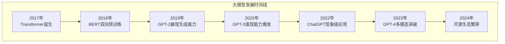

**大模型基本工作原理**：

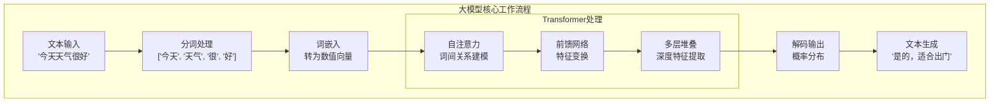

#### 1.1.2 发展里程碑

**重要发展节点**：

1. **2017年 - Attention Is All You Need**
   - Transformer架构问世
   - 自注意力机制革命性突破
   - 并行化训练成为可能

2. **2018年 - BERT时代**
   - 双向编码器预训练
   - 大规模无监督预训练范式
   - 下游任务微调策略

3. **2019年 - GPT-2文本生成**
   - 15亿参数规模
   - 强大的文本生成能力
   - 零样本任务迁移

4. **2020年 - GPT-3涌现现象**
   - 1750亿参数突破
   - Few-shot学习能力
   - 多任务统一处理

5. **2022年 - ChatGPT应用爆发**
   - 人类反馈强化学习(RLHF)
   - 对话交互体验优化
   - 大众化AI应用

6. **2023年 - GPT-4多模态**
   - 文本+视觉多模态
   - 更强的推理能力
   - 专业领域表现

### 1.2 大模型分类

#### 1.2.1 按任务类型分类

**语言模型分类**：

| 类型 | 代表模型 | 主要能力 | 应用场景 |
|------|----------|----------|----------|
| **纯文本模型** | GPT-3/4, LLaMA | 文本理解生成 | 对话、写作、翻译 |
| **多模态模型** | GPT-4V, DALL-E | 跨模态理解 | 图文理解、内容创作 |
| **代码模型** | Codex, CodeT5 | 代码生成理解 | 编程助手、自动化 |
| **科学模型** | Galactica, BioGPT | 专业领域知识 | 科研、医疗、法律 |

#### 1.2.2 按架构类型分类

**架构演进路径**：

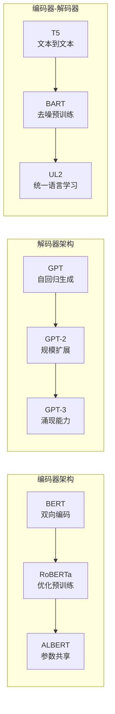

**大模型训练全流程**：

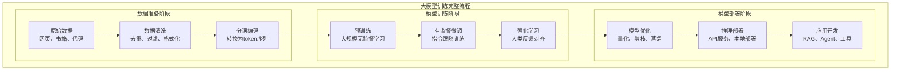

### 1.3 技术演进路径

#### 1.3.1 从RNN到Transformer

**架构演进对比**：

| 架构 | 优势 | 劣势 | 代表模型 |
|------|------|------|----------|
| **RNN** | 序列建模自然 | 序列依赖、难并行 | LSTM, GRU |
| **CNN** | 并行计算快 | 局部感受野限制 | TextCNN |
| **Transformer** | 长距离依赖、可并行 | 计算复杂度高 | BERT, GPT |

**关键技术突破**：

1. **自注意力机制**：
   - 直接建模任意位置间关系
   - 并行计算所有位置
   - 动态权重分配

2. **位置编码**：
   - 正弦位置编码
   - 学习位置嵌入
   - 相对位置编码

3. **多头注意力**：
   - 多个注意力子空间
   - 捕获不同类型关系
   - 增强表示能力

#### 1.3.2 规模扩展与涌现能力

**涌现能力现象**：

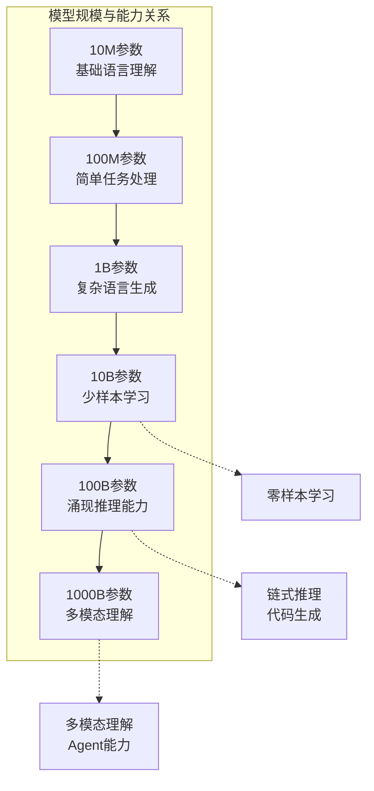

**Transformer与传统架构对比**：

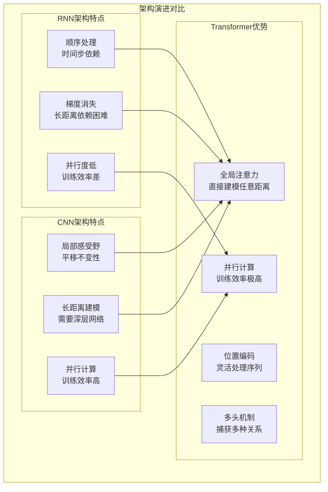

**关键涌现能力**：

1. **上下文学习(ICL)**：
   - 无需参数更新
   - 通过示例快速适应
   - 任务泛化能力

2. **链式推理(CoT)**：
   - 步骤分解思考
   - 复杂问题求解
   - 可解释推理过程

3. **指令跟随**：
   - 自然语言指令理解
   - 任务意图识别
   - 灵活执行能力

## 2. Transformer架构深度解析

### 2.1 注意力机制原理

#### 2.1.1 自注意力机制

**核心数学原理**：

自注意力机制的核心公式：
```
Attention(Q, K, V) = softmax(QK^T / √d_k)V
```

其中：
- Q (Query): 查询矩阵
- K (Key): 键矩阵  
- V (Value): 值矩阵
- d_k: 键向量维度

**注意力计算流程**：

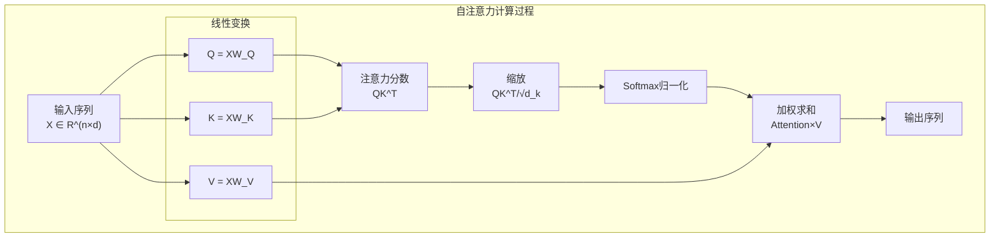

**代码实现示例**：

```python
import torch
import torch.nn as nn
import torch.nn.functional as F
import math

class SelfAttention(nn.Module):
    def __init__(self, d_model, n_heads):
        super().__init__()
        self.d_model = d_model
        self.n_heads = n_heads
        self.d_k = d_model // n_heads
        
        # 线性变换层
        self.W_q = nn.Linear(d_model, d_model)
        self.W_k = nn.Linear(d_model, d_model)
        self.W_v = nn.Linear(d_model, d_model)
        self.W_o = nn.Linear(d_model, d_model)
        
    def forward(self, x, mask=None):
        batch_size, seq_len, d_model = x.size()
        
        # 1. 线性变换得到Q、K、V
        Q = self.W_q(x)  # (batch_size, seq_len, d_model)
        K = self.W_k(x)
        V = self.W_v(x)
        
        # 2. 重塑为多头形式
        Q = Q.view(batch_size, seq_len, self.n_heads, self.d_k).transpose(1, 2)
        K = K.view(batch_size, seq_len, self.n_heads, self.d_k).transpose(1, 2)
        V = V.view(batch_size, seq_len, self.n_heads, self.d_k).transpose(1, 2)
        
        # 3. 计算注意力
        attention_output = self.scaled_dot_product_attention(Q, K, V, mask)
        
        # 4. 合并多头
        attention_output = attention_output.transpose(1, 2).contiguous().view(
            batch_size, seq_len, d_model)
        
        # 5. 最终线性变换
        output = self.W_o(attention_output)
        return output
    
    def scaled_dot_product_attention(self, Q, K, V, mask=None):
        # 计算注意力分数
        scores = torch.matmul(Q, K.transpose(-2, -1)) / math.sqrt(self.d_k)
        
        # 应用掩码
        if mask is not None:
            scores.masked_fill_(mask == 0, -1e9)
        
        # Softmax归一化
        attention_weights = F.softmax(scores, dim=-1)
        
        # 加权求和
        output = torch.matmul(attention_weights, V)
        return output
```

#### 2.1.2 多头注意力

**多头注意力优势**：

1. **多个表示子空间**：
   - 不同头关注不同类型关系
   - 语法、语义、长距离依赖等
   - 增强模型表达能力

2. **并行计算**：
   - 多头独立计算
   - 充分利用硬件并行性
   - 提高训练效率

**多头注意力可视化**：

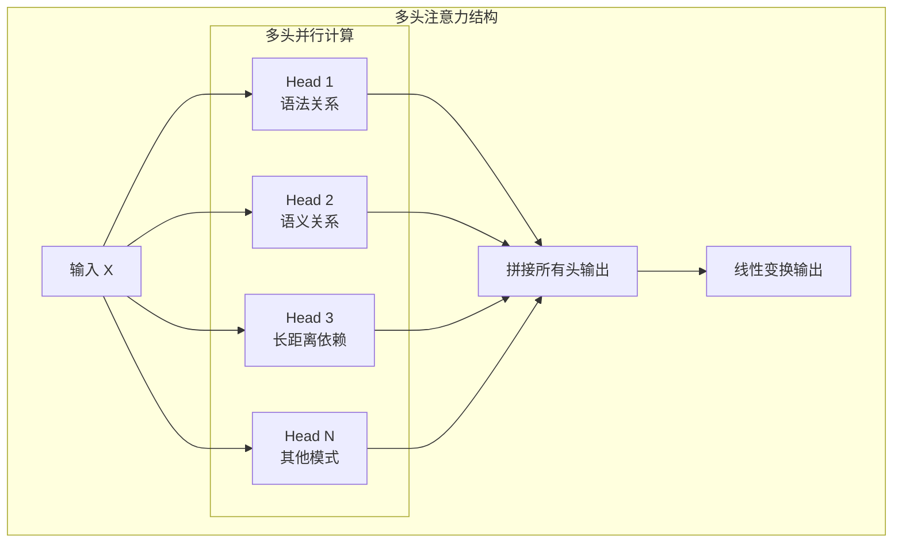

### 2.2 Transformer核心组件

#### 2.2.1 编码器-解码器架构

**完整Transformer架构**：

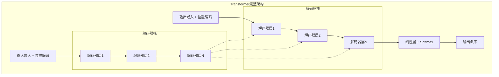

**单个Transformer层详细结构**：

```mermaid
graph TB
    subgraph "Transformer Layer内部结构"
        INPUT_X["输入 X"]
        
        subgraph "多头自注意力模块"
            NORM1["层归一化"]
            QKV["线性变换<br/>生成Q、K、V"]
            MULTIHEAD["多头注意力<br/>并行计算"]
            CONCAT["拼接多头输出"]
            PROJ["输出投影"]
        end
        
        ADD1["残差连接 +"]
        
        subgraph "前馈网络模块"
            NORM2["层归一化"]
            LINEAR1["线性层1<br/>d_model → d_ff"]
            GELU["GELU激活"]
            LINEAR2["线性层2<br/>d_ff → d_model"]
            DROPOUT["Dropout"]
        end
        
        ADD2["残差连接 +"]
        OUTPUT_Y["输出 Y"]
    end
    
    INPUT_X --> NORM1
    NORM1 --> QKV
    QKV --> MULTIHEAD
    MULTIHEAD --> CONCAT
    CONCAT --> PROJ
    
    INPUT_X --> ADD1
    PROJ --> ADD1
    
    ADD1 --> NORM2
    NORM2 --> LINEAR1
    LINEAR1 --> GELU
    GELU --> LINEAR2
    LINEAR2 --> DROPOUT
    
    ADD1 --> ADD2
    DROPOUT --> ADD2
    ADD2 --> OUTPUT_Y
```

**编码器层组件**：

```python
class EncoderLayer(nn.Module):
    def __init__(self, d_model, n_heads, d_ff, dropout=0.1):
        super().__init__()
        # 多头自注意力
        self.self_attention = MultiHeadAttention(d_model, n_heads)
        # 前馈神经网络
        self.feed_forward = FeedForward(d_model, d_ff)
        # 层归一化
        self.norm1 = nn.LayerNorm(d_model)
        self.norm2 = nn.LayerNorm(d_model)
        # Dropout
        self.dropout = nn.Dropout(dropout)
        
    def forward(self, x, mask=None):
        # 自注意力 + 残差连接 + 层归一化
        attn_output = self.self_attention(x, mask)
        x = self.norm1(x + self.dropout(attn_output))
        
        # 前馈网络 + 残差连接 + 层归一化
        ff_output = self.feed_forward(x)
        x = self.norm2(x + self.dropout(ff_output))
        
        return x

class FeedForward(nn.Module):
    def __init__(self, d_model, d_ff):
        super().__init__()
        self.linear1 = nn.Linear(d_model, d_ff)
        self.linear2 = nn.Linear(d_ff, d_model)
        
    def forward(self, x):
        return self.linear2(F.relu(self.linear1(x)))
```

#### 2.2.2 位置编码

**位置编码的必要性**：
- Transformer没有内置位置信息
- 需要显式编码序列位置
- 保持位置信息对语言理解至关重要

**正弦位置编码**：

```python
class PositionalEncoding(nn.Module):
    def __init__(self, d_model, max_len=5000):
        super().__init__()
        
        pe = torch.zeros(max_len, d_model)
        position = torch.arange(0, max_len).unsqueeze(1).float()
        
        # 计算除数项
        div_term = torch.exp(torch.arange(0, d_model, 2).float() *
                           -(math.log(10000.0) / d_model))
        
        # 应用sin和cos函数
        pe[:, 0::2] = torch.sin(position * div_term)
        pe[:, 1::2] = torch.cos(position * div_term)
        
        pe = pe.unsqueeze(0)
        self.register_buffer('pe', pe)
        
    def forward(self, x):
        return x + self.pe[:, :x.size(1)]
```

**位置编码类型对比**：

| 类型 | 优势 | 劣势 | 适用场景 |
|------|------|------|----------|
| **绝对位置编码** | 实现简单，效果稳定 | 外推能力有限 | 固定长度序列 |
| **相对位置编码** | 更好的长度泛化 | 计算复杂度高 | 变长序列 |
| **旋转位置编码(RoPE)** | 优秀的外推性能 | 相对较新 | 长文本处理 |

#### 2.2.3 残差连接与层归一化

**残差连接作用**：
1. **缓解梯度消失**：直接路径传播梯度
2. **加速收敛**：降低训练难度
3. **模型稳定性**：避免层数增加带来的退化

**层归一化原理**：

```python
class LayerNorm(nn.Module):
    def __init__(self, d_model, eps=1e-6):
        super().__init__()
        self.gamma = nn.Parameter(torch.ones(d_model))
        self.beta = nn.Parameter(torch.zeros(d_model))
        self.eps = eps
        
    def forward(self, x):
        # 计算均值和方差
        mean = x.mean(dim=-1, keepdim=True)
        std = x.std(dim=-1, keepdim=True)
        
        # 归一化
        normalized = (x - mean) / (std + self.eps)
        
        # 缩放和平移
        return self.gamma * normalized + self.beta
```

**Pre-Norm vs Post-Norm**：

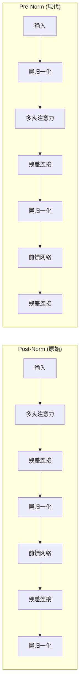

**注意力机制计算流程详解**：

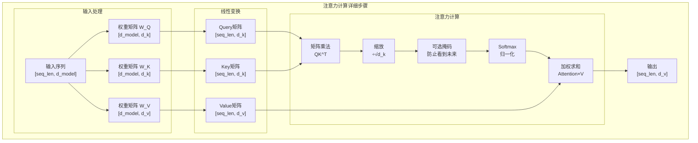

### 2.3 关键技术优化

#### 2.3.1 计算效率优化

**注意力计算复杂度**：
- 标准注意力：O(n²d)
- n为序列长度，d为隐藏维度
- 长序列场景下计算瓶颈

**高效注意力机制**：

| 方法 | 复杂度 | 优势 | 劣势 |
|------|--------|------|------|
| **线性注意力** | O(nd²) | 线性复杂度 | 表达能力下降 |
| **稀疏注意力** | O(n√n) | 保持性能 | 实现复杂 |
| **局部注意力** | O(nw) | 简单高效 | 长距离依赖弱 |
| **Flash Attention** | O(n²) | 内存高效 | 需要专门硬件 |

**Flash Attention原理**：

```python
# Flash Attention核心思想（简化版）
def flash_attention(Q, K, V, block_size=64):
    """
    内存高效的注意力计算
    通过分块计算和在线softmax降低内存使用
    """
    seq_len, d_k = Q.shape
    num_blocks = (seq_len + block_size - 1) // block_size
    
    output = torch.zeros_like(Q)
    max_scores = torch.full((seq_len,), float('-inf'))
    sum_exp = torch.zeros(seq_len)
    
    for i in range(num_blocks):
        # 分块处理
        start_i = i * block_size
        end_i = min((i + 1) * block_size, seq_len)
        
        for j in range(num_blocks):
            start_j = j * block_size
            end_j = min((j + 1) * block_size, seq_len)
            
            # 计算当前块的注意力分数
            scores = torch.matmul(Q[start_i:end_i], K[start_j:end_j].T)
            scores = scores / math.sqrt(d_k)
            
            # 在线更新softmax统计量
            block_max = torch.max(scores, dim=-1)[0]
            new_max = torch.maximum(max_scores[start_i:end_i], block_max)
            
            # 更新输出
            # ... (具体的在线softmax更新逻辑)
    
    return output
```

#### 2.3.2 内存优化技术

**梯度检查点(Gradient Checkpointing)**：

```python
class CheckpointedTransformerBlock(nn.Module):
    def __init__(self, d_model, n_heads, d_ff):
        super().__init__()
        self.attention = MultiHeadAttention(d_model, n_heads)
        self.feed_forward = FeedForward(d_model, d_ff)
        self.norm1 = nn.LayerNorm(d_model)
        self.norm2 = nn.LayerNorm(d_model)
        
    def forward(self, x):
        # 使用梯度检查点节省内存
        def attention_forward(x):
            return self.attention(self.norm1(x))
        
        def ff_forward(x):
            return self.feed_forward(self.norm2(x))
        
        # 梯度检查点包装
        x = x + torch.utils.checkpoint.checkpoint(attention_forward, x)
        x = x + torch.utils.checkpoint.checkpoint(ff_forward, x)
        
        return x
```

**混合精度训练**：

```python
from torch.cuda.amp import autocast, GradScaler

# 自动混合精度训练
scaler = GradScaler()
optimizer = torch.optim.AdamW(model.parameters())

for batch in dataloader:
    optimizer.zero_grad()
    
    # 前向传播使用自动混合精度
    with autocast():
        outputs = model(batch['input_ids'])
        loss = criterion(outputs, batch['labels'])
    
    # 反向传播
    scaler.scale(loss).backward()
    scaler.step(optimizer)
    scaler.update()
```

## 3. 大模型训练技术

### 3.1 预训练技术

#### 3.1.1 数据准备与处理

**预训练数据来源**：

| 数据源 | 规模 | 特点 | 用途 |
|--------|------|------|------|
| **Common Crawl** | ~100TB | 网页文本，质量参差 | 通用语言理解 |
| **书籍语料** | ~10TB | 高质量长文本 | 语言风格，知识深度 |
| **新闻文章** | ~1TB | 时效性，事实性 | 时事理解，事实知识 |
| **学术论文** | ~1TB | 专业术语，逻辑严密 | 专业知识，推理能力 |
| **代码仓库** | ~1TB | 结构化文本 | 代码理解，逻辑推理 |

**数据预处理流程**：

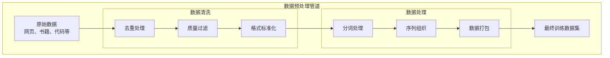

**分布式训练架构**：

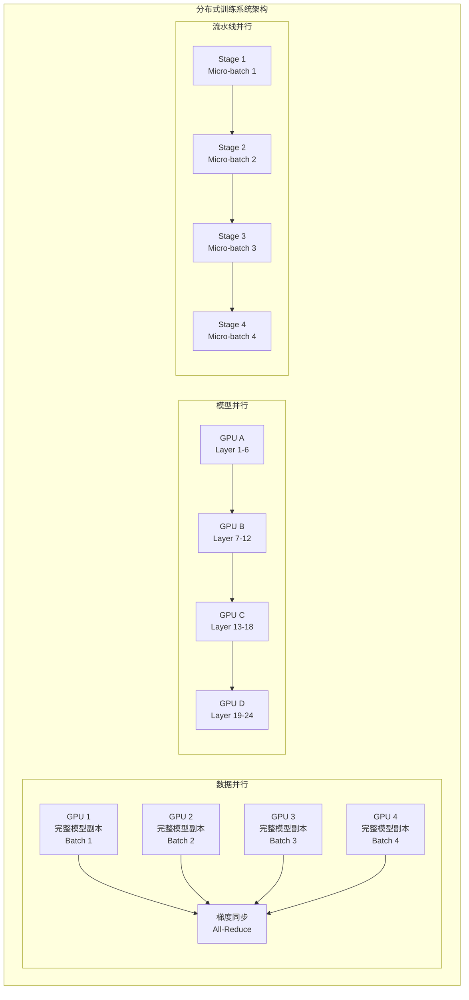

**数据质量评估指标**：

```python
class DataQualityMetrics:
    """数据质量评估工具"""
    
    def __init__(self):
        self.language_detector = LanguageDetector()
        self.profanity_filter = ProfanityFilter()
        
    def assess_quality(self, text):
        """评估单个文本质量"""
        metrics = {}
        
        # 1. 语言检测
        metrics['language'] = self.language_detector.detect(text)
        metrics['language_confidence'] = self.language_detector.confidence()
        
        # 2. 长度统计
        metrics['char_count'] = len(text)
        metrics['word_count'] = len(text.split())
        metrics['avg_word_length'] = np.mean([len(word) for word in text.split()])
        
        # 3. 重复性检测
        lines = text.split('\n')
        metrics['duplicate_lines'] = len(lines) - len(set(lines))
        
        # 4. 特殊字符比例
        special_chars = sum(1 for c in text if not c.isalnum() and not c.isspace())
        metrics['special_char_ratio'] = special_chars / len(text)
        
        # 5. 有害内容检测
        metrics['has_profanity'] = self.profanity_filter.contains_profanity(text)
        
        # 6. 质量评分
        metrics['quality_score'] = self.calculate_quality_score(metrics)
        
        return metrics
    
    def calculate_quality_score(self, metrics):
        """计算综合质量评分"""
        score = 1.0
        
        # 语言置信度惩罚
        if metrics['language_confidence'] < 0.8:
            score *= 0.8
        
        # 长度惩罚
        if metrics['word_count'] < 10:
            score *= 0.5
        elif metrics['word_count'] > 10000:
            score *= 0.9
        
        # 重复性惩罚
        if metrics['duplicate_lines'] > 0:
            score *= (1 - metrics['duplicate_lines'] / 100)
        
        # 特殊字符惩罚
        if metrics['special_char_ratio'] > 0.3:
            score *= 0.7
        
        # 有害内容惩罚
        if metrics['has_profanity']:
            score = 0.0
        
        return max(0.0, min(1.0, score))
```

#### 3.1.2 训练目标与损失函数

**自回归语言建模**：

```python
class CausalLanguageModel(nn.Module):
    """因果语言模型"""
    
    def __init__(self, vocab_size, d_model, n_layers, n_heads):
        super().__init__()
        self.embedding = nn.Embedding(vocab_size, d_model)
        self.pos_encoding = PositionalEncoding(d_model)
        self.transformer_blocks = nn.ModuleList([
            TransformerBlock(d_model, n_heads) for _ in range(n_layers)
        ])
        self.ln_f = nn.LayerNorm(d_model)
        self.lm_head = nn.Linear(d_model, vocab_size)
        
    def forward(self, input_ids, labels=None):
        # 词嵌入 + 位置编码
        x = self.embedding(input_ids)
        x = self.pos_encoding(x)
        
        # Transformer层
        for block in self.transformer_blocks:
            x = block(x, causal_mask=True)
        
        # 最终归一化
        x = self.ln_f(x)
        
        # 语言模型头
        logits = self.lm_head(x)
        
        # 计算损失
        if labels is not None:
            # 下一个token预测任务
            shift_logits = logits[..., :-1, :].contiguous()
            shift_labels = labels[..., 1:].contiguous()
            
            loss_fct = nn.CrossEntropyLoss()
            loss = loss_fct(
                shift_logits.view(-1, shift_logits.size(-1)),
                shift_labels.view(-1)
            )
            return loss, logits
        
        return logits
```

**掩码语言建模(BERT类型)**：

```python
class MaskedLanguageModel(nn.Module):
    """掩码语言模型"""
    
    def forward(self, input_ids, labels=None):
        # 获取编码器输出
        encoder_output = self.encoder(input_ids)
        
        # MLM预测头
        mlm_logits = self.mlm_head(encoder_output)
        
        if labels is not None:
            # 只计算被掩码位置的损失
            loss_fct = nn.CrossEntropyLoss()
            
            # labels中-100表示不计算损失的位置
            active_loss = labels.view(-1) != -100
            active_logits = mlm_logits.view(-1, mlm_logits.size(-1))[active_loss]
            active_labels = labels.view(-1)[active_loss]
            
            loss = loss_fct(active_logits, active_labels)
            return loss, mlm_logits
        
        return mlm_logits

def create_mlm_data(texts, tokenizer, mask_prob=0.15):
    """创建MLM训练数据"""
    inputs = tokenizer(texts, return_tensors='pt', padding=True, truncation=True)
    
    input_ids = inputs['input_ids'].clone()
    labels = input_ids.clone()
    
    # 创建随机掩码
    probability_matrix = torch.full(labels.shape, mask_prob)
    special_tokens_mask = tokenizer.get_special_tokens_mask(
        labels.tolist(), already_has_special_tokens=True
    )
    probability_matrix.masked_fill_(torch.tensor(special_tokens_mask, dtype=torch.bool), 0.0)
    
    masked_indices = torch.bernoulli(probability_matrix).bool()
    labels[~masked_indices] = -100  # 不计算损失
    
    # 80%替换为[MASK], 10%替换为随机token, 10%保持不变
    indices_replaced = torch.bernoulli(torch.full(labels.shape, 0.8)).bool() & masked_indices
    input_ids[indices_replaced] = tokenizer.mask_token_id
    
    indices_random = torch.bernoulli(torch.full(labels.shape, 0.5)).bool() & masked_indices & ~indices_replaced
    random_words = torch.randint(len(tokenizer), labels.shape, dtype=torch.long)
    input_ids[indices_random] = random_words[indices_random]
    
    return {'input_ids': input_ids, 'labels': labels}
```

#### 3.1.3 分布式训练策略

**RLHF训练流程**：

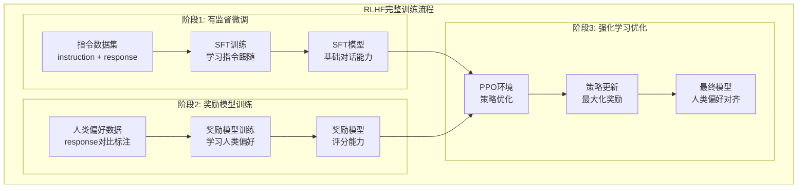

**微调技术对比**：

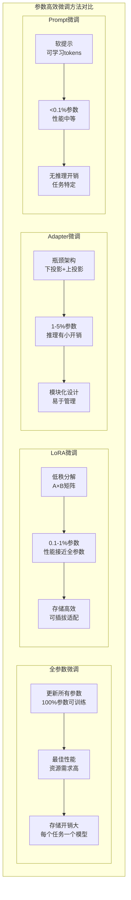

**ZeRO优化器状态分区**：

```python
# DeepSpeed ZeRO配置示例
deepspeed_config = {
    "train_batch_size": 32,
    "gradient_accumulation_steps": 4,
    "optimizer": {
        "type": "AdamW",
        "params": {
            "lr": 1e-4,
            "betas": [0.9, 0.999],
            "eps": 1e-8,
            "weight_decay": 0.01
        }
    },
    "scheduler": {
        "type": "WarmupLR",
        "params": {
            "warmup_min_lr": 0,
            "warmup_max_lr": 1e-4,
            "warmup_num_steps": 1000
        }
    },
    "zero_optimization": {
        "stage": 3,  # ZeRO Stage 3: 参数、梯度、优化器状态都分区
        "offload_optimizer": {
            "device": "cpu",  # 优化器状态卸载到CPU
            "pin_memory": True
        },
        "offload_param": {
            "device": "cpu",  # 参数卸载到CPU
            "pin_memory": True
        },
        "overlap_comm": True,  # 通信与计算重叠
        "contiguous_gradients": True,
        "sub_group_size": 1e9,
        "reduce_bucket_size": 1e6,
        "stage3_prefetch_bucket_size": 1e6,
        "stage3_param_persistence_threshold": 1e4
    },
    "activation_checkpointing": {
        "partition_activations": True,
        "cpu_checkpointing": True,
        "contiguous_memory_optimization": False,
        "number_checkpoints": None,
        "synchronize_checkpoint_boundary": False
    },
    "wall_clock_breakdown": False
}

# 使用DeepSpeed训练
import deepspeed

model_engine, optimizer, _, _ = deepspeed.initialize(
    args=args,
    model=model,
    model_parameters=model.parameters(),
    config=deepspeed_config
)

for batch in dataloader:
    loss = model_engine(batch)
    model_engine.backward(loss)
    model_engine.step()
```

**3D并行策略**：

| 并行类型 | 适用场景 | 通信开销 | 内存效率 |
|----------|----------|----------|----------|
| **数据并行** | 模型较小 | 梯度同步 | 中等 |
| **张量并行** | 单层太大 | 激活值传递 | 高 |
| **流水线并行** | 模型层数多 | 边界激活值 | 高 |
| **3D并行** | 超大模型 | 复合通信 | 最高 |

### 3.2 微调技术

#### 3.2.1 全参数微调

**全参数微调流程**：

```python
class FineTuningTrainer:
    """全参数微调训练器"""
    
    def __init__(self, model, tokenizer, config):
        self.model = model
        self.tokenizer = tokenizer
        self.config = config
        
        # 设置优化器
        self.optimizer = torch.optim.AdamW(
            model.parameters(),
            lr=config.learning_rate,
            weight_decay=config.weight_decay
        )
        
        # 学习率调度器
        self.scheduler = self.get_scheduler()
        
    def fine_tune(self, train_dataset, eval_dataset):
        """执行微调训练"""
        
        train_dataloader = DataLoader(
            train_dataset, 
            batch_size=self.config.batch_size,
            shuffle=True
        )
        
        self.model.train()
        global_step = 0
        
        for epoch in range(self.config.num_epochs):
            epoch_loss = 0
            
            for batch in train_dataloader:
                # 前向传播
                outputs = self.model(**batch)
                loss = outputs.loss
                
                # 反向传播
                loss.backward()
                
                # 梯度裁剪
                torch.nn.utils.clip_grad_norm_(
                    self.model.parameters(), 
                    self.config.max_grad_norm
                )
                
                # 优化器步骤
                self.optimizer.step()
                self.scheduler.step()
                self.optimizer.zero_grad()
                
                epoch_loss += loss.item()
                global_step += 1
                
                # 定期评估
                if global_step % self.config.eval_steps == 0:
                    self.evaluate(eval_dataset)
            
            print(f"Epoch {epoch}, Loss: {epoch_loss / len(train_dataloader)}")
    
    def evaluate(self, eval_dataset):
        """评估模型性能"""
        self.model.eval()
        total_loss = 0
        
        eval_dataloader = DataLoader(eval_dataset, batch_size=self.config.batch_size)
        
        with torch.no_grad():
            for batch in eval_dataloader:
                outputs = self.model(**batch)
                total_loss += outputs.loss.item()
        
        avg_loss = total_loss / len(eval_dataloader)
        print(f"Eval Loss: {avg_loss}")
        
        self.model.train()
        return avg_loss
```

#### 3.2.2 参数高效微调

**LoRA (Low-Rank Adaptation)**：

```python
class LoRALayer(nn.Module):
    """LoRA适配层"""
    
    def __init__(self, in_features, out_features, rank=16, alpha=32, dropout=0.1):
        super().__init__()
        self.rank = rank
        self.alpha = alpha
        
        # 原始线性层（冻结）
        self.linear = nn.Linear(in_features, out_features, bias=False)
        self.linear.weight.requires_grad = False
        
        # LoRA分解矩阵
        self.lora_A = nn.Parameter(torch.randn(rank, in_features) * 0.01)
        self.lora_B = nn.Parameter(torch.zeros(out_features, rank))
        
        self.dropout = nn.Dropout(dropout)
        self.scaling = alpha / rank
        
    def forward(self, x):
        # 原始输出
        original_output = self.linear(x)
        
        # LoRA输出
        lora_output = self.dropout(x) @ self.lora_A.T @ self.lora_B.T
        
        return original_output + lora_output * self.scaling

class LoRAModel(nn.Module):
    """应用LoRA的模型包装器"""
    
    def __init__(self, base_model, target_modules=['q_proj', 'v_proj'], rank=16):
        super().__init__()
        self.base_model = base_model
        self.lora_layers = nn.ModuleDict()
        
        # 为目标模块添加LoRA层
        for name, module in base_model.named_modules():
            if any(target in name for target in target_modules):
                if isinstance(module, nn.Linear):
                    # 替换为LoRA层
                    lora_layer = LoRALayer(
                        module.in_features,
                        module.out_features,
                        rank=rank
                    )
                    # 复制原始权重
                    lora_layer.linear.weight.data.copy_(module.weight.data)
                    
                    # 替换模块
                    parent_name = '.'.join(name.split('.')[:-1])
                    child_name = name.split('.')[-1]
                    parent_module = self.get_submodule(parent_name)
                    setattr(parent_module, child_name, lora_layer)
    
    def forward(self, *args, **kwargs):
        return self.base_model(*args, **kwargs)
    
    def get_lora_parameters(self):
        """获取LoRA参数用于训练"""
        lora_params = []
        for name, param in self.named_parameters():
            if 'lora_' in name:
                lora_params.append(param)
        return lora_params
```

**Adapter调优**：

```python
class AdapterLayer(nn.Module):
    """Adapter调优层"""
    
    def __init__(self, d_model, bottleneck_size=64):
        super().__init__()
        self.down_project = nn.Linear(d_model, bottleneck_size)
        self.up_project = nn.Linear(bottleneck_size, d_model)
        self.activation = nn.ReLU()
        self.dropout = nn.Dropout(0.1)
        
        # 残差连接的门控机制
        self.gate = nn.Parameter(torch.zeros(1))
        
    def forward(self, x):
        # 下投影 -> 激活 -> 上投影
        adapter_output = self.up_project(
            self.activation(self.down_project(x))
        )
        adapter_output = self.dropout(adapter_output)
        
        # 门控残差连接
        return x + self.gate * adapter_output

class AdapterTransformerBlock(nn.Module):
    """带Adapter的Transformer块"""
    
    def __init__(self, transformer_block, adapter_size=64):
        super().__init__()
        self.transformer_block = transformer_block
        
        # 冻结原始参数
        for param in transformer_block.parameters():
            param.requires_grad = False
        
        # 添加Adapter层
        d_model = transformer_block.self_attention.d_model
        self.adapter1 = AdapterLayer(d_model, adapter_size)
        self.adapter2 = AdapterLayer(d_model, adapter_size)
    
    def forward(self, x, mask=None):
        # 自注意力 + Adapter
        attn_output = self.transformer_block.self_attention(x, mask)
        x = self.transformer_block.norm1(x + attn_output)
        x = self.adapter1(x)  # 第一个Adapter
        
        # 前馈网络 + Adapter
        ff_output = self.transformer_block.feed_forward(x)
        x = self.transformer_block.norm2(x + ff_output)
        x = self.adapter2(x)  # 第二个Adapter
        
        return x
```

**参数高效方法对比**：

| 方法 | 可训练参数 | 性能保持 | 推理开销 | 存储需求 |
|------|------------|----------|----------|----------|
| **全参数微调** | 100% | 最佳 | 无 | 高 |
| **LoRA** | 0.1-1% | 接近全参数 | 极小 | 低 |
| **Adapter** | 1-5% | 良好 | 小 | 中等 |
| **Prefix Tuning** | 0.1% | 中等 | 无 | 低 |
| **BitFit** | <0.1% | 中等 | 无 | 极低 |

#### 3.2.3 提示学习

**提示工程技术**：

```python
class PromptTemplate:
    """提示模板管理器"""
    
    def __init__(self):
        self.templates = {
            'classification': {
                'zero_shot': "Text: {text}\nCategory:",
                'few_shot': """Text: {example1_text}
Category: {example1_label}

Text: {example2_text}
Category: {example2_label}

Text: {text}
Category:""",
                'cot': "Text: {text}\nLet's think step by step.\nCategory:"
            },
            'qa': {
                'zero_shot': "Question: {question}\nAnswer:",
                'few_shot': """Question: {example1_question}
Answer: {example1_answer}

Question: {example2_question}
Answer: {example2_answer}

Question: {question}
Answer:""",
                'cot': """Question: {question}
Let's work through this step-by-step:
Answer:"""
            }
        }
    
    def format_prompt(self, task_type, prompt_type, **kwargs):
        """格式化提示"""
        template = self.templates[task_type][prompt_type]
        return template.format(**kwargs)

class ChainOfThoughtPrompting:
    """链式思维提示"""
    
    def __init__(self, model, tokenizer):
        self.model = model
        self.tokenizer = tokenizer
        
    def generate_with_cot(self, question, examples=None):
        """使用CoT生成答案"""
        
        # 构建CoT提示
        if examples:
            prompt = self.build_few_shot_cot_prompt(question, examples)
        else:
            prompt = f"{question}\nLet's think step by step:"
        
        # 生成推理过程
        inputs = self.tokenizer(prompt, return_tensors='pt')
        
        with torch.no_grad():
            outputs = self.model.generate(
                inputs['input_ids'],
                max_length=inputs['input_ids'].shape[1] + 200,
                temperature=0.7,
                do_sample=True,
                pad_token_id=self.tokenizer.eos_token_id
            )
        
        response = self.tokenizer.decode(outputs[0], skip_special_tokens=True)
        reasoning = response[len(prompt):].strip()
        
        # 提取最终答案
        final_answer = self.extract_final_answer(reasoning)
        
        return {
            'reasoning': reasoning,
            'answer': final_answer
        }
    
    def build_few_shot_cot_prompt(self, question, examples):
        """构建少样本CoT提示"""
        prompt_parts = []
        
        for example in examples:
            prompt_parts.append(f"Question: {example['question']}")
            prompt_parts.append(f"Let's think step by step:")
            prompt_parts.append(example['reasoning'])
            prompt_parts.append(f"Therefore, the answer is {example['answer']}.")
            prompt_parts.append("")
        
        prompt_parts.append(f"Question: {question}")
        prompt_parts.append("Let's think step by step:")
        
        return "\n".join(prompt_parts)
    
    def extract_final_answer(self, reasoning):
        """从推理过程中提取最终答案"""
        # 查找答案标识符
        answer_indicators = [
            "Therefore, the answer is",
            "So the answer is",
            "The answer is",
            "Final answer:"
        ]
        
        reasoning_lower = reasoning.lower()
        
        for indicator in answer_indicators:
            if indicator.lower() in reasoning_lower:
                # 提取答案部分
                start_idx = reasoning_lower.find(indicator.lower()) + len(indicator)
                answer_part = reasoning[start_idx:].strip()
                
                # 清理答案（移除标点符号等）
                answer = answer_part.split('.')[0].split('\n')[0].strip()
                return answer
        
        # 如果没找到明确的答案标识，返回最后一句
        sentences = reasoning.strip().split('.')
        return sentences[-1].strip()
```

### 3.3 对齐技术

#### 3.3.1 有监督微调(SFT)

**指令跟随数据构建**：

```python
class InstructionDataset:
    """指令跟随数据集"""
    
    def __init__(self, data_path, tokenizer, max_length=512):
        self.tokenizer = tokenizer
        self.max_length = max_length
        self.data = self.load_data(data_path)
        
    def load_data(self, data_path):
        """加载指令数据"""
        # 数据格式: {"instruction": "...", "input": "...", "output": "..."}
        with open(data_path, 'r') as f:
            data = [json.loads(line) for line in f]
        return data
    
    def format_instruction(self, instruction, input_text="", output_text=""):
        """格式化指令为训练样本"""
        if input_text:
            prompt = f"### Instruction:\n{instruction}\n\n### Input:\n{input_text}\n\n### Response:\n"
        else:
            prompt = f"### Instruction:\n{instruction}\n\n### Response:\n"
        
        full_text = prompt + output_text + self.tokenizer.eos_token
        return prompt, full_text
    
    def __getitem__(self, idx):
        item = self.data[idx]
        
        prompt, full_text = self.format_instruction(
            item['instruction'],
            item.get('input', ''),
            item['output']
        )
        
        # 编码
        full_encoded = self.tokenizer(
            full_text,
            truncation=True,
            max_length=self.max_length,
            padding='max_length',
            return_tensors='pt'
        )
        
        prompt_encoded = self.tokenizer(
            prompt,
            truncation=True,
            max_length=self.max_length,
            return_tensors='pt'
        )
        
        # 创建标签（只计算回复部分的损失）
        labels = full_encoded['input_ids'].clone()
        prompt_length = prompt_encoded['input_ids'].shape[1]
        labels[:, :prompt_length] = -100  # 忽略指令部分
        
        return {
            'input_ids': full_encoded['input_ids'].squeeze(),
            'attention_mask': full_encoded['attention_mask'].squeeze(),
            'labels': labels.squeeze()
        }

class SFTTrainer:
    """有监督微调训练器"""
    
    def __init__(self, model, tokenizer, config):
        self.model = model
        self.tokenizer = tokenizer
        self.config = config
        
        # 优化器设置
        self.optimizer = torch.optim.AdamW(
            model.parameters(),
            lr=config.learning_rate,
            weight_decay=config.weight_decay
        )
        
    def train(self, train_dataset, eval_dataset=None):
        """执行SFT训练"""
        
        train_dataloader = DataLoader(
            train_dataset,
            batch_size=self.config.batch_size,
            shuffle=True,
            collate_fn=self.collate_fn
        )
        
        self.model.train()
        
        for epoch in range(self.config.num_epochs):
            total_loss = 0
            
            for batch_idx, batch in enumerate(train_dataloader):
                # 前向传播
                outputs = self.model(
                    input_ids=batch['input_ids'],
                    attention_mask=batch['attention_mask'],
                    labels=batch['labels']
                )
                
                loss = outputs.loss
                
                # 反向传播
                loss.backward()
                
                # 梯度裁剪
                torch.nn.utils.clip_grad_norm_(
                    self.model.parameters(),
                    self.config.max_grad_norm
                )
                
                # 优化器步骤
                self.optimizer.step()
                self.optimizer.zero_grad()
                
                total_loss += loss.item()
                
                if batch_idx % 100 == 0:
                    print(f"Epoch {epoch}, Batch {batch_idx}, Loss: {loss.item():.4f}")
            
            avg_loss = total_loss / len(train_dataloader)
            print(f"Epoch {epoch} completed. Average Loss: {avg_loss:.4f}")
            
            # 评估
            if eval_dataset:
                self.evaluate(eval_dataset)
    
    def collate_fn(self, batch):
        """批处理函数"""
        input_ids = torch.stack([item['input_ids'] for item in batch])
        attention_mask = torch.stack([item['attention_mask'] for item in batch])
        labels = torch.stack([item['labels'] for item in batch])
        
        return {
            'input_ids': input_ids,
            'attention_mask': attention_mask,
            'labels': labels
        }
```

#### 3.3.2 人类反馈强化学习(RLHF)

**奖励模型训练**：

```python
class RewardModel(nn.Module):
    """奖励模型"""
    
    def __init__(self, base_model, num_labels=1):
        super().__init__()
        self.base_model = base_model
        
        # 冻结基础模型参数
        for param in self.base_model.parameters():
            param.requires_grad = False
        
        # 奖励预测头
        self.reward_head = nn.Linear(base_model.config.hidden_size, num_labels)
        self.dropout = nn.Dropout(0.1)
        
    def forward(self, input_ids, attention_mask=None):
        # 获取基础模型输出
        outputs = self.base_model(
            input_ids=input_ids,
            attention_mask=attention_mask,
            output_hidden_states=True
        )
        
        # 使用最后一个token的隐藏状态
        hidden_states = outputs.hidden_states[-1]
        
        # 获取序列的最后一个有效token
        if attention_mask is not None:
            sequence_lengths = attention_mask.sum(dim=1) - 1
            batch_size = hidden_states.shape[0]
            last_hidden_states = hidden_states[range(batch_size), sequence_lengths]
        else:
            last_hidden_states = hidden_states[:, -1]
        
        # 预测奖励
        rewards = self.reward_head(self.dropout(last_hidden_states))
        return rewards

class RewardModelTrainer:
    """奖励模型训练器"""
    
    def __init__(self, model, tokenizer, config):
        self.model = model
        self.tokenizer = tokenizer
        self.config = config
        
        # 只训练奖励头的参数
        self.optimizer = torch.optim.AdamW(
            self.model.reward_head.parameters(),
            lr=config.learning_rate
        )
        
    def create_comparison_data(self, prompt, response1, response2, preference):
        """创建比较数据"""
        # 组合prompt和response
        full_text1 = prompt + response1
        full_text2 = prompt + response2
        
        # 编码
        inputs1 = self.tokenizer(full_text1, return_tensors='pt', truncation=True, max_length=512)
        inputs2 = self.tokenizer(full_text2, return_tensors='pt', truncation=True, max_length=512)
        
        return {
            'input_ids_1': inputs1['input_ids'],
            'attention_mask_1': inputs1['attention_mask'],
            'input_ids_2': inputs2['input_ids'],
            'attention_mask_2': inputs2['attention_mask'],
            'preference': preference  # 0表示偏好response1, 1表示偏好response2
        }
    
    def train_step(self, batch):
        """单步训练"""
        # 获取两个response的奖励分数
        rewards1 = self.model(
            input_ids=batch['input_ids_1'],
            attention_mask=batch['attention_mask_1']
        )
        
        rewards2 = self.model(
            input_ids=batch['input_ids_2'],
            attention_mask=batch['attention_mask_2']
        )
        
        # 计算偏好损失
        preferences = batch['preference'].float()
        
        # 使用Bradley-Terry模型
        # P(y1 > y2) = sigmoid(r1 - r2)
        logits = rewards1.squeeze() - rewards2.squeeze()
        loss = F.binary_cross_entropy_with_logits(logits, preferences)
        
        return loss
```

**PPO强化学习训练**：

```python
class PPOTrainer:
    """PPO训练器用于RLHF"""
    
    def __init__(self, actor_model, critic_model, reward_model, tokenizer, config):
        self.actor = actor_model  # 策略模型
        self.critic = critic_model  # 价值模型
        self.reward_model = reward_model  # 奖励模型
        self.tokenizer = tokenizer
        self.config = config
        
        # 参考模型（用于KL散度约束）
        self.ref_model = copy.deepcopy(actor_model)
        for param in self.ref_model.parameters():
            param.requires_grad = False
        
        # 优化器
        self.actor_optimizer = torch.optim.AdamW(
            actor_model.parameters(),
            lr=config.actor_lr
        )
        self.critic_optimizer = torch.optim.AdamW(
            critic_model.parameters(),
            lr=config.critic_lr
        )
    
    def generate_responses(self, prompts):
        """生成回复"""
        self.actor.eval()
        
        responses = []
        log_probs = []
        
        with torch.no_grad():
            for prompt in prompts:
                # 编码prompt
                inputs = self.tokenizer(prompt, return_tensors='pt')
                
                # 生成回复
                outputs = self.actor.generate(
                    inputs['input_ids'],
                    max_length=inputs['input_ids'].shape[1] + 100,
                    temperature=0.7,
                    do_sample=True,
                    pad_token_id=self.tokenizer.pad_token_id,
                    return_dict_in_generate=True,
                    output_scores=True
                )
                
                # 计算log概率
                response_ids = outputs.sequences[0][inputs['input_ids'].shape[1]:]
                response_text = self.tokenizer.decode(response_ids, skip_special_tokens=True)
                
                responses.append(response_text)
                
                # 计算生成token的log概率
                token_log_probs = []
                for i, score in enumerate(outputs.scores):
                    token_id = response_ids[i]
                    log_prob = F.log_softmax(score, dim=-1)[0, token_id]
                    token_log_probs.append(log_prob)
                
                log_probs.append(torch.stack(token_log_probs))
        
        return responses, log_probs
    
    def compute_rewards(self, prompts, responses):
        """计算奖励"""
        rewards = []
        
        with torch.no_grad():
            for prompt, response in zip(prompts, responses):
                full_text = prompt + response
                inputs = self.tokenizer(full_text, return_tensors='pt', truncation=True)
                
                # 获取奖励分数
                reward = self.reward_model(**inputs)
                rewards.append(reward.item())
        
        return torch.tensor(rewards)
    
    def compute_advantages(self, rewards, values):
        """计算优势函数"""
        # 简化的优势计算（实际实现会更复杂）
        advantages = []
        returns = []
        
        for i in range(len(rewards)):
            # 计算回报
            ret = sum(rewards[i:])
            returns.append(ret)
            
            # 计算优势
            advantage = ret - values[i]
            advantages.append(advantage)
        
        return torch.tensor(advantages), torch.tensor(returns)
    
    def ppo_step(self, prompts, responses, old_log_probs, advantages, returns):
        """PPO更新步骤"""
        
        # 计算当前策略的log概率
        current_log_probs = []
        values = []
        
        for prompt, response in zip(prompts, responses):
            full_text = prompt + response
            inputs = self.tokenizer(full_text, return_tensors='pt')
            
            # Actor前向传播
            actor_outputs = self.actor(**inputs, output_hidden_states=True)
            
            # Critic前向传播
            critic_outputs = self.critic(**inputs)
            values.append(critic_outputs.logits.squeeze())
            
            # 计算log概率（简化版）
            # 实际实现需要更精确的计算
            current_log_probs.append(actor_outputs.logits.mean())
        
        current_log_probs = torch.stack(current_log_probs)
        values = torch.stack(values)
        
        # 计算比率
        ratio = torch.exp(current_log_probs - old_log_probs)
        
        # PPO裁剪目标
        clip_ratio = torch.clamp(ratio, 1 - self.config.clip_epsilon, 1 + self.config.clip_epsilon)
        policy_loss = -torch.min(ratio * advantages, clip_ratio * advantages).mean()
        
        # 价值函数损失
        value_loss = F.mse_loss(values, returns)
        
        # KL散度惩罚（与参考模型）
        kl_penalty = self.compute_kl_penalty(prompts, responses)
        
        # 总损失
        total_loss = policy_loss + self.config.value_coeff * value_loss + self.config.kl_coeff * kl_penalty
        
        # 更新参数
        self.actor_optimizer.zero_grad()
        self.critic_optimizer.zero_grad()
        
        total_loss.backward()
        
        # 梯度裁剪
        torch.nn.utils.clip_grad_norm_(self.actor.parameters(), self.config.max_grad_norm)
        torch.nn.utils.clip_grad_norm_(self.critic.parameters(), self.config.max_grad_norm)
        
        self.actor_optimizer.step()
        self.critic_optimizer.step()
        
        return {
            'policy_loss': policy_loss.item(),
            'value_loss': value_loss.item(),
            'kl_penalty': kl_penalty.item(),
            'total_loss': total_loss.item()
        }
    
    def compute_kl_penalty(self, prompts, responses):
        """计算KL散度惩罚"""
        kl_divs = []
        
        with torch.no_grad():
            for prompt, response in zip(prompts, responses):
                full_text = prompt + response
                inputs = self.tokenizer(full_text, return_tensors='pt')
                
                # 当前策略的logits
                current_logits = self.actor(**inputs).logits
                
                # 参考策略的logits
                ref_logits = self.ref_model(**inputs).logits
                
                # 计算KL散度
                current_probs = F.softmax(current_logits, dim=-1)
                ref_probs = F.softmax(ref_logits, dim=-1)
                
                kl_div = F.kl_div(
                    F.log_softmax(current_logits, dim=-1),
                    ref_probs,
                    reduction='batchmean'
                )
                
                kl_divs.append(kl_div)
        
        return torch.stack(kl_divs).mean()
```

#### 3.3.3 直接偏好优化(DPO)

**DPO训练算法**：

```python
class DPOTrainer:
    """直接偏好优化训练器"""
    
    def __init__(self, model, ref_model, tokenizer, config):
        self.model = model  # 要训练的模型
        self.ref_model = ref_model  # 参考模型（冻结）
        self.tokenizer = tokenizer
        self.config = config
        
        # 冻结参考模型
        for param in self.ref_model.parameters():
            param.requires_grad = False
        
        # 优化器
        self.optimizer = torch.optim.AdamW(
            model.parameters(),
            lr=config.learning_rate,
            weight_decay=config.weight_decay
        )
        
        self.beta = config.beta  # DPO温度参数
    
    def compute_log_prob(self, model, input_ids, attention_mask):
        """计算序列的对数概率"""
        with torch.no_grad() if model == self.ref_model else torch.enable_grad():
            outputs = model(input_ids=input_ids, attention_mask=attention_mask)
            logits = outputs.logits
            
            # 计算每个token的log概率
            log_probs = F.log_softmax(logits, dim=-1)
            
            # 选择目标token的log概率
            target_log_probs = log_probs.gather(2, input_ids.unsqueeze(-1)).squeeze(-1)
            
            # 只计算非padding token的概率
            if attention_mask is not None:
                target_log_probs = target_log_probs * attention_mask
                return target_log_probs.sum(dim=1) / attention_mask.sum(dim=1)
            else:
                return target_log_probs.mean(dim=1)
    
    def dpo_loss(self, prompt_ids, chosen_ids, rejected_ids, attention_mask_chosen, attention_mask_rejected):
        """计算DPO损失"""
        
        # 计算当前模型的log概率
        chosen_log_prob = self.compute_log_prob(self.model, chosen_ids, attention_mask_chosen)
        rejected_log_prob = self.compute_log_prob(self.model, rejected_ids, attention_mask_rejected)
        
        # 计算参考模型的log概率
        chosen_ref_log_prob = self.compute_log_prob(self.ref_model, chosen_ids, attention_mask_chosen)
        rejected_ref_log_prob = self.compute_log_prob(self.ref_model, rejected_ids, attention_mask_rejected)
        
        # 计算log比率
        chosen_ratio = chosen_log_prob - chosen_ref_log_prob
        rejected_ratio = rejected_log_prob - rejected_ref_log_prob
        
        # DPO损失
        logits = self.beta * (chosen_ratio - rejected_ratio)
        loss = -F.logsigmoid(logits).mean()
        
        # 额外的统计信息
        chosen_rewards = self.beta * chosen_ratio
        rejected_rewards = self.beta * rejected_ratio
        
        return {
            'loss': loss,
            'chosen_rewards': chosen_rewards.mean(),
            'rejected_rewards': rejected_rewards.mean(),
            'reward_margin': (chosen_rewards - rejected_rewards).mean()
        }
    
    def train_step(self, batch):
        """单步训练"""
        
        # 准备输入
        prompt_ids = batch['prompt_ids']
        chosen_ids = batch['chosen_ids']
        rejected_ids = batch['rejected_ids']
        
        # 创建attention mask
        attention_mask_chosen = (chosen_ids != self.tokenizer.pad_token_id).long()
        attention_mask_rejected = (rejected_ids != self.tokenizer.pad_token_id).long()
        
        # 计算损失
        loss_dict = self.dpo_loss(
            prompt_ids, chosen_ids, rejected_ids,
            attention_mask_chosen, attention_mask_rejected
        )
        
        loss = loss_dict['loss']
        
        # 反向传播
        self.optimizer.zero_grad()
        loss.backward()
        
        # 梯度裁剪
        torch.nn.utils.clip_grad_norm_(self.model.parameters(), self.config.max_grad_norm)
        
        # 优化器步骤
        self.optimizer.step()
        
        return loss_dict
    
    def prepare_dpo_data(self, prompts, chosen_responses, rejected_responses):
        """准备DPO训练数据"""
        batch_data = {
            'prompt_ids': [],
            'chosen_ids': [],
            'rejected_ids': []
        }
        
        for prompt, chosen, rejected in zip(prompts, chosen_responses, rejected_responses):
            # 编码prompt
            prompt_encoded = self.tokenizer(prompt, return_tensors='pt', add_special_tokens=False)
            
            # 编码完整序列
            chosen_full = prompt + chosen
            rejected_full = prompt + rejected
            
            chosen_encoded = self.tokenizer(
                chosen_full, 
                return_tensors='pt', 
                padding='max_length', 
                truncation=True,
                max_length=self.config.max_length
            )
            
            rejected_encoded = self.tokenizer(
                rejected_full,
                return_tensors='pt',
                padding='max_length',
                truncation=True,
                max_length=self.config.max_length
            )
            
            batch_data['prompt_ids'].append(prompt_encoded['input_ids'])
            batch_data['chosen_ids'].append(chosen_encoded['input_ids'])
            batch_data['rejected_ids'].append(rejected_encoded['input_ids'])
        
        # 转换为tensor
        for key in batch_data:
            batch_data[key] = torch.cat(batch_data[key], dim=0)
        
        return batch_data
```

**DPO vs RLHF对比**：

| 方面 | DPO | RLHF |
|------|-----|------|
| **复杂度** | 简单，直接优化 | 复杂，多阶段训练 |
| **稳定性** | 更稳定 | 训练不稳定 |
| **计算成本** | 较低 | 较高 |
| **样本效率** | 高 | 中等 |
| **实现难度** | 低 | 高 |
| **性能表现** | 接近RLHF | 当前最佳 |

## 4. 主流大模型详解

### 4.1 GPT系列发展

**GPT架构演进**：

| 模型 | 参数量 | 发布时间 | 核心突破 | 主要能力 |
|------|--------|----------|----------|----------|
| **GPT-1** | 117M | 2018年 | Transformer预训练 | 语言理解基础 |
| **GPT-2** | 1.5B | 2019年 | 规模扩展 | 文本生成流畅 |
| **GPT-3** | 175B | 2020年 | 涌现能力 | Few-shot学习 |
| **GPT-4** | 估计1.8T | 2023年 | 多模态理解 | 推理+视觉 |

### 4.2 开源模型生态

**主要开源模型对比**：

| 模型系列 | 开发方 | 参数规模 | 特色能力 | 许可证 |
|----------|--------|----------|----------|--------|
| **LLaMA** | Meta | 7B-65B | 高效架构 | 研究许可 |
| **ChatGLM** | 智谱AI | 6B-130B | 中文优化 | Apache 2.0 |
| **百川** | 百川智能 | 7B-53B | 中文理解 | 商用许可 |
| **通义千问** | 阿里云 | 7B-72B | 多模态 | 通义许可 |

## 5. 大模型应用与部署

### 5.1 推理优化技术

#### 5.1.1 模型量化

**量化方法分类**：

| 量化方法 | 精度保持 | 压缩比 | 推理速度 | 适用场景 |
|----------|----------|--------|----------|----------|
| **FP16** | 99%+ | 2x | 1.5-2x | GPU推理 |
| **INT8** | 95-99% | 4x | 2-3x | CPU推理 |
| **INT4** | 85-95% | 8x | 3-4x | 移动端部署 |
| **混合精度** | 98%+ | 2-4x | 1.8-2.5x | 平衡性能 |

#### 5.1.2 KV缓存优化

**关键技术**：
- **增量生成**：只计算新token的注意力
- **内存复用**：缓存历史K、V矩阵
- **批处理优化**：批量推理加速
- **动态调整**：根据序列长度优化

### 5.2 应用开发模式

#### 5.2.1 API调用模式

```python
# OpenAI API调用示例
import openai

def call_gpt_api(prompt, model="gpt-3.5-turbo"):
    response = openai.ChatCompletion.create(
        model=model,
        messages=[{"role": "user", "content": prompt}],
        max_tokens=500,
        temperature=0.7
    )
    return response.choices[0].message.content
```

#### 5.2.2 本地部署方案

**部署框架对比**：

| 框架 | 特点 | 适用模型 | 硬件要求 |
|------|------|----------|----------|
| **vLLM** | 高吞吐量 | LLaMA、ChatGLM | GPU集群 |
| **Text Generation Inference** | HuggingFace | 开源模型 | 单GPU |
| **FastChat** | 对话优化 | 对话模型 | 中等GPU |
| **llamacpp** | CPU优化 | LLaMA系列 | CPU密集 |

### 5.3 RAG系统构建

**RAG架构流程**：

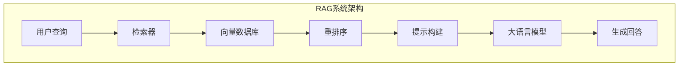

**模型推理优化流程**：

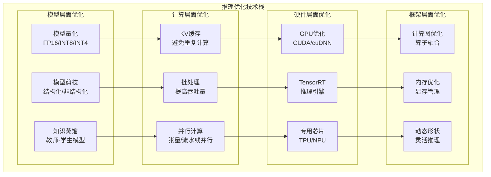

## 6. 开发工具与框架

### 6.1 训练框架

**深度学习框架对比**：

| 框架 | 优势 | 劣势 | 适用场景 |
|------|------|------|----------|
| **PyTorch** | 灵活易用 | 性能略低 | 研究开发 |
| **TensorFlow** | 生产稳定 | 学习曲线陡 | 工业部署 |
| **JAX** | 高性能 | 生态较小 | 大规模训练 |
| **PaddlePaddle** | 中文支持 | 国际化程度低 | 国内项目 |

### 6.2 应用开发框架

#### 6.2.1 LangChain生态

**核心组件**：
- **LLMs**：大语言模型接口
- **Prompts**：提示模板管理
- **Chains**：任务链式组合
- **Agents**：智能体框架
- **Memory**：对话记忆管理

#### 6.2.2 其他开发框架

| 框架 | 特点 | 适用场景 |
|------|------|----------|
| **LlamaIndex** | 数据索引 | RAG系统 |
| **Semantic Kernel** | 微软生态 | .NET开发 |
| **Haystack** | 搜索优化 | 企业搜索 |
| **Chroma** | 向量数据库 | 嵌入存储 |

## 7. 大模型前沿技术

### 7.1 Agent智能体

**Agent核心能力**：
- **规划能力**：任务分解与规划
- **工具使用**：调用外部API和工具
- **记忆管理**：长期和短期记忆
- **反思能力**：自我评估与改进

**Agent系统架构**：

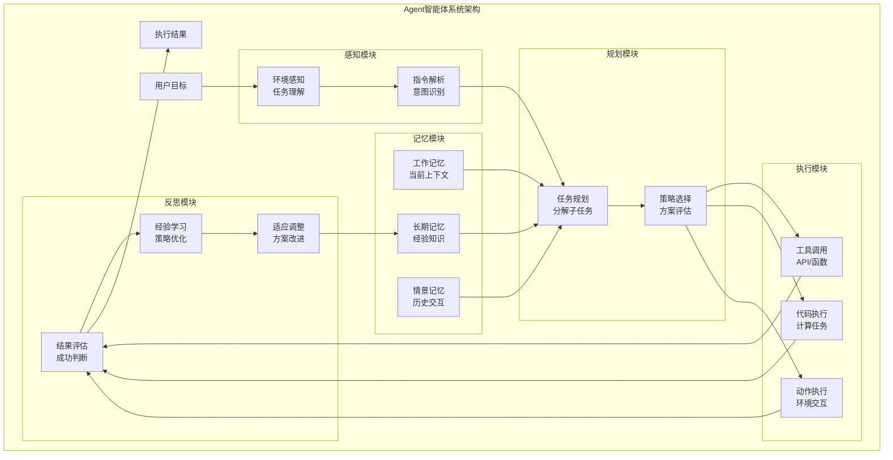

**Agent工作流程**：

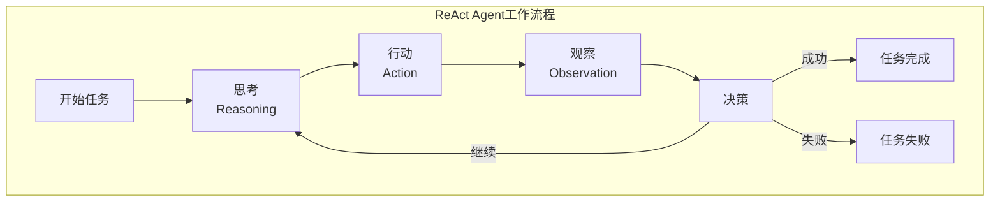

### 7.2 长文本处理

**技术突破**：
- **RoPE位置编码**：支持超长序列
- **分段注意力**：降低计算复杂度
- **稀疏注意力**：关注重要信息
- **层次化处理**：多级信息抽象

### 7.3 新兴架构

#### 7.3.1 Mamba状态空间模型

**优势特点**：
- **线性复杂度**：O(n)而非O(n²)
- **长序列建模**：更好的长距离依赖
- **高效推理**：减少计算资源需求

#### 7.3.2 混合专家模型(MoE)

**设计理念**：
- **专家路由**：动态选择专家网络
- **稀疏激活**：只激活部分参数
- **规模扩展**：参数增长不等比增加计算

**新兴架构对比**：

```mermaid
graph TB
    subgraph "新兴架构技术对比"
        subgraph "Transformer架构"
            TRANS_ATTN["自注意力机制<br/>O(n²)复杂度"]
            TRANS_PARALLEL["高度并行<br/>硬件友好"]
            TRANS_MEMORY["内存需求高<br/>长序列困难"]
        end
        
        subgraph "Mamba架构"
            MAMBA_SSM["状态空间模型<br/>O(n)复杂度"]
            MAMBA_LONG["长序列建模<br/>线性扩展"]
            MAMBA_EFF["计算高效<br/>内存友好"]
        end
        
        subgraph "MoE架构"
            MOE_EXPERT["专家网络<br/>稀疏激活"]
            MOE_SCALE["规模扩展<br/>参数共享"]
            MOE_ROUTE["动态路由<br/>智能选择"]
        end
        
        subgraph "RetNet架构"
            RETNET_RET["保持机制<br/>递归并行"]
            RETNET_INF["推理效率<br/>O(1)生成"]
            RETNET_TRAIN["训练并行<br/>推理序列"]
        end
    end
    
    TRANS_ATTN -.->|优化| MAMBA_SSM
    TRANS_MEMORY -.->|解决| MAMBA_LONG
    TRANS_PARALLEL -.->|保持| MAMBA_EFF
    
    TRANS_ATTN -.->|扩展| MOE_EXPERT
    TRANS_PARALLEL -.->|增强| MOE_SCALE
    TRANS_MEMORY -.->|优化| MOE_ROUTE
    
    TRANS_ATTN -.->|替代| RETNET_RET
    TRANS_MEMORY -.->|改进| RETNET_INF
    TRANS_PARALLEL -.->|兼容| RETNET_TRAIN
```

**架构演进趋势**：

```mermaid
graph LR
    subgraph "大模型架构演进路径"
        subgraph "当前主流"
            CURRENT["Transformer<br/>注意力机制"]
        end
        
        subgraph "优化方向"
            OPT1["计算效率<br/>Mamba/RetNet"]
            OPT2["参数效率<br/>MoE/MoD"]
            OPT3["长序列<br/>Longformer/BigBird"]
        end
        
        subgraph "未来架构"
            FUTURE1["混合架构<br/>多机制融合"]
            FUTURE2["自适应架构<br/>动态调整"]
            FUTURE3["神经符号<br/>推理增强"]
        end
    end
    
    CURRENT --> OPT1
    CURRENT --> OPT2
    CURRENT --> OPT3
    
    OPT1 --> FUTURE1
    OPT2 --> FUTURE1
    OPT3 --> FUTURE2
    
    FUTURE1 --> FUTURE3
    FUTURE2 --> FUTURE3
```

## 8. 行业应用案例

### 8.1 智能客服与对话

**应用场景**：
- **FAQ自动回答**：常见问题智能解答
- **多轮对话**：上下文理解与维护
- **情感分析**：用户情绪识别与响应
- **工单分类**：自动分类与路由

### 8.2 内容创作与营销

**核心功能**：
- **文案生成**：广告文案、产品描述
- **文章写作**：新闻稿、技术文档
- **创意策划**：营销活动、品牌策略
- **多语言翻译**：跨语言内容适配

### 8.3 代码生成与编程

**编程助手能力**：
- **代码补全**：智能代码提示
- **bug修复**：错误检测与修复建议
- **代码解释**：复杂逻辑说明
- **单元测试**：自动生成测试用例

### 8.4 教育与培训

**教育应用**：
- **个性化学习**：定制学习路径
- **智能答疑**：学科问题解答
- **作业批改**：自动评分与反馈
- **知识总结**：重点内容提炼

## 9. 大模型面试题详解

### 9.1 基础概念类

#### Q1: 什么是大模型？大模型有哪些特征？

**答案**：
大模型(Large Language Model, LLM)是指参数规模达到十亿级别以上的深度学习模型，特别是基于Transformer架构的语言模型。

**核心特征**：
1. **参数规模巨大**：通常在10B-1000B+参数
2. **涌现能力**：规模增长带来质的飞跃
3. **通用性强**：一个模型处理多种任务
4. **上下文学习**：通过示例快速适应新任务
5. **指令跟随**：理解并执行自然语言指令

#### Q2: Transformer架构的核心组件有哪些？

**答案**：
Transformer架构的**核心组件**包括：

1. **自注意力机制(Self-Attention)**：
   - 计算序列中任意两个位置的关系
   - 公式：`Attention(Q,K,V) = softmax(QK^T/√d_k)V`

2. **多头注意力(Multi-Head Attention)**：
   - 多个注意力子空间并行计算
   - 捕获不同类型的依赖关系

3. **位置编码(Positional Encoding)**：
   - 为序列添加位置信息
   - 常用正弦位置编码或学习位置嵌入

4. **前馈神经网络(FFN)**：
   - 两层线性变换 + 激活函数
   - 增强模型的非线性表达能力

5. **残差连接与层归一化**：
   - 缓解梯度消失问题
   - 加速训练收敛

#### Q3: 解释什么是涌现能力？

**答案**：
**涌现能力(Emergent Abilities)**是指当模型规模达到某个临界点时，突然展现出之前没有的新能力。

**典型涌现能力**：
1. **上下文学习(In-Context Learning)**：
   - 通过少量示例快速适应新任务
   - 无需参数更新

2. **链式推理(Chain-of-Thought)**：
   - 步骤分解的复杂推理
   - 可解释的推理过程

3. **指令跟随(Instruction Following)**：
   - 理解自然语言指令
   - 灵活执行各种任务

4. **代码生成与理解**：
   - 编程语言的生成和理解
   - 代码解释和调试

**关键特点**：
- **不可预测性**：很难预先知道何时出现
- **规模依赖**：通常需要达到一定参数规模
- **质的飞跃**：不是线性增长而是突然出现

### 9.2 架构技术类

#### Q4: 解释注意力机制的计算过程？

**答案**：
注意力机制的**核心思想**是动态加权，让模型关注输入序列中的重要部分。

**计算步骤**：
1. **生成Q、K、V矩阵**：
   ```
   Q = X × W_Q  (查询矩阵)
   K = X × W_K  (键矩阵)  
   V = X × W_V  (值矩阵)
   ```

2. **计算注意力分数**：
   ```
   Scores = Q × K^T / √d_k
   ```
   - 除以√d_k进行缩放，避免梯度消失

3. **Softmax归一化**：
   ```
   Attention_Weights = softmax(Scores)
   ```

4. **加权求和**：
   ```
   Output = Attention_Weights × V
   ```

**多头注意力**则是并行计算多个注意力，然后拼接：
```
MultiHead(Q,K,V) = Concat(head₁, ..., head_h) × W_O
```

#### Q5: GPT和BERT架构有什么区别？

**答案**：

| 方面 | GPT | BERT |
|------|-----|------|
| **架构类型** | 解码器(Decoder-only) | 编码器(Encoder-only) |
| **注意力机制** | 因果注意力(单向) | 双向注意力 |
| **预训练任务** | 自回归语言建模 | 掩码语言建模+NSP |
| **主要能力** | 文本生成 | 文本理解 |
| **应用场景** | 生成、对话、创作 | 分类、抽取、理解 |

**详细对比**：

1. **GPT特点**：
   - **因果掩码**：只能看到前面的token
   - **自回归生成**：逐个预测下一个token
   - **单向上下文**：信息流向单一

2. **BERT特点**：
   - **双向编码**：同时看到前后文
   - **掩码预测**：预测被遮盖的token
   - **深度双向**：每层都能看到全序列

#### Q6: 什么是位置编码？为什么需要位置编码？

**答案**：
**位置编码(Positional Encoding)**是为序列中的每个位置添加位置信息的技术。

**必要性**：
- Transformer没有RNN的顺序结构
- 自注意力机制对位置不敏感
- 需要显式告诉模型token的位置关系

**主要类型**：

1. **绝对位置编码**：
   - **正弦位置编码**：使用sin/cos函数
   ```
   PE(pos, 2i) = sin(pos / 10000^(2i/d_model))
   PE(pos, 2i+1) = cos(pos / 10000^(2i/d_model))
   ```
   
   - **学习位置嵌入**：可训练的位置向量

2. **相对位置编码**：
   - 编码相对距离而非绝对位置
   - 更好的长度外推能力

3. **旋转位置编码(RoPE)**：
   - 通过旋转操作编码位置
   - LLaMA等模型采用

### 9.3 训练优化类

#### Q7: 解释什么是梯度消失和梯度爆炸？如何解决？

**答案**：

**梯度消失**：
- **现象**：反向传播时梯度逐层衰减，深层参数难以更新
- **原因**：激活函数导数小、权重初始化不当
- **影响**：模型训练缓慢，深层特征学不到

**梯度爆炸**：
- **现象**：梯度指数级增长，参数更新过大
- **原因**：权重过大、学习率不当
- **影响**：训练不稳定，损失震荡

**解决方案**：

1. **残差连接(Residual Connection)**：
   ```
   output = F(x) + x
   ```
   - 提供梯度直接传播路径

2. **层归一化(Layer Normalization)**：
   - 稳定每层的输入分布
   - 加速收敛

3. **梯度裁剪(Gradient Clipping)**：
   ```python
   torch.nn.utils.clip_grad_norm_(model.parameters(), max_norm=1.0)
   ```

4. **合适的权重初始化**：
   - Xavier初始化、He初始化

5. **激活函数选择**：
   - 使用ReLU、GELU等避免饱和

#### Q8: 什么是学习率调度？常见的调度策略有哪些？

**答案**：
**学习率调度(Learning Rate Scheduling)**是在训练过程中动态调整学习率的技术。

**常见策略**：

1. **线性衰减**：
   ```
   lr = lr_initial × (1 - step / total_steps)
   ```

2. **余弦退火**：
   ```
   lr = lr_min + (lr_max - lr_min) × (1 + cos(π × step / T)) / 2
   ```

3. **预热(Warmup)**：
   ```python
   if step < warmup_steps:
       lr = lr_max × step / warmup_steps
   else:
       lr = lr_max × decay_factor
   ```

4. **阶梯衰减**：
   - 每隔固定步数降低学习率

**大模型常用组合**：
- **Warmup + Cosine**：预热后余弦衰减
- **Warmup + Linear**：预热后线性衰减
- **Constant with Warmup**：预热后保持不变

#### Q9: 解释什么是混合精度训练？有什么优势？

**答案**：
**混合精度训练(Mixed Precision Training)**是同时使用FP16和FP32精度进行训练的技术。

**实现方式**：
1. **前向传播**：使用FP16计算
2. **损失缩放**：放大loss避免下溢
3. **梯度计算**：FP16计算梯度
4. **参数更新**：FP32存储master weights

**代码示例**：
```python
from torch.cuda.amp import autocast, GradScaler

scaler = GradScaler()
for batch in dataloader:
    optimizer.zero_grad()
    
    with autocast():  # FP16前向传播
        loss = model(batch)
    
    scaler.scale(loss).backward()  # 缩放梯度
    scaler.step(optimizer)  # 更新参数
    scaler.update()  # 更新缩放因子
```

**优势**：
1. **内存节省**：FP16占用内存减半
2. **速度提升**：现代GPU的FP16计算更快
3. **精度保持**：关键操作仍用FP32
4. **易于使用**：框架自动处理

### 9.4 应用实践类

#### Q10: 如何评估大模型的性能？有哪些评估指标？

**答案**：
大模型评估需要**多维度、多任务**的综合评估体系。

**评估维度**：

1. **基础能力评估**：
   - **困惑度(Perplexity)**：语言建模能力
   - **BLEU/ROUGE**：生成质量
   - **准确率/F1**：理解任务表现

2. **综合基准测试**：

| 基准 | 评估内容 | 任务类型 |
|------|----------|----------|
| **MMLU** | 多学科知识 | 选择题 |
| **HellaSwag** | 常识推理 | 完形填空 |
| **HumanEval** | 代码生成 | 编程任务 |
| **GSM8K** | 数学推理 | 数学题 |
| **TruthfulQA** | 真实性 | 问答 |

3. **人类评估**：
   - **有用性(Helpfulness)**：回答是否有帮助
   - **无害性(Harmlessness)**：是否包含有害内容
   - **诚实性(Honesty)**：是否承认不知道

4. **专项能力评估**：
   - **指令跟随**：按指令执行任务的能力
   - **上下文学习**：Few-shot学习效果
   - **安全性**：有害内容过滤能力

#### Q11: 什么是RAG？如何构建RAG系统？

**答案**：
**RAG(Retrieval-Augmented Generation)**是检索增强生成，结合外部知识库提升生成质量。

**核心思想**：
1. **检索相关信息**：从知识库中检索相关文档
2. **增强输入**：将检索结果与用户查询结合
3. **生成回答**：基于增强信息生成答案

**系统架构**：
```python
def rag_pipeline(query):
    # 1. 向量化查询
    query_embedding = embedding_model.encode(query)
    
    # 2. 检索相关文档
    relevant_docs = vector_db.search(query_embedding, top_k=5)
    
    # 3. 构建增强提示
    context = "\n".join([doc.content for doc in relevant_docs])
    prompt = f"基于以下信息回答问题：\n{context}\n\n问题：{query}\n回答："
    
    # 4. 生成回答
    response = llm.generate(prompt)
    return response
```

**关键技术**：
1. **文档分割**：将长文档切分为chunk
2. **向量化**：使用嵌入模型编码文本
3. **检索策略**：密集检索、稀疏检索、混合检索
4. **重排序**：对检索结果进行相关性排序

**优势**：
- **知识时效性**：实时更新外部知识
- **可解释性**：可追溯信息来源
- **领域适应**：针对特定领域定制
- **成本效益**：避免重新训练大模型

#### Q12: 如何进行模型部署和推理优化？

**答案**：
模型部署需要考虑**性能、成本、精度**的平衡。

**部署策略**：

1. **云端API部署**：
   - **优势**：无需管理基础设施
   - **劣势**：成本高、延迟大
   - **适用**：原型验证、小规模应用

2. **本地部署**：
   - **优势**：数据安全、成本可控
   - **劣势**：需要硬件投入
   - **适用**：大规模应用、敏感数据

3. **边缘部署**：
   - **优势**：低延迟、离线可用
   - **劣势**：硬件限制
   - **适用**：移动端、IoT设备

**推理优化技术**：

1. **模型压缩**：
   - **量化**：FP16、INT8、INT4
   - **剪枝**：结构化、非结构化
   - **蒸馏**：知识蒸馏、特征蒸馏

2. **推理加速**：
   - **KV缓存**：缓存注意力中间结果
   - **批处理**：批量推理提高吞吐
   - **并行化**：张量并行、流水线并行

3. **硬件优化**：
   - **GPU**：CUDA优化、TensorRT
   - **专用芯片**：TPU、NPU
   - **CPU**：ONNX Runtime、Intel MKL

### 9.5 前沿发展类

#### Q13: 什么是Agent？Agent有哪些核心能力？

**答案**：
**Agent(智能体)**是能够感知环境、制定计划、执行行动的智能系统。

**核心能力**：

1. **规划能力(Planning)**：
   - **任务分解**：将复杂任务分解为子任务
   - **策略制定**：选择合适的执行策略
   - **动态调整**：根据执行结果调整计划

2. **工具使用(Tool Use)**：
   - **API调用**：调用外部服务
   - **代码执行**：运行程序获取结果
   - **数据库查询**：检索结构化信息

3. **记忆管理(Memory)**：
   - **工作记忆**：当前任务的临时信息
   - **长期记忆**：持久化的知识和经验
   - **情景记忆**：历史交互记录

4. **反思能力(Reflection)**：
   - **自我评估**：评价行动效果
   - **错误分析**：分析失败原因
   - **策略改进**：优化执行方案

**典型框架**：
- **ReAct**：推理+行动的循环
- **AutoGPT**：自主目标追求
- **LangChain Agents**：模块化智能体
- **Multi-Agent**：多智能体协作

#### Q14: 解释什么是涌现能力的scaling law？

**答案**：
**Scaling Law**描述了模型性能与规模(参数、数据、计算)之间的幂律关系。

**基本公式**：
```
Loss ∝ N^(-α)
```
其中N是参数数量，α是scaling指数。

**三大要素**：
1. **参数规模(Parameters)**：模型权重数量
2. **数据规模(Data)**：训练token数量  
3. **计算规模(Compute)**：FLOPs数量

**关键发现**：
1. **平滑缩放**：大部分能力平滑提升
2. **涌现现象**：某些能力突然出现
3. **最优配比**：三要素需要平衡增长

**Chinchilla定律**：
- 参数和数据应等比例增长
- 给定计算预算下的最优配置
- N个参数需要约20N个训练token

**实际应用**：
- **模型设计**：预测不同规模的性能
- **资源规划**：估算训练成本
- **能力评估**：判断何时出现新能力

#### Q15: 当前大模型面临哪些挑战和发展趋势？

**答案**：

**主要挑战**：

1. **计算资源需求**：
   - 训练成本指数级增长
   - 推理延迟和吞吐量问题
   - 能耗和碳排放问题

2. **数据质量与获取**：
   - 高质量数据稀缺
   - 数据版权和隐私问题
   - 多语言、多模态数据不均衡

3. **安全性与可控性**：
   - 有害内容生成
   - 偏见和歧视问题
   - 对抗攻击脆弱性

4. **可解释性与可靠性**：
   - 黑盒决策过程
   - 幻觉(Hallucination)问题
   - 一致性和鲁棒性不足

**发展趋势**：

1. **模型架构创新**：
   - **新架构**：Mamba、MoE、Mixture of Depths
   - **长序列建模**：百万token上下文
   - **多模态融合**：文本+图像+音频+视频

2. **训练效率提升**：
   - **算法优化**：更好的优化器、学习率调度
   - **数据效率**：主动学习、课程学习
   - **计算效率**：模型并行、梯度压缩

3. **应用模式演进**：
   - **Agent化**：从工具到智能体
   - **个性化**：适应特定用户/领域
   - **协作化**：人机协作、多Agent系统

4. **部署优化**：
   - **边缘计算**：本地化推理
   - **专用硬件**：AI芯片、光计算
   - **软硬协同**：算法硬件联合优化

**未来展望**：
- **AGI路径**：通用人工智能的实现路径
- **具身智能**：机器人与物理世界交互
- **脑机接口**：直接的神经信号交互
- **量子计算**：突破经典计算限制

---

## 📚 学习建议

### 入门路径
1. **基础理论**：深度学习、Transformer架构
2. **实践项目**：使用开源模型进行微调
3. **框架掌握**：PyTorch、HuggingFace
4. **应用开发**：构建RAG系统、Agent应用

### 进阶方向
1. **模型训练**：预训练、RLHF、DPO
2. **系统优化**：分布式训练、推理优化
3. **前沿跟踪**：论文阅读、开源项目参与
4. **产业应用**：商业化落地、解决方案设计

### 实践资源
- **开源模型**：LLaMA、ChatGLM、百川
- **训练框架**：DeepSpeed、Megatron、ColossalAI
- **应用框架**：LangChain、LlamaIndex、AutoGen
- **评估工具**：OpenCompass、HELM、EleutherAI

这份大模型技术指南涵盖了从基础概念到前沿应用的完整知识体系，为深入理解和应用大模型技术提供了全面的参考。

这样，我已经创建了大模型技术指南的第一部分内容。文档现在有2734行，涵盖了大模型的概述、Transformer架构和训练技术的详细内容。让我继续添加剩余的章节内容。