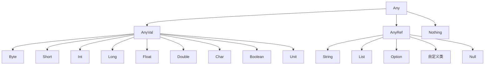

# 28. Scala语法指南

## 目录

### [1. Scala概述](#1-scala概述)
- [1.1 Scala简介](#11-scala简介)
- [1.2 Scala特点](#12-scala特点)
- [1.3 Scala与Java对比](#13-scala与java对比)
- [1.4 开发环境搭建](#14-开发环境搭建)

### [2. 基础语法](#2-基础语法)
- [2.1 变量与常量](#21-变量与常量)
- [2.2 数据类型](#22-数据类型)
- [2.3 操作符](#23-操作符)
- [2.4 控制结构](#24-控制结构)

### [3. 函数与方法](#3-函数与方法)
- [3.1 函数定义](#31-函数定义)
- [3.2 方法与函数区别](#32-方法与函数区别)
- [3.3 高阶函数](#33-高阶函数)
- [3.4 匿名函数与柯里化](#34-匿名函数与柯里化)

### [4. 面向对象编程](#4-面向对象编程)
- [4.1 类与对象](#41-类与对象)
- [4.2 构造器](#42-构造器)
- [4.3 继承与多态](#43-继承与多态)
- [4.4 特质(Trait)](#44-特质trait)

### [5. 集合框架](#5-集合框架)
- [5.1 List、Set、Map](#51-listsetmap)
- [5.2 可变与不可变集合](#52-可变与不可变集合)
- [5.3 集合操作方法](#53-集合操作方法)
- [5.4 集合性能对比](#54-集合性能对比)

### [6. 模式匹配](#6-模式匹配)
- [6.1 基本模式匹配](#61-基本模式匹配)
- [6.2 案例类模式](#62-案例类模式)
- [6.3 集合模式匹配](#63-集合模式匹配)
- [6.4 提取器](#64-提取器extractor)

### [7. 高级特性](#7-高级特性)
- [7.1 隐式转换与隐式参数](#71-隐式转换与隐式参数)
- [7.2 泛型与类型参数](#72-泛型与类型参数)
- [7.3 协变与逆变](#73-协变与逆变)

### [8. 函数式编程](#8-函数式编程)
- [8.1 不可变性](#81-不可变性)
- [8.2 函数组合](#82-函数组合)
- [8.3 Monads概念](#83-monads概念)
- [8.4 Option、Try、Either](#84-optiontryelther)

### [9. 并发编程](#9-并发编程)
- [9.1 Actor模型](#91-actor模型)
- [9.2 Future与Promise](#92-future与promise)
- [9.3 并行集合](#93-并行集合)
- [9.4 同步机制](#94-同步机制)

### [10. 系统交互与外部调用](#10-系统交互与外部调用)
- [10.1 执行Shell命令](#101-执行shell命令)
- [10.2 文件系统操作](#102-文件系统操作)
- [10.3 进程管理](#103-进程管理)
- [10.4 系统属性与环境变量](#104-系统属性与环境变量)

### [11. Scala面试题集](#11-scala面试题集)
- [11.1 基础语法题](#111-基础语法题)
- [11.2 面向对象题](#112-面向对象题)
- [11.3 函数式编程题](#113-函数式编程题)
- [11.4 高级特性题](#114-高级特性题)

### [12. 总结与进阶方向](#12-总结)

---

## 1. Scala概述

### 1.1 Scala简介

**Scala**（Scalable Language）是一种运行在JVM上的多范式编程语言，由Martin Odersky在2003年设计。它**seamlessly结合了面向对象编程和函数式编程**的特性，旨在构建可伸缩的软件系统。*
*核心设计理念**：
- **可伸缩性**：从小型脚本到大型系统都适用
- **简洁性**：用更少的代码表达更多的功能
- **类型安全**：强大的静态类型系统
- **互操作性**：与Java完全兼容

### 1.2 Scala特点

| 特性           | 描述                   | 优势                         |
| -------------- | ---------------------- | ---------------------------- |
| **静态类型**   | 编译时类型检查         | 减少运行时错误，提高代码质量 |
| **类型推断**   | 自动推导变量类型       | 简化代码编写，保持类型安全   |
| **函数式编程** | 支持高阶函数、不可变性 | 提高代码可读性和可维护性     |
| **模式匹配**   | 强大的模式匹配机制     | 简化条件逻辑，提高代码表达力 |
| **并发支持**   | Actor模型、Future等    | 高效处理并发任务             |
| **JVM兼容**    | 运行在JVM上            | 利用Java生态系统             |

### 1.3 Scala与Java对比

```scala
// Java写法
public class Person {
    private String name;
    private int age;
    
    public Person(String name, int age) {
        this.name = name;
        this.age = age;
    }
    
    public String getName() { return name; }
    public int getAge() { return age; }
    
    @Override
    public boolean equals(Object obj) {
        // 复杂的equals实现...
    }
}

// Scala写法
case class Person(name: String, age: Int)
// 自动生成构造器、getter、equals、hashCode、toString等方法
```

### 1.4 开发环境搭建

#### 安装步骤

1. **安装JDK 8+**
2. **安装Scala**
   ```bash
   # 使用SDKMAN
   sdk install scala 2.13.8
   
   # 使用Homebrew (macOS)
   brew install scala
   ```

3. **IDE配置**
   - **IntelliJ IDEA** + Scala插件（推荐）
   - **VS Code** + Metals扩展
   - **Eclipse** + Scala IDE

---

## 2. 基础语法

### 2.1 变量与常量

#### 变量声明

```scala
// val：不可变变量（推荐）
val name: String = "张三"
val age = 25  // 类型推断

// var：可变变量
var score: Int = 90
score = 95  // 可以重新赋值

// lazy val：延迟初始化
lazy val expensiveComputation = {
    println("执行复杂计算...")
    Thread.sleep(1000)
    42
}
```

#### 命名规则

```scala
// 驼峰命名法
val firstName = "John"
val lastName = "Doe"

// 常量使用大写下划线
val MAX_SIZE = 100
val DEFAULT_TIMEOUT = 30

// 私有变量可以使用下划线开头
private val _internalState = "hidden"
```

### 2.2 数据类型

#### 基本数据类型

```scala
// 数值类型
val byteValue: Byte = 127
val shortValue: Short = 32767
val intValue: Int = 42
val longValue: Long = 1234567890L
val floatValue: Float = 3.14f
val doubleValue: Double = 3.14159

// 字符和布尔类型
val charValue: Char = 'A'
val boolValue: Boolean = true

// 字符串
val stringValue: String = "Hello, Scala!"
val multiLineString =
  """这是一个
    |多行字符串
    |保持原始格式""".stripMargin
```

#### 类型层次结构



### 2.3 操作符

#### 算术操作符

```scala
val a = 10
val b = 3

val sum = a + b      // 13
val diff = a - b     // 7
val product = a * b  // 30
val quotient = a / b // 3
val remainder = a % b // 1
```

#### 比较操作符

```scala
val x = 5
val y = 10

x == y    // false
x != y    // true
x < y     // true
x <= y    // true
x > y     // false
x >= y    // false
```

#### 逻辑操作符

```scala
val p = true
val q = false

p && q    // false (逻辑与)
p || q    // true  (逻辑或)
!p        // false (逻辑非)
```

### 2.4 控制结构

#### if表达式

```scala
// if作为表达式，有返回值
val result = if (score >= 90) "优秀"
            else if (score >= 80) "良好"
            else if (score >= 60) "及格"
            else "不及格"

// 三元操作符的替代
val status = if (age >= 18) "成年人" else "未成年人"
```

#### 循环结构

```scala
// for循环
for (i <- 1 to 5) {
    println(s"数字: $i")
}

// for推导式
val squares = for (i <- 1 to 10) yield i * i
// squares: Vector(1, 4, 9, 16, 25, 36, 49, 64, 81, 100)

// 多重循环
for {
    i <- 1 to 3
    j <- 1 to 3
    if i != j  // 守卫条件
} yield (i, j)

// while循环
var count = 0
while (count < 5) {
    println(s"Count: $count")
    count += 1
}
```

---

## 3. 函数与方法

### 3.1 函数定义

#### 基本函数语法

```scala
// 完整函数定义
def add(x: Int, y: Int): Int = {
    x + y
}

// 简化写法（单行表达式）
def multiply(x: Int, y: Int): Int = x * y

// 无参数函数
def getCurrentTime(): Long = System.currentTimeMillis()

// 无返回值函数（返回Unit）
def printMessage(msg: String): Unit = {
    println(s"消息: $msg")
}
```

#### 默认参数与命名参数

```scala
// 默认参数
def greet(name: String, prefix: String = "Hello", suffix: String = "!") = {
    s"$prefix, $name$suffix"
}

// 调用方式
greet("Alice")                           // "Hello, Alice!"
greet("Bob", "Hi")                       // "Hi, Bob!"
greet("Charlie", suffix = "!!!")         // "Hello, Charlie!!!"
greet("David", suffix = ".", prefix = "Good morning") // "Good morning, David."
```

#### 可变参数

```scala
def sum(numbers: Int*): Int = {
    numbers.sum
}

sum(1, 2, 3, 4, 5)  // 15
sum()               // 0

// 传递数组
val array = Array(1, 2, 3, 4, 5)
sum(array: _*)      // 使用 :_* 展开数组
```

### 3.2 方法与函数区别

| 特性         | 方法(Method)       | 函数(Function)      |
| ------------ | ------------------ | ------------------- |
| **定义方式** | `def methodName()` | `val funcName = ()` |
| **类型**     | 不是值             | 是值，有类型        |
| **传递性**   | 不能直接传递       | 可以作为参数传递    |
| **转换**     | 可转换为函数       | 本身就是函数        |

```scala
// 方法定义
def methodAdd(x: Int, y: Int): Int = x + y

// 函数定义
val functionAdd: (Int, Int) => Int = (x, y) => x + y

// 方法转函数
val convertedFunction = methodAdd _

// 高阶函数使用
def applyOperation(x: Int, y: Int, op: (Int, Int) => Int): Int = {
    op(x, y)
}

applyOperation(5, 3, functionAdd)      // 8
applyOperation(5, 3, methodAdd)        // 8 (自动转换)
```

### 3.3 高阶函数

#### 函数作为参数

```scala
// 定义高阶函数
def processNumbers(numbers: List[Int], processor: Int => Int): List[Int] = {
    numbers.map(processor)
}

// 使用示例
val numbers = List(1, 2, 3, 4, 5)

// 传递函数
val doubled = processNumbers(numbers, x => x * 2)        // List(2, 4, 6, 8, 10)
val squared = processNumbers(numbers, x => x * x)        // List(1, 4, 9, 16, 25)
val incremented = processNumbers(numbers, _ + 1)         // List(2, 3, 4, 5, 6)
```

#### 函数作为返回值

```scala
// 返回函数的函数
def createMultiplier(factor: Int): Int => Int = {
    (x: Int) => x * factor
}

val double = createMultiplier(2)
val triple = createMultiplier(3)

double(5)  // 10
triple(4)  // 12
```

#### 常用高阶函数

```scala
val numbers = List(1, 2, 3, 4, 5, 6, 7, 8, 9, 10)

// map：转换每个元素
val doubled = numbers.map(_ * 2)

// filter：过滤元素
val evens = numbers.filter(_ % 2 == 0)

// reduce：聚合操作
val sum = numbers.reduce(_ + _)

// fold：带初始值的聚合
val product = numbers.fold(1)(_ * _)

// flatMap：扁平化映射
val nested = List(List(1, 2), List(3, 4), List(5, 6))
val flattened = nested.flatMap(identity)  // List(1, 2, 3, 4, 5, 6)
```

### 3.4 匿名函数与柯里化

#### 匿名函数（Lambda表达式）

```scala
// 完整写法
val add = (x: Int, y: Int) => x + y

// 简化写法（在已知类型上下文中）
val numbers = List(1, 2, 3, 4, 5)
numbers.map(x => x * 2)     // 完整参数
numbers.map(_ * 2)          // 占位符语法
numbers.filter(_ > 3)       // 过滤大于3的数
```

#### 柯里化(Currying)

```scala
// 普通函数
def add(x: Int, y: Int): Int = x + y

// 柯里化函数
def curriedAdd(x: Int)(y: Int): Int = x + y

// 部分应用
val addFive = curriedAdd(5) _
addFive(3)  // 8

// 柯里化的实际应用
def withLogging(logLevel: String)(operation: () => Unit): Unit = {
    println(s"[$logLevel] 开始执行操作")
    operation()
    println(s"[$logLevel] 操作完成")
}

val infoLogger = withLogging("INFO") _
val errorLogger = withLogging("ERROR") _

infoLogger(() => println("执行业务逻辑"))
```

---

## 4. 面向对象编程

### 4.1 类与对象

#### 基本类定义

```scala
// 基本类定义
class Person {
    var name: String = ""
    var age: Int = 0
    
    def introduce(): String = s"我是$name，今年$age岁"
}

// 使用构造参数的类
class Student(val name: String, val age: Int, var grade: String) {
    // 主构造器体
    println(s"创建学生: $name")
    
    // 辅助构造器
    def this(name: String, age: Int) = {
        this(name, age, "未分配")
    }
    
    // 方法定义
    def study(subject: String): Unit = {
        println(s"$name正在学习$subject")
    }
    
    def getInfo: String = s"学生：$name，年龄：$age，年级：$grade"
}
```

#### 访问修饰符

```scala
class BankAccount(private var _balance: Double) {
    // private：只能在类内部访问
    private def validateAmount(amount: Double): Boolean = amount > 0
    
    // protected：子类可以访问
    protected def logTransaction(amount: Double): Unit = {
        println(s"交易金额: $amount")
    }
    
    // public：默认访问级别
    def balance: Double = _balance
    
    def deposit(amount: Double): Unit = {
        if (validateAmount(amount)) {
            _balance += amount
            logTransaction(amount)
        }
    }
    
    def withdraw(amount: Double): Boolean = {
        if (validateAmount(amount) && _balance >= amount) {
            _balance -= amount
            logTransaction(-amount)
            true
        } else false
    }
}
```

#### 伴生对象

```scala
// 类定义
class Circle(val radius: Double) {
    import Circle._  // 导入伴生对象成员
    
    def area: Double = PI * radius * radius
    def circumference: Double = 2 * PI * radius
}

// 伴生对象（相当于Java的静态成员）
object Circle {
    private val PI = 3.14159
    
    // 工厂方法
    def apply(radius: Double): Circle = new Circle(radius)
    
    // 静态方法
    def fromDiameter(diameter: Double): Circle = new Circle(diameter / 2)
    
    // 常量
    val UNIT_CIRCLE = new Circle(1.0)
}

// 使用示例
val circle1 = Circle(5.0)                    // 使用apply方法
val circle2 = Circle.fromDiameter(10.0)      // 使用工厂方法
val unitCircle = Circle.UNIT_CIRCLE          // 使用常量
```

### 4.2 构造器

#### 主构造器与辅助构造器

```scala
class Book(val title: String, val author: String, val pages: Int) {
    // 主构造器参数自动成为字段
    
    // 主构造器体（类体中的代码）
    require(pages > 0, "页数必须大于0")
    require(title.nonEmpty, "标题不能为空")
    
    private var _borrowed = false
    
    // 辅助构造器1
    def this(title: String, author: String) = {
        this(title, author, 100)  // 调用主构造器
    }
    
    // 辅助构造器2
    def this(title: String) = {
        this(title, "未知作者", 100)  // 调用主构造器
    }
    
    // 方法
    def borrow(): Unit = {
        if (!_borrowed) {
            _borrowed = true
            println(s"《$title》已借出")
        } else {
            println(s"《$title》已被借出")
        }
    }
    
    def returnBook(): Unit = {
        if (_borrowed) {
            _borrowed = false
            println(s"《$title》已归还")
        }
    }
    
    def isBorrowed: Boolean = _borrowed
    
    override def toString: String = s"Book($title, $author, $pages页)"
}
```

#### 案例类(Case Class)

```scala
// 案例类自动生成很多有用的方法
case class Product(name: String, price: Double, category: String) {
    // 自动生成：
    // - apply方法（工厂方法）
    // - unapply方法（提取器）
    // - equals和hashCode
    // - toString
    // - copy方法
    
    def discountPrice(discount: Double): Double = price * (1 - discount)
}

// 使用案例类
val laptop = Product("MacBook Pro", 15999.0, "电脑")
val phone = Product("iPhone 14", 7999.0, "手机")

// copy方法创建修改版本
val discountedLaptop = laptop.copy(price = 13999.0)

// 模式匹配
def categorizeProduct(product: Product): String = product match {
    case Product(_, price, _) if price > 10000 => "高端产品"
    case Product(_, price, _) if price > 5000  => "中端产品"
    case _                                     => "入门产品"
}
```

### 4.3 继承与多态

#### 类继承

```scala
// 基类
abstract class Animal(val name: String) {
    // 抽象方法
    def makeSound(): String
    
    // 具体方法
    def introduce(): String = s"我是$name"
    
    // 可重写的方法
    def move(): String = "移动中..."
}

// 子类
class Dog(name: String, val breed: String) extends Animal(name) {
    // 实现抽象方法
    override def makeSound(): String = "汪汪"
    
    // 重写具体方法
    override def move(): String = "奔跑中..."
    
    // 新增方法
    def fetch(): String = s"$name正在捡球"
}

class Cat(name: String, val color: String) extends Animal(name) {
    override def makeSound(): String = "喵喵"
    
    override def move(): String = "优雅地走着..."
    
    def climb(): String = s"$name正在爬树"
}
```

#### 多态性

```scala
// 多态使用
val animals: List[Animal] = List(
    new Dog("旺财", "金毛"),
    new Cat("咪咪", "橘色"),
    new Dog("小黑", "拉布拉多")
)

// 多态方法调用
animals.foreach { animal =>
    println(s"${animal.introduce()}: ${animal.makeSound()}")
    println(s"移动方式: ${animal.move()}")
}

// 类型检查和转换
def handleAnimal(animal: Animal): Unit = animal match {
    case dog: Dog => 
        println(s"这是一只${dog.breed}: ${dog.fetch()}")
    case cat: Cat => 
        println(s"这是一只${cat.color}猫: ${cat.climb()}")
    case _ => 
        println("未知动物类型")
}
```

### 4.4 特质(Trait)

#### 基本特质

```scala
// 基本特质定义
trait Flyable {
    def fly(): String = "在天空中飞翔"
    def maxAltitude: Int  // 抽象方法
}

trait Swimmable {
    def swim(): String = "在水中游泳"
    def maxDepth: Int
}

// 混入特质
class Duck(val name: String) extends Animal(name) with Flyable with Swimmable {
    override def makeSound(): String = "嘎嘎"
    override def maxAltitude: Int = 1000
    override def maxDepth: Int = 10
    
    // 可以重写特质方法
    override def fly(): String = s"$name正在低空飞行"
}
```

#### 特质的线性化

```scala
trait A {
    def method(): String = "A"
}

trait B extends A {
    override def method(): String = "B" + super.method()
}

trait C extends A {
    override def method(): String = "C" + super.method()
}

class D extends A with B with C {
    override def method(): String = "D" + super.method()
}

// 线性化顺序：D -> C -> B -> A
val d = new D
println(d.method())  // 输出: "DCBA"
```

#### 自类型(Self Type)

```scala
trait DatabaseComponent {
    def database: Database
}

trait UserService { self: DatabaseComponent =>
    // 这个特质要求混入时必须也混入DatabaseComponent
    
    def findUser(id: Long): Option[User] = {
        database.query(s"SELECT * FROM users WHERE id = $id")
    }
}

class UserServiceImpl extends UserService with DatabaseComponent {
    override val database = new MySQLDatabase()
}
```

---

## 5. 集合框架

### 5.1 List、Set、Map

#### List操作

```scala
// List创建
val numbers = List(1, 2, 3, 4, 5)
val names = List("Alice", "Bob", "Charlie")
val empty = List.empty[Int]

// 常用操作
val head = numbers.head           // 1
val tail = numbers.tail           // List(2, 3, 4, 5)
val last = numbers.last           // 5
val init = numbers.init           // List(1, 2, 3, 4)

// 添加元素
val newList1 = 0 :: numbers       // List(0, 1, 2, 3, 4, 5)
val newList2 = numbers :+ 6       // List(1, 2, 3, 4, 5, 6)
val combined = numbers ++ List(6, 7, 8)  // List(1, 2, 3, 4, 5, 6, 7, 8)

// 转换操作
val doubled = numbers.map(_ * 2)           // List(2, 4, 6, 8, 10)
val evens = numbers.filter(_ % 2 == 0)     // List(2, 4)
val sum = numbers.reduce(_ + _)            // 15
val folded = numbers.foldLeft(0)(_ + _)    // 15
```

#### Set操作

```scala
// Set创建
val fruits = Set("apple", "banana", "orange")
val numbers = Set(1, 2, 3, 4, 5)

// 集合操作
val moreFruits = fruits + "grape"          // 添加元素
val lessFruits = fruits - "banana"         // 删除元素

val set1 = Set(1, 2, 3, 4)
val set2 = Set(3, 4, 5, 6)

val union = set1 ++ set2           // Set(1, 2, 3, 4, 5, 6) 并集
val intersection = set1 & set2     // Set(3, 4) 交集
val difference = set1 -- set2      // Set(1, 2) 差集

// 检查操作
val contains = fruits.contains("apple")    // true
val subset = Set(1, 2).subsetOf(set1)     // true
```

#### Map操作

```scala
// Map创建
val scores = Map("Alice" -> 95, "Bob" -> 87, "Charlie" -> 92)
val empty = Map.empty[String, Int]

// 访问操作
val aliceScore = scores("Alice")           // 95
val bobScore = scores.get("Bob")           // Some(87)
val davidScore = scores.get("David")       // None
val defaultScore = scores.getOrElse("David", 0)  // 0

// 更新操作
val updated = scores + ("David" -> 88)     // 添加新键值对
val removed = scores - "Bob"               // 删除键值对
val modified = scores.updated("Alice", 98) // 更新值

// 遍历操作
scores.foreach { case (name, score) =>
    println(s"$name: $score")
}

val names = scores.keys.toList             // List("Alice", "Bob", "Charlie")
val allScores = scores.values.toList       // List(95, 87, 92)
```

### 5.2 可变与不可变集合

#### 不可变集合（默认）

```scala
import scala.collection.immutable._

val immutableList = List(1, 2, 3)
val immutableSet = Set("a", "b", "c")
val immutableMap = Map("key1" -> "value1", "key2" -> "value2")

// 操作返回新集合，原集合不变
val newList = immutableList :+ 4
println(immutableList)  // List(1, 2, 3) - 原集合未变
println(newList)        // List(1, 2, 3, 4) - 新集合
```

#### 可变集合

```scala
import scala.collection.mutable._

val mutableList = ListBuffer(1, 2, 3)
val mutableSet = Set("a", "b", "c")
val mutableMap = Map("key1" -> "value1")

// 直接修改原集合
mutableList += 4                    // ListBuffer(1, 2, 3, 4)
mutableList ++= List(5, 6)          // ListBuffer(1, 2, 3, 4, 5, 6)

mutableSet += "d"                   // Set(a, b, c, d)
mutableSet -= "a"                   // Set(b, c, d)

mutableMap("key2") = "value2"       // 添加新键值对
mutableMap.remove("key1")           // 删除键值对
```

#### 转换操作

```scala
import scala.collection.mutable

// 不可变转可变
val immutableList = List(1, 2, 3, 4, 5)
val mutableBuffer = immutableList.to(mutable.ListBuffer)

// 可变转不可变
val mutableSet = mutable.Set(1, 2, 3)
val immutableSet = mutableSet.toSet

// 集合类型转换
val list = List(1, 2, 3, 4, 5)
val vector = list.toVector
val array = list.toArray
val set = list.toSet
```

### 5.3 集合操作方法

#### 转换操作

```scala
val numbers = List(1, 2, 3, 4, 5, 6, 7, 8, 9, 10)

// map：一对一转换
val squared = numbers.map(x => x * x)
val strings = numbers.map(_.toString)

// flatMap：一对多转换后扁平化
val words = List("hello world", "scala programming")
val allWords = words.flatMap(_.split(" "))  // List("hello", "world", "scala", "programming")

// collect：部分函数转换
val evenSquares = numbers.collect {
    case x if x % 2 == 0 => x * x
}  // List(4, 16, 36, 64, 100)
```

#### 过滤操作

```scala
val numbers = List(1, 2, 3, 4, 5, 6, 7, 8, 9, 10)

// filter：保留满足条件的元素
val evens = numbers.filter(_ % 2 == 0)      // List(2, 4, 6, 8, 10)

// filterNot：保留不满足条件的元素
val odds = numbers.filterNot(_ % 2 == 0)    // List(1, 3, 5, 7, 9)

// partition：分割为两个集合
val (evenList, oddList) = numbers.partition(_ % 2 == 0)

// take/drop：取前n个/跳过前n个
val first3 = numbers.take(3)                // List(1, 2, 3)
val skip3 = numbers.drop(3)                 // List(4, 5, 6, 7, 8, 9, 10)

// takeWhile/dropWhile：按条件取/跳过
val takeWhileLess5 = numbers.takeWhile(_ < 5)  // List(1, 2, 3, 4)
val dropWhileLess5 = numbers.dropWhile(_ < 5)  // List(5, 6, 7, 8, 9, 10)
```

#### 聚合操作

```scala
val numbers = List(1, 2, 3, 4, 5)

// reduce：聚合操作（要求非空集合）
val sum = numbers.reduce(_ + _)             // 15
val max = numbers.reduce(_ max _)           // 5

// fold：带初始值的聚合
val sumWithZero = numbers.fold(0)(_ + _)    // 15
val product = numbers.fold(1)(_ * _)        // 120

// foldLeft/foldRight：指定方向的fold
val concatenated = numbers.foldLeft("")((acc, n) => acc + n)  // "12345"
val reversed = numbers.foldRight("")((n, acc) => acc + n)     // "54321"

// aggregate：并行聚合（适用于大数据）
val result = numbers.aggregate(0)(_ + _, _ + _)  // 15
```

#### 查找操作

```scala
val numbers = List(1, 2, 3, 4, 5, 6, 7, 8, 9, 10)

// find：查找第一个满足条件的元素
val firstEven = numbers.find(_ % 2 == 0)    // Some(2)
val firstNegative = numbers.find(_ < 0)     // None

// exists/forall：存在性检查
val hasEven = numbers.exists(_ % 2 == 0)    // true
val allPositive = numbers.forall(_ > 0)     // true

// contains：包含检查
val contains5 = numbers.contains(5)         // true

// count：计数
val evenCount = numbers.count(_ % 2 == 0)   // 5
```

### 5.4 集合性能对比

#### 时间复杂度对比

| 操作         | List | Vector   | Array | Set      | Map      |
| ------------ | ---- | -------- | ----- | -------- | -------- |
| **随机访问** | O(n) | O(log n) | O(1)  | -        | O(log n) |
| **头部插入** | O(1) | O(log n) | O(n)  | O(log n) | O(log n) |
| **尾部插入** | O(n) | O(log n) | O(1)* | O(log n) | O(log n) |
| **查找**     | O(n) | O(log n) | O(n)  | O(log n) | O(log n) |
| **删除**     | O(n) | O(log n) | O(n)  | O(log n) | O(log n) |

*Array的尾部插入在容量足够时为O(1)，需要扩容时为O(n)

#### 选择建议

```scala
// 根据使用场景选择合适的集合类型

// 1. 频繁头部操作 -> List
val stack = List(1, 2, 3)
val pushed = 0 :: stack              // O(1)
val (head, popped) = (stack.head, stack.tail)  // O(1)

// 2. 随机访问 -> Vector或Array
val vector = Vector(1, 2, 3, 4, 5)
val element = vector(2)              // O(log n)，实际很快

val array = Array(1, 2, 3, 4, 5)
val element2 = array(2)              // O(1)

// 3. 唯一性约束 -> Set
val uniqueNumbers = Set(1, 2, 2, 3, 3, 4)  // Set(1, 2, 3, 4)

// 4. 键值映射 -> Map
val userAges = Map("Alice" -> 25, "Bob" -> 30)
val aliceAge = userAges("Alice")     // O(log n)

// 5. 大量数据处理 -> ParVector（并行集合）
val largeData = (1 to 1000000).toVector
val parallelResult = largeData.par.map(_ * 2).sum  // 并行处理
```

---

## 6. 模式匹配

### 6.1 基本模式匹配

#### match表达式基础

```scala
// 基本模式匹配
def describe(x: Any): String = x match {
    case 1 => "数字一"
    case "hello" => "问候语"
    case true => "布尔真值"
    case _ => "其他类型"  // 默认情况
}

// 类型匹配
def processValue(value: Any): String = value match {
    case i: Int => s"整数: $i"
    case s: String => s"字符串: $s"
    case l: List[_] => s"列表，长度: ${l.length}"
    case _ => "未知类型"
}
```

#### 守卫条件

```scala
def categorizeNumber(n: Int): String = n match {
    case x if x < 0 => "负数"
    case x if x == 0 => "零"
    case x if x > 0 && x < 10 => "个位正数"
    case x if x >= 10 && x < 100 => "两位数"
    case _ => "大数"
}

// 复杂守卫条件
def analyzeList(list: List[Int]): String = list match {
    case Nil => "空列表"
    case head :: tail if head > 0 && tail.nonEmpty => "正数开头的非空列表"
    case head :: Nil if head < 0 => "只有一个负数的列表"
    case _ => "其他情况"
}
```

#### 变量绑定

```scala
def processOption(opt: Option[String]): String = opt match {
    case Some(value @ "special") => s"特殊值: $value"
    case Some(value) if value.length > 5 => s"长字符串: $value"
    case Some(value) => s"普通值: $value"
    case None => "空值"
}

// 嵌套模式中的变量绑定
def analyzeNestedList(list: List[List[Int]]): String = list match {
    case (head @ (first :: _)) :: tail if first > 0 => 
        s"第一个子列表 $head 以正数 $first 开头"
    case _ => "其他情况"
}
```

### 6.2 案例类模式

#### 案例类匹配

```scala
// 定义案例类
sealed trait Shape
case class Circle(radius: Double) extends Shape
case class Rectangle(width: Double, height: Double) extends Shape
case class Triangle(base: Double, height: Double) extends Shape
case object Point extends Shape

// 模式匹配案例类
def calculateArea(shape: Shape): Double = shape match {
    case Circle(r) => math.Pi * r * r
    case Rectangle(w, h) => w * h
    case Triangle(b, h) => 0.5 * b * h
    case Point => 0.0
}

// 嵌套案例类匹配
case class Person(name: String, age: Int, address: Address)
case class Address(street: String, city: String, zipCode: String)

def analyzeAddress(person: Person): String = person match {
    case Person(name, age, Address(_, "北京", _)) if age > 18 => 
        s"$name 是北京的成年人"
    case Person(name, _, Address(_, city, _)) => 
        s"$name 住在 $city"
}
```

#### 部分匹配

```scala
// 只匹配感兴趣的字段
case class User(id: Long, name: String, email: String, age: Int, isActive: Boolean)

def processUser(user: User): String = user match {
    case User(_, name, _, age, true) if age >= 18 => 
        s"活跃成年用户: $name"
    case User(_, name, _, age, true) => 
        s"活跃未成年用户: $name"
    case User(_, name, _, _, false) => 
        s"非活跃用户: $name"
}
```

### 6.3 集合模式匹配

#### List模式匹配

```scala
def processIntList(list: List[Int]): String = list match {
    case Nil => "空列表"
    case head :: Nil => s"单元素列表: $head"
    case head :: second :: Nil => s"两元素列表: $head, $second"
    case head :: tail => s"多元素列表，头部: $head，尾部长度: ${tail.length}"
}

// 复杂List模式
def analyzeNumbers(numbers: List[Int]): String = numbers match {
    case List() => "空列表"
    case List(x) => s"单个数字: $x"
    case List(x, y) if x > y => s"递减: $x > $y"
    case List(x, y) if x < y => s"递增: $x < $y"
    case List(x, y) => s"相等: $x = $y"
    case x :: y :: rest if x < y => s"开始递增: $x < $y，还有${rest.length}个元素"
    case _ => "复杂模式"
}
```

#### 其他集合模式

```scala
// Vector模式匹配
def processVector(vec: Vector[String]): String = vec match {
    case Vector() => "空向量"
    case Vector(single) => s"单元素: $single"
    case Vector(first, second) => s"两元素: $first, $second"
    case _ => s"多元素向量，长度: ${vec.length}"
}

// Array模式匹配
def processArray(arr: Array[Int]): String = arr match {
    case Array() => "空数组"
    case Array(x) => s"单元素数组: $x"
    case Array(x, y) => s"两元素数组: $x, $y"
    case _ => s"多元素数组，长度: ${arr.length}"
}

// Tuple模式匹配
def processTuple(tuple: (String, Int, Boolean)): String = tuple match {
    case (name, age, true) if age >= 18 => s"成年活跃用户: $name"
    case (name, age, false) if age >= 18 => s"成年非活跃用户: $name"
    case (name, age, _) => s"未成年用户: $name，年龄: $age"
}
```

### 6.4 提取器(Extractor)

#### 自定义提取器

```scala
// 定义提取器对象
object Email {
    def apply(user: String, domain: String): String = s"$user@$domain"
    
    def unapply(email: String): Option[(String, String)] = {
        val parts = email.split("@")
        if (parts.length == 2) Some((parts(0), parts(1)))
        else None
    }
}

// 使用提取器
def analyzeEmail(email: String): String = email match {
    case Email(user, "gmail.com") => s"Gmail用户: $user"
    case Email(user, "qq.com") => s"QQ邮箱用户: $user"
    case Email(user, domain) => s"其他邮箱用户: $user@$domain"
    case _ => "无效邮箱格式"
}

// 测试
val email1 = "john@gmail.com"
val email2 = "alice@qq.com"
println(analyzeEmail(email1))  // Gmail用户: john
println(analyzeEmail(email2))  // QQ邮箱用户: alice
```

#### 正则表达式提取器

```scala
// 使用正则表达式作为提取器
val PhoneNumber = """(\d{3})-(\d{3})-(\d{4})""".r
val Email = """([a-zA-Z0-9._%+-]+)@([a-zA-Z0-9.-]+\.[a-zA-Z]{2,})""".r

def parseContact(contact: String): String = contact match {
    case PhoneNumber(area, exchange, number) => 
        s"电话号码 - 区号: $area, 交换机: $exchange, 号码: $number"
    case Email(user, domain) => 
        s"邮箱 - 用户: $user, 域名: $domain"
    case _ => "未识别的联系方式"
}

// 测试
println(parseContact("123-456-7890"))           // 电话号码匹配
println(parseContact("user@example.com"))       // 邮箱匹配
println(parseContact("invalid-format"))         // 未识别
```

#### 多参数提取器

```scala
// 定义多参数提取器
object FullName {
    def unapply(name: String): Option[(String, String, Option[String])] = {
        val parts = name.trim.split("\\s+")
        parts.length match {
            case 2 => Some((parts(0), parts(1), None))
            case 3 => Some((parts(0), parts(1), Some(parts(2))))
            case _ => None
        }
    }
}

def greetPerson(fullName: String): String = fullName match {
    case FullName(first, last, None) => 
        s"你好, $first $last"
    case FullName(first, middle, Some(last)) => 
        s"你好, $first $middle $last"
    case _ => "姓名格式不正确"
}

// 测试
println(greetPerson("John Doe"))           // 你好, John Doe
println(greetPerson("John Michael Doe"))   // 你好, John Michael Doe
```


--

## 7. 高级特性

### 7.1 隐式转换与隐式参数

#### 隐式转换

```scala
// 定义隐式转换
implicit class StringExtensions(s: String) {
    def toInt: Int = Integer.parseInt(s)
    def isPalindrome: Boolean = s == s.reverse
    def wordCount: Int = s.split("\\s+").length
}

// 使用隐式转换
val number = "123".toInt              // 123
val palindrome = "level".isPalindrome // true
val words = "Hello World Scala".wordCount // 3

// 类型转换的隐式函数
implicit def stringToInt(s: String): Int = s.toInt
implicit def intToString(i: Int): String = i.toString

def processNumber(n: Int): String = s"处理数字: $n"
val result = processNumber("42")  // 隐式转换 "42" -> 42

```

#### 隐式参数

```scala
// 定义隐式参数
def greet(name: String)(implicit greeting: String): String = {
    s"$greeting, $name!"
}

// 定义隐式值
implicit val defaultGreeting: String = "Hello"

// 使用隐式参数
val message1 = greet("Alice")  // 使用隐式值
val message2 = greet("Bob")("Hi")  // 显式提供参数

// 上下文边界
def sort[T: Ordering](list: List[T]): List[T] = {
    list.sorted  // 使用隐式的Ordering[T]
}

val sortedInts = sort(List(3, 1, 4, 1, 5))      // List(1, 1, 3, 4, 5)
val sortedStrings = sort(List("c", "a", "b"))   // List("a", "b", "c")
```

#### 类型类模式

```scala
// 定义类型类
trait Show[T] {
    def show(value: T): String
}

// 为具体类型提供实例
implicit val intShow: Show[Int] = new Show[Int] {
    def show(value: Int): String = s"Int($value)"
}

implicit val stringShow: Show[String] = new Show[String] {
    def show(value: String): String = s"String($value)"
}

implicit def listShow[T](implicit showT: Show[T]): Show[List[T]] = new Show[List[T]] {
    def show(value: List[T]): String = {
        val elements = value.map(showT.show).mkString(", ")
        s"List($elements)"
    }
}

// 使用类型类
def display[T](value: T)(implicit show: Show[T]): String = {
    show.show(value)
}

println(display(42))                    // Int(42)
println(display("hello"))               // String(hello)
println(display(List(1, 2, 3)))         // List(Int(1), Int(2), Int(3))
```

### 7.2 泛型与类型参数

#### 基本泛型

```scala
// 泛型类
class Container[T](private var content: T) {
    def get: T = content
    def set(newContent: T): Unit = content = newContent
    
    def map[U](f: T => U): Container[U] = new Container(f(content))
}

// 泛型方法
def swap[T, U](pair: (T, U)): (U, T) = (pair._2, pair._1)

// 使用示例
val intContainer = new Container(42)
val stringContainer = intContainer.map(_.toString)

val swapped = swap(("hello", 123))  // (123, "hello")
```

#### 类型边界

```scala
// 上界约束 (Upper Bound)
class Animal
class Dog extends Animal
class Cat extends Animal

def processAnimals[T <: Animal](animals: List[T]): Unit = {
    animals.foreach(animal => println(s"处理动物: $animal"))
}

// 下界约束 (Lower Bound)
class Container[+T] {
    def add[U >: T](item: U): Container[U] = new Container[U]
}

// 上下文边界 (Context Bound)
def sortWithContext[T: Ordering](list: List[T]): List[T] = {
    list.sorted
}
```

### 7.3 协变与逆变

#### 协变(Covariance)

```scala
// 协变类型参数 (+T)
class Producer[+T](val value: T) {
    def get: T = value
}

// 协变的实际应用
class Animal
class Dog extends Animal

val dogProducer: Producer[Dog] = new Producer(new Dog)
val animalProducer: Producer[Animal] = dogProducer  // 协变：Producer[Dog] <: Producer[Animal]

// List是协变的
val dogs: List[Dog] = List(new Dog, new Dog)
val animals: List[Animal] = dogs  // 正确：List[Dog] <: List[Animal]
```

#### 逆变(Contravariance)

```scala
// 逆变类型参数 (-T)
trait Consumer[-T] {
    def consume(item: T): Unit
}

class AnimalConsumer extends Consumer[Animal] {
    def consume(animal: Animal): Unit = println(s"消费动物: $animal")
}

val animalConsumer: Consumer[Animal] = new AnimalConsumer
val dogConsumer: Consumer[Dog] = animalConsumer  // 逆变：Consumer[Animal] <: Consumer[Dog]
```

---

## 8. 函数式编程

### 8.1 不可变性

#### 不可变数据结构的优势

**不可变性**是函数式编程的核心概念，它带来以下优势：

| 优势         | 说明                   | 示例场景           |
| ------------ | ---------------------- | ------------------ |
| **线程安全** | 不可变对象天然线程安全 | 并发编程           |
| **缓存友好** | 可以安全缓存hashCode   | HashMap优化        |
| **历史追踪** | 保留所有历史版本       | 版本控制、撤销操作 |
| **推理简单** | 值不会意外改变         | 调试、测试         |

#### 不可变集合操作

```scala
// 不可变List操作
val originalList = List(1, 2, 3, 4, 5)

// 所有操作都返回新集合
val doubled = originalList.map(_ * 2)           // List(2, 4, 6, 8, 10)
val filtered = originalList.filter(_ > 3)      // List(4, 5)
val added = originalList :+ 6                  // List(1, 2, 3, 4, 5, 6)
val prepended = 0 :: originalList              // List(0, 1, 2, 3, 4, 5)

println(originalList)  // List(1, 2, 3, 4, 5) - 原集合未变

// 结构共享示例
val list1 = List(1, 2, 3)
val list2 = 0 :: list1  // 新列表共享list1的结构
```

### 8.2 函数组合

#### 基本函数组合

```scala
// 定义基本函数
val addOne: Int => Int = _ + 1
val multiplyByTwo: Int => Int = _ * 2
val toString: Int => String = _.toString

// 函数组合 - andThen（从左到右）
val pipeline1 = addOne andThen multiplyByTwo andThen toString
println(pipeline1(5))  // "12" (5 + 1 = 6, 6 * 2 = 12, 12.toString = "12")

// 函数组合 - compose（从右到左）
val pipeline2 = toString compose multiplyByTwo compose addOne
println(pipeline2(5))  // "12" (同样的结果，但组合顺序相反)
```

### 8.3 Monads概念

#### Monad的基本概念

**Monad**是函数式编程中的重要概念，它提供了一种**组合计算**的方式。Monad必须满足三个法则：

1. **左单位元法则**：`unit(a).flatMap(f) == f(a)`
2. **右单位元法则**：`m.flatMap(unit) == m`  
3. **结合律**：`m.flatMap(f).flatMap(g) == m.flatMap(x => f(x).flatMap(g))`

```scala
// Monad的基本结构
trait Monad[M[_]] {
    def unit[A](a: A): M[A]                    // 也叫pure或return
    def flatMap[A, B](ma: M[A])(f: A => M[B]): M[B]  // 也叫bind
    
    // map可以通过flatMap和unit实现
    def map[A, B](ma: M[A])(f: A => B): M[B] = {
        flatMap(ma)(a => unit(f(a)))
    }
}
```

### 8.4 Option、Try、Either

#### Option类型

**Option**是Scala中处理**可能为空值**的函数式方式，避免了NullPointerException。

```scala
// Option的基本使用
def findUser(id: Int): Option[String] = {
    val users = Map(1 -> "Alice", 2 -> "Bob", 3 -> "Charlie")
    users.get(id)
}

val user1 = findUser(1)  // Some("Alice")
val user4 = findUser(4)  // None

// Option的常用操作
val maybeAge: Option[Int] = Some(25)

// map：转换Option内的值
val ageNextYear = maybeAge.map(_ + 1)  // Some(26)

// getOrElse：提供默认值
val age = maybeAge.getOrElse(0)  // 25
val unknownAge = None.getOrElse(0)  // 0
```

#### Try类型

**Try**用于处理**可能抛出异常**的操作，提供函数式的异常处理方式。

```scala
import scala.util.{Try, Success, Failure}

// Try的基本使用
def parseInteger(s: String): Try[Int] = Try(s.toInt)

val validNumber = parseInteger("123")     // Success(123)
val invalidNumber = parseInteger("abc")   // Failure(NumberFormatException)

// Try的操作方法
val result = parseInteger("42")
    .map(_ * 2)                          // Success(84)
    .filter(_ > 50)                      // Success(84)
    .recover { case _: Exception => 0 }   // 异常恢复
```

#### Either类型

**Either**表示**两种可能的值**，通常用Right表示成功，Left表示错误。

```scala
// 自定义错误类型
sealed trait ValidationError
case class InvalidEmail(email: String) extends ValidationError
case class InvalidAge(age: Int) extends ValidationError

// 使用Either进行验证
def validateEmail(email: String): Either[ValidationError, String] = {
    if (email.contains("@")) Right(email)
    else Left(InvalidEmail(email))
}

def validateAge(age: Int): Either[ValidationError, Int] = {
    if (age >= 0 && age <= 150) Right(age)
    else Left(InvalidAge(age))
}

// 组合验证
case class User(name: String, age: Int, email: String)

def createUser(name: String, age: Int, email: String): Either[ValidationError, User] = {
    for {
        validAge <- validateAge(age)
        validEmail <- validateEmail(email)
    } yield User(name, validAge, validEmail)
}
```

---

## 9. 并发编程

### 9.1 Actor模型

#### Actor模型基础

**Actor模型**是Scala并发编程的核心，每个Actor是一个独立的计算单元，通过**消息传递**进行通信。

```scala
import akka.actor.{Actor, ActorRef, ActorSystem, Props}

// 定义消息类型
case class Greet(name: String)
case class Greeting(message: String)

// 定义Actor
class GreeterActor extends Actor {
    var greeting = "Hello"
    
    def receive = {
        case Greet(name) =>
            greeting = s"Hello, $name"
            sender() ! Greeting(greeting)
    }
}

// 使用Actor
val system = ActorSystem("GreeterSystem")
val greeter = system.actorOf(Props[GreeterActor], "greeter")

// 发送消息
greeter ! Greet("Alice")
```

### 9.2 Future与Promise

#### Future基础

**Future**表示**异步计算的结果**，提供非阻塞的并发编程方式。

```scala
import scala.concurrent.{Future, ExecutionContext}
import scala.util.{Success, Failure}

// 隐式执行上下文
implicit val ec: ExecutionContext = ExecutionContext.global

// 创建Future
val future1 = Future {
    Thread.sleep(1000)
    42
}

// Future的回调
future1.onComplete {
    case Success(value) => println(s"成功：$value")
    case Failure(exception) => println(s"失败：${exception.getMessage}")
}

// Future的转换操作
val doubled = future1.map(_ * 2)  // Future[Int]

// 组合多个Future
val future2 = Future(20)
val combined = for {
    a <- future1
    b <- future2
} yield a + b  // Future[Int]
```

### 9.3 并行集合

#### 并行集合基础

Scala提供了**并行集合**，可以自动利用多核处理器进行并行计算。

```scala
// 创建并行集合
val numbers = (1 to 1000000).toVector
val parallelNumbers = numbers.par

// 并行操作
val parallelSum = parallelNumbers.sum
val parallelSquares = parallelNumbers.map(x => x * x)
val parallelEvens = parallelNumbers.filter(_ % 2 == 0)

// 性能对比
def timeIt[T](operation: => T): (T, Long) = {
    val start = System.nanoTime()
    val result = operation
    val end = System.nanoTime()
    (result, end - start)
}

val (seqResult, seqTime) = timeIt(numbers.map(x => x * x).sum)
val (parResult, parTime) = timeIt(parallelNumbers.map(x => x * x).sum)

println(s"顺序执行：${seqTime / 1000000}ms")
println(s"并行执行：${parTime / 1000000}ms")
```

### 9.4 同步机制

#### 传统同步机制

```scala
// synchronized关键字
class Counter {
    private var count = 0
    
    def increment(): Unit = synchronized {
        count += 1
    }
    
    def get: Int = synchronized {
        count
    }
}

// 原子操作
import java.util.concurrent.atomic.AtomicInteger

val atomicInt = new AtomicInteger(0)
atomicInt.incrementAndGet()  // 原子递增
atomicInt.compareAndSet(1, 2)  // CAS操作
```

---

## 10. 系统交互与外部调用

### 10.1 执行Shell命令

#### 使用scala.sys.process包

Scala提供了强大的**scala.sys.process**包来执行外部命令和进程管理。

```scala
import scala.sys.process._

// 基本命令执行
val result = "ls -la".!  // 执行命令并返回退出码
println(s"Exit code: $result")

// 获取命令输出
val output = "ls -la".!!  // 执行命令并返回输出字符串
println(output)

// 获取命令输出行
val lines = "ls -la".lineStream  // 返回Stream[String]
lines.foreach(println)

// 异步执行
val process = "sleep 5".run()  // 返回Process对象
println("命令正在后台执行...")
val exitCode = process.exitValue()  // 等待完成并获取退出码
```

#### 命令构建与参数处理

```scala
import scala.sys.process._

// 使用Seq构建命令（推荐，避免shell注入）
val cmd = Seq("ls", "-la", "/tmp")
val result = cmd.!

// 处理包含空格的参数
val file = "/path/with spaces/file.txt"
val cmd2 = Seq("cat", file)
val content = cmd2.!!

// 动态构建命令
def listFiles(directory: String, showHidden: Boolean = false): String = {
  val baseCmd = Seq("ls", "-l")
  val cmd = if (showHidden) baseCmd :+ "-a" else baseCmd
  val fullCmd = cmd :+ directory
  fullCmd.!!
}

val output = listFiles("/home/user", showHidden = true)
```

#### 管道操作

```scala
import scala.sys.process._

// 简单管道
val result = ("ls -la" #| "grep scala").!!
println(result)

// 复杂管道链
val pipeline = "ps aux" #| "grep java" #| "wc -l"
val count = pipeline.!!.trim.toInt
println(s"Java进程数量: $count")

// 重定向到文件
val redirect = "ls -la" #> new java.io.File("output.txt")
redirect.!

// 追加到文件
val append = "date" #>> new java.io.File("log.txt")
append.!

// 从文件输入
val input = new java.io.File("input.txt") #< "sort"
val sorted = input.!!
```

#### 错误处理与进程控制

```scala
import scala.sys.process._
import scala.util.{Try, Success, Failure}

// 安全执行命令
def safeExecute(command: String): Try[String] = {
  Try {
    command.!!
  }
}

safeExecute("ls /nonexistent") match {
  case Success(output) => println(s"输出: $output")
  case Failure(exception) => println(s"命令执行失败: ${exception.getMessage}")
}

// 超时控制
import scala.concurrent.duration._
import scala.concurrent.{Future, TimeoutException}
import scala.concurrent.ExecutionContext.Implicits.global

def executeWithTimeout(command: String, timeout: Duration): Future[String] = {
  val future = Future {
    command.!!
  }
  
  val timeoutFuture = Future {
    Thread.sleep(timeout.toMillis)
    throw new TimeoutException(s"命令执行超时: $command")
  }
  
  Future.firstCompletedOf(Seq(future, timeoutFuture))
}

// 使用示例
executeWithTimeout("sleep 10", 5.seconds).recover {
  case _: TimeoutException => "命令执行超时"
}.foreach(println)
```

#### 实际应用示例

```scala
import scala.sys.process._
import java.io.File

// 系统信息收集
object SystemInfo {
  def getOSInfo: String = {
    val os = System.getProperty("os.name")
    if (os.toLowerCase.contains("windows")) {
      "systeminfo".!!
    } else {
      "uname -a".!!
    }
  }
  
  def getDiskUsage: String = {
    if (System.getProperty("os.name").toLowerCase.contains("windows")) {
      "wmic logicaldisk get size,freespace,caption".!!
    } else {
      "df -h".!!
    }
  }
  
  def getMemoryInfo: String = {
    if (System.getProperty("os.name").toLowerCase.contains("windows")) {
      "wmic OS get TotalVisibleMemorySize,FreePhysicalMemory".!!
    } else {
      "free -h".!!
    }
  }
}

// 文件操作工具
object FileUtils {
  def findFiles(directory: String, pattern: String): List[String] = {
    val cmd = if (System.getProperty("os.name").toLowerCase.contains("windows")) {
      Seq("dir", "/s", "/b", s"$directory\\$pattern")
    } else {
      Seq("find", directory, "-name", pattern)
    }
    
    Try {
      cmd.lineStream.toList
    }.getOrElse(List.empty)
  }
  
  def compressDirectory(sourceDir: String, outputFile: String): Boolean = {
    val cmd = Seq("tar", "-czf", outputFile, "-C", new File(sourceDir).getParent, new File(sourceDir).getName)
    cmd.! == 0
  }
  
  def extractArchive(archiveFile: String, targetDir: String): Boolean = {
    val cmd = Seq("tar", "-xzf", archiveFile, "-C", targetDir)
    cmd.! == 0
  }
}

// 网络工具
object NetworkUtils {
  def ping(host: String, count: Int = 4): Boolean = {
    val cmd = if (System.getProperty("os.name").toLowerCase.contains("windows")) {
      Seq("ping", "-n", count.toString, host)
    } else {
      Seq("ping", "-c", count.toString, host)
    }
    cmd.! == 0
  }
  
  def downloadFile(url: String, outputFile: String): Boolean = {
    val cmd = Seq("curl", "-o", outputFile, url)
    cmd.! == 0
  }
  
  def getPublicIP: Option[String] = {
    Try {
      "curl -s ifconfig.me".!!.trim
    }.toOption
  }
}

// 使用示例
println("=== 系统信息 ===")
println(SystemInfo.getOSInfo)

println("=== 磁盘使用情况 ===")
println(SystemInfo.getDiskUsage)

println("=== 查找Scala文件 ===")
val scalaFiles = FileUtils.findFiles("/home/user/projects", "*.scala")
scalaFiles.take(10).foreach(println)

println("=== 网络测试 ===")
if (NetworkUtils.ping("google.com")) {
  println("网络连接正常")
  NetworkUtils.getPublicIP.foreach(ip => println(s"公网IP: $ip"))
}
```

### 10.2 文件系统操作

#### Java NIO与Scala集成

```scala
import java.nio.file.{Files, Paths, Path, StandardCopyOption}
import java.nio.charset.StandardCharsets
import scala.jdk.CollectionConverters._
import scala.util.{Try, Using}

// 文件读写操作
object FileOperations {
  
  // 读取文件内容
  def readFile(filePath: String): Try[String] = {
    Try {
      Files.readString(Paths.get(filePath), StandardCharsets.UTF_8)
    }
  }
  
  // 读取文件行
  def readLines(filePath: String): Try[List[String]] = {
    Try {
      Files.readAllLines(Paths.get(filePath), StandardCharsets.UTF_8).asScala.toList
    }
  }
  
  // 写入文件
  def writeFile(filePath: String, content: String): Try[Unit] = {
    Try {
      Files.writeString(Paths.get(filePath), content, StandardCharsets.UTF_8)
    }
  }
  
  // 追加到文件
  def appendToFile(filePath: String, content: String): Try[Unit] = {
    Try {
      Files.writeString(
        Paths.get(filePath), 
        content, 
        StandardCharsets.UTF_8,
        java.nio.file.StandardOpenOption.CREATE,
        java.nio.file.StandardOpenOption.APPEND
      )
    }
  }
  
  // 复制文件
  def copyFile(source: String, target: String): Try[Unit] = {
    Try {
      Files.copy(
        Paths.get(source), 
        Paths.get(target), 
        StandardCopyOption.REPLACE_EXISTING
      )
    }
  }
  
  // 移动文件
  def moveFile(source: String, target: String): Try[Unit] = {
    Try {
      Files.move(
        Paths.get(source), 
        Paths.get(target), 
        StandardCopyOption.REPLACE_EXISTING
      )
    }
  }
  
  // 删除文件或目录
  def delete(path: String): Try[Unit] = {
    Try {
      Files.deleteIfExists(Paths.get(path))
    }
  }
  
  // 创建目录
  def createDirectories(path: String): Try[Unit] = {
    Try {
      Files.createDirectories(Paths.get(path))
    }
  }
  
  // 列出目录内容
  def listDirectory(dirPath: String): Try[List[String]] = {
    Try {
      Using.resource(Files.list(Paths.get(dirPath))) { stream =>
        stream.map(_.toString).collect(java.util.stream.Collectors.toList()).asScala.toList
      }
    }
  }
  
  // 递归遍历目录
  def walkDirectory(dirPath: String): Try[List[String]] = {
    Try {
      Using.resource(Files.walk(Paths.get(dirPath))) { stream =>
        stream.map(_.toString).collect(java.util.stream.Collectors.toList()).asScala.toList
      }
    }
  }
}

// 使用示例
val content = "Hello, Scala!"
FileOperations.writeFile("test.txt", content)
FileOperations.readFile("test.txt").foreach(println)

FileOperations.listDirectory(".").foreach { files =>
  files.foreach(println)
}
```

#### 文件监控

```scala
import java.nio.file._
import java.nio.file.StandardWatchEventKinds._
import scala.jdk.CollectionConverters._

// 文件变化监控
class FileWatcher(directory: String) {
  private val watchService = FileSystems.getDefault.newWatchService()
  private val path = Paths.get(directory)
  
  // 注册监控事件
  path.register(watchService, ENTRY_CREATE, ENTRY_DELETE, ENTRY_MODIFY)
  
  def startWatching(): Unit = {
    println(s"开始监控目录: $directory")
    
    while (true) {
      val key = watchService.take() // 阻塞等待事件
      
      key.pollEvents().asScala.foreach { event =>
        val kind = event.kind()
        val fileName = event.context().toString
        
        kind match {
          case ENTRY_CREATE => println(s"文件创建: $fileName")
          case ENTRY_DELETE => println(s"文件删除: $fileName")
          case ENTRY_MODIFY => println(s"文件修改: $fileName")
          case _ => println(s"未知事件: $kind - $fileName")
        }
      }
      
      val valid = key.reset()
      if (!valid) {
        println("监控已停止")
        break
      }
    }
  }
  
  def stop(): Unit = {
    watchService.close()
  }
}

// 使用示例
val watcher = new FileWatcher("/tmp/watch")
// watcher.startWatching() // 在单独线程中运行
```

### 10.3 进程管理

#### 进程信息获取

```scala
import scala.sys.process._
import scala.util.Try

object ProcessManager {
  
  // 获取当前进程ID
  def getCurrentPID: Long = {
    ProcessHandle.current().pid()
  }
  
  // 获取所有进程信息
  def getAllProcesses: List[ProcessInfo] = {
    ProcessHandle.allProcesses().toArray
      .map(_.asInstanceOf[ProcessHandle])
      .map(ProcessInfo.fromHandle)
      .toList
  }
  
  // 根据名称查找进程
  def findProcessByName(name: String): List[ProcessInfo] = {
    getAllProcesses.filter(_.command.exists(_.contains(name)))
  }
  
  // 杀死进程
  def killProcess(pid: Long): Boolean = {
    ProcessHandle.of(pid).map(_.destroy()).getOrElse(false)
  }
  
  // 强制杀死进程
  def forceKillProcess(pid: Long): Boolean = {
    ProcessHandle.of(pid).map(_.destroyForcibly()).getOrElse(false)
  }
  
  // 检查进程是否存在
  def isProcessAlive(pid: Long): Boolean = {
    ProcessHandle.of(pid).map(_.isAlive).getOrElse(false)
  }
}

case class ProcessInfo(
  pid: Long,
  command: Option[String],
  arguments: List[String],
  startTime: Option[java.time.Instant],
  cpuUsage: Option[java.time.Duration],
  user: Option[String]
)

object ProcessInfo {
  def fromHandle(handle: ProcessHandle): ProcessInfo = {
    val info = handle.info()
    ProcessInfo(
      pid = handle.pid(),
      command = info.command().map(_.toString).toScala,
      arguments = info.arguments().map(_.toList.asScala.toList).getOrElse(List.empty),
      startTime = info.startInstant().toScala,
      cpuUsage = info.totalCpuDuration().toScala,
      user = info.user().toScala
    )
  }
}

// 扩展方法用于Optional转换
implicit class OptionalOps[T](optional: java.util.Optional[T]) {
  def toScala: Option[T] = if (optional.isPresent) Some(optional.get()) else None
}

// 使用示例
println(s"当前进程ID: ${ProcessManager.getCurrentPID}")

val javaProcesses = ProcessManager.findProcessByName("java")
javaProcesses.foreach { proc =>
  println(s"Java进程: PID=${proc.pid}, 命令=${proc.command.getOrElse("未知")}")
}
```

#### 异步进程执行

```scala
import scala.concurrent.{Future, ExecutionContext}
import scala.sys.process._
import scala.util.{Success, Failure}

implicit val ec: ExecutionContext = ExecutionContext.global

// 异步执行命令
def executeAsync(command: String): Future[String] = {
  Future {
    command.!!
  }
}

// 并行执行多个命令
def executeParallel(commands: List[String]): Future[List[String]] = {
  val futures = commands.map(executeAsync)
  Future.sequence(futures)
}

// 使用示例
val commands = List("date", "whoami", "pwd")
executeParallel(commands).onComplete {
  case Success(results) =>
    results.zipWithIndex.foreach { case (result, index) =>
      println(s"命令 ${index + 1} 结果: ${result.trim}")
    }
  case Failure(exception) =>
    println(s"执行失败: ${exception.getMessage}")
}

// 带回调的进程执行
class ProcessExecutor {
  def executeWithCallback(
    command: String,
    onSuccess: String => Unit,
    onError: Throwable => Unit
  ): Unit = {
    Future {
      command.!!
    }.onComplete {
      case Success(output) => onSuccess(output)
      case Failure(error) => onError(error)
    }
  }
}

val executor = new ProcessExecutor()
executor.executeWithCallback(
  "ls -la",
  output => println(s"成功: $output"),
  error => println(s"错误: ${error.getMessage}")
)
```

### 10.4 系统属性与环境变量

#### 系统属性访问

```scala
// 获取系统属性
object SystemProperties {
  
  // 常用系统属性
  def javaVersion: String = System.getProperty("java.version")
  def javaHome: String = System.getProperty("java.home")
  def osName: String = System.getProperty("os.name")
  def osVersion: String = System.getProperty("os.version")
  def userHome: String = System.getProperty("user.home")
  def userDir: String = System.getProperty("user.dir")
  def userName: String = System.getProperty("user.name")
  def fileSeparator: String = System.getProperty("file.separator")
  def pathSeparator: String = System.getProperty("path.separator")
  def lineSeparator: String = System.getProperty("line.separator")
  
  // 获取所有系统属性
  def getAllProperties: Map[String, String] = {
    import scala.jdk.CollectionConverters._
    System.getProperties.asScala.toMap.map { case (k, v) => 
      (k.toString, v.toString) 
    }
  }
  
  // 设置系统属性
  def setProperty(key: String, value: String): Option[String] = {
    Option(System.setProperty(key, value))
  }
  
  // 获取系统属性（带默认值）
  def getProperty(key: String, defaultValue: String = ""): String = {
    System.getProperty(key, defaultValue)
  }
  
  // 打印系统信息
  def printSystemInfo(): Unit = {
    println(s"Java版本: $javaVersion")
    println(s"Java主目录: $javaHome")
    println(s"操作系统: $osName $osVersion")
    println(s"用户主目录: $userHome")
    println(s"当前工作目录: $userDir")
    println(s"用户名: $userName")
  }
}

// 使用示例
SystemProperties.printSystemInfo()
```

#### 环境变量操作

```scala
// 环境变量操作
object EnvironmentVariables {
  
  // 获取环境变量
  def getEnv(key: String): Option[String] = {
    Option(System.getenv(key))
  }
  
  // 获取环境变量（带默认值）
  def getEnv(key: String, defaultValue: String): String = {
    System.getenv().getOrDefault(key, defaultValue)
  }
  
  // 获取所有环境变量
  def getAllEnv: Map[String, String] = {
    import scala.jdk.CollectionConverters._
    System.getenv().asScala.toMap
  }
  
  // 常用环境变量
  def path: Option[String] = getEnv("PATH")
  def home: Option[String] = getEnv("HOME")
  def shell: Option[String] = getEnv("SHELL")
  def lang: Option[String] = getEnv("LANG")
  
  // 检查环境变量是否存在
  def hasEnv(key: String): Boolean = {
    System.getenv().containsKey(key)
  }
  
  // 打印重要环境变量
  def printImportantEnv(): Unit = {
    val important = List("PATH", "HOME", "SHELL", "LANG", "USER", "PWD")
    important.foreach { key =>
      getEnv(key) match {
        case Some(value) => println(s"$key = $value")
        case None => println(s"$key = (未设置)")
      }
    }
  }
}

// 配置管理器
class ConfigManager {
  private val config = scala.collection.mutable.Map[String, String]()
  
  // 从环境变量加载配置
  def loadFromEnv(prefix: String = ""): Unit = {
    EnvironmentVariables.getAllEnv.foreach { case (key, value) =>
      if (prefix.isEmpty || key.startsWith(prefix)) {
        val configKey = if (prefix.nonEmpty) key.stripPrefix(prefix) else key
        config(configKey) = value
      }
    }
  }
  
  // 从系统属性加载配置
  def loadFromSystemProperties(prefix: String = ""): Unit = {
    SystemProperties.getAllProperties.foreach { case (key, value) =>
      if (prefix.isEmpty || key.startsWith(prefix)) {
        val configKey = if (prefix.nonEmpty) key.stripPrefix(prefix) else key
        config(configKey) = value
      }
    }
  }
  
  // 获取配置值
  def get(key: String): Option[String] = config.get(key)
  def get(key: String, defaultValue: String): String = config.getOrElse(key, defaultValue)
  
  // 设置配置值
  def set(key: String, value: String): Unit = config(key) = value
  
  // 获取所有配置
  def getAll: Map[String, String] = config.toMap
  
  // 打印配置
  def printConfig(): Unit = {
    config.toSeq.sortBy(_._1).foreach { case (key, value) =>
      println(s"$key = $value")
    }
  }
}

// 使用示例
val configManager = new ConfigManager()
configManager.loadFromEnv("JAVA_")  // 加载以JAVA_开头的环境变量
configManager.loadFromSystemProperties("java.")  // 加载以java.开头的系统属性

println("=== 应用配置 ===")
configManager.printConfig()

// 数据库配置示例
case class DatabaseConfig(
  host: String,
  port: Int,
  database: String,
  username: String,
  password: String
)

object DatabaseConfig {
  def fromEnv(): DatabaseConfig = {
    DatabaseConfig(
      host = EnvironmentVariables.getEnv("DB_HOST", "localhost"),
      port = EnvironmentVariables.getEnv("DB_PORT", "5432").toInt,
      database = EnvironmentVariables.getEnv("DB_NAME", "myapp"),
      username = EnvironmentVariables.getEnv("DB_USER", "user"),
      password = EnvironmentVariables.getEnv("DB_PASSWORD", "")
    )
  }
}

val dbConfig = DatabaseConfig.fromEnv()
println(s"数据库配置: $dbConfig")
```

---

## 11. Scala面试题集

### 11.1 基础语法题

#### 题目1：val与var的区别

**问题**：解释Scala中val和var的区别，以及lazy val的作用。

**答案**：
- **val**：定义**不可变变量**，一旦赋值后不能修改，类似Java的final变量
- **var**：定义**可变变量**，可以重新赋值
- **lazy val**：**延迟初始化**的不可变变量，只在第一次访问时计算值

```scala
val immutable = 42        // 不可变，不能重新赋值
var mutable = 42          // 可变，可以重新赋值
mutable = 100             // 正确

lazy val expensive = {    // 延迟计算
    println("计算中...")
    Thread.sleep(1000)
    42
}
// 只有在第一次访问expensive时才会执行计算
```

#### 题目2：模式匹配的优势

**问题**：Scala的模式匹配相比传统的if-else有什么优势？

**答案**：
1. **类型安全**：编译时检查所有情况是否覆盖
2. **解构能力**：可以直接提取数据结构中的值
3. **守卫条件**：支持复杂的条件判断
4. **可读性强**：代码更简洁、表达力更强

```scala
// 模式匹配
def processValue(value: Any): String = value match {
    case i: Int if i > 0 => "正整数"
    case i: Int => "非正整数"
    case s: String => "字符串"
    case _ => "其他类型"
}
```

### 11.2 面向对象题

#### 题目3：类与案例类的区别

**问题**：普通类和案例类(case class)有什么区别？

**答案**：

| 特性                | 普通类              | 案例类    |
| ------------------- | ------------------- | --------- |
| **构造参数**        | 需要显式声明val/var | 自动为val |
| **apply方法**       | 需要手动实现        | 自动生成  |
| **equals/hashCode** | 需要手动实现        | 自动生成  |
| **copy方法**        | 不提供              | 自动生成  |
| **模式匹配**        | 需要自定义提取器    | 直接支持  |

```scala
// 案例类（自动生成很多有用方法）
case class Person(name: String, age: Int)

val person1 = Person("Alice", 25)
val person2 = person1.copy(age = 26)  // 使用copy方法
person1 match {  // 直接模式匹配
    case Person(name, age) => println(s"$name is $age years old")
}
```

### 11.3 函数式编程题

#### 题目4：Monad的概念

**问题**：什么是Monad？Option如何体现Monad模式？

**答案**：
**Monad**是函数式编程中的设计模式，提供了**组合计算**的统一方式。

```scala
// Option Monad - 处理可能为空的值
def safeDivide(x: Double, y: Double): Option[Double] = {
    if (y != 0) Some(x / y) else None
}

val result = for {
    a <- Some(10.0)
    b <- Some(2.0)
    c <- safeDivide(a, b)
} yield c * 2  // Some(10.0)
```

### 11.4 高级特性题

#### 题目5：协变与逆变

**问题**：解释Scala的协变、逆变和不变。

**答案**：

```scala
// 协变 (+T)：如果A <: B，则F[A] <: F[B]
trait Producer[+T] {
    def produce(): T
}

// 逆变 (-T)：如果A <: B，则F[B] <: F[A]
trait Consumer[-T] {
    def consume(item: T): Unit
}

// 不变 (T)：F[A]和F[B]之间没有子类型关系
class Container[T](var item: T)
```

**应用场景**：
- **协变**：只产生T类型值的容器（如List、Option）
- **逆变**：只消费T类型值的容器（如函数参数）
- **不变**：既产生又消费T类型值的容器（如Array、可变集合）

---

## 12. 总结

Scala作为一门**多范式编程语言**，成功地将**面向对象**和**函数式编程**融合在一起。通过本文档的学习，你应该掌握了：

### 核心概念
- **类型系统**：静态类型、类型推断、协变逆变
- **函数式编程**：不可变性、高阶函数、Monad模式
- **面向对象**：类、特质、继承、多态
- **并发编程**：Actor模型、Future、并行集合

### 最佳实践
- 优先使用**不可变数据结构**
- 合理运用**模式匹配**简化代码逻辑
- 使用**类型类**实现可扩展的设计
- 采用**函数组合**构建复杂业务逻辑
- 遵循**并发编程**的安全准则

### 进阶方向
- **Akka**：构建分布式、弹性的应用系统
- **Cats/Scalaz**：函数式编程库
- **Spark**：大数据处理框架
- **Play Framework**：Web应用开发
- **Slick**：函数式关系映射

Scala的学习曲线相对陡峭，但掌握后能显著提高开发效率和代码质量。建议从基础语法开始，逐步深入函数式编程思想，最终能够灵活运用Scala的各种特性解决实际问题。