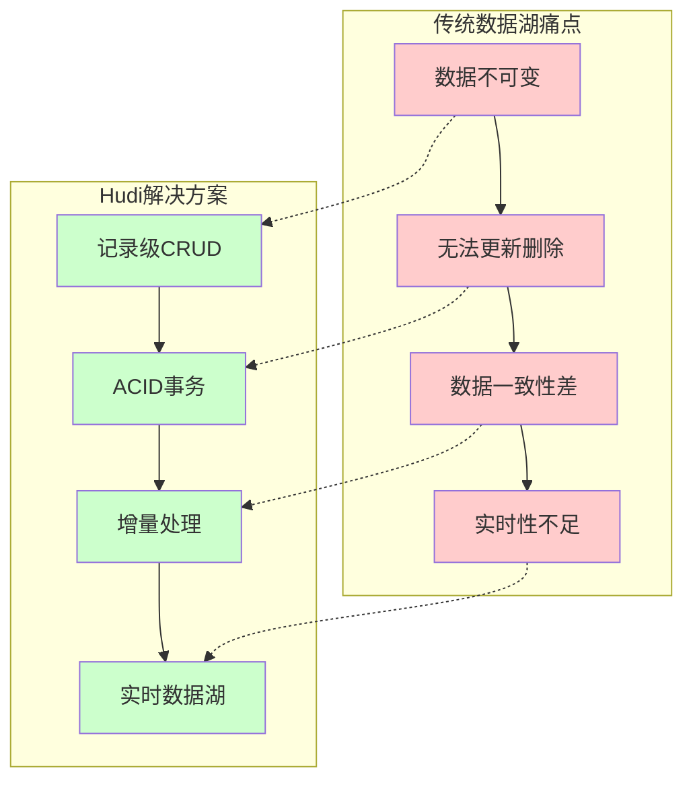
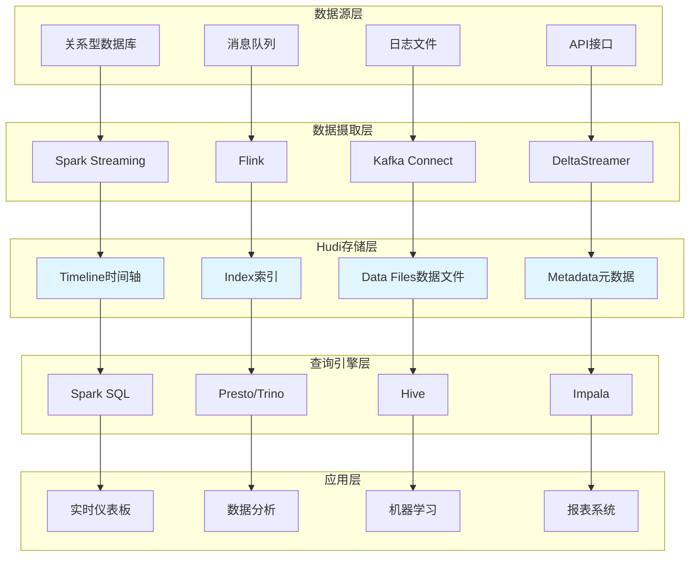
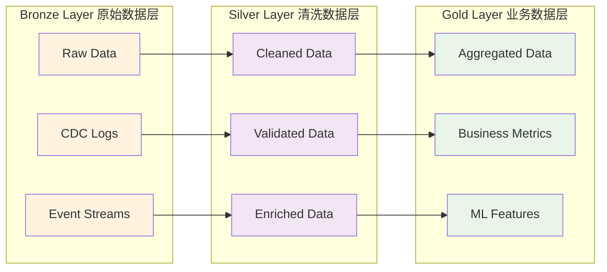
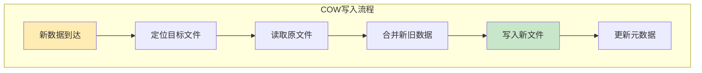
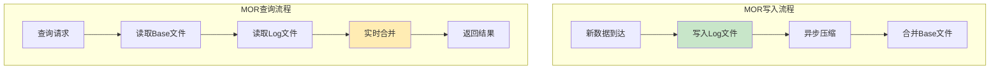
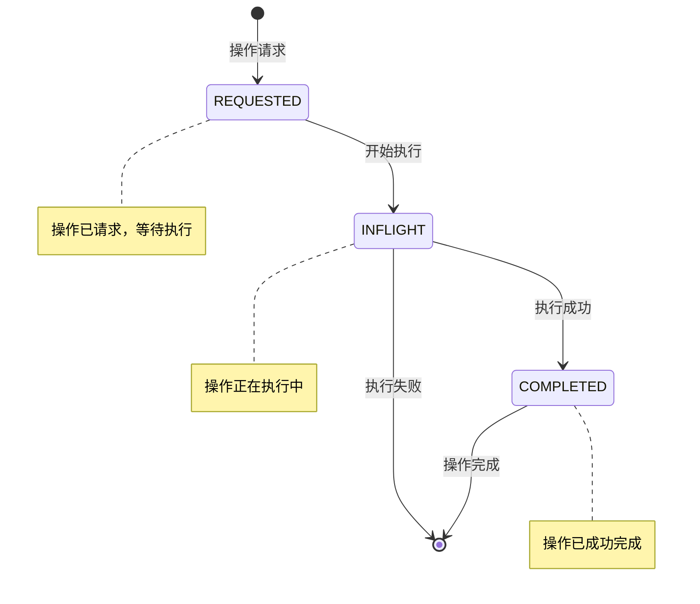
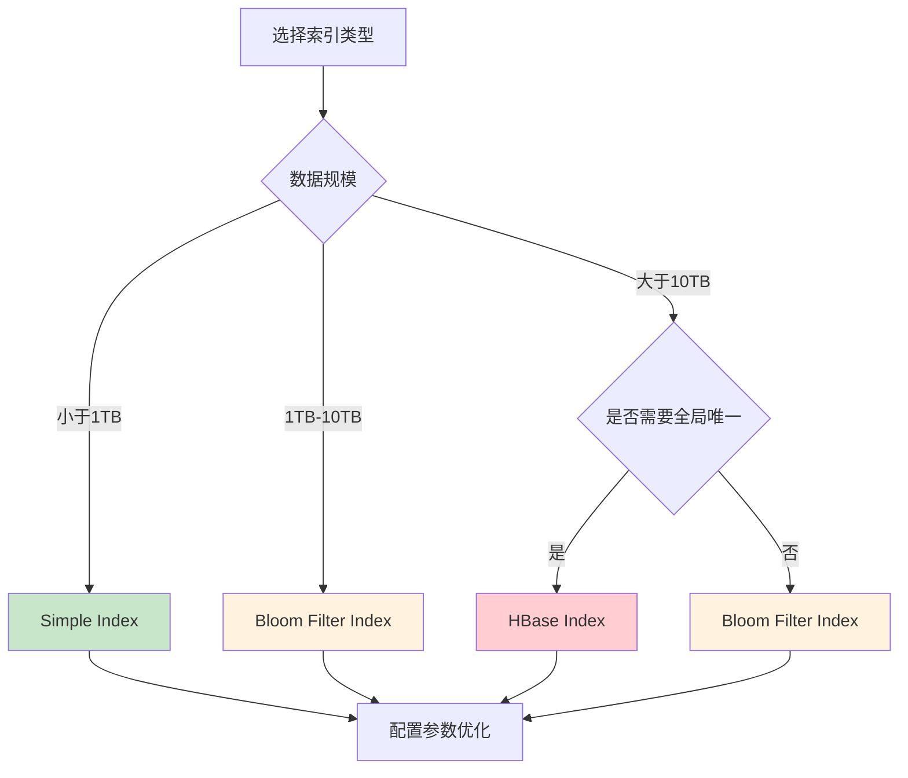
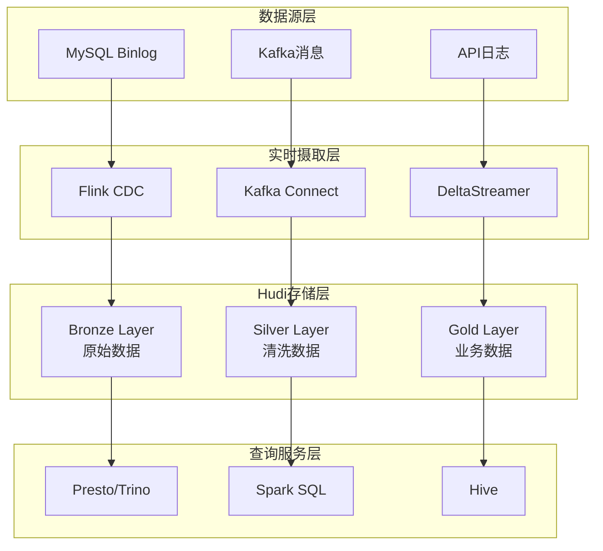

# Apache Hudi

## 目录
- [Apache Hudi](#apache-hudi)
  - [目录](#目录)
  - [Hudi 基础概念](#hudi-基础概念)
    - [Hudi 简介](#hudi-简介)
    - [核心特性](#核心特性)
    - [应用场景](#应用场景)
    - [与其他技术对比](#与其他技术对比)
  - [Hudi 架构设计](#hudi-架构设计)
    - [整体架构](#整体架构)
    - [核心组件](#核心组件)
    - [数据湖架构](#数据湖架构)
  - [Hudi 表类型](#hudi-表类型)
    - [Copy On Write (COW)](#copy-on-write-cow)
    - [Merge On Read (MOR)](#merge-on-read-mor)
    - [表类型选择策略](#表类型选择策略)
  - [Hudi 时间轴](#hudi-时间轴)
    - [时间轴概念](#时间轴概念)
    - [时间轴状态](#时间轴状态)
    - [时间轴操作](#时间轴操作)
  - [Hudi 索引机制](#hudi-索引机制)
    - [索引类型](#索引类型)
    - [索引选择策略](#索引选择策略)
    - [索引性能优化](#索引性能优化)
  - [数据写入](#数据写入)
    - [写入模式](#写入模式)
    - [写入配置](#写入配置)
    - [批量写入](#批量写入)
    - [流式写入](#流式写入)
  - [数据查询](#数据查询)
    - [查询类型](#查询类型)
    - [查询优化](#查询优化)
    - [时间旅行查询](#时间旅行查询)
  - [数据管理](#数据管理)
    - [压缩策略](#压缩策略)
    - [清理策略](#清理策略)
    - [归档策略](#归档策略)
  - [集成生态](#集成生态)
    - [Spark 集成](#spark-集成)
    - [Flink 集成](#flink-集成)
    - [Hive 集成](#hive-集成)
    - [Presto/Trino 集成](#prestotrino-集成)
  - [性能优化](#性能优化)
    - [写入性能优化](#写入性能优化)
    - [查询性能优化](#查询性能优化)
    - [存储优化](#存储优化)
  - [监控运维](#监控运维)
    - [监控指标](#监控指标)
    - [故障排查](#故障排查)
    - [最佳实践](#最佳实践)
  - [面试题](#面试题)
    - [基础概念类](#基础概念类)
    - [架构设计类](#架构设计类)
    - [性能优化类](#性能优化类)
    - [实战应用类](#实战应用类)

## Hudi 基础概念

### Hudi 简介

**Apache Hudi**（Hadoop Upserts Deletes and Incrementals）是一个开源的数据湖存储框架，专门为**增量数据处理**而设计。Hudi 提供了在大数据存储系统上进行**记录级别的插入、更新、删除**操作的能力，同时保持**ACID事务特性**。



### 核心特性

| 特性 | 描述 | 优势 |
|------|------|------|
| **Upsert支持** | 支持记录级别的插入和更新操作 | 简化数据管道，提高数据质量 |
| **增量处理** | 支持增量数据摄取和查询 | 降低处理延迟，提高效率 |
| **时间旅行** | 支持查询历史版本数据 | 数据回溯，审计追踪 |
| **ACID事务** | 保证数据操作的原子性和一致性 | 数据可靠性，并发安全 |
| **Schema演进** | 支持表结构的动态变更 | 灵活适应业务变化 |
| **多引擎支持** | 兼容Spark、Flink、Hive等 | 生态集成度高 |

### 应用场景

**1. 实时数据湖**
- CDC（Change Data Capture）数据同步
- 流批一体化数据处理
- 近实时数据分析

**2. 数据质量管理**
- 数据修正和补录
- 重复数据去除
- 数据血缘追踪

**3. 合规性要求**
- GDPR数据删除
- 数据审计和回溯
- 敏感数据管理

### 与其他技术对比

| 技术 | 更新支持 | 事务支持 | 实时性 | 生态兼容 | 适用场景 |
|------|----------|----------|--------|----------|----------|
| **Hudi** | ✅ 记录级 | ✅ ACID | ⭐⭐⭐⭐ | ⭐⭐⭐⭐⭐ | 实时数据湖，CDC |
| **Delta Lake** | ✅ 记录级 | ✅ ACID | ⭐⭐⭐ | ⭐⭐⭐ | 批处理为主 |
| **Iceberg** | ✅ 记录级 | ✅ ACID | ⭐⭐⭐ | ⭐⭐⭐⭐ | 大规模分析 |
| **传统Parquet** | ❌ | ❌ | ⭐⭐ | ⭐⭐⭐⭐⭐ | 静态数据存储 |

## Hudi 架构设计

### 整体架构



### 核心组件

**1. Timeline（时间轴）**
- **作用**：记录表上所有操作的时间序列
- **组成**：Instant（瞬时状态）+ Action（操作类型）+ State（状态）
- **功能**：提供ACID保证，支持并发控制

**2. Index（索引）**
- **作用**：快速定位记录位置，支持高效upsert
- **类型**：Bloom Filter、Simple、Global Simple、HBase等
- **优化**：减少数据扫描，提高写入性能

**3. Storage（存储）**
- **Base Files**：Parquet格式的列式存储文件
- **Log Files**：Avro格式的增量日志文件
- **元数据**：表结构、分区信息、统计信息

### 数据湖架构



## Hudi 表类型

### Copy On Write (COW)

**特点**：
- 写入时复制整个文件
- 只包含Base Files（Parquet格式）
- 查询性能优异
- 写入成本较高

**适用场景**：
- 读多写少的场景
- 对查询性能要求高
- 数据更新频率较低



### Merge On Read (MOR)

**特点**：
- 包含Base Files + Log Files
- 写入性能优异
- 查询时需要合并数据
- 存储成本较低

**适用场景**：
- 写多读少的场景
- 对写入延迟敏感
- 频繁的数据更新



### 表类型选择策略

| 维度 | COW | MOR | 建议 |
|------|-----|-----|------|
| **写入延迟** | 高 | 低 | 实时场景选MOR |
| **查询性能** | 优 | 中 | 分析场景选COW |
| **存储成本** | 高 | 低 | 成本敏感选MOR |
| **运维复杂度** | 低 | 中 | 简单场景选COW |
| **数据新鲜度** | 中 | 高 | 实时需求选MOR |

## Hudi 时间轴

### 时间轴概念

**Timeline** 是Hudi的核心概念，记录了表上所有操作的**时间序列**。每个操作称为一个**Instant**，包含：

- **Instant Time**：操作的时间戳
- **Action Type**：操作类型（commit、deltacommit、clean等）
- **State**：操作状态（requested、inflight、completed）

### 时间轴状态



### 时间轴操作

| 操作类型 | 描述 | 触发条件 |
|----------|------|----------|
| **commit** | COW表的数据提交 | 数据写入完成 |
| **deltacommit** | MOR表的增量提交 | Log文件写入完成 |
| **compaction** | 压缩操作 | 达到压缩条件 |
| **clean** | 清理操作 | 达到清理条件 |
| **rollback** | 回滚操作 | 操作失败或手动回滚 |
| **savepoint** | 保存点 | 手动创建检查点 |
| **restore** | 恢复操作 | 从保存点恢复 |

## Hudi 索引机制

### 索引类型

**1. Bloom Filter Index**
- **原理**：基于布隆过滤器的概率性索引
- **优势**：内存占用小，查询速度快
- **劣势**：存在假阳性，需要二次验证
- **适用**：大规模数据，对内存敏感

**2. Simple Index**
- **原理**：基于Spark join的精确索引
- **优势**：精确匹配，无假阳性
- **劣势**：内存占用大，性能一般
- **适用**：中小规模数据

**3. Global Simple Index**
- **原理**：跨分区的全局索引
- **优势**：支持全局唯一性约束
- **劣势**：性能开销大
- **适用**：需要全局唯一性的场景

**4. HBase Index**
- **原理**：基于HBase的外部索引
- **优势**：支持大规模数据，性能稳定
- **劣势**：依赖外部系统，运维复杂
- **适用**：超大规模数据

### 索引选择策略



### 索引性能优化

**1. Bloom Filter 优化**
```properties
# 调整假阳性率
hoodie.index.bloom.fpp=0.000000001
# 调整动态过滤器
hoodie.bloom.index.use.caching=true
```

**2. 分区策略优化**
- 合理设计分区字段
- 控制分区数量和大小
- 避免数据倾斜

**3. 并行度调整**
```properties
# 索引并行度
hoodie.index.parallelism=200
# 写入并行度  
hoodie.insert.shuffle.parallelism=200
```

## 数据写入

### 写入模式

**1. Insert（插入）**
- 插入全新记录
- 不检查重复性
- 性能最优

**2. Upsert（更新插入）**
- 存在则更新，不存在则插入
- 需要索引支持
- 最常用模式

**3. Bulk Insert（批量插入）**
- 大批量数据导入
- 跳过索引检查
- 适合初始化数据

### 写入配置

**核心配置参数**：

```properties
# 表类型
hoodie.datasource.write.table.type=MERGE_ON_READ

# 记录键和分区字段
hoodie.datasource.write.recordkey.field=id
hoodie.datasource.write.partitionpath.field=dt

# 预合并字段
hoodie.datasource.write.precombine.field=ts

# 索引类型
hoodie.index.type=BLOOM

# 并行度设置
hoodie.insert.shuffle.parallelism=200
hoodie.upsert.shuffle.parallelism=200
```

### 批量写入

**Spark批量写入示例**：

```scala
import org.apache.hudi.DataSourceWriteOptions._
import org.apache.hudi.config.HoodieWriteConfig._

df.write
  .format("hudi")
  .option(TABLE_TYPE_OPT_KEY, "MERGE_ON_READ")
  .option(RECORDKEY_FIELD_OPT_KEY, "id")
  .option(PARTITIONPATH_FIELD_OPT_KEY, "dt")
  .option(PRECOMBINE_FIELD_OPT_KEY, "ts")
  .option(TABLE_NAME, "user_table")
  .mode(SaveMode.Append)
  .save("/path/to/hudi/table")
```

### 流式写入

**Flink流式写入配置**：

```sql
CREATE TABLE user_table (
  id BIGINT,
  name STRING,
  age INT,
  dt STRING,
  ts TIMESTAMP(3)
) PARTITIONED BY (dt) WITH (
  'connector' = 'hudi',
  'path' = '/path/to/hudi/table',
  'table.type' = 'MERGE_ON_READ',
  'write.operation' = 'upsert',
  'hoodie.datasource.write.recordkey.field' = 'id',
  'hoodie.datasource.write.partitionpath.field' = 'dt'
);
```

## 数据查询

### 查询类型

**1. Snapshot Query（快照查询）**
- 查询最新版本数据
- 默认查询模式
- 性能最优

**2. Incremental Query（增量查询）**
- 查询指定时间范围内的变更数据
- 支持CDC场景
- 减少数据传输

**3. Read Optimized Query（读优化查询）**
- 仅查询Base Files
- 查询性能最优
- 数据可能不是最新

### 查询优化

**1. 分区裁剪**
```sql
-- 利用分区字段过滤
SELECT * FROM user_table 
WHERE dt >= '2024-01-01' AND dt <= '2024-01-31'
```

**2. 列裁剪**
```sql
-- 只查询需要的列
SELECT id, name FROM user_table WHERE age > 18
```

**3. 谓词下推**
```sql
-- 过滤条件尽早应用
SELECT * FROM user_table 
WHERE status = 'active' AND create_time > '2024-01-01'
```

### 时间旅行查询

**查询历史版本数据**：

```sql
-- 查询指定时间点的数据
SELECT * FROM user_table 
TIMESTAMP AS OF '2024-01-01 10:00:00'

-- 查询指定commit的数据  
SELECT * FROM user_table 
VERSION AS OF '20240101100000'
```

**增量查询示例**：

```scala
// 查询增量数据
val incrementalDF = spark.read
  .format("hudi")
  .option("hoodie.datasource.query.type", "incremental")
  .option("hoodie.datasource.read.begin.instanttime", "20240101000000")
  .option("hoodie.datasource.read.end.instanttime", "20240101120000")
  .load("/path/to/hudi/table")
```

## 数据管理

### 压缩策略

**压缩触发条件**：

| 策略 | 配置参数 | 描述 |
|------|----------|------|
| **文件数量** | `hoodie.compact.inline.max.delta.commits` | 达到指定增量提交次数 |
| **文件大小** | `hoodie.parquet.max.file.size` | 单个文件超过指定大小 |
| **时间间隔** | `hoodie.compact.schedule.enabled` | 定时触发压缩 |

**压缩配置优化**：

```properties
# 启用内联压缩
hoodie.compact.inline=true
# 压缩触发条件
hoodie.compact.inline.max.delta.commits=5
# 压缩并行度
hoodie.compact.inline.parallelism=10
```

### 清理策略

**清理类型**：

1. **KEEP_LATEST_COMMITS**：保留最新N个提交
2. **KEEP_LATEST_FILE_VERSIONS**：保留最新N个文件版本
3. **KEEP_LATEST_BY_HOURS**：保留最近N小时的数据

**清理配置**：

```properties
# 启用自动清理
hoodie.clean.automatic=true
# 清理策略
hoodie.cleaner.policy=KEEP_LATEST_COMMITS
# 保留提交数
hoodie.cleaner.commits.retained=10
```

### 归档策略

**归档配置**：

```properties
# 启用归档
hoodie.archive.automatic=true
# 归档触发条件
hoodie.commits.archival.batch=20
# 最小保留提交数
hoodie.archive.min.commits=25
# 最大保留提交数  
hoodie.archive.max.commits=30
```

## 集成生态

### Spark 集成

**依赖配置**：

```xml
<dependency>
    <groupId>org.apache.hudi</groupId>
    <artifactId>hudi-spark3-bundle_2.12</artifactId>
    <version>0.14.0</version>
</dependency>
```

**Spark SQL集成**：

```scala
// 启动Spark时添加Hudi支持
spark-sql --packages org.apache.hudi:hudi-spark3-bundle_2.12:0.14.0 \
  --conf 'spark.serializer=org.apache.spark.serializer.KryoSerializer'
```

### Flink 集成

**Flink SQL示例**：

```sql
-- 创建Hudi表
CREATE TABLE orders (
  order_id BIGINT,
  user_id BIGINT,
  product_id BIGINT,
  amount DECIMAL(10,2),
  order_time TIMESTAMP(3),
  dt STRING
) PARTITIONED BY (dt) WITH (
  'connector' = 'hudi',
  'path' = 'hdfs://namenode:port/path/to/table',
  'table.type' = 'MERGE_ON_READ'
);

-- 实时写入数据
INSERT INTO orders 
SELECT order_id, user_id, product_id, amount, order_time, dt
FROM source_table;
```

### Hive 集成

**注册Hudi表到Hive**：

```sql
-- 同步Hudi表到Hive
spark-submit --class org.apache.hudi.hive.HiveSyncTool \
  --packages org.apache.hudi:hudi-hive-sync-bundle:0.14.0 \
  --conf spark.sql.hive.convertMetastoreParquet=false \
  --database default \
  --table user_table \
  --base-path /path/to/hudi/table \
  --partition-key dt
```

### Presto/Trino 集成

**Presto配置**：

```properties
# catalog/hudi.properties
connector.name=hudi
hive.metastore.uri=thrift://localhost:9083
```

**查询示例**：

```sql
-- Presto查询Hudi表
SELECT * FROM hudi.default.user_table 
WHERE dt = '2024-01-01'
```

## 性能优化

### 写入性能优化

**1. 并行度调优**

```properties
# 根据数据量调整并行度
hoodie.insert.shuffle.parallelism=400
hoodie.upsert.shuffle.parallelism=400
hoodie.bulkinsert.shuffle.parallelism=400
```

**2. 内存优化**

```properties
# 调整内存配置
spark.executor.memory=8g
spark.executor.memoryFraction=0.8
spark.sql.adaptive.enabled=true
```

**3. 索引优化**

```properties
# Bloom Filter优化
hoodie.index.bloom.num.entries=60000
hoodie.index.bloom.fpp=0.000000001
```

### 查询性能优化

**1. 文件大小优化**

```properties
# 控制文件大小
hoodie.parquet.max.file.size=134217728  # 128MB
hoodie.parquet.small.file.limit=104857600  # 100MB
```

**2. 压缩算法选择**

```properties
# 使用高效压缩算法
hoodie.parquet.compression.codec=snappy
```

**3. 查询引擎优化**

```sql
-- 启用向量化执行
SET spark.sql.parquet.enableVectorizedReader=true;
-- 启用列式批处理
SET spark.sql.parquet.columnarReaderBatchSize=4096;
```

### 存储优化

**1. 分区策略**

```scala
// 合理设计分区
// 避免小文件问题
// 控制分区数量
df.write
  .partitionBy("year", "month", "day")
  .format("hudi")
  .save("/path/to/table")
```

**2. 数据布局优化**

```properties
# 启用数据布局优化
hoodie.layout.optimize.enable=true
hoodie.layout.optimize.strategy=hilbert
```

## 监控运维

### 监控指标

**关键指标**：

| 指标类别 | 指标名称 | 描述 | 阈值建议 |
|----------|----------|------|----------|
| **写入性能** | 写入延迟 | 数据写入耗时 | < 5分钟 |
| **写入性能** | 写入吞吐量 | 每秒处理记录数 | > 10000 records/s |
| **存储效率** | 文件数量 | 分区内文件数量 | < 100个/分区 |
| **存储效率** | 文件大小 | 平均文件大小 | 128MB-1GB |
| **查询性能** | 查询延迟 | 查询响应时间 | < 10秒 |
| **系统健康** | 失败任务数 | 写入失败次数 | = 0 |

### 故障排查

**常见问题及解决方案**：

**1. 小文件问题**
```bash
# 问题：分区内文件过多，影响查询性能
# 解决：调整压缩策略
hoodie.compact.inline=true
hoodie.compact.inline.max.delta.commits=3
```

**2. 写入性能慢**
```bash
# 问题：写入延迟高
# 解决：优化并行度和索引
hoodie.upsert.shuffle.parallelism=400
hoodie.index.type=BLOOM
```

**3. 查询性能差**
```bash
# 问题：查询响应慢
# 解决：启用读优化查询
hoodie.datasource.query.type=read_optimized
```

### 最佳实践

**1. 表设计最佳实践**

- **选择合适的主键**：确保主键唯一性和稳定性
- **合理设计分区**：避免数据倾斜，控制分区大小
- **选择合适的表类型**：根据读写模式选择COW或MOR

**2. 写入最佳实践**

- **批量写入**：尽量使用批量模式，提高吞吐量
- **合理设置并行度**：根据集群资源调整并行度
- **监控写入性能**：及时发现和解决性能问题

**3. 查询最佳实践**

- **利用分区裁剪**：查询时尽量使用分区字段过滤
- **选择合适的查询类型**：根据数据新鲜度要求选择查询类型
- **定期压缩数据**：保持良好的查询性能

**4. 运维最佳实践**

- **定期清理历史数据**：避免存储空间浪费
- **监控关键指标**：建立完善的监控体系
- **制定备份策略**：确保数据安全性

## 面试题

### 基础概念类

**1. 什么是Apache Hudi？它解决了什么问题？**

**答案**：
Apache Hudi是一个开源的**数据湖存储框架**，专门为增量数据处理而设计。它主要解决了传统数据湖的几个核心问题：

- **数据不可变问题**：传统数据湖只支持追加写入，Hudi提供了**记录级别的CRUD操作**
- **实时性不足**：Hudi支持**流批一体化**处理，提供近实时的数据更新能力
- **数据一致性差**：通过**ACID事务**保证数据操作的原子性和一致性
- **历史数据管理**：提供**时间旅行查询**，支持数据版本管理和回溯

**核心价值**在于将传统数据库的CRUD能力引入到大数据存储系统中，实现了**可更新的数据湖**。

**2. Hudi的COW和MOR表类型有什么区别？如何选择？**

**答案**：

| 维度 | COW (Copy On Write) | MOR (Merge On Read) |
|------|---------------------|---------------------|
| **存储结构** | 只有Base Files (Parquet) | Base Files + Log Files (Avro) |
| **写入机制** | 写入时重写整个文件 | 写入增量日志文件 |
| **写入性能** | 较慢，需要重写文件 | 较快，只写日志 |
| **查询性能** | 优秀，直接读取Parquet | 一般，需要合并数据 |
| **存储成本** | 较高，有数据冗余 | 较低，增量存储 |

**选择策略**：
- **读多写少**场景：选择COW，如数据仓库、报表系统
- **写多读少**场景：选择MOR，如实时数据摄取、CDC同步
- **对查询性能要求高**：选择COW
- **对写入延迟敏感**：选择MOR

**3. Hudi的Timeline时间轴机制是如何工作的？**

**答案**：
Timeline是Hudi的**核心元数据管理机制**，记录了表上所有操作的时间序列。

**组成要素**：
- **Instant Time**：操作的时间戳，确保操作的时序性
- **Action Type**：操作类型（commit、deltacommit、compaction等）
- **State**：操作状态（requested、inflight、completed）

**工作原理**：
1. **操作请求**：创建.requested文件，表示操作已请求
2. **执行中**：重命名为.inflight文件，表示正在执行
3. **完成**：重命名为无后缀文件，表示操作完成

**ACID保证**：
- **原子性**：通过文件重命名保证操作的原子性
- **一致性**：Timeline确保操作的时序一致性
- **隔离性**：不同操作通过时间戳隔离
- **持久性**：操作结果持久化到存储系统

### 架构设计类

**4. Hudi的索引机制有哪些类型？各自的适用场景是什么？**

**答案**：

**索引类型对比**：

| 索引类型 | 原理 | 优势 | 劣势 | 适用场景 |
|----------|------|------|------|----------|
| **Bloom Filter** | 概率性索引 | 内存占用小，速度快 | 存在假阳性 | 大规模数据，内存敏感 |
| **Simple** | Spark Join | 精确匹配 | 内存占用大 | 中小规模数据 |
| **Global Simple** | 跨分区索引 | 全局唯一性 | 性能开销大 | 需要全局约束 |
| **HBase** | 外部索引 | 支持超大规模 | 运维复杂 | 超大规模数据 |

**选择策略**：
- **数据量 < 1TB**：Simple Index
- **1TB < 数据量 < 10TB**：Bloom Filter Index  
- **数据量 > 10TB且需要全局唯一**：HBase Index
- **数据量 > 10TB且无全局约束**：Bloom Filter Index

**5. Hudi如何实现ACID事务特性？**

**答案**：
Hudi通过**Timeline + 文件操作 + 元数据管理**实现ACID特性：

**原子性（Atomicity）**：
- 使用**文件重命名**操作保证原子性
- 操作要么全部成功，要么全部失败
- 失败时自动回滚，不会产生中间状态

**一致性（Consistency）**：
- **Timeline时间轴**确保操作的时序一致性
- **Schema演进**保证数据结构的一致性
- **约束检查**确保数据完整性

**隔离性（Isolation）**：
- **多版本并发控制（MVCC）**：不同时间戳的数据版本隔离
- **读写分离**：读操作不会被写操作阻塞
- **快照隔离**：查询基于一致性快照

**持久性（Durability）**：
- 数据持久化到**分布式存储系统**
- **元数据备份**确保操作记录不丢失
- **多副本机制**保证数据可靠性

### 性能优化类

**6. Hudi写入性能优化有哪些策略？**

**答案**：

**1. 并行度优化**
```properties
# 根据数据量和集群资源调整
hoodie.insert.shuffle.parallelism=400
hoodie.upsert.shuffle.parallelism=400
# 经验值：并行度 = 数据量(GB) × 2-4
```

**2. 索引优化**
```properties
# 选择合适的索引类型
hoodie.index.type=BLOOM
# 优化Bloom Filter参数
hoodie.index.bloom.fpp=0.000000001
hoodie.index.bloom.num.entries=60000
```

**3. 内存优化**
```properties
# 增加executor内存
spark.executor.memory=8g
# 调整内存分配比例
spark.executor.memoryFraction=0.8
# 启用自适应查询执行
spark.sql.adaptive.enabled=true
```

**4. 文件大小控制**
```properties
# 控制目标文件大小
hoodie.parquet.max.file.size=134217728  # 128MB
# 小文件合并阈值
hoodie.parquet.small.file.limit=104857600  # 100MB
```

**5. 压缩策略**
```properties
# 启用内联压缩
hoodie.compact.inline=true
# 压缩触发条件
hoodie.compact.inline.max.delta.commits=5
```

**7. 如何解决Hudi的小文件问题？**

**答案**：
小文件问题是Hudi常见的性能问题，主要通过以下策略解决：

**问题原因**：
- 频繁的小批量写入
- 分区设计不合理
- 压缩策略配置不当

**解决方案**：

**1. 压缩优化**
```properties
# 启用自动压缩
hoodie.compact.inline=true
# 降低压缩触发阈值
hoodie.compact.inline.max.delta.commits=3
# 增加压缩并行度
hoodie.compact.inline.parallelism=20
```

**2. 文件大小控制**
```properties
# 设置合理的文件大小
hoodie.parquet.max.file.size=268435456  # 256MB
hoodie.parquet.small.file.limit=134217728  # 128MB
```

**3. 批量写入策略**
- **增加批次大小**：减少写入频率
- **缓冲区聚合**：在内存中聚合小批次
- **定时批量提交**：按时间窗口批量写入

**4. 分区策略优化**
- **合理设计分区粒度**：避免过细分区
- **动态分区管理**：根据数据量调整分区
- **分区合并**：定期合并小分区

### 实战应用类

**8. 在实时数据湖场景中，如何设计Hudi的架构？**

**答案**：

**整体架构设计**：



**技术选型**：
- **表类型**：MOR（支持高频写入）
- **索引类型**：Bloom Filter（平衡性能和成本）
- **压缩策略**：异步压缩（不影响写入性能）
- **清理策略**：保留最近7天数据

**关键配置**：
```properties
# 表类型选择MOR
hoodie.datasource.write.table.type=MERGE_ON_READ

# 优化写入性能
hoodie.upsert.shuffle.parallelism=200
hoodie.compact.inline=false
hoodie.compact.async.enabled=true

# 索引优化
hoodie.index.type=BLOOM
hoodie.bloom.index.use.caching=true

# 清理策略
hoodie.clean.automatic=true
hoodie.cleaner.policy=KEEP_LATEST_BY_HOURS
hoodie.cleaner.hours.retained=168  # 7天
```

**9. Hudi在CDC场景中的应用实践是什么？**

**答案**：

**CDC场景特点**：
- **高频更新**：数据库变更频繁
- **顺序性要求**：需要保证变更顺序
- **实时性要求**：延迟要求在分钟级别
- **数据完整性**：不能丢失任何变更

**Hudi CDC方案**：

**1. 技术架构**
```
MySQL → Debezium → Kafka → Flink → Hudi → Presto
```

**2. 关键配置**
```sql
-- Flink SQL配置
CREATE TABLE user_cdc (
  id BIGINT,
  name STRING,
  email STRING,
  updated_at TIMESTAMP(3),
  op_type STRING,  -- 操作类型：I/U/D
  PRIMARY KEY (id) NOT ENFORCED
) WITH (
  'connector' = 'hudi',
  'path' = 'hdfs://cluster/hudi/user_cdc',
  'table.type' = 'MERGE_ON_READ',
  'write.operation' = 'upsert',
  'hoodie.datasource.write.recordkey.field' = 'id',
  'hoodie.datasource.write.precombine.field' = 'updated_at'
);
```

**3. 删除处理策略**
```properties
# 软删除配置
hoodie.datasource.write.payload.class=org.apache.hudi.common.model.DefaultHoodieRecordPayload
# 删除标记字段
hoodie.payload.delete.field=_hoodie_is_deleted
```

**4. 监控指标**
- **延迟监控**：端到端延迟 < 5分钟
- **吞吐量监控**：处理速度 > 10000 records/s
- **数据质量**：变更丢失率 = 0%

**10. 如何在生产环境中运维Hudi集群？**

**答案**：

**运维体系建设**：

**1. 监控告警**
```yaml
# 关键指标监控
metrics:
  - name: "写入延迟"
    threshold: "5分钟"
    alert_level: "WARNING"
  
  - name: "小文件数量"
    threshold: "100个/分区"
    alert_level: "CRITICAL"
  
  - name: "压缩失败率"
    threshold: "1%"
    alert_level: "ERROR"
```

**2. 自动化运维**
```bash
#!/bin/bash
# 自动压缩脚本
spark-submit --class org.apache.hudi.utilities.HoodieCompactor \
  --master yarn \
  --deploy-mode cluster \
  --conf spark.sql.adaptive.enabled=true \
  /path/to/hudi-utilities-bundle.jar \
  --base-path /path/to/hudi/table \
  --table-name user_table \
  --compaction-strategy org.apache.hudi.table.action.compact.strategy.LogFileSizeBasedCompactionStrategy
```

**3. 性能调优**
- **定期分析**：每周分析查询性能和存储效率
- **参数调优**：根据业务特点调整配置参数
- **容量规划**：预测存储和计算资源需求

**4. 故障处理**
- **备份策略**：定期创建savepoint
- **回滚机制**：快速回滚到稳定版本
- **数据修复**：处理数据不一致问题

**5. 版本升级**
- **灰度升级**：先在测试环境验证
- **兼容性测试**：确保向后兼容
- **回滚预案**：准备快速回滚方案