# Apache Hudi技术指南

## 目录

- [Apache Hudi技术指南](#apache-hudi技术指南)
  - [目录](#目录)
  - [概述与核心概念](#概述与核心概念)
    - [什么是Apache Hudi](#什么是apache-hudi)
      - [核心价值](#核心价值)
      - [发展历程](#发展历程)
    - [核心特性](#核心特性)
      - [1. 快速Upsert和Delete](#1-快速upsert和delete)
      - [2. 增量数据处理](#2-增量数据处理)
      - [3. 多种查询类型](#3-多种查询类型)
      - [4. 存储优化](#4-存储优化)
    - [应用场景](#应用场景)
      - [1. 实时数据仓库](#1-实时数据仓库)
      - [2. 数据湖现代化](#2-数据湖现代化)
      - [3. 合规性要求](#3-合规性要求)
    - [与其他数据湖技术对比](#与其他数据湖技术对比)
      - [选择建议](#选择建议)
  - [架构设计](#架构设计)
    - [整体架构](#整体架构)
      - [核心设计原则](#核心设计原则)
    - [存储格式](#存储格式)
      - [文件组织结构](#文件组织结构)
      - [文件类型说明](#文件类型说明)
    - [时间轴Timeline](#时间轴timeline)
      - [Timeline操作类型](#timeline操作类型)
      - [Timeline状态管理](#timeline状态管理)
    - [索引机制](#索引机制)
      - [索引类型对比](#索引类型对比)
      - [BloomFilter索引原理](#bloomfilter索引原理)
  - [表类型与写入模式](#表类型与写入模式)
    - [Copy On Write (COW)](#copy-on-write-cow)
      - [工作原理](#工作原理)
      - [特点分析](#特点分析)
      - [适用场景](#适用场景)
    - [Merge On Read (MOR)](#merge-on-read-mor)
      - [工作原理](#工作原理-1)
      - [特点分析](#特点分析-1)
      - [适用场景](#适用场景-1)
    - [写入模式对比](#写入模式对比)
    - [选择策略](#选择策略)
      - [决策流程图](#决策流程图)
      - [实际选择建议](#实际选择建议)
  - [核心组件](#核心组件)
    - [HoodieRecord](#hoodierecord)
      - [核心属性](#核心属性)
      - [操作类型](#操作类型)
      - [记录状态转换](#记录状态转换)
    - [HoodieKey](#hoodiekey)
      - [组成结构](#组成结构)
      - [设计原则](#设计原则)
      - [最佳实践](#最佳实践)
    - [HoodieTimeline](#hoodietimeline)
      - [Timeline结构](#timeline结构)
      - [操作状态流转](#操作状态流转)
      - [Timeline操作类型](#timeline操作类型-1)
    - [HoodieIndex](#hoodieindex)
      - [索引接口设计](#索引接口设计)
      - [索引实现对比](#索引实现对比)
      - [BloomFilter索引详解](#bloomfilter索引详解)
    - [HoodieWriteClient](#hoodiewriteclient)
      - [核心API](#核心api)
      - [写入流程](#写入流程)
      - [配置优化](#配置优化)
  - [数据写入操作](#数据写入操作)
    - [Insert操作](#insert操作)
      - [执行流程](#执行流程)
      - [性能特点](#性能特点)
      - [代码示例](#代码示例)
    - [Upsert操作](#upsert操作)
      - [执行流程](#执行流程-1)
      - [索引查找优化](#索引查找优化)
      - [性能调优要点](#性能调优要点)
    - [Delete操作](#delete操作)
      - [删除模式对比](#删除模式对比)
      - [软删除实现](#软删除实现)
      - [硬删除实现](#硬删除实现)
    - [Bulk Insert操作](#bulk-insert操作)
      - [与普通Insert的区别](#与普通insert的区别)
      - [优化策略](#优化策略)
      - [配置参数](#配置参数)
      - [使用场景](#使用场景)
  - [数据查询](#数据查询)
    - [快照查询](#快照查询)
      - [查询原理](#查询原理)
      - [Spark SQL查询](#spark-sql查询)
      - [性能优化](#性能优化)
    - [增量查询](#增量查询)
      - [查询模式](#查询模式)
      - [实现方式](#实现方式)
      - [应用场景](#应用场景-1)
      - [性能考虑](#性能考虑)
    - [时间点查询](#时间点查询)
      - [查询语法](#查询语法)
      - [实现机制](#实现机制)
      - [配置要求](#配置要求)
    - [查询优化](#查询优化)
      - [分区裁剪优化](#分区裁剪优化)
      - [列裁剪优化](#列裁剪优化)
      - [索引利用优化](#索引利用优化)
      - [缓存策略](#缓存策略)
    - [压缩策略](#压缩策略)
      - [压缩触发机制](#压缩触发机制)
      - [压缩策略类型](#压缩策略类型)
      - [压缩配置优化](#压缩配置优化)
      - [压缩执行流程](#压缩执行流程)
    - [清理策略](#清理策略)
      - [清理类型](#清理类型)
      - [清理配置](#清理配置)
      - [清理执行逻辑](#清理执行逻辑)
    - [归档机制](#归档机制)
      - [归档流程](#归档流程)
      - [归档配置](#归档配置)
      - [归档文件结构](#归档文件结构)
    - [性能调优](#性能调优)
      - [压缩性能优化](#压缩性能优化)
      - [清理性能优化](#清理性能优化)
      - [监控指标](#监控指标)
      - [最佳实践建议](#最佳实践建议)
  - [集成与部署](#集成与部署)
    - [Spark集成](#spark集成)
      - [依赖配置](#依赖配置)
      - [Spark配置](#spark配置)
      - [DataFrame API使用](#dataframe-api使用)
      - [Spark SQL集成](#spark-sql集成)
    - [Flink集成](#flink集成)
      - [Flink依赖](#flink依赖)
      - [流式写入配置](#流式写入配置)
      - [Flink SQL集成](#flink-sql集成)
      - [实时查询支持](#实时查询支持)
    - [Hive集成](#hive集成)
      - [Hive配置](#hive配置)
      - [同步Hive元数据](#同步hive元数据)
      - [Hive查询示例](#hive查询示例)
    - [部署配置](#部署配置)
      - [集群部署架构](#集群部署架构)
      - [环境配置清单](#环境配置清单)
      - [性能调优配置](#性能调优配置)
      - [监控配置](#监控配置)
    - [监控指标](#监控指标-1)
      - [核心监控指标分类](#核心监控指标分类)
      - [关键性能指标（KPI）](#关键性能指标kpi)
      - [监控配置](#监控配置-1)
      - [自定义监控指标](#自定义监控指标)
    - [故障排查](#故障排查)
      - [常见问题诊断流程](#常见问题诊断流程)
      - [典型故障场景](#典型故障场景)
      - [故障排查工具](#故障排查工具)
    - [性能优化](#性能优化-1)
      - [写入性能优化策略](#写入性能优化策略)
      - [具体优化配置](#具体优化配置)
      - [查询性能优化](#查询性能优化)
    - [最佳实践](#最佳实践-1)
      - [表设计最佳实践](#表设计最佳实践)
      - [运维最佳实践](#运维最佳实践)
      - [容量规划建议](#容量规划建议)
      - [灾难恢复策略](#灾难恢复策略)
  - [高级特性](#高级特性)
    - [多表事务](#多表事务)
      - [事务管理架构](#事务管理架构)
      - [多表事务实现](#多表事务实现)
      - [事务隔离级别](#事务隔离级别)
    - [Schema演进](#schema演进)
      - [Schema演进类型](#schema演进类型)
      - [Schema演进实现](#schema演进实现)
      - [Schema兼容性检查](#schema兼容性检查)
    - [数据血缘](#数据血缘)
      - [血缘信息结构](#血缘信息结构)
      - [血缘追踪实现](#血缘追踪实现)
    - [安全机制](#安全机制)
      - [安全架构](#安全架构)
      - [访问控制配置](#访问控制配置)
      - [字段级加密](#字段级加密)
      - [审计日志](#审计日志)
    - [基础概念题](#基础概念题)
      - [1. 什么是Apache Hudi？它解决了什么问题？](#1-什么是apache-hudi它解决了什么问题)
      - [2. Hudi的COW和MOR表类型有什么区别？如何选择？](#2-hudi的cow和mor表类型有什么区别如何选择)
      - [3. 解释Hudi中Timeline的概念和作用](#3-解释hudi中timeline的概念和作用)
      - [4. Hudi的索引机制是如何工作的？](#4-hudi的索引机制是如何工作的)
    - [架构设计题](#架构设计题)
      - [5. 设计一个基于Hudi的实时数据湖架构](#5-设计一个基于hudi的实时数据湖架构)
      - [6. 如何处理Hudi表的数据倾斜问题？](#6-如何处理hudi表的数据倾斜问题)
      - [7. 如何设计Hudi表的容灾和备份策略？](#7-如何设计hudi表的容灾和备份策略)
    - [性能优化题](#性能优化题)
      - [8. Hudi写入性能优化有哪些策略？](#8-hudi写入性能优化有哪些策略)
      - [9. 如何优化Hudi的查询性能？](#9-如何优化hudi的查询性能)
      - [10. 在大规模数据场景下，如何设计Hudi的压缩策略？](#10-在大规模数据场景下如何设计hudi的压缩策略)
    - [实战应用题](#实战应用题)
      - [11. 如何基于Hudi构建一个实时用户画像系统？](#11-如何基于hudi构建一个实时用户画像系统)
      - [12. 如何处理Hudi表的数据质量问题？](#12-如何处理hudi表的数据质量问题)

---

## 概述与核心概念

### 什么是Apache Hudi

**Apache Hudi**（Hadoop Upserts Deletes and Incrementals）是一个**开源的数据湖存储框架**，专门为**大规模分析数据集**提供**快速的upsert/delete**和**增量数据处理**能力。

#### 核心价值
- **实时数据湖**：支持分钟级的数据更新，打破传统数据湖只能批量处理的限制
- **ACID事务**：提供表级别的ACID事务保证，确保数据一致性
- **增量处理**：支持增量数据摄取和查询，大幅提升处理效率
- **Schema演进**：支持表结构的向前和向后兼容性

#### 发展历程
- **2016年**：Uber开源Hudi项目
- **2019年**：成为Apache孵化器项目
- **2020年**：成为Apache顶级项目
- **现状**：广泛应用于实时数据湖场景

### 核心特性

#### 1. 快速Upsert和Delete
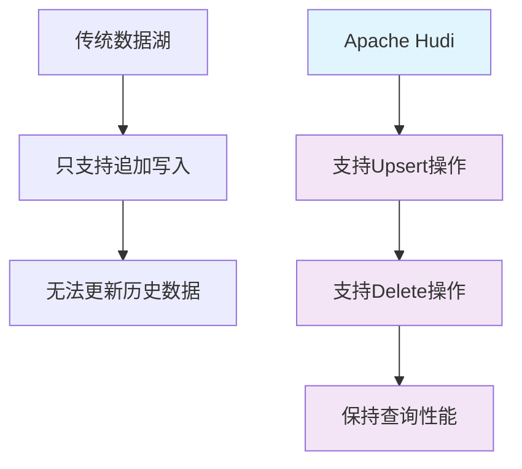

#### 2. 增量数据处理
- **增量摄取**：只处理变更的数据，避免全量重新计算
- **增量查询**：支持时间范围内的增量数据查询
- **变更数据捕获**：集成CDC工具，实现实时数据同步

#### 3. 多种查询类型
| 查询类型 | 描述 | 适用场景 | 性能特点 |
|---------|------|----------|----------|
| **快照查询** | 查询表的最新状态 | 批处理分析 | 高吞吐量 |
| **增量查询** | 查询指定时间范围的变更 | 实时处理 | 低延迟 |
| **时间点查询** | 查询历史某个时间点的状态 | 数据回溯 | 灵活性高 |

#### 4. 存储优化
- **文件大小优化**：自动合并小文件，提升查询性能
- **数据布局优化**：支持Z-Order等布局优化算法
- **压缩算法**：支持多种压缩格式，平衡存储和计算成本

### 应用场景

#### 1. 实时数据仓库
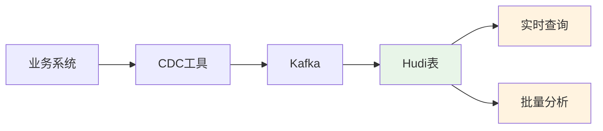

#### 2. 数据湖现代化
- **传统数据湖痛点**：只能追加，无法更新删除
- **Hudi解决方案**：提供完整的CRUD操作能力
- **迁移策略**：渐进式迁移，保持业务连续性

#### 3. 合规性要求
- **GDPR合规**：支持用户数据的删除和修改
- **数据治理**：提供完整的数据血缘和变更历史
- **审计追踪**：记录所有数据变更操作

### 与其他数据湖技术对比

| 特性 | Apache Hudi | Delta Lake | Apache Iceberg |
|------|-------------|------------|----------------|
| **ACID事务** | ✅ 表级别 | ✅ 表级别 | ✅ 表级别 |
| **Upsert性能** | ⭐⭐⭐⭐⭐ | ⭐⭐⭐⭐ | ⭐⭐⭐ |
| **增量查询** | ⭐⭐⭐⭐⭐ | ⭐⭐⭐ | ⭐⭐⭐ |
| **Schema演进** | ⭐⭐⭐⭐ | ⭐⭐⭐⭐ | ⭐⭐⭐⭐⭐ |
| **生态集成** | Spark/Flink/Hive | Spark主导 | 多引擎支持 |
| **学习成本** | 中等 | 较低 | 较高 |
| **社区活跃度** | 高 | 高 | 高 |

#### 选择建议
- **选择Hudi**：需要高频upsert操作，实时数据湖场景
- **选择Delta Lake**：Spark生态为主，简单易用
- **选择Iceberg**：多引擎支持，复杂schema演进需求

---

## 架构设计

### 整体架构

Apache Hudi的架构设计围绕**时间轴（Timeline）**概念，通过**索引机制**实现高效的数据更新操作。

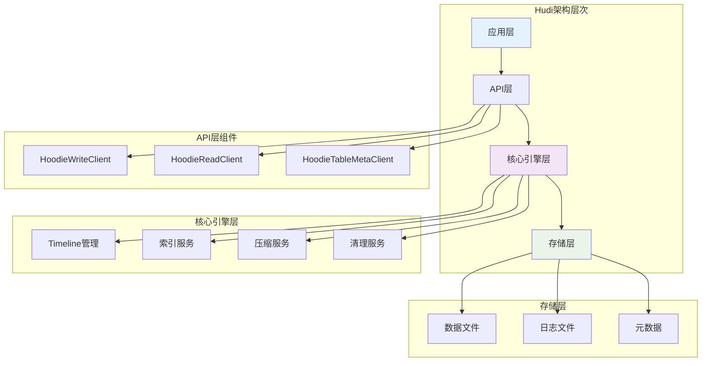

#### 核心设计原则
1. **时间轴驱动**：所有操作都基于时间轴进行管理
2. **索引优化**：通过索引快速定位需要更新的文件
3. **异步处理**：压缩和清理操作异步执行，不影响写入性能
4. **可插拔设计**：索引、压缩策略等组件可插拔配置

### 存储格式

#### 文件组织结构
```
hudi_table/
├── .hoodie/                    # 元数据目录
│   ├── .commits                # 提交历史
│   ├── .inflight              # 进行中的操作
│   ├── .requested             # 请求的操作
│   └── hoodie.properties      # 表配置
├── partition1/                 # 分区目录
│   ├── file1_timestamp.parquet # 数据文件
│   ├── file1_timestamp.log     # 日志文件(MOR)
│   └── ...
└── partition2/
    └── ...
```

#### 文件类型说明
| 文件类型 | 扩展名 | 用途 | 特点 |
|---------|--------|------|------|
| **Base文件** | .parquet | 存储基础数据 | 列式存储，查询友好 |
| **Log文件** | .log | 存储增量更新 | 行式存储，写入友好 |
| **元数据文件** | .commit/.inflight | 记录操作历史 | JSON格式，轻量级 |

### 时间轴Timeline

**时间轴**是Hudi的核心概念，记录表上所有操作的**时间顺序**和**状态变化**。

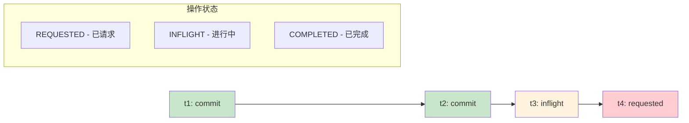

#### Timeline操作类型
1. **COMMIT**：数据提交操作
2. **DELTACOMMIT**：增量提交操作（MOR表）
3. **CLEAN**：清理操作
4. **COMPACTION**：压缩操作
5. **ROLLBACK**：回滚操作

#### Timeline状态管理
- **原子性保证**：通过文件系统的原子重命名操作
- **并发控制**：基于时间戳的乐观锁机制
- **故障恢复**：通过Timeline重建表状态

### 索引机制

索引是Hudi实现**高效upsert**的关键技术，用于快速定位记录所在的文件位置。

#### 索引类型对比
| 索引类型 | 适用场景 | 性能特点 | 资源消耗 |
|---------|----------|----------|----------|
| **BloomFilter** | 中等数据量 | 查找快，误判率低 | 内存适中 |
| **Simple** | 小数据量 | 实现简单 | 内存较少 |
| **Global Simple** | 全局唯一键 | 跨分区查找 | 内存较多 |
| **HBase** | 大数据量 | 外部存储，可扩展 | 依赖HBase |

#### BloomFilter索引原理
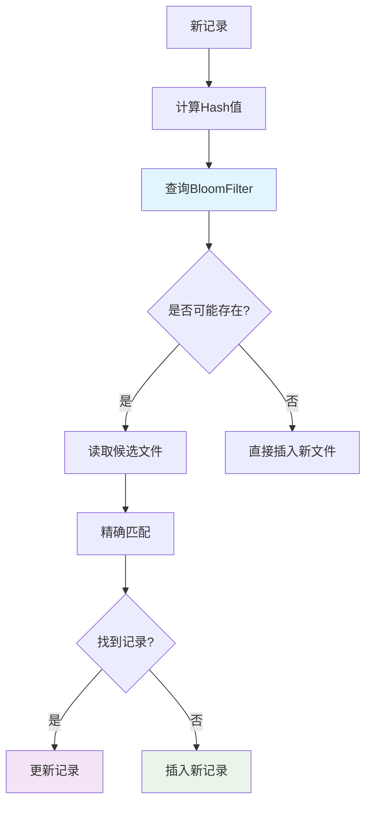

---

## 表类型与写入模式

### Copy On Write (COW)

COW模式在**每次写入时都会重写整个文件**，保证数据文件的**查询友好性**。

#### 工作原理
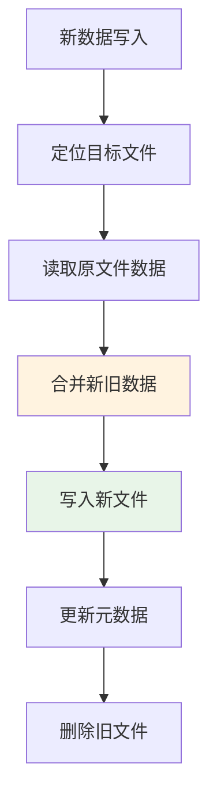

#### 特点分析
**优势：**
- **查询性能优异**：数据文件直接可查，无需合并
- **存储格式统一**：全部使用Parquet格式
- **实现简单**：逻辑清晰，易于理解

**劣势：**
- **写入延迟较高**：需要重写整个文件
- **写入放大**：小量更新也需要重写大文件
- **资源消耗大**：需要额外的计算和存储资源

#### 适用场景
- **读多写少**的场景
- **批量更新**操作
- **查询性能要求高**的场景
- **数据更新频率较低**的表

### Merge On Read (MOR)

MOR模式将数据分为**Base文件**和**Log文件**，写入时只更新Log文件，查询时动态合并。

#### 工作原理
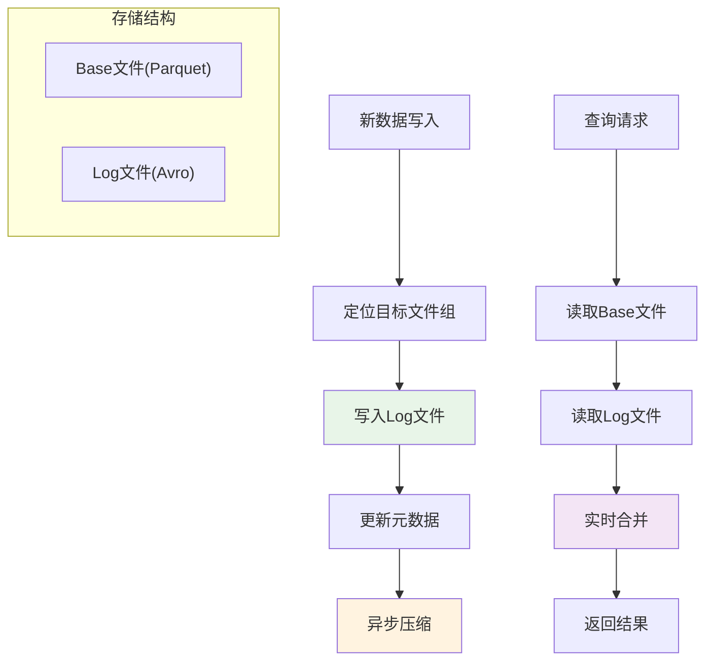

#### 特点分析
**优势：**
- **写入性能优异**：只需追加写Log文件
- **近实时更新**：数据写入后立即可查
- **存储效率高**：避免重复存储未变更数据

**劣势：**
- **查询性能较低**：需要实时合并Base和Log文件
- **复杂度较高**：需要管理两种文件格式
- **压缩开销**：需要定期压缩Log文件到Base文件

#### 适用场景
- **写多读少**的场景
- **实时数据摄取**
- **频繁更新**的表
- **对写入延迟敏感**的应用

### 写入模式对比

| 对比维度 | Copy On Write | Merge On Read |
|---------|---------------|---------------|
| **写入延迟** | 高（需重写文件） | 低（追加写入） |
| **查询延迟** | 低（直接读取） | 中（需要合并） |
| **存储开销** | 中等 | 较低 |
| **计算开销** | 写入时高 | 查询时高 |
| **数据新鲜度** | 批量更新后可见 | 实时可见 |
| **运维复杂度** | 简单 | 复杂 |

### 选择策略

#### 决策流程图
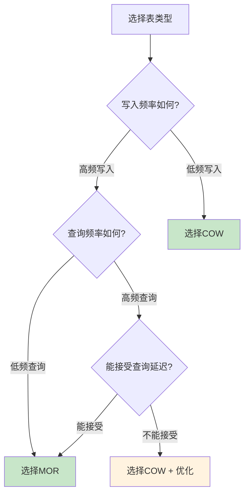

#### 实际选择建议
1. **实时数仓场景**：选择MOR，配合定期压缩
2. **批处理分析**：选择COW，获得最佳查询性能
3. **混合负载**：可以同时创建两种表类型，分别服务不同需求
4. **资源受限**：选择COW，减少运维复杂度

---
## 核心组件

### HoodieRecord

**HoodieRecord**是Hudi中数据记录的**基本抽象**，封装了记录的键值、数据内容和操作类型等信息。

#### 核心属性
```java
public class HoodieRecord<T> {
    private HoodieKey key;           // 记录的唯一标识
    private T data;                  // 记录的数据内容
    private HoodieOperation operation; // 操作类型(INSERT/UPSERT/DELETE)
    private HoodieRecordLocation currentLocation; // 当前位置
    private HoodieRecordLocation newLocation;     // 新位置
}
```

#### 操作类型
| 操作类型 | 描述 | 使用场景 |
|---------|------|----------|
| **INSERT** | 插入新记录 | 首次写入数据 |
| **UPSERT** | 更新或插入 | 数据变更同步 |
| **DELETE** | 删除记录 | 数据清理、合规要求 |

#### 记录状态转换
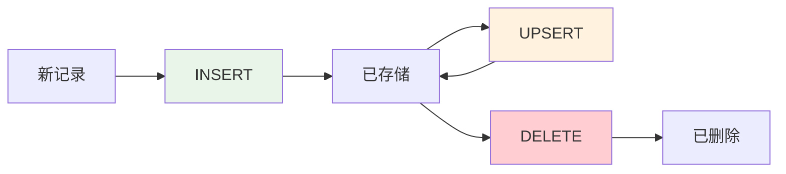

### HoodieKey

**HoodieKey**是记录的**唯一标识符**，由**记录键（Record Key）**和**分区路径（Partition Path）**组成。

#### 组成结构
```java
public class HoodieKey {
    private String recordKey;    // 记录的业务主键
    private String partitionPath; // 分区路径
    
    // 生成全局唯一的键
    public String getKey() {
        return partitionPath + "+" + recordKey;
    }
}
```

#### 设计原则
- **业务语义**：Record Key应该具有业务含义，如用户ID、订单ID
- **分区策略**：Partition Path应该支持数据的均匀分布和查询优化
- **唯一性保证**：在分区内Record Key必须唯一
- **不可变性**：一旦确定，HoodieKey不应该改变

#### 最佳实践
```java
// 推荐的Key设计
HoodieKey userKey = new HoodieKey(
    "user_" + userId,           // 有意义的前缀
    "year=2024/month=01/day=15" // 时间分区
);

// 避免的Key设计
HoodieKey badKey = new HoodieKey(
    UUID.randomUUID().toString(), // 无业务含义
    "default"                     // 单一分区
);
```

### HoodieTimeline

**HoodieTimeline**管理表的**所有操作历史**，是Hudi实现ACID特性和故障恢复的核心组件。

#### Timeline结构
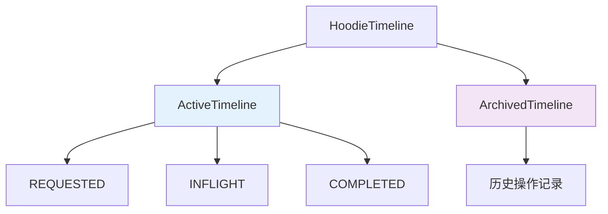

#### 操作状态流转
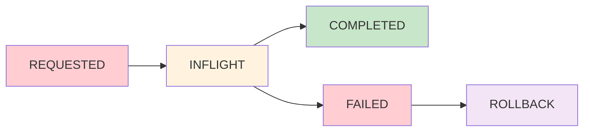

#### Timeline操作类型
1. **COMMIT**：COW表的数据提交
2. **DELTACOMMIT**：MOR表的增量提交
3. **CLEAN**：清理过期文件
4. **COMPACTION**：压缩Log文件到Base文件
5. **ROLLBACK**：回滚失败的操作
6. **SAVEPOINT**：创建数据快照点

### HoodieIndex

**HoodieIndex**负责**快速定位记录位置**，是实现高效upsert操作的关键组件。

#### 索引接口设计
```java
public abstract class HoodieIndex<T> {
    // 标记记录位置
    public abstract JavaRDD<HoodieRecord<T>> tagLocation(
        JavaRDD<HoodieRecord<T>> recordRDD,
        JavaSparkContext jsc,
        HoodieTable<T> hoodieTable
    );
    
    // 更新索引
    public abstract JavaRDD<WriteStatus> updateLocation(
        JavaRDD<WriteStatus> writeStatusRDD,
        JavaSparkContext jsc,
        HoodieTable<T> hoodieTable
    );
}
```

#### 索引实现对比
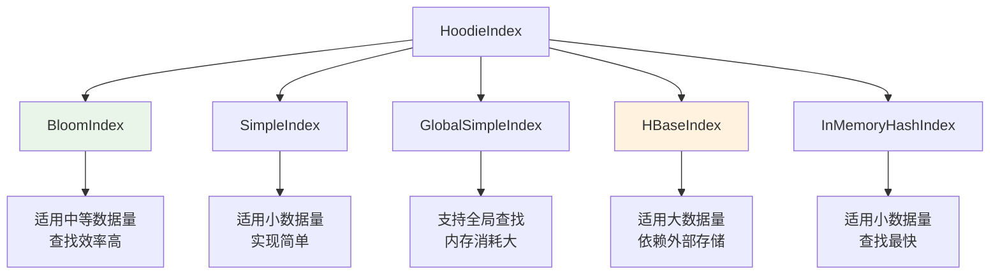

#### BloomFilter索引详解
**BloomFilter**是Hudi默认推荐的索引类型，通过**概率数据结构**实现快速查找。

**工作原理：**
1. **构建阶段**：为每个数据文件构建BloomFilter
2. **查找阶段**：先查BloomFilter，再精确匹配
3. **更新阶段**：增量更新BloomFilter信息

**配置参数：**
```properties
# BloomFilter配置
hoodie.index.bloom.num_entries=60000
hoodie.index.bloom.fpp=0.000000001
hoodie.bloom.index.parallelism=200
```

### HoodieWriteClient

**HoodieWriteClient**是Hudi的**写入客户端**，提供统一的数据写入接口。

#### 核心API
```java
public class HoodieWriteClient<T> {
    // 插入数据
    public JavaRDD<WriteStatus> insert(
        JavaRDD<HoodieRecord<T>> records,
        String commitTime
    );
    
    // 更新插入数据
    public JavaRDD<WriteStatus> upsert(
        JavaRDD<HoodieRecord<T>> records,
        String commitTime
    );
    
    // 删除数据
    public JavaRDD<WriteStatus> delete(
        JavaRDD<HoodieKey> keys,
        String commitTime
    );
    
    // 批量插入
    public JavaRDD<WriteStatus> bulkInsert(
        JavaRDD<HoodieRecord<T>> records,
        String commitTime
    );
}
```

#### 写入流程
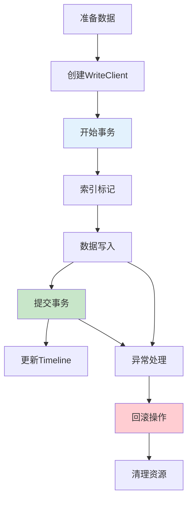

#### 配置优化
```properties
# 写入性能优化
hoodie.upsert.shuffle.parallelism=200
hoodie.insert.shuffle.parallelism=200
hoodie.bulkinsert.shuffle.parallelism=200

# 内存优化
hoodie.memory.merge.max.size=1073741824
hoodie.memory.spillable.map.path=/tmp/hudi-spillable-map

# 提交优化
hoodie.commits.archival.batch=10
hoodie.cleaner.commits.retained=30
```

---

## 数据写入操作

### Insert操作

**Insert操作**用于**首次写入数据**，不会检查重复记录，直接创建新的数据文件。

#### 执行流程
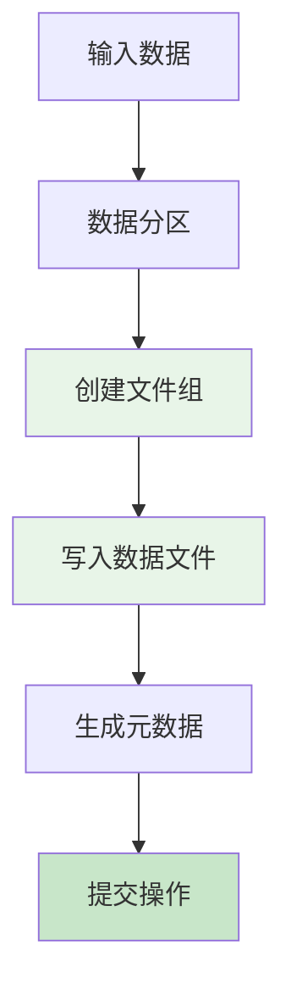

#### 性能特点
- **写入速度快**：无需索引查找，直接写入
- **并行度高**：可以充分利用集群资源
- **适用场景**：初始数据加载、确保无重复的数据

#### 代码示例
```java
// Spark环境下的Insert操作
JavaSparkContext jsc = new JavaSparkContext(conf);
HoodieWriteClient<HoodieAvroPayload> client = 
    new HoodieWriteClient<>(jsc, writeConfig);

// 准备数据
JavaRDD<HoodieRecord<HoodieAvroPayload>> records = 
    prepareRecords(jsc);

// 执行Insert
String commitTime = client.startCommit();
JavaRDD<WriteStatus> writeStatuses = 
    client.insert(records, commitTime);

// 提交事务
client.commit(commitTime, writeStatuses);
```

### Upsert操作

**Upsert操作**是Hudi的**核心功能**，实现**更新已存在记录**或**插入新记录**的语义。

#### 执行流程
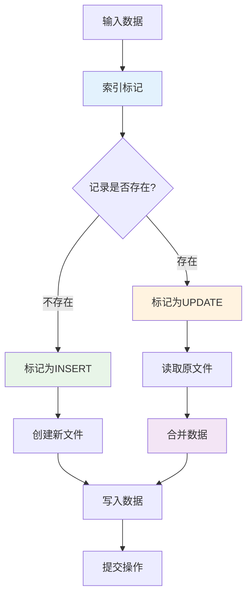

#### 索引查找优化
```java
// 配置BloomFilter索引参数
writeConfig = HoodieWriteConfig.newBuilder()
    .withPath(basePath)
    .withSchema(schema)
    .withParallelism(200, 200)
    .withIndexConfig(
        HoodieIndexConfig.newBuilder()
            .withIndexType(HoodieIndex.IndexType.BLOOM)
            .withBloomIndexParallelism(100)
            .build()
    )
    .build();
```

#### 性能调优要点
1. **合理设置并行度**：根据集群资源和数据量调整
2. **优化索引配置**：选择合适的索引类型和参数
3. **控制文件大小**：避免小文件过多影响查询性能
4. **分区策略**：合理的分区可以减少索引查找范围

### Delete操作

**Delete操作**支持**软删除**和**硬删除**两种模式，满足不同的业务需求。

#### 删除模式对比
| 删除模式 | 实现方式 | 存储开销 | 查询性能 | 恢复能力 |
|---------|----------|----------|----------|----------|
| **软删除** | 标记删除字段 | 较高 | 需要过滤 | 可恢复 |
| **硬删除** | 物理删除记录 | 较低 | 无影响 | 不可恢复 |

#### 软删除实现
```java
// 软删除：添加删除标记
Schema schemaWithDelete = SchemaBuilder.record("User")
    .fields()
    .name("id").type().stringType().noDefault()
    .name("name").type().stringType().noDefault()
    .name("_hoodie_is_deleted").type().booleanType().booleanDefault(false)
    .endRecord();

// 查询时过滤已删除记录
Dataset<Row> activeRecords = spark.read()
    .format("hudi")
    .load(tablePath)
    .filter("_hoodie_is_deleted = false");
```

#### 硬删除实现
```java
// 硬删除：物理删除记录
JavaRDD<HoodieKey> keysToDelete = prepareKeysToDelete(jsc);
String commitTime = client.startCommit();
JavaRDD<WriteStatus> writeStatuses = 
    client.delete(keysToDelete, commitTime);
client.commit(commitTime, writeStatuses);
```

### Bulk Insert操作

**Bulk Insert**专门用于**大批量数据的初始加载**，通过优化的写入路径提升性能。

#### 与普通Insert的区别
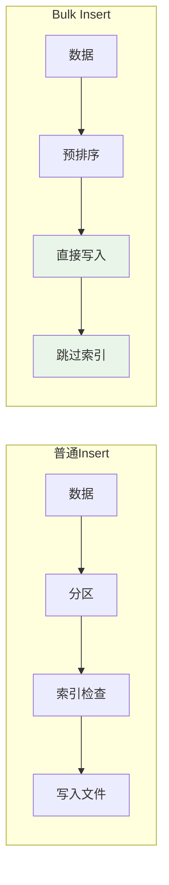

#### 优化策略
1. **数据预排序**：按分区键和记录键排序，提升写入效率
2. **跳过索引**：不进行重复检查，直接写入
3. **文件大小控制**：自动控制输出文件大小，避免小文件问题
4. **并行写入**：充分利用集群并行能力

#### 配置参数
```properties
# Bulk Insert优化配置
hoodie.bulkinsert.shuffle.parallelism=400
hoodie.bulkinsert.sort.mode=PARTITION_SORT
hoodie.parquet.max.file.size=134217728
hoodie.parquet.small.file.limit=104857600
```

#### 使用场景
- **历史数据迁移**：从其他系统迁移大量历史数据
- **离线批处理**：定期的大批量数据加载
- **初始化表**：新表的首次数据加载
- **数据回填**：补充缺失的历史数据

---

## 数据查询

### 快照查询

**快照查询**返回表的**最新状态**，是最常用的查询模式，提供**一致性的数据视图**。

#### 查询原理
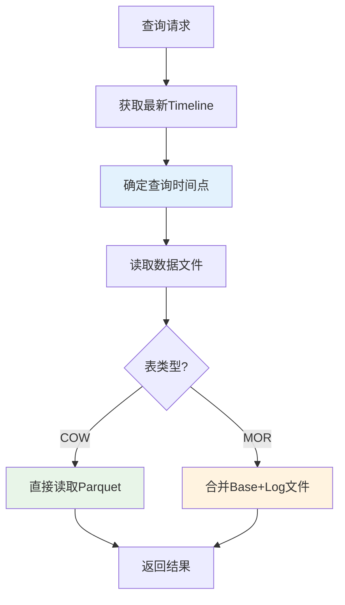

#### Spark SQL查询
```sql
-- 注册Hudi表
CREATE TABLE hudi_users
USING HUDI
LOCATION '/path/to/hudi/table'

-- 快照查询
SELECT user_id, name, age, city
FROM hudi_users
WHERE age > 25
  AND city = 'Beijing'
```

#### 性能优化
```properties
# 查询性能优化配置
hoodie.datasource.query.type=snapshot
hoodie.datasource.read.extract.partition.values.in.path=true
hoodie.datasource.read.schema.use.end.schema=true

# 文件读取优化
hoodie.parquet.compression.codec=snappy
hoodie.parquet.block.size=134217728
```

### 增量查询

**增量查询**只返回**指定时间范围内的变更数据**，是实现**实时数据处理**的关键功能。

#### 查询模式


#### 实现方式
```java
// Java API增量查询
Dataset<Row> incrementalDF = spark.read()
    .format("hudi")
    .option(QUERY_TYPE_OPT_KEY, QUERY_TYPE_INCREMENTAL_OPT_VAL)
    .option(BEGIN_INSTANTTIME_OPT_KEY, "20240101000000")
    .option(END_INSTANTTIME_OPT_KEY, "20240102000000")
    .load(tablePath);

// SQL方式增量查询
spark.sql("""
    SELECT * FROM hudi_table_changes('hudi_users', 
                                   'earliest', 
                                   'latest')
""");
```

#### 应用场景
1. **实时ETL**：增量同步数据到下游系统
2. **CDC处理**：捕获和处理数据变更
3. **实时分析**：基于增量数据的实时计算
4. **数据同步**：跨系统的增量数据同步

#### 性能考虑
- **时间范围控制**：避免查询过大的时间范围
- **分区裁剪**：利用分区信息减少扫描范围
- **文件过滤**：通过Timeline快速定位相关文件
- **并行处理**：合理设置并行度提升查询性能

### 时间点查询

**时间点查询**允许查询**历史某个时间点**的数据状态，支持**数据回溯**和**审计需求**。

#### 查询语法
```sql
-- Spark SQL时间点查询
SELECT * FROM hudi_users 
TIMESTAMP AS OF '2024-01-15 10:30:00'

-- 或使用commit时间
SELECT * FROM hudi_users 
VERSION AS OF '20240115103000'
```

#### 实现机制
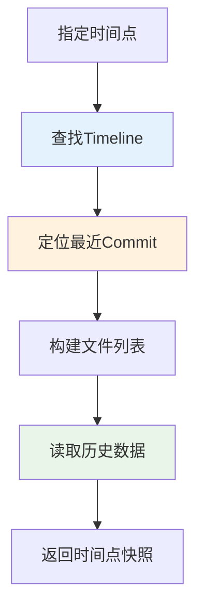

#### 配置要求
```properties
# 启用时间点查询
hoodie.datasource.query.type=snapshot
hoodie.datasource.read.begin.instanttime=20240115103000

# 保留足够的历史版本
hoodie.cleaner.commits.retained=50
hoodie.keep.min.commits=30
```

### 查询优化

#### 分区裁剪优化
```sql
-- 利用分区字段进行过滤
SELECT * FROM hudi_users
WHERE year = '2024' 
  AND month = '01'
  AND day = '15'
  AND user_id = 'user123'
```

#### 列裁剪优化
```sql
-- 只查询需要的列
SELECT user_id, name, last_updated
FROM hudi_users
WHERE status = 'active'
```

#### 索引利用优化
```properties
# 启用数据跳跃优化
hoodie.datasource.read.data.skipping.enabled=true
hoodie.datasource.read.data.skipping.failure.mode=strict

# 启用Z-Order优化
hoodie.layout.optimize.enable=true
hoodie.layout.optimize.strategy=z-order
```

#### 缓存策略
```java
// 缓存频繁查询的数据
Dataset<Row> cachedDF = spark.read()
    .format("hudi")
    .load(tablePath)
    .cache();

// 使用广播变量优化Join
Dataset<Row> result = largeDF.join(
    broadcast(smallDF), 
    "user_id"
);
```

---## 压缩
与清理

### 压缩策略

**压缩（Compaction）**是MOR表的核心机制，将**Log文件合并到Base文件**中，平衡写入性能和查询性能。

#### 压缩触发机制
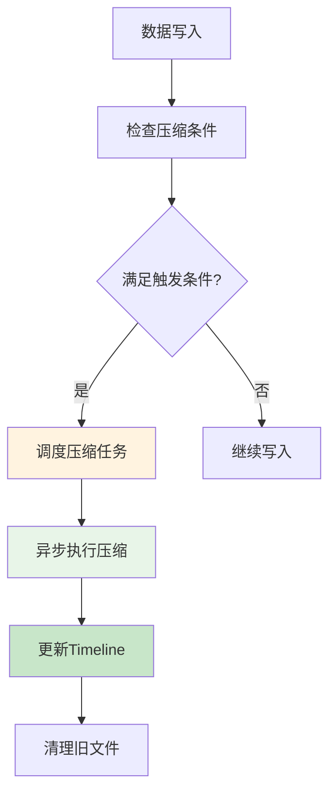

#### 压缩策略类型
| 策略类型 | 触发条件 | 适用场景 | 配置参数 |
|---------|----------|----------|----------|
| **基于提交数** | 达到指定提交次数 | 规律性写入 | `hoodie.compact.inline.max.delta.commits` |
| **基于时间** | 达到指定时间间隔 | 时间敏感场景 | `hoodie.compact.schedule.enabled` |
| **基于文件大小** | Log文件大小超过阈值 | 存储优化 | `hoodie.parquet.small.file.limit` |
| **手动触发** | 用户主动执行 | 维护窗口 | 通过API或命令行 |

#### 压缩配置优化
```properties
# 内联压缩配置
hoodie.compact.inline=true
hoodie.compact.inline.max.delta.commits=5
hoodie.compact.inline.trigger.strategy=NUM_COMMITS

# 异步压缩配置
hoodie.datasource.compaction.async.enable=true
hoodie.compaction.strategy=org.apache.hudi.table.action.compact.strategy.LogFileSizeBasedCompactionStrategy

# 压缩并行度
hoodie.compaction.parallelism=200
hoodie.compaction.target.io=5120
```

#### 压缩执行流程
```mermaid
graph TD
    A["选择文件组"] --> B["读取Base文件"]
    B --> C["读取Log文件"]
    C --> D["合并数据"]
    D --> E["去重处理"]
    E --> F["写入新Base文件"]
    F --> G["更新元数据"]
    G --> H["标记旧文件删除"]
    
    style D fill:#f3e5f5
    style E fill:#f3e5f5
    style F fill:#e8f5e8
```

### 清理策略

**清理（Cleaning）**负责**删除过期的数据文件**，释放存储空间，维护表的健康状态。

#### 清理类型
```mermaid
graph TD
    A["清理策略"] --> B["KEEP_LATEST_COMMITS"]
    A --> C["KEEP_LATEST_FILE_VERSIONS"]
    A --> D["KEEP_LATEST_BY_HOURS"]
    
    B --> E["保留最新N个提交"]
    C --> F["保留最新N个文件版本"]
    D --> G["保留最近N小时的数据"]
    
    style B fill:#e8f5e8
    style C fill:#fff3e0
    style D fill:#f3e5f5
```

#### 清理配置
```properties
# 清理策略配置
hoodie.cleaner.policy=KEEP_LATEST_COMMITS
hoodie.cleaner.commits.retained=10
hoodie.cleaner.parallelism=200

# 自动清理
hoodie.clean.automatic=true
hoodie.clean.async=true
hoodie.clean.trigger.strategy=NUM_COMMITS
hoodie.clean.max.commits=1
```

#### 清理执行逻辑
```java
// 清理策略实现示例
public class KeepLatestCommitsCleaningPolicy {
    
    public List<CleanFileInfo> getDeletePaths(
            HoodieCleanerPlan cleanerPlan) {
        
        List<CleanFileInfo> deletePaths = new ArrayList<>();
        
        // 获取需要保留的提交
        List<String> commitsToRetain = getCommitsToRetain();
        
        // 遍历所有分区
        for (String partition : getAllPartitions()) {
            // 获取分区内的所有文件组
            for (FileGroup fileGroup : getFileGroups(partition)) {
                // 标记过期文件为删除
                deletePaths.addAll(
                    markExpiredFilesForDeletion(fileGroup, commitsToRetain)
                );
            }
        }
        
        return deletePaths;
    }
}
```

### 归档机制

**归档（Archival）**将**活跃Timeline中的旧操作**移动到**归档Timeline**，保持活跃Timeline的精简。

#### 归档流程
```mermaid
graph LR
    A["活跃Timeline"] --> B["检查归档条件"]
    B --> C["选择归档操作"]
    C --> D["写入归档文件"]
    D --> E["删除活跃记录"]
    E --> F["更新Timeline"]
    
    style A fill:#e3f2fd
    style D fill:#e8f5e8
    style F fill:#c8e6c9
```

#### 归档配置
```properties
# 归档触发条件
hoodie.commits.archival.batch=20
hoodie.commits.archival.batch.size=10

# 保留策略
hoodie.keep.min.commits=30
hoodie.keep.max.commits=40

# 自动归档
hoodie.archive.automatic=true
hoodie.archive.async=false
```

#### 归档文件结构
```
.hoodie/
├── archived/
│   ├── commits_.archive.1
│   ├── commits_.archive.2
│   └── ...
├── .commits/
│   ├── 20240115103000.commit
│   └── ...
└── hoodie.properties
```

### 性能调优

#### 压缩性能优化
```properties
# I/O优化
hoodie.compaction.target.io=5120
hoodie.compaction.reverse.log.read=false
hoodie.compaction.lazy.block.read=true

# 内存优化
hoodie.memory.compaction.max.size=1073741824
hoodie.memory.merge.max.size=1073741824

# 并发优化
hoodie.compaction.parallelism=400
hoodie.compaction.small.file.size=104857600
```

#### 清理性能优化
```properties
# 批量处理
hoodie.cleaner.parallelism=400
hoodie.cleaner.incremental.mode=true

# 文件系统优化
hoodie.cleaner.delete.bootstrap.base.file=false
hoodie.filesystem.view.cache.enable=true
```

#### 监控指标
```java
// 关键监控指标
public class HudiMetrics {
    // 压缩相关指标
    private long compactionDuration;
    private long compactionInputBytes;
    private long compactionOutputBytes;
    private int compactionFilesProcessed;
    
    // 清理相关指标
    private long cleaningDuration;
    private int filesDeleted;
    private long spaceReclaimed;
    
    // 归档相关指标
    private int commitsArchived;
    private long archivalDuration;
}
```

#### 最佳实践建议
1. **合理设置压缩频率**：平衡写入性能和查询性能
2. **监控存储使用**：定期检查清理效果，避免存储浪费
3. **错峰执行**：在业务低峰期执行压缩和清理操作
4. **资源隔离**：为压缩任务分配独立的计算资源
5. **备份策略**：在大规模清理前做好数据备份

---

## 集成与部署

### Spark集成

Apache Hudi与**Apache Spark**深度集成，提供**DataFrame API**和**Spark SQL**支持。

#### 依赖配置
```xml
<!-- Maven依赖 -->
<dependency>
    <groupId>org.apache.hudi</groupId>
    <artifactId>hudi-spark3.2-bundle_2.12</artifactId>
    <version>0.14.0</version>
</dependency>
```

#### Spark配置
```properties
# Spark配置文件
spark.sql.extensions=org.apache.spark.sql.hudi.HoodieSparkSessionExtension
spark.sql.catalog.spark_catalog=org.apache.spark.sql.hudi.catalog.HoodieCatalog
spark.serializer=org.apache.spark.serializer.KryoSerializer
spark.sql.hive.convertMetastoreParquet=false
```

#### DataFrame API使用
```scala
import org.apache.hudi.DataSourceWriteOptions._
import org.apache.hudi.config.HoodieWriteConfig._

// 写入Hudi表
df.write
  .format("hudi")
  .option(RECORDKEY_FIELD_OPT_KEY, "user_id")
  .option(PARTITIONPATH_FIELD_OPT_KEY, "partition_date")
  .option(TABLE_NAME_OPT_KEY, "user_table")
  .option(OPERATION_OPT_KEY, "upsert")
  .mode(SaveMode.Append)
  .save("/path/to/hudi/table")

// 读取Hudi表
val hudiDF = spark.read
  .format("hudi")
  .load("/path/to/hudi/table")
```

#### Spark SQL集成
```sql
-- 创建Hudi表
CREATE TABLE hudi_users (
    user_id STRING,
    name STRING,
    age INT,
    city STRING,
    partition_date STRING
) USING HUDI
TBLPROPERTIES (
    'primaryKey' = 'user_id',
    'preCombineField' = 'age'
)
PARTITIONED BY (partition_date)
LOCATION '/path/to/hudi/table'

-- 插入数据
INSERT INTO hudi_users VALUES 
('user1', 'Alice', 25, 'Beijing', '2024-01-15'),
('user2', 'Bob', 30, 'Shanghai', '2024-01-15')

-- 更新数据
MERGE INTO hudi_users AS target
USING (
    SELECT 'user1' as user_id, 'Alice Smith' as name, 
           26 as age, 'Beijing' as city, '2024-01-15' as partition_date
) AS source
ON target.user_id = source.user_id
WHEN MATCHED THEN UPDATE SET *
WHEN NOT MATCHED THEN INSERT *
```

### Flink集成

**Apache Flink**集成支持**流式写入**和**实时查询**，是构建实时数据湖的重要组件。

#### Flink依赖
```xml
<dependency>
    <groupId>org.apache.hudi</groupId>
    <artifactId>hudi-flink1.15-bundle</artifactId>
    <version>0.14.0</version>
</dependency>
```

#### 流式写入配置
```java
// Flink流式写入Hudi
StreamExecutionEnvironment env = StreamExecutionEnvironment.getExecutionEnvironment();

// 配置Hudi Sink
HudiStreamWriteOperatorCoordinator.Options options = 
    HudiStreamWriteOperatorCoordinator.Options.builder()
        .withPath("/path/to/hudi/table")
        .withTableType(HoodieTableType.MERGE_ON_READ)
        .withWriteOperation(WriteOperationType.UPSERT)
        .build();

// 创建数据流
DataStream<RowData> dataStream = env.addSource(kafkaSource)
    .map(new RowDataMapper());

// 写入Hudi表
dataStream.sinkTo(HudiSink.forRowData(options));
```

#### Flink SQL集成
```sql
-- 创建Hudi表
CREATE TABLE hudi_users (
    user_id STRING,
    name STRING,
    age INT,
    city STRING,
    partition_date STRING,
    PRIMARY KEY (user_id) NOT ENFORCED
) PARTITIONED BY (partition_date)
WITH (
    'connector' = 'hudi',
    'path' = '/path/to/hudi/table',
    'table.type' = 'MERGE_ON_READ',
    'write.operation' = 'upsert'
)

-- 流式写入
INSERT INTO hudi_users 
SELECT user_id, name, age, city, partition_date
FROM kafka_source
```

#### 实时查询支持
```sql
-- 快照查询
SELECT * FROM hudi_users /*+ OPTIONS('query.type'='snapshot') */

-- 增量查询
SELECT * FROM hudi_users /*+ OPTIONS(
    'query.type'='incremental',
    'query.incremental.start-commit'='20240115000000',
    'query.incremental.end-commit'='20240115120000'
) */
```

### Hive集成

**Apache Hive**集成提供**元数据管理**和**SQL查询**能力，支持传统数据仓库工具访问Hudi表。

#### Hive配置
```xml
<!-- Hive辅助jar包 -->
<property>
    <name>hive.aux.jars.path</name>
    <value>/path/to/hudi-hadoop-mr-bundle-0.14.0.jar</value>
</property>
```

#### 同步Hive元数据
```java
// 使用HiveSyncTool同步元数据
HiveSyncConfig hiveSyncConfig = new HiveSyncConfig();
hiveSyncConfig.databaseName = "default";
hiveSyncConfig.tableName = "hudi_users";
hiveSyncConfig.basePath = "/path/to/hudi/table";
hiveSyncConfig.partitionFields = Arrays.asList("partition_date");

HiveSyncTool hiveSyncTool = new HiveSyncTool(hiveSyncConfig, hadoopConf);
hiveSyncTool.syncHoodieTable();
```

#### Hive查询示例
```sql
-- 在Hive中查询Hudi表
SELECT user_id, name, age, city
FROM hudi_users
WHERE partition_date = '2024-01-15'
  AND age > 25

-- 查看表结构
DESCRIBE FORMATTED hudi_users

-- 查看分区信息
SHOW PARTITIONS hudi_users
```

### 部署配置

#### 集群部署架构
```mermaid
graph TB
    subgraph "数据源层"
        A["业务数据库"]
        B["消息队列"]
        C["日志文件"]
    end
    
    subgraph "计算引擎层"
        D["Spark集群"]
        E["Flink集群"]
    end
    
    subgraph "存储层"
        F["HDFS/S3"]
        G["Hudi表"]
    end
    
    subgraph "查询层"
        H["Spark SQL"]
        I["Hive"]
        J["Presto/Trino"]
    end
    
    A --> D
    B --> E
    C --> D
    
    D --> G
    E --> G
    G --> F
    
    G --> H
    G --> I
    G --> J
    
    style G fill:#e8f5e8
```

#### 环境配置清单
```bash
# 1. Java环境
export JAVA_HOME=/usr/lib/jvm/java-8-openjdk
export PATH=$JAVA_HOME/bin:$PATH

# 2. Hadoop环境
export HADOOP_HOME=/opt/hadoop
export HADOOP_CONF_DIR=$HADOOP_HOME/etc/hadoop
export PATH=$HADOOP_HOME/bin:$PATH

# 3. Spark环境
export SPARK_HOME=/opt/spark
export PATH=$SPARK_HOME/bin:$PATH

# 4. Hudi配置
export HUDI_HOME=/opt/hudi
export HUDI_CONF_DIR=$HUDI_HOME/conf
```

#### 性能调优配置
```properties
# JVM参数优化
spark.executor.memory=8g
spark.executor.cores=4
spark.executor.instances=20
spark.driver.memory=4g
spark.driver.maxResultSize=2g

# Hudi特定优化
hoodie.memory.merge.max.size=1073741824
hoodie.memory.spillable.map.path=/tmp/hudi-spillable-map
hoodie.embed.timeline.server=true
hoodie.filesystem.view.cache.enable=true

# 存储优化
hoodie.parquet.compression.codec=snappy
hoodie.parquet.block.size=134217728
hoodie.parquet.page.size=1048576
```

#### 监控配置
```yaml
# Prometheus监控配置
hudi_metrics:
  - job_name: 'hudi-metrics'
    static_configs:
      - targets: ['localhost:9090']
    metrics_path: '/metrics'
    scrape_interval: 30s
    
# Grafana仪表板
dashboard:
  - title: "Hudi Table Metrics"
    panels:
      - write_throughput
      - query_latency
      - compaction_duration
      - storage_usage
```

---## 监控与运维


### 监控指标

Hudi提供了**丰富的监控指标**，帮助运维人员了解表的健康状态和性能表现。

#### 核心监控指标分类
```mermaid
graph TD
    A["Hudi监控指标"] --> B["写入性能指标"]
    A --> C["查询性能指标"]
    A --> D["存储指标"]
    A --> E["系统健康指标"]
    
    B --> F["写入吞吐量<br/>写入延迟<br/>失败率"]
    C --> G["查询延迟<br/>扫描文件数<br/>数据跳跃率"]
    D --> H["存储使用量<br/>文件数量<br/>压缩比"]
    E --> I["Timeline健康度<br/>索引性能<br/>清理效果"]
    
    style B fill:#e8f5e8
    style C fill:#fff3e0
    style D fill:#f3e5f5
    style E fill:#e3f2fd
```

#### 关键性能指标（KPI）
| 指标类别 | 指标名称 | 描述 | 正常范围 | 告警阈值 |
|---------|----------|------|----------|----------|
| **写入性能** | 写入吞吐量 | 每秒处理记录数 | >10K records/s | <5K records/s |
| **写入性能** | 写入延迟 | 单次提交耗时 | <30s | >60s |
| **查询性能** | 查询延迟 | 平均查询响应时间 | <5s | >15s |
| **查询性能** | 文件扫描率 | 查询扫描的文件比例 | <20% | >50% |
| **存储效率** | 小文件比例 | 小于128MB的文件占比 | <10% | >30% |
| **系统健康** | 压缩成功率 | 压缩任务成功比例 | >95% | <90% |

#### 监控配置
```properties
# 启用指标收集
hoodie.metrics.on=true
hoodie.metrics.reporter.type=PROMETHEUS

# Prometheus配置
hoodie.metrics.prometheus.port=9090
hoodie.metrics.prometheus.pushgateway.host=localhost
hoodie.metrics.prometheus.pushgateway.port=9091

# 指标收集间隔
hoodie.metrics.reporter.metricsname.prefix=hudi
hoodie.metrics.reporter.interval=30
```

#### 自定义监控指标
```java
// 自定义监控指标实现
public class HudiCustomMetrics {
    private final MetricRegistry metricRegistry;
    private final Timer writeLatencyTimer;
    private final Counter writeSuccessCounter;
    private final Counter writeFailureCounter;
    private final Histogram fileSizeHistogram;
    
    public HudiCustomMetrics() {
        this.metricRegistry = new MetricRegistry();
        this.writeLatencyTimer = metricRegistry.timer("hudi.write.latency");
        this.writeSuccessCounter = metricRegistry.counter("hudi.write.success");
        this.writeFailureCounter = metricRegistry.counter("hudi.write.failure");
        this.fileSizeHistogram = metricRegistry.histogram("hudi.file.size");
    }
    
    public void recordWriteLatency(long latencyMs) {
        writeLatencyTimer.update(latencyMs, TimeUnit.MILLISECONDS);
    }
    
    public void recordWriteSuccess() {
        writeSuccessCounter.inc();
    }
    
    public void recordWriteFailure() {
        writeFailureCounter.inc();
    }
}
```

### 故障排查

#### 常见问题诊断流程
```mermaid
graph TD
    A["发现问题"] --> B["收集日志信息"]
    B --> C["分析Timeline状态"]
    C --> D["检查文件系统"]
    D --> E["验证配置参数"]
    E --> F["定位根本原因"]
    F --> G["制定解决方案"]
    G --> H["执行修复操作"]
    H --> I["验证修复效果"]
    
    style F fill:#ffcdd2
    style G fill:#fff3e0
    style H fill:#e8f5e8
    style I fill:#c8e6c9
```

#### 典型故障场景

**1. 写入失败问题**
```bash
# 检查Timeline状态
hdfs dfs -ls /path/to/hudi/table/.hoodie/.inflight/

# 查看失败的提交信息
hdfs dfs -cat /path/to/hudi/table/.hoodie/20240115103000.inflight

# 检查Spark日志
grep -i "error\|exception" /path/to/spark/logs/application_*.log
```

**解决方案：**
- 检查磁盘空间是否充足
- 验证权限配置是否正确
- 调整内存和并行度配置
- 清理失败的inflight文件

**2. 查询性能问题**
```sql
-- 检查文件分布情况
SELECT 
    partition_path,
    COUNT(*) as file_count,
    AVG(file_size) as avg_file_size,
    MIN(file_size) as min_file_size,
    MAX(file_size) as max_file_size
FROM hudi_table_file_info
GROUP BY partition_path
ORDER BY file_count DESC
```

**解决方案：**
- 执行压缩操作合并小文件
- 优化分区策略
- 调整查询并行度
- 启用数据跳跃优化

**3. 存储空间问题**
```bash
# 检查存储使用情况
hdfs dfs -du -h /path/to/hudi/table/

# 查看清理历史
hdfs dfs -ls /path/to/hudi/table/.hoodie/.clean/

# 手动触发清理
spark-submit --class org.apache.hudi.utilities.HoodieCleanerTool \
  hudi-utilities-bundle.jar \
  --base-path /path/to/hudi/table \
  --hoodie-conf hoodie.cleaner.commits.retained=5
```

#### 故障排查工具
```java
// Hudi诊断工具
public class HudiDiagnosticTool {
    
    // 检查Timeline健康状态
    public void checkTimelineHealth(String basePath) {
        HoodieTableMetaClient metaClient = 
            HoodieTableMetaClient.builder()
                .setConf(hadoopConf)
                .setBasePath(basePath)
                .build();
                
        HoodieTimeline timeline = metaClient.getActiveTimeline();
        
        // 检查是否有长时间运行的操作
        List<HoodieInstant> inflightInstants = 
            timeline.getInflightInstants().getInstants().collect(Collectors.toList());
            
        for (HoodieInstant instant : inflightInstants) {
            long duration = System.currentTimeMillis() - 
                Long.parseLong(instant.getTimestamp());
            if (duration > TimeUnit.HOURS.toMillis(1)) {
                System.out.println("Long running operation detected: " + instant);
            }
        }
    }
    
    // 检查文件系统一致性
    public void checkFileSystemConsistency(String basePath) {
        // 验证元数据与实际文件的一致性
        // 检查孤儿文件
        // 验证分区完整性
    }
}
```

### 性能优化

#### 写入性能优化策略
```mermaid
graph TD
    A["写入性能优化"] --> B["并行度调优"]
    A --> C["内存配置优化"]
    A --> D["索引优化"]
    A --> E["文件大小控制"]
    
    B --> F["合理设置Shuffle并行度<br/>避免数据倾斜"]
    C --> G["增加Executor内存<br/>优化GC参数"]
    D --> H["选择合适索引类型<br/>调整BloomFilter参数"]
    E --> I["控制小文件数量<br/>设置合理文件大小"]
    
    style B fill:#e8f5e8
    style C fill:#fff3e0
    style D fill:#f3e5f5
    style E fill:#e3f2fd
```

#### 具体优化配置
```properties
# 并行度优化
hoodie.upsert.shuffle.parallelism=400
hoodie.insert.shuffle.parallelism=400
hoodie.bulkinsert.shuffle.parallelism=800

# 内存优化
hoodie.memory.merge.max.size=2147483648
hoodie.memory.spillable.map.path=/tmp/hudi-spillable-map
hoodie.memory.compaction.max.size=2147483648

# 索引优化
hoodie.index.type=BLOOM
hoodie.index.bloom.num_entries=60000
hoodie.index.bloom.fpp=0.000000001
hoodie.bloom.index.parallelism=400

# 文件大小优化
hoodie.parquet.max.file.size=268435456
hoodie.parquet.small.file.limit=134217728
hoodie.copyonwrite.record.size.estimate=1024
```

#### 查询性能优化
```properties
# 数据跳跃优化
hoodie.datasource.read.data.skipping.enabled=true
hoodie.datasource.read.data.skipping.failure.mode=strict

# 缓存优化
hoodie.filesystem.view.cache.enable=true
hoodie.filesystem.view.cache.max.size=10240

# 并行读取优化
hoodie.datasource.read.extract.partition.values.in.path=true
hoodie.datasource.read.schema.use.end.schema=true
```

### 最佳实践

#### 表设计最佳实践
1. **合理选择Record Key**
   - 使用有业务含义的字段
   - 避免使用UUID等随机值
   - 确保在分区内唯一

2. **优化分区策略**
   - 基于查询模式设计分区
   - 避免分区过多或过少
   - 考虑数据倾斜问题

3. **PreCombine字段选择**
   - 选择能反映数据新旧的字段
   - 通常使用时间戳字段
   - 确保字段值单调递增

#### 运维最佳实践
```bash
# 1. 定期健康检查脚本
#!/bin/bash
HUDI_TABLE_PATH="/path/to/hudi/table"

# 检查Timeline状态
echo "Checking timeline health..."
hdfs dfs -ls $HUDI_TABLE_PATH/.hoodie/.inflight/

# 检查存储使用
echo "Checking storage usage..."
hdfs dfs -du -h $HUDI_TABLE_PATH/

# 检查小文件数量
echo "Checking small files..."
hdfs dfs -find $HUDI_TABLE_PATH -name "*.parquet" -exec hdfs dfs -stat "%n %b" {} \; | \
awk '$2 < 134217728 {count++} END {print "Small files count:", count}'

# 2. 自动化压缩脚本
spark-submit \
  --class org.apache.hudi.utilities.HoodieCompactor \
  --master yarn \
  --deploy-mode cluster \
  hudi-utilities-bundle.jar \
  --base-path $HUDI_TABLE_PATH \
  --table-name hudi_table \
  --compaction-parallelism 200

# 3. 监控告警脚本
#!/bin/bash
# 检查失败的提交
FAILED_COMMITS=$(hdfs dfs -ls $HUDI_TABLE_PATH/.hoodie/.inflight/ | wc -l)
if [ $FAILED_COMMITS -gt 5 ]; then
    echo "Alert: Too many failed commits detected"
    # 发送告警通知
fi
```

#### 容量规划建议
| 数据规模 | 推荐配置 | 注意事项 |
|---------|----------|----------|
| **< 1TB** | 单机模式，简单索引 | 重点关注易用性 |
| **1TB - 10TB** | 小集群，BloomFilter索引 | 平衡性能和成本 |
| **10TB - 100TB** | 中等集群，优化压缩策略 | 重点关注运维效率 |
| **> 100TB** | 大集群，HBase索引 | 重点关注可扩展性 |

#### 灾难恢复策略
```bash
# 1. 备份关键元数据
hdfs dfs -cp $HUDI_TABLE_PATH/.hoodie /backup/location/

# 2. 创建表快照
spark-submit \
  --class org.apache.hudi.utilities.HoodieSavepointTool \
  hudi-utilities-bundle.jar \
  --base-path $HUDI_TABLE_PATH \
  --savepoint-time 20240115103000

# 3. 恢复到指定时间点
spark-submit \
  --class org.apache.hudi.utilities.HoodieRollbackTool \
  hudi-utilities-bundle.jar \
  --base-path $HUDI_TABLE_PATH \
  --rollback-to-time 20240115103000
```

---

## 高级特性

### 多表事务

Hudi支持**跨表的ACID事务**，确保多个表之间的数据一致性，这对于复杂的业务场景至关重要。

#### 事务管理架构
```mermaid
graph TD
    A["事务协调器"] --> B["表1事务"]
    A --> C["表2事务"]
    A --> D["表3事务"]
    
    B --> E["预提交阶段"]
    C --> F["预提交阶段"]
    D --> G["预提交阶段"]
    
    E --> H["最终提交"]
    F --> H
    G --> H
    
    H --> I{所有表成功?}
    I -->|是| J["事务提交"]
    I -->|否| K["事务回滚"]
    
    style A fill:#e3f2fd
    style J fill:#c8e6c9
    style K fill:#ffcdd2
```

#### 多表事务实现
```java
// 多表事务示例
public class MultiTableTransaction {
    
    public void executeMultiTableTransaction() {
        // 创建事务管理器
        HoodieMultiTableTransactionManager txnManager = 
            new HoodieMultiTableTransactionManager();
        
        try {
            // 开始事务
            String txnId = txnManager.beginTransaction();
            
            // 操作表1
            HoodieWriteClient<HoodieAvroPayload> client1 = 
                createWriteClient("table1", txnId);
            JavaRDD<WriteStatus> writeStatus1 = 
                client1.upsert(records1, commitTime1);
            
            // 操作表2
            HoodieWriteClient<HoodieAvroPayload> client2 = 
                createWriteClient("table2", txnId);
            JavaRDD<WriteStatus> writeStatus2 = 
                client2.upsert(records2, commitTime2);
            
            // 预提交所有表
            txnManager.preCommit(txnId, Arrays.asList(
                new TableCommitInfo("table1", commitTime1, writeStatus1),
                new TableCommitInfo("table2", commitTime2, writeStatus2)
            ));
            
            // 最终提交
            txnManager.commit(txnId);
            
        } catch (Exception e) {
            // 回滚事务
            txnManager.rollback(txnId);
            throw new RuntimeException("Multi-table transaction failed", e);
        }
    }
}
```

#### 事务隔离级别
| 隔离级别 | 描述 | 适用场景 | 性能影响 |
|---------|------|----------|----------|
| **READ_UNCOMMITTED** | 可读取未提交数据 | 对一致性要求不高 | 性能最好 |
| **READ_COMMITTED** | 只读取已提交数据 | 一般业务场景 | 性能较好 |
| **REPEATABLE_READ** | 可重复读 | 分析报表场景 | 性能一般 |
| **SERIALIZABLE** | 串行化执行 | 强一致性要求 | 性能较差 |

### Schema演进

Hudi支持**向前和向后兼容**的Schema演进，允许表结构在不影响现有数据的情况下进行变更。

#### Schema演进类型
```mermaid
graph TD
    A["Schema演进"] --> B["向后兼容"]
    A --> C["向前兼容"]
    A --> D["完全兼容"]
    
    B --> E["添加可选字段<br/>删除字段<br/>放宽字段类型"]
    C --> F["删除可选字段<br/>添加必需字段<br/>收紧字段类型"]
    D --> G["只添加可选字段<br/>只删除可选字段"]
    
    style B fill:#e8f5e8
    style C fill:#fff3e0
    style D fill:#c8e6c9
```

#### Schema演进实现
```java
// Schema演进管理
public class HudiSchemaEvolution {
    
    // 添加新字段（向后兼容）
    public Schema addOptionalField(Schema currentSchema, 
                                  String fieldName, 
                                  Schema.Type fieldType, 
                                  Object defaultValue) {
        SchemaBuilder.FieldAssembler<Schema> fieldAssembler = 
            SchemaBuilder.record(currentSchema.getName())
                .namespace(currentSchema.getNamespace())
                .fields();
        
        // 复制现有字段
        for (Schema.Field field : currentSchema.getFields()) {
            fieldAssembler = fieldAssembler
                .name(field.name())
                .type(field.schema())
                .withDefault(field.defaultVal());
        }
        
        // 添加新字段
        return fieldAssembler
            .name(fieldName)
            .type(fieldType)
            .withDefault(defaultValue)
            .endRecord();
    }
    
    // 字段类型演进
    public Schema evolveFieldType(Schema currentSchema, 
                                 String fieldName, 
                                 Schema.Type newType) {
        // 验证类型兼容性
        if (!isTypeCompatible(getFieldType(currentSchema, fieldName), newType)) {
            throw new SchemaEvolutionException(
                "Incompatible type evolution for field: " + fieldName);
        }
        
        // 创建新Schema
        return createSchemaWithUpdatedField(currentSchema, fieldName, newType);
    }
}
```

#### Schema兼容性检查
```java
// 兼容性检查工具
public class SchemaCompatibilityChecker {
    
    public CompatibilityResult checkCompatibility(Schema writerSchema, 
                                                Schema readerSchema) {
        List<String> errors = new ArrayList<>();
        List<String> warnings = new ArrayList<>();
        
        // 检查字段兼容性
        for (Schema.Field writerField : writerSchema.getFields()) {
            Schema.Field readerField = readerSchema.getField(writerField.name());
            
            if (readerField == null) {
                if (!writerField.hasDefaultValue()) {
                    errors.add("Required field missing: " + writerField.name());
                }
            } else {
                // 检查类型兼容性
                if (!areTypesCompatible(writerField.schema(), readerField.schema())) {
                    errors.add("Incompatible types for field: " + writerField.name());
                }
            }
        }
        
        return new CompatibilityResult(errors, warnings);
    }
}
```

### 数据血缘

Hudi提供**完整的数据血缘追踪**能力，记录数据的来源、变更历史和影响范围。

#### 血缘信息结构
```mermaid
graph LR
    A["源系统"] --> B["ETL作业"]
    B --> C["Hudi表"]
    C --> D["下游应用"]
    
    E["血缘元数据"] --> F["数据来源"]
    E --> G["变更历史"]
    E --> H["影响分析"]
    
    F --> A
    G --> B
    H --> D
    
    style E fill:#e3f2fd
    style C fill:#e8f5e8
```

#### 血缘追踪实现
```java
// 数据血缘追踪
public class HudiLineageTracker {
    
    public void recordLineage(String tableName, 
                            String commitTime, 
                            LineageInfo lineageInfo) {
        // 构建血缘记录
        DataLineageRecord record = DataLineageRecord.builder()
            .tableName(tableName)
            .commitTime(commitTime)
            .sourceDatasets(lineageInfo.getSourceDatasets())
            .transformations(lineageInfo.getTransformations())
            .outputDatasets(lineageInfo.getOutputDatasets())
            .build();
        
        // 存储血缘信息
        lineageStore.store(record);
        
        // 更新血缘图
        lineageGraph.addEdges(record.getSourceDatasets(), 
                             Arrays.asList(tableName));
    }
    
    public List<String> getUpstreamTables(String tableName) {
        return lineageGraph.getUpstreamNodes(tableName);
    }
    
    public List<String> getDownstreamTables(String tableName) {
        return lineageGraph.getDownstreamNodes(tableName);
    }
    
    public ImpactAnalysisResult analyzeImpact(String tableName, 
                                            String fieldName) {
        // 分析字段变更的影响范围
        List<String> affectedTables = new ArrayList<>();
        List<String> affectedApplications = new ArrayList<>();
        
        // 递归查找下游依赖
        findDownstreamDependencies(tableName, fieldName, 
                                 affectedTables, affectedApplications);
        
        return new ImpactAnalysisResult(affectedTables, affectedApplications);
    }
}
```

### 安全机制

Hudi集成了**多层次的安全机制**，包括认证、授权、加密和审计等功能。

#### 安全架构
```mermaid
graph TD
    A["安全层次"] --> B["认证层"]
    A --> C["授权层"]
    A --> D["加密层"]
    A --> E["审计层"]
    
    B --> F["Kerberos认证<br/>LDAP集成<br/>OAuth2.0"]
    C --> G["基于角色的访问控制<br/>细粒度权限管理<br/>动态权限策略"]
    D --> H["传输加密<br/>存储加密<br/>字段级加密"]
    E --> I["操作审计<br/>访问日志<br/>合规报告"]
    
    style B fill:#e8f5e8
    style C fill:#fff3e0
    style D fill:#f3e5f5
    style E fill:#e3f2fd
```

#### 访问控制配置
```properties
# Kerberos认证配置
hoodie.security.kerberos.enabled=true
hoodie.security.kerberos.principal=hudi@REALM.COM
hoodie.security.kerberos.keytab=/path/to/hudi.keytab

# 授权配置
hoodie.security.authorization.enabled=true
hoodie.security.authorization.provider=org.apache.hudi.security.RangerAuthorizationProvider

# 加密配置
hoodie.security.encryption.enabled=true
hoodie.security.encryption.algorithm=AES-256-GCM
hoodie.security.encryption.key.provider=org.apache.hudi.security.HadoopKeyProvider
```

#### 字段级加密
```java
// 敏感字段加密
public class FieldLevelEncryption {
    
    @EncryptedField(algorithm = "AES-256-GCM")
    private String socialSecurityNumber;
    
    @EncryptedField(algorithm = "AES-256-GCM")
    private String creditCardNumber;
    
    @MaskedField(maskType = MaskType.EMAIL)
    private String emailAddress;
    
    // 加密处理器
    public GenericRecord encryptSensitiveFields(GenericRecord record) {
        GenericRecord encryptedRecord = new GenericData.Record(record.getSchema());
        
        for (Schema.Field field : record.getSchema().getFields()) {
            Object value = record.get(field.name());
            
            if (field.hasAnnotation(EncryptedField.class)) {
                // 加密敏感字段
                value = encryptField(value, field.getAnnotation(EncryptedField.class));
            } else if (field.hasAnnotation(MaskedField.class)) {
                // 脱敏处理
                value = maskField(value, field.getAnnotation(MaskedField.class));
            }
            
            encryptedRecord.put(field.name(), value);
        }
        
        return encryptedRecord;
    }
}
```

#### 审计日志
```java
// 审计日志记录
public class HudiAuditLogger {
    
    public void logDataAccess(String user, 
                            String tableName, 
                            String operation, 
                            List<String> accessedFields) {
        AuditLogEntry entry = AuditLogEntry.builder()
            .timestamp(System.currentTimeMillis())
            .user(user)
            .tableName(tableName)
            .operation(operation)
            .accessedFields(accessedFields)
            .sourceIP(getCurrentUserIP())
            .sessionId(getCurrentSessionId())
            .build();
        
        auditLogStore.store(entry);
        
        // 实时监控异常访问
        if (isAnomalousAccess(entry)) {
            alertManager.sendAlert("Anomalous data access detected", entry);
        }
    }
    
    public List<AuditLogEntry> queryAuditLogs(AuditQuery query) {
        return auditLogStore.query(query);
    }
}
```

---## 面试
题解析

### 基础概念题

#### 1. 什么是Apache Hudi？它解决了什么问题？

**答案：**
Apache Hudi是一个**开源的数据湖存储框架**，主要解决传统数据湖**只能追加写入**的限制问题。

**核心解决的问题：**
- **数据更新难题**：传统数据湖无法高效地进行upsert和delete操作
- **实时性不足**：批处理模式导致数据延迟较高
- **存储效率低**：无法处理重复数据和历史版本管理
- **ACID保证缺失**：缺乏事务性保证，数据一致性难以维护

**Hudi的核心价值：**
- 提供**分钟级的数据更新**能力
- 支持**ACID事务**保证数据一致性
- 实现**增量数据处理**，提升效率
- 支持**多种查询类型**（快照、增量、时间点查询）

#### 2. Hudi的COW和MOR表类型有什么区别？如何选择？

**答案：**

**Copy On Write (COW)：**
- **写入机制**：每次写入都重写整个文件
- **查询性能**：优秀，直接读取Parquet文件
- **写入性能**：较差，需要重写大文件
- **存储格式**：统一使用Parquet格式
- **适用场景**：读多写少，对查询性能要求高

**Merge On Read (MOR)：**
- **写入机制**：写入Log文件，异步合并到Base文件
- **查询性能**：一般，需要实时合并Base和Log文件
- **写入性能**：优秀，只需追加写入
- **存储格式**：Base文件(Parquet) + Log文件(Avro)
- **适用场景**：写多读少，对写入延迟敏感

**选择策略：**
```mermaid
graph TD
    A["选择表类型"] --> B{写入频率}
    B -->|高频| C{查询延迟容忍度}
    B -->|低频| D["选择COW"]
    C -->|可容忍| E["选择MOR"]
    C -->|不可容忍| F["选择COW+优化"]
    
    style D fill:#c8e6c9
    style E fill:#c8e6c9
    style F fill:#fff3e0
```

#### 3. 解释Hudi中Timeline的概念和作用

**答案：**
**Timeline**是Hudi的核心概念，记录表上**所有操作的时间顺序**和**状态变化**。

**Timeline的组成：**
- **操作类型**：COMMIT、DELTACOMMIT、CLEAN、COMPACTION等
- **操作状态**：REQUESTED → INFLIGHT → COMPLETED
- **时间戳**：确保操作的时间顺序

**Timeline的作用：**
1. **ACID保证**：通过原子操作确保数据一致性
2. **并发控制**：基于时间戳的乐观锁机制
3. **故障恢复**：通过Timeline重建表状态
4. **增量查询**：基于Timeline识别变更数据
5. **版本管理**：支持时间点查询和数据回溯

**Timeline状态流转：**
```mermaid
graph LR
    A["REQUESTED"] --> B["INFLIGHT"]
    B --> C["COMPLETED"]
    B --> D["FAILED"]
    D --> E["ROLLBACK"]
    
    style C fill:#c8e6c9
    style D fill:#ffcdd2
    style E fill:#fff3e0
```

#### 4. Hudi的索引机制是如何工作的？

**答案：**
Hudi的**索引机制**用于**快速定位记录位置**，是实现高效upsert的关键。

**索引工作流程：**
1. **标记阶段**：根据Record Key查找记录可能存在的文件
2. **精确匹配**：在候选文件中进行精确查找
3. **位置更新**：更新记录的文件位置信息

**主要索引类型：**
- **BloomFilter索引**：使用布隆过滤器快速过滤，适用中等数据量
- **Simple索引**：简单实现，适用小数据量
- **Global Simple索引**：支持跨分区查找，内存消耗较大
- **HBase索引**：外部存储，适用大数据量场景

**BloomFilter索引原理：**
```mermaid
graph TD
    A["新记录"] --> B["计算Hash"]
    B --> C["查询BloomFilter"]
    C --> D{可能存在?}
    D -->|是| E["读取候选文件"]
    D -->|否| F["直接插入"]
    E --> G["精确匹配"]
    G --> H{找到?}
    H -->|是| I["更新记录"]
    H -->|否| J["插入新记录"]
```

### 架构设计题

#### 5. 设计一个基于Hudi的实时数据湖架构

**答案：**
设计一个**端到端的实时数据湖架构**，支持实时数据摄取、处理和查询。

**整体架构：**
```mermaid
graph TB
    subgraph "数据源层"
        A["业务数据库<br/>(MySQL/PostgreSQL)"]
        B["消息队列<br/>(Kafka)"]
        C["日志文件<br/>(Application Logs)"]
    end
    
    subgraph "数据摄取层"
        D["CDC工具<br/>(Debezium)"]
        E["Flink流处理"]
        F["Spark批处理"]
    end
    
    subgraph "存储层"
        G["Hudi数据湖<br/>(HDFS/S3)"]
        H["元数据存储<br/>(Hive Metastore)"]
    end
    
    subgraph "计算层"
        I["Spark SQL"]
        J["Flink SQL"]
        K["Presto/Trino"]
    end
    
    subgraph "应用层"
        L["实时仪表板"]
        M["批量分析"]
        N["机器学习"]
    end
    
    A --> D
    D --> B
    B --> E
    C --> F
    
    E --> G
    F --> G
    G --> H
    
    G --> I
    G --> J
    G --> K
    
    I --> L
    J --> L
    K --> M
    K --> N
    
    style G fill:#e8f5e8
    style E fill:#fff3e0
```

**关键设计决策：**

1. **表类型选择**：
   - 实时表使用MOR类型，支持高频写入
   - 历史表使用COW类型，优化查询性能

2. **分区策略**：
   - 按时间分区（年/月/日），支持时间范围查询
   - 避免分区过多，控制在合理范围内

3. **压缩策略**：
   - 设置合理的压缩触发条件
   - 在业务低峰期执行压缩操作

4. **监控告警**：
   - 监控写入延迟、查询性能、存储使用
   - 设置合理的告警阈值

#### 6. 如何处理Hudi表的数据倾斜问题？

**答案：**
数据倾斜是大数据处理中的常见问题，在Hudi中需要从**多个维度**进行优化。

**数据倾斜的表现：**
- 某些分区的数据量远大于其他分区
- 写入任务执行时间差异很大
- 部分Executor资源利用率很高，其他很低

**解决方案：**

1. **分区策略优化**：
```java
// 使用复合分区键
String partitionPath = String.format("year=%s/month=%s/bucket=%s", 
    year, month, hashCode(recordKey) % 100);
```

2. **预分区处理**：
```scala
// 数据预处理，添加随机后缀
val preprocessedDF = originalDF
  .withColumn("salt", (rand() * 100).cast("int"))
  .withColumn("salted_key", concat(col("record_key"), lit("_"), col("salt")))
```

3. **并行度调优**：
```properties
# 增加Shuffle并行度
hoodie.upsert.shuffle.parallelism=800
hoodie.insert.shuffle.parallelism=800

# 启用自适应查询执行
spark.sql.adaptive.enabled=true
spark.sql.adaptive.coalescePartitions.enabled=true
```

4. **索引优化**：
```properties
# 使用Global索引避免热点
hoodie.index.type=GLOBAL_SIMPLE
hoodie.index.global.simple.update.partition.path=true
```

#### 7. 如何设计Hudi表的容灾和备份策略？

**答案：**
设计**多层次的容灾备份策略**，确保数据安全和业务连续性。

**容灾架构：**
```mermaid
graph TD
    A["主数据中心"] --> B["同城备份中心"]
    A --> C["异地备份中心"]
    
    D["实时同步"] --> B
    E["定期备份"] --> C
    
    F["故障检测"] --> G["自动切换"]
    G --> H["业务恢复"]
    
    style A fill:#e8f5e8
    style B fill:#fff3e0
    style C fill:#f3e5f5
```

**备份策略：**

1. **元数据备份**：
```bash
# 定期备份.hoodie目录
hdfs dfs -cp /hudi/table/.hoodie /backup/metadata/$(date +%Y%m%d)

# 备份Hive元数据
mysqldump -u hive -p hive_metastore > metastore_backup_$(date +%Y%m%d).sql
```

2. **数据快照**：
```java
// 创建数据快照点
HoodieSavepointTool savepointTool = new HoodieSavepointTool();
savepointTool.createSavepoint(basePath, commitTime, user, comments);
```

3. **增量备份**：
```scala
// 基于Timeline的增量备份
val incrementalDF = spark.read
  .format("hudi")
  .option(QUERY_TYPE_OPT_KEY, QUERY_TYPE_INCREMENTAL_OPT_VAL)
  .option(BEGIN_INSTANTTIME_OPT_KEY, lastBackupTime)
  .load(tablePath)

incrementalDF.write
  .mode("append")
  .parquet(backupPath)
```

### 性能优化题

#### 8. Hudi写入性能优化有哪些策略？

**答案：**
Hudi写入性能优化需要从**多个维度**进行综合考虑。

**优化策略矩阵：**
| 优化维度 | 具体策略 | 配置参数 | 效果 |
|---------|----------|----------|------|
| **并行度** | 合理设置Shuffle并行度 | `hoodie.upsert.shuffle.parallelism` | 提升并发能力 |
| **内存** | 增加Executor内存 | `spark.executor.memory` | 减少溢写 |
| **索引** | 选择合适索引类型 | `hoodie.index.type` | 加速查找 |
| **文件** | 控制文件大小 | `hoodie.parquet.max.file.size` | 平衡I/O |
| **压缩** | 异步压缩 | `hoodie.compact.inline` | 减少写入阻塞 |

**具体优化配置：**
```properties
# 并行度优化
hoodie.upsert.shuffle.parallelism=400
hoodie.insert.shuffle.parallelism=400
hoodie.bulkinsert.shuffle.parallelism=800

# 内存优化
hoodie.memory.merge.max.size=2147483648
hoodie.memory.spillable.map.path=/tmp/hudi-spillable-map

# 索引优化
hoodie.index.type=BLOOM
hoodie.index.bloom.num_entries=60000
hoodie.index.bloom.fpp=0.000000001

# 文件大小优化
hoodie.parquet.max.file.size=268435456
hoodie.parquet.small.file.limit=134217728

# 压缩优化
hoodie.compact.inline=false
hoodie.datasource.compaction.async.enable=true
```

**性能监控指标：**
- **写入吞吐量**：records/second
- **写入延迟**：commit duration
- **资源利用率**：CPU、内存、网络I/O
- **文件分布**：小文件数量、文件大小分布

#### 9. 如何优化Hudi的查询性能？

**答案：**
Hudi查询性能优化需要从**存储布局**、**查询策略**和**系统配置**多方面入手。

**优化策略：**

1. **数据布局优化**：
```properties
# 启用数据跳跃
hoodie.datasource.read.data.skipping.enabled=true

# Z-Order布局优化
hoodie.layout.optimize.enable=true
hoodie.layout.optimize.strategy=z-order
hoodie.layout.optimize.build.curve.sample.number=200000
```

2. **分区裁剪**：
```sql
-- 利用分区字段过滤
SELECT * FROM hudi_table
WHERE year = '2024' AND month = '01' AND day = '15'
  AND user_id = 'user123'
```

3. **列裁剪**：
```sql
-- 只查询需要的列
SELECT user_id, name, last_updated
FROM hudi_table
WHERE status = 'active'
```

4. **索引利用**：
```properties
# 启用BloomFilter索引
hoodie.index.type=BLOOM
hoodie.bloom.index.parallelism=200

# 启用列统计信息
hoodie.datasource.write.drop.partition.columns=false
```

5. **缓存策略**：
```scala
// 缓存频繁查询的数据
val cachedDF = spark.read.format("hudi").load(tablePath).cache()

// 使用广播变量优化Join
val result = largeDF.join(broadcast(smallDF), "user_id")
```

#### 10. 在大规模数据场景下，如何设计Hudi的压缩策略？

**答案：**
大规模数据场景下的压缩策略需要**平衡写入性能、查询性能和资源消耗**。

**压缩策略设计：**

1. **分层压缩策略**：
```mermaid
graph TD
    A["实时层"] --> B["近线层"]
    B --> C["离线层"]
    
    D["频繁更新<br/>MOR表<br/>高频压缩"] --> A
    E["定期压缩<br/>平衡性能"] --> B
    F["长期存储<br/>COW表<br/>低频压缩"] --> C
    
    style A fill:#ffcdd2
    style B fill:#fff3e0
    style C fill:#c8e6c9
```

2. **智能压缩触发**：
```java
// 自定义压缩策略
public class IntelligentCompactionStrategy extends CompactionStrategy {
    
    @Override
    public List<HoodieCompactionOperation> orderAndFilter(
            HoodieCompactionPlan compactionPlan) {
        
        List<HoodieCompactionOperation> operations = 
            compactionPlan.getOperations();
        
        // 按优先级排序
        return operations.stream()
            .sorted((op1, op2) -> {
                // 优先压缩小文件多的文件组
                int fileCount1 = op1.getDeltaFilePaths().size();
                int fileCount2 = op2.getDeltaFilePaths().size();
                
                if (fileCount1 != fileCount2) {
                    return Integer.compare(fileCount2, fileCount1);
                }
                
                // 其次考虑数据大小
                long size1 = calculateTotalSize(op1);
                long size2 = calculateTotalSize(op2);
                return Long.compare(size2, size1);
            })
            .limit(getMaxConcurrentCompactions())
            .collect(Collectors.toList());
    }
}
```

3. **资源隔离**：
```properties
# 压缩专用资源池
hoodie.compaction.parallelism=100
hoodie.compaction.target.io=10240

# 错峰执行
hoodie.compact.schedule.enabled=true
hoodie.compact.schedule.cron=0 2 * * *  # 凌晨2点执行
```

### 实战应用题

#### 11. 如何基于Hudi构建一个实时用户画像系统？

**答案：**
构建**实时用户画像系统**需要考虑**数据实时性**、**查询性能**和**扩展性**。

**系统架构：**
```mermaid
graph TB
    subgraph "数据源"
        A["用户行为日志"]
        B["交易数据"]
        C["用户属性"]
    end
    
    subgraph "实时处理"
        D["Flink流处理"]
        E["特征计算"]
        F["画像更新"]
    end
    
    subgraph "存储层"
        G["用户基础信息表<br/>(COW)"]
        H["用户行为表<br/>(MOR)"]
        I["用户画像表<br/>(MOR)"]
    end
    
    subgraph "服务层"
        J["画像查询API"]
        K["实时推荐"]
        L["精准营销"]
    end
    
    A --> D
    B --> D
    C --> D
    
    D --> E
    E --> F
    F --> G
    F --> H
    F --> I
    
    G --> J
    H --> J
    I --> J
    
    J --> K
    J --> L
    
    style I fill:#e8f5e8
```

**关键设计要点：**

1. **表设计策略**：
```sql
-- 用户画像表设计
CREATE TABLE user_profile (
    user_id STRING,
    age_group STRING,
    income_level STRING,
    interest_tags ARRAY<STRING>,
    behavior_score MAP<STRING, DOUBLE>,
    last_updated TIMESTAMP,
    partition_date STRING
) USING HUDI
TBLPROPERTIES (
    'primaryKey' = 'user_id',
    'preCombineField' = 'last_updated',
    'type' = 'mor'
)
PARTITIONED BY (partition_date)
```

2. **实时更新逻辑**：
```java
// 用户画像实时更新
public class UserProfileUpdater {
    
    public void updateUserProfile(UserBehaviorEvent event) {
        // 获取当前用户画像
        UserProfile currentProfile = getUserProfile(event.getUserId());
        
        // 计算新的特征值
        UserProfile updatedProfile = calculateFeatures(currentProfile, event);
        
        // 写入Hudi表
        HoodieRecord<UserProfile> record = new HoodieRecord<>(
            new HoodieKey(event.getUserId(), getCurrentPartition()),
            updatedProfile
        );
        
        writeClient.upsert(Arrays.asList(record), getCurrentCommitTime());
    }
    
    private UserProfile calculateFeatures(UserProfile current, 
                                        UserBehaviorEvent event) {
        // 更新行为计数
        current.incrementBehaviorCount(event.getEventType());
        
        // 更新兴趣标签
        current.updateInterestTags(event.getCategories());
        
        // 重新计算用户分群
        current.setUserSegment(calculateUserSegment(current));
        
        return current;
    }
}
```

3. **查询优化**：
```properties
# 画像查询优化配置
hoodie.datasource.read.data.skipping.enabled=true
hoodie.datasource.read.extract.partition.values.in.path=true

# 缓存热点数据
hoodie.filesystem.view.cache.enable=true
hoodie.filesystem.view.cache.max.size=10240
```

#### 12. 如何处理Hudi表的数据质量问题？

**答案：**
数据质量是数据湖建设的核心问题，需要建立**全链路的数据质量保障体系**。

**数据质量框架：**
```mermaid
graph TD
    A["数据质量框架"] --> B["数据验证"]
    A --> C["数据清洗"]
    A --> D["数据监控"]
    A --> E["数据修复"]
    
    B --> F["Schema验证<br/>业务规则检查<br/>数据完整性"]
    C --> G["去重处理<br/>格式标准化<br/>异常值处理"]
    D --> H["质量指标监控<br/>异常告警<br/>趋势分析"]
    E --> I["自动修复<br/>人工干预<br/>数据回滚"]
    
    style B fill:#e8f5e8
    style C fill:#fff3e0
    style D fill:#f3e5f5
    style E fill:#ffcdd2
```

**具体实现：**

1. **数据验证**：
```java
// 数据质量验证器
public class DataQualityValidator {
    
    public ValidationResult validate(Dataset<Row> dataset) {
        List<String> errors = new ArrayList<>();
        List<String> warnings = new ArrayList<>();
        
        // Schema验证
        if (!validateSchema(dataset.schema())) {
            errors.add("Schema validation failed");
        }
        
        // 空值检查
        long nullCount = dataset.filter(col("user_id").isNull()).count();
        if (nullCount > 0) {
            errors.add("Found " + nullCount + " null user_id records");
        }
        
        // 重复数据检查
        long totalCount = dataset.count();
        long distinctCount = dataset.select("user_id").distinct().count();
        if (totalCount != distinctCount) {
            warnings.add("Found duplicate records");
        }
        
        // 业务规则验证
        long invalidAgeCount = dataset.filter(col("age").lt(0).or(col("age").gt(150))).count();
        if (invalidAgeCount > 0) {
            errors.add("Found " + invalidAgeCount + " invalid age records");
        }
        
        return new ValidationResult(errors, warnings);
    }
}
```

2. **数据清洗**：
```scala
// 数据清洗管道
val cleanedDF = rawDF
  .filter(col("user_id").isNotNull)  // 过滤空值
  .dropDuplicates("user_id")         // 去重
  .withColumn("age", 
    when(col("age").between(0, 150), col("age"))
    .otherwise(null))                // 异常值处理
  .withColumn("email", 
    regexp_replace(col("email"), "\\s+", ""))  // 格式标准化
```

3. **质量监控**：
```java
// 数据质量监控
public class DataQualityMonitor {
    
    public void monitorTableQuality(String tableName) {
        Dataset<Row> df = spark.read().format("hudi").load(getTablePath(tableName));
        
        // 计算质量指标
        QualityMetrics metrics = calculateQualityMetrics(df);
        
        // 检查告警条件
        if (metrics.getNullRate() > 0.05) {
            alertManager.sendAlert("High null rate detected in " + tableName);
        }
        
        if (metrics.getDuplicateRate() > 0.01) {
            alertManager.sendAlert("High duplicate rate detected in " + tableName);
        }
        
        // 记录质量指标
        qualityMetricsStore.store(tableName, metrics);
    }
    
    private QualityMetrics calculateQualityMetrics(Dataset<Row> df) {
        long totalCount = df.count();
        long nullCount = df.filter(col("user_id").isNull()).count();
        long duplicateCount = totalCount - df.dropDuplicates("user_id").count();
        
        return QualityMetrics.builder()
            .totalRecords(totalCount)
            .nullRate((double) nullCount / totalCount)
            .duplicateRate((double) duplicateCount / totalCount)
            .completeness(1.0 - (double) nullCount / totalCount)
            .build();
    }
}
```

通过以上全面的面试题解析，涵盖了Apache Hudi的**基础概念**、**架构设计**、**性能优化**和**实战应用**等各个方面，为面试者提供了深入理解Hudi技术的完整知识体系。

---

**总结**

Apache Hudi作为现代数据湖的重要组件，通过其独特的**时间轴机制**、**灵活的表类型**和**强大的索引系统**，为大数据处理提供了**实时更新**、**ACID事务**和**增量处理**等关键能力。

掌握Hudi不仅需要理解其核心概念和架构设计，更需要在实际项目中积累**性能调优**、**故障排查**和**系统设计**的经验。希望本文档能够帮助读者建立完整的Hudi知识体系，在实际工作中发挥重要作用。