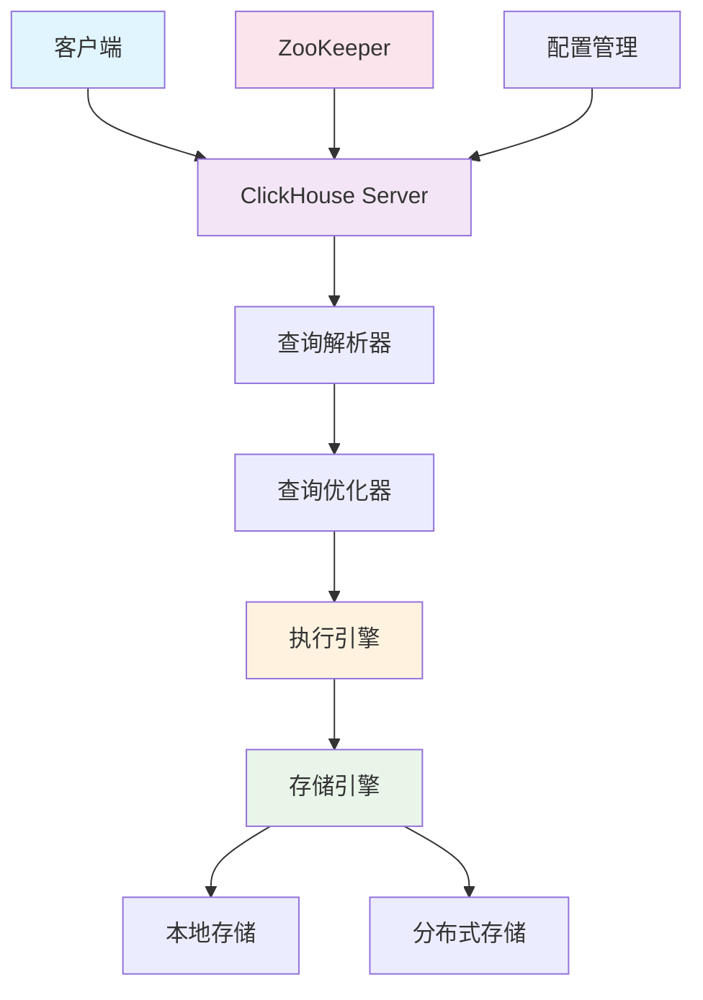
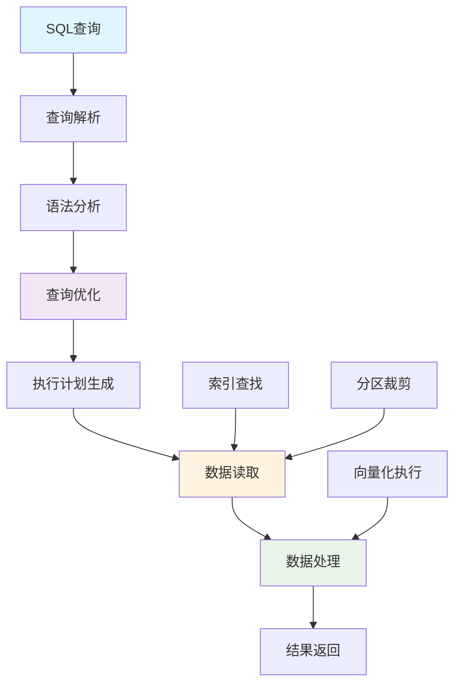
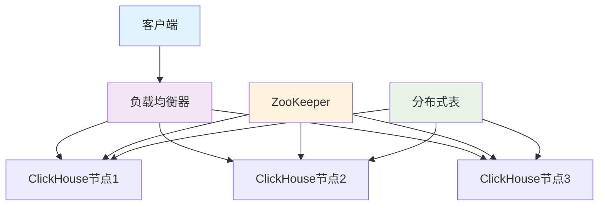

# ClickHouse

## 目录
- [ClickHouse](#clickhouse)
  - [目录](#目录)
  - [ClickHouse 基础概念](#clickhouse-基础概念)
    - [ClickHouse 简介](#clickhouse-简介)
    - [ClickHouse 架构设计](#clickhouse-架构设计)
    - [ClickHouse 核心特性](#clickhouse-核心特性)
  - [ClickHouse 存储引擎](#clickhouse-存储引擎)
    - [MergeTree 系列引擎](#mergetree-系列引擎)
    - [Log 系列引擎](#log-系列引擎)
    - [集成引擎](#集成引擎)
    - [引擎选择策略](#引擎选择策略)
  - [ClickHouse 数据类型](#clickhouse-数据类型)
    - [基础数据类型](#基础数据类型)
    - [复合数据类型](#复合数据类型)
    - [特殊数据类型](#特殊数据类型)
  - [设置与配置](#设置与配置)
  - [数据操作](#数据操作)
    - [插入数据](#插入数据)
    - [查询数据](#查询数据)
    - [Bitmap操作](#bitmap操作)
      - [基本操作](#基本操作)
      - [聚合操作](#聚合操作)
      - [转换操作](#转换操作)
      - [性能优化](#性能优化)
    - [Map操作](#map操作)
      - [Map创建与转换](#map创建与转换)
      - [Map查询与操作](#map查询与操作)
      - [Map聚合操作](#map聚合操作)
    - [数组操作](#数组操作)
    - [字符串操作](#字符串操作)
  - [表管理](#表管理)
    - [表分区与大小](#表分区与大小)
    - [表优化](#表优化)
  - [系统管理](#系统管理)
    - [系统表详解](#系统表详解)
    - [查询监控](#查询监控)
    - [性能监控](#性能监控)
  - [ClickHouse 查询优化](#clickhouse-查询优化)
    - [查询执行原理](#查询执行原理)
    - [索引优化](#索引优化)
    - [分区优化](#分区优化)
    - [压缩优化](#压缩优化)
    - [内存优化](#内存优化)
  - [ClickHouse 集群管理](#clickhouse-集群管理)
    - [集群架构](#集群架构)
    - [分片策略](#分片策略)
    - [复制机制](#复制机制)
    - [负载均衡](#负载均衡)
  - [ClickHouse 运维实践](#clickhouse-运维实践)
    - [备份恢复](#备份恢复)
    - [数据迁移](#数据迁移)
    - [性能调优](#性能调优)
    - [故障排查](#故障排查)
  - [特性对比](#特性对比)
    - [ORDER BY vs PRIMARY KEY](#order-by-vs-primary-key)
    - [ClickHouse vs 其他数据库](#clickhouse-vs-其他数据库)
  - [ClickHouse 典型面试题与答疑](#clickhouse-典型面试题与答疑)
    - [基础概念面试题](#基础概念面试题)
    - [架构设计面试题](#架构设计面试题)
    - [性能优化面试题](#性能优化面试题)
    - [运维监控面试题](#运维监控面试题)
    - [实际应用面试题](#实际应用面试题)
  - [ClickHouse 高级特性](#clickhouse-高级特性)
    - [物化视图](#物化视图)
    - [字典功能](#字典功能)
    - [用户定义函数(UDF)](#用户定义函数udf)
    - [数据采样](#数据采样)
    - [TTL(Time To Live)](#ttltime-to-live)
  - [ClickHouse 安全与权限管理](#clickhouse-安全与权限管理)
    - [用户管理](#用户管理)
    - [权限控制](#权限控制)
    - [网络安全](#网络安全)
  - [ClickHouse 监控与告警](#clickhouse-监控与告警)
    - [监控指标](#监控指标)
    - [告警配置](#告警配置)
    - [日志管理](#日志管理)
  - [ClickHouse 业务实践与案例](#clickhouse-业务实践与案例)
    - [实时数据分析平台](#实时数据分析平台)
    - [日志分析系统](#日志分析系统)
    - [时序数据存储](#时序数据存储)
  - [ClickHouse 故障排查与优化](#clickhouse-故障排查与优化)
    - [常见问题诊断](#常见问题诊断)
    - [性能调优策略](#性能调优策略)
    - [集群运维](#集群运维)
    - [集群配置](#集群配置)

## ClickHouse 基础概念

### ClickHouse 简介

**ClickHouse** 是由Yandex开发的开源列式数据库管理系统，专门用于在线分析处理（OLAP）场景。它具有高性能、高压缩比、高可用性等特点，广泛应用于大数据分析、实时报表、日志分析等场景。

**核心优势**：
- **高性能**：列式存储，向量化执行，并行处理
- **高压缩比**：数据压缩率可达10:1以上
- **实时查询**：支持实时数据插入和查询
- **水平扩展**：支持集群部署和分片
- **SQL兼容**：支持标准SQL语法

**应用场景**：
- 实时数据分析
- 日志分析
- 用户行为分析
- 业务报表
- 时序数据存储

### ClickHouse 架构设计

**整体架构**：



**核心组件**：

| 组件 | 功能 | 特点 |
|------|------|------|
| **查询解析器** | 解析SQL语句，生成语法树 | 支持标准SQL和ClickHouse扩展语法 |
| **查询优化器** | 优化查询计划，选择最佳执行路径 | 基于成本模型，支持多种优化策略 |
| **执行引擎** | 执行查询计划，处理数据 | 向量化执行，并行处理 |
| **存储引擎** | 管理数据存储和检索 | 多种引擎支持不同场景 |
| **分布式引擎** | 处理分布式查询和写入 | 支持分片和复制 |

### ClickHouse 核心特性

**列式存储**：
- 数据按列存储，提高压缩率和查询性能
- 支持列级别的索引和压缩
- 适合聚合查询和统计分析

**向量化执行**：
- 批量处理数据，减少函数调用开销
- 利用CPU SIMD指令优化性能
- 支持并行处理多个数据块

**实时写入**：
- 支持实时数据插入
- 异步合并和压缩
- 写入性能可达每秒数百万行

**分布式查询**：
- 支持跨分片查询
- 自动数据路由和负载均衡
- 支持分布式聚合和JOIN

## ClickHouse 存储引擎

### MergeTree 系列引擎

**MergeTree引擎**是ClickHouse最核心的存储引擎，支持数据分区、索引、压缩等特性。

```sql
-- 基本MergeTree表
CREATE TABLE events (
    event_date Date,
    event_time DateTime,
    user_id UInt32,
    event_type String,
    event_data String
) ENGINE = MergeTree()
PARTITION BY toYYYYMM(event_date)
ORDER BY (event_date, event_time, user_id)
SETTINGS index_granularity = 8192;
```

**MergeTree引擎特性**：

| 特性 | 说明 | 优势 |
|------|------|------|
| **分区** | 按分区键自动分区 | 提高查询性能，便于数据管理 |
| **排序** | 按ORDER BY字段排序 | 支持范围查询优化 |
| **索引** | 自动生成稀疏索引 | 加速数据定位 |
| **压缩** | 支持多种压缩算法 | 节省存储空间 |
| **合并** | 后台自动合并小分区 | 优化存储结构 |

**ReplacingMergeTree引擎**：
```sql
-- 支持去重的MergeTree
CREATE TABLE user_profiles (
    user_id UInt32,
    profile_data String,
    updated_at DateTime
) ENGINE = ReplacingMergeTree(updated_at)
PARTITION BY toYYYYMM(updated_at)
ORDER BY user_id;
```

**CollapsingMergeTree引擎**：
```sql
-- 支持折叠行的MergeTree
CREATE TABLE user_sessions (
    user_id UInt32,
    session_id String,
    sign Int8, -- 1表示添加，-1表示删除
    session_data String
) ENGINE = CollapsingMergeTree(sign)
PARTITION BY toYYYYMM(session_data)
ORDER BY (user_id, session_id);
```

### Log 系列引擎

**Log系列引擎**适用于小表、临时表或日志数据。

```sql
-- TinyLog引擎（最简单）
CREATE TABLE tiny_log (
    timestamp DateTime,
    message String
) ENGINE = TinyLog;

-- StripeLog引擎（支持并行读取）
CREATE TABLE stripe_log (
    timestamp DateTime,
    message String
) ENGINE = StripeLog;

-- Log引擎（支持索引）
CREATE TABLE log_table (
    timestamp DateTime,
    level String,
    message String
) ENGINE = Log;
```

### 集成引擎

**集成引擎**用于连接外部数据源。

```sql
-- MySQL引擎
CREATE TABLE mysql_table (
    id UInt32,
    name String
) ENGINE = MySQL('mysql_host:3306', 'database', 'table', 'user', 'password');

-- HDFS引擎
CREATE TABLE hdfs_table (
    id UInt32,
    data String
) ENGINE = HDFS('hdfs://namenode:9000/path/to/file', 'Parquet');

-- Kafka引擎
CREATE TABLE kafka_table (
    timestamp DateTime,
    message String
) ENGINE = Kafka('kafka_host:9092', 'topic', 'group_id', 'JSONEachRow');
```

### 引擎选择策略

| 使用场景 | 推荐引擎 | 原因 |
|---------|----------|------|
| **大数据分析** | MergeTree | 支持分区、索引、压缩 |
| **实时写入** | MergeTree | 高性能写入，后台合并 |
| **数据去重** | ReplacingMergeTree | 自动去重，保留最新版本 |
| **会话数据** | CollapsingMergeTree | 支持数据折叠，节省空间 |
| **临时数据** | Log系列 | 简单高效，适合小表 |
| **外部数据** | 集成引擎 | 直接访问外部数据源 |

## ClickHouse 数据类型

### 基础数据类型

**整数类型**：
```sql
-- 有符号整数
Int8, Int16, Int32, Int64, Int128, Int256

-- 无符号整数
UInt8, UInt16, UInt32, UInt64, UInt128, UInt256

-- 示例
CREATE TABLE integers (
    id UInt32,
    count Int64,
    flag UInt8
);
```

**浮点类型**：
```sql
-- 浮点数
Float32, Float64

-- 示例
CREATE TABLE floats (
    price Float32,
    ratio Float64
);
```

**字符串类型**：
```sql
-- 字符串
String, FixedString(N)

-- 示例
CREATE TABLE strings (
    name String,
    code FixedString(10)
);
```

**日期时间类型**：
```sql
-- 日期时间
Date, DateTime, DateTime64

-- 示例
CREATE TABLE dates (
    event_date Date,
    event_time DateTime,
    precise_time DateTime64(3)
);
```

### 复合数据类型

**数组类型**：
```sql
-- 数组
Array(T)

-- 示例
CREATE TABLE arrays (
    tags Array(String),
    scores Array(Float32),
    ids Array(UInt32)
);
```

**元组类型**：
```sql
-- 元组
Tuple(T1, T2, ...)

-- 示例
CREATE TABLE tuples (
    point Tuple(Float32, Float32),
    user_info Tuple(String, UInt32, DateTime)
);
```

**Map类型**：
```sql
-- Map
Map(KeyType, ValueType)

-- 示例
CREATE TABLE maps (
    user_attributes Map(String, String),
    metrics Map(String, Float64)
);
```

### 特殊数据类型

**Nullable类型**：
```sql
-- 可空类型
Nullable(T)

-- 示例
CREATE TABLE nullable_data (
    id UInt32,
    name Nullable(String),
    age Nullable(UInt8)
);
```

**LowCardinality类型**：
```sql
-- 低基数类型（优化存储）
LowCardinality(T)

-- 示例
CREATE TABLE low_cardinality (
    country LowCardinality(String),
    status LowCardinality(String)
);
```

**Decimal类型**：
```sql
-- 高精度小数
Decimal(P, S)

-- 示例
CREATE TABLE decimals (
    amount Decimal(18, 2),
    rate Decimal(10, 4)
);
```

## 设置与配置
```sql
-- 设置最大线程数和内存使用
SETTINGS max_threads=5, max_memory_usage=41474836480;
```

## 数据操作

### 插入数据
```sql
-- 基本插入
INSERT INTO table_name (column1, column2) VALUES (value1, value2);

-- 从HDFS插入数据
INSERT INTO glab_gid_info.appinfo_v2 
SELECT * FROM hdfs('hdfs://path/to/file', 'Parquet');

-- 使用命令行工具插入
clickhouse-client -m --port 9000 --user default --database glab_gid_info --password xxxxx \
 --host hzxs-ga-ck-xs6 --max_insert_block_size=536970912 --max_insert_threads=4 \
 -q 'INSERT INTO table_name SELECT * FROM hdfs("path/to/file", "Parquet");'
```

### 查询数据
```sql
-- 基本查询
SELECT * FROM table_name WHERE condition;

-- 抽样查询
SELECT * FROM table_name WHERE (cityHash64(essid) % 100000) = 0;

-- WITH子句使用
WITH (SELECT AVG(value) FROM some_table) AS avg_value
SELECT id, value, avg_value
FROM some_table
WHERE value > avg_value;
```

### Bitmap操作

#### 基本操作
```sql
-- 创建bitmap
SELECT bitmapBuild([1, 2, 3, 4, 5]) AS bitmap;

-- 添加元素
SELECT bitmapAdd(bitmapBuild([1,2,3]), 4) AS bitmap;

-- 删除元素
SELECT bitmapSubtract(bitmapBuild([1,2,3]), 2) AS bitmap;

-- 判断元素是否存在
SELECT bitmapContains(bitmapBuild([1,2,3]), 2) AS exists;

-- 获取基数（元素个数）
SELECT bitmapCardinality(bitmap_column) FROM table;
```

#### 聚合操作
```sql
-- OR操作（并集）
SELECT 
    bitmapOr(bitmap1, bitmap2) AS union_bitmap,
    bitmapOrCardinality(bitmap1, bitmap2) AS union_count
FROM table;

-- AND操作（交集）
SELECT 
    bitmapAnd(bitmap1, bitmap2) AS intersect_bitmap,
    bitmapAndCardinality(bitmap1, bitmap2) AS intersect_count
FROM table;

-- XOR操作（异或）
SELECT 
    bitmapXor(bitmap1, bitmap2) AS xor_bitmap,
    bitmapXorCardinality(bitmap1, bitmap2) AS xor_count
FROM table;

-- 聚合OR操作
SELECT bitmapOrState(bitmap_column)
FROM table
GROUP BY group_column;

-- 聚合AND操作
SELECT bitmapAndState(bitmap_column)
FROM table
GROUP BY group_column;
```

#### 转换操作
```sql
-- Bitmap转数组
SELECT bitmapToArray(bitmap_column) AS array;

-- 数组转Bitmap
SELECT bitmapBuild([1, 2, 3]) AS bitmap;

-- 获取Bitmap中的指定范围元素
SELECT arraySlice(bitmapToArray(bitmap_column), 1, 5) AS first_five;

-- 实际应用示例
SELECT 
    tag,
    bitmapCardinality(gid_index_bitmap) AS user_count,
    arraySlice(bitmapToArray(gid_index_bitmap), 1, 10) AS sample_users
FROM tag_bitmap 
WHERE tag_md5 = lower(hex(MD5('tag_name')));

-- Bitmap分段统计示例
SELECT 
    bitmap_segment_number,
    bitmapCardinality(gid_index_bitmap) AS segment_count,
    formatReadableSize(length(gid_index_bitmap)) AS bitmap_size
FROM tag_bitmap 
WHERE tag_md5 = lower(hex(MD5('tag_name')))
ORDER BY bitmap_segment_number;
```

#### 性能优化
```sql
-- 使用 bitmapOrCardinality 替代 bitmapCardinality(bitmapOr())
SELECT bitmapOrCardinality(
    bitmapBuild([1, 2, 3]),
    bitmapBuild([3, 4, 5])
) AS union_count;

-- 批量处理时使用State聚合函数
SELECT 
    tag,
    bitmapCardinality(groupBitmapOrState(gid_index_bitmap)) AS total_users
FROM tag_bitmap
WHERE tag IN ('tag1', 'tag2', 'tag3')
GROUP BY tag;

-- 大规模数据处理优化
SELECT 
    tag,
    bitmapCardinality(gid_index_bitmap) AS user_count,
    formatReadableSize(length(gid_index_bitmap)) AS bitmap_size
FROM tag_bitmap 
WHERE tag_md5 IN (
    SELECT lower(hex(MD5(tag))) 
    FROM (SELECT ['tag1', 'tag2', 'tag3'] AS tags) 
    ARRAY JOIN tags AS tag
)
SETTINGS max_threads = 4;
```

### Map操作

#### Map创建与转换
```sql
-- 创建Map
SELECT map('key1', 1, 'key2', 2) AS simple_map;

-- 从两个数组创建Map
SELECT mapFromArrays(['key1', 'key2', 'key3'], [1, 2, 3]) AS map_from_arrays;

-- 从嵌套数组创建Map
SELECT mapFromArrays(['a', 'b'], [[1, 2], [3, 4]]) AS nested_map;

-- 数组转换为Map (key-value对的数组)
SELECT arrayMap(x -> (x, x * x), range(1, 5)) AS array_of_pairs,
       map(arrayMap(x -> (x, x * x), range(1, 5))) AS map_from_pairs;

-- 从JSON字符串创建Map
SELECT mapFromJSON('{"key1": 1, "key2": 2, "key3": 3}') AS map_from_json;

-- Map转换为JSON
SELECT mapToJSON(map('key1', 1, 'key2', 2)) AS json_string;

-- Map转换为两个数组
SELECT mapKeys(map('key1', 1, 'key2', 2)) AS keys,
       mapValues(map('key1', 1, 'key2', 2)) AS values;
```

#### Map查询与操作
```sql
-- 获取Map中的值
SELECT map('key1', 1, 'key2', 2)['key1'] AS value;

-- 检查键是否存在
SELECT mapContains(map('key1', 1, 'key2', 2), 'key1') AS contains_key;

-- 获取Map大小
SELECT mapSize(map('key1', 1, 'key2', 2)) AS map_size;

-- 合并两个Map
SELECT mapMerge(
    map('key1', 1, 'key2', 2),
    map('key2', 20, 'key3', 3)
) AS merged_map;

-- 删除Map中的键
SELECT mapRemove(map('key1', 1, 'key2', 2, 'key3', 3), ['key1', 'key3']) AS filtered_map;

-- 提取Map子集
SELECT mapFilter((k, v) -> v > 1, map('key1', 1, 'key2', 2, 'key3', 3)) AS filtered_map;

-- 转换Map值
SELECT mapApply((k, v) -> v * 10, map('key1', 1, 'key2', 2)) AS transformed_map;

-- 展平嵌套Map
SELECT mapFlat(map('nested', map('key1', 1, 'key2', 2), 'key3', 3)) AS flattened_map;
```

#### Map聚合操作
```sql
-- 聚合多行数据为单个Map
SELECT mapAgg(key, value) FROM (
    SELECT 'key1' AS key, 1 AS value
    UNION ALL SELECT 'key2' AS key, 2 AS value
    UNION ALL SELECT 'key3' AS key, 3 AS value
);

-- 合并多行Map
SELECT groupArrayMap(m) FROM (
    SELECT map('key1', 1, 'key2', 2) AS m
    UNION ALL SELECT map('key2', 20, 'key3', 3) AS m
    UNION ALL SELECT map('key4', 4) AS m
);

-- 聚合Map并对值进行求和
SELECT 
    date,
    sumMap(page_views) AS total_views
FROM (
    SELECT 
        toDate('2023-01-01') AS date,
        map('page1', 10, 'page2', 15) AS page_views
    UNION ALL
    SELECT 
        toDate('2023-01-01') AS date,
        map('page1', 5, 'page3', 8) AS page_views
)
GROUP BY date;

-- 实际应用示例：用户属性聚合
SELECT 
    user_id,
    mapAgg(attribute, value) AS user_attributes
FROM user_attribute_table
GROUP BY user_id;

-- 实际应用示例：事件计数聚合
SELECT 
    date,
    sumMap(event_counts) AS daily_events
FROM (
    SELECT 
        event_date AS date,
        map(event_type, event_count) AS event_counts
    FROM events_table
)
GROUP BY date
ORDER BY date;
```

### 数组操作
```sql
-- 数组转换
SELECT arrayJoin([1, 2, 3]) AS value;

-- 数组去重
SELECT arrayDistinct([1, 2, 2, 3]);

-- 数组合并
SELECT arrayConcat([1, 2], [3, 4]);

-- 数组映射
SELECT arrayMap(x -> x * 2, [1, 2, 3, 4, 5]) AS result;

-- 数组过滤
SELECT arrayFilter(x -> x > 3, [1, 2, 3, 4, 5]);

-- 数组聚合
SELECT groupUniqArray(column) -- 去重聚合
SELECT groupArray(column)     -- 不去重聚合

-- 数组打平
SELECT arrayFlatten(groupArray(values));

-- 数组添加元素
SELECT arrayPushBack([1, 2, 3], 4);
```

### 字符串操作
```sql
-- 字符串分割
SELECT splitByChar(',', 'a,b,c');

-- 字符串匹配
SELECT match('string', 'pattern');
SELECT match('aftvf', 'a');

-- 字符串包含多个模式
SELECT * FROM table WHERE match(column_name, 'MG|XZ');
```

## 表管理

### 表分区与大小
```sql
-- 查看表大小
SELECT 
    database,
    table,
    sum(rows) AS `总行数`,
    formatReadableSize(sum(data_uncompressed_bytes)) AS `原始大小`,
    formatReadableSize(sum(data_compressed_bytes)) AS `压缩大小`,
    round((sum(data_compressed_bytes) / sum(data_uncompressed_bytes)) * 100, 0) AS `压缩率`
FROM system.parts
WHERE database NOT IN ('test', 'default')
GROUP BY database, table
ORDER BY sum(data_compressed_bytes) DESC;

-- 查看表字段大小
SELECT 
    column AS `字段名`,
    any(type) AS `类型`,
    formatReadableSize(sum(column_data_uncompressed_bytes)) AS `原始大小`,
    formatReadableSize(sum(column_data_compressed_bytes)) AS `压缩大小`,
    sum(rows) AS `行数`
FROM system.parts_columns
WHERE database = 'database_name' AND table = 'table_name'
GROUP BY column
ORDER BY sum(column_data_uncompressed_bytes) DESC;
```

### 表优化
```sql
-- 优化表
OPTIMIZE TABLE table_name FINAL;
OPTIMIZE TABLE table_name PARTITION partition_name FINAL;

-- 查看待合并分区
SELECT 
    partition_num,
    unmerged_partition_num,
    files_num 
FROM (
    SELECT 1 flag, count() unmerged_partition_num 
    FROM (
        SELECT partition, count() counts
        FROM system.parts 
        WHERE database = 'database_name' 
        AND table = 'table_name' 
        AND active = 1
        GROUP BY partition 
        HAVING counts > 1
    )
) t1 
JOIN (
    SELECT 
        1 flag,
        count(DISTINCT partition) partition_num,
        count() files_num
    FROM system.parts 
    WHERE database = 'database_name' 
    AND table = 'table_name' 
    AND active = 1
) t2 ON t1.flag = t2.flag;
```

## 系统管理

### 系统表详解

**系统表分类**：

| 系统表 | 用途 | 重要字段 |
|--------|------|----------|
| **system.metrics** | 系统指标监控 | metric, value, description |
| **system.events** | 系统事件统计 | event, value, description |
| **system.processes** | 正在执行的查询 | query_id, query, elapsed, read_rows |
| **system.query_log** | 查询历史日志 | event_time, query_duration_ms, read_rows |
| **system.parts** | 表分区信息 | database, table, partition, rows |
| **system.merges** | 合并任务信息 | database, table, num_parts, total_size_bytes_compressed |

**常用系统查询**：
```sql
-- 1. 系统资源使用情况
SELECT 
    metric,
    value,
    description
FROM system.metrics
WHERE metric IN (
    'Memory.Resident',
    'Memory.Virtual',
    'Memory.Shared',
    'Memory.Code',
    'Memory.Data',
    'Memory.Stack'
);

-- 2. 查询性能统计
SELECT 
    event,
    value,
    description
FROM system.events
WHERE event LIKE '%Query%'
ORDER BY value DESC;

-- 3. 表大小统计
SELECT 
    database,
    table,
    sum(rows) AS total_rows,
    formatReadableSize(sum(data_uncompressed_bytes)) AS uncompressed_size,
    formatReadableSize(sum(data_compressed_bytes)) AS compressed_size,
    round((sum(data_compressed_bytes) / sum(data_uncompressed_bytes)) * 100, 2) AS compression_ratio
FROM system.parts
WHERE active = 1
GROUP BY database, table
ORDER BY sum(data_compressed_bytes) DESC;
```

**表状态监控**：

```sql
-- 表大小统计
SELECT 
    database, table, sum(rows) AS total_rows,
    formatReadableSize(sum(data_compressed_bytes)) AS compressed_size
FROM system.parts
WHERE active = 1
GROUP BY database, table;
```


### 查询监控
```sql
-- 查看正在执行的查询
SELECT 
    query_id,
    substr(query, 1, 50),
    elapsed,
    read_rows,
    total_rows_approx,
    formatReadableSize(memory_usage)
FROM system.processes
WHERE query NOT LIKE '%SELECT query%'
ORDER BY elapsed DESC;

SELECT event, value FROM system.events WHERE event LIKE '%Query%';

-- 查看历史执行SQL
SELECT 
    event_time,
    query_duration_ms/1000 AS `耗时(秒)`,
    read_rows AS `读取行数`,
    result_rows AS `返回行数`,
    formatReadableSize(result_bytes) AS `返回数据大小`,
    formatReadableSize(memory_usage) AS `内存使用`,
    substr(query, 1, 40),
    databases,
    tables
FROM system.query_log
WHERE query NOT LIKE '%*%'
AND event_time >= '2025-01-21 19:00:00'
AND query_kind = 'Select'
ORDER BY query_duration_ms DESC
LIMIT 10;
```

### 性能监控
```sql
-- 获取内存使用情况
SELECT * FROM system.metrics WHERE metric LIKE 'Memory.%';

-- 查询常驻内存大小
SELECT value FROM system.metrics WHERE metric = 'Memory.Resident';

-- 查看正在进行的合并
SELECT 
    database,
    table,
    num_parts,
    formatReadableSize(total_size_bytes_compressed) AS total_size_bytes_compressed,
    total_size_marks,
    rows_read,
    rows_written,
    columns_written,
    memory_usage
FROM system.merges;
```

## ClickHouse 查询优化

### 查询执行原理

**查询执行流程**：



**查询优化策略**：

| 优化策略 | 说明 | 实现方式 |
|---------|------|----------|
| **分区裁剪** | 只读取相关分区 | 根据WHERE条件过滤分区 |
| **索引跳表** | 利用稀疏索引快速定位 | 基于ORDER BY字段的索引 |
| **列裁剪** | 只读取需要的列 | SELECT字段优化 |
| **谓词下推** | 在数据源处过滤 | 将过滤条件下推到存储层 |
| **向量化执行** | 批量处理数据 | 利用SIMD指令优化 |

### 索引优化

**稀疏索引原理**：
```sql
-- 索引粒度设置
CREATE TABLE events (
    event_date Date,
    event_time DateTime,
    user_id UInt32,
    event_type String
) ENGINE = MergeTree()
PARTITION BY toYYYYMM(event_date)
ORDER BY (event_date, event_time, user_id)
SETTINGS index_granularity = 8192; -- 每8192行一个索引条目
```

**索引优化技巧**：
```sql
-- 1. 合理设计ORDER BY
-- 好的设计：查询条件字段在前
ORDER BY (user_id, event_date, event_time)

-- 2. 使用跳表索引
ALTER TABLE events ADD INDEX idx_event_type event_type TYPE bloom_filter GRANULARITY 1;

-- 3. 投影索引
ALTER TABLE events ADD PROJECTION proj_user_events (
    SELECT user_id, event_date, event_type
    ORDER BY user_id, event_date
);
```

### 分区优化

**分区策略**：
```sql
-- 按时间分区（推荐）
PARTITION BY toYYYYMM(event_date)

-- 按用户ID分区
PARTITION BY intHash32(user_id) % 100

-- 复合分区
PARTITION BY (toYYYYMM(event_date), event_type)
```

**分区管理**：
```sql
-- 查看分区信息
SELECT 
    partition,
    name,
    rows,
    formatReadableSize(data_uncompressed_bytes) AS uncompressed_size,
    formatReadableSize(data_compressed_bytes) AS compressed_size
FROM system.parts
WHERE table = 'events'
ORDER BY partition;

-- 删除过期分区
ALTER TABLE events DROP PARTITION '2023-01';

-- 移动分区
ALTER TABLE events MOVE PARTITION '2023-01' TO TABLE events_archive;
```

### 压缩优化

**压缩算法选择**：
```sql
-- 设置压缩算法
CREATE TABLE events (
    event_date Date,
    event_data String
) ENGINE = MergeTree()
PARTITION BY toYYYYMM(event_date)
ORDER BY event_date
SETTINGS 
    compression_codec = 'ZSTD(3)', -- 压缩算法和级别
    min_bytes_for_wide_part = 0,
    min_rows_for_wide_part = 0;
```

**压缩算法对比**：

| 算法 | 压缩比 | 压缩速度 | 解压速度 | 适用场景 |
|------|--------|----------|----------|----------|
| **LZ4** | 2-3x | 很快 | 很快 | 实时写入 |
| **ZSTD** | 3-5x | 快 | 快 | 平衡场景 |
| **LZMA** | 5-8x | 慢 | 慢 | 冷数据存储 |

### 内存优化

**内存设置**：
```sql
-- 查询内存限制
SET max_memory_usage = 10737418240; -- 10GB
SET max_memory_usage_for_user = 21474836480; -- 20GB

-- 临时表内存限制
SET max_bytes_before_external_group_by = 1073741824; -- 1GB
SET max_bytes_before_external_sort = 1073741824; -- 1GB
```

**内存优化技巧**：
```sql
-- 1. 使用LIMIT限制结果集
SELECT * FROM events WHERE event_date = '2023-01-01' LIMIT 1000;

-- 2. 使用采样查询
SELECT * FROM events SAMPLE 0.1 WHERE event_date = '2023-01-01';

-- 3. 使用预聚合
SELECT 
    user_id,
    count() AS event_count,
    uniq(event_type) AS event_types
FROM events
WHERE event_date = '2023-01-01'
GROUP BY user_id;
```

## ClickHouse 集群管理

### 集群架构

**集群组件**：



**集群配置**：
```xml
<!-- config.xml -->
<clickhouse>
    <remote_servers>
        <cluster_name>
            <shard>
                <replica>
                    <host>node1</host>
                    <port>9000</port>
                </replica>
                <replica>
                    <host>node2</host>
                    <port>9000</port>
                </replica>
            </shard>
            <shard>
                <replica>
                    <host>node3</host>
                    <port>9000</port>
                </replica>
            </shard>
        </cluster_name>
    </remote_servers>
</clickhouse>
```

### 分片策略

**分片类型**：

| 分片策略 | 说明 | 适用场景 |
|---------|------|----------|
| **随机分片** | 数据随机分布到分片 | 数据均匀分布 |
| **哈希分片** | 按字段哈希值分片 | 按用户ID分片 |
| **范围分片** | 按字段范围分片 | 按时间分片 |

**分片配置**：
```sql
-- 创建分布式表
CREATE TABLE events_distributed AS events
ENGINE = Distributed(cluster_name, database, events, user_id);

-- 插入数据（自动路由到对应分片）
INSERT INTO events_distributed SELECT * FROM events_local;
```

### 复制机制

**复制配置**：
```sql
-- 创建复制表
CREATE TABLE events_replicated (
    event_date Date,
    user_id UInt32,
    event_type String
) ENGINE = ReplicatedMergeTree('/clickhouse/tables/events', 'replica1')
PARTITION BY toYYYYMM(event_date)
ORDER BY (event_date, user_id);
```

**复制特性**：
- **异步复制**：写入主副本，异步同步到其他副本
- **故障转移**：主副本故障时自动切换到其他副本
- **数据一致性**：通过ZooKeeper保证元数据一致性

### 负载均衡

**负载均衡策略**：
```sql
-- 1. 轮询负载均衡
SELECT * FROM events_distributed;

-- 2. 随机负载均衡
SELECT * FROM events_distributed SETTINGS load_balancing = 'random';

-- 3. 就近负载均衡
SELECT * FROM events_distributed SETTINGS load_balancing = 'nearest_hostname';
```

## ClickHouse 运维实践

### 备份恢复

**备份策略**：
```bash
# 1. 数据备份
clickhouse-client --query "BACKUP TABLE database.table TO '/backup/path'"

# 2. 配置文件备份
cp /etc/clickhouse-server/config.xml /backup/
cp /etc/clickhouse-server/users.xml /backup/

# 3. 元数据备份
clickhouse-client --query "SHOW CREATE TABLE database.table" > /backup/schema.sql
```

**恢复操作**：
```bash
# 1. 恢复数据
clickhouse-client --query "RESTORE TABLE database.table FROM '/backup/path'"

# 2. 恢复表结构
clickhouse-client --query "$(cat /backup/schema.sql)"
```

### 数据迁移

**数据迁移方法**：
```sql
-- 1. 使用INSERT SELECT
INSERT INTO target_table SELECT * FROM source_table;

-- 2. 使用物化视图
CREATE MATERIALIZED VIEW target_table
ENGINE = MergeTree()
PARTITION BY toYYYYMM(event_date)
ORDER BY event_date
AS SELECT * FROM source_table;

-- 3. 使用外部表
CREATE TABLE external_table (
    id UInt32,
    data String
) ENGINE = HDFS('hdfs://path/to/data', 'Parquet');
```

### 性能调优

**系统参数调优**：
```xml
<!-- config.xml -->
<clickhouse>
    <max_concurrent_queries>100</max_concurrent_queries>
    <max_memory_usage>8589934592</max_memory_usage>
    <max_memory_usage_for_user>17179869184</max_memory_usage_for_user>
    <max_memory_usage_for_all_queries>34359738368</max_memory_usage_for_all_queries>
    
    <merge_tree>
        <parts_to_delay_insert>150</parts_to_delay_insert>
        <parts_to_throw_insert>300</parts_to_throw_insert>
        <max_bytes_to_merge_at_max_space_in_pool>2000000000000</max_bytes_to_merge_at_max_space_in_pool>
    </merge_tree>
</clickhouse>
```

### 故障排查

**常见问题排查**：
```sql
-- 1. 查看系统状态
SELECT * FROM system.metrics WHERE metric LIKE 'Memory.%';
SELECT * FROM system.processes;

-- 2. 查看查询日志
SELECT 
    event_time,
    query_duration_ms,
    read_rows,
    result_rows,
    memory_usage
FROM system.query_log
WHERE event_time >= now() - INTERVAL 1 HOUR
ORDER BY query_duration_ms DESC
LIMIT 10;

-- 3. 查看错误日志
SELECT 
    event_time,
    message
FROM system.text_log
WHERE level >= 'Error'
ORDER BY event_time DESC
LIMIT 20;
```

## 特性对比

### ORDER BY vs PRIMARY KEY

特性 | ORDER BY | PRIMARY KEY
-|-|-
定义位置 | 必须在建表时定义 | 可选，通常与 ORDER BY 一起定义
控制数据物理存储顺序 | 是 | 否
作用 | 决定数据存储的物理排序顺序，影响压缩效率 | 用于加速查询，生成稀疏索引
关系 | PRIMARY KEY 是 ORDER BY 的一个子集或相同 | PRIMARY KEY 的字段必须在 ORDER BY 字段中
影响范围查询性能 | 是，数据按顺序存储能加快范围查询 | 是，通过索引跳表可以加速范围查询
去重功能 | 无 | 在特定引擎下可以（如 ReplacingMergeTree）

### ClickHouse vs 其他数据库

**ClickHouse vs MySQL**：

| 特性 | ClickHouse | MySQL |
|------|------------|-------|
| **存储模型** | 列式存储 | 行式存储 |
| **查询性能** | 极高（OLAP） | 中等（OLTP） |
| **压缩比** | 10:1以上 | 2-3:1 |
| **实时写入** | 支持 | 支持 |
| **聚合查询** | 极快 | 较慢 |
| **存储引擎** | MergeTree系列 | InnoDB, MyISAM等 |
| **适用场景** | 数据分析、报表 | 事务处理、业务系统 |

**ClickHouse vs HBase**：

| 特性 | ClickHouse | HBase |
|------|------------|-------|
| **数据模型** | 关系型 | 列族型 |
| **查询语言** | SQL | API/Shell |
| **索引** | 稀疏索引 | 行键索引 |
| **分区** | 自动分区 | 手动分区 |
| **压缩** | 列级压缩 | 块级压缩 |
| **实时性** | 实时查询 | 近实时 |
| **扩展性** | 水平扩展 | 水平扩展 |

**ClickHouse vs Elasticsearch**：

| 特性 | ClickHouse | Elasticsearch |
|------|------------|---------------|
| **数据模型** | 结构化数据 | 半结构化数据 |
| **查询语言** | SQL | DSL |
| **全文搜索** | 基础支持 | 强大支持 |
| **聚合分析** | 极快 | 较快 |
| **实时性** | 实时 | 近实时 |
| **存储成本** | 低 | 高 |
| **运维复杂度** | 中等 | 高 |

## ClickHouse 典型面试题与答疑

### 基础概念面试题

**1. ClickHouse是什么？有什么特点？**

**答案**：ClickHouse是由Yandex开发的开源列式数据库管理系统，专门用于OLAP场景。

**核心特点**：
- **列式存储**：数据按列存储，提高压缩率和查询性能
- **向量化执行**：批量处理数据，利用SIMD指令优化
- **高压缩比**：数据压缩率可达10:1以上
- **实时查询**：支持实时数据插入和查询
- **水平扩展**：支持集群部署和分片

**2. ClickHouse的存储引擎有哪些？如何选择？**

**答案**：ClickHouse有多种存储引擎，主要包括：

- **MergeTree系列**：最核心的引擎，支持分区、索引、压缩
- **Log系列**：适用于小表、临时表
- **集成引擎**：用于连接外部数据源

**选择策略**：
- 大数据分析：MergeTree
- 实时写入：MergeTree
- 数据去重：ReplacingMergeTree
- 临时数据：Log系列
- 外部数据：集成引擎

**3. ClickHouse的数据类型有哪些？**

**答案**：ClickHouse支持丰富的数据类型：

**基础类型**：
- 整数：Int8, Int16, Int32, Int64, UInt8, UInt16, UInt32, UInt64
- 浮点：Float32, Float64
- 字符串：String, FixedString(N)
- 日期时间：Date, DateTime, DateTime64

**复合类型**：
- 数组：Array(T)
- 元组：Tuple(T1, T2, ...)
- Map：Map(KeyType, ValueType)

**特殊类型**：
- Nullable(T)：可空类型
- LowCardinality(T)：低基数类型
- Decimal(P, S)：高精度小数

### 架构设计面试题

**4. ClickHouse的架构是怎样的？**

**答案**：ClickHouse采用分布式架构，主要组件包括：

**核心组件**：
- **查询解析器**：解析SQL语句，生成语法树
- **查询优化器**：优化查询计划，选择最佳执行路径
- **执行引擎**：执行查询计划，处理数据
- **存储引擎**：管理数据存储和检索
- **分布式引擎**：处理分布式查询和写入

**集群组件**：
- **ZooKeeper**：元数据管理和集群协调
- **负载均衡器**：请求分发和负载均衡
- **分片节点**：数据存储和查询处理

**5. ClickHouse的索引机制是怎样的？**

**答案**：ClickHouse使用稀疏索引机制：

**索引原理**：
- 基于ORDER BY字段生成稀疏索引
- 每8192行（默认）生成一个索引条目
- 支持跳表索引和投影索引

**索引优化**：
```sql
-- 跳表索引
ALTER TABLE events ADD INDEX idx_event_type event_type TYPE bloom_filter GRANULARITY 1;

-- 投影索引
ALTER TABLE events ADD PROJECTION proj_user_events (
    SELECT user_id, event_date, event_type
    ORDER BY user_id, event_date
);
```

**6. ClickHouse的分区机制是怎样的？**

**答案**：ClickHouse支持多种分区策略：

**分区类型**：
- **时间分区**：按时间字段分区，如`PARTITION BY toYYYYMM(event_date)`
- **哈希分区**：按字段哈希值分区，如`PARTITION BY intHash32(user_id) % 100`
- **复合分区**：多个字段组合分区

**分区管理**：
```sql
-- 查看分区信息
SELECT partition, rows, formatReadableSize(data_compressed_bytes) 
FROM system.parts WHERE table = 'events';

-- 删除分区
ALTER TABLE events DROP PARTITION '2023-01';
```

### 性能优化面试题

**7. 如何优化ClickHouse查询性能？**

**答案**：ClickHouse查询优化可以从以下几个方面：

**索引优化**：
- 合理设计ORDER BY字段顺序
- 使用跳表索引加速过滤
- 创建投影索引优化特定查询

**分区优化**：
- 选择合适的分区策略
- 及时删除过期分区
- 避免跨分区查询

**查询优化**：
- 使用LIMIT限制结果集
- 使用采样查询减少数据量
- 使用预聚合减少计算量

**8. ClickHouse的内存优化策略有哪些？**

**答案**：ClickHouse内存优化策略：

**内存设置**：
```sql
-- 查询内存限制
SET max_memory_usage = 10737418240; -- 10GB
SET max_memory_usage_for_user = 21474836480; -- 20GB

-- 临时表内存限制
SET max_bytes_before_external_group_by = 1073741824; -- 1GB
SET max_bytes_before_external_sort = 1073741824; -- 1GB
```

**优化技巧**：
- 使用LIMIT限制结果集大小
- 使用采样查询减少内存使用
- 合理设置临时表内存阈值

**9. ClickHouse的压缩优化策略有哪些？**

**答案**：ClickHouse支持多种压缩算法：

**压缩算法对比**：
- **LZ4**：压缩比2-3x，速度很快，适合实时写入
- **ZSTD**：压缩比3-5x，速度较快，平衡场景
- **LZMA**：压缩比5-8x，速度较慢，适合冷数据

**压缩配置**：
```sql
CREATE TABLE events (
    event_date Date,
    event_data String
) ENGINE = MergeTree()
PARTITION BY toYYYYMM(event_date)
ORDER BY event_date
SETTINGS compression_codec = 'ZSTD(3)';
```

### 运维监控面试题

**10. 如何监控ClickHouse集群状态？**

**答案**：通过系统表监控ClickHouse状态：

**系统指标监控**：
```sql
-- 内存使用情况
SELECT metric, value FROM system.metrics WHERE metric LIKE 'Memory.%';

-- 查询性能统计
SELECT event, value FROM system.events WHERE event LIKE '%Query%';

-- 磁盘使用情况
SELECT 
    database,
    table,
    formatReadableSize(sum(data_compressed_bytes)) AS compressed_size,
    formatReadableSize(sum(data_uncompressed_bytes)) AS uncompressed_size
FROM system.parts
GROUP BY database, table
ORDER BY sum(data_compressed_bytes) DESC;
```

**11. ClickHouse集群如何实现高可用？**

**答案**：ClickHouse高可用通过以下机制实现：

**复制机制**：
- 使用ReplicatedMergeTree引擎
- 通过ZooKeeper协调副本同步
- 支持多副本读写分离

**分片机制**：
- 数据水平分片存储
- 单分片故障不影响整体服务
- 支持动态扩容和缩容

**故障转移**：
- 自动检测节点故障
- 查询自动路由到健康节点
- 支持手动故障切换

**12. ClickHouse的写入性能如何优化？**

**答案**：ClickHouse写入性能优化策略：

**批量写入**：
```sql
-- 使用大批量插入
INSERT INTO table SELECT * FROM input('column1 UInt32, column2 String') FORMAT CSV;

-- 设置批量大小
SET max_insert_block_size = 1048576;
SET max_insert_threads = 4;
```

**异步写入**：
```sql
-- 使用异步插入
SET async_insert = 1;
SET wait_for_async_insert = 0;
```

**分区策略**：
- 合理设计分区键
- 避免过多小分区
- 定期合并分区

### 实际应用面试题

**13. 在实际项目中如何设计ClickHouse表结构？**

**答案**：ClickHouse表结构设计原则：

**字段设计**：
```sql
CREATE TABLE user_events (
    -- 时间字段（分区键）
    event_date Date,
    event_time DateTime,
    
    -- 维度字段（ORDER BY键）
    user_id UInt64,
    event_type LowCardinality(String),
    
    -- 度量字段
    duration UInt32,
    value Float64,
    
    -- 属性字段
    properties Map(String, String),
    tags Array(String)
) ENGINE = MergeTree()
PARTITION BY toYYYYMM(event_date)
ORDER BY (event_date, user_id, event_type)
SETTINGS index_granularity = 8192;
```

**设计要点**：
- **分区键选择**：通常选择时间字段，便于数据管理
- **排序键设计**：将查询频繁的字段放在前面
- **数据类型优化**：使用合适的数据类型节省空间
- **索引策略**：为高频查询字段创建跳表索引

**14. 如何处理ClickHouse的数据一致性问题？**

**答案**：ClickHouse数据一致性处理方案：

**最终一致性**：
- ClickHouse提供最终一致性保证
- 通过异步复制实现数据同步
- 读取时可能存在短暂不一致

**一致性控制**：
```sql
-- 强制同步读取
SELECT * FROM table FINAL;

-- 等待复制完成
SYSTEM SYNC REPLICA table_name;

-- 检查复制状态
SELECT * FROM system.replicas WHERE table = 'table_name';
```

**业务层处理**：
- 设计幂等性操作
- 使用ReplacingMergeTree处理重复数据
- 实现业务层去重逻辑

**15. ClickHouse在大数据场景下的最佳实践有哪些？**

**答案**：ClickHouse大数据场景最佳实践：

**数据建模**：
- 使用宽表设计减少JOIN操作
- 合理设计分区和排序键
- 使用物化视图预聚合数据

**查询优化**：
```sql
-- 使用预聚合表
CREATE MATERIALIZED VIEW user_daily_stats
ENGINE = SummingMergeTree()
PARTITION BY toYYYYMM(date)
ORDER BY (date, user_id)
AS SELECT 
    toDate(event_time) AS date,
    user_id,
    count() AS event_count,
    sum(duration) AS total_duration
FROM user_events
GROUP BY date, user_id;
```


**16. 如何处理ClickHouse的数据倾斜问题？**

**答案**：数据倾斜处理方法：

**分区倾斜**：
- 使用哈希分区替代时间分区
- 调整分区粒度，避免单个分区过大

**查询倾斜**：
- 使用采样查询减少数据量
- 使用预聚合减少计算量
- 优化查询条件，减少扫描范围

**17. ClickHouse在实时数据分析中的应用场景有哪些？**

**答案**：ClickHouse实时数据分析应用场景：

**应用场景**：
- **用户行为分析**：实时分析用户点击、浏览、购买行为
- **业务监控**：实时监控业务指标，如PV、UV、转化率
- **日志分析**：实时分析系统日志，快速定位问题
- **广告投放**：实时分析广告效果，优化投放策略
- **金融风控**：实时分析交易数据，识别风险行为

**实现方案**：
- 使用Kafka引擎实时接入数据
- 使用物化视图预聚合数据
- 使用分布式表实现水平扩展

**运维管理**：
- 定期清理过期数据
- 监控集群资源使用
- 优化合并策略


**18. 如何排查ClickHouse性能问题？**

**答案**：性能问题排查步骤：

**查询日志分析**：
```sql
-- 慢查询分析
SELECT 
    event_time, query_duration_ms, read_rows, result_rows,
    substr(query, 1, 100) AS query_preview
FROM system.query_log
WHERE query_duration_ms > 1000
ORDER BY query_duration_ms DESC
LIMIT 10;
```

**系统资源分析**：
```sql
-- 内存使用分析
SELECT metric, value FROM system.metrics WHERE metric LIKE 'Memory.%';

-- 合并任务分析
SELECT database, table, num_parts, total_size_bytes_compressed
FROM system.merges;
```

**19. ClickHouse的备份恢复策略有哪些？**

**答案**：ClickHouse备份恢复策略：

**备份方法**：
```bash
# 数据备份
clickhouse-client --query "BACKUP TABLE database.table TO '/backup/path'"

# 配置文件备份
cp /etc/clickhouse-server/config.xml /backup/
cp /etc/clickhouse-server/users.xml /backup/

# 元数据备份
clickhouse-client --query "SHOW CREATE TABLE database.table" > /backup/schema.sql
```

**恢复方法**：
```bash
# 恢复数据
clickhouse-client --query "RESTORE TABLE database.table FROM '/backup/path'"

# 恢复表结构
clickhouse-client --query "$(cat /backup/schema.sql)"
```


## ClickHouse 高级特性

### 物化视图

**物化视图概念**：
物化视图是一种特殊的表，它会自动根据源表的变化更新数据，常用于数据预聚合和实时计算。

**创建物化视图**：
```sql
-- 创建聚合物化视图
CREATE MATERIALIZED VIEW user_hourly_stats
ENGINE = SummingMergeTree()
PARTITION BY toYYYYMM(hour)
ORDER BY (hour, user_id)
AS SELECT 
    toStartOfHour(event_time) AS hour,
    user_id,
    count() AS event_count,
    sum(duration) AS total_duration,
    uniq(session_id) AS session_count
FROM user_events
GROUP BY hour, user_id;

-- 创建实时ETL物化视图
CREATE MATERIALIZED VIEW user_profile_mv
ENGINE = ReplacingMergeTree(updated_at)
ORDER BY user_id
AS SELECT 
    user_id,
    argMax(name, updated_at) AS name,
    argMax(email, updated_at) AS email,
    max(updated_at) AS updated_at
FROM user_updates
GROUP BY user_id;
```

**物化视图管理**：
```sql
-- 查看物化视图
SELECT * FROM system.tables WHERE engine LIKE '%MaterializedView%';

-- 删除物化视图
DROP TABLE user_hourly_stats;

-- 重建物化视图
DETACH TABLE user_hourly_stats;
ATTACH TABLE user_hourly_stats;
```

**物化视图最佳实践**：
- 用于频繁查询的聚合计算
- 减少实时查询的计算开销
- 注意存储空间的权衡
- 定期检查和优化视图性能

### 字典功能

**字典概念**：
字典是ClickHouse的一种特殊数据结构，用于存储键值映射关系，支持高效的查找操作。

**字典配置**：
```xml
<!-- dictionaries/user_dict.xml -->
<dictionaries>
    <dictionary>
        <name>user_dict</name>
        <source>
            <clickhouse>
                <host>localhost</host>
                <port>9000</port>
                <user>default</user>
                <password></password>
                <db>default</db>
                <table>users</table>
            </clickhouse>
        </source>
        <layout>
            <hashed/>
        </layout>
        <structure>
            <id>
                <name>user_id</name>
            </id>
            <attribute>
                <name>name</name>
                <type>String</type>
            </attribute>
            <attribute>
                <name>email</name>
                <type>String</type>
            </attribute>
        </structure>
        <lifetime>300</lifetime>
    </dictionary>
</dictionaries>
```

**字典使用**：
```sql
-- 字典查询函数
SELECT 
    user_id,
    dictGet('user_dict', 'name', user_id) AS user_name,
    dictGet('user_dict', 'email', user_id) AS user_email
FROM events;

-- 检查字典状态
SELECT * FROM system.dictionaries WHERE name = 'user_dict';

-- 重新加载字典
SYSTEM RELOAD DICTIONARY user_dict;
```

**字典类型**：

| 字典类型 | 特点 | 适用场景 |
|---------|------|----------|
| **flat** | 数组存储，快速访问 | 连续的数字键 |
| **hashed** | 哈希表存储 | 任意类型键 |
| **cache** | LRU缓存 | 大字典，部分热点数据 |
| **range_hashed** | 范围哈希 | 时间范围查询 |

### 用户定义函数(UDF)

**UDF概念**：
用户定义函数允许用户扩展ClickHouse的功能，支持多种编程语言实现自定义逻辑。

**创建UDF**：
```sql
-- 创建简单的UDF
CREATE FUNCTION my_add AS (x, y) -> x + y;

-- 创建复杂的UDF
CREATE FUNCTION calculate_score AS (
    clicks UInt32,
    views UInt32,
    duration UInt32
) -> multiIf(
    views = 0, 0,
    clicks / views > 0.1, (clicks * 10 + duration / 60) * 1.5,
    clicks / views > 0.05, (clicks * 10 + duration / 60) * 1.2,
    clicks * 10 + duration / 60
);
```

**使用UDF**：
```sql
-- 使用自定义函数
SELECT 
    user_id,
    calculate_score(clicks, views, duration) AS user_score
FROM user_metrics;

-- 查看已定义的函数
SELECT * FROM system.functions WHERE name LIKE 'my_%';
```

**外部UDF**：
```python
# Python UDF示例
def process_data(data):
    # 自定义处理逻辑
    return data.upper()

# 注册为ClickHouse UDF
```

### 数据采样

**采样概念**：
数据采样是ClickHouse提供的一种快速数据分析方法，通过处理部分数据来获得近似结果。

**采样语法**：
```sql
-- 随机采样10%的数据
SELECT count() FROM events SAMPLE 0.1;

-- 按用户ID采样
SELECT count() FROM events SAMPLE 1/10 OFFSET 1/20;

-- 确定性采样
SELECT count() FROM events WHERE cityHash64(user_id) % 100 < 10;
```

**采样应用场景**：
```sql
-- 快速数据探索
SELECT 
    event_type,
    count() * 10 AS estimated_count  -- 10%采样，结果乘以10
FROM events 
SAMPLE 0.1
GROUP BY event_type;

-- 性能测试
SELECT avg(duration) 
FROM events 
SAMPLE 0.01  -- 1%采样进行快速性能测试
WHERE event_date = today();

-- 数据质量检查
SELECT 
    count() AS total,
    countIf(user_id = 0) AS invalid_users,
    countIf(duration > 3600) AS long_sessions
FROM events 
SAMPLE 0.05;  -- 5%采样检查数据质量
```

### TTL(Time To Live)

**TTL概念**：
TTL是ClickHouse提供的数据生命周期管理功能，可以自动删除或移动过期数据。

**表级TTL**：
```sql
-- 创建带TTL的表
CREATE TABLE events_with_ttl (
    event_date Date,
    event_time DateTime,
    user_id UInt32,
    event_data String
) ENGINE = MergeTree()
PARTITION BY toYYYYMM(event_date)
ORDER BY (event_date, user_id)
TTL event_date + INTERVAL 90 DAY;  -- 90天后删除数据
```

**列级TTL**：
```sql
-- 列级TTL设置
CREATE TABLE user_data (
    user_id UInt32,
    name String,
    email String TTL created_at + INTERVAL 1 YEAR,  -- 邮箱1年后删除
    phone String TTL created_at + INTERVAL 6 MONTH, -- 电话6个月后删除
    created_at DateTime
) ENGINE = MergeTree()
ORDER BY user_id;
```

**数据移动TTL**：
```sql
-- 数据分层存储
CREATE TABLE events_tiered (
    event_date Date,
    event_time DateTime,
    user_id UInt32,
    event_data String
) ENGINE = MergeTree()
PARTITION BY toYYYYMM(event_date)
ORDER BY (event_date, user_id)
TTL event_date + INTERVAL 30 DAY TO DISK 'cold',  -- 30天后移动到冷存储
    event_date + INTERVAL 90 DAY DELETE;          -- 90天后删除
```

**TTL管理**：
```sql
-- 修改TTL
ALTER TABLE events_with_ttl MODIFY TTL event_date + INTERVAL 60 DAY;

-- 查看TTL信息
SELECT * FROM system.table_ttl_info WHERE database = 'default';

-- 强制执行TTL
OPTIMIZE TABLE events_with_ttl FINAL;
```

## ClickHouse 安全与权限管理

### 用户管理

**用户创建与管理**：
```sql
-- 创建用户
CREATE USER analyst IDENTIFIED BY 'password123';

-- 创建只读用户
CREATE USER readonly_user IDENTIFIED BY 'readonly_pass' 
SETTINGS readonly = 1;

-- 创建具有配额限制的用户
CREATE USER limited_user IDENTIFIED BY 'limited_pass'
SETTINGS max_memory_usage = 1000000000,  -- 1GB内存限制
         max_execution_time = 60;        -- 60秒执行时间限制
```

**角色管理**：
```sql
-- 创建角色
CREATE ROLE data_analyst;
CREATE ROLE data_admin;

-- 为角色分配权限
GRANT SELECT ON database.* TO data_analyst;
GRANT ALL ON database.* TO data_admin;

-- 将角色分配给用户
GRANT data_analyst TO analyst;
GRANT data_admin TO admin_user;
```

### 权限控制

**数据库级权限**：
```sql
-- 授予数据库权限
GRANT SELECT ON database.* TO user;
GRANT INSERT ON database.table TO user;
GRANT CREATE ON database.* TO user;

-- 撤销权限
REVOKE SELECT ON database.* FROM user;
```

**行级安全**：
```sql
-- 创建行级安全策略
CREATE ROW POLICY user_data_policy ON database.users
FOR SELECT USING user_id = currentUser()
TO analyst;

-- 查看策略
SELECT * FROM system.row_policies;
```

**配额管理**：
```sql
-- 创建配额
CREATE QUOTA analyst_quota 
FOR INTERVAL 1 HOUR MAX queries = 1000, result_rows = 1000000
TO analyst;

-- 查看配额使用情况
SELECT * FROM system.quota_usage;
```

### 网络安全

**SSL/TLS配置**：
```xml
<!-- config.xml -->
<clickhouse>
    <https_port>8443</https_port>
    <tcp_port_secure>9440</tcp_port_secure>
    
    <openSSL>
        <server>
            <certificateFile>/etc/clickhouse-server/server.crt</certificateFile>
            <privateKeyFile>/etc/clickhouse-server/server.key</privateKeyFile>
            <dhParamsFile>/etc/clickhouse-server/dhparam.pem</dhParamsFile>
            <verificationMode>none</verificationMode>
            <loadDefaultCAFile>true</loadDefaultCAFile>
            <cacheSessions>true</cacheSessions>
            <disableProtocols>sslv2,sslv3</disableProtocols>
            <preferServerCiphers>true</preferServerCiphers>
        </server>
    </openSSL>
</clickhouse>
```

**IP访问控制**：
```xml
<!-- users.xml -->
<users>
    <default>
        <networks>
            <ip>127.0.0.1</ip>
            <ip>192.168.1.0/24</ip>
        </networks>
    </default>
</users>
```

## ClickHouse 监控与告警

### 监控指标

**系统监控指标**：
```sql
-- CPU使用率监控
SELECT 
    metric,
    value,
    description
FROM system.metrics 
WHERE metric IN (
    'OSCPUVirtualTimeMicroseconds',
    'OSCPUWaitMicroseconds',
    'OSCPUUserTimeMicroseconds'
);

-- 内存监控
SELECT 
    formatReadableSize(value) AS memory_usage,
    metric
FROM system.metrics 
WHERE metric LIKE 'Memory%'
ORDER BY value DESC;

-- 磁盘IO监控
SELECT 
    metric,
    value,
    description
FROM system.metrics 
WHERE metric LIKE '%IO%' OR metric LIKE '%Disk%';
```

**查询性能监控**：
```sql
-- 慢查询监控
SELECT 
    event_time,
    query_duration_ms,
    read_rows,
    read_bytes,
    result_rows,
    result_bytes,
    memory_usage,
    query
FROM system.query_log 
WHERE query_duration_ms > 10000  -- 超过10秒的查询
AND event_time >= now() - INTERVAL 1 HOUR
ORDER BY query_duration_ms DESC
LIMIT 10;

-- 查询错误监控
SELECT 
    event_time,
    exception_code,
    exception,
    query
FROM system.query_log 
WHERE exception != ''
AND event_time >= now() - INTERVAL 1 HOUR
ORDER BY event_time DESC;
```

### 告警配置

**基于Prometheus的监控**：
```yaml
# prometheus.yml
global:
  scrape_interval: 15s

scrape_configs:
  - job_name: 'clickhouse'
    static_configs:
      - targets: ['localhost:8123']
    metrics_path: '/metrics'
    scrape_interval: 30s
```

**告警规则**：
```yaml
# clickhouse_alerts.yml
groups:
  - name: clickhouse
    rules:
      - alert: ClickHouseDown
        expr: up{job="clickhouse"} == 0
        for: 1m
        labels:
          severity: critical
        annotations:
          summary: "ClickHouse instance is down"
          
      - alert: ClickHouseHighMemoryUsage
        expr: clickhouse_memory_usage_bytes / clickhouse_memory_limit_bytes > 0.9
        for: 5m
        labels:
          severity: warning
        annotations:
          summary: "ClickHouse memory usage is high"
          
      - alert: ClickHouseSlowQueries
        expr: rate(clickhouse_query_duration_seconds_sum[5m]) / rate(clickhouse_query_duration_seconds_count[5m]) > 10
        for: 5m
        labels:
          severity: warning
        annotations:
          summary: "ClickHouse has slow queries"
```

### 日志管理

**日志配置**：
```xml
<!-- config.xml -->
<clickhouse>
    <logger>
        <level>information</level>
        <log>/var/log/clickhouse-server/clickhouse-server.log</log>
        <errorlog>/var/log/clickhouse-server/clickhouse-server.err.log</errorlog>
        <size>1000M</size>
        <count>10</count>
    </logger>
    
    <query_log>
        <database>system</database>
        <table>query_log</table>
        <flush_interval_milliseconds>7500</flush_interval_milliseconds>
    </query_log>
</clickhouse>
```

**日志分析**：
```sql
-- 分析查询模式
SELECT 
    extractAllGroups(query, '(SELECT|INSERT|CREATE|DROP|ALTER)')[1] AS query_type,
    count() AS query_count,
    avg(query_duration_ms) AS avg_duration
FROM system.query_log 
WHERE event_time >= now() - INTERVAL 1 DAY
GROUP BY query_type
ORDER BY query_count DESC;

-- 分析用户活动
SELECT 
    user,
    count() AS query_count,
    sum(read_rows) AS total_read_rows,
    sum(result_rows) AS total_result_rows
FROM system.query_log 
WHERE event_time >= now() - INTERVAL 1 DAY
GROUP BY user
ORDER BY query_count DESC;
```

## ClickHouse 业务实践与案例

### 实时数据分析平台

**场景描述**：
构建一个实时用户行为分析平台，处理每日数十亿条用户事件数据。

**表结构设计**：
```sql
-- 用户事件表
CREATE TABLE user_events (
    event_time DateTime64(3),
    event_date Date MATERIALIZED toDate(event_time),
    user_id UInt64,
    session_id String,
    event_type LowCardinality(String),
    page_url String,
    referrer String,
    user_agent String,
    ip_address IPv4,
    country LowCardinality(String),
    city LowCardinality(String),
    device_type LowCardinality(String),
    browser LowCardinality(String),
    duration UInt32,
    properties Map(String, String)
) ENGINE = MergeTree()
PARTITION BY toYYYYMM(event_date)
ORDER BY (event_date, user_id, event_time)
SETTINGS index_granularity = 8192;

-- 用户画像表
CREATE TABLE user_profiles (
    user_id UInt64,
    first_seen DateTime,
    last_seen DateTime,
    total_sessions UInt32,
    total_events UInt64,
    avg_session_duration Float32,
    favorite_pages Array(String),
    user_tags Array(String),
    updated_at DateTime
) ENGINE = ReplacingMergeTree(updated_at)
ORDER BY user_id;
```

**实时聚合视图**：
```sql
-- 实时用户活跃度统计
CREATE MATERIALIZED VIEW user_activity_realtime
ENGINE = SummingMergeTree()
PARTITION BY toYYYYMMDD(event_date)
ORDER BY (event_date, event_hour, user_id)
AS SELECT 
    event_date,
    toHour(event_time) AS event_hour,
    user_id,
    count() AS event_count,
    uniq(session_id) AS session_count,
    sum(duration) AS total_duration
FROM user_events
GROUP BY event_date, event_hour, user_id;

-- 页面访问统计
CREATE MATERIALIZED VIEW page_stats_realtime
ENGINE = SummingMergeTree()
PARTITION BY toYYYYMMDD(event_date)
ORDER BY (event_date, page_url)
AS SELECT 
    event_date,
    page_url,
    count() AS page_views,
    uniq(user_id) AS unique_visitors,
    avg(duration) AS avg_duration
FROM user_events
WHERE event_type = 'page_view'
GROUP BY event_date, page_url;
```

**查询优化示例**：
```sql
-- 用户漏斗分析
WITH funnel_events AS (
    SELECT 
        user_id,
        event_type,
        event_time,
        row_number() OVER (PARTITION BY user_id ORDER BY event_time) AS step
    FROM user_events
    WHERE event_date = today()
    AND event_type IN ('page_view', 'add_to_cart', 'checkout', 'purchase')
)
SELECT 
    event_type,
    count(DISTINCT user_id) AS users,
    count(DISTINCT user_id) / (SELECT count(DISTINCT user_id) FROM funnel_events WHERE event_type = 'page_view') AS conversion_rate
FROM funnel_events
GROUP BY event_type
ORDER BY step;

-- 用户留存分析
SELECT 
    first_date,
    day_diff,
    count(DISTINCT user_id) AS retained_users,
    count(DISTINCT user_id) / any(total_users) AS retention_rate
FROM (
    SELECT 
        user_id,
        min(event_date) AS first_date,
        event_date,
        dateDiff('day', first_date, event_date) AS day_diff
    FROM user_events
    WHERE event_date >= today() - INTERVAL 30 DAY
    GROUP BY user_id, event_date
) t1
JOIN (
    SELECT 
        first_date,
        count(DISTINCT user_id) AS total_users
    FROM (
        SELECT 
            user_id,
            min(event_date) AS first_date
        FROM user_events
        WHERE event_date >= today() - INTERVAL 30 DAY
        GROUP BY user_id
    )
    GROUP BY first_date
) t2 USING first_date
WHERE day_diff IN (1, 3, 7, 14, 30)
GROUP BY first_date, day_diff
ORDER BY first_date, day_diff;
```

### 日志分析系统

**场景描述**：
构建一个分布式日志分析系统，处理应用程序、系统和安全日志。

**日志表设计**：
```sql
-- 应用日志表
CREATE TABLE application_logs (
    timestamp DateTime64(3),
    log_date Date MATERIALIZED toDate(timestamp),
    level LowCardinality(String),
    service LowCardinality(String),
    host LowCardinality(String),
    message String,
    exception Nullable(String),
    trace_id Nullable(String),
    span_id Nullable(String),
    user_id Nullable(UInt64),
    request_id Nullable(String),
    duration Nullable(UInt32),
    status_code Nullable(UInt16),
    tags Map(String, String)
) ENGINE = MergeTree()
PARTITION BY toYYYYMM(log_date)
ORDER BY (log_date, service, level, timestamp)
SETTINGS index_granularity = 8192;

-- 系统指标表
CREATE TABLE system_metrics (
    timestamp DateTime,
    metric_date Date MATERIALIZED toDate(timestamp),
    host LowCardinality(String),
    metric_name LowCardinality(String),
    metric_value Float64,
    tags Map(String, String)
) ENGINE = MergeTree()
PARTITION BY toYYYYMM(metric_date)
ORDER BY (metric_date, host, metric_name, timestamp);
```

**日志分析查询**：
```sql
-- 错误日志统计
SELECT 
    service,
    level,
    count() AS error_count,
    uniq(trace_id) AS unique_traces
FROM application_logs
WHERE log_date = today()
AND level IN ('ERROR', 'FATAL')
GROUP BY service, level
ORDER BY error_count DESC;

-- 性能分析
SELECT 
    service,
    quantile(0.5)(duration) AS p50_duration,
    quantile(0.95)(duration) AS p95_duration,
    quantile(0.99)(duration) AS p99_duration,
    avg(duration) AS avg_duration
FROM application_logs
WHERE log_date = today()
AND duration IS NOT NULL
GROUP BY service
ORDER BY p95_duration DESC;

-- 异常模式分析
SELECT 
    service,
    extractAllGroups(exception, '([A-Za-z]+Exception)')[1] AS exception_type,
    count() AS occurrence_count,
    any(exception) AS sample_exception
FROM application_logs
WHERE log_date >= today() - INTERVAL 7 DAY
AND exception IS NOT NULL
GROUP BY service, exception_type
ORDER BY occurrence_count DESC
LIMIT 20;
```

### 时序数据存储

**场景描述**：
构建一个IoT时序数据存储系统，处理传感器数据和设备状态信息。

**时序表设计**：
```sql
-- 传感器数据表
CREATE TABLE sensor_data (
    timestamp DateTime64(3),
    date Date MATERIALIZED toDate(timestamp),
    device_id LowCardinality(String),
    sensor_type LowCardinality(String),
    location LowCardinality(String),
    value Float64,
    unit LowCardinality(String),
    quality UInt8,  -- 数据质量评分 0-100
    metadata Map(String, String)
) ENGINE = MergeTree()
PARTITION BY toYYYYMM(date)
ORDER BY (date, device_id, sensor_type, timestamp)
SETTINGS index_granularity = 8192;

-- 设备状态表
CREATE TABLE device_status (
    timestamp DateTime,
    date Date MATERIALIZED toDate(timestamp),
    device_id LowCardinality(String),
    status LowCardinality(String),  -- online, offline, maintenance
    battery_level Nullable(UInt8),
    signal_strength Nullable(Int8),
    firmware_version LowCardinality(String),
    last_maintenance Nullable(DateTime)
) ENGINE = ReplacingMergeTree(timestamp)
PARTITION BY toYYYYMM(date)
ORDER BY (date, device_id);
```

**时序数据分析**：
```sql
-- 设备健康度监控
SELECT 
    device_id,
    location,
    avg(value) AS avg_temperature,
    min(value) AS min_temperature,
    max(value) AS max_temperature,
    stddevPop(value) AS temperature_variance,
    countIf(quality < 80) AS low_quality_readings
FROM sensor_data
WHERE date = today()
AND sensor_type = 'temperature'
GROUP BY device_id, location
HAVING countIf(quality < 80) > 10
ORDER BY temperature_variance DESC;

-- 异常检测
WITH stats AS (
    SELECT 
        device_id,
        sensor_type,
        avg(value) AS mean_value,
        stddevPop(value) AS std_value
    FROM sensor_data
    WHERE date >= today() - INTERVAL 7 DAY
    GROUP BY device_id, sensor_type
)
SELECT 
    s.timestamp,
    s.device_id,
    s.sensor_type,
    s.value,
    st.mean_value,
    abs(s.value - st.mean_value) / st.std_value AS z_score
FROM sensor_data s
JOIN stats st ON s.device_id = st.device_id AND s.sensor_type = st.sensor_type
WHERE s.date = today()
AND abs(s.value - st.mean_value) / st.std_value > 3  -- 3σ异常检测
ORDER BY z_score DESC;

-- 时间序列预测（简单移动平均）
SELECT 
    device_id,
    sensor_type,
    timestamp,
    value AS actual_value,
    avg(value) OVER (
        PARTITION BY device_id, sensor_type 
        ORDER BY timestamp 
        ROWS BETWEEN 11 PRECEDING AND 1 PRECEDING
    ) AS predicted_value
FROM sensor_data
WHERE date >= today() - INTERVAL 1 DAY
AND sensor_type = 'temperature'
ORDER BY device_id, timestamp;
```

## ClickHouse 故障排查与优化

### 常见问题诊断

**内存问题排查**：
```sql
-- 查看内存使用情况
SELECT 
    formatReadableSize(value) AS memory_usage,
    metric
FROM system.metrics 
WHERE metric LIKE 'Memory%'
ORDER BY value DESC;

-- 查看大查询内存使用
SELECT 
    query_id,
    user,
    formatReadableSize(memory_usage) AS memory_used,
    formatReadableSize(peak_memory_usage) AS peak_memory,
    query_duration_ms,
    substr(query, 1, 100) AS query_preview
FROM system.processes
WHERE memory_usage > 1000000000  -- 大于1GB
ORDER BY memory_usage DESC;

-- 内存泄漏检测
SELECT 
    event_time,
    formatReadableSize(memory_usage) AS memory_used,
    query_duration_ms,
    type,
    query_id
FROM system.query_log
WHERE event_time >= now() - INTERVAL 1 HOUR
AND memory_usage > 5000000000  -- 大于5GB
ORDER BY memory_usage DESC;
```

**性能问题排查**：
```sql
-- 慢查询分析
SELECT 
    event_time,
    query_duration_ms / 1000 AS duration_seconds,
    read_rows,
    read_bytes,
    formatReadableSize(read_bytes) AS read_size,
    result_rows,
    substr(query, 1, 200) AS query_preview
FROM system.query_log
WHERE event_time >= now() - INTERVAL 1 HOUR
AND query_duration_ms > 30000  -- 超过30秒
ORDER BY query_duration_ms DESC
LIMIT 10;

-- 表扫描分析
SELECT 
    database,
    table,
    sum(read_rows) AS total_read_rows,
    sum(read_bytes) AS total_read_bytes,
    count() AS query_count,
    avg(query_duration_ms) AS avg_duration
FROM system.query_log
WHERE event_time >= now() - INTERVAL 1 HOUR
AND read_rows > 1000000  -- 读取超过100万行
GROUP BY database, table
ORDER BY total_read_rows DESC;
```

**磁盘问题排查**：
```sql
-- 磁盘使用情况
SELECT 
    database,
    table,
    formatReadableSize(sum(data_compressed_bytes)) AS compressed_size,
    formatReadableSize(sum(data_uncompressed_bytes)) AS uncompressed_size,
    count() AS parts_count,
    sum(rows) AS total_rows
FROM system.parts
WHERE active = 1
GROUP BY database, table
ORDER BY sum(data_compressed_bytes) DESC;

-- 分区碎片化检查
SELECT 
    database,
    table,
    partition,
    count() AS parts_count,
    sum(rows) AS total_rows,
    formatReadableSize(sum(data_compressed_bytes)) AS size
FROM system.parts
WHERE active = 1
GROUP BY database, table, partition
HAVING parts_count > 10  -- 分区碎片化严重
ORDER BY parts_count DESC;
```

### 性能调优策略

**查询优化**：
```sql
-- 使用EXPLAIN分析查询计划
EXPLAIN SYNTAX SELECT * FROM events WHERE user_id = 123;
EXPLAIN PLAN SELECT * FROM events WHERE user_id = 123;

-- 优化JOIN查询
-- 不好的写法：大表JOIN大表
SELECT * FROM events e JOIN users u ON e.user_id = u.id;

-- 好的写法：使用字典或预聚合
SELECT 
    e.*,
    dictGet('user_dict', 'name', e.user_id) AS user_name
FROM events e;

-- 使用子查询优化
SELECT * FROM events 
WHERE user_id IN (
    SELECT id FROM users WHERE country = 'US'
);
```

**索引优化**：
```sql
-- 添加跳表索引
ALTER TABLE events ADD INDEX idx_event_type event_type TYPE bloom_filter GRANULARITY 1;
ALTER TABLE events ADD INDEX idx_user_id user_id TYPE minmax GRANULARITY 1;

-- 创建投影索引
ALTER TABLE events ADD PROJECTION user_events_proj (
    SELECT user_id, event_type, count()
    GROUP BY user_id, event_type
);

-- 优化ORDER BY
-- 不好的设计
ORDER BY (event_time, user_id)  -- 时间在前，查询用户数据效率低

-- 好的设计
ORDER BY (user_id, event_time)  -- 用户在前，便于用户维度查询
```

**写入优化**：
```sql
-- 批量写入优化
SET max_insert_block_size = 1048576;  -- 1M行批量写入
SET max_insert_threads = 4;           -- 4个线程并行写入

-- 异步写入
SET async_insert = 1;
SET wait_for_async_insert = 0;
SET async_insert_max_data_size = 10485760;  -- 10MB缓冲

-- 写入去重优化
INSERT INTO events_dedup 
SELECT DISTINCT * FROM events_raw;  -- 应用层去重

-- 使用ReplacingMergeTree自动去重
CREATE TABLE events_auto_dedup (
    event_id UInt64,
    event_time DateTime,
    user_id UInt32,
    event_data String
) ENGINE = ReplacingMergeTree(event_time)
ORDER BY event_id;
```

### 集群运维

**集群健康检查**：
```sql
-- 检查集群状态
SELECT * FROM system.clusters;

-- 检查副本状态
SELECT 
    database,
    table,
    replica_name,
    is_leader,
    is_readonly,
    absolute_delay,
    queue_size
FROM system.replicas;

-- 检查分片数据分布
SELECT 
    shard_num,
    replica_num,
    host_name,
    formatReadableSize(sum(data_compressed_bytes)) AS data_size,
    sum(rows) AS row_count
FROM system.parts
JOIN system.clusters ON host_name = host_address
GROUP BY shard_num, replica_num, host_name
ORDER BY shard_num, replica_num;
```

**数据一致性检查**：
```sql
-- 检查副本数据一致性
SELECT 
    database,
    table,
    replica_name,
    total_replicas,
    active_replicas,
    absolute_delay
FROM system.replicas
WHERE absolute_delay > 300;  -- 延迟超过5分钟

-- 强制同步副本
SYSTEM SYNC REPLICA database.table;

-- 重建副本
SYSTEM RESTART REPLICA database.table;
```

**容量规划**：
```sql
-- 数据增长趋势分析
SELECT 
    toYYYYMM(event_date) AS month,
    formatReadableSize(sum(data_compressed_bytes)) AS monthly_size,
    sum(rows) AS monthly_rows
FROM system.parts
WHERE database = 'analytics'
GROUP BY month
ORDER BY month;

-- 预测存储需求
WITH growth_rate AS (
    SELECT 
        avg(data_compressed_bytes) AS avg_daily_growth
    FROM (
        SELECT 
            event_date,
            sum(data_compressed_bytes) AS data_compressed_bytes
        FROM system.parts
        WHERE database = 'analytics'
        AND event_date >= today() - INTERVAL 30 DAY
        GROUP BY event_date
    )
)
SELECT 
    formatReadableSize(avg_daily_growth * 365) AS estimated_yearly_growth
FROM growth_rate;
```

### 集群配置

**基本集群配置示例**：
```xml
<!-- /etc/clickhouse-server/config.d/cluster.xml -->
<clickhouse>
    <remote_servers>
        <analytics_cluster>
            <!-- 第一个分片 -->
            <shard>
                <weight>1</weight>
                <internal_replication>true</internal_replication>
                <replica>
                    <host>ch-node1.example.com</host>
                    <port>9000</port>
                    <user>default</user>
                    <password></password>
                </replica>
                <replica>
                    <host>ch-node2.example.com</host>
                    <port>9000</port>
                    <user>default</user>
                    <password></password>
                </replica>
            </shard>
            
            <!-- 第二个分片 -->
            <shard>
                <weight>1</weight>
                <internal_replication>true</internal_replication>
                <replica>
                    <host>ch-node3.example.com</host>
                    <port>9000</port>
                    <user>default</user>
                    <password></password>
                </replica>
                <replica>
                    <host>ch-node4.example.com</host>
                    <port>9000</port>
                    <user>default</user>
                    <password></password>
                </replica>
            </shard>
        </analytics_cluster>
    </remote_servers>
    
    <!-- ZooKeeper配置 -->
    <zookeeper>
        <node>
            <host>zk1.example.com</host>
            <port>2181</port>
        </node>
        <node>
            <host>zk2.example.com</host>
            <port>2181</port>
        </node>
        <node>
            <host>zk3.example.com</host>
            <port>2181</port>
        </node>
    </zookeeper>
    
    <!-- 宏定义 -->
    <macros>
        <cluster>analytics_cluster</cluster>
        <shard>01</shard>
        <replica>replica1</replica>
    </macros>
</clickhouse>
```


```text
single 7-12   172.xx.69.206-211   bi
batch  1-6    172.xx.69.199-204   jm

```
