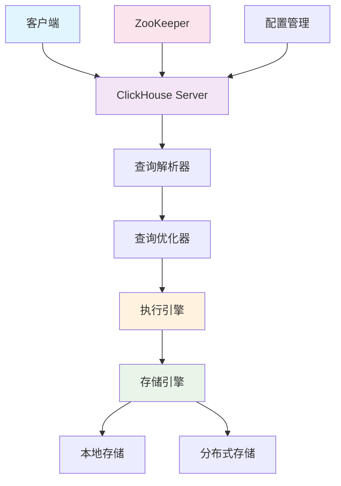
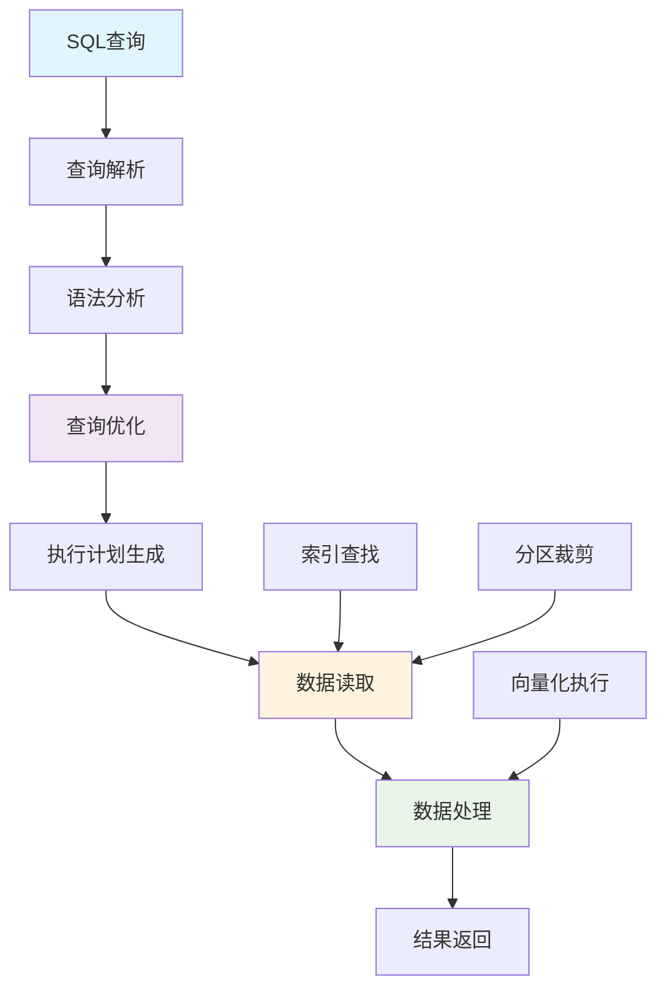
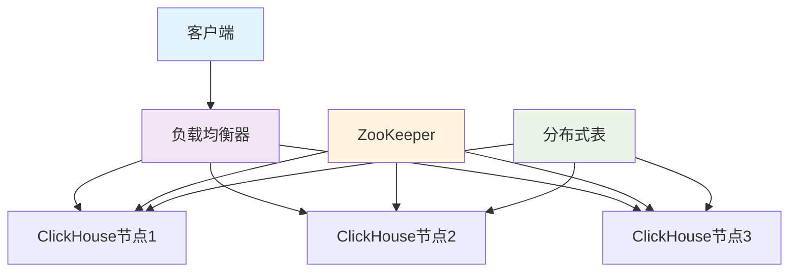

# ClickHouse

## 目录
- [ClickHouse](#clickhouse)
  - [目录](#目录)
  - [ClickHouse 基础概念](#clickhouse-基础概念)
    - [ClickHouse 简介](#clickhouse-简介)
    - [ClickHouse 架构设计](#clickhouse-架构设计)
    - [ClickHouse 核心特性](#clickhouse-核心特性)
  - [ClickHouse 存储引擎](#clickhouse-存储引擎)
    - [MergeTree 系列引擎](#mergetree-系列引擎)
    - [Log 系列引擎](#log-系列引擎)
    - [集成引擎](#集成引擎)
    - [引擎选择策略](#引擎选择策略)
  - [ClickHouse 数据类型](#clickhouse-数据类型)
    - [基础数据类型](#基础数据类型)
    - [复合数据类型](#复合数据类型)
    - [特殊数据类型](#特殊数据类型)
  - [设置与配置](#设置与配置)
  - [数据操作](#数据操作)
    - [插入数据](#插入数据)
    - [查询数据](#查询数据)
    - [Bitmap操作](#bitmap操作)
      - [基本操作](#基本操作)
      - [聚合操作](#聚合操作)
      - [转换操作](#转换操作)
      - [性能优化](#性能优化)
    - [Map操作](#map操作)
      - [Map创建与转换](#map创建与转换)
      - [Map查询与操作](#map查询与操作)
      - [Map聚合操作](#map聚合操作)
    - [数组操作](#数组操作)
    - [字符串操作](#字符串操作)
  - [表管理](#表管理)
    - [表分区与大小](#表分区与大小)
    - [表优化](#表优化)
  - [系统管理](#系统管理)
    - [系统表详解](#系统表详解)
    - [查询监控](#查询监控)
    - [性能监控](#性能监控)
  - [ClickHouse 查询优化](#clickhouse-查询优化)
    - [查询执行原理](#查询执行原理)
    - [索引优化](#索引优化)
    - [分区优化](#分区优化)
    - [压缩优化](#压缩优化)
    - [内存优化](#内存优化)
  - [ClickHouse 集群管理](#clickhouse-集群管理)
    - [集群架构](#集群架构)
    - [分片策略](#分片策略)
    - [复制机制](#复制机制)
    - [负载均衡](#负载均衡)
  - [ClickHouse 运维实践](#clickhouse-运维实践)
    - [备份恢复](#备份恢复)
    - [数据迁移](#数据迁移)
    - [性能调优](#性能调优)
    - [故障排查](#故障排查)
  - [特性对比](#特性对比)
    - [ORDER BY vs PRIMARY KEY](#order-by-vs-primary-key)
    - [ClickHouse vs 其他数据库](#clickhouse-vs-其他数据库)
  - [ClickHouse 典型面试题与答疑](#clickhouse-典型面试题与答疑)
    - [基础概念面试题](#基础概念面试题)
    - [架构设计面试题](#架构设计面试题)
    - [性能优化面试题](#性能优化面试题)
    - [运维监控面试题](#运维监控面试题)
    - [实际应用面试题](#实际应用面试题)
  - [集群配置](#集群配置)

## ClickHouse 基础概念

### ClickHouse 简介

**ClickHouse** 是由Yandex开发的开源列式数据库管理系统，专门用于在线分析处理（OLAP）场景。它具有高性能、高压缩比、高可用性等特点，广泛应用于大数据分析、实时报表、日志分析等场景。

**核心优势**：
- **高性能**：列式存储，向量化执行，并行处理
- **高压缩比**：数据压缩率可达10:1以上
- **实时查询**：支持实时数据插入和查询
- **水平扩展**：支持集群部署和分片
- **SQL兼容**：支持标准SQL语法

**应用场景**：
- 实时数据分析
- 日志分析
- 用户行为分析
- 业务报表
- 时序数据存储

### ClickHouse 架构设计

**整体架构**：



**核心组件**：

| 组件 | 功能 | 特点 |
|------|------|------|
| **查询解析器** | 解析SQL语句，生成语法树 | 支持标准SQL和ClickHouse扩展语法 |
| **查询优化器** | 优化查询计划，选择最佳执行路径 | 基于成本模型，支持多种优化策略 |
| **执行引擎** | 执行查询计划，处理数据 | 向量化执行，并行处理 |
| **存储引擎** | 管理数据存储和检索 | 多种引擎支持不同场景 |
| **分布式引擎** | 处理分布式查询和写入 | 支持分片和复制 |

### ClickHouse 核心特性

**列式存储**：
- 数据按列存储，提高压缩率和查询性能
- 支持列级别的索引和压缩
- 适合聚合查询和统计分析

**向量化执行**：
- 批量处理数据，减少函数调用开销
- 利用CPU SIMD指令优化性能
- 支持并行处理多个数据块

**实时写入**：
- 支持实时数据插入
- 异步合并和压缩
- 写入性能可达每秒数百万行

**分布式查询**：
- 支持跨分片查询
- 自动数据路由和负载均衡
- 支持分布式聚合和JOIN

## ClickHouse 存储引擎

### MergeTree 系列引擎

**MergeTree引擎**是ClickHouse最核心的存储引擎，支持数据分区、索引、压缩等特性。

```sql
-- 基本MergeTree表
CREATE TABLE events (
    event_date Date,
    event_time DateTime,
    user_id UInt32,
    event_type String,
    event_data String
) ENGINE = MergeTree()
PARTITION BY toYYYYMM(event_date)
ORDER BY (event_date, event_time, user_id)
SETTINGS index_granularity = 8192;
```

**MergeTree引擎特性**：

| 特性 | 说明 | 优势 |
|------|------|------|
| **分区** | 按分区键自动分区 | 提高查询性能，便于数据管理 |
| **排序** | 按ORDER BY字段排序 | 支持范围查询优化 |
| **索引** | 自动生成稀疏索引 | 加速数据定位 |
| **压缩** | 支持多种压缩算法 | 节省存储空间 |
| **合并** | 后台自动合并小分区 | 优化存储结构 |

**ReplacingMergeTree引擎**：
```sql
-- 支持去重的MergeTree
CREATE TABLE user_profiles (
    user_id UInt32,
    profile_data String,
    updated_at DateTime
) ENGINE = ReplacingMergeTree(updated_at)
PARTITION BY toYYYYMM(updated_at)
ORDER BY user_id;
```

**CollapsingMergeTree引擎**：
```sql
-- 支持折叠行的MergeTree
CREATE TABLE user_sessions (
    user_id UInt32,
    session_id String,
    sign Int8, -- 1表示添加，-1表示删除
    session_data String
) ENGINE = CollapsingMergeTree(sign)
PARTITION BY toYYYYMM(session_data)
ORDER BY (user_id, session_id);
```

### Log 系列引擎

**Log系列引擎**适用于小表、临时表或日志数据。

```sql
-- TinyLog引擎（最简单）
CREATE TABLE tiny_log (
    timestamp DateTime,
    message String
) ENGINE = TinyLog;

-- StripeLog引擎（支持并行读取）
CREATE TABLE stripe_log (
    timestamp DateTime,
    message String
) ENGINE = StripeLog;

-- Log引擎（支持索引）
CREATE TABLE log_table (
    timestamp DateTime,
    level String,
    message String
) ENGINE = Log;
```

### 集成引擎

**集成引擎**用于连接外部数据源。

```sql
-- MySQL引擎
CREATE TABLE mysql_table (
    id UInt32,
    name String
) ENGINE = MySQL('mysql_host:3306', 'database', 'table', 'user', 'password');

-- HDFS引擎
CREATE TABLE hdfs_table (
    id UInt32,
    data String
) ENGINE = HDFS('hdfs://namenode:9000/path/to/file', 'Parquet');

-- Kafka引擎
CREATE TABLE kafka_table (
    timestamp DateTime,
    message String
) ENGINE = Kafka('kafka_host:9092', 'topic', 'group_id', 'JSONEachRow');
```

### 引擎选择策略

| 使用场景 | 推荐引擎 | 原因 |
|---------|----------|------|
| **大数据分析** | MergeTree | 支持分区、索引、压缩 |
| **实时写入** | MergeTree | 高性能写入，后台合并 |
| **数据去重** | ReplacingMergeTree | 自动去重，保留最新版本 |
| **会话数据** | CollapsingMergeTree | 支持数据折叠，节省空间 |
| **临时数据** | Log系列 | 简单高效，适合小表 |
| **外部数据** | 集成引擎 | 直接访问外部数据源 |

## ClickHouse 数据类型

### 基础数据类型

**整数类型**：
```sql
-- 有符号整数
Int8, Int16, Int32, Int64, Int128, Int256

-- 无符号整数
UInt8, UInt16, UInt32, UInt64, UInt128, UInt256

-- 示例
CREATE TABLE integers (
    id UInt32,
    count Int64,
    flag UInt8
);
```

**浮点类型**：
```sql
-- 浮点数
Float32, Float64

-- 示例
CREATE TABLE floats (
    price Float32,
    ratio Float64
);
```

**字符串类型**：
```sql
-- 字符串
String, FixedString(N)

-- 示例
CREATE TABLE strings (
    name String,
    code FixedString(10)
);
```

**日期时间类型**：
```sql
-- 日期时间
Date, DateTime, DateTime64

-- 示例
CREATE TABLE dates (
    event_date Date,
    event_time DateTime,
    precise_time DateTime64(3)
);
```

### 复合数据类型

**数组类型**：
```sql
-- 数组
Array(T)

-- 示例
CREATE TABLE arrays (
    tags Array(String),
    scores Array(Float32),
    ids Array(UInt32)
);
```

**元组类型**：
```sql
-- 元组
Tuple(T1, T2, ...)

-- 示例
CREATE TABLE tuples (
    point Tuple(Float32, Float32),
    user_info Tuple(String, UInt32, DateTime)
);
```

**Map类型**：
```sql
-- Map
Map(KeyType, ValueType)

-- 示例
CREATE TABLE maps (
    user_attributes Map(String, String),
    metrics Map(String, Float64)
);
```

### 特殊数据类型

**Nullable类型**：
```sql
-- 可空类型
Nullable(T)

-- 示例
CREATE TABLE nullable_data (
    id UInt32,
    name Nullable(String),
    age Nullable(UInt8)
);
```

**LowCardinality类型**：
```sql
-- 低基数类型（优化存储）
LowCardinality(T)

-- 示例
CREATE TABLE low_cardinality (
    country LowCardinality(String),
    status LowCardinality(String)
);
```

**Decimal类型**：
```sql
-- 高精度小数
Decimal(P, S)

-- 示例
CREATE TABLE decimals (
    amount Decimal(18, 2),
    rate Decimal(10, 4)
);
```

## 设置与配置
```sql
-- 设置最大线程数和内存使用
SETTINGS max_threads=5, max_memory_usage=41474836480;
```

## 数据操作

### 插入数据
```sql
-- 基本插入
INSERT INTO table_name (column1, column2) VALUES (value1, value2);

-- 从HDFS插入数据
INSERT INTO glab_gid_info.appinfo_v2 
SELECT * FROM hdfs('hdfs://path/to/file', 'Parquet');

-- 使用命令行工具插入
clickhouse-client -m --port 9000 --user default --database glab_gid_info --password xxxxx \
 --host hzxs-ga-ck-xs6 --max_insert_block_size=536970912 --max_insert_threads=4 \
 -q 'INSERT INTO table_name SELECT * FROM hdfs("path/to/file", "Parquet");'
```

### 查询数据
```sql
-- 基本查询
SELECT * FROM table_name WHERE condition;

-- 抽样查询
SELECT * FROM table_name WHERE (cityHash64(essid) % 100000) = 0;

-- WITH子句使用
WITH (SELECT AVG(value) FROM some_table) AS avg_value
SELECT id, value, avg_value
FROM some_table
WHERE value > avg_value;
```

### Bitmap操作

#### 基本操作
```sql
-- 创建bitmap
SELECT bitmapBuild([1, 2, 3, 4, 5]) AS bitmap;

-- 添加元素
SELECT bitmapAdd(bitmapBuild([1,2,3]), 4) AS bitmap;

-- 删除元素
SELECT bitmapSubtract(bitmapBuild([1,2,3]), 2) AS bitmap;

-- 判断元素是否存在
SELECT bitmapContains(bitmapBuild([1,2,3]), 2) AS exists;

-- 获取基数（元素个数）
SELECT bitmapCardinality(bitmap_column) FROM table;
```

#### 聚合操作
```sql
-- OR操作（并集）
SELECT 
    bitmapOr(bitmap1, bitmap2) AS union_bitmap,
    bitmapOrCardinality(bitmap1, bitmap2) AS union_count
FROM table;

-- AND操作（交集）
SELECT 
    bitmapAnd(bitmap1, bitmap2) AS intersect_bitmap,
    bitmapAndCardinality(bitmap1, bitmap2) AS intersect_count
FROM table;

-- XOR操作（异或）
SELECT 
    bitmapXor(bitmap1, bitmap2) AS xor_bitmap,
    bitmapXorCardinality(bitmap1, bitmap2) AS xor_count
FROM table;

-- 聚合OR操作
SELECT bitmapOrState(bitmap_column)
FROM table
GROUP BY group_column;

-- 聚合AND操作
SELECT bitmapAndState(bitmap_column)
FROM table
GROUP BY group_column;
```

#### 转换操作
```sql
-- Bitmap转数组
SELECT bitmapToArray(bitmap_column) AS array;

-- 数组转Bitmap
SELECT bitmapBuild([1, 2, 3]) AS bitmap;

-- 获取Bitmap中的指定范围元素
SELECT arraySlice(bitmapToArray(bitmap_column), 1, 5) AS first_five;

-- 实际应用示例
SELECT 
    tag,
    bitmapCardinality(gid_index_bitmap) AS user_count,
    arraySlice(bitmapToArray(gid_index_bitmap), 1, 10) AS sample_users
FROM tag_bitmap 
WHERE tag_md5 = lower(hex(MD5('tag_name')));

-- Bitmap分段统计示例
SELECT 
    bitmap_segment_number,
    bitmapCardinality(gid_index_bitmap) AS segment_count,
    formatReadableSize(length(gid_index_bitmap)) AS bitmap_size
FROM tag_bitmap 
WHERE tag_md5 = lower(hex(MD5('tag_name')))
ORDER BY bitmap_segment_number;
```

#### 性能优化
```sql
-- 使用 bitmapOrCardinality 替代 bitmapCardinality(bitmapOr())
SELECT bitmapOrCardinality(
    bitmapBuild([1, 2, 3]),
    bitmapBuild([3, 4, 5])
) AS union_count;

-- 批量处理时使用State聚合函数
SELECT 
    tag,
    bitmapCardinality(groupBitmapOrState(gid_index_bitmap)) AS total_users
FROM tag_bitmap
WHERE tag IN ('tag1', 'tag2', 'tag3')
GROUP BY tag;

-- 大规模数据处理优化
SELECT 
    tag,
    bitmapCardinality(gid_index_bitmap) AS user_count,
    formatReadableSize(length(gid_index_bitmap)) AS bitmap_size
FROM tag_bitmap 
WHERE tag_md5 IN (
    SELECT lower(hex(MD5(tag))) 
    FROM (SELECT ['tag1', 'tag2', 'tag3'] AS tags) 
    ARRAY JOIN tags AS tag
)
SETTINGS max_threads = 4;
```

### Map操作

#### Map创建与转换
```sql
-- 创建Map
SELECT map('key1', 1, 'key2', 2) AS simple_map;

-- 从两个数组创建Map
SELECT mapFromArrays(['key1', 'key2', 'key3'], [1, 2, 3]) AS map_from_arrays;

-- 从嵌套数组创建Map
SELECT mapFromArrays(['a', 'b'], [[1, 2], [3, 4]]) AS nested_map;

-- 数组转换为Map (key-value对的数组)
SELECT arrayMap(x -> (x, x * x), range(1, 5)) AS array_of_pairs,
       map(arrayMap(x -> (x, x * x), range(1, 5))) AS map_from_pairs;

-- 从JSON字符串创建Map
SELECT mapFromJSON('{"key1": 1, "key2": 2, "key3": 3}') AS map_from_json;

-- Map转换为JSON
SELECT mapToJSON(map('key1', 1, 'key2', 2)) AS json_string;

-- Map转换为两个数组
SELECT mapKeys(map('key1', 1, 'key2', 2)) AS keys,
       mapValues(map('key1', 1, 'key2', 2)) AS values;
```

#### Map查询与操作
```sql
-- 获取Map中的值
SELECT map('key1', 1, 'key2', 2)['key1'] AS value;

-- 检查键是否存在
SELECT mapContains(map('key1', 1, 'key2', 2), 'key1') AS contains_key;

-- 获取Map大小
SELECT mapSize(map('key1', 1, 'key2', 2)) AS map_size;

-- 合并两个Map
SELECT mapMerge(
    map('key1', 1, 'key2', 2),
    map('key2', 20, 'key3', 3)
) AS merged_map;

-- 删除Map中的键
SELECT mapRemove(map('key1', 1, 'key2', 2, 'key3', 3), ['key1', 'key3']) AS filtered_map;

-- 提取Map子集
SELECT mapFilter((k, v) -> v > 1, map('key1', 1, 'key2', 2, 'key3', 3)) AS filtered_map;

-- 转换Map值
SELECT mapApply((k, v) -> v * 10, map('key1', 1, 'key2', 2)) AS transformed_map;

-- 展平嵌套Map
SELECT mapFlat(map('nested', map('key1', 1, 'key2', 2), 'key3', 3)) AS flattened_map;
```

#### Map聚合操作
```sql
-- 聚合多行数据为单个Map
SELECT mapAgg(key, value) FROM (
    SELECT 'key1' AS key, 1 AS value
    UNION ALL SELECT 'key2' AS key, 2 AS value
    UNION ALL SELECT 'key3' AS key, 3 AS value
);

-- 合并多行Map
SELECT groupArrayMap(m) FROM (
    SELECT map('key1', 1, 'key2', 2) AS m
    UNION ALL SELECT map('key2', 20, 'key3', 3) AS m
    UNION ALL SELECT map('key4', 4) AS m
);

-- 聚合Map并对值进行求和
SELECT 
    date,
    sumMap(page_views) AS total_views
FROM (
    SELECT 
        toDate('2023-01-01') AS date,
        map('page1', 10, 'page2', 15) AS page_views
    UNION ALL
    SELECT 
        toDate('2023-01-01') AS date,
        map('page1', 5, 'page3', 8) AS page_views
)
GROUP BY date;

-- 实际应用示例：用户属性聚合
SELECT 
    user_id,
    mapAgg(attribute, value) AS user_attributes
FROM user_attribute_table
GROUP BY user_id;

-- 实际应用示例：事件计数聚合
SELECT 
    date,
    sumMap(event_counts) AS daily_events
FROM (
    SELECT 
        event_date AS date,
        map(event_type, event_count) AS event_counts
    FROM events_table
)
GROUP BY date
ORDER BY date;
```

### 数组操作
```sql
-- 数组转换
SELECT arrayJoin([1, 2, 3]) AS value;

-- 数组去重
SELECT arrayDistinct([1, 2, 2, 3]);

-- 数组合并
SELECT arrayConcat([1, 2], [3, 4]);

-- 数组映射
SELECT arrayMap(x -> x * 2, [1, 2, 3, 4, 5]) AS result;

-- 数组过滤
SELECT arrayFilter(x -> x > 3, [1, 2, 3, 4, 5]);

-- 数组聚合
SELECT groupUniqArray(column) -- 去重聚合
SELECT groupArray(column)     -- 不去重聚合

-- 数组打平
SELECT arrayFlatten(groupArray(values));

-- 数组添加元素
SELECT arrayPushBack([1, 2, 3], 4);
```

### 字符串操作
```sql
-- 字符串分割
SELECT splitByChar(',', 'a,b,c');

-- 字符串匹配
SELECT match('string', 'pattern');
SELECT match('aftvf', 'a');

-- 字符串包含多个模式
SELECT * FROM table WHERE match(column_name, 'MG|XZ');
```

## 表管理

### 表分区与大小
```sql
-- 查看表大小
SELECT 
    database,
    table,
    sum(rows) AS `总行数`,
    formatReadableSize(sum(data_uncompressed_bytes)) AS `原始大小`,
    formatReadableSize(sum(data_compressed_bytes)) AS `压缩大小`,
    round((sum(data_compressed_bytes) / sum(data_uncompressed_bytes)) * 100, 0) AS `压缩率`
FROM system.parts
WHERE database NOT IN ('test', 'default')
GROUP BY database, table
ORDER BY sum(data_compressed_bytes) DESC;

-- 查看表字段大小
SELECT 
    column AS `字段名`,
    any(type) AS `类型`,
    formatReadableSize(sum(column_data_uncompressed_bytes)) AS `原始大小`,
    formatReadableSize(sum(column_data_compressed_bytes)) AS `压缩大小`,
    sum(rows) AS `行数`
FROM system.parts_columns
WHERE database = 'database_name' AND table = 'table_name'
GROUP BY column
ORDER BY sum(column_data_uncompressed_bytes) DESC;
```

### 表优化
```sql
-- 优化表
OPTIMIZE TABLE table_name FINAL;
OPTIMIZE TABLE table_name PARTITION partition_name FINAL;

-- 查看待合并分区
SELECT 
    partition_num,
    unmerged_partition_num,
    files_num 
FROM (
    SELECT 1 flag, count() unmerged_partition_num 
    FROM (
        SELECT partition, count() counts
        FROM system.parts 
        WHERE database = 'database_name' 
        AND table = 'table_name' 
        AND active = 1
        GROUP BY partition 
        HAVING counts > 1
    )
) t1 
JOIN (
    SELECT 
        1 flag,
        count(DISTINCT partition) partition_num,
        count() files_num
    FROM system.parts 
    WHERE database = 'database_name' 
    AND table = 'table_name' 
    AND active = 1
) t2 ON t1.flag = t2.flag;
```

## 系统管理

### 系统表详解

**系统表分类**：

| 系统表 | 用途 | 重要字段 |
|--------|------|----------|
| **system.metrics** | 系统指标监控 | metric, value, description |
| **system.events** | 系统事件统计 | event, value, description |
| **system.processes** | 正在执行的查询 | query_id, query, elapsed, read_rows |
| **system.query_log** | 查询历史日志 | event_time, query_duration_ms, read_rows |
| **system.parts** | 表分区信息 | database, table, partition, rows |
| **system.merges** | 合并任务信息 | database, table, num_parts, total_size_bytes_compressed |

**常用系统查询**：
```sql
-- 1. 系统资源使用情况
SELECT 
    metric,
    value,
    description
FROM system.metrics
WHERE metric IN (
    'Memory.Resident',
    'Memory.Virtual',
    'Memory.Shared',
    'Memory.Code',
    'Memory.Data',
    'Memory.Stack'
);

-- 2. 查询性能统计
SELECT 
    event,
    value,
    description
FROM system.events
WHERE event LIKE '%Query%'
ORDER BY value DESC;

-- 3. 表大小统计
SELECT 
    database,
    table,
    sum(rows) AS total_rows,
    formatReadableSize(sum(data_uncompressed_bytes)) AS uncompressed_size,
    formatReadableSize(sum(data_compressed_bytes)) AS compressed_size,
    round((sum(data_compressed_bytes) / sum(data_uncompressed_bytes)) * 100, 2) AS compression_ratio
FROM system.parts
WHERE active = 1
GROUP BY database, table
ORDER BY sum(data_compressed_bytes) DESC;
```

### 查询监控
```sql
-- 查看正在执行的查询
SELECT 
    query_id,
    substr(query, 1, 50),
    elapsed,
    read_rows,
    total_rows_approx,
    formatReadableSize(memory_usage)
FROM system.processes
WHERE query NOT LIKE '%SELECT query%'
ORDER BY elapsed DESC;

-- 查看历史执行SQL
SELECT 
    event_time,
    query_duration_ms/1000 AS `耗时(秒)`,
    read_rows AS `读取行数`,
    result_rows AS `返回行数`,
    formatReadableSize(result_bytes) AS `返回数据大小`,
    formatReadableSize(memory_usage) AS `内存使用`,
    substr(query, 1, 40),
    databases,
    tables
FROM system.query_log
WHERE query NOT LIKE '%*%'
AND event_time >= '2025-01-21 19:00:00'
AND query_kind = 'Select'
ORDER BY query_duration_ms DESC
LIMIT 10;
```

### 性能监控
```sql
-- 获取内存使用情况
SELECT * FROM system.metrics WHERE metric LIKE 'Memory.%';

-- 查询常驻内存大小
SELECT value FROM system.metrics WHERE metric = 'Memory.Resident';

-- 查看正在进行的合并
SELECT 
    database,
    table,
    num_parts,
    formatReadableSize(total_size_bytes_compressed) AS total_size_bytes_compressed,
    total_size_marks,
    rows_read,
    rows_written,
    columns_written,
    memory_usage
FROM system.merges;
```

## ClickHouse 查询优化

### 查询执行原理

**查询执行流程**：



**查询优化策略**：

| 优化策略 | 说明 | 实现方式 |
|---------|------|----------|
| **分区裁剪** | 只读取相关分区 | 根据WHERE条件过滤分区 |
| **索引跳表** | 利用稀疏索引快速定位 | 基于ORDER BY字段的索引 |
| **列裁剪** | 只读取需要的列 | SELECT字段优化 |
| **谓词下推** | 在数据源处过滤 | 将过滤条件下推到存储层 |
| **向量化执行** | 批量处理数据 | 利用SIMD指令优化 |

### 索引优化

**稀疏索引原理**：
```sql
-- 索引粒度设置
CREATE TABLE events (
    event_date Date,
    event_time DateTime,
    user_id UInt32,
    event_type String
) ENGINE = MergeTree()
PARTITION BY toYYYYMM(event_date)
ORDER BY (event_date, event_time, user_id)
SETTINGS index_granularity = 8192; -- 每8192行一个索引条目
```

**索引优化技巧**：
```sql
-- 1. 合理设计ORDER BY
-- 好的设计：查询条件字段在前
ORDER BY (user_id, event_date, event_time)

-- 2. 使用跳表索引
ALTER TABLE events ADD INDEX idx_event_type event_type TYPE bloom_filter GRANULARITY 1;

-- 3. 投影索引
ALTER TABLE events ADD PROJECTION proj_user_events (
    SELECT user_id, event_date, event_type
    ORDER BY user_id, event_date
);
```

### 分区优化

**分区策略**：
```sql
-- 按时间分区（推荐）
PARTITION BY toYYYYMM(event_date)

-- 按用户ID分区
PARTITION BY intHash32(user_id) % 100

-- 复合分区
PARTITION BY (toYYYYMM(event_date), event_type)
```

**分区管理**：
```sql
-- 查看分区信息
SELECT 
    partition,
    name,
    rows,
    formatReadableSize(data_uncompressed_bytes) AS uncompressed_size,
    formatReadableSize(data_compressed_bytes) AS compressed_size
FROM system.parts
WHERE table = 'events'
ORDER BY partition;

-- 删除过期分区
ALTER TABLE events DROP PARTITION '2023-01';

-- 移动分区
ALTER TABLE events MOVE PARTITION '2023-01' TO TABLE events_archive;
```

### 压缩优化

**压缩算法选择**：
```sql
-- 设置压缩算法
CREATE TABLE events (
    event_date Date,
    event_data String
) ENGINE = MergeTree()
PARTITION BY toYYYYMM(event_date)
ORDER BY event_date
SETTINGS 
    compression_codec = 'ZSTD(3)', -- 压缩算法和级别
    min_bytes_for_wide_part = 0,
    min_rows_for_wide_part = 0;
```

**压缩算法对比**：

| 算法 | 压缩比 | 压缩速度 | 解压速度 | 适用场景 |
|------|--------|----------|----------|----------|
| **LZ4** | 2-3x | 很快 | 很快 | 实时写入 |
| **ZSTD** | 3-5x | 快 | 快 | 平衡场景 |
| **LZMA** | 5-8x | 慢 | 慢 | 冷数据存储 |

### 内存优化

**内存设置**：
```sql
-- 查询内存限制
SET max_memory_usage = 10737418240; -- 10GB
SET max_memory_usage_for_user = 21474836480; -- 20GB

-- 临时表内存限制
SET max_bytes_before_external_group_by = 1073741824; -- 1GB
SET max_bytes_before_external_sort = 1073741824; -- 1GB
```

**内存优化技巧**：
```sql
-- 1. 使用LIMIT限制结果集
SELECT * FROM events WHERE event_date = '2023-01-01' LIMIT 1000;

-- 2. 使用采样查询
SELECT * FROM events SAMPLE 0.1 WHERE event_date = '2023-01-01';

-- 3. 使用预聚合
SELECT 
    user_id,
    count() AS event_count,
    uniq(event_type) AS event_types
FROM events
WHERE event_date = '2023-01-01'
GROUP BY user_id;
```

## ClickHouse 集群管理

### 集群架构

**集群组件**：



**集群配置**：
```xml
<!-- config.xml -->
<clickhouse>
    <remote_servers>
        <cluster_name>
            <shard>
                <replica>
                    <host>node1</host>
                    <port>9000</port>
                </replica>
                <replica>
                    <host>node2</host>
                    <port>9000</port>
                </replica>
            </shard>
            <shard>
                <replica>
                    <host>node3</host>
                    <port>9000</port>
                </replica>
            </shard>
        </cluster_name>
    </remote_servers>
</clickhouse>
```

### 分片策略

**分片类型**：

| 分片策略 | 说明 | 适用场景 |
|---------|------|----------|
| **随机分片** | 数据随机分布到分片 | 数据均匀分布 |
| **哈希分片** | 按字段哈希值分片 | 按用户ID分片 |
| **范围分片** | 按字段范围分片 | 按时间分片 |

**分片配置**：
```sql
-- 创建分布式表
CREATE TABLE events_distributed AS events
ENGINE = Distributed(cluster_name, database, events, user_id);

-- 插入数据（自动路由到对应分片）
INSERT INTO events_distributed SELECT * FROM events_local;
```

### 复制机制

**复制配置**：
```sql
-- 创建复制表
CREATE TABLE events_replicated (
    event_date Date,
    user_id UInt32,
    event_type String
) ENGINE = ReplicatedMergeTree('/clickhouse/tables/events', 'replica1')
PARTITION BY toYYYYMM(event_date)
ORDER BY (event_date, user_id);
```

**复制特性**：
- **异步复制**：写入主副本，异步同步到其他副本
- **故障转移**：主副本故障时自动切换到其他副本
- **数据一致性**：通过ZooKeeper保证元数据一致性

### 负载均衡

**负载均衡策略**：
```sql
-- 1. 轮询负载均衡
SELECT * FROM events_distributed;

-- 2. 随机负载均衡
SELECT * FROM events_distributed SETTINGS load_balancing = 'random';

-- 3. 就近负载均衡
SELECT * FROM events_distributed SETTINGS load_balancing = 'nearest_hostname';
```

## ClickHouse 运维实践

### 备份恢复

**备份策略**：
```bash
# 1. 数据备份
clickhouse-client --query "BACKUP TABLE database.table TO '/backup/path'"

# 2. 配置文件备份
cp /etc/clickhouse-server/config.xml /backup/
cp /etc/clickhouse-server/users.xml /backup/

# 3. 元数据备份
clickhouse-client --query "SHOW CREATE TABLE database.table" > /backup/schema.sql
```

**恢复操作**：
```bash
# 1. 恢复数据
clickhouse-client --query "RESTORE TABLE database.table FROM '/backup/path'"

# 2. 恢复表结构
clickhouse-client --query "$(cat /backup/schema.sql)"
```

### 数据迁移

**数据迁移方法**：
```sql
-- 1. 使用INSERT SELECT
INSERT INTO target_table SELECT * FROM source_table;

-- 2. 使用物化视图
CREATE MATERIALIZED VIEW target_table
ENGINE = MergeTree()
PARTITION BY toYYYYMM(event_date)
ORDER BY event_date
AS SELECT * FROM source_table;

-- 3. 使用外部表
CREATE TABLE external_table (
    id UInt32,
    data String
) ENGINE = HDFS('hdfs://path/to/data', 'Parquet');
```

### 性能调优

**系统参数调优**：
```xml
<!-- config.xml -->
<clickhouse>
    <max_concurrent_queries>100</max_concurrent_queries>
    <max_memory_usage>8589934592</max_memory_usage>
    <max_memory_usage_for_user>17179869184</max_memory_usage_for_user>
    <max_memory_usage_for_all_queries>34359738368</max_memory_usage_for_all_queries>
    
    <merge_tree>
        <parts_to_delay_insert>150</parts_to_delay_insert>
        <parts_to_throw_insert>300</parts_to_throw_insert>
        <max_bytes_to_merge_at_max_space_in_pool>2000000000000</max_bytes_to_merge_at_max_space_in_pool>
    </merge_tree>
</clickhouse>
```

### 故障排查

**常见问题排查**：
```sql
-- 1. 查看系统状态
SELECT * FROM system.metrics WHERE metric LIKE 'Memory.%';
SELECT * FROM system.processes;

-- 2. 查看查询日志
SELECT 
    event_time,
    query_duration_ms,
    read_rows,
    result_rows,
    memory_usage
FROM system.query_log
WHERE event_time >= now() - INTERVAL 1 HOUR
ORDER BY query_duration_ms DESC
LIMIT 10;

-- 3. 查看错误日志
SELECT 
    event_time,
    message
FROM system.text_log
WHERE level >= 'Error'
ORDER BY event_time DESC
LIMIT 20;
```

## 特性对比

### ORDER BY vs PRIMARY KEY

特性 | ORDER BY | PRIMARY KEY
-|-|-
定义位置 | 必须在建表时定义 | 可选，通常与 ORDER BY 一起定义
控制数据物理存储顺序 | 是 | 否
作用 | 决定数据存储的物理排序顺序，影响压缩效率 | 用于加速查询，生成稀疏索引
关系 | PRIMARY KEY 是 ORDER BY 的一个子集或相同 | PRIMARY KEY 的字段必须在 ORDER BY 字段中
影响范围查询性能 | 是，数据按顺序存储能加快范围查询 | 是，通过索引跳表可以加速范围查询
去重功能 | 无 | 在特定引擎下可以（如 ReplacingMergeTree）

### ClickHouse vs 其他数据库

**ClickHouse vs MySQL**：

| 特性 | ClickHouse | MySQL |
|------|------------|-------|
| **存储模型** | 列式存储 | 行式存储 |
| **查询性能** | 极高（OLAP） | 中等（OLTP） |
| **压缩比** | 10:1以上 | 2-3:1 |
| **实时写入** | 支持 | 支持 |
| **聚合查询** | 极快 | 较慢 |
| **存储引擎** | MergeTree系列 | InnoDB, MyISAM等 |
| **适用场景** | 数据分析、报表 | 事务处理、业务系统 |

**ClickHouse vs HBase**：

| 特性 | ClickHouse | HBase |
|------|------------|-------|
| **数据模型** | 关系型 | 列族型 |
| **查询语言** | SQL | API/Shell |
| **索引** | 稀疏索引 | 行键索引 |
| **分区** | 自动分区 | 手动分区 |
| **压缩** | 列级压缩 | 块级压缩 |
| **实时性** | 实时查询 | 近实时 |
| **扩展性** | 水平扩展 | 水平扩展 |

**ClickHouse vs Elasticsearch**：

| 特性 | ClickHouse | Elasticsearch |
|------|------------|---------------|
| **数据模型** | 结构化数据 | 半结构化数据 |
| **查询语言** | SQL | DSL |
| **全文搜索** | 基础支持 | 强大支持 |
| **聚合分析** | 极快 | 较快 |
| **实时性** | 实时 | 近实时 |
| **存储成本** | 低 | 高 |
| **运维复杂度** | 中等 | 高 |

## ClickHouse 典型面试题与答疑

### 基础概念面试题

**1. ClickHouse是什么？有什么特点？**

**答案**：ClickHouse是由Yandex开发的开源列式数据库管理系统，专门用于OLAP场景。

**核心特点**：
- **列式存储**：数据按列存储，提高压缩率和查询性能
- **向量化执行**：批量处理数据，利用SIMD指令优化
- **高压缩比**：数据压缩率可达10:1以上
- **实时查询**：支持实时数据插入和查询
- **水平扩展**：支持集群部署和分片

**2. ClickHouse的存储引擎有哪些？如何选择？**

**答案**：ClickHouse有多种存储引擎，主要包括：

- **MergeTree系列**：最核心的引擎，支持分区、索引、压缩
- **Log系列**：适用于小表、临时表
- **集成引擎**：用于连接外部数据源

**选择策略**：
- 大数据分析：MergeTree
- 实时写入：MergeTree
- 数据去重：ReplacingMergeTree
- 临时数据：Log系列
- 外部数据：集成引擎

**3. ClickHouse的数据类型有哪些？**

**答案**：ClickHouse支持丰富的数据类型：

**基础类型**：
- 整数：Int8, Int16, Int32, Int64, UInt8, UInt16, UInt32, UInt64
- 浮点：Float32, Float64
- 字符串：String, FixedString(N)
- 日期时间：Date, DateTime, DateTime64

**复合类型**：
- 数组：Array(T)
- 元组：Tuple(T1, T2, ...)
- Map：Map(KeyType, ValueType)

**特殊类型**：
- Nullable(T)：可空类型
- LowCardinality(T)：低基数类型
- Decimal(P, S)：高精度小数

### 架构设计面试题

**4. ClickHouse的架构是怎样的？**

**答案**：ClickHouse采用分布式架构，主要组件包括：

**核心组件**：
- **查询解析器**：解析SQL语句，生成语法树
- **查询优化器**：优化查询计划，选择最佳执行路径
- **执行引擎**：执行查询计划，处理数据
- **存储引擎**：管理数据存储和检索
- **分布式引擎**：处理分布式查询和写入

**集群组件**：
- **ZooKeeper**：元数据管理和集群协调
- **负载均衡器**：请求分发和负载均衡
- **分片节点**：数据存储和查询处理

**5. ClickHouse的索引机制是怎样的？**

**答案**：ClickHouse使用稀疏索引机制：

**索引原理**：
- 基于ORDER BY字段生成稀疏索引
- 每8192行（默认）生成一个索引条目
- 支持跳表索引和投影索引

**索引优化**：
```sql
-- 跳表索引
ALTER TABLE events ADD INDEX idx_event_type event_type TYPE bloom_filter GRANULARITY 1;

-- 投影索引
ALTER TABLE events ADD PROJECTION proj_user_events (
    SELECT user_id, event_date, event_type
    ORDER BY user_id, event_date
);
```

**6. ClickHouse的分区机制是怎样的？**

**答案**：ClickHouse支持多种分区策略：

**分区类型**：
- **时间分区**：按时间字段分区，如`PARTITION BY toYYYYMM(event_date)`
- **哈希分区**：按字段哈希值分区，如`PARTITION BY intHash32(user_id) % 100`
- **复合分区**：多个字段组合分区

**分区管理**：
```sql
-- 查看分区信息
SELECT partition, rows, formatReadableSize(data_compressed_bytes) 
FROM system.parts WHERE table = 'events';

-- 删除分区
ALTER TABLE events DROP PARTITION '2023-01';
```

### 性能优化面试题

**7. 如何优化ClickHouse查询性能？**

**答案**：ClickHouse查询优化可以从以下几个方面：

**索引优化**：
- 合理设计ORDER BY字段顺序
- 使用跳表索引加速过滤
- 创建投影索引优化特定查询

**分区优化**：
- 选择合适的分区策略
- 及时删除过期分区
- 避免跨分区查询

**查询优化**：
- 使用LIMIT限制结果集
- 使用采样查询减少数据量
- 使用预聚合减少计算量

**8. ClickHouse的内存优化策略有哪些？**

**答案**：ClickHouse内存优化策略：

**内存设置**：
```sql
-- 查询内存限制
SET max_memory_usage = 10737418240; -- 10GB
SET max_memory_usage_for_user = 21474836480; -- 20GB

-- 临时表内存限制
SET max_bytes_before_external_group_by = 1073741824; -- 1GB
SET max_bytes_before_external_sort = 1073741824; -- 1GB
```

**优化技巧**：
- 使用LIMIT限制结果集大小
- 使用采样查询减少内存使用
- 合理设置临时表内存阈值

**9. ClickHouse的压缩优化策略有哪些？**

**答案**：ClickHouse支持多种压缩算法：

**压缩算法对比**：
- **LZ4**：压缩比2-3x，速度很快，适合实时写入
- **ZSTD**：压缩比3-5x，速度较快，平衡场景
- **LZMA**：压缩比5-8x，速度较慢，适合冷数据

**压缩配置**：
```sql
CREATE TABLE events (
    event_date Date,
    event_data String
) ENGINE = MergeTree()
PARTITION BY toYYYYMM(event_date)
ORDER BY event_date
SETTINGS compression_codec = 'ZSTD(3)';
```

### 运维监控面试题

**10. 如何监控ClickHouse集群状态？**

**答案**：通过系统表监控ClickHouse状态：

**系统指标监控**：
```sql
-- 内存使用情况
SELECT metric, value FROM system.metrics WHERE metric LIKE 'Memory.%';

-- 查询性能统计
SELECT event, value FROM system.events WHERE event LIKE '%Query%';

-- 正在执行的查询
SELECT query_id, query, elapsed, read_rows FROM system.processes;
```

**表状态监控**：
```sql
-- 表大小统计
SELECT 
    database, table, sum(rows) AS total_rows,
    formatReadableSize(sum(data_compressed_bytes)) AS compressed_size
FROM system.parts
WHERE active = 1
GROUP BY database, table;
```

**11. 如何排查ClickHouse性能问题？**

**答案**：性能问题排查步骤：

**查询日志分析**：
```sql
-- 慢查询分析
SELECT 
    event_time, query_duration_ms, read_rows, result_rows,
    substr(query, 1, 100) AS query_preview
FROM system.query_log
WHERE query_duration_ms > 1000
ORDER BY query_duration_ms DESC
LIMIT 10;
```

**系统资源分析**：
```sql
-- 内存使用分析
SELECT metric, value FROM system.metrics WHERE metric LIKE 'Memory.%';

-- 合并任务分析
SELECT database, table, num_parts, total_size_bytes_compressed
FROM system.merges;
```

**12. ClickHouse的备份恢复策略有哪些？**

**答案**：ClickHouse备份恢复策略：

**备份方法**：
```bash
# 数据备份
clickhouse-client --query "BACKUP TABLE database.table TO '/backup/path'"

# 配置文件备份
cp /etc/clickhouse-server/config.xml /backup/
cp /etc/clickhouse-server/users.xml /backup/

# 元数据备份
clickhouse-client --query "SHOW CREATE TABLE database.table" > /backup/schema.sql
```

**恢复方法**：
```bash
# 恢复数据
clickhouse-client --query "RESTORE TABLE database.table FROM '/backup/path'"

# 恢复表结构
clickhouse-client --query "$(cat /backup/schema.sql)"
```

### 实际应用面试题

**13. 如何设计ClickHouse表结构？**

**答案**：ClickHouse表结构设计原则：

**设计原则**：
- **分区设计**：按时间分区，便于数据管理和查询优化
- **排序设计**：ORDER BY字段要包含常用查询条件
- **数据类型**：选择合适的数据类型，使用LowCardinality优化字符串
- **压缩设置**：根据数据特点选择合适的压缩算法

**设计示例**：
```sql
CREATE TABLE user_events (
    event_date Date,
    event_time DateTime,
    user_id UInt32,
    event_type LowCardinality(String),
    event_data String,
    device_id String
) ENGINE = MergeTree()
PARTITION BY toYYYYMM(event_date)
ORDER BY (user_id, event_date, event_time)
SETTINGS 
    compression_codec = 'ZSTD(3)',
    index_granularity = 8192;
```

**14. 如何处理ClickHouse的数据倾斜问题？**

**答案**：数据倾斜处理方法：

**分区倾斜**：
- 使用哈希分区替代时间分区
- 调整分区粒度，避免单个分区过大

**查询倾斜**：
- 使用采样查询减少数据量
- 使用预聚合减少计算量
- 优化查询条件，减少扫描范围

**15. ClickHouse在实时数据分析中的应用场景有哪些？**

**答案**：ClickHouse实时数据分析应用场景：

**应用场景**：
- **用户行为分析**：实时分析用户点击、浏览、购买行为
- **业务监控**：实时监控业务指标，如PV、UV、转化率
- **日志分析**：实时分析系统日志，快速定位问题
- **广告投放**：实时分析广告效果，优化投放策略
- **金融风控**：实时分析交易数据，识别风险行为

**实现方案**：
- 使用Kafka引擎实时接入数据
- 使用物化视图预聚合数据
- 使用分布式表实现水平扩展

## 集群配置

```text
single 7-12   172.xx.69.206-211   bi
batch  1-6    172.xx.69.199-204   jm

```
