# ClickHouse

## 目录
- [ClickHouse](#clickhouse)
  - [目录](#目录)
  - [ClickHouse 基础概念](#clickhouse-基础概念)
    - [ClickHouse 简介](#clickhouse-简介)
      - [核心优势](#核心优势)
      - [应用场景](#应用场景)
    - [ClickHouse 架构设计](#clickhouse-架构设计)
      - [整体架构](#整体架构)
      - [核心组件](#核心组件)
    - [ClickHouse 核心特性](#clickhouse-核心特性)
      - [列式存储](#列式存储)
      - [向量化执行](#向量化执行)
      - [实时写入](#实时写入)
      - [分布式查询](#分布式查询)
  - [ClickHouse 存储引擎](#clickhouse-存储引擎)
    - [MergeTree 系列引擎](#mergetree-系列引擎)
      - [MergeTree引擎基础](#mergetree引擎基础)
      - [MergeTree系列引擎变体](#mergetree系列引擎变体)
      - [MergeTree引擎高级配置](#mergetree引擎高级配置)
      - [引擎选择策略与最佳实践](#引擎选择策略与最佳实践)
      - [MergeTree引擎监控与维护](#mergetree引擎监控与维护)
    - [Log 系列引擎](#log-系列引擎)
    - [集成引擎](#集成引擎)
    - [引擎选择策略](#引擎选择策略)
  - [ClickHouse 数据类型](#clickhouse-数据类型)
    - [基础数据类型](#基础数据类型)
      - [整数类型](#整数类型)
      - [浮点类型](#浮点类型)
      - [字符串类型](#字符串类型)
      - [日期时间类型](#日期时间类型)
    - [复合数据类型](#复合数据类型)
      - [数组类型](#数组类型)
      - [元组类型](#元组类型)
      - [Map类型](#map类型)
    - [特殊数据类型](#特殊数据类型)
      - [Nullable类型](#nullable类型)
      - [LowCardinality类型](#lowcardinality类型)
      - [Decimal类型](#decimal类型)
  - [数据操作](#数据操作)
    - [查询数据](#查询数据)
      - [JOIN](#join)
      - [命令行查询](#命令行查询)
    - [插入数据](#插入数据)
    - [导出数据](#导出数据)
    - [JSON 数据写入与解析](#json-数据写入与解析)
    - [Bitmap操作](#bitmap操作)
      - [基本操作](#基本操作)
      - [聚合操作](#聚合操作)
      - [转换操作](#转换操作)
      - [性能优化](#性能优化)
    - [Map操作](#map操作)
      - [Map创建与转换](#map创建与转换)
      - [Map查询与操作](#map查询与操作)
      - [Map聚合操作](#map聚合操作)
    - [数组操作](#数组操作)
      - [数组基础操作](#数组基础操作)
      - [数组集合操作](#数组集合操作)
      - [数组排序与查找](#数组排序与查找)
      - [数组高阶函数与算法](#数组高阶函数与算法)
      - [数组性能优化](#数组性能优化)
      - [与Hive聚合函数对比](#与hive聚合函数对比)
    - [字符串操作](#字符串操作)
    - [条件与控制函数](#条件与控制函数)
      - [multiIf函数](#multiif函数)
      - [if函数](#if函数)
      - [条件聚合函数](#条件聚合函数)
      - [空值处理函数](#空值处理函数)
      - [数值比较函数](#数值比较函数)
      - [复杂条件组合](#复杂条件组合)
      - [性能优化建议](#性能优化建议)
    - [日期时间函数](#日期时间函数)
      - [时间获取函数](#时间获取函数)
      - [时间格式化函数](#时间格式化函数)
      - [时间计算函数](#时间计算函数)
      - [实际应用示例](#实际应用示例)
    - [数学函数](#数学函数)
      - [基本数学运算](#基本数学运算)
      - [三角函数](#三角函数)
      - [随机函数](#随机函数)
      - [统计函数](#统计函数)
      - [实际应用示例](#实际应用示例-1)
    - [URL和编码函数](#url和编码函数)
      - [URL处理函数](#url处理函数)
      - [字符编码函数](#字符编码函数)
      - [实际应用示例](#实际应用示例-2)
    - [哈希和加密函数](#哈希和加密函数)
      - [哈希函数](#哈希函数)
      - [实际应用示例](#实际应用示例-3)
  - [系统管理](#系统管理)
    - [系统表详解](#系统表详解)
    - [查询监控](#查询监控)
    - [系统表查询示例](#系统表查询示例)
    - [性能监控](#性能监控)
    - [数据更新与删除操作](#数据更新与删除操作)
      - [UPDATE 操作](#update-操作)
      - [DELETE 操作](#delete-操作)
      - [ALTER 表结构操作](#alter-表结构操作)
      - [数据变更最佳实践](#数据变更最佳实践)
    - [数据迁移与备份](#数据迁移与备份)
      - [数据备份策略](#数据备份策略)
      - [数据迁移方案](#数据迁移方案)
      - [数据同步监控](#数据同步监控)
    - [批量数据处理最佳实践](#批量数据处理最佳实践)
      - [大数据量插入优化](#大数据量插入优化)
      - [数据导入性能优化](#数据导入性能优化)
      - [实时数据处理](#实时数据处理)
      - [数据清理与维护](#数据清理与维护)
      - [故障恢复和容错](#故障恢复和容错)
  - [ClickHouse文件存储](#clickhouse文件存储)
    - [底层文件存储格式](#底层文件存储格式)
    - [数据插入过程详解](#数据插入过程详解)
  - [ClickHouse 查询优化](#clickhouse-查询优化)
    - [查询执行原理](#查询执行原理)
    - [索引优化](#索引优化)
      - [索引创建和优化](#索引创建和优化)
      - [布隆过滤器原理详解](#布隆过滤器原理详解)
      - [索引性能对比](#索引性能对比)
    - [分区优化](#分区优化)
    - [压缩优化](#压缩优化)
    - [内存优化](#内存优化)
  - [ClickHouse 集群管理](#clickhouse-集群管理)
    - [集群架构](#集群架构)
    - [分片策略](#分片策略)
    - [复制机制](#复制机制)
    - [负载均衡](#负载均衡)
  - [ClickHouse 运维实践](#clickhouse-运维实践)
    - [备份恢复](#备份恢复)
    - [数据迁移](#数据迁移)
    - [性能调优](#性能调优)
    - [故障排查](#故障排查)
  - [ClickHouse 典型面试题与答疑](#clickhouse-典型面试题与答疑)
    - [基础概念面试题](#基础概念面试题)
    - [架构设计面试题](#架构设计面试题)
    - [性能优化面试题](#性能优化面试题)
    - [运维监控面试题](#运维监控面试题)
    - [实际应用面试题](#实际应用面试题)
  - [ClickHouse 高级特性](#clickhouse-高级特性)
    - [物化视图](#物化视图)
    - [字典功能](#字典功能)
    - [UDF](#udf)
    - [数据采样](#数据采样)
    - [TTL(Time To Live)](#ttltime-to-live)
  - [ClickHouse 安全与权限管理](#clickhouse-安全与权限管理)
    - [用户管理](#用户管理)
    - [权限控制](#权限控制)
    - [网络安全](#网络安全)
  - [ClickHouse 监控与告警](#clickhouse-监控与告警)
    - [监控指标](#监控指标)
    - [告警配置](#告警配置)
    - [日志管理](#日志管理)
  - [ClickHouse 业务实践与案例](#clickhouse-业务实践与案例)
    - [实时数据分析平台](#实时数据分析平台)
    - [日志分析系统](#日志分析系统)
    - [时序数据存储](#时序数据存储)
  - [ClickHouse 故障排查与优化](#clickhouse-故障排查与优化)
    - [常见问题诊断](#常见问题诊断)
    - [性能调优策略](#性能调优策略)
    - [集群运维](#集群运维)
    - [集群配置](#集群配置)

## ClickHouse 基础概念

### ClickHouse 简介

**ClickHouse** 是由Yandex开发的开源列式数据库管理系统，专门用于在线分析处理（OLAP）场景。它具有高性能、高压缩比、高可用性等特点，广泛应用于大数据分析、实时报表、日志分析等场景。

#### 核心优势
- **高性能**：列式存储，向量化执行，并行处理
- **高压缩比**：数据压缩率可达10:1以上
- **实时查询**：支持实时数据插入和查询
- **水平扩展**：支持集群部署和分片
- **SQL兼容**：支持标准SQL语法

#### 应用场景
- 实时数据分析
- 日志分析
- 用户行为分析
- 业务报表
- 时序数据存储

### ClickHouse 架构设计

#### 整体架构


#### 核心组件

| 组件 | 功能 | 特点 |
|------|------|------|
| **查询解析器** | 解析SQL语句，生成语法树 | 支持标准SQL和ClickHouse扩展语法 |
| **查询优化器** | 优化查询计划，选择最佳执行路径 | 基于成本模型，支持多种优化策略 |
| **执行引擎** | 执行查询计划，处理数据 | 向量化执行，并行处理 |
| **存储引擎** | 管理数据存储和检索 | 多种引擎支持不同场景 |
| **分布式引擎** | 处理分布式查询和写入 | 支持分片和复制 |

### ClickHouse 核心特性

#### 列式存储
- 数据按列存储，提高压缩率和查询性能
- 支持列级别的索引和压缩
- 适合聚合查询和统计分析

#### 向量化执行
- 批量处理数据，减少函数调用开销
- 利用CPU SIMD指令优化性能
- 支持并行处理多个数据块

#### 实时写入
- 支持实时数据插入
- 异步合并和压缩
- 写入性能可达每秒数百万行

#### 分布式查询
- 支持跨分片查询
- 自动数据路由和负载均衡
- 支持分布式聚合和JOIN

**分布式表查询流程**

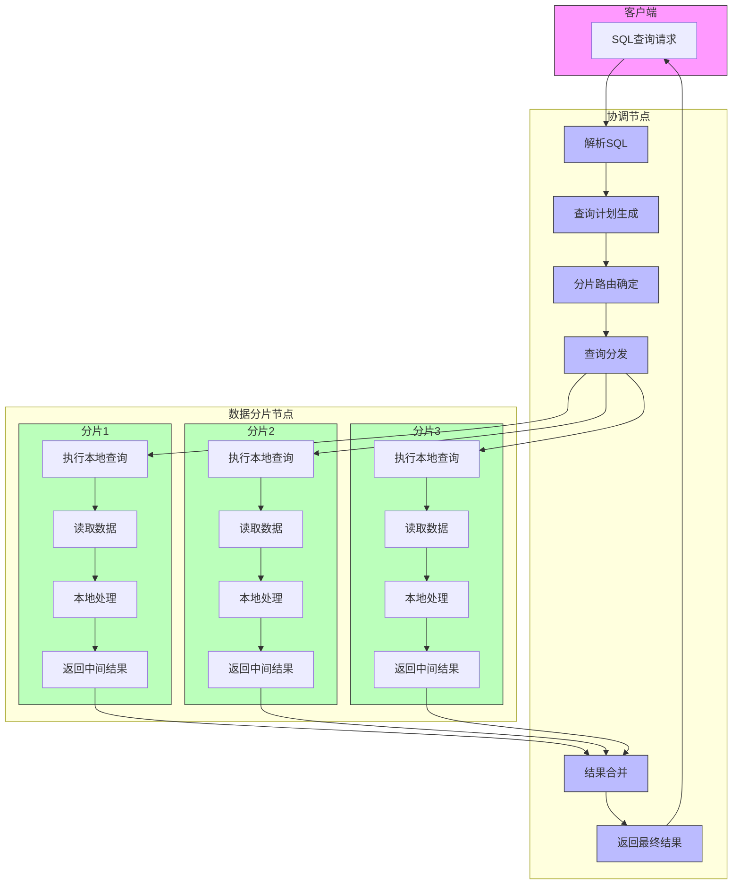

**复杂分布式查询执行流程**

```mermaid
flowchart TD
    subgraph complete_flow["完整分布式查询执行流程"]
        A["客户端发送SQL查询"] --> B["协调节点接收查询"]
        
        B --> C["SQL解析与验证"]
        C --> D["查询优化"]
        D --> E["分布式执行计划生成"]
        
        E --> F{"查询类型分析"}
        
        F -->|"简单查询"| G1["直接路由到分片"]
        F -->|"聚合查询"| G2["两阶段聚合计划"]
        F -->|"JOIN查询"| G3["分布式JOIN计划"]
        
        G1 --> H1["将查询发送到相关分片"]
        G2 --> H2["生成本地预聚合和全局聚合计划"]
        G3 --> H3["确定JOIN策略和执行顺序"]
        
        H1 --> I1["各分片执行查询"]
        H2 --> I2["各分片执行本地预聚合"]
        H3 --> I3["各分片执行JOIN操作"]
        
        I1 --> J1["收集原始结果"]
        I2 --> J2["收集预聚合结果"]
        I3 --> J3["收集JOIN结果"]
        
        J1 --> K1["简单合并结果"]
        J2 --> K2["执行全局聚合"]
        J3 --> K3["合并JOIN结果"]
        
        K1 --> L["应用LIMIT/OFFSET"]
        K2 --> L
        K3 --> L
        
        L --> M["格式化结果"]
        M --> N["返回结果给客户端"]
    end
    
    classDef client fill:#f9f,stroke:#333,stroke-width:1px
    classDef parse fill:#bbf,stroke:#333,stroke-width:1px
    classDef plan fill:#bfb,stroke:#333,stroke-width:1px
    classDef execute fill:#fbb,stroke:#333,stroke-width:1px
    classDef result fill:#ffe,stroke:#333,stroke-width:1px
    
    class A,B client
    class C,D parse
    class E,F,G1,G2,G3,H1,H2,H3 plan
    class I1,I2,I3,J1,J2,J3,K1,K2,K3 execute
    class L,M,N result
```

**分布式查询执行步骤**:

1. **客户端发送SQL查询** - 客户端将SQL查询发送到集群中的一个节点(协调节点)
2. **解析与计划** - 协调节点解析SQL并生成分布式查询执行计划
3. **分片路由** - 根据表的分片键确定需要查询哪些分片
4. **查询分发** - 协调节点将查询发送到相关分片节点
5. **本地执行** - 各分片节点在本地执行查询,读取和处理数据
6. **结果返回** - 各分片将中间结果返回给协调节点
7. **结果合并** - 协调节点合并来自各分片的结果
8. **结果返回** - 最终结果返回给客户端

## ClickHouse 存储引擎

### MergeTree 系列引擎

ClickHouse的**MergeTree系列引擎**是其核心存储引擎系列，专为OLAP场景设计，提供了高性能的数据存储、查询和维护功能。MergeTree系列包括多个变体，每个都针对特定的使用场景进行了优化。

#### MergeTree引擎基础

**核心工作原理**

MergeTree引擎采用LSM-Tree（Log-Structured Merge-Tree）数据结构，具有以下核心特点：

**1. 数据写入流程**


**2. 分区管理**
- 数据按`PARTITION BY`表达式自动分区
- 每个分区独立管理，支持单独操作
- 分区内数据按`ORDER BY`字段排序存储

**3. 稀疏索引**
- 每8192行（默认）生成一个索引条目
- 基于ORDER BY字段构建稀疏索引
- 支持快速范围查询和点查询

**基本MergeTree表创建**

```sql
-- 标准MergeTree表结构
CREATE TABLE events (
    event_date Date,                -- 分区键
    event_time DateTime,            -- 排序键
    user_id UInt32,                -- 排序键  
    event_type LowCardinality(String), -- 优化的字符串类型
    event_data String,
    properties Map(String, String), -- 键值对属性
    tags Array(String),            -- 标签数组
    created_at DateTime DEFAULT now() -- 默认值
) ENGINE = MergeTree()
PARTITION BY toYYYYMM(event_date)   -- 按年月分区
ORDER BY (event_date, user_id, event_time) -- 排序键定义
PRIMARY KEY (event_date, user_id)   -- 主键（ORDER BY的前缀）
SETTINGS index_granularity = 8192, -- 索引粒度
         index_granularity_bytes = 10485760, -- 索引粒度字节数
         enable_mixed_granularity_parts = 1, -- 启用混合粒度
         merge_with_ttl_timeout = 86400;     -- TTL合并超时
```

**MergeTree引擎关键特性详解**

| 特性 | 详细说明 | 配置参数 | 性能影响 |
|------|----------|----------|----------|
| **分区管理** | 按分区键将数据水平分割，每个分区独立存储 | `PARTITION BY` | 查询时仅扫描相关分区，显著提升性能 |
| **排序存储** | 数据按ORDER BY字段物理排序存储 | `ORDER BY` | 范围查询和聚合操作性能优化 |
| **稀疏索引** | 基于排序键的稀疏索引，支持快速数据定位 | `index_granularity` | 平衡内存使用和查询性能 |
| **数据压缩** | 支持LZ4、ZSTD、Delta等多种压缩算法 | `compression_codec` | 节省存储空间，提高IO效率 |
| **后台合并** | 自动合并小的数据部分，优化存储结构 | `merge_*`配置 | 维持查询性能，控制文件数量 |
| **TTL支持** | 数据生命周期管理，自动清理过期数据 | `TTL`表达式 | 自动化数据管理，节省存储 |

#### MergeTree系列引擎变体

**1. ReplacingMergeTree - 数据去重引擎**

**应用场景**：需要对重复数据进行去重处理的场景，如用户画像更新、配置信息管理等。

```sql
-- ReplacingMergeTree基本用法
CREATE TABLE user_profiles (
    user_id UInt32,
    user_name String,
    email String,
    phone String,
    updated_at DateTime,
    version UInt64 DEFAULT 1  -- 版本号，用于确定最新记录
) ENGINE = ReplacingMergeTree(version) -- 指定版本字段
PARTITION BY intDiv(user_id, 1000000)  -- 按用户ID范围分区
ORDER BY user_id
SETTINGS index_granularity = 8192;

-- 数据插入示例（模拟用户信息更新）
INSERT INTO user_profiles VALUES
(1001, 'Alice', 'alice@example.com', '13800138001', now(), 1),
(1002, 'Bob', 'bob@example.com', '13800138002', now(), 1);

-- 更新用户信息（插入新版本）
INSERT INTO user_profiles VALUES
(1001, 'Alice Updated', 'alice.new@example.com', '13800138001', now(), 2);

-- 查询最新数据（使用FINAL确保去重）
SELECT user_id, user_name, email, updated_at
FROM user_profiles FINAL
WHERE user_id = 1001;
```

**工作原理详解**：
- 相同ORDER BY键的多行记录，保留版本字段值最大的记录
- 去重操作在后台合并过程中执行，不是实时的
- 查询时使用`FINAL`修饰符确保获得去重后的结果

**2. SummingMergeTree - 自动聚合引擎**

**应用场景**：需要对数值字段进行预聚合的场景，如指标统计、计数器累加等。

```sql
-- SummingMergeTree预聚合表
CREATE TABLE user_metrics (
    date Date,
    user_id UInt32,
    event_type String,
    event_count UInt64,           -- 会自动求和的字段
    duration_seconds UInt64,      -- 会自动求和的字段
    unique_sessions UInt32        -- 会自动求和的字段
) ENGINE = SummingMergeTree((event_count, duration_seconds, unique_sessions))
PARTITION BY toYYYYMM(date)
ORDER BY (date, user_id, event_type)
SETTINGS index_granularity = 8192;

-- 插入原始数据
INSERT INTO user_metrics VALUES
('2024-01-01', 1001, 'click', 10, 300, 2),
('2024-01-01', 1001, 'click', 5, 150, 1);  -- 相同键的记录

-- 强制合并以触发聚合
OPTIMIZE TABLE user_metrics FINAL;

-- 查询聚合结果
SELECT 
    date, user_id, event_type,
    sum(event_count) as total_events,
    sum(duration_seconds) as total_duration,
    sum(unique_sessions) as total_sessions
FROM user_metrics
WHERE date = '2024-01-01' AND user_id = 1001
GROUP BY date, user_id, event_type;

-- 使用物化视图自动聚合
CREATE MATERIALIZED VIEW user_metrics_mv
TO user_metrics
AS SELECT 
    toDate(event_time) as date,
    user_id,
    event_type,
    count() as event_count,
    sum(duration) as duration_seconds,
    uniq(session_id) as unique_sessions
FROM raw_events
GROUP BY date, user_id, event_type;
```

**1. AggregatingMergeTree - 复杂聚合引擎**

**应用场景**：需要使用复杂聚合函数的场景，如去重计数、分位数计算、复合统计等。

```sql
-- AggregatingMergeTree复杂聚合表
CREATE TABLE user_analytics (
    date Date,
    site_id UInt32,
    user_count AggregateFunction(uniq, UInt32),     -- 去重用户数
    page_views AggregateFunction(count, UInt32),    -- 页面浏览量
    session_duration AggregateFunction(avg, UInt32), -- 平均会话时长
    bounce_rate AggregateFunction(quantile(0.5), Float32) -- 跳出率中位数
) ENGINE = AggregatingMergeTree()
PARTITION BY toYYYYMM(date)
ORDER BY (date, site_id)
SETTINGS index_granularity = 8192;

-- 使用AggregateFunction需要特殊的插入语法
INSERT INTO user_analytics 
SELECT 
    toDate(event_time) as date,
    site_id,
    uniqState(user_id) as user_count,
    countState(*) as page_views,
    avgState(session_duration) as session_duration,
    quantileState(0.5)(bounce_rate) as bounce_rate
FROM raw_page_views
WHERE toDate(event_time) = today()
GROUP BY date, site_id;

-- 查询聚合结果
SELECT 
    date,
    site_id,
    uniqMerge(user_count) as unique_users,
    countMerge(page_views) as total_page_views,
    avgMerge(session_duration) as avg_session_duration,
    quantileMerge(0.5)(bounce_rate) as median_bounce_rate
FROM user_analytics
WHERE date >= today() - 7
GROUP BY date, site_id
ORDER BY date, site_id;
```

**1. CollapsingMergeTree - 数据变更引擎**

**应用场景**：需要追踪数据变更历史、实现更新和删除语义的场景。

```sql
-- CollapsingMergeTree变更日志表
CREATE TABLE user_balance_log (
    user_id UInt32,
    balance Decimal(18, 2),
    transaction_id String,
    transaction_time DateTime,
    sign Int8  -- 1表示插入/更新，-1表示删除/撤销
) ENGINE = CollapsingMergeTree(sign)
PARTITION BY toYYYYMM(transaction_time)
ORDER BY (user_id, transaction_id, sign)
SETTINGS index_granularity = 8192;

-- 插入初始记录
INSERT INTO user_balance_log VALUES
(1001, 1000.00, 'tx_001', '2024-01-01 10:00:00', 1);

-- 更新记录（先插入取消记录，再插入新记录）
INSERT INTO user_balance_log VALUES
(1001, 1000.00, 'tx_001', '2024-01-01 10:00:00', -1), -- 取消原记录
(1001, 1500.00, 'tx_002', '2024-01-01 11:00:00', 1);  -- 插入新记录

-- 查询当前有效记录
SELECT 
    user_id,
    sum(balance * sign) as current_balance,
    max(transaction_time) as last_update
FROM user_balance_log
WHERE user_id = 1001
GROUP BY user_id
HAVING sum(sign) > 0; -- 只显示有效记录
```

**1. VersionedCollapsingMergeTree - 版本化变更引擎**

**应用场景**：需要版本控制的数据变更场景，解决CollapsingMergeTree的并发问题。

```sql
-- VersionedCollapsingMergeTree版本化表
CREATE TABLE user_status_history (
    user_id UInt32,
    status String,
    level UInt32,
    last_login DateTime,
    version UInt64,  -- 版本号
    sign Int8        -- 变更标记
) ENGINE = VersionedCollapsingMergeTree(sign, version)
PARTITION BY intDiv(user_id, 100000)
ORDER BY (user_id, version, sign)
SETTINGS index_granularity = 8192;

-- 版本化数据更新流程
-- 1. 插入初始版本
INSERT INTO user_status_history VALUES
(1001, 'active', 1, '2024-01-01 10:00:00', 1, 1);

-- 2. 更新用户状态（版本2）
INSERT INTO user_status_history VALUES
(1001, 'active', 1, '2024-01-01 10:00:00', 1, -1), -- 撤销版本1
(1001, 'premium', 2, '2024-01-01 12:00:00', 2, 1); -- 插入版本2

-- 3. 查询最新状态
SELECT 
    user_id, status, level, last_login
FROM user_status_history FINAL
WHERE user_id = 1001;
```

**1. GraphiteMergeTree - 时序数据引擎**

**应用场景**：专门用于存储Graphite格式的时序监控数据。

```sql
-- GraphiteMergeTree监控数据表
CREATE TABLE metrics_data (
    metric_name String,
    value Float64,
    timestamp UInt32,
    date Date,
    updated UInt32
) ENGINE = GraphiteMergeTree('graphite_rollup')
PARTITION BY toYYYYMM(date)
ORDER BY (metric_name, timestamp)
SETTINGS index_granularity = 8192;

-- Graphite数据汇总配置（在config.xml中配置）
-- <graphite_rollup>
--     <pattern>
--         <regexp>click_cost</regexp>
--         <function>sum</function>
--         <retention>
--             <age>0</age>
--             <precision>60</precision>
--         </retention>
--     </pattern>
-- </graphite_rollup>
```

#### MergeTree引擎高级配置

**1. 索引和投影优化**

```sql
-- 添加跳表索引
ALTER TABLE events ADD INDEX idx_event_type event_type TYPE bloom_filter(0.01) GRANULARITY 1;
ALTER TABLE events ADD INDEX idx_user_range user_id TYPE minmax GRANULARITY 1;

-- 添加投影索引（预聚合）
ALTER TABLE events ADD PROJECTION user_daily_stats (
    SELECT 
        user_id,
        toDate(event_time) as date,
        event_type,
        count() as event_count,
        uniq(session_id) as session_count
    GROUP BY user_id, date, event_type
);

-- 物化投影（立即构建）
ALTER TABLE events MATERIALIZE PROJECTION user_daily_stats;
```
**1. TTL和数据生命周期管理**

```sql
-- 复合TTL策略
CREATE TABLE events_with_lifecycle (
    event_date Date,
    event_time DateTime,
    user_id UInt32,
    event_type String,
    event_data String,
    sensitive_info Nullable(String)
) ENGINE = MergeTree()
PARTITION BY toYYYYMM(event_date)
ORDER BY (event_date, user_id, event_time)
TTL 
    -- 列级TTL：30天后删除敏感信息
    sensitive_info + INTERVAL 30 DAY,
    -- 表级TTL：数据分层存储和删除策略
    event_date + INTERVAL 7 DAY TO DISK 'hot',      -- 7天内热存储
    event_date + INTERVAL 30 DAY TO DISK 'cold',    -- 30天内冷存储  
    event_date + INTERVAL 365 DAY DELETE,           -- 365天后删除
    -- 聚合TTL：90天后数据聚合
    event_date + INTERVAL 90 DAY GROUP BY user_id, event_type SET
        event_count = count(),
        last_event_time = max(event_time),
        event_data = any(event_data);
```

**3. 存储策略和多磁盘配置**

```sql
-- 存储策略配置
CREATE TABLE events_multi_disk (
    event_date Date,
    event_time DateTime,
    user_id UInt32,
    event_data String
) ENGINE = MergeTree()
PARTITION BY toYYYYMM(event_date)
ORDER BY (event_date, user_id)
SETTINGS 
    storage_policy = 'tiered_storage',  -- 使用分层存储策略
    min_bytes_for_wide_part = 0,        -- 所有分区使用Wide格式
    min_rows_for_wide_part = 0;

-- 在config.xml中配置存储策略
-- <storage_configuration>
--     <disks>
--         <hot_disk>
--             <path>/mnt/fast_ssd/clickhouse/</path>
--         </hot_disk>
--         <cold_disk>
--             <path>/mnt/slow_hdd/clickhouse/</path>
--         </cold_disk>
--     </disks>
--     <policies>
--         <tiered_storage>
--             <volumes>
--                 <hot>
--                     <disk>hot_disk</disk>
--                     <max_data_part_size_bytes>1073741824</max_data_part_size_bytes>
--                 </hot>
--                 <cold>
--                     <disk>cold_disk</disk>
--                 </cold>
--             </volumes>
--         </tiered_storage>
--     </policies>
-- </storage_configuration>
```

#### 引擎选择策略与最佳实践

**引擎选择决策树**


**性能优化最佳实践**

**1. ORDER BY设计原则**
```sql
-- 好的设计：高频查询字段在前
ORDER BY (user_id, event_date, event_time)  -- 用户维度查询优化

-- 不好的设计：时间字段在前，用户查询低效  
ORDER BY (event_time, user_id, event_date)
```

**2. 分区策略选择**
```sql
-- 推荐：按时间分区（便于管理和删除）
PARTITION BY toYYYYMM(event_date)

-- 适用：按业务维度分区（数据倾斜较少时）
PARTITION BY (toYYYYMM(event_date), city_id)

-- 避免：过细分区（导致大量小文件）
PARTITION BY (event_date, user_id)  -- 不推荐
```

**3. 写入优化设置**
```sql
-- 批量写入优化配置
SET max_insert_block_size = 1048576;          -- 1M行批处理
SET max_insert_threads = 4;                   -- 4线程并行插入
SET max_partitions_per_insert_block = 100;    -- 限制单次插入分区数

-- 异步写入优化
SET async_insert = 1;                         -- 启用异步插入
SET wait_for_async_insert = 0;                -- 不等待插入完成
SET async_insert_max_data_size = 1000000;     -- 异步缓冲区大小
```

#### MergeTree引擎监控与维护

**1. 存储状态监控**

```sql
-- 表存储分析
SELECT 
    database,
    table,
    engine,
    formatReadableSize(sum(data_compressed_bytes)) as compressed_size,
    formatReadableSize(sum(data_uncompressed_bytes)) as uncompressed_size,
    round(sum(data_compressed_bytes) / sum(data_uncompressed_bytes), 3) as compression_ratio,
    sum(rows) as total_rows,
    count() as parts_count
FROM system.parts 
WHERE active = 1 
  AND engine LIKE '%MergeTree%'
GROUP BY database, table, engine
ORDER BY sum(data_compressed_bytes) DESC;

-- 分区状态分析  
SELECT 
    database,
    table,
    partition,
    count() as parts_count,
    formatReadableSize(sum(data_compressed_bytes)) as size,
    sum(rows) as rows,
    min(min_time) as earliest_data,
    max(max_time) as latest_data
FROM system.parts 
WHERE active = 1 AND table = 'events'
GROUP BY database, table, partition
ORDER BY partition DESC;
```

**1. 合并状态监控**

```sql
-- 正在进行的合并任务
SELECT 
    database,
    table,
    partition_id,
    num_parts,
    formatReadableSize(total_size_bytes_compressed) as merge_size,
    elapsed,
    progress,
    is_mutation
FROM system.merges
ORDER BY elapsed DESC;

-- 合并性能分析
SELECT 
    database,
    table,
    count() as merge_count,
    avg(elapsed) as avg_merge_time,
    sum(total_size_bytes_compressed) as total_merged_size,
    avg(num_parts) as avg_parts_per_merge
FROM system.part_log
WHERE event_time >= now() - INTERVAL 24 HOUR
  AND event_type = 'MergeParts'
GROUP BY database, table
ORDER BY avg_merge_time DESC;
```

**1. 性能调优参数**

```sql
-- 表级合并参数优化
ALTER TABLE events MODIFY SETTING 
    merge_with_ttl_timeout = 3600,                    -- TTL合并间隔
    max_parts_to_merge_at_once = 100,                 -- 单次合并最大part数
    max_bytes_to_merge_at_max_space_in_pool = 161061273600, -- 合并池最大大小
    number_of_free_entries_in_pool_to_lower_max_size_of_merge = 8, -- 动态调整合并大小
    parts_to_delay_insert = 150,                      -- 延迟插入的part阈值
    parts_to_throw_insert = 300;                      -- 拒绝插入的part阈值

-- 服务器级优化配置（config.xml）
-- <merge_tree>
--     <max_suspicious_broken_parts>5</max_suspicious_broken_parts>
--     <max_files_to_modify_in_alter_columns>75</max_files_to_modify_in_alter_columns>
--     <max_files_to_remove_in_alter_columns>50</max_files_to_remove_in_alter_columns>
--     <replicated_deduplication_window>100</replicated_deduplication_window>
--     <replicated_deduplication_window_seconds>604800</replicated_deduplication_window_seconds>
-- </merge_tree>
```

### Log 系列引擎

**Log系列引擎**
适用于小表、临时表或日志数据。

```sql
-- TinyLog引擎（最简单）
CREATE TABLE tiny_log (
    timestamp DateTime,
    message String
) ENGINE = TinyLog;

-- StripeLog引擎（支持并行读取）
CREATE TABLE stripe_log (
    timestamp DateTime,
    message String
) ENGINE = StripeLog;

-- Log引擎（支持索引）
CREATE TABLE log_table (
    timestamp DateTime,
    level String,
    message String
) ENGINE = Log;
```

### 集成引擎

**集成引擎**用于连接外部数据源。

```sql
-- MySQL引擎
CREATE TABLE mysql_table (
    id UInt32,
    name String
) ENGINE = MySQL('mysql_host:3306', 'database', 'table', 'user', 'password');

-- HDFS引擎
CREATE TABLE hdfs_table (
    id UInt32,
    data String
) ENGINE = HDFS('hdfs://namenode:9000/path/to/file', 'Parquet');

-- Kafka引擎
CREATE TABLE kafka_table (
    timestamp DateTime,
    message String
) ENGINE = Kafka('kafka_host:9092', 'topic', 'group_id', 'JSONEachRow');
```

### 引擎选择策略

| 使用场景 | 推荐引擎 | 原因 |
|---------|----------|------|
| **大数据分析** | MergeTree | 支持分区、索引、压缩 |
| **实时写入** | MergeTree | 高性能写入，后台合并 |
| **数据去重** | ReplacingMergeTree | 自动去重，保留最新版本 |
| **会话数据** | CollapsingMergeTree | 支持数据折叠，节省空间 |
| **临时数据** | Log系列 | 简单高效，适合小表 |
| **外部数据** | 集成引擎 | 直接访问外部数据源 |

## ClickHouse 数据类型

### 基础数据类型

#### 整数类型
```sql
-- 有符号整数
Int8, Int16, Int32, Int64, Int128, Int256

-- 无符号整数
UInt8, UInt16, UInt32, UInt64, UInt128, UInt256

-- 示例
CREATE TABLE integers (
    id UInt32,
    count Int64,
    flag UInt8
);
```

#### 浮点类型
```sql
-- 浮点数
Float32, Float64

-- 示例
CREATE TABLE floats (
    price Float32,
    ratio Float64
);
```

#### 字符串类型
```sql
-- 字符串
String, FixedString(N)

-- 示例
CREATE TABLE strings (
    name String,
    code FixedString(10)
);
```

#### 日期时间类型
```sql
-- 日期时间
Date, DateTime, DateTime64

-- 示例
CREATE TABLE dates (
    event_date Date,
    event_time DateTime,
    precise_time DateTime64(3)
);
```

### 复合数据类型

#### 数组类型
```sql
-- 数组
Array(T)

-- 示例
CREATE TABLE arrays (
    tags Array(String),
    scores Array(Float32),
    ids Array(UInt32)
);
```

#### 元组类型
```sql
-- 元组
Tuple(T1, T2, ...)

-- 示例
CREATE TABLE tuples (
    point Tuple(Float32, Float32),
    user_info Tuple(String, UInt32, DateTime)
);
```

#### Map类型
```sql
-- Map
Map(KeyType, ValueType)

-- 示例
CREATE TABLE maps (
    user_attributes Map(String, String),
    metrics Map(String, Float64)
);
```

### 特殊数据类型

#### Nullable类型
```sql
-- 可空类型
Nullable(T)

-- 示例
CREATE TABLE nullable_data (
    id UInt32,
    name Nullable(String),
    age Nullable(UInt8)
);
```

#### LowCardinality类型
```sql
-- 低基数类型（优化存储）
LowCardinality(T)

-- 示例
CREATE TABLE low_cardinality (
    country LowCardinality(String),
    status LowCardinality(String)
);
```

#### Decimal类型
```sql
-- 高精度小数
Decimal(P, S)

-- 示例
CREATE TABLE decimals (
    amount Decimal(18, 2),
    rate Decimal(10, 4)
);
```


## 数据操作

### 查询数据

#### JOIN


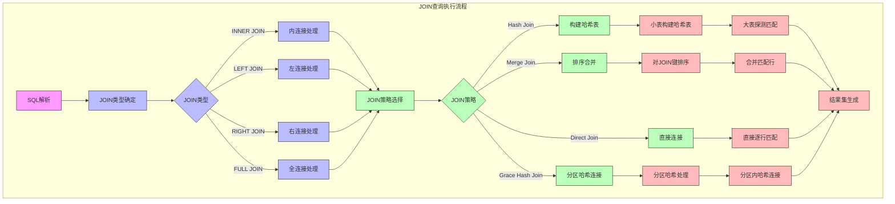

**JOIN执行策略**:

1. **Hash Join**: 适用于一个表较小的情况
   - 将小表完全加载到内存中构建哈希表
   - 扫描大表并在哈希表中查找匹配项
   - 内存占用高但速度快

2. **Merge Join**: 适用于两个表都按JOIN键排序的情况
   - 同时顺序扫描两个已排序的表
   - 合并匹配的行
   - 效率高但要求表已排序

3. **Grace Hash Join**: 适用于两个大表JOIN的情况
   - 将数据分区处理，减少内存压力
   - 每个分区内执行哈希连接
   - 适合大数据量场景

**ClickHouse JOIN类型详细对比表**

| JOIN类型 | 语法 | 工作原理 | 适用场景 | 性能特点 | 内存消耗 | 注意事项 |
|---------|------|---------|---------|---------|---------|---------|
| **INNER JOIN** | `SELECT * FROM A INNER JOIN B ON A.key = B.key` | 仅返回两表中匹配的行 | 需要严格匹配两表数据 | 中等，取决于JOIN策略 | 中等 | 空值不会匹配 |
| **LEFT JOIN** | `SELECT * FROM A LEFT JOIN B ON A.key = B.key` | 返回左表全部行，右表不匹配则为NULL | 左表为主表，需保留所有记录 | 略低于INNER JOIN | 中等 | 右表不匹配时填充NULL |
| **RIGHT JOIN** | `SELECT * FROM A RIGHT JOIN B ON A.key = B.key` | 返回右表全部行，左表不匹配则为NULL | 右表为主表，需保留所有记录 | 略低于INNER JOIN | 中等 | 左表不匹配时填充NULL |
| **FULL JOIN** | `SELECT * FROM A FULL JOIN B ON A.key = B.key` | 返回两表全部行，不匹配则为NULL | 需要两表所有数据，包括不匹配部分 | 较低，需处理所有数据 | 较高 | 不匹配时填充NULL |
| **CROSS JOIN** | `SELECT * FROM A CROSS JOIN B` | 返回两表的笛卡尔积 | 需要两表所有可能组合 | 非常低，结果集巨大 | 极高 | 结果行数=A表行数×B表行数 |
| **ASOF JOIN** | `SELECT * FROM A ASOF JOIN B ON A.key = B.key AND A.t >= B.t` | 按时间序列最近匹配 | 时间序列数据合并 | 较高，需要表按时间排序 | 中等 | 要求JOIN键包含时间字段 |
| **ANY JOIN** | `SELECT * FROM A ANY JOIN B ON A.key = B.key` | 每个左表值匹配右表第一个匹配项 | 只需右表任意一个匹配值 | 高，提前终止匹配 | 低 | 结果不确定，取决于数据顺序 |
| **ALL JOIN** | `SELECT * FROM A ALL JOIN B ON A.key = B.key` | 返回所有可能的匹配组合 | 需要所有匹配组合 | 较低，类似INNER JOIN | 较高 | 可能产生大量重复数据 |
| **SEMI JOIN** | `SELECT * FROM A WHERE A.key IN (SELECT key FROM B)` | 左表中匹配右表的行(不重复) | 筛选存在于另一表的记录 | 较高，结果集小 | 较低 | 仅返回左表数据 |
| **ANTI JOIN** | `SELECT * FROM A WHERE A.key NOT IN (SELECT key FROM B)` | 左表中不匹配右表的行 | 筛选不存在于另一表的记录 | 较高，结果集小 | 较低 | 仅返回左表数据 |

**JOIN执行策略性能对比**

| JOIN策略 | 工作原理 | 适用场景 | 优点 | 缺点 | 内存消耗 | 性能表现 |
|---------|---------|---------|------|------|---------|---------|
| **Hash Join** | 将小表构建哈希表，大表探测匹配 | 一个表明显小于另一个表 | 速度快，适合非排序数据 | 内存消耗大 | 高(与小表大小成正比) | 小表足够小时性能最佳 |
| **Merge Join** | 按JOIN键排序后合并匹配行 | 两表已按JOIN键排序 | 内存消耗低，适合大表 | 需要预排序，随机访问性能差 | 低(仅需缓冲区) | 两表已排序时性能最佳 |
| **Nested Loop Join** | 嵌套循环遍历两表 | 极小表JOIN或有索引 | 实现简单 | 性能极差，O(n²)复杂度 | 极低 | 仅适用于极小数据集 |
| **Grace Hash Join** | 分区哈希，减少内存压力 | 两个大表JOIN | 可处理大表，内存友好 | 实现复杂，有I/O开销 | 中等(可控) | 大表JOIN时较平衡 |
| **Broadcast Join** | 小表广播到所有节点 | 分布式环境下小表JOIN大表 | 减少数据传输，并行度高 | 要求小表能复制到所有节点 | 各节点都需存储小表 | 分布式环境下小表JOIN大表时最佳 |
| **Shuffle Join** | 按JOIN键重分区后本地JOIN | 分布式环境下大表JOIN大表 | 可处理任意大小表 | 网络传输开销大 | 中等(分布式) | 大表JOIN大表且内存受限时适用 |

**JOIN策略选择逻辑流程**

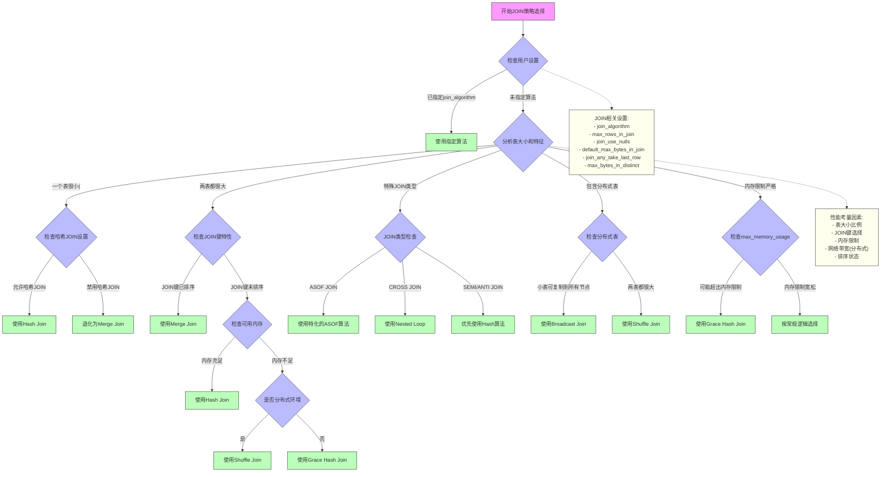

**ClickHouse JOIN策略选择因素**:

1. **表大小**
   - 小表+大表：优先选择Hash Join
   - 两个大表：考虑Grace Hash Join或Shuffle Join

2. **内存限制**
   - 内存充足：Hash Join性能最佳
   - 内存受限：考虑Merge Join或Grace Hash Join

3. **JOIN键特性**
   - JOIN键已排序：Merge Join效率高
   - JOIN键基数低：Hash Join效率高
   - JOIN键分布不均：考虑特殊优化

4. **分布式环境考量**
   - 小表可广播：Broadcast Join减少网络传输
   - 大表JOIN大表：Shuffle Join减少内存压力

5. **特殊JOIN类型的算法选择**
   - ASOF JOIN：专用时间序列JOIN算法
   - CROSS JOIN：通常使用Nested Loop
   - SEMI/ANTI JOIN：优先使用Hash算法

**ClickHouse JOIN优化技巧**

1. **使用字典代替JOIN**：对于维度表，使用字典可显著提升性能
   ```sql
   -- 使用字典替代JOIN
   SELECT 
       e.*,
       dictGet('user_dict', 'name', e.user_id) AS user_name
   FROM events e;
   ```

2. **JOIN顺序优化**：小表放在右侧（构建表），大表放在左侧（探测表）
   ```sql
   -- 优化JOIN顺序
   SELECT * FROM large_table l JOIN small_table s ON l.key = s.key;
   ```

3. **分布式JOIN优化**：使用全局表减少数据传输
   ```sql
   -- 创建全局表用于JOIN
   CREATE TABLE dimension_table_global ON CLUSTER cluster_name
   AS dimension_table
   ENGINE = ReplicatedMergeTree(...)
   ...
   SETTINGS storage_policy = 'jbod';
   ```

4. **JOIN键选择**：使用基数低、分布均匀的列作为JOIN键
   ```sql
   -- 使用低基数列作为JOIN键
   SELECT * FROM table1 t1 JOIN table2 t2 ON t1.category_id = t2.id; -- 好
   -- 避免使用高基数列
   SELECT * FROM table1 t1 JOIN table2 t2 ON t1.unique_id = t2.unique_id; -- 差
   ```

5. **JOIN相关设置优化**：
   ```sql
   -- 设置JOIN内存限制
   SET max_bytes_in_join = 10000000000;
   
   -- 指定JOIN算法
   SET join_algorithm = 'hash';  -- 可选: 'hash', 'partial_merge', 'auto'
   
   -- 限制JOIN中的行数
   SET max_rows_in_join = 1000000;
   ```

**GROUP BY查询流程**

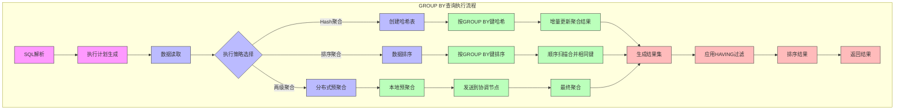

**GROUP BY执行策略**:

1. **Hash聚合**: 最常用的GROUP BY实现方式
   - 为每个分组键创建哈希表条目
   - 增量更新聚合值(如SUM、COUNT等)
   - 内存占用与分组键数量成正比

2. **排序聚合**: 适用于结果需要排序或内存受限的情况
   - 先按GROUP BY键排序数据
   - 顺序扫描并合并相同键的记录
   - 内存效率高但可能较慢

3. **两级聚合**: 分布式查询中使用
   - 在各分片上执行本地预聚合
   - 将中间结果发送到协调节点
   - 协调节点执行最终聚合
   - 大幅减少网络传输数据量

#### 命令行查询

**高频参数表格**

| 参数 | 描述 | 示例 |
|------|------|------|
| `--host` | 指定ClickHouse服务器主机名或IP地址 | `--host 192.168.1.100` |
| `--port` | 指定ClickHouse服务器端口号 | `--port 9000` |
| `--user` | 指定连接用户名 | `--user default` |
| `--password` | 指定连接密码 | `--password 'secret'` |
| `--database` | 指定要使用的数据库 | `--database analytics` |
| `--query` / `-q` | 执行单条SQL查询并退出 | `-q "SELECT version()"` |
| `--format` | 指定输出格式 | `--format Pretty` |
| `--multiline` / `-m` | 启用多行模式(不需要分号结束) | `-m` |
| `--time` | 显示查询执行时间 | `--time` |
| `--max_memory_usage` | 设置单个查询的最大内存使用量 | `--max_memory_usage 20000000000` |
| `--max_threads` | 设置查询处理的最大线程数 | `--max_threads 4` |
| `--max_insert_block_size` | 设置插入数据的块大小 | `--max_insert_block_size 1000000` |
| `--max_insert_threads` | 设置插入操作的线程数 | `--max_insert_threads 4` |
| `--config-file` | 指定配置文件路径 | `--config-file /etc/clickhouse-client/config.xml` |
| `--secure` | 使用SSL加密连接 | `--secure` |
| `--compression` | 启用或禁用网络压缩 | `--compression 1` |
| `--queries-file` | 从文件执行查询 | `--queries-file queries.sql` |
| `--history_file` | 指定命令历史文件 | `--history_file ~/.clickhouse-client-history` |
| `--verbose` | 显示详细信息 | `--verbose` |

**基本连接与查询**
```bash
# 指定数据库连接
clickhouse-client --host 192.168.1.100 --port 9000 --user admin --password 'secret' --database analytics
```

**查询输出格式控制**
参数|描述
-|-
Pretty|默认
CSVWithNames|CSV格式（带表头）
JSON|JSON格式
JSONEachRow|JSONEachRow格式（每行一个JSON对象）
TSV|TSV格式
Vertical|垂直格式（适合宽表）
PrettyCompact|紧凑格式

```bash
# 表格格式（默认）
clickhouse-client -q "SELECT name, engine FROM system.tables LIMIT 5" --format Pretty
```

**文件查询操作**
```bash
# 从文件执行SQL
clickhouse-client --queries-file queries.sql

# 从标准输入执行
echo "SELECT 1" | clickhouse-client

# 执行复杂查询文件
cat << 'EOF' > complex_query.sql
WITH user_stats AS (
    SELECT 
        user_id,
        COUNT(*) as event_count,
        MAX(timestamp) as last_activity
    FROM user_events 
    WHERE date >= today() - 7
    GROUP BY user_id
)
SELECT 
    user_id,
    event_count,
    last_activity,
    CASE 
        WHEN event_count > 100 THEN 'high_activity'
        WHEN event_count > 10 THEN 'medium_activity'
        ELSE 'low_activity'
    END as activity_level
FROM user_stats
ORDER BY event_count DESC
LIMIT 100;
EOF

clickhouse-client --queries-file complex_query.sql --format Pretty
```

**参数化查询**
```bash
# 使用参数化查询
clickhouse-client --param_user_id=12345 --param_start_date='2024-01-01' \
  --query "SELECT * FROM user_events WHERE user_id = {user_id:UInt64} AND date >= {start_date:Date}"

# 多参数查询
clickhouse-client \
  --param_min_amount=100 \
  --param_max_amount=1000 \
  --param_currency='USD' \
  --query "
    SELECT 
        transaction_id,
        amount,
        currency,
        timestamp
    FROM transactions 
    WHERE amount BETWEEN {min_amount:Float64} AND {max_amount:Float64}
      AND currency = {currency:String}
    ORDER BY timestamp DESC
    LIMIT 50
  " --format JSONEachRow
```

**批量数据查询**
```bash
# 大数据量查询优化
clickhouse-client --max_memory_usage=8000000000 \
  --query "SELECT * FROM huge_table WHERE date >= '2024-01-01'" \
  --format CSVWithNames > large_export.csv

# 分页查询
clickhouse-client --query "
  SELECT * FROM user_events 
  ORDER BY timestamp DESC 
  LIMIT 1000 OFFSET 0
" --format JSONEachRow

# 流式查询（避免内存溢出）
clickhouse-client --query "
  SELECT * FROM user_events 
  WHERE date >= today() - 30
" --format JSONEachRow --stream

# 并行查询多个分区
for partition in {20240101..20240131}; do
  clickhouse-client --query "
    SELECT * FROM user_events 
    WHERE toYYYYMMDD(date) = $partition
  " --format CSVWithNames > "data_$partition.csv" &
done
wait
```

### 插入数据
```sql
-- 基本插入
INSERT INTO table_name (column1, column2) VALUES (value1, value2);

-- 从HDFS插入数据
INSERT INTO glab_gid_info.appinfo_v2 
SELECT * FROM hdfs('hdfs://path/to/file', 'Parquet');

-- 使用命令行工具插入
clickhouse-client -m --port 9000 --user default --database glab_gid_info --password xxxxx \
 --host hzxs-ga-ck-xs6 --max_insert_block_size=536970912 --max_insert_threads=4 \
 -q 'INSERT INTO table_name SELECT * FROM hdfs("hdfs://xxx:8020/path/to/file", "Parquet");'
```

### 导出数据

**命令行 client 导出**
```bash
# 基础：格式控制（CSV/TSV/JSON/Parquet/ORC 等）
clickhouse-client \
  --host <host> --port 9000 --user <user> --password <pwd> \
  --query "SELECT * FROM db.table WHERE date>=toDate('2025-01-01') FORMAT CSV" \
  > export.csv

# 带表头（CSVWithNames/TSVWithNames）
clickhouse-client -q "SELECT * FROM db.table FORMAT CSVWithNames" > table.csv

# 导出为 JSONEachRow（便于流式处理）
clickhouse-client -q "SELECT * FROM db.table FORMAT JSONEachRow" > table.jsonl

# 并行压缩导出（压缩到本地）
clickhouse-client -q "SELECT * FROM db.table FORMAT CSV" | gzip > table.csv.gz
```

**SELECT INTO OUTFILE（需配置 allow_into_outfile=1）**
```sql
SET allow_into_outfile = 1;
SELECT * FROM db.table
INTO OUTFILE '/tmp/table.csv'
FORMAT CSVWithNames;
```

表函数导出
```sql
-- 导出到本地文件系统
SELECT * FROM db.table
INTO OUTFILE 'file:///tmp/table.tsv'
FORMAT TSVWithNames;

-- 导出到 HDFS/S3
SELECT * FROM db.table
INTO OUTFILE 's3://bucket/path/table.parquet' 
SETTINGS s3_access_key_id='AKIA...', s3_secret_access_key='***'
FORMAT Parquet;

-- 使用 file()/hdfs()/s3() 表函数（INSERT/SELECT 互转）
INSERT INTO FUNCTION file('/tmp/export.jsonl', 'JSONEachRow')
SELECT * FROM db.table WHERE dt=toDate('2025-01-01');

INSERT INTO FUNCTION hdfs('hdfs://nn:8020/path/table.parquet', 'Parquet')
SELECT * FROM db.table;
```

### JSON 数据写入与解析

```sql
-- 从原始 JSON 字符串中提取字段
SELECT 
    event_time,
    JSONExtractString(properties, 'page') AS page,
    JSONExtractString(properties, 'ua') AS ua,
    JSONExtractFloat(properties, 'amount') AS amount
FROM events_json
WHERE event_date = toDate('2025-08-01');

-- 使用更通用的 JSON_VALUE(JSON, jsonpath) 语法（新版本）
SELECT 
    event_time,
    JSON_VALUE(properties, '$.page') AS page,
    JSON_VALUE(properties, '$.order_id') AS order_id,
    toFloat64OrNull(JSON_VALUE(properties, '$.amount')) AS amount
FROM events_json
WHERE event_type IN ('page_view', 'purchase');

-- Map 列的读取
SELECT 
    event_time,
    props['btn'] AS btn,
    props['q'] AS query,
    mapKeys(props) AS all_keys
FROM events_map
WHERE event_type IN ('click','search');

-- Object('json') 的投影访问（字段自动按需映射并可被索引/投影）
SELECT 
    event_time,
    j.page AS page,
    j.sku::UInt64 AS sku,
    j.price::Float64 AS price
FROM events_obj
WHERE j.page = '/detail';
```
### Bitmap操作

#### 基本操作
```sql
-- 创建bitmap
SELECT bitmapBuild([1, 2, 3, 4, 5]) AS bitmap;

-- 添加元素
SELECT bitmapAdd(bitmapBuild([1,2,3]), 4) AS bitmap;

-- 删除元素
SELECT bitmapSubtract(bitmapBuild([1,2,3]), 2) AS bitmap;

-- 判断元素是否存在
SELECT bitmapContains(bitmapBuild([1,2,3]), 2) AS exists;

-- 获取基数（元素个数）
SELECT bitmapCardinality(bitmap_column) FROM table;
```

#### 聚合操作
```sql
-- OR操作（并集）
SELECT 
    bitmapOr(bitmap1, bitmap2) AS union_bitmap,
    bitmapOrCardinality(bitmap1, bitmap2) AS union_count
FROM table;

-- AND操作（交集）
SELECT 
    bitmapAnd(bitmap1, bitmap2) AS intersect_bitmap,
    bitmapAndCardinality(bitmap1, bitmap2) AS intersect_count
FROM table;

-- XOR操作（异或）
SELECT 
    bitmapXor(bitmap1, bitmap2) AS xor_bitmap,
    bitmapXorCardinality(bitmap1, bitmap2) AS xor_count
FROM table;

-- 聚合OR操作
SELECT bitmapOrState(bitmap_column)
FROM table
GROUP BY group_column;

-- 聚合AND操作
SELECT bitmapAndState(bitmap_column)
FROM table
GROUP BY group_column;
```

#### 转换操作
```sql
-- Bitmap转数组
SELECT bitmapToArray(bitmap_column) AS array;

-- 数组转Bitmap
SELECT bitmapBuild([1, 2, 3]) AS bitmap;

-- 获取Bitmap中的指定范围元素
SELECT arraySlice(bitmapToArray(bitmap_column), 1, 5) AS first_five;

-- 实际应用示例
SELECT 
    tag,
    bitmapCardinality(gid_index_bitmap) AS user_count,
    arraySlice(bitmapToArray(gid_index_bitmap), 1, 10) AS sample_users
FROM tag_bitmap 
WHERE tag_md5 = lower(hex(MD5('tag_name')));

-- Bitmap分段统计示例
SELECT 
    bitmap_segment_number,
    bitmapCardinality(gid_index_bitmap) AS segment_count,
    formatReadableSize(length(gid_index_bitmap)) AS bitmap_size
FROM tag_bitmap 
WHERE tag_md5 = lower(hex(MD5('tag_name')))
ORDER BY bitmap_segment_number;
```

#### 性能优化
```sql
-- 使用 bitmapOrCardinality 替代 bitmapCardinality(bitmapOr())
SELECT bitmapOrCardinality(
    bitmapBuild([1, 2, 3]),
    bitmapBuild([3, 4, 5])
) AS union_count;

-- 批量处理时使用State聚合函数
SELECT 
    tag,
    bitmapCardinality(groupBitmapOrState(gid_index_bitmap)) AS total_users
FROM tag_bitmap
WHERE tag IN ('tag1', 'tag2', 'tag3')
GROUP BY tag;

-- 大规模数据处理优化
SELECT 
    tag,
    bitmapCardinality(gid_index_bitmap) AS user_count,
    formatReadableSize(length(gid_index_bitmap)) AS bitmap_size
FROM tag_bitmap 
WHERE tag_md5 IN (
    SELECT lower(hex(MD5(tag))) 
    FROM (SELECT ['tag1', 'tag2', 'tag3'] AS tags) 
    ARRAY JOIN tags AS tag
)
SETTINGS max_threads = 4;
```

### Map操作

#### Map创建与转换
```sql
-- 创建Map
SELECT map('key1', 1, 'key2', 2) AS simple_map;

-- 从两个数组创建Map
SELECT mapFromArrays(['key1', 'key2', 'key3'], [1, 2, 3]) AS map_from_arrays;

-- 从嵌套数组创建Map
SELECT mapFromArrays(['a', 'b'], [[1, 2], [3, 4]]) AS nested_map;

-- 数组转换为Map (key-value对的数组)
SELECT arrayMap(x -> (x, x * x), range(1, 5)) AS array_of_pairs,
       map(arrayMap(x -> (x, x * x), range(1, 5))) AS map_from_pairs;

-- 从JSON字符串创建Map
SELECT mapFromJSON('{"key1": 1, "key2": 2, "key3": 3}') AS map_from_json;

-- Map转换为JSON
SELECT mapToJSON(map('key1', 1, 'key2', 2)) AS json_string;

-- Map转换为两个数组
SELECT mapKeys(map('key1', 1, 'key2', 2)) AS keys,
       mapValues(map('key1', 1, 'key2', 2)) AS values;
```

#### Map查询与操作
```sql
-- 获取Map中的值
SELECT map('key1', 1, 'key2', 2)['key1'] AS value;

-- 检查键是否存在
SELECT mapContains(map('key1', 1, 'key2', 2), 'key1') AS contains_key;

-- 获取Map大小
SELECT mapSize(map('key1', 1, 'key2', 2)) AS map_size;

-- 合并两个Map
SELECT mapMerge(
    map('key1', 1, 'key2', 2),
    map('key2', 20, 'key3', 3)
) AS merged_map;

-- 删除Map中的键
SELECT mapRemove(map('key1', 1, 'key2', 2, 'key3', 3), ['key1', 'key3']) AS filtered_map;

-- 提取Map子集
SELECT mapFilter((k, v) -> v > 1, map('key1', 1, 'key2', 2, 'key3', 3)) AS filtered_map;

-- 转换Map值
SELECT mapApply((k, v) -> v * 10, map('key1', 1, 'key2', 2)) AS transformed_map;

-- 展平嵌套Map
SELECT mapFlat(map('nested', map('key1', 1, 'key2', 2), 'key3', 3)) AS flattened_map;
```

#### Map聚合操作
```sql
-- 聚合多行数据为单个Map
SELECT mapAgg(key, value) FROM (
    SELECT 'key1' AS key, 1 AS value
    UNION ALL SELECT 'key2' AS key, 2 AS value
    UNION ALL SELECT 'key3' AS key, 3 AS value
);

-- 合并多行Map
SELECT groupArrayMap(m) FROM (
    SELECT map('key1', 1, 'key2', 2) AS m
    UNION ALL SELECT map('key2', 20, 'key3', 3) AS m
    UNION ALL SELECT map('key4', 4) AS m
);

-- 聚合Map并对值进行求和
SELECT 
    date,
    sumMap(page_views) AS total_views
FROM (
    SELECT 
        toDate('2023-01-01') AS date,
        map('page1', 10, 'page2', 15) AS page_views
    UNION ALL
    SELECT 
        toDate('2023-01-01') AS date,
        map('page1', 5, 'page3', 8) AS page_views
)
GROUP BY date;

-- 实际应用示例：用户属性聚合
SELECT 
    user_id,
    mapAgg(attribute, value) AS user_attributes
FROM user_attribute_table
GROUP BY user_id;

-- 实际应用示例：事件计数聚合
SELECT 
    date,
    sumMap(event_counts) AS daily_events
FROM (
    SELECT 
        event_date AS date,
        map(event_type, event_count) AS event_counts
    FROM events_table
)
GROUP BY date
ORDER BY date;
```

### 数组操作

#### 数组基础操作

**数组创建与类型转换**
```sql
-- 1. 数组字面量创建
SELECT [1, 2, 3, 4, 5] AS simple_array;
SELECT ['apple', 'banana', 'orange'] AS string_array;
SELECT [toDate('2024-01-01'), toDate('2024-01-02')] AS date_array;

-- 2. 从列创建数组
SELECT range(10) AS number_range;              -- [0,1,2,3,4,5,6,7,8,9]
SELECT range(1, 6) AS custom_range;            -- [1,2,3,4,5]
SELECT range(0, 10, 2) AS step_range;          -- [0,2,4,6,8]

-- 3. 空数组和类型指定
SELECT [] AS empty_array;
SELECT CAST([] AS Array(String)) AS typed_empty_array;
SELECT emptyArrayUInt32() AS empty_uint_array;
SELECT emptyArrayString() AS empty_string_array;

-- 4. 数组类型转换
SELECT arrayMap(x -> toString(x), [1, 2, 3]) AS to_string_array;
SELECT arrayMap(x -> toFloat64(x), ['1.1', '2.2', '3.3']) AS to_float_array;
SELECT arrayMap(x -> toDate(x), ['2024-01-01', '2024-01-02']) AS to_date_array;

-- 5. 从字符串解析数组
SELECT splitByChar(',', '1,2,3,4') AS from_string;
SELECT arrayMap(x -> toInt32(x), splitByChar(',', '10,20,30')) AS parsed_int_array;
```
#### 数组集合操作
```sql
-- 数组并集：合并两个数组并去重
SELECT arrayDistinct(arrayConcat([1, 2, 3], [2, 3, 4])) AS union_array;
-- 结果: [1, 2, 3, 4]

-- 组合求差集
select arrayFilter(x->not arrayExists(y -> y = x,[1,2,4]),[2,3,5]) as diff;
-- 结果: [3,5]

-- 对多个数组执行交集操作
SELECT arrayIntersect([1, 2, 3], [2, 3, 4], [3, 4, 5]) AS multi_intersection;
-- 结果: [3]

-- 检查一个数组是否是另一个数组的子集
SELECT arrayAll(x -> arrayExists(y -> y = x, [1, 2, 3, 4]), [2, 3]) AS is_subset;
-- 结果: 1 (true)

-- 检查两个数组是否相等（不考虑顺序）
SELECT arraySort(a1) = arraySort(a2) FROM 
(SELECT [1, 2, 3] AS a1, [3, 1, 2] AS a2);
-- 结果: 1 (true)

-- 检查一个元素是否在数组中
SELECT arrayExists(x -> x = 3, [1, 2, 3, 4]) AS contains;
-- 结果: 1 (true)

-- 高效并集实现（去重合并）
SELECT arrayDistinct(arrayConcat([1, 2, 3], [3, 4, 5])) AS union_result;  -- [1, 2, 3, 4, 5]

-- 多数组并集（支持任意数量的数组）
SELECT arrayDistinct(arrayFlatten([
    [1, 2, 3],
    [3, 4, 5], 
    [5, 6, 7],
    [7, 8, 9]
])) AS multi_array_union; -- [1, 2, 3, 4, 5, 6, 7, 8, 9]

-- 条件并集（仅合并满足条件的元素）
WITH 
    arrayFilter(x -> x > 0, [-1, 1, -2, 2, 3]) AS positive_arr1,
    arrayFilter(x -> x > 0, [-2, 2, -3, 3, 4]) AS positive_arr2
SELECT arrayDistinct(arrayConcat(positive_arr1, positive_arr2)) AS positive_union; -- [1, 2, 3, 4]

-- 加权并集（保留权重信息）
SELECT arrayDistinct(arrayConcat(
    arrayMap(x -> (x, 'source_A'), [1, 2, 3]),
    arrayMap(x -> (x, 'source_B'), [3, 4, 5])
)) AS weighted_union;

-- 分组并集聚合
SELECT 
    group_id,
    arrayDistinct(arrayFlatten(groupArray(elements))) AS group_union
FROM (
    SELECT 1 AS group_id, [1, 2, 3] AS elements
    UNION ALL SELECT 1, [3, 4, 5]
    UNION ALL SELECT 2, [6, 7, 8]
    UNION ALL SELECT 2, [8, 9, 10]
)
GROUP BY group_id;

-- 基本arrayJoin用法：将数组展开为多行
SELECT arrayJoin([1, 2, 3]) AS value;
-- 结果:
-- 1
-- 2  
-- 3
-- 数组去重
SELECT arrayDistinct([1, 2, 2, 3, 3, 4]) AS unique_array;
-- 结果: [1, 2, 3, 4]

-- 数组合并
SELECT arrayConcat([1, 2], [3, 4], [5, 6]) AS merged_array;
-- 结果: [1, 2, 3, 4, 5, 6]

-- 数组映射转换
SELECT arrayMap(x -> x * 2, [1, 2, 3, 4, 5]) AS doubled;
-- 结果: [2, 4, 6, 8, 10]

-- 数组过滤
SELECT arrayFilter(x -> x > 3, [1, 2, 3, 4, 5, 6]) AS filtered;
-- 结果: [4, 5, 6]

-- 数组打平（多维数组展开为一维）
SELECT arrayFlatten([[1, 2], [3, 4], [5]]) AS flattened;
-- 结果: [1, 2, 3, 4, 5]

-- 数组元素操作
SELECT arrayPushBack([1, 2, 3], 4) AS with_new_element;     -- 末尾添加
SELECT arrayPushFront([1, 2, 3], 0) AS with_front_element;  -- 开头添加
SELECT arrayPopBack([1, 2, 3, 4]) AS without_last;          -- 移除末尾
SELECT arrayPopFront([1, 2, 3, 4]) AS without_first;        -- 移除开头

-- 数组切片和索引
SELECT arraySlice([1, 2, 3, 4, 5], 2, 3) AS sliced;        -- 从位置2开始取3个元素
SELECT arrayReverse([1, 2, 3, 4]) AS reversed;              -- 反转数组
SELECT arrayElement([1, 2, 3, 4], 2) AS second_element;     -- 获取第2个元素
```

**数组检查与属性**
```sql
-- 数组长度和大小
SELECT length([1, 2, 3, 4]) AS array_length;
SELECT empty([]) AS is_empty;
SELECT notEmpty([1, 2, 3]) AS is_not_empty;

-- 数组类型检查
SELECT toTypeName([1, 2, 3]) AS array_type;
SELECT toTypeName(['a', 'b', 'c']) AS string_array_type;

-- 数组内容检查
SELECT arrayExists(x -> x > 3, [1, 2, 3, 4, 5]) AS has_element_gt_3;
SELECT arrayAll(x -> x > 0, [1, 2, 3, 4]) AS all_positive;
SELECT arrayCount(x -> x % 2 = 0, [1, 2, 3, 4, 5, 6]) AS even_count;

-- 数组元素索引查找
SELECT indexOf([10, 20, 30, 40], 30) AS index_of_30;  -- 返回 3
SELECT arrayFirstIndex(x -> x > 25, [10, 20, 30, 40]) AS first_gt_25_index;
```

**数组元素访问与修改**
```sql
-- 元素访问（1基索引）
SELECT [1, 2, 3, 4, 5][3] AS third_element;    -- 返回 3
SELECT arrayElement([1, 2, 3, 4, 5], 2) AS second_element;  -- 返回 2

-- 负索引访问（从末尾开始）
SELECT [1, 2, 3, 4, 5][-1] AS last_element;    -- 返回 5
SELECT [1, 2, 3, 4, 5][-2] AS second_last;     -- 返回 4

-- 安全访问（越界返回默认值）
SELECT arrayElement([1, 2, 3], 10, 0) AS safe_access;  -- 返回 0

-- 数组切片
SELECT arraySlice([1, 2, 3, 4, 5, 6], 2, 3) AS middle_slice;  -- [2,3,4]
SELECT arraySlice([1, 2, 3, 4, 5], -3) AS last_three;         -- [3,4,5]

-- 数组修改操作
SELECT arrayPushBack([1, 2, 3], 4) AS append_element;
SELECT arrayPushFront([2, 3, 4], 1) AS prepend_element;
SELECT arrayPopBack([1, 2, 3, 4]) AS remove_last;
SELECT arrayPopFront([1, 2, 3, 4]) AS remove_first;
SELECT arrayResize([1, 2, 3], 5, 0) AS resize_array;  -- [1,2,3,0,0]
```

#### 数组排序与查找

**数组排序操作**
```sql
-- 基本排序
SELECT arraySort([3, 1, 4, 1, 5, 9]) AS sorted_asc;        -- [1,1,3,4,5,9]
SELECT arrayReverseSort([3, 1, 4, 1, 5, 9]) AS sorted_desc; -- [9,5,4,3,1,1]

-- 字符串数组排序
SELECT arraySort(['banana', 'apple', 'cherry']) AS sorted_strings;

-- 自定义排序（Lambda表达式）
SELECT arraySort(x -> -x, [3, 1, 4, 1, 5]) AS custom_sort;  -- 按负值排序

-- 复杂对象排序
SELECT arraySort(x -> tupleElement(x, 2), [('a', 3), ('b', 1), ('c', 2)]) AS sort_by_second;

-- 并行数组排序（多个数组按照第一个数组的顺序排序）
SELECT 
    arraySort([3, 1, 4, 2]) AS sorted_keys,
    arraySort((x, y) -> x, [3, 1, 4, 2], ['c', 'a', 'd', 'b']) AS sorted_values;
-- 结果: [1,2,3,4] 和 ['a','b','c','d']
```

**数组查找和匹配**
```sql
-- 元素查找
SELECT arrayFirst(x -> x > 3, [1, 2, 3, 4, 5]) AS first_gt_3;     -- 4
SELECT arrayLast(x -> x < 3, [1, 2, 3, 4, 5]) AS last_lt_3;       -- 2
SELECT arrayFirstIndex(x -> x > 3, [1, 2, 3, 4, 5]) AS first_index; -- 4

-- 条件计数和存在性检查
SELECT arrayCount(x -> x > 3, [1, 2, 3, 4, 5, 6]) AS count_gt_3;
SELECT arrayExists(x -> x = 5, [1, 2, 3, 4, 5]) AS contains_5;
SELECT arrayAll(x -> x > 0, [1, 2, 3, 4, 5]) AS all_positive;

-- 模式匹配查找
SELECT arrayFirst(x -> match(x, '^a'), ['apple', 'banana', 'avocado']) AS first_a_word;
SELECT arrayFilter(x -> match(x, 'an'), ['apple', 'banana', 'orange', 'mango']) AS contains_an;

-- 最值查找
SELECT arrayMin([5, 2, 8, 1, 9]) AS min_value;
SELECT arrayMax([5, 2, 8, 1, 9]) AS max_value;
SELECT arrayArgMin((x, y) -> y, ['a', 'b', 'c'], [3, 1, 2]) AS arg_min;  -- 'b'
SELECT arrayArgMax((x, y) -> y, ['a', 'b', 'c'], [3, 1, 2]) AS arg_max;  -- 'a'
```

#### 数组高阶函数与算法

**函数式编程操作**
```sql
-- Map操作（元素变换）
SELECT arrayMap(x -> x * x, [1, 2, 3, 4, 5]) AS squares;
SELECT arrayMap(x -> upper(x), ['hello', 'world']) AS uppercase;
SELECT arrayMap(x -> tuple(x, x * 2), [1, 2, 3]) AS tuples;

-- Filter操作（条件过滤）
SELECT arrayFilter(x -> x % 2 = 1, [1, 2, 3, 4, 5, 6]) AS odd_numbers;
SELECT arrayFilter(x -> length(x) > 5, ['cat', 'elephant', 'dog', 'butterfly']) AS long_words;

-- Reduce操作（累积计算）
SELECT arrayReduce('sum', [1, 2, 3, 4, 5]) AS array_sum;
SELECT arrayReduce('avg', [1, 2, 3, 4, 5]) AS array_avg;
SELECT arrayReduce('max', [1, 2, 3, 4, 5]) AS array_max;
SELECT arrayReduce('uniq', [1, 2, 2, 3, 3, 3]) AS unique_count;

-- 自定义Reduce操作
SELECT arrayReduce('groupBitOr', [1, 2, 4, 8]) AS bit_or_result;  -- 按位或
SELECT arrayReduce('groupBitAnd', [7, 3, 1]) AS bit_and_result;   -- 按位与

-- 复杂函数式操作
SELECT arrayMap((x, y) -> x + y, [1, 2, 3], [4, 5, 6]) AS element_wise_sum;
SELECT arrayZip([1, 2, 3], ['a', 'b', 'c']) AS zipped_arrays;
```

**数组算法和数学运算**
```sql
-- 数学统计
SELECT arraySum([1, 2, 3, 4, 5]) AS total_sum;
SELECT arrayAvg([1, 2, 3, 4, 5]) AS average;
SELECT arraySum(arrayMap(x -> x * x, [1, 2, 3, 4])) AS sum_of_squares;

-- 数组差分和累积
SELECT arrayDifference([1, 3, 6, 10, 15]) AS differences;  -- [2,3,4,5]
SELECT arrayCumSum([1, 2, 3, 4, 5]) AS cumulative_sum;     -- [1,3,6,10,15]
SELECT arrayCumSumNonNegative([1, -2, 3, -1, 2]) AS cum_sum_non_neg;

-- 数组旋转和移位
SELECT arrayRotateLeft([1, 2, 3, 4, 5], 2) AS rotate_left;   -- [3,4,5,1,2]
SELECT arrayRotateRight([1, 2, 3, 4, 5], 2) AS rotate_right; -- [4,5,1,2,3]

-- 数组比较和排名
SELECT arrayRank([3, 1, 4, 1, 5]) AS rank_values;
SELECT arrayDotProduct([1, 2, 3], [4, 5, 6]) AS dot_product;  -- 1*4 + 2*5 + 3*6 = 32

-- 序列生成和递推
SELECT arrayMap(i -> i * i, range(1, 6)) AS squares_1_to_5;
SELECT arrayMap(i -> pow(2, i), range(0, 8)) AS powers_of_2;
```

**数组转换和重塑**
```sql
-- 数组扁平化
SELECT arrayFlatten([[1, 2], [3, 4], [5, 6]]) AS flattened;
SELECT arrayFlatten([[[1, 2]], [[3, 4]]]) AS deep_flattened;

-- 数组重塑（转置）
SELECT 
    arrayMap(i -> arrayMap(j -> arr[j][i], range(1, length(arr) + 1)), 
             range(1, length(arr[1]) + 1)) AS transposed
FROM (
    SELECT [[1, 2, 3], [4, 5, 6]] AS arr
);

-- 数组编码和解码
SELECT arrayEncode([1, 2, 2, 3, 3, 3]) AS rle_encoded;  -- 游程编码
SELECT arrayStringConcat(['a', 'b', 'c'], '') AS concatenated;
SELECT arrayStringConcat(['a', 'b', 'c'], ',') AS csv_format;

-- 数组与字符串互转
SELECT splitByChar(',', '1,2,3,4,5') AS string_to_array;
SELECT arrayStringConcat(['a', 'b', 'c'], '|') AS array_to_string;
```

#### 数组性能优化

**性能最佳实践**
```sql
-- 1. 避免过大的数组（推荐 < 1万元素）
-- 不好：
SELECT groupArray(large_text_column) FROM huge_table;  -- 可能导致内存问题

-- 好：限制数组大小
SELECT groupArray(100)(large_text_column) FROM huge_table;

-- 2. 使用适当的数据类型
-- 不好：存储数字的字符串数组
SELECT ['1', '2', '3'] AS inefficient;

-- 好：使用数字数组
SELECT [1, 2, 3] AS efficient;

-- 3. 利用数组函数避免arrayJoin
-- 不好：使用arrayJoin处理简单统计
SELECT count() FROM table ARRAY JOIN tags;

-- 好：使用数组函数
SELECT arraySum(arrayMap(x -> 1, tags)) AS tag_count FROM table;
```

**数组内存和性能监控**
```sql
-- 检查数组大小分布
SELECT 
    length(array_column) AS array_size,
    count() AS count,
    avg(length(array_column)) AS avg_size,
    max(length(array_column)) AS max_size
FROM table_with_arrays
GROUP BY length(array_column)
ORDER BY array_size;

-- 数组内存使用估算
SELECT 
    table,
    column,
    sum(length(array_column) * 8) AS estimated_bytes  -- 假设每个元素8字节
FROM system.columns 
WHERE type LIKE 'Array%'
GROUP BY table, column;

-- 性能对比：数组vs多行
-- 方案1：数组存储
SELECT user_id, arraySum(scores) AS total_score
FROM user_scores_array;

-- 方案2：多行存储
SELECT user_id, sum(score) AS total_score  
FROM user_scores_normalized
GROUP BY user_id;
```

#### 与Hive聚合函数对比


| Hive函数 | ClickHouse对应函数 | 说明 |
|---------|-------------------|------|
| `collect_set(col)` | `groupUniqArray(col)` | 去重聚合为数组 |
| `collect_list(col)` | `groupArray(col)` | 不去重聚合为数组 |
| `concat_ws(sep, col1, col2, ...)` | `groupConcat(sep)(col)` | 字符串连接聚合 |
| `count(distinct col)` | `uniq(col)` | 去重计数 |
| `percentile(col, 0.5)` | `quantile(0.5)(col)` | 分位数计算 |
| `size(collect_set(col))` | `uniq(col)` | 去重后数量 |
| `array_contains(arr, val)` | `arrayExists(x -> x = val, arr)` | 数组包含检查 |
| `sort_array(arr)` | `arraySort(arr)` | 数组排序 |
| `map_keys(map_col)` | `mapKeys(map_col)` | Map键获取 |
| `map_values(map_col)` | `mapValues(map_col)` | Map值获取 |


```sql
-- 用户行为分析：类似Hive的复杂聚合查询迁移
SELECT 
    user_id,
    -- 类似Hive的collect_set，收集用户所有访问的独特页面
    groupUniqArray(page_url) AS unique_pages_visited,
    -- 类似Hive的collect_list，保持用户访问页面的时间顺序
    groupArray(page_url) AS page_visit_sequence,
    -- 类似Hive的size(collect_set())，计算独特页面数量
    uniq(page_url) AS unique_page_count,
    -- 类似Hive的concat_ws，连接用户访问路径
    arrayStringConcat(groupArray(page_url), ' -> ') AS user_journey,
    -- 类似Hive的percentile，计算用户访问时长分位数
    quantile(0.5)(visit_duration) AS median_visit_time,
    -- 类似Hive的count(distinct)进行条件统计
    uniqIf(session_id, visit_duration > 300) AS long_sessions,
    -- 复杂条件聚合，类似Hive的case when + collect_set
    groupUniqArrayIf(page_category, visit_duration > 60) AS engaged_categories,
    -- 类似Hive的map聚合，页面停留时间统计
    mapAgg(page_category, avg_duration) AS category_avg_durations
FROM (
    SELECT 
        user_id,
        page_url,
        page_category,
        session_id,
        visit_duration,
        avg(visit_duration) OVER (PARTITION BY user_id, page_category) AS avg_duration
    FROM user_page_visits
    WHERE visit_date >= today() - 30  -- 最近30天数据
) 
GROUP BY user_id
ORDER BY unique_page_count DESC
LIMIT 100;

-- 电商分析：商品维度的复杂聚合统计
SELECT 
    category,
    -- 类似Hive collect_set，收集该分类下的所有品牌
    groupUniqArray(brand) AS available_brands,
    -- 类似Hive collect_list，按销量排序的商品列表
    arrayStringConcat(
        arraySort(x -> tupleElement(x, 2), 
                 groupArray(tuple(product_name, sales_count))), 
        ', '
    ) AS top_products_by_sales,
    -- 类似Hive的percentile_approx，价格分布分析
    quantiles(0.25, 0.5, 0.75, 0.95)(price) AS price_quartiles,
    -- 复杂嵌套聚合，类似Hive的复杂case when聚合
    groupArray(tuple(
        brand,
        countIf(price > 1000),                    -- 高价商品数
        avgIf(rating, rating > 0),                -- 平均评分
        groupUniqArray(color),                    -- 可选颜色
        maxIf(sales_count, in_stock = 1)          -- 库存商品最高销量
    )) AS brand_detailed_stats,
    -- 类似Hive的map函数，品牌价格统计
    mapFromArrays(
        groupUniqArray(brand),
        groupArray(avg_price_by_brand)
    ) AS brand_price_map
FROM (
    SELECT 
        category,
        brand,
        product_name,
        price,
        rating,
        color,
        sales_count,
        in_stock,
        avg(price) OVER (PARTITION BY category, brand) AS avg_price_by_brand
    FROM products 
    WHERE status = 'active'
) 
GROUP BY category
HAVING uniq(brand) > 5  -- 至少5个品牌的分类
ORDER BY count() DESC;

-- 时间序列分析：用户留存和转化漏斗
SELECT 
    registration_date,
    -- 新用户注册数
    count() AS new_users,
    -- 类似Hive collect_set，收集用户完成的关键行为
    groupUniqArray(completed_actions) AS conversion_actions,
    -- 各阶段转化率统计
    countIf(day1_active) / count() AS day1_retention,
    countIf(day7_active) / count() AS day7_retention,
    countIf(day30_active) / count() AS day30_retention,
    -- 类似Hive的复杂聚合，用户分层统计
    mapFromArrays(
        ['high_value', 'medium_value', 'low_value'],
        [
            countIf(total_spending > 1000),
            countIf(total_spending BETWEEN 100 AND 1000),
            countIf(total_spending < 100)
        ]
    ) AS user_value_segments,
    -- 用户行为路径分析
    topK(10)(arrayStringConcat(
        groupArray(action_sequence), ' -> '
    )) AS common_user_journeys
FROM (
    SELECT 
        user_id,
        toDate(registration_time) AS registration_date,
        arrayJoin(user_actions) AS completed_actions,
        any(total_spending) AS total_spending,
        any(day1_active) AS day1_active,
        any(day7_active) AS day7_active,
        any(day30_active) AS day30_active,
        groupArray(action_name) AS action_sequence
    FROM user_lifecycle_analysis
    WHERE registration_time >= today() - 90
    GROUP BY user_id, registration_date
)
GROUP BY registration_date
ORDER BY registration_date DESC;

-- 原有的用户标签分析示例
SELECT 
    tag,
    count() AS user_count,
    countDistinct(user_id) AS unique_users
FROM (
    SELECT 
        user_id,
        arrayJoin(splitByChar(',', tags)) AS tag
    FROM user_profiles
    WHERE tags != ''
)
GROUP BY tag
ORDER BY user_count DESC
LIMIT 20;

-- 事件序列分析：展开用户行为路径
SELECT 
    step_number,
    event_name,
    count() AS occurrence_count
FROM (
    SELECT 
        user_id,
        arrayJoin(arrayEnumerate(event_sequence)) AS step_number,
        arrayJoin(event_sequence) AS event_name
    FROM user_behavior_sequence
) 
GROUP BY step_number, event_name
ORDER BY step_number, occurrence_count DESC;

-- 商品分类分析：多级分类展开
SELECT 
    level,
    category,
    count() AS product_count
FROM (
    SELECT 
        product_id,
        arrayJoin(arrayEnumerate(category_path)) AS level,
        arrayJoin(category_path) AS category
    FROM products
    WHERE length(category_path) > 0
)
GROUP BY level, category
ORDER BY level, product_count DESC;
```

### 字符串操作
```sql
-- 字符串分割
SELECT splitByChar(',', 'a,b,c');
select arrayMap(x->splitByChar('#',x)[1],splitByString('\x01',detail))

-- 字符串匹配,
SELECT match('string', 'pattern');
SELECT match('aftvf', 'a');

-- 字符串包含多个模式
SELECT * FROM table WHERE match(column_name, 'MG|XZ');

-- 字符串替换
SELECT replaceAll('hello world world', 'world', 'ClickHouse') AS result;
-- 输出：hello ClickHouse ClickHouse

SELECT replaceOne('hello world world', 'world', 'ClickHouse') AS result;
-- 输出：hello ClickHouse world

SELECT replaceRegexpAll('abc123xyz456', '\\d+', '_') AS result;
-- 输出：abc_xyz_
```

### 条件与控制函数

#### multiIf函数
`multiIf`是ClickHouse中最常用的条件判断函数，类似于SQL的CASE WHEN语句，但性能更高。

```sql
-- multiIf语法：multiIf(condition1, result1, condition2, result2, ..., default_result)
SELECT multiIf(
    score >= 90, 'A',
    score >= 80, 'B', 
    score >= 70, 'C',
    score >= 60, 'D',
    'F'
) AS grade
FROM student_scores;

-- 等价的CASE WHEN写法（但性能较差）
SELECT CASE 
    WHEN score >= 90 THEN 'A'
    WHEN score >= 80 THEN 'B'
    WHEN score >= 70 THEN 'C'
    WHEN score >= 60 THEN 'D'
    ELSE 'F'
END AS grade
FROM student_scores;
```

```sql
-- 用户等级划分
SELECT 
    user_id,
    user_name,
    total_amount,
    multiIf(
        total_amount >= 10000, 'VIP',
        total_amount >= 5000, 'Gold',
        total_amount >= 1000, 'Silver',
        'Bronze'
    ) AS user_level
FROM user_orders;

-- 数据质量评分
SELECT 
    id,
    multiIf(
        name != '' AND email != '' AND phone != '', 'Complete',
        name != '' AND email != '', 'Good',
        name != '', 'Basic',
        'Incomplete'
    ) AS data_quality
FROM user_profiles;

-- 复杂业务逻辑判断
SELECT 
    order_id,
    multiIf(
        status = 'paid' AND delivery_time <= now(), 'Delivered',
        status = 'paid' AND delivery_time > now(), 'In Transit',
        status = 'pending' AND created_time < now() - INTERVAL 1 HOUR, 'Expired',
        status = 'pending', 'Waiting Payment',
        'Unknown'
    ) AS order_status
FROM orders;
```

#### if函数
简单的二元条件判断函数。

```sql
-- if语法：if(condition, true_result, false_result)
SELECT 
    user_id,
    if(age >= 18, 'Adult', 'Minor') AS age_group,
    if(gender = 'M', '男', '女') AS gender_cn,
    if(balance > 0, balance, 0) AS available_balance
FROM users;

-- 处理NULL值
SELECT 
    product_id,
    if(discount IS NULL, 0, discount) AS final_discount,
    if(isNull(description), 'No description', description) AS product_desc
FROM products;
```

#### 条件聚合函数
```sql
-- countIf：条件计数
SELECT 
    department,
    countIf(salary > 10000) AS high_salary_count,
    countIf(age < 30) AS young_employee_count,
    countIf(gender = 'F') AS female_count
FROM employees
GROUP BY department;

-- sumIf：条件求和
SELECT 
    product_category,
    sumIf(amount, status = 'completed') AS completed_amount,
    sumIf(amount, status = 'pending') AS pending_amount,
    sumIf(quantity, discount > 0) AS discounted_quantity
FROM sales
GROUP BY product_category;

-- avgIf：条件平均值
SELECT 
    store_id,
    avgIf(rating, rating > 0) AS avg_valid_rating,
    avgIf(price, category = 'electronics') AS avg_electronics_price
FROM products
GROUP BY store_id;
```

#### 空值处理函数
```sql
-- ifNull：处理NULL值
SELECT 
    user_id,
    ifNull(nickname, username) AS display_name,
    ifNull(avatar_url, '/default/avatar.png') AS profile_image
FROM users;

-- nullIf：条件置空
SELECT 
    product_id,
    nullIf(discount, 0) AS effective_discount,  -- 将0转换为NULL
    nullIf(description, '') AS valid_description  -- 将空字符串转换为NULL
FROM products;

-- coalesce：返回第一个非NULL值
SELECT 
    user_id,
    coalesce(mobile_phone, home_phone, office_phone) AS contact_phone,
    coalesce(shipping_address, billing_address, '地址未填写') AS delivery_address
FROM user_contacts;
```

#### 数值比较函数
```sql
-- greatest：返回最大值
SELECT 
    student_id,
    greatest(math_score, english_score, chinese_score) AS highest_score,
    greatest(0, balance - frozen_amount) AS available_balance
FROM student_grades;

-- least：返回最小值
SELECT 
    product_id,
    least(original_price, competitor_price) AS best_price,
    least(stock_quantity, max_order_quantity) AS purchasable_quantity
FROM product_pricing;
```

#### 复杂条件组合
```sql
-- 多条件组合判断
SELECT 
    order_id,
    customer_id,
    multiIf(
        -- VIP客户且金额大于1000
        customer_level = 'VIP' AND total_amount > 1000, 'VIP_HIGH',
        -- VIP客户
        customer_level = 'VIP', 'VIP_NORMAL',
        -- 新客户且首单
        is_new_customer = 1 AND order_count = 1, 'NEW_CUSTOMER',
        -- 大额订单
        total_amount > 5000, 'HIGH_VALUE',
        -- 普通订单
        'NORMAL'
    ) AS order_type,
    
    -- 计算折扣
    multiIf(
        customer_level = 'VIP', total_amount * 0.1,
        total_amount > 1000, total_amount * 0.05,
        is_new_customer = 1, 50,
        0
    ) AS discount_amount
FROM orders;

-- 数据清洗和标准化
SELECT 
    user_id,
    -- 手机号标准化
    multiIf(
        match(phone, '^1[3-9]\\d{9}$'), phone,  -- 标准11位手机号
        match(phone, '^\\d{11}$'), phone,       -- 11位数字
        length(phone) = 10, '1' || phone,       -- 10位数字，补1
        ''  -- 无效手机号置空
    ) AS normalized_phone,
    
    -- 邮箱验证
    if(match(email, '^[\\w.-]+@[\\w.-]+\\.[a-zA-Z]{2,}$'), email, '') AS valid_email,
    
    -- 年龄分组
    multiIf(
        age < 18, '未成年',
        age < 30, '青年',
        age < 50, '中年',
        age < 70, '中老年',
        '老年'
    ) AS age_group
FROM user_profiles;
```

#### 性能优化建议
```sql
-- 好的做法：使用multiIf
SELECT multiIf(status = 1, 'Active', status = 2, 'Inactive', 'Unknown') FROM users;

-- 避免：嵌套if语句（性能较差）
SELECT if(status = 1, 'Active', if(status = 2, 'Inactive', 'Unknown')) FROM users;

-- 条件聚合优化
SELECT 
    date,
    -- 高效：直接使用条件聚合
    countIf(event_type = 'click') AS click_count,
    countIf(event_type = 'view') AS view_count,
    -- 避免：使用WHERE子查询（性能较差）
    -- (SELECT count() FROM events e2 WHERE e2.date = e1.date AND e2.event_type = 'click') AS click_count
FROM events e1
GROUP BY date;
```

### 日期时间函数

#### 时间获取函数
```sql
-- 当前时间函数
SELECT 
    now() AS current_datetime,           -- 当前日期时间
    today() AS current_date,             -- 当前日期
    yesterday() AS yesterday_date,       -- 昨天日期
    toUnixTimestamp(now()) AS timestamp; -- Unix时间戳

-- 时间创建函数
SELECT 
    toDateTime('2023-12-25 15:30:00') AS datetime_from_string,
    toDate('2023-12-25') AS date_from_string,
    fromUnixTimestamp(1703505000) AS datetime_from_timestamp;
```

#### 时间格式化函数
```sql
-- 格式化输出
SELECT 
    formatDateTime(now(), '%Y-%m-%d %H:%i:%S') AS formatted_datetime,
    formatDateTime(now(), '%Y年%m月%d日 %H时%i分') AS chinese_format,
    toString(now()) AS string_format;

-- 时间部分提取
SELECT 
    toYear(now()) AS year,
    toMonth(now()) AS month,
    toDayOfMonth(now()) AS day,
    toHour(now()) AS hour,
    toMinute(now()) AS minute,
    toSecond(now()) AS second,
    toDayOfWeek(now()) AS day_of_week,    -- 1=Monday, 7=Sunday
    toDayOfYear(now()) AS day_of_year;
```

#### 时间计算函数
```sql
-- 时间加减
SELECT 
    event_time,
    addDays(event_time, 7) AS one_week_later,
    addMonths(event_time, 1) AS one_month_later,
    addYears(event_time, 1) AS one_year_later,
    subtractDays(event_time, 30) AS thirty_days_ago
FROM events;

-- 时间差计算
SELECT 
    order_time,
    delivery_time,
    dateDiff('day', order_time, delivery_time) AS delivery_days,
    dateDiff('hour', order_time, delivery_time) AS delivery_hours,
    age('day', order_time, delivery_time) AS days_difference
FROM orders;

-- 时间截断（取整）
SELECT 
    event_time,
    toStartOfMinute(event_time) AS minute_start,
    toStartOfHour(event_time) AS hour_start,
    toStartOfDay(event_time) AS day_start,
    toStartOfWeek(event_time) AS week_start,
    toStartOfMonth(event_time) AS month_start,
    toStartOfQuarter(event_time) AS quarter_start,
    toStartOfYear(event_time) AS year_start
FROM events;
```

#### 实际应用示例
```sql
-- 用户活跃度统计（按小时）
SELECT 
    toStartOfHour(login_time) AS hour_slot,
    count() AS login_count
FROM user_logins
WHERE toDate(login_time) = today()
GROUP BY hour_slot
ORDER BY hour_slot;

-- 订单时效性分析
SELECT 
    order_id,
    multiIf(
        dateDiff('hour', created_time, now()) <= 24, '24小时内',
        dateDiff('day', created_time, now()) <= 7, '7天内',
        dateDiff('day', created_time, now()) <= 30, '30天内',
        '30天以上'
    ) AS order_age,
    if(dateDiff('day', created_time, now()) > 30, '需要关注', '正常') AS status
FROM orders
WHERE status = 'pending';

-- 生日提醒和年龄计算
SELECT 
    user_id,
    birthday,
    age('year', birthday, today()) AS current_age,
    addYears(birthday, age('year', birthday, today()) + 1) AS next_birthday,
    dateDiff('day', today(), addYears(birthday, age('year', birthday, today()) + 1)) AS days_to_birthday
FROM users
WHERE dateDiff('day', today(), addYears(birthday, age('year', birthday, today()) + 1)) <= 30;
```

### 数学函数

#### 基本数学运算
```sql
-- 常用数学函数
SELECT 
    abs(-15) AS absolute_value,          -- 绝对值：15
    round(3.14159, 2) AS rounded,        -- 四舍五入：3.14
    ceil(3.14) AS ceiling,               -- 向上取整：4
    floor(3.99) AS floor_value,          -- 向下取整：3
    truncate(3.99, 1) AS truncated;      -- 截断：3.9

-- 幂运算和开方
SELECT 
    pow(2, 3) AS power,                  -- 2的3次方：8
    sqrt(16) AS square_root,             -- 平方根：4
    cbrt(27) AS cube_root,               -- 立方根：3
    exp(1) AS euler_e,                   -- e的1次方
    log(10) AS natural_log,              -- 自然对数
    log10(100) AS log_base_10;           -- 以10为底的对数：2
```

#### 三角函数
```sql
-- 三角函数（参数为弧度）
SELECT 
    sin(pi() / 2) AS sine,               -- sin(π/2) = 1
    cos(0) AS cosine,                    -- cos(0) = 1
    tan(pi() / 4) AS tangent,            -- tan(π/4) = 1
    asin(1) AS arcsine,                  -- arcsin(1) = π/2
    acos(1) AS arccosine,                -- arccos(1) = 0
    atan(1) AS arctangent;               -- arctan(1) = π/4
```

#### 随机函数
```sql
-- 随机数生成
SELECT 
    rand() AS random_uint32,             -- 随机32位整数
    rand() / 4294967295 AS random_0_1,   -- 0-1之间的随机数
    rand() % 100 AS random_0_99,         -- 0-99之间的随机整数
    randConstant() AS constant_random;    -- 查询期间保持不变的随机数

-- 随机采样
SELECT * FROM large_table 
WHERE rand() % 100 < 10                  -- 随机采样10%的数据
LIMIT 1000;
```

#### 统计函数
```sql
-- 聚合统计函数
SELECT 
    department,
    count() AS employee_count,
    sum(salary) AS total_salary,
    avg(salary) AS average_salary,
    min(salary) AS min_salary,
    max(salary) AS max_salary,
    stddevPop(salary) AS salary_stddev,   -- 标准差
    varPop(salary) AS salary_variance     -- 方差
FROM employees
GROUP BY department;

-- 分位数函数
SELECT 
    department,
    quantile(0.5)(salary) AS median_salary,     -- 中位数
    quantile(0.25)(salary) AS q1_salary,        -- 第一四分位数
    quantile(0.75)(salary) AS q3_salary,        -- 第三四分位数
    quantile(0.9)(salary) AS p90_salary,        -- 90%分位数
    quantiles(0.1, 0.5, 0.9)(salary) AS quantiles_array
FROM employees
GROUP BY department;
```

#### 实际应用示例
```sql
-- 价格计算和折扣
SELECT 
    product_id,
    original_price,
    discount_rate,
    round(original_price * (1 - discount_rate), 2) AS final_price,
    if(discount_rate > 0, 
       round(original_price * discount_rate, 2), 
       0) AS discount_amount
FROM products;

-- 距离计算（地理坐标）
SELECT 
    store_id,
    user_lat,
    user_lng,
    store_lat,
    store_lng,
    -- 简化的距离计算（实际应使用haversine公式）
    round(sqrt(pow(user_lat - store_lat, 2) + pow(user_lng - store_lng, 2)) * 111, 2) AS distance_km
FROM user_store_distances;

-- 评分和排名计算
SELECT 
    product_id,
    reviews_count,
    total_rating,
    round(total_rating / reviews_count, 1) AS avg_rating,
    -- 贝叶斯平均评分（考虑评论数量）
    round((total_rating + 3.0 * 10) / (reviews_count + 10), 1) AS bayesian_avg
FROM product_reviews
WHERE reviews_count > 0;

-- 数据分析中的异常检测
WITH stats AS (
    SELECT 
        avg(value) AS mean_value,
        stddevPop(value) AS std_value
    FROM sensor_data
    WHERE date = today()
)
SELECT 
    timestamp,
    value,
    (value - stats.mean_value) / stats.std_value AS z_score,
    if(abs((value - stats.mean_value) / stats.std_value) > 2, 'Anomaly', 'Normal') AS status
FROM sensor_data, stats
WHERE date = today()
ORDER BY abs(z_score) DESC;
```

### URL和编码函数

#### URL处理函数
```sql
-- URL解析函数
SELECT 
    'https://example.com:8080/path/to/page?param1=value1&param2=value2#section' AS url,
    protocol(url) AS protocol,           -- https
    domain(url) AS domain,               -- example.com
    domainWithoutWWW(url) AS domain_clean, -- example.com
    port(url) AS port,                   -- 8080
    path(url) AS path,                   -- /path/to/page
    pathFull(url) AS path_full,          -- /path/to/page?param1=value1&param2=value2#section
    queryString(url) AS query_string,    -- param1=value1&param2=value2
    fragment(url) AS fragment;           -- section

-- 提取URL参数
SELECT 
    extractURLParameter('https://example.com/search?q=clickhouse&category=database&page=1', 'q') AS search_query,
    extractURLParameter('https://example.com/search?q=clickhouse&category=database&page=1', 'category') AS category,
    extractURLParameter('https://example.com/search?q=clickhouse&category=database&page=1', 'page') AS page_num;

-- URL编码解码
SELECT 
    encodeURLComponent('Hello World!') AS encoded,        -- Hello%20World%21
    decodeURLComponent('Hello%20World%21') AS decoded;    -- Hello World!
```

#### 字符编码函数
```sql
-- Base64编码解码
SELECT 
    base64Encode('Hello ClickHouse!') AS base64_encoded,
    base64Decode('SGVsbG8gQ2xpY2tIb3VzZSE=') AS base64_decoded;

-- 十六进制编码解码
SELECT 
    hex('ClickHouse') AS hex_encoded,                     -- 436C69636B486F757365
    unhex('436C69636B486F757365') AS hex_decoded,         -- ClickHouse
    lower(hex(MD5('password123'))) AS md5_hash;           -- MD5哈希

-- Unicode编码
SELECT 
    char(65) AS char_from_code,                           -- A
    ord('A') AS code_from_char;                           -- 65
```

#### 实际应用示例
```sql
-- 网站流量分析
SELECT 
    domain(referrer_url) AS referrer_domain,
    extractURLParameter(current_url, 'utm_source') AS traffic_source,
    extractURLParameter(current_url, 'utm_campaign') AS campaign,
    count() AS visit_count
FROM web_analytics
WHERE toDate(visit_time) = today()
GROUP BY referrer_domain, traffic_source, campaign
ORDER BY visit_count DESC;

-- API参数解析
SELECT 
    request_id,
    path(request_url) AS api_endpoint,
    extractURLParameter(request_url, 'version') AS api_version,
    extractURLParameter(request_url, 'format') AS response_format,
    if(extractURLParameter(request_url, 'debug') = 'true', 1, 0) AS debug_mode
FROM api_logs
WHERE toDate(request_time) = today();

-- 用户设备信息解析（从User-Agent）
SELECT 
    user_id,
    user_agent,
    multiIf(
        match(user_agent, 'iPhone'), 'iOS',
        match(user_agent, 'Android'), 'Android',
        match(user_agent, 'Windows'), 'Windows',
        match(user_agent, 'Mac'), 'macOS',
        'Unknown'
    ) AS device_os,
    if(match(user_agent, 'Mobile'), 'Mobile', 'Desktop') AS device_type
FROM user_sessions;
```

### 哈希和加密函数

#### 哈希函数
```sql
-- 常用哈希函数
SELECT 
    'ClickHouse' AS text,
    MD5(text) AS md5_hash,
    SHA1(text) AS sha1_hash,
    SHA256(text) AS sha256_hash,
    cityHash64(text) AS cityhash64,
    sipHash64(text) AS siphash64;

-- 快速哈希（用于分布和采样）
SELECT 
    user_id,
    cityHash64(user_id) AS hash_value,
    cityHash64(user_id) % 100 AS bucket,              -- 分100个桶
    if(cityHash64(user_id) % 1000 < 50, 1, 0) AS sample_5_percent
FROM users;
```

#### 实际应用示例
```sql
-- 数据脱敏
SELECT 
    user_id,
    left(MD5(email), 8) AS email_hash,                 -- 邮箱脱敏
    left(MD5(phone), 8) AS phone_hash,                 -- 手机号脱敏
    if(length(real_name) > 0, 
       concat(left(real_name, 1), '***'), 
       '') AS masked_name                              -- 姓名脱敏
FROM sensitive_user_data;

-- 一致性哈希分片
SELECT 
    order_id,
    cityHash64(customer_id) % 16 AS shard_id,          -- 16个分片
    multiIf(
        cityHash64(customer_id) % 16 < 4, 'shard_group_1',
        cityHash64(customer_id) % 16 < 8, 'shard_group_2',
        cityHash64(customer_id) % 16 < 12, 'shard_group_3',
        'shard_group_4'
    ) AS shard_group
FROM orders;

-- A/B测试分组
SELECT 
    user_id,
    experiment_name,
    if(cityHash64(concat(user_id, experiment_name)) % 2 = 0, 'A', 'B') AS ab_group,
    if(cityHash64(user_id) % 100 < 10, 'treatment', 'control') AS test_group
FROM experiment_users;
```

## 系统管理

### 系统表详解

**系统表分类**：

| 系统表 | 用途 | 重要字段 |
|--------|------|----------|
| **system.metrics** | 系统指标监控 | metric, value, description |
| **system.events** | 系统事件统计 | event, value, description |
| **system.processes** | 正在执行的查询 | query_id, query, elapsed, read_rows |
| **system.query_log** | 查询历史日志 | event_time, query_duration_ms, read_rows |
| **system.parts** | 表分区信息 | database, table, partition, rows |
| **system.merges** | 合并任务信息 | database, table, num_parts, total_size_bytes_compressed |


### 查询监控
```sql
-- 查看正在执行的查询
SELECT 
    query_id,
    substr(query, 1, 50),
    elapsed,
    read_rows,
    total_rows_approx,
    formatReadableSize(memory_usage)
FROM system.processes
WHERE query NOT LIKE '%SELECT query%'
ORDER BY elapsed DESC;

SELECT event, value FROM system.events WHERE event LIKE '%Query%';

-- 查看历史执行SQL
SELECT 
    event_time,
    query_duration_ms/1000 AS `耗时(秒)`,
    read_rows AS `读取行数`,
    result_rows AS `返回行数`,
    formatReadableSize(result_bytes) AS `返回数据大小`,
    formatReadableSize(memory_usage) AS `内存使用`,
    substr(query, 1, 40),
    databases,
    tables
FROM system.query_log
WHERE query NOT LIKE '%*%'
AND event_time >= '2025-01-21 19:00:00'
AND query_kind = 'Select'
ORDER BY query_duration_ms DESC
```

### 系统表查询示例

**1. 查询慢问题排查**

```sql
-- 1.1 查看当前正在执行的慢查询
SELECT 
    query_id,
    user,
    query,
    elapsed AS `执行时间(秒)`,
    read_rows AS `读取行数`,
    read_bytes AS `读取字节数`,
    total_rows_approx AS `预估总行数`,
    formatReadableSize(memory_usage) AS `内存使用`,
    formatReadableSize(peak_memory_usage) AS `峰值内存使用`,
    thread_ids,
    ProfileEvents,
    Settings
FROM system.processes
WHERE query NOT LIKE '%system.processes%'
AND elapsed > 10  -- 执行时间超过10秒的查询
ORDER BY elapsed DESC;

-- 1.2 查看历史慢查询（最近1小时）
SELECT 
    event_time,
    query_duration_ms/1000 AS `耗时(秒)`,
    read_rows AS `读取行数`,
    read_bytes AS `读取字节数`,
    result_rows AS `返回行数`,
    formatReadableSize(result_bytes) AS `返回数据大小`,
    formatReadableSize(memory_usage) AS `内存使用`,
    user,
    query,
    databases,
    tables,
    exception
FROM system.query_log
WHERE event_time >= now() - INTERVAL 1 HOUR
AND query_duration_ms > 5000  -- 超过5秒的查询
AND query_kind = 'Select'
ORDER BY query_duration_ms DESC
LIMIT 20;

-- 1.3 分析查询性能趋势
SELECT 
    toStartOfHour(event_time) AS hour,
    count() AS query_count,
    avg(query_duration_ms)/1000 AS avg_duration_sec,
    max(query_duration_ms)/1000 AS max_duration_sec,
    sum(read_rows) AS total_read_rows,
    sum(read_bytes) AS total_read_bytes
FROM system.query_log
WHERE event_time >= now() - INTERVAL 24 HOUR
AND query_kind = 'Select'
GROUP BY hour
ORDER BY hour DESC;

-- 1.4 查找最耗时的查询模式
SELECT 
    substr(query, 1, 100) AS query_pattern,
    count() AS execution_count,
    avg(query_duration_ms)/1000 AS avg_duration_sec,
    sum(query_duration_ms)/1000 AS total_duration_sec,
    sum(read_rows) AS total_read_rows
FROM system.query_log
WHERE event_time >= now() - INTERVAL 1 HOUR
AND query_kind = 'Select'
GROUP BY query_pattern
HAVING execution_count > 1
ORDER BY avg_duration_sec DESC
LIMIT 10;
```

**2. 表分区和存储监控**

```sql
-- 优化表
OPTIMIZE TABLE table_name FINAL;
OPTIMIZE TABLE table_name PARTITION partition_name FINAL;

(data_compressed_bytes) DESC;

-- 7.3 查看表大小
SELECT 
    database,
    table,
    formatReadableSize(sum(data_uncompressed_bytes)) AS uncompressed_size,
    formatReadableSize(sum(data_compressed_bytes)) AS compressed_size,
    round((sum(data_compressed_bytes) / sum(data_uncompressed_bytes)) * 100, 2) AS compression_ratio_percent,
    sum(rows) AS total_rows,
    count(DISTINCT partition) partition_num,
    count() AS total_parts
FROM system.parts
WHERE active = 1
and database='glab_relation'
and table='wifi_2_ip_expand_local' 
GROUP BY database, table
HAVING sum(data_uncompressed_bytes) > 0
ORDER BY sum(data_compressed_bytes) DESC;

-- 5.1 表分区大小
SELECT 
    database,
    table,
    partition,
    formatReadableSize(sum(data_uncompressed_bytes)) AS uncompressed_size,
    formatReadableSize(sum(data_compressed_bytes)) AS compressed_size,
    sum(rows) AS rows_count,
    count() AS parts_count,
    min(min_time) AS min_time,
    max(max_time) AS max_time,
    active
FROM system.parts
GROUP BY database, table, partition, active
ORDER BY sum(data_uncompressed_bytes) DESC
LIMIT 20;

-- 查看指定表分区已合并、未合并情况
select
  t1.database,
  t1.table,
  partition_num,
  unmerged_partition_num,
  round( unmerged_partition_num / toFloat64(partition_num) * 100 , 2 ) unmerged_partition_ratio,
  parts_num
from
  (
    select
      database,
      table,
      count( ) unmerged_partition_num
    from
      ( select
          database,
          table,
          partition,
          count( ) partition_num
        from
          system.parts
        where
          active = 1
        group by
          database, table, partition
        having
          partition_num > 1 ) t0
    group by
      database, table
    ) t1
    join (
           select
             database,
             table,
             count( distinct partition ) partition_num,
             count( )                    parts_num
           from
             system.parts
           where
             active = 1
           group by
             database, table
           ) t2
           on t1.database = t2.database and t1.table = t2.table
order by
  unmerged_partition_num desc;


```

**3. 内存使用问题排查**

```sql
-- 2.1 查看当前内存使用情况
SELECT 
    metric,
    value,
    description
FROM system.metrics
WHERE metric LIKE '%Memory%'
ORDER BY value DESC;

-- 2.2 查看查询内存使用详情
SELECT 
    query_id,
    user,
    query,
    formatReadableSize(memory_usage) AS current_memory,
    formatReadableSize(peak_memory_usage) AS peak_memory,
    elapsed AS `执行时间(秒)`,
    read_rows AS `读取行数`
FROM system.processes
WHERE memory_usage > 1000000000  -- 内存使用超过1GB
ORDER BY memory_usage DESC;

-- 2.3 查看历史查询内存使用统计
SELECT 
    toStartOfHour(event_time) AS hour,
    count() AS query_count,
    avg(memory_usage) AS avg_memory_usage,
    max(memory_usage) AS max_memory_usage,
    sum(memory_usage) AS total_memory_usage
FROM system.query_log
WHERE event_time >= now() - INTERVAL 24 HOUR
AND memory_usage > 0
GROUP BY hour
ORDER BY hour DESC;

-- 2.4 查看内存使用最多的表
SELECT 
    database,
    table,
    formatReadableSize(sum(data_uncompressed_bytes)) AS uncompressed_size,
    formatReadableSize(sum(data_compressed_bytes)) AS compressed_size,
    sum(rows) AS total_rows,
    count() AS parts_count
FROM system.parts
WHERE active = 1
GROUP BY database, table
ORDER BY sum(data_uncompressed_bytes) DESC
LIMIT 20;
```

**4. 系统资源监控**

```sql
-- 3.1 查看系统整体指标
SELECT 
    metric,
    value,
    description
FROM system.metrics
WHERE metric IN (
    'CPUUtilization',
    'MemoryResident',
    'MemoryVirtual',
    'MemoryShared',
    'DiskDataBytes',
    'NetworkReceiveBytes',
    'NetworkSendBytes',
    'Query',
    'SelectQuery',
    'InsertQuery',
    'Merge',
    'ReplicatedFetch',
    'ReplicatedSend',
    'ReplicatedChecks'
)
ORDER BY metric;

-- 3.2 查看系统事件统计
SELECT 
    event,
    value,
    description
FROM system.events
WHERE event IN (
    'Query',
    'SelectQuery',
    'InsertQuery',
    'Merge',
    'ReplicatedFetch',
    'ReplicatedSend',
    'ReplicatedChecks',
    'DelayedInserts',
    'ContextLock',
    'StorageBufferFlush',
    'StorageBufferErrorOnFlush'
)
ORDER BY value DESC;

-- 3.3 查看磁盘使用情况
SELECT 
    database,
    table,
    partition,
    formatReadableSize(sum(data_uncompressed_bytes)) AS uncompressed_size,
    formatReadableSize(sum(data_compressed_bytes)) AS compressed_size,
    sum(rows) AS rows_count,
    count() AS parts_count,
    min(min_time) AS min_time,
    max(max_time) AS max_time
FROM system.parts
WHERE active = 1
GROUP BY database, table, partition
ORDER BY sum(data_uncompressed_bytes) DESC
LIMIT 20;
```

**5. 合并任务监控**

```sql
-- 4.1 查看正在进行的合并任务
SELECT 
    database,
    table,
    partition_id,
    is_mutation,
    num_parts,
    formatReadableSize(total_size_bytes_compressed) AS compressed_size,
    formatReadableSize(total_size_bytes_uncompressed) AS uncompressed_size,
    progress,
    elapsed
FROM system.merges
WHERE is_mutation = 0
ORDER BY elapsed DESC;

-- 4.2 查看合并任务历史
SELECT 
    database,
    table,
    partition_id,
    formatReadableSize(total_size_bytes_compressed) AS compressed_size,
    formatReadableSize(total_size_bytes_uncompressed) AS uncompressed_size,
    num_parts,
    elapsed,
    progress
FROM system.merges
WHERE finish_time >= now() - INTERVAL 24 HOUR
ORDER BY elapsed DESC
LIMIT 20;

-- 4.3 分析合并性能
SELECT 
    database,
    table,
    count() AS merge_count,
    avg(elapsed) AS avg_elapsed_sec,
    max(elapsed) AS max_elapsed_sec,
    sum(total_size_bytes_compressed) AS total_compressed_bytes,
    sum(num_parts) AS total_parts
FROM system.merges
WHERE finish_time >= now() - INTERVAL 24 HOUR
GROUP BY database, table
ORDER BY avg_elapsed_sec DESC
LIMIT 10;
```


**6. 性能优化建议查询**

```sql
-- 8.1 查找没有主键的表
SELECT 
    database,
    table,
    engine,
    total_rows,
    formatReadableSize(total_bytes) AS total_size
FROM system.tables
WHERE engine LIKE '%MergeTree%'
AND primary_key = ''
ORDER BY total_bytes DESC;

-- 8.2 查找大表但分区数少的表
SELECT 
    database,
    table,
    formatReadableSize(sum(data_uncompressed_bytes)) AS size,
    count(DISTINCT partition) AS partition_count,
    sum(rows) AS total_rows
FROM system.parts
WHERE active = 1
GROUP BY database, table
HAVING sum(data_uncompressed_bytes) > 10000000000  -- 大于10GB
AND count(DISTINCT partition) < 10  -- 分区数少于10个
ORDER BY sum(data_uncompressed_bytes) DESC;

-- 8.3 查找频繁查询但未优化的表
SELECT 
    t.database,
    t.table,
    count(q.query) AS query_count,
    avg(q.query_duration_ms)/1000 AS avg_duration_sec,
    sum(q.read_rows) AS total_read_rows
FROM system.tables t
LEFT JOIN system.query_log q ON t.database = q.databases AND t.table = q.tables
WHERE q.event_time >= now() - INTERVAL 1 HOUR
AND t.engine LIKE '%MergeTree%'
GROUP BY t.database, t.table
HAVING query_count > 10
ORDER BY avg_duration_sec DESC;
```
**7. 用户和连接监控**

```sql
-- 6.1 查看当前连接
SELECT 
    user,
    address,
    client_name,
    client_version_major,
    client_version_minor,
    client_version_patch,
    interface,
    os_user,
    client_hostname,
    query_id,
    query
FROM system.processes
ORDER BY user;

-- 6.2 查看用户查询统计
SELECT 
    user,
    count() AS query_count,
    avg(query_duration_ms)/1000 AS avg_duration_sec,
    sum(query_duration_ms)/1000 AS total_duration_sec,
    sum(read_rows) AS total_read_rows,
    sum(read_bytes) AS total_read_bytes
FROM system.query_log
WHERE event_time >= now() - INTERVAL 1 HOUR
GROUP BY user
ORDER BY total_duration_sec DESC;

-- 6.3 查看异常查询
SELECT 
    event_time,
    user,
    query,
    exception,
    query_duration_ms/1000 AS duration_sec
FROM system.query_log
WHERE exception != ''
AND event_time >= now() - INTERVAL 1 HOUR
ORDER BY event_time DESC;
```

**8. 实时监控仪表板查询**

```sql
-- 9.1 系统健康状态概览
SELECT 
    'System Health Overview' AS metric,
    count() AS value,
    'Active queries' AS description
FROM system.processes
WHERE query NOT LIKE '%system.processes%'

UNION ALL

SELECT 
    'Memory Usage (GB)' AS metric,
    round(value/1024/1024/1024, 2) AS value,
    'Current memory usage' AS description
FROM system.metrics
WHERE metric = 'MemoryResident'

UNION ALL

SELECT 
    'Query QPS' AS metric,
    value AS value,
    'Queries per second' AS description
FROM system.metrics
WHERE metric = 'Query'

UNION ALL

SELECT 
    'Merge Tasks' AS metric,
    count() AS value,
    'Active merge tasks' AS description
FROM system.merges
WHERE is_mutation = 0;

-- 9.2 性能指标趋势
SELECT 
    toStartOfMinute(event_time) AS minute,
    count() AS query_count,
    avg(query_duration_ms)/1000 AS avg_duration_sec,
    sum(read_rows) AS total_read_rows,
    sum(memory_usage) AS total_memory_usage
FROM system.query_log
WHERE event_time >= now() - INTERVAL 10 MINUTE
GROUP BY minute
ORDER BY minute DESC;
LIMIT 10;
```

### 性能监控
```sql
-- 获取内存使用情况
SELECT * FROM system.metrics WHERE metric LIKE 'Memory.%';

-- 查询常驻内存大小
SELECT value FROM system.metrics WHERE metric = 'Memory.Resident';

-- 查看正在进行的合并
SELECT 
    database,
    table,
    num_parts,
    formatReadableSize(total_size_bytes_compressed) AS total_size_bytes_compressed,
    total_size_marks,
    rows_read,
    rows_written,
    columns_written,
    memory_usage
FROM system.merges;
```

### 数据更新与删除操作

ClickHouse作为OLAP数据库，主要针对插入和查询进行优化，但也提供了数据更新和删除功能。

#### UPDATE 操作

**轻量级更新（Lightweight Updates）**
```sql
-- 基本更新语法（22.8+版本支持）
ALTER TABLE table_name UPDATE column = expression WHERE condition;

-- 示例：更新用户状态
ALTER TABLE users UPDATE status = 'active' WHERE last_login > today() - 30;

-- 条件更新多个字段
ALTER TABLE orders 
UPDATE 
    status = 'shipped',
    ship_date = now(),
    updated_time = now()
WHERE order_id IN (SELECT order_id FROM shipping_queue);

-- 使用函数进行更新
ALTER TABLE products 
UPDATE price = price * 1.1 
WHERE category = 'electronics' AND created_date < today() - 365;
```

**通过INSERT配合ReplacingMergeTree实现更新**
```sql
-- 创建支持更新的表
CREATE TABLE user_profiles_replacing (
    user_id UInt64,
    name String,
    email String,
    updated_time DateTime,
    version UInt64  -- 版本号，用于标识最新记录
) ENGINE = ReplacingMergeTree(version)
PARTITION BY intDiv(user_id, 1000000)
ORDER BY user_id;

-- "更新"数据（实际是插入新版本）
INSERT INTO user_profiles_replacing VALUES
(1001, 'John Updated', 'john.new@example.com', now(), 2),
(1002, 'Jane Updated', 'jane.new@example.com', now(), 2);

-- 查询最新数据
SELECT user_id, name, email, updated_time
FROM user_profiles_replacing
FINAL
WHERE user_id IN (1001, 1002);
```

**物化视图实现实时更新**
```sql
-- 创建增量更新视图
CREATE MATERIALIZED VIEW user_profile_updates AS
SELECT 
    user_id,
    argMax(name, updated_time) AS latest_name,
    argMax(email, updated_time) AS latest_email,
    max(updated_time) AS last_updated
FROM user_profile_changes
GROUP BY user_id;

-- 插入变更记录自动更新视图
INSERT INTO user_profile_changes VALUES
(1001, 'John Latest', 'john.latest@example.com', now());
```

#### DELETE 操作

**轻量级删除（Lightweight Deletes）**
```sql
-- 基本删除语法（22.8+版本支持）
ALTER TABLE table_name DELETE WHERE condition;

-- 示例：删除过期数据
ALTER TABLE user_events DELETE WHERE event_date < today() - 90;

-- 条件删除
ALTER TABLE orders DELETE WHERE status = 'cancelled' AND created_date < today() - 30;

-- 批量删除
ALTER TABLE logs DELETE WHERE log_level = 'DEBUG' AND timestamp < now() - INTERVAL 7 DAY;

-- 复杂条件删除
ALTER TABLE user_sessions DELETE 
WHERE user_id IN (
    SELECT user_id FROM banned_users
) AND session_start < today() - 1;
```

**使用TTL自动删除**
```sql
-- 创建带TTL的表，自动删除过期数据
CREATE TABLE events_with_ttl (
    event_id UInt64,
    user_id UInt64,
    event_type String,
    event_time DateTime,
    event_date Date
) ENGINE = MergeTree()
PARTITION BY toYYYYMM(event_date)
ORDER BY (event_date, user_id)
TTL event_date + INTERVAL 90 DAY DELETE;  -- 90天后自动删除

-- 修改TTL规则
ALTER TABLE events_with_ttl MODIFY TTL event_date + INTERVAL 30 DAY DELETE;

-- 查看TTL状态
SELECT * FROM system.table_ttl_info WHERE database = 'default' AND table = 'events_with_ttl';
```

**分区级删除（推荐方式）**
```sql
-- 按分区删除（高效）
ALTER TABLE events DROP PARTITION '202401';
ALTER TABLE events DROP PARTITION tuple(toYYYYMM(toDate('2024-01-01')));

-- 查看分区信息
SELECT partition, rows, disk_name 
FROM system.parts 
WHERE table = 'events' AND active;

-- 删除多个分区
ALTER TABLE events DROP PARTITION '202401', DROP PARTITION '202402';
```

#### ALTER 表结构操作

**列操作**
```sql
-- 添加列
ALTER TABLE users ADD COLUMN phone String DEFAULT '';
ALTER TABLE users ADD COLUMN IF NOT EXISTS age UInt8 DEFAULT 0;

-- 删除列
ALTER TABLE users DROP COLUMN phone;
ALTER TABLE users DROP COLUMN IF EXISTS temp_column;

-- 修改列类型
ALTER TABLE users MODIFY COLUMN age UInt16;

-- 重命名列
ALTER TABLE users RENAME COLUMN old_name TO new_name;

-- 修改列默认值
ALTER TABLE users MODIFY COLUMN status DEFAULT 'pending';

-- 添加注释
ALTER TABLE users COMMENT COLUMN email 'User email address';
```

**索引操作**
```sql
-- 添加跳表索引
ALTER TABLE events ADD INDEX idx_event_type event_type TYPE bloom_filter GRANULARITY 1;
ALTER TABLE events ADD INDEX idx_user_id user_id TYPE minmax GRANULARITY 1;

-- 删除索引
ALTER TABLE events DROP INDEX idx_event_type;

-- 添加投影索引
ALTER TABLE events ADD PROJECTION user_stats (
    SELECT user_id, event_type, count()
    GROUP BY user_id, event_type
);

-- 删除投影
ALTER TABLE events DROP PROJECTION user_stats;

-- 物化投影（立即计算）
ALTER TABLE events MATERIALIZE PROJECTION user_stats;
```

**分区操作**
```sql
-- 移动分区到另一个表
ALTER TABLE events MOVE PARTITION '202401' TO TABLE events_archive;

-- 替换分区
ALTER TABLE events REPLACE PARTITION '202401' FROM TABLE events_temp;

-- 清空分区
ALTER TABLE events CLEAR COLUMN event_data IN PARTITION '202401';

-- 分离和附加分区
ALTER TABLE events DETACH PARTITION '202401';
ALTER TABLE events ATTACH PARTITION '202401';

-- 冻结分区（备份）
ALTER TABLE events FREEZE PARTITION '202401';
```

**表级操作**
```sql
-- 重命名表
RENAME TABLE old_table_name TO new_table_name;

-- 交换表名
EXCHANGE TABLES table1 AND table2;

-- 修改表引擎设置
ALTER TABLE events MODIFY SETTING merge_with_ttl_timeout = 3600;

-- 修改表注释
ALTER TABLE events MODIFY COMMENT 'Updated user events table';
```

#### 数据变更最佳实践

**性能考虑**
```sql
-- 1. 批量操作优于频繁小操作
-- 差：频繁小删除
ALTER TABLE events DELETE WHERE event_id = 1001;
ALTER TABLE events DELETE WHERE event_id = 1002;

-- 好：批量删除
ALTER TABLE events DELETE WHERE event_id IN (1001, 1002, 1003, ...);

-- 2. 利用分区进行高效删除
-- 差：条件删除大量数据
ALTER TABLE events DELETE WHERE event_date < '2024-01-01';

-- 好：分区删除
ALTER TABLE events DROP PARTITION '202312', DROP PARTITION '202311';
```

**监控变更操作**
```sql
-- 查看正在进行的变更操作
SELECT 
    database,
    table,
    mutation_id,
    command,
    create_time,
    is_done,
    latest_failed_part
FROM system.mutations
WHERE is_done = 0;

-- 查看变更历史
SELECT 
    database,
    table,
    mutation_id,
    command,
    create_time,
    parts_to_do,
    is_done
FROM system.mutations
WHERE table = 'events'
ORDER BY create_time DESC
LIMIT 10;

-- 停止变更操作
KILL MUTATION WHERE mutation_id = 'mutation_123';
```

**事务处理注意事项**


**故障恢复**
```sql
-- 如果UPDATE/DELETE操作失败，检查系统表
SELECT * FROM system.mutations WHERE is_done = 0 AND latest_failed_part != '';

-- 重试失败的变更
-- ClickHouse会自动重试，也可以手动触发
OPTIMIZE TABLE events;

-- 如果数据损坏，从备份恢复
-- 1. 停止写入
-- 2. 从冻结分区恢复
ALTER TABLE events ATTACH PARTITION '202401' FROM '/var/lib/clickhouse/shadow/1/';
```

### 数据迁移与备份

#### 数据备份策略

**分区备份**
```sql
-- 冻结指定分区（创建硬链接备份）
ALTER TABLE events FREEZE PARTITION '202401';

-- 冻结整个表
ALTER TABLE events FREEZE;

-- 查看备份信息
SELECT * FROM system.backup_log ORDER BY timestamp DESC LIMIT 10;

-- 备份到指定位置
ALTER TABLE events FREEZE PARTITION '202401' WITH NAME 'backup_20240101';
```

**逻辑备份**
```bash
# 使用clickhouse-client导出
clickhouse-client --query "SELECT * FROM database.table FORMAT Native" | \
  gzip > table_backup.gz

# 导出为CSV格式
clickhouse-client --query "SELECT * FROM database.table FORMAT CSVWithNames" \
  > table_backup.csv

# 按分区导出
clickhouse-client --query "
  SELECT * FROM database.table 
  WHERE toYYYYMM(date_column) = 202401 
  FORMAT Parquet
" > partition_202401.parquet

# 并行导出多个分区
for month in {202401..202412}; do
  clickhouse-client --query "
    SELECT * FROM database.table 
    WHERE toYYYYMM(date_column) = $month 
    FORMAT Parquet
  " > "partition_$month.parquet" &
done
wait
```

**物理备份与恢复**
```bash
# 1. 停止ClickHouse服务
sudo systemctl stop clickhouse-server

# 2. 备份数据目录
rsync -av /var/lib/clickhouse/data/ /backup/clickhouse/data/
rsync -av /var/lib/clickhouse/metadata/ /backup/clickhouse/metadata/

# 3. 恢复数据
rsync -av /backup/clickhouse/data/ /var/lib/clickhouse/data/
rsync -av /backup/clickhouse/metadata/ /var/lib/clickhouse/metadata/

# 4. 修复权限
chown -R clickhouse:clickhouse /var/lib/clickhouse/

# 5. 启动服务
sudo systemctl start clickhouse-server
```

#### 数据迁移方案

**表间数据迁移**
```sql
-- 创建目标表
CREATE TABLE events_new AS events ENGINE = MergeTree()
PARTITION BY toYYYYMM(event_date)
ORDER BY (user_id, event_date);

-- 迁移数据
INSERT INTO events_new SELECT * FROM events;

-- 原子性替换
EXCHANGE TABLES events AND events_new;
DROP TABLE events_new;
```

**跨集群迁移**
```sql
-- 配置远程集群连接
-- 在config.xml中添加cluster配置

-- 创建分布式表
CREATE TABLE events_distributed AS events
ENGINE = Distributed(source_cluster, database, events, rand());

-- 迁移数据
INSERT INTO target_cluster.database.events 
SELECT * FROM events_distributed;

-- 实时同步配置
CREATE MATERIALIZED VIEW events_sync TO events_distributed AS
SELECT * FROM events;
```

**使用clickhouse-copier进行大规模迁移**
```xml
<!-- copier_config.xml -->
<yandex>
    <zookeeper>
        <node index="1">
            <host>zk1</host>
            <port>2181</port>
        </node>
    </zookeeper>
    
    <copier>
        <task_path>/clickhouse/copier/task_events</task_path>
        <task_upload_force_restart>true</task_upload_force_restart>
        
        <task>
            <cluster_pull>source_cluster</cluster_pull>
            <cluster_push>target_cluster</cluster_push>
            
            <table_pull>database.events</table_pull>
            <table_push>database.events</table_push>
            
            <engine_push>
                ENGINE = MergeTree()
                PARTITION BY toYYYYMM(event_date)
                ORDER BY (user_id, event_date)
            </engine_push>
            
            <sharding_key>user_id</sharding_key>
            <where_condition>event_date >= '2024-01-01'</where_condition>
        </task>
    </copier>
</yandex>
```

```bash
# 启动clickhouse-copier
clickhouse-copier --config copier_config.xml --task-path /clickhouse/copier/task_events \
  --base-dir /var/lib/clickhouse/copier --copy-fault-probability 0
```

**在线数据同步**
```sql
-- 使用Kafka引擎进行实时同步
CREATE TABLE events_kafka (
    user_id UInt64,
    event_type String,
    event_time DateTime,
    event_data String
) ENGINE = Kafka()
SETTINGS 
    kafka_broker_list = 'localhost:9092',
    kafka_topic_list = 'events_topic',
    kafka_group_name = 'clickhouse_consumer',
    kafka_format = 'JSONEachRow';

-- 创建物化视图将Kafka数据写入目标表
CREATE MATERIALIZED VIEW events_consumer TO events AS
SELECT 
    user_id,
    event_type,
    event_time,
    event_data
FROM events_kafka;
```

#### 数据同步监控

**同步状态监控**
```sql
-- 监控物化视图状态
SELECT 
    database,
    table,
    engine,
    is_attach,
    dependencies_database,
    dependencies_table
FROM system.tables 
WHERE engine = 'MaterializedView';

-- 监控Kafka消费状态
SELECT 
    database,
    table,
    name,
    value
FROM system.asynchronous_metrics 
WHERE metric LIKE '%Kafka%';

-- 查看复制状态（ReplicatedMergeTree）
SELECT 
    database,
    table,
    engine,
    is_leader,
    can_become_leader,
    is_readonly,
    absolute_delay,
    queue_size,
    inserts_in_queue,
    merges_in_queue
FROM system.replicas;
```

**数据一致性验证**
```sql
-- 比较源表和目标表的行数
SELECT 
    'source' as table_type,
    count() as row_count,
    min(event_date) as min_date,
    max(event_date) as max_date
FROM source.events
UNION ALL
SELECT 
    'target' as table_type,
    count() as row_count,
    min(event_date) as min_date,
    max(event_date) as max_date
FROM target.events;

-- 校验数据完整性
SELECT 
    toYYYYMM(event_date) as month,
    count() as source_count
FROM source.events
GROUP BY month
ORDER BY month;

SELECT 
    toYYYYMM(event_date) as month,
    count() as target_count
FROM target.events
GROUP BY month
ORDER BY month;
```

### 批量数据处理最佳实践

#### 大数据量插入优化

**分批插入策略**
```sql
-- 1. 控制批次大小（推荐100万-1000万行/批）
INSERT INTO large_table 
SELECT * FROM source_table 
WHERE id BETWEEN 1 AND 1000000;

INSERT INTO large_table 
SELECT * FROM source_table 
WHERE id BETWEEN 1000001 AND 2000000;

-- 2. 使用INSERT SELECT with LIMIT
INSERT INTO target_table 
SELECT * FROM source_table 
ORDER BY id 
LIMIT 1000000 OFFSET 0;

-- 3. 按分区并行插入
INSERT INTO events 
SELECT * FROM raw_events 
WHERE toYYYYMM(event_date) = 202401;

INSERT INTO events 
SELECT * FROM raw_events 
WHERE toYYYYMM(event_date) = 202402;
```

**并行处理优化**
```bash
# Shell脚本：并行插入多个分区
#!/bin/bash
MONTHS=(202401 202402 202403 202404 202405 202406)

for month in "${MONTHS[@]}"; do
  (
    echo "Processing month: $month"
    clickhouse-client --query "
      INSERT INTO events 
      SELECT * FROM raw_events 
      WHERE toYYYYMM(event_date) = $month
    "
    echo "Completed month: $month"
  ) &
done

# 等待所有后台任务完成
wait
echo "All parallel inserts completed"
```

**内存和性能设置**
```sql
-- 会话级别优化设置
SET max_insert_block_size = 1048576;        -- 插入块大小
SET max_insert_threads = 8;                 -- 插入线程数
SET max_memory_usage = 10000000000;         -- 单个查询最大内存(10GB)
SET max_bytes_before_external_group_by = 8000000000; -- 8GB后使用外部排序

-- 针对大数据量插入的优化
SET min_insert_block_size_rows = 1048576;   -- 最小插入行数
SET min_insert_block_size_bytes = 268435456; -- 最小插入字节数(256MB)
SET max_partitions_per_insert_block = 100;   -- 单次插入最大分区数

-- 压缩和网络优化
SET network_compression_method = 'lz4';     -- 网络压缩
SET enable_http_compression = 1;            -- HTTP压缩
```

#### 数据导入性能优化

**文件格式选择**
```sql
-- 1. Native格式：最快的导入/导出格式
INSERT INTO table SELECT * FROM file('data.native', 'Native');

-- 2. Parquet格式：适合列式存储，压缩率高
INSERT INTO table SELECT * FROM file('data.parquet', 'Parquet');

-- 3. CSV格式：兼容性好，但较慢
INSERT INTO table SELECT * FROM file('data.csv', 'CSVWithNames');

-- 性能对比（相对速度）：
-- Native: 100%
-- Parquet: 80%
-- JSONEachRow: 60% 
-- CSV: 40%
```

**HDFS/S3大文件导入**
```sql
-- 并行读取HDFS文件
INSERT INTO events 
SELECT * FROM hdfs('hdfs://cluster/path/events*.parquet', 'Parquet')
SETTINGS 
    max_threads = 16,                        -- 并行读取线程
    max_insert_threads = 8,                  -- 插入线程
    hdfs_replication = 3;                    -- HDFS副本数

-- S3文件导入优化
INSERT INTO events 
SELECT * FROM s3('https://bucket.s3.amazonaws.com/events/*.parquet', 'Parquet')
SETTINGS 
    s3_max_connections = 100,                -- S3连接数
    s3_request_timeout_ms = 30000,           -- 请求超时
    max_download_threads = 12;               -- 下载线程数
```

#### 实时数据处理

**流式插入模式**
```sql
-- 启用异步插入（减少小批次插入的开销）
SET async_insert = 1;
SET wait_for_async_insert = 0;              -- 不等待插入完成
SET async_insert_max_data_size = 1000000;   -- 异步插入缓冲区大小
SET async_insert_busy_timeout_ms = 200;     -- 缓冲区刷新间隔

-- 批量异步插入
INSERT INTO events VALUES 
(1001, 'click', now()),
(1002, 'view', now()),
(1003, 'purchase', now());
```

**物化视图实时聚合**
```sql
-- 创建实时聚合视图
CREATE MATERIALIZED VIEW events_hourly_stats AS
SELECT 
    toStartOfHour(event_time) AS hour,
    event_type,
    count() AS event_count,
    uniq(user_id) AS unique_users
FROM events 
GROUP BY hour, event_type;

-- 增量聚合视图（只计算新数据）
CREATE MATERIALIZED VIEW events_daily_incremental AS
SELECT 
    toDate(event_time) AS date,
    event_type,
    count() AS event_count
FROM events 
WHERE event_time >= today()
GROUP BY date, event_type;
```

#### 数据清理与维护

**自动数据清理**
```sql
-- TTL自动清理策略
CREATE TABLE events_with_cleanup (
    user_id UInt64,
    event_type String,
    event_time DateTime,
    event_date Date
) ENGINE = MergeTree()
PARTITION BY toYYYYMM(event_date)
ORDER BY (event_date, user_id)
TTL 
    event_date + INTERVAL 30 DAY TO DISK 'cold',    -- 30天后移到冷存储
    event_date + INTERVAL 90 DAY DELETE,            -- 90天后删除
    event_date + INTERVAL 7 DAY GROUP BY user_id SET -- 7天后聚合
        event_type = any(event_type),
        event_time = max(event_time),
        event_count = count();

-- 定期优化表结构
-- 在计划任务中运行
OPTIMIZE TABLE events FINAL;
OPTIMIZE TABLE events PARTITION '202401';
```

**监控和告警**
```sql
-- 创建监控表
CREATE TABLE data_quality_metrics (
    check_time DateTime,
    table_name String,
    metric_name String,
    metric_value Float64,
    threshold Float64,
    status String  -- 'OK', 'WARNING', 'CRITICAL'
) ENGINE = MergeTree()
ORDER BY (check_time, table_name);

-- 数据质量检查
INSERT INTO data_quality_metrics
SELECT 
    now() AS check_time,
    'events' AS table_name,
    'row_count' AS metric_name,
    count() AS metric_value,
    1000000 AS threshold,
    CASE 
        WHEN count() < 1000000 THEN 'WARNING'
        WHEN count() < 100000 THEN 'CRITICAL'
        ELSE 'OK'
    END AS status
FROM events
WHERE event_date = today();

-- 性能监控查询
SELECT 
    table,
    sum(rows) AS total_rows,
    sum(bytes_on_disk) AS disk_usage_bytes,
    count() AS part_count,
    max(modification_time) AS last_modified
FROM system.parts 
WHERE database = 'default'
GROUP BY table
ORDER BY disk_usage_bytes DESC;
```

#### 故障恢复和容错

**数据一致性检查**
```sql
-- 检查表数据完整性
CHECK TABLE events;

-- 检查分区完整性
SELECT 
    partition,
    count() AS parts,
    sum(rows) AS total_rows,
    formatReadableSize(sum(bytes_on_disk)) AS disk_size
FROM system.parts 
WHERE table = 'events' AND active
GROUP BY partition
ORDER BY partition;

-- 检查副本同步状态（ReplicatedMergeTree）
SELECT 
    table,
    is_leader,
    absolute_delay,
    queue_size,
    inserts_in_queue,
    merges_in_queue
FROM system.replicas 
WHERE database = 'default';
```

**自动故障恢复**
```bash
#!/bin/bash
# 数据库健康检查和自动恢复脚本

check_clickhouse_health() {
    if ! clickhouse-client --query "SELECT 1" >/dev/null 2>&1; then
        echo "ClickHouse服务异常，尝试重启..."
        systemctl restart clickhouse-server
        sleep 30
    fi
}

check_replication_lag() {
    local max_delay=300  # 5分钟
    local lag=$(clickhouse-client --query "
        SELECT max(absolute_delay) 
        FROM system.replicas 
        WHERE database = 'default'
    ")
    
    if [ "$lag" -gt "$max_delay" ]; then
        echo "复制延迟过高: ${lag}秒，触发告警"
        # 发送告警通知
        send_alert "ClickHouse replication lag: ${lag}s"
    fi
}

optimize_slow_tables() {
    clickhouse-client --query "
        SELECT table, count() as parts
        FROM system.parts 
        WHERE database = 'default' AND active
        GROUP BY table 
        HAVING parts > 100
    " | while read table parts; do
        echo "优化表 $table (分区数: $parts)"
        clickhouse-client --query "OPTIMIZE TABLE $table FINAL"
    done
}

# 定期执行检查
while true; do
    check_clickhouse_health
    check_replication_lag
    optimize_slow_tables
    sleep 300  # 5分钟检查一次
done
```

**数据备份自动化**
```bash
#!/bin/bash
# 自动备份脚本

BACKUP_DIR="/backup/clickhouse"
DATE=$(date +%Y%m%d_%H%M%S)
RETENTION_DAYS=7

# 创建备份目录
mkdir -p "$BACKUP_DIR/$DATE"

# 导出重要表
TABLES=("events" "users" "products")

for table in "${TABLES[@]}"; do
    echo "备份表: $table"
    clickhouse-client --query "
        SELECT * FROM $table 
        FORMAT Native
    " | gzip > "$BACKUP_DIR/$DATE/${table}.native.gz"
    
    # 记录备份信息
    echo "$(date): 完成表 $table 备份" >> "$BACKUP_DIR/backup.log"
done

# 清理过期备份
find "$BACKUP_DIR" -type d -name "20*" -mtime +$RETENTION_DAYS -exec rm -rf {} \;

echo "备份完成: $BACKUP_DIR/$DATE"
```

**性能基准测试**
```sql
-- 插入性能测试
SELECT 
    'INSERT Performance Test' AS test_name,
    count() AS records_inserted,
    max(event_time) - min(event_time) AS time_span,
    count() / (max(event_time) - min(event_time)) AS records_per_second
FROM (
    -- 插入测试数据
    INSERT INTO test_table 
    SELECT 
        number AS id,
        ['click', 'view', 'purchase'][number % 3 + 1] AS event_type,
        now() - number AS event_time
    FROM numbers(1000000)
);

-- 查询性能测试
SELECT 
    'Query Performance Test' AS test_name,
    formatReadableQuantity(count()) AS total_records,
    round(elapsed, 3) AS query_time_seconds,
    round(count() / elapsed) AS records_per_second
FROM (
    SELECT count() FROM events 
    WHERE event_date >= today() - 30
) 
SETTINGS max_execution_time = 60;
```

## ClickHouse文件存储

### 底层文件存储格式

**ClickHouse数据存储架构**：

ClickHouse采用**列式存储**和**分块存储**的方式，每个表的数据存储在多个文件中，形成了复杂但高效的存储结构。

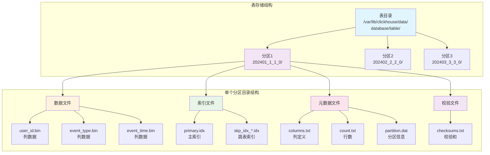

**数据部分（Part）命名规则**：
```
{PartitionID}_{MinBlockNum}_{MaxBlockNum}_{Level}

示例：202401_1_1_0
- 202401: 分区标识（按年月分区）
- 1: 最小块号
- 1: 最大块号 
- 0: 合并层级（0表示原始数据，数字越大表示合并层次越深）
```

**数据文件类型详解**：

| 文件类型 | 扩展名 | 作用 | 内容结构 | 文件样例 |
|----------|--------|------|----------|----------|
| **列数据文件** | `.bin` | 存储列的实际数据 | 压缩后的二进制数据块 | `user_id.bin`: 存储用户ID列的压缩数据<br/>`event_type.bin`: 存储事件类型字符串数据 |
| **标记文件** | `.mrk2` | 存储数据块的偏移位置 | 每个Granule的起始偏移量 | `user_id.mrk2`: 存储user_id列每8192行的偏移位置<br/>内容：`0, 4096, 8192, 12288...` |
| **主索引文件** | `.idx` | 主索引数据 | 稀疏索引项，每8192行一个 | `primary.idx`: 基于ORDER BY字段的稀疏索引<br/>内容：`('2024-01-01', 1001), ('2024-01-01', 9193), ...` |
| **跳表索引** | `.idx2/.idx3` | 二级索引数据 | 布隆过滤器、MinMax等 | `skp_idx_event_type.idx`: 布隆过滤器索引<br/>`skp_idx_user_id.idx2`: MinMax索引 存储每块的最小/最大值 |
| **分区文件** | `.dat` | 分区标识信息 | 分区值的二进制表示 | `partition.dat`: 存储分区标识符<br/>内容：`202401`（对应toYYYYMM(event_date)） |
| **列定义文件** | `columns.txt` | 存储表结构信息 | 列名、类型、编码信息 | `columns.txt`:<br/>`columns format version: 1`<br/>`5 columns:`<br/>`\`event_date\` Date`<br/>`\`user_id\` UInt32`<br/>`\`event_type\` String` |
| **行数文件** | `count.txt` | 记录数据行数 | 纯数字文本 | `count.txt`: `8192`（表示该Part包含8192行数据） |
| **校验文件** | `checksums.txt` | 数据完整性校验 | 所有文件的校验和 | `checksums.txt`:<br/>`user_id.bin\t1234567890abcdef1234567890abcdef`<br/>`user_id.mrk2\tfedcba0987654321fedcba0987654321`<br/>`primary.idx\t1111222233334444555566667777888` |
| **元数据文件** | `default_compression_codec.txt` | 压缩算法信息 | 表级默认压缩设置 | `default_compression_codec.txt`: `CODEC(LZ4)`或`CODEC(ZSTD(3))` |
| **版本文件** | `format_version.txt` | Part格式版本 | 数据部分的格式版本号 | `format_version.txt`: `1`（Wide格式）或`2`（Compact格式） |

**文件内容详细示例**：

**1. 列数据文件格式示例**
```bash
# user_id.bin - 用户ID列的压缩二进制数据
# 原始数据：[1001, 1002, 1003, 1004, ...]
# 压缩后的二进制格式（不可直接读取）

# event_type.bin - 事件类型列的压缩数据
# 原始数据：['click', 'view', 'purchase', 'click', ...]
# 使用字典编码压缩后存储

# event_time.bin - 时间戳数据
# 原始数据：[1704096000, 1704096060, 1704096120, ...]
# 使用Delta编码压缩（存储相邻值的差值）
```

**2. 标记文件格式示例**
```bash
# user_id.mrk2 - 用户ID列的标记文件
# 每一行对应一个Granule（8192行）的偏移位置
0          # 第1个Granule在.bin文件中的起始位置
4096       # 第2个Granule的起始位置
8192       # 第3个Granule的起始位置
12288      # 第4个Granule的起始位置
...

# 每个.mrk2文件实际包含两个偏移量：
# - 在.bin文件中的偏移量
# - 在解压缩数据中的行偏移量
```

**3. 主索引文件示例**
```bash
# primary.idx - 主索引文件
# 基于ORDER BY (event_date, user_id, event_time)
# 每8192行生成一个索引条目

# 索引条目1：第0行的键值
date: 2024-01-01, user_id: 1001, time: 2024-01-01 08:00:00

# 索引条目2：第8192行的键值  
date: 2024-01-01, user_id: 5000, time: 2024-01-01 12:00:00

# 索引条目3：第16384行的键值
date: 2024-01-01, user_id: 9000, time: 2024-01-01 16:00:00
```

**4. 跳表索引文件示例**
```bash
# skp_idx_event_type.idx - 布隆过滤器索引
# 每个数据块（Granule）对应一个布隆过滤器

# Granule 1的布隆过滤器：包含 'click', 'view'
# 位数组：[1,0,1,0,1,1,0,1,0,0,1,0,1,1,0,1]

# Granule 2的布隆过滤器：包含 'purchase', 'click'
# 位数组：[1,1,0,1,1,0,1,1,0,1,0,1,0,1,1,0]

# skp_idx_user_id.idx2 - MinMax索引
Granule 1: min=1001, max=1999
Granule 2: min=2000, max=2999  
Granule 3: min=3000, max=3999
```

**5. 元数据文件示例**
```bash
# columns.txt - 列定义文件
columns format version: 1
5 columns:
`event_date` Date
`event_time` DateTime  
`user_id` UInt32
`event_type` String
`event_data` String

# count.txt - 行数文件
8192

# partition.dat - 分区数据
# 二进制格式存储分区值：202401

# default_compression_codec.txt - 压缩算法
CODEC(LZ4)

# format_version.txt - 格式版本
1
```

**6. 校验文件示例**
```bash
# checksums.txt - 所有文件的校验和
user_id.bin	1234567890abcdef1234567890abcdef12345678
user_id.mrk2	fedcba0987654321fedcba0987654321fedcba09
event_type.bin	1111222233334444555566667777888899990000
event_type.mrk2	aaabbbbccccddddeeeeffffgggghhhhiiiijjjj
event_time.bin	9876543210fedcba9876543210fedcba98765432
event_time.mrk2	0000111122223333444455556666777788889999
event_data.bin	kkkklllllmmmmnnnnoooooppppqqqqrrrrsssstttt
event_data.mrk2	zzzzyyyyxxxxwwwwvvvvuuuuttttssssrrrrqqqq
primary.idx	ppppoooonnnnmmmmllllkkkkjjjjiiiihhhhgggg
partition.dat	ffffffffeeeeeeeedddddddcccccccbbbbbbba
columns.txt	1a2b3c4d5e6f7g8h9i0j1k2l3m4n5o6p7q8r9s0t
count.txt	abc123def456ghi789jkl012mno345pqr678stu9
default_compression_codec.txt	111aaa222bbb333ccc444ddd555eee666fff
format_version.txt	777ggg888hhh999iii000jjj111kkk222lll333
```

**文件读取和查看命令**：
```bash
# 查看文件列表
ls -la /var/lib/clickhouse/data/default/events/202401_1_1_0/

# 查看文本文件内容
cat /var/lib/clickhouse/data/default/events/202401_1_1_0/columns.txt
cat /var/lib/clickhouse/data/default/events/202401_1_1_0/count.txt

# 查看文件大小
du -h /var/lib/clickhouse/data/default/events/202401_1_1_0/*

# 使用hexdump查看二进制文件（仅前64字节）
hexdump -C /var/lib/clickhouse/data/default/events/202401_1_1_0/user_id.bin | head -n 5
```

### 数据插入过程详解

**完整的数据插入流程**：

```mermaid
flowchart TD
    subgraph MODULE1 [" 🔌 连接与验证模块"]
        A["客户端发送INSERT语句"] --> A1["TCP/HTTP连接建立"]
        A1 --> B["ClickHouse服务器接收"]
        B --> B1["权限验证"]
        B1 --> B2["SQL语法解析"]
        B2 --> B3["表结构验证"]
        B3 --> C["数据类型验证"]
        C --> C1{"数据格式是否正确?"}
        C1 -->|"否"| C2["返回错误信息"]
    end
    
    subgraph MODULE2 [" 📁 分区计算模块"]
        D["计算目标分区"]
        D --> D1["PARTITION BY表达式计算"]
        D1 --> D2["分区值: toYYYYMM(event_date)"]
        D2 --> D3["确定分区目录路径"]
    end
    
    subgraph MODULE3 [" 📊 缓冲管理模块"]
        E["数据写入内存缓冲区"]
        E --> E1["检查缓冲区配置"]
        E1 --> E2["max_insert_block_size检查"]
        E2 --> E3["数据累积等待"]
        E3 --> F{"缓冲区是否达到阈值?"}
        F -->|"否"| F1["继续等待更多数据"]
        F1 --> E3
    end
    
    subgraph MODULE4 [" 📦 Part创建模块"]
        G["开始创建新的Part"]
        G --> G1["生成Part名称"]
        G1 --> G2["202401_N_N_0格式"]
        G2 --> G3["创建临时Part目录"]
    end
    
    subgraph MODULE5 [" 🔄 数据处理模块"]
        H["数据排序处理"]
        H --> H1["按ORDER BY字段排序"]
        H1 --> H2["(event_date, user_id, event_time)"]
        H2 --> H3["内存中排序完成"]
        
        H3 --> I["列式存储分离"]
        I --> I1["按列分组数据"]
        I1 --> I2["user_id列: [1001,1002,...]"]
        I1 --> I3["event_type列: ['click','view',...]"]
        I1 --> I4["event_time列: [timestamp1,...]"]
        
        I2 --> J["数据压缩处理"]
        I3 --> J
        I4 --> J
        
        J --> J1["选择压缩算法"]
        J1 --> J2["LZ4/ZSTD/Delta编码"]
        J2 --> J3["按列独立压缩"]
        J3 --> J4["压缩率: 5-10倍"]
    end
    
    subgraph MODULE6 [" 💾 文件生成模块"]
        K["生成数据文件"]
        K --> K1["写入.bin文件"]
        K1 --> K11["user_id.bin"]
        K1 --> K12["event_type.bin"]
        K1 --> K13["event_time.bin"]
        
        K11 --> L["生成标记文件"]
        K12 --> L
        K13 --> L
        
        L --> L1["计算Granule偏移"]
        L1 --> L2["每8192行一个标记"]
        L2 --> L3["写入.mrk2文件"]
        L3 --> L31["user_id.mrk2"]
        L3 --> L32["event_type.mrk2"]
    end
    
    subgraph MODULE7 [" 🔍 索引构建模块"]
        M["构建主索引"]
        M --> M1["稀疏索引生成"]
        M1 --> M2["每8192行一个索引项"]
        M2 --> M3["基于ORDER BY字段"]
        M3 --> M4["写入primary.idx"]
        
        M4 --> N["构建跳表索引"]
        N --> N1["布隆过滤器索引"]
        N1 --> N11["event_type字段"]
        N1 --> N12["写入.idx文件"]
        
        N --> N2["MinMax索引"]
        N2 --> N21["user_id字段"]
        N2 --> N22["写入.idx2文件"]
        
        N --> N3["Set索引(如果配置)"]
        N3 --> N31["高基数字段"]
        N3 --> N32["写入.idx3文件"]
    end
    
    subgraph MODULE8 [" 📋 元数据模块"]
        O["生成元数据文件"]
        O --> O1["写入columns.txt"]
        O1 --> O11["列名和类型信息"]
        O1 --> O12["编码信息"]
        
        O --> O2["写入count.txt"]
        O2 --> O21["记录总行数"]
        
        O --> O3["写入partition.dat"]
        O3 --> O31["分区标识值"]
        
        O --> O4["写入format_version.txt"]
        O4 --> O41["Part格式版本"]
        
        O --> O5["写入compression_codec.txt"]
        O5 --> O51["压缩算法信息"]
    end
    
    subgraph MODULE9 [" 🚀 提交与发布模块"]
        P["计算文件校验和"]
        P --> P1["遍历所有文件"]
        P1 --> P2["计算MD5/SHA256"]
        P2 --> P3["写入checksums.txt"]
        
        P3 --> Q["原子性提交"]
        Q --> Q1["临时目录重命名"]
        Q1 --> Q2["从tmp_开头重命名"]
        Q2 --> Q3["移除tmp_前缀"]
        Q3 --> Q4["Part正式可见"]
        
        Q4 --> R["更新元数据"]
        R --> R1["更新parts.json"]
        R1 --> R2["更新分区信息"]
        R2 --> R3["刷新系统表"]
    end
    
    subgraph MODULE10 [" 🔧 后台维护模块"]
        S["触发后台合并"]
        S --> S1["检查合并条件"]
        S1 --> S2["Part数量阈值"]
        S2 --> S3["Part大小阈值"]
        S3 --> S4["启动合并任务"]
        
        S4 --> T["TTL处理"]
        T --> T1["检查TTL配置"]
        T1 --> T2["标记过期数据"]
        T2 --> T3["清理过期Part"]
        
        T3 --> U["统计信息更新"]
        U --> U1["更新表统计"]
        U1 --> U2["更新分区统计"]
        U2 --> U3["更新系统监控"]
    end
    
    subgraph MODULE11 [" ⚠️ 错误处理模块"]
        V["异常情况处理"]
        V --> V1["磁盘空间不足"]
        V1 --> V11["暂停写入"]
        V1 --> V12["触发告警"]
        
        V --> V2["写入失败"]
        V2 --> V21["清理临时文件"]
        V2 --> V22["回滚事务"]
        V2 --> V23["返回错误"]
        
        V --> V3["并发冲突"]
        V3 --> V31["重试机制"]
        V3 --> V32["锁等待"]
        V3 --> V33["超时处理"]
    end
    
    %% 模块间的连接关系
    C1 -->|"是"| D
    F -->|"是"| G
    F1 --> F
    
    D3 --> E
    G3 --> H
    J4 --> K
    L32 --> M
    N32 --> O
    O51 --> P
    R3 --> S
    U3 --> W["数据插入完成"]
    
    %% 错误处理连接
    C1 -.->|"错误"| V2
    G -.->|"磁盘满"| V1
    P -.->|"校验失败"| V2
    Q -.->|"冲突"| V3
    
    %% 模块样式设置 - 使用不同的背景色
    style MODULE1 fill:#E3F2FD,stroke:#1976D2,stroke-width:2px
    style MODULE2 fill:#F3E5F5,stroke:#7B1FA2,stroke-width:2px
    style MODULE3 fill:#FFF3E0,stroke:#F57C00,stroke-width:2px
    style MODULE4 fill:#E8F5E8,stroke:#388E3C,stroke-width:2px
    style MODULE5 fill:#FCE4EC,stroke:#C2185B,stroke-width:2px
    style MODULE6 fill:#E0F2F1,stroke:#00695C,stroke-width:2px
    style MODULE7 fill:#FFF8E1,stroke:#F9A825,stroke-width:2px
    style MODULE8 fill:#E0F7FA,stroke:#0097A7,stroke-width:2px
    style MODULE9 fill:#E8EAF6,stroke:#3F51B5,stroke-width:2px
    style MODULE10 fill:#F1F8E9,stroke:#689F38,stroke-width:2px
    style MODULE11 fill:#FFEBEE,stroke:#D32F2F,stroke-width:2px
    
    %% 模块间连接
    C1 -->|"是"| D
    D3 --> E
    F -->|"是"| G
    G3 --> H
    J4 --> K
    L31 --> NEXT["...继续到索引构建"]
    
    %% 模块背景色定义
    classDef module1 fill:#e3f2fd,stroke:#1976d2,stroke-width:2px
    classDef module2 fill:#f3e5f5,stroke:#7b1fa2,stroke-width:2px
    classDef module3 fill:#fff3e0,stroke:#f57c00,stroke-width:2px
    classDef module4 fill:#e8f5e8,stroke:#388e3c,stroke-width:2px
    classDef module5 fill:#fce4ec,stroke:#c2185b,stroke-width:2px
    classDef module6 fill:#f1f8e9,stroke:#689f38,stroke-width:2px
    
    %% 应用样式到模块
    class MODULE1 module1
    class MODULE2 module2
    class MODULE3 module3
    class MODULE4 module4
    class MODULE5 module5
    class MODULE6 module6
```

**关键决策点详解**：

**1. 数据验证关键点**
```sql
-- 关键点1: 数据类型验证
-- ClickHouse会严格检查每个字段的数据类型
INSERT INTO events VALUES 
    ('2024-01-15', '2024-01-15 14:30:00', 'invalid_user_id', 'click', '{}');
    -- ❌ user_id字段期望UInt32，但提供了字符串
    
INSERT INTO events VALUES 
    ('2024-01-15', '2024-01-15 14:30:00', 12345, 'click', '{}');
    -- ✅ 数据类型正确
```

**2. 分区计算关键点**
```sql
-- 关键点2: 分区值计算
-- PARTITION BY toYYYYMM(event_date)
SELECT toYYYYMM(toDate('2024-01-15')) AS partition_value; -- 结果: 202401
SELECT toYYYYMM(toDate('2024-02-01')) AS partition_value; -- 结果: 202402

-- 查看数据会写入哪个分区
SELECT 
    toYYYYMM(event_date) AS target_partition,
    count() AS record_count
FROM (
    SELECT toDate('2024-01-15') AS event_date
) GROUP BY target_partition;
```

**3. 缓冲区管理关键点**
```sql
-- 关键点3: 缓冲区配置检查
SHOW SETTINGS LIKE '%insert%';

-- 关键配置参数
SET max_insert_block_size = 1048576;        -- 104万行触发写入
SET min_insert_block_size_rows = 1048576;   -- 最小块大小
SET min_insert_block_size_bytes = 268435456; -- 最小块字节数(256MB)
SET max_insert_threads = 4;                 -- 并行插入线程数

-- 监控当前缓冲区状态
SELECT 
    database,
    table,
    bytes,
    rows,
    format
FROM system.query_log 
WHERE query_kind = 'Insert' 
AND event_time >= now() - INTERVAL 1 HOUR
ORDER BY event_time DESC LIMIT 5;
```

**4. Part命名关键点**
```sql
-- 关键点4: Part命名规则
-- 格式: {PartitionID}_{MinBlockNum}_{MaxBlockNum}_{Level}
-- 示例: 202401_5_5_0

-- 查看Part命名和合并层级
SELECT 
    partition,
    name,
    level,  -- 0=原始数据, 数字越大合并层次越深
    rows,
    formatReadableSize(data_compressed_bytes) AS size
FROM system.parts
WHERE database = 'default' AND table = 'events'
ORDER BY partition, level, name;
```

**5. 压缩算法选择关键点**
```sql
-- 关键点5: 压缩算法决策
SHOW CREATE TABLE events;  -- 查看表的压缩配置

-- 不同列可以使用不同压缩算法
ALTER TABLE events 
MODIFY COLUMN user_id CODEC(Delta, LZ4),      -- 数值列: Delta + LZ4
MODIFY COLUMN event_type CODEC(LowCardinality, ZSTD(3)),  -- 字符串: 字典 + ZSTD
MODIFY COLUMN event_time CODEC(Delta, LZ4),   -- 时间戳: Delta压缩
MODIFY COLUMN event_data CODEC(ZSTD(1));      -- JSON数据: ZSTD压缩

-- 查看压缩效果
SELECT 
    column,
    type,
    formatReadableSize(column_data_compressed_bytes) AS compressed,
    formatReadableSize(column_data_uncompressed_bytes) AS uncompressed,
    round(column_data_uncompressed_bytes / column_data_compressed_bytes, 2) AS ratio
FROM system.parts_columns
WHERE database = 'default' AND table = 'events'
AND name = '202401_1_1_0';
```

**6. 索引构建关键点**
```sql
-- 关键点6: 索引构建过程
-- 主索引构建
SELECT 
    name,
    marks,  -- 索引条目数量
    formatReadableSize(primary_key_bytes_in_memory) AS pk_memory,
    rows
FROM system.parts
WHERE database = 'default' AND table = 'events';

-- 跳表索引构建检查
SELECT 
    table,
    name AS index_name,
    type,
    expression,
    granularity
FROM system.data_skipping_indices
WHERE database = 'default' AND table = 'events';
```

**7. 原子性提交关键点**
```bash
# 关键点7: 原子性提交过程
# 可以通过inotify监控目录重命名过程
inotifywait -m -r -e moved_to /var/lib/clickhouse/data/default/events/

# 输出示例:
# /var/lib/clickhouse/data/default/events/ MOVED_TO tmp_202401_6_6_0 -> 202401_6_6_0
# 表示临时目录重命名为正式Part目录，此时数据提交完成
```

**8. 合并调度关键点**
```sql
-- 关键点8: 合并调度决策
-- 查看当前合并状态
SELECT 
    database,
    table,
    command,
    num_parts,           -- 参与合并的Part数量
    result_part_name,    -- 合并后的Part名称
    total_size_bytes_compressed,
    progress,
    elapsed
FROM system.merges
WHERE table = 'events'
ORDER BY elapsed DESC;

-- 手动触发合并
OPTIMIZE TABLE events PARTITION '202401' FINAL;

-- 查看合并设置
SELECT 
    name,
    value
FROM system.merge_tree_settings
WHERE name LIKE '%merge%'
ORDER BY name;
```

**具体文件生成过程**：

当插入一条数据时，会在文件系统中生成以下文件：

```bash
# 在ClickHouse数据目录中的文件结构
/var/lib/clickhouse/data/default/events/202401_5_5_0/
├── user_id.bin          # 用户ID列的压缩数据
├── user_id.mrk2         # 用户ID列的标记文件
├── event_type.bin       # 事件类型列的压缩数据
├── event_type.mrk2      # 事件类型列的标记文件
├── event_time.bin       # 事件时间列的压缩数据
├── event_time.mrk2      # 事件时间列的标记文件
├── event_data.bin       # 事件数据列的压缩数据
├── event_data.mrk2      # 事件数据列的标记文件
├── primary.idx          # 主索引文件
├── partition.dat        # 分区标识符
├── count.txt            # 行数信息
├── columns.txt          # 列定义信息
└── checksums.txt        # 所有文件的校验和
```

**插入操作示例和文件变化**：

```sql
-- 示例：插入一条用户事件数据
INSERT INTO events (
    event_date, event_time, user_id, event_type, event_data
) VALUES (
    '2024-01-15', '2024-01-15 14:30:00', 12345, 'click', '{"page": "home"}'
);

-- 监控数据部分变化
SELECT 
    database, table, partition, name,
    formatReadableSize(bytes_on_disk) as size_on_disk,
    rows, level, modification_time
FROM system.parts
WHERE database = 'default' AND table = 'events'
ORDER BY modification_time DESC LIMIT 5;

-- 查看具体文件列表
SELECT 
    name, column, type,
    formatReadableSize(column_data_compressed_bytes) as compressed_size,
    formatReadableSize(column_data_uncompressed_bytes) as uncompressed_size,
    rows
FROM system.parts_columns
WHERE database = 'default' AND table = 'events'
AND name LIKE '202401_%' 
ORDER BY column_position;
```

**文件变化监控**：

```bash
# 使用inotify监控文件变化
# 当插入数据时，会看到以下文件创建顺序：

1. 创建新的Part目录
   CREATE,ISDIR 202401_5_5_0

2. 生成列数据文件
   CREATE user_id.bin
   CREATE event_type.bin  
   CREATE event_time.bin
   CREATE event_data.bin

3. 生成标记文件
   CREATE user_id.mrk2
   CREATE event_type.mrk2
   CREATE event_time.mrk2
   CREATE event_data.mrk2

4. 生成索引文件
   CREATE primary.idx
   CREATE partition.dat

5. 生成元数据文件
   CREATE columns.txt
   CREATE count.txt
   CREATE checksums.txt  # 最后创建，表示数据写入完成
```


## ClickHouse 查询优化

### 查询执行原理

**查询执行流程**：


**查询优化策略**：

| 优化策略 | 说明 | 实现方式 |
|---------|------|----------|
| **分区裁剪** | 只读取相关分区 | 根据WHERE条件过滤分区 |
| **索引跳表** | 利用稀疏索引快速定位 | 基于ORDER BY字段的索引 |
| **列裁剪** | 只读取需要的列 | SELECT字段优化 |
| **谓词下推** | 在数据源处过滤 | 将过滤条件下推到存储层 |
| **向量化执行** | 批量处理数据 | 利用SIMD指令优化 |

### 索引优化

#### 索引创建和优化

**ClickHouse索引创建流程图**：

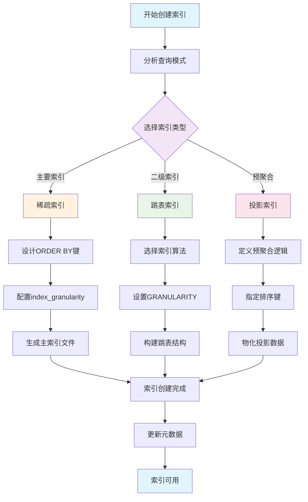

**索引使用流程**


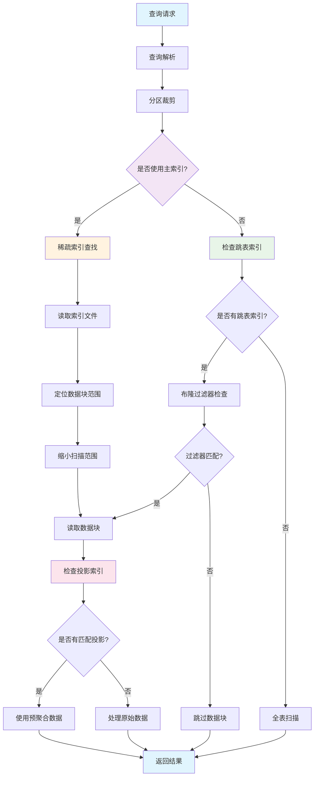

**索引工作原理详解**

**1. 稀疏索引工作机制**：

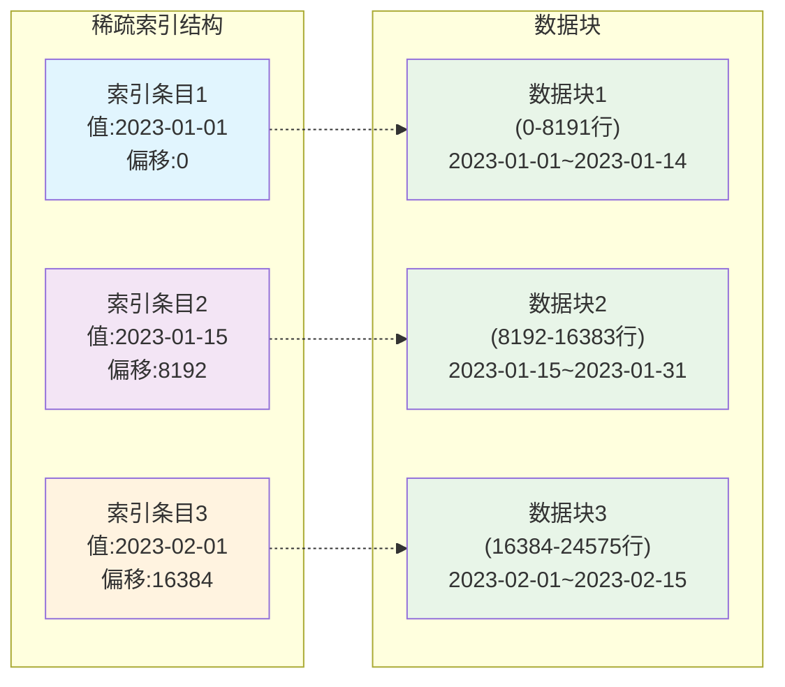

**稀疏索引原理**：
```sql
-- 索引粒度设置
CREATE TABLE events (
    event_date Date,
    event_time DateTime,
    user_id UInt32,
    event_type String
) ENGINE = MergeTree()
PARTITION BY toYYYYMM(event_date)
ORDER BY (event_date, event_time, user_id)
SETTINGS index_granularity = 8192; -- 每8192行一个索引条目
```

**2. 跳表索引工作机制**：

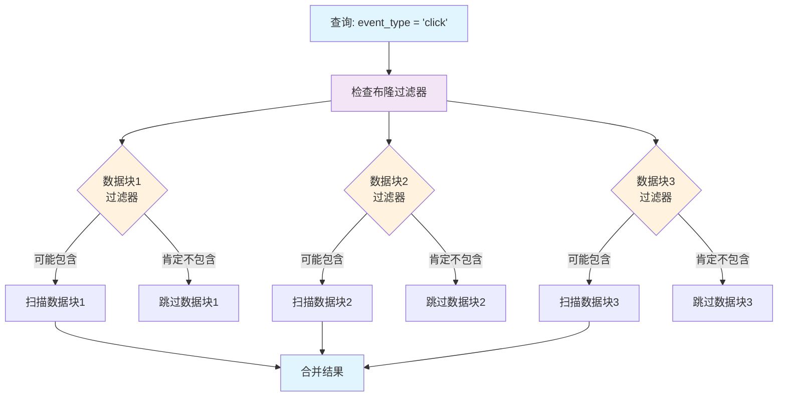

#### 布隆过滤器原理详解

**什么是布隆过滤器**：
布隆过滤器是一种**概率型数据结构**，用于快速判断一个元素是否**可能存在**于集合中。它的核心特点是：
- **无误报（False Negative）**：如果过滤器说元素不存在，那么该元素**一定不存在**
- **有误报（False Positive）**：如果过滤器说元素存在，那么该元素**可能存在**
- **空间效率高**：使用位数组存储，空间占用极小
- **查询速度快**：时间复杂度为 O(k)，k为哈希函数个数

**布隆过滤器工作原理**：

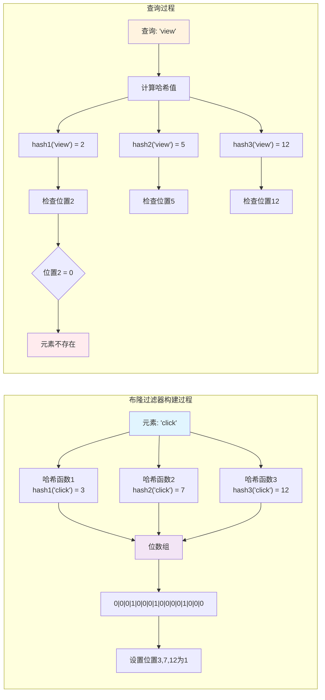

**布隆过滤器关键参数**：

| 参数 | 说明 | 影响 | 推荐值 |
|------|------|------|--------|
| **m（位数组大小）** | 位数组的长度 | 越大误报率越低，内存占用越多 | 根据元素数量动态调整 |
| **k（哈希函数个数）** | 使用的哈希函数数量 | 过多或过少都会影响性能 | **k = (m/n) * ln(2)** |
| **n（元素个数）** | 预期插入的元素数量 | 影响位数组大小设计 | 根据数据块大小估算 |
| **p（误报率）** | False Positive 概率 | 越低需要越大的位数组 | 0.01-0.1（1%-10%） |

**误报率计算公式**：
```
p = (1 - e^(-kn/m))^k

其中：
- p: 误报率
- k: 哈希函数个数
- n: 已插入元素个数
- m: 位数组大小
- e: 自然常数
```

**ClickHouse中的布隆过滤器实现**

**1. 布隆过滤器索引创建**：
```sql
-- 基础布隆过滤器索引
ALTER TABLE events ADD INDEX idx_event_type event_type TYPE bloom_filter GRANULARITY 1;

-- 带参数的布隆过滤器（指定误报率）
ALTER TABLE events ADD INDEX idx_user_id user_id TYPE bloom_filter(0.01) GRANULARITY 1;

-- 多字段布隆过滤器
ALTER TABLE events ADD INDEX idx_user_event user_id, event_type TYPE bloom_filter GRANULARITY 2;

-- 查看索引创建进度
SELECT 
    table,
    name,
    type,
    granularity
FROM system.data_skipping_indices
WHERE table = 'events';
```

**2. 布隆过滤器参数配置**：
```sql
-- 创建表时指定布隆过滤器参数
CREATE TABLE events_optimized (
    event_date Date,
    user_id UInt32,
    event_type LowCardinality(String),  -- 使用LowCardinality优化
    session_id String,
    event_data String
) ENGINE = MergeTree()
PARTITION BY toYYYYMM(event_date)
ORDER BY (event_date, user_id)
SETTINGS 
    index_granularity = 8192,
    -- 布隆过滤器相关设置
    bloom_filter_false_positive_rate = 0.01,  -- 1%误报率
    max_bloom_filter_size = 1048576;           -- 最大1MB

-- 添加多个布隆过滤器索引
ALTER TABLE events_optimized ADD INDEX idx_event_type event_type TYPE bloom_filter(0.005) GRANULARITY 1;
ALTER TABLE events_optimized ADD INDEX idx_session session_id TYPE bloom_filter(0.01) GRANULARITY 2;
ALTER TABLE events_optimized ADD INDEX idx_combined user_id, event_type TYPE bloom_filter(0.02) GRANULARITY 1;
```

**3. 布隆过滤器使用场景**：

```sql
-- ✅ 适合使用布隆过滤器的查询
-- 1. 等值查询
SELECT * FROM events WHERE event_type = 'click';  -- 布隆过滤器生效
SELECT * FROM events WHERE user_id = 12345;       -- 布隆过滤器生效

-- 2. IN查询
SELECT * FROM events WHERE event_type IN ('click', 'view');  -- 布隆过滤器生效
SELECT * FROM events WHERE user_id IN (123, 456, 789);       -- 布隆过滤器生效

-- 3. 多字段组合查询
SELECT * FROM events WHERE user_id = 123 AND event_type = 'click';  -- 复合布隆过滤器生效

-- ❌ 不适合使用布隆过滤器的查询
-- 1. 范围查询
SELECT * FROM events WHERE user_id > 1000;        -- 布隆过滤器无效
SELECT * FROM events WHERE user_id BETWEEN 100 AND 200;  -- 布隆过滤器无效

-- 2. 模糊查询
SELECT * FROM events WHERE event_type LIKE 'cli%'; -- 布隆过滤器无效

-- 3. 函数查询
SELECT * FROM events WHERE lower(event_type) = 'click';  -- 布隆过滤器无效
```

**4. 布隆过滤器性能监控**：
```sql
-- 查看索引使用统计
SELECT 
    table,
    name,
    type,
    granularity,
    expression
FROM system.data_skipping_indices
WHERE database = 'default' AND table = 'events';

-- 监控查询是否使用了跳表索引
SELECT 
    query,
    query_duration_ms,
    read_rows,
    read_bytes,
    result_rows
FROM system.query_log
WHERE 
    event_time >= now() - INTERVAL 1 HOUR
    AND query LIKE '%events%'
    AND query LIKE '%event_type%'
ORDER BY event_time DESC
LIMIT 10;

-- 分析跳过的数据块数量
SELECT 
    formatReadableQuantity(sum(marks)) as total_marks,
    formatReadableQuantity(sum(marks_read)) as marks_read,
    round(100 * sum(marks_read) / sum(marks), 2) as read_percentage
FROM system.query_log
WHERE 
    event_time >= now() - INTERVAL 1 HOUR
    AND type = 'QueryFinish'
    AND query LIKE '%events%';
```

**布隆过滤器优化策略**

**1. 误报率调优**：
```sql
-- 根据数据特征调整误报率
-- 高基数字段（如用户ID）：使用较低误报率
ALTER TABLE events ADD INDEX idx_user_id user_id TYPE bloom_filter(0.001) GRANULARITY 1;

-- 低基数字段（如状态）：可以使用较高误报率
ALTER TABLE events ADD INDEX idx_status status TYPE bloom_filter(0.05) GRANULARITY 1;

-- 超高基数字段（如UUID）：需要极低误报率
ALTER TABLE events ADD INDEX idx_session session_id TYPE bloom_filter(0.0001) GRANULARITY 1;
```

**2. GRANULARITY参数优化**：
```sql
-- GRANULARITY = 1：每个数据块都有独立的布隆过滤器（精度最高，开销最大）
ALTER TABLE events ADD INDEX idx_precise event_type TYPE bloom_filter GRANULARITY 1;

-- GRANULARITY = 2：每2个数据块共用一个布隆过滤器（平衡精度和开销）
ALTER TABLE events ADD INDEX idx_balanced event_type TYPE bloom_filter GRANULARITY 2;

-- GRANULARITY = 4：每4个数据块共用一个布隆过滤器（开销最小，精度较低）
ALTER TABLE events ADD INDEX idx_efficient event_type TYPE bloom_filter GRANULARITY 4;
```

**3. 组合索引策略**：
```sql
-- 为常见查询组合创建复合布隆过滤器
ALTER TABLE events ADD INDEX idx_user_type_date 
    user_id, event_type, toDate(event_time) 
    TYPE bloom_filter(0.01) GRANULARITY 1;

-- 避免创建过多单字段索引，合并为复合索引
-- ❌ 不推荐：多个单字段索引
-- ALTER TABLE events ADD INDEX idx_user user_id TYPE bloom_filter;
-- ALTER TABLE events ADD INDEX idx_type event_type TYPE bloom_filter;
-- ALTER TABLE events ADD INDEX idx_date event_date TYPE bloom_filter;

-- ✅ 推荐：一个复合索引
ALTER TABLE events ADD INDEX idx_main_query 
    user_id, event_type, event_date 
    TYPE bloom_filter(0.01) GRANULARITY 1;
```

**4. 布隆过滤器维护**：
```sql
-- 删除无效的布隆过滤器索引
ALTER TABLE events DROP INDEX idx_unused_index;

-- 重建布隆过滤器索引（数据特征发生变化时）
ALTER TABLE events DROP INDEX idx_event_type;
ALTER TABLE events ADD INDEX idx_event_type event_type TYPE bloom_filter(0.005) GRANULARITY 1;

-- 物化跳表索引（确保所有数据块都有索引）
ALTER TABLE events MATERIALIZE INDEX idx_event_type;

-- 检查索引构建状态
SELECT 
    name,
    type,
    status
FROM system.mutations
WHERE table = 'events'
ORDER BY create_time DESC;
```

**索引优化技巧**：
```sql
-- 1. 合理设计ORDER BY
-- 好的设计：查询条件字段在前
ORDER BY (user_id, event_date, event_time)

-- 2. 使用跳表索引
ALTER TABLE events ADD INDEX idx_event_type event_type TYPE bloom_filter GRANULARITY 1;

-- 3. 投影索引
ALTER TABLE events ADD PROJECTION proj_user_events (
    SELECT user_id, event_date, event_type
    ORDER BY user_id, event_date
);
```

**3. 投影索引工作机制**：

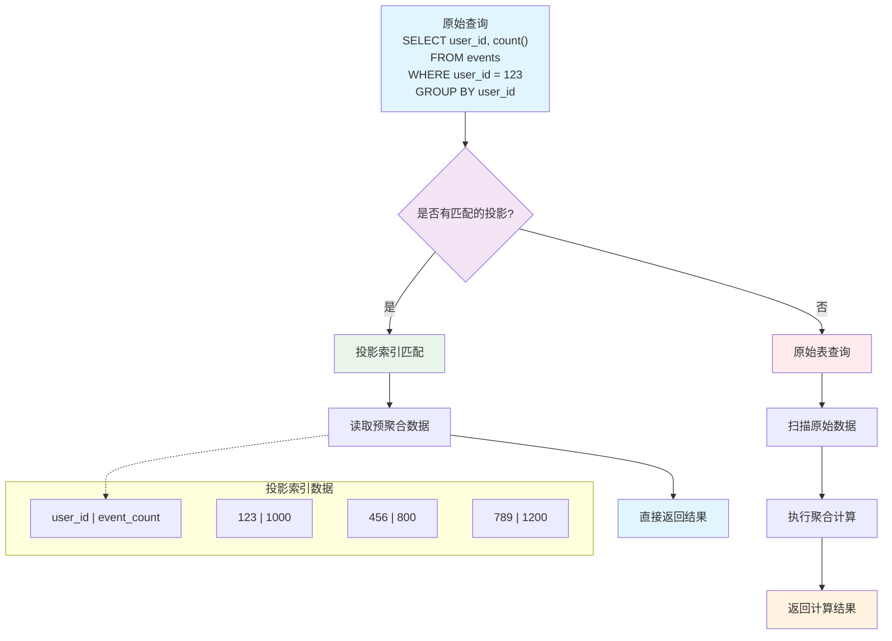

#### 索引性能对比

**不同索引类型的性能特征**：

| 索引类型 | 查询性能 | 存储开销 | 维护成本 | 适用场景 |
|----------|----------|----------|----------|----------|
| **稀疏索引** | ★★★★☆ | ★★★★★ | ★★★★★ | **范围查询、排序** |
| **布隆过滤器** | ★★★☆☆ | ★★★★☆ | ★★★☆☆ | **等值过滤** |
| **MinMax索引** | ★★☆☆☆ | ★★★★★ | ★★★★☆ | **数值范围过滤** |
| **投影索引** | ★★★★★ | ★★☆☆☆ | ★★☆☆☆ | **特定聚合查询** |

**索引选择决策流程**：

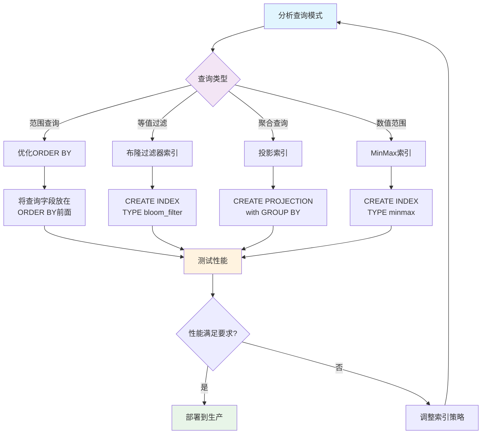

### 分区优化

**分区策略**：
```sql
-- 按时间分区（推荐）
PARTITION BY toYYYYMM(event_date)

-- 按用户ID分区
PARTITION BY intHash32(user_id) % 100

-- 复合分区
PARTITION BY (toYYYYMM(event_date), event_type)
```

**分区管理**：
```sql
-- 查看分区信息
SELECT 
    partition,
    name,
    rows,
    formatReadableSize(data_uncompressed_bytes) AS uncompressed_size,
    formatReadableSize(data_compressed_bytes) AS compressed_size
FROM system.parts
WHERE table = 'events'
ORDER BY partition;

-- 删除过期分区
ALTER TABLE events DROP PARTITION '2023-01';

-- 移动分区
ALTER TABLE events MOVE PARTITION '2023-01' TO TABLE events_archive;
```

### 压缩优化

**压缩算法选择**：
```sql
-- 设置压缩算法
CREATE TABLE events (
    event_date Date,
    event_data String
) ENGINE = MergeTree()
PARTITION BY toYYYYMM(event_date)
ORDER BY event_date
SETTINGS 
    compression_codec = 'ZSTD(3)', -- 压缩算法和级别
    min_bytes_for_wide_part = 0,
    min_rows_for_wide_part = 0;
```

**压缩算法对比**：

| 算法 | 压缩比 | 压缩速度 | 解压速度 | 适用场景 |
|------|--------|----------|----------|----------|
| **LZ4** | 2-3x | 很快 | 很快 | 实时写入 |
| **ZSTD** | 3-5x | 快 | 快 | 平衡场景 |
| **LZMA** | 5-8x | 慢 | 慢 | 冷数据存储 |

### 内存优化

**内存设置**：
```sql
-- 查询内存限制
SET max_memory_usage = 10737418240; -- 10GB
SET max_memory_usage_for_user = 21474836480; -- 20GB

-- 临时表内存限制
SET max_bytes_before_external_group_by = 1073741824; -- 1GB
SET max_bytes_before_external_sort = 1073741824; -- 1GB
```

**内存优化技巧**：
```sql
-- 1. 使用LIMIT限制结果集
SELECT * FROM events WHERE event_date = '2023-01-01' LIMIT 1000;

-- 2. 使用采样查询
SELECT * FROM events SAMPLE 0.1 WHERE event_date = '2023-01-01';

-- 3. 使用预聚合
SELECT 
    user_id,
    count() AS event_count,
    uniq(event_type) AS event_types
FROM events
WHERE event_date = '2023-01-01'
GROUP BY user_id;
```

## ClickHouse 集群管理

### 集群架构

**集群组件**：


**集群配置**：
```xml
<!-- config.xml -->
<clickhouse>
    <remote_servers>
        <cluster_name>
            <shard>
                <replica>
                    <host>node1</host>
                    <port>9000</port>
                </replica>
                <replica>
                    <host>node2</host>
                    <port>9000</port>
                </replica>
            </shard>
            <shard>
                <replica>
                    <host>node3</host>
                    <port>9000</port>
                </replica>
            </shard>
        </cluster_name>
    </remote_servers>
</clickhouse>
```

### 分片策略

**分片类型**：

| 分片策略 | 说明 | 适用场景 |
|---------|------|----------|
| **随机分片** | 数据随机分布到分片 | 数据均匀分布 |
| **哈希分片** | 按字段哈希值分片 | 按用户ID分片 |
| **范围分片** | 按字段范围分片 | 按时间分片 |

**分片配置**：
```sql
-- 创建分布式表
CREATE TABLE events_distributed AS events
ENGINE = Distributed(cluster_name, database, events, user_id);

-- 插入数据（自动路由到对应分片）
INSERT INTO events_distributed SELECT * FROM events_local;
```

### 复制机制

**复制配置**：
```sql
-- 创建复制表
CREATE TABLE events_replicated (
    event_date Date,
    user_id UInt32,
    event_type String
) ENGINE = ReplicatedMergeTree('/clickhouse/tables/events', 'replica1')
PARTITION BY toYYYYMM(event_date)
ORDER BY (event_date, user_id);
```

**复制特性**：
- **异步复制**：写入主副本，异步同步到其他副本
- **故障转移**：主副本故障时自动切换到其他副本
- **数据一致性**：通过ZooKeeper保证元数据一致性

### 负载均衡

**负载均衡策略**：
```sql
-- 1. 轮询负载均衡
SELECT * FROM events_distributed;

-- 2. 随机负载均衡
SELECT * FROM events_distributed SETTINGS load_balancing = 'random';

-- 3. 就近负载均衡
SELECT * FROM events_distributed SETTINGS load_balancing = 'nearest_hostname';
```

## ClickHouse 运维实践

### 备份恢复

**备份策略**：
```bash
# 1. 数据备份
clickhouse-client --query "BACKUP TABLE database.table TO '/backup/path'"

# 2. 配置文件备份
cp /etc/clickhouse-server/config.xml /backup/
cp /etc/clickhouse-server/users.xml /backup/

# 3. 元数据备份
clickhouse-client --query "SHOW CREATE TABLE database.table" > /backup/schema.sql
```

**恢复操作**：
```bash
# 1. 恢复数据
clickhouse-client --query "RESTORE TABLE database.table FROM '/backup/path'"

# 2. 恢复表结构
clickhouse-client --query "$(cat /backup/schema.sql)"
```

### 数据迁移

**数据迁移方法**：
```sql
-- 1. 使用INSERT SELECT
INSERT INTO target_table SELECT * FROM source_table;

-- 2. 使用物化视图
CREATE MATERIALIZED VIEW target_table
ENGINE = MergeTree()
PARTITION BY toYYYYMM(event_date)
ORDER BY event_date
AS SELECT * FROM source_table;

-- 3. 使用外部表
CREATE TABLE external_table (
    id UInt32,
    data String
) ENGINE = HDFS('hdfs://path/to/data', 'Parquet');
```

### 性能调优

**系统参数调优**：
```xml
<!-- config.xml -->
<clickhouse>
    <max_concurrent_queries>100</max_concurrent_queries>
    <max_memory_usage>8589934592</max_memory_usage>
    <max_memory_usage_for_user>17179869184</max_memory_usage_for_user>
    <max_memory_usage_for_all_queries>34359738368</max_memory_usage_for_all_queries>
    
    <merge_tree>
        <parts_to_delay_insert>150</parts_to_delay_insert>
        <parts_to_throw_insert>300</parts_to_throw_insert>
        <max_bytes_to_merge_at_max_space_in_pool>2000000000000</max_bytes_to_merge_at_max_space_in_pool>
    </merge_tree>
</clickhouse>
```

### 故障排查

**常见问题排查**：
```sql
-- 1. 查看系统状态
SELECT * FROM system.metrics WHERE metric LIKE 'Memory.%';
SELECT * FROM system.processes;

-- 2. 查看查询日志
SELECT 
    event_time,
    query_duration_ms,
    read_rows,
    result_rows,
    memory_usage
FROM system.query_log
WHERE event_time >= now() - INTERVAL 1 HOUR
ORDER BY query_duration_ms DESC
LIMIT 10;

-- 3. 查看错误日志
SELECT 
    event_time,
    message
FROM system.text_log
WHERE level >= 'Error'
ORDER BY event_time DESC
LIMIT 20;
```

## ClickHouse 典型面试题与答疑

### 基础概念面试题

**1. ClickHouse是什么？有什么特点？**

**答案**：ClickHouse是由Yandex开发的开源列式数据库管理系统，专门用于OLAP场景。

**核心特点**：
- **列式存储**：数据按列存储，提高压缩率和查询性能
- **向量化执行**：批量处理数据，利用SIMD指令优化
- **高压缩比**：数据压缩率可达10:1以上
- **实时查询**：支持实时数据插入和查询
- **水平扩展**：支持集群部署和分片

**2. ClickHouse的存储引擎有哪些？如何选择？**

**答案**：ClickHouse有多种存储引擎，主要包括：

- **MergeTree系列**：最核心的引擎，支持分区、索引、压缩
- **Log系列**：适用于小表、临时表
- **集成引擎**：用于连接外部数据源

**选择策略**：
- 大数据分析：MergeTree
- 实时写入：MergeTree
- 数据去重：ReplacingMergeTree
- 临时数据：Log系列
- 外部数据：集成引擎

**3. ClickHouse的数据类型有哪些？**

**答案**：ClickHouse支持丰富的数据类型：

**基础类型**：
- 整数：Int8, Int16, Int32, Int64, UInt8, UInt16, UInt32, UInt64
- 浮点：Float32, Float64
- 字符串：String, FixedString(N)
- 日期时间：Date, DateTime, DateTime64

**复合类型**：
- 数组：Array(T)
- 元组：Tuple(T1, T2, ...)
- Map：Map(KeyType, ValueType)

**特殊类型**：
- Nullable(T)：可空类型
- LowCardinality(T)：低基数类型
- Decimal(P, S)：高精度小数

### 架构设计面试题

**4. ClickHouse的架构是怎样的？**

**答案**：ClickHouse采用分布式架构，主要组件包括：

**核心组件**：
- **查询解析器**：解析SQL语句，生成语法树
- **查询优化器**：优化查询计划，选择最佳执行路径
- **执行引擎**：执行查询计划，处理数据
- **存储引擎**：管理数据存储和检索
- **分布式引擎**：处理分布式查询和写入

**集群组件**：
- **ZooKeeper**：元数据管理和集群协调
- **负载均衡器**：请求分发和负载均衡
- **分片节点**：数据存储和查询处理

**5. ClickHouse的索引机制是怎样的？**

**答案**：ClickHouse使用稀疏索引机制：

**索引原理**：
- 基于ORDER BY字段生成稀疏索引
- 每8192行（默认）生成一个索引条目
- 支持跳表索引和投影索引

**索引优化**：
```sql
-- 跳表索引
ALTER TABLE events ADD INDEX idx_event_type event_type TYPE bloom_filter GRANULARITY 1;

-- 投影索引
ALTER TABLE events ADD PROJECTION proj_user_events (
    SELECT user_id, event_date, event_type
    ORDER BY user_id, event_date
);
```

**6. ClickHouse的分区机制是怎样的？**

**答案**：ClickHouse支持多种分区策略：

**分区类型**：
- **时间分区**：按时间字段分区，如`PARTITION BY toYYYYMM(event_date)`
- **哈希分区**：按字段哈希值分区，如`PARTITION BY intHash32(user_id) % 100`
- **复合分区**：多个字段组合分区

**分区管理**：
```sql
-- 查看分区信息
SELECT partition, rows, formatReadableSize(data_compressed_bytes) 
FROM system.parts WHERE table = 'events';

-- 删除分区
ALTER TABLE events DROP PARTITION '2023-01';
```

### 性能优化面试题

**7. 如何优化ClickHouse查询性能？**

**答案**：ClickHouse查询优化可以从以下几个方面：

**索引优化**：
- 合理设计ORDER BY字段顺序
- 使用跳表索引加速过滤
- 创建投影索引优化特定查询

**分区优化**：
- 选择合适的分区策略
- 及时删除过期分区
- 避免跨分区查询

**查询优化**：
- 使用LIMIT限制结果集
- 使用采样查询减少数据量
- 使用预聚合减少计算量

**8. ClickHouse的内存优化策略有哪些？**

**答案**：ClickHouse内存优化策略：

**内存设置**：
```sql
-- 查询内存限制
SET max_memory_usage = 10737418240; -- 10GB
SET max_memory_usage_for_user = 21474836480; -- 20GB

-- 临时表内存限制
SET max_bytes_before_external_group_by = 1073741824; -- 1GB
SET max_bytes_before_external_sort = 1073741824; -- 1GB
```

**优化技巧**：
- 使用LIMIT限制结果集大小
- 使用采样查询减少内存使用
- 合理设置临时表内存阈值

**9. ClickHouse的压缩优化策略有哪些？**

**答案**：ClickHouse支持多种压缩算法：

**压缩算法对比**：
- **LZ4**：压缩比2-3x，速度很快，适合实时写入
- **ZSTD**：压缩比3-5x，速度较快，平衡场景
- **LZMA**：压缩比5-8x，速度较慢，适合冷数据

**压缩配置**：
```sql
CREATE TABLE events (
    event_date Date,
    event_data String
) ENGINE = MergeTree()
PARTITION BY toYYYYMM(event_date)
ORDER BY event_date
SETTINGS compression_codec = 'ZSTD(3)';
```

### 运维监控面试题

**10. 如何监控ClickHouse集群状态？**

**答案**：通过系统表监控ClickHouse状态：

**系统指标监控**：
```sql
-- 内存使用情况
SELECT metric, value FROM system.metrics WHERE metric LIKE 'Memory.%';

-- 查询性能统计
SELECT event, value FROM system.events WHERE event LIKE '%Query%';

-- 磁盘使用情况
SELECT 
    database,
    table,
    formatReadableSize(sum(data_compressed_bytes)) AS compressed_size,
    formatReadableSize(sum(data_uncompressed_bytes)) AS uncompressed_size
FROM system.parts
GROUP BY database, table
ORDER BY sum(data_compressed_bytes) DESC;
```

**11. ClickHouse集群如何实现高可用？**

**答案**：ClickHouse高可用通过以下机制实现：

**复制机制**：
- 使用ReplicatedMergeTree引擎
- 通过ZooKeeper协调副本同步
- 支持多副本读写分离

**分片机制**：
- 数据水平分片存储
- 单分片故障不影响整体服务
- 支持动态扩容和缩容

**故障转移**：
- 自动检测节点故障
- 查询自动路由到健康节点
- 支持手动故障切换

**12. ClickHouse的写入性能如何优化？**

**答案**：ClickHouse写入性能优化策略：

**批量写入**：
```sql
-- 使用大批量插入
INSERT INTO table SELECT * FROM input('column1 UInt32, column2 String') FORMAT CSV;

-- 设置批量大小
SET max_insert_block_size = 1048576;
SET max_insert_threads = 4;
```

**异步写入**：
```sql
-- 使用异步插入
SET async_insert = 1;
SET wait_for_async_insert = 0;
```

**分区策略**：
- 合理设计分区键
- 避免过多小分区
- 定期合并分区

### 实际应用面试题

**13. 在实际项目中如何设计ClickHouse表结构？**

**答案**：ClickHouse表结构设计原则：

**字段设计**：
```sql
CREATE TABLE user_events (
    -- 时间字段（分区键）
    event_date Date,
    event_time DateTime,
    
    -- 维度字段（ORDER BY键）
    user_id UInt64,
    event_type LowCardinality(String),
    
    -- 度量字段
    duration UInt32,
    value Float64,
    
    -- 属性字段
    properties Map(String, String),
    tags Array(String)
) ENGINE = MergeTree()
PARTITION BY toYYYYMM(event_date)
ORDER BY (event_date, user_id, event_type)
SETTINGS index_granularity = 8192;
```

**设计要点**：
- **分区键选择**：通常选择时间字段，便于数据管理
- **排序键设计**：将查询频繁的字段放在前面
- **数据类型优化**：使用合适的数据类型节省空间
- **索引策略**：为高频查询字段创建跳表索引

**14. 如何处理ClickHouse的数据一致性问题？**

**答案**：ClickHouse数据一致性处理方案：

**最终一致性**：
- ClickHouse提供最终一致性保证
- 通过异步复制实现数据同步
- 读取时可能存在短暂不一致

**一致性控制**：
```sql
-- 强制同步读取
SELECT * FROM table FINAL;

-- 等待复制完成
SYSTEM SYNC REPLICA table_name;

-- 检查复制状态
SELECT * FROM system.replicas WHERE table = 'table_name';
```

**业务层处理**：
- 设计幂等性操作
- 使用ReplacingMergeTree处理重复数据
- 实现业务层去重逻辑

**15. ClickHouse在大数据场景下的最佳实践有哪些？**

**答案**：ClickHouse大数据场景最佳实践：

**数据建模**：
- 使用宽表设计减少JOIN操作
- 合理设计分区和排序键
- 使用物化视图预聚合数据

**查询优化**：
```sql
-- 使用预聚合表
CREATE MATERIALIZED VIEW user_daily_stats
ENGINE = SummingMergeTree()
PARTITION BY toYYYYMM(date)
ORDER BY (date, user_id)
AS SELECT 
    toDate(event_time) AS date,
    user_id,
    count() AS event_count,
    sum(duration) AS total_duration
FROM user_events
GROUP BY date, user_id;
```


**16. 如何处理ClickHouse的数据倾斜问题？**

**答案**：数据倾斜处理方法：

**分区倾斜**：
- 使用哈希分区替代时间分区
- 调整分区粒度，避免单个分区过大

**查询倾斜**：
- 使用采样查询减少数据量
- 使用预聚合减少计算量
- 优化查询条件，减少扫描范围

**17. ClickHouse在实时数据分析中的应用场景有哪些？**

**答案**：ClickHouse实时数据分析应用场景：

**应用场景**：
- **用户行为分析**：实时分析用户点击、浏览、购买行为
- **业务监控**：实时监控业务指标，如PV、UV、转化率
- **日志分析**：实时分析系统日志，快速定位问题
- **广告投放**：实时分析广告效果，优化投放策略
- **金融风控**：实时分析交易数据，识别风险行为

**实现方案**：
- 使用Kafka引擎实时接入数据
- 使用物化视图预聚合数据
- 使用分布式表实现水平扩展

**运维管理**：
- 定期清理过期数据
- 监控集群资源使用
- 优化合并策略


**18. 如何排查ClickHouse性能问题？**

**答案**：性能问题排查步骤：

**查询日志分析**：
```sql
-- 慢查询分析
SELECT 
    event_time, query_duration_ms, read_rows, result_rows,
    substr(query, 1, 100) AS query_preview
FROM system.query_log
WHERE query_duration_ms > 1000
ORDER BY query_duration_ms DESC
LIMIT 10;
```

**系统资源分析**：
```sql
-- 内存使用分析
SELECT metric, value FROM system.metrics WHERE metric LIKE 'Memory.%';

-- 合并任务分析
SELECT database, table, num_parts, total_size_bytes_compressed
FROM system.merges;
```

**19. ClickHouse的备份恢复策略有哪些？**

**答案**：ClickHouse备份恢复策略：

**备份方法**：
```bash
# 数据备份
clickhouse-client --query "BACKUP TABLE database.table TO '/backup/path'"

# 配置文件备份
cp /etc/clickhouse-server/config.xml /backup/
cp /etc/clickhouse-server/users.xml /backup/

# 元数据备份
clickhouse-client --query "SHOW CREATE TABLE database.table" > /backup/schema.sql
```

**恢复方法**：
```bash
# 恢复数据
clickhouse-client --query "RESTORE TABLE database.table FROM '/backup/path'"

# 恢复表结构
clickhouse-client --query "$(cat /backup/schema.sql)"
```


## ClickHouse 高级特性

### 物化视图

**物化视图概念**：
物化视图是一种特殊的表，它会自动根据源表的变化更新数据，常用于数据预聚合和实时计算。

**创建物化视图**：
```sql
-- 创建聚合物化视图
CREATE MATERIALIZED VIEW user_hourly_stats
ENGINE = SummingMergeTree()
PARTITION BY toYYYYMM(hour)
ORDER BY (hour, user_id)
AS SELECT 
    toStartOfHour(event_time) AS hour,
    user_id,
    count() AS event_count,
    sum(duration) AS total_duration,
    uniq(session_id) AS session_count
FROM user_events
GROUP BY hour, user_id;

-- 创建实时ETL物化视图
CREATE MATERIALIZED VIEW user_profile_mv
ENGINE = ReplacingMergeTree(updated_at)
ORDER BY user_id
AS SELECT 
    user_id,
    argMax(name, updated_at) AS name,
    argMax(email, updated_at) AS email,
    max(updated_at) AS updated_at
FROM user_updates
GROUP BY user_id;
```

**物化视图管理**：
```sql
-- 查看物化视图
SELECT * FROM system.tables WHERE engine LIKE '%MaterializedView%';

-- 删除物化视图
DROP TABLE user_hourly_stats;

-- 重建物化视图
DETACH TABLE user_hourly_stats;
ATTACH TABLE user_hourly_stats;
```

**物化视图最佳实践**：
- 用于频繁查询的聚合计算
- 减少实时查询的计算开销
- 注意存储空间的权衡
- 定期检查和优化视图性能

### 字典功能

**字典概念**：
字典是ClickHouse的一种特殊数据结构，用于存储键值映射关系，支持高效的查找操作。

**字典配置**：
```xml
<!-- dictionaries/user_dict.xml -->
<dictionaries>
    <dictionary>
        <name>user_dict</name>
        <source>
            <clickhouse>
                <host>localhost</host>
                <port>9000</port>
                <user>default</user>
                <password></password>
                <db>default</db>
                <table>users</table>
            </clickhouse>
        </source>
        <layout>
            <hashed/>
        </layout>
        <structure>
            <id>
                <name>user_id</name>
            </id>
            <attribute>
                <name>name</name>
                <type>String</type>
            </attribute>
            <attribute>
                <name>email</name>
                <type>String</type>
            </attribute>
        </structure>
        <lifetime>300</lifetime>
    </dictionary>
</dictionaries>
```

**字典使用**：
```sql
-- 字典查询函数
SELECT 
    user_id,
    dictGet('user_dict', 'name', user_id) AS user_name,
    dictGet('user_dict', 'email', user_id) AS user_email
FROM events;

-- 检查字典状态
SELECT * FROM system.dictionaries WHERE name = 'user_dict';

-- 重新加载字典
SYSTEM RELOAD DICTIONARY user_dict;
```

**字典类型**：

| 字典类型 | 特点 | 适用场景 |
|---------|------|----------|
| **flat** | 数组存储，快速访问 | 连续的数字键 |
| **hashed** | 哈希表存储 | 任意类型键 |
| **cache** | LRU缓存 | 大字典，部分热点数据 |
| **range_hashed** | 范围哈希 | 时间范围查询 |

### UDF

**UDF概念**：
用户定义函数允许用户扩展ClickHouse的功能，支持多种编程语言实现自定义逻辑。

**创建UDF**：
```sql
-- 创建简单的UDF
CREATE FUNCTION my_add AS (x, y) -> x + y;

-- 创建复杂的UDF
CREATE FUNCTION calculate_score AS (
    clicks UInt32,
    views UInt32,
    duration UInt32
) -> multiIf(
    views = 0, 0,
    clicks / views > 0.1, (clicks * 10 + duration / 60) * 1.5,
    clicks / views > 0.05, (clicks * 10 + duration / 60) * 1.2,
    clicks * 10 + duration / 60
);

-- 计算两个等长字符串相同字符数量
CREATE  FUNCTION commonCharCountUnordered AS (s1, s2) ->
    length(
        arrayIntersect(
            arraySort(groupUniqArray(arrayJoin(splitByString('', s1)))),
            arraySort(groupUniqArray(arrayJoin(splitByString('', s2))))
        )
    );

-- 匹配两个字符串共有前缀，自定义函数
DROP FUNCTION IF EXISTS commonPrefix;
CREATE FUNCTION commonPrefix AS (s1, s2) ->
    substring(s1, 1, 
        indexOf(
            arrayMap(i -> substring(s1, i, 1) != substring(s2, i, 1), range(1, least(length(s1), length(s2)) + 1)), 
            1
        ) - 1
);
```

**使用UDF**：
```sql
-- 使用自定义函数
SELECT 
    user_id,
    calculate_score(clicks, views, duration) AS user_score
FROM user_metrics;

-- 查看已定义的函数
SELECT * FROM system.functions WHERE name LIKE 'my_%';
```

**外部UDF**：
```python
# Python UDF示例
def process_data(data):
    # 自定义处理逻辑
    return data.upper()

# 注册为ClickHouse UDF
```

### 数据采样

**采样概念**：
数据采样是ClickHouse提供的一种快速数据分析方法，通过处理部分数据来获得近似结果。

**采样语法**：
```sql
-- 随机采样10%的数据
SELECT count() FROM events SAMPLE 0.1;

-- 按用户ID采样
SELECT count() FROM events SAMPLE 1/10 OFFSET 1/20;

-- 确定性采样
SELECT count() FROM events WHERE cityHash64(user_id) % 100 < 10;
```

**采样应用场景**：
```sql
-- 快速数据探索
SELECT 
    event_type,
    count() * 10 AS estimated_count  -- 10%采样，结果乘以10
FROM events 
SAMPLE 0.1
GROUP BY event_type;

-- 性能测试
SELECT avg(duration) 
FROM events 
SAMPLE 0.01  -- 1%采样进行快速性能测试
WHERE event_date = today();

-- 数据质量检查
SELECT 
    count() AS total,
    countIf(user_id = 0) AS invalid_users,
    countIf(duration > 3600) AS long_sessions
FROM events 
SAMPLE 0.05;  -- 5%采样检查数据质量
```

### TTL(Time To Live)

**TTL概念**：
TTL是ClickHouse提供的数据生命周期管理功能，可以自动删除或移动过期数据。

**表级TTL**：
```sql
-- 创建带TTL的表
CREATE TABLE events_with_ttl (
    event_date Date,
    event_time DateTime,
    user_id UInt32,
    event_data String
) ENGINE = MergeTree()
PARTITION BY toYYYYMM(event_date)
ORDER BY (event_date, user_id)
TTL event_date + INTERVAL 90 DAY;  -- 90天后删除数据
```

**列级TTL**：
```sql
-- 列级TTL设置
CREATE TABLE user_data (
    user_id UInt32,
    name String,
    email String TTL created_at + INTERVAL 1 YEAR,  -- 邮箱1年后删除
    phone String TTL created_at + INTERVAL 6 MONTH, -- 电话6个月后删除
    created_at DateTime
) ENGINE = MergeTree()
ORDER BY user_id;
```

**数据移动TTL**：
```sql
-- 数据分层存储
CREATE TABLE events_tiered (
    event_date Date,
    event_time DateTime,
    user_id UInt32,
    event_data String
) ENGINE = MergeTree()
PARTITION BY toYYYYMM(event_date)
ORDER BY (event_date, user_id)
TTL event_date + INTERVAL 30 DAY TO DISK 'cold',  -- 30天后移动到冷存储
    event_date + INTERVAL 90 DAY DELETE;          -- 90天后删除
```

**TTL管理**：
```sql
-- 修改TTL
ALTER TABLE events_with_ttl MODIFY TTL event_date + INTERVAL 60 DAY;

-- 查看TTL信息
SELECT * FROM system.table_ttl_info WHERE database = 'default';

-- 强制执行TTL
OPTIMIZE TABLE events_with_ttl FINAL;
```

## ClickHouse 安全与权限管理

### 用户管理

**用户创建与管理**：
```sql
-- 创建用户
CREATE USER analyst IDENTIFIED BY 'password123';

-- 创建只读用户
CREATE USER readonly_user IDENTIFIED BY 'readonly_pass' 
SETTINGS readonly = 1;

-- 创建具有配额限制的用户
CREATE USER limited_user IDENTIFIED BY 'limited_pass'
SETTINGS max_memory_usage = 1000000000,  -- 1GB内存限制
         max_execution_time = 60;        -- 60秒执行时间限制
```

**角色管理**：
```sql
-- 创建角色
CREATE ROLE data_analyst;
CREATE ROLE data_admin;

-- 为角色分配权限
GRANT SELECT ON database.* TO data_analyst;
GRANT ALL ON database.* TO data_admin;

-- 将角色分配给用户
GRANT data_analyst TO analyst;
GRANT data_admin TO admin_user;
```

### 权限控制

**数据库级权限**：
```sql
-- 授予数据库权限
GRANT SELECT ON database.* TO user;
GRANT INSERT ON database.table TO user;
GRANT CREATE ON database.* TO user;

-- 撤销权限
REVOKE SELECT ON database.* FROM user;
```

**行级安全**：
```sql
-- 创建行级安全策略
CREATE ROW POLICY user_data_policy ON database.users
FOR SELECT USING user_id = currentUser()
TO analyst;

-- 查看策略
SELECT * FROM system.row_policies;
```

**配额管理**：
```sql
-- 创建配额
CREATE QUOTA analyst_quota 
FOR INTERVAL 1 HOUR MAX queries = 1000, result_rows = 1000000
TO analyst;

-- 查看配额使用情况
SELECT * FROM system.quota_usage;
```

### 网络安全

**SSL/TLS配置**：
```xml
<!-- config.xml -->
<clickhouse>
    <https_port>8443</https_port>
    <tcp_port_secure>9440</tcp_port_secure>
    
    <openSSL>
        <server>
            <certificateFile>/etc/clickhouse-server/server.crt</certificateFile>
            <privateKeyFile>/etc/clickhouse-server/server.key</privateKeyFile>
            <dhParamsFile>/etc/clickhouse-server/dhparam.pem</dhParamsFile>
            <verificationMode>none</verificationMode>
            <loadDefaultCAFile>true</loadDefaultCAFile>
            <cacheSessions>true</cacheSessions>
            <disableProtocols>sslv2,sslv3</disableProtocols>
            <preferServerCiphers>true</preferServerCiphers>
        </server>
    </openSSL>
</clickhouse>
```

**IP访问控制**：
```xml
<!-- users.xml -->
<users>
    <default>
        <networks>
            <ip>127.0.0.1</ip>
            <ip>192.168.1.0/24</ip>
        </networks>
    </default>
</users>
```

## ClickHouse 监控与告警

### 监控指标

**系统监控指标**：
```sql
-- CPU使用率监控
SELECT 
    metric,
    value,
    description
FROM system.metrics 
WHERE metric IN (
    'OSCPUVirtualTimeMicroseconds',
    'OSCPUWaitMicroseconds',
    'OSCPUUserTimeMicroseconds'
);

-- 内存监控
SELECT 
    formatReadableSize(value) AS memory_usage,
    metric
FROM system.metrics 
WHERE metric LIKE 'Memory%'
ORDER BY value DESC;

-- 磁盘IO监控
SELECT 
    metric,
    value,
    description
FROM system.metrics 
WHERE metric LIKE '%IO%' OR metric LIKE '%Disk%';
```

**查询性能监控**：
```sql
-- 慢查询监控
SELECT 
    event_time,
    query_duration_ms,
    read_rows,
    read_bytes,
    result_rows,
    result_bytes,
    memory_usage,
    query
FROM system.query_log 
WHERE query_duration_ms > 10000  -- 超过10秒的查询
AND event_time >= now() - INTERVAL 1 HOUR
ORDER BY query_duration_ms DESC
LIMIT 10;

-- 查询错误监控
SELECT 
    event_time,
    exception_code,
    exception,
    query
FROM system.query_log 
WHERE exception != ''
AND event_time >= now() - INTERVAL 1 HOUR
ORDER BY event_time DESC;
```

### 告警配置

**基于Prometheus的监控**：
```yaml
# prometheus.yml
global:
  scrape_interval: 15s

scrape_configs:
  - job_name: 'clickhouse'
    static_configs:
      - targets: ['localhost:8123']
    metrics_path: '/metrics'
    scrape_interval: 30s
```

**告警规则**：
```yaml
# clickhouse_alerts.yml
groups:
  - name: clickhouse
    rules:
      - alert: ClickHouseDown
        expr: up{job="clickhouse"} == 0
        for: 1m
        labels:
          severity: critical
        annotations:
          summary: "ClickHouse instance is down"
          
      - alert: ClickHouseHighMemoryUsage
        expr: clickhouse_memory_usage_bytes / clickhouse_memory_limit_bytes > 0.9
        for: 5m
        labels:
          severity: warning
        annotations:
          summary: "ClickHouse memory usage is high"
          
      - alert: ClickHouseSlowQueries
        expr: rate(clickhouse_query_duration_seconds_sum[5m]) / rate(clickhouse_query_duration_seconds_count[5m]) > 10
        for: 5m
        labels:
          severity: warning
        annotations:
          summary: "ClickHouse has slow queries"
```

### 日志管理

**日志配置**：
```xml
<!-- config.xml -->
<clickhouse>
    <logger>
        <level>information</level>
        <log>/var/log/clickhouse-server/clickhouse-server.log</log>
        <errorlog>/var/log/clickhouse-server/clickhouse-server.err.log</errorlog>
        <size>1000M</size>
        <count>10</count>
    </logger>
    
    <query_log>
        <database>system</database>
        <table>query_log</table>
        <flush_interval_milliseconds>7500</flush_interval_milliseconds>
    </query_log>
</clickhouse>
```

**日志分析**：
```sql
-- 分析查询模式
SELECT 
    extractAllGroups(query, '(SELECT|INSERT|CREATE|DROP|ALTER)')[1] AS query_type,
    count() AS query_count,
    avg(query_duration_ms) AS avg_duration
FROM system.query_log 
WHERE event_time >= now() - INTERVAL 1 DAY
GROUP BY query_type
ORDER BY query_count DESC;

-- 分析用户活动
SELECT 
    user,
    count() AS query_count,
    sum(read_rows) AS total_read_rows,
    sum(result_rows) AS total_result_rows
FROM system.query_log 
WHERE event_time >= now() - INTERVAL 1 DAY
GROUP BY user
ORDER BY query_count DESC;
```

## ClickHouse 业务实践与案例

### 实时数据分析平台

**场景描述**：
构建一个实时用户行为分析平台，处理每日数十亿条用户事件数据。

**表结构设计**：
```sql
-- 用户事件表
CREATE TABLE user_events (
    event_time DateTime64(3),
    event_date Date MATERIALIZED toDate(event_time),
    user_id UInt64,
    session_id String,
    event_type LowCardinality(String),
    page_url String,
    referrer String,
    user_agent String,
    ip_address IPv4,
    country LowCardinality(String),
    city LowCardinality(String),
    device_type LowCardinality(String),
    browser LowCardinality(String),
    duration UInt32,
    properties Map(String, String)
) ENGINE = MergeTree()
PARTITION BY toYYYYMM(event_date)
ORDER BY (event_date, user_id, event_time)
SETTINGS index_granularity = 8192;

-- 用户画像表
CREATE TABLE user_profiles (
    user_id UInt64,
    first_seen DateTime,
    last_seen DateTime,
    total_sessions UInt32,
    total_events UInt64,
    avg_session_duration Float32,
    favorite_pages Array(String),
    user_tags Array(String),
    updated_at DateTime
) ENGINE = ReplacingMergeTree(updated_at)
ORDER BY user_id;
```

**实时聚合视图**：
```sql
-- 实时用户活跃度统计
CREATE MATERIALIZED VIEW user_activity_realtime
ENGINE = SummingMergeTree()
PARTITION BY toYYYYMMDD(event_date)
ORDER BY (event_date, event_hour, user_id)
AS SELECT 
    event_date,
    toHour(event_time) AS event_hour,
    user_id,
    count() AS event_count,
    uniq(session_id) AS session_count,
    sum(duration) AS total_duration
FROM user_events
GROUP BY event_date, event_hour, user_id;

-- 页面访问统计
CREATE MATERIALIZED VIEW page_stats_realtime
ENGINE = SummingMergeTree()
PARTITION BY toYYYYMMDD(event_date)
ORDER BY (event_date, page_url)
AS SELECT 
    event_date,
    page_url,
    count() AS page_views,
    uniq(user_id) AS unique_visitors,
    avg(duration) AS avg_duration
FROM user_events
WHERE event_type = 'page_view'
GROUP BY event_date, page_url;
```

**查询优化示例**：
```sql
-- 用户漏斗分析
WITH funnel_events AS (
    SELECT 
        user_id,
        event_type,
        event_time,
        row_number() OVER (PARTITION BY user_id ORDER BY event_time) AS step
    FROM user_events
    WHERE event_date = today()
    AND event_type IN ('page_view', 'add_to_cart', 'checkout', 'purchase')
)
SELECT 
    event_type,
    count(DISTINCT user_id) AS users,
    count(DISTINCT user_id) / (SELECT count(DISTINCT user_id) FROM funnel_events WHERE event_type = 'page_view') AS conversion_rate
FROM funnel_events
GROUP BY event_type
ORDER BY step;

-- 用户留存分析
SELECT 
    first_date,
    day_diff,
    count(DISTINCT user_id) AS retained_users,
    count(DISTINCT user_id) / any(total_users) AS retention_rate
FROM (
    SELECT 
        user_id,
        min(event_date) AS first_date,
        event_date,
        dateDiff('day', first_date, event_date) AS day_diff
    FROM user_events
    WHERE event_date >= today() - INTERVAL 30 DAY
    GROUP BY user_id, event_date
) t1
JOIN (
    SELECT 
        first_date,
        count(DISTINCT user_id) AS total_users
    FROM (
        SELECT 
            user_id,
            min(event_date) AS first_date
        FROM user_events
        WHERE event_date >= today() - INTERVAL 30 DAY
        GROUP BY user_id
    )
    GROUP BY first_date
) t2 USING first_date
WHERE day_diff IN (1, 3, 7, 14, 30)
GROUP BY first_date, day_diff
ORDER BY first_date, day_diff;
```

### 日志分析系统

**场景描述**：
构建一个分布式日志分析系统，处理应用程序、系统和安全日志。

**日志表设计**：
```sql
-- 应用日志表
CREATE TABLE application_logs (
    timestamp DateTime64(3),
    log_date Date MATERIALIZED toDate(timestamp),
    level LowCardinality(String),
    service LowCardinality(String),
    host LowCardinality(String),
    message String,
    exception Nullable(String),
    trace_id Nullable(String),
    span_id Nullable(String),
    user_id Nullable(UInt64),
    request_id Nullable(String),
    duration Nullable(UInt32),
    status_code Nullable(UInt16),
    tags Map(String, String)
) ENGINE = MergeTree()
PARTITION BY toYYYYMM(log_date)
ORDER BY (log_date, service, level, timestamp)
SETTINGS index_granularity = 8192;

-- 系统指标表
CREATE TABLE system_metrics (
    timestamp DateTime,
    metric_date Date MATERIALIZED toDate(timestamp),
    host LowCardinality(String),
    metric_name LowCardinality(String),
    metric_value Float64,
    tags Map(String, String)
) ENGINE = MergeTree()
PARTITION BY toYYYYMM(metric_date)
ORDER BY (metric_date, host, metric_name, timestamp);
```

**日志分析查询**：
```sql
-- 错误日志统计
SELECT 
    service,
    level,
    count() AS error_count,
    uniq(trace_id) AS unique_traces
FROM application_logs
WHERE log_date = today()
AND level IN ('ERROR', 'FATAL')
GROUP BY service, level
ORDER BY error_count DESC;

-- 性能分析
SELECT 
    service,
    quantile(0.5)(duration) AS p50_duration,
    quantile(0.95)(duration) AS p95_duration,
    quantile(0.99)(duration) AS p99_duration,
    avg(duration) AS avg_duration
FROM application_logs
WHERE log_date = today()
AND duration IS NOT NULL
GROUP BY service
ORDER BY p95_duration DESC;

-- 异常模式分析
SELECT 
    service,
    extractAllGroups(exception, '([A-Za-z]+Exception)')[1] AS exception_type,
    count() AS occurrence_count,
    any(exception) AS sample_exception
FROM application_logs
WHERE log_date >= today() - INTERVAL 7 DAY
AND exception IS NOT NULL
GROUP BY service, exception_type
ORDER BY occurrence_count DESC
LIMIT 20;
```

### 时序数据存储

**场景描述**：
构建一个IoT时序数据存储系统，处理传感器数据和设备状态信息。

**时序表设计**：
```sql
-- 传感器数据表
CREATE TABLE sensor_data (
    timestamp DateTime64(3),
    date Date MATERIALIZED toDate(timestamp),
    device_id LowCardinality(String),
    sensor_type LowCardinality(String),
    location LowCardinality(String),
    value Float64,
    unit LowCardinality(String),
    quality UInt8,  -- 数据质量评分 0-100
    metadata Map(String, String)
) ENGINE = MergeTree()
PARTITION BY toYYYYMM(date)
ORDER BY (date, device_id, sensor_type, timestamp)
SETTINGS index_granularity = 8192;

-- 设备状态表
CREATE TABLE device_status (
    timestamp DateTime,
    date Date MATERIALIZED toDate(timestamp),
    device_id LowCardinality(String),
    status LowCardinality(String),  -- online, offline, maintenance
    battery_level Nullable(UInt8),
    signal_strength Nullable(Int8),
    firmware_version LowCardinality(String),
    last_maintenance Nullable(DateTime)
) ENGINE = ReplacingMergeTree(timestamp)
PARTITION BY toYYYYMM(date)
ORDER BY (date, device_id);
```

**时序数据分析**：
```sql
-- 设备健康度监控
SELECT 
    device_id,
    location,
    avg(value) AS avg_temperature,
    min(value) AS min_temperature,
    max(value) AS max_temperature,
    stddevPop(value) AS temperature_variance,
    countIf(quality < 80) AS low_quality_readings
FROM sensor_data
WHERE date = today()
AND sensor_type = 'temperature'
GROUP BY device_id, location
HAVING countIf(quality < 80) > 10
ORDER BY temperature_variance DESC;

-- 异常检测
WITH stats AS (
    SELECT 
        device_id,
        sensor_type,
        avg(value) AS mean_value,
        stddevPop(value) AS std_value
    FROM sensor_data
    WHERE date >= today() - INTERVAL 7 DAY
    GROUP BY device_id, sensor_type
)
SELECT 
    s.timestamp,
    s.device_id,
    s.sensor_type,
    s.value,
    st.mean_value,
    abs(s.value - st.mean_value) / st.std_value AS z_score
FROM sensor_data s
JOIN stats st ON s.device_id = st.device_id AND s.sensor_type = st.sensor_type
WHERE s.date = today()
AND abs(s.value - st.mean_value) / st.std_value > 3  -- 3σ异常检测
ORDER BY z_score DESC;

-- 时间序列预测（简单移动平均）
SELECT 
    device_id,
    sensor_type,
    timestamp,
    value AS actual_value,
    avg(value) OVER (
        PARTITION BY device_id, sensor_type 
        ORDER BY timestamp 
        ROWS BETWEEN 11 PRECEDING AND 1 PRECEDING
    ) AS predicted_value
FROM sensor_data
WHERE date >= today() - INTERVAL 1 DAY
AND sensor_type = 'temperature'
ORDER BY device_id, timestamp;
```

## ClickHouse 故障排查与优化

### 常见问题诊断

**内存问题排查**：
```sql
-- 查看内存使用情况
SELECT 
    formatReadableSize(value) AS memory_usage,
    metric
FROM system.metrics 
WHERE metric LIKE 'Memory%'
ORDER BY value DESC;

-- 查看大查询内存使用
SELECT 
    query_id,
    user,
    formatReadableSize(memory_usage) AS memory_used,
    formatReadableSize(peak_memory_usage) AS peak_memory,
    query_duration_ms,
    substr(query, 1, 100) AS query_preview
FROM system.processes
WHERE memory_usage > 1000000000  -- 大于1GB
ORDER BY memory_usage DESC;

-- 内存泄漏检测
SELECT 
    event_time,
    formatReadableSize(memory_usage) AS memory_used,
    query_duration_ms,
    type,
    query_id
FROM system.query_log
WHERE event_time >= now() - INTERVAL 1 HOUR
AND memory_usage > 5000000000  -- 大于5GB
ORDER BY memory_usage DESC;
```

**性能问题排查**：
```sql
-- 慢查询分析
SELECT 
    event_time,
    query_duration_ms / 1000 AS duration_seconds,
    read_rows,
    read_bytes,
    formatReadableSize(read_bytes) AS read_size,
    result_rows,
    substr(query, 1, 200) AS query_preview
FROM system.query_log
WHERE event_time >= now() - INTERVAL 1 HOUR
AND query_duration_ms > 30000  -- 超过30秒
ORDER BY query_duration_ms DESC
LIMIT 10;

-- 表扫描分析
SELECT 
    database,
    table,
    sum(read_rows) AS total_read_rows,
    sum(read_bytes) AS total_read_bytes,
    count() AS query_count,
    avg(query_duration_ms) AS avg_duration
FROM system.query_log
WHERE event_time >= now() - INTERVAL 1 HOUR
AND read_rows > 1000000  -- 读取超过100万行
GROUP BY database, table
ORDER BY total_read_rows DESC;
```

**磁盘问题排查**：
```sql
-- 磁盘使用情况
SELECT 
    database,
    table,
    formatReadableSize(sum(data_compressed_bytes)) AS compressed_size,
    formatReadableSize(sum(data_uncompressed_bytes)) AS uncompressed_size,
    count() AS parts_count,
    sum(rows) AS total_rows
FROM system.parts
WHERE active = 1
GROUP BY database, table
ORDER BY sum(data_compressed_bytes) DESC;

-- 分区碎片化检查
SELECT 
    database,
    table,
    partition,
    count() AS parts_count,
    sum(rows) AS total_rows,
    formatReadableSize(sum(data_compressed_bytes)) AS size
FROM system.parts
WHERE active = 1
GROUP BY database, table, partition
HAVING parts_count > 10  -- 分区碎片化严重
ORDER BY parts_count DESC;
```

### 性能调优策略

**查询优化**：
```sql
-- 使用EXPLAIN分析查询计划
EXPLAIN SYNTAX SELECT * FROM events WHERE user_id = 123;
EXPLAIN PLAN SELECT * FROM events WHERE user_id = 123;

-- 优化JOIN查询
-- 不好的写法：大表JOIN大表
SELECT * FROM events e JOIN users u ON e.user_id = u.id;

-- 好的写法：使用字典或预聚合
SELECT 
    e.*,
    dictGet('user_dict', 'name', e.user_id) AS user_name
FROM events e;

-- 使用子查询优化
SELECT * FROM events 
WHERE user_id IN (
    SELECT id FROM users WHERE country = 'US'
);
```

**索引优化**：
```sql
-- 添加跳表索引
ALTER TABLE events ADD INDEX idx_event_type event_type TYPE bloom_filter GRANULARITY 1;
ALTER TABLE events ADD INDEX idx_user_id user_id TYPE minmax GRANULARITY 1;

-- 创建投影索引
ALTER TABLE events ADD PROJECTION user_events_proj (
    SELECT user_id, event_type, count()
    GROUP BY user_id, event_type
);

-- 优化ORDER BY
-- 不好的设计
ORDER BY (event_time, user_id)  -- 时间在前，查询用户数据效率低

-- 好的设计
ORDER BY (user_id, event_time)  -- 用户在前，便于用户维度查询
```

**写入优化**：
```sql
-- 批量写入优化
SET max_insert_block_size = 1048576;  -- 1M行批量写入
SET max_insert_threads = 4;           -- 4个线程并行写入

-- 异步写入
SET async_insert = 1;
SET wait_for_async_insert = 0;
SET async_insert_max_data_size = 10485760;  -- 10MB缓冲

-- 写入去重优化
INSERT INTO events_dedup 
SELECT DISTINCT * FROM events_raw;  -- 应用层去重

-- 使用ReplacingMergeTree自动去重
CREATE TABLE events_auto_dedup (
    event_id UInt64,
    event_time DateTime,
    user_id UInt32,
    event_data String
) ENGINE = ReplacingMergeTree(event_time)
ORDER BY event_id;
```

### 集群运维

**集群健康检查**：
```sql
-- 检查集群状态
SELECT * FROM system.clusters;

-- 检查副本状态
SELECT 
    database,
    table,
    replica_name,
    is_leader,
    is_readonly,
    absolute_delay,
    queue_size
FROM system.replicas;

-- 检查分片数据分布
SELECT 
    shard_num,
    replica_num,
    host_name,
    formatReadableSize(sum(data_compressed_bytes)) AS data_size,
    sum(rows) AS row_count
FROM system.parts
JOIN system.clusters ON host_name = host_address
GROUP BY shard_num, replica_num, host_name
ORDER BY shard_num, replica_num;
```

**数据一致性检查**：
```sql
-- 检查副本数据一致性
SELECT 
    database,
    table,
    replica_name,
    total_replicas,
    active_replicas,
    absolute_delay
FROM system.replicas
WHERE absolute_delay > 300;  -- 延迟超过5分钟

-- 强制同步副本
SYSTEM SYNC REPLICA database.table;

-- 重建副本
SYSTEM RESTART REPLICA database.table;
```

**容量规划**：
```sql
-- 数据增长趋势分析
SELECT 
    toYYYYMM(event_date) AS month,
    formatReadableSize(sum(data_compressed_bytes)) AS monthly_size,
    sum(rows) AS monthly_rows
FROM system.parts
WHERE database = 'analytics'
GROUP BY month
ORDER BY month;

-- 预测存储需求
WITH growth_rate AS (
    SELECT 
        avg(data_compressed_bytes) AS avg_daily_growth
    FROM (
        SELECT 
            event_date,
            sum(data_compressed_bytes) AS data_compressed_bytes
        FROM system.parts
        WHERE database = 'analytics'
        AND event_date >= today() - INTERVAL 30 DAY
        GROUP BY event_date
    )
)
SELECT 
    formatReadableSize(avg_daily_growth * 365) AS estimated_yearly_growth
FROM growth_rate;
```

### 集群配置

**基本集群配置示例**：
```xml
<!-- /etc/clickhouse-server/config.d/cluster.xml -->
<clickhouse>
    <remote_servers>
        <analytics_cluster>
            <!-- 第一个分片 -->
            <shard>
                <weight>1</weight>
                <internal_replication>true</internal_replication>
                <replica>
                    <host>ch-node1.example.com</host>
                    <port>9000</port>
                    <user>default</user>
                    <password></password>
                </replica>
                <replica>
                    <host>ch-node2.example.com</host>
                    <port>9000</port>
                    <user>default</user>
                    <password></password>
                </replica>
            </shard>
            
            <!-- 第二个分片 -->
            <shard>
                <weight>1</weight>
                <internal_replication>true</internal_replication>
                <replica>
                    <host>ch-node3.example.com</host>
                    <port>9000</port>
                    <user>default</user>
                    <password></password>
                </replica>
                <replica>
                    <host>ch-node4.example.com</host>
                    <port>9000</port>
                    <user>default</user>
                    <password></password>
                </replica>
            </shard>
        </analytics_cluster>
    </remote_servers>
    
    <!-- ZooKeeper配置 -->
    <zookeeper>
        <node>
            <host>zk1.example.com</host>
            <port>2181</port>
        </node>
        <node>
            <host>zk2.example.com</host>
            <port>2181</port>
        </node>
        <node>
            <host>zk3.example.com</host>
            <port>2181</port>
        </node>
    </zookeeper>
    
    <!-- 宏定义 -->
    <macros>
        <cluster>analytics_cluster</cluster>
        <shard>01</shard>
        <replica>replica1</replica>
    </macros>
</clickhouse>
```


```text
single 7-12   172.xx.69.206-211   bi
batch  1-6    172.xx.69.199-204   jm

jm batch  172.xx.69.198  h-ck-xs-single-vip
jm batch  172.xx.69.199  h-ck-xs13  h-ga-newck-xs1
jm batch  172.xx.69.200  h-ck-xs14  h-ga-newck-xs2
jm batch  172.xx.69.201  h-ck-xs15  h-ga-newck-xs3
jm batch  172.xx.69.202  h-ck-xs16  h-ga-newck-xs4
jm batch  172.xx.69.203  h-ck-xs17  h-ga-newck-xs5
jm batch  172.xx.69.204  h-ck-xs18  h-ga-newck-xs6

bi single 172.xx.69.205  h-ck-xs-batch-vip
bi single 172.xx.69.206  h-ck-xs19  h-ga-newck-xs7
bi single 172.xx.69.207  h-ck-xs20  h-ga-newck-xs8
bi single 172.xx.69.208  h-ck-xs21  h-ga-newck-xs9
bi single 172.xx.69.209  h-ck-xs22  h-ga-newck-xs10
bi single 172.xx.69.210  h-ck-xs23  h-ga-newck-xs11
bi single 172.xx.69.211  h-ck-xs24  h-ga-newck-xs12

```
