# 软考高级系统架构师

## 目录
- [软考高级系统架构师](#软考高级系统架构师)
  - [目录](#目录)
  - [第1小时 计算机系统基础知识](#第1小时-计算机系统基础知识)
    - [章节考点分析](#章节考点分析)
    - [计算机系统概述](#计算机系统概述)
    - [计算机硬件基础知识](#计算机硬件基础知识)
    - [计算机软件基础知识](#计算机软件基础知识)
    - [计算机语言](#计算机语言)
    - [多媒体技术](#多媒体技术)
    - [练习题](#练习题)
  - [第2小时 嵌入式基础知识](#第2小时-嵌入式基础知识)
    - [章节考点分析](#章节考点分析-1)
    - [嵌入式系统的组成及特点](#嵌入式系统的组成及特点)
    - [嵌入式系统的分类](#嵌入式系统的分类)
    - [嵌入式软件的组成及特点](#嵌入式软件的组成及特点)
    - [嵌入式系统硬件体系结构](#嵌入式系统硬件体系结构)
    - [安全攸关软件的安全性设计](#安全攸关软件的安全性设计)
    - [练习题](#练习题-1)
  - [第3小时 计算机网络基础知识](#第3小时-计算机网络基础知识)
    - [章节考点分析](#章节考点分析-2)
    - [网络的基本概念](#网络的基本概念)
    - [通信技术](#通信技术)
    - [网络技术](#网络技术)
    - [组网技术](#组网技术)
    - [网络工程](#网络工程)
    - [练习题](#练习题-2)
  - [第4小时 信息系统基础知识](#第4小时-信息系统基础知识)
    - [章节考点分析](#章节考点分析-3)
    - [信息系统概述](#信息系统概述)
    - [信息化的典型应用](#信息化的典型应用)
    - [典型信息系统架构模型](#典型信息系统架构模型)
    - [练习题](#练习题-3)
  - [第5小时 信息安全技术基础知识](#第5小时-信息安全技术基础知识)
    - [章节考点分析](#章节考点分析-4)
    - [信息安全基础知识](#信息安全基础知识)
    - [信息安全系统的组成框架](#信息安全系统的组成框架)
    - [信息加解密技术](#信息加解密技术)
    - [密钥管理技术](#密钥管理技术)
    - [访问控制及数字签名技术](#访问控制及数字签名技术)
    - [信息安全的抗攻击技术](#信息安全的抗攻击技术)
    - [信息安全的保障体系与评估方法](#信息安全的保障体系与评估方法)
    - [练习题](#练习题-4)
  - [第6小时 系统工程基础知识](#第6小时-系统工程基础知识)
    - [章节考点分析](#章节考点分析-5)
    - [系统工程](#系统工程)
    - [系统性能](#系统性能)
    - [练习题](#练习题-5)
  - [第7小时 软件工程基础知识](#第7小时-软件工程基础知识)
    - [章节考点分析](#章节考点分析-6)
    - [软件工程](#软件工程)
    - [需求工程](#需求工程)
    - [系统分析与设计](#系统分析与设计)
    - [软件测试](#软件测试)
    - [软件项目管理](#软件项目管理)
    - [练习题](#练习题-6)
  - [第8小时 数据库设计基础知识](#第8小时-数据库设计基础知识)
    - [章节考点分析](#章节考点分析-7)
    - [数据库基础概念](#数据库基础概念)
    - [关系数据库](#关系数据库)
    - [数据库设计](#数据库设计)
    - [NoSQL数据库](#nosql数据库)
    - [分布式数据库](#分布式数据库)
    - [数据库优化技术](#数据库优化技术)
    - [练习题](#练习题-7)
  - [第9小时 系统架构设计基础知识](#第9小时-系统架构设计基础知识)
    - [章节考点分析](#章节考点分析-8)
    - [软件架构概念](#软件架构概念)
    - [基于架构的软件开发方法](#基于架构的软件开发方法)
    - [软件架构风格](#软件架构风格)
    - [软件架构复用](#软件架构复用)
    - [特定领域软件体系结构](#特定领域软件体系结构)
    - [练习题](#练习题-8)
    - [章节考点分析](#章节考点分析-9)
    - [软件系统质量属性](#软件系统质量属性)
    - [系统架构评估](#系统架构评估)
    - [ATAM方法评估实践](#atam方法评估实践)
    - [练习题](#练习题-9)
  - [第11小时 软件可靠性基础知识](#第11小时-软件可靠性基础知识)
    - [章节考点分析](#章节考点分析-10)
    - [软件可靠性基本概念](#软件可靠性基本概念)
    - [软件可靠性建模](#软件可靠性建模)
    - [软件可靠性管理](#软件可靠性管理)
    - [软件可靠性设计](#软件可靠性设计)
    - [软件可靠性测试](#软件可靠性测试)
    - [练习题](#练习题-10)
  - [第12小时 软件架构的演化和维护](#第12小时-软件架构的演化和维护)
    - [章节考点分析](#章节考点分析-11)
    - [软件架构演化和定义的关系](#软件架构演化和定义的关系)
    - [面向对象软件架构演化过程](#面向对象软件架构演化过程)
    - [软件架构演化方式的分类](#软件架构演化方式的分类)
    - [软件结构演化原则](#软件结构演化原则)
    - [软件架构演化评估方法](#软件架构演化评估方法)
    - [大型网站系统架构演化实例](#大型网站系统架构演化实例)
    - [软件架构维护](#软件架构维护)
    - [练习题](#练习题-11)
  - [第13小时 未来信息综合技术](#第13小时-未来信息综合技术)
    - [章节考点分析](#章节考点分析-12)
    - [信息物理系统技术概述](#信息物理系统技术概述)
    - [人工智能技术概述](#人工智能技术概述)
    - [机器人技术概述](#机器人技术概述)
    - [边缘计算](#边缘计算)
    - [数字孪生体技术概述](#数字孪生体技术概述)
    - [云计算和大数据技术概述](#云计算和大数据技术概述)
    - [练习题](#练习题-12)
  - [第14小时 系统规划](#第14小时-系统规划)
    - [章节考点分析](#章节考点分析-13)
    - [系统规划概述](#系统规划概述)
    - [系统调查](#系统调查)
    - [成本效益分析技术](#成本效益分析技术)
    - [练习题](#练习题-13)
  - [第15小时 信息系统架构设计理论与实践](#第15小时-信息系统架构设计理论与实践)
    - [章节考点分析](#章节考点分析-14)
    - [基本概念](#基本概念)
    - [信息系统架构风格与分类](#信息系统架构风格与分类)
    - [信息系统常用架构模型](#信息系统常用架构模型)
    - [企业信息系统总体框架](#企业信息系统总体框架)
    - [信息系统架构设计方法](#信息系统架构设计方法)
    - [练习题](#练习题-14)
  - [第16小时 层次式架构设计理论与实践](#第16小时-层次式架构设计理论与实践)
    - [章节考点分析](#章节考点分析-15)
    - [层次式体系结构概述](#层次式体系结构概述)
    - [表现层框架设计](#表现层框架设计)
    - [中间层框架设计](#中间层框架设计)
    - [数据访问层设计](#数据访问层设计)
    - [数据架构规划与设计](#数据架构规划与设计)
    - [物联网层次架构设计](#物联网层次架构设计)
    - [练习题](#练习题-15)

## 第1小时 计算机系统基础知识

### 章节考点分析

第1小时主要学习**计算机硬件基础知识**、**计算机软件基础知识**、**计算机语言**、**多媒体技术**等内容。根据考试大纲，本小时知识点涉及单项选择题，按以往全国计算机技术与软件专业技术资格（水平）考试的出题规律约占**2～6分**。

本小时内容属于基础知识范畴，一般不会在案例分析题中出现。

**知识架构图**：

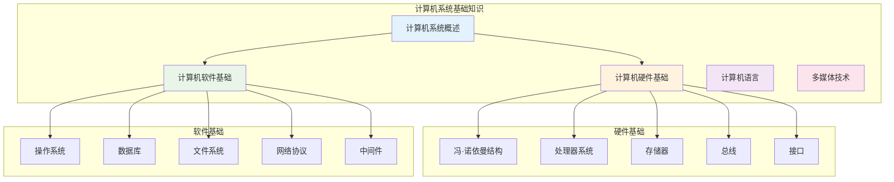

### 计算机系统概述

**基础知识点**：

**1. 计算机系统的定义与组成**

计算机系统（Computer System）是指用于数据管理的**计算机硬件、软件及网络组成的系统**。

计算机系统组成：
- **硬件子系统**：由机械、电子元器件、磁介质和光介质等物理实体构成
- **软件子系统**：一系列按照特定顺序组织的数据和指令，控制硬件完成指定功能

**2. 计算机系统分类**

计算机系统的分类维度：
- **硬件角度**：结构、性能、规模
- **软件角度**：构成、特征
- **系统角度**：整体用途、服务对象

### 计算机硬件基础知识

**基础知识点**：

**1. 冯·诺依曼计算机结构**

冯·诺依曼计算机结构将计算机硬件划分为**5个部分**：

| 组成部分 | 功能描述 | 现代实现 |
|----------|----------|----------|
| **运算器** | 执行算术和逻辑运算 | 集成在CPU中 |
| **控制器** | 控制程序执行流程 | 集成在CPU中 |
| **存储器** | 存储程序和数据 | 内存、外存 |
| **输入设备** | 数据输入 | 键盘、鼠标等 |
| **输出设备** | 结果输出 | 显示器、打印机等 |

**典型处理器系统结构**：

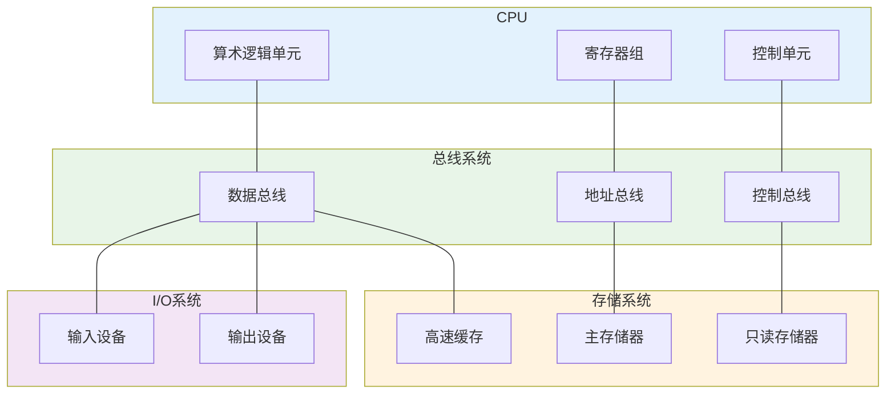

**2. 专用处理器**

| 处理器类型 | 特点 | 应用场景 |
|------------|------|----------|
| **GPU** | 数百个或数千个内核，并行计算优化 | 图形渲染、机器学习 |
| **DSP** | 哈佛结构，实时数字信号处理 | 音频处理、通信 |
| **FPGA** | 现场可编程逻辑门阵列 | 原型开发、专用计算 |

**3. 指令集系统**

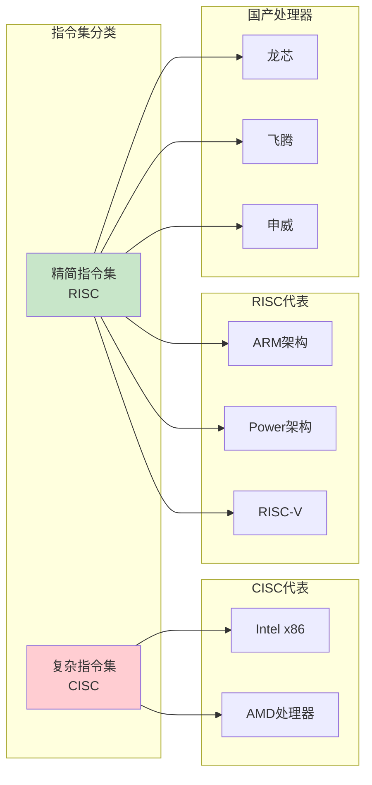

**4. 存储器层次结构**

按照与处理器的物理距离分为**4个层次**：

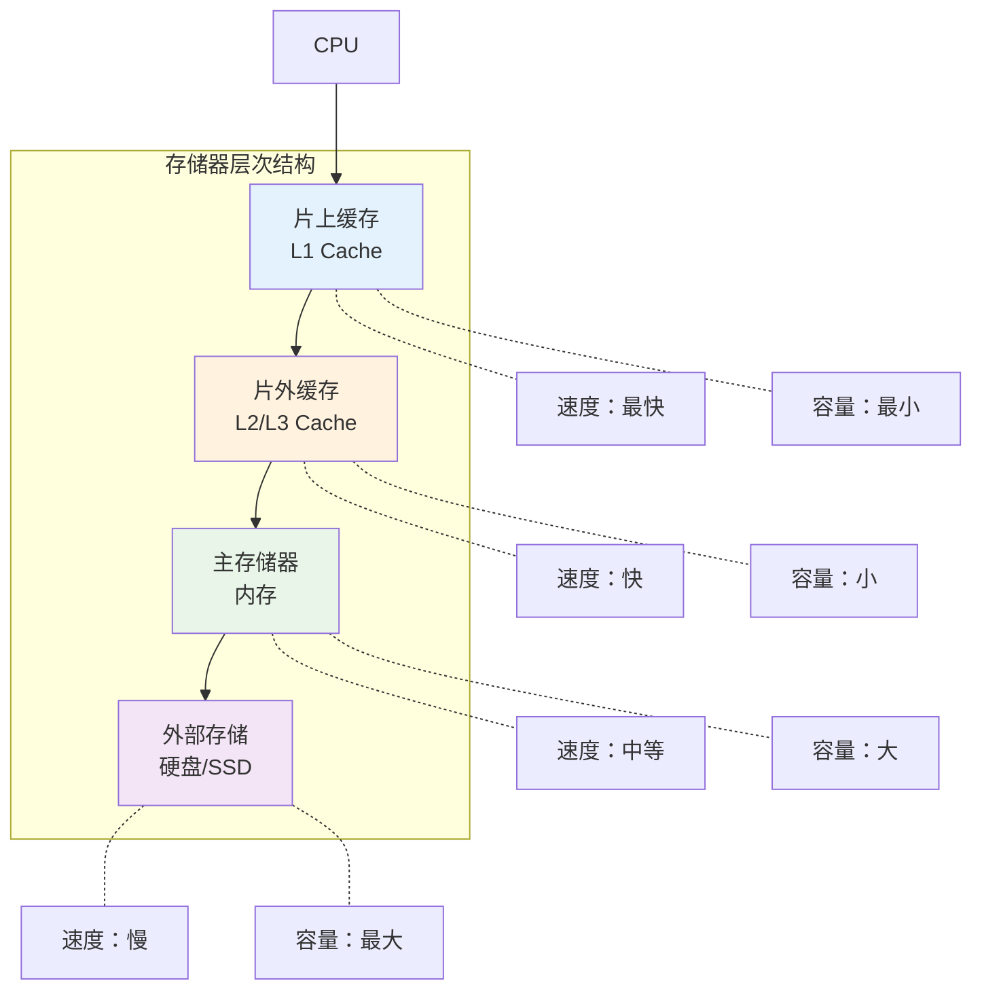

**5. 总线系统**

**总线分类对比**：

| 分类维度 | 类型 | 特点 | 应用场景 |
|----------|------|------|----------|
| **数据线数量** | 并行总线 | 多条双向数据线，有传输延迟 | 系统总线（计算机各部件） |
| | 串行总线 | 一条双向或两条单向数据线 | 通信总线（计算机间通信） |
| **传输方向** | 单工总线 | 只能单向传输 | 广播系统 |
| | 半双工总线 | 轮流双向传输 | 对讲机系统 |
| | 全双工总线 | 同时双向传输 | 电话系统 |
| **连接位置** | 内总线 | 芯片内部连接 | CPU内部 |
| | 系统总线 | 计算机核心组件 | 主板总线 |
| | 外部总线 | 外设连接 | USB、SATA |

### 计算机软件基础知识

**基础知识点**：

**1. 计算机软件分类**

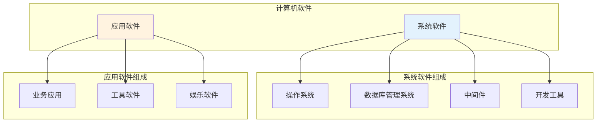

**2. 操作系统**

操作系统是计算机系统的**资源管理者**，具有**并发性、共享性、虚拟性和不确定性**的特征。

**操作系统分类**：

| 类型 | 特点 | 应用场景 |
|------|------|----------|
| **批处理操作系统** | 作业批量处理，分为单道和多道 | 大型机数据处理 |
| **分时操作系统** | CPU时间片轮转，多路性、独立性、交互性、及时性 | 多用户交互系统 |
| **实时操作系统** | 快速响应外来信息，高可靠性 | 工业控制、航空航天 |
| **网络操作系统** | 网络资源共享，硬件独立性 | 企业网络环境 |
| **分布式操作系统** | 透明性、可靠性、高性能 | 分布式计算环境 |
| **嵌入式操作系统** | 微型化、可定制、可靠性、易移植 | 智能设备、IoT |

**3. 数据库系统**

数据库（DataBase，DB）是指长期存储在计算机内、**有组织的、统一管理的相关数据的集合**。

**数据库分类**：

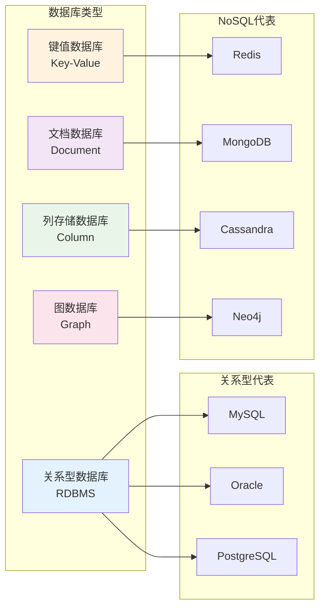

**4. 文件系统**

文件（File）是具有符号名的、在逻辑上具有完整意义的**一组相关信息项的集合**。

**文件分类**：

| 分类维度 | 文件类型 | 描述 |
|----------|----------|------|
| **性质用途** | 系统文件 | 操作系统核心文件 |
| | 库文件 | 程序库和函数库 |
| | 用户文件 | 用户创建的文件 |
| **保存期限** | 临时文件 | 短期使用后删除 |
| | 档案文件 | 长期保存的重要文件 |
| | 永久文件 | 永久保存的系统文件 |
| **保护方式** | 只读文件 | 只能读取不能修改 |
| | 读写文件 | 可以读取和修改 |
| | 可执行文件 | 可以执行的程序文件 |

**文件存储空间管理**：

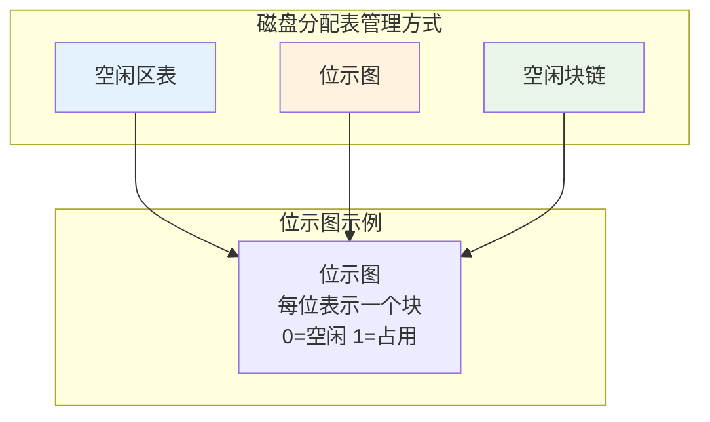

### 计算机语言

**基础知识点**：

**计算机语言分类**：

```mermaid
graph TB
    subgraph "计算机语言发展"
        ML["机器语言<br/>第一代"]
        AL["汇编语言<br/>第二代"]
        HL["高级语言<br/>第三代"]
        UML["建模语言<br/>UML"]
        FORMAL["形式化语言"]
    end
    
    subgraph "机器语言特点"
        ML1["二进制指令"]
        ML2["直接执行"]
        ML3["硬件相关"]
    end
    
    subgtml "汇编语言特点"
        AL1["符号化描述"]
        AL2["助记符"]
        AL3["一一对应"]
    end
    
    subgraph "高级语言特点"
        HL1["接近自然语言"]
        HL2["跨平台性"]
        HL3["易于理解"]
    end
    
    ML --> ML1
    ML --> ML2
    ML --> ML3
    
    AL --> AL1
    AL --> AL2
    AL --> AL3
    
    HL --> HL1
    HL --> HL2
    HL --> HL3
    
    style ML fill:#ffcdd2
    style AL fill:#fff3e0
    style HL fill:#c8e6c9
    style UML fill:#e3f2fd
    style FORMAL fill:#f3e5f5
```

### 多媒体技术

**基础知识点**：

**1. 多媒体特征**

多媒体具有**4个重要特征**：

| 特征 | 描述 | 应用体现 |
|------|------|----------|
| **多维化** | 媒体的多样化 | 文字、声音、图像、视频 |
| **集成性** | 多媒体与设备、信息集成 | 硬件软件一体化 |
| **交互性** | 用户控制和使用信息 | 人机交互界面 |
| **实时性** | 音视频时间特性 | 流媒体播放 |

**2. 多媒体关键技术**

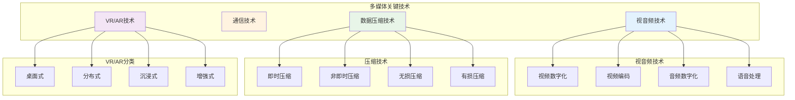

### 练习题

**1. 目前处理器市场中存在CPU和DSP两种类型的处理器，分别用于不同的场景，这两种处理器具有不同的体系结构，DSP采用（ ）。**

A. 冯·诺依曼结构  
B. 哈佛结构  
C. FPGA结构  
D. 与GPU相同的结构

**解析**：DSP芯片是一种具有特殊结构的微处理器，为了达到快速进行数字信号处理的目的，DSP芯片一般都采用特殊的软硬件结构：**哈佛结构**。

哈佛结构将存储器空间划分成两个，分别存储程序和数据。它们有两组总线连接到处理器核，允许同时对它们进行访问，每个存储器独立编址，独立访问。

**答案：B**

**2. （ ）是专用于实时的数字信号处理的处理器。**

A. DSP  
B. CPU  
C. GPU  
D. FPGA

**解析**：DSP专用于实时的数字信号处理，常采用哈佛体系结构。

**答案：A**

**3. 在线学习系统中，课程学习和课程考试都需要先检查学员的权限，"课程学习"与"检查权限"两个用例之间属于（1）；课程学习过程中，如果所缴纳学费不够，就需要补缴学费，"课程学习"与"缴纳学费"两个用例之间属于（2）；课程学习前需要课程注册，可以采用电话注册或网络注册，"课程注册"与"网络注册"两个用例之间属于（3）。**

(1) A. 包含关系  B. 扩展关系  C. 泛化关系  D. 关联关系  
(2) A. 包含关系  B. 扩展关系  C. 泛化关系  D. 关联关系  
(3) A. 包含关系  B. 扩展关系  C. 泛化关系  D. 关联关系

**解析**：用例之间的关系主要有包含、扩展和泛化3类。

- **包含关系**：当可以从两个或两个以上的用例中提取公共行为时，应该使用包含关系来表示它们。"课程学习"与"检查权限"是包含关系。
- **扩展关系**：如果一个用例明显地混合了两种或两种以上的不同场景，即根据情况可能发生多种分支，则可以将这个用例分为一个基本用例和一个或多个扩展用例。"课程学习"与"缴纳学费"是扩展关系。
- **泛化关系**：当多个用例共同拥有一种类似的结构和行为的时候，可以将它们的共性抽象成为父用例，其他的用例作为泛化关系中的子用例。"课程注册"与"网络注册"是泛化关系。

**答案：A B C**

## 第2小时 嵌入式基础知识

### 章节考点分析

第2小时主要学习**嵌入式系统的组成及特点**、**嵌入式系统的分类**、**嵌入式软件的组成及特点**、**嵌入式系统硬件体系结构**、**安全攸关软件的安全性设计**等内容。

根据考试大纲，本小时知识点会涉及单项选择题和案例分析题，按以往全国计算机技术与软件专业技术资格（水平）考试的出题规律约占**5分**。

**知识架构图**：

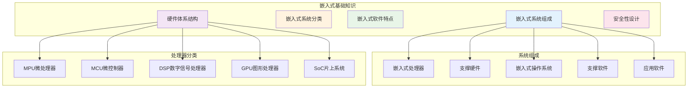

### 嵌入式系统的组成及特点

**基础知识点**：

**1. 嵌入式系统定义**

嵌入式系统（Embedded System）是以**特定应用为中心**、以**计算机技术为基础**，并将可配置与可裁剪的软、硬件集成于一体的**专用计算机系统**。

**2. 嵌入式系统组成结构**

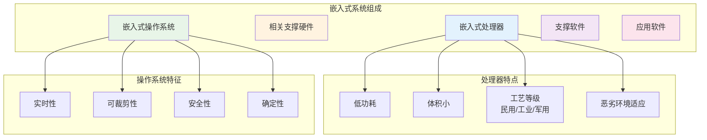

**3. 嵌入式系统特点**

| 特点 | 描述 | 应用体现 |
|------|------|----------|
| **专用性强** | 面向特定应用需求 | 配备多种传感器 |
| **技术融合** | 多种技术紧密结合 | 软硬件难以拆分 |
| **软硬一体** | 软件为主，高效设计 | 裁剪冗余功能 |
| **资源受限** | 低功耗、小体积要求 | 系统资源非常少 |
| **代码固化** | 程序固化在ROM中 | 提高执行速度和可靠性 |
| **专门工具** | 需要专门开发环境 | 交叉编译、调试工具 |
| **高可靠性** | 安全性和可靠性要求高 | 工业控制、医疗设备 |

### 嵌入式系统的分类

**基础知识点**：

**1. 按实时性分类**

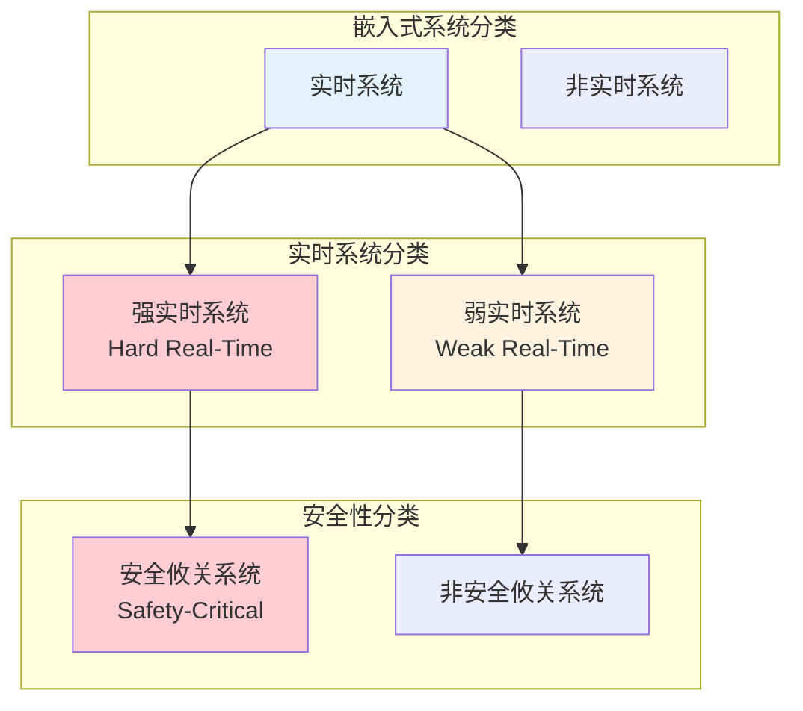

**2. 系统分类对比**

| 系统类型 | 时间要求 | 失效后果 | 应用场景 |
|----------|----------|----------|----------|
| **强实时系统** | 严格时间约束 | 系统失效 | 飞行控制、核电站控制 |
| **弱实时系统** | 相对时间约束 | 性能下降 | 多媒体播放、网络通信 |
| **安全攸关系统** | 高可靠性 | 人员伤亡、财产损失 | 医疗设备、交通控制 |
| **非安全攸关系统** | 一般可靠性 | 功能异常 | 消费电子、娱乐设备 |

### 嵌入式软件的组成及特点

**基础知识点**：

**1. 嵌入式系统架构模式**

大多数嵌入式系统都具备实时特征，典型架构可概括为两种模式：
- **层次化模式架构**
- **递归模式架构**

**开发环境特点**：
- **目标机环境**：系统运行环境
- **宿主机环境**：系统开发环境
- **交叉开发**：宿主机和目标机指令不同，需要交叉平台开发环境

**2. 嵌入式系统详细组成**

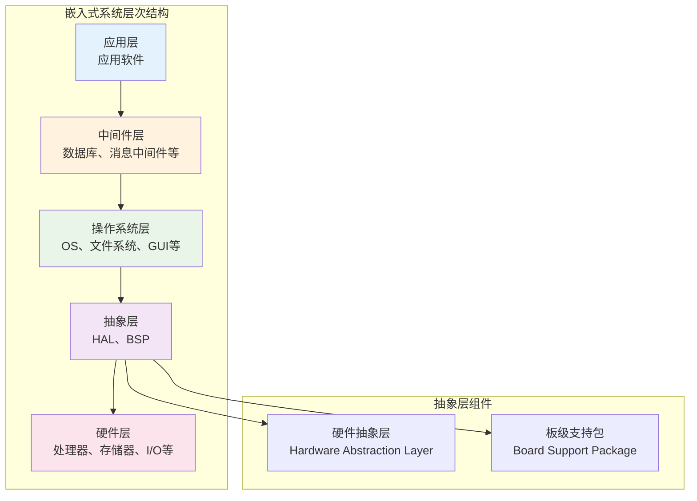

**3. 嵌入式软件主要特点**

| 特点 | 设计方法 | 实现技术 |
|------|----------|----------|
| **可剪裁性** | 静态编译、动态库、控制函数流程 | 模块化设计 |
| **可配置性** | 数据驱动、静态编译、配置表 | 参数化配置 |
| **强实时性** | 表驱动、配置、静/动态结合 | 汇编语言优化 |
| **安全性** | 编码标准、安全保障机制 | FMECA分析 |
| **可靠性** | 容错技术、余度技术 | 鲁棒性设计 |
| **高确定性** | 静态分配资源、越界检查 | 状态机、静态调度 |

### 嵌入式系统硬件体系结构

**基础知识点**：

**1. 嵌入式微处理器分类**

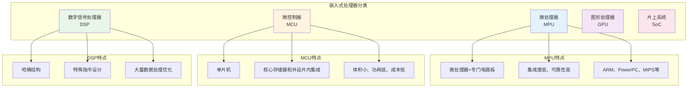

**2. 存储器分类**

**RAM（随机存取存储器）**：

| 类型 | 特点 | 优缺点 | 应用 |
|------|------|--------|------|
| **DRAM** | 电容存储，需要刷新 | 集成度高、容量大、成本低，但速度慢 | 主存储器 |
| **SRAM** | 晶体管自锁，无需刷新 | 速度快、不需刷新，但集成度低、成本高 | 高速缓存 |

**ROM（只读存储器）**：

| 类型 | 特点 | 优缺点 | 应用 |
|------|------|--------|------|
| **MROM** | 掩膜制造 | 成本低，但不可修改 | 大批量生产 |
| **PROM** | 一次性编程 | 可编程，但只能写一次 | 少量制造 |
| **EPROM** | 紫外线擦除 | 可重复擦写，但需要紫外线 | 开发调试 |
| **EEPROM** | 电擦除 | 电压清除，但速度慢 | 配置存储 |
| **Flash** | 快闪存储 | 快速擦写，但读取相对慢 | 程序存储 |

**3. 总线系统**

**总线分类**：

```mermaid
graph TB
    subgraph "按信息种类分类"
        DATA_BUS["数据总线<br/>传送处理数据"]
        ADDR_BUS["地址总线<br/>指定存储地址"]
        CTRL_BUS["控制总线<br/>传送控制信号"]
    end
    
    subgraph "按连接部件分类"
        CHIP_BUS["片内总线<br/>芯片内部连接"]
        SYS_BUS["系统总线<br/>核心组件连接"]
        LOCAL_BUS["局部总线<br/>局部组件连接"]
        COMM_BUS["通信总线<br/>外设连接"]
    end
    
    subgraph "按传输方向分类"
        SIMPLEX["S fill:#e3f2fd
    style ADDR_BUS fill:#fff3e0
    style CTRL_BUS fill:#e8f5e8
    style SIMPLEX fill:#ffcdd2
    style HALF_DUPLEX fill:#fff3e0
    style FULL_DUPLEX fill:#c8e6c9
```

**4. 看门狗电路**

看门狗电路是嵌入式系统必须具备的一种**系统恢复能力**，可防止程序出错或者死锁。

**看门狗工作原理**：

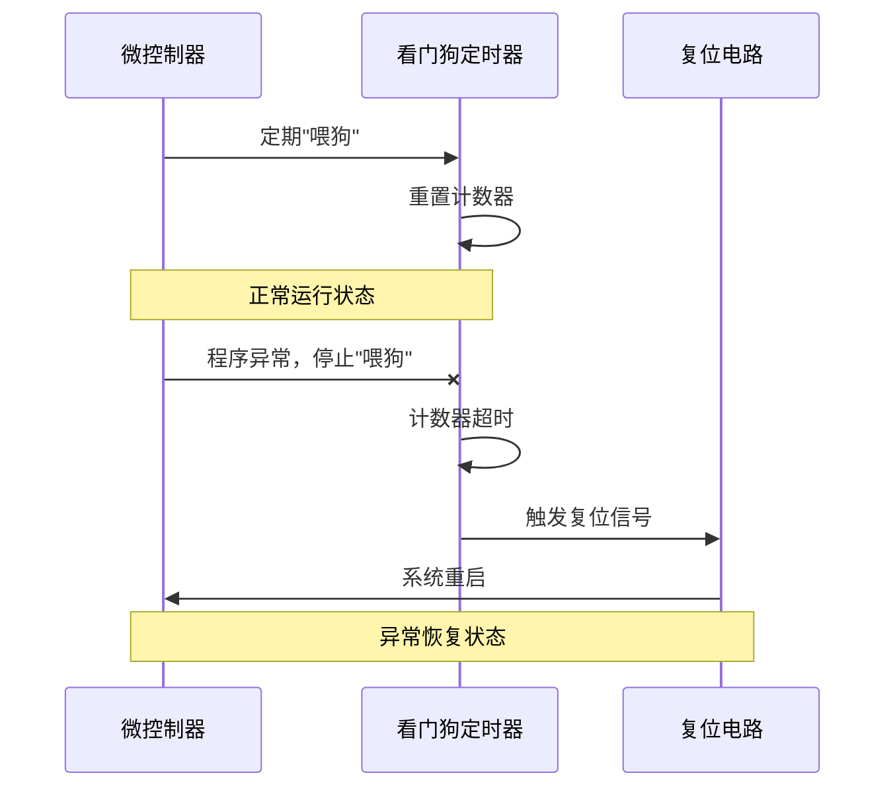

**看门狗组成**：
- **输入端**：接收MCU的"喂狗"信号
- **寄存器**：看门狗基本设置
- **计数器**：计算狗叫时间
- **狗叫模块**：超时后发出中断或复位

### 安全攸关软件的安全性设计

**基础知识点**：

**1. 安全攸关软件定义**

IEEE定义：**安全攸关软件是"用于一个系统中，可能导致不可接受的风险的软件"**。

**2. DO-178B标准**

DO-178B标准的目的是为制造机载系统和设备的机载软件提供指导，使其能够提供在满足符合适航要求的安全性水平下完成预期功能。

**DO-178B软件生命周期**：

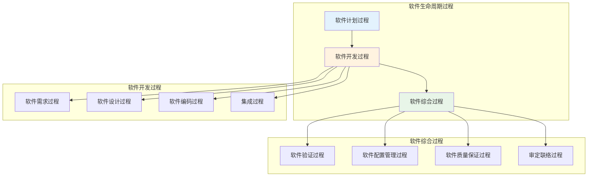

**DO-178B安全等级分类**：

| 等级 | 名称 | 失效后果 | 验证要求 |
|------|------|----------|----------|
| **A级** | 灾难级 | 导致飞机失事或人员死亡 | 最严格的验证 |
| **B级** | 危害级 | 导致严重伤害或重大财产损失 | 严格验证 |
| **C级** | 严重级 | 导致乘客不适或工作负荷增加 | 中等验证 |
| **D级** | 不严重级 | 导致轻微的不便 | 基本验证 |
| **E级** | 没有影响级 | 对飞行安全没有影响 | 无特殊要求 |

### 练习题

**1. 在嵌入式系统的存储部件中，存取速度最快的是（ ）。**

A. 内存  
B. 寄存器组  
C. Flash  
D. Cache

**解析**：存储速度从快到慢分别是：**寄存器组、Cache、内存、Flash**。

**答案：B**

**2. 以下关于嵌入式系统硬件抽象层的叙述，错误的是（ ）。**

A. 硬件抽象层与硬件密切相关，可对操作系统隐藏硬件的多样性  
B. 硬件抽象层将操作系统与硬件平台隔开  
C. 硬件抽象层使软硬件的设计与调试可以并行  
D. 硬件抽象层应包括设备驱动程序和任务调度

**解析**：硬件抽象层是位于操作系统内核与硬件电路之间的接口层，其目的在于将硬件抽象化。它隐藏了特定平台的硬件接口细节，为操作系统提供虚拟硬件平台，使其具有硬件无关性，可在多种平台上进行移植。**任务调度属于操作系统功能，不属于硬件抽象层**。

**答案：D**

**3. 以下描述中，（ ）不是嵌入式操作系统的特点。**

A. 面向应用，可以进行裁剪和移植  
B. 用于特定领域，不需要支持多任务  
C. 可靠性高，无须人工干预独立运行，并处理各类事件和故障  
D. 要求编码体积小，能够在嵌入式系统的有效存储空间内运行

**解析**：嵌入式操作系统除了具有一般操作系统最基本的功能如**多任务调度、同步机制**等之外，还具备面向应用的可裁剪性、强实时性、硬件适用性、高可靠性、编码体积小等特性。**嵌入式操作系统需要支持多任务**。

**答案：B**

**4. 嵌入式系统设计一般要考虑低功耗，软件设计也要考虑低功耗设计，软件低功耗设计一般采用（ ）。**

A. 结构优化、编译优化和代码优化  
B. 软硬件协同设计、开发过程优化和环境设计优化  
C. 轻量级操作系统、算法优化和仿真实验  
D. 编译优化技术、软硬件协同设计和算法优化

**解析**：软件设计层面的功耗控制可以从以下几个方面展开：
- **软硬件协同设计**：软件设计要与硬件匹配
- **编译优化**：采用低功耗优化的编译技术
- **算法优化**：减少系统的持续运行时间
- 用"中断"代替"查询"
- 进行电源的有效管理

**答案：D**

**5. 以下关于嵌入式系统开发的叙述，正确的是（ ）。**

A. 宿主机与目标机之间只需要建立逻辑连接  
B. 宿主机与目标机之间只能采用串口通信方式  
C. 在宿主机上必须采用交叉编译器来生成目标机的可执行代码  
D. 调试器与被调试程序必须安装在同一台机器上

**解析**：在嵌入式系统开发中，由于嵌入式设备不具备足够的处理器能力和存储空间，程序开发一般用PC（宿主机）来完成，然后将可执行文件下载到嵌入式系统（目标机）中运行。

**当宿主机与目标机的机器指令不同时，就需要交叉工具链**（指编译、汇编、链接等一整套工具）。

**答案：C**单工总线<br/>单向传输"]
        HALF_DUPLEX["半双工总线<br/>轮流双向"]
        FULL_DUPLEX["全双工总线<br/>同时双向"]
    end
    
    style DAT
    
## 第3小时 计算机网络基础知识

### 章节考点分析

第3小时主要学习**计算机网络的基本概念**、**通信技术**、**网络技术**、**组网技术**和**网络工程**等内容。

根据考试大纲，本小时知识点会涉及单项选择题，按出题规律约占**5分**。本小时内容属于基础知识范畴，除了书本上的知识以外，也有一些扩展知识。

**知识架构图**：

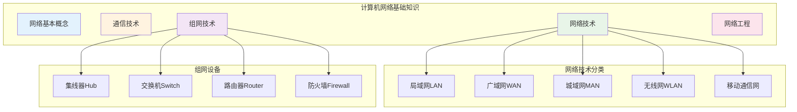

### 网络的基本概念

**基础知识点**：

跟网络有关的指标分为：

**1. 性能指标**：从**速率、带宽、吞吐量和时延**等不同方面来度量计算机网络的性能。

**2. 非性能指标**：从**费用、质量、标准化、可靠性、可扩展性、可升级性、易管理性和可维护性**等来度量。

### 通信技术

**基础知识点**：

**1. 数据与信道**

在通信中的数据包括**模拟信号和数字信号**，通过信道来传输。信息传输就是信源和信宿通过信道收发信息的过程。

**信道分类**：
- **逻辑信道**：数据发送端和接收端之间存在的一条虚拟线路
- **物理信道**：实际的物理传输媒介

**2. 复用技术与多址技术对比**

| 技术类型 | 定义 | 实现方式 | 形象比喻 |
|----------|------|----------|----------|
| **复用技术** | 一条信道上同时传输多路数据 | TDM时分复用、FDM频分复用、CDM码分复用 | 一条路上行驶多辆货车 |
| **多址技术** | 一条线上同时传输多个用户数据 | TDMA时分多址、FDMA频分多址、CDMA码分多址 | 一辆车上的货物属于不同用户 |

**3. 5G通信网络**

作为新一代的移动通信技术，5G具有以下特点：
- **高速率**：峰值速率可达10Gbps
- **低时延**：端到端时延低于1ms
- **大连接**：每平方公里可连接100万个设备

### 网络技术

**基础知识点**：

**1. 局域网（LAN）**

局域网是指在**有限地理范围内**将若干计算机通过传输介质互联成的**封闭型**的计算机网络。

**局域网拓扑结构**：

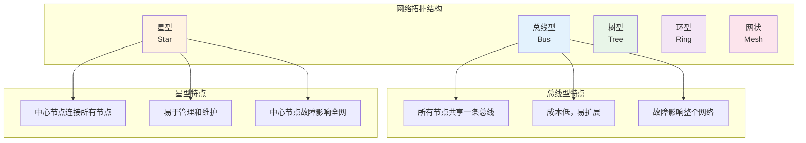

**2. 以太网（Ethernet）**

以太网是一种计算机局域网组网技术，由**IEEE 802.3**定义。

**以太网帧长度规定**：
- **最小长度**：64字节（避免冲突检测问题）
- **最大长度**：1518字节（标准以太网帧）

**3. 无线局域网（WLAN）**

WLAN采用**IEEE 802.11**标准，主要子标准对比：

| 标准 | 频段 | 最大速率 | 特点 |
|------|------|----------|------|
| **802.11a** | 5GHz | 54Mbps | 抗干扰能力强 |
| **802.11b** | 2.4GHz | 11Mbps | 覆盖范围广 |
| **802.11g** | 2.4GHz | 54Mbps | 兼容802.11b |
| **802.11n** | 2.4/5GHz | 200Mbps | MIMO技术 |
| **802.11ac** | 5GHz | 1Gbps | 高速传输 |

**4. 广域网（WAN）**

广域网是一种将分布于**更广区域**的计算机设备联接起来的网络，需要使用**路由器和网关设备**。

**广域网组成**：
- **通信子网**：负责数据传输
- **资源子网**：提供网络资源和服务

**5. 移动通信网发展**

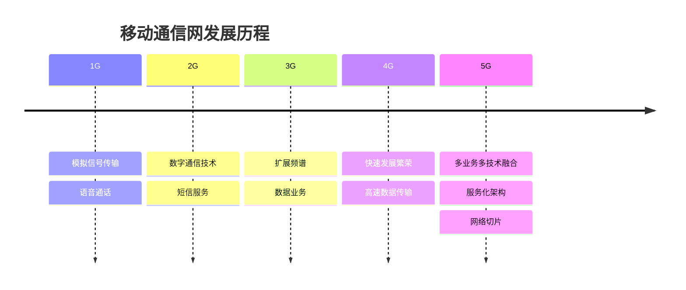

**5G网络关键技术**：

| 技术 | 描述 | 优势 |
|------|------|------|
| **服务化架构SBA** | 网络功能的灵活定制和按需组合 | 软件快速迭代和升级 |
| **网络切片** | 单个物理网络切分出多个逻辑网络 | 不同业务隔离和定制 |
| **FlexE硬切片** | 基于灵活以太网的硬切片技术 | 提供确定性网络服务 |

### 组网技术

**基础知识点**：

**1. 网络设备及其工作层级**

```mermaid
graph TB
    subgraph "OSI七层模型"
        L7["应用层"]
        L6["表示层"]
        L5["会话层"]
        L4["传输层"]
        L3["网络层"]
        L2["数据链路层"]
        L1["物理层"]
    end
    
    subgraph "网络设备"
        HUB["集线器Hub"]
        SWITCH["交换机Switch"]
        ROUTER["路由器Router"]
        FIREWALL["防火墙Firewall"]
    end
    
    L1 --- HUB
    L2 --- SWITCH
    L3 --- ROUTER
    L3 --- FIREWALL
    
    style L1 fill:#ffcdd2
    style L2 fill:#fff3e0
    style L3 fill:#e8f5e8
    style HUB fill:#ffcdd2
    style SWITCH fill:#fff3e0
    style ROUTER fill:#e8f5e8
    style FIREWALL fill:#e8f5e8
```

**设备功能对比**：

| 设备 | 工作层次 | 主要功能 | 特点 |
|------|----------|----------|------|
| **集线器Hub** | 物理层 | 信号放大和转发 | 共享带宽，冲突域大 |
| **交换机Switch** | 数据链路层 | 帧交换，MAC地址学习 | 独享带宽，隔离冲突域 |
| **路由器Router** | 网络层 | 路径选择，网络互连 | 隔离广播域，路由转发 |
| **防火墙Firewall** | 网络层及以上 | 访问控制，安全防护 | 网络安全门户 |

**2. 网络协议**

**OSI/RM七层模型**：

| 层次 | 名称 | 主要功能 | 关键协议 |
|------|------|----------|----------|
| **第7层** | 应用层 | 处理网络应用 | HTTP、FTP、SMTP、DNS |
| **第6层** | 表示层 | 管理数据表示方式 | 数据编码、加密、压缩 |
| **第5层** | 会话层 | 建立和维护会话连接 | 会话管理、同步 |
| **第4层** | 传输层 | 端到端传输 | TCP、UDP |
| **第3层** | 网络层 | 路由选择 | IP、ICMP、ARP |
| **第2层** | 数据链路层 | 点到点帧传输 | Ethernet、PPP |
| **第1层** | 物理层 | 物理链路上传输比特流 | 物理接口标准 |

**3. 常见应用层协议**

```mermaid
graph TB
    subgraph "文件传输协议"
        FTP["FTP<br/>端口21/20<br/>可靠传输"]
        TFTP["TFTP<br/>端口69<br/>简单传输"]
    end
    
    subgraph "Web协议"
        HTTP["HTTP<br/>端口80<br/>超文本传输"]
        HTTPS["HTTPS<br/>端口443<br/>安全传输"]
    end
    
    subgraph "网络管理协议"
        DHCP["DHCP<br/>动态IP分配"]
        DNS["DNS<br/>域名解析"]
    end
    
    style FTP fill:#e3f2fd
    style HTTP fill:#fff3e0
    style DHCP fill:#e8f5e8
```

**4. 传输层协议对比**

| 协议 | 连接性 | 可靠性 | 特点 | 适用场景 |
|------|--------|--------|------|----------|
| **TCP** | 面向连接 | 可靠传输 | 差错校验、流量控制、拥塞控制 | 数据量少，可靠性要求高 |
| **UDP** | 无连接 | 不可靠传输 | 简单快速，无连接管理 | 数据量大，速度要求高 |

**5. 路由协议分类**

```mermaid
graph TB
    subgraph "路由协议分类"
        IGP["内部网关协议<br/>IGP"]
        EGP["外部网关协议<br/>EGP"]
    end
    
    subgraph "IGP协议"
        RIP["RIP<br/>距离向量"]
        OSPF["OSPF<br/>链路状态"]
        EIGRP["EIGRP<br/>混合型"]
    end
    
    subgraph "EGP协议"
        BGP["BGP<br/>路径向量"]
    end
    
    IGP --> RIP
    IGP --> OSPF
    IGP --> EIGRP
    
    EGP --> BGP
    
    style IGP fill:#e3f2fd
    style EGP fill:#fff3e0
```

### 网络工程

**基础知识点**：

**1. 网络建设工程**

网络建设可分为**3个环节**：

```mermaid
flowchart LR
    A["网络规划<br/>需求导向"] --> B["网络设计<br/>逻辑+物理"]
    B --> C["网络实施<br/>部署运维"]
    
    subgraph "网络设计内容"
        B1["逻辑设计<br/>结构、技术选型、IP地址"]
        B2["物理设计<br/>布线、机房、设备"]
    end
    
    B --> B1
    B --> B2
    
    style A fill:#e3f2fd
    style B fill:#fff3e0
    style C fill:#e8f5e8
```

**2. 网络冗余设计**

**冗余设计目的**：避免网络组件**单点失效**造成应用失效

**冗余设计方式**：

| 方式 | 描述 | 特点 |
|------|------|------|
| **备用路径** | 主路径失效时启用 | 主备路径承担不同负载 |
| **负载分担** | 并行链路提供流量分担 | 提高性能，减轻主路径负担 |

**3. 分层设计**

网络设计一般采用**分层的方式**：

```mermaid
graph TB
    subgraph "网络分层架构"
        CORE["核心层<br/>Core Layer"]
        AGG["汇聚层<br/>Aggregation Layer"]
        ACCESS["接入层<br/>Access Layer"]
    end
    
    subgraph "核心层功能"
        CORE1["高速转发通信"]
        CORE2["优化可靠的骨干传输"]
        CORE3["双机冗余热备份"]
    end
    
    subgraph "汇聚层功能"
        AGG1["网络访问策略控制"]
        AGG2["数据包处理过滤"]
        AGG3["寻址和数据处理"]
    end
    
    subgraph "接入层功能"
        ACCESS1["用户连接和访问"]
        ACCESS2["用户管理功能"]
        ACCESS3["用户信息收集"]
    end
    
    CORE --> AGG
    AGG --> ACCESS
    
    CORE --> CORE1
    CORE --> CORE2
    CORE --> CORE3
    
    AGG --> AGG1
    AGG --> AGG2
    AGG --> AGG3
    
    ACCESS --> ACCESS1
    ACCESS --> ACCESS2
    ACCESS --> ACCESS3
    
    style CORE fill:#e3f2fd
    style AGG fill:#fff3e0
    style ACCESS fill:#e8f5e8
```

### 练习题

**1. 在以太网标准中规定的最小帧长是（1）字节。最小帧长是根据（2）来定的。**

(1) A. 20  B. 64  C. 128  D. 1518  
(2) A. 网络中传送的最小信息单位  B. 物理层可以区分的信息长度  
    C. 网络中发生冲突的最短时间  D. 网络中检测冲突的最长时间

**解析**：以太网规定**最小帧长为64字节**，最大帧长为1518字节。设置最小帧长是为了避免冲突，最小帧长是根据**网络中检测冲突的最长时间**来定的。

**答案：B D**

**2. TCP和UDP协议均提供了（ ）能力。**

A. 连接管理  
B. 差错校验和重传  
C. 流量控制  
D. 端口寻址

**解析**：TCP与UDP均有**端口号的概念**。

- TCP采用连接管理、差错校验和重传、流量控制等方式来确保数据按序、无差错、无重复、没有部分丢失地传输。
- UDP是一种无连接的协议，适用于传输数据量大，对可靠性要求不高，传输速度快的场合。

**答案：D**

**3. 下列无线网络技术中，覆盖范围最小的是（ ）。**

A. 802.15.1 蓝牙  
B. 802.11n 无线局域网  
C. 802.15.4 ZigBee  
D. 802.16m 无线城域网

**解析**：各技术覆盖范围对比：
- **蓝牙**：约10米以内
- **802.11n无线局域网**：约100米以内
- **ZigBee**：10～100米之间
- **802.16m无线城域网**：2～10km

4个选项中，**蓝牙覆盖范围最小**。

**答案：A**

**4. 以下关于网络冗余设计的叙述中，错误的是（ ）。**

A. 网络冗余设计避免网络组件单点失效造成应用失效  
B. 备用路径与主路径同时投入使用，分担主路径流量  
C. 负载分担是通过并行链路提供流量分担来提高性能的  
D. 网络中存在备用链路时，可以考虑加入负载分担设计

**解析**：网络冗余设计的要点：
- 目的是避免网络组件单点失效造成应用失效
- **备用路径是在主路径失效时启用**，其和主路径承担不同的网络负载
- 负载分担是通过并行链路提供流量分担来提高性能
- 网络中存在备用链路时，可以考虑加入负载分担设计

选项B错误，备用路径不是与主路径同时使用。

**答案：B**

## 第4小时 信息系统基础知识

### 章节考点分析

第4小时主要学习**信息系统概述**、**信息化的典型应用**、**典型信息系统架构模型**等内容。

根据考试大纲及以往全国计算机技术与软件专业技术资格（水平）考试的出题规律，本小时知识点会涉及单项选择题，约占**2～6分**。

**知识架构图**：

```mermaid
graph TB
    subgraph "信息系统基础知识"
        A["信息系统概述"]
        B["信息化典型应用"]
        C["典型架构模型"]
    end
    
    subgraph "信息系统分类"
        A1["事务处理系统TPS"]
        A2["管理信息系统MIS"]
        A3["决策支持系统DSS"]
        A4["专家系统ES"]
        A5["办公自动化系统OAS"]
        A6["企业资源规划ERP"]
    end
    
    subgraph "架构模型"
        C1["电子政务EG"]
        C2["企业信息化EI"]
        C3["电子商务EC"]
    end
    
    B --> A1
    B --> A2
    B --> A3
    B --> A4
    B --> A5
    B --> A6
    
    C --> C1
    C --> C2
    C --> C3
    
    style A fill:#e3f2fd
    style B fill:#fff3e0
    style C fill:#e8f5e8
```

### 信息系统概述

**基础知识点**：

信息系统是由**计算机硬件、网络和通信设备、计算机软件、信息资源、信息用户和规章制度**组成的以处理信息流为目的的人机一体化系统。

### 信息化的典型应用

**基础知识点**：

**1. 事务处理系统（TPS）**

事务处理系统（Transaction Processing System，TPS）是面向数据处理的系统，目的是**减轻事务处理人员的负担、提高处理效率**。

**TPS特点**：
- 是信息系统发展的**最初级形式**，也是基础和桥梁
- 常用**结构化生命周期法**开发
- 对事务所发生的数据进行**输入、处理和输出（IPO）**

**数据处理周期**：

```mermaid
flowchart LR
    A["数据输入"] --> B["数据处理"]
    B --> C["数据库维护"]
    C --> D["文件报表生成"]
    D --> E["查询处理"]
    
    style A fill:#e3f2fd
    style B fill:#fff3e0
    style C fill:#e8f5e8
    style D fill:#f3e5f5
    style E fill:#fce4ec
```

**数据处理方式**：

| 处理方式 | 特点 | 适用场景 |
|----------|------|----------|
| **批处理（Batch Processing）** | 数据积累到一定量后集中处理 | 大量数据的定期处理 |
| **联机事务处理（OLTP）** | 实时处理每个事务 | 实时性要求高的业务 |

**2. 管理信息系统（MIS）**

管理信息系统（Management Information System，MIS）是在**TPS基础上发展**的高度集成化的人机信息系统，用于企业整体的某些管理和业务层面的管理决策。

**MIS系统组成**：

```mermaid
graph TB
    subgraph "MIS七大子系统"
        S1["销售市场子系统"]
        S2["生产子系统"]
        S3["后勤子系统"]
        S4["人事子系统"]
        S5["财务和会计子系统"]
        S6["信息处理子系统"]
        S7["高层管理子系统"]
    end
    
    subgraph "系统结构"
        TOP["上层：子系统和功能"]
        BOTTOM["底层：各个过程"]
        MATRIX["功能/层次矩阵表示"]
    end
    
    style S1 fill:#e3f2fd
    style S2 fill:#fff3e0
    style S3 fill:#e8f5e8
    style S4 fill:#f3e5f5
    style S5 fill:#fce4ec
    style S6 fill:#e1f5fe
    style S7 fill:#f1f8e9
```

**3. 决策支持系统（DSS）**

决策支持系统（Decision Support System，DSS）有**两种定义**：

**定义一**：DSS是一个由**语言系统、知识系统和问题处理系统**3个互相关联的部分组成的，基于计算机的系统。

**定义二**：DSS是一个**交互式的、灵活的、适应性强**的基于计算机的信息系统。

**DSS特征对比**：

| 定义 | 主要特征 |
|------|----------|
| **定义一** | • 数据和模型是DSS的主要资源<br/>• 用来支援用户作决策<br/>• 主要用于解决半结构化及非结构化问题<br/>• 作用在于提高决策的有效性而不是提高决策的效率 |
| **定义二** | • 针对上层管理人员<br/>• 界面友好<br/>• 将模型、分析技术与传统的数据存取与检索技术结合<br/>• 对环境及决策方法改变的灵活性与适应性<br/>• 支持但不是代替决策 |

**DSS九项基本功能**：

```mermaid
graph TB
    subgraph "DSS基本功能"
        F1["多层决策支持"]
        F2["外部信息收集存储"]
        F3["活动反馈信息收集"]
        F4["模型存储管理"]
        F5["方法存储管理"]
        F6["数据模型方法管理"]
        F7["数据加工"]
        F8["人机接口和图形加工"]
        F9["分布使用方式支持"]
    end
    
    style F1 fill:#e3f2fd
    style F2 fill:#fff3e0
    style F3 fill:#e8f5e8
    style F4 fill:#f3e5f5
    style F5 fill:#fce4ec
```

**4. 专家系统（ES）**

基于知识的专家系统（Expert System，ES）是一种**智能的计算机程序**，该程序使用知识与推理过程，求解那些需要资深专家的专门知识才能解决的高难度问题。

**专家系统与一般计算机系统对比**：

| 比较项 | 专家系统 | 一般计算机系统 |
|--------|----------|----------------|
| **功能** | 解决问题、解释结果、进行判断与决策 | 解决问题 |
| **处理能力** | 处理数字与符号 | 处理数字 |
| **处理问题种类** | 多属准结构性或非结构性，可处理不确定的知识，适用于特定领域 | 多属结构性，处理确定的知识 |

**专家系统组成**：

```mermaid
graph TB
    subgraph "专家系统架构"
        KB["知识库<br/>Knowledge Base"]
        IE["推理机<br/>Inference Engine"]
        DB["综合数据库<br/>Database"]
        KA["知识获取<br/>Knowledge Acquisition"]
        EP["解释程序<br/>Explanation Program"]
        UI["人机接口<br/>User Interface"]
    end
    
    subgraph "核心组件"
        CORE["推理机 + 知识库"]
    end
    
    KB --- IE
    IE --- DB
    KB --- KA
    IE --- EP
    DB --- UI
    
    KB -.-> CORE
    IE -.-> CORE
    
    style KB fill:#e3f2fd
    style IE fill:#fff3e0
    style CORE fill:#ffeb3b
```

**5. 办公自动化系统（OAS）**

办公自动化系统（Office Automatic System，OAS）可以解决包括**数据、文字、声音、图像等信息的一体化处理问题**，是一个集文字、数据、语言、图像为一体的综合性、跨学科的人机信息处理系统。

**OAS功能**：
- **事务处理**
- **信息管理**
- **辅助决策**

**6. 企业资源规划（ERP）**

企业资源规划（Enterprise Resource Planning，ERP）中的企业的所有资源包括**三大流**：**物流、资金流和信息流**。

**ERP定义**：ERP是在信息技术基础上集成了企业的所有资源信息，为企业提供**决策、计划、控制与经营业绩评估**的全方位和系统化的管理平台。

**ERP十一个基本模块**：

```mermaid
graph TB
    subgraph "ERP基本模块"
        M1["生产预测"]
        M2["销售管理"]
        M3["经营计划"]
        M4["主生产计划"]
        M5["物料需求计划"]
        M6["能力需求计划"]
        M7["车间作业计划"]
        M8["采购与库存管理"]
        M9["质量与设备管理"]
        M10["财务管理"]
        M11["扩展应用模块"]
    end
    
    subgraph "三大流"
        FLOW1["物流<br/>Material Flow"]
        FLOW2["资金流<br/>Capital Flow"]
        FLOW3["信息流<br/>Information Flow"]
    end
    
    M1 --> FLOW1
    M2 --> FLOW2
    M3 --> FLOW3
    M8 --> FLOW1
    M10 --> FLOW2
    
    style FLOW1 fill:#e3f2fd
    style FLOW2 fill:#fff3e0
    style FLOW3 fill:#e8f5e8
```

### 典型信息系统架构模型

**基础知识点**：

**1. 电子政务（EG）**

电子政务（Electronic Government，EG）是利用信息技术和其他相关技术，实现**公务、政务、商务、事务的一体化管理与运行**的政府形态改造的系统工程。

**行为主体**：**政府（Government）、企（事）业单位（Business）及居民（Citizen）**

**电子政务分类**：

| 名称 | 缩写 | 解释 |
|------|------|------|
| **政府对政府** | G2G | 政府内部的政务活动，包括基础信息采集处理、业务流信息处理、通信系统、管理信息系统、决策支持系统等 |
| **政府对企业** | G2B | 政府面向企业的活动，包括发布方针政策法规、颁发各种证照、提供营业环境等 |
| **政府对居民** | G2C | 政府面向居民提供的服务，包括公共安全信息、证件牌照管理、公共部门服务等 |
| **企业对政府** | B2G | 企业面向政府的活动，包括缴纳税款、填报统计信息、参与工程投标、申请援助等 |
| **居民对政府** | C2G | 居民对政府的活动，包括缴纳税费、填报信息表格、报警服务等 |

**电子政务架构图**：

```mermaid
graph TB
    subgraph "电子政务参与主体"
        GOV["政府<br/>Government"]
        BUS["企事业单位<br/>Business"]
        CIT["居民<br/>Citizen"]
    end
    
    GOV <--> GOV
    GOV <--> BUS
    GOV <--> CIT
    BUS <--> GOV
    CIT <--> GOV
    
    GOV -.->|G2G| GOV
    GOV -.->|G2B| BUS
    GOV -.->|G2C| CIT
    BUS -.->|B2G| GOV
    CIT -.->|C2G| GOV
    
    style GOV fill:#e3f2fd
    style BUS fill:#fff3e0
    style CIT fill:#e8f5e8
```

**2. 企业信息化（EI）**

企业信息化（Enterprise Informatization，EI）是企业利用现代信息技术，实现经营活动的**自动化、便捷化、网络化和智能化**，以加强企业核心竞争力的过程。

**实现层面**：
- **企业战略层面**
- **业务运作层面**
- **管理运作层面**

**企业信息化方法**：

| 方法 | 描述 |
|------|------|
| **业务流程重构方法** | 重新设计和优化业务流程 |
| **核心业务应用方法** | 围绕核心业务构建应用系统 |
| **信息系统建设方法** | 系统化建设企业信息系统 |
| **主题数据库方法** | 按主题组织企业数据资源 |
| **资源管理方法** | 统一管理企业各类资源 |
| **人力资本投资方法** | 加强人员信息化能力建设 |

**3. 电子商务（EC）**

电子商务（Electronic Commerce，EC）指利用**Web提供的通信手段在网上买卖产品或提供服务**，及其衍生行为。

**主要模式**：

```mermaid
graph TB
    subgraph "电子商务模式"
        B2B["B2B<br/>企业对企业"]
        B2C["B2C<br/>企业对消费者"]
        C2C["C2C<br/>消费者对消费者"]
        O2O["O2O<br/>线上到线下"]
    end
    
    subgraph "模式特点"
        B2B_DESC["批发贸易<br/>大宗交易"]
        B2C_DESC["零售业务<br/>直接销售"]
        C2C_DESC["个人交易<br/>拍卖模式"]
        O2O_DESC["线上购买<br/>线下服务"]
    end
    
    B2B --> B2B_DESC
    B2C --> B2C_DESC
    C2C --> C2C_DESC
    O2O --> O2O_DESC
    
    style B2B fill:#e3f2fd
    style B2C fill:#fff3e0
    style C2C fill:#e8f5e8
    style O2O fill:#f3e5f5
```

### 练习题

**1. ERP中的企业资源包括（ ）。**

A. 物流、资金流和信息流  
B. 物流、工作流和信息流  
C. 物流、资金流和工作流  
D. 资金流、工作流和信息流

**解析**：企业的所有资源包括**三大流：物流、资金流和信息流**。ERP是对这3种资源进行全面集成管理的管理信息系统。

**答案：A**

**2. ERP（Enterprise Resource Planning）是建立在信息技术的基础上，利用现代企业的先进管理思想，对企业的物流、资金流和（1）流进行全面集成管理的管理信息系统，为企业提供决策、计划、控制与经营业绩评估的全方位和系统化的管理平台。在ERP系统中，（2）管理模块主要是对企业物料的进、出、存进行管理。**

(1) A. 产品  B. 人力资源  C. 信息  D. 加工  
(2) A. 库存  B. 物料  C. 采购  D. 销售

**解析**：ERP是建立在信息技术的基础上，利用现代企业的先进管理思想，对企业的**物流、资金流和信息流**进行全面集成管理的管理信息系统。

ERP系统主要包括：生产预测、销售管理、经营计划、主生产计划、物料需求计划、能力需求计划、车间作业计划、采购与库存管理、质量与设备管理、财务管理、有关扩展应用模块等内容。显然对企业物料的进、出、存进行管理的模块是**库存管理模块**。

**答案：C A**

**3. 电子政务是对现有的政府形态的一种改造，利用信息技术和其他相关技术，将其管理和服务职能进行集成，在网络上实现政府组织结构和工作流程优化重组。与电子政务相关的行为主体有三个，即政府、（1）及居民。国家和地方人口信息的采集、处理和利用，属于（2）的电子政务活动。**

(1) A. 部门  B. 企（事）业单位  C. 管理机构  D. 行政机关  
(2) A. 政府对政府  B. 政府对居民  C. 居民对居民  D. 居民对政府

**解析**：电子政务是对现有的政府形态的一种改造，利用信息技术和其他相关技术，将其管理和服务职能进行集成，在网络上实现政府组织结构和工作流程优化重组。

与电子政务相关的行为主体有三个，即**政府、企（事）业单位及居民**。

国家和地方人口信息的采集、处理和利用，属于**政府对政府**的电子政务活动。

**答案：B A**

## 第5小时 信息安全技术基础知识

### 章节考点分析

第5小时主要学习**信息安全基础知识**、**信息安全系统的组成框架**、**信息加解密技术**、**密钥管理技术**、**访问控制及数字签名技术**、**信息安全的抗攻击技术**、**信息安全的保障体系与评估方法**等内容。

根据考试大纲，本小时知识点会涉及单项选择题，约占**5分**。本小时内容侧重于概念知识，根据以往全国计算机技术与软件专业技术资格（水平）考试的出题规律，考查的知识点多来源于教材，扩展内容较少。

**知识架构图**：

```mermaid
graph TB
    subgraph "信息安全技术基础知识"
        A["信息安全基础"]
        B["安全系统框架"]
        C["加解密技术"]
        D["密钥管理"]
        E["访问控制"]
        F["抗攻击技术"]
        G["保障体系"]
    end
    
    subgraph "安全要素"
        A1["机密性Confidentiality"]
        A2["完整性Integrity"]
        A3["可用性Availability"]
        A4["可控性"]
        A5["可审查性"]
    end
    
    subgraph "加密算法"
        C1["对称加密<br/>DES/AES/SM4"]
        C2["非对称加密<br/>RSA/SM2"]
    end
    
    A --> A1
    A --> A2
    A --> A3
    A --> A4
    A --> A5
    
    C --> C1
    C --> C2
    
    style A fill:#e3f2fd
    style B fill:#fff3e0
    style C fill:#e8f5e8
    style D fill:#f3e5f5
    style E fill:#fce4ec
    style F fill:#ffcdd2
    style G fill:#e1f5fe
```

### 信息安全基础知识

**基础知识点**：

**1. 信息安全定义**

信息安全（Information Security）是指为数据处理系统而采取的技术的和管理的安全保护，保护**计算机硬件、软件、数据不因偶然的或恶意的原因而遭到破坏、更改和泄露**。

**2. 信息安全基本要素**

```mermaid
graph TB
    subgraph "信息安全五大要素"
        CONF["机密性<br/>Confidentiality"]
        INTE["完整性<br/>Integrity"]
        AVAI["可用性<br/>Availability"]
        CONT["可控性<br/>Controllability"]
        AUDI["可审查性<br/>Auditability"]
    end
    
    subgraph "要素描述"
        CONF_DESC["防止信息泄露给<br/>未授权用户"]
        INTE_DESC["防止信息被<br/>非法修改"]
        AVAI_DESC["确保合法用户<br/>正常访问资源"]
        CONT_DESC["对信息传播和<br/>内容进行控制"]
        AUDI_DESC["对安全事件<br/>进行审计追踪"]
    end
    
    CONF --> CONF_DESC
    INTE --> INTE_DESC
    AVAI --> AVAI_DESC
    CONT --> CONT_DESC
    AUDI --> AUDI_DESC
    
    style CONF fill:#e3f2fd
    style INTE fill:#fff3e0
    style AVAI fill:#e8f5e8
    style CONT fill:#f3e5f5
    style AUDI fill:#fce4ec
```

**3. 信息安全范围**

| 安全类型 | 描述 | 具体内容 |
|----------|------|----------|
| **设备安全** | 物理设备的安全保护 | 防火、防盗、防破坏 |
| **数据安全** | 数据的机密性、完整性、可用性 | 加密、备份、访问控制 |
| **内容安全** | 信息内容的合法性 | 内容过滤、审查 |
| **行为安全** | 用户行为的规范性 | 行为监控、审计 |

**4. 网络安全威胁**

**网络安全威胁表现**：

```mermaid
graph TB
    subgraph "网络安全威胁"
        T1["非授权访问<br/>Unauthorized Access"]
        T2["信息泄露或丢失<br/>Information Leakage"]
        T3["破坏数据完整性<br/>Data Integrity Attack"]
        T4["拒绝服务攻击<br/>DoS Attack"]
        T5["病毒传播<br/>Virus Propagation"]
    end
    
    subgraph "安全措施目标"
        M1["访问控制<br/>Access Control"]
        M2["认证<br/>Authentication"]
        M3["完整性<br/>Integrity"]
        M4["审计<br/>Audit"]
        M5["保密<br/>Confidentiality"]
    end
    
    T1 --> M1
    T2 --> M5
    T3 --> M3
    T4 --> M4
    T5 --> M2
    
    style T1 fill:#ffcdd2
    style T2 fill:#ffcdd2
    style T3 fill:#ffcdd2
    style T4 fill:#ffcdd2
    style T5 fill:#ffcdd2
    style M1 fill:#c8e6c9
    style M2 fill:#c8e6c9
    style M3 fill:#c8e6c9
    style M4 fill:#c8e6c9
    style M5 fill:#c8e6c9
```

### 信息安全系统的组成框架

**基础知识点**：

信息安全系统框架通常由**技术体系、组织机构体系和管理体系**共同构建。

**1. 技术体系**
从技术体系看，信息安全系统涉及：
- **基础安全设备**
- **计算机网络安全**
- **操作系统安全**
- **数据库安全**
- **终端设备安全**

**2. 组织机构体系**
信息系统安全的组织机构分为**3个层次**：
- **决策层**：制定安全策略和方针
- **管理层**：执行安全管理和监督
- **执行层**：具体实施安全措施

**3. 管理体系**
信息系统安全的管理体系由**3个部分**组成：
- **法律管理**：法律法规和标准规范
- **制度管理**：安全制度和操作规程
- **培训管理**：安全意识和技能培训

### 信息加解密技术

**基础知识点**：

数据加密是防止未经授权的用户访问敏感信息的手段，保障系统的**机密性要素**。

**1. 对称密钥加密算法**

对称密钥算法的**加密密钥和解密密钥相同**，又称为**共享密钥算法**。

**主要对称加密算法对比**：

| 算法 | 分组长度 | 密钥长度 | 特点 | 应用 |
|------|----------|----------|------|------|
| **DES** | 64位 | 56位 | 早期标准，安全性较低 | 已被淘汰 |
| **3DES** | 64位 | 112位 | DES的改进，三次加密 | 过渡方案 |
| **IDEA** | 64位 | 128位 | 全球通用加密标准 | 商业应用 |
| **AES** | 128位 | 128/192/256位 | 替换DES的新标准 | 广泛应用 |
| **SM4** | 128位 | 128位 | 中国国密算法 | 国内应用 |

**2. 非对称密钥加密算法**

非对称密钥加密算法的**加密密钥和解密密钥不相同**，又称为**不共享密钥算法或公钥加密算法**。

**非对称加密应用模式**：

```mermaid
graph TB
    subgraph "保密通信模式"
        A1["发送方"] --> A2["用接收方公钥加密"]
        A2 --> A3["接收方用私钥解密"]
    end
    
    subgraph "数字签名模式"
        B1["发送方"] --> B2["用自己私钥加密"]
        B2 --> B3["接收方用发送方公钥解密"]
    end
    
    style A1 fill:#e3f2fd
    style A2 fill:#fff3e0
    style A3 fill:#e8f5e8
    style B1 fill:#f3e5f5
    style B2 fill:#fce4ec
    style B3 fill:#e1f5fe
```

**主要非对称加密算法**：

| 算法 | 安全基础 | 密钥长度 | 特点 |
|------|----------|----------|------|
| **RSA** | 大素数分解困难性 | 2048位+ | 国际通用，计算速度慢 |
| **SM2** | 椭圆曲线离散对数问题 | 256位 | 中国国密，效率更高 |

### 密钥管理技术

**基础知识点**：

**1. 密钥的使用控制**

控制密钥的安全性主要有**两种技术**：
- **密钥标签**：标识密钥的用途和权限
- **控制矢量**：控制密钥的使用范围

**2. 密钥分配方式**

```mermaid
graph TB
    subgraph "密钥分配方式"
        W1["物理方式<br/>Physical Distribution"]
        W2["加密方式<br/>Encrypted Distribution"]
        W3["第三方加密方式<br/>KDC Distribution"]
    end
    
    subgraph "第三方密钥分配"
        KDC["密钥分配中心<br/>Key Distribution Center"]
    end
    
    W3 --> KDC
    
    style W1 fill:#e3f2fd
    style W2 fill:#fff3e0
    style W3 fill:#e8f5e8
    style KDC fill:#ffeb3b
```

**3. 公钥加密体制的密钥管理**

| 管理方式 | 描述 | 应用场景 |
|----------|------|----------|
| **直接公开发布** | 如PGP方式 | 个人用户 |
| **公用目录表** | 集中存储公钥 | 小型组织 |
| **公钥管理机构** | 专门的管理机构 | 大型企业 |
| **公钥证书** | CA颁发的数字证书 | 互联网应用 |

### 访问控制及数字签名技术

**基础知识点**：

**1. 访问控制基本模型**

访问控制技术包括**3个要素**：
- **主体（Subject）**：发起访问请求的实体
- **客体（Object）**：被访问的资源
- **控制策略（Policy）**：访问控制规则

**访问控制包括3方面内容**：
- **认证（Authentication）**：验证主体身份
- **控制策略实现（Authorization）**：执行访问控制
- **审计（Audit）**：记录访问行为

**2. 访问控制实现技术**

```mermaid
graph TB
    subgraph "访问控制实现技术"
        ACM["访问控制矩阵<br/>Access Control Matrix"]
        ACL["访问控制表<br/>Access Control Lists"]
        CAP["能力表<br/>Capabilities"]
        ART["授权关系表<br/>Authorization Relations"]
    end
    
    subgraph "技术特点"
        ACM_DESC["基础技术<br/>主客体矩阵"]
        ACL_DESC["按列保存<br/>最流行"]
        CAP_DESC["按行保存<br/>主体权限"]
        ART_DESC["非空元素<br/>稀疏矩阵"]
    end
    
    ACM --> ACM_DESC
    ACL --> ACL_DESC
    CAP --> CAP_DESC
    ART --> ART_DESC
    
    style ACM fill:#e3f2fd
    style ACL fill:#c8e6c9
    style CAP fill:#fff3e0
    style ART fill:#e8f5e8
```

**3. 数字签名**

数字签名是**公钥加密技术与数字摘要技术的应用**。

**数字签名的条件**：
- **可信**：签名可以验证
- **不可伪造**：他人无法伪造
- **不可重用**：签名不能被重复使用
- **不可改变**：签名后内容不能修改
- **不可抵赖**：签名者不能否认

**数字签名实现流程**：

```mermaid
sequenceDiagram
    participant S as 签名者
    participant D as 文档
    participant H as 哈希函数
    participant P as 私钥
    participant V as 验证者
    participant PK as 公钥
    
    S->>D: 原始文档
    D->>H: 计算摘要
    H->>P: 用私钥签名摘要
    P->>V: 发送文档+签名
    V->>PK: 用公钥验证签名
    PK->>V: 验证结果
```

### 信息安全的抗攻击技术

**基础知识点**：

**1. 密钥的选择**

密钥在概念上被分成**两大类**：
- **数据加密密钥（DK）**：用于加密数据
- **密钥加密密钥（KK）**：用于保护密钥

**密钥生成需要考虑的因素**：
- **增大密钥空间**：提高破解难度
- **选择强钥**：避免弱密钥
- **密钥的随机性**：确保不可预测

**2. 拒绝服务（DoS）攻击**

DoS是使系统不可访问并因此拒绝合法的用户服务要求的行为，侵犯系统的**可用性要素**。

**DoS攻击分类**：

| 攻击类型 | 描述 | 防御方法 |
|----------|------|----------|
| **消耗资源** | 耗尽系统资源 | 资源限制、流量控制 |
| **破坏配置** | 修改系统配置 | 配置备份、权限控制 |
| **物理破坏** | 破坏网络设备 | 物理安全、冗余设计 |
| **程序错误** | 利用软件漏洞 | 补丁更新、代码审计 |

**DDoS攻击结构**：

```mermaid
graph TB
    subgraph "DDoS三级结构"
        CLIENT["Client<br/>客户端<br/>攻击者"]
        HANDLER["Handler<br/>主控端<br/>控制节点"]
        AGENT["Agent<br/>代理端<br/>僵尸网络"]
        TARGET["Target<br/>目标服务器"]
    end
    
    CLIENT --> HANDLER
    HANDLER --> AGENT
    AGENT --> TARGET
    
    style CLIENT fill:#ffcdd2
    style HANDLER fill:#fff3e0
    style AGENT fill:#e8f5e8
    style TARGET fill:#e3f2fd
```

**3. 欺骗攻击与防御**

| 攻击类型 | 原理 | 防范办法 |
|----------|------|----------|
| **ARP欺骗** | 伪造MAC地址映射 | 固化ARP表、ARP服务器、双向绑定 |
| **DNS欺骗** | 伪造域名解析 | 被动监听检测、虚假报文探测、交叉检查 |
| **IP欺骗** | 伪造IP地址 | 防火墙过滤、入口过滤 |

**4. 端口扫描**

端口扫描是入侵者**搜集信息**的常用手法之一。

**端口扫描分类**：
- **全TCP连接**：完整的三次握手
- **半打开式扫描（SYN扫描）**：只发送SYN包
- **FIN扫描**：发送FIN包探测
- **第三方扫描**：利用第三方主机扫描

### 信息安全的保障体系与评估方法

**基础知识点**：

**1. 等级保护**

《计算机信息系统安全保护等级划分准则》（GB 17859—1999）规定了计算机系统安全保护能力的**5个等级**：

| 等级 | 名称 | 对应TCSEC | 描述 |
|------|------|-----------|------|
| **第1级** | 用户自主保护级 | C1级 | 基本的访问控制 |
| **第2级** | 系统审计保护级 | C2级 | 增加审计功能 |
| **第3级** | 安全标记保护级 | B1级 | 强制访问控制 |
| **第4级** | 结构化保护级 | B2级 | 结构化设计 |
| **第5级** | 访问验证保护级 | B3级 | 形式化验证 |

**2. 安全保密技术**

| 技术 | 全称 | 描述 |
|------|------|------|
| **DLP** | Data Leakage Prevention | 防止企业数据违规流出 |
| **数字水印** | Digital Watermark | 在媒体文件中嵌入标记 |

**3. 安全协议**

```mermaid
graph TB
    subgraph "常用安全协议"
        SSL["SSL协议<br/>应用层与TCP层之间"]
        PGP["PGP协议<br/>电子邮件安全"]
        IPSEC["IPSec协议<br/>网络层安全"]
        SET["SET协议<br/>信用卡支付"]
        HTTPS["HTTPS协议<br/>安全HTTP"]
    end
    
    subgraph "协议特点"
        SSL_DESC["保密性、认证、可靠性"]
        PGP_DESC["多种密码技术集成"]
        IPSEC_DESC["透明性，无需修改应用"]
        SET_DESC["支付信息安全"]
        HTTPS_DESC["HTTP+SSL/TLS"]
    end
    
    SSL --> SSL_DESC
    PGP --> PGP_DESC
    IPSEC --> IPSEC_DESC
    SET --> SET_DESC
    HTTPS --> HTTPS_DESC
    
    style SSL fill:#e3f2fd
    style PGP fill:#fff3e0
    style IPSEC fill:#e8f5e8
    style SET fill:#f3e5f5
    style HTTPS fill:#fce4ec
```

**4. 信息系统的安全风险与评估**

**风险评估基本要素**：
- **脆弱性**：系统存在的安全弱点
- **资产**：需要保护的信息资源
- **威胁**：可能的破坏因素
- **风险**：威胁利用脆弱性的可能性
- **安全措施**：降低风险的控制手段

**风险计算模型**：
**风险 = 威胁 × 脆弱性 × 资产价值**

### 练习题

**1. 在信息安全领域，基本的安全性原则包括机密性（Confidentiality）、完整性（Integrity）和可用性（Availability）。机密性指保护信息在使用、传输和存储时（1）。信息加密是保证系统机密性的常用手段。使用哈希校验是保证数据完整性的常用方法。可用性指保证合法用户对资源的正常访问，不会被不正当地拒绝。（2）就是破坏系统的可用性。**

(1) A. 不被泄露给已注册的用户  B. 不被泄露给未授权的用户  
    C. 不被泄露给未注册的用户  D. 不被泄露给已授权的用户

(2) A. 跨站脚本攻击（XSS）  B. 拒绝服务攻击（DoS）  
    C. 跨站请求伪造攻击（CSRF）  D. 缓冲区溢出攻击

**解析**：
- **机密性**指保护信息在使用、传输和存储时**不被泄露给未授权的用户**。
- **拒绝服务（DoS）攻击**利用大量合法的请求占用大量网络资源，以达到瘫痪网络的目的。受到DoS攻击的系统，**可用性大大降低**。

其他攻击类型说明：
- **XSS攻击**：在Web页面插入恶意代码
- **CSRF攻击**：挟制用户执行非本意操作
- **缓冲区溢出攻击**：利用缓冲区溢出漏洞控制主机

**答案：B B**

**2. DES加密算法的密钥长度为56位，三重DES的密钥长度为（ ）位。**

A. 168  B. 128  C. 112  D. 56

**解析**：三重DES采用**两组56位的密钥K1和K2**，通过"**K1加密—K2解密—K1加密**"的过程，两组密钥加起来的长度是**112位**。

**答案：C**

**3. 非对称加密算法中，加密和解密使用不同的密钥，下面的加密算法中（1）属于非对称加密算法。若甲、乙采用非对称密钥体系进行保密通信，甲用乙的公钥加密数据文件，乙使用（2）来对数据文件进行解密。**

(1) A. AES  B. RSA  C. IDEA  D. DES  
(2) A. 甲的公钥  B. 甲的私钥  C. 乙的公钥  D. 乙的私钥

**解析**：
- **加密密钥和解密密钥不相同**的算法，称为**非对称加密算法**，这种方式又称为**公钥密码体制**。常见的非对称加密算法有**RSA**等。
- 若甲、乙采用非对称密钥体系进行保密通信，甲用乙的公钥加密数据文件，乙使用**乙的私钥**来对数据文件进行解密。
- **加密密钥和解密密钥相同**的算法，称为**对称加密算法**。常见的对称加密算法有**DES、3DES、IDEA、AES**等。

**答案：B D**

## 第6小时 系统工程基础知识

### 章节考点分析

第6小时主要学习**系统工程**和**系统性能**等内容。

根据考试大纲，本小时知识点会涉及单项选择题，约占**2～5分**。本小时内容侧重于概念知识，也会有计算题。根据以往全国计算机技术与软件专业技术资格（水平）考试的出题规律，考查的知识点多来源于教材，扩展内容较少。

**知识架构图**：

```mermaid
graph TB
    subgraph "系统工程基础知识"
        A["系统工程"]
        B["系统性能"]
    end
    
    subgraph "系统工程方法"
        A1["霍尔三维结构"]
        A2["切克兰德方法"]
        A3["并行工程"]
        A4["综合集成法"]
        A5["WSR系统方法"]
    end
    
    subgraph "性能评价指标"
        B1["计算机性能指标"]
        B2["网络设备性能指标"]
        B3["系统性能指标"]
        B4["性能计算方法"]
    end
    
    A --> A1
    A --> A2
    A --> A3
    A --> A4
    A --> A5
    
    B --> B1
    B --> B2
    B --> B3
    B --> B4
    
    style A fill:#e3f2fd
    style B fill:#fff3e0
```

### 系统工程

**基础知识点**：

**1. 定义与特点**

系统工程是运用系统方法，对系统进行**规划、研究、设计、制造、试验和使用**的组织管理技术，是人们用科学方法解决复杂问题的一门技术。

**系统工程方法的特点**：
- **整体性**：从整体角度考虑问题
- **综合性**：综合运用多种方法和技术
- **协调性**：协调各部分关系
- **科学性**：运用科学的方法和理论
- **实践性**：注重实际应用和效果

**2. 系统工程方法分类**

**（1）霍尔的三维结构**

霍尔的三维结构是美国系统工程专家霍尔（A.D.Hall）等人于1969年提出的一种系统工程方法论，形成了由**时间维、逻辑维和知识维**组成的三维空间结构。

```mermaid
graph TB
    subgraph "霍尔三维结构"
        TIME["时间维<br/>Time Dimension"]
        LOGIC["逻辑维<br/>Logic Dimension"]
        KNOWLEDGE["知识维<br/>Knowledge Dimension"]
    end
    
    subgraph "时间维7个阶段"
        T1["规划"]
        T2["拟订方案"]
        T3["研制"]
        T4["生产"]
        T5["安装"]
        T6["运行"]
        T7["更新"]
    end
    
    subgraph "逻辑维7个步骤"
        L1["明确问题"]
        L2["确定目标"]
        L3["系统综合"]
        L4["系统分析"]
        L5["优化"]
        L6["决策"]
        L7["实施"]
    end
    
    subgraph "知识维"
        K1["工程"]
        K2["医学"]
        K3["建筑"]
        K4["商业"]
        K5["法律"]
        K6["管理"]
        K7["社会科学"]
        K8["艺术"]
    end
    
    TIME --> T1
    TIME --> T2
    TIME --> T3
    TIME --> T4
    TIME --> T5
    TIME --> T6
    TIME --> T7
    
    LOGIC --> L1
    LOGIC --> L2
    LOGIC --> L3
    LOGIC --> L4
    LOGIC --> L5
    LOGIC --> L6
    LOGIC --> L7
    
    KNOWLEDGE --> K1
    KNOWLEDGE --> K2
    KNOWLEDGE --> K3
    KNOWLEDGE --> K4
    KNOWLEDGE --> K5
    KNOWLEDGE --> K6
    KNOWLEDGE --> K7
    KNOWLEDGE --> K8
    
    style TIME fill:#e3f2fd
    style LOGIC fill:#fff3e0
    style KNOWLEDGE fill:#e8f5e8
```

**（2）切克兰德方法**

切克兰德方法的核心不是"**最优化**"而是"**比较**"与"**探寻**"。

**工作过程7个步骤**：
1. **认识问题**：识别和理解问题
2. **根底定义**：明确问题的本质
3. **建立概念模型**：构建理论模型
4. **比较及探寻**：对比分析不同方案
5. **选择**：选择最佳方案
6. **设计与实施**：具体实施方案
7. **评估与反馈**：评估效果并反馈

**（3）并行工程**

并行工程（Concurrent Engineering）方法是对产品及其相关过程（包括制造过程和支持过程）进行**并行、集成化处理**的系统方法和综合技术。

**目标**：
- **提高质量**
- **降低成本**
- **缩短产品开发周期**
- **缩短产品上市时间**

**（4）综合集成法**

钱学森等提出从系统的本质出发可以把系统分为**简单系统和巨系统**两大类。

**开放的复杂巨系统的基本原则**：
- **整体论**：系统整体性原则
- **相互联系**：系统要素间的关联性
- **有序性**：系统结构的有序性
- **动态性**：系统的动态发展

**主要性质**：
- **开放性**：与环境交换物质、能量、信息
- **复杂性**：结构和行为的复杂性
- **进化与涌现性**：系统的自组织和涌现特性
- **层次性**：系统的层次结构
- **巨量性**：系统规模庞大

**（5）WSR系统方法**

WSR系统方法是**物理—事理—人理**方法论的简称，具有中国传统哲学的思辨思想，是多种方法的综合统一，属于定性与定量分析综合集成的东方系统思想。

**一般工作过程7步**：
1. **理解意图**：明确系统目标和意图
2. **制定目标**：确定具体目标
3. **调查分析**：深入调查分析现状
4. **构造策略**：制定实施策略
5. **选择方案**：选择最优方案
6. **协调关系**：协调各方关系
7. **实现构想**：具体实施构想

**3. 系统工程的生命周期**

对系统工程生命周期进行定义的目的是以**有序而且高效的方式**建立一个满足利益攸关者需求的框架。

**生命周期阶段**：

```mermaid
flowchart LR
    A["探索研究"] --> B["概念阶段"]
    B --> C["开发阶段"]
    C --> D["生产阶段"]
    D --> E["使用阶段"]
    E --> F["保障阶段"]
    F --> G["退役阶段"]
    
    style A fill:#e3f2fd
    style B fill:#fff3e0
    style C fill:#e8f5e8
    style D fill:#f3e5f5
    style E fill:#fce4ec
    style F fill:#e1f5fe
    style G fill:#ffcdd2
```

**生命周期方法**：

| 方法 | 特点 | 适用场景 |
|------|------|----------|
| **计划驱动方法** | 严格按计划执行 | 需求明确、变化少的项目 |
| **渐进迭代式开发** | 逐步完善和改进 | 需求逐步明确的项目 |
| **精益开发** | 消除浪费、持续改进 | 追求效率的项目 |
| **敏捷开发** | 快速响应变化 | 需求变化频繁的项目 |

**4. 基于模型的系统工程（MBSE）**

MBSE是建模方法的形式化应用，以使建模方法支持系统**需求、分析、设计、验证和确认**等活动，持续贯穿到所有生命周期阶段。

**产物**：

| 阶段 | 产物 |
|------|------|
| **需求分析阶段** | 需求图、用例图、包图 |
| **功能分析与分配阶段** | 顺序图、活动图、状态机图 |
| **设计综合阶段** | 模块定义图、内部块图、参数图 |

**系统工程的三大支柱**：
- **建模语言**：如UML、SysML
- **建模工具**：如Enterprise Architect、MagicDraw
- **建模思路**：系统化的建模方法论

### 系统性能

**基础知识点**：

**1. 系统性能评价**

系统性能评价指标是**软件、硬件的性能指标的集成**。

**（1）计算机性能指标**

| 指标 | 描述 | 单位 |
|------|------|------|
| **时钟频率（主频）** | CPU的工作频率 | Hz |
| **运算速度** | 每秒执行指令数 | MIPS |
| **运算精度** | 数值计算的精确度 | 位数 |
| **数据处理速率（PDR）** | 单位时间处理的数据量 | bps |
| **吞吐率** | 单位时间完成的任务数 | 任务/秒 |

**（2）路由器性能指标**

```mermaid
graph TB
    subgraph "路由器性能指标"
        R1["设备吞吐量<br/>整机转发能力"]
        R2["端口吞吐量<br/>单端口转发能力"]
        R3["全双工线速转发能力<br/>无阻塞转发"]
        R4["路由表能力<br/>支持路由条目数"]
        R5["背板能力<br/>背板带宽"]
        R6["丢包率<br/>数据包丢失比例"]
        R7["时延<br/>数据传输延迟"]
        R8["时延抖动<br/>时延变化"]
        R9["协议支持<br/>支持的协议类型"]
    end
    
    style R1 fill:#e3f2fd
    style R2 fill:#fff3e0
    style R3 fill:#e8f5e8
    style R4 fill:#f3e5f5
    style R5 fill:#fce4ec
```

**（3）交换机性能指标**

| 指标 | 描述 |
|------|------|
| **端口速率** | 各端口的传输速率 |
| **背板吞吐量** | 背板的最大数据交换能力 |
| **缓冲区大小** | 数据缓存容量 |
| **MAC地址表大小** | 支持的MAC地址条目数 |

**（4）其他系统性能指标**

| 系统类型 | 主要性能指标 |
|----------|--------------|
| **操作系统** | 系统上下文切换、系统响应时间、系统吞吐率、系统资源利用率、可靠性、可移植性 |
| **数据库管理系统** | 最大并发事务处理能力、负载均衡能力、最大连接数 |
| **Web服务器** | 最大并发连接数、响应延迟、吞吐量 |
| **网络** | 设备级性能指标、网络级性能指标、应用级性能指标、用户级性能指标、吞吐量 |

**2. 性能指标计算**

主要方法有**定义法、公式法、程序检测法和仪器检测法**。

**（1）每秒百万次指令数（MIPS）**

```
MIPS = 指令条数 / (执行时间 × 10^6)
```

**（2）峰值计算**

峰值计算是指计算机每秒钟能完成的浮点计算最大次数。

```
理论浮点峰值 = CPU主频 × CPU每个时钟周期执行浮点运算的次数 × 系统中CPU数
```

**（3）等效指令速度法（吉普森法）**

各个指令的运算时间乘以占比。通常：
- 加、减法指令占**50%**
- 乘法指令占**15%**
- 除法指令占**5%**
- 程序控制指令占**15%**
- 其他指令占**15%**

```
等效指令时间 T = Σ(Wi × Ti)
```

其中：Wi为第i种指令的使用占比；Ti为第i种指令的运算时间。

**3. 性能调整**

性能调整由**查找和消除瓶颈**组成。

**（1）数据库系统性能调整**

```mermaid
graph TB
    subgraph "数据库性能调整"
        DB1["CPU/内存使用状况"]
        DB2["优化数据库设计"]
        DB3["优化数据库管理"]
        DB4["进程/线程状态"]
        DB5["硬盘I/O及剩余空间"]
        DB6["日志文件大小"]
    end
    
    style DB1 fill:#e3f2fd
    style DB2 fill:#fff3e0
    style DB3 fill:#e8f5e8
```

**（2）应用系统性能调整**

| 调整方面 | 具体内容 |
|----------|----------|
| **应用系统的可用性** | 系统稳定性和可访问性 |
| **响应时间** | 系统响应用户请求的时间 |
| **并发用户数** | 系统支持的同时在线用户数 |
| **特定应用的系统资源占用** | CPU、内存、磁盘、网络资源使用情况 |

**4. 阿姆达尔（Amdahl）解决方案**

阿姆达尔定律：计算机系统中对某一部件采用某种更快的执行方式所获得的系统性能改变程度，取决于这种方式所占**总执行时间的比例**。

**关键公式**：

```
加速比 = 使用增强部件时完成整个任务的时间 / 不使用增强部件时完成整个任务的时间

新的执行时间 = 原来的执行时间 × [(1-增强比例) + 增强比例/增强加速比]

总加速比 = 原来的执行时间 / 新的执行时间 = 1 / [(1-增强比例) + 增强比例/增强加速比]
```

**影响因素**：
- **增强比例**：能被改进并增强的部分在总执行时间中所占的比例
- **增强加速比**：通过增强的执行方式所取得的改进程度

**5. 性能评估**

**（1）基准测试程序（Benchmark）**

基准测试程序定义：应用程序中用得**最多、最频繁**的那部分核心程序。

**评测准确程度（依次递减）**：

```mermaid
graph LR
    A["真实的程序"] --> B["核心程序"]
    B --> C["小型基准程序"]
    C --> D["合成基准程序"]
    
    style A fill:#c8e6c9
    style B fill:#fff3e0
    style C fill:#e8f5e8
    style D fill:#ffcdd2
```

**常见基准测试程序**：

| 程序 | 类型 | 特点 |
|------|------|------|
| **Dhrystone** | 整数测试程序 | 测试整数运算性能 |
| **Linpack** | 浮点测试程序 | 测试浮点运算性能 |
| **Whetstone** | 基准测试程序 | 综合性能测试 |
| **SPEC** | 基准测试程序 | 标准性能评估 |
| **TPC** | 基准程序 | 数据库性能测试 |

**（2）Web服务器性能评测方法**

| 方法 | 描述 | 目的 |
|------|------|------|
| **基准性能测试** | 在标准条件下测试性能 | 确定系统基准性能 |
| **压力测试** | 在高负载下测试性能 | 确定系统承载能力 |
| **可靠性测试** | 长时间运行测试 | 验证系统稳定性 |

**（3）系统监视方法**

通常有**3种方式**：
- **系统内置命令**：如top、ps、netstat等
- **查阅系统日志**：分析系统日志文件
- **可视化技术**：图形化监控工具

### 练习题

**1. 霍尔等人于1969年提出了系统方法的三维结构体系，通常称为霍尔三维结构，这是系统工程方法论的基础。霍尔三维结构以时间维、（1）维、知识维组成的立体结构概括性地表示出系统工程的各阶段、各步骤以及所涉及的知识范围。其中时间维是系统的工作进程，对于一个具体的工程项目，可以分为7个阶段，在（2）阶段会做出研制方案及生产计划。**

(1) A. 空间  B. 结构  C. 组织  D. 逻辑  
(2) A. 规划  B. 拟定  C. 研制  D. 生产

**解析**：霍尔的三维结构，是美国系统工程专家霍尔等人于1969年提出的一种系统工程方法论，形成了由**时间维、逻辑维和知识维**组成的三维空间结构。

**时间维分为7个时间阶段**，各阶段工作如下：
- ①**规划阶段**：调研、程序设计阶段，目的在于谋求活动的规划与战略
- ②**拟订方案**：提出具体的计划方案
- ③**研制阶段**：作出研制方案及生产计划
- ④**生产阶段**：生产出系统的零部件及整个系统，并提出安装计划
- ⑤**安装阶段**：将系统安装完毕，并完成系统的运行计划
- ⑥**运行阶段**：系统按照预期的用途开展服务
- ⑦**更新阶段**：为了提高系统功能，取消旧系统而代之以新系统，或改进原有系统

**答案：D B**

**2. 对计算机评价的主要性能指标有时钟频率、（1）、运算精度和内存容量等。对数据库管理系统评价的主要性能指标有（2）、数据库所允许的索引数量和最大并发事务处理能力等。**

(1) A. 丢包率  B. 端口吞吐量  C. 可移植性  D. 数据处理速率  
(2) A. MIPS  B. 支持协议和标准  C. 最大连接数  D. 时延抖动

**解析**：性能指标，是软、硬件的性能指标的集成。

**评价计算机的主要性能指标**有：时钟频率（主频）、运算速度、运算精度、**数据处理速率（Processing Data Rate，PDR）**、吞吐率等。

**衡量数据库管理系统的主要性能指标**有：最大并发事务处理能力、负载均衡能力、**最大连接数**等。

**答案：D C**

**3. 峰值MIPS（每秒百万次指令数）用来描述计算机的定点运算速度，通过对计算机指令集中基本指令的执行速度计算得到。假设某计算机中基本指令的执行需要5个机器周期，每个机器周期为3μs，则该计算机的定点运算速度为（ ）MIPS。**

A. 8  B. 15  C. 0.125  D. 0.067

**解析**：峰值MIPS是衡量CPU速度的一个指标。根据题干描述：
- 基本指令的执行需要**5个机器周期**
- 每个机器周期为**3μs**
- 则该计算机每完成一个基本指令需要：5×3=**15μs**

根据峰值MIPS的定义：

```
MIPS = 指令条数 / (执行时间 × 10^6)
     = 1 / (5×3×10^-6 × 10^6)
     = 1 / 15
     = 0.067
```

特别需要注意单位"μs"和"百万指令数"，在计算过程中恰好抵消。

**答案：D**
## 第7小时 软件工程基础知识

### 章节考点分析

第7小时主要学习**软件工程**、**需求工程**、**系统分析与设计**、**软件测试**、**净室软件工程**、**基于构件的软件工程**、**软件项目管理**等内容。

根据考试大纲，本小时知识点会涉及单项选择题和下午案例分析题，约占**8～15分**，论文也会有涉及。本小时内容较基础，侧重于概念知识和管理知识。

**知识架构图**：

```mermaid
graph TB
    subgraph "软件工程基础知识"
        A["软件工程"]
        B["需求工程"]
        C["系统分析与设计"]
        D["软件测试"]
        E["净室软件工程"]
        F["基于构件的软件工程"]
        G["软件项目管理"]
    end
    
    subgraph "软件过程模型"
        A1["瀑布模型"]
        A2["原型模型"]
        A3["螺旋模型"]
        A4["敏捷模型"]
        A5["RUP模型"]
    end
    
    subgraph "分析设计方法"
        C1["结构化方法SASD"]
        C2["面向对象方法OO"]
        C3["数据库设计"]
        C4["逆向工程"]
    end
    
    A --> A1
    A --> A2
    A --> A3
    A --> A4
    A --> A5
    
    C --> C1
    C --> C2
    C --> C3
    C --> C4
    
    style A fill:#e3f2fd
    style B fill:#fff3e0
    style C fill:#e8f5e8
    style D fill:#f3e5f5
    style E fill:#fce4ec
    style F fill:#e1f5fe
    style G fill:#ffcdd2
```

### 软件工程

**基础知识点**：

**1. 软件危机（Software Crisis）**

软件危机的具体表现：
- **软件开发进度难以预测**
- **软件开发成本难以控制**
- **软件功能难以满足用户期望**
- **软件质量无法保证**
- **软件难以维护**
- **软件缺少适当的文档资料**

**2. 软件过程模型**

软件要经历从需求分析、软件设计、软件开发、运行维护，直至被淘汰这样的全过程，这个全过程就是**软件的生命周期**。

**（1）瀑布模型（Waterfall Model）**

瀑布模型是**结构化开发方法**使用的软件过程模型。

```mermaid
flowchart TD
    A["需求分析"] --> B["系统设计"]
    B --> C["程序设计"]
    C --> D["编码"]
    D --> E["测试"]
    E --> F["运行维护"]
    
    style A fill:#e3f2fd
    style B fill:#fff3e0
    style C fill:#e8f5e8
    style D fill:#f3e5f5
    style E fill:#fce4ec
    style F fill:#e1f5fe
```

**瀑布模型特点**：
- **因果关系紧密相连**：前一个阶段工作的输出结果，是后一个阶段工作的输入
- **里程碑管理**：每一个阶段工作完成后都伴随着一个里程碑

**瀑布模型缺点**：
- 需求难以一次确定
- 变更的代价高
- 结果难以预见
- 各阶段工作不能并行

**（2）原型模型（Prototype Model）**

原型模型又称**快速原型**，是原型方法使用的生命周期模型。

**原型模型组成**：
- **原型开发阶段**：快速构建原型
- **目标软件开发阶段**：基于原型开发最终系统

**原型类型**：

| 原型类型 | 特点 | 后续处理 |
|----------|------|----------|
| **抛弃型原型** | 作为需求确认的手段 | 需求确认后被抛弃，继续用瀑布模型 |
| **演化性原型** | 逐步完善和改进 | 不断补充和完善原型，直至形成完整产品 |

**（3）螺旋模型（Spiral Model）**

螺旋模型是在**快速原型的基础上结合瀑布模型**扩展而成。

```mermaid
graph TB
    subgraph "螺旋模型四个象限"
        Q1["目标设定<br/>确定目标和约束"]
        Q2["风险分析<br/>识别和解决风险"]
        Q3["开发和验证<br/>开发下一级产品"]
        Q4["评审<br/>评估结果，规划下一轮"]
    end
    
    Q1 --> Q2
    Q2 --> Q3
    Q3 --> Q4
    Q4 --> Q1
    
    style Q1 fill:#e3f2fd
    style Q2 fill:#ffcdd2
    style Q3 fill:#e8f5e8
    style Q4 fill:#fff3e0
```

**螺旋模型特点**：
- **支持大型软件开发**
- **适用于多种开发方法**：面向规格说明、面向过程和面向对象
- **强调风险分析**：其他模型忽视的风险分析

**（4）敏捷（Agile）模型**

敏捷模型主要包括：

| 敏捷方法 | 特点 | 适用场景 |
|----------|------|----------|
| **极限编程（XP）** | 高效、低风险、测试先行 | 费用控制严格的项目 |
| **水晶系列方法** | 不同项目采用不同策略 | 需要灵活性的项目 |
| **Scrum** | 侧重于项目管理 | 需要快速迭代的项目 |
| **特征驱动开发（FDD）** | 开发人员分类管理 | 大型团队项目 |

**Scrum框架详解**：

```mermaid
graph TB
    subgraph "Scrum核心概念"
        PB["产品Backlog<br/>按商业价值排序的需求列表"]
        SPRINT["Sprint<br/>短的迭代周期"]
        SB["Sprint Backlog<br/>迭代内的需求"]
        PI["产品增量<br/>潜在可交付的产品"]
    end
    
    PB --> SPRINT
    SPRINT --> SB
    SB --> PI
    
    style PB fill:#e3f2fd
    style SPRINT fill:#fff3e0
    style SB fill:#e8f5e8
    style PI fill:#f3e5f5
```

**（5）软件统一过程（RUP）模型**

RUP是一种**重量级过程模型**，属于构件化开发使用的软件过程模型。

**RUP生命周期**：是一个**二维的软件开发模型**，划分为多个循环（Cycle），每个循环生成产品的一个新的版本。

**RUP四个阶段**：
- **初始阶段**：确定项目范围和可行性
- **细化阶段**：分析问题域，建立架构基础
- **构造阶段**：开发产品并完善架构
- **移交阶段**：产品交付给用户

**RUP九个核心工作流**：
1. 业务建模
2. 需求
3. 分析与设计
4. 实现
5. 测试
6. 部署
7. 配置与变更管理
8. 项目管理
9. 环境

**RUP"4+1"视图模型**：

```mermaid
graph TB
    subgraph "4+1视图模型"
        UC["用例视图<br/>Use Case View<br/>中心视图"]
        LV["逻辑视图<br/>Logical View"]
        PV["进程视图<br/>Process View"]
        IV["实现视图<br/>Implementation View"]
        DV["部署视图<br/>Deployment View"]
    end
    
    UC --> LV
    UC --> PV
    UC --> IV
    UC --> DV
    
    style UC fill:#ffeb3b
    style LV fill:#e3f2fd
    style PV fill:#fff3e0
    style IV fill:#e8f5e8
    style DV fill:#f3e5f5
```

**视图详解**：

| 视图 | 对应用户 | 主要内容 | 常用图形 |
|------|----------|----------|----------|
| **逻辑视图** | 最终用户 | 支持功能性需求，系统提供的功能 | 类图、对象图、状态图、协作图 |
| **实现视图** | 程序员 | 开发环境下软件的静态组织结构 | 包图、组件图 |
| **进程视图** | 系统集成人员 | 非功能性需求，如性能和可用性 | 活动图 |
| **部署视图** | 系统工程师 | 软件映射到硬件，系统拓扑结构 | 部署图 |
| **用例视图** | 所有其他视图 | 指导其他视图的场景 | 用例图 |

### 需求工程

**基础知识点**：

**1. 软件需求的层次**

软件需求包括**3个不同的层次**：

```mermaid
graph TB
    subgraph "需求层次结构"
        BR["业务需求<br/>Business Requirement"]
        UR["用户需求<br/>User Requirement"]
        FR["功能需求<br/>Functional Requirement"]
    end
    
    subgraph "需求描述"
        BR_DESC["组织机构或客户对系统<br/>产品高层次的目标要求"]
        UR_DESC["用户使用产品必须要<br/>完成的任务和期望"]
        FR_DESC["开发人员必须实现的<br/>软件功能"]
    end
    
    BR --> BR_DESC
    UR --> UR_DESC
    FR --> FR_DESC
    
    BR --> UR
    UR --> FR
    
    style BR fill:#e3f2fd
    style UR fill:#fff3e0
    style FR fill:#e8f5e8
```

**2. 需求工程（RE）**

需求工程是指应用已证实有效的原理、方法，通过合适的工具和记号，**系统地描述待开发系统及其行为特征和相关约束**。

**需求工程五个阶段**：

```mermaid
flowchart LR
    A["需求获取"] --> B["需求分析"]
    B --> C["形成需求规格"]
    C --> D["需求确认与验证"]
    D --> E["需求管理"]
    
    style A fill:#e3f2fd
    style B fill:#fff3e0
    style C fill:#e8f5e8
    style D fill:#f3e5f5
    style E fill:#fce4ec
```

**3. 软件需求规格说明书（SRS）**

SRS具体包括：
- **功能需求**：系统必须提供的功能
- **非功能需求**：性能、安全、可用性等要求
- **约束**：设计约束和过程约束

**批准的SRS是需求开发和需求管理之间的桥梁**。

**4. 需求变更管理**

```mermaid
flowchart TD
    A["变更请求"] --> B["变更分析"]
    B --> C["变更决策"]
    C --> D["变更实施"]
    D --> E["变更验证"]
    E --> F["变更关闭"]
    
    style A fill:#e3f2fd
    style C fill:#ffeb3b
    style F fill:#e8f5e8
```

**变更控制委员会（CCB）**：
- **组成**：项目所涉及的多方成员共同组成
- **职责**：决策机构，不是作业机构
- **工作方式**：通过评审手段来决定项目是否能变更，但不提出变更方案

### 系统分析与设计

**基础知识点**：

**1. 结构化方法（SASD）**

结构化方法又称为**面向功能的软件开发方法**或**面向数据流的软件开发方法**。

**（1）结构化分析（SA）**

SA利用图形表达用户需求中的功能需求，使用的手段主要有：
- **数据流图（DFD）**
- **数据字典**
- **结构化语言**
- **判定表**
- **判定树**

**数据流图（DFD）四种基本元素**：

```mermaid
graph LR
    subgraph "DFD基本元素"
        DF["数据流<br/>Data Flow"]
        P["处理/加工<br/>Process"]
        DS["数据存储<br/>Data Store"]
        E["外部项<br/>External Entity"]
    end
    
    E --> P
    P --> DS
    DS --> P
    P --> E
    
    style DF fill:#e3f2fd
    style P fill:#fff3e0
    style DS fill:#e8f5e8
    style E fill:#f3e5f5
```

**（2）结构化设计（SD）**

SD是一种**面向数据流的设计方法**，以SRS和SA阶段所产生的数据流图和数据字典等文档为基础。

**SD两个阶段**：
- **概要设计**：确定软件系统的结构，进行模块划分
- **详细设计**：为每个模块设计实现的细节

**模块耦合类型（从低到高）**：

| 耦合类型 | 描述 | 耦合程度 |
|----------|------|----------|
| **非直接耦合** | 两个模块之间没有直接关系 | 最低 |
| **数据耦合** | 通过参数表传递简单数据 | 低 |
| **标记耦合** | 通过参数表传递复杂信息（数据结构） | 中低 |
| **控制耦合** | 传递的信息包含控制模块内部逻辑的信息 | 中 |
| **通信耦合** | 一组模块共享了输入或输出 | 中高 |
| **公共耦合** | 多个模块都访问同一个公共数据环境 | 高 |
| **内容耦合** | 一个模块直接访问另一个模块的内部数据 | 最高 |

**模块内聚类型（从高到低）**：

| 内聚类型 | 描述 | 内聚程度 |
|----------|------|----------|
| **功能内聚** | 各个部分协同完成一个单一功能，缺一不可 | 最高 |
| **顺序内聚** | 处理元素相关，必须顺序执行 | 高 |
| **通信内聚** | 所有处理元素集中在一个数据结构的区域上 | 中高 |
| **过程内聚** | 处理元素相关，必须按特定次序执行 | 中 |
| **时间内聚** | 所包含的任务必须在同一时间间隔内执行 | 中低 |
| **逻辑内聚** | 完成逻辑上相关的一组任务 | 低 |
| **偶然内聚** | 完成一组没有关系或松散关系的任务 | 最低 |

**设计原则**：**高内聚、低耦合**

**2. 面向对象（OO）方法**

**（1）面向对象分析（OOA）**

OOA模型由**5个层次**和**5个活动**组成：

**5个层次**：
- 主题层
- 对象类层
- 结构层
- 属性层
- 服务层

**5个活动**：
- 标识对象类
- 标识结构
- 定义主题
- 定义属性
- 定义服务

**（2）面向对象设计（OOD）**

在OOD中，**数据结构和在数据结构上定义的操作算法封装在一个对象之中**。

**类的3种类型**：

```mermaid
graph TB
    subgraph "类的分类"
        EC["实体类<br/>Entity Class"]
        CC["控制类<br/>Control Class"]
        BC["边界类<br/>Boundary Class"]
    end
    
    subgraph "类的特点"
        EC_DESC["名词，永久性存储<br/>如：教师、学生"]
        CC_DESC["控制用例工作<br/>如：登录验证"]
        BC_DESC["封装信息流动<br/>如：窗口、接口"]
    end
    
    EC --> EC_DESC
    CC --> CC_DESC
    BC --> BC_DESC
    
    style EC fill:#e3f2fd
    style CC fill:#fff3e0
    style BC fill:#e8f5e8
```

**（3）面向对象程序设计（OOP）**

OOP以**对象为核心**，基本特点有：

| 特点 | 描述 | 实现方式 |
|------|------|----------|
| **封装** | 将数据和操作组装到一起 | 类和对象 |
| **继承** | 对象复制或延续另一个对象的特点 | 类的继承关系 |
| **多态** | 同一操作作用于不同对象产生不同结果 | 方法重载和重写 |

**继承的4类**：
- **取代继承**
- **包含继承**
- **受限继承**
- **特化继承**

### 软件测试

**基础知识点**：

**1. 软件测试的目的**

测试是确保软件的质量，确认软件以正确的方式做了用户所期望的事情。软件测试通常在规定的时间和成本内完成，以**尽量多地发现漏洞**，但**不能保证发现所有的漏洞**。

**2. 测试分类**

**（1）按程序执行状态分类**：

| 测试类型 | 特点 | 应用场景 |
|----------|------|----------|
| **静态测试（ST）** | 不执行程序代码 | 代码审查、静态分析 |
| **动态测试（DT）** | 执行程序代码 | 功能测试、性能测试 |

**（2）按测试方法分类**：

```mermaid
graph TB
    subgraph "测试方法分类"
        BT["黑盒测试<br/>Black Box Testing"]
        WT["白盒测试<br/>White Box Testing"]
        GT["灰盒测试<br/>Gray Box Testing"]
    end
    
    subgraph "测试特点"
        BT_DESC["不关注内部结构<br/>基于需求规格"]
        WT_DESC["关注内部结构<br/>基于代码逻辑"]
        GT_DESC["结合黑盒和白盒<br/>部分了解内部结构"]
    end
    
    BT --> BT_DESC
    WT --> WT_DESC
    GT --> GT_DESC
    
    style BT fill:#333333,color:#ffffff
    style WT fill:#ffffff,color:#000000
    style GT fill:#888888,color:#ffffff
```

**（3）按测试阶段分类**：

```mermaid
flowchart LR
    A["单元测试<br/>Unit Testing"] --> B["集成测试<br/>Integration Testing"]
    B --> C["系统测试<br/>System Testing"]
    C --> D["验收测试<br/>Acceptance Testing"]
    
    style A fill:#e3f2fd
    style B fill:#fff3e0
    style C fill:#e8f5e8
    style D fill:#f3e5f5
```

**测试阶段详解**：

| 测试阶段 | 测试对象 | 测试方法 | 执行者 |
|----------|----------|----------|--------|
| **单元测试** | 软件模块 | 白盒测试为主 | 程序员 |
| **集成测试** | 模块组装 | 白盒+黑盒测试 | 测试人员 |
| **系统测试** | 完整系统 | 黑盒测试为主 | 测试团队 |
| **验收测试** | 用户需求 | 黑盒测试 | 用户+测试团队 |

### 软件项目管理

**基础知识点**：

**1. 软件进度管理**

软件进度管理一般包括**6个过程**：

```mermaid
flowchart LR
    A["活动定义"] --> B["活动排序"]
    B --> C["活动资源估计"]
    C --> D["活动历时估计"]
    D --> E["制定进度计划"]
    E --> F["进度控制"]
    
    style A fill:#e3f2fd
    style B fill:#fff3e0
    style C fill:#e8f5e8
    style D fill:#f3e5f5
    style E fill:#fce4ec
    style F fill:#e1f5fe
```

**2. 工作分解结构（WBS）**

WBS是把一个项目，按一定的原则分解成任务，任务再分解成一项项工作，再把一项项工作分配到每个人的活动中，**直到分解不下去为止**。

**WBS特点**：
- **以可交付成果为导向**
- **总是处于计划过程的中心**
- **层次化分解结构**

**3. 软件配置管理（SCM）**

SCM是一种**标识、组织和控制修改**的技术。

**SCM目的**：使错误降为最小并最有效地提高生产效率。

**SCM核心内容**：

| 核心内容 | 描述 | 主要功能 |
|----------|------|----------|
| **版本控制** | 对软件开发过程中各种文件变更的管理 | 追踪和记录文件变更、并行开发 |
| **变更控制** | 对变更进行管理 | 确保变更有序进行 |

**4. 软件质量管理**

**软件质量**：软件与明确地和隐含地定义的需求相一致的程度。

**软件质量保证（SQA）主要任务**：
- **SQA审计与评审**：包括对软件工作产品、软件工具和设备的审计
- **SQA报告**：质量状况报告
- **处理不符合问题**：质量问题的处理和跟踪

**5. 软件风险管理**

**软件项目风险**：指在软件开发过程中遇到的预算和进度等方面的问题以及这些问题对软件项目的影响。

**风险管理活动分类**：

**Boehm分类**：
- **风险估计**：风险辨识、风险分析、风险排序
- **风险控制**：风险管理计划、风险处理、风险监督

**Charette分类**：
- **分析**：辨识、估计、评价
- **管理**：计划、控制、监督

### 练习题

**1. 螺旋模型在（ ）的基础上扩展而成。**

A. 瀑布模型  B. 原型模型  C. 快速模型  D. 面向对象模型

**解析**：螺旋模型是在**原型模型的基础上扩展而成**的。

**答案：B**

**2. （1）适用于程序开发人员在地域上分布很广的开发团队。（2）中，编程开发人员分成首席程序员和"类"程序员。**

(1) A. 水晶系列（Crystal）开发方法  B. 开放式源码（Open Source）开发方法  
    C. Scrum开发方法  D. 功用驱动开发方法（FDD）

(2) A. 自适应软件开发（ASD）  B. 极限编程（XP）开发方法  
    C. 开放系统—过程开发方法（OpenUP）  D. 功用驱动开发方法（FDD）

**解析**：
- **开放式源码**项目有一个特别之处，就是**程序开发人员在地域上分布很广**，这使得它和其他敏捷方法不同，因为一般的敏捷方法都强调项目组成员在同一地点工作。
- **功用驱动开发方法（FDD）**中，**编程开发人员分成两类：首席程序员和"类"程序员**。首席程序员是最富有经验的开发人员，他们是项目的协调者、设计者和指导者，而"类"程序员则主要做源码编写。

**答案：B D**

**3. 需求管理是一个对系统需求变更、了解和控制的过程。以下活动中，（ ）不属于需求管理的主要活动。**

A. 文档管理  B. 需求跟踪  C. 版本控制  D. 变更控制

**解析**：需求管理的活动包括**变更控制、版本控制和需求跟踪**等。文档管理不是需求管理的主要活动。

**答案：A**

**4. 结构化程序设计采用自顶向下、逐步求精及模块化的程序设计方法，通过（ ）三种基本的控制结构可以构造出任何单入口单出口的程序。**

A. 顺序、选择和嵌套  B. 顺序、分支和循环  
C. 分支、并发和循环  D. 跳转、选择和并发

**解析**：结构化程序设计采用自顶向下、逐步求精及模块化的程序设计方法，通过**顺序、分支和循环**三种基本的控制结构可以构造出任何单入口单出口的程序。

**答案：B**

## 第8小时 数据库设计基础知识

### 章节考点分析

第8小时主要学习**数据库基础概念**、**关系数据库**、**数据库设计**、**应用程序与数据库交互**、**NoSQL数据库**、**分布式数据库**、**数据库优化技术**、**分布式缓存技术Redis**等内容。

本小时内容侧重于概念知识，知识点会涉及单选题（约占**2～5分**）和案例题（**25分**），根据以往全国计算机技术与软件专业技术资格（水平）考试的出题规律，考查的知识点多源于教材，扩展内容较少。

**知识架构图**：

```mermaid
graph TB
    subgraph "数据库设计基础知识"
        A["数据库基础概念"]
        B["关系数据库"]
        C["数据库设计"]
        D["应用程序交互"]
        E["NoSQL数据库"]
        F["分布式数据库"]
        G["数据库优化"]
        H["Redis缓存"]
    end
    
    subgraph "数据库发展阶段"
        A1["人工管理阶段"]
        A2["文件系统阶段"]
        A3["数据库系统阶段"]
    end
    
    subgraph "NoSQL分类"
        E1["列式存储"]
        E2["键值对存储"]
        E3["文档型数据库"]
        E4["图数据库"]
    end
    
    A --> A1
    A --> A2
    A --> A3
    
    E --> E1
    E --> E2
    E --> E3
    E --> E4
    
    style A fill:#e3f2fd
    style B fill:#fff3e0
    style C fill:#e8f5e8
    style D fill:#f3e5f5
    style E fill:#fce4ec
    style F fill:#e1f5fe
    style G fill:#ffcdd2
    style H fill:#f1f8e9
```

### 数据库基础概念

**基础知识点**：

**1. 基础概念**

| 概念 | 定义 |
|------|------|
| **数据（Data）** | 描述事物的符号记录，具有多种表现形式，如文字、图形、图像、声音和语言等 |
| **数据库（DB）** | 统一管理的、长期储存在计算机内的，有组织的相关数据的集合 |
| **数据库管理系统（DBMS）** | 数据库系统的核心软件，由一组相互关联的数据集合和一组用以访问这些数据的软件组成 |
| **数据库系统（DBS）** | 采用了数据库技术，有组织地、动态地存储大量相关联数据，从而方便多用户访问的计算机系统 |

**DBMS分类**：
- **关系数据库系统（RDBS）**
- **面向对象的数据库系统（OODBS）**
- **对象关系数据库系统（ORDBS）**

**2. 发展阶段**

```mermaid
timeline
    title 数据库发展历程
    
    人工管理阶段 : 数据量较少
                : 数据不保存
                : 没有软件系统对数据进行处理
                : 缺点：应用程序与数据依赖性强，数据冗余
    
    文件系统阶段 : 数据可长期保留
                : 数据不属于某个特定应用
                : 文件组织形式多样化
                : 缺点：数据冗余、不一致性、数据孤立
    
    数据库系统阶段 : 采用复杂的数据模型表示数据结构
                  : 有较高的数据独立性
                  : 优点：高度独立性、数据充分共享、操作方便
```

**3. 数据模型**

**数据模型三要素**：
- **数据结构**：数据的组织形式
- **数据操作**：对数据的操作方法
- **数据的约束条件**：数据完整性规则

**数据约束条件**：

| 约束类型 | 描述 | 示例 |
|----------|------|------|
| **实体完整性** | 实体的主属性不能取空值 | 学号不能为空 |
| **参照完整性** | 外键参照的完整性 | 学生表中的专业编号必须在专业表中存在 |
| **用户定义完整性** | 具体应用的约束条件 | 软考成绩不能小于0，也不能大于75 |

**4. 数据库三级模式两级映像**

```mermaid
graph TB
    subgraph "数据库三级模式"
        EXT["外模式<br/>External Schema<br/>用户模式/子模式"]
        CON["概念模式<br/>Conceptual Schema<br/>逻辑模式"]
        INT["内模式<br/>Internal Schema<br/>物理模式"]
    end
    
    subgraph "两级映像"
        MAP1["外模式/概念模式映像<br/>逻辑独立性"]
        MAP2["概念模式/内模式映像<br/>物理独立性"]
    end
    
    EXT --> MAP1
    MAP1 --> CON
    CON --> MAP2
    MAP2 --> INT
    
    style EXT fill:#e3f2fd
    style CON fill:#fff3e0
    style INT fill:#e8f5e8
    style MAP1 fill:#ffeb3b
    style MAP2 fill:#ffeb3b
```

**三级模式详解**：

| 模式 | 描述 | 特点 |
|------|------|------|
| **外模式** | 用户看到或使用的那部分数据的逻辑结构 | 面向用户，多个外模式 |
| **概念模式** | 数据库中全体数据的逻辑结构和特征的描述 | 全局视图，唯一 |
| **内模式** | 数据物理结构和存储方式的描述 | 物理存储，唯一 |

**两级映像保证数据独立性**：

| 独立性类型 | 对应映像 | 描述 |
|------------|----------|------|
| **逻辑独立性** | 外模式/概念模式映像 | 应用程序与数据库逻辑结构独立 |
| **物理独立性** | 概念模式/内模式映像 | 应用程序与磁盘中的数据互相独立 |

### 关系数据库

**基础知识点**：

**1. 基本概念**

| 概念 | 定义 |
|------|------|
| **属性（Attribute）** | 描述事物的特征 |
| **域（Domain）** | 每个属性的取值范围对应的值的集合 |
| **目或度（Degree）** | 一个关系中属性的个数 |
| **候选码（Candidate Key）** | 能唯一标识一个元组的属性或属性组 |
| **主码（Primary Key）** | 从候选码中选定的一个作为主键 |
| **主属性（Prime Attribute）** | 包含在任何候选码中的属性 |
| **外码（Foreign Key）** | 不是本关系的码，但是其他关系的码的属性 |
| **全码（All-key）** | 关系模型的所有属性组是候选码 |

**2. 关系代数运算**

**（1）集合运算符**

```mermaid
graph TB
    subgraph "集合运算符"
        UNION["并 ∪<br/>属于R或属于S的元组"]
        DIFF["差 —<br/>属于R但不属于S的元组"]
        INTER["交 ∩<br/>属于R同时又属于S的元组"]
        CART["笛卡儿积 ×<br/>R和S的所有组合"]
    end
    
    style UNION fill:#e3f2fd
    style DIFF fill:#fff3e0
    style INTER fill:#e8f5e8
    style CART fill:#f3e5f5
```

**（2）专门的关系运算符**

| 运算符 | 名称 | 描述 |
|--------|------|------|
| **σ** | 选择 | 取得关系R中符合条件的行 |
| **π** | 投影 | 取得关系R中符合条件的列 |
| **⊳⊲** | 连接 | 等值连接和自然连接 |
| **÷** | 除 | 关系除法运算 |

**（3）外连接运算**

```mermaid
graph LR
    subgraph "外连接类型"
        LEFT["左外连接<br/>保留左侧关系所有元组"]
        RIGHT["右外连接<br/>保留右侧关系所有元组"]
        FULL["完全外连接<br/>保留两侧关系所有元组"]
    end
    
    style LEFT fill:#e3f2fd
    style RIGHT fill:#fff3e0
    style FULL fill:#e8f5e8
```

**3. 关系数据库设计基本理论**

**（1）函数依赖**

设R(U)是属性U上的一个关系模式，X和Y是U的子集，如果对于r中的任意两个元组u和v，只要有u[X]=v[X]，就有u[Y]=v[Y]，则称**X函数决定Y**，或称**Y函数依赖于X**，记为**X→Y**。

**函数依赖类型**：

| 类型 | 定义 | 示例 |
|------|------|------|
| **完全函数依赖** | Y完全依赖于X，X的任何真子集都不能决定Y | (学号,课程号)→成绩 |
| **部分函数依赖** | Y部分依赖于X，X的某个真子集能决定Y | (学号,课程号)→系号 |
| **传递依赖** | X→Y，Y→Z，则Z传递依赖于X | 学号→系号，系号→系主任 |

**（2）Armstrong公理系统**

**三条基本推理规则**：
- **A1 自反律**：若Y⊆X⊆U，则X→Y为F所蕴含
- **A2 增广律**：若X→Y为F所蕴含，且Z⊆U，则XZ→YZ为F所蕴含
- **A3 传递律**：若X→Y，Y→Z为F所蕴含，则X→Z为F所蕴含

**三条导出规则**：
- **合并规则**：若X→Y，X→Z，则X→YZ为F所蕴含
- **伪传递规则**：若X→Y，WY→Z，则XW→Z为F所蕴含
- **分解规则**：若X→Y，Z⊆Y，则X→Z为F所蕴含

**4. 关系数据库的规范化**

**范式层次关系**：**BCNF ⊂ 3NF ⊂ 2NF ⊂ 1NF**

```mermaid
graph TB
    subgraph "范式层次"
        NF1["第一范式 1NF<br/>每个分量不可再分"]
        NF2["第二范式 2NF<br/>非主属性完全依赖主码"]
        NF3["第三范式 3NF<br/>消除传递函数依赖"]
        BCNF["BC范式 BCNF<br/>每个属性都不传递依赖于候选码"]
    end
    
    NF1 --> NF2
    NF2 --> NF3
    NF3 --> BCNF
    
    style NF1 fill:#ffcdd2
    style NF2 fill:#fff3e0
    style NF3 fill:#e8f5e8
    style BCNF fill:#c8e6c9
```

**5. 事务管理**

**事务ACID特性**：

| 特性 | 英文 | 描述 |
|------|------|------|
| **原子性** | Atomicity | 事务的所有操作要么全做，要么全都不做 |
| **一致性** | Consistency | 事务执行使数据库从一个一致性状态变成另一个一致性状态 |
| **隔离性** | Isolation | 一个事务的执行不能被其他事务干扰 |
| **持久性** | Durability | 事务一旦提交，对数据库的改变必须是永久的 |

**事务相关SQL语句**：
- **BEGIN TRANSACTION**：事务开始语句
- **COMMIT**：事务提交语句
- **ROLL BACK**：事务回滚语句

**6. 并发控制**

**封锁类型**：

```mermaid
graph TB
    subgraph "封锁类型"
        X_LOCK["排他型封锁<br/>X封锁"]
        S_LOCK["共享型封锁<br/>S封锁"]
    end
    
    subgraph "X封锁特点"
        X1["只允许一个事务独占某个数据"]
        X2["可以读取和修改数据"]
        X3["具有排他性"]
    end
    
    subgraph "S封锁特点"
        S1["允许多个事务共享某个数据"]
        S2["只能读取数据，不能修改"]
        S3["在S封锁解除前不允许X封锁"]
    end
    
    X_LOCK --> X1
    X_LOCK --> X2
    X_LOCK --> X3
    
    S_LOCK --> S1
    S_LOCK --> S2
    S_LOCK --> S3
    
    style X_LOCK fill:#ffcdd2
    style S_LOCK fill:#c8e6c9
```

### 数据库设计

**基础知识点**：

**1. 数据库设计的基本步骤**

```mermaid
flowchart LR
    A["用户需求分析"] --> B["概念结构设计"]
    B --> C["逻辑结构设计"]
    C --> D["物理结构设计"]
    D --> E["应用程序设计"]
    E --> F["运行维护"]
    
    style A fill:#e3f2fd
    style B fill:#fff3e0
    style C fill:#e8f5e8
    style D fill:#f3e5f5
    style E fill:#fce4ec
    style F fill:#e1f5fe
```

**2. 概念结构设计**

概念数据模型又称为**实体-联系模型**，主要用**E-R方法**表示。

**E-R图三个要素**：

```mermaid
graph TB
    subgraph "E-R图要素"
        ENTITY["实体（型）<br/>用矩形框表示"]
        ATTR["属性<br/>用椭圆形表示"]
        REL["联系<br/>用菱形框表示"]
    end
    
    ENTITY --- ATTR
    ENTITY --- REL
    
    style ENTITY fill:#e3f2fd
    style ATTR fill:#fff3e0
    style REL fill:#e8f5e8
```

**E-R图合并时需解决的冲突**：
- **属性冲突**：属性值的类型、取值范围或取值集合不同
- **命名冲突**：同名异义或异名同义
- **结构冲突**：同一对象在不同应用中具有不同的抽象

**3. 商业智能（BI）**

商业智能是企业对商业数据的**搜集、管理和分析**的系统过程，目的是使企业的各级决策者获得知识或洞察力。

**BI三大组成部分**：
- **数据仓库（Data Warehouse）**
- **联机分析处理（OLAP）**
- **数据挖掘**

**数据仓库关键特征**：
- **面向主题**：按主题组织数据
- **集成的**：来自多个数据源的集成
- **非易失的**：数据稳定，不随意更新
- **时变的**：反映历史变化

**OLTP与OLAP对比**：

| 项目 | OLTP | OLAP |
|------|------|------|
| **用户** | 操作人员、低层管理人员 | 决策人员、高级管理人员 |
| **功能** | 日常操作处理 | 分析决策 |
| **DB设计** | 面向应用 | 面向主题 |
| **数据** | 当前的、最新的、细节的 | 历史的、聚集的、多维的 |
| **存取** | 读/写数十条记录 | 读上百万条记录 |
| **DB大小** | 100MB至GB级 | 100GB至TB级 |

### NoSQL数据库

**基础知识点**：

**1. NoSQL分类与特点**

NoSQL是一种概念，泛指**非关系型的数据库**，区别于关系数据库，它们不保证关系数据的ACID特性。

**NoSQL数据库分类**：

```mermaid
graph TB
    subgraph "NoSQL数据库分类"
        COL["列式存储数据库"]
        KV["键值对存储数据库"]
        DOC["文档型数据库"]
        GRAPH["图数据库"]
    end
    
    subgraph "代表产品"
        COL_P["Cassandra、HBase、Riak"]
        KV_P["Redis、Voldemort、Oracle BDB"]
        DOC_P["CouchDB、MongoDB、SequoiaDB"]
        GRAPH_P["Neo4J、InfoGrid、Infinite Graph"]
    end
    
    COL --> COL_P
    KV --> KV_P
    DOC --> DOC_P
    GRAPH --> GRAPH_P
    
    style COL fill:#e3f2fd
    style KV fill:#fff3e0
    style DOC fill:#e8f5e8
    style GRAPH fill:#f3e5f5
```

**NoSQL特征**：
- **易扩展**：去掉关系数据库的关系型特性
- **大数据量**：可以处理超大规模和高并发的数据
- **高性能**：通过简单的操作获得更高的性能
- **灵活的数据模型**：无需事先为要存储的数据建立字段
- **高可用**：通过复制模型来实现高可用性

**2. NoSQL体系框架**

NoSQL整体框架由下至上分为：
- **数据持久层（Data Persistence）**
- **数据分布层（Data Distribution Model）**
- **数据逻辑模型层（Data Logical Model）**
- **接口层（Interface）**

**NoSQL适用情况**：
- 数据模型比较简单
- 需灵活性更强的IT系统
- 对数据库性能要求较高
- 不需要高度的数据一致性

### 分布式数据库

**基础知识点**：

**1. 体系结构**

```mermaid
graph TB
    subgraph "分布式数据库体系结构"
        GV["全局视图<br/>Global View"]
        GCS["全局概念模式<br/>Global Conceptual Schema"]
        FS["分片模式<br/>Fragmentation Schema"]
        AS["分配模式<br/>Allocation Schema"]
        LCS["局部概念模式<br/>Local Conceptual Schema"]
        LIS["局部内模式<br/>Local Internal Schema"]
    end
    
    GV --> GCS
    GCS --> FS
    FS --> AS
    AS --> LCS
    LCS --> LIS
    
    style GV fill:#e3f2fd
    style GCS fill:#fff3e0
    style FS fill:#e8f5e8
    style AS fill:#f3e5f5
    style LCS fill:#fce4ec
    style LIS fill:#e1f5fe
```

**2. 分布式数据库特点**

| 特点 | 描述 |
|------|------|
| **共享性** | 不同的节点的数据共享 |
| **自治性** | 每个节点对本地数据都能独立管理 |
| **可用性** | 某一场地故障时，可以使用其他场地上的副本 |
| **分布性** | 数据分布在不同场地上存储 |

**3. 分布透明性**

分布透明性是指用户不必关心数据的逻辑分片，不必关心数据存储的物理位置分配细节。

**分布透明性层次**：

```mermaid
graph TB
    subgraph "分布透明性层次"
        FT["分片透明性<br/>最高层次"]
        LT["位置透明性<br/>中间层次"]
        MT["局部数据模型透明性<br/>最低层次"]
    end
    
    FT --> LT
    LT --> MT
    
    style FT fill:#c8e6c9
    style LT fill:#fff3e0
    style MT fill:#ffcdd2
```

### 数据库优化技术

**基础知识点**：

**1. 集中式数据库优化技术**

集中式数据库性能优化最常见的是**反规范化设计**：

| 优化技术 | 描述 | 应用场景 |
|----------|------|----------|
| **增加冗余列** | 在多个表中具有相同的列 | 避免连接操作 |
| **增加派生列** | 增加可通过其他数据计算生成的列 | 减少计算量 |
| **重新组表** | 把两个表重新组成一个表 | 减少连接操作 |
| **水平分割表** | 按记录进行分割 | 表数据规模很大时 |
| **垂直分割表** | 按列进行分割 | 减少I/O次数 |

**反规范化设计**：
- **优点**：避免表之间的连接操作，提高数据操作性能
- **缺点**：造成数据重复存储，产生数据不一致性问题

**2. 分布式数据库优化技术**

**（1）主从复制**

主从复制是建立一个和主数据库完全一样的数据库环境，称为从数据库。

**主从复制好处**：
- **数据热备**：主数据库故障后可切换到从数据库
- **架构扩展**：多库存储，降低磁盘I/O访问频率
- **读写分离**：使数据库能支持更大的并发

**MySQL主从复制过程**：

```mermaid
sequenceDiagram
    participant M as 主数据库Master
    participant B as Binlog日志
    participant S as 从数据库Slave
    participant R as Relay Log
    
    M->>B: 写入binlog日志
    S->>B: 请求binlog数据
    B->>R: 传输binlog到relay log
    R->>S: SQL线程执行relay log
    S->>S: 数据同步完成
```

**binlog日志3种模式**：

| 模式 | 描述 | 优点 | 缺点 |
|------|------|------|------|
| **基于SQL语句的复制** | 记录更新的SQL语句 | binlog日志量少 | 可能造成主从不一致 |
| **基于行的复制** | 记录更新前后的数据 | 保证主从数据绝对相同 | 日志量大 |
| **混合复制** | 两种模式的混合 | 选取两者优点 | 复杂度较高 |

**（2）读写分离**

设置不同的主、从数据库分别负责不同的操作：
- **主数据库**：负责数据的写操作
- **从数据库**：负责数据的读操作

**（3）分表**

分表也叫分片，可以提升数据库并发以及I/O的性能。

**分表方式**：

| 分表方式 | 描述 | 适用场景 |
|----------|------|----------|
| **水平分表** | 按照某个字段的某种规则来分散到多个表中 | 单表数据量过大 |
| **垂直分表** | 按照字段来分，将一个表的字段分散到多个表中 | 表字段过多 |

### 练习题

**1. 在关系数据库中，用来表示实体之间联系的是（ ）。**

A. 属性  B. 字段  C. 外键  D. 索引

**解析**：在关系数据库中，**外键**用来表示实体之间的联系。外键是一个表中的字段，它是另一个表的主键，通过外键可以建立两个表之间的联系。

**答案：C**

**2. 数据库设计中，E-R图是数据库设计的工具之一，它适用于建立数据库的（ ）。**

A. 概念模型  B. 结构模型  C. 物理模型  D. 逻辑模型

**解析**：E-R图（实体-联系图）是用于**概念结构设计**的工具，它按照用户的观点来对数据和信息建模，主要用于建立数据库的**概念模型**。

**答案：A**

**3. 在数据库的三级模式结构中，描述数据库中全体数据的逻辑结构和特征的是（ ）。**

A. 外模式  B. 内模式  C. 概念模式  D. 存储模式

**解析**：在数据库的三级模式结构中：
- **概念模式**：描述数据库中全体数据的逻辑结构和特征，是所有用户的公共数据视图
- **外模式**：用户看到的数据的逻辑结构
- **内模式**：数据的物理结构和存储方式

**答案：C**

## 第9小时 系统架构设计基础知识

### 章节考点分析

第9小时主要学习**软件架构的基本概念**、**基于架构的软件开发方法**、**软件架构风格**、**软件架构复用**以及**特定领域软件体系结构**等内容。

本小时内容侧重于概念知识，考查的知识点来源于教材。根据考试大纲，本小时知识点会涉及单项选择题（约占**8～15分**）和下午案例题（**25分**），论文也会有涉及。

**知识架构图**：

```mermaid
graph TB
    subgraph "系统架构设计基础知识"
        A["软件架构概念"]
        B["基于架构的软件开发方法"]
        C["软件架构风格"]
        D["软件架构复用"]
        E["特定领域软件体系结构"]
    end
    
    subgraph "架构风格分类"
        C1["数据流风格"]
        C2["调用/返回风格"]
        C3["独立构件风格"]
        C4["虚拟机风格"]
        C5["仓库风格"]
    end
    
    subgraph "开发方法"
        B1["ABSD方法"]
        B2["ABSDM模型"]
        B3["ADD方法"]
    end
    
    C --> C1
    C --> C2
    C --> C3
    C --> C4
    C --> C5
    
    B --> B1
    B --> B2
    B --> B3
    
    style A fill:#e3f2fd
    style B fill:#fff3e0
    style C fill:#e8f5e8
    style D fill:#f3e5f5
    style E fill:#fce4ec
```

### 软件架构概念

**基础知识点**：

**1. 软件架构定义**

软件架构（Software Architecture）或称软件体系结构，是指系统的一个或者多个结构，这些结构包括：
- **软件的构件**（可能是程序模块、类或者是中间件）
- **构件的外部可见属性**
- **构件之间的相互关系**

体系结构的设计包括**数据库设计和软件结构设计**，后者主要关注软件构件的结构、属性和交互作用，并通过多种视图全面描述。

**2. 软件架构设计与生命周期**

软件架构是**贯穿整个生命周期**的，不同阶段的作用和意义不同：

```mermaid
timeline
    title 软件架构在生命周期中的作用
    
    需求分析阶段 : 有利于各阶段参与者的交流
                : 易于维护各阶段的可追踪性
    
    设计阶段 : 关注的最早和最多的阶段
            : 软件架构模型的描述
            : 架构设计方法和分析
    
    实现阶段 : 有效实现从软件架构设计向实现的转换
            : 基于SA的开发过程支持
            : 基于SA的测试技术
    
    构件组装阶段 : 可复用构件组装的设计
                : 提高系统实现的效率
                : 检测并消除体系结构失配问题
    
    部署阶段 : 组织和展示部署阶段的软硬件架构
            : 评估分析部署方案
    
    后开发阶段 : 主要围绕维护、演化、复用进行
              : 动态软件体系结构
              : 体系结构恢复与重建
```

**各阶段详细说明**：

**（1）需求分析阶段**
- **需求关注问题空间**，**架构关注解空间**
- 需要保持二者的**可追踪性和转换**
- 主要关注两个问题：
  - 如何根据需求模型构建软件架构模型
  - 如何保证模型转换的可追踪性

**（2）设计阶段**
研究内容包括：
- **组成SA模型的基本概念**：构件和连接子的建模
- **体系架构描述语言（ADL）**：用于描述软件体系架构的语言
- **多视图**：反映系统的不同方面，体现关注点分散的思想

**典型的ADL语言**：
- Unicon、Rapide、Darwin、Wright
- C2SADL、Acme、XADLOL
- XYZ/ADL、ABC/ADL

**典型的多视图模型**：
- **4+1模型**
- **Hofmeister的4视图模型**
- **CMU-SEI的Views and Beyond模型**

**（3）实现阶段**
缩小软件架构设计与底层实现概念差距的手段：
- **模型转换技术**
- **封装底层的实现细节**
- **在SA模型中引入实现阶段的概念**

**（4）构件组装阶段**
主要失配问题：
- **构件本身的失配**
- **连接子（互联机制）的失配**
- **部分和整体的失配**

**3. 软件架构的重要性**

软件架构设计是**降低成本、改进质量、按时和按需交付产品的关键因素**。

```mermaid
graph TB
    subgraph "软件架构的重要性"
        A1["满足系统的品质"]
        A2["使受益人达成一致的目标"]
        A3["支持计划编制过程"]
        A4["对系统开发的指导性"]
        A5["有效地管理复杂性"]
        A6["为复用奠定了基础"]
        A7["降低维护费用"]
        A8["支持冲突分析"]
    end
    
    style A1 fill:#e3f2fd
    style A2 fill:#fff3e0
    style A3 fill:#e8f5e8
    style A4 fill:#f3e5f5
    style A5 fill:#fce4ec
    style A6 fill:#e1f5fe
    style A7 fill:#ffcdd2
    style A8 fill:#f1f8e9
```

### 基于架构的软件开发方法

**基础知识点**：

**1. 体系结构的设计方法概述**

基于体系结构（架构）的软件设计（**Architecture-Based Software Design，ABSD**）方法是**体系结构驱动的**，即指构成体系结构的**商业、质量和功能需求的组合驱动的**。

**ABSD方法特点**：
- 采用**视角与视图**来描述软件架构
- 采用**用例**来描述功能需求
- 采用**质量场景**来描述质量需求

**ABSD方法三个基础**：
- **功能的分解**
- **通过选择体系结构风格来实现质量和商业需求**
- **软件模板的使用**

**ABSD特性**：
- **自顶向下、递归细化**
- **迭代的每一步都有清晰的定义**
- **有助于降低体系结构设计的随意性**

**2. 基于体系结构的开发模型（ABSDM）**

ABSDM模型把整个基于体系结构的软件开发过程划分为**六个子过程**：

```mermaid
flowchart LR
    A["体系结构需求"] --> B["体系结构设计"]
    B --> C["体系结构文档化"]
    C --> D["体系结构复审"]
    D --> E["体系结构实现"]
    E --> F["体系结构演化"]
    
    F --> A
    
    style A fill:#e3f2fd
    style B fill:#fff3e0
    style C fill:#e8f5e8
    style D fill:#f3e5f5
    style E fill:#fce4ec
    style F fill:#e1f5fe
```

**（1）体系结构需求**

体系结构的需求工作包括**获取用户需求和标识系统中拟用构件**。

**需求获取的三个方面**：
- **质量目标**
- **系统的商业目标**
- **系统开发人员的商业目标**

**标识构件三步骤**：
1. **生成类图**
2. **对类进行分组**
3. **把类打包成构件**

**架构需求评审的审查重点**：
- 需求是否真实反映了用户的要求
- 类的分组是否合理
- 构件的划分是否合适

**（2）体系结构设计**

体系结构设计是整个ABSDM的核心，主要活动包括：
- **确定体系结构风格**
- **分配功能需求到构件**
- **设计构件接口**
- **验证体系结构设计**

**（3）体系结构文档化**

体系结构文档化的目的是**记录体系结构设计决策**，主要包括：
- **体系结构视图的文档化**
- **体系结构决策的文档化**
- **体系结构原理的文档化**

**（4）体系结构复审**

体系结构复审是对体系结构设计的**质量评估**，主要方法包括：
- **ATAM（Architecture Tradeoff Analysis Method）**
- **SAAM（Software Architecture Analysis Method）**
- **ARID（Active Reviews for Intermediate Designs）**

**（5）体系结构实现**

体系结构实现是将体系结构设计**转换为可执行的系统**，主要活动包括：
- **构件的实现**
- **构件的集成**
- **系统的测试**

**（6）体系结构演化**

体系结构演化是对已有体系结构的**修改和改进**，主要原因包括：
- **需求变更**
- **技术发展**
- **性能优化**

### 软件架构风格

**基础知识点**：

软件架构风格是描述某一特定应用领域中系统组织方式的**惯用模式**。架构风格定义了用于描述系统的**词汇表和约束集合**。

**1. 数据流风格**

数据流风格的特点是**数据在构件间流动和变换**。

```mermaid
graph LR
    subgraph "数据流风格"
        PF["管道-过滤器<br/>Pipe-Filter"]
        BT["批处理序列<br/>Batch Sequential"]
    end
    
    subgraph "管道-过滤器特点"
        PF1["过滤器是独立的实体"]
        PF2["过滤器不知道上游和下游"]
        PF3["过滤器间通过管道连接"]
    end
    
    subgraph "批处理序列特点"
        BT1["数据以批为单位传输"]
        BT2["每个构件在前一个完成后启动"]
        BT3["适合数据驱动的应用"]
    end
    
    PF --> PF1
    PF --> PF2
    PF --> PF3
    
    BT --> BT1
    BT --> BT2
    BT --> BT3
    
    style PF fill:#e3f2fd
    style BT fill:#fff3e0
```

**管道-过滤器风格**：
- **优点**：支持软件重用、易于维护和扩展、支持并发执行
- **缺点**：不适合交互式应用、性能受限于最慢的过滤器
- **应用**：编译器、信号处理、图像处理

**2. 调用/返回风格**

调用/返回风格的特点是**构件间通过过程调用进行交互**。

```mermaid
graph TB
    subgraph "调用/返回风格"
        MS["主程序-子程序<br/>Main-Subroutine"]
        OO["面向对象<br/>Object-Oriented"]
        LS["分层系统<br/>Layered System"]
    end
    
    subgraph "分层系统特点"
        LS1["系统分为若干层次"]
        LS2["每层只能调用下层服务"]
        LS3["上层依赖下层"]
    end
    
    MS --> LS1
    OO --> LS2
    LS --> LS3
    
    style MS fill:#e3f2fd
    style OO fill:#fff3e0
    style LS fill:#e8f5e8
```

**分层系统风格**：
- **优点**：支持基于抽象程度递增的系统设计、支持增强功能
- **缺点**：并不是所有系统都能分层、性能损失
- **应用**：操作系统、网络协议栈、编译器

**3. 独立构件风格**

独立构件风格的特点是**构件间松散耦合，通过消息传递交互**。

```mermaid
graph TB
    subgraph "独立构件风格"
        CS["通信顺序进程<br/>Communicating Sequential Processes"]
        EDS["事件驱动系统<br/>Event-Driven System"]
    end
    
    subgraph "事件驱动系统分类"
        EDS1["隐式调用<br/>Implicit Invocation"]
        EDS2["显式调用<br/>Explicit Invocation"]
    end
    
    CS --> EDS1
    EDS --> EDS2
    
    style CS fill:#e3f2fd
    style EDS fill:#fff3e0
```

**事件驱动系统**：
- **优点**：为软件重用提供强大支持、易于系统演化
- **缺点**：构件放弃了对系统计算的控制、数据交换的限制
- **应用**：用户界面系统、数据库管理系统

**4. 虚拟机风格**

虚拟机风格的特点是**通过软件模拟实现一个虚拟的机器**。

```mermaid
graph TB
    subgraph "虚拟机风格"
        INT["解释器<br/>Interpreter"]
        RBS["基于规则的系统<br/>Rule-Based System"]
    end
    
    subgraph "解释器组成"
        INT1["解释引擎"]
        INT2["内部状态"]
        INT3["程序表示"]
    end
    
    INT --> INT1
    INT --> INT2
    INT --> INT3
    
    style INT fill:#e3f2fd
    style RBS fill:#fff3e0
```

**解释器风格**：
- **优点**：仿真非常有效、可移植性好、灵活性好
- **缺点**：执行效率低
- **应用**：脚本语言、虚拟机、规则引擎

**5. 仓库风格**

仓库风格的特点是**有一个中央数据结构和在其上的独立构件集合**。

```mermaid
graph TB
    subgraph "仓库风格"
        DB["数据库系统<br/>Database System"]
        HYP["超文本系统<br/>Hypertext System"]
        BB["黑板系统<br/>Blackboard System"]
    end
    
    subgraph "黑板系统组成"
        BB1["黑板<br/>共享数据结构"]
        BB2["知识源<br/>独立的子系统"]
        BB3["控制器<br/>协调知识源"]
    end
    
    BB --> BB1
    BB --> BB2
    BB --> BB3
    
    style DB fill:#e3f2fd
    style HYP fill:#fff3e0
    style BB fill:#e8f5e8
```

**黑板系统风格**：
- **优点**：为实验提供了框架、支持知识源的重用和变化
- **缺点**：难以测试、无解决方案的保证、难以建立好的控制策略
- **应用**：专家系统、语音识别、图像识别

### 软件架构复用

**基础知识点**：

软件架构复用是指在**新的环境中使用已有的软件架构**。

**1. 架构复用的层次**

```mermaid
graph TB
    subgraph "架构复用层次"
        L1["代码级复用<br/>最低层次"]
        L2["设计级复用<br/>中间层次"]
        L3["架构级复用<br/>最高层次"]
    end
    
    L1 --> L2
    L2 --> L3
    
    style L1 fill:#ffcdd2
    style L2 fill:#fff3e0
    style L3 fill:#c8e6c9
```

**2. 架构复用的方式**

| 复用方式 | 描述 | 优点 | 缺点 |
|----------|------|------|------|
| **模式复用** | 复用架构模式和设计模式 | 提供经验证的解决方案 | 需要深入理解模式 |
| **产品线复用** | 在产品线中复用核心架构 | 大幅提高开发效率 | 前期投入大 |
| **框架复用** | 复用应用框架 | 快速开发应用 | 受框架限制 |
| **构件复用** | 复用软件构件 | 提高代码质量 | 构件匹配问题 |

**3. 架构复用的好处**

- **降低开发成本**
- **提高软件质量**
- **缩短开发周期**
- **降低维护成本**
- **提高系统可靠性**

### 特定领域软件体系结构

**基础知识点**：

特定领域软件体系结构（**Domain-Specific Software Architecture，DSSA**）是在一个特定应用领域中，为一组应用提供组织结构参考的**标准软件体系结构**。

**1. DSSA的组成**

```mermaid
graph TB
    subgraph "DSSA三个层次"
        DM["领域模型<br/>Domain Model"]
        RA["参考架构<br/>Reference Architecture"]
        RR["参考需求<br/>Reference Requirements"]
    end
    
    subgraph "领域模型内容"
        DM1["领域词汇"]
        DM2["概念模型"]
        DM3["特征模型"]
    end
    
    subgraph "参考架构内容"
        RA1["软件架构"]
        RA2["构件库"]
        RA3["应用生成器"]
    end
    
    DM --> DM1
    DM --> DM2
    DM --> DM3
    
    RA --> RA1
    RA --> RA2
    RA --> RA3
    
    style DM fill:#e3f2fd
    style RA fill:#fff3e0
    style RR fill:#e8f5e8
```

**2. DSSA的开发过程**

```mermaid
flowchart LR
    A["领域分析"] --> B["领域设计"]
    B --> C["领域实现"]
    
    subgraph "领域分析活动"
        A1["定义领域范围"]
        A2["收集领域信息"]
        A3["建立领域模型"]
    end
    
    subgraph "领域设计活动"
        B1["开发参考架构"]
        B2["设计构件接口"]
        B3["建立构件库"]
    end
    
    A --> A1
    A --> A2
    A --> A3
    
    B --> B1
    B --> B2
    B --> B3
    
    style A fill:#e3f2fd
    style B fill:#fff3e0
    style C fill:#e8f5e8
```

**3. DSSA的优势**

- **提高软件复用程度**
- **改善软件质量**
- **缩短开发周期**
- **降低开发和维护成本**
- **便于系统维护和演化**

### 练习题

**1. 软件架构设计中，（ ）风格将应用程序的功能分解为一系列顺序执行的计算步骤。**

A. 管道-过滤器  B. 分层系统  C. 批处理序列  D. 事件驱动

**解析**：**批处理序列**风格将应用程序的功能分解为一系列顺序执行的计算步骤，数据以批为单位在这些步骤间传输，每个构件在前一个完成后启动。

**答案：C**

**2. 在软件架构风格中，黑板系统属于（ ）风格。**

A. 数据流  B. 调用/返回  C. 独立构件  D. 仓库

**解析**：**黑板系统**属于**仓库风格**。仓库风格的特点是有一个中央数据结构（黑板）和在其上的独立构件集合（知识源），构件通过共享数据结构进行交互。

**答案：D**

**3. ABSD方法的三个基础不包括（ ）。**

A. 功能的分解  B. 通过选择体系结构风格来实现质量和商业需求  
C. 软件模板的使用  D. 构件的标准化

**解析**：ABSD方法具有**三个基础**：
- 功能的分解
- 通过选择体系结构风格来实现质量和商业需求
- 软件模板的使用

构件的标准化不是ABSD方法的基础。

**答案：D**## 第10小时 系
统质量属性与架构评估

### 章节考点分析

第10小时主要学习**软件系统质量属性**、**系统架构评估**以及**ATAM方法评估实践**等内容。

本小时内容侧重于概念知识，根据以往全国计算机技术与软件专业技术资格（水平）考试的出题规律，考查的知识点多来源于教材，扩展内容较少。根据考试大纲，本小时知识点会涉及单项选择题（约占**8～15分**）和下午案例题（**25分**），论文也会有覆盖。

**知识架构图**：

```mermaid
graph TB
    subgraph "系统质量属性与架构评估"
        A["软件系统质量属性"]
        B["系统架构评估"]
        C["ATAM方法评估实践"]
    end
    
    subgraph "质量属性分类"
        A1["开发期质量属性"]
        A2["运行期质量属性"]
    end
    
    subgraph "架构评估方法"
        B1["基于场景的评估"]
        B2["基于质量属性的评估"]
        B3["基于架构的评估"]
    end
    
    A --> A1
    A --> A2
    B --> B1
    B --> B2
    B --> B3
    
    style A fill:#e3f2fd
    style B fill:#fff3e0
    style C fill:#e8f5e8
```

### 软件系统质量属性

**基础知识点**：

**1. 基本概念**

软件系统质量属性是一个系统的**可测量或可测试的属性**，基于软件系统的生命周期，可将软件系统的质量属性分为**开发期质量属性**和**运行期质量属性**。

**软件系统质量属性一览表**：

| 属性 | 子属性 | 作用及要点 |
|------|--------|------------|
| **开发期质量属性** | 易理解性 | 指设计被开发人员理解的难易程度 |
| | 可扩展性 | 软件因适应新需求或需求变化而增加新功能的能力，也称灵活性 |
| | 可重用性 | 指重用软件系统或某一部分的难易程度 |
| | 可测试性 | 对软件测试以证明其满足需求规范的难易程度 |
| | 可维护性 | 当需要修改缺陷、增加功能、提高质量属性时，识别修改点并实施修改的难易程度 |
| | 可移植性 | 将软件系统从一个运行环境转移到另一个不同的运行环境的难易程度 |
| **运行期质量属性** | 性能 | 软件系统及时提供相应服务的能力，如速度、吞吐量和容量等 |
| | 安全性 | 软件系统同时兼顾向合法用户提供服务，以及组织非授权使用的能力 |
| | 可伸缩性 | 当用户数和数据量增加时，软件系统维持高服务质量的能力 |
| | 互操作性 | 软件系统与其他系统交换数据和相互调用服务的难易程度 |
| | 可靠性 | 软件系统在一定的时间内持续无故障运行的能力 |
| | 可用性 | 系统在一定时间内正常工作的时间所占比例 |
| | 鲁棒性 | 软件系统在非正常情况下仍正常运行的能力，也称健壮性或容错性 |

**2. 面向架构评估的质量属性**

在架构评估过程中，评估人员普遍关注的质量属性：

```mermaid
graph TB
    subgraph "核心质量属性"
        PERF["性能Performance"]
        REL["可靠性Reliability"]
        AVAIL["可用性Availability"]
        SEC["安全性Security"]
        MOD["可修改性Modifiability"]
        FUNC["功能性Functionality"]
        VAR["可变性Variability"]
        INTER["互操作性Interoperability"]
    end
    
    subgraph "性能子属性"
        PERF1["效率指标"]
        PERF2["处理时间"]
        PERF3["吞吐量"]
    end
    
    subgraph "可靠性子属性"
        REL1["容错"]
        REL2["健壮性"]
    end
    
    subgraph "可修改性子属性"
        MOD1["可维护性"]
        MOD2["可扩展性"]
        MOD3["结构重组"]
        MOD4["可移植性"]
    end
    
    PERF --> PERF1
    PERF --> PERF2
    PERF --> PERF3
    
    REL --> REL1
    REL --> REL2
    
    MOD --> MOD1
    MOD --> MOD2
    MOD --> MOD3
    MOD --> MOD4
    
    style PERF fill:#e3f2fd
    style REL fill:#fff3e0
    style AVAIL fill:#e8f5e8
    style SEC fill:#f3e5f5
    style MOD fill:#fce4ec
```

**3. 质量属性提升策略**

**（1）可用性提升策略**

```mermaid
graph TB
    subgraph "可用性策略"
        DETECT["错误检测"]
        RECOVER["错误恢复"]
        AVOID["错误避免"]
    end
    
    subgraph "检测技术"
        D1["心跳"]
        D2["Ping/Echo"]
        D3["异常"]
    end
    
    subgraph "恢复技术"
        R1["表决"]
        R2["主动冗余"]
        R3["被动冗余"]
        R4["重新同步"]
        R5["检查点/回滚"]
    end
    
    subgraph "避免技术"
        A1["服务下线"]
        A2["事务"]
        A3["进程监控器"]
    end
    
    DETECT --> D1
    DETECT --> D2
    DETECT --> D3
    
    RECOVER --> R1
    RECOVER --> R2
    RECOVER --> R3
    RECOVER --> R4
    RECOVER --> R5
    
    AVOID --> A1
    AVOID --> A2
    AVOID --> A3
    
    style DETECT fill:#ffcdd2
    style RECOVER fill:#fff3e0
    style AVOID fill:#c8e6c9
```

**（2）性能提升策略**

- **资源的需求**：减少处理事件时对资源的占用、减少处理事件的数量、控制资源的使用
- **资源管理**：并发机制、增加资源
- **资源仲裁**：先来先服务、固定优先级、动态优先级、静态调度

**（3）可修改性提升策略**

- **局部化修改**：高内聚低耦合、预测变更、使模块通用
- **防止连锁反应**：信息隐藏、维持现有接口、限制通信路径、使用中介
- **推迟绑定时间**：运行时注册、多态、配置文件

**（4）安全性提升策略**

- **抵抗攻击**：用户身份验证、用户授权、维护数据机密性与完整性、限制暴露、限制访问
- **检测攻击**：入侵检测系统
- **从攻击中恢复**：恢复状态、识别攻击者

**4. 质量属性场景描述**

质量属性场景是一种**面向特定质量属性的需求**，由6个要素组成：

```mermaid
graph TB
    subgraph "质量属性场景要素"
        SOURCE["刺激源Source"]
        STIMULUS["刺激Stimulus"]
        ENV["环境Environment"]
        ARTIFACT["制品Artifact"]
        RESPONSE["响应Response"]
        MEASURE["响应度量Measurement"]
    end
    
    SOURCE --> STIMULUS
    STIMULUS --> ENV
    ENV --> ARTIFACT
    ARTIFACT --> RESPONSE
    RESPONSE --> MEASURE
    
    SOURCE -.-> S_DESC["某个生成该刺激的实体<br/>（人、计算机系统等）"]
    STIMULUS -.-> ST_DESC["当刺激到达系统时<br/>需要考虑的条件"]
    ENV -.-> E_DESC["该刺激在某些条件内发生<br/>（过载、运行等状态）"]
    ARTIFACT -.-> A_DESC["某个制品被激励<br/>（整个系统或系统的一部分）"]
    RESPONSE -.-> R_DESC["在激励到达后<br/>所采取的行动"]
    MEASURE -.-> M_DESC["当响应发生时<br/>对其进行度量的方式"]
    
    style SOURCE fill:#e3f2fd
    style STIMULUS fill:#fff3e0
    style ENV fill:#e8f5e8
    style ARTIFACT fill:#f3e5f5
    style RESPONSE fill:#fce4ec
    style MEASURE fill:#e1f5fe
```

**要素详解**：

1. **刺激源（Source）**：某个生成该刺激的实体（人、计算机系统或者任何其他刺激器）
2. **刺激（Stimulus）**：指当刺激到达系统时需要考虑的条件
3. **环境（Environment）**：指该刺激在某些条件内发生。当激励发生时，系统可能处于过载、运行或者其他情况
4. **制品（Artifact）**：某个制品被激励，可能是整个系统，也可能是系统的一部分
5. **响应（Response）**：指在激励到达后所采取的行动
6. **响应度量（Measurement）**：当响应发生时，应当能够以某种方式对其进行度量，以对需求进行测试

### 系统架构评估

**基础知识点**：

**1. 架构评估的重要性**

系统架构评估是**分析架构是否具备所需质量属性的活动**，是确保架构设计满足系统需求的重要手段。

**架构评估的好处**：
- **强制澄清和精化需求**
- **改进架构文档**
- **提高架构质量**
- **降低项目风险**
- **促进架构决策的交流**

**2. 架构评估的分类**

```mermaid
graph TB
    subgraph "架构评估分类"
        TIME["按时间分类"]
        METHOD["按方法分类"]
        SCOPE["按范围分类"]
    end
    
    subgraph "按时间分类"
        T1["设计前评估"]
        T2["设计中评估"]
        T3["设计后评估"]
    end
    
    subgraph "按方法分类"
        M1["基于调查问卷"]
        M2["基于度量"]
        M3["基于场景"]
    end
    
    subgraph "按范围分类"
        S1["完整架构评估"]
        S2["部分架构评估"]
    end
    
    TIME --> T1
    TIME --> T2
    TIME --> T3
    
    METHOD --> M1
    METHOD --> M2
    METHOD --> M3
    
    SCOPE --> S1
    SCOPE --> S2
    
    style TIME fill:#e3f2fd
    style METHOD fill:#fff3e0
    style SCOPE fill:#e8f5e8
```

**3. 架构评估的输入和输出**

**输入**：
- **架构文档**
- **质量属性需求**
- **业务目标**
- **约束条件**

**输出**：
- **架构决策的合理性分析**
- **风险识别**
- **敏感点和权衡点**
- **改进建议**

**4. 敏感点、权衡点和风险**

```mermaid
graph TB
    subgraph "架构分析要素"
        SENS["敏感点<br/>Sensitivity Point"]
        TRADE["权衡点<br/>Tradeoff Point"]
        RISK["风险<br/>Risk"]
    end
    
    SENS -.-> S_DESC["架构中对某个特定<br/>质量属性有重要影响的特性"]
    TRADE -.-> T_DESC["影响多个质量属性的特性<br/>多个质量属性的敏感点"]
    RISK -.-> R_DESC["架构设计中可能对系统<br/>产生负面影响的潜在问题"]
    
    style SENS fill:#e3f2fd
    style TRADE fill:#fff3e0
    style RISK fill:#ffcdd2
```

**敏感点（Sensitivity Point）**：
- 架构中对某个特定质量属性有重要影响的特性
- 对特定质量属性有显著影响
- 变更敏感点会直接影响质量属性

**权衡点（Tradeoff Point）**：
- 影响多个质量属性的特性，是多个质量属性的敏感点
- 同时影响多个质量属性
- 改善一个质量属性可能损害另一个
- 需要在质量属性间进行平衡

**风险（Risk）**：
- 架构设计中可能对系统产生负面影响的潜在问题
- 包括技术风险、项目风险、业务风险等

### ATAM方法评估实践

**基础知识点**：

**1. ATAM方法概述**

ATAM（**Architecture Tradeoff Analysis Method**，架构权衡分析方法）是一种**基于场景的架构评估方法**，能够识别架构决策对质量属性的影响。

**ATAM方法特点**：
- **支持多质量属性分析**
- **识别敏感点和权衡点**
- **基于质量属性场景**
- **提供风险识别机制**

**2. ATAM方法的输入和输出**

**输入**：
- **架构文档**
- **业务目标**
- **质量属性需求**
- **约束条件**

**输出**：
- **架构方法的文档**
- **质量属性效用树**
- **风险、敏感点、权衡点**
- **风险主题**

**3. ATAM方法步骤**

```mermaid
flowchart TD
    subgraph "阶段1：评估准备"
        A1["呈现ATAM"]
        A2["呈现业务目标"]
        A3["呈现架构"]
    end
    
    subgraph "阶段2：评估分析"
        B1["确定架构方法"]
        B2["生成质量属性效用树"]
        B3["分析架构方法"]
    end
    
    subgraph "阶段3：评估测试"
        C1["头脑风暴场景"]
        C2["分析场景"]
        C3["呈现结果"]
    end
    
    A1 --> A2
    A2 --> A3
    A3 --> B1
    B1 --> B2
    B2 --> B3
    B3 --> C1
    C1 --> C2
    C2 --> C3
    
    style A1 fill:#e3f2fd
    style B1 fill:#fff3e0
    style C1 fill:#e8f5e8
```

**4. 质量属性效用树**

质量属性效用树是ATAM方法的核心工具，用于**组织和优先化质量属性需求**。

```mermaid
graph TB
    ROOT["效用"]
    
    subgraph "质量属性"
        QA1["性能"]
        QA2["可用性"]
        QA3["安全性"]
    end
    
    subgraph "属性细化"
        QA1_1["延迟"]
        QA1_2["吞吐量"]
        QA2_1["故障检测"]
        QA2_2["故障恢复"]
    end
    
    subgraph "场景"
        S1["正常负载下<br/>响应时间<2秒<br/>(H,H)"]
        S2["峰值负载下<br/>吞吐量>1000TPS<br/>(H,M)"]
    end
    
    ROOT --> QA1
    ROOT --> QA2
    ROOT --> QA3
    
    QA1 --> QA1_1
    QA1 --> QA1_2
    QA2 --> QA2_1
    QA2 --> QA2_2
    
    QA1_1 --> S1
    QA1_2 --> S2
    
    style ROOT fill:#ffeb3b
    style S1 fill:#c8e6c9
    style S2 fill:#fff3e0
```

**场景优先级标记**：
- **(H,H)**：高重要性，高难度
- **(H,M)**：高重要性，中等难度
- **(H,L)**：高重要性，低难度
- **(M,H)**：中等重要性，高难度

**5. ATAM评估实践流程**

```mermaid
flowchart TD
    START["开始评估"] --> PREP["准备阶段"]
    PREP --> PRESENT["呈现架构"]
    PRESENT --> TREE["构建效用树"]
    TREE --> SCENARIO["场景分析"]
    SCENARIO --> IDENTIFY["识别敏感点和权衡点"]
    IDENTIFY --> RISK["风险识别"]
    RISK --> REPORT["生成评估报告"]
    REPORT --> END["评估结束"]
    
    style START fill:#c8e6c9
    style TREE fill:#ffeb3b
    style RISK fill:#ffcdd2
    style END fill:#c8e6c9
```

### 练习题

**1. 在软件架构评估中，（ ）是指架构中对某个特定质量属性有重要影响的特性。**

A. 权衡点  B. 敏感点  C. 风险点  D. 关键点

**解析**：**敏感点**是指架构中对某个特定质量属性有重要影响的特性。敏感点的变更会直接影响相应的质量属性。

**答案：B**

**2. ATAM方法的核心工具是（ ），用于组织和优先化质量属性需求。**

A. 架构文档  B. 场景分析  C. 质量属性效用树  D. 风险识别

**解析**：**质量属性效用树**是ATAM方法的核心工具，用于组织和优先化质量属性需求，通过树形结构展现质量属性的层次关系和优先级。

**答案：C**

**3. 在质量属性场景描述中，（ ）是指当响应发生时，应当能够以某种方式对其进行度量，以对需求进行测试。**

A. 刺激源  B. 响应  C. 环境  D. 响应度量

**解析**：**响应度量（Measurement）**是指当响应发生时，应当能够以某种方式对其进行度量，以对需求进行测试。它是质量属性场景的重要组成部分。

**答案：D**

## 第11小时 软件可靠性基础知识

### 章节考点分析

第11小时主要学习**软件可靠性基本概念**、**建模**、**管理**、**设计**、**测试**和**评价**等内容。

本小时内容侧重于概念知识，根据以往全国计算机技术与软件专业技术资格（水平）考试的出题规律，考查的知识点多来源于教材，扩展内容较少。根据考试大纲，本小时知识点会涉及单项选择题（约占**2～3分**），论文也会有涉及。

**知识架构图**：

```mermaid
graph TB
    subgraph "软件可靠性基础知识"
        A["软件可靠性基本概念"]
        B["软件可靠性建模"]
        C["软件可靠性管理"]
        D["软件可靠性设计"]
        E["软件可靠性测试"]
        F["软件可靠性评价"]
    end
    
    subgraph "可靠性设计技术"
        D1["容错设计技术"]
        D2["检错技术"]
        D3["降低复杂度设计"]
        D4["系统配置技术"]
    end
    
    subgraph "容错技术分类"
        D11["恢复块设计"]
        D12["N版本程序设计"]
        D13["冗余设计"]
    end
    
    A --> B
    B --> C
    C --> D
    D --> E
    E --> F
    
    D --> D1
    D --> D2
    D --> D3
    D --> D4
    
    D1 --> D11
    D1 --> D12
    D1 --> D13
    
    style A fill:#e3f2fd
    style B fill:#fff3e0
    style C fill:#e8f5e8
    style D fill:#f3e5f5
    style E fill:#fce4ec
    style F fill:#e1f5fe
```

### 软件可靠性基本概念

**基础知识点**：

**1. 软件可靠性的定义**

软件可靠性是指**在规定的时间内，软件不引起系统失效的概率**。该概率是系统输入和系统使用的函数，也是软件中存在的缺陷函数；系统输入将确定是否会遇到已存在的缺陷。

**2. 软件可靠性的定量描述**

软件的可靠性是在软件使用条件、在规定时间内、系统的输入/输出、系统使用等变量构成的数学表达式：

```mermaid
graph LR
    INPUT["软件使用条件"] --> RELIABILITY["软件可靠性"]
    TIME["规定时间"] --> RELIABILITY
    IO["系统输入/输出"] --> RELIABILITY
    USAGE["系统使用"] --> RELIABILITY
    DEFECTS["软件缺陷"] --> RELIABILITY
    
    style RELIABILITY fill:#ffeb3b
    style INPUT fill:#e3f2fd
    style TIME fill:#fff3e0
    style IO fill:#e8f5e8
    style USAGE fill:#f3e5f5
    style DEFECTS fill:#ffcdd2
```

**3. 可靠性的目标**

软件可靠性是指**用户对所使用的软件的性能满意程度的期望**。可以用以下指标来描述：

- **可靠度**：系统在规定时间内无故障运行的概率
- **平均失效时间（MTTF）**：Mean Time To Failure
- **故障强度**：单位时间内发生故障的次数

**4. 可靠性测试的意义与目的**

**可靠性测试的意义**：

```mermaid
graph TB
    subgraph "可靠性测试意义"
        S1["软件失效可能造成灾难性后果"]
        S2["软件失效在系统失效中比例较高"]
        S3["软件可靠性技术不成熟"]
        S4["可靠性问题造成软件费用增长"]
        S5["系统对软件依赖性强"]
    end
    
    style S1 fill:#ffcdd2
    style S2 fill:#fff3e0
    style S3 fill:#e8f5e8
    style S4 fill:#f3e5f5
    style S5 fill:#fce4ec
```

**可靠性测试的目的**：

- **发现软件缺陷**
- **评估软件可靠性水平**
- **验证可靠性需求**
- **指导软件改进**
- **提供决策依据**

**5. 广义与狭义的可靠性测试**

| 测试类型 | 定义 | 特点 |
|----------|------|------|
| **广义可靠性测试** | 为了最终评价软件系统的可靠性而运用建模、统计、试验、分析和评价等一系列手段对软件系统实施的一种测试 | 综合性强，涉及多种方法 |
| **狭义可靠性测试** | 为了获取可靠性数据，按预先确定好的测试用例，在软件预期使用环境中，对软件实施的一种测试 | 针对性强，专注数据收集 |

### 软件可靠性建模

**基础知识点**：

**1. 影响软件可靠性的因素**

```mermaid
graph TB
    subgraph "影响因素"
        F1["运行环境"]
        F2["软件规模"]
        F3["软件内部结构"]
        F4["开发方法和环境"]
        F5["可靠性投入"]
    end
    
    F1 -.-> F1_DESC["硬件平台、操作系统<br/>网络环境等"]
    F2 -.-> F2_DESC["代码行数、模块数量<br/>复杂度等"]
    F3 -.-> F3_DESC["模块耦合度、内聚度<br/>架构设计等"]
    F4 -.-> F4_DESC["开发过程、工具<br/>人员技能等"]
    F5 -.-> F5_DESC["时间、人力、资金<br/>等资源投入"]
    
    style F1 fill:#e3f2fd
    style F2 fill:#fff3e0
    style F3 fill:#e8f5e8
    style F4 fill:#f3e5f5
    style F5 fill:#fce4ec
```

**2. 软件可靠性模型的组成和特性**

**模型组成**：
- **数学模型**：描述可靠性的数学关系
- **假设条件**：模型成立的前提条件
- **参数估计**：模型中参数的确定方法
- **适用范围**：模型的应用领域和限制

**模型特性**：
- **准确性**：模型预测的准确程度
- **适用性**：模型的应用范围
- **简单性**：模型的复杂程度
- **可操作性**：模型的实用性

**3. 软件可靠性建模方法**

```mermaid
graph TB
    subgraph "建模方法分类"
        M1["种子法"]
        M2["失效率类"]
        M3["曲线拟合类"]
        M4["可靠性增长"]
        M5["程序结构分析"]
        M6["输入域分类"]
        M7["执行路径分析"]
        M8["非齐次泊松过程"]
        M9["马尔可夫过程"]
        M10["贝叶斯分析"]
    end
    
    style M1 fill:#e3f2fd
    style M2 fill:#fff3e0
    style M3 fill:#e8f5e8
    style M4 fill:#f3e5f5
    style M5 fill:#fce4ec
```

### 软件可靠性管理

**基础知识点**：

**软件可靠性管理的各阶段**：

```mermaid
flowchart TD
    PLAN["可靠性规划"] --> DESIGN["可靠性设计"]
    DESIGN --> IMPLEMENT["可靠性实现"]
    IMPLEMENT --> TEST["可靠性测试"]
    TEST --> EVAL["可靠性评价"]
    EVAL --> MAINTAIN["可靠性维护"]
    
    PLAN -.-> P_DESC["确定可靠性目标<br/>制定管理计划"]
    DESIGN -.-> D_DESC["采用可靠性设计技术<br/>进行架构设计"]
    IMPLEMENT -.-> I_DESC["编码实现<br/>质量控制"]
    TEST -.-> T_DESC["可靠性测试<br/>数据收集"]
    EVAL -.-> E_DESC["可靠性评估<br/>模型验证"]
    MAINTAIN -.-> M_DESC["持续改进<br/>维护管理"]
    
    style PLAN fill:#e3f2fd
    style DESIGN fill:#fff3e0
    style IMPLEMENT fill:#e8f5e8
    style TEST fill:#f3e5f5
    style EVAL fill:#fce4ec
    style MAINTAIN fill:#e1f5fe
```

### 软件可靠性设计

**基础知识点**：

软件可靠性设计技术包括：**容错设计技术**、**检错技术**、**降低复杂度设计**、**系统配置技术**。

**1. 容错设计技术**

```mermaid
graph TB
    subgraph "容错设计技术"
        RECOVERY["恢复块设计"]
        NVERSION["N版本程序设计"]
        REDUNDANT["冗余设计"]
    end
    
    subgraph "恢复块设计"
        R1["主块执行"]
        R2["验收测试"]
        R3["备用块执行"]
    end
    
    subgraph "N版本程序设计"
        N1["版本1"]
        N2["版本2"]
        N3["版本N"]
        VOTE["表决器"]
    end
    
    subgraph "冗余设计"
        RD1["主系统"]
        RD2["备份系统"]
        RD3["切换机制"]
    end
    
    RECOVERY --> R1
    RECOVERY --> R2
    RECOVERY --> R3
    
    NVERSION --> N1
    NVERSION --> N2
    NVERSION --> N3
    NVERSION --> VOTE
    
    REDUNDANT --> RD1
    REDUNDANT --> RD2
    REDUNDANT --> RD3
    
    style RECOVERY fill:#e3f2fd
    style NVERSION fill:#fff3e0
    style REDUNDANT fill:#e8f5e8
```

**（1）恢复块设计**

选择一组操作作为容错设计单元，把普通的程序块变成恢复块：

```mermaid
flowchart TD
    START["开始"] --> SAVE["保存状态"]
    SAVE --> PRIMARY["执行主块"]
    PRIMARY --> TEST["验收测试"]
    TEST -->|通过| SUCCESS["成功"]
    TEST -->|失败| RESTORE["恢复状态"]
    RESTORE --> BACKUP["执行备用块"]
    BACKUP --> TEST2["验收测试"]
    TEST2 -->|通过| SUCCESS
    TEST2 -->|失败| ERROR["错误处理"]
    
    style PRIMARY fill:#e3f2fd
    style TEST fill:#ffeb3b
    style BACKUP fill:#fff3e0
    style ERROR fill:#ffcdd2
```

**（2）N版本程序设计**

通过设计多个模块或不同版本，对相同初始条件和相同输入的操作结果，实行**多数表决**，防止其中某一软件模块/版本的故障提供错误的服务。

**（3）冗余设计**

在一套完整的软件系统之外，设计一种不同路径、不同算法或不同实现方式方法的模块或系统作为备份，在出现故障时可使用冗余部分进行替换。

**2. 检错技术**

**检错技术特点**：
- **代价低于容错技术和冗余技术**
- **不能自动解决故障，需要人工干预**

**检错技术四要素**：

```mermaid
graph TB
    subgraph "检错技术四要素"
        OBJ["检测对象"]
        DELAY["检测延时"]
        METHOD["实现方式"]
        HANDLE["处理方式"]
    end
    
    OBJ -.-> O_DESC["需要检测的内容<br/>数据、状态、行为等"]
    DELAY -.-> D_DESC["检测的时间要求<br/>实时性需求"]
    METHOD -.-> M_DESC["检测的技术手段<br/>算法、工具等"]
    HANDLE -.-> H_DESC["检测到错误后<br/>的处理策略"]
    
    style OBJ fill:#e3f2fd
    style DELAY fill:#fff3e0
    style METHOD fill:#e8f5e8
    style HANDLE fill:#f3e5f5
```

**3. 降低复杂度设计**

降低复杂度设计思想是在**保证实现软件功能基础上**：
- **简化软件结构**
- **缩短程序代码长度**
- **优化软件数据流向**
- **降低软件复杂度**
- **提高软件可靠性**

**4. 系统配置技术**

系统配置技术可以分为**双机热备技术**和**服务器集群技术**。

**（1）双机热备技术**

```mermaid
graph TB
    subgraph "双机热备模式分类"
        HOT["双机热备模式"]
        MUTUAL["双机互备模式"]
        DUAL["双机双工模式"]
    end
    
    HOT -.-> H_DESC["一台工作，一台后备<br/>Active/Standby"]
    MUTUAL -.-> M_DESC["两台运行相对独立应用<br/>互为后备"]
    DUAL -.-> D_DESC["两台同时运行相同应用<br/>互为后备"]
    
    subgraph "关键技术"
        HEARTBEAT["心跳机制"]
        SYNC["数据同步"]
        SWITCH["故障切换"]
    end
    
    style HOT fill:#e3f2fd
    style MUTUAL fill:#fff3e0
    style DUAL fill:#e8f5e8
    style HEARTBEAT fill:#ffeb3b
```

**双机热备特点**：
- 采用**"心跳"方法**保证主系统与备用系统的联系
- 根据两台服务器的工作方式分为三种模式

**（2）服务器集群技术**

集群内各节点服务器通过**内部局域网相互通信**，若某节点服务器发生故障，这台服务器运行的应用被另一节点服务器**自动接管**。

```mermaid
graph TB
    subgraph "服务器集群"
        NODE1["节点1"]
        NODE2["节点2"]
        NODE3["节点3"]
        NODEN["节点N"]
        LB["负载均衡器"]
    end
    
    LB --> NODE1
    LB --> NODE2
    LB --> NODE3
    LB --> NODEN
    
    NODE1 <--> NODE2
    NODE2 <--> NODE3
    NODE3 <--> NODEN
    
    style LB fill:#ffeb3b
    style NODE1 fill:#e3f2fd
    style NODE2 fill:#fff3e0
    style NODE3 fill:#e8f5e8
    style NODEN fill:#f3e5f5
```

### 软件可靠性测试

**基础知识点**：

**1. 软件可靠性测试概述**

软件可靠性测试包括：
- **可靠性目标的确定**
- **运行剖面的开发**
- **测试用例的设计**
- **测试实施**
- **测试结果分析**

**2. 定义软件运行剖面**

为软件的使用行为建模，开发使用模型，明确需测试内容。

**运行剖面的作用**：
- **描述软件的实际使用情况**
- **指导测试用例的设计**
- **提供可靠性评估的基础**

### 练习题

**1. 采用检错设计技术要着重考虑四个要素：检测对象、（ ）、实现方法和处理方式。**

A. 检测延时  B. 测试结果  C. 性能测试  D. 功能测试

**解析**：对软件可靠性管理的检错技术的考查。采用检错设计技术要着重考虑4个要素：**检测对象**、**检测延时**、**实现方法**和**处理方式**。

**答案：A**

**2. （ ）是通常所说的Active/Standby方式，Active服务器处于工作状态，Standby服务器处于监控准备状态，服务器数据包括数据库数据同时往两台或多台服务器写入，保证数据的即时同步。**

A. 双机热备  B. 双机互备  C. 双机双工  D. 服务器集群

**解析**：对软件可靠性管理的检错技术的考查。一台服务器处于工作状态，另一台处于后备状态，是**双机热备模式**。

**答案：A**

**3. N版本程序设计是一种（ ）技术。**

A. 检错技术  B. 容错技术  C. 降低复杂度技术  D. 系统配置技术

**解析**：**N版本程序设计**是一种**容错技术**。它通过设计多个独立开发的程序版本，对相同输入进行多数表决，从而容忍单个版本的故障。

**答案：B**

## 第12小时 软件架构的演化和维护

### 章节考点分析

第12小时学习**软件架构的演化和维护问题**，包括基本概念、演化类型、原则、评估方法和维护手段，以及对大型网站系统的架构演化实例等方面进行分析等。

本小时内容侧重于概念知识，根据以往全国计算机技术与软件专业技术资格（水平）考试的出题规律，考查的知识点多来源于教材，扩展内容较少。根据考试大纲，本小时知识点会涉及单项选择题（约占**3～5分**）和下午案例题（**25分**），论文也会有涉及。

**知识架构图**：

```mermaid
graph TB
    subgraph "软件架构的演化和维护"
        A["软件架构演化和定义的关系"]
        B["面向对象软件架构演化过程"]
        C["软件架构演化方式的分类"]
        D["软件结构演化原则"]
        E["软件架构演化评估方法"]
        F["大型网站系统架构演化实例"]
        G["软件架构维护"]
    end
    
    subgraph "演化过程"
        B1["对象演化"]
        B2["消息演化"]
        B3["复合片段演化"]
        B4["约束演化"]
    end
    
    subgraph "演化方式"
        C1["软件架构演化时期"]
        C2["软件架构静态演化"]
        C3["软件架构动态演化"]
    end
    
    A --> B
    B --> C
    C --> D
    D --> E
    E --> F
    F --> G
    
    B --> B1
    B --> B2
    B --> B3
    B --> B4
    
    C --> C1
    C --> C2
    C --> C3
    
    style A fill:#e3f2fd
    style B fill:#fff3e0
    style C fill:#e8f5e8
    style D fill:#f3e5f5
    style E fill:#fce4ec
    style F fill:#e1f5fe
    style G fill:#ffcdd2
```

### 软件架构演化和定义的关系

**基础知识点**：

**1. 演化的重要性**

软件架构演化的重要性体现在：
- **保障软件系统具备诸多好的特性**
- **有效管控软件系统的整体复杂性和变化性，降低软件检修和修改成本**
- **保证软件系统演化的一致性和正确性，增加便捷性**

**2. 演化和定义的关系**

软件架构包括**组件**、**连接件**和**约束**三大要素，软件架构演化主要关注组件、连接件和约束的**添加**、**修改**和**删除**。

```mermaid
graph TB
    subgraph "软件架构三要素"
        COMP["组件Components"]
        CONN["连接件Connectors"]
        CONST["约束Constraints"]
    end
    
    subgraph "演化操作"
        ADD["添加Add"]
        MODIFY["修改Modify"]
        DELETE["删除Delete"]
    end
    
    COMP --> ADD
    COMP --> MODIFY
    COMP --> DELETE
    
    CONN --> ADD
    CONN --> MODIFY
    CONN --> DELETE
    
    CONST --> ADD
    CONST --> MODIFY
    CONST --> DELETE
    
    style COMP fill:#e3f2fd
    style CONN fill:#fff3e0
    style CONST fill:#e8f5e8
    style ADD fill:#c8e6c9
    style MODIFY fill:#ffeb3b
    style DELETE fill:#ffcdd2
```

### 面向对象软件架构演化过程

**基础知识点**：

**1. 对象演化**

对架构设计的动态行为产生影响的演化包括**Add Object（AO）**和**Delete Object（DO）**。

```mermaid
graph TB
    subgraph "对象演化"
        AO["Add Object (AO)"]
        DO["Delete Object (DO)"]
    end
    
    AO -.-> AO_DESC["系统需要添加新的对象来实现某种新的功能<br/>或需将现有对象的某个功能独立以增加架构灵活性"]
    DO -.-> DO_DESC["系统需要移除某个现有的功能<br/>或需合并某些对象及其功能来降低架构的复杂度"]
    
    style AO fill:#c8e6c9
    style DO fill:#ffcdd2
```

**2. 消息演化**

消息演化包括5种操作：

```mermaid
graph TB
    subgraph "消息演化操作"
        AM["Add Message (AM)"]
        DM["Delete Message (DM)"]
        SMO["Swap Message Order (SMO)"]
        OM["Overturn Message (OM)"]
        CMM["Change Message Module (CMM)"]
    end
    
    AM -.-> AM_DESC["增添一条新的消息<br/>对象之间需要增加新的交互行为"]
    DM -.-> DM_DESC["删除当前的一条消息<br/>需要移除某交互行为"]
    SMO -.-> SMO_DESC["交换两条消息的时间顺序<br/>需要改变两个交互行为之间的关系"]
    OM -.-> OM_DESC["反转消息的发送对象与接收对象<br/>需要修改某个交互行为本身"]
    CMM -.-> CMM_DESC["改变消息的发送或接收对象<br/>需要修改某个交互行为本身"]
    
    style AM fill:#c8e6c9
    style DM fill:#ffcdd2
    style SMO fill:#fff3e0
    style OM fill:#e8f5e8
    style CMM fill:#f3e5f5
```

**3. 复合片段演化**

复合片段的演化包括4种操作：

```mermaid
graph TB
    subgraph "复合片段演化操作"
        AF["Add Fragment (AF)"]
        DF["Delete Fragment (DF)"]
        FTC["Fragment Type Change (FTC)"]
        FCC["Fragment Condition Change (FCC)"]
    end
    
    AF -.-> AF_DESC["在某几条消息上新增复合片段<br/>需要增添新的控制流"]
    DF -.-> DF_DESC["删除某个现有的复合片段<br/>需要移除当前某段控制流"]
    FTC -.-> FTC_DESC["改变复合片段的类型<br/>需要改变某段控制流"]
    FCC -.-> FCC_DESC["改变复合片段内部执行的条件<br/>改变当前控制流的执行条件"]
    
    style AF fill:#c8e6c9
    style DF fill:#ffcdd2
    style FTC fill:#fff3e0
    style FCC fill:#e8f5e8
```

**4. 约束演化**

约束演化包括**Add Constraint（AC）**和**Delete Constraint（DC）**。

```mermaid
graph TB
    subgraph "约束演化"
        AC["Add Constraint (AC)"]
        DC["Delete Constraint (DC)"]
    end
    
    AC -.-> AC_DESC["直接添加新的约束信息<br/>需判断当前设计是否满足新添加的约束要求"]
    DC -.-> DC_DESC["直接移除某条约束信息<br/>去除某些不必要条件"]
    
    style AC fill:#c8e6c9
    style DC fill:#ffcdd2
```

### 软件架构演化方式的分类

**基础知识点**：

**1. 软件架构演化时期**

```mermaid
graph TB
    subgraph "演化时期分类"
        DESIGN["设计时演化"]
        PRE_RUN["运行前演化"]
        LIMITED["有限制运行时演化"]
        RUNTIME["运行时演化"]
    end
    
    DESIGN -.-> D_DESC["发生在体系结构模型与之相关的<br/>代码编译之前"]
    PRE_RUN -.-> P_DESC["发生在执行之前、编译之后"]
    LIMITED -.-> L_DESC["只发生在某些特定约束满足时"]
    RUNTIME -.-> R_DESC["发生在运行时不能满足要求时"]
    
    style DESIGN fill:#e3f2fd
    style PRE_RUN fill:#fff3e0
    style LIMITED fill:#e8f5e8
    style RUNTIME fill:#f3e5f5
```

**2. 软件架构静态演化**

**静态演化需求**：设计时演化需求、运行前演化需求

**静态演化的一般过程**：

```mermaid
flowchart LR
    UNDERSTAND["软件理解"] --> ANALYSIS["需求变更分析"]
    ANALYSIS --> PLAN["演化计划"]
    PLAN --> REFACTOR["系统重构"]
    REFACTOR --> TEST["系统测试"]
    
    style UNDERSTAND fill:#e3f2fd
    style ANALYSIS fill:#fff3e0
    style PLAN fill:#e8f5e8
    style REFACTOR fill:#f3e5f5
    style TEST fill:#fce4ec
```

**静态演化的原子演化操作**：

**与可维护性相关的架构演化操作**：
- **AMD**（Add Module Dependence）：添加模块依赖
- **RMD**（Remove Module Dependence）：移除模块依赖
- **AMI**（Add Module Interface）：添加模块接口
- **RMI**（Remove Module Interface）：移除模块接口
- **AM**（Add Module）：添加模块
- **RM**（Remove Module）：移除模块
- **SM**（Split Module）：拆分模块
- **AGM**（Aggregate Modules）：聚合模块

**与可靠性相关的架构演化操作**：
- **AMS**（Add Message）：添加消息
- **RMS**（Remove Message）：移除消息
- **AO**（Add Object）：添加对象
- **RO**（Remove Object）：移除对象
- **AF**（Add Fragment）：添加片段
- **RF**（Remove Fragment）：移除片段
- **CF**（Change Fragment）：改变片段
- **AU**（Add Use Case）：添加用例
- **RU**（Remove Use Case）：移除用例
- **AA**（Add Actor）：添加参与者
- **RA**（Remove Actor）：移除参与者

**3. 软件架构动态演化**

**动态演化需求**：
- **软件内部执行所导致的体系结构改变**
- **软件系统外部的请求对软件进行的重配置**

**软件动态性的等级**：
- **交互动态性**：对象间交互的动态变化
- **结构动态性**：系统结构的动态变化
- **架构动态性**：整体架构的动态变化

**动态演化的内容**：
- **属性改名**
- **行为变化**
- **拓扑结构改变**
- **风格变化**

**动态软件架构（DSA）**：

```mermaid
graph TB
    subgraph "DSA相关技术"
        LANG["DSA描述语言"]
        TOOL["DSA演化工具"]
        APP["DSA应用实例"]
    end
    
    subgraph "描述语言"
        L1["π-ADL (基于行为视角)"]
        L2["Pilar (基于反射视角)"]
        L3["LIME (基于协调视角)"]
    end
    
    subgraph "演化工具"
        T1["使用反射机制"]
        T2["基于组件操作"]
        T3["基于π演算"]
        T4["外部体系结构演化管理器"]
    end
    
    LANG --> L1
    LANG --> L2
    LANG --> L3
    
    TOOL --> T1
    TOOL --> T2
    TOOL --> T3
    TOOL --> T4
    
    style LANG fill:#e3f2fd
    style TOOL fill:#fff3e0
    style APP fill:#e8f5e8
```

**动态重配置模式**：
- **主从模式**
- **中央控制模式**
- **客户端/服务器模式**
- **分布式控制模式**

### 软件结构演化原则

**基础知识点**：

软件结构包括**18种可持续演化原则**：

```mermaid
graph TB
    subgraph "演化原则分类"
        CONTROL["控制类原则"]
        OPTIMIZE["优化类原则"]
        ADAPT["适应类原则"]
        QUALITY["质量类原则"]
    end
    
    subgraph "控制类原则"
        C1["演化成本控制原则"]
        C2["进度可控原则"]
        C3["风险可控原则"]
        C4["影响可控原则"]
        C5["复杂性可控原则"]
    end
    
    subgraph "优化类原则"
        O1["主体维持原则"]
        O2["系统总体结构优化原则"]
        O3["平滑演化原则"]
        O4["目标一致原则"]
        O5["模块独立演化原则"]
    end
    
    subgraph "适应类原则"
        A1["适应新技术原则"]
        A2["环境适应性原则"]
        A3["适应新需求原则"]
    end
    
    subgraph "质量类原则"
        Q1["有利于重构原则"]
        Q2["有利于重用原则"]
        Q3["设计原则遵循性原则"]
        Q4["标准依从性原则"]
        Q5["质量向好原则"]
    end
    
    CONTROL --> C1
    CONTROL --> C2
    CONTROL --> C3
    CONTROL --> C4
    CONTROL --> C5
    
    OPTIMIZE --> O1
    OPTIMIZE --> O2
    OPTIMIZE --> O3
    OPTIMIZE --> O4
    OPTIMIZE --> O5
    
    ADAPT --> A1
    ADAPT --> A2
    ADAPT --> A3
    
    QUALITY --> Q1
    QUALITY --> Q2
    QUALITY --> Q3
    QUALITY --> Q4
    QUALITY --> Q5
    
    style CONTROL fill:#e3f2fd
    style OPTIMIZE fill:#fff3e0
    style ADAPT fill:#e8f5e8
    style QUALITY fill:#f3e5f5
```

**重要原则详解**：

1. **演化成本控制原则**：演化成本要控制在预期的范围之内
2. **进度可控原则**：架构演化要在预期的时间内完成
3. **风险可控原则**：架构演化中的经济风险、时间风险、人力风险、技术风险和环境风险在可控范围内
4. **主体维持原则**：软件演化的平均增量的增长须保持平稳，保证软件系统主体行为稳定
5. **系统总体结构优化原则**：使演化后的软件系统整体结构（布局）更加合理
6. **平滑演化原则**：软件的演化速率趋于稳定

### 软件架构演化评估方法

**基础知识点**：

**1. 演化过程已知的评估**

评估流程：将架构度量应用到演化过程中，通过对演化前后的不同版本的架构分别进行度量，得到度量结果的差值及其变化趋势，并计算架构间质量属性距离，进而对相关质量属性进行评估。

```mermaid
flowchart LR
    BEFORE["演化前架构"] --> MEASURE1["度量分析"]
    AFTER["演化后架构"] --> MEASURE2["度量分析"]
    MEASURE1 --> COMPARE["对比分析"]
    MEASURE2 --> COMPARE
    COMPARE --> DISTANCE["质量属性距离计算"]
    DISTANCE --> EVAL["质量属性评估"]
    
    style BEFORE fill:#e3f2fd
    style AFTER fill:#fff3e0
    style COMPARE fill:#ffeb3b
    style EVAL fill:#c8e6c9
```

**2. 演化过程未知的评估**

当演化过程未知时，需要通过其他方法进行架构演化评估。

### 大型网站系统架构演化实例

**基础知识点**：

大型网站系统架构演化的**十个阶段**：

```mermaid
flowchart TD
    STAGE1["第一阶段：单体架构"] --> STAGE2["第二阶段：垂直架构"]
    STAGE2 --> STAGE3["第三阶段：使用缓存改善网站性能"]
    STAGE3 --> STAGE4["第四阶段：使用服务集群改善网站并发处理能力"]
    STAGE4 --> STAGE5["第五阶段：数据库读写分离"]
    STAGE5 --> STAGE6["第六阶段：使用反向代理和CDN加速网站响应"]
    STAGE6 --> STAGE7["第七阶段：使用分布式文件系统和分布式数据库系统"]
    STAGE7 --> STAGE8["第八阶段：使用NoSQL和搜索引擎"]
    STAGE8 --> STAGE9["第九阶段：业务拆分"]
    STAGE9 --> STAGE10["第十阶段：分布式服务"]
    
    style STAGE1 fill:#e3f2fd
    style STAGE5 fill:#fff3e0
    style STAGE10 fill:#c8e6c9
```

**各阶段详解**：

1. **第一阶段：单体架构**
   - 应用程序、数据库、文件等所有资源都在一台服务器上

2. **第二阶段：垂直架构**
   - 将应用和数据分离，整个网站使用3台服务器：应用服务器、文件服务器、数据服务器

3. **第三阶段：使用缓存改善网站性能**
   - 包括在应用服务器上的本地缓存和在专门的分布式缓存服务器上的远程缓存

4. **第四阶段：使用服务集群改善网站并发处理能力**
   - 通过负载均衡调度服务器，将来自用户浏览器的访问请求分发到应用服务器集群中的任何一台服务器上

5. **第五阶段：数据库读写分离**
   - 应用服务器在写数据时，访问主数据库；在读数据时，访问从数据库

6. **第六阶段：使用反向代理和CDN加速网站响应**
   - CDN部署在网络提供商的机房
   - 反向代理部署在网站的中心机房

7. **第七阶段：使用分布式文件系统和分布式数据库系统**
   - 进行业务分库，将不同业务的数据部署在不同的物理服务器上

8. **第八阶段：使用NoSQL和搜索引擎**

9. **第九阶段：业务拆分**
   - 将一个网站拆分成许多不同的应用，每个应用独立部署

10. **第十阶段：分布式服务**

### 软件架构维护

**基础知识点**：

软件架构维护过程包括**软件架构知识管理**、**软件架构修改管理**、**软件架构版本管理**等。

```mermaid
graph TB
    subgraph "软件架构维护"
        KNOWLEDGE["软件架构知识管理"]
        MODIFY["软件架构修改管理"]
        VERSION["软件架构版本管理"]
        MEASURE["软件架构可维护性度量实践"]
    end
    
    subgraph "知识管理内容"
        K1["架构知识 = 架构设计 + 架构设计决策"]
        K2["捕捉架构知识"]
        K3["记录和评价质量属性及其设计依据"]
    end
    
    subgraph "度量指标"
        M1["圈复杂度 (CNN)"]
        M2["扇入扇出度 (FFC)"]
        M3["模块间耦合度 (CBO)"]
        M4["模块的响应 (RFC)"]
        M5["紧内聚度 (TCC)"]
        M6["松内聚度 (LCC)"]
    end
    
    KNOWLEDGE --> K1
    KNOWLEDGE --> K2
    KNOWLEDGE --> K3
    
    MEASURE --> M1
    MEASURE --> M2
    MEASURE --> M3
    MEASURE --> M4
    MEASURE --> M5
    MEASURE --> M6
    
    style KNOWLEDGE fill:#e3f2fd
    style MODIFY fill:#fff3e0
    style VERSION fill:#e8f5e8
    style MEASURE fill:#f3e5f5
```

**1. 软件架构知识管理**

- **架构知识的定义**：架构知识 = 架构设计 + 架构设计决策
- **架构知识管理的含义**：侧重于软件开发和实现过程所涉及的架构静态演化，在架构文档等信息来源中捕捉架构知识，提供架构的质量属性及其设计依据进行记录和评价
- **架构知识管理的需求**：防止关键的设计知识"沉没"在软件架构中

**2. 软件架构修改管理**

主要是建立一个**隔离区域**，保障该区域中任何修改对其他部分影响最小。

**3. 软件架构版本管理**

为软件架构演化的版本演化控制、使用和评价提供可靠依据。

**4. 软件架构可维护性度量实践**

架构可维护性的6个度量指标：
- **圈复杂度（CNN）**：Cyclomatic Complexity Number
- **扇入扇出度（FFC）**：Fan-in Fan-out Complexity
- **模块间耦合度（CBO）**：Coupling Between Objects
- **模块的响应（RFC）**：Response For Class
- **紧内聚度（TCC）**：Tight Class Cohesion
- **松内聚度（LCC）**：Loose Class Cohesion

### 练习题

**1. 在软件系统的生命周期里，软件的演化速率趋于稳定，如相邻版本的更新率相对稳定。此描述是软件架构演化的（ ）原则。**

A. 主体维持  B. 系统总体结构优化  C. 平滑演化  D. 目标一致

**解析**：
- **主体维持原则**：软件演化的平均增量的增长须保持平稳，保证软件系统主体行为稳定
- **系统总体结构优化原则**：使演化后的软件系统整体结构（布局）更加合理
- **平滑演化原则**：软件的演化速率趋于稳定
- **目标一致原则**：架构演化的阶段目标和最终目标要一致

**答案：C**

**2. 软件架构维护过程不包括（ ）。**

A. 架构知识管理  B. 架构修改管理  C. 架构版本管理  D. 架构构件管理

**解析**：软件架构维护过程包括**架构知识管理**、**架构修改管理**、**架构版本管理**等。

**答案：D**

**3. 下列软件架构演化时期，（ ）是在系统设计时规定了演化的具体条件，将系统置于"安全"模式下，演化只发生在某些特定约束满足时，可以进行一些规定好的演化操作。**

A. 设计时演化  B. 运行前演化  C. 有限制运行时演化  D. 运行时演化

**解析**：**有限制运行时演化**是在系统设计时规定了演化的具体条件，将系统置于"安全"模式下，演化只发生在某些特定约束满足时。

**答案：C**

## 第13小时 未来信息综合技术

### 章节考点分析

第13小时主要学习**信息物理系统技术**、**人工智能技术**、**机器人技术**、**边缘计算**、**数字孪生体技术**以及**云计算和大数据技术**等内容。

根据考试大纲，本小时知识点会涉及单项选择题（约占**3～5分**）和下午案例题（**25分**），论文也会有覆盖。

**知识架构图**：

```mermaid
graph TB
    subgraph "未来信息综合技术"
        A["信息物理系统技术CPS"]
        B["人工智能技术AI"]
        C["机器人技术"]
        D["边缘计算"]
        E["数字孪生体技术"]
        F["云计算和大数据技术"]
    end
    
    subgraph "CPS核心技术"
        A1["一硬：感知和自动控制"]
        A2["一软：工业软件"]
        A3["一网：工业网络"]
        A4["一平台：工业云和智能服务平台"]
    end
    
    subgraph "AI关键技术"
        B1["自然语言处理"]
        B2["计算机视觉"]
        B3["知识图谱"]
        B4["人机交互"]
        B5["机器学习"]
    end
    
    subgraph "边缘计算特点"
        D1["联接性"]
        D2["数据第一入口"]
        D3["约束性"]
        D4["分布性"]
    end
    
    A --> A1
    A --> A2
    A --> A3
    A --> A4
    
    B --> B1
    B --> B2
    B --> B3
    B --> B4
    B --> B5
    
    D --> D1
    D --> D2
    D --> D3
    D --> D4
    
    style A fill:#e3f2fd
    style B fill:#fff3e0
    style C fill:#e8f5e8
    style D fill:#f3e5f5
    style E fill:#fce4ec
    style F fill:#e1f5fe
```

### 信息物理系统技术概述

**基础知识点**：

**1. 信息物理系统的概念**

信息物理系统（**Cyber-Physical System，CPS**），最早由美国国家航空航天局于1992年提出，后科学家海伦·吉尔给出详细描述。

**CPS定义**：信息物理系统是**控制系统、嵌入式系统的扩展与延伸**。CPS通过集成先进的感知、计算、通信、控制等信息技术和自动控制技术，构建了物理空间与信息空间中人、机、物、环境、信息等要素相互映射、适时交互、高效协同的复杂系统。

```mermaid
graph TB
    subgraph "CPS系统架构"
        PHYSICAL["物理空间"]
        CYBER["信息空间"]
        HUMAN["人"]
        MACHINE["机"]
        OBJECT["物"]
        ENV["环境"]
        INFO["信息"]
    end
    
    PHYSICAL <--> CYBER
    HUMAN <--> CYBER
    MACHINE <--> CYBER
    OBJECT <--> CYBER
    ENV <--> CYBER
    INFO <--> CYBER
    
    CYBER -.-> PROCESS["实时分析<br/>科学决策<br/>精准执行"]
    
    style PHYSICAL fill:#e3f2fd
    style CYBER fill:#ffeb3b
    style PROCESS fill:#c8e6c9
```

**CPS的本质**：构建一套信息空间与物理空间之间基于数据自动流动的**状态感知、实时分析、科学决策、精准执行**的闭环赋能体系。

**2. CPS的实现**

**CPS的体系结构分为**：
- **单元级**：基础设备和组件层面
- **系统级**：系统集成和协调层面  
- **SOS级**：系统之系统层面

**CPS技术体系**：
- **CPS总体技术**（顶层设计技术）
- **CPS支撑技术**（基于应用支撑）
- **CPS核心技术**（基础技术）

**CPS四大核心技术要素**：

```mermaid
graph TB
    subgraph "CPS四大核心技术要素"
        HARD["一硬<br/>感知和自动控制"]
        SOFT["一软<br/>工业软件"]
        NET["一网<br/>工业网络"]
        PLATFORM["一平台<br/>工业云和智能服务平台"]
    end
    
    HARD -.-> H_DESC["CPS实现的硬件支撑"]
    SOFT -.-> S_DESC["CPS核心"]
    NET -.-> N_DESC["网络载体"]
    PLATFORM -.-> P_DESC["支撑上层解决方案的基础"]
    
    style HARD fill:#e3f2fd
    style SOFT fill:#fff3e0
    style NET fill:#e8f5e8
    style PLATFORM fill:#f3e5f5
```

**3. 信息物理系统的建设和应用**

**CPS典型应用场景**：

```mermaid
graph TB
    subgraph "CPS应用场景"
        DESIGN["智能设计"]
        PRODUCTION["智能生产"]
        SERVICE["智能服务"]
        APPLICATION["智能应用"]
    end
    
    subgraph "智能设计应用"
        D1["产品及工艺设计"]
        D2["生产线/工厂设计"]
    end
    
    subgraph "智能生产应用"
        P1["设备管理应用场景"]
        P2["生产管理应用场景"]
        P3["柔性制造应用场景"]
    end
    
    subgraph "智能服务应用"
        S1["健康管理"]
        S2["智能维护"]
        S3["远程征兆诊断"]
        S4["协同优化"]
        S5["共享服务"]
    end
    
    subgraph "智能应用场景"
        A1["无人装备"]
        A2["产业链互动"]
        A3["价值链共赢"]
    end
    
    DESIGN --> D1
    DESIGN --> D2
    PRODUCTION --> P1
    PRODUCTION --> P2
    PRODUCTION --> P3
    SERVICE --> S1
    SERVICE --> S2
    SERVICE --> S3
    SERVICE --> S4
    SERVICE --> S5
    APPLICATION --> A1
    APPLICATION --> A2
    APPLICATION --> A3
    
    style DESIGN fill:#e3f2fd
    style PRODUCTION fill:#fff3e0
    style SERVICE fill:#e8f5e8
    style APPLICATION fill:#f3e5f5
```

**CPS的建设路径**：

```mermaid
flowchart LR
    DESIGN["CPS体系设计"] --> UNIT["单元级CPS建设"]
    UNIT --> SYSTEM["系统级CPS建设"]
    SYSTEM --> SOS["SOS级CPS建设"]
    
    style DESIGN fill:#e3f2fd
    style UNIT fill:#fff3e0
    style SYSTEM fill:#e8f5e8
    style SOS fill:#f3e5f5
```

### 人工智能技术概述

**基础知识点**：

**1. 人工智能的概念**

人工智能是**利用数字计算机或数字计算机控制的机器模拟、延伸和扩展人的智能，感知环境、获取知识并使用知识获得最佳结果**的理论、方法、技术及应用系统。

**人工智能分类**：
- **弱人工智能**：专门针对特定任务的AI系统
- **强人工智能**：能真正实现推理、思考和解决问题的AI系统

**2. 人工智能的发展历程**

```mermaid
timeline
    title 人工智能发展历程
    1950 : 图灵测试
    1956 : "人工智能"术语
    1960s : 机器学习
    1970s : 专家系统
    1990s : 计算机战胜双陆棋世界冠军
         : 决策树模型和神经网络
    1997 : IBM深蓝战胜国际象棋世界冠军
    2006 : 深度学习
    2010s : 爆发式发展
```

**3. 人工智能关键技术**

```mermaid
graph TB
    subgraph "AI关键技术"
        NLP["自然语言处理"]
        CV["计算机视觉"]
        KG["知识图谱"]
        HCI["人机交互"]
        VR_AR["虚拟现实/增强现实"]
        ML["机器学习"]
    end
    
    subgraph "自然语言处理应用"
        NLP1["机器翻译"]
        NLP2["语义理解"]
        NLP3["问答系统"]
    end
    
    subgraph "计算机视觉应用"
        CV1["自动驾驶"]
        CV2["机器人"]
        CV3["智能医疗"]
    end
    
    subgraph "知识图谱应用"
        KG1["反欺诈"]
        KG2["不一致性验证"]
        KG3["组团欺诈检测"]
    end
    
    subgraph "人机交互类型"
        HCI1["基本交互"]
        HCI2["图形交互"]
        HCI3["语音交互"]
        HCI4["情感交互"]
        HCI5["体感交互"]
        HCI6["脑机交互"]
    end
    
    NLP --> NLP1
    NLP --> NLP2
    NLP --> NLP3
    
    CV --> CV1
    CV --> CV2
    CV --> CV3
    
    KG --> KG1
    KG --> KG2
    KG --> KG3
    
    HCI --> HCI1
    HCI --> HCI2
    HCI --> HCI3
    HCI --> HCI4
    HCI --> HCI5
    HCI --> HCI6
    
    style NLP fill:#e3f2fd
    style CV fill:#fff3e0
    style KG fill:#e8f5e8
    style HCI fill:#f3e5f5
    style VR_AR fill:#fce4ec
    style ML fill:#e1f5fe
```

**4. 机器学习**

**按学习模式分类**：

```mermaid
graph TB
    subgraph "机器学习分类（按学习模式）"
        SUPERVISED["监督学习"]
        UNSUPERVISED["无监督学习"]
        SEMI_SUPERVISED["半监督学习"]
        REINFORCEMENT["强化学习"]
    end
    
    SUPERVISED -.-> S_DESC["需提供标注的样本集"]
    UNSUPERVISED -.-> U_DESC["不需提供标注的样本集"]
    SEMI_SUPERVISED -.-> SS_DESC["需提供少量标注的样本集"]
    REINFORCEMENT -.-> R_DESC["需反馈机制"]
    
    style SUPERVISED fill:#e3f2fd
    style UNSUPERVISED fill:#fff3e0
    style SEMI_SUPERVISED fill:#e8f5e8
    style REINFORCEMENT fill:#f3e5f5
```

**按学习方法分类**：
- **传统机器学习**：需手动完成特征工程
- **深度学习**：需大量训练数据集和强大GPU服务器提供算力

**机器学习常见算法**：
- **迁移学习**
- **主动学习**
- **演化学习**

### 机器人技术概述

**基础知识点**：

**1. 机器人的定义和发展历程**

**机器人定义**：
- 具有**脑、手、脚**等三要素个体
- 具有**非接触传感器和接触传感器**
- 具有**平衡觉和固定觉的传感器**

**发展历程**：

```mermaid
flowchart LR
    GEN1["第一代机器人<br/>示教再现型机器人"] --> GEN2["第二代机器人<br/>感觉型机器人"]
    GEN2 --> GEN3["第三代机器人<br/>智能型机器人"]
    
    style GEN1 fill:#e3f2fd
    style GEN2 fill:#fff3e0
    style GEN3 fill:#e8f5e8
```

**2. 机器人4.0核心技术**

```mermaid
graph TB
    subgraph "机器人4.0核心技术"
        CLOUD_EDGE["云-边-端的无缝协同计算"]
        LEARNING["持续学习与协同学习"]
        KNOWLEDGE["知识图谱"]
        ADAPTIVE["场景自适应"]
        SECURITY["数据安全"]
    end
    
    style CLOUD_EDGE fill:#e3f2fd
    style LEARNING fill:#fff3e0
    style KNOWLEDGE fill:#e8f5e8
    style ADAPTIVE fill:#f3e5f5
    style SECURITY fill:#fce4ec
```

**3. 机器人分类**

**按控制方式分类**：
- **操作机器人**
- **程序机器人**
- **示教再现机器人**
- **智能机器人**
- **综合机器人**

**按应用行业分类**：
- **工业机器人**
- **服务机器人**
- **特殊领域机器人**

### 边缘计算

**基础知识点**：

**1. 边缘计算概念**

边缘计算就是将**数据的处理、应用程序的运行以及一些功能服务的实现，由网络中心下放到网络边缘节点上**。

**不同组织对边缘计算的定义**：

```mermaid
graph TB
    subgraph "边缘计算定义"
        ALLIANCE["边缘计算产业联盟"]
        OPENSTACK["OpenStack社区"]
        ISO["ISO/IEC JTC1/SC38"]
        INTL["国际标准组织"]
    end
    
    ALLIANCE -.-> A_DESC["云计算在数据中心之外汇聚节点的延伸和演进<br/>包括云边缘、边缘云和云化网关三类落地形态"]
    OPENSTACK -.-> O_DESC["为应用开发者和服务提供商在网络边缘侧<br/>提供云服务和IT环境服务"]
    ISO -.-> I_DESC["在靠近物或数据源头的网络边缘侧<br/>融合网络、计算、存储、应用核心能力的开放平台"]
    INTL -.-> IN_DESC["提供移动网络边缘IT服务和计算能力<br/>靠近移动用户"]
    
    style ALLIANCE fill:#e3f2fd
    style OPENSTACK fill:#fff3e0
    style ISO fill:#e8f5e8
    style INTL fill:#f3e5f5
```

**2. 边缘计算的特点**

```mermaid
graph TB
    subgraph "边缘计算特点"
        CONNECTIVITY["联接性"]
        DATA_FIRST["数据第一入口"]
        CONSTRAINT["约束性"]
        DISTRIBUTION["分布性"]
    end
    
    CONNECTIVITY -.-> C_DESC["联接物理对象的多样性及应用场景的多样性<br/>需要丰富的联接功能"]
    DATA_FIRST -.-> D_DESC["拥有大量、实时、完整的数据<br/>可基于数据全生命周期进行管理与价值创造"]
    CONSTRAINT -.-> CO_DESC["需适配工业现场相对恶劣的工作条件与运行环境<br/>对功耗、成本、空间有较高要求"]
    DISTRIBUTION -.-> DI_DESC["实际部署天然具备分布式特征<br/>需要分布式计算、存储、调度等能力"]
    
    style CONNECTIVITY fill:#e3f2fd
    style DATA_FIRST fill:#fff3e0
    style CONSTRAINT fill:#e8f5e8
    style DISTRIBUTION fill:#f3e5f5
```

**3. 边云协同**

```mermaid
graph TB
    subgraph "边云协同类型"
        RESOURCE["资源协同"]
        DATA["数据协同"]
        INTELLIGENCE["智能协同"]
        APP_MGMT["应用管理协同"]
        BIZ_MGMT["业务管理协同"]
        SERVICE["服务协同"]
    end
    
    RESOURCE -.-> R_DESC["边缘节点提供基础设施资源<br/>与云端协同进行资源调度管理"]
    DATA -.-> D_DESC["边缘负责数据采集和初步处理<br/>云端提供海量数据存储和分析"]
    INTELLIGENCE -.-> I_DESC["边缘节点执行推理实现分布式智能<br/>云端开展模型训练并下发模型"]
    APP_MGMT -.-> A_DESC["边缘提供应用部署运行环境<br/>云端提供应用开发测试环境"]
    BIZ_MGMT -.-> B_DESC["边缘提供模块化微服务化应用实例<br/>云端提供业务编排能力"]
    SERVICE -.-> S_DESC["边缘按云端策略实现部分ECSaaS服务<br/>云端提供SaaS服务分布策略"]
    
    style RESOURCE fill:#e3f2fd
    style DATA fill:#fff3e0
    style INTELLIGENCE fill:#e8f5e8
    style APP_MGMT fill:#f3e5f5
    style BIZ_MGMT fill:#fce4ec
    style SERVICE fill:#e1f5fe
```

**4. 边缘计算应用场合**

边缘计算应用场合包括：
- **智慧园区**
- **安卓云与云游戏**
- **视频监控**
- **工业物联网**
- **Cloud VR**

### 数字孪生体技术概述

**基础知识点**：

**1. 数字孪生体的定义**

数字孪生体是**现有或将有的物理实体对象的数字模型**，通过实测、仿真和数据分析来实时感知、诊断、预测物理实体对象的状态，通过优化和指令来调控物理实体对象的行为。

```mermaid
graph TB
    subgraph "数字孪生体功能"
        SENSE["实时感知"]
        DIAGNOSE["诊断"]
        PREDICT["预测"]
        OPTIMIZE["优化"]
        CONTROL["调控"]
        LEARN["相互学习"]
        DECISION["改进决策"]
    end
    
    PHYSICAL["物理实体对象"] <--> DIGITAL["数字孪生体"]
    
    DIGITAL --> SENSE
    DIGITAL --> DIAGNOSE
    DIGITAL --> PREDICT
    DIGITAL --> OPTIMIZE
    DIGITAL --> CONTROL
    DIGITAL --> LEARN
    DIGITAL --> DECISION
    
    style PHYSICAL fill:#e3f2fd
    style DIGITAL fill:#ffeb3b
```

**2. 数字孪生体的关键技术**

数字孪生体的**核心技术**：
- **建模**
- **仿真**
- **基于数据融合的数字线程**

**3. 数字孪生体的应用**

数字孪生体主要应用于：
- **制造**
- **产业**
- **城市**
- **战场**

### 云计算和大数据技术概述

**基础知识点**：

**1. 云计算技术概述**

"云计算"是同时描述一个**系统平台或一类应用程序**的术语，包含平台和应用。

**2. 云计算的服务方式与部署模式**

**云计算的服务方式**：

```mermaid
graph TB
    subgraph "云计算服务方式"
        SAAS["软件即服务<br/>SaaS"]
        PAAS["平台即服务<br/>PaaS"]
        IAAS["基础设施即服务<br/>IaaS"]
    end
    
    SAAS -.-> S_DESC["服务提供商将应用软件统一部署在云计算服务器上"]
    PAAS -.-> P_DESC["服务提供商将分布式开发环境与平台作为一种服务来提供"]
    IAAS -.-> I_DESC["服务提供商将多台服务器组成'云端'基础设施<br/>作为计量服务提供给客户"]
    
    style SAAS fill:#e3f2fd
    style PAAS fill:#fff3e0
    style IAAS fill:#e8f5e8
```

**云计算的部署模式**：
- **公有云**
- **社区云**
- **私有云**
- **混合云**

**3. 大数据分析步骤**

```mermaid
flowchart LR
    ACQUIRE["数据获取/记录"] --> EXTRACT["信息抽取/清洗/注记"]
    EXTRACT --> INTEGRATE["数据集成/聚集/表现"]
    INTEGRATE --> ANALYZE["数据分析/建模"]
    ANALYZE --> INTERPRET["数据解释"]
    
    style ACQUIRE fill:#e3f2fd
    style EXTRACT fill:#fff3e0
    style INTEGRATE fill:#e8f5e8
    style ANALYZE fill:#f3e5f5
    style INTERPRET fill:#fce4ec
```

**4. 大数据应用领域**

- **制造业**
- **服务业**
- **交通行业**
- **医疗行业**

### 练习题

**1. CPS技术体系的四大核心技术要求中"一平台"是（ ）。**

A. 感知和自动控制  B. 工业软件  C. 工业网络  D. 工业云和智能服务平台

**解析**：CPS技术分为四大核心技术要素："一硬"（感知和自动控制，是CPS实现的硬件支撑）、"一软"（工业软件，CPS核心）、"一网"（工业网络，是网络载体）、"一平台"（**工业云和智能服务平台**，是支撑上层解决方案的基础）。

**答案：D**

**2. 人工智能的关键技术包括自然语言处理、计算机视觉、知识图谱、机器学习。机器学习分类中（ ）是利用已标记的有限训练数据集，通过某种学习策略/方法建立一个模型，从而实现对新数据/实例标记/映射。**

A. 监督学习  B. 无监督学习  C. 半监督学习  D. 强化学习

**解析**：按学习模式不同分为**监督学习**（需提供标注的样本集）、无监督学习（不需提供标注的样本集）、半监督学习（需提供少量标注的样本集）、强化学习（需反馈机制）。

**答案：A**

**3. 云计算的服务方式不包括（ ）。**

A. 软件即服务  B. 计算即服务  C. 平台即服务  D. 基础设施即服务

**解析**：云计算的服务方式包括：
1. **软件即服务（SaaS）**：服务提供商将应用软件统一部署在云计算服务器上
2. **平台即服务（PaaS）**：服务提供商将分布式开发环境与平台作为一种服务来提供
3. **基础设施即服务（IaaS）**：服务提供商将多台服务器组成"云端"基础设施作为计量服务提供给客户

**答案：B**

## 第14小时 系统规划

### 章节考点分析

第14小时主要了解**系统规划知识**，此部分考点非常少，因此不作为重点掌握的知识。

**知识架构图**：

```mermaid
graph TB
    subgraph "系统规划"
        A["系统规划概述"]
        B["系统调查"]
        C["成本效益分析技术"]
    end
    
    subgraph "系统规划步骤"
        A1["对现有系统进行初步调查"]
        A2["分析和确定系统目标"]
        A3["分析子系统的组成和基本功能"]
        A4["拟定系统的实施方案"]
        A5["进行系统的可行性研究"]
        A6["制订系统建设方案"]
    end
    
    subgraph "系统调查分类"
        B1["初步调查"]
        B2["详细调查"]
    end
    
    subgraph "成本分类"
        C1["固定成本"]
        C2["变动成本"]
        C3["混合成本"]
    end
    
    A --> A1
    A --> A2
    A --> A3
    A --> A4
    A --> A5
    A --> A6
    
    B --> B1
    B --> B2
    
    C --> C1
    C --> C2
    C --> C3
    
    style A fill:#e3f2fd
    style B fill:#fff3e0
    style C fill:#e8f5e8
```

### 系统规划概述

**基础知识点**：

系统规划属于**信息系统生命周期的第一个阶段**，其任务是对企业的环境、目标及现有系统的状况进行初步调查，研究建设新系统的必要性和可能性。

**系统规划的主要步骤**：

```mermaid
flowchart TD
    STEP1["对现有系统进行初步调查"] --> STEP2["分析和确定系统目标"]
    STEP2 --> STEP3["分析子系统的组成和基本功能"]
    STEP3 --> STEP4["拟定系统的实施方案"]
    STEP4 --> STEP5["进行系统的可行性研究<br/>编写可行性研究报告<br/>召开可行性论证会"]
    STEP5 --> STEP6["制订系统建设方案"]
    
    style STEP1 fill:#e3f2fd
    style STEP2 fill:#fff3e0
    style STEP3 fill:#e8f5e8
    style STEP4 fill:#f3e5f5
    style STEP5 fill:#fce4ec
    style STEP6 fill:#e1f5fe
```

**系统规划的目标**：
- **研究建设新系统的必要性和可能性**
- **给出拟建系统的备选方案**
- **对方案进行可行性分析**
- **编写系统设计任务书**

### 系统调查

**基础知识点**：

系统调查可以分为**初步调查**与**详细调查**两个阶段。

```mermaid
graph TB
    subgraph "系统调查阶段"
        INITIAL["初步调查"]
        DETAILED["详细调查"]
    end
    
    subgraph "初步调查内容"
        I1["初步需求分析"]
        I2["企业基本状况"]
        I3["管理方式和基础数据管理状况"]
        I4["现有系统状况"]
    end
    
    subgraph "详细调查内容"
        D1["现有系统的运行环境和状况"]
        D2["组织结构"]
        D3["业务流程"]
        D4["系统功能"]
        D5["数据资源与数据流程"]
        D6["资源情况"]
        D7["约束条件和薄弱环节"]
    end
    
    INITIAL --> I1
    INITIAL --> I2
    INITIAL --> I3
    INITIAL --> I4
    
    DETAILED --> D1
    DETAILED --> D2
    DETAILED --> D3
    DETAILED --> D4
    DETAILED --> D5
    DETAILED --> D6
    DETAILED --> D7
    
    style INITIAL fill:#e3f2fd
    style DETAILED fill:#fff3e0
```

**1. 初步调查**

在规划阶段进行初步调查可了解企业的**组织结构和系统功能**等。

**初步调查的具体内容**：
- **初步需求分析**：了解用户的基本需求
- **企业基本状况**：了解企业的规模、性质、发展状况
- **管理方式和基础数据管理状况**：了解现有管理模式和数据管理水平
- **现有系统状况**：了解现有信息系统的基本情况

**2. 详细调查**

详细调查则可以**深入了解系统的处理流程**。

**详细调查的内容**：
- **现有系统的运行环境和状况**
- **组织结构**
- **业务流程**
- **系统功能**
- **数据资源与数据流程**
- **资源情况**
- **约束条件和薄弱环节**

### 成本效益分析技术

**基础知识点**：

**1. 成本分类**

按照**成本性态分类**，可以分为固定成本、变动成本和混合成本。

```mermaid
graph TB
    subgraph "成本分类"
        FIXED["固定成本"]
        VARIABLE["变动成本"]
        MIXED["混合成本"]
    end
    
    subgraph "固定成本特征"
        F1["总额在一定时期和一定业务量范围内"]
        F2["不受业务量变动的影响"]
        F3["保持固定不变"]
    end
    
    subgraph "变动成本特征"
        V1["总额随着业务量的变动"]
        V2["成正比例变动"]
        V3["也叫可变成本"]
    end
    
    subgraph "混合成本特征"
        M1["混合了固定成本和变动成本的性质"]
        M2["通常有一个基数"]
        M3["超过基数就会随业务量增大而增大"]
    end
    
    FIXED --> F1
    FIXED --> F2
    FIXED --> F3
    
    VARIABLE --> V1
    VARIABLE --> V2
    VARIABLE --> V3
    
    MIXED --> M1
    MIXED --> M2
    MIXED --> M3
    
    style FIXED fill:#e3f2fd
    style VARIABLE fill:#fff3e0
    style MIXED fill:#e8f5e8
```

**成本类型详解**：

| 成本类型 | 定义 | 示例 |
|----------|------|------|
| **固定成本** | 其总额在一定时期和一定业务量范围内，不受业务量变动的影响而保持固定不变的成本 | 管理人员的工资、办公费、固定资产折旧费、员工培训费等 |
| **变动成本** | 在一定时期和一定业务量范围内其总额随着业务量的变动而成正比例变动的成本 | 直接材料费、产品包装费、外包费用、开发奖金等 |
| **混合成本** | 混合了固定成本和变动成本的性质的成本 | 质量保证人员的工资、设备动力费等 |

**2. 盈亏临界点**

盈亏临界点也称**盈亏平衡点或保本点**，是指项目收入和成本相等的经营状态，就是既不盈利又不亏损的状态。

**相关公式**：

```mermaid
graph TB
    subgraph "盈亏临界点计算公式"
        PROFIT["利润计算公式"]
        QUANTITY["盈亏临界点销售量"]
        REVENUE["盈亏临界点销售额"]
    end
    
    PROFIT -.-> P_FORMULA["利润 = (销售单价 - 单位变动成本) × 销售量 - 总固定成本"]
    QUANTITY -.-> Q_FORMULA["盈亏临界点销售量 = 总固定成本 / (销售单价 - 单位可变成本)"]
    REVENUE -.-> R_FORMULA["盈亏临界点销售额 = 总固定成本 / (1 - 总可变成本/销售收入)"]
    
    style PROFIT fill:#e3f2fd
    style QUANTITY fill:#fff3e0
    style REVENUE fill:#e8f5e8
```

**公式说明**：

1. **利润公式**：
   ```
   利润 = (销售单价 - 单位变动成本) × 销售量 - 总固定成本
   ```

2. **盈亏临界点销售量**：
   ```
   盈亏临界点销售量 = 总固定成本 / (销售单价 - 单位可变成本)
   ```

3. **盈亏临界点销售额**：
   ```
   盈亏临界点销售额 = 总固定成本 / (1 - 总可变成本/销售收入)
   ```

### 练习题

**1. （ ）的内容是调查现有系统的运行环境和状况、组织结构、业务流程、系统功能等。**

A. 初步调查  B. 详细调查  C. 系统调查  D. 可行性研究

**解析**：**详细调查**可以深入了解系统的处理流程。调查的内容有：现有系统的运行环境和状况、组织结构、业务流程、系统功能、数据资源与数据流程、资源情况、约束条件和薄弱环节等。

**答案：B**

**2. 管理人员的工资属于（ ）。**

A. 固定成本  B. 混合成本  C. 变动成本  D. 长期成本

**解析**：**固定成本**是指其总额在一定时期和一定业务量范围内，不受业务量变动的影响而保持固定不变的成本。如管理人员的工资、办公费、固定资产折旧费、员工培训费等。

**答案：A**

**3. 某厂生产的某种电视机，销售价为每台2500元，去年的总销售量为25000台，固定成本总额为250万元，可变成本总额为4000万元，税率为16%，则该产品年销售量的盈亏平衡点为（ ）台（只有在年销售量超过它时才能盈利）。**

A. 5000  B. 10000  C. 15000  D. 20000

**解析**：
设销售量达到盈亏平衡点时的销售量为N，每台电视机的可变成本为4000/2.5=1600元，总收入是0.25×N×(1-16%)=0.21×N。

根据公式：盈亏临界点销售量=总固定成本/(销售单价-单位可变成本)

将公式变形：盈亏临界点销售量×销售单价=总固定成本+盈亏临界点销售量×单位可变成本

则有0.21×N=250+0.16×N，解得N为5000。

**答案：A**

## 第15小时 信息系统架构设计理论与实践

### 章节考点分析

第15小时主要学习**信息系统架构设计的理论和工作中的实践**。根据考试大纲，本小时知识点会涉及单项选择题（约占**3～5分**）和下午案例题（**25分**），论文也会有涉及。本章节内容理论性较强，较多内容适合作为论文写作素材。

**知识架构图**：

```mermaid
graph TB
    subgraph "信息系统架构设计理论与实践"
        A["基本概念"]
        B["信息系统架构风格与分类"]
        C["信息系统常用架构模型"]
        D["企业信息系统总体框架"]
        E["信息系统架构设计方法"]
    end
    
    subgraph "架构模型分类"
        C1["单体应用"]
        C2["客户机/服务器"]
        C3["面向服务架构SOA"]
        C4["企业服务总线ESB"]
    end
    
    subgraph "企业信息系统框架"
        D1["战略系统"]
        D2["业务系统"]
        D3["应用系统"]
        D4["企业信息基础设施"]
    end
    
    subgraph "设计方法"
        E1["TOGAF架构框架"]
        E2["信息化内容与模式"]
        E3["信息化建设生命周期"]
        E4["信息化工程总体规划方法"]
    end
    
    A --> B
    B --> C
    C --> D
    D --> E
    
    C --> C1
    C --> C2
    C --> C3
    C --> C4
    
    D --> D1
    D --> D2
    D --> D3
    D --> D4
    
    E --> E1
    E --> E2
    E --> E3
    E --> E4
    
    style A fill:#e3f2fd
    style B fill:#fff3e0
    style C fill:#e8f5e8
    style D fill:#f3e5f5
    style E fill:#fce4ec
```

### 基本概念

**基础知识点**：

**1. 信息系统架构定义**

信息系统架构（**Information System Architecture，ISA**）是一种总体架构，其自顶向下体现政府、企（事）业单位的信息系统的各个组成部分和各部分之间的关系。

**目前关于信息系统架构较为权威的定义**：

```mermaid
graph TB
    subgraph "信息系统架构定义"
        DEF1["定义1：系统的结构"]
        DEF2["定义2：高级抽象"]
        DEF3["定义3：基础组织"]
    end
    
    DEF1 -.-> D1_DESC["由软件元素、元素外部可见属性<br/>和元素间关系组成"]
    DEF2 -.-> D2_DESC["软件系统结构、行为和属性的高级抽象<br/>由系统元素描述、元素间相互作用等组成"]
    DEF3 -.-> D3_DESC["系统的基础组织，体现为构件、构件间关系<br/>构件和环境间关系、设计和演进的原则"]
    
    style DEF1 fill:#e3f2fd
    style DEF2 fill:#fff3e0
    style DEF3 fill:#e8f5e8
```

**2. 对定义的理解**

```mermaid
graph TB
    subgraph "架构理解要点"
        POINT1["架构是系统的抽象"]
        POINT2["架构是结构的组合"]
        POINT3["系统必然存在架构"]
        POINT4["架构是元素的集合"]
        POINT5["架构具有基础特性"]
        POINT6["架构隐含设计决策"]
    end
    
    POINT1 -.-> P1_DESC["元素、元素外部可见属性和<br/>元素间关系反映系统的抽象"]
    POINT2 -.-> P2_DESC["结构从功能角度<br/>描述元素间关系"]
    POINT3 -.-> P3_DESC["无论是否存在抽象、模型<br/>和具体的描述文档"]
    POINT4 -.-> P4_DESC["元素组成系统，元素外部可见属性<br/>表现系统功能"]
    POINT5 -.-> P5_DESC["架构具有重复性问题的通用解决方案<br/>的复用性，架构敏感"]
    POINT6 -.-> P6_DESC["架构是对关键功能和非功能性需求<br/>进行设计与决策的最终设计结果"]
    
    style POINT1 fill:#e3f2fd
    style POINT2 fill:#fff3e0
    style POINT3 fill:#e8f5e8
    style POINT4 fill:#f3e5f5
    style POINT5 fill:#fce4ec
    style POINT6 fill:#e1f5fe
```

**3. 信息系统架构的影响**

**影响架构的因素**：

```mermaid
graph TB
    subgraph "影响因素"
        EXTERNAL["外部干系人"]
        INTERNAL["内部干系人"]
    end
    
    subgraph "架构的反作用"
        IMPACT_EXT["影响外部干系人"]
        IMPACT_INT["影响内部干系人"]
    end
    
    EXTERNAL -.-> E_DESC["对系统有不同的关注和需求"]
    INTERNAL -.-> I_DESC["知识结构、素质、经验、技术环境<br/>影响需求和设计"]
    
    IMPACT_EXT -.-> IE_DESC["业务影响组织结构"]
    IMPACT_INT -.-> II_DESC["架构具有示范性、复用性<br/>提供商机"]
    
    style EXTERNAL fill:#e3f2fd
    style INTERNAL fill:#fff3e0
    style IMPACT_EXT fill:#e8f5e8
    style IMPACT_INT fill:#f3e5f5
```

### 信息系统架构风格与分类

**基础知识点**：

**1. 信息系统架构风格**

信息系统架构遵循通用的架构风格（详见第9小时相关内容）：

```mermaid
graph TB
    subgraph "架构风格分类"
        DATAFLOW["数据流体系结构风格"]
        CALL_RETURN["调用/返回体系结构风格"]
        INDEPENDENT["独立构件体系结构风格"]
        VIRTUAL["虚拟机体系结构风格"]
        REPOSITORY["仓库体系结构风格"]
    end
    
    DATAFLOW -.-> DF_DESC["批处理，管道-过滤器"]
    CALL_RETURN -.-> CR_DESC["主程序/子程序，面向对象，层次结构"]
    INDEPENDENT -.-> IN_DESC["进程通信，事件系统"]
    VIRTUAL -.-> VI_DESC["解释器，规则系统"]
    REPOSITORY -.-> RE_DESC["数据库，超文本，黑板"]
    
    style DATAFLOW fill:#e3f2fd
    style CALL_RETURN fill:#fff3e0
    style INDEPENDENT fill:#e8f5e8
    style VIRTUAL fill:#f3e5f5
    style REPOSITORY fill:#fce4ec
```

**2. 信息系统架构分类**

**信息系统物理结构**：
- **单体应用**
- **分布式结构**

**信息系统逻辑结构**：

```mermaid
graph TB
    subgraph "逻辑结构分类"
        HORIZONTAL["横向综合"]
        VERTICAL["纵向综合"]
        BOTH["纵横综合"]
    end
    
    HORIZONTAL -.-> H_DESC["将同一管理层次的各个业务职能<br/>综合到一起"]
    VERTICAL -.-> V_DESC["将同一业务的各个管理层次<br/>智能综合到一起"]
    BOTH -.-> B_DESC["将各个业务的各个管理层次<br/>统一综合到一起"]
    
    style HORIZONTAL fill:#e3f2fd
    style VERTICAL fill:#fff3e0
    style BOTH fill:#e8f5e8
```

### 信息系统常用架构模型

**基础知识点**：

**1. 单体应用**

单体应用指**运行在单台物理机器上的独立应用程序**。应用领域就是信息系统领域，也就是以数据处理为核心的系统。

**2. 客户机/服务器**

客户机/服务器是信息系统中最常见的模式，这种模式下客户端和服务器间通过**TCP/UDP**进行请求和应答。

```mermaid
graph TB
    subgraph "客户机/服务器架构类型"
        TWO_TIER["二层C/S"]
        THREE_TIER_CS["三层C/S"]
        THREE_TIER_BS["三层B/S"]
        MULTI_TIER["多层架构"]
        MVC["MVC模式"]
    end
    
    subgraph "二层C/S特点"
        T2_1["胖客户端"]
        T2_2["前台客户端 + 后台数据库"]
    end
    
    subgraph "三层C/S特点"
        T3_1["前台客户端 + 后台服务端 + 后台数据库"]
        T3_2["瘦客户端：前台界面和业务逻辑处理分离"]
    end
    
    subgraph "三层B/S特点"
        B3_1["Web浏览器 + Web服务器 + 后台数据库"]
        B3_2["基于TCP/IP或UDP的HTTP协议"]
    end
    
    TWO_TIER --> T2_1
    TWO_TIER --> T2_2
    
    THREE_TIER_CS --> T3_1
    THREE_TIER_CS --> T3_2
    
    THREE_TIER_BS --> B3_1
    THREE_TIER_BS --> B3_2
    
    style TWO_TIER fill:#e3f2fd
    style THREE_TIER_CS fill:#fff3e0
    style THREE_TIER_BS fill:#e8f5e8
    style MULTI_TIER fill:#f3e5f5
    style MVC fill:#fce4ec
```

**多层架构**：

**多层C/S**：三层以上的结构，形式是前台客户端+后台服务端+中间件/应用层+数据库

**中间件/应用层的作用**：
- **提高并发性能和可伸缩性**
- **请求转发，业务逻辑处理**
- **增加数据安全性**

**多层B/S**：三层以上的结构，形式是Web浏览器+Web服务器+中间件/应用层+数据库

**MVC模式**：在J2EE架构中，形式是：Web浏览器（View）+ Web服务器（Controller）+数据库

**3. 面向服务架构（SOA）**

在SOA中**服务的概念是指能提供一组整体功能的独立应用系统**。

```mermaid
graph TB
    subgraph "SOA特点"
        SERVICE["服务概念"]
        MIDDLEWARE["中间件实现"]
        WEB_SERVICE["Web Service"]
        PRACTICE["主要实践"]
    end
    
    SERVICE -.-> S_DESC["能提供一组整体功能的独立应用系统<br/>去掉任何一层服务都将不能正常工作"]
    MIDDLEWARE -.-> M_DESC["借助消息中间件、交易中间件等<br/>中间件来实现"]
    WEB_SERVICE -.-> W_DESC["最典型、最流行的应用模式<br/>通过消息机制或RPC调用对方的服务"]
    PRACTICE -.-> P_DESC["异构系统集成、同构系统聚合<br/>联邦架构等"]
    
    style SERVICE fill:#e3f2fd
    style MIDDLEWARE fill:#fff3e0
    style WEB_SERVICE fill:#e8f5e8
    style PRACTICE fill:#f3e5f5
```

**4. 企业服务总线（ESB）/企业数据总线（EDB）**

企业总线是**企业应用间信息交换的公共通道**。

**ESB特征**：

```mermaid
graph TB
    subgraph "ESB特征"
        CONNECT["连接软件系统"]
        DISTRIBUTE["按协议消息头分发"]
        IMPLEMENT["基于中间件开发构建"]
    end
    
    CONNECT -.-> C_DESC["主要提供服务代理功能<br/>和服务注册表"]
    DISTRIBUTE -.-> D_DESC["按照协议消息头进行数据、请求<br/>回复的接收和分发"]
    IMPLEMENT -.-> I_DESC["可以基于消息中间件、事务中间件<br/>CORBA/IIOP协议开发构建"]
    
    style CONNECT fill:#e3f2fd
    style DISTRIBUTE fill:#fff3e0
    style IMPLEMENT fill:#e8f5e8
```

### 企业信息系统总体框架

**基础知识点**：

**1. 基本概念**

信息系统的架构（ISA）是**多维度、分层次、高度集成化的模型**。

**2. 信息系统的架构内容**

要在企业中建立一个有效集成的ISA，必须考虑企业中的**4个方面**：

```mermaid
graph TB
    subgraph "企业信息系统四个方面"
        STRATEGIC["战略系统"]
        BUSINESS["业务系统"]
        APPLICATION["应用系统"]
        INFRASTRUCTURE["企业信息基础设施"]
    end
    
    subgraph "战略系统内容"
        S1["企业战略规划体系"]
        S2["计算机辅助高层决策支持系统"]
        S3["长期规划（调整产品结构）"]
        S4["短期规划（决定新产品类型）"]
    end
    
    subgraph "业务系统作用"
        B1["对企业现有业务系统建模"]
        B2["采用业务过程重组优化业务过程"]
        B3["对企业优化业务系统建模"]
        B4["确定相对稳定数据"]
        B5["进行应用系统开发和信息基础设施建设"]
    end
    
    subgraph "应用系统组成"
        A1["内部功能"]
        A2["外部界面"]
    end
    
    STRATEGIC --> S1
    STRATEGIC --> S2
    STRATEGIC --> S3
    STRATEGIC --> S4
    
    BUSINESS --> B1
    BUSINESS --> B2
    BUSINESS --> B3
    BUSINESS --> B4
    BUSINESS --> B5
    
    APPLICATION --> A1
    APPLICATION --> A2
    
    style STRATEGIC fill:#e3f2fd
    style BUSINESS fill:#fff3e0
    style APPLICATION fill:#e8f5e8
    style INFRASTRUCTURE fill:#f3e5f5
```

**各系统详解**：

**（1）战略系统**
- 企业中与**战略制定、高层决策**有关的管理活动和计算机辅助系统
- 由企业战略规划体系、以计算机为基础的高层决策支持系统组成
- 是信息系统对企业高层管理者决策支持的能力

**（2）业务系统**
- 企业中**完成一定业务功能**的各个部分组成的系统
- 功能通过一些业务过程来完成
- 业务过程由一系列相互依赖的业务活动、业务活动先后次序、业务活动执行角色、业务活动处理相关数据组成

**（3）应用系统**
- 信息系统中的**应用软件部分**
- 包括内部功能和外部界面两个部分
- 界面部分是相对变化较多的部分
- 功能实现部分中，数据变化较小，算法和控制结构的变化较多

**（4）企业信息基础设施（EII）**
- 根据企业当前业务和可预见的发展趋势构筑的环境
- 由信息设备、通信网络、数据库、系统软件和支持性软件等组成

### 信息系统架构设计方法

**基础知识点**：

**1. TOGAF架构框架**

TOGAF是国际权威组织The Open Group（TOG）制订的**企业架构标准框架**。

**TOGAF目标**：

```mermaid
graph TB
    subgraph "TOGAF四个目标"
        GOAL1["节省时间和成本"]
        GOAL2["实现可观的投资回报率"]
        GOAL3["使用相同的语言"]
        GOAL4["避免被锁定"]
    end
    
    GOAL1 -.-> G1_DESC["更有效、合理地利用资源"]
    GOAL2 -.-> G2_DESC["获得投资回报"]
    GOAL3 -.-> G3_DESC["确保从关键利益相关方到团队成员<br/>的所有用户都使用相同的语言"]
    GOAL4 -.-> G4_DESC["避免被锁定到企业架构的<br/>专有解决方案"]
    
    style GOAL1 fill:#e3f2fd
    style GOAL2 fill:#fff3e0
    style GOAL3 fill:#e8f5e8
    style GOAL4 fill:#f3e5f5
```

**TOGAF的核心思想**：**模块化架构**，为架构产品提供内容框架，为大型组织开发提供扩展指南，适用于不同架构风格。

**TOGAF的组件**：
- **架构开发方法**
- **架构开发方法指南和技术**
- **架构内容框架**
- **企业连续序列和工具**
- **架构框架参考模型**
- **架构能力框架**

**2. 架构开发方法（ADM）**

架构开发方法由一组按照架构领域的架构开发顺序而排列成一个环的多个阶段所构成。

**ADM阶段**：

```mermaid
flowchart LR
    PREP["预备"] --> REQ["需求管理"]
    REQ --> VISION["架构愿景"]
    VISION --> BUSINESS["业务架构"]
    BUSINESS --> INFO["信息系统架构"]
    INFO --> TECH["技术架构"]
    TECH --> OPPORTUNITY["机会和解决方案"]
    OPPORTUNITY --> MIGRATION["迁移规划"]
    MIGRATION --> IMPLEMENT["实施治理"]
    IMPLEMENT --> CHANGE["架构变更管理"]
    CHANGE --> PREP
    
    style PREP fill:#e3f2fd
    style BUSINESS fill:#fff3e0
    style INFO fill:#e8f5e8
    style TECH fill:#f3e5f5
```

**3. 信息化内容与模式**

**信息化包括4个方面的内容**：
- **信息网络体系**
- **信息产业基础**
- **社会运行环境**
- **效用积累过程**

**信息化具有6个要素**：
- **开发利用信息资源**
- **建设国家信息网络**
- **推进信息技术应用**
- **发展信息技术和产业**
- **培育信息化人才**
- **制订和完善信息化政策**

**信息化7个平台**：
- **知识管理平台**
- **日常办公平台**
- **信息集成平台**
- **信息发布平台**
- **协同工作平台**
- **公文流转平台**
- **企业通信平台**

**信息化9个特征**：
- **易用性**、**健壮性**、**平台化**、**灵活性**、**扩展性**、**安全性**、**门户化**、**整合性**、**移动性**

**信息化架构两种模式**：

```mermaid
graph TB
    subgraph "信息化架构模式"
        DATA_DRIVEN["数据导向架构"]
        PROCESS_DRIVEN["流程导向架构"]
    end
    
    DATA_DRIVEN -.-> DD_DESC["关注数据模型和数据质量"]
    PROCESS_DRIVEN -.-> PD_DESC["关注端到端流程整合<br/>及对流程变化的适应度"]
    
    style DATA_DRIVEN fill:#e3f2fd
    style PROCESS_DRIVEN fill:#fff3e0
```

**4. 信息化建设生命周期**

```mermaid
flowchart LR
    PLANNING["系统规划"] --> ANALYSIS["系统分析"]
    ANALYSIS --> DESIGN["系统设计"]
    DESIGN --> IMPLEMENT["系统实施"]
    IMPLEMENT --> MAINTAIN["系统运行和维护"]
    
    style PLANNING fill:#e3f2fd
    style ANALYSIS fill:#fff3e0
    style DESIGN fill:#e8f5e8
    style IMPLEMENT fill:#f3e5f5
    style MAINTAIN fill:#fce4ec
```

**5. 信息化工程总体规划方法**

```mermaid
graph TB
    subgraph "总体规划方法"
        CSF["关键成功因素法CSF"]
        SST["战略目标集转化法SST"]
        BSP["企业系统规划法BSP"]
    end
    
    CSF -.-> CSF_DESC["通过分析找出使得企业成功的关键因素<br/>然后围绕这些关键因素来确定系统需求并规划"]
    SST -.-> SST_DESC["反映了各种人的要求，给出了按这种要求的分层<br/>然后转化为信息系统目标的结构化方法"]
    BSP -.-> BSP_DESC["通过自上而下地识别系统目标、企业过程和数据<br/>然后对数据进行分析，自下而上地设计信息系统"]
    
    style CSF fill:#e3f2fd
    style SST fill:#fff3e0
    style BSP fill:#e8f5e8
```

### 练习题

**1. 在信息化工程总体规划的方法论中，（ ）是通过分析找出使得企业成功的关键因素，然后再围绕这些关键因素来确定系统的需求，并进行规划。**

A. 战略目标集转化法  B. 关键成功因素法  C. 企业系统规划法  D. 信息系统工程法

**解析**：**关键成功因素法**指的是对企业的成功起关键作用的因素。关键成功因素法就是通过分析找出使得企业成功的关键因素，然后再围绕这些关键因素来确定系统的需求，并进行规划。

**答案：B**

**2. 信息化建设生命周期的顺序是（ ）。**

A. 系统设计、系统分析、系统规划、系统实施、系统运行和维护
B. 系统规划、系统分析、系统设计、系统实施、系统运行和维护
C. 系统规划、系统分析、系统设计、系统实施、系统运行和维护
D. 系统分析、系统规划、系统设计、系统实施、系统运行和维护

**解析**：信息化建设生命周期是：**系统规划、系统分析、系统设计、系统实施、系统运行和维护**几个阶段。

**答案：C**

**3. 请列举信息系统架构中较为常用的架构模型。**

**解析**：传统的信息系统架构中架构模型主要关注应用系统架构，典型的应用系统架构包括单体应用、二层/三层/多层的客户端/服务器或浏览器/服务器以及面向服务几种架构模式。在企业应用中，复杂的面向服务架构会加重信息系统开发和管理负担，为了规避成本问题，多采用企业服务总线或企业数据总线架构模式。

**答案**：单体应用架构，二层客户端/服务器架构，三层客户端/服务器架构，三层浏览器/服务器架构，多层客户端/服务器架构，面向服务的架构，企业服务总线。

**4. 企业服务总线（ESB）是企业应用间信息交换的公共通道，请简述它的特征。**

**答案**：企业服务总线是企业应用间信息交换的公共通道，具有如下特征：
1. **连接软件系统**，主要提供服务代理功能和服务注册表
2. **按照协议消息头进行数据、请求、回复的接收和分发**
3. **可以基于消息中间件、事务中间件、CORBA/IIOP协议开发构建**


## 第16小时 层次式架构设计理论与实践

### 章节考点分析

第16小时主要学习**层次式架构设计理论与实践**。根据考试大纲，本小时知识点会涉及单选题型（约占**2～5分**）和案例题（**25分**），本小时内容偏重于方法的掌握和应用，根据以往全国计算机技术与软件专业技术资格（水平）考试的出题规律，概念知识的考查内容多数来源于实际应用，还需要灵活运用相关知识点。

**知识架构图**：

```mermaid
graph TB
    subgraph "层次式架构设计理论与实践"
        A["层次式体系结构概述"]
        B["表现层框架设计"]
        C["中间层框架设计"]
        D["数据访问层设计"]
        E["数据架构规划与设计"]
        F["物联网层次架构设计"]
    end
    
    subgraph "表现层设计模式"
        B1["MVC模式"]
        B2["MVP模式"]
        B3["MVVM模式"]
    end
    
    subgraph "中间层设计"
        C1["业务逻辑层组件设计"]
        C2["业务逻辑层工作流设计"]
        C3["业务逻辑层实体设计"]
        C4["业务逻辑层框架"]
    end
    
    subgraph "数据访问模式"
        D1["在线访问"]
        D2["Data Access Object"]
        D3["Data Transfer Object"]
        D4["离线数据模式"]
        D5["对象/关系映射"]
    end
    
    A --> B
    B --> C
    C --> D
    D --> E
    E --> F
    
    B --> B1
    B --> B2
    B --> B3
    
    C --> C1
    C --> C2
    C --> C3
    C --> C4
    
    D --> D1
    D --> D2
    D --> D3
    D --> D4
    D --> D5
    
    style A fill:#e3f2fd
    style B fill:#fff3e0
    style C fill:#e8f5e8
    style D fill:#f3e5f5
    style E fill:#fce4ec
    style F fill:#e1f5fe
```

### 层次式体系结构概述

**基础知识点**：

**1. 定义**

软件体系结构为软件系统提供了**结构、行为和属性的高级抽象**，由构成系统的元素描述这些元素的相互作用、指导元素集成的模式以及这些模式的约束组成。

层次式体系结构设计是一种**常见的架构设计方法**，它将系统组成为一个层次结构，**每一层为上层服务，并作为下层客户**。

**2. 层次式应用的组成**

大部分的应用会分成**表现层**（或称为展示层）、**中间层**（或称为业务层）、**访问层**（或称为持久层）和**数据层**。

```mermaid
graph TB
    subgraph "常用的层次式架构"
        PRESENTATION["表现层<br/>Presentation Layer"]
        MIDDLE["中间层<br/>Middle Layer"]
        ACCESS["访问层<br/>Access Layer"]
        DATA["数据层<br/>Data Layer"]
    end
    
    PRESENTATION --> MIDDLE
    MIDDLE --> ACCESS
    ACCESS --> DATA
    
    PRESENTATION -.-> P_DESC["用户界面<br/>用户交互<br/>展示逻辑"]
    MIDDLE -.-> M_DESC["业务逻辑<br/>业务规则<br/>业务流程"]
    ACCESS -.-> A_DESC["数据访问<br/>持久化操作<br/>数据映射"]
    DATA -.-> D_DESC["数据存储<br/>数据库<br/>文件系统"]
    
    style PRESENTATION fill:#e3f2fd
    style MIDDLE fill:#fff3e0
    style ACCESS fill:#e8f5e8
    style DATA fill:#f3e5f5
```

**3. 特点与注意事项**

采用分层架构设计的一个特点就是**关注点分离**。每层中的组件只负责本层的逻辑，组件的划分也很容易明确组件的角色和职责，比较容易开发、测试、管理和维护。

**层次式体系结构的优点**：
- **关注点分离**：每层专注于特定的职责
- **易于理解**：层次结构清晰明了
- **易于维护**：修改某层不影响其他层
- **可重用性**：各层可以独立重用
- **可测试性**：各层可以独立测试

**设计时要注意的问题**：

```mermaid
graph TB
    subgraph "层次式架构注意事项"
        ANTI_PATTERN["污水池反模式"]
        SIZE_ISSUE["应用变得庞大"]
    end
    
    ANTI_PATTERN -.-> AP_DESC["请求流简单地穿过几个层<br/>每层里面基本没有做任何业务逻辑<br/>或者做了很少的业务逻辑"]
    SIZE_ISSUE -.-> SI_DESC["分层架构可能会让应用变得庞大<br/>增加系统复杂性"]
    
    style ANTI_PATTERN fill:#ffcdd2
    style SIZE_ISSUE fill:#fff3e0
```

### 表现层框架设计

**基础知识点**：

**1. MVC（Model-View-Controller）模式**

MVC是一种**软件设计模式**。MVC把一个应用的输入、处理、输出流程按照视图、控制、模型的方式进行分离，形成了控制器、模型、视图3个核心模块。

```mermaid
graph TB
    subgraph "MVC模式"
        MODEL["模型<br/>Model"]
        VIEW["视图<br/>View"]
        CONTROLLER["控制器<br/>Controller"]
    end
    
    subgraph "MVC职责"
        M_RESP["应用程序的主体部分<br/>表示业务数据和业务逻辑"]
        V_RESP["用户看到并与之交流的界面"]
        C_RESP["接受用户的输入<br/>并调用模型和视图去完成用户的需求"]
    end
    
    CONTROLLER --> MODEL
    CONTROLLER --> VIEW
    MODEL --> VIEW
    
    MODEL --> M_RESP
    VIEW --> V_RESP
    CONTROLLER --> C_RESP
    
    style MODEL fill:#e3f2fd
    style VIEW fill:#fff3e0
    style CONTROLLER fill:#e8f5e8
```

**MVC模式的优点**：
- **允许多种用户界面的扩展**
- **易于维护**
- **易于构建功能强大的用户界面**
- **增加应用的可拓展性、强壮性、灵活性**

**2. MVP（Model-View-Presenter）模式**

在MVP模式中Model提供数据，View负责显示，Controller/Presenter负责逻辑的处理。MVP不仅仅避免了View和Model之间的耦合，还进一步降低了Presenter对View的依赖。

```mermaid
graph TB
    subgraph "MVP模式"
        MODEL_MVP["模型<br/>Model"]
        VIEW_MVP["视图<br/>View"]
        PRESENTER["展示器<br/>Presenter"]
    end
    
    PRESENTER <--> MODEL_MVP
    PRESENTER <--> VIEW_MVP
    
    MODEL_MVP -.-> M_MVP_DESC["提供数据"]
    VIEW_MVP -.-> V_MVP_DESC["负责显示"]
    PRESENTER -.-> P_DESC["负责逻辑的处理"]
    
    style MODEL_MVP fill:#e3f2fd
    style VIEW_MVP fill:#fff3e0
    style PRESENTER fill:#e8f5e8
```

**MVP模式的优点**：
- **模型与视图完全分离**，可以修改视图而不影响模型
- **所有的交互都发生在一个地方**—Presenter内部，因此可以更高效地使用模型
- **可以将一个Presenter用于多个视图**，而不需要改变Presenter的逻辑
- **如果把逻辑放在Presenter中**，就可以脱离用户接口来测试这些逻辑（单元测试）

**3. MVVM（Model-View-View Model）模式**

MVVM和MVC、MVP类似，主要目的都是为了实现**视图和模型的分离**。不同的是MVVM中，View与Model的交互通过ViewModel来实现，也就是View和Model不能直接通信，两者的通信只能通过ViewModel来实现。

```mermaid
graph TB
    subgraph "MVVM模式"
        MODEL_MVVM["模型<br/>Model"]
        VIEW_MVVM["视图<br/>View"]
        VIEWMODEL["视图模型<br/>ViewModel"]
    end
    
    VIEWMODEL <--> MODEL_MVVM
    VIEWMODEL <--> VIEW_MVVM
    
    VIEWMODEL -.-> VM_DESC["MVVM的核心<br/>通过DataBinding实现View与Model之间的双向绑定<br/>包括数据状态处理、数据绑定及数据转换"]
    
    style MODEL_MVVM fill:#e3f2fd
    style VIEW_MVVM fill:#fff3e0
    style VIEWMODEL fill:#e8f5e8
```

**MVVM的特点**：
- **ViewModel是MVVM的核心**
- **通过DataBinding实现View与Model之间的双向绑定**
- **内容包括数据状态处理、数据绑定及数据转换**

### 中间层框架设计

**基础知识点**：

**1. 业务逻辑层组件设计**

业务逻辑层组件分为**接口和实现类**两个部分。

```mermaid
graph TB
    subgraph "业务逻辑层组件"
        INTERFACE["接口"]
        IMPLEMENTATION["实现类"]
    end
    
    subgraph "设计原则"
        MODULE["按模块设计"]
        DAO_BASE["以DAO组件作为基础"]
        SERVICE["提供业务逻辑服务"]
    end
    
    INTERFACE -.-> I_DESC["用于定义业务逻辑组件<br/>定义业务逻辑组件必须实现的方法<br/>是整个系统运行的核心"]
    IMPLEMENTATION -.-> IM_DESC["具体实现业务逻辑"]
    
    MODULE -.-> M_DESC["通常按模块来设计业务逻辑组件<br/>每个模块设计一个业务逻辑组件"]
    DAO_BASE -.-> D_DESC["每个业务逻辑组件以多个数据访问对象<br/>（Data Access Object，DAO）组件作为基础"]
    SERVICE -.-> S_DESC["从而实现对外提供系统的业务逻辑服务"]
    
    style INTERFACE fill:#e3f2fd
    style IMPLEMENTATION fill:#fff3e0
```

**2. 业务逻辑层工作流设计**

工作流管理联盟（**Workflow Management Coalition，WFMC**）将工作流定义为：**业务流程的全部或部分自动化，在此过程中，文档、信息或任务按照一定的过程规则流转，实现组织成员间的协调工作以达到业务的整体目标**。

```mermaid
graph TB
    subgraph "工作流参考模型组件"
        PROCESS_DEF["过程定义工具"]
        WORKFLOW_ENGINE["工作流引擎"]
        CLIENT_APP["工作流客户端应用"]
        RELATED_APP["相关应用"]
        MONITOR["管理与监视工具"]
    end
    
    PROCESS_DEF -.-> PD_DESC["定义业务流程"]
    WORKFLOW_ENGINE -.-> WE_DESC["执行工作流实例"]
    CLIENT_APP -.-> CA_DESC["用户交互界面"]
    RELATED_APP -.-> RA_DESC["外部应用系统"]
    MONITOR -.-> M_DESC["监控和管理工作流"]
    
    style PROCESS_DEF fill:#e3f2fd
    style WORKFLOW_ENGINE fill:#fff3e0
    style CLIENT_APP fill:#e8f5e8
    style RELATED_APP fill:#f3e5f5
    style MONITOR fill:#fce4ec
```

**3. 业务逻辑层实体设计**

逻辑层实体提供对**业务数据及相关功能**（在某些设计中）的状态编程访问。

**业务逻辑层实体特点**：
- 可以使用具有**复杂架构的数据**来构建
- 这种数据通常来自**数据库中的多个相关表**
- 业务逻辑层实体数据可以作为**业务过程的部分I/O参数**传递
- 业务逻辑层实体是**可序列化的**，以保持它们的当前状态

**4. 业务逻辑层框架**

业务逻辑框架位于系统架构的**中间层**，是实现系统功能的核心组件。采用**容器的形式**，便于系统功能的开发、代码重用和管理。

```mermaid
graph TB
    subgraph "业务逻辑层框架"
        DOMAIN["Domain Model"]
        SERVICE["Service"]
        CONTROL["Control"]
    end
    
    DOMAIN -.-> D_DESC["仅仅包含业务相关的属性的<br/>领域层业务对象"]
    SERVICE -.-> S_DESC["业务过程实现的组成部分<br/>是应用程序的不同功能单元<br/>通过定义良好的接口和契约联系起来"]
    CONTROL -.-> C_DESC["服务控制器，是服务之间的纽带<br/>不同服务之间的切换就是通过它来实现的"]
    
    style DOMAIN fill:#e3f2fd
    style SERVICE fill:#fff3e0
    style CONTROL fill:#e8f5e8
```

在业务容器中，业务逻辑是按照**Domain Model-Service-Control**思想来实现的。

### 数据访问层设计

**基础知识点**：

**1. 数据访问模式**

数据访问模式有**5种**：

```mermaid
graph TB
    subgraph "数据访问模式"
        ONLINE["在线访问"]
        DAO["Data Access Object"]
        DTO["Data Transfer Object"]
        OFFLINE["离线数据模式"]
        ORM["对象/关系映射"]
    end
    
    ONLINE -.-> ON_DESC["最常用的方式<br/>访问占用一个数据库连接，读取数据<br/>每个数据库操作都会通过这个连接<br/>不断地与后台的数据源进行交互"]
    
    DAO -.-> DAO_DESC["标准J2EE设计模式<br/>将底层数据访问操作与高层业务逻辑分离开<br/>包括DAO工厂类、DAO接口、具体类、数据传输对象"]
    
    DTO -.-> DTO_DESC["属于EJB设计模式之一<br/>是一组对象或容器<br/>需要跨越不同的进程或是网络的边界来传输数据"]
    
    OFFLINE -.-> OFF_DESC["以数据为中心<br/>数据从数据源获取之后<br/>按照某种预定义的结构存放在系统中<br/>成为应用的中心"]
    
    ORM -.-> ORM_DESC["利用工具或平台帮助将应用程序中的数据<br/>转换成关系型数据库中的记录<br/>或将关系数据库中的记录转换成<br/>应用程序中代码便于操作的对象"]
    
    style ONLINE fill:#e3f2fd
    style DAO fill:#fff3e0
    style DTO fill:#e8f5e8
    style OFFLINE fill:#f3e5f5
    style ORM fill:#fce4ec
```

**2. 工厂模式在数据访问层的应用**

工厂模式定义一个**用于创建对象的接口**，让子类决定实例化哪一个类。工厂方法使一个类的实例化延迟到其子类。

```mermaid
graph TB
    subgraph "工厂模式应用"
        INTERFACE["数据库操作接口"]
        FACTORY["类工厂"]
        CONCRETE["具体实现类"]
    end
    
    FACTORY --> INTERFACE
    FACTORY --> CONCRETE
    
    INTERFACE -.-> I_DESC["定义操纵数据库的接口"]
    FACTORY -.-> F_DESC["根据数据库的不同<br/>决定实例化哪个类"]
    CONCRETE -.-> C_DESC["针对不同数据库的<br/>具体实现"]
    
    style INTERFACE fill:#e3f2fd
    style FACTORY fill:#fff3e0
    style CONCRETE fill:#e8f5e8
```

**3. ORM，Hibernate与CMP2.0设计思想**

**ORM（Object-Relation Mapping）**在关系型数据库和对象之间作一个映射，这样，在具体操纵数据库时，就不需要再去和复杂的SQL语句打交道，只要像平时操作对象一样操作即可。

**Hibernate**是一个功能强大，可以有效地进行数据库数据到业务对象的O/R映射方案。Hibernate推动了基于普通Java对象模型，用于映射底层数据结构的持久对象的开发。

**4. 事务处理设计**

事务必须服从ISO/IEC所制定的**ACID原则**。

```mermaid
graph TB
    subgraph "ACID原则"
        ATOMICITY["原子性<br/>Atomicity"]
        CONSISTENCY["一致性<br/>Consistency"]
        ISOLATION["隔离性<br/>Isolation"]
        DURABILITY["持久性<br/>Durability"]
    end
    
    ATOMICITY -.-> A_DESC["事务执行过程中的任何失败<br/>都将导致事务所做的任何修改失效"]
    CONSISTENCY -.-> C_DESC["当事务执行失败时<br/>所有被该事务影响的数据都应该<br/>恢复到事务执行前的状态"]
    ISOLATION -.-> I_DESC["在事务执行过程中对数据的修改<br/>在事务提交之前对其他事务不可见"]
    DURABILITY -.-> D_DESC["已提交的数据在事务执行失败时<br/>数据的状态都应该正确"]
    
    style ATOMICITY fill:#e3f2fd
    style CONSISTENCY fill:#fff3e0
    style ISOLATION fill:#e8f5e8
    style DURABILITY fill:#f3e5f5
```

**5. 连接对象管理设计**

建立一个**数据库连接池**，提供一套高效的连接分配、使用策略，保证了数据库连接的有效复用。

### 数据架构规划与设计

**基础知识点**：

**1. 数据库设计与类的设计融合**

对**类和类之间关系的正确识别**是数据模型的关键所在。好模型的目标是将工程项目整个生存期内的花费减至最小，同时也会考虑到随时间的推移系统将可能发生的变化，因而设计时也要考虑能适应这些变化。

**2. 数据库设计与XML设计融合**

XML文档的存储方式有两种：
- **基于文件的存储方式**
- **数据库存储方式**

### 物联网层次架构设计

**基础知识点**：

物联网采用**三层架构**：

```mermaid
graph TB
    subgraph "物联网三层架构"
        PERCEPTION["感知层"]
        NETWORK["网络层"]
        APPLICATION["应用层"]
    end
    
    PERCEPTION --> NETWORK
    NETWORK --> APPLICATION
    
    subgraph "感知层设备"
        P1["二维码标签和识读器"]
        P2["RFID标签和读写器"]
        P3["摄像头"]
        P4["GPS"]
        P5["传感器"]
        P6["M2M终端"]
        P7["传感器网关"]
    end
    
    subgraph "网络层组件"
        N1["通信网与互联网的融合网络"]
        N2["网络管理中心"]
        N3["信息中心"]
        N4["智能处理中心"]
    end
    
    PERCEPTION -.-> P_DESC["用于识别物体、采集信息<br/>与人体结构中皮肤和五官的作用类似"]
    NETWORK -.-> N_DESC["用于传递信息和处理信息<br/>类似于人体结构中的神经中枢和大脑"]
    APPLICATION -.-> A_DESC["实现广泛智能化<br/>是物联网与行业专业技术的深度融合<br/>类似于人们的社会分工"]
    
    PERCEPTION --> P1
    PERCEPTION --> P2
    PERCEPTION --> P3
    PERCEPTION --> P4
    PERCEPTION --> P5
    PERCEPTION --> P6
    PERCEPTION --> P7
    
    NETWORK --> N1
    NETWORK --> N2
    NETWORK --> N3
    NETWORK --> N4
    
    style PERCEPTION fill:#e3f2fd
    style NETWORK fill:#fff3e0
    style APPLICATION fill:#e8f5e8
```

**各层详解**：

**1. 感知层**
- **功能**：用于识别物体、采集信息
- **设备**：二维码标签和识读器、RFID标签和读写器、摄像头、GPS、传感器、M2M终端、传感器网关等
- **作用**：与人体结构中皮肤和五官的作用类似

**2. 网络层**
- **功能**：用于传递信息和处理信息
- **组件**：通信网与互联网的融合网络、网络管理中心、信息中心和智能处理中心等
- **作用**：将感知层获取的信息进行传递和处理，类似于人体结构中的神经中枢和大脑

**3. 应用层**
- **功能**：实现广泛智能化
- **特点**：是物联网与行业专业技术的深度融合，结合行业需求实现行业智能化
- **作用**：类似于人们的社会分工

### 练习题

**1. 软件体系结构为软件系统提供了（ ）的高级抽象，由构成系统的元素描述这些元素的相互作用、指导元素集成的模式以及这些模式的约束组成。**

A. 继承、多态、实现  B. 关联、扩展、泛化  C. 结构、行为、属性  D. 构件定义、访问方式、组织部署

**解析**：软件体系结构为软件系统提供了**结构、行为和属性**的高级抽象，由构成系统的元素描述这些元素的相互作用、指导元素集成的模式以及这些模式的约束组成。

**答案：C**

**2. MVC模式是一种目前广泛流行的软件设计模式。近年来，随着Java EE的成熟，MVC成为了Java EE平台上推荐的一种设计模式。MVC强制性地把一个应用的（ ）流程进行分离，形成了控制器、模型、视图三个核心模块。**

A. 启动、运行、结束  B. 输入、处理、输出  C. 前端/客户端、服务端、数据库  D. 接受请求、处理请求、返回请求

**解析**：MVC模式强制性地把一个应用的**输入、处理、输出**流程进行分离，形成了控制器、模型、视图三个核心模块。

**答案：B**

**3. 工作流管理联盟（Workflow Management Coalition）将工作流定义为：业务流程的全部或部分自动化，在此过程中，文档、信息或任务按照一定的过程规则流转，实现组织成员间的协调工作以达到业务的整体目标。工作流参考模型包括的组件是（ ）。**

A. 过程定义工具、工作流引擎、工作流客户端应用、相关应用、管理与监视工具
B. 工作流定义工具、工作流引擎、工作流客户端应用、相关应用、管理与监视工具
C. 工作流定义工具、工作流引擎、工作流客户端应用、工作流API、管理与监视工具
D. 过程定义工具、工作流引擎、工作流客户端应用、工作流API、管理与监视工具

**解析**：工作流参考模型包括的组件是**过程定义工具、工作流引擎、工作流客户端应用、相关应用、管理与监视工具**。

**答案：A**

**4. 事务必须服从ISO/IEC所制定的ACID原则。关于ACID，以下说法错误的是（ ）。**

A. 事务的原子性表示事务执行过程中的任何失败都将导致事务所做的任何修改失效
B. 一致性表示当事务执行失败时，所有被该事务影响的数据都应该恢复到事务执行前的状态
C. 隔离性表示在事务执行过程中对数据的修改，在事务提交之后对其他事务不可见
D. 持久性表示已提交的数据在事务执行失败时，数据的状态都应该正确

**解析**：隔离性表示在事务执行过程中对数据的修改，在事务提交之**"前"**对其他事务不可见。

**答案：C**

**5. 物联网的感知层用于识别物体、采集信息。下列（ ）不属于感知层设备。**

A. 摄像头  B. GPS  C. 扫描仪  D. 指纹

**解析**：感知层主要功能是识别对象、采集信息，与人体结构中皮肤和五官的作用类似。但**指纹**是人的特征属性，不是感知层设备。

**答案：D**