# 软考高级系统架构师（下）

## 目录

- [第17小时 云原生架构设计理论与实践](#第17小时-云原生架构设计理论与实践)
- [第18小时 面向服务架构设计理论与实践](#第18小时-面向服务架构设计理论与实践)
- [第19小时 嵌入式系统架构设计理论与实践](#第19小时-嵌入式系统架构设计理论与实践)
- [第20小时 通信系统架构设计理论与实践](#第20小时-通信系统架构设计理论与实践)
- [第21小时 安全架构设计理论与实践](#第21小时-安全架构设计理论与实践)
- [第22小时 大数据架构设计理论与实践](#第22小时-大数据架构设计理论与实践)
- [第23小时 知识产权](#第23小时-知识产权)
- [第24小时 应用数学](#第24小时-应用数学)
- [第25小时 专业英语](#第25小时-专业英语)
- [第26小时 系统架构设计论文写作](#第26小时-系统架构设计论文写作)
- [第27小时 模拟试题Ⅰ（上午基础知识）](#第27小时-模拟试题Ⅰ上午基础知识)
- [第28小时 模拟试题Ⅰ（下午案例分析）](#第28小时-模拟试题Ⅰ下午案例分析)
- [第29小时 模拟试题Ⅰ（下午论文）](#第29小时-模拟试题Ⅰ下午论文)
- [第30小时 模拟试题Ⅱ（上午基础知识）](#第30小时-模拟试题Ⅱ上午基础知识)
- [第31小时 模拟试题Ⅱ（下午案例分析）](#第31小时-模拟试题Ⅱ下午案例分析)
- [第32小时 模拟试题Ⅱ（下午论文）](#第32小时-模拟试题Ⅱ下午论文)

## 章节考点分析汇总

| 章节     | 主要考点                     | 分值占比                      | 重点内容                                       |
| -------- | ---------------------------- | ----------------------------- | ---------------------------------------------- |
| 第17小时 | 云原生架构设计理论与实践     | 上午2-4分，下午25分，论文涉及 | 云原生架构内涵、容器技术、微服务、无服务器技术 |
| 第18小时 | 面向服务架构设计理论与实践   | 上午3-5分，下午25分，论文重点 | SOA架构、Web服务、ESB、服务治理                |
| 第19小时 | 嵌入式系统架构设计理论与实践 | 上午3-5分，下午25分，论文涉及 | 嵌入式架构、实时系统、硬件抽象层、任务调度     |
| 第20小时 | 通信系统架构设计理论与实践   | 上午2-4分，下午涉及           | 通信协议、网络架构、分布式通信、消息中间件     |
| 第21小时 | 安全架构设计理论与实践       | 上午5-8分，下午25分，论文重点 | 安全架构模型、威胁建模、安全设计原则、防护策略 |
| 第22小时 | 大数据架构设计理论与实践     | 上午3-5分，下午25分，论文涉及 | 大数据架构、数据处理、存储技术、分析平台       |
| 第23小时 | 知识产权                     | 上午3-5分                     | 软件著作权、专利保护、商标法、技术秘密         |
| 第24小时 | 应用数学                     | 上午5-8分                     | 图论、概率统计、线性代数、离散数学             |
| 第25小时 | 专业英语                     | 上午5分                       | 技术术语、文档阅读、英文表达                   |
| 第26小时 | 系统架构设计论文写作         | 论文75分                      | 论文结构、写作技巧、评分标准、范文分析         |
| 第27小时 | 模拟试题Ⅰ（上午基础知识）    | 上午75分                      | 全面知识点检验、解题技巧、应试策略             |
| 第28小时 | 模拟试题Ⅰ（下午案例分析）    | 下午75分                      | 案例分析能力、架构设计、技术方案对比           |
| 第29小时 | 模拟试题Ⅰ（下午论文）        | 论文75分                      | 论文写作能力、理论实践结合、表达技巧           |
| 第30小时 | 模拟试题Ⅱ（上午基础知识）    | 上午75分                      | 知识巩固检验、查漏补缺、提升应试能力           |
| 第31小时 | 模拟试题Ⅱ（下午案例分析）    | 下午75分                      | 综合案例分析、技术深度检验、问题解决能力       |
| 第32小时 | 模拟试题Ⅱ（下午论文）        | 论文75分                      | 论文写作提升、理论深度检验、综合表达能力       |

---
## 第17小时 云原生架构设计理论与实践

### 章节考点分析

第17小时主要学习**云原生架构设计理论与实践**。根据考试大纲，本小时知识点会涉及单选题型（约占**2～4分**）、案例题（**25分**）和论文题，本小时内容偏重于方法掌握和应用，根据以往全国计算机技术与软件专业技术资格（水平）考试的出题规律，概念知识的考查内容多数来源于实际应用，还需要灵活运用相关知识点。

**知识架构图**：

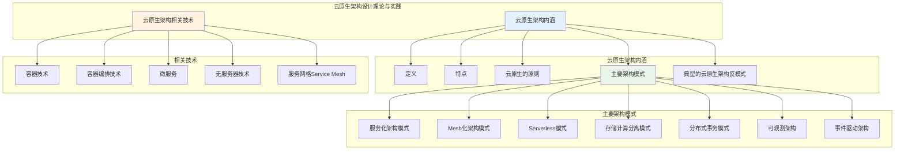

### 云原生架构内涵

**基础知识点**：

**1. 定义**

云原生架构是**基于云原生技术的一组架构原则和设计模式的集合**，旨在将云应用中的非业务代码部分进行最大化地剥离，从而让云设施接管应用中原有的大量非功能特性（如弹性、韧性、安全、可观测性、灰度等），使业务不再有非功能性业务中断困扰的同时，具备轻量、敏捷、高度自动化的特点。

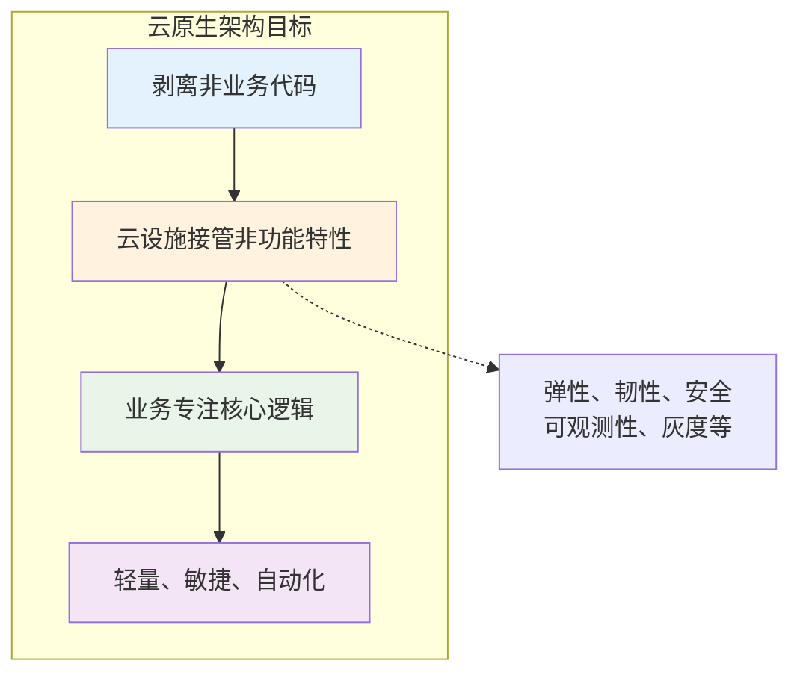

**2. 特点**

基于云原生架构的应用特点包括：

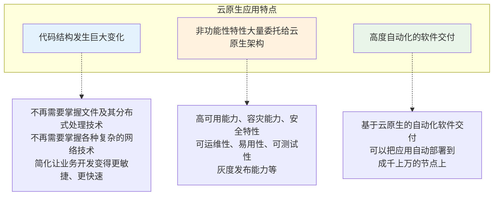

**3. 云原生的原则**

云原生具有以下**7个原则**：

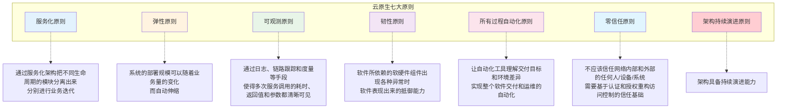

**4. 主要架构模式**

云原生涉及的主要架构模式有：

**（1）服务化架构模式**

要求以**应用模块为颗粒度**划分一个应用软件，以接口契约（例如IDL）定义彼此业务关系，以标准协议（HTTP、gRPC等）确保彼此的互联互通，结合领域模型驱动（DDD）、测试驱动开发（TDD）、容器化部署提升每个接口的代码质量和迭代速度。

**（2）Mesh化架构模式**

Mesh化架构是把**中间件框架**（如RPC、缓存、异步消息等）从业务进程中分离，让中间件SDK与业务代码进一步解耦，从而使得中间件升级对业务进程没有影响，甚至迁移到另外一个平台的中间件也对业务透明。

**（3）Serverless模式**

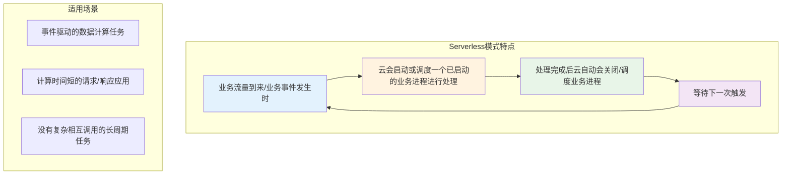

开发者不用关心应用运行地点、操作系统、网络配置、CPU性能等，将应用的整个运行都委托给云。

**（4）存储计算分离模式**

分布式环境中的**CAP困难**主要是针对有状态应用，由于一致性（Consistency，C），可用性（Availability，A），分区容错性（Partition Tolerance，P）三者无法同时满足，最多满足其中两个。

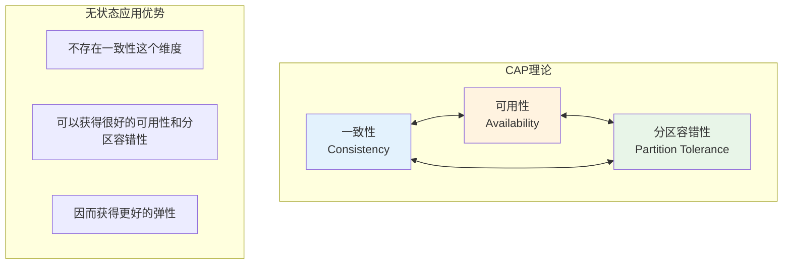

所以**无状态应用**不存在一致性这个维度，可以获得很好的可用性和分区容错性，因而获得更好的弹性。

**（5）分布式事务模式**

由于业务需要访问多个微服务，所以会带来分布式事务问题，否则数据就会出现不一致。因此架构师需要根据不同的场景选择合适的分布式事务模式：

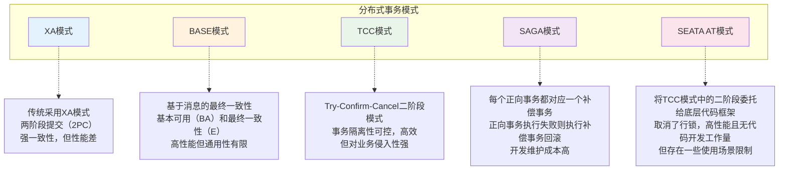

**（6）可观测架构**

可观测架构包括**Logging、Tracing、Metrics**：

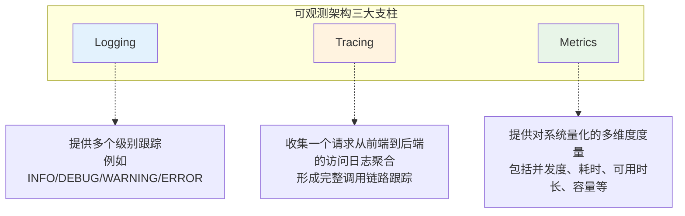

**（7）事件驱动架构**

事件驱动架构（**Event Driven Architecture，EDA**）是一种应用/组件间的集成架构模式。

**适用场景**：
- **增强服务韧性**
- **数据变化通知**
- **构建开放式接口**
- **事件流处理**
- **命令查询的责任分离（CQRS）**

**5. 典型的云原生架构反模式**

架构设计有时候需要根据不同的业务场景选择不同的方式，常见的云原生反模式有：

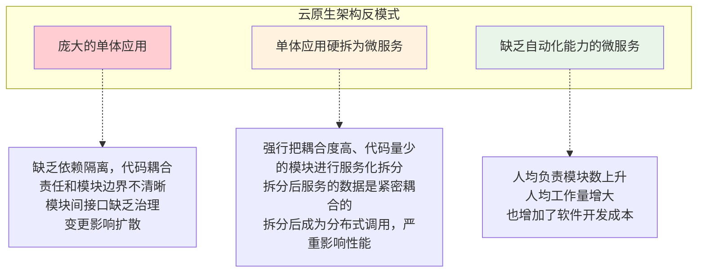

### 云原生架构相关技术

**基础知识点**：

**1. 容器技术**

容器作为**标准化软件基础单元**，它将应用及其所有依赖项打包发布，由于依赖项齐备，应用不再受环境限制，在不同计算环境间快速、可靠地运行。

**容器部署模式与其他模式的比较**：

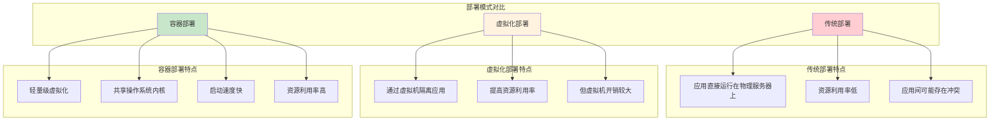

**2. 容器编排技术**

容器编排技术包括：

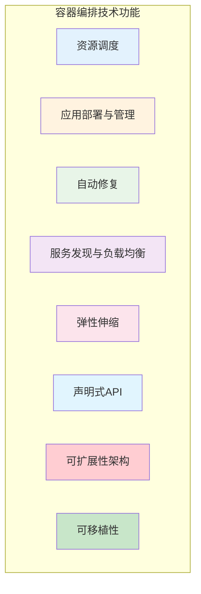

**3. 微服务**

微服务模式将**后端单体应用拆分为松耦合的多个子应用**，每个子应用负责一组子功能。这些子应用称为"微服务"，多个"微服务"共同形成了一个物理独立但逻辑完整的分布式微服务体系。

**微服务设计约束**：

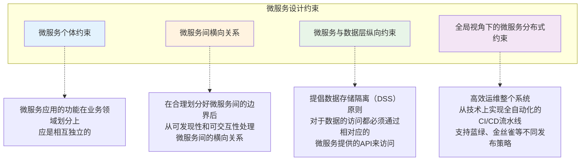

**4. 无服务器技术**

无服务器技术的特点：

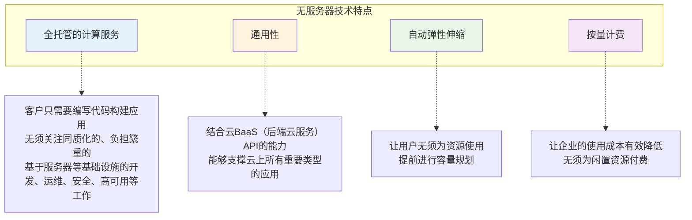

**无服务器技术的关注点**：
- **计算资源弹性调度**（容错、资源利用率、性能、数据驱动）
- **负载均衡和流控**
- **安全性**

**5. 服务网格（Service Mesh）**

服务网格旨在将那些**微服务间的连接、安全、流量控制和可观测等通用功能下沉为平台基础设施**，实现应用与平台基础设施的解耦。

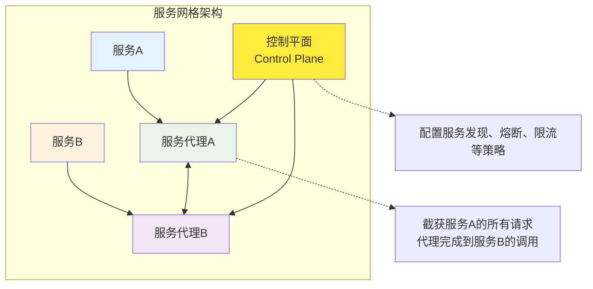

服务A调用服务B的所有请求，都被其下的服务代理截获，代理服务A完成到服务B的服务发现、熔断、限流等策略，而这些策略的总控是在控制平面（Control Plane）上配置。

**服务网格的主要技术**：
- **Istio**
- **Linkerd**
- **Consul**

### 练习题

**1. 云的时代需要新的技术架构，来帮助企业应用能够更好地利用云计算优势，充分释放云计算的技术红利。云计算无法为企业带来的改进是（ ）。**

A. 通过DevSecOps应用开发模式，业务功能开发更加敏捷，提升迭代速度，成本更低
B. 企业软件架构可以获得强大的可伸缩性和高可用性
C. 结合云平台全方位企业级安全服务和安全合规能力，保障企业应用在云上安全构建，业务安全运行
D. 企业的开发人员只须关注业务代码部分的开发，非业务功能可以完全委托给云原生架构来解决

**解析**：云原生架构旨在将云应用中的非业务代码部分进行最大化的剥离，从而让云设施接管应用中原有的大量非功能特性（如弹性、韧性、安全、可观测性、灰度等），但**无法接管所有的非功能特性**。

**答案：D**

**2. 下列关于云原生架构原则的描述，错误的是（ ）。**

A. 服务化原则、弹性原则、韧性原则
B. 可观测原则、所有过程自动化原则
C. 零信任原则、接口隔离原则
D. 架构持续演进原则

**解析**：**接口隔离原则**是面向对象设计原则，其含义是使用多个专门的接口比使用单一的总接口好。它不是云原生架构原则。

**答案：C**

**3. 关于微服务的描述，错误的是（ ）。**

A. 微服务是将后端单体应用拆分为松耦合的多个子应用，每个子应用负责一组子功能
B. 微服务相对独立，通过解耦研发、测试与部署流程，提高整体迭代效率
C. 微服务与数据层之间的纵向约束的含义是：在合理划分好微服务间的边界后，主要从微服务的可发现性和可交互性处理服务间的关系
D. 驾驭微服务的前提是：高效运维整个系统，从技术上要准备全自动化的CI/CD流水线满足对开发效率的诉求，并在这个基础上支持蓝绿、金丝雀等不同发布策略

**解析**：在合理划分好微服务间的边界后，主要从微服务的可发现性和可交互性处理服务间的关系，是属于**微服务之间的横向关系**。正确的纵向约束是：对于微服务的私有数据的访问都必须通过当前微服务提供的API来访问。

**答案：C**

**4. 无服务器技术的特点之一是全托管的计算服务：客户只需要编写代码构建应用，无须关注同质化的、负担繁重的基于服务器等基础设施的（ ）等工作。**

A. 开发、测试、发布、交付
B. 开发、运维、安全、高可用
C. 机房建设、服务器装机、操作系统安装、软件安装
D. 资源调度、性能压测、负载均衡、数据统计

**解析**：无服务器技术的特点：全托管的计算服务：客户只需要编写代码构建应用，无须关注同质化的、负担繁重的基于服务器等基础设施的**开发、运维、安全、高可用**等工作。

**答案：B**

**5. 容器作为标准化软件单元，它将应用及其所有依赖项打包，使应用不再受（ ）限制，在不同计算环境间快速、可靠地运行。**

A. 环境  B. 操作系统  C. 硬件  D. 网络

**解析**：在容器的帮助下，应用程序无须关注操作系统及更加低层的硬件、网络、存储的限制。选项B、C、D的说法有局限性，选项A更贴切。

**答案：A**

## 第18小时 面向服务架构设计理论与实践

### 章节考点分析

第18小时主要学习**面向服务架构设计理论与实践**。根据考试大纲，本小时知识点会涉及单选题型（约占**2～5分**）和案例题（**25分**），本小时内容偏重于方法的掌握和应用，根据以往全国计算机技术与软件专业技术资格（水平）考试的出题规律，概念知识的考查内容多数来源于实际应用，还需要灵活运用相关知识点。

**知识架构图**：

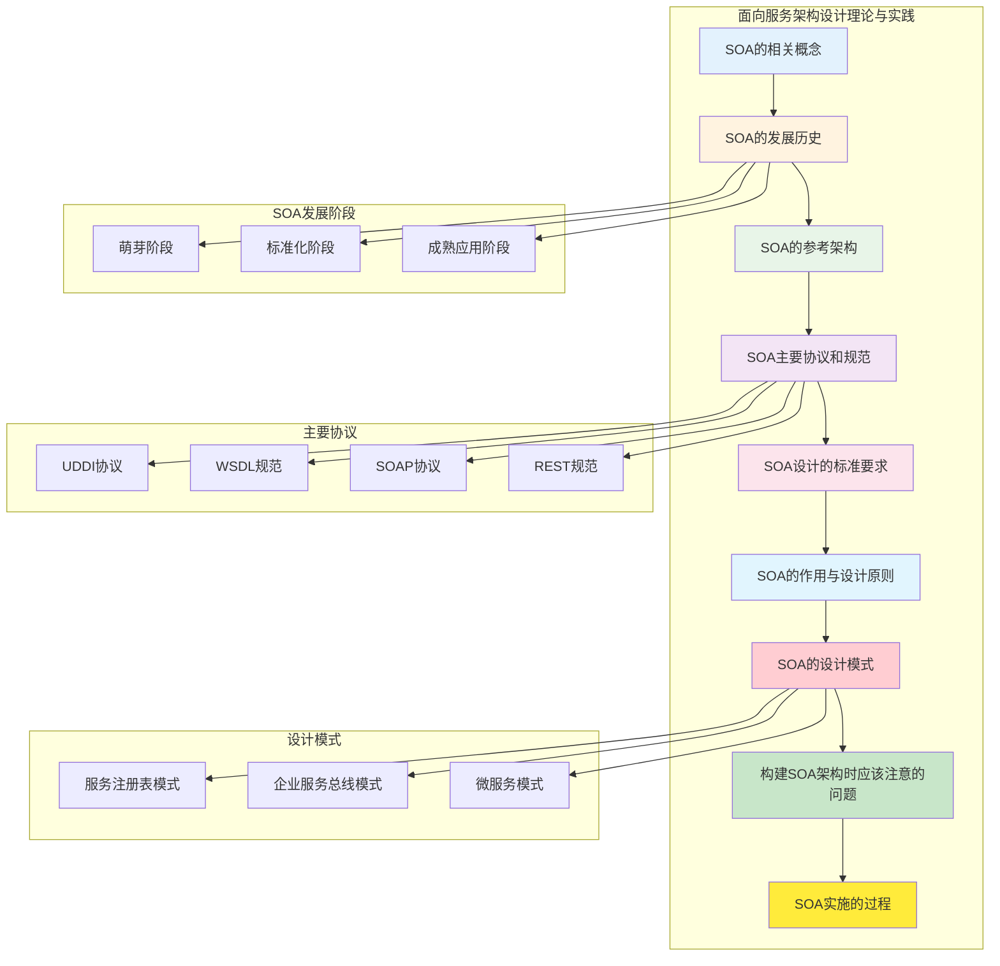

### SOA的相关概念

**基础知识点**：

**1. SOA的定义**

从软件的基本原理定义，可以认为SOA是一个**组件模型**，它将应用程序的不同功能单元（称为服务）通过这些服务之间定义良好的接口和契约联系起来。接口是采用**中立的方式**进行定义的，它应该独立于实现服务的硬件平台、操作系统和编程语言。

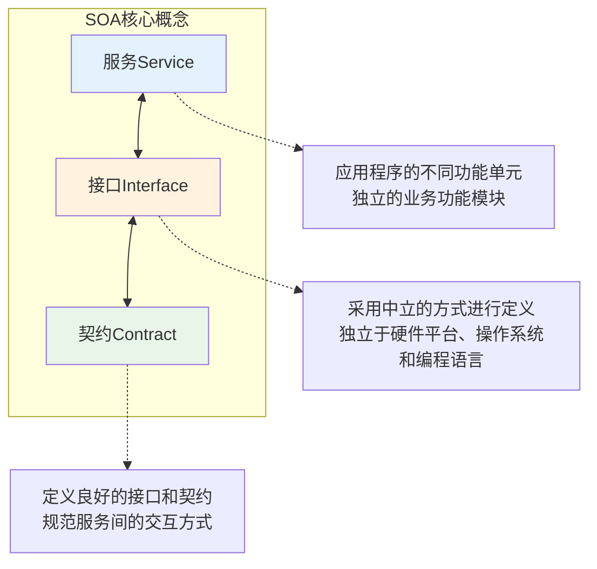

**2. 业务流程与业务流程执行语言（BPEL）**

**业务流程**是指为了实现某种业务目的行为所进行的流程或一系列动作。

**BPEL（Business Process Execution Language）**：使用BPEL，用户可以通过组合、编排和协调Web服务自上而下地实现面向服务的体系结构。

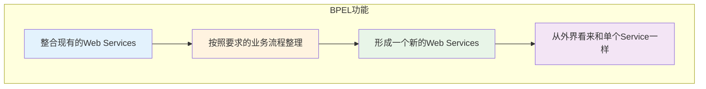

### SOA的发展历史

**基础知识点**：

**1. 发展过程**

SOA的发展经历了三个主要阶段：

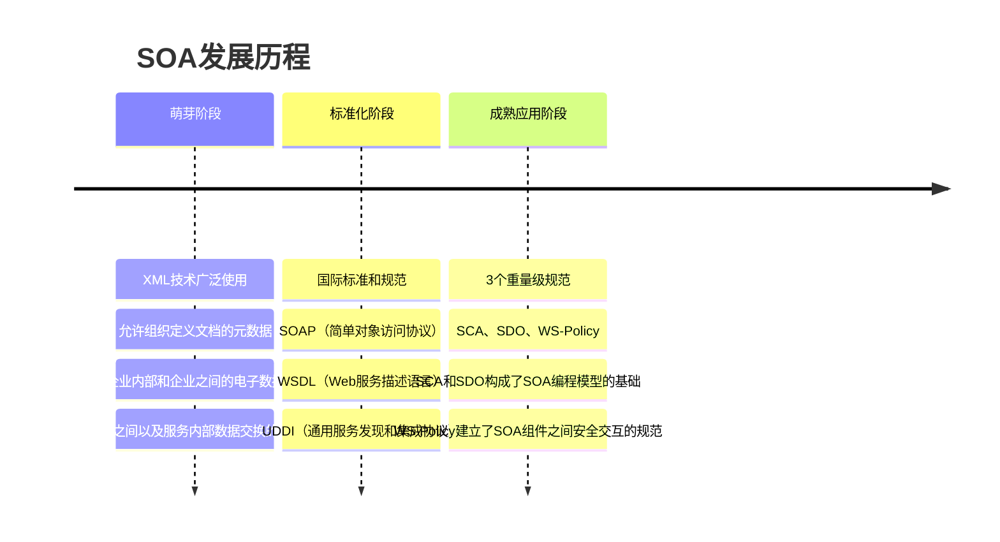

**2. SOA与微服务的区别**

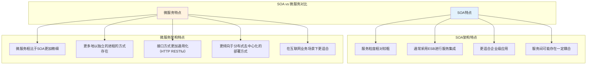

### SOA的参考架构

**基础知识点**：

IBM的Websphere业务集成参考架构是典型的**以服务为中心的企业集成架构**，它可划分为**6大类**：

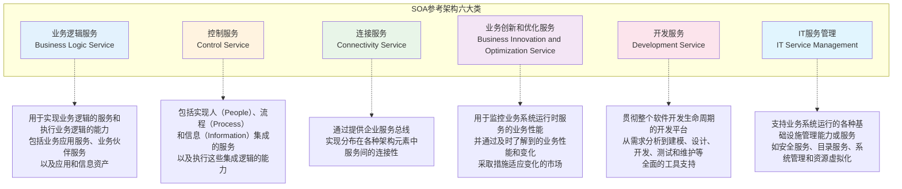

### SOA主要协议和规范

**基础知识点**：

Web服务最基本的协议包括**UDDI、WSDL、SOAP**，通过它们可以提供直接而又简单的Web Service支持。

```mermaid
graph TB
    subgraph "基本Web服务协议"
        UDDI["UDDI协议"]
        WSDL["WSDL规范"]
        SOAP["SOAP协议"]
        REST["REST规范"]
    end
    
    subgraph "协议功能"
        UDDI_FUNC["统一描述、发现和集成协议<br/>服务描述与发现的标准规范"]
        WSDL_FUNC["Web服务描述语言<br/>描述Web服务和说明如何与Web服务通信的XML语言"]
        SOAP_FUNC["简单对象访问协议<br/>在分散或分布式的环境中交换信息的简单协议"]
        REST_FUNC["资源表述性状态转移<br/>让不同的软件或应用程序在任何网络环境下都可以进行信息的互相传递"]
    end
    
    UDDI --> UDDI_FUNC
    WSDL --> WSDL_FUNC
    SOAP --> SOAP_FUNC
    REST --> REST_FUNC
    
    style UDDI fill:#e3f2fd
    style WSDL fill:#fff3e0
    style SOAP fill:#e8f5e8
    style REST fill:#f3e5f5
```

**1. UDDI协议**

**统一描述、发现和集成协议**。包含了服务描述与发现的标准规范，它使得商业实体能够彼此发现；定义它们怎样在Internet上互相作用，并在一个全球的注册体系架构中共享信息。

**2. WSDL规范**

**Web服务描述语言**（Web Services Description Language，WSDL）：WSDL是一个用来描述Web服务和说明如何与Web服务通信的XML语言。

**WSDL描述了Web服务的3个基本属性**：

```mermaid
graph TB
    subgraph "WSDL三个基本属性"
        WHAT["服务做些什么"]
        HOW["如何访问服务"]
        WHERE["服务位于何处"]
    end
    
    WHAT -.-> WHAT_DESC["服务所提供的操作（方法）"]
    HOW -.-> HOW_DESC["和服务交互的数据格式以及必要协议"]
    WHERE -.-> WHERE_DESC["协议相关的地址，如URL"]
    
    style WHAT fill:#e3f2fd
    style HOW fill:#fff3e0
    style WHERE fill:#e8f5e8
```

**3. SOAP协议**

SOAP是在分散或分布式的环境中交换信息的简单的协议，是一个**基于XML的协议**。

**4. REST规范**

为了让不同的软件或者应用程序在任何网络环境下都可以进行信息的互相传递。微服务对外就是以**REST API的形式**暴露给调用者。

**RESTful即REST形式的**，是对遵循REST设计思想同时满足设计约束的一类架构设计或应用程序的统称，可以理解为**资源表述性状态转移**：

```mermaid
graph TB
    subgraph "REST核心概念"
        RESOURCE["资源"]
        REPRESENTATION["表述"]
        STATE_TRANSFER["状态转移"]
        HYPERLINK["超链接"]
    end
    
    RESOURCE -.-> R_DESC["将互联网中一切暴露给客户端的事物<br/>都可以看作是一种资源"]
    REPRESENTATION -.-> REP_DESC["REST中用表述描述资源在Web中<br/>某一个时间的状态"]
    STATE_TRANSFER -.-> ST_DESC["分为两种：应用状态和资源状态<br/>应用状态保存在客户端<br/>资源状态保存在服务端"]
    HYPERLINK -.-> H_DESC["通过在页面中嵌入链接<br/>和其他资源建立联系"]
    
    style RESOURCE fill:#e3f2fd
    style REPRESENTATION fill:#fff3e0
    style STATE_TRANSFER fill:#e8f5e8
    style HYPERLINK fill:#f3e5f5
```

### SOA设计的标准要求

**基础知识点**：

SOA设计需要满足以下标准要求：

```mermaid
graph TB
    subgraph "SOA设计标准要求"
        DOC["文档标准化"]
        COMM["通信协议标准"]
        REG["应用程序统一登记与集成"]
        QOS["服务质量QoS"]
    end
    
    DOC -.-> DOC_DESC["SOA服务具有平台独立的自我描述XML文档<br/>Web服务描述语言是用于描述服务的标准语言"]
    
    COMM -.-> COMM_DESC["SOA服务用消息进行通信<br/>该消息通常使用XML Schema来定义<br/>（也称作XML Schema Definition，XSD）"]
    
    REG -.-> REG_DESC["在一个企业内部，SOA服务通过一个扮演<br/>目录列表（Directory Listing）角色的登记处（Registry）来进行维护<br/>应用程序在登记处（Registry）寻找并调用某项服务"]
    
    QOS -.-> QOS_DESC["包括可靠性、安全性、策略、控制、管理"]
    
    style DOC fill:#e3f2fd
    style COMM fill:#fff3e0
    style REG fill:#e8f5e8
    style QOS fill:#f3e5f5
```

**服务质量（QoS）主要包括**：

```mermaid
graph TB
    subgraph "服务质量QoS组成"
        RELIABILITY["可靠性"]
        SECURITY["安全性"]
        POLICY["策略"]
        CONTROL["控制"]
        MANAGEMENT["管理"]
    end
    
    RELIABILITY -.-> R_DESC["服务消费者和服务提供者之间传输文档时的传输特性<br/>（且仅仅传送一次、最多传送一次、重复消息过滤、保证消息传送）"]
    
    SECURITY -.-> S_DESC["Web服务安全规范用来保证消息的安全性"]
    
    POLICY -.-> P_DESC["服务提供者有时候会要求服务消费者与某种策略通信<br/>例如，服务提供商可能会要求消费者提供Kerberos安全标示才能取得某项服务"]
    
    CONTROL -.-> C_DESC["在SOA中，进程是使用一组离散的服务创建的<br/>BPEL4WS或者WSBPEL是用来控制这些服务的语言"]
    
    MANAGEMENT -.-> M_DESC["针对运行在多种环境下的所有服务<br/>必须有一个统一管理系统，以便系统管理员能够有效管理"]
    
    style RELIABILITY fill:#e3f2fd
    style SECURITY fill:#fff3e0
    style POLICY fill:#e8f5e8
    style CONTROL fill:#f3e5f5
    style MANAGEMENT fill:#fce4ec
```

### SOA的作用与设计原则

**基础知识点**：

**1. SOA的主要作用**

SOA的主要作用：**打破信息孤岛，把应用和资源转换成服务**。以及把这些服务变成标准的服务，形成资源的共享。

**2. SOA的设计原则**

SOA的设计原则主要有：

```mermaid
graph TB
    subgraph "SOA设计原则"
        STATELESS["无状态"]
        SINGLE["单一实例"]
        INTERFACE["明确定义的接口"]
        SELF_CONTAINED["自包含和模块化"]
        COARSE["粗粒度"]
        LOOSE_COUPLING["服务之间的松耦合性"]
        REUSE["重用能力"]
        INTEROP["互操作性、兼容和策略声明"]
    end
    
    STATELESS -.-> SL_DESC["以避免服务请求者依赖于服务提供者的状态"]
    SINGLE -.-> SI_DESC["以高内聚的实现方法，来避免功能冗余"]
    INTERFACE -.-> IN_DESC["服务的接口由WSDL定义<br/>用于指明服务的公共接口与其内部专用实现之间的界线"]
    SELF_CONTAINED -.-> SC_DESC["服务封装了那些在业务上稳定、重复出现的活动和组件<br/>实现服务的功能实体是完全独立自主的"]
    COARSE -.-> CO_DESC["服务数量不应该太大<br/>依靠消息交互而不是远程过程调用（RPC）"]
    LOOSE_COUPLING -.-> LC_DESC["服务使用者看到的是服务的接口<br/>其位置、实现技术和当前状态等对使用者是不可见的"]
    REUSE -.-> RE_DESC["服务应该是可以复用的"]
    INTEROP -.-> IO_DESC["为了确保服务规约的全面和明确<br/>利用策略来定义可配置的互操作语义"]
    
    style STATELESS fill:#e3f2fd
    style SINGLE fill:#fff3e0
    style INTERFACE fill:#e8f5e8
    style SELF_CONTAINED fill:#f3e5f5
    style COARSE fill:#fce4ec
    style LOOSE_COUPLING fill:#e1f5fe
    style REUSE fill:#ffcdd2
    style INTEROP fill:#c8e6c9
```

### SOA的设计模式

**基础知识点**：

**1. 服务注册表模式**

服务注册表支持驱动SOA治理的服务合同、策略和元数据的开发、发布和管理。

```mermaid
graph TB
    subgraph "服务注册表模式"
        REGISTER["服务注册"]
        LOCATE["服务位置"]
        BIND["服务绑定"]
    end
    
    REGISTER -.-> REG_DESC["应用开发者，也叫服务提供者<br/>向注册表公布它们的功能"]
    LOCATE -.-> LOC_DESC["也就是服务应用开发者<br/>帮助它们查询注册服务，寻找符合自身要求的服务"]
    BIND -.-> BIND_DESC["服务的消费者利用检索到的服务合同来开发代码<br/>开发的代码将与注册的服务绑定、调用注册的服务以及与它们实现互动"]
    
    style REGISTER fill:#e3f2fd
    style LOCATE fill:#fff3e0
    style BIND fill:#e8f5e8
```

**2. 企业服务总线模式**

企业服务总线模式提供一种**标准的软件底层架构**，各种程序组件能够以服务单元的方式"插入"到该平台上运行，并且组件之间能够以标准的消息通信方式来进行交互。

**ESB核心功能**：

```mermaid
graph TB
    subgraph "ESB核心功能"
        ROUTING["提供位置透明性的消息路由和寻址服务"]
        NAMING["提供服务注册和命名的管理功能"]
        PATTERN["支持多种消息传递范型"]
        PROTOCOL["支持多种可以广泛使用的传输协议"]
        FORMAT["支持多种数据格式及其相互转换"]
        MONITOR["提供日志和监控功能"]
    end
    
    ROUTING -.-> R_DESC["程序组件之间无须关注对方的路由和寻址"]
    PATTERN -.-> P_DESC["如请求/响应、发布/订阅等"]
    
    style ROUTING fill:#e3f2fd
    style NAMING fill:#fff3e0
    style PATTERN fill:#e8f5e8
    style PROTOCOL fill:#f3e5f5
    style FORMAT fill:#fce4ec
    style MONITOR fill:#e1f5fe
```

**3. 微服务模式**

微服务架构将一个大型的单个应用或服务拆分成多个微服务，可扩展单个组件而不是整个应用程序堆栈，从而满足服务等级协议。

**微服务模式的特点**：

```mermaid
graph TB
    subgraph "微服务模式特点"
        DECOUPLE["复杂应用解耦"]
        INDEPENDENT["独立"]
        FLEXIBLE["技术选型灵活"]
        FAULT_TOLERANT["容错"]
        LOOSE_COUPLING["松耦合，易扩展"]
    end
    
    DECOUPLE -.-> D_DESC["微服务架构将单一模块应用分解为多个微服务<br/>同时保持总体功能不变"]
    INDEPENDENT -.-> I_DESC["微服务在系统软件生命周期中<br/>是独立开发、测试及部署的"]
    FLEXIBLE -.-> F_DESC["微服务架构下系统应用的技术选型是去中心化的<br/>每个开发团队可根据自身应用的业务需求发展状况<br/>选择合适的体系架构与技术"]
    FAULT_TOLERANT -.-> FT_DESC["由于各个微服务相互独立<br/>故障会被隔离在单个服务中<br/>并且系统其他微服务可通过重试、平稳退化等机制实现应用层的容错"]
    LOOSE_COUPLING -.-> LC_DESC["微服务架构中每个服务之间都是松耦合的<br/>可以根据实际需求实现独立扩展"]
    
    style DECOUPLE fill:#e3f2fd
    style INDEPENDENT fill:#fff3e0
    style FLEXIBLE fill:#e8f5e8
    style FAULT_TOLERANT fill:#f3e5f5
    style LOOSE_COUPLING fill:#fce4ec
```

**微服务架构模式方案**：

```mermaid
graph TB
    subgraph "微服务架构模式方案"
        AGGREGATOR["聚合器微服务"]
        CHAIN["链式微服务"]
        DATA_SHARE["数据共享微服务"]
        ASYNC["异步消息传递微服务"]
    end
    
    AGGREGATOR -.-> A_DESC["聚合器充当流程指挥者<br/>调用多个微服务实现系统应用程序所需功能"]
    CHAIN -.-> C_DESC["客户端或服务在收到请求后<br/>会发生多个服务间的嵌套递归调用<br/>返回经过合并处理的响应"]
    DATA_SHARE -.-> DS_DESC["该模式适用于在单体架构应用到微服务架构的过渡阶段<br/>服务之间允许存在强耦合关系<br/>例如存在多个微服务共享缓存与数据库存储的现象"]
    ASYNC -.-> AS_DESC["对于一些不必要以同步方式运行的业务逻辑<br/>可以使用消息队列代替REST实现请求、响应<br/>加快服务调用的响应速度"]
    
    style AGGREGATOR fill:#e3f2fd
    style CHAIN fill:#fff3e0
    style DATA_SHARE fill:#e8f5e8
    style ASYNC fill:#f3e5f5
```

**微服务架构面临的问题与挑战**：
- **服务发现与服务调用链跟踪变得困难**
- **很难实现传统数据库的强一致性，转而追求最终一致性**###
 构建SOA架构时应该注意的问题

**基础知识点**：

**1. 原有系统架构中的集成需求**

原有系统架构中的集成需求包括：
- **应用程序集成的需求**
- **终端用户界面集成的需求**
- **流程集成的需求**
- **已有系统信息集成的需求**

**2. 服务粒度的控制以及无状态服务的设计**

```mermaid
graph TB
    subgraph "SOA架构设计要点"
        GRANULARITY["服务粒度的控制"]
        STATELESS["无状态服务的设计"]
    end
    
    GRANULARITY -.-> G_DESC["对于将暴露在整个系统外部的服务推荐使用粗粒度的接口<br/>而相对较细粒度的服务接口通常用于企业系统架构的内部"]
    
    STATELESS -.-> S_DESC["SOA系统架构中的具体服务应该都是独立的、自包含的请求<br/>在实现这些服务的时候不需要前一个请求的状态<br/>也就是说服务不应该依赖于其他服务的上下文和状态<br/>即SOA架构中的服务应该是无状态的服务"]
    
    style GRANULARITY fill:#e3f2fd
    style STATELESS fill:#fff3e0
```

### SOA实施的过程

**基础知识点**：

**1. 选择SOA解决方案**

选择SOA解决方案主要从以下**3个方面**进行：

```mermaid
graph TB
    subgraph "SOA解决方案选择"
        PLANNING["尽量选择能进行全局规划的方案"]
        REQUIREMENT["选择时充分考虑企业自身的需求"]
        TECHNOLOGY["从平台、实施等技术方面进行考察"]
    end
    
    style PLANNING fill:#e3f2fd
    style REQUIREMENT fill:#fff3e0
    style TECHNOLOGY fill:#e8f5e8
```

**2. 业务流程分析**

业务流程分析主要关注：

```mermaid
graph TB
    subgraph "业务流程分析"
        SERVICE_MODEL["建立服务模型"]
        BUSINESS_PROCESS["建立业务流程"]
    end
    
    subgraph "建立服务模型方法"
        TOP_DOWN["自顶向下分解法"]
        GOAL_ANALYSIS["业务目标分析法"]
        BOTTOM_UP["自底向上分析法"]
    end
    
    subgraph "建立业务流程内容"
        BUSINESS_OBJECT["建立业务对象"]
        SERVICE_INTERFACE["建立服务接口"]
        SERVICE_FLOW["建立服务流程"]
    end
    
    SERVICE_MODEL --> TOP_DOWN
    SERVICE_MODEL --> GOAL_ANALYSIS
    SERVICE_MODEL --> BOTTOM_UP
    
    BUSINESS_PROCESS --> BUSINESS_OBJECT
    BUSINESS_PROCESS --> SERVICE_INTERFACE
    BUSINESS_PROCESS --> SERVICE_FLOW
    
    BUSINESS_OBJECT -.-> BO_DESC["实体、过程、事件等业务对象"]
    
    style SERVICE_MODEL fill:#e3f2fd
    style BUSINESS_PROCESS fill:#fff3e0
```

### 练习题

**1. 下列关于SOA与微服务的描述，错误的是（ ）。**

A. 微服务相比于SOA更加精细，微服务更多地以独立的进程的方式存在，互相之间并无影响
B. 微服务提供的接口方式更加通用化，例如HTTP RESTful方式，各种终端都可以调用，无关语言、平台限制
C. 微服务更倾向于分布式去中心化的部署方式，在互联网业务场景下更适合
D. 微服务更容易实现出高并发的特性，有助于实现互联网业务的秒杀促销活动

**解析**：微服务在实现高并发方面是局限的。只有没有调用关系的微服务，相对于单体服务来说，才有并发性的提升。

**答案：D**

**2. 下列选项（ ）不是关于SOA的服务架构。**

A. 业务逻辑服务  B. 中间件服务  C. 连接服务  D. 控制服务

**解析**：SOA的参考架构中包括业务逻辑服务（Business Logic Service）、控制服务（Control Service）、连接服务（Connectivity Service）、业务创新和优化服务（Business Innovation and Optimization Service）、开发服务（Development Service）、IT服务管理（IT Service Management）。

**答案：B**

**3. WSDL规范：Web服务描述语言（Web Services Description Language）是一个用来描述Web服务和说明如何与Web服务通信的XML语言，描述了Web服务的三个基本属性，即（ ）。**

| a. 服务做些什么 | b. 如何访问服务 | c. 服务位于何处 | d. 服务是否可用 |
| --------------- | --------------- | --------------- | --------------- |
| A. abc          | B. acd          | C. bcd          | D. abd          |

**解析**：
- **服务做些什么**：服务所提供的操作（方法）
- **如何访问服务**：和服务交互的数据格式以及必要协议
- **服务位于何处**：协议相关的地址，如URL

**答案：A**

**4. SOA的设计原则为无状态、单一实例、明确定义的接口、（ ）、粗粒度、服务之间的松耦合性、重用能力、互操作性。**

A. 复用性和构件化  B. 自包含和模块化  C. 独立性和构件化  D. 隔离性和归一化

**解析**：SOA的设计原则为无状态、单一实例、明确定义的接口、**自包含和模块化**、粗粒度、服务之间的松耦合性、重用能力、互操作性。

**答案：B**

**5. 微服务架构将一个大型的单个应用或服务拆分成多个微服务，可扩展单个组件而不是整个应用程序堆栈，从而满足服务等级协议。微服务架构围绕业务领域将服务进行拆分，每个服务可以（ ），彼此之间使用统一接口进行交流，实现了在分散组件中的部署、管理与服务功能，使产品交付变得更加简单，从而达到有效拆分应用，实现敏捷开发与部署的目的。**

A. 独立进行开发、管理、迭代  B. 独立进行部署、运维、升级  C. 独立进行测试、交付、验收  D. 独立进行发布、发现、访问

**解析**：微服务架构围绕业务领域将服务进行拆分，每个服务可以**独立进行开发、管理和迭代**，彼此之间使用统一接口进行交流，实现了在分散组件中的部署、管理与服务功能。

**答案：A**

## 第19小时 嵌入式系统架构设计理论与实践

### 章节考点分析

第19小时主要学习**嵌入式系统架构设计的理论和工作中的实践**。根据新版考试大纲，本小时知识点会涉及案例分析题（**25分**）。在历年考试中，案例题对该部分内容都有固定考查，综合知识选择题目中有固定分值的考查。本小时内容侧重于对知识点的记忆、理解和应用，按照以往的出题规律，嵌入式系统架构设计基础知识点基本来源于教材内。

**知识架构图**：

```mermaid
graph TB
    subgraph "嵌入式系统架构设计理论与实践"
        A["嵌入式系统发展历程"]
        B["嵌入式系统硬件"]
        C["嵌入式系统软件"]
        D["嵌入式系统软件架构设计方法"]
        E["嵌入式系统软件架构实践"]
    end
    
    subgraph "发展历程"
        A1["单片微型计算机SCM"]
        A2["微控制器MCU"]
        A3["片上系统SoC"]
        A4["以Internet为基础的嵌入式系统"]
        A5["智能化、云技术推动下的嵌入式系统"]
    end
    
    subgraph "硬件组成"
        B1["传统嵌入式系统"]
        B2["嵌入式处理器的分类"]
        B3["存储器"]
        B4["总线"]
        B5["看门狗"]
    end
    
    subgraph "软件组成"
        C1["嵌入式操作系统"]
        C2["嵌入式数据库"]
        C3["嵌入式中间件"]
        C4["嵌入式系统软件开发环境"]
    end
    
    A --> A1
    A --> A2
    A --> A3
    A --> A4
    A --> A5
    
    B --> B1
    B --> B2
    B --> B3
    B --> B4
    B --> B5
    
    C --> C1
    C --> C2
    C --> C3
    C --> C4
    
    style A fill:#e3f2fd
    style B fill:#fff3e0
    style C fill:#e8f5e8
    style D fill:#f3e5f5
    style E fill:#fce4ec
```
### 嵌入式系统发展历程

**基础知识点**：

嵌入式系统发展历程可以分为**五个阶段**：

```mermaid
timeline
    title 嵌入式系统发展历程
    单片微型计算机SCM : 硬件：单片机
                    : 软件：无操作系统汇编语言
                    : 特点：结构和功能相对单一，处理效率低
                    :      存储容量十分有限，几乎没有用户接口
    
    微控制器MCU : 硬件：单片机+嵌入式微处理器外围电路+接口电路
               : 软件：以简单操作系统为核心
               : 特点：微处理器、微控制器种类繁多，通用性比较弱
               :      系统开销小，处理效率高，智能化控制能力突出
    
    片上系统SoC : 硬件：嵌入式微处理器
               : 软件：嵌入式操作系统
               : 特点：嵌入式系统兼容性好，操作系统内核小，处理效率高
    
    以Internet为基础的嵌入式系统 : 硬件：嵌入式微处理器
                              : 软件：嵌入式操作系统
                              : 特点：微处理器集成网络接口，应用域网络环境中
    
    智能化云技术推动下的嵌入式系统 : 硬件：微型传感器+智能服务设备
                                : 软件：—
                                : 特点：低能耗，高速度，高集成，高可信，适应环境广
```

### 嵌入式系统硬件

**基础知识点**：

**1. 传统嵌入式系统**

传统嵌入式系统主要硬件包括：

```mermaid
graph TB
    subgraph "传统嵌入式系统硬件组成"
        PROCESSOR["微处理器"]
        MEMORY["存储器"]
        BUS["总线"]
        TIMER["定时器/计数器Timer"]
        WATCHDOG["看门狗WatchDog"]
        IO["I/O接口"]
        EXTERNAL["外部设备"]
    end
    
    PROCESSOR -.-> P_DESC["微控制器（MCU）<br/>微处理器（MPU）"]
    MEMORY -.-> M_DESC["RAM、ROM"]
    BUS -.-> B_DESC["内总线，外总线"]
    TIMER -.-> T_DESC["定时和计数功能"]
    WATCHDOG -.-> W_DESC["系统恢复能力"]
    IO -.-> I_DESC["串口，网络，USB，JTAG"]
    EXTERNAL -.-> E_DESC["UART，LED"]
    
    style PROCESSOR fill:#e3f2fd
    style MEMORY fill:#fff3e0
    style BUS fill:#e8f5e8
    style TIMER fill:#f3e5f5
    style WATCHDOG fill:#fce4ec
    style IO fill:#e1f5fe
    style EXTERNAL fill:#ffcdd2
```

**2. 嵌入式处理器的分类**

嵌入式处理器可以分为**5类**：

```mermaid
graph TB
    subgraph "嵌入式处理器分类"
        MPU["微处理器MPU"]
        MCU["微控制器MCU"]
        DSP["信号处理器DSP"]
        GPU["图形处理器GPU"]
        SOC["片上系统SoC"]
    end
    
    MPU -.-> MPU_DESC["特点：体积小，重量轻，成本低<br/>可靠性高，但技术保密性差"]
    MCU -.-> MCU_DESC["特点：单片化，体积小<br/>功耗低，成本低，可靠性更高"]
    DSP -.-> DSP_DESC["特点：系统结构和指令采用特殊设计<br/>通常采用哈佛结构，编译效率高，指令执行速度也高"]
    GPU -.-> GPU_DESC["专注于浮点运算<br/>弥补了CPU运算速度不足"]
    SOC -.-> SOC_DESC["采用了片内再编程技术<br/>可使片上系统内硬件的功能像软件一样通过编程来配置<br/>从而可以实时地进行灵活而方便的修改和开发"]
    
    style MPU fill:#e3f2fd
    style MCU fill:#fff3e0
    style DSP fill:#e8f5e8
    style GPU fill:#f3e5f5
    style SOC fill:#fce4ec
```

**3. 存储器**

存储器就是一种**存储程序和数据用的时序逻辑电路**。

```mermaid
graph TB
    subgraph "存储器分类"
        RAM["随机存取存储器RAM"]
        ROM["只读存储器ROM"]
    end
    
    subgraph "RAM特点"
        RAM_CHAR["一旦系统断电<br/>存放在里面的所有数据和程序都会自动清空掉<br/>并且再也无法恢复"]
    end
    
    subgraph "ROM特点"
        ROM_CHAR["在元件正常工作的情况下<br/>其中的代码数据将永久保存<br/>并且不能够进行修改"]
    end
    
    subgraph "RAM类型（18种）"
        RAM_TYPES["DRAM、SRAM、VRAM、FPM DRAM<br/>EDO DRAM、BEDO DRAM、MDRAM、WRAM<br/>RDRAM、SDRAM、SGRAM、SB SRAM<br/>PB SRAM、DDR SDRAM、SLDRAM、CDRAM<br/>DDRII、DRDRAM"]
    end
    
    subgraph "ROM类型（5种）"
        ROM_TYPES["MASK ROM、PROM、EPROM<br/>EEPROM、Flash Memory"]
    end
    
    RAM --> RAM_CHAR
    ROM --> ROM_CHAR
    RAM --> RAM_TYPES
    ROM --> ROM_TYPES
    
    style RAM fill:#e3f2fd
    style ROM fill:#fff3e0
```

**4. 总线**

总线是**功能部件间传输信息的公共通信干线**。

**总线的拓扑结构**：星型、树状、环型、总线型和交叉开关型等5种。

**总线的分类**：

```mermaid
graph TB
    subgraph "按传输信息种类分类"
        DATA_BUS["数据总线"]
        ADDR_BUS["地址总线"]
        CTRL_BUS["控制总线"]
    end
    
    subgraph "按连接部件分类"
        INTERNAL["内部总线"]
        EXTERNAL["外部总线"]
    end
    
    subgraph "内部总线细分"
        CHIP_BUS["片内总线"]
        SYSTEM_BUS["系统总线"]
        LOCAL_BUS["局部总线"]
    end
    
    DATA_BUS -.-> DATA_DESC["用于处理器与RAM间传输<br/>待处理和待存储的数据"]
    ADDR_BUS -.-> ADDR_DESC["用于传输RAM中存储数据的地址"]
    CTRL_BUS -.-> CTRL_DESC["用于传输处理器控制单元信号到周边设备"]
    
    CHIP_BUS -.-> CHIP_DESC["连接ALU、寄存器、指令部件等芯片内部元件"]
    SYSTEM_BUS -.-> SYS_DESC["又称板级总线，连接微控制器/处理器，主存，I/O接口"]
    LOCAL_BUS -.-> LOCAL_DESC["连接少量组件用于交换数据"]
    
    EXTERNAL -.-> EXT_DESC["又称外设总线，连接外部设备或外部系统"]
    
    INTERNAL --> CHIP_BUS
    INTERNAL --> SYSTEM_BUS
    INTERNAL --> LOCAL_BUS
    
    style DATA_BUS fill:#e3f2fd
    style ADDR_BUS fill:#fff3e0
    style CTRL_BUS fill:#e8f5e8
    style INTERNAL fill:#f3e5f5
    style EXTERNAL fill:#fce4ec
```

**5. 看门狗**

看门狗为嵌入式系统提供**必需的系统恢复能力**，在系统发生软件问题和程序跑飞时重新启动系统。

**基本原理**：由计数器自动计数，程序定期将其重置，如果系统卡死或程序跑飞，计数器溢出，进入中断处理，在设定时间间隔内，系统保留状态后复位重启。

### 嵌入式系统软件

**基础知识点**：

**1. 嵌入式操作系统的定义及特点**

嵌入式操作系统（**Embedded Operating System，EOS**）是指用于嵌入式系统的操作系统。

**与通用操作系统相比，嵌入式操作系统具有的特点**：

```mermaid
graph TB
    subgraph "嵌入式操作系统特点"
        TRIM["可剪裁性"]
        PORT["可移植性"]
        REALTIME["强实时性"]
        COMPACT["强紧凑性"]
        QUALITY["高质量代码"]
        CUSTOM["强定制性"]
        INTERFACE["标准接口"]
        STABLE["强稳定性"]
        WEAK_INTERACT["弱交互性"]
        DETERMINE["强确定性"]
        SIMPLE["操作简捷、方便"]
        HARDWARE["较强的硬件适应性"]
        SOLIDIFY["可固化性"]
    end
    
    style TRIM fill:#e3f2fd
    style PORT fill:#fff3e0
    style REALTIME fill:#e8f5e8
    style COMPACT fill:#f3e5f5
    style QUALITY fill:#fce4ec
    style CUSTOM fill:#e1f5fe
    style INTERFACE fill:#ffcdd2
    style STABLE fill:#c8e6c9
    style WEAK_INTERACT fill:#ffeb3b
    style DETERMINE fill:#e3f2fd
    style SIMPLE fill:#fff3e0
    style HARDWARE fill:#e8f5e8
    style SOLIDIFY fill:#f3e5f5
```

**2. 嵌入式系统的架构**

嵌入式操作系统分为**面向控制、通信领域**以及**面向消费电子产品**两类。

**3. 嵌入式操作系统的基本功能**

**（1）操作系统内核架构**

```mermaid
graph TB
    subgraph "内核架构类型"
        MACRO["宏内核"]
        MICRO["微内核"]
    end
    
    MACRO -.-> MACRO_DESC["用于管理用户程序和硬件间的系统资源<br/>在宏内核中用户服务和内核服务在同一空间中实现<br/>代码耦合度非常高，内核的功能组件代码可以互相调用"]
    
    MICRO -.-> MICRO_DESC["微内核管理所有系统资源<br/>在微内核中用户服务和内核服务在不同空间中实现<br/>系统结构清晰，代码量少"]
    
    style MACRO fill:#e3f2fd
    style MICRO fill:#fff3e0
```

**（2）任务管理**

任务是嵌入式操作系统调度最小单位，类似于计算机操作系统中进程的概念。

**任务的3种工作状态**：

```mermaid
stateDiagram-v2
    [*] --> 就绪状态
    就绪状态 --> 执行状态: 获得处理机
    执行状态 --> 就绪状态: 时间片用完/被抢占
    执行状态 --> 阻塞状态: 等待事件发生
    阻塞状态 --> 就绪状态: 等待事件完成
    
    note right of 执行状态: 任务获得处理机，程序在处理机中执行
    note right of 就绪状态: 任务已获得处理机以外资源，待获得处理机即可执行
    note right of 阻塞状态: 执行状态任务因等待事件发生无法执行而放弃处理机
```

**实时调度算法分类**：

```mermaid
graph TB
    subgraph "实时调度算法分类"
        OFFLINE["离线调度算法"]
        ONLINE["在线调度算法"]
        PREEMPT["抢占调度算法"]
        NON_PREEMPT["非抢占调度算法"]
        STATIC["静态调度算法"]
        DYNAMIC["动态调度算法"]
    end
    
    OFFLINE -.-> OFF_DESC["系统运行前确定调度信息<br/>如时间驱动，确定性，缺乏灵活性"]
    ONLINE -.-> ON_DESC["系统运行中动态获得调度信息<br/>如优先级驱动，灵活性较大"]
    PREEMPT -.-> PRE_DESC["运行任务可能被打断<br/>更复杂，更耗资源"]
    NON_PREEMPT -.-> NON_DESC["运行任务不被打断"]
    STATIC -.-> STA_DESC["任务优先级在设计时确定，不变化<br/>简单，缺乏灵活性"]
    DYNAMIC -.-> DYN_DESC["任务优先级在运行中确定，不断变化<br/>灵活，耗资源"]
    
    style OFFLINE fill:#e3f2fd
    style ONLINE fill:#fff3e0
    style PREEMPT fill:#e8f5e8
    style NON_PREEMPT fill:#f3e5f5
    style STATIC fill:#fce4ec
    style DYNAMIC fill:#e1f5fe
```

**强实时调度算法**：

```mermaid
graph TB
    subgraph "强实时调度算法"
        EDF["最早截止时间优先EDF"]
        LLF["最低松弛度优先LLF"]
        RMS["单调速率RMS"]
    end
    
    EDF -.-> EDF_DESC["根据任务截止时间确定优先级<br/>截止时间越早，其优先级越高"]
    LLF -.-> LLF_DESC["根据任务紧急或松弛程度确定优先级<br/>紧急程度越高，优先级越高"]
    RMS -.-> RMS_DESC["根据任务周期确定优先级<br/>周期越短，优先级越高<br/>这种算法被认为是最优的"]
    
    style EDF fill:#e3f2fd
    style LLF fill:#fff3e0
    style RMS fill:#e8f5e8
```

**（3）存储管理**

存储管理的主要目的是解决**多个用户使用主存的问题**，存储管理方法主要包括分区、分页、分段、段页式存储管理以及虚拟存储管理等。

**（4）任务间通信**

任务间通信管理也是嵌入式操作系统的关键功能之一。它主要为操作系统的应用程序提供多种类型的数据传输、任务同步/异步操作等手段。**
4. 嵌入式数据库**

嵌入式数据库具有**嵌入式、实时性、移动性、伸缩性**的特点。

**嵌入式数据库分类**：

```mermaid
graph TB
    subgraph "按嵌入对象分类"
        SOFT_DB["软件嵌入数据库"]
        DEVICE_DB["设备嵌入数据库"]
        MEMORY_DB["内存数据库"]
    end
    
    subgraph "按系统结构分类"
        EMBED_DB["嵌入数据库"]
        MOBILE_DB["移动数据库"]
        CS_DB["小型C/S结构数据库"]
    end
    
    subgraph "按存储位置分类"
        MEM_BASED["基于内存的数据库系统"]
        FILE_BASED["基于文件的数据库"]
        NET_BASED["基于网络的数据库"]
    end
    
    MEM_BASED -.-> MEM_DESC["采用内存存储，属于实时事务最佳技术"]
    FILE_BASED -.-> FILE_DESC["以文件方式磁盘存储，安全性低"]
    NET_BASED -.-> NET_DESC["远程服务器存储，无须解析SQL<br/>支持更多SQL操作，客户端小，便于代码重用"]
    
    style MEM_BASED fill:#e3f2fd
    style FILE_BASED fill:#fff3e0
    style NET_BASED fill:#e8f5e8
```

**数据库管理系统与嵌入式数据库对比**：

| 对比项       | 数据库管理系统               | 嵌入式数据库             |
| ------------ | ---------------------------- | ------------------------ |
| **操作用户** | 允许非开发人员操作           | 只允许应用程序访问和控制 |
| **访问控制** | 数据与程序分离，便于访问控制 | 应用程序负责访问和控制   |
| **发布部署** | 独立安装、部署和管理         | 与应用程序一同发布       |

**典型嵌入式数据库产品**：

```mermaid
graph TB
    subgraph "典型产品"
        EXTREMEDB["eXtremeDB"]
        SQLITE["SQLite"]
        CS_ARCH["C/S架构数据库"]
    end
    
    EXTREMEDB -.-> EXT_DESC["基于内存的数据库系统<br/>最小化资源消耗、保持极小堆空间<br/>维持极小代码体积、消除额外代码层<br/>提供动态数据结构本地支持"]
    
    SQLITE -.-> SQL_DESC["基于文件的嵌入式数据库系统<br/>开源的内嵌式关系型数据库<br/>集成在程序中，无须配置管理<br/>服务器客户端同进程，简化管理，减少网络开销"]
    
    CS_ARCH -.-> CS_DESC["基于网络的嵌入式数据库系统<br/>C/S架构的数据库、B/S架构的数据库<br/>以及云数据库等都属于这种类型"]
    
    style EXTREMEDB fill:#e3f2fd
    style SQLITE fill:#fff3e0
    style CS_ARCH fill:#e8f5e8
```

**嵌入式数据库主要功能**：

除了具有与通用数据库相似的功能外，嵌入式数据库还具有的功能包括：
- **足够高效的数据存储机制**
- **数据安全控制（锁机制）**
- **实时事务管理机制**
- **数据库恢复机制（历史数据存储）**

**5. 嵌入式中间件**

嵌入式中间件是在嵌入式系统中处于**嵌入式应用和操作系统之间层次的中间软件**，其主要作用是对嵌入式应用屏蔽底层操作系统的异构性，常见功能有网络通信、内存管理和数据处理等。

**典型的嵌入式中间件**：
- **消息中间件**
- **分布式对象中间件**

**6. 嵌入式系统软件开发环境**

嵌入式系统软件开发环境的特点：

```mermaid
graph TB
    subgraph "开发环境特点"
        IDE["集成开发环境"]
        CROSS["交叉开发"]
        OPEN["开放式架构"]
        EXTEND["可扩展性"]
        OPERATE["可操作性"]
        PORT["可移植性"]
        CONFIG["可配置性"]
        REALTIME["实时性"]
        MAINTAIN["可维护性"]
        UI["用户界面友好"]
    end
    
    style IDE fill:#e3f2fd
    style CROSS fill:#fff3e0
    style OPEN fill:#e8f5e8
    style EXTEND fill:#f3e5f5
    style OPERATE fill:#fce4ec
    style PORT fill:#e1f5fe
    style CONFIG fill:#ffcdd2
    style REALTIME fill:#c8e6c9
    style MAINTAIN fill:#ffeb3b
    style UI fill:#e3f2fd
```

### 嵌入式系统软件架构设计方法

**基础知识点**：

**1. 基于架构的软件设计开发方法（ABSD）**

这种方法的详细内容在第9小时中已经介绍，这里不再赘述。

**2. 属性驱动的软件设计方法（ADD）**

ADD是把一组**质量属性**（可用性、性能、安全性等）场景作为输入，利用对质量属性实现与架构设计之间的关系的了解（如体系结构风格、质量战术等）对软件架构进行设计的一种方法。

```mermaid
flowchart LR
    INPUT["质量属性场景输入"] --> TACTICS["质量属性战术"]
    TACTICS --> DESIGN["架构设计"]
    DESIGN --> MODULE["模块分解过程"]
    
    style INPUT fill:#e3f2fd
    style TACTICS fill:#fff3e0
    style DESIGN fill:#e8f5e8
    style MODULE fill:#f3e5f5
```

**ADD方法的7个阶段**：

```mermaid
graph TB
    subgraph "ADD方法七个阶段"
        REVIEW["评审"]
        SELECT_DRIVER["选择驱动因子"]
        SELECT_ELEMENT["选择系统元素"]
        SELECT_CONCEPT["选择设计概念"]
        INSTANTIATE["实体化元素和定义接口"]
        DRAFT_VIEW["草拟视图"]
        ANALYZE["分析评价"]
    end
    
    REVIEW --> SELECT_DRIVER
    SELECT_DRIVER --> SELECT_ELEMENT
    SELECT_ELEMENT --> SELECT_CONCEPT
    SELECT_CONCEPT --> INSTANTIATE
    INSTANTIATE --> DRAFT_VIEW
    DRAFT_VIEW --> ANALYZE
    
    style REVIEW fill:#e3f2fd
    style SELECT_DRIVER fill:#fff3e0
    style SELECT_ELEMENT fill:#e8f5e8
    style SELECT_CONCEPT fill:#f3e5f5
    style INSTANTIATE fill:#fce4ec
    style DRAFT_VIEW fill:#e1f5fe
    style ANALYZE fill:#ffcdd2
```

**3. 实时系统设计方法（DARTS）**

DARTS基于**传统结构化分析方法**，扩展了行为建模部分。

**DARTS方法分为5个部分**：

```mermaid
graph TB
    subgraph "DARTS方法五个部分"
        SPEC["用实时结构化分析方法开发系统规范"]
        DIVIDE["将系统划分为多个并发任务"]
        INTERFACE["定义任务间接口"]
        DESIGN_TASK["设计每个任务"]
        RESULT["设计过程的成果"]
    end
    
    SPEC --> DIVIDE
    DIVIDE --> INTERFACE
    INTERFACE --> DESIGN_TASK
    DESIGN_TASK --> RESULT
    
    style SPEC fill:#e3f2fd
    style DIVIDE fill:#fff3e0
    style INTERFACE fill:#e8f5e8
    style DESIGN_TASK fill:#f3e5f5
    style RESULT fill:#fce4ec
```

**DARTS方法的优势**：

```mermaid
graph TB
    subgraph "DARTS方法优势"
        ADV1["强调将系统分解为并发任务，并提供确认任务的标准"]
        ADV2["提供定义任务间接口的指南"]
        ADV3["强调用任务架构图的重要性"]
        ADV4["提供从实时结构化分析规格到实时结构化设计的转换"]
    end
    
    style ADV1 fill:#c8e6c9
    style ADV2 fill:#c8e6c9
    style ADV3 fill:#c8e6c9
    style ADV4 fill:#c8e6c9
```

**DARTS方法的不足**：

```mermaid
graph TB
    subgraph "DARTS方法不足"
        DIS1["DARTS使用信息隐藏技术封装数据存储，封装性不好"]
        DIS2["如果实时结构化分析阶段完成得不好，那么任务的结构化工作就会更加困难"]
    end
    
    style DIS1 fill:#ffcdd2
    style DIS2 fill:#ffcdd2
```

### 嵌入式系统软件架构实践

**基础知识点**：

**1. 鸿蒙操作系统**

鸿蒙操作系统架构采用了**分布式设计理念**，实现了分布式软总线、分布式设备系统的虚拟化、分布式数据管理和分布式任务调度**4种分布式能力**。

**鸿蒙操作系统层次式架构**：

```mermaid
graph TB
    subgraph "鸿蒙操作系统层次式架构"
        APP_LAYER["应用层<br/>Application Layer"]
        FRAMEWORK_LAYER["应用框架层<br/>Framework Layer"]
        SERVICE_LAYER["系统服务层<br/>System Service Layer"]
        KERNEL_LAYER["内核层<br/>Kernel Layer"]
    end
    
    subgraph "内核层组成"
        KAL["内核抽象层KAL"]
        DRIVER["驱动子系统"]
    end
    
    APP_LAYER --> FRAMEWORK_LAYER
    FRAMEWORK_LAYER --> SERVICE_LAYER
    SERVICE_LAYER --> KERNEL_LAYER
    
    KERNEL_LAYER --> KAL
    KERNEL_LAYER --> DRIVER
    
    APP_LAYER -.-> APP_DESC["包括系统应用和第三方非系统应用<br/>能够实现特定的业务功能<br/>支持跨设备调度与分发"]
    
    FRAMEWORK_LAYER -.-> FRAME_DESC["为应用服务提供多语言用户程序框架<br/>能力框架，以及各种硬件服务对外开放的API"]
    
    SERVICE_LAYER -.-> SERVICE_DESC["属于核心能力集合的部分<br/>为应用程序提供服务"]
    
    KAL -.-> KAL_DESC["屏蔽多内核差异，对上层提供基础内核能力<br/>如进程/线程管理、内存管理、文件系统<br/>网络管理、外设管理等"]
    
    DRIVER -.-> DRIVER_DESC["提供统一外设访问能力<br/>驱动开发框架，驱动管理框架"]
    
    style APP_LAYER fill:#e3f2fd
    style FRAMEWORK_LAYER fill:#fff3e0
    style SERVICE_LAYER fill:#e8f5e8
    style KERNEL_LAYER fill:#f3e5f5
```

**鸿蒙操作系统架构的4个技术特性**：

```mermaid
graph TB
    subgraph "鸿蒙操作系统四个技术特性"
        DIST["分布式架构用于终端操作系统<br/>实现跨终端无缝协同体验"]
        DELAY["确定时延引擎和高性能进程间通信技术<br/>实现系统的流畅"]
        MICRO["基于微内核架构<br/>重塑终端设备的可信安全"]
        DEV["统一集成开发环境<br/>一次开发，多端部署，实现跨终端生态共享"]
    end
    
    style DIST fill:#e3f2fd
    style DELAY fill:#fff3e0
    style MICRO fill:#e8f5e8
    style DEV fill:#f3e5f5
```

**2. 面向安全攸关系统的跨领域系统架构（GENESYS）**

GENESYS是一种**跨领域的通用嵌入式架构平台**。GENESYS采用消息交换方式实现软硬件构件的抽象级别的提升，使得构件在接口规范基础上可以被重用，而不需要知道构件的内部实现。

**GENESYS解决的三个挑战**：
- **复杂性管理**
- **系统健壮性**
- **能量有效使用**

**GENESYS架构提供的3组服务**：

```mermaid
graph TB
    subgraph "GENESYS三组服务"
        DOMAIN_INDEPENDENT["领域无关服务"]
        DOMAIN_SPECIFIC["领域专用服务"]
        APP_SPECIFIC["应用专用服务（包含中间件）"]
    end
    
    subgraph "领域无关服务"
        CORE["核心服务"]
        OPTIONAL["选择服务"]
    end
    
    DOMAIN_INDEPENDENT --> CORE
    DOMAIN_INDEPENDENT --> OPTIONAL
    
    CORE -.-> CORE_DESC["如嵌入式系统中的全局时间和消息传输等服务"]
    OPTIONAL -.-> OPT_DESC["信息安全服务、外部存储器管理器<br/>或者Internet网关服务等"]
    
    DOMAIN_SPECIFIC -.-> DS_DESC["由领域特有的服务子集加上<br/>待开发领域特征的特定服务组合"]
    
    style DOMAIN_INDEPENDENT fill:#e3f2fd
    style DOMAIN_SPECIFIC fill:#fff3e0
    style APP_SPECIFIC fill:#e8f5e8
```

**GENESYS架构的主要特征及优势**：

```mermaid
graph TB
    subgraph "GENESYS架构特征及优势"
        PRECISE["精确的构件定位"]
        OPEN["开放性"]
        THREE_LEVEL["三级集成"]
        LAYERED["分层的服务"]
        CORE["确定的核心"]
        STANDARD["标准的互联集成"]
    end
    
    PRECISE -.-> P_DESC["简单化、跨领域重用、规模的经济型<br/>健壮性、可降低系统集成工作量"]
    OPEN -.-> O_DESC["可集成性、可升级性、可扩展性<br/>遗产系统集成、降低成本"]
    THREE_LEVEL -.-> T_DESC["芯片级集成、设备级集成、系统级集成"]
    LAYERED -.-> L_DESC["可重用性、领域定位、工效经济型"]
    CORE -.-> C_DESC["及时性、降低复杂性、可测试性<br/>认证、故障掩蔽"]
    STANDARD -.-> S_DESC["对远程访问的保护、降低集成工作难度<br/>常规人机交互、具有安全性"]
    
    style PRECISE fill:#e3f2fd
    style OPEN fill:#fff3e0
    style THREE_LEVEL fill:#e8f5e8
    style LAYERED fill:#f3e5f5
    style CORE fill:#fce4ec
    style STANDARD fill:#e1f5fe
```

**3. 物联网操作系统软件架构**

物联网操作系统至今没有一个明确的定义。物联网操作系统通常包括**芯片层、终端层、边缘层、云端层**等多个层面内容。

**物联网操作系统使用的软件以及技术**：

```mermaid
graph TB
    subgraph "物联网操作系统技术"
        FREERTOS["开源物联网操作系统FreeRTOS"]
        PUBLIC["公共服务组件"]
        CUSTOM["定制性服务组件"]
    end
    
    PUBLIC -.-> PUB_DESC["网络协议、外设支持<br/>可移植操作系统接口POSIX等"]
    CUSTOM -.-> CUS_DESC["消息队列遥测传输协议（MQTT）<br/>安全超文本传输协议（HTTPS）<br/>加密消息标准PKCS #11支持，安全套件等"]
    
    style FREERTOS fill:#e3f2fd
    style PUBLIC fill:#fff3e0
    style CUSTOM fill:#e8f5e8
```

**物联网操作系统主要特征**：

```mermaid
graph TB
    subgraph "物联网操作系统特征"
        REALTIME["内核实时性"]
        SCALABLE["内核尺寸伸缩性"]
        EXTENSIBLE["架构可扩展性"]
        RELIABLE["高可靠性"]
        LOW_POWER["低功耗"]
    end
    
    style REALTIME fill:#e3f2fd
    style SCALABLE fill:#fff3e0
    style EXTENSIBLE fill:#e8f5e8
    style RELIABLE fill:#f3e5f5
    style LOW_POWER fill:#fce4ec
```

### 练习题


**1. 以下关于鸿蒙操作系统的叙述中，不正确的是（ ）。**

A. 鸿蒙操作系统整体架构采用分层的层次化设计，从下向上依次为：内核层、系统服务层、框架层和应用层
B. 鸿蒙操作系统内核层采用宏内核设计，拥有更强的安全特性和低时延特点
C. 鸿蒙操作系统架构采用了分布式设计理念，实现了分布式软总线、分布式设备系统的虚拟化、分布式数据管理和分布式任务调度等四种分布式能力
D. 架构的系统安全性主要体现在搭载HarmonyOS的分布式终端上，可以保证"正确的人，通过正确的设备，正确地使用数据"

**解析**：鸿蒙操作系统采用**微内核架构**，整体采用层次式架构，采用分布式理念且实现了分布式安全框架。

**答案：B**

**2. GENESYS架构的主要特征及优势是什么？**

**答案**：GENESYS架构的主要特征及优势包括：

1. **精确的构件定位**。具体体现为简单化、跨领域重用、规模的经济型、健壮性、可降低系统集成工作量这5个特征。

2. **开放性**。体现为具有可集成性、可升级性、可扩展性、遗产系统集成、降低成本这5个特征。

3. **三级集成**。具有芯片级集成、设备级集成、系统级集成。

4. **分层的服务**。体现具有可重用性、领域定位、工效经济型的特性。

5. **确定的核心**。体现在具有及时性、降低复杂性、可测试性、认证、故障掩蔽的特征。

6. **标准的互联集成**。体现在对远程访问的保护、降低集成工作难度、常规人机交互、具有安全性4个方面。

**3. 鸿蒙操作系统架构具有哪几个技术特性？**

**答案**：鸿蒙操作系统架构具有4个技术特性：

1. **分布式架构用于终端操作系统**，实现跨终端无缝协同体验。

2. **确定时延引擎和高性能进程间通信技术**，实现系统的流畅。

3. **基于微内核架构**，重塑终端设备的可信安全。

4. **统一集成开发环境**，一次开发，多端部署，实现跨终端生态共享。

**4. 嵌入式系统软件架构设计方法中的实时系统设计方法（DARTS）具有哪些优势和不足？**

**答案**：

**DARTS方法的优势**：

1. **强调将系统分解为并发任务**，并提供确认任务的标准。

2. **提供定义任务间接口的指南**。

3. **强调用任务架构图的重要性**。

4. **提供从实时结构化分析规格到实时结构化设计的转换**。

**DARTS方法的不足**：

1. **DARTS使用信息隐藏技术封装数据存储，封装性不好**。

2. **如果实时结构化分析阶段完成得不好，那么任务的结构化工作就会更加困难**。
   
## 第20小时 通信系统架构设计理论与实践

### 章节考点分析

第20小时主要学习**通信系统架构设计的理论和工作中的实践**。根据新版考试大纲，本小时知识点会涉及案例分析题（**25分**），而在历年考试中，案例题对该部分内容的考查并不多，虽在综合知识选择题目中经常考查，但分值也不高。本小时内容侧重于对知识点的记忆和理解，按照以往的出题规律，通信系统架构设计基础知识点多来源于教材内的基础网络设备、网络架构和教材外最新时事热点技术。

**知识架构图**：

```mermaid
graph TB
    subgraph "通信系统架构设计理论与实践"
        A["通信系统网络架构"]
        B["网络构建关键技术"]
        C["网络构建"]
    end
    
    subgraph "网络架构类型"
        A1["局域网网络架构"]
        A2["广域网网络架构"]
        A3["移动通信网网络架构"]
        A4["存储网络架构"]
    end
    
    subgraph "局域网架构"
        A11["单核心架构"]
        A12["双核心架构"]
        A13["环型架构"]
        A14["层次型架构"]
    end
    
    subgraph "存储网络类型"
        A41["直连式存储DAS"]
        A42["网络附加存储NAS"]
        A43["存储区域网络SAN"]
    end
    
    A --> A1
    A --> A2
    A --> A3
    A --> A4
    
    A1 --> A11
    A1 --> A12
    A1 --> A13
    A1 --> A14
    
    A4 --> A41
    A4 --> A42
    A4 --> A43
    
    style A fill:#e3f2fd
    style B fill:#fff3e0
    style C fill:#e8f5e8
    style A1 fill:#f3e5f5
    style A4 fill:#fce4ec
```

### 通信系统网络架构

**基础知识点**：

通信网络主要形式：**局域网、广域网、移动通信网**。

**1. 局域网网络架构**

局域网是**单一机构专用计算机的网络**。通常由计算机、交换机、路由器等设备组成。

**局域网特点**：
- **覆盖地理范围小**
- **数据传输速率高**
- **低误码率**
- **可靠性高**
- **支持多种传输介质**
- **支持实时应用**

**局域网分类**：
- **按网络拓扑分类**：总线型、环型、星型、树型、层次型等类型
- **按传输介质分类**：有线局域网、无线局域网

**局域网网络架构的4种类型**：

```mermaid
graph TB
    subgraph "局域网网络架构类型"
        SINGLE["单核心架构"]
        DUAL["双核心架构"]
        RING["环型架构"]
        HIERARCHICAL["层次型架构"]
    end
    
    subgraph "单核心架构"
        S_ADV["优点：结构简单，设备投资节约，接入方便"]
        S_DIS["缺点：地理范围受限，核心单点故障，扩展能力有限"]
    end
    
    subgraph "双核心架构"
        D_ADV["优点：网络拓扑结构可靠性高，接入较为方便"]
        D_DIS["缺点：投资较单核心高，核心端口密度要求较高"]
    end
    
    subgraph "环型架构"
        R_ADV["优点：RPR具备自愈保护，节省光纤资源<br/>提供多等级、可靠的QoS服务，有效利用带宽资源"]
        R_DIS["缺点：投资较高，路由冗余设计实施难度较高且易形成环路"]
    end
    
    subgraph "层次型架构"
        H_COMP["由核心层、汇聚层、接入层三层交换设备和用户设备组成"]
        H_ADV["优点：易扩展，分级排查网络故障便于维护"]
    end
    
    SINGLE --> S_ADV
    SINGLE --> S_DIS
    DUAL --> D_ADV
    DUAL --> D_DIS
    RING --> R_ADV
    RING --> R_DIS
    HIERARCHICAL --> H_COMP
    HIERARCHICAL --> H_ADV
    
    style SINGLE fill:#e3f2fd
    style DUAL fill:#fff3e0
    style RING fill:#e8f5e8
    style HIERARCHICAL fill:#f3e5f5
```

**层次型架构详解**：

```mermaid
graph TB
    subgraph "层次型架构三层模型"
        CORE["核心层"]
        AGGREGATION["汇聚层"]
        ACCESS["接入层"]
        USER["用户设备"]
    end
    
    CORE --> AGGREGATION
    AGGREGATION --> ACCESS
    ACCESS --> USER
    
    CORE -.-> CORE_DESC["负责高速数据转发"]
    AGGREGATION -.-> AGG_DESC["提供充足接口<br/>与接入层间实现互访控制"]
    ACCESS -.-> ACC_DESC["用户设备接入"]
    
    style CORE fill:#e3f2fd
    style AGGREGATION fill:#fff3e0
    style ACCESS fill:#e8f5e8
    style USER fill:#f3e5f5
```

**2. 广域网网络架构**

广域网利用**公用分组交换网、无线分组交换网、卫星通信网**构建通信子网连接分布的局域网以实现资源子网的共享。

**广域网组成**：**骨干网、分布网、接入网**

**广域网网络架构类型**：

```mermaid
graph TB
    subgraph "广域网网络架构类型"
        WAN_SINGLE["单核心架构"]
        WAN_DUAL["双核心架构"]
        WAN_RING["环型架构"]
        WAN_REDUNDANT["半/全冗余架构"]
        WAN_PEER["对等子域架构"]
        WAN_HIERARCHICAL["层次子域架构"]
    end
    
    WAN_SINGLE -.-> WS_DESC["以单台核心三层交换设备作为网络核心<br/>优点：结构简单，设备投资节约<br/>缺点：核心单点故障，扩展能力欠佳"]
    
    WAN_DUAL -.-> WD_DESC["以两台核心三层及以上交换机作为网络核心<br/>优点：网络拓扑结构可靠，路由可热切换<br/>缺点：投资较单核心高，路由冗余设计实施难度较高"]
    
    WAN_RING -.-> WR_DESC["以多台核心三层及以上交换机组成路由环路作为网络核心<br/>优点：接入方便<br/>缺点：投资较高，路由冗余设计实施难度较高且易形成环路"]
    
    WAN_REDUNDANT -.-> WRE_DESC["以多台核心路由设备间互连组成网络核心<br/>优点：结构灵活，路由灵活，方便扩展，可靠性高<br/>缺点：结构零散，不便管理，不便排障"]
    
    WAN_PEER -.-> WP_DESC["将半冗余核心划为两个独立子域，子域间通过一条或多条链路互连<br/>优点：路由控制灵活<br/>缺点：子域间冗余设计实施难度较高"]
    
    WAN_HIERARCHICAL -.-> WH_DESC["半冗余核心划为多个独立子域，子域间存在层次关系<br/>优点：扩展性较好，路由控制灵活<br/>缺点：子域路由冗余设计实施难度较高"]
    
    style WAN_SINGLE fill:#e3f2fd
    style WAN_DUAL fill:#fff3e0
    style WAN_RING fill:#e8f5e8
    style WAN_REDUNDANT fill:#f3e5f5
    style WAN_PEER fill:#fce4ec
    style WAN_HIERARCHICAL fill:#e1f5fe
```

**3. 移动通信网网络架构**

**5G系统**为移动终端用户提供数据网络互连，数据网络可以是互联网、IP媒体子系统、专用网络。

**用户设备通过5G系统接入数据网络的方式**：
- **透明模式**：5G系统通过用户面功能接口接入运营商网络，然后通过防火墙或者代理连至Internet
- **非透明模式**：5G系统可以直接或通过其他网络连接至运营商网络或Internet

**5G网络边缘计算**：
5G网络边缘计算能为垂直行业提供诸如以**时间敏感、高带宽**为特征的业务就近分流服务。一来为用户提供极佳的服务体验，二来降低了移动网络后端处理的压力。

**软件定义网络（SDN）**：
SDN是一种**新型网络创新架构**，核心思想是通过**控制与转发分离**，将网络中交换设备的控制逻辑集中到一个计算设备上，控制面集中管控，提升网络管理配置能力。

**4. 存储网络架构**

存储网络设计磁盘存储访问方式：**直连式存储，网络附加存储，存储区域网络**。

```mermaid
graph TB
    subgraph "存储网络架构类型"
        DAS["直连式存储DAS"]
        NAS["网络附加存储NAS"]
        SAN["存储区域网络SAN"]
    end
    
    DAS -.-> DAS_DESC["存储设备通过IDE/ATA/SCSI接口或光纤通道<br/>直接连接到单台计算机<br/>计算机通过I/O访问存储设备"]
    
    NAS -.-> NAS_DESC["存储设备通过标准的网络拓扑结构连接到计算机群组<br/>计算机通过IP局域网或广域网TPC或UDP协议<br/>通过RPC接口访问NAS存储设备"]
    
    SAN -.-> SAN_DESC["一种采用网状通道技术专门为存储建立的<br/>独立于TCP/IP网络之外的专用网络<br/>通过网状通道交换机连接存储阵列和服务器"]
    
    style DAS fill:#e3f2fd
    style NAS fill:#fff3e0
    style SAN fill:#e8f5e8
```

**存储网络架构对比**：

| 对比项       | DAS                       | NAS                                        | SAN                            |
| ------------ | ------------------------- | ------------------------------------------ | ------------------------------ |
| **架构类别** | 单机存储架构              | 网络存储架构                               | 网络存储架构                   |
| **访问方式** | I/O总线                   | 网络                                       | 网络                           |
| **资源利用** | 单机存储                  | 共享存储                                   | 共享存储                       |
| **访问媒介** | 总线                      | 以太网                                     | 以太网/光纤通道                |
| **优势特点** | 易用易管理<br/>设备成本低 | 易用易管理<br/>可扩展性高<br/>设备成本较低 | 高性能<br/>低延迟<br/>灵活性高 |

### 网络构建关键技术

**基础知识点**：

**IPv4与IPv6融合组网技术**

目前网络演进还存在较长时间IPv4到IPv6过渡期或IPv4和IPv6网络共存期。现阶段主要存在**3种过渡技术**：

```mermaid
graph TB
    subgraph "IPv4与IPv6过渡技术"
        DUAL_STACK["双协议栈"]
        TUNNEL["隧道技术"]
        NAT["网络地址翻译技术"]
    end
    
    DUAL_STACK -.-> DS_DESC["两种协议在同一平台上双栈共存<br/>同时运行"]
    
    TUNNEL -.-> T_DESC["包括ISATAP隧道、6to4隧道<br/>over6隧道、6over4隧道"]
    
    NAT -.-> N_DESC["将IPv4地址和IPv6地址分别看作<br/>内部地址和外部地址，或者相反<br/>以实现地址转换"]
    
    style DUAL_STACK fill:#e3f2fd
    style TUNNEL fill:#fff3e0
    style NAT fill:#e8f5e8
```

### 网络构建

**基础知识点**：

**1. 网络需求分析**

网络需求分析主要从**5个方面**进行分析：

```mermaid
graph TB
    subgraph "网络需求分析五个方面"
        BUSINESS["业务需求"]
        USER["用户需求"]
        APPLICATION["应用需求"]
        PLATFORM["计算机平台需求"]
        NETWORK["网络需求"]
    end
    
    style BUSINESS fill:#e3f2fd
    style USER fill:#fff3e0
    style APPLICATION fill:#e8f5e8
    style PLATFORM fill:#f3e5f5
    style NETWORK fill:#fce4ec
```

**2. 网络技术遴选及设计**

网络技术遴选及设计可以使用以下方式：

```mermaid
graph TB
    subgraph "网络技术遴选及设计方式"
        STP["生成树协议"]
        VLAN["虚拟局域网VLAN"]
        WLAN["无线局域网WLAN"]
        LINE_REDUNDANCY["线路冗余设计"]
        SERVER_REDUNDANCY["服务器冗余设计"]
    end
    
    style STP fill:#e3f2fd
    style VLAN fill:#fff3e0
    style WLAN fill:#e8f5e8
    style LINE_REDUNDANCY fill:#f3e5f5
    style SERVER_REDUNDANCY fill:#fce4ec
```

**3. 广域网技术遴选**

广域网技术遴选可以采用**远程接入技术、广域网互连技术**：

```mermaid
graph TB
    subgraph "广域网技术"
        DDN["数字数据网络DDN"]
        SDH["同步数字体系SDH"]
        MSTP["多业务传送平台MSTP"]
        VPN["虚拟专用网络VPN"]
    end
    
    style DDN fill:#e3f2fd
    style SDH fill:#fff3e0
    style MSTP fill:#e8f5e8
    style VPN fill:#f3e5f5
```

**广域网性能优化策略**：
- **预留带宽**
- **利用拨号线路**
- **传输数据压缩**
- **链路聚合**
- **数据基于优先级排序**
- **基于协议预留带宽**

**4. 层次化网络模型设计**

层次化设计的优点是能**降低成本，充分利用模块化设备/部件，网络变化或演化容易**。

**层次化网络设计一般采用三层模型设计思路**：

```mermaid
graph TB
    subgraph "三层模型"
        ACCESS_LAYER["接入层"]
        AGGREGATION_LAYER["汇聚层"]
        CORE_LAYER["核心层"]
    end
    
    ACCESS_LAYER --> AGGREGATION_LAYER
    AGGREGATION_LAYER --> CORE_LAYER
    
    style ACCESS_LAYER fill:#e3f2fd
    style AGGREGATION_LAYER fill:#fff3e0
    style CORE_LAYER fill:#e8f5e8
```

**层次化设计的原则**：

```mermaid
graph TB
    subgraph "层次化设计原则"
        CONTROL_LAYER["控制网络层次"]
        FROM_ACCESS["从接入层开始，向上分析规划"]
        MODULAR["尽量采用模块化设计"]
        CONTROL_STRUCTURE["严格控制网络结构"]
        CONTROL_HIERARCHY["严格控制层次化结构"]
    end
    
    style CONTROL_LAYER fill:#e3f2fd
    style FROM_ACCESS fill:#fff3e0
    style MODULAR fill:#e8f5e8
    style CONTROL_STRUCTURE fill:#f3e5f5
    style CONTROL_HIERARCHY fill:#fce4ec
```

**5. 网络安全控制技术**

实施网络安全控制的相关技术主要有：

```mermaid
graph TB
    subgraph "网络安全控制技术"
        FIREWALL["防火墙"]
        VPN_TECH["虚拟专用网络技术"]
        ACCESS_CONTROL["访问控制技术"]
        ISOLATION["网络安全隔离"]
        PROTOCOL["网络安全协议"]
    end
    
    subgraph "防火墙类型"
        HW_FIREWALL["硬件防火墙"]
        SW_FIREWALL["软件防火墙"]
        EMBED_FIREWALL["嵌入式防火墙"]
    end
    
    subgraph "访问控制类型"
        DAC["自主访问控制DAC"]
        MAC["强制访问控制MAC"]
        RBAC["基于角色的访问控制RBAC"]
        TBAC["基于任务的访问控制TBAC"]
        OBAC["基于对象的访问控制OBAC"]
    end
    
    subgraph "安全隔离形式"
        SUBNET["子网隔离"]
        PHYSICAL["物理隔离"]
        VLAN_ISO["VLAN隔离"]
        LOGICAL["逻辑隔离"]
    end
    
    FIREWALL --> HW_FIREWALL
    FIREWALL --> SW_FIREWALL
    FIREWALL --> EMBED_FIREWALL
    
    ACCESS_CONTROL --> DAC
    ACCESS_CONTROL --> MAC
    ACCESS_CONTROL --> RBAC
    ACCESS_CONTROL --> TBAC
    ACCESS_CONTROL --> OBAC
    
    ISOLATION --> SUBNET
    ISOLATION --> PHYSICAL
    ISOLATION --> VLAN_ISO
    ISOLATION --> LOGICAL
    
    style FIREWALL fill:#e3f2fd
    style VPN_TECH fill:#fff3e0
    style ACCESS_CONTROL fill:#e8f5e8
    style ISOLATION fill:#f3e5f5
    style PROTOCOL fill:#fce4ec
```

**防火墙功能**：
- **可以允许/拒绝/重定向数据流**
- **审计进出网络的访问或服务**
- **保护本地网络资源**

**虚拟专用网络技术优点**：
- **成本低**
- **接入方便**
- **可扩展性强**
- **管理和控制方便**

**6. 网络安全审计**

网络安全审计用来**测试，评估和分析网络脆弱性**，能够实现自动响应、数据生成、分析、浏览、事件存储、事件选择等功能。

**7. 绿色网络设计方法**

绿色网络设计采用**精简设计、重用设计、回收设计**的思路。

**设计原则**：

```mermaid
graph TB
    subgraph "绿色网络设计原则"
        STANDARD["标准化"]
        INTEGRATION["集成化"]
        VIRTUAL["虚拟化"]
        INTELLIGENT["智能化"]
    end
    
    STANDARD -.-> S_DESC["减少转换设备，兼容异构方案"]
    INTEGRATION -.-> I_DESC["减少设备总量，降低资源需求"]
    VIRTUAL -.-> V_DESC["灵活调配，按需使用"]
    INTELLIGENT -.-> IN_DESC["降低人力成本，降低资源占用"]
    
    style STANDARD fill:#e3f2fd
    style INTEGRATION fill:#fff3e0
    style VIRTUAL fill:#e8f5e8
    style INTELLIGENT fill:#f3e5f5
```

### 练习题

**1. 下列关于局域网网络架构的描述，错误的是（ ）。**

A. 单核心架构结构简单，设备投资节约，接入方便，但地理范围受限，核心单点故障
B. 双核心架构网络拓扑结构可靠性高，接入较为方便，但投资较单核心高
C. 环型架构RPR具备自愈保护，节省光纤资源，但投资较高，路由冗余设计实施难度较高
D. 层次型架构由核心层、汇聚层、接入层组成，易扩展，但不便于维护和排查网络故障

**解析**：层次型架构的优点是易扩展，**分级排查网络故障便于维护**，而不是不便于维护。

**答案：D**

**2. 关于存储网络架构的描述，正确的是（ ）。**

A. DAS是网络存储架构，通过网络访问存储设备
B. NAS通过I/O总线访问存储设备，资源利用率低
C. SAN是一种采用网状通道技术专门为存储建立的独立于TCP/IP网络之外的专用网络
D. 三种存储架构中，DAS的设备成本最高，但性能最好

**解析**：SAN（存储区域网络）是一种采用网状通道技术专门为存储建立的独立于TCP/IP网络之外的专用网络，通过网状通道交换机连接存储阵列和服务器。

**答案：C**

**3. IPv4与IPv6融合组网的过渡技术不包括（ ）。**

A. 双协议栈技术  B. 隧道技术  C. 网络地址翻译技术  D. 路由聚合技术

**解析**：IPv4与IPv6过渡技术主要包括：双协议栈、隧道技术、网络地址翻译技术。路由聚合技术不是IPv4与IPv6的过渡技术。

**答案：D**

**4. 下列关于5G网络边缘计算的描述，错误的是（ ）。**

A. 5G网络边缘计算能为垂直行业提供时间敏感、高带宽为特征的业务就近分流服务
B. 5G网络边缘计算为用户提供极佳的服务体验
C. 5G网络边缘计算降低了移动网络后端处理的压力
D. 5G网络边缘计算只能通过透明模式接入数据网络

**解析**：用户设备通过5G系统接入数据网络有两种方式：透明模式和非透明模式，不是只能通过透明模式。

**答案：D**

**5. 绿色网络设计的原则包括（ ）。**

A. 标准化、集成化、虚拟化、智能化
B. 模块化、层次化、冗余化、安全化
C. 可靠性、可用性、可扩展性、可维护性
D. 高性能、低延迟、高带宽、低成本

**解析**：绿色网络设计的原则包括：标准化（减少转换设备，兼容异构方案）、集成化（减少设备总量，降低资源需求）、虚拟化（灵活调配，按需使用）、智能化（降低人力成本，降低资源占用）。

**答案：A**
## 第21小时 安全架构设计理论与实践

### 章节考点分析

第21小时主要学习**信息系统中安全架构设计的理论和工作中的实践**。根据考试大纲，本小时知识点会涉及案例分析题和论文题（各占**25分**），而在历年考试中，综合知识选择题目中也有过诸多考查。本小时内容侧重于知识点记忆，按照以往的出题规律，安全架构设计基础知识点主要来源于教材，但随着形势和技术的发展，也可能会联系最新时事考查新颁布的安全标准。

**知识架构图**：

```mermaid
graph TB
    subgraph "安全架构设计理论与实践"
        A["信息安全面临的威胁"]
        B["安全体系架构的范围"]
        C["安全模型"]
        D["信息安全整体架构设计"]
        E["网络安全架构设计"]
        F["数据库系统安全设计"]
        G["系统架构脆弱性分析"]
        H["安全架构设计实践"]
    end
    
    subgraph "安全威胁类型"
        A1["人为蓄意破坏"]
        A2["灾害性攻击"]
        A3["系统故障"]
        A4["人员无意识行为"]
    end
    
    subgraph "安全模型类型"
        C1["状态机模型"]
        C2["BLP模型"]
        C3["Biba模型"]
        C4["CWM模型"]
        C5["Chinese Wall模型"]
    end
    
    subgraph "架构脆弱性"
        G1["分层架构脆弱性"]
        G2["C/S架构脆弱性"]
        G3["B/S架构脆弱性"]
        G4["事件驱动架构脆弱性"]
        G5["MVC架构脆弱性"]
        G6["微内核架构脆弱性"]
        G7["微服务架构脆弱性"]
    end
    
    A --> A1
    A --> A2
    A --> A3
    A --> A4
    
    C --> C1
    C --> C2
    C --> C3
    C --> C4
    C --> C5
    
    G --> G1
    G --> G2
    G --> G3
    G --> G4
    G --> G5
    G --> G6
    G --> G7
    
    style A fill:#e3f2fd
    style B fill:#fff3e0
    style C fill:#e8f5e8
    style D fill:#f3e5f5
    style E fill:#fce4ec
    style F fill:#e1f5fe
    style G fill:#ffcdd2
    style H fill:#c8e6c9
```

### 信息安全面临的威胁

**基础知识点**：

**1. 信息系统安全威胁的来源**

威胁可以来源于**物理环境、通信链路、网络系统、操作系统、应用系统、管理系统**。

**2. 网络与信息安全风险类别**

网络与信息安全风险类别可以分为**人为蓄意破坏、灾害性攻击、系统故障、人员无意识行为**：

```mermaid
graph TB
    subgraph "网络与信息安全风险类别"
        MALICIOUS["人为蓄意破坏"]
        DISASTER["灾害性攻击"]
        SYSTEM_FAULT["系统故障"]
        UNCONSCIOUS["人员无意识行为"]
    end
    
    subgraph "人为蓄意破坏"
        PASSIVE["被动型攻击"]
        ACTIVE["主动型攻击"]
    end
    
    subgraph "被动型攻击"
        LISTENING["网络监听"]
        ILLEGAL_LOGIN["非法登录"]
        INFO_INTERCEPT["信息截取"]
    end
    
    subgraph "主动型攻击"
        DATA_TAMPER["数据篡改"]
        IDENTITY_FAKE["假冒身份"]
        DOS["拒绝服务"]
        REPLAY["重放攻击"]
        VIRUS["散播病毒"]
        REPUDIATION["主观抵赖"]
    end
    
    subgraph "灾害性攻击"
        FLOOD["水灾"]
        FIRE["火灾"]
        EARTHQUAKE["地震"]
        LIGHTNING["雷击"]
        WAR["战争"]
    end
    
    subgraph "系统故障"
        HARDWARE_FAULT["硬件故障"]
        SOFTWARE_FAULT["软件故障"]
        LINK_FAULT["链路故障"]
        POWER_FAULT["供电故障"]
    end
    
    subgraph "人员无意识行为"
        PROGRAM_ERROR["编程错误"]
        OPERATION_ERROR["操作错误"]
        UNCONSCIOUS_LEAK["无意泄密"]
    end
    
    MALICIOUS --> PASSIVE
    MALICIOUS --> ACTIVE
    
    PASSIVE --> LISTENING
    PASSIVE --> ILLEGAL_LOGIN
    PASSIVE --> INFO_INTERCEPT
    
    ACTIVE --> DATA_TAMPER
    ACTIVE --> IDENTITY_FAKE
    ACTIVE --> DOS
    ACTIVE --> REPLAY
    ACTIVE --> VIRUS
    ACTIVE --> REPUDIATION
    
    DISASTER --> FLOOD
    DISASTER --> FIRE
    DISASTER --> EARTHQUAKE
    DISASTER --> LIGHTNING
    DISASTER --> WAR
    
    SYSTEM_FAULT --> HARDWARE_FAULT
    SYSTEM_FAULT --> SOFTWARE_FAULT
    SYSTEM_FAULT --> LINK_FAULT
    SYSTEM_FAULT --> POWER_FAULT
    
    UNCONSCIOUS --> PROGRAM_ERROR
    UNCONSCIOUS --> OPERATION_ERROR
    UNCONSCIOUS --> UNCONSCIOUS_LEAK
    
    style MALICIOUS fill:#ffcdd2
    style DISASTER fill:#fff3e0
    style SYSTEM_FAULT fill:#e8f5e8
    style UNCONSCIOUS fill:#f3e5f5
```

**3. 常见的安全威胁**

常见的威胁主要有：

```mermaid
graph TB
    subgraph "常见安全威胁"
        INFO_LEAK["信息泄露"]
        INTEGRITY_DAMAGE["破坏信息完整性"]
        DOS_ATTACK["拒绝服务"]
        UNAUTHORIZED_USE["非法使用"]
        EAVESDROP["窃听"]
        TRAFFIC_ANALYSIS["业务流分析"]
        IMPERSONATION["假冒"]
        BYPASS_CONTROL["旁路控制"]
        AUTHORIZATION_ABUSE["授权侵犯"]
        TROJAN["特洛伊木马"]
        TRAPDOOR["陷阱门"]
        REPUDIATION_ATTACK["抵赖"]
        REPLAY_ATTACK["重放"]
        VIRUS["计算机病毒"]
        PERSONNEL_MISCONDUCT["人员渎职"]
        MEDIA_DISPOSAL["媒体废弃"]
        PHYSICAL_INTRUSION["物理侵入"]
        THEFT["窃取"]
        BUSINESS_DECEPTION["业务欺骗"]
    end
    
    INFO_LEAK -.-> IL_DESC["信息被泄露或透露给<br/>某个非授权的实体"]
    INTEGRITY_DAMAGE -.-> ID_DESC["数据被非授权地进行<br/>增删、修改或破坏"]
    DOS_ATTACK -.-> DOS_DESC["对信息或其他资源的<br/>合法访问被无条件阻止"]
    UNAUTHORIZED_USE -.-> UU_DESC["某一资源被某个非授权的人<br/>或以非授权的方式使用"]
    EAVESDROP -.-> ED_DESC["用各种可能的合法或非法手段<br/>窃取系统中的信息资源"]
    IMPERSONATION -.-> IM_DESC["通过欺骗通信系统达到<br/>非法用户冒充成为合法用户"]
    TROJAN -.-> TR_DESC["软件中含有察觉不出的<br/>或无害的程序段破坏安全"]
    TRAPDOOR -.-> TD_DESC["在系统中设置机关<br/>允许违反安全策略"]
    
    style INFO_LEAK fill:#ffcdd2
    style INTEGRITY_DAMAGE fill:#ffcdd2
    style DOS_ATTACK fill:#ffcdd2
    style UNAUTHORIZED_USE fill:#ffcdd2
    style EAVESDROP fill:#fff3e0
    style IMPERSONATION fill:#fff3e0
    style TROJAN fill:#e8f5e8
    style TRAPDOOR fill:#e8f5e8
```

### 安全体系架构的范围

**基础知识点**：

安全体系架构的范围包括：

**1. 安全防线**

分别是**产品安全架构、安全技术架构、审计架构**。

**2. 安全架构特性**

安全架构应具有：**可用性、完整性、机密性**的特性。

```mermaid
graph TB
    subgraph "安全架构特性"
        AVAILABILITY["可用性"]
        INTEGRITY["完整性"]
        CONFIDENTIALITY["机密性"]
    end
    
    AVAILABILITY -.-> A_DESC["系统和数据在需要时<br/>能够被授权用户访问"]
    INTEGRITY -.-> I_DESC["数据在传输和存储过程中<br/>保持准确和完整"]
    CONFIDENTIALITY -.-> C_DESC["信息只能被授权的<br/>用户或实体访问"]
    
    style AVAILABILITY fill:#e3f2fd
    style INTEGRITY fill:#fff3e0
    style CONFIDENTIALITY fill:#e8f5e8
```

**3. 安全技术架构**

安全技术架构主要包括**身份鉴别、访问控制、内容安全、冗余恢复、审计响应、恶意代码防范、密码技术**。

```mermaid
graph TB
    subgraph "安全技术架构组成"
        AUTHENTICATION["身份鉴别"]
        ACCESS_CONTROL["访问控制"]
        CONTENT_SECURITY["内容安全"]
        REDUNDANCY_RECOVERY["冗余恢复"]
        AUDIT_RESPONSE["审计响应"]
        MALWARE_PREVENTION["恶意代码防范"]
        CRYPTOGRAPHY["密码技术"]
    end
    
    AUTHENTICATION -.-> AUTH_DESC["验证用户身份<br/>确保用户合法性"]
    ACCESS_CONTROL -.-> AC_DESC["控制用户对资源的访问<br/>实施权限管理"]
    CONTENT_SECURITY -.-> CS_DESC["保护数据内容安全<br/>防止信息泄露"]
    REDUNDANCY_RECOVERY -.-> RR_DESC["系统备份和恢复<br/>保证业务连续性"]
    AUDIT_RESPONSE -.-> AR_DESC["安全事件审计<br/>及时响应处理"]
    MALWARE_PREVENTION -.-> MP_DESC["防病毒、防木马<br/>恶意代码检测"]
    CRYPTOGRAPHY -.-> CR_DESC["加密解密技术<br/>数据保护"]
    
    style AUTHENTICATION fill:#e3f2fd
    style ACCESS_CONTROL fill:#fff3e0
    style CONTENT_SECURITY fill:#e8f5e8
    style REDUNDANCY_RECOVERY fill:#f3e5f5
    style AUDIT_RESPONSE fill:#fce4ec
    style MALWARE_PREVENTION fill:#e1f5fe
    style CRYPTOGRAPHY fill:#ffcdd2
```

### 安全模型

**基础知识点**：

**1. 信息系统安全目标**

信息系统安全目标是控制和管理主体对客体的访问，从而实现：

```mermaid
graph TB
    subgraph "信息系统安全目标"
        PROTECT_AVAILABILITY["保护系统可用性"]
        PROTECT_CONTINUITY["保护网络服务连续性"]
        PREVENT_UNAUTHORIZED["防范非法非授权访问"]
        PREVENT_ATTACK["防范恶意攻击和破坏"]
        PROTECT_TRANSMISSION["保护信息传输机密性和完整性"]
        PREVENT_VIRUS["防范病毒侵害"]
        SECURITY_MANAGEMENT["实现安全管理"]
    end
    
    style PROTECT_AVAILABILITY fill:#e3f2fd
    style PROTECT_CONTINUITY fill:#fff3e0
    style PREVENT_UNAUTHORIZED fill:#e8f5e8
    style PREVENT_ATTACK fill:#f3e5f5
    style PROTECT_TRANSMISSION fill:#fce4ec
    style PREVENT_VIRUS fill:#e1f5fe
    style SECURITY_MANAGEMENT fill:#ffcdd2
```

**2. 典型安全模型**

**（1）状态机模型**

一个安全状态模型系统，总是从一个安全状态启动，并且在所有迁移中保持安全状态，只允许主体以和安全策略相一致的安全方式访问资源。

**（2）BLP模型（Bell-LaPadula Model）**

该模型为数据规划机密性，依据机密性划分安全级别，按安全级别强制访问控制。

```mermaid
graph TB
    subgraph "BLP模型基本原理"
        CONFIDENTIAL_TO_SECRET["机密→绝密"]
        CONFIDENTIAL_TO_CONFIDENTIAL["机密→机密"]
        CONFIDENTIAL_TO_RESTRICTED["机密→秘密"]
    end
    
    CONFIDENTIAL_TO_SECRET -.-> CTS_DESC["安全级别机密的主体访问<br/>安全级别绝密的客体时<br/>主体对客体可写不可读"]
    CONFIDENTIAL_TO_CONFIDENTIAL -.-> CTC_DESC["安全级别机密的主体访问<br/>安全级别机密的客体时<br/>主体对客体可写可读"]
    CONFIDENTIAL_TO_RESTRICTED -.-> CTR_DESC["安全级别机密的主体访问<br/>安全级别秘密的客体时<br/>主体对客体可读不可写"]
    
    style CONFIDENTIAL_TO_SECRET fill:#ffcdd2
    style CONFIDENTIAL_TO_CONFIDENTIAL fill:#c8e6c9
    style CONFIDENTIAL_TO_RESTRICTED fill:#fff3e0
```

**BLP模型安全规则**：

```mermaid
graph TB
    subgraph "BLP模型安全规则"
        SIMPLE_RULE["简单规则"]
        STAR_RULE["星型规则"]
        STRONG_STAR_RULE["强星型规则"]
        DISCRETIONARY_RULE["自主规则"]
    end
    
    SIMPLE_RULE -.-> SR_DESC["低级别主体读取<br/>高级别客体受限"]
    STAR_RULE -.-> STR_DESC["高级别主体写入<br/>低级别客体受限"]
    STRONG_STAR_RULE -.-> SSTR_DESC["对不同级别<br/>读写受限"]
    DISCRETIONARY_RULE -.-> DR_DESC["自定义访问<br/>控制矩阵"]
    
    style SIMPLE_RULE fill:#e3f2fd
    style STAR_RULE fill:#fff3e0
    style STRONG_STAR_RULE fill:#e8f5e8
    style DISCRETIONARY_RULE fill:#f3e5f5
```

**（3）Biba模型**

该模型建立在完整性级别上。模型具有完整性的三个目标：**保护数据不被未授权用户更改、保护数据不被授权用户越权修改、维持数据内部和外部的一致性**。

```mermaid
graph TB
    subgraph "Biba模型基本原理"
        MEDIUM_TO_HIGH["中完整性→高完整性"]
        MEDIUM_TO_MEDIUM["中完整性→中完整性"]
        MEDIUM_TO_LOW["中完整性→低完整性"]
    end
    
    MEDIUM_TO_HIGH -.-> MTH_DESC["主体对客体可读不可写<br/>不能调用主体的任何程序和服务"]
    MEDIUM_TO_MEDIUM -.-> MTM_DESC["主体对客体<br/>可读可写"]
    MEDIUM_TO_LOW -.-> MTL_DESC["主体对客体<br/>可写不可读"]
    
    style MEDIUM_TO_HIGH fill:#fff3e0
    style MEDIUM_TO_MEDIUM fill:#c8e6c9
    style MEDIUM_TO_LOW fill:#ffcdd2
```

**Biba模型安全规则**：

```mermaid
graph TB
    subgraph "Biba模型安全规则"
        STAR_INTEGRITY["星完整性规则"]
        SIMPLE_INTEGRITY["简单完整性规则"]
        INVOCATION_PROPERTY["调用属性规则"]
    end
    
    STAR_INTEGRITY -.-> SI_DESC["完整性级别低的主体<br/>不能对完整性级别高的客体写数据"]
    SIMPLE_INTEGRITY -.-> SIM_DESC["完整性级别高的主体<br/>不能从完整性级别低的客体读取数据"]
    INVOCATION_PROPERTY -.-> IP_DESC["完整性级别低的主体<br/>不能从级别高的客体调用程序或服务"]
    
    style STAR_INTEGRITY fill:#e3f2fd
    style SIMPLE_INTEGRITY fill:#fff3e0
    style INVOCATION_PROPERTY fill:#e8f5e8
```

**（4）CWM模型（Clark-Wilson Model）**

将完整性目标、策略和机制融为一体，提出职责分离目标，应用完整性验证过程，实现了成型的事务处理机制，常用于银行系统。

```mermaid
graph TB
    subgraph "CWM模型特征"
        THREE_ELEMENTS["包含主体、程序、客体三元素"]
        SEPARATION["权限分离原则"]
        AUDIT_CAPABILITY["具有审计能力"]
    end
    
    THREE_ELEMENTS -.-> TE_DESC["主体只能通过程序访问客体"]
    SEPARATION -.-> S_DESC["功能可分为多主体<br/>防止授权用户进行未授权修改"]
    AUDIT_CAPABILITY -.-> AC_DESC["记录和监控<br/>所有访问操作"]
    
    style THREE_ELEMENTS fill:#e3f2fd
    style SEPARATION fill:#fff3e0
    style AUDIT_CAPABILITY fill:#e8f5e8
```

**（5）Chinese Wall模型**

是一种混合策略模型，应用于多边安全系统，防止多安全域存在潜在的冲突。该模型为投资银行设计，常见于金融领域。工作原理是通过**自主访问控制（DAC）选择安全域**，通过**强制访问控制（MAC）完成特定安全域内的访问控制**。

```mermaid
graph TB
    subgraph "Chinese Wall模型安全规则"
        WALL_INSIDE["墙内客体可读取"]
        DIFFERENT_CONFLICT["不同利益冲突组客体可读取"]
        ACCESS_RESTRICTION["访问其他公司客体和其他利益冲突组客体后，主体对客体写入受限"]
    end
    
    style WALL_INSIDE fill:#c8e6c9
    style DIFFERENT_CONFLICT fill:#fff3e0
    style ACCESS_RESTRICTION fill:#ffcdd2
```

### 信息安全整体架构设计

**基础知识点**：

**1. WPDRRC信息安全模型**

WPDRRC模型包括**6个环节**：**预警（Warning）、保护（Protect）、检测（Detect）、响应（React）、恢复（Restore）、反击（Counterattack）**；**3个要素**：**人员、策略、技术**。

```mermaid
graph TB
    subgraph "WPDRRC模型六个环节"
        WARNING["预警 Warning"]
        PROTECT["保护 Protect"]
        DETECT["检测 Detect"]
        REACT["响应 React"]
        RESTORE["恢复 Restore"]
        COUNTERATTACK["反击 Counterattack"]
    end
    
    WARNING --> PROTECT
    PROTECT --> DETECT
    DETECT --> REACT
    REACT --> RESTORE
    RESTORE --> COUNTERATTACK
    
    subgraph "三个要素"
        PERSONNEL["人员"]
        POLICY["策略"]
        TECHNOLOGY["技术"]
    end
    
    style WARNING fill:#e3f2fd
    style PROTECT fill:#fff3e0
    style DETECT fill:#e8f5e8
    style REACT fill:#f3e5f5
    style RESTORE fill:#fce4ec
    style COUNTERATTACK fill:#e1f5fe
```

**2. 信息安全体系架构**

具体可以从以下**5个方面**开展安全体系的架构设计工作：

```mermaid
graph TB
    subgraph "信息安全体系架构五个方面"
        PHYSICAL["物理安全（前提）"]
        SYSTEM["系统安全（基础）"]
        NETWORK["网络安全（关键）"]
        APPLICATION["应用安全"]
        MANAGEMENT["安全管理"]
    end
    
    PHYSICAL -.-> P_DESC["环境安全、设备安全、媒体安全"]
    SYSTEM -.-> S_DESC["网络结构安全、操作系统安全、应用系统安全"]
    NETWORK -.-> N_DESC["访问控制、通信保密、入侵检测<br/>网络安全扫描、防病毒"]
    APPLICATION -.-> A_DESC["资源共享、信息存储"]
    MANAGEMENT -.-> M_DESC["健全的体制、管理平台<br/>人员安全防范意识"]
    
    style PHYSICAL fill:#e3f2fd
    style SYSTEM fill:#fff3e0
    style NETWORK fill:#e8f5e8
    style APPLICATION fill:#f3e5f5
    style MANAGEMENT fill:#fce4ec
```

### 网络安全架构设计

**基础知识点**：

**1. OSI/RM信息安全架构**

OSI定义了分层多点的安全技术体系架构，又叫**深度防御安全架构**，它通过以下**3种方式**将防御能力分布至整个信息系统中：

```mermaid
graph TB
    subgraph "深度防御安全架构三种方式"
        MULTI_POINT["多点技术防御"]
        LAYERED["分层技术防御"]
        INFRASTRUCTURE["支撑性基础设施"]
    end
    
    MULTI_POINT -.-> MP_DESC["通过网络和基础设施<br/>边界防御（流量过滤、控制、入侵检测）<br/>计算环境等方式进行防御"]
    LAYERED -.-> L_DESC["外部和内部边界使用嵌套防火墙<br/>配合入侵检测进行防御"]
    INFRASTRUCTURE -.-> I_DESC["使用公钥基础设施<br/>以及检测和响应基础设施进行防御"]
    
    style MULTI_POINT fill:#e3f2fd
    style LAYERED fill:#fff3e0
    style INFRASTRUCTURE fill:#e8f5e8
```

**2. 认证框架**

认证又叫鉴权，其目的是防止其他实体占用和独立操作被鉴别实体的身份。

**鉴别的方式有**：**已知的（口令）、拥有的（IC卡，令牌等）、不可变特征（生物特征）、受信第三方鉴别、环境（主机地址）**。

**鉴别服务阶段分为**：**安装、修改鉴权信息、分发、获取、传送、验证、停活、重新激活、取消安装**。

```mermaid
graph TB
    subgraph "鉴别方式"
        KNOWN["已知的"]
        POSSESSED["拥有的"]
        BIOMETRIC["不可变特征"]
        THIRD_PARTY["受信第三方鉴别"]
        ENVIRONMENT["环境"]
    end
    
    KNOWN -.-> K_DESC["口令、密码"]
    POSSESSED -.-> P_DESC["IC卡、令牌、智能卡"]
    BIOMETRIC -.-> B_DESC["指纹、虹膜、声纹等生物特征"]
    THIRD_PARTY -.-> TP_DESC["CA认证中心等第三方"]
    ENVIRONMENT -.-> E_DESC["主机地址、网络位置"]
    
    style KNOWN fill:#e3f2fd
    style POSSESSED fill:#fff3e0
    style BIOMETRIC fill:#e8f5e8
    style THIRD_PARTY fill:#f3e5f5
    style ENVIRONMENT fill:#fce4ec
```

**3. 访问控制框架**

当发起者请求对目标进行特殊访问时，**访问控制管制设备（AEF）**就通知**访问控制决策设备（ADF）**，ADF可以根据上下文信息以及可能还有以前判决中保留下来的**访问控制决策信息（ADI）**做出允许或禁止发起者试图对目标进行访问的判决。

```mermaid
graph TB
    subgraph "访问控制框架"
        INITIATOR["发起者"]
        AEF["访问控制管制设备 AEF"]
        ADF["访问控制决策设备 ADF"]
        TARGET["目标"]
        ADI["访问控制决策信息 ADI"]
    end
    
    INITIATOR --> AEF
    AEF --> ADF
    ADF --> ADI
    ADF --> TARGET
    
    style INITIATOR fill:#e3f2fd
    style AEF fill:#fff3e0
    style ADF fill:#e8f5e8
    style TARGET fill:#f3e5f5
    style ADI fill:#fce4ec
```

**4. 机密性框架**

机密性服务目的是确保信息仅仅是对被授权者可用。机密性机制包括：**通过禁止访问提供机密性、通过加密提供机密性**。

**5. 完整性框架**

完整性服务目的是组织威胁或探测威胁，保护数据及其相关属性的完整性。

**完整性服务分类有**：**未授权的数据创建、数据创建、数据删除、数据重放**。

**完整性机制类型分为**：**阻止媒体访问与探测非授权修改**两种。

**6. 抗抵赖框架**

抗抵赖服务的目的是提供特定事件或行为的证据。

**抗抵赖服务阶段分为**：**证据生成、证据传输、存储及回复、证据验证、解决纠纷**这5个阶段。

```mermaid
graph TB
    subgraph "抗抵赖服务阶段"
        EVIDENCE_GEN["证据生成"]
        EVIDENCE_TRANS["证据传输"]
        STORAGE_REPLY["存储及回复"]
        EVIDENCE_VERIFY["证据验证"]
        DISPUTE_RESOLVE["解决纠纷"]
    end
    
    EVIDENCE_GEN --> EVIDENCE_TRANS
    EVIDENCE_TRANS --> STORAGE_REPLY
    STORAGE_REPLY --> EVIDENCE_VERIFY
    EVIDENCE_VERIFY --> DISPUTE_RESOLVE
    
    style EVIDENCE_GEN fill:#e3f2fd
    style EVIDENCE_TRANS fill:#fff3e0
    style STORAGE_REPLY fill:#e8f5e8
    style EVIDENCE_VERIFY fill:#f3e5f5
    style DISPUTE_RESOLVE fill:#fce4ec
```

### 数据库系统安全设计

**基础知识点**：

**1. 数据库完整性设计原则**

完整性设计原则具体包括：

```mermaid
graph TB
    subgraph "数据库完整性设计原则"
        PRINCIPLE1["依据完整性约束类型设计其实现的系统层次和方式，并考虑性能"]
        PRINCIPLE2["在保障性能的前提下，尽可能应用实体完整性约束和引用完整性约束"]
        PRINCIPLE3["慎用触发器"]
        PRINCIPLE4["制订并使用完整性约束命名规范"]
        PRINCIPLE5["测试数据库完整性，尽早排除冲突和性能隐患"]
        PRINCIPLE6["设有数据库设计团队，参与数据库工程全过程"]
        PRINCIPLE7["使用CASE工具，降低工作量，提高工作效率"]
    end
    
    style PRINCIPLE1 fill:#e3f2fd
    style PRINCIPLE2 fill:#fff3e0
    style PRINCIPLE3 fill:#e8f5e8
    style PRINCIPLE4 fill:#f3e5f5
    style PRINCIPLE5 fill:#fce4ec
    style PRINCIPLE6 fill:#e1f5fe
    style PRINCIPLE7 fill:#ffcdd2
```

**2. 数据库完整性的作用**

数据库完整性的作用体现在以下几个方面：

```mermaid
graph TB
    subgraph "数据库完整性作用"
        PREVENT_INVALID["防止不合语义的数据入库"]
        REDUCE_COMPLEXITY["降低开发复杂性，提高运行效率"]
        EARLY_DETECTION["通过测试尽早发现缺陷"]
    end
    
    style PREVENT_INVALID fill:#e3f2fd
    style REDUCE_COMPLEXITY fill:#fff3e0
    style EARLY_DETECTION fill:#e8f5e8
```

### 系统架构脆弱性分析

**基础知识点**：

**1. 系统架构脆弱性组成**

系统架构脆弱性包括**物理装备脆弱性、软件脆弱性、人员管理脆弱性、规章制度脆弱性、安全策略脆弱性**等。

**2. 典型架构的脆弱性表现**

**（1）分层架构**

分层脆弱性体现在：

```mermaid
graph TB
    subgraph "分层架构脆弱性"
        LAYER_VULNERABILITY["层间脆弱性"]
        COMMUNICATION_VULNERABILITY["层间通信脆弱性"]
    end
    
    LAYER_VULNERABILITY -.-> LV_DESC["一旦某个底层发生错误<br/>那么整个程序将会无法正常运行"]
    COMMUNICATION_VULNERABILITY -.-> CV_DESC["在面向对象方法中<br/>存在大量对象成员方法的调用<br/>层层传递，造成性能下降"]
    
    style LAYER_VULNERABILITY fill:#ffcdd2
    style COMMUNICATION_VULNERABILITY fill:#fff3e0
```

**（2）C/S架构**

这种架构的脆弱性有：**客户端脆弱性、网络开放性脆弱性、网络协议脆弱性**。

**（3）B/S架构**

如果B/S架构使用的是HTTP协议，会更容易被病毒入侵。

**（4）事件驱动架构**

事件驱动架构的脆弱性体现在：**组件脆弱性、组件间交换数据的脆弱性、组件间逻辑关系的脆弱性、事件驱动容易死循环、高并发脆弱性、固定流程脆弱性**。

**（5）MVC架构**

MVC架构的脆弱性体现在以下3方面：

```mermaid
graph TB
    subgraph "MVC架构脆弱性"
        COMPLEXITY["复杂性脆弱性"]
        TIGHT_COUPLING["视图与控制器连接紧密脆弱性"]
        INEFFICIENT_ACCESS["视图对模型低效率访问脆弱性"]
    end
    
    COMPLEXITY -.-> C_DESC["一个简单的界面，如果严格遵循MVC方式<br/>会增加结构的复杂性，并可能产生过多的更新操作"]
    TIGHT_COUPLING -.-> TC_DESC["视图与控制器是相互分离但却是联系紧密的部件<br/>这就妨碍了它们的独立重用"]
    INEFFICIENT_ACCESS -.-> IA_DESC["视图可能需要多次调用才能获得足够的显示数据<br/>对未变化数据的不必要的频繁访问也将损害操作性能"]
    
    style COMPLEXITY fill:#ffcdd2
    style TIGHT_COUPLING fill:#fff3e0
    style INEFFICIENT_ACCESS fill:#e8f5e8
```

**（6）微内核架构**

微内核架构的脆弱性体现在：

```mermaid
graph TB
    subgraph "微内核架构脆弱性"
        OPTIMIZATION["整体优化脆弱性"]
        COMMUNICATION_OVERHEAD["进程通信开销脆弱性"]
        COMMUNICATION_LOSS["通信损失脆弱性"]
    end
    
    OPTIMIZATION -.-> O_DESC["微内核系统的核心态只实现了最基本的系统操作<br/>外部程序之间的独立运行使得系统难以进行良好的整体优化"]
    COMMUNICATION_OVERHEAD -.-> CO_DESC["微内核系统的进程间通信开销<br/>也较单一内核系统要大得多"]
    COMMUNICATION_LOSS -.-> CL_DESC["微内核把系统分为各个小的功能块<br/>降低了设计难度，但带来通信效率的损失"]
    
    style OPTIMIZATION fill:#ffcdd2
    style COMMUNICATION_OVERHEAD fill:#fff3e0
    style COMMUNICATION_LOSS fill:#e8f5e8
```

**（7）微服务架构**

微服务架构的脆弱性体现在：

```mermaid
graph TB
    subgraph "微服务架构脆弱性"
        DISTRIBUTED_COMPLEXITY["分布式结构复杂带来的脆弱性"]
        SERVICE_COMMUNICATION["服务间通信带来的脆弱性"]
        SERVICE_MANAGEMENT["服务管理复杂性带来的脆弱性"]
    end
    
    DISTRIBUTED_COMPLEXITY -.-> DC_DESC["开发人员需要处理<br/>分布式系统的复杂结构"]
    SERVICE_COMMUNICATION -.-> SC_DESC["开发人员要设计服务之间的通信机制<br/>处理消息传递中速度过慢或不可用等局部失效问题"]
    SERVICE_MANAGEMENT -.-> SM_DESC["在生产环境中要管理多个不同的服务实例<br/>开发团队需要全局统筹"]
    
    style DISTRIBUTED_COMPLEXITY fill:#ffcdd2
    style SERVICE_COMMUNICATION fill:#fff3e0
    style SERVICE_MANAGEMENT fill:#e8f5e8
```

### 安全架构设计实践

**基础知识点**：

**1. 远程认证拨号用户服务（RADIUS）**

RADIUS是应用最广泛的高安全级别**认证、授权、审计协议（AAA）**，具有高性能和高可扩展性，且可用多种协议实现。

RADIUS通常由**协议逻辑层、业务逻辑层和数据逻辑层**3层组成层次式架构：

```mermaid
graph TB
    subgraph "RADIUS三层架构"
        PROTOCOL_LAYER["协议逻辑层"]
        BUSINESS_LAYER["业务逻辑层"]
        DATA_LAYER["数据逻辑层"]
    end
    
    PROTOCOL_LAYER --> BUSINESS_LAYER
    BUSINESS_LAYER --> DATA_LAYER
    
    PROTOCOL_LAYER -.-> PL_DESC["起到分发处理功能<br/>相当于转发引擎"]
    BUSINESS_LAYER -.-> BL_DESC["实现认证、授权、审计三种类型业务<br/>及其服务进程间的通信"]
    DATA_LAYER -.-> DL_DESC["实现统一的数据访问代理池<br/>降低数据库依赖，减少数据库压力<br/>增强系统的数据库适应能力"]
    
    style PROTOCOL_LAYER fill:#e3f2fd
    style BUSINESS_LAYER fill:#fff3e0
    style DATA_LAYER fill:#e8f5e8
```

**2. 基于混合云的工业安全生产管理系统**

混合云融合了公有云和私有云。在基于混合云的工业安全生产管理系统中，工厂内部的产品设计、数据共享、生产集成使用私有云实现。公有云则用于公司总部与智能工厂间的业务管理、协调和统计分析等。

整个生产管理系统架构采用层次式架构，分为**设备层、控制层、设计/管理层、应用层**：

```mermaid
graph TB
    subgraph "基于混合云的安全生产管理系统架构"
        APPLICATION_LAYER["应用层"]
        DESIGN_MANAGEMENT_LAYER["设计/管理层"]
        CONTROL_LAYER["控制层"]
        DEVICE_LAYER["设备层"]
    end
    
    APPLICATION_LAYER --> DESIGN_MANAGEMENT_LAYER
    DESIGN_MANAGEMENT_LAYER --> CONTROL_LAYER
    CONTROL_LAYER --> DEVICE_LAYER
    
    APPLICATION_LAYER -.-> AL_DESC["云平台上的信息处理<br/>数据处理与管理、数据与行业应用相结合<br/>如定制业务、协同业务、产品服务"]
    
    DESIGN_MANAGEMENT_LAYER -.-> DML_DESC["智能工厂所有控制开发，业务控制和数据管理相关系统<br/>MES、CAD/CAE/CAM、SCM、ERP、CRM、SRM、BI、PLM"]
    
    CONTROL_LAYER -.-> CL_DESC["智能设备控制用自动控制系统<br/>SCADA、DCS、FCS、PLC、HMI等现场控制程序"]
    
    DEVICE_LAYER -.-> DL_DESC["智能工厂生产用设备<br/>智能传感器、智能仪器仪表、工业机器人、其他生产设备"]
    
    style APPLICATION_LAYER fill:#e3f2fd
    style DESIGN_MANAGEMENT_LAYER fill:#fff3e0
    style CONTROL_LAYER fill:#e8f5e8
    style DEVICE_LAYER fill:#f3e5f5
```

在设计基于混合云的工业安全生产管理系统时，需要考虑的安全问题有：**设备安全、网络安全、控制安全、应用安全和数据安全**。

### 练习题

**1. 以下属于主动攻击的是（ ）。**

A. 网络监听  B. 信息截取  C. 非法登录  D. 假冒身份

**解析**：主动攻击会对信息进行修改、伪造，而被动攻击只是非法获取信息，不会对信息进行任何修改。

**答案：D**

**2. 信息安全策略应该全面地保护信息系统整体的安全，网络安全体系设计是网络逻辑设计工作的重要内容之一，可从物理线路安全、网络安全、系统安全、应用安全等方面来进行安全体系的设计与规划。其中，数据库的容灾属于（ ）的内容。**

A. 物理线路安全与网络安全  B. 网络安全与系统安全
C. 物理线路安全与系统安全  D. 网络安全与应用安全

**解析**：依据信息安全体系架构，物理安全包括环境、设备和媒体，系统安全包括网络结构、操作系统、应用系统，网络安全包括访问控制、通信保密、入侵检测、网络安全扫描、防病毒，应用安全包括资源共享和信息存储。数据库容灾属于对信息存储方面的安全和网络方面的安全。

**答案：D**

**3. （ ）模型为数据规划机密性，依据机密性划分安全级别，按安全级别强制访问控制。**

A. BLP模型  B. 状态机模型  C. Biba模型  D. CWM模型

**解析**：Bell-LaPadula模型（BLP模型）。该模型为数据规划机密性，依据机密性划分安全级别，按安全级别强制访问控制。

**答案：A**

**4. "在某个系统或某个部件中设置了'机关'，使得当提供特定的输入数据时，允许违反安全策略。"属于哪一种安全威胁？**

A. 特洛伊木马  B. 陷阱门  C. 窃取  D. 非法使用

**解析**：陷阱门是在某个系统或某个部件中设置了"机关"，使得当提供特定的输入数据时，允许违反安全策略。

**答案：B**

**5. 软件脆弱性是软件中存在的弱点（或缺陷），利用它可以危害系统安全策略，导致信息丢失、系统价值和可用性降低。嵌入式系统软件架构通常采用分层架构，它可以将问题分解为一系列相对独立的子问题，局部化在每一层中，从而有效地降低单个问题的规模和复杂性，实现复杂系统的分解。但是，分层架构仍然存在脆弱性。常见的分层架构的脆弱性包括（ ）等两方面。**

A. 底层发生错误会导致整个系统无法正常运行、层与层之间功能引用可能导致功能失效
B. 底层发生错误会导致整个系统无法正常运行、层与层之间引入通信机制势必造成性能下降
C. 上层发生错误会导致整个系统无法正常运行、层与层之间引入通信机制势必造成性能下降
D. 上层发生错误会导致整个系统无法正常运行、层与层之间的功能引用可能导致功能失效

**解析**：层次式架构的软件脆弱性主要表现在层间脆弱性和层间通信脆弱性两个方面，层间脆弱性体现在某个底层的错误会导致整个系统都无法正常工作，层间通信脆弱性表现在层次间引入通信机制会造成大量消息交互，从而造成系统性能下降。

**答案：B**

## 第22小时 大数据架构设计理论与实践

### 章节考点分析

第22小时主要学习**大数据方向软件架构的发展和工作中的实践**。根据考试大纲，本小时知识点会涉及案例分析题和论文题（各占**25分**）。本小时内容侧重于理解性记忆，按照以往的出题规律，部分基础知识点来源于教材，部分考查内容需要灵活运用相关知识点。

**知识架构图**：

```mermaid
graph TB
    subgraph "大数据架构设计理论与实践"
        A["传统数据处理系统的问题"]
        B["大数据处理系统架构分析"]
        C["典型的大数据架构"]
        D["大数据架构的实践"]
    end
    
    subgraph "传统系统问题"
        A1["数据过载问题"]
        A2["大数据特点"]
        A3["大数据利用过程"]
    end
    
    subgraph "典型架构"
        C1["Lambda架构"]
        C2["Kappa架构"]
        C3["架构对比"]
    end
    
    subgraph "实践案例"
        D1["大规模视频网络"]
        D2["广告平台"]
        D3["智能决策系统"]
        D4["电商决策系统"]
    end
    
    A --> A1
    A --> A2
    A --> A3
    
    C --> C1
    C --> C2
    C --> C3
    
    D --> D1
    D --> D2
    D --> D3
    D --> D4
    
    style A fill:#e3f2fd
    style B fill:#fff3e0
    style C fill:#e8f5e8
    style D fill:#f3e5f5
```

大数据架构主要面向大数据的**容量体量、类型多样、高速实时、客观真实、价值可观、变化多样和复杂多源**的特性，既要构建高质量属性的架构解决方案，又受制于成本、性能、可扩展性等诸多条件。同时，云计算、物联网以及边缘计算等客观环境的发展，也对大数据架构的设计提出了弹性、容器化等新的要求。

伴随多年的研究，当前主要技术实践中以**Lambda架构、Kappa架构和IOTA架构**较为典型，但新版考试大纲中主要考查**Lambda架构、Kappa架构**在设计中的理论、理解及实践。

### 传统数据处理系统的问题

**基础知识点**：

**1. 传统数据库的数据过载问题**

传统应用的数据系统架构设计时，应用直接访问数据库系统。当用户访问量增加时，数据库无法支撑日益增长的用户请求的负载，从而导致数据库服务器无法及时响应用户请求，出现超时的错误。

```mermaid
graph TB
    subgraph "传统数据过载问题解决方法"
        ASYNC_QUEUE["增加异步处理队列"]
        HORIZONTAL_PARTITION["建立数据库水平分区"]
        SHARDING["建立数据库分片或重新分片"]
        READ_WRITE_SPLIT["引入读写分离技术"]
        DATABASE_SPLIT["引入分库分表技术"]
    end
    
    ASYNC_QUEUE -.-> AQ_DESC["通过工作处理层批量处理<br/>异步处理队列中的数据修改请求"]
    HORIZONTAL_PARTITION -.-> HP_DESC["通常建立Key分区<br/>以主键/唯一键Hash值作为Key"]
    SHARDING -.-> S_DESC["通常专门编写脚本来自动完成<br/>且要进行充分测试"]
    READ_WRITE_SPLIT -.-> RWS_DESC["主数据库处理写请求<br/>通过复制机制分发至从数据库"]
    DATABASE_SPLIT -.-> DS_DESC["按照业务上下文边界拆分数据组织结构<br/>拆分单数据库压力"]
    
    style ASYNC_QUEUE fill:#e3f2fd
    style HORIZONTAL_PARTITION fill:#fff3e0
    style SHARDING fill:#e8f5e8
    style READ_WRITE_SPLIT fill:#f3e5f5
    style DATABASE_SPLIT fill:#fce4ec
```

**2. 大数据的特点**

大数据具有**体量大、时效性强**的特点，并非构造单调，而是**类型多样**；处理大数据时，传统数据处理系统因数据过载，来源复杂，类型多样等诸多原因性能低下，需要采用以新式计算架构和智能算法为代表的新技术；大数据的应用重在发掘数据间的**相关性**，而非传统逻辑上的因果关系；因此，大数据的目的和价值就在于发现新的知识，洞悉并进行科学决策。

```mermaid
graph TB
    subgraph "现代大数据处理技术"
        HADOOP["基于分布式文件系统Hadoop"]
        MAPREDUCE_SPARK["使用Map/Reduce或Spark数据处理技术"]
        KAFKA_AVRO["使用Kafka数据传输消息队列及Avro二进制格式"]
    end
    
    style HADOOP fill:#e3f2fd
    style MAPREDUCE_SPARK fill:#fff3e0
    style KAFKA_AVRO fill:#e8f5e8
```

**3. 大数据利用过程**

大数据的利用过程分为：**采集、清洗、统计和挖掘**4个过程。

```mermaid
graph LR
    COLLECTION["采集"] --> CLEANING["清洗"]
    CLEANING --> STATISTICS["统计"]
    STATISTICS --> MINING["挖掘"]
    
    style COLLECTION fill:#e3f2fd
    style CLEANING fill:#fff3e0
    style STATISTICS fill:#e8f5e8
    style MINING fill:#f3e5f5
```

### 大数据处理系统架构分析

**基础知识点**：

**1. 大数据处理系统面临的挑战主要有**：

```mermaid
graph TB
    subgraph "大数据处理系统挑战"
        CHALLENGE1["如何利用信息技术等手段处理非结构化和半结构化数据"]
        CHALLENGE2["如何探索大数据复杂性、不确定性特征描述的刻画方法及大数据的系统建模"]
        CHALLENGE3["数据异构性与决策异构性的关系对大数据知识发现与管理决策的影响"]
    end
    
    style CHALLENGE1 fill:#e3f2fd
    style CHALLENGE2 fill:#fff3e0
    style CHALLENGE3 fill:#e8f5e8
```

**2. 大数据处理系统应具有的属性和特征包括**：

```mermaid
graph TB
    subgraph "大数据处理系统属性和特征"
        ROBUSTNESS["鲁棒性和容错性"]
        LOW_LATENCY["低延迟"]
        HORIZONTAL_SCALING["横向扩展"]
        GENERALITY["通用"]
        SCALABILITY["可扩展"]
        AD_HOC_QUERY["即席查询"]
        MINIMAL_MAINTENANCE["最少维护"]
        DEBUGGABLE["可调试"]
    end
    
    HORIZONTAL_SCALING -.-> HS_DESC["通过增强机器性能扩展"]
    AD_HOC_QUERY -.-> AHQ_DESC["用户按照自己的要求进行查询"]
    
    style ROBUSTNESS fill:#e3f2fd
    style LOW_LATENCY fill:#fff3e0
    style HORIZONTAL_SCALING fill:#e8f5e8
    style GENERALITY fill:#f3e5f5
    style SCALABILITY fill:#fce4ec
    style AD_HOC_QUERY fill:#e1f5fe
    style MINIMAL_MAINTENANCE fill:#ffcdd2
    style DEBUGGABLE fill:#c8e6c9
```

### 典型的大数据架构

**基础知识点**：

**1. Lambda架构**

Lambda架构是一种用于同时处理离线和实时数据的、可容错的、可扩展的分布式系统。

```mermaid
graph TB
    subgraph "Lambda架构三层结构"
        BATCH_LAYER["批处理层 Batch Layer"]
        SPEED_LAYER["加速层 Speed Layer"]
        SERVING_LAYER["服务层 Serving Layer"]
    end
    
    subgraph "数据流"
        DATA_SOURCE["数据源"]
        BATCH_VIEW["批视图"]
        REALTIME_VIEW["实时视图"]
        FINAL_RESULT["最终数据集"]
    end
    
    DATA_SOURCE --> BATCH_LAYER
    DATA_SOURCE --> SPEED_LAYER
    BATCH_LAYER --> BATCH_VIEW
    SPEED_LAYER --> REALTIME_VIEW
    BATCH_VIEW --> SERVING_LAYER
    REALTIME_VIEW --> SERVING_LAYER
    SERVING_LAYER --> FINAL_RESULT
    
    BATCH_LAYER -.-> BL_DESC["存储主数据集，周期性批处理<br/>技术实现：Hadoop HDFS/HBase + Spark/MapReduce"]
    SPEED_LAYER -.-> SL_DESC["处理增量实时数据，生成实时视图<br/>技术实现：Spark/Storm + HDFS/HBase"]
    SERVING_LAYER -.-> SER_DESC["响应用户请求，合并批视图和实时视图<br/>技术实现：HBase/Cassandra + Hive"]
    
    style BATCH_LAYER fill:#e3f2fd
    style SPEED_LAYER fill:#fff3e0
    style SERVING_LAYER fill:#e8f5e8
```

**Lambda架构优缺点**：

| 优点         | 缺点                 |
| ------------ | -------------------- |
| 容错性好     | 编码量大             |
| 查询灵活度高 | 持续处理成本高       |
| 弹性伸缩     | 重新部署和迁移成本高 |
| 易于扩展     | 维护两套系统复杂度高 |

与Lambda架构相似的模式有**事件溯源模式、命令查询职责分离模式**。

**2. Kappa架构**

Kappa架构是在Lambda架构的基础上进行了优化，删除了Batch Layer的架构，将数据通道以消息队列进行替代。

```mermaid
graph TB
    subgraph "Kappa架构两层结构"
        STREAM_LAYER["实时层 Stream Layer"]
        SERVING_LAYER_K["服务层 Serving Layer"]
    end
    
    subgraph "数据流"
        DATA_SOURCE_K["数据源"]
        MESSAGE_QUEUE["消息队列"]
        REALTIME_VIEW_K["实时视图"]
        RESULT_K["结果数据集"]
    end
    
    DATA_SOURCE_K --> MESSAGE_QUEUE
    MESSAGE_QUEUE --> STREAM_LAYER
    STREAM_LAYER --> REALTIME_VIEW_K
    REALTIME_VIEW_K --> SERVING_LAYER_K
    SERVING_LAYER_K --> RESULT_K
    
    STREAM_LAYER -.-> STL_DESC["处理输入数据，生成实时视图<br/>技术实现：Apache Kafka + Flink/Spark Streaming"]
    SERVING_LAYER_K -.-> SERK_DESC["使用实时视图中的结果数据集响应用户请求<br/>实践中使用数据湖中的存储作为服务层"]
    
    style STREAM_LAYER fill:#e3f2fd
    style SERVING_LAYER_K fill:#fff3e0
```

因此Kappa架构本质上是通过改进Lambda架构中的加速层，使它既能够进行实时数据处理，同时也有能力在业务逻辑更新的情况下重新处理以前处理过的历史数据。

**Kappa架构优缺点**：

| 优点                                     | 缺点                   |
| ---------------------------------------- | ---------------------- |
| 将离线和实时处理代码进行了统一，方便维护 | 消息中间件有性能瓶颈   |
| 维护一套系统，复杂度低，成本低           | 数据关联时处理开销大   |
| 计算开销相对较小                         | 抛弃了离线计算的可靠性 |

**Kappa架构常见变形**：

```mermaid
graph TB
    subgraph "Kappa架构变形"
        KAPPA_PLUS["Kappa+架构"]
        HYBRID_KAPPA["混合分析系统Kappa架构"]
    end
    
    KAPPA_PLUS -.-> KP_DESC["在基础Kappa架构上增加批处理能力"]
    HYBRID_KAPPA -.-> HK_DESC["结合批处理和流处理的混合分析系统"]
    
    style KAPPA_PLUS fill:#e3f2fd
    style HYBRID_KAPPA fill:#fff3e0
```

**3. Lambda架构与Kappa架构的对比**

两种架构特性对比：

| 对比内容             | Lambda架构                                                             | Kappa架构                                            |
| -------------------- | ---------------------------------------------------------------------- | ---------------------------------------------------- |
| 复杂度与开发维护成本 | 维护两套系统（引擎），复杂度高，成本高                                 | 维护一套系统（引擎）复杂度低，成本低                 |
| 计算开销             | 周期性批处理计算，持续实时计算计算开销大                               | 必要时进行全量计算计算开销相对较小                   |
| 实时性               | 满足实时性                                                             | 满足实时性                                           |
| 历史数据处理能力     | 批式全量处理，吞吐量大历史数据处理能力强，批视图与实时视图存在冲突可能 | 流式全量处理，吞吐量相对较低历史数据处理能力相对较弱 |

**影响架构选择的决策因素**：

| 设计考虑           | Lambda架构                       | Kappa架构                     |
| ------------------ | -------------------------------- | ----------------------------- |
| 业务需求与技术要求 | 依赖Hadoop、Spark、Storm技术     | 依赖Flink计算引擎，偏流式计算 |
| 复杂度             | 实时处理和离线处理结果可能不一致 | 频繁修改算法模型参数          |
| 开发维护成本       | 成本预算充足                     | 成本预算有限                  |
| 历史数据处理能力   | 频繁使用海量历史数据             | 仅使用小规模数据集            |

### 大数据架构的实践

**基础知识点**：

**1. 大规模视频网络**

某网采用以Lambda架构搭建的大数据平台处理里约奥运会大规模视频网络观看数据：

```mermaid
graph TB
    subgraph "视频网络平台Lambda架构"
        DATA_PRESENTATION["数据展现层"]
        DATA_COMPUTATION["数据计算层"]
        DATA_STORAGE["数据存储层"]
        DATA_INTEGRATION["数据集成层"]
        DATA_COLLECTION["数据采集层"]
    end
    
    subgraph "数据计算层组成"
        OFFLINE_COMPUTE["离线计算"]
        REALTIME_COMPUTE["实时计算"]
        MERGE_COMPUTE["合并计算"]
    end
    
    DATA_PRESENTATION --> DATA_COMPUTATION
    DATA_COMPUTATION --> DATA_STORAGE
    DATA_STORAGE --> DATA_INTEGRATION
    DATA_INTEGRATION --> DATA_COLLECTION
    
    DATA_COMPUTATION --> OFFLINE_COMPUTE
    DATA_COMPUTATION --> REALTIME_COMPUTE
    DATA_COMPUTATION --> MERGE_COMPUTE
    
    OFFLINE_COMPUTE -.-> OC_DESC["用于存储持续增长的批量离线数据<br/>周期性使用Spark和Map/Reduce进行批处理<br/>使用Impala或Hive建立数据仓库"]
    REALTIME_COMPUTE -.-> RC_DESC["采用Spark Streaming<br/>只处理实时增量数据<br/>将处理后的结果更新到实时视图"]
    MERGE_COMPUTE -.-> MC_DESC["合并批视图和实时视图中的结果<br/>生成最终数据集<br/>写入HBase数据库用于响应用户查询"]
    
    style DATA_PRESENTATION fill:#e3f2fd
    style DATA_COMPUTATION fill:#fff3e0
    style DATA_STORAGE fill:#e8f5e8
    style DATA_INTEGRATION fill:#f3e5f5
    style DATA_COLLECTION fill:#fce4ec
```

**2. 广告平台**

某网基于Lambda架构的广告平台，分为批处理层、加速层、服务层：

```mermaid
graph TB
    subgraph "广告平台Lambda架构"
        BATCH_LAYER_AD["批处理层"]
        SPEED_LAYER_AD["加速层"]
        SERVING_LAYER_AD["服务层"]
    end
    
    BATCH_LAYER_AD -.-> BLA_DESC["每天凌晨将Kafka中浏览、下单等消息同步到HDFS<br/>将HDFS中数据解析为Hive表<br/>使用HQL或Spark SQL计算分区统计结果<br/>将Hive表转储到MySQL中作为批视图"]
    
    SPEED_LAYER_AD -.-> SLA_DESC["使用Spark Streaming实时监听Kafka下单、付款等消息<br/>计算每个追踪链接维度的实时数据<br/>将实时计算结果存储在Redis中作为实时视图"]
    
    SERVING_LAYER_AD -.-> SERA_DESC["采用Java Web服务，对外提供HTTP接口<br/>Java Web服务读取MySQL批视图表和Redis实时视图表"]
    
    style BATCH_LAYER_AD fill:#e3f2fd
    style SPEED_LAYER_AD fill:#fff3e0
    style SERVING_LAYER_AD fill:#e8f5e8
```

**3. 公司智能决策大数据系统**

某证券公司智能决策大数据系统是一个基于Kappa架构的实时日志分析平台：

```mermaid
graph TB
    subgraph "证券公司Kappa架构实时处理过程"
        LOG_COLLECTION["日志采集"]
        LOG_CLEANING["日志清洗解析"]
        LOG_STORAGE["日志存储"]
        LOG_MONITORING["日志监控"]
    end
    
    LOG_COLLECTION --> LOG_CLEANING
    LOG_CLEANING --> LOG_STORAGE
    LOG_STORAGE --> LOG_MONITORING
    
    LOG_COLLECTION -.-> LC_DESC["用统一的数据处理引擎Filebeat<br/>实时采集日志并推送给Kafka缓存"]
    LOG_CLEANING -.-> LCL_DESC["利用基于大数据计算集群的Flink计算框架<br/>实时读取Kafka消息并进行清洗<br/>解析日志文本转换成指标"]
    LOG_STORAGE -.-> LS_DESC["日志转储到ElasticSearch日志库<br/>指标转储到OpenTSDB指标库"]
    LOG_MONITORING -.-> LM_DESC["单独设置告警消息队列<br/>保持监控消息时序管理和实时推送"]
    
    style LOG_COLLECTION fill:#e3f2fd
    style LOG_CLEANING fill:#fff3e0
    style LOG_STORAGE fill:#e8f5e8
    style LOG_MONITORING fill:#f3e5f5
```

**4. 电商智能决策大数据系统**

该智能决策大数据平台基于Kappa架构，使用统一的数据处理引擎Flink可实时处理流数据，并将其存储到数据仓库工具Hive与分布式缓存Tair中：

```mermaid
graph TB
    subgraph "电商Kappa架构实时处理过程"
        DATA_COLLECTION_EC["数据采集"]
        DATA_CLEANING_AGG["数据清洗聚合"]
        DATA_STORAGE_EC["数据存储"]
    end
    
    DATA_COLLECTION_EC --> DATA_CLEANING_AGG
    DATA_CLEANING_AGG --> DATA_STORAGE_EC
    
    DATA_COLLECTION_EC -.-> DCE_DESC["B端实时采集用户点击、下单、广告曝光、出价等数据<br/>然后推送给Kafka缓存"]
    DATA_CLEANING_AGG -.-> DCA_DESC["由Flink实时读取Kafka消息<br/>按需过滤参与业务需求的指标<br/>将聚合时间段的数据转换成指标"]
    DATA_STORAGE_EC -.-> DSE_DESC["Flink将计算结果转储至Hive日志库<br/>将模型需要的参数转储至实时计算数据库Tair缓存<br/>后续决策服务从Tair中获取数据进行模型训练"]
    
    style DATA_COLLECTION_EC fill:#e3f2fd
    style DATA_CLEANING_AGG fill:#fff3e0
    style DATA_STORAGE_EC fill:#e8f5e8
```

### 练习题

**1. 以下关于大数据的说法中，错误的是（ ）。**

A. 大数据拥有体量大、构造单调、时效性强等特点
B. 处理大数据需要采用新式计算架构和智能算法等新技术
C. 大数据的应用着重相关剖析，而不是因果剖析
D. 大数据的目的在于发现新的知识，洞悉并进行科学决策

**解析**：大数据具有体量大、时效性强的特征，并非构造单调，而是类型多样；处理大数据时，传统数据处理系统因数据过载，来源复杂，类型多样等诸多原因性能低下，需要采用以新式计算架构和智能算法为代表的新技术；大数据的应用重在发掘数据间的相关性，而非传统逻辑上的因果关系；因此，大数据的目的和价值就在于发现新的知识，洞悉并进行科学决策。

**答案：A**

**2. Lambda架构分为三层：（1）的核心功能是存储主数据集。（2）的核心功能是处理增量实时数据，生成实时视图，快速执行即席查询。（3）的核心功能是响应用户请求，合并批视图和实时视图中的结果数据集得到最终数据集。**

| (1) | A. 批处理层 | B. 流处理层 | C. 加速层 | D. 存储层 |
| --- | ----------- | ----------- | --------- | --------- |
| (2) | A. 批处理层 | B. 服务层   | C. 加速层 | D. 视图层 |
| (3) | A. 视图层   | B. 流处理层 | C. 服务层 | D. 存储层 |

**解析**：Lambda架构分为3层：
1. **批处理层**：该层的核心功能是存储主数据集，主数据集数据具有原始、不可变、真实的特征。批处理层周期性地将增量数据转储至主数据集，并在主数据集上执行批处理，生成批视图。
2. **加速层**：该层的核心功能是处理增量实时数据，生成实时视图，快速执行即席查询。
3. **服务层**：该层的核心功能是响应用户请求，合并批视图和实时视图中的结果数据集得到最终数据集。

**答案：A C C**

**3. 某互联网公司近期为其旗下产品升级架构，架构图如题目所示，请指出该架构图采用的是什么架构，并结合架构图说明该架构的层次结构。**

**解析**：根据题目给出的架构图可发现，该产品通过Collector收集结构化数据推送给主Kafka。主Kafka再将数据写入HDFS分布式文件系统，而异构数据通过DataX/Sqoop写入HDFS。HDFS中的数据会通过Offline采用Hive、MapReduce或Spark进行离线处理，还会通过OLAP采用Kylin或Naix进行联机分析处理后存储至由各类关系型数据库组成的处理结果存储。主Kafka会通过分发机制将数据分发给Kafka，从而将数据转交给Flink/Storm订阅者。Flink/Storm会对数据进行流式实时处理，再将处理结果存储至处理结果存储。OneDataAPI通过非关系型数据库中的处理结果对数据平台DataFace和业务系统提供数据服务。通过分析架构图可知，该架构图采用的是Lambda架构。

**答案**：该架构图采用的是Lambda架构，该架构由如下层次组成：
1. **数据采集层**：Collector、DataX/Sqoop
2. **数据源**：HDFS
3. **批处理层**：Offline（Hive/MR/Spark），OLAP（Kylin/Naix）
4. **加速层**：Flink/Storm
5. **服务层**：结果视图存储（MongoDB、ElasticSearch、HBase、Redis…），OneDataAPI


## 第23小时 知识产权

### 章节考点分析

第23小时主要学习**国家与行业标准、知识产权**的内容。根据考试大纲，本小时知识点会涉及单项选择题，按以往全国计算机技术与软件专业技术资格（水平）考试的出题规律约占**3分**。本小时内容属于补充知识范畴，考题类型固定。

**知识架构图**：

```mermaid
graph TB
    subgraph "知识产权"
        A["知识产权的特性"]
        B["中华人民共和国著作权法"]
        C["计算机软件保护条例"]
        D["中华人民共和国专利法"]
        E["中华人民共和国商标法"]
        F["中华人民共和国反不正当竞争法"]
        G["软件产品管理办法"]
    end
    
    subgraph "知识产权特性"
        A1["无体性"]
        A2["专有性"]
        A3["地域性"]
        A4["时间性"]
    end
    
    subgraph "著作权内容"
        B1["作品定义"]
        B2["著作权包含的权利"]
        B3["职务作品"]
        B4["委托作品"]
        B5["合理使用"]
    end
    
    subgraph "软件保护"
        C1["软件定义"]
        C2["软件著作权归属"]
        C3["保护期限"]
    end
    
    A --> A1
    A --> A2
    A --> A3
    A --> A4
    
    B --> B1
    B --> B2
    B --> B3
    B --> B4
    B --> B5
    
    C --> C1
    C --> C2
    C --> C3
    
    style A fill:#e3f2fd
    style B fill:#fff3e0
    style C fill:#e8f5e8
    style D fill:#f3e5f5
    style E fill:#fce4ec
    style F fill:#e1f5fe
    style G fill:#ffcdd2
```

作为一个合格的系统架构设计师不仅要技术水平过硬，更要懂得法律法规的重要性，以作为衡量日常工作行为规范的准绳。本小时精选了一些考试中会涉及的知识产权方面的法律法规的条款，这部分内容不难理解，希望广大考生认真学习。

### 知识产权的特性

**基础知识点**：

知识产权具有如下特性：

```mermaid
graph TB
    subgraph "知识产权四大特性"
        INTANGIBILITY["无体性"]
        EXCLUSIVITY["专有性"]
        TERRITORIALITY["地域性"]
        TEMPORALITY["时间性"]
    end
    
    INTANGIBILITY -.-> I_DESC["知识产权的对象没有具体形体<br/>不能用五官触觉去感受<br/>是一种抽象财富"]
    EXCLUSIVITY -.-> E_DESC["除权利人同意或法律规定外<br/>权利人以外的任何人不得享有或使用该项权利"]
    TERRITORIALITY -.-> T_DESC["知识产权只在授予其权利的国家<br/>或确认其权利的国家产生<br/>并且只能在该国范围内受法律保护"]
    TEMPORALITY -.-> TM_DESC["知识产权一旦超过规定的法律期限<br/>相关知识产品即成为整个社会的共同财富<br/>为全人类共同使用"]
    
    style INTANGIBILITY fill:#e3f2fd
    style EXCLUSIVITY fill:#fff3e0
    style TERRITORIALITY fill:#e8f5e8
    style TEMPORALITY fill:#f3e5f5
```

### 中华人民共和国著作权法

**基础知识点**：

**1. 作品的定义**

**第三条** 本法所称的作品，是指文学、艺术和科学领域内具有独创性并能以一定形式表现的智力成果，包括：

```mermaid
graph TB
    subgraph "著作权法保护的作品类型"
        TEXT["文字作品"]
        ORAL["口述作品"]
        MUSIC["音乐、戏剧、曲艺、舞蹈、杂技艺术作品"]
        ART["美术、建筑作品"]
        PHOTO["摄影作品"]
        AUDIOVISUAL["视听作品"]
        GRAPHIC["工程设计图、产品设计图、地图、示意图等图形作品和模型作品"]
        SOFTWARE["计算机软件"]
        OTHER["符合作品特征的其他智力成果"]
    end
    
    style TEXT fill:#e3f2fd
    style ORAL fill:#fff3e0
    style MUSIC fill:#e8f5e8
    style ART fill:#f3e5f5
    style PHOTO fill:#fce4ec
    style AUDIOVISUAL fill:#e1f5fe
    style GRAPHIC fill:#ffcdd2
    style SOFTWARE fill:#c8e6c9
    style OTHER fill:#ffeb3b
```

**第五条** 本法不适用于：

```mermaid
graph TB
    subgraph "著作权法不适用的内容"
        LEGAL["法律、法规，国家机关的决议、决定、命令和其他具有立法、行政、司法性质的文件，及其官方正式译文"]
        NEWS["单纯事实消息"]
        COMMON["历法、通用数表、通用表格和公式"]
    end
    
    style LEGAL fill:#ffcdd2
    style NEWS fill:#fff3e0
    style COMMON fill:#e8f5e8
```

**2. 著作权包含的权利**

**第十条** 著作权包括下列**人身权和财产权**：

```mermaid
graph TB
    subgraph "著作权包含的权利"
        PERSONAL_RIGHTS["人身权"]
        PROPERTY_RIGHTS["财产权"]
    end
    
    subgraph "人身权（精神权利）"
        PUBLICATION["发表权"]
        ATTRIBUTION["署名权"]
        MODIFICATION["修改权"]
        INTEGRITY["保护作品完整权"]
    end
    
    subgraph "财产权（经济权利）"
        REPRODUCTION["复制权"]
        DISTRIBUTION["发行权"]
        RENTAL["出租权"]
        EXHIBITION["展览权"]
        PERFORMANCE["表演权"]
        PROJECTION["放映权"]
        BROADCASTING["广播权"]
        NETWORK["信息网络传播权"]
        FILMING["摄制权"]
        ADAPTATION["改编权"]
        TRANSLATION["翻译权"]
        COMPILATION["汇编权"]
        OTHER_RIGHTS["其他权利"]
    end
    
    PERSONAL_RIGHTS --> PUBLICATION
    PERSONAL_RIGHTS --> ATTRIBUTION
    PERSONAL_RIGHTS --> MODIFICATION
    PERSONAL_RIGHTS --> INTEGRITY
    
    PROPERTY_RIGHTS --> REPRODUCTION
    PROPERTY_RIGHTS --> DISTRIBUTION
    PROPERTY_RIGHTS --> RENTAL
    PROPERTY_RIGHTS --> EXHIBITION
    PROPERTY_RIGHTS --> PERFORMANCE
    PROPERTY_RIGHTS --> PROJECTION
    PROPERTY_RIGHTS --> BROADCASTING
    PROPERTY_RIGHTS --> NETWORK
    PROPERTY_RIGHTS --> FILMING
    PROPERTY_RIGHTS --> ADAPTATION
    PROPERTY_RIGHTS --> TRANSLATION
    PROPERTY_RIGHTS --> COMPILATION
    PROPERTY_RIGHTS --> OTHER_RIGHTS
    
    style PERSONAL_RIGHTS fill:#e3f2fd
    style PROPERTY_RIGHTS fill:#fff3e0
```

**重要权利说明**：

- **发表权**：即决定作品是否公之于众的权利
- **署名权**：即表明作者身份，在作品上署名的权利
- **修改权**：即修改或者授权他人修改作品的权利
- **保护作品完整权**：即保护作品不受歪曲、篡改的权利
- **信息网络传播权**：即以有线或者无线方式向公众提供，使公众可以在其选定的时间和地点获得作品的权利

**3. 职务作品**

**第十八条** 自然人为完成法人或者非法人组织工作任务所创作的作品是职务作品，除本条第二款的规定以外，**著作权由作者享有**，但法人或者非法人组织有权在其业务范围内优先使用。作品完成两年内，未经单位同意，作者不得许可第三人以与单位使用的相同方式使用该作品。

**有下列情形之一的职务作品，作者享有署名权，著作权的其他权利由法人或者非法人组织享有**：

```mermaid
graph TB
    subgraph "特殊职务作品（单位享有著作权）"
        TECHNICAL["主要是利用法人或者非法人组织的物质技术条件创作，并由法人或者非法人组织承担责任的工程设计图、产品设计图、地图、示意图、计算机软件等职务作品"]
        MEDIA["报社、期刊社、通讯社、广播电台、电视台的工作人员创作的职务作品"]
        CONTRACT["法律、行政法规规定或者合同约定著作权由法人或者非法人组织享有的职务作品"]
    end
    
    style TECHNICAL fill:#ffcdd2
    style MEDIA fill:#fff3e0
    style CONTRACT fill:#e8f5e8
```

**4. 委托作品**

**第十九条** 受委托创作的作品，著作权的归属由委托人和受托人通过合同约定。**合同未作明确约定或者没有订立合同的，著作权属于受托人**。

```mermaid
graph TB
    subgraph "委托作品著作权归属"
        CONTRACT_AGREED["有合同约定"]
        NO_CONTRACT["无合同或合同未明确约定"]
    end
    
    CONTRACT_AGREED -.-> CA_DESC["按照合同约定确定著作权归属"]
    NO_CONTRACT -.-> NC_DESC["著作权属于受托人"]
    
    style CONTRACT_AGREED fill:#c8e6c9
    style NO_CONTRACT fill:#fff3e0
```**5. 
著作权的保护期**

**第二十二条** 作者的**署名权、修改权、保护作品完整权的保护期不受限制**。

**6. 合理使用**

**第二十四条** 在下列情况下使用作品，可以不经著作权人许可，不向其支付报酬，但应当指明作者姓名或者名称、作品名称，并且不得影响该作品的正常使用，也不得不合理地损害著作权人的合法权益：

```mermaid
graph TB
    subgraph "著作权合理使用情形"
        PERSONAL["为个人学习、研究或者欣赏，使用他人已经发表的作品"]
        QUOTE["为介绍、评论某一作品或者说明某一问题，在作品中适当引用他人已经发表的作品"]
        NEWS["为报道新闻，在报纸、期刊、广播电台、电视台等媒体中不可避免地再现或者引用已经发表的作品"]
        MEDIA["报纸、期刊、广播电台、电视台等媒体刊登或者播放其他媒体已经发表的关于政治、经济、宗教问题的时事性文章"]
        SPEECH["报纸、期刊、广播电台、电视台等媒体刊登或者播放在公众集会上发表的讲话"]
        EDUCATION["为学校课堂教学或者科学研究，翻译、改编、汇编、播放或者少量复制已经发表的作品"]
        OFFICIAL["国家机关为执行公务在合理范围内使用已经发表的作品"]
        LIBRARY["图书馆、档案馆、纪念馆、博物馆、美术馆、文化馆等为陈列或者保存版本的需要，复制本馆收藏的作品"]
        FREE_PERFORMANCE["免费表演已经发表的作品，该表演未向公众收取费用，也未向表演者支付报酬，且不以营利为目的"]
        PUBLIC_ART["对设置或者陈列在公共场所的艺术作品进行临摹、绘画、摄影、录像"]
        MINORITY_LANGUAGE["将中国公民、法人或者非法人组织已经发表的以国家通用语言文字创作的作品翻译成少数民族语言文字作品在国内出版发行"]
        ACCESSIBILITY["以阅读障碍者能够感知的无障碍方式向其提供已经发表的作品"]
        OTHER["法律、行政法规规定的其他情形"]
    end
    
    style PERSONAL fill:#e3f2fd
    style QUOTE fill:#fff3e0
    style NEWS fill:#e8f5e8
    style EDUCATION fill:#c8e6c9
    style OFFICIAL fill:#f3e5f5
    style LIBRARY fill:#fce4ec
```

### 计算机软件保护条例

**基础知识点**：

**1. 软件的定义**

**第二条** 本条例所称**计算机软件**（以下简称软件），是指**计算机程序及其有关文档**。

**第三条** 本条例下列用语的含义：

```mermaid
graph TB
    subgraph "软件保护条例关键概念"
        PROGRAM["计算机程序"]
        DOCUMENT["文档"]
        DEVELOPER["软件开发者"]
        COPYRIGHT_OWNER["软件著作权人"]
    end
    
    PROGRAM -.-> P_DESC["为了得到某种结果而可以由计算机等具有信息处理能力的装置执行的代码化指令序列<br/>或者可以被自动转换成代码化指令序列的符号化指令序列或者符号化语句序列<br/>同一计算机程序的源程序和目标程序为同一作品"]
    
    DOCUMENT -.-> D_DESC["用来描述程序的内容、组成、设计、功能规格、开发情况、测试结果及使用方法的文字资料和图表等<br/>如程序设计说明书、流程图、用户手册等"]
    
    DEVELOPER -.-> DEV_DESC["实际组织开发、直接进行开发，并对开发完成的软件承担责任的法人或者其他组织<br/>或者依靠自己具有的条件独立完成软件开发，并对软件承担责任的自然人"]
    
    COPYRIGHT_OWNER -.-> CO_DESC["依照本条例的规定，对软件享有著作权的自然人、法人或者其他组织"]
    
    style PROGRAM fill:#e3f2fd
    style DOCUMENT fill:#fff3e0
    style DEVELOPER fill:#e8f5e8
    style COPYRIGHT_OWNER fill:#f3e5f5
```

**2. 软件保护的条件和范围**

**第四条** 受本条例保护的软件必须由开发者**独立开发**，并已**固定在某种有形物体上**。

**第六条** 本条例对软件著作权的保护**不延及开发软件所用的思想、处理过程、操作方法或者数学概念等**。

**3. 软件著作权的归属**

**第九条** **软件著作权属于软件开发者**，本条例另有规定的除外。如无相反证明，在软件上署名的自然人、法人或者其他组织为开发者。

**合作开发的软件**：

**第十条** 由两个以上的自然人、法人或者其他组织合作开发的软件，其著作权的归属由合作开发者签订书面合同约定。

```mermaid
graph TB
    subgraph "合作开发软件著作权归属"
        CONTRACT_CLEAR["有书面合同且约定明确"]
        NO_CONTRACT_DIVISIBLE["无书面合同或合同未明确约定，软件可以分割使用"]
        NO_CONTRACT_INDIVISIBLE["无书面合同或合同未明确约定，软件不能分割使用"]
    end
    
    CONTRACT_CLEAR -.-> CC_DESC["按照合同约定确定著作权归属"]
    NO_CONTRACT_DIVISIBLE -.-> NCD_DESC["开发者对各自开发的部分可以单独享有著作权<br/>但行使著作权时，不得扩展到合作开发的软件整体的著作权"]
    NO_CONTRACT_INDIVISIBLE -.-> NCI_DESC["其著作权由各合作开发者共同享有，通过协商一致行使<br/>不能协商一致，又无正当理由的，任何一方不得阻止他方行使除转让权以外的其他权利<br/>但是所得收益应当合理分配给所有合作开发者"]
    
    style CONTRACT_CLEAR fill:#c8e6c9
    style NO_CONTRACT_DIVISIBLE fill:#fff3e0
    style NO_CONTRACT_INDIVISIBLE fill:#e8f5e8
```

**委托开发的软件**：

**第十一条** 接受他人委托开发的软件，其著作权的归属由委托人与受托人签订书面合同约定；**无书面合同或者合同未作明确约定的，其著作权由受托人享有**。

**4. 软件著作权的保护期**

**第十四条** **软件著作权自软件开发完成之日起产生**。

```mermaid
graph TB
    subgraph "软件著作权保护期"
        NATURAL_PERSON["自然人的软件著作权"]
        LEGAL_PERSON["法人或者其他组织的软件著作权"]
    end
    
    NATURAL_PERSON -.-> NP_DESC["保护期为自然人终生及其死亡后50年<br/>截止于自然人死亡后第50年的12月31日<br/>软件是合作开发的，截止于最后死亡的自然人死亡后第50年的12月31日"]
    
    LEGAL_PERSON -.-> LP_DESC["保护期为50年<br/>截止于软件首次发表后第50年的12月31日<br/>但软件自开发完成之日起50年内未发表的，本条例不再保护"]
    
    style NATURAL_PERSON fill:#e3f2fd
    style LEGAL_PERSON fill:#fff3e0
```

### 中华人民共和国专利法

**基础知识点**：

**1. 发明创造的定义**

**第二条** 本法所称的发明创造是指**发明、实用新型和外观设计**。

```mermaid
graph TB
    subgraph "专利法保护的发明创造类型"
        INVENTION["发明"]
        UTILITY_MODEL["实用新型"]
        DESIGN["外观设计"]
    end
    
    INVENTION -.-> I_DESC["对产品、方法或者其改进所提出的新的技术方案"]
    UTILITY_MODEL -.-> UM_DESC["对产品的形状、构造或者其结合所提出的适于实用的新的技术方案"]
    DESIGN -.-> D_DESC["对产品的整体或者局部的形状、图案或者其结合以及色彩与形状、图案的结合所作出的富有美感并适于工业应用的新设计"]
    
    style INVENTION fill:#e3f2fd
    style UTILITY_MODEL fill:#fff3e0
    style DESIGN fill:#e8f5e8
```

**2. 职务发明创造**

**第六条** 执行本单位的任务或者主要是利用本单位的物质技术条件所完成的发明创造为**职务发明创造**。职务发明创造申请专利的权利属于该单位，申请被批准后，该单位为专利权人。

**非职务发明创造**，申请专利的权利属于发明人或者设计人；申请被批准后，该发明人或者设计人为专利权人。

**3. 专利申请的原则**

**第九条** **同样的发明创造只能授予一项专利权**。但是，同一申请人同日对同样的发明创造既申请实用新型专利又申请发明专利，先获得的实用新型专利权尚未终止，且申请人声明放弃该实用新型专利权的，可以授予发明专利权。

**两个以上的申请人分别就同样的发明创造申请专利的，专利权授予最先申请的人**。

**4. 不授予专利权的情形**

**第二十五条** 对下列各项，**不授予专利权**：

```mermaid
graph TB
    subgraph "不授予专利权的情形"
        DISCOVERY["科学发现"]
        MENTAL_ACTIVITY["智力活动的规则和方法"]
        MEDICAL_METHOD["疾病的诊断和治疗方法"]
        SPECIES["动物和植物品种"]
        NUCLEAR["原子核变换方法以及用原子核变换方法获得的物质"]
        PRINT_DESIGN["对平面印刷品的图案、色彩或者二者的结合作出的主要起标识作用的设计"]
    end
    
    style DISCOVERY fill:#ffcdd2
    style MENTAL_ACTIVITY fill:#ffcdd2
    style MEDICAL_METHOD fill:#ffcdd2
    style SPECIES fill:#ffcdd2
    style NUCLEAR fill:#ffcdd2
    style PRINT_DESIGN fill:#ffcdd2
```

### 中华人民共和国商标法

**基础知识点**：

**1. 商标专用权的共同享有**

**第五条** 两个以上的自然人、法人或者其他组织可以**共同向商标局申请注册同一商标，共同享有和行使该商标专用权**。

**2. 不得作为商标使用的标志**

**第十条** 下列标志**不得作为商标使用**：

```mermaid
graph TB
    subgraph "不得作为商标使用的标志"
        NATIONAL["与国家标志相同或近似"]
        FOREIGN["与外国国家标志相同或近似"]
        INTERNATIONAL["与政府间国际组织标志相同或近似"]
        OFFICIAL["与官方标志、检验印记相同或近似"]
        RED_CROSS["与红十字、红新月相同或近似"]
        DISCRIMINATION["带有民族歧视性"]
        DECEPTIVE["带有欺骗性"]
        HARMFUL["有害于社会主义道德风尚或者有其他不良影响"]
    end
    
    style NATIONAL fill:#ffcdd2
    style FOREIGN fill:#ffcdd2
    style INTERNATIONAL fill:#ffcdd2
    style OFFICIAL fill:#ffcdd2
    style RED_CROSS fill:#ffcdd2
    style DISCRIMINATION fill:#ffcdd2
    style DECEPTIVE fill:#ffcdd2
    style HARMFUL fill:#ffcdd2
```

**3. 商标注册的申请原则**

**第三十一条** 两个或者两个以上的商标注册申请人，在同一种商品或者类似商品上，以相同或者近似的商标申请注册的，**初步审定并公告申请在先的商标**；**同一天申请的，初步审定并公告使用在先的商标**，驳回其他人的申请，不予公告。

**4. 侵犯注册商标专用权的行为**

**第五十七条** 有下列行为之一的，均属**侵犯注册商标专用权**：

```mermaid
graph TB
    subgraph "侵犯注册商标专用权的行为"
        SAME_TRADEMARK["未经商标注册人的许可，在同一种商品上使用与其注册商标相同的商标"]
        SIMILAR_TRADEMARK["未经商标注册人的许可，在同一种商品上使用与其注册商标近似的商标，或者在类似商品上使用与其注册商标相同或者近似的商标，容易导致混淆"]
        SELL_INFRINGING["销售侵犯注册商标专用权的商品"]
        FORGE_TRADEMARK["伪造、擅自制造他人注册商标标识或者销售伪造、擅自制造的注册商标标识"]
        REPLACE_TRADEMARK["未经商标注册人同意，更换其注册商标并将该更换商标的商品又投入市场"]
        HELP_INFRINGE["故意为侵犯他人商标专用权行为提供便利条件，帮助他人实施侵犯商标专用权行为"]
        OTHER_DAMAGE["给他人的注册商标专用权造成其他损害"]
    end
    
    style SAME_TRADEMARK fill:#ffcdd2
    style SIMILAR_TRADEMARK fill:#ffcdd2
    style SELL_INFRINGING fill:#ffcdd2
    style FORGE_TRADEMARK fill:#ffcdd2
    style REPLACE_TRADEMARK fill:#ffcdd2
    style HELP_INFRINGE fill:#ffcdd2
    style OTHER_DAMAGE fill:#ffcdd2
```

### 中华人民共和国反不正当竞争法

**基础知识点**：

**商业秘密的保护**

**第九条** 经营者不得实施下列**侵犯商业秘密的行为**：

```mermaid
graph TB
    subgraph "侵犯商业秘密的行为"
        ILLEGAL_OBTAIN["以盗窃、贿赂、欺诈、胁迫、电子侵入或者其他不正当手段获取权利人的商业秘密"]
        DISCLOSE_USE["披露、使用或者允许他人使用以前项手段获取的权利人的商业秘密"]
        BREACH_DUTY["违反保密义务或者违反权利人有关保守商业秘密的要求，披露、使用或者允许他人使用其所掌握的商业秘密"]
        INDUCE_BREACH["教唆、引诱、帮助他人违反保密义务或者违反权利人有关保守商业秘密的要求，获取、披露、使用或者允许他人使用权利人的商业秘密"]
    end
    
    style ILLEGAL_OBTAIN fill:#ffcdd2
    style DISCLOSE_USE fill:#ffcdd2
    style BREACH_DUTY fill:#ffcdd2
    style INDUCE_BREACH fill:#ffcdd2
```

**商业秘密的定义**：

本法所称的**商业秘密**，是指**不为公众所知悉、具有商业价值并经权利人采取相应保密措施的技术信息、经营信息等商业信息**。

```mermaid
graph TB
    subgraph "商业秘密的三个要件"
        SECRET["不为公众所知悉"]
        VALUE["具有商业价值"]
        PROTECTION["经权利人采取相应保密措施"]
    end
    
    style SECRET fill:#e3f2fd
    style VALUE fill:#fff3e0
    style PROTECTION fill:#e8f5e8
```

### 软件产品管理办法

**基础知识点**：

**第四条** 软件产品的开发、生产、销售、进出口等活动应遵守我国有关法律、法规和标准规范。任何单位和个人**不得开发、生产、销售、进出口含有以下内容的软件产品**：

```mermaid
graph TB
    subgraph "禁止的软件产品内容"
        IP_INFRINGEMENT["侵犯他人知识产权的"]
        VIRUS["含有计算机病毒的"]
        SECURITY_RISK["可能危害计算机系统安全的"]
        PROHIBITED_CONTENT["含有国家规定禁止传播的内容的"]
        NON_STANDARD["不符合我国软件标准规范的"]
    end
    
    style IP_INFRINGEMENT fill:#ffcdd2
    style VIRUS fill:#ffcdd2
    style SECURITY_RISK fill:#ffcdd2
    style PROHIBITED_CONTENT fill:#ffcdd2
    style NON_STANDARD fill:#ffcdd2
```

### 练习题

**1. 以下关于软件著作权产生时间的叙述中，正确的是（ ）。**

A. 软件著作权产生自软件首次公开发表时
B. 软件著作权产生自开发者有开发意图时
C. 软件著作权产生自软件开发完成之日起
D. 软件著作权产生自软件著作权登记时

**解析**：根据《计算机软件保护条例》第十四条规定，软件著作权自软件开发完成之日起产生。

**答案：C**

**2. X公司接受Y公司的委托开发了一款应用软件，双方没有订立任何书面合同。在此情形下，（ ）享有该软件的著作权。**

A. X、Y公司共同  B. X公司  C. Y公司  D. X、Y公司均不

**解析**：根据《中华人民共和国著作权法》第十九条以及《计算机软件保护条例》第十一条规定，受委托创作的作品，著作权的归属由委托人和受托人通过合同约定。合同未作明确约定或者没有订立合同的，著作权属于受托人。

**答案：B**

**3. 谭某是CZB物流公司的业务系统管理员。任职期间，谭某根据公司的业务要求开发了"报关业务系统"，并由公司使用。以下说法正确的是（ ）。**

A. 报关业务系统V1.0的著作权属于谭某
B. 报关业务系统V1.0的著作权属于CZB物流公司
C. 报关业务系统V1.0的著作权属于谭某和CZB物流公司
D. 报关业务系统V1.0的著作权不属于谭某和CZB物流公司

**解析**：根据题干，谭某是在任职期间根据公司业务要求开发的该系统，因此根据《中华人民共和国著作权法》第十八条规定，谭某开发的软件属于职务作品。

**答案：B**

**4. 著作权中，（ ）的保护期不受期限限制。**

A. 发表权  B. 发行权  C. 展览权  D. 署名权

**解析**：著作权中的人身权的保护期不受限制。即作者的署名权、修改权、保护作品完整权的保护期不受限制。

**答案：D**

**5. 甲、乙两人在同一天就同样的发明创造提交了专利申请，专利局将分别向各申请人通报有关情况，并提出多种可能采用的解决办法。下列说法中，不可能采用（ ）。**

A. 甲、乙作为共同申请人
B. 甲或乙一方放弃权利并从另一方得到适当的补偿
C. 甲、乙都不授予专利权
D. 甲、乙都授予专利权

**解析**：根据《中华人民共和国专利法》第九条规定，"同样的发明创造只能被授予一项专利"，因此在同一天，两个不同的人就同样的发明创造申请专利的，专利局将分别向各申请人通报有关情况，请他们自己去协商解决这一问题，解决的方法一般有两种，一种是两申请人作为一件申请的共同申请人；另一种是其中一方放弃权利并从另一方得到适当的补偿。

**答案：D**

## 第24小时 应用数学

### 章节考点分析

第24小时主要学习**运筹学**等内容。根据考试大纲，本小时涉及单项选择题，占**2分**左右。考查运筹学的相关知识，涉及题型范围较广，难度较大。本小时节选部分常规考题类型，希望广大考生尽量掌握。

**知识架构图**：

```mermaid
graph TB
    subgraph "应用数学"
        A["图论之最小生成树"]
        B["图论之最大流量"]
        C["线性规划"]
        D["动态规划"]
        E["决策分析"]
        F["不确定型决策论"]
    end
    
    subgraph "图论应用"
        A1["最小生成树算法"]
        B1["最大流量算法"]
    end
    
    subgraph "规划问题"
        C1["图解法"]
        C2["联立方程组法"]
        D1["动态规划策略"]
    end
    
    subgraph "决策方法"
        E1["期望货币价值EMV"]
        E2["决策树分析"]
        F1["乐观主义准则"]
        F2["悲观主义准则"]
        F3["后悔值准则"]
    end
    
    A --> A1
    B --> B1
    C --> C1
    C --> C2
    D --> D1
    E --> E1
    E --> E2
    F --> F1
    F --> F2
    F --> F3
    
    style A fill:#e3f2fd
    style B fill:#fff3e0
    style C fill:#e8f5e8
    style D fill:#f3e5f5
    style E fill:#fce4ec
    style F fill:#e1f5fe
```

运筹学属于管理科学的一种，经常用于解决现实生活中的复杂问题，特别是改善或优化现有系统的效率。考试中大概有4分左右的题目出自运筹学。由于运筹学研究的内容十分广泛，本小时精选了一些基础的、难度不大的、多次出现的题目进行解析，供广大考生学习。尽管我们不需要掌握太多、太复杂的运筹学方法，但学好运筹学有助于启发思维，对日后的工作、学习都会有一定的帮助。

### 图论之最小生成树

**基础知识点**：

**1. 定义**

在连通的带权图的所有生成树中，**权值和最小的那棵生成树**（包含图中所有顶点的树），称作最小生成树。

**2. 针对问题**

带权图的最短路径问题。

**3. 解法**

最小生成树的解法有**普里姆（Prim）算法**和**克鲁斯卡尔（Kruskal）算法**，我们常用克鲁斯卡尔算法。

```mermaid
graph TB
    subgraph "克鲁斯卡尔算法步骤"
        STEP1["按权值从小到大排序所有边"]
        STEP2["依次选取权值最小的边"]
        STEP3["检查是否形成环路"]
        STEP4["如不形成环路则加入生成树"]
        STEP5["重复直到选择n-1条边"]
    end
    
    STEP1 --> STEP2
    STEP2 --> STEP3
    STEP3 --> STEP4
    STEP4 --> STEP5
    
    style STEP1 fill:#e3f2fd
    style STEP2 fill:#fff3e0
    style STEP3 fill:#e8f5e8
    style STEP4 fill:#f3e5f5
    style STEP5 fill:#fce4ec
```

**算法要点**：
- 图中有n个节点，则需要n-1条边
- 依次选取长度最小的边
- 避免形成环路

### 图论之最大流量

**基础知识点**：

**1. 定义**

最大流量问题是一个特殊的**线性规划问题**。

**2. 针对问题**

道路运输能力问题，管道流量问题等。

**3. 解题方法**

```mermaid
graph TB
    subgraph "最大流量问题解法"
        FIND_PATH["寻找从源点到汇点的路径"]
        CALC_FLOW["计算路径上的最大流量（各段流量的最小值）"]
        UPDATE_CAPACITY["更新各段剩余流量"]
        REMOVE_ZERO["删除流量为0的边"]
        REPEAT["重复直到无可通路径"]
        SUM_FLOW["所有路径流量之和即为最大流量"]
    end
    
    FIND_PATH --> CALC_FLOW
    CALC_FLOW --> UPDATE_CAPACITY
    UPDATE_CAPACITY --> REMOVE_ZERO
    REMOVE_ZERO --> REPEAT
    REPEAT --> SUM_FLOW
    
    style FIND_PATH fill:#e3f2fd
    style CALC_FLOW fill:#fff3e0
    style UPDATE_CAPACITY fill:#e8f5e8
    style REMOVE_ZERO fill:#f3e5f5
    style REPEAT fill:#fce4ec
    style SUM_FLOW fill:#c8e6c9
```

**解题要点**：
- 每条路径上的最大流量 = 该路径中各段流量的最小值
- 总的最大流量 = 各条路径上的最大流量之和
- 每找出一条路径算出流量后，该路径上各段线路上的流量应扣除已经算过的流量，形成剩余流量
- 剩余流量为0的线段应将其删除（断开）

### 线性规划

**基础知识点**：

**1. 定义**

线性规划是研究在有限的资源条件下，如何有效地使用这些资源达到预定目标的数学方法。从数学的角度来说，就是在一组约束条件下寻找目标表达式的极值问题。

**2. 针对问题**

在资源约束下的生产问题等。

**3. 常用解法**

线性规划的常用解法是**图解法**和**联立方程组法**。

```mermaid
graph TB
    subgraph "线性规划解法对比"
        GRAPHIC["图解法"]
        EQUATION["联立方程组法"]
    end
    
    subgraph "图解法特点"
        G_ADVANTAGE["直观，有解、无解、最优解位置一目了然"]
        G_SUITABLE["适用于约束条件多的情况（n>3）"]
        G_COMPLEXITY["计算量O(n)"]
        G_LIMITATION["未知数为3个或以上时难度增大"]
    end
    
    subgraph "联立方程组法特点"
        E_ADVANTAGE["适用于未知数较多的情况"]
        E_RISK["可能丢失正解"]
        E_COMPLEXITY["计算量O(n²)"]
        E_SUITABLE2["适用于约束条件较少的情况"]
    end
    
    GRAPHIC --> G_ADVANTAGE
    GRAPHIC --> G_SUITABLE
    GRAPHIC --> G_COMPLEXITY
    GRAPHIC --> G_LIMITATION
    
    EQUATION --> E_ADVANTAGE
    EQUATION --> E_RISK
    EQUATION --> E_COMPLEXITY
    EQUATION --> E_SUITABLE2
    
    style GRAPHIC fill:#e3f2fd
    style EQUATION fill:#fff3e0
```

**线性规划问题的解的可能情况**：

```mermaid
graph TB
    subgraph "线性规划问题解的类型"
        UNIQUE["有唯一最优解"]
        INFINITE["有无穷多最优解"]
        UNBOUNDED["无界解"]
        INFEASIBLE["无可行解"]
    end
    
    UNIQUE -.-> U_DESC["在解区间多边形的某个顶点上"]
    INFINITE -.-> I_DESC["只要能找到两个不同的最优解<br/>则一定有无穷多个最优解"]
    UNBOUNDED -.-> UB_DESC["有无穷多的解，但是没有最优解<br/>原因是缺少必要的约束条件"]
    INFEASIBLE -.-> IF_DESC["原因是约束条件互相矛盾"]
    
    style UNIQUE fill:#c8e6c9
    style INFINITE fill:#fff3e0
    style UNBOUNDED fill:#ffcdd2
    style INFEASIBLE fill:#ffcdd2
```

### 动态规划

**基础知识点**：

**1. 定义**

动态规划是一种将问题实例分解为更小的、相似的子问题，并存储子问题的解而避免计算重复的子问题，以解决最优化问题的算法策略。

**2. 针对问题**

装货最大价值问题。

**3. 解题思路**

```mermaid
graph TB
    subgraph "动态规划解题步骤"
        ANALYZE["分析问题结构"]
        DIVIDE["分解为子问题"]
        OPTIMAL["找出最优子结构"]
        STORE["存储子问题解"]
        COMBINE["组合得到最优解"]
    end
    
    ANALYZE --> DIVIDE
    DIVIDE --> OPTIMAL
    OPTIMAL --> STORE
    STORE --> COMBINE
    
    ANALYZE -.-> A_DESC["确定问题的决策变量和目标函数"]
    DIVIDE -.-> D_DESC["将复杂问题分解为简单子问题"]
    OPTIMAL -.-> O_DESC["子问题的最优解能构成原问题的最优解"]
    STORE -.-> S_DESC["避免重复计算相同的子问题"]
    COMBINE -.-> C_DESC["从子问题的解构造原问题的解"]
    
    style ANALYZE fill:#e3f2fd
    style DIVIDE fill:#fff3e0
    style OPTIMAL fill:#e8f5e8
    style STORE fill:#f3e5f5
    style COMBINE fill:#fce4ec
```

**解题技巧**：
- 计算每种货物的单位利润
- 优先选择单位利润最高的货物
- 在重量约束下实现利润最大化

### 决策分析

**基础知识点**：

**1. 定义**

决策分析指从若干可能的方案中通过决策分析技术，例如期望值法或决策树法等选择其一的决策过程，是一种定量分析方法。

**2. 针对问题**

期望值问题，决策树问题。

**3. 预期货币价值（EMV）**

**预期货币价值或者期望货币值（Expected Monetary Value，EMV）**：把某方案的每个可能结果所获得的收益与其发生概率相乘之后加总，即得到该方案的EMV。通过比较各方案的EMV来决策采用哪一个方案。

```mermaid
graph TB
    subgraph "EMV计算方法"
        IDENTIFY["识别所有可能结果"]
        PROBABILITY["确定各结果发生概率"]
        PAYOFF["确定各结果的收益"]
        CALCULATE["计算EMV = Σ(收益 × 概率)"]
        COMPARE["比较各方案EMV选择最优"]
    end
    
    IDENTIFY --> PROBABILITY
    PROBABILITY --> PAYOFF
    PAYOFF --> CALCULATE
    CALCULATE --> COMPARE
    
    style IDENTIFY fill:#e3f2fd
    style PROBABILITY fill:#fff3e0
    style PAYOFF fill:#e8f5e8
    style CALCULATE fill:#f3e5f5
    style COMPARE fill:#c8e6c9
```

**4. 解题技巧**

决策树在最左边做决策，所以需要**从右向左逐层计算化简**，特别是条件复杂时更应如此。

### 不确定型决策论

**基础知识点**：

**1. 定义**

不确定型决策是在无法估计系统行动方案所处状态概率的情况下进行的决策。它与决策分析相反，决策分析是根据不同方案的收益与概率来量化计算出客观决策依据的方法论。

**2. 决策准则**

决策者根据自己的主观倾向进行决策，可分为**5种准则**：

```mermaid
graph TB
    subgraph "不确定型决策五种准则"
        OPTIMISTIC["乐观主义准则"]
        PESSIMISTIC["悲观主义准则"]
        COMPROMISE["折中主义准则"]
        EQUAL_PROBABILITY["等可能性准则"]
        REGRET["后悔值准则"]
    end
    
    OPTIMISTIC -.-> OPT_DESC["最大最大准则<br/>大中取大<br/>选择各方案最大结果中的最大者"]
    PESSIMISTIC -.-> PES_DESC["最大最小准则<br/>小中取大<br/>选择各方案最小结果中的最大者"]
    COMPROMISE -.-> COM_DESC["介于乐观和悲观之间<br/>根据乐观系数加权平均"]
    EQUAL_PROBABILITY -.-> EQ_DESC["假设各种状态等概率发生<br/>选择平均收益最大的方案"]
    REGRET -.-> REG_DESC["最小最大后悔值<br/>选择最大后悔值最小的方案"]
    
    style OPTIMISTIC fill:#c8e6c9
    style PESSIMISTIC fill:#ffcdd2
    style COMPROMISE fill:#fff3e0
    style EQUAL_PROBABILITY fill:#e8f5e8
    style REGRET fill:#f3e5f5
```

**3. 后悔值准则详解**

后悔值准则的基本原理：

```mermaid
graph TB
    subgraph "后悔值准则计算步骤"
        STEP1["将每种自然状态的最高值定为理想目标"]
        STEP2["计算其他值与最高值的差作为后悔值"]
        STEP3["在每一方案中选取最大的后悔值"]
        STEP4["在各方案的最大后悔值中选取最小值"]
        STEP5["与该最小值对应的方案即为入选方案"]
    end
    
    STEP1 --> STEP2
    STEP2 --> STEP3
    STEP3 --> STEP4
    STEP4 --> STEP5
    
    style STEP1 fill:#e3f2fd
    style STEP2 fill:#fff3e0
    style STEP3 fill:#e8f5e8
    style STEP4 fill:#f3e5f5
    style STEP5 fill:#c8e6c9
```

### 练习题

**1. 某小区有七栋楼房①～⑦，各楼房之间可修水管路线的长度（单位：百米）已标记在连线旁。为修建连通各个楼房的水管，该小区内部水管的总长度至少为（ ）百米。**

A. 20  B. 21  C. 24  D. 27

**解析**：采用最小生成树的克鲁斯卡尔算法。
- 找出所有长度为2的边，试图将它们连接，有①③、④⑥，检验后没有形成闭环，可行。
- 找出所有长度为3的边，试图将它们连接，有①⑦、③⑥，检验后没有形成闭环，可行。
- 找出所有长度为4的边，试图将它们连接。有①②和②⑥。如果全部连接则形成闭环，需舍弃其中一个，这里舍弃①②。
- 找出所有长度为5的边，试图将它们连接，有③④，如连接则形成闭环，需舍弃。
- 找出所有长度为6的边，试图将它们连接，有①④、⑤⑥，如连接①④则形成闭环，需舍弃；连接⑤⑥可行。

至此所有节点均完成连接，总长度为2×2+3×2+4+6=20百米。

**答案：A**

**2. 某产品从产地Vs到销地Vt的运输网，箭线上的数字表示这条输线的最大通过能力（流量）（单位：万吨每小时）。产品经过该运输网从Vs到Vt的最大运输能力可以达到（ ）万吨每小时。**

A. 5  B. 6  C. 7  D. 8

**解析**：从Vs到Vt，每条路径的最大流量等于该路径中各段流量的最小值，如Vs→V2→V4→Vt，最小值为3，因此该条路径最大流量为3。同理，Vs→V1→V3→Vt最小值为2。两条路径相加，最大流量为5，其他路径没有剩余流量可供使用，因此总的最大流量为5。

**答案：A**

**3. 已知在如下线性约束条件下：2x+3y≤30，x+2y≥10，x≥y，x≥5；y≥0，则目标函数2x+3y的极小值为（ ）。**

A. 16.5  B. 17.5  C. 20  D. 25

**解析**：由于约束条件较多，应采用图解法。根据题意画出可行区域。显然，该题有唯一的最优解，在x=5与x+2y=10的交点处，联立解得x=5，y=2.5，因此2x+3y最小值为2×5+3×2.5=17.5。

**答案：B**

**4. 生产某种产品有两个建厂方案：①建大厂，需要初期投资500万元。如果产品销路好，每年可以获利200万元；如果销路不好，每年会亏损20万元。②建小厂，需要初期投资200万元。如果产品销路好，每年可以获利100万元；如果销路不好，每年只能获利20万元。市场调研表明，未来2年，这种产品销路好的概率为70%。如果这2年销路好，则后续5年销路好的概率上升为80%；如果这2年销路不好，则后续5年销路好的概率仅为10%。为取得7年最大总收益，决策者应（ ）。**

A. 建大厂，总收益超500万元
B. 建大厂，总收益略多于300万元
C. 建小厂，总收益超500万元
D. 建小厂，总收益略多于300万元

**解析**：采用决策分析方法，从右往左逐层计算各个节点。

首先计算后5年的期望值：
1. 建大厂后5年销路好期望值：[200×0.8+(−20)×0.2]×5=780
2. 建大厂后5年销路不好期望值：[200×0.1+(−20)×0.9]×5=10
3. 建小厂后5年销路好期望值：(100×0.8+20×0.2)×5=420
4. 建小厂后5年销路不好期望值：(100×0.1+20×0.9)×5=140

再计算两年的期望值（扣除投资额），并将结果（7年总收益）计算：
1. 建大厂2年期望值：[200×0.7+(−20)×0.3]×2+(780×0.7+10×0.3)−500=317
2. 建小厂2年期望值：(100×0.7+20×0.3)×2+(420×0.7+140×0.3)−200=288

由于建大厂的总收益值大于建小厂的总收益值，因此决定建大厂。

**答案：B**

**5. 某企业要投产一种新产品，生产方案有四个：A—新建全自动生产线；B—新建半自动生产线；C—购置旧生产设备；D—外包加工生产。未来该产品的销售前景估计为较好、一般和较差三种不同情况下该产品的收益值如下表（单位：百万元）。用后悔值（在同样的条件下，选择方案所产生的收益损失值）的方案决策应该选（ ）方案。**

| 生产方案 | 较好 | 一般 | 较差 |
| -------- | ---- | ---- | ---- |
| A        | 800  | 200  | -300 |
| B        | 600  | 250  | -150 |
| C        | 450  | 200  | -100 |
| D        | 300  | 100  | -20  |

A. 新建全自动生产线  B. 新建半自动生产线  C. 购置旧生产设备  D. 外包加工生产

**解析**：

第一步：分别计算每个方案在收益较好、一般和较差情况下的后悔值。如：在收益较好的情况下，方案A的利润最高是800，因此A的后悔值=800-800=0；方案B的后悔值=800-600=200；方案C的后悔值=800-450=350；方案D的后悔值=800-300=500。同理计算收益一般、较差情况下的后悔值，得到后悔值矩阵：

| 生产方案 | 较好 | 一般 | 较差 |
| -------- | ---- | ---- | ---- |
| A        | 0    | 50   | 280  |
| B        | 200  | 0    | 130  |
| C        | 350  | 50   | 80   |
| D        | 500  | 150  | 0    |

第二步：确定每个方案的最大后悔值。A的最大后悔值为280，B为200，C为350，D为500。

第三步：确定决策方案。选择各方案最大后悔值最小的，即方案B为最佳方案。

**答案：B**

## 第25小时 专业英语

### 章节考点分析

第25小时主要学习**专业英语知识**。根据考试大纲，上午单选题会有**5道英文选择题**（分值为**5分**），主要涉及信息技术与管理类的一些概念性的知识。这部分知识对于一些考生来说是难点所在，在本小时内容里总结出一些软考中常考的英文知识点供广大考生参考。

**知识架构图**：

```mermaid
graph TB
    subgraph "专业英语"
        A["架构风格"]
        B["非功能需求"]
        C["应用架构"]
        D["软件架构重用"]
    end
    
    subgraph "核心概念"
        A1["架构风格定义"]
        A2["管道-过滤器架构"]
        B1["四种非功能需求类型"]
        C1["应用架构设计"]
        D1["架构重构过程"]
    end
    
    subgraph "英语技能要求"
        E1["专业词汇掌握"]
        E2["技术文档阅读"]
        E3["概念理解能力"]
    end
    
    A --> A1
    A --> A2
    B --> B1
    C --> C1
    D --> D1
    
    style A fill:#e3f2fd
    style B fill:#fff3e0
    style C fill:#e8f5e8
    style D fill:#f3e5f5
    style E1 fill:#fce4ec
    style E2 fill:#e1f5fe
    style E3 fill:#ffcdd2
```

系统架构设计师考试英文试题的出题范围基本局限于系统架构设计方面基础性的、概念性的知识，大多属于名词解释范畴。如果考生具有一定的英文水平，同时对于基本概念掌握得比较牢固，这部分分值不难拿到。

### 架构风格

**基础知识点**：

**英文原文**：
> An architectural style defines as a family of such systems in terms of a pattern of structural organization. More specifically, an architectural style defines a vocabulary of components and connector types, and a set of constraints on how they can be combined. For many styles there may also exist one or more semantic models that specify how to determine a system's overall properties from the properties of its parts. Many of architectural styles have been developed over the years.
> 
> The best-known examples of pipe-and-filter architectures are programs written in the UNIX shell.

**中文翻译**：
一种架构风格以一种结构化组织模式定义一组这样的系统。具体来说，一种架构风格定义了一个构件及连接器类型的词汇表，以及一组关于它们如何能够被关联的约束。对于许多风格来说，可能也存在一个或多个语义模型，从系统部件的特性来确定系统的整体特性。许多架构风格已经发展了很多年，众所周知的管道-过滤器架构就是用UNIX shell编写的程序。

**关键词汇**：

```mermaid
graph TB
    subgraph "架构风格关键词汇"
        STYLE["architectural style - 架构风格"]
        PATTERN["pattern - 模式"]
        COMPONENT["component - 构件"]
        CONNECTOR["connector - 连接器"]
        CONSTRAINT["constraint - 约束"]
        SEMANTIC["semantic model - 语义模型"]
        PIPE_FILTER["pipe-and-filter - 管道-过滤器"]
    end
    
    style STYLE fill:#e3f2fd
    style PATTERN fill:#fff3e0
    style COMPONENT fill:#e8f5e8
    style CONNECTOR fill:#f3e5f5
    style CONSTRAINT fill:#fce4ec
    style SEMANTIC fill:#e1f5fe
    style PIPE_FILTER fill:#ffcdd2
```

### 非功能需求

**基础知识点**：

**英文原文**：
> The architecture design specifies the overall architecture and the placement of software and hardware that will be used. Architecture design is a very complex process that is often left to experienced architecture designers and consultants. The first step is to refine the nonfunctional requirements into more detailed requirements that are then employed to help select the architecture to be used and the software components to be placed on each device. In a client-based architecture, one also has to decide whether to use a two-tier, three-tier, or n-tier architecture. Then the requirements and the architecture design are used to develop the hardware and software specification. There are four primary types of nonfunctional requirements that can be important in designing the architecture. Operational requirements specify the operating environment(s) in which the system must perform and how those may change over time. Performance requirements focus on the nonfunctional requirements issues such as response time, capacity, and reliability. Security requirements are the abilities to protect the information system from disruption and data loss, whether caused by an intentional act. Cultural and political requirements are specific to the countries in which the system will be used.

**中文翻译**：
架构设计指定了将要使用的软件和硬件的总体架构和布局。架构设计是一个非常复杂的过程，往往留给经验丰富的架构设计师和顾问。第一步是将非功能需求细化为更详细的要求，然后用于帮助选择要使用的体系结构以及要放置在每个设备上的软件组件。在基于客户端的架构中，还必须决定是使用两层、三层还是n层架构。然后使用需求和体系结构设计来开发硬件和软件规范。有4种主要的非功能需求类型可能在设计架构时非常重要。操作要求指定系统必须执行的操作环境以及这些操作环境如何随时间变化。性能要求侧重于非功能性需求问题，如响应时间、容量和可靠性。安全要求是指是否有能力保护信息系统免受故意行为造成的破坏和数据丢失。文化和政治要求明确了特定系统将被使用的国家。

**四种主要非功能需求类型**：

```mermaid
graph TB
    subgraph "四种非功能需求类型"
        OPERATIONAL["Operational Requirements<br/>操作需求"]
        PERFORMANCE["Performance Requirements<br/>性能需求"]
        SECURITY["Security Requirements<br/>安全需求"]
        CULTURAL["Cultural and Political Requirements<br/>文化和政治需求"]
    end
    
    OPERATIONAL -.-> OP_DESC["指定系统必须执行的操作环境<br/>以及这些环境如何随时间变化"]
    PERFORMANCE -.-> PERF_DESC["响应时间、容量、可靠性<br/>等非功能性需求问题"]
    SECURITY -.-> SEC_DESC["保护信息系统免受破坏和数据丢失<br/>无论是否由故意行为造成"]
    CULTURAL -.-> CUL_DESC["特定于系统将被使用的国家<br/>的文化和政治要求"]
    
    style OPERATIONAL fill:#e3f2fd
    style PERFORMANCE fill:#fff3e0
    style SECURITY fill:#e8f5e8
    style CULTURAL fill:#f3e5f5
```

**关键词汇**：
- **nonfunctional requirements** - 非功能需求
- **two-tier/three-tier/n-tier** - 两层/三层/n层架构
- **response time** - 响应时间
- **capacity** - 容量
- **reliability** - 可靠性
- **disruption** - 破坏
- **data loss** - 数据丢失

### 应用架构

**基础知识点**：

**英文原文**：
> An application architecture specifies the technologies to be used to implement one or more information systems. It serves as an outline for detailed design, construction, and implementation. Given the models and details, include logical DFD and ERD, we can distribute data and processes to create a general design of application architecture. The design will normally be constrained by architecture standards, project objectives, and the feasibility of techniques used. The first physical DFD to be drawn is the network architecture DFD. The next step is to distribute data stores to different processors. Data partitioning and replication are two types of distributed data which most RDBMSs support. There are many distribution options used in data distribution. In the case of storing specific tables on different servers we should record each table as a data store on the physical DFD and connect each to the appropriate server.

**中文翻译**：
应用架构说明了实现一个或多个信息系统所使用的技术，它作为详细设计、构造和实现的一个大纲。通过给定的包括逻辑数据流图和实体联系图在内的模型和详细资料，我们可以分配数据和过程以创建应用架构的一个概要设计。概要设计通常会受到架构标准、项目目标和所使用技术的可行性的制约。需要绘制的第一个物理数据流图是网络架构数据流图。接下来是分配数据存储到不同的处理器。数据分区和复制是大多数关系型数据库支持的两种分布式数据形式。有许多分配方法用于数据分布。在不同服务器上存储特定表的情况下，我们应该将每个表记为物理数据流图中的一个数据存储，并将其连接到相应的服务器。

**应用架构设计流程**：

```mermaid
graph TB
    subgraph "应用架构设计流程"
        MODELS["模型和详细资料<br/>Models and Details"]
        DISTRIBUTE["分配数据和过程<br/>Distribute Data and Processes"]
        DESIGN["概要设计<br/>General Design"]
        CONSTRAINTS["架构约束<br/>Architecture Constraints"]
        PHYSICAL_DFD["物理数据流图<br/>Physical DFD"]
        DATA_DISTRIBUTION["数据分布<br/>Data Distribution"]
    end
    
    MODELS --> DISTRIBUTE
    DISTRIBUTE --> DESIGN
    DESIGN --> CONSTRAINTS
    CONSTRAINTS --> PHYSICAL_DFD
    PHYSICAL_DFD --> DATA_DISTRIBUTION
    
    style MODELS fill:#e3f2fd
    style DISTRIBUTE fill:#fff3e0
    style DESIGN fill:#e8f5e8
    style CONSTRAINTS fill:#f3e5f5
    style PHYSICAL_DFD fill:#fce4ec
    style DATA_DISTRIBUTION fill:#e1f5fe
```

**关键词汇**：
- **application architecture** - 应用架构
- **logical DFD** - 逻辑数据流图
- **ERD** - 实体联系图
- **data partitioning** - 数据分区
- **replication** - 复制
- **RDBMS** - 关系型数据库管理系统
- **data distribution** - 数据分布

### 软件架构重用

**基础知识点**：

**英文原文**：
> Software architecture reconstruction is an interpretive, interactive, and iterative process including many activities. Information extraction involves analyzing a system's existing design and implementation artifacts to construct a model of it. The result is used in the following activities to construct a view of the system. The database construction activity converts the elements and relations contained in the view into a standard format for storage in a database. The view fusion activity involves defining and manipulating the information stored in database to reconcile, augment, and establish connections between the elements. Reconstruction consists of two primary activities: visualization and interaction, pattern definition and recognition. The former provides a mechanism for the user to manipulate architectural elements, and the latter provides facilities for architecture reconstruction.

**中文翻译**：
软件架构重用是一个解释性、交互式和反复迭代的过程，包括了多项活动。信息提取通过分析系统现有设计和实现工件来构造它的模型。其结果用于在后续活动中构造系统的视图。数据库构建活动把视图中包含的元素和关系转换为数据库中的标准存储格式。视图融合活动包括定义和操作数据库中存储的信息，理顺、加强并建立起元素之间的连接。重构由两个主要活动组成：可视化和交互式及模式定义与识别。前者提供了一种让用户操作架构元素的机制，后者则提供了用于架构重构的设施。

**软件架构重构过程**：

```mermaid
graph TB
    subgraph "软件架构重构过程"
        INFO_EXTRACT["信息提取<br/>Information Extraction"]
        VIEW_CONSTRUCT["视图构造<br/>View Construction"]
        DB_CONSTRUCT["数据库构建<br/>Database Construction"]
        VIEW_FUSION["视图融合<br/>View Fusion"]
        VISUALIZATION["可视化和交互<br/>Visualization and Interaction"]
        PATTERN_RECOG["模式定义与识别<br/>Pattern Definition and Recognition"]
    end
    
    INFO_EXTRACT --> VIEW_CONSTRUCT
    VIEW_CONSTRUCT --> DB_CONSTRUCT
    DB_CONSTRUCT --> VIEW_FUSION
    VIEW_FUSION --> VISUALIZATION
    VIEW_FUSION --> PATTERN_RECOG
    
    INFO_EXTRACT -.-> IE_DESC["分析系统现有设计和实现工件<br/>构造系统模型"]
    VIEW_CONSTRUCT -.-> VC_DESC["使用信息提取结果<br/>构造系统视图"]
    DB_CONSTRUCT -.-> DC_DESC["转换元素和关系<br/>为标准存储格式"]
    VIEW_FUSION -.-> VF_DESC["定义和操作数据库信息<br/>建立元素间连接"]
    VISUALIZATION -.-> VIS_DESC["提供用户操作架构元素的机制"]
    PATTERN_RECOG -.-> PR_DESC["提供架构重构的设施"]
    
    style INFO_EXTRACT fill:#e3f2fd
    style VIEW_CONSTRUCT fill:#fff3e0
    style DB_CONSTRUCT fill:#e8f5e8
    style VIEW_FUSION fill:#f3e5f5
    style VISUALIZATION fill:#fce4ec
    style PATTERN_RECOG fill:#e1f5fe
```

**关键词汇**：
- **reconstruction** - 重构
- **interpretive** - 解释性的
- **interactive** - 交互式的
- **iterative** - 迭代的
- **artifacts** - 工件
- **reconcile** - 理顺
- **augment** - 加强
- **visualization** - 可视化
- **pattern recognition** - 模式识别

### 练习题

**A system's architecture is a representation of a system in which there is a mapping of (1) onto hardware and software components, a mapping of the (2) onto the hardware architecture, and a concern for the human interaction with these components. That is, system architecture is concerned with a total system, including hardware, software, and humans.**

**Software architectural structures can be divided into three major categories, depending on the broad nature of the elements they show. (3) embody decisions as a set of code or data units that have to be constructed or procured. (4) embody decisions as to how the system is to be structured as set of elements that have run-time behavior and interactions. (5) embody decisions as to how the system will relate to non-software structures in its environment (such as CPUs, file systems, networks, development teams, etc.).**

**(1) A. attributes  B. constraint  C. functionality  D. requirements**

**(2) A. physical components  B. network architecture  C. software architecture  D. interface architecture**

**(3) A. Service structures  B. Module structures  C. Deployment structures  D. Work assignment structures**

**(4) A. Decomposition structures  B. Layer structures  C. Implementation structures  D. Component and connector structures**

**(5) A. Allocation structures  B. Class structures  C. Concurrency structures  D. Uses structures**

**解析**：系统架构是一个系统的一种表示，包含了**功能**到软硬件构件的映射、**软件架构**到硬件架构的映射以及对于这些组件人机交互的关注。也就是说，系统架构关注于整个系统，包括硬件、软件和使用者。

软件架构结构根据其所展示元素的广义性质，可以分为3个主要类别：

1. **模块结构**将决策体现为一组需要被构建或采购的代码或数据单元。
2. **构件连接器结构**将决策体现为系统如何被结构化为一组具有运行时行为和交互的元素。
3. **分配结构**将决策体现为系统如何在其环境中关联到非软件结构，如CPU、文件系统、网络、开发团队等。

**答案：(1)C  (2)C  (3)B  (4)D  (5)A**

## 第26小时 系统架构设计论文写作

### 章节考点分析

第26小时主要学习**论文写作**的相关知识。根据考试大纲，论文满分为**75分**，是考试的压轴科目，俗话说"得论文者得天下"，其重要程度不言而喻。但是，"难者不会，会者不难"，考生应当正确面对、积极准备。

**知识架构图**：

```mermaid
graph TB
    subgraph "论文写作"
        A["论文目的"]
        B["论文要求"]
        C["论文框架"]
        D["写作技巧"]
        E["常见问题"]
        F["备考建议"]
    end
    
    subgraph "论文框架结构"
        C1["摘要（290-320字）"]
        C2["项目背景（400-500字）"]
        C3["过渡部分（100字）"]
        C4["理论部分（400-600字）"]
        C5["实践部分（1000-1200字）"]
        C6["结尾（300-400字）"]
    end
    
    subgraph "论文要求"
        B1["形式要求"]
        B2["内容要求"]
    end
    
    subgraph "形式要求"
        B11["字数要求"]
        B12["卷面整洁"]
        B13["语法规范"]
    end
    
    subgraph "内容要求"
        B21["实践性强"]
        B22["契合题意"]
        B23["技术深度"]
        B24["综合分析"]
        B25["表达能力"]
    end
    
    C --> C1
    C --> C2
    C --> C3
    C --> C4
    C --> C5
    C --> C6
    
    B --> B1
    B --> B2
    
    B1 --> B11
    B1 --> B12
    B1 --> B13
    
    B2 --> B21
    B2 --> B22
    B2 --> B23
    B2 --> B24
    B2 --> B25
    
    style A fill:#e3f2fd
    style B fill:#fff3e0
    style C fill:#e8f5e8
    style D fill:#f3e5f5
    style E fill:#fce4ec
    style F fill:#e1f5fe
```

**导读小贴士**：
系统架构设计师考试论文题目一般是四选一，范围覆盖系统建模、软件架构设计、系统设计、系统可靠性分析与设计、系统安全性和保密性设计等方面。只要考生积极提前准备、掌握论文写作框架、有针对性地训练，往往会水到渠成，顺利过关。

### 论文目的

**基础知识点**：

我们研读考试大纲可以发现，论文最能体现"高级"两个字的真实含义。考试设置论文的目的有四个方面：

```mermaid
graph TB
    subgraph "论文考查目的"
        PURPOSE1["实践经验考查"]
        PURPOSE2["分析能力考查"]
        PURPOSE3["解决能力考查"]
        PURPOSE4["表达能力考查"]
    end
    
    PURPOSE1 -.-> P1_DESC["考查考生是否具备<br/>足够的实践经验"]
    PURPOSE2 -.-> P2_DESC["考查考生是否具备<br/>足够的分析问题能力"]
    PURPOSE3 -.-> P3_DESC["考查考生是否具备<br/>足够的解决问题能力"]
    PURPOSE4 -.-> P4_DESC["考查考生是否具备<br/>足够的书面表达能力"]
    
    style PURPOSE1 fill:#e3f2fd
    style PURPOSE2 fill:#fff3e0
    style PURPOSE3 fill:#e8f5e8
    style PURPOSE4 fill:#f3e5f5
```

简言之，**丰富的实践经验、较强的分析问题能力、扎实的解决问题能力、流畅的书面表达能力**，构成了系统架构设计师这一"高级工程师"的基本素养。

### 论文要求

**基础知识点**：

我们从形式、内容两个方面来阐述论文的要求：

**1. 形式方面的要求**

```mermaid
graph TB
    subgraph "形式要求"
        FORM1["内容丰满"]
        FORM2["卷面整洁"]
        FORM3["语法规范"]
    end
    
    FORM1 -.-> F1_DESC["字数要够<br/>摘要：290-320字<br/>正文：2200-2800字"]
    FORM2 -.-> F2_DESC["字迹容易辨认<br/>最好无错别字"]
    FORM3 -.-> F3_DESC["无明显语法文法纰漏<br/>行文清晰有逻辑"]
    
    style FORM1 fill:#e3f2fd
    style FORM2 fill:#fff3e0
    style FORM3 fill:#e8f5e8
```

**2. 内容方面的要求**

```mermaid
graph TB
    subgraph "内容要求"
        CONTENT1["实践性强"]
        CONTENT2["契合题意"]
        CONTENT3["技术深度"]
        CONTENT4["综合分析"]
        CONTENT5["表达能力"]
    end
    
    CONTENT1 -.-> C1_DESC["切忌夸大其词<br/>自我标榜、过分吹嘘"]
    CONTENT2 -.-> C2_DESC["不跑题<br/>切忌漏洞百出、离题万里"]
    CONTENT3 -.-> C3_DESC["具备较高深度和水平<br/>切忌理论堆砌、泛泛而谈"]
    CONTENT4 -.-> C4_DESC["体现较强的<br/>综合分析能力"]
    CONTENT5 -.-> C5_DESC["文字流畅、条理分明<br/>逻辑清晰、表达严谨"]
    
    style CONTENT1 fill:#e3f2fd
    style CONTENT2 fill:#fff3e0
    style CONTENT3 fill:#e8f5e8
    style CONTENT4 fill:#f3e5f5
    style CONTENT5 fill:#fce4ec
```

形式是表，也是数量的要求；内容是里，也是质量的要求。一篇合格的论文既要有正确的形式展现，又要有丰满内容的支撑，要求数量、质量两个方面均过关。

**下述情况之一的论文，不能给予及格**：

1. 虚构情节、论文中有较严重的不真实或者不可信的内容出现
2. 没有项目开发的实际经验，通篇都是浅层次、纯理论的叙述
3. 所讨论的内容与方法过于陈旧，或者项目的水准非常低下
4. 内容不切题意，或者内容相对很空洞，基本上是泛泛而谈且没有体现参与人的深入体会的
5. 正文与摘要的篇幅过于短小的
6. 文理很不通顺、错别字很多、条理与思路不清晰、字迹过于潦草等情况相对严重的

### 论文框架

**基础知识点**：

**1. 摘要**

顾名思义，摘要是论文的浓缩和精华，通过阅读摘要，读者就能大概知晓论文的内容。

```mermaid
graph TB
    subgraph "摘要组成部分"
        ABSTRACT1["项目背景介绍"]
        ABSTRACT2["项目技术简介"]
        ABSTRACT3["项目效果简述"]
    end
    
    ABSTRACT1 -.-> A1_DESC["项目缘由、时间、项目名称<br/>项目建设内容<br/>作者工作角色和内容"]
    ABSTRACT2 -.-> A2_DESC["结合题目要求简单介绍<br/>采用的技术、方法、措施、手段<br/>解决了什么问题"]
    ABSTRACT3 -.-> A3_DESC["项目效果简述<br/>是正文理论与实践的浓缩"]
    
    style ABSTRACT1 fill:#e3f2fd
    style ABSTRACT2 fill:#fff3e0
    style ABSTRACT3 fill:#e8f5e8
```

注意，摘要语言要精炼、概括，阐述要综合、浓缩，不宜详细展开，好的摘要是成功的一半。摘要不建议分段。

**2. 项目背景**

项目背景这部分约400～500字。项目背景建议使用**"5W2H"模式**来展开：

```mermaid
graph TB
    subgraph "5W2H模式"
        WHY["Why - 项目由来"]
        WHEN["When - 何时"]
        WHERE["Where - 何地"]
        WHO["Who - 项目参与方"]
        WHAT["What - 项目内容"]
        HOW_MUCH["How much - 项目规模"]
        HOW["How - 技术方法"]
    end
    
    WHY -.-> WHY_DESC["项目的由来、缘起<br/>项目定位、项目目标等"]
    WHEN -.-> WHEN_DESC["为体现技术先进性<br/>建议选近三年的项目<br/>工期建议半年至一年"]
    WHERE -.-> WHERE_DESC["项目发生地<br/>不能出现实际城市名<br/>建议形式：某省/某市"]
    WHO -.-> WHO_DESC["项目的甲乙双方<br/>甲方名称需脱敏处理<br/>乙方称'我司/我单位/我厂/我公司'"]
    WHAT -.-> WHAT_DESC["项目名称、项目建设内容<br/>作者的工作内容等"]
    HOW_MUCH -.-> HM_DESC["项目规模、项目预算等"]
    HOW -.-> HOW_DESC["项目采用的技术、框架<br/>方法、工具、措施等"]
    
    style WHY fill:#e3f2fd
    style WHEN fill:#fff3e0
    style WHERE fill:#e8f5e8
    style WHO fill:#f3e5f5
    style WHAT fill:#fce4ec
    style HOW_MUCH fill:#e1f5fe
    style HOW fill:#ffcdd2
```

如果摘要写得好，就可以基于摘要的脉络，进一步细化展开阐述，这不失为一种好的实践方法。注意，项目背景选择非常重要，务必重点准备，不管考试出什么题目，项目背景都可以复用。

关于项目选择，我们建议：
- **首选**：自己参与过、亲历过、深有体会的项目
- **其次**：未参与但熟悉或能理解的项目
- **最后**：不熟悉但通过阅读相关文档能理解的项目

简言之，越熟悉的项目，论文的材料就越充实，论述越能充分，行文时才能思如泉涌、一气呵成。

**3. 过渡部分**

过渡这部分约100字，为了避免论文上下文语义断层，需要适当加入过渡语句，起承上启下的作用。在项目背景介绍完毕，考生需要识别出项目的关键需求、项目特征、项目约束等主客观因素，提出满足这些因素需采取哪些理论、技术、措施、工具、手段，从而引出下文。

**4. 理论部分**

理论部分约400～600字。论文题干针对理论部分有明确的要求，翻看历年的真题试卷，这一要求出现在第二小问比较常见。

```mermaid
graph TB
    subgraph "理论部分要求"
        THEORY1["紧扣题干"]
        THEORY2["完整应答"]
        THEORY3["基本概念"]
        THEORY4["应用场景"]
        THEORY5["字数控制"]
    end
    
    THEORY1 -.-> T1_DESC["问什么答什么<br/>无关内容不要赘述"]
    THEORY2 -.-> T2_DESC["单独并且完整地<br/>逐一应答"]
    THEORY3 -.-> T3_DESC["基本概念、基本原理<br/>可用自己的语言阐述<br/>要严谨、科学、正确"]
    THEORY4 -.-> T4_DESC["适当简单举例<br/>说明应用场景"]
    THEORY5 -.-> T5_DESC["控制好字数<br/>切忌洋洋洒洒上千字"]
    
    style THEORY1 fill:#e3f2fd
    style THEORY2 fill:#fff3e0
    style THEORY3 fill:#e8f5e8
    style THEORY4 fill:#f3e5f5
    style THEORY5 fill:#fce4ec
```

理论部分决定了论文的水平高低，着重论述分论点的基本概念、基本原理、应用场景，适当简单举例。

**5. 实践部分**

实践部分约1000～1200字，是论文最重要的部分，也是最能体现作者水平高低的部分。

```mermaid
graph TB
    subgraph "实践部分要求"
        PRACTICE1["结构呼应"]
        PRACTICE2["小标题"]
        PRACTICE3["Why+How模式"]
        PRACTICE4["深入浅出"]
        PRACTICE5["扬长避短"]
    end
    
    PRACTICE1 -.-> P1_DESC["与理论部分前后呼应<br/>保持一致，紧扣分论点"]
    PRACTICE2 -.-> P2_DESC["提炼小标题便于阅读<br/>小标题要能统领全段内容"]
    PRACTICE3 -.-> P3_DESC["针对每个分论点<br/>首先分析问题，然后解决问题"]
    PRACTICE4 -.-> P4_DESC["深入浅出<br/>切忌纸上谈兵<br/>不能写成干巴巴的理论堆砌"]
    PRACTICE5 -.-> P5_DESC["注意扬长避短<br/>不能写成产品介绍"]
    
    style PRACTICE1 fill:#e3f2fd
    style PRACTICE2 fill:#fff3e0
    style PRACTICE3 fill:#e8f5e8
    style PRACTICE4 fill:#f3e5f5
    style PRACTICE5 fill:#fce4ec
```

**6. 结尾**

结尾约300～400字。结尾部分首先需要呼应论点，然后可以介绍项目出现的小问题、项目效果、下一步计划、作者的收获等内容。

```mermaid
graph TB
    subgraph "结尾部分要求"
        END1["呼应论点"]
        END2["项目效果"]
        END3["首尾呼应"]
        END4["简单带过"]
    end
    
    END1 -.-> E1_DESC["首先需要呼应论点<br/>避免前后矛盾"]
    END2 -.-> E2_DESC["介绍项目小问题、效果<br/>下一步计划、作者收获"]
    END3 -.-> E3_DESC["注意首尾呼应<br/>避免前后矛盾"]
    END4 -.-> E4_DESC["阐述问题时简单带过<br/>切忌滔滔不绝"]
    
    style END1 fill:#e3f2fd
    style END2 fill:#fff3e0
    style END3 fill:#e8f5e8
    style END4 fill:#f3e5f5
```

### 论文写作常见问题

**基础知识点**：

**1. 摘要部分常见问题**

```mermaid
graph TB
    subgraph "摘要常见问题"
        ABSTRACT_P1["项目背景介绍缺失"]
        ABSTRACT_P2["项目主要功能简介缺失"]
        ABSTRACT_P3["理论介绍缺失或不足"]
        ABSTRACT_P4["摘要草草收尾"]
        ABSTRACT_P5["字数不够或过于琐细"]
        ABSTRACT_P6["摘要分段"]
    end
    
    style ABSTRACT_P1 fill:#ffcdd2
    style ABSTRACT_P2 fill:#ffcdd2
    style ABSTRACT_P3 fill:#ffcdd2
    style ABSTRACT_P4 fill:#ffcdd2
    style ABSTRACT_P5 fill:#ffcdd2
    style ABSTRACT_P6 fill:#ffcdd2
```

**2. 项目背景部分常见问题**

```mermaid
graph TB
    subgraph "项目背景常见问题"
        BG_P1["只在摘要里介绍，正文不介绍"]
        BG_P2["选择非软件项目"]
        BG_P3["项目太陈旧"]
        BG_P4["技术太陈旧"]
        BG_P5["虚构项目，明显不真实"]
        BG_P6["帽子戴得太多"]
        BG_P7["项目与理论不匹配"]
    end
    
    style BG_P1 fill:#ffcdd2
    style BG_P2 fill:#ffcdd2
    style BG_P3 fill:#ffcdd2
    style BG_P4 fill:#ffcdd2
    style BG_P5 fill:#ffcdd2
    style BG_P6 fill:#ffcdd2
    style BG_P7 fill:#ffcdd2
```

**3. 过渡部分常见问题**

```mermaid
graph TB
    subgraph "过渡部分常见问题"
        TRANS_P1["项目背景与理论缺少过渡句"]
        TRANS_P2["理论与实践缺少过渡句"]
        TRANS_P3["过渡生硬"]
    end
    
    style TRANS_P1 fill:#ffcdd2
    style TRANS_P2 fill:#ffcdd2
    style TRANS_P3 fill:#ffcdd2
```

**4. 理论部分常见问题**

```mermaid
graph TB
    subgraph "理论部分常见问题"
        THEORY_P1["篇幅太长，超过700字"]
        THEORY_P2["理论部分缺失"]
        THEORY_P3["未响应题干要求"]
        THEORY_P4["与实践部分揉在一起"]
        THEORY_P5["基本概念不清楚"]
        THEORY_P6["简单罗列，没有深入体会"]
        THEORY_P7["一个分论点没讲完又讲另一个"]
        THEORY_P8["与实践部分完全脱节"]
    end
    
    style THEORY_P1 fill:#ffcdd2
    style THEORY_P2 fill:#ffcdd2
    style THEORY_P3 fill:#ffcdd2
    style THEORY_P4 fill:#ffcdd2
    style THEORY_P5 fill:#ffcdd2
    style THEORY_P6 fill:#ffcdd2
    style THEORY_P7 fill:#ffcdd2
    style THEORY_P8 fill:#ffcdd2
```

**5. 实践部分常见问题**

```mermaid
graph TB
    subgraph "实践部分常见问题"
        PRAC_P1["篇幅太短，阐述单薄"]
        PRAC_P2["简单罗列，纯理论空谈"]
        PRAC_P3["自曝其短：知识点不懂"]
        PRAC_P4["阐述框架未围绕论点"]
        PRAC_P5["只阐述Why，不阐述How"]
        PRAC_P6["过于强调微观细节"]
        PRAC_P7["使用错误的技术手段"]
    end
    
    style PRAC_P1 fill:#ffcdd2
    style PRAC_P2 fill:#ffcdd2
    style PRAC_P3 fill:#ffcdd2
    style PRAC_P4 fill:#ffcdd2
    style PRAC_P5 fill:#ffcdd2
    style PRAC_P6 fill:#ffcdd2
    style PRAC_P7 fill:#ffcdd2
```

**6. 结尾部分常见问题**

```mermaid
graph TB
    subgraph "结尾部分常见问题"
        END_P1["未呼应论点/分论点"]
        END_P2["说起问题来滔滔不绝"]
        END_P3["过于单薄或过于冗长"]
        END_P4["首尾不一致，前后矛盾"]
    end
    
    style END_P1 fill:#ffcdd2
    style END_P2 fill:#ffcdd2
    style END_P3 fill:#ffcdd2
    style END_P4 fill:#ffcdd2
```

### 备考建议

**基础知识点**：

```mermaid
graph TB
    subgraph "备考建议"
        ADVICE1["理论准备"]
        ADVICE2["项目选择"]
        ADVICE3["练习方法"]
        ADVICE4["修改完善"]
        ADVICE5["历年真题"]
    end
    
    ADVICE1 -.-> A1_DESC["与科目一、科目二协同准备<br/>在理解基础上记住要点<br/>千万不要死记硬背"]
    ADVICE2 -.-> A2_DESC["选择自己熟悉的、亲历过的项目<br/>技术与理论选择擅长的领域"]
    ADVICE3 -.-> A3_DESC["先精写一篇论文练习<br/>购买方格子作文纸（单页400字）<br/>用硬笔练习"]
    ADVICE4 -.-> A4_DESC["写完后大声朗读一遍，然后修改<br/>请家人读一读，然后修改<br/>有条件请专业老师批改"]
    ADVICE5 -.-> A5_DESC["精心练习一篇后<br/>若时间允许，把近三年<br/>历年真题都写一遍"]
    
    style ADVICE1 fill:#e3f2fd
    style ADVICE2 fill:#fff3e0
    style ADVICE3 fill:#e8f5e8
    style ADVICE4 fill:#f3e5f5
    style ADVICE5 fill:#fce4ec
```

### 范文赏析

**基础知识点**：

以下是一篇关于"软件架构评估"的范文示例，展示了标准的论文写作结构和技巧：

**论软件架构评估**

**摘要**

我所在单位是国内某商业银行，2017年1月我行决定开发全新一代绩效考核平台系统，我担任本次系统开发的架构师，主要负责整个系统的架构设计工作。该系统是既要满足内控管理的绩效考核，又要满足银行粉丝客户参与营销的综合性绩效平台，是银行应对互联网金融变革和笃行普惠金融的重要系统。本文结合我的实践，以绩效考核平台系统建设为例，论述软件系统架构评估。首先分析了软件架构评估所普遍关注的质量属性并阐述其具体含义，然后详细说明本次项目软件架构评估采用的ATAM评估方法、实施过程，评估小组经过对系统中的风险点、敏感点、权衡点进行分析后生成质量效用树。通过ATAM架构评估保证了绩效考核平台系统的顺利完成，目前系统已经稳定运行一年多，得到了领导、员工、客户的一致好评。

**正文**

我所在的单位是长三角地区某城市商业银行，机构覆盖全国多个省、直辖市。目前银行业正面临互联网金融浪潮的冲击，银行需要积极转型、自我变革，不仅要服务好优质客户，还要抓住普通大众客户，发展新零售拓展小微企业客户业务成为当下银行的战略要点，绩效考核将成为银行战略转型的有效指挥棒。正是在这一背景下我行提出建设全新一代绩效考核平台，既对传统的绩效考核做出调整，又结合互联网化的"粉丝及员工"理念，搭建多维度、多渠道、多群体的绩效考核平台。

银行绩效考核涵盖传统存贷款考核、产品营销考核、专项考核几大方面，对银行员工管辖的存贷款计价模型计算员工创造利润、产品营销结果、专项产品达标情况等可量化的指标来考核员工，对客户为银行推销的产品进行量化统计并给予奖励，银行总部通过不同的计价系数和组合策略引导全体员工向政策目标迈进，将绩效考核形成指挥棒。

本绩效考核平台系统采用J2EE技术开发的B/S架构系统，使用SOA架构设计方法，数据库使用IBM DB2 10.5，Redis内存数据库，服务器操作系统采用Redhat 7.2等。

软件质量特性是软件架构设计关注的一个重点，在软件架构评估中的质量属性包含性能、可用性、安全性、可修改性、可靠性、易用性、可测试性等，其中前4个质量属性是质量效应树的重要组成部分。具体含义如下：

1. 性能是指系统响应能力，即系统多久才能对某个事件做出响应，或在某段时间内能处理事件的个数
2. 可用性是指系统能正常运行的时间比
3. 安全性是指系统除了能对合法用户提供服务，还能阻止非授权用户使用的企图或拒绝服务能力
4. 可修改性是指能快速地并以较高性价比对系统进行变更的能力
5. 可靠性是指软件系统在应用或错误面前、在意外或错误使用情况下维持系统的功能特性的基本能力
6. 易用性是衡量一个用户使用软件产品完成指定任务的难易程度

常用的架构评估方法有基于问卷调查的评估方法、基于度量的评估方法、基于场景的评估方法。基于问卷调查的方法具有主观性，不太适合本项目；基于度量的方法虽然评价比较客观，但需要评价者对系统架构有精确的了解，所以也不太适合本项目；而基于场景的方法要求评估者对系统较为了解，评价比较客观，故本项目采用了基于场景的评估方法。基于场景的评估方法又分为架构分析法（SAAM）、架构权衡分析法（ATAM）和成本效益分析法（CBAM）。本项目根据不同质量属性使用了ATAM作为系统架构评估的方法。

在进行架构评估时，按照需要确定了评估参与者，评估小组由总行业务人员、支行行长代表、主办会计代表、客户经理和柜员代表、客户代表等；项目决策组成员包含总行行长、首席信息官、业务部主管、系统架构师、项目经理、员工代表等。架构涉众还包含项目开发人员、测试人员、运维人员等。架构评估经历了描述和介绍阶段、调查和分析阶段、测试阶段、报告阶段。

通过ATAM架构评估保证了绩效考核平台系统的顺利完成，目前系统已经稳定运行一年多，充分发挥了绩效激励、赛马式营销、政策指挥棒的作用，目前已在全行推广使用，得到了领导、员工、客户的一致好评。

这篇范文展示了标准的论文结构，包含了完整的摘要、项目背景、理论阐述、实践应用和效果总结，是一个很好的学习参考。

## 第27小时 模拟试题Ⅰ（上午基础知识）

### 章节考点分析

第27小时提供**模拟试题Ⅰ（上午基础知识）**，这是一套完整的上午考试模拟题，涵盖了系统架构设计师考试上午科目的所有重要知识点。通过这套模拟题的练习，考生可以检验自己的知识掌握程度，熟悉考试题型和难度，为正式考试做好充分准备。

**知识架构图**：

```mermaid
graph TB
    subgraph "模拟试题Ⅰ覆盖知识点"
        A["计算机系统基础"]
        B["数据库系统"]
        C["软件工程"]
        D["系统架构设计"]
        E["信息安全"]
        F["网络技术"]
        G["新技术应用"]
        H["数学基础"]
    end
    
    subgraph "计算机系统基础"
        A1["系统总线"]
        A2["处理器架构"]
        A3["存储管理"]
        A4["嵌入式系统"]
    end
    
    subgraph "数据库系统"
        B1["分布式数据库"]
        B2["关系代数"]
        B3["数据库设计"]
        B4["数据库安全"]
    end
    
    subgraph "软件工程"
        C1["软件维护"]
        C2["开发方法"]
        C3["需求管理"]
        C4["软件测试"]
        C5["原型开发"]
    end
    
    subgraph "系统架构设计"
        D1["架构评估"]
        D2["架构演化"]
        D3["质量属性"]
        D4["架构风格"]
        D5["系统集成"]
    end
    
    A --> A1
    A --> A2
    A --> A3
    A --> A4
    
    B --> B1
    B --> B2
    B --> B3
    B --> B4
    
    C --> C1
    C --> C2
    C --> C3
    C --> C4
    C --> C5
    
    D --> D1
    D --> D2
    D --> D3
    D --> D4
    D --> D5
    
    style A fill:#e3f2fd
    style B fill:#fff3e0
    style C fill:#e8f5e8
    style D fill:#f3e5f5
    style E fill:#fce4ec
    style F fill:#e1f5fe
    style G fill:#ffcdd2
    style H fill:#fff9c4
```

### 重点题目解析

**基础知识点**：

**1. 计算机系统基础类题目**

```mermaid
graph TB
    subgraph "计算机系统基础重点"
        SYSTEM1["系统总线结构"]
        SYSTEM2["处理器架构"]
        SYSTEM3["存储管理"]
        SYSTEM4["嵌入式系统特点"]
    end
    
    SYSTEM1 -.-> S1_DESC["数据总线、地址总线、控制总线<br/>不包括进程总线"]
    SYSTEM2 -.-> S2_DESC["DSP采用哈佛结构<br/>程序和数据存储器分离"]
    SYSTEM3 -.-> S3_DESC["页式存储管理<br/>逻辑地址到物理地址转换"]
    SYSTEM4 -.-> S4_DESC["面向应用、高可靠性<br/>编码体积小、支持多任务"]
    
    style SYSTEM1 fill:#e3f2fd
    style SYSTEM2 fill:#fff3e0
    style SYSTEM3 fill:#e8f5e8
    style SYSTEM4 fill:#f3e5f5
```

**关键考点**：
- **系统总线**：包括数据总线、地址总线、控制总线，不包括进程总线
- **DSP架构**：采用哈佛结构，程序和数据存储器分离，支持单周期MAC指令
- **存储速度**：寄存器组 > Cache > 内存 > Flash
- **页式存储**：页面大小决定页内地址位数，通过页表进行地址转换

**2. 数据库系统类题目**

```mermaid
graph TB
    subgraph "数据库系统重点"
        DB1["分布式数据库模式"]
        DB2["关系代数运算"]
        DB3["函数依赖分析"]
        DB4["数据库设计阶段"]
    end
    
    DB1 -.-> D1_DESC["全局概念模式定义整体逻辑结构<br/>分片模式、分配模式"]
    DB2 -.-> D2_DESC["自然连接去除重复属性<br/>选择、投影、连接运算"]
    DB3 -.-> D3_DESC["候选码确定<br/>函数依赖蕴含关系"]
    DB4 -.-> D4_DESC["需求分析形成需求说明文档<br/>数据字典、数据流图"]
    
    style DB1 fill:#e3f2fd
    style DB2 fill:#fff3e0
    style DB3 fill:#e8f5e8
    style DB4 fill:#f3e5f5
```

**关键考点**：
- **分布式数据库**：全局概念模式定义整体逻辑结构，使数据使用如同没有分布
- **自然连接**：在笛卡儿积基础上比较相同属性，去除重复属性
- **候选码**：能唯一确定元组的最小属性集
- **数据库设计**：需求分析阶段形成需求说明文档、数据字典、数据流图

**3. 软件工程类题目**

```mermaid
graph TB
    subgraph "软件工程重点"
        SE1["软件维护类型"]
        SE2["开发方法特点"]
        SE3["需求管理活动"]
        SE4["测试方法分类"]
        SE5["原型开发模式"]
    end
    
    SE1 -.-> SE1_DESC["适应性维护：环境变化<br/>改善性维护：用户建议"]
    SE2 -.-> SE2_DESC["开放源码：地域分布广<br/>FDD：首席程序员和类程序员"]
    SE3 -.-> SE3_DESC["变更控制、版本控制<br/>需求跟踪"]
    SE4 -.-> SE4_DESC["动态测试：运行程序发现错误<br/>静态测试：人工检查"]
    SE5 -.-> SE5_DESC["抛弃式：需求不确定<br/>演化式：易于升级"]
    
    style SE1 fill:#e3f2fd
    style SE2 fill:#fff3e0
    style SE3 fill:#e8f5e8
    style SE4 fill:#f3e5f5
    style SE5 fill:#fce4ec
```

**关键考点**：
- **软件维护**：适应性维护应对环境变化，改善性维护响应用户建议
- **敏捷开发**：开放源码适合地域分布广的团队，FDD有首席程序员和类程序员
- **需求管理**：包括变更控制、版本控制、需求跟踪，不包括文档管理
- **软件测试**：动态测试运行程序，静态测试人工检查

**4. 系统架构设计类题目**

```mermaid
graph TB
    subgraph "系统架构设计重点"
        ARCH1["ABSD方法"]
        ARCH2["质量属性场景"]
        ARCH3["架构评估方法"]
        ARCH4["架构演化类型"]
        ARCH5["系统集成方法"]
    end
    
    ARCH1 -.-> A1_DESC["视角与视图描述架构<br/>用例与质量场景描述需求"]
    ARCH2 -.-> A2_DESC["性能：响应时间要求<br/>可用性：故障恢复时间<br/>安全性：抵御攻击能力"]
    ARCH3 -.-> A3_DESC["ATAM方法四个阶段<br/>场景收集、架构视图、属性分析、折中"]
    ARCH4 -.-> A4_DESC["设计时、运行前<br/>有限制运行时、运行时演化"]
    ARCH5 -.-> A5_DESC["数据集成、界面集成<br/>方法集成、接口集成"]
    
    style ARCH1 fill:#e3f2fd
    style ARCH2 fill:#fff3e0
    style ARCH3 fill:#e8f5e8
    style ARCH4 fill:#f3e5f5
    style ARCH5 fill:#fce4ec
```

**关键考点**：
- **ABSD方法**：采用视角与视图描述架构，用例与质量场景描述需求
- **质量属性**：性能关注响应时间，可用性关注恢复时间，安全性关注防护能力
- **ATAM评估**：四阶段包括场景收集、架构视图实现、属性模型分析、属性折中
- **架构演化**：有限制运行时演化在特定约束满足时进行

**5. 信息安全类题目**

```mermaid
graph TB
    subgraph "信息安全重点"
        SEC1["安全攻击类型"]
        SEC2["安全模型"]
        SEC3["安全威胁"]
        SEC4["架构脆弱性"]
        SEC5["安全协议"]
    end
    
    SEC1 -.-> S1_DESC["主动攻击：修改伪造信息<br/>被动攻击：非法获取信息"]
    SEC2 -.-> S2_DESC["BLP模型：机密性划分<br/>按安全级别强制访问控制"]
    SEC3 -.-> S3_DESC["陷阱门：设置机关<br/>特定输入违反安全策略"]
    SEC4 -.-> S4_DESC["底层错误影响整个系统<br/>层间通信造成性能下降"]
    SEC5 -.-> S5_DESC["SSL、HTTPS、SET是安全协议<br/>FTP是文件传输协议"]
    
    style SEC1 fill:#e3f2fd
    style SEC2 fill:#fff3e0
    style SEC3 fill:#e8f5e8
    style SEC4 fill:#f3e5f5
    style SEC5 fill:#fce4ec
```

**关键考点**：
- **攻击类型**：主动攻击修改信息，被动攻击只获取信息
- **安全模型**：BLP模型按机密性划分安全级别
- **安全威胁**：陷阱门通过特定输入违反安全策略
- **架构脆弱性**：分层架构底层错误影响整个系统

**6. 新技术应用类题目**

```mermaid
graph TB
    subgraph "新技术应用重点"
        TECH1["云计算服务"]
        TECH2["大数据特征"]
        TECH3["Lambda架构"]
        TECH4["微服务架构"]
        TECH5["人工智能"]
    end
    
    TECH1 -.-> T1_DESC["SaaS、PaaS、IaaS<br/>不包括计算即服务"]
    TECH2 -.-> T2_DESC["体量大、类型多样、时效性强<br/>不是构造单调"]
    TECH3 -.-> T3_DESC["批处理层、加速层、服务层<br/>各层功能不同"]
    TECH4 -.-> T4_DESC["围绕业务领域拆分<br/>独立开发、管理、迭代"]
    TECH5 -.-> T5_DESC["监督学习：标注样本集<br/>无监督学习：无标注样本"]
    
    style TECH1 fill:#e3f2fd
    style TECH2 fill:#fff3e0
    style TECH3 fill:#e8f5e8
    style TECH4 fill:#f3e5f5
    style TECH5 fill:#fce4ec
```

**关键考点**：
- **云计算**：包括SaaS、PaaS、IaaS三种服务方式
- **大数据**：具有体量大、类型多样、时效性强特征
- **Lambda架构**：批处理层存储主数据，加速层处理实时数据，服务层响应请求
- **微服务**：围绕业务领域拆分，独立开发管理迭代

### 数学基础类题目

**基础知识点**：

```mermaid
graph TB
    subgraph "数学基础重点"
        MATH1["决策分析"]
        MATH2["图论算法"]
        MATH3["网络计划"]
        MATH4["密码学"]
    end
    
    MATH1 -.-> M1_DESC["期望收益计算<br/>选择最大期望收益方案"]
    MATH2 -.-> M2_DESC["最短路径算法<br/>穷举法试算各路径"]
    MATH3 -.-> M3_DESC["关键路径法<br/>找持续时间最长路径"]
    MATH4 -.-> M4_DESC["MD5是报文摘要算法<br/>提供消息完整性保护"]
    
    style MATH1 fill:#e3f2fd
    style MATH2 fill:#fff3e0
    style MATH3 fill:#e8f5e8
    style MATH4 fill:#f3e5f5
```

**关键考点**：
- **决策分析**：计算各方案期望收益，选择最大期望收益
- **最短路径**：可用穷举法试算各路径，找最短距离
- **关键路径**：项目工期等于关键路径长度
- **密码学**：MD5是报文摘要算法，用于消息完整性保护

### 考试策略建议

**基础知识点**：

```mermaid
graph TB
    subgraph "考试策略"
        STRATEGY1["时间分配"]
        STRATEGY2["答题顺序"]
        STRATEGY3["难题处理"]
        STRATEGY4["检查方法"]
    end
    
    STRATEGY1 -.-> ST1_DESC["150分钟75题<br/>平均每题2分钟<br/>预留15分钟检查"]
    STRATEGY2 -.-> ST2_DESC["先易后难<br/>确保会做的题不丢分<br/>难题最后攻克"]
    STRATEGY3 -.-> ST3_DESC["不会的题先跳过<br/>有时间再回来思考<br/>避免影响后续答题"]
    STRATEGY4 -.-> ST4_DESC["重点检查计算题<br/>确认选项是否正确<br/>涂卡是否有误"]
    
    style STRATEGY1 fill:#e3f2fd
    style STRATEGY2 fill:#fff3e0
    style STRATEGY3 fill:#e8f5e8
    style STRATEGY4 fill:#f3e5f5
```

**备考建议**：

1. **全面复习**：模拟题涵盖了考试大纲的所有重要知识点，需要全面掌握
2. **重点突破**：对于架构设计、质量属性、安全技术等核心内容要重点掌握
3. **练习计算**：数学基础题需要熟练掌握计算方法和解题技巧
4. **关注新技术**：云计算、大数据、微服务等新技术是考试热点
5. **模拟练习**：通过模拟题练习掌握考试节奏和答题技巧

这套模拟试题Ⅰ全面覆盖了系统架构设计师考试上午科目的重要知识点，通过认真练习和分析，考生可以有效提高应试能力，为通过考试打下坚实基础。

## 第28小时 模拟试题Ⅰ（下午案例分析）

### 章节考点分析

第28小时提供**模拟试题Ⅰ（下午案例分析）**，这是一套完整的下午案例分析模拟题，包含5道综合性案例分析题，每题25分，总分125分。这些题目涵盖了系统架构设计师考试下午科目的核心知识点，包括架构评估、系统设计、嵌入式系统、分布式技术和Web架构设计等重要内容。

**知识架构图**：

```mermaid
graph TB
    subgraph "模拟试题Ⅰ案例分析"
        A["试题一：架构评估"]
        B["试题二：系统架构设计"]
        C["试题三：嵌入式系统"]
        D["试题四：分布式技术"]
        E["试题五：Web架构设计"]
    end
    
    subgraph "试题一核心内容"
        A1["质量属性效用树"]
        A2["架构风格对比"]
        A3["黑板系统风格"]
        A4["管道-过滤器风格"]
    end
    
    subgraph "试题二核心内容"
        B1["SOA vs 微服务"]
        B2["负载均衡技术"]
        B3["数据库架构"]
        B4["多机房部署"]
    end
    
    subgraph "试题三核心内容"
        C1["功能结构设计"]
        C2["传感器选型"]
        C3["双核架构"]
        C4["串行通信"]
    end
    
    subgraph "试题四核心内容"
        D1["主从复制"]
        D2["读写分离"]
        D3["NoSQL应用"]
        D4["混合数据库方案"]
    end
    
    subgraph "试题五核心内容"
        E1["微服务架构"]
        E2["系统架构图"]
        E3["MVVM vs MVC"]
        E4["前后端分离"]
    end
    
    A --> A1
    A --> A2
    A --> A3
    A --> A4
    
    B --> B1
    B --> B2
    B --> B3
    B --> B4
    
    C --> C1
    C --> C2
    C --> C3
    C --> C4
    
    D --> D1
    D --> D2
    D --> D3
    D --> D4
    
    E --> E1
    E --> E2
    E --> E3
    E --> E4
    
    style A fill:#e3f2fd
    style B fill:#fff3e0
    style C fill:#e8f5e8
    style D fill:#f3e5f5
    style E fill:#fce4ec
```

### 试题一：架构评估（25分）

**基础知识点**：

**1. 质量属性效用树**

质量属性效用树是架构评估中的重要工具，用于识别和排序系统质量属性：

```mermaid
graph TB
    subgraph "质量属性分类"
        PERFORMANCE["性能"]
        AVAILABILITY["可用性"]
        SECURITY["安全性"]
        MODIFIABILITY["可修改性"]
        RELIABILITY["可靠性"]
        TESTABILITY["可测试性"]
    end
    
    PERFORMANCE -.-> P_DESC["响应时间：0.3秒内响应<br/>消息传递：1秒内收到"]
    AVAILABILITY -.-> A_DESC["故障恢复：5秒内重定向<br/>系统感知：10秒内感知错误"]
    SECURITY -.-> S_DESC["安全防护：检测与报警<br/>内容过滤：防止非法传输"]
    MODIFIABILITY -.-> M_DESC["存储扩展：2人·天完成<br/>外观调整：4人·天完成"]
    RELIABILITY -.-> R_DESC["数据备份：至少7天<br/>系统稳定性要求"]
    TESTABILITY -.-> T_DESC["接口函数：支持调试诊断<br/>系统监控功能"]
    
    style PERFORMANCE fill:#e3f2fd
    style AVAILABILITY fill:#fff3e0
    style SECURITY fill:#e8f5e8
    style MODIFIABILITY fill:#f3e5f5
    style RELIABILITY fill:#fce4ec
    style TESTABILITY fill:#e1f5fe
```

**2. 架构风格对比**

黑板系统风格与管道-过滤器风格的对比分析：

```mermaid
graph TB
    subgraph "黑板系统风格"
        BB_PROS["优点"]
        BB_CONS["缺点"]
    end
    
    subgraph "管道-过滤器风格"
        PF_PROS["优点"]
        PF_CONS["缺点"]
    end
    
    BB_PROS -.-> BB_P_DESC["非确定性问题求解<br/>启发式解决过程<br/>可维护性、可重用"]
    BB_CONS -.-> BB_C_DESC["不能确保期望结果<br/>效率低下、需要回退<br/>不支持并行、需要同步"]
    
    PF_PROS -.-> PF_P_DESC["简单性、支持复用<br/>系统可扩展性<br/>支持并发执行"]
    PF_CONS -.-> PF_C_DESC["不适合交互式<br/>应用系统设计"]
    
    style BB_PROS fill:#c8e6c9
    style BB_CONS fill:#ffcdd2
    style PF_PROS fill:#c8e6c9
    style PF_CONS fill:#ffcdd2
```

**综合应用策略**：
- 内容识别、有害信息处理构件间采用黑板风格
- 可转发消息采用管道-过滤器风格，交给后续消息封装、转发构件

### 试题二：系统架构设计（25分）

**基础知识点**：

**1. SOA与微服务对比**

```mermaid
graph TB
    subgraph "SOA方案特点"
        SOA1["设计思路"]
        SOA2["通信协议"]
        SOA3["架构特点"]
        SOA4["服务特性"]
    end
    
    subgraph "微服务方案特点"
        MS1["设计思路"]
        MS2["通信协议"]
        MS3["架构特点"]
        MS4["服务特性"]
    end
    
    SOA1 -.-> SOA1_DESC["从小到大<br/>通过服务总线组装"]
    SOA2 -.-> SOA2_DESC["基于XML和SOAP<br/>需要ESB总线"]
    SOA3 -.-> SOA3_DESC["强调分层<br/>展现层、业务层、总线层、数据层"]
    SOA4 -.-> SOA4_DESC["不强调业务领域自治性"]
    
    MS1 -.-> MS1_DESC["从大到小<br/>拆分成独立自治小服务"]
    MS2 -.-> MS2_DESC["基于REST和JSON<br/>轻量级、去中心化"]
    MS3 -.-> MS3_DESC["服务更松散<br/>更容易扩展"]
    MS4 -.-> MS4_DESC["强调基于领域的服务自治性"]
    
    style SOA1 fill:#e3f2fd
    style SOA2 fill:#fff3e0
    style SOA3 fill:#e8f5e8
    style SOA4 fill:#f3e5f5
    style MS1 fill:#e3f2fd
    style MS2 fill:#fff3e0
    style MS3 fill:#e8f5e8
    style MS4 fill:#f3e5f5
```

**2. 数据库架构设计**

MySQL分库分表、主从结构设计的优势：

```mermaid
graph TB
    subgraph "MySQL主从架构优势"
        COST["成本优势"]
        AVAILABILITY["可用性提升"]
        PERFORMANCE["性能提升"]
        SCALABILITY["扩展性增强"]
    end
    
    COST -.-> COST_DESC["开源组件降低成本"]
    AVAILABILITY -.-> AVA_DESC["主节点异常时<br/>从节点及时替代"]
    PERFORMANCE -.-> PERF_DESC["分库分表平摊存储量<br/>读写分离提升性能"]
    SCALABILITY -.-> SCALE_DESC["支持横向扩展<br/>增加更多节点"]
    
    style COST fill:#e3f2fd
    style AVAILABILITY fill:#fff3e0
    style PERFORMANCE fill:#e8f5e8
    style SCALABILITY fill:#f3e5f5
```

**3. 多机房部署技术**

关键技术DNS解析的作用：
- 根据用户IP解析到距离最近的机房
- 减少用户访问平台的时延和拥挤程度
- 实现负载均衡和就近访问

### 试题三：嵌入式系统（25分）

**基础知识点**：

**1. 智能扫地机器人功能架构**

```mermaid
graph TB
    subgraph "主要功能模块"
        EMERGENCY["紧急状态感知"]
        POSTURE["姿态感知"]
        VISION["视觉感知"]
        CHARGING["自动充电"]
        CLEANING["扫地及吸尘单元"]
        MOTION["运动执行"]
        MONITOR["监控系统"]
        PROCESSING["信息处理中心"]
    end
    
    EMERGENCY -.-> E_DESC["碰撞检测、跌落检测<br/>离地检测、自我保护"]
    POSTURE -.-> P_DESC["运动里程计数<br/>航向测量"]
    VISION -.-> V_DESC["单目视觉避障系统<br/>单目视觉定位系统"]
    CHARGING -.-> C_DESC["电量监控<br/>自动返回充电"]
    CLEANING -.-> CL_DESC["电机控制刷子清扫<br/>抽灰电机吸尘"]
    MOTION -.-> M_DESC["机器人运动控制"]
    MONITOR -.-> MO_DESC["无线网络传递状态数据<br/>PC和手机客户端"]
    PROCESSING -.-> PR_DESC["传感器信息处理<br/>运动决策生成"]
    
    style EMERGENCY fill:#e3f2fd
    style POSTURE fill:#fff3e0
    style VISION fill:#e8f5e8
    style CHARGING fill:#f3e5f5
    style CLEANING fill:#fce4ec
    style MOTION fill:#e1f5fe
    style MONITOR fill:#ffcdd2
    style PROCESSING fill:#fff9c4
```

**2. 传感器选型与功能匹配**

```mermaid
graph TB
    subgraph "传感器类型与功能"
        INFRARED["红外测距传感器"]
        FALL_DETECT["数字式防跌落传感器"]
        SWITCH["开关式传感器"]
        OPTICAL["槽型光耦模块"]
        GYRO["单轴角度陀螺仪"]
        HALL["霍尔码盘传感器"]
        CAMERA["USB摄像头"]
    end
    
    INFRARED -.-> IR_DESC["障碍物规避<br/>输出模拟电压量"]
    FALL_DETECT -.-> FD_DESC["平台防跌落<br/>输出数字量"]
    SWITCH -.-> SW_DESC["车身离地检测<br/>输出数字量"]
    OPTICAL -.-> OP_DESC["碰撞检测<br/>输出数字量"]
    GYRO -.-> GY_DESC["检测航向角度<br/>检测角度±180°"]
    HALL -.-> HA_DESC["测速和计里程<br/>脉冲输出"]
    CAMERA -.-> CA_DESC["采集环境图像信息<br/>YUV和MJPG格式"]
    
    style INFRARED fill:#e3f2fd
    style FALL_DETECT fill:#fff3e0
    style SWITCH fill:#e8f5e8
    style OPTICAL fill:#f3e5f5
    style GYRO fill:#fce4ec
    style HALL fill:#e1f5fe
    style CAMERA fill:#ffcdd2
```

**3. 双核架构通信计算**

ARM+STM32双核架构串行通信参数计算：

**有效数据传输率计算**：
- 数据格式：8位数据位 + 1位起始位 + 1位停止位 = 10位/字节
- 波特率：9600 b/s
- 有效数据传输率：9600 ÷ 10 = 960字节/秒

**时钟误差计算**：
- 每字节累计误差最大：1/4 bit
- 每字节总位数：10 bit
- 每bit最大误差：(1/4) ÷ 10 = 0.025
- 最大误差百分比：0.025 × 100% = 2.5%

### 试题四：分布式技术（25分）

**基础知识点**：

**1. MySQL主从复制技术**

```mermaid
graph TB
    subgraph "主从复制优势"
        FAULT_TOLERANCE["避免单点故障"]
        QUERY_EFFICIENCY["提高查询效率"]
    end
    
    subgraph "复制过程"
        IO_THREAD["I/O线程"]
        BINLOG_DUMP["Binlog Dump线程"]
        RELAY_LOG["中继日志"]
        SQL_THREAD["SQL线程"]
    end
    
    FAULT_TOLERANCE -.-> FT_DESC["主服务器实时异步复制到从服务器<br/>主数据库宕机时从库升级为主库"]
    QUERY_EFFICIENCY -.-> QE_DESC["主库负责写操作<br/>从库专门负责查询操作"]
    
    IO_THREAD -.-> IO_DESC["连接主库获取事件数据"]
    BINLOG_DUMP -.-> BD_DESC["读取数据库事件并发送"]
    RELAY_LOG -.-> RL_DESC["存储从主库获取的事件"]
    SQL_THREAD -.-> ST_DESC["读取中继日志并应用"]
    
    style FAULT_TOLERANCE fill:#c8e6c9
    style QUERY_EFFICIENCY fill:#c8e6c9
    style IO_THREAD fill:#e3f2fd
    style BINLOG_DUMP fill:#fff3e0
    style RELAY_LOG fill:#e8f5e8
    style SQL_THREAD fill:#f3e5f5
```

**2. 复制技术类型对比**

```mermaid
graph TB
    subgraph "复制技术特点"
        SYNC["同步复制"]
        ASYNC["异步复制"]
        SEMI_SYNC["半同步复制"]
    end
    
    SYNC -.-> SYNC_DESC["等待所有备库操作成功<br/>保证一致性，牺牲可用性<br/>影响用户体验"]
    ASYNC -.-> ASYNC_DESC["主库处理完直接响应用户<br/>保证可用性，牺牲一致性<br/>备库异步同步"]
    SEMI_SYNC -.-> SEMI_DESC["等待部分备库同步完成<br/>平衡一致性和可用性<br/>折中方案"]
    
    style SYNC fill:#ffcdd2
    style ASYNC fill:#c8e6c9
    style SEMI_SYNC fill:#fff3e0
```

### 试题五：Web架构设计（25分）

**基础知识点**：

**1. 微服务架构原则**

微服务架构的关键原则：

```mermaid
graph TB
    subgraph "微服务关键原则"
        RESOURCE["资源表示"]
        HTTP_VERB["HTTP动词操作"]
        REPRESENTATION["表现形式操作"]
        FORMAT["数据格式"]
        STATELESS["无状态交互"]
    end
    
    RESOURCE -.-> R_DESC["每个URI代表一种资源"]
    HTTP_VERB -.-> HV_DESC["使用HTTP Verb表示操作方式"]
    REPRESENTATION -.-> REP_DESC["通过操作资源表现形式操作资源"]
    FORMAT -.-> F_DESC["资源表现形式是XML或HTML"]
    STATELESS -.-> S_DESC["客户端与服务端交互无状态<br/>每个请求包含所需全部信息"]
    
    style RESOURCE fill:#e3f2fd
    style HTTP_VERB fill:#fff3e0
    style REPRESENTATION fill:#e8f5e8
    style FORMAT fill:#f3e5f5
    style STATELESS fill:#fce4ec
```

**2. 系统架构层次**

金融交易信息系统的典型架构层次：

```mermaid
graph TB
    subgraph "系统架构层次"
        CDN["CDN内容分发"]
        WEB_SERVER["Web服务器"]
        CACHE["分布式数据缓存"]
        DATA_CENTER["数据中心"]
        MAIN_DB["主数据库"]
        SLAVE_DB["从数据库"]
        SERVICE_LAYER["服务层"]
        DATA_LAYER["数据层"]
    end
    
    CDN -.-> CDN_DESC["内容分发网络<br/>提高访问速度"]
    WEB_SERVER -.-> WS_DESC["处理HTTP请求<br/>静态资源服务"]
    CACHE -.-> CACHE_DESC["分布式缓存<br/>提高数据访问性能"]
    DATA_CENTER -.-> DC_DESC["数据处理中心<br/>业务逻辑处理"]
    MAIN_DB -.-> MDB_DESC["主数据库<br/>写操作处理"]
    SLAVE_DB -.-> SDB_DESC["从数据库<br/>读操作处理"]
    SERVICE_LAYER -.-> SL_DESC["微服务层<br/>业务服务提供"]
    DATA_LAYER -.-> DL_DESC["数据访问层<br/>数据持久化"]
    
    style CDN fill:#e3f2fd
    style WEB_SERVER fill:#fff3e0
    style CACHE fill:#e8f5e8
    style DATA_CENTER fill:#f3e5f5
    style MAIN_DB fill:#fce4ec
    style SLAVE_DB fill:#e1f5fe
    style SERVICE_LAYER fill:#ffcdd2
    style DATA_LAYER fill:#fff9c4
```

**3. MVVM与MVC模式对比**

```mermaid
graph TB
    subgraph "MVC模式特点"
        MVC_DIVISION["组件分工"]
        MVC_COUPLING["组件耦合度"]
        MVC_SUPPORT["工程化支持"]
    end
    
    subgraph "MVVM模式特点"
        MVVM_DIVISION["组件分工"]
        MVVM_COUPLING["组件耦合度"]
        MVVM_SUPPORT["工程化支持"]
    end
    
    MVC_DIVISION -.-> MVC_D_DESC["M：数据模型抽象<br/>V：视图抽象<br/>C：控制处理逻辑"]
    MVC_COUPLING -.-> MVC_C_DESC["耦合度低<br/>重用度高"]
    MVC_SUPPORT -.-> MVC_S_DESC["通过模板引擎技术<br/>实现代码工程分离"]
    
    MVVM_DIVISION -.-> MVVM_D_DESC["M：数据模型抽象<br/>V：视图抽象<br/>VM：视图模型双向绑定"]
    MVVM_COUPLING -.-> MVVM_C_DESC["耦合度低<br/>Binder双向绑定提高重用度"]
    MVVM_SUPPORT -.-> MVVM_S_DESC["通过Ajax技术<br/>实现静态与动态工程分离"]
    
    style MVC_DIVISION fill:#e3f2fd
    style MVC_COUPLING fill:#fff3e0
    style MVC_SUPPORT fill:#e8f5e8
    style MVVM_DIVISION fill:#e3f2fd
    style MVVM_COUPLING fill:#fff3e0
    style MVVM_SUPPORT fill:#e8f5e8
```

### 案例分析解题策略

**基础知识点**：

```mermaid
graph TB
    subgraph "解题策略"
        READ_CAREFULLY["仔细阅读"]
        IDENTIFY_KEY["识别关键点"]
        STRUCTURED_ANSWER["结构化答题"]
        CHECK_COMPLETENESS["检查完整性"]
    end
    
    READ_CAREFULLY -.-> RC_DESC["理解题目背景和要求<br/>识别关键信息和约束条件"]
    IDENTIFY_KEY -.-> IK_DESC["找出核心技术问题<br/>明确评分要点"]
    STRUCTURED_ANSWER -.-> SA_DESC["按问题要求组织答案<br/>逻辑清晰、条理分明"]
    CHECK_COMPLETENESS -.-> CC_DESC["确保回答完整<br/>覆盖所有评分点"]
    
    style READ_CAREFULLY fill:#e3f2fd
    style IDENTIFY_KEY fill:#fff3e0
    style STRUCTURED_ANSWER fill:#e8f5e8
    style CHECK_COMPLETENESS fill:#f3e5f5
```

**备考建议**：

1. **全面掌握**：案例分析涵盖架构设计的各个方面，需要全面掌握相关知识
2. **实践结合**：结合实际项目经验理解架构设计原理和方法
3. **对比分析**：掌握不同技术方案的优缺点对比分析方法
4. **计算能力**：熟练掌握相关的计算方法和公式应用
5. **表达能力**：提高技术问题的分析和表达能力

这套模拟试题Ⅰ的案例分析部分全面覆盖了系统架构设计的核心知识点，通过5道综合性题目检验考生的架构设计能力和技术分析水平，是下午考试的重要练习材料。

## 第29小时 模拟试题Ⅰ（下午论文）

### 章节考点分析

第29小时提供**模拟试题Ⅰ（下午论文）**，这是一套完整的下午论文模拟题，包含4道论文题目，每题75分。这些论文题目涵盖了系统架构设计师考试论文科目的核心主题，包括软件系统架构评估、软件架构复用、分布式存储系统架构设计、微服务架构及其应用等重要内容。

**知识架构图**：

```mermaid
graph TB
    subgraph "模拟试题Ⅰ论文题目"
        A["试题一：软件系统架构评估"]
        B["试题二：软件架构复用"]
        C["试题三：分布式存储系统架构设计"]
        D["试题四：微服务架构及其应用"]
    end
    
    subgraph "试题一核心内容"
        A1["质量属性分析"]
        A2["评估方法选择"]
        A3["SAAM方法"]
        A4["ATAM方法"]
    end
    
    subgraph "试题二核心内容"
        B1["复用基本过程"]
        B2["可复用资产管理"]
        B3["构件库管理"]
        B4["复用资产使用"]
    end
    
    subgraph "试题三核心内容"
        C1["分布式存储技术"]
        C2["集群存储"]
        C3["分布式文件系统"]
        C4["冗余技术"]
    end
    
    subgraph "试题四核心内容"
        D1["微服务架构优势"]
        D2["微服务架构挑战"]
        D3["架构模式特点"]
        D4["实际应用问题"]
    end
    
    A --> A1
    A --> A2
    A --> A3
    A --> A4
    
    B --> B1
    B --> B2
    B --> B3
    B --> B4
    
    C --> C1
    C --> C2
    C --> C3
    C --> C4
    
    D --> D1
    D --> D2
    D --> D3
    D --> D4
    
    style A fill:#e3f2fd
    style B fill:#fff3e0
    style C fill:#e8f5e8
    style D fill:#f3e5f5
```

### 试题一：论软件系统架构评估

**基础知识点**：

**1. 架构评估的目的和意义**

软件系统架构评估的核心目的：

```mermaid
graph TB
    subgraph "架构评估目的"
        RISK_ANALYSIS["分析潜在风险"]
        QUALITY_VERIFICATION["检验质量需求"]
        IMPACT_ANALYSIS["分析质量影响"]
        IMPROVEMENT["提出改进方案"]
    end
    
    RISK_ANALYSIS -.-> RA_DESC["分析现有架构<br/>存在的潜在风险"]
    QUALITY_VERIFICATION -.-> QV_DESC["检验设计中提出的<br/>质量需求"]
    IMPACT_ANALYSIS -.-> IA_DESC["在系统构建之前<br/>分析架构对质量的影响"]
    IMPROVEMENT -.-> IMP_DESC["提出系统架构的<br/>改进方案"]
    
    style RISK_ANALYSIS fill:#e3f2fd
    style QUALITY_VERIFICATION fill:#fff3e0
    style IMPACT_ANALYSIS fill:#e8f5e8
    style IMPROVEMENT fill:#f3e5f5
```

**2. 质量属性详细分析**

架构评估中普遍关注的质量属性：

```mermaid
graph TB
    subgraph "核心质量属性"
        PERFORMANCE["性能（Performance）"]
        AVAILABILITY["可用性（Availability）"]
        SECURITY["安全性（Security）"]
        MODIFIABILITY["可修改性（Modifiability）"]
    end
    
    PERFORMANCE -.-> P_DESC["系统响应能力<br/>响应时间或处理事件数量<br/>衡量系统处理能力"]
    AVAILABILITY -.-> A_DESC["系统正常运行时间比例<br/>故障间隔时间长度<br/>故障恢复速度"]
    SECURITY -.-> S_DESC["向合法用户提供服务<br/>阻止非授权用户访问<br/>包括机密性、完整性、不可否认性"]
    MODIFIABILITY -.-> M_DESC["快速高性价比变更能力<br/>以具体变更为基准<br/>考察变更代价"]
    
    style PERFORMANCE fill:#e3f2fd
    style AVAILABILITY fill:#fff3e0
    style SECURITY fill:#e8f5e8
    style MODIFIABILITY fill:#f3e5f5
```

**3. 架构评估方法对比**

**SAAM方法（基于场景的架构分析方法）**：

```mermaid
graph TB
    subgraph "SAAM方法特点"
        SAAM_PURPOSE["评估目的"]
        SAAM_PARTICIPANTS["评估参与者"]
        SAAM_PROCESS["评估过程"]
    end
    
    SAAM_PURPOSE -.-> SP_DESC["验证基本架构假设和原则<br/>评估架构固有风险<br/>关注潜在问题点"]
    SAAM_PARTICIPANTS -.-> SPA_DESC["风险承担者<br/>记录人员<br/>软件架构设计师"]
    SAAM_PROCESS -.-> SPR_DESC["形成场景→描述架构→<br/>场景分类和优先级→<br/>间接场景评估→场景交互评估→总体评估"]
    
    style SAAM_PURPOSE fill:#e3f2fd
    style SAAM_PARTICIPANTS fill:#fff3e0
    style SAAM_PROCESS fill:#e8f5e8
```

**ATAM方法（架构权衡分析方法）**：

```mermaid
graph TB
    subgraph "ATAM方法特点"
        ATAM_PURPOSE["评估目的"]
        ATAM_PARTICIPANTS["评估参与者"]
        ATAM_PROCESS["评估过程"]
    end
    
    ATAM_PURPOSE -.-> AP_DESC["依据质量属性和商业需求<br/>评估设计决策结果<br/>揭示架构满足质量目标情况"]
    ATAM_PARTICIPANTS -.-> APA_DESC["评估小组（3-5人）<br/>项目决策者<br/>架构涉众"]
    ATAM_PROCESS -.-> APR_DESC["9个步骤：描述ATAM方法→<br/>描述商业动机→描述架构→<br/>确定架构方法→生成质量属性效用树→<br/>分析架构方法→讨论分级场景→描述评估结果"]
    
    style ATAM_PURPOSE fill:#e3f2fd
    style ATAM_PARTICIPANTS fill:#fff3e0
    style ATAM_PROCESS fill:#e8f5e8
```

### 试题二：论软件架构的复用

**基础知识点**：

**1. 软件架构复用的价值**

```mermaid
graph TB
    subgraph "架构复用价值"
        EFFICIENCY["提高效率"]
        QUALITY["提高质量"]
        COST["降低成本"]
        PRODUCTIVITY["提高生产力"]
        INTEROPERABILITY["改善互操作性"]
    end
    
    EFFICIENCY -.-> E_DESC["减少开发工作<br/>缩短开发时间"]
    QUALITY -.-> Q_DESC["提高产品质量<br/>基于成熟可靠的资产"]
    COST -.-> C_DESC["降低开发成本<br/>避免重复开发"]
    PRODUCTIVITY -.-> P_DESC["提高开发生产力<br/>专注核心业务逻辑"]
    INTEROPERABILITY -.-> I_DESC["更好的互操作性<br/>标准化接口和协议"]
    
    style EFFICIENCY fill:#e3f2fd
    style QUALITY fill:#fff3e0
    style COST fill:#e8f5e8
    style PRODUCTIVITY fill:#f3e5f5
    style INTEROPERABILITY fill:#fce4ec
```

**2. 软件架构复用的基本过程**

```mermaid
flowchart TD
    START["开始复用过程"] --> BUILD["构建/获取可复用软件资产"]
    BUILD --> MANAGE["管理可复用资产"]
    MANAGE --> USE["使用可复用资产"]
    USE --> END["形成最终系统"]
    
    BUILD -.-> BUILD_DESC["构造恰当、可复用的资产<br/>确保可靠性、广泛适用性<br/>易于理解和修改"]
    MANAGE -.-> MANAGE_DESC["构件库存储与管理<br/>提供检索和浏览功能<br/>支持库的维护"]
    USE -.-> USE_DESC["获取需求→检索复用资产库→<br/>获取可复用资产→定制修改→<br/>组装集成"]
    
    style BUILD fill:#e3f2fd
    style MANAGE fill:#fff3e0
    style USE fill:#e8f5e8
```

**3. 构件库管理**

构件库中构件的来源：

```mermaid
graph TB
    subgraph "构件来源"
        EXISTING["现有构件"]
        LEGACY["遗留工程"]
        COMMERCIAL["商业构件"]
        NEW_DEVELOP["新开发构件"]
    end
    
    EXISTING -.-> EX_DESC["从现有构件中获得<br/>直接使用或适应性修改"]
    LEGACY -.-> LE_DESC["通过遗留工程<br/>提取潜在复用价值构件"]
    COMMERCIAL -.-> CO_DESC["从市场购买<br/>现成的商业构件"]
    NEW_DEVELOP -.-> ND_DESC["开发新的<br/>符合要求的构件"]
    
    style EXISTING fill:#e3f2fd
    style LEGACY fill:#fff3e0
    style COMMERCIAL fill:#e8f5e8
    style NEW_DEVELOP fill:#f3e5f5
```

构件分类与检索方法：

```mermaid
graph TB
    subgraph "分类检索方法"
        KEYWORD["关键字分类法"]
        FACET["刻面分类法"]
        HYPERTEXT["超文本方法"]
    end
    
    KEYWORD -.-> K_DESC["基于关键字进行<br/>构件分类和检索"]
    FACET -.-> F_DESC["多维度刻面<br/>分类体系"]
    HYPERTEXT -.-> H_DESC["超文本链接<br/>导航检索"]
    
    style KEYWORD fill:#e3f2fd
    style FACET fill:#fff3e0
    style HYPERTEXT fill:#e8f5e8
```

### 试题三：论分布式存储系统架构设计

**基础知识点**：

**1. 分布式存储系统优势**

```mermaid
graph TB
    subgraph "分布式存储优势"
        SCALABILITY["可扩展性"]
        RELIABILITY["可靠性"]
        AVAILABILITY["可用性"]
        EFFICIENCY["存取效率"]
        BOTTLENECK["消除瓶颈"]
    end
    
    SCALABILITY -.-> SC_DESC["采用可扩展系统结构<br/>易于扩展存储容量"]
    RELIABILITY -.-> RE_DESC["多台设备分散存储<br/>提高系统可靠性"]
    AVAILABILITY -.-> AV_DESC["分布式架构<br/>提高系统可用性"]
    EFFICIENCY -.-> EF_DESC["多台服务器分担负荷<br/>提高存取效率"]
    BOTTLENECK -.-> BO_DESC["避免集中存储服务器<br/>成为性能瓶颈"]
    
    style SCALABILITY fill:#e3f2fd
    style RELIABILITY fill:#fff3e0
    style AVAILABILITY fill:#e8f5e8
    style EFFICIENCY fill:#f3e5f5
    style BOTTLENECK fill:#fce4ec
```

**2. 分布式存储技术分类**

```mermaid
graph TB
    subgraph "分布式存储技术"
        CLUSTER["集群存储技术"]
        DFS["分布式文件系统"]
        NETWORK["网络存储技术"]
        P2P["P2P网络存储技术"]
    end
    
    CLUSTER -.-> CL_DESC["架构在可扩充服务器集群<br/>统一界面访问文件资源<br/>负载增加时增加服务器"]
    DFS -.-> DF_DESC["基于客户机/服务器模式<br/>透明链接文件服务器<br/>映射到单个层次结构"]
    NETWORK -.-> NE_DESC["通过网络连接存储设备<br/>实现高性能数据传输<br/>存储作为独立系统"]
    P2P -.-> P2_DESC["利用网络中剩余存储空间<br/>内容存在所有用户PC上<br/>实现网络并行存储"]
    
    style CLUSTER fill:#e3f2fd
    style DFS fill:#fff3e0
    style NETWORK fill:#e8f5e8
    style P2P fill:#f3e5f5
```

**3. 冗余技术提升可靠性**

```mermaid
graph TB
    subgraph "冗余技术类型"
        BACKUP["数据备份"]
        PARTITION["数据分割"]
        THRESHOLD["门限方案"]
        ERROR_CORRECTION["纠错编码"]
        ERASURE_CODING["纠删编码"]
    end
    
    BACKUP -.-> BA_DESC["创建数据副本<br/>防止数据丢失"]
    PARTITION -.-> PA_DESC["将数据分割存储<br/>分散风险"]
    THRESHOLD -.-> TH_DESC["门限秘密共享<br/>部分节点故障仍可恢复"]
    ERROR_CORRECTION -.-> EC_DESC["检测和纠正错误<br/>提高数据完整性"]
    ERASURE_CODING -.-> ERA_DESC["编码冗余技术<br/>高效的容错能力"]
    
    style BACKUP fill:#e3f2fd
    style PARTITION fill:#fff3e0
    style THRESHOLD fill:#e8f5e8
    style ERROR_CORRECTION fill:#f3e5f5
    style ERASURE_CODING fill:#fce4ec
```

### 试题四：论微服务架构及其应用

**基础知识点**：

**1. 微服务架构核心特征**

```mermaid
graph TB
    subgraph "微服务架构特征"
        SINGLE_FUNCTION["单一业务功能"]
        INDEPENDENT_PROCESS["独立进程运行"]
        LIGHTWEIGHT_API["轻量级API通信"]
        TECHNOLOGY_DIVERSITY["技术多样性"]
        AUTOMATED_DEPLOYMENT["自动化部署"]
        MINIMAL_MANAGEMENT["最小集中管理"]
    end
    
    SINGLE_FUNCTION -.-> SF_DESC["每个微服务专注<br/>单一业务功能"]
    INDEPENDENT_PROCESS -.-> IP_DESC["每个微服务运行<br/>在独立进程中"]
    LIGHTWEIGHT_API -.-> LA_DESC["采用HTTP等通用协议<br/>轻量级API通信"]
    TECHNOLOGY_DIVERSITY -.-> TD_DESC["可使用不同开发语言<br/>不同数据存储技术"]
    AUTOMATED_DEPLOYMENT -.-> AD_DESC["通过自动化部署工具<br/>独立发布"]
    MINIMAL_MANAGEMENT -.-> MM_DESC["保持最低限制的<br/>集中式管理"]
    
    style SINGLE_FUNCTION fill:#e3f2fd
    style INDEPENDENT_PROCESS fill:#fff3e0
    style LIGHTWEIGHT_API fill:#e8f5e8
    style TECHNOLOGY_DIVERSITY fill:#f3e5f5
    style AUTOMATED_DEPLOYMENT fill:#fce4ec
    style MINIMAL_MANAGEMENT fill:#e1f5fe
```

**2. 微服务架构优势**

```mermaid
graph TB
    subgraph "微服务架构优势"
        COMPLEXITY_SOLUTION["解决复杂性问题"]
        INDEPENDENT_DEVELOPMENT["独立开发"]
        INDEPENDENT_DEPLOYMENT["独立部署"]
        INDEPENDENT_SCALING["独立扩展"]
    end
    
    COMPLEXITY_SOLUTION -.-> CS_DESC["分解巨大单体应用<br/>保持总体功能不变<br/>提升整体并发能力"]
    INDEPENDENT_DEVELOPMENT -.-> ID_DESC["每个服务独立开发<br/>开发者自由选择技术<br/>提供API服务"]
    INDEPENDENT_DEPLOYMENT -.-> IDE_DESC["每个微服务独立部署<br/>不需协调其他服务<br/>加快部署速度"]
    INDEPENDENT_SCALING -.-> IS_DESC["每个服务独立扩展<br/>根据需求部署规模<br/>使用适合的硬件"]
    
    style COMPLEXITY_SOLUTION fill:#c8e6c9
    style INDEPENDENT_DEVELOPMENT fill:#c8e6c9
    style INDEPENDENT_DEPLOYMENT fill:#c8e6c9
    style INDEPENDENT_SCALING fill:#c8e6c9
```

**3. 微服务架构挑战**

```mermaid
graph TB
    subgraph "微服务架构挑战"
        SYSTEM_SUITABILITY["系统适用性"]
        DEPLOYMENT_COMPLEXITY["部署复杂性"]
        PERFORMANCE_ISSUES["性能问题"]
        DATA_CONSISTENCY["数据一致性"]
    end
    
    SYSTEM_SUITABILITY -.-> SS_DESC["并非所有系统<br/>都能转成微服务"]
    DEPLOYMENT_COMPLEXITY -.-> DC_DESC["众多微服务需单独部署<br/>增加部署复杂度<br/>需要容器技术支持"]
    PERFORMANCE_ISSUES -.-> PI_DESC["微服务间通信<br/>只能通过标准接口<br/>可能产生延迟或调用出错"]
    DATA_CONSISTENCY -.-> DCO_DESC["分布式部署的微服务<br/>保持数据一致性<br/>比传统架构更困难"]
    
    style SYSTEM_SUITABILITY fill:#ffcdd2
    style DEPLOYMENT_COMPLEXITY fill:#ffcdd2
    style PERFORMANCE_ISSUES fill:#ffcdd2
    style DATA_CONSISTENCY fill:#ffcdd2
```

### 论文写作指导

**基础知识点**：

**1. 论文结构要求**

每道论文题都要求从三个方面进行论述：

```mermaid
graph TB
    subgraph "论文三段式结构"
        PROJECT_OVERVIEW["项目概述"]
        THEORETICAL_ANALYSIS["理论分析"]
        PRACTICAL_APPLICATION["实践应用"]
    end
    
    PROJECT_OVERVIEW -.-> PO_DESC["概要叙述参与的项目<br/>说明担任的主要工作<br/>项目背景和技术环境"]
    THEORETICAL_ANALYSIS -.-> TA_DESC["详细阐述相关理论知识<br/>分析技术特点和原理<br/>对比不同方案优缺点"]
    PRACTICAL_APPLICATION -.-> PA_DESC["结合具体项目实践<br/>说明技术应用过程<br/>分析实施效果和经验"]
    
    style PROJECT_OVERVIEW fill:#e3f2fd
    style THEORETICAL_ANALYSIS fill:#fff3e0
    style PRACTICAL_APPLICATION fill:#e8f5e8
```

**2. 写作要点提醒**

```mermaid
graph TB
    subgraph "论文写作要点"
        TOPIC_RELEVANCE["紧扣主题"]
        THEORETICAL_DEPTH["理论深度"]
        PRACTICAL_EXPERIENCE["实践经验"]
        LOGICAL_STRUCTURE["逻辑结构"]
        WORD_COUNT["字数要求"]
    end
    
    TOPIC_RELEVANCE -.-> TR_DESC["围绕论题展开论述<br/>不偏离主题方向"]
    THEORETICAL_DEPTH -.-> TD_DESC["体现足够的理论深度<br/>准确阐述技术原理"]
    PRACTICAL_EXPERIENCE -.-> PE_DESC["结合真实项目经验<br/>避免纯理论堆砌"]
    LOGICAL_STRUCTURE -.-> LS_DESC["保持清晰的逻辑结构<br/>前后呼应、层次分明"]
    WORD_COUNT -.-> WC_DESC["摘要400字左右<br/>正文2500字左右<br/>总计不少于3000字"]
    
    style TOPIC_RELEVANCE fill:#e3f2fd
    style THEORETICAL_DEPTH fill:#fff3e0
    style PRACTICAL_EXPERIENCE fill:#e8f5e8
    style LOGICAL_STRUCTURE fill:#f3e5f5
    style WORD_COUNT fill:#fce4ec
```

**备考建议**：

1. **理论掌握**：深入理解各个论题的核心理论知识和技术原理
2. **实践积累**：结合实际项目经验，准备充足的实践素材
3. **结构训练**：熟练掌握论文的三段式结构和写作要求
4. **案例准备**：为每个可能的论题准备相应的项目案例
5. **模拟练习**：通过模拟写作提高论文写作能力和速度

这套模拟试题Ⅰ的论文部分涵盖了系统架构设计师考试论文科目的重要主题，通过4道精选论文题目全面检验考生的理论水平和实践能力，是论文写作训练的重要材料。

## 第30小时 模拟试题Ⅱ（上午基础知识）

### 章节考点分析

第30小时提供**模拟试题Ⅱ（上午基础知识）**，这是第二套完整的上午考试模拟题，涵盖了系统架构设计师考试上午科目的所有重要知识点。通过这套模拟题的练习，考生可以进一步检验自己的知识掌握程度，巩固重点知识，提高应试能力。

**知识架构图**：

```mermaid
graph TB
    subgraph "模拟试题Ⅱ覆盖知识点"
        A["数据库系统"]
        B["SOA与微服务"]
        C["软件架构"]
        D["系统可靠性"]
        E["软件工程"]
        F["新技术应用"]
        G["网络与安全"]
        H["数学与算法"]
    end
    
    subgraph "数据库系统"
        A1["数据库特点"]
        A2["DBMS功能"]
        A3["关系规范化"]
        A4["数据库设计"]
    end
    
    subgraph "SOA与微服务"
        B1["SOA架构"]
        B2["Web Services"]
        B3["微服务特点"]
        B4["云原生架构"]
    end
    
    subgraph "软件架构"
        C1["架构演化"]
        C2["架构评估"]
        C3["架构风格"]
        C4["DSSA"]
    end
    
    subgraph "系统可靠性"
        D1["检错技术"]
        D2["双机热备"]
        D3["质量属性"]
        D4["ACID原则"]
    end
    
    A --> A1
    A --> A2
    A --> A3
    A --> A4
    
    B --> B1
    B --> B2
    B --> B3
    B --> B4
    
    C --> C1
    C --> C2
    C --> C3
    C --> C4
    
    D --> D1
    D --> D2
    D --> D3
    D --> D4
    
    style A fill:#e3f2fd
    style B fill:#fff3e0
    style C fill:#e8f5e8
    style D fill:#f3e5f5
    style E fill:#fce4ec
    style F fill:#e1f5fe
    style G fill:#ffcdd2
    style H fill:#fff9c4
```

### 重点题目解析

**基础知识点**：

**1. 数据库系统类题目**

```mermaid
graph TB
    subgraph "数据库系统重点"
        DB1["数据库与文件系统区别"]
        DB2["DBMS功能"]
        DB3["关系规范化理论"]
        DB4["数据库设计过程"]
    end
    
    DB1 -.-> D1_DESC["高度独立性、充分共享性<br/>操作方便性<br/>不包括文件组织形式多样化"]
    DB2 -.-> D2_DESC["数据定义、数据库操作<br/>数据库运行管理<br/>数据组织存储管理"]
    DB3 -.-> D3_DESC["候选码识别<br/>范式判断<br/>数据库分解"]
    DB4 -.-> D4_DESC["需求分析、概念设计<br/>逻辑设计、物理设计"]
    
    style DB1 fill:#e3f2fd
    style DB2 fill:#fff3e0
    style DB3 fill:#e8f5e8
    style DB4 fill:#f3e5f5
```

**关键考点**：
- **数据库特点**：对应用程序高度独立性、数据充分共享性、操作方便性
- **DBMS功能**：数据库操作是提供数据操纵语言，实现检索、插入、修改、删除
- **候选码识别**：只在依赖集F中"→"左边出现的属性必定包含在候选码中
- **范式判断**：存在非主属性对码的部分函数依赖说明不满足2NF，只能是1NF

**2. SOA与微服务类题目**

```mermaid
graph TB
    subgraph "SOA与微服务重点"
        SOA1["SOA服务架构"]
        SOA2["Web Services描述"]
        SOA3["SOA设计原则"]
        MS1["微服务架构特点"]
        MS2["微服务纵向约束"]
    end
    
    SOA1 -.-> S1_DESC["业务逻辑服务、控制服务<br/>连接服务、开发服务<br/>不包括中间件服务"]
    SOA2 -.-> S2_DESC["服务做什么、如何访问服务<br/>服务位于何处"]
    SOA3 -.-> S3_DESC["无状态、单一实例<br/>明确定义接口、自包含和模块化"]
    MS1 -.-> M1_DESC["独立开发、管理、迭代<br/>围绕业务领域拆分"]
    MS2 -.-> M2_DESC["微服务私有数据访问<br/>必须通过当前微服务API"]
    
    style SOA1 fill:#e3f2fd
    style SOA2 fill:#fff3e0
    style SOA3 fill:#e8f5e8
    style MS1 fill:#f3e5f5
    style MS2 fill:#fce4ec
```

**关键考点**：
- **SOA架构**：包括业务逻辑服务、控制服务、连接服务等，不包括中间件服务
- **WSDL描述**：Web服务的三个基本属性：做什么、如何访问、位于何处
- **微服务特点**：独立开发管理迭代，围绕业务领域拆分
- **纵向约束**：微服务私有数据访问必须通过当前微服务提供的API

**3. 软件架构类题目**

```mermaid
graph TB
    subgraph "软件架构重点"
        ARCH1["架构演化原则"]
        ARCH2["架构维护过程"]
        ARCH3["架构评估要素"]
        ARCH4["DSSA模型"]
        ARCH5["架构风格选择"]
    end
    
    ARCH1 -.-> A1_DESC["平滑演化原则：演化速率稳定<br/>主体维持原则：增量增长平稳"]
    ARCH2 -.-> A2_DESC["架构知识管理<br/>架构修改管理、架构版本管理<br/>不包括架构构件管理"]
    ARCH3 -.-> A3_DESC["风险、非风险<br/>敏感点、权衡点"]
    ARCH4 -.-> A4_DESC["领域开发环境<br/>领域特定应用开发环境<br/>应用执行环境"]
    ARCH5 -.-> A5_DESC["规则系统：不定期更新标准<br/>管道-过滤器：数据流处理"]
    
    style ARCH1 fill:#e3f2fd
    style ARCH2 fill:#fff3e0
    style ARCH3 fill:#e8f5e8
    style ARCH4 fill:#f3e5f5
    style ARCH5 fill:#fce4ec
```

**关键考点**：
- **演化原则**：平滑演化原则指软件演化速率趋于稳定
- **架构维护**：包括知识管理、修改管理、版本管理，不包括构件管理
- **评估要素**：权衡点影响多个质量属性，非风险是良好的架构设计决策
- **DSSA模型**：三层模型包括领域开发环境、领域特定应用开发环境、应用执行环境

**4. 系统可靠性类题目**

```mermaid
graph TB
    subgraph "系统可靠性重点"
        REL1["检错设计技术"]
        REL2["双机热备模式"]
        REL3["质量属性识别"]
        REL4["ACID原则"]
    end
    
    REL1 -.-> R1_DESC["检测对象、检测延时<br/>实现方法、处理方式"]
    REL2 -.-> R2_DESC["Active/Standby方式<br/>一台工作一台监控准备<br/>数据同时写入保证同步"]
    REL3 -.-> R3_DESC["恢复时间：可用性<br/>二次开发时间：可修改性"]
    REL4 -.-> R4_DESC["原子性、一致性<br/>隔离性、持久性<br/>隔离性是提交前不可见"]
    
    style REL1 fill:#e3f2fd
    style REL2 fill:#fff3e0
    style REL3 fill:#e8f5e8
    style REL4 fill:#f3e5f5
```

**关键考点**：
- **检错技术**：考虑检测对象、检测延时、实现方法、处理方式四要素
- **双机热备**：Active/Standby方式，数据同时写入两台服务器保证同步
- **质量属性**：恢复时间关联可用性，开发时间关联可修改性
- **ACID原则**：隔离性表示事务提交之前对其他事务不可见

**5. 新技术应用类题目**

```mermaid
graph TB
    subgraph "新技术应用重点"
        TECH1["物联网感知层"]
        TECH2["无服务器技术"]
        TECH3["容器技术"]
        TECH4["云计算特征"]
        TECH5["云原生架构"]
    end
    
    TECH1 -.-> T1_DESC["摄像头、GPS、扫描仪<br/>指纹是人的特征属性<br/>不是感知层设备"]
    TECH2 -.-> T2_DESC["全托管计算服务<br/>无须关注开发、运维<br/>安全、高可用等工作"]
    TECH3 -.-> T3_DESC["标准化软件单元<br/>不受环境限制<br/>快速可靠运行"]
    TECH4 -.-> T4_DESC["资源聚合和虚拟化<br/>应用服务和专业化<br/>按需供给和灵便使用"]
    TECH5 -.-> T5_DESC["服务化、弹性、韧性原则<br/>不包括接口隔离原则"]
    
    style TECH1 fill:#e3f2fd
    style TECH2 fill:#fff3e0
    style TECH3 fill:#e8f5e8
    style TECH4 fill:#f3e5f5
    style TECH5 fill:#fce4ec
```

**关键考点**：
- **物联网**：感知层用于识别物体采集信息，指纹是特征属性不是设备
- **无服务器**：客户只需编写代码，无须关注基础设施的开发运维等工作
- **容器技术**：应用不受环境限制，在不同计算环境间快速可靠运行
- **云原生**：包括服务化、弹性、韧性原则，接口隔离是面向对象设计原则

**6. 软件工程类题目**

```mermaid
graph TB
    subgraph "软件工程重点"
        SE1["软件著作权"]
        SE2["软件过程模型"]
        SE3["开发模型选择"]
        SE4["面向对象分析"]
        SE5["设计模式应用"]
    end
    
    SE1 -.-> S1_DESC["保护源程序、目标程序、软件文档<br/>不保护软件开发思想<br/>自开发完成之日起产生"]
    SE2 -.-> S2_DESC["瀑布模型：因果关系紧密<br/>前一阶段结果是后一阶段输入"]
    SE3 -.-> S3_DESC["需求不明确选择原型开发<br/>螺旋模型基于原型模型扩展"]
    SE4 -.-> S4_DESC["分析模型：顶层架构图<br/>用例图、领域概念模型"]
    SE5 -.-> S5_DESC["中介者模式：封装对象交互<br/>使对象不需显式相互调用"]
    
    style SE1 fill:#e3f2fd
    style SE2 fill:#fff3e0
    style SE3 fill:#e8f5e8
    style SE4 fill:#f3e5f5
    style SE5 fill:#fce4ec
```

**关键考点**：
- **软件著作权**：保护程序和文档，不保护开发思想，自开发完成起产生
- **瀑布模型**：活动间存在因果关系，前一阶段结果是后一阶段输入
- **原型开发**：适用于需求不明确的情况，螺旋模型基于原型模型扩展
- **中介者模式**：封装对象交互，使对象不需显式相互调用，耦合松散

### 计算类题目解析

**基础知识点**：

**1. 流水线计算**

```mermaid
graph TB
    subgraph "流水线计算要点"
        PIPELINE1["指令执行时间"]
        PIPELINE2["单缓冲区计算"]
        PIPELINE3["双缓冲区计算"]
        PIPELINE4["流水线优势"]
    end
    
    PIPELINE1 -.-> P1_DESC["取指令：4Δt<br/>分析：2Δt<br/>执行：3Δt"]
    PIPELINE2 -.-> P2_DESC["顺序执行：9Δt×600=5400Δt<br/>读入和转出用同一缓冲区"]
    PIPELINE3 -.-> P3_DESC["流水线：4Δt×600+2Δt+3Δt=2405Δt<br/>读入和转出可并行"]
    PIPELINE4 -.-> P4_DESC["大幅提高执行效率<br/>充分利用硬件资源"]
    
    style PIPELINE1 fill:#e3f2fd
    style PIPELINE2 fill:#fff3e0
    style PIPELINE3 fill:#e8f5e8
    style PIPELINE4 fill:#f3e5f5
```

**2. 缓冲区计算**

磁盘块缓冲区计算：
- **单缓冲区**：16+5+1+(10-1)×(16+5)=211μs
- **双缓冲区**：16+5+1+(10-1)×16=166μs

**3. 背包问题**

货物装载优化：
- 计算利润/重量比
- 按比值优先原则选择
- 在重量约束下获得最大利润

### 英文题目解析

**基础知识点**：

系统分析和面向对象分析的英文表述：

```mermaid
graph TB
    subgraph "英文题目要点"
        EN1["系统分析方法"]
        EN2["分析模型类型"]
        EN3["面向对象分析阶段"]
        EN4["分析重点"]
    end
    
    EN1 -.-> E1_DESC["传统：功能分解(functional decomposition)<br/>面向对象：模型创建"]
    EN2 -.-> E2_DESC["类模型(class model)<br/>交互模型(interaction model)<br/>状态模型(state model)"]
    EN3 -.-> E3_DESC["领域分析(Domain analysis)<br/>应用分析(Application analysis)"]
    EN4 -.-> E4_DESC["静态结构(static structure)<br/>现实世界系统组织"]
    
    style EN1 fill:#e3f2fd
    style EN2 fill:#fff3e0
    style EN3 fill:#e8f5e8
    style EN4 fill:#f3e5f5
```

### 考试策略建议

**基础知识点**：

```mermaid
graph TB
    subgraph "第二套模拟题特点"
        FEATURE1["知识点覆盖全面"]
        FEATURE2["难度适中"]
        FEATURE3["计算题较多"]
        FEATURE4["新技术比重增加"]
    end
    
    FEATURE1 -.-> F1_DESC["涵盖数据库、架构、工程<br/>新技术等各个领域"]
    FEATURE2 -.-> F2_DESC["题目难度与真题相当<br/>适合考前练习"]
    FEATURE3 -.-> F3_DESC["包含流水线、缓冲区<br/>背包问题等计算"]
    FEATURE4 -.-> F4_DESC["云计算、容器、微服务<br/>等新技术题目增多"]
    
    style FEATURE1 fill:#e3f2fd
    style FEATURE2 fill:#fff3e0
    style FEATURE3 fill:#e8f5e8
    style FEATURE4 fill:#f3e5f5
```

**备考建议**：

1. **对比练习**：将两套模拟题对比分析，找出知识盲点
2. **计算能力**：加强流水线、缓冲区等计算题的练习
3. **新技术关注**：重点掌握云计算、微服务、容器等新技术
4. **英文题目**：熟悉专业术语的英文表达
5. **错题分析**：认真分析错题，总结解题规律和技巧

这套模拟试题Ⅱ在知识点覆盖和题目难度上都与第一套形成了很好的互补，通过两套模拟题的练习，考生可以全面检验自己的知识掌握程度，发现薄弱环节，有针对性地进行强化训练，为正式考试做好充分准备。

## 第31小时 模拟试题Ⅱ（下午案例分析）

### 章节考点分析

第31小时提供**模拟试题Ⅱ（下午案例分析）**，这是第二套完整的下午案例分析模拟题，包含5道综合性案例分析题，每题25分，总分125分。这些题目涵盖了软件体系结构、边缘计算、嵌入式系统、数据库优化和Web系统架构设计等重要内容，与第一套模拟题形成很好的互补。

**知识架构图**：

```mermaid
graph TB
    subgraph "模拟试题Ⅱ案例分析"
        A["试题一：软件体系结构"]
        B["试题二：边缘计算系统"]
        C["试题三：嵌入式系统"]
        D["试题四：数据库优化"]
        E["试题五：Web系统架构"]
    end
    
    subgraph "试题一核心内容"
        A1["C/S与B/S架构对比"]
        A2["混合架构设计"]
        A3["数据中心架构"]
        A4["高可用性技术"]
    end
    
    subgraph "试题二核心内容"
        B1["边缘计算特点"]
        B2["边缘计算与云计算"]
        B3["边云协同能力"]
        B4["智能门禁系统"]
    end
    
    subgraph "试题三核心内容"
        C1["TLS软件架构"]
        C2["嵌入式操作系统"]
        C3["故障处理机制"]
        C4["宇航系统要求"]
    end
    
    subgraph "试题四核心内容"
        D1["数据库性能优化"]
        D2["索引优化策略"]
        D3["SQL语句调优"]
        D4["Oracle数据库"]
    end
    
    subgraph "试题五核心内容"
        E1["Web架构对比"]
        E2["O/R映射技术"]
        E3["性能优化方案"]
        E4["电子商务系统"]
    end
    
    A --> A1
    A --> A2
    A --> A3
    A --> A4
    
    B --> B1
    B --> B2
    B --> B3
    B --> B4
    
    C --> C1
    C --> C2
    C --> C3
    C --> C4
    
    D --> D1
    D --> D2
    D --> D3
    D --> D4
    
    E --> E1
    E --> E2
    E --> E3
    E --> E4
    
    style A fill:#e3f2fd
    style B fill:#fff3e0
    style C fill:#e8f5e8
    style D fill:#f3e5f5
    style E fill:#fce4ec
```

### 试题一：软件体系结构（25分）

**基础知识点**：

**1. C/S与B/S架构对比**

```mermaid
graph TB
    subgraph "C/S架构特点"
        CS_PROS["优点"]
        CS_CONS["缺点"]
    end
    
    subgraph "B/S架构特点"
        BS_PROS["优点"]
        BS_CONS["缺点"]
    end
    
    CS_PROS -.-> CS_P_DESC["技术成熟、交互性强<br/>网络压力小、响应速度快<br/>安全存取模式<br/>易于理解接受"]
    CS_CONS -.-> CS_C_DESC["依赖网络、服务器负荷重<br/>维护工作量大、升级困难<br/>开发成本高、灵活性差<br/>数据库安全性降低"]
    
    BS_PROS -.-> BS_P_DESC["易于部署维护升级<br/>良好开放性和可扩充性<br/>可跨平台操作<br/>提高动态交互性"]
    BS_CONS -.-> BS_C_DESC["数据动态交互性不强<br/>响应速度较慢<br/>系统安全性难控制"]
    
    style CS_PROS fill:#c8e6c9
    style CS_CONS fill:#ffcdd2
    style BS_PROS fill:#c8e6c9
    style BS_CONS fill:#ffcdd2
```

**2. 混合架构设计要点**

```mermaid
graph TB
    subgraph "混合架构优势"
        HYBRID1["发挥两者优势"]
        HYBRID2["瘦客户端优点"]
        HYBRID3["大数据处理能力"]
        HYBRID4["部署维护方便"]
        HYBRID5["保护原有投资"]
    end
    
    HYBRID1 -.-> H1_DESC["充分发挥B/S与C/S<br/>体系结构优势，弥补不足"]
    HYBRID2 -.-> H2_DESC["客户请求和信息发布采用B/S<br/>客户机只需浏览器"]
    HYBRID3 -.-> H3_DESC["数据库请求响应采用C/S<br/>完成大量数据批量录入"]
    HYBRID4 -.-> H4_DESC["系统部署维护方便<br/>不存在客户端维护问题"]
    HYBRID5 -.-> H5_DESC["原C/S应用只需开发Web界面<br/>最大限度保护原有投资"]
    
    style HYBRID1 fill:#e3f2fd
    style HYBRID2 fill:#fff3e0
    style HYBRID3 fill:#e8f5e8
    style HYBRID4 fill:#f3e5f5
    style HYBRID5 fill:#fce4ec
```

**3. 数据中心高可用技术**

```mermaid
graph TB
    subgraph "高可用技术"
        HA1["双链路备份"]
        HA2["双机热备"]
        HA3["存储冗余"]
        HA4["集群技术"]
    end
    
    HA1 -.-> H1_DESC["采用双链路连接Internet<br/>避免网络单点故障"]
    HA2 -.-> H2_DESC["数据库服务器双机冗余热备<br/>或多机集群技术"]
    HA3 -.-> H3_DESC["存储设备采用RAID10级别<br/>或全冗余SAN结构"]
    HA4 -.-> H4_DESC["数据库并行处理技术<br/>提高处理能力和可靠性"]
    
    style HA1 fill:#e3f2fd
    style HA2 fill:#fff3e0
    style HA3 fill:#e8f5e8
    style HA4 fill:#f3e5f5
```

### 试题二：边缘计算系统（25分）

**基础知识点**：

**1. 边缘计算特点**

```mermaid
graph TB
    subgraph "边缘计算特点"
        EDGE1["连接性"]
        EDGE2["数据第一入口"]
        EDGE3["约束性"]
        EDGE4["分布性"]
    end
    
    EDGE1 -.-> E1_DESC["连接物理对象多样性<br/>应用场景多样性<br/>需要丰富连接功能"]
    EDGE2 -.-> E2_DESC["拥有大量实时完整数据<br/>基于数据全生命周期管理<br/>支撑预测性维护等应用"]
    EDGE3 -.-> E3_DESC["适配工业现场恶劣环境<br/>对功耗成本空间要求高<br/>软硬件集成优化"]
    EDGE4 -.-> E4_DESC["部署天然具备分布式特征<br/>支持分布式计算存储<br/>实现动态调度统一管理"]
    
    style EDGE1 fill:#e3f2fd
    style EDGE2 fill:#fff3e0
    style EDGE3 fill:#e8f5e8
    style EDGE4 fill:#f3e5f5
```

**2. 边缘计算与云计算对比**

```mermaid
graph TB
    subgraph "边缘计算vs云计算"
        DIFF["区别"]
        RELATION["联系"]
    end
    
    subgraph "云计算擅长"
        CLOUD1["全局性处理"]
        CLOUD2["非实时处理"]
        CLOUD3["长周期大数据"]
        CLOUD4["业务决策支撑"]
    end
    
    subgraph "边缘计算擅长"
        EDGE_A1["局部性处理"]
        EDGE_A2["实时处理"]
        EDGE_A3["短周期数据"]
        EDGE_A4["实时智能决策"]
    end
    
    DIFF --> CLOUD1
    DIFF --> EDGE_A1
    
    RELATION -.-> REL_DESC["互补协同关系<br/>边云协同放大应用价值<br/>边缘采集云端分析优化"]
    
    style CLOUD1 fill:#e3f2fd
    style CLOUD2 fill:#fff3e0
    style EDGE_A1 fill:#e8f5e8
    style EDGE_A2 fill:#f3e5f5
```

**3. 边云协同能力**

```mermaid
graph TB
    subgraph "边云协同能力"
        COOP1["资源协同"]
        COOP2["数据协同"]
        COOP3["智能协同"]
        COOP4["应用管理协同"]
        COOP5["业务管理协同"]
        COOP6["服务协同"]
    end
    
    COOP1 -.-> C1_DESC["边缘提供基础设施资源<br/>与云端协同资源调度管理"]
    COOP2 -.-> C2_DESC["边缘数据采集初步处理<br/>云端海量数据存储分析"]
    COOP3 -.-> C3_DESC["边缘执行推理分布式智能<br/>云端模型训练下发边缘"]
    COOP4 -.-> C4_DESC["边缘应用部署运行环境<br/>云端应用开发测试环境"]
    COOP5 -.-> C5_DESC["边缘模块化微服务应用<br/>云端业务编排能力"]
    COOP6 -.-> C6_DESC["边缘部分ECSaaS服务<br/>云端SaaS服务分布策略"]
    
    style COOP1 fill:#e3f2fd
    style COOP2 fill:#fff3e0
    style COOP3 fill:#e8f5e8
    style COOP4 fill:#f3e5f5
    style COOP5 fill:#fce4ec
    style COOP6 fill:#e1f5fe
```

### 试题三：嵌入式系统（25分）

**基础知识点**：

**1. TLS软件架构特点**

```mermaid
graph TB
    subgraph "TLS三层栈架构"
        TLS1["应用层"]
        TLS2["操作系统层"]
        TLS3["模块支持层"]
    end
    
    subgraph "架构特点"
        FEATURE1["应用软件与操作系统相关"]
        FEATURE2["操作系统通过模块支持"]
        FEATURE3["模块支持层硬件抽象"]
        FEATURE4["实现快速更改升级"]
    end
    
    TLS1 -.-> T1_DESC["完成宇航设备具体工作<br/>多个功能任务组成<br/>任务间隔离由操作系统实现"]
    TLS2 -.-> T2_DESC["实现应用软件与硬件隔离<br/>提供标准API接口<br/>确保应用软件可升级性"]
    TLS3 -.-> T3_DESC["为操作系统提供统一管理方法<br/>抽象标准接口实现软硬件无关<br/>便于硬件外场快速更换"]
    
    style TLS1 fill:#e3f2fd
    style TLS2 fill:#fff3e0
    style TLS3 fill:#e8f5e8
```

**2. 嵌入式操作系统对比**

```mermaid
graph TB
    subgraph "VxWorks5.5特点"
        VX1["同一存储空间"]
        VX2["硬实时系统"]
        VX3["任务间无隔离"]
        VX4["支持多任务线程"]
    end
    
    subgraph "Linux特点"
        LX1["不同存储空间"]
        LX2["实时系统"]
        LX3["进程间隔离保护"]
        LX4["支持多进程多线程"]
    end
    
    VX1 -.-> VX1_DESC["操作系统与应用程序<br/>处于同一存储空间"]
    VX3 -.-> VX3_DESC["任务间无隔离保护<br/>安全性较低"]
    
    LX1 -.-> LX1_DESC["操作系统与应用程序<br/>处于不同存储空间"]
    LX3 -.-> LX3_DESC["支持进程间隔离保护<br/>安全性较高"]
    
    style VX1 fill:#ffcdd2
    style VX3 fill:#ffcdd2
    style LX1 fill:#c8e6c9
    style LX3 fill:#c8e6c9
```

**3. 故障处理机制**

```mermaid
graph TB
    subgraph "故障分类"
        FAULT1["硬件故障"]
        FAULT2["应用软件故障"]
        FAULT3["操作系统故障"]
    end
    
    subgraph "滤波算法"
        FILTER1["门限算法"]
        FILTER2["递减算法"]
        FILTER3["递增算法"]
        FILTER4["周期滤波算法"]
    end
    
    subgraph "容错算法"
        TOLERANCE1["N+1备份"]
        TOLERANCE2["冷备"]
        TOLERANCE3["温备"]
        TOLERANCE4["热备"]
    end
    
    FAULT1 -.-> F1_DESC["CPU、存储器、定时器等"]
    FAULT2 -.-> F2_DESC["数值越界、异常、超时等"]
    FAULT3 -.-> F3_DESC["越权访问、死锁、资源枯竭等"]
    
    style FAULT1 fill:#e3f2fd
    style FAULT2 fill:#fff3e0
    style FAULT3 fill:#e8f5e8
    style FILTER1 fill:#f3e5f5
    style TOLERANCE1 fill:#fce4ec
```

### 试题四：数据库优化（25分）

**基础知识点**：

**1. 索引优化策略**

```mermaid
graph TB
    subgraph "索引使用原则"
        INDEX1["避免盲目建索引"]
        INDEX2["考虑更新操作影响"]
        INDEX3["选择适当索引类型"]
        INDEX4["设置聚类索引"]
        INDEX5["进行实际测试"]
    end
    
    INDEX1 -.-> I1_DESC["建立索引不当<br/>数据库将采用全表扫描"]
    INDEX2 -.-> I2_DESC["更新操作成为瓶颈时<br/>需要考虑删除某些索引"]
    INDEX3 -.-> I3_DESC["范围查询用B树索引<br/>比散列索引更高效"]
    INDEX4 -.-> I4_DESC["有利于大多数查询更新的<br/>索引设为聚类索引"]
    INDEX5 -.-> I5_DESC["对建立的索引进行实际测试<br/>由数据库优化器决定使用"]
    
    style INDEX1 fill:#e3f2fd
    style INDEX2 fill:#fff3e0
    style INDEX3 fill:#e8f5e8
    style INDEX4 fill:#f3e5f5
    style INDEX5 fill:#fce4ec
```

**2. SQL语句优化策略**

```mermaid
graph TB
    subgraph "SQL优化策略"
        SQL1["建立物化视图"]
        SQL2["不相干子查询"]
        SQL3["只检索需要列"]
        SQL4["用IN替换OR"]
        SQL5["经常提交COMMIT"]
        SQL6["避免嵌套游标"]
    end
    
    SQL1 -.-> S1_DESC["减少多表查询<br/>提高查询效率"]
    SQL2 -.-> S2_DESC["以不相干子查询<br/>替代相干子查询"]
    SQL3 -.-> S3_DESC["只检索需要的列<br/>减少数据传输量"]
    SQL4 -.-> S4_DESC["用带IN的条件子句<br/>等价替换带OR的子句"]
    SQL5 -.-> S5_DESC["经常提交COMMIT<br/>尽早释放锁"]
    SQL6 -.-> S6_DESC["避免嵌套游标和<br/>多重循环"]
    
    style SQL1 fill:#e3f2fd
    style SQL2 fill:#fff3e0
    style SQL3 fill:#e8f5e8
    style SQL4 fill:#f3e5f5
    style SQL5 fill:#fce4ec
    style SQL6 fill:#e1f5fe
```

### 试题五：Web系统架构（25分）

**基础知识点**：

**1. Web架构方案对比**

```mermaid
graph TB
    subgraph "王工方案（两层架构）"
        WANG1["服务器负载重"]
        WANG2["业务逻辑未分离"]
        WANG3["系统可靠性差"]
        WANG4["实现相对简单"]
    end
    
    subgraph "李工方案（三层架构）"
        LI1["负载较为均衡"]
        LI2["业务逻辑分离"]
        LI3["系统可靠性高"]
        LI4["实现相对复杂"]
    end
    
    WANG1 -.-> W1_DESC["Web服务器同时处理<br/>业务逻辑与数据库访问"]
    WANG2 -.-> W2_DESC["业务逻辑与数据库访问<br/>都在Web服务器中"]
    WANG3 -.-> W3_DESC["多处采用单台Web服务器<br/>存在单点故障"]
    WANG4 -.-> W4_DESC["主要采用JSP、ASP等<br/>脚本语言实现"]
    
    LI1 -.-> L1_DESC["Web服务器处理用户请求<br/>应用服务器处理业务逻辑"]
    LI2 -.-> L2_DESC["采用多个应用服务器<br/>专门进行业务逻辑处理"]
    LI3 -.-> L3_DESC["采用多台应用服务器<br/>提高系统可靠性"]
    LI4 -.-> L4_DESC["需要脚本语言与面向对象<br/>编程语言相结合"]
    
    style WANG1 fill:#ffcdd2
    style WANG2 fill:#ffcdd2
    style WANG3 fill:#ffcdd2
    style WANG4 fill:#c8e6c9
    style LI1 fill:#c8e6c9
    style LI2 fill:#c8e6c9
    style LI3 fill:#c8e6c9
    style LI4 fill:#ffcdd2
```

**2. O/R映射技术**

```mermaid
graph TB
    subgraph "O/R映射特点"
        OR1["对象关系映射"]
        OR2["格式转换技术"]
        OR3["业务数据分离"]
        OR4["面向对象访问"]
        OR5["应用数据库解耦"]
    end
    
    OR1 -.-> O1_DESC["将关系数据库中关系型数据<br/>与面向对象类型系统转换"]
    OR2 -.-> O2_DESC["编程技术实现<br/>数据格式转换"]
    OR3 -.-> O3_DESC["将业务逻辑与<br/>数据逻辑分离"]
    OR4 -.-> O4_DESC["开发人员采用面向对象方式<br/>访问底层关系型数据库"]
    OR5 -.-> O5_DESC["上层应用与底层具体数据库无关<br/>两者解耦合"]
    
    style OR1 fill:#e3f2fd
    style OR2 fill:#fff3e0
    style OR3 fill:#e8f5e8
    style OR4 fill:#f3e5f5
    style OR5 fill:#fce4ec
```

**3. Web性能优化方案**

```mermaid
graph TB
    subgraph "性能影响因素及解决方案"
        PERF1["数据库连接销毁"]
        PERF2["构件中间件加载"]
        PERF3["线程创建销毁"]
    end
    
    subgraph "优化解决方案"
        SOLUTION1["数据库连接池"]
        SOLUTION2["分布式对象池"]
        SOLUTION3["线程池"]
    end
    
    PERF1 --> SOLUTION1
    PERF2 --> SOLUTION2
    PERF3 --> SOLUTION3
    
    SOLUTION1 -.-> S1_DESC["缓存数据库连接<br/>实现连接复用<br/>提高数据访问效率"]
    SOLUTION2 -.-> S2_DESC["缓存创建开销大的对象<br/>实现对象复用<br/>提高系统效率"]
    SOLUTION3 -.-> S3_DESC["缓存已创建的线程<br/>避免重复创建销毁<br/>提高系统反应速度"]
    
    style PERF1 fill:#ffcdd2
    style PERF2 fill:#ffcdd2
    style PERF3 fill:#ffcdd2
    style SOLUTION1 fill:#c8e6c9
    style SOLUTION2 fill:#c8e6c9
    style SOLUTION3 fill:#c8e6c9
```

### 案例分析解题要点

**基础知识点**：

```mermaid
graph TB
    subgraph "第二套案例特点"
        FEATURE1["技术深度更高"]
        FEATURE2["实践性更强"]
        FEATURE3["新技术应用"]
        FEATURE4["系统优化重点"]
    end
    
    FEATURE1 -.-> F1_DESC["涉及边缘计算、嵌入式系统<br/>等专业技术领域"]
    FEATURE2 -.-> F2_DESC["结合具体项目场景<br/>考查实际问题解决能力"]
    FEATURE3 -.-> F3_DESC["边缘计算、智能门禁<br/>等新兴技术应用"]
    FEATURE4 -.-> F4_DESC["数据库优化、Web性能优化<br/>等系统优化问题"]
    
    style FEATURE1 fill:#e3f2fd
    style FEATURE2 fill:#fff3e0
    style FEATURE3 fill:#e8f5e8
    style FEATURE4 fill:#f3e5f5
```

**备考建议**：

1. **技术广度**：掌握从传统架构到新兴技术的全面知识
2. **实践深度**：结合实际项目经验理解技术应用场景
3. **对比分析**：熟练掌握不同技术方案的优缺点对比
4. **优化策略**：重点掌握系统性能优化的方法和技巧
5. **综合应用**：提高综合运用多种技术解决复杂问题的能力

这套模拟试题Ⅱ的案例分析部分在技术深度和实践性方面都有所提升，通过5道综合性题目全面检验考生的技术分析能力和问题解决能力。题目涵盖了从传统软件架构到新兴边缘计算技术的广泛领域，是下午考试的重要练习材料。

## 第32小时 模拟试题Ⅱ（下午论文）

### 章节考点分析

第32小时提供**模拟试题Ⅱ（下午论文）**，这是第二套完整的下午论文模拟题，包含4道论文题目，每题75分。这些论文题目涵盖了软件架构风格、层次式架构、面向服务架构、基于架构的软件设计方法等核心主题，与第一套论文题形成很好的互补，为考生提供更全面的论文写作练习。

**知识架构图**：

```mermaid
graph TB
    subgraph "模拟试题Ⅱ论文题目"
        A["试题一：软件架构风格"]
        B["试题二：层次式架构风格"]
        C["试题三：面向服务架构设计"]
        D["试题四：基于架构的软件设计方法"]
    end
    
    subgraph "试题一核心内容"
        A1["架构风格分类"]
        A2["数据流风格"]
        A3["调用返回风格"]
        A4["独立构件风格"]
        A5["虚拟机风格"]
    end
    
    subgraph "试题二核心内容"
        B1["层次式架构特点"]
        B2["表现层设计"]
        B3["中间层设计"]
        B4["持久层设计"]
    end
    
    subgraph "试题三核心内容"
        C1["SOA协议规范"]
        C2["SOA设计原则"]
        C3["服务概念延伸"]
        C4["企业系统集成"]
    end
    
    subgraph "试题四核心内容"
        D1["ABSD方法特点"]
        D2["开发阶段活动"]
        D3["架构驱动开发"]
        D4["实际问题解决"]
    end
    
    A --> A1
    A --> A2
    A --> A3
    A --> A4
    A --> A5
    
    B --> B1
    B --> B2
    B --> B3
    B --> B4
    
    C --> C1
    C --> C2
    C --> C3
    C --> C4
    
    D --> D1
    D --> D2
    D --> D3
    D --> D4
    
    style A fill:#e3f2fd
    style B fill:#fff3e0
    style C fill:#e8f5e8
    style D fill:#f3e5f5
```

### 试题一：论软件架构风格

**基础知识点**：

**1. 软件架构风格概念**

软件体系结构风格是描述某一特定应用领域中系统组织方式的惯用模式：

```mermaid
graph TB
    subgraph "架构风格定义要素"
        VOCABULARY["词汇表"]
        CONSTRAINTS["约束组合"]
        STRUCTURE["结构特性"]
        SEMANTICS["语义特性"]
    end
    
    VOCABULARY -.-> V_DESC["包含构件和连接件类型<br/>定义系统基本组成元素"]
    CONSTRAINTS -.-> C_DESC["指出系统如何将构件<br/>和连接件组合起来"]
    STRUCTURE -.-> S_DESC["反映领域中众多系统<br/>共有的结构特性"]
    SEMANTICS -.-> SE_DESC["体现系统的语义特性<br/>指导模块组织方式"]
    
    style VOCABULARY fill:#e3f2fd
    style CONSTRAINTS fill:#fff3e0
    style STRUCTURE fill:#e8f5e8
    style SEMANTICS fill:#f3e5f5
```

**2. 常用软件架构风格分类**

```mermaid
graph TB
    subgraph "经典架构风格"
        DATAFLOW["数据流风格"]
        CALL_RETURN["调用返回风格"]
        DATA_CENTERED["以数据为中心风格"]
        VIRTUAL_MACHINE["虚拟机风格"]
        INDEPENDENT["独立构件风格"]
    end
    
    subgraph "数据流风格"
        DF1["批处理架构"]
        DF2["管道-过滤器"]
    end
    
    subgraph "调用返回风格"
        CR1["主程序/子程序"]
        CR2["面向对象风格"]
        CR3["层次型风格"]
    end
    
    subgraph "以数据为中心风格"
        DC1["仓库架构"]
        DC2["黑板架构"]
    end
    
    subgraph "虚拟机风格"
        VM1["解释器风格"]
        VM2["规则系统风格"]
    end
    
    subgraph "独立构件风格"
        IC1["进程通信风格"]
        IC2["事件系统风格"]
    end
    
    DATAFLOW --> DF1
    DATAFLOW --> DF2
    CALL_RETURN --> CR1
    CALL_RETURN --> CR2
    CALL_RETURN --> CR3
    DATA_CENTERED --> DC1
    DATA_CENTERED --> DC2
    VIRTUAL_MACHINE --> VM1
    VIRTUAL_MACHINE --> VM2
    INDEPENDENT --> IC1
    INDEPENDENT --> IC2
    
    style DATAFLOW fill:#e3f2fd
    style CALL_RETURN fill:#fff3e0
    style DATA_CENTERED fill:#e8f5e8
    style VIRTUAL_MACHINE fill:#f3e5f5
    style INDEPENDENT fill:#fce4ec
```

**3. 现代架构风格**

```mermaid
graph TB
    subgraph "现代架构风格"
        MODERN1["微服务架构"]
        MODERN2["SOA架构"]
        MODERN3["C2风格"]
        MODERN4["云原生架构"]
    end
    
    MODERN1 -.-> M1_DESC["将应用拆分为独立微服务<br/>每个服务独立部署运行"]
    MODERN2 -.-> M2_DESC["面向服务的架构设计<br/>通过服务接口提供功能"]
    MODERN3 -.-> M3_DESC["层次风格的一种<br/>支持并发和分布式"]
    MODERN4 -.-> M4_DESC["充分利用云计算优势<br/>容器化、自动化部署"]
    
    style MODERN1 fill:#e3f2fd
    style MODERN2 fill:#fff3e0
    style MODERN3 fill:#e8f5e8
    style MODERN4 fill:#f3e5f5
```

### 试题二：论企业应用系统的层次式架构风格

**基础知识点**：

**1. 层次式架构核心思想**

```mermaid
graph TB
    subgraph "层次式架构特点"
        HIERARCHY["层次结构组织"]
        SERVICE["上层为下层服务"]
        INTERFACE["相邻层接口可见"]
        REUSE["支持软件重用"]
    end
    
    HIERARCHY -.-> H_DESC["将系统组成层次结构<br/>提供高级抽象"]
    SERVICE -.-> S_DESC["每一层为上层服务<br/>作为下层客户"]
    INTERFACE -.-> I_DESC["内部层接口只对<br/>相邻层可见"]
    REUSE -.-> R_DESC["相同接口允许不同实现<br/>为软件重用提供支持"]
    
    style HIERARCHY fill:#e3f2fd
    style SERVICE fill:#fff3e0
    style INTERFACE fill:#e8f5e8
    style REUSE fill:#f3e5f5
```

**2. 企业应用系统典型层次**

```mermaid
graph TB
    subgraph "四层架构"
        PRESENTATION["表现层（展示层）"]
        BUSINESS["中间层（业务层）"]
        PERSISTENCE["数据访问层（持久层）"]
        DATA["数据层"]
    end
    
    PRESENTATION --> BUSINESS
    BUSINESS --> PERSISTENCE
    PERSISTENCE --> DATA
    
    PRESENTATION -.-> P_DESC["接收用户请求<br/>输入输出检查控制<br/>呈现最终结果信息"]
    BUSINESS -.-> B_DESC["实现系统业务功能<br/>业务逻辑组件<br/>工作流和实体"]
    PERSISTENCE -.-> PE_DESC["数据持久化存储<br/>多种数据访问方式<br/>数据库操作封装"]
    DATA -.-> D_DESC["实际数据存储<br/>数据库、文件系统<br/>其他存储介质"]
    
    style PRESENTATION fill:#e3f2fd
    style BUSINESS fill:#fff3e0
    style PERSISTENCE fill:#e8f5e8
    style DATA fill:#f3e5f5
```

**3. 各层详细功能**

**表现层设计**：
- 可以使用MVC模式来设计表现层
- 负责接收用户请求和输入输出控制
- 处理客户端动作，包括控制页面跳转
- 向用户呈现最终的结果信息

**中间层设计**：

```mermaid
graph TB
    subgraph "中间层组成"
        COMPONENT["业务逻辑层组件"]
        WORKFLOW["业务逻辑层工作流"]
        ENTITY["业务逻辑层实体"]
        FRAMEWORK["业务逻辑层框架"]
    end
    
    COMPONENT -.-> C_DESC["分为接口和实现类<br/>按模块设计组件<br/>基于多个DAO组件"]
    WORKFLOW -.-> W_DESC["实现预定义规则<br/>自动传递文档信息<br/>促进业务目标实现"]
    ENTITY -.-> E_DESC["提供业务数据访问<br/>复杂架构数据构建<br/>可序列化保持状态"]
    FRAMEWORK -.-> F_DESC["容器形式实现<br/>便于功能开发<br/>代码重用和管理"]
    
    style COMPONENT fill:#e3f2fd
    style WORKFLOW fill:#fff3e0
    style ENTITY fill:#e8f5e8
    style FRAMEWORK fill:#f3e5f5
```

**持久层设计**：

```mermaid
graph TB
    subgraph "持久层数据访问方式"
        ONLINE["在线访问"]
        DAO["Data Access Object"]
        DTO["Data Transfer Object"]
        OFFLINE["离线数据模式"]
        ORM["对象/关系映射"]
    end
    
    ONLINE -.-> ON_DESC["直接在线访问数据库<br/>实时数据操作"]
    DAO -.-> DAO_DESC["数据访问对象模式<br/>封装数据库操作"]
    DTO -.-> DTO_DESC["数据传输对象模式<br/>数据传输载体"]
    OFFLINE -.-> OFF_DESC["离线数据处理模式<br/>批量数据操作"]
    ORM -.-> ORM_DESC["对象关系映射<br/>面向对象数据访问"]
    
    style ONLINE fill:#e3f2fd
    style DAO fill:#fff3e0
    style DTO fill:#e8f5e8
    style OFFLINE fill:#f3e5f5
    style ORM fill:#fce4ec
```

### 试题三：论面向服务的架构设计

**基础知识点**：

**1. SOA中服务概念的延伸**

在面向服务的架构中，服务的概念有了延伸，泛指系统对外提供的功能集：

```mermaid
graph TB
    subgraph "企业SOA应用场景"
        INVENTORY["进销存系统"]
        HR["人事档案系统"]
        FINANCE["财务系统"]
        INTEGRATION["企业信息化集成"]
    end
    
    INVENTORY --> INTEGRATION
    HR --> INTEGRATION
    FINANCE --> INTEGRATION
    
    INVENTORY -.-> I_DESC["提供库存管理服务<br/>商品进出库功能"]
    HR -.-> H_DESC["提供人事管理服务<br/>员工档案管理功能"]
    FINANCE -.-> F_DESC["提供财务处理服务<br/>资金运作重要环节"]
    INTEGRATION -.-> INT_DESC["各系统通过开放接口<br/>提供服务实现集成"]
    
    style INVENTORY fill:#e3f2fd
    style HR fill:#fff3e0
    style FINANCE fill:#e8f5e8
    style INTEGRATION fill:#f3e5f5
```

**2. SOA主要协议和规范**

```mermaid
graph TB
    subgraph "SOA协议规范"
        UDDI["UDDI协议"]
        WSDL["WSDL描述语言"]
        SOAP["SOAP协议"]
        REST["REST规范"]
        XML["XML Schema标准"]
    end
    
    UDDI -.-> U_DESC["统一描述发现集成协议<br/>服务描述与发现标准<br/>全球注册体系架构"]
    WSDL -.-> W_DESC["Web服务描述语言<br/>描述Web服务和通信<br/>基于XML的语言"]
    SOAP -.-> S_DESC["分散分布式环境信息交换<br/>基于XML的简单协议<br/>标准化消息格式"]
    REST -.-> R_DESC["资源表述性状态转移<br/>RESTful架构设计<br/>微服务API暴露形式"]
    XML -.-> X_DESC["XML Schema定义<br/>消息通信标准<br/>数据格式规范"]
    
    style UDDI fill:#e3f2fd
    style WSDL fill:#fff3e0
    style SOAP fill:#e8f5e8
    style REST fill:#f3e5f5
    style XML fill:#fce4ec
```

**3. SOA设计原则**

```mermaid
graph TB
    subgraph "SOA设计原则"
        STATELESS["无状态"]
        SINGLE["单一实例"]
        INTERFACE["明确定义接口"]
        MODULAR["自包含和模块化"]
        COARSE["粗粒度"]
        LOOSE["松耦合性"]
        REUSABLE["重用能力"]
        INTEROP["互操作性"]
    end
    
    STATELESS -.-> ST_DESC["避免服务请求者<br/>依赖于服务提供者状态"]
    SINGLE -.-> SI_DESC["高内聚实现方法<br/>避免功能冗余"]
    INTERFACE -.-> IN_DESC["WSDL定义服务接口<br/>公共接口与内部实现界线"]
    MODULAR -.-> MO_DESC["封装稳定重复活动<br/>独立部署版本控制"]
    COARSE -.-> CO_DESC["服务数量不应太大<br/>消息交互而非RPC调用"]
    LOOSE -.-> LO_DESC["使用者只看到接口<br/>位置实现技术不可见"]
    REUSABLE -.-> RE_DESC["服务应该可以复用<br/>提高开发效率"]
    INTEROP -.-> INT_DESC["策略声明确保兼容<br/>服务期望语义完整"]
    
    style STATELESS fill:#e3f2fd
    style SINGLE fill:#fff3e0
    style INTERFACE fill:#e8f5e8
    style MODULAR fill:#f3e5f5
    style COARSE fill:#fce4ec
    style LOOSE fill:#e1f5fe
    style REUSABLE fill:#ffcdd2
    style INTEROP fill:#fff9c4
```

### 试题四：论基于架构的软件设计方法及应用

**基础知识点**：

**1. ABSD方法特点**

基于架构的软件设计方法以构成软件架构的商业、质量和功能需求等要素来驱动整个软件开发过程：

```mermaid
graph TB
    subgraph "ABSD方法特点"
        TOP_DOWN["自顶向下"]
        RECURSIVE["递归细化"]
        FUNCTION_BASED["功能分解基础"]
        STYLE_DRIVEN["架构风格驱动"]
        TEMPLATE_USED["使用架构模板"]
    end
    
    TOP_DOWN -.-> TD_DESC["从总体功能框架开始<br/>逐步细化设计"]
    RECURSIVE -.-> R_DESC["递归细化软件开发<br/>迭代完善架构"]
    FUNCTION_BASED -.-> FB_DESC["以系统功能分解为基础<br/>明确功能边界"]
    STYLE_DRIVEN -.-> SD_DESC["通过选择架构风格<br/>实现质量和商业需求"]
    TEMPLATE_USED -.-> TU_DESC["强调使用软件架构模板<br/>提高设计效率"]
    
    style TOP_DOWN fill:#e3f2fd
    style RECURSIVE fill:#fff3e0
    style FUNCTION_BASED fill:#e8f5e8
    style STYLE_DRIVEN fill:#f3e5f5
    style TEMPLATE_USED fill:#fce4ec
```

**2. ABSD开发阶段**

```mermaid
flowchart TD
    START["开始ABSD开发"] --> REQUIREMENTS["架构需求"]
    REQUIREMENTS --> DESIGN["架构设计"]
    DESIGN --> DOCUMENTATION["架构文档化"]
    DOCUMENTATION --> REVIEW["架构复审"]
    REVIEW --> IMPLEMENTATION["架构实现"]
    IMPLEMENTATION --> EVOLUTION["架构演化"]
    EVOLUTION --> END["开发完成"]
    
    REQUIREMENTS -.-> REQ_DESC["需求获取<br/>标识构件<br/>架构需求评审"]
    DESIGN -.-> DES_DESC["提出架构模型<br/>构件映射<br/>分析相互作用"]
    DOCUMENTATION -.-> DOC_DESC["生成架构规格说明书<br/>质量设计说明书"]
    REVIEW -.-> REV_DESC["外部人员参加复审<br/>评价架构满足需求"]
    IMPLEMENTATION -.-> IMP_DESC["架构分析设计<br/>构件实现组装<br/>系统测试"]
    EVOLUTION -.-> EVO_DESC["架构演化计划<br/>构件变动<br/>技术评审"]
    
    style REQUIREMENTS fill:#e3f2fd
    style DESIGN fill:#fff3e0
    style DOCUMENTATION fill:#e8f5e8
    style REVIEW fill:#f3e5f5
    style IMPLEMENTATION fill:#fce4ec
    style EVOLUTION fill:#e1f5fe
```

**3. 各阶段主要活动**

**架构需求阶段**：
- 需求获取：定义软件功能，获得质量属性
- 标识构件：获得基本结构，分组打包成构件
- 架构需求评审：组织涉众审查需求和构件

**架构设计阶段**：
- 提出架构模型：利用架构需求生成架构决策
- 构件映射：将标识的构件映射到架构中
- 分析相互作用：分析构件之间的相互作用
- 产生系统架构：形成完整的系统架构
- 架构设计评审：评审架构设计的合理性

**架构文档化阶段**：
- 对架构设计进行分析与整理
- 生成架构规格说明书
- 生成测试架构需求的质量设计说明书

**架构复审阶段**：
- 安排外部人员参加的架构复审
- 评价架构是否能够满足需求
- 标识潜在风险，发现设计缺陷

**架构实现阶段**：
- 架构分析与设计：详细设计架构实现
- 构件实现：实现各个构件功能
- 构件组装：将构件组装成系统
- 系统测试：测试系统功能和性能

**架构演化阶段**：
- 架构演化计划：制定演化策略
- 构件变动：处理构件变更
- 更新构件相互作用：维护构件关系
- 构件组装与测试：验证演化效果
- 技术评审：评审演化结果

**4. 实际问题及解决方法**

```mermaid
graph TB
    subgraph "ABSD实际问题"
        PROBLEM1["需求筛选优先级"]
        PROBLEM2["评审意见不一致"]
        PROBLEM3["技术平台选择"]
        PROBLEM4["需求变更处理"]
    end
    
    PROBLEM1 -.-> P1_DESC["架构需求获取过程中<br/>如何筛选和排序需求"]
    PROBLEM2 -.-> P2_DESC["架构复审过程中<br/>评审人员意见分歧"]
    PROBLEM3 -.-> P3_DESC["架构实现过程中<br/>开发语言平台选择"]
    PROBLEM4 -.-> P4_DESC["架构演化过程中<br/>用户需求变更筛选"]
    
    style PROBLEM1 fill:#ffcdd2
    style PROBLEM2 fill:#ffcdd2
    style PROBLEM3 fill:#ffcdd2
    style PROBLEM4 fill:#ffcdd2
```

### 论文写作指导要点

**基础知识点**：

**1. 第二套论文题特点**

```mermaid
graph TB
    subgraph "第二套论文特点"
        FEATURE1["理论深度更高"]
        FEATURE2["技术覆盖更广"]
        FEATURE3["实践要求更强"]
        FEATURE4["现代技术融合"]
    end
    
    FEATURE1 -.-> F1_DESC["涉及架构风格分类<br/>层次式架构理论<br/>SOA设计原则等"]
    FEATURE2 -.-> F2_DESC["从传统架构风格<br/>到现代微服务SOA<br/>技术覆盖面广"]
    FEATURE3 -.-> F3_DESC["要求结合具体项目<br/>说明架构设计过程<br/>解决实际问题"]
    FEATURE4 -.-> F4_DESC["融合现代架构理念<br/>体现技术发展趋势<br/>与时俱进"]
    
    style FEATURE1 fill:#e3f2fd
    style FEATURE2 fill:#fff3e0
    style FEATURE3 fill:#e8f5e8
    style FEATURE4 fill:#f3e5f5
```

**2. 写作要点提醒**

```mermaid
graph TB
    subgraph "论文写作要点"
        THEORY["理论阐述准确"]
        PRACTICE["实践结合紧密"]
        STRUCTURE["结构逻辑清晰"]
        INNOVATION["体现技术创新"]
    end
    
    THEORY -.-> T_DESC["准确阐述架构理论<br/>避免概念混淆<br/>体现专业水平"]
    PRACTICE -.-> P_DESC["紧密结合项目实践<br/>避免纯理论堆砌<br/>体现实际经验"]
    STRUCTURE -.-> S_DESC["保持清晰逻辑结构<br/>三段式论述完整<br/>前后呼应一致"]
    INNOVATION -.-> I_DESC["体现现代技术理念<br/>展现技术发展趋势<br/>与时俱进"]
    
    style THEORY fill:#e3f2fd
    style PRACTICE fill:#fff3e0
    style STRUCTURE fill:#e8f5e8
    style INNOVATION fill:#f3e5f5
```

**备考建议**：

1. **理论掌握**：深入理解各种架构风格的特点和适用场景
2. **实践积累**：结合实际项目经验，准备充足的架构设计案例
3. **技术更新**：关注现代架构技术发展，如微服务、云原生等
4. **对比分析**：掌握不同架构风格和设计方法的对比分析
5. **问题解决**：准备实际项目中遇到的架构问题及解决方案

这套模拟试题Ⅱ的论文部分在理论深度和技术广度方面都有所提升，通过4道精选论文题目全面检验考生的架构理论水平和实践能力。题目涵盖了从经典架构风格到现代架构方法的广泛内容，是论文写作训练的重要补充材料。

---

## 总结

通过32小时的系统学习，我们完成了软考高级系统架构师考试的全面复习。从第17小时到第32小时，我们深入学习了：

### 核心知识体系
- **系统架构设计理论**：架构风格、设计模式、质量属性
- **Web架构设计**：分布式系统、微服务架构、性能优化
- **系统安全设计**：安全架构、风险评估、防护策略
- **新技术应用**：云计算、大数据、人工智能、区块链
- **论文写作技巧**：结构框架、写作要点、常见问题

### 实战练习
- **两套完整模拟题**：上午基础知识、下午案例分析、下午论文
- **全面知识覆盖**：从基础理论到前沿技术的完整体系
- **实践能力培养**：结合实际项目的架构设计和问题解决

### 备考策略
- **系统性学习**：按照知识体系循序渐进
- **重点突破**：针对薄弱环节加强练习
- **模拟训练**：通过模拟题检验学习效果
- **实践结合**：理论学习与项目实践相结合

希望这份学习资料能够帮助考生顺利通过软考高级系统架构师考试，在系统架构设计的道路上不断进步！