# Elasticsearch 完整技术指南

## 目录

- [Elasticsearch 完整技术指南](#elasticsearch-完整技术指南)
  - [目录](#目录)
  - [Elasticsearch 简介](#elasticsearch-简介)
    - [主要特性](#主要特性)
    - [应用场景](#应用场景)
  - [核心概念](#核心概念)
    - [基础概念对比](#基础概念对比)
    - [集群架构概念](#集群架构概念)
    - [节点类型详解](#节点类型详解)
- [](#)
- [架构设计](#架构设计)
    - [分布式架构原理](#分布式架构原理)
    - [数据写入流程](#数据写入流程)
    - [数据读取流程](#数据读取流程)
  - [索引和映射](#索引和映射)
    - [索引生命周期管理](#索引生命周期管理)
    - [映射类型详解](#映射类型详解)
    - [动态映射机制](#动态映射机制)
    - [查询分类体系](#查询分类体系)
    - [核心查询类型](#核心查询类型)
    - [高级查询技巧](#高级查询技巧)
  - [聚合分析](#聚合分析)
    - [聚合分类体系](#聚合分类体系)
    - [常用聚合示例](#常用聚合示例)
    - [聚合性能优化](#聚合性能优化)
    - [集群状态管理](#集群状态管理)
    - [分片分配策略](#分片分配策略)
    - [集群监控指标](#集群监控指标)
  - [性能优化](#性能优化)
    - [索引性能优化](#索引性能优化)
    - [JVM调优参数](#jvm调优参数)
    - [存储优化策略](#存储优化策略)
  - [监控运维](#监控运维)
    - [监控体系架构](#监控体系架构)
    - [关键监控指标](#关键监控指标)
  - [安全配置](#安全配置)
    - [安全架构设计](#安全架构设计)
    - [X-Pack安全配置](#x-pack安全配置)
  - [常见问题排查](#常见问题排查)
    - [性能问题诊断](#性能问题诊断)
    - [常见错误及解决方案](#常见错误及解决方案)
    - [故障恢复流程](#故障恢复流程)
  - [最佳实践](#最佳实践)
    - [索引设计最佳实践](#索引设计最佳实践)
    - [运维最佳实践](#运维最佳实践)
  - [面试题精选](#面试题精选)
    - [基础概念类](#基础概念类)
      - [1. Elasticsearch的核心概念有哪些？它们之间的关系是什么？](#1-elasticsearch的核心概念有哪些它们之间的关系是什么)
      - [2. 解释Elasticsearch的分布式架构原理](#2-解释elasticsearch的分布式架构原理)
      - [3. Elasticsearch与传统关系型数据库的区别是什么？](#3-elasticsearch与传统关系型数据库的区别是什么)
    - [性能优化类](#性能优化类)
      - [4. 如何优化Elasticsearch的写入性能？](#4-如何优化elasticsearch的写入性能)
      - [5. Elasticsearch查询性能优化有哪些方法？](#5-elasticsearch查询性能优化有哪些方法)
    - [架构设计类](#架构设计类)
      - [6. 设计一个支持千万级文档的Elasticsearch集群架构](#6-设计一个支持千万级文档的elasticsearch集群架构)
      - [7. 如何处理Elasticsearch的热点数据问题？](#7-如何处理elasticsearch的热点数据问题)
    - [故障排查类](#故障排查类)
      - [8. Elasticsearch集群出现黄色状态，如何排查和解决？](#8-elasticsearch集群出现黄色状态如何排查和解决)
      - [9. 如何诊断和解决Elasticsearch内存溢出问题？](#9-如何诊断和解决elasticsearch内存溢出问题)
      - [10. 解释Elasticsearch的倒排索引原理](#10-解释elasticsearch的倒排索引原理)

## Elasticsearch 简介

**Elasticsearch** 是一个基于 **Apache Lucene** 构建的分布式、RESTful 风格的搜索和数据分析引擎。它能够解决不断涌现出的各种用例，作为 **Elastic Stack** 的核心，集中存储您的数据，帮助您发现意料之中以及意料之外的情况。

### 主要特性

| 特性 | 描述 | 优势 |
|------|------|------|
| **分布式架构** | 天然支持集群部署，自动分片和副本 | 高可用、高扩展性 |
| **实时搜索** | 近实时的搜索和分析能力 | 快速响应业务需求 |
| **RESTful API** | 基于HTTP的JSON API | 易于集成和使用 |
| **多种数据类型** | 支持文本、数值、地理位置等多种数据类型 | 灵活的数据建模 |
| **强大的查询DSL** | 丰富的查询语法和聚合功能 | 复杂查询和分析 |
| **自动发现** | 节点自动发现和集群形成 | 简化运维管理 |

### 应用场景

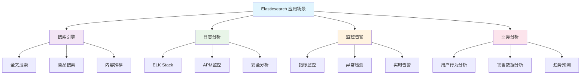

## 核心概念

### 基础概念对比

| Elasticsearch | 关系型数据库 | 说明 |
|---------------|-------------|------|
| **Index（索引）** | Database（数据库） | 数据的逻辑分组 |
| **Type（类型）** | Table（表） | 7.x后已废弃 |
| **Document（文档）** | Row（行） | 数据的基本单元 |
| **Field（字段）** | Column（列） | 文档的属性 |
| **Mapping（映射）** | Schema（模式） | 字段类型定义 |
| **Shard（分片）** | Partition（分区） | 数据的物理分布 |

### 集群架构概念

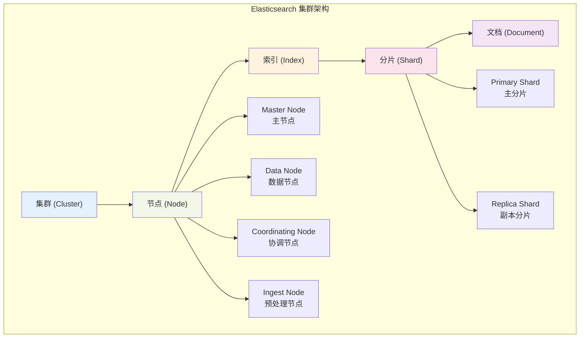

### 节点类型详解

**1. Master Node（主节点）**
- **职责**：集群状态管理、索引创建删除、节点加入离开
- **配置**：`node.master: true`
- **特点**：轻量级操作，不存储数据

**2. Data Node（数据节点）**
- **职责**：存储数据、执行搜索和聚合操作
- **配置**：`node.data: true`
- **特点**：CPU和内存密集型

**3. Coordinating Node（协调节点）**
- **职责**：请求路由、结果聚合、负载均衡
- **配置**：`node.master: false, node.data: false`
- **特点**：处理客户端请求的入口

**4. Ingest Node（预处理节点）**
- **职责**：数据预处理、文档转换
- **配置**：`node.ingest: true`
- **特点**：类似于Logstash的轻量级替代
#
# 架构设计

### 分布式架构原理

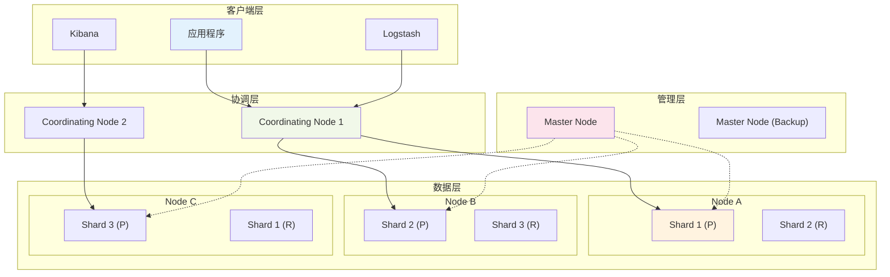

### 数据写入流程

**写入流程详解**：

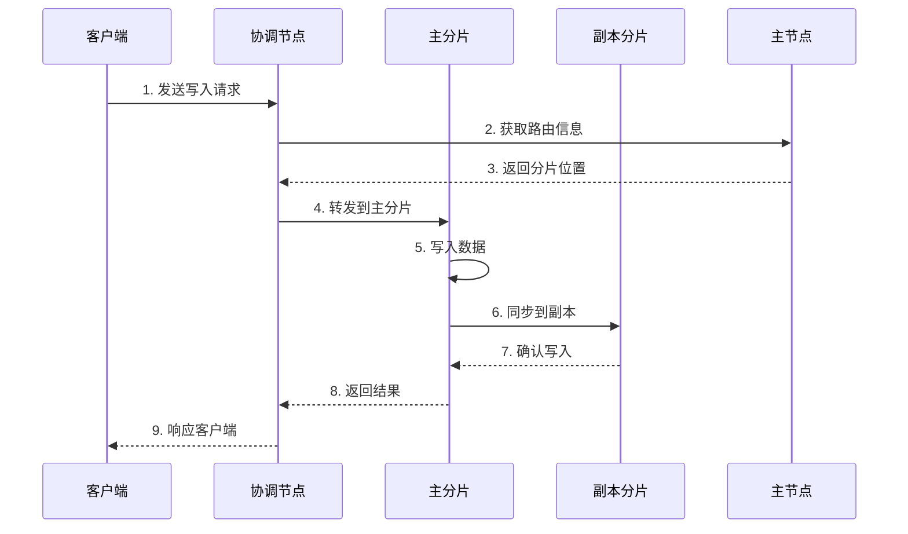

**关键步骤说明**：

1. **路由计算**：`shard_id = hash(document_id) % number_of_primary_shards`
2. **一致性保证**：主分片写入成功后同步到副本分片
3. **写入确认**：可配置等待副本确认的数量
4. **刷新机制**：默认1秒后数据可搜索

### 数据读取流程

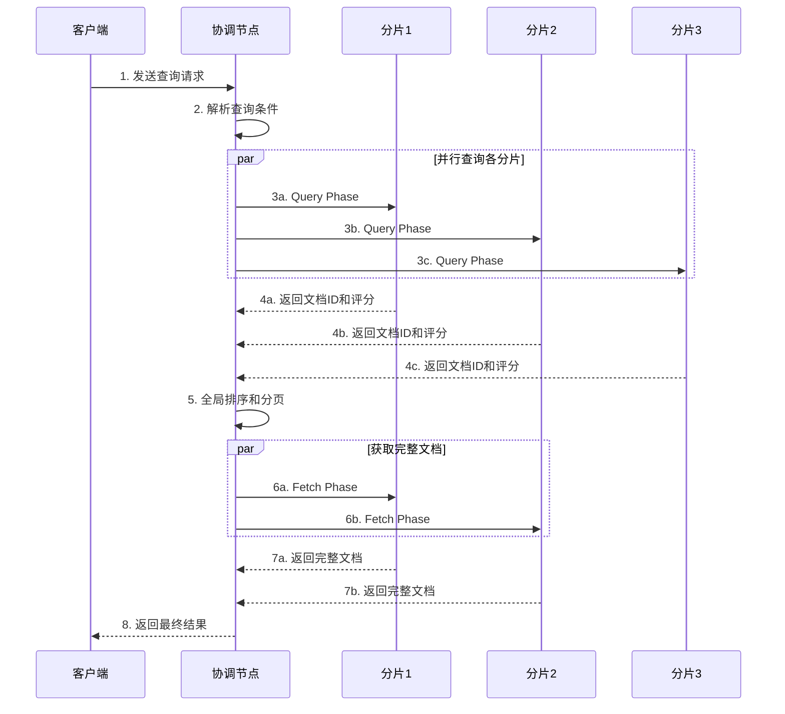

## 索引和映射

### 索引生命周期管理

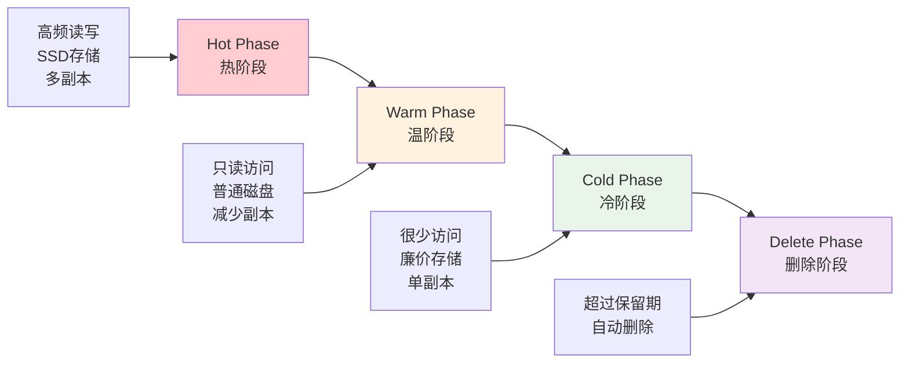

### 映射类型详解

| 数据类型 | 子类型 | 用途 | 示例 |
|----------|--------|------|------|
| **Text** | text, keyword | 全文搜索、精确匹配 | 文章内容、标签 |
| **Numeric** | long, integer, double, float | 数值计算、范围查询 | 价格、数量 |
| **Date** | date, date_nanos | 时间范围、排序 | 创建时间、更新时间 |
| **Boolean** | boolean | 逻辑判断 | 是否启用、是否删除 |
| **Binary** | binary | 二进制数据 | 图片、文件 |
| **Range** | integer_range, date_range | 范围查询 | 价格区间、时间段 |
| **Geo** | geo_point, geo_shape | 地理位置搜索 | 坐标、区域 |
| **Object** | object, nested | 复杂对象 | 用户信息、商品属性 |

### 动态映射机制

**动态映射规则**：

```json
{
  "mappings": {
    "dynamic": "true",  // true/false/strict
    "dynamic_templates": [
      {
        "strings_as_keywords": {
          "match_mapping_type": "string",
          "match": "*_id",
          "mapping": {
            "type": "keyword"
          }
        }
      }
    ]
  }
}
```

**映射推断规则**：

| JSON数据类型 | Elasticsearch类型 | 说明 |
|-------------|-------------------|------|
| null | 忽略该字段 | 不创建映射 |
| boolean | boolean | 布尔类型 |
| 浮点数 | float | 浮点数类型 |
| 整数 | long | 长整型 |
| 字符串 | text + keyword | 双字段映射 |
| 数组 | 取决于第一个非null值 | 数组类型推断 |
| 对象 | object | 嵌套对象 |## 查询DSL


### 查询分类体系

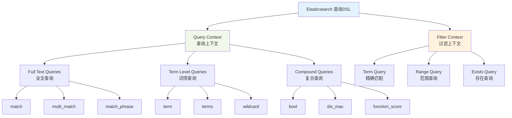

### 核心查询类型

**1. Bool Query（布尔查询）**

```json
{
  "query": {
    "bool": {
      "must": [
        {"match": {"title": "elasticsearch"}}
      ],
      "filter": [
        {"term": {"status": "published"}},
        {"range": {"publish_date": {"gte": "2023-01-01"}}}
      ],
      "must_not": [
        {"term": {"category": "draft"}}
      ],
      "should": [
        {"match": {"tags": "search"}},
        {"match": {"tags": "analytics"}}
      ],
      "minimum_should_match": 1
    }
  }
}
```

**Bool查询子句说明**：

| 子句 | 作用 | 影响评分 | 使用场景 |
|------|------|----------|----------|
| **must** | 必须匹配 | 是 | 核心查询条件 |
| **filter** | 必须匹配 | 否 | 过滤条件，可缓存 |
| **must_not** | 必须不匹配 | 否 | 排除条件 |
| **should** | 应该匹配 | 是 | 可选条件，提升相关性 |

**2. Multi-Match Query（多字段查询）**

```json
{
  "query": {
    "multi_match": {
      "query": "elasticsearch guide",
      "fields": ["title^2", "content", "tags"],
      "type": "best_fields",
      "tie_breaker": 0.3,
      "minimum_should_match": "75%"
    }
  }
}
```

**Multi-Match类型对比**：

| 类型 | 策略 | 适用场景 |
|------|------|----------|
| **best_fields** | 取最佳字段评分 | 搜索最相关的字段 |
| **most_fields** | 综合所有字段评分 | 多字段都重要 |
| **cross_fields** | 跨字段词项匹配 | 结构化查询 |
| **phrase** | 短语匹配 | 精确短语搜索 |
| **phrase_prefix** | 短语前缀匹配 | 自动补全 |

### 高级查询技巧

**1. Function Score Query（自定义评分）**

```json
{
  "query": {
    "function_score": {
      "query": {"match": {"title": "elasticsearch"}},
      "functions": [
        {
          "filter": {"term": {"category": "tutorial"}},
          "weight": 2
        },
        {
          "field_value_factor": {
            "field": "popularity",
            "factor": 1.2,
            "modifier": "sqrt"
          }
        },
        {
          "gauss": {
            "publish_date": {
              "origin": "now",
              "scale": "30d",
              "decay": 0.5
            }
          }
        }
      ],
      "score_mode": "multiply",
      "boost_mode": "multiply"
    }
  }
}
```

**2. 嵌套查询（Nested Query）**

```json
{
  "query": {
    "nested": {
      "path": "comments",
      "query": {
        "bool": {
          "must": [
            {"match": {"comments.author": "john"}},
            {"range": {"comments.date": {"gte": "2023-01-01"}}}
          ]
        }
      },
      "inner_hits": {
        "highlight": {
          "fields": {"comments.content": {}}
        }
      }
    }
  }
}
```

## 聚合分析

### 聚合分类体系

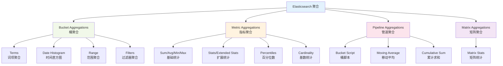

### 常用聚合示例

**1. 多维度分析**

```json
{
  "aggs": {
    "sales_by_category": {
      "terms": {
        "field": "category.keyword",
        "size": 10
      },
      "aggs": {
        "monthly_sales": {
          "date_histogram": {
            "field": "sale_date",
            "calendar_interval": "month"
          },
          "aggs": {
            "total_revenue": {
              "sum": {"field": "revenue"}
            },
            "avg_price": {
              "avg": {"field": "price"}
            }
          }
        }
      }
    }
  }
}
```

**2. 统计分析**

```json
{
  "aggs": {
    "price_stats": {
      "extended_stats": {
        "field": "price"
      }
    },
    "price_percentiles": {
      "percentiles": {
        "field": "price",
        "percents": [25, 50, 75, 95, 99]
      }
    },
    "unique_users": {
      "cardinality": {
        "field": "user_id"
      }
    }
  }
}
```

### 聚合性能优化

| 优化策略 | 说明 | 适用场景 |
|----------|------|----------|
| **预聚合** | 在索引时计算聚合结果 | 固定维度分析 |
| **采样聚合** | 对部分数据进行聚合 | 大数据集近似分析 |
| **缓存利用** | 利用聚合缓存机制 | 重复查询场景 |
| **字段优化** | 使用keyword字段进行聚合 | 精确值聚合 |
| **分片路由** | 指定分片进行聚合 | 特定数据子集 |##
 集群管理

### 集群状态管理

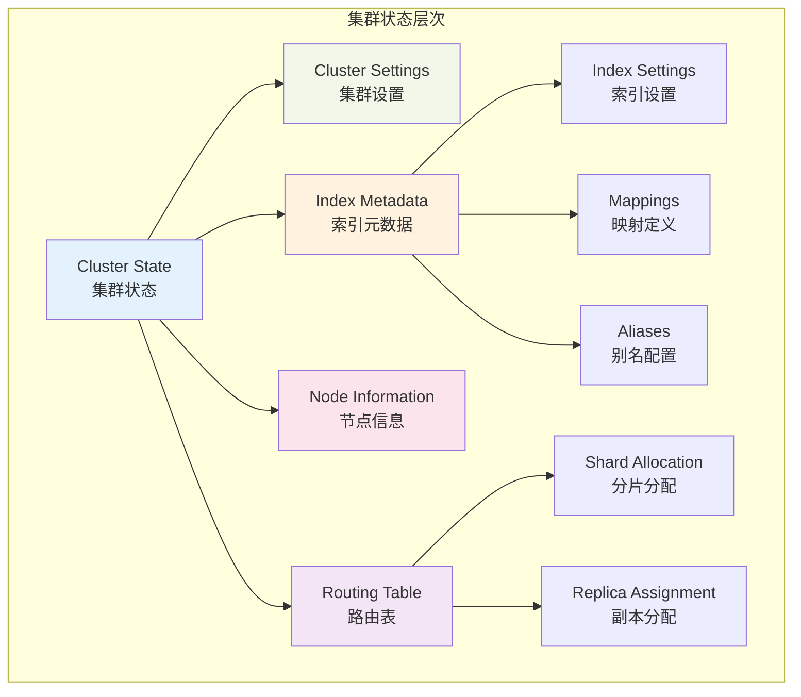

### 分片分配策略

**分片分配原则**：

1. **均衡性原则**：分片在节点间均匀分布
2. **可用性原则**：主分片和副本分片不在同一节点
3. **容量原则**：考虑节点的磁盘和内存容量
4. **机架感知**：支持跨机架的高可用部署

**分配器类型**：

| 分配器 | 作用 | 配置参数 |
|--------|------|----------|
| **Balanced** | 均衡分片分布 | `cluster.routing.allocation.balance.*` |
| **Disk Threshold** | 基于磁盘使用率 | `cluster.routing.allocation.disk.*` |
| **Awareness** | 机架感知分配 | `cluster.routing.allocation.awareness.*` |
| **Filtering** | 基于属性过滤 | `cluster.routing.allocation.include/exclude.*` |

### 集群监控指标

**关键监控指标**：

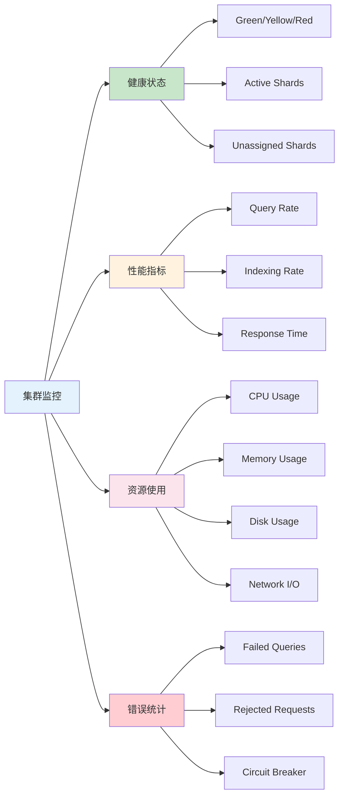

## 性能优化

### 索引性能优化

**写入性能优化策略**：

| 优化项 | 配置 | 说明 | 影响 |
|--------|------|------|------|
| **批量写入** | `bulk` API | 减少网络开销 | 显著提升写入速度 |
| **刷新间隔** | `refresh_interval: 30s` | 降低刷新频率 | 提升写入，延迟可见性 |
| **副本设置** | `number_of_replicas: 0` | 写入时禁用副本 | 提升写入，降低可用性 |
| **事务日志** | `translog.durability: async` | 异步刷盘 | 提升性能，可能丢数据 |
| **合并策略** | `merge.policy.*` | 优化段合并 | 减少I/O开销 |

**查询性能优化策略**：

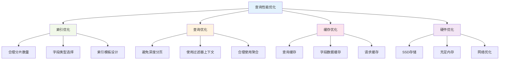

### JVM调优参数

**核心JVM参数**：

```bash
# 堆内存设置（不超过32GB，建议物理内存的50%）
-Xms16g -Xmx16g

# GC算法选择
-XX:+UseG1GC
-XX:MaxGCPauseMillis=200

# GC日志
-XX:+PrintGCDetails
-XX:+PrintGCTimeStamps
-Xloggc:/var/log/elasticsearch/gc.log

# 内存映射限制
-XX:+UseLargePages
-XX:LargePageSizeInBytes=2m

# 其他优化
-XX:+AlwaysPreTouch
-Xss1m
-Djava.awt.headless=true
```

### 存储优化策略

**存储层次优化**：

| 存储类型 | 适用场景 | 性能特点 | 成本 |
|----------|----------|----------|------|
| **NVMe SSD** | 热数据、高并发 | 极高IOPS，低延迟 | 高 |
| **SATA SSD** | 温数据、中等负载 | 高IOPS，中等延迟 | 中 |
| **机械硬盘** | 冷数据、归档 | 低IOPS，高延迟 | 低 |
| **对象存储** | 快照、备份 | 高吞吐，高延迟 | 极低 |

## 监控运维

### 监控体系架构

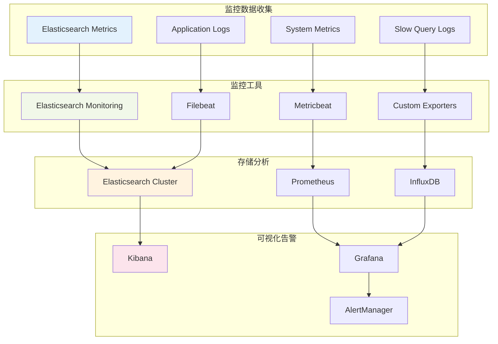

### 关键监控指标

**集群级别指标**：

| 指标类别 | 关键指标 |正常范围 | 告警阈值 |
|----------|----------|----------|----------|
| **CPU使用率** | cpu_percent | <70% | >80% |
| **内存使用率** | heap_used_percent | <75% | >85% |
| **磁盘使用率** | disk_used_percent | <80% | >90% |
| **GC频率** | gc_collection_time | <100ms | >500ms |
| 指标类别 | 关键指标 | 正常范围 | 告警阈值 |
|----------|----------|----------|----------|
| **集群健康** | cluster_status | green | yellow/red |
| **节点状态** | nodes_count | 稳定 | 节点离线 |
| **分片状态** | active_shards_percent | 100% | <100% |
| **待分配分片** | unassigned_shards | 0 | >0 |

**节点级别指标**：


## 安全配置

### 安全架构设计

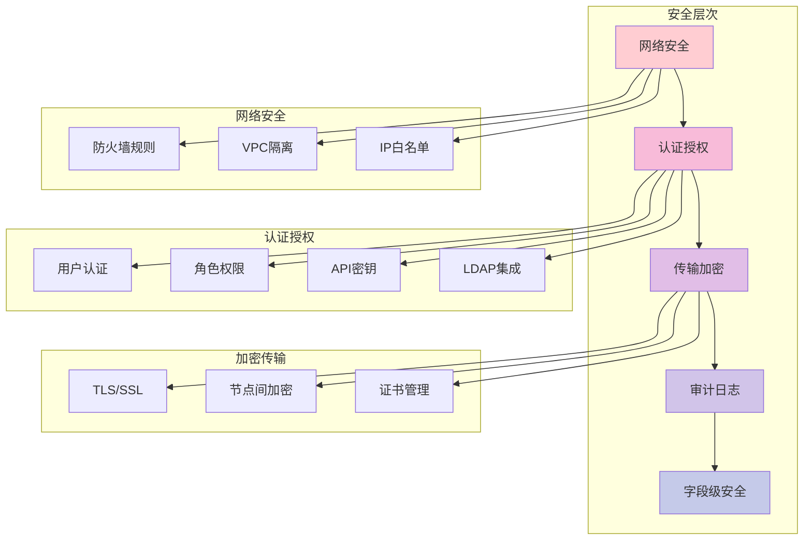

### X-Pack安全配置

**基础安全配置**：

```yaml
# elasticsearch.yml
xpack.security.enabled: true
xpack.security.transport.ssl.enabled: true
xpack.security.transport.ssl.verification_mode: certificate
xpack.security.transport.ssl.keystore.path: elastic-certificates.p12
xpack.security.transport.ssl.truststore.path: elastic-certificates.p12

xpack.security.http.ssl.enabled: true
xpack.security.http.ssl.keystore.path: elastic-certificates.p12

# 审计日志
xpack.security.audit.enabled: true
xpack.security.audit.logfile.events.include: 
  - access_denied
  - access_granted
  - anonymous_access_denied
  - authentication_failed
  - connection_denied
  - tampered_request
  - run_as_denied
  - run_as_granted
```

**角色权限配置示例**：

```json
{
  "read_only_user": {
    "cluster": ["monitor"],
    "indices": [
      {
        "names": ["logs-*", "metrics-*"],
        "privileges": ["read", "view_index_metadata"]
      }
    ]
  },
  "data_analyst": {
    "cluster": ["monitor"],
    "indices": [
      {
        "names": ["analytics-*"],
        "privileges": ["read", "write", "create_index", "view_index_metadata"],
        "field_security": {
          "grant": ["*"],
          "except": ["sensitive_field"]
        }
      }
    ]
  }
}
```

## 常见问题排查

### 性能问题诊断

**问题诊断流程**：

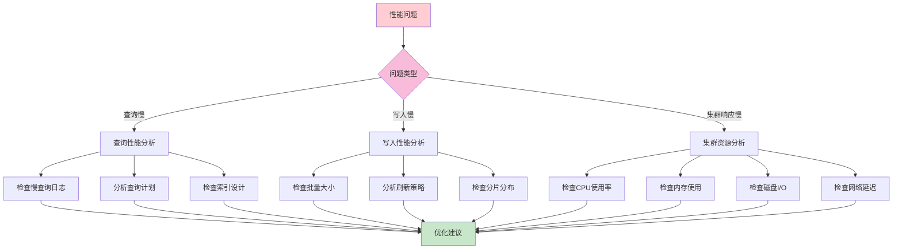

### 常见错误及解决方案

| 错误类型 | 症状 | 原因 | 解决方案 |
|----------|------|------|----------|
| **OutOfMemoryError** | 节点崩溃，内存不足 | 堆内存设置过小 | 增加堆内存，优化查询 |
| **CircuitBreakerException** | 请求被拒绝 | 内存使用超过阈值 | 调整断路器设置，优化查询 |
| **ClusterBlockException** | 集群只读 | 磁盘空间不足 | 清理磁盘空间，调整水位线 |
| **VersionConflictEngineException** | 文档更新冲突 | 并发更新同一文档 | 使用版本控制，重试机制 |
| **SearchPhaseExecutionException** | 搜索阶段失败 | 分片不可用或超时 | 检查集群健康，调整超时 |

### 故障恢复流程

**数据恢复步骤**：

1. **评估损失**：确定丢失的数据范围
2. **停止写入**：防止数据进一步损坏
3. **备份现状**：保存当前状态用于回滚
4. **执行恢复**：从快照或副本恢复数据
5. **验证数据**：确保数据完整性
6. **恢复服务**：重新开放写入和查询

## 最佳实践

### 索引设计最佳实践

**索引命名规范**：

```
{环境}-{业务}-{数据类型}-{时间模式}

示例：
- prod-ecommerce-orders-2024.01
- test-logs-application-2024.01.01
- dev-metrics-system-2024-w01
```

**分片设计原则**：

| 场景 | 分片数量建议 | 分片大小建议 | 说明 |
|------|-------------|-------------|------|
| **小索引** | 1个主分片 | <1GB | 避免过度分片 |
| **中等索引** | 3-5个主分片 | 10-50GB | 平衡性能和资源 |
| **大索引** | 根据节点数确定 | 20-40GB | 确保均匀分布 |
| **时序数据** | 按时间分割索引 | 每日/每周一个索引 | 便于生命周期管理 |

### 运维最佳实践

**备份策略**：

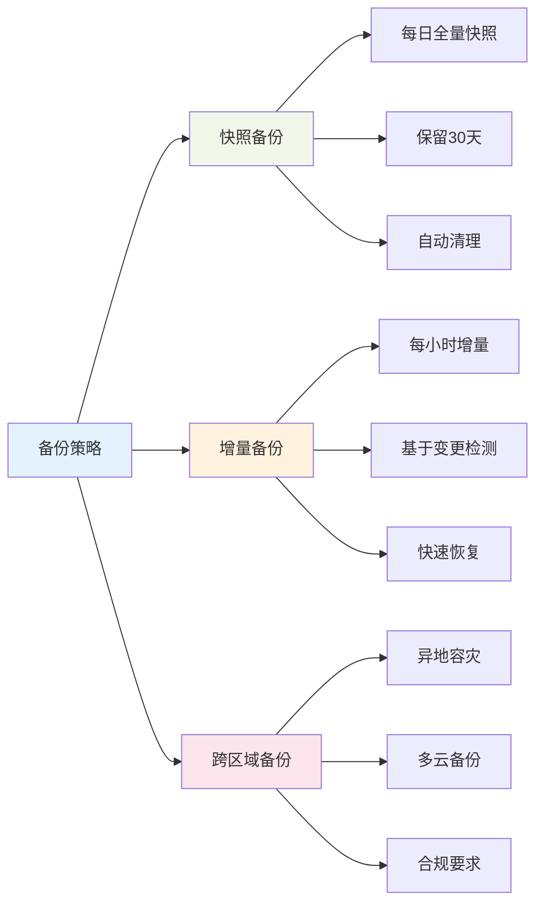

**容量规划指导**：

| 资源类型 | 规划建议 | 监控指标 | 扩容阈值 |
|----------|----------|----------|----------|
| **CPU** | 预留30%余量 | CPU使用率 | >70% |
| **内存** | 堆内存≤32GB，系统预留50% | 堆内存使用率 | >75% |
| **存储** | 预留20%空间 | 磁盘使用率 | >80% |
| **网络** | 考虑峰值流量 | 网络带宽使用率 | >70% |

## 面试题精选

### 基础概念类

#### 1. Elasticsearch的核心概念有哪些？它们之间的关系是什么？

**答案**：
Elasticsearch的核心概念包括：

- **集群（Cluster）**：由一个或多个节点组成的集合，共同持有数据并提供联合的索引和搜索功能
- **节点（Node）**：集群中的单个服务器，存储数据并参与集群的索引和搜索功能
- **索引（Index）**：具有相似特征的文档集合，类似于关系数据库中的数据库
- **文档（Document）**：可以被索引的基础信息单元，以JSON格式表示
- **分片（Shard）**：索引的物理分割，每个分片都是一个独立的Lucene索引
- **副本（Replica）**：分片的备份，提供高可用性和扩展搜索性能

**关系层次**：集群 → 节点 → 索引 → 分片 → 文档，其中分片是数据存储的基本单位，副本提供冗余保护。

#### 2. 解释Elasticsearch的分布式架构原理

**答案**：
Elasticsearch采用**无中心化的分布式架构**：

**节点发现机制**：
- 使用Zen Discovery协议自动发现集群中的其他节点
- 通过多播或单播方式进行节点通信
- 支持云环境下的动态节点发现

**主节点选举**：
- 采用Bully算法进行主节点选举
- 主节点负责集群状态管理、索引创建删除等操作
- 当主节点故障时，自动选举新的主节点

**数据分布**：
- 数据通过哈希算法分布到不同分片：`shard_id = hash(document_id) % number_of_primary_shards`
- 分片在节点间均匀分布，确保负载均衡
- 副本分片不与主分片在同一节点，保证高可用

**容错机制**：
- 节点故障时，副本分片自动提升为主分片
- 集群自动重新分配分片，维持数据完整性
- 支持滚动升级，不中断服务

#### 3. Elasticsearch与传统关系型数据库的区别是什么？

**答案**：

| 维度 | Elasticsearch | 关系型数据库 |
|------|---------------|-------------|
| **数据模型** | 文档型（JSON） | 关系型（表格） |
| **Schema** | 动态映射，无固定结构 | 严格的表结构定义 |
| **查询语言** | Query DSL（JSON） | SQL |
| **事务支持** | 不支持ACID事务 | 完整的ACID事务 |
| **扩展性** | 水平扩展，分布式 | 主要垂直扩展 |
| **搜索能力** | 强大的全文搜索和分析 | 基础的文本匹配 |
| **一致性** | 最终一致性 | 强一致性 |
| **适用场景** | 搜索、分析、日志处理 | 业务数据管理 |

### 性能优化类

#### 4. 如何优化Elasticsearch的写入性能？

**答案**：
写入性能优化策略包括：

**批量操作优化**：
- 使用bulk API进行批量写入，建议批量大小5-15MB
- 合理设置批量请求的文档数量，通常1000-5000个文档
- 避免单个文档过大，建议单文档<100MB

**索引配置优化**：
```json
{
  "settings": {
    "refresh_interval": "30s",           // 降低刷新频率
    "number_of_replicas": 0,             // 写入时禁用副本
    "translog.durability": "async",      // 异步事务日志
    "translog.sync_interval": "5s",      // 事务日志同步间隔
    "index.merge.policy.max_merge_at_once": 30,
    "index.merge.policy.segments_per_tier": 30
  }
}
```

**硬件和系统优化**：
- 使用SSD存储，提升I/O性能
- 增加内存，减少磁盘访问
- 优化操作系统参数：增加文件描述符限制、调整内核参数
- 使用多个数据路径，分散I/O负载

**写入完成后恢复设置**：
```json
{
  "settings": {
    "refresh_interval": "1s",
    "number_of_replicas": 1,
    "translog.durability": "request"
  }
}
```

#### 5. Elasticsearch查询性能优化有哪些方法？

**答案**：
查询性能优化的关键方法：

**查询结构优化**：
- **使用filter context替代query context**：filter不计算相关性评分，可以缓存
- **避免深度分页**：使用scroll API或search_after替代from/size
- **合理使用bool查询**：将过滤条件放在filter子句中

**索引设计优化**：
- **选择合适的字段类型**：keyword用于精确匹配，text用于全文搜索
- **禁用不需要的功能**：`"index": false`、`"doc_values": false`
- **使用索引模板**：统一索引配置，确保最佳性能

**缓存利用**：
- **查询缓存**：相同查询结果可以缓存
- **字段数据缓存**：聚合和排序时使用
- **请求缓存**：缓存整个搜索请求的结果

**分片策略**：
- **合理的分片数量**：避免过多小分片或过少大分片
- **分片路由**：使用routing参数将相关数据路由到同一分片
- **索引生命周期管理**：热温冷数据分层存储

### 架构设计类

#### 6. 设计一个支持千万级文档的Elasticsearch集群架构

**答案**：
千万级文档集群架构设计：

**集群规模规划**：
```
数据节点：6-9个节点
主节点：3个专用主节点（避免脑裂）
协调节点：2-3个负载均衡节点
总节点数：11-15个节点
```

**硬件配置建议**：
```
数据节点：
- CPU: 16-32核心
- 内存: 64-128GB（堆内存32GB）
- 存储: 2-4TB SSD
- 网络: 10Gbps

主节点：
- CPU: 8-16核心  
- 内存: 16-32GB
- 存储: 100-200GB SSD
- 网络: 1Gbps
```

**索引设计策略**：
```json
{
  "settings": {
    "number_of_shards": 6,        // 每个索引6个主分片
    "number_of_replicas": 1,      // 1个副本
    "refresh_interval": "30s",    // 降低刷新频率
    "merge.policy.max_merge_at_once": 30
  }
}
```

**分片分布计算**：
- 千万文档，平均每个文档1KB，总数据量约10GB
- 每个分片建议20-40GB，可设计6个主分片
- 总分片数：6主分片 × 2（含副本）= 12个分片
- 分布在6个数据节点上，每节点2个分片

#### 7. 如何处理Elasticsearch的热点数据问题？

**答案**：
热点数据处理策略：

**数据分层存储**：
- **热数据（0-7天）**：SSD存储，多副本，高性能节点
- **温数据（7-30天）**：混合存储，少副本，标准节点
- **冷数据（30-365天）**：机械硬盘，单副本，低成本节点
- **删除（>365天）**：自动删除过期数据

**索引生命周期管理（ILM）**：
```json
{
  "policy": {
    "phases": {
      "hot": {
        "actions": {
          "rollover": {
            "max_size": "50GB",
            "max_age": "7d"
          }
        }
      },
      "warm": {
        "min_age": "7d",
        "actions": {
          "allocate": {
            "number_of_replicas": 0
          },
          "forcemerge": {
            "max_num_segments": 1
          }
        }
      },
      "cold": {
        "min_age": "30d",
        "actions": {
          "allocate": {
            "include": {
              "box_type": "cold"
            }
          }
        }
      },
      "delete": {
        "min_age": "365d"
      }
    }
  }
}
```

### 故障排查类

#### 8. Elasticsearch集群出现黄色状态，如何排查和解决？

**答案**：
黄色状态表示**主分片正常但部分副本分片未分配**，排查步骤：

**1. 确认问题范围**：
```bash
# 查看集群健康状态
GET /_cluster/health?pretty

# 查看未分配的分片
GET /_cat/shards?v&h=index,shard,prirep,state,unassigned.reason

# 查看分片分配解释
GET /_cluster/allocation/explain
```

**2. 常见原因分析**：

| 原因 | 症状 | 解决方案 |
|------|------|----------|
| **节点不足** | 副本无法分配到其他节点 | 增加节点或减少副本数 |
| **磁盘空间不足** | 达到磁盘水位线限制 | 清理磁盘空间或扩容 |
| **分片分配规则** | 分配策略阻止副本分配 | 调整分配规则 |
| **节点属性不匹配** | 副本无法分配到合适节点 | 修改节点属性或分配规则 |

**3. 解决方案**：

**临时解决**：
```bash
# 减少副本数量
PUT /my-index/_settings
{
  "number_of_replicas": 0
}

# 手动分配分片
POST /_cluster/reroute
{
  "commands": [
    {
      "allocate_replica": {
        "index": "my-index",
        "shard": 0,
        "node": "node-2"
      }
    }
  ]
}
```

#### 9. 如何诊断和解决Elasticsearch内存溢出问题？

**答案**：
内存溢出诊断和解决流程：

**1. 问题识别**：
```bash
# 查看节点内存使用情况
GET /_nodes/stats/jvm?pretty

# 查看GC统计信息  
GET /_nodes/stats/jvm?filter_path=nodes.*.jvm.gc

# 检查断路器状态
GET /_nodes/stats/breaker?pretty
```

**2. 内存使用分析**：

| 内存区域 | 作用 | 常见问题 | 解决方案 |
|----------|------|----------|----------|
| **堆内存** | 对象存储、缓存 | OutOfMemoryError | 增加堆内存、优化查询 |
| **字段数据缓存** | 聚合、排序 | 缓存过大 | 限制缓存大小、使用doc_values |
| **查询缓存** | 查询结果缓存 | 缓存命中率低 | 优化查询模式 |
| **请求缓存** | 搜索请求缓存 | 内存占用高 | 调整缓存大小 |

**3. 优化策略**：

**JVM参数调优**：
```bash
# 设置合适的堆内存大小（不超过32GB）
-Xms16g -Xmx16g

# 使用G1GC
-XX:+UseG1GC
-XX:MaxGCPauseMillis=200

# 启用压缩指针
-XX:+UseCompressedOops
```

#### 10. 解释Elasticsearch的倒排索引原理

**答案**：
**倒排索引（Inverted Index）** 是Elasticsearch实现快速全文搜索的核心数据结构：

**基本原理**：
- **正向索引**：文档ID → 文档内容
- **倒排索引**：词项（Term） → 包含该词项的文档列表

**倒排索引结构**：
```
词项字典（Term Dictionary）：
- apple → [doc1, doc3, doc5]
- banana → [doc2, doc3]
- orange → [doc1, doc4]

词项信息（Term Info）：
- 文档频率（DF）：包含该词项的文档数量
- 词项频率（TF）：词项在文档中出现的次数
- 位置信息：词项在文档中的位置（用于短语查询）
```

**构建过程**：
1. **文档分析**：将文档内容分词，提取词项
2. **词项标准化**：转换为小写、去除停用词、词干提取
3. **建立映射**：创建词项到文档的映射关系
4. **存储优化**：压缩存储，建立快速访问索引

**查询过程**：
1. **查询分析**：对查询条件进行同样的分词处理
2. **词项查找**：在倒排索引中查找对应词项
3. **文档匹配**：获取包含查询词项的文档列表
4. **相关性计算**：基于TF-IDF算法计算文档相关性评分
5. **结果排序**：按相关性评分排序返回结果

**优势特点**：
- **快速检索**：直接通过词项定位文档，时间复杂度O(1)
- **空间效率**：相比全文扫描，大幅减少存储空间
- **支持复杂查询**：布尔查询、短语查询、模糊查询等
- **相关性评分**：基于统计信息计算文档相关性

通过以上全面的技术指南和面试题解析，可以深入理解Elasticsearch的核心原理、实践应用和优化策略，为实际项目开发和技术面试提供完整的知识体系支撑。