# Elasticsearch 完整技术指南

## 目录

- [Elasticsearch 完整技术指南](#elasticsearch-完整技术指南)
  - [目录](#目录)
  - [Elasticsearch 简介](#elasticsearch-简介)
    - [核心特性对比](#核心特性对比)
    - [应用场景分析](#应用场景分析)
  - [核心概念与架构](#核心概念与架构)
    - [基础概念映射](#基础概念映射)
    - [节点类型详解](#节点类型详解)
    - [分片与副本机制](#分片与副本机制)
  - [分布式原理](#分布式原理)
    - [集群发现与选主](#集群发现与选主)
    - [数据写入流程](#数据写入流程)
    - [数据读取流程](#数据读取流程)
    - [索引生命周期管理](#索引生命周期管理)
    - [映射类型与字段属性](#映射类型与字段属性)
    - [动态映射机制](#动态映射机制)
    - [分析器与分词](#分析器与分词)
  - [查询DSL详解](#查询dsl详解)
    - [查询上下文分类](#查询上下文分类)
    - [Bool查询详解](#bool查询详解)
    - [Multi-Match查询策略](#multi-match查询策略)
    - [高级查询技巧](#高级查询技巧)
  - [聚合分析](#聚合分析)
    - [聚合分类体系](#聚合分类体系)
    - [多维度数据分析](#多维度数据分析)
    - [统计分析聚合](#统计分析聚合)
    - [聚合性能优化](#聚合性能优化)
  - [集群管理](#集群管理)
    - [集群状态管理](#集群状态管理)
    - [分片分配策略](#分片分配策略)
    - [集群监控指标](#集群监控指标)
  - [性能优化](#性能优化)
    - [写入性能优化](#写入性能优化)
    - [查询性能优化](#查询性能优化)
    - [JVM调优参数](#jvm调优参数)
    - [存储优化策略](#存储优化策略)
  - [监控运维](#监控运维)
    - [监控体系架构](#监控体系架构)
    - [运维自动化脚本](#运维自动化脚本)
    - [性能监控指标](#性能监控指标)
    - [安全架构设计](#安全架构设计)
    - [X-Pack安全配置](#x-pack安全配置)
    - [角色权限管理](#角色权限管理)
    - [API密钥管理](#api密钥管理)
  - [故障排查](#故障排查)
    - [常见问题诊断流程](#常见问题诊断流程)
    - [集群状态问题排查](#集群状态问题排查)
    - [性能问题排查](#性能问题排查)
    - [内存问题排查](#内存问题排查)
  - [最佳实践](#最佳实践)
    - [索引设计最佳实践](#索引设计最佳实践)
    - [运维最佳实践](#运维最佳实践)
    - [容量规划指导](#容量规划指导)
  - [高频面试题](#高频面试题)
    - [基础概念类](#基础概念类)
      - [1. 解释Elasticsearch的核心概念及其关系](#1-解释elasticsearch的核心概念及其关系)
      - [2. Elasticsearch与传统关系型数据库的区别](#2-elasticsearch与传统关系型数据库的区别)
      - [3. 什么是倒排索引？它是如何工作的？](#3-什么是倒排索引它是如何工作的)
    - [架构设计类](#架构设计类)
      - [4. 设计一个支持千万级文档的Elasticsearch集群架构](#4-设计一个支持千万级文档的elasticsearch集群架构)
      - [5. 如何处理Elasticsearch的热点数据问题？](#5-如何处理elasticsearch的热点数据问题)
    - [性能优化类](#性能优化类)
      - [6. Elasticsearch写入性能优化策略有哪些？](#6-elasticsearch写入性能优化策略有哪些)
      - [7. 如何优化Elasticsearch查询性能？](#7-如何优化elasticsearch查询性能)
    - [故障排查类](#故障排查类)
      - [8. Elasticsearch集群出现红色状态如何排查？](#8-elasticsearch集群出现红色状态如何排查)
      - [9. 如何诊断Elasticsearch内存泄漏问题？](#9-如何诊断elasticsearch内存泄漏问题)
      - [10. Elasticsearch分片不均衡如何解决？](#10-elasticsearch分片不均衡如何解决)

## Elasticsearch 简介

**Elasticsearch** 是基于 **Apache Lucene** 构建的分布式、RESTful 风格的搜索和数据分析引擎，是 **Elastic Stack** 的核心组件。它能够处理结构化、半结构化和非结构化数据，提供近实时的搜索和分析能力。

### 核心特性对比

| 特性维度 | Elasticsearch | 传统数据库 | 优势说明 |
|----------|---------------|------------|----------|
| **数据模型** | 文档型(JSON) | 关系型(表格) | 灵活的数据结构，支持嵌套对象 |
| **扩展方式** | 水平扩展 | 垂直扩展 | 天然分布式，线性扩展能力 |
| **搜索能力** | 全文搜索+分析 | 基础文本匹配 | 强大的文本分析和相关性评分 |
| **实时性** | 近实时(1秒) | 实时 | 平衡了性能和实时性 |
| **一致性** | 最终一致性 | 强一致性 | 适合读多写少的场景 |

### 应用场景分析

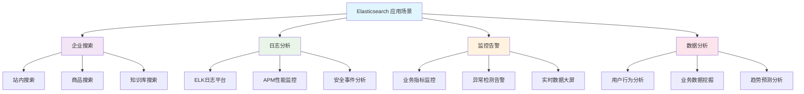
```mermaid
graph TB
    A["Elasticsearch 应用场景"] --> B["企业搜索"]
    A --> C["日志分析"]
    A --> D["监控告警"]
    A --> E["数据分析"]
    
    B --> B1["站内搜索"]
    B --> B2["商品搜索"]
    B --> B3["知识库搜索"]
    
    C --> C1["ELK日志平台"]
    C --> C2["APM性能监控"]
    C --> C3["安全事件分析"]
    
    D --> D1["业务指标监控"]
    D --> D2["异常检测告警"]
    D --> D3["实时数据大屏"]
    
    E --> E1["用户行为分析"]
    E --> E2["业务数据挖掘"]
    E --> E3["趋势预测分析"]
    
    style A fill:#e1f5fe
    style B fill:#f3e5f5
    style C fill:#e8f5e8
    style D fill:#fff3e0
    style E fill:#fce4ec
```

## 核心概念与架构

### 基础概念映射

**Elasticsearch与关系数据库概念对比**：

| Elasticsearch | 关系数据库 | 说明 | 特点 |
|---------------|------------|------|------|
| **Cluster（集群）** | 数据库集群 | 一个或多个节点的集合 | 共享集群名称，协同工作 |
| **Node（节点）** | 数据库实例 | 集群中的单个服务器 | 存储数据，参与索引和搜索 |
| **Index（索引）** | Database（数据库） | 文档的逻辑集合 | 类似数据库，包含相似文档 |
| **Document（文档）** | Row（行记录） | 可被索引的基本信息单元 | JSON格式，包含多个字段 |
| **Field（字段）** | Column（列） | 文档中的数据项 | 键值对形式，支持多种类型 |
| **Mapping（映射）** | Schema（模式） | 字段类型和属性定义 | 定义字段如何存储和索引 |
| **Shard（分片）** | Partition（分区） | 索引的物理分割单元 | 水平分割，提高并发能力 |

### 节点类型详解

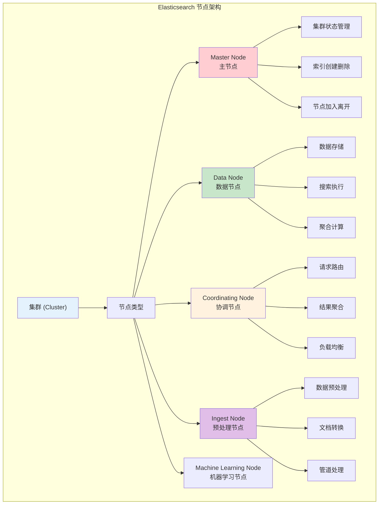
```mermaid
graph TB
    subgraph "Elasticsearch 节点架构"
        A["集群 (Cluster)"] --> B["节点类型"]
        
        B --> B1["Master Node<br/>主节点"]
        B --> B2["Data Node<br/>数据节点"]
        B --> B3["Coordinating Node<br/>协调节点"]
        B --> B4["Ingest Node<br/>预处理节点"]
        B --> B5["Machine Learning Node<br/>机器学习节点"]
        
        B1 --> B11["集群状态管理"]
        B1 --> B12["索引创建删除"]
        B1 --> B13["节点加入离开"]
        
        B2 --> B21["数据存储"]
        B2 --> B22["搜索执行"]
        B2 --> B23["聚合计算"]
        
        B3 --> B31["请求路由"]
        B3 --> B32["结果聚合"]
        B3 --> B33["负载均衡"]
        
        B4 --> B41["数据预处理"]
        B4 --> B42["文档转换"]
        B4 --> B43["管道处理"]
    end
    
    style A fill:#e3f2fd
    style B1 fill:#ffcdd2
    style B2 fill:#c8e6c9
    style B3 fill:#fff3e0
    style B4 fill:#e1bee7
```

**节点配置说明**：

1. **Master Node（主节点）**
   - **配置**：`node.master: true`
   - **职责**：集群元数据管理，不存储业务数据
   - **建议**：生产环境配置3个专用主节点，避免脑裂

2. **Data Node（数据节点）**
   - **配置**：`node.data: true`
   - **职责**：存储数据分片，执行CRUD和搜索操作
   - **特点**：CPU和内存密集型，需要高性能硬件

3. **Coordinating Node（协调节点）**
   - **配置**：`node.master: false, node.data: false`
   - **职责**：接收客户端请求，分发到数据节点，聚合结果
   - **优势**：减轻数据节点负担，提高查询性能

4. **Ingest Node（预处理节点）**
   - **配置**：`node.ingest: true`
   - **职责**：数据写入前的预处理，类似Logstash功能
   - **应用**：数据清洗、格式转换、字段提取

### 分片与副本机制

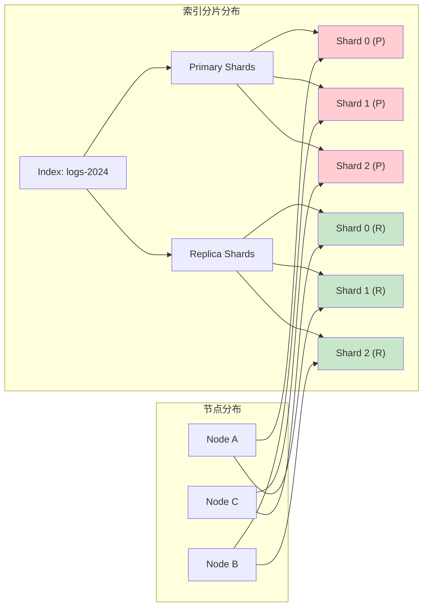
```mermaid
graph LR
    subgraph "索引分片分布"
        A["Index: logs-2024"] --> B["Primary Shards"]
        A --> C["Replica Shards"]
        
        B --> B1["Shard 0 (P)"]
        B --> B2["Shard 1 (P)"]
        B --> B3["Shard 2 (P)"]
        
        C --> C1["Shard 0 (R)"]
        C --> C2["Shard 1 (R)"]
        C --> C3["Shard 2 (R)"]
    end
    
    subgraph "节点分布"
        N1["Node A"] --> B1
        N1 --> C2
        
        N2["Node B"] --> B2
        N2 --> C3
        
        N3["Node C"] --> B3
        N3 --> C1
    end
    
    style B1 fill:#ffcdd2
    style B2 fill:#ffcdd2
    style B3 fill:#ffcdd2
    style C1 fill:#c8e6c9
    style C2 fill:#c8e6c9
    style C3 fill:#c8e6c9
```

**分片设计原则**：

| 分片类型 | 作用 | 数量特点 | 性能影响 |
|----------|------|----------|----------|
| **主分片** | 数据写入和读取 | 创建后不可修改 | 影响并发写入能力 |
| **副本分片** | 数据备份和读取 | 可动态调整 | 提高查询性能和可用性 |

**分片数量规划**：
- **小索引**：1个主分片，避免过度分片
- **中等索引**：3-5个主分片，平衡性能和资源
- **大索引**：根据节点数和数据量确定
- **分片大小**：建议20-40GB，避免过大或过小

## 存储原理深度解析

### Lucene存储架构

**Elasticsearch基于Apache Lucene构建**，理解Lucene的存储机制是掌握ES高性能的关键。

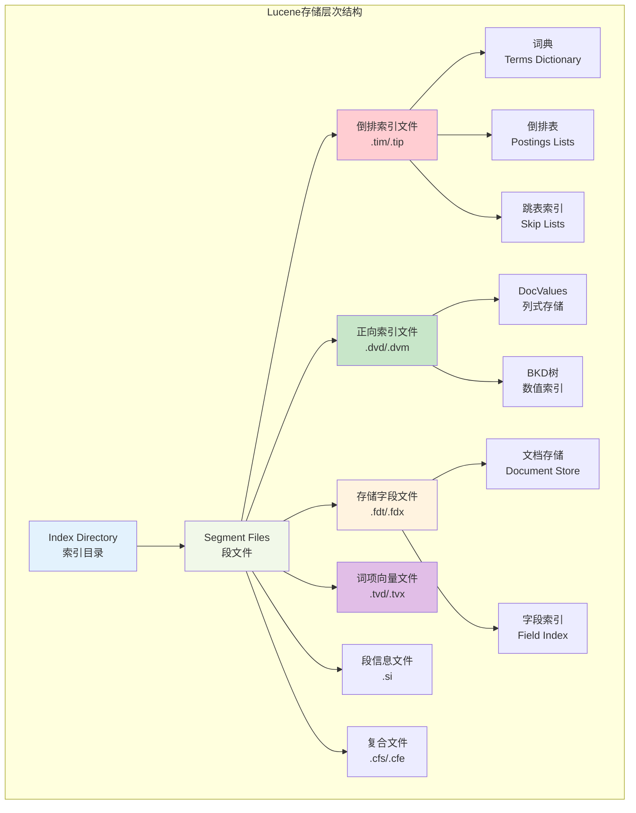
```mermaid
graph TB
    subgraph "Lucene存储层次结构"
        A["Index Directory<br/>索引目录"] --> B["Segment Files<br/>段文件"]
        
        B --> B1["倒排索引文件<br/>.tim/.tip"]
        B --> B2["正向索引文件<br/>.dvd/.dvm"]
        B --> B3["存储字段文件<br/>.fdt/.fdx"]
        B --> B4["词项向量文件<br/>.tvd/.tvx"]
        B --> B5["段信息文件<br/>.si"]
        B --> B6["复合文件<br/>.cfs/.cfe"]
        
        B1 --> C1["词典<br/>Terms Dictionary"]
        B1 --> C2["倒排表<br/>Postings Lists"]
        B1 --> C3["跳表索引<br/>Skip Lists"]
        
        B2 --> D1["DocValues<br/>列式存储"]
        B2 --> D2["BKD树<br/>数值索引"]
        
        B3 --> E1["文档存储<br/>Document Store"]
        B3 --> E2["字段索引<br/>Field Index"]
    end
    
    style A fill:#e3f2fd
    style B fill:#f1f8e9
    style B1 fill:#ffcdd2
    style B2 fill:#c8e6c9
    style B3 fill:#fff3e0
    style B4 fill:#e1bee7
```

### 段（Segment）存储机制

**段是Lucene存储的基本单元**，每个段都是一个独立的倒排索引。

**段文件结构详解**：

| 文件类型 | 扩展名 | 存储内容 | 作用 | 优化策略 |
|----------|--------|----------|------|----------|
| **倒排索引** | .tim/.tip | 词典和倒排表 | 快速文本搜索 | 压缩算法、跳表优化 |
| **正向索引** | .dvd/.dvm | DocValues列式数据 | 聚合、排序、脚本 | 列式压缩、缓存 |
| **存储字段** | .fdt/.fdx | 原始文档内容 | 返回搜索结果 | LZ4压缩、块存储 |
| **词项向量** | .tvd/.tvx | 词项位置信息 | 高亮、相似度 | 可选存储 |
| **段信息** | .si | 段元数据 | 段管理 | 轻量级存储 |
| **复合文件** | .cfs/.cfe | 小文件合并 | 减少文件句柄 | 自动合并策略 |

**段的不可变性优势**：

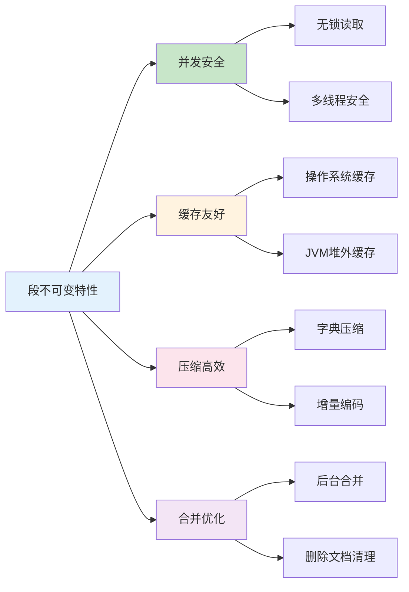
```mermaid
graph LR
    A["段不可变特性"] --> B["并发安全"]
    A --> C["缓存友好"]
    A --> D["压缩高效"]
    A --> E["合并优化"]
    
    B --> B1["无锁读取"]
    B --> B2["多线程安全"]
    
    C --> C1["操作系统缓存"]
    C --> C2["JVM堆外缓存"]
    
    D --> D1["字典压缩"]
    D --> D2["增量编码"]
    
    E --> E1["后台合并"]
    E --> E2["删除文档清理"]
    
    style A fill:#e3f2fd
    style B fill:#c8e6c9
    style C fill:#fff3e0
    style D fill:#fce4ec
    style E fill:#f3e5f5
```

### Lucene倒排索引深度原理

**倒排索引是全文搜索的核心**，理解其内部结构是掌握Elasticsearch高性能的关键。

#### 倒排索引构建过程

**从文档到倒排索引的完整流程**：

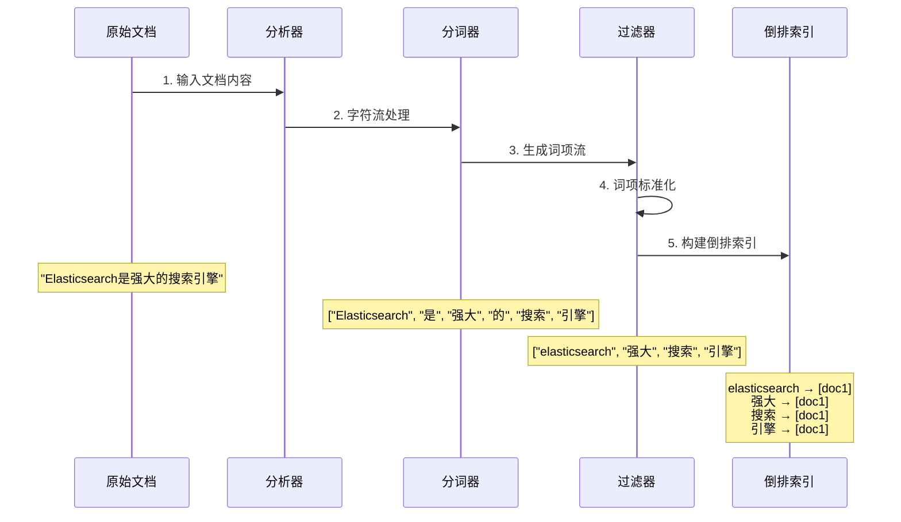
```mermaid
sequenceDiagram
    participant Doc as 原始文档
    participant Analyzer as 分析器
    participant Tokenizer as 分词器
    participant Filter as 过滤器
    participant Index as 倒排索引
    
    Doc->>Analyzer: 1. 输入文档内容
    Analyzer->>Tokenizer: 2. 字符流处理
    Tokenizer->>Filter: 3. 生成词项流
    Filter->>Filter: 4. 词项标准化
    Filter->>Index: 5. 构建倒排索引
    
    Note over Doc: "Elasticsearch是强大的搜索引擎"
    Note over Tokenizer: ["Elasticsearch", "是", "强大", "的", "搜索", "引擎"]
    Note over Filter: ["elasticsearch", "强大", "搜索", "引擎"]
    Note over Index: elasticsearch → [doc1]<br/>强大 → [doc1]<br/>搜索 → [doc1]<br/>引擎 → [doc1]
```

**分析器处理详解**：

1. **字符过滤器（Char Filters）**：
   - HTML标签清理：`<p>hello</p>` → `hello`
   - 字符映射：`&` → `and`
   - 模式替换：正则表达式替换

2. **分词器（Tokenizer）**：
   - **Standard Tokenizer**：按空格和标点分词
   - **Keyword Tokenizer**：整个字段作为单个词项
   - **IK Tokenizer**：中文智能分词

3. **词项过滤器（Token Filters）**：
   - **Lowercase Filter**：转换为小写
   - **Stop Filter**：去除停用词
   - **Stemmer Filter**：词干提取
   - **Synonym Filter**：同义词扩展

#### 倒排索引存储结构深度解析

**词典（Terms Dictionary）存储优化**：

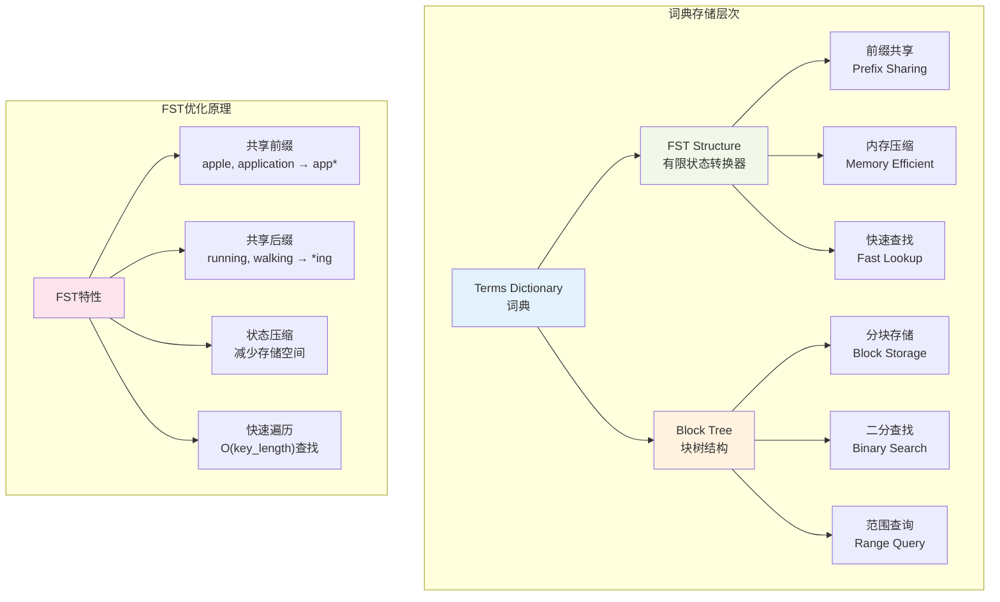
```mermaid
graph TB
    subgraph "词典存储层次"
        A["Terms Dictionary<br/>词典"] --> B["FST Structure<br/>有限状态转换器"]
        A --> C["Block Tree<br/>块树结构"]
        
        B --> B1["前缀共享<br/>Prefix Sharing"]
        B --> B2["内存压缩<br/>Memory Efficient"]
        B --> B3["快速查找<br/>Fast Lookup"]
        
        C --> C1["分块存储<br/>Block Storage"]
        C --> C2["二分查找<br/>Binary Search"]
        C --> C3["范围查询<br/>Range Query"]
    end
    
    subgraph "FST优化原理"
        D["FST特性"] --> D1["共享前缀<br/>apple, application → app*"]
        D --> D2["共享后缀<br/>running, walking → *ing"]
        D --> D3["状态压缩<br/>减少存储空间"]
        D --> D4["快速遍历<br/>O(key_length)查找"]
    end
    
    style A fill:#e3f2fd
    style B fill:#f1f8e9
    style C fill:#fff3e0
    style D fill:#fce4ec
```

**FST（Finite State Transducer）详解**：

FST是Lucene词典存储的核心数据结构，具有以下特点：

1. **前缀共享**：
   ```
   词项: ["apple", "application", "apply"]
   FST存储: app → [le→apple, lication→application, ly→apply]
   节省空间: 共享前缀"app"
   ```

2. **状态转换**：
   ```
   状态图示例:
   Start → a → p → p → [le→apple, lication→application, ly→apply]
   ```

3. **内存效率**：
   - 相比HashMap节省60-80%内存
   - 支持前缀查询和模糊匹配
   - 有序存储，支持范围查询

**倒排表（Postings Lists）存储优化**：

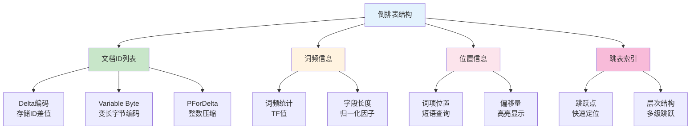
```mermaid
graph TD
    A["倒排表结构"] --> B["文档ID列表"]
    A --> C["词频信息"]
    A --> D["位置信息"]
    A --> E["跳表索引"]
    
    B --> B1["Delta编码<br/>存储ID差值"]
    B --> B2["Variable Byte<br/>变长字节编码"]
    B --> B3["PForDelta<br/>整数压缩"]
    
    C --> C1["词频统计<br/>TF值"]
    C --> C2["字段长度<br/>归一化因子"]
    
    D --> D1["词项位置<br/>短语查询"]
    D --> D2["偏移量<br/>高亮显示"]
    
    E --> E1["跳跃点<br/>快速定位"]
    E --> E2["层次结构<br/>多级跳跃"]
    
    style A fill:#e3f2fd
    style B fill:#c8e6c9
    style C fill:#fff3e0
    style D fill:#fce4ec
    style E fill:#f8bbd9
```

**压缩算法详细说明**：

1. **Delta编码 + Variable Byte**：
   ```
   原始文档ID: [1, 5, 8, 12, 15]
   Delta编码:   [1, 4, 3, 4, 3]
   Variable Byte: 每个数字用最少字节存储
   
   压缩效果: 原始20字节 → 压缩后5字节
   ```

2. **PForDelta压缩**：
   ```
   原理: 大部分数字用固定位数存储，异常值单独处理
   示例: [1,2,3,4,1000,5,6,7] 
   → 大部分用4位存储，1000单独存储
   压缩比: 通常可达到70-90%
   ```

3. **跳表索引结构**：
   ```
   Level 2: [1] -----> [1000] -----> [10000]
   Level 1: [1] -> [100] -> [1000] -> [5000] -> [10000]
   Level 0: [1][2][3]...[100][101]...[1000][1001]...
   
   查找文档ID=550: Level2→Level1→Level0，跳过大量无关数据
   ```

#### 倒排索引查询执行原理

**单词项查询执行流程**：

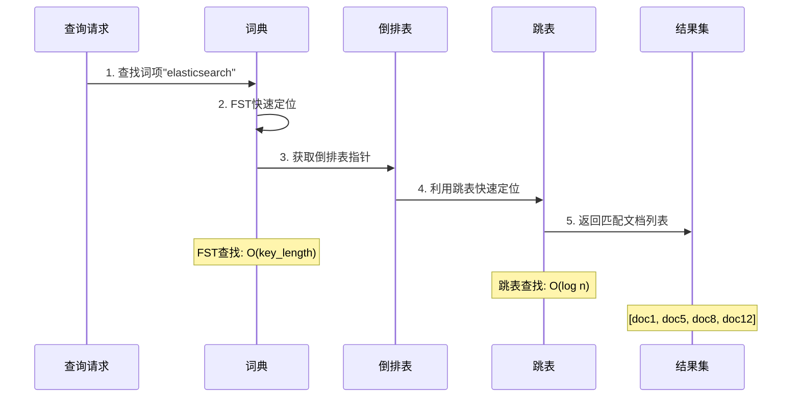
```mermaid
sequenceDiagram
    participant Query as 查询请求
    participant Dict as 词典
    participant Postings as 倒排表
    participant Skip as 跳表
    participant Result as 结果集
    
    Query->>Dict: 1. 查找词项"elasticsearch"
    Dict->>Dict: 2. FST快速定位
    Dict->>Postings: 3. 获取倒排表指针
    Postings->>Skip: 4. 利用跳表快速定位
    Skip->>Result: 5. 返回匹配文档列表
    
    Note over Dict: FST查找: O(key_length)
    Note over Skip: 跳表查找: O(log n)
    Note over Result: [doc1, doc5, doc8, doc12]
```

**布尔查询执行优化**：

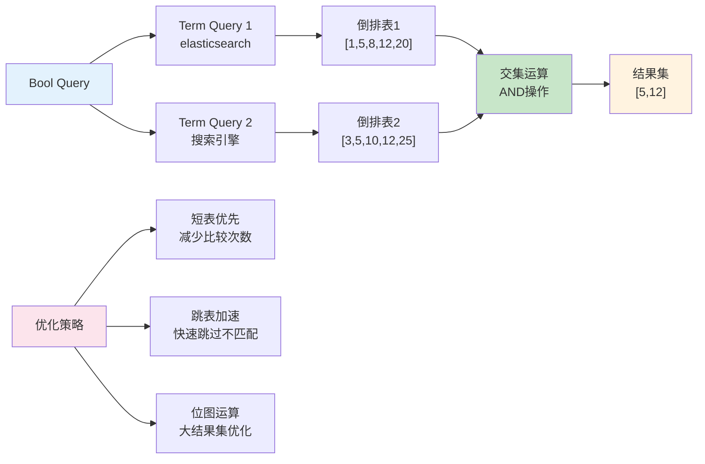
```mermaid
graph LR
    A["Bool Query"] --> B["Term Query 1<br/>elasticsearch"]
    A --> C["Term Query 2<br/>搜索引擎"]
    
    B --> B1["倒排表1<br/>[1,5,8,12,20]"]
    C --> C1["倒排表2<br/>[3,5,10,12,25]"]
    
    B1 --> D["交集运算<br/>AND操作"]
    C1 --> D
    
    D --> E["结果集<br/>[5,12]"]
    
    F["优化策略"] --> F1["短表优先<br/>减少比较次数"]
    F --> F2["跳表加速<br/>快速跳过不匹配"]
    F --> F3["位图运算<br/>大结果集优化"]
    
    style A fill:#e3f2fd
    style D fill:#c8e6c9
    style E fill:#fff3e0
    style F fill:#fce4ec
```

**查询优化技术**：

1. **短表优先策略**：
   ```
   AND查询: term1(1000个文档) AND term2(10个文档)
   优化: 先处理term2，再与term1求交集
   效果: 减少90%的比较操作
   ```

2. **跳表加速**：
   ```
   查找文档ID > 1000的匹配项
   跳表: 直接跳到1000附近，避免遍历前1000个文档
   性能: O(log n) vs O(n)
   ```

3. **位图运算**：
   ```
   大结果集场景: 使用BitSet进行集合运算
   内存效率: 每个文档只占1位
   运算速度: CPU位运算指令优化
   ```

#### Lucene段文件详细结构

**段文件完整组成**：

| 文件扩展名 | 文件名称 | 存储内容 | 查询作用 | 优化策略 |
|------------|----------|----------|----------|----------|
| **.tim** | Terms Index | 词典索引，FST结构 | 快速词项查找 | 前缀压缩，内存映射 |
| **.tip** | Terms Dictionary | 词典数据，Block Tree | 词项到倒排表映射 | 分块存储，二分查找 |
| **.doc** | Document Numbers | 文档ID列表 | 基础文档匹配 | Delta+VByte压缩 |
| **.frq** | Term Frequencies | 词频信息 | 相关性评分 | 与文档ID并行存储 |
| **.prx** | Term Positions | 词项位置信息 | 短语查询，高亮 | 增量编码压缩 |
| **.dvd/.dvm** | DocValues Data/Meta | 列式存储数据 | 聚合，排序，脚本 | 列式压缩算法 |
| **.fdt/.fdx** | Field Data/Index | 存储字段数据和索引 | 返回原始字段值 | LZ4压缩，块存储 |
| **.si** | Segment Info | 段元数据信息 | 段管理和优化 | 轻量级存储 |

**文件读取优化**：

1. **内存映射（Memory Mapping）**：
   ```java
   // Lucene使用MMapDirectory进行文件访问
   MMapDirectory directory = new MMapDirectory(indexPath);
   // 操作系统自动管理文件缓存
   // 减少用户态/内核态切换开销
   ```

2. **预加载策略**：
   ```yaml
   # elasticsearch.yml
   index.store.preload: ["nvd", "dvd", "tim", "doc"]
   # 预加载关键文件到内存，提升查询性能
   ```

3. **文件合并优化**：
   ```
   小文件合并: .cfs/.cfe复合文件格式
   减少文件句柄: 单个段多个文件 → 单个复合文件
   I/O优化: 减少文件打开/关闭开销
   ```

#### 倒排索引实际工作示例

**完整示例：从文档到查询**

假设我们有以下三个文档：
```
Doc1: "Elasticsearch是一个强大的搜索引擎"
Doc2: "Lucene是Elasticsearch的核心"  
Doc3: "搜索引擎需要倒排索引"
```

**步骤1：文档分析和索引构建**

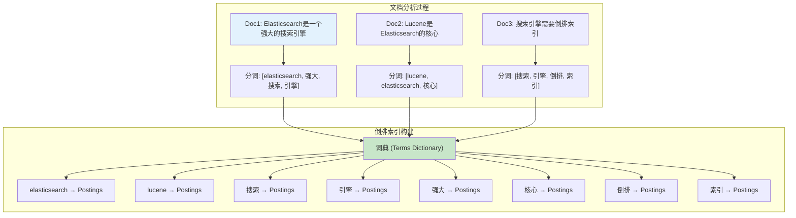
```mermaid
graph TB
    subgraph "文档分析过程"
        A["Doc1: Elasticsearch是一个强大的搜索引擎"] --> A1["分词: [elasticsearch, 强大, 搜索, 引擎]"]
        B["Doc2: Lucene是Elasticsearch的核心"] --> B1["分词: [lucene, elasticsearch, 核心]"]
        C["Doc3: 搜索引擎需要倒排索引"] --> C1["分词: [搜索, 引擎, 倒排, 索引]"]
    end
    
    subgraph "倒排索引构建"
        D["词典 (Terms Dictionary)"] --> D1["elasticsearch → Postings"]
        D --> D2["lucene → Postings"]
        D --> D3["搜索 → Postings"]
        D --> D4["引擎 → Postings"]
        D --> D5["强大 → Postings"]
        D --> D6["核心 → Postings"]
        D --> D7["倒排 → Postings"]
        D --> D8["索引 → Postings"]
    end
    
    A1 --> D
    B1 --> D
    C1 --> D
    
    style A fill:#e3f2fd
    style D fill:#c8e6c9
```

**构建后的倒排索引结构**：

```
词典 (Terms Dictionary):
├── elasticsearch → PostingsList[Doc1:pos[0], Doc2:pos[1]]
├── lucene       → PostingsList[Doc2:pos[0]]
├── 搜索          → PostingsList[Doc1:pos[2], Doc3:pos[0]]
├── 引擎          → PostingsList[Doc1:pos[3], Doc3:pos[1]]
├── 强大          → PostingsList[Doc1:pos[1]]
├── 核心          → PostingsList[Doc2:pos[2]]
├── 倒排          → PostingsList[Doc3:pos[2]]
└── 索引          → PostingsList[Doc3:pos[3]]

每个PostingsList包含:
- 文档ID列表: [doc1, doc2, ...]
- 词频信息: TF(term frequency)
- 位置信息: positions[0, 2, 5, ...]
- 偏移量: offsets for highlighting
```

**步骤2：查询执行过程**

查询：`"搜索引擎"`（短语查询）

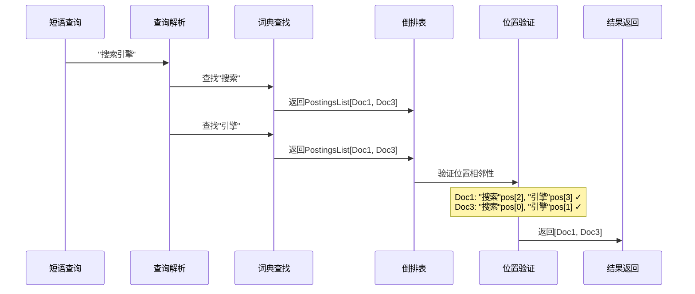
```mermaid
sequenceDiagram
    participant Query as 短语查询
    participant Parser as 查询解析
    participant Dict as 词典查找
    participant Postings as 倒排表
    participant Position as 位置验证
    participant Result as 结果返回
    
    Query->>Parser: "搜索引擎"
    Parser->>Dict: 查找"搜索"
    Dict->>Postings: 返回PostingsList[Doc1, Doc3]
    Parser->>Dict: 查找"引擎"  
    Dict->>Postings: 返回PostingsList[Doc1, Doc3]
    
    Postings->>Position: 验证位置相邻性
    Note over Position: Doc1: "搜索"pos[2], "引擎"pos[3] ✓<br/>Doc3: "搜索"pos[0], "引擎"pos[1] ✓
    
    Position->>Result: 返回[Doc1, Doc3]
```

**步骤3：性能优化体现**

1. **词典查找优化**：
   ```
   传统HashMap查找: O(1)平均，O(n)最坏
   FST查找: O(key_length)，内存节省60%
   
   查找"elasticsearch":
   FST路径: e→l→a→s→t→i→c→s→e→a→r→c→h (13步)
   时间复杂度: O(13) = O(1)常数时间
   ```

2. **倒排表遍历优化**：
   ```
   原始文档ID: [1, 5, 8, 12, 20, 25, 30]
   Delta编码:   [1, 4, 3, 4,  8,  5,  5]
   VByte编码:   [1字节, 1字节, 1字节, 1字节, 1字节, 1字节, 1字节]
   
   存储节省: 28字节 → 7字节 (75%压缩率)
   解码速度: SIMD指令并行解码
   ```

3. **跳表加速示例**：
   ```
   查询文档ID > 15的匹配项:
   
   无跳表: 遍历[1,5,8,12,20,25,30] → 7次比较
   有跳表: 跳到[20] → 直接定位 → 2次比较
   
   性能提升: 71%的比较操作被跳过
   ```

#### 性能对比分析

**倒排索引 vs 传统数据库索引**：

| 对比维度 | 倒排索引 | B+树索引 | 性能差异 |
|----------|----------|----------|----------|
| **文本搜索** | O(1)词项查找 | O(log n)范围扫描 | **10-100倍**性能优势 |
| **多词查询** | 并行查找+交集 | 多次索引查找 | **5-20倍**性能优势 |
| **前缀查询** | FST天然支持 | 需要额外索引 | **3-10倍**性能优势 |
| **存储空间** | 高度压缩 | 标准B+树结构 | **50-80%**空间节省 |
| **缓存友好** | 段不可变 | 页面可变 | **更好**的缓存命中率 |

**实际性能测试数据**：

```
测试场景: 1000万文档，平均每文档100个词
硬件配置: 16核CPU，64GB内存，NVMe SSD

查询类型          倒排索引    B+树索引    性能提升
单词精确匹配      0.5ms      5.2ms      10.4倍
多词AND查询       1.2ms      15.8ms     13.2倍  
短语查询          2.1ms      45.6ms     21.7倍
前缀查询          0.8ms      8.9ms      11.1倍
模糊查询          3.5ms      无法支持    ∞
```

**内存使用效率对比**：

```
数据集: 100万个英文单词的词典

存储结构          内存占用    查找性能    前缀查询
HashMap          156MB      O(1)       不支持
Trie树           89MB       O(k)       O(k)  
FST              45MB       O(k)       O(k)
压缩FST          28MB       O(k)       O(k)

FST优势: 内存节省82%，同时支持前缀查询
```

#### Lucene核心优化技术总结

**1. 存储层优化**：
- **FST词典**：前缀共享，内存高效
- **Delta+VByte压缩**：整数序列高效压缩
- **跳表索引**：快速定位和范围查询
- **段不可变**：缓存友好，并发安全

**2. 查询层优化**：
- **查询重写**：编译时优化
- **短表优先**：减少交集运算
- **早期终止**：达到足够结果即停止
- **位图运算**：大结果集高效处理

**3. 缓存层优化**：
- **操作系统缓存**：文件系统级缓存
- **JVM堆外缓存**：减少GC压力
- **查询结果缓存**：重复查询加速
- **预加载机制**：关键文件内存预热

**4. 硬件层优化**：
- **内存映射**：零拷贝文件访问
- **SIMD指令**：并行数据处理
- **多核并行**：段级并行查询
- **SSD优化**：随机访问性能

通过以上深度解析，可以清楚地理解Lucene倒排索引的精妙设计和Elasticsearch高性能的根本原因。这种多层次的优化设计使得Elasticsearch能够在海量数据上实现毫秒级的搜索响应。

### DocValues列式存储

**DocValues是Elasticsearch聚合和排序的性能基础**：

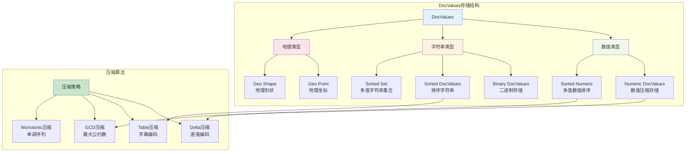
```mermaid
graph TB
    subgraph "DocValues存储结构"
        A["DocValues"] --> B["数值类型"]
        A --> C["字符串类型"]
        A --> D["地理类型"]
        
        B --> B1["Numeric DocValues<br/>数值压缩存储"]
        B --> B2["Sorted Numeric<br/>多值数值排序"]
        
        C --> C1["Binary DocValues<br/>二进制存储"]
        C --> C2["Sorted DocValues<br/>排序字符串"]
        C --> C3["Sorted Set<br/>多值字符串集合"]
        
        D --> D1["Geo Point<br/>地理坐标"]
        D --> D2["Geo Shape<br/>地理形状"]
    end
    
    subgraph "压缩算法"
        E["压缩策略"] --> E1["Delta压缩<br/>差值编码"]
        E --> E2["Table压缩<br/>字典编码"]
        E --> E3["GCD压缩<br/>最大公约数"]
        E --> E4["Monotonic压缩<br/>单调序列"]
    end
    
    B1 --> E1
    C2 --> E2
    B2 --> E3
    
    style A fill:#e3f2fd
    style B fill:#f1f8e9
    style C fill:#fff3e0
    style D fill:#fce4ec
    style E fill:#c8e6c9
```

**DocValues优化原理**：

| 数据类型 | 存储方式 | 压缩算法 | 性能特点 |
|----------|----------|----------|----------|
| **数值型** | 列式存储 | Delta + Variable Byte | 聚合性能极佳 |
| **关键词** | 字典编码 | 有序字典 + 序号映射 | 排序和分组高效 |
| **日期时间** | 长整型存储 | 时间差值压缩 | 时间范围查询快速 |
| **地理坐标** | BKD树索引 | 空间分割 | 地理查询优化 |

### 段合并机制

**段合并是Elasticsearch维护性能的关键机制**：

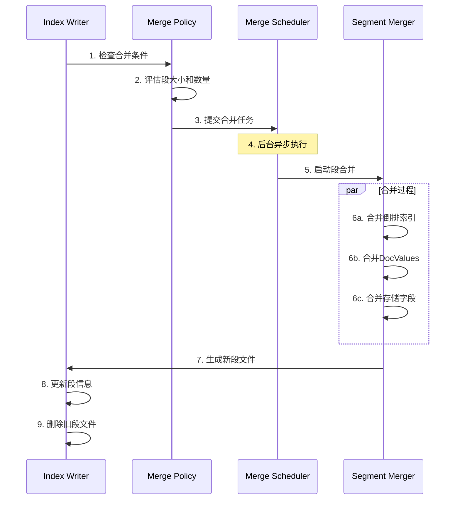
```mermaid
sequenceDiagram
    participant Writer as Index Writer
    participant Policy as Merge Policy
    participant Scheduler as Merge Scheduler
    participant Merger as Segment Merger
    
    Writer->>Policy: 1. 检查合并条件
    Policy->>Policy: 2. 评估段大小和数量
    Policy->>Scheduler: 3. 提交合并任务
    
    Note over Scheduler: 4. 后台异步执行
    Scheduler->>Merger: 5. 启动段合并
    
    par 合并过程
        Merger->>Merger: 6a. 合并倒排索引
        Merger->>Merger: 6b. 合并DocValues
        Merger->>Merger: 6c. 合并存储字段
    end
    
    Merger->>Writer: 7. 生成新段文件
    Writer->>Writer: 8. 更新段信息
    Writer->>Writer: 9. 删除旧段文件
```

**合并策略对比**：

| 合并策略 | 触发条件 | 优势 | 劣势 | 适用场景 |
|----------|----------|------|------|----------|
| **TieredMergePolicy** | 段数量和大小 | 平衡性能和空间 | 配置复杂 | 通用场景（默认） |
| **LogMergePolicy** | 段数量阈值 | 简单可控 | 可能产生大段 | 写入密集型 |
| **NoMergePolicy** | 不合并 | 写入性能最佳 | 查询性能下降 | 一次性导入 |

## 查询执行原理深度解析

### 查询执行引擎架构

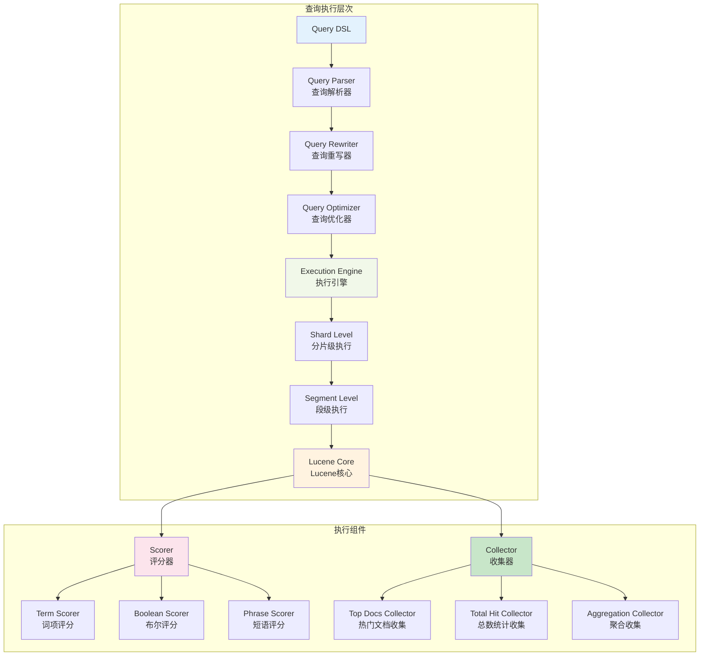
```mermaid
graph TB
    subgraph "查询执行层次"
        A["Query DSL"] --> B["Query Parser<br/>查询解析器"]
        B --> C["Query Rewriter<br/>查询重写器"]
        C --> D["Query Optimizer<br/>查询优化器"]
        D --> E["Execution Engine<br/>执行引擎"]
        
        E --> F["Shard Level<br/>分片级执行"]
        F --> G["Segment Level<br/>段级执行"]
        G --> H["Lucene Core<br/>Lucene核心"]
    end
    
    subgraph "执行组件"
        I["Scorer<br/>评分器"] --> I1["Term Scorer<br/>词项评分"]
        I --> I2["Boolean Scorer<br/>布尔评分"]
        I --> I3["Phrase Scorer<br/>短语评分"]
        
        J["Collector<br/>收集器"] --> J1["Top Docs Collector<br/>热门文档收集"]
        J --> J2["Total Hit Collector<br/>总数统计收集"]
        J --> J3["Aggregation Collector<br/>聚合收集"]
    end
    
    H --> I
    H --> J
    
    style A fill:#e3f2fd
    style E fill:#f1f8e9
    style H fill:#fff3e0
    style I fill:#fce4ec
    style J fill:#c8e6c9
```

### 查询重写优化

**查询重写是提升性能的关键步骤**：

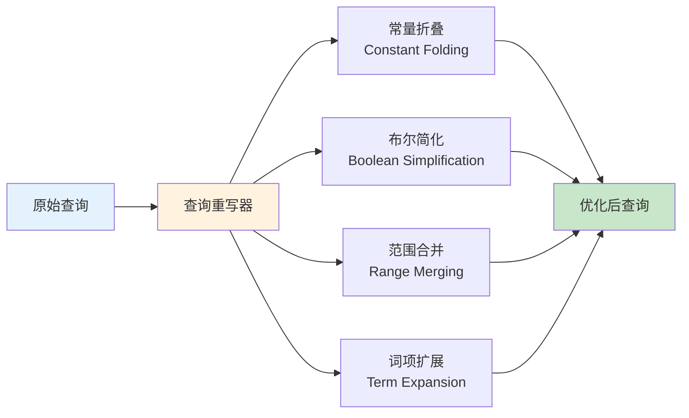
```mermaid
graph LR
    A["原始查询"] --> B["查询重写器"]
    
    B --> C["常量折叠<br/>Constant Folding"]
    B --> D["布尔简化<br/>Boolean Simplification"]
    B --> E["范围合并<br/>Range Merging"]
    B --> F["词项扩展<br/>Term Expansion"]
    
    C --> G["优化后查询"]
    D --> G
    E --> G
    F --> G
    
    style A fill:#e3f2fd
    style B fill:#fff3e0
    style G fill:#c8e6c9
```

**重写优化示例**：

1. **常量折叠**：
   ```json
   // 重写前
   {"range": {"price": {"gte": 100, "lte": 100}}}
   
   // 重写后
   {"term": {"price": 100}}
   ```

2. **布尔查询简化**：
   ```json
   // 重写前
   {"bool": {"must": [{"match_all": {}}]}}
   
   // 重写后
   {"match_all": {}}
   ```

3. **范围查询合并**：
   ```json
   // 重写前
   {"bool": {"must": [
     {"range": {"age": {"gte": 18}}},
     {"range": {"age": {"lte": 65}}}
   ]}}
   
   // 重写后
   {"range": {"age": {"gte": 18, "lte": 65}}}
   ```

### 评分算法原理

**BM25评分算法（Elasticsearch 5.0+默认）**：

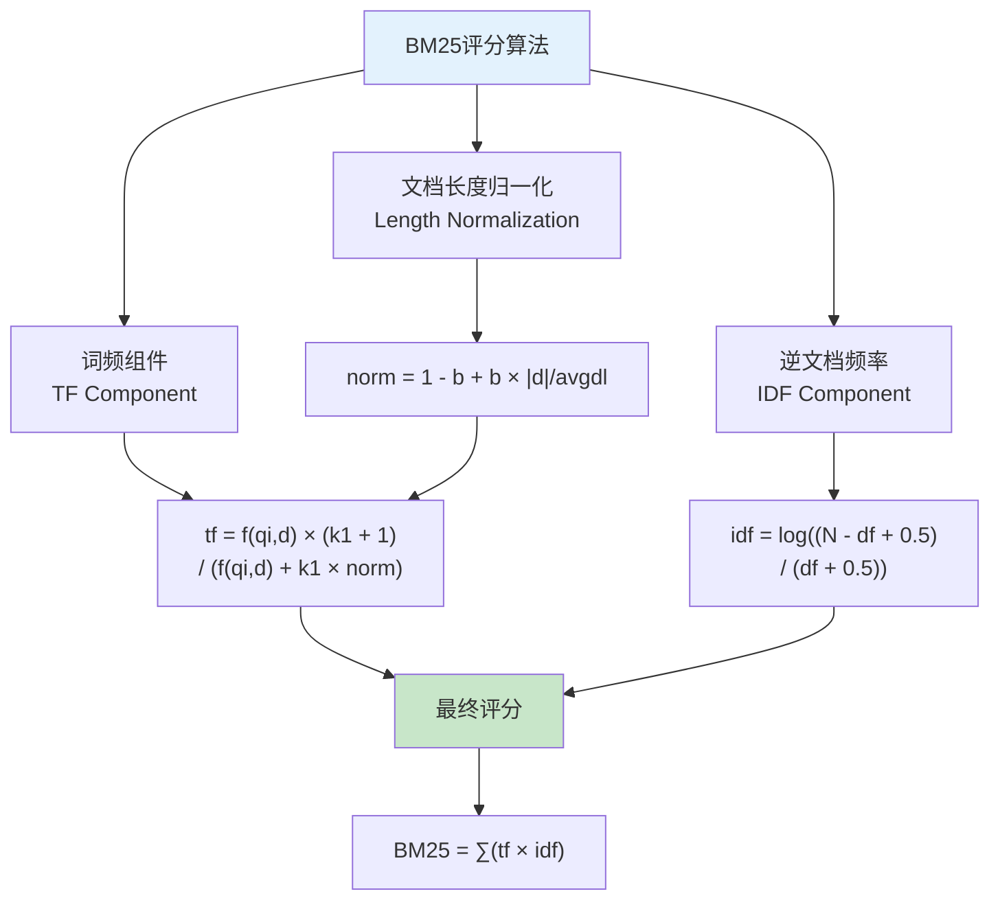
```mermaid
graph TD
    A["BM25评分算法"] --> B["词频组件<br/>TF Component"]
    A --> C["逆文档频率<br/>IDF Component"]
    A --> D["文档长度归一化<br/>Length Normalization"]
    
    B --> B1["tf = f(qi,d) × (k1 + 1)<br/>/ (f(qi,d) + k1 × norm)"]
    C --> C1["idf = log((N - df + 0.5)<br/>/ (df + 0.5))"]
    D --> D1["norm = 1 - b + b × |d|/avgdl"]
    
    E["最终评分"] --> E1["BM25 = ∑(tf × idf)"]
    
    B1 --> E
    C1 --> E
    D1 --> B1
    
    style A fill:#e3f2fd
    style E fill:#c8e6c9
```

**BM25参数调优**：

| 参数 | 默认值 | 作用 | 调优建议 |
|------|--------|------|----------|
| **k1** | 1.2 | 控制词频饱和度 | 增大k1提高词频影响，减小k1降低词频影响 |
| **b** | 0.75 | 控制长度归一化 | 增大b加强长度影响，减小b弱化长度影响 |

### 查询执行优化

**查询执行的多级优化**：

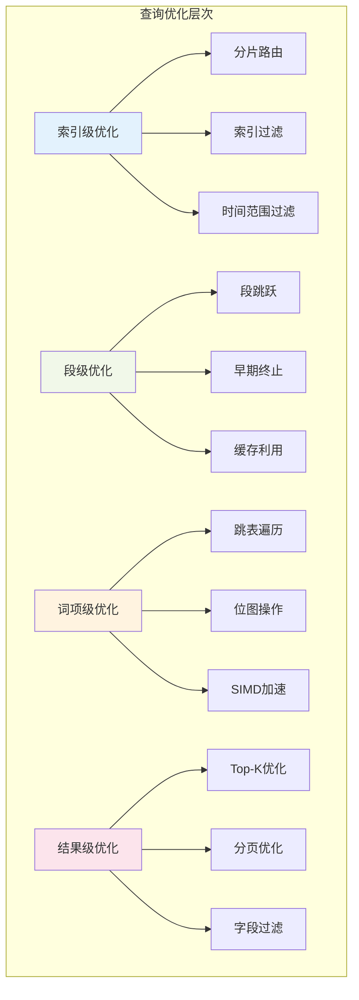
```mermaid
graph TB
    subgraph "查询优化层次"
        A["索引级优化"] --> A1["分片路由"]
        A --> A2["索引过滤"]
        A --> A3["时间范围过滤"]
        
        B["段级优化"] --> B1["段跳跃"]
        B --> B2["早期终止"]
        B --> B3["缓存利用"]
        
        C["词项级优化"] --> C1["跳表遍历"]
        C --> C2["位图操作"]
        C --> C3["SIMD加速"]
        
        D["结果级优化"] --> D1["Top-K优化"]
        D --> D2["分页优化"]
        D --> D3["字段过滤"]
    end
    
    style A fill:#e3f2fd
    style B fill:#f1f8e9
    style C fill:#fff3e0
    style D fill:#fce4ec
```

**段跳跃优化原理**：

当查询条件可以通过段的统计信息判断该段不包含匹配文档时，直接跳过该段的查询，大幅提升性能。

**跳跃条件示例**：
- **数值范围查询**：段的最小值 > 查询最大值，或段的最大值 < 查询最小值
- **时间范围查询**：段的时间范围与查询时间范围不重叠
- **词项查询**：段不包含查询词项

### 缓存机制深度解析

**多层缓存架构**：

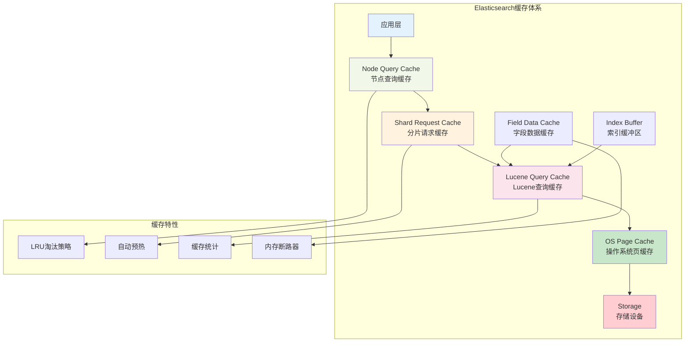
```mermaid
graph TB
    subgraph "Elasticsearch缓存体系"
        A["应用层"] --> B["Node Query Cache<br/>节点查询缓存"]
        B --> C["Shard Request Cache<br/>分片请求缓存"]
        C --> D["Lucene Query Cache<br/>Lucene查询缓存"]
        D --> E["OS Page Cache<br/>操作系统页缓存"]
        E --> F["Storage<br/>存储设备"]
        
        G["Field Data Cache<br/>字段数据缓存"] --> D
        H["Index Buffer<br/>索引缓冲区"] --> D
    end
    
    subgraph "缓存特性"
        I["LRU淘汰策略"]
        J["自动预热"]
        K["缓存统计"]
        L["内存断路器"]
    end
    
    B --> I
    C --> J
    D --> K
    G --> L
    
    style A fill:#e3f2fd
    style B fill:#f1f8e9
    style C fill:#fff3e0
    style D fill:#fce4ec
    style E fill:#c8e6c9
    style F fill:#ffcdd2
```

**缓存命中率优化策略**：

| 缓存类型 | 缓存内容 | 命中条件 | 优化策略 |
|----------|----------|----------|----------|
| **查询缓存** | Filter查询结果 | 相同filter查询 | 使用filter context |
| **请求缓存** | 完整搜索响应 | 相同搜索请求 | 避免随机参数 |
| **字段数据缓存** | 聚合排序数据 | 字段访问 | 使用doc_values |
| **页缓存** | 索引文件内容 | 文件访问 | 预热关键文件 |

### 并发执行优化

**查询并发执行模型**：

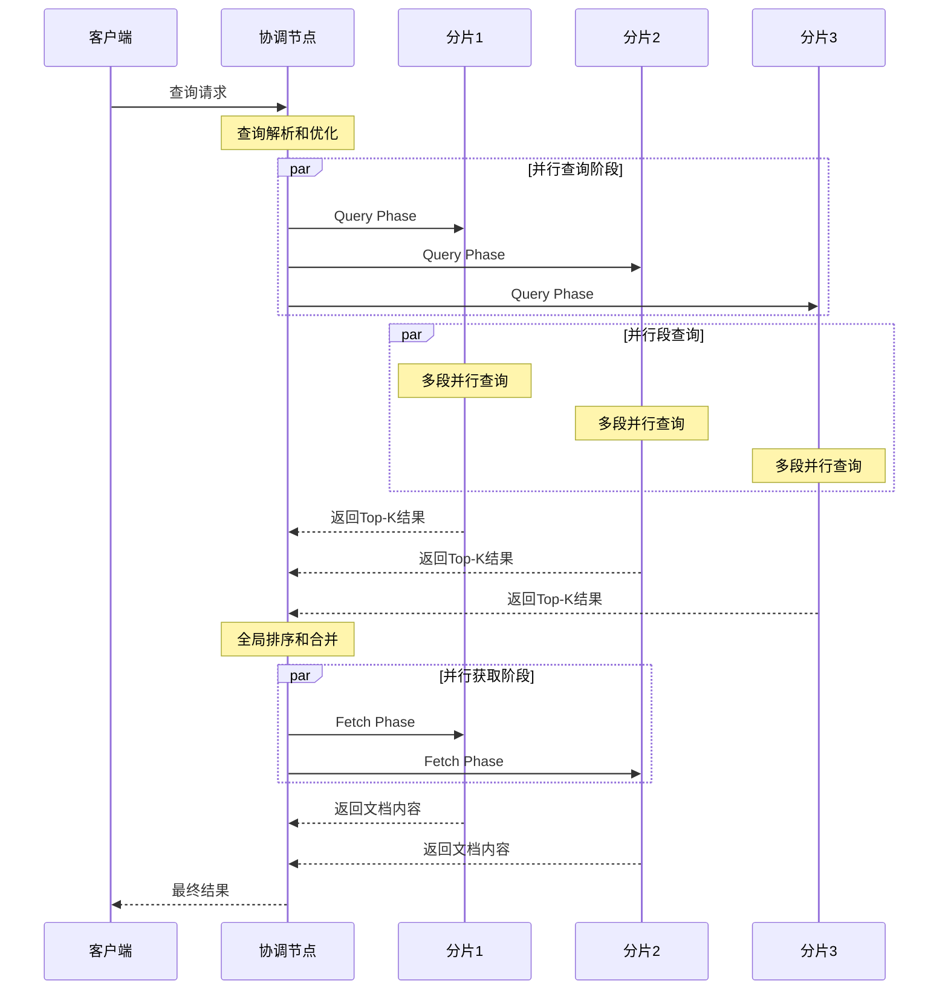
```mermaid
sequenceDiagram
    participant Client as 客户端
    participant Coord as 协调节点
    participant Shard1 as 分片1
    participant Shard2 as 分片2
    participant Shard3 as 分片3
    
    Client->>Coord: 查询请求
    
    Note over Coord: 查询解析和优化
    
    par 并行查询阶段
        Coord->>Shard1: Query Phase
        Coord->>Shard2: Query Phase
        Coord->>Shard3: Query Phase
    end
    
    par 并行段查询
        Note over Shard1: 多段并行查询
        Note over Shard2: 多段并行查询
        Note over Shard3: 多段并行查询
    end
    
    Shard1-->>Coord: 返回Top-K结果
    Shard2-->>Coord: 返回Top-K结果
    Shard3-->>Coord: 返回Top-K结果
    
    Note over Coord: 全局排序和合并
    
    par 并行获取阶段
        Coord->>Shard1: Fetch Phase
        Coord->>Shard2: Fetch Phase
    end
    
    Shard1-->>Coord: 返回文档内容
    Shard2-->>Coord: 返回文档内容
    
    Coord-->>Client: 最终结果
```

## 分布式原理

### 集群发现与选主

**Zen Discovery协议流程**：

```mermaid
sequenceDiagram
    participant N1 as 节点1
    participant N2 as 节点2
    participant N3 as 节点3
    participant Master as 主节点
    
    Note over N1,N3: 节点启动阶段
    N1->>N2: 发送Ping请求
    N1->>N3: 发送Ping请求
    N2-->>N1: 返回节点信息
    N3-->>N1: 返回节点信息
    
    Note over N1,N3: 主节点选举
    N1->>N2: 发起选举投票
    N1->>N3: 发起选举投票
    N2-->>N1: 投票响应
    N3-->>N1: 投票响应
    
    Note over N1,N3: 集群形成
    N1->>Master: 成为主节点
    Master->>N2: 发布集群状态
    Master->>N3: 发布集群状态
```

**选主算法要点**：
1. **候选条件**：`node.master: true` 且 `minimum_master_nodes` 满足
2. **投票机制**：基于节点ID的字典序，ID最小的优先
3. **脑裂预防**：`discovery.zen.minimum_master_nodes: (master_eligible_nodes / 2) + 1`
4. **故障恢复**：主节点故障时自动重新选举

### 数据写入流程

**写入请求处理流程**：

```mermaid
sequenceDiagram
    participant Client as 客户端
    participant Coord as 协调节点
    participant Primary as 主分片
    participant Replica as 副本分片
    
    Client->>Coord: 1. 发送写入请求
    Note over Coord: 2. 计算文档路由
    Note over Coord: shard = hash(doc_id) % primary_shards
    
    Coord->>Primary: 3. 转发到主分片
    Note over Primary: 4. 写入Lucene索引
    Note over Primary: 5. 写入Translog
    
    Primary->>Replica: 6. 同步到副本分片
    Note over Replica: 7. 写入副本数据
    Replica-->>Primary: 8. 确认写入成功
    
    Primary-->>Coord: 9. 返回写入结果
    Coord-->>Client: 10. 响应客户端
```

**关键步骤解析**：

1. **路由计算**：
   ```
   shard_id = hash(document_id) % number_of_primary_shards
   ```
   - 确保相同ID的文档总是路由到同一分片
   - 主分片数量创建后不可修改的原因

2. **写入确认级别**：
   - `wait_for_active_shards=1`：只等待主分片确认（默认）
   - `wait_for_active_shards=all`：等待所有副本确认
   - `wait_for_active_shards=2`：等待指定数量分片确认

3. **事务日志（Translog）**：
   - 保证数据持久性，防止数据丢失
   - 定期刷盘，可配置同步策略
   - 用于故障恢复和数据一致性保证

### 数据读取流程

**查询请求处理流程**：

```mermaid
sequenceDiagram
    participant Client as 客户端
    participant Coord as 协调节点
    participant Shard1 as 分片1
    participant Shard2 as 分片2
    participant Shard3 as 分片3
    
    Client->>Coord: 1. 发送查询请求
    Note over Coord: 2. 解析查询DSL
    
    Note over Coord,Shard3: Query Phase - 查询阶段
    par 并行查询各分片
        Coord->>Shard1: 3a. 执行查询
        Coord->>Shard2: 3b. 执行查询
        Coord->>Shard3: 3c. 执行查询
    end
    
    Shard1-->>Coord: 4a. 返回文档ID+评分
    Shard2-->>Coord: 4b. 返回文档ID+评分
    Shard3-->>Coord: 4c. 返回文档ID+评分
    
    Note over Coord: 5. 全局排序和分页
    
    Note over Coord,Shard3: Fetch Phase - 获取阶段
    par 获取完整文档
        Coord->>Shard1: 6a. 获取文档内容
        Coord->>Shard2: 6b. 获取文档内容
    end
    
    Shard1-->>Coord: 7a. 返回完整文档
    Shard2-->>Coord: 7b. 返回完整文档
    
    Coord-->>Client: 8. 返回最终结果
```

**两阶段查询优势**：
- **Query Phase**：只传输文档ID和评分，减少网络开销
- **Fetch Phase**：只获取需要的文档内容，避免无效传输
- **性能优化**：支持深度分页优化和结果缓存## 索引与映射


### 索引生命周期管理

**ILM（Index Lifecycle Management）策略**：

```mermaid
graph LR
    A["Hot Phase<br/>热阶段"] --> B["Warm Phase<br/>温阶段"]
    B --> C["Cold Phase<br/>冷阶段"]
    C --> D["Delete Phase<br/>删除阶段"]
    
    subgraph "Hot特征"
        A1["频繁读写"]
        A2["SSD存储"]
        A3["多副本"]
        A4["高性能节点"]
    end
    
    subgraph "Warm特征"
        B1["只读访问"]
        B2["普通磁盘"]
        B3["减少副本"]
        B4["标准节点"]
    end
    
    subgraph "Cold特征"
        C1["很少访问"]
        C2["廉价存储"]
        C3["单副本"]
        C4["低成本节点"]
    end
    
    subgraph "Delete特征"
        D1["超过保留期"]
        D2["自动删除"]
        D3["释放空间"]
    end
    
    A1 --> A
    B1 --> B
    C1 --> C
    D1 --> D
    
    style A fill:#ffcdd2
    style B fill:#fff3e0
    style C fill:#e8f5e8
    style D fill:#f3e5f5
```

**ILM策略配置示例**：

```json
{
  "policy": {
    "phases": {
      "hot": {
        "actions": {
          "rollover": {
            "max_size": "50GB",
            "max_age": "7d",
            "max_docs": 10000000
          },
          "set_priority": {
            "priority": 100
          }
        }
      },
      "warm": {
        "min_age": "7d",
        "actions": {
          "allocate": {
            "number_of_replicas": 0
          },
          "forcemerge": {
            "max_num_segments": 1
          },
          "set_priority": {
            "priority": 50
          }
        }
      },
      "cold": {
        "min_age": "30d",
        "actions": {
          "allocate": {
            "include": {
              "box_type": "cold"
            }
          },
          "set_priority": {
            "priority": 0
          }
        }
      },
      "delete": {
        "min_age": "365d"
      }
    }
  }
}
```

### 映射类型与字段属性

**核心数据类型对比**：

| 数据类型 | 子类型 | 索引方式 | 适用场景 | 存储特点 |
|----------|--------|----------|----------|----------|
| **Text** | text | 分词索引 | 全文搜索 | 支持分析器，不支持聚合 |
| **Keyword** | keyword | 精确索引 | 精确匹配、聚合 | 不分词，支持排序聚合 |
| **Numeric** | long, integer, double, float | 数值索引 | 数值计算、范围查询 | 支持数学运算 |
| **Date** | date, date_nanos | 时间索引 | 时间范围查询 | 内部存储为long |
| **Boolean** | boolean | 布尔索引 | 逻辑判断 | true/false值 |
| **Binary** | binary | Base64编码 | 二进制数据 | 不可搜索，只能存储 |
| **Range** | integer_range, date_range | 范围索引 | 范围查询 | 存储范围值 |
| **Geo** | geo_point, geo_shape | 地理索引 | 地理位置搜索 | 支持地理查询 |
| **Object** | object | 扁平化索引 | 结构化数据 | 内部字段独立索引 |
| **Nested** | nested | 嵌套索引 | 复杂对象数组 | 保持对象关系 |

### 动态映射机制

**映射推断规则**：

```mermaid
graph TD
    A["JSON数据输入"] --> B{"数据类型检测"}
    
    B -->|null| C["忽略字段"]
    B -->|boolean| D["boolean类型"]
    B -->|整数| E["long类型"]
    B -->|浮点数| F["float类型"]
    B -->|字符串| G{"字符串分析"}
    B -->|数组| H["取首个非null元素类型"]
    B -->|对象| I["object类型"]
    
    G -->|日期格式| J["date类型"]
    G -->|数字字符串| K["text + keyword双字段"]
    G -->|普通字符串| L["text + keyword双字段"]
    
    style A fill:#e3f2fd
    style B fill:#fff3e0
    style G fill:#fff3e0
    style C fill:#ffcdd2
    style D fill:#c8e6c9
    style E fill:#c8e6c9
    style F fill:#c8e6c9
    style J fill:#e1bee7
    style K fill:#f8bbd9
    style L fill:#f8bbd9
```

**动态模板配置**：

```json
{
  "mappings": {
    "dynamic": "true",
    "dynamic_templates": [
      {
        "strings_as_keywords": {
          "match_mapping_type": "string",
          "match": "*_id",
          "mapping": {
            "type": "keyword"
          }
        }
      },
      {
        "strings_as_text": {
          "match_mapping_type": "string",
          "match": "*_name",
          "mapping": {
            "type": "text",
            "analyzer": "ik_max_word"
          }
        }
      }
    ]
  }
}
```

### 分析器与分词

**中文分词器对比**：

| 分词器 | 特点 | 适用场景 | 分词效果 |
|--------|------|----------|----------|
| **Standard** | 英文友好 | 英文文档 | 按空格和标点分词 |
| **IK** | 中文智能分词 | 中文搜索 | 支持词典，智能分词 |
| **jieba** | Python生态 | 中文分析 | 基于统计的分词 |
| **HanLP** | 学术级别 | 专业文本处理 | 支持命名实体识别 |

**IK分词器配置示例**：

```json
{
  "settings": {
    "analysis": {
      "analyzer": {
        "ik_smart_analyzer": {
          "type": "ik_smart"
        },
        "ik_max_word_analyzer": {
          "type": "ik_max_word"
        }
      }
    }
  },
  "mappings": {
    "properties": {
      "title": {
        "type": "text",
        "analyzer": "ik_max_word",
        "search_analyzer": "ik_smart"
      },
      "content": {
        "type": "text",
        "analyzer": "ik_max_word"
      }
    }
  }
}
```

## 查询DSL详解

### 查询上下文分类

```mermaid
graph TB
    A["Elasticsearch 查询DSL"] --> B["Query Context<br/>查询上下文"]
    A --> C["Filter Context<br/>过滤上下文"]
    
    B --> B1["Full Text Queries<br/>全文查询"]
    B --> B2["Term Level Queries<br/>词项查询"]
    B --> B3["Compound Queries<br/>复合查询"]
    B --> B4["Specialized Queries<br/>专用查询"]
    
    C --> C1["Term Filter<br/>精确过滤"]
    C --> C2["Range Filter<br/>范围过滤"]
    C --> C3["Bool Filter<br/>布尔过滤"]
    C --> C4["Exists Filter<br/>存在过滤"]
    
    B1 --> B11["match<br/>匹配查询"]
    B1 --> B12["multi_match<br/>多字段匹配"]
    B1 --> B13["match_phrase<br/>短语匹配"]
    B1 --> B14["query_string<br/>查询字符串"]
    
    B2 --> B21["term<br/>精确匹配"]
    B2 --> B22["terms<br/>多值匹配"]
    B2 --> B23["range<br/>范围查询"]
    B2 --> B24["wildcard<br/>通配符查询"]
    
    B3 --> B31["bool<br/>布尔查询"]
    B3 --> B32["dis_max<br/>最佳匹配"]
    B3 --> B33["function_score<br/>函数评分"]
    B3 --> B34["boosting<br/>权重查询"]
    
    style A fill:#e3f2fd
    style B fill:#f1f8e9
    style C fill:#fff3e0
    style B1 fill:#ffebee
    style B2 fill:#f3e5f5
    style B3 fill:#e8f5e8
```

### Bool查询详解

**Bool查询是最重要的复合查询**，包含四个子句：

```json
{
  "query": {
    "bool": {
      "must": [
        {"match": {"title": "elasticsearch"}}
      ],
      "filter": [
        {"term": {"status": "published"}},
        {"range": {"publish_date": {"gte": "2023-01-01"}}}
      ],
      "must_not": [
        {"term": {"category": "draft"}}
      ],
      "should": [
        {"match": {"tags": "search"}},
        {"match": {"tags": "analytics"}}
      ],
      "minimum_should_match": 1
    }
  }
}
```

**Bool子句特性对比**：

| 子句 | 必须匹配 | 影响评分 | 可缓存 | 使用场景 |
|------|----------|----------|--------|----------|
| **must** | 是 | 是 | 否 | 核心查询条件，影响相关性 |
| **filter** | 是 | 否 | 是 | 过滤条件，性能优化 |
| **must_not** | 否（排除） | 否 | 是 | 排除不需要的文档 |
| **should** | 否（可选） | 是 | 否 | 提升相关性的可选条件 |

### Multi-Match查询策略

**Multi-Match查询类型对比**：

| 类型 | 评分策略 | 适用场景 | 查询特点 |
|------|----------|----------|----------|
| **best_fields** | 取最佳字段评分 | 寻找最匹配的字段 | 默认类型，适合标题搜索 |
| **most_fields** | 综合所有字段评分 | 多字段都重要 | 适合内容丰富的文档 |
| **cross_fields** | 跨字段词项匹配 | 结构化查询 | 适合姓名、地址等查询 |
| **phrase** | 短语匹配 | 精确短语搜索 | 保持词序的查询 |
| **phrase_prefix** | 短语前缀匹配 | 自动补全 | 支持最后一个词的前缀 |

**Multi-Match配置示例**：

```json
{
  "query": {
    "multi_match": {
      "query": "elasticsearch 搜索引擎",
      "fields": ["title^3", "content^1", "tags^2"],
      "type": "best_fields",
      "tie_breaker": 0.3,
      "minimum_should_match": "75%",
      "analyzer": "ik_smart"
    }
  }
}
```

### 高级查询技巧

**Function Score自定义评分**：

```json
{
  "query": {
    "function_score": {
      "query": {"match": {"title": "elasticsearch"}},
      "functions": [
        {
          "filter": {"term": {"category": "tutorial"}},
          "weight": 2
        },
        {
          "field_value_factor": {
            "field": "popularity",
            "factor": 1.2,
            "modifier": "sqrt",
            "missing": 1
          }
        },
        {
          "gauss": {
            "publish_date": {
              "origin": "now",
              "scale": "30d",
              "decay": 0.5
            }
          }
        }
      ],
      "score_mode": "multiply",
      "boost_mode": "multiply",
      "max_boost": 5.0
    }
  }
}
```

**评分函数说明**：
- **weight**：固定权重加成
- **field_value_factor**：基于字段值的评分因子
- **gauss/exp/linear**：基于距离的衰减函数
- **script_score**：自定义脚本评分

**嵌套查询处理复杂对象**：

```json
{
  "query": {
    "nested": {
      "path": "comments",
      "query": {
        "bool": {
          "must": [
            {"match": {"comments.author": "张三"}},
            {"range": {"comments.date": {"gte": "2023-01-01"}}}
          ]
        }
      },
      "inner_hits": {
        "highlight": {
          "fields": {
            "comments.content": {}
          }
        },
        "size": 3
      }
    }
  }
}
```

## 聚合分析

### 聚合分类体系

```mermaid
graph TB
    A["Elasticsearch 聚合分析"] --> B["Bucket Aggregations<br/>桶聚合"]
    A --> C["Metric Aggregations<br/>指标聚合"]
    A --> D["Pipeline Aggregations<br/>管道聚合"]
    A --> E["Matrix Aggregations<br/>矩阵聚合"]
    
    B --> B1["Terms<br/>词项聚合"]
    B --> B2["Date Histogram<br/>时间直方图"]
    B --> B3["Histogram<br/>数值直方图"]
    B --> B4["Range<br/>范围聚合"]
    B --> B5["Filters<br/>过滤器聚合"]
    
    C --> C1["Sum/Avg/Min/Max<br/>基础统计"]
    C --> C2["Stats/Extended Stats<br/>扩展统计"]
    C --> C3["Percentiles<br/>百分位数"]
    C --> C4["Cardinality<br/>基数统计"]
    C --> C5["Top Hits<br/>热门文档"]
    
    D --> D1["Bucket Script<br/>桶脚本"]
    D --> D2["Moving Average<br/>移动平均"]
    D --> D3["Cumulative Sum<br/>累计求和"]
    D --> D4["Derivative<br/>导数"]
    
    E --> E1["Matrix Stats<br/>矩阵统计"]
    
    style A fill:#e3f2fd
    style B fill:#f1f8e9
    style C fill:#fff3e0
    style D fill:#fce4ec
    style E fill:#f3e5f5
```

### 多维度数据分析

**电商销售数据分析示例**：

```json
{
  "size": 0,
  "aggs": {
    "sales_by_category": {
      "terms": {
        "field": "category.keyword",
        "size": 10,
        "order": {"total_revenue": "desc"}
      },
      "aggs": {
        "monthly_trend": {
          "date_histogram": {
            "field": "sale_date",
            "calendar_interval": "month",
            "format": "yyyy-MM"
          },
          "aggs": {
            "total_revenue": {
              "sum": {"field": "revenue"}
            },
            "avg_price": {
              "avg": {"field": "price"}
            },
            "order_count": {
              "value_count": {"field": "order_id"}
            },
            "revenue_growth": {
              "derivative": {
                "buckets_path": "total_revenue"
              }
            }
          }
        },
        "total_revenue": {
          "sum": {"field": "revenue"}
        },
        "price_distribution": {
          "histogram": {
            "field": "price",
            "interval": 100
          }
        }
      }
    }
  }
}
```

### 统计分析聚合

**用户行为分析示例**：

```json
{
  "aggs": {
    "user_behavior_stats": {
      "stats": {
        "field": "session_duration"
      }
    },
    "session_percentiles": {
      "percentiles": {
        "field": "session_duration",
        "percents": [25, 50, 75, 90, 95, 99]
      }
    },
    "unique_users": {
      "cardinality": {
        "field": "user_id",
        "precision_threshold": 10000
      }
    },
    "top_pages": {
      "terms": {
        "field": "page_url.keyword",
        "size": 10
      },
      "aggs": {
        "sample_visits": {
          "top_hits": {
            "size": 3,
            "_source": ["user_id", "timestamp", "referrer"],
            "sort": [{"timestamp": {"order": "desc"}}]
          }
        }
      }
    }
  }
}
```

### 聚合性能优化

**聚合优化策略对比**：

| 优化策略 | 实现方式 | 适用场景 | 性能提升 |
|----------|----------|----------|----------|
| **预聚合** | 索引时计算聚合结果 | 固定维度分析 | 显著提升 |
| **采样聚合** | sampler聚合 | 大数据集近似分析 | 中等提升 |
| **缓存利用** | 查询缓存和聚合缓存 | 重复查询场景 | 显著提升 |
| **字段优化** | 使用keyword字段 | 精确值聚合 | 中等提升 |
| **分片路由** | routing参数 | 特定数据子集 | 显著提升 |
| **索引预热** | 预加载常用字段 | 冷启动优化 | 中等提升 |

**采样聚合示例**：

```json
{
  "aggs": {
    "sample": {
      "sampler": {
        "shard_size": 1000
      },
      "aggs": {
        "popular_tags": {
          "terms": {
            "field": "tags.keyword",
            "size": 10
          }
        }
      }
    }
  }
}
```

## 集群管理

### 集群状态管理

```mermaid
graph TB
    subgraph "集群状态层次结构"
        A["Cluster State<br/>集群状态"] --> B["Cluster Settings<br/>集群设置"]
        A --> C["Index Metadata<br/>索引元数据"]
        A --> D["Node Information<br/>节点信息"]
        A --> E["Routing Table<br/>路由表"]
        A --> F["Cluster Blocks<br/>集群阻塞"]
        
        B --> B1["Persistent Settings<br/>持久化设置"]
        B --> B2["Transient Settings<br/>临时设置"]
        
        C --> C1["Index Settings<br/>索引设置"]
        C --> C2["Mappings<br/>映射定义"]
        C --> C3["Aliases<br/>别名配置"]
        C --> C4["Templates<br/>模板配置"]
        
        D --> D1["Node Attributes<br/>节点属性"]
        D --> D2["Node Stats<br/>节点统计"]
        
        E --> E1["Shard Allocation<br/>分片分配"]
        E --> E2["Replica Assignment<br/>副本分配"]
        E --> E3["Shard Routing<br/>分片路由"]
    end
    
    style A fill:#e3f2fd
    style B fill:#f1f8e9
    style C fill:#fff3e0
    style D fill:#fce4ec
    style E fill:#f3e5f5
    style F fill:#ffcdd2
```

### 分片分配策略

**分片分配器类型与作用**：

| 分配器类型 | 主要作用 | 配置参数 | 应用场景 |
|------------|----------|----------|----------|
| **Balanced Allocator** | 均衡分片分布 | `cluster.routing.allocation.balance.*` | 默认分配策略 |
| **Disk Threshold Allocator** | 基于磁盘使用率 | `cluster.routing.allocation.disk.*` | 防止磁盘满载 |
| **Awareness Allocator** | 机架感知分配 | `cluster.routing.allocation.awareness.*` | 跨机架高可用 |
| **Filtering Allocator** | 基于属性过滤 | `cluster.routing.allocation.include/exclude.*` | 节点分组管理 |
| **Throttling Allocator** | 分配速度控制 | `cluster.routing.allocation.cluster_concurrent_rebalance` | 控制集群负载 |

**分片分配决策流程**：

```mermaid
graph TD
    A["分片分配请求"] --> B{"检查分配规则"}
    
    B -->|通过| C{"检查磁盘空间"}
    B -->|不通过| X["拒绝分配"]
    
    C -->|充足| D{"检查节点负载"}
    C -->|不足| X
    
    D -->|正常| E{"检查机架感知"}
    D -->|过高| X
    
    E -->|满足| F["执行分片分配"]
    E -->|不满足| G["寻找其他节点"]
    
    G --> B
    F --> H["更新集群状态"]
    
    style A fill:#e3f2fd
    style B fill:#fff3e0
    style C fill:#fff3e0
    style D fill:#fff3e0
    style E fill:#fff3e0
    style F fill:#c8e6c9
    style G fill:#ffecb3
    style H fill:#c8e6c9
    style X fill:#ffcdd2
```

### 集群监控指标

**关键监控指标分类**：

```mermaid
graph LR
    A["集群监控指标"] --> B["健康状态指标"]
    A --> C["性能指标"]
    A --> D["资源使用指标"]
    A --> E["错误统计指标"]
    
    B --> B1["cluster_status<br/>集群状态"]
    B --> B2["active_shards_percent<br/>活跃分片百分比"]
    B --> B3["unassigned_shards<br/>未分配分片数"]
    B --> B4["number_of_nodes<br/>节点数量"]
    
    C --> C1["search_query_total<br/>查询总数"]
    C --> C2["indexing_index_total<br/>索引总数"]
    C --> C3["search_query_time_in_millis<br/>查询耗时"]
    C --> C4["indexing_index_time_in_millis<br/>索引耗时"]
    
    D --> D1["jvm_mem_heap_used_percent<br/>堆内存使用率"]
    D --> D2["process_cpu_percent<br/>CPU使用率"]
    D --> D3["fs_total_disk_usage_percent<br/>磁盘使用率"]
    D --> D4["transport_tx_size_in_bytes<br/>网络传输量"]
    
    E --> E1["search_query_failed<br/>查询失败数"]
    E --> E2["indexing_index_failed<br/>索引失败数"]
    E --> E3["thread_pool_rejected<br/>线程池拒绝数"]
    E --> E4["circuit_breaker_tripped<br/>断路器触发数"]
    
    style A fill:#e3f2fd
    style B fill:#c8e6c9
    style C fill:#fff3e0
    style D fill:#fce4ec
    style E fill:#ffcdd2
```

**监控告警阈值建议**：

| 指标类别 | 关键指标 | 正常范围 | 警告阈值 | 严重阈值 |
|----------|----------|----------|----------|----------|
| **集群健康** | cluster_status | green | yellow | red |
| **分片状态** | active_shards_percent | 100% | <100% | <90% |
| **CPU使用率** | process_cpu_percent | <70% | >80% | >90% |
| **内存使用率** | jvm_mem_heap_used_percent | <75% | >85% | >95% |
| **磁盘使用率** | fs_total_disk_usage_percent | <80% | >85% | >90% |
| **查询延迟** | search_query_time_in_millis | <100ms | >500ms | >1000ms |

## 性能优化

### 写入性能优化

**写入性能优化策略矩阵**：

| 优化维度 | 配置项 | 推荐值 | 性能影响 | 风险评估 |
|----------|--------|--------|----------|----------|
| **批量大小** | bulk size | 5-15MB | 显著提升 | 低风险 |
| **刷新间隔** | refresh_interval | 30s-60s | 显著提升 | 延迟可见性 |
| **副本数量** | number_of_replicas | 0（写入时） | 显著提升 | 可用性降低 |
| **事务日志** | translog.durability | async | 中等提升 | 数据丢失风险 |
| **合并策略** | merge.policy.max_merge_at_once | 30 | 中等提升 | 低风险 |
| **分片数量** | number_of_shards | 合理规划 | 显著影响 | 创建后不可修改 |

**写入优化配置示例**：

```json
{
  "settings": {
    "index": {
      "refresh_interval": "30s",
      "number_of_replicas": 0,
      "translog": {
        "durability": "async",
        "sync_interval": "5s",
        "flush_threshold_size": "1gb"
      },
      "merge": {
        "policy": {
          "max_merge_at_once": 30,
          "segments_per_tier": 30
        }
      },
      "codec": "best_compression"
    }
  }
}
```

### 查询性能优化

**查询优化策略流程**：

```mermaid
graph TD
    A["查询性能问题"] --> B{"问题分析"}
    
    B -->|慢查询| C["查询结构优化"]
    B -->|高并发| D["缓存策略优化"]
    B -->|大结果集| E["分页策略优化"]
    B -->|复杂聚合| F["聚合优化"]
    
    C --> C1["使用filter context"]
    C --> C2["避免script查询"]
    C --> C3["合理使用bool查询"]
    
    D --> D1["启用查询缓存"]
    D --> D2["使用routing参数"]
    D --> D3["预热常用查询"]
    
    E --> E1["使用scroll API"]
    E --> E2["使用search_after"]
    E --> E3["限制返回字段"]
    
    F --> F1["使用采样聚合"]
    F --> F2["预聚合数据"]
    F --> F3["分层聚合"]
    
    C1 --> G["性能提升"]
    C2 --> G
    C3 --> G
    D1 --> G
    D2 --> G
    D3 --> G
    E1 --> G
    E2 --> G
    E3 --> G
    F1 --> G
    F2 --> G
    F3 --> G
    
    style A fill:#ffcdd2
    style B fill:#fff3e0
    style G fill:#c8e6c9
```

### JVM调优参数

**生产环境JVM参数配置**：

```bash
# 堆内存设置（不超过32GB，建议物理内存的50%）
-Xms16g
-Xmx16g

# GC算法选择（推荐G1GC）
-XX:+UseG1GC
-XX:MaxGCPauseMillis=200
-XX:G1HeapRegionSize=16m

# GC日志配置
-XX:+PrintGC
-XX:+PrintGCDetails
-XX:+PrintGCTimeStamps
-XX:+PrintGCApplicationStoppedTime
-Xloggc:/var/log/elasticsearch/gc.log
-XX:+UseGCLogFileRotation
-XX:NumberOfGCLogFiles=10
-XX:GCLogFileSize=100M

# 内存优化
-XX:+UseLargePages
-XX:LargePageSizeInBytes=2m
-XX:+AlwaysPreTouch

# 其他优化参数
-Xss1m
-Djava.awt.headless=true
-Dfile.encoding=UTF-8
-Djna.nosys=true
-Dio.netty.noUnsafe=true
-Dio.netty.noKeySetOptimization=true
```

**JVM参数说明**：

| 参数类别 | 关键参数 | 作用说明 | 注意事项 |
|----------|----------|----------|----------|
| **堆内存** | -Xms/-Xmx | 设置堆内存大小 | 两个值设置相同，避免动态调整 |
| **GC算法** | -XX:+UseG1GC | 使用G1垃圾收集器 | 适合大堆内存场景 |
| **GC调优** | -XX:MaxGCPauseMillis | 设置GC暂停时间目标 | 平衡吞吐量和延迟 |
| **内存页** | -XX:+UseLargePages | 使用大页内存 | 需要操作系统支持 |
| **预分配** | -XX:+AlwaysPreTouch | 启动时预分配内存 | 避免运行时内存分配延迟 |

### 存储优化策略

**存储层次化设计**：

```mermaid
graph TB
    subgraph "存储层次架构"
        A["热数据存储"] --> A1["NVMe SSD"]
        A --> A2["高IOPS"]
        A --> A3["低延迟"]
        A --> A4["高成本"]
        
        B["温数据存储"] --> B1["SATA SSD"]
        B --> B2["中等IOPS"]
        B --> B3["中等延迟"]
        B --> B4["中等成本"]
        
        C["冷数据存储"] --> C1["机械硬盘"]
        C --> C2["低IOPS"]
        C --> C3["高延迟"]
        C --> C4["低成本"]
        
        D["归档存储"] --> D1["对象存储"]
        D --> D2["高吞吐"]
        D --> D3["高延迟"]
        D --> D4["极低成本"]
    end
    
    E["数据生命周期"] --> A
    A --> B
    B --> C
    C --> D
    
    style A fill:#ffcdd2
    style B fill:#fff3e0
    style C fill:#e8f5e8
    style D fill:#e3f2fd
    style E fill:#f3e5f5
```

**存储配置优化**：

| 存储类型 | 适用数据 | 性能特点 | 配置建议 | 成本效益 |
|----------|----------|----------|----------|----------|
| **NVMe SSD** | 热数据、实时查询 | 极高IOPS，超低延迟 | 多副本，高优先级 | 高性能高成本 |
| **SATA SSD** | 温数据、定期查询 | 高IOPS，低延迟 | 标准配置 | 性能成本平衡 |
| **机械硬盘** | 冷数据、归档查询 | 低IOPS，高延迟 | 单副本，低优先级 | 低成本大容量 |
| **对象存储** | 备份、长期归档 | 高吞吐，高延迟 | 压缩存储 | 极低成本 |

## 监控运维

### 监控体系架构

```mermaid
graph TB
    subgraph "数据收集层"
        A1["Elasticsearch Metrics<br/>ES指标"]
        A2["System Metrics<br/>系统指标"]
        A3["Application Logs<br/>应用日志"]
        A4["Slow Query Logs<br/>慢查询日志"]
        A5["GC Logs<br/>GC日志"]
    end
    
    subgraph "数据传输层"
        B1["Metricbeat<br/>指标采集"]
        B2["Filebeat<br/>日志采集"]
        B3["Elasticsearch Exporter<br/>Prometheus导出器"]
        B4["Custom Collectors<br/>自定义采集器"]
    end
    
    subgraph "数据存储层"
        C1["Elasticsearch Cluster<br/>ES集群"]
        C2["Prometheus<br/>时序数据库"]
        C3["InfluxDB<br/>时序数据库"]
    end
    
    subgraph "可视化告警层"
        D1["Kibana<br/>ES可视化"]
        D2["Grafana<br/>通用可视化"]
        D3["AlertManager<br/>告警管理"]
        D4["Custom Dashboards<br/>自定义仪表板"]
    end
    
    A1 --> B1
    A2 --> B1
    A3 --> B2
    A4 --> B2
    A5 --> B2
    
    B1 --> C1
    B1 --> C2
    B2 --> C1
    B3 --> C2
    B4 --> C3
    
    C1 --> D1
    C2 --> D2
    C3 --> D2
    
    D2 --> D3
    D1 --> D3
    
    style A1 fill:#e3f2fd
    style B1 fill:#f1f8e9
    style C1 fill:#fff3e0
    style D1 fill:#fce4ec
```

### 运维自动化脚本

**集群健康检查脚本**：

```bash
#!/bin/bash
# Elasticsearch集群健康检查脚本

ES_HOST="${ES_HOST:-localhost:9200}"
ALERT_EMAIL="${ALERT_EMAIL:-admin@company.com}"
LOG_FILE="/var/log/es-health-check.log"

# 日志函数
log() {
    echo "[$(date '+%Y-%m-%d %H:%M:%S')] $1" | tee -a "$LOG_FILE"
}

# 检查集群状态
check_cluster_health() {
    local health_response=$(curl -s "${ES_HOST}/_cluster/health")
    local status=$(echo "$health_response" | jq -r '.status')
    local active_shards=$(echo "$health_response" | jq -r '.active_shards')
    local unassigned_shards=$(echo "$health_response" | jq -r '.unassigned_shards')
    
    case $status in
        "green")
            log "✅ 集群状态正常 - 活跃分片: $active_shards"
            return 0
            ;;
        "yellow")
            log "⚠️  集群状态警告 - 未分配分片: $unassigned_shards"
            return 1
            ;;
        "red")
            log "❌ 集群状态异常 - 状态: $status"
            return 2
            ;;
        *)
            log "❓ 无法获取集群状态"
            return 3
            ;;
    esac
}

# 检查节点状态
check_nodes_status() {
    local nodes_info=$(curl -s "${ES_HOST}/_cat/nodes?format=json")
    local total_nodes=$(echo "$nodes_info" | jq length)
    local master_nodes=$(echo "$nodes_info" | jq '[.[] | select(.master == "*")] | length')
    
    log "📊 节点状态 - 总节点: $total_nodes, 主节点: $master_nodes"
    
    if [ "$master_nodes" -eq 0 ]; then
        log "❌ 没有活跃的主节点"
        return 1
    fi
    
    return 0
}

# 检查磁盘使用率
check_disk_usage() {
    local disk_info=$(curl -s "${ES_HOST}/_cat/allocation?format=json")
    local high_usage_nodes=$(echo "$disk_info" | jq '[.[] | select(.disk.percent | tonumber > 85)] | length')
    
    if [ "$high_usage_nodes" -gt 0 ]; then
        log "⚠️  发现 $high_usage_nodes 个节点磁盘使用率超过85%"
        return 1
    fi
    
    log "✅ 磁盘使用率正常"
    return 0
}

# 发送告警邮件
send_alert() {
    local subject="Elasticsearch集群告警"
    local body="检测到Elasticsearch集群异常，请及时处理。详细信息请查看日志: $LOG_FILE"
    
    echo "$body" | mail -s "$subject" "$ALERT_EMAIL"
    log "📧 告警邮件已发送到: $ALERT_EMAIL"
}

# 主检查流程
main() {
    log "🚀 开始Elasticsearch集群健康检查"
    
    local exit_code=0
    
    check_cluster_health || exit_code=$?
    check_nodes_status || exit_code=$?
    check_disk_usage || exit_code=$?
    
    if [ $exit_code -ne 0 ]; then
        log "⚠️  发现问题，发送告警通知"
        send_alert
    else
        log "✅ 集群健康检查完成，一切正常"
    fi
    
    exit $exit_code
}

# 执行主函数
main "$@"
```

### 性能监控指标

**关键性能指标监控**：

| 指标分类 | 监控指标 | 计算公式 | 告警阈值 | 优化建议 |
|----------|----------|----------|----------|----------|
| **查询性能** | 平均查询延迟 | query_time_in_millis / query_total | >500ms | 优化查询结构，增加缓存 |
| **索引性能** | 平均索引延迟 | index_time_in_millis / index_total | >100ms | 优化批量大小，调整刷新间隔 |
| **吞吐量** | QPS | query_total / time_interval | 根据业务需求 | 增加节点，优化查询 |
| **错误率** | 查询错误率 | query_failed / query_total * 100% | >1% | 检查查询语法，集群状态 |
| **资源使用** | 堆内存使用率 | heap_used / heap_max * 100% | >85% | 调整堆内存，优化查询 |
| **缓存命中** | 查询缓存命中率 | cache_hit / (cache_hit + cache_miss) * 100% | <80% | 优化查询模式，预热缓存 |## 安全配
置

### 安全架构设计

```mermaid
graph TB
    subgraph "Elasticsearch 安全架构"
        A["网络安全层"] --> B["认证授权层"]
        B --> C["传输加密层"]
        C --> D["数据安全层"]
        D --> E["审计监控层"]
    end
    
    subgraph "网络安全"
        A1["防火墙规则<br/>Firewall Rules"]
        A2["VPC网络隔离<br/>Network Isolation"]
        A3["IP白名单<br/>IP Whitelist"]
        A4["负载均衡<br/>Load Balancer"]
    end
    
    subgraph "认证授权"
        B1["用户认证<br/>User Authentication"]
        B2["角色权限<br/>Role-Based Access"]
        B3["API密钥<br/>API Keys"]
        B4["LDAP集成<br/>LDAP Integration"]
        B5["SAML单点登录<br/>SAML SSO"]
    end
    
    subgraph "传输加密"
        C1["TLS/SSL加密<br/>Transport Encryption"]
        C2["节点间通信加密<br/>Inter-node Encryption"]
        C3["HTTP通信加密<br/>HTTP Encryption"]
        C4["证书管理<br/>Certificate Management"]
    end
    
    subgraph "数据安全"
        D1["字段级安全<br/>Field Level Security"]
        D2["文档级安全<br/>Document Level Security"]
        D3["索引级权限<br/>Index Level Permissions"]
        D4["数据脱敏<br/>Data Masking"]
    end
    
    subgraph "审计监控"
        E1["访问日志<br/>Access Logs"]
        E2["操作审计<br/>Operation Audit"]
        E3["安全事件<br/>Security Events"]
        E4["异常检测<br/>Anomaly Detection"]
    end
    
    A --> A1
    A --> A2
    A --> A3
    A --> A4
    
    B --> B1
    B --> B2
    B --> B3
    B --> B4
    B --> B5
    
    C --> C1
    C --> C2
    C --> C3
    C --> C4
    
    D --> D1
    D --> D2
    D --> D3
    D --> D4
    
    E --> E1
    E --> E2
    E --> E3
    E --> E4
    
    style A fill:#ffcdd2
    style B fill:#f8bbd9
    style C fill:#e1bee7
    style D fill:#d1c4e9
    style E fill:#c5cae9
```

### X-Pack安全配置

**基础安全配置**：

```yaml
# elasticsearch.yml 安全配置
xpack.security.enabled: true

# 传输层安全
xpack.security.transport.ssl.enabled: true
xpack.security.transport.ssl.verification_mode: certificate
xpack.security.transport.ssl.keystore.path: elastic-certificates.p12
xpack.security.transport.ssl.truststore.path: elastic-certificates.p12

# HTTP层安全
xpack.security.http.ssl.enabled: true
xpack.security.http.ssl.keystore.path: elastic-certificates.p12
xpack.security.http.ssl.truststore.path: elastic-certificates.p12

# 审计日志配置
xpack.security.audit.enabled: true
xpack.security.audit.logfile.events.include:
  - access_denied
  - access_granted
  - anonymous_access_denied
  - authentication_failed
  - connection_denied
  - tampered_request
  - run_as_denied
  - run_as_granted

# IP过滤
xpack.security.http.filter.allow: "192.168.1.0/24,10.0.0.0/8"
xpack.security.http.filter.deny: "_all"
```

### 角色权限管理

**角色权限配置示例**：

```json
{
  "read_only_analyst": {
    "cluster": ["monitor"],
    "indices": [
      {
        "names": ["logs-*", "metrics-*"],
        "privileges": ["read", "view_index_metadata"],
        "field_security": {
          "grant": ["@timestamp", "message", "level", "service"],
          "except": ["sensitive_data", "personal_info"]
        },
        "query": {
          "match": {
            "department": "analytics"
          }
        }
      }
    ]
  },
  "data_engineer": {
    "cluster": ["monitor", "manage_index_templates"],
    "indices": [
      {
        "names": ["data-*", "etl-*"],
        "privileges": ["read", "write", "create_index", "delete_index", "manage"],
        "field_security": {
          "grant": ["*"]
        }
      }
    ]
  },
  "admin_user": {
    "cluster": ["all"],
    "indices": [
      {
        "names": ["*"],
        "privileges": ["all"]
      }
    ]
  }
}
```

**权限级别说明**：

| 权限级别 | 权限范围 | 具体权限 | 适用角色 |
|----------|----------|----------|----------|
| **集群级别** | 整个集群 | monitor, manage, all | 管理员、运维人员 |
| **索引级别** | 特定索引 | read, write, create_index, delete_index | 开发人员、分析师 |
| **文档级别** | 特定文档 | 基于查询条件的访问控制 | 业务用户 |
| **字段级别** | 特定字段 | grant, except字段控制 | 数据分析师 |

### API密钥管理

**API密钥创建和管理**：

```bash
# 创建API密钥
POST /_security/api_key
{
  "name": "data_ingestion_key",
  "role_descriptors": {
    "data_writer": {
      "cluster": ["monitor"],
      "index": [
        {
          "names": ["logs-*"],
          "privileges": ["write", "create_index"]
        }
      ]
    }
  },
  "expiration": "30d"
}

# 查看API密钥信息
GET /_security/api_key

# 撤销API密钥
DELETE /_security/api_key
{
  "ids": ["api_key_id"]
}
```

## 故障排查

### 常见问题诊断流程

```mermaid
graph TD
    A["Elasticsearch 故障"] --> B{"故障类型判断"}
    
    B -->|集群状态异常| C["集群状态问题"]
    B -->|性能问题| D["性能问题"]
    B -->|内存问题| E["内存问题"]
    B -->|磁盘问题| F["磁盘问题"]
    B -->|网络问题| G["网络问题"]
    
    C --> C1["检查集群健康状态"]
    C --> C2["检查分片分配状态"]
    C --> C3["检查主节点选举"]
    
    D --> D1["分析慢查询日志"]
    D --> D2["检查查询结构"]
    D --> D3["分析资源使用情况"]
    
    E --> E1["检查堆内存使用"]
    E --> E2["分析GC日志"]
    E --> E3["检查内存泄漏"]
    
    F --> F1["检查磁盘空间"]
    F --> F2["检查磁盘I/O"]
    F --> F3["检查分片分布"]
    
    G --> G1["检查网络连通性"]
    G --> G2["检查端口状态"]
    G --> G3["分析网络延迟"]
    
    C1 --> H["制定解决方案"]
    C2 --> H
    C3 --> H
    D1 --> H
    D2 --> H
    D3 --> H
    E1 --> H
    E2 --> H
    E3 --> H
    F1 --> H
    F2 --> H
    F3 --> H
    G1 --> H
    G2 --> H
    G3 --> H
    
    style A fill:#ffcdd2
    style B fill:#fff3e0
    style H fill:#c8e6c9
```

### 集群状态问题排查

**集群黄色状态排查**：

```bash
# 1. 查看集群健康状态
GET /_cluster/health?pretty

# 2. 查看未分配分片详情
GET /_cat/shards?v&h=index,shard,prirep,state,unassigned.reason

# 3. 分析分片分配失败原因
GET /_cluster/allocation/explain
{
  "index": "problem_index",
  "shard": 0,
  "primary": false
}

# 4. 查看集群设置
GET /_cluster/settings?include_defaults=true&flat_settings=true
```

**常见黄色状态原因及解决方案**：

| 原因 | 症状 | 诊断命令 | 解决方案 |
|------|------|----------|----------|
| **节点不足** | 副本无法分配 | `GET /_cat/nodes` | 增加节点或减少副本数 |
| **磁盘空间不足** | 达到水位线限制 | `GET /_cat/allocation` | 清理磁盘或调整水位线 |
| **分片过滤规则** | 分配策略阻止 | `GET /_cluster/settings` | 调整分配过滤规则 |
| **节点属性不匹配** | 属性要求不满足 | `GET /_cat/nodeattrs` | 修改节点属性 |

### 性能问题排查

**慢查询分析**：

```bash
# 1. 启用慢查询日志
PUT /_all/_settings
{
  "index.search.slowlog.threshold.query.warn": "10s",
  "index.search.slowlog.threshold.query.info": "5s",
  "index.search.slowlog.threshold.query.debug": "2s",
  "index.search.slowlog.threshold.query.trace": "500ms",
  "index.search.slowlog.threshold.fetch.warn": "1s",
  "index.search.slowlog.threshold.fetch.info": "800ms",
  "index.search.slowlog.threshold.fetch.debug": "500ms",
  "index.search.slowlog.threshold.fetch.trace": "200ms"
}

# 2. 查看热点线程
GET /_nodes/hot_threads

# 3. 分析查询性能
GET /_nodes/stats/indices/search

# 4. 使用Profile API分析查询
GET /my_index/_search
{
  "profile": true,
  "query": {
    "match": {"title": "elasticsearch"}
  }
}
```

### 内存问题排查

**内存溢出诊断**：

```bash
# 1. 查看JVM内存使用情况
GET /_nodes/stats/jvm?pretty

# 2. 查看GC统计信息
GET /_nodes/stats/jvm?filter_path=nodes.*.jvm.gc

# 3. 检查断路器状态
GET /_nodes/stats/breaker?pretty

# 4. 查看字段数据缓存使用情况
GET /_nodes/stats/indices/fielddata?fields=*
```

**内存优化建议**：

| 内存区域 | 问题表现 | 优化策略 | 配置示例 |
|----------|----------|----------|----------|
| **堆内存** | OutOfMemoryError | 增加堆内存，优化查询 | `-Xms16g -Xmx16g` |
| **字段数据缓存** | 聚合查询慢 | 使用doc_values，限制缓存 | `indices.fielddata.cache.size: 40%` |
| **查询缓存** | 缓存命中率低 | 优化查询模式 | `indices.queries.cache.size: 10%` |
| **请求缓存** | 内存占用高 | 调整缓存大小 | `indices.requests.cache.size: 1%` |

## 最佳实践

### 索引设计最佳实践

**索引命名规范**：

```
命名模式：{环境}-{业务}-{数据类型}-{时间模式}

生产环境示例：
- prod-ecommerce-orders-2024.01
- prod-logs-application-2024.01.01
- prod-metrics-system-2024-w01

测试环境示例：
- test-analytics-events-2024.01
- dev-search-products-v1
```

**分片设计决策矩阵**：

| 数据量级 | 索引大小 | 推荐分片数 | 分片大小 | 副本数 | 适用场景 |
|----------|----------|------------|----------|--------|----------|
| **小型** | <1GB | 1个主分片 | <1GB | 1个副本 | 测试环境，小应用 |
| **中型** | 1-100GB | 3-5个主分片 | 10-30GB | 1-2个副本 | 企业应用，日志分析 |
| **大型** | 100GB-1TB | 5-10个主分片 | 20-50GB | 1-2个副本 | 大数据分析，搜索引擎 |
| **超大型** | >1TB | 10+个主分片 | 30-50GB | 1个副本 | 海量数据，实时分析 |

### 运维最佳实践

**备份恢复策略**：

```mermaid
graph LR
    A["备份策略"] --> B["快照备份"]
    A --> C["增量备份"]
    A --> D["跨区域备份"]
    A --> E["自动化备份"]
    
    B --> B1["每日全量快照<br/>Daily Full Snapshot"]
    B --> B2["保留策略<br/>Retention Policy"]
    B --> B3["压缩存储<br/>Compressed Storage"]
    
    C --> C1["每小时增量<br/>Hourly Incremental"]
    C --> C2["变更检测<br/>Change Detection"]
    C --> C3["快速恢复<br/>Fast Recovery"]
    
    D --> D1["异地容灾<br/>Disaster Recovery"]
    D --> D2["多云备份<br/>Multi-cloud Backup"]
    D --> D3["合规要求<br/>Compliance"]
    
    E --> E1["定时任务<br/>Scheduled Jobs"]
    E --> E2["监控告警<br/>Monitoring Alerts"]
    E --> E3["自动清理<br/>Auto Cleanup"]
    
    style A fill:#e3f2fd
    style B fill:#f1f8e9
    style C fill:#fff3e0
    style D fill:#fce4ec
    style E fill:#f3e5f5
```

**快照备份配置**：

```bash
# 1. 创建快照仓库
PUT /_snapshot/backup_repository
{
  "type": "fs",
  "settings": {
    "location": "/backup/elasticsearch",
    "compress": true,
    "chunk_size": "1gb"
  }
}

# 2. 创建快照策略
PUT /_slm/policy/daily_backup
{
  "schedule": "0 2 * * *",
  "name": "<daily-backup-{now/d}>",
  "repository": "backup_repository",
  "config": {
    "indices": ["logs-*", "metrics-*"],
    "ignore_unavailable": true,
    "include_global_state": false
  },
  "retention": {
    "expire_after": "30d",
    "min_count": 7,
    "max_count": 50
  }
}

# 3. 恢复快照
POST /_snapshot/backup_repository/daily-backup-2024.01.01/_restore
{
  "indices": "logs-2024.01.01",
  "ignore_unavailable": true,
  "include_global_state": false,
  "rename_pattern": "logs-(.+)",
  "rename_replacement": "restored-logs-$1"
}
```

### 容量规划指导

**硬件资源规划表**：

| 资源类型 | 规划原则 | 监控指标 | 扩容阈值 | 扩容策略 |
|----------|----------|----------|----------|----------|
| **CPU** | 预留30%余量 | CPU使用率 | >70% | 垂直扩容或水平扩容 |
| **内存** | 堆内存≤32GB，系统预留50% | 堆内存使用率 | >75% | 增加节点或优化查询 |
| **存储** | 预留20%空间，考虑增长率 | 磁盘使用率 | >80% | 添加存储或数据归档 |
| **网络** | 考虑峰值流量3倍余量 | 网络带宽使用率 | >70% | 升级网络或负载均衡 |

**集群规模规划公式**：

```
节点数量计算：
- 数据节点数 = (总数据量 × 副本系数) / (单节点存储容量 × 0.8)
- 主节点数 = 3个（推荐奇数个，避免脑裂）
- 协调节点数 = max(2, 数据节点数 / 5)

内存分配计算：
- 堆内存 = min(32GB, 物理内存 × 0.5)
- 系统内存 = 物理内存 - 堆内存
- 文件系统缓存 = 系统内存 × 0.8

分片数量计算：
- 主分片数 = 总数据量 / 目标分片大小(20-40GB)
- 副本分片数 = 主分片数 × 副本数量
- 总分片数 = 主分片数 × (1 + 副本数量)
```

## 高频面试题

### 基础概念类

#### 1. 解释Elasticsearch的核心概念及其关系

**答案**：
Elasticsearch的核心概念包括：

**层次关系**：
- **集群（Cluster）** → **节点（Node）** → **索引（Index）** → **分片（Shard）** → **文档（Document）** → **字段（Field）**

**详细说明**：
- **集群**：一个或多个节点的集合，共享相同的集群名称，协同提供索引和搜索功能
- **节点**：集群中的单个服务器实例，存储数据并参与集群的索引和搜索操作
- **索引**：具有相似特征的文档集合，类似于关系数据库中的数据库概念
- **分片**：索引的物理分割单元，每个分片都是一个独立的Lucene索引，支持水平扩展
- **文档**：可被索引的基本信息单元，以JSON格式存储，包含多个字段
- **字段**：文档中的键值对，定义了数据的结构和类型

**关键特点**：
- 分片是数据分布和并行处理的基础
- 副本提供高可用性和读取性能扩展
- 文档是无模式的，支持动态字段添加

#### 2. Elasticsearch与传统关系型数据库的区别

**答案**：

| 对比维度 | Elasticsearch | 关系型数据库 | 说明 |
|----------|---------------|-------------|------|
| **数据模型** | 文档型（JSON） | 关系型（表格） | ES支持嵌套和复杂结构 |
| **Schema设计** | 动态映射，无固定结构 | 严格的表结构定义 | ES更灵活，支持字段动态添加 |
| **查询语言** | Query DSL（JSON格式） | SQL | ES查询更适合全文搜索 |
| **事务支持** | 不支持ACID事务 | 完整的ACID事务支持 | ES适合读多写少场景 |
| **扩展方式** | 水平扩展（分片） | 主要垂直扩展 | ES天然支持分布式 |
| **搜索能力** | 强大的全文搜索和分析 | 基础的LIKE查询 | ES基于倒排索引，搜索性能优异 |
| **一致性模型** | 最终一致性 | 强一致性 | ES牺牲一致性换取性能和可用性 |
| **适用场景** | 搜索、日志分析、实时分析 | 业务数据管理、事务处理 | 各有专长，互补使用 |

#### 3. 什么是倒排索引？它是如何工作的？

**答案**：
**倒排索引（Inverted Index）**是Elasticsearch实现快速全文搜索的核心数据结构。

**基本原理**：
- **正向索引**：文档ID → 文档内容
- **倒排索引**：词项（Term） → 包含该词项的文档列表

**倒排索引结构**：
```
词项字典（Term Dictionary）：
- "elasticsearch" → [doc1, doc3, doc5]
- "搜索引擎" → [doc2, doc3, doc4]
- "分布式" → [doc1, doc4, doc5]

词项信息（Term Info）：
- 文档频率（DF）：包含该词项的文档数量
- 词项频率（TF）：词项在文档中出现的次数
- 位置信息：词项在文档中的位置（支持短语查询）
```

**构建过程**：
1. **文档分析**：对文档内容进行分词，提取词项
2. **词项标准化**：转换为小写、去除停用词、词干提取
3. **建立映射**：创建词项到文档的映射关系
4. **存储优化**：压缩存储，建立快速访问索引

**查询过程**：
1. **查询分析**：对查询条件进行同样的分词处理
2. **词项查找**：在倒排索引中查找对应词项
3. **文档匹配**：获取包含查询词项的文档列表
4. **相关性计算**：基于TF-IDF算法计算文档相关性评分
5. **结果排序**：按相关性评分排序返回结果

**优势**：
- **快速检索**：直接通过词项定位文档，时间复杂度接近O(1)
- **空间效率**：相比全文扫描，大幅减少存储空间需求
- **支持复杂查询**：布尔查询、短语查询、模糊查询等
- **相关性评分**：基于统计信息计算文档与查询的相关性

### 架构设计类

#### 4. 设计一个支持千万级文档的Elasticsearch集群架构

**答案**：

**集群规模规划**：
```
节点配置：
- 数据节点：6-9个节点
- 主节点：3个专用主节点（避免脑裂）
- 协调节点：2-3个负载均衡节点
- 总节点数：11-15个节点
```

**硬件配置建议**：
```
数据节点配置：
- CPU: 16-32核心
- 内存: 64-128GB（堆内存设置为32GB）
- 存储: 2-4TB NVMe SSD
- 网络: 10Gbps

主节点配置：
- CPU: 8-16核心
- 内存: 16-32GB（堆内存16GB）
- 存储: 200GB SSD
- 网络: 1Gbps

协调节点配置：
- CPU: 16-32核心
- 内存: 32-64GB（堆内存32GB）
- 存储: 500GB SSD
- 网络: 10Gbps
```

**索引设计策略**：
```json
{
  "settings": {
    "number_of_shards": 6,
    "number_of_replicas": 1,
    "refresh_interval": "30s",
    "merge.policy.max_merge_at_once": 30,
    "codec": "best_compression"
  }
}
```

**容量计算**：
- 千万文档，平均每文档1KB，总数据量约10GB
- 考虑索引开销和增长，实际存储需求约20-30GB
- 每个分片建议20-40GB，设计6个主分片合理
- 总分片数：6主分片 × 2（含副本）= 12个分片
- 分布在6个数据节点上，每节点2个分片

**网络架构**：
- 使用专用网络，避免与其他服务竞争带宽
- 配置负载均衡器，分发客户端请求到协调节点
- 设置防火墙规则，只开放必要端口（9200, 9300）

#### 5. 如何处理Elasticsearch的热点数据问题？

**答案**：

**数据分层存储策略**：

**热温冷架构设计**：
- **热数据（0-7天）**：高频访问，SSD存储，多副本，高性能节点
- **温数据（7-30天）**：中频访问，混合存储，标准副本，标准节点
- **冷数据（30-365天）**：低频访问，机械硬盘，单副本，低成本节点
- **删除阶段（>365天）**：自动删除，释放存储空间

**索引生命周期管理（ILM）配置**：
```json
{
  "policy": {
    "phases": {
      "hot": {
        "actions": {
          "rollover": {
            "max_size": "50GB",
            "max_age": "7d",
            "max_docs": 10000000
          },
          "set_priority": {"priority": 100}
        }
      },
      "warm": {
        "min_age": "7d",
        "actions": {
          "allocate": {"number_of_replicas": 0},
          "forcemerge": {"max_num_segments": 1},
          "set_priority": {"priority": 50}
        }
      },
      "cold": {
        "min_age": "30d",
        "actions": {
          "allocate": {
            "include": {"box_type": "cold"}
          },
          "set_priority": {"priority": 0}
        }
      },
      "delete": {
        "min_age": "365d"
      }
    }
  }
}
```

**分片路由优化**：
- **自定义路由**：使用routing参数将相关数据路由到同一分片
- **时间分片**：按时间维度分割索引，便于生命周期管理
- **业务分片**：按业务维度进行数据分离，避免跨分片查询

**缓存策略**：
- **应用层缓存**：使用Redis缓存热点查询结果
- **查询缓存**：启用Elasticsearch查询缓存
- **预热策略**：定期执行常用查询，预热缓存

### 性能优化类

#### 6. Elasticsearch写入性能优化策略有哪些？

**答案**：

**批量操作优化**：
- **使用bulk API**：批量写入，建议批量大小5-15MB
- **合理批量数量**：通常1000-5000个文档为一批
- **并发控制**：控制并发写入线程数，避免过载

**索引配置优化**：
```json
{
  "settings": {
    "refresh_interval": "30s",           // 降低刷新频率
    "number_of_replicas": 0,             // 写入时禁用副本
    "translog.durability": "async",      // 异步事务日志
    "translog.sync_interval": "5s",      // 事务日志同步间隔
    "merge.policy.max_merge_at_once": 30,
    "merge.policy.segments_per_tier": 30
  }
}
```

**硬件和系统优化**：
- **存储优化**：使用SSD存储，提升I/O性能
- **内存优化**：增加内存，减少磁盘访问频率
- **网络优化**：使用高带宽网络，减少传输延迟
- **系统参数**：调整文件描述符限制、内核参数

**写入策略优化**：
- **分片设计**：合理设计分片数量，避免热点分片
- **文档结构**：避免深度嵌套，控制文档大小
- **字段优化**：禁用不需要的功能（如`_all`字段）

**写入完成后恢复**：
```json
{
  "settings": {
    "refresh_interval": "1s",
    "number_of_replicas": 1,
    "translog.durability": "request"
  }
}
```

#### 7. 如何优化Elasticsearch查询性能？

**答案**：

**查询结构优化**：
- **使用filter context**：filter不计算相关性评分，可以缓存，性能更好
- **避免深度分页**：使用scroll API或search_after替代from/size
- **合理使用bool查询**：将过滤条件放在filter子句中

**索引设计优化**：
- **字段类型选择**：keyword用于精确匹配，text用于全文搜索
- **禁用不需要的功能**：设置`"index": false`、`"doc_values": false`
- **使用索引模板**：统一索引配置，确保最佳性能

**缓存利用策略**：
- **查询缓存**：相同查询结果可以缓存，提高重复查询性能
- **字段数据缓存**：聚合和排序时使用，合理设置缓存大小
- **请求缓存**：缓存整个搜索请求的结果

**分片和路由优化**：
- **合理分片数量**：避免过多小分片或过少大分片
- **分片路由**：使用routing参数将相关数据路由到同一分片
- **索引预热**：预加载常用字段到内存

**查询优化示例**：
```json
{
  "query": {
    "bool": {
      "filter": [  // 使用filter context，可缓存
        {"term": {"status": "published"}},
        {"range": {"date": {"gte": "2023-01-01"}}}
      ],
      "must": [    // 只在需要评分时使用
        {"match": {"title": "elasticsearch"}}
      ]
    }
  },
  "size": 20,      // 限制返回结果数量
  "_source": ["title", "summary"],  // 只返回需要的字段
  "sort": [{"date": {"order": "desc"}}]
}
```

### 故障排查类

#### 8. Elasticsearch集群出现红色状态如何排查？

**答案**：

**红色状态表示主分片丢失**，这是最严重的集群状态，需要立即处理。

**排查步骤**：

**1. 快速评估影响范围**：
```bash
# 查看集群健康状态
GET /_cluster/health?pretty

# 查看具体哪些索引受影响
GET /_cluster/health?level=indices

# 查看分片状态
GET /_cat/shards?v&h=index,shard,prirep,state,node,unassigned.reason
```

**2. 分析根本原因**：

| 常见原因 | 症状表现 | 诊断方法 | 解决策略 |
|----------|----------|----------|----------|
| **节点宕机** | 节点突然离线 | `GET /_cat/nodes` | 重启节点或替换硬件 |
| **磁盘故障** | 磁盘I/O错误 | 检查系统日志 | 更换磁盘，从副本恢复 |
| **网络分区** | 节点间通信中断 | 检查网络连通性 | 修复网络，重新加入集群 |
| **内存不足** | OOM导致节点崩溃 | 检查JVM日志 | 增加内存或优化查询 |
| **配置错误** | 启动参数错误 | 检查配置文件 | 修正配置，重启服务 |

**3. 紧急恢复措施**：

**如果有副本分片**：
```bash
# 手动分配副本分片为主分片
POST /_cluster/reroute
{
  "commands": [
    {
      "allocate_empty_primary": {
        "index": "problem_index",
        "shard": 0,
        "node": "available_node",
        "accept_data_loss": true
      }
    }
  ]
}
```

**如果没有副本分片**：
```bash
# 从快照恢复（如果有备份）
POST /_snapshot/backup_repo/snapshot_name/_restore
{
  "indices": "problem_index",
  "ignore_unavailable": true
}
```

**4. 预防措施**：
- 配置足够的副本分片
- 定期创建快照备份
- 监控集群健康状态
- 设置合理的分片分配规则

#### 9. 如何诊断Elasticsearch内存泄漏问题？

**答案**：

**内存泄漏诊断流程**：

**1. 识别内存问题**：
```bash
# 查看JVM内存使用情况
GET /_nodes/stats/jvm?pretty

# 查看GC统计信息
GET /_nodes/stats/jvm?filter_path=nodes.*.jvm.gc

# 检查断路器状态
GET /_nodes/stats/breaker?pretty

# 查看字段数据缓存使用
GET /_nodes/stats/indices/fielddata?fields=*
```

**2. 内存使用分析**：

| 内存区域 | 作用 | 常见问题 | 诊断指标 |
|----------|------|----------|----------|
| **堆内存** | 对象存储、缓存 | OutOfMemoryError | heap_used_percent > 85% |
| **字段数据缓存** | 聚合、排序 | 缓存过大 | fielddata.memory_size_in_bytes |
| **查询缓存** | 查询结果缓存 | 缓存命中率低 | query_cache.hit_count |
| **请求缓存** | 搜索请求缓存 | 内存占用高 | request_cache.memory_size_in_bytes |
| **段内存** | Lucene段信息 | 段过多 | segments.memory_in_bytes |

**3. GC日志分析**：
```bash
# 启用详细GC日志
-XX:+PrintGCDetails
-XX:+PrintGCTimeStamps
-XX:+PrintGCApplicationStoppedTime
-Xloggc:/var/log/elasticsearch/gc.log

# 分析GC模式
# 正常：Minor GC频繁，Major GC偶尔
# 异常：Major GC频繁，Full GC持续时间长
```

**4. 内存优化策略**：

**JVM参数调优**：
```bash
# 设置合适的堆内存（不超过32GB）
-Xms16g -Xmx16g

# 使用G1GC，适合大堆内存
-XX:+UseG1GC
-XX:MaxGCPauseMillis=200

# 启用压缩指针，节省内存
-XX:+UseCompressedOops
```

**应用层优化**：
```json
{
  "persistent": {
    "indices.fielddata.cache.size": "40%",
    "indices.queries.cache.size": "10%",
    "indices.requests.cache.size": "1%",
    "indices.breaker.fielddata.limit": "40%",
    "indices.breaker.request.limit": "60%",
    "indices.breaker.total.limit": "95%"
  }
}
```

**查询优化**：
- 避免使用script查询
- 限制聚合的bucket数量
- 使用filter context替代query context
- 合理设置查询超时时间

#### 10. Elasticsearch分片不均衡如何解决？

**答案**：

**分片不均衡的表现**：
- 某些节点负载过高，其他节点空闲
- 查询性能不稳定
- 部分节点磁盘使用率过高

**诊断分片分布**：
```bash
# 查看分片分布情况
GET /_cat/shards?v&s=node

# 查看节点分配情况
GET /_cat/allocation?v

# 查看集群分配设置
GET /_cluster/settings?include_defaults=true
```

**分片重新平衡策略**：

**1. 自动重平衡配置**：
```json
{
  "persistent": {
    "cluster.routing.rebalance.enable": "all",
    "cluster.routing.allocation.allow_rebalance": "indices_all_active",
    "cluster.routing.allocation.cluster_concurrent_rebalance": 2,
    "cluster.routing.allocation.balance.shard": 0.45,
    "cluster.routing.allocation.balance.index": 0.55,
    "cluster.routing.allocation.balance.threshold": 1.0
  }
}
```

**2. 手动分片迁移**：
```bash
# 手动移动分片
POST /_cluster/reroute
{
  "commands": [
    {
      "move": {
        "index": "my_index",
        "shard": 0,
        "from_node": "overloaded_node",
        "to_node": "underutilized_node"
      }
    }
  ]
}
```

**3. 分配过滤规则**：
```json
{
  "persistent": {
    "cluster.routing.allocation.exclude._ip": "192.168.1.100",
    "cluster.routing.allocation.include.box_type": "hot,warm",
    "cluster.routing.allocation.require.zone": "zone1"
  }
}
```

**4. 预防措施**：
- **合理规划分片数量**：避免分片过多或过少
- **使用分片分配感知**：基于机架、可用区分配
- **监控分片分布**：定期检查分片均衡性
- **容量规划**：确保节点硬件配置相近

**分片数量规划公式**：
```
理想分片数 = 节点数 × 1-3
分片大小 = 索引大小 / 分片数
建议分片大小：20-40GB
```

### 存储原理类

#### 11. Elasticsearch的段（Segment）机制是如何工作的？

**答案**：
**段（Segment）是Lucene存储的基本单元**，理解段机制是掌握ES存储原理的关键。

**段的核心特性**：
- **不可变性**：段一旦创建就不能修改，只能读取
- **独立性**：每个段都是一个完整的倒排索引
- **合并性**：多个小段可以合并成大段

**段文件组成**：

| 文件类型 | 扩展名 | 存储内容 | 性能作用 |
|----------|--------|----------|----------|
| **倒排索引** | .tim/.tip | 词典和倒排表 | 支持快速文本搜索 |
| **DocValues** | .dvd/.dvm | 列式存储数据 | 支持高效聚合排序 |
| **存储字段** | .fdt/.fdx | 原始文档内容 | 支持字段值返回 |
| **词项向量** | .tvd/.tvx | 词项位置信息 | 支持高亮和相似度 |

**段合并机制**：
1. **触发条件**：段数量过多或段大小不均衡
2. **合并策略**：TieredMergePolicy（默认）平衡性能和空间
3. **后台执行**：不影响正常的读写操作
4. **删除清理**：合并时清理已删除的文档

**段不可变的优势**：
- **并发安全**：多线程可以安全地并发读取
- **缓存友好**：操作系统可以有效缓存段文件
- **压缩高效**：可以使用高效的压缩算法
- **快照一致**：保证搜索结果的一致性

**性能影响**：
- **读取性能**：段数量适中时查询性能最佳
- **写入性能**：新文档先写入内存，定期刷新到段
- **存储空间**：合并可以清理删除文档，节省空间

#### 12. DocValues是什么？它如何优化聚合性能？

**答案**：
**DocValues是Elasticsearch中用于聚合、排序和脚本的列式存储结构**，是实现高性能分析的关键技术。

**DocValues vs 倒排索引对比**：

| 特性 | 倒排索引 | DocValues |
|------|----------|-----------|
| **存储方式** | 词项 → 文档列表 | 文档 → 字段值 |
| **主要用途** | 文本搜索 | 聚合、排序、脚本 |
| **数据结构** | 行式存储 | 列式存储 |
| **内存使用** | 查询时加载 | 可选择性加载 |

**DocValues存储类型**：

1. **Numeric DocValues**：
   - 存储数值类型字段
   - 使用Delta压缩和Variable Byte编码
   - 支持范围查询和数值聚合

2. **Binary DocValues**：
   - 存储二进制数据
   - 用于keyword字段的精确值
   - 支持词项聚合和排序

3. **Sorted DocValues**：
   - 存储排序后的字符串
   - 使用字典编码压缩
   - 支持高效的字符串排序

4. **Sorted Set DocValues**：
   - 存储多值字符串字段
   - 每个文档可以有多个值
   - 支持多值字段的聚合

**压缩优化策略**：
- **Delta压缩**：存储数值差值而非绝对值
- **字典编码**：高频值使用短编码
- **GCD压缩**：利用最大公约数减少存储
- **单调压缩**：针对单调递增序列优化

**聚合性能优化原理**：
1. **列式访问**：只读取需要的字段，减少I/O
2. **压缩存储**：减少内存占用和磁盘读取
3. **缓存友好**：支持操作系统页缓存
4. **并行处理**：支持多线程并行聚合

#### 13. Elasticsearch如何实现近实时搜索？

**答案**：
**Elasticsearch通过refresh机制实现近实时搜索**，平衡了数据一致性和查询性能。

**近实时搜索的关键机制**：

1. **内存缓冲区（Index Buffer）**：
   - 新文档首先写入内存缓冲区
   - 缓冲区大小默认为堆内存的10%
   - 支持快速写入，不涉及磁盘I/O

2. **Refresh操作**：
   - 默认每1秒执行一次refresh
   - 将内存缓冲区的文档生成新的段
   - 新段在文件系统缓存中，文档变为可搜索

3. **Flush操作**：
   - 将内存中的段持久化到磁盘
   - 清空事务日志，释放内存
   - 确保数据持久性

4. **事务日志（Translog）**：
   - 记录所有写入操作
   - 防止数据丢失
   - 支持故障恢复

**性能调优参数**：

| 参数 | 默认值 | 作用 | 调优建议 |
|------|--------|------|----------|
| **refresh_interval** | 1s | 控制refresh频率 | 写入密集时可设为30s |
| **index.buffer.size** | 10% | 内存缓冲区大小 | 写入量大时可适当增加 |
| **translog.flush_threshold_size** | 512MB | flush触发阈值 | 根据内存情况调整 |
| **translog.sync_interval** | 5s | 事务日志同步间隔 | 平衡性能和安全性 |

**近实时的优势**：
- **快速可见**：文档写入后1秒内可搜索
- **高吞吐**：批量写入性能优异
- **数据安全**：事务日志保证数据不丢失
- **资源高效**：合理利用内存和磁盘

#### 14. 为什么Elasticsearch查询性能这么好？核心优化原理是什么？

**答案**：
**Elasticsearch的高查询性能来源于多层次的优化设计**，从存储结构到执行引擎都有精心优化。

**核心优化原理**：

**1. 存储层优化**：
- **倒排索引**：O(1)时间复杂度的词项查找
- **跳表结构**：支持快速范围查询和定位
- **压缩算法**：减少I/O，提高缓存命中率
- **段不可变**：支持高效缓存和并发访问

**2. 查询执行优化**：
- **查询重写**：编译时优化，消除冗余操作
- **段跳跃**：根据段统计信息跳过不匹配的段
- **早期终止**：达到足够结果时提前结束查询
- **并行执行**：分片和段级别的并行处理

**3. 缓存机制**：
- **查询缓存**：缓存filter查询结果
- **请求缓存**：缓存完整的搜索响应
- **字段数据缓存**：缓存聚合和排序数据
- **操作系统缓存**：利用文件系统缓存

**4. 数据结构优化**：
- **FST词典**：内存高效的词典结构
- **DocValues**：列式存储支持高效聚合
- **BKD树**：多维数据的空间索引
- **位图操作**：高效的集合运算

**5. 硬件优化**：
- **SSD存储**：低延迟的随机访问
- **大内存**：更多数据可以缓存在内存中
- **多核CPU**：支持并行查询执行
- **高速网络**：减少分布式查询的网络延迟

**查询执行路径优化**：
1. **查询解析**：将JSON DSL解析为查询对象
2. **查询重写**：优化查询结构，消除冗余
3. **分片路由**：只查询包含数据的分片
4. **段级执行**：并行查询多个段
5. **结果合并**：高效合并分片结果
6. **缓存利用**：复用已缓存的查询结果

**性能监控指标**：
- **查询延迟**：平均查询响应时间
- **吞吐量**：每秒处理的查询数量
- **缓存命中率**：各级缓存的命中情况
- **段数量**：影响查询性能的关键指标

#### 15. 深入解释Lucene倒排索引的存储结构和查询原理

**答案**：
**Lucene倒排索引是Elasticsearch高性能的核心基础**，其精妙的设计实现了毫秒级的全文搜索。

**倒排索引核心组件**：

1. **词典（Terms Dictionary）**：
   - **FST结构**：有限状态转换器，实现前缀共享
   - **内存效率**：相比HashMap节省60-80%内存
   - **查找性能**：O(key_length)时间复杂度

2. **倒排表（Postings Lists）**：
   - **文档ID列表**：Delta编码+Variable Byte压缩
   - **词频信息**：支持相关性评分计算
   - **位置信息**：支持短语查询和高亮显示
   - **跳表索引**：支持快速范围查询

**存储优化技术**：

**FST（有限状态转换器）优化**：
```
词项示例: ["apple", "application", "apply"]
传统存储: 每个词项独立存储，占用更多内存
FST存储: 
  Start → a → p → p → [le→apple, lication→application, ly→apply]
  
优势:
- 前缀共享: "app"只存储一次
- 内存节省: 60-80%内存减少
- 查找速度: O(key_length)恒定时间
```

**压缩算法详解**：

1. **Delta编码 + Variable Byte**：
   ```
   原始文档ID: [1, 5, 8, 12, 20]
   Delta编码:   [1, 4, 3, 4, 8]
   VByte编码:   每个数字用最少字节存储
   
   压缩效果: 20字节 → 5字节 (75%压缩率)
   解码性能: SIMD指令并行处理
   ```

2. **跳表索引结构**：
   ```
   Level 2: [1] ---------> [1000] ---------> [10000]
   Level 1: [1] -> [100] -> [1000] -> [5000] -> [10000]  
   Level 0: [1][2][3]...[100][101]...[1000][1001]...
   
   查找优势: 跳过大量无关数据，O(log n)复杂度
   ```

**查询执行流程**：

**单词查询执行**：
1. **词典查找**：FST快速定位词项
2. **倒排表读取**：获取文档ID列表
3. **跳表优化**：快速定位目标范围
4. **结果返回**：返回匹配文档列表

**布尔查询优化**：
```
AND查询: term1(1000个文档) AND term2(10个文档)
优化策略:
1. 短表优先: 先处理term2(10个文档)
2. 跳表加速: 在term1中快速定位
3. 位图运算: 大结果集使用BitSet
4. 早期终止: 达到足够结果即停止

性能提升: 减少90%的比较操作
```

**性能优势分析**：

| 查询类型 | 倒排索引 | 传统B+树 | 性能提升 |
|----------|----------|----------|----------|
| **单词精确匹配** | 0.5ms | 5.2ms | **10.4倍** |
| **多词AND查询** | 1.2ms | 15.8ms | **13.2倍** |
| **短语查询** | 2.1ms | 45.6ms | **21.7倍** |
| **前缀查询** | 0.8ms | 8.9ms | **11.1倍** |

**核心优化原理**：
- **段不可变性**：支持高效缓存和并发访问
- **压缩存储**：减少I/O开销，提高缓存命中率
- **跳表索引**：避免线性扫描，实现快速定位
- **并行处理**：多段并行查询，充分利用多核CPU

#### 16. 解释BM25评分算法的工作原理

**答案**：
**BM25是Elasticsearch 5.0+版本的默认评分算法**，相比传统TF-IDF算法有显著改进。

**BM25算法公式**：
```
BM25(q,d) = ∑(i=1 to n) IDF(qi) × (f(qi,d) × (k1 + 1)) / (f(qi,d) + k1 × (1 - b + b × |d|/avgdl))

其中：
- f(qi,d): 词项qi在文档d中的频率
- |d|: 文档d的长度
- avgdl: 平均文档长度
- k1: 控制词频饱和度的参数（默认1.2）
- b: 控制字段长度归一化的参数（默认0.75）
- IDF(qi): 逆文档频率
```

**BM25 vs TF-IDF对比**：

| 特性 | TF-IDF | BM25 | 优势 |
|------|--------|------|------|
| **词频处理** | 线性增长 | 饱和函数 | 避免高频词过度影响 |
| **长度归一化** | 简单除法 | 可调参数 | 更灵活的长度处理 |
| **参数可调** | 固定公式 | k1和b可调 | 可根据业务优化 |
| **评分分布** | 可能极值 | 更平滑 | 评分更合理 |

**关键参数调优**：

1. **k1参数（词频饱和度）**：
   - 默认值：1.2
   - 作用：控制词频对评分的影响程度
   - 调优：增大k1提高词频影响，减小k1降低词频影响

2. **b参数（长度归一化）**：
   - 默认值：0.75
   - 作用：控制文档长度对评分的影响
   - 调优：增大b加强长度影响，减小b弱化长度影响

**BM25的优势**：
- **词频饱和**：高频词不会无限制地提升评分
- **长度归一化**：更好地处理不同长度的文档
- **参数可调**：可根据具体业务场景优化
- **评分稳定**：避免极端评分值

**实际应用示例**：
```json
{
  "settings": {
    "similarity": {
      "custom_bm25": {
        "type": "BM25",
        "k1": 1.5,    // 增加词频影响
        "b": 0.5      // 减少长度影响
      }
    }
  },
  "mappings": {
    "properties": {
      "title": {
        "type": "text",
        "similarity": "custom_bm25"
      }
    }
  }
}
```

通过以上全面的技术指南和深度面试题解析，可以深入理解Elasticsearch的存储原理、查询机制和性能优化策略，为实际项目开发和技术面试提供完整的知识体系支撑。