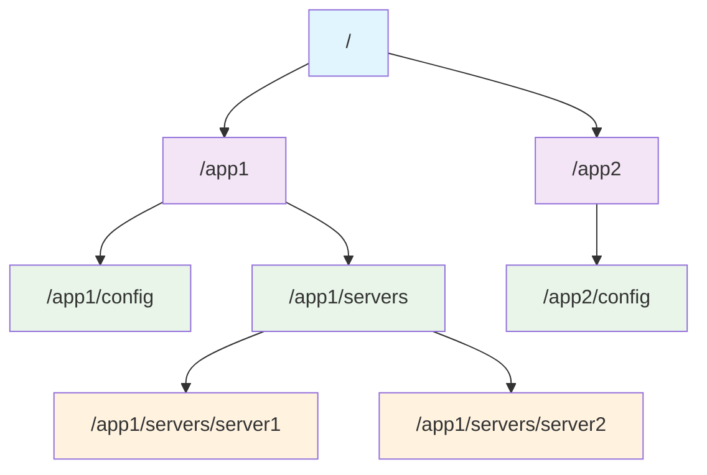
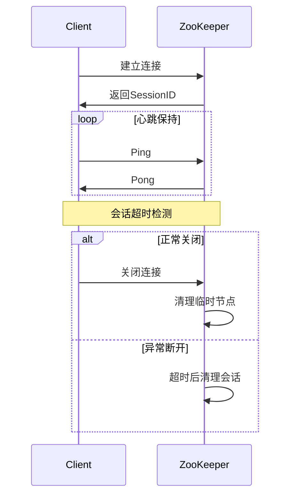
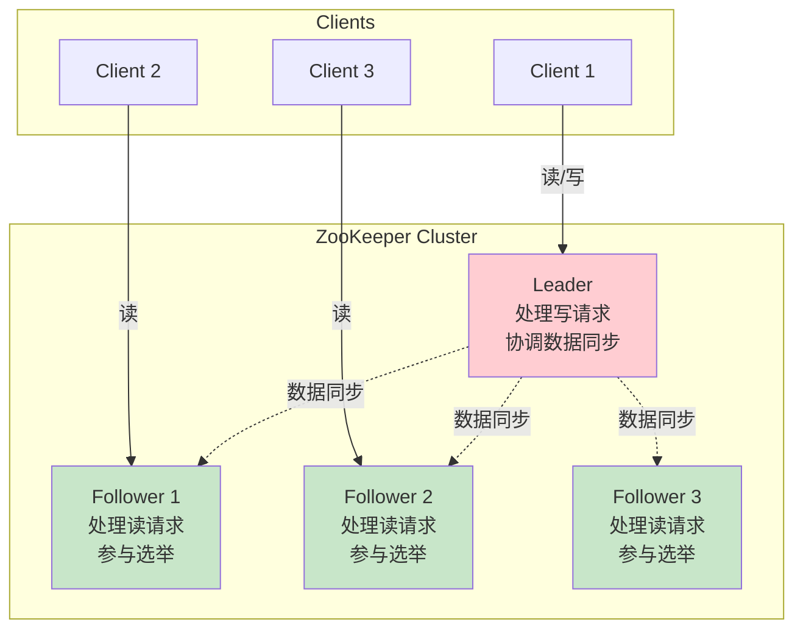
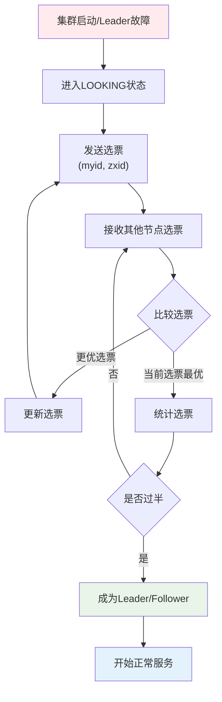
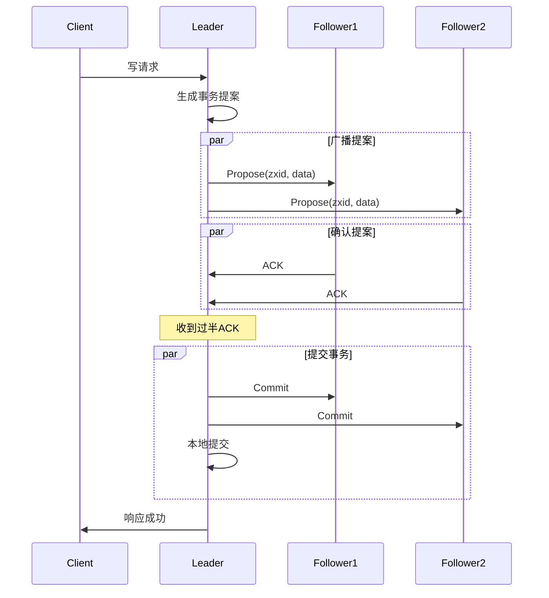
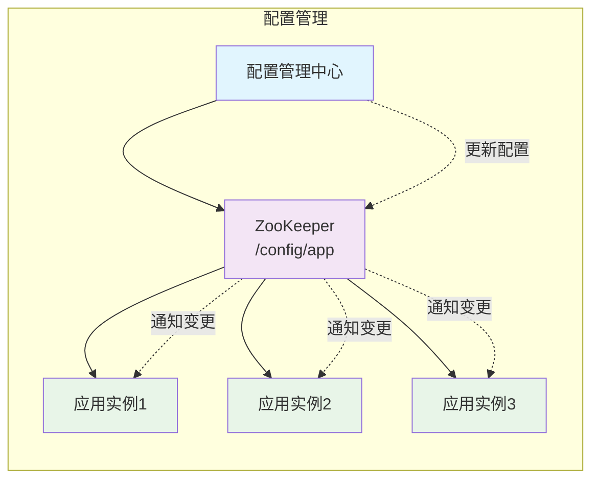
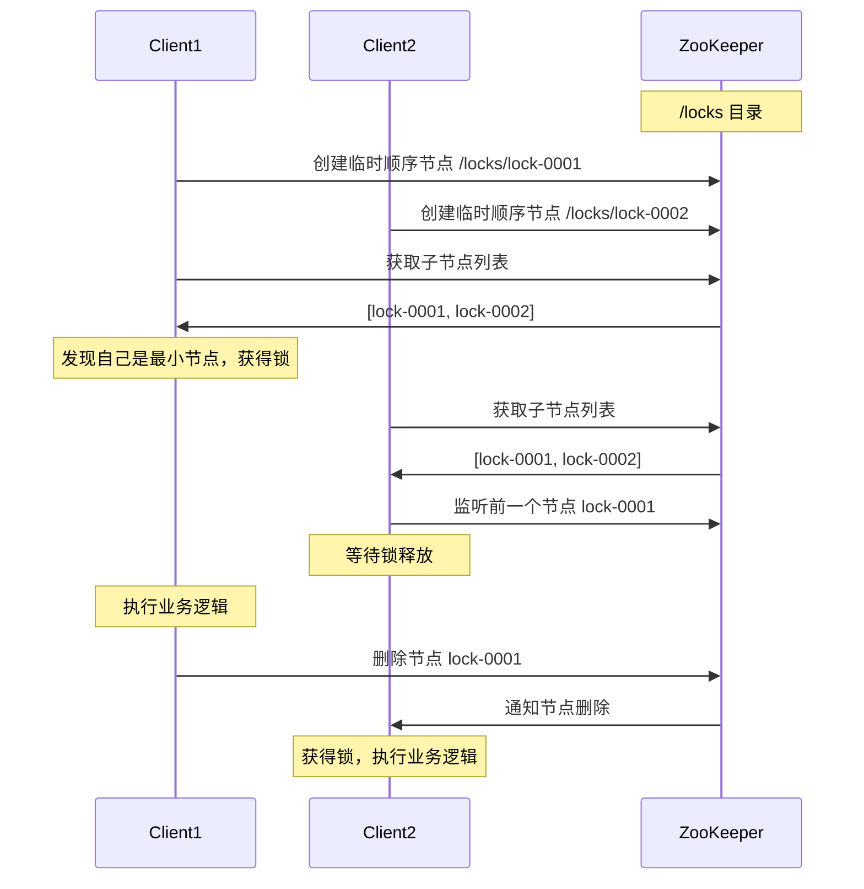
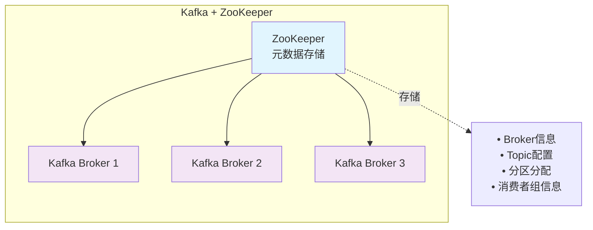
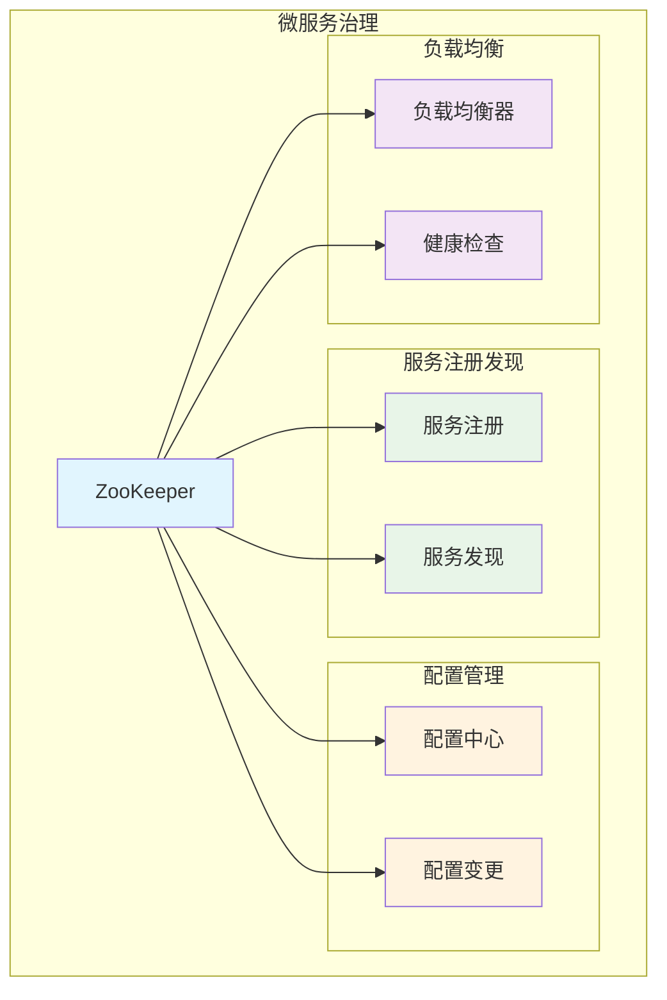

# ZooKeeper 分布式协调服务

## 目录

- [ZooKeeper 分布式协调服务](#zookeeper-分布式协调服务)
  - [目录](#目录)
  - [概述](#概述)
    - [主要特性](#主要特性)
    - [应用场景](#应用场景)
  - [核心概念](#核心概念)
    - [数据模型](#数据模型)
    - [节点类型](#节点类型)
    - [会话机制](#会话机制)
    - [监听机制](#监听机制)
  - [架构设计](#架构设计)
    - [集群架构](#集群架构)
    - [Leader选举](#leader选举)
    - [数据同步](#数据同步)
    - [一致性保证](#一致性保证)
  - [核心功能](#核心功能)
    - [配置管理](#配置管理)
    - [命名服务](#命名服务)
    - [分布式锁](#分布式锁)
    - [集群管理](#集群管理)
  - [客户端操作](#客户端操作)
    - [连接管理](#连接管理)
    - [基本操作](#基本操作)
    - [监听器使用](#监听器使用)
  - [性能优化](#性能优化)
    - [配置调优](#配置调优)
    - [监控指标](#监控指标)
    - [故障排查](#故障排查)
  - [实际应用](#实际应用)
    - [Kafka集成](#kafka集成)
    - [Hadoop生态](#hadoop生态)
    - [微服务治理](#微服务治理)
  - [面试要点](#面试要点)
    - [1. ZooKeeper 是什么？有什么特点？](#1-zookeeper-是什么有什么特点)
    - [2. ZooKeeper 的数据模型是什么样的？](#2-zookeeper-的数据模型是什么样的)
    - [3. ZooKeeper 如何保证数据一致性？](#3-zookeeper-如何保证数据一致性)
    - [4. ZooKeeper 的 Leader 选举过程是怎样的？](#4-zookeeper-的-leader-选举过程是怎样的)
    - [5. 如何使用 ZooKeeper 实现分布式锁？](#5-如何使用-zookeeper-实现分布式锁)
    - [6. ZooKeeper 集群为什么要部署奇数个节点？](#6-zookeeper-集群为什么要部署奇数个节点)
    - [7. ZooKeeper 的 Watcher 机制有什么特点？](#7-zookeeper-的-watcher-机制有什么特点)
    - [8. ZooKeeper 在什么场景下不适用？](#8-zookeeper-在什么场景下不适用)
    - [9. ZooKeeper 的性能瓶颈在哪里？如何优化？](#9-zookeeper-的性能瓶颈在哪里如何优化)
    - [10. ZooKeeper 与 etcd、Consul 的区别？](#10-zookeeper-与-etcdconsul-的区别)

## 概述

**Apache ZooKeeper** 是一个开源的分布式协调服务，为分布式应用提供一致性服务。它是一个为分布式应用所设计的高可用、高性能且一致的协调服务。

### 主要特性

- **简单性**: 提供简单的原语操作
- **高可用**: 集群部署，容错能力强
- **有序性**: 为每个更新操作分配全局唯一的递增编号
- **快速性**: 读操作性能优异
- **一致性**: 所有客户端看到相同的数据视图

### 应用场景

| 场景 | 描述 | 典型应用 |
|------|------|----------|
| **配置管理** | 集中管理分布式系统配置 | 动态配置更新 |
| **命名服务** | 提供分布式命名服务 | 服务发现 |
| **分布式锁** | 实现分布式互斥 | 资源访问控制 |
| **集群管理** | 监控集群节点状态 | 故障检测 |
| **负载均衡** | 动态服务列表管理 | 服务路由 |

## 核心概念

### 数据模型

ZooKeeper 的数据模型是一个**层次化的命名空间**，类似于文件系统的目录树结构。



### 节点类型

ZooKeeper 中的每个节点称为 **znode**，具有以下类型：

| 节点类型 | 特性 | 使用场景 |
|----------|------|----------|
| **持久节点** | 创建后一直存在，直到主动删除 | 配置信息存储 |
| **临时节点** | 会话结束时自动删除 | 服务注册发现 |
| **持久顺序节点** | 持久节点 + 自动编号 | 分布式队列 |
| **临时顺序节点** | 临时节点 + 自动编号 | 分布式锁实现 |

### 会话机制

**会话（Session）** 是客户端与 ZooKeeper 服务器之间的连接。



**会话状态转换**：

- **CONNECTING**: 正在连接
- **CONNECTED**: 已连接
- **RECONNECTING**: 重新连接中
- **RECONNECTED**: 重新连接成功
- **CLOSED**: 会话关闭

### 监听机制

**Watcher** 是 ZooKeeper 的核心特性，允许客户端监听数据变化。

**监听类型**：
- **数据监听**: 监听节点数据变化
- **子节点监听**: 监听子节点列表变化
- **节点存在监听**: 监听节点创建/删除

**特点**：
- **一次性触发**: 每个 Watcher 只触发一次
- **异步通知**: 通过回调方式通知
- **轻量级**: 只通知变化类型，不传递具体数据

## 架构设计

### 集群架构

ZooKeeper 集群采用 **主从架构**，包含一个 Leader 和多个 Follower。



**集群特点**：
- **奇数节点**: 通常部署奇数个节点（3、5、7）
- **过半机制**: 需要超过半数节点存活才能提供服务
- **数据一致性**: 所有节点数据最终一致

### Leader选举

ZooKeeper 使用 **Fast Leader Election** 算法进行 Leader 选举。



**选举规则**：
1. **ZXID 最大**: 事务ID最大的节点优先
2. **myid 最大**: ZXID相同时，服务器ID大的优先

### 数据同步

Leader 通过 **ZAB协议**（ZooKeeper Atomic Broadcast）保证数据一致性。



### 一致性保证

ZooKeeper 提供 **顺序一致性** 和 **最终一致性**：

- **顺序一致性**: 客户端的操作按顺序执行
- **原子性**: 事务要么全部成功，要么全部失败
- **单一视图**: 客户端连接到任何服务器看到的数据视图一致
- **持久性**: 一旦事务提交，数据持久化存储

## 核心功能

### 配置管理

ZooKeeper 可以作为分布式系统的配置中心。

**实现方式**：
1. 将配置信息存储在 znode 中
2. 客户端监听配置节点变化
3. 配置更新时自动通知所有客户端



### 命名服务

提供分布式环境下的命名服务和服务发现。

**服务注册发现流程**：
1. 服务启动时在指定路径创建临时节点
2. 客户端获取服务列表
3. 监听服务节点变化
4. 服务下线时临时节点自动删除

### 分布式锁

使用 ZooKeeper 实现分布式锁机制。



**分布式锁特点**：
- **公平性**: 按照请求顺序获得锁
- **可重入**: 支持同一客户端重复获取
- **自动释放**: 客户端异常时自动释放锁

### 集群管理

监控分布式系统中各个节点的状态。

**功能特性**：
- **节点注册**: 节点启动时注册到 ZooKeeper
- **状态监控**: 实时监控节点存活状态
- **故障检测**: 节点异常时及时发现
- **动态扩缩容**: 支持节点动态加入和退出

## 客户端操作

### 连接管理

```java
// 创建 ZooKeeper 连接
ZooKeeper zk = new ZooKeeper(
    "localhost:2181",     // 服务器地址
    3000,                 // 会话超时时间
    new Watcher() {       // 默认监听器
        public void process(WatchedEvent event) {
            System.out.println("事件类型：" + event.getType());
        }
    }
);
```

### 基本操作

| 操作 | 方法 | 说明 |
|------|------|------|
| **创建节点** | `create(path, data, acl, createMode)` | 创建 znode |
| **读取数据** | `getData(path, watch, stat)` | 获取节点数据 |
| **更新数据** | `setData(path, data, version)` | 更新节点数据 |
| **删除节点** | `delete(path, version)` | 删除 znode |
| **获取子节点** | `getChildren(path, watch)` | 获取子节点列表 |
| **检查存在** | `exists(path, watch)` | 检查节点是否存在 |

### 监听器使用

```java
// 数据变化监听
zk.getData("/config", new Watcher() {
    public void process(WatchedEvent event) {
        if (event.getType() == Event.EventType.NodeDataChanged) {
            // 处理数据变化
            System.out.println("配置数据已更新");
        }
    }
}, null);

// 子节点变化监听
zk.getChildren("/services", new Watcher() {
    public void process(WatchedEvent event) {
        if (event.getType() == Event.EventType.NodeChildrenChanged) {
            // 处理服务列表变化
            System.out.println("服务列表已更新");
        }
    }
});
```

## 性能优化

### 配置调优

**服务器配置优化**：

| 参数 | 默认值 | 建议值 | 说明 |
|------|--------|--------|------|
| `tickTime` | 2000 | 2000-3000 | 基本时间单位(ms) |
| `initLimit` | 10 | 10-20 | Leader等待Follower连接时间 |
| `syncLimit` | 5 | 5-10 | Leader与Follower同步时间 |
| `maxClientCnxns` | 60 | 根据需求调整 | 单个客户端最大连接数 |
| `snapCount` | 100000 | 50000-100000 | 快照触发的事务数 |

**JVM 参数优化**：
```bash
-Xms4g -Xmx4g
-XX:+UseG1GC
-XX:MaxGCPauseMillis=50
-XX:+UnlockExperimentalVMOptions
-XX:+UseCGroupMemoryLimitForHeap
```

### 监控指标

**关键监控指标**：

| 指标类型 | 监控项 | 正常范围 | 异常处理 |
|----------|--------|----------|----------|
| **连接数** | 活跃连接数 | < maxClientCnxns | 检查客户端连接泄露 |
| **延迟** | 平均响应时间 | < 10ms | 检查网络和磁盘IO |
| **吞吐量** | 每秒事务数 | 根据业务需求 | 优化硬件配置 |
| **内存** | 堆内存使用率 | < 80% | 调整JVM参数 |
| **磁盘** | 磁盘使用率 | < 85% | 清理日志文件 |

### 故障排查

**常见问题及解决方案**：

1. **连接超时**
   - 检查网络连通性
   - 调整会话超时时间
   - 检查防火墙设置

2. **数据不一致**
   - 检查集群节点状态
   - 验证网络分区问题
   - 重启异常节点

3. **性能下降**
   - 监控磁盘IO性能
   - 检查GC频率和时间
   - 优化客户端连接数

## 实际应用

### Kafka集成

Kafka 使用 ZooKeeper 进行元数据管理：



**存储信息**：
- Broker 注册信息
- Topic 和分区元数据
- 消费者组状态
- 访问控制列表

### Hadoop生态

在 Hadoop 生态系统中的应用：

| 组件 | ZooKeeper 用途 |
|------|----------------|
| **HDFS** | NameNode 高可用，故障转移 |
| **YARN** | ResourceManager 高可用 |
| **HBase** | Master 选举，RegionServer 管理 |
| **Storm** | Nimbus 高可用，任务协调 |

### 微服务治理

在微服务架构中的应用场景：



## 面试要点

### 1. ZooKeeper 是什么？有什么特点？

**答案**：
ZooKeeper 是一个开源的分布式协调服务，为分布式应用提供一致性服务。

**主要特点**：
- **简单性**: 提供简单的原语操作
- **高可用**: 集群部署，容错能力强  
- **有序性**: 为每个更新操作分配全局唯一的递增编号
- **快速性**: 读操作性能优异
- **一致性**: 所有客户端看到相同的数据视图

### 2. ZooKeeper 的数据模型是什么样的？

**答案**：
ZooKeeper 的数据模型是一个**层次化的命名空间**，类似于文件系统的目录树结构。每个节点称为 znode，可以存储数据并拥有子节点。

**节点类型**：
- **持久节点**: 创建后一直存在
- **临时节点**: 会话结束时自动删除
- **持久顺序节点**: 持久节点 + 自动编号
- **临时顺序节点**: 临时节点 + 自动编号

### 3. ZooKeeper 如何保证数据一致性？

**答案**：
ZooKeeper 通过 **ZAB协议**（ZooKeeper Atomic Broadcast）保证数据一致性：

1. **Leader-Follower 架构**: 只有 Leader 处理写请求
2. **两阶段提交**: Propose → ACK → Commit
3. **过半机制**: 需要超过半数节点确认才能提交
4. **顺序一致性**: 保证操作的全局顺序

### 4. ZooKeeper 的 Leader 选举过程是怎样的？

**答案**：
ZooKeeper 使用 **Fast Leader Election** 算法：

**选举流程**：
1. 节点进入 LOOKING 状态
2. 发送选票 (myid, zxid)
3. 接收并比较其他节点选票
4. 更新选票（如果收到更优选票）
5. 统计选票，过半则选举成功

**选举规则**：
- ZXID 最大的节点优先
- ZXID 相同时，myid 大的优先

### 5. 如何使用 ZooKeeper 实现分布式锁？

**答案**：
使用临时顺序节点实现分布式锁：

**实现步骤**：
1. 客户端在锁目录下创建临时顺序节点
2. 获取所有子节点，判断自己是否是最小节点
3. 如果是最小节点，获得锁；否则监听前一个节点
4. 前一个节点删除时，获得锁
5. 业务完成后删除自己的节点释放锁

**优点**：
- 公平性：按请求顺序获得锁
- 避免惊群：只监听前一个节点
- 自动释放：客户端异常时自动释放

### 6. ZooKeeper 集群为什么要部署奇数个节点？

**答案**：
**原因**：ZooKeeper 使用过半机制来保证数据一致性

**分析**：
- 3个节点：最多容忍1个节点故障（2>3/2）
- 4个节点：最多容忍1个节点故障（3>4/2）
- 5个节点：最多容忍2个节点故障（3>5/2）

**结论**：奇数个节点在相同容错能力下节省资源，偶数个节点没有额外的容错优势。

### 7. ZooKeeper 的 Watcher 机制有什么特点？

**答案**：
**Watcher 特点**：
- **一次性触发**: 每个 Watcher 只触发一次
- **异步通知**: 通过回调方式通知客户端
- **轻量级**: 只通知变化类型，不传递具体数据
- **有序性**: 通知按照事件发生顺序传递

**监听类型**：
- 数据变化监听
- 子节点变化监听  
- 节点存在性监听

### 8. ZooKeeper 在什么场景下不适用？

**答案**：
**不适用场景**：
- **大数据量存储**: 每个 znode 最大 1MB
- **高频写操作**: 写操作性能相对较低
- **强一致性要求**: 提供的是最终一致性
- **复杂查询**: 不支持复杂的查询操作

**替代方案**：
- 大数据存储：使用 HDFS、HBase
- 高频写入：使用 Redis、Kafka
- 强一致性：使用 etcd、Consul

### 9. ZooKeeper 的性能瓶颈在哪里？如何优化？

**答案**：
**性能瓶颈**：
- **磁盘IO**: 事务日志写入
- **网络延迟**: 集群间数据同步
- **内存使用**: 数据全部加载到内存

**优化策略**：
- **硬件优化**: 使用SSD，提升网络带宽
- **配置调优**: 调整 tickTime、syncLimit 等参数
- **JVM优化**: 使用G1GC，调整堆内存大小
- **架构优化**: 读写分离，就近访问

### 10. ZooKeeper 与 etcd、Consul 的区别？

**答案**：

| 特性 | ZooKeeper | etcd | Consul |
|------|-----------|------|--------|
| **一致性算法** | ZAB | Raft | Raft |
| **数据格式** | 二进制 | JSON | JSON |
| **HTTP API** | 无 | 有 | 有 |
| **服务发现** | 需要客户端实现 | 支持 | 原生支持 |
| **健康检查** | 无 | 基础支持 | 丰富的健康检查 |
| **多数据中心** | 不支持 | 不支持 | 支持 |
| **学习成本** | 较高 | 中等 | 中等 |

**选择建议**：
- **ZooKeeper**: 适合 Hadoop 生态系统
- **etcd**: 适合 Kubernetes 环境
- **Consul**: 适合微服务架构