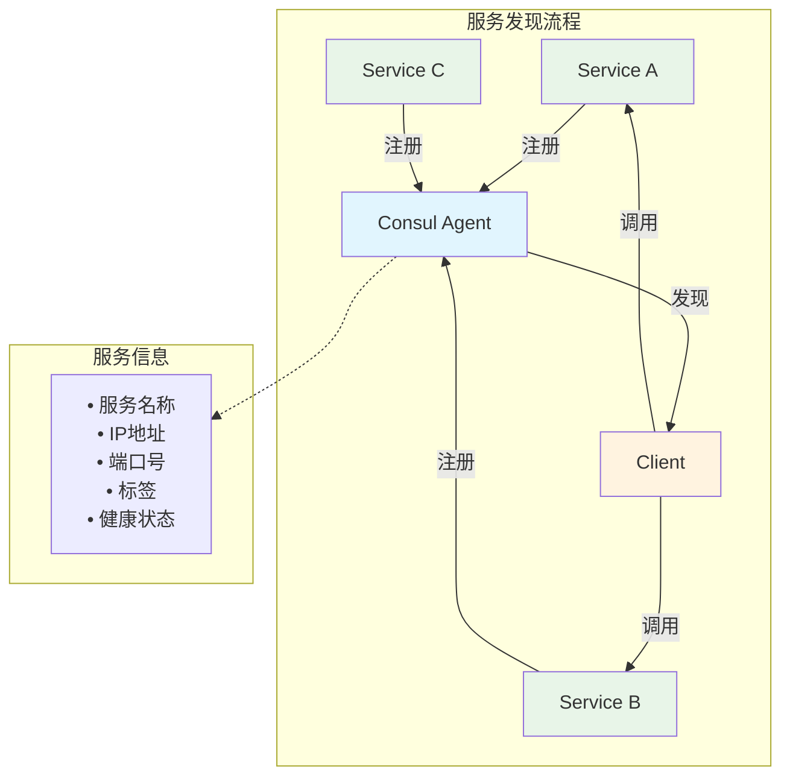
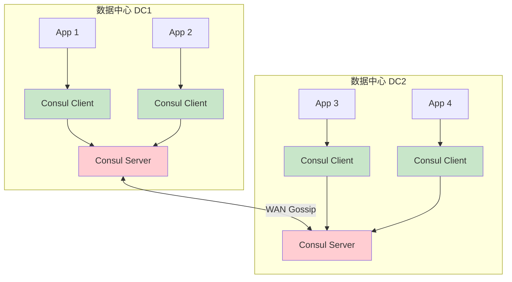
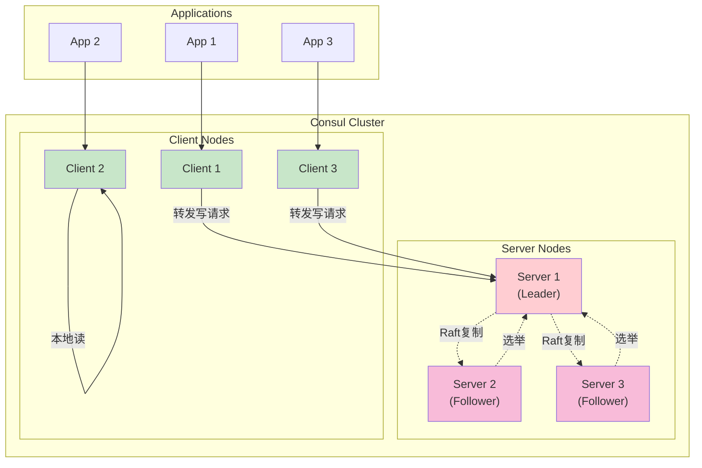
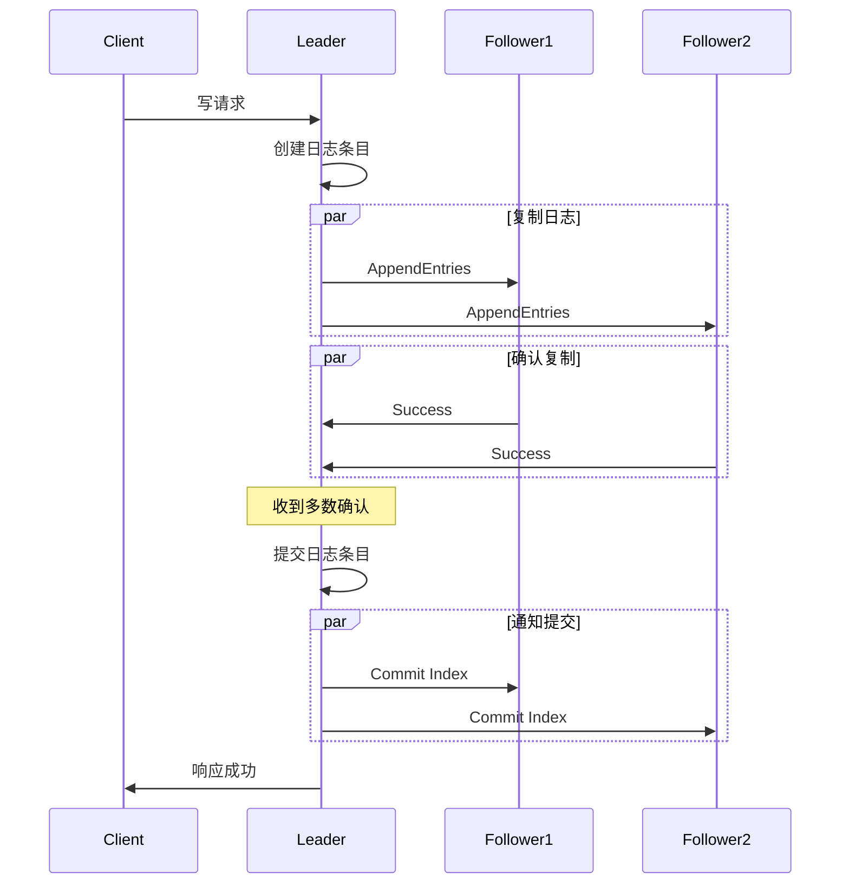
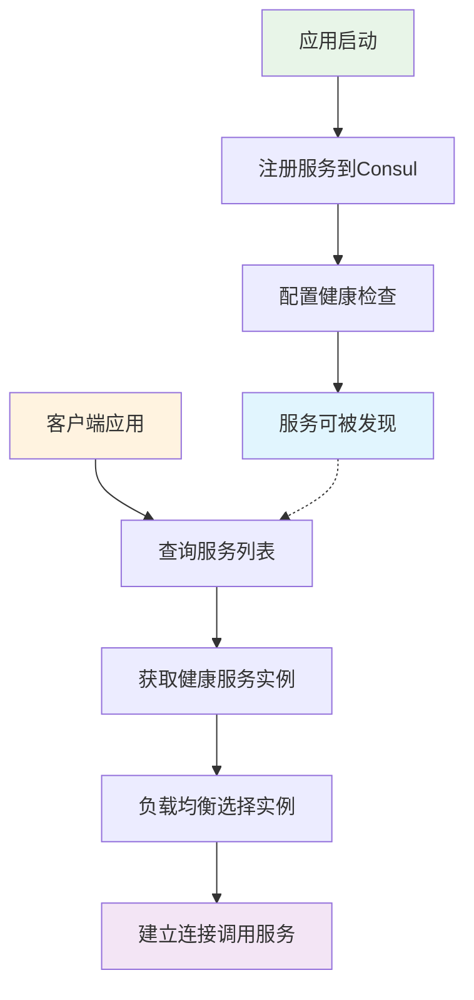
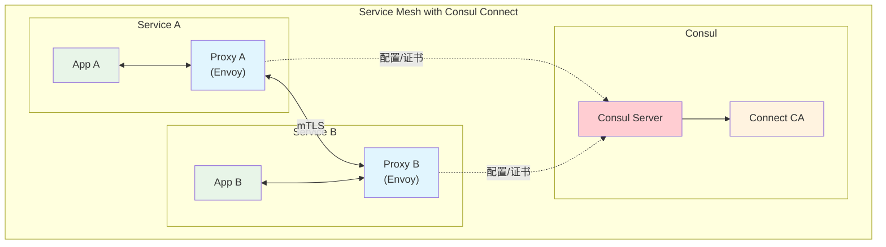
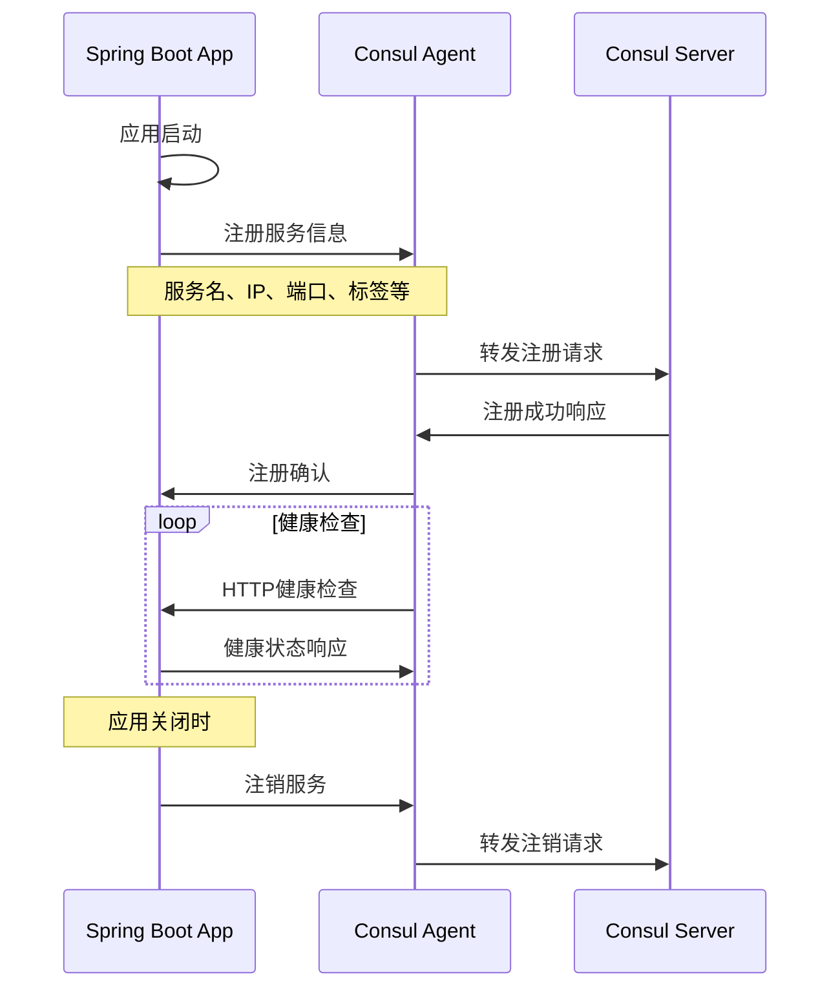
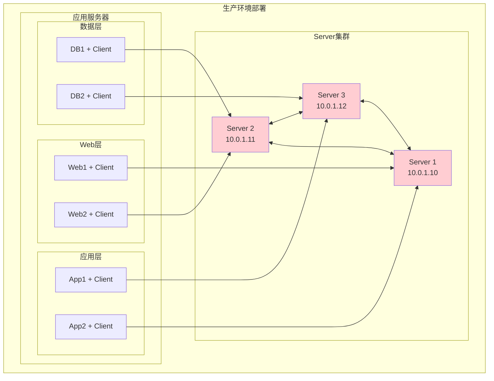
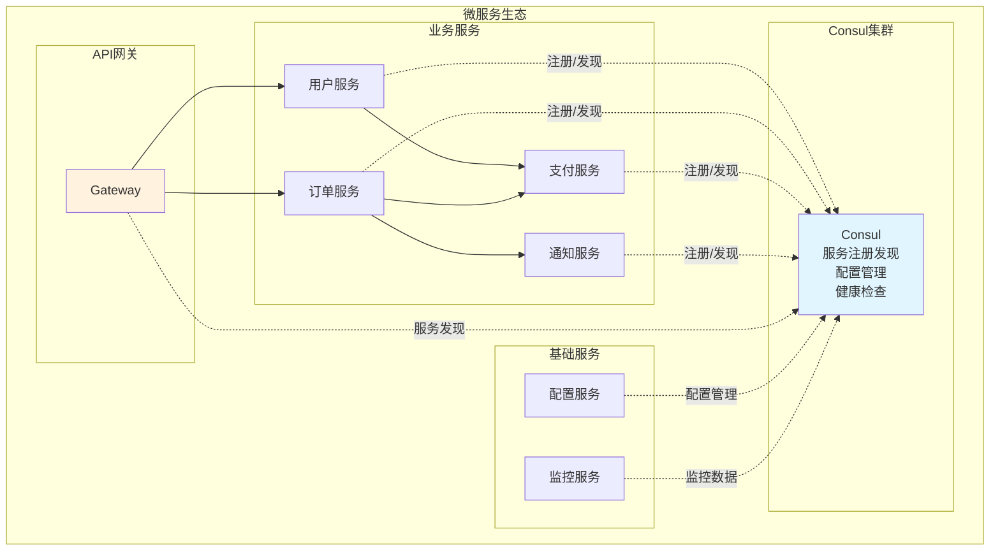

# Consul 服务网格与服务发现

## 目录

- [概述](#概述)
- [核心概念](#核心概念)
  - [服务发现](#服务发现)
  - [健康检查](#健康检查)
  - [键值存储](#键值存储)
  - [多数据中心](#多数据中心)
- [架构设计](#架构设计)
  - [集群架构](#集群架构)
  - [一致性算法](#一致性算法)
  - [网络拓扑](#网络拓扑)
  - [安全机制](#安全机制)
- [核心功能](#核心功能)
  - [服务注册与发现](#服务注册与发现)
  - [配置管理](#配置管理)
  - [负载均衡](#负载均衡)
  - [故障转移](#故障转移)
- [服务网格](#服务网格)
  - [Connect架构](#connect架构)
  - [代理模式](#代理模式)
  - [流量管理](#流量管理)
  - [安全策略](#安全策略)
- [客户端操作](#客户端操作)
  - [HTTP API](#http-api)
  - [DNS接口](#dns接口)
  - [命令行工具](#命令行工具)
- [Spring Boot集成](#spring-boot集成)
  - [依赖配置](#依赖配置)
  - [服务注册](#服务注册)
  - [服务发现](#服务发现-1)
  - [配置管理](#配置管理-2)
  - [健康检查配置](#健康检查配置)
- [部署运维](#部署运维)
  - [集群部署](#集群部署)
  - [配置管理](#配置管理-1)
  - [监控告警](#监控告警)
  - [故障排查](#故障排查)
- [实际应用](#实际应用)
  - [微服务架构](#微服务架构)
  - [容器编排](#容器编排)
  - [云原生集成](#云原生集成)
- [面试要点](#面试要点)

## 概述

**HashiCorp Consul** 是一个服务网格解决方案，提供服务发现、配置管理、健康检查等功能的全功能控制平面。它解决了在动态、分布式基础设施中运行服务的网络和安全挑战。

### 主要特性

- **服务发现**: 自动服务注册和发现
- **健康检查**: 丰富的健康检查机制
- **键值存储**: 分布式键值存储系统
- **多数据中心**: 原生支持多数据中心部署
- **服务网格**: 提供服务间安全通信
- **Web UI**: 直观的管理界面

### 核心优势

| 优势 | 描述 | 应用场景 |
|------|------|----------|
| **零配置服务发现** | 服务自动注册发现 | 微服务架构 |
| **丰富健康检查** | HTTP、TCP、脚本等多种检查方式 | 服务监控 |
| **多数据中心支持** | 跨地域服务治理 | 全球化部署 |
| **强一致性** | 基于Raft算法保证数据一致性 | 关键配置存储 |
| **安全通信** | mTLS加密服务间通信 | 零信任网络 |

## 核心概念

### 服务发现

Consul 提供**自动化服务发现**机制，服务可以注册自己并发现其他服务。



**发现方式**：
- **HTTP API**: RESTful API查询服务
- **DNS接口**: 通过DNS查询服务
- **gRPC**: 高性能服务发现

### 健康检查

Consul 提供多种健康检查机制确保服务可用性。

| 检查类型 | 描述 | 使用场景 |
|----------|------|----------|
| **HTTP检查** | 定期HTTP请求检查 | Web服务健康检查 |
| **TCP检查** | TCP连接检查 | 数据库连接检查 |
| **脚本检查** | 执行自定义脚本 | 复杂业务逻辑检查 |
| **TTL检查** | 服务主动报告状态 | 应用内部状态检查 |
| **gRPC检查** | gRPC健康检查协议 | gRPC服务检查 |

**健康状态**：
- **Passing**: 健康
- **Warning**: 警告
- **Critical**: 严重问题

### 键值存储

Consul 内置分布式键值存储，支持配置管理和协调服务。

**特性**：
- **强一致性**: 基于Raft算法
- **事务支持**: 原子性操作
- **监听机制**: 配置变更通知
- **ACL控制**: 细粒度权限控制

### 多数据中心

Consul 原生支持多数据中心部署，实现跨地域服务治理。



## 架构设计

### 集群架构

Consul 集群采用 **Server-Client** 架构模式。



**节点角色**：
- **Server节点**: 存储数据，参与选举，处理查询
- **Client节点**: 转发请求，本地缓存，健康检查
- **Leader**: 处理写请求，协调数据复制
- **Follower**: 处理读请求，参与选举

### 一致性算法

Consul 使用 **Raft算法** 保证数据一致性。



**Raft特点**：
- **强一致性**: 保证数据强一致性
- **分区容错**: 网络分区时保持可用性
- **简单易懂**: 相比Paxos更容易理解和实现

### 网络拓扑

Consul 使用 **Gossip协议** 进行集群成员管理。

**Gossip池**：
- **LAN Gossip**: 数据中心内部通信
- **WAN Gossip**: 数据中心间通信

**通信端口**：
- **8300**: Server RPC
- **8301**: LAN Serf
- **8302**: WAN Serf  
- **8500**: HTTP API
- **8600**: DNS

### 安全机制

Consul 提供多层安全保护机制。

| 安全特性 | 描述 | 配置方式 |
|----------|------|----------|
| **ACL系统** | 基于令牌的访问控制 | 策略和角色管理 |
| **TLS加密** | 传输层安全加密 | 证书配置 |
| **Gossip加密** | 集群通信加密 | 共享密钥 |
| **Connect mTLS** | 服务间双向TLS | 自动证书管理 |

## 核心功能

### 服务注册与发现

**服务注册方式**：

1. **配置文件注册**：
```json
{
  "service": {
    "name": "web",
    "port": 80,
    "tags": ["primary"],
    "check": {
      "http": "http://localhost:80/health",
      "interval": "10s"
    }
  }
}
```

2. **HTTP API注册**：
```bash
curl -X PUT http://localhost:8500/v1/agent/service/register \
  -d '{
    "Name": "web",
    "Port": 80,
    "Check": {
      "HTTP": "http://localhost:80/health",
      "Interval": "10s"
    }
  }'
```

**服务发现流程**：



### 配置管理

使用 Consul KV 存储进行配置管理：

**配置存储**：
```bash
# 存储配置
consul kv put config/database/host "db.example.com"
consul kv put config/database/port "5432"

# 读取配置
consul kv get config/database/host
```

**配置监听**：
```bash
# 监听配置变化
consul watch -type=key -key=config/database/host \
  'echo "Database host changed"'
```

### 负载均衡

Consul 支持多种负载均衡策略：

| 策略 | 描述 | 适用场景 |
|------|------|----------|
| **轮询** | 依次分配请求 | 服务能力相同 |
| **随机** | 随机选择服务实例 | 简单场景 |
| **最少连接** | 选择连接数最少的实例 | 长连接服务 |
| **加权轮询** | 根据权重分配请求 | 服务能力不同 |

### 故障转移

**自动故障转移机制**：

1. **健康检查失败**: 服务实例标记为不健康
2. **从服务列表移除**: 不再接收新请求
3. **流量重新路由**: 转发到健康实例
4. **服务恢复**: 健康检查通过后重新加入

## 服务网格

### Connect架构

Consul Connect 提供服务网格功能，实现服务间安全通信。



**Connect特性**：
- **自动mTLS**: 服务间自动加密通信
- **意图管理**: 基于策略的访问控制
- **证书管理**: 自动证书轮换
- **流量路由**: 智能流量管理

### 代理模式

Consul Connect 支持多种代理模式：

| 代理模式 | 描述 | 优缺点 |
|----------|------|--------|
| **Sidecar代理** | 每个服务独立代理 | 隔离性好，资源消耗高 |
| **共享代理** | 多服务共享代理 | 资源节省，隔离性差 |
| **原生集成** | 应用直接集成Connect | 性能最佳，开发复杂 |

### 流量管理

**流量路由配置**：
```hcl
Kind = "service-router"
Name = "web"
Routes = [
  {
    Match {
      HTTP {
        Header = [
          {
            Name  = "x-version"
            Exact = "v2"
          }
        ]
      }
    }
    Destination {
      Service = "web"
      ServiceSubset = "v2"
    }
  }
]
```

### 安全策略

**访问意图配置**：
```hcl
Kind = "service-intentions"
Name = "web"
Sources = [
  {
    Name   = "frontend"
    Action = "allow"
  },
  {
    Name   = "backend"
    Action = "deny"
  }
]
```

## 客户端操作

### HTTP API

Consul 提供完整的 RESTful API：

**服务操作**：
```bash
# 注册服务
curl -X PUT http://localhost:8500/v1/agent/service/register \
  -d @service.json

# 查询服务
curl http://localhost:8500/v1/health/service/web?passing

# 注销服务
curl -X PUT http://localhost:8500/v1/agent/service/deregister/web
```

**KV操作**：
```bash
# 存储键值
curl -X PUT http://localhost:8500/v1/kv/config/app \
  -d 'configuration data'

# 读取键值
curl http://localhost:8500/v1/kv/config/app

# 删除键值
curl -X DELETE http://localhost:8500/v1/kv/config/app
```

### DNS接口

Consul 提供 DNS 接口进行服务发现：

```bash
# 查询服务
dig @127.0.0.1 -p 8600 web.service.consul

# 查询健康服务
dig @127.0.0.1 -p 8600 web.service.consul SRV

# 查询节点
dig @127.0.0.1 -p 8600 node1.node.consul
```

**DNS记录类型**：
- **A记录**: 返回服务IP地址
- **SRV记录**: 返回服务IP和端口
- **TXT记录**: 返回服务标签信息

### 命令行工具

**常用命令**：

```bash
# 集群成员
consul members

# 服务列表
consul catalog services

# 节点信息
consul catalog nodes

# 健康检查
consul monitor

# 配置重载
consul reload
```

## Spring Boot集成

### 依赖配置

**Maven依赖**：
```xml
<dependencies>
    <!-- Spring Cloud Consul -->
    <dependency>
        <groupId>org.springframework.cloud</groupId>
        <artifactId>spring-cloud-starter-consul-discovery</artifactId>
    </dependency>
    
    <!-- Consul配置管理 -->
    <dependency>
        <groupId>org.springframework.cloud</groupId>
        <artifactId>spring-cloud-starter-consul-config</artifactId>
    </dependency>
    
    <!-- 健康检查 -->
    <dependency>
        <groupId>org.springframework.boot</groupId>
        <artifactId>spring-boot-starter-actuator</artifactId>
    </dependency>
    
    <!-- Web支持 -->
    <dependency>
        <groupId>org.springframework.boot</groupId>
        <artifactId>spring-boot-starter-web</artifactId>
    </dependency>
</dependencies>

<dependencyManagement>
    <dependencies>
        <dependency>
            <groupId>org.springframework.cloud</groupId>
            <artifactId>spring-cloud-dependencies</artifactId>
            <version>2021.0.3</version>
            <type>pom</type>
            <scope>import</scope>
        </dependency>
    </dependencies>
</dependencyManagement>
```

**Gradle依赖**：
```gradle
dependencies {
    implementation 'org.springframework.cloud:spring-cloud-starter-consul-discovery'
    implementation 'org.springframework.cloud:spring-cloud-starter-consul-config'
    implementation 'org.springframework.boot:spring-boot-starter-actuator'
    implementation 'org.springframework.boot:spring-boot-starter-web'
}

dependencyManagement {
    imports {
        mavenBom "org.springframework.cloud:spring-cloud-dependencies:2021.0.3"
    }
}
```

### 服务注册

**基础配置**：
```yaml
# application.yml
spring:
  application:
    name: user-service
  cloud:
    consul:
      host: localhost
      port: 8500
      discovery:
        enabled: true
        register: true
        deregister: true
        prefer-ip-address: true
        ip-address: ${spring.cloud.client.ip-address}
        port: ${server.port}
        service-name: ${spring.application.name}
        instance-id: ${spring.application.name}:${spring.cloud.client.ip-address}:${server.port}
        tags:
          - version=1.0
          - environment=dev
        metadata:
          version: 1.0
          team: backend
        health-check-path: /actuator/health
        health-check-interval: 10s
        health-check-timeout: 3s
        health-check-critical-timeout: 30s

server:
  port: 8080

management:
  endpoints:
    web:
      exposure:
        include: health,info
  endpoint:
    health:
      show-details: always
```

**启动类配置**：
```java
@SpringBootApplication
@EnableDiscoveryClient  // 启用服务发现
public class UserServiceApplication {
    public static void main(String[] args) {
        SpringApplication.run(UserServiceApplication.class, args);
    }
}
```

**服务注册流程**：


### 服务发现

**使用 DiscoveryClient**：
```java
@RestController
public class ServiceController {
    
    @Autowired
    private DiscoveryClient discoveryClient;
    
    @GetMapping("/services")
    public List<String> getServices() {
        return discoveryClient.getServices();
    }
    
    @GetMapping("/instances/{serviceName}")
    public List<ServiceInstance> getInstances(@PathVariable String serviceName) {
        return discoveryClient.getInstances(serviceName);
    }
    
    @GetMapping("/call-user-service")
    public String callUserService() {
        List<ServiceInstance> instances = discoveryClient.getInstances("user-service");
        if (!instances.isEmpty()) {
            ServiceInstance instance = instances.get(0);
            String url = "http://" + instance.getHost() + ":" + instance.getPort() + "/users";
            // 调用服务
            RestTemplate restTemplate = new RestTemplate();
            return restTemplate.getForObject(url, String.class);
        }
        return "No available instances";
    }
}
```

**使用 LoadBalancer**：
```java
@Configuration
public class LoadBalancerConfig {
    
    @Bean
    @LoadBalanced  // 启用负载均衡
    public RestTemplate restTemplate() {
        return new RestTemplate();
    }
}

@Service
public class UserService {
    
    @Autowired
    private RestTemplate restTemplate;
    
    public String getUserInfo(Long userId) {
        // 直接使用服务名调用
        String url = "http://user-service/users/" + userId;
        return restTemplate.getForObject(url, String.class);
    }
}
```

**使用 OpenFeign**：
```java
// 添加依赖
// <dependency>
//     <groupId>org.springframework.cloud</groupId>
//     <artifactId>spring-cloud-starter-openfeign</artifactId>
// </dependency>

@FeignClient(name = "user-service")
public interface UserServiceClient {
    
    @GetMapping("/users/{id}")
    User getUserById(@PathVariable("id") Long id);
    
    @PostMapping("/users")
    User createUser(@RequestBody User user);
}

@RestController
public class OrderController {
    
    @Autowired
    private UserServiceClient userServiceClient;
    
    @GetMapping("/orders/{orderId}/user")
    public User getOrderUser(@PathVariable Long orderId) {
        // 通过Feign客户端调用用户服务
        return userServiceClient.getUserById(orderId);
    }
}

// 启动类添加注解
@SpringBootApplication
@EnableDiscoveryClient
@EnableFeignClients  // 启用Feign客户端
public class OrderServiceApplication {
    public static void main(String[] args) {
        SpringApplication.run(OrderServiceApplication.class, args);
    }
}
```

### 配置管理

**配置中心集成**：
```yaml
# bootstrap.yml (优先级高于application.yml)
spring:
  application:
    name: user-service
  cloud:
    consul:
      host: localhost
      port: 8500
      config:
        enabled: true
        prefix: config
        default-context: application
        profile-separator: ','
        format: YAML
        data-key: data
        watch:
          enabled: true
          delay: 1000
```

**在Consul中存储配置**：
```bash
# 存储应用通用配置
consul kv put config/application/data @application-config.yml

# 存储特定服务配置
consul kv put config/user-service/data @user-service-config.yml

# 存储环境特定配置
consul kv put config/user-service,dev/data @user-service-dev-config.yml
```

**配置文件示例**：
```yaml
# user-service-config.yml
database:
  url: jdbc:mysql://localhost:3306/userdb
  username: user
  password: password
  
redis:
  host: localhost
  port: 6379
  
business:
  max-retry-times: 3
  timeout: 5000
```

**动态配置刷新**：
```java
@RestController
@RefreshScope  // 支持配置动态刷新
public class ConfigController {
    
    @Value("${business.max-retry-times:3}")
    private int maxRetryTimes;
    
    @Value("${business.timeout:5000}")
    private int timeout;
    
    @GetMapping("/config")
    public Map<String, Object> getConfig() {
        Map<String, Object> config = new HashMap<>();
        config.put("maxRetryTimes", maxRetryTimes);
        config.put("timeout", timeout);
        return config;
    }
}

// 配置属性类
@Component
@ConfigurationProperties(prefix = "business")
@RefreshScope
public class BusinessProperties {
    private int maxRetryTimes = 3;
    private int timeout = 5000;
    
    // getter and setter
    public int getMaxRetryTimes() { return maxRetryTimes; }
    public void setMaxRetryTimes(int maxRetryTimes) { this.maxRetryTimes = maxRetryTimes; }
    public int getTimeout() { return timeout; }
    public void setTimeout(int timeout) { this.timeout = timeout; }
}
```

### 健康检查配置

**自定义健康检查**：
```java
@Component
public class CustomHealthIndicator implements HealthIndicator {
    
    @Override
    public Health health() {
        // 检查数据库连接
        if (isDatabaseHealthy()) {
            return Health.up()
                    .withDetail("database", "Available")
                    .withDetail("status", "UP")
                    .build();
        } else {
            return Health.down()
                    .withDetail("database", "Unavailable")
                    .withDetail("status", "DOWN")
                    .build();
        }
    }
    
    private boolean isDatabaseHealthy() {
        // 实际的数据库健康检查逻辑
        return true;
    }
}

// 业务健康检查
@Component("business")
public class BusinessHealthIndicator implements HealthIndicator {
    
    @Autowired
    private BusinessService businessService;
    
    @Override
    public Health health() {
        try {
            businessService.checkBusinessHealth();
            return Health.up()
                    .withDetail("business", "All systems operational")
                    .build();
        } catch (Exception e) {
            return Health.down()
                    .withDetail("business", "Service unavailable")
                    .withDetail("error", e.getMessage())
                    .build();
        }
    }
}
```

**健康检查配置**：
```yaml
management:
  endpoints:
    web:
      exposure:
        include: health,info,metrics
  endpoint:
    health:
      show-details: always
      show-components: always
  health:
    consul:
      enabled: true
    db:
      enabled: true
    redis:
      enabled: true

spring:
  cloud:
    consul:
      discovery:
        health-check-path: /actuator/health
        health-check-interval: 15s
        health-check-timeout: 5s
        health-check-critical-timeout: 60s
        health-check-tls-skip-verify: true
```

**完整的微服务示例**：
```java
@SpringBootApplication
@EnableDiscoveryClient
@EnableFeignClients
public class UserServiceApplication {
    
    public static void main(String[] args) {
        SpringApplication.run(UserServiceApplication.class, args);
    }
    
    @Bean
    @LoadBalanced
    public RestTemplate restTemplate() {
        return new RestTemplate();
    }
}

@RestController
@RequestMapping("/users")
public class UserController {
    
    @Autowired
    private UserService userService;
    
    @GetMapping("/{id}")
    public ResponseEntity<User> getUser(@PathVariable Long id) {
        User user = userService.findById(id);
        return ResponseEntity.ok(user);
    }
    
    @PostMapping
    public ResponseEntity<User> createUser(@RequestBody User user) {
        User savedUser = userService.save(user);
        return ResponseEntity.ok(savedUser);
    }
    
    @GetMapping("/health")
    public ResponseEntity<String> health() {
        return ResponseEntity.ok("User Service is healthy");
    }
}

@Service
public class UserService {
    
    @Autowired
    private UserRepository userRepository;
    
    @Autowired
    private NotificationServiceClient notificationClient;
    
    public User findById(Long id) {
        return userRepository.findById(id)
                .orElseThrow(() -> new UserNotFoundException("User not found: " + id));
    }
    
    public User save(User user) {
        User savedUser = userRepository.save(user);
        // 调用通知服务
        notificationClient.sendWelcomeNotification(savedUser.getId());
        return savedUser;
    }
}

@FeignClient(name = "notification-service")
public interface NotificationServiceClient {
    
    @PostMapping("/notifications/welcome")
    void sendWelcomeNotification(@RequestParam("userId") Long userId);
}
```

**多环境配置**：
```yaml
# application.yml
spring:
  profiles:
    active: dev

---
# 开发环境
spring:
  profiles: dev
  cloud:
    consul:
      host: localhost
      port: 8500
      discovery:
        tags:
          - environment=dev
          - version=1.0-SNAPSHOT

---
# 测试环境  
spring:
  profiles: test
  cloud:
    consul:
      host: consul-test.example.com
      port: 8500
      discovery:
        tags:
          - environment=test
          - version=1.0-RC

---
# 生产环境
spring:
  profiles: prod
  cloud:
    consul:
      host: consul-prod.example.com
      port: 8500
      discovery:
        tags:
          - environment=prod
          - version=1.0-RELEASE
        health-check-interval: 30s
```

**最佳实践**：

1. **服务命名规范**：
   - 使用有意义的服务名称
   - 保持命名一致性
   - 避免使用特殊字符

2. **健康检查优化**：
   - 设置合适的检查间隔
   - 实现轻量级健康检查
   - 避免健康检查影响业务性能

3. **配置管理**：
   - 敏感信息使用加密存储
   - 合理组织配置层次结构
   - 启用配置变更监听

4. **服务发现优化**：
   - 使用负载均衡器
   - 实现服务调用重试机制
   - 配置合适的超时时间

5. **监控和日志**：
   - 集成分布式链路追踪
   - 配置详细的健康检查日志
   - 监控服务注册状态

## 部署运维

### 集群部署

**生产环境部署建议**：

1. **Server节点**: 3或5个节点
2. **Client节点**: 每台应用服务器部署
3. **网络规划**: 确保端口连通性
4. **安全配置**: 启用ACL和TLS

**部署架构**：


### 配置管理

**Server配置示例**：
```hcl
datacenter = "dc1"
data_dir = "/opt/consul/data"
log_level = "INFO"
server = true
bootstrap_expect = 3
bind_addr = "10.0.1.10"
client_addr = "0.0.0.0"

retry_join = [
  "10.0.1.11",
  "10.0.1.12"
]

ui_config {
  enabled = true
}

acl = {
  enabled = true
  default_policy = "deny"
}
```

### 监控告警

**关键监控指标**：

| 指标类型 | 监控项 | 告警阈值 | 处理建议 |
|----------|--------|----------|----------|
| **集群健康** | Leader选举次数 | > 5次/小时 | 检查网络稳定性 |
| **性能指标** | API响应时间 | > 100ms | 优化查询或扩容 |
| **资源使用** | 内存使用率 | > 80% | 增加内存或优化配置 |
| **服务健康** | 失败的健康检查 | > 10% | 检查服务状态 |

### 故障排查

**常见问题及解决方案**：

1. **Leader选举频繁**
   - 检查网络延迟和丢包
   - 调整心跳超时参数
   - 确保时钟同步

2. **服务发现失败**
   - 检查Agent连接状态
   - 验证服务注册信息
   - 确认健康检查配置

3. **性能问题**
   - 监控资源使用情况
   - 优化查询频率
   - 考虑读写分离

## 实际应用

### 微服务架构

在微服务架构中的典型应用：



### 容器编排

与 Kubernetes 集成：

**部署方式**：
- **DaemonSet**: 每个节点部署Consul Client
- **StatefulSet**: 部署Consul Server集群
- **Service**: 暴露Consul服务

**集成优势**：
- **服务网格**: 与Istio等服务网格集成
- **配置管理**: 与ConfigMap互补
- **服务发现**: 跨集群服务发现

### 云原生集成

**多云部署**：
- **AWS**: 与ECS、EKS集成
- **Azure**: 与AKS集成  
- **GCP**: 与GKE集成
- **混合云**: 跨云服务治理

## 面试要点

### 1. Consul 是什么？有什么核心功能？

**答案**：
Consul 是 HashiCorp 开发的服务网格解决方案，提供服务发现、配置管理、健康检查等功能。

**核心功能**：
- **服务发现**: 自动服务注册和发现
- **健康检查**: 多种健康检查机制
- **键值存储**: 分布式配置管理
- **多数据中心**: 跨地域服务治理
- **服务网格**: Connect提供安全服务通信

### 2. Consul 的架构是怎样的？

**答案**：
Consul 采用 **Server-Client** 架构：

**组件角色**：
- **Server节点**: 存储数据，参与选举，处理查询
- **Client节点**: 转发请求，本地缓存，健康检查
- **Leader**: 处理写请求，协调数据复制
- **Follower**: 处理读请求，参与选举

**通信机制**：
- **Raft算法**: Server间数据一致性
- **Gossip协议**: 集群成员管理
- **HTTP/DNS**: 客户端接口

### 3. Consul 如何实现服务发现？

**答案**：
**服务注册**：
1. 服务启动时向本地Consul Agent注册
2. 提供服务名称、地址、端口、标签等信息
3. 配置健康检查规则

**服务发现**：
1. 客户端查询Consul获取服务列表
2. 过滤健康的服务实例
3. 通过负载均衡选择目标实例

**发现方式**：
- HTTP API查询
- DNS接口查询
- 客户端库集成

### 4. Consul 的健康检查机制有哪些？

**答案**：
**检查类型**：
- **HTTP检查**: 定期HTTP请求检查服务健康
- **TCP检查**: TCP连接检查端口可达性
- **脚本检查**: 执行自定义脚本判断健康状态
- **TTL检查**: 服务主动报告健康状态
- **gRPC检查**: 使用gRPC健康检查协议

**健康状态**：
- **Passing**: 服务健康
- **Warning**: 服务有警告
- **Critical**: 服务严重问题

**故障处理**：
- 不健康服务自动从服务列表移除
- 健康恢复后自动重新加入

### 5. Consul 与 ZooKeeper、etcd 的区别？

**答案**：

| 特性 | Consul | ZooKeeper | etcd |
|------|--------|-----------|------|
| **一致性算法** | Raft | ZAB | Raft |
| **服务发现** | 原生支持 | 需要客户端实现 | 基础支持 |
| **健康检查** | 丰富的健康检查 | 无 | 基础支持 |
| **多数据中心** | 原生支持 | 不支持 | 不支持 |
| **Web UI** | 内置UI | 无 | 无 |
| **DNS接口** | 支持 | 无 | 无 |

**选择建议**：
- **Consul**: 微服务架构，需要丰富服务治理功能
- **ZooKeeper**: 大数据生态系统
- **etcd**: Kubernetes环境

### 6. Consul Connect 是什么？如何工作？

**答案**：
**Consul Connect** 是 Consul 的服务网格功能，提供服务间安全通信。

**工作原理**：
1. **代理模式**: 为每个服务部署Sidecar代理
2. **mTLS加密**: 自动为服务间通信提供双向TLS加密
3. **证书管理**: 自动生成、分发、轮换证书
4. **访问控制**: 基于意图的访问策略

**核心特性**：
- **零配置安全**: 自动启用服务间加密
- **意图管理**: 声明式访问控制策略
- **证书轮换**: 自动证书生命周期管理
- **流量路由**: 智能流量管理和负载均衡

### 7. 如何在生产环境部署 Consul 集群？

**答案**：
**部署规划**：
- **Server节点**: 部署3或5个Server节点
- **Client节点**: 每台应用服务器部署Client
- **网络规划**: 确保必要端口连通性
- **安全配置**: 启用ACL和TLS加密

**配置要点**：
- **数据持久化**: 配置数据目录
- **集群发现**: 配置retry_join参数
- **资源限制**: 合理配置内存和CPU
- **监控告警**: 配置关键指标监控

**高可用保证**：
- **多AZ部署**: Server节点分布在不同可用区
- **备份策略**: 定期备份Consul数据
- **故障恢复**: 制定故障恢复预案

### 8. Consul 的性能特点和优化建议？

**答案**：
**性能特点**：
- **读性能优异**: Client本地缓存提升读性能
- **写性能一般**: 写操作需要Raft共识
- **内存消耗**: 数据全部加载到内存
- **网络敏感**: 对网络延迟敏感

**优化建议**：
- **硬件优化**: 使用SSD存储，提升网络带宽
- **配置调优**: 调整心跳间隔、选举超时等参数
- **架构优化**: 合理规划数据中心和网络拓扑
- **监控优化**: 实时监控关键性能指标

### 9. Consul 在微服务架构中的作用？

**答案**：
**核心作用**：
- **服务注册发现**: 自动化服务注册和发现
- **配置管理**: 集中管理微服务配置
- **健康检查**: 实时监控服务健康状态
- **负载均衡**: 智能流量分发
- **服务网格**: 提供安全的服务间通信

**架构优势**：
- **解耦服务**: 服务间松耦合
- **动态扩缩容**: 支持服务动态伸缩
- **故障隔离**: 快速故障检测和隔离
- **可观测性**: 提供服务调用链路追踪

### 10. 如何解决 Consul 的常见问题？

**答案**：
**常见问题及解决方案**：

1. **Leader选举频繁**
   - 检查网络稳定性和延迟
   - 调整选举超时参数
   - 确保服务器时钟同步

2. **服务发现延迟**
   - 优化健康检查间隔
   - 使用本地Client缓存
   - 调整DNS TTL设置

3. **内存使用过高**
   - 清理过期的KV数据
   - 优化服务标签数量
   - 增加服务器内存

4. **网络分区问题**
   - 部署奇数个Server节点
   - 确保网络连通性
   - 配置合适的超时参数

**监控和维护**：
- 监控集群健康状态
- 定期备份重要数据
- 及时更新Consul版本
- 制定故障恢复流程