# 35.计算机基础知识

## 目录

- [计算机系统概述](#计算机系统概述)
  - [计算机系统组成](#计算机系统组成)
  - [计算机工作原理](#计算机工作原理)
  - [计算机分类与发展](#计算机分类与发展)
  - [性能评价指标](#性能评价指标)

- [数据表示与运算](#数据表示与运算)
  - [数制转换](#数制转换)
  - [数据编码](#数据编码)
  - [定点数与浮点数](#定点数与浮点数)
  - [算术逻辑运算](#算术逻辑运算)

- [存储系统](#存储系统)
  - [存储器层次结构](#存储器层次结构)
  - [主存储器](#主存储器)
  - [高速缓存](#高速缓存)
  - [虚拟存储器](#虚拟存储器)

- [指令系统](#指令系统)
  - [指令格式](#指令格式)
  - [寻址方式](#寻址方式)
  - [指令类型](#指令类型)
  - [RISC与CISC](#RISC与CISC)

- [中央处理器](#中央处理器)
  - [CPU结构](#cpu结构)
  - [指令执行过程](#指令执行过程)
  - [流水线技术](#流水线技术)
  - [分支预测](#分支预测)

- [输入输出系统](#输入输出系统)
  - [IO接口](#io接口)
  - [IO控制方式](#io控制方式)
  - [中断系统](#中断系统)
  - [DMA技术](#dma技术)

- [操作系统基础](#操作系统基础)
  - [操作系统概念](#操作系统概念)
  - [进程管理](#进程管理)
  - [内存管理](#内存管理)
  - [文件系统](#文件系统)

- [网络基础](#网络基础)
  - [网络协议栈](#网络协议栈)
  - [TCP/IP协议](#tcpip协议)
  - [网络安全](#网络安全)
  - [网络性能优化](#网络性能优化)

- [数据库基础](#数据库基础)
  - [数据库模型](#数据库模型)
  - [关系数据库](#关系数据库)
  - [SQL语言](#sql语言)
  - [事务处理](#事务处理)

- [编译原理](#编译原理)
  - [编译过程](#编译过程)
  - [词法分析](#词法分析)
  - [语法分析](#语法分析)
  - [代码优化](#代码优化)

## 计算机系统概述

### 计算机系统组成

计算机系统是一个复杂的整体，由**硬件系统**和**软件系统**两大部分组成。

#### 硬件系统组成

| 组件                | 功能               | 主要特点                     |
| ------------------- | ------------------ | ---------------------------- |
| **中央处理器(CPU)** | 执行指令、控制运算 | 包含运算器、控制器、寄存器   |
| **存储器**          | 存储程序和数据     | 分为主存和辅存               |
| **输入设备**        | 向计算机输入信息   | 键盘、鼠标、扫描仪等         |
| **输出设备**        | 输出计算结果       | 显示器、打印机、音响等       |
| **总线系统**        | 连接各部件         | 数据总线、地址总线、控制总线 |

#### 软件系统组成

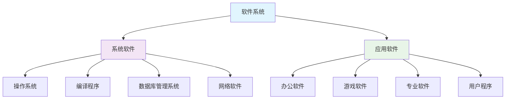

**系统软件**是计算机系统的核心，主要包括：
- **操作系统**：管理计算机硬件资源，为应用程序提供服务
- **编译程序**：将高级语言程序翻译成机器语言
- **数据库管理系统**：管理和维护数据库
- **网络软件**：支持网络通信和资源共享

**应用软件**是为解决特定问题而开发的程序，直接为用户服务。

### 计算机工作原理

#### 冯·诺依曼体系结构

现代计算机基本都采用**冯·诺依曼体系结构**，其核心思想是：

1. **程序存储**：程序和数据都存储在同一存储器中
2. **顺序执行**：程序按地址顺序执行，可通过转移指令改变执行顺序
3. **二进制表示**：指令和数据都用二进制表示
4. **统一编址**：程序和数据统一编址，可通过地址访问

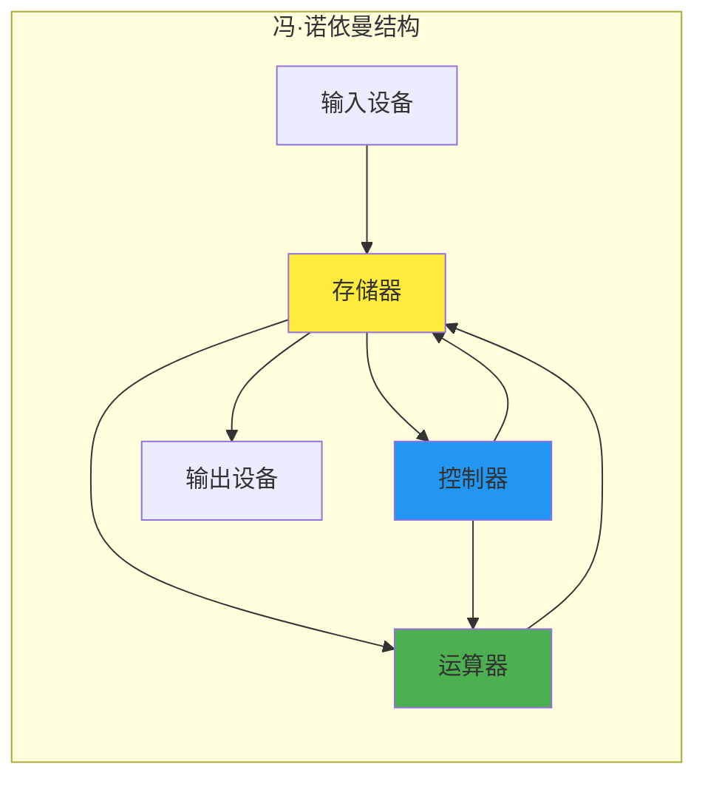

#### 指令执行过程

计算机执行程序的基本过程可以概括为**取指-译码-执行**循环：

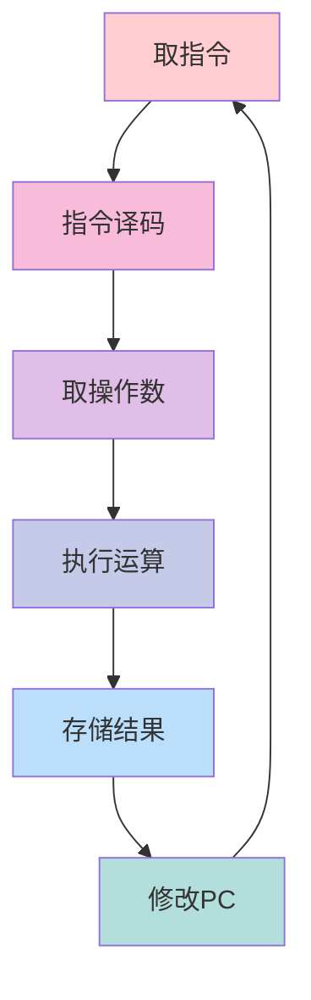

1. **取指令(Fetch)**：从存储器中取出当前要执行的指令
2. **译码(Decode)**：分析指令的操作码和操作数
3. **取操作数**：根据寻址方式获取操作数
4. **执行(Execute)**：完成指令规定的操作
5. **存储结果**：将运算结果存储到指定位置
6. **修改PC**：更新程序计数器，指向下一条指令

### 计算机分类与发展

#### 按规模和性能分类

| 类型           | 特点                   | 应用场景           | 典型代表   |
| -------------- | ---------------------- | ------------------ | ---------- |
| **超级计算机** | 运算速度极快，价格昂贵 | 科学计算、天气预报 | 天河、神威 |
| **大型机**     | 处理能力强，可靠性高   | 银行、政府部门     | IBM Z系列  |
| **小型机**     | 多用户、多任务         | 企业级应用         | Unix服务器 |
| **微型机**     | 个人使用，价格适中     | 办公、娱乐、学习   | PC、笔记本 |
| **工作站**     | 图形处理能力强         | CAD、图形设计      | Sun、SGI   |

#### 计算机发展历程

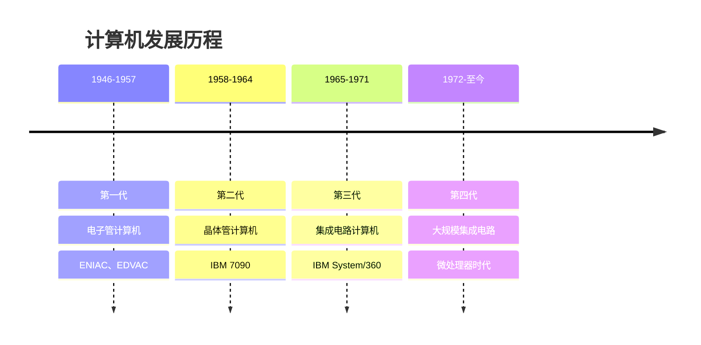

**第四代计算机的主要特征**：
- 采用**大规模集成电路(LSI)**和**超大规模集成电路(VLSI)**
- 微处理器的出现使个人计算机成为可能
- 软件技术快速发展，出现了各种高级编程语言
- 网络技术的发展实现了计算机互联

### 性能评价指标

#### 主要性能指标

| 指标       | 含义                 | 计算方法          | 影响因素           |
| ---------- | -------------------- | ----------------- | ------------------ |
| **主频**   | CPU时钟频率          | 赫兹(Hz)          | 制造工艺、架构设计 |
| **MIPS**   | 每秒百万条指令       | 指令数/执行时间   | 指令复杂度、流水线 |
| **FLOPS**  | 每秒浮点运算次数     | 浮点运算数/时间   | 浮点运算器性能     |
| **CPI**    | 每条指令平均时钟周期 | 总时钟周期/指令数 | 指令类型、存储访问 |
| **吞吐量** | 单位时间处理任务数   | 任务数/时间       | 并行度、资源利用率 |

#### 性能计算公式

**CPU执行时间** = 指令数 × CPI × 时钟周期时间

**程序执行时间** = (指令数 × CPI) / 主频

其中：
- **指令数**：程序包含的指令总数
- **CPI(Cycles Per Instruction)**：每条指令平均需要的时钟周期数
- **时钟周期时间**：主频的倒数

#### 性能优化策略

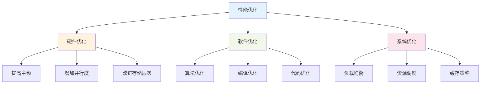

**硬件优化方向**：
- **提高主频**：采用先进制造工艺，优化电路设计
- **增加并行度**：多核处理器、超标量、超线程技术
- **改进存储层次**：增大缓存容量，提高存储带宽

**软件优化方向**：
- **算法优化**：选择更高效的算法和数据结构
- **编译优化**：利用编译器的优化功能
- **代码优化**：减少不必要的计算和内存访问

## 数据表示与运算

### 数制转换

#### 常用数制系统

| 数制         | 基数 | 数字符号 | 应用场景         |
| ------------ | ---- | -------- | ---------------- |
| **二进制**   | 2    | 0, 1     | 计算机内部表示   |
| **八进制**   | 8    | 0-7      | Unix文件权限     |
| **十进制**   | 10   | 0-9      | 日常计算         |
| **十六进制** | 16   | 0-9, A-F | 内存地址、颜色值 |

#### 数制转换方法

**十进制转其他进制**：
- **除基取余法**：连续除以目标进制的基数，余数倒序排列

```
十进制25转二进制：
25 ÷ 2 = 12 ... 1
12 ÷ 2 = 6  ... 0  
6  ÷ 2 = 3  ... 0
3  ÷ 2 = 1  ... 1
1  ÷ 2 = 0  ... 1
结果：11001₂
```

**其他进制转十进制**：
- **按权展开法**：各位数字乘以对应的权值之和

```
二进制11001转十进制：
1×2⁴ + 1×2³ + 0×2² + 0×2¹ + 1×2⁰ = 16 + 8 + 0 + 0 + 1 = 25
```

#### 快速转换技巧

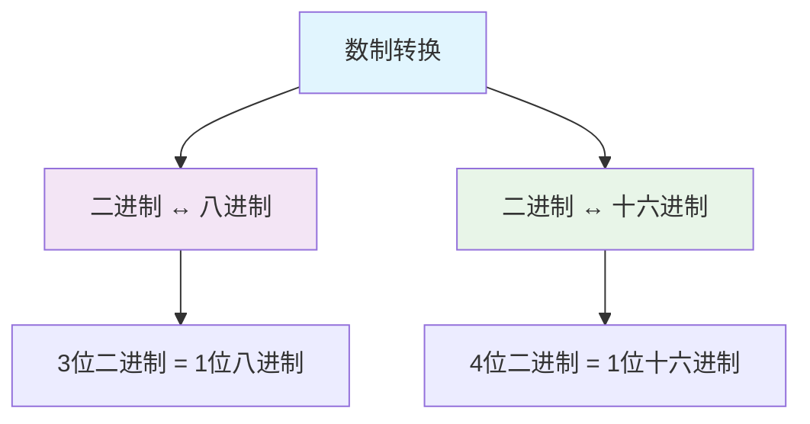

**二进制与八进制转换**：
- 每3位二进制对应1位八进制
- 例：101110₂ = 101|110 = 5|6 = 56₈

**二进制与十六进制转换**：
- 每4位二进制对应1位十六进制  
- 例：10111010₂ = 1011|1010 = B|A = BA₁₆

### 数据编码

#### 字符编码

| 编码标准      | 字符集大小 | 特点                  | 应用           |
| ------------- | ---------- | --------------------- | -------------- |
| **ASCII**     | 128个字符  | 7位编码，英文字符     | 早期计算机系统 |
| **扩展ASCII** | 256个字符  | 8位编码，增加特殊符号 | DOS系统        |
| **Unicode**   | 100万+字符 | 统一字符编码标准      | 现代软件系统   |
| **UTF-8**     | 变长编码   | 1-4字节，兼容ASCII    | 网络传输、存储 |
| **UTF-16**    | 变长编码   | 2或4字节              | Windows系统    |

#### 中文编码

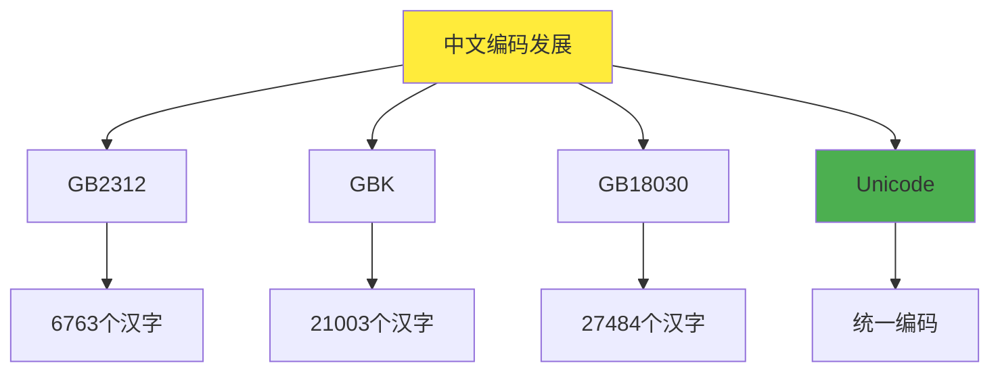

**编码特点对比**：
- **GB2312**：最早的中文编码标准，收录常用汉字
- **GBK**：扩展GB2312，增加更多汉字和符号
- **GB18030**：国家标准，完全兼容Unicode
- **Unicode**：国际标准，支持世界各国文字

#### 数值编码

**BCD码(Binary Coded Decimal)**：
- 用4位二进制表示1位十进制数字
- 例：十进制59 → BCD码：0101 1001

**格雷码(Gray Code)**：
- 相邻两个码字只有1位不同
- 用于减少数字电路中的竞争冒险

### 定点数与浮点数

#### 定点数表示

**原码表示**：
- 最高位为符号位，0表示正数，1表示负数
- 例：+5 = 00000101，-5 = 10000101

**反码表示**：
- 正数的反码等于原码
- 负数的反码为原码除符号位外各位取反
- 例：+5 = 00000101，-5 = 11111010

**补码表示**：
- 正数的补码等于原码
- 负数的补码为反码加1
- 例：+5 = 00000101，-5 = 11111011

#### 补码运算优势

| 特点             | 说明                     | 优势             |
| ---------------- | ------------------------ | ---------------- |
| **统一运算**     | 加法和减法用同一套电路   | 简化硬件设计     |
| **无符号位运算** | 符号位参与运算           | 提高运算效率     |
| **唯一零表示**   | 只有一个零的表示         | 避免+0和-0的问题 |
| **表示范围大**   | n位补码表示-2ⁿ⁻¹到2ⁿ⁻¹-1 | 充分利用编码空间 |

#### 浮点数表示

**IEEE 754标准**：

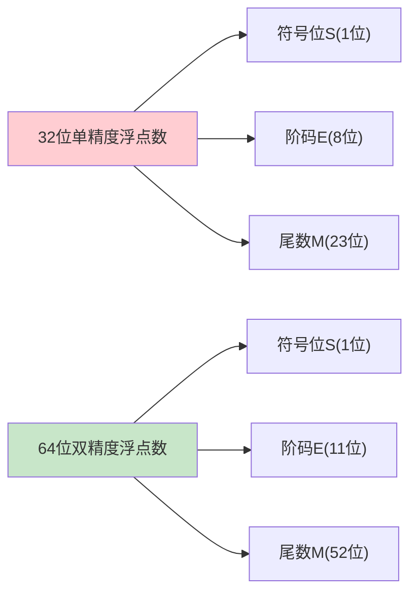

**浮点数值计算公式**：
V = (-1)^S × (1.M) × 2^(E-127)  (单精度)
V = (-1)^S × (1.M) × 2^(E-1023) (双精度)

**特殊值表示**：
- **零值**：E=0，M=0
- **无穷大**：E=255(单精度)或2047(双精度)，M=0  
- **NaN**：E=255(单精度)或2047(双精度)，M≠0

### 算术逻辑运算

#### 加法运算

**二进制加法规则**：
```
0 + 0 = 0
0 + 1 = 1  
1 + 0 = 1
1 + 1 = 10 (进位)
```

**补码加法运算**：
- 直接将两个补码相加
- 符号位参与运算
- 超出位数的进位自动丢弃

#### 乘法运算

**移位相加法**：

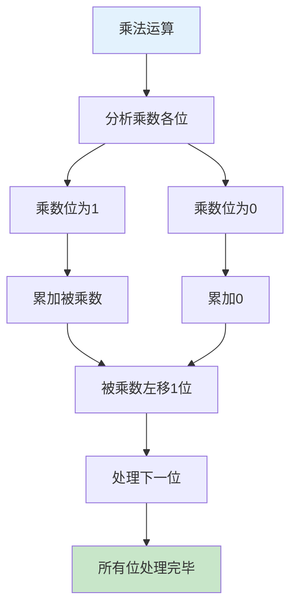

**Booth算法**：
- 用于有符号数乘法
- 通过分析乘数的连续1串来减少加法次数
- 提高乘法运算效率

#### 除法运算

**恢复余数法**：
1. 余数左移1位
2. 余数减除数
3. 如果结果为正，商位置1；否则商位置0，恢复余数
4. 重复直到所有位处理完毕

**不恢复余数法**：
- 改进的除法算法
- 避免恢复余数的步骤
- 提高除法运算速度

#### 逻辑运算

| 运算          | 符号 | 真值表         | 应用       |
| ------------- | ---- | -------------- | ---------- |
| **与(AND)**   | ∧    | 1∧1=1, 其他=0  | 位掩码操作 |
| **或(OR)**    | ∨    | 0∨0=0, 其他=1  | 位设置操作 |
| **非(NOT)**   | ¬    | ¬0=1, ¬1=0     | 位取反操作 |
| **异或(XOR)** | ⊕    | 相同=0, 不同=1 | 加密、校验 |

**位运算应用实例**：
- **清零特定位**：x & ~mask
- **设置特定位**：x | mask  
- **翻转特定位**：x ^ mask
- **检测特定位**：x & mask
- **快速乘除2的幂**：左移/右移操作

## 存储系统

### 存储器层次结构

#### 存储器分类

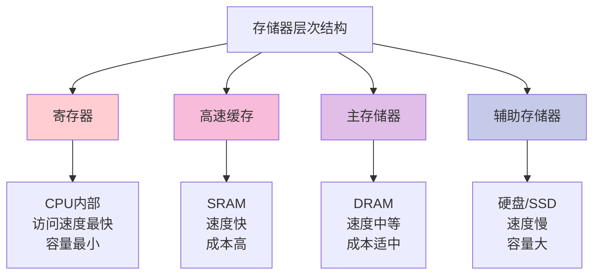

#### 存储器性能指标

| 层次         | 容量      | 访问时间 | 成本(每位) | 易失性 |
| ------------ | --------- | -------- | ---------- | ------ |
| **寄存器**   | 几十个字  | <1ns     | 极高       | 易失   |
| **L1缓存**   | 32-64KB   | 1-2ns    | 很高       | 易失   |
| **L2缓存**   | 256KB-1MB | 3-10ns   | 高         | 易失   |
| **L3缓存**   | 4-32MB    | 10-20ns  | 较高       | 易失   |
| **主存**     | 4-64GB    | 50-100ns | 中等       | 易失   |
| **SSD**      | 256GB-4TB | 0.1-1ms  | 较低       | 非易失 |
| **机械硬盘** | 1-20TB    | 5-10ms   | 低         | 非易失 |

#### 存储器层次原理

**局部性原理**是存储器层次结构的理论基础：

1. **时间局部性**：最近访问的信息很可能再次被访问
2. **空间局部性**：相邻地址的信息很可能被连续访问

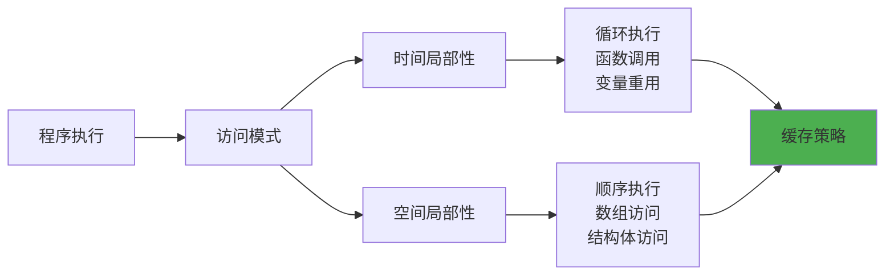

### 主存储器

#### DRAM工作原理

**动态随机存储器(DRAM)** 是主存的主要技术：

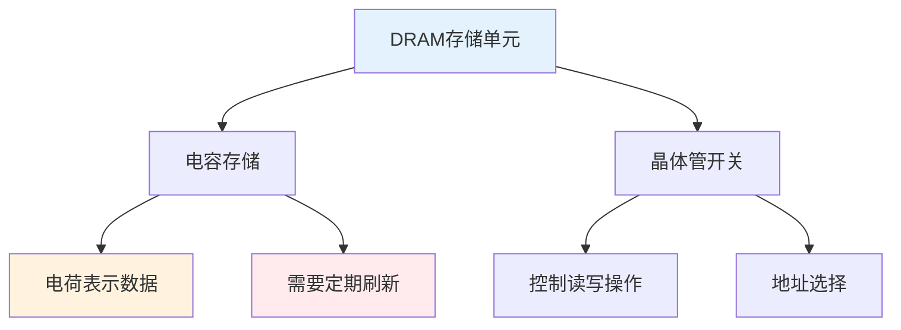

**DRAM特点**：
- **存储原理**：利用电容存储电荷表示0和1
- **刷新需求**：电容会漏电，需要定期刷新(2-64ms)
- **访问方式**：行列地址分时复用，降低引脚数
- **成本优势**：结构简单，成本低，适合大容量存储

#### 主存组织方式

**存储器芯片组织**：

| 组织方式         | 说明               | 优点         | 缺点           |
| ---------------- | ------------------ | ------------ | -------------- |
| **位扩展**       | 增加字长           | 提高数据宽度 | 增加成本       |
| **字扩展**       | 增加容量           | 扩大地址空间 | 复杂的地址译码 |
| **字位同时扩展** | 同时增加容量和字长 | 灵活配置     | 设计复杂       |

**多体交叉存储器**：

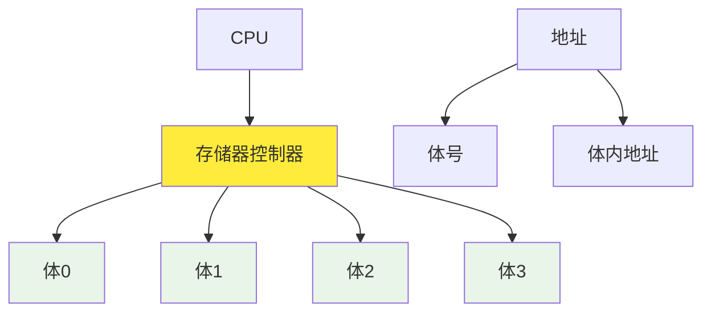

**交叉存储优势**：
- **并行访问**：多个存储体可同时工作
- **提高带宽**：有效提升存储器带宽
- **流水线支持**：支持指令流水线的连续访问

#### 存储器接口

**同步DRAM(SDRAM)**：
- 与系统时钟同步工作
- 支持突发传输模式
- 提高数据传输效率

**双倍数据速率SDRAM(DDR)**：
- 在时钟上升沿和下降沿都传输数据
- 有效数据传输率翻倍
- 发展历程：DDR → DDR2 → DDR3 → DDR4 → DDR5

### 高速缓存

#### Cache基本原理

**缓存工作机制**：

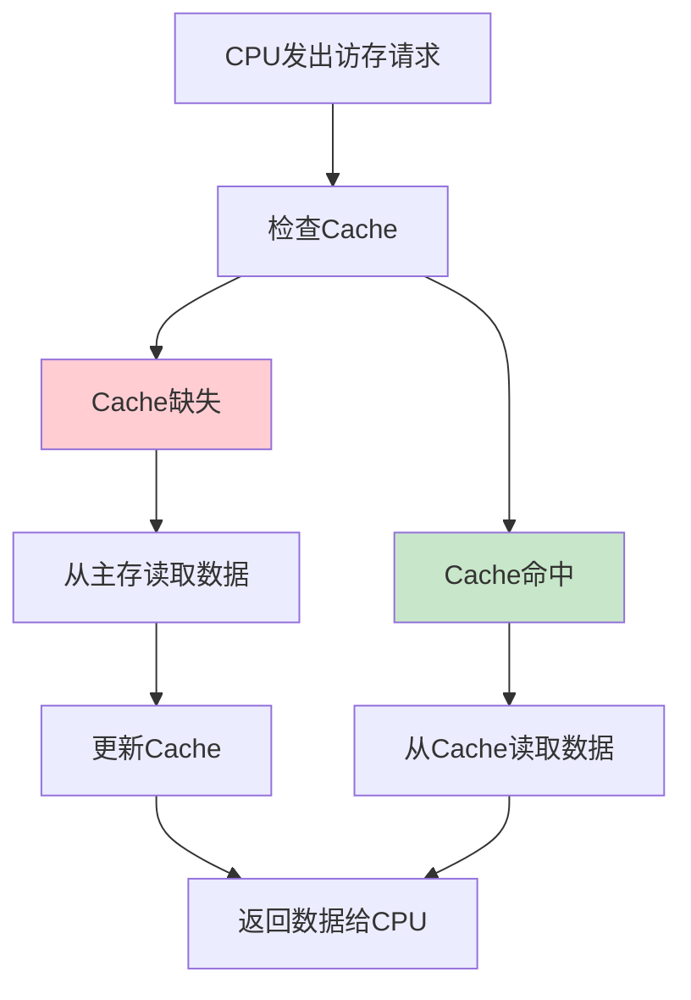

#### 地址映射方式

**直接映射**：
- 主存块只能映射到Cache的固定位置
- 映射关系：Cache行号 = 主存块号 mod Cache行数
- 优点：硬件简单，成本低
- 缺点：冲突率高，灵活性差

**全相联映射**：
- 主存块可以映射到Cache的任意位置
- 需要全相联比较器
- 优点：冲突率低，灵活性好
- 缺点：硬件复杂，成本高

**组相联映射**：
- 直接映射和全相联映射的折中
- Cache分为若干组，组内全相联，组间直接映射
- 平衡了性能和成本

#### 替换算法

| 算法       | 全称         | 原理                   | 适用场景     |
| ---------- | ------------ | ---------------------- | ------------ |
| **LRU**    | 最近最少使用 | 替换最长时间未访问的块 | 时间局部性强 |
| **FIFO**   | 先进先出     | 替换最早进入的块       | 实现简单     |
| **LFU**    | 最少使用频率 | 替换访问次数最少的块   | 访问模式稳定 |
| **Random** | 随机替换     | 随机选择替换块         | 硬件实现简单 |

#### 写策略

**写命中策略**：

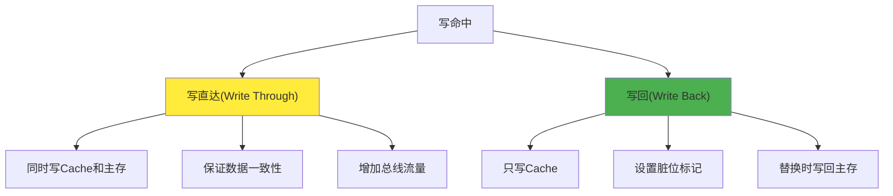

**写缺失策略**：
- **写分配(Write Allocate)**：先将块调入Cache，然后写入
- **写不分配(Write No-Allocate)**：直接写入主存，不调入Cache

### 虚拟存储器

#### 虚拟存储概念

**虚拟存储器**是一种存储管理技术，为程序提供比物理内存更大的地址空间。

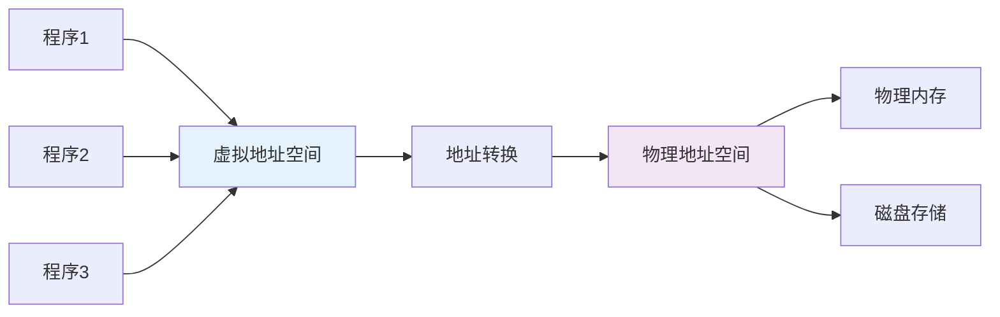

#### 分页存储管理

**页面组织**：
- **页(Page)**：虚拟地址空间的固定大小块(通常4KB)
- **页框(Page Frame)**：物理内存的固定大小块
- **页表(Page Table)**：记录页到页框的映射关系

**地址转换过程**：

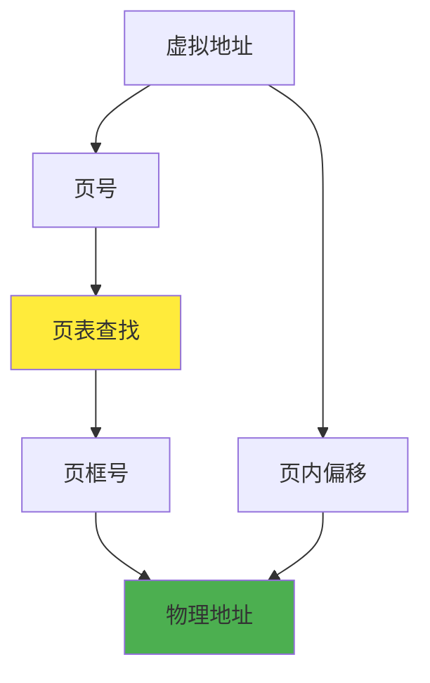

#### 页面置换算法

**最佳置换算法(OPT)**：
- 理论最优算法
- 置换将来最长时间不被访问的页面
- 实际无法实现，用作性能比较基准

**最近最少使用(LRU)**：
- 置换最长时间未被访问的页面
- 基于时间局部性原理
- 实现复杂度较高

**时钟算法(Clock)**：
- LRU的近似算法
- 使用访问位和指针实现
- 硬件实现简单

#### TLB快表

**转换后备缓冲器(TLB)**：
- 缓存最近使用的页表项
- 加速地址转换过程
- 通常采用全相联或组相联映射

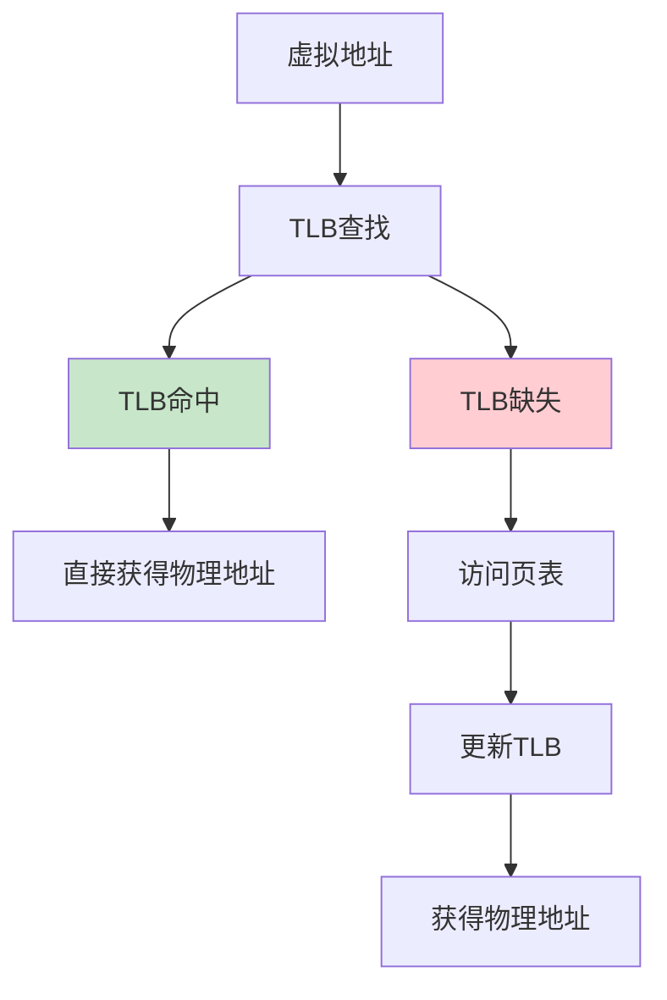

**TLB性能影响因素**：
- **命中率**：通常在95%以上
- **访问时间**：1-2个时钟周期
- **容量**：32-1024个表项
- **相联度**：影响命中率和访问时间

## 指令系统

### 指令格式

#### 指令的基本组成

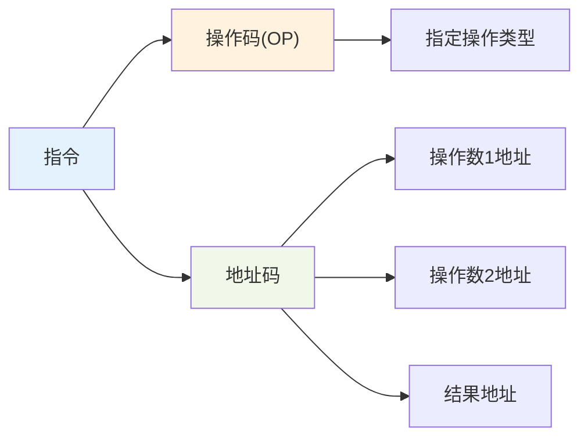

**指令格式分类**：

| 格式类型       | 结构              | 特点           | 应用场景           |
| -------------- | ----------------- | -------------- | ------------------ |
| **零地址指令** | OP                | 操作数隐含     | 堆栈操作、停机指令 |
| **一地址指令** | OP + A1           | 另一操作数隐含 | 累加器结构         |
| **二地址指令** | OP + A1 + A2      | 结果存放在A1   | 通用寄存器结构     |
| **三地址指令** | OP + A1 + A2 + A3 | 结果存放在A3   | RISC处理器         |

#### 指令长度设计

**定长指令**：
- 所有指令长度相同
- 优点：译码简单，取指方便
- 缺点：代码密度低，浪费存储空间

**变长指令**：
- 指令长度可变
- 优点：代码密度高，节省存储空间
- 缺点：译码复杂，取指困难

**扩展操作码技术**：

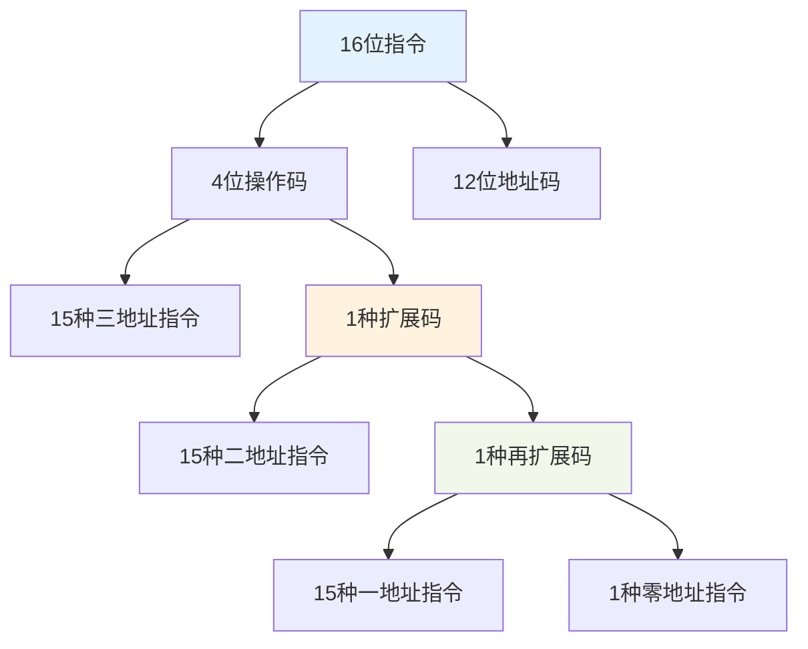

### 寻址方式

#### 基本寻址方式

**立即寻址**：
- 操作数直接包含在指令中
- 优点：无需访存，速度快
- 缺点：操作数长度受限

**直接寻址**：
- 地址码直接给出操作数地址
- 有效地址 = 地址码
- 优点：简单直接
- 缺点：寻址范围受限

**间接寻址**：
- 地址码给出操作数地址的地址
- 有效地址 = (地址码)
- 优点：扩大寻址范围
- 缺点：需要多次访存

#### 相对寻址方式

```mermaid
graph TD
    A["相对寻址"] --> B["PC相对寻址"]
    A --> C["基址寻址"]
    A --> D["变址寻址"]
    
    B --> E["EA = PC + 偏移量"]
    C --> F["EA = 基址寄存器 + 偏移量"]
    D --> G["EA = 基地址 + 变址寄存器"]
    
    style A fill:#e3f2fd
    style B fill:#fff3e0
    style C fill:#f1f8e9
    style D fill:#fce4ec
```

**寻址方式比较**：

| 寻址方式       | 有效地址计算 | 访存次数 | 主要用途 |
| -------------- | ------------ | -------- | -------- |
| **立即寻址**   | 无           | 0        | 常数操作 |
| **直接寻址**   | EA = A       | 1        | 全局变量 |
| **间接寻址**   | EA = (A)     | 2+       | 指针操作 |
| **寄存器寻址** | EA = Ri      | 0        | 临时变量 |
| **PC相对寻址** | EA = PC + A  | 1        | 分支跳转 |
| **基址寻址**   | EA = BR + A  | 1        | 数组访问 |
| **变址寻址**   | EA = A + IX  | 1        | 循环控制 |

### 指令类型

#### 数据传送指令

**基本传送指令**：
- **LOAD**：从存储器加载数据到寄存器
- **STORE**：从寄存器存储数据到存储器  
- **MOVE**：寄存器间数据传送
- **EXCHANGE**：交换两个操作数

**栈操作指令**：
- **PUSH**：数据压入栈
- **POP**：数据弹出栈
- **栈指针自动调整**

#### 算术逻辑指令

```mermaid
graph TD
    A["算术逻辑指令"] --> B["算术运算"]
    A --> C["逻辑运算"]
    A --> D["移位运算"]
    
    B --> E["ADD/SUB<br/>MUL/DIV<br/>INC/DEC"]
    C --> F["AND/OR<br/>XOR/NOT<br/>TEST/CMP"]
    D --> G["SHL/SHR<br/>ROL/ROR<br/>算术移位"]
    
    style A fill:#e3f2fd
    style B fill:#fff3e0
    style C fill:#f1f8e9
    style D fill:#fce4ec
```

#### 控制转移指令

**无条件转移**：
- **JMP**：无条件跳转
- **CALL**：子程序调用
- **RET**：子程序返回

**条件转移**：
- 根据标志位状态决定是否跳转
- 常见条件：零标志(ZF)、进位标志(CF)、符号标志(SF)

**循环控制指令**：
- **LOOP**：循环控制
- **LOOPZ/LOOPNZ**：条件循环

#### 输入输出指令

**程序控制I/O**：
- **IN**：从I/O端口输入数据
- **OUT**：向I/O端口输出数据
- CPU直接控制I/O操作

**中断I/O**：
- **STI/CLI**：开/关中断
- **IRET**：中断返回
- 提高CPU利用率

### RISC与CISC

#### 设计理念对比

```mermaid
graph TD
    A["处理器设计"] --> B["CISC"]
    A --> C["RISC"]
    
    B --> D["复杂指令集"]
    B --> E["可变指令长度"]
    B --> F["多种寻址方式"]
    B --> G["微程序控制"]
    
    C --> H["精简指令集"]
    C --> I["固定指令长度"]
    C --> J["简单寻址方式"]
    C --> K["硬布线控制"]
    
    style B fill:#ffcdd2
    style C fill:#c8e6c9
```

#### 特征对比

| 特征         | CISC          | RISC         |
| ------------ | ------------- | ------------ |
| **指令数量** | 多(200-300条) | 少(50-100条) |
| **指令格式** | 变长，复杂    | 定长，简单   |
| **寻址方式** | 多样化        | 简单，规整   |
| **执行周期** | 多周期        | 单周期为主   |
| **控制方式** | 微程序控制    | 硬布线控制   |
| **编译器**   | 相对简单      | 复杂优化     |
| **代表产品** | x86系列       | ARM、MIPS    |

#### RISC设计原则

**关键设计原则**：

1. **指令简单化**：每条指令完成简单操作
2. **规整化设计**：指令格式统一，便于译码
3. **优化常用操作**：重点优化频繁使用的指令
4. **硬件简化**：减少硬件复杂度，提高频率
5. **编译器优化**：依靠编译器进行代码优化

**RISC优势**：
- **高频率**：简单设计支持更高时钟频率
- **流水线友好**：规整指令便于流水线实现
- **功耗较低**：硬件简单，功耗控制好
- **设计周期短**：降低处理器设计复杂度

#### 现代处理器发展

**CISC与RISC融合**：

```mermaid
graph TD
    A["现代处理器"] --> B["外部CISC接口"]
    A --> C["内部RISC核心"]
    
    B --> D["兼容性好"]
    B --> E["软件生态丰富"]
    
    C --> F["执行效率高"]
    C --> G["设计简化"]
    
    A --> H["指令译码器"]
    H --> I["复杂指令分解"]
    I --> J["简单微操作"]
    
    style A fill:#e3f2fd
    style H fill:#fff3e0
```

**发展趋势**：
- **指令级并行**：超标量、乱序执行
- **专用指令**：SIMD、向量指令
- **异构计算**：CPU+GPU协同
- **低功耗设计**：移动设备需求驱动

## 中央处理器

### CPU结构

#### CPU基本组成

```mermaid
graph TD
    A["中央处理器CPU"] --> B["运算器ALU"]
    A --> C["控制器CU"]
    A --> D["寄存器组"]
    A --> E["内部总线"]
    
    B --> F["算术运算单元"]
    B --> G["逻辑运算单元"]
    B --> H["移位器"]
    
    C --> I["指令译码器"]
    C --> J["时序控制器"]
    C --> K["微操作信号发生器"]
    
    D --> L["通用寄存器"]
    D --> M["专用寄存器"]
    
    style A fill:#e3f2fd
    style B fill:#fff3e0
    style C fill:#f1f8e9
    style D fill:#fce4ec
```

#### 寄存器分类

**通用寄存器**：
- 存储操作数和中间结果
- 数量：8-32个(现代处理器)
- 位宽：32位或64位

**专用寄存器**：

| 寄存器  | 全称             | 功能               | 重要性           |
| ------- | ---------------- | ------------------ | ---------------- |
| **PC**  | 程序计数器       | 存储下一条指令地址 | 控制程序执行流程 |
| **IR**  | 指令寄存器       | 存储当前执行指令   | 指令译码基础     |
| **PSW** | 程序状态字       | 存储标志位和状态   | 条件判断依据     |
| **SP**  | 栈指针           | 指向栈顶位置       | 栈操作管理       |
| **MAR** | 存储器地址寄存器 | 存储访存地址       | 存储器接口       |
| **MDR** | 存储器数据寄存器 | 存储读写数据       | 数据缓冲         |

#### 控制器设计

**硬布线控制器**：
- 用组合逻辑电路实现
- 速度快，效率高
- 设计复杂，不易修改

**微程序控制器**：

```mermaid
graph TD
    A["微程序控制器"] --> B["控制存储器"]
    A --> C["微指令寄存器"]
    A --> D["地址形成电路"]
    
    B --> E["存储微程序"]
    C --> F["当前微指令"]
    D --> G["下一微指令地址"]
    
    F --> H["微操作控制信号"]
    F --> I["判别测试信号"]
    F --> J["下地址字段"]
    
    style A fill:#e3f2fd
    style B fill:#fff3e0
```

**微程序控制优势**：
- **灵活性好**：修改微程序即可改变指令功能
- **设计规整**：控制逻辑结构化
- **易于扩展**：添加新指令相对容易
- **调试方便**：可以单步执行微指令

### 指令执行过程

#### 指令执行周期

```mermaid
graph TD
    A["指令执行周期"] --> B["取指周期"]
    A --> C["译码周期"]
    A --> D["执行周期"]
    A --> E["写回周期"]
    
    B --> F["PC → MAR<br/>M[MAR] → MDR<br/>MDR → IR<br/>PC + 1 → PC"]
    
    C --> G["分析指令操作码<br/>确定操作类型<br/>计算操作数地址"]
    
    D --> H["取操作数<br/>执行运算<br/>产生结果"]
    
    E --> I["结果写入目标<br/>更新标志位<br/>准备下一指令"]
    
    style B fill:#ffcdd2
    style C fill:#f8bbd9
    style D fill:#e1bee7
    style E fill:#c5cae9
```

#### 数据通路设计

**单总线结构**：
- 所有部件共享一条总线
- 结构简单，成本低
- 同时只能进行一次数据传输

**多总线结构**：
- 采用多条专用总线
- 提高数据传输并行度
- 硬件复杂度增加

**专用数据通路**：
- 为特定操作设计专用路径
- 最高性能，最大并行度
- 硬件成本最高

#### 指令流水线

**流水线基本概念**：

```mermaid
gantt
    title 指令流水线执行时序
    dateFormat X
    axisFormat %s
    
    section 指令1
    取指    :i1f, 0, 1
    译码    :i1d, 1, 1
    执行    :i1e, 2, 1
    写回    :i1w, 3, 1
    
    section 指令2
    取指    :i2f, 1, 1
    译码    :i2d, 2, 1
    执行    :i2e, 3, 1
    写回    :i2w, 4, 1
    
    section 指令3
    取指    :i3f, 2, 1
    译码    :i3d, 3, 1
    执行    :i3e, 4, 1
    写回    :i3w, 5, 1
```

### 流水线技术

#### 流水线性能分析

**性能指标**：

| 指标       | 计算公式     | 说明                 |
| ---------- | ------------ | -------------------- |
| **吞吐率** | TP = n/T     | 单位时间完成指令数   |
| **加速比** | S = T₀/T     | 相对于非流水线的加速 |
| **效率**   | E = T₀/(k×T) | 流水线资源利用率     |

其中：
- n：指令总数
- T：流水线总执行时间  
- T₀：非流水线执行时间
- k：流水线段数

**理想流水线性能**：
- 吞吐率：1条指令/时钟周期
- 加速比：等于流水线段数
- 效率：100%

#### 流水线冲突

**结构冲突(资源冲突)**：

```mermaid
graph TD
    A["结构冲突"] --> B["硬件资源不足"]
    B --> C["存储器端口冲突"]
    B --> D["功能部件冲突"]
    
    A --> E["解决方案"]
    E --> F["增加硬件资源"]
    E --> G["资源调度"]
    E --> H["流水线停顿"]
    
    style A fill:#ffcdd2
    style E fill:#c8e6c9
```

**数据冲突**：
- **RAW(Read After Write)**：真数据相关
- **WAR(Write After Read)**：反相关
- **WAW(Write After Write)**：输出相关

**控制冲突**：
- 分支指令改变程序执行流程
- 条件分支的不确定性
- 影响指令预取的连续性

#### 冲突解决技术

**数据冲突解决**：

```mermaid
graph TD
    A["数据冲突解决"] --> B["数据前推"]
    A --> C["流水线停顿"]
    A --> D["指令调度"]
    
    B --> E["直接传递结果"]
    B --> F["减少停顿周期"]
    
    C --> G["插入气泡"]
    C --> H["等待数据就绪"]
    
    D --> I["编译器优化"]
    D --> J["重排指令顺序"]
    
    style A fill:#e3f2fd
    style B fill:#c8e6c9
```

**数据前推技术**：
- 将ALU输出直接送到下一指令的输入
- 避免写回再读取的延迟
- 硬件实现相对复杂

### 分支预测

#### 静态分支预测

**预测策略**：

| 策略               | 预测方法         | 适用场景       | 准确率 |
| ------------------ | ---------------- | -------------- | ------ |
| **总是预测跳转**   | 预测分支总是发生 | 循环结构多     | 60-70% |
| **总是预测不跳转** | 预测分支不发生   | 顺序执行多     | 50-60% |
| **BTFNT**          | 向后跳转预测发生 | 循环和条件混合 | 65-75% |

#### 动态分支预测

**一位分支预测**：
- 使用1位历史信息
- 预测错误后立即改变预测
- 对于规律性分支效果不佳

**两位分支预测**：

```mermaid
stateDiagram-v2
    [*] --> 强不跳转
    强不跳转 --> 弱不跳转 : 跳转
    强不跳转 --> 强不跳转 : 不跳转
    
    弱不跳转 --> 强不跳转 : 不跳转
    弱不跳转 --> 弱跳转 : 跳转
    
    弱跳转 --> 弱不跳转 : 不跳转
    弱跳转 --> 强跳转 : 跳转
    
    强跳转 --> 弱跳转 : 不跳转
    强跳转 --> 强跳转 : 跳转
```

**全局分支预测**：
- 使用全局分支历史
- 考虑分支间的相关性
- 预测准确率可达90%以上

#### 分支目标缓冲

**BTB(Branch Target Buffer)**：

```mermaid
graph TD
    A["分支指令地址"] --> B["BTB查找"]
    B --> C["命中"]
    B --> D["缺失"]
    
    C --> E["获得目标地址"]
    C --> F["获得预测信息"]
    
    D --> G["正常取指"]
    D --> H["执行后更新BTB"]
    
    E --> I["预测跳转"]
    F --> I
    
    style C fill:#c8e6c9
    style D fill:#ffcdd2
```

**BTB组织结构**：
- **标记字段**：分支指令地址
- **目标地址字段**：分支目标地址  
- **预测信息字段**：分支预测状态
- **有效位**：表项是否有效

#### 超标量处理器

**超标量特征**：
- 每个时钟周期可以启动多条指令
- 动态调度指令执行顺序
- 多个功能部件并行工作

**关键技术**：

```mermaid
graph TD
    A["超标量处理器"] --> B["指令级并行"]
    A --> C["动态调度"]
    A --> D["多发射"]
    A --> E["乱序执行"]
    
    B --> F["发现指令间并行性"]
    C --> G["运行时指令调度"]
    D --> H["同时发射多条指令"]
    E --> I["打破程序顺序限制"]
    
    style A fill:#e3f2fd
```

**性能限制因素**：
- **指令间相关性**：限制并行度
- **分支指令频率**：影响指令预取
- **存储器访问延迟**：数据获取瓶颈
- **硬件资源限制**：功能部件数量

## 输入输出系统

### IO接口

#### IO接口功能

```mermaid
graph TD
    A["IO接口"] --> B["地址译码"]
    A --> C["数据缓冲"]
    A --> D["信号转换"]
    A --> E["控制协调"]
    
    B --> F["识别设备地址"]
    C --> G["速度匹配"]
    D --> H["电平转换<br/>串并转换"]
    E --> I["时序控制<br/>状态管理"]
    
    style A fill:#e3f2fd
    style B fill:#fff3e0
    style C fill:#f1f8e9
    style D fill:#fce4ec
    style E fill:#e8f5e8
```

#### IO端口编址

**统一编址(存储器映射IO)**：
- IO端口占用存储器地址空间
- 使用存储器指令访问IO设备
- 地址译码电路统一设计

**独立编址**：
- IO端口有独立的地址空间
- 使用专门的IO指令
- 需要专门的IO控制信号

| 编址方式     | 优点               | 缺点         | 典型应用    |
| ------------ | ------------------ | ------------ | ----------- |
| **统一编址** | 指令丰富、编程灵活 | 占用存储空间 | ARM、RISC-V |
| **独立编址** | 地址空间独立       | 指令有限     | x86系列     |

#### IO接口类型

**并行接口**：
- 多条数据线同时传输
- 传输速度快
- 适合短距离高速传输

**串行接口**：
- 单条数据线逐位传输
- 传输距离远
- 成本低，抗干扰能力强

### IO控制方式

#### 程序控制IO

**无条件传送**：
- CPU直接控制IO操作
- 不检查设备状态
- 适用于简单、可靠的设备

**程序查询方式**：

```mermaid
graph TD
    A["开始IO操作"] --> B["启动IO设备"]
    B --> C["查询设备状态"]
    C --> D["设备就绪?"]
    D -->|否| C
    D -->|是| E["传送数据"]
    E --> F["数据传送完毕?"]
    F -->|否| C
    F -->|是| G["结束IO操作"]
    
    style D fill:#fff3e0
    style F fill:#fff3e0
```

**程序查询方式特点**：
- CPU主动查询设备状态
- 简单可靠，硬件开销小
- CPU利用率低，实时性差

#### 中断控制IO

**中断IO工作原理**：

```mermaid
sequenceDiagram
    participant CPU
    participant 中断控制器
    participant IO设备
    
    CPU->>IO设备: 启动IO操作
    CPU->>CPU: 执行其他程序
    IO设备->>中断控制器: 发送中断请求
    中断控制器->>CPU: 中断请求信号
    CPU->>CPU: 保存现场
    CPU->>IO设备: 执行中断服务程序
    CPU->>CPU: 恢复现场
    CPU->>CPU: 继续执行原程序
```

**中断优先级管理**：

| 优先级   | 中断源     | 处理特点             |
| -------- | ---------- | -------------------- |
| **最高** | 硬件故障   | 立即处理，不可屏蔽   |
| **高**   | 程序性错误 | 优先处理             |
| **中**   | 外部设备   | 可屏蔽，按优先级处理 |
| **低**   | 程序请求   | 可延迟处理           |

### 中断系统

#### 中断处理过程

**中断响应条件**：
1. 中断源发出中断请求
2. CPU开中断(中断允许触发器为1)
3. 当前指令执行完毕
4. 没有更高优先级中断正在处理

**中断处理流程**：

```mermaid
graph TD
    A["中断请求"] --> B["中断判优"]
    B --> C["保存断点"]
    C --> D["关中断"]
    D --> E["保存现场"]
    E --> F["识别中断源"]
    F --> G["转中断服务程序"]
    G --> H["执行中断处理"]
    H --> I["恢复现场"]
    I --> J["开中断"]
    J --> K["中断返回"]
    
    style A fill:#ffcdd2
    style G fill:#c8e6c9
    style K fill:#bbdefb
```

#### 中断向量表

**中断向量**：
- 存储中断服务程序入口地址
- 通常存放在固定的存储区域
- 支持快速中断响应

**向量中断vs非向量中断**：

```mermaid
graph LR
    A["中断类型"] --> B["向量中断"]
    A --> C["非向量中断"]
    
    B --> D["硬件提供中断类型号"]
    B --> E["直接获得服务程序地址"]
    B --> F["响应速度快"]
    
    C --> G["软件查询中断源"]
    C --> H["逐一检查设备状态"]
    C --> I["响应速度慢"]
    
    style B fill:#c8e6c9
    style C fill:#ffcdd2
```

#### 多级中断系统

**中断嵌套**：
- 高优先级中断可以打断低优先级中断
- 需要保存多层现场信息
- 使用栈结构管理嵌套关系

**中断屏蔽技术**：
- 通过屏蔽字控制中断响应
- 可以动态调整中断优先级
- 支持中断的选择性响应

### DMA技术

#### DMA基本原理

**直接存储器访问(DMA)**：
- 外设直接与存储器交换数据
- 不需要CPU参与数据传输过程
- 大幅提高数据传输效率

```mermaid
graph TD
    A["DMA控制器"] --> B["地址寄存器"]
    A --> C["字计数器"]
    A --> D["控制寄存器"]
    A --> E["数据寄存器"]
    
    B --> F["当前传输地址"]
    C --> G["剩余传输字数"]
    D --> H["传输方向<br/>传输方式"]
    E --> I["数据缓冲"]
    
    style A fill:#e3f2fd
```

#### DMA传输方式

**停止CPU访问**：
- DMA控制器完全占用总线
- CPU停止工作直到传输完成
- 传输速度最快，CPU利用率最低

**周期挪用**：
- DMA在CPU不访问总线时传输
- 利用CPU的空闲总线周期
- 对CPU影响最小

**交替访问**：
- CPU和DMA交替使用总线
- 需要总线仲裁机制
- 平衡传输速度和CPU效率

#### DMA传输过程

```mermaid
sequenceDiagram
    participant CPU
    participant DMA控制器
    participant 外设
    participant 存储器
    
    CPU->>DMA控制器: 初始化DMA
    Note over CPU,DMA控制器: 设置传输参数
    
    外设->>DMA控制器: 请求DMA传输
    DMA控制器->>CPU: 申请总线控制权
    CPU->>DMA控制器: 释放总线
    
    loop 数据传输
        DMA控制器->>外设: 读取数据
        DMA控制器->>存储器: 写入数据
        DMA控制器->>DMA控制器: 更新地址和计数
    end
    
    DMA控制器->>CPU: 传输完成中断
    DMA控制器->>CPU: 归还总线控制权
```

#### 总线仲裁

**集中仲裁方式**：

| 方式               | 原理                 | 优点             | 缺点               |
| ------------------ | -------------------- | ---------------- | ------------------ |
| **链式查询**       | 串行传递总线授权信号 | 硬件简单，易扩展 | 优先级固定，速度慢 |
| **计数器定时查询** | 计数器轮询各设备     | 优先级可变       | 控制复杂           |
| **独立请求**       | 每个设备独立请求线   | 响应速度快       | 硬件复杂，线数多   |

**分布仲裁方式**：
- 各设备自行决定总线使用权
- 无需中央仲裁器
- 适用于高性能系统

#### 现代IO技术

**IO虚拟化**：
- 虚拟机环境下的IO管理
- 提高IO资源利用率
- 支持IO设备共享

**高速IO接口**：

```mermaid
graph TD
    A["高速IO接口"] --> B["PCIe"]
    A --> C["SATA"]
    A --> D["USB 3.0/3.1"]
    A --> E["Thunderbolt"]
    
    B --> F["点对点连接<br/>高带宽<br/>低延迟"]
    C --> G["串行ATA<br/>热插拔<br/>高速度"]
    D --> H["通用串行总线<br/>即插即用<br/>供电能力"]
    E --> I["高速多协议<br/>菊花链连接<br/>视频支持"]
    
    style A fill:#e3f2fd
```

**NVMe存储**：
- 专为SSD设计的接口协议
- 充分利用SSD的并行性能
- 大幅降低存储访问延迟

## 操作系统基础

### 操作系统概念

#### 操作系统定义与功能

**操作系统**是管理计算机硬件资源，为应用程序提供服务的系统软件。

```mermaid
graph TD
    A["操作系统功能"] --> B["资源管理"]
    A --> C["进程管理"]
    A --> D["存储管理"]
    A --> E["文件管理"]
    A --> F["设备管理"]
    
    B --> G["CPU调度<br/>内存分配<br/>IO设备管理"]
    C --> H["进程创建<br/>进程调度<br/>进程通信"]
    D --> I["内存分配<br/>虚拟内存<br/>内存保护"]
    E --> J["文件存储<br/>目录管理<br/>文件保护"]
    F --> K["设备驱动<br/>设备分配<br/>设备IO"]
    
    style A fill:#e3f2fd
```

#### 操作系统类型

| 类型           | 特点                 | 应用场景     | 典型代表     |
| -------------- | -------------------- | ------------ | ------------ |
| **批处理系统** | 作业成批处理，无交互 | 大型计算任务 | 早期大型机   |
| **分时系统**   | 多用户轮流使用CPU    | 交互式计算   | Unix、Linux  |
| **实时系统**   | 严格时间约束         | 控制系统     | VxWorks、QNX |
| **分布式系统** | 多机协同工作         | 集群计算     | 分布式OS     |
| **嵌入式系统** | 资源受限，专用功能   | 嵌入式设备   | FreeRTOS     |

#### 系统调用

**系统调用接口**：

```mermaid
graph TD
    A["用户程序"] --> B["系统调用接口"]
    B --> C["内核"]
    
    B --> D["进程控制"]
    B --> E["文件操作"]
    B --> F["设备管理"]
    B --> G["信息维护"]
    B --> H["通信"]
    
    D --> I["fork/exec<br/>exit/wait"]
    E --> J["open/close<br/>read/write"]
    F --> K["ioctl<br/>read/write"]
    G --> L["getpid<br/>alarm"]
    H --> M["pipe<br/>shmget"]
    
    style B fill:#ffeb3b
    style C fill:#4caf50
```

### 进程管理

#### 进程概念

**进程**是程序在执行过程中的一个实例，是系统进行资源分配和调度的基本单位。

**进程与程序的区别**：

| 特征         | 程序           | 进程                |
| ------------ | -------------- | ------------------- |
| **本质**     | 静态代码集合   | 动态执行实体        |
| **生命周期** | 永久存在       | 有创建和撤销        |
| **资源**     | 不占用系统资源 | 占用CPU、内存等资源 |
| **数量关系** | 一个程序       | 可对应多个进程      |

#### 进程状态转换

```mermaid
stateDiagram-v2
    [*] --> 就绪: 创建进程
    就绪 --> 运行: 调度
    运行 --> 就绪: 时间片到/被抢占
    运行 --> 阻塞: 等待事件
    阻塞 --> 就绪: 事件发生
    运行 --> [*]: 进程结束
    
    note right of 就绪: 具备运行条件\n等待CPU分配
    note right of 运行: 正在CPU上执行
    note right of 阻塞: 等待某个事件\n暂时无法执行
```

#### 进程控制块PCB

**PCB包含信息**：

```mermaid
graph TD
    A["进程控制块PCB"] --> B["进程标识信息"]
    A --> C["处理器状态信息"]
    A --> D["进程调度信息"]
    A --> E["进程控制信息"]
    
    B --> F["进程ID<br/>父进程ID<br/>用户ID"]
    C --> G["寄存器值<br/>程序计数器<br/>状态字"]
    D --> H["进程状态<br/>优先级<br/>调度参数"]
    E --> I["程序和数据地址<br/>资源清单<br/>进程同步信息"]
    
    style A fill:#e3f2fd
```

#### 进程调度算法

**先来先服务(FCFS)**：
- 按进程到达顺序调度
- 简单公平，但平均等待时间长
- 不利于短作业

**短作业优先(SJF)**：
- 优先调度执行时间短的进程
- 最小化平均等待时间
- 可能导致长作业饥饿

**时间片轮转(RR)**：

```mermaid
graph TD
    A["时间片轮转"] --> B["就绪队列"]
    B --> C["分配时间片"]
    C --> D["进程执行"]
    D --> E["时间片用完?"]
    E -->|是| F["进入队列尾部"]
    E -->|否| G["进程结束或阻塞"]
    F --> B
    
    style E fill:#fff3e0
```

**优先级调度**：
- 根据进程优先级分配CPU
- 支持抢占式和非抢占式
- 需要防止优先级倒置

**多级反馈队列**：
- 多个优先级不同的就绪队列
- 进程可在队列间移动
- 兼顾响应时间和公平性

### 内存管理

#### 内存分配方式

**连续分配**：

| 方式         | 原理                 | 优点       | 缺点     |
| ------------ | -------------------- | ---------- | -------- |
| **单一连续** | 整个内存给一个程序   | 简单       | 利用率低 |
| **固定分区** | 内存分成固定大小分区 | 管理简单   | 内部碎片 |
| **动态分区** | 按需分配大小         | 无内部碎片 | 外部碎片 |

**动态分区分配算法**：

```mermaid
graph TD
    A["动态分区分配"] --> B["首次适应"]
    A --> C["最佳适应"]
    A --> D["最坏适应"]
    A --> E["邻近适应"]
    
    B --> F["找到第一个足够大的分区"]
    C --> G["找到最小的足够大分区"]
    D --> H["找到最大的分区"]
    E --> I["从上次分配位置开始查找"]
    
    style A fill:#e3f2fd
```

#### 虚拟内存

**虚拟内存原理**：
- 程序使用虚拟地址空间
- 操作系统负责地址转换
- 支持程序大小超过物理内存

**页面置换算法**：

**最优置换(OPT)**：
- 理论最优算法
- 置换将来最长时间不访问的页面
- 实际无法实现

**先进先出(FIFO)**：
- 置换最早调入的页面
- 实现简单，但可能产生Belady异常
- 不符合局部性原理

**最近最少使用(LRU)**：

```mermaid
graph TD
    A["LRU算法实现"] --> B["计数器法"]
    A --> C["栈方法"]
    A --> D["近似LRU"]
    
    B --> E["记录每页访问时间"]
    C --> F["维护页面访问栈"]
    D --> G["时钟算法<br/>二次机会算法"]
    
    style A fill:#e3f2fd
    style D fill:#c8e6c9
```

#### 段页式存储

**分段存储**：
- 按程序逻辑结构分段
- 段长可变，便于共享和保护
- 地址转换：段号+段内偏移

**分页存储**：
- 按固定大小分页
- 消除外部碎片
- 地址转换：页号+页内偏移

**段页式存储**：
- 结合分段和分页优点
- 先分段再分页
- 地址转换：段号+页号+页内偏移

### 文件系统

#### 文件系统功能

```mermaid
graph TD
    A["文件系统"] --> B["文件管理"]
    A --> C["目录管理"]
    A --> D["存储空间管理"]
    A --> E["文件保护"]
    
    B --> F["文件创建/删除<br/>文件读写<br/>文件属性管理"]
    C --> G["目录结构<br/>路径解析<br/>文件检索"]
    D --> H["空闲空间管理<br/>磁盘分配<br/>碎片整理"]
    E --> I["访问控制<br/>用户权限<br/>文件加密"]
    
    style A fill:#e3f2fd
```

#### 文件组织方式

**顺序文件**：
- 记录按顺序存储
- 适合批处理和顺序访问
- 插入删除效率低

**索引文件**：
- 建立索引表加速检索
- 支持随机访问
- 需要额外存储空间

**散列文件**：
- 使用散列函数确定记录位置
- 访问速度快
- 可能产生冲突

#### 目录结构

**单级目录**：
- 所有文件在同一目录
- 结构简单，但文件名冲突

**两级目录**：
- 用户目录+文件目录
- 解决文件名冲突
- 不支持文件分类

**树形目录**：

```mermaid
graph TD
    A["根目录/"] --> B["bin"]
    A --> C["usr"]
    A --> D["home"]
    A --> E["etc"]
    
    C --> F["bin"]
    C --> G["lib"]
    C --> H["local"]
    
    D --> I["user1"]
    D --> J["user2"]
    
    I --> K["documents"]
    I --> L["downloads"]
    
    style A fill:#ffeb3b
```

#### 磁盘空间管理

**空闲空间管理**：

| 方法           | 原理                     | 优点             | 缺点         |
| -------------- | ------------------------ | ---------------- | ------------ |
| **空闲表法**   | 记录空闲区起始地址和长度 | 便于分配连续空间 | 表格开销大   |
| **空闲链表法** | 空闲块链接成链表         | 实现简单         | 分配效率低   |
| **位示图法**   | 用位表示块的使用状态     | 查找效率高       | 需要额外存储 |
| **成组链接法** | 空闲块分组管理           | 平衡效率和开销   | 实现复杂     |

**文件分配方式**：

**连续分配**：
- 文件占用连续的磁盘块
- 访问速度快，实现简单
- 外部碎片，文件大小难以扩展

**链接分配**：
- 文件块通过指针链接
- 消除外部碎片，支持动态扩展
- 随机访问效率低

**索引分配**：

```mermaid
graph TD
    A["索引分配"] --> B["直接索引"]
    A --> C["一级间接索引"]
    A --> D["多级间接索引"]
    
    B --> E["索引块直接指向数据块"]
    C --> F["索引块指向索引块"]
    D --> G["多层索引结构"]
    
    style A fill:#e3f2fd
```

**混合索引分配**：
- 结合直接索引和间接索引
- 小文件使用直接索引
- 大文件使用间接索引
- Unix/Linux文件系统采用此方式

## 网络基础

### 网络协议栈

#### OSI七层模型

```mermaid
graph TD
    A["OSI七层模型"] --> B["应用层"]
    A --> C["表示层"]
    A --> D["会话层"]
    A --> E["传输层"]
    A --> F["网络层"]
    A --> G["数据链路层"]
    A --> H["物理层"]
    
    B --> I["HTTP/FTP/SMTP<br/>为应用程序提供服务"]
    C --> J["数据加密/压缩<br/>格式转换"]
    D --> K["会话管理<br/>建立/维护/终止会话"]
    E --> L["TCP/UDP<br/>端到端可靠传输"]
    F --> M["IP路由<br/>网络层寻址"]
    G --> N["以太网/WiFi<br/>帧传输/错误检测"]
    H --> O["物理介质<br/>比特流传输"]
    
    style A fill:#e3f2fd
```

#### TCP/IP模型

**四层结构对比**：

| OSI层                | TCP/IP层       | 主要协议             | 功能         |
| -------------------- | -------------- | -------------------- | ------------ |
| 应用层/表示层/会话层 | **应用层**     | HTTP、FTP、SMTP、DNS | 应用程序接口 |
| 传输层               | **传输层**     | TCP、UDP             | 端到端通信   |
| 网络层               | **网络层**     | IP、ICMP、ARP        | 路由和寻址   |
| 数据链路层/物理层    | **网络接口层** | Ethernet、WiFi       | 物理网络访问 |

#### 数据封装过程

```mermaid
graph TD
    A["应用数据"] --> B["应用层"]
    B --> C["传输层"]
    C --> D["网络层"]
    D --> E["数据链路层"]
    E --> F["物理层"]
    
    B --> G["添加应用头部"]
    C --> H["添加TCP/UDP头部"]
    D --> I["添加IP头部"]
    E --> J["添加以太网头部和尾部"]
    F --> K["转换为比特流"]
    
    style A fill:#ffeb3b
    style K fill:#4caf50
```

### TCP/IP协议

#### IP协议

**IPv4地址结构**：
- 32位地址，分为4个8位字段
- 网络部分 + 主机部分
- 支持约43亿个地址

**地址分类**：

| 类别    | 地址范围                  | 网络位 | 主机位 | 用途     |
| ------- | ------------------------- | ------ | ------ | -------- |
| **A类** | 1.0.0.0-126.255.255.255   | 8位    | 24位   | 大型网络 |
| **B类** | 128.0.0.0-191.255.255.255 | 16位   | 16位   | 中型网络 |
| **C类** | 192.0.0.0-223.255.255.255 | 24位   | 8位    | 小型网络 |
| **D类** | 224.0.0.0-239.255.255.255 | -      | -      | 组播地址 |
| **E类** | 240.0.0.0-255.255.255.255 | -      | -      | 实验用途 |

**子网划分**：
- 使用子网掩码划分子网
- 增加网络层次，提高地址利用率
- CIDR(无类域间路由)支持可变长子网

#### TCP协议

**TCP特点**：
- **面向连接**：通信前需建立连接
- **可靠传输**：保证数据正确到达
- **流量控制**：防止发送方过快发送
- **拥塞控制**：避免网络拥塞

**TCP连接建立(三次握手)**：

```mermaid
sequenceDiagram
    participant 客户端
    participant 服务器
    
    客户端->>服务器: SYN=1, seq=x
    Note over 客户端,服务器: 第一次握手：请求建立连接
    
    服务器->>客户端: SYN=1, ACK=1, seq=y, ack=x+1
    Note over 客户端,服务器: 第二次握手：确认并请求连接
    
    客户端->>服务器: ACK=1, seq=x+1, ack=y+1
    Note over 客户端,服务器: 第三次握手：确认连接建立
    
    Note over 客户端,服务器: 连接建立，开始数据传输
```

**TCP连接释放(四次挥手)**：

```mermaid
sequenceDiagram
    participant 客户端
    participant 服务器
    
    客户端->>服务器: FIN=1, seq=u
    Note over 客户端,服务器: 第一次挥手：请求关闭连接
    
    服务器->>客户端: ACK=1, seq=v, ack=u+1
    Note over 客户端,服务器: 第二次挥手：确认关闭请求
    
    服务器->>客户端: FIN=1, ACK=1, seq=w, ack=u+1
    Note over 客户端,服务器: 第三次挥手：服务器请求关闭
    
    客户端->>服务器: ACK=1, seq=u+1, ack=w+1
    Note over 客户端,服务器: 第四次挥手：确认关闭
```

#### UDP协议

**UDP特点**：

| 特征         | TCP                | UDP               |
| ------------ | ------------------ | ----------------- |
| **连接性**   | 面向连接           | 无连接            |
| **可靠性**   | 可靠传输           | 不可靠传输        |
| **速度**     | 较慢               | 快速              |
| **开销**     | 大                 | 小                |
| **应用场景** | 文件传输、网页浏览 | 视频直播、DNS查询 |

**UDP头部格式**：
- 源端口号(16位)
- 目的端口号(16位)  
- 长度(16位)
- 校验和(16位)

### 网络安全

#### 网络安全威胁

```mermaid
graph TD
    A["网络安全威胁"] --> B["被动攻击"]
    A --> C["主动攻击"]
    
    B --> D["窃听"]
    B --> E["流量分析"]
    
    C --> F["伪装"]
    C --> G["重放"]
    C --> H["消息修改"]
    C --> I["拒绝服务"]
    
    style B fill:#fff3e0
    style C fill:#ffcdd2
```

#### 加密技术

**对称加密**：
- 加密和解密使用相同密钥
- 速度快，适合大量数据加密
- 密钥分发困难

**非对称加密**：
- 使用公钥和私钥对
- 解决密钥分发问题
- 计算复杂度高

**数字签名**：

```mermaid
graph TD
    A["数字签名过程"] --> B["发送方"]
    A --> C["接收方"]
    
    B --> D["用私钥签名"]
    B --> E["发送消息+签名"]
    
    C --> F["用公钥验证"]
    C --> G["确认消息完整性"]
    C --> H["确认发送方身份"]
    
    style A fill:#e3f2fd
```

#### 防火墙技术

**防火墙类型**：

| 类型               | 工作层次 | 特点                 | 应用场景       |
| ------------------ | -------- | -------------------- | -------------- |
| **包过滤防火墙**   | 网络层   | 基于IP地址和端口过滤 | 基础网络保护   |
| **状态检测防火墙** | 传输层   | 跟踪连接状态         | 企业网络边界   |
| **应用层防火墙**   | 应用层   | 深度包检测           | 高安全要求环境 |

### 网络性能优化

#### 网络性能指标

**关键指标**：

| 指标       | 定义               | 影响因素           | 优化方法           |
| ---------- | ------------------ | ------------------ | ------------------ |
| **带宽**   | 单位时间传输数据量 | 物理链路、网络设备 | 升级链路、负载均衡 |
| **延迟**   | 数据传输时间       | 距离、处理时间     | 缓存、CDN          |
| **吞吐量** | 实际数据传输率     | 网络拥塞、协议开销 | 协议优化、QoS      |
| **丢包率** | 丢失数据包比例     | 网络拥塞、设备故障 | 冗余设计、流量控制 |

#### 拥塞控制

**TCP拥塞控制算法**：

```mermaid
graph TD
    A["TCP拥塞控制"] --> B["慢启动"]
    A --> C["拥塞避免"]
    A --> D["快重传"]
    A --> E["快恢复"]
    
    B --> F["指数增长窗口"]
    C --> G["线性增长窗口"]
    D --> H["重复ACK触发重传"]
    E --> I["快速恢复窗口大小"]
    
    style A fill:#e3f2fd
```

**拥塞窗口变化**：
1. **慢启动阶段**：cwnd指数增长
2. **拥塞避免阶段**：cwnd线性增长
3. **拥塞发生**：cwnd减半
4. **快恢复阶段**：快速恢复传输

#### 服务质量QoS

**QoS机制**：

```mermaid
graph TD
    A["QoS服务质量"] --> B["流量分类"]
    A --> C["流量整形"]
    A --> D["队列调度"]
    A --> E["拥塞管理"]
    
    B --> F["根据应用类型分类"]
    C --> G["控制流量发送速率"]
    D --> H["优先级队列调度"]
    E --> I["主动队列管理"]
    
    style A fill:#e3f2fd
```

**DiffServ模型**：
- 基于数据包标记提供服务
- 支持多种服务等级
- 可扩展性好，实现简单

**IntServ模型**：
- 为每个流预留资源
- 提供严格的QoS保证
- 可扩展性差，状态复杂

## 数据库基础

### 数据库模型

#### 数据模型发展

```mermaid
graph TD
    A["数据库模型发展"] --> B["层次模型"]
    A --> C["网状模型"]
    A --> D["关系模型"]
    A --> E["面向对象模型"]
    A --> F["NoSQL模型"]
    
    B --> G["树形结构<br/>IBM IMS"]
    C --> H["网络结构<br/>CODASYL"]
    D --> I["二维表结构<br/>MySQL/Oracle"]
    E --> J["对象存储<br/>ObjectDB"]
    F --> K["文档/键值/图<br/>MongoDB/Redis"]
    
    style D fill:#c8e6c9
    style F fill:#fff3e0
```

#### 数据库系统结构

**三级模式结构**：

| 模式层次     | 说明     | 特点           | 用户         |
| ------------ | -------- | -------------- | ------------ |
| **外模式**   | 用户视图 | 面向具体应用   | 应用程序员   |
| **概念模式** | 逻辑结构 | 数据库全局视图 | 数据库管理员 |
| **内模式**   | 物理结构 | 存储和访问方法 | 系统程序员   |

**数据独立性**：

```mermaid
graph TD
    A["数据独立性"] --> B["逻辑独立性"]
    A --> C["物理独立性"]
    
    B --> D["外模式与概念模式间"]
    B --> E["应用程序不受逻辑结构影响"]
    
    C --> F["概念模式与内模式间"]
    C --> G["逻辑结构不受存储结构影响"]
    
    style A fill:#e3f2fd
    style B fill:#fff3e0
    style C fill:#f1f8e9
```

### 关系数据库

#### 关系模型基础

**基本概念**：
- **关系(Relation)**：一个二维表
- **元组(Tuple)**：表中的一行
- **属性(Attribute)**：表中的一列
- **域(Domain)**：属性的取值范围
- **主键(Primary Key)**：唯一标识元组的属性组合

**关系的性质**：
1. 每个分量都是不可分的数据项
2. 不同列可以来自同一个域
3. 列的顺序无关紧要
4. 任意两个元组不能完全相同
5. 行的顺序无关紧要

#### 关系代数

**基本运算**：

| 运算         | 符号 | 说明               | 示例                  |
| ------------ | ---- | ------------------ | --------------------- |
| **选择**     | σ    | 选择满足条件的元组 | σ_{age>20}(Student)   |
| **投影**     | π    | 选择指定的属性列   | π_{name,age}(Student) |
| **并**       | ∪    | 两个关系的并集     | R ∪ S                 |
| **差**       | -    | 两个关系的差集     | R - S                 |
| **笛卡尔积** | ×    | 两个关系的笛卡尔积 | R × S                 |

**扩展运算**：

```mermaid
graph TD
    A["关系代数扩展运算"] --> B["交运算"]
    A --> C["连接运算"]
    A --> D["除运算"]
    
    C --> E["θ连接"]
    C --> F["等值连接"]
    C --> G["自然连接"]
    C --> H["外连接"]
    
    style A fill:#e3f2fd
    style C fill:#fff3e0
```

#### 函数依赖

**函数依赖定义**：
设R(U)是属性集U上的关系模式，X和Y是U的子集。若对于R(U)的任意一个可能的关系r，r中不可能存在两个元组在X上的属性值相等，而在Y上的属性值不等，则称X函数确定Y或Y函数依赖于X，记作X→Y。

**函数依赖类型**：

| 类型             | 定义            | 特点                     |
| ---------------- | --------------- | ------------------------ |
| **完全函数依赖** | Y完全依赖于X    | X的任何真子集都不能确定Y |
| **部分函数依赖** | Y部分依赖于X    | X的某个真子集能确定Y     |
| **传递函数依赖** | X→Y，Y→Z，则X→Z | 通过中间属性传递         |

#### 范式理论

**第一范式(1NF)**：
- 关系中每个属性都是不可分的数据项
- 消除重复组

**第二范式(2NF)**：
- 满足1NF
- 每个非主属性完全函数依赖于主键
- 消除部分函数依赖

**第三范式(3NF)**：
- 满足2NF  
- 每个非主属性不传递依赖于主键
- 消除传递函数依赖

**BCNF范式**：

```mermaid
graph TD
    A["范式层次"] --> B["1NF"]
    B --> C["2NF"]
    C --> D["3NF"]
    D --> E["BCNF"]
    E --> F["4NF"]
    F --> G["5NF"]
    
    B --> H["消除重复组"]
    C --> I["消除部分依赖"]
    D --> J["消除传递依赖"]
    E --> K["消除主属性对候选键的部分依赖"]
    
    style A fill:#e3f2fd
```

### SQL语言

#### SQL语言分类

**数据定义语言(DDL)**：
- CREATE：创建数据库对象
- ALTER：修改数据库对象结构
- DROP：删除数据库对象

**数据操纵语言(DML)**：
- SELECT：查询数据
- INSERT：插入数据
- UPDATE：更新数据
- DELETE：删除数据

**数据控制语言(DCL)**：
- GRANT：授予权限
- REVOKE：撤销权限
- COMMIT：提交事务
- ROLLBACK：回滚事务

#### 查询语句结构

**SELECT语句语法**：

```sql
SELECT [DISTINCT] 属性列表
FROM 表名列表
[WHERE 条件表达式]
[GROUP BY 属性名 [HAVING 条件表达式]]
[ORDER BY 属性名 [ASC|DESC]]
```

**查询执行顺序**：

```mermaid
graph TD
    A["SQL查询执行顺序"] --> B["FROM"]
    B --> C["WHERE"]
    C --> D["GROUP BY"]
    D --> E["HAVING"]
    E --> F["SELECT"]
    F --> G["DISTINCT"]
    G --> H["ORDER BY"]
    H --> I["LIMIT"]
    
    style A fill:#e3f2fd
```

#### 连接查询

**内连接**：
```sql
-- 等值连接
SELECT * FROM Student S, Course C 
WHERE S.course_id = C.id;

-- 自然连接
SELECT * FROM Student NATURAL JOIN Course;
```

**外连接**：

| 连接类型     | 说明             | 语法             |
| ------------ | ---------------- | ---------------- |
| **左外连接** | 保留左表所有记录 | LEFT OUTER JOIN  |
| **右外连接** | 保留右表所有记录 | RIGHT OUTER JOIN |
| **全外连接** | 保留两表所有记录 | FULL OUTER JOIN  |

### 事务处理

#### 事务概念

**事务定义**：事务是数据库操作的逻辑单位，由一系列操作组成，这些操作要么全部成功，要么全部失败。

**ACID特性**：

```mermaid
graph TD
    A["ACID特性"] --> B["原子性Atomicity"]
    A --> C["一致性Consistency"]
    A --> D["隔离性Isolation"]
    A --> E["持久性Durability"]
    
    B --> F["事务不可分割<br/>全部成功或全部失败"]
    C --> G["事务执行前后<br/>数据库状态一致"]
    D --> H["并发事务间<br/>相互隔离"]
    E --> I["已提交事务<br/>永久保存"]
    
    style A fill:#e3f2fd
```

#### 并发控制

**并发问题**：

| 问题           | 描述                     | 示例                   |
| -------------- | ------------------------ | ---------------------- |
| **丢失修改**   | 两个事务同时修改同一数据 | T1和T2同时修改账户余额 |
| **不可重复读** | 事务内多次读取数据不一致 | T1读取后T2修改了数据   |
| **读脏数据**   | 读取未提交事务的数据     | T1读取T2未提交的修改   |
| **幻读**       | 事务内查询结果集发生变化 | T1查询时T2插入新记录   |

**隔离级别**：

```mermaid
graph TD
    A["事务隔离级别"] --> B["读未提交"]
    A --> C["读已提交"]
    A --> D["可重复读"]
    A --> E["串行化"]
    
    B --> F["最低级别<br/>可能读脏数据"]
    C --> G["避免脏读<br/>可能不可重复读"]
    D --> H["避免脏读和不可重复读<br/>可能幻读"]
    E --> I["最高级别<br/>完全隔离"]
    
    style E fill:#c8e6c9
    style B fill:#ffcdd2
```

#### 锁机制

**锁的类型**：

**共享锁(S锁)**：
- 多个事务可同时持有
- 只能读取，不能修改
- 用于实现读操作

**排他锁(X锁)**：
- 只有一个事务可以持有
- 可以读取和修改
- 用于实现写操作

**锁的粒度**：

```mermaid
graph TD
    A["锁粒度"] --> B["数据库级"]
    A --> C["表级"]
    A --> D["页级"]
    A --> E["行级"]
    A --> F["属性级"]
    
    B --> G["粒度最大<br/>并发度最低"]
    C --> H["实现简单<br/>并发度低"]
    D --> I["折中方案"]
    E --> J["并发度高<br/>开销大"]
    F --> K["粒度最小<br/>开销最大"]
    
    style E fill:#c8e6c9
```

#### 死锁处理

**死锁预防**：
- 一次性申请所有锁
- 对资源排序，按序申请锁
- 设置锁超时时间

**死锁检测与解除**：

```mermaid
graph TD
    A["死锁处理"] --> B["死锁检测"]
    A --> C["死锁解除"]
    
    B --> D["等待图法"]
    B --> E["超时检测"]
    
    C --> F["选择牺牲者"]
    C --> G["回滚事务"]
    C --> H["释放锁资源"]
    
    style A fill:#e3f2fd
    style C fill:#ffcdd2
```

**死锁预防vs死锁检测**：
- **预防**：保守策略，可能降低并发度
- **检测**：乐观策略，允许死锁发生后处理

## 编译原理

### 编译过程

#### 编译器结构

```mermaid
graph TD
    A["源程序"] --> B["词法分析器"]
    B --> C["语法分析器"]
    C --> D["语义分析器"]
    D --> E["中间代码生成器"]
    E --> F["代码优化器"]
    F --> G["目标代码生成器"]
    G --> H["目标程序"]
    
    I["符号表管理器"] --> B
    I --> C
    I --> D
    I --> E
    
    J["错误处理器"] --> B
    J --> C
    J --> D
    
    style A fill:#ffeb3b
    style H fill:#4caf50
    style I fill:#e3f2fd
    style J fill:#ffcdd2
```

#### 编译阶段功能

| 阶段             | 输入           | 输出           | 主要功能             |
| ---------------- | -------------- | -------------- | -------------------- |
| **词法分析**     | 字符流         | 单词符号流     | 识别单词，生成token  |
| **语法分析**     | 单词符号流     | 语法树         | 检查语法结构         |
| **语义分析**     | 语法树         | 注释语法树     | 类型检查，作用域分析 |
| **中间代码生成** | 注释语法树     | 中间代码       | 生成三地址码等       |
| **代码优化**     | 中间代码       | 优化的中间代码 | 提高代码效率         |
| **目标代码生成** | 优化的中间代码 | 目标代码       | 生成机器代码         |

### 词法分析

#### 词法分析任务

**主要功能**：
- **单词识别**：将字符序列组织成单词
- **单词分类**：标识符、关键字、运算符、常数等
- **符号表管理**：记录标识符信息
- **错误处理**：发现并报告词法错误

#### 正规表达式

**基本运算**：

| 运算       | 符号 | 说明           | 示例                 |
| ---------- | ---- | -------------- | -------------------- |
| **连接**   | ·    | 字符串连接     | ab表示字符a后跟字符b |
| **选择**   | \|   | 或运算         | a\|b表示a或b         |
| **闭包**   | *    | 零次或多次重复 | a*表示零个或多个a    |
| **正闭包** | +    | 一次或多次重复 | a+表示一个或多个a    |

**常用正规表达式**：
```
标识符: [a-zA-Z][a-zA-Z0-9]*
整数: [0-9]+
实数: [0-9]+\.[0-9]+
```

#### 有限自动机

**确定有限自动机(DFA)**：

```mermaid
stateDiagram-v2
    [*] --> S0
    S0 --> S1: letter
    S1 --> S1: letter|digit
    S1 --> [*]: other
    
    note right of S0: 初始状态
    note right of S1: 标识符识别状态
```

**非确定有限自动机(NFA)**：
- 允许多个转换路径
- 可以有ε转换
- 需要转换为DFA实现

### 语法分析

#### 上下文无关文法

**文法定义**：
G = (V_N, V_T, P, S)
- V_N：非终结符集合
- V_T：终结符集合  
- P：产生式集合
- S：开始符号

**产生式示例**：
```
E → E + T | E - T | T
T → T * F | T / F | F  
F → (E) | id | num
```

#### 语法分析方法

**自顶向下分析**：

```mermaid
graph TD
    A["自顶向下分析"] --> B["递归下降分析"]
    A --> C["LL分析"]
    
    B --> D["为每个非终结符编写递归过程"]
    C --> E["使用分析表驱动"]
    
    A --> F["优点"]
    A --> G["缺点"]
    
    F --> H["结构清晰<br/>易于理解"]
    G --> I["不能处理左递归<br/>需要回溯"]
    
    style A fill:#e3f2fd
    style F fill:#c8e6c9
    style G fill:#ffcdd2
```

**自底向上分析**：
- **LR分析**：Left-to-right scan, Rightmost derivation
- **SLR分析**：Simple LR
- **LALR分析**：Look-Ahead LR
- **LR(1)分析**：LR with 1 symbol lookahead

#### 语法制导翻译

**属性文法**：
- **综合属性**：由子节点属性计算得出
- **继承属性**：由父节点和兄弟节点属性计算得出

**翻译模式**：
```
E → E₁ + T    { E.val = E₁.val + T.val }
E → T         { E.val = T.val }
T → F         { T.val = F.val }
F → num       { F.val = num.val }
```

### 语义分析

#### 类型检查

**类型系统**：

```mermaid
graph TD
    A["类型系统"] --> B["静态类型检查"]
    A --> C["动态类型检查"]
    
    B --> D["编译时检查"]
    B --> E["类型安全"]
    B --> F["性能优化"]
    
    C --> G["运行时检查"]
    C --> H["灵活性高"]
    C --> I["运行时开销"]
    
    style B fill:#c8e6c9
    style C fill:#fff3e0
```

**类型检查规则**：
- **算术运算**：操作数类型兼容
- **赋值语句**：右值类型与左值类型兼容
- **函数调用**：实参与形参类型匹配
- **数组访问**：下标为整数类型

#### 作用域分析

**作用域规则**：
- **块作用域**：在代码块内有效
- **函数作用域**：在函数内有效
- **全局作用域**：在整个程序内有效

**符号表组织**：

```mermaid
graph TD
    A["符号表组织"] --> B["线性表"]
    A --> C["树形结构"]
    A --> D["栈式结构"]
    
    B --> E["简单实现<br/>查找效率低"]
    C --> F["反映作用域层次<br/>查找效率高"]
    D --> G["支持嵌套作用域<br/>实现简单"]
    
    style C fill:#c8e6c9
```

### 代码优化

#### 优化分类

**按优化范围分类**：

| 优化级别       | 范围     | 特点         | 示例               |
| -------------- | -------- | ------------ | ------------------ |
| **局部优化**   | 基本块内 | 简单有效     | 常数折叠、强度削弱 |
| **全局优化**   | 函数内   | 效果显著     | 公共子表达式删除   |
| **过程间优化** | 多个函数 | 复杂但效果好 | 内联展开、常数传播 |

#### 数据流分析

**到达定义分析**：

```mermaid
graph TD
    A["数据流分析"] --> B["到达定义"]
    A --> C["活跃变量"]
    A --> D["可用表达式"]
    
    B --> E["定义能否到达使用点"]
    C --> F["变量在某点后是否被使用"]
    D --> G["表达式是否可用"]
    
    style A fill:#e3f2fd
```

**数据流方程**：
- **前向数据流**：OUT[B] = GEN[B] ∪ (IN[B] - KILL[B])
- **后向数据流**：IN[B] = GEN[B] ∪ (OUT[B] - KILL[B])

#### 常见优化技术

**局部优化**：
- **常数折叠**：编译时计算常数表达式
- **强度削弱**：用简单运算替代复杂运算
- **窥孔优化**：在小范围内进行模式匹配优化

**全局优化**：
- **公共子表达式删除**：避免重复计算
- **代码移动**：将循环不变代码移出循环
- **死代码删除**：删除永远不会执行的代码

**循环优化**：

```mermaid
graph TD
    A["循环优化"] --> B["循环不变代码外提"]
    A --> C["强度削弱"]
    A --> D["循环展开"]
    A --> E["循环合并"]
    
    B --> F["减少循环内计算"]
    C --> G["用加法替代乘法"]
    D --> H["减少循环控制开销"]
    E --> I["合并相似循环"]
    
    style A fill:#e3f2fd
```

#### 现代编译优化

**高级优化技术**：
- **向量化**：利用SIMD指令并行处理
- **自动并行化**：识别并行机会，生成并行代码
- **预测执行**：基于分支预测进行优化
- **缓存优化**：改善数据局部性

**编译器优化级别**：

| 级别    | 说明     | 优化内容         |
| ------- | -------- | ---------------- |
| **-O0** | 无优化   | 便于调试         |
| **-O1** | 基本优化 | 局部优化         |
| **-O2** | 标准优化 | 全局优化         |
| **-O3** | 激进优化 | 可能增加代码大小 |

**链接时优化(LTO)**：
- 在链接阶段进行全程序优化
- 跨模块优化机会
- 更好的内联和死代码删除

---

## 总结

计算机基础知识涵盖了计算机系统的各个层面，从底层硬件到高层软件，从理论基础到实际应用。掌握这些知识对于理解现代计算机系统的工作原理、进行系统设计和性能优化都具有重要意义。

**核心要点回顾**：

1. **系统层次**：理解计算机系统的层次结构，从硬件到软件的抽象层次
2. **性能优化**：掌握各层次的性能瓶颈和优化方法
3. **并发与并行**：理解多级并发机制，从指令级到系统级
4. **存储层次**：掌握存储系统的设计原理和性能特征
5. **网络通信**：理解网络协议栈和分布式系统基础
6. **系统安全**：关注各层次的安全机制和威胁防护

这些基础知识为深入学习专业技术、进行系统架构设计和解决实际工程问题提供了坚实的理论基础。在实际工作中，需要将这些理论知识与具体的技术实践相结合，不断提升系统设计和问题解决能力。