# 计算机基础知识

## 目录

- [计算机基础知识](#计算机基础知识)
  - [目录](#目录)
  - [概述](#概述)
    - [学习重要性](#学习重要性)
    - [知识体系](#知识体系)
  - [计算机系统组成](#计算机系统组成)
    - [硬件系统](#硬件系统)
    - [软件系统](#软件系统)
    - [系统架构](#系统架构)
  - [数据表示与存储](#数据表示与存储)
    - [数制转换](#数制转换)
    - [数据编码](#数据编码)
    - [存储层次](#存储层次)
  - [操作系统原理](#操作系统原理)
    - [进程管理](#进程管理)
    - [内存管理](#内存管理)
    - [文件系统](#文件系统)
    - [IO管理](#io管理)
  - [网络基础](#网络基础)
    - [网络模型](#网络模型)
    - [TCP/IP协议](#tcpip协议)
    - [网络安全](#网络安全)
  - [数据库基础](#数据库基础)
    - [关系模型](#关系模型)
    - [SQL语言](#sql语言)
    - [事务处理](#事务处理)
    - [索引优化](#索引优化)
  - [编程基础](#编程基础)
    - [编程范式](#编程范式)
    - [数据结构](#数据结构)
    - [算法分析](#算法分析)
    - [设计模式](#设计模式)
  - [软件工程](#软件工程)
    - [开发模型](#开发模型)
    - [版本控制](#版本控制)
    - [测试方法](#测试方法)
    - [项目管理](#项目管理)
  - [面试要点](#面试要点)
    - [1. 什么是冯·诺依曼架构？有什么特点？](#1-什么是冯诺依曼架构有什么特点)
    - [2. 进程和线程的区别是什么？](#2-进程和线程的区别是什么)
    - [3. 虚拟内存的作用是什么？](#3-虚拟内存的作用是什么)
    - [4. TCP和UDP的区别？](#4-tcp和udp的区别)
    - [5. 数据库事务的ACID特性是什么？](#5-数据库事务的acid特性是什么)
    - [6. 常见的排序算法有哪些？时间复杂度如何？](#6-常见的排序算法有哪些时间复杂度如何)
    - [7. 什么是设计模式？常用的设计模式有哪些？](#7-什么是设计模式常用的设计模式有哪些)
    - [8. 什么是时间复杂度和空间复杂度？](#8-什么是时间复杂度和空间复杂度)
    - [9. 软件开发生命周期包括哪些阶段？](#9-软件开发生命周期包括哪些阶段)
    - [10. 什么是敏捷开发？有什么特点？](#10-什么是敏捷开发有什么特点)

## 概述

**计算机基础知识** 是计算机科学与技术的核心理论基础，涵盖计算机系统、操作系统、网络、数据库、编程等多个领域的基本概念和原理。掌握这些基础知识对于理解现代计算机系统的工作原理和进行软件开发至关重要。

### 学习重要性

- **理论基础**: 为深入学习各种技术提供理论支撑
- **系统思维**: 培养对计算机系统的整体认识
- **问题解决**: 提供分析和解决技术问题的方法
- **技术选型**: 为技术选择和架构设计提供依据
- **面试准备**: 技术面试的核心考查内容

### 知识体系

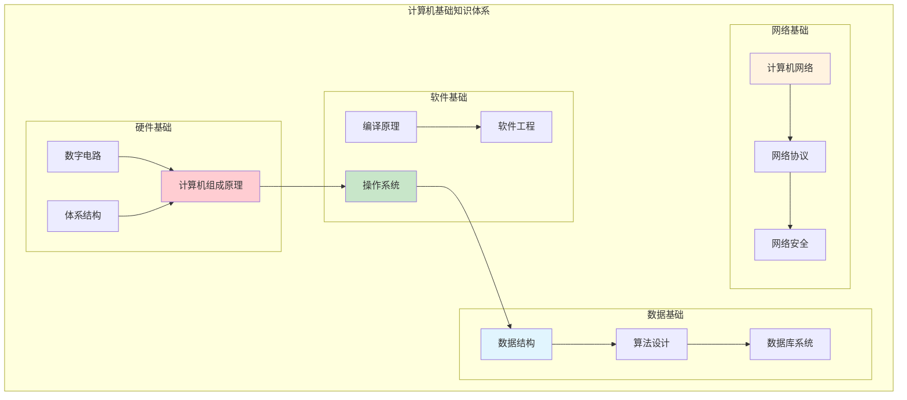
```mermaid
graph TB
    subgraph "计算机基础知识体系"
        subgraph "硬件基础"
            H1["计算机组成原理"]
            H2["数字电路"]
            H3["体系结构"]
        end
        
        subgraph "软件基础"
            S1["操作系统"]
            S2["编译原理"]
            S3["软件工程"]
        end
        
        subgraph "数据基础"
            D1["数据结构"]
            D2["算法设计"]
            D3["数据库系统"]
        end
        
        subgraph "网络基础"
            N1["计算机网络"]
            N2["网络协议"]
            N3["网络安全"]
        end
    end
    
    H1 --> S1
    H2 --> H1
    H3 --> H1
    S1 --> D1
    S2 --> S3
    D1 --> D2
    D2 --> D3
    N1 --> N2
    N2 --> N3
    
    style H1 fill:#ffcdd2
    style S1 fill:#c8e6c9
    style D1 fill:#e1f5fe
    style N1 fill:#fff3e0
```

## 计算机系统组成

### 硬件系统

**冯·诺依曼架构** 是现代计算机的基础架构模型。

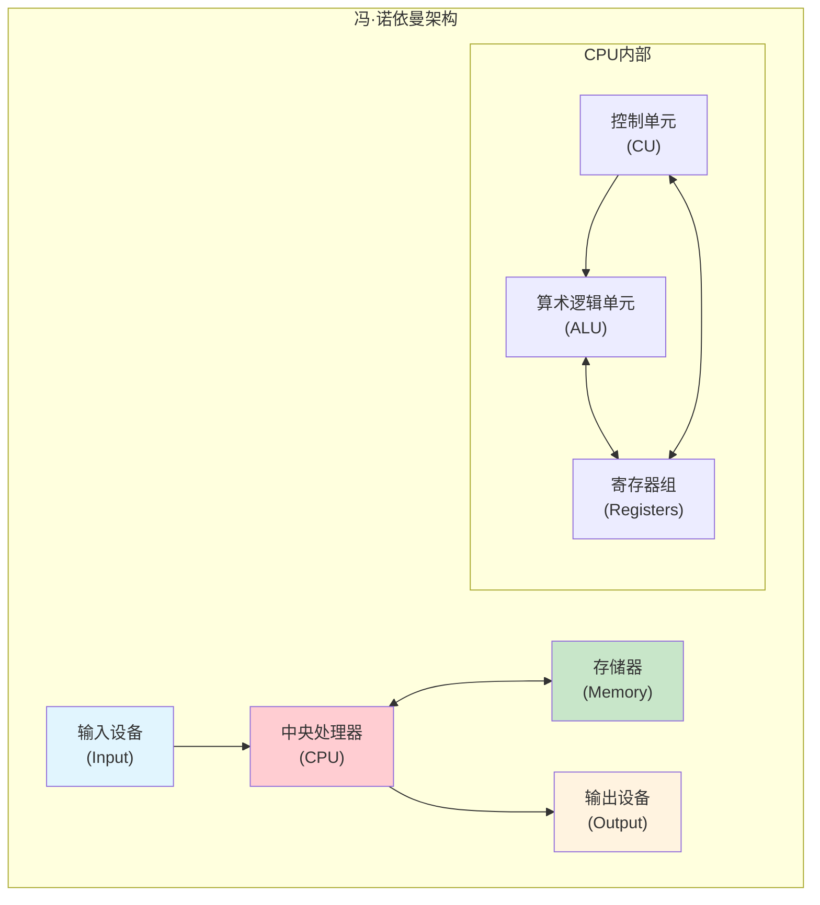
```mermaid
graph TB
    subgraph "冯·诺依曼架构"
        CPU["中央处理器<br/>(CPU)"]
        MEM["存储器<br/>(Memory)"]
        INPUT["输入设备<br/>(Input)"]
        OUTPUT["输出设备<br/>(Output)"]
        
        subgraph "CPU内部"
            ALU["算术逻辑单元<br/>(ALU)"]
            CU["控制单元<br/>(CU)"]
            REG["寄存器组<br/>(Registers)"]
        end
    end
    
    CPU <--> MEM
    INPUT --> CPU
    CPU --> OUTPUT
    ALU <--> REG
    CU <--> REG
    CU --> ALU
    
    style CPU fill:#ffcdd2
    style MEM fill:#c8e6c9
    style INPUT fill:#e1f5fe
    style OUTPUT fill:#fff3e0
```

**主要组件功能**：

| 组件 | 功能 | 特点 |
|------|------|------|
| **CPU** | 指令执行、运算控制 | 处理速度快，成本高 |
| **内存** | 程序和数据存储 | 易失性，访问速度快 |
| **存储器** | 永久数据存储 | 非易失性，容量大 |
| **输入设备** | 数据输入 | 键盘、鼠标、传感器等 |
| **输出设备** | 结果输出 | 显示器、打印机、扬声器等 |

**CPU工作原理**：

CPU采用**指令流水线**技术，将指令执行分为多个阶段：

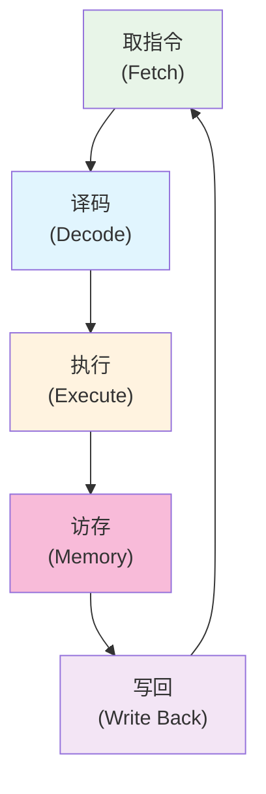
```mermaid
flowchart TD
    A["取指令<br/>(Fetch)"] --> B["译码<br/>(Decode)"]
    B --> C["执行<br/>(Execute)"]
    C --> D["访存<br/>(Memory)"]
    D --> E["写回<br/>(Write Back)"]
    E --> A
    
    style A fill:#e8f5e8
    style B fill:#e1f5fe
    style C fill:#fff3e0
    style D fill:#f8bbd9
    style E fill:#f3e5f5
```

**详细执行过程**：

1. **取指令(IF - Instruction Fetch)**：
   - 程序计数器(PC)指向下一条指令地址
   - CPU从内存中读取指令到指令寄存器(IR)
   - PC自动递增指向下一条指令

2. **指令译码(ID - Instruction Decode)**：
   - 控制单元解析指令格式
   - 确定操作类型和操作数
   - 生成控制信号

3. **执行(EX - Execute)**：
   - 算术逻辑单元(ALU)执行运算
   - 地址计算和条件判断
   - 分支预测和跳转处理

4. **访存(MEM - Memory Access)**：
   - 读取或写入内存数据
   - Cache命中检查
   - 内存地址转换

5. **写回(WB - Write Back)**：
   - 将结果写入目标寄存器
   - 更新状态标志位
   - 准备下一条指令

**CPU内部结构详解**：

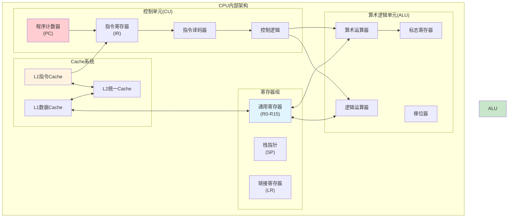
```mermaid
graph TB
    subgraph "CPU内部架构"
        subgraph "控制单元(CU)"
            PC["程序计数器<br/>(PC)"]
            IR["指令寄存器<br/>(IR)"]
            DECODER["指令译码器"]
            CTRL["控制逻辑"]
        end
        
        subgraph "算术逻辑单元(ALU)"
            ARITH["算术运算器"]
            LOGIC["逻辑运算器"]
            SHIFTER["移位器"]
            FLAGS["标志寄存器"]
        end
        
        subgraph "寄存器组"
            GPR["通用寄存器<br/>(R0-R15)"]
            SP["栈指针<br/>(SP)"]
            LR["链接寄存器<br/>(LR)"]
        end
        
        subgraph "Cache系统"
            L1I["L1指令Cache"]
            L1D["L1数据Cache"]
            L2["L2统一Cache"]
        end
    end
    
    PC --> IR
    IR --> DECODER
    DECODER --> CTRL
    CTRL --> ARITH
    CTRL --> LOGIC
    ARITH --> FLAGS
    GPR <--> ARITH
    GPR <--> LOGIC
    L1I --> IR
    L1D <--> GPR
    L1I <--> L2
    L1D <--> L2
    
    style PC fill:#ffcdd2
    style ALU fill:#c8e6c9
    style GPR fill:#e1f5fe
    style L1I fill:#fff3e0
```

**流水线技术**：

现代CPU使用**超标量流水线**，可以同时执行多条指令：


```mermaid
gantt
    title CPU流水线执行时序
    dateFormat X
    axisFormat %s
    
    section 指令1
    取指令    :i1f, 0, 1
    译码      :i1d, 1, 1
    执行      :i1e, 2, 1
    访存      :i1m, 3, 1
    写回      :i1w, 4, 1
    
    section 指令2
    取指令    :i2f, 1, 1
    译码      :i2d, 2, 1
    执行      :i2e, 3, 1
    访存      :i2m, 4, 1
    写回      :i2w, 5, 1
    
    section 指令3
    取指令    :i3f, 2, 1
    译码      :i3d, 3, 1
    执行      :i3e, 4, 1
    访存      :i3m, 5, 1
    写回      :i3w, 6, 1
```

**分支预测机制**：

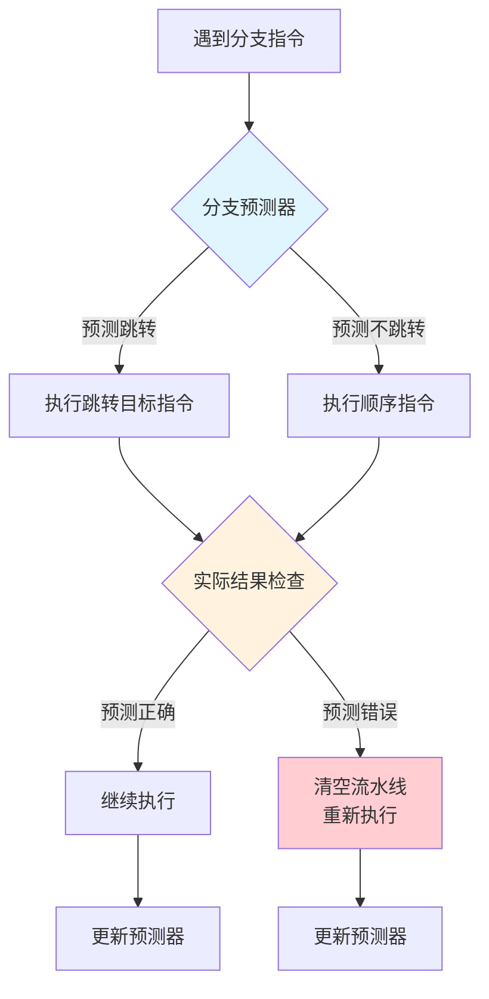
```mermaid
flowchart TD
    A["遇到分支指令"] --> B{"分支预测器"}
    B -->|预测跳转| C["执行跳转目标指令"]
    B -->|预测不跳转| D["执行顺序指令"]
    C --> E{"实际结果检查"}
    D --> E
    E -->|预测正确| F["继续执行"]
    E -->|预测错误| G["清空流水线<br/>重新执行"]
    G --> H["更新预测器"]
    F --> I["更新预测器"]
    
    style B fill:#e1f5fe
    style E fill:#fff3e0
    style G fill:#ffcdd2
```

**CPU性能优化技术**：

| 技术 | 原理 | 效果 |
|------|------|------|
| **流水线** | 指令重叠执行 | 提高吞吐量 |
| **超标量** | 多发射执行单元 | 并行执行多条指令 |
| **乱序执行** | 指令重排序执行 | 减少流水线停顿 |
| **分支预测** | 预测分支方向 | 减少分支延迟 |
| **寄存器重命名** | 消除数据依赖 | 提高并行度 |

### 软件系统

**软件分类**：

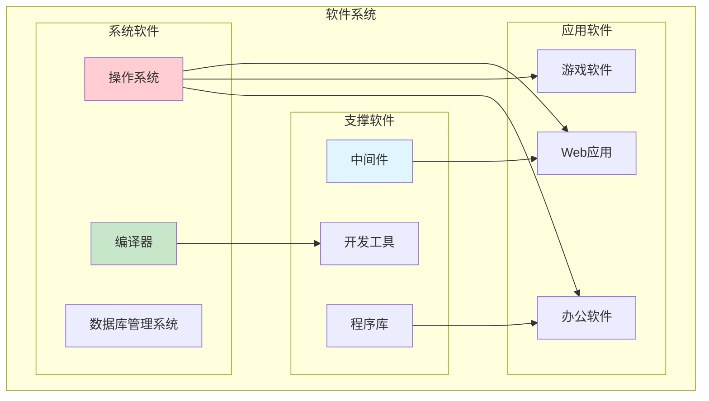
```mermaid
graph TB
    subgraph "软件系统"
        subgraph "系统软件"
            OS["操作系统"]
            COMPILER["编译器"]
            DB["数据库管理系统"]
        end
        
        subgraph "应用软件"
            OFFICE["办公软件"]
            GAME["游戏软件"]
            WEB["Web应用"]
        end
        
        subgraph "支撑软件"
            MW["中间件"]
            TOOL["开发工具"]
            LIB["程序库"]
        end
    end
    
    OS --> OFFICE
    OS --> GAME
    OS --> WEB
    COMPILER --> TOOL
    MW --> WEB
    LIB --> OFFICE
    
    style OS fill:#ffcdd2
    style COMPILER fill:#c8e6c9
    style MW fill:#e1f5fe
```

### 系统架构

**计算机系统层次结构**：

| 层次 | 组成 | 功能 |
|------|------|------|
| **应用层** | 用户程序、应用软件 | 解决具体问题 |
| **系统调用层** | 系统调用接口 | 提供系统服务 |
| **操作系统层** | 内核、驱动程序 | 资源管理和调度 |
| **指令集层** | 机器指令集 | 硬件抽象接口 |
| **硬件层** | CPU、内存、IO设备 | 物理计算资源 |

## 数据表示与存储

### 数制转换

**常用数制系统**：

| 数制 | 基数 | 数字符号 | 应用场景 |
|------|------|----------|----------|
| **二进制** | 2 | 0, 1 | 计算机内部表示 |
| **八进制** | 8 | 0-7 | Unix文件权限 |
| **十进制** | 10 | 0-9 | 日常计算 |
| **十六进制** | 16 | 0-9, A-F | 内存地址、颜色值 |

**转换方法**：

1. **十进制转二进制**（除2取余法）：
   - 125₁₀ = 1111101₂

2. **二进制转十进制**（按权展开）：
   - 1111101₂ = 1×2⁶ + 1×2⁵ + 1×2⁴ + 1×2³ + 1×2² + 0×2¹ + 1×2⁰ = 125₁₀

3. **二进制与十六进制转换**：
   - 每4位二进制对应1位十六进制
   - 1111101₂ = 7D₁₆

### 数据编码

**整数表示**：

| 表示方法 | 特点 | 范围（8位） |
|----------|------|-------------|
| **原码** | 符号位+数值位 | -127 ~ +127 |
| **反码** | 负数为原码取反 | -127 ~ +127 |
| **补码** | 负数为反码+1 | -128 ~ +127 |

**浮点数表示**（IEEE 754标准）：

```
单精度（32位）：符号位(1) + 指数位(8) + 尾数位(23)
双精度（64位）：符号位(1) + 指数位(11) + 尾数位(52)
```

**字符编码**：

| 编码 | 字符集 | 字节数 | 特点 |
|------|--------|--------|------|
| **ASCII** | 英文字符 | 1 | 基础字符集 |
| **GBK** | 中文字符 | 1-2 | 中文扩展 |
| **UTF-8** | Unicode | 1-4 | 国际标准，变长编码 |
| **UTF-16** | Unicode | 2-4 | 定长编码 |

### 存储层次

**存储器层次结构**：

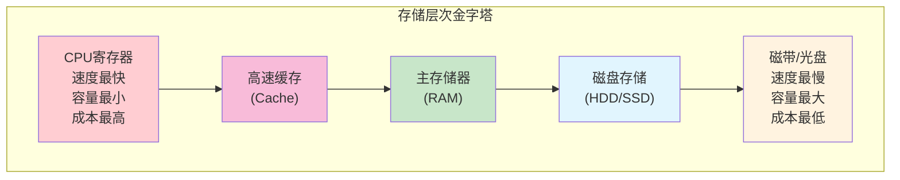
```mermaid
graph TB
    subgraph "存储层次金字塔"
        CPU_REG["CPU寄存器<br/>速度最快<br/>容量最小<br/>成本最高"]
        CACHE["高速缓存<br/>(Cache)"]
        MAIN_MEM["主存储器<br/>(RAM)"]
        DISK["磁盘存储<br/>(HDD/SSD)"]
        TAPE["磁带/光盘<br/>速度最慢<br/>容量最大<br/>成本最低"]
    end
    
    CPU_REG --> CACHE
    CACHE --> MAIN_MEM
    MAIN_MEM --> DISK
    DISK --> TAPE
    
    style CPU_REG fill:#ffcdd2
    style CACHE fill:#f8bbd9
    style MAIN_MEM fill:#c8e6c9
    style DISK fill:#e1f5fe
    style TAPE fill:#fff3e0
```

**内存工作原理详解**：

**内存结构组成**：

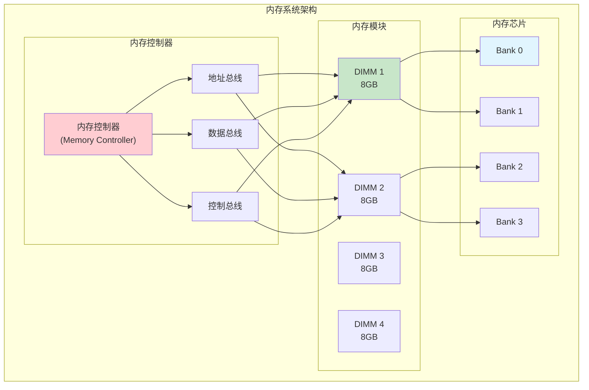
```mermaid
graph TB
    subgraph "内存系统架构"
        subgraph "内存控制器"
            MC["内存控制器<br/>(Memory Controller)"]
            ADDR_BUS["地址总线"]
            DATA_BUS["数据总线"]
            CTRL_BUS["控制总线"]
        end
        
        subgraph "内存模块"
            DIMM1["DIMM 1<br/>8GB"]
            DIMM2["DIMM 2<br/>8GB"]
            DIMM3["DIMM 3<br/>8GB"]
            DIMM4["DIMM 4<br/>8GB"]
        end
        
        subgraph "内存芯片"
            BANK0["Bank 0"]
            BANK1["Bank 1"]
            BANK2["Bank 2"]
            BANK3["Bank 3"]
        end
    end
    
    MC --> ADDR_BUS
    MC --> DATA_BUS
    MC --> CTRL_BUS
    
    ADDR_BUS --> DIMM1
    ADDR_BUS --> DIMM2
    DATA_BUS --> DIMM1
    DATA_BUS --> DIMM2
    CTRL_BUS --> DIMM1
    CTRL_BUS --> DIMM2
    
    DIMM1 --> BANK0
    DIMM1 --> BANK1
    DIMM2 --> BANK2
    DIMM2 --> BANK3
    
    style MC fill:#ffcdd2
    style DIMM1 fill:#c8e6c9
    style BANK0 fill:#e1f5fe
```

**DRAM工作原理**：

DRAM(动态随机访问存储器)使用电容存储数据：

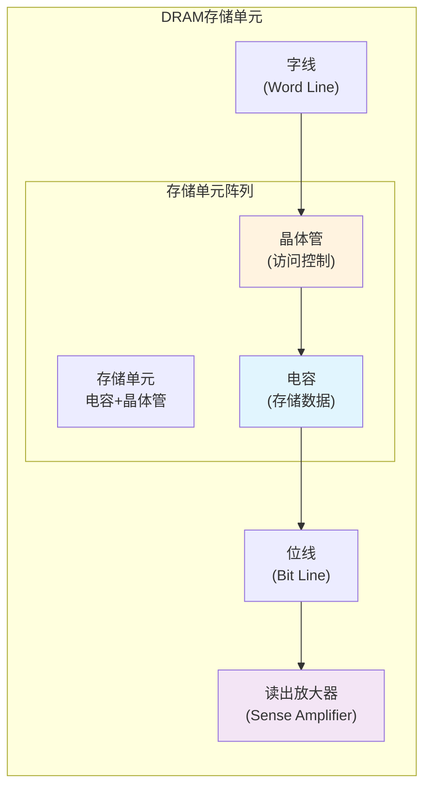
```mermaid
graph LR
    subgraph "DRAM存储单元"
        subgraph "存储单元阵列"
            CELL["存储单元<br/>电容+晶体管"]
            CAP["电容<br/>(存储数据)"]
            TRANS["晶体管<br/>(访问控制)"]
        end
        
        WL["字线<br/>(Word Line)"]
        BL["位线<br/>(Bit Line)"]
        SA["读出放大器<br/>(Sense Amplifier)"]
    end
    
    WL --> TRANS
    TRANS --> CAP
    CAP --> BL
    BL --> SA
    
    style CAP fill:#e1f5fe
    style TRANS fill:#fff3e0
    style SA fill:#f3e5f5
```

**内存访问过程**：

1. **地址解码**：
   - 行地址选通(RAS)
   - 列地址选通(CAS)
   - 定位具体存储单元

2. **数据读取**：
   - 激活字线打开晶体管
   - 电容电荷流向位线
   - 读出放大器检测电压变化
   - 输出数据到数据总线

3. **数据写入**：
   - 通过位线向电容充电或放电
   - 关闭字线保存数据

4. **刷新操作**：
   - 定期刷新电容电荷
   - 防止数据丢失

**内存时序图**：

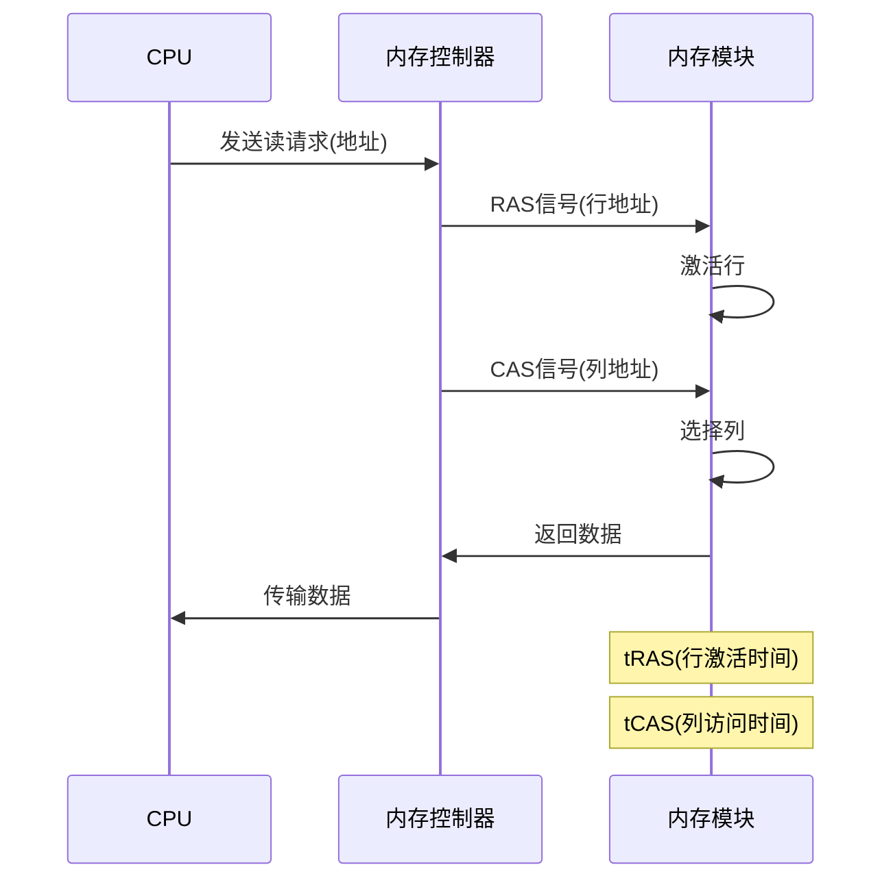
```mermaid
sequenceDiagram
    participant CPU
    participant MC as 内存控制器
    participant MEM as 内存模块
    
    CPU->>MC: 发送读请求(地址)
    MC->>MEM: RAS信号(行地址)
    MEM->>MEM: 激活行
    MC->>MEM: CAS信号(列地址)
    MEM->>MEM: 选择列
    MEM->>MC: 返回数据
    MC->>CPU: 传输数据
    
    Note over MEM: tRAS(行激活时间)
    Note over MEM: tCAS(列访问时间)
```

**存储器工作原理详解**：

**硬盘驱动器(HDD)结构**：

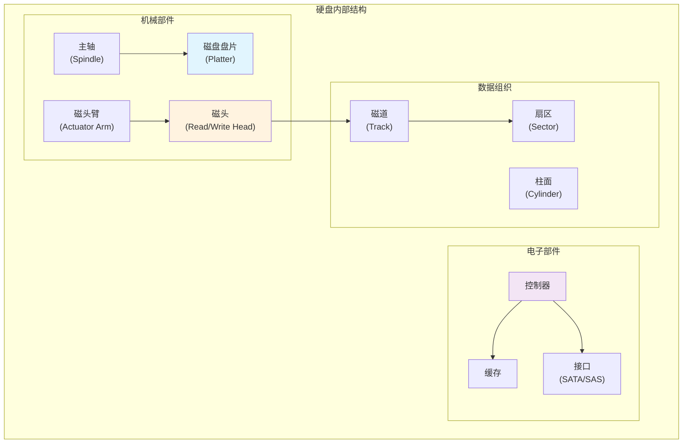
```mermaid
graph TB
    subgraph "硬盘内部结构"
        subgraph "机械部件"
            PLATTER["磁盘盘片<br/>(Platter)"]
            SPINDLE["主轴<br/>(Spindle)"]
            HEAD["磁头<br/>(Read/Write Head)"]
            ARM["磁头臂<br/>(Actuator Arm)"]
        end
        
        subgraph "电子部件"
            CONTROLLER["控制器"]
            BUFFER["缓存"]
            INTERFACE["接口<br/>(SATA/SAS)"]
        end
        
        subgraph "数据组织"
            TRACK["磁道<br/>(Track)"]
            SECTOR["扇区<br/>(Sector)"]
            CYLINDER["柱面<br/>(Cylinder)"]
        end
    end
    
    SPINDLE --> PLATTER
    ARM --> HEAD
    HEAD --> TRACK
    TRACK --> SECTOR
    CONTROLLER --> BUFFER
    CONTROLLER --> INTERFACE
    
    style PLATTER fill:#e1f5fe
    style HEAD fill:#fff3e0
    style CONTROLLER fill:#f3e5f5
```

**硬盘数据访问过程**：

1. **寻道(Seek)**：
   - 磁头臂移动到目标磁道
   - 寻道时间：1-15ms

2. **旋转延迟(Rotational Latency)**：
   - 等待目标扇区旋转到磁头下
   - 平均延迟：转速的一半时间

3. **数据传输(Transfer)**：
   - 磁头读写数据
   - 传输速率：100-200MB/s

**固态硬盘(SSD)工作原理**：

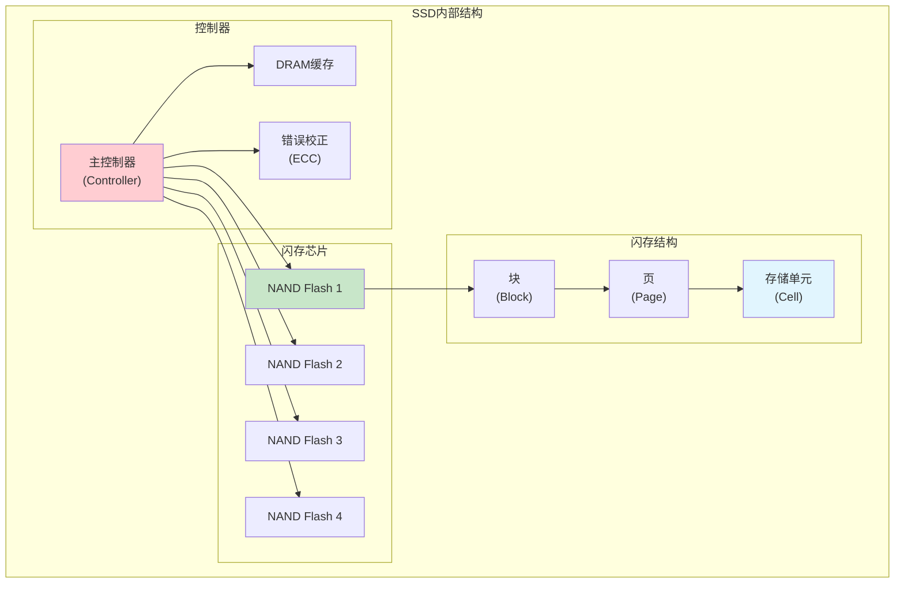
```mermaid
graph TB
    subgraph "SSD内部结构"
        subgraph "控制器"
            CTRL["主控制器<br/>(Controller)"]
            CACHE["DRAM缓存"]
            ECC["错误校正<br/>(ECC)"]
        end
        
        subgraph "闪存芯片"
            NAND1["NAND Flash 1"]
            NAND2["NAND Flash 2"]
            NAND3["NAND Flash 3"]
            NAND4["NAND Flash 4"]
        end
        
        subgraph "闪存结构"
            BLOCK["块<br/>(Block)"]
            PAGE["页<br/>(Page)"]
            CELL["存储单元<br/>(Cell)"]
        end
    end
    
    CTRL --> CACHE
    CTRL --> ECC
    CTRL --> NAND1
    CTRL --> NAND2
    CTRL --> NAND3
    CTRL --> NAND4
    
    NAND1 --> BLOCK
    BLOCK --> PAGE
    PAGE --> CELL
    
    style CTRL fill:#ffcdd2
    style NAND1 fill:#c8e6c9
    style CELL fill:#e1f5fe
```

**NAND Flash存储原理**：

1. **存储单元类型**：
   - **SLC**(单层单元)：1位/单元，速度快，寿命长
   - **MLC**(多层单元)：2位/单元，容量大，成本低
   - **TLC**(三层单元)：3位/单元，容量更大
   - **QLC**(四层单元)：4位/单元，最大容量

2. **数据操作**：
   - **读取**：按页读取(4KB-16KB)
   - **写入**：按页写入，需要先擦除
   - **擦除**：按块擦除(128KB-2MB)

3. **磨损均衡**：
   - 分散写入操作到不同块
   - 延长SSD使用寿命

**Cache工作原理**：

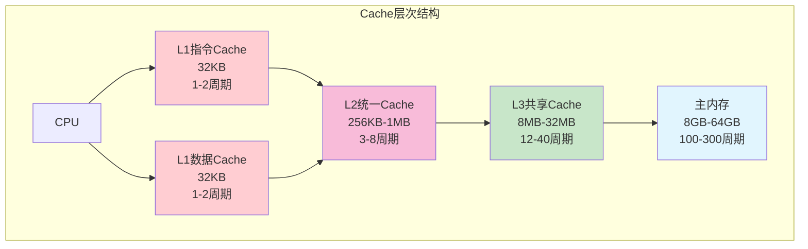
```mermaid
graph TB
    subgraph "Cache层次结构"
        CPU --> L1I["L1指令Cache<br/>32KB<br/>1-2周期"]
        CPU --> L1D["L1数据Cache<br/>32KB<br/>1-2周期"]
        L1I --> L2["L2统一Cache<br/>256KB-1MB<br/>3-8周期"]
        L1D --> L2
        L2 --> L3["L3共享Cache<br/>8MB-32MB<br/>12-40周期"]
        L3 --> MEM["主内存<br/>8GB-64GB<br/>100-300周期"]
    end
    
    style L1I fill:#ffcdd2
    style L1D fill:#ffcdd2
    style L2 fill:#f8bbd9
    style L3 fill:#c8e6c9
    style MEM fill:#e1f5fe
```

**Cache映射方式**：

| 映射方式 | 特点 | 优缺点 |
|----------|------|--------|
| **直接映射** | 每个内存块只能映射到固定Cache行 | 硬件简单，但冲突多 |
| **全相联映射** | 内存块可映射到任意Cache行 | 灵活性高，但硬件复杂 |
| **组相联映射** | 直接映射和全相联的折中 | 平衡性能和复杂度 |

**Cache替换算法**：

- **LRU**(最近最少使用)：替换最久未使用的块
- **FIFO**(先进先出)：替换最早进入的块
- **Random**(随机)：随机选择替换块

**存储特性对比**：

| 存储类型 | 访问时间 | 容量 | 成本 | 易失性 | 工作原理 |
|----------|----------|------|------|--------|----------|
| **寄存器** | < 1ns | 32-64个 | 极高 | 易失 | 触发器电路 |
| **L1 Cache** | 1-2ns | 32-64KB | 极高 | 易失 | SRAM |
| **L2 Cache** | 3-8ns | 256KB-1MB | 高 | 易失 | SRAM |
| **L3 Cache** | 12-40ns | 8-32MB | 高 | 易失 | SRAM |
| **主存** | 100-300ns | 8-64GB | 中 | 易失 | DRAM |
| **SSD** | 0.1-1ms | 256GB-8TB | 中低 | 非易失 | NAND Flash |
| **HDD** | 5-15ms | 1-20TB | 低 | 非易失 | 磁性存储 |

**存储系统性能优化**：

1. **局部性原理**：
   - **时间局部性**：最近访问的数据很可能再次被访问
   - **空间局部性**：相邻的数据很可能被连续访问

2. **预取技术**：
   - 硬件预取：CPU自动预取相邻数据
   - 软件预取：编译器插入预取指令

3. **写策略**：
   - **写直达**：同时写Cache和内存
   - **写回**：只写Cache，替换时写回内存

4. **内存优化技术**：
   - **双通道/四通道**：并行访问多个内存模块
   - **内存交错**：将连续地址分布到不同模块
   - **ECC内存**：错误检测和纠正

## 操作系统原理

### 进程管理

**进程状态转换**：

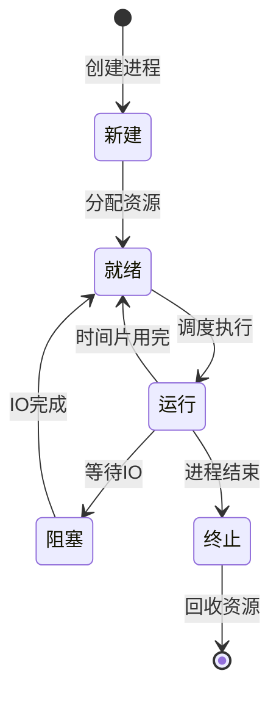
```mermaid
stateDiagram-v2
    [*] --> 新建: 创建进程
    新建 --> 就绪: 分配资源
    就绪 --> 运行: 调度执行
    运行 --> 就绪: 时间片用完
    运行 --> 阻塞: 等待IO
    阻塞 --> 就绪: IO完成
    运行 --> 终止: 进程结束
    终止 --> [*]: 回收资源
```

**进程调度算法**：

| 算法 | 特点 | 优缺点 |
|------|------|--------|
| **先来先服务(FCFS)** | 按到达顺序执行 | 简单，但平均等待时间长 |
| **短作业优先(SJF)** | 执行时间短的优先 | 平均等待时间短，但可能饿死 |
| **时间片轮转(RR)** | 固定时间片轮流执行 | 响应时间好，开销大 |
| **优先级调度** | 按优先级执行 | 灵活，但可能饿死 |
| **多级反馈队列** | 多个优先级队列 | 综合性能好，复杂 |

**进程同步机制**：

1. **信号量（Semaphore）**：
   - P操作：申请资源
   - V操作：释放资源

2. **互斥锁（Mutex）**：
   - 保证临界区互斥访问

3. **条件变量（Condition Variable）**：
   - 线程间条件同步

### 内存管理

**内存分配策略**：

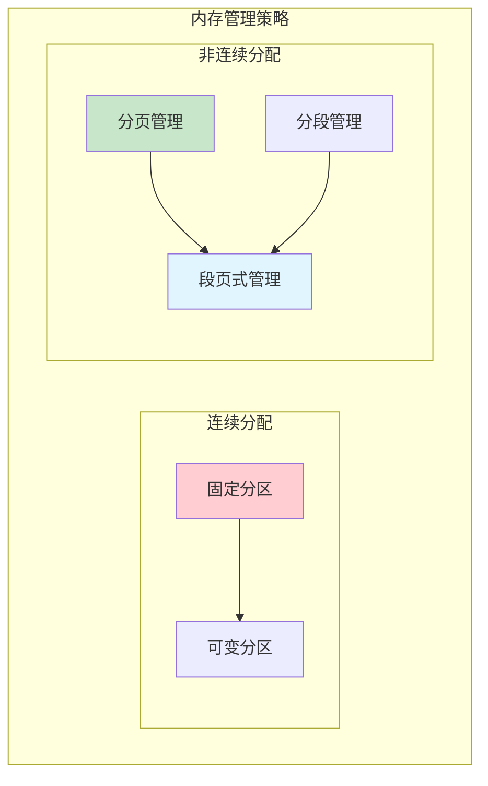
```mermaid
graph TB
    subgraph "内存管理策略"
        subgraph "连续分配"
            FA["固定分区"]
            VA["可变分区"]
        end
        
        subgraph "非连续分配"
            PAGE["分页管理"]
            SEG["分段管理"]
            SEGPAGE["段页式管理"]
        end
    end
    
    FA --> VA
    PAGE --> SEGPAGE
    SEG --> SEGPAGE
    
    style FA fill:#ffcdd2
    style PAGE fill:#c8e6c9
    style SEGPAGE fill:#e1f5fe
```

**虚拟内存机制**：

| 概念 | 描述 | 优势 |
|------|------|------|
| **虚拟地址** | 程序使用的逻辑地址 | 地址空间独立 |
| **物理地址** | 内存的实际地址 | 硬件直接访问 |
| **页面置换** | 内存不足时的页面替换 | 提高内存利用率 |
| **缺页中断** | 访问不在内存的页面 | 按需加载 |

**页面置换算法**：

- **FIFO**: 先进先出
- **LRU**: 最近最少使用
- **LFU**: 最不经常使用
- **Clock**: 时钟算法

### 文件系统

**文件系统结构**：

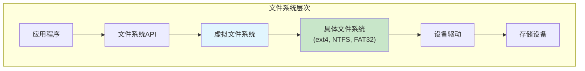
```mermaid
graph TB
    subgraph "文件系统层次"
        APP["应用程序"]
        API["文件系统API"]
        VFS["虚拟文件系统"]
        FS["具体文件系统<br/>(ext4, NTFS, FAT32)"]
        DRIVER["设备驱动"]
        DEVICE["存储设备"]
    end
    
    APP --> API
    API --> VFS
    VFS --> FS
    FS --> DRIVER
    DRIVER --> DEVICE
    
    style VFS fill:#e1f5fe
    style FS fill:#c8e6c9
```

**文件分配方式**：

| 方式 | 特点 | 优缺点 |
|------|------|--------|
| **连续分配** | 文件占用连续磁盘块 | 访问快，但碎片多 |
| **链式分配** | 通过指针链接磁盘块 | 无碎片，但访问慢 |
| **索引分配** | 使用索引块记录位置 | 随机访问快，空间开销大 |

### IO管理

**IO控制方式**：

1. **程序直接控制**：
   - CPU直接控制IO设备
   - 效率低，CPU利用率差

2. **中断驱动**：
   - IO完成时产生中断
   - 提高CPU利用率

3. **DMA方式**：
   - 直接内存访问
   - 减少CPU干预

4. **通道控制**：
   - 专用IO处理器
   - 最高效的方式

## 网络基础

### 网络模型

**OSI七层模型**：

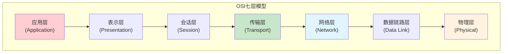
```mermaid
graph TB
    subgraph "OSI七层模型"
        L7["应用层<br/>(Application)"]
        L6["表示层<br/>(Presentation)"]
        L5["会话层<br/>(Session)"]
        L4["传输层<br/>(Transport)"]
        L3["网络层<br/>(Network)"]
        L2["数据链路层<br/>(Data Link)"]
        L1["物理层<br/>(Physical)"]
    end
    
    L7 --> L6
    L6 --> L5
    L5 --> L4
    L4 --> L3
    L3 --> L2
    L2 --> L1
    
    style L7 fill:#ffcdd2
    style L4 fill:#c8e6c9
    style L3 fill:#e1f5fe
    style L1 fill:#fff3e0
```

**TCP/IP四层模型**：

| OSI层 | TCP/IP层 | 功能 | 协议示例 |
|-------|----------|------|----------|
| 应用层、表示层、会话层 | **应用层** | 网络应用 | HTTP, FTP, SMTP |
| 传输层 | **传输层** | 端到端通信 | TCP, UDP |
| 网络层 | **网络层** | 路由选择 | IP, ICMP |
| 数据链路层、物理层 | **网络接口层** | 物理传输 | Ethernet, WiFi |

### TCP/IP协议

**TCP协议特点**：

- **面向连接**: 通信前建立连接
- **可靠传输**: 保证数据完整性
- **流量控制**: 防止发送方过快
- **拥塞控制**: 避免网络拥塞

**TCP三次握手**：

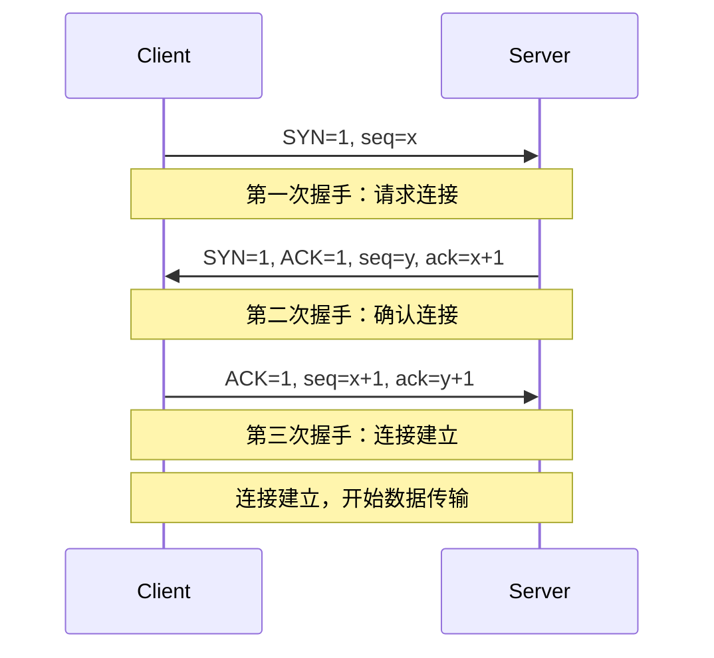
```mermaid
sequenceDiagram
    participant C as Client
    participant S as Server
    
    C->>S: SYN=1, seq=x
    Note over C,S: 第一次握手：请求连接
    
    S->>C: SYN=1, ACK=1, seq=y, ack=x+1
    Note over C,S: 第二次握手：确认连接
    
    C->>S: ACK=1, seq=x+1, ack=y+1
    Note over C,S: 第三次握手：连接建立
    
    Note over C,S: 连接建立，开始数据传输
```

**TCP四次挥手**：

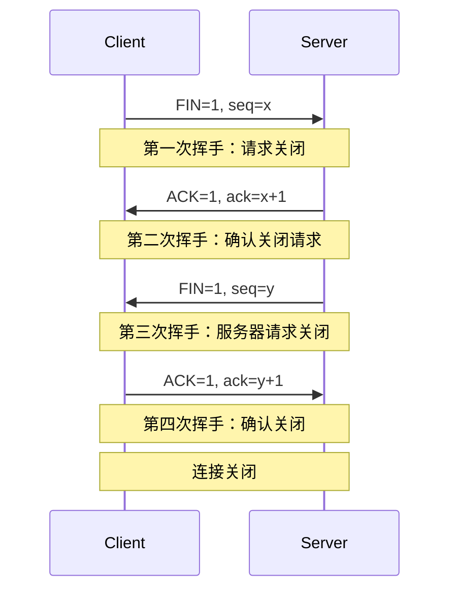
```mermaid
sequenceDiagram
    participant C as Client
    participant S as Server
    
    C->>S: FIN=1, seq=x
    Note over C,S: 第一次挥手：请求关闭
    
    S->>C: ACK=1, ack=x+1
    Note over C,S: 第二次挥手：确认关闭请求
    
    S->>C: FIN=1, seq=y
    Note over C,S: 第三次挥手：服务器请求关闭
    
    C->>S: ACK=1, ack=y+1
    Note over C,S: 第四次挥手：确认关闭
    
    Note over C,S: 连接关闭
```

**UDP协议特点**：

- **无连接**: 直接发送数据
- **不可靠**: 不保证数据到达
- **开销小**: 头部信息少
- **速度快**: 无需建立连接

### 网络安全

**网络安全威胁**：

| 威胁类型 | 描述 | 防护措施 |
|----------|------|----------|
| **窃听** | 非法获取数据 | 加密传输 |
| **篡改** | 修改传输数据 | 数字签名 |
| **伪造** | 冒充合法用户 | 身份认证 |
| **拒绝服务** | 使服务不可用 | 流量控制 |

**加密技术**：

1. **对称加密**：
   - 加密解密使用相同密钥
   - 速度快，密钥分发困难
   - 算法：AES, DES

2. **非对称加密**：
   - 使用公钥私钥对
   - 安全性高，速度慢
   - 算法：RSA, ECC

3. **哈希函数**：
   - 生成数据摘要
   - 验证数据完整性
   - 算法：MD5, SHA-256

## 数据库基础

### 关系模型

**关系数据库概念**：

- **关系（表）**: 数据的集合
- **元组（行）**: 表中的一条记录
- **属性（列）**: 表中的一个字段
- **域**: 属性的取值范围
- **主键**: 唯一标识元组的属性
- **外键**: 引用其他表主键的属性

**关系代数操作**：

| 操作 | 符号 | 描述 |
|------|------|------|
| **选择** | σ | 选择满足条件的元组 |
| **投影** | π | 选择指定的属性列 |
| **连接** | ⋈ | 连接两个关系 |
| **并** | ∪ | 两个关系的并集 |
| **差** | - | 两个关系的差集 |
| **笛卡尔积** | × | 两个关系的笛卡尔积 |

### SQL语言

**SQL语句分类**：

| 类型 | 全称 | 功能 | 示例 |
|------|------|------|------|
| **DDL** | 数据定义语言 | 定义数据库结构 | CREATE, ALTER, DROP |
| **DML** | 数据操作语言 | 操作数据 | INSERT, UPDATE, DELETE |
| **DQL** | 数据查询语言 | 查询数据 | SELECT |
| **DCL** | 数据控制语言 | 控制访问权限 | GRANT, REVOKE |

**常用SQL操作**：

```sql
-- 创建表
CREATE TABLE users (
    id INT PRIMARY KEY AUTO_INCREMENT,
    name VARCHAR(50) NOT NULL,
    email VARCHAR(100) UNIQUE,
    created_at TIMESTAMP DEFAULT CURRENT_TIMESTAMP
);

-- 插入数据
INSERT INTO users (name, email) VALUES ('张三', 'zhangsan@example.com');

-- 查询数据
SELECT * FROM users WHERE name LIKE '张%';

-- 更新数据
UPDATE users SET email = 'new@example.com' WHERE id = 1;

-- 删除数据
DELETE FROM users WHERE id = 1;
```

### 事务处理

**ACID特性**：

| 特性 | 英文 | 描述 |
|------|------|------|
| **原子性** | Atomicity | 事务要么全部成功，要么全部失败 |
| **一致性** | Consistency | 事务执行前后数据库状态一致 |
| **隔离性** | Isolation | 并发事务之间相互隔离 |
| **持久性** | Durability | 已提交事务的修改永久保存 |

**事务隔离级别**：

| 隔离级别 | 脏读 | 不可重复读 | 幻读 |
|----------|------|------------|------|
| **读未提交** | 可能 | 可能 | 可能 |
| **读已提交** | 不可能 | 可能 | 可能 |
| **可重复读** | 不可能 | 不可能 | 可能 |
| **串行化** | 不可能 | 不可能 | 不可能 |

### 索引优化

**索引类型**：

1. **B+树索引**：
   - 最常用的索引类型
   - 支持范围查询
   - 叶子节点存储数据

2. **哈希索引**：
   - 等值查询效率高
   - 不支持范围查询
   - 内存数据库常用

3. **位图索引**：
   - 适合低基数列
   - 空间效率高
   - 数据仓库常用

**索引优化原则**：

- **选择性高的列**: 建立索引
- **复合索引**: 多列组合索引
- **覆盖索引**: 索引包含查询所需所有列
- **避免过多索引**: 影响写入性能

## 编程基础

### 编程范式

**主要编程范式**：

| 范式 | 特点 | 代表语言 |
|------|------|----------|
| **面向过程** | 以函数为中心 | C, Pascal |
| **面向对象** | 以对象为中心 | Java, C++ |
| **函数式** | 以函数为一等公民 | Haskell, Lisp |
| **逻辑式** | 基于逻辑推理 | Prolog |

**面向对象特性**：

1. **封装**: 隐藏内部实现细节
2. **继承**: 子类继承父类特性
3. **多态**: 同一接口不同实现
4. **抽象**: 提取共同特征

### 数据结构

**线性数据结构**：

```mermaid
graph LR
    subgraph "线性结构"
        ARRAY["数组<br/>随机访问O(1)<br/>插入删除O(n)"]
        LIST["链表<br/>插入删除O(1)<br/>查找O(n)"]
        STACK["栈<br/>LIFO<br/>后进先出"]
        QUEUE["队列<br/>FIFO<br/>先进先出"]
    end
    
    style ARRAY fill:#ffcdd2
    style LIST fill:#c8e6c9
    style STACK fill:#e1f5fe
    style QUEUE fill:#fff3e0
```

**非线性数据结构**：

```mermaid
graph TB
    subgraph "非线性结构"
        TREE["树<br/>层次结构<br/>一对多关系"]
        GRAPH["图<br/>网状结构<br/>多对多关系"]
        HASH["哈希表<br/>键值映射<br/>O(1)访问"]
    end
    
    TREE --> BT["二叉树"]
    TREE --> BST["二叉搜索树"]
    TREE --> AVL["AVL树"]
    TREE --> RBT["红黑树"]
    
    GRAPH --> DG["有向图"]
    GRAPH --> UG["无向图"]
    
    style TREE fill:#e8f5e8
    style GRAPH fill:#e1f5fe
    style HASH fill:#fff3e0
```

### 算法分析

**时间复杂度**：

| 复杂度 | 名称 | 示例算法 |
|--------|------|----------|
| **O(1)** | 常数时间 | 数组访问 |
| **O(log n)** | 对数时间 | 二分查找 |
| **O(n)** | 线性时间 | 线性查找 |
| **O(n log n)** | 线性对数时间 | 快速排序 |
| **O(n²)** | 平方时间 | 冒泡排序 |
| **O(2ⁿ)** | 指数时间 | 递归斐波那契 |

**排序算法比较**：

| 算法 | 时间复杂度 | 空间复杂度 | 稳定性 |
|------|------------|------------|--------|
| **冒泡排序** | O(n²) | O(1) | 稳定 |
| **选择排序** | O(n²) | O(1) | 不稳定 |
| **插入排序** | O(n²) | O(1) | 稳定 |
| **快速排序** | O(n log n) | O(log n) | 不稳定 |
| **归并排序** | O(n log n) | O(n) | 稳定 |
| **堆排序** | O(n log n) | O(1) | 不稳定 |

### 设计模式

**创建型模式**：

- **单例模式**: 确保类只有一个实例
- **工厂模式**: 创建对象的接口
- **建造者模式**: 构建复杂对象
- **原型模式**: 通过复制创建对象

**结构型模式**：

- **适配器模式**: 接口适配
- **装饰器模式**: 动态添加功能
- **外观模式**: 简化复杂接口
- **代理模式**: 控制对象访问

**行为型模式**：

- **观察者模式**: 一对多依赖关系
- **策略模式**: 算法族封装
- **命令模式**: 请求封装为对象
- **状态模式**: 状态改变行为

## 软件工程

### 开发模型

**软件开发生命周期**：

```mermaid
graph LR
    A["需求分析"] --> B["系统设计"]
    B --> C["编码实现"]
    C --> D["测试验证"]
    D --> E["部署维护"]
    E --> A
    
    style A fill:#e8f5e8
    style B fill:#e1f5fe
    style C fill:#fff3e0
    style D fill:#f3e5f5
    style E fill:#ffcdd2
```

**开发模型对比**：

| 模型 | 特点 | 适用场景 |
|------|------|----------|
| **瀑布模型** | 线性顺序开发 | 需求明确稳定 |
| **螺旋模型** | 风险驱动迭代 | 大型复杂项目 |
| **敏捷开发** | 快速迭代交付 | 需求变化频繁 |
| **DevOps** | 开发运维一体化 | 持续集成部署 |

### 版本控制

**Git工作流程**：

```mermaid
graph LR
    WD["工作目录<br/>(Working Directory)"] -->|git add| SA["暂存区<br/>(Staging Area)"]
    SA -->|git commit| LR["本地仓库<br/>(Local Repository)"]
    LR -->|git push| RR["远程仓库<br/>(Remote Repository)"]
    RR -->|git pull| LR
    LR -->|git checkout| WD
    
    style WD fill:#e8f5e8
    style SA fill:#e1f5fe
    style LR fill:#fff3e0
    style RR fill:#f3e5f5
```

**分支策略**：

- **Git Flow**: 功能分支、开发分支、发布分支
- **GitHub Flow**: 简化的分支模型
- **GitLab Flow**: 环境分支模型

### 测试方法

**测试分类**：

| 分类维度 | 测试类型 | 描述 |
|----------|----------|------|
| **测试层次** | 单元测试 | 测试最小可测试单元 |
|  | 集成测试 | 测试模块间接口 |
|  | 系统测试 | 测试完整系统 |
|  | 验收测试 | 用户验收测试 |
| **测试方法** | 黑盒测试 | 不关注内部实现 |
|  | 白盒测试 | 基于代码结构 |
|  | 灰盒测试 | 结合黑盒白盒 |

**测试驱动开发(TDD)**：

1. **红**: 编写失败的测试
2. **绿**: 编写最少代码使测试通过
3. **重构**: 改进代码质量

### 项目管理

**项目管理要素**：

- **范围管理**: 定义项目边界
- **时间管理**: 制定项目进度
- **成本管理**: 控制项目预算
- **质量管理**: 确保交付质量
- **风险管理**: 识别和应对风险
- **沟通管理**: 信息有效传递

**敏捷项目管理**：

- **Scrum**: 迭代式增量开发
- **看板**: 可视化工作流程
- **极限编程**: 工程实践为核心

## 面试要点

### 1. 什么是冯·诺依曼架构？有什么特点？

**答案**：
冯·诺依曼架构是现代计算机的基础架构模型，由数学家冯·诺依曼提出。

**主要组成**：
- **中央处理器(CPU)**: 包含算术逻辑单元和控制单元
- **存储器**: 存储程序和数据
- **输入设备**: 数据输入
- **输出设备**: 结果输出

**核心特点**：
- **程序存储**: 程序和数据都存储在存储器中
- **程序控制**: 按程序指令顺序执行
- **二进制表示**: 指令和数据都用二进制表示
- **共享存储**: 程序和数据共享同一存储空间

### 2. 进程和线程的区别是什么？

**答案**：

| 对比项 | 进程 | 线程 |
|--------|------|------|
| **定义** | 程序执行的实例 | 进程内的执行单元 |
| **资源** | 拥有独立的地址空间 | 共享进程的地址空间 |
| **开销** | 创建和切换开销大 | 创建和切换开销小 |
| **通信** | 需要IPC机制 | 直接共享内存 |
| **稳定性** | 一个进程崩溃不影响其他进程 | 一个线程崩溃可能影响整个进程 |

**使用场景**：
- **多进程**: 需要高稳定性和安全性的场景
- **多线程**: 需要高效通信和资源共享的场景

### 3. 虚拟内存的作用是什么？

**答案**：
虚拟内存是操作系统提供的内存管理技术，为每个进程提供独立的地址空间。

**主要作用**：
- **地址空间扩展**: 提供比物理内存更大的地址空间
- **内存保护**: 进程间内存隔离，提高系统安全性
- **内存共享**: 多个进程可以共享同一物理内存
- **按需加载**: 只加载需要的页面到物理内存

**实现机制**：
- **分页机制**: 将虚拟地址空间分成固定大小的页面
- **页表**: 维护虚拟地址到物理地址的映射
- **页面置换**: 内存不足时将页面换出到磁盘

### 4. TCP和UDP的区别？

**答案**：

| 特性 | TCP | UDP |
|------|-----|-----|
| **连接性** | 面向连接 | 无连接 |
| **可靠性** | 可靠传输 | 不可靠传输 |
| **速度** | 相对较慢 | 速度快 |
| **开销** | 开销大 | 开销小 |
| **应用场景** | 文件传输、网页浏览 | 视频直播、DNS查询 |

**TCP特性**：
- 三次握手建立连接
- 四次挥手断开连接
- 流量控制和拥塞控制
- 数据重传和确认机制

**UDP特性**：
- 无需建立连接
- 不保证数据到达
- 支持广播和组播
- 实时性要求高的应用

### 5. 数据库事务的ACID特性是什么？

**答案**：
ACID是数据库事务必须满足的四个特性：

**原子性(Atomicity)**：
- 事务是不可分割的工作单位
- 要么全部成功，要么全部失败
- 通过回滚日志实现

**一致性(Consistency)**：
- 事务执行前后数据库状态一致
- 满足所有完整性约束
- 业务逻辑的正确性

**隔离性(Isolation)**：
- 并发事务之间相互隔离
- 通过锁机制和多版本控制实现
- 不同隔离级别提供不同保证

**持久性(Durability)**：
- 已提交事务的修改永久保存
- 即使系统故障也不会丢失
- 通过重做日志实现

### 6. 常见的排序算法有哪些？时间复杂度如何？

**答案**：

**简单排序算法**：
- **冒泡排序**: O(n²)，稳定，原地排序
- **选择排序**: O(n²)，不稳定，原地排序
- **插入排序**: O(n²)，稳定，原地排序

**高效排序算法**：
- **快速排序**: 平均O(n log n)，最坏O(n²)，不稳定
- **归并排序**: O(n log n)，稳定，需要O(n)额外空间
- **堆排序**: O(n log n)，不稳定，原地排序

**选择建议**：
- **数据量小**: 插入排序
- **数据量大**: 快速排序或归并排序
- **需要稳定性**: 归并排序
- **内存受限**: 堆排序

### 7. 什么是设计模式？常用的设计模式有哪些？

**答案**：
设计模式是软件设计中常见问题的典型解决方案，是代码设计经验的总结。

**常用设计模式**：

**创建型模式**：
- **单例模式**: 确保类只有一个实例
- **工厂模式**: 创建对象的统一接口
- **建造者模式**: 构建复杂对象的过程

**结构型模式**：
- **适配器模式**: 使不兼容的接口能够合作
- **装饰器模式**: 动态地给对象添加功能
- **代理模式**: 为其他对象提供代理以控制访问

**行为型模式**：
- **观察者模式**: 定义对象间一对多的依赖关系
- **策略模式**: 定义算法族并使它们可以互换
- **命令模式**: 将请求封装为对象

### 8. 什么是时间复杂度和空间复杂度？

**答案**：
复杂度是衡量算法效率的重要指标。

**时间复杂度**：
- 算法执行时间与输入规模的关系
- 用大O记号表示
- 关注最坏情况下的性能

**空间复杂度**：
- 算法执行过程中所需的存储空间
- 包括输入空间、辅助空间、输出空间
- 通常指辅助空间复杂度

**常见复杂度**：
- O(1) < O(log n) < O(n) < O(n log n) < O(n²) < O(2ⁿ)

**分析方法**：
- 找出基本操作
- 计算基本操作的执行次数
- 用大O记号表示增长趋势

### 9. 软件开发生命周期包括哪些阶段？

**答案**：
软件开发生命周期(SDLC)包括以下主要阶段：

**需求分析**：
- 收集和分析用户需求
- 编写需求规格说明书
- 确定系统功能和性能要求

**系统设计**：
- 概要设计：系统架构设计
- 详细设计：模块接口设计
- 数据库设计和界面设计

**编码实现**：
- 根据设计文档编写代码
- 遵循编码规范
- 进行代码审查

**测试验证**：
- 单元测试、集成测试
- 系统测试、验收测试
- 缺陷修复和回归测试

**部署维护**：
- 系统部署和上线
- 用户培训和技术支持
- 系统维护和升级

### 10. 什么是敏捷开发？有什么特点？

**答案**：
敏捷开发是一种以人为核心、迭代、循序渐进的软件开发方法。

**核心价值观**：
- **个体和互动** 胜过流程和工具
- **工作的软件** 胜过详尽的文档
- **客户合作** 胜过合同谈判
- **响应变化** 胜过遵循计划

**主要特点**：
- **迭代开发**: 短周期迭代交付
- **客户参与**: 客户全程参与开发
- **拥抱变化**: 快速响应需求变化
- **团队协作**: 强调团队沟通合作

**常用方法**：
- **Scrum**: 3-4周的冲刺周期
- **看板**: 可视化工作流程
- **极限编程**: 强调工程实践

**优势**：
- 快速响应市场变化
- 提高客户满意度
- 降低项目风险
- 提升团队效率