# 36.股票投资技术指南

## 目录

- [36.股票投资技术指南](#36股票投资技术指南)
  - [目录](#目录)
  - [股票投资基础](#股票投资基础)
    - [股票市场概述](#股票市场概述)
      - [股票市场基本构成](#股票市场基本构成)
      - [市场参与主体](#市场参与主体)
      - [交易制度特点](#交易制度特点)
    - [投资理念与心态](#投资理念与心态)
      - [正确的投资心态](#正确的投资心态)
      - [投资误区与陷阱](#投资误区与陷阱)
      - [投资哲学建立](#投资哲学建立)
    - [风险管理原则](#风险管理原则)
      - [风险类型识别](#风险类型识别)
      - [风险控制策略](#风险控制策略)
    - [资金管理策略](#资金管理策略)
      - [仓位管理原则](#仓位管理原则)
      - [资金配置策略](#资金配置策略)
  - [技术分析基础](#技术分析基础)
    - [K线图解读](#k线图解读)
      - [K线基本构成](#k线基本构成)
      - [经典K线形态](#经典k线形态)
    - [技术指标详解](#技术指标详解)
      - [趋势类指标](#趋势类指标)
      - [震荡类指标](#震荡类指标)
      - [成交量指标](#成交量指标)
      - [高级技术指标](#高级技术指标)
    - [趋势分析方法](#趋势分析方法)
      - [趋势线绘制](#趋势线绘制)
      - [通道理论应用](#通道理论应用)
    - [支撑阻力位判断](#支撑阻力位判断)
      - [支撑阻力位类型](#支撑阻力位类型)
      - [支撑阻力转换](#支撑阻力转换)
  - [选股策略与方法](#选股策略与方法)
    - [基本面选股](#基本面选股)
      - [财务指标分析](#财务指标分析)
      - [行业地位评估](#行业地位评估)
      - [估值水平判断](#估值水平判断)
    - [技术面选股](#技术面选股)
      - [K线形态选股](#k线形态选股)
      - [技术形态选股](#技术形态选股)
      - [技术指标选股](#技术指标选股)
      - [量价配合选股](#量价配合选股)
      - [多指标共振选股](#多指标共振选股)
    - [行业板块分析](#行业板块分析)
      - [行业生命周期](#行业生命周期)
      - [热点板块轮动](#热点板块轮动)
    - [个股质地评估](#个股质地评估)
      - [公司治理结构](#公司治理结构)
      - [竞争优势分析](#竞争优势分析)
      - [风险因素识别](#风险因素识别)
  - [看盘技巧与实战](#看盘技巧与实战)
    - [盘面信息解读](#盘面信息解读)
      - [开盘信息分析](#开盘信息分析)
      - [分时图解读](#分时图解读)
      - [盘口数据分析](#盘口数据分析)
    - [成交量分析](#成交量分析)
      - [成交量形态](#成交量形态)
      - [量价背离分析](#量价背离分析)
    - [资金流向判断](#资金流向判断)
      - [主力资金识别](#主力资金识别)
      - [资金流向指标](#资金流向指标)
    - [市场情绪把握](#市场情绪把握)
      - [情绪指标分析](#情绪指标分析)
      - [市场热点轮动](#市场热点轮动)
      - [情绪周期把握](#情绪周期把握)
  - [进场时机把握](#进场时机把握)
    - [综合决策流程图](#综合决策流程图)
      - [多维度进场离场决策系统](#多维度进场离场决策系统)
      - [详细评分标准](#详细评分标准)
      - [实战应用案例](#实战应用案例)
    - [买入信号识别](#买入信号识别)
      - [技术面买入信号](#技术面买入信号)
      - [基本面买入时机](#基本面买入时机)
      - [动态调整机制](#动态调整机制)
      - [风险预警系统](#风险预警系统)
      - [执行纪律要求](#执行纪律要求)
    - [分批建仓策略](#分批建仓策略)
      - [建仓方式选择](#建仓方式选择)
      - [建仓时机选择](#建仓时机选择)
    - [突破买入法](#突破买入法)
      - [突破类型识别](#突破类型识别)
      - [突破有效性判断](#突破有效性判断)
      - [突破买入策略](#突破买入策略)
    - [回调买入法](#回调买入法)
      - [回调类型分析](#回调类型分析)
      - [回调买入时机](#回调买入时机)
      - [回调买入风险控制](#回调买入风险控制)
  - [离场策略制定](#离场策略制定)
    - [综合离场决策系统](#综合离场决策系统)
      - [多维度离场评估流程](#多维度离场评估流程)
      - [离场时机评分系统](#离场时机评分系统)
      - [分类离场策略](#分类离场策略)
      - [离场执行策略](#离场执行策略)
    - [止盈策略](#止盈策略)
      - [止盈方式选择](#止盈方式选择)
      - [动态止盈策略](#动态止盈策略)
      - [止盈位设定](#止盈位设定)
    - [止损原则](#止损原则)
      - [止损类型](#止损类型)
      - [止损幅度设定](#止损幅度设定)
      - [止损执行纪律](#止损执行纪律)
    - [卖出信号判断](#卖出信号判断)
      - [技术面卖出信号](#技术面卖出信号)
      - [基本面卖出信号](#基本面卖出信号)
      - [市场环境卖出信号](#市场环境卖出信号)
    - [仓位管理技巧](#仓位管理技巧)
      - [动态仓位调整](#动态仓位调整)
      - [个股仓位分配](#个股仓位分配)
      - [风险控制措施](#风险控制措施)
  - [短线交易技术](#短线交易技术)
    - [日内交易策略](#日内交易策略)
      - [日内交易时间节点](#日内交易时间节点)
      - [分时图交易策略](#分时图交易策略)
      - [超短线操作技巧](#超短线操作技巧)
    - [短线选股方法](#短线选股方法)
      - [短线选股标准](#短线选股标准)
      - [热点题材挖掘](#热点题材挖掘)
    - [快进快出技巧](#快进快出技巧)
      - [快速进场策略](#快速进场策略)
      - [快速出场原则](#快速出场原则)
      - [风险控制要点](#风险控制要点)
    - [热点题材把握](#热点题材把握)
      - [题材生命周期](#题材生命周期)
      - [龙头股识别](#龙头股识别)
      - [跟风股操作](#跟风股操作)
      - [题材轮动规律](#题材轮动规律)
  - [中长线投资](#中长线投资)
    - [价值投资理念](#价值投资理念)
      - [价值投资核心原则](#价值投资核心原则)
      - [价值评估方法](#价值评估方法)
      - [价值投资选股标准](#价值投资选股标准)
    - [成长股投资](#成长股投资)
      - [成长股识别标准](#成长股识别标准)
      - [成长阶段判断](#成长阶段判断)
      - [成长股估值方法](#成长股估值方法)
    - [周期股操作](#周期股操作)
      - [周期股特点](#周期股特点)
      - [周期判断方法](#周期判断方法)
      - [周期股操作策略](#周期股操作策略)
    - [长期持股策略](#长期持股策略)
      - [长期投资理念](#长期投资理念)
      - [长期持股标准](#长期持股标准)
      - [持股过程管理](#持股过程管理)
      - [长期投资心态](#长期投资心态)
  - [市场分析方法](#市场分析方法)
    - [宏观经济分析](#宏观经济分析)
      - [经济指标体系](#经济指标体系)
      - [经济周期判断](#经济周期判断)
      - [领先指标分析](#领先指标分析)
    - [政策面影响](#政策面影响)
      - [货币政策影响](#货币政策影响)
      - [财政政策影响](#财政政策影响)
      - [产业政策分析](#产业政策分析)
    - [A股市场规律分析](#a股市场规律分析)
      - [A股牛熊周期规律](#a股牛熊周期规律)
      - [周期股运行规律](#周期股运行规律)
      - [月度题材规律](#月度题材规律)
      - [节假日题材规律](#节假日题材规律)
      - [季节性规律总结](#季节性规律总结)
      - [特殊时点规律](#特殊时点规律)
      - [行业轮动规律](#行业轮动规律)
      - [投资日历应用](#投资日历应用)
    - [资金面分析](#资金面分析)
      - [资金供求分析](#资金供求分析)
      - [资金流向监测](#资金流向监测)
      - [市场流动性分析](#市场流动性分析)
    - [市场周期判断](#市场周期判断)
      - [牛熊周期识别](#牛熊周期识别)
      - [周期轮动规律](#周期轮动规律)
      - [市场情绪周期](#市场情绪周期)
  - [实战案例分析](#实战案例分析)
    - [成功案例复盘](#成功案例复盘)
      - [价值投资成功案例](#价值投资成功案例)
      - [成长股投资成功案例](#成长股投资成功案例)
      - [周期股投资成功案例](#周期股投资成功案例)
    - [失败教训总结](#失败教训总结)
      - [追涨杀跌失败案例](#追涨杀跌失败案例)
      - [价值陷阱失败案例](#价值陷阱失败案例)
      - [成长股泡沫失败案例](#成长股泡沫失败案例)
    - [操作心得分享](#操作心得分享)
      - [投资心态管理](#投资心态管理)
      - [实战操作技巧](#实战操作技巧)
      - [风险控制经验](#风险控制经验)
    - [常见误区避免](#常见误区避免)
      - [认知误区](#认知误区)
      - [操作误区](#操作误区)
      - [避免误区的方法](#避免误区的方法)
  - [总结](#总结)
## 股票投资基础

### 股票市场概述

#### 股票市场基本构成

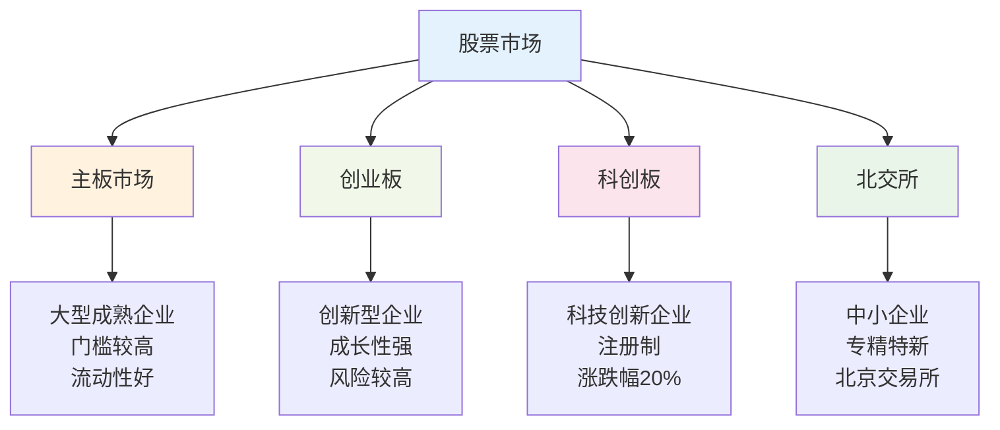

#### 市场参与主体

| 参与者类型 | 特点 | 投资风格 | 影响力 |
|------------|------|----------|--------|
| **机构投资者** | 资金量大，专业性强 | 价值投资，长期持有 | 主导市场走势 |
| **外资机构** | 国际视野，成熟理念 | 蓝筹白马，稳健投资 | 影响A股国际化 |
| **游资热钱** | 资金灵活，追涨杀跌 | 短线投机，题材炒作 | 推动短期波动 |
| **散户投资者** | 资金有限，情绪化 | 跟风操作，频繁交易 | 提供流动性 |

#### 交易制度特点

**A股交易规则**：
- **交易时间**：9:30-11:30，13:00-15:00
- **涨跌幅限制**：主板±10%，创业板/科创板±20%
- **T+1制度**：当日买入次日才能卖出
- **最小交易单位**：100股（1手）

### 投资理念与心态

#### 正确的投资心态

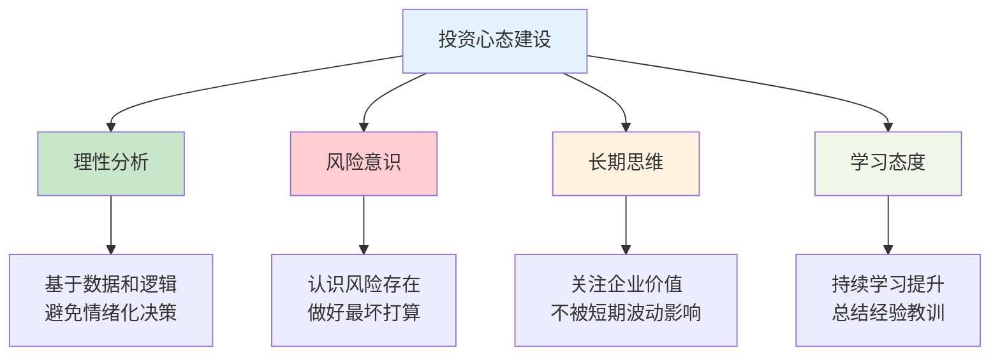

#### 投资误区与陷阱

**常见心理误区**：

| 误区类型 | 表现 | 危害 | 应对方法 |
|----------|------|------|----------|
| **贪婪心理** | 追涨杀跌，不知止盈 | 错失最佳卖点 | 设定目标价位 |
| **恐惧心理** | 一跌就割肉，不敢抄底 | 低位割肉亏损 | 坚持投资纪律 |
| **从众心理** | 盲目跟风，听信传言 | 成为接盘侠 | 独立思考分析 |
| **赌博心理** | 重仓单股，孤注一掷 | 巨大亏损风险 | 分散投资组合 |

#### 投资哲学建立

**价值投资核心理念**：
1. **股票即企业**：买股票就是买企业的一部分
2. **市场先生理论**：利用市场情绪波动获利
3. **安全边际**：在价格低于内在价值时买入
4. **能力圈原则**：只投资自己理解的行业和公司

### 风险管理原则

#### 风险类型识别

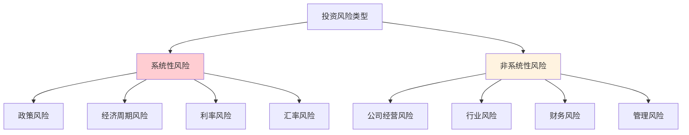

#### 风险控制策略

**分散投资原则**：
- **行业分散**：不超过3个相关行业
- **个股分散**：单股仓位不超过20%
- **时间分散**：分批建仓，定期调仓
- **市场分散**：A股+港股+海外市场

**止损止盈设置**：

| 策略类型 | 止损幅度 | 止盈目标 | 适用情况 |
|----------|----------|----------|----------|
| **短线交易** | -5%至-8% | +10%至+15% | 题材炒作，快进快出 |
| **中线持有** | -10%至-15% | +20%至+30% | 趋势跟踪，波段操作 |
| **长线投资** | -20%至-30% | +50%以上 | 价值投资，长期持有 |

### 资金管理策略

#### 仓位管理原则

**金字塔建仓法**：

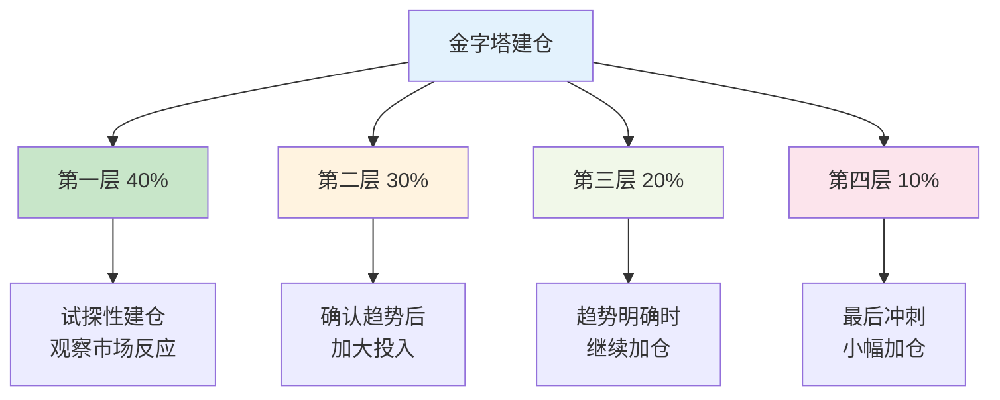

#### 资金配置策略

**核心-卫星策略**：
- **核心仓位（60-70%）**：蓝筹白马，稳健增长
- **卫星仓位（20-30%）**：成长股，题材股
- **现金储备（10-20%）**：应对突发机会和风险

**不同市场环境下的仓位调整**：

| 市场环境 | 建议仓位 | 操作策略 | 重点关注 |
|----------|----------|----------|----------|
| **牛市初期** | 70-80% | 积极建仓，追涨优质股 | 成长股，题材股 |
| **牛市中期** | 80-90% | 满仓操作，波段交易 | 龙头股，热点轮动 |
| **牛市末期** | 50-60% | 逐步减仓，落袋为安 | 防御性品种 |
| **熊市初期** | 30-40% | 谨慎操作，控制风险 | 价值股，低估值 |
| **熊市中期** | 10-20% | 空仓观望，等待机会 | 现金为王 |
| **熊市末期** | 40-50% | 分批建仓，布局未来 | 优质成长股 |

## 技术分析基础

### K线图解读

#### K线基本构成

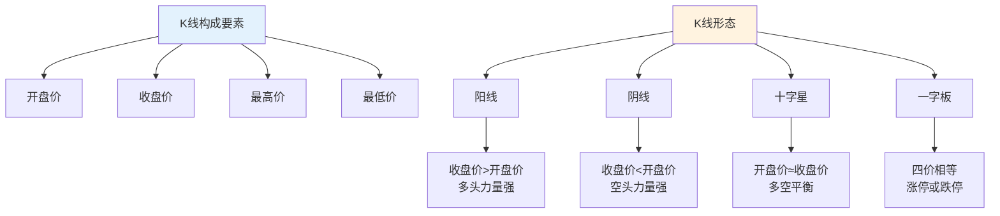

#### 经典K线形态

**单根K线形态**：

| 形态名称 | 特征描述 | 市场含义 | 操作建议 |
|----------|----------|----------|----------|
| **大阳线** | 实体长，上下影线短 | 多头力量强劲 | 可考虑买入 |
| **大阴线** | 实体长，上下影线短 | 空头力量强劲 | 应考虑卖出 |
| **长上影线** | 上影线长，实体小 | 上方抛压重 | 谨慎追高 |
| **长下影线** | 下影线长，实体小 | 下方支撑强 | 可考虑抄底 |
| **十字星** | 开收盘价接近 | 多空平衡 | 观望为主 |

**组合K线形态**：

**看涨形态**：
- **早晨之星**：连续三根K线，先阴后阳，底部反转信号
- **红三兵**：连续三根小阳线，逐步上涨，多头力量增强
- **锤头线**：下影线长，实体小，底部反转信号

**看跌形态**：
- **黄昏之星**：连续三根K线，先阳后阴，顶部反转信号
- **黑三鸦**：连续三根小阴线，逐步下跌，空头力量增强
- **流星线**：上影线长，实体小，顶部反转信号

### 技术指标详解

#### 趋势类指标

**1. 移动平均线（MA）系统**：

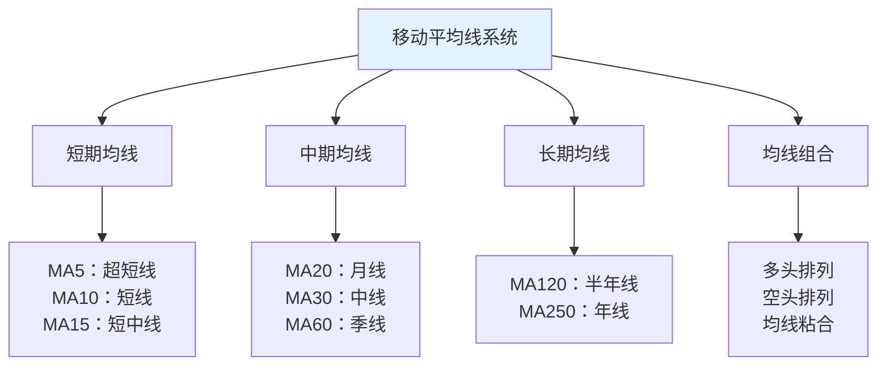

**均线交易策略**：

| 均线类型 | 买入信号 | 卖出信号 | 适用周期 | 成功率 |
|----------|----------|----------|----------|--------|
| **MA5** | 价格站上5日线 | 价格跌破5日线 | 1-3天 | 60% |
| **MA10** | 价格站上10日线 | 价格跌破10日线 | 3-7天 | 65% |
| **MA20** | 价格站上20日线 | 价格跌破20日线 | 1-2周 | 70% |
| **MA60** | 价格站上60日线 | 价格跌破60日线 | 1-3月 | 75% |
| **均线金叉** | 短期均线上穿长期均线 | 短期均线下穿长期均线 | 根据周期 | 80% |

**2. MACD指标详解**：

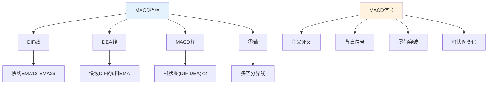

**MACD交易策略**：

| 信号类型 | 具体条件 | 买入时机 | 卖出时机 | 可靠性 |
|----------|----------|----------|----------|--------|
| **水上金叉** | 零轴上方DIF上穿DEA | 金叉确认 | 死叉确认 | 85% |
| **水下金叉** | 零轴下方DIF上穿DEA | 谨慎买入 | 死叉确认 | 70% |
| **底背离** | 价格新低MACD不创新低 | 背离确认后 | 背离失效 | 80% |
| **顶背离** | 价格新高MACD不创新高 | 避免买入 | 背离确认 | 75% |
| **零轴突破** | MACD由负转正 | 突破确认 | 跌破零轴 | 90% |

**3. DMI趋向指标**：

| 指标组成 | 计算方法 | 应用要点 | 最佳数值 |
|----------|----------|----------|----------|
| **+DI** | 上升动向指标 | 多头力量强弱 | >25 |
| **-DI** | 下降动向指标 | 空头力量强弱 | <25 |
| **ADX** | 趋向平均值 | 趋势强度判断 | >25 |
| **ADXR** | ADX的移动平均 | 趋势持续性 | 上升 |

**DMI交易信号**：
- **买入信号**：+DI上穿-DI，且ADX>25并上升
- **卖出信号**：-DI上穿+DI，且ADX>25并上升
- **无趋势**：ADX<20，震荡行情，不宜趋势交易

**4. SAR抛物线指标**：

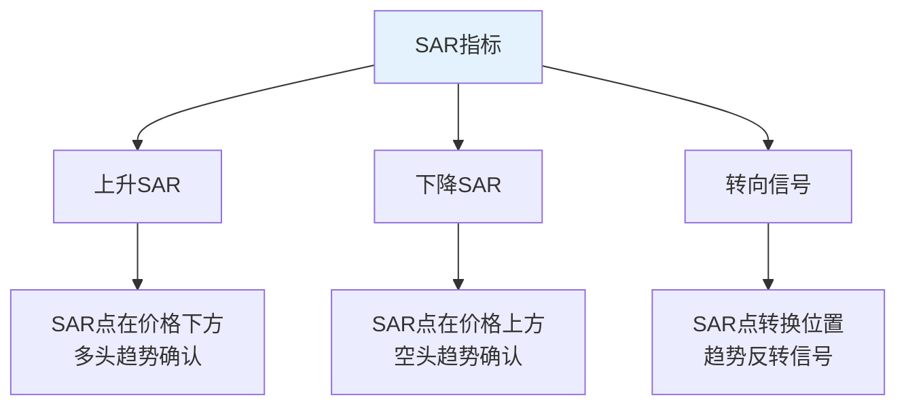

#### 震荡类指标

**1. RSI相对强弱指标**：

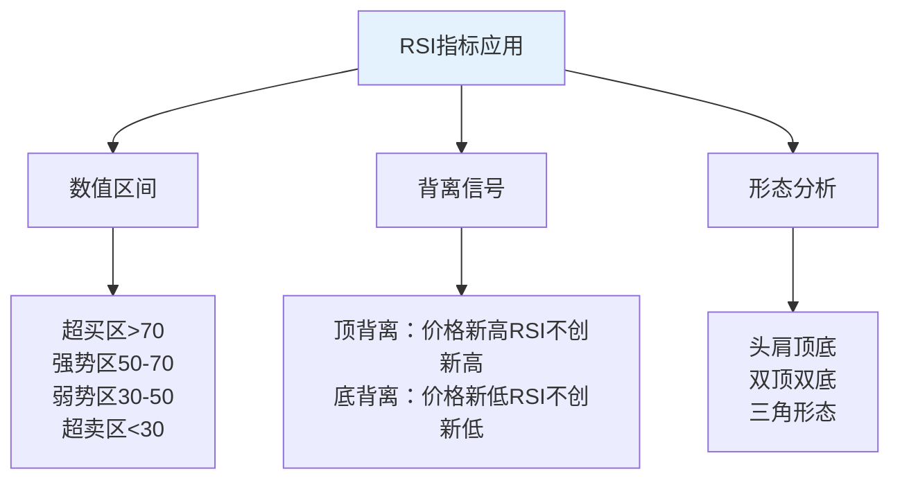

**RSI交易策略**：

| RSI区间 | 市场状态 | 操作策略 | 风险提示 | 成功率 |
|---------|----------|----------|----------|--------|
| **RSI>80** | 严重超买 | 分批减仓 | 强势股可能钝化 | 75% |
| **RSI 70-80** | 超买 | 谨慎持有 | 注意回调风险 | 65% |
| **RSI 50-70** | 强势 | 持股待涨 | 趋势延续 | 70% |
| **RSI 30-50** | 弱势 | 观望等待 | 寻找支撑 | 60% |
| **RSI 20-30** | 超卖 | 准备买入 | 确认止跌 | 70% |
| **RSI<20** | 严重超卖 | 分批买入 | 可能继续下跌 | 80% |

**2. KDJ随机指标**：

| 指标线 | 计算周期 | 应用要点 | 注意事项 |
|--------|----------|----------|----------|
| **K值** | 9日 | 快速线，敏感度高 | 容易产生假信号 |
| **D值** | 3日K值平均 | 慢速线，相对稳定 | 滞后性较强 |
| **J值** | 3K-2D | 超前线，最敏感 | 波动幅度大 |

**KDJ交易信号**：

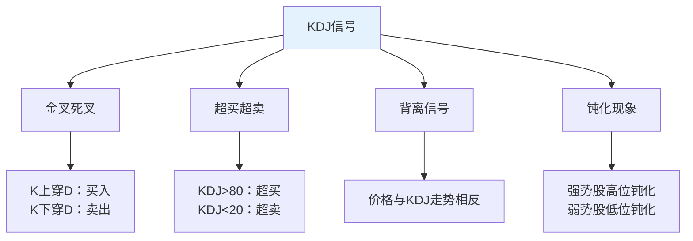

**3. CCI顺势指标**：

| CCI数值 | 市场状态 | 操作建议 | 持续时间 |
|---------|----------|----------|----------|
| **CCI>100** | 超买区 | 考虑卖出 | 1-3天 |
| **CCI 0-100** | 正常区 | 持股观望 | 持续 |
| **CCI -100-0** | 正常区 | 谨慎操作 | 持续 |
| **CCI<-100** | 超卖区 | 考虑买入 | 1-3天 |

**4. 威廉指标（WR）**：

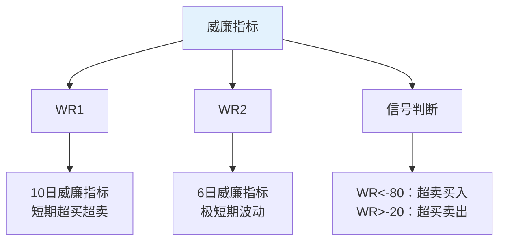

#### 成交量指标

**1. 成交量基础分析**：

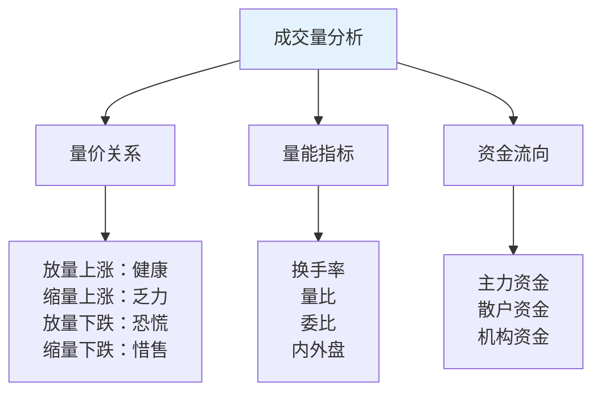

**成交量指标详解**：

| 指标名称 | 计算公式 | 应用要点 | 理想数值 |
|----------|----------|----------|----------|
| **换手率** | 成交量/流通股本×100% | 活跃度指标 | 3-8% |
| **量比** | 当日成交量/近5日平均量 | 放量程度 | 1.5-2.5 |
| **委比** | (委买-委卖)/(委买+委卖)×100% | 买卖意愿 | >0 |
| **内外盘比** | 外盘/内盘 | 主动买卖 | >1 |

**2. OBV能量潮指标**：

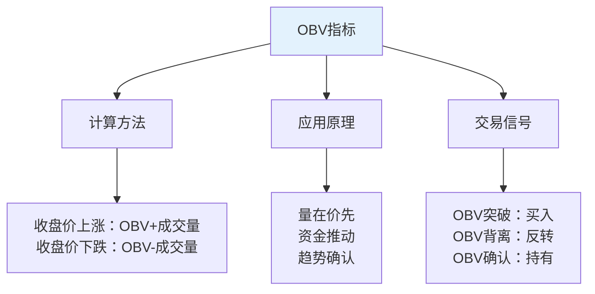

**3. VR成交率指标**：

| VR数值 | 市场状态 | 操作建议 | 风险等级 |
|--------|----------|----------|----------|
| **VR>450** | 严重超买 | 立即卖出 | 高 |
| **VR 350-450** | 超买 | 准备卖出 | 较高 |
| **VR 150-350** | 正常 | 持股观望 | 中等 |
| **VR 70-150** | 正常偏低 | 可以买入 | 较低 |
| **VR<70** | 超卖 | 积极买入 | 低 |

#### 高级技术指标

**1. 布林带指标（BOLL）**：

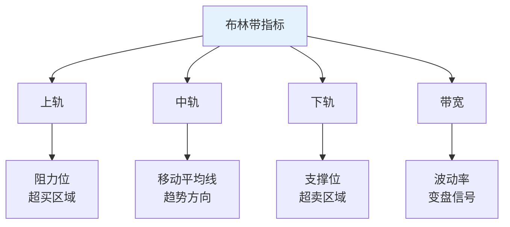

**布林带交易策略**：

| 价格位置 | 市场含义 | 操作策略 | 成功率 |
|----------|----------|----------|--------|
| **触及上轨** | 超买状态 | 考虑减仓 | 70% |
| **上轨附近** | 强势区域 | 持股观望 | 65% |
| **中轨附近** | 均衡状态 | 观察方向 | 50% |
| **下轨附近** | 弱势区域 | 谨慎操作 | 60% |
| **触及下轨** | 超卖状态 | 考虑买入 | 75% |

**2. 随机慢速指标（Slow KD）**：

| 参数设置 | 计算周期 | 应用特点 | 适用环境 |
|----------|----------|----------|----------|
| **K值** | 9日RSV的3日平均 | 相对稳定 | 震荡市 |
| **D值** | K值的3日平均 | 更加平滑 | 趋势市 |
| **信号** | K上穿D买入，K下穿D卖出 | 减少假信号 | 各种市况 |

**3. 动量指标（MTM）**：

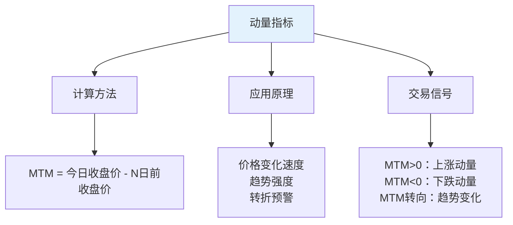

**4. 变动率指标（ROC）**：

| ROC数值 | 市场状态 | 操作建议 | 注意事项 |
|---------|----------|----------|----------|
| **ROC>10%** | 强势上涨 | 持股待涨 | 注意回调 |
| **ROC 0-10%** | 温和上涨 | 可以持有 | 观察延续性 |
| **ROC -10%-0** | 温和下跌 | 谨慎操作 | 寻找支撑 |
| **ROC<-10%** | 快速下跌 | 考虑止损 | 等待企稳 |

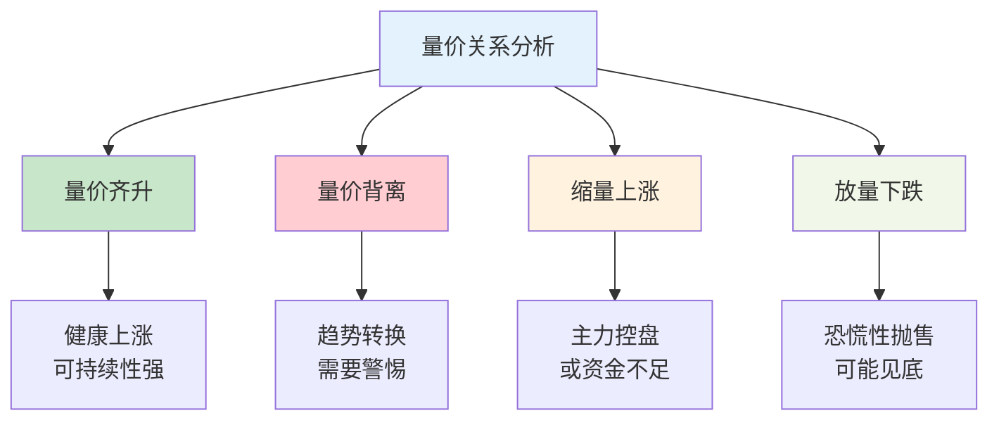

### 趋势分析方法

#### 趋势线绘制

**上升趋势线**：
- 连接两个或多个低点
- 线下方为支撑区域
- 跌破趋势线为卖出信号

**下降趋势线**：
- 连接两个或多个高点
- 线上方为阻力区域
- 突破趋势线为买入信号

#### 通道理论应用

**上升通道操作**：
1. 在通道下轨买入
2. 在通道上轨卖出
3. 跌破下轨止损
4. 突破上轨追涨

**下降通道操作**：
1. 在通道上轨做空
2. 在通道下轨回补
3. 突破上轨止损
4. 跌破下轨追空

### 支撑阻力位判断

#### 支撑阻力位类型

| 类型 | 形成原理 | 强度评估 | 操作要点 |
|------|----------|----------|----------|
| **整数关口** | 心理价位 | 中等 | 关注市场情绪 |
| **前期高低点** | 历史成交密集 | 较强 | 重点关注突破 |
| **均线位置** | 技术支撑 | 中等 | 结合均线系统 |
| **缺口位置** | 技术空白 | 较强 | 关注回补概率 |
| **成交密集区** | 筹码集中 | 很强 | 重要支撑阻力 |

#### 支撑阻力转换

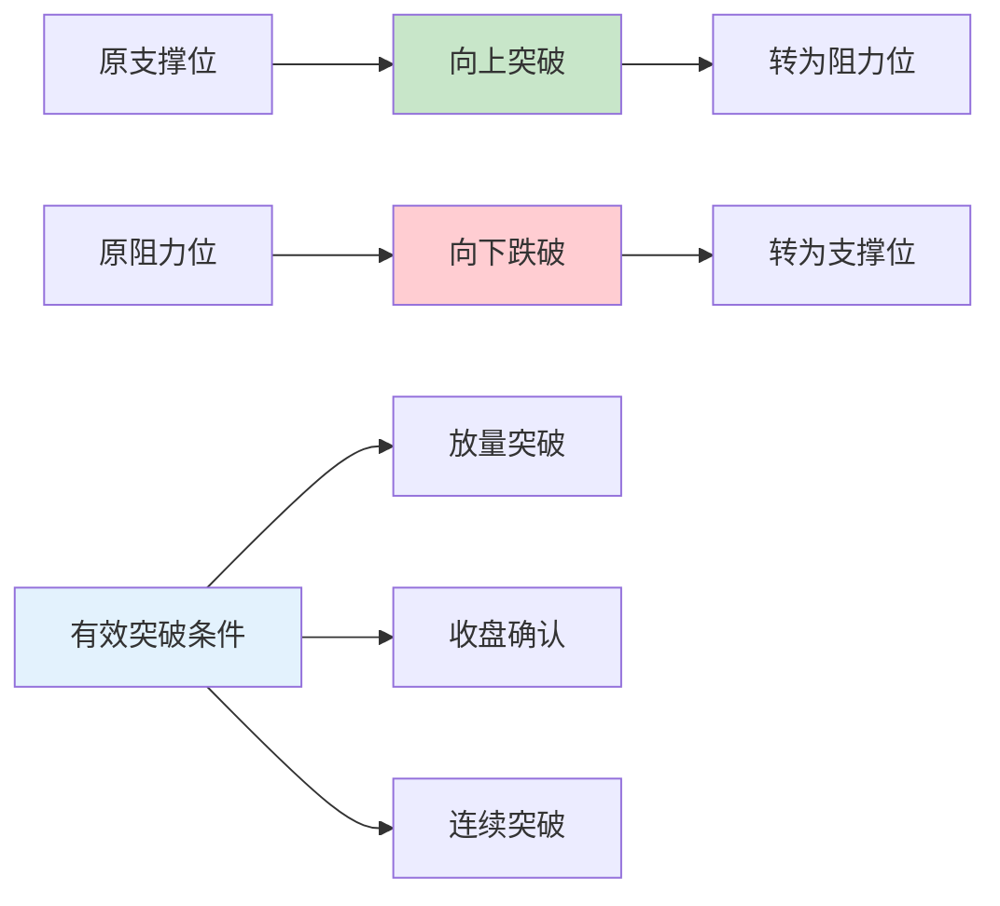

**突破有效性判断**：
1. **成交量配合**：突破时成交量明显放大
2. **收盘确认**：收盘价站稳突破位
3. **时间确认**：连续2-3个交易日确认
4. **回踩确认**：回踩不破突破位

## 选股策略与方法

### 基本面选股

#### 财务指标分析

**盈利能力指标**：

| 指标名称 | 计算公式 | 优秀标准 | 分析要点 |
|----------|----------|----------|----------|
| **ROE净资产收益率** | 净利润/净资产 | >15% | 衡量股东回报率 |
| **ROA总资产收益率** | 净利润/总资产 | >8% | 反映资产使用效率 |
| **毛利率** | 毛利润/营业收入 | 行业对比 | 体现产品竞争力 |
| **净利率** | 净利润/营业收入 | >10% | 反映盈利质量 |

**成长性指标**：
- **营收增长率**：连续3年>20%
- **净利润增长率**：连续3年>25%
- **EPS增长率**：每股收益持续增长
- **PEG指标**：PE/净利润增长率<1

#### 行业地位评估

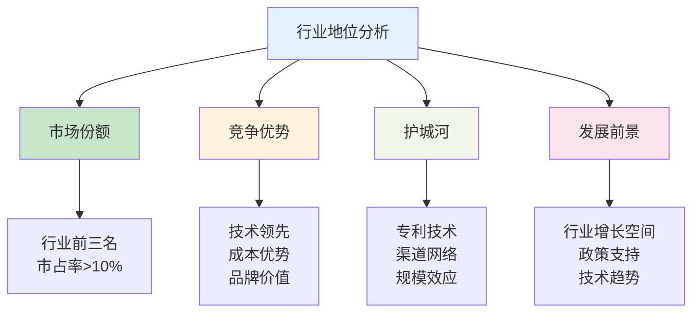

#### 估值水平判断

**相对估值法**：
- **PE估值**：市盈率与行业平均比较
- **PB估值**：市净率与历史均值比较
- **PS估值**：市销率适用于高成长企业
- **EV/EBITDA**：企业价值倍数，适用于重资产行业

**绝对估值法**：
- **DCF模型**：现金流折现估值
- **DDM模型**：股利折现模型
- **资产重置成本法**：适用于资源类企业

### 技术面选股

#### K线形态选股

**经典反转形态**：

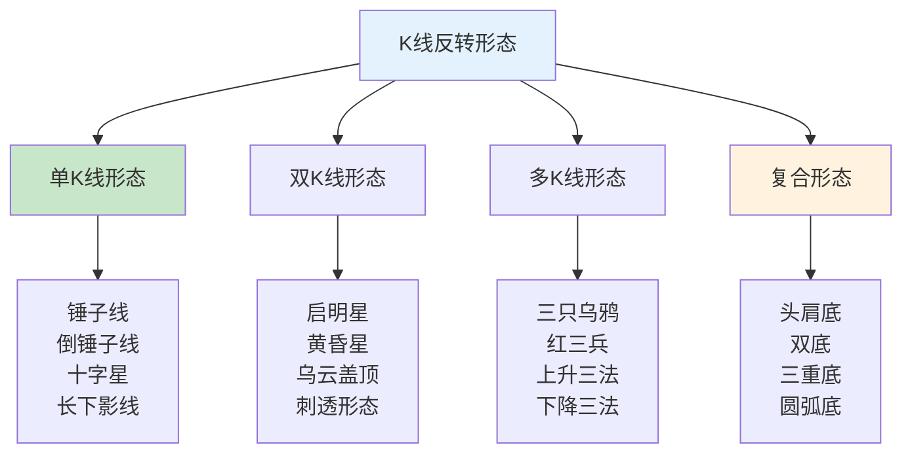

**1. 单K线形态详解**：

| 形态名称 | 形态特征 | 出现位置 | 信号强度 | 操作建议 |
|----------|----------|----------|----------|----------|
| **锤子线** | 小实体，长下影线，无上影线 | 下跌趋势末期 | ★★★★ | 次日确认后买入 |
| **倒锤子线** | 小实体，长上影线，无下影线 | 下跌趋势末期 | ★★★ | 需要确认信号 |
| **十字星** | 开盘收盘价相等或接近 | 趋势转折点 | ★★★ | 观察后续走势 |
| **长下影线** | 下影线长度>实体2倍 | 支撑位附近 | ★★★★ | 支撑有效可买入 |
| **光头阳线** | 无上影线的阳线 | 上涨趋势中 | ★★★ | 趋势延续信号 |
| **光脚阴线** | 无下影线的阴线 | 下跌趋势中 | ★★ | 卖出信号 |

**2. 双K线组合形态**：

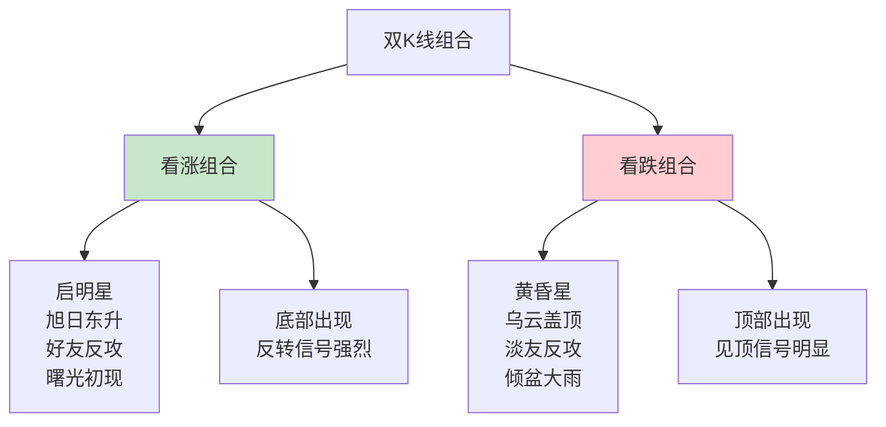

| 组合名称 | 形态描述 | 确认条件 | 成功率 | 操作策略 |
|----------|----------|----------|--------|----------|
| **启明星** | 阴线+十字星+阳线 | 第三根K线收盘价超过第一根K线实体中点 | 85% | 积极买入 |
| **黄昏星** | 阳线+十字星+阴线 | 第三根K线收盘价低于第一根K线实体中点 | 80% | 及时卖出 |
| **刺透形态** | 阴线+阳线 | 阳线收盘价超过阴线实体中点 | 75% | 谨慎买入 |
| **乌云盖顶** | 阳线+阴线 | 阴线收盘价低于阳线实体中点 | 70% | 考虑卖出 |

**3. 多K线形态组合**：

| 形态名称 | K线数量 | 形态特征 | 信号意义 | 操作要点 |
|----------|---------|----------|----------|----------|
| **红三兵** | 3根 | 三根连续上涨阳线 | 强烈看涨 | 第二根确认买入 |
| **三只乌鸦** | 3根 | 三根连续下跌阴线 | 强烈看跌 | 第二根确认卖出 |
| **上升三法** | 5根 | 阳线+3根小阴线+阳线 | 上涨中继 | 最后阳线确认加仓 |
| **下降三法** | 5根 | 阴线+3根小阳线+阴线 | 下跌中继 | 最后阴线确认减仓 |
| **三重顶** | 多根 | 三个相近的高点 | 见顶信号 | 跌破颈线卖出 |
| **三重底** | 多根 | 三个相近的低点 | 见底信号 | 突破颈线买入 |

#### 技术形态选股

**突破形态详解**：

```mermaid
graph TD
    A["技术形态分类"] --> B["整理形态"]
    A --> C["反转形态"]
    A --> D["缺口形态"]
    
    B --> E["矩形整理<br/>三角形整理<br/>楔形整理<br/>旗形整理"]
    C --> F["头肩形态<br/>双重形态<br/>圆弧形态<br/>V型反转"]
    D --> G["普通缺口<br/>突破缺口<br/>中继缺口<br/>衰竭缺口"]
    
    style A fill:#e3f2fd
    style B fill:#fff3e0
    style C fill:#c8e6c9
```

**1. 整理形态选股**：

| 形态类型 | 形态特征 | 突破确认 | 目标测算 | 成功率 |
|----------|----------|----------|----------|--------|
| **矩形整理** | 水平支撑阻力 | 放量突破上边线 | 矩形高度 | 75% |
| **上升三角形** | 水平阻力+上升支撑 | 突破水平阻力 | 三角形高度 | 80% |
| **下降三角形** | 水平支撑+下降阻力 | 跌破水平支撑 | 三角形高度 | 70% |
| **对称三角形** | 收敛的支撑阻力 | 突破任一边线 | 三角形高度×0.75 | 65% |
| **楔形整理** | 同向收敛 | 反向突破 | 楔形起点高度 | 70% |
| **旗形整理** | 短期回调整理 | 突破旗杆方向 | 旗杆高度 | 85% |

**2. 反转形态选股**：

```mermaid
graph TD
    A["反转形态"] --> B["顶部反转"]
    A --> C["底部反转"]
    
    B --> D["头肩顶<br/>双顶<br/>三重顶<br/>圆弧顶"]
    C --> E["头肩底<br/>双底<br/>三重底<br/>圆弧底"]
    
    D --> F["卖出信号<br/>避免买入"]
    E --> G["买入信号<br/>积极介入"]
    
    style B fill:#ffcdd2
    style C fill:#c8e6c9
```

| 反转形态 | 形成时间 | 确认信号 | 可靠性 | 操作策略 |
|----------|----------|----------|--------|----------|
| **头肩底** | 2-6个月 | 突破颈线+放量 | 90% | 突破后买入 |
| **双底** | 1-3个月 | 突破颈线+放量 | 85% | 突破后买入 |
| **圆弧底** | 3-12个月 | 突破前高+放量 | 95% | 形成过程分批买入 |
| **V型底** | 1-4周 | 快速反弹+放量 | 60% | 谨慎追涨 |

#### 技术指标选股

**1. 趋势类指标选股**：

```mermaid
graph TD
    A["趋势指标"] --> B["移动平均线"]
    A --> C["MACD指标"]
    A --> D["DMI指标"]
    A --> E["SAR指标"]
    
    B --> F["多头排列<br/>金叉买入<br/>支撑买入"]
    C --> G["金叉买入<br/>背离买入<br/>零轴上方"]
    D --> H["ADX>25<br/>+DI>-DI<br/>趋势明确"]
    E --> I["SAR转向<br/>价格突破<br/>趋势跟踪"]
    
    style A fill:#e3f2fd
```

**移动平均线选股标准**：

| 均线组合 | 选股条件 | 信号强度 | 适用周期 | 成功率 |
|----------|----------|----------|----------|--------|
| **5日均线** | 价格站上5日线 | ★★ | 超短线 | 60% |
| **10日均线** | 价格站上10日线 | ★★★ | 短线 | 65% |
| **20日均线** | 价格站上20日线 | ★★★★ | 中短线 | 70% |
| **60日均线** | 价格站上60日线 | ★★★★★ | 中线 | 75% |
| **多头排列** | 5>10>20>60日线 | ★★★★★ | 中长线 | 80% |

**MACD指标选股策略**：

| 信号类型 | 具体条件 | 买入时机 | 风险等级 | 预期收益 |
|----------|----------|----------|----------|----------|
| **金叉买入** | DIF上穿DEA | 金叉确认日 | 中等 | 10-20% |
| **零轴金叉** | 零轴上方金叉 | 金叉确认日 | 较低 | 15-30% |
| **底背离** | 价格新低，MACD不创新低 | 背离确认后 | 较低 | 20-40% |
| **二次金叉** | 短期内第二次金叉 | 第二次金叉 | 低 | 25-50% |

**2. 震荡类指标选股**：

```mermaid
graph TD
    A["震荡指标"] --> B["RSI指标"]
    A --> C["KDJ指标"]
    A --> D["CCI指标"]
    A --> E["威廉指标"]
    
    B --> F["超卖反弹<br/>背离信号<br/>50线突破"]
    C --> G["低位金叉<br/>背离信号<br/>超卖反弹"]
    D --> H["超卖反弹<br/>零线突破<br/>背离信号"]
    E --> I["超卖反弹<br/>背离信号<br/>-20突破"]
    
    style A fill:#e3f2fd
```

**RSI指标选股标准**：

| RSI数值 | 市场状态 | 操作策略 | 成功率 | 注意事项 |
|---------|----------|----------|--------|----------|
| **RSI<20** | 严重超卖 | 准备买入 | 85% | 确认止跌信号 |
| **RSI<30** | 超卖 | 可以买入 | 75% | 结合其他指标 |
| **RSI>70** | 超买 | 谨慎持有 | 70% | 注意回调风险 |
| **RSI>80** | 严重超买 | 考虑卖出 | 80% | 及时获利了结 |

**KDJ指标选股策略**：

| 信号类型 | 具体条件 | 操作建议 | 适用环境 | 风险提示 |
|----------|----------|----------|----------|----------|
| **低位金叉** | K<20时，K上穿D | 买入 | 震荡市 | 确认有效突破 |
| **高位死叉** | K>80时，K下穿D | 卖出 | 震荡市 | 趋势市可能钝化 |
| **底背离** | 价格新低，KDJ不创新低 | 买入 | 下跌趋势末期 | 需要量能配合 |
| **顶背离** | 价格新高，KDJ不创新高 | 卖出 | 上涨趋势末期 | 注意假背离 |

**3. 成交量指标选股**：

```mermaid
graph TD
    A["成交量指标"] --> B["OBV指标"]
    A --> C["VR指标"]
    A --> D["换手率"]
    A --> E["量比指标"]
    
    B --> F["价量同步<br/>背离信号<br/>突破确认"]
    C --> G["低位买入<br/>高位卖出<br/>背离信号"]
    D --> H["适度换手<br/>放量突破<br/>缩量整理"]
    E --> I["放量突破<br/>异常放量<br/>量能对比"]
    
    style A fill:#e3f2fd
```

**成交量选股标准**：

| 指标名称 | 买入条件 | 卖出条件 | 最佳数值 | 风险区间 |
|----------|----------|----------|----------|----------|
| **换手率** | 3-8% | >15% | 5-6% | >20% |
| **量比** | 1.5-3倍 | >5倍 | 2-2.5倍 | >8倍 |
| **OBV** | 价涨量涨 | 价涨量跌 | 同步上涨 | 明显背离 |
| **VR指标** | 40-70 | >350 | 80-150 | <40或>400 |

#### 量价配合选股

**理想的量价关系**：

```mermaid
graph TD
    A["量价配合模式"] --> B["上涨模式"]
    A --> C["下跌模式"]
    A --> D["整理模式"]
    
    B --> E["放量上涨<br/>缩量回调<br/>再次放量"]
    C --> F["放量下跌<br/>缩量反弹<br/>再次放量"]
    D --> G["缩量整理<br/>量能萎缩<br/>方向选择"]
    
    E --> H["健康上涨<br/>可以买入"]
    F --> I["弱势下跌<br/>避免买入"]
    D --> J["蓄势待发<br/>关注突破"]
    
    style B fill:#c8e6c9
    style C fill:#ffcdd2
    style D fill:#fff3e0
```

**量价关系选股标准**：

| 量价关系 | 市场含义 | 操作策略 | 出现位置 | 可靠性 |
|----------|----------|----------|----------|--------|
| **放量上涨** | 多头积极 | 买入持有 | 突破位 | 85% |
| **缩量上涨** | 惜售心理 | 谨慎持有 | 高位区 | 60% |
| **放量下跌** | 空头积极 | 卖出观望 | 破位处 | 80% |
| **缩量下跌** | 抛压减轻 | 关注企稳 | 低位区 | 70% |
| **放量滞涨** | 见顶信号 | 减仓离场 | 高位区 | 75% |
| **缩量滞跌** | 见底信号 | 准备买入 | 低位区 | 70% |

#### 多指标共振选股

**共振选股模型**：

```mermaid
graph TD
    A["多指标共振"] --> B["趋势共振"]
    A --> C["超跌共振"]
    A --> D["突破共振"]
    A --> E["背离共振"]
    
    B --> F["均线多头排列<br/>MACD金叉<br/>DMI多头<br/>成交量放大"]
    C --> G["RSI<30<br/>KDJ<20<br/>CCI<-100<br/>价格超跌"]
    D --> H["突破重要阻力<br/>放量确认<br/>多指标同步<br/>形态完成"]
    E --> I["价格背离<br/>指标背离<br/>量能背离<br/>时间背离"]
    
    style A fill:#e3f2fd
    style F fill:#c8e6c9
```

**共振选股评分系统**：

| 指标类别 | 权重 | 评分标准 | 满分条件 |
|----------|------|----------|----------|
| **趋势指标** | 30% | MACD、均线、DMI | 三个指标同时看涨 |
| **震荡指标** | 25% | RSI、KDJ、CCI | 超卖后反弹信号 |
| **成交量** | 20% | 量比、换手率、OBV | 放量突破确认 |
| **形态** | 15% | K线、技术形态 | 突破形态完成 |
| **基本面** | 10% | 业绩、估值 | 基本面支撑 |

**选股评分标准**：
- **90-100分**：强烈推荐，重点关注
- **80-89分**：推荐买入，正常仓位
- **70-79分**：可以关注，小仓位试探
- **60-69分**：观望等待，寻找更好时机
- **60分以下**：不建议买入

### 行业板块分析

#### 行业生命周期

```mermaid
graph LR
    A["导入期"] --> B["成长期"]
    B --> C["成熟期"]
    C --> D["衰退期"]
    
    A --> E["高风险高收益<br/>技术不确定"]
    B --> F["快速增长<br/>投资机会最佳"]
    C --> G["增长放缓<br/>竞争激烈"]
    D --> H["需求下降<br/>避免投资"]
    
    style B fill:#c8e6c9
    style D fill:#ffcdd2
```

#### 热点板块轮动

**板块轮动规律**：
1. **政策驱动型**：新能源、医药、科技
2. **周期驱动型**：有色金属、化工、建材
3. **消费驱动型**：食品饮料、家电、汽车
4. **金融驱动型**：银行、保险、券商

**板块强弱判断**：
- **相对强度**：板块指数vs大盘指数
- **资金流向**：主力资金净流入情况
- **涨跌家数比**：板块内上涨股票占比
- **龙头股表现**：板块龙头股走势

### 个股质地评估

#### 公司治理结构

**关键评估要素**：

| 评估维度 | 关注要点 | 优秀标准 | 风险信号 |
|----------|----------|----------|----------|
| **管理层能力** | 经营经验、战略眼光 | 行业资深，业绩优秀 | 频繁更换，能力不足 |
| **股权结构** | 股权集中度、制衡机制 | 适度集中，制衡有效 | 一股独大，关联交易多 |
| **激励机制** | 股权激励、业绩考核 | 激励到位，目标明确 | 激励不足，短期行为 |
| **信息披露** | 透明度、及时性 | 信息充分，及时准确 | 信息不透明，违规多 |

#### 竞争优势分析

**核心竞争力要素**：

```mermaid
graph TD
    A["核心竞争力"] --> B["技术优势"]
    A --> C["品牌价值"]
    A --> D["渠道网络"]
    A --> E["成本控制"]
    A --> F["人才团队"]
    
    B --> G["专利技术<br/>研发能力<br/>技术壁垒"]
    C --> H["品牌知名度<br/>客户忠诚度<br/>定价能力"]
    D --> I["销售网络<br/>供应链<br/>客户资源"]
    E --> J["规模效应<br/>管理效率<br/>成本优势"]
    F --> K["核心团队<br/>人才储备<br/>企业文化"]
    
    style A fill:#e3f2fd
```

#### 风险因素识别

**主要风险类型**：
1. **经营风险**：主营业务下滑，市场竞争加剧
2. **财务风险**：资产负债率过高，现金流紧张
3. **管理风险**：管理层变动，内控制度缺失
4. **政策风险**：行业政策变化，监管趋严
5. **技术风险**：技术路线错误，产品被替代

**风险预警信号**：
- **业绩变脸**：业绩大幅下滑或亏损
- **资金链紧张**：频繁融资，现金流恶化
- **关联交易异常**：大股东占用资金
- **审计意见异常**：被出具非标准审计意见
- **违法违规**：受到监管处罚或立案调查

## 看盘技巧与实战

### 盘面信息解读

#### 开盘信息分析

**开盘价意义**：

```mermaid
graph TD
    A["开盘价分析"] --> B["高开"]
    A --> C["平开"]
    A --> D["低开"]
    
    B --> E["利好消息刺激<br/>资金追捧<br/>注意冲高回落"]
    C --> F["消息面平淡<br/>延续前日走势<br/>观察盘中表现"]
    D --> G["利空消息影响<br/>恐慌性抛售<br/>关注反弹机会"]
    
    H["开盘成交量"] --> I["放量开盘"]
    H --> J["缩量开盘"]
    
    I --> K["市场关注度高<br/>波动可能较大"]
    J --> L["市场观望情绪<br/>可能震荡整理"]
    
    style A fill:#e3f2fd
    style H fill:#fff3e0
```

#### 分时图解读

**分时走势特征**：

| 走势类型 | 特征描述 | 市场含义 | 操作策略 |
|----------|----------|----------|----------|
| **一路上扬** | 开盘后持续上涨 | 多头力量强劲 | 可适当追涨 |
| **冲高回落** | 早盘冲高后回落 | 上方抛压较重 | 谨慎追高 |
| **低开高走** | 低开后逐步走高 | 逢低有买盘 | 可考虑买入 |
| **高开低走** | 高开后逐步走低 | 获利盘涌出 | 应考虑减仓 |
| **震荡整理** | 围绕均价线波动 | 多空平衡 | 观望为主 |

#### 盘口数据分析

**买卖盘口信息**：
- **买一到买五**：下方支撑力度
- **卖一到卖五**：上方阻力大小
- **内外盘比例**：主动买卖意愿
- **委比数值**：买卖力量对比

**大单异动识别**：

```mermaid
graph TD
    A["大单异动类型"] --> B["大买单"]
    A --> C["大卖单"]
    A --> D["对倒单"]
    A --> E["扫盘单"]
    
    B --> F["主力建仓<br/>机构买入<br/>看涨信号"]
    C --> G["主力出货<br/>机构减仓<br/>看跌信号"]
    D --> H["主力对倒<br/>制造假象<br/>需要识别"]
    E --> I["快速拉升<br/>强势突破<br/>可能追涨"]
    
    style A fill:#e3f2fd
    style B fill:#c8e6c9
    style C fill:#ffcdd2
```

### 成交量分析

#### 成交量形态

**放量形态分析**：
1. **温和放量**：成交量缓慢增加，健康上涨
2. **突然放量**：成交量急剧增大，可能变盘
3. **持续放量**：连续多日放量，趋势延续
4. **天量成交**：历史高位放量，可能见顶

**缩量形态分析**：
1. **缩量上涨**：主力控盘，或买盘不足
2. **缩量下跌**：抛压减轻，可能止跌
3. **地量成交**：成交极度萎缩，变盘在即
4. **无量涨停**：强势股特征，后市看好

#### 量价背离分析

**顶部背离特征**：

| 背离类型 | 价格走势 | 成交量走势 | 市场含义 |
|----------|----------|------------|----------|
| **量价背离** | 创新高 | 成交量萎缩 | 上涨乏力，可能见顶 |
| **指标背离** | 创新高 | 技术指标走低 | 动能不足，注意风险 |

**底部背离特征**：

| 背离类型 | 价格走势 | 成交量走势 | 市场含义 |
|----------|----------|------------|----------|
| **量价背离** | 创新低 | 成交量萎缩 | 抛压减轻，可能见底 |
| **指标背离** | 创新低 | 技术指标走高 | 超跌反弹，关注机会 |

### 资金流向判断

#### 主力资金识别

**主力资金特征**：

```mermaid
graph TD
    A["主力资金识别"] --> B["大单净流入"]
    A --> C["机构持仓变化"]
    A --> D["龙虎榜数据"]
    A --> E["北向资金流向"]
    
    B --> F["单笔成交>50万<br/>连续大单买入"]
    C --> G["基金、保险增持<br/>QFII持仓变化"]
    D --> H["游资席位活跃<br/>机构专用席位"]
    E --> I["外资买卖情况<br/>陆股通资金"]
    
    style A fill:#e3f2fd
```

#### 资金流向指标

**DDX大单动向**：
- **DDX>0**：大单净买入，看涨信号
- **DDX<0**：大单净卖出，看跌信号
- **连续飘红**：主力持续建仓
- **连续飘绿**：主力持续出货

**DDY涨跌动因**：
- **DDY>0**：大单推动上涨
- **DDY<0**：大单推动下跌
- **数值大小**：反映推动力度

### 市场情绪把握

#### 情绪指标分析

**恐慌贪婪指数**：

| 指数区间 | 市场情绪 | 投资者行为 | 操作建议 |
|----------|----------|------------|----------|
| **0-25** | 极度恐慌 | 恐慌性抛售 | 逢低买入 |
| **25-45** | 恐慌 | 谨慎观望 | 分批建仓 |
| **45-55** | 中性 | 理性投资 | 正常操作 |
| **55-75** | 贪婪 | 积极买入 | 注意风险 |
| **75-100** | 极度贪婪 | 盲目追涨 | 逢高减仓 |

#### 市场热点轮动

**热点识别方法**：

```mermaid
graph TD
    A["热点识别"] --> B["涨幅榜分析"]
    A --> C["资金流向统计"]
    A --> D["新闻热点跟踪"]
    A --> E["政策导向分析"]
    
    B --> F["连续上涨个股<br/>板块集中度"]
    C --> G["主力资金净流入<br/>板块资金排名"]
    D --> H["媒体关注度<br/>搜索热度"]
    E --> I["政策支持方向<br/>产业发展规划"]
    
    style A fill:#e3f2fd
```

**热点持续性判断**：
1. **政策支持力度**：国家政策导向
2. **基本面支撑**：行业发展前景
3. **资金参与程度**：主力资金态度
4. **市场认知度**：投资者接受程度
5. **技术面配合**：图形技术支撑

#### 情绪周期把握

**市场情绪周期**：
1. **乐观期**：指数上涨，成交活跃，情绪高涨
2. **兴奋期**：快速上涨，追涨盛行，风险积累
3. **狂热期**：疯狂上涨，全民炒股，泡沫形成
4. **焦虑期**：开始下跌，获利了结，情绪转变
5. **恐慌期**：加速下跌，恐慌抛售，非理性行为
6. **绝望期**：持续下跌，成交萎缩，信心丧失
7. **希望期**：止跌企稳，成交回升，信心恢复

**不同阶段操作策略**：
- **乐观期-兴奋期**：积极参与，但要控制仓位
- **狂热期**：保持理性，逐步减仓
- **焦虑期-恐慌期**：谨慎操作，等待机会
- **绝望期-希望期**：逢低布局，分批建仓

## 进场时机把握

### 综合决策流程图

#### 多维度进场离场决策系统

**完整决策流程**：

```mermaid
graph TD
    A["开始分析"] --> B["宏观环境评估"]
    B --> C["经济周期判断"]
    C --> D["市场情绪分析"]
    D --> E["技术指标确认"]
    E --> F["成交量验证"]
    F --> G["综合评分"]
    
    %% 宏观环境评估
    B --> B1["货币政策<br/>财政政策<br/>产业政策"]
    B1 --> B2{政策环境}
    B2 -->|宽松| B3["加分+2"]
    B2 -->|中性| B4["加分+1"]
    B2 -->|紧缩| B5["加分-1"]
    
    %% 经济周期判断
    C --> C1["GDP增长<br/>通胀水平<br/>就业数据"]
    C1 --> C2{经济周期}
    C2 -->|复苏期| C3["加分+3"]
    C2 -->|繁荣期| C4["加分+2"]
    C2 -->|滞胀期| C5["加分-1"]
    C2 -->|衰退期| C6["加分-2"]
    
    %% 市场情绪分析
    D --> D1["VIX指数<br/>融资余额<br/>新开户数"]
    D1 --> D2{市场情绪}
    D2 -->|极度乐观| D3["加分-2"]
    D2 -->|乐观| D4["加分+1"]
    D2 -->|中性| D5["加分+1"]
    D2 -->|悲观| D6["加分+2"]
    D2 -->|极度悲观| D7["加分+3"]
    
    %% 技术指标确认
    E --> E1["MA均线系统<br/>MACD指标<br/>RSI强弱指标"]
    E1 --> E2{技术信号}
    E2 -->|强烈买入| E3["加分+3"]
    E2 -->|买入| E4["加分+2"]
    E2 -->|中性| E5["加分0"]
    E2 -->|卖出| E6["加分-2"]
    E2 -->|强烈卖出| E7["加分-3"]
    
    %% 成交量验证
    F --> F1["成交量变化<br/>量价关系<br/>资金流向"]
    F1 --> F2{量能配合}
    F2 -->|放量上涨| F3["加分+2"]
    F2 -->|温和放量| F4["加分+1"]
    F2 -->|缩量整理| F5["加分0"]
    F2 -->|放量下跌| F6["加分-2"]
    
    %% 综合评分决策
    G --> H{总分评估}
    H -->|≥8分| I["强烈买入信号<br/>重仓进场"]
    H -->|5-7分| J["买入信号<br/>正常仓位"]
    H -->|2-4分| K["观望等待<br/>轻仓试探"]
    H -->|0-1分| L["中性信号<br/>保持现状"]
    H -->|≤-1分| M["卖出信号<br/>减仓离场"]
    
    %% 进场执行
    I --> N["分批建仓策略"]
    J --> O["一次性建仓"]
    K --> P["小仓位试探"]
    
    %% 离场执行
    M --> Q["分批减仓策略"]
    
    style A fill:#e3f2fd
    style G fill:#fff3e0
    style H fill:#ffeb3b
    style I fill:#c8e6c9
    style M fill:#ffcdd2
```

#### 详细评分标准

**宏观环境评估（权重25%）**：

| 因素 | 评分标准 | 分值 | 说明 |
|------|----------|------|------|
| **货币政策** | 降准降息 | +2 | 流动性宽松利好股市 |
| | 维持现状 | +1 | 政策稳定 |
| | 加息紧缩 | -1 | 流动性收紧 |
| **财政政策** | 积极财政 | +2 | 基建投资加码 |
| | 稳健财政 | +1 | 政策平稳 |
| | 紧缩财政 | -1 | 支出减少 |
| **产业政策** | 重点支持 | +2 | 政策红利 |
| | 一般支持 | +1 | 政策中性 |
| | 限制调控 | -1 | 政策压制 |

**经济周期判断（权重30%）**：

| 周期阶段 | GDP增长 | 通胀水平 | 分值 | 投资策略 |
|----------|---------|----------|------|----------|
| **复苏期** | 回升 | 温和 | +3 | 积极进场 |
| **繁荣期** | 高增长 | 上升 | +2 | 满仓操作 |
| **滞胀期** | 放缓 | 高企 | -1 | 谨慎减仓 |
| **衰退期** | 下滑 | 回落 | -2 | 空仓观望 |

**市场情绪分析（权重20%）**：

```mermaid
graph LR
    A["市场情绪指标"] --> B["恐惧贪婪指数"]
    A --> C["融资融券余额"]
    A --> D["新开户数变化"]
    A --> E["基金发行情况"]
    
    B --> F["0-20：极度恐惧 +3分"]
    B --> G["20-40：恐惧 +2分"]
    B --> H["40-60：中性 +1分"]
    B --> I["60-80：贪婪 +1分"]
    B --> J["80-100：极度贪婪 -2分"]
    
    style A fill:#e3f2fd
```

**技术指标确认（权重15%）**：

| 指标类型 | 买入信号 | 分值 | 卖出信号 | 分值 |
|----------|----------|------|----------|------|
| **均线系统** | 金叉向上 | +2 | 死叉向下 | -2 |
| **MACD** | 底背离+金叉 | +3 | 顶背离+死叉 | -3 |
| **RSI** | 超卖反弹 | +2 | 超买回落 | -2 |
| **KDJ** | 低位金叉 | +1 | 高位死叉 | -1 |

**成交量验证（权重10%）**：

```mermaid
graph TD
    A["成交量分析"] --> B["量价关系"]
    A --> C["资金流向"]
    A --> D["换手率"]
    
    B --> E["放量上涨 +2分<br/>缩量上涨 +1分<br/>放量下跌 -2分<br/>缩量下跌 -1分"]
    C --> F["主力净流入 +2分<br/>散户净流入 +1分<br/>主力净流出 -2分<br/>散户净流出 -1分"]
    D --> G["适中换手 +1分<br/>过度换手 -1分<br/>换手不足 0分"]
    
    style A fill:#e3f2fd
```

#### 实战应用案例

**案例一：强烈买入信号（总分9分）**

| 维度 | 具体情况 | 得分 |
|------|----------|------|
| 宏观环境 | 央行降准，财政积极 | +2 |
| 经济周期 | GDP回升，通胀温和 | +3 |
| 市场情绪 | 恐惧指数20，极度悲观 | +3 |
| 技术指标 | MACD金叉，RSI超卖反弹 | +3 |
| 成交量 | 放量突破，主力流入 | +2 |
| **总分** | **强烈买入信号** | **13分** |

**操作建议**：重仓进场，分3批建仓，每批间隔2-3个交易日

**案例二：卖出信号（总分-3分）**

| 维度 | 具体情况 | 得分 |
|------|----------|------|
| 宏观环境 | 加息预期，政策收紧 | -1 |
| 经济周期 | GDP放缓，通胀高企 | -1 |
| 市场情绪 | 贪婪指数85，极度贪婪 | -2 |
| 技术指标 | MACD死叉，RSI超买 | -3 |
| 成交量 | 放量下跌，主力流出 | -2 |
| **总分** | **卖出信号** | **-9分** |

**操作建议**：分批减仓，保留20%底仓，设置止损位

### 买入信号识别

#### 技术面买入信号

**经典买入形态**：

```mermaid
graph TD
    A["技术买入信号"] --> B["突破买入"]
    A --> C["回调买入"]
    A --> D["反转买入"]
    A --> E["跟踪买入"]
    
    B --> F["突破重要阻力位<br/>放量突破<br/>收盘确认"]
    C --> G["回调至支撑位<br/>止跌企稳<br/>量能配合"]
    D --> H["底部反转形态<br/>技术指标背离<br/>成交量放大"]
    E --> I["强势股回调<br/>均线支撑<br/>趋势延续"]
    
    style A fill:#e3f2fd
    style B fill:#c8e6c9
    style C fill:#fff3e0
    style D fill:#f1f8e9
    style E fill:#fce4ec
```

#### 基本面买入时机

**价值发现机会**：

| 买入时机 | 触发条件 | 风险评估 | 预期收益 |
|----------|----------|----------|----------|
| **业绩拐点** | 业绩由亏转盈或加速增长 | 中等 | 较高 |
| **估值修复** | PE/PB处于历史低位 | 较低 | 中等 |
| **重组预期** | 资产注入或业务重组 | 较高 | 很高 |
| **政策利好** | 行业政策支持 | 中等 | 较高 |
| **订单爆发** | 重大合同或订单 | 较低 | 中等 |

#### 动态调整机制

**实时监控与调整流程**：

```mermaid
graph TD
    A["持仓监控"] --> B["每日评分更新"]
    B --> C["评分变化分析"]
    C --> D{评分变化幅度}
    
    D -->|+3分以上| E["加仓信号"]
    D -->|+1到+2分| F["维持仓位"]
    D -->|-1到-2分| G["减仓警告"]
    D -->|-3分以下| H["清仓信号"]
    
    E --> I["分批加仓<br/>最多加至满仓"]
    F --> J["保持现有仓位<br/>密切观察"]
    G --> K["减仓20-30%<br/>设置止损"]
    H --> L["全部清仓<br/>空仓观望"]
    
    %% 风险控制
    I --> M["风险控制检查"]
    J --> M
    K --> M
    L --> M
    
    M --> N["单日跌幅>5%"]
    M --> O["连续3日下跌"]
    M --> P["技术破位"]
    M --> Q["基本面恶化"]
    
    N --> R["立即止损"]
    O --> S["减仓观察"]
    P --> T["技术止损"]
    Q --> U["基本面止损"]
    
    style A fill:#e3f2fd
    style D fill:#fff3e0
    style E fill:#c8e6c9
    style H fill:#ffcdd2
    style M fill:#ffeb3b
```

**调仓触发条件**：

| 触发条件 | 调仓幅度 | 执行时间 | 风险控制 |
|----------|----------|----------|----------|
| **评分提升3+** | 加仓20-30% | 1-2个交易日 | 设置止盈位 |
| **评分下降3+** | 减仓30-50% | 当日执行 | 设置止损位 |
| **技术破位** | 减仓50%+ | 立即执行 | 严格止损 |
| **基本面变化** | 全部清仓 | 3日内完成 | 重新评估 |

#### 风险预警系统

**多级预警机制**：

```mermaid
graph TD
    A["风险监控系统"] --> B["一级预警"]
    A --> C["二级预警"]
    A --> D["三级预警"]
    A --> E["紧急预警"]
    
    B --> F["评分下降1-2分<br/>技术指标转弱<br/>成交量萎缩"]
    C --> G["评分下降3-4分<br/>跌破重要支撑<br/>主力资金流出"]
    D --> H["评分下降5+分<br/>技术全面破位<br/>基本面恶化"]
    E --> I["系统性风险<br/>政策重大变化<br/>突发事件冲击"]
    
    F --> J["密切关注<br/>准备减仓"]
    G --> K["减仓30%<br/>设置止损"]
    H --> L["减仓70%<br/>严格止损"]
    I --> M["全部清仓<br/>空仓避险"]
    
    style A fill:#e3f2fd
    style B fill:#fff3e0
    style C fill:#ffcc02
    style D fill:#ff9800
    style E fill:#f44336
```

**预警指标权重**：

| 预警级别 | 技术面权重 | 基本面权重 | 资金面权重 | 情绪面权重 |
|----------|------------|------------|------------|------------|
| **一级预警** | 40% | 30% | 20% | 10% |
| **二级预警** | 35% | 35% | 20% | 10% |
| **三级预警** | 30% | 40% | 20% | 10% |
| **紧急预警** | 20% | 50% | 20% | 10% |

#### 执行纪律要求

**操作纪律清单**：

1. **严格按评分执行**：
   - 不因个人情绪影响决策
   - 不因短期波动改变策略
   - 严格执行仓位管理规则

2. **及时调整仓位**：
   - 评分变化后24小时内调整
   - 分批执行避免冲击成本
   - 保留适当现金应对变化

3. **风险控制优先**：
   - 止损优先于止盈
   - 保本优先于盈利
   - 长期收益优先于短期收益

4. **持续学习改进**：
   - 定期回顾操作得失
   - 优化评分标准
   - 调整权重配置

**操作记录模板**：

| 日期 | 操作类型 | 评分 | 仓位变化 | 价格 | 原因 | 结果 |
|------|----------|------|----------|------|------|------|
| 2024-01-15 | 买入 | 8分 | 0→30% | 10.50 | 技术突破+政策利好 | 待观察 |
| 2024-01-20 | 加仓 | 10分 | 30%→50% | 11.20 | 业绩超预期 | 待观察 |
| 2024-02-01 | 减仓 | 3分 | 50%→20% | 12.80 | 技术走弱 | +21.9% |

### 分批建仓策略

#### 建仓方式选择

**等额分批法**：
- **操作方式**：每次买入相同金额
- **适用情况**：震荡市场，不确定方向
- **优点**：风险分散，成本平均
- **缺点**：可能错过最佳时机

**递增分批法**：

```mermaid
graph TD
    A["递增分批建仓"] --> B["第一批 20%"]
    A --> C["第二批 30%"]
    A --> D["第三批 50%"]
    
    B --> E["试探性买入<br/>观察市场反应"]
    C --> F["确认趋势后<br/>加大投入"]
    D --> G["趋势明确时<br/>重仓买入"]
    
    H["风险控制"] --> I["设置止损位"]
    H --> J["控制总仓位"]
    H --> K["保留机动资金"]
    
    style A fill:#e3f2fd
    style H fill:#ffcdd2
```

#### 建仓时机选择

**最佳建仓时机**：
1. **技术面确认**：突破重要技术位
2. **基本面改善**：业绩或估值拐点
3. **资金面配合**：主力资金进场
4. **消息面催化**：利好消息刺激
5. **情绪面修复**：市场情绪好转

### 突破买入法

#### 突破类型识别

**水平突破**：
- **箱体突破**：长期横盘后向上突破
- **平台突破**：整理平台向上突破
- **颈线突破**：头肩底等形态突破

**趋势线突破**：
- **下降趋势线突破**：空头趋势转多头
- **上升通道突破**：加速上涨信号
- **三角形突破**：方向选择确认

#### 突破有效性判断

**有效突破标准**：

| 判断标准 | 具体要求 | 重要程度 | 注意事项 |
|----------|----------|----------|----------|
| **幅度要求** | 突破幅度>3% | 高 | 避免假突破 |
| **成交量配合** | 成交量放大1.5倍以上 | 很高 | 量价配合最重要 |
| **时间确认** | 连续2-3日站稳 | 高 | 避免一日游 |
| **回踩不破** | 回调不跌破突破位 | 中等 | 确认支撑有效 |

#### 突破买入策略

**买入时机选择**：

```mermaid
graph TD
    A["突破买入策略"] --> B["突破当日买入"]
    A --> C["回踩确认买入"]
    A --> D["加速突破买入"]
    
    B --> E["优点：及时跟进<br/>缺点：可能假突破"]
    C --> F["优点：安全性高<br/>缺点：可能错过机会"]
    D --> G["优点：确定性强<br/>缺点：成本较高"]
    
    H["风险控制"] --> I["突破失败止损"]
    H --> J["仓位控制"]
    H --> K["分批买入"]
    
    style A fill:#e3f2fd
    style H fill:#ffcdd2
```

### 回调买入法

#### 回调类型分析

**健康回调特征**：
1. **回调幅度适中**：一般不超过前期涨幅的50%
2. **成交量萎缩**：回调过程中成交量逐步减少
3. **技术支撑有效**：在重要支撑位获得支撑
4. **时间周期合理**：回调时间不宜过长

**回调买入位置**：

| 支撑位类型 | 买入位置 | 安全程度 | 操作要点 |
|------------|----------|----------|----------|
| **均线支撑** | 20日、60日均线 | 较高 | 关注均线角度 |
| **前期高点** | 历史重要高点 | 高 | 成交密集区 |
| **黄金分割** | 38.2%、50%、61.8% | 中等 | 结合其他指标 |
| **整数关口** | 重要心理价位 | 中等 | 关注市场情绪 |

#### 回调买入时机

**最佳买入信号**：

```mermaid
graph LR
    A["回调买入信号"] --> B["止跌信号"]
    A --> C["反弹信号"]
    A --> D["确认信号"]
    
    B --> E["长下影线<br/>成交量萎缩<br/>技术指标超卖"]
    C --> F["小阳线反弹<br/>成交量温和放大<br/>技术指标回升"]
    D --> G["连续上涨<br/>突破短期均线<br/>成交量持续放大"]
    
    style A fill:#e3f2fd
    style B fill:#fff3e0
    style C fill:#f1f8e9
    style D fill:#c8e6c9
```

#### 回调买入风险控制

**风险控制措施**：
1. **设置止损位**：跌破关键支撑位止损
2. **控制仓位**：单次买入不超过总资金20%
3. **分批买入**：在不同支撑位分批买入
4. **时间止损**：回调时间过长应考虑止损
5. **基本面确认**：确保公司基本面没有恶化

**常见买入误区**：
- **抄底过早**：在下跌趋势中盲目抄底
- **重仓买入**：一次性投入过多资金
- **忽视止损**：不设置止损位或不执行止损
- **情绪化操作**：被短期波动影响判断
- **基本面恶化**：忽视公司基本面变化

## 离场策略制定

### 综合离场决策系统

#### 多维度离场评估流程

**离场决策矩阵**：

```mermaid
graph TD
    A["离场评估启动"] --> B["盈亏状态分析"]
    B --> C{当前盈亏}
    
    C -->|盈利状态| D["止盈策略评估"]
    C -->|亏损状态| E["止损策略评估"]
    C -->|平衡状态| F["持有策略评估"]
    
    %% 止盈策略分支
    D --> D1["技术面分析"]
    D --> D2["基本面分析"]
    D --> D3["市场环境分析"]
    
    D1 --> D4{技术信号}
    D4 -->|顶背离出现| D5["技术止盈"]
    D4 -->|高位震荡| D6["分批止盈"]
    D4 -->|趋势延续| D7["继续持有"]
    
    D2 --> D8{估值水平}
    D8 -->|严重高估| D9["估值止盈"]
    D8 -->|合理偏高| D10["部分止盈"]
    D8 -->|合理区间| D11["继续持有"]
    
    D3 --> D12{市场环境}
    D12 -->|牛市末期| D13["环境止盈"]
    D12 -->|震荡市| D14["波段操作"]
    D12 -->|牛市中期| D15["继续持有"]
    
    %% 止损策略分支
    E --> E1["亏损幅度分析"]
    E --> E2["止损原因分析"]
    E --> E3["挽回可能性分析"]
    
    E1 --> E4{亏损幅度}
    E4 -->|>20%| E5["立即止损"]
    E4 -->|10-20%| E6["条件止损"]
    E4 -->|<10%| E7["观察等待"]
    
    E2 --> E8{止损原因}
    E8 -->|技术破位| E9["技术止损"]
    E8 -->|基本面恶化| E10["基本面止损"]
    E8 -->|系统性风险| E11["系统性止损"]
    
    %% 持有策略分支
    F --> F1["综合评分更新"]
    F1 --> F2{评分结果}
    F2 -->|≥5分| F3["继续持有"]
    F2 -->|2-4分| F4["减仓观察"]
    F2 -->|≤1分| F5["清仓离场"]
    
    style A fill:#e3f2fd
    style C fill:#fff3e0
    style D fill:#c8e6c9
    style E fill:#ffcdd2
    style F fill:#f3e5f5
```

#### 离场时机评分系统

**离场评分标准**：

| 评估维度 | 权重 | 评分标准 | 操作建议 |
|----------|------|----------|----------|
| **技术面** | 35% | 顶背离-3分，高位震荡-1分，趋势延续+1分 | 技术优先 |
| **基本面** | 30% | 估值过高-2分，业绩下滑-2分，前景良好+1分 | 价值导向 |
| **资金面** | 20% | 主力流出-2分，散户接盘-1分，机构增持+1分 | 跟随资金 |
| **市场环境** | 15% | 系统性风险-3分，政策利空-1分，环境向好+1分 | 顺势而为 |

**离场决策表**：

```mermaid
graph LR
    A["离场评分"] --> B["≤-5分"]
    A --> C["-2到-4分"]
    A --> D["-1到+1分"]
    A --> E["+2到+4分"]
    A --> F["≥+5分"]
    
    B --> G["立即清仓<br/>无条件离场"]
    C --> H["分批减仓<br/>保留30%"]
    D --> I["维持仓位<br/>密切观察"]
    E --> J["适当加仓<br/>波段操作"]
    F --> K["继续持有<br/>长期投资"]
    
    style B fill:#f44336
    style C fill:#ff9800
    style D fill:#ffeb3b
    style E fill:#8bc34a
    style F fill:#4caf50
```

#### 分类离场策略

**1. 技术性离场**

```mermaid
graph TD
    A["技术离场信号"] --> B["趋势破坏"]
    A --> C["形态完成"]
    A --> D["指标背离"]
    A --> E["量价背离"]
    
    B --> F["跌破重要均线<br/>跌破上升趋势线<br/>跌破重要支撑位"]
    C --> G["头肩顶完成<br/>双顶形态确认<br/>上升楔形破位"]
    D --> H["MACD顶背离<br/>RSI顶背离<br/>KDJ高位死叉"]
    E --> I["价涨量缩<br/>价跌量增<br/>天量天价"]
    
    F --> J["分批离场<br/>3日内完成"]
    G --> K["立即离场<br/>当日完成"]
    H --> L["逐步减仓<br/>保留底仓"]
    I --> M["警惕离场<br/>设置止损"]
    
    style A fill:#e3f2fd
    style J fill:#ffcdd2
    style K fill:#f44336
```

**2. 基本面离场**

| 离场原因 | 紧急程度 | 操作方式 | 时间要求 |
|----------|----------|----------|----------|
| **业绩大幅下滑** | 高 | 立即清仓 | 1个交易日 |
| **行业景气下降** | 中 | 分批减仓 | 3-5个交易日 |
| **公司治理问题** | 高 | 立即清仓 | 1个交易日 |
| **估值严重高估** | 低 | 逐步减仓 | 1-2周 |
| **竞争优势丧失** | 中 | 分批减仓 | 3-5个交易日 |

**3. 环境性离场**

```mermaid
graph TD
    A["市场环境变化"] --> B["政策环境"]
    A --> C["流动性环境"]
    A --> D["风险偏好"]
    A --> E["外部冲击"]
    
    B --> F["监管政策收紧<br/>行业政策转向<br/>宏观政策调整"]
    C --> G["央行加息<br/>流动性收紧<br/>资金成本上升"]
    D --> H["风险偏好下降<br/>避险情绪升温<br/>资金流出股市"]
    E --> I["地缘政治冲突<br/>自然灾害<br/>突发事件"]
    
    F --> J["政策性离场"]
    G --> K["流动性离场"]
    H --> L["情绪性离场"]
    I --> M["避险性离场"]
    
    J --> N["分批减仓50%"]
    K --> O["减仓30-40%"]
    L --> P["观察减仓20%"]
    M --> Q["立即清仓"]
    
    style A fill:#e3f2fd
    style Q fill:#f44336
```

#### 离场执行策略

**分批离场模型**：

| 离场批次 | 仓位比例 | 执行条件 | 价格策略 |
|----------|----------|----------|----------|
| **第一批** | 30% | 离场信号确认 | 市价成交 |
| **第二批** | 40% | 反弹至阻力位 | 限价挂单 |
| **第三批** | 30% | 技术修复或基本面改善 | 灵活处理 |

**紧急离场流程**：

```mermaid
graph LR
    A["紧急信号"] --> B["立即暂停买入"]
    B --> C["评估紧急程度"]
    C --> D["制定离场计划"]
    D --> E["分批执行离场"]
    E --> F["监控执行效果"]
    F --> G["调整执行策略"]
    G --> H["完成离场"]
    
    style A fill:#f44336
    style H fill:#4caf50
```

### 止盈策略

#### 止盈方式选择

**固定比例止盈**：

```mermaid
graph TD
    A["止盈策略类型"] --> B["固定比例止盈"]
    A --> C["技术位止盈"]
    A --> D["时间止盈"]
    A --> E["分批止盈"]
    
    B --> F["设定固定盈利目标<br/>如20%、30%、50%"]
    C --> G["重要阻力位<br/>技术形态完成"]
    D --> H["持股时间达到<br/>预设期限"]
    E --> I["分批减仓<br/>保留核心仓位"]
    
    style A fill:#e3f2fd
    style B fill:#c8e6c9
    style C fill:#fff3e0
    style D fill:#f1f8e9
    style E fill:#fce4ec
```

#### 动态止盈策略

**移动止盈法**：

| 止盈类型 | 操作方法 | 适用情况 | 优缺点 |
|----------|----------|----------|--------|
| **跟踪止损** | 股价上涨时上调止损位 | 强势上涨股 | 能锁定利润，但可能过早卖出 |
| **均线止盈** | 跌破关键均线卖出 | 趋势性行情 | 操作简单，但有滞后性 |
| **技术指标止盈** | MACD死叉等信号 | 技术性反转 | 信号明确，但可能假信号 |
| **分批止盈** | 逐步减仓锁定利润 | 不确定行情 | 风险分散，但收益有限 |

#### 止盈位设定

**技术分析止盈位**：
1. **前期高点**：历史重要阻力位
2. **整数关口**：心理价位阻力
3. **黄金分割**：1.618倍等比例位
4. **通道上轨**：上升通道上边线
5. **形态目标位**：技术形态测算位

### 止损原则

#### 止损类型

**技术止损**：

```mermaid
graph TD
    A["技术止损方式"] --> B["支撑位止损"]
    A --> C["均线止损"]
    A --> D["形态止损"]
    A --> E["指标止损"]
    
    B --> F["跌破重要支撑位<br/>如前低、整数关口"]
    C --> G["跌破关键均线<br/>如20日、60日线"]
    D --> H["破坏技术形态<br/>如头肩顶、双顶"]
    E --> I["技术指标恶化<br/>如MACD死叉"]
    
    style A fill:#e3f2fd
    style B fill:#ffcdd2
```

#### 止损幅度设定

**不同投资风格止损标准**：

| 投资风格 | 止损幅度 | 设定依据 | 执行要点 |
|----------|----------|----------|----------|
| **短线交易** | 3-8% | 技术支撑位 | 严格执行，不可犹豫 |
| **中线投资** | 8-15% | 重要技术位 | 结合基本面判断 |
| **长线投资** | 15-25% | 基本面变化 | 关注公司质地 |
| **价值投资** | 20-30% | 估值安全边际 | 基本面为主 |

#### 止损执行纪律

**止损执行要点**：
1. **提前设定**：买入时就确定止损位
2. **严格执行**：到达止损位坚决卖出
3. **不可侥幸**：不要期待反弹回本
4. **及时调整**：根据走势调整止损位
5. **心理准备**：接受亏损是投资常态

### 卖出信号判断

#### 技术面卖出信号

**顶部反转信号**：

```mermaid
graph TD
    A["顶部反转信号"] --> B["K线信号"]
    A --> C["形态信号"]
    A --> D["指标信号"]
    A --> E["量价信号"]
    
    B --> F["长上影线<br/>黄昏之星<br/>乌云盖顶"]
    C --> G["双顶<br/>头肩顶<br/>圆弧顶"]
    D --> H["MACD顶背离<br/>KDJ高位死叉<br/>RSI超买"]
    E --> I["放量滞涨<br/>量价背离<br/>天量见天价"]
    
    style A fill:#e3f2fd
    style B fill:#ffcdd2
    style C fill:#fff3e0
    style D fill:#f1f8e9
    style E fill:#fce4ec
```

#### 基本面卖出信号

**基本面恶化信号**：
1. **业绩大幅下滑**：净利润同比下降30%以上
2. **财务状况恶化**：资产负债率大幅上升
3. **现金流恶化**：经营性现金流持续为负
4. **主营业务萎缩**：核心业务收入下降
5. **管理层变动**：核心管理团队离职

#### 市场环境卖出信号

**宏观环境变化**：
- **货币政策收紧**：加息、提准等紧缩政策
- **经济增速放缓**：GDP增速下滑，经济衰退
- **行业政策转向**：监管趋严，政策不利
- **国际环境恶化**：贸易战、地缘政治风险
- **系统性风险**：金融危机、流动性危机

### 仓位管理技巧

#### 动态仓位调整

**仓位调整原则**：

| 市场阶段 | 建议仓位 | 调整策略 | 重点关注 |
|----------|----------|----------|----------|
| **牛市初期** | 60-80% | 逐步加仓 | 优质成长股 |
| **牛市中期** | 80-90% | 高仓位运作 | 龙头股轮动 |
| **牛市后期** | 40-60% | 逐步减仓 | 防御性品种 |
| **熊市初期** | 20-40% | 快速减仓 | 现金为王 |
| **熊市中期** | 0-20% | 空仓观望 | 等待机会 |
| **熊市后期** | 30-50% | 分批建仓 | 价值洼地 |

#### 个股仓位分配

**仓位分配策略**：

```mermaid
graph TD
    A["个股仓位分配"] --> B["核心持仓 40-50%"]
    A --> C["重点关注 30-40%"]
    A --> D["机会仓位 10-20%"]
    A --> E["现金储备 10-20%"]
    
    B --> F["蓝筹白马股<br/>长期持有<br/>稳健增长"]
    C --> G["优质成长股<br/>中期持有<br/>波段操作"]
    D --> H["题材概念股<br/>短期持有<br/>快进快出"]
    E --> I["应急资金<br/>机会资金<br/>风险缓冲"]
    
    style A fill:#e3f2fd
    style B fill:#c8e6c9
    style C fill:#fff3e0
    style D fill:#f1f8e9
    style E fill:#fce4ec
```

#### 风险控制措施

**仓位风险控制**：
1. **单股仓位限制**：单只股票不超过总资金20%
2. **行业集中度控制**：同行业股票不超过40%
3. **相关性控制**：避免买入高度相关股票
4. **流动性管理**：保持一定现金比例
5. **定期检视**：定期评估和调整仓位结构

**风险预警机制**：
- **总仓位预警**：总仓位超过90%时减仓
- **单股预警**：单股亏损超过10%时检视
- **行业预警**：行业集中度过高时分散
- **市场预警**：系统性风险上升时降仓
- **流动性预警**：现金比例过低时补充

## 短线交易技术

### 日内交易策略

#### 日内交易时间节点

**关键时间窗口**：

```mermaid
gantt
    title 日内交易时间节点
    dateFormat HH:mm
    axisFormat %H:%M
    
    section 开盘阶段
    集合竞价观察    :09:15, 09:25
    开盘方向确认    :09:30, 09:45
    
    section 上午交易
    早盘冲高回落    :09:45, 10:30
    上午整理阶段    :10:30, 11:30
    
    section 下午交易
    午后开盘试探    :13:00, 13:30
    下午主升浪      :13:30, 14:30
    尾盘冲刺阶段    :14:30, 15:00
```

#### 分时图交易策略

**分时买卖点识别**：

| 买入时机 | 技术特征 | 操作要点 | 风险控制 |
|----------|----------|----------|----------|
| **开盘急跌后反弹** | 低开后快速拉升 | 放量反弹时买入 | 跌破开盘价止损 |
| **均价线支撑** | 回调至均价线获支撑 | 在均价线附近买入 | 跌破均价线止损 |
| **分时突破** | 突破前高或阻力位 | 放量突破时追涨 | 回落破位止损 |
| **尾盘拉升** | 14:30后快速拉升 | 强势股可追涨 | 次日低开止损 |

#### 超短线操作技巧

**T+0操作策略**：
1. **做T降成本**：高抛低吸，降低持仓成本
2. **波段套利**：利用日内波动获取差价
3. **情绪套利**：利用市场情绪波动交易
4. **事件套利**：利用突发事件快速交易

### 短线选股方法

#### 短线选股标准

**技术面选股条件**：

```mermaid
graph TD
    A["短线选股标准"] --> B["量价配合"]
    A --> C["技术形态"]
    A --> D["市场地位"]
    A --> E["流动性"]
    
    B --> F["放量突破<br/>量价齐升<br/>成交活跃"]
    C --> G["突破整理<br/>强势回调<br/>底部启动"]
    D --> H["龙头地位<br/>题材正宗<br/>市场认知"]
    E --> I["日成交额>1亿<br/>换手率适中<br/>流通盘适度"]
    
    style A fill:#e3f2fd
```

#### 热点题材挖掘

**题材发现渠道**：
1. **政策导向**：国家政策、行业规划
2. **事件驱动**：重大事件、突发消息
3. **业绩催化**：业绩预告、年报披露
4. **技术突破**：新技术、新产品
5. **资金流向**：主力资金、机构调研

**题材强弱判断**：

| 判断维度 | 强势题材特征 | 弱势题材特征 |
|----------|-------------|-------------|
| **政策支持** | 国家重点支持 | 政策边缘化 |
| **市场空间** | 空间巨大 | 空间有限 |
| **参与资金** | 主力积极参与 | 游资短炒 |
| **持续时间** | 能持续数周 | 一两天结束 |
| **龙头表现** | 龙头股强势 | 龙头股疲软 |

### 快进快出技巧

#### 快速进场策略

**进场时机把握**：

```mermaid
graph TD
    A["快速进场策略"] --> B["突破进场"]
    A --> C["回调进场"]
    A --> D["跟风进场"]
    A --> E["抢帽子进场"]
    
    B --> F["放量突破重要阻力<br/>确认突破有效性"]
    C --> G["强势股回调到位<br/>技术支撑明确"]
    D --> H["跟随龙头股操作<br/>板块联动效应"]
    E --> I["利用短期波动<br/>快速获取差价"]
    
    style A fill:#e3f2fd
    style B fill:#c8e6c9
```

#### 快速出场原则

**出场信号识别**：
1. **目标达成**：达到预期收益目标
2. **技术破位**：跌破关键技术位
3. **量能萎缩**：成交量明显萎缩
4. **时间到期**：持股时间达到上限
5. **情绪转变**：市场情绪明显转冷

#### 风险控制要点

**短线风控原则**：

| 风控要素 | 具体要求 | 执行标准 | 注意事项 |
|----------|----------|----------|----------|
| **止损幅度** | 3-5% | 严格执行 | 不可心存侥幸 |
| **持股时间** | 1-3天 | 超时出局 | 避免短线变中线 |
| **仓位控制** | 单股≤30% | 分散风险 | 不可重仓单股 |
| **选股数量** | 2-3只 | 精选个股 | 避免分散精力 |

### 热点题材把握

#### 题材生命周期

**题材演化阶段**：

```mermaid
graph LR
    A["萌芽期"] --> B["爆发期"]
    B --> C["疯狂期"]
    C --> D["分化期"]
    D --> E["衰退期"]
    
    A --> F["政策预期<br/>小幅上涨<br/>关注度低"]
    B --> G["政策落地<br/>快速上涨<br/>资金涌入"]
    C --> H["全面爆发<br/>疯狂上涨<br/>全民参与"]
    D --> I["龙头分化<br/>涨跌互现<br/>资金分流"]
    E --> J["热度消退<br/>普遍下跌<br/>资金撤离"]
    
    style B fill:#c8e6c9
    style C fill:#fff3e0
    style E fill:#ffcdd2
```

#### 龙头股识别

**龙头股特征**：
1. **题材纯正**：最符合题材概念
2. **基本面支撑**：有实际业务支撑
3. **技术面强势**：走势最强劲
4. **资金面活跃**：主力资金青睐
5. **市场认知度高**：知名度和流动性好

**龙头股操作策略**：
- **首板介入**：龙头首次涨停时买入
- **二板确认**：连续涨停确认龙头地位
- **回调买入**：龙头回调时逢低买入
- **分歧转一致**：市场分歧时坚定持有

#### 跟风股操作

**跟风股分类**：

| 跟风股类型 | 特点 | 操作策略 | 风险提示 |
|------------|------|----------|----------|
| **正宗跟风** | 题材纯正，基本面好 | 可中线持有 | 注意龙头表现 |
| **概念跟风** | 沾边概念，炒作性强 | 短线快进快出 | 风险较大 |
| **补涨跟风** | 滞涨补涨，弹性较大 | 波段操作 | 持续性差 |
| **垃圾跟风** | 纯粹炒作，无基本面 | 避免参与 | 风险极大 |

#### 题材轮动规律

**板块轮动特点**：
1. **政策驱动型**：政策发布后快速启动
2. **事件驱动型**：突发事件引发炒作
3. **业绩驱动型**：业绩预期推动上涨
4. **资金驱动型**：主力资金推动轮动
5. **情绪驱动型**：市场情绪变化引发

**轮动操作策略**：
- **提前布局**：在题材启动前布局
- **快速跟进**：题材启动后快速跟进
- **及时切换**：题材衰退时及时切换
- **落袋为安**：获利后及时兑现收益

## 中长线投资

### 价值投资理念

#### 价值投资核心原则

```mermaid
graph TD
    A["价值投资核心理念"] --> B["内在价值"]
    A --> C["安全边际"]
    A --> D["长期持有"]
    A --> E["能力圈"]
    
    B --> F["企业真实价值<br/>基于基本面分析<br/>不受市场情绪影响"]
    C --> G["价格低于价值<br/>提供安全缓冲<br/>降低投资风险"]
    D --> H["持有优秀企业<br/>分享成长收益<br/>复利效应显现"]
    E --> I["投资熟悉领域<br/>避免盲目投资<br/>提高成功率"]
    
    style A fill:#e3f2fd
    style B fill:#c8e6c9
    style C fill:#fff3e0
    style D fill:#f1f8e9
    style E fill:#fce4ec
```

#### 价值评估方法

**绝对估值法**：

| 估值方法 | 适用企业 | 计算要点 | 优缺点 |
|----------|----------|----------|--------|
| **DCF现金流折现** | 现金流稳定企业 | 预测未来现金流并折现 | 理论完善但预测困难 |
| **DDM股利折现** | 稳定分红企业 | 预测未来股利并折现 | 适用范围有限 |
| **资产重估法** | 重资产企业 | 重估资产公允价值 | 适用于资源类企业 |

**相对估值法**：
- **PE估值**：市盈率与同行业比较
- **PB估值**：市净率与历史均值比较
- **PEG估值**：PE与增长率的比值
- **EV/EBITDA**：企业价值与息税折旧摊销前利润比

#### 价值投资选股标准

**财务健康度评估**：

```mermaid
graph TD
    A["财务健康度指标"] --> B["盈利能力"]
    A --> C["偿债能力"]
    A --> D["营运能力"]
    A --> E["成长能力"]
    
    B --> F["ROE>15%<br/>ROA>8%<br/>毛利率稳定"]
    C --> G["资产负债率<60%<br/>流动比率>1.5<br/>利息保障倍数>5"]
    D --> H["总资产周转率>0.8<br/>应收账款周转率>6<br/>存货周转率>4"]
    E --> I["营收增长率>10%<br/>净利润增长率>15%<br/>ROE增长趋势"]
    
    style A fill:#e3f2fd
```

### 成长股投资

#### 成长股识别标准

**成长股特征**：
1. **高成长性**：营收和利润持续快速增长
2. **行业前景**：处于成长期或爆发期行业
3. **竞争优势**：具有明显的竞争壁垒
4. **管理优秀**：管理团队能力强，执行力好
5. **财务健康**：财务状况良好，现金流充裕

#### 成长阶段判断

**企业成长周期**：

| 成长阶段 | 特征描述 | 投资价值 | 风险水平 |
|----------|----------|----------|----------|
| **初创期** | 技术验证，市场开拓 | 潜力巨大 | 风险极高 |
| **成长期** | 快速扩张，市场份额提升 | 价值最高 | 风险较高 |
| **成熟期** | 增长放缓，市场稳定 | 价值一般 | 风险中等 |
| **衰退期** | 业务萎缩，竞争力下降 | 价值较低 | 风险较高 |

#### 成长股估值方法

**PEG估值法**：
- **PEG<1**：被低估，具有投资价值
- **PEG=1**：合理估值
- **PEG>1**：被高估，需谨慎投资

**成长股投资策略**：

```mermaid
graph TD
    A["成长股投资策略"] --> B["GARP策略"]
    A --> C["高成长策略"]
    A --> D["价值成长策略"]
    
    B --> E["合理价格买入成长股<br/>PEG<1.5<br/>平衡成长与估值"]
    C --> F["高价买入高成长股<br/>成长率>30%<br/>不太关注估值"]
    D --> G["低估值买入成长股<br/>PE<行业均值<br/>成长确定性高"]
    
    style A fill:#e3f2fd
    style B fill:#c8e6c9
```

### 周期股操作

#### 周期股特点

**周期性行业分类**：
1. **强周期行业**：钢铁、有色、化工、煤炭
2. **中周期行业**：机械、建材、汽车、房地产
3. **弱周期行业**：公用事业、交通运输

#### 周期判断方法

**经济周期与股价关系**：

```mermaid
graph LR
    A["经济复苏期"] --> B["经济繁荣期"]
    B --> C["经济滞胀期"]
    C --> D["经济衰退期"]
    D --> A
    
    A --> E["周期股开始上涨<br/>估值修复"]
    B --> F["周期股大幅上涨<br/>业绩爆发"]
    C --> G["周期股见顶回落<br/>估值压缩"]
    D --> H["周期股深度调整<br/>业绩下滑"]
    
    style A fill:#c8e6c9
    style B fill:#fff3e0
    style C fill:#f1f8e9
    style D fill:#ffcdd2
```

#### 周期股操作策略

**买入时机**：
1. **经济底部**：经济数据见底回升
2. **政策刺激**：货币政策宽松，财政政策积极
3. **供给收缩**：行业供给侧改革，产能出清
4. **需求复苏**：下游需求开始回暖
5. **估值底部**：PE、PB处于历史低位

**卖出时机**：
1. **经济过热**：通胀压力上升，政策收紧
2. **供给过剩**：新增产能大量投放
3. **需求见顶**：下游需求增长放缓
4. **估值过高**：PE、PB处于历史高位
5. **技术破位**：股价跌破重要技术支撑

### 长期持股策略

#### 长期投资理念

**复利效应**：

| 年化收益率 | 10年后 | 20年后 | 30年后 |
|------------|--------|--------|--------|
| **8%** | 2.16倍 | 4.66倍 | 10.06倍 |
| **12%** | 3.11倍 | 9.65倍 | 29.96倍 |
| **15%** | 4.05倍 | 16.37倍 | 66.21倍 |
| **20%** | 6.19倍 | 38.34倍 | 237.38倍 |

#### 长期持股标准

**优秀企业特征**：

```mermaid
graph TD
    A["长期持股标准"] --> B["商业模式优秀"]
    A --> C["竞争壁垒深厚"]
    A --> D["管理层优秀"]
    A --> E["财务表现优异"]
    A --> F["行业前景广阔"]
    
    B --> G["盈利模式清晰<br/>现金流良好<br/>可持续性强"]
    C --> H["技术壁垒<br/>品牌壁垒<br/>渠道壁垒"]
    D --> I["战略眼光<br/>执行能力<br/>诚信经营"]
    E --> J["ROE持续>15%<br/>负债率合理<br/>分红稳定"]
    F --> K["市场空间大<br/>增长确定性高<br/>政策支持"]
    
    style A fill:#e3f2fd
```

#### 持股过程管理

**定期检视要点**：
1. **基本面变化**：业务发展、财务状况、竞争地位
2. **行业环境**：行业发展趋势、政策变化、竞争格局
3. **估值水平**：当前估值是否合理，是否严重高估
4. **投资逻辑**：原有投资逻辑是否发生变化
5. **机会成本**：是否有更好的投资机会

**调仓换股原则**：
- **基本面恶化**：公司基本面出现不可逆转的恶化
- **投资逻辑改变**：原有投资逻辑不再成立
- **估值严重高估**：股价远超内在价值
- **更好机会出现**：发现更优质的投资标的
- **资产配置需要**：基于组合管理需要调整

#### 长期投资心态

**心态建设要点**：
1. **耐心等待**：好企业需要时间体现价值
2. **忽略噪音**：不被短期波动和市场噪音影响
3. **坚持原则**：坚持投资原则和纪律
4. **持续学习**：不断提升投资能力和认知水平
5. **保持理性**：在贪婪和恐惧中保持理性

## 市场分析方法

### 宏观经济分析

#### 经济指标体系

**核心经济指标**：

```mermaid
graph TD
    A["宏观经济指标"] --> B["增长指标"]
    A --> C["通胀指标"]
    A --> D["就业指标"]
    A --> E["货币指标"]
    A --> F["财政指标"]
    
    B --> G["GDP增长率<br/>工业增加值<br/>固定资产投资"]
    C --> H["CPI消费者物价<br/>PPI生产者物价<br/>核心通胀率"]
    D --> I["失业率<br/>新增就业<br/>劳动参与率"]
    E --> J["M2货币供应量<br/>社会融资规模<br/>利率水平"]
    F --> K["财政收支<br/>政府债务<br/>税收政策"]
    
    style A fill:#e3f2fd
```

#### 经济周期判断

**经济周期阶段特征**：

| 周期阶段 | 经济特征 | 政策取向 | 股市表现 | 投资策略 |
|----------|----------|----------|----------|----------|
| **复苏期** | GDP回升，通胀温和 | 宽松政策维持 | 估值修复上涨 | 积极建仓 |
| **繁荣期** | GDP高增长，通胀上升 | 政策逐步收紧 | 业绩推动上涨 | 满仓操作 |
| **滞胀期** | GDP放缓，通胀高企 | 紧缩政策加码 | 估值压缩下跌 | 逐步减仓 |
| **衰退期** | GDP下滑，通胀回落 | 宽松政策出台 | 杀估值杀业绩 | 空仓观望 |

#### 领先指标分析

**股市领先指标**：

```mermaid
graph TD
    A["股市领先指标"] --> B["流动性指标"]
    A --> C["估值指标"]
    A --> D["情绪指标"]
    A --> E["技术指标"]
    
    B --> F["M2增速<br/>社融增速<br/>十年期国债收益率"]
    C --> G["市场整体PE<br/>股债收益率比<br/>风险溢价"]
    D --> H["新开户数<br/>两融余额<br/>基金发行"]
    E --> I["市场宽度<br/>新高新低比<br/>成交量变化"]
    
    style A fill:#e3f2fd
```

### 政策面影响

#### 货币政策影响

**货币政策工具**：
1. **利率政策**：存贷款基准利率、MLF、LPR
2. **准备金率**：银行存款准备金率调整
3. **公开市场操作**：逆回购、正回购操作
4. **定向调控**：定向降准、再贷款再贴现

**货币政策对股市影响**：

| 政策方向 | 流动性影响 | 估值影响 | 行业影响 | 操作建议 |
|----------|------------|----------|----------|----------|
| **宽松** | 流动性充裕 | 估值提升 | 利好成长股 | 积极做多 |
| **中性** | 流动性平衡 | 估值稳定 | 结构性机会 | 精选个股 |
| **紧缩** | 流动性收紧 | 估值压缩 | 利好价值股 | 谨慎操作 |

#### 财政政策影响

**财政政策类型**：

```mermaid
graph TD
    A["财政政策"] --> B["积极财政政策"]
    A --> C["稳健财政政策"]
    A --> D["紧缩财政政策"]
    
    B --> E["增加支出<br/>减税降费<br/>发行国债"]
    C --> F["收支平衡<br/>结构调整<br/>稳定税负"]
    D --> G["减少支出<br/>增加税收<br/>控制债务"]
    
    H["受益行业"] --> I["基建投资"]
    H --> J["消费刺激"]
    H --> K["科技创新"]
    H --> L["民生保障"]
    
    style A fill:#e3f2fd
    style H fill:#c8e6c9
```

#### 产业政策分析

**政策支持方向**：
1. **战略新兴产业**：新能源、新材料、生物医药
2. **数字经济**：人工智能、大数据、云计算
3. **制造业升级**：高端装备、智能制造
4. **绿色发展**：节能环保、清洁能源
5. **民生改善**：医疗健康、教育文化

### A股市场规律分析

#### A股牛熊周期规律

**A股牛熊周期特征**：

```mermaid
graph TD
    A["A股牛熊周期"] --> B["牛市周期"]
    A --> C["熊市周期"]
    A --> D["震荡市周期"]
    
    B --> E["持续时间：1-3年<br/>涨幅：100%-500%<br/>特征：全面上涨"]
    C --> F["持续时间：2-5年<br/>跌幅：50%-70%<br/>特征：持续下跌"]
    D --> G["持续时间：1-2年<br/>波动：±30%<br/>特征：箱体震荡"]
    
    style B fill:#c8e6c9
    style C fill:#ffcdd2
    style D fill:#fff3e0
```

**历史牛熊周期回顾**：

| 时间段 | 市场性质 | 主要驱动因素 | 涨跌幅 | 特点 |
|--------|----------|-------------|--------|------|
| **2005-2007** | 大牛市 | 股权分置改革 | +500% | 全民炒股热潮 |
| **2008-2012** | 大熊市 | 金融危机冲击 | -70% | 长期阴跌不止 |
| **2013-2015** | 杠杆牛市 | 流动性宽松 | +150% | 杠杆推动泡沫 |
| **2016-2018** | 结构牛市 | 供给侧改革 | 分化明显 | 价值股领涨 |
| **2019-2021** | 科技牛市 | 注册制改革 | +80% | 科技股主导 |
| **2022-至今** | 震荡调整 | 疫情影响 | -30% | 底部震荡 |

**牛熊市识别要点**：
1. **估值水平**：市场整体PE、PB处于历史什么位置
2. **政策环境**：货币政策、财政政策的宽松程度
3. **流动性状况**：市场资金供求关系
4. **投资者情绪**：市场参与度、风险偏好
5. **经济基本面**：GDP增长、企业盈利趋势

#### 周期股运行规律

**周期股分类及规律**：

```mermaid
graph TD
    A["周期股分类"] --> B["强周期股"]
    A --> C["中周期股"]
    A --> D["弱周期股"]
    
    B --> E["钢铁、有色、煤炭<br/>化工、石油石化"]
    C --> F["机械、建材、汽车<br/>房地产、银行"]
    D --> G["公用事业、交通运输<br/>农林牧渔"]
    
    H["运行规律"] --> I["经济复苏期领涨"]
    H --> J["经济过热期见顶"]
    H --> K["经济衰退期领跌"]
    H --> L["经济萧条期筑底"]
    
    style A fill:#e3f2fd
    style H fill:#fff3e0
```

**周期股轮动顺序**：
1. **复苏初期**：券商→银行→地产
2. **复苏中期**：基建→建材→机械
3. **繁荣期**：有色→钢铁→煤炭
4. **过热期**：化工→石油→资源股
5. **衰退期**：消费→医药→公用事业

**周期股投资要点**：
- **买在左侧**：在经济数据还未好转时提前布局
- **卖在右侧**：在经济数据见顶后及时离场
- **关注库存**：库存周期是重要的投资时钟
- **政策敏感**：密切关注宏观政策变化
- **估值切换**：注意估值从PB向PE的切换

#### 月度题材规律

**各月份常见题材**：

| 月份 | 主要题材 | 催化因素 | 代表板块 | 操作建议 |
|------|----------|----------|----------|----------|
| **1月** | 年报预告、春节消费 | 业绩预告密集发布 | 白酒、食品、旅游 | 关注业绩超预期 |
| **2月** | 开工复产、基建投资 | 春节后复工 | 建材、机械、基建 | 关注开工率数据 |
| **3月** | 两会主题、政策预期 | 全国两会召开 | 政策受益板块 | 提前布局政策主题 |
| **4月** | 一季报、春季躁动 | 一季报披露 | 业绩超预期股 | 精选业绩确定性 |
| **5月** | 夏季消费、旅游出行 | 五一假期 | 旅游、航空、酒店 | 节前1-2周布局 |
| **6月** | 中报预告、半年冲刺 | 半年度业绩 | 业绩确定性股 | 关注中报预告 |
| **7月** | 暑期经济、教育培训 | 暑假开始 | 教育、游戏、影视 | 关注暑期消费 |
| **8月** | 中报披露、政策预期 | 中报密集发布 | 业绩优秀股 | 优选中报靓丽股 |
| **9月** | 开学经济、金九银十 | 传统旺季 | 地产、汽车、家电 | 积极参与旺季 |
| **10月** | 国庆消费、四季度预期 | 国庆黄金周 | 消费、旅游、零售 | 节前消费布局 |
| **11月** | 双十一、年底冲刺 | 电商大促 | 电商、物流、消费 | 关注电商数据 |
| **12月** | 年报预期、跨年行情 | 年度总结 | 低估值、高分红 | 布局跨年行情 |

#### 节假日题材规律

**重要节假日投资机会**：

```mermaid
graph TD
    A["节假日题材"] --> B["春节"]
    A --> C["清明五一"]
    A --> D["端午中秋"]
    A --> E["国庆黄金周"]
    A --> F["双十一双十二"]
    
    B --> G["白酒食品<br/>旅游出行<br/>影视娱乐"]
    C --> H["旅游酒店<br/>交通运输<br/>休闲服务"]
    D --> I["食品饮料<br/>礼品消费<br/>文化传媒"]
    E --> J["旅游景点<br/>酒店餐饮<br/>交通出行"]
    F --> K["电商平台<br/>快递物流<br/>消费电子"]
    
    style A fill:#e3f2fd
```

**节假日前后操作策略**：

| 时间节点 | 操作策略 | 关注重点 | 风险提示 |
|----------|----------|----------|----------|
| **节前1-2周** | 提前布局相关题材 | 消费、旅游、娱乐 | 避免追高买入 |
| **节假日期间** | 关注消费数据 | 实际消费情况 | 预期与现实差异 |
| **节后首周** | 兑现收益或止损 | 业绩是否兑现 | 高开低走风险 |
| **节后2-3周** | 寻找新的投资主线 | 基本面变化 | 题材持续性 |

**具体节假日分析**：

1. **春节（1-2月）**：
   - **核心逻辑**：消费旺季、返乡潮、娱乐需求
   - **重点板块**：白酒、食品、旅游、影视、游戏
   - **操作要点**：腊月布局，正月兑现

2. **五一劳动节（5月）**：
   - **核心逻辑**：小长假旅游、消费复苏
   - **重点板块**：旅游、酒店、交通、景点
   - **操作要点**：4月下旬布局，节后兑现

3. **端午中秋（6月、9月）**：
   - **核心逻辑**：传统节日、礼品消费
   - **重点板块**：食品饮料、礼品、文化
   - **操作要点**：节前2周布局

4. **国庆黄金周（10月）**：
   - **核心逻辑**：长假旅游、消费高峰
   - **重点板块**：旅游、酒店、零售、餐饮
   - **操作要点**：9月布局，节后兑现

5. **双十一双十二（11-12月）**：
   - **核心逻辑**：电商促销、物流高峰
   - **重点板块**：电商、物流、消费电子
   - **操作要点**：提前1个月布局

#### 季节性规律总结

**A股季节性特征**：

```mermaid
graph LR
    A["春季躁动"] --> B["夏季调整"]
    B --> C["金九银十"]
    C --> D["年底行情"]
    D --> A
    
    A --> E["1-3月<br/>流动性宽松<br/>政策预期"]
    B --> F["4-8月<br/>业绩验证<br/>震荡为主"]
    C --> G["9-10月<br/>旺季预期<br/>估值修复"]
    D --> H["11-12月<br/>年度总结<br/>布局来年"]
    
    style A fill:#c8e6c9
    style C fill:#c8e6c9
```

**季节性投资策略**：

1. **春季躁动（1-3月）**：
   - **特点**：流动性相对宽松，政策预期升温
   - **策略**：积极参与，关注政策受益板块
   - **重点**：两会主题、年报行情、春节消费
   - **风险**：过度乐观，追高风险

2. **夏季调整（4-8月）**：
   - **特点**：业绩验证期，市场震荡调整
   - **策略**：精选个股，控制仓位
   - **重点**：业绩确定性、防御性品种
   - **风险**：业绩不达预期，估值压缩

3. **金九银十（9-10月）**：
   - **特点**：传统旺季，估值修复行情
   - **策略**：积极布局，关注周期股
   - **重点**：消费旺季、基建发力
   - **风险**：旺季不旺，预期落空

4. **年底行情（11-12月）**：
   - **特点**：年度收官，布局来年
   - **策略**：总结全年，调整配置
   - **重点**：低估值修复、高分红股
   - **风险**：年底效应减弱

#### 特殊时点规律

**重要时间窗口**：

| 时间节点 | 市场特征 | 投资机会 | 注意事项 | 历史胜率 |
|----------|----------|----------|----------|----------|
| **年初开门红** | 资金回流，情绪乐观 | 积极做多 | 防止过度乐观 | 70% |
| **季度末** | 机构调仓，波动加大 | 关注资金流向 | 控制风险 | 50% |
| **半年末** | 银行考核，流动性紧张 | 谨慎操作 | 防范流动性风险 | 30% |
| **年末** | 业绩冲刺，风格切换 | 布局来年 | 关注政策变化 | 60% |
| **重要会议前** | 政策预期升温 | 提前布局 | 预期兑现风险 | 65% |
| **重要数据发布** | 市场波动加大 | 数据交易 | 预期差风险 | 55% |

**A股特有时点**：
1. **春节前后**：资金面宽松，情绪乐观
2. **两会期间**：政策预期强烈，主题活跃
3. **中央经济工作会议**：定调来年政策方向
4. **年报季**：业绩分化，个股表现差异大
5. **解禁高峰期**：减持压力，股价承压

#### 行业轮动规律

**经典轮动路径**：

```mermaid
graph TD
    A["经济周期轮动"] --> B["衰退期"]
    A --> C["复苏期"]
    A --> D["繁荣期"]
    A --> E["滞胀期"]
    
    B --> F["债券>股票<br/>防御性行业<br/>公用事业、医药"]
    C --> G["股票>债券<br/>金融地产<br/>券商、银行、地产"]
    D --> H["商品>股票<br/>周期性行业<br/>有色、钢铁、化工"]
    E --> I["现金>资产<br/>必需消费<br/>食品、公用事业"]
    
    style B fill:#ffcdd2
    style C fill:#c8e6c9
    style D fill:#fff3e0
    style E fill:#f1f8e9
```

**A股特色轮动**：
1. **政策驱动轮动**：跟随国家政策导向
2. **资金驱动轮动**：跟随主力资金流向
3. **事件驱动轮动**：重大事件催化
4. **估值驱动轮动**：估值修复机会
5. **业绩驱动轮动**：业绩超预期推动

**轮动识别方法**：
- **资金流向**：观察北向资金、融资资金流向
- **估值对比**：不同行业估值水平对比
- **政策导向**：国家政策重点支持方向
- **业绩趋势**：各行业业绩增长趋势
- **技术形态**：行业指数技术走势

#### 投资日历应用

**年度投资日历**：

| 时间 | 重要事件 | 投资主线 | 操作建议 | 成功概率 |
|------|----------|----------|----------|----------|
| **1月** | 年报预告、春节 | 年报行情、消费 | 积极参与 | 75% |
| **2月** | 复工复产 | 基建、周期 | 关注开工率 | 65% |
| **3月** | 两会召开 | 政策主题 | 提前布局 | 70% |
| **4月** | 一季报 | 业绩验证 | 精选个股 | 60% |
| **5月** | 五一假期 | 消费旅游 | 节前布局 | 55% |
| **6月** | 中报预告 | 业绩预期 | 关注预告 | 50% |
| **7月** | 暑期经济 | 教育娱乐 | 季节性机会 | 45% |
| **8月** | 中报披露 | 业绩分化 | 优选个股 | 55% |
| **9月** | 金九银十 | 消费复苏 | 积极配置 | 70% |
| **10月** | 国庆黄金周 | 旅游消费 | 节前操作 | 65% |
| **11月** | 双十一 | 电商物流 | 关注数据 | 60% |
| **12月** | 年度收官 | 跨年行情 | 布局来年 | 65% |

**使用投资日历的要点**：
1. **提前布局**：在题材启动前1-2周布局
2. **及时兑现**：在预期充分反映后兑现收益
3. **灵活调整**：根据市场环境调整策略
4. **风险控制**：设置止损，控制回撤
5. **持续跟踪**：关注题材的持续性和变化

**规律失效的情况**：
- **重大突发事件**：疫情、战争、金融危机等
- **政策环境变化**：监管政策重大调整
- **市场结构变化**：投资者结构发生变化
- **外部环境冲击**：国际市场重大变化
- **技术进步影响**：新技术改变行业格局

### 资金面分析

#### 资金供求分析

**资金供给来源**：

| 资金类型 | 特点 | 投资偏好 | 市场影响 |
|----------|------|----------|----------|
| **银行理财** | 规模大，风险偏好低 | 蓝筹白马股 | 提供稳定资金 |
| **保险资金** | 期限长，追求稳定收益 | 高分红股票 | 长期价值投资 |
| **公募基金** | 专业投资，风格多样 | 成长价值并重 | 引导市场风格 |
| **私募基金** | 灵活操作，追求绝对收益 | 题材概念股 | 推动短期热点 |
| **外资机构** | 国际视野，价值导向 | 核心资产 | 影响长期趋势 |

#### 资金流向监测

**资金流向指标**：

```mermaid
graph TD
    A["资金流向监测"] --> B["北向资金"]
    A --> C["融资融券"]
    A --> D["大宗交易"]
    A --> E["ETF申赎"]
    
    B --> F["外资买卖情况<br/>持股变化<br/>偏好分析"]
    C --> G["融资买入额<br/>融券卖出量<br/>两融余额"]
    D --> H["大股东减持<br/>机构调仓<br/>产业资本"]
    E --> I["资金申购赎回<br/>场内外套利<br/>配置变化"]
    
    style A fill:#e3f2fd
```

#### 市场流动性分析

**流动性指标**：
1. **成交金额**：日均成交金额变化
2. **换手率**：市场整体换手率水平
3. **活跃股票数**：日涨跌幅超过5%的股票数
4. **新股发行**：IPO发行节奏和规模
5. **解禁压力**：限售股解禁规模

### 市场周期判断

#### 牛熊周期识别

**牛市特征**：

```mermaid
graph TD
    A["牛市特征"] --> B["基本面支撑"]
    A --> C["资金面宽松"]
    A --> D["政策面友好"]
    A --> E["情绪面乐观"]
    
    B --> F["经济复苏向好<br/>企业盈利改善<br/>估值合理"]
    C --> G["流动性充裕<br/>利率水平较低<br/>资金入市"]
    D --> H["政策支持股市<br/>改革红利释放<br/>监管适度"]
    E --> I["投资者信心足<br/>风险偏好提升<br/>成交活跃"]
    
    style A fill:#c8e6c9
```

**熊市特征**：
1. **基本面恶化**：经济下滑，企业盈利下降
2. **资金面紧张**：流动性收紧，利率上升
3. **政策面收紧**：监管趋严，政策不利
4. **情绪面悲观**：投资者信心不足，成交萎缩

#### 周期轮动规律

**行业轮动顺序**：

| 市场阶段 | 领涨行业 | 轮动逻辑 | 投资策略 |
|----------|----------|----------|----------|
| **熊市末期** | 金融地产 | 估值修复 | 提前布局 |
| **牛市初期** | 券商保险 | 业绩弹性 | 积极参与 |
| **牛市中期** | 消费科技 | 成长确定 | 重点配置 |
| **牛市后期** | 周期资源 | 通胀预期 | 适度参与 |

#### 市场情绪周期

**情绪周期阶段**：

```mermaid
graph LR
    A["绝望"] --> B["希望"]
    B --> C["乐观"]
    C --> D["兴奋"]
    D --> E["狂热"]
    E --> F["焦虑"]
    F --> G["恐慌"]
    G --> A
    
    A --> H["底部区域<br/>机会最大"]
    C --> I["上涨阶段<br/>积极参与"]
    E --> J["顶部区域<br/>风险最大"]
    G --> K["下跌阶段<br/>谨慎操作"]
    
    style H fill:#c8e6c9
    style J fill:#ffcdd2
```

**不同阶段操作策略**：
- **绝望-希望期**：逆向投资，逢低布局
- **乐观-兴奋期**：顺势而为，积极操作
- **狂热-焦虑期**：保持理性，逐步减仓
- **恐慌-绝望期**：控制风险，等待机会

## 实战案例分析

### 成功案例复盘

#### 价值投资成功案例

**案例一：茅台长期投资**

```mermaid
graph TD
    A["茅台投资逻辑"] --> B["品牌护城河"]
    A --> C["消费升级趋势"]
    A --> D["稀缺性价值"]
    A --> E["管理层优秀"]
    
    B --> F["百年品牌<br/>文化底蕴<br/>消费者忠诚度高"]
    C --> G["收入提升<br/>消费结构升级<br/>高端白酒需求增长"]
    D --> H["产能有限<br/>提价能力强<br/>供不应求"]
    E --> I["战略清晰<br/>执行力强<br/>股东回报丰厚"]
    
    style A fill:#e3f2fd
    style B fill:#c8e6c9
```

**投资要点总结**：
1. **选择时机**：2008年金融危机后，估值处于低位
2. **投资逻辑**：消费升级+品牌价值+稀缺性
3. **持有策略**：长期持有，忽略短期波动
4. **收益情况**：10年获得20倍以上收益

#### 成长股投资成功案例

**案例二：腾讯控股投资**

**投资亮点**：
- **商业模式**：社交+游戏+广告，现金流优秀
- **护城河**：用户粘性极强，网络效应明显
- **成长性**：移动互联网红利，用户和收入快速增长
- **管理层**：创始人团队，战略眼光和执行力强

**关键节点**：
1. **2004年上市**：抓住PC互联网机会
2. **2011年微信推出**：成功转型移动互联网
3. **2017年小程序**：构建生态闭环
4. **2020年疫情**：线上需求爆发，业绩加速

#### 周期股投资成功案例

**案例三：供给侧改革钢铁股**

**投资背景**：
- **政策催化**：2016年供给侧结构性改革
- **行业变化**：去产能、环保限产
- **供需关系**：供给收缩，需求相对稳定
- **盈利修复**：钢价上涨，企业扭亏为盈

**操作策略**：
1. **选股标准**：龙头企业，成本优势明显
2. **买入时机**：政策明确后，股价仍在底部
3. **持有期间**：关注供需变化和政策执行
4. **卖出时机**：钢价见顶，环保边际放松

### 失败教训总结

#### 追涨杀跌失败案例

**案例四：2015年杠杆牛市追高**

**失败原因分析**：

```mermaid
graph TD
    A["追高失败原因"] --> B["情绪化决策"]
    A --> C["忽视估值"]
    A --> D["过度杠杆"]
    A --> E["缺乏止损"]
    
    B --> F["FOMO情绪<br/>盲目跟风<br/>失去理性判断"]
    C --> G["估值泡沫<br/>脱离基本面<br/>风险积累"]
    D --> H["融资买入<br/>放大风险<br/>被迫平仓"]
    E --> I["心存侥幸<br/>不愿止损<br/>损失扩大"]
    
    style A fill:#ffcdd2
```

**教训总结**：
1. **保持理性**：不被市场情绪左右
2. **关注估值**：高估值时要谨慎
3. **控制杠杆**：避免过度使用杠杆
4. **严格止损**：设定并执行止损纪律

#### 价值陷阱失败案例

**案例五：传统行业价值陷阱**

**陷阱特征**：
- **估值便宜**：PE、PB处于历史低位
- **行业衰退**：需求持续萎缩，技术被替代
- **竞争激烈**：价格战，盈利能力下降
- **转型困难**：传统思维，创新能力不足

**避免方法**：
1. **行业分析**：判断行业是否处于衰退期
2. **竞争格局**：分析竞争优势是否可持续
3. **管理能力**：评估管理层应变能力
4. **转型进展**：关注企业转型升级情况

#### 成长股泡沫失败案例

**案例六：概念股炒作泡沫**

**泡沫特征**：
- **估值过高**：PE超过100倍，脱离合理区间
- **概念大于实质**：炒作概念，缺乏业绩支撑
- **资金推动**：游资炒作，缺乏基本面支撑
- **风险积累**：股价严重偏离价值

**防范措施**：
1. **估值约束**：即使是成长股也要关注估值
2. **业绩验证**：关注业绩兑现情况
3. **逻辑验证**：投资逻辑要经得起推敲
4. **风险意识**：高收益伴随高风险

### 操作心得分享

#### 投资心态管理

**心态建设要点**：

```mermaid
graph TD
    A["投资心态管理"] --> B["接受不确定性"]
    A --> C["控制情绪波动"]
    A --> D["保持学习心态"]
    A --> E["建立投资纪律"]
    
    B --> F["市场不可预测<br/>做好风险准备<br/>分散投资组合"]
    C --> G["不被贪婪恐惧左右<br/>坚持理性分析<br/>避免冲动决策"]
    D --> H["持续学习提升<br/>总结经验教训<br/>适应市场变化"]
    E --> I["制定投资规则<br/>严格执行纪律<br/>不随意改变"]
    
    style A fill:#e3f2fd
```

#### 实战操作技巧

**选股心得**：
1. **自上而下**：先看宏观，再看行业，最后选个股
2. **基技结合**：基本面选股，技术面择时
3. **安全边际**：在合理价格或低估时买入
4. **分散投资**：不把鸡蛋放在一个篮子里

**买卖时机把握**：
- **买入时机**：恐慌时贪婪，在别人恐惧时买入
- **卖出时机**：贪婪时恐惧，在别人疯狂时卖出
- **持有期间**：关注基本面变化，忽略短期噪音
- **调仓换股**：基于逻辑变化，不是价格变化

#### 风险控制经验

**风险管理体系**：

| 风险类型 | 控制方法 | 具体措施 | 执行要点 |
|----------|----------|----------|----------|
| **选股风险** | 深度研究 | 基本面分析，实地调研 | 在能力圈内投资 |
| **择时风险** | 分批操作 | 定投、分批建仓 | 不试图抄底逃顶 |
| **集中风险** | 分散投资 | 行业分散、个股分散 | 单股仓位<20% |
| **流动性风险** | 现金管理 | 保持现金比例 | 现金比例>10% |
| **心理风险** | 纪律约束 | 制定规则，严格执行 | 不情绪化操作 |

### 常见误区避免

#### 认知误区

**常见认知偏差**：

```mermaid
graph TD
    A["投资认知误区"] --> B["确认偏误"]
    A --> C["锚定效应"]
    A --> D["过度自信"]
    A --> E["损失厌恶"]
    
    B --> F["只看支持观点的信息<br/>忽视反面证据"]
    C --> G["过分依赖第一印象<br/>调整不够充分"]
    D --> H["高估自己能力<br/>低估市场风险"]
    E --> I["害怕亏损<br/>不愿止损"]
    
    style A fill:#ffcdd2
```

#### 操作误区

**典型操作错误**：
1. **频繁交易**：过度交易，增加成本
2. **追涨杀跌**：高买低卖，违背投资原理
3. **重仓单股**：集中投资，风险过大
4. **不设止损**：心存侥幸，损失扩大
5. **盲目跟风**：缺乏独立思考

#### 避免误区的方法

**改进措施**：
1. **建立体系**：构建完整的投资体系
2. **严格纪律**：制定规则并严格执行
3. **持续学习**：不断提升投资能力
4. **总结反思**：定期总结经验教训
5. **保持谦逊**：敬畏市场，控制风险

---

## 总结

股票投资是一门综合性的学科，需要掌握技术分析、基本面分析、市场分析等多方面知识，更需要良好的心态和严格的纪律。

**核心要点回顾**：

1. **投资理念**：建立正确的投资理念和风险意识
2. **技术分析**：掌握K线、指标、形态等技术分析方法
3. **选股策略**：结合基本面和技术面进行选股
4. **看盘技巧**：学会解读盘面信息和资金流向
5. **进出场时机**：把握买卖时机，制定进出场策略
6. **风险控制**：建立完善的风险管理体系
7. **投资风格**：根据自身情况选择合适的投资风格
8. **市场分析**：关注宏观经济和政策面变化
9. **实战经验**：从成功和失败案例中学习经验
10. **心态管理**：保持理性，控制情绪，坚持纪律

**投资成功的关键**：
- **知识储备**：扎实的理论基础和分析能力
- **实战经验**：通过实践积累经验和教训
- **心态控制**：保持理性，控制贪婪和恐惧
- **风险管理**：建立完善的风险控制体系
- **持续学习**：适应市场变化，不断提升能力

投资有风险，入市需谨慎。本指南仅供参考，投资者应根据自身情况制定投资策略，并承担相应的投资风险。