# Delta Lake 技术指南

## 目录

- [概述](#概述)
- [核心概念](#核心概念)
- [架构设计](#架构设计)
- [核心特性](#核心特性)
- [安装与配置](#安装与配置)
- [基本操作](#基本操作)
- [高级功能](#高级功能)
- [性能优化](#性能优化)
- [最佳实践](#最佳实践)
- [故障排查](#故障排查)
- [面试题](#面试题)

## 概述

**Delta Lake** 是由 Databricks 开源的存储层，为 Apache Spark 和大数据工作负载提供 **ACID 事务**、**可扩展的元数据处理** 和 **统一的流批处理**。它在现有数据湖之上构建了一个事务层，解决了传统数据湖的可靠性、性能和治理问题。

### 什么是 Delta Lake

Delta Lake 是一个开源存储框架，它使数据湖能够提供数据仓库的可靠性。主要解决以下问题：

- **数据可靠性问题**：传统数据湖缺乏 ACID 事务保证
- **数据质量问题**：难以处理脏数据和数据不一致
- **性能问题**：小文件过多，查询性能差
- **数据治理问题**：缺乏 schema 演进和数据版本管理

### 核心价值

| 特性 | 传统数据湖 | Delta Lake |
|------|------------|------------|
| **ACID 事务** | ❌ 不支持 | ✅ 完全支持 |
| **Schema 演进** | ❌ 困难 | ✅ 自动处理 |
| **时间旅行** | ❌ 不支持 | ✅ 支持版本回溯 |
| **数据质量** | ❌ 难以保证 | ✅ 内置校验 |
| **流批统一** | ❌ 分离处理 | ✅ 统一接口 |
| **性能优化** | ❌ 手动维护 | ✅ 自动优化 |

### 技术背景

Delta Lake 诞生于 Databricks 在构建大规模数据湖时遇到的实际问题。传统的数据湖虽然提供了灵活的存储能力，但在企业级应用中面临诸多挑战：

- **数据一致性难题**：多个作业同时写入时容易产生数据不一致
- **错误恢复困难**：一旦写入错误数据，很难回滚到之前的状态
- **性能优化复杂**：需要手动管理文件大小、分区策略等
- **数据治理缺失**：缺乏统一的元数据管理和数据血缘追踪

Delta Lake 通过引入事务日志机制，在保持数据湖灵活性的同时，提供了数据仓库级别的可靠性保证。

### 应用场景

Delta Lake 特别适用于以下场景：

1. **大规模数据处理**：需要处理 TB 到 PB 级别的数据
2. **实时数据分析**：要求低延迟的流式数据处理
3. **数据质量要求高**：金融、医疗等对数据准确性要求严格的行业
4. **复杂数据管道**：涉及多个数据源和处理步骤的 ETL 流程
5. **机器学习工作负载**：需要版本控制和实验追踪的 ML 场景

## 核心概念

### Delta Table

**Delta Table** 是 Delta Lake 的核心抽象，它是一个包含元数据和数据文件的目录结构：

```
delta-table/
├── _delta_log/           # 事务日志目录
│   ├── 00000000000.json  # 事务日志文件
│   ├── 00000000001.json
│   └── _last_checkpoint   # 检查点文件
├── part-00000.parquet    # 数据文件
├── part-00001.parquet
└── part-00002.parquet
```

Delta Table 的关键特点：

- **逻辑表概念**：对用户呈现统一的表视图
- **物理文件分离**：底层由多个 Parquet 文件组成
- **元数据管理**：通过事务日志维护表的完整信息
- **版本控制**：每次修改都会产生新的版本

### 事务日志 (Transaction Log)

**事务日志** 是 Delta Lake 实现 ACID 特性的核心机制，记录了表的所有变更：

#### 日志结构

每个事务日志文件包含以下信息：

- **commitInfo**：提交信息（时间戳、用户、操作类型等）
- **add**：新增的文件信息
- **remove**：删除的文件信息
- **metaData**：表的元数据信息
- **protocol**：协议版本信息

#### 工作机制

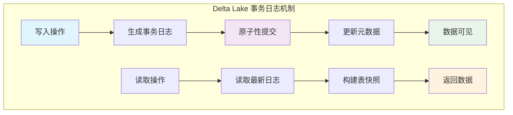

#### ACID 保证

- **原子性**：每个操作要么完全成功，要么完全失败
- **一致性**：保证数据的一致性状态
- **隔离性**：并发操作互不干扰
- **持久性**：已提交的事务永久保存

### 版本控制

Delta Lake 为每个表维护完整的版本历史：

#### 版本信息

- **版本号**：从 0 开始的递增整数
- **时间戳**：每个版本的创建时间
- **操作类型**：CREATE, INSERT, UPDATE, DELETE, MERGE 等
- **元数据**：Schema 信息、统计信息等

#### 版本管理特点

| 特性 | 说明 | 优势 |
|------|------|------|
| **完整历史** | 保留所有版本信息 | 支持时间旅行查询 |
| **增量存储** | 只存储变更部分 | 节省存储空间 |
| **快速回滚** | 可快速恢复到任意版本 | 提高数据安全性 |
| **并发友好** | 支持多版本并发控制 | 提高系统吞吐量 |

### 检查点机制

为了避免事务日志文件过多影响性能，Delta Lake 引入了检查点机制：

#### 检查点作用

- **性能优化**：减少读取日志文件的数量
- **快速启动**：新的读取操作可以从检查点开始
- **存储优化**：压缩历史日志信息

#### 检查点生成

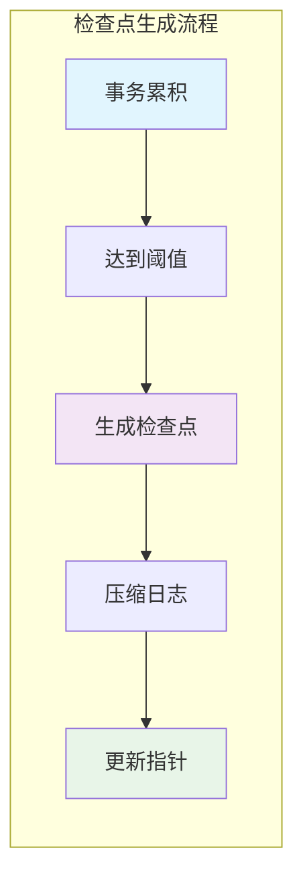

默认情况下，每 10 个事务会生成一个检查点文件。

### Schema 演进

Delta Lake 支持表结构的动态演进：

#### 支持的操作

| 操作类型 | 支持情况 | 说明 |
|----------|----------|------|
| **添加列** | ✅ 自动 | 新列默认为 null |
| **删除列** | ✅ 手动 | 需要显式指定 |
| **重命名列** | ✅ 手动 | 通过 ALTER TABLE |
| **修改类型** | ⚠️ 限制 | 仅支持兼容类型 |
| **重排列** | ✅ 手动 | 通过 ALTER TABLE |

#### Schema 兼容性

Delta Lake 在 Schema 演进时遵循以下原则：

- **向后兼容**：新的 Schema 能够读取旧数据
- **类型安全**：防止不兼容的类型转换
- **默认值处理**：为新增列提供合理的默认值

## 架构设计


### 整体架构

Delta Lake 采用分层架构设计，从上到下分为应用层、Delta Lake 层、存储层和文件系统层：

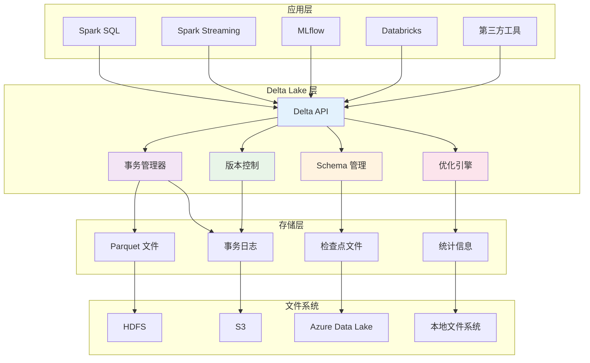

### 各层职责

#### 应用层
- **Spark SQL**：提供 SQL 接口访问 Delta 表
- **Spark Streaming**：支持流式数据处理
- **MLflow**：机器学习生命周期管理
- **第三方工具**：BI 工具、数据可视化工具等

#### Delta Lake 层
- **Delta API**：统一的读写接口
- **事务管理器**：ACID 事务实现
- **版本控制**：时间旅行功能
- **Schema 管理**：自动演进和验证
- **优化引擎**：自动优化和压缩

#### 存储层
- **Parquet 文件**：实际数据存储
- **事务日志**：元数据和版本信息
- **检查点文件**：性能优化
- **统计信息**：查询优化支持

### 存储格式

Delta Lake 使用 **Parquet** 作为底层存储格式，具有以下优势：

#### Parquet 特性

| 特性 | 优势 | 应用场景 |
|------|------|----------|
| **列式存储** | 高效压缩，快速查询 | 分析型工作负载 |
| **Schema 演进** | 支持结构变更 | 动态数据模型 |
| **数据类型丰富** | 支持复杂类型 | 嵌套数据处理 |
| **跨平台兼容** | 多引擎支持 | 生态系统集成 |
| **压缩算法** | 多种压缩选项 | 存储成本优化 |

#### 文件组织

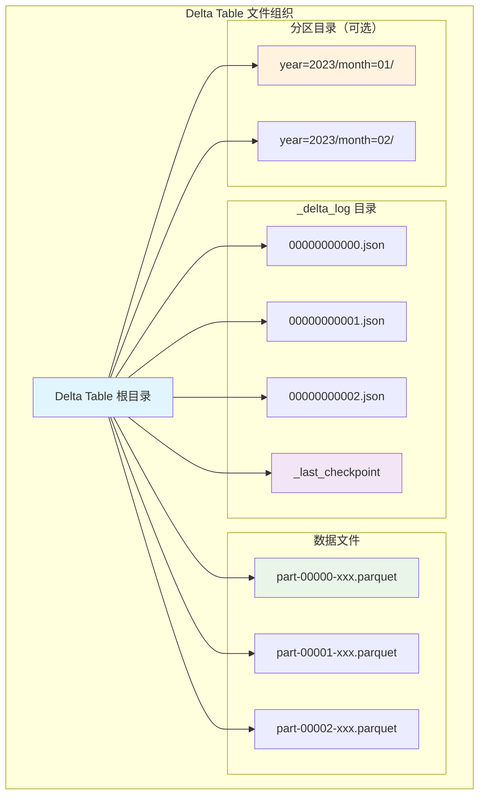

### 元数据管理

Delta Lake 的元数据管理采用多层次结构：

#### 元数据层次

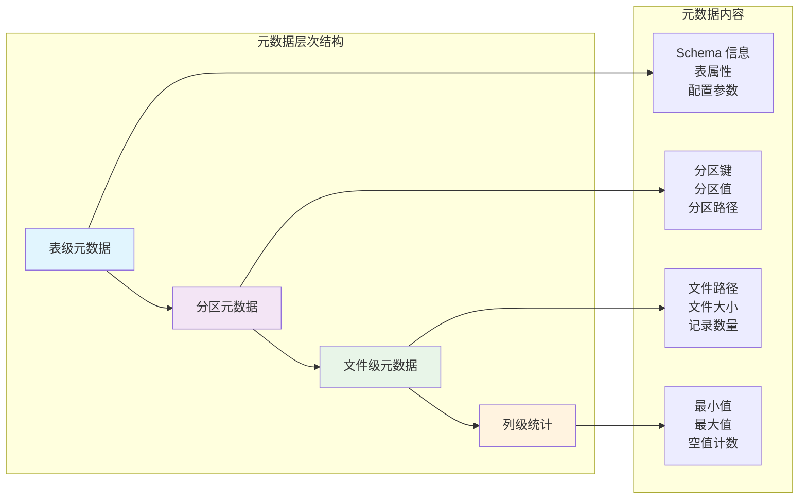

#### 元数据存储

- **事务日志**：存储在 `_delta_log` 目录中的 JSON 文件
- **检查点**：定期生成的 Parquet 格式快照
- **统计信息**：每个数据文件的统计信息
- **Schema 信息**：表结构和数据类型定义

### 并发控制机制

Delta Lake 采用乐观并发控制策略：

#### 乐观锁机制

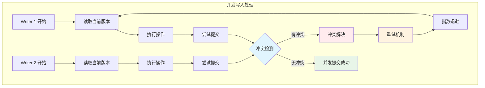

#### 冲突解决策略

1. **检测冲突**：比较操作涉及的文件集合
2. **自动重试**：使用指数退避算法重试
3. **冲突避免**：通过分区减少冲突概率
4. **手动解决**：复杂冲突需要人工干预

### 查询执行引擎

Delta Lake 与 Spark 深度集成，提供优化的查询执行：

#### 查询优化技术

| 技术 | 原理 | 效果 |
|------|------|------|
| **数据跳过** | 基于统计信息跳过不相关文件 | 减少 I/O |
| **分区裁剪** | 根据分区键过滤分区 | 减少扫描范围 |
| **谓词下推** | 将过滤条件推送到存储层 | 提前过滤数据 |
| **列裁剪** | 只读取需要的列 | 减少数据传输 |
| **向量化执行** | 批量处理数据 | 提高 CPU 利用率 |

#### 执行流程

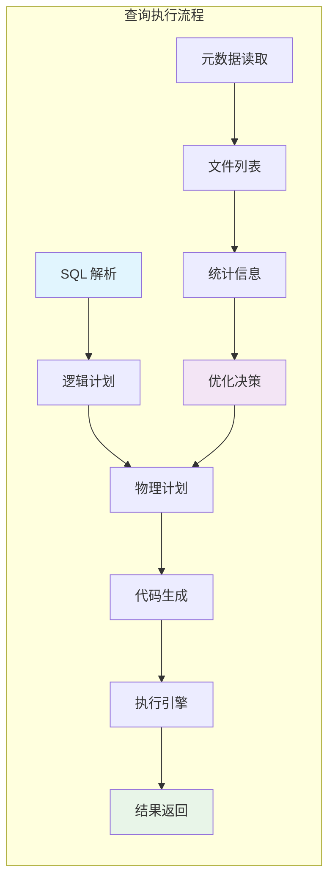

## 核心特性


### ACID 事务

Delta Lake 提供完整的 ACID 事务支持，这是其区别于传统数据湖的核心特性：

#### 原子性 (Atomicity)

**定义**：所有操作要么全部成功，要么全部失败，不存在部分成功的情况。

**实现机制**：
- 通过事务日志确保操作的原子性
- 使用文件系统的原子操作（如重命名）
- 失败时自动回滚，不会留下不一致的状态

**应用场景**：
```python
# 大批量数据插入，要么全部成功，要么全部失败
large_df.write.format("delta").mode("append").save("/path/to/table")
```

#### 一致性 (Consistency)

**定义**：数据库始终从一个一致状态转换到另一个一致状态。

**保证机制**：
- **Schema 强制执行**：防止数据类型错误
- **约束检查**：确保数据质量
- **引用完整性**：维护数据关系

**数据质量保证**：
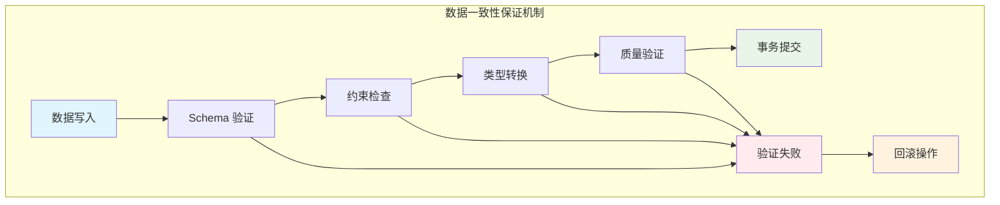

#### 隔离性 (Isolation)

**定义**：并发执行的事务之间互不干扰。

**隔离级别**：
- **快照隔离**：读取操作看到一致的数据快照
- **写写冲突检测**：防止并发写入冲突
- **读写不阻塞**：读操作不会被写操作阻塞

**并发控制**：
| 操作组合 | 是否冲突 | 处理方式 |
|----------|----------|----------|
| **读-读** | ❌ 无冲突 | 并发执行 |
| **读-写** | ❌ 无冲突 | 读取快照 |
| **写-写** | ⚠️ 可能冲突 | 冲突检测 |

#### 持久性 (Durability)

**定义**：已提交的事务永久保存，即使系统故障也不会丢失。

**持久化机制**：
- 事务日志持久化到可靠存储
- 检查点机制确保元数据持久性
- 支持多种存储后端（HDFS、S3、Azure Data Lake）

### 时间旅行 (Time Travel)

**时间旅行** 是 Delta Lake 的标志性功能，允许查询表的历史版本：

#### 查询方式

```sql
-- 查询特定版本
SELECT * FROM my_table VERSION AS OF 5

-- 查询特定时间点
SELECT * FROM my_table TIMESTAMP AS OF '2023-01-01 00:00:00'

-- 查看版本历史
DESCRIBE HISTORY my_table
```

#### 应用场景

| 场景 | 用途 | 示例 |
|------|------|------|
| **数据回滚** | 恢复错误操作 | 回滚到错误操作前的版本 |
| **数据审计** | 追踪数据变更 | 查看特定时间点的数据状态 |
| **A/B 测试** | 比较不同版本 | 对比模型训练前后的数据 |
| **合规要求** | 满足监管需求 | 提供历史数据证据 |

#### 版本管理

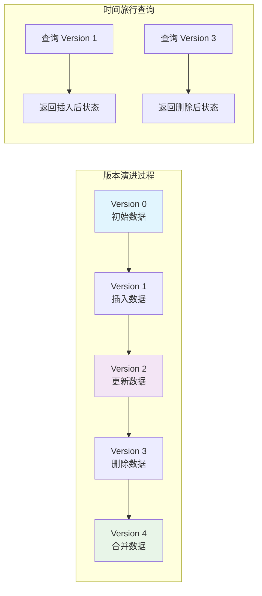

### Schema 演进

Delta Lake 支持表结构的自动演进，无需停机维护：

#### 演进类型

**1. 添加列**
```python
# 自动添加新列
new_df.write.format("delta").option("mergeSchema", "true").mode("append").save("/path/to/table")
```

**2. 删除列**
```sql
-- 手动删除列
ALTER TABLE my_table DROP COLUMN old_column
```

**3. 重命名列**
```sql
-- 重命名列
ALTER TABLE my_table RENAME COLUMN old_name TO new_name
```

**4. 修改数据类型**
```sql
-- 兼容类型转换
ALTER TABLE my_table ALTER COLUMN age TYPE BIGINT
```

#### 兼容性规则

| 变更类型 | 向前兼容 | 向后兼容 | 说明 |
|----------|----------|----------|------|
| **添加列** | ✅ | ✅ | 新列默认 null |
| **删除列** | ❌ | ✅ | 旧版本无法读取 |
| **重命名列** | ❌ | ❌ | 需要数据迁移 |
| **扩展类型** | ✅ | ✅ | int → long |
| **收缩类型** | ❌ | ❌ | long → int |

### 数据质量保证

Delta Lake 内置多种数据质量保证机制：

#### 约束检查

```python
# 添加检查约束
spark.sql("""
    ALTER TABLE my_table 
    ADD CONSTRAINT age_check CHECK (age >= 0 AND age <= 150)
""")

# 添加非空约束
spark.sql("""
    ALTER TABLE my_table 
    ALTER COLUMN email SET NOT NULL
""")
```

#### 数据验证流程

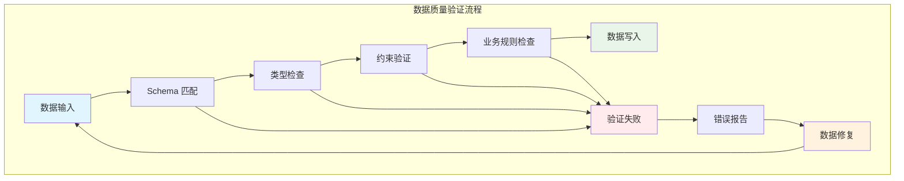

#### 质量监控

| 监控维度 | 检查内容 | 处理方式 |
|----------|----------|----------|
| **完整性** | 空值、缺失值 | 自动填充或拒绝 |
| **准确性** | 数据格式、范围 | 格式化或校正 |
| **一致性** | 重复数据、冲突 | 去重或合并 |
| **及时性** | 数据新鲜度 | 过期数据标记 |

### 流批统一处理

Delta Lake 提供统一的流批处理接口，简化数据架构：

#### 统一 API

```python
# 批处理写入
batch_df.write.format("delta").save("/path/to/table")

# 流式写入（相同的表）
stream_df.writeStream.format("delta").start("/path/to/table")

# 批处理读取
batch_read = spark.read.format("delta").load("/path/to/table")

# 流式读取（相同的表）
stream_read = spark.readStream.format("delta").load("/path/to/table")
```

#### 流式处理特性

**1. 精确一次语义**
- 通过事务日志保证精确一次处理
- 自动处理重复数据和故障恢复

**2. 低延迟处理**
- 支持微批处理模式
- 可配置触发间隔

**3. 状态管理**
- 自动管理检查点
- 支持状态恢复

#### 架构优势

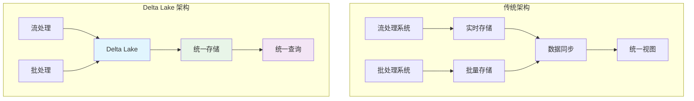

### 自动优化功能

Delta Lake 提供多种自动优化功能，减少运维负担：

#### 自动压缩

```python
# 启用自动压缩
spark.conf.set("spark.databricks.delta.autoCompact.enabled", "true")
```

**压缩策略**：
- 合并小文件提高查询性能
- 保持最优文件大小（128MB-1GB）
- 减少文件系统开销

#### 自动优化写入

```python
# 启用优化写入
spark.conf.set("spark.databricks.delta.optimizeWrite.enabled", "true")
```

**优化效果**：
- 动态调整文件大小
- 减少小文件产生
- 提高写入性能

#### Z-Order 聚类

```python
# 手动触发 Z-Order 优化
deltaTable.optimize().executeZOrderBy("department", "age")
```

**Z-Order 原理**：
- 多维数据聚类技术
- 提高范围查询性能
- 减少数据扫描量

## 安装与配置


### 环境要求

Delta Lake 的运行需要满足以下环境要求：

#### 基础环境

| 组件 | 版本要求 | 说明 |
|------|----------|------|
| **Apache Spark** | 3.0+ | 核心计算引擎 |
| **Scala** | 2.12 或 2.13 | Spark 运行时语言 |
| **Java** | 8+ | JVM 运行环境 |
| **Python** | 3.6+ | PySpark 支持（可选） |

#### 存储系统支持

- **HDFS**：Hadoop 分布式文件系统
- **Amazon S3**：AWS 对象存储
- **Azure Data Lake Storage**：Azure 云存储
- **Google Cloud Storage**：GCP 对象存储
- **本地文件系统**：开发测试环境

### 安装方式

#### Maven 依赖

在 `pom.xml` 中添加 Delta Lake 依赖：

```xml
<dependency>
    <groupId>io.delta</groupId>
    <artifactId>delta-core_2.12</artifactId>
    <version>2.4.0</version>
</dependency>

<dependency>
    <groupId>io.delta</groupId>
    <artifactId>delta-storage</artifactId>
    <version>2.4.0</version>
</dependency>
```

#### SBT 依赖

在 `build.sbt` 中添加：

```scala
libraryDependencies += "io.delta" %% "delta-core" % "2.4.0"
libraryDependencies += "io.delta" %% "delta-storage" % "2.4.0"
```

#### Python 环境

```bash
# 安装 Delta Lake Python 包
pip install delta-spark

# 或者使用 conda
conda install -c conda-forge delta-spark
```

### Spark 配置

#### 启动配置

**Spark Shell 启动**：
```bash
spark-shell --packages io.delta:delta-core_2.12:2.4.0 \
  --conf "spark.sql.extensions=io.delta.sql.DeltaSparkSessionExtension" \
  --conf "spark.sql.catalog.spark_catalog=org.apache.spark.sql.delta.catalog.DeltaCatalog"
```

**PySpark 启动**：
```bash
pyspark --packages io.delta:delta-core_2.12:2.4.0 \
  --conf "spark.sql.extensions=io.delta.sql.DeltaSparkSessionExtension" \
  --conf "spark.sql.catalog.spark_catalog=org.apache.spark.sql.delta.catalog.DeltaCatalog"
```

**Spark Submit**：
```bash
spark-submit --packages io.delta:delta-core_2.12:2.4.0 \
  --conf "spark.sql.extensions=io.delta.sql.DeltaSparkSessionExtension" \
  --conf "spark.sql.catalog.spark_catalog=org.apache.spark.sql.delta.catalog.DeltaCatalog" \
  your_application.py
```

#### 程序化配置

**Scala/Java**：
```scala
import org.apache.spark.sql.SparkSession
import io.delta.sql._

val spark = SparkSession.builder()
  .appName("DeltaLakeExample")
  .config("spark.sql.extensions", "io.delta.sql.DeltaSparkSessionExtension")
  .config("spark.sql.catalog.spark_catalog", "org.apache.spark.sql.delta.catalog.DeltaCatalog")
  .getOrCreate()
```

**Python**：
```python
from pyspark.sql import SparkSession
from delta import configure_spark_with_delta_pip

builder = SparkSession.builder.appName("DeltaLakeExample") \
    .config("spark.sql.extensions", "io.delta.sql.DeltaSparkSessionExtension") \
    .config("spark.sql.catalog.spark_catalog", "org.apache.spark.sql.delta.catalog.DeltaCatalog")

spark = configure_spark_with_delta_pip(builder).getOrCreate()
```

### 核心配置参数

#### 基础配置

| 参数 | 默认值 | 说明 |
|------|--------|------|
| `delta.autoOptimize.optimizeWrite` | false | 自动优化写入 |
| `delta.autoOptimize.autoCompact` | false | 自动压缩小文件 |
| `delta.deletedFileRetentionDuration` | 7 days | 删除文件保留时间 |
| `delta.logRetentionDuration` | 30 days | 日志保留时间 |
| `delta.checkpointInterval` | 10 | 检查点间隔 |

#### 性能优化配置

```python
# 启用自动优化
spark.conf.set("spark.databricks.delta.optimizeWrite.enabled", "true")
spark.conf.set("spark.databricks.delta.autoCompact.enabled", "true")

# 配置文件大小
spark.conf.set("spark.sql.files.maxPartitionBytes", "134217728")  # 128MB
spark.conf.set("spark.sql.files.openCostInBytes", "4194304")     # 4MB

# 配置并行度
spark.conf.set("spark.sql.shuffle.partitions", "200")
spark.conf.set("spark.default.parallelism", "100")
```

#### 并发控制配置

```python
# 冲突重试配置
spark.conf.set("spark.databricks.delta.retryWriteConflict.enabled", "true")
spark.conf.set("spark.databricks.delta.retryWriteConflict.limit", "3")

# 乐观锁配置
spark.conf.set("spark.databricks.delta.merge.repartitionBeforeWrite.enabled", "true")
```

### 存储配置

#### S3 配置

```python
# S3 访问配置
spark.conf.set("spark.hadoop.fs.s3a.access.key", "your-access-key")
spark.conf.set("spark.hadoop.fs.s3a.secret.key", "your-secret-key")
spark.conf.set("spark.hadoop.fs.s3a.endpoint", "s3.amazonaws.com")

# S3 性能优化
spark.conf.set("spark.hadoop.fs.s3a.multipart.size", "104857600")  # 100MB
spark.conf.set("spark.hadoop.fs.s3a.multipart.threshold", "2147483647")  # 2GB
spark.conf.set("spark.hadoop.fs.s3a.fast.upload", "true")
```

#### HDFS 配置

```python
# HDFS 配置
spark.conf.set("spark.hadoop.dfs.client.use.datanode.hostname", "true")
spark.conf.set("spark.hadoop.dfs.client.cache.drop.behind.reads", "true")
```

#### Azure Data Lake 配置

```python
# Azure 配置
spark.conf.set("spark.hadoop.fs.azure.account.key.your-account.dfs.core.windows.net", "your-key")
spark.conf.set("spark.hadoop.fs.azure.account.auth.type.your-account.dfs.core.windows.net", "SharedKey")
```

### 集群配置

#### Databricks 配置

在 Databricks 集群配置中添加：

```bash
# Spark 配置
spark.sql.extensions io.delta.sql.DeltaSparkSessionExtension
spark.sql.catalog.spark_catalog org.apache.spark.sql.delta.catalog.DeltaCatalog

# 自动优化
spark.databricks.delta.optimizeWrite.enabled true
spark.databricks.delta.autoCompact.enabled true
```

#### EMR 配置

在 EMR 集群的 `spark-defaults` 分类中配置：

```json
[
  {
    "classification": "spark-defaults",
    "properties": {
      "spark.sql.extensions": "io.delta.sql.DeltaSparkSessionExtension",
      "spark.sql.catalog.spark_catalog": "org.apache.spark.sql.delta.catalog.DeltaCatalog",
      "spark.databricks.delta.optimizeWrite.enabled": "true",
      "spark.databricks.delta.autoCompact.enabled": "true"
    }
  }
]
```

#### Kubernetes 配置

```yaml
apiVersion: v1
kind: ConfigMap
metadata:
  name: spark-config
data:
  spark-defaults.conf: |
    spark.sql.extensions=io.delta.sql.DeltaSparkSessionExtension
    spark.sql.catalog.spark_catalog=org.apache.spark.sql.delta.catalog.DeltaCatalog
    spark.databricks.delta.optimizeWrite.enabled=true
    spark.databricks.delta.autoCompact.enabled=true
```

### 验证安装

#### 基本功能测试

```python
from pyspark.sql import SparkSession
from delta.tables import DeltaTable
import delta

# 创建测试数据
data = [(1, "Alice", 25), (2, "Bob", 30), (3, "Charlie", 35)]
columns = ["id", "name", "age"]
df = spark.createDataFrame(data, columns)

# 写入 Delta 表
df.write.format("delta").save("/tmp/test-delta-table")

# 读取验证
delta_df = spark.read.format("delta").load("/tmp/test-delta-table")
delta_df.show()

# 检查版本
DeltaTable.forPath(spark, "/tmp/test-delta-table").history().show()

print("Delta Lake 安装验证成功！")
```

#### 功能特性测试

```python
# 测试时间旅行
spark.sql("SELECT * FROM delta.`/tmp/test-delta-table` VERSION AS OF 0").show()

# 测试 Schema 演进
new_data = [(4, "David", 28, "Engineering")]
new_columns = ["id", "name", "age", "department"]
new_df = spark.createDataFrame(new_data, new_columns)

new_df.write.format("delta") \
    .option("mergeSchema", "true") \
    .mode("append") \
    .save("/tmp/test-delta-table")

# 验证新 Schema
spark.read.format("delta").load("/tmp/test-delta-table").printSchema()
```

### 常见安装问题

#### 版本兼容性问题

**问题**：Spark 版本与 Delta Lake 版本不兼容

**解决方案**：
```bash
# 检查版本兼容性
spark-shell --version
# 选择对应的 Delta Lake 版本
```

#### 依赖冲突问题

**问题**：与其他库的依赖冲突

**解决方案**：
```xml
<!-- 排除冲突依赖 -->
<dependency>
    <groupId>io.delta</groupId>
    <artifactId>delta-core_2.12</artifactId>
    <version>2.4.0</version>
    <exclusions>
        <exclusion>
            <groupId>conflicting-group</groupId>
            <artifactId>conflicting-artifact</artifactId>
        </exclusion>
    </exclusions>
</dependency>
```

#### 权限问题

**问题**：存储系统访问权限不足

**解决方案**：
```python
# 检查存储权限
spark.sql("CREATE TABLE test_permissions (id INT) USING DELTA LOCATION '/path/to/test'")
```

## 基本操作

### 创建 Delta Table

#### 使用 DataFrame API

**Python 示例**：
```python
from pyspark.sql import SparkSession
from pyspark.sql.types import StructType, StructField, StringType, IntegerType

# 创建示例数据
data = [
    (1, "Alice", 25, "Engineering"),
    (2, "Bob", 30, "Sales"),
    (3, "Charlie", 35, "Marketing")
]
columns = ["id", "name", "age", "department"]
df = spark.createDataFrame(data, columns)

# 写入 Delta Table
df.write.format("delta").save("/path/to/delta-table")

# 带分区的 Delta Table
df.write.format("delta") \
    .partitionBy("department") \
    .save("/path/to/partitioned-table")
```

**Scala 示例**：
```scala
import org.apache.spark.sql.SparkSession
import io.delta.tables._

val data = Seq(
  (1, "Alice", 25, "Engineering"),
  (2, "Bob", 30, "Sales"),
  (3, "Charlie", 35, "Marketing")
)

val df = spark.createDataFrame(data).toDF("id", "name", "age", "department")

// 写入 Delta Table
df.write.format("delta").save("/path/to/delta-table")
```

#### 使用 SQL DDL

```sql
-- 创建 Delta Table
CREATE TABLE employees (
    id INT,
    name STRING,
    age INT,
    department STRING,
    salary DOUBLE,
    hire_date DATE
) USING DELTA
LOCATION '/path/to/delta-table'

-- 创建分区表
CREATE TABLE employees_partitioned (
    id INT,
    name STRING,
    age INT,
    department STRING,
    salary DOUBLE,
    hire_date DATE
) USING DELTA
PARTITIONED BY (department)
LOCATION '/path/to/partitioned-table'

-- 创建带约束的表
CREATE TABLE employees_with_constraints (
    id INT NOT NULL,
    name STRING NOT NULL,
    age INT CHECK (age >= 18 AND age <= 65),
    department STRING,
    salary DOUBLE CHECK (salary > 0)
) USING DELTA
```

#### 从现有数据创建

```python
# 从 Parquet 文件创建
parquet_df = spark.read.parquet("/path/to/parquet-files")
parquet_df.write.format("delta").save("/path/to/delta-table")

# 从 CSV 文件创建
csv_df = spark.read.option("header", "true").csv("/path/to/csv-files")
csv_df.write.format("delta").save("/path/to/delta-table")

# 从数据库表创建
jdbc_df = spark.read.format("jdbc") \
    .option("url", "jdbc:postgresql://localhost:5432/mydb") \
    .option("dbtable", "source_table") \
    .option("user", "username") \
    .option("password", "password") \
    .load()

jdbc_df.write.format("delta").save("/path/to/delta-table")
```

### 读取数据

#### 基本读取操作

```python
# 读取整个 Delta Table
df = spark.read.format("delta").load("/path/to/delta-table")
df.show()

# 使用 SQL 读取
spark.sql("SELECT * FROM delta.`/path/to/delta-table`").show()

# 注册为临时视图
spark.read.format("delta").load("/path/to/delta-table").createOrReplaceTempView("employees")
spark.sql("SELECT * FROM employees WHERE age > 30").show()
```

#### 条件查询

```python
# 使用 DataFrame API
df = spark.read.format("delta").load("/path/to/delta-table")
filtered_df = df.filter(df.age > 30).select("name", "department", "age")
filtered_df.show()

# 使用 SQL
result = spark.sql("""
    SELECT name, department, age 
    FROM delta.`/path/to/delta-table` 
    WHERE age > 30 AND department = 'Engineering'
""")
result.show()
```

#### 聚合查询

```python
# 部门统计
dept_stats = spark.sql("""
    SELECT 
        department,
        COUNT(*) as employee_count,
        AVG(age) as avg_age,
        MAX(salary) as max_salary,
        MIN(salary) as min_salary
    FROM delta.`/path/to/delta-table`
    GROUP BY department
    ORDER BY employee_count DESC
""")
dept_stats.show()
```

### 插入数据

#### 追加数据

```python
# 准备新数据
new_data = [
    (4, "David", 28, "Engineering"),
    (5, "Eve", 32, "Sales"),
    (6, "Frank", 29, "Marketing")
]
new_df = spark.createDataFrame(new_data, columns)

# 追加到 Delta Table
new_df.write.format("delta").mode("append").save("/path/to/delta-table")

# 使用 SQL 插入
spark.sql("""
    INSERT INTO delta.`/path/to/delta-table`
    VALUES (7, 'Grace', 27, 'Engineering'),
           (8, 'Henry', 31, 'Sales')
""")
```

#### 批量插入

```python
# 大批量数据插入
large_df = spark.range(10000).select(
    col("id").cast("int"),
    concat(lit("User"), col("id")).alias("name"),
    (col("id") % 50 + 20).alias("age"),
    when(col("id") % 3 == 0, "Engineering")
    .when(col("id") % 3 == 1, "Sales")
    .otherwise("Marketing").alias("department")
)

# 优化写入性能
large_df.coalesce(10) \
    .write.format("delta") \
    .mode("append") \
    .save("/path/to/delta-table")
```

### 更新数据

#### 使用 Delta Table API

```python
from delta.tables import DeltaTable

# 加载 Delta Table
deltaTable = DeltaTable.forPath(spark, "/path/to/delta-table")

# 简单更新
deltaTable.update(
    condition = "age < 30",
    set = {"age": "age + 1"}
)

# 复杂更新
deltaTable.update(
    condition = "department = 'Engineering' AND age > 35",
    set = {
        "salary": "salary * 1.1",
        "last_updated": "current_timestamp()"
    }
)
```

#### 使用 SQL 更新

```sql
-- 简单更新
UPDATE delta.`/path/to/delta-table`
SET age = age + 1
WHERE age < 30

-- 条件更新
UPDATE delta.`/path/to/delta-table`
SET salary = salary * 1.1,
    last_updated = current_timestamp()
WHERE department = 'Engineering' AND performance_rating = 'Excellent'

-- 基于子查询更新
UPDATE delta.`/path/to/delta-table` t1
SET salary = (
    SELECT AVG(salary) * 1.2 
    FROM delta.`/path/to/salary-reference` t2 
    WHERE t2.department = t1.department
)
WHERE t1.salary < (
    SELECT AVG(salary) 
    FROM delta.`/path/to/salary-reference` t3 
    WHERE t3.department = t1.department
)
```

### 删除数据

#### 条件删除

```python
# 使用 Delta Table API
deltaTable.delete("age > 60")

# 删除特定部门
deltaTable.delete("department = 'Marketing' AND hire_date < '2020-01-01'")
```

#### 使用 SQL 删除

```sql
-- 简单删除
DELETE FROM delta.`/path/to/delta-table`
WHERE age > 60

-- 复杂删除条件
DELETE FROM delta.`/path/to/delta-table`
WHERE department = 'Sales' 
  AND hire_date < '2020-01-01'
  AND performance_rating = 'Poor'

-- 基于子查询删除
DELETE FROM delta.`/path/to/delta-table` t1
WHERE EXISTS (
    SELECT 1 FROM delta.`/path/to/terminated-employees` t2
    WHERE t2.employee_id = t1.id
)
```

### Upsert 操作 (Merge)

Merge 操作是 Delta Lake 的强大功能，支持插入、更新、删除的组合操作：

#### 基本 Merge 操作

```python
# 准备更新数据
updates = [
    (1, "Alice Smith", 26, "Engineering"),  # 更新现有记录
    (9, "Ivy", 29, "Engineering"),          # 插入新记录
    (10, "Jack", 33, "Sales")               # 插入新记录
]
updates_df = spark.createDataFrame(updates, columns)

# 执行 Merge 操作
deltaTable.alias("target").merge(
    updates_df.alias("source"),
    "target.id = source.id"
).whenMatchedUpdate(set = {
    "name": "source.name",
    "age": "source.age",
    "department": "source.department"
}).whenNotMatchedInsert(values = {
    "id": "source.id",
    "name": "source.name",
    "age": "source.age",
    "department": "source.department"
}).execute()
```

#### 复杂 Merge 操作

```python
# 复杂的 Merge 逻辑
deltaTable.alias("target").merge(
    updates_df.alias("source"),
    "target.id = source.id"
).whenMatchedUpdate(
    condition = "source.age IS NOT NULL",
    set = {
        "name": "source.name",
        "age": "source.age",
        "department": "source.department",
        "last_updated": "current_timestamp()"
    }
).whenMatchedDelete(
    condition = "source.status = 'TERMINATED'"
).whenNotMatchedInsert(
    condition = "source.age >= 18",
    values = {
        "id": "source.id",
        "name": "source.name",
        "age": "source.age",
        "department": "source.department",
        "created_at": "current_timestamp()"
    }
).execute()
```

#### 使用 SQL Merge

```sql
MERGE INTO delta.`/path/to/delta-table` AS target
USING (
    SELECT id, name, age, department, status
    FROM delta.`/path/to/updates-table`
) AS source
ON target.id = source.id

WHEN MATCHED AND source.status = 'ACTIVE' THEN
    UPDATE SET 
        name = source.name,
        age = source.age,
        department = source.department,
        last_updated = current_timestamp()

WHEN MATCHED AND source.status = 'TERMINATED' THEN
    DELETE

WHEN NOT MATCHED AND source.age >= 18 THEN
    INSERT (id, name, age, department, created_at)
    VALUES (source.id, source.name, source.age, source.department, current_timestamp())
```

### 表管理操作

#### 查看表信息

```python
# 查看表结构
spark.sql("DESCRIBE delta.`/path/to/delta-table`").show()

# 查看详细信息
spark.sql("DESCRIBE DETAIL delta.`/path/to/delta-table`").show()

# 查看表历史
deltaTable.history().show()

# 查看表属性
spark.sql("SHOW TBLPROPERTIES delta.`/path/to/delta-table`").show()
```

#### 表维护操作

```python
# 生成表统计信息
spark.sql("ANALYZE TABLE delta.`/path/to/delta-table` COMPUTE STATISTICS")

# 刷新表缓存
spark.sql("REFRESH TABLE delta.`/path/to/delta-table`")

# 修复表（如果需要）
spark.sql("MSCK REPAIR TABLE delta.`/path/to/delta-table`")
```

### 事务和并发控制

#### 事务隔离

```python
# 事务中的多个操作
try:
    # 开始事务（隐式）
    deltaTable.update(condition="department = 'Sales'", set={"salary": "salary * 1.1"})
    deltaTable.delete("performance_rating = 'Poor'")
    
    # 插入新数据
    new_employees.write.format("delta").mode("append").save("/path/to/delta-table")
    
    # 事务自动提交
    print("事务执行成功")
    
except Exception as e:
    print(f"事务执行失败: {e}")
    # Delta Lake 自动回滚
```

#### 并发写入处理

```python
# 配置重试机制
spark.conf.set("spark.databricks.delta.retryWriteConflict.enabled", "true")
spark.conf.set("spark.databricks.delta.retryWriteConflict.limit", "3")

# 并发安全的写入
def safe_write(df, path, max_retries=3):
    for attempt in range(max_retries):
        try:
            df.write.format("delta").mode("append").save(path)
            print(f"写入成功，尝试次数: {attempt + 1}")
            break
        except Exception as e:
            if "ConcurrentModificationException" in str(e) and attempt < max_retries - 1:
                print(f"写入冲突，重试中... (尝试 {attempt + 1})")
                time.sleep(2 ** attempt)  # 指数退避
            else:
                raise e
```

## 高级功能

### 时间旅行查询

时间旅行是 Delta Lake 的核心功能之一，允许查询表的历史版本：

#### 版本查询

```python
# 查询特定版本
df_v0 = spark.read.format("delta").option("versionAsOf", 0).load("/path/to/delta-table")
df_v5 = spark.read.format("delta").option("versionAsOf", 5).load("/path/to/delta-table")

# 使用 SQL 查询版本
spark.sql("SELECT * FROM delta.`/path/to/delta-table` VERSION AS OF 3").show()

# 比较不同版本
current_df = spark.read.format("delta").load("/path/to/delta-table")
previous_df = spark.read.format("delta").option("versionAsOf", 5).load("/path/to/delta-table")

# 找出差异
diff_df = current_df.subtract(previous_df)
diff_df.show()
```

#### 时间戳查询

```python
# 查询特定时间点
df_timestamp = spark.read.format("delta") \
    .option("timestampAsOf", "2023-01-01 12:00:00") \
    .load("/path/to/delta-table")

# 使用 SQL 时间戳查询
spark.sql("""
    SELECT * FROM delta.`/path/to/delta-table` 
    TIMESTAMP AS OF '2023-01-01 12:00:00'
""").show()

# 查询一小时前的数据
from datetime import datetime, timedelta
one_hour_ago = (datetime.now() - timedelta(hours=1)).strftime("%Y-%m-%d %H:%M:%S")
df_hour_ago = spark.read.format("delta") \
    .option("timestampAsOf", one_hour_ago) \
    .load("/path/to/delta-table")
```

#### 历史版本分析

```python
# 查看完整历史
history_df = deltaTable.history()
history_df.select("version", "timestamp", "operation", "operationParameters").show(truncate=False)

# 分析版本变化
version_stats = history_df.groupBy("operation").count().orderBy("count", ascending=False)
version_stats.show()

# 查看特定操作的历史
merge_history = history_df.filter("operation = 'MERGE'")
merge_history.select("version", "timestamp", "operationParameters.predicate").show(truncate=False)
```

### 版本回滚

Delta Lake 支持将表回滚到之前的任意版本：

#### 回滚到特定版本

```python
# 回滚到版本 5
deltaTable.restoreToVersion(5)

# 使用 SQL 回滚
spark.sql("RESTORE TABLE delta.`/path/to/delta-table` TO VERSION AS OF 5")

# 验证回滚结果
current_version = deltaTable.history().first()["version"]
print(f"当前版本: {current_version}")
```

#### 回滚到特定时间点

```python
# 回滚到特定时间
deltaTable.restoreToTimestamp("2023-01-01 12:00:00")

# 使用 SQL 时间点回滚
spark.sql("""
    RESTORE TABLE delta.`/path/to/delta-table` 
    TO TIMESTAMP AS OF '2023-01-01 12:00:00'
""")
```

#### 安全回滚实践

```python
def safe_restore(table_path, target_version, backup_path=None):
    """安全的表回滚操作"""
    delta_table = DeltaTable.forPath(spark, table_path)
    
    # 记录当前状态
    current_version = delta_table.history().first()["version"]
    print(f"当前版本: {current_version}")
    
    # 可选：创建备份
    if backup_path:
        current_df = spark.read.format("delta").load(table_path)
        current_df.write.format("delta").save(backup_path)
        print(f"备份已创建: {backup_path}")
    
    # 执行回滚
    try:
        delta_table.restoreToVersion(target_version)
        print(f"成功回滚到版本: {target_version}")
        
        # 验证回滚
        new_version = delta_table.history().first()["version"]
        print(f"回滚后版本: {new_version}")
        
    except Exception as e:
        print(f"回滚失败: {e}")
        raise
```

### 数据压缩优化

Delta Lake 提供多种数据压缩和优化功能：

#### 文件压缩

```python
# 手动触发压缩
deltaTable.optimize().executeCompaction()

# 使用 SQL 压缩
spark.sql("OPTIMIZE delta.`/path/to/delta-table`")

# 压缩特定分区
spark.sql("OPTIMIZE delta.`/path/to/delta-table` WHERE department = 'Engineering'")
```

#### Z-Order 优化

Z-Order 是一种多维聚类技术，可以显著提高查询性能：

```python
# 对常用查询列进行 Z-Order 优化
deltaTable.optimize().executeZOrderBy("department", "age")

# 使用 SQL 进行 Z-Order
spark.sql("OPTIMIZE delta.`/path/to/delta-table` ZORDER BY (department, age)")

# 多列 Z-Order 优化
deltaTable.optimize().executeZOrderBy("department", "age", "hire_date", "salary")
```

#### Z-Order 效果分析

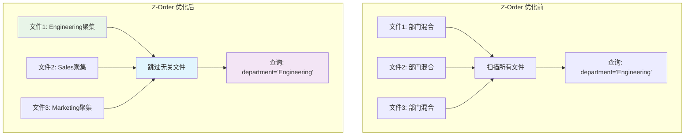

#### 自动优化配置

```python
# 启用自动优化
spark.conf.set("spark.databricks.delta.optimizeWrite.enabled", "true")
spark.conf.set("spark.databricks.delta.autoCompact.enabled", "true")

# 配置优化参数
spark.conf.set("spark.databricks.delta.autoCompact.minNumFiles", "50")
spark.conf.set("spark.databricks.delta.autoCompact.maxFileSize", "1073741824")  # 1GB
```

### 历史数据清理

为了控制存储成本和提高性能，需要定期清理历史数据：

#### Vacuum 操作

```python
# 清理 7 天前的历史文件
deltaTable.vacuum(168)  # 168 小时 = 7 天

# 使用 SQL 清理
spark.sql("VACUUM delta.`/path/to/delta-table` RETAIN 168 HOURS")

# 清理特定分区
spark.sql("VACUUM delta.`/path/to/delta-table` RETAIN 168 HOURS WHERE department = 'Engineering'")
```

#### 安全清理策略

```python
def safe_vacuum(table_path, retention_hours=168, dry_run=True):
    """安全的历史数据清理"""
    delta_table = DeltaTable.forPath(spark, table_path)
    
    if dry_run:
        # 预览将要删除的文件
        print("预览模式 - 将要删除的文件:")
        spark.conf.set("spark.databricks.delta.vacuum.logging.enabled", "true")
        delta_table.vacuum(retention_hours)
    else:
        # 实际执行清理
        print(f"清理 {retention_hours} 小时前的历史文件...")
        delta_table.vacuum(retention_hours)
        print("清理完成")

# 先预览，再执行
safe_vacuum("/path/to/delta-table", retention_hours=168, dry_run=True)
safe_vacuum("/path/to/delta-table", retention_hours=168, dry_run=False)
```

#### 清理策略配置

```python
# 配置默认保留期
spark.conf.set("spark.databricks.delta.deletedFileRetentionDuration", "interval 3 days")
spark.conf.set("spark.databricks.delta.logRetentionDuration", "interval 7 days")

# 禁用安全检查（谨慎使用）
spark.conf.set("spark.databricks.delta.retentionDurationCheck.enabled", "false")
```

### 流式处理

Delta Lake 提供强大的流式处理能力：

#### 流式读取

```python
# 基本流式读取
stream = spark.readStream.format("delta").load("/path/to/delta-table")

# 从特定版本开始读取
stream_from_version = spark.readStream \
    .format("delta") \
    .option("startingVersion", "5") \
    .load("/path/to/delta-table")

# 从特定时间开始读取
stream_from_time = spark.readStream \
    .format("delta") \
    .option("startingTimestamp", "2023-01-01 00:00:00") \
    .load("/path/to/delta-table")
```

#### 流式写入

```python
# 基本流式写入
query = stream.writeStream \
    .format("delta") \
    .outputMode("append") \
    .option("checkpointLocation", "/path/to/checkpoint") \
    .start("/path/to/output-table")

# 流式 Upsert
def upsert_to_delta(batch_df, batch_id):
    """流式批次的 Upsert 操作"""
    delta_table = DeltaTable.forPath(spark, "/path/to/target-table")
    
    delta_table.alias("target").merge(
        batch_df.alias("source"),
        "target.id = source.id"
    ).whenMatchedUpdateAll() \
     .whenNotMatchedInsertAll() \
     .execute()

# 应用 Upsert 到流
upsert_query = stream.writeStream \
    .foreachBatch(upsert_to_delta) \
    .option("checkpointLocation", "/path/to/checkpoint") \
    .start()
```

#### 流式聚合

```python
# 实时聚合统计
windowed_counts = stream \
    .withWatermark("timestamp", "10 minutes") \
    .groupBy(
        window(col("timestamp"), "5 minutes"),
        col("department")
    ).agg(
        count("*").alias("employee_count"),
        avg("age").alias("avg_age")
    )

# 写入聚合结果
aggregation_query = windowed_counts.writeStream \
    .format("delta") \
    .outputMode("update") \
    .option("checkpointLocation", "/path/to/agg-checkpoint") \
    .start("/path/to/aggregation-table")
```

### Change Data Feed

Change Data Feed (CDF) 功能可以跟踪表的变更：

#### 启用 CDF

```python
# 为新表启用 CDF
spark.sql("""
    CREATE TABLE cdf_enabled_table (
        id INT,
        name STRING,
        age INT
    ) USING DELTA
    TBLPROPERTIES (delta.enableChangeDataFeed = true)
""")

# 为现有表启用 CDF
spark.sql("""
    ALTER TABLE delta.`/path/to/delta-table`
    SET TBLPROPERTIES (delta.enableChangeDataFeed = true)
""")
```

#### 读取变更数据

```python
# 读取从特定版本开始的变更
changes_df = spark.read.format("delta") \
    .option("readChangeFeed", "true") \
    .option("startingVersion", 0) \
    .load("/path/to/delta-table")

changes_df.show()

# 读取特定时间范围的变更
time_range_changes = spark.read.format("delta") \
    .option("readChangeFeed", "true") \
    .option("startingTimestamp", "2023-01-01 00:00:00") \
    .option("endingTimestamp", "2023-01-02 00:00:00") \
    .load("/path/to/delta-table")
```

#### 流式变更处理

```python
# 流式读取变更
change_stream = spark.readStream.format("delta") \
    .option("readChangeFeed", "true") \
    .option("startingVersion", 0) \
    .load("/path/to/delta-table")

# 处理不同类型的变更
def process_changes(batch_df, batch_id):
    """处理变更数据"""
    inserts = batch_df.filter("_change_type = 'insert'")
    updates = batch_df.filter("_change_type = 'update_postimage'")
    deletes = batch_df.filter("_change_type = 'delete'")
    
    print(f"批次 {batch_id}: 插入 {inserts.count()}, 更新 {updates.count()}, 删除 {deletes.count()}")
    
    # 处理各种变更类型
    if inserts.count() > 0:
        # 处理插入
        pass
    if updates.count() > 0:
        # 处理更新
        pass
    if deletes.count() > 0:
        # 处理删除
        pass

# 启动变更处理流
change_query = change_stream.writeStream \
    .foreachBatch(process_changes) \
    .option("checkpointLocation", "/path/to/cdf-checkpoint") \
    .start()
```

### 表克隆

Delta Lake 支持浅克隆和深克隆：

#### 浅克隆 (Shallow Clone)

```sql
-- 创建浅克隆（只复制元数据）
CREATE TABLE shallow_clone
SHALLOW CLONE delta.`/path/to/source-table`

-- 克隆到特定版本
CREATE TABLE version_clone
SHALLOW CLONE delta.`/path/to/source-table` VERSION AS OF 5
```

#### 深克隆 (Deep Clone)

```sql
-- 创建深克隆（复制所有数据）
CREATE TABLE deep_clone
DEEP CLONE delta.`/path/to/source-table`

-- 克隆到特定时间点
CREATE TABLE timestamp_clone
DEEP CLONE delta.`/path/to/source-table` TIMESTAMP AS OF '2023-01-01 12:00:00'
```

#### 克隆应用场景

| 克隆类型 | 用途 | 优势 | 限制 |
|----------|------|------|------|
| **浅克隆** | 测试、开发环境 | 快速、节省存储 | 依赖源表文件 |
| **深克隆** | 生产备份、独立环境 | 完全独立 | 占用更多存储 |

## 性能优化


### 文件大小优化

文件大小是影响 Delta Lake 性能的关键因素：

#### 最优文件大小

**推荐文件大小**：
- **小文件阈值**：< 128MB
- **最优范围**：128MB - 1GB
- **大文件阈值**：> 1GB

#### 小文件问题

**问题原因**：
- 频繁的小批量写入
- 流式处理产生大量小文件
- 分区过多导致文件分散

**影响**：
- 查询性能下降
- 元数据开销增大
- 文件系统压力增加

#### 解决方案

**1. 自动优化配置**
```python
# 启用自动优化写入
spark.conf.set("spark.databricks.delta.optimizeWrite.enabled", "true")
spark.conf.set("spark.databricks.delta.autoCompact.enabled", "true")

# 配置文件大小参数
spark.conf.set("spark.sql.files.maxPartitionBytes", "134217728")  # 128MB
spark.conf.set("spark.databricks.delta.autoCompact.minNumFiles", "50")
spark.conf.set("spark.databricks.delta.autoCompact.maxFileSize", "1073741824")  # 1GB
```

**2. 手动压缩**
```python
# 定期执行压缩
deltaTable.optimize().executeCompaction()

# 监控文件分布
file_stats = spark.sql("""
    DESCRIBE DETAIL delta.`/path/to/delta-table`
""").select("numFiles", "sizeInBytes")
file_stats.show()

# 检查小文件数量
small_files_count = spark.sql("""
    SELECT COUNT(*) as small_files_count
    FROM (
        DESCRIBE DETAIL delta.`/path/to/delta-table`
    ) WHERE sizeInBytes < 134217728
""")
```

**3. 写入优化**
```python
# 控制写入分区数
optimal_partitions = max(1, df.count() // 1000000)  # 每分区约100万行
df.coalesce(optimal_partitions).write.format("delta").save("/path/to/table")

# 批量写入优化
df.write.format("delta") \
    .option("maxRecordsPerFile", 1000000) \
    .mode("append") \
    .save("/path/to/table")
```

### 查询优化技术

#### 数据跳过 (Data Skipping)

Delta Lake 自动收集文件级统计信息，支持数据跳过：

**统计信息类型**：
- **最小值/最大值**：数值类型列
- **空值计数**：所有列
- **文件大小**：物理文件信息

```python
# 查看统计信息
spark.sql("""
    DESCRIBE DETAIL delta.`/path/to/delta-table`
""").select("minValues", "maxValues", "nullCount").show(truncate=False)

# 利用数据跳过的查询
efficient_query = spark.sql("""
    SELECT * FROM delta.`/path/to/delta-table`
    WHERE age BETWEEN 25 AND 35
    AND department = 'Engineering'
""")
```

#### 分区策略优化

**分区设计原则**：
1. 选择高基数列作为分区键
2. 避免过度分区（分区数 < 10,000）
3. 考虑查询模式设计分区

```python
# 分析分区效果
partition_stats = spark.sql("""
    SELECT 
        department,
        COUNT(*) as record_count,
        COUNT(DISTINCT date) as date_range
    FROM delta.`/path/to/partitioned-table`
    GROUP BY department
""")
partition_stats.show()

# 重新分区优化
df.write.format("delta") \
    .partitionBy("year", "month") \
    .save("/path/to/optimized-table")
```

#### Z-Order 聚类优化

Z-Order 是多维聚类技术，特别适用于多列查询：

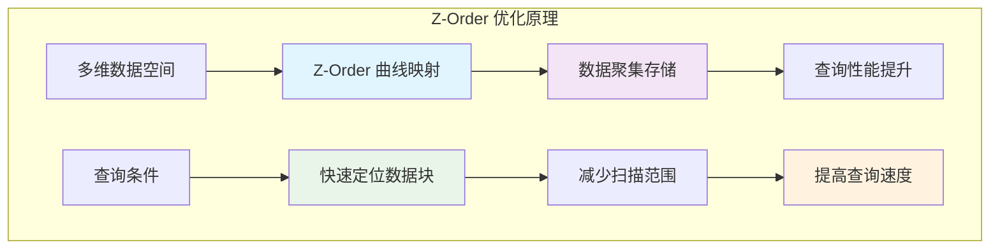

**Z-Order 最佳实践**：
```python
# 选择合适的 Z-Order 列
# 1. 经常一起查询的列
# 2. 高基数列
# 3. 范围查询列

deltaTable.optimize().executeZOrderBy("department", "age", "salary")

# 监控 Z-Order 效果
before_stats = spark.sql("SELECT COUNT(*) FROM delta.`/path/to/table` WHERE department='Engineering' AND age > 30")
# 执行 Z-Order
deltaTable.optimize().executeZOrderBy("department", "age")
after_stats = spark.sql("SELECT COUNT(*) FROM delta.`/path/to/table` WHERE department='Engineering' AND age > 30")
```

### 缓存策略

#### 表级缓存

```python
# 缓存整个表
deltaTable.cache()

# 缓存查询结果
frequent_query = spark.sql("""
    SELECT department, AVG(salary) as avg_salary
    FROM delta.`/path/to/delta-table`
    GROUP BY department
""")
frequent_query.cache()
frequent_query.count()  # 触发缓存
```

#### 智能缓存策略

```python
def smart_cache_strategy(table_path, query_patterns):
    """智能缓存策略"""
    delta_table = DeltaTable.forPath(spark, table_path)
    
    # 分析表大小
    table_stats = spark.sql(f"DESCRIBE DETAIL delta.`{table_path}`").collect()[0]
    table_size_mb = table_stats["sizeInBytes"] / (1024 * 1024)
    
    if table_size_mb < 1000:  # 小于1GB的表
        # 缓存整个表
        delta_table.cache()
        print("缓存整个表")
    else:
        # 缓存热点分区
        for pattern in query_patterns:
            hot_partition = spark.sql(f"""
                SELECT * FROM delta.`{table_path}` 
                WHERE {pattern['condition']}
            """)
            hot_partition.cache()
            hot_partition.count()  # 触发缓存
            print(f"缓存热点分区: {pattern['condition']}")

# 应用智能缓存
query_patterns = [
    {"condition": "department = 'Engineering'"},
    {"condition": "hire_date >= '2023-01-01'"}
]
smart_cache_strategy("/path/to/delta-table", query_patterns)
```

### 并发优化

#### 读写并发优化

```python
# 配置并发参数
spark.conf.set("spark.sql.adaptive.enabled", "true")
spark.conf.set("spark.sql.adaptive.coalescePartitions.enabled", "true")
spark.conf.set("spark.sql.adaptive.advisoryPartitionSizeInBytes", "134217728")  # 128MB

# 优化并发写入
spark.conf.set("spark.databricks.delta.merge.repartitionBeforeWrite.enabled", "true")
spark.conf.set("spark.databricks.delta.retryWriteConflict.enabled", "true")
```

#### 冲突减少策略

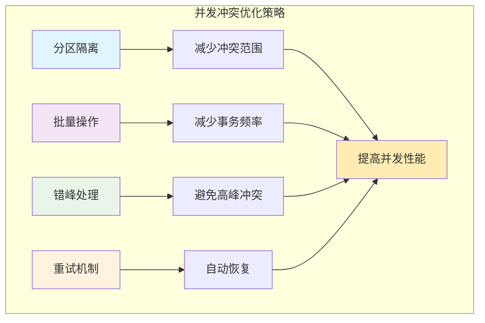

```python
# 分区级别的并发控制
def partition_aware_write(df, table_path, partition_col):
    """分区感知的并发写入"""
    partitions = df.select(partition_col).distinct().collect()
    
    for partition in partitions:
        partition_value = partition[partition_col]
        partition_df = df.filter(f"{partition_col} = '{partition_value}'")
        
        # 每个分区独立写入，减少冲突
        partition_df.write.format("delta") \
            .mode("append") \
            .option("replaceWhere", f"{partition_col} = '{partition_value}'") \
            .save(table_path)
```

### 存储优化

#### 压缩算法选择

```python
# 配置压缩算法
spark.conf.set("spark.sql.parquet.compression.codec", "snappy")  # 平衡压缩率和速度
# spark.conf.set("spark.sql.parquet.compression.codec", "gzip")   # 高压缩率
# spark.conf.set("spark.sql.parquet.compression.codec", "lz4")    # 高速度

# 列级压缩优化
spark.conf.set("spark.sql.parquet.enableVectorizedReader", "true")
spark.conf.set("spark.sql.parquet.columnarReaderBatchSize", "4096")
```

#### 存储格式优化

```python
# 优化 Parquet 写入
spark.conf.set("spark.sql.parquet.writeLegacyFormat", "false")
spark.conf.set("spark.sql.parquet.outputTimestampType", "TIMESTAMP_MICROS")
spark.conf.set("spark.sql.parquet.int96RebaseModeInWrite", "CORRECTED")

# 字典编码优化
spark.conf.set("spark.sql.parquet.enableDictionary", "true")
spark.conf.set("spark.sql.parquet.dictionaryPageSize", "1048576")  # 1MB
```

### 监控和调优

#### 性能监控指标

| 指标类型 | 关键指标 | 监控方法 | 优化目标 |
|----------|----------|----------|----------|
| **查询性能** | 执行时间、扫描数据量 | Spark UI | < 秒级响应 |
| **存储效率** | 文件数量、大小分布 | DESCRIBE DETAIL | 128MB-1GB |
| **并发性能** | 冲突率、重试次数 | 日志分析 | < 5% 冲突率 |
| **资源利用** | CPU、内存使用率 | 集群监控 | > 80% 利用率 |

#### 自动化调优

```python
def auto_optimize_table(table_path, optimization_config):
    """自动化表优化"""
    delta_table = DeltaTable.forPath(spark, table_path)
    
    # 获取表统计信息
    table_detail = spark.sql(f"DESCRIBE DETAIL delta.`{table_path}`").collect()[0]
    num_files = table_detail["numFiles"]
    size_in_bytes = table_detail["sizeInBytes"]
    
    # 判断是否需要压缩
    if num_files > optimization_config["max_files"]:
        print(f"文件数量过多 ({num_files})，执行压缩...")
        delta_table.optimize().executeCompaction()
    
    # 判断是否需要 Z-Order
    if size_in_bytes > optimization_config["zorder_threshold"]:
        print("表较大，执行 Z-Order 优化...")
        delta_table.optimize().executeZOrderBy(*optimization_config["zorder_columns"])
    
    # 判断是否需要清理
    history_count = delta_table.history().count()
    if history_count > optimization_config["max_versions"]:
        print("版本过多，执行清理...")
        delta_table.vacuum(optimization_config["retention_hours"])

# 配置优化参数
config = {
    "max_files": 1000,
    "zorder_threshold": 10 * 1024 * 1024 * 1024,  # 10GB
    "zorder_columns": ["department", "age"],
    "max_versions": 100,
    "retention_hours": 168  # 7天
}

# 执行自动优化
auto_optimize_table("/path/to/delta-table", config)
```

#### 性能基准测试

```python
def benchmark_query_performance(table_path, queries, iterations=3):
    """查询性能基准测试"""
    results = []
    
    for query_name, query_sql in queries.items():
        times = []
        
        for i in range(iterations):
            start_time = time.time()
            
            # 执行查询
            result_df = spark.sql(query_sql.format(table_path=table_path))
            result_count = result_df.count()
            
            end_time = time.time()
            execution_time = end_time - start_time
            times.append(execution_time)
            
            print(f"{query_name} - 迭代 {i+1}: {execution_time:.2f}秒, 结果数: {result_count}")
        
        avg_time = sum(times) / len(times)
        results.append({
            "query": query_name,
            "avg_time": avg_time,
            "min_time": min(times),
            "max_time": max(times)
        })
    
    return results

# 定义基准查询
benchmark_queries = {
    "full_scan": "SELECT COUNT(*) FROM delta.`{table_path}`",
    "filtered_scan": "SELECT * FROM delta.`{table_path}` WHERE department = 'Engineering'",
    "aggregation": "SELECT department, AVG(salary) FROM delta.`{table_path}` GROUP BY department",
    "join_query": """
        SELECT t1.*, t2.bonus 
        FROM delta.`{table_path}` t1 
        JOIN delta.`/path/to/bonus-table` t2 ON t1.id = t2.employee_id
    """
}

# 执行基准测试
performance_results = benchmark_query_performance("/path/to/delta-table", benchmark_queries)

# 分析结果
for result in performance_results:
    print(f"查询: {result['query']}, 平均时间: {result['avg_time']:.2f}秒")
```

## 最佳实践

### 表设计原则

#### Schema 设计最佳实践

**1. 数据类型选择**
```python
# 推荐的数据类型映射
data_type_mapping = {
    "整数ID": "BIGINT",          # 而不是 INT，为未来扩展预留空间
    "金额": "DECIMAL(18,2)",      # 精确的货币计算
    "时间戳": "TIMESTAMP",        # 而不是 STRING
    "布尔值": "BOOLEAN",          # 而不是 STRING('Y'/'N')
    "枚举值": "STRING",           # 使用约束限制取值
    "JSON数据": "STRING"          # 存储为字符串，查询时解析
}

# 示例表结构
spark.sql("""
    CREATE TABLE optimized_employees (
        employee_id BIGINT NOT NULL,
        name STRING NOT NULL,
        email STRING NOT NULL,
        age INT CHECK (age >= 18 AND age <= 65),
        salary DECIMAL(18,2) CHECK (salary > 0),
        department STRING NOT NULL,
        hire_date DATE NOT NULL,
        is_active BOOLEAN DEFAULT true,
        metadata STRING,  -- JSON格式的扩展信息
        created_at TIMESTAMP DEFAULT current_timestamp(),
        updated_at TIMESTAMP DEFAULT current_timestamp()
    ) USING DELTA
    PARTITIONED BY (department, date_format(hire_date, 'yyyy-MM'))
    TBLPROPERTIES (
        'delta.enableChangeDataFeed' = 'true',
        'delta.autoOptimize.optimizeWrite' = 'true',
        'delta.autoOptimize.autoCompact' = 'true'
    )
""")
```

**2. 分区策略设计**

| 分区类型 | 适用场景 | 优势 | 注意事项 |
|----------|----------|------|----------|
| **时间分区** | 日志、事件数据 | 查询效率高 | 避免分区过细 |
| **地理分区** | 多地区业务 | 数据本地化 | 考虑数据倾斜 |
| **业务分区** | 多租户系统 | 隔离性好 | 平衡分区大小 |
| **混合分区** | 复杂业务场景 | 灵活性强 | 控制分区数量 |

```python
# 分区策略示例
def design_partition_strategy(df, business_requirements):
    """设计分区策略"""
    
    # 分析数据分布
    partition_analysis = df.groupBy("department", "year", "month").count()
    partition_analysis.show()
    
    # 评估分区效果
    total_partitions = partition_analysis.count()
    avg_records_per_partition = df.count() / total_partitions
    
    print(f"总分区数: {total_partitions}")
    print(f"平均每分区记录数: {avg_records_per_partition}")
    
    # 推荐分区策略
    if total_partitions > 10000:
        print("建议: 减少分区粒度，避免小文件问题")
    elif avg_records_per_partition < 100000:
        print("建议: 增加分区粒度，提高查询效率")
    else:
        print("分区策略合理")

# 应用分区策略分析
design_partition_strategy(df, {"query_pattern": "time_based", "data_retention": "2_years"})
```

#### 命名规范

**表命名规范**：
```python
# 推荐的命名规范
naming_conventions = {
    "原始数据表": "raw_{source_system}_{table_name}",
    "清洗后数据": "clean_{domain}_{table_name}",
    "聚合表": "agg_{domain}_{granularity}_{table_name}",
    "维度表": "dim_{dimension_name}",
    "事实表": "fact_{business_process}",
    "临时表": "temp_{process_name}_{timestamp}"
}

# 示例
table_names = [
    "raw_crm_customers",           # 原始CRM客户数据
    "clean_sales_orders",          # 清洗后的销售订单
    "agg_sales_daily_revenue",     # 日粒度销售收入聚合
    "dim_product_catalog",         # 产品目录维度表
    "fact_customer_transactions",  # 客户交易事实表
    "temp_data_migration_20231201" # 临时数据迁移表
]
```

### 数据质量管理

#### 数据验证框架

```python
class DeltaDataQualityFramework:
    """Delta Lake 数据质量管理框架"""
    
    def __init__(self, spark_session, table_path):
        self.spark = spark_session
        self.table_path = table_path
        self.delta_table = DeltaTable.forPath(spark_session, table_path)
    
    def add_constraints(self, constraints):
        """添加数据约束"""
        for constraint_name, constraint_condition in constraints.items():
            try:
                self.spark.sql(f"""
                    ALTER TABLE delta.`{self.table_path}`
                    ADD CONSTRAINT {constraint_name} CHECK ({constraint_condition})
                """)
                print(f"约束 {constraint_name} 添加成功")
            except Exception as e:
                print(f"约束 {constraint_name} 添加失败: {e}")
    
    def validate_data_quality(self, df):
        """数据质量验证"""
        quality_report = {}
        
        # 完整性检查
        total_records = df.count()
        quality_report["total_records"] = total_records
        
        # 空值检查
        null_counts = {}
        for column in df.columns:
            null_count = df.filter(col(column).isNull()).count()
            null_percentage = (null_count / total_records) * 100
            null_counts[column] = {
                "null_count": null_count,
                "null_percentage": round(null_percentage, 2)
            }
        quality_report["null_analysis"] = null_counts
        
        # 重复数据检查
        duplicate_count = total_records - df.dropDuplicates().count()
        quality_report["duplicate_count"] = duplicate_count
        quality_report["duplicate_percentage"] = round((duplicate_count / total_records) * 100, 2)
        
        # 数据分布检查
        for column in df.select_dtypes(include=['int', 'double', 'float']).columns:
            stats = df.select(column).describe().collect()
            quality_report[f"{column}_stats"] = {row["summary"]: row[column] for row in stats}
        
        return quality_report
    
    def auto_fix_quality_issues(self, df, fix_config):
        """自动修复数据质量问题"""
        fixed_df = df
        
        # 处理空值
        if "fill_nulls" in fix_config:
            for column, fill_value in fix_config["fill_nulls"].items():
                fixed_df = fixed_df.fillna({column: fill_value})
        
        # 去重
        if fix_config.get("remove_duplicates", False):
            fixed_df = fixed_df.dropDuplicates()
        
        # 数据类型转换
        if "type_conversions" in fix_config:
            for column, target_type in fix_config["type_conversions"].items():
                fixed_df = fixed_df.withColumn(column, col(column).cast(target_type))
        
        return fixed_df

# 使用示例
quality_framework = DeltaDataQualityFramework(spark, "/path/to/delta-table")

# 添加约束
constraints = {
    "age_range": "age >= 18 AND age <= 65",
    "salary_positive": "salary > 0",
    "email_format": "email LIKE '%@%.%'"
}
quality_framework.add_constraints(constraints)

# 数据质量检查
df = spark.read.format("delta").load("/path/to/delta-table")
quality_report = quality_framework.validate_data_quality(df)
print(json.dumps(quality_report, indent=2))
```

#### 数据血缘追踪

```python
class DataLineageTracker:
    """数据血缘追踪器"""
    
    def __init__(self, spark_session):
        self.spark = spark_session
        self.lineage_table = "/path/to/lineage-metadata"
    
    def record_transformation(self, source_tables, target_table, transformation_type, metadata):
        """记录数据转换血缘"""
        lineage_record = spark.createDataFrame([{
            "transformation_id": str(uuid.uuid4()),
            "source_tables": source_tables,
            "target_table": target_table,
            "transformation_type": transformation_type,
            "metadata": json.dumps(metadata),
            "created_at": datetime.now(),
            "created_by": getpass.getuser()
        }])
        
        lineage_record.write.format("delta").mode("append").save(self.lineage_table)
    
    def track_delta_operation(self, table_path, operation_type, operation_metadata):
        """追踪 Delta 操作"""
        # 记录操作到用户元数据
        user_metadata = {
            "operation_type": operation_type,
            "timestamp": datetime.now().isoformat(),
            "user": getpass.getuser(),
            "metadata": operation_metadata
        }
        
        return json.dumps(user_metadata)

# 使用示例
lineage_tracker = DataLineageTracker(spark)

# 记录 ETL 转换
lineage_tracker.record_transformation(
    source_tables=["raw_sales", "dim_products"],
    target_table="fact_sales_summary",
    transformation_type="aggregation",
    metadata={
        "aggregation_level": "daily",
        "metrics": ["total_sales", "order_count"],
        "filters": "order_date >= '2023-01-01'"
    }
)

# 在写入时记录血缘
metadata = lineage_tracker.track_delta_operation(
    "/path/to/target-table",
    "merge",
    {"source": "daily_batch", "records_processed": 10000}
)

df.write.format("delta") \
    .option("userMetadata", metadata) \
    .mode("append") \
    .save("/path/to/target-table")
```

### 运维管理

#### 自动化运维脚本

```python
class DeltaTableMaintenanceManager:
    """Delta 表维护管理器"""
    
    def __init__(self, spark_session, config):
        self.spark = spark_session
        self.config = config
        self.maintenance_log = "/path/to/maintenance-log"
    
    def daily_maintenance(self, table_paths):
        """日常维护任务"""
        maintenance_results = []
        
        for table_path in table_paths:
            try:
                result = self._maintain_single_table(table_path)
                maintenance_results.append(result)
                
                # 记录维护日志
                self._log_maintenance(table_path, result)
                
            except Exception as e:
                error_result = {
                    "table_path": table_path,
                    "status": "failed",
                    "error": str(e),
                    "timestamp": datetime.now()
                }
                maintenance_results.append(error_result)
                self._log_maintenance(table_path, error_result)
        
        return maintenance_results
    
    def _maintain_single_table(self, table_path):
        """单表维护"""
        delta_table = DeltaTable.forPath(self.spark, table_path)
        result = {"table_path": table_path, "actions": []}
        
        # 获取表统计信息
        table_detail = self.spark.sql(f"DESCRIBE DETAIL delta.`{table_path}`").collect()[0]
        num_files = table_detail["numFiles"]
        size_in_bytes = table_detail["sizeInBytes"]
        
        # 检查是否需要压缩
        if num_files > self.config["compaction_threshold"]:
            delta_table.optimize().executeCompaction()
            result["actions"].append("compaction")
        
        # 检查是否需要 Z-Order
        if size_in_bytes > self.config["zorder_threshold"]:
            zorder_columns = self.config.get("zorder_columns", {}).get(table_path, [])
            if zorder_columns:
                delta_table.optimize().executeZOrderBy(*zorder_columns)
                result["actions"].append(f"zorder: {zorder_columns}")
        
        # 检查是否需要清理历史版本
        history_count = delta_table.history().count()
        if history_count > self.config["max_versions"]:
            delta_table.vacuum(self.config["retention_hours"])
            result["actions"].append("vacuum")
        
        result["status"] = "success"
        result["timestamp"] = datetime.now()
        return result
    
    def _log_maintenance(self, table_path, result):
        """记录维护日志"""
        log_df = self.spark.createDataFrame([result])
        log_df.write.format("delta").mode("append").save(self.maintenance_log)
    
    def generate_maintenance_report(self, start_date, end_date):
        """生成维护报告"""
        report_df = self.spark.sql(f"""
            SELECT 
                table_path,
                status,
                actions,
                COUNT(*) as maintenance_count,
                MAX(timestamp) as last_maintenance
            FROM delta.`{self.maintenance_log}`
            WHERE timestamp BETWEEN '{start_date}' AND '{end_date}'
            GROUP BY table_path, status, actions
            ORDER BY table_path, last_maintenance DESC
        """)
        
        return report_df

# 配置维护管理器
maintenance_config = {
    "compaction_threshold": 1000,
    "zorder_threshold": 10 * 1024 * 1024 * 1024,  # 10GB
    "max_versions": 100,
    "retention_hours": 168,  # 7天
    "zorder_columns": {
        "/path/to/sales-table": ["department", "date"],
        "/path/to/customer-table": ["region", "signup_date"]
    }
}

maintenance_manager = DeltaTableMaintenanceManager(spark, maintenance_config)

# 执行日常维护
tables_to_maintain = [
    "/path/to/sales-table",
    "/path/to/customer-table",
    "/path/to/product-table"
]

maintenance_results = maintenance_manager.daily_maintenance(tables_to_maintain)

# 生成维护报告
report = maintenance_manager.generate_maintenance_report("2023-01-01", "2023-01-31")
report.show()
```

#### 监控告警系统

```python
class DeltaTableMonitor:
    """Delta 表监控系统"""
    
    def __init__(self, spark_session, alert_config):
        self.spark = spark_session
        self.alert_config = alert_config
        self.metrics_table = "/path/to/table-metrics"
    
    def collect_table_metrics(self, table_paths):
        """收集表指标"""
        all_metrics = []
        
        for table_path in table_paths:
            try:
                metrics = self._get_table_metrics(table_path)
                all_metrics.append(metrics)
            except Exception as e:
                print(f"收集 {table_path} 指标失败: {e}")
        
        # 保存指标
        if all_metrics:
            metrics_df = self.spark.createDataFrame(all_metrics)
            metrics_df.write.format("delta").mode("append").save(self.metrics_table)
        
        return all_metrics
    
    def _get_table_metrics(self, table_path):
        """获取单表指标"""
        delta_table = DeltaTable.forPath(self.spark, table_path)
        
        # 基础指标
        table_detail = self.spark.sql(f"DESCRIBE DETAIL delta.`{table_path}`").collect()[0]
        
        # 历史指标
        history = delta_table.history().limit(10).collect()
        recent_operations = [row["operation"] for row in history]
        
        # 数据新鲜度
        latest_timestamp = history[0]["timestamp"] if history else None
        data_freshness_hours = None
        if latest_timestamp:
            data_freshness_hours = (datetime.now() - latest_timestamp).total_seconds() / 3600
        
        return {
            "table_path": table_path,
            "num_files": table_detail["numFiles"],
            "size_gb": table_detail["sizeInBytes"] / (1024**3),
            "num_versions": len(history),
            "data_freshness_hours": data_freshness_hours,
            "recent_operations": recent_operations,
            "collected_at": datetime.now()
        }
    
    def check_alerts(self, metrics):
        """检查告警条件"""
        alerts = []
        
        for metric in metrics:
            table_path = metric["table_path"]
            
            # 文件数量告警
            if metric["num_files"] > self.alert_config["max_files"]:
                alerts.append({
                    "table": table_path,
                    "type": "too_many_files",
                    "value": metric["num_files"],
                    "threshold": self.alert_config["max_files"],
                    "severity": "warning"
                })
            
            # 数据新鲜度告警
            if metric["data_freshness_hours"] and metric["data_freshness_hours"] > self.alert_config["max_freshness_hours"]:
                alerts.append({
                    "table": table_path,
                    "type": "stale_data",
                    "value": metric["data_freshness_hours"],
                    "threshold": self.alert_config["max_freshness_hours"],
                    "severity": "critical"
                })
            
            # 表大小告警
            if metric["size_gb"] > self.alert_config["max_size_gb"]:
                alerts.append({
                    "table": table_path,
                    "type": "large_table",
                    "value": metric["size_gb"],
                    "threshold": self.alert_config["max_size_gb"],
                    "severity": "info"
                })
        
        return alerts
    
    def send_alerts(self, alerts):
        """发送告警"""
        if not alerts:
            return
        
        # 按严重程度分组
        critical_alerts = [a for a in alerts if a["severity"] == "critical"]
        warning_alerts = [a for a in alerts if a["severity"] == "warning"]
        info_alerts = [a for a in alerts if a["severity"] == "info"]
        
        # 发送告警（这里只是打印，实际可以集成邮件、Slack等）
        if critical_alerts:
            print("🚨 严重告警:")
            for alert in critical_alerts:
                print(f"  - {alert['table']}: {alert['type']} = {alert['value']} (阈值: {alert['threshold']})")
        
        if warning_alerts:
            print("⚠️ 警告告警:")
            for alert in warning_alerts:
                print(f"  - {alert['table']}: {alert['type']} = {alert['value']} (阈值: {alert['threshold']})")
        
        if info_alerts:
            print("ℹ️ 信息告警:")
            for alert in info_alerts:
                print(f"  - {alert['table']}: {alert['type']} = {alert['value']} (阈值: {alert['threshold']})")

# 配置监控系统
alert_config = {
    "max_files": 5000,
    "max_freshness_hours": 24,
    "max_size_gb": 1000
}

monitor = DeltaTableMonitor(spark, alert_config)

# 收集指标并检查告警
tables_to_monitor = ["/path/to/table1", "/path/to/table2"]
metrics = monitor.collect_table_metrics(tables_to_monitor)
alerts = monitor.check_alerts(metrics)
monitor.send_alerts(alerts)
```

### 安全和权限管理

#### 访问控制最佳实践

```python
# 表级权限控制
spark.sql("""
    GRANT SELECT ON TABLE delta.`/path/to/sensitive-table` TO `data-analysts`
""")

spark.sql("""
    GRANT SELECT, INSERT, UPDATE ON TABLE delta.`/path/to/operational-table` TO `data-engineers`
""")

# 列级权限控制（通过视图实现）
spark.sql("""
    CREATE VIEW public_employee_view AS
    SELECT id, name, department, hire_date
    FROM delta.`/path/to/employee-table`
    -- 隐藏敏感信息如薪资、社保号等
""")

# 行级权限控制（通过谓词实现）
spark.sql("""
    CREATE VIEW regional_sales_view AS
    SELECT * FROM delta.`/path/to/sales-table`
    WHERE region = current_user_region()  -- 用户只能看到自己区域的数据
""")
```

#### 数据脱敏

```python
def apply_data_masking(df, masking_rules):
    """应用数据脱敏规则"""
    masked_df = df
    
    for column, rule in masking_rules.items():
        if rule["type"] == "hash":
            masked_df = masked_df.withColumn(column, sha2(col(column), 256))
        elif rule["type"] == "partial_mask":
            # 部分掩码，如手机号 138****1234
            mask_start = rule["mask_start"]
            mask_end = rule["mask_end"]
            masked_df = masked_df.withColumn(
                column,
                concat(
                    substring(col(column), 1, mask_start),
                    lit("*" * (mask_end - mask_start)),
                    substring(col(column), mask_end + 1, 100)
                )
            )
        elif rule["type"] == "null":
            masked_df = masked_df.withColumn(column, lit(None))
    
    return masked_df

# 脱敏规则配置
masking_rules = {
    "phone": {"type": "partial_mask", "mask_start": 3, "mask_end": 7},
    "email": {"type": "hash"},
    "ssn": {"type": "null"}
}

# 应用脱敏
original_df = spark.read.format("delta").load("/path/to/sensitive-table")
masked_df = apply_data_masking(original_df, masking_rules)

# 保存脱敏后的数据
masked_df.write.format("delta").save("/path/to/masked-table")
```

## 故障排查

### 常见问题诊断

#### 并发写入冲突

**症状**：
- `ConcurrentModificationException`
- `ConcurrentWriteException`
- 写入操作失败或超时

**原因分析**：
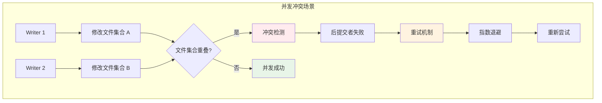

**解决方案**：
```python
# 1. 启用自动重试
spark.conf.set("spark.databricks.delta.retryWriteConflict.enabled", "true")
spark.conf.set("spark.databricks.delta.retryWriteConflict.limit", "3")

# 2. 实现自定义重试逻辑
def write_with_retry(df, table_path, max_retries=3, base_delay=1):
    """带重试的写入操作"""
    for attempt in range(max_retries):
        try:
            df.write.format("delta").mode("append").save(table_path)
            print(f"写入成功，尝试次数: {attempt + 1}")
            return True
            
        except Exception as e:
            if "ConcurrentModificationException" in str(e) and attempt < max_retries - 1:
                delay = base_delay * (2 ** attempt)  # 指数退避
                print(f"写入冲突，{delay}秒后重试... (尝试 {attempt + 1})")
                time.sleep(delay)
            else:
                print(f"写入失败: {e}")
                raise e
    
    return False

# 3. 分区级别的冲突避免
def partition_aware_write(df, table_path, partition_column):
    """分区感知写入，减少冲突"""
    partitions = df.select(partition_column).distinct().collect()
    
    for partition_row in partitions:
        partition_value = partition_row[partition_column]
        partition_df = df.filter(col(partition_column) == partition_value)
        
        # 使用 replaceWhere 避免全表锁
        partition_df.write.format("delta") \
            .mode("overwrite") \
            .option("replaceWhere", f"{partition_column} = '{partition_value}'") \
            .save(table_path)
        
        print(f"分区 {partition_column}={partition_value} 写入完成")
```

#### 小文件问题

**症状**：
- 查询性能下降
- 文件系统压力大
- 元数据操作缓慢

**诊断方法**：
```python
def diagnose_small_files(table_path):
    """诊断小文件问题"""
    # 获取文件统计信息
    table_detail = spark.sql(f"DESCRIBE DETAIL delta.`{table_path}`").collect()[0]
    
    num_files = table_detail["numFiles"]
    total_size_mb = table_detail["sizeInBytes"] / (1024 * 1024)
    avg_file_size_mb = total_size_mb / num_files if num_files > 0 else 0
    
    print(f"文件总数: {num_files}")
    print(f"总大小: {total_size_mb:.2f} MB")
    print(f"平均文件大小: {avg_file_size_mb:.2f} MB")
    
    # 判断是否存在小文件问题
    if avg_file_size_mb < 128:  # 小于128MB
        print("⚠️ 检测到小文件问题")
        
        # 分析小文件分布
        if num_files > 1000:
            print("🚨 文件数量过多，建议立即压缩")
        elif num_files > 500:
            print("⚠️ 文件数量较多，建议定期压缩")
        
        return True
    else:
        print("✅ 文件大小正常")
        return False

# 解决小文件问题
def fix_small_files(table_path, target_file_size_mb=512):
    """修复小文件问题"""
    delta_table = DeltaTable.forPath(spark, table_path)
    
    # 执行压缩
    print("开始执行文件压缩...")
    delta_table.optimize().executeCompaction()
    
    # 验证压缩效果
    print("压缩完成，验证效果...")
    diagnose_small_files(table_path)
    
    # 可选：执行 Z-Order 优化
    print("执行 Z-Order 优化...")
    # delta_table.optimize().executeZOrderBy("commonly_queried_column")

# 使用示例
if diagnose_small_files("/path/to/delta-table"):
    fix_small_files("/path/to/delta-table")
```

#### Schema 不匹配问题

**症状**：
- `AnalysisException: Schema mismatch`
- `AnalysisException: Cannot resolve column`
- 写入操作被拒绝

**解决方案**：
```python
def handle_schema_mismatch(source_df, target_table_path):
    """处理 Schema 不匹配问题"""
    
    # 读取目标表的 Schema
    target_df = spark.read.format("delta").load(target_table_path)
    target_schema = target_df.schema
    source_schema = source_df.schema
    
    print("目标表 Schema:")
    target_df.printSchema()
    print("\n源数据 Schema:")
    source_df.printSchema()
    
    # 分析 Schema 差异
    target_columns = set(target_schema.fieldNames())
    source_columns = set(source_schema.fieldNames())
    
    missing_in_source = target_columns - source_columns
    extra_in_source = source_columns - target_columns
    
    print(f"\n源数据缺少的列: {missing_in_source}")
    print(f"源数据多余的列: {extra_in_source}")
    
    # 自动修复 Schema
    fixed_df = source_df
    
    # 添加缺少的列（默认值为 null）
    for col_name in missing_in_source:
        target_field = [f for f in target_schema.fields if f.name == col_name][0]
        fixed_df = fixed_df.withColumn(col_name, lit(None).cast(target_field.dataType))
        print(f"添加缺少的列: {col_name}")
    
    # 移除多余的列
    for col_name in extra_in_source:
        fixed_df = fixed_df.drop(col_name)
        print(f"移除多余的列: {col_name}")
    
    # 重新排序列以匹配目标表
    target_column_order = target_schema.fieldNames()
    fixed_df = fixed_df.select(*target_column_order)
    
    return fixed_df

# 使用 Schema 演进
def write_with_schema_evolution(df, table_path):
    """支持 Schema 演进的写入"""
    try:
        # 尝试直接写入
        df.write.format("delta").mode("append").save(table_path)
        print("直接写入成功")
        
    except Exception as e:
        if "schema" in str(e).lower():
            print("检测到 Schema 不匹配，尝试 Schema 演进...")
            
            # 启用 Schema 合并
            df.write.format("delta") \
                .option("mergeSchema", "true") \
                .mode("append") \
                .save(table_path)
            
            print("Schema 演进写入成功")
        else:
            raise e
```

#### 版本过多问题

**症状**：
- 查询启动缓慢
- 元数据读取超时
- 存储空间持续增长

**解决方案**：
```python
def manage_table_versions(table_path, max_versions=50, retention_days=7):
    """管理表版本"""
    delta_table = DeltaTable.forPath(spark, table_path)
    
    # 检查当前版本数
    history = delta_table.history()
    version_count = history.count()
    
    print(f"当前版本数: {version_count}")
    
    if version_count > max_versions:
        print(f"版本数超过阈值 ({max_versions})，执行清理...")
        
        # 计算保留时间（小时）
        retention_hours = retention_days * 24
        
        # 执行 vacuum 清理
        try:
            delta_table.vacuum(retention_hours)
            print(f"清理完成，保留 {retention_days} 天内的版本")
            
            # 验证清理效果
            new_version_count = delta_table.history().count()
            print(f"清理后版本数: {new_version_count}")
            
        except Exception as e:
            print(f"清理失败: {e}")
            
            # 如果清理失败，可能需要强制清理
            if "retention" in str(e).lower():
                print("尝试强制清理（谨慎操作）...")
                spark.conf.set("spark.databricks.delta.retentionDurationCheck.enabled", "false")
                delta_table.vacuum(0)
                spark.conf.set("spark.databricks.delta.retentionDurationCheck.enabled", "true")
    else:
        print("版本数正常，无需清理")

# 自动化版本管理
def setup_automated_version_management(table_paths, schedule_config):
    """设置自动化版本管理"""
    
    def version_cleanup_job():
        """版本清理任务"""
        for table_path in table_paths:
            try:
                print(f"处理表: {table_path}")
                manage_table_versions(
                    table_path,
                    max_versions=schedule_config["max_versions"],
                    retention_days=schedule_config["retention_days"]
                )
            except Exception as e:
                print(f"处理表 {table_path} 失败: {e}")
    
    # 这里可以集成调度系统（如 Airflow、Cron 等）
    print("版本管理任务已设置")
    return version_cleanup_job

# 配置自动化清理
cleanup_config = {
    "max_versions": 100,
    "retention_days": 7
}

tables_to_manage = ["/path/to/table1", "/path/to/table2"]
cleanup_job = setup_automated_version_management(tables_to_manage, cleanup_config)
```

### 性能问题排查

#### 查询性能分析

```python
def analyze_query_performance(query_sql, table_path):
    """分析查询性能"""
    
    # 执行查询并收集指标
    start_time = time.time()
    
    # 启用查询执行计划收集
    spark.conf.set("spark.sql.adaptive.enabled", "true")
    spark.conf.set("spark.sql.adaptive.coalescePartitions.enabled", "true")
    
    result_df = spark.sql(query_sql.format(table_path=table_path))
    result_count = result_df.count()
    
    end_time = time.time()
    execution_time = end_time - start_time
    
    print(f"查询执行时间: {execution_time:.2f} 秒")
    print(f"结果记录数: {result_count}")
    
    # 分析执行计划
    explain_result = result_df.explain(extended=True)
    print("\n执行计划分析:")
    print(explain_result)
    
    # 检查是否使用了数据跳过
    table_detail = spark.sql(f"DESCRIBE DETAIL delta.`{table_path}`").collect()[0]
    total_files = table_detail["numFiles"]
    
    # 这里可以通过 Spark UI 或日志分析实际扫描的文件数
    print(f"\n表总文件数: {total_files}")
    
    return {
        "execution_time": execution_time,
        "result_count": result_count,
        "total_files": total_files
    }

# 性能基准测试
def benchmark_table_performance(table_path):
    """表性能基准测试"""
    
    test_queries = {
        "全表扫描": "SELECT COUNT(*) FROM delta.`{table_path}`",
        "条件过滤": "SELECT * FROM delta.`{table_path}` WHERE department = 'Engineering' LIMIT 1000",
        "聚合查询": "SELECT department, COUNT(*), AVG(salary) FROM delta.`{table_path}` GROUP BY department",
        "范围查询": "SELECT * FROM delta.`{table_path}` WHERE age BETWEEN 25 AND 35 LIMIT 1000"
    }
    
    results = {}
    for query_name, query_sql in test_queries.items():
        print(f"\n=== 测试查询: {query_name} ===")
        results[query_name] = analyze_query_performance(query_sql, table_path)
    
    return results

# 性能优化建议
def suggest_performance_optimizations(table_path, query_patterns):
    """性能优化建议"""
    
    # 分析表特征
    table_detail = spark.sql(f"DESCRIBE DETAIL delta.`{table_path}`").collect()[0]
    num_files = table_detail["numFiles"]
    size_gb = table_detail["sizeInBytes"] / (1024**3)
    
    suggestions = []
    
    # 文件数量建议
    if num_files > 1000:
        suggestions.append({
            "type": "compaction",
            "priority": "high",
            "description": f"文件数量过多 ({num_files})，建议执行压缩",
            "action": "deltaTable.optimize().executeCompaction()"
        })
    
    # Z-Order 建议
    if size_gb > 10:  # 大于10GB的表
        common_columns = extract_common_query_columns(query_patterns)
        if common_columns:
            suggestions.append({
                "type": "zorder",
                "priority": "medium",
                "description": f"大表建议 Z-Order 优化，常用查询列: {common_columns}",
                "action": f"deltaTable.optimize().executeZOrderBy({', '.join(common_columns)})"
            })
    
    # 分区建议
    if not table_detail.get("partitionColumns"):
        suggestions.append({
            "type": "partitioning",
            "priority": "medium",
            "description": "考虑添加分区以提高查询性能",
            "action": "重新设计表结构，添加合适的分区列"
        })
    
    return suggestions

def extract_common_query_columns(query_patterns):
    """从查询模式中提取常用列"""
    # 这里简化处理，实际可以通过解析 SQL 来提取
    common_columns = []
    for pattern in query_patterns:
        if "department" in pattern:
            common_columns.append("department")
        if "age" in pattern:
            common_columns.append("age")
        if "date" in pattern:
            common_columns.append("date")
    
    return list(set(common_columns))
```

### 数据一致性问题

#### 数据完整性检查

```python
def check_data_integrity(table_path):
    """检查数据完整性"""
    
    delta_table = DeltaTable.forPath(spark, table_path)
    df = spark.read.format("delta").load(table_path)
    
    integrity_report = {
        "table_path": table_path,
        "checks": [],
        "issues": []
    }
    
    # 1. 检查空值
    null_counts = {}
    for column in df.columns:
        null_count = df.filter(col(column).isNull()).count()
        if null_count > 0:
            null_counts[column] = null_count
    
    if null_counts:
        integrity_report["issues"].append({
            "type": "null_values",
            "details": null_counts
        })
    
    # 2. 检查重复数据
    total_count = df.count()
    unique_count = df.dropDuplicates().count()
    duplicate_count = total_count - unique_count
    
    if duplicate_count > 0:
        integrity_report["issues"].append({
            "type": "duplicates",
            "count": duplicate_count,
            "percentage": (duplicate_count / total_count) * 100
        })
    
    # 3. 检查数据类型一致性
    schema_issues = []
    for field in df.schema.fields:
        if field.dataType.typeName() == "string":
            # 检查字符串列是否包含意外的数值
            numeric_count = df.filter(col(field.name).rlike("^[0-9]+$")).count()
            if numeric_count > total_count * 0.8:  # 80%以上是数字
                schema_issues.append({
                    "column": field.name,
                    "issue": "可能应该是数值类型",
                    "numeric_percentage": (numeric_count / total_count) * 100
                })
    
    if schema_issues:
        integrity_report["issues"].append({
            "type": "schema_inconsistency",
            "details": schema_issues
        })
    
    # 4. 检查约束违反
    try:
        # 尝试读取表约束（如果有的话）
        constraints = spark.sql(f"SHOW TBLPROPERTIES delta.`{table_path}`").collect()
        # 这里可以添加约束检查逻辑
    except:
        pass
    
    integrity_report["total_records"] = total_count
    integrity_report["check_timestamp"] = datetime.now()
    
    return integrity_report

# 修复数据完整性问题
def fix_data_integrity_issues(table_path, integrity_report, fix_config):
    """修复数据完整性问题"""
    
    delta_table = DeltaTable.forPath(spark, table_path)
    df = spark.read.format("delta").load(table_path)
    
    fixed_df = df
    fixes_applied = []
    
    for issue in integrity_report["issues"]:
        if issue["type"] == "null_values" and fix_config.get("fix_nulls", False):
            # 修复空值
            for column, null_count in issue["details"].items():
                if column in fix_config.get("null_fill_values", {}):
                    fill_value = fix_config["null_fill_values"][column]
                    fixed_df = fixed_df.fillna({column: fill_value})
                    fixes_applied.append(f"填充 {column} 列的空值")
        
        elif issue["type"] == "duplicates" and fix_config.get("remove_duplicates", False):
            # 去重
            fixed_df = fixed_df.dropDuplicates()
            fixes_applied.append("移除重复数据")
    
    # 如果有修复，写回表
    if fixes_applied:
        print("应用的修复:")
        for fix in fixes_applied:
            print(f"  - {fix}")
        
        # 备份原数据
        backup_path = f"{table_path}_backup_{int(time.time())}"
        df.write.format("delta").save(backup_path)
        print(f"原数据已备份到: {backup_path}")
        
        # 写入修复后的数据
        fixed_df.write.format("delta").mode("overwrite").save(table_path)
        print("数据完整性问题修复完成")
    
    return fixes_applied

# 使用示例
integrity_report = check_data_integrity("/path/to/delta-table")
print(json.dumps(integrity_report, indent=2, default=str))

if integrity_report["issues"]:
    fix_config = {
        "fix_nulls": True,
        "null_fill_values": {
            "department": "Unknown",
            "age": 0
        },
        "remove_duplicates": True
    }
    
    fixes = fix_data_integrity_issues("/path/to/delta-table", integrity_report, fix_config)
```

### 故障恢复

#### 自动故障恢复

```python
class DeltaTableRecoveryManager:
    """Delta 表故障恢复管理器"""
    
    def __init__(self, spark_session):
        self.spark = spark_session
        self.recovery_log = "/path/to/recovery-log"
    
    def diagnose_table_health(self, table_path):
        """诊断表健康状态"""
        health_status = {
            "table_path": table_path,
            "status": "healthy",
            "issues": [],
            "recommendations": []
        }
        
        try:
            # 尝试读取表
            delta_table = DeltaTable.forPath(self.spark, table_path)
            df = self.spark.read.format("delta").load(table_path)
            
            # 基本健康检查
            record_count = df.count()
            table_detail = self.spark.sql(f"DESCRIBE DETAIL delta.`{table_path}`").collect()[0]
            
            # 检查文件完整性
            if table_detail["numFiles"] == 0:
                health_status["status"] = "critical"
                health_status["issues"].append("表中没有数据文件")
            
            # 检查事务日志
            history_count = delta_table.history().count()
            if history_count == 0:
                health_status["status"] = "critical"
                health_status["issues"].append("事务日志为空")
            
            # 检查小文件问题
            avg_file_size = table_detail["sizeInBytes"] / table_detail["numFiles"] if table_detail["numFiles"] > 0 else 0
            if avg_file_size < 128 * 1024 * 1024:  # 小于128MB
                health_status["status"] = "warning"
                health_status["issues"].append("存在小文件问题")
                health_status["recommendations"].append("执行文件压缩")
            
        except Exception as e:
            health_status["status"] = "critical"
            health_status["issues"].append(f"表访问失败: {str(e)}")
            
            # 分析具体错误类型
            if "FileNotFoundException" in str(e):
                health_status["recommendations"].append("检查文件系统权限和路径")
            elif "AnalysisException" in str(e):
                health_status["recommendations"].append("检查表结构和元数据")
        
        return health_status
    
    def auto_recover_table(self, table_path, recovery_options):
        """自动恢复表"""
        recovery_actions = []
        
        health_status = self.diagnose_table_health(table_path)
        
        if health_status["status"] == "critical":
            # 严重问题，尝试从备份恢复
            if recovery_options.get("backup_path"):
                try:
                    backup_df = self.spark.read.format("delta").load(recovery_options["backup_path"])
                    backup_df.write.format("delta").mode("overwrite").save(table_path)
                    recovery_actions.append("从备份恢复表数据")
                except Exception as e:
                    recovery_actions.append(f"备份恢复失败: {e}")
            
            # 尝试重建表结构
            if recovery_options.get("schema_backup"):
                try:
                    self.spark.sql(f"""
                        CREATE TABLE IF NOT EXISTS delta.`{table_path}`
                        USING DELTA
                        AS SELECT * FROM VALUES {recovery_options['schema_backup']} LIMIT 0
                    """)
                    recovery_actions.append("重建表结构")
                except Exception as e:
                    recovery_actions.append(f"表结构重建失败: {e}")
        
        elif health_status["status"] == "warning":
            # 警告级别问题，执行优化
            try:
                delta_table = DeltaTable.forPath(self.spark, table_path)
                
                if "小文件问题" in health_status["issues"]:
                    delta_table.optimize().executeCompaction()
                    recovery_actions.append("执行文件压缩优化")
                
                # 清理历史版本
                if recovery_options.get("cleanup_old_versions", False):
                    delta_table.vacuum(168)  # 保留7天
                    recovery_actions.append("清理历史版本")
                    
            except Exception as e:
                recovery_actions.append(f"优化操作失败: {e}")
        
        # 记录恢复日志
        self._log_recovery(table_path, health_status, recovery_actions)
        
        return recovery_actions
    
    def _log_recovery(self, table_path, health_status, recovery_actions):
        """记录恢复日志"""
        recovery_record = {
            "table_path": table_path,
            "health_status": health_status,
            "recovery_actions": recovery_actions,
            "timestamp": datetime.now(),
            "operator": getpass.getuser()
        }
        
        log_df = self.spark.createDataFrame([recovery_record])
        log_df.write.format("delta").mode("append").save(self.recovery_log)

# 使用恢复管理器
recovery_manager = DeltaTableRecoveryManager(spark)

# 诊断表健康状态
health_status = recovery_manager.diagnose_table_health("/path/to/problematic-table")
print(json.dumps(health_status, indent=2))

# 自动恢复
if health_status["status"] != "healthy":
    recovery_options = {
        "backup_path": "/path/to/backup-table",
        "cleanup_old_versions": True,
        "schema_backup": "(1, 'sample', 25, 'Engineering')"
    }
    
    recovery_actions = recovery_manager.auto_recover_table("/path/to/problematic-table", recovery_options)
    print("恢复操作:")
    for action in recovery_actions:
        print(f"  - {action}")
```

## 面试题

### 基础概念题

#### 1. 什么是 Delta Lake？它解决了什么问题？

**答案**：
Delta Lake 是一个开源存储层，为 Apache Spark 和大数据工作负载提供 **ACID 事务**、**可扩展的元数据处理** 和 **统一的流批处理**。

**主要解决的问题**：
- **数据可靠性**：传统数据湖缺乏 ACID 事务保证，容易出现数据不一致
- **数据质量**：难以处理脏数据和 Schema 不匹配问题  
- **性能问题**：小文件过多导致查询性能下降
- **数据治理**：缺乏版本控制和数据血缘追踪

**核心特性**：
- ACID 事务支持
- 时间旅行功能
- Schema 演进
- 统一流批处理
- 自动优化

#### 2. Delta Lake 的事务日志机制是如何工作的？

**答案**：
Delta Lake 使用 **事务日志** 来实现 ACID 特性：

**工作原理**：
1. **写入操作**：每次表修改都会生成一个事务日志条目
2. **原子提交**：通过文件系统的原子操作确保事务的原子性
3. **版本管理**：每个事务对应一个版本号，从 0 开始递增
4. **元数据存储**：日志文件存储在 `_delta_log` 目录中

**日志内容**：
- 添加的文件列表
- 删除的文件列表
- 元数据变更
- 操作信息

**优势**：
- 支持并发读写
- 提供完整的审计跟踪
- 实现时间旅行功能
- 保证数据一致性

#### 3. Delta Lake 与传统数据湖有什么区别？

**答案**：

| 特性 | 传统数据湖 | Delta Lake |
|------|------------|------------|
| **ACID 事务** | 不支持 | 完全支持 |
| **Schema 管理** | 手动维护 | 自动演进 |
| **数据质量** | 难以保证 | 内置验证 |
| **版本控制** | 不支持 | 支持时间旅行 |
| **并发控制** | 容易冲突 | 乐观并发控制 |
| **性能优化** | 手动维护 | 自动优化 |
| **流批统一** | 分离处理 | 统一接口 |

**传统数据湖问题**：
- 数据不一致风险
- 难以回滚错误操作
- 缺乏数据治理
- 性能优化复杂

**Delta Lake 优势**：
- 提供数据仓库级别的可靠性
- 简化数据管道开发
- 降低运维复杂度
- 提高数据质量

### 架构设计题

#### 4. 描述 Delta Lake 的整体架构

**答案**：
Delta Lake 采用分层架构设计：

**1. 应用层**
- Spark SQL、Spark Streaming
- MLflow、Databricks
- 第三方工具集成

**2. Delta Lake 层**
- Delta API：统一的读写接口
- 事务管理器：ACID 事务实现
- 版本控制：时间旅行功能
- Schema 管理：自动演进

**3. 存储层**
- Parquet 文件：实际数据存储
- 事务日志：元数据和版本信息
- 检查点文件：性能优化

**4. 文件系统层**
- HDFS、S3、Azure Data Lake
- 本地文件系统

**关键设计原则**：
- **分离存储和计算**：支持多种计算引擎
- **开放格式**：基于 Parquet 和 JSON
- **向后兼容**：与现有工具集成
- **可扩展性**：支持 PB 级数据

#### 5. Delta Lake 如何实现 ACID 事务？

**答案**：
Delta Lake 通过以下机制实现 ACID 事务：

**原子性 (Atomicity)**：
- 使用文件系统的原子操作
- 事务日志的原子写入
- 失败时自动回滚

**一致性 (Consistency)**：
- Schema 强制执行
- 数据约束检查
- 引用完整性验证

**隔离性 (Isolation)**：
- 乐观并发控制
- 快照隔离级别
- 读写操作不互相阻塞

**持久性 (Durability)**：
- 事务日志持久化
- 检查点机制
- 故障恢复能力

**实现细节**：
```
事务执行流程：
1. 开始事务 → 2. 验证冲突 → 3. 写入数据 → 4. 提交日志 → 5. 更新元数据
```

### 性能优化题

#### 6. Delta Lake 有哪些性能优化技术？

**答案**：

**1. 文件优化**
- **自动压缩**：合并小文件
- **优化写入**：控制文件大小
- **Z-Order 聚类**：多维数据排序

**2. 查询优化**
- **数据跳过**：基于统计信息
- **分区裁剪**：减少扫描范围
- **谓词下推**：提前过滤数据

**3. 缓存策略**
- **元数据缓存**：加速查询规划
- **数据缓存**：内存中缓存热数据
- **统计信息缓存**：优化查询计划

**4. 存储优化**
- **列式存储**：Parquet 格式
- **压缩算法**：减少存储空间
- **编码技术**：字典编码、RLE

**配置示例**：
```python
# 启用优化功能
spark.conf.set("spark.databricks.delta.optimizeWrite.enabled", "true")
spark.conf.set("spark.databricks.delta.autoCompact.enabled", "true")

# Z-Order 优化
deltaTable.optimize().executeZOrderBy("department", "age")
```

#### 7. 如何处理 Delta Lake 中的小文件问题？

**答案**：

**问题原因**：
- 频繁的小批量写入
- 流式处理产生大量小文件
- 分区过多导致文件分散

**解决方案**：

**1. 自动优化**
```python
# 启用自动压缩
spark.conf.set("spark.databricks.delta.autoCompact.enabled", "true")
spark.conf.set("spark.databricks.delta.optimizeWrite.enabled", "true")
```

**2. 手动压缩**
```python
# 定期执行压缩
deltaTable.optimize().executeCompaction()

# 带 Z-Order 的压缩
deltaTable.optimize().executeZOrderBy("commonly_queried_column")
```

**3. 写入优化**
```python
# 控制分区数量
df.coalesce(optimal_partitions).write.format("delta").save(path)

# 批量写入
df.write.format("delta").option("maxRecordsPerFile", 1000000).save(path)
```

**4. 监控和维护**
```python
# 检查文件分布
spark.sql("DESCRIBE DETAIL my_table").show()

# 定期清理
deltaTable.vacuum(retention_hours)
```

**最佳实践**：
- 目标文件大小：128MB - 1GB
- 定期监控文件数量
- 根据查询模式调整策略

### 实际应用题

#### 8. 在生产环境中如何设计 Delta Lake 的备份和恢复策略？

**答案**：

**备份策略**：

**1. 数据备份**
```python
# 增量备份
source_table = DeltaTable.forPath(spark, "/source/table")
backup_path = "/backup/table/" + current_date

# 备份特定版本
source_table.toDF().write.format("delta").save(backup_path)
```

**2. 元数据备份**
```bash
# 备份事务日志
aws s3 sync s3://source-bucket/table/_delta_log/ s3://backup-bucket/table/_delta_log/
```

**3. 跨区域复制**
```python
# 异地备份
df = spark.read.format("delta").load("/primary/table")
df.write.format("delta").save("/backup-region/table")
```

**恢复策略**：

**1. 时间点恢复**
```python
# 恢复到特定版本
deltaTable.restoreToVersion(version_number)

# 恢复到特定时间
deltaTable.restoreToTimestamp("2023-01-01 12:00:00")
```

**2. 灾难恢复**
```python
# 从备份恢复
backup_df = spark.read.format("delta").load("/backup/table")
backup_df.write.format("delta").mode("overwrite").save("/primary/table")
```

**3. 部分恢复**
```python
# 恢复特定分区
backup_df.filter("date = '2023-01-01'") \
    .write.format("delta") \
    .mode("overwrite") \
    .option("replaceWhere", "date = '2023-01-01'") \
    .save("/primary/table")
```

**监控和测试**：
- 定期测试恢复流程
- 监控备份完整性
- 自动化备份任务
- 文档化恢复程序

#### 9. 如何在 Delta Lake 中实现数据血缘和审计？

**答案**：

**数据血缘追踪**：

**1. 表级血缘**
```python
# 记录数据来源
df.write.format("delta") \
    .option("userMetadata", json.dumps({
        "source_tables": ["table1", "table2"],
        "transformation": "join_and_aggregate",
        "created_by": "user123",
        "pipeline_id": "pipeline_456"
    })) \
    .save("/target/table")
```

**2. 操作历史追踪**
```python
# 查看表历史
history_df = deltaTable.history()
history_df.select("version", "timestamp", "operation", "operationParameters").show()
```

**3. Schema 演进追踪**
```python
# 监控 Schema 变化
def track_schema_changes(table_path):
    history = DeltaTable.forPath(spark, table_path).history()
    schema_changes = history.filter("operation = 'WRITE' AND operationParameters.mode = 'Overwrite'")
    return schema_changes
```

**审计功能**：

**1. 操作审计**
```python
# 审计日志分析
audit_df = spark.sql("""
    SELECT 
        version,
        timestamp,
        operation,
        operationParameters.mode as write_mode,
        userIdentity,
        userMetadata
    FROM (DESCRIBE HISTORY my_table)
    WHERE timestamp >= '2023-01-01'
""")
```

**2. 数据质量审计**
```python
# 数据质量检查
def audit_data_quality(table_path):
    df = spark.read.format("delta").load(table_path)
    
    quality_metrics = {
        "total_records": df.count(),
        "null_counts": {col: df.filter(f"{col} IS NULL").count() for col in df.columns},
        "duplicate_count": df.count() - df.dropDuplicates().count()
    }
    
    return quality_metrics
```

**最佳实践**：
- 建立统一的元数据管理
- 实现自动化审计报告
- 集成外部治理工具
- 定期审计合规性

#### 10. Delta Lake 在实时数据处理中的应用场景

**答案**：

**流批统一处理**：

**1. 实时数据摄取**
```python
# 流式写入 Delta Lake
stream = spark.readStream \
    .format("kafka") \
    .option("kafka.bootstrap.servers", "localhost:9092") \
    .option("subscribe", "events") \
    .load()

# 解析并写入 Delta
parsed_stream = stream.select(
    from_json(col("value").cast("string"), schema).alias("data")
).select("data.*")

query = parsed_stream.writeStream \
    .format("delta") \
    .outputMode("append") \
    .option("checkpointLocation", "/checkpoint/location") \
    .trigger(processingTime='10 seconds') \
    .start("/delta/events")
```

**2. 实时数据更新**
```python
# 流式 Upsert
def upsert_to_delta(batch_df, batch_id):
    delta_table = DeltaTable.forPath(spark, "/delta/user_profiles")
    
    delta_table.alias("target").merge(
        batch_df.alias("source"),
        "target.user_id = source.user_id"
    ).whenMatchedUpdateAll() \
     .whenNotMatchedInsertAll() \
     .execute()

# 应用到流
stream.writeStream \
    .foreachBatch(upsert_to_delta) \
    .start()
```

**应用场景**：

**1. 实时推荐系统**
- 用户行为实时更新
- 特征实时计算
- 模型实时训练

**2. 实时监控告警**
- 系统指标实时收集
- 异常检测
- 告警触发

**3. 实时数据仓库**
- 事实表实时更新
- 维度表缓慢变化
- 实时报表生成

**优势**：
- 统一的存储格式
- ACID 事务保证
- 低延迟查询
- 简化架构复杂度

**挑战和解决方案**：
- **延迟要求**：优化检查点间隔
- **数据一致性**：使用事务保证
- **性能优化**：启用自动优化
- **故障恢复**：完善的检查点机制