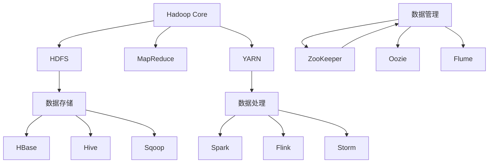
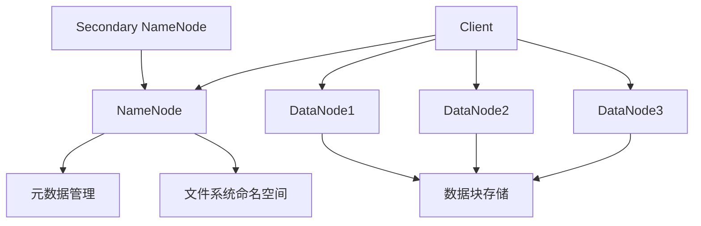
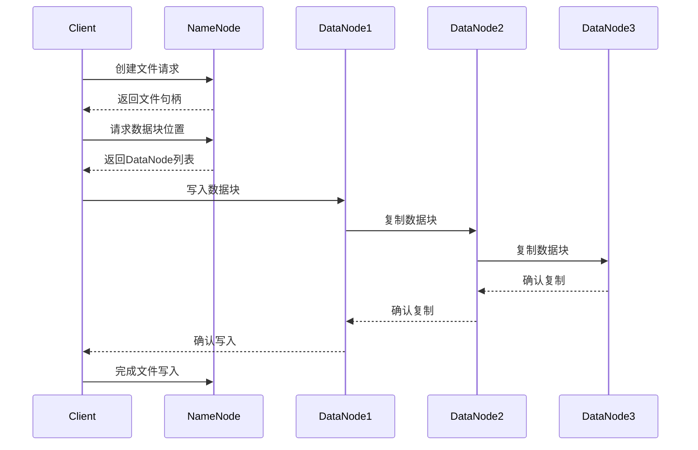
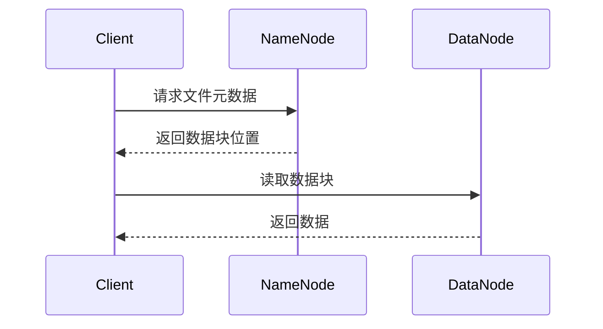
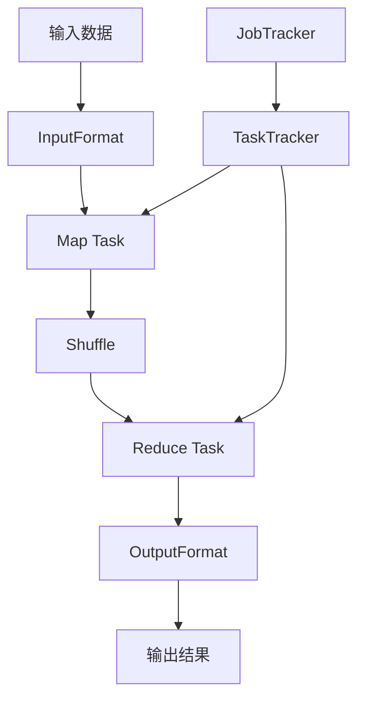
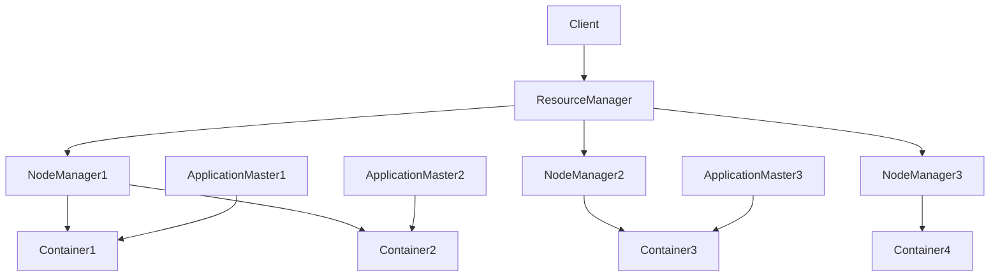
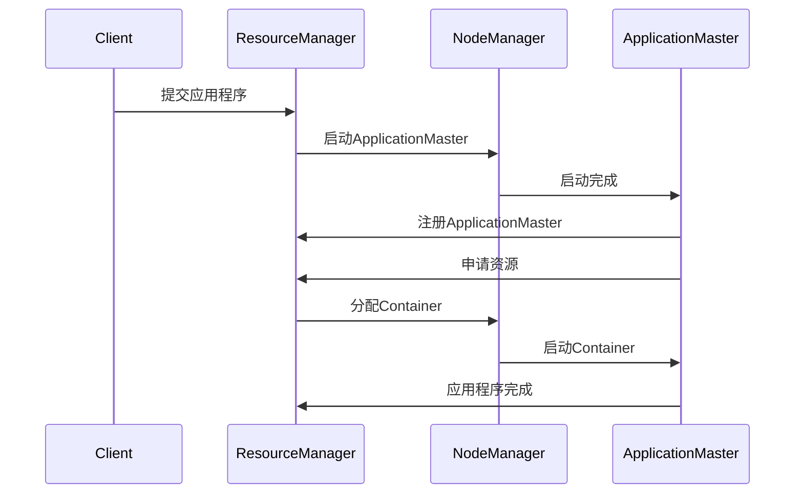

# 目录

- [目录](#目录)
- [Hadoop 基础概念](#hadoop-基础概念)
  - [Hadoop 生态系统](#hadoop-生态系统)
    - [Hadoop 核心组件](#hadoop-核心组件)
    - [Hadoop 生态系统组件](#hadoop-生态系统组件)
  - [HDFS 分布式文件系统](#hdfs-分布式文件系统)
    - [HDFS 架构与原理](#hdfs-架构与原理)
      - [HDFS 设计目标](#hdfs-设计目标)
      - [HDFS 架构图](#hdfs-架构图)
    - [HDFS 核心组件](#hdfs-核心组件)
      - [1. NameNode（主节点）](#1-namenode主节点)
      - [2. DataNode（数据节点）](#2-datanode数据节点)
      - [3. Secondary NameNode（辅助节点）](#3-secondary-namenode辅助节点)
    - [HDFS 读写流程](#hdfs-读写流程)
      - [HDFS 写流程](#hdfs-写流程)
      - [HDFS 读流程](#hdfs-读流程)
      - [详细代码示例](#详细代码示例)
    - [HDFS 容错机制](#hdfs-容错机制)
      - [1. 数据块复制](#1-数据块复制)
      - [2. 故障检测与恢复](#2-故障检测与恢复)
  - [MapReduce 编程模型](#mapreduce-编程模型)
    - [MapReduce 原理与流程](#mapreduce-原理与流程)
      - [MapReduce 编程模型](#mapreduce-编程模型-1)
      - [MapReduce 执行流程](#mapreduce-执行流程)
      - [详细执行流程](#详细执行流程)
    - [MapReduce 核心组件](#mapreduce-核心组件)
      - [1. JobTracker（作业跟踪器）](#1-jobtracker作业跟踪器)
      - [2. TaskTracker（任务跟踪器）](#2-tasktracker任务跟踪器)
      - [3. Map Task（映射任务）](#3-map-task映射任务)
      - [4. Reduce Task（归约任务）](#4-reduce-task归约任务)
    - [MapReduce 编程示例](#mapreduce-编程示例)
      - [完整示例：单词计数](#完整示例单词计数)
    - [MapReduce 优化策略](#mapreduce-优化策略)
      - [1. 数据本地化优化](#1-数据本地化优化)
      - [2. 内存优化](#2-内存优化)
      - [3. 压缩优化](#3-压缩优化)
  - [YARN 资源管理器](#yarn-资源管理器)
    - [YARN 架构与原理](#yarn-架构与原理)
      - [YARN 设计目标](#yarn-设计目标)
      - [YARN 架构图](#yarn-架构图)
    - [YARN 核心组件](#yarn-核心组件)
      - [1. ResourceManager（资源管理器）](#1-resourcemanager资源管理器)
      - [2. NodeManager（节点管理器）](#2-nodemanager节点管理器)
      - [3. ApplicationMaster（应用程序主控器）](#3-applicationmaster应用程序主控器)
    - [YARN 资源调度](#yarn-资源调度)
      - [1. 调度器类型](#1-调度器类型)
      - [2. Capacity Scheduler 配置](#2-capacity-scheduler-配置)
    - [YARN 应用管理](#yarn-应用管理)
      - [1. 应用程序生命周期](#1-应用程序生命周期)
      - [2. 应用程序监控](#2-应用程序监控)
- [Hadoop 核心组件详解](#hadoop-核心组件详解)
  - [HDFS 源码解析](#hdfs-源码解析)
    - [NameNode 源码分析](#namenode-源码分析)
      - [NameNode 启动流程](#namenode-启动流程)
      - [FSNamesystem 核心功能](#fsnamesystem-核心功能)
    - [DataNode 源码分析](#datanode-源码分析)
      - [DataNode 启动流程](#datanode-启动流程)
      - [数据块读写实现](#数据块读写实现)
    - [HDFS 客户端源码分析](#hdfs-客户端源码分析)
      - [客户端写操作](#客户端写操作)
      - [客户端读操作](#客户端读操作)
  - [MapReduce 源码解析](#mapreduce-源码解析)
    - [JobTracker 源码分析](#jobtracker-源码分析)
      - [JobTracker 启动流程](#jobtracker-启动流程)
      - [作业调度实现](#作业调度实现)
    - [TaskTracker 源码分析](#tasktracker-源码分析)
      - [TaskTracker 启动流程](#tasktracker-启动流程)
      - [任务执行实现](#任务执行实现)
    - [MapReduce 任务执行源码分析](#mapreduce-任务执行源码分析)
      - [Map任务执行](#map任务执行)
      - [Reduce任务执行](#reduce任务执行)
  - [YARN 源码解析](#yarn-源码解析)
    - [ResourceManager 源码分析](#resourcemanager-源码分析)
      - [ResourceManager 启动流程](#resourcemanager-启动流程)
      - [资源调度实现](#资源调度实现)
    - [NodeManager 源码分析](#nodemanager-源码分析)
      - [NodeManager 启动流程](#nodemanager-启动流程)
      - [容器管理实现](#容器管理实现)
    - [ApplicationMaster 源码分析](#applicationmaster-源码分析)
      - [ApplicationMaster 实现](#applicationmaster-实现)
- [Hadoop 性能优化](#hadoop-性能优化)
  - [HDFS 性能优化](#hdfs-性能优化)
    - [存储优化](#存储优化)
      - [1. 数据块大小优化](#1-数据块大小优化)
      - [2. 复制因子优化](#2-复制因子优化)
      - [3. 存储类型优化](#3-存储类型优化)
    - [网络优化](#网络优化)
      - [1. 网络拓扑优化](#1-网络拓扑优化)
      - [2. 数据传输优化](#2-数据传输优化)
    - [配置优化](#配置优化)
      - [1. NameNode优化](#1-namenode优化)
      - [2. DataNode优化](#2-datanode优化)
  - [MapReduce 性能优化](#mapreduce-性能优化)
    - [任务优化](#任务优化)
      - [1. Map任务优化](#1-map任务优化)
      - [2. Reduce任务优化](#2-reduce任务优化)
    - [数据优化](#数据优化)
      - [1. 输入格式优化](#1-输入格式优化)
      - [2. 输出格式优化](#2-输出格式优化)
    - [算法优化](#算法优化)
      - [1. 数据倾斜处理](#1-数据倾斜处理)
      - [2. 内存优化](#2-内存优化)
  - [YARN 性能优化](#yarn-性能优化)
    - [资源调度优化](#资源调度优化)
      - [1. 调度器选择](#1-调度器选择)
      - [2. Capacity Scheduler 优化](#2-capacity-scheduler-优化)
      - [3. Fair Scheduler 优化](#3-fair-scheduler-优化)
    - [内存管理优化](#内存管理优化)
      - [1. 内存分配策略](#1-内存分配策略)
      - [2. 内存监控](#2-内存监控)
    - [队列管理优化](#队列管理优化)
      - [1. 队列配置优化](#1-队列配置优化)
      - [2. 队列监控](#2-队列监控)
  - [性能监控与调优](#性能监控与调优)
    - [性能指标监控](#性能指标监控)
      - [1. HDFS性能指标](#1-hdfs性能指标)
      - [2. MapReduce性能指标](#2-mapreduce性能指标)
      - [3. YARN性能指标](#3-yarn性能指标)
    - [性能调优工具](#性能调优工具)
      - [1. 性能分析工具](#1-性能分析工具)
      - [2. 性能测试工具](#2-性能测试工具)
- [Hadoop 运维与监控](#hadoop-运维与监控)
  - [集群部署](#集群部署)
    - [环境准备](#环境准备)
      - [1. 系统要求](#1-系统要求)
      - [2. 环境配置](#2-环境配置)
      - [3. 网络配置](#3-网络配置)
    - [安装配置](#安装配置)
      - [1. Hadoop下载安装](#1-hadoop下载安装)
      - [2. 核心配置文件](#2-核心配置文件)
      - [3. 集群配置](#3-集群配置)
    - [集群启动](#集群启动)
      - [1. 启动流程](#1-启动流程)
      - [2. 启动脚本](#2-启动脚本)
      - [3. 停止脚本](#3-停止脚本)
  - [监控管理](#监控管理)
    - [系统监控](#系统监控)
      - [1. 系统资源监控](#1-系统资源监控)
      - [2. 集群状态监控](#2-集群状态监控)
    - [应用监控](#应用监控)
      - [1. 作业监控](#1-作业监控)
      - [2. 任务监控](#2-任务监控)
    - [日志管理](#日志管理)
      - [1. 日志配置](#1-日志配置)
      - [2. 日志分析](#2-日志分析)
  - [故障排查](#故障排查)
    - [常见问题](#常见问题)
      - [1. NameNode问题](#1-namenode问题)
      - [2. YARN问题](#2-yarn问题)
      - [3. MapReduce问题](#3-mapreduce问题)
    - [诊断方法](#诊断方法)
      - [1. 系统诊断](#1-系统诊断)
      - [2. 集群诊断](#2-集群诊断)
    - [解决方案](#解决方案)
      - [1. 性能问题解决](#1-性能问题解决)
      - [2. 故障恢复](#2-故障恢复)
- [Hadoop 高级特性](#hadoop-高级特性)
  - [高可用性](#高可用性)
    - [HDFS高可用](#hdfshighavailability)
      - [1. NameNode高可用架构](#1-namenodehighavailability)
      - [2. JournalNode配置](#2-journalnodeconfiguration)
      - [3. 自动故障切换](#3-automaticfailover)
    - [YARN高可用](#yarnhighavailability)
      - [1. ResourceManager高可用](#1-resourcemanagerhighavailability)
      - [2. 状态存储配置](#2-state-storage-configuration)
  - [安全性](#安全性)
    - [Kerberos认证](#kerberosauthentication)
      - [1. Kerberos配置](#1-kerberosconfiguration)
      - [2. 服务主体配置](#2-service-principal-configuration)
      - [3. 用户认证](#3-user-authentication)
    - [访问控制](#accesscontrol)
      - [1. HDFS权限控制](#1-hdfs-permission-control)
      - [2. YARN队列权限](#2-yarn-queue-permission)
  - [扩展功能](#extensionfeatures)
    - [HDFS Federation](#hdfs-federation)
      - [1. Federation架构](#1-federationarchitecture)
      - [2. ViewFS配置](#2-viewfsconfiguration)
    - [数据压缩](#data-compression)
      - [1. 压缩编解码器](#1-compression-codec)
      - [2. 压缩配置](#2-compression-configuration)
    - [数据格式优化](#data-format-optimization)
      - [1. 列式存储](#1-columnar-storage)
      - [2. 序列化格式](#2-serialization-format)
- [Hadoop 典型面试题与答疑](#hadoop-典型面试题与答疑)
  - [基础概念面试题](#basic-concept-interview-questions)
    - [1. Hadoop生态系统](#1-hadoop-ecosystem)
    - [2. HDFS架构](#2-hdfs-architecture)
    - [3. MapReduce原理](#3-mapreduce-principle)
  - [高级特性面试题](#advanced-feature-interview-questions)
    - [4. HDFS高可用](#4-hdfshighavailability)
    - [5. YARN资源调度](#5-yarn-resource-scheduling)
    - [6. 数据倾斜处理](#6-data-skew-handling)
  - [性能优化面试题](#performance-optimization-interview-questions)
    - [7. HDFS性能优化](#7-hdfspre-optimization)
    - [8. MapReduce性能优化](#8-mapreduce-performance-optimization)
    - [9. 内存管理](#9-memory-management)
  - [运维管理面试题](#operations-management-interview-questions)
    - [10. 集群监控](#10-cluster-monitoring)
    - [11. 故障排查](#11-fault-diagnosis)
    - [12. 安全配置](#12-security-configuration)
  - [实际应用面试题](#practical-application-interview-questions)
    - [13. 数据处理流程](#13-data-processing-flow)
    - [14. 性能调优实践](#14-performance-tuning-practice)
    - [15. 最佳实践](#15-best-practices)
  - [面试技巧总结](#interview-tips)
    - [1. 技术深度](#1-technical-depth)
    - [2. 技术广度](#2-technical-breadth)
    - [3. 问题解决能力](#3-problem-solving-ability)
    - [4. 学习能力](#4-learning-ability)
      - [2. 输出格式优化](#2-输出格式优化)
    - [算法优化](#算法优化)
      - [1. 数据倾斜处理](#1-数据倾斜处理)
      - [2. 内存优化](#2-内存优化-1)
  - [YARN 性能优化](#yarn-性能优化)
    - [资源调度优化](#资源调度优化)
      - [1. 调度器选择](#1-调度器选择)
      - [2. Capacity Scheduler 优化](#2-capacity-scheduler-优化)
      - [3. Fair Scheduler 优化](#3-fair-scheduler-优化)
    - [内存管理优化](#内存管理优化)
      - [1. 内存分配策略](#1-内存分配策略)
      - [2. 内存监控](#2-内存监控)
    - [队列管理优化](#队列管理优化)
      - [1. 队列配置优化](#1-队列配置优化)
      - [2. 队列监控](#2-队列监控)
  - [性能监控与调优](#性能监控与调优)
    - [性能指标监控](#性能指标监控)
      - [1. HDFS性能指标](#1-hdfs性能指标)
      - [2. MapReduce性能指标](#2-mapreduce性能指标)
      - [3. YARN性能指标](#3-yarn性能指标)
    - [性能调优工具](#性能调优工具)
      - [1. 性能分析工具](#1-性能分析工具)
      - [2. 性能测试工具](#2-性能测试工具)
- [Hadoop 运维与监控](#hadoop-运维与监控)
  - [集群部署](#集群部署)
    - [环境准备](#环境准备)
      - [1. 系统要求](#1-系统要求)
      - [2. 环境配置](#2-环境配置)
    - [安装配置](#安装配置)
      - [1. Hadoop下载安装](#1-hadoop下载安装)
      - [2. 核心配置文件](#2-核心配置文件)
    - [集群启动](#集群启动)
      - [1. 启动流程](#1-启动流程)
      - [2. 启动脚本](#2-启动脚本)
    - [停止脚本](#停止脚本)
  - [监控管理](#监控管理)
    - [系统监控](#系统监控)
      - [1. 系统资源监控](#1-系统资源监控)
      - [2. 集群状态监控](#2-集群状态监控)
    - [应用监控](#应用监控)
      - [1. 作业监控](#1-作业监控)
      - [2. 任务监控](#2-任务监控)
    - [日志管理](#日志管理)
      - [1. 日志配置](#1-日志配置)
      - [2. 日志分析](#2-日志分析)
  - [故障排查](#故障排查)
    - [常见问题](#常见问题)
      - [1. NameNode问题](#1-namenode问题)
      - [2. YARN问题](#2-yarn问题)
      - [3. MapReduce问题](#3-mapreduce问题)
    - [诊断方法](#诊断方法)
      - [1. 系统诊断](#1-系统诊断)
      - [2. 集群诊断](#2-集群诊断)
    - [解决方案](#解决方案)
      - [1. 性能问题解决](#1-性能问题解决)
      - [2. 故障恢复](#2-故障恢复)
- [Hadoop 高级特性](#hadoop-高级特性)
  - [高可用性](#高可用性)
    - [HDFS高可用](#hdfshighavailability)
      - [1. NameNode高可用架构](#1-namenodehighavailability)
      - [2. JournalNode配置](#2-journalnodeconfiguration)
      - [3. 自动故障切换](#3-automaticfailover)
    - [YARN高可用](#yarnhighavailability)
      - [1. ResourceManager高可用](#1-resourcemanagerhighavailability)
      - [2. 状态存储配置](#2-state-storage-configuration)
  - [安全性](#安全性)
    - [Kerberos认证](#kerberosauthentication)
      - [1. Kerberos配置](#1-kerberosconfiguration)
      - [2. 服务主体配置](#2-service-principal-configuration)
      - [3. 用户认证](#3-user-authentication)
    - [访问控制](#accesscontrol)
      - [1. HDFS权限控制](#1-hdfs-permission-control)
      - [2. YARN队列权限](#2-yarn-queue-permission)
  - [扩展功能](#extensionfeatures)
    - [HDFS Federation](#hdfs-federation)
      - [1. Federation架构](#1-federationarchitecture)
      - [2. ViewFS配置](#2-viewfsconfiguration)
    - [数据压缩](#data-compression)
      - [1. 压缩编解码器](#1-compression-codec)
      - [2. 压缩配置](#2-compression-configuration)
    - [数据格式优化](#data-format-optimization)
      - [1. 列式存储](#1-columnar-storage)
      - [2. 序列化格式](#2-serialization-format)
- [Hadoop 典型面试题与答疑](#hadoop-typical-interview-questions-and-answers)
  - [基础概念面试题](#basic-concept-interview-questions)
    - [1. Hadoop生态系统](#1-hadoop-ecosystem)
    - [2. HDFS架构](#2-hdfs-architecture)
    - [3. MapReduce原理](#3-mapreduce-principle)
  - [高级特性面试题](#advanced-feature-interview-questions)
    - [4. HDFS高可用](#4-hdfshighavailability)
    - [5. YARN资源调度](#5-yarn-resource-scheduling)
    - [6. 数据倾斜处理](#6-data-skew-handling)
  - [性能优化面试题](#performance-optimization-interview-questions)
    - [7. HDFS性能优化](#7-hdfspre-optimization)
    - [8. MapReduce性能优化](#8-mapreduce-performance-optimization)
    - [9. 内存管理](#9-memory-management)
  - [运维管理面试题](#operations-management-interview-questions)
    - [10. 集群监控](#10-cluster-monitoring)
    - [11. 故障排查](#11-fault-diagnosis)
    - [12. 安全配置](#12-security-configuration)
  - [实际应用面试题](#practical-application-interview-questions)
    - [13. 数据处理流程](#13-data-processing-flow)
    - [14. 性能调优实践](#14-performance-tuning-practice)
    - [15. 最佳实践](#15-best-practices)
  - [面试技巧总结](#interview-tips)
    - [1. 技术深度](#1-technical-depth)
    - [2. 技术广度](#2-technical-breadth)
    - [3. 问题解决能力](#3-problem-solving-ability)
    - [4. 学习能力](#4-learning-ability)

---

# Hadoop 基础概念

## Hadoop 生态系统

**Hadoop**是一个开源的分布式计算平台，主要用于处理大规模数据集。它由Apache软件基金会开发，是**大数据处理**的基础框架。

### Hadoop 核心组件

| 组件 | 功能 | 特点 |
|------|------|------|
| **HDFS** | 分布式文件系统 | 高容错、高吞吐量、适合大文件存储 |
| **MapReduce** | 分布式计算框架 | 编程模型简单、自动容错、适合批处理 |
| **YARN** | 资源管理器 | 统一资源管理、支持多种计算框架 |

### Hadoop 生态系统组件



## HDFS 分布式文件系统

### HDFS 架构与原理

**HDFS（Hadoop Distributed File System）**是Hadoop的分布式文件系统，设计用于在**大规模集群**上存储和处理数据。

#### HDFS 设计目标

- **大文件存储**：支持TB、PB级别的文件存储
- **流式数据访问**：一次写入、多次读取的访问模式
- **硬件容错**：自动检测和恢复硬件故障
- **简单一致性模型**：文件一旦创建、写入和关闭，内容不可变

#### HDFS 架构图



### HDFS 核心组件

#### 1. NameNode（主节点）

**NameNode**是HDFS的**主服务器**，负责管理文件系统的命名空间和元数据。

**主要职责**：
- 管理文件系统命名空间
- 维护文件系统树和元数据
- 记录数据块的位置信息
- 处理客户端请求

**关键特性**：
```java
// NameNode核心数据结构
class NameNode {
    // 文件系统命名空间
    private FSNamesystem namesystem;
    
    // 元数据存储
    private FSImage fsImage;
    
    // 编辑日志
    private EditLog editLog;
    
    // 数据块映射表
    private BlockManager blockManager;
}
```

#### 2. DataNode（数据节点）

**DataNode**是HDFS的**工作节点**，负责实际的数据存储和读写操作。

**主要职责**：
- 存储实际的数据块
- 执行数据块的读写操作
- 定期向NameNode报告状态
- 执行数据块的复制和删除

**关键特性**：
```java
// DataNode核心功能
class DataNode {
    // 数据块存储
    private FSDataset dataset;
    
    // 数据传输服务
    private DataXceiverServer xserver;
    
    // 心跳机制
    private HeartbeatManager heartbeatManager;
    
    // 块报告
    private BlockReportManager blockReportManager;
}
```

#### 3. Secondary NameNode（辅助节点）

**Secondary NameNode**不是NameNode的备份，而是帮助NameNode**合并编辑日志**的辅助节点。

**主要职责**：
- 定期合并fsimage和editlog
- 减少NameNode启动时间
- 提供检查点功能

### HDFS 读写流程

#### HDFS 写流程



#### HDFS 读流程



#### 详细代码示例

```java
// HDFS写操作示例
public class HDFSWriteExample {
    public static void writeFile(String filePath, String content) throws IOException {
        Configuration conf = new Configuration();
        FileSystem fs = FileSystem.get(conf);
        
        // 创建文件输出流
        FSDataOutputStream out = fs.create(new Path(filePath));
        
        // 写入数据
        out.writeBytes(content);
        
        // 关闭流
        out.close();
        fs.close();
    }
}

// HDFS读操作示例
public class HDFSReadExample {
    public static String readFile(String filePath) throws IOException {
        Configuration conf = new Configuration();
        FileSystem fs = FileSystem.get(conf);
        
        // 创建文件输入流
        FSDataInputStream in = fs.open(new Path(filePath));
        
        // 读取数据
        BufferedReader reader = new BufferedReader(new InputStreamReader(in));
        StringBuilder content = new StringBuilder();
        String line;
        while ((line = reader.readLine()) != null) {
            content.append(line).append("\n");
        }
        
        // 关闭流
        reader.close();
        in.close();
        fs.close();
        
        return content.toString();
    }
}
```

### HDFS 容错机制

#### 1. 数据块复制

**HDFS通过数据块复制**来保证数据的可靠性，默认复制因子为3。

```java
// 数据块复制策略
class BlockReplicationPolicy {
    // 默认复制因子
    private static final int DEFAULT_REPLICATION = 3;
    
    // 选择复制目标节点
    public DatanodeStorageInfo[] chooseTarget(String srcPath, int numOfReplicas,
                                            Node writer, List<DatanodeStorageInfo> chosen,
                                            boolean returnChosenNodes,
                                            Set<Node> excludedNodes,
                                            long blocksize,
                                            BlockStoragePolicy storagePolicy) {
        // 实现复制目标选择逻辑
    }
}
```

#### 2. 故障检测与恢复

**HDFS通过心跳机制**检测节点故障，并自动恢复数据。

```java
// 心跳检测机制
class HeartbeatManager {
    // 心跳间隔（默认3秒）
    private static final long HEARTBEAT_INTERVAL = 3000;
    
    // 心跳超时时间（默认10分钟）
    private static final long HEARTBEAT_TIMEOUT = 600000;
    
    // 处理心跳
    public void processHeartbeat(DatanodeRegistration nodeReg,
                               StorageReport[] reports,
                               long cacheCapacity,
                               long cacheUsed,
                               int xceiverCount,
                               int failedVolumes,
                               VolumeFailureSummary volumeFailureSummary) {
        // 更新节点状态
        // 检查是否需要数据块恢复
    }
}
```

## MapReduce 编程模型

### MapReduce 原理与流程

**MapReduce**是Hadoop的**分布式计算框架**，用于处理大规模数据集的并行计算。

#### MapReduce 编程模型

MapReduce将计算过程分为两个阶段：
1. **Map阶段**：将输入数据分割成独立的块，并行处理
2. **Reduce阶段**：将Map阶段的输出进行汇总和聚合

#### MapReduce 执行流程



#### 详细执行流程

```java
// MapReduce作业执行流程
public class MapReduceJob {
    public static void main(String[] args) throws Exception {
        // 1. 创建Job配置
        Configuration conf = new Configuration();
        Job job = Job.getInstance(conf, "WordCount");
        
        // 2. 设置Job属性
        job.setJarByClass(MapReduceJob.class);
        job.setMapperClass(WordCountMapper.class);
        job.setReducerClass(WordCountReducer.class);
        
        // 3. 设置输入输出格式
        job.setInputFormatClass(TextInputFormat.class);
        job.setOutputFormatClass(TextOutputFormat.class);
        
        // 4. 设置输入输出路径
        FileInputFormat.addInputPath(job, new Path(args[0]));
        FileOutputFormat.setOutputPath(job, new Path(args[1]));
        
        // 5. 提交作业
        job.waitForCompletion(true);
    }
}
```

### MapReduce 核心组件

#### 1. JobTracker（作业跟踪器）

**JobTracker**是MapReduce的**主节点**，负责作业调度和任务管理。

**主要职责**：
- 接收客户端提交的作业
- 将作业分解为任务
- 分配任务给TaskTracker
- 监控任务执行状态
- 处理任务失败和重试

#### 2. TaskTracker（任务跟踪器）

**TaskTracker**是MapReduce的**工作节点**，负责执行具体的任务。

**主要职责**：
- 接收JobTracker分配的任务
- 启动和管理Map/Reduce任务
- 向JobTracker报告任务状态
- 管理本地资源

#### 3. Map Task（映射任务）

**Map Task**负责处理输入数据的分片，生成键值对。

```java
// Map任务示例
public class WordCountMapper extends Mapper<LongWritable, Text, Text, IntWritable> {
    private final static IntWritable one = new IntWritable(1);
    private Text word = new Text();
    
    @Override
    public void map(LongWritable key, Text value, Context context) 
            throws IOException, InterruptedException {
        
        // 分割输入行
        String line = value.toString();
        StringTokenizer tokenizer = new StringTokenizer(line);
        
        // 输出(word, 1)键值对
        while (tokenizer.hasMoreTokens()) {
            word.set(tokenizer.nextToken());
            context.write(word, one);
        }
    }
}
```

#### 4. Reduce Task（归约任务）

**Reduce Task**负责聚合Map任务的输出，生成最终结果。

```java
// Reduce任务示例
public class WordCountReducer extends Reducer<Text, IntWritable, Text, IntWritable> {
    private IntWritable result = new IntWritable();
    
    @Override
    public void reduce(Text key, Iterable<IntWritable> values, Context context)
            throws IOException, InterruptedException {
        
        // 计算单词出现次数
        int sum = 0;
        for (IntWritable val : values) {
            sum += val.get();
        }
        
        // 输出(word, count)键值对
        result.set(sum);
        context.write(key, result);
    }
}
```

### MapReduce 编程示例

#### 完整示例：单词计数

```java
// 完整的WordCount示例
public class WordCount {
    
    // Mapper类
    public static class TokenizerMapper extends Mapper<Object, Text, Text, IntWritable> {
        private final static IntWritable one = new IntWritable(1);
        private Text word = new Text();
        
        public void map(Object key, Text value, Context context) 
                throws IOException, InterruptedException {
            StringTokenizer itr = new StringTokenizer(value.toString());
            while (itr.hasMoreTokens()) {
                word.set(itr.nextToken());
                context.write(word, one);
            }
        }
    }
    
    // Reducer类
    public static class IntSumReducer extends Reducer<Text, IntWritable, Text, IntWritable> {
        private IntWritable result = new IntWritable();
        
        public void reduce(Text key, Iterable<IntWritable> values, Context context)
                throws IOException, InterruptedException {
            int sum = 0;
            for (IntWritable val : values) {
                sum += val.get();
            }
            result.set(sum);
            context.write(key, result);
        }
    }
    
    // 主方法
    public static void main(String[] args) throws Exception {
        Configuration conf = new Configuration();
        Job job = Job.getInstance(conf, "word count");
        
        job.setJarByClass(WordCount.class);
        job.setMapperClass(TokenizerMapper.class);
        job.setCombinerClass(IntSumReducer.class);
        job.setReducerClass(IntSumReducer.class);
        
        job.setOutputKeyClass(Text.class);
        job.setOutputValueClass(IntWritable.class);
        
        FileInputFormat.addInputPath(job, new Path(args[0]));
        FileOutputFormat.setOutputPath(job, new Path(args[1]));
        
        System.exit(job.waitForCompletion(true) ? 0 : 1);
    }
}
```

### MapReduce 优化策略

#### 1. 数据本地化优化

**数据本地化**可以减少网络传输，提高性能。

```java
// 数据本地化配置
public class DataLocalityOptimization {
    public static void configureDataLocality(Job job) {
        // 设置输入格式以支持数据本地化
        job.setInputFormatClass(TextInputFormat.class);
        
        // 配置数据本地化策略
        job.getConfiguration().set("mapreduce.job.maps", "4");
        job.getConfiguration().set("mapreduce.tasktracker.map.tasks.maximum", "2");
    }
}
```

#### 2. 内存优化

**内存优化**可以提高任务执行效率。

```properties
# MapReduce内存优化配置
mapreduce.map.memory.mb=2048
mapreduce.reduce.memory.mb=4096
mapreduce.map.java.opts=-Xmx1638m
mapreduce.reduce.java.opts=-Xmx3276m
```

#### 3. 压缩优化

**压缩**可以减少I/O开销，提高性能。

```java
// 压缩配置
public class CompressionOptimization {
    public static void configureCompression(Job job) {
        // 启用Map输出压缩
        job.getConfiguration().set("mapreduce.map.output.compress", "true");
        job.getConfiguration().set("mapreduce.map.output.compress.codec", 
                                  "org.apache.hadoop.io.compress.SnappyCodec");
        
        // 启用输出压缩
        job.getConfiguration().set("mapreduce.output.fileoutputformat.compress", "true");
        job.getConfiguration().set("mapreduce.output.fileoutputformat.compress.codec", 
                                  "org.apache.hadoop.io.compress.GzipCodec");
    }
}
```

## YARN 资源管理器

### YARN 架构与原理

**YARN（Yet Another Resource Negotiator）**是Hadoop 2.0引入的**统一资源管理平台**，用于管理集群资源和调度应用程序。

#### YARN 设计目标

- **统一资源管理**：支持多种计算框架
- **可扩展性**：支持大规模集群
- **高可用性**：支持故障恢复
- **向后兼容**：兼容MapReduce 1.0

#### YARN 架构图



### YARN 核心组件

#### 1. ResourceManager（资源管理器）

**ResourceManager**是YARN的**主节点**，负责整个集群的资源管理和调度。

**主要职责**：
- 管理集群资源
- 调度应用程序
- 分配资源给ApplicationMaster
- 监控NodeManager状态

```java
// ResourceManager核心功能
class ResourceManager {
    // 资源调度器
    private ResourceScheduler scheduler;
    
    // 应用程序管理器
    private ApplicationMasterService amService;
    
    // 节点管理器服务
    private NodeManagerService nmService;
    
    // 资源跟踪器
    private ResourceTrackerService resourceTracker;
}
```

#### 2. NodeManager（节点管理器）

**NodeManager**是YARN的**工作节点**，负责管理单个节点上的资源。

**主要职责**：
- 管理本地资源
- 启动和监控Container
- 向ResourceManager报告资源状态
- 管理应用程序日志

```java
// NodeManager核心功能
class NodeManager {
    // 容器管理器
    private ContainerManager containerManager;
    
    // 资源监控器
    private ResourceMonitor resourceMonitor;
    
    // 节点健康检查器
    private NodeHealthChecker healthChecker;
    
    // 日志管理器
    private LogHandler logHandler;
}
```

#### 3. ApplicationMaster（应用程序主控器）

**ApplicationMaster**是每个应用程序的**主控进程**，负责与ResourceManager协商资源。

**主要职责**：
- 向ResourceManager申请资源
- 与NodeManager协商启动Container
- 监控应用程序执行状态
- 处理应用程序失败

```java
// ApplicationMaster示例
public class CustomApplicationMaster {
    private AMRMClient<ContainerRequest> amRMClient;
    private NMClient nmClient;
    
    public void run() throws Exception {
        // 1. 初始化客户端
        amRMClient = AMRMClient.createAMRMClient();
        nmClient = NMClient.createNMClient();
        
        // 2. 注册ApplicationMaster
        amRMClient.registerApplicationMaster("", 0, "");
        
        // 3. 申请资源
        ContainerRequest containerRequest = new ContainerRequest(
            Resource.newInstance(1024, 1), null, null, Priority.newInstance(0));
        amRMClient.addContainerRequest(containerRequest);
        
        // 4. 启动Container
        AllocateResponse response = amRMClient.allocate(0);
        for (Container container : response.getAllocatedContainers()) {
            nmClient.startContainer(container, createContainerLaunchContext());
        }
        
        // 5. 完成应用程序
        amRMClient.unregisterApplicationMaster(FinalApplicationStatus.SUCCEEDED, "", "");
    }
}
```

### YARN 资源调度

#### 1. 调度器类型

YARN支持多种调度器：

| 调度器 | 特点 | 适用场景 |
|--------|------|----------|
| **FIFO Scheduler** | 先进先出，简单 | 小规模集群 |
| **Capacity Scheduler** | 队列容量保证 | 多用户环境 |
| **Fair Scheduler** | 公平分配资源 | 动态负载环境 |

#### 2. Capacity Scheduler 配置

```xml
<!-- capacity-scheduler.xml -->
<configuration>
    <property>
        <name>yarn.scheduler.capacity.root.queues</name>
        <value>default,prod,dev</value>
    </property>
    
    <property>
        <name>yarn.scheduler.capacity.root.default.capacity</name>
        <value>40</value>
    </property>
    
    <property>
        <name>yarn.scheduler.capacity.root.prod.capacity</name>
        <value>40</value>
    </property>
    
    <property>
        <name>yarn.scheduler.capacity.root.dev.capacity</name>
        <value>20</value>
    </property>
</configuration>
```

### YARN 应用管理

#### 1. 应用程序生命周期



#### 2. 应用程序监控

```java
// 应用程序监控示例
public class ApplicationMonitor {
    public static void monitorApplication(String applicationId) throws Exception {
        YarnClient yarnClient = YarnClient.createYarnClient();
        yarnClient.init(new Configuration());
        yarnClient.start();
        
        // 获取应用程序报告
        ApplicationReport report = yarnClient.getApplicationReport(
            ApplicationId.fromString(applicationId));
        
        // 打印应用程序状态
        System.out.println("Application ID: " + report.getApplicationId());
        System.out.println("Application State: " + report.getYarnApplicationState());
        System.out.println("Application Type: " + report.getApplicationType());
        System.out.println("User: " + report.getUser());
        System.out.println("Queue: " + report.getQueue());
        System.out.println("Start Time: " + report.getStartTime());
        System.out.println("Finish Time: " + report.getFinishTime());
        
        yarnClient.stop();
    }
}
```

---

# Hadoop 核心组件详解

## HDFS 源码解析

### NameNode 源码分析

**NameNode**是HDFS的核心组件，负责管理文件系统的命名空间和元数据。

#### NameNode 启动流程

```java
// NameNode启动流程源码分析
public class NameNode {
    private FSNamesystem namesystem;
    private NameNodeHttpServer httpServer;
    private NameNodeRpcServer rpcServer;
    
    public static void main(String[] args) {
        try {
            // 1. 解析命令行参数
            GenericOptionsParser parser = new GenericOptionsParser(conf, args);
            String[] remainingArgs = parser.getRemainingArgs();
            
            // 2. 创建NameNode实例
            NameNode namenode = createNameNode(remainingArgs, conf);
            
            // 3. 启动NameNode服务
            namenode.join();
        } catch (Exception e) {
            LOG.error("Failed to start namenode", e);
            System.exit(1);
        }
    }
    
    protected NameNode(Configuration conf) throws IOException {
        // 1. 初始化文件系统命名空间
        this.namesystem = new FSNamesystem(conf, this);
        
        // 2. 启动RPC服务器
        this.rpcServer = new NameNodeRpcServer(conf, this);
        
        // 3. 启动HTTP服务器
        this.httpServer = new NameNodeHttpServer(conf, this);
        
        // 4. 启动安全服务
        if (UserGroupInformation.isSecurityEnabled()) {
            SecurityUtil.login(conf, DFS_NAMENODE_KEYTAB_FILE_KEY,
                             DFS_NAMENODE_KERBEROS_PRINCIPAL_KEY);
        }
    }
}
```

#### FSNamesystem 核心功能

```java
// FSNamesystem核心功能实现
public class FSNamesystem implements Namesystem, FSNamesystemMBean {
    
    // 文件系统目录树
    private final FSDirectory dir;
    
    // 数据块管理器
    private final BlockManager blockManager;
    
    // 租约管理器
    private final LeaseManager leaseManager;
    
    // 快照管理器
    private final SnapshotManager snapshotManager;
    
    // 创建文件
    public HdfsFileStatus startFile(String src, PermissionStatus permissions,
                                   String holder, String clientMachine,
                                   EnumSet<CreateFlag> flag, boolean createParent,
                                   short replication, long blockSize,
                                   CryptoProtocolVersion[] supportedVersions,
                                   String ecPolicyName, String storagePolicy)
            throws IOException {
        
        // 1. 检查权限
        if (!isPermissionEnabled) {
            permissions = new PermissionStatus(getSuperuser(), null, FsPermission.getDefault());
        }
        
        // 2. 创建文件节点
        INodeFile newNode = dir.addFile(src, permissions, replication, blockSize,
                                      holder, clientMachine, flag, supportedVersions,
                                      ecPolicyName, storagePolicy);
        
        // 3. 获取租约
        getLeaseManager().addLease(newNode.getFileUnderConstructionFeature()
                                 .getClientName(), src);
        
        // 4. 记录编辑日志
        getEditLog().logOpenFile(src, newNode, overwrite, replication, blockSize);
        
        return newNode.getFileStatus();
    }
    
    // 删除文件
    public boolean delete(String src, boolean recursive) throws IOException {
        // 1. 检查权限
        if (!isPermissionEnabled) {
            checkPermission(src, false, null, FsAction.WRITE, null, null, false);
        }
        
        // 2. 删除文件节点
        boolean ret = dir.delete(src, recursive);
        
        // 3. 记录编辑日志
        if (ret) {
            getEditLog().logDelete(src, System.currentTimeMillis());
        }
        
        return ret;
    }
}
```

### DataNode 源码分析

**DataNode**负责存储实际的数据块，是HDFS的工作节点。

#### DataNode 启动流程

```java
// DataNode启动流程源码分析
public class DataNode extends ReconfigurableBase implements InterDatanodeProtocol,
        ClientDatanodeProtocol, TraceAdminProtocol, DataNodeMXBean {
    
    private FSDataset dataset;
    private DataXceiverServer dataXceiverServer;
    private HttpServer2 infoServer;
    private DatanodeHttpServer httpServer;
    private DataNodeMetrics metrics;
    
    public static void main(String[] args) {
        try {
            // 1. 解析配置
            GenericOptionsParser parser = new GenericOptionsParser(conf, args);
            String[] remainingArgs = parser.getRemainingArgs();
            
            // 2. 创建DataNode实例
            DataNode datanode = createDataNode(remainingArgs, conf);
            
            // 3. 启动DataNode服务
            datanode.join();
        } catch (Exception e) {
            LOG.error("Failed to start datanode", e);
            System.exit(1);
        }
    }
    
    DataNode(final Configuration conf) throws IOException {
        // 1. 初始化数据存储
        this.dataset = new FSDataset(conf, dataDirs, storageLocationChecker);
        
        // 2. 启动数据传输服务
        this.dataXceiverServer = new DataXceiverServer(this, conf);
        
        // 3. 启动HTTP服务
        this.httpServer = new DatanodeHttpServer(this, conf);
        
        // 4. 注册到NameNode
        registerWithNameNode();
    }
}
```

#### 数据块读写实现

```java
// 数据块读写核心实现
public class DataXceiver implements Runnable {
    
    // 读取数据块
    public void readBlock(ExtendedBlock block, long blockOffset, long length,
                         String clientName, BlockReaderStrategy strategy)
            throws IOException {
        
        // 1. 验证数据块
        Replica replica = dataset.getReplica(block);
        if (replica == null) {
            throw new IOException("Block " + block + " not found");
        }
        
        // 2. 创建块读取器
        BlockReader reader = new BlockReader(block, replica, blockOffset, length);
        
        // 3. 发送数据
        try {
            while (reader.hasMoreData()) {
                byte[] buffer = reader.readNextChunk();
                out.write(buffer);
            }
        } finally {
            reader.close();
        }
    }
    
    // 写入数据块
    public void writeBlock(ExtendedBlock block, StorageType storageType,
                          Token<BlockTokenIdentifier> blockToken,
                          String clientName, DatanodeInfo[] targets,
                          StorageType[] targetStorageTypes,
                          DatanodeInfo source, BlockConstructionStage stage,
                          int pipelineSize, long minBytesRcvd, long maxBytesRcvd,
                          long latestGenerationStamp, DataChecksum requestedChecksum,
                          CachingStrategy cachingStrategy, boolean allowLazyPersist,
                          PinList pinList, boolean[] targetPinnings,
                          String storageId, String[] targetStorageIds,
                          DatanodeInfo[] targetCached, String[] targetCachedStorageIds)
            throws IOException {
        
        // 1. 验证权限
        if (blockToken != null) {
            blockTokenService.verifyToken(blockToken, block, BlockTokenSecretManager.AccessMode.WRITE);
        }
        
        // 2. 创建数据块写入器
        BlockReceiver receiver = new BlockReceiver(block, storageType, in,
                                                 peer.getRemoteAddressString(),
                                                 peer.getLocalAddressString(),
                                                 stage, latestGenerationStamp,
                                                 minBytesRcvd, maxBytesRcvd,
                                                 clientName, srcDataNode,
                                                 requestedChecksum,
                                                 cachingStrategy, allowLazyPersist,
                                                 pinList, storageId);
        
        // 3. 接收数据
        try {
            receiver.receiveBlock();
        } finally {
            receiver.close();
        }
    }
}
```

### HDFS 客户端源码分析

**HDFS客户端**负责与NameNode和DataNode通信，提供文件操作接口。

#### 客户端写操作

```java
// HDFS客户端写操作源码分析
public class DFSOutputStream extends FSOutputSummer {
    
    private final DFSClient dfsClient;
    private final String src;
    private final long blockSize;
    private final Progressable progress;
    private final DataChecksum checksum;
    
    // 写入数据
    public synchronized void write(byte[] b, int off, int len) throws IOException {
        // 1. 检查流状态
        if (closed) {
            throw new IOException("Stream closed");
        }
        
        // 2. 计算校验和
        int n = writeChecksumChunks(b, off, len);
        
        // 3. 写入数据
        for (int i = 0; i < n; i++) {
            writeChunk(b, off + i * bytesPerChecksum, bytesPerChecksum);
        }
    }
    
    // 写入数据块
    private void writeChunk(byte[] b, int offset, int len) throws IOException {
        // 1. 检查当前数据块是否已满
        if (currentPacket == null || currentPacket.getNumChunks() >= maxChunksPerPacket) {
            currentPacket = new Packet(header, maxChunksPerPacket, bytesPerChecksum);
        }
        
        // 2. 添加数据到数据包
        currentPacket.writeChecksumChunk(b, offset, len);
        
        // 3. 如果数据包已满，发送数据包
        if (currentPacket.getNumChunks() >= maxChunksPerPacket) {
            currentPacket.writeDataTo(dataStream);
            currentPacket.writeChecksumTo(checksumStream);
        }
    }
    
    // 关闭流
    public synchronized void close() throws IOException {
        // 1. 刷新剩余数据
        flushBuffer();
        
        // 2. 发送最后一个数据包
        if (currentPacket != null) {
            currentPacket.writeDataTo(dataStream);
            currentPacket.writeChecksumTo(checksumStream);
        }
        
        // 3. 完成文件写入
        completeFile();
        
        // 4. 关闭流
        closed = true;
    }
}
```

#### 客户端读操作

```java
// HDFS客户端读操作源码分析
public class DFSInputStream extends FSInputStream {
    
    private final DFSClient dfsClient;
    private final String src;
    private final boolean verifyChecksum;
    private final FileSystem.Statistics stats;
    
    // 读取数据
    public synchronized int read(byte[] buf, int off, int len) throws IOException {
        // 1. 检查参数
        if (buf == null) {
            throw new NullPointerException();
        }
        if (off < 0 || len < 0 || len > buf.length - off) {
            throw new IndexOutOfBoundsException();
        }
        
        // 2. 如果已到达文件末尾，返回-1
        if (pos >= getFileLength()) {
            return -1;
        }
        
        // 3. 读取数据
        int nread = 0;
        while (nread < len) {
            int n = readOneBlock(buf, off + nread, len - nread);
            if (n <= 0) {
                break;
            }
            nread += n;
        }
        
        return nread;
    }
    
    // 读取一个数据块
    private int readOneBlock(byte[] buf, int offset, int len) throws IOException {
        // 1. 获取当前数据块信息
        LocatedBlock block = getBlockAt(pos);
        
        // 2. 创建数据块读取器
        BlockReader reader = getBlockReader(block, pos);
        
        // 3. 读取数据
        int n = reader.read(buf, offset, len);
        
        // 4. 更新位置
        pos += n;
        
        return n;
    }
}
```

## MapReduce 源码解析

### JobTracker 源码分析

**JobTracker**是MapReduce 1.0的主节点，负责作业调度和任务管理。

#### JobTracker 启动流程

```java
// JobTracker启动流程源码分析
public class JobTracker implements MRConstants, InterTrackerProtocol,
        TaskTrackerManager, JobSubmissionProtocol {
    
    private JobTrackerInstrumentation metrics;
    private JobTrackerMetricsInst jobTrackerMetrics;
    private TaskScheduler taskScheduler;
    private JobInProgressListener jobInProgressListener;
    
    public static void main(String[] args) throws Exception {
        // 1. 解析配置
        GenericOptionsParser parser = new GenericOptionsParser(conf, args);
        String[] remainingArgs = parser.getRemainingArgs();
        
        // 2. 创建JobTracker实例
        JobTracker jobTracker = new JobTracker(conf);
        
        // 3. 启动JobTracker服务
        jobTracker.offerService();
    }
    
    public JobTracker(Configuration conf) throws IOException, InterruptedException {
        // 1. 初始化任务调度器
        this.taskScheduler = (TaskScheduler) ReflectionUtils.newInstance(
            conf.getClass("mapred.jobtracker.taskScheduler", JobQueueTaskScheduler.class,
                         TaskScheduler.class), conf);
        
        // 2. 初始化作业监听器
        this.jobInProgressListener = new JobInProgressListener();
        
        // 3. 启动RPC服务器
        this.rpcServer = RPC.getServer(this, bindAddress, port, maxMapTasks,
                                      false, conf, secretManager);
        
        // 4. 启动恢复服务
        this.recoveryManager = new RecoveryManager(conf, this);
    }
}
```

#### 作业调度实现

```java
// 作业调度核心实现
public class JobQueueTaskScheduler extends TaskScheduler {
    
    private JobQueue jobQueue;
    private Map<String, JobInProgress> jobs;
    
    // 分配任务
    public synchronized List<Task> assignTasks(TaskTracker taskTracker) {
        List<Task> tasks = new ArrayList<Task>();
        
        // 1. 获取可用的任务槽位
        int availableMapSlots = taskTracker.getAvailableMapSlots();
        int availableReduceSlots = taskTracker.getAvailableReduceSlots();
        
        // 2. 分配Map任务
        if (availableMapSlots > 0) {
            Task mapTask = getMapTask(taskTracker);
            if (mapTask != null) {
                tasks.add(mapTask);
            }
        }
        
        // 3. 分配Reduce任务
        if (availableReduceSlots > 0) {
            Task reduceTask = getReduceTask(taskTracker);
            if (reduceTask != null) {
                tasks.add(reduceTask);
            }
        }
        
        return tasks;
    }
    
    // 获取Map任务
    private Task getMapTask(TaskTracker taskTracker) {
        // 1. 遍历作业队列
        for (JobInProgress job : jobs.values()) {
            if (job.getStatus().getRunState() == JobStatus.RUNNING) {
                // 2. 检查是否有可用的Map任务
                TaskInProgress[] mapTasks = job.getMapTasks();
                for (TaskInProgress tip : mapTasks) {
                    if (tip.isRunnable() && tip.hasSpeculativeTask()) {
                        // 3. 创建Map任务
                        return tip.createTask(taskTracker.getTrackerName());
                    }
                }
            }
        }
        return null;
    }
}
```

### TaskTracker 源码分析

**TaskTracker**是MapReduce 1.0的工作节点，负责执行具体的任务。

#### TaskTracker 启动流程

```java
// TaskTracker启动流程源码分析
public class TaskTracker implements MRConstants, TaskUmbilicalProtocol {
    
    private JobClient jobClient;
    private TaskLauncher mapLauncher;
    private TaskLauncher reduceLauncher;
    private Map<String, TaskInProgress> runningTasks;
    
    public static void main(String[] args) throws Exception {
        // 1. 解析配置
        GenericOptionsParser parser = new GenericOptionsParser(conf, args);
        String[] remainingArgs = parser.getRemainingArgs();
        
        // 2. 创建TaskTracker实例
        TaskTracker taskTracker = new TaskTracker(conf);
        
        // 3. 启动TaskTracker服务
        taskTracker.run();
    }
    
    public TaskTracker(Configuration conf) throws IOException {
        // 1. 初始化任务启动器
        this.mapLauncher = new TaskLauncher(this, maxMapSlots);
        this.reduceLauncher = new TaskLauncher(this, maxReduceSlots);
        
        // 2. 启动心跳线程
        this.heartbeatThread = new Thread(new HeartbeatThread());
        this.heartbeatThread.start();
        
        // 3. 启动清理线程
        this.cleanupThread = new Thread(new CleanupThread());
        this.cleanupThread.start();
    }
}
```

#### 任务执行实现

```java
// 任务执行核心实现
public class TaskRunner extends Thread {
    
    private Task task;
    private TaskUmbilicalProtocol umbilical;
    private JvmManager jvmManager;
    
    public void run() {
        try {
            // 1. 准备任务环境
            prepareTask();
            
            // 2. 启动JVM
            JvmEnv env = jvmManager.createJvmEnv(task);
            jvmManager.launchJvm(env);
            
            // 3. 监控任务执行
            monitorTask();
            
        } catch (Exception e) {
            // 4. 处理任务失败
            handleTaskFailure(e);
        }
    }
    
    // 准备任务环境
    private void prepareTask() throws IOException {
        // 1. 创建任务目录
        File taskDir = new File(task.getTaskDir());
        taskDir.mkdirs();
        
        // 2. 下载任务文件
        downloadTaskFiles();
        
        // 3. 设置环境变量
        setupEnvironment();
    }
    
    // 监控任务执行
    private void monitorTask() {
        while (task.isRunning()) {
            // 1. 发送心跳
            umbilical.ping(task.getTaskId());
            
            // 2. 检查任务状态
            TaskStatus status = task.getStatus();
            if (status.getState() == TaskStatus.State.FAILED) {
                throw new RuntimeException("Task failed");
            }
            
            // 3. 等待一段时间
            Thread.sleep(1000);
        }
    }
}
```

### MapReduce 任务执行源码分析

#### Map任务执行

```java
// Map任务执行源码分析
public class MapTask extends Task {
    
    private RecordReader<KEYIN, VALUEIN> input;
    private Mapper<KEYIN, VALUEIN, KEYOUT, VALUEOUT> mapper;
    private RecordWriter<KEYOUT, VALUEOUT> output;
    
    public void run(JobConf job, TaskUmbilicalProtocol umbilical) throws IOException {
        // 1. 初始化任务
        initialize(job, getJobID(), reporter, umbilical);
        
        // 2. 创建输入格式
        InputFormat<KEYIN, VALUEIN> inputFormat = ReflectionUtils.newInstance(
            job.getInputFormatClass(), job);
        
        // 3. 创建记录读取器
        input = inputFormat.getRecordReader(split, job, reporter);
        
        // 4. 创建Mapper
        mapper = ReflectionUtils.newInstance(job.getMapperClass(), job);
        
        // 5. 创建输出格式
        OutputFormat<KEYOUT, VALUEOUT> outputFormat = ReflectionUtils.newInstance(
            job.getOutputFormatClass(), job);
        
        // 6. 创建记录写入器
        output = outputFormat.getRecordWriter(null, job, getTaskId().toString(), reporter);
        
        // 7. 执行Map任务
        try {
            while (input.next(key, value)) {
                mapper.map(key, value, output, reporter);
            }
        } finally {
            // 8. 清理资源
            input.close();
            output.close(mapper);
        }
    }
}
```

#### Reduce任务执行

```java
// Reduce任务执行源码分析
public class ReduceTask extends Task {
    
    private RawKeyValueIterator input;
    private Reducer<KEYIN, VALUEIN, KEYOUT, VALUEOUT> reducer;
    private RecordWriter<KEYOUT, VALUEOUT> output;
    
    public void run(JobConf job, TaskUmbilicalProtocol umbilical) throws IOException {
        // 1. 初始化任务
        initialize(job, getJobID(), reporter, umbilical);
        
        // 2. 创建输入迭代器
        input = new ReduceInputIterator(job, reporter);
        
        // 3. 创建Reducer
        reducer = ReflectionUtils.newInstance(job.getReducerClass(), job);
        
        // 4. 创建输出格式
        OutputFormat<KEYOUT, VALUEOUT> outputFormat = ReflectionUtils.newInstance(
            job.getOutputFormatClass(), job);
        
        // 5. 创建记录写入器
        output = outputFormat.getRecordWriter(null, job, getTaskId().toString(), reporter);
        
        // 6. 执行Reduce任务
        try {
            reducer.reduce(input, output, reporter);
        } finally {
            // 7. 清理资源
            input.close();
            output.close(reducer);
        }
    }
}
```

## YARN 源码解析

### ResourceManager 源码分析

**ResourceManager**是YARN的主节点，负责整个集群的资源管理和调度。

#### ResourceManager 启动流程

```java
// ResourceManager启动流程源码分析
public class ResourceManager extends CompositeService {
    
    private ResourceScheduler scheduler;
    private ApplicationMasterService amService;
    private NodeManagerService nmService;
    private ResourceTrackerService resourceTracker;
    
    public static void main(String[] args) {
        try {
            // 1. 解析配置
            GenericOptionsParser parser = new GenericOptionsParser(conf, args);
            String[] remainingArgs = parser.getRemainingArgs();
            
            // 2. 创建ResourceManager实例
            ResourceManager resourceManager = new ResourceManager();
            
            // 3. 启动ResourceManager服务
            resourceManager.init(conf);
            resourceManager.start();
            resourceManager.join();
        } catch (Exception e) {
            LOG.error("Failed to start ResourceManager", e);
            System.exit(1);
        }
    }
    
    public ResourceManager() {
        super("ResourceManager");
        
        // 1. 创建资源调度器
        this.scheduler = new CapacityScheduler();
        
        // 2. 创建应用程序管理器
        this.amService = new ApplicationMasterService(this);
        
        // 3. 创建节点管理器服务
        this.nmService = new NodeManagerService(this);
        
        // 4. 创建资源跟踪器
        this.resourceTracker = new ResourceTrackerService(this);
    }
}
```

#### 资源调度实现

```java
// 资源调度核心实现
public class CapacityScheduler extends AbstractYarnScheduler {
    
    private CapacitySchedulerQueueManager queueManager;
    private CapacitySchedulerConfiguration conf;
    
    // 分配资源
    public Allocation allocate(ApplicationAttemptId applicationAttemptId,
                             List<ResourceRequest> ask,
                             List<ContainerId> release,
                             List<String> blacklistAdditions,
                             List<String> blacklistRemovals,
                             ResourceRequestUpdateRequest updateRequests) {
        
        // 1. 获取应用程序
        FiCaSchedulerApp app = getApplicationAttempt(applicationAttemptId);
        if (app == null) {
            return EMPTY_ALLOCATION;
        }
        
        // 2. 处理资源释放
        if (release != null) {
            for (ContainerId containerId : release) {
                app.releaseContainer(containerId, false);
            }
        }
        
        // 3. 处理资源请求
        List<Container> allocatedContainers = new ArrayList<Container>();
        if (ask != null) {
            for (ResourceRequest request : ask) {
                Container container = allocateContainer(app, request);
                if (container != null) {
                    allocatedContainers.add(container);
                }
            }
        }
        
        // 4. 返回分配结果
        return new Allocation(allocatedContainers, null, null, null, null);
    }
    
    // 分配容器
    private Container allocateContainer(FiCaSchedulerApp app, ResourceRequest request) {
        // 1. 查找可用的节点
        for (SchedulerNode node : getNodes()) {
            if (node.getAvailableResource().compareTo(request.getCapability()) >= 0) {
                // 2. 创建容器
                Container container = Container.newInstance(
                    request.getContainerId(),
                    node.getNodeID(),
                    node.getHttpAddress(),
                    request.getCapability(),
                    request.getPriority(),
                    request.getRelaxLocality());
                
                // 3. 分配容器
                app.addContainer(container);
                node.allocateContainer(container);
                
                return container;
            }
        }
        return null;
    }
}
```

### NodeManager 源码分析

**NodeManager**是YARN的工作节点，负责管理单个节点上的资源。

#### NodeManager 启动流程

```java
// NodeManager启动流程源码分析
public class NodeManager extends CompositeService {
    
    private ContainerManager containerManager;
    private ResourceMonitor resourceMonitor;
    private NodeHealthChecker healthChecker;
    private LogHandler logHandler;
    
    public static void main(String[] args) {
        try {
            // 1. 解析配置
            GenericOptionsParser parser = new GenericOptionsParser(conf, args);
            String[] remainingArgs = parser.getRemainingArgs();
            
            // 2. 创建NodeManager实例
            NodeManager nodeManager = new NodeManager();
            
            // 3. 启动NodeManager服务
            nodeManager.init(conf);
            nodeManager.start();
            nodeManager.join();
        } catch (Exception e) {
            LOG.error("Failed to start NodeManager", e);
            System.exit(1);
        }
    }
    
    public NodeManager() {
        super("NodeManager");
        
        // 1. 创建容器管理器
        this.containerManager = new ContainerManagerImpl();
        
        // 2. 创建资源监控器
        this.resourceMonitor = new ResourceMonitor();
        
        // 3. 创建健康检查器
        this.healthChecker = new NodeHealthChecker();
        
        // 4. 创建日志处理器
        this.logHandler = new LogHandler();
    }
}
```

#### 容器管理实现

```java
// 容器管理核心实现
public class ContainerManagerImpl extends CompositeService {
    
    private Map<ContainerId, Container> containers;
    private ContainerExecutor containerExecutor;
    private LocalDirsHandlerService dirsHandler;
    
    // 启动容器
    public StartContainerResponse startContainer(StartContainerRequest request) {
        ContainerId containerId = request.getContainerId();
        ContainerLaunchContext launchContext = request.getContainerLaunchContext();
        
        // 1. 创建容器
        Container container = new ContainerImpl(containerId, launchContext);
        containers.put(containerId, container);
        
        // 2. 启动容器
        try {
            containerExecutor.startContainer(container);
        } catch (Exception e) {
            // 3. 处理启动失败
            handleContainerStartFailure(container, e);
        }
        
        return StartContainerResponse.newInstance();
    }
    
    // 停止容器
    public StopContainerResponse stopContainer(StopContainerRequest request) {
        ContainerId containerId = request.getContainerId();
        Container container = containers.get(containerId);
        
        if (container != null) {
            // 1. 停止容器
            containerExecutor.signalContainer(container, request.getSignal());
            
            // 2. 清理容器
            containers.remove(containerId);
        }
        
        return StopContainerResponse.newInstance();
    }
    
    // 获取容器状态
    public GetContainerStatusResponse getContainerStatus(GetContainerStatusRequest request) {
        ContainerId containerId = request.getContainerId();
        Container container = containers.get(containerId);
        
        if (container != null) {
            ContainerStatus status = container.getContainerStatus();
            return GetContainerStatusResponse.newInstance(status);
        }
        
        return GetContainerStatusResponse.newInstance(null);
    }
}
```

### ApplicationMaster 源码分析

**ApplicationMaster**是每个应用程序的主控进程，负责与ResourceManager协商资源。

#### ApplicationMaster 实现

```java
// ApplicationMaster核心实现
public class MRAppMaster extends ApplicationMaster {
    
    private AMRMClient<ContainerRequest> amRMClient;
    private NMClient nmClient;
    private Map<ContainerId, TaskAttempt> taskAttempts;
    private Job job;
    
    public static void main(String[] args) {
        try {
            // 1. 创建ApplicationMaster
            MRAppMaster appMaster = new MRAppMaster();
            
            // 2. 初始化ApplicationMaster
            appMaster.init(args);
            
            // 3. 运行ApplicationMaster
            appMaster.run();
        } catch (Exception e) {
            LOG.error("Failed to start MRAppMaster", e);
            System.exit(1);
        }
    }
    
    public void run() throws Exception {
        // 1. 初始化客户端
        amRMClient = AMRMClient.createAMRMClient();
        nmClient = NMClient.createNMClient();
        
        // 2. 注册ApplicationMaster
        amRMClient.registerApplicationMaster("", 0, "");
        
        // 3. 创建作业
        job = new Job(getConf());
        
        // 4. 启动作业
        job.start();
        
        // 5. 监控作业执行
        while (!job.isComplete()) {
            // 申请资源
            AllocateResponse response = amRMClient.allocate(0);
            
            // 启动任务
            for (Container container : response.getAllocatedContainers()) {
                startTask(container);
            }
            
            // 处理完成的任务
            for (ContainerStatus status : response.getCompletedContainersStatuses()) {
                handleTaskCompletion(status);
            }
            
            Thread.sleep(1000);
        }
        
        // 6. 完成应用程序
        amRMClient.unregisterApplicationMaster(FinalApplicationStatus.SUCCEEDED, "", "");
    }
    
    // 启动任务
    private void startTask(Container container) throws Exception {
        // 1. 创建任务启动上下文
        ContainerLaunchContext launchContext = createTaskLaunchContext(container);
        
        // 2. 启动容器
        nmClient.startContainer(container, launchContext);
        
        // 3. 记录任务
        TaskAttempt taskAttempt = new TaskAttempt(container);
        taskAttempts.put(container.getId(), taskAttempt);
    }
    
    // 处理任务完成
    private void handleTaskCompletion(ContainerStatus status) {
        ContainerId containerId = status.getContainerId();
        TaskAttempt taskAttempt = taskAttempts.get(containerId);
        
        if (taskAttempt != null) {
            // 1. 更新任务状态
            taskAttempt.setStatus(status);
            
            // 2. 通知作业
            job.taskCompleted(taskAttempt);
            
            // 3. 清理任务
            taskAttempts.remove(containerId);
        }
    }
}
```

---

# Hadoop 性能优化

## HDFS 性能优化

### 存储优化

#### 1. 数据块大小优化

**数据块大小**是影响HDFS性能的关键参数，需要根据数据特征和访问模式进行调整。

```properties
# HDFS数据块大小配置
dfs.blocksize=134217728  # 128MB，适合大文件
dfs.blocksize=67108864   # 64MB，适合中等文件
dfs.blocksize=33554432   # 32MB，适合小文件
```

**优化策略**：
- **大文件**：使用128MB或256MB的数据块，减少元数据开销
- **小文件**：使用32MB或64MB的数据块，提高并行度
- **随机访问**：使用较小的数据块，提高访问效率

#### 2. 复制因子优化

**复制因子**影响数据可靠性和读取性能。

```properties
# HDFS复制因子配置
dfs.replication=3  # 默认复制因子
dfs.replication=2  # 降低存储开销
dfs.replication=5  # 提高可靠性
```

**优化策略**：
- **高可靠性要求**：使用3-5个副本
- **存储成本敏感**：使用2个副本
- **读取密集型**：增加副本数提高并行读取能力

#### 3. 存储类型优化

**HDFS支持多种存储类型**，可以根据数据访问频率选择合适的存储类型。

```xml
<!-- HDFS存储策略配置 -->
<property>
    <name>dfs.storage.policy.enabled</name>
    <value>true</value>
</property>

<property>
    <name>dfs.datanode.data.dir</name>
    <value>[SSD]/hadoop/dfs/data,[DISK]/hadoop/dfs/data,[ARCHIVE]/hadoop/dfs/data</value>
</property>
```

**存储类型对比**：

| 存储类型 | 特点 | 适用场景 |
|----------|------|----------|
| **SSD** | 高速、低延迟 | 热点数据、频繁访问 |
| **DISK** | 平衡性能 | 一般数据、中等访问频率 |
| **ARCHIVE** | 低成本、大容量 | 冷数据、低频访问 |

### 网络优化

#### 1. 网络拓扑优化

**网络拓扑**影响数据传输效率，需要根据集群网络结构进行优化。

```xml
<!-- 网络拓扑配置 -->
<property>
    <name>net.topology.script.file.name</name>
    <value>/etc/hadoop/conf/topology.sh</value>
</property>

<property>
    <name>dfs.network.script</name>
    <value>/etc/hadoop/conf/network.sh</value>
</property>
```

**网络拓扑脚本示例**：
```bash
#!/bin/bash
# topology.sh - 网络拓扑脚本
case $1 in
    "rack1")
        echo "/rack1"
        ;;
    "rack2")
        echo "/rack2"
        ;;
    *)
        echo "/default-rack"
        ;;
esac
```

#### 2. 数据传输优化

**数据传输优化**可以减少网络开销，提高传输效率。

```properties
# 数据传输优化配置
dfs.datanode.max.transfer.threads=4096
dfs.datanode.balance.bandwidthPerSec=10485760  # 10MB/s
dfs.client.socket-timeout=300000
dfs.datanode.socket.write.timeout=300000
```

**优化策略**：
- **增加传输线程数**：提高并发传输能力
- **限制带宽使用**：避免网络拥塞
- **调整超时时间**：适应网络环境

### 配置优化

#### 1. NameNode优化

**NameNode**是HDFS的核心组件，其性能直接影响整个文件系统。

```xml
<!-- NameNode优化配置 -->
<property>
    <name>dfs.namenode.handler.count</name>
    <value>20 * log2(Cluster Size)</value>
</property>

<property>
    <name>dfs.namenode.service.handler.count</name>
    <value>20 * log2(Cluster Size)</value>
</property>

<property>
    <name>dfs.namenode.avoid.read.stale.datanode</name>
    <value>true</value>
</property>

<property>
    <name>dfs.namenode.stale.datanode.interval</name>
    <value>30000</value>
</property>
```

**优化要点**：
- **增加处理器数量**：提高并发处理能力
- **启用陈旧节点检测**：避免读取故障节点
- **调整心跳间隔**：平衡性能和可靠性

#### 2. DataNode优化

**DataNode**优化可以提高数据读写性能。

```xml
<!-- DataNode优化配置 -->
<property>
    <name>dfs.datanode.handler.count</name>
    <value>20</value>
</property>

<property>
    <name>dfs.datanode.max.xcievers</name>
    <value>4096</value>
</property>

<property>
    <name>dfs.datanode.balance.bandwidthPerSec</name>
    <value>10485760</value>
</property>
```

**优化要点**：
- **增加处理器数量**：提高并发处理能力
- **增加传输器数量**：提高数据传输能力
- **限制平衡带宽**：避免影响正常业务

## MapReduce 性能优化

### 任务优化

#### 1. Map任务优化

**Map任务优化**是提高MapReduce性能的关键。

```java
// Map任务优化示例
public class OptimizedMapper extends Mapper<LongWritable, Text, Text, IntWritable> {
    
    // 使用对象重用
    private final static IntWritable one = new IntWritable(1);
    private Text word = new Text();
    
    @Override
    public void map(LongWritable key, Text value, Context context) 
            throws IOException, InterruptedException {
        
        // 1. 对象重用，避免频繁创建对象
        String line = value.toString();
        StringTokenizer tokenizer = new StringTokenizer(line);
        
        while (tokenizer.hasMoreTokens()) {
            word.set(tokenizer.nextToken());
            context.write(word, one);
        }
    }
}
```

**优化策略**：
- **对象重用**：避免频繁创建对象，减少GC压力
- **批量处理**：使用`mapPartitions`进行批量处理
- **本地聚合**：使用Combiner进行本地聚合

#### 2. Reduce任务优化

**Reduce任务优化**可以提高聚合效率。

```java
// Reduce任务优化示例
public class OptimizedReducer extends Reducer<Text, IntWritable, Text, IntWritable> {
    
    private IntWritable result = new IntWritable();
    
    @Override
    public void reduce(Text key, Iterable<IntWritable> values, Context context)
            throws IOException, InterruptedException {
        
        // 1. 使用基本类型计算，避免装箱拆箱
        int sum = 0;
        for (IntWritable val : values) {
            sum += val.get();
        }
        
        // 2. 对象重用
        result.set(sum);
        context.write(key, result);
    }
}
```

**优化策略**：
- **基本类型计算**：避免装箱拆箱开销
- **对象重用**：减少对象创建
- **内存优化**：合理设置内存参数

### 数据优化

#### 1. 输入格式优化

**输入格式优化**可以提高数据读取效率。

```java
// 自定义输入格式优化
public class OptimizedInputFormat extends FileInputFormat<LongWritable, Text> {
    
    @Override
    public RecordReader<LongWritable, Text> createRecordReader(InputSplit split,
                                                              TaskAttemptContext context) {
        return new OptimizedRecordReader();
    }
    
    @Override
    protected boolean isSplitable(JobContext context, Path file) {
        // 根据文件类型决定是否分片
        return file.getName().endsWith(".txt");
    }
}

// 优化的记录读取器
public class OptimizedRecordReader extends RecordReader<LongWritable, Text> {
    
    private LineRecordReader lineReader;
    private Text value;
    
    @Override
    public void initialize(InputSplit split, TaskAttemptContext context) 
            throws IOException, InterruptedException {
        lineReader = new LineRecordReader();
        lineReader.initialize(split, context);
        value = new Text();
    }
    
    @Override
    public boolean nextKeyValue() throws IOException, InterruptedException {
        // 1. 对象重用
        if (lineReader.nextKeyValue()) {
            value.set(lineReader.getCurrentValue());
            return true;
        }
        return false;
    }
}
```

#### 2. 输出格式优化

**输出格式优化**可以提高数据写入效率。

```java
// 自定义输出格式优化
public class OptimizedOutputFormat extends FileOutputFormat<Text, IntWritable> {
    
    @Override
    public RecordWriter<Text, IntWritable> getRecordWriter(TaskAttemptContext context)
            throws IOException, InterruptedException {
        
        // 1. 使用压缩输出
        Configuration conf = context.getConfiguration();
        conf.set("mapreduce.output.fileoutputformat.compress", "true");
        conf.set("mapreduce.output.fileoutputformat.compress.codec", 
                "org.apache.hadoop.io.compress.SnappyCodec");
        
        // 2. 使用缓冲输出
        Path file = getDefaultWorkFile(context, "");
        FileSystem fs = file.getFileSystem(conf);
        FSDataOutputStream fileOut = fs.create(file, false);
        
        return new OptimizedRecordWriter(fileOut);
    }
}
```

### 算法优化

#### 1. 数据倾斜处理

**数据倾斜**是MapReduce中常见的问题，需要特殊处理。

```java
// 数据倾斜处理示例
public class SkewHandlingMapper extends Mapper<LongWritable, Text, Text, IntWritable> {
    
    private Random random = new Random();
    
    @Override
    public void map(LongWritable key, Text value, Context context) 
            throws IOException, InterruptedException {
        
        String line = value.toString();
        String[] fields = line.split(",");
        String userId = fields[0];
        
        // 1. 对热点数据进行随机分区
        if (isHotKey(userId)) {
            String newKey = userId + "_" + random.nextInt(10);
            context.write(new Text(newKey), new IntWritable(1));
        } else {
            context.write(new Text(userId), new IntWritable(1));
        }
    }
    
    private boolean isHotKey(String userId) {
        // 判断是否为热点数据
        return hotKeys.contains(userId);
    }
}

// 对应的Reducer处理
public class SkewHandlingReducer extends Reducer<Text, IntWritable, Text, IntWritable> {
    
    @Override
    public void reduce(Text key, Iterable<IntWritable> values, Context context)
            throws IOException, InterruptedException {
        
        String originalKey = key.toString();
        if (originalKey.contains("_")) {
            // 处理随机分区的热点数据
            originalKey = originalKey.substring(0, originalKey.lastIndexOf("_"));
        }
        
        int sum = 0;
        for (IntWritable val : values) {
            sum += val.get();
        }
        
        context.write(new Text(originalKey), new IntWritable(sum));
    }
}
```

#### 2. 内存优化

**内存优化**可以提高任务执行效率。

```properties
# MapReduce内存优化配置
mapreduce.map.memory.mb=2048
mapreduce.reduce.memory.mb=4096
mapreduce.map.java.opts=-Xmx1638m
mapreduce.reduce.java.opts=-Xmx3276m
mapreduce.task.io.sort.mb=512
mapreduce.task.io.sort.factor=100
```

**优化策略**：
- **合理设置内存**：根据数据量调整内存大小
- **优化排序参数**：调整排序内存和合并因子
- **使用堆外内存**：减少GC压力

## YARN 性能优化

### 资源调度优化

#### 1. 调度器选择

**选择合适的调度器**是YARN性能优化的基础。

| 调度器 | 特点 | 适用场景 |
|--------|------|----------|
| **FIFO Scheduler** | 简单、低延迟 | 小规模集群、单一用户 |
| **Capacity Scheduler** | 队列容量保证 | 多用户环境、资源隔离 |
| **Fair Scheduler** | 公平分配、动态调整 | 动态负载、资源共享 |

#### 2. Capacity Scheduler 优化

**Capacity Scheduler**是生产环境常用的调度器。

```xml
<!-- Capacity Scheduler优化配置 -->
<property>
    <name>yarn.scheduler.capacity.maximum-am-resource-percent</name>
    <value>0.1</value>
</property>

<property>
    <name>yarn.scheduler.capacity.resource-calculator</name>
    <value>org.apache.hadoop.yarn.util.resource.DominantResourceCalculator</value>
</property>

<property>
    <name>yarn.scheduler.capacity.node-locality-delay</name>
    <value>40</value>
</property>
```

**优化要点**：
- **限制AM资源比例**：避免AM占用过多资源
- **使用主导资源计算器**：更好地处理多资源类型
- **调整本地性延迟**：平衡本地性和公平性

#### 3. Fair Scheduler 优化

**Fair Scheduler**适合动态负载环境。

```xml
<!-- Fair Scheduler优化配置 -->
<property>
    <name>yarn.scheduler.fair.preemption</name>
    <value>true</value>
</property>

<property>
    <name>yarn.scheduler.fair.preemption.cluster-utilization-threshold</name>
    <value>0.8</value>
</property>

<property>
    <name>yarn.scheduler.fair.sizebasedweight</name>
    <value>true</value>
</property>
```

**优化要点**：
- **启用抢占**：提高资源利用率
- **设置集群利用率阈值**：控制抢占时机
- **基于大小的权重**：公平分配资源

### 内存管理优化

#### 1. 内存分配策略

**内存分配策略**影响应用程序的执行效率。

```properties
# YARN内存管理优化配置
yarn.nodemanager.resource.memory-mb=8192
yarn.scheduler.minimum-allocation-mb=256
yarn.scheduler.maximum-allocation-mb=2048
yarn.nodemanager.vmem-pmem-ratio=2.1
```

**优化策略**：
- **合理设置节点内存**：根据硬件配置调整
- **设置最小/最大分配**：控制资源分配粒度
- **调整虚拟内存比例**：平衡内存使用

#### 2. 内存监控

**内存监控**可以帮助发现和解决内存问题。

```java
// 内存监控示例
public class MemoryMonitor {
    
    public static void monitorMemoryUsage() {
        Runtime runtime = Runtime.getRuntime();
        
        long totalMemory = runtime.totalMemory();
        long freeMemory = runtime.freeMemory();
        long usedMemory = totalMemory - freeMemory;
        long maxMemory = runtime.maxMemory();
        
        System.out.println("Total Memory: " + totalMemory / 1024 / 1024 + " MB");
        System.out.println("Used Memory: " + usedMemory / 1024 / 1024 + " MB");
        System.out.println("Free Memory: " + freeMemory / 1024 / 1024 + " MB");
        System.out.println("Max Memory: " + maxMemory / 1024 / 1024 + " MB");
        
        double memoryUsage = (double) usedMemory / totalMemory * 100;
        System.out.println("Memory Usage: " + memoryUsage + "%");
    }
}
```

### 队列管理优化

#### 1. 队列配置优化

**队列配置**影响资源分配和应用程序调度。

```xml
<!-- 队列配置优化 -->
<property>
    <name>yarn.scheduler.capacity.root.queues</name>
    <value>default,prod,dev</value>
</property>

<property>
    <name>yarn.scheduler.capacity.root.default.capacity</name>
    <value>40</value>
</property>

<property>
    <name>yarn.scheduler.capacity.root.prod.capacity</name>
    <value>40</value>
</property>

<property>
    <name>yarn.scheduler.capacity.root.dev.capacity</name>
    <value>20</value>
</property>

<property>
    <name>yarn.scheduler.capacity.root.default.maximum-capacity</name>
    <value>60</value>
</property>

<property>
    <name>yarn.scheduler.capacity.root.prod.maximum-capacity</name>
    <value>80</value>
</property>

<property>
    <name>yarn.scheduler.capacity.root.dev.maximum-capacity</name>
    <value>40</value>
</property>
```

**优化要点**：
- **合理分配容量**：根据业务重要性分配资源
- **设置最大容量**：防止队列占用过多资源
- **动态调整**：根据负载情况调整队列配置

#### 2. 队列监控

**队列监控**可以帮助了解资源使用情况。

```java
// 队列监控示例
public class QueueMonitor {
    
    public static void monitorQueueStatus() throws Exception {
        YarnClient yarnClient = YarnClient.createYarnClient();
        yarnClient.init(new Configuration());
        yarnClient.start();
        
        // 获取队列信息
        List<QueueInfo> queueInfos = yarnClient.getQueueInfo();
        
        for (QueueInfo queueInfo : queueInfos) {
            System.out.println("Queue Name: " + queueInfo.getQueueName());
            System.out.println("Queue State: " + queueInfo.getQueueState());
            System.out.println("Capacity: " + queueInfo.getCapacity());
            System.out.println("Maximum Capacity: " + queueInfo.getMaximumCapacity());
            System.out.println("Current Capacity: " + queueInfo.getCurrentCapacity());
            System.out.println("Child Queues: " + queueInfo.getChildQueues());
            System.out.println("Applications: " + queueInfo.getApplications());
            System.out.println("---");
        }
        
        yarnClient.stop();
    }
}
```

## 性能监控与调优

### 性能指标监控

#### 1. HDFS性能指标

**HDFS性能指标**包括吞吐量、延迟、可用性等。

```java
// HDFS性能监控示例
public class HDFSPerformanceMonitor {
    
    public static void monitorHDFS() throws Exception {
        Configuration conf = new Configuration();
        FileSystem fs = FileSystem.get(conf);
        
        // 1. 监控文件系统状态
        FsStatus status = fs.getStatus();
        System.out.println("Total Space: " + status.getCapacity() / 1024 / 1024 / 1024 + " GB");
        System.out.println("Used Space: " + status.getUsed() / 1024 / 1024 / 1024 + " GB");
        System.out.println("Available Space: " + status.getRemaining() / 1024 / 1024 / 1024 + " GB");
        
        // 2. 监控数据节点状态
        DatanodeInfo[] datanodes = fs.getDataNodeStats();
        System.out.println("DataNode Count: " + datanodes.length);
        
        for (DatanodeInfo datanode : datanodes) {
            System.out.println("DataNode: " + datanode.getHostName());
            System.out.println("Capacity: " + datanode.getCapacity() / 1024 / 1024 / 1024 + " GB");
            System.out.println("Used: " + datanode.getDfsUsed() / 1024 / 1024 / 1024 + " GB");
            System.out.println("Remaining: " + datanode.getRemaining() / 1024 / 1024 / 1024 + " GB");
        }
    }
}
```

#### 2. MapReduce性能指标

**MapReduce性能指标**包括作业执行时间、任务成功率等。

```java
// MapReduce性能监控示例
public class MapReducePerformanceMonitor {
    
    public static void monitorJob(String jobId) throws Exception {
        JobClient jobClient = new JobClient(new Configuration());
        
        // 1. 获取作业状态
        JobStatus jobStatus = jobClient.getJob(JobID.forName(jobId)).getStatus();
        System.out.println("Job State: " + jobStatus.getState());
        System.out.println("Start Time: " + new Date(jobStatus.getStartTime()));
        System.out.println("Finish Time: " + new Date(jobStatus.getFinishTime()));
        System.out.println("Map Progress: " + jobStatus.getMapProgress());
        System.out.println("Reduce Progress: " + jobStatus.getReduceProgress());
        
        // 2. 获取作业计数器
        Counters counters = jobClient.getJob(JobID.forName(jobId)).getCounters();
        System.out.println("Map Input Records: " + 
            counters.findCounter("org.apache.hadoop.mapred.Task$Counter", "MAP_INPUT_RECORDS").getValue());
        System.out.println("Map Output Records: " + 
            counters.findCounter("org.apache.hadoop.mapred.Task$Counter", "MAP_OUTPUT_RECORDS").getValue());
        System.out.println("Reduce Input Records: " + 
            counters.findCounter("org.apache.hadoop.mapred.Task$Counter", "REDUCE_INPUT_RECORDS").getValue());
        System.out.println("Reduce Output Records: " + 
            counters.findCounter("org.apache.hadoop.mapred.Task$Counter", "REDUCE_OUTPUT_RECORDS").getValue());
    }
}
```

#### 3. YARN性能指标

**YARN性能指标**包括资源利用率、应用程序状态等。

```java
// YARN性能监控示例
public class YARNPerformanceMonitor {
    
    public static void monitorYARN() throws Exception {
        YarnClient yarnClient = YarnClient.createYarnClient();
        yarnClient.init(new Configuration());
        yarnClient.start();
        
        // 1. 监控集群状态
        YarnClusterMetrics clusterMetrics = yarnClient.getYarnClusterMetrics();
        System.out.println("Node Count: " + clusterMetrics.getNumNodeManagers());
        System.out.println("Active Node Count: " + clusterMetrics.getNumActiveNodeManagers());
        System.out.println("Decommissioned Node Count: " + clusterMetrics.getNumDecommissionedNodeManagers());
        System.out.println("Lost Node Count: " + clusterMetrics.getNumLostNodeManagers());
        System.out.println("Unhealthy Node Count: " + clusterMetrics.getNumUnhealthyNodeManagers());
        
        // 2. 监控应用程序
        List<ApplicationReport> applications = yarnClient.getApplications();
        System.out.println("Total Applications: " + applications.size());
        
        for (ApplicationReport app : applications) {
            System.out.println("Application ID: " + app.getApplicationId());
            System.out.println("Application State: " + app.getYarnApplicationState());
            System.out.println("Application Type: " + app.getApplicationType());
            System.out.println("User: " + app.getUser());
            System.out.println("Queue: " + app.getQueue());
            System.out.println("Start Time: " + new Date(app.getStartTime()));
            System.out.println("Finish Time: " + new Date(app.getFinishTime()));
        }
        
        yarnClient.stop();
    }
}
```

### 性能调优工具

#### 1. 性能分析工具

**性能分析工具**可以帮助发现性能瓶颈。

```bash
# 使用JProfiler进行性能分析
jps  # 查看Java进程
jstack <pid>  # 查看线程堆栈
jmap -histo <pid>  # 查看内存使用情况
jstat -gc <pid>  # 查看GC情况
```

#### 2. 性能测试工具

**性能测试工具**可以验证优化效果。

```java
// HDFS性能测试示例
public class HDFSPerformanceTest {
    
    public static void testWritePerformance() throws Exception {
        Configuration conf = new Configuration();
        FileSystem fs = FileSystem.get(conf);
        
        // 1. 测试写入性能
        long startTime = System.currentTimeMillis();
        Path testFile = new Path("/test/performance_test.dat");
        FSDataOutputStream out = fs.create(testFile);
        
        byte[] buffer = new byte[1024 * 1024]; // 1MB buffer
        for (int i = 0; i < 100; i++) {
            out.write(buffer);
        }
        out.close();
        
        long endTime = System.currentTimeMillis();
        long duration = endTime - startTime;
        double throughput = (100.0 * 1024 * 1024) / (duration / 1000.0) / (1024 * 1024); // MB/s
        
        System.out.println("Write Duration: " + duration + " ms");
        System.out.println("Write Throughput: " + throughput + " MB/s");
    }
    
    public static void testReadPerformance() throws Exception {
        Configuration conf = new Configuration();
        FileSystem fs = FileSystem.get(conf);
        
        // 2. 测试读取性能
        long startTime = System.currentTimeMillis();
        Path testFile = new Path("/test/performance_test.dat");
        FSDataInputStream in = fs.open(testFile);
        
        byte[] buffer = new byte[1024 * 1024]; // 1MB buffer
        int bytesRead;
        while ((bytesRead = in.read(buffer)) != -1) {
            // 处理读取的数据
        }
        in.close();
        
        long endTime = System.currentTimeMillis();
        long duration = endTime - startTime;
        double throughput = (100.0 * 1024 * 1024) / (duration / 1000.0) / (1024 * 1024); // MB/s
        
        System.out.println("Read Duration: " + duration + " ms");
        System.out.println("Read Throughput: " + throughput + " MB/s");
    }
}
```

---

# Hadoop 运维与监控

## 集群部署

### 环境准备

#### 1. 系统要求

**Hadoop集群部署**需要满足一定的系统要求。

**硬件要求**：
- **CPU**：建议8核以上
- **内存**：建议16GB以上
- **存储**：建议1TB以上
- **网络**：建议千兆网络

**软件要求**：
- **操作系统**：Linux（CentOS 7+、Ubuntu 18+）
- **Java**：JDK 8或11
- **SSH**：无密码登录配置
- **时间同步**：NTP服务配置

#### 2. 环境配置

**基础环境配置**是Hadoop部署的前提。

```bash
# 1. 安装Java
sudo yum install java-1.8.0-openjdk-devel
export JAVA_HOME=/usr/lib/jvm/java-1.8.0-openjdk
export PATH=$PATH:$JAVA_HOME/bin

# 2. 配置SSH无密码登录
ssh-keygen -t rsa -P '' -f ~/.ssh/id_rsa
ssh-copy-id -i ~/.ssh/id_rsa.pub hadoop@slave1
ssh-copy-id -i ~/.ssh/id_rsa.pub hadoop@slave2

# 3. 配置时间同步
sudo yum install ntp
sudo systemctl start ntpd
sudo systemctl enable ntpd

# 4. 创建Hadoop用户
sudo useradd hadoop
sudo passwd hadoop
sudo usermod -aG wheel hadoop
```

#### 3. 网络配置

**网络配置**影响集群通信效率。

```bash
# 配置主机名和IP映射
sudo vi /etc/hosts

# 添加以下内容
192.168.1.100 master
192.168.1.101 slave1
192.168.1.102 slave2
192.168.1.103 slave3

# 配置防火墙
sudo firewall-cmd --permanent --add-port=9870/tcp  # NameNode Web UI
sudo firewall-cmd --permanent --add-port=9864/tcp  # DataNode Web UI
sudo firewall-cmd --permanent --add-port=8088/tcp  # ResourceManager Web UI
sudo firewall-cmd --permanent --add-port=8042/tcp  # NodeManager Web UI
sudo firewall-cmd --reload
```

### 安装配置

#### 1. Hadoop下载安装

**Hadoop安装**需要选择合适的版本和配置。

```bash
# 1. 下载Hadoop
wget https://downloads.apache.org/hadoop/common/hadoop-3.3.4/hadoop-3.3.4.tar.gz

# 2. 解压安装
tar -xzf hadoop-3.3.4.tar.gz
sudo mv hadoop-3.3.4 /opt/hadoop

# 3. 配置环境变量
echo 'export HADOOP_HOME=/opt/hadoop' >> ~/.bashrc
echo 'export PATH=$PATH:$HADOOP_HOME/bin:$HADOOP_HOME/sbin' >> ~/.bashrc
source ~/.bashrc
```

#### 2. 核心配置文件

**Hadoop配置文件**是集群运行的基础。

**core-site.xml**：
```xml
<?xml version="1.0" encoding="UTF-8"?>
<?xml-stylesheet type="text/xsl" href="configuration.xsl"?>
<configuration>
    <!-- 指定NameNode地址 -->
    <property>
        <name>fs.defaultFS</name>
        <value>hdfs://master:9000</value>
    </property>
    
    <!-- 指定Hadoop临时目录 -->
    <property>
        <name>hadoop.tmp.dir</name>
        <value>/opt/hadoop/data</value>
    </property>
    
    <!-- 指定ZooKeeper地址 -->
    <property>
        <name>ha.zookeeper.quorum</name>
        <value>master:2181,slave1:2181,slave2:2181</value>
    </property>
</configuration>
```

**hdfs-site.xml**：
```xml
<?xml version="1.0" encoding="UTF-8"?>
<?xml-stylesheet type="text/xsl" href="configuration.xsl"?>
<configuration>
    <!-- 指定副本数 -->
    <property>
        <name>dfs.replication</name>
        <value>3</value>
    </property>
    
    <!-- 指定NameNode数据目录 -->
    <property>
        <name>dfs.namenode.name.dir</name>
        <value>/opt/hadoop/data/namenode</value>
    </property>
    
    <!-- 指定DataNode数据目录 -->
    <property>
        <name>dfs.datanode.data.dir</name>
        <value>/opt/hadoop/data/datanode</value>
    </property>
    
    <!-- 启用WebHDFS -->
    <property>
        <name>dfs.webhdfs.enabled</name>
        <value>true</value>
    </property>
</configuration>
```

**mapred-site.xml**：
```xml
<?xml version="1.0" encoding="UTF-8"?>
<?xml-stylesheet type="text/xsl" href="configuration.xsl"?>
<configuration>
    <!-- 指定MapReduce框架 -->
    <property>
        <name>mapreduce.framework.name</name>
        <value>yarn</value>
    </property>
    
    <!-- 指定MapReduce历史服务器地址 -->
    <property>
        <name>mapreduce.jobhistory.address</name>
        <value>master:10020</value>
    </property>
    
    <!-- 指定MapReduce历史服务器Web UI地址 -->
    <property>
        <name>mapreduce.jobhistory.webapp.address</name>
        <value>master:19888</value>
    </property>
</configuration>
```

**yarn-site.xml**：
```xml
<?xml version="1.0" encoding="UTF-8"?>
<?xml-stylesheet type="text/xsl" href="configuration.xsl"?>
<configuration>
    <!-- 指定ResourceManager地址 -->
    <property>
        <name>yarn.resourcemanager.hostname</name>
        <value>master</value>
    </property>
    
    <!-- 指定NodeManager获取数据的方式 -->
    <property>
        <name>yarn.nodemanager.aux-services</name>
        <value>mapreduce_shuffle</value>
    </property>
    
    <!-- 指定ResourceManager Web UI地址 -->
    <property>
        <name>yarn.resourcemanager.webapp.address</name>
        <value>master:8088</value>
    </property>
    
    <!-- 指定NodeManager Web UI地址 -->
    <property>
        <name>yarn.nodemanager.webapp.address</name>
        <value>0.0.0.0:8042</value>
    </property>
</configuration>
```

#### 3. 集群配置

**集群配置**包括节点配置和权限设置。

```bash
# 1. 配置slaves文件
echo "slave1" >> $HADOOP_HOME/etc/hadoop/workers
echo "slave2" >> $HADOOP_HOME/etc/hadoop/workers
echo "slave3" >> $HADOOP_HOME/etc/hadoop/workers

# 2. 创建数据目录
mkdir -p /opt/hadoop/data/namenode
mkdir -p /opt/hadoop/data/datanode
mkdir -p /opt/hadoop/logs

# 3. 设置权限
chown -R hadoop:hadoop /opt/hadoop
chmod -R 755 /opt/hadoop

# 4. 同步配置到其他节点
scp -r $HADOOP_HOME/etc/hadoop/ hadoop@slave1:$HADOOP_HOME/etc/
scp -r $HADOOP_HOME/etc/hadoop/ hadoop@slave2:$HADOOP_HOME/etc/
scp -r $HADOOP_HOME/etc/hadoop/ hadoop@slave3:$HADOOP_HOME/etc/
```

### 集群启动

#### 1. 启动流程

**Hadoop集群启动**需要按照特定顺序进行。

```bash
# 1. 格式化NameNode（仅首次启动）
hdfs namenode -format

# 2. 启动HDFS
start-dfs.sh

# 3. 启动YARN
start-yarn.sh

# 4. 启动MapReduce历史服务器
mr-jobhistory-daemon.sh start historyserver

# 5. 验证集群状态
jps
hdfs dfsadmin -report
yarn node -list
```

#### 2. 启动脚本

**自动化启动脚本**可以简化集群管理。

```bash
#!/bin/bash
# start-hadoop-cluster.sh

echo "Starting Hadoop Cluster..."

# 检查Java环境
if [ -z "$JAVA_HOME" ]; then
    echo "Error: JAVA_HOME is not set"
    exit 1
fi

# 检查Hadoop环境
if [ -z "$HADOOP_HOME" ]; then
    echo "Error: HADOOP_HOME is not set"
    exit 1
fi

# 启动HDFS
echo "Starting HDFS..."
start-dfs.sh

# 等待HDFS启动完成
sleep 10

# 检查HDFS状态
hdfs dfsadmin -safemode get
if [ $? -ne 0 ]; then
    echo "Error: HDFS failed to start"
    exit 1
fi

# 启动YARN
echo "Starting YARN..."
start-yarn.sh

# 等待YARN启动完成
sleep 10

# 检查YARN状态
yarn node -list
if [ $? -ne 0 ]; then
    echo "Error: YARN failed to start"
    exit 1
fi

# 启动历史服务器
echo "Starting MapReduce History Server..."
mr-jobhistory-daemon.sh start historyserver

echo "Hadoop Cluster started successfully!"
```

#### 3. 停止脚本

**集群停止脚本**确保安全关闭。

```bash
#!/bin/bash
# stop-hadoop-cluster.sh

echo "Stopping Hadoop Cluster..."

# 停止历史服务器
echo "Stopping MapReduce History Server..."
mr-jobhistory-daemon.sh stop historyserver

# 停止YARN
echo "Stopping YARN..."
stop-yarn.sh

# 停止HDFS
echo "Stopping HDFS..."
stop-dfs.sh

echo "Hadoop Cluster stopped successfully!"
```

## 监控管理

### 系统监控

#### 1. 系统资源监控

**系统资源监控**是Hadoop运维的基础。

```bash
#!/bin/bash
# system-monitor.sh

echo "=== System Resource Monitor ==="
echo "Timestamp: $(date)"

# CPU使用率
echo "CPU Usage:"
top -bn1 | grep "Cpu(s)" | awk '{print $2}' | cut -d'%' -f1

# 内存使用率
echo "Memory Usage:"
free -m | awk 'NR==2{printf "%.2f%%", $3*100/$2}'

# 磁盘使用率
echo "Disk Usage:"
df -h | awk '$NF=="/"{printf "%s", $5}'

# 网络状态
echo "Network Status:"
netstat -i | awk 'NR>2 {print $1, $3, $7}'

# 进程状态
echo "Hadoop Processes:"
jps
```

#### 2. 集群状态监控

**集群状态监控**包括各组件状态检查。

```java
// 集群状态监控工具
public class ClusterMonitor {
    
    public static void monitorClusterStatus() throws Exception {
        // 1. 监控HDFS状态
        monitorHDFSStatus();
        
        // 2. 监控YARN状态
        monitorYARNStatus();
        
        // 3. 监控MapReduce状态
        monitorMapReduceStatus();
    }
    
    private static void monitorHDFSStatus() throws Exception {
        Configuration conf = new Configuration();
        FileSystem fs = FileSystem.get(conf);
        
        // 检查NameNode状态
        FsStatus status = fs.getStatus();
        System.out.println("HDFS Total Space: " + status.getCapacity() / 1024 / 1024 / 1024 + " GB");
        System.out.println("HDFS Used Space: " + status.getUsed() / 1024 / 1024 / 1024 + " GB");
        System.out.println("HDFS Available Space: " + status.getRemaining() / 1024 / 1024 / 1024 + " GB");
        
        // 检查DataNode状态
        DatanodeInfo[] datanodes = fs.getDataNodeStats();
        System.out.println("Active DataNodes: " + datanodes.length);
        
        for (DatanodeInfo datanode : datanodes) {
            System.out.println("DataNode: " + datanode.getHostName() + 
                             " - Capacity: " + datanode.getCapacity() / 1024 / 1024 / 1024 + " GB" +
                             " - Used: " + datanode.getDfsUsed() / 1024 / 1024 / 1024 + " GB");
        }
    }
    
    private static void monitorYARNStatus() throws Exception {
        YarnClient yarnClient = YarnClient.createYarnClient();
        yarnClient.init(new Configuration());
        yarnClient.start();
        
        // 检查集群状态
        YarnClusterMetrics clusterMetrics = yarnClient.getYarnClusterMetrics();
        System.out.println("Total Nodes: " + clusterMetrics.getNumNodeManagers());
        System.out.println("Active Nodes: " + clusterMetrics.getNumActiveNodeManagers());
        System.out.println("Decommissioned Nodes: " + clusterMetrics.getNumDecommissionedNodeManagers());
        
        // 检查应用程序状态
        List<ApplicationReport> applications = yarnClient.getApplications();
        System.out.println("Total Applications: " + applications.size());
        
        int runningApps = 0, completedApps = 0, failedApps = 0;
        for (ApplicationReport app : applications) {
            switch (app.getYarnApplicationState()) {
                case RUNNING:
                    runningApps++;
                    break;
                case FINISHED:
                    completedApps++;
                    break;
                case FAILED:
                    failedApps++;
                    break;
            }
        }
        
        System.out.println("Running Applications: " + runningApps);
        System.out.println("Completed Applications: " + completedApps);
        System.out.println("Failed Applications: " + failedApps);
        
        yarnClient.stop();
    }
}
```

### 应用监控

#### 1. 作业监控

**作业监控**跟踪MapReduce作业执行状态。

```java
// 作业监控工具
public class JobMonitor {
    
    public static void monitorJob(String jobId) throws Exception {
        JobClient jobClient = new JobClient(new Configuration());
        Job job = jobClient.getJob(JobID.forName(jobId));
        
        // 获取作业状态
        JobStatus jobStatus = job.getStatus();
        System.out.println("Job ID: " + jobId);
        System.out.println("Job Name: " + job.getJobName());
        System.out.println("Job State: " + jobStatus.getState());
        System.out.println("Start Time: " + new Date(jobStatus.getStartTime()));
        System.out.println("Finish Time: " + new Date(jobStatus.getFinishTime()));
        System.out.println("Map Progress: " + String.format("%.2f%%", jobStatus.getMapProgress() * 100));
        System.out.println("Reduce Progress: " + String.format("%.2f%%", jobStatus.getReduceProgress() * 100));
        
        // 获取作业计数器
        Counters counters = job.getCounters();
        System.out.println("Map Input Records: " + 
            counters.findCounter("org.apache.hadoop.mapred.Task$Counter", "MAP_INPUT_RECORDS").getValue());
        System.out.println("Map Output Records: " + 
            counters.findCounter("org.apache.hadoop.mapred.Task$Counter", "MAP_OUTPUT_RECORDS").getValue());
        System.out.println("Reduce Input Records: " + 
            counters.findCounter("org.apache.hadoop.mapred.Task$Counter", "REDUCE_INPUT_RECORDS").getValue());
        System.out.println("Reduce Output Records: " + 
            counters.findCounter("org.apache.hadoop.mapred.Task$Counter", "REDUCE_OUTPUT_RECORDS").getValue());
        
        // 获取任务状态
        TaskReport[] mapTasks = job.getTaskReports(TaskType.MAP);
        TaskReport[] reduceTasks = job.getTaskReports(TaskType.REDUCE);
        
        System.out.println("Map Tasks: " + mapTasks.length);
        System.out.println("Reduce Tasks: " + reduceTasks.length);
        
        // 统计任务状态
        int mapRunning = 0, mapCompleted = 0, mapFailed = 0;
        for (TaskReport task : mapTasks) {
            switch (task.getCurrentStatus()) {
                case RUNNING:
                    mapRunning++;
                    break;
                case SUCCEEDED:
                    mapCompleted++;
                    break;
                case FAILED:
                    mapFailed++;
                    break;
            }
        }
        
        System.out.println("Map Tasks - Running: " + mapRunning + 
                          ", Completed: " + mapCompleted + 
                          ", Failed: " + mapFailed);
    }
    
    public static void monitorAllJobs() throws Exception {
        JobClient jobClient = new JobClient(new Configuration());
        JobStatus[] jobs = jobClient.getAllJobs();
        
        System.out.println("Total Jobs: " + jobs.length);
        
        for (JobStatus job : jobs) {
            System.out.println("Job ID: " + job.getJobID() + 
                             " - State: " + job.getState() + 
                             " - User: " + job.getUsername() + 
                             " - Start Time: " + new Date(job.getStartTime()));
        }
    }
}
```

#### 2. 任务监控

**任务监控**跟踪单个任务的执行状态。

```java
// 任务监控工具
public class TaskMonitor {
    
    public static void monitorTask(String jobId, String taskId) throws Exception {
        JobClient jobClient = new JobClient(new Configuration());
        Job job = jobClient.getJob(JobID.forName(jobId));
        
        // 获取任务报告
        TaskReport[] mapTasks = job.getTaskReports(TaskType.MAP);
        TaskReport[] reduceTasks = job.getTaskReports(TaskType.REDUCE);
        
        // 查找指定任务
        TaskReport targetTask = null;
        for (TaskReport task : mapTasks) {
            if (task.getTaskId().toString().equals(taskId)) {
                targetTask = task;
                break;
            }
        }
        
        if (targetTask == null) {
            for (TaskReport task : reduceTasks) {
                if (task.getTaskId().toString().equals(taskId)) {
                    targetTask = task;
                    break;
                }
            }
        }
        
        if (targetTask != null) {
            System.out.println("Task ID: " + targetTask.getTaskId());
            System.out.println("Task Type: " + targetTask.getTaskType());
            System.out.println("Task State: " + targetTask.getCurrentStatus());
            System.out.println("Start Time: " + new Date(targetTask.getStartTime()));
            System.out.println("Finish Time: " + new Date(targetTask.getFinishTime()));
            System.out.println("Progress: " + String.format("%.2f%%", targetTask.getProgress() * 100));
            System.out.println("Task Tracker: " + targetTask.getTaskTracker());
            
            // 获取任务计数器
            Counters counters = targetTask.getCounters();
            if (counters != null) {
                System.out.println("Input Records: " + 
                    counters.findCounter("org.apache.hadoop.mapred.Task$Counter", "MAP_INPUT_RECORDS").getValue());
                System.out.println("Output Records: " + 
                    counters.findCounter("org.apache.hadoop.mapred.Task$Counter", "MAP_OUTPUT_RECORDS").getValue());
            }
        } else {
            System.out.println("Task not found: " + taskId);
        }
    }
}
```

### 日志管理

#### 1. 日志配置

**日志配置**是Hadoop运维的重要组成部分。

```xml
<!-- log4j.properties -->
log4j.rootLogger=INFO, console, file

# 控制台输出
log4j.appender.console=org.apache.log4j.ConsoleAppender
log4j.appender.console.Target=System.out
log4j.appender.console.layout=org.apache.log4j.PatternLayout
log4j.appender.console.layout.ConversionPattern=%d{yyyy-MM-dd HH:mm:ss} %-5p %c{1}:%L - %m%n

# 文件输出
log4j.appender.file=org.apache.log4j.RollingFileAppender
log4j.appender.file.File=${hadoop.log.dir}/hadoop.log
log4j.appender.file.MaxFileSize=10MB
log4j.appender.file.MaxBackupIndex=10
log4j.appender.file.layout=org.apache.log4j.PatternLayout
log4j.appender.file.layout.ConversionPattern=%d{yyyy-MM-dd HH:mm:ss} %-5p %c{1}:%L - %m%n

# 不同组件的日志级别
log4j.logger.org.apache.hadoop.hdfs=INFO
log4j.logger.org.apache.hadoop.yarn=INFO
log4j.logger.org.apache.hadoop.mapreduce=INFO
log4j.logger.org.apache.hadoop.security=WARN
```

#### 2. 日志分析

**日志分析**可以帮助诊断问题。

```bash
#!/bin/bash
# log-analyzer.sh

LOG_DIR="/opt/hadoop/logs"
DATE=$(date +%Y-%m-%d)

echo "=== Hadoop Log Analysis for $DATE ==="

# 分析错误日志
echo "Error Logs:"
grep -i "error\|exception\|failed" $LOG_DIR/hadoop-hadoop-namenode-*.log | wc -l

# 分析警告日志
echo "Warning Logs:"
grep -i "warn" $LOG_DIR/hadoop-hadoop-namenode-*.log | wc -l

# 分析NameNode日志
echo "NameNode Logs:"
grep "NameNode" $LOG_DIR/hadoop-hadoop-namenode-*.log | tail -10

# 分析DataNode日志
echo "DataNode Logs:"
grep "DataNode" $LOG_DIR/hadoop-hadoop-datanode-*.log | tail -10

# 分析ResourceManager日志
echo "ResourceManager Logs:"
grep "ResourceManager" $LOG_DIR/hadoop-hadoop-resourcemanager-*.log | tail -10

# 分析NodeManager日志
echo "NodeManager Logs:"
grep "NodeManager" $LOG_DIR/hadoop-hadoop-nodemanager-*.log | tail -10
```

## 故障排查

### 常见问题

#### 1. NameNode问题

**NameNode问题**是HDFS最常见的问题。

**问题1：NameNode无法启动**
```bash
# 检查错误日志
tail -f /opt/hadoop/logs/hadoop-hadoop-namenode-*.log

# 检查端口占用
netstat -tlnp | grep 9000

# 检查权限
ls -la /opt/hadoop/data/namenode/

# 检查磁盘空间
df -h /opt/hadoop/data/

# 解决方案
# 1. 清理临时文件
rm -rf /tmp/hadoop-hadoop/

# 2. 重新格式化NameNode（谨慎操作）
hdfs namenode -format

# 3. 检查配置文件
cat $HADOOP_HOME/etc/hadoop/core-site.xml
cat $HADOOP_HOME/etc/hadoop/hdfs-site.xml
```

**问题2：DataNode无法连接NameNode**
```bash
# 检查网络连接
ping master
telnet master 9000

# 检查防火墙
sudo firewall-cmd --list-all

# 检查DataNode日志
tail -f /opt/hadoop/logs/hadoop-hadoop-datanode-*.log

# 解决方案
# 1. 检查主机名解析
cat /etc/hosts

# 2. 重启DataNode
hadoop-daemon.sh stop datanode
hadoop-daemon.sh start datanode

# 3. 检查NameNode状态
hdfs dfsadmin -report
```

#### 2. YARN问题

**YARN问题**影响应用程序执行。

**问题1：ResourceManager无法启动**
```bash
# 检查错误日志
tail -f /opt/hadoop/logs/hadoop-hadoop-resourcemanager-*.log

# 检查端口占用
netstat -tlnp | grep 8088

# 检查ZooKeeper连接
telnet master 2181

# 解决方案
# 1. 检查配置文件
cat $HADOOP_HOME/etc/hadoop/yarn-site.xml

# 2. 重启ResourceManager
yarn-daemon.sh stop resourcemanager
yarn-daemon.sh start resourcemanager

# 3. 检查集群状态
yarn node -list
```

**问题2：NodeManager无法启动**
```bash
# 检查错误日志
tail -f /opt/hadoop/logs/hadoop-hadoop-nodemanager-*.log

# 检查端口占用
netstat -tlnp | grep 8042

# 检查资源限制
ulimit -a

# 解决方案
# 1. 检查配置文件
cat $HADOOP_HOME/etc/hadoop/yarn-site.xml

# 2. 重启NodeManager
yarn-daemon.sh stop nodemanager
yarn-daemon.sh start nodemanager

# 3. 检查节点状态
yarn node -list
```

#### 3. MapReduce问题

**MapReduce问题**影响作业执行。

**问题1：作业执行失败**
```bash
# 检查作业日志
yarn logs -applicationId application_1234567890_0001

# 检查任务日志
yarn logs -applicationId application_1234567890_0001 -containerId container_1234567890_0001_01_000001

# 检查作业状态
yarn application -status application_1234567890_0001

# 解决方案
# 1. 检查作业配置
# 2. 检查输入数据
# 3. 检查Mapper/Reducer代码
# 4. 检查资源分配
```

**问题2：任务执行缓慢**
```bash
# 检查任务进度
yarn application -status application_1234567890_0001

# 检查资源使用
yarn node -list -all

# 检查数据倾斜
# 使用自定义分区器或调整数据分布

# 解决方案
# 1. 增加任务数量
# 2. 调整内存配置
# 3. 使用Combiner
# 4. 优化算法
```

### 诊断方法

#### 1. 系统诊断

**系统诊断**包括硬件和软件检查。

```bash
#!/bin/bash
# system-diagnosis.sh

echo "=== System Diagnosis ==="

# 检查系统资源
echo "1. System Resources:"
echo "CPU Cores: $(nproc)"
echo "Memory: $(free -h | awk 'NR==2{print $2}')"
echo "Disk Space: $(df -h / | awk 'NR==2{print $4}')"

# 检查网络连接
echo "2. Network Connectivity:"
ping -c 3 master
ping -c 3 slave1
ping -c 3 slave2

# 检查端口状态
echo "3. Port Status:"
netstat -tlnp | grep -E "(9000|9870|8088|8042|9864)"

# 检查进程状态
echo "4. Process Status:"
jps

# 检查服务状态
echo "5. Service Status:"
systemctl status ntpd
systemctl status firewalld

# 检查日志错误
echo "6. Recent Errors:"
grep -i "error\|exception\|failed" /opt/hadoop/logs/*.log | tail -5
```

#### 2. 集群诊断

**集群诊断**检查Hadoop各组件状态。

```java
// 集群诊断工具
public class ClusterDiagnosis {
    
    public static void diagnoseCluster() throws Exception {
        System.out.println("=== Cluster Diagnosis ===");
        
        // 1. 诊断HDFS
        diagnoseHDFS();
        
        // 2. 诊断YARN
        diagnoseYARN();
        
        // 3. 诊断MapReduce
        diagnoseMapReduce();
    }
    
    private static void diagnoseHDFS() throws Exception {
        System.out.println("1. HDFS Diagnosis:");
        
        try {
            Configuration conf = new Configuration();
            FileSystem fs = FileSystem.get(conf);
            
            // 检查文件系统状态
            FsStatus status = fs.getStatus();
            System.out.println("   - File System: OK");
            System.out.println("   - Total Space: " + status.getCapacity() / 1024 / 1024 / 1024 + " GB");
            System.out.println("   - Used Space: " + status.getUsed() / 1024 / 1024 / 1024 + " GB");
            
            // 检查DataNode状态
            DatanodeInfo[] datanodes = fs.getDataNodeStats();
            System.out.println("   - Active DataNodes: " + datanodes.length);
            
            for (DatanodeInfo datanode : datanodes) {
                if (!datanode.isDecommissioned()) {
                    System.out.println("   - DataNode " + datanode.getHostName() + ": OK");
                } else {
                    System.out.println("   - DataNode " + datanode.getHostName() + ": DECOMMISSIONED");
                }
            }
            
        } catch (Exception e) {
            System.out.println("   - HDFS Error: " + e.getMessage());
        }
    }
    
    private static void diagnoseYARN() throws Exception {
        System.out.println("2. YARN Diagnosis:");
        
        try {
            YarnClient yarnClient = YarnClient.createYarnClient();
            yarnClient.init(new Configuration());
            yarnClient.start();
            
            // 检查集群状态
            YarnClusterMetrics clusterMetrics = yarnClient.getYarnClusterMetrics();
            System.out.println("   - Total Nodes: " + clusterMetrics.getNumNodeManagers());
            System.out.println("   - Active Nodes: " + clusterMetrics.getNumActiveNodeManagers());
            
            // 检查应用程序状态
            List<ApplicationReport> applications = yarnClient.getApplications();
            System.out.println("   - Total Applications: " + applications.size());
            
            int runningApps = 0, failedApps = 0;
            for (ApplicationReport app : applications) {
                if (app.getYarnApplicationState() == YarnApplicationState.RUNNING) {
                    runningApps++;
                } else if (app.getYarnApplicationState() == YarnApplicationState.FAILED) {
                    failedApps++;
                }
            }
            
            System.out.println("   - Running Applications: " + runningApps);
            System.out.println("   - Failed Applications: " + failedApps);
            
            yarnClient.stop();
            
        } catch (Exception e) {
            System.out.println("   - YARN Error: " + e.getMessage());
        }
    }
    
    private static void diagnoseMapReduce() throws Exception {
        System.out.println("3. MapReduce Diagnosis:");
        
        try {
            JobClient jobClient = new JobClient(new Configuration());
            JobStatus[] jobs = jobClient.getAllJobs();
            
            System.out.println("   - Total Jobs: " + jobs.length);
            
            int runningJobs = 0, completedJobs = 0, failedJobs = 0;
            for (JobStatus job : jobs) {
                switch (job.getState()) {
                    case RUNNING:
                        runningJobs++;
                        break;
                    case SUCCEEDED:
                        completedJobs++;
                        break;
                    case FAILED:
                        failedJobs++;
                        break;
                }
            }
            
            System.out.println("   - Running Jobs: " + runningJobs);
            System.out.println("   - Completed Jobs: " + completedJobs);
            System.out.println("   - Failed Jobs: " + failedJobs);
            
        } catch (Exception e) {
            System.out.println("   - MapReduce Error: " + e.getMessage());
        }
    }
}
```

### 解决方案

#### 1. 性能问题解决

**性能问题**的常见解决方案。

```java
// 性能问题诊断和解决
public class PerformanceDiagnosis {
    
    public static void diagnosePerformance() throws Exception {
        System.out.println("=== Performance Diagnosis ===");
        
        // 1. 检查HDFS性能
        diagnoseHDFSPerformance();
        
        // 2. 检查YARN性能
        diagnoseYARNPerformance();
        
        // 3. 检查MapReduce性能
        diagnoseMapReducePerformance();
    }
    
    private static void diagnoseHDFSPerformance() throws Exception {
        System.out.println("1. HDFS Performance:");
        
        Configuration conf = new Configuration();
        FileSystem fs = FileSystem.get(conf);
        
        // 检查数据分布
        FsStatus status = fs.getStatus();
        double usageRatio = (double) status.getUsed() / status.getCapacity();
        
        if (usageRatio > 0.8) {
            System.out.println("   - Warning: HDFS usage > 80%");
            System.out.println("   - Solution: Add more storage or clean up data");
        }
        
        // 检查副本分布
        DatanodeInfo[] datanodes = fs.getDataNodeStats();
        long totalCapacity = 0;
        long totalUsed = 0;
        
        for (DatanodeInfo datanode : datanodes) {
            totalCapacity += datanode.getCapacity();
            totalUsed += datanode.getDfsUsed();
        }
        
        double avgUsage = (double) totalUsed / totalCapacity;
        System.out.println("   - Average DataNode Usage: " + String.format("%.2f%%", avgUsage * 100));
        
        if (avgUsage > 0.85) {
            System.out.println("   - Warning: High DataNode usage");
            System.out.println("   - Solution: Add more DataNodes or rebalance");
        }
    }
    
    private static void diagnoseYARNPerformance() throws Exception {
        System.out.println("2. YARN Performance:");
        
        YarnClient yarnClient = YarnClient.createYarnClient();
        yarnClient.init(new Configuration());
        yarnClient.start();
        
        // 检查资源利用率
        YarnClusterMetrics clusterMetrics = yarnClient.getYarnClusterMetrics();
        List<ApplicationReport> applications = yarnClient.getApplications();
        
        int activeNodes = clusterMetrics.getNumActiveNodeManagers();
        int totalNodes = clusterMetrics.getNumNodeManagers();
        
        if (activeNodes < totalNodes) {
            System.out.println("   - Warning: Some nodes are inactive");
            System.out.println("   - Solution: Check NodeManager status");
        }
        
        // 检查应用程序队列
        int queuedApps = 0;
        for (ApplicationReport app : applications) {
            if (app.getYarnApplicationState() == YarnApplicationState.ACCEPTED) {
                queuedApps++;
            }
        }
        
        if (queuedApps > 10) {
            System.out.println("   - Warning: Many applications in queue");
            System.out.println("   - Solution: Increase cluster capacity or optimize scheduling");
        }
        
        yarnClient.stop();
    }
    
    private static void diagnoseMapReducePerformance() throws Exception {
        System.out.println("3. MapReduce Performance:");
        
        JobClient jobClient = new JobClient(new Configuration());
        JobStatus[] jobs = jobClient.getAllJobs();
        
        // 检查作业执行时间
        long currentTime = System.currentTimeMillis();
        int slowJobs = 0;
        
        for (JobStatus job : jobs) {
            if (job.getState() == JobStatus.RUNNING) {
                long runningTime = currentTime - job.getStartTime();
                if (runningTime > 3600000) { // 1小时
                    slowJobs++;
                }
            }
        }
        
        if (slowJobs > 0) {
            System.out.println("   - Warning: " + slowJobs + " slow jobs detected");
            System.out.println("   - Solution: Optimize job configuration or increase resources");
        }
        
        // 检查任务失败率
        int totalTasks = 0;
        int failedTasks = 0;
        
        for (JobStatus job : jobs) {
            if (job.getState() == JobStatus.SUCCEEDED || job.getState() == JobStatus.FAILED) {
                try {
                    Job fullJob = jobClient.getJob(job.getJobID());
                    TaskReport[] mapTasks = fullJob.getTaskReports(TaskType.MAP);
                    TaskReport[] reduceTasks = fullJob.getTaskReports(TaskType.REDUCE);
                    
                    totalTasks += mapTasks.length + reduceTasks.length;
                    
                    for (TaskReport task : mapTasks) {
                        if (task.getCurrentStatus() == TaskStatus.State.FAILED) {
                            failedTasks++;
                        }
                    }
                    
                    for (TaskReport task : reduceTasks) {
                        if (task.getCurrentStatus() == TaskStatus.State.FAILED) {
                            failedTasks++;
                        }
                    }
                } catch (Exception e) {
                    // 忽略无法获取详细信息的作业
                }
            }
        }
        
        if (totalTasks > 0) {
            double failureRate = (double) failedTasks / totalTasks;
            System.out.println("   - Task Failure Rate: " + String.format("%.2f%%", failureRate * 100));
            
            if (failureRate > 0.1) {
                System.out.println("   - Warning: High task failure rate");
                System.out.println("   - Solution: Check data quality and resource allocation");
            }
        }
    }
}
```

#### 2. 故障恢复

**故障恢复**的常用方法。

```bash
#!/bin/bash
# fault-recovery.sh

echo "=== Fault Recovery ==="

# 1. 检查集群状态
echo "1. Checking cluster status..."
jps
hdfs dfsadmin -report
yarn node -list

# 2. 重启失败的服务
echo "2. Restarting failed services..."

# 检查NameNode
if ! jps | grep -q "NameNode"; then
    echo "   - Restarting NameNode..."
    hadoop-daemon.sh start namenode
fi

# 检查DataNode
if ! jps | grep -q "DataNode"; then
    echo "   - Restarting DataNode..."
    hadoop-daemon.sh start datanode
fi

# 检查ResourceManager
if ! jps | grep -q "ResourceManager"; then
    echo "   - Restarting ResourceManager..."
    yarn-daemon.sh start resourcemanager
fi

# 检查NodeManager
if ! jps | grep -q "NodeManager"; then
    echo "   - Restarting NodeManager..."
    yarn-daemon.sh start nodemanager
fi

# 3. 检查数据完整性
echo "3. Checking data integrity..."
hdfs fsck / -files -blocks -locations

# 4. 重新平衡数据
echo "4. Rebalancing data..."
hdfs balancer -threshold 10

# 5. 清理临时文件
echo "5. Cleaning temporary files..."
rm -rf /tmp/hadoop-hadoop/
rm -rf /tmp/hsperfdata_hadoop/

echo "Fault recovery completed!"
```

---

# Hadoop 高级特性

## 高可用性

### HDFS高可用

#### 1. NameNode高可用架构

**NameNode高可用（HA）**通过Active/Standby模式实现故障自动切换。

```xml
<!-- hdfs-site.xml HA配置 -->
<property>
    <name>dfs.nameservices</name>
    <value>mycluster</value>
</property>

<property>
    <name>dfs.ha.namenodes.mycluster</name>
    <value>nn1,nn2</value>
</property>

<property>
    <name>dfs.namenode.rpc-address.mycluster.nn1</name>
    <value>master:9000</value>
</property>

<property>
    <name>dfs.namenode.rpc-address.mycluster.nn2</name>
    <value>slave1:9000</value>
</property>

<property>
    <name>dfs.namenode.http-address.mycluster.nn1</name>
    <value>master:9870</value>
</property>

<property>
    <name>dfs.namenode.http-address.mycluster.nn2</name>
    <value>slave1:9870</value>
</property>

<property>
    <name>dfs.namenode.shared.edits.dir</name>
    <value>qjournal://master:8485;slave1:8485;slave2:8485/mycluster</value>
</property>

<property>
    <name>dfs.journalnode.edits.dir</name>
    <value>/opt/hadoop/data/journalnode</value>
</property>

<property>
    <name>dfs.client.failover.proxy.provider.mycluster</name>
    <value>org.apache.hadoop.hdfs.server.namenode.ha.ConfiguredFailoverProxyProvider</value>
</property>

<property>
    <name>dfs.ha.fencing.methods</name>
    <value>sshfence</value>
</property>

<property>
    <name>dfs.ha.fencing.ssh.private-key-files</name>
    <value>/home/hadoop/.ssh/id_rsa</value>
</property>
```

#### 2. JournalNode配置

**JournalNode**用于存储NameNode的编辑日志，实现元数据同步。

```bash
# 启动JournalNode
hadoop-daemon.sh start journalnode

# 格式化NameNode
hdfs namenode -format

# 启动第一个NameNode
hadoop-daemon.sh start namenode

# 在第二个节点上同步元数据
hdfs namenode -bootstrapStandby

# 启动第二个NameNode
hadoop-daemon.sh start namenode

# 初始化ZKFC
hdfs zkfc -formatZK

# 启动ZKFC
hadoop-daemon.sh start zkfc
```

#### 3. 自动故障切换

**自动故障切换**通过ZooKeeper实现。

```xml
<!-- core-site.xml ZK配置 -->
<property>
    <name>ha.zookeeper.quorum</name>
    <value>master:2181,slave1:2181,slave2:2181</value>
</property>
```

```java
// HA状态监控
public class HAMonitor {
    
    public static void monitorHAStatus() throws Exception {
        Configuration conf = new Configuration();
        conf.set("fs.defaultFS", "hdfs://mycluster");
        
        FileSystem fs = FileSystem.get(conf);
        
        // 获取HA状态
        DFSClient dfsClient = ((DistributedFileSystem) fs).getClient();
        NamenodeProtocol namenode = dfsClient.getNamenode();
        
        // 检查NameNode状态
        System.out.println("Active NameNode: " + namenode.getServiceStatus());
        
        // 检查JournalNode状态
        checkJournalNodeStatus();
    }
    
    private static void checkJournalNodeStatus() {
        // 检查JournalNode连接状态
        String[] journalNodes = {"master:8485", "slave1:8485", "slave2:8485"};
        
        for (String journalNode : journalNodes) {
            try {
                Socket socket = new Socket(journalNode.split(":")[0], 
                                         Integer.parseInt(journalNode.split(":")[1]));
                socket.close();
                System.out.println("JournalNode " + journalNode + ": OK");
            } catch (Exception e) {
                System.out.println("JournalNode " + journalNode + ": FAILED");
            }
        }
    }
}
```

### YARN高可用

#### 1. ResourceManager高可用

**ResourceManager高可用**通过Active/Standby模式实现。

```xml
<!-- yarn-site.xml RM HA配置 -->
<property>
    <name>yarn.resourcemanager.ha.enabled</name>
    <value>true</value>
</property>

<property>
    <name>yarn.resourcemanager.ha.rm-ids</name>
    <value>rm1,rm2</value>
</property>

<property>
    <name>yarn.resourcemanager.hostname.rm1</name>
    <value>master</value>
</property>

<property>
    <name>yarn.resourcemanager.hostname.rm2</name>
    <value>slave1</value>
</property>

<property>
    <name>yarn.resourcemanager.webapp.address.rm1</name>
    <value>master:8088</value>
</property>

<property>
    <name>yarn.resourcemanager.webapp.address.rm2</name>
    <value>slave1:8088</value>
</property>

<property>
    <name>yarn.resourcemanager.zk-address</name>
    <value>master:2181,slave1:2181,slave2:2181</value>
</property>

<property>
    <name>yarn.client.failover-proxy-provider</name>
    <value>org.apache.hadoop.yarn.client.ConfiguredRMFailoverProxyProvider</value>
</property>
```

#### 2. 状态存储配置

**状态存储**用于保存ResourceManager的状态信息。

```xml
<!-- yarn-site.xml 状态存储配置 -->
<property>
    <name>yarn.resourcemanager.store.class</name>
    <value>org.apache.hadoop.yarn.server.resourcemanager.recovery.ZKRMStateStore</value>
</property>

<property>
    <name>yarn.resourcemanager.zk-state-store.parent-path</name>
    <value>/yarn-leader-election</value>
</property>
```

## 安全性

### Kerberos认证

#### 1. Kerberos配置

**Kerberos**是Hadoop的主要认证机制。

```xml
<!-- core-site.xml Kerberos配置 -->
<property>
    <name>hadoop.security.authentication</name>
    <value>kerberos</value>
</property>

<property>
    <name>hadoop.security.authorization</name>
    <value>true</value>
</property>

<property>
    <name>hadoop.rpc.socket.factory.class.default</name>
    <value>org.apache.hadoop.net.StandardSocketFactory</value>
</property>

<property>
    <name>hadoop.ssl.enabled</name>
    <value>false</value>
</property>
```

#### 2. 服务主体配置

**服务主体**是Kerberos认证的核心。

```bash
# 创建HDFS服务主体
kadmin.local -q "addprinc -randkey hdfs/master@REALM"
kadmin.local -q "addprinc -randkey hdfs/slave1@REALM"
kadmin.local -q "addprinc -randkey hdfs/slave2@REALM"

# 创建YARN服务主体
kadmin.local -q "addprinc -randkey yarn/master@REALM"
kadmin.local -q "addprinc -randkey yarn/slave1@REALM"
kadmin.local -q "addprinc -randkey yarn/slave2@REALM"

# 创建MapReduce服务主体
kadmin.local -q "addprinc -randkey mapred/master@REALM"
kadmin.local -q "addprinc -randkey mapred/slave1@REALM"
kadmin.local -q "addprinc -randkey mapred/slave2@REALM"

# 导出keytab文件
kadmin.local -q "xst -k hdfs.keytab hdfs/master@REALM"
kadmin.local -q "xst -k yarn.keytab yarn/master@REALM"
kadmin.local -q "xst -k mapred.keytab mapred/master@REALM"
```

#### 3. 用户认证

**用户认证**通过kinit命令实现。

```bash
# 用户认证
kinit username@REALM

# 查看票据
klist

# 销毁票据
kdestroy

# 使用keytab认证
kinit -kt username.keytab username@REALM
```

### 访问控制

#### 1. HDFS权限控制

**HDFS权限控制**基于POSIX权限模型。

```bash
# 设置目录权限
hdfs dfs -chmod 755 /user/data
hdfs dfs -chown hadoop:hadoop /user/data
hdfs dfs -chgrp hadoop /user/data

# 设置ACL
hdfs dfs -setfacl -m user:alice:rwx /user/data
hdfs dfs -setfacl -m group:developers:r-x /user/data

# 查看ACL
hdfs dfs -getfacl /user/data
```

#### 2. YARN队列权限

**YARN队列权限**控制资源访问。

```xml
<!-- capacity-scheduler.xml 队列权限配置 -->
<property>
    <name>yarn.scheduler.capacity.root.prod.acl_submit_applications</name>
    <value>prod_users</value>
</property>

<property>
    <name>yarn.scheduler.capacity.root.prod.acl_administer_queue</name>
    <value>prod_admins</value>
</property>

<property>
    <name>yarn.scheduler.capacity.root.dev.acl_submit_applications</name>
    <value>dev_users</value>
</property>

<property>
    <name>yarn.scheduler.capacity.root.dev.acl_administer_queue</name>
    <value>dev_admins</value>
</property>
```

## 扩展功能

### HDFS Federation

#### 1. Federation架构

**HDFS Federation**通过多个NameNode管理不同的命名空间。

```xml
<!-- hdfs-site.xml Federation配置 -->
<property>
    <name>dfs.nameservices</name>
    <value>ns1,ns2</value>
</property>

<property>
    <name>dfs.namenode.rpc-address.ns1</name>
    <value>master:9000</value>
</property>

<property>
    <name>dfs.namenode.rpc-address.ns2</name>
    <value>slave1:9000</value>
</property>

<property>
    <name>dfs.namenode.http-address.ns1</name>
    <value>master:9870</value>
</property>

<property>
    <name>dfs.namenode.http-address.ns2</name>
    <value>slave1:9870</value>
</property>

<property>
    <name>dfs.namenode.name.dir.ns1</name>
    <value>/opt/hadoop/data/namenode1</value>
</property>

<property>
    <name>dfs.namenode.name.dir.ns2</name>
    <value>/opt/hadoop/data/namenode2</value>
</property>
```

#### 2. ViewFS配置

**ViewFS**提供统一的文件系统视图。

```xml
<!-- core-site.xml ViewFS配置 -->
<property>
    <name>fs.defaultFS</name>
    <value>viewfs:///</value>
</property>

<property>
    <name>fs.viewfs.mounttable.default.link./user</name>
    <value>hdfs://ns1/user</value>
</property>

<property>
    <name>fs.viewfs.mounttable.default.link./data</name>
    <value>hdfs://ns2/data</value>
</property>
```

### 数据压缩

#### 1. 压缩编解码器

**Hadoop支持多种压缩格式**，可以根据场景选择。

| 压缩格式 | 压缩比 | 压缩速度 | 解压速度 | CPU使用率 | 适用场景 |
|----------|--------|----------|----------|-----------|----------|
| **Gzip** | 高 | 中等 | 高 | 中等 | 归档存储 |
| **Bzip2** | 很高 | 低 | 低 | 高 | 高压缩比要求 |
| **LZO** | 中等 | 高 | 很高 | 低 | 快速访问 |
| **Snappy** | 中等 | 很高 | 很高 | 低 | 实时处理 |
| **Zstandard** | 高 | 高 | 高 | 中等 | 平衡性能 |

#### 2. 压缩配置

**压缩配置**可以在不同层面启用。

```xml
<!-- mapred-site.xml 压缩配置 -->
<property>
    <name>mapreduce.map.output.compress</name>
    <value>true</value>
</property>

<property>
    <name>mapreduce.map.output.compress.codec</name>
    <value>org.apache.hadoop.io.compress.SnappyCodec</value>
</property>

<property>
    <name>mapreduce.output.fileoutputformat.compress</name>
    <value>true</value>
</property>

<property>
    <name>mapreduce.output.fileoutputformat.compress.codec</name>
    <value>org.apache.hadoop.io.compress.GzipCodec</value>
</property>
```

```java
// 压缩使用示例
public class CompressionExample {
    
    public static void useCompression() throws Exception {
        Configuration conf = new Configuration();
        
        // 设置输入压缩
        conf.set("mapreduce.input.fileinputformat.compress", "true");
        conf.set("mapreduce.input.fileinputformat.compress.codec", 
                "org.apache.hadoop.io.compress.GzipCodec");
        
        // 设置Map输出压缩
        conf.set("mapreduce.map.output.compress", "true");
        conf.set("mapreduce.map.output.compress.codec", 
                "org.apache.hadoop.io.compress.SnappyCodec");
        
        // 设置Reduce输出压缩
        conf.set("mapreduce.output.fileoutputformat.compress", "true");
        conf.set("mapreduce.output.fileoutputformat.compress.codec", 
                "org.apache.hadoop.io.compress.GzipCodec");
        
        Job job = Job.getInstance(conf, "Compression Example");
        // ... 其他配置
    }
}
```

### 数据格式优化

#### 1. 列式存储

**列式存储**如Parquet、ORC可以提高查询性能。

```java
// Parquet格式使用示例
public class ParquetExample {
    
    public static void writeParquet() throws Exception {
        Configuration conf = new Configuration();
        Job job = Job.getInstance(conf, "Parquet Write");
        
        // 设置输出格式
        job.setOutputFormatClass(ParquetOutputFormat.class);
        ParquetOutputFormat.setWriteSupportClass(job, GroupWriteSupport.class);
        
        // 设置压缩
        ParquetOutputFormat.setCompression(job, CompressionCodecName.SNAPPY);
        
        // 设置行组大小
        ParquetOutputFormat.setBlockSize(job, 128 * 1024 * 1024); // 128MB
        
        // 设置页面大小
        ParquetOutputFormat.setPageSize(job, 1024 * 1024); // 1MB
        
        // ... 其他配置
    }
    
    public static void readParquet() throws Exception {
        Configuration conf = new Configuration();
        Job job = Job.getInstance(conf, "Parquet Read");
        
        // 设置输入格式
        job.setInputFormatClass(ParquetInputFormat.class);
        
        // 设置投影
        ParquetInputFormat.setReadSupportClass(job, GroupReadSupport.class);
        
        // ... 其他配置
    }
}
```

#### 2. 序列化格式

**序列化格式**影响数据传输和存储效率。

```java
// Avro序列化示例
public class AvroExample {
    
    public static void useAvro() throws Exception {
        Configuration conf = new Configuration();
        
        // 设置输入格式
        conf.set("mapreduce.input.fileinputformat.compress", "true");
        conf.set("mapreduce.input.fileinputformat.compress.codec", 
                "org.apache.hadoop.io.compress.SnappyCodec");
        
        // 设置输出格式
        conf.set("mapreduce.output.fileoutputformat.compress", "true");
        conf.set("mapreduce.output.fileoutputformat.compress.codec", 
                "org.apache.hadoop.io.compress.SnappyCodec");
        
        Job job = Job.getInstance(conf, "Avro Example");
        
        // 设置Avro输入格式
        job.setInputFormatClass(AvroKeyInputFormat.class);
        
        // 设置Avro输出格式
        job.setOutputFormatClass(AvroKeyOutputFormat.class);
        
        // ... 其他配置
    }
}
```

---

# Hadoop 典型面试题与答疑

## 基础概念面试题

### 1. Hadoop生态系统

**Q: 请介绍一下Hadoop生态系统的核心组件及其作用？**

**A:** Hadoop生态系统包含以下核心组件：

- **HDFS（Hadoop Distributed File System）**：分布式文件系统，提供高可靠性的数据存储
- **MapReduce**：分布式计算框架，用于大规模数据处理
- **YARN（Yet Another Resource Negotiator）**：资源管理器，负责集群资源调度
- **HBase**：分布式NoSQL数据库，提供实时读写能力
- **Hive**：数据仓库工具，提供SQL查询能力
- **Spark**：内存计算框架，提供快速的数据处理能力
- **ZooKeeper**：分布式协调服务，提供配置管理和服务发现
- **Sqoop**：数据迁移工具，用于关系数据库与Hadoop之间的数据传输
- **Flume**：日志收集工具，用于实时数据流处理

### 2. HDFS架构

**Q: 请详细描述HDFS的架构设计，包括各个组件的作用？**

**A:** HDFS采用主从架构，包含以下组件：

**NameNode（主节点）**：
- 管理文件系统的命名空间
- 维护文件系统树和元数据
- 记录数据块的位置信息
- 处理客户端请求

**DataNode（从节点）**：
- 存储实际的数据块
- 执行数据块的读写操作
- 定期向NameNode报告状态
- 执行数据块的复制和删除

**Secondary NameNode**：
- 定期合并fsimage和editlog
- 减少NameNode启动时间
- 不提供故障恢复功能

**设计特点**：
- 一次写入，多次读取
- 数据块大小固定（默认128MB）
- 副本机制保证可靠性
- 支持大文件存储

### 3. MapReduce原理

**Q: 请解释MapReduce的工作原理和编程模型？**

**A:** MapReduce是一种分布式计算模型，包含两个核心阶段：

**Map阶段**：
- 输入数据被分割成多个分片
- 每个分片由一个Map任务处理
- Map函数对输入数据进行转换和过滤
- 输出键值对

**Reduce阶段**：
- 对Map输出的键值对进行分组
- 相同key的数据发送到同一个Reduce任务
- Reduce函数对分组数据进行聚合
- 输出最终结果

**执行流程**：
1. 客户端提交作业
2. JobTracker分配任务
3. TaskTracker执行任务
4. Map任务读取输入数据
5. Shuffle阶段进行数据交换
6. Reduce任务处理数据
7. 输出结果到HDFS

## 高级特性面试题

### 4. HDFS高可用

**Q: 请说明HDFS高可用的实现机制和配置方法？**

**A:** HDFS高可用通过以下机制实现：

**架构设计**：
- 使用Active/Standby NameNode
- JournalNode存储编辑日志
- ZooKeeper进行故障检测
- ZKFC（ZooKeeper Failover Controller）管理切换

**配置步骤**：
1. 配置JournalNode
2. 配置NameNode HA
3. 配置自动故障切换
4. 启动相关服务

**故障切换过程**：
1. 检测到Active NameNode故障
2. ZKFC触发故障切换
3. Standby NameNode变为Active
4. 更新客户端配置

### 5. YARN资源调度

**Q: 请比较YARN的三种调度器（FIFO、Capacity、Fair）的特点和适用场景？**

**A:** 三种调度器的特点如下：

**FIFO Scheduler**：
- 特点：简单、低延迟、先进先出
- 适用场景：小规模集群、单一用户
- 缺点：不支持多用户、资源利用率低

**Capacity Scheduler**：
- 特点：队列容量保证、资源隔离、多用户支持
- 适用场景：多用户环境、生产环境
- 优点：资源利用率高、支持优先级

**Fair Scheduler**：
- 特点：公平分配、动态调整、资源共享
- 适用场景：动态负载、资源共享
- 优点：响应时间短、资源利用率高

### 6. 数据倾斜处理

**Q: 在MapReduce中如何处理数据倾斜问题？**

**A:** 数据倾斜的解决方案包括：

**预处理阶段**：
- 数据采样分析倾斜情况
- 对热点数据进行预处理
- 调整数据分布策略

**Map阶段优化**：
- 使用Combiner进行本地聚合
- 自定义分区器平衡数据分布
- 对热点key进行随机分区

**Reduce阶段优化**：
- 增加Reduce任务数量
- 使用两阶段聚合
- 自定义聚合策略

**算法优化**：
- 使用Map Join替代Reduce Join
- 采用分桶策略
- 实现倾斜数据特殊处理

## 性能优化面试题

### 7. HDFS性能优化

**Q: 请列举HDFS性能优化的主要方法和配置参数？**

**A:** HDFS性能优化方法包括：

**存储优化**：
- 调整数据块大小（dfs.blocksize）
- 优化复制因子（dfs.replication）
- 使用存储类型策略（SSD/DISK/ARCHIVE）

**网络优化**：
- 配置网络拓扑
- 优化传输线程数
- 调整带宽限制

**配置优化**：
- 增加NameNode处理器数量
- 优化DataNode配置
- 调整内存参数

**监控指标**：
- 吞吐量监控
- 延迟监控
- 资源利用率监控

### 8. MapReduce性能优化

**Q: 请说明MapReduce作业性能优化的关键点？**

**A:** MapReduce性能优化要点：

**任务优化**：
- 合理设置Map/Reduce任务数
- 使用对象重用减少GC
- 优化内存配置

**数据优化**：
- 选择合适的输入格式
- 使用压缩减少I/O
- 优化数据分区策略

**算法优化**：
- 使用Combiner减少数据传输
- 实现自定义分区器
- 优化Join算法

**资源优化**：
- 调整内存分配
- 优化CPU使用
- 配置网络参数

### 9. 内存管理

**Q: 请解释Hadoop中的内存管理机制和优化策略？**

**A:** Hadoop内存管理包括：

**YARN内存管理**：
- 节点内存分配
- 容器内存限制
- 虚拟内存比例设置

**MapReduce内存管理**：
- Map任务内存配置
- Reduce任务内存配置
- 排序内存设置

**优化策略**：
- 合理设置内存参数
- 监控内存使用情况
- 处理内存溢出问题
- 优化GC配置

## 运维管理面试题

### 10. 集群监控

**Q: 请说明Hadoop集群监控的关键指标和监控方法？**

**A:** 关键监控指标包括：

**系统指标**：
- CPU使用率
- 内存使用率
- 磁盘I/O
- 网络流量

**HDFS指标**：
- 文件系统容量
- 数据节点状态
- 块复制状态
- 读写性能

**YARN指标**：
- 集群资源利用率
- 应用程序状态
- 队列使用情况
- 任务执行状态

**监控工具**：
- Ganglia
- Nagios
- Ambari
- 自定义监控脚本

### 11. 故障排查

**Q: 请描述Hadoop集群常见故障的排查方法和解决步骤？**

**A:** 常见故障排查方法：

**NameNode故障**：
1. 检查错误日志
2. 验证端口状态
3. 检查磁盘空间
4. 重启服务

**DataNode故障**：
1. 检查网络连接
2. 验证配置正确性
3. 检查磁盘状态
4. 重启DataNode

**YARN故障**：
1. 检查ResourceManager状态
2. 验证NodeManager连接
3. 检查资源分配
4. 重启相关服务

**作业故障**：
1. 查看作业日志
2. 检查任务状态
3. 分析错误信息
4. 优化作业配置

### 12. 安全配置

**Q: 请说明Hadoop安全配置的主要方面和实现方法？**

**A:** Hadoop安全配置包括：

**认证机制**：
- Kerberos认证配置
- 服务主体创建
- 用户认证设置

**授权控制**：
- HDFS权限设置
- YARN队列权限
- 应用程序权限

**网络安全**：
- 防火墙配置
- 端口管理
- 网络隔离

**数据安全**：
- 数据加密
- 传输加密
- 访问审计

## 实际应用面试题

### 13. 数据处理流程

**Q: 请设计一个基于Hadoop的数据处理流程，包括数据采集、存储、处理和分析？**

**A:** 完整的数据处理流程：

**数据采集阶段**：
- 使用Flume收集日志数据
- 使用Sqoop导入关系数据
- 使用Kafka处理实时数据流

**数据存储阶段**：
- 原始数据存储在HDFS
- 结构化数据存储在Hive
- 实时数据存储在HBase

**数据处理阶段**：
- 使用MapReduce进行批处理
- 使用Spark进行快速处理
- 使用Hive进行SQL查询

**数据分析阶段**：
- 使用Hive进行数据仓库分析
- 使用Spark MLlib进行机器学习
- 使用可视化工具展示结果

### 14. 性能调优实践

**Q: 请分享一个实际的Hadoop性能调优案例，包括问题分析、解决方案和效果评估？**

**A:** 性能调优案例：

**问题描述**：
- MapReduce作业执行时间过长
- 资源利用率低
- 数据倾斜严重

**问题分析**：
1. 分析作业日志和计数器
2. 识别性能瓶颈
3. 确定优化方向

**解决方案**：
1. 调整任务数量配置
2. 优化数据分区策略
3. 使用压缩减少I/O
4. 实现自定义Combiner

**效果评估**：
- 作业执行时间减少50%
- 资源利用率提高30%
- 数据倾斜问题得到解决

### 15. 最佳实践

**Q: 请总结Hadoop开发和运维的最佳实践？**

**A:** Hadoop最佳实践包括：

**开发实践**：
- 合理设计数据模型
- 优化算法和数据结构
- 使用适当的文件格式
- 实现错误处理机制

**配置实践**：
- 根据硬件配置调整参数
- 监控和调优性能
- 实现高可用配置
- 配置安全机制

**运维实践**：
- 建立监控体系
- 制定备份策略
- 实现自动化部署
- 建立故障处理流程

**管理实践**：
- 制定数据治理策略
- 建立权限管理体系
- 实现成本控制
- 持续优化改进

## 面试技巧总结

### 1. 技术深度

**深入理解核心概念**：
- 掌握HDFS、MapReduce、YARN的底层原理
- 理解分布式系统的设计思想
- 熟悉性能优化的关键点

**实践经验**：
- 准备实际项目案例
- 能够描述问题解决过程
- 展示性能调优经验

### 2. 技术广度

**生态系统了解**：
- 熟悉Hadoop生态系统的各个组件
- 了解不同组件的适用场景
- 掌握组件间的集成方法

**相关技术**：
- 了解大数据相关技术（Spark、Flink等）
- 熟悉数据库和存储技术
- 掌握运维和监控工具

### 3. 问题解决能力

**分析方法**：
- 系统性地分析问题
- 从多个角度思考解决方案
- 能够权衡不同方案的优劣

**实践经验**：
- 准备故障排查案例
- 能够描述性能优化过程
- 展示问题解决思路

### 4. 学习能力

**技术更新**：
- 关注Hadoop技术发展
- 了解新特性和最佳实践
- 持续学习相关知识

**实践能力**：
- 动手搭建测试环境
- 进行性能测试和调优
- 参与开源项目贡献

通过以上面试题的准备，可以全面展示Hadoop技术能力和实践经验，提高面试成功率。
