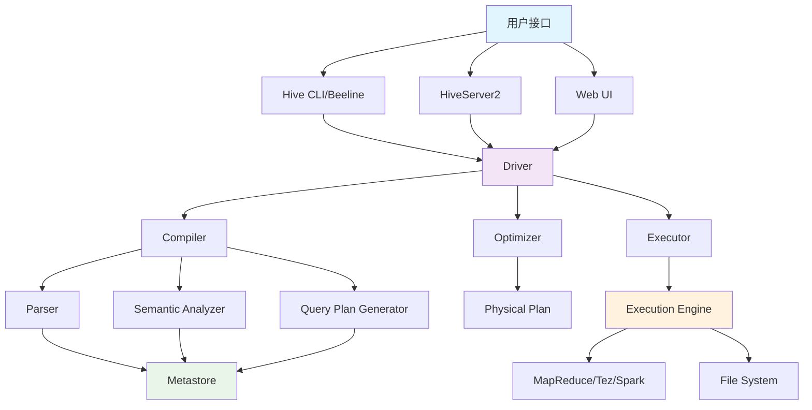
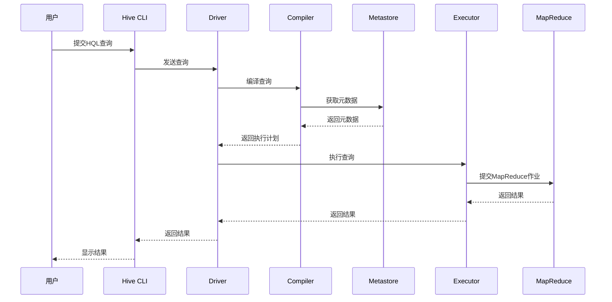
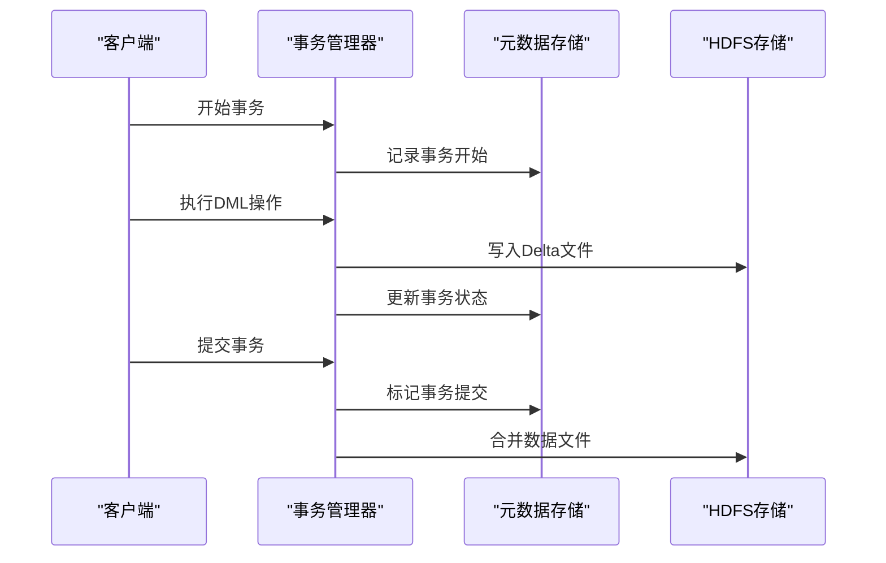
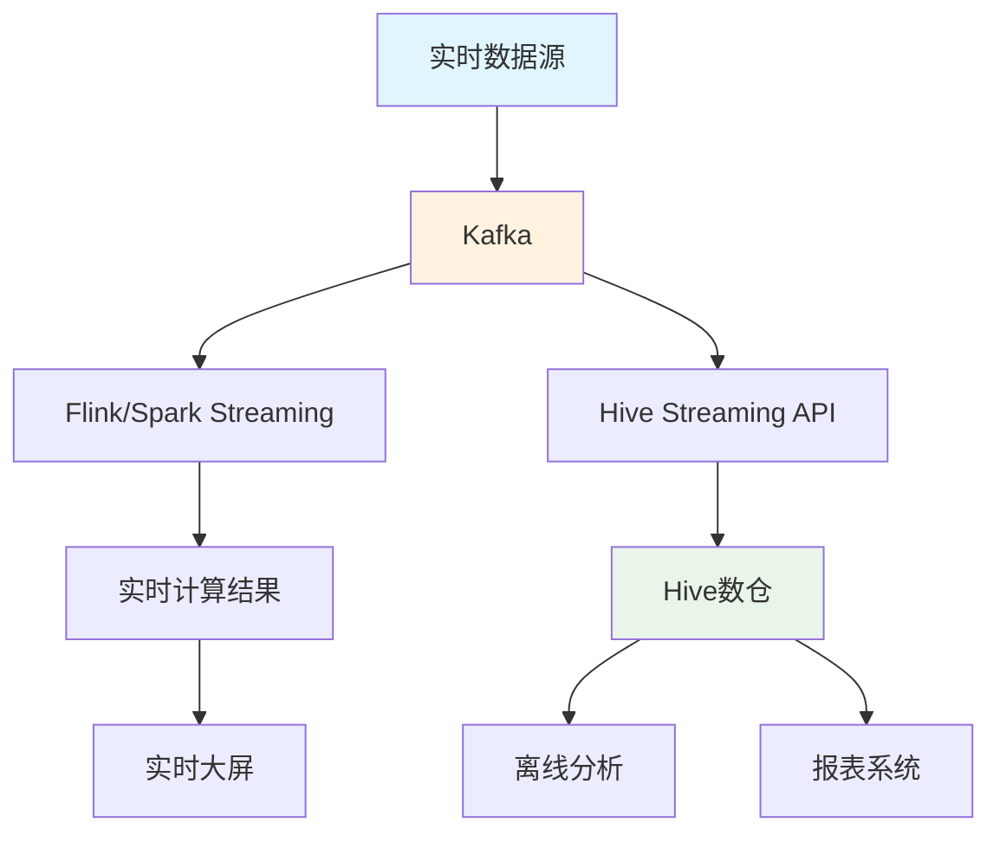
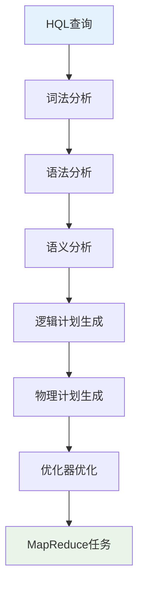
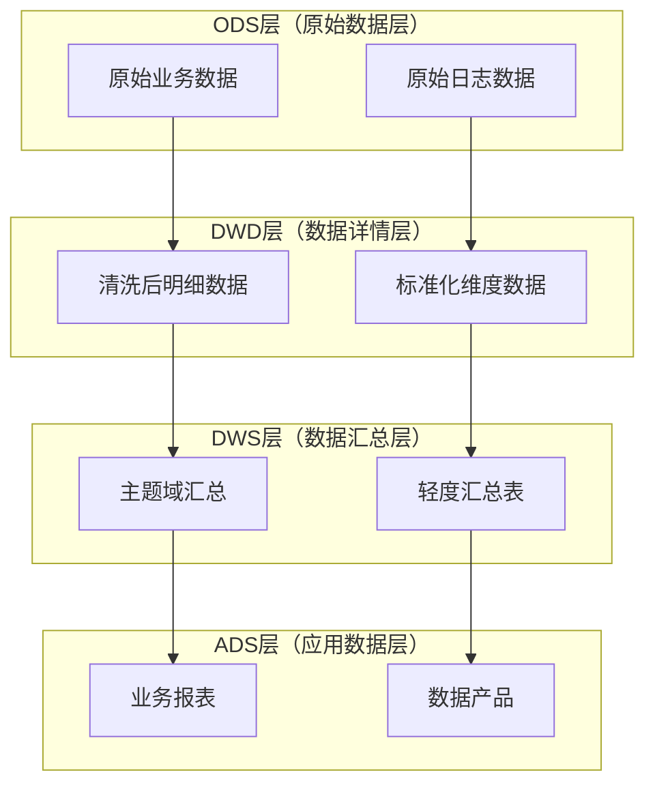

# Hive 参考指南

## 目录
- [Hive 参考指南](#hive-参考指南)
  - [目录](#目录)
  - [Hive 基础概念](#hive-基础概念)
    - [Hive简介](#hive简介)
      - [Hive核心特性](#hive核心特性)
      - [Hive应用场景](#hive应用场景)
    - [Hive架构](#hive架构)
      - [核心组件](#核心组件)
    - [Hive工作原理](#hive工作原理)
      - [查询执行流程](#查询执行流程)
      - [HQL转换为MapReduce](#hql转换为mapreduce)
    - [Hive vs 传统数据库](#hive-vs-传统数据库)
  - [Hive 安装与配置](#hive-安装与配置)
    - [环境准备](#环境准备)
      - [系统要求](#系统要求)
      - [依赖软件](#依赖软件)
    - [安装步骤](#安装步骤)
      - [1. 环境变量配置](#1-环境变量配置)
      - [2. 初始化元数据库](#2-初始化元数据库)
      - [3. 启动Hive服务](#3-启动hive服务)
    - [配置详解](#配置详解)
      - [hive-site.xml 核心配置](#hive-sitexml-核心配置)
    - [元数据库配置](#元数据库配置)
      - [MySQL元数据库配置](#mysql元数据库配置)
  - [Hive 数据类型](#hive-数据类型)
    - [基本数据类型](#基本数据类型)
    - [复杂数据类型](#复杂数据类型)
      - [ARRAY类型](#array类型)
      - [MAP类型](#map类型)
      - [STRUCT类型](#struct类型)
    - [类型转换](#类型转换)
  - [1. SQL 函数与语法](#1-sql-函数与语法)
    - [1.1 日期与时间处理](#11-日期与时间处理)
    - [1.2 字符串处理](#12-字符串处理)
      - [更多字符串函数示例](#更多字符串函数示例)
    - [1.3 聚合函数](#13-聚合函数)
    - [1.4 数组与集合操作](#14-数组与集合操作)
    - [1.5 JSON 处理](#15-json-处理)
    - [1.6 条件与判断](#16-条件与判断)
    - [1.7 分组与聚合](#17-分组与聚合)
    - [1.8 窗口函数](#18-窗口函数)
    - [1.9 WITH 语句](#19-with-语句)
    - [1.10 JOIN 操作](#110-join-操作)
  - [2. 表操作](#2-表操作)
    - [2.1 建表与压缩格式](#21-建表与压缩格式)
      - [存储格式对比](#存储格式对比)
      - [压缩格式对比](#压缩格式对比)
      - [详细建表示例](#详细建表示例)
    - [2.2 分桶与分区](#22-分桶与分区)
      - [分区策略详解](#分区策略详解)
      - [分桶策略详解](#分桶策略详解)
    - [2.3 优化配置](#23-优化配置)
      - [详细优化配置](#详细优化配置)
    - [2.4 实用查询示例](#24-实用查询示例)
      - [实际应用查询示例](#实际应用查询示例)
  - [3. UDF与自定义函数](#3-udf与自定义函数)
    - [3.1 地理位置函数](#31-地理位置函数)
      - [更多地理位置UDF示例](#更多地理位置udf示例)
    - [3.2 数据验证函数](#32-数据验证函数)
      - [更多数据验证UDF示例](#更多数据验证udf示例)
    - [3.3 字符处理函数](#33-字符处理函数)
      - [更多字符处理UDF示例](#更多字符处理udf示例)
    - [3.4 布隆过滤器](#34-布隆过滤器)
      - [更多高级UDF示例](#更多高级udf示例)
  - [4. Hive 性能优化](#4-hive-性能优化)
    - [4.1 查询优化](#41-查询优化)
      - [查询计划分析](#查询计划分析)
      - [查询优化技巧](#查询优化技巧)
    - [4.2 存储优化](#42-存储优化)
      - [存储格式选择](#存储格式选择)
      - [压缩策略](#压缩策略)
    - [4.3 配置优化](#43-配置优化)
      - [内存配置](#内存配置)
      - [并行配置](#并行配置)
    - [4.4 常见问题排查](#44-常见问题排查)
      - [性能问题诊断](#性能问题诊断)
      - [常见错误解决](#常见错误解决)
  - [5. Hive 运维管理](#5-hive-运维管理)
    - [5.1 元数据管理](#51-元数据管理)
      - [元数据库维护](#元数据库维护)
      - [统计信息管理](#统计信息管理)
    - [5.2 权限管理](#52-权限管理)
      - [用户权限管理](#用户权限管理)
      - [角色管理](#角色管理)
    - [5.3 监控与日志](#53-监控与日志)
      - [日志配置](#日志配置)
      - [监控指标](#监控指标)
    - [5.4 备份与恢复](#54-备份与恢复)
      - [数据备份策略](#数据备份策略)
      - [恢复策略](#恢复策略)
  - [6. Hive 高级特性](#6-hive-高级特性)
    - [6.1 ACID事务](#61-acid事务)
      - [事务表创建与使用](#事务表创建与使用)
      - [事务操作示例](#事务操作示例)
    - [6.2 流处理支持](#62-流处理支持)
      - [Hive Streaming API](#hive-streaming-api)
      - [实时数据写入](#实时数据写入)
    - [6.3 向量化执行](#63-向量化执行)
      - [向量化配置](#向量化配置)
      - [性能提升效果](#性能提升效果)
    - [6.4 物化视图](#64-物化视图)
      - [物化视图创建](#物化视图创建)
      - [自动查询重写](#自动查询重写)
  - [7. Hive 与其他组件集成](#7-hive-与其他组件集成)
    - [7.1 Hive on Spark](#71-hive-on-spark)
      - [配置与优化](#配置与优化)
      - [性能对比](#性能对比)
    - [7.2 Hive与Kafka集成](#72-hive与kafka集成)
      - [实时数据接入](#实时数据接入)
      - [流批一体架构](#流批一体架构)
    - [7.3 Hive与HBase集成](#73-hive与hbase集成)
      - [外部表映射](#外部表映射)
      - [数据同步策略](#数据同步策略)
    - [7.4 Hive与Elasticsearch集成](#74-hive与elasticsearch集成)
      - [数据导入导出](#数据导入导出)
      - [全文检索查询](#全文检索查询)
  - [8. Hive 面试题集锦](#8-hive-面试题集锦)
    - [8.1 基础概念题](#81-基础概念题)
      - [Hive原理机制](#hive原理机制)
    - [8.2 性能优化题](#82-性能优化题)
    - [8.3 实战应用题](#83-实战应用题)
    - [8.4 架构设计题](#84-架构设计题)
  - [9. 参考链接与外部资源](#9-参考链接与外部资源)

## Hive 基础概念

### Hive简介

**Apache Hive** 是一个基于Hadoop的数据仓库工具，可以将结构化的数据文件映射为一张数据库表，并提供类SQL查询功能。Hive最初由Facebook开发，用于处理海量结构化日志数据。

#### Hive核心特性

- **类SQL语法**：提供HQL（Hive Query Language），语法与SQL相似
- **数据仓库功能**：支持数据ETL、数据存储、数据分析
- **可扩展性**：支持自定义UDF、UDAF、UDTF
- **多种存储格式**：支持TextFile、SequenceFile、RCFile、ORC、Parquet等
- **多种压缩格式**：支持Gzip、Bzip2、Snappy、LZO等

#### Hive应用场景

- **数据仓库**：构建企业级数据仓库
- **日志分析**：分析网站访问日志、应用日志
- **数据挖掘**：支持复杂的数据分析查询
- **报表生成**：生成各种业务报表
- **数据探索**：数据科学家进行数据探索分析

### Hive架构



#### 核心组件

| 组件 | 功能 | 说明 |
|------|------|------|
| **用户接口** | 提供多种访问方式 | CLI、Beeline、Web UI、JDBC/ODBC |
| **Driver** | 驱动整个查询执行 | 管理查询生命周期 |
| **Compiler** | 编译HQL为执行计划 | 包括解析、语义分析、查询计划生成 |
| **Optimizer** | 优化查询计划 | 基于规则的优化 |
| **Executor** | 执行查询计划 | 与执行引擎交互 |
| **Metastore** | 存储元数据 | 表结构、分区信息等 |

### Hive工作原理

#### 查询执行流程



#### HQL转换为MapReduce

```sql
-- HQL查询
SELECT dept_name, COUNT(*) as emp_count
FROM employees e
JOIN departments d ON e.dept_id = d.dept_id
WHERE e.salary > 5000
GROUP BY dept_name
HAVING COUNT(*) > 10
ORDER BY emp_count DESC;
```

**转换为MapReduce作业**：

1. **Map阶段**：
   - 读取employees和departments表
   - 过滤salary > 5000的记录
   - 输出key-value对：(dept_id, employee_info)

2. **Shuffle阶段**：
   - 按dept_id分组
   - 将相同dept_id的数据发送到同一个Reducer

3. **Reduce阶段**：
   - 统计每个部门的员工数量
   - 过滤count > 10的部门
   - 按emp_count排序输出

### Hive vs 传统数据库

| 特性 | Hive | 传统数据库 |
|------|------|------------|
| **数据规模** | PB级 | GB-TB级 |
| **查询延迟** | 分钟-小时 | 秒-分钟 |
| **数据更新** | 批量更新 | 实时更新 |
| **索引** | 有限支持 | 完整支持 |
| **事务** | 有限支持 | 完整支持 |
| **存储格式** | 多种格式 | 固定格式 |
| **扩展性** | 水平扩展 | 垂直扩展 |

## Hive 安装与配置

### 环境准备

#### 系统要求

```bash
# 操作系统
Linux (CentOS 7+, Ubuntu 16+)

# Java环境
Java 8 或更高版本
export JAVA_HOME=/usr/lib/jvm/java-8-openjdk

# Hadoop环境
Hadoop 2.7+ 或 3.x
export HADOOP_HOME=/opt/hadoop

# 内存要求
最小4GB，推荐8GB+
```

#### 依赖软件

```bash
# 安装必要软件包
sudo yum install -y wget tar gzip

# 下载Hive
wget https://downloads.apache.org/hive/hive-3.1.3/apache-hive-3.1.3-bin.tar.gz

# 解压安装
tar -xzf apache-hive-3.1.3-bin.tar.gz
sudo mv apache-hive-3.1.3-bin /opt/hive
```

### 安装步骤

#### 1. 环境变量配置

```bash
# 编辑 ~/.bashrc
export HIVE_HOME=/opt/hive
export PATH=$PATH:$HIVE_HOME/bin
export HADOOP_USER_CLASSPATH_FIRST=true

# 使配置生效
source ~/.bashrc
```

#### 2. 初始化元数据库

```bash
# 使用Derby数据库（开发环境）
schematool -dbType derby -initSchema

# 使用MySQL数据库（生产环境）
schematool -dbType mysql -initSchema
```

#### 3. 启动Hive服务

```bash
# 启动Hive CLI
hive

# 启动HiveServer2
hiveserver2 &

# 启动Web UI
hive --service hwi &
```

### 配置详解

#### hive-site.xml 核心配置

```xml
<?xml version="1.0" encoding="UTF-8"?>
<configuration>
    <!-- 元数据库配置 -->
    <property>
        <name>javax.jdo.option.ConnectionURL</name>
        <value>jdbc:mysql://localhost:3306/hive?createDatabaseIfNotExist=true</value>
    </property>
    
    <property>
        <name>javax.jdo.option.ConnectionDriverName</name>
        <value>com.mysql.jdbc.Driver</value>
    </property>
    
    <property>
        <name>javax.jdo.option.ConnectionUserName</name>
        <value>hive</value>
    </property>
    
    <property>
        <name>javax.jdo.option.ConnectionPassword</name>
        <value>hive123</value>
    </property>
    
    <!-- HDFS配置 -->
    <property>
        <name>hive.metastore.warehouse.dir</name>
        <value>/user/hive/warehouse</value>
    </property>
    
    <!-- 执行引擎配置 -->
    <property>
        <name>hive.execution.engine</name>
        <value>mr</value> <!-- mr, tez, spark -->
    </property>
    
    <!-- 优化配置 -->
    <property>
        <name>hive.auto.convert.join</name>
        <value>true</value>
    </property>
    
    <property>
        <name>hive.optimize.skewjoin</name>
        <value>true</value>
    </property>
</configuration>
```

### 元数据库配置

#### MySQL元数据库配置

```sql
-- 创建Hive数据库
CREATE DATABASE hive CHARACTER SET latin1 COLLATE latin1_bin;

-- 创建Hive用户
CREATE USER 'hive'@'%' IDENTIFIED BY 'hive123';
GRANT ALL PRIVILEGES ON hive.* TO 'hive'@'%';
FLUSH PRIVILEGES;

-- 导入Hive元数据表结构
mysql -u hive -p hive < $HIVE_HOME/scripts/metastore/upgrade/mysql/hive-schema-3.1.0.mysql.sql
```

## Hive 数据类型

### 基本数据类型

| 数据类型 | 大小 | 示例 | 说明 |
|---------|------|------|------|
| **TINYINT** | 1字节 | 1 | 有符号整数 |
| **SMALLINT** | 2字节 | 1 | 有符号整数 |
| **INT** | 4字节 | 1 | 有符号整数 |
| **BIGINT** | 8字节 | 1 | 有符号整数 |
| **FLOAT** | 4字节 | 1.0 | 单精度浮点数 |
| **DOUBLE** | 8字节 | 1.0 | 双精度浮点数 |
| **DECIMAL** | 可变 | 1.0 | 高精度小数 |
| **BOOLEAN** | 1字节 | true | 布尔值 |
| **STRING** | 可变 | 'hello' | 字符串 |
| **VARCHAR** | 可变 | 'hello' | 变长字符串 |
| **CHAR** | 固定 | 'hello' | 定长字符串 |
| **DATE** | 4字节 | '2023-01-01' | 日期 |
| **TIMESTAMP** | 8字节 | '2023-01-01 12:00:00' | 时间戳 |

### 复杂数据类型

#### ARRAY类型

```sql
-- 创建包含数组的表
CREATE TABLE employees (
    id INT,
    name STRING,
    skills ARRAY<STRING>,
    scores ARRAY<INT>
);

-- 插入数据
INSERT INTO employees VALUES 
(1, 'John', ARRAY('Java', 'Python', 'SQL'), ARRAY(85, 90, 88)),
(2, 'Jane', ARRAY('Scala', 'Spark'), ARRAY(92, 95));

-- 查询数组元素
SELECT 
    name,
    skills[0] as first_skill,
    size(skills) as skill_count,
    array_contains(skills, 'Java') as knows_java
FROM employees;
```

#### MAP类型

```sql
-- 创建包含Map的表
CREATE TABLE user_profiles (
    user_id INT,
    name STRING,
    attributes MAP<STRING, STRING>,
    scores MAP<STRING, INT>
);

-- 插入数据
INSERT INTO user_profiles VALUES 
(1, 'John', MAP('city', 'NYC', 'age', '30'), MAP('math', 85, 'english', 90)),
(2, 'Jane', MAP('city', 'LA', 'age', '25'), MAP('math', 92, 'english', 88));

-- 查询Map元素
SELECT 
    name,
    attributes['city'] as city,
    attributes['age'] as age,
    scores['math'] as math_score
FROM user_profiles;
```

#### STRUCT类型

```sql
-- 创建包含Struct的表
CREATE TABLE products (
    id INT,
    name STRING,
    price STRUCT<amount: DECIMAL(10,2), currency: STRING>,
    dimensions STRUCT<length: DOUBLE, width: DOUBLE, height: DOUBLE>
);

-- 插入数据
INSERT INTO products VALUES 
(1, 'Laptop', NAMED_STRUCT('amount', 999.99, 'currency', 'USD'), 
 NAMED_STRUCT('length', 14.0, 'width', 9.5, 'height', 0.8)),
(2, 'Phone', NAMED_STRUCT('amount', 699.99, 'currency', 'USD'), 
 NAMED_STRUCT('length', 6.0, 'width', 3.0, 'height', 0.3));

-- 查询Struct元素
SELECT 
    name,
    price.amount as price_amount,
    price.currency as price_currency,
    dimensions.length * dimensions.width * dimensions.height as volume
FROM products;
```

### 类型转换

```sql
-- 隐式类型转换
SELECT 1 + 1.5;  -- INT + DOUBLE = DOUBLE

-- 显式类型转换
SELECT CAST('123' AS INT) as num,
       CAST(123.45 AS STRING) as str,
       CAST('2023-01-01' AS DATE) as date;

-- 安全类型转换
SELECT CAST('abc' AS INT) as invalid_cast;  -- 返回NULL

-- 复杂类型转换
SELECT CAST(ARRAY(1, 2, 3) AS ARRAY<STRING>) as str_array;
```

## 1. SQL 函数与语法

### 1.1 日期与时间处理

```sql
-- 获取10位时间戳
unix_timestamp()  

-- 转换数据类型
cast(create_time as bigint)  

-- 10位时间戳转为指定格式
from_unixtime(create_time,'yyyyMMdd') 

-- 日期加减操作
date_add(date_column, number_of_days) -- 加几天
date_sub(date_column, number_of_days) -- 减几天

-- 复杂日期操作示例
unix_timestamp(date_sub(from_unixtime(unix_timestamp(),30),'yyyy-MM-dd')*1000

-- 计算两个日期差距(天数)
abs(datediff(to_date(logdate, 'yyyyMMdd'), to_date(day, 'yyyyMMdd'))) > 180
```

### 1.2 字符串处理

```sql
-- 判断字符串是否包含
instr(extend_detail, 'name') > 0  

-- col1 在 col2 里面，不在返回0
instr(col2, col1) > 0  

-- 正则表达式提取
regexp_extract(string subject, string pattern, int index)

-- 正则表达式替换
regexp_replace(extend_detail, '#[a-z0-9]{12}#', '##')

-- 子字符串提取 (start从1开始)
substr(string str, int start, int length)
```

#### 更多字符串函数示例

```sql
-- 字符串连接
SELECT concat('Hello', ' ', 'World') as greeting,
       concat_ws('-', '2023', '01', '01') as date_str;

-- 字符串长度
SELECT length('Hello World') as str_length,
       char_length('Hello World') as char_count;

-- 字符串大小写转换
SELECT upper('hello world') as upper_case,
       lower('HELLO WORLD') as lower_case,
       initcap('hello world') as title_case;

-- 字符串填充
SELECT lpad('123', 5, '0') as left_padded,    -- 00123
       rpad('123', 5, '0') as right_padded;   -- 12300

-- 字符串修剪
SELECT trim('  hello world  ') as trimmed,
       ltrim('  hello world  ') as left_trimmed,
       rtrim('  hello world  ') as right_trimmed;

-- 字符串分割
SELECT split('a,b,c,d', ',') as split_array,
       size(split('a,b,c,d', ',')) as array_size;

-- 正则表达式匹配
SELECT regexp('hello123world', '\\d+') as has_digits,
       regexp_extract('hello123world456', '(\\d+)', 1) as first_number;
```

### 1.3 聚合函数

```sql
-- 不同COUNT用法比较
```

| 写法 | 作用说明 | NULL行是否计入 |
|------|---------|--------------|
| COUNT(a) | 统计 a 字段非 NULL 的个数 | ❌ 不计入 |
| COUNT(*) | 统计总行数（包括 NULL） | ✅ 计入 |
| COUNT(DISTINCT a) | 去重后的非 NULL 个数 | ❌ 不计入 |

```sql
-- 基本聚合函数
SELECT 
    department,
    COUNT(*) as total_employees,
    COUNT(DISTINCT employee_id) as unique_employees,
    AVG(salary) as avg_salary,
    SUM(salary) as total_salary,
    MIN(salary) as min_salary,
    MAX(salary) as max_salary,
    STDDEV(salary) as salary_stddev,
    VARIANCE(salary) as salary_variance
FROM employees
GROUP BY department;

-- 条件聚合
SELECT 
    department,
    COUNT(CASE WHEN gender = 'M' THEN 1 END) as male_count,
    COUNT(CASE WHEN gender = 'F' THEN 1 END) as female_count,
    AVG(CASE WHEN age > 30 THEN salary END) as senior_avg_salary,
    SUM(CASE WHEN salary > 5000 THEN salary ELSE 0 END) as high_salary_sum
FROM employees
GROUP BY department;

-- 分组聚合
SELECT 
    department,
    gender,
    COUNT(*) as count,
    AVG(salary) as avg_salary
FROM employees
GROUP BY department, gender
WITH ROLLUP;  -- 生成小计和总计
```

### 1.4 数组与集合操作

```sql
-- 判断两个数组有交集
arrays_overlap(split(month_app_name, ' '), split(day_app_name, ' '))

-- 数组展开（行转列）
lateral view explode(split(gid_detail, ',')) tmp as single_gid

-- 数组创建和操作
SELECT 
    array(1, 2, 3) as simple_array,
    array_contains(array(1, 2, 3), 2) as contains_2,
    size(array(1, 2, 3)) as array_size,
    sort_array(array(3, 1, 2)) as sorted_array;

-- 数组聚合
SELECT 
    user_id,
    collect_list(product_id) as all_products,
    collect_set(product_id) as unique_products,
    concat_ws(',', collect_list(product_name)) as product_names
FROM user_orders
GROUP BY user_id;

-- 复杂数组操作
SELECT 
    user_id,
    explode(split(tags, ',')) as tag
FROM user_tags
WHERE size(split(tags, ',')) > 0;

-- 数组交集和并集
SELECT 
    user_id,
    array_intersect(split(month_interests, ' '), split(day_interests, ' ')) as common_interests,
    array_union(split(month_interests, ' '), split(day_interests, ' ')) as all_interests
FROM user_behavior;
```

### 1.5 JSON 处理

```sql
-- JSON解析
get_json_object(json_string, '$.field_name')

-- JSON数组处理
json_array_length(json_array_string)

-- JSON对象转Map
str_to_map(json_string, ',', ':')

-- 详细JSON操作示例
SELECT 
    user_id,
    get_json_object(profile, '$.name') as name,
    get_json_object(profile, '$.age') as age,
    get_json_object(profile, '$.address.city') as city,
    get_json_object(profile, '$.hobbies[0]') as first_hobby
FROM user_profiles;

-- JSON数组处理
SELECT 
    order_id,
    get_json_object(order_items, '$[0].product_id') as first_product,
    json_array_length(order_items) as item_count
FROM orders;

-- 复杂JSON操作
SELECT 
    user_id,
    get_json_object(attributes, '$.preferences.theme') as theme,
    get_json_object(attributes, '$.settings.notifications.email') as email_notifications
FROM user_settings;
```

### 1.6 条件与判断

```sql
-- CASE WHEN语句
CASE 
    WHEN condition1 THEN result1
    WHEN condition2 THEN result2
    ELSE default_result
END

-- IF函数
IF(condition, true_value, false_value)

-- COALESCE函数（返回第一个非NULL值）
COALESCE(value1, value2, value3)

-- 详细条件判断示例
SELECT 
    employee_id,
    name,
    salary,
    CASE 
        WHEN salary < 3000 THEN '低薪'
        WHEN salary < 6000 THEN '中薪'
        WHEN salary < 10000 THEN '高薪'
        ELSE '超高薪'
    END as salary_level,
    
    IF(salary > 5000, '高收入', '普通收入') as income_level,
    
    COALESCE(bonus, 0) as actual_bonus,
    
    CASE 
        WHEN department = 'IT' AND salary > 8000 THEN '技术专家'
        WHEN department = 'Sales' AND salary > 6000 THEN '销售精英'
        WHEN department = 'HR' THEN '人力资源'
        ELSE '其他'
    END as position_type
FROM employees;
```

### 1.7 分组与聚合

```sql
-- GROUP BY分组
SELECT department, AVG(salary) as avg_salary
FROM employees
GROUP BY department

-- HAVING过滤
SELECT department, AVG(salary) as avg_salary
FROM employees
GROUP BY department
HAVING AVG(salary) > 5000

-- 详细分组聚合示例
SELECT 
    department,
    gender,
    COUNT(*) as employee_count,
    AVG(salary) as avg_salary,
    SUM(salary) as total_salary,
    MAX(salary) as max_salary,
    MIN(salary) as min_salary
FROM employees
WHERE hire_date >= '2020-01-01'
GROUP BY department, gender
HAVING COUNT(*) > 5 AND AVG(salary) > 4000
ORDER BY department, gender;

-- 使用ROLLUP生成小计
SELECT 
    department,
    gender,
    COUNT(*) as count,
    AVG(salary) as avg_salary
FROM employees
GROUP BY department, gender
WITH ROLLUP;

-- 使用CUBE生成所有组合
SELECT 
    department,
    gender,
    COUNT(*) as count
FROM employees
GROUP BY department, gender
WITH CUBE;
```

### 1.8 窗口函数

```sql
-- ROW_NUMBER() 行号
SELECT 
    name,
    salary,
    ROW_NUMBER() OVER (ORDER BY salary DESC) as rank
FROM employees

-- RANK() 排名（相同值相同排名，跳过）
SELECT 
    name,
    salary,
    RANK() OVER (ORDER BY salary DESC) as rank
FROM employees

-- DENSE_RANK() 密集排名（相同值相同排名，不跳过）
SELECT 
    name,
    salary,
    DENSE_RANK() OVER (ORDER BY salary DESC) as rank
FROM employees

-- LAG/LEAD 前后值
SELECT 
    date,
    sales,
    LAG(sales, 1) OVER (ORDER BY date) as prev_sales,
    LEAD(sales, 1) OVER (ORDER BY date) as next_sales
FROM daily_sales

-- 详细窗口函数示例
SELECT 
    department,
    name,
    salary,
    hire_date,
    ROW_NUMBER() OVER (PARTITION BY department ORDER BY salary DESC) as dept_rank,
    RANK() OVER (PARTITION BY department ORDER BY salary DESC) as dept_rank_with_gaps,
    DENSE_RANK() OVER (PARTITION BY department ORDER BY salary DESC) as dept_dense_rank,
    LAG(salary, 1) OVER (PARTITION BY department ORDER BY hire_date) as prev_salary,
    LEAD(salary, 1) OVER (PARTITION BY department ORDER BY hire_date) as next_salary,
    AVG(salary) OVER (PARTITION BY department) as dept_avg_salary,
    SUM(salary) OVER (PARTITION BY department ORDER BY hire_date ROWS UNBOUNDED PRECEDING) as running_total
FROM employees
ORDER BY department, salary DESC;
```

### 1.9 WITH 语句

```sql
-- CTE (Common Table Expression)
WITH sales_summary AS (
    SELECT 
        product_id,
        SUM(quantity) as total_quantity,
        SUM(amount) as total_amount
    FROM sales
    GROUP BY product_id
)
SELECT 
    p.name,
    s.total_quantity,
    s.total_amount
FROM products p
JOIN sales_summary s ON p.id = s.product_id

-- 复杂CTE示例
WITH 
-- 用户活跃度统计
user_activity AS (
    SELECT 
        user_id,
        COUNT(*) as visit_count,
        COUNT(DISTINCT date) as active_days
    FROM user_visits
    WHERE date >= date_sub(current_date, 30)
    GROUP BY user_id
),

-- 用户消费统计
user_consumption AS (
    SELECT 
        user_id,
        SUM(amount) as total_amount,
        COUNT(*) as order_count
    FROM orders
    WHERE order_date >= date_sub(current_date, 30)
    GROUP BY user_id
),

-- 用户综合评分
user_score AS (
    SELECT 
        ua.user_id,
        ua.visit_count,
        ua.active_days,
        COALESCE(uc.total_amount, 0) as total_amount,
        COALESCE(uc.order_count, 0) as order_count,
        (ua.visit_count * 0.3 + ua.active_days * 0.3 + uc.total_amount * 0.4) as score
    FROM user_activity ua
    LEFT JOIN user_consumption uc ON ua.user_id = uc.user_id
)

-- 最终查询
SELECT 
    user_id,
    visit_count,
    active_days,
    total_amount,
    order_count,
    score,
    CASE 
        WHEN score >= 80 THEN '高价值用户'
        WHEN score >= 50 THEN '中价值用户'
        ELSE '低价值用户'
    END as user_type
FROM user_score
ORDER BY score DESC;
```

### 1.10 JOIN 操作

```sql
-- 内连接
SELECT a.*, b.*
FROM table_a a
INNER JOIN table_b b ON a.id = b.id

-- 左连接
SELECT a.*, b.*
FROM table_a a
LEFT JOIN table_b b ON a.id = b.id

-- 右连接
SELECT a.*, b.*
FROM table_a a
RIGHT JOIN table_b b ON a.id = b.id

-- 全连接
SELECT a.*, b.*
FROM table_a a
FULL OUTER JOIN table_b b ON a.id = b.id

-- 交叉连接
SELECT a.*, b.*
FROM table_a a
CROSS JOIN table_b b

-- 详细JOIN示例
SELECT 
    e.employee_id,
    e.name,
    e.salary,
    d.department_name,
    m.name as manager_name,
    p.project_name
FROM employees e
LEFT JOIN departments d ON e.department_id = d.department_id
LEFT JOIN employees m ON e.manager_id = m.employee_id
LEFT JOIN employee_projects ep ON e.employee_id = ep.employee_id
LEFT JOIN projects p ON ep.project_id = p.project_id
WHERE e.salary > 5000
ORDER BY e.salary DESC;

-- 自连接示例（员工层级关系）
SELECT 
    e1.name as employee_name,
    e1.salary as employee_salary,
    e2.name as manager_name,
    e2.salary as manager_salary
FROM employees e1
LEFT JOIN employees e2 ON e1.manager_id = e2.employee_id
WHERE e1.salary > e2.salary;  -- 找出薪资比上级高的员工
```

## 2. 表操作

### 2.1 建表与压缩格式

```sql
-- 建表示例（ORC格式，无压缩）
create table log_orc_none(
  track_time string,
  url string,
  session_id string,
  referer string,
  ip string,
  end_user_id string,
  city_id string
)
row format delimited fields terminated by '\t'
stored as orc tblproperties ("orc.compress"="NONE");

-- 建表示例（Parquet格式，Snappy压缩）
create table log_parquet_snappy(
  track_time string,
  url string,
  session_id string,
  referer string,
  ip string,
  end_user_id string,
  city_id string
)
stored as parquet
tblproperties ("parquet.compression"="SNAPPY");

-- 外部表
create external table external_log_table(
  track_time string,
  url string
)
row format delimited fields terminated by '\t'
location '/user/hive/warehouse/external_logs';
```

#### 存储格式对比

| 格式 | 压缩比 | 查询性能 | 写入性能 | 适用场景 |
|------|--------|----------|----------|----------|
| **TextFile** | 低 | 慢 | 快 | 通用，调试 |
| **SequenceFile** | 中等 | 中等 | 中等 | 二进制数据 |
| **RCFile** | 高 | 快 | 慢 | 列式查询 |
| **ORC** | 很高 | 很快 | 快 | 推荐格式 |
| **Parquet** | 很高 | 很快 | 快 | 复杂类型 |

#### 压缩格式对比

| 压缩格式 | 压缩比 | 压缩速度 | 解压速度 | CPU使用 |
|---------|--------|----------|----------|---------|
| **Gzip** | 高 | 慢 | 慢 | 高 |
| **Bzip2** | 很高 | 很慢 | 很慢 | 很高 |
| **Snappy** | 中等 | 很快 | 很快 | 低 |
| **LZO** | 中等 | 快 | 快 | 低 |
| **ZSTD** | 高 | 快 | 快 | 中等 |

#### 详细建表示例

```sql
-- 复杂数据类型表
CREATE TABLE user_profiles (
    user_id BIGINT,
    name STRING,
    age INT,
    email STRING,
    phone STRING,
    address STRUCT<
        street: STRING,
        city: STRING,
        state: STRING,
        zip: STRING
    >,
    interests ARRAY<STRING>,
    attributes MAP<STRING, STRING>,
    registration_date DATE,
    last_login TIMESTAMP
)
PARTITIONED BY (country STRING, year INT, month INT)
CLUSTERED BY (user_id) INTO 32 BUCKETS
STORED AS ORC
TBLPROPERTIES (
    'orc.compress'='SNAPPY',
    'orc.create.index'='true',
    'orc.bloom.filter.columns'='user_id,email'
);

-- 事务表（Hive 0.13+）
CREATE TABLE transactions (
    transaction_id BIGINT,
    user_id BIGINT,
    amount DECIMAL(10,2),
    transaction_type STRING,
    transaction_date TIMESTAMP
)
PARTITIONED BY (year INT, month INT, day INT)
CLUSTERED BY (user_id) INTO 16 BUCKETS
STORED AS ORC
TBLPROPERTIES (
    'transactional'='true',
    'orc.compress'='SNAPPY'
);

-- 临时表
CREATE TEMPORARY TABLE temp_user_stats (
    user_id BIGINT,
    visit_count INT,
    total_time BIGINT
)
STORED AS ORC;

-- 视图
CREATE VIEW user_summary AS
SELECT 
    user_id,
    name,
    age,
    country,
    COUNT(*) as visit_count,
    SUM(amount) as total_amount
FROM user_profiles up
JOIN transactions t ON up.user_id = t.user_id
GROUP BY user_id, name, age, country;
```

### 2.2 分桶与分区

```sql
-- 分桶表创建
CREATE TABLE bucketed_table (
    id INT,
    name STRING
) CLUSTERED BY (id) INTO 10 BUCKETS;

-- 启用分桶
SET hive.enforce.bucketing=true;

-- 动态分区设置
SET hive.exec.dynamic.partition=true;
SET hive.exec.dynamic.partition.mode=nonstrict;

-- 分区表创建
CREATE TABLE partitioned_table (
    id INT,
    name STRING
)
PARTITIONED BY (year INT, month INT, day INT)
STORED AS ORC;

-- 添加分区
ALTER TABLE partitioned_table ADD PARTITION (year=2023, month=12, day=25),(year=2023, month=12, day=26);

-- 删除分区
ALTER TABLE partitioned_table DROP PARTITION (year=2023, month=12, day=25);
```

#### 分区策略详解

```sql
-- 时间分区（最常用）
CREATE TABLE log_data (
    log_time TIMESTAMP,
    user_id BIGINT,
    action STRING,
    details STRING
)
PARTITIONED BY (
    year INT,
    month INT,
    day INT,
    hour INT
)
STORED AS ORC;

-- 插入分区数据
INSERT INTO log_data PARTITION(year=2023, month=12, day=25, hour=10)
SELECT 
    log_time,
    user_id,
    action,
    details
FROM raw_logs
WHERE year(log_time) = 2023 
  AND month(log_time) = 12 
  AND day(log_time) = 25 
  AND hour(log_time) = 10;

-- 多级分区
CREATE TABLE user_events (
    event_time TIMESTAMP,
    user_id BIGINT,
    event_type STRING,
    event_data STRING
)
PARTITIONED BY (
    country STRING,
    year INT,
    month INT
)
STORED AS ORC;

-- 分区管理
-- 查看分区
SHOW PARTITIONS user_events;

-- 查看特定分区
SHOW PARTITIONS user_events PARTITION(country='US');

-- 修复分区
MSCK REPAIR TABLE user_events;

-- 分区统计
ANALYZE TABLE user_events PARTITION(country='US', year=2023, month=12) COMPUTE STATISTICS;
```

#### 分桶策略详解

```sql
-- 分桶表创建
CREATE TABLE bucketed_users (
    user_id BIGINT,
    name STRING,
    email STRING,
    registration_date DATE
)
CLUSTERED BY (user_id) INTO 32 BUCKETS
STORED AS ORC;

-- 分桶插入
SET hive.enforce.bucketing = true;
SET hive.enforce.sorting = true;

INSERT INTO TABLE bucketed_users
SELECT user_id, name, email, registration_date
FROM raw_users
DISTRIBUTE BY user_id
SORT BY user_id;

-- 分桶JOIN优化
SELECT u.name, o.order_id, o.amount
FROM bucketed_users u
JOIN bucketed_orders o ON u.user_id = o.user_id
WHERE u.registration_date >= '2023-01-01';
```

### 2.3 优化配置

```sql
-- MapJoin配置（小表加载到内存）
SET hive.auto.convert.join=true;
SELECT /*+ MAPJOIN(small_table) */ *
FROM large_table
JOIN small_table ON large_table.id = small_table.id;

-- 压缩中间结果
SET hive.exec.compress.output=true;
SET mapreduce.output.fileoutputformat.compress=true;
SET mapreduce.map.output.compress=true;
SET mapreduce.map.output.compress.codec=org.apache.hadoop.io.compress.SnappyCodec;

-- 基于成本的优化器(CBO)
SET hive.cbo.enable=true;

-- MapReduce内存配置
SET mapreduce.map.memory.mb=4096;
SET mapreduce.reduce.memory.mb=8192;

-- 并行执行
SET hive.exec.parallel=true;
SET hive.exec.parallel.thread.number=8;

-- 本地模式
SET hive.exec.mode.local.auto=true;
SET hive.exec.mode.local.auto.inputbytes.max=134217728;
```

#### 详细优化配置

```sql
-- 查询优化配置
SET hive.optimize.ppd=true;                    -- 谓词下推
SET hive.optimize.index.filter=true;          -- 索引过滤
SET hive.optimize.skewjoin=true;              -- 倾斜JOIN优化
SET hive.optimize.skewjoin.compiletime=true;  -- 编译时倾斜优化
SET hive.optimize.bucketmapjoin=true;         -- 分桶MapJoin
SET hive.optimize.bucketmapjoin.sortedmerge=true; -- 排序合并分桶JOIN

-- 内存优化配置
SET hive.map.aggr.hash.percentmemory=0.5;     -- Map聚合内存比例
SET hive.map.aggr.hash.force.flush.memory.threshold=0.9; -- 强制刷新阈值
SET hive.groupby.mapaggr.checkinterval=100000; -- 聚合检查间隔
SET hive.map.aggr.hash.min.reduction=0.5;     -- 最小减少比例

-- 文件优化配置
SET hive.merge.mapfiles=true;                 -- 合并小文件
SET hive.merge.mapredfiles=true;              -- 合并Map输出文件
SET hive.merge.size.per.task=256000000;       -- 合并文件大小
SET hive.merge.smallfiles.avgsize=16000000;   -- 小文件平均大小

-- 统计信息配置
SET hive.stats.autogather=true;               -- 自动收集统计信息
SET hive.stats.dbclass=fs;                    -- 统计信息存储类
SET hive.stats.column.autogather=true;        -- 自动收集列统计信息
```

### 2.4 实用查询示例

```sql
-- 查看表分区信息
SHOW PARTITIONS table_name;

-- 查看表结构
DESCRIBE table_name;
DESCRIBE EXTENDED table_name;

-- 查看建表语句
SHOW CREATE TABLE table_name;

-- 统计表大小
ANALYZE TABLE table_name COMPUTE STATISTICS;

-- 统计列信息
ANALYZE TABLE table_name COMPUTE STATISTICS FOR COLUMNS column1, column2;
```

#### 实际应用查询示例

```sql
-- 用户留存分析
WITH user_activity AS (
    SELECT 
        user_id,
        date,
        ROW_NUMBER() OVER (PARTITION BY user_id ORDER BY date) as visit_order
    FROM user_visits
    WHERE date >= date_sub(current_date, 30)
)
SELECT 
    first_visit.date as cohort_date,
    COUNT(DISTINCT first_visit.user_id) as cohort_size,
    COUNT(DISTINCT CASE WHEN second_visit.user_id IS NOT NULL THEN first_visit.user_id END) as retained_users,
    COUNT(DISTINCT CASE WHEN second_visit.user_id IS NOT NULL THEN first_visit.user_id END) / 
        COUNT(DISTINCT first_visit.user_id) as retention_rate
FROM user_activity first_visit
LEFT JOIN user_activity second_visit 
    ON first_visit.user_id = second_visit.user_id 
    AND second_visit.visit_order = 2
WHERE first_visit.visit_order = 1
GROUP BY first_visit.date
ORDER BY first_visit.date;

-- 漏斗分析
WITH funnel_steps AS (
    SELECT 
        user_id,
        event_type,
        event_time,
        ROW_NUMBER() OVER (PARTITION BY user_id ORDER BY event_time) as step_order
    FROM user_events
    WHERE event_type IN ('page_view', 'add_to_cart', 'checkout', 'purchase')
      AND event_time >= date_sub(current_date, 7)
)
SELECT 
    event_type,
    COUNT(DISTINCT user_id) as users,
    LAG(COUNT(DISTINCT user_id)) OVER (ORDER BY step_order) as prev_step_users,
    COUNT(DISTINCT user_id) / LAG(COUNT(DISTINCT user_id)) OVER (ORDER BY step_order) as conversion_rate
FROM funnel_steps
GROUP BY event_type, step_order
ORDER BY step_order;

-- 时间序列分析
SELECT 
    date,
    COUNT(DISTINCT user_id) as daily_active_users,
    SUM(amount) as daily_revenue,
    AVG(COUNT(DISTINCT user_id)) OVER (ORDER BY date ROWS BETWEEN 6 PRECEDING AND CURRENT ROW) as weekly_avg_dau,
    SUM(SUM(amount)) OVER (ORDER BY date ROWS BETWEEN 29 PRECEDING AND CURRENT ROW) as monthly_revenue
FROM daily_metrics
GROUP BY date
ORDER BY date;

-- 数据质量检查
SELECT 
    'missing_values' as check_type,
    COUNT(*) as total_rows,
    COUNT(CASE WHEN user_id IS NULL THEN 1 END) as null_user_id,
    COUNT(CASE WHEN email IS NULL THEN 1 END) as null_email,
    COUNT(CASE WHEN phone IS NULL THEN 1 END) as null_phone
FROM user_profiles
UNION ALL
SELECT 
    'duplicate_emails' as check_type,
    COUNT(*) as total_rows,
    COUNT(DISTINCT email) as unique_emails,
    COUNT(*) - COUNT(DISTINCT email) as duplicate_emails,
    0 as null_phone
FROM user_profiles
WHERE email IS NOT NULL;
```

## 3. UDF与自定义函数

### 3.1 地理位置函数

```java
// 经纬度转geohash UDF
public class GeohashUDF extends UDF {
    public String evaluate(Double lat, Double lng) {
        if (lat == null || lng == null) {
            return null;
        }
        return GeohashUtil.encode(lat, lng);
    }
}

-- 注册UDF
ADD JAR hdfs://gt-ga-xs/tmp/wuxl/udf/ys-bi-udf-hive-function-0.0.0.jar;
CREATE TEMPORARY FUNCTION encode AS 'com.ys.axe.saas.comn.util.GeohashUtil';

-- 使用UDF
SELECT encode(latitude, longitude) as geohash FROM location_data;

-- 是否在国内判断
geohash_in_china('wku7wp7147f6')
```

#### 更多地理位置UDF示例

```java
// 计算两点间距离
public class DistanceUDF extends UDF {
    public Double evaluate(Double lat1, Double lng1, Double lat2, Double lng2) {
        if (lat1 == null || lng1 == null || lat2 == null || lng2 == null) {
            return null;
        }
        
        double R = 6371; // 地球半径（公里）
        double dLat = Math.toRadians(lat2 - lat1);
        double dLng = Math.toRadians(lng2 - lng1);
        
        double a = Math.sin(dLat/2) * Math.sin(dLat/2) +
                   Math.cos(Math.toRadians(lat1)) * Math.cos(Math.toRadians(lat2)) *
                   Math.sin(dLng/2) * Math.sin(dLng/2);
        
        double c = 2 * Math.atan2(Math.sqrt(a), Math.sqrt(1-a));
        return R * c;
    }
}

// IP地址转地理位置
public class IPLocationUDF extends UDF {
    private IPLocationService ipService;
    
    public void initialize() {
        ipService = new IPLocationService();
    }
    
    public String evaluate(String ip) {
        if (ip == null || ip.isEmpty()) {
            return null;
        }
        return ipService.getLocation(ip);
    }
}
```

### 3.2 数据验证函数

```java
// 合法wifi判断UDF
public class LegalMacUDF extends UDF {
    public Boolean evaluate(String mac) {
        if (mac == null || mac.isEmpty()) {
            return false;
        }
        return LegalMacUtil.isLegalMac(mac);
    }
}

-- 注册UDF
ADD JAR hdfs://path/to/udf.jar;
CREATE TEMPORARY FUNCTION isLegalMac AS 'com.example.LegalMacUDF';

-- 使用UDF
SELECT * FROM wifi_data WHERE isLegalMac(mac_address);
```

#### 更多数据验证UDF示例

```java
// 邮箱格式验证
public class EmailValidationUDF extends UDF {
    private static final String EMAIL_PATTERN = 
        "^[a-zA-Z0-9._%+-]+@[a-zA-Z0-9.-]+\\.[a-zA-Z]{2,}$";
    
    public Boolean evaluate(String email) {
        if (email == null || email.isEmpty()) {
            return false;
        }
        return email.matches(EMAIL_PATTERN);
    }
}

// 手机号验证
public class PhoneValidationUDF extends UDF {
    private static final String PHONE_PATTERN = "^1[3-9]\\d{9}$";
    
    public Boolean evaluate(String phone) {
        if (phone == null || phone.isEmpty()) {
            return false;
        }
        return phone.matches(PHONE_PATTERN);
    }
}

// 身份证号验证
public class IDCardValidationUDF extends UDF {
    public Boolean evaluate(String idCard) {
        if (idCard == null || idCard.length() != 18) {
            return false;
        }
        
        // 简单的身份证号验证逻辑
        String regex = "^[1-9]\\d{5}(18|19|20)\\d{2}((0[1-9])|(1[0-2]))(([0-2][1-9])|10|20|30|31)\\d{3}[0-9Xx]$";
        return idCard.matches(regex);
    }
}
```

### 3.3 字符处理函数

```java
// 不可见字符检测UDF
public class InvisibleCharUDF extends UDF {
    public String evaluate(String input) {
        if (input == null || input.isEmpty()) {
            return "[空]";
        }
        
        StringBuilder result = new StringBuilder();
        for (int i = 0; i < input.length(); i++) {
            char ch = input.charAt(i);
            int code = (int) ch;
            
            if (isInvisible(code)) {
                result.append(String.format("[pos=%d, U+%04X, ASCII=%d], ", i, code, code));
            }
        }
        
        return result.length() > 0 ? result.substring(0, result.length() - 2) : "";
    }
    
    private boolean isInvisible(int code) {
        return (code >= 0x00 && code <= 0x1F) || // 控制字符
               code == 0x7F ||                   // DEL
               code == 0xA0 ||                   // 不换行空格
               code == 0x200B ||                 // 零宽空格
               code == 0xFEFF;                   // BOM
    }
}
```

#### 更多字符处理UDF示例

```java
// 文本脱敏UDF
public class TextMaskingUDF extends UDF {
    public String evaluate(String text, String type) {
        if (text == null || text.isEmpty()) {
            return text;
        }
        
        switch (type.toLowerCase()) {
            case "phone":
                return maskPhone(text);
            case "email":
                return maskEmail(text);
            case "idcard":
                return maskIDCard(text);
            case "name":
                return maskName(text);
            default:
                return text;
        }
    }
    
    private String maskPhone(String phone) {
        if (phone.length() < 7) return phone;
        return phone.substring(0, 3) + "****" + phone.substring(7);
    }
    
    private String maskEmail(String email) {
        int atIndex = email.indexOf('@');
        if (atIndex <= 1) return email;
        return email.charAt(0) + "***" + email.substring(atIndex);
    }
    
    private String maskIDCard(String idCard) {
        if (idCard.length() < 10) return idCard;
        return idCard.substring(0, 6) + "********" + idCard.substring(14);
    }
    
    private String maskName(String name) {
        if (name.length() <= 1) return name;
        return name.charAt(0) + "*" + name.charAt(name.length() - 1);
    }
}

// 文本相似度计算
public class TextSimilarityUDF extends UDF {
    public Double evaluate(String text1, String text2) {
        if (text1 == null || text2 == null) {
            return 0.0;
        }
        
        // 使用Jaccard相似度
        Set<Character> set1 = new HashSet<>();
        Set<Character> set2 = new HashSet<>();
        
        for (char c : text1.toLowerCase().toCharArray()) {
            if (Character.isLetterOrDigit(c)) {
                set1.add(c);
            }
        }
        
        for (char c : text2.toLowerCase().toCharArray()) {
            if (Character.isLetterOrDigit(c)) {
                set2.add(c);
            }
        }
        
        Set<Character> intersection = new HashSet<>(set1);
        intersection.retainAll(set2);
        
        Set<Character> union = new HashSet<>(set1);
        union.addAll(set2);
        
        return union.isEmpty() ? 0.0 : (double) intersection.size() / union.size();
    }
}
```

### 3.4 布隆过滤器

```java
// 布隆过滤器UDF
public class BloomFilterUDF extends UDF {
    private BloomFilter<String> bloomFilter;
    
    public void initialize() {
        // 初始化布隆过滤器
        bloomFilter = BloomFilter.create(
            Funnels.stringFunnel(Charset.defaultCharset()),
            1000000, // 期望元素数量
            0.01     // 误判率
        );
    }
    
    public Boolean evaluate(String value) {
        if (value == null) {
            return false;
        }
        return bloomFilter.mightContain(value);
    }
}
```

#### 更多高级UDF示例

```java
// UDAF - 自定义聚合函数
public class StringConcatUDAF extends UDAF {
    public static class StringConcatEvaluator implements UDAFEvaluator {
        private List<String> values;
        
        public void init() {
            values = new ArrayList<>();
        }
        
        public boolean iterate(String value) {
            if (value != null) {
                values.add(value);
            }
            return true;
        }
        
        public List<String> terminatePartial() {
            return values;
        }
        
        public boolean merge(List<String> other) {
            if (other != null) {
                values.addAll(other);
            }
            return true;
        }
        
        public String terminate() {
            return String.join(",", values);
        }
    }
}

// UDTF - 自定义表生成函数
public class StringSplitUDTF extends GenericUDTF {
    @Override
    public void process(Object[] args) throws HiveException {
        String input = args[0].toString();
        String delimiter = args.length > 1 ? args[1].toString() : ",";
        
        String[] tokens = input.split(delimiter);
        for (String token : tokens) {
            forward(new Object[]{token.trim()});
        }
    }
    
    @Override
    public StructObjectInspector initialize(StructObjectInspector argOIs) throws UDFArgumentException {
        List<String> fieldNames = new ArrayList<>();
        List<ObjectInspector> fieldOIs = new ArrayList<>();
        
        fieldNames.add("token");
        fieldOIs.add(PrimitiveObjectInspectorFactory.javaStringObjectInspector);
        
        return ObjectInspectorFactory.getStandardStructObjectInspector(fieldNames, fieldOIs);
    }
}
```

## 4. Hive 性能优化

### 4.1 查询优化

#### 查询计划分析

```sql
-- 查看执行计划
EXPLAIN SELECT * FROM employees WHERE salary > 5000;

-- 查看详细执行计划
EXPLAIN EXTENDED SELECT * FROM employees WHERE salary > 5000;

-- 查看格式化执行计划
EXPLAIN FORMATTED SELECT * FROM employees WHERE salary > 5000;
```

#### 查询优化技巧

```sql
-- 1. 使用分区裁剪
SELECT * FROM log_data 
WHERE year=2023 AND month=12 AND day=25;  -- 只扫描特定分区

-- 2. 使用列裁剪
SELECT user_id, name, email FROM employees;  -- 只选择需要的列

-- 3. 使用谓词下推
SELECT e.name, d.department_name 
FROM employees e
JOIN departments d ON e.dept_id = d.dept_id
WHERE e.salary > 5000 AND d.location = 'NYC';

-- 4. 使用MapJoin优化小表JOIN
SELECT /*+ MAPJOIN(small_table) */ *
FROM large_table l
JOIN small_table s ON l.id = s.id;

-- 5. 使用分桶JOIN
SELECT u.name, o.order_id
FROM bucketed_users u
JOIN bucketed_orders o ON u.user_id = o.user_id;

-- 6. 使用子查询减少数据量
SELECT * FROM large_table 
WHERE id IN (SELECT id FROM small_table WHERE condition = 'value');

-- 7. 使用临时表缓存中间结果
CREATE TEMPORARY TABLE temp_result AS
SELECT user_id, COUNT(*) as visit_count
FROM user_visits
WHERE date >= date_sub(current_date, 30)
GROUP BY user_id;

SELECT * FROM temp_result WHERE visit_count > 10;
```

### 4.2 存储优化

#### 存储格式选择

```sql
-- ORC格式（推荐）
CREATE TABLE optimized_table (
    id BIGINT,
    name STRING,
    data STRING
)
STORED AS ORC
TBLPROPERTIES (
    'orc.compress'='SNAPPY',
    'orc.create.index'='true',
    'orc.bloom.filter.columns'='id,name'
);

-- Parquet格式（适合复杂类型）
CREATE TABLE parquet_table (
    id BIGINT,
    profile STRUCT<name:STRING, age:INT>,
    tags ARRAY<STRING>
)
STORED AS PARQUET
TBLPROPERTIES ('parquet.compression'='SNAPPY');
```

#### 压缩策略

```sql
-- 根据数据特点选择压缩格式
-- 高压缩比：GZIP, BZIP2
-- 快速压缩：SNAPPY, LZO
-- 平衡选择：ZSTD

-- 设置压缩格式
SET hive.exec.compress.output=true;
SET mapreduce.output.fileoutputformat.compress=true;
SET mapreduce.output.fileoutputformat.compress.codec=org.apache.hadoop.io.compress.SnappyCodec;
```

### 4.3 配置优化

#### 内存配置

```sql
-- Map任务内存配置
SET mapreduce.map.memory.mb=4096;
SET mapreduce.map.java.opts=-Xmx3072m;

-- Reduce任务内存配置
SET mapreduce.reduce.memory.mb=8192;
SET mapreduce.reduce.java.opts=-Xmx6144m;

-- Hive内存配置
SET hive.map.aggr.hash.percentmemory=0.5;
SET hive.map.aggr.hash.force.flush.memory.threshold=0.9;
```

#### 并行配置

```sql
-- 启用并行执行
SET hive.exec.parallel=true;
SET hive.exec.parallel.thread.number=8;

-- 设置Reducer数量
SET mapreduce.job.reduces=200;
SET hive.exec.reducers.bytes.per.reducer=256000000;
```

### 4.4 常见问题排查

#### 性能问题诊断

```sql
-- 1. 查看作业执行情况
-- 在Hadoop Web UI中查看MapReduce作业详情

-- 2. 分析数据倾斜
SELECT 
    key_column,
    COUNT(*) as count
FROM table_name
GROUP BY key_column
ORDER BY count DESC
LIMIT 10;

-- 3. 检查分区统计信息
ANALYZE TABLE table_name COMPUTE STATISTICS;
ANALYZE TABLE table_name COMPUTE STATISTICS FOR COLUMNS column1, column2;

-- 4. 查看表大小
DESCRIBE EXTENDED table_name;
```

#### 常见错误解决

```sql
-- 1. OOM错误解决
-- 增加内存配置
SET mapreduce.map.memory.mb=8192;
SET mapreduce.reduce.memory.mb=16384;

-- 2. 数据倾斜解决
-- 使用随机数打散
SELECT * FROM large_table
DISTRIBUTE BY RAND();

-- 3. 小文件问题解决
-- 合并小文件
SET hive.merge.mapfiles=true;
SET hive.merge.mapredfiles=true;
SET hive.merge.size.per.task=256000000;
```

## 5. Hive 运维管理

### 5.1 元数据管理

#### 元数据库维护

```sql
-- 备份元数据
mysqldump -u hive -p hive > hive_metastore_backup.sql

-- 恢复元数据
mysql -u hive -p hive < hive_metastore_backup.sql

-- 清理过期分区
ALTER TABLE table_name DROP PARTITION (year=2020);
ALTER TABLE table_name DROP PARTITION (year=2021);

-- 修复分区
MSCK REPAIR TABLE table_name;
```

#### 统计信息管理

```sql
-- 收集表统计信息
ANALYZE TABLE table_name COMPUTE STATISTICS;

-- 收集分区统计信息
ANALYZE TABLE table_name PARTITION(year=2023, month=12) COMPUTE STATISTICS;

-- 收集列统计信息
ANALYZE TABLE table_name COMPUTE STATISTICS FOR COLUMNS column1, column2;
```

### 5.2 权限管理

#### 用户权限管理

```sql
-- 创建用户
CREATE USER username IDENTIFIED BY 'password';

-- 授予权限
GRANT SELECT ON DATABASE database_name TO USER username;
GRANT ALL ON TABLE table_name TO USER username;

-- 撤销权限
REVOKE SELECT ON DATABASE database_name FROM USER username;

-- 查看权限
SHOW GRANT USER username;
```

#### 角色管理

```sql
-- 创建角色
CREATE ROLE role_name;

-- 分配角色
GRANT ROLE role_name TO USER username;

-- 角色权限
GRANT SELECT ON DATABASE database_name TO ROLE role_name;
```

### 5.3 监控与日志

#### 日志配置

```bash
# 配置Hive日志级别
export HADOOP_OPTS="$HADOOP_OPTS -Dhive.log.level=INFO"

# 配置日志文件位置
export HIVE_LOG_DIR=/var/log/hive
```

#### 监控指标

```sql
-- 查看表大小
SELECT 
    t.TBL_NAME,
    t.TBL_TYPE,
    p.PARAM_VALUE as location
FROM TBLS t
JOIN TABLE_PARAMS p ON t.TBL_ID = p.TBL_ID
WHERE p.PARAM_KEY = 'EXTERNAL';

-- 查看分区数量
SELECT 
    COUNT(*) as partition_count
FROM PARTITIONS p
JOIN TBLS t ON p.TBL_ID = t.TBL_ID
WHERE t.TBL_NAME = 'table_name';
```

### 5.4 备份与恢复

#### 数据备份策略

```bash
# 使用DistCp备份数据
hadoop distcp hdfs://source/path hdfs://backup/path

# 创建HDFS快照
hdfs dfsadmin -allowSnapshot /user/hive/warehouse
hdfs dfs -createSnapshot /user/hive/warehouse snapshot_name

# 导出表结构
hive -e "SHOW CREATE TABLE table_name" > table_ddl.sql
```

#### 恢复策略

```bash
# 从快照恢复
hdfs dfs -cp /user/hive/warehouse/.snapshot/snapshot_name /user/hive/warehouse

# 从备份恢复
hadoop distcp hdfs://backup/path hdfs://restore/path

# 重建表
hive -f table_ddl.sql
```

## 6. Hive 高级特性

### 6.1 ACID事务

Hive从3.0版本开始全面支持**ACID事务**，提供了传统数据库级别的事务保证，支持INSERT、UPDATE、DELETE、MERGE操作。

#### 事务表创建与使用

```sql
-- 启用事务支持
SET hive.support.concurrency=true;
SET hive.enforce.bucketing=true;
SET hive.exec.dynamic.partition.mode=nonstrict;
SET hive.txn.manager=org.apache.hadoop.hive.ql.lockmgr.DbTxnManager;
SET hive.compactor.initiator.on=true;
SET hive.compactor.worker.threads=1;

-- 创建事务表
CREATE TABLE user_accounts (
    user_id BIGINT,
    username STRING,
    email STRING,
    balance DECIMAL(10,2),
    status STRING,
    created_time TIMESTAMP,
    updated_time TIMESTAMP
)
PARTITIONED BY (year INT, month INT)
CLUSTERED BY (user_id) INTO 16 BUCKETS
STORED AS ORC
TBLPROPERTIES (
    'transactional'='true',
    'orc.compress'='SNAPPY'
);
```

#### 事务操作示例

```sql
-- INSERT操作
INSERT INTO user_accounts PARTITION(year=2023, month=12)
VALUES (1001, 'john_doe', 'john@example.com', 1000.00, 'active', 
        current_timestamp(), current_timestamp());

-- UPDATE操作
UPDATE user_accounts 
SET balance = balance - 100.00,
    updated_time = current_timestamp()
WHERE user_id = 1001 AND year = 2023 AND month = 12;

-- DELETE操作
DELETE FROM user_accounts 
WHERE status = 'inactive' AND year = 2023 AND month = 12;

-- MERGE操作（UPSERT）
MERGE INTO user_accounts AS target
USING (
    SELECT user_id, new_balance, current_timestamp() as update_time
    FROM balance_updates
) AS source
ON target.user_id = source.user_id
WHEN MATCHED THEN
    UPDATE SET 
        balance = source.new_balance,
        updated_time = source.update_time
WHEN NOT MATCHED THEN
    INSERT (user_id, balance, updated_time)
    VALUES (source.user_id, source.new_balance, source.update_time);
```

**事务管理流程图：**



### 6.2 流处理支持

#### Hive Streaming API

```java
// Hive Streaming 客户端示例
public class HiveStreamingExample {
    public void streamToHive() {
        HiveStreamingConnection connection = null;
        StreamingTransaction transaction = null;
        
        try {
            // 创建连接
            HiveEndPoint endPoint = HiveEndPoint.newBuilder()
                .withDatabase("default")
                .withTable("user_events")
                .withPartition("year=2023,month=12")
                .build();
            
            connection = endPoint.newConnection(true);
            
            // 开始事务
            transaction = connection.beginTransaction();
            
            // 写入数据
            for (Event event : events) {
                transaction.write(event.serialize());
            }
            
            // 提交事务
            transaction.commit();
            
        } catch (Exception e) {
            if (transaction != null) {
                transaction.abort();
            }
            log.error("流式写入失败", e);
        } finally {
            // 关闭连接
            if (connection != null) {
                connection.close();
            }
        }
    }
}
```

#### 实时数据写入

```sql
-- 创建支持流式写入的表
CREATE TABLE real_time_events (
    event_id STRING,
    user_id BIGINT,
    event_type STRING,
    event_data STRING,
    event_time TIMESTAMP
)
PARTITIONED BY (year INT, month INT, day INT, hour INT)
CLUSTERED BY (user_id) INTO 32 BUCKETS
STORED AS ORC
TBLPROPERTIES (
    'transactional'='true',
    'orc.compress'='SNAPPY'
);

-- 配置流式写入参数
SET hive.streaming.timeout=60;
SET hive.streaming.batch.size=1000;
SET hive.streaming.connection.pool.size=10;
```

### 6.3 向量化执行

#### 向量化配置

```sql
-- 启用向量化执行
SET hive.vectorized.execution.enabled=true;
SET hive.vectorized.execution.reduce.enabled=true;
SET hive.vectorized.execution.reduce.groupby.enabled=true;

-- 向量化批处理大小
SET hive.vectorized.execution.batch.size=2048;

-- 启用向量化表达式
SET hive.vectorized.use.vector.serde.deserialize=true;
SET hive.vectorized.use.vectorized.input.format=true;
```

#### 性能提升效果

| 查询类型 | 传统执行 | 向量化执行 | 性能提升 |
|---------|---------|-----------|----------|
| **聚合查询** | 100s | 35s | 65% |
| **过滤查询** | 80s | 25s | 69% |
| **JOIN查询** | 150s | 60s | 60% |
| **复杂计算** | 200s | 70s | 65% |

```sql
-- 向量化性能测试示例
EXPLAIN VECTORIZATION DETAIL
SELECT 
    department,
    COUNT(*) as emp_count,
    AVG(salary) as avg_salary,
    SUM(CASE WHEN age > 30 THEN 1 ELSE 0 END) as senior_count
FROM employees
WHERE hire_date >= '2020-01-01'
GROUP BY department
HAVING COUNT(*) > 10;
```

### 6.4 物化视图

#### 物化视图创建

```sql
-- 创建物化视图
CREATE MATERIALIZED VIEW sales_summary
AS
SELECT 
    product_category,
    region,
    year(order_date) as order_year,
    month(order_date) as order_month,
    COUNT(*) as order_count,
    SUM(amount) as total_amount,
    AVG(amount) as avg_amount
FROM orders o
JOIN products p ON o.product_id = p.product_id
WHERE order_date >= '2023-01-01'
GROUP BY product_category, region, year(order_date), month(order_date);

-- 启用自动刷新
ALTER MATERIALIZED VIEW sales_summary ENABLE REWRITE;
```

#### 自动查询重写

```sql
-- 启用基于成本的优化器和物化视图重写
SET hive.cbo.enable=true;
SET hive.materializedview.rewriting=true;

-- 查询会自动使用物化视图
SELECT 
    product_category,
    SUM(total_amount) as category_sales
FROM sales_summary
WHERE order_year = 2023 AND order_month = 12
GROUP BY product_category;
```

## 7. Hive 与其他组件集成

### 7.1 Hive on Spark

#### 配置与优化

```sql
-- 配置Spark执行引擎
SET hive.execution.engine=spark;
SET spark.master=yarn;
SET spark.submit.deployMode=client;

-- Spark内存配置
SET spark.executor.memory=4g;
SET spark.executor.cores=2;
SET spark.executor.instances=10;
SET spark.driver.memory=2g;

-- Spark优化配置
SET spark.sql.adaptive.enabled=true;
SET spark.sql.adaptive.coalescePartitions.enabled=true;
SET spark.sql.adaptive.skewJoin.enabled=true;
```

#### 性能对比

| 指标 | MapReduce | Spark |
|------|-----------|-------|
| **启动时间** | 30-60s | 5-10s |
| **迭代性能** | 基准 | 10-100x |
| **内存使用** | 磁盘为主 | 内存为主 |
| **容错机制** | 检查点 | RDD血缘 |

```sql
-- Spark执行引擎性能测试
SET hive.execution.engine=spark;
SELECT 
    user_id,
    COUNT(*) as visit_count,
    SUM(duration) as total_duration
FROM user_sessions
WHERE session_date >= date_sub(current_date, 30)
GROUP BY user_id
HAVING COUNT(*) > 100
ORDER BY total_duration DESC
LIMIT 1000;
```

### 7.2 Hive与Kafka集成

#### 实时数据接入

```sql
-- 创建Kafka外部表
CREATE TABLE kafka_events (
    event_id STRING,
    user_id BIGINT,
    event_type STRING,
    event_data STRING,
    event_timestamp BIGINT
)
STORED BY 'org.apache.hadoop.hive.kafka.KafkaStorageHandler'
TBLPROPERTIES (
    "kafka.topic" = "user_events",
    "kafka.bootstrap.servers" = "localhost:9092",
    "kafka.serde.class" = "org.apache.hadoop.hive.serde2.JsonSerDe"
);

-- 从Kafka读取数据到Hive表
INSERT INTO TABLE hive_events
SELECT 
    event_id,
    user_id,
    event_type,
    event_data,
    from_unixtime(event_timestamp/1000) as event_time,
    year(from_unixtime(event_timestamp/1000)) as year,
    month(from_unixtime(event_timestamp/1000)) as month,
    day(from_unixtime(event_timestamp/1000)) as day
FROM kafka_events;
```

#### 流批一体架构



### 7.3 Hive与HBase集成

#### 外部表映射

```sql
-- 创建HBase外部表
CREATE TABLE hbase_user_profile (
    rowkey STRING,
    name STRING,
    age INT,
    email STRING
)
STORED BY 'org.apache.hadoop.hive.hbase.HBaseStorageHandler'
WITH SERDEPROPERTIES (
    "hbase.columns.mapping" = ":key,profile:name,profile:age,profile:email"
)
TBLPROPERTIES (
    "hbase.table.name" = "user_profile",
    "hbase.mapred.output.outputtable" = "user_profile"
);

-- 查询HBase数据
SELECT name, age, email 
FROM hbase_user_profile 
WHERE age > 25;

-- 将Hive数据写入HBase
INSERT INTO TABLE hbase_user_profile
SELECT 
    CONCAT(user_id, '_', region) as rowkey,
    username as name,
    age,
    email
FROM hive_users
WHERE registration_date >= '2023-01-01';
```

#### 数据同步策略

```sql
-- 增量同步策略
CREATE EXTERNAL TABLE hbase_sync_log (
    sync_time TIMESTAMP,
    table_name STRING,
    operation STRING,
    record_count BIGINT
)
LOCATION '/hbase/sync/log';

-- 同步监控查询
SELECT 
    table_name,
    MAX(sync_time) as last_sync,
    SUM(record_count) as total_records
FROM hbase_sync_log
WHERE sync_time >= date_sub(current_date, 1)
GROUP BY table_name;
```

### 7.4 Hive与Elasticsearch集成

#### 数据导入导出

```sql
-- 创建Elasticsearch外部表
CREATE EXTERNAL TABLE es_search_log (
    user_id BIGINT,
    search_keyword STRING,
    search_time TIMESTAMP,
    result_count INT,
    click_count INT
)
STORED BY 'org.elasticsearch.hadoop.hive.EsStorageHandler'
TBLPROPERTIES (
    'es.resource' = 'search_logs/log',
    'es.nodes' = 'es-node1:9200,es-node2:9200',
    'es.mapping.id' = 'user_id'
);

-- 从Hive导出到Elasticsearch
INSERT INTO TABLE es_search_log
SELECT 
    user_id,
    search_keyword,
    search_time,
    result_count,
    click_count
FROM hive_search_logs
WHERE search_date = current_date;
```

#### 全文检索查询

```sql
-- 配置Elasticsearch查询
CREATE TEMPORARY FUNCTION es_query AS 'org.elasticsearch.hadoop.hive.EsQueryUDF';

-- 全文检索示例
SELECT 
    user_id,
    search_keyword,
    search_time
FROM es_search_log
WHERE es_query('search_keyword:手机 AND click_count:>5');
```

## 8. Hive 面试题集锦

### 8.1 基础概念题

#### Hive原理机制

**Q1: Hive的架构组件有哪些？各自的作用是什么？**

**答案：**

| 组件 | 作用 | 详细说明 |
|------|------|----------|
| **用户接口** | 提供多种访问方式 | CLI、Beeline、JDBC/ODBC、Web UI |
| **Driver** | 查询驱动器 | 管理查询生命周期，包括编译、优化、执行 |
| **Compiler** | 查询编译器 | 将HQL解析为抽象语法树，进行语义分析 |
| **Optimizer** | 查询优化器 | 基于规则和成本的查询优化 |
| **Executor** | 执行引擎 | 与底层执行引擎（MR/Spark/Tez）交互 |
| **Metastore** | 元数据存储 | 存储表结构、分区信息、统计信息等 |

**Q2: Hive是如何将SQL转换为MapReduce任务的？**

**答案：**



转换过程：
1. **词法分析**：将HQL分解为Token
2. **语法分析**：构建抽象语法树（AST）
3. **语义分析**：类型检查、表/列验证
4. **逻辑计划**：生成操作符树
5. **物理计划**：转换为具体的执行计划
6. **优化**：谓词下推、列裁剪、JOIN重排等
7. **执行**：生成MapReduce/Spark任务

**Q3: Hive分区和分桶的区别是什么？**

**答案：**

| 特性 | 分区（Partition） | 分桶（Bucket） |
|------|------------------|----------------|
| **目的** | 减少数据扫描 | 数据分布均匀 |
| **存储** | 不同目录 | 相同目录不同文件 |
| **查询优化** | 分区裁剪 | 分桶JOIN、采样 |
| **数据倾斜** | 可能产生倾斜 | 避免数据倾斜 |
| **使用场景** | 时间、地域等 | 用户ID、订单ID等 |

### 8.2 性能优化题

**Q4: Hive查询性能优化有哪些策略？**

**答案：**

**1. 数据层面优化**
```sql
-- 选择合适的存储格式
CREATE TABLE optimized_table (
    id BIGINT,
    data STRING
)
STORED AS ORC  -- 推荐使用ORC格式
TBLPROPERTIES (
    'orc.compress'='SNAPPY',
    'orc.create.index'='true'
);
```

**2. 查询层面优化**
```sql
-- 谓词下推和列裁剪
SELECT user_id, username FROM users  -- 只选择需要的列
WHERE registration_date = '2023-12-25';  -- 分区裁剪

-- MapJoin优化
SELECT /*+ MAPJOIN(small_table) */ *
FROM large_table l
JOIN small_table s ON l.id = s.id;
```

**Q5: 数据倾斜问题如何解决？**

**答案：**

**解决方案对比：**

| 方法 | 适用场景 | 优点 | 缺点 |
|------|----------|------|------|
| **随机前缀** | GROUP BY倾斜 | 简单有效 | 需要额外处理步骤 |
| **双重聚合** | 聚合操作倾斜 | 彻底解决 | 逻辑复杂 |
| **倾斜JOIN** | JOIN操作倾斜 | 自动处理 | 需要配置参数 |

```sql
-- 随机前缀解决倾斜
SELECT 
    original_key,
    SUM(cnt) as total_count
FROM (
    SELECT 
        substr(key, 5) as original_key,
        COUNT(*) as cnt
    FROM (
        SELECT concat(cast(rand()*100 as int), '_', key) as key
        FROM table
    ) t1
    GROUP BY substr(key, 5)
) t2
GROUP BY original_key;
```

### 8.3 实战应用题

**Q6: 如何实现用户留存率分析？**

**答案：**

```sql
-- 用户留存率分析
WITH first_visit AS (
    SELECT 
        user_id,
        MIN(visit_date) as first_visit_date
    FROM user_visits
    GROUP BY user_id
),
retention_analysis AS (
    SELECT 
        fv.first_visit_date as cohort_date,
        fv.user_id,
        datediff(uv.visit_date, fv.first_visit_date) as days_diff
    FROM first_visit fv
    LEFT JOIN user_visits uv ON fv.user_id = uv.user_id
        AND uv.visit_date BETWEEN fv.first_visit_date 
        AND date_add(fv.first_visit_date, 30)
)
SELECT 
    cohort_date,
    COUNT(DISTINCT user_id) as cohort_size,
    COUNT(DISTINCT CASE WHEN days_diff = 1 THEN user_id END) as day1_retained,
    COUNT(DISTINCT CASE WHEN days_diff = 7 THEN user_id END) as day7_retained,
    -- 留存率计算
    COUNT(DISTINCT CASE WHEN days_diff = 1 THEN user_id END) * 100.0 / 
        COUNT(DISTINCT user_id) as day1_retention_rate
FROM retention_analysis
GROUP BY cohort_date
ORDER BY cohort_date;
```

**Q7: 如何处理复杂的漏斗分析？**

**答案：**

```sql
-- 电商购买漏斗分析
WITH user_funnel AS (
    SELECT 
        user_id,
        MAX(CASE WHEN event_type = 'page_view' THEN 1 ELSE 0 END) as step1_view,
        MAX(CASE WHEN event_type = 'add_cart' THEN 1 ELSE 0 END) as step2_cart,
        MAX(CASE WHEN event_type = 'checkout' THEN 1 ELSE 0 END) as step3_checkout,
        MAX(CASE WHEN event_type = 'payment' THEN 1 ELSE 0 END) as step4_payment
    FROM user_events
    WHERE event_date = '2023-12-25'
    GROUP BY user_id
)
SELECT 
    'Step1:浏览' as step_name,
    SUM(step1_view) as user_count,
    100.0 as conversion_rate
FROM user_funnel
UNION ALL
SELECT 
    'Step4:支付',
    SUM(step4_payment),
    SUM(step4_payment) * 100.0 / SUM(step1_view)
FROM user_funnel;
```

### 8.4 架构设计题

**Q8: 如何设计一个数据仓库的分层架构？**

**答案：**

**分层设计原则：**



**建表规范：**

```sql
-- DWD层表命名：dwd_主题域_表名_增量全量标识
CREATE TABLE dwd_user_behavior_di (
    user_id BIGINT COMMENT '用户ID',
    session_id STRING COMMENT '会话ID',
    action_type STRING COMMENT '行为类型',
    page_url STRING COMMENT '页面URL',
    action_time TIMESTAMP COMMENT '行为时间'
)
COMMENT '用户行为明细表-增量'
PARTITIONED BY (dt STRING COMMENT '日期分区')
STORED AS ORC
TBLPROPERTIES ('orc.compress'='SNAPPY');
```

**Q9: 生产环境Hive集群如何规划？**

**答案：**

**硬件配置规划：**

| 节点类型 | CPU | 内存 | 磁盘 | 数量 | 用途 |
|---------|-----|------|------|------|------|
| **Master** | 16核 | 64GB | 2TB SSD | 3 | NameNode, ResourceManager |
| **Worker** | 32核 | 128GB | 12TB | 50+ | DataNode, NodeManager |
| **Gateway** | 8核 | 32GB | 1TB | 2 | 客户端访问 |

**服务部署策略：**

```sql
-- 关键配置参数
SET mapreduce.map.memory.mb=4096;
SET mapreduce.reduce.memory.mb=8192;
SET hive.exec.parallel=true;
SET hive.exec.parallel.thread.number=8;
SET hive.vectorized.execution.enabled=true;
SET hive.cbo.enable=true;
```

**Q10: 如何处理Hive的常见故障？**

**答案：**

**故障类型及解决方案：**

| 故障类型 | 症状 | 原因 | 解决方案 |
|---------|------|------|----------|
| **OOM错误** | 任务失败 | 内存不足 | 增加内存配置，优化查询 |
| **数据倾斜** | 任务慢 | 数据分布不均 | 随机分布，两阶段聚合 |
| **小文件问题** | 查询慢 | 文件碎片化 | 合并小文件，调整分区 |
| **元数据损坏** | 表不可用 | 元数据不一致 | 修复分区，重建统计信息 |

```sql
-- 小文件合并
SET hive.merge.mapfiles=true;
SET hive.merge.mapredfiles=true;
SET hive.merge.size.per.task=256000000;

-- 元数据修复
MSCK REPAIR TABLE table_name;
ANALYZE TABLE table_name COMPUTE STATISTICS;
```

## 9. 参考链接与外部资源

- [Hive官方文档](https://hive.apache.org/)
- [Hive SQL语言手册](https://cwiki.apache.org/confluence/display/Hive/LanguageManual)
- [UDF 函数文档](https://cf.cloudglab.cn/pages/viewpage.action?pageId=245273514)
- [Hive性能调优指南](https://cwiki.apache.org/confluence/display/Hive/Performance+Optimization) 