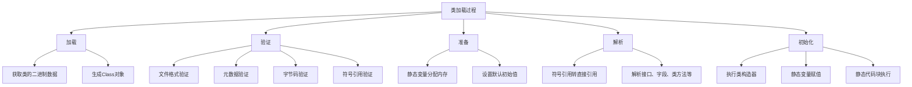
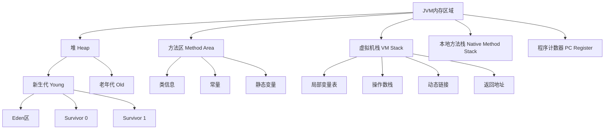
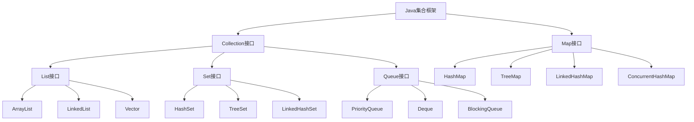
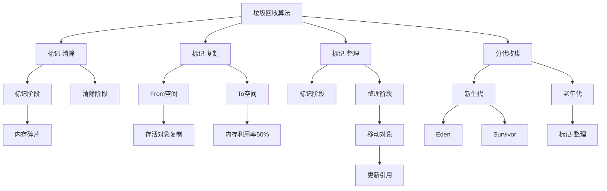
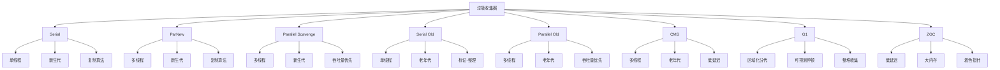
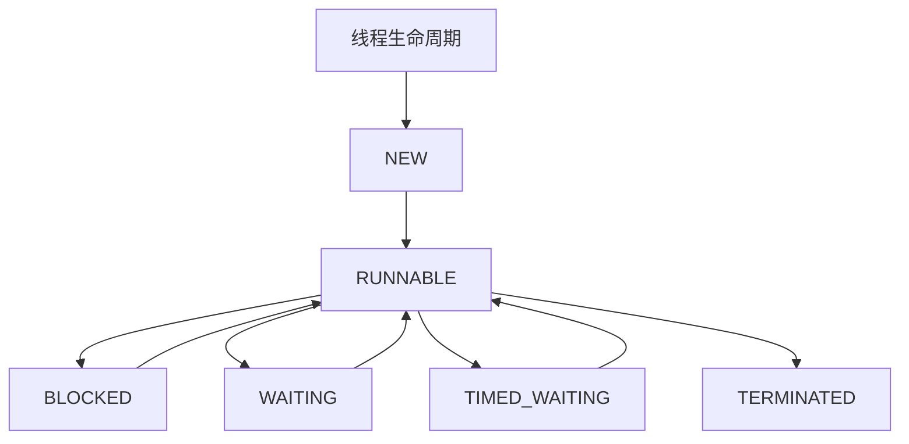
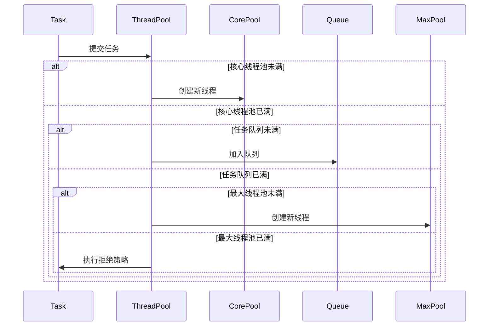

# Java 高级特性与核心概念

## 目录
- [Java 高级特性与核心概念](#java-高级特性与核心概念)
  - [目录](#目录)
  - [JVM 核心机制](#jvm-核心机制)
    - [类加载机制详解](#类加载机制详解)
      - [详细说明](#详细说明)
    - [JVM 内存模型详解](#jvm-内存模型详解)
      - [内存区域详细说明](#内存区域详细说明)
    - [锁机制详解](#锁机制详解)
    - [并发容器](#并发容器)
    - [原子操作类](#原子操作类)
  - [集合框架](#集合框架)
    - [集合框架概览](#集合框架概览)
    - [List集合](#list集合)
      - [ArrayList与LinkedList](#arraylist与linkedlist)
      - [线程安全的List实现](#线程安全的list实现)
    - [Set集合](#set集合)
      - [HashSet与TreeSet](#hashset与treeset)
      - [特殊Set实现](#特殊set实现)
    - [Map集合](#map集合)
      - [HashMap与TreeMap](#hashmap与treemap)
      - [特殊Map实现](#特殊map实现)
    - [Queue集合](#queue集合)
      - [基本队列实现](#基本队列实现)
      - [阻塞队列实现](#阻塞队列实现)
    - [函数式编程](#函数式编程)
      - [Lambda表达式](#lambda表达式)
      - [Stream API](#stream-api)
    - [反射与注解](#反射与注解)
    - [反射机制](#反射机制)
    - [注解处理](#注解处理)
  - [垃圾回收机制](#垃圾回收机制)
    - [GC 算法与收集器](#gc-算法与收集器)
    - [GC 详细实现](#gc-详细实现)
  - [性能优化](#性能优化)
    - [性能优化策略](#性能优化策略)
  - [多线程编程](#多线程编程)
    - [线程基础](#线程基础)
      - [线程生命周期](#线程生命周期)
      - [线程创建与使用](#线程创建与使用)
    - [线程池详解](#线程池详解)
      - [线程池工作流程](#线程池工作流程)
      - [线程池实现](#线程池实现)
    - [线程安全](#线程安全)
      - [同步机制](#同步机制)
      - [线程协作](#线程协作)
    - [线程池最佳实践](#线程池最佳实践)

## JVM 核心机制

### 类加载机制详解

类加载是 Java 程序运行的第一步，它的过程如下：



#### 详细说明

1. **加载阶段**
   ```java
   public class ClassLoadingExample {
       // 自定义类加载器示例
       public class CustomClassLoader extends ClassLoader {
           @Override
           protected Class<?> findClass(String name) throws ClassNotFoundException {
               // 1. 加载类文件
               byte[] classData = loadClassData(name);
               // 2. 生成Class对象
               return defineClass(name, classData, 0, classData.length);
           }
           
           private byte[] loadClassData(String name) {
               // 实现从不同来源加载类文件的逻辑
               // 可以是文件系统、网络、数据库等
               return null;
           }
       }
   }
   ```

2. **验证阶段**
   - 文件格式验证：魔数检查、版本号检查
   - 元数据验证：类是否有父类、是否实现了接口等
   - 字节码验证：方法体验证、栈帧数据流验证
   - 符号引用验证：符号引用转直接引用的准备

3. **准备阶段**
   ```java
   public class PrepareExample {
       // 准备阶段为静态变量分配内存并设置默认值
       private static int value = 123;  // 准备阶段设置为0，初始化阶段才设置为123
       private static final int CONSTANT = 456;  // 准备阶段直接设置为456
   }
   ```

4. **解析阶段**
   ```java
   public class ResolutionExample {
       private static class Parent {}
       private static class Child extends Parent {}
       
       public static void main(String[] args) {
           // 类解析
           Parent p = new Child();
           // 方法解析
           p.toString();
           // 字段解析
           System.out.println(Child.class.getModifiers());
       }
   }
   ```

5. **初始化阶段**
   ```java
   public class InitializationExample {
       // 静态变量
       private static int staticVar = 100;
       
       // 静态代码块
       static {
           System.out.println("静态代码块执行");
           staticVar = 200;
       }
       
       // 类构造器
       public InitializationExample() {
           System.out.println("构造器执行");
       }
   }
   ```

### JVM 内存模型详解

JVM 内存模型是 Java 运行时的核心，它的结构如下：



#### 内存区域详细说明

1. **堆（Heap）**
   ```java
   public class HeapExample {
       public void heapAllocation() {
           // 对象分配在堆上
           Object obj = new Object();
           
           // 数组也分配在堆上
           int[] array = new int[1000];
           
           // 字符串常量池在堆中
           String str = new String("hello");  // 在堆中创建对象
           String intern = str.intern();      // 尝试在常量池中查找或创建
       }
   }
   ```

2. **方法区（Method Area）**
   ```java
   public class MethodAreaExample {
       // 静态变量存储在方法区
       private static final String CONSTANT = "常量";
       private static String staticVar = "静态变量";
       
       // 类信息存储在方法区
       static class InnerClass {
           public void method() {}
       }
   }
   ```

3. **虚拟机栈（VM Stack）**
   ```java
   public class StackExample {
       public void stackFrameDemo(int param) {
           // 局部变量存储在栈帧中
           int localVar = param + 1;
           
           // 方法调用会创建新的栈帧
           anotherMethod();
           
           // 基本类型的局部变量直接存储在栈中
           int a = 1;
           long b = 2L;
           
           // 引用类型的变量引用存储在栈中，对象存储在堆中
           Object obj = new Object();
       }
       
       private void anotherMethod() {
           // 新的栈帧
           int anotherLocal = 100;
       }
   }
   ```

### 锁机制详解
```java
/**
 * 锁的类型
 * 1. synchronized：内置锁
 * 2. ReentrantLock：可重入锁
 * 3. ReadWriteLock：读写锁
 * 4. StampedLock：邮戳锁
 */

public class LockExample {
    // ReentrantLock 示例
    private final ReentrantLock lock = new ReentrantLock(true); // 公平锁
    
    public void reentrantLockExample() {
        lock.lock();
        try {
            // 临界区代码
        } finally {
            lock.unlock();
        }
    }
    
    // ReadWriteLock 示例
    private final ReadWriteLock rwLock = new ReentrantReadWriteLock();
    private final Lock readLock = rwLock.readLock();
    private final Lock writeLock = rwLock.writeLock();
    
    public void readWriteLockExample() {
        readLock.lock();
        try {
            // 读操作
        } finally {
            readLock.unlock();
        }
        
        writeLock.lock();
        try {
            // 写操作
        } finally {
            writeLock.unlock();
        }
    }
    
    // StampedLock 示例
    private final StampedLock stampedLock = new StampedLock();
    
    public void stampedLockExample() {
        long stamp = stampedLock.tryOptimisticRead(); // 乐观读
        // 读取共享变量
        if (!stampedLock.validate(stamp)) { // 检查期间是否有写操作
            stamp = stampedLock.readLock(); // 获取悲观读锁
            try {
                // 读取共享变量
            } finally {
                stampedLock.unlockRead(stamp);
            }
        }
    }
}
```

### 并发容器
```java
/**
 * 常用并发容器
 * 1. ConcurrentHashMap：线程安全的HashMap
 * 2. CopyOnWriteArrayList：写时复制的ArrayList
 * 3. BlockingQueue：阻塞队列
 * 4. ConcurrentSkipListMap：跳表实现的有序映射
 */

public class ConcurrentContainerExample {
    // ConcurrentHashMap 示例
    private ConcurrentHashMap<String, Integer> map = new ConcurrentHashMap<>();
    
    public void concurrentMapOperations() {
        // 原子操作
        map.computeIfAbsent("key", k -> 1);
        map.computeIfPresent("key", (k, v) -> v + 1);
        map.merge("key", 1, Integer::sum);
    }
    
    // BlockingQueue 示例
    private BlockingQueue<Task> taskQueue = new LinkedBlockingQueue<>(100);
    
    public void blockingQueueOperations() {
        // 生产者
        try {
            taskQueue.put(new Task());  // 阻塞直到有空间
        } catch (InterruptedException e) {
            Thread.currentThread().interrupt();
        }
        
        // 消费者
        try {
            Task task = taskQueue.take();  // 阻塞直到有元素
            processTask(task);
        } catch (InterruptedException e) {
            Thread.currentThread().interrupt();
        }
    }
}
```

### 原子操作类
```java
/**
 * 原子类型
 * 1. AtomicInteger/Long/Boolean：基本类型原子类
 * 2. AtomicReference：引用类型原子类
 * 3. AtomicIntegerArray：数组元素原子操作
 * 4. AtomicIntegerFieldUpdater：对象字段原子更新
 */

public class AtomicExample {
    // AtomicInteger 示例
    private AtomicInteger counter = new AtomicInteger(0);
    
    public void atomicOperations() {
        // 原子递增
        counter.incrementAndGet();
        // CAS操作
        counter.compareAndSet(1, 2);
        // 原子更新
        counter.updateAndGet(x -> x * 2);
    }
    
    // AtomicReference 示例
    private AtomicReference<User> userRef = new AtomicReference<>();
    
    public void atomicReferenceOperations() {
        User user = new User("John");
        userRef.set(user);
        
        // CAS更新
        User oldUser = userRef.get();
        User newUser = new User("Jane");
        userRef.compareAndSet(oldUser, newUser);
    }
}
```

## 集合框架

### 集合框架概览

Java 集合框架的整体结构如下：



### List集合

#### ArrayList与LinkedList
```java
public class ListExample {
    /**
     * ArrayList
     * 优点：随机访问快，尾部插入删除快
     * 缺点：扩容时需要复制数组，中间插入删除慢
     */
    public void arrayListDemo() {
        // 创建时指定初始容量，避免扩容
        ArrayList<String> list = new ArrayList<>(10);
        
        // 添加元素
        list.add("A");
        list.add(0, "B");  // 在指定位置添加
        
        // 批量添加
        list.addAll(Arrays.asList("C", "D"));
        
        // 访问元素
        String first = list.get(0);
        
        // 修改元素
        list.set(1, "Modified");
        
        // 删除元素
        list.remove("A");
        list.remove(0);
    }
    
    /**
     * LinkedList
     * 优点：插入删除快，可以用作队列或栈
     * 缺点：随机访问慢，内存占用较大
     */
    public void linkedListDemo() {
        LinkedList<String> list = new LinkedList<>();
        
        // 队列操作
        list.offer("First");
        list.poll();
        
        // 栈操作
        list.push("Top");
        list.pop();
        
        // 双端操作
        list.addFirst("Start");
        list.addLast("End");
    }
}
```

#### 线程安全的List实现
```java
public class ThreadSafeListExample {
    /**
     * CopyOnWriteArrayList
     * 适用场景：读多写少，数据量较小
     * 特点：写时复制，读写分离
     */
    public void copyOnWriteArrayListDemo() {
        CopyOnWriteArrayList<String> list = new CopyOnWriteArrayList<>();
        
        // 线程安全的添加
        list.add("A");
        list.addIfAbsent("B");  // 元素不存在时才添加
        
        // 批量添加
        list.addAllAbsent(Arrays.asList("C", "D"));
    }
    
    /**
     * Vector（不推荐使用）
     * 特点：所有方法同步，性能较差
     */
    public void vectorDemo() {
        Vector<String> vector = new Vector<>();
        vector.add("A");
        vector.elementAt(0);
    }
}
```

### Set集合

#### HashSet与TreeSet
```java
public class SetExample {
    /**
     * HashSet
     * 特点：无序，不重复，允许null
     * 原理：基于HashMap实现
     */
    public void hashSetDemo() {
        HashSet<String> set = new HashSet<>();
        
        // 添加元素
        set.add("A");
        set.add("B");
        set.add("A");  // 重复元素不会被添加
        
        // 自定义对象必须正确实现equals和hashCode
        HashSet<Person> personSet = new HashSet<>();
        personSet.add(new Person("John", 25));
    }
    
    /**
     * TreeSet
     * 特点：有序，不重复，不允许null
     * 原理：基于TreeMap实现
     */
    public void treeSetDemo() {
        // 自然顺序
        TreeSet<String> set = new TreeSet<>();
        set.add("B");
        set.add("A");
        set.add("C");
        
        // 自定义顺序
        TreeSet<Person> personSet = new TreeSet<>((p1, p2) -> 
            p1.getAge() - p2.getAge()
        );
        
        // 范围操作
        SortedSet<String> subset = set.subSet("A", "C");
        String first = set.first();
        String last = set.last();
    }
}
```

#### 特殊Set实现
```java
public class SpecialSetExample {
    /**
     * LinkedHashSet
     * 特点：维护插入顺序的HashSet
     */
    public void linkedHashSetDemo() {
        LinkedHashSet<String> set = new LinkedHashSet<>();
        set.add("C");
        set.add("A");
        set.add("B");
        // 遍历顺序：C, A, B
    }
    
    /**
     * ConcurrentSkipListSet
     * 特点：线程安全的有序Set
     */
    public void concurrentSetDemo() {
        ConcurrentSkipListSet<Integer> set = new ConcurrentSkipListSet<>();
        set.add(5);
        set.add(1);
        set.add(3);
        // 自动排序：1, 3, 5
    }
}
```

### Map集合

#### HashMap与TreeMap
```java
public class MapExample {
    /**
     * HashMap
     * 特点：无序，允许null键值，非线程安全
     * 原理：数组+链表+红黑树
     */
    public void hashMapDemo() {
        HashMap<String, Integer> map = new HashMap<>(16, 0.75f);
        
        // 基本操作
        map.put("A", 1);
        map.get("A");
        map.remove("A");
        
        // Java 8 新方法
        map.computeIfAbsent("B", k -> k.length());
        map.merge("A", 1, Integer::sum);
    }
    
    /**
     * TreeMap
     * 特点：有序，不允许null键，基于红黑树
     */
    public void treeMapDemo() {
        TreeMap<String, Integer> map = new TreeMap<>();
        map.put("B", 2);
        map.put("A", 1);
        map.put("C", 3);
        
        // 范围操作
        SortedMap<String, Integer> subMap = map.subMap("A", "C");
        Map.Entry<String, Integer> firstEntry = map.firstEntry();
    }
}
```

#### 特殊Map实现
```java
public class SpecialMapExample {
    /**
     * LinkedHashMap
     * 特点：维护插入顺序或访问顺序
     */
    public void linkedHashMapDemo() {
        // LRU缓存实现
        LinkedHashMap<String, Integer> lruCache = 
            new LinkedHashMap<>(16, 0.75f, true) {
                @Override
                protected boolean removeEldestEntry(Map.Entry<String, Integer> eldest) {
                    return size() > 100;
                }
            };
    }
    
    /**
     * WeakHashMap
     * 特点：弱引用键，适合缓存
     */
    public void weakHashMapDemo() {
        WeakHashMap<UniqueObject, String> cache = new WeakHashMap<>();
        UniqueObject key = new UniqueObject("test");
        cache.put(key, "value");
        key = null;  // 键可能被GC回收
    }
}
```

### Queue集合

#### 基本队列实现
```java
public class QueueExample {
    /**
     * ArrayDeque
     * 特点：数组实现的双端队列
     */
    public void arrayDequeDemo() {
        ArrayDeque<String> deque = new ArrayDeque<>();
        
        // 队列操作
        deque.offer("First");
        deque.poll();
        
        // 栈操作
        deque.push("Top");
        deque.pop();
    }
    
    /**
     * PriorityQueue
     * 特点：基于堆的优先级队列
     */
    public void priorityQueueDemo() {
        // 最小堆
        PriorityQueue<Integer> minHeap = new PriorityQueue<>();
        
        // 最大堆
        PriorityQueue<Integer> maxHeap = new PriorityQueue<>(
            Collections.reverseOrder()
        );
    }
}
```

#### 阻塞队列实现
```java
public class BlockingQueueExample {
    /**
     * 常用阻塞队列实现
     */
    public void blockingQueueDemo() {
        // 固定大小的阻塞队列
        ArrayBlockingQueue<String> arrayQueue = 
            new ArrayBlockingQueue<>(100);
        
        // 无界阻塞队列
        LinkedBlockingQueue<String> linkedQueue = 
            new LinkedBlockingQueue<>();
        
        // 延迟队列
        DelayQueue<DelayedElement> delayQueue = 
            new DelayQueue<>();
        
        // 同步队列
        SynchronousQueue<String> syncQueue = 
            new SynchronousQueue<>();
    }
    
    /**
     * 生产者-消费者示例
     */
    public void producerConsumerDemo() {
        BlockingQueue<String> queue = new ArrayBlockingQueue<>(10);
        
        // 生产者
        new Thread(() -> {
            try {
                queue.put("item");  // 队列满时阻塞
            } catch (InterruptedException e) {
                Thread.currentThread().interrupt();
            }
        }).start();
        
        // 消费者
        new Thread(() -> {
            try {
                String item = queue.take();  // 队列空时阻塞
            } catch (InterruptedException e) {
                Thread.currentThread().interrupt();
            }
        }).start();
    }
}
```

### 函数式编程

#### Lambda表达式
```java
public class LambdaExample {
    public void lambdaDemo() {
        // 基本语法
        Runnable r = () -> System.out.println("Hello Lambda");
        
        // 带参数
        Consumer<String> printer = s -> System.out.println(s);
        
        // 多行语句
        Comparator<String> comparator = (s1, s2) -> {
            if (s1 == null) return -1;
            if (s2 == null) return 1;
            return s1.compareTo(s2);
        };
    }
}
```

#### Stream API
```java
public class StreamExample {
    public void streamOperations() {
        List<String> list = Arrays.asList("A", "B", "C");
        
        // 转换
        list.stream()
            .map(String::toLowerCase)
            .collect(Collectors.toList());
        
        // 过滤
        list.stream()
            .filter(s -> s.startsWith("A"))
            .collect(Collectors.toList());
        
        // 排序
        list.stream()
            .sorted()
            .collect(Collectors.toList());
        
        // 分组
        Map<Integer, List<String>> groups = list.stream()
            .collect(Collectors.groupingBy(String::length));
    }
}
```

### 反射与注解

### 反射机制
```java
/**
 * 反射应用场景
 * 1. 框架开发
 * 2. 动态代理
 * 3. 注解处理
 */

public class ReflectionExample {
    // 反射获取类信息
    public void reflectionInfo() {
        Class<?> clazz = Class.forName("com.example.User");
        
        // 获取所有方法
        Method[] methods = clazz.getDeclaredMethods();
        
        // 获取特定方法
        Method method = clazz.getDeclaredMethod("getName");
        method.setAccessible(true);  // 访问私有方法
        
        // 创建实例
        Constructor<?> constructor = clazz.getDeclaredConstructor();
        Object instance = constructor.newInstance();
        
        // 调用方法
        Object result = method.invoke(instance);
    }
    
    // 动态代理
    public interface UserService {
        void save(User user);
    }
    
    public class ServiceProxy implements InvocationHandler {
        private final Object target;
        
        public ServiceProxy(Object target) {
            this.target = target;
        }
        
        @Override
        public Object invoke(Object proxy, Method method, Object[] args) throws Throwable {
            System.out.println("Before method: " + method.getName());
            Object result = method.invoke(target, args);
            System.out.println("After method: " + method.getName());
            return result;
        }
    }
}
```

### 注解处理
```java
/**
 * 自定义注解与处理器
 */

// 自定义注解
@Retention(RetentionPolicy.RUNTIME)
@Target(ElementType.METHOD)
public @interface Audit {
    String value() default "";
    boolean enabled() default true;
}

// 注解处理
public class AnnotationProcessor {
    public void processAnnotations(Object obj) {
        Class<?> clazz = obj.getClass();
        for (Method method : clazz.getDeclaredMethods()) {
            Audit audit = method.getAnnotation(Audit.class);
            if (audit != null && audit.enabled()) {
                // 处理注解逻辑
            }
        }
    }
}
```

## 垃圾回收机制

### GC 算法与收集器
```java
/**
 * 垃圾回收算法
 * 1. 标记-清除
 * 2. 复制
 * 3. 标记-整理
 * 4. 分代收集
 */

public class GCExample {
    // GC 参数设置
    public void gcConfiguration() {
        // 堆大小设置
        // -Xms: 初始堆大小
        // -Xmx: 最大堆大小
        // -XX:NewSize: 新生代大小
        // -XX:MaxNewSize: 最大新生代大小
        
        // GC 日志
        // -XX:+PrintGCDetails
        // -XX:+PrintGCDateStamps
        // -Xloggc:gc.log
    }
    
    // GC 监控
    public void gcMonitoring() {
        MemoryMXBean memoryBean = ManagementFactory.getMemoryMXBean();
        MemoryUsage heapUsage = memoryBean.getHeapMemoryUsage();
        
        System.out.println("Init Heap: " + heapUsage.getInit());
        System.out.println("Used Heap: " + heapUsage.getUsed());
        System.out.println("Max Heap: " + heapUsage.getMax());
        System.out.println("Committed Heap: " + heapUsage.getCommitted());
    }
}
```

### GC 详细实现

```java
public class GCDetailExample {
    /**
     * GC 调优参数详解
     */
    public void gcParameters() {
        // 堆大小设置
        // -Xms2g：初始堆大小
        // -Xmx2g：最大堆大小
        // -XX:NewRatio=3：新生代与老年代比例
        // -XX:SurvivorRatio=8：Eden区与Survivor区比例
        
        // GC 策略
        // -XX:+UseParallelGC：使用并行收集器
        // -XX:ParallelGCThreads=4：设置并行收集线程数
        // -XX:MaxGCPauseMillis=100：设置最大垃圾收集停顿时间
        
        // GC 日志
        // -XX:+PrintGCDetails：打印GC详细信息
        // -XX:+PrintGCDateStamps：打印GC时间戳
        // -Xloggc:gc.log：GC日志文件
    }
    
    /**
     * 对象生命周期示例
     */
    public void objectLifecycle() {
        // 1. 对象优先在Eden区分配
        byte[] allocation1 = new byte[30900*1024];
        
        // 2. 大对象直接进入老年代
        byte[] allocation2 = new byte[900000*1024];
        
        // 3. 长期存活的对象进入老年代
        Object object = new Object();
        // 经过多次Minor GC后，对象会进入老年代
        
        // 4. 空间分配担保
        // JVM在发生Minor GC之前，会检查老年代最大可用连续空间
        // 如果大于新生代所有对象总空间，则是安全的
    }
    
    /**
     * GC 监控示例
     */
    public void gcMonitoring() {
        // 获取内存管理器
        List<GarbageCollectorMXBean> gcBeans = ManagementFactory.getGarbageCollectorMXBeans();
        for (GarbageCollectorMXBean gcBean : gcBeans) {
            System.out.println("GC名称：" + gcBean.getName());
            System.out.println("GC收集次数：" + gcBean.getCollectionCount());
            System.out.println("GC收集时间：" + gcBean.getCollectionTime() + "ms");
        }
        
        // 获取内存信息
        MemoryMXBean memoryBean = ManagementFactory.getMemoryMXBean();
        MemoryUsage heapUsage = memoryBean.getHeapMemoryUsage();
        
        System.out.println("初始堆大小：" + heapUsage.getInit() / 1024 / 1024 + "MB");
        System.out.println("最大堆大小：" + heapUsage.getMax() / 1024 / 1024 + "MB");
        System.out.println("已用堆大小：" + heapUsage.getUsed() / 1024 / 1024 + "MB");
    }
}
```

## 垃圾回收机制详解

### 垃圾回收算法对比

Java垃圾回收算法的整体结构如下：



#### 标记-清除算法
```java
/**
 * 标记-清除算法特点
 * 优点：实现简单，不需要移动对象
 * 缺点：会产生内存碎片，标记和清除两个阶段效率都不高
 */
public class MarkSweepExample {
    public void markSweepAnalysis() {
        // 标记阶段
        // 1. 从GC Roots开始遍历
        // 2. 标记所有可达对象
        markFromGCRoots();
        
        // 清除阶段
        // 1. 遍历整个堆
        // 2. 回收未标记对象
        // 3. 产生内存碎片
        sweepUnmarkedObjects();
    }
    
    /**
     * 内存碎片问题
     */
    public void fragmentationIssue() {
        // 碎片整理策略
        // 1. 空闲列表：记录空闲区块
        maintainFreeList();
        
        // 2. 分配速度下降
        // - 需要遍历空闲列表找到足够大的空间
        // - 可能需要多个小空间组合
        allocateWithFragmentation();
    }
}
```

#### 标记-复制算法
```java
/**
 * 标记-复制算法特点
 * 优点：解决了内存碎片问题，分配简单
 * 缺点：需要双倍空间，复制性能开销
 */
public class CopyingExample {
    public void copyingAnalysis() {
        // 内存分配
        // 1. From空间和To空间各占一半
        // 2. 只使用From空间分配对象
        allocateInFromSpace();
        
        // 回收过程
        // 1. 标记存活对象
        // 2. 复制到To空间
        // 3. 交换From和To空间
        copyAndSwapSpaces();
    }
    
    /**
     * Survivor区应用
     */
    public void survivorSpaceUsage() {
        // Eden区和Survivor区
        // 1. Eden:Survivor = 8:1
        // 2. 两个Survivor交替使用
        // 3. 对象年龄计数
        manageSurvivorSpaces();
    }
}
```

#### 标记-整理算法
```java
/**
 * 标记-整理算法特点
 * 优点：没有内存碎片，无需额外空间
 * 缺点：移动对象开销大，需要更新引用
 */
public class MarkCompactExample {
    public void markCompactAnalysis() {
        // 标记阶段
        // 1. 与标记-清除算法相同
        markFromGCRoots();
        
        // 整理阶段
        // 1. 移动存活对象
        // 2. 更新引用地址
        // 3. 清理边界以外内存
        compactObjects();
    }
    
    /**
     * 移动对象策略
     */
    public void objectMovingStrategy() {
        // 双指针技术
        // 1. 一个指针遍历对象
        // 2. 一个指针记录位置
        moveWithTwoPointers();
        
        // 更新引用
        // 1. 维护转发表
        // 2. 更新所有引用
        updateReferences();
    }
}
```

### 垃圾收集器对比

Java垃圾收集器的分类和特点：



#### 新生代收集器
```java
/**
 * 新生代收集器特点对比
 */
public class YoungCollectorComparison {
    /**
     * Serial收集器
     * 特点：单线程、简单高效、Client模式默认
     */
    public void serialCollector() {
        // 适用场景
        // 1. 单CPU环境
        // 2. 小内存堆（100M以下）
        // 3. Client模式
        
        // 参数设置
        // -XX:+UseSerialGC
        configureSerial();
    }
    
    /**
     * ParNew收集器
     * 特点：Serial的多线程版本、Server模式首选
     */
    public void parNewCollector() {
        // 适用场景
        // 1. 多CPU环境
        // 2. 与CMS配合使用
        // 3. Server模式
        
        // 参数设置
        // -XX:+UseParNewGC
        // -XX:ParallelGCThreads=n
        configureParNew();
    }
    
    /**
     * Parallel Scavenge收集器
     * 特点：关注吞吐量、可控制GC自适应策略
     */
    public void parallelScavengeCollector() {
        // 适用场景
        // 1. 后台运算任务
        // 2. 不需要太快的响应速度
        
        // 参数设置
        // -XX:+UseParallelGC
        // -XX:MaxGCPauseMillis=n
        // -XX:GCTimeRatio=n
        configureParallelScavenge();
    }
}
```

#### 老年代收集器
```java
/**
 * 老年代收集器特点对比
 */
public class OldCollectorComparison {
    /**
     * CMS收集器
     * 特点：最短回收停顿时间、并发收集
     */
    public void cmsCollector() {
        // 运作过程
        // 1. 初始标记（STW）
        // 2. 并发标记
        // 3. 重新标记（STW）
        // 4. 并发清除
        
        // 优点
        // 1. 并发收集
        // 2. 低停顿
        
        // 缺点
        // 1. CPU资源敏感
        // 2. 浮动垃圾
        // 3. 内存碎片
        
        // 参数设置
        // -XX:+UseConcMarkSweepGC
        // -XX:CMSInitiatingOccupancyFraction=n
        configureCMS();
    }
    
    /**
     * G1收集器
     * 特点：可预测停顿时间、区域化分代收集
     */
    public void g1Collector() {
        // 运作过程
        // 1. 初始标记（STW）
        // 2. 并发标记
        // 3. 最终标记（STW）
        // 4. 筛选回收（STW）
        
        // 优点
        // 1. 可预测停顿
        // 2. 区域化分代
        // 3. 空间整合
        
        // 参数设置
        // -XX:+UseG1GC
        // -XX:MaxGCPauseMillis=n
        // -XX:G1HeapRegionSize=n
        configureG1();
    }
    
    /**
     * ZGC收集器
     * 特点：超低停顿时间、大内存、着色指针
     */
    public void zgcCollector() {
        // 特性
        // 1. 停顿时间不超过10ms
        // 2. 支持TB级内存
        // 3. 着色指针技术
        
        // 运作过程
        // 1. 并发标记
        // 2. 并发预备重分配
        // 3. 并发重分配
        // 4. 并发重映射
        
        // 参数设置
        // -XX:+UseZGC
        // -XX:ZAllocationSpikeTolerance=n
        configureZGC();
    }
}
```

### 垃圾收集器选择

```java
public class CollectorSelectionGuide {
    /**
     * 收集器选择考虑因素
     */
    public void selectionFactors() {
        // 1. 系统需求
        // - 响应时间优先
        // - 吞吐量优先
        // - 内存占用优先
        systemRequirements();
        
        // 2. 系统规模
        // - 单CPU vs 多CPU
        // - 小内存 vs 大内存
        systemScale();
        
        // 3. 应用特点
        // - 在线应用
        // - 批处理应用
        // - 混合应用
        applicationCharacteristics();
    }
    
    /**
     * 最佳实践建议
     */
    public void bestPractices() {
        // 在线应用（低延迟）
        // - 新生代：ParNew
        // - 老年代：CMS
        onlineApplication();
        
        // 后台计算（高吞吐）
        // - 新生代：Parallel Scavenge
        // - 老年代：Parallel Old
        batchApplication();
        
        // 混合应用
        // - G1收集器
        // - ZGC（Java 11+）
        mixedApplication();
    }
    
    /**
     * 收集器参数调优
     */
    public void collectorTuning() {
        // CMS调优
        // 1. 触发比例
        // -XX:CMSInitiatingOccupancyFraction=75
        // 2. 并发线程数
        // -XX:ConcGCThreads=n
        cmsTuning();
        
        // G1调优
        // 1. 停顿时间目标
        // -XX:MaxGCPauseMillis=200
        // 2. 区域大小
        // -XX:G1HeapRegionSize=n
        g1Tuning();
        
        // ZGC调优
        // 1. 最大堆大小
        // -Xmx
        // 2. 并发线程数
        // -XX:ConcGCThreads=n
        zgcTuning();
    }
}
```

### 收集器性能对比表

| 收集器 | 线程 | 停顿时间 | 吞吐量 | 内存占用 | 堆内存范围 | 适用场景 |
|--------|------|----------|---------|----------|------------|----------|
| Serial | 单线程 | 较长 | 一般 | 最低 | <100M | 单CPU、Client模式 |
| ParNew | 多线程 | 中等 | 中等 | 中等 | <4G | 多CPU、Server模式 |
| Parallel Scavenge | 多线程 | 中等 | 最高 | 中等 | <4G | 后台计算、批处理 |
| CMS | 多线程 | 短 | 中等 | 较高 | <8G | 在线应用、低延迟 |
| G1 | 多线程 | 可预测 | 高 | 较高 | <32G | 大内存、可预测停顿 |
| ZGC | 多线程 | 最短 | 高 | 中等 | >32G | 超大内存、超低延迟 |

## 性能优化

### 性能优化策略
```java
/**
 * 性能优化关键点
 * 1. JVM 调优
 * 2. 代码优化
 * 3. 数据结构选择
 * 4. 并发优化
 */

public class PerformanceOptimization {
    // JVM 调优
    public void jvmOptimization() {
        // 内存分配
        // -XX:+UseG1GC
        // -XX:MaxGCPauseMillis=200
        // -XX:ParallelGCThreads=20
        // -XX:ConcGCThreads=5
        
        // GC 日志分析
        // jstat -gcutil pid 1000
        // jmap -heap pid
        // jstack pid
    }
    
    // 代码优化
    public void codeOptimization() {
        // 1. 使用 StringBuilder 而不是 String 连接
        StringBuilder sb = new StringBuilder();
        for (int i = 0; i < 1000; i++) {
            sb.append(i);
        }
        
        // 2. 避免创建不必要的对象
        String str = "Hello";
        for (int i = 0; i < 1000; i++) {
            str.trim();  // 每次都创建新对象
        }
        
        // 3. 使用批量操作
        List<String> list = new ArrayList<>();
        list.addAll(Arrays.asList("a", "b", "c"));
    }
    
    // 数据结构优化
    public void dataStructureOptimization() {
        // 1. 合适的初始容量
        Map<String, String> map = new HashMap<>(1000);
        
        // 2. 使用 EnumSet 代替 HashSet<Enum>
        EnumSet<DayOfWeek> weekends = EnumSet.of(DayOfWeek.SATURDAY, DayOfWeek.SUNDAY);
        
        // 3. 使用 BitSet 处理大量布尔值
        BitSet bits = new BitSet(1000);
        bits.set(10);  // 设置第10位为true
    }
    
    // 并发优化
    public void concurrencyOptimization() {
        // 1. 使用线程池
        ExecutorService executor = Executors.newFixedThreadPool(10);
        
        // 2. 避免过度同步
        ConcurrentHashMap<String, String> concurrentMap = new ConcurrentHashMap<>();
        
        // 3. 使用 volatile 而不是 synchronized
        private volatile boolean flag;
    }
}
```

## 多线程编程

### 线程基础

#### 线程生命周期


#### 线程创建与使用
```java
public class ThreadCreationExample {
    /**
     * 创建线程的几种方式
     */
    public void threadCreationDemo() {
        // 1. 继承Thread类
        class MyThread extends Thread {
            @Override
            public void run() {
                System.out.println("Thread running: " + Thread.currentThread().getName());
            }
        }
        new MyThread().start();
        
        // 2. 实现Runnable接口
        Runnable task = () -> 
            System.out.println("Runnable running: " + Thread.currentThread().getName());
        new Thread(task).start();
        
        // 3. 实现Callable接口（有返回值）
        Callable<String> callable = () -> {
            Thread.sleep(1000);
            return "Callable result";
        };
        FutureTask<String> future = new FutureTask<>(callable);
        new Thread(future).start();
        
        try {
            String result = future.get();  // 获取返回值
        } catch (InterruptedException | ExecutionException e) {
            Thread.currentThread().interrupt();
        }
    }
    
    /**
     * 线程控制方法
     */
    public void threadControlDemo() {
        Thread thread = new Thread(() -> {
            try {
                // 休眠
                Thread.sleep(1000);
                
                // 让出CPU
                Thread.yield();
                
                // 等待其他线程
                Thread.join();
                
                // 中断检查
                if (Thread.interrupted()) {
                    return;
                }
            } catch (InterruptedException e) {
                Thread.currentThread().interrupt();
            }
        });
        
        // 启动线程
        thread.start();
        
        // 设置守护线程
        thread.setDaemon(true);
        
        // 设置优先级
        thread.setPriority(Thread.MAX_PRIORITY);
        
        // 中断线程
        thread.interrupt();
    }
}
```

### 线程池详解

#### 线程池工作流程


#### 线程池实现
```java
public class ThreadPoolExample {
    /**
     * 常用线程池类型
     */
    public void threadPoolTypesDemo() {
        // 1. 固定大小线程池
        ExecutorService fixedPool = Executors.newFixedThreadPool(5);
        
        // 2. 缓存线程池
        ExecutorService cachedPool = Executors.newCachedThreadPool();
        
        // 3. 单线程池
        ExecutorService singlePool = Executors.newSingleThreadExecutor();
        
        // 4. 调度线程池
        ScheduledExecutorService scheduledPool = 
            Executors.newScheduledThreadPool(5);
    }
    
    /**
     * 自定义线程池
     */
    public void customThreadPoolDemo() {
        ThreadPoolExecutor executor = new ThreadPoolExecutor(
            5,                      // 核心线程数
            10,                     // 最大线程数
            60L,                    // 空闲线程存活时间
            TimeUnit.SECONDS,       // 时间单位
            new LinkedBlockingQueue<>(100),  // 工作队列
            new ThreadFactory() {   // 线程工厂
                private final AtomicInteger count = new AtomicInteger(1);
                @Override
                public Thread newThread(Runnable r) {
                    Thread thread = new Thread(r);
                    thread.setName("CustomThread-" + count.getAndIncrement());
                    return thread;
                }
            },
            new ThreadPoolExecutor.CallerRunsPolicy()  // 拒绝策略
        );
        
        // 动态调整线程池
        executor.setCorePoolSize(8);
        executor.setMaximumPoolSize(15);
        
        // 预启动核心线程
        executor.prestartAllCoreThreads();
        
        // 允许核心线程超时
        executor.allowCoreThreadTimeOut(true);
    }
    
    /**
     * 线程池监控
     */
    public void threadPoolMonitorDemo() {
        ThreadPoolExecutor executor = new ThreadPoolExecutor(
            5, 10, 60L, TimeUnit.SECONDS,
            new LinkedBlockingQueue<>(100)
        );
        
        // 定时监控线程池状态
        ScheduledExecutorService monitor = Executors.newScheduledThreadPool(1);
        monitor.scheduleAtFixedRate(() -> {
            System.out.println("=== 线程池状态 ===");
            System.out.println("活跃线程数：" + executor.getActiveCount());
            System.out.println("核心线程数：" + executor.getCorePoolSize());
            System.out.println("最大线程数：" + executor.getMaximumPoolSize());
            System.out.println("线程池大小：" + executor.getPoolSize());
            System.out.println("队列任务数：" + executor.getQueue().size());
            System.out.println("已完成任务：" + executor.getCompletedTaskCount());
            System.out.println("总任务数：" + executor.getTaskCount());
            System.out.println("================");
        }, 0, 5, TimeUnit.SECONDS);
    }
}
```

### 线程安全

#### 同步机制
```java
public class ThreadSafetyExample {
    /**
     * synchronized 关键字使用
     */
    public void synchronizedDemo() {
        // 1. 同步方法
        public synchronized void method() {
            // 临界区代码
        }
        
        // 2. 同步代码块
        synchronized (this) {
            // 临界区代码
        }
        
        // 3. 静态同步方法
        public static synchronized void staticMethod() {
            // 临界区代码
        }
        
        // 4. 类锁
        synchronized (ClassName.class) {
            // 临界区代码
        }
    }
    
    /**
     * volatile 关键字使用
     */
    private volatile boolean flag = false;
    
    public void volatileDemo() {
        // 保证可见性
        flag = true;
        
        // 双重检查锁定
        private static volatile SingletonClass instance;
        public static SingletonClass getInstance() {
            if (instance == null) {
                synchronized (SingletonClass.class) {
                    if (instance == null) {
                        instance = new SingletonClass();
                    }
                }
            }
            return instance;
        }
    }
}
```

#### 线程协作
```java
public class ThreadCoordinationExample {
    /**
     * 等待/通知机制
     */
    public void waitNotifyDemo() {
        Object lock = new Object();
        
        // 等待线程
        new Thread(() -> {
            synchronized (lock) {
                try {
                    System.out.println("等待信号...");
                    lock.wait();
                    System.out.println("收到信号");
                } catch (InterruptedException e) {
                    Thread.currentThread().interrupt();
                }
            }
        }).start();
        
        // 通知线程
        new Thread(() -> {
            synchronized (lock) {
                System.out.println("发送信号...");
                lock.notify();
            }
        }).start();
    }
    
    /**
     * CountDownLatch使用
     */
    public void countDownLatchDemo() {
        CountDownLatch latch = new CountDownLatch(3);
        
        // 启动多个工作线程
        for (int i = 0; i < 3; i++) {
            new Thread(() -> {
                try {
                    Thread.sleep(1000);
                    System.out.println("任务完成");
                    latch.countDown();
                } catch (InterruptedException e) {
                    Thread.currentThread().interrupt();
                }
            }).start();
        }
        
        // 等待所有任务完成
        try {
            latch.await();
            System.out.println("所有任务已完成");
        } catch (InterruptedException e) {
            Thread.currentThread().interrupt();
        }
    }
    
    /**
     * CyclicBarrier使用
     */
    public void cyclicBarrierDemo() {
        CyclicBarrier barrier = new CyclicBarrier(3, () -> 
            System.out.println("所有线程到达屏障点")
        );
        
        for (int i = 0; i < 3; i++) {
            new Thread(() -> {
                try {
                    System.out.println("线程等待...");
                    barrier.await();
                    System.out.println("继续执行");
                } catch (InterruptedException | BrokenBarrierException e) {
                    Thread.currentThread().interrupt();
                }
            }).start();
        }
    }
    
    /**
     * Semaphore使用
     */
    public void semaphoreDemo() {
        // 创建只允许5个线程同时访问的信号量
        Semaphore semaphore = new Semaphore(5);
        
        for (int i = 0; i < 10; i++) {
            new Thread(() -> {
                try {
                    semaphore.acquire();  // 获取许可
                    System.out.println("获得许可执行任务");
                    Thread.sleep(1000);
                } catch (InterruptedException e) {
                    Thread.currentThread().interrupt();
                } finally {
                    semaphore.release();  // 释放许可
                }
            }).start();
        }
    }
}
```

### 线程池最佳实践

```java
public class ThreadPoolBestPractices {
    /**
     * 线程池参数配置建议
     */
    public void threadPoolConfigurationGuide() {
        // CPU密集型任务
        int cpuCores = Runtime.getRuntime().availableProcessors();
        ThreadPoolExecutor cpuPool = new ThreadPoolExecutor(
            cpuCores,                    // 核心线程数 = CPU核心数
            cpuCores + 1,               // 最大线程数 = CPU核心数 + 1
            60L, TimeUnit.SECONDS,
            new LinkedBlockingQueue<>(1000)
        );
        
        // IO密集型任务
        ThreadPoolExecutor ioPool = new ThreadPoolExecutor(
            cpuCores * 2,               // 核心线程数 = CPU核心数 * 2
            cpuCores * 4,               // 最大线程数 = CPU核心数 * 4
            60L, TimeUnit.SECONDS,
            new LinkedBlockingQueue<>(2000)
        );
        
        // 混合型任务
        ThreadPoolExecutor mixedPool = new ThreadPoolExecutor(
            cpuCores + 1,               // 核心线程数 = CPU核心数 + 1
            cpuCores * 2,               // 最大线程数 = CPU核心数 * 2
            60L, TimeUnit.SECONDS,
            new ArrayBlockingQueue<>(1000),  // 使用有界队列
            new ThreadPoolExecutor.CallerRunsPolicy()  // 使用调用者运行策略
        );
    }
    
    /**
     * 任务提交最佳实践
     */
    public void taskSubmissionBestPractices() {
        ExecutorService executor = Executors.newFixedThreadPool(5);
        
        // 提交任务并获取Future
        Future<String> future = executor.submit(() -> {
            // 任务执行逻辑
            return "任务结果";
        });
        
        // 批量提交任务
        List<Callable<String>> tasks = Arrays.asList(
            () -> "Task 1",
            () -> "Task 2",
            () -> "Task 3"
        );
        
        try {
            // 执行所有任务并等待完成
            List<Future<String>> futures = executor.invokeAll(tasks);
            
            // 获取第一个完成的任务结果
            String firstResult = executor.invokeAny(tasks);
            
        } catch (InterruptedException | ExecutionException e) {
            Thread.currentThread().interrupt();
        }
    }
    
    /**
     * 异常处理最佳实践
     */
    public void exceptionHandlingBestPractices() {
        ThreadPoolExecutor executor = new ThreadPoolExecutor(
            5, 10, 60L, TimeUnit.SECONDS,
            new LinkedBlockingQueue<>(100)
        ) {
            @Override
            protected void afterExecute(Runnable r, Throwable t) {
                super.afterExecute(r, t);
                if (t != null) {
                    // 处理未捕获的异常
                    System.err.println("任务执行异常: " + t.getMessage());
                }
            }
        };
        
        // 使用UncaughtExceptionHandler
        Thread.setDefaultUncaughtExceptionHandler((thread, throwable) -> {
            System.err.println("线程 " + thread.getName() + " 发生异常: " + 
                             throwable.getMessage());
        });
    }
    
    /**
     * 优雅关闭线程池
     */
    public void gracefulShutdownDemo() {
        ThreadPoolExecutor executor = new ThreadPoolExecutor(
            5, 10, 60L, TimeUnit.SECONDS,
            new LinkedBlockingQueue<>(100)
        );
        
        // 注册关闭钩子
        Runtime.getRuntime().addShutdownHook(new Thread(() -> {
            System.out.println("开始关闭线程池...");
            
            // 拒绝新任务
            executor.shutdown();
            try {
                // 等待已提交任务完成
                if (!executor.awaitTermination(60, TimeUnit.SECONDS)) {
                    // 强制关闭
                    executor.shutdownNow();
                    
                    // 等待中断响应
                    if (!executor.awaitTermination(60, TimeUnit.SECONDS)) {
                        System.err.println("线程池未能完全关闭");
                    }
                }
            } catch (InterruptedException e) {
                // 重新尝试关闭
                executor.shutdownNow();
                Thread.currentThread().interrupt();
            }
            
            System.out.println("线程池已关闭");
        }));
    }
}
```