# Java 高级特性与核心概念

## 目录
- [Java 高级特性与核心概念](#java-高级特性与核心概念)
  - [目录](#目录)
  - [Java 基础核心](#java-基础核心)
    - [面向对象编程](#面向对象编程)
      - [封装（Encapsulation）](#封装encapsulation)
      - [继承（Inheritance）](#继承inheritance)
      - [多态（Polymorphism）](#多态polymorphism)
    - [异常处理机制](#异常处理机制)
      - [异常体系结构](#异常体系结构)
      - [异常处理最佳实践](#异常处理最佳实践)
    - [字符串处理](#字符串处理)
    - [泛型机制](#泛型机制)
      - [泛型基础使用](#泛型基础使用)
    - [枚举类型](#枚举类型)
      - [枚举高级用法](#枚举高级用法)
  - [JVM 核心机制](#jvm-核心机制)
    - [类加载机制详解](#类加载机制详解)
      - [详细说明](#详细说明)
    - [JVM 内存模型详解](#jvm-内存模型详解)
      - [内存区域详细说明](#内存区域详细说明)
    - [锁机制详解](#锁机制详解)
    - [并发容器](#并发容器)
      - [ConcurrentHashMap实现原理与机制](#concurrenthashmap实现原理与机制)
    - [原子操作类](#原子操作类)
  - [集合框架](#集合框架)
    - [集合框架概览](#集合框架概览)
    - [List集合](#list集合)
      - [ArrayList实现原理与机制](#arraylist实现原理与机制)
      - [LinkedList实现原理与机制](#linkedlist实现原理与机制)
      - [线程安全的List实现](#线程安全的list实现)
    - [Set集合](#set集合)
      - [HashSet实现原理与机制](#hashset实现原理与机制)
      - [TreeSet实现原理与机制](#treeset实现原理与机制)
      - [特殊Set实现](#特殊set实现)
    - [Map集合](#map集合)
      - [HashMap实现原理与机制](#hashmap实现原理与机制)
      - [TreeMap实现原理与机制](#treemap实现原理与机制)
      - [特殊Map实现](#特殊map实现)
    - [Queue集合](#queue集合)
      - [基本队列实现](#基本队列实现)
      - [阻塞队列实现](#阻塞队列实现)
    - [集合性能对比](#集合性能对比)
      - [时间复杂度对比表](#时间复杂度对比表)
      - [详细性能分析](#详细性能分析)
      - [集合选择决策树](#集合选择决策树)
      - [场景化选择指南](#场景化选择指南)
      - [性能调优建议](#性能调优建议)
    - [集合使用最佳实践](#集合使用最佳实践)
  - [函数式编程](#函数式编程)
    - [Lambda表达式](#lambda表达式)
    - [Stream API](#stream-api)
    - [函数式接口](#函数式接口)
    - [方法引用](#方法引用)
  - [反射与注解](#反射与注解)
    - [反射机制](#反射机制)
    - [注解处理](#注解处理)
    - [动态代理](#动态代理)
      - [特殊Set实现](#特殊set实现-1)
    - [函数式编程](#函数式编程-1)
      - [Lambda表达式](#lambda表达式-1)
      - [Stream API](#stream-api-1)
    - [反射与注解](#反射与注解-1)
    - [反射机制](#反射机制-1)
    - [注解处理](#注解处理-1)
  - [垃圾回收机制](#垃圾回收机制)
    - [垃圾回收基本原理](#垃圾回收基本原理)
    - [垃圾回收算法](#垃圾回收算法)
      - [标记-清除算法](#标记-清除算法)
      - [标记-复制算法](#标记-复制算法)
      - [标记-整理算法](#标记-整理算法)
      - [分代收集算法](#分代收集算法)
    - [垃圾收集器](#垃圾收集器)
      - [新生代收集器](#新生代收集器)
      - [老年代收集器](#老年代收集器)
      - [混合收集器](#混合收集器)
    - [垃圾收集器选择](#垃圾收集器选择)
  - [性能优化](#性能优化)
    - [性能优化策略](#性能优化策略)
  - [多线程编程](#多线程编程)
    - [线程基础](#线程基础)
      - [线程生命周期](#线程生命周期)
      - [线程创建与使用](#线程创建与使用)
    - [线程池详解](#线程池详解)
      - [线程池工作流程](#线程池工作流程)
      - [线程池实现](#线程池实现)
    - [线程安全](#线程安全)
      - [同步机制](#同步机制)
      - [线程协作](#线程协作)
    - [线程池最佳实践](#线程池最佳实践)
  - [设计模式](#设计模式)
    - [创建型模式](#创建型模式)
      - [单例模式](#单例模式)
      - [工厂模式](#工厂模式)
      - [建造者模式](#建造者模式)
    - [结构型模式](#结构型模式)
      - [适配器模式](#适配器模式)
      - [装饰器模式](#装饰器模式)
    - [行为型模式](#行为型模式)
      - [观察者模式](#观察者模式)
      - [策略模式](#策略模式)
  - [常见面试题](#常见面试题)
    - [基础知识面试题](#基础知识面试题)
      - [1. Java基础概念](#1-java基础概念)
      - [2. 异常处理](#2-异常处理)
      - [3. 泛型机制](#3-泛型机制)
    - [JVM面试题](#jvm面试题)
      - [1. 内存模型](#1-内存模型)
      - [2. 垃圾回收](#2-垃圾回收)
      - [3. 类加载](#3-类加载)
    - [集合框架面试题](#集合框架面试题)
      - [1. List集合](#1-list集合)
      - [2. Map集合](#2-map集合)
    - [多线程面试题](#多线程面试题)
      - [1. 线程基础](#1-线程基础)
      - [2. 线程同步](#2-线程同步)
      - [3. 线程池](#3-线程池)
    - [设计模式面试题](#设计模式面试题)
      - [1. 单例模式](#1-单例模式)
      - [2. 工厂模式](#2-工厂模式)
    - [性能优化面试题](#性能优化面试题)
    - [高级特性面试题](#高级特性面试题)
      - [1. 反射与注解](#1-反射与注解)
      - [2. 函数式编程](#2-函数式编程)
      - [3. I/O与NIO](#3-io与nio)
    - [框架与中间件面试题](#框架与中间件面试题)
      - [1. Spring框架](#1-spring框架)
      - [2. MyBatis](#2-mybatis)
      - [3. Redis](#3-redis)
      - [4. 消息队列](#4-消息队列)
    - [分布式系统面试题](#分布式系统面试题)
      - [1. 分布式理论](#1-分布式理论)
      - [2. 微服务架构](#2-微服务架构)
      - [3. 分布式事务](#3-分布式事务)
    - [项目实战面试题](#项目实战面试题)
      - [1. 系统设计](#1-系统设计)
      - [2. 性能优化](#2-性能优化)
      - [3. 故障排查](#3-故障排查)
  - [实战应用场景](#实战应用场景)
    - [高并发系统设计](#高并发系统设计)
      - [1. 秒杀系统设计](#1-秒杀系统设计)
      - [2. 限流策略实现](#2-限流策略实现)
    - [缓存设计与实现](#缓存设计与实现)
      - [1. 多级缓存架构](#1-多级缓存架构)
      - [2. 缓存穿透、击穿、雪崩解决方案](#2-缓存穿透击穿雪崩解决方案)
    - [分布式系统开发](#分布式系统开发)
      - [1. 分布式事务解决方案](#1-分布式事务解决方案)
      - [2. 分布式锁实现](#2-分布式锁实现)
  - [故障排查与调试](#故障排查与调试)
    - [内存问题排查](#内存问题排查)
      - [1. 内存泄漏排查步骤](#1-内存泄漏排查步骤)
      - [2. 常见内存泄漏场景](#2-常见内存泄漏场景)
    - [CPU问题排查](#cpu问题排查)
      - [1. CPU使用率过高排查](#1-cpu使用率过高排查)
      - [2. CPU使用率过高的常见原因](#2-cpu使用率过高的常见原因)
    - [线程问题排查](#线程问题排查)
      - [1. 死锁排查](#1-死锁排查)
    - [GC调优实践](#gc调优实践)
      - [GC监控与分析](#gc监控与分析)
      - [GC调优方法](#gc调优方法)

## Java 基础核心

### 面向对象编程

面向对象编程（OOP）是Java的核心特性，包含**封装、继承、多态**三大特性。

#### 封装（Encapsulation）
```java
/**
 * 封装示例：将数据和操作数据的方法绑定在一起
 * 优点：数据安全、代码复用、易于维护
 */
public class BankAccount {
    // 私有属性，外部无法直接访问
    private String accountNumber;
    private double balance;
    private String ownerName;
    
    // 构造方法
    public BankAccount(String accountNumber, String ownerName) {
        this.accountNumber = accountNumber;
        this.ownerName = ownerName;
        this.balance = 0.0;
    }
    
    // 公共方法提供受控访问
    public void deposit(double amount) {
        if (amount > 0) {
            balance += amount;
            System.out.println("存款成功，当前余额：" + balance);
        } else {
            throw new IllegalArgumentException("存款金额必须大于0");
        }
    }
    
    public boolean withdraw(double amount) {
        if (amount > 0 && amount <= balance) {
            balance -= amount;
            System.out.println("取款成功，当前余额：" + balance);
            return true;
        }
        return false;
    }
    
    // 只读属性
    public double getBalance() {
        return balance;
    }
    
    public String getAccountNumber() {
        return accountNumber;
    }
}
```

#### 继承（Inheritance）
```java
/**
 * 继承示例：子类继承父类的属性和方法
 * 关键字：extends, super
 * 特点：代码复用、建立类层次结构
 */

// 父类（基类）
public abstract class Animal {
    protected String name;
    protected int age;
    
    public Animal(String name, int age) {
        this.name = name;
        this.age = age;
    }
    
    // 具体方法
    public void eat() {
        System.out.println(name + " 正在吃东西");
    }
    
    // 抽象方法，子类必须实现
    public abstract void makeSound();
    
    // 可被重写的方法
    public void sleep() {
        System.out.println(name + " 正在睡觉");
    }
}

// 子类
public class Dog extends Animal {
    private String breed;
    
    public Dog(String name, int age, String breed) {
        super(name, age);  // 调用父类构造方法
        this.breed = breed;
    }
    
    @Override
    public void makeSound() {
        System.out.println(name + " 汪汪叫");
    }
    
    @Override
    public void sleep() {
        super.sleep();  // 调用父类方法
        System.out.println("狗狗睡得很香");
    }
    
    // 子类特有方法
    public void wagTail() {
        System.out.println(name + " 摇尾巴");
    }
}

// 使用示例
public class InheritanceDemo {
    public static void main(String[] args) {
        Dog dog = new Dog("旺财", 3, "金毛");
        dog.eat();        // 继承自父类
        dog.makeSound();  // 子类实现
        dog.sleep();      // 重写父类方法
        dog.wagTail();    // 子类特有方法
    }
}
```

#### 多态（Polymorphism）
```java
/**
 * 多态示例：同一接口的不同实现
 * 实现方式：方法重载、方法重写、接口实现
 * 优点：代码灵活、易扩展、降低耦合
 */

// 接口定义
public interface Shape {
    double calculateArea();
    double calculatePerimeter();
    void draw();
}

// 不同实现类
public class Circle implements Shape {
    private double radius;
    
    public Circle(double radius) {
        this.radius = radius;
    }
    
    @Override
    public double calculateArea() {
        return Math.PI * radius * radius;
    }
    
    @Override
    public double calculatePerimeter() {
        return 2 * Math.PI * radius;
    }
    
    @Override
    public void draw() {
        System.out.println("绘制圆形，半径：" + radius);
    }
}

public class Rectangle implements Shape {
    private double width;
    private double height;
    
    public Rectangle(double width, double height) {
        this.width = width;
        this.height = height;
    }
    
    @Override
    public double calculateArea() {
        return width * height;
    }
    
    @Override
    public double calculatePerimeter() {
        return 2 * (width + height);
    }
    
    @Override
    public void draw() {
        System.out.println("绘制矩形，宽：" + width + "，高：" + height);
    }
}

// 多态使用示例
public class PolymorphismDemo {
    public static void main(String[] args) {
        // 多态：父类引用指向子类对象
        Shape[] shapes = {
            new Circle(5.0),
            new Rectangle(4.0, 6.0),
            new Circle(3.0)
        };
        
        // 统一处理不同类型的对象
        for (Shape shape : shapes) {
            shape.draw();
            System.out.println("面积：" + shape.calculateArea());
            System.out.println("周长：" + shape.calculatePerimeter());
            System.out.println("---");
        }
    }
    
    // 方法重载示例
    public static void print(int value) {
        System.out.println("整数：" + value);
    }
    
    public static void print(double value) {
        System.out.println("浮点数：" + value);
    }
    
    public static void print(String value) {
        System.out.println("字符串：" + value);
    }
}
```

### 异常处理机制

Java异常处理是程序健壮性的重要保障，采用**try-catch-finally**机制。

#### 异常体系结构
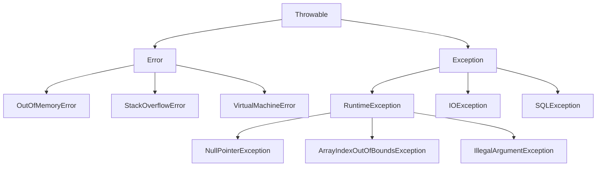

#### 异常处理最佳实践
```java
/**
 * 异常处理最佳实践
 * 1. 具体异常具体处理
 * 2. 不要忽略异常
 * 3. 合理使用自定义异常
 * 4. 资源管理使用try-with-resources
 */
public class ExceptionHandlingExample {
    
    // 自定义异常
    public static class BusinessException extends Exception {
        private String errorCode;
        
        public BusinessException(String errorCode, String message) {
            super(message);
            this.errorCode = errorCode;
        }
        
        public String getErrorCode() {
            return errorCode;
        }
    }
    
    /**
     * 异常处理示例
     */
    public void handleExceptions() {
        try {
            // 可能抛出异常的代码
            processData();
        } catch (BusinessException e) {
            // 处理业务异常
            System.err.println("业务异常：" + e.getErrorCode() + " - " + e.getMessage());
            // 记录日志
            logError(e);
        } catch (IOException e) {
            // 处理IO异常
            System.err.println("IO异常：" + e.getMessage());
            // 重试机制
            retryOperation();
        } catch (Exception e) {
            // 处理其他异常
            System.err.println("未知异常：" + e.getMessage());
            e.printStackTrace();
        } finally {
            // 清理资源
            cleanup();
        }
    }
    
    /**
     * try-with-resources 自动资源管理
     */
    public void resourceManagement() {
        // 自动关闭资源
        try (FileInputStream fis = new FileInputStream("file.txt");
             BufferedReader reader = new BufferedReader(new InputStreamReader(fis))) {
            
            String line;
            while ((line = reader.readLine()) != null) {
                System.out.println(line);
            }
        } catch (IOException e) {
            System.err.println("文件读取异常：" + e.getMessage());
        }
        // 资源会自动关闭，无需手动调用close()
    }
    
    /**
     * 异常链和异常转换
     */
    public void processData() throws BusinessException {
        try {
            // 底层操作
            lowLevelOperation();
        } catch (SQLException e) {
            // 异常转换：将底层异常转换为业务异常
            throw new BusinessException("DB_ERROR", "数据库操作失败", e);
        }
    }
    
    /**
     * 异常处理的性能考虑
     */
    public void performanceConsiderations() {
        // 避免在循环中使用异常控制流程
        List<String> numbers = Arrays.asList("1", "2", "abc", "4");
        
        // 错误做法：使用异常控制流程
        for (String num : numbers) {
            try {
                int value = Integer.parseInt(num);
                System.out.println(value);
            } catch (NumberFormatException e) {
                // 异常处理开销大
                continue;
            }
        }
        
        // 正确做法：预先验证
        for (String num : numbers) {
            if (num.matches("\\d+")) {
                int value = Integer.parseInt(num);
                System.out.println(value);
            }
        }
    }
}
```

### 字符串处理

字符串是Java中最常用的数据类型，理解其内部机制对性能优化至关重要。

```java
/**
 * 字符串类型对比
 * String：不可变、线程安全、适合少量操作
 * StringBuilder：可变、非线程安全、适合单线程大量操作
 * StringBuffer：可变、线程安全、适合多线程大量操作
 */
public class StringComparisonExample {
    
    /**
     * 性能对比测试
     */
    public void performanceComparison() {
        int iterations = 10000;
        
        // String 拼接（性能最差）
        long startTime = System.currentTimeMillis();
        String str = "";
        for (int i = 0; i < iterations; i++) {
            str += "a";  // 每次都创建新对象
        }
        long stringTime = System.currentTimeMillis() - startTime;
        
        // StringBuilder 拼接（性能最好）
        startTime = System.currentTimeMillis();
        StringBuilder sb = new StringBuilder();
        for (int i = 0; i < iterations; i++) {
            sb.append("a");
        }
        String sbResult = sb.toString();
        long sbTime = System.currentTimeMillis() - startTime;
        
        // StringBuffer 拼接（性能中等）
        startTime = System.currentTimeMillis();
        StringBuffer sbf = new StringBuffer();
        for (int i = 0; i < iterations; i++) {
            sbf.append("a");
        }
        String sbfResult = sbf.toString();
        long sbfTime = System.currentTimeMillis() - startTime;
        
        System.out.println("String拼接耗时：" + stringTime + "ms");
        System.out.println("StringBuilder拼接耗时：" + sbTime + "ms");
        System.out.println("StringBuffer拼接耗时：" + sbfTime + "ms");
    }
    
    /**
     * 字符串常量池示例
     */
    public void stringPoolExample() {
        // 字面量创建，存储在常量池
        String s1 = "hello";
        String s2 = "hello";
        System.out.println(s1 == s2);  // true，指向同一对象
        
        // new创建，在堆中创建新对象
        String s3 = new String("hello");
        System.out.println(s1 == s3);  // false，不同对象
        System.out.println(s1.equals(s3));  // true，内容相同
        
        // intern()方法：将字符串加入常量池
        String s4 = s3.intern();
        System.out.println(s1 == s4);  // true，指向常量池中的对象
    }
    
    /**
     * 字符串处理最佳实践
     */
    public void stringBestPractices() {
        // 1. 使用StringBuilder进行大量字符串操作
        StringBuilder result = new StringBuilder();
        for (int i = 0; i < 1000; i++) {
            result.append("item").append(i).append(",");
        }
        
        // 2. 预估容量避免扩容
        StringBuilder sb = new StringBuilder(1000);  // 预设容量
        
        // 3. 使用String.format格式化
        String formatted = String.format("用户%s的年龄是%d岁", "张三", 25);
        
        // 4. 字符串分割优化
        String data = "a,b,c,d,e";
        String[] parts = data.split(",");  // 简单分割
        
        // 对于固定分隔符，使用StringTokenizer更高效
        StringTokenizer tokenizer = new StringTokenizer(data, ",");
        while (tokenizer.hasMoreTokens()) {
            String token = tokenizer.nextToken();
            // 处理token
        }
        
        // 5. 字符串比较
        String input = getUserInput();
        if ("admin".equals(input)) {  // 常量在前，避免NullPointerException
            // 处理管理员逻辑
        }
    }
}
```

### 泛型机制

泛型提供了**编译时类型安全**检查，避免了类型转换异常。

#### 泛型基础使用
```java
/**
 * 泛型使用示例
 * 优点：类型安全、消除类型转换、提高代码可读性
 */
public class GenericExample {
    
    /**
     * 泛型类定义
     */
    public static class Container<T> {
        private T item;
        
        public void setItem(T item) {
            this.item = item;
        }
        
        public T getItem() {
            return item;
        }
        
        // 泛型方法
        public <U> void processItem(U processor) {
            System.out.println("处理项目：" + processor);
        }
    }
    
    /**
     * 泛型接口
     */
    public interface Processor<T> {
        void process(T item);
        T transform(T input);
    }
    
    /**
     * 泛型方法示例
     */
    public static <T> void swap(T[] array, int i, int j) {
        T temp = array[i];
        array[i] = array[j];
        array[j] = temp;
    }
    
    /**
     * 通配符使用
     */
    public void wildcardExample() {
        // 上界通配符：? extends T
        List<? extends Number> numbers = new ArrayList<Integer>();
        // numbers.add(1);  // 编译错误，不能添加元素
        Number num = numbers.get(0);  // 可以读取
        
        // 下界通配符：? super T
        List<? super Integer> integers = new ArrayList<Number>();
        integers.add(1);  // 可以添加Integer及其子类
        // Integer value = integers.get(0);  // 编译错误，不能确定类型
        
        // 无界通配符：?
        List<?> unknowns = new ArrayList<String>();
        Object obj = unknowns.get(0);  // 只能当作Object处理
    }
    
    /**
     * 泛型擦除示例
     */
    public void typeErasureExample() {
        List<String> stringList = new ArrayList<>();
        List<Integer> intList = new ArrayList<>();
        
        // 运行时类型相同，都是ArrayList
        System.out.println(stringList.getClass() == intList.getClass());  // true
        
        // 获取泛型信息需要通过反射
        Type stringListType = new TypeToken<List<String>>(){}.getType();
        Type intListType = new TypeToken<List<Integer>>(){}.getType();
        System.out.println(stringListType.equals(intListType));  // false
    }
}
```

### 枚举类型

枚举是Java中的特殊类型，提供了**类型安全的常量定义**方式。

#### 枚举高级用法
```java
/**
 * 枚举高级用法示例
 * 特点：类型安全、可扩展、支持方法和字段
 */
public enum OrderStatus {
    // 枚举常量定义
    PENDING("待处理", 1) {
        @Override
        public boolean canTransitionTo(OrderStatus newStatus) {
            return newStatus == PROCESSING || newStatus == CANCELLED;
        }
    },
    
    PROCESSING("处理中", 2) {
        @Override
        public boolean canTransitionTo(OrderStatus newStatus) {
            return newStatus == COMPLETED || newStatus == CANCELLED;
        }
    },
    
    COMPLETED("已完成", 3) {
        @Override
        public boolean canTransitionTo(OrderStatus newStatus) {
            return false;  // 完成状态不能转换
        }
    },
    
    CANCELLED("已取消", -1) {
        @Override
        public boolean canTransitionTo(OrderStatus newStatus) {
            return false;  // 取消状态不能转换
        }
    };
    
    // 枚举字段
    private final String description;
    private final int code;
    
    // 枚举构造方法
    OrderStatus(String description, int code) {
        this.description = description;
        this.code = code;
    }
    
    // 抽象方法，每个枚举常量必须实现
    public abstract boolean canTransitionTo(OrderStatus newStatus);
    
    // 普通方法
    public String getDescription() {
        return description;
    }
    
    public int getCode() {
        return code;
    }
    
    // 静态方法
    public static OrderStatus fromCode(int code) {
        for (OrderStatus status : values()) {
            if (status.code == code) {
                return status;
            }
        }
        throw new IllegalArgumentException("无效的状态码：" + code);
    }
    
    // 枚举在switch中的使用
    public String getNextAction() {
        switch (this) {
            case PENDING:
                return "开始处理";
            case PROCESSING:
                return "完成处理";
            case COMPLETED:
                return "无需操作";
            case CANCELLED:
                return "无需操作";
            default:
                return "未知操作";
        }
    }
}

/**
 * 枚举使用示例
 */
public class EnumUsageExample {
    public static void main(String[] args) {
        // 基本使用
        OrderStatus status = OrderStatus.PENDING;
        System.out.println("状态：" + status.getDescription());
        System.out.println("代码：" + status.getCode());
        
        // 状态转换检查
        if (status.canTransitionTo(OrderStatus.PROCESSING)) {
            System.out.println("可以转换到处理中状态");
        }
        
        // 遍历所有枚举值
        System.out.println("所有订单状态：");
        for (OrderStatus s : OrderStatus.values()) {
            System.out.println(s.name() + " - " + s.getDescription());
        }
        
        // 从字符串创建枚举
        OrderStatus fromString = OrderStatus.valueOf("COMPLETED");
        
        // 从代码创建枚举
        OrderStatus fromCode = OrderStatus.fromCode(2);
        
        // 在集合中使用
        EnumSet<OrderStatus> activeStatuses = EnumSet.of(
            OrderStatus.PENDING, 
            OrderStatus.PROCESSING
        );
        
        EnumMap<OrderStatus, String> statusMessages = new EnumMap<>(OrderStatus.class);
        statusMessages.put(OrderStatus.PENDING, "订单等待处理");
        statusMessages.put(OrderStatus.PROCESSING, "订单正在处理");
    }
}
```

## JVM 核心机制

### 类加载机制详解

类加载是 Java 程序运行的第一步，它的过程如下：

```mermaid
flowchart TD
    subgraph "📂 类加载机制流程" ["类加载机制流程"]
        Start["类加载启动"] -->|"触发条件: new/反射/首次使用静态成员"| LoadPhase["📥 加载阶段"]
        
        LoadPhase -->|"获取二进制数据+生成Class对象+方法区存储"| VerifyPhase["🔍 验证阶段"]
        
        VerifyPhase -->|"文件格式/元数据/字节码/符号引用验证"| PreparePhase["🛠️ 准备阶段"]
        
        PreparePhase -->|"静态变量分配内存+设置默认初始值+final常量直接赋值"| ResolvePhase["🔗 解析阶段"]
        
        ResolvePhase -->|"符号引用→直接引用+解析类/接口/字段/方法"| InitPhase["🚀 初始化阶段"]
        
        InitPhase -->|"执行<clinit>方法+静态变量赋值+静态代码块执行"| Complete["类加载完成"]
    end
    
    %% 样式设置
    style Start fill:#E3F2FD,stroke:#1976D2,stroke-width:2px
    style LoadPhase fill:#F3E5F5,stroke:#7B1FA2,stroke-width:2px
    style VerifyPhase fill:#FFF3E0,stroke:#F57C00,stroke-width:2px
    style PreparePhase fill:#E8F5E8,stroke:#388E3C,stroke-width:2px
    style ResolvePhase fill:#FCE4EC,stroke:#C2185B,stroke-width:2px
    style InitPhase fill:#E0F2F1,stroke:#00695C,stroke-width:2px
    style Complete fill:#FFEBEE,stroke:#D32F2F,stroke-width:2px
```

#### 分代收集算法

分代收集算法（Generational Collection）是基于对象生命周期的统计规律，将堆内存划分为新生代和老年代，采用不同算法针对不同代的对象。

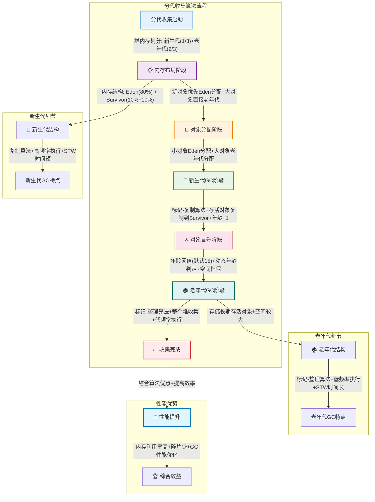

#### 详细说明

1. **加载阶段**
   ```java
   public class ClassLoadingExample {
       // 自定义类加载器示例
       public class CustomClassLoader extends ClassLoader {
           @Override
           protected Class<?> findClass(String name) throws ClassNotFoundException {
               // 1. 加载类文件
               byte[] classData = loadClassData(name);
               // 2. 生成Class对象
               return defineClass(name, classData, 0, classData.length);
           }
           
           private byte[] loadClassData(String name) {
               // 实现从不同来源加载类文件的逻辑
               // 可以是文件系统、网络、数据库等
               return null;
           }
       }
   }
   ```

2. **验证阶段**
   - 文件格式验证：魔数检查、版本号检查
   - 元数据验证：类是否有父类、是否实现了接口等
   - 字节码验证：方法体验证、栈帧数据流验证
   - 符号引用验证：符号引用转直接引用的准备

3. **准备阶段**
   ```java
   public class PrepareExample {
       // 准备阶段为静态变量分配内存并设置默认值
       private static int value = 123;  // 准备阶段设置为0，初始化阶段才设置为123
       private static final int CONSTANT = 456;  // 准备阶段直接设置为456
   }
   ```

4. **解析阶段**
   ```java
   public class ResolutionExample {
       private static class Parent {}
       private static class Child extends Parent {}
       
       public static void main(String[] args) {
           // 类解析
           Parent p = new Child();
           // 方法解析
           p.toString();
           // 字段解析
           System.out.println(Child.class.getModifiers());
       }
   }
   ```

5. **初始化阶段**
   ```java
   public class InitializationExample {
       // 静态变量
       private static int staticVar = 100;
       
       // 静态代码块
       static {
           System.out.println("静态代码块执行");
           staticVar = 200;
       }
       
       // 类构造器
       public InitializationExample() {
           System.out.println("构造器执行");
       }
   }
   ```

### JVM 内存模型详解

JVM 内存模型是 Java 运行时的核心，它的结构如下：

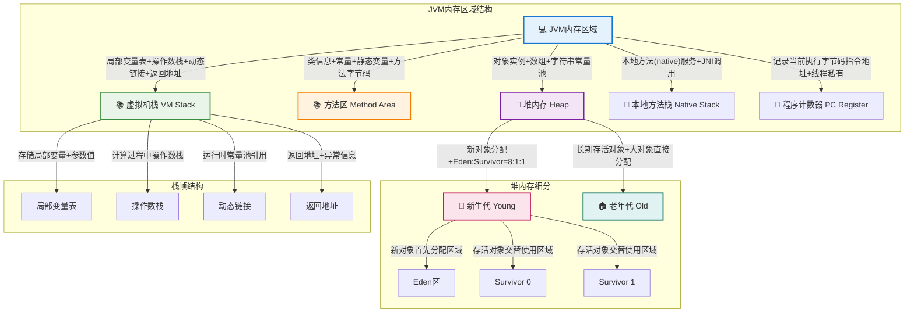

#### 内存区域详细说明

1. **堆（Heap）**
   ```java
   public class HeapExample {
       public void heapAllocation() {
           // 对象分配在堆上
           Object obj = new Object();
           
           // 数组也分配在堆上
           int[] array = new int[1000];
           
           // 字符串常量池在堆中
           String str = new String("hello");  // 在堆中创建对象
           String intern = str.intern();      // 尝试在常量池中查找或创建
       }
   }
   ```

2. **方法区（Method Area）**
   ```java
   public class MethodAreaExample {
       // 静态变量存储在方法区
       private static final String CONSTANT = "常量";
       private static String staticVar = "静态变量";
       
       // 类信息存储在方法区
       static class InnerClass {
           public void method() {}
       }
   }
   ```

3. **虚拟机栈（VM Stack）**
   ```java
   public class StackExample {
       public void stackFrameDemo(int param) {
           // 局部变量存储在栈帧中
           int localVar = param + 1;
           
           // 方法调用会创建新的栈帧
           anotherMethod();
           
           // 基本类型的局部变量直接存储在栈中
           int a = 1;
           long b = 2L;
           
           // 引用类型的变量引用存储在栈中，对象存储在堆中
           Object obj = new Object();
       }
       
       private void anotherMethod() {
           // 新的栈帧
           int anotherLocal = 100;
       }
   }
   ```

### 锁机制详解
```java
/**
 * 锁的类型
 * 1. synchronized：内置锁
 * 2. ReentrantLock：可重入锁
 * 3. ReadWriteLock：读写锁
 * 4. StampedLock：邮戳锁
 */

public class LockExample {
    // ReentrantLock 示例
    private final ReentrantLock lock = new ReentrantLock(true); // 公平锁
    
    public void reentrantLockExample() {
        lock.lock();
        try {
            // 临界区代码
        } finally {
            lock.unlock();
        }
    }
    
    // ReadWriteLock 示例
    private final ReadWriteLock rwLock = new ReentrantReadWriteLock();
    private final Lock readLock = rwLock.readLock();
    private final Lock writeLock = rwLock.writeLock();
    
    public void readWriteLockExample() {
        readLock.lock();
        try {
            // 读操作
        } finally {
            readLock.unlock();
        }
        
        writeLock.lock();
        try {
            // 写操作
        } finally {
            writeLock.unlock();
        }
    }
    
    // StampedLock 示例
    private final StampedLock stampedLock = new StampedLock();
    
    public void stampedLockExample() {
        long stamp = stampedLock.tryOptimisticRead(); // 乐观读
        // 读取共享变量
        if (!stampedLock.validate(stamp)) { // 检查期间是否有写操作
            stamp = stampedLock.readLock(); // 获取悲观读锁
            try {
                // 读取共享变量
            } finally {
                stampedLock.unlockRead(stamp);
            }
        }
    }
}
```

### 并发容器

#### ConcurrentHashMap实现原理与机制

**ConcurrentHashMap发展历程**

ConcurrentHashMap在不同JDK版本中有重要的架构变化：

| JDK版本 | 实现方式 | 并发度控制 | 锁粒度 |
|---------|----------|------------|--------|
| **JDK 1.7** | 分段锁(Segment) | 16个Segment | 一个Segment一把锁 |
| **JDK 1.8** | CAS + synchronized | 数组长度 | 单个数组元素一把锁 |

**JDK 1.8 ConcurrentHashMap内部结构**

```java
public class ConcurrentHashMap<K,V> extends AbstractMap<K,V>
    implements ConcurrentMap<K,V>, Serializable {
    
    // 存储数据的数组
    transient volatile Node<K,V>[] table;
    
    // 扩容时的临时数组
    private transient volatile Node<K,V>[] nextTable;
    
    // 控制table的初始化和扩容
    // -1: 表示正在初始化
    // -N: 表示有N-1个线程正在扩容
    // 0: 默认值，后续会被更新为n*0.75
    // >0: 下次扩容的阈值
    private transient volatile int sizeCtl;
    
    // 节点类型标识
    static final int MOVED = -1;     // ForwardingNode节点
    static final int TREEBIN = -2;   // TreeBin节点
    static final int RESERVED = -3;  // ReservationNode节点
    
    // 普通节点
    static class Node<K,V> implements Map.Entry<K,V> {
        final int hash;
        final K key;
        volatile V val;
        volatile Node<K,V> next;
    }
    
    // 树形节点
    static final class TreeBin<K,V> extends Node<K,V> {
        TreeNode<K,V> root;
        volatile TreeNode<K,V> first;
        volatile Thread waiter;
        volatile int lockState;
    }
}
```

**ConcurrentHashMap存储结构图**

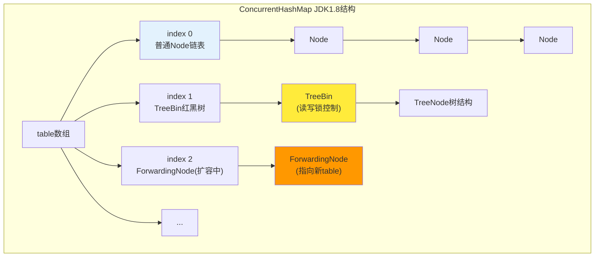

**ConcurrentHashMap的put操作详解**

```java
final V putVal(K key, V value, boolean onlyIfAbsent) {
    if (key == null || value == null) throw new NullPointerException();
    
    int hash = spread(key.hashCode());  // 重新计算hash
    int binCount = 0;
    
    for (Node<K,V>[] tab = table;;) {
        Node<K,V> f; int n, i, fh;
        
        // 1. 如果table未初始化，先初始化
        if (tab == null || (n = tab.length) == 0)
            tab = initTable();
            
        // 2. 如果目标位置为空，使用CAS直接插入
        else if ((f = tabAt(tab, i = (n - 1) & hash)) == null) {
            if (casTabAt(tab, i, null, new Node<K,V>(hash, key, value, null)))
                break;  // 插入成功，退出循环
        }
        
        // 3. 如果正在扩容，协助扩容
        else if ((fh = f.hash) == MOVED)
            tab = helpTransfer(tab, f);
            
        // 4. 对链表或红黑树进行synchronized操作
        else {
            V oldVal = null;
            synchronized (f) {  // 锁定头节点
                if (tabAt(tab, i) == f) {  // 双重检查
                    if (fh >= 0) {  // 链表节点
                        binCount = 1;
                        for (Node<K,V> e = f;; ++binCount) {
                            K ek;
                            if (e.hash == hash &&
                                ((ek = e.key) == key || (ek != null && key.equals(ek)))) {
                                oldVal = e.val;
                                if (!onlyIfAbsent)
                                    e.val = value;
                                break;
                            }
                            Node<K,V> pred = e;
                            if ((e = e.next) == null) {
                                pred.next = new Node<K,V>(hash, key, value, null);
                                break;
                            }
                        }
                    }
                    else if (f instanceof TreeBin) {  // 红黑树节点
                        Node<K,V> p;
                        binCount = 2;
                        if ((p = ((TreeBin<K,V>)f).putTreeVal(hash, key, value)) != null) {
                            oldVal = p.val;
                            if (!onlyIfAbsent)
                                p.val = value;
                        }
                    }
                }
            }
            
            // 5. 检查是否需要树化
            if (binCount != 0) {
                if (binCount >= TREEIFY_THRESHOLD)
                    treeifyBin(tab, i);
                if (oldVal != null)
                    return oldVal;
                break;
            }
        }
    }
    
    // 6. 增加size计数，检查是否需要扩容
    addCount(1L, binCount);
    return null;
}
```

**ConcurrentHashMap扩容机制(transfer)**

扩容是ConcurrentHashMap最复杂的操作，采用**多线程协作**方式：

```java
private final void transfer(Node<K,V>[] tab, Node<K,V>[] nextTab) {
    int n = tab.length, stride;
    
    // 计算每个线程处理的桶数量
    if ((stride = (NCPU > 1) ? (n >>> 3) / NCPU : n) < MIN_TRANSFER_STRIDE)
        stride = MIN_TRANSFER_STRIDE;
        
    // 初始化新数组
    if (nextTab == null) {
        try {
            @SuppressWarnings("unchecked")
            Node<K,V>[] nt = (Node<K,V>[])new Node<?,?>[n << 1];  // 扩容2倍
            nextTab = nt;
        } catch (Throwable ex) {
            sizeCtl = Integer.MAX_VALUE;
            return;
        }
        nextTable = nextTab;
        transferIndex = n;  // 从后往前迁移
    }
    
    int nextn = nextTab.length;
    ForwardingNode<K,V> fwd = new ForwardingNode<K,V>(nextTab);
    boolean advance = true;
    boolean finishing = false;
    
    // 多线程协作迁移数据
    for (int i = 0, bound = 0;;) {
        Node<K,V> f; int fh;
        
        // 获取下一个需要处理的桶
        while (advance) {
            int nextIndex, nextBound;
            if (--i >= bound || finishing)
                advance = false;
            else if ((nextIndex = transferIndex) <= 0) {
                i = -1;
                advance = false;
            }
            else if (U.compareAndSwapInt(this, TRANSFERINDEX, nextIndex,
                                         nextBound = (nextIndex > stride ?
                                                     nextIndex - stride : 0))) {
                bound = nextBound;
                i = nextIndex - 1;
                advance = false;
            }
        }
        
        // 处理当前桶
        if ((f = tabAt(tab, i)) == null)
            advance = casTabAt(tab, i, null, fwd);  // 空桶直接放ForwardingNode
        else if ((fh = f.hash) == MOVED)
            advance = true;  // 已经被其他线程处理
        else {
            synchronized (f) {  // 锁定旧桶
                if (tabAt(tab, i) == f) {
                    Node<K,V> ln, hn;
                    if (fh >= 0) {
                        // 链表迁移：分为低位链和高位链
                        int runBit = fh & n;
                        Node<K,V> lastRun = f;
                        for (Node<K,V> p = f.next; p != null; p = p.next) {
                            int b = p.hash & n;
                            if (b != runBit) {
                                runBit = b;
                                lastRun = p;
                            }
                        }
                        if (runBit == 0) {
                            ln = lastRun;
                            hn = null;
                        } else {
                            hn = lastRun;
                            ln = null;
                        }
                        for (Node<K,V> p = f; p != lastRun; p = p.next) {
                            int ph = p.hash; K pk = p.key; V pv = p.val;
                            if ((ph & n) == 0)
                                ln = new Node<K,V>(ph, pk, pv, ln);
                            else
                                hn = new Node<K,V>(ph, pk, pv, hn);
                        }
                        setTabAt(nextTab, i, ln);
                        setTabAt(nextTab, i + n, hn);
                        setTabAt(tab, i, fwd);
                        advance = true;
                    }
                    else if (f instanceof TreeBin) {
                        // 红黑树迁移
                        TreeBin<K,V> t = (TreeBin<K,V>)f;
                        TreeNode<K,V> lo = null, loTail = null;
                        TreeNode<K,V> hi = null, hiTail = null;
                        // ... 树的分离逻辑
                    }
                }
            }
        }
    }
}
```

**ConcurrentHashMap的size计算**

由于并发特性，ConcurrentHashMap使用**分段计数**方式：

```java
// 使用CounterCell数组分散计数，减少竞争
@sun.misc.Contended static final class CounterCell {
    volatile long value;
    CounterCell(long x) { value = x; }
}

private transient volatile CounterCell[] counterCells;
private transient volatile long baseCount;

// 获取当前大小
public int size() {
    long n = sumCount();
    return ((n < 0L) ? 0 : (n > (long)Integer.MAX_VALUE) ? Integer.MAX_VALUE : (int)n);
}

final long sumCount() {
    CounterCell[] as = counterCells; CounterCell a;
    long sum = baseCount;
    if (as != null) {
        for (int i = 0; i < as.length; ++i) {
            if ((a = as[i]) != null)
                sum += a.value;
        }
    }
    return sum;
}
```

**ConcurrentHashMap并发控制机制总结**

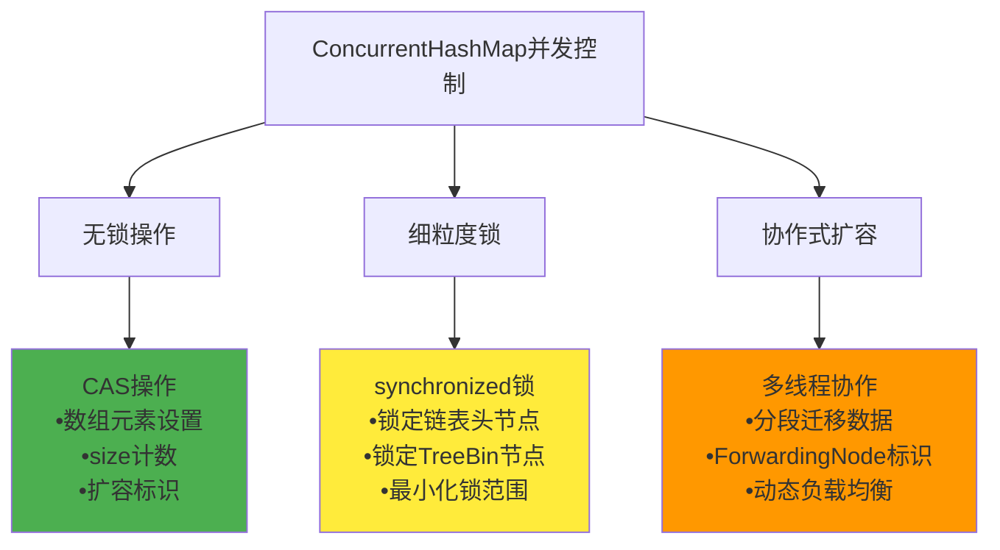

**ConcurrentHashMap性能优势分析**

| 特性 | HashMap | ConcurrentHashMap | 说明 |
|------|---------|------------------|------|
| **线程安全** | 否 | 是 | ConcurrentHashMap支持并发读写 |
| **锁粒度** | 无锁 | 桶级别锁 | 只锁定操作的具体桶位置 |
| **读操作** | 无锁 | 无锁 | 读操作完全无锁，性能接近HashMap |
| **写操作** | 无锁 | CAS+synchronized | 冲突时才使用锁 |
| **扩容** | 单线程 | 多线程协作 | 多线程并行迁移，扩容更快 |
| **内存占用** | 较少 | 较多 | 额外的并发控制结构开销 |

```java
/**
 * 其他并发容器示例
 */
public class OtherConcurrentContainers {
    
    // CopyOnWriteArrayList：写时复制的ArrayList
    private CopyOnWriteArrayList<String> cowList = new CopyOnWriteArrayList<>();
    
    public void copyOnWriteDemo() {
        // 读操作无锁，写操作复制整个数组
        cowList.add("item1");  // 会复制数组
        
        // 适用场景：读多写少
        for (String item : cowList) {  // 遍历时不会被写操作影响
            System.out.println(item);
        }
    }
    
    // BlockingQueue：阻塞队列
    private BlockingQueue<Task> taskQueue = new LinkedBlockingQueue<>(100);
    
    public void blockingQueueOperations() {
        // 生产者
        try {
            taskQueue.put(new Task());  // 阻塞直到有空间
        } catch (InterruptedException e) {
            Thread.currentThread().interrupt();
        }
        
        // 消费者
        try {
            Task task = taskQueue.take();  // 阻塞直到有元素
            processTask(task);
        } catch (InterruptedException e) {
            Thread.currentThread().interrupt();
        }
    }
    
    // ConcurrentSkipListMap：跳表实现的有序映射
    private ConcurrentSkipListMap<String, Integer> skipListMap = new ConcurrentSkipListMap<>();
    
    public void skipListMapDemo() {
        skipListMap.put("key1", 1);
        skipListMap.put("key2", 2);
        
        // 支持高效的范围查询
        NavigableMap<String, Integer> subMap = skipListMap.subMap("key1", true, "key2", false);
    }
}
```
### 原子操作类
```java
/**
 * 原子类型
 * 1. AtomicInteger/Long/Boolean：基本类型原子类
 * 2. AtomicReference：引用类型原子类
 * 3. AtomicIntegerArray：数组元素原子操作
 * 4. AtomicIntegerFieldUpdater：对象字段原子更新
 */

public class AtomicExample {
    // AtomicInteger 示例
    private AtomicInteger counter = new AtomicInteger(0);
    
    public void atomicOperations() {
        // 原子递增
        counter.incrementAndGet();
        // CAS操作
        counter.compareAndSet(1, 2);
        // 原子更新
        counter.updateAndGet(x -> x * 2);
    }
    
    // AtomicReference 示例
    private AtomicReference<User> userRef = new AtomicReference<>();
    
    public void atomicReferenceOperations() {
        User user = new User("John");
        userRef.set(user);
        
        // CAS更新
        User oldUser = userRef.get();
        User newUser = new User("Jane");
        userRef.compareAndSet(oldUser, newUser);
    }
}
```

## 集合框架

### 集合框架概览

Java 集合框架的整体结构如下：

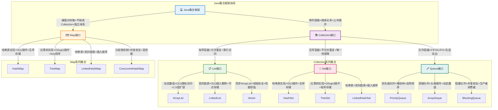

### List集合

#### ArrayList实现原理与机制

**内部数据结构**

ArrayList基于**动态数组**实现，其核心是一个Object数组，通过数组下标进行元素访问。

```java
public class ArrayList<E> extends AbstractList<E> 
    implements List<E>, RandomAccess, Cloneable, java.io.Serializable {
    
    // 默认初始容量
    private static final int DEFAULT_CAPACITY = 10;
    
    // 空数组实例，用于空构造函数
    private static final Object[] EMPTY_ELEMENTDATA = {};
    
    // 默认大小的空数组实例
    private static final Object[] DEFAULTCAPACITY_EMPTY_ELEMENTDATA = {};
    
    // 存储ArrayList元素的数组缓冲区
    transient Object[] elementData;
    
    // ArrayList中元素的数量
    private int size;
    
    // 数组可分配的最大大小
    private static final int MAX_ARRAY_SIZE = Integer.MAX_VALUE - 8;
}
```

**ArrayList扩容机制详解**

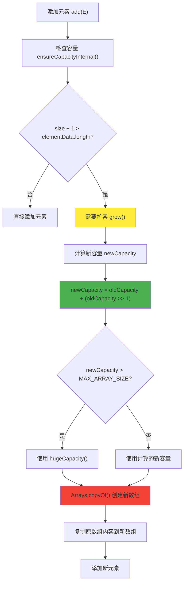

**扩容关键代码实现**：

```java
// 确保内部容量
private void ensureCapacityInternal(int minCapacity) {
    ensureExplicitCapacity(calculateCapacity(elementData, minCapacity));
}

// 计算容量
private static int calculateCapacity(Object[] elementData, int minCapacity) {
    // 如果是默认空数组，返回默认容量和最小容量的较大值
    if (elementData == DEFAULTCAPACITY_EMPTY_ELEMENTDATA) {
        return Math.max(DEFAULT_CAPACITY, minCapacity);
    }
    return minCapacity;
}

// 核心扩容方法
private void grow(int minCapacity) {
    int oldCapacity = elementData.length;
    
    // 新容量 = 原容量 + 原容量/2 (即1.5倍扩容)
    int newCapacity = oldCapacity + (oldCapacity >> 1);
    
    // 如果计算的新容量小于最小需要容量，使用最小需要容量
    if (newCapacity - minCapacity < 0)
        newCapacity = minCapacity;
        
    // 如果新容量大于最大数组大小，进行边界处理
    if (newCapacity - MAX_ARRAY_SIZE > 0)
        newCapacity = hugeCapacity(minCapacity);
        
    // 创建新数组并复制原数组内容
    elementData = Arrays.copyOf(elementData, newCapacity);
}

// 超大容量处理
private static int hugeCapacity(int minCapacity) {
    if (minCapacity < 0) // overflow
        throw new OutOfMemoryError();
    return (minCapacity > MAX_ARRAY_SIZE) ?
        Integer.MAX_VALUE :
        MAX_ARRAY_SIZE;
}
```

**ArrayList添加元素的完整流程**：

```java
// 添加元素到末尾
public boolean add(E e) {
    ensureCapacityInternal(size + 1);  // 确保容量足够
    elementData[size++] = e;           // 在末尾添加元素
    return true;
}

// 在指定位置添加元素
public void add(int index, E element) {
    rangeCheckForAdd(index);           // 检查索引边界
    
    ensureCapacityInternal(size + 1);  // 确保容量足够
    
    // 将index之后的元素后移一位
    System.arraycopy(elementData, index, elementData, index + 1, size - index);
    elementData[index] = element;      // 插入新元素
    size++;
}
```

**ArrayList删除元素机制**：

```java
// 删除指定位置的元素
public E remove(int index) {
    rangeCheck(index);                 // 检查边界
    
    modCount++;                        // 修改计数器++
    E oldValue = (E) elementData[index]; // 获取被删除的元素
    
    int numMoved = size - index - 1;   // 计算需要移动的元素数量
    if (numMoved > 0)
        // 将index+1之后的元素前移一位
        System.arraycopy(elementData, index+1, elementData, index, numMoved);
        
    elementData[--size] = null;        // 清除最后一个元素引用，GC
    
    return oldValue;
}
```

**ArrayList性能特点分析**：

| 操作 | 时间复杂度 | 空间复杂度 | 说明 |
|------|------------|------------|------|
| **get(index)** | O(1) | O(1) | 直接数组下标访问 |
| **add(element)** | O(1)均摊 | O(1) | 末尾添加，可能触发扩容 |
| **add(index, element)** | O(n) | O(1) | 需要移动后续元素 |
| **remove(index)** | O(n) | O(1) | 需要移动后续元素 |
| **contains(element)** | O(n) | O(1) | 需要遍历查找 |
| **扩容操作** | O(n) | O(n) | 创建新数组并复制 |

#### LinkedList实现原理与机制

**内部数据结构**

LinkedList基于**双向链表**实现，每个节点包含数据、前驱指针和后继指针。

```java
public class LinkedList<E> extends AbstractSequentialList<E>
    implements List<E>, Deque<E>, Cloneable, java.io.Serializable {
    
    transient int size = 0;        // 链表大小
    transient Node<E> first;       // 头节点
    transient Node<E> last;        // 尾节点
    
    // 双向链表节点结构
    private static class Node<E> {
        E item;           // 存储的数据
        Node<E> next;     // 指向下一个节点
        Node<E> prev;     // 指向上一个节点
        
        Node(Node<E> prev, E element, Node<E> next) {
            this.item = element;
            this.next = next;
            this.prev = prev;
        }
    }
}
```

**LinkedList双向链表结构图**：

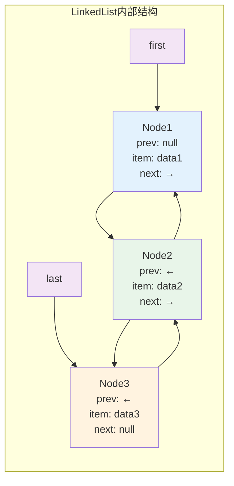

**LinkedList添加元素实现**：

```java
// 在链表末尾添加元素
public boolean add(E e) {
    linkLast(e);
    return true;
}

// 在末尾添加节点的核心方法
void linkLast(E e) {
    final Node<E> l = last;                    // 保存当前尾节点
    final Node<E> newNode = new Node<>(l, e, null); // 创建新节点
    last = newNode;                            // 新节点成为尾节点
    
    if (l == null)                             // 链表为空
        first = newNode;
    else
        l.next = newNode;                      // 原尾节点指向新节点
    
    size++;
    modCount++;
}

// 在指定位置插入元素
public void add(int index, E element) {
    checkPositionIndex(index);                 // 检查索引
    
    if (index == size)
        linkLast(element);                     // 在末尾插入
    else
        linkBefore(element, node(index));      // 在中间插入
}

// 在指定节点前插入新节点
void linkBefore(E e, Node<E> succ) {
    final Node<E> pred = succ.prev;           // 获取前驱节点
    final Node<E> newNode = new Node<>(pred, e, succ); // 创建新节点
    succ.prev = newNode;                      // 后继节点指向新节点
    
    if (pred == null)
        first = newNode;                      // 插入到头部
    else
        pred.next = newNode;                  // 前驱节点指向新节点
        
    size++;
    modCount++;
}
```

**LinkedList查找元素机制**：

```java
// 根据索引获取节点（二分查找优化）
Node<E> node(int index) {
    // 二分查找优化：从前半部分或后半部分开始遍历
    if (index < (size >> 1)) {
        Node<E> x = first;
        for (int i = 0; i < index; i++)
            x = x.next;
        return x;
    } else {
        Node<E> x = last;
        for (int i = size - 1; i > index; i--)
            x = x.prev;
        return x;
    }
}

// 获取指定位置的元素
public E get(int index) {
    checkElementIndex(index);
    return node(index).item;
}
```

**LinkedList删除元素实现**：

```java
// 删除指定位置的元素
public E remove(int index) {
    checkElementIndex(index);
    return unlink(node(index));
}

// 删除指定节点
E unlink(Node<E> x) {
    final E element = x.item;
    final Node<E> next = x.next;
    final Node<E> prev = x.prev;
    
    // 处理前驱节点
    if (prev == null) {
        first = next;
    } else {
        prev.next = next;
        x.prev = null;                        // 断开引用，帮助GC
    }
    
    // 处理后继节点
    if (next == null) {
        last = prev;
    } else {
        next.prev = prev;
        x.next = null;                        // 断开引用，帮助GC
    }
    
    x.item = null;                            // 清除数据引用
    size--;
    modCount++;
    return element;
}
```

**LinkedList作为队列和栈的实现**：

```java
// 队列操作（FIFO）
public boolean offer(E e) {
    return add(e);                            // 在末尾添加
}

public E poll() {
    final Node<E> f = first;
    return (f == null) ? null : unlinkFirst(f); // 从头部移除
}

public E peek() {
    final Node<E> f = first;
    return (f == null) ? null : f.item;       // 查看头部元素
}

// 栈操作（LIFO）
public void push(E e) {
    addFirst(e);                              // 在头部添加
}

public E pop() {
    return removeFirst();                     // 从头部移除
}

// 双端队列操作
public void addFirst(E e) {
    linkFirst(e);
}

public void addLast(E e) {
    linkLast(e);
}
```

**ArrayList vs LinkedList性能对比**：

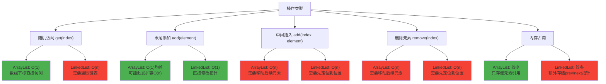

#### 线程安全的List实现
```java
public class ThreadSafeListExample {
    /**
     * CopyOnWriteArrayList
     * 适用场景：读多写少，数据量较小
     * 特点：写时复制，读写分离
     */
    public void copyOnWriteArrayListDemo() {
        CopyOnWriteArrayList<String> list = new CopyOnWriteArrayList<>();
        
        // 线程安全的添加
        list.add("A");
        list.addIfAbsent("B");  // 元素不存在时才添加
        
        // 批量添加
        list.addAllAbsent(Arrays.asList("C", "D"));
    }
    
    /**
     * Vector（不推荐使用）
     * 特点：所有方法同步，性能较差
     */
    public void vectorDemo() {
        Vector<String> vector = new Vector<>();
        vector.add("A");
        vector.elementAt(0);
    }
}
```

### Set集合

#### HashSet实现原理与机制

**HashSet核心特点**：
- **无序存储**：不保证元素的存储顺序
- **不允许重复**：基于equals()和hashCode()判断
- **允许null值**：最多只能有一个null元素
- **非线程安全**：多线程环境需要外部同步
- **基于HashMap**：内部使用HashMap存储元素

**HashSet内部数据结构**

```java
public class HashSet<E> extends AbstractSet<E>
    implements Set<E>, Cloneable, java.io.Serializable {
    
    // 内部使用HashMap存储数据
    private transient HashMap<E,Object> map;
    
    // 虚拟值对象，用作HashMap的value
    private static final Object PRESENT = new Object();
    
    // 默认构造方法
    public HashSet() {
        map = new HashMap<>();
    }
    
    // 指定初始容量和负载因子
    public HashSet(int initialCapacity, float loadFactor) {
        map = new HashMap<>(initialCapacity, loadFactor);
    }
}
```

**HashSet关键操作实现**

```java
// 添加元素
public boolean add(E e) {
    // 使用HashMap的put方法，元素作为key，PRESENT作为value
    return map.put(e, PRESENT) == null;
}

// 删除元素
public boolean remove(Object o) {
    return map.remove(o) == PRESENT;
}

// 检查元素是否存在
public boolean contains(Object o) {
    return map.containsKey(o);
}

// 获取集合大小
public int size() {
    return map.size();
}

// 清空集合
public void clear() {
    map.clear();
}
```

**HashSet去重原理详解**

HashSet通过**equals()和hashCode()**两个方法来判断元素是否重复：

```mermaid
flowchart TD
    A["添加元素 add(e)"] --> B["计算 e.hashCode()"]
    B --> C["根据hashCode确定存储位置"]
    C --> D{该位置已有元素?}
    
    D -->|否| E["直接添加元素"]
    D -->|是| F["调用 e.equals(existing)"]
    
    F --> G{equals()返回true?}
    G -->|是| H["元素重复，不添加"]
    G -->|否| I["添加到同一位置的链表/树中"]
    
    E --> J["添加成功"]
    I --> J
    H --> K["添加失败"]
```

**自定义对象的HashSet使用**

```java
public class Person {
    private String name;
    private int age;
    
    // 必须重写equals方法
    @Override
    public boolean equals(Object obj) {
        if (this == obj) return true;
        if (obj == null || getClass() != obj.getClass()) return false;
        
        Person person = (Person) obj;
        return age == person.age && Objects.equals(name, person.name);
    }
    
    // 必须重写hashCode方法
    @Override
    public int hashCode() {
        return Objects.hash(name, age);
    }
}

// 使用示例
public void customObjectDemo() {
    HashSet<Person> personSet = new HashSet<>();
    personSet.add(new Person("John", 25));
    personSet.add(new Person("John", 25)); // 重复元素，不会添加
    
    System.out.println(personSet.size()); // 输出：1
}
```

#### TreeSet实现原理与机制

**TreeSet核心特点**：
- **有序存储**：按照元素的自然顺序或Comparator排序
- **不允许重复**：基于Comparator.compare()或Comparable.compareTo()判断
- **不允许null值**：TreeSet不允许null元素
- **非线程安全**：多线程环境需要外部同步
- **基于TreeMap**：内部使用TreeMap存储元素

**TreeSet内部数据结构**

```java
public class TreeSet<E> extends AbstractSet<E>
    implements NavigableSet<E>, Cloneable, java.io.Serializable {
    
    // 内部使用TreeMap存储数据
    private transient NavigableMap<E,Object> m;
    
    // 虚拟值对象，用作TreeMap的value
    private static final Object PRESENT = new Object();
    
    // 使用TreeMap作为底层存储
    public TreeSet() {
        this(new TreeMap<E,Object>());
    }
    
    // 使用指定的Comparator
    public TreeSet(Comparator<? super E> comparator) {
        this(new TreeMap<>(comparator));
    }
    
    // 内部构造方法
    TreeSet(NavigableMap<E,Object> m) {
        this.m = m;
    }
}
```

**TreeSet关键操作实现**

```java
// 添加元素
public boolean add(E e) {
    return m.put(e, PRESENT) == null;
}

// 删除元素
public boolean remove(Object o) {
    return m.remove(o) == PRESENT;
}

// 检查元素是否存在
public boolean contains(Object o) {
    return m.containsKey(o);
}

// 获取第一个元素（最小）
public E first() {
    return m.firstKey();
}

// 获取最后一个元素（最大）
public E last() {
    return m.lastKey();
}

// 获取小于指定元素的最大元素
public E lower(E e) {
    return m.lowerKey(e);
}

// 获取大于指定元素的最小元素
public E higher(E e) {
    return m.higherKey(e);
}

// 范围查询
public SortedSet<E> subSet(E fromElement, E toElement) {
    return subSet(fromElement, true, toElement, false);
}
```

**TreeSet排序机制详解**

TreeSet的排序有两种方式：

1. **自然排序**：元素实现Comparable接口
```java
public class Student implements Comparable<Student> {
    private String name;
    private int score;
    
    @Override
    public int compareTo(Student other) {
        // 按分数降序排列
        return Integer.compare(other.score, this.score);
    }
}

TreeSet<Student> students = new TreeSet<>();
students.add(new Student("Alice", 90));
students.add(new Student("Bob", 85));
// 自动按分数降序排列
```

2. **定制排序**：提供Comparator比较器
```java
// 按字符串长度排序
TreeSet<String> set = new TreeSet<>((s1, s2) -> {
    int lengthCompare = Integer.compare(s1.length(), s2.length());
    // 长度相同时按字典序
    return lengthCompare != 0 ? lengthCompare : s1.compareTo(s2);
});

set.add("apple");
set.add("pie");
set.add("banana");
// 结果：["pie", "apple", "banana"]
```

**TreeSet与HashSet性能对比**

| 操作类型 | HashSet | TreeSet | 说明 |
|---------|---------|---------|------|
| **add()** | O(1)平均 | O(log n) | TreeSet需要维护有序性 |
| **remove()** | O(1)平均 | O(log n) | TreeSet需要重新平衡树 |
| **contains()** | O(1)平均 | O(log n) | TreeSet需要二分查找 |
| **遍历** | O(n) | O(n) | TreeSet遍历是有序的 |
| **内存占用** | 较少 | 较多 | TreeSet需要额外存储树结构 |

#### 特殊Set实现

**LinkedHashSet实现原理**

LinkedHashSet继承自HashSet，内部使用LinkedHashMap维护插入顺序：

```java
public class LinkedHashSet<E> extends HashSet<E>
    implements Set<E>, Cloneable, java.io.Serializable {
    
    // 调用HashSet的构造方法，但传入LinkedHashMap
    public LinkedHashSet(int initialCapacity, float loadFactor) {
        super(initialCapacity, loadFactor, true); // true表示使用LinkedHashMap
    }
}
```

**LinkedHashSet特点**：
- 维护**插入顺序**：遍历时按插入顺序返回元素
- 性能介于HashSet和TreeSet之间
- 适用于需要保持插入顺序的去重场景

**EnumSet优化实现**

EnumSet是专门为枚举类型优化的Set实现：

```java
public enum Color {
    RED, GREEN, BLUE, YELLOW, BLACK, WHITE
}

// 使用示例
public void enumSetDemo() {
    // 创建包含所有枚举值的Set
    EnumSet<Color> allColors = EnumSet.allOf(Color.class);
    
    // 创建包含指定枚举值的Set
    EnumSet<Color> primaryColors = EnumSet.of(Color.RED, Color.GREEN, Color.BLUE);
    
    // 创建指定范围的枚举值Set
    EnumSet<Color> range = EnumSet.range(Color.RED, Color.BLUE);
    
    // 性能极高，内部使用位向量实现
    primaryColors.add(Color.YELLOW);
    primaryColors.remove(Color.GREEN);
}
```

**EnumSet性能优势**：
- **位向量实现**：每个枚举值对应一个bit位
- **空间效率高**：64个以内的枚举只需要一个long
- **操作速度快**：位运算实现，接近O(1)性能

### Map集合

#### HashMap实现原理与机制

**核心数据结构演进**

HashMap的底层实现在不同JDK版本中有重要变化：
- **JDK 1.7及之前**：数组 + 链表
- **JDK 1.8及之后**：数组 + 链表 + 红黑树

**内部数据结构定义**

```java
public class HashMap<K,V> extends AbstractMap<K,V>
    implements Map<K,V>, Cloneable, Serializable {
    
    // 默认初始容量，必须是2的幂
    static final int DEFAULT_INITIAL_CAPACITY = 1 << 4; // 16
    
    // 最大容量
    static final int MAXIMUM_CAPACITY = 1 << 30;
    
    // 默认负载因子
    static final float DEFAULT_LOAD_FACTOR = 0.75f;
    
    // 链表转红黑树阈值
    static final int TREEIFY_THRESHOLD = 8;
    
    // 红黑树退化为链表阈值
    static final int UNTREEIFY_THRESHOLD = 6;
    
    // 最小树形化容量阈值
    static final int MIN_TREEIFY_CAPACITY = 64;
    
    // 存储数据的数组
    transient Node<K,V>[] table;
    
    // 实际存储的键值对数量
    transient int size;
    
    // 扩容阈值 = capacity * load factor
    int threshold;
    
    // 负载因子
    final float loadFactor;
}
```

**节点结构定义**

```java
// 链表节点
static class Node<K,V> implements Map.Entry<K,V> {
    final int hash;    // 哈希值
    final K key;       // 键
    V value;          // 值
    Node<K,V> next;   // 下一个节点
    
    Node(int hash, K key, V value, Node<K,V> next) {
        this.hash = hash;
        this.key = key;
        this.value = value;
        this.next = next;
    }
}

// 红黑树节点
static final class TreeNode<K,V> extends LinkedHashMap.Entry<K,V> {
    TreeNode<K,V> parent;  // 父节点
    TreeNode<K,V> left;    // 左子节点
    TreeNode<K,V> right;   // 右子节点
    TreeNode<K,V> prev;    // 前一个节点（维护插入顺序）
    boolean red;           // 颜色标记
}
```

**HashMap存储结构演化图**：

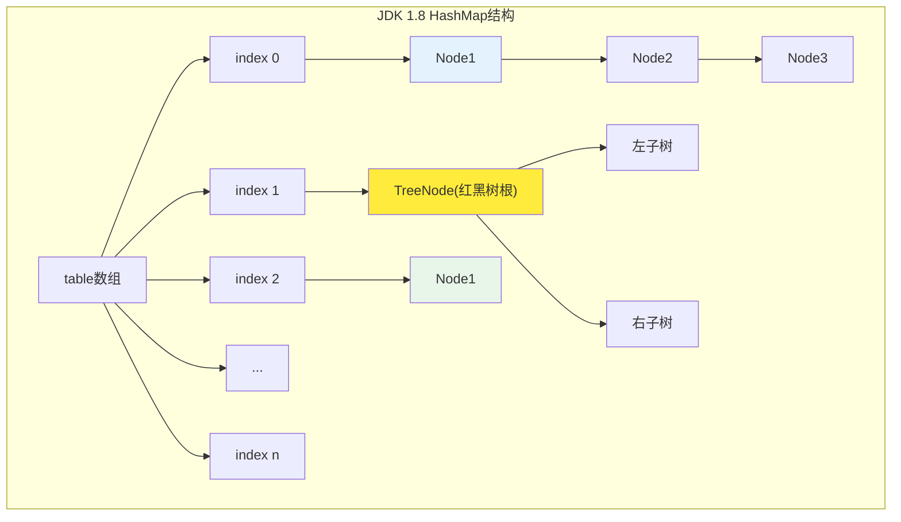

**哈希计算与索引定位**

```java
// 计算key的hash值（JDK 1.8优化版本）
static final int hash(Object key) {
    int h;
    // key的hashCode与其高16位进行异或运算
    return (key == null) ? 0 : (h = key.hashCode()) ^ (h >>> 16);
}

// 根据hash值计算数组索引
// 使用 (n-1) & hash 代替 hash % n，位运算更高效
int index = (table.length - 1) & hash;
```

**HashMap的put操作详细流程**

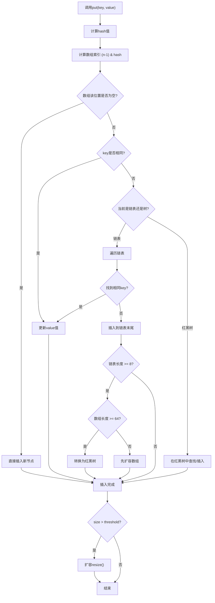

**HashMap的put方法核心实现**

```java
public V put(K key, V value) {
    return putVal(hash(key), key, value, false, true);
}

final V putVal(int hash, K key, V value, boolean onlyIfAbsent, boolean evict) {
    Node<K,V>[] tab; Node<K,V> p; int n, i;
    
    // 1. 如果table为空，进行初始化
    if ((tab = table) == null || (n = tab.length) == 0)
        n = (tab = resize()).length;
        
    // 2. 计算索引，如果该位置为空，直接插入
    if ((p = tab[i = (n - 1) & hash]) == null)
        tab[i] = newNode(hash, key, value, null);
    else {
        Node<K,V> e; K k;
        
        // 3. 如果第一个节点的key相同，记录该节点
        if (p.hash == hash && ((k = p.key) == key || (key != null && key.equals(k))))
            e = p;
            
        // 4. 如果是红黑树节点，按树的方式插入
        else if (p instanceof TreeNode)
            e = ((TreeNode<K,V>)p).putTreeVal(this, tab, hash, key, value);
            
        // 5. 处理链表情况
        else {
            for (int binCount = 0; ; ++binCount) {
                // 插入到链表末尾
                if ((e = p.next) == null) {
                    p.next = newNode(hash, key, value, null);
                    
                    // 检查是否需要树形化
                    if (binCount >= TREEIFY_THRESHOLD - 1)
                        treeifyBin(tab, hash);
                    break;
                }
                
                // 找到相同key
                if (e.hash == hash && ((k = e.key) == key || (key != null && key.equals(k))))
                    break;
                p = e;
            }
        }
        
        // 6. 如果找到相同key，更新value
        if (e != null) {
            V oldValue = e.value;
            if (!onlyIfAbsent || oldValue == null)
                e.value = value;
            afterNodeAccess(e);
            return oldValue;
        }
    }
    
    ++modCount;
    
    // 7. 检查是否需要扩容
    if (++size > threshold)
        resize();
        
    afterNodeInsertion(evict);
    return null;
}
```

**HashMap扩容机制详解**

```java
final Node<K,V>[] resize() {
    Node<K,V>[] oldTab = table;
    int oldCap = (oldTab == null) ? 0 : oldTab.length;
    int oldThr = threshold;
    int newCap, newThr = 0;
    
    if (oldCap > 0) {
        // 已达到最大容量
        if (oldCap >= MAXIMUM_CAPACITY) {
            threshold = Integer.MAX_VALUE;
            return oldTab;
        }
        // 容量和阈值都扩大2倍
        else if ((newCap = oldCap << 1) < MAXIMUM_CAPACITY && oldCap >= DEFAULT_INITIAL_CAPACITY)
            newThr = oldThr << 1;
    }
    
    // 创建新数组
    Node<K,V>[] newTab = (Node<K,V>[])new Node[newCap];
    table = newTab;
    
    // 重新分布原有元素
    if (oldTab != null) {
        for (int j = 0; j < oldCap; ++j) {
            Node<K,V> e;
            if ((e = oldTab[j]) != null) {
                oldTab[j] = null;
                
                if (e.next == null)
                    // 只有一个元素，直接重新计算位置
                    newTab[e.hash & (newCap - 1)] = e;
                else if (e instanceof TreeNode)
                    // 红黑树的分离
                    ((TreeNode<K,V>)e).split(this, newTab, j, oldCap);
                else {
                    // 链表的优化分离
                    Node<K,V> loHead = null, loTail = null;
                    Node<K,V> hiHead = null, hiTail = null;
                    Node<K,V> next;
                    
                    do {
                        next = e.next;
                        // 根据hash & oldCap判断位置
                        if ((e.hash & oldCap) == 0) {
                            if (loTail == null)
                                loHead = e;
                            else
                                loTail.next = e;
                            loTail = e;
                        } else {
                            if (hiTail == null)
                                hiHead = e;
                            else
                                hiTail.next = e;
                            hiTail = e;
                        }
                    } while ((e = next) != null);
                    
                    // 放置到新位置
                    if (loTail != null) {
                        loTail.next = null;
                        newTab[j] = loHead;
                    }
                    if (hiTail != null) {
                        hiTail.next = null;
                        newTab[j + oldCap] = hiHead;
                    }
                }
            }
        }
    }
    return newTab;
}
```

**链表转红黑树的条件与过程**

链表转红黑树需要同时满足两个条件：
1. **链表长度 >= 8**（TREEIFY_THRESHOLD）
2. **数组长度 >= 64**（MIN_TREEIFY_CAPACITY）

如果数组长度小于64，优先进行扩容而不是树形化。

**HashMap性能特点分析**

| 操作类型 | 平均时间复杂度 | 最坏时间复杂度 | 说明 |
|---------|---------------|---------------|------|
| **put操作** | O(1) | O(log n) | 红黑树优化后最坏情况 |
| **get操作** | O(1) | O(log n) | 哈希冲突时遍历链表/树 |
| **remove操作** | O(1) | O(log n) | 同get操作 |
| **扩容操作** | O(n) | O(n) | 需要重新计算所有元素位置 |

#### TreeMap实现原理与机制

TreeMap基于**红黑树**实现，保证了O(log n)的插入、删除、查找性能，并维护键的有序性。

**TreeMap核心特点**：
- **有序存储**：按键的自然顺序或Comparator排序
- **不允许null键**：但可以有null值
- **非线程安全**：需要外部同步
- **基于红黑树**：自平衡二叉搜索树

**TreeMap内部数据结构**

```java
public class TreeMap<K,V> extends AbstractMap<K,V>
    implements NavigableMap<K,V>, Cloneable, java.io.Serializable {
    
    // 比较器，如果为null则使用键的自然顺序
    private final Comparator<? super K> comparator;
    
    // 红黑树的根节点
    private transient Entry<K,V> root;
    
    // 树中节点的数量
    private transient int size = 0;
    
    // 树的修改次数，用于迭代器的fail-fast机制
    private transient int modCount = 0;
    
    // 红黑树节点结构
    static final class Entry<K,V> implements Map.Entry<K,V> {
        K key;              // 键
        V value;            // 值
        Entry<K,V> left;    // 左子节点
        Entry<K,V> right;   // 右子节点
        Entry<K,V> parent;  // 父节点
        boolean color = BLACK;  // 节点颜色，默认为黑色
        
        Entry(K key, V value, Entry<K,V> parent) {
            this.key = key;
            this.value = value;
            this.parent = parent;
        }
    }
}
```

**红黑树的性质与规则**

红黑树是一种自平衡二叉搜索树，满足以下性质：
1. **节点颜色**：每个节点要么是红色，要么是黑色
2. **根节点**：根节点必须是黑色
3. **叶子节点**：叶子节点（NIL节点）都是黑色
4. **红色节点**：红色节点的子节点必须都是黑色
5. **黑色平衡**：从任一节点到其每个叶子的路径都包含相同数目的黑色节点

**TreeMap红黑树结构示意图**：

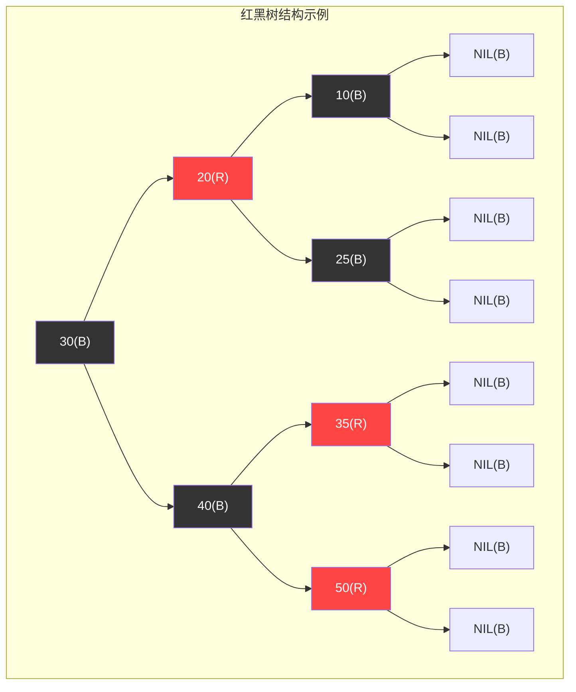

**TreeMap的put操作实现**

```java
public V put(K key, V value) {
    Entry<K,V> t = root;
    
    // 如果树为空，创建根节点
    if (t == null) {
        compare(key, key); // 检查key的类型
        root = new Entry<>(key, value, null);
        size = 1;
        modCount++;
        return null;
    }
    
    int cmp;
    Entry<K,V> parent;
    Comparator<? super K> cpr = comparator;
    
    // 寻找插入位置
    do {
        parent = t;
        cmp = (cpr != null) ? cpr.compare(key, t.key)
                           : ((Comparable<? super K>)key).compareTo(t.key);
        if (cmp < 0)
            t = t.left;
        else if (cmp > 0)
            t = t.right;
        else
            return t.setValue(value); // 键已存在，更新值
    } while (t != null);
    
    // 创建新节点
    Entry<K,V> e = new Entry<>(key, value, parent);
    if (cmp < 0)
        parent.left = e;
    else
        parent.right = e;
        
    // 插入后的红黑树修复
    fixAfterInsertion(e);
    size++;
    modCount++;
    return null;
}
```

**红黑树插入修复过程**

插入新节点后，需要通过**旋转**和**重新着色**来维护红黑树性质：

```java
private void fixAfterInsertion(Entry<K,V> x) {
    x.color = RED; // 新插入的节点为红色
    
    while (x != null && x != root && x.parent.color == RED) {
        if (parentOf(x) == leftOf(parentOf(parentOf(x)))) {
            // 父节点是祖父节点的左子节点
            Entry<K,V> y = rightOf(parentOf(parentOf(x))); // 叔叔节点
            
            if (colorOf(y) == RED) {
                // Case 1: 叔叔节点是红色
                setColor(parentOf(x), BLACK);
                setColor(y, BLACK);
                setColor(parentOf(parentOf(x)), RED);
                x = parentOf(parentOf(x));
            } else {
                if (x == rightOf(parentOf(x))) {
                    // Case 2: 叔叔节点是黑色，且当前节点是父节点的右子节点
                    x = parentOf(x);
                    rotateLeft(x);
                }
                // Case 3: 叔叔节点是黑色，且当前节点是父节点的左子节点
                setColor(parentOf(x), BLACK);
                setColor(parentOf(parentOf(x)), RED);
                rotateRight(parentOf(parentOf(x)));
            }
        } else {
            // 父节点是祖父节点的右子节点（对称情况）
            Entry<K,V> y = leftOf(parentOf(parentOf(x)));
            
            if (colorOf(y) == RED) {
                setColor(parentOf(x), BLACK);
                setColor(y, BLACK);
                setColor(parentOf(parentOf(x)), RED);
                x = parentOf(parentOf(x));
            } else {
                if (x == leftOf(parentOf(x))) {
                    x = parentOf(x);
                    rotateRight(x);
                }
                setColor(parentOf(x), BLACK);
                setColor(parentOf(parentOf(x)), RED);
                rotateLeft(parentOf(parentOf(x)));
            }
        }
    }
    root.color = BLACK; // 根节点始终为黑色
}
```

**红黑树旋转操作**

旋转是维护红黑树平衡的关键操作：

**左旋操作**：
```java
private void rotateLeft(Entry<K,V> p) {
    if (p != null) {
        Entry<K,V> r = p.right;
        p.right = r.left;
        
        if (r.left != null)
            r.left.parent = p;
            
        r.parent = p.parent;
        
        if (p.parent == null)
            root = r;
        else if (p.parent.left == p)
            p.parent.left = r;
        else
            p.parent.right = r;
            
        r.left = p;
        p.parent = r;
    }
}
```

**右旋操作**：
```java
private void rotateRight(Entry<K,V> p) {
    if (p != null) {
        Entry<K,V> l = p.left;
        p.left = l.right;
        
        if (l.right != null)
            l.right.parent = p;
            
        l.parent = p.parent;
        
        if (p.parent == null)
            root = l;
        else if (p.parent.right == p)
            p.parent.right = l;
        else
            p.parent.left = l;
            
        l.right = p;
        p.parent = l;
    }
}
```

**左旋转过程图解**：

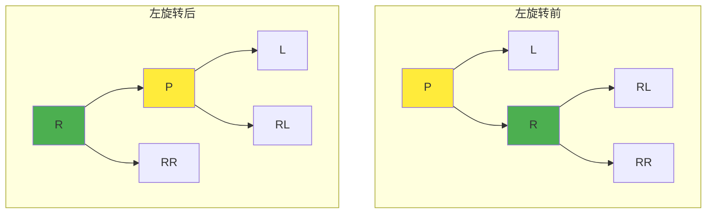

**TreeMap查找操作**

```java
public V get(Object key) {
    Entry<K,V> p = getEntry(key);
    return (p == null ? null : p.value);
}

final Entry<K,V> getEntry(Object key) {
    // 如果有自定义比较器，使用比较器查找
    if (comparator != null)
        return getEntryUsingComparator(key);
        
    if (key == null)
        throw new NullPointerException();
        
    @SuppressWarnings("unchecked")
    Comparable<? super K> k = (Comparable<? super K>) key;
    Entry<K,V> p = root;
    
    // 二分查找
    while (p != null) {
        int cmp = k.compareTo(p.key);
        if (cmp < 0)
            p = p.left;
        else if (cmp > 0)
            p = p.right;
        else
            return p;
    }
    return null;
}
```

**TreeMap性能特点分析**

| 操作类型 | 时间复杂度 | 说明 |
|---------|-----------|------|
| **put操作** | O(log n) | 查找位置 + 插入修复 |
| **get操作** | O(log n) | 二分查找 |
| **remove操作** | O(log n) | 查找 + 删除修复 |
| **firstKey/lastKey** | O(log n) | 找到最左/右节点 |
| **遍历操作** | O(n) | 中序遍历所有节点 |

#### 特殊Map实现
```java
public class SpecialMapExample {
    /**
     * LinkedHashMap
     * 特点：维护插入顺序或访问顺序
     */
    public void linkedHashMapDemo() {
        // LRU缓存实现
        LinkedHashMap<String, Integer> lruCache = 
            new LinkedHashMap<>(16, 0.75f, true) {
                @Override
                protected boolean removeEldestEntry(Map.Entry<String, Integer> eldest) {
                    return size() > 100;
                }
            };
    }
    
    /**
     * WeakHashMap
     * 特点：弱引用键，适合缓存
     */
    public void weakHashMapDemo() {
        WeakHashMap<UniqueObject, String> cache = new WeakHashMap<>();
        UniqueObject key = new UniqueObject("test");
        cache.put(key, "value");
        key = null;  // 键可能被GC回收
    }
}
```

### Queue集合

#### 基本队列实现
```java
public class QueueExample {
    /**
     * ArrayDeque
     * 特点：数组实现的双端队列
     */
    public void arrayDequeDemo() {
        ArrayDeque<String> deque = new ArrayDeque<>();
        
        // 队列操作
        deque.offer("First");
        deque.poll();
        
        // 栈操作
        deque.push("Top");
        deque.pop();
    }
    
    /**
     * PriorityQueue
     * 特点：基于堆的优先级队列
     */
    public void priorityQueueDemo() {
        // 最小堆
        PriorityQueue<Integer> minHeap = new PriorityQueue<>();
        
        // 最大堆
        PriorityQueue<Integer> maxHeap = new PriorityQueue<>(
            Collections.reverseOrder()
        );
    }
}
```

#### 阻塞队列实现
```java
public class BlockingQueueExample {
    /**
     * 常用阻塞队列实现
     */
    public void blockingQueueDemo() {
        // 固定大小的阻塞队列
        ArrayBlockingQueue<String> arrayQueue = 
            new ArrayBlockingQueue<>(100);
        
        // 无界阻塞队列
        LinkedBlockingQueue<String> linkedQueue = 
            new LinkedBlockingQueue<>();
        
        // 延迟队列
        DelayQueue<DelayedElement> delayQueue = 
            new DelayQueue<>();
        
        // 同步队列
        SynchronousQueue<String> syncQueue = 
            new SynchronousQueue<>();
    }
}
```

### 集合性能对比

#### 时间复杂度对比表

| 集合类型          | 插入              | 删除              | 查找     | 遍历 | 线程安全 | 适用场景   |
| ----------------- | ----------------- | ----------------- | -------- | ---- | -------- | ---------- |
| ArrayList         | O(1)尾部/O(n)中间 | O(1)尾部/O(n)中间 | O(1)     | O(n) | 否       | 随机访问多 |
| LinkedList        | O(1)              | O(1)              | O(n)     | O(n) | 否       | 插入删除多 |
| HashMap           | O(1)              | O(1)              | O(1)     | O(n) | 否       | 键值对存储 |
| TreeMap           | O(log n)          | O(log n)          | O(log n) | O(n) | 否       | 有序键值对 |
| HashSet           | O(1)              | O(1)              | O(1)     | O(n) | 否       | 去重存储   |
| TreeSet           | O(log n)          | O(log n)          | O(log n) | O(n) | 否       | 有序去重   |
| ConcurrentHashMap | O(1)              | O(1)              | O(1)     | O(n) | 是       | 并发键值对 |

#### 详细性能分析

**List集合性能比较**

| 操作类型 | ArrayList性能分析 | LinkedList性能分析 | 选择建议 |
|----------|-------------------|-------------------|----------|
| **随机访问** | O(1) - 数组下标直接定位 | O(n) - 需要遍历链表 | **需要频繁随机访问选ArrayList** |
| **顺序遍历** | 高效 - 连续内存访问 | 中等 - 指针跳转开销 | 大量数据遍历选ArrayList |
| **头部插入** | O(n) - 需要移动所有元素 | O(1) - 直接修改头指针 | **频繁头部操作选LinkedList** |
| **中间插入** | O(n) - 需要移动后续元素 | O(n) - 需要先定位位置 | 性能相近，考虑其他因素 |
| **尾部插入** | O(1)均摊 - 可能触发扩容 | O(1) - 直接修改尾指针 | 性能相近 |
| **内存占用** | 较少 - 只存储元素 | 较多 - 额外存储指针 | **内存敏感选ArrayList** |

**Map集合性能比较**

| 特性 | HashMap | TreeMap | LinkedHashMap | ConcurrentHashMap |
|------|---------|---------|---------------|-------------------|
| **插入性能** | O(1)最优 | O(log n)较慢 | O(1)接近HashMap | O(1)稍慢于HashMap |
| **查询性能** | O(1)最优 | O(log n)较慢 | O(1)接近HashMap | O(1)接近HashMap |
| **有序性** | 无序 | **按键排序** | **按插入顺序** | 无序 |
| **线程安全** | 否 | 否 | 否 | **是** |
| **内存开销** | 较少 | 中等 | 较多(维护链表) | 较多(并发控制) |
| **适用场景** | **通用键值存储** | **需要排序的场景** | **需要保持插入顺序** | **高并发环境** |

#### 集合选择决策树

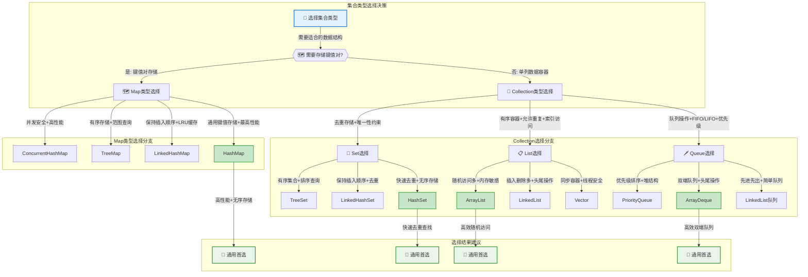

#### 场景化选择指南

**1. Web应用开发**
```java
// 用户会话管理 - 需要线程安全
ConcurrentHashMap<String, UserSession> sessionMap = new ConcurrentHashMap<>();

// 配置信息存储 - 需要排序展示
TreeMap<String, String> configMap = new TreeMap<>();

// 用户权限列表 - 快速去重查找
HashSet<String> permissions = new HashSet<>();

// 操作日志记录 - 频繁尾部插入
ArrayList<LogEntry> operationLogs = new ArrayList<>();
```

**2. 数据处理系统**
```java
// 大量数据批处理 - 内存效率优先
ArrayList<DataRecord> batchData = new ArrayList<>(10000);

// 实时数据流处理 - 频繁插入删除
LinkedList<StreamEvent> eventQueue = new LinkedList<>();

// 排行榜系统 - 自动排序
TreeSet<ScoreEntry> leaderboard = new TreeSet<>();
```

**3. 缓存系统设计**
```java
// LRU缓存实现 - 保持访问顺序
LinkedHashMap<String, CacheItem> lruCache = 
    new LinkedHashMap<>(16, 0.75f, true) {
        @Override
        protected boolean removeEldestEntry(Map.Entry<String, CacheItem> eldest) {
            return size() > MAX_SIZE;
        }
    };

// 多级缓存 - 并发安全
ConcurrentHashMap<String, Object> level1Cache = new ConcurrentHashMap<>();
```

#### 性能调优建议

**内存优化策略**

| 集合类型 | 优化建议 | 代码示例 |
|----------|----------|----------|
| **ArrayList** | 预设初始容量 | `new ArrayList<>(expectedSize)` |
| **HashMap** | 设置合理负载因子 | `new HashMap<>(capacity, 0.75f)` |
| **HashSet** | 基于元素数量预设容量 | `new HashSet<>(elementCount * 4/3)` |

**并发性能优化**

| 场景 | 不推荐 | 推荐 | 原因 |
|------|--------|------|------|
| **高并发读写** | `Collections.synchronizedMap()` | `ConcurrentHashMap` | 锁粒度更细，性能更好 |
| **读多写少** | `Vector` | `CopyOnWriteArrayList` | 读操作无锁，适合读多场景 |
| **生产者消费者** | `synchronized` + `ArrayList` | `BlockingQueue实现` | 专门的并发数据结构 |

### 集合使用最佳实践

```java
/**
 * 集合使用最佳实践
 */
public class CollectionBestPractices {
    
    /**
     * 选择合适的集合类型
     */
    public void chooseRightCollection() {
        // 1. 需要索引访问 -> ArrayList
        List<String> indexedList = new ArrayList<>();
        
        // 2. 频繁插入删除 -> LinkedList
        List<String> modifiableList = new LinkedList<>();
        
        // 3. 去重存储 -> HashSet
        Set<String> uniqueItems = new HashSet<>();
        
        // 4. 有序去重 -> TreeSet
        Set<String> sortedUniqueItems = new TreeSet<>();
        
        // 5. 键值对存储 -> HashMap
        Map<String, Object> keyValueStore = new HashMap<>();
        
        // 6. 有序键值对 -> TreeMap
        Map<String, Object> sortedKeyValueStore = new TreeMap<>();
    }
    
    /**
     * 性能优化技巧
     */
    public void performanceOptimization() {
        // 1. 预设容量避免扩容
        List<String> list = new ArrayList<>(1000);
        Map<String, String> map = new HashMap<>(1000);
        
        // 2. 使用合适的负载因子
        Map<String, String> optimizedMap = new HashMap<>(16, 0.75f);
        
        // 3. 批量操作
        List<String> source = Arrays.asList("a", "b", "c");
        List<String> target = new ArrayList<>();
        target.addAll(source);  // 批量添加
        
        // 4. 使用Iterator删除元素
        Iterator<String> iterator = list.iterator();
        while (iterator.hasNext()) {
            String item = iterator.next();
            if (shouldRemove(item)) {
                iterator.remove();  // 安全删除
            }
        }
    }
    
    /**
     * 线程安全处理
     */
    public void threadSafetyHandling() {
        // 1. 使用并发集合
        Map<String, String> concurrentMap = new ConcurrentHashMap<>();
        List<String> copyOnWriteList = new CopyOnWriteArrayList<>();
        
        // 2. 同步包装器（性能较差）
        List<String> syncList = Collections.synchronizedList(new ArrayList<>());
        Map<String, String> syncMap = Collections.synchronizedMap(new HashMap<>());
        
        // 3. 外部同步
        List<String> list = new ArrayList<>();
        synchronized (list) {
            list.add("item");
        }
    }
}
```

## 函数式编程

### Lambda表达式

**Lambda表达式**是Java 8引入的重要特性，提供了**简洁的函数式编程**方式。

```java
/**
 * Lambda表达式详解
 * 语法：(参数) -> 表达式 或 (参数) -> { 语句块 }
 */
public class LambdaExample {
    
    /**
     * 基础语法示例
     */
    public void basicSyntax() {
        // 无参数Lambda
        Runnable r1 = () -> System.out.println("Hello Lambda");
        
        // 单参数Lambda（可省略括号）
        Consumer<String> c1 = s -> System.out.println(s);
        Consumer<String> c2 = (s) -> System.out.println(s);
        
        // 多参数Lambda
        BinaryOperator<Integer> add = (a, b) -> a + b;
        
        // 多行Lambda
        Function<String, String> processor = (input) -> {
            String processed = input.trim().toLowerCase();
            return processed.isEmpty() ? "empty" : processed;
        };
        
        // 方法引用
        List<String> list = Arrays.asList("a", "b", "c");
        list.forEach(System.out::println);  // 等价于 s -> System.out.println(s)
    }
    
    /**
     * 变量捕获
     */
    public void variableCapture() {
        String prefix = "Hello ";  // 有效final变量
        
        Function<String, String> greeter = name -> prefix + name;
        
        // prefix = "Hi ";  // 编译错误：Lambda中使用的变量必须是final或有效final
        
        // 实例变量和静态变量可以修改
        List<String> results = new ArrayList<>();
        Stream.of("a", "b", "c")
              .forEach(s -> results.add(s.toUpperCase()));
    }
    
    /**
     * 类型推断
     */
    public void typeInference() {
        // 编译器可以推断参数类型
        List<String> list = Arrays.asList("apple", "banana", "cherry");
        
        // 显式类型声明
        list.sort((String a, String b) -> a.compareTo(b));
        
        // 类型推断
        list.sort((a, b) -> a.compareTo(b));
        
        // 方法引用
        list.sort(String::compareTo);
    }
}
```

### Stream API

**Stream API**提供了**声明式的数据处理**方式，支持链式操作。

```java
/**
 * Stream API详解
 * 特点：声明式、可链式调用、支持并行处理
 */
public class StreamExample {
    
    /**
     * 创建Stream的方式
     */
    public void createStreams() {
        // 1. 从集合创建
        List<String> list = Arrays.asList("a", "b", "c");
        Stream<String> stream1 = list.stream();
        
        // 2. 从数组创建
        String[] array = {"a", "b", "c"};
        Stream<String> stream2 = Arrays.stream(array);
        
        // 3. 使用Stream.of()
        Stream<String> stream3 = Stream.of("a", "b", "c");
        
        // 4. 无限流
        Stream<Integer> infiniteStream = Stream.iterate(0, n -> n + 1);
        Stream<Double> randomStream = Stream.generate(Math::random);
        
        // 5. 数值流
        IntStream intStream = IntStream.range(1, 100);
        LongStream longStream = LongStream.rangeClosed(1, 100);
    }
    
    /**
     * 中间操作（惰性求值）
     */
    public void intermediateOperations() {
        List<String> words = Arrays.asList("apple", "banana", "cherry", "date");
        
        // filter：过滤
        words.stream()
             .filter(word -> word.length() > 5)
             .forEach(System.out::println);
        
        // map：转换
        words.stream()
             .map(String::toUpperCase)
             .forEach(System.out::println);
        
        // flatMap：扁平化
        List<List<String>> nestedList = Arrays.asList(
            Arrays.asList("a", "b"),
            Arrays.asList("c", "d")
        );
        nestedList.stream()
                  .flatMap(List::stream)
                  .forEach(System.out::println);
        
        // distinct：去重
        Arrays.asList("a", "b", "a", "c")
              .stream()
              .distinct()
              .forEach(System.out::println);
        
        // sorted：排序
        words.stream()
             .sorted()
             .forEach(System.out::println);
        
        // limit：限制数量
        words.stream()
             .limit(2)
             .forEach(System.out::println);
        
        // skip：跳过
        words.stream()
             .skip(1)
             .forEach(System.out::println);
    }
    
    /**
     * 终端操作（触发计算）
     */
    public void terminalOperations() {
        List<Integer> numbers = Arrays.asList(1, 2, 3, 4, 5);
        
        // forEach：遍历
        numbers.stream().forEach(System.out::println);
        
        // collect：收集
        List<Integer> evenNumbers = numbers.stream()
                                          .filter(n -> n % 2 == 0)
                                          .collect(Collectors.toList());
        
        // reduce：归约
        Optional<Integer> sum = numbers.stream()
                                      .reduce((a, b) -> a + b);
        int sum2 = numbers.stream()
                         .reduce(0, Integer::sum);
        
        // count：计数
        long count = numbers.stream()
                           .filter(n -> n > 3)
                           .count();
        
        // anyMatch/allMatch/noneMatch：匹配
        boolean hasEven = numbers.stream().anyMatch(n -> n % 2 == 0);
        boolean allPositive = numbers.stream().allMatch(n -> n > 0);
        boolean noneNegative = numbers.stream().noneMatch(n -> n < 0);
        
        // findFirst/findAny：查找
        Optional<Integer> first = numbers.stream()
                                        .filter(n -> n > 3)
                                        .findFirst();
        
        // min/max：最值
        Optional<Integer> min = numbers.stream().min(Integer::compareTo);
        Optional<Integer> max = numbers.stream().max(Integer::compareTo);
    }
    
    /**
     * 收集器使用
     */
    public void collectorsUsage() {
        List<Person> people = Arrays.asList(
            new Person("Alice", 25, "Engineer"),
            new Person("Bob", 30, "Manager"),
            new Person("Charlie", 25, "Engineer")
        );
        
        // 转换为List
        List<String> names = people.stream()
                                  .map(Person::getName)
                                  .collect(Collectors.toList());
        
        // 转换为Set
        Set<String> departments = people.stream()
                                       .map(Person::getDepartment)
                                       .collect(Collectors.toSet());
        
        // 分组
        Map<String, List<Person>> byDepartment = 
            people.stream()
                  .collect(Collectors.groupingBy(Person::getDepartment));
        
        // 分区
        Map<Boolean, List<Person>> partitioned = 
            people.stream()
                  .collect(Collectors.partitioningBy(p -> p.getAge() > 25));
        
        // 统计
        IntSummaryStatistics ageStats = 
            people.stream()
                  .collect(Collectors.summarizingInt(Person::getAge));
        
        // 连接字符串
        String nameList = people.stream()
                               .map(Person::getName)
                               .collect(Collectors.joining(", "));
    }
    
    /**
     * 并行流
     */
    public void parallelStreams() {
        List<Integer> numbers = IntStream.range(1, 1000000)
                                       .boxed()
                                       .collect(Collectors.toList());
        
        // 串行处理
        long start = System.currentTimeMillis();
        long sum1 = numbers.stream()
                          .mapToLong(Integer::longValue)
                          .sum();
        long serialTime = System.currentTimeMillis() - start;
        
        // 并行处理
        start = System.currentTimeMillis();
        long sum2 = numbers.parallelStream()
                          .mapToLong(Integer::longValue)
                          .sum();
        long parallelTime = System.currentTimeMillis() - start;
        
        System.out.println("串行耗时：" + serialTime + "ms");
        System.out.println("并行耗时：" + parallelTime + "ms");
    }
}
```

### 函数式接口

Java 8提供了丰富的**函数式接口**，支持函数式编程范式。

```java
/**
 * 常用函数式接口
 */
public class FunctionalInterfaceExample {
    
    /**
     * 基本函数式接口
     */
    public void basicFunctionalInterfaces() {
        // Supplier：供应者，无参数有返回值
        Supplier<String> stringSupplier = () -> "Hello World";
        Supplier<Double> randomSupplier = Math::random;
        
        // Consumer：消费者，有参数无返回值
        Consumer<String> printer = System.out::println;
        Consumer<String> upperCasePrinter = s -> System.out.println(s.toUpperCase());
        
        // Function：函数，有参数有返回值
        Function<String, Integer> lengthFunction = String::length;
        Function<Integer, String> toStringFunction = Object::toString;
        
        // Predicate：断言，有参数返回boolean
        Predicate<String> isEmpty = String::isEmpty;
        Predicate<Integer> isEven = n -> n % 2 == 0;
        
        // UnaryOperator：一元操作符，输入输出类型相同
        UnaryOperator<String> toUpperCase = String::toUpperCase;
        
        // BinaryOperator：二元操作符，两个输入一个输出，类型相同
        BinaryOperator<Integer> add = Integer::sum;
        BinaryOperator<String> concat = String::concat;
    }
    
    /**
     * 函数式接口组合
     */
    public void functionalInterfaceComposition() {
        // Function组合
        Function<String, String> trim = String::trim;
        Function<String, String> upperCase = String::toUpperCase;
        Function<String, String> combined = trim.andThen(upperCase);
        
        // Predicate组合
        Predicate<String> notEmpty = s -> !s.isEmpty();
        Predicate<String> notBlank = s -> !s.trim().isEmpty();
        Predicate<String> valid = notEmpty.and(notBlank);
        
        // Consumer组合
        Consumer<String> print = System.out::println;
        Consumer<String> log = s -> System.err.println("LOG: " + s);
        Consumer<String> printAndLog = print.andThen(log);
    }
    
    /**
     * 自定义函数式接口
     */
    @FunctionalInterface
    public interface TriFunction<T, U, V, R> {
        R apply(T t, U u, V v);
        
        // 默认方法
        default <W> TriFunction<T, U, V, W> andThen(Function<? super R, ? extends W> after) {
            Objects.requireNonNull(after);
            return (T t, U u, V v) -> after.apply(apply(t, u, v));
        }
    }
    
    public void customFunctionalInterface() {
        TriFunction<Integer, Integer, Integer, Integer> sum3 = 
            (a, b, c) -> a + b + c;
        
        int result = sum3.apply(1, 2, 3);  // 6
    }
}
```

### 方法引用

**方法引用**是Lambda表达式的简化形式，提供了更简洁的语法。

```java
/**
 * 方法引用详解
 * 语法：类名::方法名 或 对象::方法名
 */
public class MethodReferenceExample {
    
    /**
     * 静态方法引用
     */
    public void staticMethodReference() {
        List<String> numbers = Arrays.asList("1", "2", "3");
        
        // Lambda表达式
        List<Integer> integers1 = numbers.stream()
                                        .map(s -> Integer.parseInt(s))
                                        .collect(Collectors.toList());
        
        // 静态方法引用
        List<Integer> integers2 = numbers.stream()
                                        .map(Integer::parseInt)
                                        .collect(Collectors.toList());
    }
    
    /**
     * 实例方法引用
     */
    public void instanceMethodReference() {
        List<String> words = Arrays.asList("apple", "banana", "cherry");
        
        // Lambda表达式
        words.stream()
             .map(s -> s.toUpperCase())
             .forEach(s -> System.out.println(s));
        
        // 实例方法引用
        words.stream()
             .map(String::toUpperCase)
             .forEach(System.out::println);
    }
    
    /**
     * 构造方法引用
     */
    public void constructorReference() {
        List<String> names = Arrays.asList("Alice", "Bob", "Charlie");
        
        // Lambda表达式
        List<Person> people1 = names.stream()
                                   .map(name -> new Person(name))
                                   .collect(Collectors.toList());
        
        // 构造方法引用
        List<Person> people2 = names.stream()
                                   .map(Person::new)
                                   .collect(Collectors.toList());
        
        // 数组构造方法引用
        String[] array = names.stream()
                             .toArray(String[]::new);
    }
    
    /**
     * 特定对象的方法引用
     */
    public void specificObjectMethodReference() {
        List<String> words = Arrays.asList("hello", "world");
        StringBuilder sb = new StringBuilder();
        
        // Lambda表达式
        words.forEach(word -> sb.append(word));
        
        // 特定对象的方法引用
        words.forEach(sb::append);
    }
}
```

## 反射与注解

### 反射机制

**反射**是Java的强大特性，允许程序在**运行时检查和操作类、方法、字段**等。

```java
/**
 * 反射机制详解
 * 应用场景：框架开发、动态代理、注解处理、序列化
 */
public class ReflectionExample {
    
    /**
     * 获取Class对象的方式
     */
    public void getClassObject() throws ClassNotFoundException {
        // 1. 通过类名.class
        Class<String> clazz1 = String.class;
        
        // 2. 通过对象.getClass()
        String str = "hello";
        Class<?> clazz2 = str.getClass();
        
        // 3. 通过Class.forName()
        Class<?> clazz3 = Class.forName("java.lang.String");
        
        // 4. 通过类加载器
        ClassLoader loader = Thread.currentThread().getContextClassLoader();
        Class<?> clazz4 = loader.loadClass("java.lang.String");
    }
    
    /**
     * 类信息获取
     */
    public void getClassInfo() {
        Class<Person> clazz = Person.class;
        
        // 基本信息
        System.out.println("类名：" + clazz.getName());
        System.out.println("简单类名：" + clazz.getSimpleName());
        System.out.println("包名：" + clazz.getPackage().getName());
        System.out.println("修饰符：" + Modifier.toString(clazz.getModifiers()));
        
        // 父类和接口
        Class<?> superClass = clazz.getSuperclass();
        Class<?>[] interfaces = clazz.getInterfaces();
        
        // 内部类
        Class<?>[] innerClasses = clazz.getDeclaredClasses();
    }
    
    /**
     * 字段操作
     */
    public void fieldOperations() throws Exception {
        Class<Person> clazz = Person.class;
        Person person = new Person("Alice", 25);
        
        // 获取所有公共字段
        Field[] publicFields = clazz.getFields();
        
        // 获取所有声明字段（包括私有）
        Field[] declaredFields = clazz.getDeclaredFields();
        
        // 获取特定字段
        Field nameField = clazz.getDeclaredField("name");
        nameField.setAccessible(true);  // 访问私有字段
        
        // 读取字段值
        String name = (String) nameField.get(person);
        System.out.println("姓名：" + name);
        
        // 设置字段值
        nameField.set(person, "Bob");
        
        // 字段信息
        System.out.println("字段名：" + nameField.getName());
        System.out.println("字段类型：" + nameField.getType());
        System.out.println("字段修饰符：" + Modifier.toString(nameField.getModifiers()));
    }
    
    /**
     * 方法操作
     */
    public void methodOperations() throws Exception {
        Class<Person> clazz = Person.class;
        Person person = new Person("Alice", 25);
        
        // 获取所有公共方法
        Method[] publicMethods = clazz.getMethods();
        
        // 获取所有声明方法
        Method[] declaredMethods = clazz.getDeclaredMethods();
        
        // 获取特定方法
        Method setNameMethod = clazz.getDeclaredMethod("setName", String.class);
        Method getNameMethod = clazz.getDeclaredMethod("getName");
        
        // 调用方法
        setNameMethod.invoke(person, "Charlie");
        String name = (String) getNameMethod.invoke(person);
        
        // 方法信息
        System.out.println("方法名：" + setNameMethod.getName());
        System.out.println("参数类型：" + Arrays.toString(setNameMethod.getParameterTypes()));
        System.out.println("返回类型：" + setNameMethod.getReturnType());
        System.out.println("异常类型：" + Arrays.toString(setNameMethod.getExceptionTypes()));
    }
    
    /**
     * 构造方法操作
     */
    public void constructorOperations() throws Exception {
        Class<Person> clazz = Person.class;
        
        // 获取所有构造方法
        Constructor<?>[] constructors = clazz.getConstructors();
        
        // 获取特定构造方法
        Constructor<Person> constructor = clazz.getConstructor(String.class, int.class);
        
        // 创建实例
        Person person = constructor.newInstance("David", 30);
        
        // 无参构造方法
        Constructor<Person> defaultConstructor = clazz.getConstructor();
        Person person2 = defaultConstructor.newInstance();
        
        // 使用Class.newInstance()（已废弃）
        // Person person3 = clazz.newInstance();
    }
    
    /**
     * 泛型信息获取
     */
    public void genericTypeInfo() throws Exception {
        Class<GenericClass> clazz = GenericClass.class;
        
        // 获取泛型父类
        Type genericSuperclass = clazz.getGenericSuperclass();
        if (genericSuperclass instanceof ParameterizedType) {
            ParameterizedType paramType = (ParameterizedType) genericSuperclass;
            Type[] actualTypes = paramType.getActualTypeArguments();
        }
        
        // 获取字段的泛型类型
        Field listField = clazz.getDeclaredField("list");
        Type genericType = listField.getGenericType();
        if (genericType instanceof ParameterizedType) {
            ParameterizedType paramType = (ParameterizedType) genericType;
            Type[] actualTypes = paramType.getActualTypeArguments();
        }
    }
    
    /**
     * 反射性能优化
     */
    public void performanceOptimization() throws Exception {
        Class<Person> clazz = Person.class;
        Method method = clazz.getDeclaredMethod("getName");
        
        // 缓存Method对象
        Map<String, Method> methodCache = new ConcurrentHashMap<>();
        methodCache.put("getName", method);
        
        // 使用MethodHandle（Java 7+）
        MethodHandles.Lookup lookup = MethodHandles.lookup();
        MethodHandle methodHandle = lookup.findVirtual(Person.class, "getName", 
                                                      MethodType.methodType(String.class));
        
        Person person = new Person("Alice", 25);
        
        // 传统反射调用
        String name1 = (String) method.invoke(person);
        
        // MethodHandle调用（性能更好）
        String name2 = (String) methodHandle.invoke(person);
    }
}

/**
 * 示例类
 */
class GenericClass<T> {
    private List<String> list;
    private T data;
}
```

### 注解处理

**注解**提供了**元数据**支持，广泛用于框架开发和代码生成。

```java
/**
 * 自定义注解示例
 */

// 方法级注解
@Retention(RetentionPolicy.RUNTIME)
@Target(ElementType.METHOD)
public @interface Audit {
    String value() default "";
    boolean enabled() default true;
    String[] roles() default {};
}

// 类级注解
@Retention(RetentionPolicy.RUNTIME)
@Target(ElementType.TYPE)
public @interface Entity {
    String tableName() default "";
    String schema() default "";
}

// 字段级注解
@Retention(RetentionPolicy.RUNTIME)
@Target(ElementType.FIELD)
public @interface Column {
    String name() default "";
    boolean nullable() default true;
    int length() default 255;
}

// 参数级注解
@Retention(RetentionPolicy.RUNTIME)
@Target(ElementType.PARAMETER)
public @interface Valid {
    String message() default "参数验证失败";
}

/**
 * 注解使用示例
 */
@Entity(tableName = "users", schema = "public")
public class User {
    @Column(name = "user_id", nullable = false)
    private Long id;
    
    @Column(name = "user_name", length = 50)
    private String name;
    
    @Column(name = "email", length = 100)
    private String email;
    
    @Audit(value = "用户登录", roles = {"USER", "ADMIN"})
    public boolean login(@Valid String username, @Valid String password) {
        // 登录逻辑
        return true;
    }
    
    @Audit(value = "更新用户信息", enabled = true)
    public void updateProfile(@Valid User user) {
        // 更新逻辑
    }
}

/**
 * 注解处理器
 */
public class AnnotationProcessor {
    
    /**
     * 处理类级注解
     */
    public void processClassAnnotations(Class<?> clazz) {
        if (clazz.isAnnotationPresent(Entity.class)) {
            Entity entity = clazz.getAnnotation(Entity.class);
            System.out.println("表名：" + entity.tableName());
            System.out.println("模式：" + entity.schema());
        }
    }
    
    /**
     * 处理字段注解
     */
    public void processFieldAnnotations(Class<?> clazz) {
        Field[] fields = clazz.getDeclaredFields();
        for (Field field : fields) {
            if (field.isAnnotationPresent(Column.class)) {
                Column column = field.getAnnotation(Column.class);
                System.out.println("字段：" + field.getName());
                System.out.println("列名：" + column.name());
                System.out.println("可空：" + column.nullable());
                System.out.println("长度：" + column.length());
            }
        }
    }
    
    /**
     * 处理方法注解
     */
    public void processMethodAnnotations(Class<?> clazz) {
        Method[] methods = clazz.getDeclaredMethods();
        for (Method method : methods) {
            if (method.isAnnotationPresent(Audit.class)) {
                Audit audit = method.getAnnotation(Audit.class);
                System.out.println("方法：" + method.getName());
                System.out.println("审计信息：" + audit.value());
                System.out.println("是否启用：" + audit.enabled());
                System.out.println("角色：" + Arrays.toString(audit.roles()));
            }
        }
    }
    
    /**
     * 处理参数注解
     */
    public void processParameterAnnotations(Method method) {
        Parameter[] parameters = method.getParameters();
        Annotation[][] paramAnnotations = method.getParameterAnnotations();
        
        for (int i = 0; i < parameters.length; i++) {
            Parameter param = parameters[i];
            Annotation[] annotations = paramAnnotations[i];
            
            for (Annotation annotation : annotations) {
                if (annotation instanceof Valid) {
                    Valid valid = (Valid) annotation;
                    System.out.println("参数：" + param.getName());
                    System.out.println("验证消息：" + valid.message());
                }
            }
        }
    }
    
    /**
     * 注解驱动的对象映射
     */
    public String generateSQL(Class<?> clazz) {
        if (!clazz.isAnnotationPresent(Entity.class)) {
            throw new IllegalArgumentException("类必须标注@Entity注解");
        }
        
        Entity entity = clazz.getAnnotation(Entity.class);
        StringBuilder sql = new StringBuilder();
        sql.append("CREATE TABLE ");
        
        if (!entity.schema().isEmpty()) {
            sql.append(entity.schema()).append(".");
        }
        
        sql.append(entity.tableName()).append(" (");
        
        Field[] fields = clazz.getDeclaredFields();
        List<String> columns = new ArrayList<>();
        
        for (Field field : fields) {
            if (field.isAnnotationPresent(Column.class)) {
                Column column = field.getAnnotation(Column.class);
                StringBuilder columnDef = new StringBuilder();
                
                columnDef.append(column.name().isEmpty() ? field.getName() : column.name());
                columnDef.append(" VARCHAR(").append(column.length()).append(")");
                
                if (!column.nullable()) {
                    columnDef.append(" NOT NULL");
                }
                
                columns.add(columnDef.toString());
            }
        }
        
        sql.append(String.join(", ", columns));
        sql.append(")");
        
        return sql.toString();
    }
}
```

### 动态代理

**动态代理**是反射的重要应用，用于**AOP、框架开发**等场景。

```java
/**
 * 动态代理示例
 */
public class DynamicProxyExample {
    
    // 业务接口
    public interface UserService {
        void save(User user);
        User findById(Long id);
        void delete(Long id);
    }
    
    // 业务实现
    public static class UserServiceImpl implements UserService {
        @Override
        public void save(User user) {
            System.out.println("保存用户：" + user.getName());
        }
        
        @Override
        public User findById(Long id) {
            System.out.println("查找用户：" + id);
            return new User("User" + id, 25);
        }
        
        @Override
        public void delete(Long id) {
            System.out.println("删除用户：" + id);
        }
    }
    
    /**
     * JDK动态代理
     */
    public static class JdkProxyHandler implements InvocationHandler {
        private final Object target;
        
        public JdkProxyHandler(Object target) {
            this.target = target;
        }
        
        @Override
        public Object invoke(Object proxy, Method method, Object[] args) throws Throwable {
            // 前置处理
            System.out.println("=== 方法调用前 ===");
            System.out.println("方法名：" + method.getName());
            System.out.println("参数：" + Arrays.toString(args));
            
            long startTime = System.currentTimeMillis();
            
            try {
                // 调用目标方法
                Object result = method.invoke(target, args);
                
                // 后置处理
                long endTime = System.currentTimeMillis();
                System.out.println("方法执行耗时：" + (endTime - startTime) + "ms");
                System.out.println("=== 方法调用后 ===");
                
                return result;
            } catch (Exception e) {
                System.err.println("方法执行异常：" + e.getMessage());
                throw e;
            }
        }
        
        // 创建代理对象
        @SuppressWarnings("unchecked")
        public static <T> T createProxy(T target, Class<T> interfaceClass) {
            return (T) Proxy.newProxyInstance(
                interfaceClass.getClassLoader(),
                new Class[]{interfaceClass},
                new JdkProxyHandler(target)
            );
        }
    }
    
    /**
     * CGLIB动态代理（需要引入cglib依赖）
     */
    public static class CglibProxyInterceptor implements MethodInterceptor {
        @Override
        public Object intercept(Object obj, Method method, Object[] args, 
                              MethodProxy proxy) throws Throwable {
            System.out.println("CGLIB代理 - 方法调用前：" + method.getName());
            
            Object result = proxy.invokeSuper(obj, args);
            
            System.out.println("CGLIB代理 - 方法调用后");
            return result;
        }
        
        // 创建CGLIB代理
        @SuppressWarnings("unchecked")
        public static <T> T createProxy(Class<T> clazz) {
            Enhancer enhancer = new Enhancer();
            enhancer.setSuperclass(clazz);
            enhancer.setCallback(new CglibProxyInterceptor());
            return (T) enhancer.create();
        }
    }
    
    /**
     * 代理使用示例
     */
    public static void main(String[] args) {
        // JDK动态代理（基于接口）
        UserService userService = new UserServiceImpl();
        UserService proxy = JdkProxyHandler.createProxy(userService, UserService.class);
        
        proxy.save(new User("Alice", 25));
        User user = proxy.findById(1L);
        proxy.delete(1L);
        
        // CGLIB代理（基于继承）
        // UserServiceImpl cglibProxy = CglibProxyInterceptor.createProxy(UserServiceImpl.class);
        // cglibProxy.save(new User("Bob", 30));
    }
    
    /**
     * 代理模式的应用场景
     */
    public void proxyApplications() {
        // 1. 事务管理
        // @Transactional注解的实现原理
        
        // 2. 安全控制
        // 方法级权限控制
        
        // 3. 缓存
        // 方法结果缓存
        
        // 4. 日志记录
        // 方法调用日志
        
        // 5. 性能监控
        // 方法执行时间统计
        
        // 6. 延迟加载
        // 对象属性的懒加载
    }
}
 String last = set.last();
    }
}
```

#### 特殊Set实现
```java
public class SpecialSetExample {
    /**
     * LinkedHashSet
     * 特点：维护插入顺序的HashSet
     */
    public void linkedHashSetDemo() {
        LinkedHashSet<String> set = new LinkedHashSet<>();
        set.add("C");
        set.add("A");
        set.add("B");
        // 遍历顺序：C, A, B
    }
    
    /**
     * ConcurrentSkipListSet
     * 特点：线程安全的有序Set
     */
    public void concurrentSetDemo() {
        ConcurrentSkipListSet<Integer> set = new ConcurrentSkipListSet<>();
        set.add(5);
        set.add(1);
        set.add(3);
        // 自动排序：1, 3, 5
    }
}
```

### 函数式编程

#### Lambda表达式
```java
public class LambdaExample {
    public void lambdaDemo() {
        // 基本语法
        Runnable r = () -> System.out.println("Hello Lambda");
        
        // 带参数
        Consumer<String> printer = s -> System.out.println(s);
        
        // 多行语句
        Comparator<String> comparator = (s1, s2) -> {
            if (s1 == null) return -1;
            if (s2 == null) return 1;
            return s1.compareTo(s2);
        };
    }
}
```

#### Stream API
```java
public class StreamExample {
    public void streamOperations() {
        List<String> list = Arrays.asList("A", "B", "C");
        
        // 转换
        list.stream()
            .map(String::toLowerCase)
            .collect(Collectors.toList());
        
        // 过滤
        list.stream()
            .filter(s -> s.startsWith("A"))
            .collect(Collectors.toList());
        
        // 排序
        list.stream()
            .sorted()
            .collect(Collectors.toList());
        
        // 分组
        Map<Integer, List<String>> groups = list.stream()
            .collect(Collectors.groupingBy(String::length));
    }
}
```

### 反射与注解

### 反射机制
```java
/**
 * 反射应用场景
 * 1. 框架开发
 * 2. 动态代理
 * 3. 注解处理
 */

public class ReflectionExample {
    // 反射获取类信息
    public void reflectionInfo() {
        Class<?> clazz = Class.forName("com.example.User");
        
        // 获取所有方法
        Method[] methods = clazz.getDeclaredMethods();
        
        // 获取特定方法
        Method method = clazz.getDeclaredMethod("getName");
        method.setAccessible(true);  // 访问私有方法
        
        // 创建实例
        Constructor<?> constructor = clazz.getDeclaredConstructor();
        Object instance = constructor.newInstance();
        
        // 调用方法
        Object result = method.invoke(instance);
    }
    
    // 动态代理
    public interface UserService {
        void save(User user);
    }
    
    public class ServiceProxy implements InvocationHandler {
        private final Object target;
        
        public ServiceProxy(Object target) {
            this.target = target;
        }
        
        @Override
        public Object invoke(Object proxy, Method method, Object[] args) throws Throwable {
            System.out.println("Before method: " + method.getName());
            Object result = method.invoke(target, args);
            System.out.println("After method: " + method.getName());
            return result;
        }
    }
}
```

### 注解处理
```java
/**
 * 自定义注解与处理器
 */

// 自定义注解
@Retention(RetentionPolicy.RUNTIME)
@Target(ElementType.METHOD)
public @interface Audit {
    String value() default "";
    boolean enabled() default true;
}

// 注解处理
public class AnnotationProcessor {
    public void processAnnotations(Object obj) {
        Class<?> clazz = obj.getClass();
        for (Method method : clazz.getDeclaredMethods()) {
            Audit audit = method.getAnnotation(Audit.class);
            if (audit != null && audit.enabled()) {
                // 处理注解逻辑
            }
        }
    }
}
```

## 垃圾回收机制

### 垃圾回收基本原理

垃圾回收（Garbage Collection，GC）是Java虚拟机自动管理内存的重要机制，它能够自动识别并清理不再使用的对象，释放内存空间。

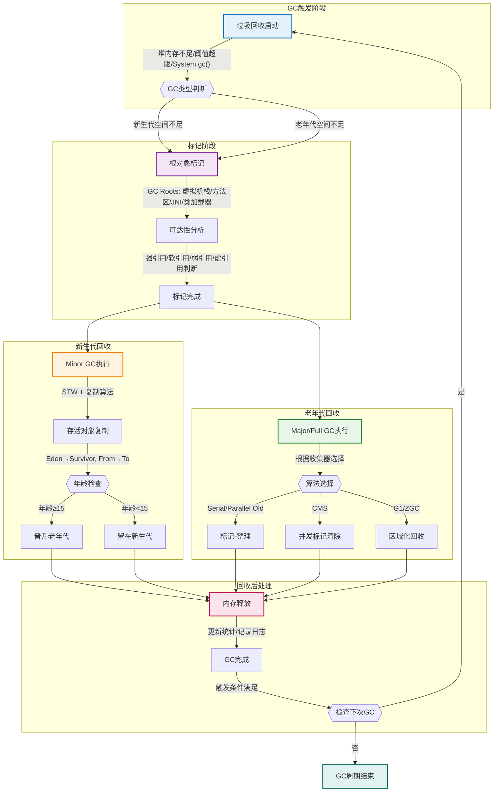

**对象存活判断方法：**

1. **引用计数法**：给对象添加一个引用计数器，每当有一个地方引用它时，计数器值加1；当引用失效时，计数器值减1；计数器为0的对象不可能再被使用。
   - **优点**：实现简单，判定效率高
   - **缺点**：无法解决循环引用问题

2. **可达性分析算法**：从GC Roots开始向下搜索，搜索所走过的路径称为引用链。当一个对象到GC Roots没有任何引用链相连时，则证明此对象是不可用的。
   - **GC Roots包括**：
     - 虚拟机栈中引用的对象
     - 方法区中静态属性引用的对象
     - 方法区中常量引用的对象
     - 本地方法栈中JNI引用的对象

**引用类型：**

1. **强引用**：最常见的引用类型，如`Object obj = new Object()`，只要强引用存在，垃圾收集器永远不会回收被引用的对象。

2. **软引用**：描述有用但非必需的对象，在系统将要发生内存溢出前，会回收软引用对象。
   ```java
   SoftReference<Object> softRef = new SoftReference<>(new Object());
   ```

3. **弱引用**：描述非必需对象，比软引用更弱，一旦发生垃圾收集，无论内存是否足够，都会回收弱引用对象。
   ```java
   WeakReference<Object> weakRef = new WeakReference<>(new Object());
   ```

4. **虚引用**：最弱的引用，不会影响对象的生命周期，用于跟踪对象被垃圾回收的状态。
   ```java
   PhantomReference<Object> phantomRef = new PhantomReference<>(new Object(), referenceQueue);
   ```

### 垃圾回收算法

Java垃圾回收算法的整体结构如下：

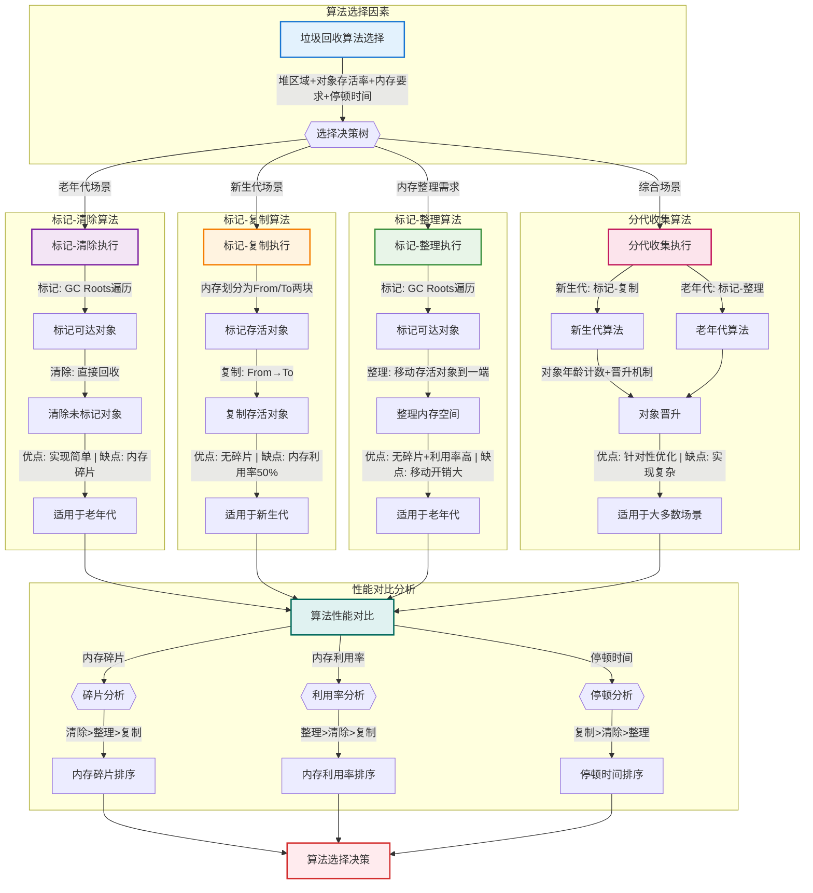

#### 标记-清除算法

标记-清除算法（Mark-Sweep）是最基础的垃圾收集算法，分为两个阶段：

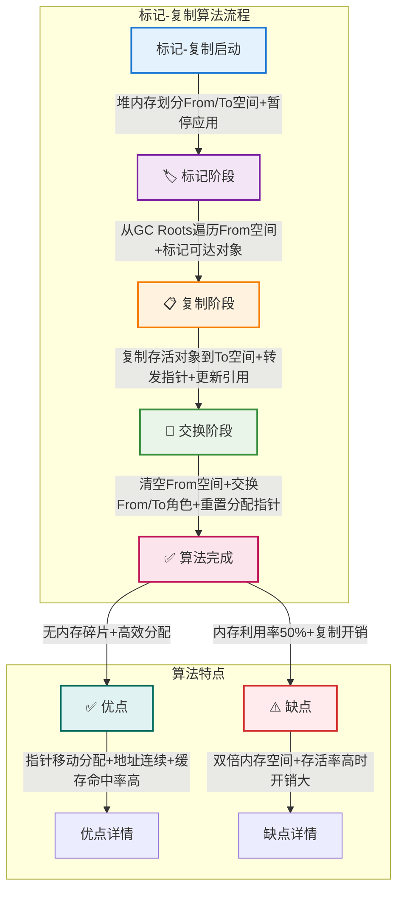

**特点：**
- **优点**：
  - 实现简单，算法逻辑清晰
  - 不需要移动对象，对象地址保持稳定
  - 适合对象存活率低的场景

- **缺点**：
  - 产生内存碎片，可能导致内存分配效率下降
  - 标记和清除两个阶段效率都不高
  - 需要额外的空闲内存管理数据结构

**实现代码示例：**

```java
public class MarkSweepExample {
    public void markSweepAnalysis() {
        // 标记阶段
        // 1. 从GC Roots开始遍历
        // 2. 标记所有可达对象
        markFromGCRoots();
        
        // 清除阶段
        // 1. 遍历整个堆
        // 2. 回收未标记对象
        // 3. 产生内存碎片
        sweepUnmarkedObjects();
    }
    
    /**
     * 内存碎片问题
     */
    public void fragmentationIssue() {
        // 碎片整理策略
        // 1. 空闲列表：记录空闲区块
        maintainFreeList();
        
        // 2. 分配速度下降
        // - 需要遍历空闲列表找到足够大的空间
        // - 可能需要多个小空间组合
        allocateWithFragmentation();
    }
}
```

#### 标记-复制算法

标记-复制算法（Mark-Copy）将可用内存划分为相等的两块，每次只使用其中一块，另一块用于复制。

```mermaid
flowchart TD
    subgraph "📋 标记-复制算法流程" ["标记-复制算法流程"]
        Start["开始标记-复制算法"] -->|"堆内存划分为From/To空间+暂停STW"| PrepPhase["🛠️ 准备阶段"]
        
        PrepPhase -->|"从GC Roots遍历From空间+标记可达对象+深度优先"| MarkPhase["🏷️ 标记阶段"]
        
        MarkPhase -->|"复制存活对象到To空间+转发指针机制+更新引用"| CopyPhase["📋 复制阶段"]
        
        CopyPhase -->|"清空From空间+交换From/To角色+重置分配指针"| SwapPhase["🔄 交换阶段"]
        
        SwapPhase -->|"优点: 无内存碎片高效分配 | 缺点: 内存利用率50%"| End["算法结束"]
    end
    
    %% 样式设置
    style Start fill:#E3F2FD,stroke:#1976D2,stroke-width:2px
    style PrepPhase fill:#F3E5F5,stroke:#7B1FA2,stroke-width:2px
    style MarkPhase fill:#FFF3E0,stroke:#F57C00,stroke-width:2px
    style CopyPhase fill:#E8F5E8,stroke:#388E3C,stroke-width:2px
    style SwapPhase fill:#FCE4EC,stroke:#C2185B,stroke-width:2px
    style End fill:#E0F2F1,stroke:#00695C,stroke-width:2px
```

**特点：**
- **优点：**
  - 解决了内存碎片问题，对象分配高效
  - 内存分配简单，只需要移动指针（顺序分配）
  - 对象被复制后地址连续，提高缓存命中率
  - 对于存活对象比例低的场景非常高效

- **缺点：**
  - 需要双倍内存空间，内存利用率只有50%
  - 对于存活对象比例高的情况，复制开销大
  - 需要更新所有对象的引用地址

**实现代码示例：**

```java
public class CopyingExample {
    public void copyingAnalysis() {
        // 内存分配
        // 1. From空间和To空间各占一半
        // 2. 只使用From空间分配对象
        allocateInFromSpace();
        
        // 回收过程
        // 1. 标记存活对象
        // 2. 复制到To空间
        // 3. 交换From和To空间
        copyAndSwapSpaces();
    }
    
    /**
     * Survivor区应用
     */
    public void survivorSpaceUsage() {
        // Eden区和Survivor区
        // 1. Eden:Survivor = 8:1
        // 2. 两个Survivor交替使用
        // 3. 对象年龄计数
        manageSurvivorSpaces();
    }
}
```

#### 标记-整理算法

标记-整理算法（Mark-Compact）结合了标记-清除和标记-复制的优点，在标记后将存活对象移到内存的一端，然后清除边界外的内存。

```mermaid
flowchart TD
    subgraph "🔄 标记-整理算法流程" ["标记-整理算法流程"]
        Start["标记-整理启动"] -->|"暂停应用+GC Roots集合+初始化标记位图"| Mark["🏷️ 标记阶段"]
        
        Mark -->|"从根对象遍历+标记可达对象+深度优先遍历"| Compact["📎 整理阶段"]
        
        Compact -->|"扫描堆内存+计算新地址+移动对象+更新引用"| Clear["🧹 清理阶段"]
        
        Clear -->|"清除边界外内存+重置分配指针"| Complete["✅ 算法完成"]
    end
    
    subgraph "🏆 算法特点" ["算法特点"]
        Complete -->|"无内存碎片+100%利用率"| Pros["✅ 优点"]
        Complete -->|"移动开销大+多次扫描"| Cons["⚠️ 缺点"]
        
        Pros -->|"对象分布紧凑+顺序分配+缓存命中率高"| ProDetails["优点详情"]
        Cons -->|"更新引用地址+整理过程复杂+停顿时间长"| ConDetails["缺点详情"]
    end
    
    %% 样式设置
    style Start fill:#E3F2FD,stroke:#1976D2,stroke-width:2px
    style Mark fill:#F3E5F5,stroke:#7B1FA2,stroke-width:2px
    style Compact fill:#FFF3E0,stroke:#F57C00,stroke-width:2px
    style Clear fill:#E8F5E8,stroke:#388E3C,stroke-width:2px
    style Complete fill:#FCE4EC,stroke:#C2185B,stroke-width:2px
    style Pros fill:#E0F2F1,stroke:#00695C,stroke-width:2px
    style Cons fill:#FFEBEE,stroke:#D32F2F,stroke-width:2px
```

**特点：**
- **优点：**
  - 没有内存碎片问题，对象分布紧凑
  - 无需额外空间，内存利用率高（100%）
  - 分配新对象时效率高（顺序分配）
  - 缓存命中率高，对象分布连续

- **缺点：**
  - 移动对象开销大，需要多次扫描堆内存
  - 需要更新所有对象的引用地址
  - 整理过程复杂，执行时间长
  - 停顿时间长，对实时性要求高的应用不友好

**实现代码示例：**

```java
public class MarkCompactExample {
    public void markCompactAnalysis() {
        // 标记阶段
        // 1. 与标记-清除算法相同
        markFromGCRoots();
        
        // 整理阶段
        // 1. 移动存活对象
        // 2. 更新引用地址
        // 3. 清理边界以外内存
        compactObjects();
    }
    
    /**
     * 移动对象策略
     */
    public void objectMovingStrategy() {
        // 双指针技术
        // 1. 一个指针遍历对象
        // 2. 一个指针记录位置
        moveWithTwoPointers();
        
        // 更新引用
        // 1. 维护转发表
        // 2. 更新所有引用
        updateReferences();
    }
}
```

#### 分代收集算法

分代收集算法（Generational Collection）是基于对象生命周期的统计规律，将堆内存划分为新生代和老年代，采用不同算法针对不同代的对象。

```mermaid
flowchart TD
    subgraph "🏢 分代收集算法流程" ["分代收集算法流程"]
        Start["分代收集启动"] -->|"堆内存划分: 新生代(1/3)+老年代(2/3)"| MemoryLayout["📋 内存布局阶段"]
        
        MemoryLayout -->|"新对象优先Eden分配+大对象直接老年代"| ObjectAlloc["🌱 对象分配阶段"]
        
        ObjectAlloc -->|"小对象Eden分配+大对象老年代分配"| MinorGC["🔄 新生代GC阶段"]
        
        MinorGC -->|"标记-复制算法+存活对象复制到Survivor+年龄+1"| Promotion["🔝 对象晋升阶段"]
        
        Promotion -->|"年龄阈值(默认15)+动态年龄判定+空间担保"| MajorGC["🏠 老年代GC阶段"]
        
        MajorGC -->|"标记-整理算法+整个堆收集+低频率执行"| Complete["✅ 收集完成"]
    end
    
    subgraph "🌱 新生代细节" ["新生代细节"]
        MemoryLayout -->|"内存结构: Eden(80%) + Survivor(10%+10%)"| YoungDetails["🌱 新生代结构"]
        YoungDetails -->|"复制算法+高频率执行+STW时间短"| YoungGCFeatures["新生代GC特点"]
    end
    
    subgraph "🏠 老年代细节" ["老年代细节"]
        MajorGC -->|"存储长期存活对象+空间较大"| OldDetails["🏠 老年代结构"]
        OldDetails -->|"标记-整理算法+低频率执行+STW时间长"| OldGCFeatures["老年代GC特点"]
    end
    
    subgraph "📈 性能优势" ["性能优势"]
        Complete -->|"结合算法优点+提高效率"| Performance["🚀 性能提升"]
        Performance -->|"内存利用率高+碎片少+GC性能优化"| Benefits["🏆 综合效益"]
    end
    
    %% 样式设置
    style Start fill:#E3F2FD,stroke:#1976D2,stroke-width:2px
    style MemoryLayout fill:#F3E5F5,stroke:#7B1FA2,stroke-width:2px
    style ObjectAlloc fill:#FFF3E0,stroke:#F57C00,stroke-width:2px
    style MinorGC fill:#E8F5E8,stroke:#388E3C,stroke-width:2px
    style Promotion fill:#FCE4EC,stroke:#C2185B,stroke-width:2px
    style MajorGC fill:#E0F2F1,stroke:#00695C,stroke-width:2px
    style Complete fill:#FFEBEE,stroke:#D32F2F,stroke-width:2px
    style Performance fill:#E1F5FE,stroke:#0277BD,stroke-width:2px
```

**特点：**
- **优点**：综合了各种算法的优点，提高了收集效率
- **缺点**：实现复杂，需要维护多个内存区域

**实现过程：**

1. **新生代内存布局**：
   - Eden区：大约80%的新生代空间，新对象首先分配在这里
   - Survivor区：分为S0和S1两个区域，每个占新生代的10%，每次只使用一个

2. **Minor GC过程**：
   - Eden区空间不足时触发
   - 存活对象复制到一个Survivor区
   - 清空Eden区
   - 下一次Minor GC时，存活对象复制到另一个Survivor区

3. **对象晋升**：
   - 对象在Survivor区中每经过一次Minor GC，年龄+1
   - 当对象年龄超过阈值（默认15），晋升到老年代
   - 大对象直接分配到老年代

4. **Major GC/Full GC**：
   - 老年代空间不足时触发
   - 通常比Minor GC慢很多倍
   - 常用标记-整理算法

```java
public class GenerationalGCExample {
    public void generationalGCProcess() {
        // 新对象分配
        Object newObject = new Object();  // 首先分配在Eden区
        
        // Minor GC
        // 1. Eden区满时触发
        // 2. 存活对象复制到Survivor区
        // 3. 对象年龄增加
        performMinorGC();
        
        // 对象晋升
        // 1. 对象年龄达到阈值时晋升到老年代
        // 2. Survivor区容纳不下时提前晋升
        promoteObjects();
        
        // Major GC
        // 1. 老年代空间不足时触发
        // 2. 标记-整理算法
        performMajorGC();
    }
    
    /**
     * 动态年龄阈值调整
     */
    public void dynamicTenuring() {
        // 自适应算法
        // 1. 监控Survivor区对象年龄分布
        // 2. 动态调整晋升阈值
        adjustTenuringThreshold();
    }
}
```

### 垃圾收集器

Java垃圾收集器的分类和特点：

``mermaid
flowchart TD
    subgraph "🚀 收集器分类" ["收集器分类"]
        Start["垃圾收集器选择"] -->|"按区域/线程/并发模式"| Classification{{"收集器分类"}}
    end
    
    subgraph "🗃 传统收集器" ["传统收集器"]
        SerialGC["Serial系列"] -->|"单线程+STW+简单高效"| SerialFeatures["适用小内存"]
    end
    
    subgraph "🔄 并行收集器" ["并行收集器"]
        ParallelGC["Parallel系列"] -->|"多线程+高吞吐量+自适应"| ParallelFeatures["适用后台运算"]
    end
    
    subgraph "🌀 并发收集器" ["并发收集器"]
        CMSGC["CMS收集器"] -->|"四阶段: 初始标记→并发标记→重新标记→并发清除"| CMSFeatures["适用交互应用"]
    end
    
    subgraph "🎯 G1收集器" ["G1收集器"]
        G1GC["G1收集器"] -->|"区域化+可预测停顿+四阶段流程"| G1Features["适用大内存"]
    end
    
    subgraph "🚀 超低延迟收集器" ["超低延迟收集器"]
        ZGC["ZGC/Shenandoah"] -->|"着色指针/转发指针+并发执行"| LowLatencyFeatures["适用极低延迟"]
    end
    
    subgraph "📊 性能对比" ["性能对比"]
        Performance["性能矩阵"] -->|"停顿时间/吞吐量/内存开销"| Decision["选择决策"]
    end
    
    %% 主流程连接
    Classification -->|"小内存应用"| SerialGC
    Classification -->|"高吞吐量需求"| ParallelGC
    Classification -->|"低延迟需求"| CMSGC
    Classification -->|"平衡性能"| G1GC
    Classification -->|"极低延迟"| ZGC
    
    SerialFeatures --> Performance
    ParallelFeatures --> Performance
    CMSFeatures --> Performance
    G1Features --> Performance
    LowLatencyFeatures --> Performance
    
    %% 样式设置
    style Start fill:#E3F2FD,stroke:#1976D2,stroke-width:2px
    style SerialGC fill:#F3E5F5,stroke:#7B1FA2,stroke-width:2px
    style ParallelGC fill:#FFF3E0,stroke:#F57C00,stroke-width:2px
    style CMSGC fill:#E8F5E8,stroke:#388E3C,stroke-width:2px
    style G1GC fill:#FCE4EC,stroke:#C2185B,stroke-width:2px
```
    style ZGC fill:#E0F2F1,stroke:#00695C,stroke-width:2px
    style Decision fill:#FFEBEE,stroke:#D32F2F,stroke-width:2px
```

#### 新生代收集器

新生代收集器主要负责收集新生代区域的垃圾，执行Minor GC。

```mermaid
flowchart TD
    subgraph "🌱 新生代收集器对比" ["新生代收集器对比"]
        Start["新生代收集器选择"] -->|"频繁GC+快速执行+复制算法"| Choice{{"收集器类型"}}
        
        Choice -->|"单线程+简单高效"| Serial["🗃 Serial收集器"]
        Choice -->|"多线程+CMS搭配"| ParNew["🔄 ParNew收集器"]
        Choice -->|"多线程+高吞吐量"| Parallel["🚀 Parallel Scavenge"]
        
        Serial -->|"适用: 单CPU/小内存/Client模式"| SerialResult["单机应用"]
        ParNew -->|"适用: 多CPU/交互应用/低延迟"| ParNewResult["网站服务"]
        Parallel -->|"适用: 后台运算/批处理/科学计算"| ParallelResult["数据处理"]
    end
    
    %% 样式设置
    style Start fill:#E3F2FD,stroke:#1976D2,stroke-width:2px
    style Serial fill:#F3E5F5,stroke:#7B1FA2,stroke-width:2px
    style ParNew fill:#FFF3E0,stroke:#F57C00,stroke-width:2px
    style Parallel fill:#E8F5E8,stroke:#388E3C,stroke-width:2px
```

**1. Serial收集器**

单线程收集器，在进行GC时必须暂停所有用户线程（Stop The World）。

- **工作原理**：单线程依次执行标记、清除、整理等工作
- **适用场景**：单CPU环境、小内存堆（<100MB）、Client模式
- **启用参数**：`-XX:+UseSerialGC`

**2. ParNew收集器**

Serial收集器的多线程并行版本，依然需要Stop The World。

- **工作原理**：多线程并行执行标记-复制算法
- **适用场景**：多CPU环境、与CMS收集器配合使用、Server模式
- **启用参数**：`-XX:+UseParNewGC -XX:ParallelGCThreads=n`

**3. Parallel Scavenge收集器**

关注吞吐量（高效利用CPU时间）的多线程收集器。

- **工作原理**：多线程并行收集，并提供自适应调节参数
- **适用场景**：后台运算任务、批处理、科学计算
- **启用参数**：`-XX:+UseParallelGC -XX:MaxGCPauseMillis=n -XX:GCTimeRatio=n`

**新生代收集器对比：**

| 收集器 | 线程 | 算法 | 重点 | 停顿时间 | 适用场景 |
| ------------ | ------ | ------ | ------ | ------------ | ------------ |
| Serial | 单线程 | 复制 | 简单高效 | 较长 | 单CPU、小内存 |
| ParNew | 多线程 | 复制 | 与CMS配合 | 中等 | 多CPU、交互应用 |
| Parallel Scavenge | 多线程 | 复制 | 吞吐量优先 | 中等 | 后台运算、批处理 |

#### 老年代收集器

老年代收集器负责收集老年代区域的垃圾，执行Major GC或Full GC。

```mermaid
flowchart TD
    subgraph "🏠 老年代收集器对比" ["老年代收集器对比"]
        Start["老年代收集器选择"] -->|"负责Major GC/Full GC+老年代区域回收"| Choice{{"收集器类型"}}
        
        Choice -->|"单线程+简单高效"| SerialOld["🗺️ Serial Old"]
        Choice -->|"多线程+吞吐量优先"| ParallelOld["🚀 Parallel Old"]
        Choice -->|"低停顿时间+并发收集"| CMS["🌀 CMS"]
        
        SerialOld -->|"标记-整理算法+STW时间长"| SerialResult["适用: 单CPU/小内存"]
        ParallelOld -->|"标记-整理算法+多线程并行"| ParallelResult["适用: 多CPU/批处理"]
        CMS -->|"标记-清除算法+四阶段收集"| CMSResult["适用: 多CPU/交互应用"]
    end
    
    subgraph "🌀 CMS收集器细节" ["CMS收集器细节"]
        CMS -->|"并发收集+低停顿"| CMSPhases["🔄 CMS四阶段"]
        CMSPhases -->|"初始标记(STW)→并发标记→重新标记(STW)→并发清除"| CMSFeatures["优点: 并发收集+低停顿"]
        CMSFeatures -->|"缺点: CPU敏感+浮动垃圾+内存碎片"| CMSLimits["限制和问题"]
    end
    
    subgraph "📈 性能对比" ["性能对比"]
        PerformanceMatrix["📊 性能矩阵"] -->|"停顿时间: CMS < Parallel Old < Serial Old"| PauseTime["停顿时间排序"]
        PerformanceMatrix -->|"吞吐量: Parallel Old > Serial Old > CMS"| Throughput["吞吐量排序"]
        PerformanceMatrix -->|"内存开销: CMS > Parallel Old > Serial Old"| MemoryOverhead["内存开销排序"]
    end
    
    %% 样式设置
    style Start fill:#E3F2FD,stroke:#1976D2,stroke-width:2px
    style SerialOld fill:#F3E5F5,stroke:#7B1FA2,stroke-width:2px
    style ParallelOld fill:#FFF3E0,stroke:#F57C00,stroke-width:2px
    style CMS fill:#E8F5E8,stroke:#388E3C,stroke-width:2px
    style CMSPhases fill:#FCE4EC,stroke:#C2185B,stroke-width:2px
    style PerformanceMatrix fill:#E0F2F1,stroke:#00695C,stroke-width:2px
```

**1. Serial Old收集器**

Serial收集器的老年代版本，使用单线程执行标记-整理算法。

- **工作原理**：单线程依次执行标记、整理等工作
- **适用场景**：单CPU环境、小内存堆、Client模式
- **启用参数**：搭配`-XX:+UseSerialGC`使用

**2. Parallel Old收集器**

Parallel Scavenge收集器的老年代版本，使用多线程执行标记-整理算法。

- **工作原理**：多线程并行标记、整理垃圾对象
- **适用场景**：多CPU环境、关注吞吐量的场景
- **启用参数**：`-XX:+UseParallelOldGC`（通常与`-XX:+UseParallelGC`一起使用）

**3. CMS收集器（Concurrent Mark Sweep）**

以获取最短回收停顿时间为目标的收集器，采用标记-清除算法。

- **工作原理**：分为四个收集阶段：
  1. **初始标记**（Initial Mark）：暂停用户线程，仅标记GC Roots直接关联的对象
  2. **并发标记**（Concurrent Mark）：与用户线程并发执行，遍历对象图
  3. **重新标记**（Remark）：暂停用户线程，处理并发标记阶段变动的对象
  4. **并发清除**（Concurrent Sweep）：与用户线程并发执行，清除标记的垃圾

- **优缺点**：
  - **优点**：并发收集、低停顿时间，适合交互式应用
  - **缺点**：CPU资源敏感、浮动垃圾问题、内存碎片问题

- **启用参数**：`-XX:+UseConcMarkSweepGC -XX:CMSInitiatingOccupancyFraction=n`

**老年代收集器对比：**

| 收集器 | 线程 | 算法 | 重点 | 停顿时间 | 适用场景 |
| ------------ | ------ | ------ | ------ | ------------ | ------------ |
| Serial Old | 单线程 | 标记-整理 | 简单高效 | 长 | 单CPU、小内存 |
| Parallel Old | 多线程 | 标记-整理 | 吞吐量优先 | 中等 | 多CPU、批处理 |
| CMS | 多线程 | 标记-清除 | 低停顿时间 | 短 | 多CPU、交互应用 |

#### 混合收集器

混合收集器主要针对整个堆进行收集，具有更先进的算法和特性。

```mermaid
flowchart TD
    subgraph "🌌 混合收集器体系" ["混合收集器体系"]
        Start["混合收集器选择"] -->|"针对整个堆进行收集+先进算法+低延迟"| CollectorChoice{{"收集器类型"}}
        
        CollectorChoice -->|"区域化+可预测停顿"| G1["🎯 G1收集器"]
        CollectorChoice -->|"着色指针+超低延迟"| ZGC["⚡ ZGC收集器"]
        CollectorChoice -->|"转发指针+并发收集"| Shenandoah["🌀 Shenandoah"]
    end
    
    subgraph "🎯 G1收集器细节" ["G1收集器细节"]
        G1 -->|"分代收集+Region区域"| G1Features["🎯 G1特点"]
        G1Features -->|"初始标记(STW)→并发标记→最终标记(STW)→筛选回收(STW)"| G1Phases["四阶段收集"]
        G1Phases -->|"适用: 1G-32G堆+企业应用+可预测停顿"| G1Result["适用场景"]
    end
    
    subgraph "⚡ ZGC收集器细节" ["ZGC收集器细节"]
        ZGC -->|"并发收集+无堆大小限制"| ZGCFeatures["⚡ ZGC特点"]
        ZGCFeatures -->|"对象地址中存储元数据+避免内存屏障"| ColoredPointers["着色指针技术"]
        ColoredPointers -->|"适用: >32G堆+金融交易+超低延迟"| ZGCResult["适用场景"]
    end
    
    subgraph "🌀 Shenandoah细节" ["Shenandoah细节"]
        Shenandoah -->|"与应用线程并发+Brooks转发指针"| ShenFeatures["🌀 Shenandoah特点"]
        ShenFeatures -->|"并发标记+整理+整合阶段"| ShenPhases["并发处理"]
        ShenPhases -->|"适用: 大堆内存+低延迟应用"| ShenResult["适用场景"]
    end
    
    subgraph "📈 性能对比" ["性能对比"]
        Comparison["📊 混合收集器对比"] -->|"停顿时间: ZGC/Shenandoah(<10ms) < G1(毫秒级)"| PauseTime["停顿时间"]
        Comparison -->|"内存开销: ZGC/Shenandoah(较高) > G1(中等)"| MemoryOverhead["内存开销"]
        Comparison -->|"适用堆大小: G1(1-32G) < ZGC/Shenandoah(>32G)"| HeapSize["适用堆大小"]
    end
    
    %% 样式设置
    style Start fill:#E3F2FD,stroke:#1976D2,stroke-width:2px
    style G1 fill:#F3E5F5,stroke:#7B1FA2,stroke-width:2px
    style ZGC fill:#FFF3E0,stroke:#F57C00,stroke-width:2px
    style Shenandoah fill:#E8F5E8,stroke:#388E3C,stroke-width:2px
    style G1Features fill:#FCE4EC,stroke:#C2185B,stroke-width:2px
    style ZGCFeatures fill:#E0F2F1,stroke:#00695C,stroke-width:2px
    style ShenFeatures fill:#FFEBEE,stroke:#D32F2F,stroke-width:2px
    style Comparison fill:#E1F5FE,stroke:#0277BD,stroke-width:2px
```

**1. G1收集器（Garbage First）**

面向服务端应用的收集器，具有可预测的停顿时间。

- **工作原理**：
  1. 将堆划分为多个大小相等的区域（Region）
  2. 每个区域可以是新生代、老年代或大对象区域
  3. 收集过程分四个阶段：初始标记、并发标记、最终标记、筛选回收
  4. 优先回收垃圾最多的区域（Garbage First）

- **优缺点**：
  - **优点**：可预测停顿时间、区域化分代、空间整合、适应性强
  - **缺点**：内存开销较大、在某些场景下停顿时间不稳定

- **启用参数**：`-XX:+UseG1GC -XX:MaxGCPauseMillis=n -XX:G1HeapRegionSize=n`

**2. ZGC收集器（Z Garbage Collector）**

Java 11引入的低延迟收集器，适用于大内存低延迟应用。

- **工作原理**：
  1. 使用着色指针（Colored Pointers）技术，在指针中存储元数据
  2. 并发标记、并发预备重分配、并发重分配、并发重映射
  3. 停顿时间通常小于10ms，不随堆大小增加而增加

- **优缺点**：
  - **优点**：超低停顿时间、适用于T级内存、停顿时间不随堆增大而增加
  - **缺点**：内存开销较大、对CPU资源消耗较高

- **启用参数**：`-XX:+UseZGC`（Java 15之后正式发布）

**3. Shenandoah收集器**

RedHat开发的低停顿时间收集器，与ZGC类似。

- **工作原理**：
  1. 与应用线程并发工作，包括标记、整理、整合阶段
  2. 使用Brooks转发指针实现并发对象移动

- **优缺点**：
  - **优点**：低停顿时间、与应用线程并发执行大部分工作
  - **缺点**：内存和CPU开销较大

- **启用参数**：`-XX:+UseShenandoahGC`

**混合收集器对比：**

| 收集器 | 首次发布 | 停顿时间 | 内存开销 | 适用堆大小 | 主要特点 |
| ------------ | ---------- | ------------ | ------------ | ------------ | ------------ |
| G1 | JDK 7 | 可预测（毫秒级） | 中等 | 中小型堆 | 区域化分代、可预测停顿 |
| ZGC | JDK 11 | 超低（<10ms） | 较高 | 大型堆 | 着色指针、并发收集 |
| Shenandoah | JDK 12 | 超低（<10ms） | 较高 | 大型堆 | Brooks转发指针、并发收集 |

### 垃圾收集器选择

选择合适的垃圾收集器需要考虑多方面因素：

```mermaid
flowchart TD
    subgraph "🎯 收集器选择决策树" ["收集器选择决策树"]
        Start["垃圾收集器选择"] -->|"考虑因素: 应用类型+硬件环境+性能目标+JDK版本"| AppType{{"应用类型?"}}
        
        AppType -->|"单机/小内存<100MB"| SmallApp["Serial + Serial Old"]
        AppType -->|"批处理/后台运算"| BatchApp["Parallel Scavenge + Parallel Old"]
        AppType -->|"交互应用/低延迟"| InteractiveApp
        
        InteractiveApp{{"堆内存大小?"}} -->|"小堆<4GB"| SmallHeap["ParNew + CMS"]
        InteractiveApp -->|"中堆4GB-32GB"| MediumHeap["G1收集器"]
        InteractiveApp -->|"大堆>32GB"| LargeHeap
        
        LargeHeap{{"是否Java 11+?"}} -->|"是"| ModernJDK["ZGC/Shenandoah"]
        LargeHeap -->|"否"| LegacyJDK["G1收集器"]
        
        SmallApp -->|"适用: 单线程+简单高效"| Result1["单机桌面应用"]
        BatchApp -->|"适用: 高吞吐量+后台任务"| Result2["数据处理系统"]
        SmallHeap -->|"适用: 低延迟+中小内存"| Result3["传统网站"]
        MediumHeap -->|"适用: 平衡性能+可预测停顿"| Result4["企业应用"]
        ModernJDK -->|"适用: 极低延迟+大内存"| Result5["金融交易系统"]
        LegacyJDK --> Result4
    end
    
    %% 样式设置
    style Start fill:#E3F2FD,stroke:#1976D2,stroke-width:2px
    style SmallApp fill:#F3E5F5,stroke:#7B1FA2,stroke-width:2px
    style BatchApp fill:#FFF3E0,stroke:#F57C00,stroke-width:2px
    style SmallHeap fill:#E8F5E8,stroke:#388E3C,stroke-width:2px
    style MediumHeap fill:#FCE4EC,stroke:#C2185B,stroke-width:2px
    style ModernJDK fill:#E0F2F1,stroke:#00695C,stroke-width:2px
```

**收集器选择建议：**

1. **交互式应用**（低延迟优先）：
   - JDK 8：新生代使用ParNew，老年代使用CMS（`-XX:+UseConcMarkSweepGC`）
   - JDK 11+：使用G1（`-XX:+UseG1GC`）或ZGC（`-XX:+UseZGC`）

2. **批处理应用**（高吞吐量优先）：
   - 使用Parallel Scavenge + Parallel Old（`-XX:+UseParallelGC`）

3. **小内存应用**（<100MB）：
   - 使用Serial + Serial Old（`-XX:+UseSerialGC`）

4. **中等内存应用**（<4GB）：
   - 交互式：ParNew + CMS
   - 批处理：Parallel Scavenge + Parallel Old

5. **大内存应用**（>4GB）：
   - JDK 8/9/10：G1收集器
   - JDK 11+：ZGC或Shenandoah

**收集器性能对比表：**

| 收集器 | 线程 | 停顿时间 | 吞吐量 | 内存占用 | 堆内存范围 | 适用场景 |
| ------------ | ------ | ------------ | ---------- | ------------ | ------------ | ------------ |
| Serial/Serial Old | 单线程 | 较长 | 一般 | 最低 | <100M | 单CPU、Client模式 |
| ParNew/CMS | 多线程 | 中等/短 | 中等 | 较高 | <8G | 多CPU、交互应用 |
| Parallel Scavenge/Old | 多线程 | 中等 | 最高 | 中等 | <4G | 后台计算、批处理 |
| G1 | 多线程 | 可预测 | 高 | 较高 | 1G-32G | 大内存、可预测停顿 |
| ZGC | 多线程 | 最短 | 高 | 中等 | >32G | 超大内存、超低延迟 |

## 性能优化

### 性能优化策略
```java
/**
 * 性能优化关键点
 * 1. JVM 调优
 * 2. 代码优化
 * 3. 数据结构选择
 * 4. 并发优化
 */

public class PerformanceOptimization {
    // JVM 调优
    public void jvmOptimization() {
        // 内存分配
        // -XX:+UseG1GC
        // -XX:MaxGCPauseMillis=200
        // -XX:ParallelGCThreads=20
        // -XX:ConcGCThreads=5
        
        // GC 日志分析
        // jstat -gcutil pid 1000
        // jmap -heap pid
        // jstack pid
    }
    
    // 代码优化
    public void codeOptimization() {
        // 1. 使用 StringBuilder 而不是 String 连接
        StringBuilder sb = new StringBuilder();
        for (int i = 0; i < 1000; i++) {
            sb.append(i);
        }
        
        // 2. 避免创建不必要的对象
        String str = "Hello";
        for (int i = 0; i < 1000; i++) {
            str.trim();  // 每次都创建新对象
        }
        
        // 3. 使用批量操作
        List<String> list = new ArrayList<>();
        list.addAll(Arrays.asList("a", "b", "c"));
    }
    
    // 数据结构优化
    public void dataStructureOptimization() {
        // 1. 合适的初始容量
        Map<String, String> map = new HashMap<>(1000);
        
        // 2. 使用 EnumSet 代替 HashSet<Enum>
        EnumSet<DayOfWeek> weekends = EnumSet.of(DayOfWeek.SATURDAY, DayOfWeek.SUNDAY);
        
        // 3. 使用 BitSet 处理大量布尔值
        BitSet bits = new BitSet(1000);
        bits.set(10);  // 设置第10位为true
    }
    
    // 并发优化
    public void concurrencyOptimization() {
        // 1. 使用线程池
        ExecutorService executor = Executors.newFixedThreadPool(10);
        
        // 2. 避免过度同步
        ConcurrentHashMap<String, String> concurrentMap = new ConcurrentHashMap<>();
        
        // 3. 使用 volatile 而不是 synchronized
        private volatile boolean flag;
    }
}
```

## 多线程编程

### 线程基础

#### 线程生命周期
```mermaid
graph TD
    A[线程生命周期] --> B[NEW]
    B --> C[RUNNABLE]
    C --> D[BLOCKED]
    C --> E[WAITING]
    C --> F[TIMED_WAITING]
    C --> G[TERMINATED]
    
    D --> C
    E --> C
    F --> C
```

#### 线程创建与使用
```java
public class ThreadCreationExample {
    /**
     * 创建线程的几种方式
     */
    public void threadCreationDemo() {
        // 1. 继承Thread类
        class MyThread extends Thread {
            @Override
            public void run() {
                System.out.println("Thread running: " + Thread.currentThread().getName());
            }
        }
        new MyThread().start();
        
        // 2. 实现Runnable接口
        Runnable task = () -> 
            System.out.println("Runnable running: " + Thread.currentThread().getName());
        new Thread(task).start();
        
        // 3. 实现Callable接口（有返回值）
        Callable<String> callable = () -> {
            Thread.sleep(1000);
            return "Callable result";
        };
        FutureTask<String> future = new FutureTask<>(callable);
        new Thread(future).start();
        
        try {
            String result = future.get();  // 获取返回值
        } catch (InterruptedException | ExecutionException e) {
            Thread.currentThread().interrupt();
        }
    }
    
    /**
     * 线程控制方法
     */
    public void threadControlDemo() {
        Thread thread = new Thread(() -> {
            try {
                // 休眠
                Thread.sleep(1000);
                
                // 让出CPU
                Thread.yield();
                
                // 等待其他线程
                Thread.join();
                
                // 中断检查
                if (Thread.interrupted()) {
                    return;
                }
            } catch (InterruptedException e) {
                Thread.currentThread().interrupt();
            }
        });
        
        // 启动线程
        thread.start();
        
        // 设置守护线程
        thread.setDaemon(true);
        
        // 设置优先级
        thread.setPriority(Thread.MAX_PRIORITY);
        
        // 中断线程
        thread.interrupt();
    }
}
```

### 线程池详解

#### 线程池工作流程
```mermaid
sequenceDiagram
    participant Task
    participant ThreadPool
    participant CorePool
    participant Queue
    participant MaxPool
    
    Task->>ThreadPool: 提交任务
    alt 核心线程池未满
        ThreadPool->>CorePool: 创建新线程
    else 核心线程池已满
        alt 任务队列未满
            ThreadPool->>Queue: 加入队列
        else 任务队列已满
            alt 最大线程池未满
                ThreadPool->>MaxPool: 创建新线程
            else 最大线程池已满
                ThreadPool->>Task: 执行拒绝策略
            end
        end
    end
```

#### 线程池实现
```java
public class ThreadPoolExample {
    /**
     * 常用线程池类型
     */
    public void threadPoolTypesDemo() {
        // 1. 固定大小线程池
        ExecutorService fixedPool = Executors.newFixedThreadPool(5);
        
        // 2. 缓存线程池
        ExecutorService cachedPool = Executors.newCachedThreadPool();
        
        // 3. 单线程池
        ExecutorService singlePool = Executors.newSingleThreadExecutor();
        
        // 4. 调度线程池
        ScheduledExecutorService scheduledPool = 
            Executors.newScheduledThreadPool(5);
    }
    
    /**
     * 自定义线程池
     */
    public void customThreadPoolDemo() {
        ThreadPoolExecutor executor = new ThreadPoolExecutor(
            5,                      // 核心线程数
            10,                     // 最大线程数
            60L,                    // 空闲线程存活时间
            TimeUnit.SECONDS,       // 时间单位
            new LinkedBlockingQueue<>(100),  // 工作队列
            new ThreadFactory() {   // 线程工厂
                private final AtomicInteger count = new AtomicInteger(1);
                @Override
                public Thread newThread(Runnable r) {
                    Thread thread = new Thread(r);
                    thread.setName("CustomThread-" + count.getAndIncrement());
                    return thread;
                }
            },
            new ThreadPoolExecutor.CallerRunsPolicy()  // 拒绝策略
        );
        
        // 动态调整线程池
        executor.setCorePoolSize(8);
        executor.setMaximumPoolSize(15);
        
        // 预启动核心线程
        executor.prestartAllCoreThreads();
        
        // 允许核心线程超时
        executor.allowCoreThreadTimeOut(true);
    }
    
    /**
     * 线程池监控
     */
    public void threadPoolMonitorDemo() {
        ThreadPoolExecutor executor = new ThreadPoolExecutor(
            5, 10, 60L, TimeUnit.SECONDS,
            new LinkedBlockingQueue<>(100)
        );
        
        // 定时监控线程池状态
        ScheduledExecutorService monitor = Executors.newScheduledThreadPool(1);
        monitor.scheduleAtFixedRate(() -> {
            System.out.println("=== 线程池状态 ===");
            System.out.println("活跃线程数：" + executor.getActiveCount());
            System.out.println("核心线程数：" + executor.getCorePoolSize());
            System.out.println("最大线程数：" + executor.getMaximumPoolSize());
            System.out.println("线程池大小：" + executor.getPoolSize());
            System.out.println("队列任务数：" + executor.getQueue().size());
            System.out.println("已完成任务：" + executor.getCompletedTaskCount());
            System.out.println("总任务数：" + executor.getTaskCount());
            System.out.println("================");
        }, 0, 5, TimeUnit.SECONDS);
    }
}
```

### 线程安全

#### 同步机制
```java
public class ThreadSafetyExample {
    /**
     * synchronized 关键字使用
     */
    public void synchronizedDemo() {
        // 1. 同步方法
        public synchronized void method() {
            // 临界区代码
        }
        
        // 2. 同步代码块
        synchronized (this) {
            // 临界区代码
        }
        
        // 3. 静态同步方法
        public static synchronized void staticMethod() {
            // 临界区代码
        }
        
        // 4. 类锁
        synchronized (ClassName.class) {
            // 临界区代码
        }
    }
    
    /**
     * volatile 关键字使用
     */
    private volatile boolean flag = false;
    
    public void volatileDemo() {
        // 保证可见性
        flag = true;
        
        // 双重检查锁定
        private static volatile SingletonClass instance;
        public static SingletonClass getInstance() {
            if (instance == null) {
                synchronized (SingletonClass.class) {
                    if (instance == null) {
                        instance = new SingletonClass();
                    }
                }
            }
            return instance;
        }
    }
}
```

#### 线程协作
```java
public class ThreadCoordinationExample {
    /**
     * 等待/通知机制
     */
    public void waitNotifyDemo() {
        Object lock = new Object();
        
        // 等待线程
        new Thread(() -> {
            synchronized (lock) {
                try {
                    System.out.println("等待信号...");
                    lock.wait();
                    System.out.println("收到信号");
                } catch (InterruptedException e) {
                    Thread.currentThread().interrupt();
                }
            }
        }).start();
        
        // 通知线程
        new Thread(() -> {
            synchronized (lock) {
                System.out.println("发送信号...");
                lock.notify();
            }
        }).start();
    }
    
    /**
     * CountDownLatch使用
     */
    public void countDownLatchDemo() {
        CountDownLatch latch = new CountDownLatch(3);
        
        // 启动多个工作线程
        for (int i = 0; i < 3; i++) {
            new Thread(() -> {
                try {
                    Thread.sleep(1000);
                    System.out.println("任务完成");
                    latch.countDown();
                } catch (InterruptedException e) {
                    Thread.currentThread().interrupt();
                }
            }).start();
        }
        
        // 等待所有任务完成
        try {
            latch.await();
            System.out.println("所有任务已完成");
        } catch (InterruptedException e) {
            Thread.currentThread().interrupt();
        }
    }
    
    /**
     * CyclicBarrier使用
     */
    public void cyclicBarrierDemo() {
        CyclicBarrier barrier = new CyclicBarrier(3, () -> 
            System.out.println("所有线程到达屏障点")
        );
        
        for (int i = 0; i < 3; i++) {
            new Thread(() -> {
                try {
                    System.out.println("线程等待...");
                    barrier.await();
                    System.out.println("继续执行");
                } catch (InterruptedException | BrokenBarrierException e) {
                    Thread.currentThread().interrupt();
                }
            }).start();
        }
    }
    
    /**
     * Semaphore使用
     */
    public void semaphoreDemo() {
        // 创建只允许5个线程同时访问的信号量
        Semaphore semaphore = new Semaphore(5);
        
        for (int i = 0; i < 10; i++) {
            new Thread(() -> {
                try {
                    semaphore.acquire();  // 获取许可
                    System.out.println("获得许可执行任务");
                    Thread.sleep(1000);
                } catch (InterruptedException e) {
                    Thread.currentThread().interrupt();
                } finally {
                    semaphore.release();  // 释放许可
                }
            }).start();
        }
    }
}
```

### 线程池最佳实践

```java
public class ThreadPoolBestPractices {
    /**
     * 线程池参数配置建议
     */
    public void threadPoolConfigurationGuide() {
        // CPU密集型任务
        int cpuCores = Runtime.getRuntime().availableProcessors();
        ThreadPoolExecutor cpuPool = new ThreadPoolExecutor(
            cpuCores,                    // 核心线程数 = CPU核心数
            cpuCores + 1,               // 最大线程数 = CPU核心数 + 1
            60L, TimeUnit.SECONDS,
            new LinkedBlockingQueue<>(1000)
        );
        
        // IO密集型任务
        ThreadPoolExecutor ioPool = new ThreadPoolExecutor(
            cpuCores * 2,               // 核心线程数 = CPU核心数 * 2
            cpuCores * 4,               // 最大线程数 = CPU核心数 * 4
            60L, TimeUnit.SECONDS,
            new LinkedBlockingQueue<>(2000)
        );
        
        // 混合型任务
        ThreadPoolExecutor mixedPool = new ThreadPoolExecutor(
            cpuCores + 1,               // 核心线程数 = CPU核心数 + 1
            cpuCores * 2,               // 最大线程数 = CPU核心数 * 2
            60L, TimeUnit.SECONDS,
            new ArrayBlockingQueue<>(1000),  // 使用有界队列
            new ThreadPoolExecutor.CallerRunsPolicy()  // 使用调用者运行策略
        );
    }
    
    /**
     * 任务提交最佳实践
     */
    public void taskSubmissionBestPractices() {
        ExecutorService executor = Executors.newFixedThreadPool(5);
        
        // 提交任务并获取Future
        Future<String> future = executor.submit(() -> {
            // 任务执行逻辑
            return "任务结果";
        });
        
        // 批量提交任务
        List<Callable<String>> tasks = Arrays.asList(
            () -> "Task 1",
            () -> "Task 2",
            () -> "Task 3"
        );
        
        try {
            // 执行所有任务并等待完成
            List<Future<String>> futures = executor.invokeAll(tasks);
            
            // 获取第一个完成的任务结果
            String firstResult = executor.invokeAny(tasks);
            
        } catch (InterruptedException | ExecutionException e) {
            Thread.currentThread().interrupt();
        }
    }
    
    /**
     * 异常处理最佳实践
     */
    public void exceptionHandlingBestPractices() {
        ThreadPoolExecutor executor = new ThreadPoolExecutor(
            5, 10, 60L, TimeUnit.SECONDS,
            new LinkedBlockingQueue<>(100)
        ) {
            @Override
            protected void afterExecute(Runnable r, Throwable t) {
                super.afterExecute(r, t);
                if (t != null) {
                    // 处理未捕获的异常
                    System.err.println("任务执行异常: " + t.getMessage());
                }
            }
        };
        
        // 使用UncaughtExceptionHandler
        Thread.setDefaultUncaughtExceptionHandler((thread, throwable) -> {
            System.err.println("线程 " + thread.getName() + " 发生异常: " + 
                             throwable.getMessage());
        });
    }
    
    /**
     * 优雅关闭线程池
     */
    public void gracefulShutdownDemo() {
        ThreadPoolExecutor executor = new ThreadPoolExecutor(
            5, 10, 60L, TimeUnit.SECONDS,
            new LinkedBlockingQueue<>(100)
        );
        
        // 注册关闭钩子
        Runtime.getRuntime().addShutdownHook(new Thread(() -> {
            System.out.println("开始关闭线程池...");
            
            // 拒绝新任务
            executor.shutdown();
            try {
                // 等待已提交任务完成
                if (!executor.awaitTermination(60, TimeUnit.SECONDS)) {
                    // 强制关闭
                    executor.shutdownNow();
                    
                    // 等待中断响应
                    if (!executor.awaitTermination(60, TimeUnit.SECONDS)) {
                        System.err.println("线程池未能完全关闭");
                    }
                }
            } catch (InterruptedException e) {
                // 重新尝试关闭
                executor.shutdownNow();
                Thread.currentThread().interrupt();
            }
            
            System.out.println("线程池已关闭");
        }));
    }
}
```

## 设计模式

### 创建型模式

#### 单例模式
```java
/**
 * 单例模式实现方式对比
 * 目的：确保一个类只有一个实例，并提供全局访问点
 */

// 1. 饿汉式（线程安全，但可能浪费内存）
public class EagerSingleton {
    private static final EagerSingleton INSTANCE = new EagerSingleton();
    
    private EagerSingleton() {}
    
    public static EagerSingleton getInstance() {
        return INSTANCE;
    }
}

// 2. 懒汉式（线程不安全）
public class LazySingleton {
    private static LazySingleton instance;
    
    private LazySingleton() {}
    
    public static LazySingleton getInstance() {
        if (instance == null) {
            instance = new LazySingleton();
        }
        return instance;
    }
}

// 3. 双重检查锁定（推荐）
public class DoubleCheckedSingleton {
    private static volatile DoubleCheckedSingleton instance;
    
    private DoubleCheckedSingleton() {}
    
    public static DoubleCheckedSingleton getInstance() {
        if (instance == null) {
            synchronized (DoubleCheckedSingleton.class) {
                if (instance == null) {
                    instance = new DoubleCheckedSingleton();
                }
            }
        }
        return instance;
    }
}

// 4. 静态内部类（推荐）
public class StaticInnerSingleton {
    private StaticInnerSingleton() {}
    
    private static class SingletonHolder {
        private static final StaticInnerSingleton INSTANCE = new StaticInnerSingleton();
    }
    
    public static StaticInnerSingleton getInstance() {
        return SingletonHolder.INSTANCE;
    }
}

// 5. 枚举实现（最佳实践）
public enum EnumSingleton {
    INSTANCE;
    
    public void doSomething() {
        System.out.println("枚举单例执行操作");
    }
}
```

#### 工厂模式
```java
/**
 * 工厂模式示例
 * 目的：创建对象而不暴露创建逻辑，通过公共接口引用新创建的对象
 */

// 产品接口
public interface Product {
    void use();
}

// 具体产品
public class ConcreteProductA implements Product {
    @Override
    public void use() {
        System.out.println("使用产品A");
    }
}

public class ConcreteProductB implements Product {
    @Override
    public void use() {
        System.out.println("使用产品B");
    }
}

// 简单工厂
public class SimpleFactory {
    public static Product createProduct(String type) {
        switch (type) {
            case "A":
                return new ConcreteProductA();
            case "B":
                return new ConcreteProductB();
            default:
                throw new IllegalArgumentException("未知产品类型：" + type);
        }
    }
}

// 工厂方法模式
public abstract class Factory {
    public abstract Product createProduct();
    
    public void doSomething() {
        Product product = createProduct();
        product.use();
    }
}

public class ConcreteFactoryA extends Factory {
    @Override
    public Product createProduct() {
        return new ConcreteProductA();
    }
}

// 抽象工厂模式
public interface AbstractFactory {
    Product createProductA();
    Product createProductB();
}

public class ConcreteFactory1 implements AbstractFactory {
    @Override
    public Product createProductA() {
        return new ConcreteProductA();
    }
    
    @Override
    public Product createProductB() {
        return new ConcreteProductB();
    }
}
```

#### 建造者模式
```java
/**
 * 建造者模式示例
 * 目的：将复杂对象的构建与表示分离，使同样的构建过程可以创建不同的表示
 */
public class Computer {
    private String cpu;
    private String memory;
    private String storage;
    private String graphics;
    private String motherboard;
    
    private Computer(Builder builder) {
        this.cpu = builder.cpu;
        this.memory = builder.memory;
        this.storage = builder.storage;
        this.graphics = builder.graphics;
        this.motherboard = builder.motherboard;
    }
    
    public static class Builder {
        private String cpu;
        private String memory;
        private String storage;
        private String graphics;
        private String motherboard;
        
        public Builder cpu(String cpu) {
            this.cpu = cpu;
            return this;
        }
        
        public Builder memory(String memory) {
            this.memory = memory;
            return this;
        }
        
        public Builder storage(String storage) {
            this.storage = storage;
            return this;
        }
        
        public Builder graphics(String graphics) {
            this.graphics = graphics;
            return this;
        }
        
        public Builder motherboard(String motherboard) {
            this.motherboard = motherboard;
            return this;
        }
        
        public Computer build() {
            return new Computer(this);
        }
    }
    
    // 使用示例
    public static void main(String[] args) {
        Computer computer = new Computer.Builder()
            .cpu("Intel i7")
            .memory("16GB")
            .storage("512GB SSD")
            .graphics("RTX 3080")
            .motherboard("ASUS ROG")
            .build();
    }
}
```

### 结构型模式

#### 适配器模式
```java
/**
 * 适配器模式示例
 * 目的：将一个类的接口转换成客户希望的另一个接口
 */

// 目标接口
public interface Target {
    void request();
}

// 需要适配的类
public class Adaptee {
    public void specificRequest() {
        System.out.println("特殊请求");
    }
}

// 对象适配器
public class ObjectAdapter implements Target {
    private Adaptee adaptee;
    
    public ObjectAdapter(Adaptee adaptee) {
        this.adaptee = adaptee;
    }
    
    @Override
    public void request() {
        adaptee.specificRequest();
    }
}

// 类适配器
public class ClassAdapter extends Adaptee implements Target {
    @Override
    public void request() {
        specificRequest();
    }
}
```

#### 装饰器模式
```java
/**
 * 装饰器模式示例
 * 目的：动态地给对象添加一些额外的职责
 */

// 组件接口
public interface Component {
    void operation();
}

// 具体组件
public class ConcreteComponent implements Component {
    @Override
    public void operation() {
        System.out.println("基本操作");
    }
}

// 装饰器基类
public abstract class Decorator implements Component {
    protected Component component;
    
    public Decorator(Component component) {
        this.component = component;
    }
    
    @Override
    public void operation() {
        component.operation();
    }
}

// 具体装饰器
public class ConcreteDecoratorA extends Decorator {
    public ConcreteDecoratorA(Component component) {
        super(component);
    }
    
    @Override
    public void operation() {
        super.operation();
        addedBehavior();
    }
    
    private void addedBehavior() {
        System.out.println("添加的行为A");
    }
}

public class ConcreteDecoratorB extends Decorator {
    public ConcreteDecoratorB(Component component) {
        super(component);
    }
    
    @Override
    public void operation() {
        super.operation();
        addedBehavior();
    }
    
    private void addedBehavior() {
        System.out.println("添加的行为B");
    }
}

// 使用示例
public class DecoratorDemo {
    public static void main(String[] args) {
        Component component = new ConcreteComponent();
        component = new ConcreteDecoratorA(component);
        component = new ConcreteDecoratorB(component);
        component.operation();
    }
}
```

### 行为型模式

#### 观察者模式
```java
/**
 * 观察者模式示例
 * 目的：定义对象间的一对多依赖关系，当一个对象状态改变时，所有依赖它的对象都得到通知
 */

// 观察者接口
public interface Observer {
    void update(String message);
}

// 主题接口
public interface Subject {
    void attach(Observer observer);
    void detach(Observer observer);
    void notifyObservers();
}

// 具体主题
public class ConcreteSubject implements Subject {
    private List<Observer> observers = new ArrayList<>();
    private String state;
    
    @Override
    public void attach(Observer observer) {
        observers.add(observer);
    }
    
    @Override
    public void detach(Observer observer) {
        observers.remove(observer);
    }
    
    @Override
    public void notifyObservers() {
        for (Observer observer : observers) {
            observer.update(state);
        }
    }
    
    public void setState(String state) {
        this.state = state;
        notifyObservers();
    }
}

// 具体观察者
public class ConcreteObserver implements Observer {
    private String name;
    
    public ConcreteObserver(String name) {
        this.name = name;
    }
    
    @Override
    public void update(String message) {
        System.out.println(name + " 收到消息：" + message);
    }
}
```

#### 策略模式
```java
/**
 * 策略模式示例
 * 目的：定义一系列算法，把它们一个个封装起来，并且使它们可相互替换
 */

// 策略接口
public interface Strategy {
    double calculate(double amount);
}

// 具体策略
public class RegularCustomerStrategy implements Strategy {
    @Override
    public double calculate(double amount) {
        return amount;  // 无折扣
    }
}

public class VipCustomerStrategy implements Strategy {
    @Override
    public double calculate(double amount) {
        return amount * 0.9;  // 9折
    }
}

public class SuperVipCustomerStrategy implements Strategy {
    @Override
    public double calculate(double amount) {
        return amount * 0.8;  // 8折
    }
}

// 上下文
public class PriceCalculator {
    private Strategy strategy;
    
    public PriceCalculator(Strategy strategy) {
        this.strategy = strategy;
    }
    
    public void setStrategy(Strategy strategy) {
        this.strategy = strategy;
    }
    
    public double calculatePrice(double amount) {
        return strategy.calculate(amount);
    }
}

// 使用示例
public class StrategyDemo {
    public static void main(String[] args) {
        PriceCalculator calculator = new PriceCalculator(new RegularCustomerStrategy());
        System.out.println("普通客户价格：" + calculator.calculatePrice(100));
        
        calculator.setStrategy(new VipCustomerStrategy());
        System.out.println("VIP客户价格：" + calculator.calculatePrice(100));
        
        calculator.setStrategy(new SuperVipCustomerStrategy());
        System.out.println("超级VIP客户价格：" + calculator.calculatePrice(100));
    }
}
```

## 常见面试题

### 基础知识面试题

#### 1. Java基础概念

**Q1: Java的三大特性是什么？请详细解释。**

**答案：**
Java的三大特性是**封装、继承、多态**。

- **封装（Encapsulation）**：将数据和操作数据的方法绑定在一起，隐藏内部实现细节，只暴露必要的接口。通过private、protected、public等访问修饰符控制访问权限。
- **继承（Inheritance）**：子类可以继承父类的属性和方法，实现代码复用。Java支持单继承，通过extends关键字实现。
- **多态（Polymorphism）**：同一个接口可以有不同的实现，运行时根据实际对象类型调用相应的方法。包括方法重载和方法重写。

**Q2: == 和 equals() 的区别是什么？**

**答案：**
- **==** 比较的是**引用地址**（对于对象）或**值**（对于基本类型）
- **equals()** 比较的是**对象的内容**

```java
String s1 = new String("hello");
String s2 = new String("hello");
String s3 = "hello";
String s4 = "hello";

System.out.println(s1 == s2);        // false，不同对象
System.out.println(s1.equals(s2));   // true，内容相同
System.out.println(s3 == s4);        // true，字符串常量池
```

**Q3: String、StringBuilder、StringBuffer的区别？**

**答案：**
| 特性     | String             | StringBuilder  | StringBuffer     |
| -------- | ------------------ | -------------- | ---------------- |
| 可变性   | 不可变             | 可变           | 可变             |
| 线程安全 | 安全               | 不安全         | 安全             |
| 性能     | 差（频繁创建对象） | 好             | 中等（同步开销） |
| 使用场景 | 少量字符串操作     | 单线程大量操作 | 多线程大量操作   |

#### 2. 异常处理

**Q4: Java异常体系结构是怎样的？**

**答案：**
```mermaid
graph TD
    A[Throwable] --> B[Error]
    A --> C[Exception]
    
    B --> B1[OutOfMemoryError]
    B --> B2[StackOverflowError]
    
    C --> C1[RuntimeException]
    C --> C2[IOException]
    C --> C3[SQLException]
    
    C1 --> C11[NullPointerException]
    C1 --> C12[ArrayIndexOutOfBoundsException]
```

- **Error**：系统级错误，程序无法处理
- **Exception**：程序可以处理的异常
  - **RuntimeException**：运行时异常，不强制处理
  - **Checked Exception**：编译时异常，必须处理

**Q5: try-catch-finally的执行顺序？**

**答案：**
1. 执行try块
2. 如果有异常，执行对应的catch块
3. **无论是否有异常，都会执行finally块**
4. finally块在return语句之前执行

```java
public int testFinally() {
    try {
        return 1;
    } catch (Exception e) {
        return 2;
    } finally {
        System.out.println("finally执行");  // 会执行
        // return 3;  // 如果finally中有return，会覆盖try/catch的return
    }
}
```

#### 3. 泛型机制

**Q6: 什么是泛型擦除？有什么影响？**

**答案：**
**泛型擦除**是指Java在编译时会将泛型信息擦除，运行时不存在泛型信息。

```java
List<String> stringList = new ArrayList<>();
List<Integer> intList = new ArrayList<>();

// 运行时类型相同
System.out.println(stringList.getClass() == intList.getClass()); // true
```

**影响：**
1. 不能使用基本类型作为泛型参数
2. 不能创建泛型数组
3. 不能在静态上下文中使用泛型
4. 运行时无法获取泛型的具体类型

### JVM面试题

#### 1. 内存模型

**Q7: JVM内存结构是怎样的？**

**答案：**
```mermaid
graph TD
    A[JVM内存] --> B[堆内存]
    A --> C[方法区]
    A --> D[虚拟机栈]
    A --> E[本地方法栈]
    A --> F[程序计数器]
    
    B --> B1[新生代]
    B --> B2[老年代]
    
    B1 --> B11[Eden区]
    B1 --> B12[Survivor0]
    B1 --> B13[Survivor1]
```

- **堆内存**：存储对象实例，分为新生代和老年代
- **方法区**：存储类信息、常量、静态变量
- **虚拟机栈**：存储局部变量、方法参数、返回地址
- **本地方法栈**：为native方法服务
- **程序计数器**：记录当前执行的字节码指令地址

**Q8: 什么是内存泄漏？如何避免？**

**答案：**
**内存泄漏**是指程序中已动态分配的堆内存由于某种原因未释放或无法释放。

**常见原因：**
1. **集合类未清理**
```java
// 错误示例
private List<Object> cache = new ArrayList<>();
public void addToCache(Object obj) {
    cache.add(obj);  // 只添加不清理
}
```

2. **监听器未移除**
```java
// 错误示例
button.addActionListener(listener);  // 未在适当时机移除
```

3. **静态集合持有对象引用**
```java
// 错误示例
private static List<Object> staticList = new ArrayList<>();
```

**避免方法：**
- 及时清理集合
- 移除监听器
- 使用WeakReference
- 避免静态集合持有大对象

#### 2. 垃圾回收

**Q9: 垃圾回收算法有哪些？各有什么特点？**

**答案：**

| 算法      | 特点                   | 优点       | 缺点           | 适用场景 |
| --------- | ---------------------- | ---------- | -------------- | -------- |
| 标记-清除 | 标记垃圾对象后清除     | 实现简单   | 产生内存碎片   | 老年代   |
| 标记-复制 | 复制存活对象到另一空间 | 无内存碎片 | 需要双倍空间   | 新生代   |
| 标记-整理 | 标记后移动存活对象     | 无内存碎片 | 移动对象开销大 | 老年代   |

**Q10: 什么时候会发生Full GC？如何避免？**

**答案：**
**Full GC触发条件：**
1. 老年代空间不足
2. 方法区空间不足
3. 通过Minor GC后进入老年代的平均大小大于老年代的可用内存
4. 显式调用System.gc()

**避免方法：**
- 合理设置堆大小
- 优化对象生命周期
- 避免创建大对象
- 合理使用缓存
- 避免显式调用System.gc()

#### 3. 类加载

**Q11: 类加载过程是怎样的？**

**答案：**
```mermaid
graph LR
    A[加载] --> B[验证]
    B --> C[准备]
    C --> D[解析]
    D --> E[初始化]
```

1. **加载**：获取类的二进制数据，生成Class对象
2. **验证**：确保字节码安全性
3. **准备**：为静态变量分配内存并设置默认值
4. **解析**：将符号引用转换为直接引用
5. **初始化**：执行类构造器，为静态变量赋值

**Q12: 双亲委派模型是什么？为什么要使用？**

**答案：**
**双亲委派模型**：当一个类加载器收到类加载请求时，首先委派给父类加载器，只有父类加载器无法加载时才自己加载。

**优点：**
1. **避免类的重复加载**
2. **保证Java核心API不被篡改**
3. **提供统一的类加载机制**

```java
protected Class<?> loadClass(String name, boolean resolve) {
    // 首先检查类是否已经加载
    Class<?> c = findLoadedClass(name);
    if (c == null) {
        try {
            if (parent != null) {
                // 委派给父类加载器
                c = parent.loadClass(name, false);
            } else {
                // 委派给启动类加载器
                c = findBootstrapClassOrNull(name);
            }
        } catch (ClassNotFoundException e) {
            // 父类加载器无法加载
        }
        
        if (c == null) {
            // 自己尝试加载
            c = findClass(name);
        }
    }
    return c;
}
```

### 集合框架面试题

#### 1. List集合

**Q13: ArrayList和LinkedList的区别？**

**答案：**

| 特性             | ArrayList  | LinkedList       |
| ---------------- | ---------- | ---------------- |
| 底层结构         | 动态数组   | 双向链表         |
| 随机访问         | O(1)       | O(n)             |
| 插入删除（头部） | O(n)       | O(1)             |
| 插入删除（尾部） | O(1)       | O(1)             |
| 插入删除（中间） | O(n)       | O(1)             |
| 内存占用         | 较少       | 较多（存储指针） |
| 适用场景         | 随机访问多 | 插入删除多       |

**Q14: ArrayList的扩容机制是怎样的？**

**答案：**
1. **初始容量**：默认为10
2. **扩容时机**：当添加元素时容量不足
3. **扩容大小**：新容量 = 旧容量 + 旧容量/2（即1.5倍）
4. **最大容量**：Integer.MAX_VALUE - 8

```java
private void grow(int minCapacity) {
    int oldCapacity = elementData.length;
    int newCapacity = oldCapacity + (oldCapacity >> 1);  // 1.5倍扩容
    if (newCapacity - minCapacity < 0)
        newCapacity = minCapacity;
    if (newCapacity - MAX_ARRAY_SIZE > 0)
        newCapacity = hugeCapacity(minCapacity);
    elementData = Arrays.copyOf(elementData, newCapacity);
}
```

#### 2. Map集合

**Q15: HashMap的底层实现原理？**

**答案：**
**JDK 1.8之前**：数组 + 链表
**JDK 1.8之后**：数组 + 链表 + 红黑树

**工作原理：**
1. 计算key的hashCode
2. 通过hash函数计算数组索引
3. 如果没有冲突，直接存储
4. 如果有冲突，使用链表存储
5. 当链表长度超过8且数组长度超过64时，转换为红黑树

```java
// 简化的put方法
public V put(K key, V value) {
    int hash = hash(key);
    int index = (n - 1) & hash;  // 计算数组索引
    
    Node<K,V> node = table[index];
    if (node == null) {
        // 直接存储
        table[index] = new Node<>(hash, key, value, null);
    } else {
        // 处理冲突
        // ... 链表或红黑树操作
    }
    return value;
}
```

**Q16: HashMap为什么线程不安全？**

**答案：**
1. **数据覆盖**：多线程同时put可能导致数据丢失
2. **死循环**：JDK 1.7中扩容时可能形成环形链表
3. **数据不一致**：get和put操作没有同步

**解决方案：**
- 使用ConcurrentHashMap
- 使用Collections.synchronizedMap()
- 外部同步

**Q17: ConcurrentHashMap的实现原理？**

**答案：**
**JDK 1.7**：分段锁（Segment）
**JDK 1.8**：CAS + synchronized

**JDK 1.8实现：**
1. **数组 + 链表 + 红黑树**结构
2. **CAS操作**：用于无锁的原子操作
3. **synchronized**：锁定链表或红黑树的头节点
4. **分段思想**：只锁定需要修改的部分

```java
final V putVal(K key, V value, boolean onlyIfAbsent) {
    int hash = spread(key.hashCode());
    for (Node<K,V>[] tab = table;;) {
        Node<K,V> f; int n, i, fh;
        if (tab == null || (n = tab.length) == 0)
            tab = initTable();
        else if ((f = tabAt(tab, i = (n - 1) & hash)) == null) {
            // CAS操作插入新节点
            if (casTabAt(tab, i, null, new Node<K,V>(hash, key, value, null)))
                break;
        } else {
            // synchronized锁定头节点
            synchronized (f) {
                // 链表或红黑树操作
            }
        }
    }
}
```

### 多线程面试题

#### 1. 线程基础

**Q18: 创建线程的方式有哪些？**

**答案：**
1. **继承Thread类**
```java
class MyThread extends Thread {
    public void run() {
        // 线程执行逻辑
    }
}
```

2. **实现Runnable接口**
```java
class MyRunnable implements Runnable {
    public void run() {
        // 线程执行逻辑
    }
}
```

3. **实现Callable接口**
```java
class MyCallable implements Callable<String> {
    public String call() throws Exception {
        return "结果";
    }
}
```

4. **使用线程池**
```java
ExecutorService executor = Executors.newFixedThreadPool(5);
executor.submit(() -> {
    // 线程执行逻辑
});
```

**Q19: 线程的生命周期是怎样的？**

**答案：**
```mermaid
graph TD
    A[NEW] --> B[RUNNABLE]
    B --> C[BLOCKED]
    B --> D[WAITING]
    B --> E[TIMED_WAITING]
    B --> F[TERMINATED]
    
    C --> B
    D --> B
    E --> B
```

- **NEW**：线程创建但未启动
- **RUNNABLE**：线程正在运行或等待CPU调度
- **BLOCKED**：线程被阻塞等待监视器锁
- **WAITING**：线程无限期等待另一个线程执行特定操作
- **TIMED_WAITING**：线程等待指定时间
- **TERMINATED**：线程执行完毕

#### 2. 线程同步

**Q20: synchronized和ReentrantLock的区别？**

**答案：**

| 特性     | synchronized | ReentrantLock   |
| -------- | ------------ | --------------- |
| 实现方式 | JVM内置      | JDK实现         |
| 性能     | 优化后性能好 | 性能好          |
| 功能     | 基础功能     | 功能丰富        |
| 可中断   | 不可中断     | 可中断          |
| 公平锁   | 非公平       | 可选公平/非公平 |
| 条件变量 | 单一条件     | 多个条件        |
| 释放方式 | 自动释放     | 手动释放        |

**Q21: volatile关键字的作用？**

**答案：**
1. **保证可见性**：一个线程修改变量后，其他线程能立即看到
2. **禁止指令重排序**：保证代码执行顺序
3. **不保证原子性**：不能替代synchronized

```java
public class VolatileExample {
    private volatile boolean flag = false;
    
    public void writer() {
        flag = true;  // 写操作对其他线程立即可见
    }
    
    public void reader() {
        if (flag) {   // 能立即看到flag的变化
            // 执行逻辑
        }
    }
}
```

**使用场景：**
- 状态标记量
- 双重检查锁定
- 单例模式

#### 3. 线程池

**Q22: 线程池的核心参数有哪些？**

**答案：**
```java
public ThreadPoolExecutor(
    int corePoolSize,           // 核心线程数
    int maximumPoolSize,        // 最大线程数
    long keepAliveTime,         // 空闲线程存活时间
    TimeUnit unit,              // 时间单位
    BlockingQueue<Runnable> workQueue,  // 工作队列
    ThreadFactory threadFactory,         // 线程工厂
    RejectedExecutionHandler handler     // 拒绝策略
)
```

**执行流程：**
1. 如果运行线程少于corePoolSize，创建新线程
2. 如果运行线程等于或多于corePoolSize，将任务加入队列
3. 如果队列已满且运行线程少于maximumPoolSize，创建新线程
4. 如果队列已满且运行线程等于maximumPoolSize，执行拒绝策略

**Q23: 常见的拒绝策略有哪些？**

**答案：**
1. **AbortPolicy**：抛出RejectedExecutionException异常（默认）
2. **CallerRunsPolicy**：由调用线程执行任务
3. **DiscardPolicy**：静默丢弃任务
4. **DiscardOldestPolicy**：丢弃队列中最老的任务

```java
// 自定义拒绝策略
public class CustomRejectedExecutionHandler implements RejectedExecutionHandler {
    @Override
    public void rejectedExecution(Runnable r, ThreadPoolExecutor executor) {
        // 记录日志
        System.err.println("任务被拒绝：" + r.toString());
        // 可以选择重新提交到其他线程池
    }
}
```

### 设计模式面试题

#### 1. 单例模式

**Q24: 单例模式有哪些实现方式？各有什么优缺点？**

**答案：**

**1. 饿汉式**
```java
public class EagerSingleton {
    private static final EagerSingleton INSTANCE = new EagerSingleton();
    private EagerSingleton() {}
    public static EagerSingleton getInstance() {
        return INSTANCE;
    }
}
```
- 优点：线程安全，实现简单
- 缺点：可能造成内存浪费

**2. 懒汉式（双重检查锁）**
```java
public class LazyDoubleCheckSingleton {
    private static volatile LazyDoubleCheckSingleton instance;
    private LazyDoubleCheckSingleton() {}
    
    public static LazyDoubleCheckSingleton getInstance() {
        if (instance == null) {
            synchronized (LazyDoubleCheckSingleton.class) {
                if (instance == null) {
                    instance = new LazyDoubleCheckSingleton();
                }
            }
        }
        return instance;
    }
}
```
- 优点：延迟加载，线程安全
- 缺点：代码复杂

**3. 静态内部类**
```java
public class StaticInnerSingleton {
    private StaticInnerSingleton() {}
    
    private static class SingletonHolder {
        private static final StaticInnerSingleton INSTANCE = new StaticInnerSingleton();
    }
    
    public static StaticInnerSingleton getInstance() {
        return SingletonHolder.INSTANCE;
    }
}
```
- 优点：延迟加载，线程安全，性能好
- 缺点：无

**4. 枚举实现**
```java
public enum EnumSingleton {
    INSTANCE;
    
    public void doSomething() {
        // 业务逻辑
    }
}
```
- 优点：线程安全，防止反射攻击，防止序列化破坏
- 缺点：不够灵活

#### 2. 工厂模式

**Q25: 简单工厂、工厂方法、抽象工厂的区别？**

**答案：**

**简单工厂**：一个工厂类创建所有产品
```java
public class SimpleFactory {
    public static Product createProduct(String type) {
        switch (type) {
            case "A": return new ProductA();
            case "B": return new ProductB();
            default: throw new IllegalArgumentException();
        }
    }
}
```

**工厂方法**：每个产品有对应的工厂
```java
public abstract class Factory {
    public abstract Product createProduct();
}

public class FactoryA extends Factory {
    public Product createProduct() {
        return new ProductA();
    }
}
```

**抽象工厂**：创建一系列相关产品
```java
public interface AbstractFactory {
    ProductA createProductA();
    ProductB createProductB();
}

public class ConcreteFactory1 implements AbstractFactory {
    public ProductA createProductA() { return new ProductA1(); }
    public ProductB createProductB() { return new ProductB1(); }
}
```

### 性能优化面试题

**Q26: Java程序性能优化有哪些方法？**

**答案：**

**1. JVM层面优化**
- 合理设置堆内存大小
- 选择合适的垃圾收集器
- 调整GC参数
- 使用JIT编译优化

**2. 代码层面优化**
- 避免创建不必要的对象
- 使用StringBuilder代替String拼接
- 合理使用集合类型
- 避免深层嵌套循环

**3. 并发优化**
- 使用线程池
- 减少锁的粒度
- 使用无锁数据结构
- 合理使用并发集合

**4. 内存优化**
- 及时释放资源
- 使用对象池
- 避免内存泄漏
- 合理使用缓存

**Q27: 如何排查Java程序的性能问题？**

**答案：**

**1. 性能监控工具**
- **jstat**：监控GC情况
- **jmap**：分析内存使用
- **jstack**：分析线程状态
- **jvisualvm**：可视化监控

**2. 分析步骤**
1. 确定性能瓶颈（CPU、内存、IO）
2. 使用profiler工具分析热点代码
3. 分析GC日志
4. 检查线程状态
5. 分析内存使用情况

**3. 常见问题及解决方案**
- **CPU使用率高**：优化算法，减少计算复杂度
- **内存使用率高**：检查内存泄漏，优化数据结构
- **GC频繁**：调整堆大小，优化对象生命周期
- **线程阻塞**：减少锁竞争，优化同步策略

### 高级特性面试题

#### 1. 反射与注解

**Q26: 什么是Java反射？有什么应用场景？**

**答案：**
**反射**是Java在运行时检查和操作类、方法、字段的能力。

**核心API：**
- `Class.forName()` - 获取类对象
- `getMethod()` - 获取方法
- `getField()` - 获取字段
- `newInstance()` - 创建实例

```java
// 反射示例
public class ReflectionExample {
    public void reflectionDemo() throws Exception {
        // 1. 获取Class对象
        Class<?> clazz = Class.forName("com.example.User");
        
        // 2. 创建实例
        Object instance = clazz.getDeclaredConstructor().newInstance();
        
        // 3. 获取并调用方法
        Method setName = clazz.getMethod("setName", String.class);
        setName.invoke(instance, "张三");
        
        // 4. 获取并设置字段
        Field nameField = clazz.getDeclaredField("name");
        nameField.setAccessible(true);
        nameField.set(instance, "李四");
    }
}
```

**应用场景：**
- **框架开发**：Spring IoC容器、MyBatis ORM映射
- **注解处理**：运行时解析自定义注解
- **序列化**：JSON/XML序列化框架
- **动态代理**：AOP切面编程

**Q27: 自定义注解如何实现？**

**答案：**
```java
// 1. 定义注解
@Target(ElementType.METHOD)
@Retention(RetentionPolicy.RUNTIME)
@Documented
public @interface LogExecution {
    String value() default "";
    boolean enable() default true;
}

// 2. 使用注解
public class UserService {
    @LogExecution(value = "用户查询", enable = true)
    public User findUser(Long id) {
        return userDao.findById(id);
    }
}

// 3. 注解处理器
@Component
@Aspect
public class LogAspect {
    @Around("@annotation(logExecution)")
    public Object logExecutionTime(ProceedingJoinPoint joinPoint, 
                                  LogExecution logExecution) throws Throwable {
        if (!logExecution.enable()) {
            return joinPoint.proceed();
        }
        
        long startTime = System.currentTimeMillis();
        try {
            Object result = joinPoint.proceed();
            long endTime = System.currentTimeMillis();
            
            System.out.println(logExecution.value() + 
                " 执行时间: " + (endTime - startTime) + "ms");
            return result;
        } catch (Exception e) {
            System.err.println(logExecution.value() + " 执行异常: " + e.getMessage());
            throw e;
        }
    }
}
```

#### 2. 函数式编程

**Q28: Stream API的常用操作有哪些？**

**答案：**
```java
public class StreamExample {
    public void streamOperations() {
        List<Integer> numbers = Arrays.asList(1, 2, 3, 4, 5, 6, 7, 8, 9, 10);
        
        // 1. 过滤和映射
        List<String> evenSquares = numbers.stream()
            .filter(n -> n % 2 == 0)        // 过滤偶数
            .map(n -> n * n)                // 平方
            .map(String::valueOf)           // 转字符串
            .collect(Collectors.toList());   // 收集结果
        
        // 2. 聚合操作
        OptionalInt max = numbers.stream().mapToInt(Integer::intValue).max();
        int sum = numbers.stream().mapToInt(Integer::intValue).sum();
        double average = numbers.stream().mapToInt(Integer::intValue).average().orElse(0);
        
        // 3. 分组和分区
        List<Person> persons = getPersons();
        Map<Integer, List<Person>> byAge = persons.stream()
            .collect(Collectors.groupingBy(Person::getAge));
        
        Map<Boolean, List<Person>> byAdult = persons.stream()
            .collect(Collectors.partitioningBy(p -> p.getAge() >= 18));
        
        // 4. 并行流
        long count = numbers.parallelStream()
            .filter(n -> isPrime(n))
            .count();
    }
}
```

**Q29: Lambda表达式的优缺点？**

**答案：**
**优点：**
- **简洁性**：减少冗余代码
- **可读性**：函数式编程更直观
- **并行处理**：易于并行流操作

**缺点：**
- **调试困难**：堆栈信息不清晰
- **性能开销**：可能产生额外对象
- **学习成本**：需要理解函数式编程概念

#### 3. I/O与NIO

**Q30: BIO、NIO、AIO的区别？**

**答案：**

| 特性         | BIO              | NIO                 | AIO              |
| ------------ | ---------------- | ------------------- | ---------------- |
| **模型**     | 同步阻塞         | 同步非阻塞          | 异步非阻塞       |
| **线程模型** | 一个连接一个线程 | 一个线程处理多个连接 | 事件驱动         |
| **适用场景** | 连接数少，请求简单 | 连接数多，请求简单   | 连接数多，请求复杂 |
| **JDK版本**  | JDK 1.0          | JDK 1.4             | JDK 1.7          |

```java
// NIO示例
public class NIOServer {
    public void startServer() throws IOException {
        Selector selector = Selector.open();
        ServerSocketChannel serverChannel = ServerSocketChannel.open();
        
        serverChannel.configureBlocking(false);
        serverChannel.bind(new InetSocketAddress(8080));
        serverChannel.register(selector, SelectionKey.OP_ACCEPT);
        
        while (true) {
            selector.select();
            Set<SelectionKey> keys = selector.selectedKeys();
            
            for (SelectionKey key : keys) {
                if (key.isAcceptable()) {
                    handleAccept(key);
                } else if (key.isReadable()) {
                    handleRead(key);
                }
            }
            keys.clear();
        }
    }
}
```

### 框架与中间件面试题

#### 1. Spring框架

**Q31: Spring IoC的实现原理？**

**答案：**
**IoC（控制反转）**通过依赖注入实现对象间的解耦。

**核心组件：**
- **BeanFactory**：Bean容器的基本接口
- **ApplicationContext**：应用上下文，扩展了BeanFactory
- **BeanDefinition**：Bean的定义信息
- **BeanPostProcessor**：Bean后置处理器

```java
// 简化版IoC容器实现
public class SimpleIOCContainer {
    private Map<String, Object> beanMap = new ConcurrentHashMap<>();
    private Map<String, BeanDefinition> beanDefinitionMap = new HashMap<>();
    
    // 注册Bean定义
    public void registerBeanDefinition(String name, BeanDefinition bd) {
        beanDefinitionMap.put(name, bd);
    }
    
    // 获取Bean
    public Object getBean(String name) {
        Object bean = beanMap.get(name);
        if (bean != null) {
            return bean;
        }
        
        // 创建Bean
        BeanDefinition bd = beanDefinitionMap.get(name);
        if (bd != null) {
            bean = createBean(bd);
            beanMap.put(name, bean);
        }
        
        return bean;
    }
    
    private Object createBean(BeanDefinition bd) {
        try {
            Class<?> clazz = Class.forName(bd.getClassName());
            Object bean = clazz.getDeclaredConstructor().newInstance();
            
            // 依赖注入
            injectDependencies(bean, bd);
            
            return bean;
        } catch (Exception e) {
            throw new RuntimeException("创建Bean失败", e);
        }
    }
}
```

**Q32: Spring AOP的实现原理？**

**答案：**
**AOP（面向切面编程）**通过动态代理实现横切关注点的分离。

**实现方式：**
1. **JDK动态代理**：基于接口
2. **CGLIB代理**：基于继承

```java
// JDK动态代理示例
public class JDKProxyExample {
    public static Object createProxy(Object target) {
        return Proxy.newProxyInstance(
            target.getClass().getClassLoader(),
            target.getClass().getInterfaces(),
            (proxy, method, args) -> {
                System.out.println("方法执行前: " + method.getName());
                Object result = method.invoke(target, args);
                System.out.println("方法执行后: " + method.getName());
                return result;
            }
        );
    }
}
```

#### 2. MyBatis

**Q33: MyBatis的一级缓存和二级缓存？**

**答案：**
- **一级缓存**：SqlSession级别，默认开启
- **二级缓存**：Mapper级别，需要配置开启

```xml
<!-- 开启二级缓存 -->
<cache type="org.apache.ibatis.cache.impl.PerpetualCache"
       size="1024"
       eviction="LRU"
       flushInterval="120000"
       readOnly="false"/>
```

#### 3. Redis

**Q34: Redis的数据结构和应用场景？**

**答案：**

| 数据类型     | 底层实现      | 应用场景                 |
| ------------ | ------------- | ------------------------ |
| **String**   | SDS           | 缓存、计数器、分布式锁   |
| **List**     | 双向链表/压缩列表 | 队列、栈、时间线         |
| **Set**      | 哈希表/整数集合 | 标签、好友关系、去重     |
| **ZSet**     | 跳跃表+哈希表 | 排行榜、延时队列         |
| **Hash**     | 哈希表/压缩列表 | 对象存储、购物车         |

#### 4. 消息队列

**Q35: RabbitMQ、Kafka、RocketMQ的对比？**

**答案：**

| 特性         | RabbitMQ         | Kafka            | RocketMQ         |
| ------------ | ---------------- | ---------------- | ---------------- |
| **模型**     | AMQP协议         | 发布订阅         | 发布订阅         |
| **吞吐量**   | 万级             | 百万级           | 十万级           |
| **可靠性**   | 高               | 高               | 非常高           |
| **顺序性**   | 支持             | 支持分区顺序     | 支持全局顺序     |
| **延时**     | 微秒级           | 毫秒级           | 毫秒级           |
| **使用场景** | 传统企业应用     | 大数据实时处理   | 金融级应用       |

### 分布式系统面试题

#### 1. 分布式理论

**Q36: CAP理论和BASE理论是什么？**

**答案：**
**CAP理论：**
- **C（Consistency）**：一致性
- **A（Availability）**：可用性  
- **P（Partition tolerance）**：分区容错性

**无法同时满足三个特性，只能选择其中两个。**

**BASE理论：**
- **BA（Basically Available）**：基本可用
- **S（Soft state）**：软状态
- **E（Eventually consistent）**：最终一致性

#### 2. 微服务架构

**Q37: 微服务的优缺点？**

**答案：**
**优点：**
- **独立部署**：服务间解耦，独立发布
- **技术多样性**：可以使用不同技术栈
- **容错性**：单个服务故障不影响整体
- **扩展性**：可以针对性扩展高负载服务

**缺点：**
- **复杂性**：分布式系统复杂度增加
- **网络延迟**：服务间调用存在网络开销
- **数据一致性**：分布式事务处理复杂
- **运维成本**：需要专业的DevOps团队

#### 3. 分布式事务

**Q38: 分布式事务的解决方案有哪些？**

**答案：**

**主要解决方案：**
1. **两阶段提交（2PC）**：强一致性，性能较差
2. **TCC（Try-Confirm-Cancel）**：业务侵入性强，一致性好
3. **Saga模式**：长事务处理，最终一致性
4. **本地消息表**：基于消息的最终一致性

### 项目实战面试题

#### 1. 系统设计

**Q39: 如何设计一个秒杀系统？**

**答案：**
**核心要点：**
1. **前端优化**：CDN、静态化、按钮控制
2. **接入层**：负载均衡、限流
3. **服务层**：缓存、异步处理
4. **数据层**：读写分离、分库分表

**关键技术：**
- **Redis预减库存**：避免数据库压力
- **消息队列异步**：削峰填谷
- **分布式锁**：防止超卖
- **限流算法**：令牌桶、滑动窗口

#### 2. 性能优化

**Q40: 如何进行JVM性能调优？**

**答案：**
**调优步骤：**
1. **监控分析**：使用JProfiler、VisualVM等工具
2. **参数调优**：堆大小、GC策略
3. **代码优化**：减少对象创建、优化算法
4. **架构优化**：缓存、异步、分布式

```bash
# JVM调优参数示例
-Xms4g -Xmx4g                    # 堆内存
-XX:NewRatio=3                   # 新生代老年代比例
-XX:+UseG1GC                     # 使用G1收集器
-XX:MaxGCPauseMillis=200         # 最大GC暂停时间
-XX:+PrintGCDetails              # 打印GC详情
-XX:+HeapDumpOnOutOfMemoryError  # OOM时生成堆转储
```

#### 3. 故障排查

**Q41: 线上系统突然响应缓慢，如何排查？**

**答案：**
**排查步骤：**
1. **系统资源**：CPU、内存、磁盘、网络
2. **应用指标**：QPS、响应时间、错误率
3. **中间件**：数据库、缓存、消息队列
4. **应用日志**：错误日志、业务日志

```bash
# 快速排查命令
top                              # 查看CPU和内存
iostat -x 1                      # 查看磁盘IO
netstat -an | grep ESTABLISHED   # 查看网络连接
jstack <pid>                     # 查看线程堆栈
jstat -gc <pid> 1s               # 查看GC情况
```

这些面试题涵盖了Java开发中的核心知识点和实际应用场景，包括基础概念、高级特性、框架应用、分布式系统等多个维度，每个问题都包含了详细的解答和代码示例，有助于深入理解Java技术栈和提升面试表现。

## 实战应用场景

### 高并发系统设计

#### 1. 秒杀系统设计

**核心挑战：**
- 瞬时高并发访问
- 库存超卖问题
- 系统稳定性保障

**解决方案：**

```java
/**
 * 秒杀系统核心实现
 */
@Service
public class SeckillService {
    
    @Autowired
    private RedisTemplate<String, Object> redisTemplate;
    
    @Autowired
    private SeckillMapper seckillMapper;
    
    /**
     * 秒杀接口 - 基于Redis分布式锁
     */
    public SeckillResult seckill(Long userId, Long productId) {
        String lockKey = "seckill_lock_" + productId;
        String requestId = UUID.randomUUID().toString();
        
        try {
            // 1. 获取分布式锁
            Boolean lockResult = redisTemplate.opsForValue()
                .setIfAbsent(lockKey, requestId, Duration.ofSeconds(10));
            
            if (!lockResult) {
                return SeckillResult.fail("系统繁忙，请稍后重试");
            }
            
            // 2. 检查库存
            String stockKey = "stock_" + productId;
            Integer stock = (Integer) redisTemplate.opsForValue().get(stockKey);
            
            if (stock == null || stock <= 0) {
                return SeckillResult.fail("商品已售罄");
            }
            
            // 3. 检查用户是否已参与
            String userKey = "seckill_user_" + productId + "_" + userId;
            if (redisTemplate.hasKey(userKey)) {
                return SeckillResult.fail("您已参与过此次秒杀");
            }
            
            // 4. 扣减库存
            Long remainStock = redisTemplate.opsForValue().decrement(stockKey);
            if (remainStock < 0) {
                // 库存不足，回滚
                redisTemplate.opsForValue().increment(stockKey);
                return SeckillResult.fail("商品已售罄");
            }
            
            // 5. 创建订单（异步处理）
            SeckillOrder order = new SeckillOrder();
            order.setUserId(userId);
            order.setProductId(productId);
            order.setCreateTime(new Date());
            
            // 发送到消息队列异步处理
            rabbitTemplate.convertAndSend("seckill.order.queue", order);
            
            // 6. 标记用户已参与
            redisTemplate.opsForValue().set(userKey, "1", Duration.ofHours(24));
            
            return SeckillResult.success("秒杀成功");
            
        } finally {
            // 释放分布式锁
            releaseLock(lockKey, requestId);
        }
    }
    
    /**
     * 释放分布式锁
     */
    private void releaseLock(String lockKey, String requestId) {
        String script = "if redis.call('get', KEYS[1]) == ARGV[1] then " +
                       "return redis.call('del', KEYS[1]) else return 0 end";
        
        redisTemplate.execute(new DefaultRedisScript<>(script, Long.class),
                            Collections.singletonList(lockKey), requestId);
    }
    
    /**
     * 预热库存到Redis
     */
    @PostConstruct
    public void initStock() {
        List<SeckillProduct> products = seckillMapper.findActiveProducts();
        for (SeckillProduct product : products) {
            String stockKey = "stock_" + product.getId();
            redisTemplate.opsForValue().set(stockKey, product.getStock());
        }
    }
}
```

#### 2. 限流策略实现

```java
/**
 * 多种限流算法实现
 */
public class RateLimiter {
    
    /**
     * 令牌桶算法
     */
    public static class TokenBucket {
        private final long capacity;        // 桶容量
        private final long refillRate;      // 令牌生成速率
        private long tokens;                // 当前令牌数
        private long lastRefillTime;       // 上次填充时间
        
        public TokenBucket(long capacity, long refillRate) {
            this.capacity = capacity;
            this.refillRate = refillRate;
            this.tokens = capacity;
            this.lastRefillTime = System.currentTimeMillis();
        }
        
        public synchronized boolean tryAcquire() {
            refill();
            if (tokens > 0) {
                tokens--;
                return true;
            }
            return false;
        }
        
        private void refill() {
            long now = System.currentTimeMillis();
            long tokensToAdd = (now - lastRefillTime) * refillRate / 1000;
            tokens = Math.min(capacity, tokens + tokensToAdd);
            lastRefillTime = now;
        }
    }
    
    /**
     * 滑动窗口算法
     */
    public static class SlidingWindow {
        private final Queue<Long> requests = new LinkedList<>();
        private final int maxRequests;
        private final long windowSize;
        
        public SlidingWindow(int maxRequests, long windowSize) {
            this.maxRequests = maxRequests;
            this.windowSize = windowSize;
        }
        
        public synchronized boolean tryAcquire() {
            long now = System.currentTimeMillis();
            
            // 移除窗口外的请求
            while (!requests.isEmpty() && now - requests.peek() > windowSize) {
                requests.poll();
            }
            
            if (requests.size() < maxRequests) {
                requests.offer(now);
                return true;
            }
            
            return false;
        }
    }
    
    /**
     * 基于Redis的分布式限流
     */
    @Component
    public static class RedisRateLimiter {
        
        @Autowired
        private RedisTemplate<String, Object> redisTemplate;
        
        public boolean tryAcquire(String key, int maxRequests, int windowSeconds) {
            String script = 
                "local key = KEYS[1] " +
                "local window = tonumber(ARGV[1]) " +
                "local limit = tonumber(ARGV[2]) " +
                "local current = redis.call('GET', key) " +
                "if current == false then " +
                "  redis.call('SET', key, 1) " +
                "  redis.call('EXPIRE', key, window) " +
                "  return 1 " +
                "else " +
                "  if tonumber(current) < limit then " +
                "    return redis.call('INCR', key) " +
                "  else " +
                "    return 0 " +
                "  end " +
                "end";
            
            Long result = redisTemplate.execute(
                new DefaultRedisScript<>(script, Long.class),
                Collections.singletonList(key),
                windowSeconds, maxRequests
            );
            
            return result != null && result > 0;
        }
    }
}
```

### 缓存设计与实现

#### 1. 多级缓存架构

```java
/**
 * 多级缓存实现
 * L1: 本地缓存（Caffeine）
 * L2: 分布式缓存（Redis）
 * L3: 数据库
 */
@Service
public class MultiLevelCacheService {
    
    // L1缓存：本地缓存
    private final Cache<String, Object> localCache = Caffeine.newBuilder()
            .maximumSize(1000)
            .expireAfterWrite(Duration.ofMinutes(5))
            .build();
    
    @Autowired
    private RedisTemplate<String, Object> redisTemplate;
    
    @Autowired
    private UserMapper userMapper;
    
    /**
     * 获取用户信息 - 多级缓存
     */
    public User getUser(Long userId) {
        String key = "user:" + userId;
        
        // L1缓存查询
        User user = (User) localCache.getIfPresent(key);
        if (user != null) {
            return user;
        }
        
        // L2缓存查询
        user = (User) redisTemplate.opsForValue().get(key);
        if (user != null) {
            // 回写L1缓存
            localCache.put(key, user);
            return user;
        }
        
        // L3数据库查询
        user = userMapper.findById(userId);
        if (user != null) {
            // 回写L2缓存
            redisTemplate.opsForValue().set(key, user, Duration.ofHours(1));
            // 回写L1缓存
            localCache.put(key, user);
        }
        
        return user;
    }
    
    /**
     * 缓存更新策略
     */
    public void updateUser(User user) {
        // 1. 更新数据库
        userMapper.update(user);
        
        String key = "user:" + user.getId();
        
        // 2. 删除缓存（Cache Aside模式）
        localCache.invalidate(key);
        redisTemplate.delete(key);
        
        // 或者更新缓存（Write Through模式）
        // localCache.put(key, user);
        // redisTemplate.opsForValue().set(key, user, Duration.ofHours(1));
    }
}
```

#### 2. 缓存穿透、击穿、雪崩解决方案

```java
/**
 * 缓存问题解决方案
 */
@Service
public class CacheService {
    
    @Autowired
    private RedisTemplate<String, Object> redisTemplate;
    
    @Autowired
    private UserMapper userMapper;
    
    // 布隆过滤器防止缓存穿透
    private BloomFilter<Long> bloomFilter = BloomFilter.create(
        Funnels.longFunnel(), 1000000, 0.01);
    
    /**
     * 防缓存穿透 - 布隆过滤器 + 空值缓存
     */
    public User getUserWithBloomFilter(Long userId) {
        // 1. 布隆过滤器检查
        if (!bloomFilter.mightContain(userId)) {
            return null; // 一定不存在
        }
        
        String key = "user:" + userId;
        
        // 2. 查询缓存
        Object cached = redisTemplate.opsForValue().get(key);
        if (cached != null) {
            return cached.equals("NULL") ? null : (User) cached;
        }
        
        // 3. 查询数据库
        User user = userMapper.findById(userId);
        
        // 4. 缓存结果（包括空值）
        if (user != null) {
            redisTemplate.opsForValue().set(key, user, Duration.ofHours(1));
        } else {
            // 缓存空值，防止缓存穿透
            redisTemplate.opsForValue().set(key, "NULL", Duration.ofMinutes(5));
        }
        
        return user;
    }
    
    /**
     * 防缓存击穿 - 分布式锁
     */
    public User getUserWithLock(Long userId) {
        String key = "user:" + userId;
        String lockKey = "lock:user:" + userId;
        
        // 1. 查询缓存
        User user = (User) redisTemplate.opsForValue().get(key);
        if (user != null) {
            return user;
        }
        
        // 2. 获取分布式锁
        String requestId = UUID.randomUUID().toString();
        Boolean lockResult = redisTemplate.opsForValue()
            .setIfAbsent(lockKey, requestId, Duration.ofSeconds(10));
        
        if (lockResult) {
            try {
                // 3. 双重检查
                user = (User) redisTemplate.opsForValue().get(key);
                if (user != null) {
                    return user;
                }
                
                // 4. 查询数据库
                user = userMapper.findById(userId);
                
                // 5. 更新缓存
                if (user != null) {
                    redisTemplate.opsForValue().set(key, user, Duration.ofHours(1));
                }
                
                return user;
                
            } finally {
                // 6. 释放锁
                releaseLock(lockKey, requestId);
            }
        } else {
            // 获取锁失败，等待后重试
            try {
                Thread.sleep(100);
                return getUserWithLock(userId);
            } catch (InterruptedException e) {
                Thread.currentThread().interrupt();
                return null;
            }
        }
    }
    
    /**
     * 防缓存雪崩 - 随机过期时间
     */
    public void setWithRandomExpire(String key, Object value, Duration baseDuration) {
        // 在基础过期时间上增加随机时间，避免同时过期
        long randomSeconds = ThreadLocalRandom.current().nextLong(0, 300); // 0-5分钟随机
        Duration finalDuration = baseDuration.plusSeconds(randomSeconds);
        
        redisTemplate.opsForValue().set(key, value, finalDuration);
    }
}
```

### 分布式系统开发

#### 1. 分布式事务解决方案

```java
/**
 * 分布式事务 - Saga模式实现
 */
@Service
public class OrderSagaService {
    
    @Autowired
    private OrderService orderService;
    
    @Autowired
    private PaymentService paymentService;
    
    @Autowired
    private InventoryService inventoryService;
    
    /**
     * 订单处理Saga
     */
    public void processOrder(OrderRequest request) {
        SagaTransaction saga = new SagaTransaction();
        
        try {
            // 1. 创建订单
            Long orderId = saga.execute(
                () -> orderService.createOrder(request),
                () -> orderService.cancelOrder(orderId)
            );
            
            // 2. 扣减库存
            saga.execute(
                () -> inventoryService.deductStock(request.getProductId(), request.getQuantity()),
                () -> inventoryService.restoreStock(request.getProductId(), request.getQuantity())
            );
            
            // 3. 处理支付
            saga.execute(
                () -> paymentService.processPayment(orderId, request.getAmount()),
                () -> paymentService.refund(orderId)
            );
            
            // 4. 更新订单状态
            saga.execute(
                () -> orderService.confirmOrder(orderId),
                () -> orderService.cancelOrder(orderId)
            );
            
        } catch (Exception e) {
            // 执行补偿操作
            saga.compensate();
            throw new BusinessException("订单处理失败", e);
        }
    }
    
    /**
     * Saga事务管理器
     */
    public static class SagaTransaction {
        private final List<Runnable> compensations = new ArrayList<>();
        
        public <T> T execute(Supplier<T> action, Runnable compensation) {
            try {
                T result = action.get();
                compensations.add(compensation);
                return result;
            } catch (Exception e) {
                compensate();
                throw e;
            }
        }
        
        public void compensate() {
            // 逆序执行补偿操作
            Collections.reverse(compensations);
            for (Runnable compensation : compensations) {
                try {
                    compensation.run();
                } catch (Exception e) {
                    // 记录补偿失败日志
                    log.error("补偿操作失败", e);
                }
            }
        }
    }
}
```

#### 2. 分布式锁实现

```java
/**
 * 基于Redis的分布式锁
 */
@Component
public class RedisDistributedLock {
    
    @Autowired
    private RedisTemplate<String, Object> redisTemplate;
    
    private static final String UNLOCK_SCRIPT = 
        "if redis.call('get', KEYS[1]) == ARGV[1] then " +
        "return redis.call('del', KEYS[1]) else return 0 end";
    
    /**
     * 获取锁
     */
    public boolean tryLock(String key, String requestId, long expireTime) {
        Boolean result = redisTemplate.opsForValue()
            .setIfAbsent(key, requestId, Duration.ofMillis(expireTime));
        return Boolean.TRUE.equals(result);
    }
    
    /**
     * 释放锁
     */
    public boolean releaseLock(String key, String requestId) {
        Long result = redisTemplate.execute(
            new DefaultRedisScript<>(UNLOCK_SCRIPT, Long.class),
            Collections.singletonList(key),
            requestId
        );
        return Long.valueOf(1).equals(result);
    }
    
    /**
     * 可重入分布式锁
     */
    public static class ReentrantDistributedLock {
        private final RedisTemplate<String, Object> redisTemplate;
        private final ThreadLocal<Integer> lockCount = new ThreadLocal<>();
        
        public ReentrantDistributedLock(RedisTemplate<String, Object> redisTemplate) {
            this.redisTemplate = redisTemplate;
        }
        
        public boolean lock(String key, long expireTime) {
            String threadId = Thread.currentThread().getId() + "";
            Integer count = lockCount.get();
            
            if (count != null && count > 0) {
                // 重入
                lockCount.set(count + 1);
                return true;
            }
            
            // 首次获取锁
            Boolean result = redisTemplate.opsForValue()
                .setIfAbsent(key, threadId, Duration.ofMillis(expireTime));
            
            if (Boolean.TRUE.equals(result)) {
                lockCount.set(1);
                return true;
            }
            
            return false;
        }
        
        public void unlock(String key) {
            Integer count = lockCount.get();
            if (count == null || count <= 0) {
                return;
            }
            
            if (count == 1) {
                // 完全释放锁
                String threadId = Thread.currentThread().getId() + "";
                String script = 
                    "if redis.call('get', KEYS[1]) == ARGV[1] then " +
                    "return redis.call('del', KEYS[1]) else return 0 end";
                
                redisTemplate.execute(
                    new DefaultRedisScript<>(script, Long.class),
                    Collections.singletonList(key),
                    threadId
                );
                
                lockCount.remove();
            } else {
                // 减少重入次数
                lockCount.set(count - 1);
            }
        }
    }
}
```

## 故障排查与调试

### 内存问题排查

#### 1. 内存泄漏排查步骤

```bash
# 1. 监控JVM内存使用情况
jstat -gc <pid> 1s

# 2. 生成堆转储文件
jmap -dump:format=b,file=heapdump.hprof <pid>

# 3. 分析堆转储文件
# 使用Eclipse MAT或VisualVM分析

# 4. 查看GC日志
# JVM参数：-XX:+PrintGCDetails -XX:+PrintGCDateStamps -Xloggc:gc.log
```

#### 2. 常见内存泄漏场景

```java
/**
 * 内存泄漏示例及解决方案
 */
public class MemoryLeakExamples {
    
    /**
     * 1. 静态集合持有对象引用
     */
    public class StaticCollectionLeak {
        // 问题：静态集合不会被GC
        private static List<Object> staticList = new ArrayList<>();
        
        public void addObject(Object obj) {
            staticList.add(obj);  // 对象永远不会被释放
        }
        
        // 解决方案：及时清理或使用WeakReference
        private static List<WeakReference<Object>> weakList = new ArrayList<>();
        
        public void addObjectSafely(Object obj) {
            weakList.add(new WeakReference<>(obj));
            
            // 定期清理失效的引用
            weakList.removeIf(ref -> ref.get() == null);
        }
    }
    
    /**
     * 2. 监听器未移除
     */
    public class ListenerLeak {
        private List<EventListener> listeners = new ArrayList<>();
        
        public void addEventListener(EventListener listener) {
            listeners.add(listener);
        }
        
        // 问题：监听器未移除，导致对象无法被GC
        public void removeEventListener(EventListener listener) {
            listeners.remove(listener);  // 必须调用此方法
        }
        
        // 解决方案：使用WeakReference或自动清理机制
        private List<WeakReference<EventListener>> weakListeners = new ArrayList<>();
        
        public void addEventListenerSafely(EventListener listener) {
            weakListeners.add(new WeakReference<>(listener));
        }
    }
    
    /**
     * 3. 线程池未关闭
     */
    public class ThreadPoolLeak {
        private ExecutorService executor = Executors.newFixedThreadPool(10);
        
        public void doWork() {
            executor.submit(() -> {
                // 执行任务
            });
        }
        
        // 问题：线程池未关闭，线程持续运行
        // 解决方案：正确关闭线程池
        public void shutdown() {
            executor.shutdown();
            try {
                if (!executor.awaitTermination(60, TimeUnit.SECONDS)) {
                    executor.shutdownNow();
                }
            } catch (InterruptedException e) {
                executor.shutdownNow();
                Thread.currentThread().interrupt();
            }
        }
    }
}
```

### CPU问题排查

#### 1. CPU使用率过高排查

```bash
# 1. 查看系统CPU使用情况
top -p <pid>

# 2. 查看Java进程中各线程CPU使用情况
top -H -p <pid>

# 3. 将线程ID转换为16进制
printf "%x\n" <thread_id>

# 4. 查看线程堆栈
jstack <pid> | grep -A 20 <hex_thread_id>

# 5. 分析热点方法
# 使用JProfiler、Async Profiler等工具
```

#### 2. CPU使用率过高的常见原因

```java
/**
 * CPU使用率过高的常见场景
 */
public class HighCpuExamples {
    
    /**
     * 1. 死循环
     */
    public void infiniteLoop() {
        // 问题代码
        while (true) {
            // 没有适当的等待或退出条件
        }
        
        // 解决方案：添加适当的等待
        while (condition) {
            try {
                Thread.sleep(100);  // 适当休眠
            } catch (InterruptedException e) {
                Thread.currentThread().interrupt();
                break;
            }
        }
    }
    
    /**
     * 2. 频繁的GC
     */
    public void frequentGC() {
        // 问题：频繁创建大对象
        for (int i = 0; i < 1000000; i++) {
            byte[] largeArray = new byte[1024 * 1024];  // 1MB对象
        }
        
        // 解决方案：对象复用
        byte[] reusableArray = new byte[1024 * 1024];
        for (int i = 0; i < 1000000; i++) {
            // 复用对象，避免频繁创建
            Arrays.fill(reusableArray, (byte) 0);
        }
    }
    
    /**
     * 3. 正则表达式回溯
     */
    public void regexBacktracking() {
        String text = "aaaaaaaaaaaaaaaaaaaaaaaaaaab";
        
        // 问题：复杂正则表达式导致回溯
        Pattern badPattern = Pattern.compile("(a+)+b");
        
        // 解决方案：优化正则表达式
        Pattern goodPattern = Pattern.compile("a+b");
        
        // 或者设置超时
        try {
            boolean matches = badPattern.matcher(text).matches();
        } catch (Exception e) {
            // 处理超时异常
        }
    }
}
```

### 线程问题排查

#### 1. 死锁排查

```bash
# 1. 检测死锁
jstack <pid> | grep -A 5 -B 5 "Found Java-level deadlock"

# 2. 使用JConsole或VisualVM检测死锁

# 3. 程序化检测死锁
```

```java
/**
 * 死锁检测和预防
 */
public class DeadlockDetection {
    
    /**
     * 死锁检测工具
     */
    public static class DeadlockDetector {
        private final ThreadMXBean threadBean = ManagementFactory.getThreadMXBean();
        
        public void detectDeadlock() {
            long[] deadlockedThreads = threadBean.findDeadlockedThreads();
            if (deadlockedThreads != null) {
                ThreadInfo[] threadInfos = threadBean.getThreadInfo(deadlockedThreads);
                System.err.println("检测到死锁:");
                for (ThreadInfo threadInfo : threadInfos) {
                    System.err.println("线程: " + threadInfo.getThreadName());
                    System.err.println("锁信息: " + threadInfo.getLockInfo());
                }
            }
        }
        
        // 定期检测死锁
        @Scheduled(fixedRate = 30000)  // 每30秒检测一次
        public void scheduleDeadlockDetection() {
            detectDeadlock();
        }
    }
    
    /**
     * 死锁预防 - 锁排序
     */
    public static class DeadlockPrevention {
        private final Object lock1 = new Object();
        private final Object lock2 = new Object();
        
        // 问题：可能导致死锁的代码
        public void method1() {
            synchronized (lock1) {
                synchronized (lock2) {
                    // 业务逻辑
                }
            }
        }
        
        public void method2() {
            synchronized (lock2) {
                synchronized (lock1) {  // 锁顺序不一致，可能死锁
                    // 业务逻辑
                }
            }
        }
        
        // 解决方案：统一锁顺序
        private void acquireLocksInOrder(Object firstLock, Object secondLock) {
            int hash1 = System.identityHashCode(firstLock);
            int hash2 = System.identityHashCode(secondLock);
            
            if (hash1 < hash2) {
                synchronized (firstLock) {
                    synchronized (secondLock) {
                        // 业务逻辑
                    }
                }
            } else if (hash1 > hash2) {
                synchronized (secondLock) {
                    synchronized (firstLock) {
                        // 业务逻辑
                    }
                }
            } else {
                // hash相同，使用额外的锁
                synchronized (tieLock) {
                    synchronized (firstLock) {
                        synchronized (secondLock) {
                            // 业务逻辑
                        }
                    }
                }
            }
        }
        
        private static final Object tieLock = new Object();
    }
}
```

### GC调优实践

GC调优是提高Java应用性能的重要环节，需要对应用的内存使用模式和GC行为进行分析和优化。

```mermaid
flowchart TD
    subgraph "🔧 GC调优实践流程" ["GC调优实践流程"]
        Start["GC调优启动"] -->|"基准测试+问题识别"| Monitor["📊 监控分析阶段"]
        
        Monitor -->|"GC日志开启+工具监控+指标收集"| ParamTune["⚙️ 参数调优阶段"]
        
        ParamTune -->|"堆大小调整+收集器选择+特定参数优化"| CodeOpt["💻 代码优化阶段"]
        
        CodeOpt -->|"对象创建优化+内存泄漏避免+大对象处理"| Verify["✅ 效果验证阶段"]
        
        Verify -->|"指标对比+效果评估"| Decision{"调优目标达成?"}
        
        Decision -->|"Yes"| Complete["🎯 调优完成"]
        Decision -->|"No"| Monitor
    end
    
    subgraph "📊 监控分析要点" ["监控分析要点"]
        Monitor -->|"开启详细GC日志"| MonitorTools["监控工具选择"]
        MonitorTools -->|"GCViewer+GCeasy+JVisualVM"| KeyMetrics["关键指标采集"]
        KeyMetrics -->|"停顿时间+收集频率+内存占用+分配率"| ProblemID["问题模式识别"]
        ProblemID -->|"频繁MinorGC+频繁FullGC+长停顿+内存泄漏"| MonitorResult["监控结果分析"]
    end
    
    subgraph "⚙️ 参数调优策略" ["参数调优策略"]
        ParamTune -->|"根据问题选择策略"| HeapSize["堆大小调整"]
        HeapSize -->|"Xms=Xmx+NewRatio+SurvivorRatio"| CollectorChoice["收集器选择"]
        CollectorChoice -->|"ParallelGC+G1GC+ZGC"| SpecificParams["特定参数优化"]
        SpecificParams -->|"G1MaxGCPauseMillis+CMSInitiatingOccupancy"| TuneResult["参数调优结果"]
    end
    
    subgraph "💻 代码优化方向" ["代码优化方向"]
        CodeOpt -->|"减少对象创建开销"| ObjectOpt["对象优化"]
        ObjectOpt -->|"对象池+StringBuilder+避免临时对象"| MemoryLeak["内存泄漏预防"]
        MemoryLeak -->|"资源关闭+集合清理+监听器管理"| BigObject["大对象处理"]
        BigObject -->|"分段处理+流式处理+引用类型选择"| CodeResult["代码优化结果"]
    end
    
    %% 样式设置
    style Start fill:#E3F2FD,stroke:#1976D2,stroke-width:2px
    style Monitor fill:#F3E5F5,stroke:#7B1FA2,stroke-width:2px
    style ParamTune fill:#FFF3E0,stroke:#F57C00,stroke-width:2px
    style CodeOpt fill:#E8F5E8,stroke:#388E3C,stroke-width:2px
    style Verify fill:#FCE4EC,stroke:#C2185B,stroke-width:2px
    style Complete fill:#E0F2F1,stroke:#00695C,stroke-width:2px
```

#### GC监控与分析

**1. 开启GC日志**

```java
// 常用的GC日志参数
JVM参数：
-XX:+PrintGCDetails            // 打印详细的GC日志
-XX:+PrintGCDateStamps         // 打印GC时间戳
-Xloggc:/path/to/gc.log        // 指定GC日志文件路径
-XX:+UseGCLogFileRotation      // 启用GC日志文件轮转
-XX:NumberOfGCLogFiles=10      // 设置GC日志文件数量
-XX:GCLogFileSize=10M          // 设置GC日志文件大小
```

**2. GC日志分析工具**

- **GCViewer**：可视化分析GC日志
- **GCeasy**：基于网络的GC日志分析工具
- **JVisualVM**：实时监控和分析GC活动
- **Java Mission Control (JMC)**：低开销监控工具

**3. GC问题识别**

| 问题类型 | 表现 | 可能原因 |
| ------------ | ------------ | ------------ |
| 频繁的Minor GC | 新生代GC频繁发生 | 新生代空间过小，对象创建过多 |
| 频繁的Full GC | 老年代GC频繁发生 | 内存泄漏、老年代空间过小 |
| GC停顿时间长 | 应用响应时间变长 | 堆过大、使用了不适合的收集器 |
| 内存泄漏 | 堆内存使用量持续增长 | 对象未被正确释放，静态集合持有过多引用 |

#### GC调优方法

**1. 堆大小调整**

```java
// 常用的堆大小调整参数
-Xms<size>                     // 初始堆大小，如-Xms4g
-Xmx<size>                     // 最大堆大小，如-Xmx4g
-XX:NewSize=<size>             // 新生代初始大小
-XX:MaxNewSize=<size>          // 新生代最大大小
-XX:NewRatio=<n>               // 老年代与新生代的比例，如-XX:NewRatio=2表示2:1
-XX:SurvivorRatio=<n>          // Eden与Survivor的比例，如-XX:SurvivorRatio=8表示8:1:1
```

**2. 常见GC问题及解决方案**

```java
/**
 * GC信息收集与分析
 */
public class GCMonitor {
    
    /**
     * GC信息收集
     */
    public void collectGCInfo() {
        List<GarbageCollectorMXBean> gcBeans = ManagementFactory.getGarbageCollectorMXBeans();
        
        for (GarbageCollectorMXBean gcBean : gcBeans) {
            System.out.println("GC名称: " + gcBean.getName());
            System.out.println("GC次数: " + gcBean.getCollectionCount());
            System.out.println("GC总时间: " + gcBean.getCollectionTime() + "ms");
            
            // 计算GC频率和平均时间
            long avgTime = gcBean.getCollectionTime() / Math.max(1, gcBean.getCollectionCount());
            System.out.println("GC平均时间: " + avgTime + "ms");
        }
        
        // 内存使用情况
        MemoryMXBean memoryBean = ManagementFactory.getMemoryMXBean();
        MemoryUsage heapUsage = memoryBean.getHeapMemoryUsage();
        
        System.out.println("堆内存使用率: " + 
            (heapUsage.getUsed() * 100.0 / heapUsage.getMax()) + "%");
    }
}
```

**3. 常见GC调优方案**

| 问题 | 调优方案 | JVM参数示例 |
| ------------ | ------------ | ------------ |
| Minor GC频繁 | 增大新生代空间 | `-XX:NewRatio=2` |
| Full GC频繁 | 增大老年代空间或优化代码 | `-Xmx4g -XX:NewRatio=3` |
| GC停顿时间长 | 选择低停顿收集器 | `-XX:+UseG1GC -XX:MaxGCPauseMillis=200` |
| 内存泄漏 | 开启堆转储进行分析 | `-XX:+HeapDumpOnOutOfMemoryError -XX:HeapDumpPath=/path/to/dump` |
| 大对象分配慢 | 预留大对象空间 | `-XX:G1HeapRegionSize=16m -XX:G1ReservePercent=20` |

**4. 不同收集器的调优参数**

```mermaid
flowchart TD
    subgraph "⚙️ 不同收集器调优参数" ["不同收集器调优参数"]
        CollectorParam["🔧 收集器参数选择"] -->|"高吞吐量场景"| Parallel["🚀 Parallel GC"]
        
        CollectorParam -->|"低停顿时间场景"| CMS["🔄 CMS GC"]
        
        CollectorParam -->|"大内存低延迟场景"| G1["🎯 G1 GC"]
        
        CollectorParam -->|"超低延迟场景"| ZGC["⚡ ZGC"]
        
        Parallel -->|"基础参数+并行线程数"| ParallelParams["默认参数+ParallelGCThreads"]
        
        CMS -->|"触发阈值+类卸载+增量模式"| CMSParams["InitiatingOccupancy+ClassUnloading+InitiatingOnly"]
        
        G1 -->|"停顿目标+堆区大小+触发阈值"| G1Params["MaxGCPauseMillis+HeapRegionSize+InitiatingPercent"]
        
        ZGC -->|"并发线程+分配突发+堆大小"| ZGCParams["ConcGCThreads+AllocationSpikeTolerance+Xmx"]
    end
    
    subgraph "🔧 具体参数示例" ["具体参数示例"]
        ParallelParams -->|"高吞吐量优化"| ParallelExample["-XX:+UseParallelGC\n-XX:ParallelGCThreads=8\n-XX:+UseParallelOldGC"]
        
        CMSParams -->|"低延迟优化"| CMSExample["-XX:+UseConcMarkSweepGC\n-XX:CMSInitiatingOccupancyFraction=75\n-XX:+UseCMSInitiatingOccupancyOnly\n-XX:+CMSClassUnloadingEnabled"]
        
        G1Params -->|"平衡性能优化"| G1Example["-XX:+UseG1GC\n-XX:MaxGCPauseMillis=200\n-XX:G1HeapRegionSize=16m\n-XX:InitiatingHeapOccupancyPercent=45"]
        
        ZGCParams -->|"超低延迟优化"| ZGCExample["-XX:+UseZGC\n-XX:ConcGCThreads=4\n-XX:ZAllocationSpikeTolerance=10\n-Xmx32g"]
    end
    
    subgraph "🎯 选择决策" ["选择决策"]
        Decision{"应用特点"} -->|"高吞吐量+可接受停顿"| UseParallel["使用 Parallel GC"]
        Decision -->|"响应时间敏感+中等内存"| UseCMS["使用 CMS GC"]
        Decision -->|"大内存+可预测停顿"| UseG1["使用 G1 GC"]
        Decision -->|"超大内存+极低延迟"| UseZGC["使用 ZGC"]
    end
    
    %% 样式设置
    style CollectorParam fill:#E3F2FD,stroke:#1976D2,stroke-width:2px
    style Parallel fill:#F3E5F5,stroke:#7B1FA2,stroke-width:2px
    style CMS fill:#FFF3E0,stroke:#F57C00,stroke-width:2px
    style G1 fill:#E8F5E8,stroke:#388E3C,stroke-width:2px
    style ZGC fill:#FCE4EC,stroke:#C2185B,stroke-width:2px
```

**5. 常见内存问题及解决方案**

| 问题 | 表现 | 解决方案 |
| ------------ | ------------ | ------------ |
| 内存泄漏 | 堆内存持续增长 | 使用MAT分析堆转储文件，找出泄漏点 |
| 垃圾对象过多 | Minor GC频繁 | 避免短时间创建大量临时对象，使用对象池 |
| 大对象处理 | Full GC频繁 | 调整大对象阈值，选择适合的收集器 |
| 永久代空间不足 | 频繁Full GC后依然OOM | 增大永久代空间或减少类加载 |
| 线程栈溢出 | StackOverflowError | 检查递归调用，增加线程栈大小 |

**GC调优最佳实践：**

1. **监控与基准测试**：在调优前建立基准指标
2. **保持Xms和Xmx相等**：避免堆大小动态调整
3. **选择合适的收集器**：根据应用特点选择收集器
4. **分代比例调整**：根据对象存活时间调整新生代和老年代比例
5. **代码优化**：减少不必要的对象创建和引用持有