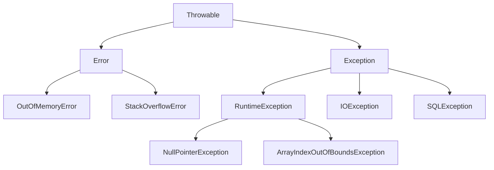
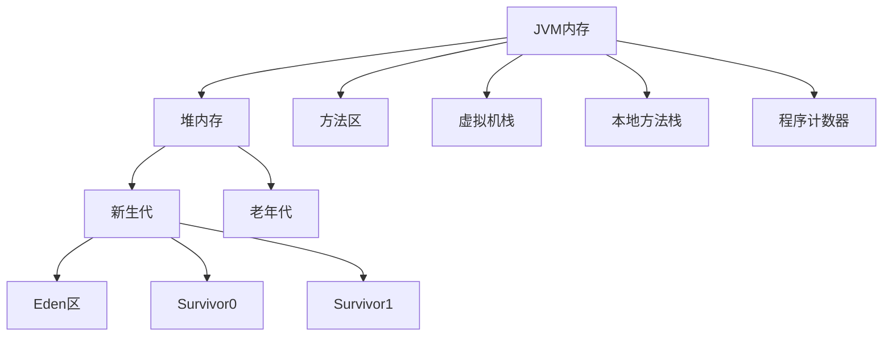
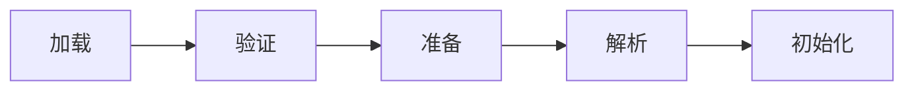
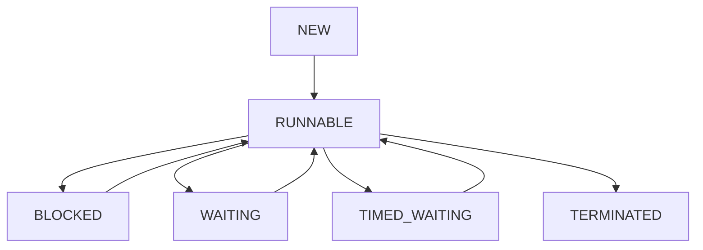

# Java 高级特性与核心概念

## 目录
- [Java 高级特性与核心概念](#java-高级特性与核心概念)
  - [目录](#目录)
  - [Java 基础核心](#java-基础核心)
    - [面向对象编程](#面向对象编程)
      - [封装（Encapsulation）](#封装encapsulation)
      - [继承（Inheritance）](#继承inheritance)
      - [多态（Polymorphism）](#多态polymorphism)
    - [异常处理机制](#异常处理机制)
      - [异常体系结构](#异常体系结构)
      - [异常处理最佳实践](#异常处理最佳实践)
    - [字符串处理](#字符串处理)
      - [String、StringBuilder、StringBuffer对比](#stringstringbuilderstringbuffer对比)
    - [泛型机制](#泛型机制)
      - [泛型基础使用](#泛型基础使用)
    - [枚举类型](#枚举类型)
      - [枚举高级用法](#枚举高级用法)
  - [JVM 核心机制](#jvm-核心机制)
    - [类加载机制详解](#类加载机制详解)
      - [详细说明](#详细说明)
    - [JVM 内存模型详解](#jvm-内存模型详解)
      - [内存区域详细说明](#内存区域详细说明)
    - [锁机制详解](#锁机制详解)
    - [并发容器](#并发容器)
    - [原子操作类](#原子操作类)
  - [集合框架](#集合框架)
    - [集合框架概览](#集合框架概览)
    - [List集合](#list集合)
      - [ArrayList与LinkedList](#arraylist与linkedlist)
      - [线程安全的List实现](#线程安全的list实现)
    - [Set集合](#set集合)
      - [HashSet与TreeSet](#hashset与treeset)
      - [特殊Set实现](#特殊set实现)
    - [Map集合](#map集合)
      - [HashMap与TreeMap](#hashmap与treemap)
      - [特殊Map实现](#特殊map实现)
    - [Queue集合](#queue集合)
      - [基本队列实现](#基本队列实现)
      - [阻塞队列实现](#阻塞队列实现)
    - [集合性能对比](#集合性能对比)
    - [集合使用最佳实践](#集合使用最佳实践)
  - [函数式编程](#函数式编程)
    - [Lambda表达式](#lambda表达式)
    - [Stream API](#stream-api)
    - [函数式接口](#函数式接口)
    - [方法引用](#方法引用)
  - [反射与注解](#反射与注解)
    - [反射机制](#反射机制)
    - [注解处理](#注解处理)
    - [动态代理](#动态代理)
      - [特殊Set实现](#特殊set实现-1)
    - [Map集合](#map集合-1)
      - [HashMap与TreeMap](#hashmap与treemap-1)
      - [特殊Map实现](#特殊map实现-1)
    - [Queue集合](#queue集合-1)
      - [基本队列实现](#基本队列实现-1)
      - [阻塞队列实现](#阻塞队列实现-1)
    - [函数式编程](#函数式编程-1)
      - [Lambda表达式](#lambda表达式-1)
      - [Stream API](#stream-api-1)
    - [反射与注解](#反射与注解-1)
    - [反射机制](#反射机制-1)
    - [注解处理](#注解处理-1)
  - [垃圾回收机制](#垃圾回收机制)
    - [GC 算法与收集器](#gc-算法与收集器)
    - [GC 详细实现](#gc-详细实现)
  - [垃圾回收机制详解](#垃圾回收机制详解)
    - [垃圾回收算法对比](#垃圾回收算法对比)
      - [标记-清除算法](#标记-清除算法)
      - [标记-复制算法](#标记-复制算法)
      - [标记-整理算法](#标记-整理算法)
    - [垃圾收集器对比](#垃圾收集器对比)
      - [新生代收集器](#新生代收集器)
      - [老年代收集器](#老年代收集器)
    - [垃圾收集器选择](#垃圾收集器选择)
    - [收集器性能对比表](#收集器性能对比表)
  - [性能优化](#性能优化)
    - [性能优化策略](#性能优化策略)
  - [多线程编程](#多线程编程)
    - [线程基础](#线程基础)
      - [线程生命周期](#线程生命周期)
      - [线程创建与使用](#线程创建与使用)
    - [线程池详解](#线程池详解)
      - [线程池工作流程](#线程池工作流程)
      - [线程池实现](#线程池实现)
    - [线程安全](#线程安全)
      - [同步机制](#同步机制)
      - [线程协作](#线程协作)
    - [线程池最佳实践](#线程池最佳实践)
  - [设计模式](#设计模式)
    - [创建型模式](#创建型模式)
      - [单例模式](#单例模式)
      - [工厂模式](#工厂模式)
      - [建造者模式](#建造者模式)
    - [结构型模式](#结构型模式)
      - [适配器模式](#适配器模式)
      - [装饰器模式](#装饰器模式)
    - [行为型模式](#行为型模式)
      - [观察者模式](#观察者模式)
      - [策略模式](#策略模式)
  - [Java新特性](#java新特性)
    - [Java 8 新特性](#java-8-新特性)
    - [Java 11 新特性](#java-11-新特性)
    - [Java 17 新特性](#java-17-新特性)
    - [Java 21 新特性](#java-21-新特性)
  - [常见面试题](#常见面试题)
    - [基础知识面试题](#基础知识面试题)
      - [1. Java基础概念](#1-java基础概念)
      - [2. 异常处理](#2-异常处理)
      - [3. 泛型机制](#3-泛型机制)
    - [JVM面试题](#jvm面试题)
      - [1. 内存模型](#1-内存模型)
      - [2. 垃圾回收](#2-垃圾回收)
      - [3. 类加载](#3-类加载)
    - [集合框架面试题](#集合框架面试题)
      - [1. List集合](#1-list集合)
      - [2. Map集合](#2-map集合)
    - [多线程面试题](#多线程面试题)
      - [1. 线程基础](#1-线程基础)
      - [2. 线程同步](#2-线程同步)
      - [3. 线程池](#3-线程池)
    - [设计模式面试题](#设计模式面试题)
      - [1. 单例模式](#1-单例模式)
      - [2. 工厂模式](#2-工厂模式)
    - [性能优化面试题](#性能优化面试题)
  - [实战应用场景](#实战应用场景)
    - [高并发系统设计](#高并发系统设计)
      - [1. 秒杀系统设计](#1-秒杀系统设计)
      - [2. 限流策略实现](#2-限流策略实现)
    - [缓存设计与实现](#缓存设计与实现)
      - [1. 多级缓存架构](#1-多级缓存架构)
      - [2. 缓存穿透、击穿、雪崩解决方案](#2-缓存穿透击穿雪崩解决方案)
    - [分布式系统开发](#分布式系统开发)
      - [1. 分布式事务解决方案](#1-分布式事务解决方案)
      - [2. 分布式锁实现](#2-分布式锁实现)
  - [故障排查与调试](#故障排查与调试)
    - [内存问题排查](#内存问题排查)
      - [1. 内存泄漏排查步骤](#1-内存泄漏排查步骤)
      - [2. 常见内存泄漏场景](#2-常见内存泄漏场景)
    - [CPU问题排查](#cpu问题排查)
      - [1. CPU使用率过高排查](#1-cpu使用率过高排查)
      - [2. CPU使用率过高的常见原因](#2-cpu使用率过高的常见原因)
    - [线程问题排查](#线程问题排查)
      - [1. 死锁排查](#1-死锁排查)
    - [GC问题排查](#gc问题排查)
      - [1. GC调优实践](#1-gc调优实践)

## Java 基础核心

### 面向对象编程

面向对象编程（OOP）是Java的核心特性，包含**封装、继承、多态**三大特性。

#### 封装（Encapsulation）
```java
/**
 * 封装示例：将数据和操作数据的方法绑定在一起
 * 优点：数据安全、代码复用、易于维护
 */
public class BankAccount {
    // 私有属性，外部无法直接访问
    private String accountNumber;
    private double balance;
    private String ownerName;
    
    // 构造方法
    public BankAccount(String accountNumber, String ownerName) {
        this.accountNumber = accountNumber;
        this.ownerName = ownerName;
        this.balance = 0.0;
    }
    
    // 公共方法提供受控访问
    public void deposit(double amount) {
        if (amount > 0) {
            balance += amount;
            System.out.println("存款成功，当前余额：" + balance);
        } else {
            throw new IllegalArgumentException("存款金额必须大于0");
        }
    }
    
    public boolean withdraw(double amount) {
        if (amount > 0 && amount <= balance) {
            balance -= amount;
            System.out.println("取款成功，当前余额：" + balance);
            return true;
        }
        return false;
    }
    
    // 只读属性
    public double getBalance() {
        return balance;
    }
    
    public String getAccountNumber() {
        return accountNumber;
    }
}
```

#### 继承（Inheritance）
```java
/**
 * 继承示例：子类继承父类的属性和方法
 * 关键字：extends, super
 * 特点：代码复用、建立类层次结构
 */

// 父类（基类）
public abstract class Animal {
    protected String name;
    protected int age;
    
    public Animal(String name, int age) {
        this.name = name;
        this.age = age;
    }
    
    // 具体方法
    public void eat() {
        System.out.println(name + " 正在吃东西");
    }
    
    // 抽象方法，子类必须实现
    public abstract void makeSound();
    
    // 可被重写的方法
    public void sleep() {
        System.out.println(name + " 正在睡觉");
    }
}

// 子类
public class Dog extends Animal {
    private String breed;
    
    public Dog(String name, int age, String breed) {
        super(name, age);  // 调用父类构造方法
        this.breed = breed;
    }
    
    @Override
    public void makeSound() {
        System.out.println(name + " 汪汪叫");
    }
    
    @Override
    public void sleep() {
        super.sleep();  // 调用父类方法
        System.out.println("狗狗睡得很香");
    }
    
    // 子类特有方法
    public void wagTail() {
        System.out.println(name + " 摇尾巴");
    }
}

// 使用示例
public class InheritanceDemo {
    public static void main(String[] args) {
        Dog dog = new Dog("旺财", 3, "金毛");
        dog.eat();        // 继承自父类
        dog.makeSound();  // 子类实现
        dog.sleep();      // 重写父类方法
        dog.wagTail();    // 子类特有方法
    }
}
```

#### 多态（Polymorphism）
```java
/**
 * 多态示例：同一接口的不同实现
 * 实现方式：方法重载、方法重写、接口实现
 * 优点：代码灵活、易扩展、降低耦合
 */

// 接口定义
public interface Shape {
    double calculateArea();
    double calculatePerimeter();
    void draw();
}

// 不同实现类
public class Circle implements Shape {
    private double radius;
    
    public Circle(double radius) {
        this.radius = radius;
    }
    
    @Override
    public double calculateArea() {
        return Math.PI * radius * radius;
    }
    
    @Override
    public double calculatePerimeter() {
        return 2 * Math.PI * radius;
    }
    
    @Override
    public void draw() {
        System.out.println("绘制圆形，半径：" + radius);
    }
}

public class Rectangle implements Shape {
    private double width;
    private double height;
    
    public Rectangle(double width, double height) {
        this.width = width;
        this.height = height;
    }
    
    @Override
    public double calculateArea() {
        return width * height;
    }
    
    @Override
    public double calculatePerimeter() {
        return 2 * (width + height);
    }
    
    @Override
    public void draw() {
        System.out.println("绘制矩形，宽：" + width + "，高：" + height);
    }
}

// 多态使用示例
public class PolymorphismDemo {
    public static void main(String[] args) {
        // 多态：父类引用指向子类对象
        Shape[] shapes = {
            new Circle(5.0),
            new Rectangle(4.0, 6.0),
            new Circle(3.0)
        };
        
        // 统一处理不同类型的对象
        for (Shape shape : shapes) {
            shape.draw();
            System.out.println("面积：" + shape.calculateArea());
            System.out.println("周长：" + shape.calculatePerimeter());
            System.out.println("---");
        }
    }
    
    // 方法重载示例
    public static void print(int value) {
        System.out.println("整数：" + value);
    }
    
    public static void print(double value) {
        System.out.println("浮点数：" + value);
    }
    
    public static void print(String value) {
        System.out.println("字符串：" + value);
    }
}
```

### 异常处理机制

Java异常处理是程序健壮性的重要保障，采用**try-catch-finally**机制。

#### 异常体系结构


#### 异常处理最佳实践
```java
/**
 * 异常处理最佳实践
 * 1. 具体异常具体处理
 * 2. 不要忽略异常
 * 3. 合理使用自定义异常
 * 4. 资源管理使用try-with-resources
 */
public class ExceptionHandlingExample {
    
    // 自定义异常
    public static class BusinessException extends Exception {
        private String errorCode;
        
        public BusinessException(String errorCode, String message) {
            super(message);
            this.errorCode = errorCode;
        }
        
        public String getErrorCode() {
            return errorCode;
        }
    }
    
    /**
     * 异常处理示例
     */
    public void handleExceptions() {
        try {
            // 可能抛出异常的代码
            processData();
        } catch (BusinessException e) {
            // 处理业务异常
            System.err.println("业务异常：" + e.getErrorCode() + " - " + e.getMessage());
            // 记录日志
            logError(e);
        } catch (IOException e) {
            // 处理IO异常
            System.err.println("IO异常：" + e.getMessage());
            // 重试机制
            retryOperation();
        } catch (Exception e) {
            // 处理其他异常
            System.err.println("未知异常：" + e.getMessage());
            e.printStackTrace();
        } finally {
            // 清理资源
            cleanup();
        }
    }
    
    /**
     * try-with-resources 自动资源管理
     */
    public void resourceManagement() {
        // 自动关闭资源
        try (FileInputStream fis = new FileInputStream("file.txt");
             BufferedReader reader = new BufferedReader(new InputStreamReader(fis))) {
            
            String line;
            while ((line = reader.readLine()) != null) {
                System.out.println(line);
            }
        } catch (IOException e) {
            System.err.println("文件读取异常：" + e.getMessage());
        }
        // 资源会自动关闭，无需手动调用close()
    }
    
    /**
     * 异常链和异常转换
     */
    public void processData() throws BusinessException {
        try {
            // 底层操作
            lowLevelOperation();
        } catch (SQLException e) {
            // 异常转换：将底层异常转换为业务异常
            throw new BusinessException("DB_ERROR", "数据库操作失败", e);
        }
    }
    
    /**
     * 异常处理的性能考虑
     */
    public void performanceConsiderations() {
        // 避免在循环中使用异常控制流程
        List<String> numbers = Arrays.asList("1", "2", "abc", "4");
        
        // 错误做法：使用异常控制流程
        for (String num : numbers) {
            try {
                int value = Integer.parseInt(num);
                System.out.println(value);
            } catch (NumberFormatException e) {
                // 异常处理开销大
                continue;
            }
        }
        
        // 正确做法：预先验证
        for (String num : numbers) {
            if (num.matches("\\d+")) {
                int value = Integer.parseInt(num);
                System.out.println(value);
            }
        }
    }
}
```

### 字符串处理

字符串是Java中最常用的数据类型，理解其内部机制对性能优化至关重要。

#### String、StringBuilder、StringBuffer对比
```java
/**
 * 字符串类型对比
 * String：不可变、线程安全、适合少量操作
 * StringBuilder：可变、非线程安全、适合单线程大量操作
 * StringBuffer：可变、线程安全、适合多线程大量操作
 */
public class StringComparisonExample {
    
    /**
     * 性能对比测试
     */
    public void performanceComparison() {
        int iterations = 10000;
        
        // String 拼接（性能最差）
        long startTime = System.currentTimeMillis();
        String str = "";
        for (int i = 0; i < iterations; i++) {
            str += "a";  // 每次都创建新对象
        }
        long stringTime = System.currentTimeMillis() - startTime;
        
        // StringBuilder 拼接（性能最好）
        startTime = System.currentTimeMillis();
        StringBuilder sb = new StringBuilder();
        for (int i = 0; i < iterations; i++) {
            sb.append("a");
        }
        String sbResult = sb.toString();
        long sbTime = System.currentTimeMillis() - startTime;
        
        // StringBuffer 拼接（性能中等）
        startTime = System.currentTimeMillis();
        StringBuffer sbf = new StringBuffer();
        for (int i = 0; i < iterations; i++) {
            sbf.append("a");
        }
        String sbfResult = sbf.toString();
        long sbfTime = System.currentTimeMillis() - startTime;
        
        System.out.println("String拼接耗时：" + stringTime + "ms");
        System.out.println("StringBuilder拼接耗时：" + sbTime + "ms");
        System.out.println("StringBuffer拼接耗时：" + sbfTime + "ms");
    }
    
    /**
     * 字符串常量池示例
     */
    public void stringPoolExample() {
        // 字面量创建，存储在常量池
        String s1 = "hello";
        String s2 = "hello";
        System.out.println(s1 == s2);  // true，指向同一对象
        
        // new创建，在堆中创建新对象
        String s3 = new String("hello");
        System.out.println(s1 == s3);  // false，不同对象
        System.out.println(s1.equals(s3));  // true，内容相同
        
        // intern()方法：将字符串加入常量池
        String s4 = s3.intern();
        System.out.println(s1 == s4);  // true，指向常量池中的对象
    }
    
    /**
     * 字符串处理最佳实践
     */
    public void stringBestPractices() {
        // 1. 使用StringBuilder进行大量字符串操作
        StringBuilder result = new StringBuilder();
        for (int i = 0; i < 1000; i++) {
            result.append("item").append(i).append(",");
        }
        
        // 2. 预估容量避免扩容
        StringBuilder sb = new StringBuilder(1000);  // 预设容量
        
        // 3. 使用String.format格式化
        String formatted = String.format("用户%s的年龄是%d岁", "张三", 25);
        
        // 4. 字符串分割优化
        String data = "a,b,c,d,e";
        String[] parts = data.split(",");  // 简单分割
        
        // 对于固定分隔符，使用StringTokenizer更高效
        StringTokenizer tokenizer = new StringTokenizer(data, ",");
        while (tokenizer.hasMoreTokens()) {
            String token = tokenizer.nextToken();
            // 处理token
        }
        
        // 5. 字符串比较
        String input = getUserInput();
        if ("admin".equals(input)) {  // 常量在前，避免NullPointerException
            // 处理管理员逻辑
        }
    }
}
```

### 泛型机制

泛型提供了**编译时类型安全**检查，避免了类型转换异常。

#### 泛型基础使用
```java
/**
 * 泛型使用示例
 * 优点：类型安全、消除类型转换、提高代码可读性
 */
public class GenericExample {
    
    /**
     * 泛型类定义
     */
    public static class Container<T> {
        private T item;
        
        public void setItem(T item) {
            this.item = item;
        }
        
        public T getItem() {
            return item;
        }
        
        // 泛型方法
        public <U> void processItem(U processor) {
            System.out.println("处理项目：" + processor);
        }
    }
    
    /**
     * 泛型接口
     */
    public interface Processor<T> {
        void process(T item);
        T transform(T input);
    }
    
    /**
     * 泛型方法示例
     */
    public static <T> void swap(T[] array, int i, int j) {
        T temp = array[i];
        array[i] = array[j];
        array[j] = temp;
    }
    
    /**
     * 通配符使用
     */
    public void wildcardExample() {
        // 上界通配符：? extends T
        List<? extends Number> numbers = new ArrayList<Integer>();
        // numbers.add(1);  // 编译错误，不能添加元素
        Number num = numbers.get(0);  // 可以读取
        
        // 下界通配符：? super T
        List<? super Integer> integers = new ArrayList<Number>();
        integers.add(1);  // 可以添加Integer及其子类
        // Integer value = integers.get(0);  // 编译错误，不能确定类型
        
        // 无界通配符：?
        List<?> unknowns = new ArrayList<String>();
        Object obj = unknowns.get(0);  // 只能当作Object处理
    }
    
    /**
     * 泛型擦除示例
     */
    public void typeErasureExample() {
        List<String> stringList = new ArrayList<>();
        List<Integer> intList = new ArrayList<>();
        
        // 运行时类型相同，都是ArrayList
        System.out.println(stringList.getClass() == intList.getClass());  // true
        
        // 获取泛型信息需要通过反射
        Type stringListType = new TypeToken<List<String>>(){}.getType();
        Type intListType = new TypeToken<List<Integer>>(){}.getType();
        System.out.println(stringListType.equals(intListType));  // false
    }
}
```

### 枚举类型

枚举是Java中的特殊类型，提供了**类型安全的常量定义**方式。

#### 枚举高级用法
```java
/**
 * 枚举高级用法示例
 * 特点：类型安全、可扩展、支持方法和字段
 */
public enum OrderStatus {
    // 枚举常量定义
    PENDING("待处理", 1) {
        @Override
        public boolean canTransitionTo(OrderStatus newStatus) {
            return newStatus == PROCESSING || newStatus == CANCELLED;
        }
    },
    
    PROCESSING("处理中", 2) {
        @Override
        public boolean canTransitionTo(OrderStatus newStatus) {
            return newStatus == COMPLETED || newStatus == CANCELLED;
        }
    },
    
    COMPLETED("已完成", 3) {
        @Override
        public boolean canTransitionTo(OrderStatus newStatus) {
            return false;  // 完成状态不能转换
        }
    },
    
    CANCELLED("已取消", -1) {
        @Override
        public boolean canTransitionTo(OrderStatus newStatus) {
            return false;  // 取消状态不能转换
        }
    };
    
    // 枚举字段
    private final String description;
    private final int code;
    
    // 枚举构造方法
    OrderStatus(String description, int code) {
        this.description = description;
        this.code = code;
    }
    
    // 抽象方法，每个枚举常量必须实现
    public abstract boolean canTransitionTo(OrderStatus newStatus);
    
    // 普通方法
    public String getDescription() {
        return description;
    }
    
    public int getCode() {
        return code;
    }
    
    // 静态方法
    public static OrderStatus fromCode(int code) {
        for (OrderStatus status : values()) {
            if (status.code == code) {
                return status;
            }
        }
        throw new IllegalArgumentException("无效的状态码：" + code);
    }
    
    // 枚举在switch中的使用
    public String getNextAction() {
        switch (this) {
            case PENDING:
                return "开始处理";
            case PROCESSING:
                return "完成处理";
            case COMPLETED:
                return "无需操作";
            case CANCELLED:
                return "无需操作";
            default:
                return "未知操作";
        }
    }
}

/**
 * 枚举使用示例
 */
public class EnumUsageExample {
    public static void main(String[] args) {
        // 基本使用
        OrderStatus status = OrderStatus.PENDING;
        System.out.println("状态：" + status.getDescription());
        System.out.println("代码：" + status.getCode());
        
        // 状态转换检查
        if (status.canTransitionTo(OrderStatus.PROCESSING)) {
            System.out.println("可以转换到处理中状态");
        }
        
        // 遍历所有枚举值
        System.out.println("所有订单状态：");
        for (OrderStatus s : OrderStatus.values()) {
            System.out.println(s.name() + " - " + s.getDescription());
        }
        
        // 从字符串创建枚举
        OrderStatus fromString = OrderStatus.valueOf("COMPLETED");
        
        // 从代码创建枚举
        OrderStatus fromCode = OrderStatus.fromCode(2);
        
        // 在集合中使用
        EnumSet<OrderStatus> activeStatuses = EnumSet.of(
            OrderStatus.PENDING, 
            OrderStatus.PROCESSING
        );
        
        EnumMap<OrderStatus, String> statusMessages = new EnumMap<>(OrderStatus.class);
        statusMessages.put(OrderStatus.PENDING, "订单等待处理");
        statusMessages.put(OrderStatus.PROCESSING, "订单正在处理");
    }
}
```

## JVM 核心机制

### 类加载机制详解

类加载是 Java 程序运行的第一步，它的过程如下：


#### 详细说明

1. **加载阶段**
   ```java
   public class ClassLoadingExample {
       // 自定义类加载器示例
       public class CustomClassLoader extends ClassLoader {
           @Override
           protected Class<?> findClass(String name) throws ClassNotFoundException {
               // 1. 加载类文件
               byte[] classData = loadClassData(name);
               // 2. 生成Class对象
               return defineClass(name, classData, 0, classData.length);
           }
           
           private byte[] loadClassData(String name) {
               // 实现从不同来源加载类文件的逻辑
               // 可以是文件系统、网络、数据库等
               return null;
           }
       }
   }
   ```

2. **验证阶段**
   - 文件格式验证：魔数检查、版本号检查
   - 元数据验证：类是否有父类、是否实现了接口等
   - 字节码验证：方法体验证、栈帧数据流验证
   - 符号引用验证：符号引用转直接引用的准备

3. **准备阶段**
   ```java
   public class PrepareExample {
       // 准备阶段为静态变量分配内存并设置默认值
       private static int value = 123;  // 准备阶段设置为0，初始化阶段才设置为123
       private static final int CONSTANT = 456;  // 准备阶段直接设置为456
   }
   ```

4. **解析阶段**
   ```java
   public class ResolutionExample {
       private static class Parent {}
       private static class Child extends Parent {}
       
       public static void main(String[] args) {
           // 类解析
           Parent p = new Child();
           // 方法解析
           p.toString();
           // 字段解析
           System.out.println(Child.class.getModifiers());
       }
   }
   ```

5. **初始化阶段**
   ```java
   public class InitializationExample {
       // 静态变量
       private static int staticVar = 100;
       
       // 静态代码块
       static {
           System.out.println("静态代码块执行");
           staticVar = 200;
       }
       
       // 类构造器
       public InitializationExample() {
           System.out.println("构造器执行");
       }
   }
   ```

### JVM 内存模型详解

JVM 内存模型是 Java 运行时的核心，它的结构如下：


#### 内存区域详细说明

1. **堆（Heap）**
   ```java
   public class HeapExample {
       public void heapAllocation() {
           // 对象分配在堆上
           Object obj = new Object();
           
           // 数组也分配在堆上
           int[] array = new int[1000];
           
           // 字符串常量池在堆中
           String str = new String("hello");  // 在堆中创建对象
           String intern = str.intern();      // 尝试在常量池中查找或创建
       }
   }
   ```

2. **方法区（Method Area）**
   ```java
   public class MethodAreaExample {
       // 静态变量存储在方法区
       private static final String CONSTANT = "常量";
       private static String staticVar = "静态变量";
       
       // 类信息存储在方法区
       static class InnerClass {
           public void method() {}
       }
   }
   ```

3. **虚拟机栈（VM Stack）**
   ```java
   public class StackExample {
       public void stackFrameDemo(int param) {
           // 局部变量存储在栈帧中
           int localVar = param + 1;
           
           // 方法调用会创建新的栈帧
           anotherMethod();
           
           // 基本类型的局部变量直接存储在栈中
           int a = 1;
           long b = 2L;
           
           // 引用类型的变量引用存储在栈中，对象存储在堆中
           Object obj = new Object();
       }
       
       private void anotherMethod() {
           // 新的栈帧
           int anotherLocal = 100;
       }
   }
   ```

### 锁机制详解
```java
/**
 * 锁的类型
 * 1. synchronized：内置锁
 * 2. ReentrantLock：可重入锁
 * 3. ReadWriteLock：读写锁
 * 4. StampedLock：邮戳锁
 */

public class LockExample {
    // ReentrantLock 示例
    private final ReentrantLock lock = new ReentrantLock(true); // 公平锁
    
    public void reentrantLockExample() {
        lock.lock();
        try {
            // 临界区代码
        } finally {
            lock.unlock();
        }
    }
    
    // ReadWriteLock 示例
    private final ReadWriteLock rwLock = new ReentrantReadWriteLock();
    private final Lock readLock = rwLock.readLock();
    private final Lock writeLock = rwLock.writeLock();
    
    public void readWriteLockExample() {
        readLock.lock();
        try {
            // 读操作
        } finally {
            readLock.unlock();
        }
        
        writeLock.lock();
        try {
            // 写操作
        } finally {
            writeLock.unlock();
        }
    }
    
    // StampedLock 示例
    private final StampedLock stampedLock = new StampedLock();
    
    public void stampedLockExample() {
        long stamp = stampedLock.tryOptimisticRead(); // 乐观读
        // 读取共享变量
        if (!stampedLock.validate(stamp)) { // 检查期间是否有写操作
            stamp = stampedLock.readLock(); // 获取悲观读锁
            try {
                // 读取共享变量
            } finally {
                stampedLock.unlockRead(stamp);
            }
        }
    }
}
```

### 并发容器
```java
/**
 * 常用并发容器
 * 1. ConcurrentHashMap：线程安全的HashMap
 * 2. CopyOnWriteArrayList：写时复制的ArrayList
 * 3. BlockingQueue：阻塞队列
 * 4. ConcurrentSkipListMap：跳表实现的有序映射
 */

public class ConcurrentContainerExample {
    // ConcurrentHashMap 示例
    private ConcurrentHashMap<String, Integer> map = new ConcurrentHashMap<>();
    
    public void concurrentMapOperations() {
        // 原子操作
        map.computeIfAbsent("key", k -> 1);
        map.computeIfPresent("key", (k, v) -> v + 1);
        map.merge("key", 1, Integer::sum);
    }
    
    // BlockingQueue 示例
    private BlockingQueue<Task> taskQueue = new LinkedBlockingQueue<>(100);
    
    public void blockingQueueOperations() {
        // 生产者
        try {
            taskQueue.put(new Task());  // 阻塞直到有空间
        } catch (InterruptedException e) {
            Thread.currentThread().interrupt();
        }
        
        // 消费者
        try {
            Task task = taskQueue.take();  // 阻塞直到有元素
            processTask(task);
        } catch (InterruptedException e) {
            Thread.currentThread().interrupt();
        }
    }
}
```

### 原子操作类
```java
/**
 * 原子类型
 * 1. AtomicInteger/Long/Boolean：基本类型原子类
 * 2. AtomicReference：引用类型原子类
 * 3. AtomicIntegerArray：数组元素原子操作
 * 4. AtomicIntegerFieldUpdater：对象字段原子更新
 */

public class AtomicExample {
    // AtomicInteger 示例
    private AtomicInteger counter = new AtomicInteger(0);
    
    public void atomicOperations() {
        // 原子递增
        counter.incrementAndGet();
        // CAS操作
        counter.compareAndSet(1, 2);
        // 原子更新
        counter.updateAndGet(x -> x * 2);
    }
    
    // AtomicReference 示例
    private AtomicReference<User> userRef = new AtomicReference<>();
    
    public void atomicReferenceOperations() {
        User user = new User("John");
        userRef.set(user);
        
        // CAS更新
        User oldUser = userRef.get();
        User newUser = new User("Jane");
        userRef.compareAndSet(oldUser, newUser);
    }
}
```

## 集合框架

### 集合框架概览

Java 集合框架的整体结构如下：


### List集合

#### ArrayList与LinkedList
```java
public class ListExample {
    /**
     * ArrayList
     * 优点：随机访问快，尾部插入删除快
     * 缺点：扩容时需要复制数组，中间插入删除慢
     */
    public void arrayListDemo() {
        // 创建时指定初始容量，避免扩容
        ArrayList<String> list = new ArrayList<>(10);
        
        // 添加元素
        list.add("A");
        list.add(0, "B");  // 在指定位置添加
        
        // 批量添加
        list.addAll(Arrays.asList("C", "D"));
        
        // 访问元素
        String first = list.get(0);
        
        // 修改元素
        list.set(1, "Modified");
        
        // 删除元素
        list.remove("A");
        list.remove(0);
    }
    
    /**
     * LinkedList
     * 优点：插入删除快，可以用作队列或栈
     * 缺点：随机访问慢，内存占用较大
     */
    public void linkedListDemo() {
        LinkedList<String> list = new LinkedList<>();
        
        // 队列操作
        list.offer("First");
        list.poll();
        
        // 栈操作
        list.push("Top");
        list.pop();
        
        // 双端操作
        list.addFirst("Start");
        list.addLast("End");
    }
}
```

#### 线程安全的List实现
```java
public class ThreadSafeListExample {
    /**
     * CopyOnWriteArrayList
     * 适用场景：读多写少，数据量较小
     * 特点：写时复制，读写分离
     */
    public void copyOnWriteArrayListDemo() {
        CopyOnWriteArrayList<String> list = new CopyOnWriteArrayList<>();
        
        // 线程安全的添加
        list.add("A");
        list.addIfAbsent("B");  // 元素不存在时才添加
        
        // 批量添加
        list.addAllAbsent(Arrays.asList("C", "D"));
    }
    
    /**
     * Vector（不推荐使用）
     * 特点：所有方法同步，性能较差
     */
    public void vectorDemo() {
        Vector<String> vector = new Vector<>();
        vector.add("A");
        vector.elementAt(0);
    }
}
```

### Set集合

#### HashSet与TreeSet
```java
public class SetExample {
    /**
     * HashSet
     * 特点：无序，不重复，允许null
     * 原理：基于HashMap实现
     */
    public void hashSetDemo() {
        HashSet<String> set = new HashSet<>();
        
        // 添加元素
        set.add("A");
        set.add("B");
        set.add("A");  // 重复元素不会被添加
        
        // 自定义对象必须正确实现equals和hashCode
        HashSet<Person> personSet = new HashSet<>();
        personSet.add(new Person("John", 25));
    }
    
    /**
     * TreeSet
     * 特点：有序，不重复，不允许null
     * 原理：基于TreeMap实现
     */
    public void treeSetDemo() {
        // 自然顺序
        TreeSet<String> set = new TreeSet<>();
        set.add("B");
        set.add("A");
        set.add("C");
        
        // 自定义顺序
        TreeSet<Person> personSet = new TreeSet<>((p1, p2) -> 
            p1.getAge() - p2.getAge()
        );
        
        // 范围操作
        SortedSet<String> subset = set.subSet("A", "C");
        String first = set.first();
        String last = set.last();
    }
}
```

#### 特殊Set实现
```java
public class SpecialSetExample {
    /**
     * LinkedHashSet
     * 特点：维护插入顺序的HashSet
     */
    public void linkedHashSetDemo() {
        LinkedHashSet<String> set = new LinkedHashSet<>();
        set.add("C");
        set.add("A");
        set.add("B");
        // 遍历顺序：C, A, B
    }
    
    /**
     * ConcurrentSkipListSet
     * 特点：线程安全的有序Set
     */
    public void concurrentSetDemo() {
        ConcurrentSkipListSet<Integer> set = new ConcurrentSkipListSet<>();
        set.add(5);
        set.add(1);
        set.add(3);
        // 自动排序：1, 3, 5
    }
}
```

### Map集合

#### HashMap与TreeMap
```java
public class MapExample {
    /**
     * HashMap
     * 特点：无序，允许null键值，非线程安全
     * 原理：数组+链表+红黑树
     */
    public void hashMapDemo() {
        HashMap<String, Integer> map = new HashMap<>(16, 0.75f);
        
        // 基本操作
        map.put("A", 1);
        map.get("A");
        map.remove("A");
        
        // Java 8 新方法
        map.computeIfAbsent("B", k -> k.length());
        map.merge("A", 1, Integer::sum);
    }
    
    /**
     * TreeMap
     * 特点：有序，不允许null键，基于红黑树
     */
    public void treeMapDemo() {
        TreeMap<String, Integer> map = new TreeMap<>();
        map.put("B", 2);
        map.put("A", 1);
        map.put("C", 3);
        
        // 范围操作
        SortedMap<String, Integer> subMap = map.subMap("A", "C");
        Map.Entry<String, Integer> firstEntry = map.firstEntry();
    }
}
```

#### 特殊Map实现
```java
public class SpecialMapExample {
    /**
     * LinkedHashMap
     * 特点：维护插入顺序或访问顺序
     */
    public void linkedHashMapDemo() {
        // LRU缓存实现
        LinkedHashMap<String, Integer> lruCache = 
            new LinkedHashMap<>(16, 0.75f, true) {
                @Override
                protected boolean removeEldestEntry(Map.Entry<String, Integer> eldest) {
                    return size() > 100;
                }
            };
    }
    
    /**
     * WeakHashMap
     * 特点：弱引用键，适合缓存
     */
    public void weakHashMapDemo() {
        WeakHashMap<UniqueObject, String> cache = new WeakHashMap<>();
        UniqueObject key = new UniqueObject("test");
        cache.put(key, "value");
        key = null;  // 键可能被GC回收
    }
}
```

### Queue集合

#### 基本队列实现
```java
public class QueueExample {
    /**
     * ArrayDeque
     * 特点：数组实现的双端队列
     */
    public void arrayDequeDemo() {
        ArrayDeque<String> deque = new ArrayDeque<>();
        
        // 队列操作
        deque.offer("First");
        deque.poll();
        
        // 栈操作
        deque.push("Top");
        deque.pop();
    }
    
    /**
     * PriorityQueue
     * 特点：基于堆的优先级队列
     */
    public void priorityQueueDemo() {
        // 最小堆
        PriorityQueue<Integer> minHeap = new PriorityQueue<>();
        
        // 最大堆
        PriorityQueue<Integer> maxHeap = new PriorityQueue<>(
            Collections.reverseOrder()
        );
    }
}
```

#### 阻塞队列实现
```java
public class BlockingQueueExample {
    /**
     * 常用阻塞队列实现
     */
    public void blockingQueueDemo() {
        // 固定大小的阻塞队列
        ArrayBlockingQueue<String> arrayQueue = 
            new ArrayBlockingQueue<>(100);
        
        // 无界阻塞队列
        LinkedBlockingQueue<String> linkedQueue = 
            new LinkedBlockingQueue<>();
        
        // 延迟队列
        DelayQueue<DelayedElement> delayQueue = 
            new DelayQueue<>();
        
        // 同步队列
        SynchronousQueue<String> syncQueue = 
            new SynchronousQueue<>();
    }
}
```

### 集合性能对比

| 集合类型          | 插入              | 删除              | 查找     | 遍历 | 线程安全 | 适用场景   |
| ----------------- | ----------------- | ----------------- | -------- | ---- | -------- | ---------- |
| ArrayList         | O(1)尾部/O(n)中间 | O(1)尾部/O(n)中间 | O(1)     | O(n) | 否       | 随机访问多 |
| LinkedList        | O(1)              | O(1)              | O(n)     | O(n) | 否       | 插入删除多 |
| HashMap           | O(1)              | O(1)              | O(1)     | O(n) | 否       | 键值对存储 |
| TreeMap           | O(log n)          | O(log n)          | O(log n) | O(n) | 否       | 有序键值对 |
| HashSet           | O(1)              | O(1)              | O(1)     | O(n) | 否       | 去重存储   |
| TreeSet           | O(log n)          | O(log n)          | O(log n) | O(n) | 否       | 有序去重   |
| ConcurrentHashMap | O(1)              | O(1)              | O(1)     | O(n) | 是       | 并发键值对 |

### 集合使用最佳实践

```java
/**
 * 集合使用最佳实践
 */
public class CollectionBestPractices {
    
    /**
     * 选择合适的集合类型
     */
    public void chooseRightCollection() {
        // 1. 需要索引访问 -> ArrayList
        List<String> indexedList = new ArrayList<>();
        
        // 2. 频繁插入删除 -> LinkedList
        List<String> modifiableList = new LinkedList<>();
        
        // 3. 去重存储 -> HashSet
        Set<String> uniqueItems = new HashSet<>();
        
        // 4. 有序去重 -> TreeSet
        Set<String> sortedUniqueItems = new TreeSet<>();
        
        // 5. 键值对存储 -> HashMap
        Map<String, Object> keyValueStore = new HashMap<>();
        
        // 6. 有序键值对 -> TreeMap
        Map<String, Object> sortedKeyValueStore = new TreeMap<>();
    }
    
    /**
     * 性能优化技巧
     */
    public void performanceOptimization() {
        // 1. 预设容量避免扩容
        List<String> list = new ArrayList<>(1000);
        Map<String, String> map = new HashMap<>(1000);
        
        // 2. 使用合适的负载因子
        Map<String, String> optimizedMap = new HashMap<>(16, 0.75f);
        
        // 3. 批量操作
        List<String> source = Arrays.asList("a", "b", "c");
        List<String> target = new ArrayList<>();
        target.addAll(source);  // 批量添加
        
        // 4. 使用Iterator删除元素
        Iterator<String> iterator = list.iterator();
        while (iterator.hasNext()) {
            String item = iterator.next();
            if (shouldRemove(item)) {
                iterator.remove();  // 安全删除
            }
        }
    }
    
    /**
     * 线程安全处理
     */
    public void threadSafetyHandling() {
        // 1. 使用并发集合
        Map<String, String> concurrentMap = new ConcurrentHashMap<>();
        List<String> copyOnWriteList = new CopyOnWriteArrayList<>();
        
        // 2. 同步包装器（性能较差）
        List<String> syncList = Collections.synchronizedList(new ArrayList<>());
        Map<String, String> syncMap = Collections.synchronizedMap(new HashMap<>());
        
        // 3. 外部同步
        List<String> list = new ArrayList<>();
        synchronized (list) {
            list.add("item");
        }
    }
}
```

## 函数式编程

### Lambda表达式

**Lambda表达式**是Java 8引入的重要特性，提供了**简洁的函数式编程**方式。

```java
/**
 * Lambda表达式详解
 * 语法：(参数) -> 表达式 或 (参数) -> { 语句块 }
 */
public class LambdaExample {
    
    /**
     * 基础语法示例
     */
    public void basicSyntax() {
        // 无参数Lambda
        Runnable r1 = () -> System.out.println("Hello Lambda");
        
        // 单参数Lambda（可省略括号）
        Consumer<String> c1 = s -> System.out.println(s);
        Consumer<String> c2 = (s) -> System.out.println(s);
        
        // 多参数Lambda
        BinaryOperator<Integer> add = (a, b) -> a + b;
        
        // 多行Lambda
        Function<String, String> processor = (input) -> {
            String processed = input.trim().toLowerCase();
            return processed.isEmpty() ? "empty" : processed;
        };
        
        // 方法引用
        List<String> list = Arrays.asList("a", "b", "c");
        list.forEach(System.out::println);  // 等价于 s -> System.out.println(s)
    }
    
    /**
     * 变量捕获
     */
    public void variableCapture() {
        String prefix = "Hello ";  // 有效final变量
        
        Function<String, String> greeter = name -> prefix + name;
        
        // prefix = "Hi ";  // 编译错误：Lambda中使用的变量必须是final或有效final
        
        // 实例变量和静态变量可以修改
        List<String> results = new ArrayList<>();
        Stream.of("a", "b", "c")
              .forEach(s -> results.add(s.toUpperCase()));
    }
    
    /**
     * 类型推断
     */
    public void typeInference() {
        // 编译器可以推断参数类型
        List<String> list = Arrays.asList("apple", "banana", "cherry");
        
        // 显式类型声明
        list.sort((String a, String b) -> a.compareTo(b));
        
        // 类型推断
        list.sort((a, b) -> a.compareTo(b));
        
        // 方法引用
        list.sort(String::compareTo);
    }
}
```

### Stream API

**Stream API**提供了**声明式的数据处理**方式，支持链式操作。

```java
/**
 * Stream API详解
 * 特点：声明式、可链式调用、支持并行处理
 */
public class StreamExample {
    
    /**
     * 创建Stream的方式
     */
    public void createStreams() {
        // 1. 从集合创建
        List<String> list = Arrays.asList("a", "b", "c");
        Stream<String> stream1 = list.stream();
        
        // 2. 从数组创建
        String[] array = {"a", "b", "c"};
        Stream<String> stream2 = Arrays.stream(array);
        
        // 3. 使用Stream.of()
        Stream<String> stream3 = Stream.of("a", "b", "c");
        
        // 4. 无限流
        Stream<Integer> infiniteStream = Stream.iterate(0, n -> n + 1);
        Stream<Double> randomStream = Stream.generate(Math::random);
        
        // 5. 数值流
        IntStream intStream = IntStream.range(1, 100);
        LongStream longStream = LongStream.rangeClosed(1, 100);
    }
    
    /**
     * 中间操作（惰性求值）
     */
    public void intermediateOperations() {
        List<String> words = Arrays.asList("apple", "banana", "cherry", "date");
        
        // filter：过滤
        words.stream()
             .filter(word -> word.length() > 5)
             .forEach(System.out::println);
        
        // map：转换
        words.stream()
             .map(String::toUpperCase)
             .forEach(System.out::println);
        
        // flatMap：扁平化
        List<List<String>> nestedList = Arrays.asList(
            Arrays.asList("a", "b"),
            Arrays.asList("c", "d")
        );
        nestedList.stream()
                  .flatMap(List::stream)
                  .forEach(System.out::println);
        
        // distinct：去重
        Arrays.asList("a", "b", "a", "c")
              .stream()
              .distinct()
              .forEach(System.out::println);
        
        // sorted：排序
        words.stream()
             .sorted()
             .forEach(System.out::println);
        
        // limit：限制数量
        words.stream()
             .limit(2)
             .forEach(System.out::println);
        
        // skip：跳过
        words.stream()
             .skip(1)
             .forEach(System.out::println);
    }
    
    /**
     * 终端操作（触发计算）
     */
    public void terminalOperations() {
        List<Integer> numbers = Arrays.asList(1, 2, 3, 4, 5);
        
        // forEach：遍历
        numbers.stream().forEach(System.out::println);
        
        // collect：收集
        List<Integer> evenNumbers = numbers.stream()
                                          .filter(n -> n % 2 == 0)
                                          .collect(Collectors.toList());
        
        // reduce：归约
        Optional<Integer> sum = numbers.stream()
                                      .reduce((a, b) -> a + b);
        int sum2 = numbers.stream()
                         .reduce(0, Integer::sum);
        
        // count：计数
        long count = numbers.stream()
                           .filter(n -> n > 3)
                           .count();
        
        // anyMatch/allMatch/noneMatch：匹配
        boolean hasEven = numbers.stream().anyMatch(n -> n % 2 == 0);
        boolean allPositive = numbers.stream().allMatch(n -> n > 0);
        boolean noneNegative = numbers.stream().noneMatch(n -> n < 0);
        
        // findFirst/findAny：查找
        Optional<Integer> first = numbers.stream()
                                        .filter(n -> n > 3)
                                        .findFirst();
        
        // min/max：最值
        Optional<Integer> min = numbers.stream().min(Integer::compareTo);
        Optional<Integer> max = numbers.stream().max(Integer::compareTo);
    }
    
    /**
     * 收集器使用
     */
    public void collectorsUsage() {
        List<Person> people = Arrays.asList(
            new Person("Alice", 25, "Engineer"),
            new Person("Bob", 30, "Manager"),
            new Person("Charlie", 25, "Engineer")
        );
        
        // 转换为List
        List<String> names = people.stream()
                                  .map(Person::getName)
                                  .collect(Collectors.toList());
        
        // 转换为Set
        Set<String> departments = people.stream()
                                       .map(Person::getDepartment)
                                       .collect(Collectors.toSet());
        
        // 分组
        Map<String, List<Person>> byDepartment = 
            people.stream()
                  .collect(Collectors.groupingBy(Person::getDepartment));
        
        // 分区
        Map<Boolean, List<Person>> partitioned = 
            people.stream()
                  .collect(Collectors.partitioningBy(p -> p.getAge() > 25));
        
        // 统计
        IntSummaryStatistics ageStats = 
            people.stream()
                  .collect(Collectors.summarizingInt(Person::getAge));
        
        // 连接字符串
        String nameList = people.stream()
                               .map(Person::getName)
                               .collect(Collectors.joining(", "));
    }
    
    /**
     * 并行流
     */
    public void parallelStreams() {
        List<Integer> numbers = IntStream.range(1, 1000000)
                                       .boxed()
                                       .collect(Collectors.toList());
        
        // 串行处理
        long start = System.currentTimeMillis();
        long sum1 = numbers.stream()
                          .mapToLong(Integer::longValue)
                          .sum();
        long serialTime = System.currentTimeMillis() - start;
        
        // 并行处理
        start = System.currentTimeMillis();
        long sum2 = numbers.parallelStream()
                          .mapToLong(Integer::longValue)
                          .sum();
        long parallelTime = System.currentTimeMillis() - start;
        
        System.out.println("串行耗时：" + serialTime + "ms");
        System.out.println("并行耗时：" + parallelTime + "ms");
    }
}
```

### 函数式接口

Java 8提供了丰富的**函数式接口**，支持函数式编程范式。

```java
/**
 * 常用函数式接口
 */
public class FunctionalInterfaceExample {
    
    /**
     * 基本函数式接口
     */
    public void basicFunctionalInterfaces() {
        // Supplier：供应者，无参数有返回值
        Supplier<String> stringSupplier = () -> "Hello World";
        Supplier<Double> randomSupplier = Math::random;
        
        // Consumer：消费者，有参数无返回值
        Consumer<String> printer = System.out::println;
        Consumer<String> upperCasePrinter = s -> System.out.println(s.toUpperCase());
        
        // Function：函数，有参数有返回值
        Function<String, Integer> lengthFunction = String::length;
        Function<Integer, String> toStringFunction = Object::toString;
        
        // Predicate：断言，有参数返回boolean
        Predicate<String> isEmpty = String::isEmpty;
        Predicate<Integer> isEven = n -> n % 2 == 0;
        
        // UnaryOperator：一元操作符，输入输出类型相同
        UnaryOperator<String> toUpperCase = String::toUpperCase;
        
        // BinaryOperator：二元操作符，两个输入一个输出，类型相同
        BinaryOperator<Integer> add = Integer::sum;
        BinaryOperator<String> concat = String::concat;
    }
    
    /**
     * 函数式接口组合
     */
    public void functionalInterfaceComposition() {
        // Function组合
        Function<String, String> trim = String::trim;
        Function<String, String> upperCase = String::toUpperCase;
        Function<String, String> combined = trim.andThen(upperCase);
        
        // Predicate组合
        Predicate<String> notEmpty = s -> !s.isEmpty();
        Predicate<String> notBlank = s -> !s.trim().isEmpty();
        Predicate<String> valid = notEmpty.and(notBlank);
        
        // Consumer组合
        Consumer<String> print = System.out::println;
        Consumer<String> log = s -> System.err.println("LOG: " + s);
        Consumer<String> printAndLog = print.andThen(log);
    }
    
    /**
     * 自定义函数式接口
     */
    @FunctionalInterface
    public interface TriFunction<T, U, V, R> {
        R apply(T t, U u, V v);
        
        // 默认方法
        default <W> TriFunction<T, U, V, W> andThen(Function<? super R, ? extends W> after) {
            Objects.requireNonNull(after);
            return (T t, U u, V v) -> after.apply(apply(t, u, v));
        }
    }
    
    public void customFunctionalInterface() {
        TriFunction<Integer, Integer, Integer, Integer> sum3 = 
            (a, b, c) -> a + b + c;
        
        int result = sum3.apply(1, 2, 3);  // 6
    }
}
```

### 方法引用

**方法引用**是Lambda表达式的简化形式，提供了更简洁的语法。

```java
/**
 * 方法引用详解
 * 语法：类名::方法名 或 对象::方法名
 */
public class MethodReferenceExample {
    
    /**
     * 静态方法引用
     */
    public void staticMethodReference() {
        List<String> numbers = Arrays.asList("1", "2", "3");
        
        // Lambda表达式
        List<Integer> integers1 = numbers.stream()
                                        .map(s -> Integer.parseInt(s))
                                        .collect(Collectors.toList());
        
        // 静态方法引用
        List<Integer> integers2 = numbers.stream()
                                        .map(Integer::parseInt)
                                        .collect(Collectors.toList());
    }
    
    /**
     * 实例方法引用
     */
    public void instanceMethodReference() {
        List<String> words = Arrays.asList("apple", "banana", "cherry");
        
        // Lambda表达式
        words.stream()
             .map(s -> s.toUpperCase())
             .forEach(s -> System.out.println(s));
        
        // 实例方法引用
        words.stream()
             .map(String::toUpperCase)
             .forEach(System.out::println);
    }
    
    /**
     * 构造方法引用
     */
    public void constructorReference() {
        List<String> names = Arrays.asList("Alice", "Bob", "Charlie");
        
        // Lambda表达式
        List<Person> people1 = names.stream()
                                   .map(name -> new Person(name))
                                   .collect(Collectors.toList());
        
        // 构造方法引用
        List<Person> people2 = names.stream()
                                   .map(Person::new)
                                   .collect(Collectors.toList());
        
        // 数组构造方法引用
        String[] array = names.stream()
                             .toArray(String[]::new);
    }
    
    /**
     * 特定对象的方法引用
     */
    public void specificObjectMethodReference() {
        List<String> words = Arrays.asList("hello", "world");
        StringBuilder sb = new StringBuilder();
        
        // Lambda表达式
        words.forEach(word -> sb.append(word));
        
        // 特定对象的方法引用
        words.forEach(sb::append);
    }
}
```

## 反射与注解

### 反射机制

**反射**是Java的强大特性，允许程序在**运行时检查和操作类、方法、字段**等。

```java
/**
 * 反射机制详解
 * 应用场景：框架开发、动态代理、注解处理、序列化
 */
public class ReflectionExample {
    
    /**
     * 获取Class对象的方式
     */
    public void getClassObject() throws ClassNotFoundException {
        // 1. 通过类名.class
        Class<String> clazz1 = String.class;
        
        // 2. 通过对象.getClass()
        String str = "hello";
        Class<?> clazz2 = str.getClass();
        
        // 3. 通过Class.forName()
        Class<?> clazz3 = Class.forName("java.lang.String");
        
        // 4. 通过类加载器
        ClassLoader loader = Thread.currentThread().getContextClassLoader();
        Class<?> clazz4 = loader.loadClass("java.lang.String");
    }
    
    /**
     * 类信息获取
     */
    public void getClassInfo() {
        Class<Person> clazz = Person.class;
        
        // 基本信息
        System.out.println("类名：" + clazz.getName());
        System.out.println("简单类名：" + clazz.getSimpleName());
        System.out.println("包名：" + clazz.getPackage().getName());
        System.out.println("修饰符：" + Modifier.toString(clazz.getModifiers()));
        
        // 父类和接口
        Class<?> superClass = clazz.getSuperclass();
        Class<?>[] interfaces = clazz.getInterfaces();
        
        // 内部类
        Class<?>[] innerClasses = clazz.getDeclaredClasses();
    }
    
    /**
     * 字段操作
     */
    public void fieldOperations() throws Exception {
        Class<Person> clazz = Person.class;
        Person person = new Person("Alice", 25);
        
        // 获取所有公共字段
        Field[] publicFields = clazz.getFields();
        
        // 获取所有声明字段（包括私有）
        Field[] declaredFields = clazz.getDeclaredFields();
        
        // 获取特定字段
        Field nameField = clazz.getDeclaredField("name");
        nameField.setAccessible(true);  // 访问私有字段
        
        // 读取字段值
        String name = (String) nameField.get(person);
        System.out.println("姓名：" + name);
        
        // 设置字段值
        nameField.set(person, "Bob");
        
        // 字段信息
        System.out.println("字段名：" + nameField.getName());
        System.out.println("字段类型：" + nameField.getType());
        System.out.println("字段修饰符：" + Modifier.toString(nameField.getModifiers()));
    }
    
    /**
     * 方法操作
     */
    public void methodOperations() throws Exception {
        Class<Person> clazz = Person.class;
        Person person = new Person("Alice", 25);
        
        // 获取所有公共方法
        Method[] publicMethods = clazz.getMethods();
        
        // 获取所有声明方法
        Method[] declaredMethods = clazz.getDeclaredMethods();
        
        // 获取特定方法
        Method setNameMethod = clazz.getDeclaredMethod("setName", String.class);
        Method getNameMethod = clazz.getDeclaredMethod("getName");
        
        // 调用方法
        setNameMethod.invoke(person, "Charlie");
        String name = (String) getNameMethod.invoke(person);
        
        // 方法信息
        System.out.println("方法名：" + setNameMethod.getName());
        System.out.println("参数类型：" + Arrays.toString(setNameMethod.getParameterTypes()));
        System.out.println("返回类型：" + setNameMethod.getReturnType());
        System.out.println("异常类型：" + Arrays.toString(setNameMethod.getExceptionTypes()));
    }
    
    /**
     * 构造方法操作
     */
    public void constructorOperations() throws Exception {
        Class<Person> clazz = Person.class;
        
        // 获取所有构造方法
        Constructor<?>[] constructors = clazz.getConstructors();
        
        // 获取特定构造方法
        Constructor<Person> constructor = clazz.getConstructor(String.class, int.class);
        
        // 创建实例
        Person person = constructor.newInstance("David", 30);
        
        // 无参构造方法
        Constructor<Person> defaultConstructor = clazz.getConstructor();
        Person person2 = defaultConstructor.newInstance();
        
        // 使用Class.newInstance()（已废弃）
        // Person person3 = clazz.newInstance();
    }
    
    /**
     * 泛型信息获取
     */
    public void genericTypeInfo() throws Exception {
        Class<GenericClass> clazz = GenericClass.class;
        
        // 获取泛型父类
        Type genericSuperclass = clazz.getGenericSuperclass();
        if (genericSuperclass instanceof ParameterizedType) {
            ParameterizedType paramType = (ParameterizedType) genericSuperclass;
            Type[] actualTypes = paramType.getActualTypeArguments();
        }
        
        // 获取字段的泛型类型
        Field listField = clazz.getDeclaredField("list");
        Type genericType = listField.getGenericType();
        if (genericType instanceof ParameterizedType) {
            ParameterizedType paramType = (ParameterizedType) genericType;
            Type[] actualTypes = paramType.getActualTypeArguments();
        }
    }
    
    /**
     * 反射性能优化
     */
    public void performanceOptimization() throws Exception {
        Class<Person> clazz = Person.class;
        Method method = clazz.getDeclaredMethod("getName");
        
        // 缓存Method对象
        Map<String, Method> methodCache = new ConcurrentHashMap<>();
        methodCache.put("getName", method);
        
        // 使用MethodHandle（Java 7+）
        MethodHandles.Lookup lookup = MethodHandles.lookup();
        MethodHandle methodHandle = lookup.findVirtual(Person.class, "getName", 
                                                      MethodType.methodType(String.class));
        
        Person person = new Person("Alice", 25);
        
        // 传统反射调用
        String name1 = (String) method.invoke(person);
        
        // MethodHandle调用（性能更好）
        String name2 = (String) methodHandle.invoke(person);
    }
}

/**
 * 示例类
 */
class GenericClass<T> {
    private List<String> list;
    private T data;
}
```

### 注解处理

**注解**提供了**元数据**支持，广泛用于框架开发和代码生成。

```java
/**
 * 自定义注解示例
 */

// 方法级注解
@Retention(RetentionPolicy.RUNTIME)
@Target(ElementType.METHOD)
public @interface Audit {
    String value() default "";
    boolean enabled() default true;
    String[] roles() default {};
}

// 类级注解
@Retention(RetentionPolicy.RUNTIME)
@Target(ElementType.TYPE)
public @interface Entity {
    String tableName() default "";
    String schema() default "";
}

// 字段级注解
@Retention(RetentionPolicy.RUNTIME)
@Target(ElementType.FIELD)
public @interface Column {
    String name() default "";
    boolean nullable() default true;
    int length() default 255;
}

// 参数级注解
@Retention(RetentionPolicy.RUNTIME)
@Target(ElementType.PARAMETER)
public @interface Valid {
    String message() default "参数验证失败";
}

/**
 * 注解使用示例
 */
@Entity(tableName = "users", schema = "public")
public class User {
    @Column(name = "user_id", nullable = false)
    private Long id;
    
    @Column(name = "user_name", length = 50)
    private String name;
    
    @Column(name = "email", length = 100)
    private String email;
    
    @Audit(value = "用户登录", roles = {"USER", "ADMIN"})
    public boolean login(@Valid String username, @Valid String password) {
        // 登录逻辑
        return true;
    }
    
    @Audit(value = "更新用户信息", enabled = true)
    public void updateProfile(@Valid User user) {
        // 更新逻辑
    }
}

/**
 * 注解处理器
 */
public class AnnotationProcessor {
    
    /**
     * 处理类级注解
     */
    public void processClassAnnotations(Class<?> clazz) {
        if (clazz.isAnnotationPresent(Entity.class)) {
            Entity entity = clazz.getAnnotation(Entity.class);
            System.out.println("表名：" + entity.tableName());
            System.out.println("模式：" + entity.schema());
        }
    }
    
    /**
     * 处理字段注解
     */
    public void processFieldAnnotations(Class<?> clazz) {
        Field[] fields = clazz.getDeclaredFields();
        for (Field field : fields) {
            if (field.isAnnotationPresent(Column.class)) {
                Column column = field.getAnnotation(Column.class);
                System.out.println("字段：" + field.getName());
                System.out.println("列名：" + column.name());
                System.out.println("可空：" + column.nullable());
                System.out.println("长度：" + column.length());
            }
        }
    }
    
    /**
     * 处理方法注解
     */
    public void processMethodAnnotations(Class<?> clazz) {
        Method[] methods = clazz.getDeclaredMethods();
        for (Method method : methods) {
            if (method.isAnnotationPresent(Audit.class)) {
                Audit audit = method.getAnnotation(Audit.class);
                System.out.println("方法：" + method.getName());
                System.out.println("审计信息：" + audit.value());
                System.out.println("是否启用：" + audit.enabled());
                System.out.println("角色：" + Arrays.toString(audit.roles()));
            }
        }
    }
    
    /**
     * 处理参数注解
     */
    public void processParameterAnnotations(Method method) {
        Parameter[] parameters = method.getParameters();
        Annotation[][] paramAnnotations = method.getParameterAnnotations();
        
        for (int i = 0; i < parameters.length; i++) {
            Parameter param = parameters[i];
            Annotation[] annotations = paramAnnotations[i];
            
            for (Annotation annotation : annotations) {
                if (annotation instanceof Valid) {
                    Valid valid = (Valid) annotation;
                    System.out.println("参数：" + param.getName());
                    System.out.println("验证消息：" + valid.message());
                }
            }
        }
    }
    
    /**
     * 注解驱动的对象映射
     */
    public String generateSQL(Class<?> clazz) {
        if (!clazz.isAnnotationPresent(Entity.class)) {
            throw new IllegalArgumentException("类必须标注@Entity注解");
        }
        
        Entity entity = clazz.getAnnotation(Entity.class);
        StringBuilder sql = new StringBuilder();
        sql.append("CREATE TABLE ");
        
        if (!entity.schema().isEmpty()) {
            sql.append(entity.schema()).append(".");
        }
        
        sql.append(entity.tableName()).append(" (");
        
        Field[] fields = clazz.getDeclaredFields();
        List<String> columns = new ArrayList<>();
        
        for (Field field : fields) {
            if (field.isAnnotationPresent(Column.class)) {
                Column column = field.getAnnotation(Column.class);
                StringBuilder columnDef = new StringBuilder();
                
                columnDef.append(column.name().isEmpty() ? field.getName() : column.name());
                columnDef.append(" VARCHAR(").append(column.length()).append(")");
                
                if (!column.nullable()) {
                    columnDef.append(" NOT NULL");
                }
                
                columns.add(columnDef.toString());
            }
        }
        
        sql.append(String.join(", ", columns));
        sql.append(")");
        
        return sql.toString();
    }
}
```

### 动态代理

**动态代理**是反射的重要应用，用于**AOP、框架开发**等场景。

```java
/**
 * 动态代理示例
 */
public class DynamicProxyExample {
    
    // 业务接口
    public interface UserService {
        void save(User user);
        User findById(Long id);
        void delete(Long id);
    }
    
    // 业务实现
    public static class UserServiceImpl implements UserService {
        @Override
        public void save(User user) {
            System.out.println("保存用户：" + user.getName());
        }
        
        @Override
        public User findById(Long id) {
            System.out.println("查找用户：" + id);
            return new User("User" + id, 25);
        }
        
        @Override
        public void delete(Long id) {
            System.out.println("删除用户：" + id);
        }
    }
    
    /**
     * JDK动态代理
     */
    public static class JdkProxyHandler implements InvocationHandler {
        private final Object target;
        
        public JdkProxyHandler(Object target) {
            this.target = target;
        }
        
        @Override
        public Object invoke(Object proxy, Method method, Object[] args) throws Throwable {
            // 前置处理
            System.out.println("=== 方法调用前 ===");
            System.out.println("方法名：" + method.getName());
            System.out.println("参数：" + Arrays.toString(args));
            
            long startTime = System.currentTimeMillis();
            
            try {
                // 调用目标方法
                Object result = method.invoke(target, args);
                
                // 后置处理
                long endTime = System.currentTimeMillis();
                System.out.println("方法执行耗时：" + (endTime - startTime) + "ms");
                System.out.println("=== 方法调用后 ===");
                
                return result;
            } catch (Exception e) {
                System.err.println("方法执行异常：" + e.getMessage());
                throw e;
            }
        }
        
        // 创建代理对象
        @SuppressWarnings("unchecked")
        public static <T> T createProxy(T target, Class<T> interfaceClass) {
            return (T) Proxy.newProxyInstance(
                interfaceClass.getClassLoader(),
                new Class[]{interfaceClass},
                new JdkProxyHandler(target)
            );
        }
    }
    
    /**
     * CGLIB动态代理（需要引入cglib依赖）
     */
    public static class CglibProxyInterceptor implements MethodInterceptor {
        @Override
        public Object intercept(Object obj, Method method, Object[] args, 
                              MethodProxy proxy) throws Throwable {
            System.out.println("CGLIB代理 - 方法调用前：" + method.getName());
            
            Object result = proxy.invokeSuper(obj, args);
            
            System.out.println("CGLIB代理 - 方法调用后");
            return result;
        }
        
        // 创建CGLIB代理
        @SuppressWarnings("unchecked")
        public static <T> T createProxy(Class<T> clazz) {
            Enhancer enhancer = new Enhancer();
            enhancer.setSuperclass(clazz);
            enhancer.setCallback(new CglibProxyInterceptor());
            return (T) enhancer.create();
        }
    }
    
    /**
     * 代理使用示例
     */
    public static void main(String[] args) {
        // JDK动态代理（基于接口）
        UserService userService = new UserServiceImpl();
        UserService proxy = JdkProxyHandler.createProxy(userService, UserService.class);
        
        proxy.save(new User("Alice", 25));
        User user = proxy.findById(1L);
        proxy.delete(1L);
        
        // CGLIB代理（基于继承）
        // UserServiceImpl cglibProxy = CglibProxyInterceptor.createProxy(UserServiceImpl.class);
        // cglibProxy.save(new User("Bob", 30));
    }
    
    /**
     * 代理模式的应用场景
     */
    public void proxyApplications() {
        // 1. 事务管理
        // @Transactional注解的实现原理
        
        // 2. 安全控制
        // 方法级权限控制
        
        // 3. 缓存
        // 方法结果缓存
        
        // 4. 日志记录
        // 方法调用日志
        
        // 5. 性能监控
        // 方法执行时间统计
        
        // 6. 延迟加载
        // 对象属性的懒加载
    }
}
 String last = set.last();
    }
}
```

#### 特殊Set实现
```java
public class SpecialSetExample {
    /**
     * LinkedHashSet
     * 特点：维护插入顺序的HashSet
     */
    public void linkedHashSetDemo() {
        LinkedHashSet<String> set = new LinkedHashSet<>();
        set.add("C");
        set.add("A");
        set.add("B");
        // 遍历顺序：C, A, B
    }
    
    /**
     * ConcurrentSkipListSet
     * 特点：线程安全的有序Set
     */
    public void concurrentSetDemo() {
        ConcurrentSkipListSet<Integer> set = new ConcurrentSkipListSet<>();
        set.add(5);
        set.add(1);
        set.add(3);
        // 自动排序：1, 3, 5
    }
}
```

### Map集合

#### HashMap与TreeMap
```java
public class MapExample {
    /**
     * HashMap
     * 特点：无序，允许null键值，非线程安全
     * 原理：数组+链表+红黑树
     */
    public void hashMapDemo() {
        HashMap<String, Integer> map = new HashMap<>(16, 0.75f);
        
        // 基本操作
        map.put("A", 1);
        map.get("A");
        map.remove("A");
        
        // Java 8 新方法
        map.computeIfAbsent("B", k -> k.length());
        map.merge("A", 1, Integer::sum);
    }
    
    /**
     * TreeMap
     * 特点：有序，不允许null键，基于红黑树
     */
    public void treeMapDemo() {
        TreeMap<String, Integer> map = new TreeMap<>();
        map.put("B", 2);
        map.put("A", 1);
        map.put("C", 3);
        
        // 范围操作
        SortedMap<String, Integer> subMap = map.subMap("A", "C");
        Map.Entry<String, Integer> firstEntry = map.firstEntry();
    }
}
```

#### 特殊Map实现
```java
public class SpecialMapExample {
    /**
     * LinkedHashMap
     * 特点：维护插入顺序或访问顺序
     */
    public void linkedHashMapDemo() {
        // LRU缓存实现
        LinkedHashMap<String, Integer> lruCache = 
            new LinkedHashMap<>(16, 0.75f, true) {
                @Override
                protected boolean removeEldestEntry(Map.Entry<String, Integer> eldest) {
                    return size() > 100;
                }
            };
    }
    
    /**
     * WeakHashMap
     * 特点：弱引用键，适合缓存
     */
    public void weakHashMapDemo() {
        WeakHashMap<UniqueObject, String> cache = new WeakHashMap<>();
        UniqueObject key = new UniqueObject("test");
        cache.put(key, "value");
        key = null;  // 键可能被GC回收
    }
}
```

### Queue集合

#### 基本队列实现
```java
public class QueueExample {
    /**
     * ArrayDeque
     * 特点：数组实现的双端队列
     */
    public void arrayDequeDemo() {
        ArrayDeque<String> deque = new ArrayDeque<>();
        
        // 队列操作
        deque.offer("First");
        deque.poll();
        
        // 栈操作
        deque.push("Top");
        deque.pop();
    }
    
    /**
     * PriorityQueue
     * 特点：基于堆的优先级队列
     */
    public void priorityQueueDemo() {
        // 最小堆
        PriorityQueue<Integer> minHeap = new PriorityQueue<>();
        
        // 最大堆
        PriorityQueue<Integer> maxHeap = new PriorityQueue<>(
            Collections.reverseOrder()
        );
    }
}
```

#### 阻塞队列实现
```java
public class BlockingQueueExample {
    /**
     * 常用阻塞队列实现
     */
    public void blockingQueueDemo() {
        // 固定大小的阻塞队列
        ArrayBlockingQueue<String> arrayQueue = 
            new ArrayBlockingQueue<>(100);
        
        // 无界阻塞队列
        LinkedBlockingQueue<String> linkedQueue = 
            new LinkedBlockingQueue<>();
        
        // 延迟队列
        DelayQueue<DelayedElement> delayQueue = 
            new DelayQueue<>();
        
        // 同步队列
        SynchronousQueue<String> syncQueue = 
            new SynchronousQueue<>();
    }
    
    /**
     * 生产者-消费者示例
     */
    public void producerConsumerDemo() {
        BlockingQueue<String> queue = new ArrayBlockingQueue<>(10);
        
        // 生产者
        new Thread(() -> {
            try {
                queue.put("item");  // 队列满时阻塞
            } catch (InterruptedException e) {
                Thread.currentThread().interrupt();
            }
        }).start();
        
        // 消费者
        new Thread(() -> {
            try {
                String item = queue.take();  // 队列空时阻塞
            } catch (InterruptedException e) {
                Thread.currentThread().interrupt();
            }
        }).start();
    }
}
```

### 函数式编程

#### Lambda表达式
```java
public class LambdaExample {
    public void lambdaDemo() {
        // 基本语法
        Runnable r = () -> System.out.println("Hello Lambda");
        
        // 带参数
        Consumer<String> printer = s -> System.out.println(s);
        
        // 多行语句
        Comparator<String> comparator = (s1, s2) -> {
            if (s1 == null) return -1;
            if (s2 == null) return 1;
            return s1.compareTo(s2);
        };
    }
}
```

#### Stream API
```java
public class StreamExample {
    public void streamOperations() {
        List<String> list = Arrays.asList("A", "B", "C");
        
        // 转换
        list.stream()
            .map(String::toLowerCase)
            .collect(Collectors.toList());
        
        // 过滤
        list.stream()
            .filter(s -> s.startsWith("A"))
            .collect(Collectors.toList());
        
        // 排序
        list.stream()
            .sorted()
            .collect(Collectors.toList());
        
        // 分组
        Map<Integer, List<String>> groups = list.stream()
            .collect(Collectors.groupingBy(String::length));
    }
}
```

### 反射与注解

### 反射机制
```java
/**
 * 反射应用场景
 * 1. 框架开发
 * 2. 动态代理
 * 3. 注解处理
 */

public class ReflectionExample {
    // 反射获取类信息
    public void reflectionInfo() {
        Class<?> clazz = Class.forName("com.example.User");
        
        // 获取所有方法
        Method[] methods = clazz.getDeclaredMethods();
        
        // 获取特定方法
        Method method = clazz.getDeclaredMethod("getName");
        method.setAccessible(true);  // 访问私有方法
        
        // 创建实例
        Constructor<?> constructor = clazz.getDeclaredConstructor();
        Object instance = constructor.newInstance();
        
        // 调用方法
        Object result = method.invoke(instance);
    }
    
    // 动态代理
    public interface UserService {
        void save(User user);
    }
    
    public class ServiceProxy implements InvocationHandler {
        private final Object target;
        
        public ServiceProxy(Object target) {
            this.target = target;
        }
        
        @Override
        public Object invoke(Object proxy, Method method, Object[] args) throws Throwable {
            System.out.println("Before method: " + method.getName());
            Object result = method.invoke(target, args);
            System.out.println("After method: " + method.getName());
            return result;
        }
    }
}
```

### 注解处理
```java
/**
 * 自定义注解与处理器
 */

// 自定义注解
@Retention(RetentionPolicy.RUNTIME)
@Target(ElementType.METHOD)
public @interface Audit {
    String value() default "";
    boolean enabled() default true;
}

// 注解处理
public class AnnotationProcessor {
    public void processAnnotations(Object obj) {
        Class<?> clazz = obj.getClass();
        for (Method method : clazz.getDeclaredMethods()) {
            Audit audit = method.getAnnotation(Audit.class);
            if (audit != null && audit.enabled()) {
                // 处理注解逻辑
            }
        }
    }
}
```

## 垃圾回收机制

### GC 算法与收集器
```java
/**
 * 垃圾回收算法
 * 1. 标记-清除
 * 2. 复制
 * 3. 标记-整理
 * 4. 分代收集
 */

public class GCExample {
    // GC 参数设置
    public void gcConfiguration() {
        // 堆大小设置
        // -Xms: 初始堆大小
        // -Xmx: 最大堆大小
        // -XX:NewSize: 新生代大小
        // -XX:MaxNewSize: 最大新生代大小
        
        // GC 日志
        // -XX:+PrintGCDetails
        // -XX:+PrintGCDateStamps
        // -Xloggc:gc.log
    }
    
    // GC 监控
    public void gcMonitoring() {
        MemoryMXBean memoryBean = ManagementFactory.getMemoryMXBean();
        MemoryUsage heapUsage = memoryBean.getHeapMemoryUsage();
        
        System.out.println("Init Heap: " + heapUsage.getInit());
        System.out.println("Used Heap: " + heapUsage.getUsed());
        System.out.println("Max Heap: " + heapUsage.getMax());
        System.out.println("Committed Heap: " + heapUsage.getCommitted());
    }
}
```

### GC 详细实现

```java
public class GCDetailExample {
    /**
     * GC 调优参数详解
     */
    public void gcParameters() {
        // 堆大小设置
        // -Xms2g：初始堆大小
        // -Xmx2g：最大堆大小
        // -XX:NewRatio=3：新生代与老年代比例
        // -XX:SurvivorRatio=8：Eden区与Survivor区比例
        
        // GC 策略
        // -XX:+UseParallelGC：使用并行收集器
        // -XX:ParallelGCThreads=4：设置并行收集线程数
        // -XX:MaxGCPauseMillis=100：设置最大垃圾收集停顿时间
        
        // GC 日志
        // -XX:+PrintGCDetails：打印GC详细信息
        // -XX:+PrintGCDateStamps：打印GC时间戳
        // -Xloggc:gc.log：GC日志文件
    }
    
    /**
     * 对象生命周期示例
     */
    public void objectLifecycle() {
        // 1. 对象优先在Eden区分配
        byte[] allocation1 = new byte[30900*1024];
        
        // 2. 大对象直接进入老年代
        byte[] allocation2 = new byte[900000*1024];
        
        // 3. 长期存活的对象进入老年代
        Object object = new Object();
        // 经过多次Minor GC后，对象会进入老年代
        
        // 4. 空间分配担保
        // JVM在发生Minor GC之前，会检查老年代最大可用连续空间
        // 如果大于新生代所有对象总空间，则是安全的
    }
    
    /**
     * GC 监控示例
     */
    public void gcMonitoring() {
        // 获取内存管理器
        List<GarbageCollectorMXBean> gcBeans = ManagementFactory.getGarbageCollectorMXBeans();
        for (GarbageCollectorMXBean gcBean : gcBeans) {
            System.out.println("GC名称：" + gcBean.getName());
            System.out.println("GC收集次数：" + gcBean.getCollectionCount());
            System.out.println("GC收集时间：" + gcBean.getCollectionTime() + "ms");
        }
        
        // 获取内存信息
        MemoryMXBean memoryBean = ManagementFactory.getMemoryMXBean();
        MemoryUsage heapUsage = memoryBean.getHeapMemoryUsage();
        
        System.out.println("初始堆大小：" + heapUsage.getInit() / 1024 / 1024 + "MB");
        System.out.println("最大堆大小：" + heapUsage.getMax() / 1024 / 1024 + "MB");
        System.out.println("已用堆大小：" + heapUsage.getUsed() / 1024 / 1024 + "MB");
    }
}
```

## 垃圾回收机制详解

### 垃圾回收算法对比

Java垃圾回收算法的整体结构如下：


#### 标记-清除算法
```java
/**
 * 标记-清除算法特点
 * 优点：实现简单，不需要移动对象
 * 缺点：会产生内存碎片，标记和清除两个阶段效率都不高
 */
public class MarkSweepExample {
    public void markSweepAnalysis() {
        // 标记阶段
        // 1. 从GC Roots开始遍历
        // 2. 标记所有可达对象
        markFromGCRoots();
        
        // 清除阶段
        // 1. 遍历整个堆
        // 2. 回收未标记对象
        // 3. 产生内存碎片
        sweepUnmarkedObjects();
    }
    
    /**
     * 内存碎片问题
     */
    public void fragmentationIssue() {
        // 碎片整理策略
        // 1. 空闲列表：记录空闲区块
        maintainFreeList();
        
        // 2. 分配速度下降
        // - 需要遍历空闲列表找到足够大的空间
        // - 可能需要多个小空间组合
        allocateWithFragmentation();
    }
}
```

#### 标记-复制算法
```java
/**
 * 标记-复制算法特点
 * 优点：解决了内存碎片问题，分配简单
 * 缺点：需要双倍空间，复制性能开销
 */
public class CopyingExample {
    public void copyingAnalysis() {
        // 内存分配
        // 1. From空间和To空间各占一半
        // 2. 只使用From空间分配对象
        allocateInFromSpace();
        
        // 回收过程
        // 1. 标记存活对象
        // 2. 复制到To空间
        // 3. 交换From和To空间
        copyAndSwapSpaces();
    }
    
    /**
     * Survivor区应用
     */
    public void survivorSpaceUsage() {
        // Eden区和Survivor区
        // 1. Eden:Survivor = 8:1
        // 2. 两个Survivor交替使用
        // 3. 对象年龄计数
        manageSurvivorSpaces();
    }
}
```

#### 标记-整理算法
```java
/**
 * 标记-整理算法特点
 * 优点：没有内存碎片，无需额外空间
 * 缺点：移动对象开销大，需要更新引用
 */
public class MarkCompactExample {
    public void markCompactAnalysis() {
        // 标记阶段
        // 1. 与标记-清除算法相同
        markFromGCRoots();
        
        // 整理阶段
        // 1. 移动存活对象
        // 2. 更新引用地址
        // 3. 清理边界以外内存
        compactObjects();
    }
    
    /**
     * 移动对象策略
     */
    public void objectMovingStrategy() {
        // 双指针技术
        // 1. 一个指针遍历对象
        // 2. 一个指针记录位置
        moveWithTwoPointers();
        
        // 更新引用
        // 1. 维护转发表
        // 2. 更新所有引用
        updateReferences();
    }
}
```

### 垃圾收集器对比

Java垃圾收集器的分类和特点：


#### 新生代收集器
```java
/**
 * 新生代收集器特点对比
 */
public class YoungCollectorComparison {
    /**
     * Serial收集器
     * 特点：单线程、简单高效、Client模式默认
     */
    public void serialCollector() {
        // 适用场景
        // 1. 单CPU环境
        // 2. 小内存堆（100M以下）
        // 3. Client模式
        
        // 参数设置
        // -XX:+UseSerialGC
        configureSerial();
    }
    
    /**
     * ParNew收集器
     * 特点：Serial的多线程版本、Server模式首选
     */
    public void parNewCollector() {
        // 适用场景
        // 1. 多CPU环境
        // 2. 与CMS配合使用
        // 3. Server模式
        
        // 参数设置
        // -XX:+UseParNewGC
        // -XX:ParallelGCThreads=n
        configureParNew();
    }
    
    /**
     * Parallel Scavenge收集器
     * 特点：关注吞吐量、可控制GC自适应策略
     */
    public void parallelScavengeCollector() {
        // 适用场景
        // 1. 后台运算任务
        // 2. 不需要太快的响应速度
        
        // 参数设置
        // -XX:+UseParallelGC
        // -XX:MaxGCPauseMillis=n
        // -XX:GCTimeRatio=n
        configureParallelScavenge();
    }
}
```

#### 老年代收集器
```java
/**
 * 老年代收集器特点对比
 */
public class OldCollectorComparison {
    /**
     * CMS收集器
     * 特点：最短回收停顿时间、并发收集
     */
    public void cmsCollector() {
        // 运作过程
        // 1. 初始标记（STW）
        // 2. 并发标记
        // 3. 重新标记（STW）
        // 4. 并发清除
        
        // 优点
        // 1. 并发收集
        // 2. 低停顿
        
        // 缺点
        // 1. CPU资源敏感
        // 2. 浮动垃圾
        // 3. 内存碎片
        
        // 参数设置
        // -XX:+UseConcMarkSweepGC
        // -XX:CMSInitiatingOccupancyFraction=n
        configureCMS();
    }
    
    /**
     * G1收集器
     * 特点：可预测停顿时间、区域化分代收集
     */
    public void g1Collector() {
        // 运作过程
        // 1. 初始标记（STW）
        // 2. 并发标记
        // 3. 最终标记（STW）
        // 4. 筛选回收（STW）
        
        // 优点
        // 1. 可预测停顿
        // 2. 区域化分代
        // 3. 空间整合
        
        // 参数设置
        // -XX:+UseG1GC
        // -XX:MaxGCPauseMillis=n
        // -XX:G1HeapRegionSize=n
        configureG1();
    }
    
    /**
     * ZGC收集器
     * 特点：超低停顿时间、大内存、着色指针
     */
    public void zgcCollector() {
        // 特性
        // 1. 停顿时间不超过10ms
        // 2. 支持TB级内存
        // 3. 着色指针技术
        
        // 运作过程
        // 1. 并发标记
        // 2. 并发预备重分配
        // 3. 并发重分配
        // 4. 并发重映射
        
        // 参数设置
        // -XX:+UseZGC
        // -XX:ZAllocationSpikeTolerance=n
        configureZGC();
    }
}
```

### 垃圾收集器选择

```java
public class CollectorSelectionGuide {
    /**
     * 收集器选择考虑因素
     */
    public void selectionFactors() {
        // 1. 系统需求
        // - 响应时间优先
        // - 吞吐量优先
        // - 内存占用优先
        systemRequirements();
        
        // 2. 系统规模
        // - 单CPU vs 多CPU
        // - 小内存 vs 大内存
        systemScale();
        
        // 3. 应用特点
        // - 在线应用
        // - 批处理应用
        // - 混合应用
        applicationCharacteristics();
    }
    
    /**
     * 最佳实践建议
     */
    public void bestPractices() {
        // 在线应用（低延迟）
        // - 新生代：ParNew
        // - 老年代：CMS
        onlineApplication();
        
        // 后台计算（高吞吐）
        // - 新生代：Parallel Scavenge
        // - 老年代：Parallel Old
        batchApplication();
        
        // 混合应用
        // - G1收集器
        // - ZGC（Java 11+）
        mixedApplication();
    }
    
    /**
     * 收集器参数调优
     */
    public void collectorTuning() {
        // CMS调优
        // 1. 触发比例
        // -XX:CMSInitiatingOccupancyFraction=75
        // 2. 并发线程数
        // -XX:ConcGCThreads=n
        cmsTuning();
        
        // G1调优
        // 1. 停顿时间目标
        // -XX:MaxGCPauseMillis=200
        // 2. 区域大小
        // -XX:G1HeapRegionSize=n
        g1Tuning();
        
        // ZGC调优
        // 1. 最大堆大小
        // -Xmx
        // 2. 并发线程数
        // -XX:ConcGCThreads=n
        zgcTuning();
    }
}
```

### 收集器性能对比表

| 收集器            | 线程   | 停顿时间 | 吞吐量 | 内存占用 | 堆内存范围 | 适用场景           |
| ----------------- | ------ | -------- | ------ | -------- | ---------- | ------------------ |
| Serial            | 单线程 | 较长     | 一般   | 最低     | <100M      | 单CPU、Client模式  |
| ParNew            | 多线程 | 中等     | 中等   | 中等     | <4G        | 多CPU、Server模式  |
| Parallel Scavenge | 多线程 | 中等     | 最高   | 中等     | <4G        | 后台计算、批处理   |
| CMS               | 多线程 | 短       | 中等   | 较高     | <8G        | 在线应用、低延迟   |
| G1                | 多线程 | 可预测   | 高     | 较高     | <32G       | 大内存、可预测停顿 |
| ZGC               | 多线程 | 最短     | 高     | 中等     | >32G       | 超大内存、超低延迟 |

## 性能优化

### 性能优化策略
```java
/**
 * 性能优化关键点
 * 1. JVM 调优
 * 2. 代码优化
 * 3. 数据结构选择
 * 4. 并发优化
 */

public class PerformanceOptimization {
    // JVM 调优
    public void jvmOptimization() {
        // 内存分配
        // -XX:+UseG1GC
        // -XX:MaxGCPauseMillis=200
        // -XX:ParallelGCThreads=20
        // -XX:ConcGCThreads=5
        
        // GC 日志分析
        // jstat -gcutil pid 1000
        // jmap -heap pid
        // jstack pid
    }
    
    // 代码优化
    public void codeOptimization() {
        // 1. 使用 StringBuilder 而不是 String 连接
        StringBuilder sb = new StringBuilder();
        for (int i = 0; i < 1000; i++) {
            sb.append(i);
        }
        
        // 2. 避免创建不必要的对象
        String str = "Hello";
        for (int i = 0; i < 1000; i++) {
            str.trim();  // 每次都创建新对象
        }
        
        // 3. 使用批量操作
        List<String> list = new ArrayList<>();
        list.addAll(Arrays.asList("a", "b", "c"));
    }
    
    // 数据结构优化
    public void dataStructureOptimization() {
        // 1. 合适的初始容量
        Map<String, String> map = new HashMap<>(1000);
        
        // 2. 使用 EnumSet 代替 HashSet<Enum>
        EnumSet<DayOfWeek> weekends = EnumSet.of(DayOfWeek.SATURDAY, DayOfWeek.SUNDAY);
        
        // 3. 使用 BitSet 处理大量布尔值
        BitSet bits = new BitSet(1000);
        bits.set(10);  // 设置第10位为true
    }
    
    // 并发优化
    public void concurrencyOptimization() {
        // 1. 使用线程池
        ExecutorService executor = Executors.newFixedThreadPool(10);
        
        // 2. 避免过度同步
        ConcurrentHashMap<String, String> concurrentMap = new ConcurrentHashMap<>();
        
        // 3. 使用 volatile 而不是 synchronized
        private volatile boolean flag;
    }
}
```

## 多线程编程

### 线程基础

#### 线程生命周期


#### 线程创建与使用
```java
public class ThreadCreationExample {
    /**
     * 创建线程的几种方式
     */
    public void threadCreationDemo() {
        // 1. 继承Thread类
        class MyThread extends Thread {
            @Override
            public void run() {
                System.out.println("Thread running: " + Thread.currentThread().getName());
            }
        }
        new MyThread().start();
        
        // 2. 实现Runnable接口
        Runnable task = () -> 
            System.out.println("Runnable running: " + Thread.currentThread().getName());
        new Thread(task).start();
        
        // 3. 实现Callable接口（有返回值）
        Callable<String> callable = () -> {
            Thread.sleep(1000);
            return "Callable result";
        };
        FutureTask<String> future = new FutureTask<>(callable);
        new Thread(future).start();
        
        try {
            String result = future.get();  // 获取返回值
        } catch (InterruptedException | ExecutionException e) {
            Thread.currentThread().interrupt();
        }
    }
    
    /**
     * 线程控制方法
     */
    public void threadControlDemo() {
        Thread thread = new Thread(() -> {
            try {
                // 休眠
                Thread.sleep(1000);
                
                // 让出CPU
                Thread.yield();
                
                // 等待其他线程
                Thread.join();
                
                // 中断检查
                if (Thread.interrupted()) {
                    return;
                }
            } catch (InterruptedException e) {
                Thread.currentThread().interrupt();
            }
        });
        
        // 启动线程
        thread.start();
        
        // 设置守护线程
        thread.setDaemon(true);
        
        // 设置优先级
        thread.setPriority(Thread.MAX_PRIORITY);
        
        // 中断线程
        thread.interrupt();
    }
}
```

### 线程池详解

#### 线程池工作流程


#### 线程池实现
```java
public class ThreadPoolExample {
    /**
     * 常用线程池类型
     */
    public void threadPoolTypesDemo() {
        // 1. 固定大小线程池
        ExecutorService fixedPool = Executors.newFixedThreadPool(5);
        
        // 2. 缓存线程池
        ExecutorService cachedPool = Executors.newCachedThreadPool();
        
        // 3. 单线程池
        ExecutorService singlePool = Executors.newSingleThreadExecutor();
        
        // 4. 调度线程池
        ScheduledExecutorService scheduledPool = 
            Executors.newScheduledThreadPool(5);
    }
    
    /**
     * 自定义线程池
     */
    public void customThreadPoolDemo() {
        ThreadPoolExecutor executor = new ThreadPoolExecutor(
            5,                      // 核心线程数
            10,                     // 最大线程数
            60L,                    // 空闲线程存活时间
            TimeUnit.SECONDS,       // 时间单位
            new LinkedBlockingQueue<>(100),  // 工作队列
            new ThreadFactory() {   // 线程工厂
                private final AtomicInteger count = new AtomicInteger(1);
                @Override
                public Thread newThread(Runnable r) {
                    Thread thread = new Thread(r);
                    thread.setName("CustomThread-" + count.getAndIncrement());
                    return thread;
                }
            },
            new ThreadPoolExecutor.CallerRunsPolicy()  // 拒绝策略
        );
        
        // 动态调整线程池
        executor.setCorePoolSize(8);
        executor.setMaximumPoolSize(15);
        
        // 预启动核心线程
        executor.prestartAllCoreThreads();
        
        // 允许核心线程超时
        executor.allowCoreThreadTimeOut(true);
    }
    
    /**
     * 线程池监控
     */
    public void threadPoolMonitorDemo() {
        ThreadPoolExecutor executor = new ThreadPoolExecutor(
            5, 10, 60L, TimeUnit.SECONDS,
            new LinkedBlockingQueue<>(100)
        );
        
        // 定时监控线程池状态
        ScheduledExecutorService monitor = Executors.newScheduledThreadPool(1);
        monitor.scheduleAtFixedRate(() -> {
            System.out.println("=== 线程池状态 ===");
            System.out.println("活跃线程数：" + executor.getActiveCount());
            System.out.println("核心线程数：" + executor.getCorePoolSize());
            System.out.println("最大线程数：" + executor.getMaximumPoolSize());
            System.out.println("线程池大小：" + executor.getPoolSize());
            System.out.println("队列任务数：" + executor.getQueue().size());
            System.out.println("已完成任务：" + executor.getCompletedTaskCount());
            System.out.println("总任务数：" + executor.getTaskCount());
            System.out.println("================");
        }, 0, 5, TimeUnit.SECONDS);
    }
}
```

### 线程安全

#### 同步机制
```java
public class ThreadSafetyExample {
    /**
     * synchronized 关键字使用
     */
    public void synchronizedDemo() {
        // 1. 同步方法
        public synchronized void method() {
            // 临界区代码
        }
        
        // 2. 同步代码块
        synchronized (this) {
            // 临界区代码
        }
        
        // 3. 静态同步方法
        public static synchronized void staticMethod() {
            // 临界区代码
        }
        
        // 4. 类锁
        synchronized (ClassName.class) {
            // 临界区代码
        }
    }
    
    /**
     * volatile 关键字使用
     */
    private volatile boolean flag = false;
    
    public void volatileDemo() {
        // 保证可见性
        flag = true;
        
        // 双重检查锁定
        private static volatile SingletonClass instance;
        public static SingletonClass getInstance() {
            if (instance == null) {
                synchronized (SingletonClass.class) {
                    if (instance == null) {
                        instance = new SingletonClass();
                    }
                }
            }
            return instance;
        }
    }
}
```

#### 线程协作
```java
public class ThreadCoordinationExample {
    /**
     * 等待/通知机制
     */
    public void waitNotifyDemo() {
        Object lock = new Object();
        
        // 等待线程
        new Thread(() -> {
            synchronized (lock) {
                try {
                    System.out.println("等待信号...");
                    lock.wait();
                    System.out.println("收到信号");
                } catch (InterruptedException e) {
                    Thread.currentThread().interrupt();
                }
            }
        }).start();
        
        // 通知线程
        new Thread(() -> {
            synchronized (lock) {
                System.out.println("发送信号...");
                lock.notify();
            }
        }).start();
    }
    
    /**
     * CountDownLatch使用
     */
    public void countDownLatchDemo() {
        CountDownLatch latch = new CountDownLatch(3);
        
        // 启动多个工作线程
        for (int i = 0; i < 3; i++) {
            new Thread(() -> {
                try {
                    Thread.sleep(1000);
                    System.out.println("任务完成");
                    latch.countDown();
                } catch (InterruptedException e) {
                    Thread.currentThread().interrupt();
                }
            }).start();
        }
        
        // 等待所有任务完成
        try {
            latch.await();
            System.out.println("所有任务已完成");
        } catch (InterruptedException e) {
            Thread.currentThread().interrupt();
        }
    }
    
    /**
     * CyclicBarrier使用
     */
    public void cyclicBarrierDemo() {
        CyclicBarrier barrier = new CyclicBarrier(3, () -> 
            System.out.println("所有线程到达屏障点")
        );
        
        for (int i = 0; i < 3; i++) {
            new Thread(() -> {
                try {
                    System.out.println("线程等待...");
                    barrier.await();
                    System.out.println("继续执行");
                } catch (InterruptedException | BrokenBarrierException e) {
                    Thread.currentThread().interrupt();
                }
            }).start();
        }
    }
    
    /**
     * Semaphore使用
     */
    public void semaphoreDemo() {
        // 创建只允许5个线程同时访问的信号量
        Semaphore semaphore = new Semaphore(5);
        
        for (int i = 0; i < 10; i++) {
            new Thread(() -> {
                try {
                    semaphore.acquire();  // 获取许可
                    System.out.println("获得许可执行任务");
                    Thread.sleep(1000);
                } catch (InterruptedException e) {
                    Thread.currentThread().interrupt();
                } finally {
                    semaphore.release();  // 释放许可
                }
            }).start();
        }
    }
}
```

### 线程池最佳实践

```java
public class ThreadPoolBestPractices {
    /**
     * 线程池参数配置建议
     */
    public void threadPoolConfigurationGuide() {
        // CPU密集型任务
        int cpuCores = Runtime.getRuntime().availableProcessors();
        ThreadPoolExecutor cpuPool = new ThreadPoolExecutor(
            cpuCores,                    // 核心线程数 = CPU核心数
            cpuCores + 1,               // 最大线程数 = CPU核心数 + 1
            60L, TimeUnit.SECONDS,
            new LinkedBlockingQueue<>(1000)
        );
        
        // IO密集型任务
        ThreadPoolExecutor ioPool = new ThreadPoolExecutor(
            cpuCores * 2,               // 核心线程数 = CPU核心数 * 2
            cpuCores * 4,               // 最大线程数 = CPU核心数 * 4
            60L, TimeUnit.SECONDS,
            new LinkedBlockingQueue<>(2000)
        );
        
        // 混合型任务
        ThreadPoolExecutor mixedPool = new ThreadPoolExecutor(
            cpuCores + 1,               // 核心线程数 = CPU核心数 + 1
            cpuCores * 2,               // 最大线程数 = CPU核心数 * 2
            60L, TimeUnit.SECONDS,
            new ArrayBlockingQueue<>(1000),  // 使用有界队列
            new ThreadPoolExecutor.CallerRunsPolicy()  // 使用调用者运行策略
        );
    }
    
    /**
     * 任务提交最佳实践
     */
    public void taskSubmissionBestPractices() {
        ExecutorService executor = Executors.newFixedThreadPool(5);
        
        // 提交任务并获取Future
        Future<String> future = executor.submit(() -> {
            // 任务执行逻辑
            return "任务结果";
        });
        
        // 批量提交任务
        List<Callable<String>> tasks = Arrays.asList(
            () -> "Task 1",
            () -> "Task 2",
            () -> "Task 3"
        );
        
        try {
            // 执行所有任务并等待完成
            List<Future<String>> futures = executor.invokeAll(tasks);
            
            // 获取第一个完成的任务结果
            String firstResult = executor.invokeAny(tasks);
            
        } catch (InterruptedException | ExecutionException e) {
            Thread.currentThread().interrupt();
        }
    }
    
    /**
     * 异常处理最佳实践
     */
    public void exceptionHandlingBestPractices() {
        ThreadPoolExecutor executor = new ThreadPoolExecutor(
            5, 10, 60L, TimeUnit.SECONDS,
            new LinkedBlockingQueue<>(100)
        ) {
            @Override
            protected void afterExecute(Runnable r, Throwable t) {
                super.afterExecute(r, t);
                if (t != null) {
                    // 处理未捕获的异常
                    System.err.println("任务执行异常: " + t.getMessage());
                }
            }
        };
        
        // 使用UncaughtExceptionHandler
        Thread.setDefaultUncaughtExceptionHandler((thread, throwable) -> {
            System.err.println("线程 " + thread.getName() + " 发生异常: " + 
                             throwable.getMessage());
        });
    }
    
    /**
     * 优雅关闭线程池
     */
    public void gracefulShutdownDemo() {
        ThreadPoolExecutor executor = new ThreadPoolExecutor(
            5, 10, 60L, TimeUnit.SECONDS,
            new LinkedBlockingQueue<>(100)
        );
        
        // 注册关闭钩子
        Runtime.getRuntime().addShutdownHook(new Thread(() -> {
            System.out.println("开始关闭线程池...");
            
            // 拒绝新任务
            executor.shutdown();
            try {
                // 等待已提交任务完成
                if (!executor.awaitTermination(60, TimeUnit.SECONDS)) {
                    // 强制关闭
                    executor.shutdownNow();
                    
                    // 等待中断响应
                    if (!executor.awaitTermination(60, TimeUnit.SECONDS)) {
                        System.err.println("线程池未能完全关闭");
                    }
                }
            } catch (InterruptedException e) {
                // 重新尝试关闭
                executor.shutdownNow();
                Thread.currentThread().interrupt();
            }
            
            System.out.println("线程池已关闭");
        }));
    }
}
```

## 设计模式

### 创建型模式

#### 单例模式
```java
/**
 * 单例模式实现方式对比
 * 目的：确保一个类只有一个实例，并提供全局访问点
 */

// 1. 饿汉式（线程安全，但可能浪费内存）
public class EagerSingleton {
    private static final EagerSingleton INSTANCE = new EagerSingleton();
    
    private EagerSingleton() {}
    
    public static EagerSingleton getInstance() {
        return INSTANCE;
    }
}

// 2. 懒汉式（线程不安全）
public class LazySingleton {
    private static LazySingleton instance;
    
    private LazySingleton() {}
    
    public static LazySingleton getInstance() {
        if (instance == null) {
            instance = new LazySingleton();
        }
        return instance;
    }
}

// 3. 双重检查锁定（推荐）
public class DoubleCheckedSingleton {
    private static volatile DoubleCheckedSingleton instance;
    
    private DoubleCheckedSingleton() {}
    
    public static DoubleCheckedSingleton getInstance() {
        if (instance == null) {
            synchronized (DoubleCheckedSingleton.class) {
                if (instance == null) {
                    instance = new DoubleCheckedSingleton();
                }
            }
        }
        return instance;
    }
}

// 4. 静态内部类（推荐）
public class StaticInnerSingleton {
    private StaticInnerSingleton() {}
    
    private static class SingletonHolder {
        private static final StaticInnerSingleton INSTANCE = new StaticInnerSingleton();
    }
    
    public static StaticInnerSingleton getInstance() {
        return SingletonHolder.INSTANCE;
    }
}

// 5. 枚举实现（最佳实践）
public enum EnumSingleton {
    INSTANCE;
    
    public void doSomething() {
        System.out.println("枚举单例执行操作");
    }
}
```

#### 工厂模式
```java
/**
 * 工厂模式示例
 * 目的：创建对象而不暴露创建逻辑，通过公共接口引用新创建的对象
 */

// 产品接口
public interface Product {
    void use();
}

// 具体产品
public class ConcreteProductA implements Product {
    @Override
    public void use() {
        System.out.println("使用产品A");
    }
}

public class ConcreteProductB implements Product {
    @Override
    public void use() {
        System.out.println("使用产品B");
    }
}

// 简单工厂
public class SimpleFactory {
    public static Product createProduct(String type) {
        switch (type) {
            case "A":
                return new ConcreteProductA();
            case "B":
                return new ConcreteProductB();
            default:
                throw new IllegalArgumentException("未知产品类型：" + type);
        }
    }
}

// 工厂方法模式
public abstract class Factory {
    public abstract Product createProduct();
    
    public void doSomething() {
        Product product = createProduct();
        product.use();
    }
}

public class ConcreteFactoryA extends Factory {
    @Override
    public Product createProduct() {
        return new ConcreteProductA();
    }
}

// 抽象工厂模式
public interface AbstractFactory {
    Product createProductA();
    Product createProductB();
}

public class ConcreteFactory1 implements AbstractFactory {
    @Override
    public Product createProductA() {
        return new ConcreteProductA();
    }
    
    @Override
    public Product createProductB() {
        return new ConcreteProductB();
    }
}
```

#### 建造者模式
```java
/**
 * 建造者模式示例
 * 目的：将复杂对象的构建与表示分离，使同样的构建过程可以创建不同的表示
 */
public class Computer {
    private String cpu;
    private String memory;
    private String storage;
    private String graphics;
    private String motherboard;
    
    private Computer(Builder builder) {
        this.cpu = builder.cpu;
        this.memory = builder.memory;
        this.storage = builder.storage;
        this.graphics = builder.graphics;
        this.motherboard = builder.motherboard;
    }
    
    public static class Builder {
        private String cpu;
        private String memory;
        private String storage;
        private String graphics;
        private String motherboard;
        
        public Builder cpu(String cpu) {
            this.cpu = cpu;
            return this;
        }
        
        public Builder memory(String memory) {
            this.memory = memory;
            return this;
        }
        
        public Builder storage(String storage) {
            this.storage = storage;
            return this;
        }
        
        public Builder graphics(String graphics) {
            this.graphics = graphics;
            return this;
        }
        
        public Builder motherboard(String motherboard) {
            this.motherboard = motherboard;
            return this;
        }
        
        public Computer build() {
            return new Computer(this);
        }
    }
    
    // 使用示例
    public static void main(String[] args) {
        Computer computer = new Computer.Builder()
            .cpu("Intel i7")
            .memory("16GB")
            .storage("512GB SSD")
            .graphics("RTX 3080")
            .motherboard("ASUS ROG")
            .build();
    }
}
```

### 结构型模式

#### 适配器模式
```java
/**
 * 适配器模式示例
 * 目的：将一个类的接口转换成客户希望的另一个接口
 */

// 目标接口
public interface Target {
    void request();
}

// 需要适配的类
public class Adaptee {
    public void specificRequest() {
        System.out.println("特殊请求");
    }
}

// 对象适配器
public class ObjectAdapter implements Target {
    private Adaptee adaptee;
    
    public ObjectAdapter(Adaptee adaptee) {
        this.adaptee = adaptee;
    }
    
    @Override
    public void request() {
        adaptee.specificRequest();
    }
}

// 类适配器
public class ClassAdapter extends Adaptee implements Target {
    @Override
    public void request() {
        specificRequest();
    }
}
```

#### 装饰器模式
```java
/**
 * 装饰器模式示例
 * 目的：动态地给对象添加一些额外的职责
 */

// 组件接口
public interface Component {
    void operation();
}

// 具体组件
public class ConcreteComponent implements Component {
    @Override
    public void operation() {
        System.out.println("基本操作");
    }
}

// 装饰器基类
public abstract class Decorator implements Component {
    protected Component component;
    
    public Decorator(Component component) {
        this.component = component;
    }
    
    @Override
    public void operation() {
        component.operation();
    }
}

// 具体装饰器
public class ConcreteDecoratorA extends Decorator {
    public ConcreteDecoratorA(Component component) {
        super(component);
    }
    
    @Override
    public void operation() {
        super.operation();
        addedBehavior();
    }
    
    private void addedBehavior() {
        System.out.println("添加的行为A");
    }
}

public class ConcreteDecoratorB extends Decorator {
    public ConcreteDecoratorB(Component component) {
        super(component);
    }
    
    @Override
    public void operation() {
        super.operation();
        addedBehavior();
    }
    
    private void addedBehavior() {
        System.out.println("添加的行为B");
    }
}

// 使用示例
public class DecoratorDemo {
    public static void main(String[] args) {
        Component component = new ConcreteComponent();
        component = new ConcreteDecoratorA(component);
        component = new ConcreteDecoratorB(component);
        component.operation();
    }
}
```

### 行为型模式

#### 观察者模式
```java
/**
 * 观察者模式示例
 * 目的：定义对象间的一对多依赖关系，当一个对象状态改变时，所有依赖它的对象都得到通知
 */

// 观察者接口
public interface Observer {
    void update(String message);
}

// 主题接口
public interface Subject {
    void attach(Observer observer);
    void detach(Observer observer);
    void notifyObservers();
}

// 具体主题
public class ConcreteSubject implements Subject {
    private List<Observer> observers = new ArrayList<>();
    private String state;
    
    @Override
    public void attach(Observer observer) {
        observers.add(observer);
    }
    
    @Override
    public void detach(Observer observer) {
        observers.remove(observer);
    }
    
    @Override
    public void notifyObservers() {
        for (Observer observer : observers) {
            observer.update(state);
        }
    }
    
    public void setState(String state) {
        this.state = state;
        notifyObservers();
    }
}

// 具体观察者
public class ConcreteObserver implements Observer {
    private String name;
    
    public ConcreteObserver(String name) {
        this.name = name;
    }
    
    @Override
    public void update(String message) {
        System.out.println(name + " 收到消息：" + message);
    }
}
```

#### 策略模式
```java
/**
 * 策略模式示例
 * 目的：定义一系列算法，把它们一个个封装起来，并且使它们可相互替换
 */

// 策略接口
public interface Strategy {
    double calculate(double amount);
}

// 具体策略
public class RegularCustomerStrategy implements Strategy {
    @Override
    public double calculate(double amount) {
        return amount;  // 无折扣
    }
}

public class VipCustomerStrategy implements Strategy {
    @Override
    public double calculate(double amount) {
        return amount * 0.9;  // 9折
    }
}

public class SuperVipCustomerStrategy implements Strategy {
    @Override
    public double calculate(double amount) {
        return amount * 0.8;  // 8折
    }
}

// 上下文
public class PriceCalculator {
    private Strategy strategy;
    
    public PriceCalculator(Strategy strategy) {
        this.strategy = strategy;
    }
    
    public void setStrategy(Strategy strategy) {
        this.strategy = strategy;
    }
    
    public double calculatePrice(double amount) {
        return strategy.calculate(amount);
    }
}

// 使用示例
public class StrategyDemo {
    public static void main(String[] args) {
        PriceCalculator calculator = new PriceCalculator(new RegularCustomerStrategy());
        System.out.println("普通客户价格：" + calculator.calculatePrice(100));
        
        calculator.setStrategy(new VipCustomerStrategy());
        System.out.println("VIP客户价格：" + calculator.calculatePrice(100));
        
        calculator.setStrategy(new SuperVipCustomerStrategy());
        System.out.println("超级VIP客户价格：" + calculator.calculatePrice(100));
    }
}
```

## Java新特性

### Java 8 新特性

Java 8是Java历史上最重要的版本之一，引入了**Lambda表达式、Stream API、函数式接口**等重要特性。

```java
/**
 * Java 8 新特性详解
 */
public class Java8Features {
    
    /**
     * 接口默认方法和静态方法
     */
    public interface MyInterface {
        // 抽象方法
        void abstractMethod();
        
        // 默认方法
        default void defaultMethod() {
            System.out.println("默认方法实现");
        }
        
        // 静态方法
        static void staticMethod() {
            System.out.println("接口静态方法");
        }
    }
    
    /**
     * Optional类使用
     */
    public void optionalUsage() {
        // 创建Optional
        Optional<String> optional1 = Optional.of("Hello");
        Optional<String> optional2 = Optional.ofNullable(null);
        Optional<String> optional3 = Optional.empty();
        
        // 检查值是否存在
        if (optional1.isPresent()) {
            System.out.println(optional1.get());
        }
        
        // 使用ifPresent
        optional1.ifPresent(System.out::println);
        
        // 提供默认值
        String value1 = optional2.orElse("默认值");
        String value2 = optional2.orElseGet(() -> "通过Supplier获取默认值");
        
        // 链式调用
        optional1.filter(s -> s.length() > 3)
                 .map(String::toUpperCase)
                 .ifPresent(System.out::println);
    }
    
    /**
     * 新的日期时间API
     */
    public void dateTimeAPI() {
        // LocalDate
        LocalDate today = LocalDate.now();
        LocalDate birthday = LocalDate.of(1990, Month.JANUARY, 1);
        
        // LocalTime
        LocalTime now = LocalTime.now();
        LocalTime specificTime = LocalTime.of(14, 30, 0);
        
        // LocalDateTime
        LocalDateTime dateTime = LocalDateTime.now();
        LocalDateTime specificDateTime = LocalDateTime.of(2023, 12, 25, 10, 30);
        
        // ZonedDateTime
        ZonedDateTime zonedDateTime = ZonedDateTime.now();
        ZonedDateTime utcTime = ZonedDateTime.now(ZoneId.of("UTC"));
        
        // 格式化
        DateTimeFormatter formatter = DateTimeFormatter.ofPattern("yyyy-MM-dd HH:mm:ss");
        String formatted = dateTime.format(formatter);
        
        // 解析
        LocalDateTime parsed = LocalDateTime.parse("2023-12-25 10:30:00", formatter);
        
        // 计算
        LocalDate nextWeek = today.plusWeeks(1);
        LocalDate lastMonth = today.minusMonths(1);
        
        // 比较
        boolean isBefore = today.isBefore(nextWeek);
        boolean isAfter = today.isAfter(lastMonth);
    }
    
    /**
     * Base64编码解码
     */
    public void base64Usage() {
        String original = "Hello World";
        
        // 基本编码
        String encoded = Base64.getEncoder().encodeToString(original.getBytes());
        byte[] decoded = Base64.getDecoder().decode(encoded);
        String decodedString = new String(decoded);
        
        // URL安全编码
        String urlEncoded = Base64.getUrlEncoder().encodeToString(original.getBytes());
        byte[] urlDecoded = Base64.getUrlDecoder().decode(urlEncoded);
        
        // MIME编码
        String mimeEncoded = Base64.getMimeEncoder().encodeToString(original.getBytes());
        byte[] mimeDecoded = Base64.getMimeDecoder().decode(mimeEncoded);
    }
}
```

### Java 11 新特性

```java
/**
 * Java 11 新特性
 */
public class Java11Features {
    
    /**
     * 字符串新方法
     */
    public void stringMethods() {
        String str = "  Hello World  ";
        
        // isBlank() - 检查字符串是否为空或只包含空白字符
        System.out.println("   ".isBlank());  // true
        
        // strip() - 去除首尾空白字符（支持Unicode）
        System.out.println(str.strip());
        
        // stripLeading() - 去除开头空白字符
        System.out.println(str.stripLeading());
        
        // stripTrailing() - 去除结尾空白字符
        System.out.println(str.stripTrailing());
        
        // repeat() - 重复字符串
        System.out.println("Java ".repeat(3));  // "Java Java Java "
        
        // lines() - 按行分割字符串
        String multiLine = "Line1\nLine2\nLine3";
        multiLine.lines().forEach(System.out::println);
    }
    
    /**
     * 文件操作新方法
     */
    public void fileOperations() throws IOException {
        Path path = Paths.get("example.txt");
        
        // 写入文件
        Files.writeString(path, "Hello Java 11");
        
        // 读取文件
        String content = Files.readString(path);
        System.out.println(content);
        
        // 读取文件（指定编码）
        String contentWithCharset = Files.readString(path, StandardCharsets.UTF_8);
    }
    
    /**
     * HTTP Client API
     */
    public void httpClientUsage() throws Exception {
        // 创建HTTP客户端
        HttpClient client = HttpClient.newHttpClient();
        
        // 创建请求
        HttpRequest request = HttpRequest.newBuilder()
            .uri(URI.create("https://api.example.com/data"))
            .header("Content-Type", "application/json")
            .GET()
            .build();
        
        // 同步发送请求
        HttpResponse<String> response = client.send(request, 
            HttpResponse.BodyHandlers.ofString());
        
        System.out.println("状态码：" + response.statusCode());
        System.out.println("响应体：" + response.body());
        
        // 异步发送请求
        CompletableFuture<HttpResponse<String>> asyncResponse = 
            client.sendAsync(request, HttpResponse.BodyHandlers.ofString());
        
        asyncResponse.thenAccept(resp -> {
            System.out.println("异步响应：" + resp.body());
        });
    }
    
    /**
     * var关键字（局部变量类型推断）
     */
    public void varUsage() {
        // 基本类型推断
        var number = 42;  // int
        var text = "Hello";  // String
        var list = new ArrayList<String>();  // ArrayList<String>
        
        // 在循环中使用
        var numbers = List.of(1, 2, 3, 4, 5);
        for (var num : numbers) {
            System.out.println(num);
        }
        
        // 在Stream中使用
        numbers.stream()
               .map(var -> var * 2)  // 注意：var作为参数名
               .forEach(System.out::println);
    }
}
```

### Java 17 新特性

```java
/**
 * Java 17 新特性（LTS版本）
 */
public class Java17Features {
    
    /**
     * 密封类（Sealed Classes）
     */
    public sealed class Shape permits Circle, Rectangle, Triangle {
        // 密封类只能被指定的类继承
    }
    
    public final class Circle extends Shape {
        private final double radius;
        
        public Circle(double radius) {
            this.radius = radius;
        }
        
        public double area() {
            return Math.PI * radius * radius;
        }
    }
    
    public final class Rectangle extends Shape {
        private final double width, height;
        
        public Rectangle(double width, double height) {
            this.width = width;
            this.height = height;
        }
        
        public double area() {
            return width * height;
        }
    }
    
    public non-sealed class Triangle extends Shape {
        // non-sealed允许进一步继承
        private final double base, height;
        
        public Triangle(double base, double height) {
            this.base = base;
            this.height = height;
        }
        
        public double area() {
            return 0.5 * base * height;
        }
    }
    
    /**
     * 模式匹配（instanceof）
     */
    public void patternMatching() {
        Object obj = "Hello World";
        
        // 传统方式
        if (obj instanceof String) {
            String str = (String) obj;
            System.out.println(str.toUpperCase());
        }
        
        // 模式匹配
        if (obj instanceof String str) {
            System.out.println(str.toUpperCase());
        }
        
        // 在switch中使用
        switch (obj) {
            case String s -> System.out.println("字符串：" + s);
            case Integer i -> System.out.println("整数：" + i);
            case null -> System.out.println("null值");
            default -> System.out.println("其他类型");
        }
    }
    
    /**
     * Records（记录类）
     */
    public record Person(String name, int age) {
        // 自动生成构造方法、getter、equals、hashCode、toString
        
        // 可以添加验证
        public Person {
            if (age < 0) {
                throw new IllegalArgumentException("年龄不能为负数");
            }
        }
        
        // 可以添加额外方法
        public boolean isAdult() {
            return age >= 18;
        }
    }
    
    public void recordUsage() {
        Person person = new Person("Alice", 25);
        System.out.println(person.name());  // Alice
        System.out.println(person.age());   // 25
        System.out.println(person.isAdult()); // true
        System.out.println(person);  // Person[name=Alice, age=25]
    }
    
    /**
     * Switch表达式增强
     */
    public void switchExpressions() {
        String day = "MONDAY";
        
        // Switch表达式
        int numLetters = switch (day) {
            case "MONDAY", "FRIDAY", "SUNDAY" -> 6;
            case "TUESDAY" -> 7;
            case "THURSDAY", "SATURDAY" -> 8;
            case "WEDNESDAY" -> 9;
            default -> throw new IllegalArgumentException("无效的日期：" + day);
        };
        
        // 使用yield
        String result = switch (day) {
            case "MONDAY" -> {
                System.out.println("周一");
                yield "工作日";
            }
            case "SATURDAY", "SUNDAY" -> "周末";
            default -> "其他";
        };
    }
}
```

### Java 21 新特性

```java
/**
 * Java 21 新特性（最新LTS版本）
 */
public class Java21Features {
    
    /**
     * 虚拟线程（Virtual Threads）
     */
    public void virtualThreads() throws InterruptedException {
        // 创建虚拟线程
        Thread virtualThread = Thread.ofVirtual().start(() -> {
            System.out.println("虚拟线程执行：" + Thread.currentThread());
        });
        
        virtualThread.join();
        
        // 使用ExecutorService创建虚拟线程池
        try (ExecutorService executor = Executors.newVirtualThreadPerTaskExecutor()) {
            // 提交大量任务
            for (int i = 0; i < 10000; i++) {
                final int taskId = i;
                executor.submit(() -> {
                    try {
                        Thread.sleep(1000);  // 模拟IO操作
                        System.out.println("任务 " + taskId + " 完成");
                    } catch (InterruptedException e) {
                        Thread.currentThread().interrupt();
                    }
                });
            }
        }
    }
    
    /**
     * 字符串模板（预览特性）
     */
    public void stringTemplates() {
        String name = "Alice";
        int age = 25;
        
        // 字符串模板（需要启用预览特性）
        // String message = STR."Hello, \{name}! You are \{age} years old.";
        
        // 格式化模板
        // String formatted = FMT."Name: %-10s\{name} Age: %d\{age}";
    }
    
    /**
     * 模式匹配增强
     */
    public void enhancedPatternMatching() {
        Object obj = new Person("Bob", 30);
        
        // 解构模式（预览特性）
        /*
        switch (obj) {
            case Person(var name, var age) when age >= 18 -> 
                System.out.println(name + " 是成年人");
            case Person(var name, var age) -> 
                System.out.println(name + " 是未成年人");
            default -> System.out.println("不是Person对象");
        }
        */
    }
    
    /**
     * 序列化集合（Sequenced Collections）
     */
    public void sequencedCollections() {
        // List实现了SequencedCollection
        List<String> list = new ArrayList<>();
        list.add("first");
        list.add("second");
        list.add("third");
        
        // 获取第一个和最后一个元素
        String first = list.getFirst();  // "first"
        String last = list.getLast();    // "third"
        
        // 反向视图
        List<String> reversed = list.reversed();
        
        // LinkedHashSet也支持序列化操作
        LinkedHashSet<String> set = new LinkedHashSet<>();
        set.add("a");
        set.add("b");
        set.add("c");
        
        String firstInSet = set.getFirst();  // "a"
        String lastInSet = set.getLast();    // "c"
    }
}
```

## 常见面试题

### 基础知识面试题

#### 1. Java基础概念

**Q1: Java的三大特性是什么？请详细解释。**

**答案：**
Java的三大特性是**封装、继承、多态**。

- **封装（Encapsulation）**：将数据和操作数据的方法绑定在一起，隐藏内部实现细节，只暴露必要的接口。通过private、protected、public等访问修饰符控制访问权限。
- **继承（Inheritance）**：子类可以继承父类的属性和方法，实现代码复用。Java支持单继承，通过extends关键字实现。
- **多态（Polymorphism）**：同一个接口可以有不同的实现，运行时根据实际对象类型调用相应的方法。包括方法重载和方法重写。

**Q2: == 和 equals() 的区别是什么？**

**答案：**
- **==** 比较的是**引用地址**（对于对象）或**值**（对于基本类型）
- **equals()** 比较的是**对象的内容**

```java
String s1 = new String("hello");
String s2 = new String("hello");
String s3 = "hello";
String s4 = "hello";

System.out.println(s1 == s2);        // false，不同对象
System.out.println(s1.equals(s2));   // true，内容相同
System.out.println(s3 == s4);        // true，字符串常量池
```

**Q3: String、StringBuilder、StringBuffer的区别？**

**答案：**
| 特性     | String             | StringBuilder  | StringBuffer     |
| -------- | ------------------ | -------------- | ---------------- |
| 可变性   | 不可变             | 可变           | 可变             |
| 线程安全 | 安全               | 不安全         | 安全             |
| 性能     | 差（频繁创建对象） | 好             | 中等（同步开销） |
| 使用场景 | 少量字符串操作     | 单线程大量操作 | 多线程大量操作   |

#### 2. 异常处理

**Q4: Java异常体系结构是怎样的？**

**答案：**


- **Error**：系统级错误，程序无法处理
- **Exception**：程序可以处理的异常
  - **RuntimeException**：运行时异常，不强制处理
  - **Checked Exception**：编译时异常，必须处理

**Q5: try-catch-finally的执行顺序？**

**答案：**
1. 执行try块
2. 如果有异常，执行对应的catch块
3. **无论是否有异常，都会执行finally块**
4. finally块在return语句之前执行

```java
public int testFinally() {
    try {
        return 1;
    } catch (Exception e) {
        return 2;
    } finally {
        System.out.println("finally执行");  // 会执行
        // return 3;  // 如果finally中有return，会覆盖try/catch的return
    }
}
```

#### 3. 泛型机制

**Q6: 什么是泛型擦除？有什么影响？**

**答案：**
**泛型擦除**是指Java在编译时会将泛型信息擦除，运行时不存在泛型信息。

```java
List<String> stringList = new ArrayList<>();
List<Integer> intList = new ArrayList<>();

// 运行时类型相同
System.out.println(stringList.getClass() == intList.getClass()); // true
```

**影响：**
1. 不能使用基本类型作为泛型参数
2. 不能创建泛型数组
3. 不能在静态上下文中使用泛型
4. 运行时无法获取泛型的具体类型

### JVM面试题

#### 1. 内存模型

**Q7: JVM内存结构是怎样的？**

**答案：**


- **堆内存**：存储对象实例，分为新生代和老年代
- **方法区**：存储类信息、常量、静态变量
- **虚拟机栈**：存储局部变量、方法参数、返回地址
- **本地方法栈**：为native方法服务
- **程序计数器**：记录当前执行的字节码指令地址

**Q8: 什么是内存泄漏？如何避免？**

**答案：**
**内存泄漏**是指程序中已动态分配的堆内存由于某种原因未释放或无法释放。

**常见原因：**
1. **集合类未清理**
```java
// 错误示例
private List<Object> cache = new ArrayList<>();
public void addToCache(Object obj) {
    cache.add(obj);  // 只添加不清理
}
```

2. **监听器未移除**
```java
// 错误示例
button.addActionListener(listener);  // 未在适当时机移除
```

3. **静态集合持有对象引用**
```java
// 错误示例
private static List<Object> staticList = new ArrayList<>();
```

**避免方法：**
- 及时清理集合
- 移除监听器
- 使用WeakReference
- 避免静态集合持有大对象

#### 2. 垃圾回收

**Q9: 垃圾回收算法有哪些？各有什么特点？**

**答案：**

| 算法      | 特点                   | 优点       | 缺点           | 适用场景 |
| --------- | ---------------------- | ---------- | -------------- | -------- |
| 标记-清除 | 标记垃圾对象后清除     | 实现简单   | 产生内存碎片   | 老年代   |
| 标记-复制 | 复制存活对象到另一空间 | 无内存碎片 | 需要双倍空间   | 新生代   |
| 标记-整理 | 标记后移动存活对象     | 无内存碎片 | 移动对象开销大 | 老年代   |

**Q10: 什么时候会发生Full GC？如何避免？**

**答案：**
**Full GC触发条件：**
1. 老年代空间不足
2. 方法区空间不足
3. 通过Minor GC后进入老年代的平均大小大于老年代的可用内存
4. 显式调用System.gc()

**避免方法：**
- 合理设置堆大小
- 优化对象生命周期
- 避免创建大对象
- 合理使用缓存
- 避免显式调用System.gc()

#### 3. 类加载

**Q11: 类加载过程是怎样的？**

**答案：**


1. **加载**：获取类的二进制数据，生成Class对象
2. **验证**：确保字节码安全性
3. **准备**：为静态变量分配内存并设置默认值
4. **解析**：将符号引用转换为直接引用
5. **初始化**：执行类构造器，为静态变量赋值

**Q12: 双亲委派模型是什么？为什么要使用？**

**答案：**
**双亲委派模型**：当一个类加载器收到类加载请求时，首先委派给父类加载器，只有父类加载器无法加载时才自己加载。

**优点：**
1. **避免类的重复加载**
2. **保证Java核心API不被篡改**
3. **提供统一的类加载机制**

```java
protected Class<?> loadClass(String name, boolean resolve) {
    // 首先检查类是否已经加载
    Class<?> c = findLoadedClass(name);
    if (c == null) {
        try {
            if (parent != null) {
                // 委派给父类加载器
                c = parent.loadClass(name, false);
            } else {
                // 委派给启动类加载器
                c = findBootstrapClassOrNull(name);
            }
        } catch (ClassNotFoundException e) {
            // 父类加载器无法加载
        }
        
        if (c == null) {
            // 自己尝试加载
            c = findClass(name);
        }
    }
    return c;
}
```

### 集合框架面试题

#### 1. List集合

**Q13: ArrayList和LinkedList的区别？**

**答案：**

| 特性             | ArrayList  | LinkedList       |
| ---------------- | ---------- | ---------------- |
| 底层结构         | 动态数组   | 双向链表         |
| 随机访问         | O(1)       | O(n)             |
| 插入删除（头部） | O(n)       | O(1)             |
| 插入删除（尾部） | O(1)       | O(1)             |
| 插入删除（中间） | O(n)       | O(1)             |
| 内存占用         | 较少       | 较多（存储指针） |
| 适用场景         | 随机访问多 | 插入删除多       |

**Q14: ArrayList的扩容机制是怎样的？**

**答案：**
1. **初始容量**：默认为10
2. **扩容时机**：当添加元素时容量不足
3. **扩容大小**：新容量 = 旧容量 + 旧容量/2（即1.5倍）
4. **最大容量**：Integer.MAX_VALUE - 8

```java
private void grow(int minCapacity) {
    int oldCapacity = elementData.length;
    int newCapacity = oldCapacity + (oldCapacity >> 1);  // 1.5倍扩容
    if (newCapacity - minCapacity < 0)
        newCapacity = minCapacity;
    if (newCapacity - MAX_ARRAY_SIZE > 0)
        newCapacity = hugeCapacity(minCapacity);
    elementData = Arrays.copyOf(elementData, newCapacity);
}
```

#### 2. Map集合

**Q15: HashMap的底层实现原理？**

**答案：**
**JDK 1.8之前**：数组 + 链表
**JDK 1.8之后**：数组 + 链表 + 红黑树

**工作原理：**
1. 计算key的hashCode
2. 通过hash函数计算数组索引
3. 如果没有冲突，直接存储
4. 如果有冲突，使用链表存储
5. 当链表长度超过8且数组长度超过64时，转换为红黑树

```java
// 简化的put方法
public V put(K key, V value) {
    int hash = hash(key);
    int index = (n - 1) & hash;  // 计算数组索引
    
    Node<K,V> node = table[index];
    if (node == null) {
        // 直接存储
        table[index] = new Node<>(hash, key, value, null);
    } else {
        // 处理冲突
        // ... 链表或红黑树操作
    }
    return value;
}
```

**Q16: HashMap为什么线程不安全？**

**答案：**
1. **数据覆盖**：多线程同时put可能导致数据丢失
2. **死循环**：JDK 1.7中扩容时可能形成环形链表
3. **数据不一致**：get和put操作没有同步

**解决方案：**
- 使用ConcurrentHashMap
- 使用Collections.synchronizedMap()
- 外部同步

**Q17: ConcurrentHashMap的实现原理？**

**答案：**
**JDK 1.7**：分段锁（Segment）
**JDK 1.8**：CAS + synchronized

**JDK 1.8实现：**
1. **数组 + 链表 + 红黑树**结构
2. **CAS操作**：用于无锁的原子操作
3. **synchronized**：锁定链表或红黑树的头节点
4. **分段思想**：只锁定需要修改的部分

```java
final V putVal(K key, V value, boolean onlyIfAbsent) {
    int hash = spread(key.hashCode());
    for (Node<K,V>[] tab = table;;) {
        Node<K,V> f; int n, i, fh;
        if (tab == null || (n = tab.length) == 0)
            tab = initTable();
        else if ((f = tabAt(tab, i = (n - 1) & hash)) == null) {
            // CAS操作插入新节点
            if (casTabAt(tab, i, null, new Node<K,V>(hash, key, value, null)))
                break;
        } else {
            // synchronized锁定头节点
            synchronized (f) {
                // 链表或红黑树操作
            }
        }
    }
}
```

### 多线程面试题

#### 1. 线程基础

**Q18: 创建线程的方式有哪些？**

**答案：**
1. **继承Thread类**
```java
class MyThread extends Thread {
    public void run() {
        // 线程执行逻辑
    }
}
```

2. **实现Runnable接口**
```java
class MyRunnable implements Runnable {
    public void run() {
        // 线程执行逻辑
    }
}
```

3. **实现Callable接口**
```java
class MyCallable implements Callable<String> {
    public String call() throws Exception {
        return "结果";
    }
}
```

4. **使用线程池**
```java
ExecutorService executor = Executors.newFixedThreadPool(5);
executor.submit(() -> {
    // 线程执行逻辑
});
```

**Q19: 线程的生命周期是怎样的？**

**答案：**


- **NEW**：线程创建但未启动
- **RUNNABLE**：线程正在运行或等待CPU调度
- **BLOCKED**：线程被阻塞等待监视器锁
- **WAITING**：线程无限期等待另一个线程执行特定操作
- **TIMED_WAITING**：线程等待指定时间
- **TERMINATED**：线程执行完毕

#### 2. 线程同步

**Q20: synchronized和ReentrantLock的区别？**

**答案：**

| 特性     | synchronized | ReentrantLock   |
| -------- | ------------ | --------------- |
| 实现方式 | JVM内置      | JDK实现         |
| 性能     | 优化后性能好 | 性能好          |
| 功能     | 基础功能     | 功能丰富        |
| 可中断   | 不可中断     | 可中断          |
| 公平锁   | 非公平       | 可选公平/非公平 |
| 条件变量 | 单一条件     | 多个条件        |
| 释放方式 | 自动释放     | 手动释放        |

**Q21: volatile关键字的作用？**

**答案：**
1. **保证可见性**：一个线程修改变量后，其他线程能立即看到
2. **禁止指令重排序**：保证代码执行顺序
3. **不保证原子性**：不能替代synchronized

```java
public class VolatileExample {
    private volatile boolean flag = false;
    
    public void writer() {
        flag = true;  // 写操作对其他线程立即可见
    }
    
    public void reader() {
        if (flag) {   // 能立即看到flag的变化
            // 执行逻辑
        }
    }
}
```

**使用场景：**
- 状态标记量
- 双重检查锁定
- 单例模式

#### 3. 线程池

**Q22: 线程池的核心参数有哪些？**

**答案：**
```java
public ThreadPoolExecutor(
    int corePoolSize,           // 核心线程数
    int maximumPoolSize,        // 最大线程数
    long keepAliveTime,         // 空闲线程存活时间
    TimeUnit unit,              // 时间单位
    BlockingQueue<Runnable> workQueue,  // 工作队列
    ThreadFactory threadFactory,         // 线程工厂
    RejectedExecutionHandler handler     // 拒绝策略
)
```

**执行流程：**
1. 如果运行线程少于corePoolSize，创建新线程
2. 如果运行线程等于或多于corePoolSize，将任务加入队列
3. 如果队列已满且运行线程少于maximumPoolSize，创建新线程
4. 如果队列已满且运行线程等于maximumPoolSize，执行拒绝策略

**Q23: 常见的拒绝策略有哪些？**

**答案：**
1. **AbortPolicy**：抛出RejectedExecutionException异常（默认）
2. **CallerRunsPolicy**：由调用线程执行任务
3. **DiscardPolicy**：静默丢弃任务
4. **DiscardOldestPolicy**：丢弃队列中最老的任务

```java
// 自定义拒绝策略
public class CustomRejectedExecutionHandler implements RejectedExecutionHandler {
    @Override
    public void rejectedExecution(Runnable r, ThreadPoolExecutor executor) {
        // 记录日志
        System.err.println("任务被拒绝：" + r.toString());
        // 可以选择重新提交到其他线程池
    }
}
```

### 设计模式面试题

#### 1. 单例模式

**Q24: 单例模式有哪些实现方式？各有什么优缺点？**

**答案：**

**1. 饿汉式**
```java
public class EagerSingleton {
    private static final EagerSingleton INSTANCE = new EagerSingleton();
    private EagerSingleton() {}
    public static EagerSingleton getInstance() {
        return INSTANCE;
    }
}
```
- 优点：线程安全，实现简单
- 缺点：可能造成内存浪费

**2. 懒汉式（双重检查锁）**
```java
public class LazyDoubleCheckSingleton {
    private static volatile LazyDoubleCheckSingleton instance;
    private LazyDoubleCheckSingleton() {}
    
    public static LazyDoubleCheckSingleton getInstance() {
        if (instance == null) {
            synchronized (LazyDoubleCheckSingleton.class) {
                if (instance == null) {
                    instance = new LazyDoubleCheckSingleton();
                }
            }
        }
        return instance;
    }
}
```
- 优点：延迟加载，线程安全
- 缺点：代码复杂

**3. 静态内部类**
```java
public class StaticInnerSingleton {
    private StaticInnerSingleton() {}
    
    private static class SingletonHolder {
        private static final StaticInnerSingleton INSTANCE = new StaticInnerSingleton();
    }
    
    public static StaticInnerSingleton getInstance() {
        return SingletonHolder.INSTANCE;
    }
}
```
- 优点：延迟加载，线程安全，性能好
- 缺点：无

**4. 枚举实现**
```java
public enum EnumSingleton {
    INSTANCE;
    
    public void doSomething() {
        // 业务逻辑
    }
}
```
- 优点：线程安全，防止反射攻击，防止序列化破坏
- 缺点：不够灵活

#### 2. 工厂模式

**Q25: 简单工厂、工厂方法、抽象工厂的区别？**

**答案：**

**简单工厂**：一个工厂类创建所有产品
```java
public class SimpleFactory {
    public static Product createProduct(String type) {
        switch (type) {
            case "A": return new ProductA();
            case "B": return new ProductB();
            default: throw new IllegalArgumentException();
        }
    }
}
```

**工厂方法**：每个产品有对应的工厂
```java
public abstract class Factory {
    public abstract Product createProduct();
}

public class FactoryA extends Factory {
    public Product createProduct() {
        return new ProductA();
    }
}
```

**抽象工厂**：创建一系列相关产品
```java
public interface AbstractFactory {
    ProductA createProductA();
    ProductB createProductB();
}

public class ConcreteFactory1 implements AbstractFactory {
    public ProductA createProductA() { return new ProductA1(); }
    public ProductB createProductB() { return new ProductB1(); }
}
```

### 性能优化面试题

**Q26: Java程序性能优化有哪些方法？**

**答案：**

**1. JVM层面优化**
- 合理设置堆内存大小
- 选择合适的垃圾收集器
- 调整GC参数
- 使用JIT编译优化

**2. 代码层面优化**
- 避免创建不必要的对象
- 使用StringBuilder代替String拼接
- 合理使用集合类型
- 避免深层嵌套循环

**3. 并发优化**
- 使用线程池
- 减少锁的粒度
- 使用无锁数据结构
- 合理使用并发集合

**4. 内存优化**
- 及时释放资源
- 使用对象池
- 避免内存泄漏
- 合理使用缓存

**Q27: 如何排查Java程序的性能问题？**

**答案：**

**1. 性能监控工具**
- **jstat**：监控GC情况
- **jmap**：分析内存使用
- **jstack**：分析线程状态
- **jvisualvm**：可视化监控

**2. 分析步骤**
1. 确定性能瓶颈（CPU、内存、IO）
2. 使用profiler工具分析热点代码
3. 分析GC日志
4. 检查线程状态
5. 分析内存使用情况

**3. 常见问题及解决方案**
- **CPU使用率高**：优化算法，减少计算复杂度
- **内存使用率高**：检查内存泄漏，优化数据结构
- **GC频繁**：调整堆大小，优化对象生命周期
- **线程阻塞**：减少锁竞争，优化同步策略

这些面试题涵盖了Java开发中的核心知识点，每个问题都包含了详细的解答和代码示例，有助于深入理解Java技术栈。

## 实战应用场景

### 高并发系统设计

#### 1. 秒杀系统设计

**核心挑战：**
- 瞬时高并发访问
- 库存超卖问题
- 系统稳定性保障

**解决方案：**

```java
/**
 * 秒杀系统核心实现
 */
@Service
public class SeckillService {
    
    @Autowired
    private RedisTemplate<String, Object> redisTemplate;
    
    @Autowired
    private SeckillMapper seckillMapper;
    
    /**
     * 秒杀接口 - 基于Redis分布式锁
     */
    public SeckillResult seckill(Long userId, Long productId) {
        String lockKey = "seckill_lock_" + productId;
        String requestId = UUID.randomUUID().toString();
        
        try {
            // 1. 获取分布式锁
            Boolean lockResult = redisTemplate.opsForValue()
                .setIfAbsent(lockKey, requestId, Duration.ofSeconds(10));
            
            if (!lockResult) {
                return SeckillResult.fail("系统繁忙，请稍后重试");
            }
            
            // 2. 检查库存
            String stockKey = "stock_" + productId;
            Integer stock = (Integer) redisTemplate.opsForValue().get(stockKey);
            
            if (stock == null || stock <= 0) {
                return SeckillResult.fail("商品已售罄");
            }
            
            // 3. 检查用户是否已参与
            String userKey = "seckill_user_" + productId + "_" + userId;
            if (redisTemplate.hasKey(userKey)) {
                return SeckillResult.fail("您已参与过此次秒杀");
            }
            
            // 4. 扣减库存
            Long remainStock = redisTemplate.opsForValue().decrement(stockKey);
            if (remainStock < 0) {
                // 库存不足，回滚
                redisTemplate.opsForValue().increment(stockKey);
                return SeckillResult.fail("商品已售罄");
            }
            
            // 5. 创建订单（异步处理）
            SeckillOrder order = new SeckillOrder();
            order.setUserId(userId);
            order.setProductId(productId);
            order.setCreateTime(new Date());
            
            // 发送到消息队列异步处理
            rabbitTemplate.convertAndSend("seckill.order.queue", order);
            
            // 6. 标记用户已参与
            redisTemplate.opsForValue().set(userKey, "1", Duration.ofHours(24));
            
            return SeckillResult.success("秒杀成功");
            
        } finally {
            // 释放分布式锁
            releaseLock(lockKey, requestId);
        }
    }
    
    /**
     * 释放分布式锁
     */
    private void releaseLock(String lockKey, String requestId) {
        String script = "if redis.call('get', KEYS[1]) == ARGV[1] then " +
                       "return redis.call('del', KEYS[1]) else return 0 end";
        
        redisTemplate.execute(new DefaultRedisScript<>(script, Long.class),
                            Collections.singletonList(lockKey), requestId);
    }
    
    /**
     * 预热库存到Redis
     */
    @PostConstruct
    public void initStock() {
        List<SeckillProduct> products = seckillMapper.findActiveProducts();
        for (SeckillProduct product : products) {
            String stockKey = "stock_" + product.getId();
            redisTemplate.opsForValue().set(stockKey, product.getStock());
        }
    }
}
```

#### 2. 限流策略实现

```java
/**
 * 多种限流算法实现
 */
public class RateLimiter {
    
    /**
     * 令牌桶算法
     */
    public static class TokenBucket {
        private final long capacity;        // 桶容量
        private final long refillRate;      // 令牌生成速率
        private long tokens;                // 当前令牌数
        private long lastRefillTime;       // 上次填充时间
        
        public TokenBucket(long capacity, long refillRate) {
            this.capacity = capacity;
            this.refillRate = refillRate;
            this.tokens = capacity;
            this.lastRefillTime = System.currentTimeMillis();
        }
        
        public synchronized boolean tryAcquire() {
            refill();
            if (tokens > 0) {
                tokens--;
                return true;
            }
            return false;
        }
        
        private void refill() {
            long now = System.currentTimeMillis();
            long tokensToAdd = (now - lastRefillTime) * refillRate / 1000;
            tokens = Math.min(capacity, tokens + tokensToAdd);
            lastRefillTime = now;
        }
    }
    
    /**
     * 滑动窗口算法
     */
    public static class SlidingWindow {
        private final Queue<Long> requests = new LinkedList<>();
        private final int maxRequests;
        private final long windowSize;
        
        public SlidingWindow(int maxRequests, long windowSize) {
            this.maxRequests = maxRequests;
            this.windowSize = windowSize;
        }
        
        public synchronized boolean tryAcquire() {
            long now = System.currentTimeMillis();
            
            // 移除窗口外的请求
            while (!requests.isEmpty() && now - requests.peek() > windowSize) {
                requests.poll();
            }
            
            if (requests.size() < maxRequests) {
                requests.offer(now);
                return true;
            }
            
            return false;
        }
    }
    
    /**
     * 基于Redis的分布式限流
     */
    @Component
    public static class RedisRateLimiter {
        
        @Autowired
        private RedisTemplate<String, Object> redisTemplate;
        
        public boolean tryAcquire(String key, int maxRequests, int windowSeconds) {
            String script = 
                "local key = KEYS[1] " +
                "local window = tonumber(ARGV[1]) " +
                "local limit = tonumber(ARGV[2]) " +
                "local current = redis.call('GET', key) " +
                "if current == false then " +
                "  redis.call('SET', key, 1) " +
                "  redis.call('EXPIRE', key, window) " +
                "  return 1 " +
                "else " +
                "  if tonumber(current) < limit then " +
                "    return redis.call('INCR', key) " +
                "  else " +
                "    return 0 " +
                "  end " +
                "end";
            
            Long result = redisTemplate.execute(
                new DefaultRedisScript<>(script, Long.class),
                Collections.singletonList(key),
                windowSeconds, maxRequests
            );
            
            return result != null && result > 0;
        }
    }
}
```

### 缓存设计与实现

#### 1. 多级缓存架构

```java
/**
 * 多级缓存实现
 * L1: 本地缓存（Caffeine）
 * L2: 分布式缓存（Redis）
 * L3: 数据库
 */
@Service
public class MultiLevelCacheService {
    
    // L1缓存：本地缓存
    private final Cache<String, Object> localCache = Caffeine.newBuilder()
            .maximumSize(1000)
            .expireAfterWrite(Duration.ofMinutes(5))
            .build();
    
    @Autowired
    private RedisTemplate<String, Object> redisTemplate;
    
    @Autowired
    private UserMapper userMapper;
    
    /**
     * 获取用户信息 - 多级缓存
     */
    public User getUser(Long userId) {
        String key = "user:" + userId;
        
        // L1缓存查询
        User user = (User) localCache.getIfPresent(key);
        if (user != null) {
            return user;
        }
        
        // L2缓存查询
        user = (User) redisTemplate.opsForValue().get(key);
        if (user != null) {
            // 回写L1缓存
            localCache.put(key, user);
            return user;
        }
        
        // L3数据库查询
        user = userMapper.findById(userId);
        if (user != null) {
            // 回写L2缓存
            redisTemplate.opsForValue().set(key, user, Duration.ofHours(1));
            // 回写L1缓存
            localCache.put(key, user);
        }
        
        return user;
    }
    
    /**
     * 缓存更新策略
     */
    public void updateUser(User user) {
        // 1. 更新数据库
        userMapper.update(user);
        
        String key = "user:" + user.getId();
        
        // 2. 删除缓存（Cache Aside模式）
        localCache.invalidate(key);
        redisTemplate.delete(key);
        
        // 或者更新缓存（Write Through模式）
        // localCache.put(key, user);
        // redisTemplate.opsForValue().set(key, user, Duration.ofHours(1));
    }
}
```

#### 2. 缓存穿透、击穿、雪崩解决方案

```java
/**
 * 缓存问题解决方案
 */
@Service
public class CacheService {
    
    @Autowired
    private RedisTemplate<String, Object> redisTemplate;
    
    @Autowired
    private UserMapper userMapper;
    
    // 布隆过滤器防止缓存穿透
    private BloomFilter<Long> bloomFilter = BloomFilter.create(
        Funnels.longFunnel(), 1000000, 0.01);
    
    /**
     * 防缓存穿透 - 布隆过滤器 + 空值缓存
     */
    public User getUserWithBloomFilter(Long userId) {
        // 1. 布隆过滤器检查
        if (!bloomFilter.mightContain(userId)) {
            return null; // 一定不存在
        }
        
        String key = "user:" + userId;
        
        // 2. 查询缓存
        Object cached = redisTemplate.opsForValue().get(key);
        if (cached != null) {
            return cached.equals("NULL") ? null : (User) cached;
        }
        
        // 3. 查询数据库
        User user = userMapper.findById(userId);
        
        // 4. 缓存结果（包括空值）
        if (user != null) {
            redisTemplate.opsForValue().set(key, user, Duration.ofHours(1));
        } else {
            // 缓存空值，防止缓存穿透
            redisTemplate.opsForValue().set(key, "NULL", Duration.ofMinutes(5));
        }
        
        return user;
    }
    
    /**
     * 防缓存击穿 - 分布式锁
     */
    public User getUserWithLock(Long userId) {
        String key = "user:" + userId;
        String lockKey = "lock:user:" + userId;
        
        // 1. 查询缓存
        User user = (User) redisTemplate.opsForValue().get(key);
        if (user != null) {
            return user;
        }
        
        // 2. 获取分布式锁
        String requestId = UUID.randomUUID().toString();
        Boolean lockResult = redisTemplate.opsForValue()
            .setIfAbsent(lockKey, requestId, Duration.ofSeconds(10));
        
        if (lockResult) {
            try {
                // 3. 双重检查
                user = (User) redisTemplate.opsForValue().get(key);
                if (user != null) {
                    return user;
                }
                
                // 4. 查询数据库
                user = userMapper.findById(userId);
                
                // 5. 更新缓存
                if (user != null) {
                    redisTemplate.opsForValue().set(key, user, Duration.ofHours(1));
                }
                
                return user;
                
            } finally {
                // 6. 释放锁
                releaseLock(lockKey, requestId);
            }
        } else {
            // 获取锁失败，等待后重试
            try {
                Thread.sleep(100);
                return getUserWithLock(userId);
            } catch (InterruptedException e) {
                Thread.currentThread().interrupt();
                return null;
            }
        }
    }
    
    /**
     * 防缓存雪崩 - 随机过期时间
     */
    public void setWithRandomExpire(String key, Object value, Duration baseDuration) {
        // 在基础过期时间上增加随机时间，避免同时过期
        long randomSeconds = ThreadLocalRandom.current().nextLong(0, 300); // 0-5分钟随机
        Duration finalDuration = baseDuration.plusSeconds(randomSeconds);
        
        redisTemplate.opsForValue().set(key, value, finalDuration);
    }
}
```

### 分布式系统开发

#### 1. 分布式事务解决方案

```java
/**
 * 分布式事务 - Saga模式实现
 */
@Service
public class OrderSagaService {
    
    @Autowired
    private OrderService orderService;
    
    @Autowired
    private PaymentService paymentService;
    
    @Autowired
    private InventoryService inventoryService;
    
    /**
     * 订单处理Saga
     */
    public void processOrder(OrderRequest request) {
        SagaTransaction saga = new SagaTransaction();
        
        try {
            // 1. 创建订单
            Long orderId = saga.execute(
                () -> orderService.createOrder(request),
                () -> orderService.cancelOrder(orderId)
            );
            
            // 2. 扣减库存
            saga.execute(
                () -> inventoryService.deductStock(request.getProductId(), request.getQuantity()),
                () -> inventoryService.restoreStock(request.getProductId(), request.getQuantity())
            );
            
            // 3. 处理支付
            saga.execute(
                () -> paymentService.processPayment(orderId, request.getAmount()),
                () -> paymentService.refund(orderId)
            );
            
            // 4. 更新订单状态
            saga.execute(
                () -> orderService.confirmOrder(orderId),
                () -> orderService.cancelOrder(orderId)
            );
            
        } catch (Exception e) {
            // 执行补偿操作
            saga.compensate();
            throw new BusinessException("订单处理失败", e);
        }
    }
    
    /**
     * Saga事务管理器
     */
    public static class SagaTransaction {
        private final List<Runnable> compensations = new ArrayList<>();
        
        public <T> T execute(Supplier<T> action, Runnable compensation) {
            try {
                T result = action.get();
                compensations.add(compensation);
                return result;
            } catch (Exception e) {
                compensate();
                throw e;
            }
        }
        
        public void compensate() {
            // 逆序执行补偿操作
            Collections.reverse(compensations);
            for (Runnable compensation : compensations) {
                try {
                    compensation.run();
                } catch (Exception e) {
                    // 记录补偿失败日志
                    log.error("补偿操作失败", e);
                }
            }
        }
    }
}
```

#### 2. 分布式锁实现

```java
/**
 * 基于Redis的分布式锁
 */
@Component
public class RedisDistributedLock {
    
    @Autowired
    private RedisTemplate<String, Object> redisTemplate;
    
    private static final String UNLOCK_SCRIPT = 
        "if redis.call('get', KEYS[1]) == ARGV[1] then " +
        "return redis.call('del', KEYS[1]) else return 0 end";
    
    /**
     * 获取锁
     */
    public boolean tryLock(String key, String requestId, long expireTime) {
        Boolean result = redisTemplate.opsForValue()
            .setIfAbsent(key, requestId, Duration.ofMillis(expireTime));
        return Boolean.TRUE.equals(result);
    }
    
    /**
     * 释放锁
     */
    public boolean releaseLock(String key, String requestId) {
        Long result = redisTemplate.execute(
            new DefaultRedisScript<>(UNLOCK_SCRIPT, Long.class),
            Collections.singletonList(key),
            requestId
        );
        return Long.valueOf(1).equals(result);
    }
    
    /**
     * 可重入分布式锁
     */
    public static class ReentrantDistributedLock {
        private final RedisTemplate<String, Object> redisTemplate;
        private final ThreadLocal<Integer> lockCount = new ThreadLocal<>();
        
        public ReentrantDistributedLock(RedisTemplate<String, Object> redisTemplate) {
            this.redisTemplate = redisTemplate;
        }
        
        public boolean lock(String key, long expireTime) {
            String threadId = Thread.currentThread().getId() + "";
            Integer count = lockCount.get();
            
            if (count != null && count > 0) {
                // 重入
                lockCount.set(count + 1);
                return true;
            }
            
            // 首次获取锁
            Boolean result = redisTemplate.opsForValue()
                .setIfAbsent(key, threadId, Duration.ofMillis(expireTime));
            
            if (Boolean.TRUE.equals(result)) {
                lockCount.set(1);
                return true;
            }
            
            return false;
        }
        
        public void unlock(String key) {
            Integer count = lockCount.get();
            if (count == null || count <= 0) {
                return;
            }
            
            if (count == 1) {
                // 完全释放锁
                String threadId = Thread.currentThread().getId() + "";
                String script = 
                    "if redis.call('get', KEYS[1]) == ARGV[1] then " +
                    "return redis.call('del', KEYS[1]) else return 0 end";
                
                redisTemplate.execute(
                    new DefaultRedisScript<>(script, Long.class),
                    Collections.singletonList(key),
                    threadId
                );
                
                lockCount.remove();
            } else {
                // 减少重入次数
                lockCount.set(count - 1);
            }
        }
    }
}
```

## 故障排查与调试

### 内存问题排查

#### 1. 内存泄漏排查步骤

```bash
# 1. 监控JVM内存使用情况
jstat -gc <pid> 1s

# 2. 生成堆转储文件
jmap -dump:format=b,file=heapdump.hprof <pid>

# 3. 分析堆转储文件
# 使用Eclipse MAT或VisualVM分析

# 4. 查看GC日志
# JVM参数：-XX:+PrintGCDetails -XX:+PrintGCDateStamps -Xloggc:gc.log
```

#### 2. 常见内存泄漏场景

```java
/**
 * 内存泄漏示例及解决方案
 */
public class MemoryLeakExamples {
    
    /**
     * 1. 静态集合持有对象引用
     */
    public class StaticCollectionLeak {
        // 问题：静态集合不会被GC
        private static List<Object> staticList = new ArrayList<>();
        
        public void addObject(Object obj) {
            staticList.add(obj);  // 对象永远不会被释放
        }
        
        // 解决方案：及时清理或使用WeakReference
        private static List<WeakReference<Object>> weakList = new ArrayList<>();
        
        public void addObjectSafely(Object obj) {
            weakList.add(new WeakReference<>(obj));
            
            // 定期清理失效的引用
            weakList.removeIf(ref -> ref.get() == null);
        }
    }
    
    /**
     * 2. 监听器未移除
     */
    public class ListenerLeak {
        private List<EventListener> listeners = new ArrayList<>();
        
        public void addEventListener(EventListener listener) {
            listeners.add(listener);
        }
        
        // 问题：监听器未移除，导致对象无法被GC
        public void removeEventListener(EventListener listener) {
            listeners.remove(listener);  // 必须调用此方法
        }
        
        // 解决方案：使用WeakReference或自动清理机制
        private List<WeakReference<EventListener>> weakListeners = new ArrayList<>();
        
        public void addEventListenerSafely(EventListener listener) {
            weakListeners.add(new WeakReference<>(listener));
        }
    }
    
    /**
     * 3. 线程池未关闭
     */
    public class ThreadPoolLeak {
        private ExecutorService executor = Executors.newFixedThreadPool(10);
        
        public void doWork() {
            executor.submit(() -> {
                // 执行任务
            });
        }
        
        // 问题：线程池未关闭，线程持续运行
        // 解决方案：正确关闭线程池
        public void shutdown() {
            executor.shutdown();
            try {
                if (!executor.awaitTermination(60, TimeUnit.SECONDS)) {
                    executor.shutdownNow();
                }
            } catch (InterruptedException e) {
                executor.shutdownNow();
                Thread.currentThread().interrupt();
            }
        }
    }
}
```

### CPU问题排查

#### 1. CPU使用率过高排查

```bash
# 1. 查看系统CPU使用情况
top -p <pid>

# 2. 查看Java进程中各线程CPU使用情况
top -H -p <pid>

# 3. 将线程ID转换为16进制
printf "%x\n" <thread_id>

# 4. 查看线程堆栈
jstack <pid> | grep -A 20 <hex_thread_id>

# 5. 分析热点方法
# 使用JProfiler、Async Profiler等工具
```

#### 2. CPU使用率过高的常见原因

```java
/**
 * CPU使用率过高的常见场景
 */
public class HighCpuExamples {
    
    /**
     * 1. 死循环
     */
    public void infiniteLoop() {
        // 问题代码
        while (true) {
            // 没有适当的等待或退出条件
        }
        
        // 解决方案：添加适当的等待
        while (condition) {
            try {
                Thread.sleep(100);  // 适当休眠
            } catch (InterruptedException e) {
                Thread.currentThread().interrupt();
                break;
            }
        }
    }
    
    /**
     * 2. 频繁的GC
     */
    public void frequentGC() {
        // 问题：频繁创建大对象
        for (int i = 0; i < 1000000; i++) {
            byte[] largeArray = new byte[1024 * 1024];  // 1MB对象
        }
        
        // 解决方案：对象复用
        byte[] reusableArray = new byte[1024 * 1024];
        for (int i = 0; i < 1000000; i++) {
            // 复用对象，避免频繁创建
            Arrays.fill(reusableArray, (byte) 0);
        }
    }
    
    /**
     * 3. 正则表达式回溯
     */
    public void regexBacktracking() {
        String text = "aaaaaaaaaaaaaaaaaaaaaaaaaaab";
        
        // 问题：复杂正则表达式导致回溯
        Pattern badPattern = Pattern.compile("(a+)+b");
        
        // 解决方案：优化正则表达式
        Pattern goodPattern = Pattern.compile("a+b");
        
        // 或者设置超时
        try {
            boolean matches = badPattern.matcher(text).matches();
        } catch (Exception e) {
            // 处理超时异常
        }
    }
}
```

### 线程问题排查

#### 1. 死锁排查

```bash
# 1. 检测死锁
jstack <pid> | grep -A 5 -B 5 "Found Java-level deadlock"

# 2. 使用JConsole或VisualVM检测死锁

# 3. 程序化检测死锁
```

```java
/**
 * 死锁检测和预防
 */
public class DeadlockDetection {
    
    /**
     * 死锁检测工具
     */
    public static class DeadlockDetector {
        private final ThreadMXBean threadBean = ManagementFactory.getThreadMXBean();
        
        public void detectDeadlock() {
            long[] deadlockedThreads = threadBean.findDeadlockedThreads();
            if (deadlockedThreads != null) {
                ThreadInfo[] threadInfos = threadBean.getThreadInfo(deadlockedThreads);
                System.err.println("检测到死锁:");
                for (ThreadInfo threadInfo : threadInfos) {
                    System.err.println("线程: " + threadInfo.getThreadName());
                    System.err.println("锁信息: " + threadInfo.getLockInfo());
                }
            }
        }
        
        // 定期检测死锁
        @Scheduled(fixedRate = 30000)  // 每30秒检测一次
        public void scheduleDeadlockDetection() {
            detectDeadlock();
        }
    }
    
    /**
     * 死锁预防 - 锁排序
     */
    public static class DeadlockPrevention {
        private final Object lock1 = new Object();
        private final Object lock2 = new Object();
        
        // 问题：可能导致死锁的代码
        public void method1() {
            synchronized (lock1) {
                synchronized (lock2) {
                    // 业务逻辑
                }
            }
        }
        
        public void method2() {
            synchronized (lock2) {
                synchronized (lock1) {  // 锁顺序不一致，可能死锁
                    // 业务逻辑
                }
            }
        }
        
        // 解决方案：统一锁顺序
        private void acquireLocksInOrder(Object firstLock, Object secondLock) {
            int hash1 = System.identityHashCode(firstLock);
            int hash2 = System.identityHashCode(secondLock);
            
            if (hash1 < hash2) {
                synchronized (firstLock) {
                    synchronized (secondLock) {
                        // 业务逻辑
                    }
                }
            } else if (hash1 > hash2) {
                synchronized (secondLock) {
                    synchronized (firstLock) {
                        // 业务逻辑
                    }
                }
            } else {
                // hash相同，使用额外的锁
                synchronized (tieLock) {
                    synchronized (firstLock) {
                        synchronized (secondLock) {
                            // 业务逻辑
                        }
                    }
                }
            }
        }
        
        private static final Object tieLock = new Object();
    }
}
```

### GC问题排查

#### 1. GC调优实践

```java
/**
 * GC调优监控工具
 */
public class GCMonitor {
    
    /**
     * GC信息收集
     */
    public void collectGCInfo() {
        List<GarbageCollectorMXBean> gcBeans = ManagementFactory.getGarbageCollectorMXBeans();
        
        for (GarbageCollectorMXBean gcBean : gcBeans) {
            System.out.println("GC名称: " + gcBean.getName());
            System.out.println("GC次数: " + gcBean.getCollectionCount());
            System.out.println("GC总时间: " + gcBean.getCollectionTime() + "ms");
            
            // 计算GC频率和平均时间
            long avgTime = gcBean.getCollectionTime() / Math.max(1, gcBean.getCollectionCount());
            System.out.println("GC平均时间: " + avgTime + "ms");
        }
        
        // 内存使用情况
        MemoryMXBean memoryBean = ManagementFactory.getMemoryMXBean();
        MemoryUsage heapUsage = memoryBean.getHeapMemoryUsage();
        
        System.out.println("堆内存使用率: " + 
            (heapUsage.getUsed() * 100.0 / heapUsage.getMax()) + "%");
    }
    
    /**
     * GC调优建议
     */
    public void gcTuningAdvice() {
        // 1. Young GC频繁 -> 增大新生代
        // -XX:NewRatio=2 (老年代:新生代 = 2:1)
        
        // 2. Full GC频繁 -> 增大老年代或优化代码
        // -Xmx4g -XX:NewRatio=3
        
        // 3. GC时间过长 -> 选择合适的收集器
        // -XX:+UseG1GC -XX:MaxGCPauseMillis=200
        
        // 4. 内存泄漏 -> 分析堆转储文件
        // -XX:+HeapDumpOnOutOfMemoryError -XX:HeapDumpPath=/path/to/dump
    }
}
```

通过这些实战应用场景和故障排查方法，开发者可以更好地应对实际工作中遇到的各种技术挑战，提升系统的稳定性和性能。