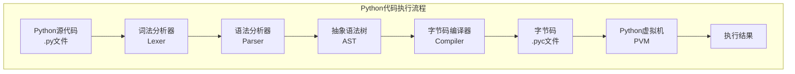
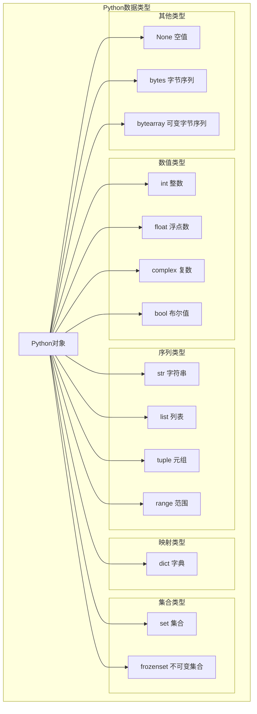
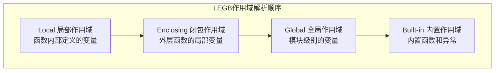

# Python 完整技术指南

## 目录
- [Python 完整技术指南](#python-完整技术指南)
  - [目录](#目录)
  - [1. Python 语言基础](#1-python-语言基础)
    - [1.1 Python 概述](#11-python-概述)
      - [1.1.1 Python 特点与优势](#111-python-特点与优势)
      - [1.1.2 Python 解释器架构](#112-python-解释器架构)
    - [1.2 数据类型深度解析](#12-数据类型深度解析)
      - [1.2.1 内置数据类型体系](#121-内置数据类型体系)
      - [1.2.2 数据类型详解与性能特性](#122-数据类型详解与性能特性)
    - [1.3 控制流与逻辑结构](#13-控制流与逻辑结构)
      - [1.3.1 条件控制的高级用法](#131-条件控制的高级用法)
      - [1.3.2 循环控制的高级技巧](#132-循环控制的高级技巧)
    - [1.4 函数与作用域](#14-函数与作用域)
      - [1.4.1 函数参数的高级特性](#141-函数参数的高级特性)
      - [1.4.2 作用域与LEGB规则](#142-作用域与legb规则)
    - [1.5 模块与包管理](#15-模块与包管理)
      - [1.5.1 模块导入机制深度解析](#151-模块导入机制深度解析)
      - [1.5.2 包管理最佳实践](#152-包管理最佳实践)
  - [2. 面向对象编程](#2-面向对象编程)
    - [2.1 类与对象](#21-类与对象)
      - [2.1.1 类的定义与实例化](#211-类的定义与实例化)
      - [2.1.2 属性访问控制](#212-属性访问控制)
    - [2.2 继承与多态](#22-继承与多态)
      - [2.2.1 单继承与方法重写](#221-单继承与方法重写)
      - [2.2.2 多重继承与MRO](#222-多重继承与mro)
    - [2.3 特殊方法与运算符重载](#23-特殊方法与运算符重载)
    - [2.4 属性与描述符](#24-属性与描述符)
      - [2.4.1 属性装饰器](#241-属性装饰器)
      - [2.4.2 描述符协议](#242-描述符协议)
  - [Python 高级特性](#python-高级特性)
    - [装饰器](#装饰器)
  - [4. 内存管理与性能优化](#4-内存管理与性能优化)
    - [4.1 Python 内存模型](#41-python-内存模型)
      - [4.1.1 对象内存结构](#411-对象内存结构)
    - [4.2 垃圾回收机制](#42-垃圾回收机制)
    - [4.3 性能分析与优化](#43-性能分析与优化)
  - [环境与工具](#环境与工具)
    - [搭建环境](#搭建环境)
    - [包管理工具](#包管理工具)
    - [虚拟环境](#虚拟环境)
    - [常用开发工具](#常用开发工具)
  - [数据处理与分析](#数据处理与分析)
    - [NumPy 基础](#numpy-基础)
    - [Pandas 基础](#pandas-基础)
  - [面试题精选](#面试题精选)
    - [Python基础面试题](#python基础面试题)
  - [10. Python 面试题详解](#10-python-面试题详解)
    - [10.1 基础语法类](#101-基础语法类)
      - [Q1: Python中的可变对象和不可变对象有哪些？](#q1-python中的可变对象和不可变对象有哪些)
      - [Q2: 深拷贝和浅拷贝的区别？](#q2-深拷贝和浅拷贝的区别)
      - [Q3: Python中的GIL是什么？](#q3-python中的gil是什么)
      - [Q4: 解释**args和**kwargs？](#q4-解释args和kwargs)
      - [Q5: Python的作用域规则(LEGB)？](#q5-python的作用域规则legb)
    - [10.2 面向对象类](#102-面向对象类)
      - [Q6: Python多重继承的MRO(方法解析顺序)？](#q6-python多重继承的mro方法解析顺序)
      - [Q7: 特殊方法(魔术方法)的作用？](#q7-特殊方法魔术方法的作用)
    - [10.3 高级特性类](#103-高级特性类)
      - [Q8: 装饰器的实现原理？](#q8-装饰器的实现原理)
      - [Q9: 生成器和迭代器的区别？](#q9-生成器和迭代器的区别)
      - [Q10: 上下文管理器的使用？](#q10-上下文管理器的使用)
    - [10.4 性能优化类](#104-性能优化类)
      - [Q11: Python性能优化技巧？](#q11-python性能优化技巧)
      - [Q12: Python并发编程方案？](#q12-python并发编程方案)
    - [10.5 框架应用类](#105-框架应用类)
      - [Q13: Flask vs Django选择？](#q13-flask-vs-django选择)
      - [Q14: 数据库ORM vs 原生SQL？](#q14-数据库orm-vs-原生sql)
      - [Q15: 如何设计RESTful API？](#q15-如何设计restful-api)

## 1. Python 语言基础

### 1.1 Python 概述

#### 1.1.1 Python 特点与优势

**Python核心特点**：
- **简洁优雅**：语法简单，代码可读性强
- **动态类型**：运行时确定变量类型
- **解释执行**：无需编译，开发效率高
- **丰富生态**：拥有庞大的第三方库生态
- **跨平台**：支持Windows、Linux、macOS

**Python应用领域**：

| 领域 | 主要框架/库 | 应用场景 |
|------|-------------|----------|
| **Web开发** | Django、Flask、FastAPI | 网站、API服务 |
| **数据科学** | NumPy、Pandas、Matplotlib | 数据分析、可视化 |
| **机器学习** | TensorFlow、PyTorch、Scikit-learn | AI模型开发 |
| **自动化** | Selenium、Beautiful Soup | 爬虫、自动化测试 |
| **DevOps** | Ansible、SaltStack | 运维自动化 |

#### 1.1.2 Python 解释器架构



**CPython执行原理**：
1. **词法分析**：将源代码分解为Token
2. **语法分析**：构建抽象语法树(AST)
3. **字节码编译**：AST编译为字节码
4. **虚拟机执行**：PVM解释执行字节码

### 1.2 数据类型深度解析

#### 1.2.1 内置数据类型体系



#### 1.2.2 数据类型详解与性能特性

**数值类型深度解析**：
```python
# 整数类型 - 无限精度
big_int = 2 ** 1000  # Python支持任意大整数
print(type(big_int))  # <class 'int'>

# 浮点数类型 - IEEE 754双精度
pi = 3.141592653589793
print(f"浮点数精度：{pi:.15f}")

# 复数类型
z = 3 + 4j
print(f"复数模长：{abs(z)}")  # 5.0

# 布尔值 - 整数子类
print(True + True)  # 2
print(isinstance(True, int))  # True
```

**字符串类型深度解析**：
```python
# 字符串不可变性验证
s1 = "hello"
s2 = s1
s1 += " world"
print(f"s1: {s1}, s2: {s2}")  # s1: hello world, s2: hello
print(f"id相同: {id(s1) == id(s2)}")  # False

# 字符串intern机制
a = "python"
b = "python"
print(f"字符串intern: {a is b}")  # True

# 字符串格式化性能对比
import timeit

# f-string (最快)
def f_string_format():
    name, age = "Alice", 25
    return f"Name: {name}, Age: {age}"

# str.format()
def str_format():
    name, age = "Alice", 25
    return "Name: {}, Age: {}".format(name, age)

# % 格式化
def percent_format():
    name, age = "Alice", 25
    return "Name: %s, Age: %d" % (name, age)

print("f-string 性能最优")
```

**容器类型性能分析**：

| 操作 | list | tuple | dict | set |
|------|------|-------|------|-----|
| **创建** | O(n) | O(n) | O(n) | O(n) |
| **访问** | O(1) | O(1) | O(1) | - |
| **查找** | O(n) | O(n) | O(1) | O(1) |
| **插入** | O(1)/O(n) | 不可变 | O(1) | O(1) |
| **删除** | O(n) | 不可变 | O(1) | O(1) |

```python
# 列表与元组性能对比
import sys

list_obj = [1, 2, 3, 4, 5]
tuple_obj = (1, 2, 3, 4, 5)

print(f"列表内存占用: {sys.getsizeof(list_obj)} bytes")
print(f"元组内存占用: {sys.getsizeof(tuple_obj)} bytes")

# 字典内部结构演示
class HashDict:
    """简化的字典实现，展示哈希表原理"""
    def __init__(self, size=8):
        self.size = size
        self.buckets = [[] for _ in range(size)]
    
    def _hash(self, key):
        return hash(key) % self.size
    
    def put(self, key, value):
        bucket = self.buckets[self._hash(key)]
        for i, (k, v) in enumerate(bucket):
            if k == key:
                bucket[i] = (key, value)
                return
        bucket.append((key, value))
    
    def get(self, key):
        bucket = self.buckets[self._hash(key)]
        for k, v in bucket:
            if k == key:
                return v
        raise KeyError(key)

# 演示哈希冲突
hash_dict = HashDict(4)
hash_dict.put("a", 1)
hash_dict.put("b", 2)
print(f"获取值: {hash_dict.get('a')}")
```

### 1.3 控制流与逻辑结构

#### 1.3.1 条件控制的高级用法

```python
# 三元运算符
result = "positive" if x > 0 else "non-positive"

# 链式比较
if 0 < x < 10:
    print("x在0到10之间")

# 短路求值
def expensive_function():
    print("执行昂贵操作")
    return True

# 只有当condition为False时才会执行expensive_function
condition = True
result = condition or expensive_function()

# match-case语句 (Python 3.10+)
def handle_data(data):
    match data:
        case int() if data > 0:
            return f"正整数: {data}"
        case int() if data < 0:
            return f"负整数: {data}"
        case 0:
            return "零"
        case str() if len(data) > 0:
            return f"非空字符串: {data}"
        case []:
            return "空列表"
        case [x] if isinstance(x, int):
            return f"单元素整数列表: {x}"
        case [x, y]:
            return f"双元素列表: {x}, {y}"
        case {"name": str(name), "age": int(age)}:
            return f"人员信息: {name}, {age}岁"
        case _:
            return "未知类型"

# 测试match-case
print(handle_data(42))  # 正整数: 42
print(handle_data([1, 2]))  # 双元素列表: 1, 2
print(handle_data({"name": "Alice", "age": 25}))  # 人员信息: Alice, 25岁
```

#### 1.3.2 循环控制的高级技巧

```python
# enumerate获取索引和值
fruits = ['apple', 'banana', 'cherry']
for index, fruit in enumerate(fruits, start=1):
    print(f"{index}. {fruit}")

# zip并行迭代
names = ['Alice', 'Bob', 'Charlie']
ages = [25, 30, 35]
cities = ['New York', 'London', 'Tokyo']

for name, age, city in zip(names, ages, cities):
    print(f"{name}, {age}岁, 住在{city}")

# zip_longest处理不等长序列
from itertools import zip_longest

list1 = [1, 2, 3]
list2 = ['a', 'b', 'c', 'd', 'e']

for num, letter in zip_longest(list1, list2, fillvalue=0):
    print(f"{num} - {letter}")

# 列表推导式的高级用法
# 带条件的列表推导式
squares = [x**2 for x in range(10) if x % 2 == 0]

# 嵌套列表推导式
matrix = [[i + j for j in range(3)] for i in range(3)]

# 字典推导式
word_lengths = {word: len(word) for word in ['python', 'java', 'go']}

# 集合推导式
unique_lengths = {len(word) for word in ['python', 'java', 'go', 'rust']}

# 生成器表达式（内存友好）
large_squares = (x**2 for x in range(1000000))
```

### 1.4 函数与作用域

#### 1.4.1 函数参数的高级特性

```python
# 参数类型完整示例
def complex_function(
    pos_only, /,                    # 仅位置参数
    pos_or_kw,                      # 位置或关键字参数
    *args,                          # 可变位置参数
    kw_only,                        # 仅关键字参数
    kw_with_default="default",      # 带默认值的关键字参数
    **kwargs                        # 可变关键字参数
):
    print(f"pos_only: {pos_only}")
    print(f"pos_or_kw: {pos_or_kw}")
    print(f"args: {args}")
    print(f"kw_only: {kw_only}")
    print(f"kw_with_default: {kw_with_default}")
    print(f"kwargs: {kwargs}")

# 调用示例
complex_function(
    1,                              # pos_only
    2,                              # pos_or_kw
    3, 4, 5,                        # args
    kw_only="required",             # kw_only
    extra1="value1",                # kwargs
    extra2="value2"                 # kwargs
)

# 函数注解与类型提示
from typing import List, Dict, Optional, Union, Callable

def process_data(
    data: List[int],
    multiplier: float = 1.0,
    formatter: Optional[Callable[[float], str]] = None
) -> Dict[str, Union[int, float, str]]:
    """
    处理数据并返回统计信息
    
    Args:
        data: 整数列表
        multiplier: 乘数因子
        formatter: 可选的格式化函数
    
    Returns:
        包含统计信息的字典
    """
    total = sum(data) * multiplier
    avg = total / len(data) if data else 0
    
    result = {
        "count": len(data),
        "total": total,
        "average": avg
    }
    
    if formatter:
        result["formatted_total"] = formatter(total)
    
    return result

# 使用示例
numbers = [1, 2, 3, 4, 5]
stats = process_data(numbers, 2.0, lambda x: f"${x:.2f}")
print(stats)
```

#### 1.4.2 作用域与LEGB规则



```python
# LEGB作用域演示
builtin_name = "内置"  # 这实际上会覆盖内置作用域

global_var = "全局变量"

def outer_function():
    enclosing_var = "闭包变量"
    
    def inner_function():
        local_var = "局部变量"
        
        # 演示作用域查找顺序
        print(f"局部: {local_var}")
        print(f"闭包: {enclosing_var}")
        print(f"全局: {global_var}")
        
        # 使用nonlocal修改闭包变量
        nonlocal enclosing_var
        enclosing_var = "修改后的闭包变量"
        
        # 使用global修改全局变量
        global global_var
        global_var = "修改后的全局变量"
    
    inner_function()
    print(f"外层函数中的闭包变量: {enclosing_var}")
    return inner_function

# 闭包示例
def create_multiplier(factor):
    """创建一个乘法器闭包"""
    def multiplier(x):
        return x * factor
    return multiplier

double = create_multiplier(2)
triple = create_multiplier(3)

print(f"double(5) = {double(5)}")  # 10
print(f"triple(5) = {triple(5)}")  # 15

# 查看闭包变量
print(f"double的闭包变量: {double.__closure__[0].cell_contents}")  # 2
```

### 1.5 模块与包管理

#### 1.5.1 模块导入机制深度解析

```python
# 模块搜索路径
import sys
print("Python模块搜索路径:")
for path in sys.path:
    print(f"  {path}")

# 动态导入模块
import importlib

def dynamic_import(module_name, function_name):
    """动态导入模块中的函数"""
    try:
        module = importlib.import_module(module_name)
        function = getattr(module, function_name)
        return function
    except (ImportError, AttributeError) as e:
        print(f"导入失败: {e}")
        return None

# 模块重新加载
def reload_module(module):
    """重新加载模块（开发时有用）"""
    return importlib.reload(module)

# 相对导入和绝对导入
# 包结构示例：
# myproject/
#   __init__.py
#   main.py
#   utils/
#     __init__.py
#     helpers.py
#     math_utils.py

# 在 myproject/main.py 中：
# 绝对导入
# from myproject.utils.helpers import some_function

# 相对导入
# from .utils.helpers import some_function
# from ..other_package import other_function
```

#### 1.5.2 包管理最佳实践

```python
# __init__.py 文件的高级用法
# mypackage/__init__.py

# 控制 from mypackage import * 的行为
__all__ = ['PublicClass', 'public_function']

# 包级别的初始化代码
print(f"正在初始化包: {__name__}")

# 延迟导入，避免循环依赖
def get_heavy_module():
    """延迟导入重型模块"""
    import heavy_module
    return heavy_module

# 版本信息
__version__ = "1.0.0"
__author__ = "Your Name"

# 子模块的便捷访问
from .submodule import important_function

class PublicClass:
    """包的公共类"""
    pass

def public_function():
    """包的公共函数"""
    pass

# 包的命名空间包（PEP 420）
# 不需要 __init__.py 文件，允许分布式包结构
```

**包结构最佳实践**：
```
myproject/
├── README.md
├── setup.py
├── requirements.txt
├── myproject/
│   ├── __init__.py
│   ├── main.py
│   ├── config.py
│   ├── core/
│   │   ├── __init__.py
│   │   ├── models.py
│   │   └── services.py
│   ├── utils/
│   │   ├── __init__.py
│   │   ├── helpers.py
│   │   └── validators.py
│   └── tests/
│       ├── __init__.py
│       ├── test_core.py
│       └── test_utils.py
└── docs/
    └── api.md
```

## 2. 面向对象编程

### 2.1 类与对象

#### 2.1.1 类的定义与实例化

```python
class Person:
    """人员类示例"""
    
    # 类变量
    species = "Homo sapiens"
    population = 0
    
    def __init__(self, name, age, email=None):
        """构造函数"""
        # 实例变量
        self.name = name
        self.age = age
        self.email = email
        
        # 更新类变量
        Person.population += 1
    
    def __str__(self):
        """字符串表示"""
        return f"Person(name='{self.name}', age={self.age})"
    
    def __repr__(self):
        """调试表示"""
        return f"Person('{self.name}', {self.age}, '{self.email}')"
    
    def greet(self):
        """实例方法"""
        return f"Hello, I'm {self.name}"
    
    @classmethod
    def get_population(cls):
        """类方法"""
        return cls.population
    
    @staticmethod
    def is_adult(age):
        """静态方法"""
        return age >= 18
    
    def __del__(self):
        """析构函数"""
        Person.population -= 1

# 使用示例
person1 = Person("Alice", 25, "alice@example.com")
person2 = Person("Bob", 17)

print(person1.greet())  # Hello, I'm Alice
print(Person.get_population())  # 2
print(Person.is_adult(person2.age))  # False
```

#### 2.1.2 属性访问控制

```python
class BankAccount:
    """银行账户类，演示访问控制"""
    
    def __init__(self, account_number, initial_balance=0):
        self.account_number = account_number  # 公开属性
        self._balance = initial_balance       # 受保护属性（约定）
        self.__pin = "1234"                  # 私有属性（名称修饰）
    
    @property
    def balance(self):
        """余额属性的getter"""
        return self._balance
    
    @balance.setter
    def balance(self, value):
        """余额属性的setter"""
        if value < 0:
            raise ValueError("余额不能为负数")
        self._balance = value
    
    def deposit(self, amount):
        """存款"""
        if amount > 0:
            self._balance += amount
            return True
        return False
    
    def withdraw(self, amount, pin):
        """取款"""
        if pin != self.__pin:
            raise ValueError("PIN码错误")
        if amount > self._balance:
            raise ValueError("余额不足")
        self._balance -= amount
        return True
    
    def _internal_audit(self):
        """受保护方法"""
        return f"账户 {self.account_number} 余额审计: {self._balance}"
    
    def __validate_transaction(self, amount):
        """私有方法"""
        return amount > 0 and amount <= self._balance

# 使用示例
account = BankAccount("123456789", 1000)
print(f"余额: {account.balance}")  # 1000

account.deposit(500)
print(f"存款后余额: {account.balance}")  # 1500

# 私有属性的名称修饰
print(f"私有属性实际名称: {account._BankAccount__pin}")  # 1234
```

### 2.2 继承与多态

#### 2.2.1 单继承与方法重写

```python
class Animal:
    """动物基类"""
    
    def __init__(self, name, species):
        self.name = name
        self.species = species
    
    def make_sound(self):
        """发出声音 - 抽象方法"""
        raise NotImplementedError("子类必须实现此方法")
    
    def info(self):
        """获取动物信息"""
        return f"{self.name} is a {self.species}"

class Dog(Animal):
    """狗类"""
    
    def __init__(self, name, breed):
        super().__init__(name, "Dog")  # 调用父类构造函数
        self.breed = breed
    
    def make_sound(self):
        """重写父类方法"""
        return f"{self.name} says Woof!"
    
    def fetch(self):
        """狗特有的方法"""
        return f"{self.name} is fetching the ball"

class Cat(Animal):
    """猫类"""
    
    def __init__(self, name, indoor=True):
        super().__init__(name, "Cat")
        self.indoor = indoor
    
    def make_sound(self):
        return f"{self.name} says Meow!"
    
    def climb(self):
        return f"{self.name} is climbing"

# 多态演示
def animal_concert(animals):
    """动物演唱会 - 多态的体现"""
    for animal in animals:
        print(animal.make_sound())

# 使用示例
dog = Dog("Buddy", "Golden Retriever")
cat = Cat("Whiskers", indoor=True)

animals = [dog, cat]
animal_concert(animals)
# Buddy says Woof!
# Whiskers says Meow!

# 检查继承关系
print(isinstance(dog, Animal))  # True
print(issubclass(Dog, Animal))  # True
```

#### 2.2.2 多重继承与MRO

```python
class A:
    def method(self):
        print("A.method")

class B(A):
    def method(self):
        print("B.method")
        super().method()

class C(A):
    def method(self):
        print("C.method")
        super().method()

class D(B, C):
    def method(self):
        print("D.method")
        super().method()

# 方法解析顺序（MRO）
print(D.mro())
# [<class '__main__.D'>, <class '__main__.B'>, <class '__main__.C'>, <class '__main__.A'>, <class 'object'>]

d = D()
d.method()
# D.method
# B.method
# C.method
# A.method

# Mixin模式示例
class TimestampMixin:
    """时间戳混入类"""
    def __init__(self, *args, **kwargs):
        super().__init__(*args, **kwargs)
        from datetime import datetime
        self.created_at = datetime.now()
        self.updated_at = datetime.now()
    
    def touch(self):
        """更新时间戳"""
        from datetime import datetime
        self.updated_at = datetime.now()

class LoggingMixin:
    """日志混入类"""
    def log(self, message):
        print(f"[{self.__class__.__name__}] {message}")

class User(TimestampMixin, LoggingMixin):
    """用户类，使用多个Mixin"""
    def __init__(self, username):
        super().__init__()
        self.username = username
        self.log(f"User {username} created")
    
    def update_profile(self):
        self.touch()
        self.log("Profile updated")

user = User("alice")
user.update_profile()
```

### 2.3 特殊方法与运算符重载

```python
class Vector:
    """二维向量类，演示运算符重载"""
    
    def __init__(self, x, y):
        self.x = x
        self.y = y
    
    def __str__(self):
        """字符串表示"""
        return f"Vector({self.x}, {self.y})"
    
    def __repr__(self):
        """调试表示"""
        return f"Vector({self.x!r}, {self.y!r})"
    
    def __add__(self, other):
        """向量加法"""
        if isinstance(other, Vector):
            return Vector(self.x + other.x, self.y + other.y)
        return NotImplemented
    
    def __sub__(self, other):
        """向量减法"""
        if isinstance(other, Vector):
            return Vector(self.x - other.x, self.y - other.y)
        return NotImplemented
    
    def __mul__(self, scalar):
        """标量乘法"""
        if isinstance(scalar, (int, float)):
            return Vector(self.x * scalar, self.y * scalar)
        return NotImplemented
    
    def __rmul__(self, scalar):
        """反向标量乘法"""
        return self.__mul__(scalar)
    
    def __eq__(self, other):
        """相等比较"""
        if isinstance(other, Vector):
            return self.x == other.x and self.y == other.y
        return False
    
    def __lt__(self, other):
        """小于比较（按长度）"""
        if isinstance(other, Vector):
            return self.magnitude() < other.magnitude()
        return NotImplemented
    
    def __len__(self):
        """长度（转换为整数）"""
        return int(self.magnitude())
    
    def __bool__(self):
        """布尔值转换"""
        return self.magnitude() != 0
    
    def __getitem__(self, key):
        """索引访问"""
        if key == 0:
            return self.x
        elif key == 1:
            return self.y
        else:
            raise IndexError("Vector只有两个分量")
    
    def __setitem__(self, key, value):
        """索引赋值"""
        if key == 0:
            self.x = value
        elif key == 1:
            self.y = value
        else:
            raise IndexError("Vector只有两个分量")
    
    def magnitude(self):
        """计算向量长度"""
        return (self.x ** 2 + self.y ** 2) ** 0.5
    
    def dot(self, other):
        """点积"""
        return self.x * other.x + self.y * other.y

# 使用示例
v1 = Vector(3, 4)
v2 = Vector(1, 2)

print(v1 + v2)  # Vector(4, 6)
print(v1 * 2)   # Vector(6, 8)
print(2 * v1)   # Vector(6, 8)
print(v1[0])    # 3
print(len(v1))  # 5
print(bool(v1)) # True
print(v1 == v2) # False
```

### 2.4 属性与描述符

#### 2.4.1 属性装饰器

```python
class Temperature:
    """温度类，演示属性装饰器"""
    
    def __init__(self, celsius=0):
        self._celsius = celsius
    
    @property
    def celsius(self):
        """摄氏度"""
        return self._celsius
    
    @celsius.setter
    def celsius(self, value):
        if value < -273.15:
            raise ValueError("温度不能低于绝对零度")
        self._celsius = value
    
    @property
    def fahrenheit(self):
        """华氏度"""
        return self._celsius * 9/5 + 32
    
    @fahrenheit.setter
    def fahrenheit(self, value):
        self.celsius = (value - 32) * 5/9
    
    @property
    def kelvin(self):
        """开尔文"""
        return self._celsius + 273.15
    
    @kelvin.setter
    def kelvin(self, value):
        self.celsius = value - 273.15

# 使用示例
temp = Temperature(25)
print(f"摄氏度: {temp.celsius}")    # 25
print(f"华氏度: {temp.fahrenheit}")  # 77.0
print(f"开尔文: {temp.kelvin}")     # 298.15

temp.fahrenheit = 100
print(f"摄氏度: {temp.celsius}")    # 37.77777777777778
```

#### 2.4.2 描述符协议

```python
class ValidatedAttribute:
    """验证描述符"""
    
    def __init__(self, validator=None, default=None):
        self.validator = validator
        self.default = default
        self.name = None
    
    def __set_name__(self, owner, name):
        """当描述符被赋值给类属性时调用"""
        self.name = name
        self.private_name = f'_{name}'
    
    def __get__(self, instance, owner):
        """获取属性值"""
        if instance is None:
            return self
        return getattr(instance, self.private_name, self.default)
    
    def __set__(self, instance, value):
        """设置属性值"""
        if self.validator:
            value = self.validator(value)
        setattr(instance, self.private_name, value)
    
    def __delete__(self, instance):
        """删除属性"""
        delattr(instance, self.private_name)

# 验证函数
def positive_number(value):
    """验证正数"""
    if not isinstance(value, (int, float)):
        raise TypeError("必须是数字")
    if value <= 0:
        raise ValueError("必须是正数")
    return value

def non_empty_string(value):
    """验证非空字符串"""
    if not isinstance(value, str):
        raise TypeError("必须是字符串")
    if not value.strip():
        raise ValueError("不能是空字符串")
    return value.strip()

class Product:
    """产品类，使用描述符进行验证"""
    
    name = ValidatedAttribute(non_empty_string)
    price = ValidatedAttribute(positive_number)
    quantity = ValidatedAttribute(positive_number, default=1)
    
    def __init__(self, name, price, quantity=1):
        self.name = name
        self.price = price
        self.quantity = quantity
    
    @property
    def total_value(self):
        return self.price * self.quantity

# 使用示例
product = Product("Laptop", 999.99, 2)
print(f"产品: {product.name}, 总价值: ${product.total_value}")

# 验证会自动触发
try:
    product.price = -100  # 将触发ValueError
except ValueError as e:
    print(f"验证错误: {e}")
```

## Python 高级特性

### 装饰器

## 4. 内存管理与性能优化

### 4.1 Python 内存模型

#### 4.1.1 对象内存结构

```python
import sys
import gc

# 检查对象内存占用
def check_memory_usage():
    """检查不同数据类型的内存占用"""
    objects = [
        42,                    # int
        3.14,                  # float
        "hello",               # str
        [1, 2, 3],            # list
        (1, 2, 3),            # tuple
        {"a": 1, "b": 2},     # dict
        {1, 2, 3}             # set
    ]
    
    for obj in objects:
        size = sys.getsizeof(obj)
        print(f"{type(obj).__name__}: {obj} -> {size} bytes")

check_memory_usage()

# Python对象引用计数
class RefCountDemo:
    def __init__(self, name):
        self.name = name
    
    def __del__(self):
        print(f"对象 {self.name} 被销毁")

def reference_counting_demo():
    """引用计数演示"""
    obj = RefCountDemo("test")
    print(f"引用计数: {sys.getrefcount(obj)}")  # 包括函数参数的引用
    
    ref1 = obj
    print(f"引用计数: {sys.getrefcount(obj)}")
    
    ref2 = obj
    print(f"引用计数: {sys.getrefcount(obj)}")
    
    del ref1
    print(f"引用计数: {sys.getrefcount(obj)}")
    
    del ref2
    print(f"引用计数: {sys.getrefcount(obj)}")

reference_counting_demo()
```

### 4.2 垃圾回收机制

```python
import gc
import weakref

# 循环引用问题
class Node:
    def __init__(self, value):
        self.value = value
        self.children = []
        self.parent = None
    
    def add_child(self, child):
        child.parent = self
        self.children.append(child)
    
    def __del__(self):
        print(f"节点 {self.value} 被销毁")

def circular_reference_demo():
    """循环引用演示"""
    print("创建循环引用...")
    root = Node("root")
    child = Node("child")
    root.add_child(child)
    
    # 创建循环引用
    child.children.append(root)
    
    print(f"垃圾回收前: {len(gc.get_objects())} 个对象")
    
    # 删除引用
    del root
    del child
    
    print("手动触发垃圾回收...")
    collected = gc.collect()
    print(f"回收了 {collected} 个对象")

# 弱引用解决循环引用
class WeakNode:
    def __init__(self, value):
        self.value = value
        self.children = []
        self._parent = None
    
    @property
    def parent(self):
        return self._parent() if self._parent else None
    
    @parent.setter
    def parent(self, value):
        self._parent = weakref.ref(value) if value else None
    
    def add_child(self, child):
        child.parent = self
        self.children.append(child)

circular_reference_demo()
```

### 4.3 性能分析与优化

```python
import cProfile
import timeit
from functools import lru_cache
import numpy as np

# 性能分析装饰器
def profile_performance(func):
    """性能分析装饰器"""
    def wrapper(*args, **kwargs):
        profiler = cProfile.Profile()
        profiler.enable()
        
        result = func(*args, **kwargs)
        
        profiler.disable()
        profiler.print_stats(sort='cumulative')
        
        return result
    return wrapper

# 缓存优化
@lru_cache(maxsize=128)
def fibonacci_cached(n):
    """带缓存的斐波那契函数"""
    if n <= 1:
        return n
    return fibonacci_cached(n-1) + fibonacci_cached(n-2)

def fibonacci_naive(n):
    """朴素的斐波那契函数"""
    if n <= 1:
        return n
    return fibonacci_naive(n-1) + fibonacci_naive(n-2)

# 性能对比
def performance_comparison():
    """性能对比测试"""
    n = 30
    
    # 测试朴素版本
    naive_time = timeit.timeit(
        lambda: fibonacci_naive(n), 
        number=1
    )
    
    # 测试缓存版本
    cached_time = timeit.timeit(
        lambda: fibonacci_cached(n), 
        number=100
    ) / 100
    
    print(f"朴素版本 (n={n}): {naive_time:.6f}秒")
    print(f"缓存版本 (n={n}): {cached_time:.6f}秒")
    print(f"性能提升: {naive_time / cached_time:.2f}倍")

performance_comparison()

# 列表推导式 vs 循环性能
def list_comprehension_vs_loop():
    """列表推导式与循环性能对比"""
    size = 100000
    
    # 列表推导式
    def list_comp():
        return [x**2 for x in range(size) if x % 2 == 0]
    
    # 传统循环
    def traditional_loop():
        result = []
        for x in range(size):
            if x % 2 == 0:
                result.append(x**2)
        return result
    
    # 性能测试
    comp_time = timeit.timeit(list_comp, number=10) / 10
    loop_time = timeit.timeit(traditional_loop, number=10) / 10
    
    print(f"列表推导式: {comp_time:.6f}秒")
    print(f"传统循环: {loop_time:.6f}秒")
    print(f"推导式更快: {loop_time / comp_time:.2f}倍")

list_comprehension_vs_loop()
```

## 环境与工具

### 搭建环境

**创建venv虚拟环境**
```bash
python3 -m venv venv && source venv/bin/activate && pip install -r requirements.txt
```

**查看pip位置**
```bash
conda run which pip   
```

**终端配置代理**
```bash
# 设置代理
export http_proxy=http://127.0.0.1:10809  
export https_proxy=http://127.0.0.1:10809 
export ALL_PROXY=socks5://127.0.0.1:10808

# 或者
export http_proxy="http://127.0.0.1:7890"
export https_proxy="http://127.0.0.1:7890"

# 取消代理
unset http_proxy
unset https_proxy
unset all_proxy
```

### 包管理工具

**pip 使用**
```bash
# 安装包
pip install package_name

# 指定镜像源安装
pip install flask -i https://pypi.tuna.tsinghua.edu.cn/simple

# 安装特定版本
pip install package_name==1.0.0

# 从requirements.txt安装
pip install -r requirements.txt

# 升级包
pip install --upgrade package_name

# 卸载包
pip uninstall package_name
```

**conda 使用**
```bash
# 添加频道
conda config --add channels conda-forge
conda config --set channel_priority strict

# 安装包
conda install osmium

# 创建环境
conda create -n osm-env python=3.10

# 激活环境
conda activate osm-env

# 安装多个包
conda install -c conda-forge pyosmium pandas
```

### 虚拟环境

**venv**
```bash
# 创建虚拟环境
python -m venv myenv

# 激活虚拟环境(Windows)
myenv\Scripts\activate

# 激活虚拟环境(Linux/Mac)
source myenv/bin/activate

# 退出虚拟环境
deactivate
```

**conda环境**
```bash
# 创建环境
conda create -n myenv python=3.9

# 激活环境
conda activate myenv

# 退出环境
conda deactivate

# 列出所有环境
conda env list
```

### 常用开发工具

**检测当前可用字体**
```python
import matplotlib.font_manager as fm
for font in fm.findSystemFonts(fontpaths=None, fontext='ttf'):
    print(fm.FontProperties(fname=font).get_name())
```

**IDE与编辑器**
- PyCharm: 功能全面的Python IDE
- VS Code: 轻量级编辑器，配合Python扩展使用
- Jupyter Notebook: 交互式开发环境，适合数据分析
- Spyder: 科学计算导向的IDE

## 数据处理与分析

### NumPy 基础

**创建数组**
```python
import numpy as np

# 从列表创建
arr1 = np.array([1, 2, 3, 4, 5])

# 创建特殊数组
zeros = np.zeros((3, 3))  # 全0数组
ones = np.ones((2, 4))    # 全1数组
rand = np.random.random((2, 2))  # 随机数组
arange = np.arange(10)    # 0到9的数组
linspace = np.linspace(0, 1, 5)  # 均匀分布的5个点
```

**数组操作**
```python
# 重塑数组
arr = np.arange(12)
arr_reshaped = arr.reshape(3, 4)

# 数组切片
slice1 = arr_reshaped[0:2, 1:3]

# 数组运算
arr1 = np.array([1, 2, 3])
arr2 = np.array([4, 5, 6])
sum_arr = arr1 + arr2
product = arr1 * arr2
dot_product = np.dot(arr1, arr2)
```

### Pandas 基础

**创建数据结构**
```python
import pandas as pd

# 创建Series
s = pd.Series([1, 3, 5, np.nan, 6, 8])

# 创建DataFrame
df = pd.DataFrame({
    'A': [1, 2, 3, 4],
    'B': pd.date_range('20230101', periods=4),
    'C': pd.Series(1, index=list(range(4))),
    'D': np.random.randn(4)
})
```

**数据操作**
```python
# 查看数据
print(df.head())
print(df.describe())

# 选择数据
print(df['A'])  # 选择列
print(df.loc[0])  # 通过标签选择行
print(df.iloc[1:3, 0:2])  # 通过位置选择

# 过滤数据
filtered = df[df.A > 2]

# 分组操作
grouped = df.groupby('A').sum()
```

## 面试题精选

### Python基础面试题

1. **Python中的可变对象和不可变对象有哪些？**
   - 可变对象：列表(list)、字典(dict)、集合(set)
   - 不可变对象：整数(int)、浮点数(float)、字符串(str)、元组(tuple)、frozenset

2. **Python中的深拷贝和浅拷贝的区别？**
   ```python
   import copy
   
   # 浅拷贝
   list1 = [1, [2, 3]]
   list2 = copy.copy(list1)
   
   # 深拷贝
   list3 = copy.deepcopy(list1)
   
   # 修改嵌套列表
   list1[1][0] = 'X'
   print(list2)  # [1, ['X', 3]] - 浅拷贝受影响
   print(list3)  # [1, [2, 3]] - 深拷贝不受影响
   ```

3. **GIL是什么？它对Python多线程有什么影响？**
   
   GIL(Global Interpreter Lock)是Python解释器中的全局解释器锁。它确保同一时刻只有一个线程在执行Python字节码，这意味着Python多线程在CPU密集型任务上并不能真正实现并行执行，只有在I/O密集型任务上才能获得性能提升。

4. **Python中的装饰器是什么？如何创建一个装饰器？**
   
   装饰器是一个函数，它接受另一个函数作为参数，并返回一个新的函数，通常用于在不修改原函数代码的情况下增加额外功能。
   
   ```python
   def my_decorator(func):
       def wrapper(*args, **kwargs):
           print("函数执行前")
           result = func(*args, **kwargs)
           print("函数执行后")
           return result
       return wrapper
   
   @my_decorator
   def say_hello():
       print("Hello!")
   
   say_hello()
   ```

## 10. Python 面试题详解

### 10.1 基础语法类

#### Q1: Python中的可变对象和不可变对象有哪些？

**答案**：
- **不可变对象**：int、float、str、tuple、frozenset
- **可变对象**：list、dict、set、bytearray

**关键区别演示**：
```python
# 不可变对象
s1 = "hello"
s2 = s1
s1 += " world"
print(f"s1: {s1}, s2: {s2}")  # s1: hello world, s2: hello
print(f"id不同: {id(s1) != id(s2)}")  # True

# 可变对象
list1 = [1, 2, 3]
list2 = list1
list1.append(4)
print(f"list1: {list1}, list2: {list2}")  # 都变成[1, 2, 3, 4]
print(f"id相同: {id(list1) == id(list2)}")  # True
```

#### Q2: 深拷贝和浅拷贝的区别？

**答案**：
```python
import copy

original = {'scores': [90, 85], 'name': 'Alice'}

# 浅拷贝
shallow = copy.copy(original)
# 深拷贝  
deep = copy.deepcopy(original)

# 修改嵌套对象
original['scores'].append(95)

print("原始:", original)     # {'scores': [90, 85, 95], 'name': 'Alice'}
print("浅拷贝:", shallow)    # {'scores': [90, 85, 95], 'name': 'Alice'} - 受影响
print("深拷贝:", deep)       # {'scores': [90, 85], 'name': 'Alice'} - 不受影响
```

#### Q3: Python中的GIL是什么？

**答案**：
**GIL(Global Interpreter Lock)**是CPython的全局解释器锁，确保同一时刻只有一个线程执行Python字节码。

**影响**：
- **CPU密集型任务**：多线程无效，需要多进程
- **I/O密集型任务**：多线程有效，GIL在I/O等待时释放

```python
import threading
import time

def cpu_task():
    # CPU密集型：多线程无效果
    total = sum(i**2 for i in range(100000))
    return total

def io_task():
    # I/O密集型：多线程有效果
    time.sleep(0.1)
    return "完成"

# I/O任务用多线程可以提速，CPU任务用多进程
```

#### Q4: 解释**args和**kwargs？

**答案**：
```python
def demo_function(required, default="default", *args, keyword_only, **kwargs):
    print(f"必需参数: {required}")
    print(f"默认参数: {default}")
    print(f"*args: {args}")
    print(f"仅关键字: {keyword_only}")
    print(f"**kwargs: {kwargs}")

demo_function("值1", "值2", "extra1", "extra2", 
              keyword_only="必须", key1="val1", key2="val2")
```

#### Q5: Python的作用域规则(LEGB)？

**答案**：
**LEGB顺序**：Local → Enclosing → Global → Built-in

```python
global_var = "全局"

def outer():
    enclosing_var = "闭包"
    
    def inner():
        local_var = "局部"
        print(f"查找顺序: {local_var} -> {enclosing_var} -> {global_var}")
        
        # 修改不同作用域
        nonlocal enclosing_var  # 修改闭包变量
        global global_var       # 修改全局变量
        
    return inner
```

### 10.2 面向对象类

#### Q6: Python多重继承的MRO(方法解析顺序)？

**答案**：
```python
class A: pass
class B(A): pass  
class C(A): pass
class D(B, C): pass

print(D.mro())  # [D, B, C, A, object]
# 使用C3线性化算法，保证一致性
```

#### Q7: 特殊方法(魔术方法)的作用？

**答案**：
```python
class Vector:
    def __init__(self, x, y):
        self.x, self.y = x, y
    
    def __add__(self, other):
        return Vector(self.x + other.x, self.y + other.y)
    
    def __str__(self):
        return f"Vector({self.x}, {self.y})"
    
    def __len__(self):
        return int((self.x**2 + self.y**2)**0.5)

v1 = Vector(3, 4)
v2 = Vector(1, 2)
print(v1 + v2)  # Vector(4, 6)
print(len(v1))  # 5
```

### 10.3 高级特性类

#### Q8: 装饰器的实现原理？

**答案**：
```python
import functools

def timer(func):
    @functools.wraps(func)
    def wrapper(*args, **kwargs):
        import time
        start = time.time()
        result = func(*args, **kwargs)
        print(f"{func.__name__} 耗时: {time.time() - start:.4f}秒")
        return result
    return wrapper

# 带参数的装饰器
def retry(times=3):
    def decorator(func):
        @functools.wraps(func)
        def wrapper(*args, **kwargs):
            for i in range(times):
                try:
                    return func(*args, **kwargs)
                except Exception as e:
                    if i == times - 1:
                        raise
                    print(f"第{i+1}次失败: {e}")
        return wrapper
    return decorator

@retry(times=3)
@timer
def unreliable_function():
    import random
    if random.random() < 0.7:
        raise ValueError("随机失败")
    return "成功"
```

#### Q9: 生成器和迭代器的区别？

**答案**：
```python
# 迭代器：实现__iter__和__next__
class CountIterator:
    def __init__(self, max_count):
        self.max_count = max_count
        self.count = 0
    
    def __iter__(self):
        return self
    
    def __next__(self):
        if self.count >= self.max_count:
            raise StopIteration
        self.count += 1
        return self.count

# 生成器：使用yield
def count_generator(max_count):
    count = 0
    while count < max_count:
        count += 1
        yield count

# 生成器更简洁，自动实现迭代器协议
for i in count_generator(5):
    print(i)
```

#### Q10: 上下文管理器的使用？

**答案**：
```python
# 实现上下文管理器
class DatabaseConnection:
    def __enter__(self):
        print("连接数据库")
        return self
    
    def __exit__(self, exc_type, exc_val, exc_tb):
        print("关闭数据库连接")
        return False  # 不抑制异常

# 使用contextlib
from contextlib import contextmanager

@contextmanager
def file_manager(filename, mode):
    print(f"打开文件 {filename}")
    file = open(filename, mode)
    try:
        yield file
    finally:
        print(f"关闭文件 {filename}")
        file.close()

# 使用
with file_manager("test.txt", "w") as f:
    f.write("Hello World")
```

### 10.4 性能优化类

#### Q11: Python性能优化技巧？

**答案**：

**算法优化**：
```python
from functools import lru_cache

# 使用缓存
@lru_cache(maxsize=128)
def fibonacci(n):
    if n <= 1:
        return n
    return fibonacci(n-1) + fibonacci(n-2)
```

**数据结构选择**：
```python
# 查找：set > list
data_list = list(range(10000))
data_set = set(data_list)

# set查找O(1)，list查找O(n)
target = 9999
result = target in data_set  # 快
result = target in data_list  # 慢
```

**字符串拼接**：
```python
# 低效
result = ""
for word in words:
    result += word

# 高效
result = "".join(words)
```

**内存优化__slots__**：
```python
class OptimizedClass:
    __slots__ = ['x', 'y', 'z']  # 减少内存占用
    
    def __init__(self, x, y, z):
        self.x = x
        self.y = y  
        self.z = z
```

#### Q12: Python并发编程方案？

**答案**：

| 任务类型 | 推荐方案 | 原因 |
|----------|----------|------|
| **I/O密集型** | 多线程/AsyncIO | GIL在I/O时释放 |
| **CPU密集型** | 多进程 | 绕过GIL限制 |
| **网络服务** | AsyncIO | 高并发连接 |

```python
import asyncio
import threading
import multiprocessing
from concurrent.futures import ThreadPoolExecutor, ProcessPoolExecutor

# 异步I/O
async def async_io_task():
    await asyncio.sleep(1)
    return "异步完成"

# 多进程CPU任务
def cpu_task(n):
    return sum(i**2 for i in range(n))

# 使用示例
async def main():
    # 并发异步任务
    tasks = [async_io_task() for _ in range(3)]
    results = await asyncio.gather(*tasks)
    
    # 多进程CPU任务
    with ProcessPoolExecutor() as executor:
        futures = [executor.submit(cpu_task, 100000) for _ in range(2)]
        results = [f.result() for f in futures]

asyncio.run(main())
```

### 10.5 框架应用类

#### Q13: Flask vs Django选择？

**答案**：

| 特性 | Flask | Django |
|------|-------|--------|
| **设计理念** | 微框架，灵活 | 全栈框架，完整 |
| **学习曲线** | 平缓 | 陡峭 |
| **适用项目** | 小中型、API | 大型、复杂业务 |
| **开发速度** | 需要选择组件 | 开箱即用 |

```python
# Flask示例
from flask import Flask, jsonify

app = Flask(__name__)

@app.route('/api/users')
def get_users():
    return jsonify([{'id': 1, 'name': 'Alice'}])

if __name__ == '__main__':
    app.run(debug=True)

# Django需要更多配置，但功能更完整
```

#### Q14: 数据库ORM vs 原生SQL？

**答案**：

| 方面 | ORM | 原生SQL |
|------|-----|---------|
| **开发效率** | 高 | 低 |
| **性能** | 中等 | 高 |
| **复杂查询** | 困难 | 容易 |
| **可维护性** | 高 | 中等 |

```python
# SQLAlchemy ORM
from sqlalchemy.orm import sessionmaker

class User(Base):
    __tablename__ = 'users'
    id = Column(Integer, primary_key=True)
    name = Column(String(50))

# ORM查询
users = session.query(User).filter(User.name.like('%Alice%')).all()

# 原生SQL
cursor.execute("SELECT * FROM users WHERE name LIKE %s", ('%Alice%',))
users = cursor.fetchall()
```

#### Q15: 如何设计RESTful API？

**答案**：
```python
from flask import Flask, request, jsonify

app = Flask(__name__)

# RESTful API设计原则
@app.route('/api/users', methods=['GET'])
def get_users():
    # GET /api/users - 获取用户列表
    return jsonify([])

@app.route('/api/users', methods=['POST']) 
def create_user():
    # POST /api/users - 创建用户
    data = request.get_json()
    return jsonify(data), 201

@app.route('/api/users/<int:user_id>', methods=['GET'])
def get_user(user_id):
    # GET /api/users/1 - 获取特定用户
    return jsonify({'id': user_id})

@app.route('/api/users/<int:user_id>', methods=['PUT'])
def update_user(user_id):
    # PUT /api/users/1 - 更新用户
    data = request.get_json()
    return jsonify(data)

@app.route('/api/users/<int:user_id>', methods=['DELETE'])
def delete_user(user_id):
    # DELETE /api/users/1 - 删除用户
    return '', 204
```

**HTTP状态码使用**：
- **200**: 成功
- **201**: 创建成功
- **400**: 请求错误
- **401**: 未授权
- **404**: 资源不存在
- **500**: 服务器错误